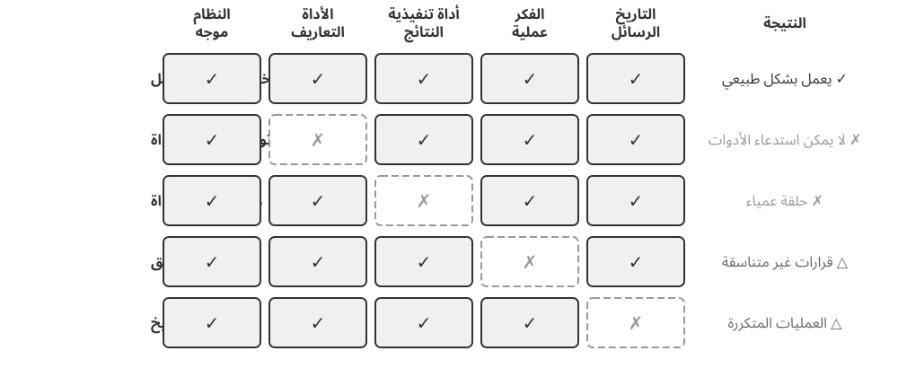
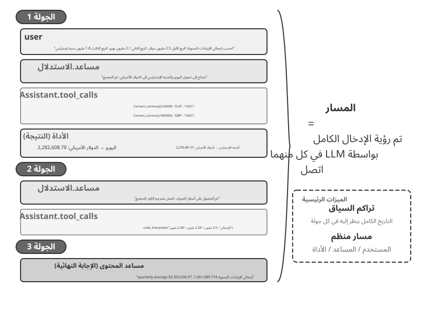
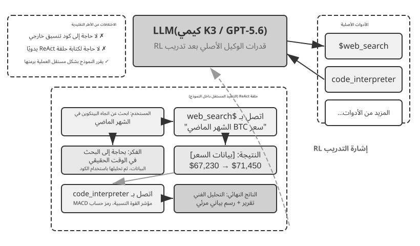
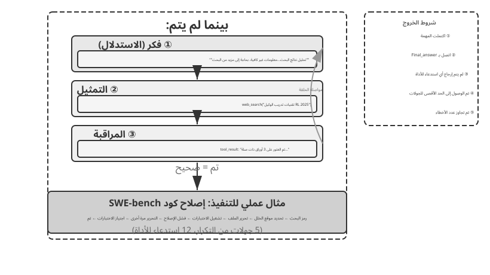
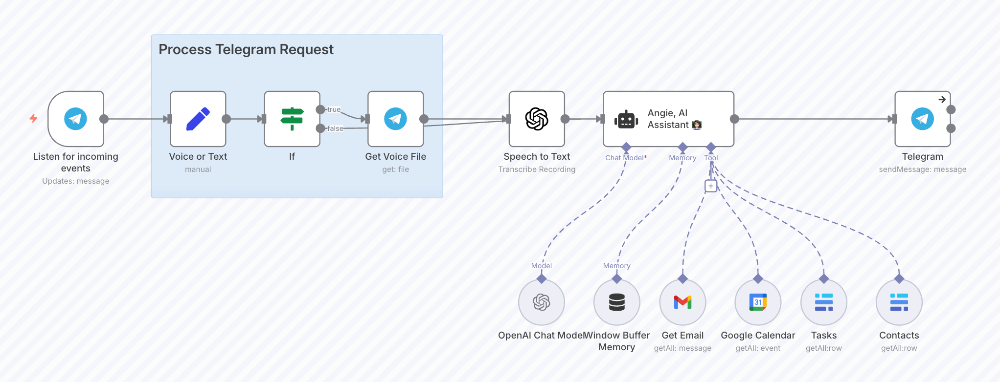

# البدء مع وكلاء الذكاء الاصطناعي

إذا كنت قد استخدمت المؤشر لكتابة التعليمات البرمجية وشاهدته وهو يبحث في قاعدة التعليمات البرمجية الخاصة بك، ويحرر ملفات متعددة، ويعيد تشغيل الاختبارات حتى تنجح، فقد استخدمت بالفعل وكيل AI. وينطبق الشيء نفسه إذا استخدمت البحث العميق للتحقيق في موضوع ما من خلال البحث والقراءة المتكررين، أو جعلت Manus يتحكم في المتصفح لإنهاء المهام عبر الإنترنت، أو طلبت من مساعد الهاتف Doubao حجز التذاكر أو إرسال رسائل، أو أرسلت Pine AI للتفاوض على فاتورة اتصالات أقل.

تتخذ هذه المنتجات أشكالًا عديدة، لكنها تشترك في سمة مشتركة: فهي لم تعد مجرد محادثات سلبية "اسأل، فهو يجيب". إنهم يخططون لخطوات التنفيذ الخاصة بهم، ويستعينون بالأدوات التي تتطلبها كل مهمة، ويضبطون استراتيجيتهم مع ظهور النتائج. لقد أصبح وكلاء الذكاء الاصطناعي وسيلة جديدة للتفاعل مع أجهزة الكمبيوتر.

يبدأ هذا الفصل بأمثلة عملية ويعود إلى المكونات الأساسية لوكيل الذكاء الاصطناعي: سيختبر القراء بشكل مباشر ما يمكن أن يفعله الوكلاء المعاصرون، ويفهمون البنية التي تقف وراءهم، ويتعلمون أنماط التصميم وأفضل الممارسات لبناء أنظمة الوكلاء.

> **نصيحة للقراءة**: هذا الفصل عبارة عن خريطة مفاهيمية للكتاب بأكمله: جولة موجزة حول الصيغة الأساسية وحلقة التشغيل والإطار الهندسي وأنماط تصميم الوكيل. فهو يحدد المفردات المشتركة والنقاط المرجعية المستخدمة في الفصول اللاحقة. لا تحاول حفظ كل مفهوم في قراءتك الأولى؛ تهدف إلى الصورة الكبيرة. يتوسع كل فصل لاحق في جانب واحد تم تقديمه هنا، ويمكنك العودة إلى هذا الفصل عندما تحتاج إلى إعادة التوجيه.

## الوكيل الحديث = LLM + السياق + الأدوات

يتلاءم جوهر نظام الوكيل الحديث مع صيغة واحدة موجزة: **Agent = LLM (نموذج لغة كبير) + سياق + أدوات**. الصيغة بسيطة وعملية، بشرط قراءة كل مصطلح على نطاق واسع:

- **LLM هو المحرك المنطقي للوكيل**: إنه أكثر من مجرد مجموعة من معلمات النموذج؛ إنه جوهر اتخاذ القرار لدى الوكيل، وهو المسؤول عن فهم النية والتفكير والتخطيط والحكم. تأتي قدرات LLM من المعرفة العالمية والقدرة اللغوية المكتسبة خلال **التدريب المسبق**، بالإضافة إلى استراتيجيات اتخاذ القرار المشفرة من خلال **التدريب اللاحق** (تقنيات مثل الضبط الدقيق تحت الإشراف والتعلم المعزز يتم تغطيتها في الفصل 7).
- **السياق هو مجموعة معلومات عمل الوكيل**: ليس فقط النص الذي يتم إدخاله في النموذج، ولكن مجموعة معلومات العمل المتاحة للوكيل في كل نقطة قرار - البيئة، وذاكرة المستخدم، ومعرفة المجال، وحالتها الخاصة، وتقدم المهمة. مثلما يحتاج الشخص الذي يتخذ قرارًا إلى تقييم الموقف، وتذكر الخبرة ذات الصلة، والرجوع إلى المراجع، فإن نافذة السياق الخاصة بالوكيل تحتوي على المعلومات التي يمكنه استخدامها في تلك اللحظة.
- **الأدوات هي واجهات عمل الوكيل**: ليست مجموعة من وظائف API القابلة للاستدعاء، ولكنها مجموعة كاملة من الطرق التي يمكن للوكيل التصرف بها — بدءًا من استدعاءات الأدوات المحددة مسبقًا إلى المهارات المحملة عند الطلب، ومن إنشاء التعليمات البرمجية لإنشاء إمكانات جديدة بسرعة إلى تفويض العمل إلى الوكلاء الفرعيين، ومن الوصول إلى المستخدم إلى الاستجابة للأحداث الخارجية.

بعبارة أكثر بديهية: **الوكيل = محرك الاستدلال + سياق العمل + واجهات الإجراء**. فالنموذج يبرر ويقرر، ويوفر السياق مجموعة عمل من المعلومات التي تعتمد عليها تلك القرارات، وتوفر الأدوات الواجهات التي تؤثر من خلالها القرارات على العالم الخارجي.

تتوافق هذه المكونات الثلاثة تمامًا مع ثلاثة مفاهيم أساسية في RL (انظر الفصل 7). الجدول التالي **قراءة اختيارية** — إذا لم يكن لديك خلفية RL، فلا تتردد في تخطيه؛ لا شيء يعتمد عليه لاحقًا. إنه موجود فقط لمساعدة القراء الذين يعرفون RL على ربط تلك المعرفة بمصطلحات هذا الكتاب:

| الحدس | مكون الوكيل | مفهوم RL (اختياري) | الدور |
|---------------|----------------|------------------|---------------------------------------------|
| **محرك التفكير** | LLM | **السياسة** | منطق اتخاذ القرار الذي يحدد "ما يجب فعله بعد ذلك" - في ضوء المعلومات الحالية، اختر الإجراء الأكثر ملاءمة من جميع الخيارات المتاحة |
| **سياق العمل** | السياق | **مساحة المراقبة** | جميع المعلومات المتاحة للوكيل - ما يمكنه ملاحظته وقراءته وتذكره والأنظمة التي يمكنه الوصول إليها |
| **واجهات العمل** | أدوات | **مساحة العمل** | المجموعة الكاملة من الأشياء التي يمكن للوكيل القيام بها - ما هي "الوسائل" المتاحة، بدءًا من إرسال الرسائل وحتى تنفيذ التعليمات البرمجية وحتى التحكم في الواجهات |

إن فهم ما يفعله كل مكون، وكيفية توافقه معًا، هو الأساس لبناء أنظمة وكيل فعالة. سنبدأ بالأدوات الثلاثة الأكثر واقعية - واجهات الإجراء - ونعمل على LLM والسياق. أولاً، إليك كيفية مقارنة أنواع الوكلاء المختلفة عبر هذه الأبعاد الثلاثة:

| منتج الوكيل | سياق العمل | واجهات العمل | استراتيجية |
|-----------------|------------------------|--------------------------|-----------------------------|
| **وكلاء الترميز (مثل المؤشر)** | وثائق المتطلبات وقاعدة التعليمات البرمجية والبيئة الطرفية | مفتوح (الاستدلال الداخلي، البحث عن التعليمات البرمجية، قراءة/كتابة الملفات، تنفيذ الأوامر، وما إلى ذلك) | التطوير المتزايد: فهم المتطلبات ← البحث عن التعليمات البرمجية ذات الصلة ← تحرير التعليمات البرمجية ← الاختبار والتحقق ← التصحيح والإصلاح |
| **وكلاء البحث (مثل البحث العميق)** | موارد الويب، وقواعد البيانات الأكاديمية، والملفات المحلية | مفتوح (الاستدلال الداخلي، استعلامات البحث، قراءة الويب، إنشاء الملخص) | التعميق التكراري: ضبط اتجاه البحث بناءً على المعلومات الموجودة، وتجميع تقرير كامل تدريجيًا |
| **وكلاء التحكم بالكمبيوتر (على سبيل المثال، Manus)** | شاشة الكمبيوتر، صفحات المتصفح، نظام الملفات | مفتوحة (الاستدلال الداخلي، النقر، الكتابة، التمرير، لقطات الشاشة، تنفيذ التعليمات البرمجية، وما إلى ذلك) | الإدراك البصري + التشغيل: شاشة المراقبة ← تحديد العناصر المستهدفة ← تنفيذ الإجراءات ← التحقق من النتائج |
| **وكلاء مساعد الهاتف (على سبيل المثال، Doubao)** | شاشة الهاتف، التطبيقات المثبتة | مفتوح (الاستدلال الداخلي، النقر، التمرير، الكتابة، فتح التطبيقات، وما إلى ذلك) | فهم النية + التحكم في التطبيق: فهم احتياجات المستخدم ← تحديد موقع التطبيق المستهدف ← تنفيذ الإجراءات ← تأكيد الاكتمال |
| **وكلاء المهام الشخصية (على سبيل المثال، Pine AI)** | معلومات حساب المستخدم، والفواتير التاريخية، وقاعدة معارف مزود الخدمة | مفتوح (الاستدلال الداخلي، إجراء المكالمات، إرسال رسائل البريد الإلكتروني، ملء النماذج، التأكيد مع المستخدم) | تنفيذ المهام متعددة الخطوات: جمع المعلومات ← صياغة استراتيجية التفاوض ← الاتصال بمزود الخدمة ← التفاوض ← تقرير النتائج |

تشترك هذه الأنظمة في ثلاث ميزات: **مساحة عمل مفتوحة** — لا يتم الاختيار من بين مجموعة ثابتة من الأزرار، بل تولد لغة ورموزًا طبيعية عشوائية؛ **الاستدلال الداخلي** — التخطيط قبل التصرف؛ و**التفاعل المستمر** — تعديل الإستراتيجية بناءً على التعليقات البيئية. تأتي هذه الإمكانات على وجه التحديد من التفاعل بين محرك الاستدلال وسياق العمل وواجهات الإجراء، أي LLM والسياق والأدوات.

### الأدوات: واجهات عمل الوكيل

الأدوات هي جسر الوكيل إلى العالم الخارجي. إنهم يحولون الوكيل من مراقب سلبي إلى نظام نشط يمكنه البحث أو كتابة الملفات أو تشغيل التعليمات البرمجية أو الاتصال بواجهات برمجة التطبيقات أو إرسال الرسائل أو تشغيل الواجهات. بدون أدوات، يقتصر عمل الوكيل على إنشاء النص؛ معهم، فإنه يمكن أن تعمل على الأنظمة الخارجية.

لمناقشة الأدوات بشكل منهجي، يمكننا تصنيفها إلى خمسة أنواع حسب اتجاه تفاعل الوكيل مع العالم. في هذه المرحلة، تكفي نظرة عامة موجزة عن السيناريوهات التمثيلية لكل نوع لتكوين الصورة العامة؛ الفصول اللاحقة تعالج كل منها بعمق.

**أدوات الإدراك** تسمح للوكيل بالوصول إلى المعلومات: توفر محركات البحث بيانات الويب في الوقت الفعلي، وتقرأ أنظمة الملفات المستندات المحلية، وتتصل واجهات برمجة التطبيقات وقواعد البيانات بالخدمات الخارجية والبيانات الأساسية للمؤسسة.

**أدوات التنفيذ** تسمح للوكيل بالعمل على الأنظمة الخارجية: تنفيذ التعليمات البرمجية وعمليات الملفات وأوامر النظام واستدعاءات API الخارجية لتحويل القرارات إلى إجراءات ملموسة.

**أدوات التعاون** تسمح للوكيل بتقسيم العمل مع الوكلاء الآخرين: تفويض المهام المتخصصة إلى الوكلاء الفرعيين، أو طلب تأكيد بشري في نقاط القرار الرئيسية، أو تنسيق الإجراءات في أنظمة متعددة الوكلاء.

**يتم استدعاء أدوات تشغيل الأحداث** بطريقة مختلفة تمامًا عن الفئات الثلاث الأولى: لا يستدعيها الوكيل؛ فهي تصل كمدخلات خارجية تدفع الوكيل لبدء العمل. تصل رسالة بريد إلكتروني جديدة، أو يصل وقت محدد، أو يطلق نظام آخر رد اتصال عبر Webhook؛ الحدث ينشط الوكيل ويبدأ التفكير والعمل. لا يطلق العميل على هذه العناصر اسم نفسه مطلقًا، ومع ذلك فهي تظل قناة يتفاعل من خلالها مع العالم الخارجي، لذلك نحسبها في نظام الأدوات الواسع.

**أدوات اتصال المستخدم** هي القنوات التي يتواصل الوكيل من خلالها مع المستخدم. عندما تغير أدوات التنفيذ العالم الخارجي، فإن أدوات الاتصال تحمل معلومات - حيث تقدم تقدم الوكيل، أو تسجيل وصول استباقي، عن طريق الرسائل النصية، والمكالمة الصوتية، والبريد الإلكتروني، وما إلى ذلك.

يغطي الفصل الرابع التصنيف الكامل ومبادئ التصميم لهذه الأنواع الخمسة. تحدد جودة تصميم الأداة بشكل مباشر ما يمكن للوكيل إنجازه بشكل موثوق: تحديد الواجهات بشكل غامض وسيسيء النموذج استخدامها؛ التعامل مع الأخطاء بشكل سيء ويمكن لأداة فاشلة واحدة أن تترك العميل عالقًا؛ أذونات النطاق واسعة جدًا ويمكن أن يصبح خطأ الوكيل واحدًا لا رجعة فيه. مع انتشار معيار MCP (بروتوكول سياق النموذج)، أصبح دمج الأداة سهلاً مثل تثبيت مكون إضافي - يتوسع النظام البيئي بسرعة، لكن مبادئ التصميم لن تصبح قديمة.

**استدعاء الأدوات** (المعروف أيضًا باسم استدعاء الوظائف) هو القدرة الأساسية لوكلاء LLM الحديثين: فهو يتيح للنموذج استدعاء أدوات خارجية بطريقة منظمة، مما يحول LLM من مولد نص خالص إلى نظام ذكي يمكنه العمل من خلال واجهات خارجية. يستخدم هذا الكتاب مصطلح "استدعاء الأداة" طوال الوقت.

يتم تنفيذ استدعاء الأداة في أربع خطوات: أولاً، يخبر السياق النموذج بالأدوات المتاحة (الأسماء، الأغراض، المعلمات)؛ ثم يقرر النموذج من تلقاء نفسه ما إذا كان سيتم استدعاء أداة، وأي أداة سيتم استدعاؤها، وبأي وسيطات؛ وبعد ذلك، بمجرد تشغيل الأداة، يتم إلحاق نتيجتها بالسياق؛ وأخيرًا، يقرر النموذج خطوته التالية بناءً على تلك النتيجة. هذه الحلقة هي أساس ReAct، والتي سيتم تقديمها لاحقًا في هذا الفصل.

بالنسبة للاستعلام عن الطقس، يكون التمثيل المبسط للعملية المكونة من أربع خطوات على مستوى API كما يلي:

```
Step 1: Declare tools                  Step 2: Model decides to call
tools: [{                             assistant: {
  name: "get_weather",                  tool_calls: [{
  parameters: {                           function: "get_weather",
    city: "string"                        arguments: {city: "Beijing"}
  }                                      }]
}]                                    }

Step 3: Result appended to context    Step 4: Model responds based on result
tool: {                               assistant: {
  tool_call_id: "call_1",               content: "Today in Beijing: 28°C, sunny."
  content: '{"temp":28,"sky":"clear"}' }
}                                     }
```

يقوم المطور فقط بتعريف الأدوات وتنفيذ الاستدعاءات؛ يقرر النموذج نفسه ما إذا كان سيتم الاتصال به، وأي أداة سيتم الاتصال بها، وما هي الوسائط التي سيتم تمريرها. يتناول الفصل الثاني بنية API بالتفصيل.

عند تصميم أدوات لأحد العملاء، احتفظ بها للأغراض العامة وامنح LLM المرونة. بدلاً من أداة حاسبة مخصصة، قم بتوفير مترجم الكود Python وصندوق حماية آمن لتشغيلها. بدلاً من أداة خاصة لتسجيل ملاحظات العمل، قم بتوفير أدوات قراءة/كتابة الملفات ونظام ملفات افتراضي. تتيح الأدوات ذات الأغراض العامة للوكيل الجمع بين القدرات الأساسية لحل المشكلات بطريقة إبداعية.

### LLM: محرك الاستدلال الخاص بالوكيل

يعد نموذج اللغة الكبير (LLM) هو جوهر عملية اتخاذ القرار لدى الوكيل. بالنظر إلى طلب المستخدم، يجب عليه أولاً استنتاج النية الحقيقية (ما يقوله المستخدمون غالبًا ليس ما يريدونه بالفعل)، ثم تقسيم المهمة الغامضة أو المعقدة إلى خطوات قابلة للتنفيذ. أثناء التنفيذ، يستمر في اتخاذ القرارات: ما يجب فعله بعد ذلك، وما إذا كان سيتم استدعاء أداة، وأي أداة، وبأي وسيطات. تأتي القدرة على الفهم والتخطيط والتنفيذ من المعرفة المتراكمة أثناء التدريب المسبق، وهي الأساس الذي يعتمد عليه سير العمل والوكلاء المستقلون على حدٍ سواء.

تتمثل القدرة المميزة لوكلاء LLM في **الاستدلال الداخلي** — قبل التصرف، يستطيع الوكيل التخطيط والتفكير خلال المهمة. وهذا لا يغير البيئة الخارجية، ولكنه يحسن الإجراءات التي تتبعها بشكل ملحوظ. تأتي هذه القدرة من التدريب المسبق (التدريب الأولي على كميات هائلة من النصوص على الإنترنت، والتي من خلالها يتعلم النموذج أنماط اللغة والمعرفة العالمية): يعتمد النموذج على أنماط التفكير المشفرة في المعرفة الإنسانية، بما في ذلك القوانين الرياضية، والعلاقات السببية، واستراتيجيات تحليل المشاكل. وبالتالي فإن تفكير الوكيل ليس تجربة وخطأ أعمى؛ فهو يبني على مجموعة منظمة من المعرفة.

يتيح هذا المنطق المنظم لعامل LLM التعامل مع مهام جديدة تمامًا بدون أمثلة سابقة — يوضح مفهومان، اللقطة الصفرية واللقطة القليلة، هذه النقطة. المظهر المباشر هو **التعميم الصفري**: حيث يواجه العميل مهمة لم يسبق له رؤيتها من قبل، ويتعامل معها من خلال إعادة تجميع ما يعرفه بالفعل، دون الحاجة إلى أمثلة. ربما لم يتم تعليم النموذج بشكل صريح كتابة قصيدة عن فيزياء الكم، ومع ذلك يمكنه إنتاج قصيدة معقولة من معرفته الحالية باللغة والفيزياء.

من خلال بعض الأمثلة، يمكن لعامل LLM أيضًا تنفيذ **تعديل اللقطات القليلة**: يكفي عرضان أو ثلاثة عروض توضيحية في الموجه لتعلم نمط مهمة جديد. إذا تم عرض بعض الأمثلة على "تعليق المستخدم -> تسمية المشاعر"، فيمكن تصنيف المشاعر الخاصة بالتعليقات الجديدة. باختصار: الحل الصفري يعني حل مهمة بدون أمثلة؛ طلقة قليلة تعني تعلم النمط من عدد صغير من الأمثلة.

#### النموذج كوكيل: عندما يصبح النموذج نفسه هو المنتج

يعد نموذج "النموذج كوكيل" هو أحدث اتجاه في تطوير وكيل الذكاء الاصطناعي. تستوعب النماذج المتقدمة استدعاء الأداة كقدرة أصلية من خلال التدريب اللاحق (خاصة التعلم المعزز): متى يتم استدعاء أداة، وأي منها، وبأي وسائط - يقرر النموذج كل ذلك، دون الحاجة إلى تنسيق يدوي. هذا لا يجعل طبقة الإطار أقل أهمية. على العكس من ذلك: كلما كان النموذج أقوى، زادت أهمية الحزام المحيط به. في سياق الوكيل، يعتبر Harness بمثابة البنية التحتية الهندسية التي توجه قدرة النموذج إلى تنفيذ المهام بشكل موثوق. وهي تشمل إدارة السياق، وواجهات الأدوات، وقيود السلامة، وآليات التحقق والتصحيح (انظر القسم الأخير من هذا الفصل).

كلما زادت سلطة اتخاذ القرار في النموذج، زاد تأثير القرار الخاطئ - الأمر الذي يستدعي قيودًا أكثر دقة، والتحقق، والتصحيح للحفاظ على موثوقيته. الميزة الحقيقية لموفري النماذج ليست "جعل إطار العمل أرق" ولكن القدرة على تحسين النموذج والأدوات المحيطة به، والتكرار بشكل مستمر.

ولكن ينشأ سؤال أعمق: إذا استمرت النماذج في اكتساب المزيد من القوة، فهل سيتم استيعاب أحزمة اليوم في النموذج في نهاية المطاف؟ في "الدرس المرير"، نظر ريتش ساتون إلى نمط تكرر طوال سبعين عامًا من أبحاث الذكاء الاصطناعي[^ch1-1]: قام الباحثون مرارًا وتكرارًا بتشفير فهمهم للمجال في النظام، مما حقق مكاسب قصيرة المدى ولكنهم خسروا في النهاية أمام الأساليب العامة - البحث والتعلم - التي تتوسع مع الحوسبة والبيانات. من خلال هذه العدسة، ما مقدار القيود والتحقق والتصحيح في الحزام الذي يعتبر "سابقًا للإنسان" والذي من المقرر أن يستوعبه النموذج؟ يمكن تلخيص موقف هذا الكتاب في ثمانية أحرف صينية: **أيّد الاتجاه، وكن واقعيًا بشأن الوتيرة**. من الناحية الاتجاهية، لا نشك في أن النماذج ستستمر في استيعاب أجزاء من الحزام، حيث كان استدعاء الأدوات والتخطيط طويل المدى يعتمد في السابق على التنسيق الخارجي، ولكنه أصبح الآن قدرات نموذجية أصلية. ولكن من الناحية العملية، فإن هذا الاستيعاب أبطأ بكثير مما يوحي به الحدس: حيث يستمر التدريب على نطاق زمني يمتد لعدة أشهر، ولا يستطيع أي نموذج أن يستوعب كل القيود والتفضيلات التي تفرضها الشركات الحقيقية في مسار واحد. حدود القدرة الحالية للنموذج هي على وجه التحديد حيث يخلق الحزام القيمة. وبالتالي فإن هندسة الحزام لا تمثل مقاومة للدرس المرير، بل هي ممارسة على نطاق زمني هندسي: مهما كان النموذج الذي لا يستطيع القيام به بشكل موثوق، فإن الحزام يغطيه أولاً؛ عندما يستوعب النموذج طبقة أخرى، يتخلص الحزام من تلك الطبقة ويتحرك لدعم حدود القدرة التالية. يمتد هذا الموضوع في جميع أنحاء الكتاب - يقدم الفصل الثاني إجابة عملية من منظور هندسة السياق، ويناقش الفصل الثامن كذلك كيفية اختيار الوكيل والتحقق من تحديث النظام التالي من خلال الخبرة التشغيلية، وتعود الكلمة الختامية إلى الإجابة الكاملة حول ما إذا كانت النماذج ستستوعب الحزام أم لا.

[^ch1-1]: ساتون، ريتش. "الدرس المرير"، 2019. http://www.incompleteideas.net/IncIdeas/BitterLesson.html

#### آليات التعلم الوكيل: من التكيف السياقي إلى التحديثات المستمرة

أظهرت المناقشة السابقة كيف يمكن للتعلم المعزز أن يستوعب سياسات استخدام الأدوات كقدرات نموذجية أصلية. لكن التغييرات في سلوك العميل لا تحدث أثناء التدريب فقط. استنادًا إلى مكان حدوث التحديث ومدة استمراره، يمكن فهم هذه التغييرات على أنها ثلاثة مسارات تكميلية (الشكل 1-1): التكيف السياقي داخل المهمة، والتحديثات عبر المهام للعناصر الخارجية، وتحديثات المعلمات أثناء دورات التدريب.


**يحدث التكيف السياقي** ضمن المهمة الحالية. بمجرد دخول الأمثلة والحالة ونتائج الاسترجاع إلى السياق، يمكن للنموذج تعديل سلوكه على الفور، ولكن هذا لا يغير الحالة المستمرة للجلسة التالية. مميزاتها هي السرعة والتكلفة المنخفضة. تنشأ حدودها من نافذة السياق وطريقة تنظيم المعلومات. ويشرح الفصل الثاني بالتفصيل كيفية عمل هذا النوع من التكيف.

لكي تستمر التغييرات عبر المهام، يمكن للنظام تحديث **العناصر الخارجية**: يمكن تنظيم الحقائق والخبرة في وثائق المعرفة، ويمكن كتابة الاستراتيجيات المعبر عنها باللغة في موجه أو مهارة، ويمكن ترميز الإجراءات والقيود الحتمية في البرامج والأدوات. هذه العناصر قابلة للتدقيق والمراجعة، ولكن لا يزال يتعين على الوكيل الوصول إليها في وقت التنفيذ من خلال السياق أو واجهات الأداة. تحدد الفصول من الثالث إلى الخامس أسس المعرفة والبرامج، بينما يناقش الفصل الثامن كيف يمكن إنشاء هذه التحديثات من المسارات التشغيلية التي تم تقييمها.

عندما يكون الهدف عبارة عن قدرة عالية الأبعاد - مثل فهم الصورة الطبية، أو أسلوب اللغة الطبيعية، أو سياسة اتخاذ القرار الضمنية - والتي لا يمكن للقواعد الخارجية التعبير عنها بشكل كامل، يجب تحديث **معلمات النموذج** من خلال ما بعد التدريب. تحمل تحديثات المعلمات تكاليف نشر أعلى ولكنها يمكن أن تؤدي إلى تعميم طبيعي وواسع النطاق؛ ويعرض الفصل السابع أساليبهم بشكل منهجي. وبالتالي فإن المسارات الثلاثة ليست فئات حصرية ولكنها آليات منسقة تعمل على فترات زمنية مختلفة: يدعم السياق التكيف الفوري، وتدعم المصنوعات الخارجية التراكم المتحكم فيه، وتستوعب المعلمات القدرات التي يصعب التعبير عنها بشكل صريح.

### السياق: مجموعة عمل الوكيل

السياق هو مجموعة العمل من المعلومات المتاحة للوكيل في كل نقطة قرار. مثلما يحتاج الشخص الذي يتخذ قرارًا إلى المواد الصحيحة الموجودة على الطاولة - تعليمات المهمة، والأدلة المرجعية، والمراسلات السابقة، وأحدث البيانات - فإن نافذة السياق الخاصة بالوكيل هي المعلومات التي يمكنه استخدامها. من منظور API (المفصل في الفصل 2)، يتكون سياق كل استدعاء LLM من خمسة أجزاء:

- **مطالبة النظام**: على عكس المطالبات التي يُدخلها المستخدمون أثناء المحادثة، تتم كتابة مطالبة النظام بواسطة المطور وتظل ثابتة طوال المحادثة بأكملها. إنه "الوصف الوظيفي" للوكيل، والذي يحدد هويته وأذوناته وقواعد سلوكه. الهندسة السريعة الدقيقة لموجه النظام هي الطريقة التي نشكل بها السلوك التشغيلي للوكيل. يحمل موجه النظام أيضًا **ذاكرة المستخدم** التي تستمر عبر الجلسات (معلومات شخصية مثل التفضيلات والسلوك السابق وإعدادات الخلفية؛ راجع الفصل 3)، بالإضافة إلى الحالة البيئية المحقونة ديناميكيًا.
- **تعريفات الأداة**: تعلن الأسماء والأوصاف الوظيفية وتنسيقات المعلمات للأدوات المتاحة للوكيل. بدون تعريفات الأدوات، لا يستطيع العامل التعرف على أي أدوات أو استدعائها - ستتحقق دراسة الاستئصال (التجربة 1-1) من ذلك. تشكل تعريفات الأداة، جنبًا إلى جنب مع موجه النظام، **البادئة الثابتة** التي تظل دون تغيير طوال المحادثة. (هذا هو النمط الأساسي؛ منذ عام 2026، يمكن لأطر الإنتاج أيضًا تحميل مخططات الأداة الكاملة عند الطلب في نهاية السياق دون كسر البادئة - راجع قسم تعريفات الأداة في الفصل 2 والفصل 4.)
- **رسائل المستخدم**: مدخلات من المستخدم. قد تحتوي رسائل المستخدم أيضًا على **المعرفة الخارجية** التي تم استرجاعها ديناميكيًا عبر RAG (إنشاء الاسترجاع المعزز، راجع الفصل 3 للحصول على التفاصيل) - والتي تغطي معلومات تتجاوز قطع بيانات التدريب أو معرفة المجال الخاص.
- **رسائل المساعد**: الاستجابات التي تم إنشاؤها مسبقًا بواسطة النموذج، والتي يمكن أن تحتوي على ما يصل إلى ثلاثة أجزاء — `reasoning` (سلسلة الأفكار الداخلية، والحفاظ على التماسك وإمكانية تفسير القرار)، و`content` (الاستجابة للمستخدم)، و`tool_calls` (الطريقة التي يتخذ بها الوكيل الإجراء). في استجابة محددة، قد لا تظهر هذه الأجزاء الثلاثة جميعها في وقت واحد: على سبيل المثال، عندما يقرر الوكيل استدعاء أداة، عادةً ما تحتوي فقط على `reasoning` + `tool_calls`؛ عند إعطاء إجابة نهائية، عادةً ما تحتوي فقط على `reasoning` + `content`.
- **نتائج الأداة**: الإخراج الذي يتم إرجاعه بعد تنفيذ إطار عمل الوكيل للأداة. هذه النتائج هي الأساس المباشر لخطوة التفكير التالية التي يتخذها العميل، وما الذي يتيح له التعلم من النتائج بدلاً من تكرار أخطائه.

يشكل العنصران الأولان (موجه النظام + تعريفات الأداة) البادئة الثابتة؛ تشكل الرسائل الثلاثة الأخيرة (رسائل المستخدم + رسائل المساعد + نتائج الأداة) سجل الرسائل الديناميكي الذي ينمو مع كل تفاعل. تشكل هذه الأجزاء الخمسة معًا سياق كل استنتاج LLM.

هل كل مكون لا غنى عنه حقًا؟ الطريقة الأكثر مباشرة لمعرفة ذلك هي **دراسة الاستئصال** — وهي الطريقة التشخيصية لاستبعاد الأسباب واحدًا تلو الآخر: إزالة المكون أ ومعرفة ما إذا كان النظام لا يزال يعمل، ثم المكون ب، وهكذا، حتى تتضح مساهمة كل مكون. تطبق التجربة 1-1 هذه الطريقة تمامًا على المكونات الخمسة المذكورة أعلاه. النتائج مباشرة: بدون تعريفات الأداة، يكون الوكيل غير قادر تمامًا على التصرف؛ بدون نتائج الأداة، لا تتلقى تعليقات من الخطوة السابقة، لذلك تستدعي نفس الأداة بشكل متكرر، وتصبح عالقة في حلقة لا نهائية؛ وبدون التعليل في الرسائل المساعدة، تبدأ القرارات المتتالية في التناقض مع بعضها البعض؛ بدون سجل الرسائل، يفقد الوكيل استمرارية المهمة ويعيد تشغيل المهمة بأكملها من البداية، مع تكرار الخطوات التي تم تنفيذها بالفعل. ويعتمد دور كل مكون على الأدلة التجريبية، وليس فقط على الاستدلال النظري.

### التجربة 1-1 ★★: الدور الحاسم للسياق

لقد بحثنا في كيفية قيام كل مكون من مكونات السياق بتشكيل سلوك الوكيل من خلال **دراسة استئصال** منهجية. من بين المكونات الخمسة المذكورة أعلاه، تم اختبار أربعة - تم استثناء موجه النظام، باعتباره تعريف الهوية الأساسي للوكيل: بدونه لن يكون لدى الوكيل أي وعي بالدور على الإطلاق، وسيكون الاختبار بلا معنى. كما يوضح الشكل 1-2، أجريت التجربة على خمس مجموعات خاضعة للرقابة: خط أساسي كامل يحتفظ بكل مكون، بالإضافة إلى أربع مجموعات تفتقد كل منها واحدة، لمراقبة تأثير كل مكون على أداء الوكيل.



كشفت النتائج التجريبية عن الدور الذي لا يمكن الاستغناء عنه لكل مكون من مكونات السياق. **تعريفات الأداة** (جزء من البادئة الثابتة) هي أساس قدرة الوكيل على التصرف؛ وبدونها، لا يستطيع الوكيل التعرف على أي أدوات أو الاتصال بها. **نتائج الأداة** هي المفتاح للتحكم في الحلقة المغلقة؛ يؤدي غيابهم إلى حرمان الوكيل من ردود فعل التنفيذ ويؤدي إلى وقوعه في حلقة لا نهائية. تحافظ **عملية الاستدلال** (جزء الاستدلال في الرسائل المساعدة) على أسباب قرارات الوكيل السابقة، مما يجعل الاستدلال العام أكثر تماسكًا ويمنع القرارات المتعارضة. **سجل الرسائل** (رسائل المستخدم، ورسائل المساعد، ونتائج الأداة من الجولات السابقة) يمنع العمليات المتكررة، ويحافظ على تماسك تنفيذ المهام، ويتجنب تكرار نفس الأخطاء.

الرؤية الأساسية للتجربة: **يحدد السياق المعلومات التي يمتلكها الوكيل في وقت اتخاذ القرار، ولا يستطيع الوكيل اتخاذ القرار إلا بناءً على تلك المعلومات**. تمامًا كما لا يستطيع الشخص الذي يفتقد المستندات المهمة إصدار أحكام سليمة، فإن الوكيل الذي يفتقد أي مكون من مكونات السياق يعاني من خسارة فادحة في القدرة على اتخاذ القرار - بدون تعريفات الأدوات، لا يعرف ما هي الأدوات الموجودة؛ وبدون نتائج التنفيذ السابقة، لا يعرف ما تم إنجازه بالفعل.

### حلقة رد الفعل

ومع توفر المكونات الثلاثة، ينشأ سؤال طبيعي: كيف تعمل هذه العناصر معًا؟ حلقة ReAct هي الآلية الأساسية التي تربط LLM والسياق والأدوات في نظام واحد. يمكننا فحصها خطوة بخطوة.

يُطلق على النمط الأساسي الذي يقوم الوكيل من خلاله بتنفيذ المهمة اسم **ReAct** (الاستدلال + التصرف). يذكر الاسم التفكير والتصرف فقط، ولكن الحلقة الفعلية لها ثلاث مراحل: النموذج أولاً **الأسباب** حول ما يجب فعله بعد ذلك، ثم يستدعي الأداة **للتصرف**، ثم **ملاحظة** نتيجة الأداة والأسباب المتعلقة بالخطوة اللاحقة. تتكرر حلقة "السبب ← الفعل ← الملاحظة ← السبب ← الفعل ← الملاحظة" حتى تنتهي المهمة.

فكر في مثال ملموس - تجميع الإيرادات عبر عملات متعددة - لفهم **مسار** الوكيل: سجل الرسائل الذي يتراكم أثناء عمل الوكيل، والذي يشمل رسائل المستخدم، والرسائل المساعدة (مع أسبابها واستدعاءات الأدوات)، ونتائج الأداة. في كل استدعاء LLM، يكون السياق الكامل الذي يتلقاه النموذج هو **البادئة الثابتة** (موجه النظام + تعريفات الأداة) بالإضافة إلى **المسار** (سجل الرسائل الديناميكي) (الشكل 1-3). يوضح هذا حقيقة أساسية: **سياق الوكيل = بادئة ثابتة + مسار**. بشكل ملموس، البادئة الثابتة هي أول مكونين من المكونات الخمسة المذكورة أعلاه (موجه النظام + تعريفات الأداة)؛ المسار هو الثلاثة الأخيرة (رسائل المستخدم + رسائل المساعد + نتائج الأداة، والتي تنمو مع كل تفاعل). من هذا السياق الكامل، يقوم LLM بإنشاء استجابته التالية، والتي يتم بعد ذلك إلحاقها بمسار المكالمة اللاحقة.



هنا هو هيكل المسار، في الكود الكاذب:

```
trajectory = [
  {role: "user", content: "Based on the company's quarterly revenue: Q1 2.5M USD, Q2 2.1M EUR, Q3 1.8M GBP, Q4 380M JPY, calculate the company's total annual revenue and average quarterly revenue"},

  # First iteration - LLM receives the above trajectory and generates a response
  {role: "assistant",
   reasoning: "Need to convert all currencies to USD...",
   content: "",  # No direct reply to the user
   tool_calls: [
     {name: "convert_currency", args: {amount: 2100000, from: "EUR", to: "USD"}},
     {name: "convert_currency", args: {amount: 1800000, from: "GBP", to: "USD"}},
     {name: "convert_currency", args: {amount: 380000000, from: "JPY", to: "USD"}}
   ]},

  # Agent framework executes tools, adds results to trajectory
  {role: "tool", content: "EUR->USD: 2282608.7"},
  {role: "tool", content: "GBP->USD: 2278481.01"},
  {role: "tool", content: "JPY->USD: 2541806.02"},

  # Second iteration - LLM receives the complete trajectory, including tool results
  {role: "assistant",
   reasoning: "Conversion results obtained, now need to aggregate and calculate...",
   content: "",
   tool_calls: [
     {name: "code_interpreter", args: {code: "total = 2500000 + 2282608.7 + ..."}}
   ]},

  {role: "tool", content: "Total: $9,602,895.73, Average: $2,400,723.93..."},

  # Third iteration - LLM receives the complete trajectory and generates the final answer
  {role: "assistant",
   reasoning: "All calculations complete, summarizing results...",
   content: "FINAL ANSWER: Total revenue $9,602,895.73..."}
]
```

لاحظ أن موجه النظام وتعريفات الأداة لا تظهر في المسار - فهي بمثابة بادئة ثابتة ويتم إضافتها تلقائيًا إلى المسار قبل كل استدعاء LLM.

في تجربتنا، كانت هذه الحلقة مرئية بوضوح. في الجولة الأولى، قام الوكيل بتحليل المهمة واستدعاء ثلاث أدوات لتحويل العملات بالتوازي؛ وفي الحالة الثانية، تم تغذية نتائج التحويل إلى مترجم التعليمات البرمجية لإجراء عمليات حسابية أكثر كثافة؛ وفي السؤال الثالث، بعد التأكد من اكتمال جميع الحسابات، قدم الإجابة النهائية. تم إكمال مهمة معقدة متعددة الخطوات في 3 تكرارات و4 استدعاءات للأدوات.

تكمن أناقة هذا التصميم في **الطبيعة التراكمية للسياق**. يتلقى كل استدعاء LLM المسار الكامل، بحيث يعرف النموذج مرحلة المهمة التي يمر بها، وما تمت تجربته من قبل، وما هي النتيجة. مثلما يستمر الأشخاص في المراجعة والتلخيص أثناء حل المشكلة، يحتفظ الوكيل برؤية عالمية للمهمة من خلال مسارها. ولأن المسار منظم - رسائل المستخدم، والرسائل المساعدة (الاستدلال + استدعاءات الأداة)، ونتائج الأداة، كلها منفصلة بشكل واضح - فإن النظام قابل للتفسير وتصحيح الأخطاء بدرجة كبيرة.

المسار هو أكثر من مجرد سجل تنفيذ؛ فهو دليل على قدرة الوكيل. ويكشف تحليل المسارات على نطاق واسع عن أنماط سلوكية، ومسارات أفضل لاتخاذ القرار، وتصميمات أفضل للأدوات. ويمكن أيضًا استخلاص بيانات المسار في قاعدة معرفية، أو استخدامها لتدريب نماذج عملاء أقوى من خلال التعلم المعزز، مما يؤدي إلى إغلاق حلقة التعلم من التجربة.

الآن وبعد أن فهمنا حلقة تشغيل العميل، فإننا نفحص تجربتين لنرى كيف تقودها النماذج المختلفة.

#### التجربة 1-2 ★: قدرة العميل الأصلي Kimi K3

توضح هذه التجربة قدرة العميل الأصلية لـ **Kimi K3**، وهو مثال لنموذج "النموذج كوكيل". تم إصدار Kimi K3 بواسطة Moonshot AI في عام 2026، وهو عبارة عن نموذج مزيج من الخبراء (MoE) مع ما يقرب من 2.8 تريليون معلمة. يمكن النظر إلى وزارة التربية والتعليم على أنها فريق من الخبراء: بالنسبة لكل نوع من المشاكل، يقوم النظام بتنشيط عدد قليل من الخبراء الأكثر ملاءمة له بدلاً من النموذج بأكمله، مما يحافظ على القدرة دون دفع تكلفة الكفاءة الكاملة. يمتلك Kimi K3 نافذة سياقية تحتوي على مليون رمز مميز، وفهمًا بصريًا أصليًا، و"وضع تفكير" يعمل دائمًا. من خلال التعلم المعزز، استوعبت **سياسة اتخاذ القرار** استدعاء الأداة كقدرة أصلية: متى يتم استدعاء الأداة، وأي أداة يجب الاتصال بها، وما هي الحجج التي سيتم تمريرها، كلها أمور يقررها النموذج، مما يسمح له بتنفيذ مهام مثل عمليات البحث على الويب بشكل مستقل. على وجه الدقة، ما يتم استيعابه هو قرار *متى وكيف يتم الاتصال*؛ لا تزال الأدوات نفسها، مثل `web_search` و`code_runner`، تنفذ من جانب الخادم كأدوات مدمجة على مستوى API. يقوم Kimi بتشغيل هذه الأدوات الرسمية من خلال محرك نصي من جانب الخادم يسمى Formula.

ثلاث ملاحظات مهمة هنا. أولاً، يتيح تدريب RL للنموذج التعرف على متى وكيفية استخدام الأدوات، لذلك لم يعد العميل مضطرًا إلى كتابة منطق التنسيق يدويًا لاستدعاءات الأداة. ثانيًا، يقرر النموذج متى يتم البحث وما الذي يجب البحث عنه، مما يُظهر استقلالية حقيقية. ثالثًا، يقوم بتعديل الإستراتيجية مع وصول نتائج البحث ويحكم على ما إذا كانت تحتوي على معلومات كافية. هناك مفهوم خاطئ شائع يستحق التوضيح: **التعلم المعزز يمنح النموذج سياسة القرار**، وليس الأدوات نفسها. إنه يعلمك متى يتم استدعاء أداة، والأداة التي يجب اختيارها، وما هي الحجج التي يجب تمريرها، وما إذا كان يجب الاستمرار بعد تلقي النتيجة، وكيفية ربط عشرات أو مئات الاستدعاءات في تفكير متماسك؛ هذه الأحكام *ما إذا كانت وكيفية الاستخدام* هي ما يتم كتابتها في أوزان النموذج. **يتم توفير الأدوات وتنفيذها من خلال إطار عمل الوكيل أو العناصر المضمنة في API**: تطبيقات `web_search` و`code_runner`، وصندوق حماية التعليمات البرمجية، والبنية التحتية التي تصدر المكالمات وتعيد النتائج، جميعها موجودة خارج النموذج. يعمل RL على تحسين سياسة القرار؛ ولا يقوم بتضمين محرك بحث أو صندوق حماية للكود في أوزان النموذج. وبالتالي، لم تختفي حلقة التزامن؛ لقد انتقل من العميل إلى الخادم، بينما انتقل اتخاذ القرار إلى النموذج [^ch1-2].

[^ch1-2]: شكرًا للقارئ asdlem على الإشارة والتوضيح، من خلال الإصدار رقم 30 من GitHub، فإن التمييز الذي يستوعبه RL هو سياسة قرار استدعاء الأداة، وليس آلية تنفيذ الأداة. انظر https://github.com/bojieli/ai-agent-book/issues/30

تتمثل ميزة Kimi K3 الملحوظة في مهام الوكيل في **استقرار استدعاءات الأدوات طويلة السلسلة** — حيث يمكنه الحفاظ على 200 إلى 300 استدعاء متتالي للأداة مع تفكير متماسك طوال الوقت، بما يتجاوز بضع عشرات من الاستدعاءات التي تبدأ عندها معظم النماذج في التدهور. تم تحسين K3 للبرمجة طويلة المدى وأحمال عمل الوكيل، وتم إصداره في نسختين مختلفتين: K3 Max (لمهام الحوار والوكيل) وK3 Swarm Max (للمعالجة المتوازية واسعة النطاق). وباعتباره نموذجًا مفتوح المصدر، فهو يطابق أنظمة مغلقة المصدر من الدرجة الأولى في هندسة البرمجيات ومعايير الوكيل - وهو دليل على أن التعلم المعزز يمكن أن يمنح النموذج قدرة الوكيل الأصلية.

#### التجربة 1-3 ★: GPT-5.6 القدرة على البحث العميق الأصلي

تستخدم التجربة الثانية **OpenAI GPT-5.6** لإظهار كيف يقوم النموذج المتقدم، المدعوم بأدوات مدمجة على مستوى API، بإغلاق حلقة التنسيق "البحث - القراءة - التحليل" على جانب الخادم لإجراء Deep Research. يأتي GPT-5.6 في ثلاثة أنواع — Sol (النموذج الحدودي الرائد)، وTerra (نموذج متوازن للعمل اليومي)، وLuna (نموذج سريع واقتصادي خفيف الوزن) — وكلها تترك قرارات استدعاء الأداة للنموذج محليًا، لذلك لا يحتاج العميل إلى إطار عمل تزامن خاص به. إحدى الميزات المريحة هي **استدعاء الأداة الحرة**. تقليديًا، يجب على النموذج الذي يستدعي أداة إجراء تسلسل لكل معلمة في JSON (تنسيق بيانات منظم)، تمامًا مثل ملء نموذج بقواعد تنسيق صارمة. يتيح استدعاء الأداة الحرة (المعلن عنها في API من خلال أداة `type: "custom"`) للنموذج إرسال نص أولي مباشرة إلى الأداة (مقتطف من كود Python، استعلام SQL)، مع تجنب هروب JSON بالكامل. تجدر الإشارة إلى أن هذا يعد تطورًا لتنسيق معلمة API، وليس ابتكارًا في بنية النموذج - تظل حلقة استدعاء الأدوات الخاصة بالعميل (اكتشف `tool_calls` → تنفيذ → إرجاع النتيجة) كما هي؛ تتغير الوسائط فقط من سلسلة JSON إلى نص أولي. يقدم GPT-5.6 أيضًا معلمة الإسهاب (التحكم في تفاصيل الإخراج) ومعلمة جهد الاستدلال (ضبط عمق الاستدلال؛ يضيف Sol مستوى أقصى لوقت الاستدلال الأكثر شمولاً)، مما يسمح للمطورين بضبط سلوك النموذج بما يتناسب مع تعقيد المهمة.

GPT-5.6، المقترنة بأدوات **بحث الويب ومترجم التعليمات البرمجية** المدمجة في الردود API، توفر الآلية الأساسية للبحث العميق: يمكن للنموذج البحث بشكل مستقل في الويب للحصول على معلومات في الوقت الفعلي وكتابة التعليمات البرمجية لإجراء تحليل متعمق، مما يتيح عملية بحث متكررة من "البحث -> القراءة -> التحليل -> البحث مرة أخرى." على سبيل المثال، عند مواجهة سؤال مثل "ما هي أقصر مسافة بين عواصم دول آسيان العشر؟"، يبحث GPT-5.6 تلقائيًا عن الإحداثيات الجغرافية لكل عاصمة، ثم يكتب رمز Python لحساب مسافة الدائرة الكبرى بين جميع أزواج العواصم، وفي النهاية يحدد أقرب زوج. وبالمثل، في مهمة مثل "البحث عن اتجاه Bitcoin خلال الشهر الماضي وإجراء التحليل الفني"، يمكنها جلب بيانات الأسعار في الوقت الفعلي من مصادر بيانات مالية متعددة، واستخدام مكتبات التحليل الفني الاحترافية لحساب المتوسطات المتحركة، ومؤشر القوة النسبية (RSI)، وMACD، والمؤشرات الفنية الأخرى، وإنشاء مخططات مرئية، وتقديم توصيات التداول.

والأهم من ذلك، أن GPT-5.6 يستوعب فلسفة التصميم الخاصة بمنتج **OpenAI Deep Research** على مستوى النموذج، مقدمًا **عملية توضيح النوايا**. بناءً على طلب بحث، لا يبدأ تنفيذ GPT-5.6 على الفور؛ يوضح أولاً النية الحقيقية للمستخدم من خلال سلسلة من الأسئلة. بالنسبة إلى "البحث عن اتجاه Bitcoin خلال الشهر الماضي وإجراء التحليل الفني"، سيتم طرح السؤال أولاً: "ما مصدر البيانات الذي تفضله؟ ما هي المؤشرات الفنية التي ترغب في تحليلها؟" يتيح هذا التوضيح التفاعلي لـ GPT-5.6 إنتاج تقارير بحثية أكثر دقة وأكثر توافقًا مع ما يحتاجه المستخدم فعليًا.

يعد GPT-5.6 مثالًا ناضجًا على "النموذج كوكيل" - بحث الويب ومترجم التعليمات البرمجية والأدوات المضمنة الأخرى للاستجابات API التي يتم تنفيذها في حلقة مغلقة على الخادم؛ تنتقل حلقة التزامن من العميل إلى خادم API، مما يبسط عملية تنفيذ العميل. لا يزال النموذج يصدر استدعاءات الأدوات القياسية؛ لم يعد العميل ببساطة مضطرًا إلى إنشاء إطار التنسيق "البحث والقراءة والتحليل" نفسه. الجانب الأكثر جدارة بالملاحظة هو آلية توضيح النية: فبدلاً من تنفيذ مهمة على الفور، يؤكد النموذج أولاً ما يحتاجه المستخدم حقًا، ثم يصوغ استراتيجية بحث. تتم معالجة الفجوة بين "ما قاله المستخدم" و"ما يريده المستخدم بالفعل" قبل بدء التنفيذ.

يوضح الشكل 1-4 البنية الكاملة لاستدعاء الأداة الأصلية ضمن نموذج "النموذج كوكيل"، إلى جانب عملية تنفيذ ReAct لـ Kimi K3 وGPT-5.6 في مهام العالم الحقيقي.



## هندسة تسخير: القدرة التنافسية خارج النموذج

لقد فهمت الآن كيف يعمل الوكيل في جوهره: يقوم LLM بتشغيل حلقة ReAct، مسترشدًا بالسياق، باستخدام الأدوات لإكمال المهمة. تُظهر التجارب المذكورة أعلاه أن الآلية الأساسية تعمل، وتكشف أيضًا عن مدى هشاشتها. قد يصاب النموذج بالهلوسة (يخترع أدوات أو معلمات غير موجودة)، أو يختار أداة خاطئة، أو يفشل في التعافي من خطأ ما. توجد فجوة كبيرة بين العرض التوضيحي العملي والمنتج الموثوق به، وهذه الهشاشة هي بالضبط ما تسعى شركة Harness Engineering إلى إصلاحه. أجاب النصف الأول من هذا الفصل عن ماهية الفاعل؛ يجيب النصف الثاني على كيفية عمل الوكيل بشكل موثوق في الإنتاج.

حددت الأقسام السابقة الصيغة الأساسية: **Agent = LLM + context + Tools**. وهو يصف **التكوين الداخلي** للوكيل: محرك الاستدلال وسياق العمل وواجهات الإجراء. تضيف شركة Harness Engineering طريقة عرض ثانية **على مستوى التنفيذ** لنفس النظام: تعامل مع LLM كمكون أساسي واحد (النموذج)، واستدعاء جميع التعليمات البرمجية الداعمة المبنية حوله بـ Harness. وجهتا النظر ليسا متنافسين. يصفون نفس النظام على مستويات مختلفة من التجريد. لقد تحولنا إلى الكلمة الأكثر عمومية "النموذج" لأن مبادئ هندسة Harness تنطبق على أي نموذج يمكنه التفكير واستدعاء الأدوات، وليس على نوع معين. جوهر الأداة هو "السياق + الأدوات" للصيغة الأصلية، بالإضافة إلى ثلاث طبقات من الضمانات: **التقييد** (ما يجوز للوكيل وما لا يجوز له فعله)، **التحقق** (ما إذا كان قد فعل الشيء بشكل صحيح)، و **التصحيح** (كيفية التعافي عندما لا يفعل).

وبتوسيعها كمعادلة، فإن التركيبة الكاملة لدرجة الإنتاج هي:

> **الوكيل = LLM + [السياق + الأدوات + القيد + التحقق + التصحيح] = النموذج + الحزام**

يعمل الحد الأدنى من وكيل العمل على LLM والسياق والأدوات وحدها. للاستمرار في العمل بشكل موثوق في أحمال عمل الإنتاج طويلة الأمد، فإنه يحتاج إلى الطبقات الهندسية الخارجية الثلاث أيضًا - التقييد لمنع التجاوزات، والتحقق من اكتشاف الأخطاء، والتصحيح للتعافي من حالات الفشل. هذه الطبقات ليست وحدات مستقلة تضاف بعد حدوثها؛ إنها ضمانات ملفوفة حول "السياق + الأدوات". وبعبارة أخرى: الصيغة الدنيا هي العرض التجريبي، والصيغة الموسعة هي عرض الإنتاج - والأخير يحتوي على الأول بالكامل ويضيف شبكة أمان حوله.

يوضح أحد الأمثلة الحدود: يندرج تضمين سياسة استرداد الأموال في السياق ضمن **السياق**، بينما يقع التحقق من أن المبلغ المسترد لا يتجاوز إجمالي الطلب ضمن **تقييد**. يقع تنفيذ مكالمة API ضمن **الأدوات**، بينما تقع إعادة المحاولة تلقائيًا بعد انتهاء مهلة API ضمن **صحيح**. يوفر النموذج الفهم والمنطق الأساسيين؛ يقوم الحزام بتوجيه هذه القدرات وتقييدها وتضخيمها إلى تنفيذ مهام موثوق به. الممارسة الهندسية لتصميم هذه البنية التحتية وتحسينها خارج النموذج هي **Harness Engineering**.

مثال ملموس يوضح قيمة الحزام. لنفترض أنك طلبت من أحد الوكلاء استرداد أموال طلب المستخدم الذي تم تقديمه قبل 3 أيام. **بدون أداة ربط**: لا يتلقى النموذج سياسة استرداد الأموال (بدون سياق)، ولا يعرف أي API يجب الاتصال به (بدون أدوات)، ويختلق نتيجة استرداد للمستخدم (بدون تحقق)، ويكتشف المستخدم أن استرداد الأموال لم يحدث مطلقًا (بدون تصحيح). **مع تسخير**: يحدد موجه النظام سياسة استرداد الأموال لمدة 7 أيام (السياق)، ويستدعي الوكيل أدوات `query_order` و`process_refund` لتنفيذ العملية (الأدوات)، ويتحقق إطار العمل من أن استرداد الأموال لا يتجاوز إجمالي الطلب (تقييد)، ويؤكد على قاعدة البيانات التي تم استرداد الأموال من خلالها (تحقق)، ويعيد المحاولة تلقائيًا إذا انتهت مهلة استدعاء API (صحيح). نفس النموذج، نتائج مختلفة إلى حد كبير.

باختصار، قد يكون النموذج الذي لا يحتوي على حزام ذو قدرة عالية، لكنه يفتقر إلى الضوابط المحيطة اللازمة لإكمال المهمة بشكل موثوق.

بتعبير أدق، كل البنية التحتية خارج النموذج تنتمي إلى الحزام. جوهر الأداة هو السياق والأدوات، حيث يتم بناء ثلاثة أنواع من الضمانات الهندسية:

| وظيفة | مسؤولية جملة واحدة | العلاقة مع السياق/الأدوات |
|----------|-------------------------------------------|------------------------------------------|
| **السياق** | يزود النموذج بالمعلومات ذات الصلة | القدرة الأساسية |
| **الأدوات** | يزود النموذج بواجهات العمل | القدرة الأساسية |
| **تقييد** | يضع الحدود السلوكية – ما يمكن وما لا يمكن فعله | حدود الأمان مبنية على السياق والأدوات |
| **التحقق** | يحكم تلقائيًا على صحة نتائج تنفيذ الأداة | آلية التحقق مبنية على نتائج تنفيذ الأداة |
| **صحيح** | يتم الاسترداد أو التراجع تلقائيًا عند العثور على مشاكل | آلية الاسترداد مبنية على فشل استدعاء الأداة |

يتيح السياق والأدوات للوكيل إكمال المهام — فهم المهمة والتصرف بناءً عليها. التقييد والتحقق والتصحيح والتأكد من القيام بذلك بشكل موثوق وآمن - ليس كشيء منفصل عن السياق والأدوات، ولكن كهندسة تجعلهم يعملون بشكل موثوق في الإنتاج. على طول منحنى النضج لمنتجات الوكيل، يتغير التركيز بين هاتين المجموعتين.

ركزت أطر عمل الوكيل المبكرة على السياق والأدوات: أعط أدوات النموذج، وامنحه السياق، واتركه يكمل المهام. قامت أنظمة الإنتاج بتحويل مركز ثقلها إلى التقييد والتحقق والتصحيح: التأكد من أن استدعاءات الأداة آمنة وإدارة السياق وإمكانية استرداد الأخطاء.

خذ رمز Claude. الغالبية العظمى من تعليمات برمجية Harness الخاصة بها تقوم بالتقييد والتحقق والتصحيح، وليس السياق والأدوات - فالأدوات نفسها (قراءة/كتابة الملف، وتنفيذ الأوامر، والبحث) ليست سوى جزء صغير؛ فالضمانات المبنية حولها هي الجوهر الحقيقي. وتشمل هذه الآليات:

- **إدارة حالة العملية**: تتبع الخطوة التي ينفذها الوكيل حاليًا
- **ضغط سياق متعدد الطبقات**: يقوم بتشذيب المعلومات تلقائيًا عندما يكون هناك الكثير منها
- **تصنيف الأذونات**: يتحكم في العمليات التي تتطلب تأكيد المستخدم
- **قاطع الدائرة**: يتوقف تلقائيًا عن إعادة المحاولة بعد تكرار الأخطاء حتى لا تتكرر عملية فاشلة واحدة عبر النظام بأكمله
- **آليات استرداد الأخطاء**: اكتشاف الاستثناءات، أو الرجوع إلى الحالة المستقرة الأخيرة، أو إعادة المحاولة، أو تسليم الأمر إلى أحد الأشخاص

**تتحول الصناعة من إكمال المهام إلى إكمال المهام بشكل موثوق، مما يجعل Harness Engineering الميزة التنافسية الأساسية لأنظمة الوكلاء.**

### من الهندسة الفورية إلى الهندسة الحلقية: تطور النماذج الهندسية

إذا نظرنا إلى الوراء في تطور هندسة تطبيقات الذكاء الاصطناعي، يظهر قوس تطوري واضح:

**الهندسة البرمجية** هي الأساس—التصميم النظامي، وتصميم الهيكل، وتجربة الأداء، ونشر الأنظمة. **هندسة الموجّهات** كانت الموجّه الأول للابتكار—تحسين جودة المخرجات من خلال تحسين التعليمات باللغة الطبيعية التي تُقدَّم للنموذج. **هندسة السياق** كانت الموجّه الثاني—الإدراك بأن تحسين الموجّه وحده ليس كافيًا: من الضروري إدارة السياق العامل للنموذج (التعليمات النظامية، تعريف الأدوات، سجل المحادثة، المعرفة الخارجية) بشكل منهجي. كانت **Harness Engineering** هي الموجة الثالثة، حيث تعمل على توسيع نطاق الرؤية من "المعلومات التي يتلقاها النموذج" إلى "نوع النظام الذي يعمل فيه النموذج"، مع الأخذ في الاعتبار جميع البنية التحتية خارج النموذج: آليات القيد، وطرق التحقق، وحلقات التغذية الراجعة، واسترداد الأخطاء. أحدث موجة هي **Loop Engineering**—وهي تعمل على توسيع الرؤية مرة أخرى، من التشغيل الفردي إلى التشغيل المستقل المستمر عبر عمليات التشغيل: من يكتشف الجزء التالي من العمل، ومتى يتم التحقق منه، ومتى يتم اعتبار المهمة قد تم إنجازها بالفعل (الفصل 10 يطور هذا جنبًا إلى جنب مع أنظمة التعاون متعددة الوكلاء).

هذه المراحل الخمس ليست بدائل ولكنها طبقات متداخلة: الهندسة السريعة هي مجموعة فرعية من هندسة السياق، وهي مجموعة فرعية من هندسة Harness، وهي مجموعة فرعية من هندسة الحلقات. تعمل كل طبقة على توسيع نطاق اهتمام المهندس وتأثيره بما يتجاوز الطبقة الأخيرة. **مع تقارب النماذج في القدرات وتوقفها عن كونها عامل التمييز الحاسم، تتحول الميزة التنافسية إلى الهندسة خارج النموذج.** تدعم الممارسات الهندسية الحديثة هذا الرأي. يعد عمل LangChain على Terminal Bench 2.0 (معيارًا يقيِّم قدرة الوكيل على إكمال المهام المعقدة في بيئة طرفية) مثالًا صارخًا: تحسن وكيل الترميز الخاص بهم من 52.8% إلى 66.5% (القفز من خارج أعلى 30 إلى أعلى 5 في لوحة المتصدرين). ما تغير لم يكن النموذج بل الحزام، حيث جعل الوكيل يتحقق من نتائج التنفيذ الخاصة به، ويكتشف متى كان عالقًا في حلقة متكررة، ويحسن استراتيجية التفكير الخاصة به. وقد شارك الفريق الهندسي لـ OpenAI تجربة مماثلة: أكمل 3 مهندسين ما يقرب من مليون سطر من التعليمات البرمجية وما يقرب من 1500 PR في 5 أشهر، أي حوالي 10 أضعاف سرعة التطوير التقليدية. لم يكن المحرك الرئيسي هو النموذج الأقوى؛ كان الحصول على تسخير الحق.

### المبادئ الأساسية لوظائف الحزام الخمسة

لقد أدرج الجدول السابق الوظائف الخمس للحزام. يضيف الجدول أدناه مبدأ التصميم الأساسي لكل وظيفة وأين يعالجها هذا الكتاب، ويرسم مفهومًا للممارسة:

| وظيفة | المبدأ الأساسي | مثال عملي | انظر الفصل |
|----------|------------------------------------------|----------------------------------|---------|
| **السياق** | كفاية المعلومات: التأكد من أن الوكيل يتخذ القرارات بناءً على معلومات كافية في كل نقطة قرار | مطالبات النظام، وقواعد المعرفة، وأشرطة حالة الوكيل، واستعلامات تجاوز Sidecar | الفصلان 2 و 3 |
| **الأدوات** | واجهة واضحة: أسماء الأدوات بديهية، والمعلمات لها أمثلة، ويتم شرح الحدود | أدوات MCP، مترجم الكود، أدوات البحث | الفصل 4 |
| **تقييد** | الإعدادات الافتراضية الآمنة من الفشل: يتم إيقاف تشغيل جميع الإمكانات افتراضيًا ويجب تمكينها بشكل صريح (على غرار إدارة أذونات تطبيقات الهاتف المحمول) | في Claude Code، تتطلب كل أداة ترخيص المستخدم افتراضيًا قبل التنفيذ | الفصل 4 |
| **التحقق** | عزل الإدخال: تبحث عمليات التحقق الأمني فقط في البيانات المنظمة (على سبيل المثال، حقول JSON التي يتم إرجاعها بواسطة الأدوات)، وليس النص الحر الذي تم إنشاؤه بواسطة النموذج (لأن المهاجمين قد يتلاعبون بمخرجات النموذج من خلال الحقن الفوري) | فحوصات Linter، وأنظمة الكتابة، والتحقق من صحة نتيجة استدعاء الأداة | الفصلان 5 و 6 |
| **صحيح** | لا تكشف عن الحالات المتوسطة حتى يتم التأكد من أن الفشل غير قابل للاسترداد (على سبيل المثال، إعادة محاولة استدعاء أداة فاشلة بصمت بدلاً من إظهار نتيجة نصف نهائية للمستخدم) | إعادة المحاولة الصامتة، وتوليد الاستمرارية، والرجوع إلى الحكم البشري عند حالات الفشل المتتالية (آلية قاطع الدائرة الكهربائية) | الفصلان 2 و 5 |

تشكل الوظائف الخمس حلقة مغلقة: يدعم السياق والأدوات اتخاذ القرار، ويمنع القيد الأخطاء، ويكشف التحقق عن الانحرافات، ويغلق التصحيح الدورة. إذا كان هناك أي رابط مفقود، فإن النظام يطور فجوة موثوقية. قبل فحص أنماط التنسيق المحددة وتصميمات الدرابزين، قمنا أولاً بوضع المبادئ الأساسية لبناء عملاء فعالين ولاختيار النموذج، وهو الأساس لكل قرار تصميم يتبع ذلك.

### المبادئ الأساسية لبناء وكلاء فعالين

استنادًا إلى خبرة Anthropic، تتبع أنظمة الوكيل الناجحة ثلاثة مبادئ أساسية.

**حافظ على البساطة.** ابدأ بالحل الأبسط وأضف التعقيد فقط عندما يكون ذلك ضروريًا حقًا. تُفضل الاستدعاءات المباشرة لـ API على الأطر المعقدة؛ يُفضل الكود الواضح على التجريد الذكي، فكل طبقة إضافية من التجريد هي نقطة عمياء جديدة أثناء تصحيح الأخطاء.

**حافظ على الشفافية.** اعرض خطوات التخطيط للوكيل وسجلات التنفيذ ومسار القرار بوضوح. هذه ليست مجرد راحة التصحيح؛ إنه شرط مسبق لثقة المستخدم - من الصعب تحديد موقع الخطأ الموجود داخل الصندوق الأسود أو إصلاحه من الخارج.

**تصميم واجهة أداة جيدة التنظيم (ACI، واجهة الكمبيوتر والوكيل).** يعني ACI تصميم الواجهة من منظور الوكيل — الذي يسهل على الوكيل فهمه واستخدامه — وليس من منظور المبرمج، كما هو الحال في واجهات برمجة التطبيقات التقليدية. يجب أن تكون أسماء الأدوات ومعلماتها بديهية، وحيثما يكون سوء الاستخدام محتملًا، يجب أن يجعل التصميم الخطأ مستحيلًا منذ البداية: فالزاوية المحززة لبطاقة SIM تسمح لها بالانزلاق داخل الدرج في اتجاه واحد فقط، ويرفض الميكروويف التسخين عندما يكون بابه مفتوحًا. يسمي التصنيع فلسفة "إزالة أخطاء التصميم" **Poka-yoke**، وهو مصطلح من نظام إنتاج تويوتا. يمكن للأداة سيئة التصميم أن تتسبب في فشل أقوى النماذج بشكل متكرر: فالواجهة هي القناة الوحيدة بين النموذج والأداة، والواجهة الغامضة تتضخم وتتحول إلى خطأ نظامي.

تتناول الأقسام الثلاثة التالية ثلاثة موضوعات قائمة بذاتها ولكنها مهمة في هندسة الحزام: اختيار النموذج، وأنماط التنسيق، وحواجز الحماية والسلامة. لا ينتمي أي منها إلى عناصر الحزام الخمسة الصحيحة، ولكن جميعها لا يمكن تجنبها في الممارسة الهندسية.

### كيفية اختيار النموذج

قبل مناقشة أنماط التنسيق، نحتاج أولاً إلى الإجابة على سؤال عملي: ما نوع النموذج الذي يجب أن يقود وكيلك؟

النموذج هو أساس ذكاء العميل، واختيار النموذج المناسب غالبًا ما يكون أكثر أهمية من أي قدر من الضبط الفوري. تتحرك إصدارات النماذج بسرعة كبيرة بحيث لا تظل توصيات الإصدارات المحددة مفيدة، لذلك يقدم هذا القسم توجيهات بدلاً من ذلك.

**تعرف على "الثلاثة الكبار".** موفرو النماذج الثلاثة الأكثر استخدامًا في تطوير الوكيل الحالي هم OpenAI (سلسلة GPT/o)، وAnthropic (سلسلة Claude)، وGoogle (سلسلة Gemini). يتمتع كل منها بنقاط قوته: يتفوق Claude في التفكير المعقد والبرمجة واستدعاء الأدوات، مما يجعله خيارًا شائعًا لتطوير الوكيل؛ يوفر Gemini نافذة سياق طويلة جدًا وإمكانيات قوية متعددة الوسائط، مما يجعله مناسبًا للنصوص الطويلة وسيناريوهات الوسائط المتعددة مثل الصور ومقاطع الفيديو؛ توفر سلسلة GPT/o إمكانات متوازنة على نطاق واسع ولديها أكبر قاعدة مستخدمين. عند اختيار النموذج، لا تعتمد فقط على المتصدرين؛ **قم بتقييمها وفقًا لمهامك الخاصة** (راجع الفصل السادس).

**النماذج الصينية.** إذا تم نشر تطبيقك في الصين أو كانت ميزانيتك محدودة، فإن النماذج المقدمة من الموردين الصينيين تعد خيارًا عمليًا. توفر سلسلة Doubao من ByteDance زمن وصول منخفض للغاية داخل الصين، وهو مناسب للتفاعل في الوقت الفعلي؛ يعد Kimi من Moonshot AI من بين النماذج الصينية الأقوى من حيث قدرات العميل؛ تتمتع النماذج مفتوحة المصدر مثل Qwen وDeepSeek بمزايا من حيث التكلفة وقابلية التخصيص. لاحظ أن النماذج تختلف بشكل كبير في القدرة على استدعاء الأدوات، لذا تأكد من اختبار السيناريو الخاص بك قبل الالتزام. يتم الوصول إلى النماذج الصينية عادة عبر واجهات برمجة التطبيقات من منصات مثل Volcano Engine (Doubao) وSiliconFlow (نماذج مفتوحة المصدر)، في حين يمكن الوصول إلى النماذج غير الصينية من خلال خدمات التجميع مثل OpenRouter.

**المصدر المفتوح مقابل المصدر المغلق.** تتصدر النماذج مغلقة المصدر بشكل عام القدرات ولكنها أكثر تكلفة ومقيدة بسياسات API الخاصة بالبائع. النماذج مفتوحة المصدر منخفضة التكلفة، وتدعم النشر الخاص، وتسمح بضبط التخصيص، مما يجعلها مناسبة للسيناريوهات الحساسة للتكلفة أو تلك التي لديها متطلبات امتثال البيانات.

**يحتاج معظم الوكلاء إلى نموذج يدعم الاستدلال.** يتخذ الوكلاء قرارات معقدة — الاستدلال متعدد الخطوات، واختيار الأدوات — والنماذج التي لا تعتمد على الاستدلال تميل إلى أن يكون أداؤها ضعيفًا عليها. الاستثناءات قليلة: خطوة واحدة بسيطة، أو عمليات واجهة المستخدم الرسومية لاستخدام الكمبيوتر والتي تصل إلى حد النقر على موضع ثابت، حيث قد يكون النموذج غير المنطقي كافيًا. في اللحظة التي يدخل فيها التفكير متعدد الخطوات أو اتخاذ القرار الديناميكي، يصبح نموذج الاستدلال ضروريًا.

**ضع في اعتبارك سرعة الإخراج وإمكانيات الوسائط المتعددة.** بالإضافة إلى التكلفة، من السهل التغاضي عن بعدين. إحداهما **سرعة رمز الإخراج**: عادةً ما يقوم الوكلاء بتشغيل العديد من جولات الاستدلال، ويجب أن تنتهي كل جولة قبل أن تبدأ الجولة التالية، لذلك تحدد سرعة الإخراج بشكل مباشر زمن الاستجابة من طرف إلى طرف - مهمة الوكيل المكونة من 20 جولة والتي يتم تشغيلها بشكل أبطأ بمقدار ثانيتين لكل جولة تعني 40 ثانية إضافية من الانتظار. والآخر هو **الدعم متعدد الوسائط**: إذا كان وكيلك يحتاج إلى فهم الصور أو الصوت أو الفيديو، فإن القدرة على الوسائط المتعددة تعد متطلبًا صعبًا، وتختلف النماذج بشكل كبير هنا.

### أنماط التنسيق: سير العمل مقابل الحكم الذاتي

أنماط التنسيق هي الطريقة التي ينظم بها Harness طبقة "السياق والأدوات" الخاصة به - فهي تحدد كيفية تدفق السياق بين استدعاءات LLM، وكيفية جدولة الأدوات، وما إذا كان مسار تنفيذ الوكيل قد تم إصلاحه مسبقًا أو تم إنشاؤه ديناميكيًا. لقد تطور تنسيق الوكيل من البسيط إلى المعقد، ولكل نمط حالات استخدام ومقايضات مناسبة. في تجربة Anthropic في العمل مع العشرات من الفرق التي تقوم ببناء وكلاء LLM، نادرًا ما تستخدم التطبيقات الأكثر نجاحًا أطر عمل معقدة؛ يستخدمون أنماطًا بسيطة وقابلة للتركيب.

عند إنشاء تطبيق LLM، قم بالتقدم من البسيط إلى المعقد. ابدأ باستدعاء LLM واحد - إذا أدت المطالبات الأفضل والأمثلة في السياق إلى حل المشكلة، فلا تقم بإنشاء نظام وكيل. عندما تكون هناك حاجة إلى خطوات متعددة وتنقسم المهمة بشكل واضح إلى مهام فرعية ثابتة، استخدم سير العمل. استخدم وكيلًا مستقلاً فقط عندما تحتاج إلى قرارات ديناميكية ومسار تنفيذ مرن. وتذكر: تقوم أنظمة الوكلاء عادةً باستبدال زمن الاستجابة والتكلفة مقابل أداء أفضل للمهام - قم بالتقييم بعناية لمعرفة ما إذا كانت هذه التجارة تستحق العناء.

#### نمط سير العمل: التنسيق الحتمي

**سير العمل** هو نظام يقوم بتنسيق نماذج LLM والأدوات من خلال مسارات التعليمات البرمجية المحددة مسبقًا. مسار التنفيذ الخاص به محدد ومصمم مسبقًا من قبل المطور - يتم تحديد سلوك كل خطوة وانتقال في التعليمات البرمجية؛ يتعامل LLM مع الفهم والتوليد داخل كل عقدة فقط.

على سبيل المثال، يمكن لوكيل حجز رحلات الطيران استخدام سير عمل يحتوي على أربع عقد ثابتة:

1.  **التحقق من هوية المستخدم** — اتصل بوحدة التحقق من الهوية API للتأكد من هوية المستخدم.
2.  **البحث عن رحلات الطيران المتاحة**—الاستعلام عن قاعدة بيانات الرحلات بناءً على متطلبات المستخدم.
3.  **إتمام الدفع**—الاتصال بواجهة الدفع لخصم المبلغ.
4.  **تأكيد الحجز**—اتصل برقم الحجز API لقفل المقعد وإرسال تأكيد للمستخدم.

يمكن استخدام LLM داخل كل عقدة (على سبيل المثال، استخدام اللغة الطبيعية لفهم احتياجات سفر المستخدم)، ولكن يتم إصلاح تسلسل التدفق بين العقد عن طريق الرمز - لن يحجز النظام مقعدًا قبل اكتمال الدفع، ولن يبدأ في البحث عن الرحلات الجوية قبل التحقق من الهوية.

يتميز نمط سير العمل بميزتين أساسيتين. أولاً، **التحكم الصارم في العملية**: يمكن للمطور ضمان عدم تخطي الخطوات الحاسمة أو نفاد الترتيب مطلقًا - يتم فرض قواعد العمل مثل "عدم الحجز قبل الدفع" عن طريق التعليمات البرمجية، ولا تترك لحكم LLM. ثانيًا، **الأمان**: نظرًا لأن مسار التنفيذ حتمي، فإن الحقن الفوري أو خطأ النموذج يمكن أن يؤثر على المعالجة داخل العقدة الحالية على الأكثر؛ لا يمكنه جعل العميل يقفز إلى فرع لا ينبغي له الوصول إليه. يقتصر سطح الهجوم على عقدة واحدة.

القيد الرئيسي لسير العمل هو **الافتقار إلى المرونة**. عند حدوث حدث غير متوقع - على سبيل المثال، يقوم المستخدم بتغيير الحجز أثناء الدفع، أو يتم إلغاء رحلة طيران ويحتاج النظام إلى التوصية ببديل - لا يمكن للمسار الثابت التكيف من تلقاء نفسه؛ يمكنه فقط اتباع فرع استثناء محدد مسبقًا أو التحكم اليدوي مرة أخرى إلى الإنسان.

#### الوكيل المستقل: اتخاذ القرار في وقت التشغيل

عندما يكون المسار الثابت لسير العمل غير كافٍ، نحتاج إلى **وكيل مستقل**. يتمثل الاختلاف الأساسي بين الوكيل المستقل وسير العمل في أن مسار التنفيذ غير محدد مسبقًا ولكن يتم تحديده في وقت التشغيل بواسطة الوكيل بناءً على **الملاحظات البيئية**.

وبالعودة إلى مثال الطيران، لا يحتاج الوكيل المستقل إلى أربع عقد محددة مسبقًا. يقول المستخدم، "احجز لي رحلة طيران إلى شنغهاي يوم الأربعاء القادم"، ويحدد الوكيل التسلسل ديناميكيًا: فهو يبحث عن الرحلات الجوية، ويكتشف أن تسجيل الدخول مطلوب، ويتحقق من الهوية، ويستأنف البحث. إذا كانت أرخص رحلة طيران بها توقف مؤقت، فيمكنها أن تسأل ما إذا كان ذلك مقبولاً؛ إذا قال المستخدم لا، فإنه يضبط معايير البحث.

ولذلك يتعين على الوكيل المستقل أن يخطط لنفسه - ويختار خطوات التنفيذ الخاصة به - ويتعرف على الفشل ويغير الإستراتيجية بدلاً من مجرد التوقف عند الخطأ. لكن الاستقلالية ليست غير محدودة: يجب تصميم **شروط الإيقاف** الصريحة (اكتمال المهمة، أو الوصول إلى الحد الأقصى من التكرارات، أو حدوث خطأ غير قابل للاسترداد)، أو يمكن للوكيل إدخال حلقات لا نهائية أو متابعة التنفيذ بعد انتهاء المهمة بالفعل.

من منظور التنفيذ، يعتبر الوكيل المستقل في الأساس LLM يستخدم أدوات في حلقة، ويحصل باستمرار على تعليقات بيئية لإحراز تقدم في المهمة - هذه هي حلقة ReAct التي تم تقديمها سابقًا. تتضمن شروط الخروج الشائعة: استدعاء أداة الإخراج النهائية، أو قيام النموذج بإرجاع استجابة دون أي استدعاءات للأداة، أو مواجهة خطأ أو الوصول إلى الحد الأقصى لعدد الجولات.



يعتبر الوكلاء المستقلون مناسبين تمامًا للمشكلات ذات النهايات المفتوحة، أي تلك التي يصعب أو يستحيل التنبؤ بعدد الخطوات المطلوبة فيها. تتضمن حالات الاستخدام النموذجية ما يلي: وكلاء الترميز الذين يحلون مهام SWE-bench (معيار هندسة البرمجيات، وهو معيار لتقييم قدرة الوكيل على إصلاح مشكلات GitHub الحقيقية تلقائيًا) ووكلاء "استخدام الكمبيوتر" الذين يقومون بتشغيل واجهات الكمبيوتر مثل الإنسان، ومهام البحث التي تتطلب بحثًا وتحليلاً متكررًا.

كما أن الاستقلالية تكلف أكثر وتسمح بتفاقم الأخطاء. وبالتالي، فإن نشر وكيل مستقل يتطلب اختبارًا شاملاً في بيئة معزولة، وحواجز حماية ومراقبة مناسبة، ونقاط تفتيش بشرية في نقاط القرار الحاسمة.

#### اختيار ومزج النموذجين

من الناحية العملية، لا يستبعد العديد من الأنظمة سير العمل والوكلاء المستقلين، إذ تمزج العديد من الأنظمة بين الاثنين: تعمل العمليات الهامة مع متطلبات الامتثال الصارمة كمسارات عمل لتحقيق الموثوقية، بينما تتحول الأجزاء التي تحتاج إلى قرارات مرنة إلى الوضع المستقل. n8n، على سبيل المثال، هو إطار عمل ناضج لأتمتة سير العمل مفتوح المصدر حيث يقوم المطورون ببناء الوكلاء من خلال ترتيب المكونات الوظيفية على لوحة مرئية - ويمكن أن تتعايش عقد سير العمل وعقد الوكلاء المستقلة في نفس النظام.



#### مقارنة موجزة لأطر عمل الوكيل السائدة

يلخص الجدول التالي أطر عمل ومنصات الوكلاء المستخدمة على نطاق واسع لمساعدة القراء على تحديد الإطار المناسب للسيناريو الخاص بهم:

| تسخير التركيز | الفصل المقابل | المحتوى الأساسي | المخاوف الأمنية |
|---------------|-----------------|------------------------------------|---------------------------|
| تصميم السياق | الفصل الثاني (هندسة السياق) | الهندسة السريعة، شريط حالة الوكيل، ضغط السياق، مهارات الوكيل | الحقن الفوري وتسرب المعلومات |
| امتداد السياق (استمرارية المعرفة) | الفصل الثالث (قواعد المعرفة) | ذاكرة المستخدم، RAG، الفهارس المنظمة، Agentic RAG | الكشف عن المعلومات الحساسة، وحماية الخصوصية |
| تصميم الأداة والقيود الأمنية | الفصل الرابع (تصميم الأداة) | تصنيف الأدوات، التحكم بالأذونات، معايير MCP، البنية غير المتزامنة | سوء التشغيل، الوصول غير المصرح به، عمليات لا رجعة فيها |
| التحقق من صحة الأداة وتصحيحها | الفصل الخامس (إنشاء الكود) | يسخر وكيل الترميز والتطوير القائم على الاختبار والقواعد المشفرة كرمز | انتحال الهوية، وإسناد المسؤولية |
| التحقق من صحة مستوى النظام | الفصل السادس (التقييم) | بيئات التقييم، ومجموعات البيانات، والتقييم الآلي، وقابلية الملاحظة | — |
| تصحيح على مستوى النموذج | الفصل السابع (ما بعد التدريب) | SFT (الضبط الدقيق الخاضع للإشراف)، التعلم المعزز - كتابة إشارات الملاحظات المتراكمة في الحزام في معلمات النموذج، والتي يمكن اعتبارها امتدادًا لهندسة الحزام | انحراف الهدف، والمواءمة، والمتانة |
| التصحيح المستمر القائم على الخبرة | الفصل الثامن (التطور المستمر) | إشارات تعلم المسار؛ تحديثات المعرفة/التعليمات/البرنامج/المعلمات؛ التعديل الذاتي؛ التحقق من الصحة والتراجع | تسمم الذاكرة، التعديل الذاتي غير الآمن، انجراف القدرات |
| سياق وأدوات متعددة الوسائط | الفصل التاسع (تعدد الوسائط والتفاعل في الوقت الفعلي) | وكلاء الصوت، استخدام الكمبيوتر، التلاعب الآلي | التصفية الأمنية للمدخلات متعددة الوسائط، والتحكم في الأذونات في التفاعل في الوقت الفعلي |
| القيود والتصحيح بين الوكلاء المتعددين | الفصل العاشر (التعاون متعدد الوكلاء) | بنيات التعاون، أنماط الفشل، مجتمعات الوكلاء | انتهاكات حدود الثقة بين الوكلاء، والصراعات على الموارد المشتركة |

مع تعمق اتجاه "النموذج كوكيل"، لم تعد القيمة الأساسية لإطار العمل تكمن في "تنسيق مكالمات LLM" - فالنماذج تقرر بشكل متزايد بنفسها. ما أصبح أكثر أهمية هو هندسة Harness حول النموذج: إدارة السياق، والنظام البيئي للأداة، والقيود الأمنية، واسترداد الأخطاء. عند اختيار إطار عمل، فإن السؤال ليس مدى تعقيد إطار العمل، ولكن ما إذا كان يسمح لك بالتركيز على منطق الأعمال من خلال أنحف طبقة ممكنة من التجريد.

تعمل أنماط التنسيق على حل تنظيم السياق والأدوات داخل Harness - كيفية توصيل مكالمات LLM والأدوات وتدفقات البيانات. لكن إكمال المهمة ليس كافياً؛ يجب أيضًا إكمال المهام بشكل صحيح وآمن. لذلك ننتقل إلى الطريقة الرئيسية التي يتم بها تطبيق التقييد والتحقق والتصحيح في الممارسة العملية: حواجز الحماية.

### الدرابزين والسلامة

يقدم هذا القسم نظرة عامة رفيعة المستوى عن حواجز الحماية لتكوين الصورة الكبيرة. تتبع تفاصيل التنفيذ والممارسات في الفصل 2 (الحماية من الحقن الفوري)، والفصل 4 (التحكم في إذن الأداة)، والفصل 5 (أمان تنفيذ التعليمات البرمجية)؛ لا يحتاج القراء لأول مرة إلى متابعة كل التفاصيل.

حواجز الحماية هي الطريقة التي يتم بها تنفيذ طبقة "التقييد والتحقق والتصحيح" الخاصة بالحزام بشكل أساسي - وهي عبارة عن دفاع متعدد الطبقات يحافظ على سلوك العميل آمنًا ويمكن التحكم فيه. تساعد **حواجز الحماية** المصممة جيدًا في إدارة مخاطر خصوصية البيانات (على سبيل المثال، منع التسرب الفوري للنظام) والمخاطر المتعلقة بالسمعة (على سبيل المثال، الحفاظ على سلوك النموذج متسقًا مع العلامة التجارية). ابدأ بحواجز الحماية للمخاطر التي حددتها بالفعل، ثم أضف مخاطر جديدة عند ظهور نقاط ضعف جديدة.

فكر في حواجز الحماية كدفاع في العمق. من غير المرجح أن يكون حاجز حماية واحد كافيًا بمفرده، ولكن العديد من الدرابزينات المتخصصة مجتمعة تشكل نظام عملاء أكثر مرونة بكثير.

#### أنواع الدرابزين

بناءً على موقعها في تدفق التنفيذ، تنقسم حواجز الحماية إلى ثلاثة أنواع: جانب الإدخال، وجانب التنفيذ، وجانب الإخراج.

تعترض حواجز الحماية **جانب الإدخال** الطلبات قبل وصولها إلى الوكيل، وعادةً ما يتم ذلك من خلال أربع آليات. **المصنفات ذات الصلة** تشير إلى الاستعلامات خارج الموضوع، على سبيل المثال، يتم سؤال مساعد البرمجة، "كم يبلغ ارتفاع مبنى إمباير ستيت؟" **مصنفات الأمان** تكتشف عمليات كسر الحماية (لحث النموذج على تجاوز قيود الأمان الخاصة به) والحقن الفوري (تضمين تعليمات ضارة في الإدخال). الفرق الرئيسي: في عملية كسر الحماية، يحاول المستخدم تجاوز قيود النموذج مباشرةً؛ في الحقن الفوري، يتلاعب المهاجم بسلوك النموذج بشكل غير مباشر من خلال البيانات الخارجية (محتوى الويب والمستندات). **الإشراف على المحتوى** يشير إلى المدخلات الضارة أو غير الملائمة، مثل المحتوى العنيف أو التمييزي. **عمليات الحماية المستندة إلى القواعد** تطبق إجراءات حتمية - القوائم السوداء، وحدود طول الإدخال، ومرشحات التعبير العادي - ضد التهديدات المعروفة مثل حقن SQL.

تعمل حواجز الحماية **جانب التنفيذ** على التحقق من صحة استدعاءات الأداة. جوهر الأمر هو **تصنيف مخاطر الأداة**: استنادًا إلى ما إذا كانت العملية قابلة للعكس، ومستوى الإذن الخاص بها، وتأثيرها المالي، يتم تعيين مستوى خطورة لكل أداة (منخفض/متوسط/مرتفع). تتطلب العمليات عالية المخاطر مراجعة إضافية أو تأكيدًا بشريًا.

تتحقق حواجز الحماية **جانب المخرج** من الاستجابة قبل إعادتها إلى المستخدم. تقوم **مرشحات تحديد الهوية الشخصية** بمراجعة نتائج معلومات التعريف الشخصية (مثل أرقام الهوية وأرقام الهواتف) لمنع التعرض غير الضروري لها؛ **التحقق من صحة المخرجات** يضمن توافق الرد مع قيم العلامة التجارية من خلال عمليات التحقق من المحتوى.

لاحظ أنه يمكن استخدام بعض الآليات (على سبيل المثال، تصفية التعبير العادي المستندة إلى القواعد) على جانبي الإدخال والإخراج؛ يتبع التصنيف أعلاه مواقع النشر الأكثر شيوعًا.

من الممارسات الصناعية التمثيلية لحواجز الحماية القائمة على المصنف هي المصنفات الدستورية Anthropic[^ch1-3]. ويتكون تصميمه من ثلاثة عناصر رئيسية. أولاً، **التدريب المبني على القواعد**: يتم استخدام "الدستور" المكتوب باللغة الطبيعية - والذي يحدد بوضوح ما هو مسموح به وما هو غير مسموح - لإنشاء بيانات تدريب تركيبية لمصنفات المدخلات والمخرجات. ثانيًا، **الحكم السياقي المشترك**: يتحقق الجيل الجديد من سؤال المستخدم وإجابة النموذج معًا، لأن بعض الإجابات تبدو جيدة تمامًا من تلقاء نفسها (على سبيل المثال، "كيفية استخدام نكهات الطعام")، وفقط مقابل السؤال يصبح من الواضح أن "نكهات الطعام" هي رمز للكواشف الكيميائية. ثالثًا، **الفحص على مرحلتين**: مسبار خفيف الوزن للغاية - يقرأ عمليات التنشيط الداخلية للنموذج بتكلفة صفر تقريبًا - يفحص كل محادثة أولاً، ويتم تصعيد أي شيء مريب إلى مصنف أكثر قوة للمراجعة بدلاً من رفضه تمامًا. بهذه الطريقة يمكن للمرحلة الأولى أن تتحمل المزيد من النتائج الإيجابية الكاذبة دون الإضرار بتجربة المستخدم، ويتم تقليل التكلفة الإجمالية بشكل كبير.

[^ch1-3]: Anthropic. “الجيل القادم من المصنفات الدستورية: حماية أكثر كفاءة ضد عمليات كسر الحماية العالمية”، 2026. ورقة https://www.anthropic.com/research/next-generation-constitutional-classifiers;: كننغهام وآخرون، “المصنفات الدستورية ++: دفاعات فعالة على مستوى الإنتاج ضد عمليات كسر الحماية العالمية”، أرخايف:2601.04603

#### التدخل البشري

**يُعد التدخل البشري في الحلقة** إجراءً وقائيًا رئيسيًا: فهو يتيح للوكيل تحسين الأداء في العالم الحقيقي دون الإضرار بتجربة المستخدم. يكون الأمر أكثر أهمية في النشر المبكر، عندما يساعد في تحديد أوضاع الفشل وحالات الحافة وإنشاء دورة تقييم قوية.

باستخدام آلية "الإنسان في الحلقة"، يمكن للوكيل الذي لا يستطيع إكمال المهمة تسليم السيطرة بأمان. وفي خدمة العملاء، يعني ذلك التصعيد إلى ممثل بشري؛ بالنسبة لوكيل الترميز، فهذا يعني إعادة التحكم إلى المطور.

عادة ما يكون هناك حالتان رئيسيتان تؤديان إلى التدخل البشري:

**تجاوز عتبات الفشل**
قم بتعيين حدود قصوى لمحاولات وعمليات الوكيل. إذا تجاوز الوكيل تلك الحدود القصوى (على سبيل المثال، لا يزال غير قادر على استنتاج نية العميل بعد عدة محاولات)، قم بالتصعيد إلى إنسان.

**عمليات عالية المخاطر**
يجب أن تؤدي العمليات الحساسة أو التي لا رجعة فيها أو عالية المخاطر إلى الإشراف البشري - على الأقل حتى يبني الفريق ثقة كافية في موثوقية الوكيل. أمثلة نموذجية: إلغاء طلب المستخدم، أو السماح باسترداد مبلغ كبير، أو معالجة الدفع.

مع أخذ عناصر الحزام الخمسة في الاعتبار، يتبع بقية الكتاب هذا الهيكل.

### هذا الكتاب بمثابة دليل عملي لهندسة تسخير

من خلال عدسة هندسة الحزام، يقوم كل فصل من هذا الكتاب ببناء مكون واحد من مكونات الحزام بشكل منهجي. وفي الوقت نفسه، لا ينتمي الأمن إلى فصل واحد؛ إنه اهتمام شامل للكتاب بأكمله (يمس الاهتمام الشامل أجزاء كثيرة من النظام في وقت واحد - الطريقة التي يجب أن يمر بها تسجيل الدخول، في هندسة البرمجيات، عبر كل وحدة). يعرض الجدول أدناه وظائف الحزام والجوانب الأمنية والفصول المقابلة في عرض واحد:

| تسخير التركيز | الفصل المقابل | المحتوى الأساسي | المخاوف الأمنية |
|--------------------|--------------------|-------------------------------|------------------------|
| تصميم السياق | الفصل الثاني (هندسة السياق) | الهندسة السريعة، شريط حالة الوكيل، ضغط السياق، مهارات الوكيل | الحقن الفوري وتسرب المعلومات |
| توسيع السياق (استمرارية المعرفة) | الفصل الثالث (قاعدة المعرفة) | ذاكرة المستخدم، RAG، الفهرسة المنظمة، RAG | التعرض للمعلومات الحساسة، وحماية الخصوصية |
| تصميم الأداة والقيود الأمنية | الفصل الرابع (تصميم الأداة) | تصنيف الأدوات، التحكم بالأذونات، معيار MCP، البنية غير المتزامنة | سوء التشغيل، الوصول غير المصرح به، عمليات لا رجعة فيها |
| التحقق من الأداة وتصحيحها | الفصل الخامس (إنشاء الكود) | أداة مساعدة وكيل الترميز، والتطوير القائم على الاختبار، والقواعد المقننة | انتحال الهوية، وإسناد المسؤولية |
| التحقق على مستوى النظام | الفصل السادس (التقييم) | بيئة التقييم، مجموعات البيانات، التقييم الآلي، إمكانية الملاحظة | — |
| تصحيح على مستوى النموذج | الفصل السابع (ما بعد التدريب) | SFT (الضبط الدقيق الخاضع للإشراف)، التعلم المعزز - تشفير إشارات ردود الفعل المتراكمة بواسطة الحزام في معلمات النموذج، كامتداد لهندسة الحزام | اختلال الهدف والمحاذاة والمتانة |
| تصحيح على مستوى النظام | الفصل الثامن (التطور الذاتي) | التعلم الخارجي، إنشاء الأدوات، تراكم الخبرة | — |
| سياق وأدوات متعددة الوسائط | الفصل التاسع (التفاعل المتعدد الوسائط وفي الوقت الفعلي) | الوكيل الصوتي، استخدام الكمبيوتر، التشغيل الآلي | التصفية الأمنية للمدخلات متعددة الوسائط، والتحكم في الأذونات في التفاعل في الوقت الفعلي |
| القيود والتصحيحات بين الوكلاء المتعددين | الفصل العاشر (التعاون متعدد الوكلاء) | بنية التعاون، أوضاع الفشل، مجتمع الوكيل | انتهاكات حدود الثقة بين الوكلاء، وتعارض الموارد المشتركة |

توضح ممارسة Anthropic في بناء الوكلاء ذوي التشغيل الطويل كيف يمكن لتصميم Harness أن يحل المشكلات التي لا يستطيع النموذج نفسه حلها. لقد قاموا بتقسيم المهام المعقدة بين "وكيل التهيئة" (إعداد البيئة، وتفكيك قائمة المهام) و"وكيل التنفيذ" (إحراز تقدم تدريجي في كل جلسة وترك عناصر تسليم واضحة)، باستخدام أداة مساعدة منظمة لمعالجة وضعي الفشل للمهام الطويلة: نفاد السياق والإعلان عن إنجاز المهمة قبل الأوان. تتناول الفصول المقبلة عنصر الربط تلو الآخر - يبدأ الفصل الثاني بالعنصر الأكثر مركزية، وهو هندسة السياق، ويوضح الفصل الخامس الممارسة الكاملة لهندسة التسخير في وكلاء الترميز.

## ملخص الفصل

لقد قام هذا الفصل ببناء إطار عمل عملي أولاً لفهم وبناء وكلاء الذكاء الاصطناعي.

**الوكيل = محرك الاستدلال + سياق العمل + واجهات الإجراء**: يوفر LLM الاستدلال واتخاذ القرار، ويوفر السياق مجموعة العمل من المعلومات المتاحة في وقت القرار، وتوفر الأدوات واجهات الإجراء. ولا يمكن الاستغناء عن أي من الثلاثة.

**السياق هو العامل الحاسم**: يتكون السياق من بادئة ثابتة (موجه النظام + تعريفات الأداة) ومسار ديناميكي (سجل الرسائل). يوضح الاستئصال أن إزالة أي مكون يؤدي إلى تدهور النظام بشكل ملحوظ. جوهر حلقة ReAct هو إلحاق المسار مرارًا وتكرارًا، لذلك يستمر النموذج في تقدم المهمة.

**التسخير هو الميزة التنافسية**: القدرة النموذجية تتحول إلى سلعة؛ إن الفارق الحقيقي هو الحزام - آليات القيد والتحقق والتصحيح المبنية على السياق والأدوات التي تتيح إكمال المهام بشكل موثوق. في أنظمة الوكلاء المخصصة للإنتاج، تدخل الغالبية العظمى من تعليمات Harness البرمجية في هذه الضمانات، وليس السياق والأدوات وحدها.

**من سير العمل إلى الوكيل المستقل**: يطالب أولاً، ثم سير العمل، ثم الوكلاء المستقلون أخيرًا - هذا الطلب هو الطريقة الأكثر عملية لتقليل السلوك غير المتوقع. كل نمط تزامن له مواقف تناسبه؛ لا يوجد نمط واحد هو الأفضل في كل مكان.

**الأمن مشكلة معمارية**: حواجز الحماية، والتدخل البشري في الحلقة، والمحاذاة (الحفاظ على سلوك النموذج متسقًا مع القصد البشري) - يجب تصميم الأمان من السطر الأول من التعليمات البرمجية، وليس تصحيحه قبل الإطلاق. ويمتد على خمسة مستويات: النموذج والسياق والأدوات والتعاون والمجتمع.

يتناول الفصل التالي بعمق العنصر الأكثر مركزية في الحزام: هندسة السياق. يغطي الفصل السابع الجذور الأكاديمية لمفهوم الوكيل في التعلم المعزز ويقارن RL التقليدي بوكلاء LLM الحديثين.

تم تصميم الأسئلة الفكرية أدناه للارتقاء بالمفاهيم الأساسية للفصل إلى مستوى أعمق.

## أسئلة الفكر

1. ★★ إذا كان بإمكانك إضافة قدرة واحدة فقط إلى نظام العميل - نموذج أقوى، أو سياق أكثر ثراء، أو المزيد من الأدوات - فما الذي ستختاره؟ تحت أي ظروف سيتغير اختيارك؟
2. ★★★ في حلقة ReAct، تتلقى كل استدعاءات LLM الخاصة بالوكيل مسار التاريخ الكامل، لذا مع نمو المسار، تنمو تكلفة هذا التصميم بشكل تربيعي. هل يمكن كسر هذا النمو التربيعي دون فقدان المعلومات المهمة؟
3. ★★ يعني نموذج "النموذج كوكيل" أن النماذج أصبحت أكثر استقلالية في قرارات استدعاء الأدوات. ومع ذلك، يرى هذا الفصل أن أهمية هندسة الحزام تتزايد بالفعل. فكيف يمكن أن يتعايش هذان الاتجاهان؟ أين تكمن القيمة الأساسية المستقبلية لأطر عمل الوكيل؟
4. ★★ في تجربة الاستئصال، أدى غياب "التغذية الراجعة لنتائج الأداة" إلى وقوع العميل في حلقة لا نهائية. في بيئة الإنتاج، إلى جانب فقدان نتائج الأداة، ما هي المواقف الأخرى التي قد تتسبب في تكرار العميل؟ ما هي آليات الكشف والإنهاء التي ستصممها؟
5. ★ قام هذا الفصل بتحليل خمسة منتجات للوكلاء على ثلاثة أبعاد: سياق العمل، وواجهات العمل، والاستراتيجية. اختر منتج الذكاء الاصطناعي الذي تستخدمه يوميًا، وقم بتحليله على نفس الأبعاد الثلاثة، وحكم على ما إذا كانت بنيته مناسبة أم لا. لو كنت تصممه، ما الذي ستحسنه؟
6. ★★ إذا كنت ستقوم بتصميم نظام خدمة عملاء مخصص لحجز الرحلات الجوية، فهل ستختار نمط سير العمل أم نمط الوكيل المستقل؟ هل من الممكن المزج بين كلا النموذجين في نفس النظام؟
7. ★★★ ذكر قسم الدرابزين تصنيفات مخاطر الأداة. إذا كانت الأداة منخفضة المخاطر بشكل عام ولكنها تصبح عالية الخطورة مع مجموعات معلمات محددة (على سبيل المثال، `delete_file` حذف ملف عادي مقابل حذف ملف نظام)، فكيف يمكنك تصميم تقييم ديناميكي للمخاطر؟
8. ★★ في جدول منتجات الوكلاء في هذا الفصل، يتمتع جميع الوكلاء بمساحة عمل "مفتوحة النهاية". في أي سيناريوهات تكون مساحة العمل المقيدة (على سبيل المثال، القدرة فقط على الاختيار من بين الخيارات المحددة مسبقًا) أفضل من المساحة المفتوحة؟
9. ★★ تتطلب آلية التدخل البشري من الوكيل "تسليم السيطرة بأمان". ومع ذلك، من الناحية العملية، قد يكون المستخدم غير متصل بالإنترنت، أو يستجيب ببطء، أو يعطي تعليمات غامضة. ماذا يجب على الوكيل أن يفعل في مثل هذه الحالات؟
10. ★★★ تنص المقدمة على أن "مبادئ التصميم الجيد يجب أن تتجاوز دورات تكرار النموذج." أعط مثالاً لمبدأ تصميم الوكيل الحالي الذي تعتقد أنه قد يصبح قديمًا مع تحسن النماذج، واشرح أسبابك.
