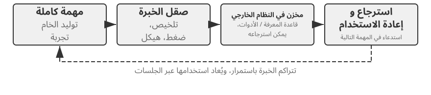
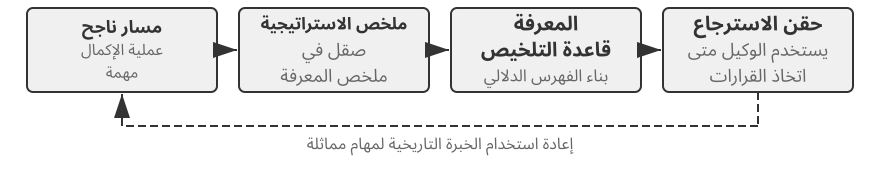
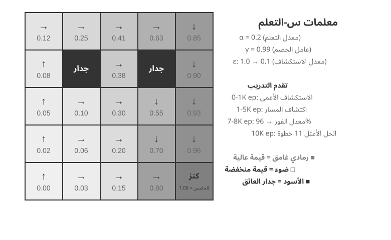
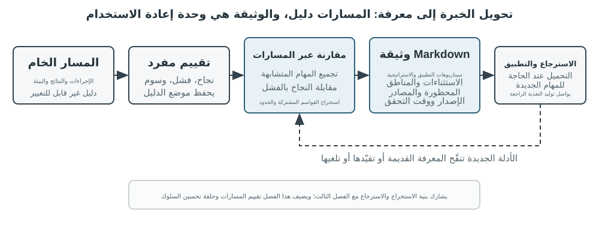
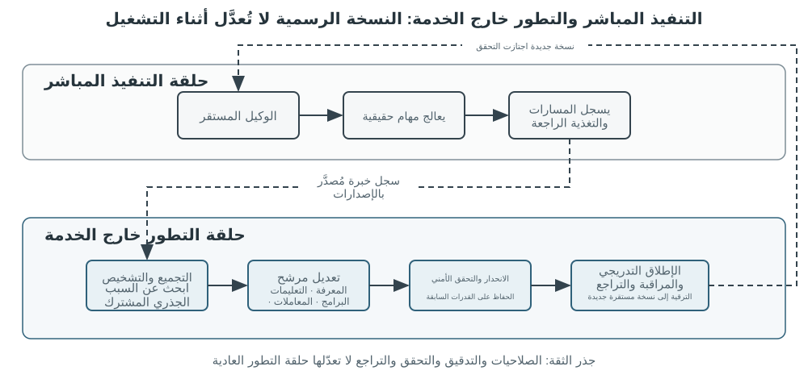

# التطور المستمر للوكلاء

يواجه الوكلاء اليوم مفارقة لافتة: فقد ينجحون من المحاولة الأولى في حل مهمة معقدة لم يروها من قبل، لكنهم قد يكررون غدًا الخطأ الذي ارتكبوه اليوم حتى بعد تنفيذ آلاف المهام المشابهة. وقد أصبحت **القدرة على التعلم المستقل من الخبرة** شرطًا للانتقال من مجرد إنجاز المهام إلى العمل الموثوق، كما غدت محورًا بحثيًا للجيل القادم من النماذج. غير أن النماذج الحالية ما زالت بعيدة عن التعلم المستمر بمفردها.

لا يغيّر النموذج المنشور معلماته تلقائيًا بعد كل عملية استدلال. فالتعلم داخل السياق، وحفظ الحالة، والضغط التي ناقشها الفصل الثاني تتيح للوكيل التكيف **داخل المهمة الحالية**، لكن أثرها لا ينتقل تلقائيًا إلى المهمة التالية بعد انتهاء السياق. كما أن حفظ المحادثات في الذاكرة لا يساوي تعلم سلوك جديد؛ إذ قد تضم المسارات الخام استراتيجيات نافعة إلى جانب نجاحات عارضة واستنتاجات سببية خاطئة ومدخلات غير موثوقة.

وهنا تمييز يسهل إغفاله: **حفظ الخبرة لا يعني التعلم منها**. فقد يساعد وضع مئة مسار في سياق طويل أو مخزن متجهي على استرجاع حالة مشابهة، لكنه لا يقارن الحالات تلقائيًا ليعرف الخطوات المتكررة في المسارات الناجحة، أو الممارسات التي لا تعمل إلا مع واجهة قديمة، أو ما إذا كان النجاح ثمرة استراتيجية سليمة أم مجرد مصادفة. لا يحدث التعلم عند كتابة السجل على القرص، بل عند تقييم الأدلة ومقارنتها وتعميمها والتحقق منها. تلتقط ذاكرة المستخدم في الفصل الثالث أساسًا «ما صفات المستخدم والعالم؟»، بينما يلتقط التعلم من الخبرة هنا «ماذا ينبغي فعله، وتحت أي شروط؟». تساعد الأولى الوكيل على تذكر المزيد، ويساعده الثاني على تحسين أدائه لا على زيادة معلوماته فحسب.

لماذا لا ندع النموذج يدرب نفسه مباشرة بعد كل مهمة؟ لأن بيئات الإنتاج نادراً ما توفر إشارات تعليمية نظيفة. رضا المستخدم لا يعني الامتثال، وقد تنجح الاختبارات بسبب حذف الحالات الفاشلة. حتى التحديث المحلي قد يتسبب في نسيان القدرة، أو انحراف السياسة، أو تدهور السلامة. إذا تم السماح للنموذج قيد التشغيل بتعديل نفسه مباشرة بناءً على تعليقات لم يتم التحقق منها، فقد تصبح الخبرة الخاطئة وحقن الموجّهات راسخة وتستمر في التضخيم عبر المهام اللاحقة. يمكن أن يؤدي التدريب الدوري للنماذج الأساسية إلى تحسين القدرات العامة، لكنه لا يمكنه استيعاب القواعد الخاصة وتغييرات الأدوات والخبرة المحلية التي يواجهها كل وكيل يوميًا على الفور.

ولأن النماذج لا تستطيع حتى الآن أن تتعلم باستمرار وموثوقية، فلا بد من بناء «التعلم» في صورة منظومة مستقلة تحيط بالنموذج: تسجل الأدلة التشغيلية، وتتحقق من النتائج والعمليات، وتستخرج الأنماط المشتركة من مسارات متعددة، ثم تقرر هل تحدّث المعرفة أم التعليمات أم البرامج أم معلمات النموذج. ويجب أن يبدأ كل تعديل إصدارًا مرشحًا، وألا يؤثر في التشغيل التالي إلا بعد اختبارات الانحدار وفحوص الأمان. لا يحل ذلك محل قدرة النموذج على التعلم، لكنه المسار الهندسي المتاح حاليًا لمنح الوكلاء تعلمًا مستمرًا.

لقد قدمت الفصول السابقة بالفعل المكونات الرئيسية التي يتطلبها هذا النظام. يتناول الفصل 2 حالة المهمة، ويوفر الفصل 3 البنية التحتية للمعرفة، ويمنح الفصل 5 الوكلاء القدرة الوصفية لإنشاء الأدوات وتعديل الأنظمة، ويحدد الفصل 6 التقييم والتحقق، ويشرح الفصل 7 كيفية تحديث معلمات النموذج. ومهمة الفصل الثامن هي تنظيم هذه المكونات في حلقة التطور المستمر المبينة في الشكل 8-1.

يجب أن ينشأ التطور المستمر من الخبرة التشغيلية التي يمكن تتبعها، وتغيير السلوك اللاحق، والتحقق من عدم التسبب في تدهور كبير. يناقش هذا الفصل أولاً كيفية تحديد ما الذي حدث بشكل جيد أو خاطئ في الجولة؛ ثم يقارن بين أربع طرق للتحديث وحدودها المطبقة؛ وأخيرًا، فإنه يدرس كيفية التحقق من هذه التحديثات وإصدارها ومراجعتها وإيقافها أثناء التشغيل على المدى الطويل.

## استخلاص إشارات التعلم من المسارات التشغيلية

إن نقطة البداية للتطور المستمر ليست "التلخيص"، بل "التقييم". إذا كان النظام لا يعرف ما إذا كانت المهمة قد اكتملت أو الخطوة التي تسببت في النجاح أو الفشل، فإن الانعكاسات الناتجة عن نموذج اللغة يمكن أن تكون مجرد تخمينات. بمجرد أن يدخل تقييم غير صحيح إلى المعرفة طويلة المدى، أو موجّه النظام، أو بيانات التدريب، يمكن أن تتضاعف آثاره عبر المهام اللاحقة.

من السهل نسبيًا التحقق من نتائج بعض المهام. يمكن لوكيل البرمجة إجراء الاختبارات، واختبارات النوع، ومعايير الأداء؛ يمكن للوكيل الذي يقوم بمعالجة استرداد أموال لمستخدم الاستعلام عن حالة الطلب ومبلغ الاسترداد الفعلي. تأتي مثل هذه الإشارات من حالات بيئية حقيقية، وهي عمومًا أكثر موثوقية من أوصاف النموذج لسلوكه. لكن النتيجة الصحيحة لا تعني عملية صحيحة. وقد يؤدي حذف حالات الاختبار الفاشلة أيضًا إلى نجاح الاختبارات، في حين أن إخبار المستخدم: "سوف نعيد إليك أموالك في غضون سبعة أيام؛ يرجى التحلي بالصبر"، قد يؤدي إلى رضا مؤقت. ولذلك يجب أن يقيم التقييم الموثوق النتيجة والمسار المتبع لتحقيقها.

العديد من المهام الأخرى ليس لها إجابة واحدة صحيحة. ما إذا كانت خدمة العملاء تتحلى بالصبر، وما إذا كانت تقدم بدائل متوافقة، وما إذا كان تقرير البحث يحدد الأدلة الرئيسية، وما إذا كان النص الذي تم إنشاؤه طبيعيًا وموجزًا، كلها تتطلب حكمًا سياقيًا. يمكن استخدام LLM-as-a-Judge، التي تم تقديمها في الفصل 6، هنا، ولكن يجب ألا يقوم القاضي فقط بتعيين درجة إجمالية غامضة. يتمثل النهج الأكثر فعالية في تحديد نموذج التقييم مسبقًا ومطالبة المدقق بتسجيل كل عنصر، والاستشهاد بأدلة المسار، والإشارة بوضوح إلى عدم اليقين عندما تكون الأدلة غير كافية.

ويعرض الشكل 2-8 بنية التحقق ثلاثية الطبقات. يقوم مدقق نتائج الطبقة السفلية بقراءة نتائج الاختبار وحالات قاعدة البيانات وإرجاع الأداة للإجابة، "هل اكتملت المهمة بالفعل؟" يتحقق مدقق عملية الطبقة الوسطى من قواعد العمل والأذونات وتسلسلات الإجراءات للإجابة على السؤال التالي: "هل تم إكمالها بطريقة مسموح بها؟" يقوم مدقق الجودة في الطبقة العليا بتقييم اللغة والاستراتيجية وفقًا لنموذج التقييم للإجابة، "هل تم التعامل معها بشكل مناسب؟" يجب أن تعتمد المقاييس ذات المستوى الأدنى بشكل أكبر على الكود والمرجع الصحيح البيئية؛ يجب تفويض الجوانب التي يصعب إضفاء الطابع الرسمي عليها فقط إلى نموذج اللغة.

بالنسبة لوكيل خدمة العملاء، يجب أن يغطي نموذج التقييم المفيد الأبعاد المدرجة في الجدول 8-1 على الأقل. الخمسة الأولى تطبق في المقام الأول متطلبات خط الأساس، في حين أن الأخيرين يقيسان جودة الخدمة. يعتبر هذا التحليل أكثر فائدة من الناحية التشخيصية من السؤال عما إذا كان المستخدم راضيًا: قد يكون المستخدم راضيًا لأن الوكيل أصدر استردادًا غير متوافق، أو غير راضٍ بسبب قيود الامتثال. ولا يمكن لدرجة الرضا الواحدة أن تميز بين الاثنين.

جدول 1-8 أبعاد تقييم المسار لوكيل خدمة العملاء

| البعد | سؤال التحقق | الأدلة الأولية |
|---|---|---|
| نتيجة المهمة | هل تم حل الطلب الأساسي للمستخدم؟ | الحالة البيئية النهائية، نتائج الأداة |
| الامتثال للقاعدة | هل تم انتهاك أي سياسات أو أذونات أو إجراءات مطلوبة؟ | مستودع السياسات، مسار العمل |
| حدود الخصوصية | هل تم الكشف عن أي معلومات لم يكن من المفترض تقديمها؟ | نص الاستجابة، وسجلات الوصول إلى البيانات |
| الموثوقية الفعلية | هل البيانات مدعومة بالمعرفة أو نتائج الأداة؟ | المصادر المذكورة، إرجاع الأداة |
| اتساق الوعد مع الفعل | هل نُفذت فعلًا الإجراءات التي ادّعى الوكيل تنفيذها؟ | مقارنة الاستجابات بسجلات الأدوات |
| جودة التعبير | هل اللغة طبيعية وموجزة، دون تكرار أو صياغة مقولبة؟ | محادثة كاملة، موضوع اللغة |
| البدائل المتوافقة | عندما كانت الخطة الأصلية غير قابلة للتنفيذ، هل تم العثور على بديل مسموح به؟ | هدف المستخدم والسياسات والإجراءات اللاحقة |

يعد "الاتساق بين الوعد والعمل" مناسبًا بشكل خاص لسيناريوهات الوكلاء. يقرأ تقييم النص التقليدي الرد النهائي فقط وقد يعتبر بسهولة عبارة "لقد أرسلت أموالك المستردة" بمثابة خدمة جيدة. بدلاً من ذلك، يستمر تقييم المسار من خلال التحقق مما إذا تم استدعاء أداة استرداد الأموال بالفعل، وما إذا كانت المكالمة ناجحة، وما إذا كانت حالة الطلب قد تغيرت. "البدائل المتوافقة" لا تشجع النموذج على تجاهل القواعد حسب الرغبة؛ فهو يتطلب من النموذج أن يفهم الهدف الحقيقي للمستخدم، وعندما لا يكون استرداد الأموال متاحًا، يجب فحص الخيارات القانونية مثل إعادة الجدولة أو التمديد أو التعويض الجزئي.

لا ينبغي ضغط نتائج التحقق في عددية. يعتبر تقييم المسار أقرب إلى التشخيص المنظم: نجحت المهمة جزئيًا وتم اجتياز الامتثال للقاعدة، ولكن كان هناك بيان واحد غير مدعوم، ووعد كاذب واحد، وكررت الاستجابة شرح السياسة ثلاث مرات. تحافظ إشارات الأبعاد على طبيعة كل قضية وموقع أدلتها. عندها فقط يمكن للوحدات النهائية تحديد ما إذا كان البيان غير المدعوم يعكس المعرفة المفقودة، أو متطلبات الاقتباس الغائبة، أو قدرة النموذج غير الكافية، وما إذا كان الوعد الكاذب يتطلب مراجعة سريعة أو فحص الاتساق بين الاستجابات وحالات الأداة في الأداة.

تتطلب أدوات التحقق LLM أيضًا المعايرة. تحتفظ أنظمة الإنتاج عادةً بمجموعة صغيرة من المسارات المشروحة من قبل الخبراء للتحقق من اتساق أداة التحقق في كل بُعد؛ تتم إحالة الحالات عالية المخاطر أو منخفضة الثقة إلى نموذج ثانٍ أو مراجع بشري؛ ويتم إعادة تشغيل مجموعة المعايرة بعد تغييرات إصدار النموذج. يجب أن يقدم المدقق التقييمات والأدلة، في حين يجب أن تقرر وحدة التشخيص والتطور المستقلة أي جزء من الوكيل يجب تعديله. وهذا يمنع نفس النموذج من العمل كقاضي أثناء إعادة كتابة القواعد مباشرة.

> **التجربة 8-1 ★★: إنشاء أداة التحقق من المسار لوكيل خدمة العملاء**
>
> **الهدف:** تحويل مسار خدمة العملاء إلى تشخيص منظم يمكن أن يدعم التعلم اللاحق، واختبار ما إذا كانت "الاستنتاجات متعددة الأبعاد مع الأدلة" تحدد الأسباب الجذرية بشكل أفضل من النتيجة الإجمالية الواحدة.
>
> **البيانات والإجراءات:** قم بإعداد مسارات مصنفة بواسطة الخبراء تغطي أربع فئات: عمليات استرداد الأموال العادية، والوعود الكاذبة، والإفصاح عن الخصوصية، والرفض المفرط. تقرأ الطبقة الأولى حالة الطلب النهائية وسجلات الأداة لتحديد ما إذا كان الاسترداد أو إعادة الجدولة قد حدث بالفعل. ويتحقق الثاني من كل خطوة مقابل سياسات العمل، بما في ذلك الأذونات والإجراءات المطلوبة والخصوصية والدعم الواقعي والاتساق بين الوعد والعمل. أما الجزء الثالث فيقوم بتقييم جودة اللغة والبدائل المتوافقة مقابل المعيار الوارد في الجدول 8-1 ويحتفظ بالتحولات ذات الصلة كدليل على كل فشل. يستخدم حاكم الجودة الافتراضي قواعد حتمية، مع توفر القاضي LLM الحقيقي أيضًا. بغض النظر عن نموذج الطبقة العليا، لا يجب ترك طبقات النتائج والقاعدة لنموذج اللغة لتخمينها.
>
> **الضوابط والمقاييس:** يُخرج خط الأساس النتيجة الإجمالية فقط؛ تنتج الحالة التجريبية `pass` أو `fail` أو `uncertain` لكل بُعد، بالإضافة إلى الأدلة والثقة. أثناء المعايرة، قم بقياس الدقة والاسترداد لاكتشاف حالات الفشل في كل بُعد والإبلاغ عن التوافق الدقيق مع تسميات الخبراء. تحقق أيضًا من أن حالات الفشل مثل الوعود الكاذبة تحتوي على أدلة غير فارغة بدلاً من استنتاجات غير مدعومة.
>
> **معايير القبول:** يجب أن يكتشف المدقق بشكل موثوق الانتهاكات الجسيمة والوعود الكاذبة والرفض المفرط. يجب ألا تخفي النتيجة الإجمالية العالية فشل الخصوصية أو السياسة. يجب إرسال الحالات منخفضة الثقة والحالات عالية الخطورة إلى جهة تحقق ثانية أو مراجعة بشرية بدلاً من أن تصبح إشارات تعليمية تلقائيًا.
>
> التنفيذ المصاحب متاح في مشروع [`trajectory-verifier`](https://github.com/bojieli/ai-agent-book/tree/main/chapter8/trajectory-verifier). افتراضيًا، يستخدم حكمًا عالي الجودة يمكن إعادة إنتاجه دون اتصال بالإنترنت؛ استخدم `--judge llm` لتشغيل أداة التحقق الحقيقية LLM.

## أربع طرق لتطور الوكيل المستمر

تشير إشارات التعلم إلى ضرورة تغيير الوكيل، ولكن ليس المكان الذي يجب أن يحدث فيه هذا التغيير. الأساس الأساسي لاختيار طريقة التحديث ليس مدة استمرار التجربة، ولكن ما إذا كان من الممكن تمثيل القدرة المستهدفة بشكل طبيعي بواسطة وسيط معين. تتناسب الحقائق والخبرات مع المستندات المعرفية؛ الاستراتيجيات التي يمكن التعبير عنها بوضوح باللغة تنتمي إلى الموجّهات أو المهارات؛ ينبغي تشفير الإجراءات والقيود القابلة للتنفيذ بدقة كبرامج؛ ويجب أن تدخل القدرات عالية الأبعاد مثل الإدراك وأسلوب اللغة والاستراتيجيات الضمنية في معلمات النموذج. ويبين الشكل 8-3 هذه الطرق الأربع والعلاقات بينها.

ويقدم الجدول 8-2 مقارنة موجزة. الطرق الأربع لا تستبعد بعضها بعضا: يعتمد وكيل التصوير الطبي على المعلمات لتحديد الآفات، ويستخدم قاعدة معرفية لتقديم المبادئ التوجيهية الحالية، ويستخدم التعليمات البرمجية لحساب مؤشرات الخطر. يستمد نموذج خدمة العملاء طابعه الطبيعي من مرحلة ما بعد التدريب، ويحصل على سياسات خاصة بالمؤسسة من المعرفة والمهارات، ويعتمد على التعليمات البرمجية من جانب الخادم لفرض متطلبات الامتثال المهمة.

جدول 8-2 الحدود المطبقة لأربع طرق للتطور المستمر

| طريقة التحديث | محتوى مناسب | المزايا الأولية | القيود الأولية |
|---|---|---|---|
| تجربة قاعدة المعرفة | الحقائق والأنماط التجريبية والاستثناءات والمصادر | تحديثات سريعة، وإمكانية التتبع، والاسترجاع عند الطلب | يعتمد على الاسترجاع والتطبيق الصحيح للنموذج |
| موجّه ومهارة | مبادئ الحكم وإجراءات التشغيل التي يمكن التعبير عنها لغويًا | نطاق قابل للتفسير والضبط | عرضة للتضخم أو التعارض أو التجاهل |
| البرامج ومنظومات التشغيل | الإجراءات الحتمية والأدوات والقيود الصعبة | تنفيذ مستقر وقابل للاختبار ومنخفض التكلفة | ارتفاع تكاليف التطوير والصيانة |
| المعلمات النموذجية | الإدراك عالي الأبعاد، أسلوب التوليد، والإستراتيجيات الضمنية | تعميم قوي، وانخفاض الحمل الاستدلالي | ارتفاع تكاليف التحديث والانحدار |

### دمج الخبرة في المعرفة

أبسط صور التطور هي تنظيم الخبرات المتكررة المستخلصة من عمليات تشغيل عديدة في مستندات معرفية قابلة للاسترجاع. وتشترك «قاعدة معرفة الخبرات» هنا مع الفصل الثالث في تقنيات التخزين والفهرسة والاسترجاع، لكنها تختلف عنه في مصدر المعرفة وغاية التحقق منها. فالفصل الثالث يستخلص أساسًا صورة المستخدم والعالم من المحادثات والمستندات ومجموعات البيانات، أما هذا الفصل فيستخلص من مسارات الوكيل ونتائجه ما ينبغي فعله وتحت أي ظروف. فقولنا «تشترط شركة الطيران حجز الوجبة الخاصة قبل أربع وعشرين ساعة» معرفة بالمجال، أما «تحقق من مهلة حجز الوجبة الخاصة قبل الدفع، كيلا يتبين بعده تعذر تلبية الطلب» فخبرة عملية.

المسارات الأولية غير مناسبة كوحدات معرفة رسمية. فهي طويلة وصاخبة، وتحتوي على مخرجات الأدوات الخام، والتحويلات العرضية، والتفاصيل البيئية. ويحتفظ النظام الأكثر قوة بثلاث طبقات من البيانات: المسارات الأولية غير القابلة للتغيير للتدقيق؛ تحليلات لكل تشغيل تسجل النتائج والدروس المرشحة؛ والمقارنات والتجميع والاستقراء عبر مسارات متعددة مماثلة لإنتاج وثائق معرفة Markdown الموجّهة نحو المستقبل. تحدد الوثيقة الرسمية عادةً السيناريوهات القابلة للتطبيق، والاستراتيجيات الموصى بها، والممارسات المحظورة، والاستثناءات، ومصادر الأدلة، وآخر وقت للتحقق بدلاً من إعادة سرد المسار الكامل لمهمة واحدة.

يشترك هذا التصميم في نفس مبدأ المرحلتين مثل المستخدم كرمز في الفصل 3. يقوم المستخدم كرمز أولاً بإلحاق حقائق المحادثة بسجل غير قابل للتغيير ثم يعيد بناء نموذج مستخدم منظم بشكل دوري. يجب أيضًا أن يحافظ التعلم بالخبرة على الأدلة أولًا ويولد معرفة قابلة للتغيير دون الاتصال بالإنترنت بعد ذلك. ويوضح الشكل 8-4 هذه العملية. يؤدي فصل التسجيل عن المؤسسة إلى منع أي نجاح عرضي أو فشل في الشبكة من تغيير الوكيل على الفور، مع السماح للنظام بتحديد الأنماط الشائعة فقط بعد ملاحظة العديد من النجاحات والإخفاقات.

وثائق الخبرة ليست ملخصات مسار بسيطة. ينبثق المحتوى القابل للتحويل من المقارنة: ما الذي فعلته المسارات الناجحة من نفس النوع، وما الذي افتقرت إليه المسارات الفاشلة، وفي أي إصدارات البيئة كانت الإستراتيجية فعالة، وفي ظل أي شروط مسبقة فشلت. لقد قدم الفصل الثالث بالفعل استخراج المعرفة وتجميعها واسترجاعها، لذلك لا يكرر هذا الفصل تلك الخوارزميات. وبدلاً من ذلك، فإنه يركز على كيف يصبح تقييم المسار شرطًا للاستخراج وما إذا كانت المعرفة المستخرجة تعمل على تحسين الأداء في المهام اللاحقة.

يمكن تقسيم خط أنابيب تقطير المعرفة الكامل إلى خمس خطوات. أولاً، الحفاظ على المسارات والنتائج البيئية غير القابلة للتغيير. بعد ذلك، قم بإنتاج تحليل منظم لكل عملية تشغيل، مع إدراج نوع المهمة والإمكانيات المطلوبة والاستراتيجيات التي تمت ملاحظتها والأخطاء والاستثناءات. ثم يتم تجميع العمليات حسب مجموعة المهام وإنشاء جدول أدلة يوضح المسارات التي تدعم أو تتعارض مع كل نمط مرشح. فقط المرشحين الذين يستوفون حد الدعم يدخلون المستندات الرسمية. وأخيرا، تقييم النقل على المهام الجديدة التي لم يتم استخدامها أثناء التقطير. إن إبقاء المعرفة الرسمية منفصلة عن التحليلات المرشحة يسمح للنظام بالتعميم مرة أخرى دون تغيير الأدلة الأصلية وإلغاء الاستنتاج على وجه التحديد عندما تتغير البيئة.

يوفر التعلم بتجربة GAIA مثالاً بديهيًا. يحتوي GAIA[^gaia-2023] على مشاكل متعددة الخطوات تجمع بين البحث وقراءة الويب ومعالجة الملفات والحساب، بينما يوفر AWorld[^aworld-2025] بيئة لتشغيل الوكلاء واستدعاء تلك الأدوات وتسجيل المسارات: الأول يشبه الاختبار، والأخير هو غرفة الاختبار ونظام تسجيل المختبر. يؤدي النهج التبسيط إلى إنشاء ملخص للاستراتيجية وتوجيهه على الفور بعد تشغيل ناجح. يستخدم التنفيذ الأكثر صرامة أولاً أداة التحقق من إجابات GAIA أو أي أداة تحقق بيئية أخرى لتسمية عمليات التشغيل بأنها ناجحة أو ناجحة جزئيًا أو فاشلة، ثم تقارن مسارات متعددة داخل نفس عائلة المهام. تساهم المسارات الناجحة في وضع استراتيجيات للمرشحين، بينما تساهم حالات الفشل في المعرفة الإقصائية، وتكشف النجاحات الجزئية عن القطاع الذي نجح وأي جزء لا يزال فاشلاً. يمكن أن يساعد انعكاس اللغة الطبيعية الذي اقترحه Reflexion[^reflexion-2023] في توليد دروس مرشحة، لكن الانعكاس في حد ذاته ليس دليلاً. فقط المحتوى المتوافق مع النتائج البيئية، والمدعوم عبر المسارات، والذي يظهر نقلًا إيجابيًا في المهام الجديدة، هو الذي يجب أن يدخل في وثائق الخبرة الرسمية.

> **التجربة 8-2 ★★: استخلاص مستندات المعرفة الخاصة بالخبرة من مسارات GAIA**
>
> **الهدف:** اختبار ما إذا كانت وثائق المعرفة عبر المسارات تنقل بشكل أفضل من ملخص نجاح واحد وتقليل النقل السلبي من النجاحات العرضية والخبرة غير الصحيحة.
>
> **البيانات والإجراءات:** تقوم `gaia-experience` أولاً بتخزين المسار الكامل و`environment_score` الخارجي لكل تشغيل، ثم تحويلها إلى الحد الأدنى من سجلات التعلم التي تحتوي على `task_family`، و`capabilities` المطلوبة، و`applies_when`، والاستراتيجيات الملحوظة، والأخطاء، والاستثناءات، ومعرفات مسار المصدر. يصنف مدقق النتائج عمليات التشغيل على أنها ناجحة أو ناجحة جزئيًا أو فاشلة. تقوم وحدة التعلم النمطية بمقارنة المسارات ضمن مجموعة المهام نفسها. قد يقترح LLM تعميمات مرشحة، لكن الإستراتيجية الموصى بها يجب أن تكون مدعومة بمسارين غير فاشلين على الأقل. تتضمن وثيقة Markdown الناتجة سيناريوهات قابلة للتطبيق، والاستراتيجيات الموصى بها، والمزالق الشائعة، والاستثناءات، والمصدر، وأحدث وقت للتحقق من الصحة. أثناء التقديم، يتم استرجاع هذه المستندات فقط؛ لا يتم إدراج المسارات الخام الطويلة مباشرة في السياق.
>
> **ثلاثة ضوابط:** الشرط الأول لا يستخدم أي خبرة تاريخية؛ يسترد الثاني ملخص المسار الأكثر تشابهًا مع المهمة الحالية؛ والثالث يسترد وثيقة معرفية مدعومة بمسارات متعددة. يجب أن تكون مجموعات التعلم والنقل منفصلة حتى لا تتسرب الإجابات على نفس سؤال GAIA إلى التقييم باعتباره "خبرة".
>
> **المقاييس والقبول:** قم بالإبلاغ عن معدل نجاح مهمة النقل، ومتوسط الأحرف أو الرموز المستردة، ومعدل النقل السلبي، وتحقق من أن كل استنتاج رسمي يستشهد بمسارات مصدره. إذا كانت المستندات عبر المسارات تؤدي فقط إلى تقصير السياق دون تحسين أداء المهام الجديدة، فإنها لا تثبت الخبرة المكتسبة. تفشل التجربة أيضًا إذا كان من الممكن ترقية نجاح عرضي مباشر إلى المعرفة الرسمية أو إذا لم يكن من الممكن تتبع الوثيقة إلى مساراتها الأصلية.
>
> التنفيذ المصاحب متاح في مشروع [`gaia-experience`](https://github.com/bojieli/ai-agent-book/tree/main/chapter8/gaia-experience). يتم تشغيل `demo_documents.py` دون اتصال بشكل افتراضي؛ مع `--extractor llm`، يمكن لـ LLM الحقيقي أن يقترح مرشحين ذوي خبرة عبر المسارات.

[^reflexion-2023]: شين، N.، وآخرون. *التأمل: وكلاء اللغة مع التعلم المعزز اللفظي.* أرخايف:2303.11366، 2023.

[^gaia-2023]: ميالون، G.، وآخرون. *GAIA: معيار لمساعدي الذكاء الاصطناعي العام.* arXiv:2311.12983, 2023.

[^aworld-2025]: يو، C.، وآخرون. *العالم: تنسيق وصفة التدريب للذكاء الاصطناعي الوكيل.* arXiv:2508.20404, 2025.

### تحويل الخبرة إلى تعليمات

توفر قاعدة معارف الخبرة مادة مرجعية للوكيل، في حين تكون الموجّهات والمهارات أكثر توجيهًا. وعندما تكشف مسارات متعددة مرارًا عن الخطأ الاستراتيجي نفسه، ويصبح من الممكن التعبير عن النمط بوضوح باللغة الطبيعية، يستطيع النظام أن يرتقي به من «خبرة مرجعية» إلى «قاعدة واجبة الاتباع». وتناسب القواعد التي تنطبق على معظم المهام موجّه النظام، أما الإجراءات المعقدة التي تقتصر على مجال أو مشروع أو أداة بعينها، فمن الأفضل تدوينها في صورة مهارات تُستدعى عند الحاجة أو في ملفات تعليمات المشروع.

يختلف **تعلّم الموجّهات** عن هندسة الموجّهات التي تناولها الفصل الثاني. يشرح ذلك الفصل كيف نكتب موجّهات واضحة البنية وملائمة للذاكرة المؤقتة؛ أما هذا القسم فيسأل: ما التغذية الراجعة من الإنتاج التي تكفي لتبرير تعديل الموجّه؟ وكيف نتحقق من القاعدة الجديدة قبل النشر؟ ولا ينبغي أن يعني التعديل إعادة كتابة موجّه النظام كاملًا في كل مرة. الأسلوب الأوثق هو اشتقاق أصغر فرق ممكن من مجموعة إخفاقات متشابهة، وتحديد نطاق القاعدة، وفحص تعارضها مع القواعد القائمة، ثم تقييمها على الحالات الحدّية التي كشفت الإخفاق وعلى مجموعة محفوظة من المهام القديمة معًا.

في منشور مطول عام 2025، سمّى أندريه كارباثي هذا النمط المحتمل مؤقتًا **تعلّم موجّه النظام** (System Prompt Learning)[^karpathy-system-prompt-learning]. وخلاصته أن التدريب المسبق يتعلم المعرفة أساسًا، وأن الضبط الدقيق يصوغ العادات السلوكية، بينما يملك البشر نمطًا آخر من التعلم: نحل المشكلة ثم نترك لأنفسنا ملاحظة واضحة للمستقبل، مثل «في المرة القادمة التي أواجه فيها هذه المشكلة، سأجرّب هذا الأسلوب أولًا». وشبّه نموذجًا لغويًا بلا دفتر ملاحظات كهذا ببطل فيلم *Memento*. ويتعلم كل من تعلّم موجّه النظام والتعلم المعزز من الخبرة، لكن بخوارزمية تحديث مختلفة: الأول يحرر النص، والثاني يغير المعلمات بالانحدار المتدرج. ومن أمثلته أن موجّه نظام Claude، الذي كان يقارب 17 ألف كلمة، يطلب من النموذج عند عد الكلمات أو الحروف أو المحارف أن يرقمها ويحصيها صراحةً قبل الإجابة؛ وذلك لمعالجة أسئلة من قبيل: «كم حرف `r` في كلمة `strawberry`؟».

في نظام الوكيل، يعني هذا تحويل الدروس التي يمكن التعبير عنها باللغة إلى قواعد مرشحة يمكن للتشغيلات المستقبلية قراءتها مباشرة. بالمقارنة مع نتيجة النجاح/الفشل العددية، يمكن للتشخيص المدعوم بالأدلة تحديد ما إذا كان الخطأ في التحقق من الهوية، أو اختيار الأداة، أو حدود التصعيد، مما يتيح تغيير مرشح أكثر استهدافًا. إن ملاحظة كارباثي بأن المراجعة الموجّهة بالمعرفة هي قناة ردود فعل ذات أبعاد أعلى من المكافأة العددية تساعد في تفسير كفاءة البيانات المحتملة لهذه الطريقة. ومع ذلك، فإن المعلومات الأكثر ثراءً ليست صحيحة تلقائيًا: قد تنطبق تعليقات مستخدم واحد فقط على هذا الوكيل أو على سياسة قديمة، لذلك يظل التجميع وتحليل النطاق واختبار الانحدار ضروريًا.

تؤتمت عدة أساليب قائمة تحسين الموجّهات بطرائق مختلفة. يتعامل DSPy[^dspy-2023] مع البرنامج المؤلف من عدة استدعاءات لنماذج لغوية بوصفه كائنًا قابلًا للتحسين، ويبحث في مجموعة التطوير عن تعليمات وأمثلة أفضل. ويطلب OPRO[^opro-2023] من نموذج لغوي اقتراح مرشحين جدد اعتمادًا على سجل الموجّهات ودرجاتها. أما GEPA[^gepa-2025] فيستخدم مراجعة لغوية طبيعية للمسارات الفاشلة كي يولّد موجّهات مرشحة متكاملة وينتقي منها. تستهدف هذه الأساليب في الأساس التحسين الدفعي على مجموعات تقييم غير متصلة، بينما تشبه التعديلات الدنيا في الإنتاج صيانةً مستمرة تحفزها حالات حدّية جديدة، مع التشديد على المصدر والتدقيق وسرعة التراجع. وعمليًا، يمكن للبحث غير المتصل أن ينتج إصدارًا أوليًا قويًا، ثم تتولى الرقع الموضعية صيانة قواعد الحالات النادرة بعد النشر.

على سبيل المثال، قد يتم تصعيد وكيل خدمة عملاء شركة الطيران إلى مستوى إنساني في وقت مبكر جدًا عندما يتحدى المستخدمون إحدى السياسات. يوضح تقييم المسار أنه لا ينتهك أي قواعد ولكنه يفتقر إلى المرونة المتوافقة. يمكن أن يتطلب التصحيح المرشح من الوكيل شرح السياسة أولاً، وتحديد الهدف الفعلي للمستخدم، والبحث عن البدائل المسموح بها، ولا يتم التصعيد إلا عندما يطلب المستخدم ذلك صراحةً أو عندما تتجاوز المشكلة سلطة الوكيل حقًا. إذا كانت القاعدة الجديدة تقلل من التصعيد غير الضروري ولكنها تتسبب في استمرار الوكيل في التعامل مع حوادث السلامة التي يجب تصعيدها، فقد فشلت في اختبار الانحدار. لا تكمن قيمة التعلم السريع للنظام في إلحاق المزيد من النصوص تلقائيًا، ولكن في التوضيح المستمر لنطاق القواعد من خلال حالات حدود الإنتاج.

يتبع تعلم المهارات نفس المبدأ، ولكن بنطاق أكثر محلية. يمكن فهم المهارة على أنها دليل تشغيل حسب الطلب لوظيفة معينة: إذا كانت الخبرات المتعددة تشكل مجتمعة عملية مطالبات تأمين كاملة، فيمكن للنظام إنشاء المهارة المقابلة أو مراجعتها. لا ينبغي للمهارة المرشحة أن تلخص مجرد محادثة واحدة؛ على الأقل، يجب أن يحدد وقت التحميل، والمتطلبات الأساسية، وخطوات التشغيل، والمزالق المعروفة، وطرق التحقق من الصحة، ومسارات المصدر. يبحث النظام أولاً في مكتبة Skill الموجودة عن إمكانيات مماثلة، ويفضل `patch` المحلي عندما تكون نفس العملية موجودة بالفعل وينشئ دليلًا جديدًا فقط لقدرة مستقلة حقًا. وهذا يمنع المكتبة من ملء الأدلة التي تختلف في الاسم ولكنها مكررة. يوضح منشئ المهارات Anthropic[^anthropic-skill-creator] حلقة المسودة والاختبار والتقييم والمراجعة. ويتناول كيفية إنشاء المهارة وتحسينها؛ وتظل الأسئلة الأصعب هي ما هي الأدلة التشغيلية الكافية لتحفيز الإنشاء، وكيفية حل التعارضات، وما إذا كانت المراجعة تجتاز اختبارات الانحدار الخاصة بالمجال والمهمة القديمة.

> **التجربة 8-3 ★★: تحسين موجّهات النظام من مسارات الفشل**
>
> **الهدف:** تعريف وكيل خدمة عملاء شركة الطيران بالمسارات التي يتصاعد فيها الأمر بسرعة كبيرة عندما يتحدى المستخدم إحدى السياسات، مع توضيح أن القاعدة الجديدة لا تكسر السيناريوهات القديمة التي تتطلب التصعيد حقًا.
>
> **الإجراء:** قم أولاً بتشغيل مجموعة الاحتفاظ بالمهام القديمة ومجموعة حدود التصعيد المفرط بشكل منفصل. يقوم `learning_signal.py` بتحليل حالات الفشل إلى الالتزام بالقواعد، وحل المهام، والمرونة المتوافقة، مع الاحتفاظ بمعرفات الحالة المصدر. يقوم وكيل البرمجة بعد ذلك بقراءة الموجّه الحالي وينتج تعديلًا واحدًا كحد أدنى `old_str → new_str` قابل للتدقيق: يطلب من الوكيل شرح السياسة وتحديد الهدف الفعلي والبحث عن بدائل متوافقة قبل التصعيد، مع الحفاظ على التصعيد عندما يطلب المستخدم صراحةً وقوع حادث بشري أو يتعلق بالسلامة. تتم كتابة التصحيح والمصدر وقاعدة الهدف والأساس المنطقي في بيان المرشح.
>
> **ثلاثة عناصر تحكم:** قارن بين الموجّه الأولي وموجّه المرشح الذي يتم إنشاؤه تلقائيًا والموجّه المحسن يدويًا لمرة واحدة. يستخدم الثلاثة نفس النموذج ونفس مهام الاستبقاء والحدود. `--quick` يقلل فقط من عدد الحالات؛ لا يزال يقوم بإجراء مكالمات حقيقية إلى وكيل المهام وقاضي LLM ووكيل البرمجة ويجب ألا يتم الإبلاغ عنه كمحاكاة دون اتصال بالإنترنت.
>
> **بوابة الإصدار والمقاييس:** يجب أن يجتاز المرشح أربعة شروط: رقعة غير فارغة، ومصدر يمكن تتبعه، وتحسين قابل للقياس على مجموعة الحدود، وعدم وجود تدهور في مجموعة الاحتفاظ. قارن بين دقة المهمة الحدودية، ودقة مهمة الاحتفاظ، والنمو السريع، والانحدارات المقدمة، والوقت منذ اكتشاف الفشل وحتى إنشاء المرشح. يؤدي تمرير البوابة إلى إنتاج `release_to_canary` فقط، ولا تتم الكتابة فوق المباشرة للموجّه الثابت؛ فشل أي شرط يعود `reject_candidate`.
>
> التنفيذ المصاحب متاح في مشروع [`prompt-auto-optimization`](https://github.com/bojieli/ai-agent-book/tree/main/chapter8/prompt-auto-optimization). تغطي الاختبارات غير المتصلة بالإنترنت بوابات التشخيص والتحرير، بينما يقوم `--quick` بإجراء مكالمات حقيقية إلى وكيل المهام وقاضي LLM ووكيل البرمجة.

[^dspy-2023]: خطاب، O.، وآخرون. *DSPy: تجميع استدعاءات نموذج اللغة التعريفية في خطوط أنابيب ذاتية التحسين.* arXiv:2310.03714, 2023.

[^opro-2023]: يانغ، C.، وآخرون. *نماذج اللغات الكبيرة كمُحسِّنات.* arXiv:2309.03409, 2023.

[^gepa-2025]: أغراوال، L.، وآخرون. *GEPA: التطور الفوري الانعكاسي يمكن أن يتفوق على التعلم المعزز.* arXiv:2507.19457, 2025.

[^karpathy-system-prompt-learning]: Karpathy, A. «ما زال ينقصنا (على الأقل) نمط رئيسي من أنماط تعلّم نماذج اللغة الكبيرة... تعلّم موجّه النظام؟» X، 11 مايو 2025. https://x.com/karpathy/status/1921368644069765486

[^anthropic-skill-creator]: Anthropic. *صانع المهارات.* 2026.https://github.com/anthropics/skills/blob/main/skills/skill-creator/SKILL.md

### تحويل الخبرة إلى برامج

عندما تصف التجربة العمليات المستقرة والمتكررة والقابلة للتحقق، فمن غير الفعال أن نجعل النموذج يعيد قراءة الوثائق ويفكر فيها في كل مرة. يتمثل النهج الأكثر ملاءمة في تجميع التجربة في مسارات عمل أو أدوات أو تعليمات برمجية مفيدة، مما يحول الاستكشاف لمرة واحدة إلى برنامج قابل للتنفيذ بشكل متكرر. يشرح الفصل الخامس كيفية قراءة وكلاء البرمجة للملفات وكتابتها وإجراء الاختبارات وإنشاء الأنظمة؛ لا يركز هذا القسم على إنشاء التعليمات البرمجية العامة، ولكن على كيفية تعديل الوكيل للإصدارات المستقبلية من نفسه بناءً على مساراته الخاصة.

تمتد الكائنات القابلة للتعديل إلى ما هو أبعد من الأدوات الجديدة. في طبقة التشغيل، يمكن تجميع مسارات المتصفح في مسارات عمل ذات معلمات، أو يمكن إنشاء محولات لتغيير واجهات برمجة التطبيقات. في طبقة التحكم، يمكن تعديل توجيه الأداة، وإعادة المحاولة، وقواطع الدائرة، واستراتيجيات ضغط السياق. في طبقة التحقق من الصحة، يمكن إضافة عمليات فحص المعلمات وأدوات التحقق من الحالة واختبارات الانحدار استجابةً لفشل الإنتاج. في طبقة البنية، يمكن إضافة وكيل المراجع أو يمكن تغيير تدفق المعلومات بين التخطيط والتنفيذ.

توضح مسارات عمل المتصفح قيمة الخبرة البرمجية. وهي مماثلة لتسجيل ماكرو جدول البيانات. في المرة الأولى التي يتم فيها إرسال بريد إلكتروني، يستخدم وكيل الوسائط المتعددة حلقة المراقبة والسبب والتصرف للعثور على عناصر التحكم في الإنشاء والمستلم والموضوع والنص والإرسال. بالنسبة لبريد إلكتروني آخر، لا تتغير العملية؛ يختلف المستلم والمحتوى فقط، لذلك ليست هناك حاجة لاستدعاء النموذج مرة أخرى لإعادة اكتشاف المسار بالكامل من وحدات البكسل وDOM. يقوم النظام بتجميع المسار الاستكشافي الأول في برنامج صغير يحتوي على المعلمات وفحوصات الحالة ومعلومات الإصدار.

في إعداد المتصفح، تصبح عملية تقطير المعرفة الموضحة في الشكل 8-4 دورة حياة أكثر واقعية:

1. **التقاط المسار:** سجل التنقل والنقرات وإدخال النص واختيار القائمة المنسدلة، بالإضافة إلى معلمات الإجراء وعنوان URL الحالي وأدلة محدد موقع العناصر مثل XPath وCSS و`id` و`role` و`aria-label` و`data-testid`. يساعد دليل تحديد الموقع في العثور على العنصر مرة أخرى فقط؛ ولا يثبت أن المهمة قد اكتملت.
2. **المعلمات:** استبدل القيم الحرفية من التشغيل الأول بمتغيرات القالب — على سبيل المثال، تحويل `test@example.com` والموضوع والنص إلى `{recipient}` و`{subject}` و`{content}` — مع ترك الإجراءات الثابتة دون تغيير. يستخدم تنفيذ التدريس التعبيرات العادية واستبدال القالب؛ قد يستخدم نظام الإنتاج مدخلات مهمة منظمة أو نموذج استخراج مقيد.
3. **تحديد عمليات التحقق من الحالة:** أضف عمليات التحقق قبل الإجراءات وبعدها، مثل "زر الإرسال مرئي" و"عنوان URL بعد التنقل ينتمي إلى الموقع المستهدف". أضف فحص الحالة النهائية لسير العمل ككل، مثل "تحتوي قائمة البريد المرسل على الرسالة الجديدة" أو "تغيرت قيمة حالة صفحة الاختبار كما هو متوقع". إن تنفيذ الإجراء بنجاح ليس هو نفسه إكمال المهمة بنجاح؛ يجب أن يقرأ الفحص النهائي الصفحة الحقيقية أو حالة الواجهة الخلفية.
4. **التحقق من صحة المرشح:** النجاح الأول ينتج عنه `candidate` فقط. يجب على النظام إعادة تعيين حساب وضع الحماية أو موقع الاختبار إلى حالة أولية مستقلة وإعادة تشغيل المرشح بالكامل. يمكن نشره كـ `validated` فقط في حالة اجتياز جميع عمليات فحص ما قبل الإجراء وما بعده والحالة النهائية. إذا كانت إحدى المهام ذات التأثير الجانبي، مثل إرسال البريد أو تقديم طلب، لا تحتوي على إعادة اتصال آمنة لإعادة التعيين، فقد يتم الاحتفاظ بسير العمل كمرشح قابل للتدقيق ولكن يجب عدم التحقق من صحته من خلال تكرار الإجراء في حساب الإنتاج.
5. **المطابقة وإعادة التشغيل:** عند وصول مهمة جديدة، ابحث في مكتبة القدرات الرسمية عن سير العمل حسب النية والكلمات الرئيسية، واستخرج المعلمات الحالية، وقم بتنفيذها مباشرة باستخدام Playwright. لا تتطلب إعادة التشغيل مكالمات LLM خطوة بخطوة، ولكن لا يزال يتعين عليها الانتظار حتى تصبح العناصر متاحة وإكمال كل فحص للحالة.
6. **إبطال وإعادة التعلم:** إذا تعذر العثور على العنصر المستهدف، أو فشل فحص الحالة، أو تغير مخطط API، أو كانت الحالة النهائية خاطئة، فأوقف الإجراءات اللاحقة على الفور، وانقل الإصدار القديم من المكتبة القابلة للبحث إلى منطقة `invalid`، ثم ارجع إلى الوكيل الكامل لاستكشاف جديد. احتفظ بالملف القديم للتدقيق والمقارنة، لكن لا تسمح له مطلقًا بمواصلة المطابقة بصمت.

بالنسبة لسير عمل البريد الإلكتروني، فإن النتيجة المجمعة ليست مجرد "النقر على هذه الأزرار بالترتيب"، بل هي برنامج صغير يتم تحديد معلماته حسب المستلم والموضوع والنص: فهو يتحقق من نافذة الإنشاء والحقول قبل الإرسال، ويتحقق من مؤشر النجاح بعد ذلك، ويؤكد أخيرًا ظهور الرسالة المقابلة في القائمة المرسلة. في PreAct[^preact]، قدمت هذه البرامج تسريعًا شاملاً بمعدل 8.5–13× للمهام المتكررة ولم تتطلب مكالمات نموذج اللغة خطوة بخطوة أثناء إعادة التشغيل. والأهم من ذلك، تحتاج ذاكرة العملية إلى **التحقق من صحة الإجراء، والتحقق من صحة ما بعد الإجراء، والتحقق من صحة ما قبل التخزين المستقل**. وبخلاف ذلك، يمكن للنظام أن ينتج وهمًا خطيرًا: تغطية إعادة التشغيل بنسبة 100 بالمائة وتم النقر على كل زر، ومع ذلك كان هناك حقل واحد فارغ ولم تكتمل المهمة فعليًا أبدًا.

> **التجربة 8-4 ★★★: إنشاء مسارات عمل يمكن التحقق منها من مسارات المتصفح**
>
> **الهدف:** تحديد ما إذا كان وكيل الويب يمكنه تحويل استكشاف باهظ الثمن إلى سير عمل قابل لإعادة الاستخدام ورفض إعادة التشغيل غير الصحيحة عندما تتغير الصفحة، بدلاً من الإبلاغ عن النجاح لمجرد تنفيذ كل إجراء.
>
> **سيناريو من أربع مراحل:** في المرحلة الأولى، قم بتشغيل "إرسال رسالة بالموضوع "اختبار البريد الإلكتروني" إلى `test@example.com`" على موقع بريد اختباري أو صفحة رسائل محاكاة. يستكشف الوكيل الكامل، بينما يلتقط المجمّع الإجراءات والمعلمات وحالات الصفحة وينتج `candidate`. في المرحلة الثانية، اتصل بـ `validation_reset` لاستعادة وضع الحماية وإعادة تشغيل سير العمل بالكامل بشكل مستقل؛ لا يدخل المرشح إلى مكتبة القدرات الرسمية إلا في حالة اجتياز جميع فحوصات ما قبل الإجراء وبعده وفحوصات الحالة النهائية. في المرحلة الثالثة، قم بتنفيذ نفس النوع من المهام مع مستلم وموضوع وجسم مختلف. يجب أن يطابق النظام سير العمل الذي تم التحقق منه، وملء المعلمات الجديدة، وإعادة تشغيله من خلال Playwright دون الدخول في حلقة LLM خطوة بخطوة. في المرحلة الرابعة، قم بتغيير محدد موقع الزر أو نص الصفحة أو الحالة النهائية وتحقق من أن سير العمل القديم يصبح على الفور `invalid` ويقوم بإرجاع `fallback_required=True`.
>
> **تصميم التحكم:** يسجل خط الأساس المبسط فقط ما إذا كانت النقرات وإدخال النص والإجراءات الأخرى مكتملة بدون استثناءات. يتحقق الشرط التجريبي أيضًا من صحة الصفحة قبل كل إجراء، والصفحة بعد كل إجراء، وحالة المهمة النهائية. يستخدم كلا الشرطين نفس المسارات وتغييرات الصفحة. قارن معدلاتها الإيجابية الخاطئة في حالات مثل "تم النقر على زر الإرسال بينما كان الحقل فارغًا" و"تم النقر على حفظ ولكن لم تستمر البيانات".
>
> **المقاييس والقبول:** سجل الوقت الشامل للاستكشاف الأولي وإعادة التشغيل، وعدد مكالمات LLM، ومعدل النجاح، ومعدل النجاح الخاطئ، ومعدل مطابقة سير العمل، ومعدل اكتشاف تغيير الصفحة، وعدد التراجعات لإعادة التعلم. بدون رد اتصال إعادة تعيين، يجب أن يظل سير العمل مرشحًا؛ يجب ألا يكون الإصدار الذي يفشل في التحقق من الصحة قابلاً للاسترداد؛ يجب ألا تعيد عملية إعادة التشغيل ذات المعلمات استخدام مستلم أو محتوى التشغيل الأول؛ وبعد تغيير الصفحة، يجب أن تتوقف الإجراءات اللاحقة الخطيرة. التسريع لا يهم إلا إذا تم استيفاء جميع هذه الشروط.
>
> يتوفر التنفيذ المصاحب في مشروع [`browser-use-rpa`](https://github.com/bojieli/ai-agent-book/tree/main/chapter8/browser-use-rpa)، والذي يوفر عرضًا توضيحيًا لآلة الحالة الحتمية ومسار تنفيذ يستدعي وكيل متصفح حقيقي.

لا يعني تعديل الوكيل للتعليمات البرمجية الخاصة به أن العملية الجارية تقوم بالكتابة فوق نفسها مباشرة. يجب أن يقوم نظام الإنتاج بإنشاء فرع مرشح من الإصدار الثابت الحالي، وأن يقوم وكيل البرمجة بإنشاء الحد الأدنى من التصحيح، ثم يقوم بتشغيل عمليات التحقق الثابتة، واختبارات الوحدة، وعمليات فحص الأمان، وإعادة مسار الفشل، واختبارات الانحدار على المهام القديمة بشكل تسلسلي قبل إنتاج إصدار جديد مؤهل لنشر Canary. يؤدي هذا إلى تحويل "التعديل الذاتي" إلى عملية إصدار برمجيات قابلة للتدقيق ويحدد الحدود بين الفصلين الثامن والخامس: يوفر الفصل الخامس القدرة على تعديل الأنظمة، بينما يوفر هذا الفصل طريقة للتعديل الذاتي التي يتم تشغيلها عن طريق الخبرة وتقيدها حلقة التحقق من الصحة.

إن جعل التصحيح صغيرًا لا يكفي للإسناد الموثوق به. يجب أن يكون كل طلب تعديل أيضًا **عقد تغيير قابل للتزوير** يسجل أدلة الفشل، والسبب الجذري المستنتج، ومكون الأدوات المسؤول، وتغيير المرشح، والسلوك المتوقع تحسينه، والسلوك الحالي الذي قد يتراجع، واختبارات لكليهما. تصف شركة Agentic Harness Engineering ذلك من حيث إمكانية ملاحظة مستوى المكونات والخبرة والقرار: كل مكون قابل للتحرير له تمثيل على مستوى الملف؛ يتم استخلاص مجموعات كبيرة من المسارات وتحويلها إلى أدلة يمكن فحصها بمستويات متزايدة من التفاصيل؛ ويعلن كل تعديل عن توقع التأثير قبل التنفيذ، والذي يتم بعد ذلك اختباره في الجولة التالية من النتائج[^ahe-2026]. يمكن بعد ذلك ربط النتيجة الأعلى بآلية محددة بدلاً من البقاء تجربة غير قابلة للتفسير.

يجب ألا يستقبل المولد المرشح الحالات الفاشلة فقط. يوفر Self-Harness أيضًا السلوك الناجح الذي يجب الحفاظ عليه وسجلات التعديلات المرفوضة مسبقًا[^self-harness-2026]. يخبر الأول الوكيل بما يجب ألا ينكسر الإصلاح؛ فهذا الأخير يمنعها من إعادة طرح نفس الفكرة الفاشلة بكلمات مختلفة. تحدد أدلة الفشل، وقيود النجاح، والمحاولات السابقة معًا مساحة مرشحة محددة وتكون أكثر فائدة من التحميل العشوائي لجميع التعليمات البرمجية المصدر والسجلات الأولية في الوكيل المعدل.

يتبع إنشاء الأدوات البروتوكول نفسه. وتعرض Alita[^alita-2025] حالة يُطلب فيها من الوكيل استخراج الرقم المذكور مباشرة بعد أول ظهور للديناصورات في مقطع YouTube بزاوية 360 درجة يرويه ممثل صوت شخصية Gollum في *The Lord of the Rings*. وحين يكتشف الوكيل أنه لا يملك وسيلة لقراءة النص المصاحب، يبحث عن مكتبة `youtube-transcript-api` ويختبرها، ثم يغلفها في أداة جديدة لاستخراج النص، ومنها يصل إلى الإجابة `100000000`. ولا تدخل الأداة الجديدة مكتبة قدراته إلا بعد اجتياز فحص أمني واختبارات وظيفية وإثبات فائدتها في مهام لاحقة. يبحث الفصل الرابع عن الأداة المناسبة بين الأدوات الموجودة، ويشرح الفصل الخامس كيفية كتابة أداة، أما هذا الفصل فيسأل: ما الدليل التشغيلي الذي يبرر إنشاءها، وكيف تصبح الأداة الجديدة قدرة موثقة طويلة الأمد؟

> **التجربة 8-5 ★★★: تحفيز التعديل الذاتي للعامل من مسارات الفشل**
>
> **الهدف:** انطلاقًا من عدة مسارات تكرر فيها الاستدعاء بعد أخطاء موسومة بـ`retryable=false`، اختبار قدرة النظام على تحديد السبب الجذري في شفرة إعادة المحاولة وقاطع الدائرة، واقتراح إصلاح لا يفسد التعافي من الأعطال العابرة.
>
> **الإجراء:** تقوم وحدة التشخيص أولاً بتجميع الخطأ نفسه عبر مهام مختلفة. يقوم بإنشاء طلب تعديل فقط بعد استيفاء حد دعم المسار المتقاطع ويستهدف `retry_policy.py` في الإصدار الثابت. يقرأ المولد المرشح تشخيص الفشل، وسلوك استرداد الفشل العابر الذي يجب الحفاظ عليه، والتغييرات المرفوضة مسبقًا، والمصدر المستقر. قبل إرسال الحد الأدنى من اختلاف التعليمات البرمجية، فإنه يتوقع أن المكالمات بعد الأخطاء غير القابلة لإعادة المحاولة يجب أن تسقط بينما لا ينبغي أن يتم استرداد المهلة العابرة. سواء كان المولد حتميًا أو وكيل تشفير LLM حقيقي، فقد يكتب فقط في دليل مرشح معزول. تقوم أداة التحقق من الصحة بعد ذلك بتجميع المرشح، وإعادة تشغيل مسارات الفشل الأصلية، والتحقق من أن الخطأ غير القابل لإعادة المحاولة يتوقف فورًا ويفتح قاطع الدائرة، ويعيد اختبار أن المهلات العابرة لا تزال تعيد المحاولة وفقًا للحد الأصلي.
>
> **التحكم والمقاييس التشخيصية:** تعامل مع "أضف جملة واحدة إلى الموجّه الذي يخبر الوكيل بعدم تكرار المكالمة" كمثال مفاهيمي لاختيار طبقة تعديل خاطئة، مما يوضح سبب وجود قيد إعادة المحاولة القابل للتنفيذ بشكل حتمي في التعليمات البرمجية. تقارن التجربة القابلة للتنفيذ مولدات التصحيح الحتمية وLLM تحت نفس بوابة الإصدار. سجل عدد المكالمات بعد الأخطاء غير القابلة لإعادة المحاولة، ومعدل استرداد الأخطاء العابرة، والانحدارات في المهام القديمة، وحجم التصحيح، ومعدل قبول المرشح.
>
> **معايير القبول:** يؤدي اجتياز كل شيك إلى إنتاج `release_to_canary` فقط. يؤدي فشل أي فحص ثابت، أو إعادة التشغيل الفاشلة، أو انحدار المهمة القديمة إلى إرجاع `reject_candidate`. يجب أن يسجل `release_manifest.json` مجموعة الفشل، ومسارات المصدر، والسبب الجذري المستنتج، والمكون والملف الهدف، وفرق الكود، والإصلاح المتوقع، والانحدارات المحتملة، ونتائج الفحص، والإصدار المرشح، وإصدار التراجع. يجب على المرشحين المرفوضين الاحتفاظ بأسباب فشلهم لجولة الجيل القادم. يجب ألا يقوم وكيل إنشاء التصحيح بتعديل التعليمات البرمجية الثابتة أو أدوات التحقق من الصحة أو سجلات التدقيق أو البوابة التي توافق على الإصدار الخاص به.
>
> التنفيذ المصاحب متاح في مشروع [`self-modifying-agent`](https://github.com/bojieli/ai-agent-book/tree/main/chapter8/self-modifying-agent). وهو يدعم إما مولد مرشح حتمي أو وكيل تشفير LLM حقيقي، مع مشاركة كلا المسارين في نفس بوابة الإصدار.

[^preact]: لي، بوجي. *PreAct: وكلاء استخدام الكمبيوتر الذين يصبحون أسرع في المهام المتكررة.* arXiv:2606.17929, 2026.

[^alita-2025]: تشيو، J.، وآخرون. *Alita: وكيل عام يتيح تفكيرًا وكيليًا قابلًا للتوسع، بأدنى قدر من التهيئة المسبقة وأقصى قدر من التطور الذاتي.* arXiv:2505.20286، 2025.

### ترسيخ الخبرة في المعلمات

المعرفة والتعليمات والبرامج كلها ترتكز على فرضية واحدة: يمكن التعبير عن القدرة المستهدفة بشكل كامل نسبيا من خلال الرموز الخارجية. ومع ذلك، فإن القدرات مثل فهم الصورة الطبية، وإيقاع الكلام الطبيعي، وإزالة "إحساس الذكاء الاصطناعي" من النص، والتخطيط طويل المدى، يصعب ضغطها في عدد قليل من القواعد أو سير العمل. يجب كتابة هذه القدرات في معلمات النموذج من خلال مرحلة ما بعد التدريب.

لا يتم تحديد ما إذا كان ينبغي تحديد معلمات للقدرة فقط من خلال ما إذا كانت المهمة مستقرة على المدى الطويل. قد تظل تحولات المجال الناتجة عن معدات التصوير الجديدة تتطلب LoRA أو الضبط الدقيق المستمر؛ ويمكن أيضًا استيعاب الأنماط اللغوية سريعة التغير من خلال التدريب الدوري على التفضيلات. يؤثر الاستقرار على تكرار التحديث والتكلفة، ولكن الطبيعة التمثيلية للقدرة تحدد وسطها الأساسي. وعلى العكس من ذلك، فإن القاعدة طويلة الأمد للموافقة على عمليات النقل لا ينبغي أن تعتمد فقط على الذاكرة البارامترية؛ يجب أن يظل الكود من جانب الخادم يوفر ضمانات حتمية.

قدم الفصل السابع مناقشة كاملة لـ SFT والتقطير وRL، لذلك لا يكرر هذا القسم ذلك. بالنسبة للتطور المستمر، فإن المفتاح هو تحويل مسارات الإنتاج التي تم تقييمها إلى بيانات تدريب: يمكن استخدام العروض التوضيحية عالية الجودة لـ SFT، ويمكن أن تشكل التفضيلات الصريحة بيانات مقترنة، ويمكن استخدام التفاعلات مع المكافآت البيئية الموثوقة لـ RL. قبل التدريب، لا يزال يتعين إزالة المعلومات الخاصة، وتصفية المسارات الخاطئة، والاحتفاظ بمجموعة الانحدار المستقلة. بعد التدريب، يجب على النظام التحقق مما إذا كانت القدرات العامة أو محاذاة السلامة قد تم نسيانها.

عادةً ما يعمل تعلم المعلمات جنبًا إلى جنب مع الطرق الخارجية. يمكن لنموذج التصوير الطبي أن يتعلم التمثيلات المرئية من خلال المعلمات، ويحصل على أحدث الإرشادات من قاعدة المعرفة، ويستخدم الكود لقياس الآفات وحساب المخاطر. يمكن تشكيل نغمة خدمة العملاء الطبيعية على مستوى التوزيع من خلال التدريب على التفضيلات، في حين تحدد الموجّه هوية العلامة التجارية الحالية وتقوم ذاكرة المستخدم بتكييف الاتصال مع التفضيلات الفردية. والتطور المستمر لا يعني اختيار إجابة واحدة من بين الأساليب الأربع، بل يعني وضع كل قدرة في الوسط الأنسب للتعبير عنها وحكمها.

### من تحديث المخرجات إلى تحديث «طريقة التحديث»

تتساءل الطرق الأربع السابقة عن **أين تُكتب الخبرة**، ولكن التطور المستمر له محور متعامد آخر: هل يعمل النظام على تحسين محتويات قطعة أثرية، أم الطريقة المستخدمة لإنتاج القطع الأثرية وإدارتها والتحقق من صحتها؟ على طول هذا المحور، يمكن أن يتوسع هدف التحسين من **قاعدة فردية أو ذاكرة ← سياق منظم ← سير العمل ← كود Harness ← كود المُحسّن الذي يُنشئ حلولًا مرشحة**[^weng-harness-2026]. هذه ليست خمس ناقلات تحديث جديدة ولكنها خمسة مقاييس بحث؛ قد تظهر المعرفة والموجّهات والمهارات والبرامج في العديد منها.

لا يغير المستوى الأدنى سوى محتوى المنتج، كإضافة قاعدة محددة إلى موجّه النظام بعد مسار فاشل، أو إضافة استثناء إلى وثيقة خبرة. ويظل نطاق تأثير هذه التغييرات محدودًا، كما يسهل إسنادها والتراجع عنها، ولذلك ينبغي أن تكون الخيار الافتراضي. لكن الطلب المتكرر من النموذج أن يعيد كتابة موجّه أو ذاكرة كاملة يخلق نوعًا آخر من التدهور: فقد تمحو محاولات الاختصار المتعاقبة تفاصيل نادرة لكنها مهمة، وقد تختزل قيودًا مترابطة في مبدأ عام مخلّ. وتحافظ هندسة سياق الوكلاء (ACE) على السياق في صورة إدخالات ذات معرّفات ثابتة؛ فتقترح وحدات الإنشاء والتأمل والتنظيم تحديثات تدريجية، ثم يدمجها منطق حتمي ويزيل تكرارها، بدل إعادة كتابة كتلة نصية أقصر في كل جولة [^ace-2026]. وهذا مثال بحثي ملموس على مبدأي الحد الأدنى من التغيير والحفاظ على المصدر اللذين عرضهما الفصل.

في المستوى التالي، لم يعد هدف التحسين يقتصر على ما يحتوي عليه السياق فحسب، بل كيفية بناء السياق. تفصل هندسة سياق التعريف (MCE) الاثنين إلى حلقات داخلية وخارجية: تعمل الحلقة الداخلية على تحسين عناصر السياق للمهمة الحالية ضمن طريقة إدارة معينة، بينما تستخدم الحلقة الخارجية نتائج من عمليات التنفيذ المتعددة وعمليات التحقق من الصحة لتعديل عمليات السياق نفسها - البحث والتحديد والتصفية والتنسيق [^mce-2026]. التمييز مهم. يؤدي تحرير قاعدة الاسترداد إلى تغيير آلية إدارة المحتوى؛ إن مقارنة العديد من آليات الاسترجاع والتنظيم والاحتفاظ بالآلية ذات النقل الأفضل هو تعلم كيفية إدارة السياق.

تمتد نفس الفكرة إلى سير العمل والأداة بأكملها. يمثل AFlow مهام سير العمل المكونة من استدعاءات LLM المتعددة كرسومات بيانية للتعليمات البرمجية وعمليات بحث عبر مجموعات من العقد وتدفق التحكم باستخدام ملاحظات التنفيذ[^aflow-2025]. لدى Meta-Harness وكيل ترميز يقوم بفحص مصدر Harness المرشح والنتائج والمسارات للبحث في الكود الذي يحدد كيفية تخزين المعلومات واسترجاعها وتقديمها[^meta-harness-2026]. أنشأ الفصل الخامس الكود كلغة عامة للتعبير عن بنية نظام الوكيل. النقطة الإضافية هنا هي أن الكود، جنبًا إلى جنب مع سجل التقييم الخاص به، يمكن أن يصبح في حد ذاته موضوعًا للبحث المستمر بدلاً من مخرجات لمرة واحدة.

المستويات الأعلى ليست أفضل تلقائيًا. قد يتطلب البحث عن قاعدة محلية عددًا قليلًا فقط من حالات الحافة، بينما يواجه البحث في سير عمل كامل أو منظومة تشغيل مساحة مرشح أكبر بكثير، وتكلفة تقييم أعلى، وإسنادًا أكثر صعوبة. يجب أن يتلقى الخطأ المتكرر الواضح المنحصر في مكوّن واحد أولاً تصحيحًا محليًا قابلاً للتدقيق. فقط عندما تفشل التغييرات المحلية بشكل متكرر في معالجة مشكلة عبر المكونات، أو عندما تصبح طريقة الإدارة الحالية نفسها عنق الزجاجة، فهل يستحق الأمر الانتقال إلى سير العمل، أو منظومة التشغيل، أو المحسن. على كل مستوى، يجب أن يظل المقيِّمون وحدود الأذونات والاختبارات المعلقة خارج النطاق القابل للتحرير - كلما زادت مساحة البحث، زادت أهمية هذا الجذر الموثوق.

## بناء حلقة تطور مستمر قابلة للعمل طويلًا

تصبح طرق التحديث الأربعة تطورًا مستمرًا بدلاً من التحسين لمرة واحدة فقط عند دمجها في نفس الحلقة المستقلة. يوضح الشكل 8-5 بنية ثنائية الحلقة أكثر قوة لأنظمة الإنتاج: حلقة التنفيذ عبر الإنترنت تكمل المهام وتسجل الأدلة فقط، دون إعادة كتابة وكيل الإنتاج مباشرة؛ تقوم حلقة التطور غير المتصلة بالإنترنت بتجميع المسارات، وتشخيص الأسباب الجذرية، وإنشاء تعديلات مرشحة، وإصدار إصدارات جديدة فقط بعد اجتياز بوابات التحقق من الصحة. ترتبط الحلقتان من خلال مستودعات الخبرة ومجموعات التقييم ذات الإصدارات.

تُظهر Voyager[^voyager-2023] حلقة تطور مستمر كاملة نسبيًا. في لعبة Minecraft، تختار أهدافًا جديدة بناءً على قدراتها الحالية، وتقوم بتحسين البرامج بشكل متكرر باستخدام التعليقات البيئية، وتخزن التعليمات البرمجية التي تم التحقق من صحتها بنجاح في مكتبة المهارات، ثم تجمع بين المهارات الحالية لحل المهام الأصعب. إن المنهج التلقائي، والمهارات القابلة للتنفيذ، والتحقق البيئي كلها أمور لا غنى عنها: مع وجود مكتبة مهارات ولكن بدون منهج، لا يعرف الوكيل ما يجب أن يتعلمه بعد ذلك؛ ومع التأمل الذاتي دون التحقق البيئي، تتراكم الأخطاء في مكتبة المهارات؛ مع الاستكشاف ولكن بدون المثابرة، يجب أن تبدأ كل مهمة من الصفر. على الرغم من أن المعرفة والموجّه والأدوات والمعلمات الخاصة بالوكلاء في العالم الحقيقي أكثر تعقيدًا، إلا أن عملية التعلم الأساسية متشابهة.

وبشكل أكثر تحديدًا، تتكون Voyager من ثلاث آليات متشابكة. يقترح **مولد المنهج التلقائي** هدفًا تاليًا صعبًا بشكل مناسب من المخزون الحالي والبيئة والمهارات المكتسبة، بحيث لا يصبح الاستكشاف تجولًا عشوائيًا. **مكتبة المهارات** تخزن البرامج الناجحة على هيئة تعليمات برمجية قابلة للاسترجاع والتركيب؛ على سبيل المثال، يمكن لمهارة التجميع المتقدمة أن تستدعي مهارات الحركة والصياغة الأساسية. تعمل **آلية الموجّه التكرارية** على تغذية الملاحظات البيئية وأخطاء التنفيذ ونتائج التحقق الذاتي مرة أخرى إلى الجولة التالية من إنشاء التعليمات البرمجية حتى تنتهي المهمة فعليًا. مقارنةً بخطوط الأساس المستخدمة في البحث، حصلت Voyager على 3.3× عدد العناصر الفريدة، وسافرت 2.3× لمسافة أبعد، وفتحت معالم شجرة التكنولوجيا الرئيسية بسرعة تصل إلى 15.3×، ونقلت مكتبة المهارات الخاصة بها إلى عوالم Minecraft الجديدة. تقيس هذه المقاييس كيفية نمو القدرة مع الخبرة وليس كيفية أداء الوكيل المجمد في فحص واحد.

### من تحديد المشكلة إلى ترسيخ الخبرة

قد تتطلب نفس المشكلة على مستوى السطح أشكالًا مختلفة من التعديل. عندما يهلوس وكيل خدمة العملاء بحقائق ملفقة، فقد يكون السبب هو فقدان المعلومات في قاعدة المعرفة، أو قد يفشل الموجّه في طلب الاستشهادات. عندما يعد الوكيل كذبًا بأنه "تم إكمال المهمة" قبل إكمال المهمة، يمكن تصحيح المشكلة من خلال التعليمات أو من خلال جعل منظومة التشغيل تفرض الاتساق بين الاستجابة وحالة الأداة. يجب أن تقوم وحدة التطور أولاً بتحديد السبب الجذري ثم تحديد هدف التعديل الأصغر الذي يسهل التحقق منه والتراجع عنه. ولا ينبغي لحالات الفشل المتفرقة مع عدم وجود أدلة كافية أن تؤدي إلى التعلم على الفور؛ يجب أن يستمر النظام في جمع الأمثلة بدلاً من ذلك.

قد يتغير هذا الاختيار أيضًا مع تراكم الخبرة. يمكن في البداية تخزين الإستراتيجية المكتشفة حديثًا كوثيقة خبرة لاسترجاعها؛ وبعد التحقق المتكرر عبر حالات متعددة، يمكن ترقيته إلى المعرفة. يمكن التعبير عن المعرفة بثلاث طرق: يمكن دمج القواعد التي يمكن وصفها بوضوح باللغة الطبيعية في مهارة؛ يمكن تجميع الإجراءات المستقرة التي لا تتطلب فهم اللغة الطبيعية في كود الأداة؛ والقدرات التي تعكس في الواقع عملية صنع القرار الواسعة والضمنية يمكن أن تدخل مرحلة ما بعد التدريب.

### التحقق من الصحة، والإصدار، والتراجع

يجب أن ينتج عن كل تعديل أولاً قدرة مرشحة أو وكيل مرشح بدلاً من الكتابة فوق نسخة الإنتاج مباشرة. يجب اختبار المستندات المعرفية لتحديد ما إذا كان الاسترداد يؤدي إلى تحسين الأداء في المهام الجديدة؛ يجب التحقق من الموجّهات والمهارات مقابل حالات الحافة والتراجعات في المهام السابقة؛ ويجب اختبار البرامج في بيئة معزولة وبيئات إعادة التعيين؛ ويجب تقييم تحديثات المعلمات من حيث النسيان والسلامة والأداء خارج التوزيع. وحتى بعد التحقق من الصحة، يجب إصدار نسخة جديدة تدريجيًا ومراقبتها على حركة المرور الحقيقية؛ إذا تدهورت المقاييس الرئيسية، فيجب أن يعود النظام تلقائيًا إلى إصدار آمن معروف.

يجب أن يفصل التحقق أيضًا بين قدرتين غالبًا ما يتم دمجهما. **تحديث منظومة التشغيل** هو القدرة على إنتاج تغييرات مستمرة وقيمة من المسارات؛ **ميزة الاستفادة** هي قدرة وكيل المهمة على العثور على هذه التغييرات وتنشيطها واستخدامها بشكل صحيح لاحقًا. قد تكون المهارة صحيحة في حد ذاتها، إلا أن نموذج المهمة الأضعف قد يفشل في تحميلها في الوضع الصحيح أو يفشل في متابعتها على مسار طويل. يؤدي أي من الفشلين إلى جعل النتيجة النهائية تبدو كما لو لم يحدث أي تطور. وبالتالي لا يمكن للأداء الشامل وحده تشخيص أداة التحديث. تجارب تبادل النماذج التي أجراها لين وآخرون. تشير إلى أن المقدرتين ترتبطان بشكل مختلف بقدرة النموذج الأساسي[^harness-benefit-2026]. تتطلب العلاقة الدقيقة التحقق من صحة المزيد من المهام، ولكن تقييمها بشكل منفصل مفيد على نطاق واسع.

جدول 3-8 مقاييس التقييم الطبقية للتطور المستمر

| متري | تمت الإجابة على السؤال | الأدلة الأولية |
|---|---|---|
| صلاحية تغيير المرشح | هل يقترح المحدث تغييرات مفيدة؟ | معدل القبول والكسب في التحقق المستقل |
| معدل تنشيط القطعة الأثرية | هل يقوم وكيل المهمة بتحميل المهارة أو الذاكرة أو الأداة الجديدة في الوضع الصحيح؟ | آثار الاسترجاع والتوجيه واستدعاء الأداة |
| معدل الالتزام الناجح | بعد التنشيط، هل يتبع الوكيل القاعدة أو العملية الجديدة؟ | تسلسل العمل والتحقق من العملية |
| مكاسب المهمة المعلقة | هل يتحسن النظام بأكمله في المهام التي لم يتم استخدامها أثناء التطور؟ | النجاح والجودة والتكلفة |

للتشخيص، ثبت منظومة التشغيل المرشحة وقم بتبديل نموذج المهمة فقط. إذا استفاد النموذج القوي في حين أن النموذج الضعيف لا ينشط المنتج الجديد مطلقًا، فإن الاسترجاع أو التوجيه هو عنق الزجاجة. إذا قام كلاهما بتنشيطه ولكن النموذج القوي فقط هو الذي ينفذه بشكل صحيح، فإن اتباع التعليمات أو التخطيط طويل الأفق هو عنق الزجاجة. إذا تراجع كل نموذج، فإن التغيير نفسه يصبح موضع شك أكبر. على العكس من ذلك، قم بتثبيت نموذج المهمة وقم بتبديل النموذج الذي يقترح التغييرات لمقارنة جودة المحدث مباشرةً. يحدد هذا النموذج ثنائي الاتجاه المكان الذي يجب أن يتم فيه إنفاق ميزانية القدرة بشكل أكثر فعالية من نتيجة واحدة بعد التطور.

التقييم ليس اختبارًا يتم إجراؤه بعد انتهاء التعلم، ولكنه جزء لا غنى عنه من التطور الذاتي. يجب أن يراعي التقييم طويل المدى خمسة أنواع على الأقل من النتائج في وقت واحد:

- الانحدار، أي ما إذا كانت التجربة الجديدة تتعارض مع التجارب الأخرى الموجودة وما إذا كانت الحالات الناجحة سابقًا تبدأ بالفشل؛
- التعميم، أي التحسينات الناتجة عن الخبرة الجديدة في السيناريوهات التي لم تغطيها مجموعة الاختبار بعد؛
- الكفاءة الرمزية، أي التكلفة الرمزية لإنجاز المهام؛
- السلامة، أي ما إذا كانت القواعد، وحماية الخصوصية، وحدود الرفض تنحرف أثناء التطور؛
- الجودة الهندسية على المدى الطويل، أي ما إذا كان تعقيد الصيانة، والاتساق المعماري، وحدود الملكية، والتوافق مع الإصدارات السابقة، وتدهور تكاليف الترحيل والتصحيح المستقبلية.

إن إصلاح الحالة الفاشلة الحالية فقط أثناء انخفاض الأداء في الحالات الأخرى الموجودة أو في المجالات الجديدة لا يشكل تعلمًا مستمرًا ناجحًا.

### حدود حلقة يمكن التحقق منها: عندما لا يعني "الانتهاء" "التقدم"

تعمل الحلقة السابقة بشكل طبيعي مع البرمجة، واستخدام الأدوات، وتغييرات حالة الأعمال، حيث يمكن للاختبارات، أو حالة البيئة، أو القواعد الحتمية أن توفر ردود فعل سريعة. تختلف الأبحاث المفتوحة والتخطيط الاستراتيجي وتصميم المنتجات المعقدة: حيث تتأخر التغذية الراجعة، وقد لا تكون هناك إجابة صحيحة فريدة، كما أن الأهداف الأكثر أهمية - ذوق البحث، والقيمة طويلة المدى، وقابلية الصيانة - يصعب تحويلها إلى نتيجة فورية. يمكن للأداة بعد ذلك تنفيذ العملية بشكل لا تشوبه شائبة بينما تقوم فقط بإنتاج أشياء تبدو وكأنها نتائج بدلاً من تحقيق الهدف الحقيقي.

البحث المستقل هو اختبار ضغط مفيد. قام تريهان وتشوبرا بتوثيق أربع محاولات شاملة لتحويل أفكار البحث إلى أوراق بحثية. فشلت ثلاث منها أثناء التنفيذ أو التقييم، وأكمل واحد فقط المسار الكامل[^llm-scientists-2026]. تنقسم حالات الفشل إلى ثلاث مجموعات. أولاً، **انحراف التنفيذ**: بمجرد أن تصبح الطريقة المقترحة صعبة، يتراجع الوكيل نحو التنفيذ المألوف من توزيع التدريب الذي لم يعد يختبر الفرضية الأصلية. ثانياً، **الإفراط في التفاؤل المعرفي**: في حين أن الإشارة قد لا تزال ضوضاء، يبدأ النظام في شرحها، وتصحيح الطريقة، والإعلان عن النتيجة، في حين يتم تجاهل حالات الفشل والنتائج السلبية بسهولة أكبر. ثالثًا، **الافتقار إلى الحكم الضمني**: قد يتمكن الوكيل من إجراء تجارب دون معرفة خط الأساس المهم، أو الشذوذ الذي يستحق التحقيق، أو متى يجب التخلي عن الفرضية.

تتطلب هذه المهام تغييرات في هيكل الأدلة والإشراف، وليس مجرد نموذج يكتب أوراقًا بحثية أفضل:

- **فصل الادعاءات عن الأدلة:** سجّل مصادر الاستشهادات والأرقام والأساليب والاستنتاجات كلًّا على حدة؛ فالوثيقة النهائية ليست سوى عرض واحد لرسم الأدلة. ويربط تصميم «سلسلة الأدلة» في ScientistOne كل فئة من الادعاءات بمصادر قابلة للتدقيق. يحسّن ذلك قابلية التتبع، لكنه لا يجعل سؤال البحث ذا قيمة في حد ذاته[^scientistone-2026].
- **الاحتفاظ بالنتائج السلبية:** اكتب التجارب الفاشلة والمرشحات المرفوضة وأسباب التوقف في سجل غير قابل للتغيير بنفس حالة الاسترجاع مثل النجاحات. وإلا فإن وحدة التطور ترى الناجين فقط، وتعيد النظر في المسارات التي تم دحضها، وتتعلم تفسير النتائج الغامضة على أنها نجاح.
- **الحفاظ على تنوع البحث:** يجب ألا يحتفظ البحث المفتوح بالسلسلة الحالية ذات أعلى الدرجات فقط. يجب أن تحافظ مجموعة المرشحين أيضًا على بعض الفروع ذات الدرجات المنخفضة ولكنها مختلفة بشكل كبير حسب الآلية أو حداثة الكود أو نوع الفرضية، بحيث لا يتقارب كل حل في نفس القالب سهل التسجيل.
- **ارتقاء بالمشاركة البشرية إلى أعلى:** لا تقتصر المدخلات البشرية على الموافقة على استدعاءات الأدوات الخطيرة. ويتضمن أيضًا تحديد المشكلات ومراجعة معايير التقييم وتفسير النتائج الشاذة وتحديد متى تتوقف. وفي ظل التغذية الراجعة الغامضة، يصعب أتمتة هذه الأحكام عالية المستوى - وأكثر قيمة - من تولي خطوات التنفيذ الفردية.

يظهر نفس القيد في هندسة البرمجيات العادية. إن اجتياز كل اختبار وحدة يثبت فقط أن السلوك الذي يمكن ملاحظته حاليًا يفي بالاختبارات؛ لا يثبت أن قاعدة التعليمات البرمجية ستظل قابلة للصيانة بعد أشهر. ولهذا السبب يتعامل القسم السابق مع الجودة الهندسية طويلة المدى كمقياس مستقل بدلاً من توقع نجاح المهمة الحالية لتغطية العوامل الخارجية المتأخرة. يتم تحديد سقف التطور المستمر في نهاية المطاف من خلال ما إذا كان النظام قادرًا على تقييم ما يهتم به بالفعل، وليس فقط الوكيل الأسهل للقياس.

### حدود الأمان للتطور المستمر

يمكن لقدرة التطوير الذاتي للوكيل أن تحول خطأً واحدًا إلى خطر طويل المدى. **إذا تم تلخيص الإدخال الفوري في صفحات الويب أو البريد الإلكتروني أو مخرجات الأداة كخبرة**، فقد يسري مفعوله بشكل متكرر عبر الجلسات. إذا تم العثور على حزمة ضارة من خلال البحث الآلي وتم تغليفها كأداة، فيمكن أن ينتشر تأثيرها من تشغيل وضع الحماية مرة واحدة إلى كل مهمة لاحقة. قد يستمر المدقق المعيب أيضًا في الموافقة على المرشحين الذين يبدو أنهم يتحسنون ولكنهم يتراجعون في الواقع. لذلك يجب على نظام التطوير الذاتي للوكيل أن يسأل ليس فقط ما إذا كان المرشح أقوى، ولكن أيضًا من يمكنه تعديل ما وما هو الدليل الذي يبرر التغيير.

الحد الأول هو **فصل الأدلة عن التعليمات**. تعتبر صفحات الويب الأولية ومخرجات الأداة أدلة غير موثوقة ويجب ألا تتم كتابتها مباشرة في إحدى المهارة أو القدرة المماثلة؛ يجب على LLM تلخيصها أولاً. يجب أن يتم التحكم في عمليات الكتابة وإرسالها كطلبات سحب، والتي يتم دمجها فقط بعد المراجعة بواسطة المراجع LLM من مصدر مختلف.

الحد الثاني هو **فصل قدرات المرشح عن قدرات الإنتاج**. تدخل المعرفة والموجّهات والمهارات والبرامج والمعلمات الجديدة أولاً إلى منطقة المرشح التي لا يمكنها خدمة حركة المرور الحقيقية. يجب أيضًا أن تجتاز التعليمات البرمجية والتبعيات الخارجية التي تم إنشاؤها حديثًا فحوصات الأمان مثل تنفيذ وضع الحماية ومراجعة الأذونات وفحص سلسلة التوريد والاختبار السلوكي. فقط بعد اجتياز اختبارات الأمان واختبارات الانحدار، يمكن للمرشح أن يخدم حركة المرور الحقيقية كقدرة إنتاجية.

الحد الثالث هو أن **آليات السلامة يجب ألا تكون قابلة للتعديل ذاتيًا**. يجوز لوكيل الأعمال تعديل الموجّهات والمهارات وقاعدة المعرفة والأدوات، ولكن لا يجوز له تعديل أدوات التحقق من الصحة أو حالات الاختبار أو حدود الإصدار أو سجلات التدقيق أو النسخ الاحتياطية للإصدار الثابت التي توافق على التحديثات الخاصة به. وبخلاف ذلك، يمكن للوكيل إخفاء الانحدار على أنه تقدم ببساطة عن طريق خفض حد الاختبار أو حذف الحالات الفاشلة.

### التعلم أثناء السكون: الدمج والنسيان وصون القدرات

"التعلم أثناء النوم" هو تشبيه معرفي للدمج خارج الإنترنت؛ لا يتطلب تشغيل العملية حرفيًا في الليل. تتمثل المسؤولية الأساسية للوكيل عبر الإنترنت في إكمال المهمة الحالية وإلحاق أدلة ثابتة. تقوم عملية التعلم في الخلفية بقراءة مجموعة من الخبرات الجديدة أثناء فترات الخمول أو عند استيفاء شروط البوابات، ومقارنة الاستنتاجات القديمة والجديدة، ودمج التكرارات، وحل التعارضات، واقتراح تحديثات المرشح، وتشغيل الانحدارات. يؤدي فصل المجموعة عن المؤسسة إلى منع النجاح العرضي أو فشل الشبكة أو الإدخال الضار من إعادة كتابة الإمكانات طويلة المدى على الفور، كما يسمح بالدمج باستخدام دفعات أكبر ونماذج أرخص.

تتكون دورة التعلم أثناء النوم النموذجية من خمس خطوات:

1. **المحفز:** الوصول إلى الحد الأدنى للوقت المنقضي، أو عدد المسارات الجديدة، أو استخدام التخزين، أو تكرار الأخطاء، مع التأكد من عدم تشغيل أي مهمة ذات أولوية عالية عبر الإنترنت.
2. **التوجيه:** اقرأ أدلة المعرفة المتعلقة بالإنتاج والموجّهات والمهارات وإصداراتها لفهم القدرات الحالية والحدود غير القابلة للتغيير.
3. **الجمع والدمج:** ابحث عن إشارات جديدة في المسارات التي تم تقييمها مؤخرًا، ودمج التكرارات، وحدد التعارضات وشروط التطبيق، وفضل التصحيحات المحلية.
4. **التحقق والموافقة:** تقييم المرشحين في مجموعات النقل والاحتفاظ والسلامة؛ عمليات الكتابة عالية المخاطر تنتظر موافقة الإنسان.
5. **التقليم والفهرس:** تحديث فهارس الاسترجاع ووضع علامات على القدرات التي لم يتم استخدامها منذ فترة طويلة أو التي تتعارض مع الأدلة الجديدة باعتبارها منتهية الصلاحية أو مؤرشفة أو محذوفة، مع الاحتفاظ بإصدارات المصدر والتراجع.

ذاكرة المستخدم هي المثال الأكثر بديهية، ولكن يجب تمييزها عن تجربة العمل. تحتفظ الذاكرة التلقائية لـ Claude Code بفهرس `MEMORY.md` وملفات التفاصيل الخاصة بالموضوع لكل مشروع. عند بدء الجلسة، يقوم بتحميل بادئة محدودة فقط من الفهرس ويقرأ المحتوى المتبقي عند الطلب؛ عندما يقترب الفهرس من الحد الأقصى، يُطلب من الوكيل دمج التفاصيل أو نقلها إلى مكان آخر. يوضح هذا أنه حتى ذاكرة النص العادي تتطلب حدودًا للسعة وتحميل متعدد الطبقات وتنظيمًا نشطًا. تقوم الآلية الموثقة حاليًا بكتابة الذاكرة بشكل أساسي أثناء الجلسات ولا ينبغي ببساطة أن تكون مساوية لمهمة خلفية ليلية ثابتة [^claude-code-memory].

يقدم هيرميس مثالاً أكثر اكتمالاً لتطور الخلفية. فهو يفصل المعلومات طويلة المدى إلى ملفات `MEMORY.md` و`USER.md`، وبحث SQLite/FTS5 خلال الجلسات السابقة، والمهارات حسب الطلب، وموفري الذاكرة الخارجية الاختياريين مثل Honcho. يقوم البحث عن الجلسة بإرجاع الرسائل الأصلية بدلاً من تلخيصها أولاً باستخدام LLM، مما يجعل الاسترجاع مختلفًا عن الإنشاء وقابلاً للتدقيق. عندما تحتوي مهمة على العديد من استدعاءات الأدوات، أو تتعافى من خطأ أو طريق مسدود، أو تتلقى تصحيحًا من المستخدم، أو تكتشف سير عمل غير واضح، يمكن لمراجعة الخلفية إنشاء مهارة أو مراجعتها محليًا؛ يمكن أيضًا أن تمر عمليات الكتابة والذاكرة والمهارة عبر بوابة الموافقة. يقوم أمين منفصل بتتبع استخدام المهارة، والفساد، وحالة الأرشفة، وإجراء تقليم محدد أثناء الخمول، ويمكنه اختياريًا استدعاء LLM لدمج المحتوى. يتم تغيير اللقطات أولاً بحيث يمكن التراجع عن الدمج غير الصحيح [^ذاكرة هيرميس]. يؤدي هذا إلى تحويل عبارة "السجل - التوحيد - التحقق من الصحة - التحسين" من استعارة إلى دورة حياة القدرة التشغيلية.

التطور المستمر لا يعني السماح للمعرفة والدوافع والأدوات بالنمو بلا حدود. يظهر فساد السياق الذي تمت مناقشته في الفصل الثاني مرة أخرى على فترات زمنية أطول: تتعارض مستندات الخبرة مع بعضها البعض، وتطغى القواعد الحدودية على الموجّهات، وتتراكم مكتبات المهارات قدرات مكررة، ويؤدي الضبط الدقيق المتكرر إلى النسيان الكارثي. ولذلك يتطلب النظام الدمج دون اتصال بشكل دوري:

- دمج التجارب المكررة مع الاحتفاظ بمعلومات المصدر والإصدار؛
- نقل القواعد المحلية من الموجّه العالمي إلى مهارات خاصة بالمجال للحفاظ على نظافة الموجّه العالمي؛
- حافظ على تنظيم الموجّهات والمهارات بشكل واضح، مثل كتيب للموظفين الجدد، وتجنب التعدادات التي تشبه "99 قاعدة صارمة".
- إعادة التحقق من الأدوات التي لم يتم استخدامها لفترة طويلة؛
- حذف المعرفة التي أبطلتها أدلة جديدة؛
- أعد تدريب LoRA من النموذج الأساسي الأصلي.

> **التجربة 8-6 ★★★: تقييم ما إذا كان الوكيل يتطور باستمرار**
>
> **الهدف:** التمييز بين ثلاثة سلوكيات طويلة المدى - حفظ جزء واحد من الملاحظات، ومجرد الإلحاق إلى الأبد، وتحديث القدرات ونقلها والاحتفاظ بها بشكل حقيقي - حتى لا يتم الخلط بين تشغيل نفس المهام بشكل متكرر وبين التعلم المستمر.
>
> **تيار المهام المكون من أربع مراحل:** تقدم مرحلة التعلم استرداد الأموال والتحقق من الهوية ومهام سياسة الأمتعة التي تشترك في الأنماط الكامنة. تقوم مرحلة النقل بتغيير الصياغة والمستخدم والبيئة المحلية لاختبار ما إذا كانت الخبرة القديمة تنطبق على المهام الجديدة. تقوم مرحلة تغيير القواعد بتحديث حد الأمتعة من 20 كجم إلى 23 كجم وتتطلب من النظام استبدال المعرفة القديمة أو سحبها. تعيد مرحلة الاحتفاظ اختبار القدرات التي لم تتغير والقواعد الصالحة حاليًا لقياس النسيان. لا يجوز تحديث الذاكرة الخارجية إلا بعد انتهاء كل مهمة تتضمن ملاحظات؛ يجب ألا يتم تسريب الإجراء المتوقع للمهمة الحالية إلى الوكيل مسبقًا.
>
> **مجموعات التحكم:** `static` لا توجد تعليقات مستمرة. يتذكر `append_only` الإصدار الأول من القاعدة ولكن لا يمكنه حل التعارضات أو سحبها. يقوم `evolving` بتخزين الإصدارات واستبدال القواعد القديمة بأدلة جديدة. يتحقق التنفيذ المرجعي من أن أداة التقييم يمكنها التمييز بين هذه السلوكيات. يمكن للتجربة الحقيقية أن تضع LLM خلال نفس التدفق المرتب المكون من 14 مهمة، ولكن يجب حساب النتائج بواسطة أداة خارج النموذج.
>
> **المقاييس والقبول:** دقة التقرير ومنحنى التعلم لكل مرحلة، وحساب دقة النقل بشكل منفصل، والمهام اللازمة لاستردادها بعد قاعدة جديدة، والاحتفاظ بالقدرات القديمة، ومعدل النقل السلبي، ومعدل نجاح معايير الأمان، وتكاليف الرموز ووقت الاستجابة والتخزين. بالنسبة للأنظمة الحقيقية التي تقوم بتحديث الموجّهات أو المهارات أو الأدوات، قم أيضًا بتسجيل صلاحية تغيير المرشح ومعدل تنشيط العناصر ومعدل الالتزام الناجح، بحيث لا يتم تصنيف "التحديث صحيح ولكن لم يتم تحميله مطلقًا" بشكل خاطئ على أنه تحديث فاشل. حتى الوكيل الذي يتمتع بدقة نهائية عالية لا يعتبر مؤهلاً للتطور المستمر إذا كان لا يزال يستشهد بقواعد متوقفة، أو ينجح من خلال اختصارات غير آمنة، أو ينسى الإمكانات الحالية بعد التحديث.
>
> التنفيذ المصاحب متاح في مشروع [`self-evolution-eval`](https://github.com/bojieli/ai-agent-book/tree/main/chapter8/self-evolution-eval). بشكل افتراضي، يقوم بمقارنة ثلاثة وكلاء مرجعيين: قابل للتحديث، وإلحاق فقط، وثابت. استخدم `--profile llm` للحصول على LLM الحقيقي يخضع لنفس تدفق المهام طويل المدى.

[^claude-code-memory]: Anthropic، "كيف يتذكر Claude مشروعك"، 2026. https://code.claude.com/docs/en/memory

[^hermes-memory]: أبحاث Nous، *توثيق وكيل Hermes: الذاكرة المستمرة، ونظام المهارات، والمنسق*، 2026. https://hermes-agent.nousresearch.com/docs/user-guide/features/memory؛ https://hermes-agent.nousresearch.com/docs/user-guide/features/skills ; https://hermes-agent.nousresearch.com/docs/user-guide/features/curator

[^voyager-2023]: وانغ، G.، وآخرون. *فوييجر: وكيل متجسد ذو نهاية مفتوحة مع نماذج لغوية كبيرة.* أرخايف:2305.16291، 2023.

[^weng-harness-2026]: ونغ، ليليان. "هندسة منظومة التشغيل لتحسين الذات." *ليل لوغ*، 2026.https://lilianweng.github.io/posts/2026-07-04-harness/

[^ace-2026]: تشانغ، كيزينج، وآخرون. *هندسة السياق الوكيلية: سياقات متطورة لنماذج لغوية ذاتية التحسين.* ICLR 2026. arXiv:2510.04618.

[^mce-2026]: نعم، حوران، وآخرون. *هندسة السياق التعريفي عبر تطور مهارات الوكيل.* arXiv:2601.21557, 2026.

[^aflow-2025]: تشانغ، جيايي، وآخرون. *AFlow: أتمتة إنشاء سير العمل الوكيل.* ICLR 2025.arXiv:2410.10762.

[^meta-harness-2026]: لي، يونهو، وآخرون. *Meta-Harness: التحسين الشامل لأحزمة النماذج.* arXiv:2603.28052, 2026.

[^ahe-2026]: لين، جياهانج، وآخرون. *هندسة أحزمة وكيل: التطور التلقائي القائم على إمكانية الملاحظة لأدوات الاستعانة بوكيل البرمجة.* arXiv:2604.25850, 2026.

[^self-harness-2026]: تشانغ، هانجفان، وآخرون. *تسخير الذات: الأدوات التي تعمل على تحسين نفسها.* أرخايف:2606.09498، 2026.

[^harness-benefit-2026]: لين، مينهوا، وآخرون. *لا يعد تحديث منظومة التشغيل ميزة مفيدة: تفكيك قدرات التطور في وكلاء LLM الذين يتطورون ذاتيًا.* arXiv:2605.30621, 2026.

[^llm-scientists-2026]: تريهان ودروف وباراس شوبرا. *لماذا لم يصبح نماذج LLM علماء بعد: دروس من أربع محاولات بحثية مستقلة.* arXiv:2601.03315, 2026.

[^scientistone-2026]: منغ، وآخرون. *ScientistOne: نحو أبحاث مستقلة على المستوى البشري عبر سلسلة الأدلة.* أرخايف:2605.26340، 2026.

## ملخص الفصل

لقد أصبح التعلم المستمر أحد أهم قدرات الوكلاء، لكن نماذج اليوم لا تزال غير قادرة على أداء ذلك بشكل موثوق من تلقاء نفسها. لا يستمر التكيف السياقي أثناء الاستدلال تلقائيًا، في حين تعمل تحديثات المعلمات عبر الإنترنت التي لم يتم التحقق من صحتها على تضخيم الضوضاء والهجمات وانحراف القدرات. وبالتالي فإن النهج الأكثر عملية اليوم هو بناء نظام تعليمي يمكن التحقق منه حول النموذج.

يستمد الوكيل إشارات التعلم من التفاعل والتقييم، ثم يحدّث المعرفة أو الموجّهات أو المهارات أو البرامج أو معلمات النموذج بحسب موضع تمثيل القدرة. ويمكن للنظام أيضًا تحسين الأساليب التي يدير بها هذه المكونات وينشئها، على أن يفضّل التغييرات الموضعية القابلة للإسناد والتحقق والتراجع.

يجب أن يفصل التطور المستمر بين التنفيذ عبر الإنترنت والتعلم خارج الإنترنت: تسجيل الأدلة عبر الإنترنت؛ إنشاء تحديثات المرشح والتحقق من صحتها دون الاتصال بالإنترنت؛ ثم قم بتحريرها أو دمجها أو استعادتها تدريجيًا. تكون هذه الحلقة أكثر موثوقية عندما يتم التحقق من النتائج تلقائيًا. بالنسبة للمهام ذات النهايات المفتوحة ذات الأهداف الغامضة والتغذية الراجعة المتأخرة، يجب على الأشخاص المشاركة في تعريف المشكلة وتصميم معايير التقييم.

## أسئلة للتأمل

1. ★★ وثيقة الخبرة مدعمة بثلاثة مسارات ناجحة ومسار واحد فاشل. حدث الفشل مع إصدار API الأحدث. كيف يجب على النظام تحديد ما إذا كانت التجربة قد تم إبطالها أو تغيرت شروط تطبيقها؟
2. ★★ يزداد رضا المستخدم لدى وكيل خدمة العملاء، ولكن معدل انتهاكات القواعد يرتفع أيضًا. لماذا لا يكون الرضا بمثابة إشارة التعلم الوحيدة؟ كيف يمكنك تصميم مقاييس ضوابط الأمان؟
3. ★★★ يمكن التخفيف من نفس مشكلة "الوعد الكاذب" من خلال الموجّهات أو عمليات التحقق من الموارد أو التدريب على المعلمات. ما الدليل الذي ستستخدمه لاختيار مكان إجراء التعديل؟
4. ★★★ يجوز للوكيل تعديل الأدوات وأدوات التحقق من الصحة، ولكن لا ينبغي السماح له بتعديل الجذر الموثوق الذي يوافق على التحديثات الخاصة به. كيف يمكنك فصل الأذونات وحدود التعليمات البرمجية لهذين الجزأين؟
5. ★★ مع نمو قاعدة معارف الخبرة، قد تؤدي أخطاء الاسترجاع وتضارب المعرفة إلى تعويض فوائد التعلم. كيف ينبغي تصميم آليات الإصدار والنضارة والتقاعد؟
6. ★★★ يُعد تعلم المعلمات فعالاً بالنسبة لأسلوب اللغة الطبيعية ولكنه يواجه صعوبة في ضمان قواعد عمل صارمة. صمم مخطط التطور المستمر لخدمة العملاء الطبيين الذي ينسق المعلمات والمعرفة والمهارات وقيود مستوى الكود.
