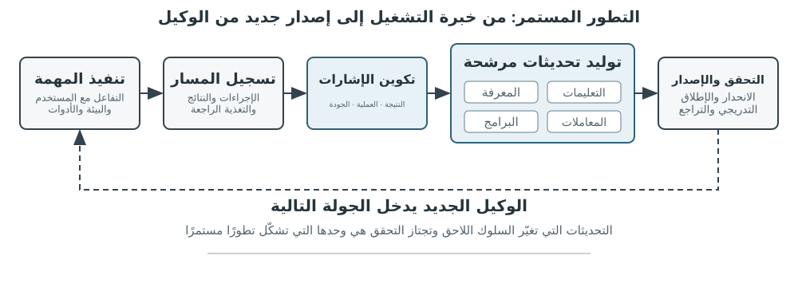
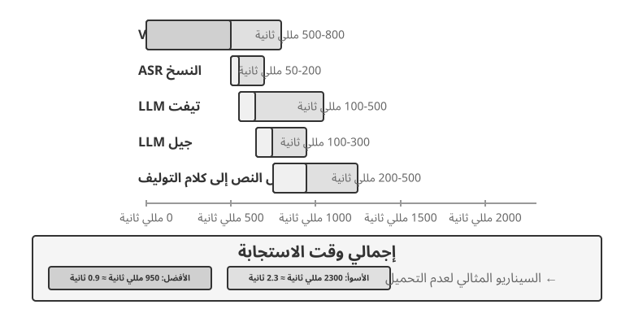
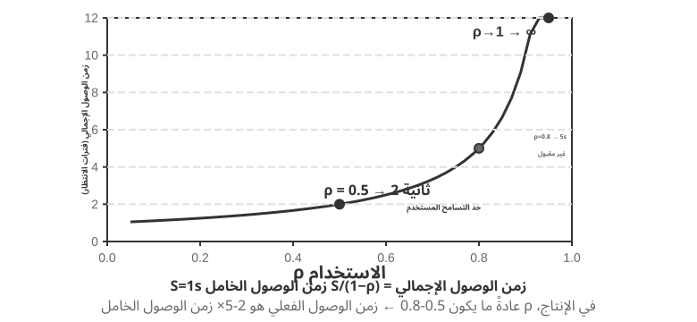
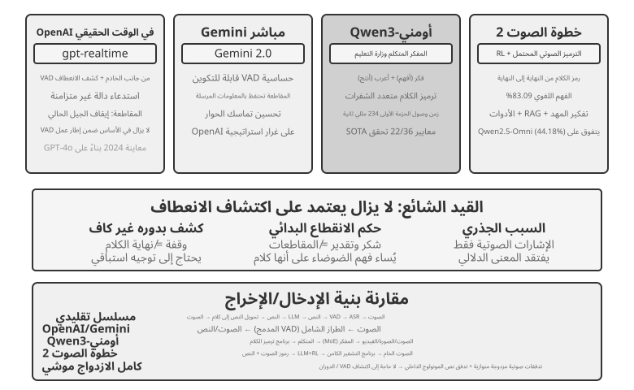
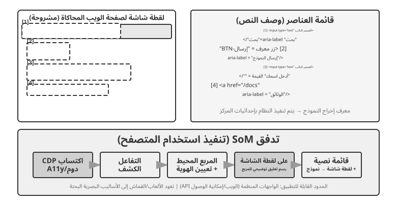

# تعدد الوسائط والتفاعل الآني

بحثت الفصول السابقة في عمل الوكلاء داخل عالم نصي، وتفاعلهم مع الأنظمة الرقمية عبر السياق والأدوات والشفرة. لكن عالم الوكيل أوسع من النص وواجهات API؛ فعندما يحتاج إلى فهم أمر منطوق، أو العثور على الزر الصحيح في الشاشة والنقر عليه، أو توجيه ذراع روبوتية لالتقاط جسم، يدخل مجالًا جديدًا هو **التفاعل الآني متعدد الوسائط**. والانتقال من مدخلات نصية ومخرجات نصية إلى **إدراك متعدد الوسائط واستجابة آنية** هو الخطوة التي تخرج الوكيل من حدود مربع الحوار. ويعني تعدد الوسائط هنا التعامل مع النص والكلام والصور والفيديو والأفعال معًا، لا مع النص وحده.

لنحدد أولًا نطاق الفصل. فقد أصبح فهم الصور الثابتة والوثائق، كفحص لقطة شاشة أو قراءة مخطط أو تحليل PDF، جزءًا عاديًا من سير عمل الوكيل. وهذه المهام ذات المدخل الواحد ناضجة نسبيًا في النماذج متعددة الوسائط ولا تحتاج إلى بنية خاصة. أما هذا الفصل فيتناول ثلاثة سيناريوهات تجعلها **قيود الزمن الحقيقي** أصعب بكثير: الحوار الصوتي، وتشغيل الواجهات الرسومية، والتحكم في الروبوت. ففيها تتدفق المدخلات باستمرار، ويجب أن تستوفي المخرجات مهلة زمنية صارمة، مما يغير البنية من أساسها. ولا يزال الفهم الآني لتدفقات الفيديو مشكلة مفتوحة للوكلاء وقت كتابة هذا الكتاب. أما **توليد الوسائط**، كالصور والفيديو، فيعامله الكتاب بوصفه استدعاءً عاديًا لأداة خارجية، ولذلك يبقى خارج محور الفصل.

قد تبدو المحادثة الصوتية واستخدام الحاسوب وتشغيل الروبوت مجالات متباعدة، لكنها تواجه مشكلة مشتركة: معالجة عدة وسائط في وقت واحد مع حساسية شديدة لزمن الاستجابة. فتوقف يتجاوز ثانيتين في حوار صوتي يربك المتحدث، واضطراب لا يتجاوز أجزاء من الألف من الثانية في التحكم الروبوتي قد يسبب تصادمًا. وتدفع هذه القيود السيناريوهات الثلاثة بعيدًا عن **خط المعالجة المتسلسل**، الذي لا تبدأ فيه خطوة حتى تنتهي سابقتها، ونحو **النموذج المتكامل** الذي ينتقل مباشرة من المدخل إلى المخرج ويقلل عمليات التسليم الوسيطة.

ويأتي هذا الفصل على السطور التالية:
1. **النماذج الثلاثة لبنية الصوت**: المسار المتسلسل (VAD → ASR → LLM → TTS)، والنموذج المتكامل متعدد الوسائط (Omnimodal / Omni)، والنموذج ثنائي الاتجاه التفاعلي (Full-Duplex). ونقارن زمن الاستجابة والمفاضلات المعمارية لكل منها بدراسة مدى تجاوز كل نموذج لافتراض الأدوار المنفصلة.
2. **التوافق بين سرعة التفاعل والتفكير العميق**: موازاة المسارين السريع والبطيء، والنموذج المنفصل حيث يعمل نموذج التفكير الخلفي كاستراتيجي (مثل GPT-Live وPine AI)، وصولاً إلى التفكير المستبطن في النموذج الواحد (مثل Step-Audio R1).
3. **تحسين تركيب الكلام الطبيعي**: الارتقاء بطبقة التنفيذ لتوليد نبرة صوتية وظيفية تحاكي البشر.
4. **الامتداد إلى استخدام الحاسوب والروبوتات**: توسيع المنظور ليشمل تشغيل الواجهات الرسومية (GUI Computer Use) والتحكم الروبوتي، مع إبراز قيود الاستجابة الفعلية وتعدد الوسائط عبر هذه السيناريوهات.
هناك موضوعان نظريان آخران يحملان هذه السيناريوهات ويستحقان اهتمامًا خاصًا: **بنية التفكير** (مدى تعاون التفكير السريع والبطيء) و**الواجهة السريعة والبطيئة** التي تتبعها (**الجسر الكامن** — ما يمكن للنماذج السريعة والبطيئة أن تتبادله إلى جانب النص). وعلى الرغم من تقديمها في سياق الصوت، إلا أن هذه الأفكار لا تقتصر عليه. يواجه قسما استخدام الكمبيوتر والروبوتات نفس السؤال حول متى يجب استشارة خبير استراتيجي بطيء، لذا ضع كلا الموضوعين في الاعتبار.

## الصوت: الواجهة الأكثر طبيعية بين الإنسان والآلة

الصوت ليس نصًا تحوّل إلى صوت فحسب. فسرعة الكلام تقارب أربعة أضعاف سرعة الكتابة، كما أنه يترك اليدين والعينين حرتين؛ لذلك يضع الوكيل في حلقة إدخال وإخراج مستمرة يمكن للمستخدم مقاطعتها في أي لحظة. يحوّل الإملاء الكلام إلى نص، أما وكيل الصوت فيتيح التعاون معه مباشرة، وكلاهما يدعم أسلوب «البرمجة بالهمس» الذي عُرض سابقًا.

يغطي هذا القسم اتجاهين: أن يتحدث المستخدم إلى الوكيل، وأن يتحدث الوكيل إلى العالم الخارجي نيابةً عن المستخدم. يحدد نموذج الصوت ما يستطيع الوكيل الإجابة عنه، بينما تحدد بنية التفاعل قدرته على السماع بوضوح، والرد في الوقت المناسب، وتسليم الدور طبيعيًا، وإتمام التأكيدات واستدعاءات الأدوات أثناء المكالمة.

### توقيت التفاعل: من التسلسل إلى الازدواج الكامل

تصف مقدمة GPT-Live من OpenAI ثلاثة نماذج للتفاعل الصوتي: التسلسلي، والقائم على الأدوار، والازدواج الكامل[^ch9-12]. ليست هذه مراحل تستبدل إحداها الأخرى ببساطة؛ فهي مقايضات مختلفة بين زمن الاستجابة والكلفة وقابلية المراقبة:

| النموذج | البنية الأساسية | الميزة الرئيسية | القيد الرئيسي |
| --- | --- | --- | --- |
| التسلسلي | VAD → ASR → LLM → TTS | وحدات واضحة يسهل استبدالها وتصحيحها | تتراكم الاستجابة وتضيع الإشارات غير اللفظية عند الحدود |
| Omni من طرف إلى طرف | نموذج واحد يسمع ويفكر ويتكلم | استجابة أسرع وحفظ أفضل للنبرة والعاطفة والصوت المحيط | لا يزال قائمًا على الأدوار؛ التدريب والتصحيح أعلى كلفة |
| الازدواج الكامل | يستمع ويتكلم ويقرر باستمرار | تداخل الكلام والمقاطعة الطبيعية وتدفق مستمر | التدريب والتحكم والتقييم أكثر تعقيدًا |

الخيط المشترك هو التخلص من افتراض أن الناس يتحدثون واحدًا بعد الآخر، ومن تخمين VAD لمن يملك الدور. ما زالت الأنظمة التسلسلية وOmni تقسم التفاعل إلى أدوار، أما الازدواج الكامل فيجعل امتلاك الدور قرارًا مستمرًا للنموذج.

[^ch9-12]: OpenAI، *Introducing GPT-Live*، 2026-07-08. https://openai.com/index/introducing-gpt-live/ يأتي تصنيف التسلسلي/القائم على الأدوار/الازدواج الكامل من ملخص المقال للأجيال الثلاثة من ChatGPT Voice؛ ويقابل مصطلح «Omni متعدد الوسائط من طرف إلى طرف» فئة «نماذج الصوت القائمة على الأدوار».

**إلغاء البث:**

```python
while audio_is_arriving:
    partial = asr.push(audio_chunk)
    if endpoint_is_probable(partial):
        candidate = llm.start(partial)
        if later_audio_changes_meaning(partial):
            cancel(candidate)                 # speculative cancellation
        else:
            tts.enqueue_stable_segments(candidate)

on_final_transcript(text):
    commit_or_restart(text)
```

### النموذج الأول · خط أنابيب تسلسلي

لا تزال معظم المساعدات الصوتية التجارية تستخدم خطًا تسلسليًا (الشكل 9-1): يقرر VAD انتهاء كلام المستخدم، ويحوّل ASR الصوت إلى نص، ويفهم LLM الطلب وينشئ الرد، ثم ينطقه TTS. تتيح الوحدات المستقلة تحسين كل جزء، لكن كل حدّ يضيف وقت انتظار.



| الوحدة | الدور | عنق الزجاجة المعتاد |
| --- | --- | --- |
| VAD | تحديد انتهاء الكلام | عتبة الصمت تؤخر الرد وقد تقطع الدور خطأً |
| ASR | تحويل الصوت إلى نص | زمن التعرف وفقدان السياق |
| LLM | الفهم والاستدلال والتوليد | زمن أول رمز؛ والاستدلال يضيف انتظارًا |
| TTS | تحويل النص إلى كلام | توليد الحزمة الأولى وتخزين التشغيل المؤقت |

في رد قصير بلا استدلال تتراكم أزمنة انتظار VAD وASR وLLM وTTS (الشكل 9-2)، وتختلف القيم الفعلية باختلاف طول الإدخال والنموذج والعتاد والشبكة والحمل. ويزيد انتظار الطوابير في الإنتاج من الخمول (الشكل 9-3).





> **التجربة 9-1 ★: بناء وكيل صوتي تقليدي**
>
> صِل الميكروفون وSilero VAD وWhisper محليًا ونموذج LLM متدفقًا وFish S1 TTS عبر WebSocket لبناء خط أساس تسلسلي. يثبت الدليل الحقيقي لجولة واحدة أن سلسلة الوسائط والنماذج عملت من البداية إلى النهاية، لكنه ليس معيارًا للتزامن أو حمل الإنتاج. يوجد الكود وسجل القبول في [chapter9/live-audio](../chapter9/live-audio/).

> **إضافة: بناء وكيل صوتي عبر WebRTC «يتصل بالمستخدم»**
>
> لا يحتاج وكيل الهاتف إلى PSTN. يستطيع WebRTC في المتصفح إعادة إنتاج حلقة فتح الجلسة، وطلب المعلومات الناقصة، وتكرارها للتأكيد، وحفظ النتيجة المنظمة. وعند ضرورة الاتصال بمؤسسة خارجية يُستبدل عقد الأداة نفسه بمزوّد PSTN/SIP ملتزم. المسار الإعلامي الكامل ومقارنة Direct/ReAct وأدلة القبول في [chapter9/phone-agent](../chapter9/phone-agent/). تحتفظ التجربة بمعرّفات التشغيل التاريخية \`exp9-2\`، لكنها لم تعد تجربة مرقمة في المخطوط.

#### من التسلسل إلى الإدراك المتدفق

يمكن لـASR المتدفق إصدار نص مؤقت أثناء كلام المستخدم، ويمكن لـLLM إرسال أول جملة قابلة للنطق إلى TTS، ويمكن لـTTS إعادة كتل صوتية تتداخل مع التوليد والتشغيل. لا يجعل ذلك المراحل متوازية بالكامل: إذا تغير النص الجزئي وجب إلغاء التوليد أو إعادة تشغيله أو تصحيحه، ولا يكفي تفعيل خيار \`stream\` وحده.

ولا يزيل التدفق العادي انتظار صمت VAD. فواجهة VAD + ASR تعاني من ثلاثة عيوب: تراكم زمن الانتظار حتى تأكيد النهاية، فقدان التردد والعاطفة والردود القصيرة والصوت المحيط، وانقسام الأسماء وعناوين البريد بين المقاطع. يحتاج النموذج المتدفق الحقيقي إلى مُرمّز سببي أو مقطّع وفك ترميز تزايدي؛ أما Whisper فمُرمّزه يتوقع مقطعًا صوتيًا كاملًا، لذلك لا ينبغي تسميته نموذجًا سببيًا متدفقًا. يستطيع نموذج صوتي مبني على LLM إصدار النص وأحداثًا دلالية من الصوت المستمر، لكن محاكاة المقاطع لا تضمن أداء نموذج سببي.

يمكن أن تتضمن السلسلة علامات \`speak_start/end\` و\`interrupt\` لحدود الكلام والمقاطعة، و\`emotion\` للعاطفة والتردد، و\`laugh\` و\`sigh\` و\`noise\` للأصوات غير اللفظية والبيئية. هكذا لا تُضغط كل الإشارات الصوتية في نص عادي.

[^ch9-11]: لتشخيص دمج قرار الدور في المتعرّف ومشكلة الملصقات التي تستخدم معلومات لاحقة، انظر Bojie Li وNoah Shi، *The Trade-off Was in the Labels: Causal Supervision for Turn-Aware Streaming ASR*، 2026 (قيد النشر).

> **التجربة 9-2 ★: محاكاة الإدراك الصوتي المتدفق باستخدام Qwen2-Audio**
>
> Qwen2-Audio ليس نموذجًا متدفقًا بحد ذاته. تحاكي التجربة الإدراك المستمر ببادئات صوتية متزايدة وتقارنه مع VAD بزمن 600 مللي ثانية وWhisper. اجتاز التشغيل المرجعي بوابات التنفيذ وإثبات المصدر لكنه أعاد سلوكين فقط من أصل 6؛ استغرقت الاستدعاءات 8.4–11.3 ثانية، وفاتت عينة التوقف \`silence\`، وصنّفت عينة الضجيج \`cough/laughter\` خطأً. هذه نتيجة سلبية لاختبار الآلية، وليست دليلًا على إدراك متدفق حقيقي بزمن 100–200 مللي ثانية. السجل الكامل في [chapter9/streaming-speech](../chapter9/streaming-speech/).

### النموذج الثاني · نماذج Omni متعددة الوسائط من طرف إلى طرف

حتى مع الإدراك المتدفق، تمرر السلسلة السماع والتفكير والكلام عبر واجهات منفصلة، وقد تضيع العاطفة والتنغيم والصوت المحيط عند تحويل الصوت إلى نص. يستمع Omni ويولد الرد وينطقه بنموذج واحد، مع كلفة تدريب وتصحيح واستبدال أعلى (الشكل 9-4). ميزته الأساسية هي زمن الاستجابة وحفظ المعلومات غير النصية، لا دقة أعلى بالضرورة: قد تصحح السلسلة الذاتية خطأً إدراكيًا عندما يكفي النص، لكنها تفقد الدليل نهائيًا إذا اعتمدت الإجابة على سرعة الكلام أو عاطفته أو البيئة[^ch9-13].

لا يزال Omni يفترض تبادل الأدوار ويستخدم VAD أو تحديد النهاية الدلالي. لذلك يمكن أن تُفسر وقفة قصيرة في سلسلة أرقام على أنها نهاية الكلام؛ يحسن الإدراك المتدفق الحكم لكنه لا يلغي الأدوار.

[^ch9-13]: لقياس متى تنعكس أفضلية الدقة بين السلسلة والطرف إلى الطرف، انظر Li, Bojie وNoah Shi، *The Cascade Gap: When and Why Self-Cascades Help Multimodal Agents*، 2026 (قيد النشر).



تقع واجهات الصوت الآنية بين السلسلة وOmni: يتعامل النموذج مع الصوت مباشرة، لكن التحكم بالتفاعل ما زال يعتمد على VAD والمقاطعة واستدعاءات الأدوات غير المتزامنة. تُظهر مسارات Qwen3-Omni Thinker-Talker وMiniCPM-o المحلية إمكان الجمع بين التفكير والتعبير والإدخال متعدد الوسائط؛ المقارنة المفيدة هي اختلاف حالات الفشل حسب المهمة، لا جدول ترتيب.

> **التجربة 9-3 ★★: تشغيل MiniCPM-o 4.5 محليًا — من طرف إلى طرف مقابل التسلسل الذاتي**
>
> ثبّت إصدارًا محليًا واحدًا من MiniCPM-o 4.5، وعطّل وضع التفكير، وقارن الإجابة المباشرة من الصوت مع التسلسل الذاتي (التفريغ أولًا ثم الإجابة من النص). تقيس التجربة حفظ المعلومات الصوتية، لا قدرة «التفكير أثناء الكلام» اللاحقة.
>
> | نوع المهمة | من طرف إلى طرف | التسلسل الذاتي | الملاحظة |
> | --- | ---: | ---: | --- |
> | حساب دلالي (2) | 1/2 | 2/2 | صحح التسلسل الذاتي خطأ تفريغ واحدًا |
> | سرعة الكلام غير اللفظية (2) | 2/2 | 1/2 | محا النص الفرق بين السرعة والبُطء |
> | المجموع | 3/4 | 3/4 | مجموع متساوٍ وفشلان متكاملان |
>
> العينة صغيرة ولا تثبت أي المسارين أدق أو أسرع عمومًا. العتاد والإصدارات والمخرجات الخام ودليل الصوت الحقيقي في [chapter9/end-to-end-speech](../chapter9/end-to-end-speech/).

يوضح Step-Audio 2 مسارًا طرفيًا يعالج الصوت الخام ويصدر نصًا وكلامًا، مع اهتمام بالعاطفة والسرعة والتنغيم والصوت المحيط. ويمد Step-Audio R1 هذا المسار بإدخال الاستدلال داخل النموذج الصوتي، وسيكون مثال «التفكير أثناء الكلام».

### النموذج الثالث · نماذج تفاعلية كاملة الازدواج

يقسم Omni المحادثة إلى «المستخدم يتكلم» و«النموذج يتكلم»، بينما تتطلب الترجمة الفورية تداخلًا. لذلك يستمع النموذج كامل الازدواج ويتكلم باستمرار، ويقرر مرارًا هل يواصل أو يتوقف أو يقاطع أو يستدعي أداة. كان Moshi من Kyutai مثالًا بحثيًا مبكرًا؛ ويطلق Thinking Machines Lab على هذا النهج **نموذج التفاعل**[^ch9-14]، حيث تُبنى قواعد التفاعل داخل النموذج بدل تجميعها حول VAD. ويقدم GPT-Live النهج على نطاق إنتاجي مع تفويض الأعمال المعقدة إلى نموذج تفكير في الخلفية مع إبقاء المحادثة حية.

[^ch9-14]: Thinking Machines Lab، “Interaction Models: A Scalable Approach to Human-AI Collaboration”، 2026-05. https://thinkingmachines.ai/blog/interaction-models/

المسار واضح: تخمّن السلاسل الأدوار من عتبات الصمت، ويرفع الإدراك المتدفق الحكم إلى المستوى الدلالي، ويحوّل الازدواج الكامل تبديل الدور نفسه إلى قرار مستمر.

### التوقيت المعرفي: التفاعل الآني والتفكير العميق

يجب على النموذج الأمامي الرد قبل أن يفقد المستخدم اهتمامه، بينما يستطيع نموذج الخلفية التفكير مدة أطول. هذه تصاميم بديلة لا تدرّج خطي بينها:

| التصميم | النموذج الأمامي | نموذج الخلفية | الخطر |
| --- | --- | --- | --- |
| حشو سريع وتصحيح بطيء | رد فوري | إعادة التفكير والإكمال | التناقض |
| تفاعل سريع ونصيحة بطيئة | إبقاء الحوار واختيار الصياغة | نصيحة أو نتائج أدوات | واجهة محدودة |
| توحيد التفكير والتعبير | التفكير والتكلم معًا | مشاركة حالة النموذج | كلفة تدريب واستبدال مرتفعة |

الحل الأول قد يعالج السؤال مرتين ويناقض نفسه. الحل الثاني أكثر استقرارًا: يرسل نموذج الخلفية النصيحة عبر شريط حالة، لكن النموذج الأمامي لا يرى استدلاله الوسيط ولا يستطيع التفكير أثناء الكلام. الحل الثالث يدمج التفكير والتعبير. في Step-Audio R1 تربط MGRD الاستدلال بالسمات الصوتية، وتتيح بنية MPS ذات الدماغين التخطيط والتعبير بالتوازي (الشكلان 9-5 و9-6). النموذج الموحد أكثر طبيعية، أما التصميم المفصول فيتيح تبديل نموذج الخلفية؛ إنها مقايضات وليست بدائل مطلقة.

### تركيب كلام أكثر شبهًا بالبشر

يكشف TTS التقليدي هويته الآلية عندما يكون سلسًا أكثر من اللازم ولا يترك فواصل. يمكن لـLLM إصدار علامات تحكم مثل \`THINKING\` و\`EMO:happy\` و\`SPEED:0.8x\` مع النص، ويحوّلها TTS إلى توقفات وتنغيم وسرعة وضحك وتنهدات. يمكن تدريب TTS على هذه العلامات أو استخدام استنساخ الصوت بمقاطع مرجعية متعددة.

> **التجربة 9-4 ★★: تركيب TTS بعلامات تحكم باستخدام Fish Audio**
>
> استخدم Fish Audio S1 لبناء مكتبة صوتية متعددة المراجع وقارن: بلا علامات، ومرجع واحد، ومراجع متعددة. تختار طبقة التنفيذ العاطفة والسرعة والأسلوب المناسبين للعلامات. حقق إعداد المراجع المتعددة أعلى نتيجة في ثلاث جولات استماع عمياء متوازنة (4.67/5 في شبه موظف خدمة عملاء بشري)، لكن لم يظهر الترتيب المخطط كاملًا لأن إعداد بلا علامات تفوق على المرجع المفرد. توحي النتيجة بأن التحكم التعبيري مفيد، لكنها ليست حكمًا عامًا من دراسة استماع صغيرة. المكتبة الكاملة ذات المراجع الأربعة والعشرين ووسائط A/B/C وسجل القبول في [chapter9/controllable-tts](../chapter9/controllable-tts/).
## استخدام الكمبيوتر: وكلاء أتمتة واجهة المستخدم الرسومية

ربما لاحظت الآن أن هذا الفصل يخصص مساحة أكبر بكثير للتعبير عن السيناريوهين التاليين. هذا متعمد. ومن بين الأنظمة متعددة الوسائط في الوقت الحقيقي، حققت التكنولوجيا الصوتية تقدمًا كبيرًا، وبالتالي توفر أفضل نقطة مرجعية. لقد تتبعت المنحنى الكامل من المشكلة الأصلية - الكمون المفرط في خطوط الأنابيب التسلسلية - من خلال نماذج نهاية إلى نهاية، والتفاعل المزدوج الكامل، والتفكير أثناء التحدث، إلى التصميمات الناضجة نسبيًا اليوم. ولهذا السبب روينا قصتها كاملة. أثناء قراءتك لأقسام استخدام الكمبيوتر والروبوتات، قارنها بهذا المسار: إلى أي مدى تقدم كل مجال، وأين بقي كل مجال عالقًا؟

تبدو هذه السيناريوهات الثلاثة مختلفة ولكنها تواجه نفس التحديات الأساسية: الإدراك في الوقت الفعلي، واتخاذ القرار بزمن وصول منخفض، والتفاعل المستمر. بعد ذلك، ننتقل إلى التفاعل البصري، أو استخدام الكمبيوتر، لتوسيع المنظور من الطريقة السمعية إلى الطريقة البصرية: ماذا لو لم يتمكن الوكيل من فهم الكلام فحسب، بل يمكنه أيضًا "رؤية" الشاشة وتشغيل واجهتها الرسومية؟

يسمح استخدام الكمبيوتر، المعروف أيضًا باسم أتمتة واجهة المستخدم الرسومية، للذكاء الاصطناعي باستخدام البرامج مثل الإنسان من خلال مراقبة الشاشة وتشغيل الماوس ولوحة المفاتيح - على سبيل المثال، فتح متصفح للبحث عن المعلومات، أو ملء البيانات في تطبيق جدول بيانات، أو ضبط التكوينات في إعدادات النظام. جوهرها هو حلقة **الإدراك والتفكير والفعل** (الشكل 9-7):

1.  يأخذ الوكيل لقطة شاشة للشاشة الحالية.
2.  يتلقى النموذج متعدد الوسائط لقطة الشاشة وتعليمات المهمة، ويخرج فكرة وإجراءًا محددًا.
3.  تنفذ طبقة التنفيذ الإجراء في البيئة الحقيقية (تحريك الماوس، والنقر، وكتابة النص، وما إلى ذلك).
4.  وينتظر استجابة الواجهة، ويأخذ لقطة شاشة أخرى، ويدخل في تكرار الحلقة التالية.

**حلقة أمان Computer Use:**

```python
observation = capture_screenshot_and_accessibility_tree()
proposal = model.decide(task, observation)
action = validate_schema_and_coordinates(proposal)

if action.is_irreversible and not user_or_policy_approval(action):
    stop("approval required")
else:
    execute_in_sandbox_or_scoped_session(action)
    new_observation = capture_after_settle()
    if not verify_goal_progress(new_observation, action):
        rollback_if_possible_or_replan()
```


هناك ثلاثة أبعاد تصميم رئيسية في هذه الحلقة: **مساحة العمل** (ما هي العمليات التي يمكن للوكيل تنفيذها)، و**الأساس المرئي** (كيفية العثور على العنصر المستهدف في لقطة الشاشة)، و**هندسة النموذج** (كيفية إنشاء الإجراء الصحيح من لقطة الشاشة).

### تصميم مساحة العمل

يحدد Anthropic ثلاثة أنواع من الأدوات التي تشكل قدرة تفاعل كاملة (الشكل 9-8):


**أداة تشغيل واجهة المستخدم الرسومية** (أداة `computer`): تتضمن عمليات الماوس النقل (`mouse_move`)، والنقر باليسار/اليمين/الوسطى، والنقر المزدوج أو النقر الثلاثي، والسحب (`left_click_drag`)، وإجراءات الضغط/التحرير الأكثر دقة (`left_mouse_down` و`left_mouse_up`). يدعم التمرير (`scroll`) أربعة اتجاهات ويمكن دمجه مع مفاتيح التعديل. تتضمن عمليات لوحة المفاتيح كتابة حرف بحرف (`type`، مع فاصل زمني قدره 12 مللي ثانية بين الأحرف لمحاكاة الكتابة الحقيقية)، ومجموعات المفاتيح (`key`، على سبيل المثال، `Ctrl+C`)، والإمساك بالمفتاح (`hold_key`). تتضمن إجراءات الإدراك التقاط لقطة شاشة واسترداد موضع المؤشر (`cursor_position`) والانتظار (`wait`).

**أداة تنفيذ الأوامر** (أداة bash): توفر جلسة طرفية bash مستمرة مع مهلة مدتها 120 ثانية. يستخدم سلسلة خافرة للكشف عن اكتمال الأمر ويحافظ على حالة البيئة عبر استدعاءات متعددة (على سبيل المثال، بعد `cd` إلى دليل، يبقى الاستدعاء التالي في هذا الدليل).

**أداة تحرير الملفات** (`str_replace_editor`): تتيح التحرير الآمن من خلال مطابقة السلسلة وتدعم عمليات العرض والإنشاء والاستبدال والإدراج والتراجع. إنه أكثر دقة من الكتابة فوق ملف بأكمله وأقل احتمالية لتعديل محتوى غير ذي صلة عن طريق الخطأ.

> **التجربة 9-5 ★: تشغيل Computer Use (مسار Anthropic المرجعي أو مسار النموذج المفتوح)**
>
> يستخدم المسار A عرض Anthropic Computer Use Demo. تجمع الحاوية بيئة سطح مكتب Ubuntu كاملة، تشمل المتصفح والطرفية وغيرهما من الأدوات الشائعة. تستقبل الواجهة الأمامية المهمة، بينما ترسل الواجهة الخلفية التعليمات ولقطات الشاشة إلى Claude، ثم تنفذ إجراءات الماوس أو لوحة المفاتيح أو الطرفية أو التحرير التي يعيدها النموذج. يهدف هذا المسار إلى فهم بروتوكول أداة `computer` الأصلي، ولا يشترط أن يمتلك جميع القراء وصولًا إلى Anthropic API.
>
> يستخدم المسار B المشروع المرافق للكتاب [`chapter9/computer-use-open-model`](../chapter9/computer-use-open-model/). وهو يشغّل browser-use افتراضيًا بالنموذج مفتوح الأوزان Qwen3-VL 32B Instruct، إما عبر API المستضاف في OpenRouter، أو بتوجيه `OPEN_MODEL_BASE_URL` إلى vLLM/SGLang مستضاف ذاتيًا أو إلى نقطة نهاية متوافقة أخرى. يجب أن تقبل نقطة النهاية لقطات الشاشة وأن تدعم JSON Schema الأصلي؛ وإذا كانت تدعم JSON العادي فقط، فيمكن تفعيل وضع التوافق schema-in-prompt صراحةً.
>
> يستخدم المساران المهمة نفسها المخصصة للقراءة فقط وعقد القبول نفسه: 25 خطوة كحد أقصى، وإجراء واحد فقط في كل خطوة، مع الاحتفاظ بهوية النموذج/نقطة النهاية، واستجابات المزوّد الخام، ولقطات الشاشة لكل خطوة، وتسلسل الإجراءات، والإجابة النهائية، وسبب التوقف. يجب الإبلاغ عن النماذج المختلفة بوصفها أذرعًا تجريبية منفصلة؛ فلا يجوز تقديم نتيجة نموذج مفتوح على أنها إعادة إنتاج لـ Claude، ولا اعتبار «بدء الحاوية بنجاح» إتمامًا للمهمة. فالفاصل بين الإجراءات وجودة التخطيط نتائج تُقاس، وليسا افتراضًا مسبقًا بفاصل 2–5 ثوانٍ أو بتفوق حتمي على النماذج الأخرى.
>

### تحديد الموقع البصري (Visual Grounding)

في كل تكرار للحلقة، يحتاج النموذج إلى تحديد موقع العنصر المستهدف بدقة في لقطة الشاشة - "أين يوجد مربع البحث؟" "ما هي إحداثيات زر الإرسال؟" هذه هي مشكلة الإرساء البصري. يوجد حاليًا **طريقتان رئيسيتان**: أحدهما هو تحويل تحديد الموقع إلى **مشكلة الاختيار من متعدد** — أولاً قم بإضافة تعليقات توضيحية لعناصر الواجهة بالأرقام، ويحتاج النموذج فقط إلى تحديد عنصر واحد؛ والآخر هو **التنبؤ بالإحداثيات النقية** — السماح للنموذج "بالنظر" إلى لقطة الشاشة والإبلاغ عن الإحداثيات مباشرة، تمامًا مثل الإنسان. يتضمن نهج الاختيار المتعدد طريقتين للتنفيذ: **تعليق توضيحي مرئي خالص** (مجموعة العلامات الأصلية، باستخدام نموذج تجزئة لتقسيم المناطق المرشحة في الصورة) و **فهرسة العناصر المنظمة** (DOM/شجرة إمكانية الوصول، قراءة البنية المتأصلة للواجهة مباشرة). الميزة الشائعة لمنهج الاختيار المتعدد هي أنه يحول المشكلة المفتوحة المتمثلة في "العثور على الزر في لقطة الشاشة والتنبؤ بإحداثياته" إلى مشكلة مغلقة تتمثل في "اختر واحدًا من العناصر المشروحة بالفعل" - تمامًا كما أن الإجابة على أسئلة الاختيار المتعدد أسهل بشكل صحيح من أسئلة ملء الفراغات في الاختبار، يحتاج النموذج فقط إلى قول "انقر فوق [123]" بدلاً من "انقر فوق الزر الأزرق على بعد 200 بكسل تقريبًا على يمين الصفحة". الزاوية العلوية اليسرى من الشاشة."

**مجموعة العلامات: طريقة التعليق التوضيحي المرئي.**

تم اقتراح مجموعة العلامات الأصلية (SoM) بواسطة Microsoft Research في عام 2023، في البداية لفتح إمكانيات الإرساء البصري لـ GPT-4V. إنها طريقة **مرئية بحتة**: تستخدم نماذج تجزئة الصور (SAM، SEEM، وما إلى ذلك) لتقسيم المناطق المرشحة تلقائيًا في لقطة الشاشة، وتراكب علامة مرقمة في كل منطقة، ويرى النموذج صورة بها أرقام. يحتاج النموذج فقط إلى الإبلاغ عن الرقم، ويقوم النظام بتحويله إلى الإحداثيات المركزية للمنطقة المقابلة. لا تتطلب العملية برمتها DOM أو أي بنية واجهة داخلية، لذا فهي قابلة للتطبيق بشكل متساوٍ على برامج سطح المكتب الأصلية وواجهات الألعاب - طالما أن نموذج التجزئة يمكنه تحديد المناطق المرشحة.

**فهرسة العناصر المنظمة: تنفيذ منظم لفكرة SoM على الويب.**

عندما توفر الواجهة نفسها معلومات منظمة، يمكن أن تكون التعليقات التوضيحية أكثر دقة. قبل العرض، تحدد صفحات الويب الحديثة بنية عنصر كاملة (شجرة DOM) والأدوار الدلالية التي تحدد الأزرار وحقول الإدخال وعناصر التحكم الأخرى. توفر أشجار إمكانية الوصول معلومات مماثلة للعديد من تطبيقات سطح المكتب. بدلاً من مطالبة نموذج التجزئة بتخمين المنطقة التي تمثل زرًا من وحدات البكسل وحدها، يمكن للنظام الاستعلام عن الواجهة مباشرةً بحثًا عن عناصرها القابلة للنقر. تقوم أنظمة وكيل الويب مثل `browser-use` بهذا بالضبط: فهي تقوم بتعداد وترقيم العناصر التفاعلية من DOM. هذا تنفيذ منظم لفكرة SoM للويب (الشكل 9-9). تتكون العملية من أربع خطوات:

1. الحصول على التمثيل المنظم (شجرة DOM) ومعلومات إمكانية الوصول للصفحة من خلال واجهة تصحيح الأخطاء في المتصفح (CDP، بروتوكول Chrome DevTools)
2. اكتشاف العناصر التفاعلية تلقائيًا (الأزرار، ومربعات الإدخال، والروابط، وما إلى ذلك)
3. قم بتعليق كل عنصر تفاعلي بمعرف فريد وارسم المربعات المحيطة في لقطة الشاشة
4. قم بإنشاء قائمة نصية في نفس الوقت تصف العنصر المقابل لكل معرف

```text
Screenshot: [Key elements in the image are annotated with IDs like [1], [2], [3], [4]]

Elements:
[1] <input type="text" placeholder="Search" aria-label="Search" />
[2] <button id="submit-btn" aria-label="Submit form" />
[3] <input type="text" placeholder="Enter your name" value="" />
[4] <a href="/docs" aria-label="Documentation" />
```

يحتاج النموذج فقط إلى إخراج معرف، ويقوم النظام تلقائيًا بالنقر فوق مركز العنصر المقابل. لا يحفظ هذا النهج الرموز المميزة لأنه لا يزال يتعين إرسال جميع بيانات التعليقات التوضيحية إلى النموذج، ولكنه يوفر توطينًا دقيقًا ومستقرًا مع تجنب الاكتشافات المفقودة والإيجابيات الخاطئة التي يمكن أن تقدمها نماذج التجزئة.




**توقع الإحداثيات النقية.**

يتخطى المسار الثالث التعليق التوضيحي ويطلب من النموذج إخراج الإحداثيات مباشرة. تعتمد أنظمة مثل **SeeClick** وClaude على نماذج الرؤية المدربة على مجموعات بيانات ضخمة من لقطات شاشة واجهة المستخدم الرسومية المقترنة بمواضع العناصر. تتعلم هذه النماذج كيفية تعيين أوصاف اللغة الطبيعية (على سبيل المثال، "انقر فوق زر الإرسال") مباشرة إلى إحداثيات لقطة الشاشة الدقيقة، بالاعتماد على الإدراك البصري مثلما يفعل المستخدم البشري.

في مخططات التنبؤ بالإحداثيات، يعتمد فهم النموذج للإحداثيات بشكل كبير على الدقة المستخدمة أثناء التدريب (الشكل 9-10). تم تدريب Claude باستخدام XGA (1024×768)، WXGA (1280×800)، وFWXGA (1366×768). إذا لم تتطابق دقة لقطة الشاشة المدخلة، فستتغير الإحداثيات المتوقعة للنموذج بشكل منهجي - مثل قياس المسافة على خريطة صغيرة ثم تطبيقها مباشرة على خريطة كبيرة. لذلك، يجب تنفيذ آلية قياس إحداثيات ثنائية الاتجاه في طبقة الأداة، ويجب تحديد دقة الهدف **بناءً على نسبة العرض إلى الارتفاع** لتجنب التمدد غير المنتظم الذي يشوه الصورة وبالتالي يؤدي إلى تحيز الحكم المنسق. على سبيل المثال، إذا كانت دقة الشاشة الفعلية هي 2560×1440 (16:9)، فإن الهدف الأكثر ملاءمة بين الخيارات الثلاثة المدعومة لـ Claude هو FWXGA (1366×768)، الذي يتمتع بنسبة عرض إلى ارتفاع أقرب إلى 16:9. تم تغيير حجم لقطة الشاشة بشكل متناسب إلى 1366 × 768 وإدخالها في النموذج؛ بعد أن يقوم النموذج بإخراج إحداثيات النقر (683، 384)، يتم تعيينها عكسيًا للإحداثيات الحقيقية (683×2560/1366، 384×1440/768) ≈ (1280، 720). على العكس من ذلك، إذا تم تمديد صورة 16:9 بالقوة إلى 1024×768 4:3، فسيتم ضغط الصورة أفقيًا، مما يتسبب في تحول الإحداثيات المتوقعة للنموذج بشكل منهجي.


يمكن تلخيص الاختيار من بين المسارات الثلاثة على النحو التالي: **عند توفر المعلومات المنظمة، قم بإعطاء الأولوية لفهرسة DOM/accessibility-tree** للحصول على أدق تحديد للموقع وأكثره ثباتًا. **عندما لا يكون متاحًا**—في برامج سطح المكتب الأصلية مثل Photoshop أو الواجهات المعروضة على قماش/WebGL أو الألعاب —**استخدم إما التعليقات التوضيحية المرئية (مسار SoM الأصلي) أو التنبؤ الإحداثي**. يعمل التعليق التوضيحي المرئي على تحويل تحديد الموقع إلى مشكلة متعددة الاختيارات، مما يجعلها أكثر ملاءمة للنماذج ذات الأغراض العامة دون تدريب متخصص. يلغي التنبؤ الإحداثي خطوة التعليق التوضيحي ويكون أكثر مباشرة للنماذج المدربة خصيصًا على توطين واجهة المستخدم الرسومية. لا يزال كلا النهجين يواجهان صعوبة في التعامل مع العناصر الصغيرة والواجهات الكثيفة.

> **التجربة 9-6 ★: استخدام استخدام المتصفح لتنفيذ عمليات المتصفح الآلية**
>
> ادمج Playwright، وهو إطار لأتمتة المتصفح، مع نموذج متعدد الوسائط لتنفيذ عمليات متصفح تقودها اللغة الطبيعية. فعّل عرض SoM واحفظ قبل كل قرار لقطة شاشة ذات مربعات حدود مشروحة. لا تقتصر واجهة النموذج على OpenAI أو Anthropic؛ فالكتاب يوفر إعداد API للنموذج المفتوح Qwen3-VL، ويحتفظ بعنوان base URL عام متوافق مع OpenAI لخدمات الاستضافة الأخرى أو للاستدلال المستضاف ذاتيًا.
>
> مهمة الاختبار «افتح Google وابحث عن طقس سان فرانسيسكو»: بعد التشغيل تعرض لقطة الشاشة صفحة بحث Google بعناصر تفاعلية مرقمة. يختار النموذج مربع البحث، ويدخل "San Francisco weather today"، ويرسل البحث، ثم يستخرج درجة الحرارة وحالة الطقس من صفحة النتائج. عند القبول، تحقّق من الإجابة والمسار بصورة مستقلة وسجّل عدد الخطوات والوقت الفعليين كما هما. لا يجوز أن تكون عبارة «5 خطوات ونحو 20 ثانية» إلا ملاحظة من تشغيل واحد، لا نتيجة ثابتة تُذكر من دون إيصال تنفيذ.
>
> استخدم التشغيل الرسمي المحفوظ للنموذج المفتوح في الكتاب `qwen/qwen3-vl-32b-instruct` على OpenRouter. عندما واجه النموذج CAPTCHA في بحث Google عند الخطوة 4، لم يدّع النجاح، بل انتقل إلى weather.com، وفي الخطوة 16 قرأ من صفحة Today لسان فرانسيسكو: 64°F، وSunny، والمحسوسة 62°F، والعظمى 74°F، والصغرى 55°F. أبلغت استجابات API الست عشرة كلها عن نموذج Qwen3-VL المطلوب، واجتازت 15 لقطة شاشة صالحة للخطوات مع مسار الإجراءات المخصص للقراءة فقط قبولًا حتميًا مستقلًا. تثبت هذه النتيجة أن مسار API للنموذج المفتوح قابل للتشغيل؛ ولا تعني أن ذراع أداة `computer` الأصلية من Anthropic قد أُعيد إنتاجه.

### وكيل استخدام الكمبيوتر الذي يمكنه مشاهدة الرسوم المتحركة وسماع الصوت

حتى الآن، يقوم تصور استخدام الحاسوب على افتراض ضمني مفاده أن **الشاشة ثابتة**: يلتقط الوكيل لقطة شاشة، ويستدل على الخطوة التالية، ثم ينقر ويلتقط لقطة جديدة. لكن الشاشات الحقيقية تعرض مقاطع فيديو وإشعارات خاطفة تختفي خلال ثوانٍ، كما تنقل أصوات الاجتماعات. والوكيل الذي لا «يفتح عينيه» إلا مرة كل ثلاث إلى خمس ثوانٍ ولا يسمع شيئًا، يظل أعمى وأصم عن كل ما يحدث بين إطارين. لذلك تظل مهام يومية كاملة بعيدة عن متناول وكلاء استخدام الحاسوب الحاليين، مثل متابعة تسجيل للشاشة، والانضمام إلى اجتماع، واتباع توجيه صوتي، والتقاط مربع حوار قبل اختفائه.

ما يحتاج حقًا إلى إعادة تصميم هنا ليس "واجهة الإجراء"، بل "**واجهة المراقبة**"[^ch9-9]. الفكرة الأساسية هي فصل **الملاحظة** (المستمرة والتكيفية ومتعددة الوسائط) عن **الإجراء** (المنفصل)، وإنشاء طبقة برمجية وسيطة إدراكية تقع بين البيئة وأي نموذج جاهز لاستخدام الكمبيوتر دون الحاجة إلى إعادة التدريب. يمكننا أن نسمي ذلك واجهة مراقبة الوكيل والكمبيوتر (AOI). لديها ثلاثة مكونات "بوابة": أولاً، **التقاط الإطارات الرئيسية بين الإطارات**—استخدم بوابة بكسل رخيصة جدًا لتخطي الإطارات التي لم تتغير تقريبًا، ثم استخدم نموذجًا صغيرًا لتحديد ما إذا كان قد حدث تغيير ذو معنى، مع التقاط إطار فقط عند حدوث تغيير، مما يؤدي إلى تكلفة قريبة من الصفر للشاشات الثابتة؛ ثانيًا، **نسخ الكلام حسب مستوى الصوت** - لا يتم استدعاء التعرف على الكلام إلا عندما يكون هناك صوت، مما يمنح الوكيل "آذانًا" لأول مرة؛ ثالثًا، والأكثر أهمية، **تحويل الملاحظات إلى أوصاف نصية ثابتة** — اجعل النموذج يصف الإطار الملتقط في جملة واحدة (على سبيل المثال، "أفادت النافذة المنبثقة للتو أنه تم تغيير تاريخ الإصدار إلى 28 أبريل")، و **حتى إذا تم مسح الصورة الأصلية لاحقًا من السياق، فسيظل هذا النص في الذاكرة**، حاملاً المعلومات الديناميكية إلى الأمام في شكل نصي.

النتيجة غير المتوقعة هي أن العامل الحاسم ليس اختيار الإطارات بقدر ما هو تحويل الإطارات المختارة إلى نص ثابت، لأن النص هو الصيغة التي تتعامل معها الوكلاء اللغوية بأعلى موثوقية. وعبر ثمانية نماذج، من فئة 7B إلى النماذج المتقدمة، حققت هذه البرمجيات الوسيطة مكاسب تراوحت بين 17 و48 نقطة مئوية من دون إعادة تدريب. وكانت الفجوة أوضح في المهام الصوتية: فبعد إضافة طبقة الإدراك، استطاع الوكيل أخيرًا إكمال مهام كان يسمعها من قبل ولا يستطيع تنفيذها. ومع ذلك، لا توجد تهيئة واحدة تناسب الجميع؛ ففي بعض النماذج الحديثة، يؤدي إدخال عدد مفرط من رموز الصورة إلى مزاحمة التفكير من السياق وخفض الأداء. لذلك يجب اختيار المكونات بما يلائم **النموذج**، لا تشغيلها كلها دفعة واحدة. وهذا هو درس المفاضلة نفسه بين التنبؤ بمجموعة العلامات والتنبؤ بالإحداثيات: لا حل سحريًا في تصميم الإدراك، بل تهيئة تناسب خصائص كل نموذج.

[^ch9-9]: للحصول على الآلية الكاملة والاستئصال لكل نموذج للمكونات الثلاثة - الإطارات الرئيسية المسورة، والنسخ حسب الطلب، وإطارات السرد إلى نص ثابت - راجع Bojie Li وNoah Shi. *واجهات مراقبة الوكيل والكمبيوتر تتيح الاستخدام الديناميكي للكمبيوتر.* arXiv:2606.29472, 2026.

### نماذج العالم في Computer Use

واجهة الرصد في القسم السابق تجيب عن سؤال «ماذا جرى في ما بين اللقطتين»: فبالإطارات المفتاحية ونسخ الكلام والنص الباقي، لم يعد الـ Agent يرى لقطتَي شاشة متباعدتين فحسب. لكن واجهة الرصد لا تُزيل زمن التخطيط. فالـ Agent ما زال يدور في حلقة متسلسلة «لقطة شاشة—تفكير—نقر»، وكلما نفّذ فعلاً أعاد الرصد وفكّر في الخطوة التالية. وتُظهر دراسة الكفاءة **OSWorld-Human** أنه حتى حين تنجح المهمة في النهاية، تظل خطوات الـ Agent وأزمنة انتظاره أكثر بوضوح من خطوات الإنسان وأزمنته؛ وبلوغُ الدقة مستوى الإنسان ليس مرادفاً لكونه صالحاً للاستعمال بما يكفي.

الإنسان حين يشغّل الحاسوب لا يبدأ التفكير في الخطوة التالية بعد النقر، بل يتنبأ أولاً بعاقبة الفعل: فإن وافق التغيّر الفعلي ما توقّعه مضى في خطته الأصلية؛ ولا يتوقف ليعيد الرصد والتخطيط إلا حين يجد حالة الصفحة قد حادت عن المتوقع. ونموذج العالم يتيح للـ Agent أن يتنبأ قبل الفعل بما قد يصير إليه سطح المكتب، فيتحقق بذلك «التنفيذ التخميني» الشبيه بصنيع الإنسان، وترتفع الكفاءة ارتفاعاً كبيراً.

وحالة سطح المكتب ليست صورة بكسلات فحسب، بل تشمل أيضاً النوافذ والتبئير وموضع التمرير ومحتوى حقول الإدخال وحالة التحميل والأذونات واستجابات الشبكة؛ أما الأفعال فتشمل النقر والإدخال بلوحة المفاتيح والتمرير والسحب والانتظار. وأي نموذج عالم صالح للاستعمال في Computer Use عليه على الأقل أن يرمّز الحالة الراهنة، وأن يتنبأ بتغيّر الحالة الذي يُحدثه الفعل المرشّح، وأن يسلّم هذا التنبؤ إلى المخطِّط ليقرر الخطوة التالية:

```text
حالة سطح المكتب + click/type/scroll/wait ──> تمثيل الحالة التالية
```

وبهذا يستطيع الـ Agent أن يقارن عواقب الأفعال المرشحة قبل أن ينقر فعلاً، وأن يُعِدّ الخطوة التالية أثناء تحميل الصفحة، وأن يتعافى استناداً إلى فرق الحالة حين تمرّ نافذة منبثقة في لمحة. فلو كانت المهمة «أنشئ ملف Python جديداً في VS Code واكتب فيه hello world»، أمكن النموذج أن يتنبأ أولاً بالحالة المفتاحية لشجرة الملفات والمحرّر بعد النجاح، ثم يختار أفعال النقر والكتابة والحفظ؛ ولو كانت المهمة حذف ملف، أمكنه أن يتنبأ سلفاً داخل سطح مكتب افتراضي معزول هل سيظهر صندوق تأكيد لا رجعة فيه، وأن يطلب تأكيد المستخدم عند اللزوم. والمهم هنا ليس أن يولّد النموذج لقطة شاشة مستقبلية واقعية المظهر، بل أن يتنبأ بفروق الحالة القابلة للفحص التي يقتضيها إتمام المهمة.

وفي تموز/يوليو 2026 عرض **Photon-1** الذي أعلنته Induction Labs تنفيذاً من تنفيذات هذا المسار، إذ أتمّ التدريب المسبق لنموذج عالم لـ computer use بثلاثين ألف ساعة فقط من زمن معالج H200. فهو يضغط كل إطار إلى رموز كامنة منفصلة، ويتنبأ انحدارياً ذاتياً بتمثيل الحالة التالية بعد الفعل، بدل توليد لقطات الشاشة بكسلاً بكسلاً في مرحلة التدريب المسبق؛ أما مولّد الصور الملحق به فلا يُستعمل إلا لإظهار التمثيلات الكامنة بصرياً، وليس مكوّناً لازماً للاستدلال. وإذا أُعطي لقطة شاشة بذرية والأفعال التالية لها، أمكنه أن «يتخيّل» حالات سطح المكتب على التوالي، ثم يتعلم عبر التدريب المتصل على الأجهزة الافتراضية أن يُخرج أفعال computer-use.[^ch9-20]

[^ch9-20]: David Li and Jonathan Li, Induction Labs, “Scaling Video Pretraining with Imagination Models,” 2026-07-23. https://www.inductionlabs.com/news/scaling-video-pretraining. أما معاملات Photon-1 وحجم بياناته ومقاييسه الداخلية ومقارنات كلفته الواردة في النص فهي كلها نتائج أفصحت عنها الشركة.

### الهاتف المحمول: حواجز النظام البيئي أصعب من التكنولوجيا
## التحكم في الروبوت: ترتيب سطح المكتب باستخدام XLeRobot

> **كيف يُقرأ هذا القسم**: نستخدم من أوله إلى آخره مهمة واحدة فقط——«ضع الكوب الأحمر في الصينية، وألقِ قصاصة الورق الصفراء في سلة المهملات، ثم انظر مرة أخرى في النهاية للتحقق من حالة سطح المكتب». التجربتان 9-7 و9-9 تجريان على جهاز XLeRobot حقيقي، وتحتاجان إلى ذراع وإلى معايرة وإلى مفتاح إيقاف طارئ وإلى مشرف حاضر في الموقع. أما التجارب 9-8 و9-10 و9-11 فهي نظائرها التي تعمل على وحدة معالجة رسوميات محلية. تُبلَّغ نتائج العتاد الحقيقي ونتائج المحاكاة كلٌّ على حدة، لكن هدف المهمة ومعنى الأفعال وشروط النجاح تبقى واحدة.

التحكم في الروبوت عمل أصعب بكثير من «النظر إلى صورة والإجابة عن سؤال». فالنموذج لا يكتفي بفهم المشهد، بل عليه أن يتصرف على نحو متصل في العالم الحقيقي، وكل فعل يغيّر أحوال اللحظة التالية. ويجعل XLeRobot هذا الفرق ملموساً جداً. فالذراع نفسها يمكن أن يتحكم فيها إنسان عن بُعد بلوحة مفاتيح أو ذراع ألعاب أو عتاد واقع افتراضي؛ ويمكن كذلك تسليم رصد الكاميرا ومجموعة محدودة من أدوات الفعل إلى Agent ليستدعيها بنفسه. لا يتغير العتاد ولا تتغير المهمة؛ الشيء الوحيد الذي يتغير هو من يتولى التشغيل——ففي الحالة الأولى يراقب الإنسان ويصحّح باستمرار، وفي الثانية على النموذج ونظام التحكم أن يُتمّا العمل نفسه إلى نهايته.

يربط هذا القسم خمس تجارب بخيط «ترتيب سطح المكتب». أولاً يتحكم إنسان عن بُعد في XLeRobot حقيقي، لنقيس إلى أين يصل هذا العتاد بين يدي مشغّل بارع بما يكفي. ثم نُرسي في المحاكي الحدَّ الأعلى المثالي للتحكم في المهمة نفسها. وبعد ذلك نترك Agent يتحكم ذاتياً في XLeRobot الحقيقي، لنرصد كيف يحدد الإدراك والتخطيط والتعافي من الإخفاق النتيجةَ. ثم ننقل عقد الأدوات نفسه إلى المحاكي ونقارن ثلاث استراتيجيات دفعة واحدة: التنفيذ مفتوح الحلقة، والتحقق خطوة بخطوة، ونموذج العالم. وأخيراً نغيّر الخلفية ومظهر الأجسام والإضاءة والضوضاء البصرية لنرى هل تستطيع سياسة بصرية تعلّمت في المحاكاة أن تتكيف مع بيئة جديدة.

عنق الزجاجة هنا ليس في العادة صنع مقياس أداء ساكن آخر للأسئلة والأجوبة، بل جعل النموذج يُبقي الحلقة مغلقة في ظل عرض حزمة محدود للإدراك والتحكم. وأي نظام روبوتي صالح للاستعمال عليه أن يجيب عن أربعة أسئلة على الأقل:

1. ما المهمة التي يريد الإنسان إنجازها؟
2. أي مهمة فرعية تأتي تالياً؟
3. ما الفعل المحدد الذي تُخرجه المهارة الحالية؟
4. بعد تنفيذ الفعل، هل ما زال الواقع مطابقاً للخطة الأصلية؟

يضع هذا القسم هذه الأسئلة الأربعة في حلقة التحكم نفسها في XLeRobot، ويبيّن ما تتكفل به كل تقنية من التقنيات الأربع: التخطيط طويل الأفق يقرر أيّهما أولاً، الكوب أم الورقة؛ وVLA أو بدائيات الفعل تنفذ الإمساك والوضع؛ ونموذج العالم يقدّر عواقب الفعل؛ والانتقال من المحاكاة إلى الواقع يتحمّل الفرق بين مقاطع التدريب وبين الكاميرا والمشغّلات الحقيقية. وحتى لو كان لدى النموذج عالي المستوى ما يكفي من معرفة وقدرة على التخطيط، فإن غياب حلقة واحدة من حلقات هذه التغذية الراجعة كافٍ لأن يعجز النظام عن إتمام المهمة.

### تقسيم العمل بين العتاد والخوارزمية

أول سؤال يصلح XLeRobot للإجابة عنه هو: حين يفشل ترتيب سطح المكتب ذاتياً، أهي الذراع لا تقدر، أم الخوارزمية لا تُحسن استعمال الذراع؟ هنا حقيقة لا ينبغي تليينها: **حتى ذراع بمئات قليلة من الدولارات مثل XLeRobot صارت قادرة، بالتحكم عن بُعد، على إتمام مهمة مكتبية متعددة الخطوات ومترابطة كالمهمة الواردة في هذا القسم**——ينظر الإنسان إلى بث الكاميرا، فيمسك الكوب الأحمر ويضعه في الصينية، ويلقي الورقة الصفراء في سلة المهملات، ثم يتحقق من الحالة مرة أخيرة. هذه النتيجة لا تعني فقط أن «العتاد بالكاد يكفي»، بل هي دليل تشخيصي واضح: **فيما يخص هذه المهمة تحديداً، عنق الزجاجة في جانب الخوارزمية لا في العتاد نفسه.**

طريقة التشخيص مباشرة. مع تثبيت الكاميرا والذراع والقابض وترتيب سطح المكتب وشروط النجاح، يتولى الإنسانُ الحلقةَ أولاً. فهو يصحّح باستمرار تقدير مواضع الأجسام واختيار الأفعال وتوقيتها، ويعرف ما يفعله حين يفلت الإمساك. والمسافة بين النظام الذاتي والإنسان تظهر بالضبط في هذه القدرة على العمل في حلقة مغلقة. ومدى هذا الحكم هو بالطبع المهمة المكتبية في هذا القسم: فهو يبيّن أن العتاد تجاوز عتبات الحمولة والدقة وحيّز العمل التي تتطلبها هذه المهمة، لكنه لا يعني أن ذراعاً بمئات قليلة من الدولارات تكفي لكل بيئة مفتوحة أو لعمليات تناول أصعب.

يدعم XLeRobot عدة مداخل للتحكم عن بُعد: لوحة المفاتيح، وذراع تحكم Xbox، وJoy-Con من Switch، وعتاد الواقع الافتراضي. والمشغّل البشري يفعل بطبيعته أموراً كثيرة كان على الخوارزمية أن تنفذها صراحةً: يبطئ حين يقترب القابض من الكوب، ويصحّح نقطة الإمساك إذا انزلق الكوب، ويعيد النظر إذا لم ينجح في قرص الورقة من المرة الأولى، ويتأكد من النتيجة حين يدخل الجسم منطقة الهدف. لذلك فالتحكم عن بُعد ليس وسيلة لجمع بيانات العروض التوضيحية فحسب، بل هو أيضاً تجربة تشخيصية «تُثبّت العتاد وتغيّر المشغّل وحده».[^ch9-1]

> **التجربة 9-7 ★: ترتيب سطح المكتب بالتحكم عن بُعد في XLeRobot حقيقي**
>
> ضع في حيّز عمل XLeRobot حقيقي كوباً أحمر وصينية وورقة صفراء مكوّرة وسلة مهملات. ينفّذ المشغّل المهمة الثابتة عبر أحد مسارات التحكم عن بُعد المعايَرة: «ضع الكوب الأحمر في الصينية، وألقِ قصاصة الورق الصفراء في سلة المهملات، ثم انظر مرة أخرى في النهاية للتحقق من حالة سطح المكتب». كرّر ذلك عدة جولات على الأقل، وسجّل بث الكاميرا ومدخلات المشغّل وحالة الذراع وأزمنة الأفعال وحالات فلتان الإمساك وعدد المحاولات المعادة والحالة النهائية.
>
> لا تُنزل معيار القبول إلى «يبدو سطح المكتب نظيفاً في النهاية». يجب أن يكون الكوب الأحمر داخل الصينية والورقة الصفراء داخل سلة المهملات، وأن تعود الذراع إلى وضعيتها الآمنة، وألا يقع طوال العملية أي اصطدام أو خروج عن حيّز العمل أو تدخّل بشري يُتمّ العمل من دون تحقق.

التحكم عن بُعد على عتاد حقيقي هو أقنع ما يُبيّن الحدَّ الأعلى للمهمة، لكنه غير مناسب لتغيير عدد الأجسام ومواضعها على نطاق واسع. وللحصول على مقارنة قابلة للتكرار وللقياس إحصائياً، ننقل المشكلة نفسها——«إعادة الأجسام إلى أماكنها»——إلى محاكي سطح مكتب ثنائي الأبعاد، ونستعمل متحكماً مثالياً بديلاً عن مشغّل قوي لا يخطئ في الإدراك ولا يسيء اختيار الفعل.

> **التجربة 9-8 ★: قياس الحد الأعلى المثالي للتحكم في المهمة نفسها داخل المحاكي**
>
> في محاكي سطح مكتب ثنائي الأبعاد، وزّع عشوائياً الكوب الأحمر والورقة الصفراء ومناطق الهدف الخاصة بكل منهما، ودع المتحكم المثالي يقترب من الأجسام بالتتابع ويمسكها وينقلها إلى الموضع الصحيح. فهو لا يحتاج إلى التعرف على الصور ولا يخطئ في اختيار الفعل، ولذلك يمثّل إجابة السؤال: «إلى أين تستطيع هذه المهمة أن تصل على الأقل حين يكون الإدراك والقرار كلاهما صحيحاً؟».
>
> انظر إلى معدل نجاح المهمة وعدد الخطوات وطول المسار؛ وغيّر أيضاً المواضع الابتدائية للأجسام ومقياس المهمة لترى هل يظل هذا الحد المثالي مستقراً. نستخدم شروط النجاح نفسها الواردة في التجربة 9-7، لكن ما يُقاس هنا محاكاة بلا مشغّلات: وهذا لا يعني أن XLeRobot الحقيقي تحرّك. وستكون التجربتان خطَّي أساس للتحكم الذاتي لاحقاً——فالتجربة 9-7 حلقة مغلقة بشرية على عتاد حقيقي، والتجربة 9-8 حلقة مغلقة مثالية في بيئة محاكاة.

### البنية الأساسية للتحكم في الروبوت

يفصل النظام الروبوتي عادةً بين الأعمال ذات المقاييس الزمنية المختلفة.

| الطبقة | السؤال الجوهري | المُخرَج | المقياس الزمني المعتاد |
| --- | --- | --- | --- |
| هدف المهمة | ماذا يريد الإنسان أن يُنجز | «الكوب والورقة إلى أماكنهما» | رتبة الدقائق |
| التخطيط طويل الأفق | ما الأول وما التالي | الكوب أولاً، ثم الورقة، والتحقق أخيراً | من ثوانٍ إلى دقائق |
| المهارة الأساسية | أي تغيّر في الحالة يتحقق الآن | `pick(red_cup)`، `place(red_cup, tray)` | نحو 1—3 ثوانٍ |
| VLA / سياسة المهارة | كيف تتحرك هذه المهارة تحديداً | حركة قصيرة أو مسار متصل لقابض XLeRobot | استدلال بنحو 1—10 هرتز |
| التحكم منخفض المستوى وطبقة الأمان | كيف يُنفَّذ بثبات ومن دون تأخير | مقادير تحكم في المفاصل أو الطرف، وحدود سرعة وإيقاف طارئ | نحو 50—1000 هرتز |

هذا تقسيم عمل هندسي شائع، لا معمارية النموذج الوحيدة. فقد يتكفل VLA بجزء من الأحكام عالية المستوى، وقد يكون المخطِّط برنامجاً قائماً على القواعد أو VLM أو مُحسِّناً. وأياً كان التنفيذ المختار، يُستحسن فصل «ترتيب المهمة» عن «الفعل الآني»؛ وإلا فإن زمن استدلال النموذج عالي المستوى يجرّ التحكم منخفض المستوى إلى الوراء، ويُرغم التحكمُ عالي التردد في الأسفل النموذجَ الأعلى على معالجة كمّ كبير من التفاصيل غير ذات الصلة. وعلى XLeRobot ينبغي ألا يُخرج النموذج زوايا مفاصل عشوائية مباشرة: فهو يكتفي باختيار مهارات ذات حدود واضحة مثل `pick` و`place` و`verify_state` و`stop`، ثم يتولى المنفِّذ المعايَر——المحدود السرعة وذو المهلة الزمنية——تحويلها إلى حركة حقيقية للذراع.

### التخطيط طويل الأفق وتفكيك المهمة

حين يقول المستخدم «رتّب سطح المكتب»، لا يستطيع النظام تمرير هذه الجملة كما هي إلى نموذج الفعل. فالمخطِّط يُعدّد أولاً الأجسام والأهداف في المشهد، ويحدد الترتيب، ثم يكتب لكل خطوة شرط البدء وشرط الإنهاء وحدود المخاطرة. مثلاً:

```text
معالجة الكوب الأحمر → إزالة الورقة الصفراء → فحص سطح المكتب
```

و«معالجة الكوب الأحمر» تتفكك بدورها إلى فعلين وتحقق واحد:

```text
pick(red_cup) → place(red_cup, tray) → verify_state()
```

كل مهارة تُنجَز تترك لنا عقدة قابلة للتحقق. فإذا فلت الإمساك أُعيدت تلك الخطوة وحدها. وإذا حرّك أحدهم جسماً أو غيّر المستخدم الهدف، يكفي إعادة تخطيط الخطوات اللاحقة المتأثرة، لا تكرار الخطة القديمة كلها. والأدوات التي تُعطى للوكيل ينبغي أن تكون بسيطة بما يكفي: كل استدعاء يفعل شيئاً واحداً، ومدى الحركة مثبَّت، وثمة مهلة زمنية، وبعد التنفيذ يُعاد الرصد فوراً.

> **التجربة 9-9 ★★: دع Gemini Robotics-ER 1.5 يرتّب سطح المكتب ذاتياً بواسطة XLeRobot**
>
> أبقِ على XLeRobot الحقيقي وترتيب سطح المكتب ونصّ المهمة وشروط النجاح من التجربة 9-7؛ واستبدل المشغّل البشري وحده بـ Agent. وكِل الرصد والتخطيط إلى نموذج استدلال مجسّد مثل Gemini Robotics-ER 1.5، وافتح عبر حلقة وكيل على طريقة RoboCrew خمس أدوات فقط: `observe_scene` و`pick` و`place` و`verify_state` و`stop`.[^ch9-2]
>
> يرصد النموذج سطح المكتب أولاً، ويحدد ترتيب المعالجة، ثم يستدعي أفعال الإمساك والوضع المعايَرة في XLeRobot. وكلما أتمّ مهارة وجب عليه أن يعيد الرصد ويتحقق من الشرط البعدي. وحين يفلت الإمساك لا يُسمح له إلا بإعادة محاولة المهارة الحالية؛ وعليه أن يستدعي `stop` إذا طلب المستخدم التوقف، أو خرج جسم عن حيّز العمل، أو تعذّر التحقق من الحالة. ولا يجوز للنموذج أن يُخرج زوايا مفاصل عشوائية مباشرة، ولا أن يتخطى التحقق الفعلي لمجرد أنه قال هو نفسه من قبل «انتهيت».
>
> معيار القبول هو عينه في التجربة 9-7 تماماً: الكوب داخل الصينية، والورقة داخل سلة المهملات، والذراع عادت إلى وضعيتها الآمنة، ولا اصطدام ولا خروج عن الحيّز. والفرق أن معنى المهمة في التجربة الذاتية يجب أن يأتي من رصد النموذج نفسه، وأن تأتي الأفعال الحقيقية من استدعاءات الأدوات، وأن تُؤكَّد الحالة النهائية برصد جديد. وليس للإنسان إلا التشغيل والإيقاف الطارئ والإشراف على السلامة، ولا يجوز له أن يُتمّ الفعل نيابةً عن Agent في منتصف الطريق. عندئذ فقط تصلح التجربتان 9-7 و9-9 لمقارنة مباشرة: «بالعتاد نفسه والمهمة نفسها، ما الذي ينقص حلقة النموذج المغلقة قياساً بحلقة الإنسان».

تكشف التجارب على العتاد الحقيقي أخطاء المعايرة وحجب الكاميرا وإخفاقات القابض، لكنها غير مناسبة لتكرار عدد كبير من الأعطال بأمان وتحت السيطرة. أما تجارب المحاكاة التالية فتحافظ على هذه الأدوات الخمس وعلى حالة المهمة نفسها بالضبط، ولا تستبدل إلا المشغّلات الحقيقية ببيئة سطح مكتب يمكن حقن الأعطال فيها——وذلك للفصل بين ما يضيفه التنفيذ مفتوح الحلقة وما يضيفه التحقق خطوة بخطوة وما يضيفه التنبؤ بالفعل.

### التحكم عبر VLA

VLA اختصار لـ Vision-Language-Action، أي «نموذج الرؤية—اللغة—الفعل». يتلقى المشهدَ الحالي وتعليمةَ مهارة واحدة، ويُخرج الفعلَ الذي على الروبوت تنفيذه تالياً:

```text
الرصد الحالي + تعليمة المهارة → فعل
```

في مثال XLeRobot، لا يقدّم المخطِّط عالي المستوى سوى `pick(red_cup)`؛ أما من أي اتجاه يقترب من الكوب، ومتى ينغلق القابض، وبأي مسار تُرفع الذراع، فأمر يقرره VLA أو سياسة المهارة انطلاقاً من المشهد الراهن. وحين تُتمّ طبقة التنفيذ هذه الحركة القصيرة، يُصوَّر سطح المكتب من جديد، ولا يُسمح للمخطِّط بتقديم `place(red_cup, tray)` إلا بعد تأكيد أن الكوب قد أُمسك فعلاً. أي أن استدعاء الأداة يعرّف تغيّر الحالة المطلوب، وVLA يعرّف كيف يتحقق هذا التغيّر بفعل متصل.

يقطّع RT-2 وOpenVLA الفعلَ المتصل إلى رموز (tokens) منفصلة ويُخرجانها واحداً تلو الآخر، تماماً كتوليد الجُمل. ويمثّل π₀ المسار الآخر: فهو يولّد مباشرةً مسارات فعل متصلة وسلسة. ولا أفضلية بسيطة لأحدهما على الآخر. فالرموز المنفصلة يسهل وصلها بنماذج اللغة؛ والمسارات المتصلة أنسب للتعبير عن الحركة السلسة. والمفاضلة الحقيقية هي كيف يُمثَّل الفعل، لا حجم النموذج وحده.[^ch9-15]

عادةً لا يستطيع النموذج الكبير الاستدلال إلا 1—10 مرات في الثانية، بينما قد يتحدّث المتحكم التقليدي من عشرات إلى آلاف المرات في الثانية. ومن الممارسات الهندسية الشائعة «تقطيع الفعل» (action chunking): يولّد النموذج دفعةً واحدة مقطعاً قصيراً من الأفعال المستقبلية، وينفّذ خيط التحكم هذا المقطع بتردد عالٍ، بينما يُعِدّ النموذج المقطعَ التالي في الخلفية. وبذلك يُخبَّأ جزء من انتظار الاستدلال داخل زمن تنفيذ الأفعال. والثمن أن المقطع كلما طال ازدادت الحركة سلاسة، لكن قلّ ما يراه النموذج من مشاهد جديدة خلال تلك الفترة. فإذا مدّ XLeRobot ذراعه ليأخذ الكوب فاصطُدم بالكوب وانزاح في الأثناء، فقد يمضي في تنفيذ أفعال وُلّدت من صورة قديمة. إذن فتقطيع الفعل مقايضة بين السلاسة وسرعة الاستجابة، لا تسريع بلا ثمن.

يحتاج تقطيع الفعل عادةً إلى هيكل «تنبؤ—تنفيذ—مقاطعة» بدل تشغيل المقطع حتى نهايته:

```python
chunk = vla(current_observation, skill)
for action in chunk:
    low_level.execute(action)
    if safety_event() or observation_changed_significantly():
        low_level.stop()
        discard_remaining(chunk)
        reobserve_and_replan()
        break
```

المقاطع القصيرة أسرع استجابة لكنها تضاعف استدعاءات النموذج؛ والطويلة أكثر سلاسة لكنها أميل إلى استعمال رصد فات أوانه. تقارن التجربة 9-10 هذا النوع من المقايضات في المحاكي، أما ما يلامس حدود سلامة العتاد الحقيقي فهو التجربة 9-9.

### حدود VLA

«التخطيط طويل الأفق + VLA» تصميم أساسي صالح للعمل، لكنه يترك مشكلات يسهل إغفالها.

- **بيانات التدريب محدودة**: العروض التوضيحية الروبوتية أقل بكثير من النصوص والصور على الإنترنت. وكون النموذج رأى كلمة «كوب» لا يعني أنه رأى أكواباً من كل المواد وفي كل ظروف الاحتكاك.
- **يتعلم المحاكاة ولا يعرف العاقبة**: استنساخ السلوك يتعلم أساساً «ماذا فعل المؤدّي في الخطوة التالية»، ولا يطالب النموذج صراحةً بأن يجيب «ماذا يُحدثه هذا الفعل».
- **كل روبوت مختلف**: مع اختلاف درجات الحرية وأنظمة الإحداثيات والقوابض وتأخيرات المشغّلات، لا ضمان أن ينتقل الفعل نفسه كما هو إلى آلة أخرى.
- **قد يفوت أوان الرصد**: بعد أن يبدأ تنفيذ مقطع الأفعال، قد يُزاح الجسم أو يُحجب أو ينقلب، بينما ما زال النموذج يحكم استناداً إلى الإطار السابق.

إذن، كون نموذج اللغة يعرف كلمة «كوب» لا يعني أنه يعرف كيف يغيّر الاحتكاكُ والتلامسُ وتموّجُ السائل وكابلُ الطاقة الحالةَ المستقبلية. فـ VLA يجيب أساساً عن «ماذا ينبغي أن أفعل الآن»؛ أما الحكم على «ماذا قد يحدث بعد الفعل» فيحتاج إلى نوع آخر من النماذج.

### نماذج العالم

يمكن فهم نموذج العالم بوصفه متنبئاً بعواقب الأفعال. وما يتعلمه هو: إذا اتُّخذ فعل ما في الحالة الراهنة، فكيف قد تتغير الحالة في اللحظة التالية.

```text
الحالة الراهنة + فعل مرشّح
    → تنبّأ بالحالة التالية أو بمقطع من المستقبل
    → قارن نتائج المرشحين
    → اختر الفعل، أو أعد التخطيط، أو توقّف بأمان
```

ونموذج العالم الصالح للاستعمال في الروبوتات عليه أن يُحسن ثلاثة أمور على الأقل:

- أن يفهم الحالة الراهنة؛
- أن يتنبأ بالنتائج التي قد تجلبها الأفعال المختلفة؛
- أن يسلّم هذا التنبؤ إلى المخطِّط أو المتحكم ليعينه على الاختيار.

وأي VLM لا يُحسن إلا وصف الفيديو، أو نموذج لا يُحسن إلا توليد الصور، لا يصير تلقائياً نموذج عالم موثوقاً للروبوتات. بل عليه أن يعرف ما الفعل، وأن يقدر على التنبؤ بأثر هذا الفعل في الأجسام والبيئة. ويمثّل V-JEPA 2 مسار التنبؤ بالمستقبل في الحالة الداخلية، بينما يتعلم World-Action Model صراحةً علاقة «الفعل—الرصد المستقبلي». ويمكن استعمالهما جنباً إلى جنب مع VLA، ولا يلزم أن يحلا محله.[^ch9-16]

وفي أي نظام حقيقي، لنموذج العالم عادةً ثلاثة استعمالات:

1. **قبل الحركة**: مقارنة الأفعال المرشحة كالإمساك والدفع والانتظار، وتقديم الخيار الأقل خطراً؛
2. **أثناء التنفيذ**: مقابلة الرصد الحقيقي بالتنبؤ، وعند اكتشاف انحراف يُقصَّر الفعل أو يُتوقَّف أو يُعاد التخطيط؛
3. **أثناء التدريب**: تعلّم تغيّرات الحالة من الفيديو وبيانات المحاكاة والمسارات الفاشلة، بما يقلل التجربة والخطأ على الآلة الحقيقية.

ولنعد إلى مهمة سطح المكتب في XLeRobot. إذا كانت الورقة الصفراء محجوبة جزئياً بالكوب الأحمر، جاز للنظام أن يقارن المهارات المرشحة: «خذ الورقة أولاً»، أو «أزح الكوب أولاً»، أو «امسك من اتجاه آخر». ولا يحتاج نموذج العالم إلى توليد فيديو روبوتي واقعي المظهر: يكفي أن يتنبأ بأي فعل مرشح أرجحُ إفضاءً إلى حالة يمكن فيها أخذ الورقة، وأيّها قد يُسقط الكوب، ليعين المخطِّط على ترتيب الخيارات. وبعد تنفيذ الفعل يبقى رصد الكاميرا الحقيقي هو الحقيقة الفاصلة: فالتنبؤ يعين على الاختيار ولا يحل محل فحص القبول.

ما يعطيه نموذج العالم ليس أجوبة قاطعة، بل تنبؤات قابلة للمقارنة عن «ماذا قد يحدث إن فعلتُ هكذا». وكلما بَعُد التنبؤ مال الخطأ إلى الكبر، والمشهد المستقبلي الذي يبدو واقعياً ليس ملزماً بأن يوافق قوانين التلامس والاحتكاك الحقيقية. لذلك يظل النظام الحقيقي محتاجاً إلى تنبؤ قصير المدى ورصد آني وتقدير لعدم اليقين ومتحكم أمان عتادي مستقل. ونماذج العالم التوليدية صالحة للمحاكاة التفاعلية وللتصور المرئي، لكن لا ينبغي الخلط بين «القدرة على توليد فيديو» و«القدرة على توجيه أفعال الروبوت».[^ch9-21]

> **التجربة 9-10 ★★: مقارنة ثلاث حلقات ذاتية لترتيب سطح المكتب في المحاكي**
>
> انقل مهمة التجربة 9-9 وحالاتها الهدف وشروط نجاحها وأدواتها الخمس كما هي إلى محاكي سطح المكتب، واستبدل مشغّلات XLeRobot الحقيقي وحدها بمنفِّذ محاكاة قابل للضبط، يُحدث في الإمساك بين الحين والآخر إخفاقاً عابراً قابلاً للتدارك. وبذلك يمكن مقارنة ثلاث استراتيجيات من دون تغيير المشكلة.
>
> **التنفيذ مفتوح الحلقة** يولّد متتالية الأفعال كاملةً دفعة واحدة ولا يعيد الرصد في الطريق. و**التحقق خطوة بخطوة** يعيد قراءة الحالة عند كل `pick` وكل `place`، ولا يعيد عند الإخفاق إلا المهارة الحالية. و**التنفيذ التنبؤي** يضيف إلى ذلك نموذج عالم قصير المدى، فيقارن النتائج المتوقعة للمهارات المرشحة قبل اختيار الخطوة التالية. تقارن التجربة معدل نجاح المهمة وكلفة استدعاءات الأدوات والقدرة على التعافي من الإخفاق، وتفحص هل جميع حالات النجاح النهائية مؤكَّدة برصد جديد من `verify_state`.
>
> وليس الغرض من هذه التجربة إثبات أن نموذج عالم محاكاة صغيراً يكافئ النموذج الفيزيائي للآلة الحقيقية، بل التحقق من علاقة أكثر أساسية: التخطيط مفتوح الحلقة يجرّ إخفاقاً موضعياً واحداً إلى نهاية المهمة؛ والتحقق خطوة بخطوة يتيح التعافي؛ والتنبؤ بالفعل يعين فوق ذلك على ترتيب المهارات المرشحة. أما من أنجز فعلاً فتحدده تغذية البيئة الراجعة كما كان.

### من بيئة المحاكاة إلى الروبوت الحقيقي

استقرار التجربة 9-10 في المحاكي لا يعني أن XLeRobot الحقيقي في التجربة 9-9 سينجح بالقدر نفسه. فالانتقال من المحاكاة إلى الآلة الحقيقية ليس استبدال متحكم آخر، بل تحمّل الفرق بين بيئتين. يمكن للتدريب أن يستعمل بيانات التحكم عن بُعد وبيانات الفيديو وبيانات التفاعل المحاكى؛ لكن عند النشر الفعلي يظهر الكوب الأحمر نفسه والورقة الصفراء نفسها والصينية نفسها وسلة المهملات نفسها تحت خلفية مختلفة وإضاءة مختلفة وموضع كاميرا مختلف وعلاقات حجب مختلفة، وتلاقي الذراع فوق ذلك احتكاكاً آخر وضوضاء استشعار أخرى وتأخير مشغّلات آخر. وإذا كبرت هذه الفروق بما يكفي، فقد تكفّ الحركات المتعلَّمة في المحاكاة عن النفع في الواقع.

> **التجربة 9-11 ★★★: اختبار عابر لبيئات RGB على مهمة سطح المكتب نفسها**
>
> في بيئة المحاكاة، استمر في استعمال المشكلة الأساسية «انقل الجسم إلى هدفه المقابل»، وانظر إلى كل عيّنة بوصفها قراراً موضعياً داخل ترتيب سطح المكتب: أن تحكم من صورة RGB من أي اتجاه ينبغي الاقتراب من الجسم، أو هل صار الإمساك ممكناً. درّب أربع سياسات بصرية متطابقة البنية: واحدة لا ترى إلا مشاهد ثابتة؛ وثانية تغيّر الخلفية؛ وثالثة تغيّر مظهر الأجسام؛ وأخيرة تغيّر الخلفية والمظهر والإضاءة والضوضاء معاً.
>
> اختبر كل السياسات في البيئة الأصلية وفي البيئة الجديدة المعدَّلة، ثم قارن دقة قرار الفعل قبل تغيّر الظروف البصرية وبعده. وما تحاول هذه التجربة الإجابة عنه ليس «هل صار المحاكي مثل XLeRobot الحقيقي»، بل سؤالاً أضيق: هل يعين توسيعُ مدى تغيّر المشاهد عمداً أثناء التدريب مهمةَ الكوب—الصينية والورقة—سلة المهملات نفسها على التكيف مع بث كاميرا جديد؟ وحتى لو تحسنت النتيجة، يظل النشر على الآلة الحقيقية مقتضياً معايرة كاميرا فعلية واختبارات للمشغّلات وحلقة أمان مغلقة كاملة.[^ch9-6]

## ملخص الفصل

قد تبدو السيناريوهات الثلاثة متباعدة جدًا، لكن عقبتَي زمن الاستجابة وتعدد الوسائط تخيّمان عليها جميعًا. فقد تطور الوكلاء الصوتيون من خطوط معالجة تسلسلية إلى أنظمة شاملة مزدوجة الاتجاه، ومن فصل التفكير السريع عن البطيء إلى التفكير أثناء الكلام. ويقترب استخدام الحاسوب اليوم من الدقة البشرية في معايير مثل OSWorld، لكنه يحتاج إلى خطوات أكثر بكثير مما يحتاج إليه الإنسان، كما تطول مدة كل خطوة مع تقدم المهمة؛ وهي فجوة في الكفاءة لم يظهر لها حل منهجي بعد. أما في الروبوتات التي تنفذ مهام معالجة موجّهة بصريًا، فقد انتقل عنق الزجاجة من العتاد إلى قدرة طبقة التحكم VLA على التعميم عبر المهام، وإن ظل الاستشعار اللمسي والأيدي الماهرة من قيود العتاد غير المحسومة. وينتقل الفصل التالي إلى التعاون بين عدة وكلاء، وهو تحدٍّ من بُعد مختلف.

## أسئلة للتأمل

1. ★★ يدمج النموذج الشامل لوكلاء الصوت ASR-LLM-TTS في نموذج واحد، مما يقلل زمن الوصول ولكنه يفقد النمطية. إذا حدث خطأ في النموذج الشامل في مرحلة معينة (على سبيل المثال، التعرف على الكلام)، فإن تصحيح الأخطاء وإصلاحها يكون أصعب بكثير من خط أنابيب تسلسلي. كيف يمكنك تصميم نظام مراقبة لوكيل صوتي شامل؟
2. ★ يحقق Step-Audio R1 "التفكير أثناء التحدث" من خلال بنية MPS ثنائية الدماغ. ومع ذلك، فإن البشر، عندما "يفكرون أثناء التحدث"، غالبًا ما يقولون أشياء قبل أن يفكروا فيها بشكل كامل، أو يصححون أنفسهم، أو يستخدمون كلمات حشو. هل يجب على "تفكير الوكيل أثناء التحدث" أن يحاكي هذه الخصائص البشرية؟
3. ★★ تعمل SoM (مجموعة العلامات) ومتغيراتها المنظمة (فهرسة عناصر DOM) على تحويل تحديد الموقع البصري لاستخدام الكمبيوتر من توقع الإحداثيات المفتوحة إلى تحديد معرف المجموعة المغلقة، ولكنها جميعًا تتطلب اكتشاف عناصر واجهة المستخدم والتعليق عليها أولاً - سواء عبر نموذج التجزئة أو DOM. إذا كانت الواجهة تحتوي على عناصر تحكم غير قياسية أو عناصر متغيرة ديناميكيًا، فقد تكون التعليقات التوضيحية غير كاملة أو غير دقيقة. في مثل هذه الحالات، هل يجب أن نعود إلى تنسيق التنبؤ؟
4. ★★ منصات الروبوت التي تبلغ قيمتها بضع مئات من الدولارات مثل XLeRobot تجعل جمع بيانات التشغيل عن بعد غير مكلف. ومع ذلك، فإن جودة بيانات التشغيل عن بعد تعتمد بشكل كبير على مهارة المشغل. كيف ستؤثر البيانات منخفضة الجودة الواردة من مشغل غير ماهر على تدريب نموذج VLA؟ كيف يمكن تصفية البيانات منخفضة الجودة تلقائيًا أثناء مرحلة جمع البيانات؟
5. ★★★ يغطي هذا الفصل ثلاث طرق للتفاعل: الصوت، واستخدام الكمبيوتر، والروبوتات. الاتجاه الشائع عبر هذه الطرائق هو التطور من خطوط الأنابيب التسلسلية إلى النماذج الشاملة. إذا استمر هذا الاتجاه، كيف يمكن أن تبدو طبقة تفاعل الوكيل بعد خمس سنوات؟
6. ★★ تعمل فهرسة عناصر DOM/Accessibility Tree بشكل جيد على تطبيقات الويب القياسية، ولكن عددًا متزايدًا من واجهات البرامج (عرض Canvas/WebGL، وعناصر التحكم المرسومة حسب الطلب عبر الأنظمة الأساسية) لا توفر معلومات منظمة يمكن الوصول إليها، وتعتمد فقط على التعليقات التوضيحية المرئية أو توقع الإحداثيات. هل تعتقد أن استخدام الكمبيوتر يجب أن يراهن على نهج مرئي بحت، أو يحافظ على المسارات المنظمة والمرئية؟ ما هي تكاليف وفوائد الحفاظ على كلا المسارين؟
7. ★★ تستخدم نماذج VLA تقسيم الإجراء - كما هو مذكور في النص، يولّد النموذج دفعة قصيرة من الإجراءات المستقبلية دفعة واحدة، ويعيد خيط التحكم تشغيلها بتردد أعلى - لإخفاء زمن الوصول للاستدلال خلال وقت التنفيذ. ومع ذلك، إذا تغيرت البيئة فجأة أثناء التنفيذ (على سبيل المثال، تم نقل كائن)، يصبح تسلسل الإجراء الذي تم إنشاؤه مسبقًا غير صالح. كيف يمكننا الموازنة بين ميزة الكفاءة في تقسيم العمل والحاجة إلى الاستجابة للتغيرات البيئية؟
8. ★★★ تواجه جميع السيناريوهات الثلاثة في هذا الفصل (الصوت، واستخدام الكمبيوتر، والروبوتات) مشكلة زمن الوصول لحلقة "الإدراك والتفكير والفعل" وتتطور نحو التفكير السريع والبطيء المتوازي. ويتجلى ذلك في الصوت على أنه "التصحيح بعد الخطأ في الكلام". في استخدام الكمبيوتر، مثل "النقر أولاً، ثم البحث"؛ في علم الروبوتات، مثل "الخطوة ثم النظر". كيف يمكننا التأكد من أن هذه الإجراءات المبنية على التفكير السريع لا تؤدي إلى عواقب لا رجعة فيها؟
[^ch9-16]: Meta AI, “Introducing the V-JEPA 2 world model and new benchmarks for physical reasoning,” 2025-06-11. https://ai.meta.com/blog/v-jepa-2-world-model-benchmarks/; V-JEPA 2 technical report：arXiv:2506.09985, https://arxiv.org/abs/2506.09985
[^ch9-21]: Jack Parker-Holder and Shlomi Fruchter, Google DeepMind, “Genie 3: A new frontier for world models,” 2025-08-05. https://deepmind.google/blog/genie-3-a-new-frontier-for-world-models/; Zachary Lin et al. *Cosmos World Foundation Model Platform for Physical AI.* arXiv:2501.03575, 2025. https://arxiv.org/abs/2501.03575 。
[^ch9-1]: XLeRobot, “وثائق التحكم عن بُعد”. https://xlerobot.readthedocs.io/en/latest/software/getting_started/XLeRobot_teleop.html
[^ch9-2]: Google DeepMind, “Gemini Robotics-ER 1.5”. https://deepmind.google/models/gemini-robotics/gemini-robotics-er/؛ XLeRobot, “التحكم عبر LLM Agent”. https://xlerobot.readthedocs.io/en/latest/software/getting_started/LLM_agent.html . يبيّن المثال الأصلي في XLeRobot كيفية تنسيق النموذج مع استدعاءات الأدوات؛ ويحافظ هذا القسم على مبدأ التنسيق نفسه، لكنه يقصر أدوات الفعل على بدائيات معايَرة للإمساك والوضع والفحص والإيقاف على سطح المكتب.
[^ch9-6]: LeRobot, “درس Sim2Real”. https://github.com/StoneT2000/lerobot-sim2real/blob/87d6c1d969f6e0ca4dc5697940804e231118a63a/docs/zero_shot_rgb_sim2real.md
[^ch9-15]: Moo Jin Kim et al. *OpenVLA: An Open-Source Vision-Language-Action Model.* arXiv:2406.09246, 2024. https://arxiv.org/abs/2406.09246
