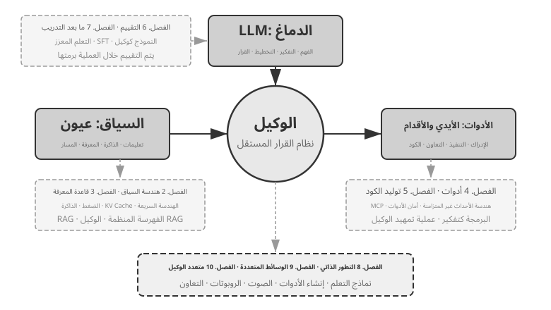
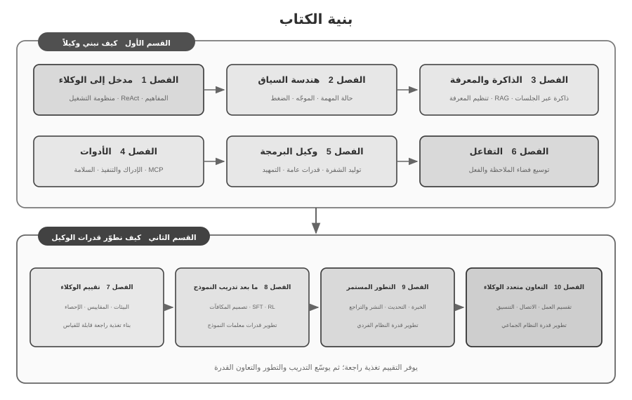

# مقدمة {.unnumbered}

```{=latex}
\markboth{مقدمة}{مقدمة}
```

بين أغسطس وأكتوبر 2025، قدّمت سلسلة من المحاضرات في «المعسكر التطبيقي لوكلاء الذكاء الاصطناعي» الذي تنظمه دار تورينغ. وتمحورت حول سؤال واحد: كيف نصمّم وكلاء ذكاء اصطناعي وفق مبادئ هندسية قابلة للتفسير والتحقق وإعادة الاستخدام، بدل الاعتماد على محاولات متكررة تقودها الخبرة والانطباع؟ لذلك لم يكن تشغيل نموذج تجريبي هو الغاية؛ بل بحثنا أيضًا أسباب اختيار كل بنية، وحدود قدراتها، والمفاضلات التي تفرضها. وقد نُظّم هذا الكتاب ووسّع وأعيدت هيكلته بصورة منهجية انطلاقًا من مواد الدورة وتجاربها المصاحبة.

وكان إعداد الكتاب نفسه تجربة في التعاون بين الإنسان والوكيل. فمن الفكرة الأولى إلى المخطوطة النهائية، اعتمدت أساسًا على **البرمجة بالهمس** (Whisper Coding)، أي التعاون بالإملاء، للعمل مع وكيل Pine الصوتي في البحث وتطوير النص. كنت أملي مخطط الفصل، فيراجع الوكيل المصادر ويعد مسودة أولى؛ ثم أدمج ملاحظات الطلاب وأراجع الحجج والأمثلة والتجارب على جولات متعاقبة. خفّض الصوت كلفة تحويل الأفكار إلى مادة قابلة للفحص، واختصر المسار من صياغة السؤال إلى جمع المصادر والكتابة والتحقق. ومن ثم لا يدرس الكتاب الوكلاء فحسب، بل يوثق أيضًا نمطًا من إنتاج المعرفة شارك فيه وكيل بعمق.

منذ صدور DeepSeek R1 مطلع عام 2025، اتسع تركيز البحث والممارسة الصناعية تدريجيًا من قدرات النماذج الأساسية إلى النشر المنهجي للوكلاء. فعلى مستوى النموذج، بدأ التعلم المعزز في بيئات الوكلاء يستبطن استخدام الأدوات والتفاعل مع البيئة داخل المعلمات، معززًا القدرات العامة في البرمجة والاستدلال الرياضي واستخدام الحاسوب. وعلى مستوى المنتج، غيّرت وكلاء عامة مثل Manus وClaude Code وOpenClaw طريقة التفاعل مع الحاسوب، وجعلت «توليد الشفرة + نظام الملفات» بنية نظامية مهمة.

عند إعادة النظر في مبادئ هندسة الوكلاء التي لخّصتها الدورة، يتبين أنها ما زالت تحتفظ بقدرة تفسيرية مستقرة رغم التسارع في تطور النماذج والمنتجات. فقد شاع لاحقًا استخدام مصطلحات مثل Skill وharness وloop engineering، لكن الممارسات الهندسية المقابلة سبقتها في كثير من الأحيان. فالمفهوم حصيلة تعميم خبرات عملية كثيرة، لا نقطة انطلاق الممارسة. وبعبارة أخرى، تأتي الممارسة أولًا ثم تأتي التسمية.

جاءت هذه المبادئ أساسًا من هندسة أنظمة طويلة الأمد وعالية المخاطر. وبصفتي كبير العلماء في Pine AI، عملت مع الفريق الذي طوّر Pine لتمكين الوكيل من التواصل مع الناس نيابة عن المستخدم ومعالجة مهام معقدة ذات مصالح اقتصادية حقيقية، مثل التفاوض على الفواتير ونزاعات الاسترداد وإلغاء الاشتراكات. تمتد هذه المهام غالبًا عبر وقت طويل وجولات متعددة، وقد يسبب خطأ واحد خسارة فعلية. لذلك قادت متطلبات الموثوقية والسلامة وقابلية التدقيق إلى المبادئ المعمارية التي يؤكدها هذا الكتاب.

- قبل شيوع مفهوم «المهارة»، كنا نحمّل الموجّهات ديناميكيًا لمعالجة تضخمها المستمر، وننفذ الأدوات عبر سطر الأوامر لمعالجة تضخم قوائم الأدوات، ونستخدم شريط حالة النظام كي يدرك الوكيل بيئة التنفيذ ووقت المستخدم وحالة المهمة.
- وقبل شيوع مفهوم «منظومة التشغيل»، كنا نستخدم أساليب شبيهة بما يفعله Claude Code للتعامل مع اضطراب استدعاءات الأدوات، والهلوسة، والعمليات الخطرة أو غير المصرح بها، وتجاهل التعليمات.
- وقبل شيوع «هندسة الحلقات»، كنا نستخدم ما يسميه هذا الكتاب نمط «المقترِح والمراجع» لمنع النموذج من إعلان اكتمال المهمة قبل أوانه.

ولا تقتصر هذه الأساليب على Pine. فقد توصلت فرق كثيرة تعمل على النماذج والوكلاء، كلٌّ على نحو مستقل، إلى طرائق هندسية متقاربة عند معالجة مشكلات متشابهة؛ ويشير هذا التقارب إلى أنها تعكس قيودًا مشتركة في أنظمة الوكلاء. وانطلاقًا من هذه النتائج، قدّمت في عام 2025 «المعسكر التطبيقي لوكلاء الذكاء الاصطناعي» في تورينغ، ودرّست بين عامي 2024 و2026 مقررًا تطبيقيًا في جامعة الأكاديمية الصينية للعلوم. ويُنشر الكتاب مفتوح المصدر كي تخدم هذه المعرفة والخبرة القابلة لإعادة الاستخدام عددًا أكبر من الباحثين والمهندسين.

**تأتي الممارسة أولًا، ثم تأتي التسمية.** ويعني ذلك في تطوير وكلاء المؤسسات ألا تظل الممارسة متأخرة عن شيوع المفاهيم. فعندما يصبح مصطلح ما محل إجماع في الصناعة، تكون المشكلة التي يصفها قد خضعت غالبًا لدراسة طويلة في الأنظمة المتقدمة. ويتطلب التعرف إلى هذه المشكلات وحلها في وقت أبكر شرطين أساسيين.

**أولًا، اختر عملًا حقيقيًا يفرض متطلبات عالية بما يكفي على الحد الأقصى لقدرات الوكيل، واستمر في جمع تغذية راجعة واقعية.** ففي Pine قد تمتد المهمة من ساعات إلى أسابيع، وتتطلب تنسيقًا متكررًا مع عدة أطراف، ومكالمات طويلة، ونماذج معقدة، وجولات متعددة من البريد الإلكتروني. وفي الوقت نفسه يجب ضمان دقة الأرقام الحرجة، وقابلية التحكم في العمليات، وحماية مصالح المستخدم. تكشف البيئة المعقدة باستمرار الفجوة بين قدرة النموذج ومتطلبات العمل، فتدفع الفريق إلى بناء harness يعالج بصورة منهجية ما لا يستطيع النموذج تنفيذه منفردًا بعد، مع أن العمل يفرض إنجازه. أما إذا كانت الترقية التالية للنموذج تكفي بسهولة لتلبية المتطلبات، فيصعب تراكم مبادئ مستقرة لتصميم النظام.

**ثانيًا، أنشئ آلية منهجية للتقييم.** فمن دون التقييم لا يمكن تحديد ما إذا كان التحسن بعد تغيير ما ناتجًا عن التصميم نفسه أم عن تقلب عشوائي. يحول التقييم تطوير الوكيل من حكم قائم على الخبرة إلى عملية هندسية قابلة للمقارنة وإعادة الإنتاج، وهو أساس تطوير الأنظمة وفق المنهج العلمي. ويتناول الفصل السابع هذه المنهجية بالتفصيل.

ومهما تطورت النماذج الأساسية وتبدلت أشكال المنتجات، تكاد أنظمة الوكلاء الناجحة كلها تتبع الأنماط المعمارية نفسها. وليس ذلك مصادفة: **ينبغي لمبادئ التصميم الجيدة أن تصمد عبر أجيال النماذج**؛ لأنها لا تصف طريقة استخدام نموذج بعينه، بل الأنماط الأساسية لتفاعل الأنظمة الذكية مع العالم.

قال ريتشارد ساتون، الحائز على جائزة تورينغ وأحد رواد التعلم المعزز، إن تطور الكون مر بأربع مراحل: من الغبار إلى النجوم، ومن النجوم إلى الحياة، ومن الحياة إلى الكيانات المصمَّمة. فالتطور البيولوجي أعمى، تحكمه الطفرات العشوائية والانتقاء الطبيعي؛ ومعظم الكائنات لا تفهم آلياتها ولا تستطيع أن تصمم كائنات جديدة أو تعيد تشكيل ذاتها. أما الوكلاء فظاهرة جديدة في تاريخ هذا التطور: يستطيعون، عبر توليد الشفرة، أن يطلقوا عملية تطوير ذاتي؛ كأن يكتب مبرمجٌ مبرمجًا آخر، ثم يواصل الثاني كتابة غيره. أي إن الوكيل قادر على فهم آلية عمله، وإنشاء وكلاء جدد وفق الهدف، بل وتحسين ذاته. ورسالة هذا الكتاب أن يساعدك على فهم مبادئ هذا الخلق وإتقانها.

تتلخص الفكرة المركزية للكتاب في معادلة واحدة: **الوكيل = نموذج لغوي كبير + سياق + أدوات**. ولا غنى عن أي عنصر منها.



وبصياغة أكثر حدسًا: **دماغ + عينان + يدان وقدمان**. يتولى الدماغ، أي النموذج اللغوي الكبير، التفكير واتخاذ القرار؛ وتحدد العينان، أي السياق، ما يستطيع الوكيل رؤيته من معلومات؛ وتحدد اليدان والقدمان، أي الأدوات، ما يستطيع فعله. (والعينان هنا استعارة تقريبية؛ فالسياق لا يضم معلومات البيئة وسجل المحادثة فحسب، بل تعريفات الأدوات أيضًا. لذلك يشمل ما «يراه» الوكيل الأدوات المتاحة له. والمقصود من الاستعارة هو تثبيت الحدس الأساسي: السياق هو كل ما يستطيع النموذج إدراكه.)

وللقارئ الملمّ بالتعلم المعزز، يمكن مقابلة العناصر الثلاثة بمفاهيمه الصورية: يقابل النموذج اللغوي **السياسة** (Policy)، ويقابل السياق **فضاء الملاحظات** (Observation Space)، وتقابل الأدوات **فضاء الأفعال** (Action Space). إنها ثلاث صيغ للمنظومة نفسها، تختلف فقط في مستوى التجريد.


## هيكل الكتاب {.unnumbered}

يقع الكتاب في عشرة فصول تنتظم حول سؤالين مترابطين (الشكل 0-2). يضم **القسم الأول، «كيف نبني وكيلاً؟»** الفصول 1–6، وينتقل من المفاهيم الأساسية إلى السياق والذاكرة والمعرفة والأدوات ووكلاء البرمجة وتوسيع فضاء الملاحظة والفعل. ويضم **القسم الثاني، «كيف نطوّر قدرات الوكيل؟»** الفصول 7–10: يبدأ بالتقييم لبناء تغذية راجعة قابلة للقياس، ثم يوسّع القدرة على مستوى معلمات النموذج والنظام الفردي والنظام الجماعي عبر ما بعد التدريب والتطور المستمر والتعاون متعدد الوكلاء.



- **الفصل الأول (أساسيات الوكلاء)** ينطلق من منتجات حقيقية ليكوّن تصورًا أوليًا واضحًا عن الوكلاء، ثم يتعمق في الصيغة الأساسية: النموذج اللغوي الكبير + السياق + الأدوات. ويعرض الصيغة نفسها بصورتها الحدسية: الدماغ + العينان + اليدان والقدمان، ثم بصيغتها الأكاديمية: السياسة + فضاء الملاحظات + فضاء الأفعال. وتوضح التجارب حلقة ReAct التكرارية: «التفكير → الفعل → الملاحظة»، مع التمييز بين التكيف السياقي داخل المهمة، وتحديث المكونات الخارجية عبر المهام، وتحديث المعلمات في دورات التدريب. ويختتم الفصل بأنماط تصميم متدرجة، من مسارات العمل المحددة سلفًا إلى الوكلاء المستقلين.
- **الفصل الثاني (هندسة السياق)** هو أهم فصول الكتاب؛ إذ يتناول «عيني» الوكيل بصورة منهجية. يبدأ ببنية رسائل API والحلقة الأساسية للوكيل، ويؤسس لفكرة أن السياق قائمة من الرسائل، ثم يشرح المبادئ الأساسية لذاكرة KV المخبأة، وهي الآلية التي تتيح إعادة استخدام نتائج الحساب السابقة أثناء استدلال النموذج. بعد ذلك يتناول هندسة الموجّهات، والتصميم المتمحور حول العمليات، وأوصاف الأدوات، وصياغة قواعد العمل، وهجمات حقن الموجّهات وسبل صدها، والتحميل عند الطلب لمهارات الوكيل، وشريط حالة الوكيل، واستراتيجيات ضغط السياق.
- **الفصل الثالث (ذاكرة المستخدم وقواعد المعرفة)** يوسع إدارة السياق إلى منظومة معرفية دائمة تتجاوز حدود الجلسة الواحدة. وبذلك لا يكتفي الوكيل بتذكر المحادثة الحالية، بل يراكم المعرفة ويسترجعها عبر محادثات متعددة. ويعرض الفصل أربع استراتيجيات متدرجة لذاكرة المستخدم، ومنظومة RAG كاملة، وطرائق البحث النصي وإعادة الترتيب، واستخراج المعلومات متعددة الوسائط، وأساليب متقدمة لتنظيم المعرفة، وRAG القائم على الوكلاء الذي يقرر فيه الوكيل بنفسه متى يسترجع المعلومات وما الذي يسترجعه.
- **الفصل الرابع (الأدوات)** يبحث في الجسر الذي يصل الوكيل بالعالم الخارجي. فالأدوات هي «يداه وقدماه»، وبها يبحث في الويب ويستدعي واجهات API ويتعامل مع قواعد البيانات. ويقدم الفصل معيار MCP للتشغيل البيني ومبادئ تصميم خمس فئات من الأدوات: الإدراك والتنفيذ والتعاون وتفعيل الأحداث والتواصل مع المستخدم، مع عناية خاصة بأمان أدوات التنفيذ. أما تفعيل الأحداث والتواصل مع المستخدم وبيئة التشغيل غير المتزامنة فيتناولها الفصل السادس.
- **الفصل الخامس (وكيل البرمجة وتوليد الشفرة)** يبين أن وكيل البرمجة ونظام الملفات يشكلان معًا أساسًا تقنيًا لأي وكيل عام الغرض. ويتخذ من بنية OpenClaw خيطًا ناظمًا لتحليل سير عمل وكيل البرمجة وتقنيات تنفيذه، كما يوضح أن قيمة توليد الشفرة تتجاوز البرمجة نفسها، فتشمل دعم التفكير وبناء قواعد المعرفة وإنشاء أدوات جديدة وتشغيل وكلاء آخرين ديناميكيًا.
- **الفصل السادس (التفاعل: توسيع فضاء الملاحظة والفعل)** يدرس تفاعل الوكيل مع البيئة على بُعدَي **الوسيط** و**الزمن**: تتيح الأنظمة غير المتزامنة والقائمة على الأحداث استقبال الوقائع الخارجية والاستجابة لها باستمرار؛ وينقل الصوت الإدراك والاستدلال والتوليد إلى التشغيل الآني؛ ويوسع Computer Use فضاء الفعل إلى الواجهات الرسومية؛ وتمتد الروبوتات بالفعل إلى البيئة المادية. وتشترك هذه السياقات في أوليات نظامية مثل الإيقاظ ونقاط الأمان والإلغاء والمزاحمة وفصل المسارين السريع والبطيء.
- **الفصل السابع (تقييم الوكلاء)** يضع منهجية علمية للتقييم. ويتناول بيئات التقييم، بما فيها استدعاء الأدوات والتفاعل بين الإنسان والحاسوب وبيئات المحاكاة، ومبادئ تصميم مجموعات البيانات، والتقييم الآلي بأسلوب LLM-as-a-Judge، واختيار النموذج على أساس النتائج، والحلقة المغلقة التي تحول نتائج التقييم إلى تحسينات عملية في النظام.
- **الفصل الثامن (مرحلة ما بعد تدريب النموذج)** يتعمق في تقنيتين: الضبط الدقيق تحت الإشراف (SFT)، الذي يعلم النموذج اتباع أمثلة موسومة، والتعلم المعزز (RL)، الذي يتيح له التحسن بالتجربة والخطأ وإشارات المكافأة. ويتمحور الفصل حول فكرتين: «SFT يحفظ، وRL يعمم» و«البيانات والبيئة أهم من الخوارزمية». كما يغطي مراحل التدريب المسبق وSFT وRL، وأسس التعلم المعزز، وتصميم المكافآت، والخوارزميات أحادية الجولة ومتعددة الجولات، وتحسين كفاءة العينات.
- **الفصل التاسع (التطور المستمر للوكيل)** يدرس كيفية تحويل الخبرة التشغيلية إلى قدرات في الإصدار التالي. يبدأ ببناء إشارات التعلم من نتائج البيئة وقواعد العمليات وأحكام نماذج التقييم، ثم يقارن بين أربعة مسارات للتحديث: وثائق المعرفة، والموجّهات والمهارات، والبرامج والأدوات، ومعلمات النموذج. ويختتم بالتحقق من الإصدار المرشح، والإطلاق التدريجي، والتراجع الآمن، والدمج على المدى الطويل.
- **الفصل العاشر (التعاون متعدد الوكلاء)** يوسع المنظور من قدرة الوكيل المفرد إلى التنسيق على مستوى النظام، ويدرس كيف تقسم عدة وكلاء العمل وتتعاون. ويقدم إطارًا منهجيًا لتصنيف أنماط التعاون وفق محورين: السياق المشترك أو المستقل، والبنية النظيرة أو الإدارية أو اللامركزية. ثم يستخدم وكلاء الترجمة والتنسيق بين الهاتف والحاسوب لشرح التصميم التعاوني، ويناقش مسارات التطور المحتملة لمجتمعات الوكلاء واقتصاداتهم.

## كيفية قراءة هذا الكتاب {.unnumbered}

فصول الكتاب مستقلة نسبيًا، ولذلك يمكنك اختيار مسار القراءة الأنسب لاحتياجاتك:

- **إن كنت مطوّر Agent**، فاقرأ الكتاب بالترتيب: تبني الفصول 1–6 منهجًا متكاملًا لإنشاء الوكلاء، بينما تبحث الفصول 7–10 في تطوير القدرة عبر التقييم وما بعد تدريب النموذج والتطور المستمر والتعاون متعدد الوكلاء.
- **إذا كان وقتك محدودًا**، فامنح الأولوية للفصل الأول لاستيعاب الصورة العامة، وللفصل الثاني لهندسة السياق — وهي المهارة الأكثر أهمية. تُعد المبادئ الأساسية لذاكرة KV المخبأة (KV Cache) تقنية إلى حد ما؛ لذا يمكنك في القراءة الأولى تخطي التفاصيل الآلية والاحتفاظ فقط بالاستنتاجات الأساسية الثلاثة المذكورة في البداية، دون أن يؤثر ذلك على فهمك للموضوعات اللاحقة.
- **إذا كان تركيزك منصبًا على تدريب النماذج**، فانتقل مباشرة إلى الفصل الثامن (مرحلة ما بعد تدريب النموذج). ولأن طرق التقييم الواردة في الفصل السابع تُعد شرطًا أساسيًا للتدريب، يُستحسن قراءتهما معًا بعد استكمال الفصلين الأول والثاني.

يتضمن كل فصل عددًا من **التجارب** و**أسئلة التأمل**، مرقمة بصيغة «التجربة X-Y»، حيث X رقم الفصل وY ترتيب التجربة فيه. وتشير النجوم في العنوان إلى مستوى الصعوبة: ★ للمستوى التمهيدي المناسب لجميع القراء، و★★ للمستوى المتوسط الذي يتطلب قدرًا من الخبرة الهندسية، و★★★ للتحديات المتقدمة التي تتناول عادة مسائل مفتوحة أو تصميمات نظم معقدة. وتأتي معظم التجارب مع شفرة كاملة قابلة للتشغيل في المستودع المفتوح المصدر المصاحب:

> **مستودع الشفرة المصاحب**: [https://github.com/bojieli/ai-agent-book](https://github.com/bojieli/ai-agent-book)

يمكنك الحصول على جميع الأكواد المصاحبة باستخدام Git:

```bash
git clone https://github.com/bojieli/ai-agent-book.git
cd ai-agent-book
```

إذا كنت لا تستخدم Git، فيمكنك أيضًا اختيار **Code → Download ZIP** من صفحة المستودع. تُنظَّم أكواد التجارب حسب الفصول في المجلدات من `chapter1/` إلى `chapter10/`. للعثور على «التجربة X-Y»، افتح الملف الموافق `chapterX/README.ar.md`، واستخدم رقم التجربة لتحديد مجلد المشروع، ثم اتبع ملف README الخاص بالمشروع لتثبيت الاعتماديات وتشغيله. تعتمد بعض التجارب الموسومة بأنها أدلة لإعادة الإنتاج على مستودعات خارجية؛ وتوضح ملفات README الخاصة بها كيفية الحصول عليها أيضًا.

وأوصي بشدة بتنفيذ هذه التجارب بنفسك؛ فبناء وكلاء الذكاء الاصطناعي مجال عملي بامتياز، وكثير من **بديهيات التصميم** لا يتضح إلا أثناء التجربة وتصحيح الأخطاء.


## المتطلبات الأساسية {.unnumbered}

يستهدف هذا الكتاب القراء ذوي الخلفية التقنية، لكنه لا يتطلب خبرة عميقة في مجال بعينه. وتُصنف المتطلبات الأساسية أدناه ضمن مستويين: "أساسي" و"موصى به"، لمساعدتك في تقييم مدى استعدادك.

**المستوى الأساسي: متطلبات قراءة الكتاب كاملاً**

- **برمجة بايثون (Python)**: تعتمد جميع تجارب الكتاب تقريبًا على Python. يُفترض الاطلاع على البنية الأساسية للغة، وهياكل البيانات الشائعة، وإدارة الحزم (`pip`). لا تُشترط الاحترافية، بل القدرة على قراءة وتعديل شفرات Python ذات التعقيد المتوسط.
- **الخبرة الأساسية بنماذج LLM**: تجربة سابقة في التعامل مع ChatGPT أو Claude أو منتجات مماثلة، وفهم نمط التفاعل الأساسي `الموجه → استجابة النموذج` (`Prompt → Model Response`).
- **أداة برمجة مدعومة بالذكاء الاصطناعي**: تثبيت أداة واحدة على الأقل مثل Claude Code أو Codex أو Cursor أو TRAE. ستختصر وقتك في تجارب التطوير وتتيح لك معاينة وكيل برمجيات ناضج من الداخل؛ لتشاهد مباشرة حلقة ReAct واستدعاء الأدوات وإدارة السياق.
- **معرفة عامة بهندسة البرمجيات**: إلمام بمفاهيم سطر الأوامر، ونظام ضبط الإصدارات Git، وتنسيق بيانات JSON، وواجهات برمجة التطبيقات REST API.

**المستوى الموصى به: لتعزيز الاستيعاب في فصول محددة**

- **أساسيات التعلم الآلي** (الفصل 8): فهم المفاهيم الأساسية مثل التدريب مقابل الاستدلال، ودوال الخسارة، والانحدار التدريجي، والتجهيز الزائد (Overfitting).
- **الرياضيات الأساسية** (الفصول 2-3، 8): فهم بديهي للجبر الخطي (تمثيل المتجهات ورسم المصفوفات) ودوال الاحتمالات الإحصائية لتقييم المكافآت في التعلم المعزز.
- **أساسيات تطوير الويب** (الفصلان 4 و9): فهم مفاهيم HTTP وWebSocket وبنية فصل الواجهة الأمامية عن الخلفية لفهم بنية الوكيل غير المتزامن الموجه بالأحداث.
- **الفهم الأساسي لبنية المحولات (Transformer)** (الفصول 2، 8): بنية Transformer هي العمود الفقري لجميع النماذج اللغوية الكبيرة.

تكمن القيمة الأساسية لهذا الكتاب في **مبادئ التصميم المعماري والمنهجية الهندسية**؛ لذا حتى إن كنت تفتقد بعض هذه المتطلبات، يمكنك البدء بثقة وسد الفجوات أثناء القراءة.

## شكر وتقدير

أتقدم بالشكر إلى المحررين Meng Ge وLiu Meiying في Turing على جهدهما الدؤوب في التحرير وتنظيم دورة Turing «AI Agent Bootcamp»، وإلى البروفيسور Liu Junming على تقديمه مقررًا عمليًا في وكلاء الذكاء الاصطناعي في جامعة الأكاديمية الصينية للعلوم. وشكر خاص لطلاب الدورتين؛ فقد أتاحت لي تجربة التدريس قدرًا كبيرًا من الملاحظات والنصائح القيّمة، وعمّقت فهمي لهذه المفاهيم.

أشكر جميع زملائي في Pine AI. بدون منتج ممتاز مثل Pine AI، والتحديات العديدة التي جلبها معه، لم يكن بإمكاني أبدًا التعمق في مجال الوكيل، سواء في الفهم أو في الممارسة؛ ومن خلال تبادل الأفكار الواحدة تلو الأخرى، ساهم زملائي بثروة من الأفكار القيمة.

وأشكر كذلك أصدقاء كثيرين في مجال الذكاء الاصطناعي، يتعذر ذكرهم جميعًا هنا. فقد منحوني، عبر نقاشات متتابعة، ملاحظات صريحة على آرائي، وصححوا عددًا من أحكامي، وعمّقوا فهمي للنماذج والوكلاء.

والأهم من ذلك كله، أنني أشكر عائلتي، وخاصة زوجتي، منغ جياينغ. لقد دعمتني طوال فترة كتابة هذا الكتاب وقدمت لي العديد من الاقتراحات القيمة على طول الطريق.
