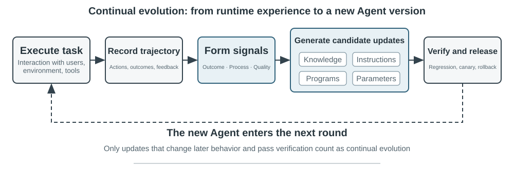
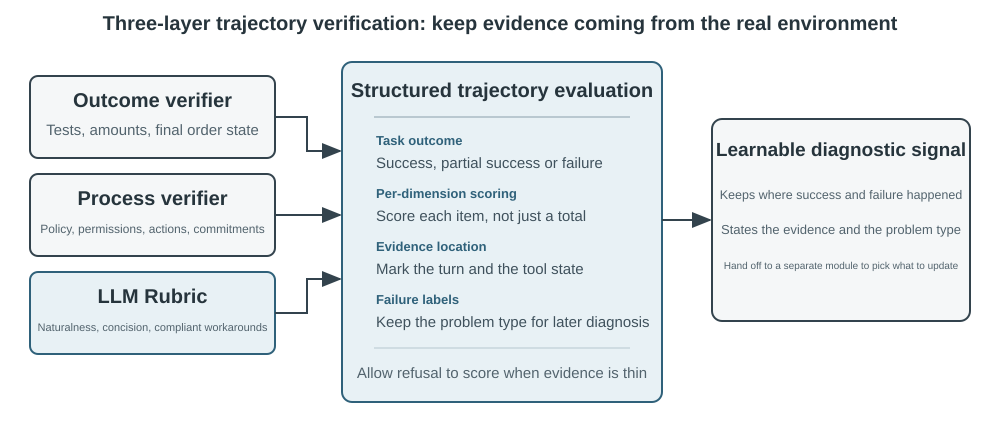
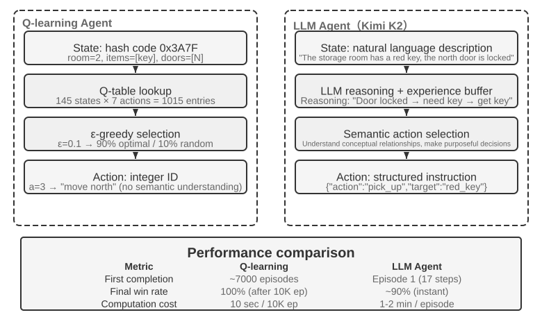
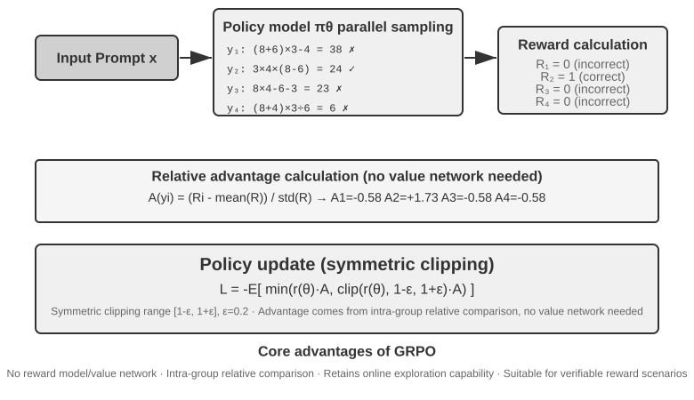

# Model Post-Training

> **2026 revision.** The revised chapter makes the scope of “SFT memorizes, RL generalizes” explicit: it is an observation from controlled GeneralPoints/V-IRL comparisons, not a universal law. It also separates model-simulated tool returns from simulated environment dynamics and treats simulator bias as a training ceiling.
>
> Two sample-efficiency routes are highlighted: On-Policy Distillation turns one rollout’s terminal reward into token-level guidance; RLVP turns otherwise wasted path feedback into learnable signals. When no stronger teacher exists, OPSD uses privileged information with the same model in teacher and student roles.
>
> Experiment order in this edition: 7-13 SimpleVLA-RL; 7-14 ReTool; 7-15 AWorld-train; 7-16 RLVP.

The core formula of this book is Agent = LLM + Context + Tools. This chapter turns to the LLM itself—the "brain"—and examines how post-training can help the model use context and tools more effectively, thereby improving the capabilities of the entire Agent system. The end of Chapter 7 pointed out that the evaluation system and simulation environment are the two cornerstones of post-training: the evaluation environment gives training its practice ground, and the evaluation metrics give it its target. This chapter builds on those cornerstones and discusses how to actually change model weights—how to bake capability into the parameters.

This chapter assumes no background in reinforcement learning or model training. We don't expect you to know gradients or policy optimization. Instead, we start from the question of how a model gets trained at all, making clear what each step is for, how it works, and what problem it solves. By the end of the chapter, you should be able to answer the following questions: At what stages are model capabilities formed? What does each stage do? How are the stages commonly combined, and when can the order differ? And where should you focus your effort in your own projects?

**First, let's establish the most important map: modern model development is commonly described in three stages.** Pre-training lays the foundation, while SFT and RL are post-training stages selected or combined according to the objective, base model, and output requirements:

1.  **Pre-training**: Training on massive internet text to "predict the next token." This step teaches the model language rules, world knowledge, and basic reasoning. It's like a person who has read all the books in a library—erudite, but not yet good at answering questions. This is the most expensive step (often tens of millions of dollars) and the foundation of all capabilities.
2.  **Supervised Fine-Tuning (SFT)**: Training the model on labeled input-output pairs, much like a teacher giving a student standard answers to imitate. Thousands to tens of thousands of question-and-standard-answer demonstrations teach the model what format, style, and process to use when responding. This step transforms the erudite model into an assistant that understands instructions and produces well-structured outputs. It's cheap, fast, and stable, and is currently a step almost all deployed models undergo.
3.  **Reinforcement Learning (RL)**: Letting the model try repeatedly and improve from rewards and penalties, like training a puppy (a treat when it gets things right, nothing when it doesn't). Instead of directly imitating the tokens of a standard response, RL lets the model try on its own, increasing the probability of good behavior and decreasing the probability of poor behavior. With appropriate rewards, data, and environments, this step can improve decisions in **unseen situations**—and it's also the step that takes up the most space in this chapter and requires the most engineering effort.

An intuitive analogy: Pre-training is "reading ten thousand books" (accumulating knowledge), SFT is "a teacher walking you through the standard solutions" (imitating demonstrations), and RL is "working the problems yourself and refining from right and wrong" (learning by trial and error). Pre-training followed by SFT and then RL is common, but it is not the only sequence: a strong base model may go directly to RL, while a task that only needs stable format and style may use SFT alone.

**This chapter has two main threads that run throughout. Please remember them, as all subsequent content serves them:**

*   **Thread One: In this chapter's controlled experiments, SFT tends to memorize demonstrations while RL generalizes better.** Under the same task, model, and budget in GeneralPoints and V-IRL, SFT overfits the training answers, while RL more often learns a transferable strategy under the tested distribution shifts. This is a measured result under those experimental conditions, not a universal property of SFT and RL: SFT can generalize with diverse data and appropriate regularization, and RL can overfit when its reward or environment is biased. This chapter uses "SFT memorizes, RL generalizes" as shorthand for these experiments, and Section 7.1 explains why the two objectives can produce that difference.
*   **Thread Two: Data and environment matter more than algorithms.** This is the industry's most counterintuitive and most valuable lesson. With off-the-shelf RL algorithms (PPO, GRPO, and the like), knowing how to use them is enough. What actually determines success are two things: the **simulation environment** (is the practice ground realistic enough?) and the **training data** (are the demonstrations and reward signals good enough?). In many scenarios, if the SFT data is good enough, you may not need RL at all. This chapter will repeatedly redirect your attention from "which algorithm should I tune?" to "have the data and environment been set up correctly?"

> **Reading Guide**: The content of this chapter is divided into two paths based on the reader's background:
>
> *   **Agent Application Developers** (don't need to train models themselves): Start by reading the opening "Pre-training, SFT, RL: A Three-Stage Panorama" to build a global understanding. Then you can skip the following two `[Optional Reading]` sections (classic RL and pre-training background) and continue from the SFT section. Focus on the decision framework for "the essential difference between SFT and RL" and "when to choose SFT vs. RL," as well as the judgment that "data and environment are more important than algorithms"—these insights will influence your design decisions in Harness engineering (when to solve with prompts, when fine-tuning is worth it).
> *   **Model Training Engineers**: Read sequentially from the beginning. The two `[Optional Reading]` sections provide complete background on reinforcement learning and pre-training. The subsequent experiments provide reproducible training schemes.

## Pre-training, SFT, RL: A Three-Stage Panorama

The introduction gave you the map of the three stages; this section works through the mechanics of each. The three stages differ in their **data**, **optimization objectives**, and **costs**. Understanding their similarities and differences is the key to the entire chapter. Table 8-1 gives the overview; the details follow.

Table 8-1 The Three Stages of Forging Model Capabilities

| Stage | Data Used | Optimization Objective | What Is Learned | Typical Cost |
|-------------|---------------------|--------------------|---------------------|-------------------|
| **Pre-training** | Massive raw internet text | Predict the next token | Language rules, world knowledge, basic reasoning | Very High (millions to tens of millions USD) |
| **SFT** | Thousands to tens of thousands of "input-output" demonstration pairs | Predict the next token (loss calculated only on the response) | Instruction following, output format, style, process protocol | Low (hours to days) |
| **RL** | Task and environment + reward signal (reference answers optional) | Maximize expected reward | Transferable decision-making strategy, newly discovered solutions | High (often tens to hundreds of times that of SFT) |

### What Pre-training Does: Predicting the Next Token

All the "intelligence" of modern large models is built on a task so simple it's surprising: **Next Token Prediction (NTP)**.

Show the model the first part of a text and have it guess the next token. For example, given the input "The capital of China is," the model should assign a high probability to "Beijing." Each time the model guesses, it compares its prediction to the actual next token. The larger the difference (called the loss), the more it adjusts its parameters to guess more accurately in similar contexts next time. By repeatedly doing this on trillions of tokens of internet text, the model is forced to learn grammar, facts, logic, and even basic reasoning—because to consistently guess the next token correctly across a vast range of contexts, there's no shortcut; it must truly "digest" the patterns in the text.

There's a key point to remember that will carry through to SFT and RL: **The model's output is essentially a probability distribution.** Given the preceding text, the model assigns a probability to every possible token in its vocabulary. "Training," at its core, is **adjusting this probability distribution**—making the probability of desired tokens higher and undesired ones lower. The difference between the three stages lies only in "what is desired" and "what signal defines 'desired'."

After pre-training, the model is erudite but not user-friendly: if you ask it a question, it might continue generating more questions instead of answering—because in internet text, a question is often followed by another question. It hasn't yet learned the protocol of "when asked a question, you should answer."

### The Essence of SFT: "Predict the Next Token" with Different Data

This is the first key insight to grasp in this chapter: **Mathematically, SFT and pre-training are the same task—both predict the next token and minimize the same loss function.** Many beginners think SFT is a completely new method, but it's not. The difference between SFT and pre-training lies in just two things:

1.  **Different Data.** Pre-training uses raw internet text (unstructured, containing everything); SFT uses carefully prepared "input-output" pairs, uniformly formatted as "user question → ideal answer." The model continues "predicting the next token" on these demonstrations, thereby learning the protocol of "how to structure a response when asked a question."
2.  **Loss is calculated only on the "response" (loss masking).** An SFT sample consists of a question and a labeled response. We don't want the model to learn "how to ask a question," only "how to answer." So, when calculating the loss, the tokens in the question part are masked, and gradients are backpropagated only through the response portion. This is the only substantive engineering difference between SFT and pre-training.

Once you see this, it becomes clear why SFT can exhibit memorization on limited demonstrations: its optimization goal is to **maximize the probability of every token in the labeled response**, reproducing the demonstration as closely as possible. For tasks with clear goals and fixed formats, this is extremely efficient—a few thousand examples suffice. But when coverage and diversity are insufficient, the model may overfit surface patterns or shortcuts in the demonstrations and lose performance under distribution shift.

In a nutshell, SFT uses extremely high sample efficiency to **encode a stable input-to-output mapping and protocol in the model's parameters**. It encodes **protocol knowledge**—how to say or do something, including format, style, and process—rather than large amounts of **factual knowledge**—what the model knows. The latter relies on pre-training or RAG (we'll return to this distinction at the end of the chapter).

> **Training Cost: LoRA Parameter-Efficient Fine-Tuning.** Both SFT and the subsequent RL require updating model parameters, and full-parameter fine-tuning has high VRAM requirements (needing to store gradients and optimizer states for billions of parameters). **LoRA** (Low-Rank Adaptation) is the most common cost-saving method: instead of modifying the large original weight matrices, it attaches a small "patch" (low-rank matrix) to learn the task. The parameter count is only 1%–5% of the original, yet it can approach the performance of full fine-tuning. Because the original weights are frozen, LoRA also causes less perturbation to the base model's existing capabilities, reducing the risk of catastrophic forgetting. A few validated rules of thumb[^ch8-1]: You **must** apply LoRA to all major weight matrices (especially the MLP layers, which have the largest parameter count); applying it only to attention layers costs accuracy. **The optimal learning rate is about 10 times that of full fine-tuning** (true for both SFT and RL, a very practical transfer rule). Use medium-to-high rank (64–256) for SFT; since the information per round is small for RL, a small rank (8–32) or even rank=1 is sufficient. During deployment, a single inference server can load multiple LoRA adapters simultaneously for multi-tenant service. This book treats LoRA as the default engineering choice for all post-training methods and will not elaborate on it separately.

**SFT loss mask:**

```python
for sample in dataset:
    prompt_tokens = tokenize(sample.prompt)
    answer_tokens = tokenize(sample.answer)
    tokens = prompt_tokens + answer_tokens
    labels = [-100] * len(prompt_tokens) + answer_tokens
    loss = causal_lm_loss(tokens, labels)
    update_parameters(loss)
```

### When SFT Should Come Before RL

Pre-training provides the foundation of language and knowledge. What needs explanation is: **Under what conditions should SFT come before RL?**

The answer lies in how RL works. Rather than directly imitating the tokens of a reference response, an RL policy learns by evaluating its own **generated** responses with a reward signal; reference answers or preference data may still contribute to that reward. But to judge quality, you first need to be able to **parse** the model's output: if the task requires a JSON object or a tool call and the model produces poorly formatted text, the reward function cannot even distinguish success from failure, and RL cannot learn.

When structured output is unstable, SFT can therefore **get the model to produce well-formed output first**: a small number of demonstrations stabilizes the format so it can be parsed reliably, giving RL a scoreable starting point. This is a robust **"SFT first, then RL"** two-stage paradigm. In such a setting, skipping SFT can leave the output unstable, turn the reward signal into noise, and cause training to fail. Borrowing a concept from Chinese painting: SFT first establishes the **"form"** (format, structure), and then RL pursues the **"spirit"** (strategy, generalization)—**form first, spirit second**.

An important boundary condition: "SFT must come first" holds true in the setting of a **"smaller base model + strictly structured output"** (Experiment 8-11 will show that a model at the Llama-3.2-Vision-11B scale fails completely if RL is applied directly without SFT). However, if the base model is strong enough, it might be able to produce adequate output from the start, allowing SFT to be skipped—DeepSeek-R1-Zero demonstrated that direct RL can succeed with a strong base model, with reflection and long chains of thought emerging spontaneously. The cost is poor output readability and mixed Chinese/English, so DeepSeek ultimately added back "cold-start SFT" in R1 to re-establish the "form." The journey of R1 from Zero to cold-start is the best illustration of "form first, spirit second."

### The Essential Difference Between SFT and RL (The Most Important Table in This Chapter)

We have used "SFT memorizes, RL generalizes" to summarize this chapter's controlled experiments. Now let's explain why that tendency can appear. The key is the **different optimization objectives**:

*   **SFT maximizes the probability of the labeled response.** Maximum likelihood pushes the model to reproduce the demonstration for each training sample. Diverse, representative demonstrations can teach generalizable features, but limited demonstrations or prompts can also produce overfitting to surface patterns or shortcuts. In GeneralPoints, the limited demonstrations treated J/Q/K as 10, and performance dropped when those values changed at test time.
*   **RL maximizes expected reward.** The model explores paths and raises the probability of those that earn high reward. When the reward faithfully represents the objective and exploration is sufficient, it can discover transferable strategies absent from the demonstrations. In GeneralPoints, recomputing the answer when values changed produced better out-of-distribution performance. Conversely, a biased reward or environment can make RL overfit to shortcuts too.

Table 8-2 Essential Comparison of SFT and RL

| Dimension | SFT (Supervised Fine-Tuning) | RL (Reinforcement Learning) |
|-----------------|--------------------------------------|----------------------------------------|
| Optimization Objective | Maximize probability of labeled answer (Maximum Likelihood) | Maximize expected reward |
| Training Signal | Token-level supervision on a labeled response | Policy-generated responses or trajectories + outcome- or step-level scalar rewards |
| Data Form | "Input-Output" demonstration pairs | Task and environment + reward signal (reference answers optional) |
| Direct Optimization Pressure | Imitate mappings and protocols in the demonstrations | Reinforce behaviors and strategies that earn reward |
| Under Distribution Shift | Depends on demonstration coverage and regularization; limited demonstrations overfit in this chapter's experiments | Depends on reward, environment, and exploration; transfer was better in this chapter's experiments |
| Sample Efficiency | High (thousands of examples are effective) | Low (often tens to hundreds of times that of SFT) |
| Training Stability | High, converges quickly | Low, prone to oscillation, requires careful tuning |
| Best Suited For | Solidifying format/style/process, high-quality demonstrations, stable environment | Needing generalization to new scenarios, exploring optimal strategies, high annotation cost |

**Post-training also shapes when a model acts.** Coding models provide a concrete example: GPT-family and Claude-family models often exhibit different default action thresholds. The former may read more of a repository before editing; the latter may localize from fewer files, implement first, and then use test feedback to correct course. This is not a matter of anthropomorphizing one model as “cautious” and another as “instinctive.” It is a policy in the parameters estimating whether the expected value of reading one more file still exceeds the expected value of submitting and validating the current patch. If SFT demonstrations repeatedly investigate broadly before editing, the model imitates a higher action threshold. If process or outcome rewards repeatedly validate rapid localization and an early verifiable loop, probability mass shifts toward earlier action. Experiment 7-7 swaps models inside an identical neutral Coding harness and measures this behavior changing with the model: the harness need not enforce a workflow for the model to carry a stable tool-use policy of its own. The harness can modify the policy, but its primary source can reside in the post-trained parameters. Because vendors do not publish their complete data and reward recipes, the experiment establishes a model-side behavioral difference, not the particular proprietary algorithm that caused it.

One deeper mechanism is worth knowing: **mode-seeking**. The probability distribution of all possible answers to a question may contain many modes, each representing a family of reasonable responses. Maximum-likelihood SFT can exhibit a **mass-covering** tendency, allocating probability across modes present in the demonstrations. Policy optimization constrained with reverse KL can instead exhibit a **mode-seeking** tendency, concentrating probability on a few high-reward modes. The exact behavior depends on the data, reward, KL direction, and coefficient, so it should not be treated as an invariant property of SFT and RL. The RLHF section will connect this design choice to KL divergence.

**Online feedback creates an opportunity to explore strategies beyond the demonstrations.** SFT on a fixed dataset uses direct training signals from demonstrations, but it can still combine pre-training knowledge and generalize to unseen inputs. Online RL generates responses from the current policy and receives environmental feedback, so it can directly evaluate candidates absent from the demonstrations. This does not automatically guarantee a higher ceiling: results depend on the base model, demonstration coverage, reward fidelity, exploration, and optimization stability. (The terms "online/offline" and the stricter "on-policy/off-policy" will be formally distinguished in Section 7.8.) For now, consider three opportunities created by online feedback:

- **First, it can evaluate candidates beyond a fixed demonstration set.** SFT's direct supervision comes from recorded responses; RL can also reinforce new behaviors that the reward function can score. The "pushcut" action in Experiment 8-13 (SimpleVLA-RL) never appeared in human demonstrations, showing the possibility of discovering a strategy outside the data. But the model cannot learn quality the reward cannot recognize or discover a strategy it never explores.
- **Second, it can exploit tasks where verification is easier than generation.** SFT needs a correct answer or good trajectory written first; RL needs a reliable way to judge answer quality. Math answers can be checked, code can be tested, and proofs can be verified. This asymmetry is a strength of RLVR, but an incomplete verifier can also produce reward hacking.
- **Third, it can train on states visited by the current policy.** Offline imitation has the classic problem of **covariate shift**: after a policy leaves the demonstrations and enters unseen states, recovery signals may be absent. In specific sequential imitation-learning settings, worst-case error can accumulate roughly as $T^2$ with trajectory length $T$, while online data aggregation can reduce it to about $T$. On-Policy Distillation (Section 7.12) combines this online matching with SFT's dense supervision.

To use an analogy: **SFT studies an existing map in detail, while RL can use reward as a compass to explore candidate routes beyond it.** An inaccurate map or compass can lead the model astray. Many systems therefore use SFT to establish a stable starting point, then add RL when the reward and environment are trustworthy.

With this panorama in hand, every later section has a place on the map. The next two sections, both `[Optional Reading]`—"From Classic RL Agents to Modern Agents" and "Model Pre-training Basics"—fill in the reinforcement learning and pre-training background for readers who want to go deeper. Readers who just want to get their hands on post-training can skip ahead to the SFT section.

## From Classic RL Agents to Modern Agents `[Optional Reading]`

### Agent-Environment Interaction

**Reinforcement Learning (RL)** is fundamentally about learning how to select actions based on the current situation to maximize **cumulative reward**. Imagine an AI learning to play chess: each move is an action, winning gives a positive reward, losing gives a negative reward, and the cumulative reward is the total gain from the entire game. The Agent and the environment interact continuously: at each step, the Agent observes the current state, chooses an action, and the environment produces a new state and gives a reward.

To understand this interaction more intuitively, the following diagram shows the standard RL loop—at each time step, the Agent observes the environment state, outputs an action, and the environment gives a reward and transitions to a new state based on that action.



This interaction produces a **trajectory**—a complete record of "state → action → reward → new state → action → reward...". The quality of a policy is ultimately reflected in the quality of the trajectories. A **value function** answers the question: "If I am in this state now and continue acting according to the current policy, how much total reward will I eventually accumulate?" This is like an experienced chess player looking at a position and, without calculating to the end, intuitively estimating the winning probability. (When the "current policy" is replaced by the "optimal policy," we get the optimal value function, which will be used later in this chapter when discussing the Bellman optimality equation.) The boundary between the Agent and the environment follows a simple principle: **anything the Agent cannot arbitrarily change belongs to the environment.**

Two unique features distinguish reinforcement learning from supervised learning (which requires labeled correct answers) and unsupervised learning (which discovers hidden patterns in data): **trial-and-error search** (the Agent must figure out which actions are good on its own, without a teacher directly providing the correct answer) and **delayed reward** (the effect of an action may only become apparent many steps later, e.g., the value of a good chess move is only evident at the end of the game). This also brings about the unique **exploration-exploitation tradeoff**: always taking familiar paths means learning nothing new; always trying randomly means never reaching the goal.

A reinforcement learning system consists of five core elements:

- **Action Space**: Defines the set of all possible actions the Agent can take. Actions can be discrete (e.g., "which move to make" in chess, with a finite number of options) or continuous (e.g., "how many degrees to rotate a joint" for a robot, a continuous value).
- **Policy**: The Agent's behavioral rule, specifying what to do in a given state. A policy can be simple (a lookup table: in state A, execute action X) or complex (a deep neural network).
- **Reward Signal**: The immediate feedback from the environment. However, the Agent's goal is to maximize long-term, not immediate, reward—this distinction is crucial, just as investment should not be judged by today's gains and losses but by long-term returns.
- **Value Function**: Estimates the total cumulative reward obtainable from a given state in the future, helping the Agent make wise decisions even without immediate feedback. One of the most important insights from sixty years of RL research is the central role of value estimation.
- **Environment Model** (optional): Predicts the environment's response to actions. Methods that use an environment model are called **model-based methods** (first learn to predict how the environment changes, then plan accordingly); those without are called **model-free methods** (do not predict the environment, but learn directly from experience).

Table 8-3 compares the key components of various Agent systems, revealing the universality of the Agent concept and helping readers see the difference in action spaces between traditional RL Agents and modern LLM Agents.

Table 8-3 Comparison of Key Elements in Different Agent Systems

| Agent Type | Environment | Action Space | Reward Signal |
|---------------|------------------------|-------------------------------|-------------------------|
| **Newborn Gazelle** | Terrain, gravity, body posture | Continuous high-dimensional (muscle group contractions) | Balance (+), Falling (-) |
| **Vacuum Robot** | Room layout, battery level | Discrete (direction, vacuum, charge) | Cleaned area (+), Battery depleted (-) |
| **Chess Grandmaster** | Board state, time limit | Discrete finite (legal moves) | Win (+1), Loss (-1) |
| **Customer Service Agent** | Conversation history, knowledge base | Variable-length compositional (think, speak, API call) | Problem solved (+), Handling time (-) |
| **Code Assistant Agent** | Requirements document, codebase | Variable-length compositional (think, search, edit, execute) | Test passed (+), Bug introduced (-) |

The table reveals an important distinction. Representative board-game and Atari environments use predefined finite discrete primitive actions, while robot control uses continuous actions with fixed dimensions and physical bounds. Modern LLM-based customer-service and coding Agents compose finite tokens and tool calls into variable-length action sequences, making the possible sequences difficult to enumerate at once. They can also use internal thinking to improve their capabilities.

### Two Action Representations: Classic RL Settings and Variable-Length LLM Policies

The most visible difference between the two settings is how actions are represented. An MDP itself can represent finite or infinite, discrete or continuous action spaces. The representative board-game and Atari environments here use finite discrete primitive actions, robot control uses bounded continuous actions, and an LLM policy composes a finite token vocabulary and tool schemas into variable-length sequences. This compositional representation has major consequences for algorithm design, sample efficiency, and generalization. Each setting is discussed below.

**Foundational Example: MDP and Tabular Q-learning.**

MDP (Markov Decision Process) is the mathematical framework for reinforcement learning, defining core elements such as states, actions, and rewards. Its core assumption is the **Markov property**: the future depends only on the current state, which must contain all history relevant to the decision. In chess, for example, the state includes not only piece placement but also the side to move, castling and en passant rights, and information needed for the fifty-move and repetition rules. With a sufficient state definition, the entire game record need not be reread for each transition. If an observation omits necessary history, that history must be added to the state or handled with a partially observable model.



The representative RL environments in this section use **predefined action spaces**. The 361 move positions in Go are large but finite; chess actions can still be enumerated; and Atari games typically expose a few to a dozen discrete primitive actions. **Robotic Agents** use continuous but bounded action spaces: joint angles, velocities, and grip forces are continuous values, but have clear physical bounds and dimensions fixed by the robot's degrees of freedom.

Finite discrete actions make individual candidates easier to evaluate. If the numbers of states and actions are small enough, tabular Q-learning stores their values directly; larger Atari and board-game state spaces combine function approximation with search. Continuous-action MDPs cannot enumerate every action, so methods such as policy gradients and actor-critic approximate the policy and value function. The classic example in this section also differs from an LLM policy because it starts trial-and-error learning without pretrained knowledge.

Within this framework, one of the most fundamental and important algorithms is **Q-learning**. It maintains a value estimate for each "state-action" pair: if you take action *a* in state *s* and then act optimally thereafter, how much total reward can you expect? Intuitively, whether an action is good depends on the immediate reward it brings, plus "how good the next state it leads to is."

Writing this intuition as an equation gives the core recursive relationship of the famous **Bellman equation** in RL textbooks: **The true value of an action = the immediate reward obtained at this step + the maximum future value obtainable from the next state**:

$$Q^*(s, a) = r + \gamma \max_{a'} Q^*(s', a')$$

where $r$ is the immediate reward, $s'$ is the next state reached after executing the action (written in deterministic form for intuition; in a stochastic environment, an expectation over the next state $s'$ is needed), and $\gamma \in [0, 1)$ is the **discount factor**—it determines how much the Agent values the future: the closer $\gamma$ is to 1, the more it values long-term returns; the closer to 0, the more it focuses on the immediate. The "cumulative reward" mentioned repeatedly earlier is precisely the sum of rewards at each step, discounted by $\gamma$: $\sum_{t} \gamma^{t} r_t$. After each action, the algorithm slightly adjusts the old estimate towards the "actually observed outcome"—this paradigm of "correcting an old estimate with a one-step actual result" is called **Temporal-Difference Learning (TD learning)**. After thousands of trials, the estimate gradually approaches the true value.

The following two figures show the exploration process of Q-learning in a grid world and the gradual convergence of Q-values.


Q-learning is an **off-policy** method: it can learn an optimal policy from data generated by an exploratory policy different from the target policy. It still requires adequate coverage of the relevant state-action pairs and appropriate learning-rate and convergence conditions; it does not automatically converge on an arbitrary data distribution. The strict definitions of on-policy and off-policy methods, and how they map to LLM post-training, are discussed later in the section "Comparison of Reinforcement Learning Algorithms."

> **Experiment 8-1 ★ `[Design Only]`: Q-learning Performance in a Treasure Hunt Game**
>
> To verify the characteristics and limitations of Q-learning, we designed a **treasure hunt game environment**. This environment includes several key challenges: **hidden mechanisms** require the Agent to discover the correspondence between keys and doors, weapon effects, and item crafting rules on its own; **multi-step dependencies** mean that completing the task requires the correct sequence of actions (optimal solution: 11 steps); **sparse rewards** mean that only key actions and the final victory yield significant rewards, with most intermediate steps receiving no feedback.
>
> The Q-learning Agent uses standard parameter settings and an ε-greedy exploration strategy: it usually selects the currently optimal action but occasionally chooses a random one, with the proportion of random exploration gradually decreasing during training.
>
> The learning curve shows typical characteristics (an episode is one complete game, from start to completion or failure):
> - **First 1000 episodes**: 0% win rate, Q-table has only 124 states, Agent is blindly exploring
> - **First 5000 episodes**: Still no stable victories, Q-table has 133 states
> - **7,000–8,000 episodes**: Win rate gradually rises from 34% to 96%
> - **10,000 episodes**: 100% win rate, Q-table has 145 states, found the 11-step optimal solution
>
> The entire training takes less than 10 seconds (very efficient simulation), but requires nearly 10,000 complete attempts. This demonstrates the behavior of the prior-free, ε-greedy tabular Q-learning setup used in this experiment: it needs substantial random exploration to complete the path by chance, and value signals propagate slowly enough to require repeated reinforcement.
>
> In a game simulator, 10,000 trials take only 10 seconds, a negligible cost. But in real-world Agent scenarios—where each phone call has a cost, each browser operation has a delay, and each wrong decision can have irreversible consequences—10,000 trials are completely unacceptable. One reason to use a pretrained LLM policy is that accumulated knowledge can support effective decisions with far fewer environmental interactions.
>
> This **prior-free tabular Q-learning experiment** has three limitations: even a simple task needs extensive interaction, values learned in one environment do not transfer directly to another, and each new task must be explored again. These are not limitations of the MDP framework itself. Function approximation, transfer learning, and model-based RL can handle richer states and knowledge transfer, although they may still require substantial environmental interaction compared with a pretrained LLM.
>

**Agents Based on Pretrained LLM Policies.**

Large language models have brought an important practical change to how Agent actions are represented and initialized.

Classic RL can also model internal computation or information gathering as states and actions. The practical change introduced by LLMs is not that thinking became possible for the first time, but that a pretrained language policy can represent internal computation as variable-length token sequences and generate it within the same policy as external actions. Thinking tokens do not directly change the external world, but they can improve the final action. The action representation now includes not only "what to do," but also "how long to think and what to think about."

The most important practical innovation is incorporating **thinking tokens as special actions in the policy output space**. Representative traditional RL environments emphasize primitive actions such as moving, attacking, and picking up, although internal computation can also be modeled in an MDP or hierarchical policy. In LLM Agents, **internal thinking becomes a core part of the learned language action space**. It does not directly change the external environment or receive immediate environmental reward, but can express many computational paths within token costs and context limits.

Variable-length compositional actions create a much larger search space than primitive actions and are difficult to learn from scratch without prior knowledge. An Agent learning from scratch is like searching for treasure in a desert blindfolded. LLMs instead learn human problem-solving patterns from massive text pre-training: math solutions often follow "identify conditions → recall formulas → calculate step by step," while coding follows "understand requirements → design structure → implement details." The pretrained policy gives structured paths higher prior probability, greatly compressing the search space. Thus, even without additional RL, a pretrained LLM can generate a basic logical Chain of Thought (CoT), learned through next-token prediction over math solutions, code comments, discussions, and other human-written reasoning traces.

RL post-training then uses external rewards to teach the LLM to apply these patterns more effectively to a specific task. Language structure is not a separate "internal reward"; it acts as a **prior distribution** in the pretrained policy. A pattern consistently present in training data, such as "we need to convert currency, so first look up the exchange rate," may start with higher generation probability than an unrelated path such as checking the weather. RL uses the actual task reward to reshape path probabilities from that starting distribution.


The pretrained language policy enables LLM Agents to understand unseen instructions (zero-shot generalization) and adapt to new tasks from a few examples (few-shot adaptation), in sharp contrast with the prior-free tabular Q-learning setting above. It also supports compositional generalization, in-context learning, and multimodal understanding. Note that the **effectiveness** of in-context learning and its **internal mechanism** are different questions—as analyzed in Chapter 2, attention works more like retrieval than reasoning, but this does not reduce its practical effect in task adaptation.

Expanding from predefined primitive actions to variable-length compositional actions is an important shift in the AI Agent paradigm. LLM actions are still defined by a finite token vocabulary and tool schemas, but internal thinking, natural-language queries, program code, complex JSON, and multimodal content combine into an explosive number of variable-length sequences. Code interpreters and search tools connect that representation to a wide range of real-world tasks and information. This creates both opportunities and challenges: Agents can combine basic tools to handle unseen tasks, but reward design and efficient exploration must operate over an enormous compositional space.

Models such as Kimi K3, which are optimized for tool use and long-chain reasoning, illustrate the typical direction of the LLM+RL paradigm: large-scale language pre-training provides the foundation, and post-training strengthens problem decomposition, tool use, and self-correction. **OpenVLA** (detailed in Chapter 6) showcases the VLA (Vision-Language-Action) architecture paradigm of the LLM era: a vision encoder processes environmental observations, a language model understands instructions and reasons, and an action decoder generates control signals, enabling language-conditioned control and cross-task generalization. To be clear, OpenVLA itself is trained through imitation learning on nearly one million robot **demonstration trajectories**, making it SFT in nature rather than RL. SimpleVLA-RL, introduced in Experiment 8-13 later in this chapter, is the representative example of bringing RL into robotics by using rewards to further optimize this kind of VLA architecture.


**OpenAI's Exploration Path** (chronicled by Shunyu Yao, Assistant Professor at Princeton University and author of the ReAct paper, in "The Second Half") traces an evolution in how the field thought. **Phase 1 (2015-2016), Algorithm-Centric:** The prevailing belief was that better algorithms were the key. Progress was made in standard environments such as Atari, but every new environment required retraining from scratch. **Phase 2 (2016-2018), The Importance of Environment:** Gym standardized a range of tasks; Universe and World of Bits attempted to turn the entire internet into an RL training environment; and Dota 2 pursued superhuman performance in a specific complex environment. The idea was clear, but general computer use and web navigation remained out of reach.

**Phase 3 (2018-present), Awakening of Priors:** GPT-2/GPT-3 demonstrated the power of language pre-training; WebGPT and ChatGPT proved those priors could be turned into practical Agents. The most important discovery: **priors can be acquired in ways that have nothing to do with RL**. This is a counterintuitive truth—for decades, RL researchers may have had their priorities exactly backwards. The real order is not algorithm > environment > prior, but prior > environment > algorithm.

> **Experiment 8-2 ★★ `[Design Only]`: Comparative Study of Traditional RL and LLM Agent**
>
>
> 
>
>
> We compared Q-learning with an LLM Agent—Kimi K3, maintaining a buffer of up to 50 experiences—in the same treasure hunt game. The results are astonishing: **The LLM Agent completed the game in 18 steps on its first try**.
>
> **Early Stage (Purposeful Exploration)**: Picks up a rusty sword ("A weapon is better than bare hands"), systematically explores the map, deduces "need to find a key" after finding the north gate locked, explores the storeroom, acquires the red key and magic crystal. **Middle Stage (Mechanism Understanding and Proactive Synthesis)**: Understands the "key auto-use" rule and anticipates the rusty sword is insufficient against the guard, proactively synthesizes a silver sword on step 8. **Late Stage (Execution and Error Correction)**: Heads north with the silver sword and defeats the powerful guard at step 13. Along the way, it makes one or two ineffective attempts—repeatedly swinging the sword or backtracking—and finally obtains the dragon's treasure at step 18.
>
> This demonstrates a fundamental difference between semantic understanding and symbolic mapping. The LLM Agent understood the conceptual structure of the game; every step had purpose and logical support. For Q-learning, "door," "key," and "sword" are just meaningless symbol combinations, and it can only slowly discover their relationships through extensive statistical learning.
>
> Computational cost presents an interesting paradox: Q-learning runs 10,000 games in 10 seconds, while the LLM Agent takes 1-2 minutes per game. However, in real-world tasks, the time, money, and risk costs per interaction far outweigh pure computational costs, so judging solely by GPU time is unfair. A more critical insight is: The LLM Agent's success isn't due to having a better "learning algorithm," but because it carries vast prior knowledge. When game rules change, Q-learning needs complete retraining, while the LLM Agent can adapt directly through reasoning. This leads to a practical design principle: Traditional RL remains valuable in scenarios with low simulation costs and high repeatability; in real-world scenarios with high interaction costs and a need for rapid adaptation, the sample efficiency of LLM Agents is more valuable in practice.
>

Chapter 1 already provided a conceptual map of how contextual adaptation, updates to external artifacts, and parameter updates work together; the section “The Complete Post-Training Landscape and Practical Tips” at the end of this chapter returns to the topic. This chapter's main thread is post-training: writing into model parameters capabilities that cannot be fully expressed through external rules.

## Model Pre-training Basics `[Optional Reading]`

To understand why post-training techniques are effective, one must first understand what pre-training establishes. Post-training (SFT and RL) essentially optimizes within the representation space established by pre-training—the knowledge structure laid down by pre-training determines the ceiling of post-training. Therefore, we examine the core aspects of pre-training through three experiments: training a small-scale language model from scratch, extending visual capabilities, and injecting new language knowledge. The three experiments in this section are supplementary and are intended to build intuition about pre-training—that is, initial training on large-scale data that teaches a model basic language patterns and world knowledge. Readers already familiar with the pre-training process can skip them.


Language model training follows a three-step pipeline: "tokenization — pre-training — post-training." Tokenization segments text into discrete units. For example, "I like programming" might be tokenized into "I," "like," "program," "ming." These tokens are the smallest textual units processed by the model. The task of pre-training is conceptually simple: show the model the first part of a text segment and have it predict the next token. By comparing its prediction to the correct answer (this difference is called loss; smaller loss means more accurate prediction), the model continuously adjusts its parameters. After repeated training on massive text data, the model gradually learns language rules, world knowledge, and basic reasoning abilities. After pre-training, the model can generate fluent text, but the output lacks structure and struggles to follow instructions. Post-training then transforms the model into a practical assistant through SFT—training on labeled input-output pairs—and preference optimization, such as DPO, which teaches the model to generate responses that humans prefer.

> **Experiment 8-3 ★★: Training an LLM from Scratch—The Power of Algorithm Improvement**
>
> Using MiniMind 2, a 100-million-parameter model, as a case study, the experiment completes the entire training process on a consumer-grade GPU. Two algorithmic optimizations—QK Norm and the Muon optimizer—triple the convergence speed and significantly improve generation quality, all at very low cost: approximately 14 hours of training and $34 in total.
>
> Effects of each training stage: After pre-training, the model can answer factual questions like "What is the highest mountain in the world?" but the format is non-standard; after SFT, instruction following and output formatting improve significantly, allowing the model to organize answers as expected; preference optimization further reduces factual errors and unnatural expressions. The 100-million-parameter model still has obvious limitations (prone to errors on complex problems), but the lesson is: **With a fixed, small budget, algorithmic improvements offer better value than simply scaling up size**.
>
> **Experiment 8-4 ★★: Training Your Own VLM**
>
>
> 
>
>
> VLMs unify visual perception and language understanding within a single model. The core challenge is cross-modal alignment—making "what is seen" correspond to "what is said." The architecture consists of three components: a **Vision Encoder** (e.g., CLIP, parameters frozen) extracts semantic features from images; a **Projection Layer** (lightweight, the only part trained from scratch) acts as a "translator" between visual features and the language model, mapping visual features into a representation space the language model can understand; and a **Language Model** generates descriptive text. Training uses a "freeze LLM + train only projection layer" strategy to avoid catastrophic forgetting (forgetting old skills after learning new ones); after the alignment pre-training stage, the LLM is unfrozen, and SFT is performed on high-quality image-description pairs, significantly improving the detail and accuracy of its descriptions.
>
> This experiment reveals the basic paradigm for multimodal model training: reusing unimodal pre-training results and achieving cross-modal alignment by training a lightweight projection layer—efficient and scalable, but the projection layer's limited expressiveness can become a bottleneck for deep cross-modal understanding. Extending the same "vision encoder + projection layer + LLM" architecture one step further by having the model output actions produces the VLA (Vision-Language-Action) model detailed in Chapter 6.
>
> **Experiment 8-5 ★★: Continued Pre-training to Learn a New Language**
>
> Using Mistral 7B v0.3 as the base model—primarily pre-trained on English and with almost no understanding of Korean—the experiment introduces Korean capabilities through continued pre-training on Korean Wikipedia. This performs unsupervised training on new language data using a model that has already completed pre-training. The model already possesses general language modeling capabilities and only needs to adapt to the new data distribution, making the cost much lower than training from scratch. A key engineering point is using mixed data (~80% Korean + 20% English) to mitigate catastrophic forgetting: too high a proportion of the target language leads to degradation in the original language, while too low a proportion results in insufficient learning efficiency. Finally, SFT is performed with Korean instruction data to obtain practical Korean conversational ability. The conclusion of this experiment will be used again in "The Complete Post-Training Landscape and Practical Tips" at the end of this chapter: to make a model remember a large amount of new domain knowledge, rely on continued pre-training, not SFT.
>

The three pre-training experiments collectively reveal a pattern: when budgets are constrained, algorithmic improvements and architectural innovations offer better value than simply scaling up. More importantly, pre-training endows the model with descriptive knowledge and language modeling capabilities, but lacks structured instruction following and task-oriented behavior—this is precisely the gap that SFT needs to fill.

With the foundational capabilities from pre-training, the next step is to transform the general-purpose model into a practical Agent through post-training. The first stage of post-training is Supervised Fine-Tuning (SFT).

## SFT (Supervised Fine-Tuning)


Section 7.1 already laid bare the essence of SFT ("predict the next token," with different data, loss computed only on the response). This section uses four experiments to watch what this mechanism—writing stable mappings and protocols into parameters—actually solidifies across different tasks. The core value of SFT is not injecting new knowledge, but **solidifying protocols**: writing mapping relationships, interaction formats, and style norms into parameters, enabling the model to produce outputs that meet expectations during inference without lengthy prompts. Typically, only a few thousand to tens of thousands of high-quality examples are needed to establish basic conversational ability and instruction following.

This efficiency can come with dependence on the training distribution. In tasks that require exploring diverse correct strategies, or where deployment shifts away from the demonstrations, SFT may favor reproducing demonstrated patterns and lose performance in new situations. The following experiments show this process of "solidifying protocols" from different angles; they do not establish a universal ranking of SFT and RL.

Before getting hands-on with SFT, there is one practical question you cannot avoid: **where does SFT data come from?** The industry's answer boils down to three routes: **human expert demonstrations**—the highest quality ceiling, but expensive and slow, best suited for the "seed data" that defines format and style; **teacher-model generation**—that is, synthetic data: have a strong model mass-produce "input–output" pairs, filter them, and then distill them into the student (Experiments 8-8 and 7-9 both take this route); **model self-bootstrapping**—the model samples multiple candidates for the same problem, a verifier selects the correct ones, and those selected samples are then used to train the model itself. This is rejection sampling fine-tuning, covered in detail in Experiment 8-9. The three routes are often combined: first use a small amount of human seed data to pin down the format, then use a teacher model to scale up, and finally use rejection sampling to bring the quality up to the mark. Whichever route you take, the construction pipeline is largely the same: define the task distribution and output schema, generate candidates in bulk, filter for quality with rule-based validation, format checks, and manual spot-checks, then deduplicate, balance the mixture ratios, and ensure diversity. There is no need to be greedy about scale—a few thousand to tens of thousands of high-quality examples are usually enough to solidify the protocol. Rather than piling up a hundred thousand dirty examples, refine ten thousand clean ones: SFT will faithfully write every bit of noise in the data into its parameters.

> **Experiment 8-6 ★★★: Voice SFT—From "Voice Cloning" to "Paralinguistic Modeling" `[Extended Experiment]`**
>
> Using Orpheus (contextual-prompt voice cloning) and Sesame (paralinguistic token modeling) as case studies, this experiment shows how "voice style and expression habits" get written into parameters. The two take different routes:
>
> - **Orpheus**: Compresses the voice waveform into a token sequence. By concatenating reference audio from the same speaker, the model learns to "speak in this person's voice," achieving cross-sentence timbre consistency.
> - **Sesame**: Abstracts paralinguistic phenomena like laughter and sighs into special tokens like `<laugh>`, `<sigh>`. The model learns to "produce the corresponding sound when seeing the token."
>
> In expressive tasks, SFT solidifies style control protocols and structured expression habits, not factual knowledge or complex reasoning. The key lies in the diversity and annotation quality of the training data. Common failure modes include too few speakers in the training data, causing everyone to sound the same, and token overfitting (where the model memorizes training sample details and performs worse on new situations), leading to "mechanical laughter."
>
> **Experiment 8-7 ★★★ `[Design Only]`: Multilingual Thinking—Enabling the Model to Think in Any Language `[Extended Experiment]`**
>
> Most thinking models only "think" in English: regardless of the language you use to ask a question, the model's internal chain of thought is almost always in English, because the high-quality thinking demonstrations in the training data are mostly written in English. The goal of this experiment is simple—to enable the model to think in a specified language.
>
> The approach is to perform SFT on gpt-oss-20b: add a line `reasoning language: German` (or another language) to the system instruction, then train with reasoning examples in English, Spanish, French, etc. The training data contains **no Chinese at all**, but after training, simply setting the reasoning language to Chinese enables the model to perform complete chain-of-thought reasoning in Chinese—this zero-shot cross-lingual generalization is the most interesting finding of this experiment. Note that this is not the generalization capability of SFT itself. Multilingual pre-training has already established a shared cross-lingual representation space in the model; SFT merely activates this pre-existing cross-lingual ability.
>
> **Experiment 8-8 ★★: Prompt Distillation—Replicating Usable Capabilities at Lower Cost**
>
> In practical applications, to make a model perform complex tasks, lengthy system prompts (thousands or even tens of thousands of tokens) are often required, increasing latency and cost with each call. When using reasoning LLMs, internal thinking tokens further amplify the cost. The idea behind prompt distillation is to compress the behavior of a "long prompt + thinking teacher" into a "short prompt/no prompt + non-thinking student." The teacher generates high-quality answers under the full prompt and thinking mode; the training data retains only the user input and final conclusion, discarding the lengthy prompt and intermediate thinking process. The student learns to "directly give the conclusion." After distillation, the student's output quality on the same inputs approaches that of the teacher, while latency and cost are significantly reduced because there is no need to process lengthy prompts and thinking tokens.
>
> Distillation can be performed along two dimensions: "large to small" (replacing a large model with a medium or small one to balance cost and quality) and "thinking to non-thinking" (folding explicit CoT into implicit parametric knowledge at the same scale, achieving a 20-30x improvement in response speed). These two are not mutually exclusive and are often used together in production environments. It is important to note that distillation inherits the teacher's boundaries—if the teacher has systematic errors on the long tail of the distribution, the student will further hard-code these errors; if the teacher relies on tools to ensure correctness, simple output distillation will lose the robustness provided by tools. Engineering takeaway: when the product design is stable, the input distribution is predictable, and cost constraints are significant, prompt distillation is an excellent optimization; during exploration or before the task has stabilized, retaining explicit thinking and editable prompts remains central to rapid iteration.
>
> **Experiment 8-9 ★★★: Chain of Thought (CoT) Distillation**
>
> Prompt distillation discards the thinking process; CoT distillation does the opposite: it transfers the **complete thinking trajectory** of a strong teacher model to the student model. Distilling CoT from a capable teacher model can enable a student with the same parameter count to recover 70%-80% of the teacher's capabilities. For teams that do not aim to push the frontier of state-of-the-art capabilities but want models they can control themselves, this is the most pragmatic follower strategy. The series of distilled small models open-sourced by DeepSeek-R1 (using R1's thinking trajectories to perform SFT on the Qwen and Llama series) are a representative example of this approach.
>
> **Background: The "Thinking Wall" Phenomenon.** Some closed-source reasoning models (e.g., OpenAI o-series, Gemini series) generate internal chain-of-thought during reasoning, but what users see is not the original thinking process—for reasons including distillation prevention, safety, and product experience, providers often rewrite or summarize the CoT before outputting it, hiding the most valuable original thinking process behind the API. This is precisely why this experiment chooses open-source reasoning models as teachers: models like DeepSeek V4, Kimi K3, and GLM 5.2 directly expose their complete chain-of-thought, making distillation feasible both technically and under the license (though one should still confirm the license's terms regarding distilled products before use).
>
> **From the lab: a model that can write code may still refuse to help distill another model.** While implementing this experiment, the author first used OpenAI Codex powered by GPT-5.6-Sol to write the experimental code. Once the task explicitly involved model distillation, Codex refused to continue. The author then switched to Claude Code powered by Claude Opus 5 and encountered the same refusal. Kimi K3 ultimately completed the experimental code and subsequent run.
>
> Neither refusal concerned ordinary mathematical reasoning or merely asking a model to reveal its internal chain-of-thought. The request was to implement a complete distillation experiment that used data from a strong teacher to train a student. Model distillation is technically very similar to ordinary supervised fine-tuning, but vendor safety and product policies may also associate it with model extraction, capability replication, and intellectual-property protection, making it a sensitive category.
>
> This event should not be simplified to "Claude does not provide chain-of-thought," nor does it prove that "Kimi has weaker guardrails." Whether the Claude API returns summarized thinking, whether a Coding Agent will implement a distillation pipeline, and whether service terms permit model outputs to be used for training are three different questions. This experiment did not attempt to bypass any model's hidden reasoning or safety mechanisms; it used only capabilities exposed by the products to conduct an authorized research workflow.
>
> Here is a more practical and more important judgment: **for the vast majority of people doing post-training, there is no need to distill the chain-of-thought of closed-source models at all.** The gap between today's best open-source models and SOTA closed-source models is not as large as one might imagine; a teacher model only needs to be "clearly stronger than the student", not "the best in the world". If the model you are post-training is 200B parameters or smaller, an open-source SOTA model is entirely sufficient as the teacher.
>
> **Experiment Design:** A three-step process. Step 1, **Collect Trajectories**: Sample problems from the target task distribution (e.g., math, code), use the open-source teacher model to generate complete "thinking + answer" trajectories, and filter out trajectories with incorrect final answers using a rule-based validator—otherwise, the student will imitate the erroneous thinking process. This step—"generate candidates, verify and filter, keep only correct trajectories"—has a name of its own: **rejection sampling**. Performing SFT on data constructed this way is **rejection sampling fine-tuning (RFT)**. It sits between pure SFT and RL: no reward model to train, no policy gradients—just "sample many, reject the wrong ones, keep the right ones" to improve data quality, an extremely cost-effective way to construct data for verifiable tasks. Step 2, **SFT Training**: Use "problem → `<think>` thinking trajectory `</think>` + final answer" as training pairs to perform standard SFT on a small model (e.g., 7B scale). Step 3, **Comparative Evaluation**: Compare the student model before and after distillation, as well as the teacher model, on the same benchmark to measure the proportion of capability recovered.
>
> **Acceptance Criteria:** The distilled student model shows significant improvement on math and code benchmarks relative to its pre-distillation performance, and its thinking trajectories exhibit teacher-like behaviors such as reflection, backtracking, and verification. Also, be aware of the cost of distillation: the student will inherit the teacher's systematic errors and verbose thinking habits (the latter can be further optimized using the AdaptThink approach from Experiment 8-10).
>

These four experiments share a common feature—"writing stable mappings and protocols into parameters": voice SFT solidifies style control protocols, multilingual SFT solidifies thinking organization templates, and distillation SFT solidifies the direct mapping from input to output. The clearer the objective, format, and evaluation criteria, the more sample-efficiently SFT can improve performance. Whether performance degrades under distribution shift must still be evaluated for the particular task, data, and model; these examples alone do not establish a universal limit on SFT generalization.

The bad cases from Chapter 7 can also become training data. For a coding agent that ends too early, cut the trajectory prefix just before it declares completion; use that premature declaration as the rejected action, and “run tests, check each acceptance condition, then conclude” as the chosen action. This fits DPO or a decision-boundary demonstration better than ordinary SFT. Keep the failure cause, applicability conditions, and verifier with each sample so it can be traced and rechecked. Experiment 8-17’s `build_preference_data.py` provides deterministic templates and a teacher-model path, while keeping training and evaluation sets separate.

The same tasks can become an RL practice environment. SFT uses already verified trajectories; RL lets the current policy attempt the task again and lets an external verifier judge the outcome. In this way, bad cases define a decision boundary the model must improve, rather than merely becoming examples to memorize.

## When to Choose SFT and When to Choose RL

Section 7.1 clarified the **essential difference** between SFT and RL. This section answers a more practical question: **Given a specific task, which one should you use?** Some conclusions from the decision framework below will be further validated in subsequent RL experiments (Experiment 8-10, Experiment 8-11). Readers can first form a preliminary judgment and then return to cross-reference after reading the RL section.


**SFT is suited to** tasks that require format stabilization (such as JSON output or a consistent conversational style), have high-quality expert demonstrations available, and closely match the deployment environment. **RL is worth considering** when deployment differs systematically from training and a reliable reward can represent that difference (for example, J/Q/K change from 10 to 11/12/13, or black suits change to red suits), when optimal strategies must be discovered because demonstrations may be suboptimal, or when annotation is too costly to demonstrate every path.

When structured output is unstable, the most robust strategy is the **"SFT first, then RL"** two-stage pipeline. Here, the primary goal of SFT is not to maximize task performance but to establish **format stability** for the output—ensuring the model can produce parseable JSON and correct tool interface calls. Only after the output format is stable can the RL reward signal be reliably computed. Performing RL directly on a base model without SFT often leads to training failure due to chaotic output formats and incalculable rewards—though this conclusion has boundary conditions: it comes from the setting of a "smaller base model + strict structured output requirements" (as in Experiment 8-11 later). DeepSeek-R1-Zero demonstrated that a sufficiently strong base model can skip SFT and succeed with direct RL, emerging with reflection and long-chain reasoning abilities—at the cost of poor output readability and mixed languages, which is precisely why DeepSeek ultimately added back "cold-start SFT" in R1. R1's round trip from Zero to cold-start shows that, when structured output is unstable, SFT can quickly establish "form" (format and readability), after which RL can develop "spirit" (strategy and reasoning ability) when a reliable reward is available.

Each has its costs: SFT is sample-efficient and converges quickly, while its generalization depends heavily on the coverage and diversity of its data. RL can explore strategies absent from the demonstrations, but it is sample-hungry and unstable to train. If adding diverse, high-quality demonstrations no longer improves new-scenario performance, and those scenarios can be evaluated with a reliable reward and environment, RL is worth considering.

In practice, the decision can be made in the following order:

1. **First ask: Is post-training needed?** If the problem can be solved through Harness engineering (optimizing prompts, tool design, context management), no model training is needed. Most Agent applications fall here.
2. **If training is needed: Try SFT first.** Suitable for solidifying output formats (JSON schema, API call format), solidifying protocol knowledge (usage of terms, output format, process habits, i.e., "how to say and do things"), and unifying style (tone, length). But note that SFT is not suitable for injecting large amounts of factual knowledge ("what to know")—that requires continued pre-training or RAG (see "The Complete Post-Training Landscape and Practical Tips" at the end of this chapter). SFT is low-cost and quick to show results.
3. **When SFT is insufficient: Add RL.** This is suitable when the task requires generalization to new situations, exploration of optimal strategies, or when annotation costs are too high. If the output does not yet reliably satisfy the reward function's format, stabilize it first with SFT or constrained decoding; a strong base model that already meets the format can also be trained with RL directly.

## Single-Turn Reinforcement Learning: A Comparison of Memory and Generalization

"Single-turn" means the task is completed in one interaction: the model receives input, produces output, and receives a reward, without needing to maintain state across steps. This simplified setting allows us to focus on the fundamental differences in learning mechanisms between SFT and RL, without the complexity of multi-turn interactions. The single-turn scenario provides clear controlled experimental conditions: the same task, the same base model, the same computational budget, with the only variable being the training method. The first experiment demonstrates how RL learns the meta-strategy of "when to think"; the second experiment uses an arithmetic reasoning card game to systematically quantify "SFT memorizes, RL generalizes."

Before the experiments, let's build some **minimal intuition** about RL algorithms, enough to follow the terms that come up (full formulas and comparisons wait until the "Comparison of Reinforcement Learning Algorithms" section later in this chapter). The RL training in this chapter mostly rests on the **policy gradient**: the model generates several responses to the same problem, increasing the probability of high-reward responses and decreasing that of low-reward responses—moving further in rewarding directions and less in unrewarding ones. To discourage a single large update from derailing the model, mainstream **PPO** clips additional gains in its surrogate objective when a probability ratio falls outside a specified range; this discourages large changes but does not impose a hard constraint on policy movement (the later experiments use "PPO with a value network," whose value network estimates a baseline for finer-grained advantages). The other method, **GRPO**, trains no value network; instead it compares multiple responses to the same problem against one another to judge each one's relative quality. That intuition is all you need for the next two experiments.

**GRPO group update:**

```python
for prompt in batch:
    group = [rollout(policy, env.reset(prompt)) for _ in range(G)]
    rewards = [verify(trajectory) for trajectory in group]
    advantages = normalize_within_group(rewards)       # GRPO baseline
    update(policy, group, advantages)
```

**PPO clipped update:**

```python
for trajectory in rollouts:
    returns = discounted_returns(trajectory.rewards)
    values = value_model(trajectory.states)
    advantages = returns - stop_gradient(values)
    ratio = exp(policy.log_prob(trajectory.actions)
                - old_policy.log_prob(trajectory.actions))
    policy_loss = -mean(min(
        ratio * advantages,
        clip(ratio, 1 - epsilon, 1 + epsilon) * advantages
    ))
    value_loss = mean((value_model(trajectory.states) - returns) ** 2)
update(policy, value_model, policy_loss + value_coef * value_loss)
```

> **Experiment 8-10 ★★: AdaptThink—Learning "When Not to Think"**
>
> Large reasoning models (e.g., OpenAI o1, DeepSeek-R1) generate lengthy chain-of-thought for all problems, causing unnecessary overhead on simple problems. The experiment first validates an intuition: **NoThinking mode** (skipping thinking via `<think></think>`) performs comparably or even better on simple problems; only when facing difficult problems does the advantage of Thinking mode become apparent.
>
> AdaptThink uses RL to train the model to adaptively choose the mode. Two core components:
>
> - **Constrained Optimization Objective**: Encourages NoThinking while ensuring overall performance does not degrade.
> - **Importance Sampling Strategy**: Balances Thinking and NoThinking samples to solve the **cold-start** problem (here, cold start specifically refers to the initial model almost always choosing Thinking, leaving the NoThinking branch with too few samples to learn effectively; this differs from the earlier use of "cold-start SFT" for DeepSeek-R1, which involves a small number of demonstration examples).
>
> The "importance sampling" mentioned here is a common statistical method—when the sampling distribution is biased towards a certain class of samples, weights are applied to the samples to "correct" the distribution, ensuring that the learning signal fairly covers all classes. This idea is repeatedly used in RL algorithms like PPO and DAPO discussed later in this book.
>
> The canonical record of this historical training run is the checkpoint-free [training report](../chapter8/AdaptThink/TRAINING_REPORT.md). The public W&B main run [`wubbn5tj`](https://wandb.ai/bojieli-pine-ai/adapt_think_verl/runs/wubbn5tj) used 8×NVIDIA H100 80GB GPUs. From step 0→300, MATH500 accuracy changed from 0.8100→0.8180 (+0.80 pp) while response length changed from 4911.46→1576.62 (-67.90%); GSM8K changed from 0.796816→0.818802 (+2.20 pp) and 1025.24→477.33 (-53.44%); and AIME mean16 changed from 0.314583→0.310417 (-0.42 pp) and 12119.51→6402.23 (-47.17%). The corresponding NoThinking ratios were 83.80%, 84.15%, and 56.25%. These results show a routing signal aligned with difficulty at the aggregate dataset level, but they do not justify calling it "perfect difficulty awareness" on every problem or claiming that accuracy improved universally.
>
> After the report's selected measurement point, the run continued to step 410 and 36.92 cumulative hours before W&B marked it as `crashed`; the configured 10 epochs / 3,140 steps were not completed. Although step 300 contains a checkpoint-timing event, the checkpoint is not distributed with the book, and there is no independent receipt proving that it was successfully evaluated with `run_eval_verl_hf.sh` or used to rerun MMLU. The historical source commit is `9e588202…`; future reproductions are pinned to its direct child commit `0033ad172…`. The three entry-point files are unchanged, but the `-fl-` path generated by the training script is incompatible with the `-fl4096` path hard-coded in the evaluation script and must be corrected manually.
>
> Together with prompt distillation, AdaptThink forms a "fast-slow dual system": distillation reduces the proportion of tasks that require thinking, while AdaptThink optimizes the triggering strategy for the remaining tasks, jointly maximizing thinking efficiency.
>
> **Experiment 8-11 ★★ `[External Repo]`: GeneralPoints—A "Memory and Generalization" Comparison in Single-Turn RL**
>
> 
>
> GeneralPoints is an arithmetic reasoning card game proposed by Chu et al. (2025, "SFT Memorizes, RL Generalizes," arXiv:2501.17161), specifically designed to evaluate model generalization. The objective resembles the "24 Game": use each of the four numbers shown on the cards exactly once, combining them with addition, subtraction, multiplication, and division to reach the target number 24. The experiment designs two variants: the text-only GP-L and the image-based GP-VL, allowing us to examine rule generalization and visual generalization within the same framework.
>
> **Rule Variant**: During training, J/Q/K are all counted as 10; during testing, they are counted as 11/12/13 respectively, ensuring the test set contains unseen number combinations (operations involving 11, 12, 13) to strictly evaluate generalization. **Visual Variant**: Training uses black suits (♠♣), testing uses red suits (♥♦), to evaluate robustness to changes in visual appearance. Using Llama-3.2-Vision-11B, the experiment follows the standard post-training pipeline: first, SFT initialization gives the model basic instruction-following ability; then, under the same computational budget, the model undergoes additional SFT and RL training in separate branches, with PPO and a value network used for RL. Both branches are trained on data using the single rule J/Q/K=10 and evaluated on in-distribution (ID) and out-of-distribution (OOD) test sets.
>
> The results show a clear difference in this controlled setting. **Rule OOD**: RL improves by +3.5 percentage points on GP-L (11.5%→15.0%), while SFT **decreases** by 8.1 percentage points (11.5%→3.4%); on GP-VL, RL improves by +3.0 percentage points, while SFT decreases by 5.6 percentage points. **Visual OOD**: RL improves by **+17.6 percentage points** on GP-VL (23.6%→41.2%), while SFT decreases by 9.9 percentage points (23.6%→13.7%).
>
> Tracking visual recognition accuracy reveals that RL improves the underlying visual encoder through outcome-oriented optimization, and this improvement is highly correlated with overall performance gains; in contrast, SFT overfits to the token patterns in the thinking process, neglecting the learning of visual tokens, leading to a decrease in recognition accuracy.
>
> The experiment also shows that RL required SFT initialization in this setting: with a Llama-3.2-Vision-11B-scale base model and strict structured-output requirements, end-to-end RL without SFT failed completely because the base model could not produce scoreable structured outputs. This is specific to the setting, not a universal law; a sufficiently strong base model can skip SFT and succeed with direct RL (see the earlier discussion of DeepSeek-R1-Zero). Another noteworthy finding is that, in this experiment, more verification iterations produced better measured generalization: 10 iterations yielded +5.99% versus +0.48% for one iteration, making test-time computation an important factor in the observed gain.
>
> Why did SFT degrade under this experiment's distribution shift while RL performed better? One explanation consistent with the observations is that the limited SFT data reinforced the fixed pattern "treat J/Q/K as 10," which remained active when J changed to 11. The outcome-trained RL branch was more likely to reinforce a strategy of recalculating until it reached the correct result, allowing the same procedure to apply after the rule changed. This explains the experiment's memorization-versus-generalization contrast; it does not imply that SFT can only memorize or that RL must learn a general algorithm.
>
> The core contribution of this experiment is its systematic quantification, within the limited GeneralPoints setting, of SFT's overfitting tendency and RL's better out-of-distribution performance, with the same pattern observed in both text-only and vision-language variants. In this setting, SFT stabilized the format and RL explored strategies on that foundation, making the two methods complementary. Borrowing from Chinese painting, this "form first, spirit second" training configuration establishes the external form (format and structure) before refining the inner strategy, providing a methodological reference for later multi-turn and multimodal tasks.

> **Experiment 8-12 ★★★ `[External Repo]`: V-IRL-VL—Multi-Turn Visual Navigation**
>
> V-IRL[^ch8-24] has the Agent navigate continuously through real urban street scenes: training uses New York routes, while testing transfers to different cities and changes both the phrasing of directions and the visual appearance. RL clearly outperforms SFT on both rule OOD and visual OOD, showing that in multi-turn tasks the policy must learn to re-plan from the current observation rather than reproduce training trajectories. The experiment uses PPO with a value network, and step-by-step feedback is observed to ease long-horizon credit assignment.

> **Experiment 8-13 ★★★ `[External Repo]`: SimpleVLA-RL—Open Exploration Under Outcome Rewards `[Extended Experiment]`**
>
> SimpleVLA-RL uses only success/failure outcome rewards on LIBERO robotics tasks. Each task gets just one demonstration trajectory for SFT cold start; RL then lifts the success rate from 17.3% to 91.7% and discovers a "pushcut" action that never appeared in the demonstrations. It contrasts with V-IRL: when process signals are easy to define they accelerate learning, but when the optimal path is unknown a sparse outcome reward preserves far more room for exploration.

## RLHF: From Human Preferences to Reward Models

The previous experiments share a common premise: the tasks have verifiable correctness—whether the formula is right or the format complies, a rule-based verifier can score it. However, the conversational models deployed today behave like "decent, safe assistants" thanks to a different line of work that matured earlier: **RLHF** (Reinforcement Learning from Human Feedback). Understanding RLHF is key to understanding where the conversational quality and safety alignment of products like ChatGPT come from, and also a prerequisite for understanding concepts like KL penalty and reward hacking in the algorithms discussed later.

**InstructGPT's Three-Stage Pipeline.** OpenAI's InstructGPT[^ch8-4] established the standard process still in use today:

1. **SFT**: Fine-tune the pre-trained model on human-demonstrated "instruction-response" pairs to establish basic instruction-following ability—this is the content discussed in the earlier "SFT (Supervised Fine-Tuning)" section.
2. **Train a Reward Model (RM)**: For the same prompt, have the model generate multiple responses, and human annotators compare them pairwise, indicating which one they prefer. Train a scoring model using these preference pairs, with the training objective based on the Bradley-Terry model:

   $$\mathcal{L}_{\text{RM}} = -\log \sigma\big(r(x, y_w) - r(x, y_l)\big)$$

   where $y_w$ is the preferred response, $y_l$ is the rejected response, and $\sigma$ is the sigmoid function. The intuition is very simple: **make the RM give a higher score to the preferred response**. The reason for collecting comparisons rather than scores is that it is difficult for humans to consistently give absolute scores ("this response deserves a 7.3" is nearly impossible to label consistently), but judgments of "which is better, A or B" are much more reliable. **Remember the role of the "reward model"—it is a running theme in this chapter**: here, it is a scorer learned from human preferences; when we get to Section 7.10 on reward design, you will see its various forms (ORM that only looks at the final result, PRM that scores step-by-step, generative reward models that provide reasoning in natural language), and a special case—when correctness can be directly determined by rules, the "reward model" simply degenerates into a deterministic piece of code (this is what RLVR, discussed below, is). They all answer the same question: **where does the reward come from?**
3. **Use RM scores for PPO**: Using the RM's score as the reward signal, perform PPO training on the SFT model (the mechanism of PPO is explained in the next section), enabling the model to learn to generate responses that the RM believes "humans would prefer."

**KL Penalty: Don't Stray Too Far from the Starting Point (Explaining KL Divergence Thoroughly).** In RLHF, the reward that the model actually optimizes is usually not the RM score itself, but a penalty term subtracted from it:

$$r = r_{\text{RM}} - \beta \cdot \mathrm{KL}\big(\pi_\theta \,\|\, \pi_{\text{ref}}\big)$$

This single formula raises four common questions from beginners, which we will address one by one.

**(1) What is KL divergence, and where is the penalty applied?** KL divergence (Kullback-Leibler Divergence) measures the difference between two probability distributions: the more similar the distributions, the smaller the KL, reaching 0 when identical; the more different, the larger the KL. Here the distributions are the responses generated by the **current policy** $\pi_\theta$ (the model being trained) and the **reference policy** $\pi_{\text{ref}}$ (the training starting point, usually the SFT model) under the same preceding context. $\beta$ controls the penalty strength—the `kl_coef` hyperparameter commonly seen in training scripts. For an autoregressive policy, response-level KL can be written as an expectation, under the current policy, of a sum of token log-probability ratios:

$$D_{\mathrm{KL}}(\pi_\theta\|\pi_{\text{ref}})=\mathbb{E}_{y\sim\pi_\theta}\left[\sum_t \log\frac{\pi_\theta(y_t\mid x,y_{<t})}{\pi_{\text{ref}}(y_t\mid x,y_{<t})}\right]$$

In practice, training often computes this log ratio at each token sampled as $y_t\sim\pi_\theta(\cdot\mid x,y_{<t})$ and subtracts it from the reward. An individual sampled log ratio can be negative and is not itself a KL divergence; the expected token sum gives the distribution-level KL above. Depending on the implementation, the estimate may enter as reward shaping or as a separate regularization term in the objective.

**(2) Why is the direction "current policy first, reference policy second"?** KL divergence is asymmetric, $\mathrm{KL}(P\|Q)\neq\mathrm{KL}(Q\|P)$, so the direction is not arbitrary. Here it is written as $\mathrm{KL}(\pi_\theta\|\pi_{\text{ref}})$—current policy first. Under the convention that treats the reference distribution as the target and the current policy as the approximation, this is called **reverse KL**. Because it measures log-probability ratios on responses that the current policy is likely to generate, it directly discourages the reward-seeking policy from moving too far from its starting model. The reference policy is not inherently safe, but it acts as an anchor to the language and formatting distribution from which training began. The opposite direction, $\mathrm{KL}(\pi_{\text{ref}}\|\pi_\theta)$, more strongly pressures the current policy to cover regions to which the reference assigns probability. Which direction is appropriate depends on the objective and approximation; here we describe the direction commonly used to regularize RLHF policies.

**(3) When does mode-seeking appear?** When a restricted distribution family approximates a multimodal target, reverse KL can exhibit a **mode-seeking** tendency because it assigns a high cost to placing mass in low-probability regions. But an RLHF policy jointly optimizes a reward term and KL regularization, so reverse KL alone does not guarantee selection of only a few modes or reduced diversity. Actual diversity also depends on the reward model, KL coefficient, sampling procedure, and the policy's expressiveness. The KL term's primary purpose here is not to force a particular response style, but to limit excessive drift from the reference distribution during reward optimization.

**(4) What happens without it?** The intuition is simple: **Don't stray too far from the starting point, or the reward model's scores become unreliable.** The RM is trained on the output distribution near the reference policy. Once the model is optimized to a distribution the RM has never seen, the RM's scores become extrapolations without a basis, and high scores no longer equal high quality. Therefore, the KL penalty prevents two things simultaneously: **reward hacking** (the model exploiting loopholes in the reward to get high scores without actually doing the task well, see next paragraph) and **distribution collapse** (outputs degenerating into extreme forms like repetition or gibberish). Even in RLVR training with verifiable rewards, KL regularization is often retained to stabilize training (a few works like DAPO and Open-Reasoner-Zero intentionally remove it—note that DeepSeek-R1-Zero's GRPO itself still explicitly includes a KL term).

**Reward Models Can Be "Over-Optimized."** The RM is, after all, just a proxy indicator of human preferences. Goodhart's Law states: when a metric becomes the optimization target, it ceases to be a good metric—pushing the proxy to extremes distorts its correlation with the true objective. OpenAI's research[^ch8-5] systematically measured this **reward model over-optimization** phenomenon: as RL training progresses, the proxy reward (RM score) monotonically increases, while the true quality (human evaluation) first rises and then falls. What the model gradually learns is not to answer better but to make the RM score it highly—verbose, ingratiating, rigorous-sounding empty talk. This is the specific form of reward hacking in the context of RLHF, and KL penalty and early stopping are the most common mitigation methods; the reward hacking problem in the "Common Pitfalls" section at the end of this chapter shares the same origin.

**DPO: Skipping the Explicit Reward Model.** DPO (Direct Preference Optimization)[^ch8-6] starts from the premise: since the combination of "training RM + PPO" ultimately results in "increasing the probability of preferred responses and decreasing that of rejected responses, while not straying too far from the reference model," why not skip the explicit RM and directly turn the preference pairs into a classification loss with an implicit reward? Mathematically, it can be shown that this is equivalent to offline preference optimization with a KL constraint, where the reward model is implicitly embedded within the policy itself. DPO training is as simple as SFT: no online sampling, no value network, no need to maintain a separate RM. The cost is that it is entirely offline—it cannot explore new behaviors beyond the preference data, and its performance ceiling is determined by the quality and coverage of the preference data.

**The Relationship Between RLHF and RLVR.** To summarize, the difference between the two approaches lies in **where the reward comes from**: RLHF's reward comes from a learned RM (backed by human preference data), while **RLVR** (Reinforcement Learning with Verifiable Rewards) uses a rule-based verifier (whether the test is passed, whether the answer is correct). Agent tasks happen to be mostly verifiable—this is precisely why this chapter focuses on RLVR as the main thread. However, it is not a matter of choosing one over the other; models deployed in practice use them in combination: RLHF handles conversational quality and safety alignment, while RLVR handles reasoning and Agent capabilities. The "Evolution of Reward Paradigms" section later discusses generative reward models, which can be seen as the confluence of these two lines—using a trainable reward model to handle open-ended tasks that rules cannot cover.

## Comparison of Reinforcement Learning Algorithms

**GRPO (Group Relative Policy Optimization)** was introduced by DeepSeek and is one of the most commonly used algorithms in RL training today. Its core idea is to estimate relative advantage by comparing a group of rollouts for the same problem, without training a separate value network.

The previous single-turn experiments demonstrated an RL generalization advantage in those controlled settings, and the previous section introduced the preference optimization approach of RLHF. However, the specific algorithms used in these works vary and are just a subset of many options. Before moving on to more complex multi-turn tasks, it is necessary to systematically review the characteristics and applicable scenarios of mainstream algorithms.

> **The most important point first, so you don't get lost in the formulas.** This section lists quite a few algorithm names and equations, but remember Thread Two of this chapter: **in industry, it is enough to know how to use the off-the-shelf RL algorithms (PPO, GRPO, and the like) and to pick the right one; what actually decides success or failure is the data and the environment, not the algorithm.** These algorithms are already packaged in mature frameworks like veRL and TRL; using them usually means changing a few lines of configuration. So the goal here is not to teach you the derivations but to give you a selection map—which algorithm for which scenario. The formula passages (aimed at training engineers) can be skipped without losing the thread. The next section makes the positive case for why data and environment matter more than algorithms.



The RL scenario for modern LLM Agents differs fundamentally from traditional RL—Agents need to understand user intent, call tools, generate structured outputs, and engage in long-chain reasoning across multiple dialogue turns. This multi-objective, multi-stage decision-making means that "choosing the right algorithm" has some impact, but far less than the data and environment.

From an implementation perspective, RL algorithms are divided into **online exploration methods** (exploring new strategies through interaction with the environment) and **offline optimization methods** (optimizing based on existing data, more stable and direct). Here, we also provide the strict terminology promised earlier: **On-Policy** methods update the policy using only data newly sampled from that same policy; **Off-Policy** methods can also learn from data generated by other policies or earlier versions of the policy, as in the Q-learning example mentioned earlier. Mapping this chapter's methods onto that definition: SFT is off-policy imitation learning—the data comes from a teacher or human demonstrations, not the model itself; the standard forms of PPO and GRPO used for LLM training are on-policy—each round uses rollouts newly sampled by the current model (i.e., having the model run through the entire task once, generating a complete trajectory from start to finish) for updates; DPO is offline preference optimization, involving neither online sampling nor strict policy iteration.

These algorithms are mostly built on the same idea of **policy gradient**: adjusting the policy parameters $\theta$ in the direction that "increases the expected return." Its most basic form (REINFORCE) is:

$$\nabla_\theta J(\theta) = \mathbb{E}\big[\nabla_\theta \log \pi_\theta(a \mid s)\, G\big]$$

where $\pi_\theta(a\mid s)$ is the policy (probability of choosing action $a$ in state $s$), and $G$ is the cumulative return for this trajectory (or from that step onward)—the higher the return, the more strongly the model increases the probability of the corresponding action. Using the entire trajectory's return $G$ as the weight is unbiased but has high variance; hence, a baseline $b$ is introduced, and the **advantage** $\hat{A}=G-b$ (how much better this action is than average) is used as the weight to reduce variance. The subsequent PPO and GRPO are essentially two types of improvements on "how to stably estimate and use the advantage $\hat{A}$."

**PPO** uses "clipping" to truncate additional gains in the surrogate objective when a probability ratio falls outside a specified interval, discouraging large policy changes. It does not, however, guarantee a hard bound on the actual probability ratio or the overall policy distance:

$$L^{\text{CLIP}}(\theta) = \mathbb{E}\Big[\min\big(\rho\,\hat{A},\ \operatorname{clip}(\rho,\, 1-\epsilon,\, 1+\epsilon)\,\hat{A}\big)\Big],\quad \rho = \frac{\pi_\theta(a\mid s)}{\pi_{\theta_{\text{old}}}(a\mid s)}$$

where $\rho$ is the probability ratio between the new and old policies, and $\epsilon$ (e.g., 0.2) defines the clipping interval in which the surrogate objective recognizes additional gains. It is not a hard constraint that prevents $\rho$ itself from leaving the interval. The later-mentioned "Clip-Higher" specifically relaxes the upper bound $1+\epsilon$.

**GRPO** eliminates the value network, an auxiliary neural network that PPO trains to estimate the value function separately at each step of a trajectory and thereby calculate finer-grained advantages. Instead, it uses "intra-group relative comparison" to estimate advantages: for the same problem, sample $N$ trajectories to obtain returns $r_1,\dots,r_N$, and define the advantage of each trajectory as its relative performance within the group:

$$\hat{A}_i = \frac{r_i - \operatorname{mean}(r_1,\dots,r_N)}{\operatorname{std}(r_1,\dots,r_N)}$$

That is, "positive if better than the group average, negative if worse"—no value network needed. This is precisely why it is cheaper. Note: The formula above omits the KL regularization term; in actual training, the per-token KL penalty introduced in the previous section is typically added to constrain the policy near the reference model.

Table 8-4 summarizes the core characteristics of mainstream methods. When reading, pay attention to distinguishing two things often conflated: **where the reward comes from** (rule verifier, learned reward model, or human preference data) and **which algorithm is used for optimization**. PPO and GRPO are not picky about the reward source—they can connect to either a rule verifier (RLVR) or a reward model (RLHF); their real difference lies in the advantage estimation method (value network vs. group-relative baseline).

Table 8-4 Comparison of Post-Training and Inference-Time Optimization Methods

| Method | Type | Core Idea | Advantage | Disadvantage | Applicable Scenario |
|--------------|---------------|---------------|--------------|------------------|-------------------------|
| **REINFORCE** | Online RL Algorithm | Updates the policy using the final reward of the entire trajectory | Simple to implement | High variance, unstable training | Theoretical baseline; rarely used directly in its original form, but its variants with baselines (RLOO, REINFORCE++, etc.) are among the current mainstream; GRPO is essentially REINFORCE with a group-relative baseline |
| **PPO** | Online RL Algorithm | Clips surrogate-objective gains outside the probability-ratio interval, discouraging large policy changes | Stable; the value network provides finer-grained credit assignment | Not a hard bound on policy distance; requires additional training and storage of a value network; sensitive to hyperparameters | Multi-turn Agents, long-trajectory credit assignment |
| **GRPO** | Online RL Algorithm | Samples multiple trajectories for the same problem and compares their relative quality within the group | No value network needed; low cost | The same advantage is assigned across the entire response, resulting in coarse credit assignment; requires rewards that discriminate among trajectories within the group | Single-turn or short-trajectory tasks with good reward discrimination |
| **DPO** | Offline Preference Optimization | Directly turns preference pairs into a classification loss with an implicit reward | Extremely simple and efficient; no online sampling needed | Cannot explore new policies; limited by the quality and coverage of offline preference data | Scenarios with existing high-quality preference data |
| **KTO** | Offline Preference Optimization | Only needs a "good/bad" label for a single sample | Very low annotation cost | Coarse signal | Scenarios with extremely limited annotation resources |
| **Best-of-N** | Inference-Time Method | Generates N outputs at inference time and selects the best one | No model modification; simple to implement | Inference cost increases multiplicatively; capabilities are not embedded into parameters | Early-stage rapid quality improvement; provides an upper-bound estimate of reward for RL |

Returning to the experiments in this chapter, let's be transparent about the algorithms used in each: GeneralPoints and V-IRL (Experiments 8-11, 7-12) come from the same study and use PPO with a value network; AdaptThink (Experiment 8-10) uses a custom constrained optimization objective with importance sampling; later, ReTool (Experiment 8-14) uses a modified PPO implementation built on veRL (its training data comes from DAPO-Math-17k, but the optimization algorithm remains PPO); SimpleVLA-RL (Experiment 8-13) and RLVP (Experiment 8-16) are based on GRPO. In multi-turn scenarios, the credit assignment problem is more complex, and different algorithms have their own strengths and weaknesses.

A practical selection path is as follows: with a reliable reward signal and sufficient computational resources, choose GRPO for simplicity or PPO for flexibility and finer credit assignment over long trajectories; with high-quality preference data, choose DPO or KTO for lower cost; during early exploration, use Best-of-N to get started quickly.

After looking at this table, you might think, "So which algorithm should I use for fine-tuning?" The answer might be surprising: **In most cases, any of them will do—don't get hung up on the algorithm first.** The next section is dedicated to this topic.

## Data and Environment: More Important Than Algorithms

This is the section of the chapter I most want you to remember—Thread Two, stated head-on. We have spent a fair amount of ink on algorithms, but the experience from the industry's front lines runs the other way: **algorithms matter far less than three more basic elements—the fidelity of the simulation environment, the quality of the training data, and the capability of the base model.** Knowing how to use existing algorithms is enough; what separates teams is how well they build the environment and curate the data. This echoes the conclusion of Chapter 7 (evaluation and simulation environments are the cornerstone of post-training) and OpenAI's reversal recounted in Section 7.2—decades of RL research had the priorities backwards; the real order is **prior (base model) > environment > algorithm**.

### Environment: The Training Ground for the Model

The essence of RL is "trial-and-error learning," and trial-and-error requires a **training ground**—this is the simulation environment. The model repeatedly runs tasks in the environment, receives feedback, and adjusts its policy. The **fidelity** of the environment (how closely it resembles the real deployment scenario) directly determines whether the trained policy is usable:

- **A distorted environment means a dead policy.** If the simulated customer service rep always answers from a fixed script and the error messages don't match production, the model will learn a test-taking strategy that works only in simulation and falls apart the moment it ships. This is the most common way RL projects die—not because the algorithm was bad, but because the practice field was not the exam room.
- **Building a high-fidelity environment is often harder and more expensive than the training itself.** An environment that supports large-scale parallelism, reliable reproducibility, and realistic feedback usually requires far more engineering effort than tuning the model itself. The tool-calling experiments later in this chapter, including AWorld's MCP sandbox and ReTool's code-interpreter sandbox, invest heavily in environment engineering for a simple reason: **real APIs impose rate limits, may ban accounts, and can produce side effects, so they cannot be used directly for training.** You must first build a stable, controllable, replayable "shadow world."
- **The other half of the environment is the reward function.** The environment must not only simulate "how the world changes" but also determine "whether the action was good or bad"—this is the source of the reward signal. Reward design is part of environment engineering, which will be expanded upon in the next section.

In a nutshell: **Before you start tuning algorithms, ask yourself—does my simulation environment truly resemble the real world?** The answer to this question is far more important than choosing between PPO and GRPO.

### What If You Can't Build an Environment? Let the Model Play the Environment

But there is an even more fundamental problem: in many scenarios, a high-fidelity environment is not "expensive"—it is **flat-out impossible to build**. Real APIs have side effects and cannot be called recklessly; real users cannot be used for trial and error; and the physical world cannot be fast-forwarded. If you cannot even stand up a usable "shadow world," does that mean RL is off the table? An increasingly mainstream answer is: **use a model to simulate the environment**—have an LLM play the role of the environment and generate the feedback the Agent needs to interact with. This route has two levels.

**The first level: the model synthesizes the return values of tool calls.** Take ZeroSearch (2025) as an example[^ch8-13]: training a "model that knows how to search" usually requires a real search engine, but search APIs cost money, impose rate limits, and return uncontrollable results. ZeroSearch simply uses an LLM to play the search engine: the student model issues a search query, and this "simulated engine" generates the retrieval results returned to it. Even better, it uses a **curriculum-style** design—early in training, the simulated engine returns high-quality, highly relevant documents, and as training progresses, noise is gradually mixed in and return quality is degraded, forcing the student to learn to extract useful information from the imperfect returns of a real search engine. In the end, a model that never saw a real search engine during training still performs well when connected directly to real search.

**The second level: the model simulates the dynamics of the entire environment.** Not just the return value of a single tool—even "what the world will look like after an action is taken" can be delegated to a model. DreamGym (2025)[^ch8-14] distills environment dynamics into a reasoning-style "experience model": given the current state and the Agent's action, it reasons step by step to produce the state transition and feedback signals, thereby synthesizing rollouts in bulk for online RL without accessing the real environment. Training customer-service and sales Agents commonly uses an LLM to play the user (a user simulator), and the τ-bench family of evaluations is built precisely on this idea—the same model simulator can serve both as the exam room and as the practice field.

But the risks of this route must be stated plainly: **the simulator's world knowledge is the ceiling of training, and the simulator's systematic biases are absorbed wholesale by the policy.** If the simulated customer service rep is more patient than real users, or the simulated search engine never returns garbage results, what the student learns is a policy that works only in a "world played by a model"; worse still, RL will actively seek out and exploit the simulator's loopholes, engaging in reward hacking. So the sound engineering practice is **mixing**: let model simulation carry the bulk of the interaction volume, supplement it with real-environment interaction, and use real-environment interaction to periodically calibrate the simulator's bias.

### Data: The Most Critical Link, and Quality Trumps Everything

If the environment is the training ground, then **data is the textbook and the most critical of the three elements.** "Data" here refers to demonstration samples (input-output pairs) in the SFT phase and the task distribution and reward signal in the RL phase. Regardless of the phase, there is one iron rule:

> **Data quality trumps algorithms.** Feed the most sophisticated algorithm dirty data, patchy data, or systematically biased data, and the policy it learns will be dirty too. SFT bakes the data's noise and bias into the parameters verbatim; RL optimizes relentlessly toward a biased reward, pushing further and further in the wrong direction (the breeding ground for reward hacking). **Garbage in, garbage out** is on full display in post-training.

Furthermore, many teams have missed an insight that can save a great deal of money:

> **In many scenarios, if your SFT data is sufficiently high-quality, you don't need RL at all.** RL is expensive and unstable (often tens to hundreds of times the cost of SFT), yet teams routinely reach for it first. If your task distribution is predictable and you can gather demonstrations that are diverse and high-quality enough, a solid SFT often does the job. The scenarios where RL is truly irreplaceable are limited (see Section 7.5): the deployment distribution drifts systematically, the expert demonstrations are themselves suboptimal, or annotation is too costly to demonstrate every path. **Get the SFT data right first; then decide whether RL is even needed.** That sequence can save you a great deal of compute and time.

A compelling industry example is Anthropic. Before 2025, its post-training recipe had two main parts: **SFT on massive amounts of high-quality data**, plus **RLAIF** (Reinforcement Learning from AI Feedback; Bai et al. 2022's Constitutional AI uses a "constitution" to guide the model in scoring its own responses for alignment)—and it **relied little on RLVR (Reinforcement Learning with Verifiable Rewards), now standard for code and reasoning**. Even so, its coding models of that era were already excellent. The reason lies largely not in the algorithm but in how far Anthropic drove data quality on both fronts, SFT and RLAIF—which confirms the judgment above: **when the SFT data is good enough, even a straightforward recipe may not require elaborate verifiable-reward RL.** None of which makes RL useless: since 2025 Anthropic has invested heavily in it—on a foundation of good data, RL raises the capability ceiling further still. **Data decides how far you can go; RL decides how much higher.**

What does data quality specifically mean? At least three dimensions: **Coverage** (does it cover the various situations encountered during deployment, especially long-tail and edge cases?), **Diversity** (are the speakers, styles, and solutions in the demonstrations rich enough? Otherwise, the model will collapse into a single mode, like "everyone speaking in the same tone" in Experiment 8-6), and **Annotation Accuracy** (is the demonstration answer itself correct? Especially in chain-of-thought distillation, erroneous thought processes will be imitated by the student—hence Experiment 8-9 uses a rule verifier to first filter out trajectories with incorrect answers). The return on investment for these three points is usually far higher than switching to a fancier algorithm.

At the operational level, **rejection sampling is the standard move for pushing "annotation accuracy" to the maximum**, and the pipeline is fixed: for each prompt, sample k candidates (in practice k is typically 4 to 16) → judge correctness with a rule-based validator, unit tests, or a reference answer (for tasks without an automatic verifier, use a reward model or a strong model to score instead) → keep only the trajectories that pass the filter, deduplicate them, and cap how many are retained per prompt to prevent the data from collapsing onto a few easy problems → run a round of SFT on the retained data. Once the model gets stronger, you can resample and re-filter, iterating in this loop—this is precisely the core loop of bootstrapping methods like STaR and RFT. It turns the slogan "data quality beats algorithms" into an executable pipeline: no new algorithm needed—just a reliable verifier and enough sampling budget.

Rejection sampling mainly filters answers to a given set of questions. A further step is to let an Agent change the **question distribution itself**. In Autodata's Agentic Self-Instruct, a main Agent coordinates four roles: a challenger generates tasks, weak and strong solvers attempt them, and a verifier judges answer quality and feeds its findings back to the task-generation process. The system searches for tasks that the strong model can solve, the weak model still struggles with, and the evaluator can judge reliably, converting inference compute into new training data at the current capability frontier[^ch8-12].

This is different from **dynamic sampling**, which merely assigns more budget to difficult items in an existing pool: dynamic sampling changes budget allocation, whereas agentic data generation changes the task distribution. The term "self-improvement" should nevertheless be used carefully here. If the loop trains only the weak solver while the strong solver and task generator remain fixed, the method is closer to adaptive distillation. A more complete meta-level loop appears only when the task-generating Agent is itself optimized using downstream training outcomes. Autodata explores this possibility through meta-optimization of its data-scientist Agent, but it remains a frontier research direction rather than a mature general recipe.

#### From Real Business Data to Verified Synthetic Trajectories

An Agent running in a live service accumulates a great deal of real business data, including user requests, support tickets, tool-call logs, and task outcomes. The most reusable part is usually not one user's exact wording or a particular real order, but the **task structure** revealed by these data: what the user wanted, what the Agent could see, which tools it could call, which business constraints applied, where failures commonly occurred, and what the system state should look like after success. Real tickets and logs therefore should not simply be paraphrased and used for training. A safer approach is to remove identifying information, aggregate the records into **task blueprints**, and reconstruct the tasks in an isolated environment with entirely fictional people, orders, and files. This preserves the real difficulty while reducing the risk that the model memorizes private information, customer data, or internal credentials.

An executable pipeline can be summarized as: **real online data → identify task types → construct synthetic tasks → run multiple rollouts → verify at two levels → form training data**. Several 2026 studies converge on this principle from different directions: use skill taxonomies or skill graphs to cover rare capability combinations instead of joining tasks at random[^ch8-18]; synthesize trajectories containing diagnosis and recovery inside executable environments[^ch8-19]; separate tests, reference solutions, and solving where possible, and use checks such as fail-to-pass—tests fail before the change and pass after the correct execution—to remove samples that look plausible but offer little training value[^ch8-20]; and verify the task itself separately from the realized trajectory[^ch8-17]. In practice, the process has three stages:

1. **Synthesize the task before sampling trajectories.** Extract user intent, initial state, available tools, business constraints, success conditions, and common failure modes from online data, then group similar cases into a task-type catalog. Generate new names, identifiers, file contents, and system states for every type and place them in a resettable sandbox. Suppose online logs repeatedly show that a partially shipped order cannot be refunded in full. The synthesizer can create fictional orders with different item counts, payment methods, and shipping ratios while preserving the rule that only unshipped items may be refunded. Each **task package** should contain the instruction and initial state visible to the Agent, plus a hidden verifier, reference outcome, and generation notes. One or more strong teachers then execute the task end to end through the target Agent harness, recording messages, tool calls, tool results, and the final state. Try each task several times and retain only verified trajectories. If common online failures involve timeouts, invalid arguments, or corrupted intermediate files, introduce these faults safely in the sandbox to create successful “detect → diagnose → repair → recheck” trajectories, not only flawless expert demonstrations.
2. **Separate task verification from trajectory verification.** Task verification asks whether this is a good exercise: can a reference solution complete it in a clean environment; do tests fail initially and pass after correct execution; is the instruction complete without leaking the answer; is the difficulty appropriate; and does removing a supposedly required tool or Skill make the task measurably harder? Trajectory verification asks whether this is a good demonstration: do the final database state, files, or external effects obey every required business rule; did the run terminate normally; and were tool calls valid? If a particular procedure is part of the learning objective, also check that the relevant Skill was read before the decision and actually affected the action, rather than merely being mentioned afterward. Prefer deterministic code for anything expressible as unit tests, database assertions, format validation, or state diffs. Use a model-based evaluator only for aspects that are hard to formalize, such as whether communication is appropriate, and keep calibrating it through human audits. Tests should ideally be built by an independent role that has not seen the teacher trajectory, then challenged with known-good, known-bad, and deliberately constraint-omitting examples. Otherwise the verifier may learn to recognize only the surface form of the reference answer.
3. **Use the same tasks and verification infrastructure differently for SFT and RL.** For cold start, run SFT on complete, verified successful trajectories. System prompts, user tasks, and tool results remain conditioning context but are excluded from the loss; supervision focuses on the Agent's own reasoning, tool calls, and final response. The model therefore learns the full execution process, not only the final answer. Next, turn the synthetic-task generator and verifier directly into an RLVR environment, let the current model produce new rollouts, and reward it according to how fully the tests pass. Do not imitate failed trajectories as correct examples. They can instead form preference pairs, reveal task types missing from the curriculum, or become recovery demonstrations after a correct diagnosis and repair are added. Deduplicate the training data and split it by customer, time period, or task template. The independent evaluation set should come from real business samples and task types that do not overlap with training. Reference solutions, hidden tests, and verifier feedback must never appear in model-visible training content.

The goal is not to generate as much data as possible, but to **let real online conditions determine what to synthesize and executable checks determine what to retain**. Quality always comes before quantity: a small set of trajectories that resemble real tasks and pass rigorous verification is usually more valuable for training than a large set of unverified synthetic trajectories. The synthesizer fills gaps in task coverage, the verifier protects data quality, SFT teaches the basic behaviors, and RLVR uses the same tasks and verification infrastructure to raise the success rate further.

Chapter 6 will return to this point: in speech recognition, the model keeps wavering over whether the user has finished speaking. The root cause lies not in the model architecture but in training labels annotated from a "God's-eye view"; relabeling the data using only information available at the moment of decision makes the problem disappear. **Often, data is more critical than architecture.**

### So, When Does the Algorithm Come In?

Algorithms are not unimportant—they just come later. The sensible order of effort is: **choose a strong base model → polish the environment and data → only then squeeze out marginal gains from algorithms and hyperparameters.** Only when the environment is realistic, the data is good, and the base model is strong do the differences between algorithms show up at all—and only then are questions like "GRPO or PPO? Clip-Higher or not?" worth tuning seriously. Chasing algorithms before the environment and data are ready is the classic cart before the horse. With this priority in mind, we move to multi-turn tasks—where reward design, the place data and environment meet, decides success or failure.

## From Single-Turn to Multi-Turn: Credit Assignment and Reward Design

### The Core Challenge of Multi-Turn Tasks


Moving from single-turn to multi-turn involves a qualitative leap in complexity. The policy must not only choose the optimal action for the current step but also consider the future state value; it must not only handle immediate feedback but also perform **Credit Assignment** under delayed rewards—determining which step in a multi-step sequence contributed most to the final outcome. For example, a customer service Agent solves a user's problem after 10 turns of dialogue and receives a positive review—but should this positive review be attributed to the precise questioning in turn 2 or the patient explanation in turn 7?

The multi-turn interaction discussed here takes the form of the ReAct loop described in Chapters 1 and 4: each turn is one iteration of **Think → Act → Observe**, and the reward delay arises from the structural constraint that "the final outcome can be judged only after multiple turns."

## Reward Design: Turning Task Goals into Learning Signals

The single-turn, multi-turn and tool-calling scenarios above established *what* to train; this section answers *how the environment should tell the model whether it did well*. Reward design unfolds along three complementary dimensions: **where the reward comes from**, **when it is given**, and **how much information it must express**. A fourth question follows: when the outcome is correct, was the path also acceptable?

### Where the Reward Comes From: Rules, Human Preference and Model Judgment

The most reliable source is a **verifiable reward (RLVR)**: judge the result directly with test cases, database assertions, state diffs or format checks. Mathematical answers, code tests and structured tool calls are all good places to start from a binary outcome reward. The more deterministic the rule, the cheaper and more reproducible the reward, and the harder it is for the model to game.

**RLHF** is background here. The basic InstructGPT[^ch8-4] pipeline is: humans compare responses, a reward model is trained, and PPO then optimizes the policy. The reward model is only a proxy for preference, and over-optimizing it leads to reward hacking[^ch8-5], which is why a KL penalty is normally used to anchor the policy near the SFT reference. DPO[^ch8-6] skips the explicit reward model and optimizes offline from preference pairs directly. These methods are not the main line of Agent RL in this chapter.

When the goal cannot be fully reduced to rules, model judgment is an option. A **generative reward model (GRM)** emits not just a score but a diagnosis of what went well and what needs to change; it can serve as a reward source, and its diagnoses can be turned into distillation or preference data. The core idea of DeepSeek-GRM[^ch8-23] is to have the model first induce evaluation principles for the task, then evaluate the trajectory against those principles, and finally check the evaluation itself against verifiable facts. The resulting feedback is more transparent, but it still needs sampled human calibration so the judge does not develop biases of its own.

Two easily confused notions are worth separating here. **Reward hacking** means exploiting a rule or an implementation hole to score highly. **Reward seeking** means the model first builds an internal picture of *what the grader will look at*, then adjusts its behavior to that guess. The latter need not tamper with tests or fabricate results, yet on long-horizon tasks it can lead the model to set itself a very shallow check, stop as soon as it passes, and deliver something that satisfies the proxy metric but not the real intent[^ch8-29]. So "it passed the grader" cannot be equated with "the task is done": the grader is a proxy for intent, and the harder you train, the more likely the model is to treat the proxy as the goal itself.

### When the Reward Is Given: Outcome or Process

An **outcome reward (ORM)** judges only at the end of the episode whether the task was completed. It is the simplest and gives the policy the most freedom to explore; when there is no agreed standard for the intermediate path and the optimal solution has not yet been found by humans, SimpleVLA-RL's sparse success/failure reward is the right starting point. Sparse feedback makes it hard for the model to localize a specific mistake in a multi-step trajectory, which is one long-standing reason RL sample efficiency is limited[^ch8-8]. On long-horizon coding or cowork tasks, the "is it done" judgment should also be handed to hidden tests, state assertions or an external termination hook that the model cannot write — never to the model's own claim of completion.

"Premature completion" is a concrete example: when the model says the task is done, the harness runs acceptance tests the model cannot see, in an isolated workspace. Passing earns positive reward, failing earns negative reward. Those tests must read real files or environment state rather than checking whether the model said "done", or the model will learn to promise verification without performing it. During evaluation, keep a boundary set of unfinished tasks separate from a held-out set of genuinely finished ones: the former shows the premature-stop rate, the latter shows whether the model can still close out normally — otherwise you train a model that never dares to finish.

A **process reward (PRM)** gives feedback at intermediate steps, checking things like authentication, tool arguments, the number of passing tests or navigation actions. OpenAI's *Let's Verify Step by Step*[^ch8-7] showed the value of step-by-step verification in mathematical reasoning. Process rewards ease long-horizon credit assignment, but they can confine the model to the path the designer had in mind, and they cost more to label and validate. V-IRL-VL (Experiment 8-12) uses step-by-step navigation feedback while SimpleVLA-RL (Experiment 8-13) keeps only the endpoint reward, and together they form a controlled contrast: dense feedback buys convergence speed, sparse feedback buys exploration space.

In practice, establish a reliable baseline with outcome rewards first, and only then add process signals for intermediate events that are genuinely verifiable. Multi-turn LLM RL usually sets the discount factor $\gamma=1$; PPO's value network or turn-level advantage attributes endpoint feedback back to earlier actions, while GRPO spreads a trajectory-level advantage across the generated tokens, so signal dilution deserves particular care on long trajectories.

### How Much Information the Reward Must Express: Scalar, Vector, Generative Diagnosis

The **density** of a reward and its **representation** are two different things. A scalar answers only "how good overall"; a semi-scalar gives a brief reason and then a score; a vector scores separately along dimensions such as accuracy, completeness, cost and safety; a generative reward produces a natural-language diagnosis that can be sampled several times and aggregated. The selection rule is straightforward:

- A definite answer or test exists: prefer a binary scalar;
- Several mutually independent quality goals: use a vector, or weight the dimensions into a scalar;
- Open-ended and hard to enumerate as rules: use generative diagnosis, but pair it with fact-checking and sampled human review.

Do not stack unverifiable dimensions in the name of a "richer" reward. Every additional evaluation dimension adds one more way for the policy to game it. Confirm first that the signal produces meaningful within-group variation across a handful of rollouts, and only then decide whether it belongs in training.

### A Correct Outcome Is Not Enough: Path Constraints and RLVP

An outcome reward settles whether the job got done, but it cannot express whether it was done the way it was supposed to be. A real Agent may achieve surface success by editing the test file, skipping authentication or running a destructive command. The principle behind RLVP (Reinforcement Learning with Verified Penalty)[^ch8-9] is: **reward the outcome, penalize the path**. It targets machine-decidable, **outcome-neutral constraints** that have no bearing on final success or failure, and it is not a substitute for independent checks on semantic intent, delivery completeness and early-stopping behavior.

Real environments are typically **asymmetric verifiers**: detecting "a bad action was taken" is cheap and reliable, whereas proving "this step made meaningful progress toward the goal" is hard. Write the total reward as $R=O+\beta\Phi$, where $O$ is the task outcome and $\Phi$ is a path signal computed per action by deterministic rules. Deduct points for verifiable violations, and give a small partial reward for verifiable compliant actions or reachable sub-goals; normalize the two channels before combining them so the path signal cannot drown out the main objective. None of this changes PPO or GRPO — it changes only the reward seen at each step.

At the implementation level, split the verifier output into two channels and hand them to the existing policy optimizer:

```python
outcome = verify_final_state(trajectory)              # result, not self-report
path_signal = 0
for step in trajectory:
    path_signal += deterministic_path_signal(step)    # penalty or reachable progress
reward = normalize(outcome) + beta * normalize(path_signal)
```

Which actions are permitted, which sub-goals are reachable, what the hidden tests are and how evidence is recorded all depend on the specific environment. The text here only explains how the outcome reward and the path constraint merge, so that one environment's rules are not mistaken for a general algorithm.

The point of RLVP is not that "denser rewards are better" but whether within-group variation can be restored. A pure outcome reward produces zero variance and no gradient in both all-fail and all-succeed groups. Violating actions are usually easy to detect, so a penalty almost always restores the variance; a progress reward only works when partial progress is actually reachable. Four design rules follow: penalize specific actions, never "insufficient effort"; always keep the outcome reward so the model does not learn to do nothing; pair every penalty with a reachable compliant path where possible; and make the rules deterministic and hard to game. If the base policy would never sample the compliant action at all, seed that path with a few demonstrations first, and taper the path shaping once compliant behavior is stable. Put differently: the penalty is the half that is usually reachable, and the progress reward is the half gated by reachability.

> **Experiment 8-16 ★★★ `[External Repo]`: RLVP — Reward the Outcome, Penalize the Path**
>
> Add an outcome reward $O$ and a path signal $\Phi$ on top of GRPO and compare against a pure outcome reward. On TerminalBench, violations drop from 3.71 to 0.66 while the success rate is essentially unchanged; on miniF2F, a reachable partial reward cuts the iterations needed to reach a 0.9 success rate from 7.0 to 4.4. In software repair, where no rollout passes any test, the progress signal is unreachable and adding it brings no benefit. The lesson: test whether the signal is reachable before deciding to add a reward dimension.

These numbers come from controlled proxy environments and cannot be extrapolated directly into equivalent gains for a production Agent. The safer conclusion is mechanistic: as long as the path signal distinguishes behaviors within the same group of rollouts, and the rules are hard for the policy to game, it fills in exactly the information the endpoint reward cannot see. Real deployments additionally need hidden verification, trajectory monitoring and external termination conditions built into the harness.

## RL for Learning Tool Calling

In the preceding multi-turn experiments, the Agent's action space was limited to built-in operations like moving and observing. Real-world Agents also need to call various external tools—search engines, code interpreters, document parsers, etc.—which introduces new challenges for RL training.


Tool use extends the Agent's capability boundary from "model's own reasoning" to "calling external systems for collaboration," making it a key step toward practical Agents. From a difficulty gradient perspective, RL training for tool use faces three levels of challenges. The first level is learning to use a single tool—understanding input/output specifications, mastering the timing of calls, and handling error feedback. The second level is making choices within a multi-tool ecosystem—facing dozens of tools, deciding when to search, when to execute code, and when to parse documents. The third level is tool chain orchestration—discovering dependencies between tools, identifying mutually exclusive constraints, and optimizing cost efficiency.

There are currently two active lines of research around Agent RL for tool calling. One is **retrieval augmentation**: represented by Search-R1 (Jin et al., 2025), which uses RL to train the model to autonomously decide when to initiate a search during the thinking process and to use the returned results to continue reasoning, rather than following a fixed RAG pipeline. The other is **software engineering**, represented by training environments such as SWE-Gym, which support multi-turn RL for coding Agents in real codebases, allowing the model to iteratively edit, run, and fix code. Both lines share the same two challenges: long-horizon credit assignment (attributing a final success to a decision made dozens of steps earlier) and environment engineering (building training environments that are stable, reproducible, and massively parallelizable).

Tool RL also has an unavoidable engineering detail: **loss masking for environment feedback tokens**. A tool call trajectory contains both tokens generated by the model itself (thinking, tool call parameters) and tokens returned by the environment (code interpreter output, search results, customer service replies). The latter are not generated by the policy but are given by the environment—if they are included in the policy gradient, the model would be trained to "predict what the sandbox will output," which deviates from the optimization objective and makes training unstable. The standard practice is to mask the environment feedback tokens when computing the loss, backpropagating gradients only for the tokens generated by the model. This is one of the core technical points of ReTool (masking gradients for feedback tokens inside `<interpreter>` tags), and it is what Search-R1 refers to as "masking retrieved tokens to stabilize training." Major training frameworks like veRL and AWorld have this mechanism built in.

**Trajectory-level reward mask:**

```python
for token in trajectory:
    if token.source == ENVIRONMENT:
        loss_mask[token] = 0
    else:                                      # model thought / tool arguments
        loss_mask[token] = 1
```

> **Experiment 8-14 ★★★ `[External Repo]`: ReTool—Code Interpreter Enhanced Math Problem Solving**
>
>
> 
>
>
> Pure text thinking is prone to cumulative errors in precise numerical calculations, symbolic operations, or complex equation solving (e.g., ten consecutive multiplication steps, each potentially wrong). Code interpreters provide precise verification through an executable interface. ReTool integrates the real-time execution of a code interpreter into the RL thinking loop, allowing the model to autonomously learn when and how to use the tool under the guidance of result feedback.
>
> Training is divided into two stages. SFT warm-up (about 1 hour) converts pure text reasoning data into code-augmented trajectories, establishing basic tool calling patterns. RL training (PPO based on a modified veRL implementation, training data from DAPO-Math-17k, about 9 days for 400 steps) optimizes the policy through rollouts interleaved with real-time code execution: the model generates code containing `<code>` tags, the sandbox executes it and wraps the result in `<interpreter>` tags for feedback, the model continues generating, forming a mixed reasoning sequence of "text 1 + code 1 + feedback 1 + ... + answer." Each training step generates 512 responses (32 questions × 16 candidates), with an average of 7–9 interaction rounds per response, and total token processing grows from an initial 25M to 40M.
>
> ReTool itself uses standard PPO and does not modify the optimization algorithm. However, its training data comes from the DAPO team's DAPO-Math-17k, so we take this opportunity to introduce the recently popular **DAPO** algorithm (Yu et al., 2025). It makes four improvements over standard PPO, with the core goal of preventing the model from prematurely converging to a single strategy (only solving problems in one way):
>
> - **Clip-Higher (Relaxing the exploration upper bound)**: Standard PPO clipping truncates additional surrogate-objective gains when a probability ratio falls outside its interval, discouraging large policy changes without imposing a hard boundary. An upper bound that is too low can limit reinforcement of promising low-probability actions. Clip-Higher raises the upper bound for positive advantages, allowing the model to increase the probability of a clearly better new path more aggressively and continue exploring it.
> - **Token-Level Policy Gradient Loss (Equal weight for each token)**: The original GRPO normalizes the loss at the sample level—first averaging within each response by the number of tokens, then averaging across samples—which dilutes each token in a long response by `1/|o_i|`: high-quality long chains of thought receive insufficient reward, and verbose repetition receives insufficient penalty. DAPO's Token-Level Policy Gradient Loss removes this sample-level averaging and instead normalizes uniformly across all tokens in the entire batch, giving each token equal weight; the direct consequence is that long responses receive a gradient contribution commensurate with their length.
> - **Dynamic Sampling (Intelligent allocation of compute)**: Dynamically adjust the number of samples per question during training—reduce sampling for simple questions the model can already solve stably (further training yields little benefit), and increase sampling for questions in the "learnable range" with success rates between 20% and 80% (these are the most informative), concentrating compute on the most valuable data.
> - **Overlong Reward Shaping (Penalizing verbose responses)**: Apply a soft penalty to excessively long responses. When the model generates a very long thinking process without answering better, the system reduces its reward score, guiding it to learn more concise and efficient thinking.
>
> Back to ReTool. On AIME 2024, training Qwen2.5-32B-Instruct raised accuracy from an initial accuracy of approximately 25% to 52% at the intermediate checkpoint after 110 steps, with Best-of-30 reaching 85%; the paper's final result after 400 steps was 67.0%, while the pure text RL baseline after 1080 steps was only 40.0%. The training dynamics numbers in this experiment box are all based on this 32B model configuration.
>
> Emergent capabilities: code self-correction (identifying execution errors and autonomously generating corrected versions), tool use shifting from late-stage verification to early-stage exploration, and improved thinking efficiency (length reduced by 40% while accuracy increased).
>
> The training dynamics for the first 110 steps show a three-phase pattern: early (0-20 steps) rapid learning of basic tool use, accuracy improving by 0.5% per step; middle (20-70 steps) oscillatory exploration, response length increasing from 2500 to a peak of 4700 tokens, with a surge in policy diversity; late (70-110 steps) stable convergence, length dropping to 4400 tokens, performance continuing to improve but with reduced fluctuation.
>
> The fundamental difference in time cost between SFT and RL stems from differing information density: SFT provides a supervisory signal for every token, while RL only gives a success/failure signal per episode. In practice, the time per step increases with response length, and a few extremely long responses can significantly prolong the entire training cycle.
>
> **Experiment 8-15 ★★★ `[External Repo]`: AWorld-train—Learning to Use Tools in a Sandbox**
>
>
> 
>
>
> GAIA is one of the most challenging Agent evaluation benchmarks. Even large-parameter models trained at scale may only achieve around 32%, still significantly behind top-scoring systems. This experiment uses a smaller model (Qwen3-4B), with the primary goal of demonstrating a complete "learning from practice" training pipeline.
>
> The AWorld training environment is an MCP server sandbox, providing 26 servers and 126 tool functions. These cover Web interaction (Google Search, Smart Browser, Playwright), document processing (CSV/DOCX/PPTX/PDF), multimedia processing (audio transcription, OCR, video summarization), code execution (terminal commands, E2B sandbox), Excel processing (29 enterprise-level operations), and knowledge retrieval (Wikipedia, arXiv, Wayback Machine). Rate limits, service fluctuations, and account bans from real APIs make direct training in a production environment infeasible—building a stable, controllable, and replayable simulation environment is an engineering prerequisite for multi-tool RL training.
>
> The qualitative leap from single-tool to multi-tool use is that a single tool requires decisions only about "when" and "how" to call it, whereas multi-tool scenarios also require deciding "which tool to call" and "how to combine the tools," introducing combinatorial explosion and the complexity of dependency management—tools have prerequisite dependencies (must search before browsing a specific page), mutual exclusion constraints (some tools cannot be called simultaneously), and cost differences (different APIs have varying quotas and latencies). The policy must plan holistically under these constraints, rather than greedily choosing the locally optimal action.
>
> Note that this is an **open-ended training experiment with no baseline results**—a model at the Qwen3-4B scale won't post impressive GAIA scores. Its value lies in running the complete "learning from practice" pipeline end to end, not in setting records. Acceptable validation criteria and expected observations are: the environment's reset and episode loop (tool calls, feedback, state updates) runs stably without crashes; the average reward curve shows an upward trend during training; tool call success rate improves with training, and the model gradually learns to make more reasonable choices and combinations among multiple tools.

## Cutting-Edge Exploration for Improving Sample Efficiency

The preceding experiments have demonstrated, systematically, the core value of RL in Agent training—but every one of them paid a steep sample cost. ReTool's RL run took more than 200 times as long as its corresponding SFT run—nine days versus one hour—a price that resource-constrained or fast-iterating teams may be unable to pay.

The low sample efficiency of RL has multiple causes (high variance, sparse rewards, difficulty in reusing on-policy data). One significant root cause lies in the model-free nature of mainstream policy gradient methods—they do not model environment dynamics (a world model, "what the world will look like after an action is taken"), nor can they easily leverage the rich information contained in a single feedback signal (these two points are related but not identical). The rich feedback returned by the environment after each interaction (error reasons, missing fields, correct procedure hints) is mostly wasted—the earlier section "The Dilemma of Sparse Rewards" analyzed this problem in detail. Consider a scenario of calling customer service: the Agent is explicitly told, "I need the last four digits of your credit card to verify your identity," but model-free RL can only learn from the final success/failure signal (reward of 0 or 1). It cannot directly utilize this explicit feedback and must rely on hundreds of random explorations to accidentally try providing the credit card information. A human, upon hearing this feedback, would immediately remember it and proactively prepare it next time.

This chapter has in fact already offered two complementary ways to attack this bottleneck. One is to **convert information wasted in environmental feedback into learnable rewards** by writing explicit, machine-verifiable signals—such as "customer service requires identity verification first," "this command is destructive," or "another proof step has been completed"—directly into the reward function. This is the RLVP method discussed in Section 7.10 (especially its partial-credit use of "rewarding reachable progress," which salvages the wasted samples in all-fail groups). The other approach, which this section will formally develop, is to **make the training signal denser at every step**: instead of only receiving a single success/failure scalar at the end of the task, provide guidance at every point along the trajectory. This is On-Policy Distillation.

### On-Policy Distillation: Combining the Strengths of SFT and RL

On-Policy Distillation, systematically formulated and popularized by Thinking Machines Lab in 2025[^ch8-10], is now a mainstream post-training method and deserves a proper explanation. To understand the problem it solves, begin with one fatal weakness of each of SFT and RL: On-Policy Distillation combines the strengths of both.

**SFT's Weakness: Learner-Sampler Mismatch.** SFT's training data is generated by a "sampler" (a teacher model or human expert), and the "learner" (the model being trained) merely passively imitates these **correct paths**. The problem is that when the learner acts on its own, it inevitably makes mistakes and enters **off-distribution states** never seen in the training data. It has never learned how to recover from these states back to the correct path, so small errors accumulate into large ones—like a student who only memorized the correct answers and has no idea how to recover if a single intermediate step is wrong. The root cause is that the distribution of "who is acting" during training (the teacher) differs from the distribution during deployment (the student itself).

**RL's Weakness: Signals are Too Sparse.** RL lets the student act on its own (on-policy), solving the distribution mismatch. However, each trajectory only yields a single success/failure scalar at the end. It must infer how to correct each intermediate step through hundreds or thousands of trial-and-error attempts.

**On-Policy Distillation combines the strengths of both: it lets the student generate its own trajectories (On-Policy, solving distribution mismatch) while a stronger teacher model provides a dense signal for every token the student generates (Dense Signal, solving signal sparsity).** A one-line comparison of the three methods: SFT is "off-policy + dense signal" (has distribution mismatch), RL is "on-policy + sparse signal" (feedback is sparse), and On-Policy Distillation is "**on-policy + dense signal**"—both weaknesses are addressed.

How exactly is the scoring done? The teacher doesn't just judge whether the student's step is correct; it provides the complete probability distribution for the next token at the current position. For example, if the student writes "first query the API, then parse the return value...", the teacher might determine that at this position, "query" should have an 80% probability, "call" 15%, and the remaining 5% for other tokens. The student's learning objective is to make its own predictive distribution at each position as close as possible to the teacher's distribution. Technically, this is achieved by minimizing the **KL divergence** between the two distributions (KL divergence measures the difference between two probability distributions; the smaller it is, the closer they are, and it is zero when identical, as detailed in Section 7.7). Compared to the binary signal of final success/failure, this token-level distribution alignment is denser by more than an order of magnitude.

**On-policy distillation:**

```python
student_trajectory = rollout(student, task)
loss = 0
for state in student_trajectory:
    teacher_logits = teacher(state)
    loss += KL(student_logits(state), teacher_logits)
update_student(loss)
```

The results are striking: on tasks like mathematics, matching pure RL's performance takes roughly **1/10** of the training steps. The advantage is most pronounced in long-chain reasoning—with the teacher pointing the way at every step, the student quickly learns to correct its errors instead of drifting further down a wrong path. It also eases overfitting: in standard RL, training repeatedly on the same prompt tends toward memorizing the final answer, whereas here every trajectory is different and the teacher's feedback is specific to it, so the student learns a general strategy rather than particular answers—and data can be reused far more heavily.

This method is particularly valuable in **multi-turn Agent scenarios**: the success/failure signal appears at the very end, being both sparse and delayed. The token-level teacher distribution perfectly fills the missing guidance for every intermediate step. However, it has a prerequisite that echoes the main theme of this chapter: **a sufficiently realistic simulation environment is necessary for the student to explore freely**—otherwise, when the student enters an off-distribution state that the teacher has also never seen, the teacher's target distribution becomes unreliable. The value of On-Policy learning is built upon the premise that "the student is truly exploring the deployment distribution."

The principle that "dense signals outperform sparse signals" had a very clean validation in a pure Agent scenario. Chapter 2, when discussing the status bar, mentioned an Agent's "sense of time"—urgency, persistence, vigilance—which can be instilled at inference time via an instruction manual. However, embedding this sense of rhythm directly into the weights of an 8B small model, without relying on prompts, presents a post-training challenge. The author and collaborators tried DPO and then four RL recipes in turn. These four RL methods each fell into a failure mode discussed earlier in this chapter: a hard-gated reward was too sparse, most rollouts scored zero, and the within-group advantage was nullified (sparsity); switching to a graded reward made the signal denser, but the proxy metric did not correspond to the actual pass rate (objective misalignment); scoring only the first turn's reply encouraged short, perfunctory answers that performed worse in multi-turn evaluations (rollout shape mismatch); finally, once the rollout shape was aligned with the evaluation, the training reward did begin to climb, but the policy collapsed to a single mode within a few steps, and even a four-times-stronger KL anchor could not pull it back (training collapse). None of the recipes surpassed the SFT ceiling. Switching to On-Policy Distillation—using a frozen Qwen3-32B teacher to provide token-level target distributions on the student's own multi-turn trajectories—led to smooth training convergence, with pass rates under all four conditions 23 to 47 percentage points higher than those of the corresponding SFT baseline[^ch8-11]. Four RL approaches failed for different reasons, while one dense teacher signal succeeded—driving home this section's point: what stalls post-training is usually not a reward function that lacks cleverness, but a signal that lacks density.

### What If There Is No Stronger Teacher? On-Policy Self-Distillation

The power of On-Policy Distillation comes from the teacher, but that also saddles it with a hard prerequisite: **there must be a teacher model that is clearly stronger than the student.** In many scenarios this does not hold. If what you are training is a vertical-domain model and the capabilities of existing models are all inadequate, then no teacher model is available. Without a stronger teacher, is the dividend of dense signals out of our reach?

An ingenious way out is **On-Policy Self-Distillation (OPSD)**[^ch8-15]: **let the same model play both teacher and student, with the only difference being the context.** The teacher version can see "privileged information"—such as the standard answer to the problem, or a verified correct solution. It does not need to actually "know how to solve" the problem; it only needs to take the answer and **rationalize** every step the student has taken, producing a token-by-token target distribution. The student version sees only the problem itself and aligns itself to the teacher version on its own sampled trajectories. The intuition behind this: "explaining a problem with the answer in hand" is far easier than "solving the problem independently"—this is isomorphic to the "verification–generation asymmetry" on which RLVR rests, except that here the asymmetry is used to produce a dense supervision signal rather than a sparse success/failure scalar.

**On-policy self-distillation:**

```python
student_trajectory = rollout(model, task_without_answer)
loss = 0
for state in student_trajectory:
    privileged_state = add_verified_answer(state)
    teacher_logits = stop_gradient(model(privileged_state))
    loss += KL(model(state), teacher_logits)
update(model, loss + retention_regularizer)
```

Compared with RLVR, OPSD has two core advantages. **First, it no longer depends on verifiable rewards.** RLVR presupposes an automatic verifier, whereas OPSD's sources of privileged information are far broader: standard answers, but also richer system prompts, human demonstrations, or domain documents—anything that "lets the model, after the fact, clearly explain the correct behavior" will do. **Second, the supervision signal is far denser than RL's.** RL yields a single scalar reward per trajectory; OPSD provides a complete probability distribution at every position along the trajectory, and its token efficiency is markedly better than RL methods. It is fair to say that OPSD replaces the "stronger teacher" with "privileged information," and has thereby become a realistic path for alleviating the sample-efficiency problem.

Of course, the boundaries of this paradigm are also clear, stemming mainly from the fact that the teacher's capability ceiling is locked to the student itself: **the size of the gain depends on "how much extra capability the privileged information can bring."** If the model, even with the answer in hand, cannot clearly explain the solution process (for example, when the answer comes from exhaustive search rather than reasoning that can be articulated in language), self-distillation has no source of signal. Existing research has also observed failure modes of naive OPSD—for instance, the model gradually loses its original thinking style during self-distillation and needs extra regularization to stay stable[^ch8-16]. The vision of "the same model, different contexts, teacher and student to each other" is still evolving rapidly, but it has already opened a path for the common predicament of "having no stronger teacher."

## From Bad Cases to Post-Training

This section returns to the question left by Chapter 7: how can evaluation data built from production bad cases become post-training input? Failure-attribution records, end-to-end regression tasks, trajectory-prefix regression tasks, and rubric scores each map to a different training use.

Table 8-4. Mapping Chapter 7 evaluation data to Chapter 8 training uses

| Chapter 7 evaluation data | Chapter 8 training use |
|---|---|
| End-to-end regression task with a verifier | RL rollout tasks and verifiable rewards (RLVR); the sampling pool for rejection-sampling fine-tuning (RFT) |
| Trajectory-prefix regression task | DPO preference pairs, SFT demonstrations for decision boundaries, and teacher states for On-Policy Distillation |
| Failure-attribution record (first erroneous step and error category) | Negative labels for process supervision (PRM); rules for RLVP path penalties |
| Multi-dimensional rubric scores and human gold set | Dimensions of vector rewards; training and calibration data for generative reward models (GRM) |

### Case 1: Coding Agent premature completion

**From bad case to attribution.** A Coding Agent may claim “done” before running tests, close a multi-objective task after completing only part of it, or declare a task impossible after a few failures. The first error is the decision boundary where it prepares to conclude without evidence; later failed tests and retries are consequences. User corrections, negative feedback, and post-hoc audits can all expose this category.

**Training data.** An end-to-end regression task runs hidden acceptance tests when the Agent claims completion: pass gives positive reward and failure gives negative reward. A trajectory-prefix task turns the premature claim into `rejected` and “run tests, check every acceptance condition, then conclude” into `chosen`. Teacher-generated candidates are filtered by a deterministic verifier, and task types, missing conditions, and completion wording are varied before mixing a small proportion into general instruction data for LoRA.

**Evaluation.** The unfinished-task boundary set must be evaluated together with a retention set of genuinely completed tasks. The first checks whether the model verifies instead of stopping early; the second checks that it can still conclude normally. Otherwise the model may become overcautious and never stop.

> **Experiment 8-17 ★★: From “Premature Completion” Bad Cases to DPO**
>
> **Experiment goal**: Run the complete pipeline from failure attribution to trajectory-prefix regression data, DPO preference pairs, 7B LoRA training, and separate boundary/retention evaluation.
>
> **Data construction**: The accompanying project provides 24 realistic cases covering four failure types and a disjoint held-out set (12 boundary cases and 8 retention cases). The experiment is intentionally educational; production data should cover more task families and use hidden tests that the model cannot edit or merely claim to have run.

### Case 2: Chinese quotation marks

A request to “convert straight quotes in Chinese articles to curly quotes” is not a global replacement rule. The same ASCII quote has different roles in Chinese prose, English quotations, Markdown code, code blocks, comments, JSON, and paths. Chinese prose and Chinese comments may be converted; executable code, English source text, JSON/schema, paths, identifiers, and ambiguous regions must be preserved.

**From bad case to attribution.** The Harness should segment the document by scope, compare the model output with allowed and protected spans, and run Markdown, JSON, and source-language syntax checks. If rendering or serialization changes the input first, the problem belongs to the Harness. If the model sees the original bytes but edits a protected quote or misses an allowed Chinese quote, the first difference is a scope-selection error suitable for post-training.

**Training data.** A Skill defines positive and negative scope rules. Samples pair source and target text, cover Chinese prose, nested quotes, and Chinese comments as positive edits, and cover English text, literals, JSON, paths, inline code, and code blocks as protected negatives. Train, holdout, and boundary sets are separated by templates, genres, variable combinations, and languages; machine gates and stratified manual audits run before SFT.

**Evaluation.** Report target-quote conversion, protected-region preservation, non-target edits, syntax validity, and whole-text exact match. A retention set of already-correct documents is needed in production to catch over-editing.

> **Experiment 8-18 ★★: Scope-Sensitive Curly-Quote SFT**
>
> **Experiment goal**: Test whether LoRA SFT teaches the model to convert only permitted quotes and preserve protected syntax on unseen context combinations.
>
> **Setup and data**: Qwen3-8B bf16 LoRA, two epochs and 256 updates; 16 fragment types, 10 article genres, and 9 programming languages; 1,024 train, 256 holdout, and 256 boundary examples. The Skill is used as the labeling, quality-gate, and regression specification, with 48 stratified manual spot checks.
>
> **Results**: Holdout exact rises from 0% for the base model to 96.9%, boundary exact is 97.7%, and protected-region preservation is 100%. Python, JavaScript, Java, Go, Rust, SQL, Shell, YAML, and Markdown reach 100%; JSON remains 68.8% and needs an independent structured-data track.

### Case 3: Frequent file-edit failures

Coding Agents often use `edit_file(path, old_string, new_string)`. The tool matches `old_string` exactly, so one changed byte—a space, newline, backslash, Unicode composition, or low-frequency token—causes “old_string not found.” Repeated retries are a symptom, not necessarily the root cause.

**From bad case to attribution.** Compare the first difference along this chain:

```text
original file bytes → tool return → Harness serialization → model context
→ model token output → decoded string → JSON/tool-call parsing → tool matching
```

Attribute changes before model generation to the file reader, serializer, or Harness. Audit tokenizer encode→decode separately. Only when the model receives the original bytes and its output is the first divergent point should the case be classified as a model copying failure and sent to post-training.

**Training data.** Use three verifiable tasks: verbatim copying, choosing the marked target among similar hard negatives, and placing the exact target into the `old_string` tool JSON field. Randomize lengths, token combinations, and contexts, including spaces, real newlines, literal escapes, backslashes, Unicode combining characters, Chinese, and zero-width characters. Split by seed, length, token composition, and wrapper context.

**Evaluation.** Separate model byte-exact, code-point-exact, token-exact, first-difference position, and tokenizer round-trip metrics from end-to-end tool success. If direct copying is correct but `edit_file` still fails, fix serialization or the tool protocol instead of training the model.

> **Experiment 8-19 ★★: Exact-Copy SFT for Special Strings**
>
> **Experiment goal**: After confirming that the model output is the first divergent layer, test LoRA SFT on unseen random strings and use a separate tokenizer audit to rule out tokenization artifacts.
>
> **Setup and data**: Qwen3-8B bf16 LoRA for two epochs; 1,024 train, 256 holdout, and 256 boundary samples across `verbatim`, `decoy_copy`, and `tool_json`. The generator uses reproducible random strings, hard negatives, 10 language contexts, 8 article genres, and special whitespace, escapes, Unicode, Chinese, and zero-width characters.
>
> **Results**: Holdout byte-exact accuracy improves from 37.5% to 78.9%, boundary reaches 80.1%, and mean first-byte difference is 54.0 and 54.2. On 512 probes, Qwen3/Qwen2.5 tokenizer round-trip is 80.1% versus 100% for Mistral; tokenizer and Harness failures must remain separate from model-copy results.

## The Complete Post-Training Landscape and Practical Tips

Starting from pre-training's objective of "predicting the next token," this chapter has traced a long path: SFT can efficiently learn formats and protocols; in this chapter's comparisons, outcome-based RL improved out-of-distribution generalization; multi-turn tasks introduce the credit-assignment problem; reward design extends from outcome rewards to path signals that reward the outcome while constraining the process; and tool use brings combinatorial explosion. One thread runs through all these experiments—what a model learns depends on what the training signal teaches it, and the quality of that signal is set chiefly by the data and the environment, not the algorithm.

**Synergistic Paradigm**: The earlier GeneralPoints summary used the Chinese painting principle of "form first, spirit second" to describe this configuration. When structured output is unstable, SFT can first establish the format and basic capabilities; RL can then explore strategies when reliable rewards and an environment are available. In these experiments, SFT stabilized protocols and structures (JSON format, dialogue templates, tool interfaces), while RL improved out-of-distribution performance on arithmetic rules, spatial reasoning, and action sequences. Other data and models can produce different results, and either excessive SFT or excessive RL optimization can overfit the current distribution.

The following **common pitfalls** are worth noting; recognizing these problems is often more valuable for avoiding wasted resources than mastering technical details:

1.  **Over-reliance on post-training to memorize facts**—Use RAG to manage factual knowledge because it can be updated dynamically, its sources can be traced, and its contents are not lost through training. Post-training should focus on "how to use knowledge."
2.  **Introducing RL before format is stable**—If the model cannot reliably produce the JSON required to compute rewards, the training signal becomes sparse or distorted. The acceptable parsing-failure rate depends on the task and reward design, so do not apply a fixed threshold universally. Set a format-stability gate with a small evaluation first, then use SFT or constrained decoding if needed before applying RL.
3.  **Poorly designed reward functions leading to reward hacking**—The model learns to exploit loopholes in the reward to get high scores without truly completing the task (e.g., if the reward looks only at response length, the model generates long, meaningless text). Evaluate the final objective, not intermediate metrics.
4.  **Neglecting simulation fidelity**—If the simulation is too simplistic (customer service always responds in a fixed pattern) or the environment response is unrealistic (error messages differ from the production environment), the trained policy will completely fail in real-world scenarios. The cost of building a high-fidelity simulation environment may exceed the training cost itself.
5.  **Over-training leading to decreased generalization**—When training loss continues to decrease but validation set performance worsens, the model is memorizing training details. SFT is particularly prone to this; early stopping remains crucial. Over-optimization in RL can also lead to policy overfitting to the current task distribution.
6.  **Value function collapse and insufficient exploration**—Inaccurate value estimation in PPO can bias advantage calculation, manifesting as severe oscillations in the training curve. Too low a temperature or insufficient randomness can trap the Agent in a local optimum.
7.  **Underestimating the computational cost of RL**—Tasks that perform well with SFT may require 10-100 times the training time when switched to RL. If the test distribution is highly consistent with the training distribution, SFT may be sufficient.
8.  **Low-quality training data**—SFT will directly learn noise and bias in the data, solidifying errors into parameters. While RL might discover better strategies through exploration, if the reward model has systematic biases, it will optimize in the wrong direction.

Core principle: **Before committing large-scale resources, validate the key assumptions with small-scale experiments**—test whether SFT can stabilize the format on a small dataset, whether RL can converge in a simplified environment, and whether the reward function reflects the true objective on a small sample. Better to fail fast than to fail at scale.

**Synergy with RAG/ICL**: These methods are not mutually exclusive; they operate at different locations. ICL uses examples, rules, and current state to provide immediate adaptation with zero parameter changes, but latency and cost rise as the context grows. RAG places facts and evidence in dynamically updatable, traceable external knowledge. Post-training writes high-dimensional perception, generative style, and implicit decision policies into parameters. The choice depends not only on whether the task remains stable over time, but, more importantly, on whether the capability can be expressed adequately through external symbols. Capabilities such as medical-image recognition and natural tone often require parameter updates even in continually changing domains. Conversely, a long-stable rule for approving transfers should still receive deterministic protection from code rather than relying only on model memory.

Robust systems generally combine these methods: use RAG to manage facts and evidence, ICL to experiment rapidly with strategies expressible in language, programs to solidify deterministic procedures and hard constraints, and post-training to write into parameters capabilities that are difficult to express explicitly and require broad generalization. Post-training can also perform model distillation, transferring the capabilities of a more capable large model into a smaller, lower-cost model.

## Chapter Summary

The essence of model post-training is writing interaction strategies into parameters.

SFT and RL are not so much competing alternatives as methods that are often combined sequentially. When structured output is unstable, SFT can first stabilize the format so that the RL reward signal can be computed reliably; RL can then explore strategies and improve out-of-distribution performance. "SFT memorizes, RL generalizes" summarizes a tendency observed in this chapter's controlled experiments, not a law that holds regardless of the data, model, reward, and environment.
Two judgments run through this chapter and are worth remembering more than any algorithm. First, **data and environment matter more than algorithms**: it is enough to know how to use off-the-shelf RL algorithms; what truly separates teams is the fidelity of the simulation environment and the quality of the training data. When a real environment cannot be built, using a model to simulate the environment (synthesizing tool return values, simulating environment dynamics) is also a viable route—but remember that the simulator's bias is the ceiling of training. Not only can answers be filtered; the task distribution of the training data can itself become an optimization target. In many scenarios, if the SFT data is of sufficiently high quality, RL may not be needed at all. Second, **RL's main bottleneck today is sample efficiency**: the two directions that currently look most promising are On-Policy Distillation, which densifies the signal at every step, and the verified path penalty RLVP, which turns wasted environment feedback into learnable signal ("reward the outcome, penalize the path," with partial credit for reachable progress to salvage the samples in all-fail groups). What they share is still the same idea—taking information that already exists in the environment and the data, but that pure outcome rewards squander, and turning it back into something the model can learn. When no stronger teacher is available, this line of thinking also has a self-distillation variant: OPSD lets the same model supervise itself in two roles—an "answer-reading teacher" and a "student who sees only the problem"—bringing token-by-token dense signals to tasks whose rewards are not verifiable.

This chapter answers how updating parameters can enable continuous Agent evolution. In the next chapter, we will see that parameters are only one of four carriers of Agent self-evolution: knowledge, instructions, programs, and parameters.

[^ch8-1]: Schulman, John and Thinking Machines Lab, “LoRA Without Regret”, 2025.
[^ch8-4]: Ouyang, Long et al., “Training Language Models to Follow Instructions with Human Feedback”, OpenAI, 2022.
[^ch8-5]: Gao, Leo, John Schulman, and Jacob Hilton, “Scaling Laws for Reward Model Overoptimization”, OpenAI, 2023.
[^ch8-6]: Rafailov, Rafael et al., “Direct Preference Optimization: Your Language Model is Secretly a Reward Model”, 2023.
[^ch8-7]: Lightman, Hunter et al., “Let's Verify Step by Step”, OpenAI, 2023.
[^ch8-8]: Silver, David and Richard S. Sutton, “Welcome to the Era of Experience”, 2025.
[^ch8-9]: The path penalty design, four principles, and experimental data in this section are from Li, Bojie and Noah Shi, “RLVP: Penalize the Path, Reward the Outcome”, 2026. arXiv:2607.07435.
[^ch8-10]: The method and experiments for On-Policy Distillation are from Thinking Machines Lab, “On-Policy Distillation”, 2025.
[^ch8-11]: This set of post-training comparisons for an Agent's sense of time—including the failure modes of DPO and four RL methods and the breakthrough achieved by On-Policy Distillation—is documented in Li, Bojie and Noah Shi, “Agents That Sense Physical Time: Urgency, Persistence, and Vigilance as Missing Controls for LLM Agents”, 2026. https://01.me/research/physical-time-agent
[^ch8-12]: Kulikov, Ilia, et al. *Autodata: An Agentic Data Scientist to Create High Quality Synthetic Data.* arXiv:2606.25996, 2026.
[^ch8-13]: Sun, Hao, et al. "ZeroSearch: Incentivize the Search Capability of LLMs without Searching", 2025. arXiv:2505.04588.
[^ch8-14]: "DreamGym: Scaling Agent Learning via Experience Synthesis", 2025. arXiv:2511.01824.
[^ch8-15]: Zhao, Siyan, et al. "Self-Distilled Reasoner: On-Policy Self-Distillation for Large Language Models", 2026. arXiv:2601.18734.
[^ch8-16]: Shen, Ziqi, et al. "Purified OPSD: On-Policy Self-Distillation Without Losing How to Think", 2026. arXiv:2607.02234.
[^ch8-17]: Tan, Zelin, et al. "SKT: Skill-Use Training at Scale via Verified Synthetic Data Generation", 2026. arXiv:2608.02287.
[^ch8-18]: Wei, Yifan, et al. "Towards Compositional Generalization of LLMs via Skill Taxonomy Guided Data Synthesis", 2026. arXiv:2601.03676.
[^ch8-19]: Zhu, Kaijie, et al. "TermiGen: High-Fidelity Environment and Robust Trajectory Synthesis for Terminal Agents", 2026. arXiv:2602.07274.
[^ch8-20]: Hua, Zhanbo, et al. "CLI-Universe: Towards Verifiable Task Synthesis Engine for Terminal Agents", 2026. arXiv:2606.22883.

[^ch8-23]: Liu, Zijun et al., "Inference-Time Scaling for Generalist Reward Modeling", 2025. arXiv:2504.02495. https://arxiv.org/abs/2504.02495

[^ch8-29]: storm, "Long-horizon agent self-checking and early stopping: the reward-seeking phenomenon and its mitigations", Qingke Community, 6 August 2026. https://qingkeai.online/archives/Reward-Seeking
[^ch8-24]: Yang, Jihan et al., "V-IRL: Grounding Virtual Intelligence in Real Life", 2024. arXiv:2402.03310. https://arxiv.org/abs/2402.03310

This chapter has answered the parameter-update question of “how to train.” The next chapter places model parameters back within the complete Agent system: parameters are only one of four update carriers, alongside knowledge, instructions, and programs. Their distinctive challenge is how to derive trustworthy learning signals from deployment trajectories, select the correct update location, and govern the validation, release, and rollback of every candidate version. Where specific training algorithms are concerned, Chapter 9 refers directly to this chapter rather than repeating the material.

## Thought Questions

1. ★★ Catastrophic forgetting—where fine-tuning for a specific task destroys the model's original general capabilities, such as general tool calling—is particularly troublesome in Agent scenarios. Compared with full-parameter fine-tuning, LoRA freezes the base weights and carries a lower risk of forgetting, but it is not immune. What strategies can further mitigate capability forgetting during fine-tuning?
2. ★★ Post-training solidifies capabilities into model weights, or “muscle memory,” while in-context learning places knowledge in the input at inference time. Some capabilities, such as domain knowledge, can be learned through post-training or supplied through few-shot examples. What criteria would you use to decide which path a capability should take?
3. ★★ Model distillation allows a small model to learn the behavior of a large model. By capability level, the models being distilled can be divided roughly into three tiers—**Chat models** (single-turn dialogue and direct answers), **Reasoning models** (long chains of thought before answering), and **Agentic models** (multi-turn tool calls and interaction with the environment). What different challenges arise in distilling each type? (Hint: Begin with “what exactly is being distilled”—the style of the output, the complete reasoning trajectory, or the policy for interacting with the environment; which tokens in the trajectory should be learned and which environmental returns should not; and how delayed and sparse the success/failure signals are.)
4. ★★★ In multi-turn Agent interactions, the credit-assignment problem is more severe than in single-turn scenarios—a final success or failure is difficult to attribute to a decision made in turn 3 rather than turn 7. How would you design a reward-allocation strategy?
5. ★★★ If you had a fixed budget, such as $10,000, to improve a customer-service Agent, how would you allocate it among context and knowledge, Prompt/Skills, programmatic constraints, and parameter training? What factors would determine your decision?
6. ★★★ Autonomous model learning under scarce samples and without a clear reward function is regarded by some as the ultimate goal of post-training. How far are current RL training methods from this goal? Where is the next breakthrough most likely to come from?
7. ★★ This chapter notes that LoRA fine-tuning is not expensive. Could a dedicated LoRA therefore be trained for every user or client company, writing user memory or enterprise knowledge into parameters rather than storing it in an external knowledge base as in Chapter 3? When would “writing memory into parameters” have an advantage over “storing memory in a knowledge base,” and when would it be counterproductive?
8. ★★★ On-Policy Distillation relies on a stronger teacher model to supervise the student. OpenAI's Weak-to-Strong Generalization research, however, offered a counterintuitive finding: supervision from a weak model can sometimes unlock capabilities latent but inactive in a stronger model. If applied to Agent training, could this enable reverse distillation in which “a small model teaches a large model”?
9. ★★ A Process Reward Model (PRM) evaluates each reasoning step, whereas an Outcome Reward Model (ORM) considers only the final result. Which deserves more reward: “a correct process that leads to a wrong result,” or “a wrong process that happens to produce the correct result”? How would you balance the two in multi-step Agent tool-calling scenarios?
10. ★★★ The evaluation datasets discussed in this chapter, such as SWE-Bench Verified, τ²-bench, and AndroidWorld, can be used both for evaluation and post-training. But once an evaluation set is used for training, it is no longer independent. Does this violate the fundamental principle that training and test sets must remain separate? Dynamic parameter generation in τ²-bench and parameterized templates in AndroidWorld mitigate the problem to some extent, but their template structures remain fixed. How can the training value of evaluation data be fully exploited while preserving evaluation independence?
11. ★★★ This chapter proposes a “form first, spirit second” training paradigm: stop SFT once “the format is stable and basic capabilities are present,” then switch to RL. In practice, how can one determine when SFT is “enough” and it is time to switch?
12. ★★★ ReTool's training dynamics show (see Experiment 8-14) that a few extremely long responses can significantly extend the entire training cycle—most rollouts in a batch have already been generated, but the system must wait for the longest responses to finish, leaving cluster GPU utilization low. How can resource utilization be improved in training clusters under such long-tail response conditions?
13. ★★★ When training an Agent against LLM-simulated environments—such as a simulated search engine or simulated users—the target of the Agent's exploitation shifts from “the rules of the real environment” to “the biases and loopholes of the simulator itself.” What concrete reward hacking behaviors can arise in this kind of training, and how should they be prevented?
