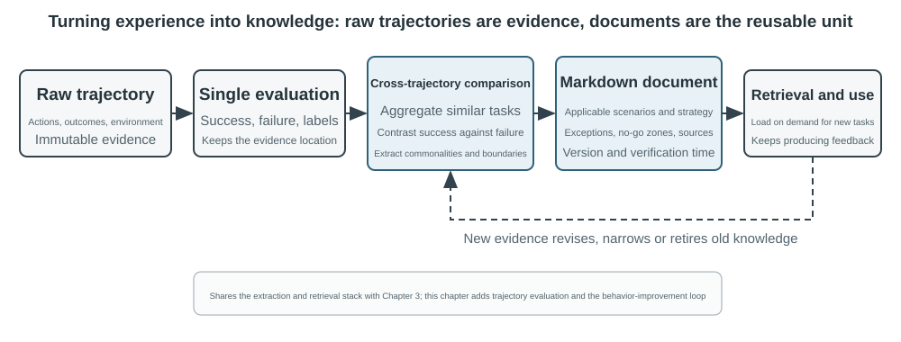

# Multimodality and Real-Time Interaction

The previous chapters explored how Agents operate in a text-based world, interacting with digital systems through context, tools, and code. But an Agent's world extends beyond text and APIs. The moment it needs to understand a spoken command, find and click the right button on a screen, or steer a robotic arm to grasp an object, it enters new territory: **multimodal real-time interaction**. This shift from pure text input and output to **multimodal perception and real-time response** is the crucial step that takes an Agent beyond the "dialog box." "Multimodal" simply means handling multiple forms of information at once—text, speech, images, video, and actions—rather than text alone.

First, let us define the scope of this chapter. Static image and document understanding—examining a screenshot, reading a chart, or parsing a PDF—has already become a natural part of the Agent workflows in previous chapters. For today's multimodal LLMs, these single-input understanding tasks are relatively mature and require no special architecture. This chapter tackles a different class of problems: three scenarios in which **real-time constraints make multimodal problems hard**—voice dialogue, GUI operation, and robot control. In these settings, input arrives continuously and output must meet a strict time budget, fundamentally changing the architecture. Real-time understanding of continuous visual streams, or video, remains an open problem for Agents at the time of writing. We will return to it when the Computer Use section examines the limits of frame-by-frame screenshots, and again in the end-of-chapter questions. One more boundary: in this book's framework, multimodal **generation** (image or video generation) is simply an ordinary tool call, as covered in Chapter 5 on Multimedia Generation. The Agent uses it as an external tool, so it raises none of the real-time interaction challenges addressed here and remains outside the chapter's main thread.

Voice interaction, Computer Use, and robot operation may seem like three entirely different fields, but systems in all three run into strikingly similar problems: they must process several modalities at once, and they are acutely sensitive to latency. A pause of more than two seconds in a voice conversation makes people restless; millisecond-level jitter in robot control can cause a collision. Together, these constraints push all three scenarios in the same architectural direction: away from the **serial pipeline** (like a factory assembly line, where one step must finish before the next begins) and toward the **end-to-end model** (a unified model that goes directly from input to output, eliminating intermediate handoffs).

This chapter unfolds along the following lines:

1.  First, we use three voice-architecture paradigms as a framework: cascaded (a VAD-ASR-LLM-TTS pipeline), end-to-end omnimodal (Omni, a single model that still relies on turn-taking), and full-duplex (Moshi and GPT-Live, which listen and speak simultaneously). We compare their latency and trade-offs by asking how far each paradigm moves beyond VAD's assumption of discrete turns. The cascaded section also discusses replacing VAD + ASR with streaming voice perception.
2.  Next, we examine how the thinking architecture reconciles the conflict between "real-time response" and "deep thinking": from simple parallelization of fast and slow, to the decoupled approach where a background reasoning model acts as a "strategist" (GPT-Live delegation, Pine AI, etc.), to Step-Audio R1's "internalization" of thinking into a single model that "thinks while speaking."
3.  Then, we discuss how more human-like speech synthesis optimizes the execution layer.
4.  Finally, we extend the perspective to Computer Use (enabling AI to operate a computer screen like a human) and robot operation, observing how the same latency and multimodality issues manifest in these two scenarios.

Two more theoretical themes carry across these scenarios and deserve special attention: the **thinking architecture** (how fast and slow thinking collaborate) and the **fast-slow interface** that follows from it (the **Latent Bridge**—what fast and slow models can exchange besides text). Although introduced in the context of voice, these ideas are not limited to it. The Computer Use and robotics sections encounter the same question of when to consult a slow strategist, so keep both themes in mind.

## Voice: The Most Natural Human-Machine Interface

Voice is not merely text turned into sound. Speaking is roughly four times faster than typing and leaves the hands and eyes free, so it naturally places an Agent in a continuous input-output loop where the user may interrupt at any moment. Dictation converts speech into text; a voice Agent lets the user collaborate with the Agent directly. Both support the whisper-coding workflow introduced earlier.

This section covers two directions: the user speaking to an Agent, and an Agent speaking to the outside world on the user's behalf. The voice model determines what the Agent can answer; the interaction architecture determines whether it can hear clearly, respond in time, hand over naturally, and complete confirmations and tool calls during a call. We first examine interaction timing, then cognitive timing and expressive quality.

### Interaction timing: from cascaded to full-duplex

OpenAI's GPT-Live introduction describes three voice-interaction paradigms—cascaded, turn-based, and full-duplex[^ch9-12]. They are not a simple old-to-new replacement; they trade latency, cost, and observability in different ways:

| Paradigm | Core structure | Main advantage | Main limitation |
| --- | --- | --- | --- |
| Cascaded | VAD → ASR → LLM → TTS | Clear modules that are easy to replace and debug | Latency accumulates and paralinguistic information is lost at interfaces |
| End-to-end Omni | One model listens, thinks, and speaks | Lower latency and better preservation of tone, emotion, and ambient sound | Still turn-based; training and debugging cost more |
| Full-duplex | Continuously listens, speaks, and decides | Overlapping speech, natural interruption, and continuous streams | Training, control, and evaluation are more complex |

The common thread is escaping the assumption that people must speak one at a time, and escaping VAD's guess about who has the floor. Cascaded and Omni systems still divide interaction into turns; full-duplex makes turn ownership a continuous model decision.

[^ch9-12]: OpenAI. *Introducing GPT-Live.* 2026-07-08. https://openai.com/index/introducing-gpt-live/ The cascaded / turn-based / full-duplex taxonomy comes from the article's summary of three generations of ChatGPT Voice; its “end-to-end omnimodal (Omni)” term corresponds to the “turn-based voice models” category.

**Streaming cancellation:**

```python
while audio_is_arriving:
    partial = asr.push(audio_chunk)
    if endpoint_is_probable(partial):
        candidate = llm.start(partial)
        if later_audio_changes_meaning(partial):
            cancel(candidate)                 # speculative cancellation
        else:
            tts.enqueue_stable_segments(candidate)

on_final_transcript(text):
    commit_or_restart(text)
```

### Paradigm 1 · Cascaded pipeline

Most commercial voice assistants still use a serial pipeline (Figure 9-1): VAD decides when the user has finished, ASR converts audio to text, the LLM understands and generates a reply, and TTS speaks it. Modularity lets each component be optimized independently, but every boundary can add waiting time.


| Module | Role | Typical bottleneck |
| --- | --- | --- |
| VAD | Decide whether speech has ended | Silence thresholds add waiting and split turns incorrectly |
| ASR | Convert audio to text | Recognition latency and loss of context |
| LLM | Understand, reason, and generate | Time to first token; reasoning adds more waiting |
| TTS | Convert text to speech | First-packet synthesis and playback buffering |

For a short reply without reasoning, VAD, ASR, LLM, and TTS waiting time accumulates serially (Figure 9-2). The real value depends on input length, model, hardware, network, and load.


Production queueing amplifies idle latency further (Figure 9-3), but capacity planning is outside this chapter's scope.


> **Experiment 9-1 ★: Build a traditional voice Agent**
>
> Connect the microphone, Silero VAD, local Whisper, a streaming LLM, and Fish S1 TTS over WebSocket to establish the cascaded baseline. The retained real single-turn evidence shows that the media and model chain ran end to end; it is not a concurrency or production-load benchmark. Code and acceptance records are in [chapter9/live-audio](../chapter9/live-audio/).

> **Add-on: Build a WebRTC voice Agent that “calls the user”**
>
> A phone Agent does not require PSTN. Browser WebRTC can reproduce the loop of opening a session, asking for missing information, repeating it for confirmation, and saving structured results. When an external organization must be contacted, replace the same tool contract with a compliant PSTN/SIP provider. The complete media path, direct/ReAct comparison, and acceptance evidence are in [chapter9/phone-agent](../chapter9/phone-agent/). The project retains its historical \`exp9-2\` run identifiers but no longer occupies a numbered manuscript experiment.

#### From serial to streaming perception

Figure 9-2 describes the fully serial case in which each stage waits for the previous one. A production system can retain the modular split while producing increments as early as possible:

- **Streaming ASR** continuously produces a provisional transcript while the user speaks, then confirms the final text at the turn boundary.
- **Segmented LLM output** sends the first speakable sentence to TTS without waiting for the full reply.
- **Incremental TTS** returns audio chunks so later generation, synthesis, and playback overlap.

“Streaming every stage” does not make ASR, LLM, and TTS fully parallel from start to finish. In a standard cascade, ASR overlaps with the user's speech and TTS overlaps with the LLM's later tokens, but the final reply still depends on a stable transcript. A more aggressive system starts the LLM from a partial transcript; if later text changes, it must cancel, restart, or correct the generation. Speculation requires explicit commit, invalidation, and rollback mechanisms; enabling \`stream\` alone does not provide them.

Ordinary streaming also cannot remove VAD's silence wait. A traditional VAD + ASR front end has three problems:

1. **Accumulated latency:** it must wait through silence before confirming the end.
2. **Lost information:** a voiced/unvoiced bit cannot express hesitation, emotion, backchannels, or ambient sound.
3. **Broken context:** email addresses, names, and proper nouns may be split across chunks and misrecognized.

A truly streaming model needs a causal or chunked encoder with incremental decoding. Whisper's decoder is autoregressive, but its encoder expects a complete audio segment, so it should not be called a causal streaming model. RNN-T and streaming Conformer ASR have long been used in industry; the focus here is semantic listening built on an LLM backbone.

An LLM-based streaming-audio model can emit text and semantic events from continuous audio, placing recognition and part of understanding in one model. It keeps the conversation context from the beginning and can use world knowledge for brands, names, and proper nouns. Simulated chunking is still not a performance promise for a causal model.

If the only goal is deciding whether the user has finished, endpointing can be built into the streaming recognizer. The model combines semantics and silence to judge whether an utterance is complete. Training labels must contain only information visible at decision time, or hindsight will produce a judgment that cannot be reproduced online[^ch9-11]. This is lighter than a complete audio-capable LLM.

The model can emit acoustic-event markers as well as words:

- **speak_start/end, interrupt:** speech boundaries and interruption intent;
- **emotion:** emotion and hesitation;
- **laugh, sigh, noise:** paralinguistic and environmental sound.

Together with text tokens, these markers form one event stream. The Agent can detect hesitation, interruption, and environmental changes without compressing every sound into plain text.

[^ch9-11]: For the diagnosis of embedding turn judgment in the recognizer and the problem of hindsight-based labels, see Bojie Li and Noah Shi. *The Trade-off Was in the Labels: Causal Supervision for Turn-Aware Streaming ASR.* 2026 (forthcoming).

> **Experiment 9-2 ★: Simulate streaming voice perception with Qwen2-Audio**
>
> Qwen2-Audio is not itself a streaming model. This experiment simulates continuous perception with increasing audio prefixes and compares it with 600 ms VAD + Whisper. It shows how full context changes pause and noise behavior, but every prefix re-encodes earlier audio, so its timings are not a promise for a causal streaming model.
>
> The canonical run passed all execution and provenance gates but reproduced only 2/6 expected behaviors: increasing-prefix calls took 8.4–11.3 seconds, the pause sample missed \`silence\`, and the noise sample still misclassified \`cough/laughter\`. This negative result tests mechanisms and failure modes; it does not support a “100–200 ms true streaming perception” claim. See [chapter9/streaming-speech](../chapter9/streaming-speech/) for the complete record.

### Paradigm 2 · End-to-end omnimodal models (Omni)

Even with streaming perception, a cascade passes listening, thinking, and speaking through discrete interfaces; emotion, intonation, and ambient sound may be lost when audio becomes plain text. Omni uses one model to listen to audio, generate a reply, and speak it, which can preserve those signals at the cost of higher training, debugging, and component-replacement costs (Figure 9-4).

The end-to-end advantage is mainly latency and non-text information, not necessarily accuracy. A self-cascade first transcribes with the same model and then answers from the transcript: when text carries the task information, it may correct a perception error; when the answer depends on speech rate, emotion, or ambient sound, the text bottleneck irreversibly loses evidence. The key question is not whether there is an intermediate representation, but what information it carries[^ch9-13].

Omni still assumes turn-taking and generally uses VAD or semantic endpointing to assign the floor. A pause in a spoken sequence of numbers can still be mistaken for the end; streaming perception improves the judgment but does not remove turns.

[^ch9-13]: For a complete cross-modal measurement of when cascade and end-to-end accuracy advantages reverse, and how task nature predicts the direction, see Li, Bojie and Noah Shi. *The Cascade Gap: When and Why Self-Cascades Help Multimodal Agents.* 2026 (forthcoming).



Realtime speech APIs sit between cascaded and Omni systems: the model handles audio natively, but interaction control still relies on VAD, interruption, and asynchronous tool calls. Qwen3-Omni's Thinker-Talker and MiniCPM-o's local path show that this approach can combine thinking, expression, and multimodal input at different model sizes. The useful comparison is not a leaderboard; it is how end-to-end and self-cascade paths fail on different tasks.

> **Experiment 9-3 ★★: Run MiniCPM-o 4.5 locally—end-to-end versus self-cascade**
>
> Fix one local MiniCPM-o 4.5 revision, disable thinking mode, and compare direct audio answers with the same model's self-cascade: transcribe first, then answer from the transcript. This measures whether audio information is preserved, **not** the later “think while speaking” capability.
>
> **Table 9-1.** Local MiniCPM-o 4.5 end-to-end and self-cascade results (four mechanism checks, not a benchmark)
>
> | Task type | End-to-end | Self-cascade | Observation |
> | --- | ---: | ---: | --- |
> | Semantic arithmetic (2) | 1/2 | 2/2 | Self-cascade corrected one transcription error |
> | Paralinguistic speaking rate (2) | 2/2 | 1/2 | The plain-text transcript erased the fast/slow distinction |
> | Total | 3/4 | 3/4 | Equal totals, complementary failures |
>
> The sample is small, so it cannot establish which path is generally more accurate or faster. Hardware, versions, raw outputs, and real audio-to-audio evidence are in [chapter9/end-to-end-speech](../chapter9/end-to-end-speech/).

Step-Audio 2 demonstrates an end-to-end path that processes raw audio and emits text and speech; it focuses on emotion, speaking rate, intonation, and ambient sound beyond semantics. Step-Audio R1 extends this path by internalizing reasoning in the audio model; it will serve as the example for “thinking while speaking.”

### Paradigm 3 · Full-duplex interactive models

Omni still divides conversation into “the user speaks” and “the model speaks,” but simultaneous interpreting and similar tasks require overlap. A full-duplex model therefore does not presuppose turns: it listens and speaks continuously and repeatedly decides whether to continue, pause, interrupt, or call a tool.

Kyutai's **Moshi** (2024) was an early research example. It models the user's and the model's audio streams in parallel, so overlapping speech and interruption can be natural behaviors.

Thinking Machines Lab calls this an **Interaction Model**[^ch9-14]: interaction is built into the model instead of assembled around it with VAD and other external harnesses. Its micro-turn mechanism advances in short audio blocks, preserving silence, overlap, and interruption as continuous context. It can delegate the full conversation to a background reasoning model while it keeps the conversation alive, then incorporate the result at a suitable moment.

[^ch9-14]: Thinking Machines Lab, “Interaction Models: A Scalable Approach to Human-AI Collaboration,” 2026-05. https://thinkingmachines.ai/blog/interaction-models/

OpenAI's GPT-Live brings the full-duplex path to production scale: it continuously processes input and generates output, can wait, backchannel, be interrupted, and handle realtime translation. Like the Interaction Model, it delegates complex work to a background model while the foreground model maintains the conversation.

The narrative is: cascades guess turns from silence thresholds; streaming perception upgrades the judgment to the semantic level; full-duplex turns the switch itself into a continuous decision.

### Cognitive timing: realtime interaction and deep thinking

Interaction quality and intelligence ceiling are different dimensions. The foreground model must respond while the user is still engaged; the background model can spend longer thinking. The following three designs are trade-offs, not a linear progression. The first two can wrap a cascade or Omni model; only the third unifies thinking and expression in one end-to-end audio model.

| Design | Foreground | Background | Main risk |
| --- | --- | --- | --- |
| Fast filler, slow correction | Give an immediate answer | Re-think and supplement it | Contradiction |
| Fast interaction, slow advice | Keep the conversation alive and choose wording | Supply advice or tool results | A constrained interface |
| Unified thinking and expression | Think and speak together | Share model state with expression | High training and replacement cost |

#### Solution 1: Fast thinking for fillers, slow thinking for answers

Fast thinking can give a holding response within a few hundred milliseconds while slow thinking performs a deeper derivation in the background. Simple questions may be processed twice, while hard questions can produce contradictions: the fast model recommends a purchase, then the slow model discovers that a key feature is missing. The root cause is two independent instances thinking separately.


#### Solution 2: Fast thinking for interaction, slow thinking for advice

The background model can send advice through a status bar or dedicated interface while the foreground model keeps the conversation alive and decides how to phrase it. This is more stable than Solution 1, but communication is still indirect: the foreground can misunderstand the advice and cannot see the background's intermediate reasoning. Before the background finishes, follow-up questions still rely on the foreground model. It can naturally wait for a result, but it cannot truly think while speaking.

#### Solution 3: End-to-end unification of thinking and expression (using Step-Audio R1)

This design internalizes reasoning directly in an end-to-end audio model. Step-Audio R1 uses two complementary mechanisms: **Modality-Grounded Reasoning Distillation (MGRD)** grounds thinking in acoustic features, while the **MPS dual-brain architecture** lets planning and expression proceed in parallel. The first helps the model think correctly; the second helps it speak in time.

Ideally, the model infers emotion from pitch, rhythm, and intonation rather than only from the transcript. “Text-proxy thinking” substitutes negative words in lyrics for analysis of melody and acoustics. MGRD selects reasoning traces that actually cite acoustic features, trains on them, and uses reinforcement learning to prevent guessing without thinking.

MPS lets the planning brain continuously emit thought segments; the expression brain combines each segment with the partial reply and immediately generates speech. The pipeline runs in parallel, so the listener need not wait for the entire chain of reasoning before hearing the first sentence (Figure 9-6).


A unified model implements “thinking while speaking” most directly, but thinking and realtime expression must be retrained together. A decoupled design makes it easier to swap the background brain; a unified design suits specialized scenarios that demand the most natural interaction. These are trade-offs, not simple substitutes.

### More human-like speech synthesis

Traditional TTS can expose its machine identity by being too smooth and pausing too little. Pauses, filler words, and occasional repetition signal uncertainty and thought in human speech.

The main LLM can emit control markers in addition to text, such as **THINKING**, **EMO:happy**, and **SPEED:0.8x**; TTS maps them to pauses, prosody, speaking rate, laughter, sighs, and other nonverbal audio. The implementation can be a TTS trained to understand control markers, or voice cloning with reference clips for different emotions and styles.

> **Experiment 9-4 ★★: Control token-driven TTS with Fish Audio**
>
> Use Fish Audio S1 to build a multi-reference voice library and compare three configurations: no control markers, one reference clip, and multiple reference clips. The execution layer selects matching emotion, speaking rate, and style from the markers.
>
> The multi-reference configuration scored highest in three position-balanced blind listening passes (human-customer-service likeness 4.67/5), but the complete planned ordering was not reproduced because the no-marker arm outscored the single-reference arm. This result suggests that expressive control helps, but a small listening study is not a general speech-quality conclusion. The complete 24-reference library, A/B/C media, and acceptance record are in [chapter9/controllable-tts](../chapter9/controllable-tts/).

## Computer Use: GUI Automation Agents

By now you may have noticed that this chapter devotes far more space to voice than to the two scenarios that follow. This is deliberate. Among real-time multimodal systems, voice technology has progressed the furthest and therefore provides the best reference point. It has traced the full arc from the original problem—excessive latency in serial pipelines—through end-to-end models, full-duplex interaction, and thinking while speaking, to today's relatively mature designs. That is why we have told its story in full. As you read the Computer Use and robotics sections, compare them with this trajectory: how far has each field progressed, and where does each remain stuck?

These three scenarios seem different but face the same core challenges: real-time perception, low-latency decision-making, and continuous interaction. Next, we turn to visual interaction, or Computer Use, expanding the perspective from the auditory to the visual modality: what if an Agent could not only understand speech but also "see" the screen and operate its graphical interface?

Computer Use, also known as GUI automation, allows AI to use software like a human by observing the screen and operating the mouse and keyboard—for example, opening a browser to search for information, filling in data in a spreadsheet application, or adjusting configurations in system settings. Its core is a **Perceive-Think-Act** loop (Figure 9-6):

1.  The Agent takes a screenshot of the current screen.
2.  A multimodal model receives the screenshot and task instruction, and outputs a thought and a specific action.
3.  The execution layer performs the action in the real environment (moving the mouse, clicking, typing text, etc.).
4.  It waits for the interface to respond, takes another screenshot, and enters the next loop iteration.

**Computer Use safety loop:**

```python
observation = capture_screenshot_and_accessibility_tree()
proposal = model.decide(task, observation)
action = validate_schema_and_coordinates(proposal)

if action.is_irreversible and not user_or_policy_approval(action):
    stop("approval required")
else:
    execute_in_sandbox_or_scoped_session(action)
    new_observation = capture_after_settle()
    if not verify_goal_progress(new_observation, action):
        rollback_if_possible_or_replan()
```


There are three key design dimensions in this loop: **Action Space** (what operations the Agent can perform), **Visual Grounding** (how to find the target element in the screenshot), and **Model Architecture** (how to generate the correct action from the screenshot).

### Action Space Design

Anthropic defines three types of tools that constitute a complete interaction capability (Figure 9-7):


**GUI Operation Tool** (`computer` tool): Mouse operations include moving (`mouse_move`), left/right/middle clicks, double-clicking or triple-clicking, dragging (`left_click_drag`), and more precise press/release actions (`left_mouse_down` and `left_mouse_up`). Scrolling (`scroll`) supports four directions and can be combined with modifier keys. Keyboard operations include typing character by character (`type`, with a 12ms interval between characters to simulate real typing), key combinations (`key`, e.g., `Ctrl+C`), and holding a key (`hold_key`). Perception actions include taking a screenshot, retrieving the cursor position (`cursor_position`), and waiting (`wait`).

**Command Execution Tool** (bash tool): Provides a persistent bash terminal session with a 120-second timeout. It uses a sentinel string to detect command completion and maintains environment state across multiple calls (e.g., after `cd` to a directory, the next call remains in that directory).

**File Editing Tool** (`str_replace_editor`): Enables safe editing through string matching and supports view, create, replace, insert, and undo operations. It is more precise than overwriting an entire file and less likely to modify unrelated content accidentally.

> **Experiment 9-5 ★: Running Computer Use (Anthropic Reference Path or Open-Model Path)**
>
> Path A uses the Anthropic Computer Use Demo. Its container packages a complete Ubuntu desktop environment, including a browser, terminal, and other common tools. The frontend receives a task, while the backend sends the instructions and screenshots to Claude and then executes the mouse, keyboard, terminal, or editing actions returned by the model. This path is intended for understanding the native `computer` tool protocol; it does not require every reader to have access to the Anthropic API.
>
> Path B uses this book's [`chapter9/computer-use-open-model`](../chapter9/computer-use-open-model/) companion. By default, it drives browser-use with the open-weight Qwen3-VL 32B Instruct model, either through the OpenRouter hosted API or by pointing `OPEN_MODEL_BASE_URL` to self-hosted vLLM/SGLang or another compatible endpoint. The endpoint must accept screenshots and support native JSON Schema; if it supports only ordinary JSON, the schema-in-prompt compatibility mode can be enabled explicitly.
>
> Both paths use the same read-only task and acceptance contract: a maximum of 25 steps, one action per step, and retention of the model/endpoint identity, raw provider responses, step-by-step screenshots, action sequence, final answer, and stop reason. Different models must be reported as separate experimental arms; an open-model result must not be presented as a Claude reproduction, nor should successful container startup be treated as task completion. Action intervals and planning quality are measured outcomes, not assumptions of a 2–5-second interval or inevitable superiority over other models.
>

### Visual Grounding

In each iteration of the loop, the model needs to accurately locate the target element in the screenshot—"Where is the search box?" "What are the coordinates of the submit button?" This is the visual grounding problem. Currently, there are **two main approaches**: one is to turn localization into a **multiple-choice problem**—first annotate the interface elements with numbers, and the model only needs to select one; the other is **pure coordinate prediction**—letting the model "look" at the screenshot and report coordinates directly, just like a human. The multiple-choice approach has two implementation methods: **pure visual annotation** (the original Set-of-Mark, using a segmentation model to segment candidate regions in the image) and **structured element indexing** (DOM/Accessibility Tree, directly reading the interface's inherent structure). The common advantage of the multiple-choice approach is that it transforms the open-ended problem of "find the button in the screenshot and predict its coordinates" into a closed-ended one of "choose one from the already annotated elements"—just as multiple-choice questions are easier to answer correctly than fill-in-the-blank questions in an exam, the model only needs to say "click [123]" instead of "click the blue button approximately 200 pixels to the right of the top-left corner of the screen."

**Set-of-Mark: Visual Annotation Method.**

The original Set-of-Mark (SoM) was proposed by Microsoft Research in 2023, initially to unlock the visual grounding capabilities of GPT-4V. It is a **purely visual** method: it uses image segmentation models (SAM, SEEM, etc.) to automatically segment candidate regions in the screenshot, overlays a numbered marker on each region, and the model sees an image with numbers. The model only needs to report the number, and the system converts it into the center coordinates of the corresponding region. The entire process does not require a DOM or any internal interface structure, so it is equally applicable to native desktop software and game interfaces—as long as the segmentation model can identify the candidate regions.

**Structured Element Indexing: A Structured Implementation of the SoM Idea on the Web.**

When the interface itself provides structured information, annotation can be more precise. Before rendering, modern web pages define a complete element structure (the DOM tree) and semantic roles that identify buttons, input fields, and other controls. Accessibility trees provide similar information for many desktop applications. Rather than asking a segmentation model to guess which region is a button from pixels alone, the system can query the interface directly for its clickable elements. Web Agent systems such as `browser-use` do exactly this: they enumerate and number interactive elements from the DOM. This is a structured implementation of the SoM idea for the web (Figure 9-8). The process has four steps:

1. Obtain the structured representation (DOM tree) and accessibility information for the page through the browser's debugging interface (CDP, Chrome DevTools Protocol)
2. Automatically detect which elements are interactive (buttons, input boxes, links, etc.)
3. Annotate each interactive element with a unique ID and draw bounding boxes on the screenshot
4. Simultaneously generate a text list describing the element corresponding to each ID

```text
Screenshot: [Key elements in the image are annotated with IDs like [1], [2], [3], [4]]

Elements:
[1] <input type="text" placeholder="Search" aria-label="Search" />
[2] <button id="submit-btn" aria-label="Submit form" />
[3] <input type="text" placeholder="Enter your name" value="" />
[4] <a href="/docs" aria-label="Documentation" />
```

The model only needs to output an ID, and the system automatically clicks the center of the corresponding element. This approach does not save tokens because all annotation data must still be sent to the model, but it provides accurate, stable localization while avoiding the missed detections and false positives that segmentation models can introduce.


**Pure Coordinate Prediction.**

The third route skips annotation and asks the model to output coordinates directly. Systems such as **SeeClick** and Claude's computer use rely on vision models trained on massive datasets of GUI screenshots paired with element positions. These models learn to map natural-language descriptions (e.g., "click the submit button") directly to precise screenshot coordinates, relying on visual perception much like a human user.

In coordinate prediction schemes, the model's understanding of coordinates is highly dependent on the resolution used during training (Figure 9-9). Claude was trained using XGA (1024×768), WXGA (1280×800), and FWXGA (1366×768). If the input screenshot resolution does not match, the model's predicted coordinates will systematically shift—like measuring a distance on a small map and then applying it directly to a large map. Therefore, a bidirectional coordinate scaling mechanism must be implemented at the tool layer, and the target resolution must be **selected based on the aspect ratio** to avoid non-uniform stretching that distorts the image and consequently biases coordinate judgment. For example, if the actual screen resolution is 2560×1440 (16:9), the most suitable target among Claude's three supported options is FWXGA (1366×768), which has an aspect ratio closest to 16:9. The screenshot is proportionally scaled to 1366×768 and fed to the model; after the model outputs the click coordinates (683, 384), they are inversely mapped to the real coordinates (683×2560/1366, 384×1440/768) ≈ (1280, 720). Conversely, if a 16:9 image is forcibly stretched into the 4:3 1024×768, the image will be horizontally compressed, causing the model's predicted coordinates to systematically shift.


The choice among the three routes can be summarized as follows: **when structured information is available, prioritize DOM/accessibility-tree indexing** for the most accurate and stable localization. **When it is unavailable**—in native desktop software such as Photoshop, canvas/WebGL-rendered interfaces, or games—**use either visual annotation (the original SoM route) or coordinate prediction**. Visual annotation turns localization into a multiple-choice problem, making it friendlier to general-purpose models without specialized training. Coordinate prediction eliminates the annotation step and is more direct for models trained specifically on GUI localization. Both approaches still struggle with small elements and dense interfaces.

> **Experiment 9-6 ★: Using browser-use to Implement Automated Browser Operations**
>
> Use Playwright, a browser-automation framework, together with a multimodal model to implement browser operations driven by natural language. Enable SoM visualization and save a screenshot with annotated bounding boxes before every decision. The model interface is not limited to OpenAI or Anthropic; the book provides an API configuration for the open Qwen3-VL model and retains a generic OpenAI-compatible base URL for other hosted services or self-hosted inference.
>
> Test task "Open Google and query San Francisco weather": after startup, a screenshot shows the Google search page with numbered interactive elements. The model selects the search box, enters "San Francisco weather today," submits the search, and then extracts the temperature and conditions from the results page. During acceptance, independently verify the answer and trajectory and record the actual step count and elapsed time. "5 steps and about 20 seconds" can only be an observation from a particular run, not a fixed result stated without an execution receipt.
>
> The book's preserved official open-model run used `qwen/qwen3-vl-32b-instruct` on OpenRouter. When the model encountered a CAPTCHA on Google Search at step 4, it did not claim success; it switched to weather.com and, at step 16, read 64°F, Sunny, feels like 62°F, high 74°F, and low 55°F from San Francisco's Today page. All 16 of 16 API responses reported the requested Qwen3-VL model, and 15 valid step screenshots plus the read-only action trajectory passed independent deterministic acceptance. This result demonstrates that the open-model API path runs successfully; it does not mean that the Anthropic-native `computer` tool arm has been reproduced.

### A Computer Use Agent That Can Watch Animations and Hear Sound

So far, Computer Use perception has rested on an implicit assumption: **the screen is static**—take a screenshot, reason about the next step, click, and take the next screenshot. Real screens play videos, flash notifications that vanish in seconds, and play audio from meetings. An Agent that opens its eyes only once every 3–5 seconds and has no ears at all is blind and deaf to everything that happens between two frames. Watching a screen recording, joining a meeting, following a voice prompt, catching a dialog box before it disappears—this whole category of everyday computer work is effectively off-limits to today's Computer Use Agent.

What truly needs to be redesigned here is not the "action interface," but the "**observation interface**"[^ch9-9]. The core idea is to decouple **observation** (continuous, adaptive, multimodal) from **action** (discrete), creating a perceptual middleware layer that sits between the environment and any off-the-shelf Computer Use model without requiring retraining. We can call this the Agent–Computer Observation Interface (AOI). It has three "gated" components: First, **inter-frame keyframe capture**—use a very cheap pixel gate to skip nearly unchanged frames, then use a small model to determine if a meaningful change has occurred, capturing a frame only when there is a change, resulting in near-zero cost for static screens; Second, **volume-gated speech transcription**—only invoke speech recognition when there is sound, giving the Agent "ears" for the first time; Third, and most critically, **converting observations into persistent textual descriptions**—have the model describe the captured frame in a single sentence (e.g., "The popup just said the release date has been changed to April 28th"), and **even if the original image is later cleared from the context, this text remains in memory**, carrying the dynamic information forward in textual form.

The counterintuitive finding is that what really matters is not frame selection but converting selected frames into persistent text, because text is the modality LLM Agents handle best. Across eight models, ranging from 7B-parameter models to frontier-scale systems, this middleware delivered gains of +17 to +48 percentage points without any retraining, with the widest gap on voice tasks: with the perceptual layer in place, the Agent could finally complete voice tasks that had been "audible but unactionable." It is not a one-size-fits-all configuration, though—on some newer models, injecting too many image tokens crowds out reasoning and drags performance down. So the components should be **chosen per model**, not switched on wholesale. It is the same lesson as the Set-of-Mark-versus-coordinate-prediction trade-off: there is no silver bullet in perception schemes; you configure them to suit the model's temperament.

[^ch9-9]: For the complete mechanism and per-model ablation of the three components—gated keyframes, on-demand transcription, and narrating frames into persistent text—see Bojie Li and Noah Shi. *Agent-Computer Observation Interfaces Enable Dynamic Computer Use.* arXiv:2606.29472, 2026.

### World Models for Computer Use

The observation interface of the previous section answers "what happened in between?": with keyframes, speech transcription and persistent text, the Agent no longer sees only two screenshots taken far apart. But an observation interface does not remove planning latency. The Agent is still running a serial "screenshot—think—click" loop, re-observing and reasoning about the next step after every single action. The **OSWorld-Human** efficiency study shows that even when a task eventually succeeds, the Agent takes markedly more steps and waits markedly longer than a person does; reaching human-level accuracy is not the same as being practical.

People do not start thinking about the next step only after clicking. They first predict what an action will do: if the actual change matches the expectation, they carry on with the existing plan; only when the page state departs from what was expected do they stop to observe and plan again. A world model lets the Agent predict what the desktop may turn into before it acts, giving it this human-like "speculative execution" and improving efficiency substantially.

Desktop state is more than a grid of pixels. It also includes windows, focus, scroll position, input-field contents, loading state, permissions and network responses; actions include clicking, typing, scrolling, dragging and waiting. A world model usable for Computer Use must at minimum encode the current state, predict the state change a candidate action would cause, and hand that prediction to the planner to decide the next step:

```text
desktop state + click/type/scroll/wait ──> representation of the next state
```

This lets the Agent compare the consequences of candidate actions before it actually clicks, prepare the next step while a page is loading, and recover from a dialog that flashed past by reasoning about the state difference. If the task is "create a new Python file in VS Code and write hello world", the model can first predict the key state of the file tree and editor on success, and only then choose the click, type and save actions; if the task is to delete a file, it can predict inside an isolated virtual desktop whether an irreversible confirmation dialog will appear, and ask the user to confirm when necessary. The point here is not to have the model generate a photorealistic future screenshot, but to predict the checkable state differences that completing the task requires.

In July 2026, **Photon-1** from Induction Labs demonstrated one implementation of this route, completing the pretraining of a computer use world model with only 30,000 hours of H200 GPU time. It compresses each frame into discrete latent tokens and autoregressively predicts the representation of the next state after an action, rather than generating screenshots pixel by pixel during pretraining; the image generator attached to it serves only to visualize the latent representations and is not a component required for inference. Given a seed screenshot and the actions that follow, the model can "imagine" desktop states continuously, and then learn to output computer-use actions through online training on virtual machines.[^ch9-20]

[^ch9-20]: David Li and Jonathan Li, Induction Labs, “Scaling Video Pretraining with Imagination Models,” 2026-07-23. https://www.inductionlabs.com/news/scaling-video-pretraining. The parameters, data scale, internal benchmarks and cost comparisons reported for Photon-1 are figures disclosed by the company.

### Mobile: Ecosystem Barriers Are Harder Than Technology

Computer Use is also expanding to mobile devices. Mobile and desktop systems do differ technically: instead of relying on mouse coordinates and keyboard input, the mobile action space typically uses the system's accessibility-service API (e.g., Android's `AccessibilityService`) to read interface elements and issue clicks or enter text. Interaction also shifts from a mouse pointer to touch gestures, changing the meaning of coordinates. The same `(x, y)` position might indicate a tap, a long press, or the starting point of a swipe, so the action must also specify a gesture type. Mobile benchmarks such as AndroidWorld, introduced in Chapter 6, evaluate an Agent's ability to complete tasks in real applications within this action space.

However, what truly hinders mobile Computer Use is often not these technical differences, but ecosystem barriers. Some phone manufacturers have attempted to integrate AI assistants into consumer-grade phones so that the assistants can automatically operate everyday apps like WeChat, Taobao, and Alipay, but they quickly encountered platform restrictions.

This reveals a unique challenge for Computer Use: **ecosystem barriers**. The fundamental reason behind these restrictions is a conflict of business models. The core monetization logic of traditional internet applications is **traffic and attention**: users see ads while scrolling through feeds, are guided by recommendation algorithms when searching for products, and make impulse purchases while browsing pages. When an Agent operates on the user's behalf, that monetization chain is bypassed entirely: the AI ignores ads, makes no impulse purchases, heads straight for the goal, finishes the task, and leaves. For platforms that live on advertising and traffic, every Agent operation erodes the foundation of the business model.

This means that Computer Use faces not only technical countermeasures such as CAPTCHAs, but also a **structural conflict of interest**. This conflict will be difficult to resolve in the short term and poses a greater obstacle to consumer adoption than purely technical problems.

## Robot Manipulation: Tidying a Desk with XLeRobot

> **Reading note**: This section uses one task throughout—"put the red cup in the tray, put the yellow scrap paper in the bin, then observe again and confirm the state of the desk." Experiments 9-7 and 9-9 run on real XLeRobot hardware and need an arm, calibration, an emergency stop and an on-site observer; experiments 9-8, 9-10 and 9-11 are the corresponding local-GPU experiments. Hardware and simulation are reported separately, but the task goal, the action semantics and the success conditions stay the same.

Robot manipulation is much harder than answering questions about a picture. The model has to understand the scene and then take actions continuously in the real world, where every action changes what the next moment looks like. XLeRobot makes that difference concrete: the same arm can be teleoperated by a person through a keyboard, a gamepad or a VR device, or it can hand camera observations and a constrained set of action tools to an Agent to call on its own. The hardware and the task stay fixed; only the operator changes—in the first case a human observes and corrects continuously, in the second the model and the control system must do the same work.

This section runs five experiments on "tidy the desk." First a human teleoperates the real XLeRobot, measuring what the hardware can do under a sufficiently capable operator; then a simulator establishes the ideal control ceiling for the same task. Next an Agent controls the real XLeRobot autonomously, showing how perception, planning and failure recovery affect the result; then the same tool contract goes into the simulator so that open-loop execution, step-by-step checking and world models can be compared in bulk. Finally the background, object appearance, lighting and visual noise change, to see whether a visual policy learned in simulation adapts to a new environment.

The bottleneck here is usually not one more static question-answering benchmark, but whether the model can keep closing the loop under limited perception and control bandwidth. A usable robot system has to answer at least four questions:

1. What task does the person want done?
2. Which subtask comes next?
3. What actions does the current skill actually emit?
4. After the action executes, does reality still match the plan?

This section places those four questions inside one XLeRobot control loop and shows what each of four techniques is responsible for: long-horizon planning decides whether the cup or the paper is handled first, a VLA or action primitive performs the grasp and the placement, a world model estimates the consequences of an action, and sim-to-real transfer handles the differences between training footage and the real camera and actuators. Even when the high-level model already has enough knowledge and planning ability, losing any one of these feedback links can still leave the task unfinished.

### The Division of Labour Between Hardware and Algorithms

The first question XLeRobot is best suited to answer is this: when autonomous desk tidying fails, is it the arm that cannot do it, or the algorithm that is not using the arm well? There is a fact here that should not be softened: **an arm costing only a few hundred dollars, like XLeRobot, can already complete the kind of continuous multi-step desk task in this section through teleoperation**—a person watches the camera feed, picks up the red cup and puts it in the tray, then puts the yellow scrap paper in the bin and confirms the state again. That result is not merely "the hardware is barely feasible"; it is a clear piece of diagnostic evidence: **for this task the hardware itself is not the bottleneck, the algorithm is.**

The diagnostic method is direct: keep the camera, the arm, the gripper, the desk layout and the success conditions fixed, and let a human take over the loop. A human continuously corrects object localization, action choice and timing, and handles failed grasps; the gap between an autonomous system and a person lies precisely in those closed-loop abilities. The scope of the claim is of course this section's desk task: it shows the hardware has cleared the payload, precision and workspace thresholds this task requires, not that a few-hundred-dollar arm can handle every open environment or harder manipulation.

XLeRobot supports keyboard, Xbox controller, Switch Joy-Con and VR teleoperation. A human operator naturally does many things an algorithm has to implement explicitly: slowing the gripper as it nears the cup, correcting the grasp point when the cup slides, observing again after failing to pinch the paper the first time, and checking the outcome once an object is in the target area. Teleoperation is therefore not only a way to collect demonstrations but also a "fix the hardware, swap the operator" diagnostic experiment.[^ch9-1]

> **Experiment 9-7 ★: Teleoperating a real XLeRobot to tidy a desk**
>
> Place a red cup, a tray, yellow scrap paper and a bin in the real XLeRobot workspace. Using one calibrated teleoperation method, the operator performs the fixed task: "put the red cup in the tray, put the yellow scrap paper in the bin, then observe again and confirm the state of the desk." Repeat for several rounds at minimum, recording the camera feed, operator input, arm state, action timing, failed grasps, retry counts and the final state.
>
> Acceptance cannot rest on "the desk looks tidy at the end." The red cup must be inside the tray, the yellow paper inside the bin, the arm back in a safe pose, with no collision, no out-of-bounds motion and no unconfirmed manual intervention along the way.

Teleoperation on real hardware gives the most convincing ceiling for the task, but it is not suited to varying object counts and positions in bulk. To obtain a repeatable, statistically meaningful control, the next step moves the same "put objects where they belong" problem into a 2D desktop simulator, using an ideal controller to stand in for a strong operator who never misperceives and never picks the wrong action.

> **Experiment 9-8 ★: Measuring the ideal control ceiling for the same task in simulation**
>
> In a 2D desktop simulator, randomly place the red cup, the yellow paper and their target areas, and let an ideal controller approach each object in turn, grasp it and move it to the right place. It does not need to recognise images and never picks the wrong action, so it represents "what this task can at least achieve when perception and decision-making are both correct."
>
> The experiment tracks task success rate, number of steps and path length, and varies initial object positions and task scale to see whether the ideal ceiling stays stable. It uses the same success conditions as experiment 9-7, but measures a non-actuated simulation and does not imply the real XLeRobot has been run. Together the two establish the reference lines for the autonomous control that follows: experiment 9-7 is a human loop on real hardware, experiment 9-8 an ideal loop in simulation.

### The Basic Structure of Robot Control

Robot systems usually separate work by timescale:

| Layer | Core question | Output | Typical timescale |
| --- | --- | --- | --- |
| Task goal | What does the person want done | "Put the cup and the paper away" | Minutes |
| Long-horizon planning | What comes first, what comes after | Handle the cup, then the paper, then check | Seconds to minutes |
| Basic skills | Which state change to achieve now | `pick(red_cup)`, `place(red_cup, tray)` | About 1–3 s |
| VLA / skill policy | How this skill actually moves | A short motion or continuous trajectory of the XLeRobot gripper | About 1–10 Hz inference |
| Low-level control and safety | How to execute stably and in time | Joint or end-effector commands, speed limits and emergency stop | About 50–1000 Hz |

This is a common engineering split, not the only model architecture. A VLA can take on part of the high-level judgement, and the planner can be a rule-based program, a VLM or an optimiser. Whichever implementation you choose, "task order" and "the action right now" should stay separate; otherwise the high-level model's inference latency drags down low-level control, and high-frequency low-level control forces the high-level model to process a great deal of irrelevant detail. For XLeRobot the model should not emit arbitrary joint angles directly; it only selects bounded skills such as `pick`, `place`, `verify_state` or `stop`, and a calibrated, speed-limited executor with timeouts turns those skills into real arm motion.

### Long-Horizon Planning and Task Decomposition

When the user says "tidy up the desk," the system cannot hand that sentence straight to an action model. The planner first lists the objects and goals in the scene, then decides the order, and for each step writes down the start condition, the completion condition and the risk limits. For example:

```text
handle the red cup → clear the yellow paper → check the desk
```

"Handle the red cup" then decomposes further into two actions and one check:

```text
pick(red_cup) → place(red_cup, tray) → verify_state()
```

Every completed skill yields a checkable node. If a grasp fails, only that step is retried; if someone moves an object, or the user changes the goal, only the affected later steps need replanning—the old plan does not have to be redone from scratch. The tools given to the agent should be equally simple: one call does one thing, the range of motion is fixed, there is a timeout, and observation happens again immediately after execution.

> **Experiment 9-9 ★★: Driving XLeRobot to tidy a desk autonomously with Gemini Robotics-ER 1.5**
>
> Keep the real XLeRobot, the desk layout, the task instruction and the success conditions of experiment 9-7 unchanged, and replace the human operator with an Agent. An embodied reasoning model such as Gemini Robotics-ER 1.5 can handle observation and planning, exposing only five tools through a RoboCrew-style agent loop: `observe_scene`, `pick`, `place`, `verify_state` and `stop`.[^ch9-2]
>
> The model first observes the desk, decides the order, then calls the calibrated XLeRobot grasp and place actions. After every completed skill it must observe again and check the postcondition; on a failed grasp it may only retry the current skill, and it must call `stop` when the user says stop, when an object leaves the workspace, or when the state cannot be confirmed. The model cannot emit arbitrary joint angles, nor skip a real check merely because it previously said "done."
>
> The acceptance criteria are exactly those of experiment 9-7: cup in the tray, paper in the bin, arm back in a safe pose, no collision and no out-of-bounds motion. The difference is that in the autonomous experiment the task semantics must come from the model's own observation, the real actions must come from tool calls, and the final state must be confirmed by a fresh observation; the human may only start the run, hit the emergency stop and supervise safety, never complete an action on the Agent's behalf midway. Only then can experiments 9-7 and 9-9 be compared directly on "same hardware, same task—what is still missing between the human loop and the model loop."

Real-hardware experiments expose calibration error, camera occlusion and gripper failure, but they are poorly suited to repeating large numbers of faults safely and controllably. The simulation experiments that follow keep these five tools and exactly the same task state, replacing only the real actuator with a desktop environment into which failures can be injected, in order to separate what open-loop execution, step-by-step checking and action prediction each contribute.

### VLA Control

VLA stands for Vision-Language-Action. It takes the current frame and one skill instruction, then emits the action the robot should perform next:

```text
current observation + skill instruction → action
```

In the XLeRobot case the high-level planner only submits `pick(red_cup)`; the VLA or skill policy still has to decide, from the current frame, which direction to approach the cup from, when the gripper closes and along what trajectory the arm lifts. After the execution layer finishes that short motion it photographs the desk again, and only once the cup is confirmed to be held may the planner submit `place(red_cup, tray)`. A tool call therefore defines the desired state change, while the VLA defines how to realise that change through continuous motion.

RT-2 and OpenVLA cut continuous actions into discrete tokens and emit them one at a time, like generating text; π₀ represents the other route, producing continuous, smooth action trajectories directly. Neither is simply better: discrete tokens combine more easily with language models, while continuous trajectories usually express smooth motion better. The real trade-off is how the action should be represented, not merely model size.[^ch9-15]

A large model can usually run inference only 1–10 times per second, whereas a traditional controller may update tens to thousands of times per second. A common engineering answer is "action chunking": the model generates a short segment of future actions at once, a control thread executes that segment at a higher rate, and the model prepares the next segment in the background. This hides part of the inference wait inside the execution time. The cost is that the longer the segment, the smoother the motion but the fewer new frames the model sees during it; if the cup is knocked while XLeRobot reaches for it, the arm may still be executing actions generated from the old frame. Action chunking is therefore a trade-off between smoothness and reaction speed, not free acceleration.

Action chunking usually needs a "predict–execute–preempt" skeleton rather than running to completion:

```python
chunk = vla(current_observation, skill)
for action in chunk:
    low_level.execute(action)
    if safety_event() or observation_changed_significantly():
        low_level.stop()
        discard_remaining(chunk)
        reobserve_and_replan()
        break
```

Short chunks react faster but cost more model calls; long chunks are smoother but more likely to act on stale observations. Experiment 9-10 compares this trade-off in simulation; only experiment 9-9 involves real hardware safety boundaries.

### The Limits of VLAs

"Long-horizon planning + VLA" is a practical baseline, but several problems are easy to overlook:

- **Limited training data**: robot demonstrations are far scarcer than internet text and images. That a model has seen the word "cup" does not mean it has seen cups of every material and friction condition.
- **Imitation without consequence**: behaviour cloning mainly learns "what the demonstrator did next," and never explicitly requires the model to answer "what will this action cause."
- **Robots differ**: different robots have different degrees of freedom, coordinate frames, grippers and actuator latencies, so the same action does not necessarily transfer to another machine.
- **Observations go stale**: once an action chunk starts executing, an object may be moved, occluded or knocked over while the model is still deciding from the previous frame.

So a language model knowing what a "cup" is does not mean it knows how friction, contact, liquid sloshing and a power cable will change the future state. A VLA mainly answers "what should be done now"; another kind of model is needed to judge "what may happen afterwards."

### World Models

A world model can be understood as an "action-outcome predictor." What it learns is: given the current state and some action, how the next state may change.

```text
current state + candidate action
    → predict the next state or a future segment
    → compare candidate outcomes
    → choose an action, replan, or stop safely
```

A world model usable for robotics has to do at least three things well:

- understand the current state;
- predict the outcomes different actions may bring;
- pass those predictions to the planner or controller to help them choose.

A VLM that can only describe video, or a model that can only generate frames, does not automatically become a reliable robot world model. It must also know what the actions are and be able to predict their effect on objects and the environment. V-JEPA 2 represents the route of predicting the future in an internal state, while World-Action Models explicitly learn the "action–future observation" relationship. These models can work alongside a VLA; they need not replace it.[^ch9-16]

In practical systems a world model is typically used in three ways:

1. **Before acting**: compare candidates such as grasping, pushing or waiting, and prefer the lower-risk option;
2. **During execution**: compare the real observation against the prediction, and on divergence shorten the action, stop, or replan;
3. **During training**: learn state transitions from video, simulation data and failure trajectories, reducing trial and error on real hardware.

Back to the XLeRobot desk task: if the yellow paper is partly hidden under the red cup, the system can compare candidate skills such as "grab the paper first," "move the cup first" and "approach from another direction." The world model does not need to generate photorealistic robot video; predicting which candidates are more likely to make the paper graspable and which might knock the cup over is already enough to help the planner rank them. Once an action executes, the real camera observation remains the final truth; prediction can inform the choice but cannot replace acceptance.

What a world model gives is not a definite answer but a comparable prediction of "if I do this, what may happen." The further ahead it predicts, the larger the error usually grows, and a future frame that looks realistic may still violate real contact and friction. Practical systems therefore still need short-horizon prediction, real-time observation, an estimate of uncertainty, and an independent hardware safety controller. Generative world models can serve interactive simulation or visualisation, but "can generate video" must not be conflated with "can guide robot action."[^ch9-21]

> **Experiment 9-10 ★★: Comparing three autonomous desk-tidying loops in simulation**
>
> Put the task, object state, success conditions and five tools of experiment 9-9 into the desktop simulator unchanged, replacing only the real XLeRobot actuator with a controllable simulated one, and let grasps occasionally suffer recoverable transient failures. This allows three strategies to be compared without changing the problem.
>
> **Open-loop execution** generates the full action sequence once and never observes again midway; **step-by-step checking** re-reads the state after every `pick` and `place` and retries only the current skill on failure; **predictive execution** adds a short-horizon world model, comparing the expected outcomes of candidate skills before choosing the next step. The experiment compares task success rate, tool-call overhead and failure-recovery ability, and checks that every final success is confirmed by a fresh `verify_state` observation.
>
> The point is not to prove that a small simulated world model equals a real robot's physics model, but to verify a more basic relationship: an open-loop plan carries a single local failure all the way to the end of the task, step-by-step checking can recover, and action prediction can further help rank candidate skills. Whether the task is truly finished must still be decided by environment feedback.

### From Simulation to a Real Robot

Even if experiment 9-10 is stable in the simulator, that does not imply the real XLeRobot of experiment 9-9 will succeed the same way. Going from simulation to a real robot is not a matter of swapping in yet another controller, but of handling the differences between two environments. Training may use teleoperation data, video data or simulated interaction data; in real deployment the same red cup, yellow paper, tray and bin appear against different backgrounds, lighting, camera positions and occlusion relationships, and the arm additionally meets different friction, sensor noise and actuator latency. Once those differences are large enough, motions learned in simulation may fail in reality.

> **Experiment 9-11 ★★★: A cross-environment RGB test on the same desk task**
>
> Keep using the basic "move the object to its target" problem in simulation, treating each sample as one local decision within desk tidying: from the RGB frame, judge which direction to approach the object from, or whether it can already be grasped. Train four visual policies with identical structure: one sees only a fixed scene, one varies the background, one varies object appearance, and the last varies background, appearance, lighting and noise together.
>
> All policies are tested in the original environment and in the changed one, comparing action-decision accuracy before and after the visual conditions change. The question here is not "is the simulator already equal to the real XLeRobot," but a narrower one: does actively widening the range of visual variation during training help the same cup–tray, paper–bin task adapt to a new camera view? Even if the result improves, real deployment still requires real camera calibration, actuator testing and a complete safety loop.[^ch9-6]

## Chapter Summary

On the surface the three scenarios could hardly differ more, yet the twin hurdles of latency and multimodality shadow them all. Voice Agents have evolved from serial pipelines to end-to-end and full-duplex systems, and from separate fast and slow thinking to thinking while speaking. Computer Use now approaches human accuracy on benchmarks like OSWorld, but it takes far more steps than a human, and each step takes longer as the task progresses—an efficiency gap with no systematic solution yet. For robots performing visually guided manipulation tasks, the bottleneck has moved from hardware to the VLA control layer's ability to generalize across tasks (tactile sensing and dexterous hands remain unresolved hardware limitations). The next chapter turns to collaboration among multiple Agents—a challenge of a different dimension.

## Thought Questions

1. ★★ The end-to-end model for voice Agents merges ASR-LLM-TTS into a single model, reducing latency but losing modularity. If the end-to-end model makes an error in a specific stage (e.g., speech recognition), debugging and fixing it is much harder than in a serial pipeline. How would you design an observability system for an end-to-end voice Agent?
2. ★ Step-Audio R1 achieves "thinking while speaking" through the MPS dual-brain architecture. However, humans, when "thinking while speaking," often say things before they have fully thought them through, self-correct, or use filler words. Should an Agent's "thinking while speaking" mimic these human characteristics?
3. ★★ SoM (Set-of-Mark) and its structured variants (DOM element indexing) convert Computer Use's visual localization from open-ended coordinate prediction to closed-set ID selection, but they all require detecting and annotating UI elements first—whether via a segmentation model or the DOM. If the interface contains non-standard controls or dynamically changing elements, the annotations may be incomplete or inaccurate. In such cases, should we fall back to coordinate prediction?
4. ★★ Thousand-dollar robot platforms like XLeRobot make teleoperation data collection inexpensive. However, the quality of teleoperation data depends heavily on the operator's skill. How would low-quality data from an unskilled operator affect the training of a VLA model? How can low-quality data be automatically filtered during the data collection phase?
5. ★★★ This chapter covers three interaction modalities: voice, Computer Use, and robotics. A common trend across these modalities is the evolution from serial pipelines to end-to-end models. If this trend continues, what might the Agent interaction layer look like in five years?
6. ★★ DOM/Accessibility Tree element indexing works well on standard web applications, but an increasing number of software interfaces (Canvas/WebGL rendering, cross-platform custom-drawn controls) do not provide accessible structured information, relying solely on visual annotation or coordinate prediction. Do you think Computer Use should bet on a purely visual approach, or maintain both structured and visual paths? What are the costs and benefits of maintaining both paths?
7. ★★ VLA models use action chunking—as mentioned in the text, the model generates a short segment of future actions at once, which the control thread replays at a higher frequency—to hide inference latency within execution time. However, if the environment changes suddenly during execution (e.g., an object is moved), the pre-generated action sequence becomes invalid. How can we balance the efficiency advantage of action chunking with the need for responsiveness to environmental changes?
8. ★★★ All three scenarios in this chapter (voice, Computer Use, robotics) face the latency problem of the "perceive-think-act" loop and are evolving toward parallelized fast and slow thinking. In voice, this manifests as "correcting after misspeaking"; in Computer Use, as "clicking first, then looking"; in robotics, as "taking a step, then looking." How can we ensure that these actions based on fast thinking do not lead to irreversible consequences?
[^ch9-16]: Meta AI, “Introducing the V-JEPA 2 world model and new benchmarks for physical reasoning,” 2025-06-11. https://ai.meta.com/blog/v-jepa-2-world-model-benchmarks/; V-JEPA 2 technical report：arXiv:2506.09985, https://arxiv.org/abs/2506.09985
[^ch9-21]: Jack Parker-Holder and Shlomi Fruchter, Google DeepMind, “Genie 3: A new frontier for world models,” 2025-08-05. https://deepmind.google/blog/genie-3-a-new-frontier-for-world-models/; Zachary Lin et al. *Cosmos World Foundation Model Platform for Physical AI.* arXiv:2501.03575, 2025. https://arxiv.org/abs/2501.03575 。
[^ch9-1]: XLeRobot, "Teleop documentation". https://xlerobot.readthedocs.io/en/latest/software/getting_started/XLeRobot_teleop.html
[^ch9-2]: Google DeepMind, "Gemini Robotics-ER 1.5". https://deepmind.google/models/gemini-robotics/gemini-robotics-er/; XLeRobot, "LLM Agent control". https://xlerobot.readthedocs.io/en/latest/software/getting_started/LLM_agent.html. The upstream XLeRobot example shows how the model and tool calls are orchestrated; this section keeps the same orchestration principle but restricts the action tools to calibrated desktop grasp, place, check and stop primitives.
[^ch9-6]: LeRobot, "Sim2Real tutorial". https://github.com/StoneT2000/lerobot-sim2real/blob/87d6c1d969f6e0ca4dc5697940804e231118a63a/docs/zero_shot_rgb_sim2real.md
[^ch9-15]: Moo Jin Kim et al. *OpenVLA: An Open-Source Vision-Language-Action Model.* arXiv:2406.09246, 2024. https://arxiv.org/abs/2406.09246
