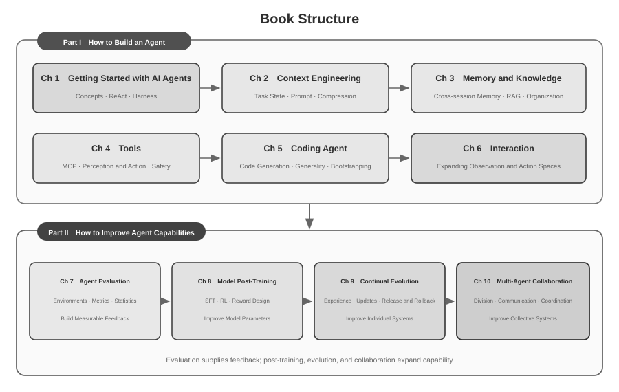

# Introduction {.unnumbered}

From August to October 2025, I taught a series of courses in Turing's *AI Agent Bootcamp*. The courses centered on one question: how can we design AI Agents using engineering principles that are explainable, verifiable, and reusable, rather than relying on repeated trial and error guided by experience and intuition? Getting a demonstration system to run was therefore not the endpoint. We also examined why an Agent adopts a particular architecture and what capability boundaries and engineering trade-offs accompany each design decision. This book was systematically organized, expanded, and restructured from the course materials and companion experiments.

The making of this book was itself an exercise in human–Agent collaboration. From the initial conception to the final manuscript, I mainly used **whisper coding**—dictation-based collaboration—to work with Pine's voice Agent on research and textual iteration. While preparing each course, I dictated a chapter outline; the Agent surveyed relevant work and drafted the material. Afterward, I incorporated student feedback and repeatedly checked and revised the arguments, cases, and experiments. Speech reduced the cost of externalizing ideas and shortened the cycle from posing a question to retrieving sources, drafting, and verification. The book therefore not only discusses Agents; it also documents a mode of knowledge production in which an Agent participated deeply.

Since the release of DeepSeek R1 in early 2025, the focus of AI research and industry practice has gradually expanded from foundation-model capability to the systematic deployment of Agents. On the model side, Agentic Reinforcement Learning has begun to internalize tool use and environmental interaction into model parameters, strengthening general capabilities in coding, mathematical reasoning, and computer use. On the product side, general Agents such as Manus, Claude Code, and OpenClaw have changed how people interact with computers and made “code generation + file system” an important systems architecture.

Revisiting the Agent architecture principles developed in the courses reveals that, despite rapid changes in models and products, these principles retain stable explanatory power. Terms such as Skill, harness, and loop engineering later became widespread, but the corresponding engineering practices often appeared first. Concepts emerge by abstracting from accumulated practice; they are not its starting point. Practice comes first, naming comes later.

These principles came primarily from engineering long-horizon, high-stakes systems. As Chief Scientist of Pine AI, I worked with the team that developed Pine, enabling an Agent to communicate with people on a user's behalf and handle complex tasks involving real economic interests, including bill negotiation, refund disputes, and subscription cancellation. Such tasks often unfold over extended periods and many rounds of negotiation, while a single incorrect step can cause an actual loss. Strict requirements for reliability, safety, and auditability led us to develop the architectural principles emphasized throughout this book. The examples below come from that work.

- Long before Skill became a buzzword, we were already using dynamic prompt loading to rein in runaway prompt growth, command-line execution tools to rein in runaway tool lists, and a system status bar to give the Agent awareness of its execution environment, the user's time, and its own work status.
- Long before harness became a buzzword, we were already using Claude Code-style methods to handle unstable tool calls, hallucinations, dangerous operations, unauthorized operations, and ignored instructions.
- Long before loop engineering became a buzzword, we were already using what this book calls the proposer-reviewer method to keep the model from declaring a task finished too early.

These methods are not unique to Pine. Many model and Agent teams have independently developed similar engineering approaches while solving comparable problems; this convergence suggests that the approaches reflect shared constraints of Agent systems. These observations motivated me to launch Turing's *AI Agent Bootcamp* in 2025 and to teach a practical AI Agent course at the University of Chinese Academy of Sciences from 2024 through 2026. I also chose to publish this book as open source so that this reusable knowledge and experience can serve more researchers and practitioners.

**Practice comes first, naming comes later.** For enterprise Agent development, this means that practice cannot remain perpetually behind the spread of concepts: by the time a term becomes industry consensus, leading systems have often explored the underlying problem for some time. I believe that identifying and solving these problems earlier depends on two conditions.

**First, choose a real business that places sufficiently demanding requirements on the Agent's capability ceiling, and continue to collect real feedback.** At Pine, a task may last for hours or weeks and require repeated communication with multiple stakeholders, long phone calls, complex forms, and several rounds of email. Key figures must remain correct, operations controlled, and the user's interests protected throughout. A sufficiently complex setting continually exposes the gap between model capability and business requirements, pushing the team to build harnesses that systematically handle what the model cannot yet do independently. When a business need is easily covered by the next model upgrade, it is correspondingly harder to accumulate durable systems-design principles.

**Second, establish a systematic Evaluation mechanism.** Without evaluation, we cannot tell whether an improvement comes from the design itself or merely from random variation. Evaluation transforms Agent iteration from experiential judgment into a comparable and reproducible engineering process; it is the foundation for applying the scientific method to system development. Chapter 7 develops this methodology.

However the underlying models advance and however product forms shift, almost all successful Agent systems follow the same architectural patterns. This is no coincidence: **good design principles should outlast model iteration cycles**, because they describe not the usage of a specific model but the fundamental patterns by which intelligent systems interact with the world.

Richard Sutton, Turing Award winner and father of reinforcement learning, once said that the evolution of the universe has gone through four stages: dust, stars, life, and agents (originally termed designed entities). Biological evolution is blind: random mutation, natural selection. Most organisms do not understand their own working principles and cannot design or remake living things on their own. Agents, however, are something entirely new in the history of cosmic evolution: by generating code they can bootstrap and evolve themselves, like a programmer who writes another programmer, who in turn writes the next. That is, an Agent can understand its own operating mechanism and, given a goal, create entirely new Agents—even improve itself. The mission of this book is to help you understand and master the principles of this creation.

The core formula of this book is just one sentence: **Agent = LLM + Context + Tools**. All three are indispensable.


More intuitively, it is **Brain + Eyes + Hands and Feet**. The brain (LLM) is responsible for thinking and decision-making, the eyes (Context) determine what information the Agent can see, and the hands and feet (Tools) determine what the Agent can do. (Strictly speaking, "eyes" is a rough analogy: Context includes not only environmental information and conversation history but also tool definitions, meaning the information the Agent "sees" also includes "what hands and feet are available." This metaphor aims to convey the core intuition: Context is all the information the model can perceive.)

For readers familiar with reinforcement learning, these three can also be mapped to the formal language of RL. Specifically, LLM corresponds to Policy, Context corresponds to Observation Space, and Tools correspond to Action Space. The three expressions refer to the same object, just at different levels of abstraction.


## Book Structure {.unnumbered}

The book contains ten chapters organized around two connected questions (Figure 0-2). **Part I, “How to Build an Agent,”** comprises Chapters 1–6: it begins with foundational concepts and then covers context, memory and knowledge, tools, Coding Agents, and the expansion of observation and action spaces. **Part II, “How to Improve Agent Capabilities,”** comprises Chapters 7–10: evaluation first establishes measurable feedback, after which model post-training, continual evolution from operational experience, and multi-Agent collaboration expand capability at the levels of model parameters, individual systems, and collective systems.



- **Chapter 1 (Agent Fundamentals)** begins with several real Agent products to build an intuitive understanding of Agents. It then examines the Agent's core formula in depth: from the implementation layer of LLM + Context + Tools, to the intuitive layer of Brain + Eyes + Hands and Feet, and finally to the academic layer of Policy, Observation Space, and Action Space. Experiments dissect how the ReAct loop operates—the iterative process of “Think → Act → Observe”—and distinguish among within-task contextual adaptation, cross-task updates to external artifacts, and parameter updates during training cycles. It concludes with orchestration design patterns ranging from workflows to autonomous Agents, establishing a unified conceptual framework for the chapters that follow.
- **Chapter 2 (Context Engineering)** is the most critical chapter in the book, systematically explaining Context, the Agent's “eyes.” It begins with the API message structure and the Agent's core loop, establishing the foundation that “Context is a list of messages,” then examines the underlying principles of KV Cache—the mechanism for reusing historical computation results during LLM inference. It subsequently covers Prompt Engineering, including process-oriented design, tool descriptions, and refinement of business rules; Prompt Injection attacks and defenses; the on-demand loading mechanism of Agent Skills; Agent status bar technology; and Context Compression strategies. Complete definitions of these terms are provided when they first appear in the main text.
- **Chapter 3 (User Memory and Knowledge Bases)** extends context management into a persistent knowledge system spanning sessions, allowing the Agent not only to remember the current conversation but also to accumulate and retrieve knowledge across multiple conversations. It covers four progressive strategies for user memory; the complete technical stack of RAG (Retrieval-Augmented Generation, in which relevant documents are retrieved before the model generates an answer), including different text-search methods and ranking optimization; multimodal information extraction; more advanced methods of knowledge organization; and Agentic RAG, in which the Agent autonomously decides when and what to retrieve.
- **Chapter 4 (Tools)** examines the bridge between Agents and the external world: tools function as the Agent's “hands and feet,” enabling it to search the web, call APIs, operate databases, and more. It introduces the MCP tool-interoperability standard and design principles for five categories of tools—Perception, Execution, Collaboration, Event Triggering, and User Communication—with particular emphasis on security mechanisms for execution tools. Event triggering, user communication, and asynchronous runtimes are developed in Chapter 6.
- **Chapter 5 (Coding Agent and Code Generation)** argues that a Coding Agent plus a file system constitutes the core technical foundation of every general-purpose Agent. Using the OpenClaw architecture as its organizing thread, it analyzes Coding Agent workflows and implementation techniques, while demonstrating the broad value of code generation beyond programming: from assisting thought and building knowledge bases to dynamically creating new tools and Agent bootstrapping.
- **Chapter 6 (Interaction: Expanding the Observation and Action Spaces)** studies Agent–environment interaction along two dimensions: **modality** and **temporality**. Asynchronous and event-driven systems let an Agent continuously receive and respond to external events; voice interaction moves perception, reasoning, and generation toward real-time operation; Computer Use extends the action space to graphical interfaces; and robotics further extends action into the physical environment. The four settings share systems primitives such as wake-up, safe points, cancellation, preemption, and separation of fast and slow paths.
- **Chapter 7 (Agent Evaluation)** constructs a scientific evaluation methodology. It covers evaluation environments—two core paradigms, tool calling and human-computer interaction, plus simulation environments discussed separately at the end of the chapter—dataset design principles, LLM-as-a-Judge automated evaluation, evaluation-driven model selection, and the complete closed loop that converts evaluation results into system improvements.
- **Chapter 8 (Model Post-training)** examines two post-training techniques in depth: SFT (Supervised Fine-Tuning, using labeled data to teach the model to follow examples) and RL (Reinforcement Learning, allowing the model to improve autonomously through trial and error and reward feedback). Organized around the central arguments that “SFT memorizes, RL generalizes” and “Data and environment matter more than algorithms,” it covers the full pre-training/SFT/RL landscape, classical RL theory, reward-signal design—from binary rewards and process rewards to verified path penalties that “reward the outcome and constrain the process”—single-turn and multi-turn reinforcement-learning algorithms, and frontier topics such as sample-efficiency optimization.
- **Chapter 9 (Continuous Agent Evolution)** studies how to transform an Agent's operational experience into capabilities for its next version. It first establishes learning signals composed of environmental outcomes, process rules, and LLM Rubrics; then compares four update carriers—knowledge documents, Prompts and Skills, programs and Harnesses, and model parameters; and finally discusses candidate-version validation, canary releases, rollback, and long-term consolidation.
- **Chapter 10 (Multi-Agent Collaboration)** moves from individual capability to system-level coordination and asks how multiple Agents divide and coordinate work. It presents a classification framework—shared/independent context × peer/manager/decentralized structure—uses translation Agents and coordinated telephone-and-computer Agents to demonstrate architectural design, and discusses possible directions for Agent societies and Agent economies.

## How to Read This Book {.unnumbered}

The chapters in this book are relatively independent. You can choose different reading paths based on your needs:

- **If you are an Agent developer**, read the book in order: Chapters 1–6 establish a complete method for building Agents, while Chapters 7–10 develop capability improvement through evaluation, model post-training, continual evolution, and multi-Agent collaboration.
- **If you have limited time**, prioritize Chapter 1, for the overall picture, and Chapter 2, for context engineering—the most critical skill. The underlying principles of KV Cache in Chapter 2 are fairly technical; on a first reading, you may skip the mechanics and retain only the three core conclusions stated at the beginning, without affecting your understanding of later material.
- **If your focus is model training**, go directly to Chapter 8 (Model Post-training). Because the evaluation methods in Chapter 7 are a prerequisite for training, read the two together, after Chapters 1 and 2 have established the overall picture.

Each chapter contains a large number of **experiments** and **thought questions**, numbered in the format "Experiment X-Y" (X is the chapter number, Y is the sequence number within the chapter). The titles of experiments and thought questions carry star ratings for difficulty: ★ means entry-level, suitable for all readers; ★★ means medium difficulty, requiring some engineering practice; ★★★ means an advanced challenge, usually involving open-ended questions or complex system design. Most experiments come with complete runnable code, organized in the accompanying open-source repository:

> **Companion Code Repository**: [https://github.com/bojieli/ai-agent-book](https://github.com/bojieli/ai-agent-book)

You can obtain all companion code with Git:

```bash
git clone https://github.com/bojieli/ai-agent-book.git
cd ai-agent-book
```

If you do not use Git, you can also select **Code → Download ZIP** on the repository page. Experiment code is organized by chapter under `chapter1/` through `chapter10/`. To find “Experiment X-Y,” open the corresponding `chapterX/README.en.md`, use the experiment number to locate its project directory, and then follow that project's README to install dependencies and run it. Some experiments marked as reproduction guides depend on external repositories; their READMEs explain how to obtain those as well.

I strongly recommend running these experiments yourself: AI Agents are an intensely hands-on field, and many design intuitions only take shape while you are debugging.


## Prerequisites {.unnumbered}

This book is aimed at readers with some technical background, but does not require you to be an expert in a specific field. The prerequisites are listed below in two levels: "Required" and "Recommended", to help you assess your readiness.

**Required: Foundation for reading the entire book**

- **Python Programming**: Almost all experiments in the book are based on Python. You need to be familiar with Python's basic syntax, common data structures, package management (pip), and other fundamental concepts. Proficiency is not required, but you should be able to read and modify Python code of moderate complexity.
- **Basic Experience with LLMs**: You should have used ChatGPT, Claude, or similar products, and understand the basic interaction pattern of "Prompt → Model Response".
- **An AI-Assisted Programming Tool**: Install and get comfortable with at least one AI-assisted programming tool, such as Claude Code, Codex, Cursor, or TRAE. For one thing, these tools will greatly speed up the experiments, which involve extensive code writing and debugging. For another, they are themselves mature Coding Agents: in using one, you will experience firsthand the core mechanisms this book keeps returning to—the ReAct loop, tool calls, context management. That firsthand experience is invaluable for understanding Agent design principles.
- **General Software Engineering Knowledge**: Be familiar with basic concepts such as command-line operations, Git version control, JSON data format, and REST APIs. These are the foundation for running experiments and understanding the Agent's tool-calling mechanism.

**Recommended: Enhancing the reading experience for specific chapters**

- **Machine Learning Basics** (Chapter 8): Understanding basic concepts like training vs. inference, loss functions, gradient descent, and overfitting will help you understand model post-training.
- **Basic Mathematics** (Chapters 2-3, 8): An intuitive understanding of linear algebra (e.g., knowing that vectors can represent direction and magnitude, and matrices can perform batch operations) will help you understand embeddings and attention mechanisms. Basic knowledge of probability and statistics will help with evaluation metrics and expected rewards in reinforcement learning. The mathematics in the book does not involve complex derivations and focuses on intuitive explanations.
- **Web Development Basics** (Chapter 6): Understanding concepts like HTTP, WebSocket, and front-end/back-end separation architecture will help you understand event-driven asynchronous Agent architectures and real-time communication experiments for voice agents.
- **Basic Understanding of the Transformer Architecture** (Chapters 2, 8): Transformer is the underlying architecture of almost all current large language models. Readers who want to systematically build up their foundational knowledge of large models may enjoy *Illustrating Large Models* (图解大模型, published in Chinese by Turing), which uses intuitive diagrams to explain core concepts such as the Transformer architecture, pre-training, and fine-tuning—a good complement to this book's Agent engineering perspective.

If you are missing some of these prerequisites, don't be discouraged. The core value of this book lies in **architectural design principles and engineering methodology**, not in any specific algorithm or technique. Outside of Chapter 8 on post-training, the book requires very little mathematics or machine learning, and it works perfectly well as a starting point.

Agent technology is still evolving rapidly, but **good architectural design principles have the power to endure through time**. Master the "why" behind the designs, and you can keep your judgment clear as the waves of technology roll through. I hope this book becomes a reliable guide as you build AI Agents.

## Acknowledgments {.unnumbered}

I would like to thank editors Meng Ge and Liu Meiying at Turing for their diligent editing and for their work organizing the Turing "AI Agent Bootcamp" course; I also thank Professor Liu Junming for offering the hands-on AI Agent course at the University of Chinese Academy of Sciences. Special thanks go to all the students of the Turing "AI Agent Bootcamp" and of the UCAS AI Agent course—teaching these courses brought me a wealth of valuable feedback and advice from you, and it sharpened my own grasp of these concepts.

I thank all my colleagues at Pine AI. Without a product as excellent as Pine AI, and the many challenges it brought with it, I could never have gone so deep into the Agent field, in understanding or in practice; and through one exchange of ideas after another, my colleagues contributed a wealth of valuable insights.

I also want to thank many friends across the AI industry (I won't name them all here). In discussion after discussion, you gave me honest feedback on my views, corrected many of my misjudgments, and raised my understanding of models and Agents.

Most of all, I thank my family, especially my wife, Meng Jiaying. She supported me throughout the writing of this book and offered many valuable suggestions along the way.
