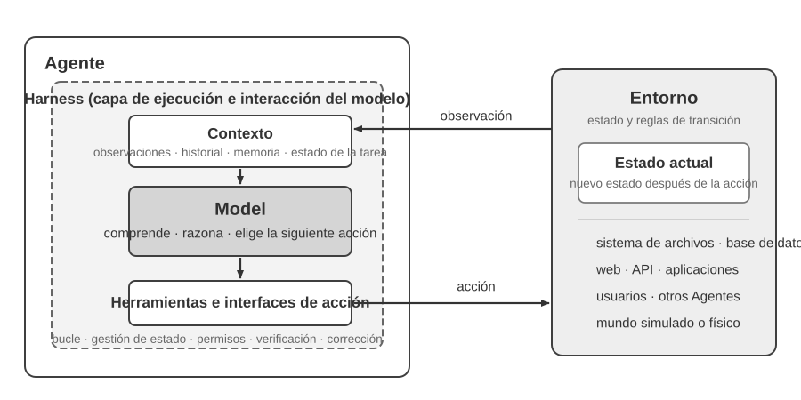
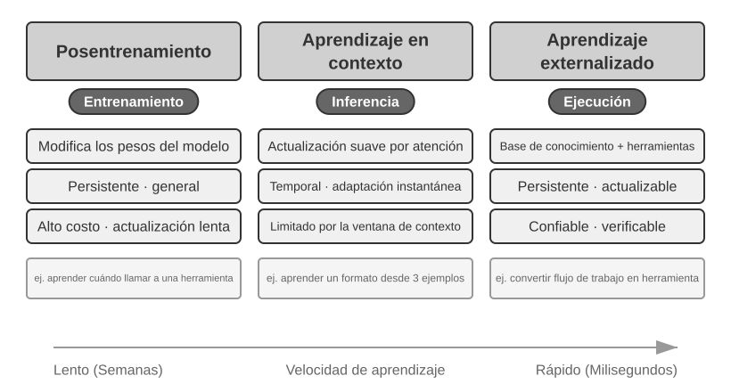
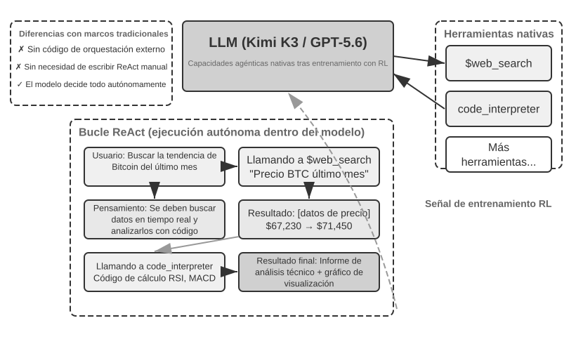
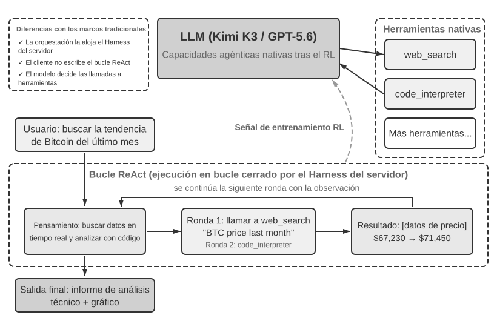

# Capítulo 1: Fundamentos de los Agentes de IA

Si has utilizado Cursor para escribir código y has observado cómo busca en tu código fuente, edita múltiples archivos y vuelve a ejecutar las pruebas hasta que pasan, ya has utilizado un Agente de IA. Lo mismo ocurre si has usado Deep Research para investigar un tema mediante búsquedas y lecturas repetidas, si has hecho que Manus controle un navegador para completar tareas en línea, si le has pedido al asistente de voz Doubao que reserve billetes o envíe mensajes, o si has enviado a Pine AI a negociar una tarifa telefónica más baja.

Estos productos adoptan muchas formas, pero comparten un rasgo común: ya no son conversaciones pasivas de "tú preguntas, él responde". Planifican sus propios pasos de ejecución, invocan las herramientas que requiere cada tarea y ajustan su estrategia a medida que llegan los resultados. Los Agentes de IA se están convirtiendo en una nueva forma de interactuar con las computadoras.

Este capítulo comienza con ejemplos prácticos y avanza de vuelta hacia los componentes fundamentales de un Agente de IA: los lectores experimentarán de primera mano lo que pueden hacer los Agentes modernos, comprenderán la arquitectura que los sustenta y aprenderán los patrones de diseño y las mejores prácticas para construir sistemas de Agentes.

> **Consejo de Lectura**: Este capítulo es el mapa conceptual de todo el libro: un recorrido conciso por la fórmula fundamental, el bucle de funcionamiento, el marco de ingeniería y los patrones de diseño de Agentes. Establece el vocabulario compartido y los puntos de referencia utilizados a lo largo de los capítulos posteriores. No intentes memorizar cada concepto en tu primera lectura; busca comprender la visión general. Cada capítulo posterior profundiza en un aspecto presentado aquí, y puedes volver a este capítulo siempre que necesites reorientarte.

## Agente Moderno = LLM + Contexto + Herramientas

La esencia de un sistema de Agente moderno se resume en una fórmula concisa: **Agente = LLM (Modelo de Lenguaje Grande) + Contexto + Herramientas**. La fórmula es simple y práctica, siempre que cada término se entienda en un sentido amplio:

- **El LLM es el motor de razonamiento del Agente**: Es más que un conjunto de parámetros de modelo; es el núcleo de toma de decisiones del Agente, responsable de comprender la intención, razonar, planificar y juzgar. Las capacidades de un LLM provienen del conocimiento del mundo y la habilidad lingüística adquiridos durante el **preentrenamiento**, además de las estrategias de toma de decisiones codificadas a través del **posentrenamiento** (técnicas como el ajuste fino supervisado y el aprendizaje por refuerzo se cubren en el Capítulo 7).
- **El Contexto es el conjunto de información de trabajo del Agente**: No es solo el texto introducido en el modelo, sino el conjunto operativo de información disponible para el Agente en cada punto de decisión: el entorno, la memoria del usuario, el conocimiento del dominio, su propio estado y el progreso de la tarea. Al igual que una persona que toma una decisión necesita evaluar la situación, recordar experiencias relevantes y consultar referencias, la ventana de contexto del Agente contiene la información que puede utilizar en ese momento exacto.
- **Las Herramientas son —las interfaces de acción— del Agente**: No son solo un puñado de funciones API invocables, sino el conjunto completo de formas en que el Agente puede actuar: desde llamadas a herramientas predefinidas hasta habilidades (Skills) cargadas bajo demanda, desde generar código para crear nuevas capacidades sobre la marcha hasta delegar trabajo a subagentes, pasando por comunicarse con el usuario o responder a eventos externos.

Dicho de forma más intuitiva: **Agente = Motor de Razonamiento + Contexto de Trabajo + Interfaces de Acción**. El modelo razona y decide, el contexto proporciona el conjunto de información de trabajo del que dependen esas decisiones, y las herramientas proporcionan las interfaces a través de las cuales las decisiones afectan al mundo exterior.

Estos tres componentes corresponden exactamente a tres conceptos clave en el Aprendizaje por Refuerzo (RL, ver Capítulo 7). La siguiente tabla es de **lectura opcional**; si no tienes conocimientos de RL, puedes omitirla tranquilamente; nada de lo posterior depende de ella. Existe únicamente para ayudar a los lectores familiarizados con RL a vincular ese conocimiento con la terminología de este libro:

| Intuición | Componente del Agente | Concepto en RL (Opcional) | Rol |
|---------------|----------------|------------------|---------------------------------------------|
| **Motor de Razonamiento** | LLM | **Política (Policy)** | La lógica de toma de decisiones que determina "qué hacer a continuación": dada la información actual, elige la acción más adecuada entre todas las opciones disponibles. |
| **Contexto de Trabajo** | Contexto | **Espacio de Observación** | Toda la información disponible para el Agente: lo que puede observar, leer, recordar y a qué sistemas puede acceder. |
| **Interfaces de Acción** | Herramientas | **Espacio de Acción** | El conjunto completo de cosas que el Agente puede hacer: qué "medios" tiene a su disposición, desde enviar mensajes hasta ejecutar código o controlar interfaces. |

### Espacios de Observación y Acción: La Interfaz Entre el Modelo y el Mundo

En su libro clásico *Computer Architecture: A Quantitative Approach*, Hennessy y Patterson abren el Capítulo 1 preguntando: "¿Qué es la arquitectura de computadoras?" e identifican la **arquitectura del conjunto de instrucciones** (ISA) como la interfaz entre el software y el hardware[^ch1-agent-interface]. Esta perspectiva nos ofrece una forma útil de entender los Agentes: **el espacio de observación y el espacio de acción forman juntos la interfaz entre el LLM y su entorno externo**. El espacio de observación traduce la información del entorno en un contexto que el modelo puede procesar; el espacio de acción traduce las decisiones del modelo en operaciones sobre el mundo exterior. La información fuera del espacio de observación no existe efectivamente para el modelo. Una operación fuera del espacio de acción no se puede ejecutar.

En consecuencia, **una vez que el modelo subyacente se mantiene constante, la principal palanca de ingeniería de sistemas para mejorar el rendimiento del Agente suele ser redefinir o expandir sus espacios de observación y acción**. En la terminología de este libro, eso significa expandir el contexto y las herramientas. Muchos problemas que parecen requerir un "modelo más inteligente" son en realidad problemas de interfaz: traer los datos relevantes para la tarea al contexto o exponer la operación requerida como una herramienta puede hacer que una tarea previamente irresoluble sea resoluble sin volver a entrenar el modelo.

**Manus: unificando espacios que estaban separados.** Antes de que apareciera Manus, los Agentes en producción seguían principalmente tres vías distintas: Investigación Profunda (Deep Research), Programación (Coding) y Control de Computadoras (Computer Use). Manus fue el primer Agente en producción de gran influencia en combinar las tres en un solo sistema. La web amplió su espacio de observación; el sistema de archivos y la ejecución de código ampliaron su espacio de acción; y la percepción visual de la pantalla junto con los clics y el teclado trajeron las interfaces gráficas a ambos espacios. Manus no se convirtió en un Agente general simplemente sustituyendo el modelo por uno más fuerte; tomó la unión de los espacios de observación y acción de los tres tipos de Agentes, permitiendo que un solo Agente cruzara las fronteras previas del producto.

**OpenClaw: extendiendo la interfaz a la vida digital del usuario.** OpenClaw lleva ambos espacios un paso más allá hacia afuera. Recibe tareas y devuelve resultados a través de los canales de mensajería que los usuarios ya habitan (WhatsApp, Telegram, Slack, Discord, iMessage y muchos otros), de modo que se puede acceder al Agente desde casi cualquier lugar. Su Gateway con enfoque local primero, junto con herramientas autorizadas, complementos y Skills, puede conectar aplicaciones en la nube como Google Drive y Notion, así como el sistema de archivos local. Los archivos dispersos entre cuentas y dispositivos pueden, con la autorización explícita del usuario, ingresar al espacio de observación de un solo Agente y ser manipulados por sus herramientas.

La expansión no significa arrojar cada token y herramienta disponible al modelo a la vez. El contexto irrelevante agrega ruido, mientras que demasiadas herramientas aumentan el costo de selección y el riesgo de seguridad. Una expansión útil debe ser **bajo demanda, relevante y controlada**: la recuperación debe colocar la información correcta en el contexto, el descubrimiento de herramientas solo debe exponer las acciones necesarias en cada momento, y la verificación de permisos y resultados debe restringir esas acciones. Los capítulos posteriores desarrollan cada una de estas técnicas.

[^ch1-agent-interface]: John L. Hennessy y David A. Patterson, *Computer Architecture: A Quantitative Approach*, 6ª ed., Morgan Kaufmann, 2019, Capítulo 1, “What Is Computer Architecture?”. El libro distingue entre la arquitectura del conjunto de instrucciones, la organización de la computadora y el hardware; la ISA es específicamente la interfaz entre el software y el hardware. Ver https://shop.elsevier.com/books/computer-architecture/hennessy/978-0-12-811905-1

[^ch1-agent-products]: Los materiales oficiales de Manus describen su Sandbox original como una máquina virtual aislada en la nube. Al presentar su conector de Google Drive, Manus recordó explícitamente el flujo de trabajo fragmentado anterior de descargar y subir archivos manualmente. Al lanzar My Computer en marzo de 2026, calificó el hecho de que el trabajo importante reside localmente como una limitación fundamental del sandbox en la nube. El README oficial de OpenClaw describe un asistente personal siempre activo con prioridad local que se ejecuta en los propios dispositivos del usuario y enumera más de veinte canales de mensajería. Ver https://manus.im/blog/manus-sandbox

Comprender lo que hace cada componente y cómo se acoplan entre sí es la base para construir sistemas de Agentes efectivos. Comenzaremos con el más concreto de los tres , las herramientas, las interfaces de acción,  y avanzaremos hacia adentro hasta el LLM y el contexto. Primero, así es como se comparan diferentes tipos de Agentes en estas tres dimensiones:

| Producto de Agente | Contexto de Trabajo | Interfaces de Acción | Estrategia |
|-----------------|------------------------|--------------------------|-----------------------------|
| **Agentes de Código (ej. Cursor)** | Documentos de requisitos, código fuente, entorno de terminal | Abierto (razonamiento interno, búsqueda de código, lectura/escritura de archivos, ejecución de comandos) | Desarrollo incremental: comprender requisitos → buscar código relevante → editar código → probar y verificar → depurar y corregir |
| **Agentes de Búsqueda (ej. Deep Research)** | Recursos web, bases de datos académicas, archivos locales | Abierto (razonamiento interno, consultas de búsqueda, lectura web, generación de resúmenes) | Profundización iterativa: ajustar la dirección de búsqueda según la información existente, sintetizar gradualmente un informe completo |
| **Agentes de Control de Computadora (ej. Browser Use)** | Pantalla de la computadora, páginas del navegador, sistema de archivos | Abierto (razonamiento interno, clics, escritura, desplazamiento, capturas de pantalla, ejecución de código) | Percepción visual + operación: observar la pantalla → identificar elementos objetivo → realizar acciones → verificar resultados |
| **Agentes Asistentes de Teléfono (ej. Doubao)** | Pantalla del teléfono, aplicaciones instaladas | Abierto (razonamiento interno, clics, deslizamientos, escritura, apertura de aplicaciones) | Comprensión de intención + control de apps: entender necesidades del usuario → localizar app objetivo → ejecutar acciones → confirmar finalización |
| **Agentes de Tareas Personales (ej. Pine AI)** | Información de la cuenta del usuario, facturas históricas, base de conocimientos del proveedor | Abierto (razonamiento interno, llamadas, envío de correos, llenado de formularios, confirmación con el usuario) | Ejecución de tareas multipasos: recopilar información → formular estrategia de negociación → contactar al proveedor → negociar → reportar resultados |

Estos sistemas comparten tres características: un **espacio de acción abierto** (no eligen entre un conjunto fijo de botones, sino que generan lenguaje natural arbitrario y código); **razonamiento interno** (planifican antes de actuar); e **interacción continua** (ajustan su estrategia según la retroalimentación del entorno). Estas capacidades provienen precisamente de la interacción entre el motor de razonamiento, el contexto de trabajo y las interfaces de acción, es decir, el LLM, el contexto y las herramientas.

### Herramientas: Las Interfaces de Acción del Agente

Las herramientas son el puente del Agente hacia el mundo exterior. Convierten al Agente de un observador pasivo en un sistema activo que puede buscar, escribir archivos, ejecutar código, llamar a APIs, enviar mensajes u operar interfaces. Sin herramientas, un Agente se limita a la generación de texto; con ellas, puede actuar sobre sistemas externos.

Para analizar las herramientas de manera sistemática, podemos clasificarlas en cinco tipos según la dirección de la interacción del Agente con el mundo. En esta etapa, un breve resumen de los escenarios representativos de cada tipo es suficiente para establecer la visión general; los capítulos posteriores tratan cada uno en profundidad.

**Herramientas de Percepción**: Permiten al Agente acceder a la información. Los motores de búsqueda proporcionan datos web en tiempo real, los sistemas de archivos leen documentos locales y las APIs y bases de datos se conectan a servicios externos y datos empresariales clave.

**Herramientas de Ejecución**: Permiten al Agente actuar sobre sistemas externos. La ejecución de código, las operaciones de archivos, los comandos del sistema y las llamadas a APIs externas convierten las decisiones en acciones concretas.

**Herramientas de Colaboración**: Permiten al Agente dividir el trabajo con otros Agentes: delegar tareas especializadas a subagentes, solicitar confirmación humana en puntos clave de decisión o coordinar acciones en sistemas multiagente.

**Herramientas Disparadas por Eventos**: Se invocan de una forma fundamentalmente diferente a las tres primeras categorías. El Agente no las llama; llegan como entradas externas que activan al Agente para comenzar a trabajar. Llega un nuevo correo electrónico, se cumple un horario programado o un sistema externo dispara una llamada Webhook; el evento activa al Agente e inicia el razonamiento y la acción.

**Herramientas de Comunicación con el Usuario**: Son los canales a través de los cuales el Agente se comunica con el usuario. Mientras que las herramientas de ejecución cambian el mundo exterior, las herramientas de comunicación transmiten información: entregando el progreso del Agente o una verificación proactiva mediante mensajes de texto, llamadas de voz, correos electrónicos, etc.

El Capítulo 4 cubre la taxonomía completa y los principios de diseño para estos cinco tipos. La calidad del diseño de las herramientas determina directamente lo que un Agente puede lograr de manera confiable.

**Llamada a Funciones (Tool Calling / Function Calling)** es una capacidad nuclear de los Agentes LLM modernos: permite que el modelo invoque herramientas externas de forma estructurada, transformando el LLM de un generador de texto puro a un sistema inteligente capaz de actuar a través de interfaces externas.

La llamada a herramientas procede en cuatro pasos: primero, el contexto informa al modelo qué herramientas están disponibles (nombres, propósitos, parámetros); luego, el modelo decide de forma autónoma si llama a una herramienta, cuál llamar y con qué argumentos; a continuación, una vez que la herramienta se ha ejecutado, su resultado se adjunta al contexto; finalmente, el modelo decide su siguiente paso basándose en ese resultado. Este bucle es la base de ReAct.

Para una consulta meteorológica, la representación simplificada del proceso de cuatro pasos a nivel de API es la siguiente:

```
Paso 1: Declarar herramientas             Paso 2: El modelo decide llamar
tools: [{                             assistant: {
  name: "get_weather",                  tool_calls: [{
  parameters: {                           function: "get_weather",
    city: "string"                        arguments: {city: "Beijing"}
  }                                      }]
}]                                    }

Paso 3: Resultado adjunto al contexto      Paso 4: El modelo responde según el resultado
tool: {                               assistant: {
  tool_call_id: "call_1",               content: "Hoy en Pekín: 28°C, soleado."
  content: '{"temp":28,"sky":"clear"}' }
}                                     }
```

El desarrollador solo define las herramientas y ejecuta las llamadas; el propio modelo decide si llama, qué herramienta llamar y qué argumentos pasar. El Capítulo 2 examina esta estructura API en detalle.

Al diseñar herramientas para un Agente, comienza con la capacidad más estrecha que requiera la tarea y luego expándela gradualmente a medida que la tarea se vuelve más compleja. Si la tarea solo requiere aritmética básica, una calculadora con parámetros claramente definidos es suficiente; cuando crece para leer hojas de cálculo, limpiar valores faltantes, calcular estadísticas y trazar gráficos, un intérprete de código Python restringido es más fácil de combinar y explorar que una colección cada vez mayor de herramientas especializadas. Sin embargo, la generalidad también aumenta el riesgo de errores y amplía la superficie de ataque: el código debe ejecutarse en un sandbox aislado, con acceso a la red deshabilitado por defecto, sin acceso a archivos fuera del directorio de trabajo autorizado y con límites de tiempo de ejecución, CPU, memoria y tamaño de salida.

Asimismo, una herramienta de registro simple es adecuada para grabar una ejecución; para tareas de larga duración que toman horas o días, un directorio de trabajo virtual controlado puede conservar planes, resultados intermedios, registros de ejecución y artefactos finales para que el Agente pueda reanudar el trabajo a lo largo de múltiples ejecuciones. Este directorio también debe restringir las rutas de lectura y escritura, la capacidad de almacenamiento y los tipos de archivos, previniendo el desbordamiento de rutas (path traversal) en lugar de exponer todo el sistema de archivos del host al Agente.

Las herramientas de propósito general no siempre son mejores que las especializadas. Las operaciones de alto riesgo o las gobernadas por estrictas restricciones de negocio (como pagos, eliminación de datos, envío de correos electrónicos y despliegue en producción) deben exponerse como herramientas dedicadas con parámetros explícitos, permisos restringidos y auditabilidad de extremo a extremo, añadiendo previsualizaciones y confirmación humana cuando sea necesario. El principio central del diseño de herramientas es: **utilizar capacidades fundamentales de propósito general para la composición y exploración; utilizar herramientas especializadas para restringir operaciones de alto riesgo y hacer cumplir reglas de negocio estrictas**.

### LLM: El Motor de Razonamiento del Agente

El Modelo de Lenguaje Grande (LLM) es el núcleo de toma de decisiones del Agente. Dada una solicitud del usuario, primero debe inferir la intención real (lo que los usuarios dicen a menudo no es lo que realmente quieren), luego descomponer una tarea vaga o compleja en pasos ejecutables. A lo largo de la ejecución sigue tomando decisiones: qué hacer a continuación, si llamar a una herramienta, cuál y con qué argumentos. Esta capacidad de comprender-planificar-ejecutar proviene del conocimiento acumulado durante el preentrenamiento, y es la base de la que dependen tanto los flujos de trabajo como los Agentes autónomos.

Una capacidad distintiva de los Agentes LLM es el **razonamiento interno**: antes de actuar, el Agente puede planificar y razonar sobre la tarea. Esto no cambia el entorno externo, pero mejora notablemente las acciones posteriores. Esta habilidad proviene del preentrenamiento: el modelo se apoya en patrones de razonamiento codificados en el conocimiento humano, incluyendo leyes matemáticas, relaciones causales y estrategias para descomponer problemas. El razonamiento de un Agente no es un ensayo y error ciego; se construye sobre un cuerpo estructurado de conocimiento.

Este razonamiento estructurado permite a un Agente LLM abordar tareas completamente nuevas sin ejemplos previos. La manifestación directa es la **Generalización Zero-shot**: al enfrentarse a una tarea que nunca ha visto, el Agente la maneja recombinando lo que ya sabe, sin necesidad de ejemplos. Con unos pocos ejemplos, también puede realizar **Adaptación Few-shot**: dos o tres demostraciones en el prompt son suficientes para aprender un nuevo patrón de tarea.

#### El Modelo como Agente: Cuando el Modelo Mismo se Convierte en el Producto

El paradigma "El Modelo como Agente" (Model as Agent) es la dirección más reciente en el desarrollo de Agentes de IA. Los modelos avanzados internalizan la llamada a herramientas como una capacidad nativa a través del posentrenamiento (especialmente el aprendizaje por refuerzo): cuándo llamar a una herramienta, cuál llamar y con qué argumentos son decisiones que toma el modelo por completo, sin necesidad de orquestación manual. Esto no resta importancia a la capa de framework; al contrario: cuanto más fuerte es el modelo, más importa la infraestructura Harness que lo rodea. En el contexto de los Agentes, el Harness es la infraestructura de ingeniería que canaliza la capacidad del modelo hacia una ejecución de tareas confiable. Incluye la gestión de contexto, las interfaces de herramientas, las restricciones de seguridad y los mecanismos de verificación y corrección.

Cuanto mayor es la autoridad de decisión que tiene un modelo, mayor es el impacto de una decisión equivocada, lo que exige mecanismos de restricción, verificación y corrección más precisos para mantener la confiabilidad. La verdadera ventaja de los proveedores de modelos no es "hacer el framework más delgado", sino ser capaces de cooptimizar el modelo y su Harness circundante, iterando continuamente.

Sin embargo, surge una pregunta más profunda: si los modelos se vuelven cada vez más fuertes, ¿el Harness actual terminará siendo absorbido por el modelo? En "La Lección Amarga" (The Bitter Lesson), Rich Sutton revisó un patrón repetido a lo largo de setenta años de investigación en IA[^ch1-1]: los investigadores codificaban repetidamente su comprensión de un dominio en un sistema, logrando ganancias a corto plazo pero perdiendo finalmente ante métodos generales , búsqueda y aprendizaje,  que escalan con el cómputo y los datos. Visto desde esta perspectiva, ¿cuánto del Harness es un "conocimiento previo humano" destinado a ser internalizado por el modelo? La posición de este libro se resume en: **respaldar la dirección, mantener el pragmatismo respecto al ritmo**.

[^ch1-1]: Sutton, Rich. “The Bitter Lesson”, 2019. http://www.incompleteideas.net/IncIdeas/BitterLesson.html

#### Mecanismos de Aprendizaje de los Agentes: De la Adaptación Contextual a las Actualizaciones Persistentes

Las modificaciones en el comportamiento de un Agente no ocurren únicamente durante el entrenamiento. Según dónde ocurre la actualización y cuánto tiempo persiste, estos cambios pueden entenderse a través de tres vías complementarias (Figura 1-1): adaptación contextual intra-tarea, actualizaciones entre tareas en artefactos externos y actualizaciones de parámetros durante ciclos de entrenamiento.



La **adaptación contextual** ocurre dentro de la tarea actual. Una vez que los ejemplos, el estado y los resultados de recuperación ingresan al contexto, el modelo puede ajustar su comportamiento de inmediato, pero esto no cambia el estado persistente de la siguiente sesión. Sus ventajas son la velocidad y el bajo costo; sus limitaciones provienen de la ventana de contexto. El Capítulo 2 explica en detalle este tipo de adaptación.

Para que los cambios persistan a lo largo de múltiples tareas, el sistema puede actualizar **artefactos externos**: los hechos y la experiencia se organizan en documentos de conocimiento, las estrategias expresables en lenguaje se escriben en un Prompt o Skill, y los procedimientos deterministas se codifican en programas y Harnesses. Estos artefactos son auditables y revisables. Los Capítulos 3 a 5 sientan las bases para el conocimiento y los programas, mientras que el Capítulo 8 analiza cómo generar tales actualizaciones a partir de trayectorias evaluadas.

Cuando el objetivo es una capacidad de alta dimensión (como la comprensión de imágenes médicas o una política de decisión implícita) que las reglas externas no pueden expresar por completo, los **parámetros del modelo** deben actualizarse mediante posentrenamiento. Las actualizaciones de parámetros conllevan mayores costos de despliegue, pero pueden producir una generalización amplia y natural; el Capítulo 7 presenta sus métodos sistemáticamente.

### Contexto: El Conjunto de Trabajo del Agente

El contexto es el conjunto de información de trabajo disponible para un Agente en cada punto de decisión. Desde la perspectiva de la API (detallada en el Capítulo 2), el contexto de cada llamada al LLM consta de cinco partes:

- **System Prompt (Prompt del Sistema)**: Escrito por el desarrollador, permanece fijo durante toda la conversación. Es la "descripción del puesto" del Agente: define su identidad, permisos y reglas de conducta. También transporta la **memoria del usuario** persistente y el estado del entorno inyectado dinámicamente.
- **Definiciones de Herramientas (Tool Definitions)**: Declara los nombres, descripciones funcionales y formatos de parámetros de las herramientas disponibles. Junto con el system prompt, forman el **prefijo estático** que permanece inalterado.
- **Mensajes del Usuario (User Messages)**: Entradas del usuario, que también pueden contener **conocimiento externo** recuperado dinámicamente mediante RAG (Generación Aumentada por Recuperación, ver Capítulo 3).
- **Mensajes del Asistente (Assistant Messages)**: Respuestas generadas previamente por el modelo, que pueden contener tres partes: `reasoning` (la cadena de pensamiento interna), `content` (la respuesta al usuario) y `tool_calls` (las acciones a ejecutar).
- **Resultados de Herramientas (Tool Results)**: La salida devuelta después de que el framework ejecuta una herramienta, sirviendo de base directa para el siguiente paso de razonamiento.

Los dos primeros elementos forman el prefijo estático; los últimos tres forman el historial dinámico de mensajes. Juntos hacen el contexto de cada inferencia.

### Experimento 1-1 ★★: El Papel Crítico del Contexto

Examinamos cómo influye cada componente del contexto en el comportamiento del Agente mediante un **estudio de ablación** sistemático. Como muestra la Figura 1-2, el experimento ejecutó cinco grupos controlados: una línea base completa y cuatro grupos a los que les faltaba un componente.



Los resultados revelaron el papel irremplazable de cada componente. Las **Definiciones de Herramientas** son la base de la capacidad de acción; sin ellas, el Agente no reconoce ni puede llamar a ninguna herramienta. Los **Resultados de Herramientas** son clave para el control de bucle cerrado; su ausencia priva al Agente de retroalimentación y provoca que caiga en bucles infinitos. El **proceso de razonamiento** mantiene la coherencia de las decisiones anteriores. El **historial de mensajes** evita operaciones redundantes y mantiene la continuidad de la tarea.

La conclusión central: **el contexto determina qué información tiene el Agente al decidir, y el Agente solo puede decidir basándose en esa información**.

### El Bucle ReAct

El patrón central mediante el cual un Agente ejecuta una tarea se llama **ReAct** (Reasoning + Acting). El bucle consta de tres etapas: el modelo **razona** sobre qué hacer a continuación, llama a una herramienta para **actuar**, y **observa** el resultado para volver a razonar. Este bucle "razonar → actuar → observar" se repite hasta completar la tarea.

Consideremos la **trayectoria**: el historial de mensajes que se acumula a medida que el Agente trabaja. En cada llamada al LLM, el contexto completo es el **prefijo estático** más la **trayectoria** (historial dinámico) (Figura 1-3). De aquí se deriva una verdad clave: **Contexto del Agente = Prefijo Estático + Trayectoria**.



Estructura de una trayectoria en pseudocódigo:

```python
trajectory = [
  {role: "user", content: "Basándote en los ingresos trimestrales de la empresa: Q1 2.5M USD, Q2 2.1M EUR, Q3 1.8M GBP, Q4 380M JPY, calcula los ingresos anuales totales y el promedio trimestral en USD"},
  
  # Primera iteración - El LLM recibe la trayectoria anterior y genera una respuesta
  {role: "assistant",
   reasoning: "Necesito convertir todas las monedas a USD...",
   content: "",
   tool_calls: [
     {name: "convert_currency", args: {amount: 2100000, from: "EUR", to: "USD"}},
     {name: "convert_currency", args: {amount: 1800000, from: "GBP", to: "USD"}},
     {name: "convert_currency", args: {amount: 380000000, from: "JPY", to: "USD"}}
   ]},
  
  # El framework del Agente ejecuta las herramientas y añade los resultados a la trayectoria
  {role: "tool", content: "EUR->USD: 2282608.7"},
  {role: "tool", content: "GBP->USD: 2278481.01"},
  {role: "tool", content: "JPY->USD: 2541806.02"},
  
  # Segunda iteración - El LLM recibe la trayectoria completa con los resultados
  {role: "assistant",
   reasoning: "Resultados de conversión obtenidos, ahora debo agregar y calcular...",
   content: "",
   tool_calls: [
     {name: "code_interpreter", args: {code: "total = 2500000 + 2282608.7 + 2278481.01 + 2541806.02; avg = total / 4; print(f'Total: {total}, Avg: {avg}')"}}
   ]},
  
  {role: "tool", content: "Total: $9,602,895.73, Average: $2,400,723.93"},
  
  # Tercera iteración - El LLM genera la respuesta final
  {role: "assistant",
   reasoning: "Todos los cálculos están completos, resumiendo resultados...",
   content: "RESPUESTA FINAL: Los ingresos anuales totales son $9,602,895.73 USD y el promedio trimestral es $2,400,723.93 USD."}
]
```

La elegancia de este diseño radica en la **naturaleza acumulativa del contexto**. Cada llamada al LLM recibe la trayectoria completa, permitiendo que el modelo conozca el estado de la tarea en todo momento.

#### Experimento 1-2 ★: Capacidad Nativa de Agente de Kimi K3

Demuestra la capacidad nativa de Agente de **Kimi K3** (paradigma "El Modelo como Agente"). Desarrollado por Moonshot AI en 2026, Kimi K3 es un modelo de Mezcla de Expertos (MoE) con aproximadamente 2.8 billones de parámetros, ventana de contexto de 1 millón de tokens y modo de pensamiento siempre activo. A través de RL, ha internalizado la **política de decisión** de llamadas a herramientas como una capacidad nativa[^ch1-2].

[^ch1-2]: Agradecemos al lector asdlem por aclarar en GitHub Issue #30 que lo que el RL internaliza es la política de decisión sobre cuándo y cómo usar herramientas, no el mecanismo de ejecución de la herramienta. Ver https://github.com/bojieli/ai-agent-book/issues/30

Kimi K3 destaca en la **estabilidad de cadenas largas de llamadas a herramientas**, sosteniendo de 200 a 300 llamadas consecutivas con razonamiento coherente.

#### Experimento 1-3 ★: Capacidad Nativa de Deep Research de GPT-5.6

**OpenAI GPT-5.6** ilustra cómo un modelo avanzado con herramientas integradas a nivel de API (búsqueda web e intérprete de código) cierra el bucle de orquestación de "búsqueda, lectura, análisis" en el servidor. Incorpora **Llamadas a Herramientas de Forma Libre (Freeform Tool Calling)** y un mecanismo de **clarificación de intención** interactivo antes de iniciar la ejecución.


## Ingeniería de Harness: Competitividad Más Allá del Modelo

La fórmula completa para un Agente de nivel de producción es:

> **Agente = LLM + [Contexto + Herramientas + Restricción + Verificación + Corrección] = Modelo + Harness**

Un Agente mínimo funciona solo con LLM, contexto y herramientas (vista de demostración). Para funcionar de manera confiable en producción (vista de producción), requiere tres capas protectoras de ingeniería: **Restricción (Constrain)** para prevenir excesos, **Verificación (Verify)** para detectar errores y **Corrección (Correct)** para recuperarse de fallos.

| Función | Responsabilidad en una Frase | Relación con Contexto/Herramientas |
|----------|-------------------------------------------|------------------------------------------|
| **Contexto** | Proporciona al modelo la información relevante | Capacidad nuclear |
| **Herramientas** | Proporciona al modelo interfaces de acción | Capacidad nuclear |
| **Restricción** | Establece límites de comportamiento: qué se puede y no se puede hacer | Frontera de seguridad construida alrededor de contexto y herramientas |
| **Verificación** | Evalúa automáticamente la corrección de los resultados de las herramientas | Mecanismo de comprobación sobre los resultados de ejecución |
| **Corrección** | Recupera o revierte automáticamente el sistema ante problemas | Mecanismo de recuperación ante fallos de llamadas a herramientas |

En Claude Code, la gran mayoría del código del Harness realiza Restricción, Verificación y Corrección (gestión de estado de procesos, compresión de contexto multicapa, clasificación de permisos, disyuntores/circuit breakers y recuperación de errores).

### De la Ingeniería de Prompts a la Ingeniería de Bucles: La Evolución de los Paradigmas de Ingeniería

La evolución de la ingeniería de aplicaciones de IA muestra las siguientes etapas:

**Ingeniería de Software** → **Ingeniería de Prompts** → **Ingeniería de Contexto** → **Ingeniería de Harness** → **Ingeniería de Grafos (Graph Engineering)**.

A medida que los modelos convergen en capacidad, la ventaja competitiva se traslada a la ingeniería fuera del modelo (Harness Engineering)[^ch1-graph-engineering].

[^ch1-graph-engineering]: Josh C. Simmons utilizó explícitamente este término en su artículo del 4 de julio de 2026 *We Are Entering the Graph Engineering Phase*. Ver https://www.drjoshcsimmons.com/writing/we-are-entering-the-graph-engineering-phase

### Principios Fundamentales de las Cinco Funciones de Harness

| Función | Principio Central | Ejemplo Práctico | Ver Capítulo |
|----------|------------------------------------------|----------------------------------|---------|
| **Contexto** | Suficiencia de Información: Garantizar decisiones basadas en información suficiente | Prompts del sistema, bases de conocimiento, barras de estado | Capítulos 2 y 3 |
| **Herramientas** | Interfaz Clara: Nombres intuitivos, parámetros con ejemplos, límites explicados | Herramientas MCP, intérprete de código, herramientas de búsqueda | Capítulo 4 |
| **Restricción** | Valores por Defecto Seguros (Fail-Safe Defaults): Todo desactivado por defecto | Autorización explícita del usuario en Claude Code antes de ejecutar | Capítulo 4 |
| **Verificación** | Aislamiento de Entradas: Comprobaciones basadas en datos estructurados (JSON), no en texto libre | Linter, sistemas de tipos, validación de resultados de herramientas | Capítulos 5 y 6 |
| **Corrección** | Ocultar estados intermedios hasta confirmar que un fallo es irrecuperable | Reintentos silenciosos, generación de continuación, escalado a humano | Capítulos 2 y 5 |

### Principios Fundamentales para Construir Agentes Efectivos

1. **Mantenlo simple (Keep it simple)**: Comienza con la solución más sencilla; añade complejidad solo cuando sea indispensable.
2. **Mantenlo transparente (Keep it transparent)**: Muestra claramente los pasos de planificación, registros y trayectoria.
3. **Diseña una interfaz de herramientas bien estructurada (ACI, Agent-Computer Interface)**: Aplica la filosofía **Poka-yoke** (diseñar para imposibilitar errores).

### Cómo Elegir un Modelo

- **Conoce a los "Tres Grandes"**: OpenAI (serie GPT/o), Anthropic (serie Claude) y Google (serie Gemini).
- **Modelos en Español y Locales / Chinos**: Evalúa costos, latencias y normativas de privacidad.
- **Código Abierto vs. Código Cerrado**: El código cerrado lidera en capacidad; el código abierto ofrece privacidad y personalización a menor costo.
- **Razonamiento Obligatorio**: La mayoría de los Agentes necesitan modelos con capacidades de razonamiento multi-paso.
- **Velocidad de Tokens y Multimodalidad**: La velocidad de salida afecta directamente la latencia de extremo a extremo.

### Patrones de Orquestación: Workflow vs. Autónomo

#### Patrón Workflow: Orquestación Determinista
Un **workflow** orquesta LLMs y herramientas mediante rutas de código predefinidas. Ofrece estricto control de procesos y alta seguridad, pero carece de flexibilidad ante eventos imprevistos.

#### Agente Autónomo: Toma de Decisiones en Tiempo de Ejecución
La ruta de ejecución se determina en tiempo de ejecución según la **retroalimentación del entorno** mediante el bucle ReAct. Requiere condiciones de parada explícitas (tarea completada, límite de iteraciones, error irrecuperable).



#### Selección y Mezcla de Ambos Patrones
Muchos sistemas combinan ambos: los procesos críticos funcionan como workflows, mientras que los pasos dinámicos se delegan a Agentes autónomos (ejemplo: n8n).


#### Comparación Breve de los Principales Frameworks de Agentes

A medida que se profundiza la tendencia de "El Modelo como Agente", el valor central de un framework ya no reside en "orquestar llamadas a LLMs", ya que los modelos deciden cada vez más por sí mismos. Lo que se ha vuelto más importante es la ingeniería de Harness alrededor del modelo: gestión de contexto, el ecosistema de herramientas, restricciones de seguridad y recuperación de errores. Al elegir un framework, la pregunta no es qué tan sofisticado es el framework, sino si te permite concentrarte en la lógica de negocio a través de la capa de abstracción más delgada posible.

Los patrones de orquestación resuelven la organización del contexto y las herramientas dentro del Harness: cómo se conectan las llamadas al LLM, las herramientas y los flujos de datos. Pero completar la tarea no es suficiente; las tareas también deben completarse de manera correcta y segura. Por lo tanto, pasamos a la forma principal en que se implementan en la práctica la restricción, la verificación y la corrección: los guardarraíles.

### Guardarraíles y Seguridad

Esta sección ofrece una visión general de alto nivel sobre los guardarraíles para establecer el panorama general. Los detalles de implementación y la práctica se desarrollan en el Capítulo 2 (protección contra inyección de prompts), Capítulo 4 (control de permisos de herramientas) y Capítulo 5 (seguridad en la ejecución de código); los lectores por primera vez no necesitan seguir cada detalle inmediatamente.

Los guardarraíles son la forma principal en que se implementa la capa de "restricción, verificación y corrección" del Harness: una defensa en profundidad por capas que mantiene el comportamiento del Agente seguro y controlable. Unos **guardarraíles (guardrails)** bien diseñados ayudan a gestionar los riesgos de privacidad de datos (por ejemplo, prevenir la fuga del prompt del sistema) y los riesgos reputacionales (por ejemplo, mantener el comportamiento del modelo consistente con la marca). Comienza con guardarraíles para los riesgos que ya has identificado y añade otros nuevos a medida que salgan a la luz nuevas vulnerabilidades.

Piensa en los guardarraíles como una defensa en profundidad. Es poco probable que un solo guardarraíl sea suficiente por sí solo, pero varios especializados combinados crean un sistema de Agentes mucho más resiliente.

#### Tipos de Guardarraíles

Según el lugar en que se sitúan en el flujo de ejecución, los guardarraíles se dividen en tres tipos: de entrada, de ejecución y de salida.

**De entrada (Input-side)**: Los guardarraíles de entrada interceptan las peticiones antes de que lleguen al Agente, habitualmente mediante cuatro mecanismos. Los **clasificadores de relevancia** marcan consultas fuera de tema (por ejemplo, al preguntar a un asistente de programación: "¿Cuánto mide el Empire State Building?"). Los **clasificadores de seguridad** detectan jailbreaks (incitar al modelo a eludir sus restricciones de seguridad) e inyecciones de prompts (incrustar instrucciones maliciosas en la entrada). La diferencia clave: en un jailbreak, el usuario intenta eludir las restricciones del modelo directamente; en la inyección de prompts, un atacante manipula el comportamiento del modelo de forma indirecta a través de datos externos (contenido web, documentos). La **moderación de contenido** marca entradas dañinas o inapropiadas, como contenido violento o discriminatorio. Las **protecciones basadas en reglas** aplican filtros deterministas por expresiones regulares para bloquear patrones de riesgo conocidos.

**De ejecución (Execution-side)**: Los guardarraíles de ejecución validan las llamadas a herramientas. El núcleo es la **clasificación de riesgo de herramientas**: según si una operación es reversible, su nivel de permisos y su impacto financiero, a cada herramienta se le asigna un nivel de riesgo (bajo/medio/alto). Las operaciones de alto riesgo requieren revisión adicional o confirmación humana.

**De salida (Output-side)**: Los guardarraíles de salida comprueban la respuesta antes de devolverla al usuario. Los **filtros de PII** revisan la salida en busca de información de identificación personal (ej. números de identificación, teléfonos) para prevenir exposiciones innecesarias; la **validación de salidas** garantiza que la respuesta se alinee con los valores de la marca mediante verificaciones de contenido.

Ten en cuenta que algunos mecanismos (ej. filtrado por expresiones regulares basado en reglas) se pueden utilizar tanto en el lado de entrada como en el de salida; la categorización anterior sigue las ubicaciones de despliegue más comunes.

Una práctica representativa de la industria en guardarraíles basados en clasificadores son los *Constitutional Classifiers* de Anthropic[^ch1-3]. Su diseño consta de tres elementos clave: primero, **entrenamiento impulsado por reglas**: una "constitución" escrita en lenguaje natural , que especifica explícitamente qué está permitido y qué no,  se utiliza para generar datos de entrenamiento sintéticos para los clasificadores de entrada y salida; segundo, **juicio contextual conjunto**: la nueva generación comprueba la pregunta del usuario y la respuesta del modelo juntas, porque algunas respuestas parecen perfectamente bien por sí solas, y solo frente a la pregunta queda claro el contexto real; tercero, **evaluación en dos etapas**: una sonda extremadamente ligera revisa la representación interna del modelo antes de ejecutar clasificadores más profundos.

[^ch1-3]: Anthropic. "Next-generation Constitutional Classifiers: Defensas más eficientes a nivel de producción contra jailbreaks universales", 2026. https://www.anthropic.com/research/next-generation-constitutional-classifiers; artículo: Cunningham et al., "Constitutional Classifiers++: Defensas eficientes a nivel de producción contra jailbreaks universales", arXiv:2601.04603

#### Intervención Humana (Human-in-the-loop)

La intervención de **humano en el bucle (Human-in-the-loop)** es una medida de protección clave: permite que un Agente mejore su rendimiento en el mundo real sin degradar la experiencia del usuario. Es de máxima importancia en las primeras etapas de despliegue, donde ayuda a identificar modos de fallo, sacar a la luz casos límite y establecer un ciclo de evaluación robusto.

Con un mecanismo de humano en el bucle, un Agente que no puede completar una tarea puede transferir el control de forma elegante. En atención al cliente, esto significa escalar a un representante humano; para un Coding Agent, significa devolver el control al desarrollador.

Habitualmente existen dos situaciones principales que activan la intervención humana:

**Superar Umbrales de Fallo**
Establece límites para los reintentos y operaciones del Agente. Si el Agente supera esos límites (por ejemplo, si aún no puede inferir la intención del cliente tras varios intentos), escala a un humano.

**Operaciones de Alto Riesgo**
Las operaciones sensibles, irreversibles o de alto riesgo deben activar la supervisión humana, al menos hasta que el equipo haya generado suficiente confianza en la fiabilidad del Agente. Ejemplos típicos: cancelar el pedido de un usuario, autorizar un reembolso elevado o procesar un pago.

Con los cinco elementos de Harness en mente, el resto del libro sigue esta estructura.

### Este Libro como Guía Práctica de Ingeniería de Harness

Visto a través de la lente de la ingeniería de Harness, cada capítulo de este libro construye de forma sistemática un componente del Harness. La seguridad, mientras tanto, no pertenece a un solo capítulo; es una preocupación transversal de todo el libro (una preocupación transversal afecta a muchas partes de un sistema a la vez, de la misma manera que el registro de logs, en ingeniería de software, debe atravesar cada módulo). La siguiente tabla presenta las funciones de Harness, las consideraciones de seguridad y los capítulos correspondientes en una sola vista:

| Enfoque del Harness | Capítulo Correspondiente | Contenido Central | Preocupaciones de Seguridad |
|--------------------|--------------------|-------------------------------|------------------------|
| Diseño de Contexto | Capítulo 2 (Ingeniería de Contexto) | Ingeniería de prompts, barra de estado del Agente, compresión de contexto, Skills del Agente | Inyección de prompts y fuga de información |
| Extensión de Contexto | Capítulo 3 (Base de Conocimiento) | Memoria del usuario, RAG, indexación estructurada, RAG agentizado | Exposición de información sensible, protección de la privacidad |
| Diseño de Herramientas y Restricciones | Capítulo 4 (Diseño de Herramientas) | Clasificación de herramientas, control de permisos, estándar MCP, arquitectura asíncrona | Operaciones erróneas, acceso no autorizado, operaciones irreversibles |
| Verificación y Corrección de Herramientas | Capítulo 5 (Generación de Código) | Harness de Coding Agents, desarrollo guiado por pruebas, reglas codificadas | Suplantación de identidad, atribución de responsabilidad |
| Verificación a Nivel de Sistema | Capítulo 6 (Evaluación) | Entorno de evaluación, conjuntos de datos, evaluación automatizada, observabilidad |, |
| Corrección a Nivel de Modelo | Capítulo 7 (Posentrenamiento) | SFT (Ajuste Fino Supervisado), Aprendizaje por Refuerzo | Desalineación de objetivos, alineación y robustez |
| Corrección a Nivel de Sistema | Capítulo 8 (Autoevolución) | Aprendizaje externalizado, creación de herramientas, acumulación de experiencia |, |
| Contexto y Herramientas Multimodales | Capítulo 9 (Interacción Multimodal y en Tiempo Real) | Agentes de voz, uso de computadoras, operación robótica | Filtrado de seguridad de entradas multimodales, control de permisos en tiempo real |
| Restricciones y Correcciones entre Múltiples Agentes | Capítulo 10 (Colaboración Multiagente) | Arquitectura de colaboración, modos de fallo, sociedad de Agentes | Violación de límites de confianza entre Agentes, conflictos de recursos compartidos |

La práctica de Anthropic en la construcción de Agentes de larga duración muestra cómo el diseño de Harness puede resolver problemas que el modelo por sí solo no puede. Dividen las tareas complejas entre un "Agente de Inicialización" (que configura el entorno y descompone la lista de tareas) y un "Agente de Ejecución" (que avanza de forma incremental en cada sesión y deja artefactos de entrega claros), utilizando un Harness estructurado para abordar los dos modos de fallo de las tareas largas: quedarse sin contexto y declarar la tarea completada prematuramente. Los capítulos siguientes analizan el Harness componente por componente: el Capítulo 2 comienza con el más central, la ingeniería de contexto, y el Capítulo 5 expone la práctica completa de la ingeniería de Harness en los Coding Agents.
## Resumen del Capítulo

- **Agente = Motor de Razonamiento + Contexto de Trabajo + Interfaces de Acción**: Ninguno de los tres componentes es prescindible.
- **Expandir el Contexto y las Herramientas es la Palanca Principal**: Redefinir los espacios de observación y acción suele solucionar problemas sin necesidad de reentrenar el modelo.
- **El Contexto es el Factor Decisivo**: Formado por el prefijo estático y la trayectoria dinámica. El bucle ReAct acumula información en la trayectoria.
- **El Harness es la Ventaja Competitiva**: La diferenciación real radica en los mecanismos de restricción, verificación y corrección alrededor del modelo.
- **De Workflow a Agente Autónomo**: Se debe progresar de llamadas simples a workflows y reservar Agentes autónomos para problemas dinámicos.
- **La Seguridad es un Asunto Arquitectónico**: Los guardarraíles y la intervención humana deben diseñarse desde la primera línea de código.

## Preguntas de Reflexión

1. ★★ Si solo pudieras añadir una capacidad a un sistema de Agente (un modelo más fuerte, un contexto más rico o más herramientas), ¿cuál elegirías? ¿En qué condiciones cambiaría tu elección?
2. ★★★ En el bucle ReAct, cada llamada al LLM recibe la trayectoria completa, por lo que el costo crece cuadráticamente con la longitud de la trayectoria. ¿Se puede romper este crecimiento cuadrático sin perder información crítica?
3. ★★ El paradigma "El Modelo como Agente" significa que los modelos son cada vez más autónomos en sus decisiones de llamadas a herramientas. Sin embargo, este capítulo sostiene que la importancia de la ingeniería de Harness está aumentando. ¿Cómo pueden coexistir estas dos tendencias?
4. ★★ En el experimento de ablación, la ausencia de "retroalimentación de resultados de herramientas" hizo que el Agente cayera en un bucle infinito. En un entorno de producción, ¿qué otras situaciones podrían causar que un Agente entre en un bucle? ¿Qué mecanismos de detección y terminación diseñarías?
5. ★ Este capítulo analizó cinco productos de Agentes en tres dimensiones: contexto de trabajo, interfaces de acción y estrategia. Elige un producto de IA que uses a diario, analízalo en esas tres dimensiones y juzga si su arquitectura es adecuada.
6. ★★ Si fueras a diseñar un sistema de atención al cliente específicamente para reservar vuelos, ¿elegirías un patrón de workflow o un patrón de Agente autónomo? ¿Es posible mezclar ambos patrones en el mismo sistema?
7. ★★★ La sección de guardarraíles mencionó las clasificaciones de riesgo de las herramientas. Si una herramienta es generalmente de bajo riesgo pero se vuelve de alto riesgo con combinaciones específicas de parámetros (ej. `delete_file` borrando un archivo normal vs. un archivo de sistema), ¿cómo diseñarías una evaluación de riesgo dinámica?
8. ★★ En la tabla de productos de Agentes, todos los Agentes tienen un espacio de acción "abierto". ¿En qué escenarios sería superior un espacio de acción restringido (ej. solo poder elegir entre opciones predefinidas)?
9. ★★ El mecanismo de intervención humana requiere que el Agente "transfiera el control de forma elegante". Sin embargo, en la práctica, el usuario podría estar desconectado, responder lentamente o dar instrucciones vagas. ¿Qué debería hacer el Agente en tales casos?
10. ★★★ La introducción afirma que "los buenos principios de diseño deben trascender los ciclos de iteración de los modelos". Da un ejemplo de un principio de diseño de Agentes actual que creas que podría quedar obsoleto a medida que los modelos mejoren y explica tu razonamiento.
