# Capítulo 10: Colaboración Multi-Agente

En la descripción de cinco niveles de capacidades de IA propuesta por OpenAI (Nivel 1: Conversadores, Nivel 2: Razonadores, Nivel 3: Agentes, Nivel 4: Innovadores, Nivel 5: Organizaciones), la colaboración multi-agente se equipara a menudo con uno de los caminos hacia el quinto nivel. Es necesario aclarar que aquí "Organizaciones" se refiere al nivel de capacidad de que la IA pueda completar el trabajo de toda una organización, no a un requisito de arquitectura del sistema, un solo Agente lo suficientemente potente teóricamente también podría alcanzarlo. Sin embargo, en la realidad ingenieril actual, un solo Agente está limitado en última instancia por las fronteras de capacidad y la ventana de contexto de su propio modelo.

Hacer que múltiples Agentes trabajen de forma coordinada tiene un significado que va mucho más allá de permitir que Agentes con distintas especialidades se complementen mutuamente. El punto más fundamental es que **la inteligencia colectiva puede ser superior a la individual**. La civilización humana es prueba de ello: la inteligencia de una sola persona es limitada, pero a través de la división del trabajo, la colaboración, el debate y la acumulación intergeneracional de conocimientos, la sociedad humana en su conjunto exhibe una inteligencia que supera con creces la de cualquier individuo genial. Un colectivo de Agentes puede hacer emerger una inteligencia colectiva similar: incluso si cada Agente equivale únicamente al nivel de un experto humano, si se organiza adecuadamente, su capacidad global puede superar la suma de todos los expertos humanos. Google DeepMind, en *From AGI to ASI*, incluye precisamente a los colectivos multi-agente a gran escala como una de las vías clave hacia la superinteligencia (ASI): al igual que la inteligencia general humana puede agregarse en entidades sociales u organizacionales que trascienden al individuo, la inteligencia colectiva formada por la cooperación de múltiples Agentes de nivel AGI también puede manifestar capacidades cognitivas muy superiores a la simple suma de sus miembros[^agi-asi]. Por lo tanto, la colaboración multi-agente no es solo un medio ingenieril para superar la ventana de contexto y las fronteras de capacidad de un solo modelo, sino probablemente una vía fundamental para pasar de la "IA de nivel experto" a "superar a la humanidad en su conjunto".

[^agi-asi]: Para la inclusión de los colectivos multi-agente a gran escala como una de las vías clave desde la inteligencia general artificial hacia la superinteligencia, véase Google DeepMind, *From AGI to ASI.* arXiv:2606.12683, 2026.

## Marco de Clasificación para la Colaboración Multi-Agente

Para construir un sistema multi-agente, primero se deben comprender dos dimensiones de diseño centrales, las cuales determinan conjuntamente la arquitectura básica y la forma de implementación del sistema.

### Dimensión 1: Contexto Compartido vs. No Compartido

Esta es la decisión de arquitectura más fundamental y determina cómo se transmite la información entre múltiples Agentes.

**El contexto compartido** significa que el Agente posterior recibe el historial de conversación completo y la trayectoria (la *trajectory* definida en el Capítulo 1) del Agente anterior. Tras cambiar el prompt del sistema y el conjunto de herramientas en cada etapa, se transforma en un nuevo Agente (puesto que su identidad, responsabilidades y capacidades han cambiado), pero conserva todos los recuerdos de su predecesor. Por ejemplo, en un equipo, tras redactar el documento de requisitos, el analista de requisitos pasa la posta al desarrollador, quien no solo obtiene el documento, sino que también puede ver todos los registros de comunicación entre el analista y el usuario: es un nuevo rol, pero conserva intacto el contexto anterior. La ventaja radica en que no hay pérdida de información y cada Agente puede revisar los detalles de cualquier etapa previa; el desafío es que el contexto puede expandirse rápidamente.

**El contexto no compartido** significa que cada Agente mantiene un contexto e historial de conversación completamente independientes, sin poder acceder directamente al proceso de pensamiento del otro. Esto se asemeja a la colaboración entre diferentes departamentos: cada persona trabaja de forma independiente en su puesto, intercambiando información mediante documentos compartidos y minutas de reuniones, en lugar de estar mirando fijamente la pantalla ajena en todo momento. Este patrón ofrece una mejor modularidad y aislamiento, requiriendo que cada Agente se concentre únicamente en la información relevante para su propia responsabilidad. El sistema también se vuelve más fácil de escalar y mantener: agregar un nuevo Agente no requiere modificar la lógica interna de los Agentes existentes, solo definir bien las interfaces y formatos de datos.

Dado que los Agentes no comparten contexto, la información debe transmitirse mediante mecanismos de comunicación explícitos. Los sistemas distribuidos clásicos responden a esto desde hace tiempo: los libros de texto de sistemas operativos nos enseñan que la comunicación entre procesos (IPC) se reduce en última instancia a dos grandes paradigmas: **memoria compartida** (una parte escribe y la otra lee en el mismo bloque de almacenamiento) y **paso de mensajes** (enviar los datos explícitamente a la otra parte). Los mecanismos de comunicación entre Agentes caen dentro de estos dos paradigmas, siendo comunes tres variantes:

- **Parámetros de llamada a herramientas**: el Agente aguas arriba pasa datos estructurados como parámetros a las herramientas del Agente aguas abajo, adecuado para escenarios que requieren tipos determinados y estructuras claras.
- **Sistema de archivos compartido**: los Agentes intercambian información leyendo y escribiendo productos intermedios como documentos y código en un directorio compartido, adecuado para escenarios donde los productos son grandes o requieren persistencia.
- **Bus de mensajes (Message Bus)**: una estación intermedia encargada de transmitir mensajes entre Agentes; los Agentes no se invocan directamente, sino que envían mensajes al bus de mensajes, el cual los reenvía al Agente de destino.

Correspondiente a los dos grandes paradigmas de IPC: el sistema de archivos compartido es la memoria compartida del mundo de los Agentes; los parámetros de llamadas a herramientas y el bus de mensajes son dos formas de paso de mensajes (el primero se transmite de forma sincrónica con la llamada, mientras que el segundo se entrega de forma asincrónica a través de la estación intermedia). Ambos paradigmas tienen sus ventajas y desventajas. En el lenguaje Go existe un dicho muy conocido: "No te comuniques compartiendo memoria, comparte memoria comunicándote". La memoria compartida es rápida, pero deja los riesgos de conflictos de concurrencia al usuario; el paso de mensajes requiere escribir más código de orquestación, pero deja clara la propiedad de los datos. Esta elección volverá a aparecer repetidamente en las secciones posteriores sobre consultas de estado y conflictos de concurrencia.

El bus de mensajes admite de forma natural la **comunicación asincrónica**: el emisor y el receptor no necesitan estar en línea al mismo tiempo, al igual que el sistema de correo interno de una empresa. Cuando envías un correo a un colega, no se requiere que esté frente a la computadora en ese instante; el correo se almacena primero en el servidor y se procesa cuando el colega se conecta. Este enfoque es especialmente adecuado para escenarios donde múltiples Agentes trabajan en paralelo y necesitan coordinarse entre sí (véase la sección "Coordinación Paralela" de este capítulo).

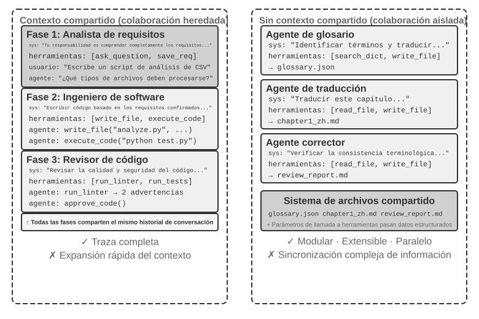

Es preciso aclarar que ambas arquitecturas son verdaderos sistemas multi-agente (ya que las instrucciones del sistema y las herramientas en cada etapa son diferentes, lo que constituye Agentes distintos), diferenciándose en el modo de coordinación. **El contexto compartido** depende de la coordinación implícita: los Agentes posteriores heredan el historial de contexto completo de los anteriores y pueden ver el proceso de pensamiento previo, transmitiéndose la información a través del propio contexto. **El contexto no compartido** depende de la coordinación explícita: los Agentes intercambian información a través de archivos, mensajes o interfaces de datos estructurados, y cada Agente solo ve el contenido relevante para sí mismo.

A modo de analogía: la primera opción se parece más a un equipo sentado alrededor de una mesa discutiendo, donde todos escuchan todo; la segunda se asemeja a diferentes departamentos colaborando mediante correos y documentos, manteniendo cada uno su propio espacio de trabajo.

Los lectores familiarizados con los sistemas operativos reconocerán este par de opciones: el contexto compartido corresponde a los hilos (threads) y el contexto no compartido a los procesos (processes). Los hilos comparten el espacio de direcciones, tienen un bajo costo de conmutación y la comunicación no requiere copias, a costa de no tener aislamiento: si un hilo corrompe la memoria, todo el proceso colapsa. Los procesos tienen espacios de direcciones independientes, aislamiento completo y pueden ejecutarse en paralelo de forma segura, a costa de requerir IPC explícito para comunicarse. Cada criterio de selección de la Tabla 10-1 se puede deducir de este conjunto de sopesamientos.

La Tabla 10-1 resume los criterios de selección para ambas arquitecturas desde cinco perspectivas: cantidad de subtareas, ventana de contexto, grado de paralelismo, aislamiento de información y presupuesto de costo, sirviendo como lista de verificación para la selección arquitectónica temprana.

Tabla 10-1 Criterios de selección entre contexto compartido y contexto no compartido

| Criterio de Selección | Contexto Compartido | Contexto No Compartido |
|----------|-------------------------------------|------------------------------------------------|
| Cantidad de subtareas | Pocas (2-3 roles) | Muchas (requieren procesamiento en paralelo) |
| Ventana de contexto | Suficiente para albergar la información de todos los roles | Una sola ventana no puede contenerla |
| Grado de paralelismo | Principalmente en serie (los roles se van turnando a lo largo de la misma trayectoria) | Altamente paralelizable (contextos independientes, sin bloqueo mutuo) |
| Aislamiento de información | No necesario (todos los roles comparten información) | Necesario (ej. la revisión de seguridad no debe ver el proceso de pensamiento original) |
| Presupuesto de costo | Relevo en una sola trayectoria, los tokens se acumulan con las etapas | Despliegue independiente de múltiples Agentes, el total de tokens suele ser varias veces a un orden de magnitud mayor |

**Criterio simple**: si se prevé que el contexto acumulado superará el 50% de la ventana (una regla empírica, no un umbral preciso), no se debe compartir; si la pérdida cero de información es una restricción dura para la corrección de la tarea, se debe compartir. La mayoría de los sistemas prácticos adoptan un enfoque basado en cambio de etapas: los primeros Agentes comparten contexto y, al alcanzar el punto de saturación de información, cambian a contexto no compartido más *handoff* explícito (transferencia, donde el Agente aguas arriba decide de forma activa qué información traspasar al de aguas abajo).

### Dimensión 2: Topología de Colaboración

La segunda dimensión es la topología de colaboración: la estructura según la cual fluyen el control y la información entre los Agentes. La topología de colaboración y el hecho de compartir contexto son **conceptualmente independientes pero están relacionados en la práctica**. Son conceptualmente independientes porque los sistemas con contexto compartido también poseen topología; por ejemplo, la herramienta `transfer_to_agent` presentada más adelante en este capítulo (Experimento 10-2) es esencialmente una transferencia en cadena (*handoff*) bajo contexto compartido. Están relacionados en la práctica porque una vez que se comparte el contexto, la topología tiende a degenerar (véase más abajo), por lo que las selecciones de ambas dimensiones no se pueden combinar arbitrariamente. Al compartir contexto, la transferencia no necesita decidir qué transmitir, ya que el historial completo se conserva de manera natural; la topología se reduce así a una secuencia de cambios de rol sin mayores decisiones de arquitectura que tomar (una excepción intermedia es el *group chat*).

> **Nota sobre terminología: Ingeniería de Grafos (Graph Engineering).** La "Ingeniería de Grafos" que comenzó a popularizarse a mediados de 2026 se refiere generalmente, en el contexto actual de los Agentes, al diseño explícito de grafos de ejecución: los nodos son Agentes, programas normales o decisiones humanas, mientras que las aristas definen dependencias de tareas, enrutamiento condicional y destinos tras fallos, fluyendo el estado estructurado entre los nodos[^ch10-graph-engineering]. La "topología de colaboración" discutida en este capítulo es precisamente su subconjunto multi-agente: la colaboración entre pares, la orquestación por manager y la transferencia descentralizada son diferentes topologías de grafo. Dado que esta denominación es reciente y puede confundirse fácilmente con grafos de conocimiento, GraphRAG o trayectorias de ejecución, este libro continuará utilizando "topología de colaboración" u "orquestación" como términos principales por su significado más estable.

[^ch10-graph-engineering]: Para debates tempranos sobre este término, véase Josh C. Simmons, *We Are Entering the Graph Engineering Phase*, 2026. La misma estructura de ingeniería en los principales frameworks se denomina habitualmente *graph-based workflow* u *orchestration*, más que una tecnología completamente nueva. Véase https://www.drjoshcsimmons.com/writing/we-are-entering-the-graph-engineering-phase, https://docs.langchain.com/oss/python/langgraph/overview, https://learn.microsoft.com/en-us/agent-framework/workflows/, https://adk.dev/workflows/.

En otras palabras, estas dos dimensiones constituyen en principio una matriz de combinación de 2×3 (compartido / no compartido × tres topologías). Sin embargo, en la fila de contexto compartido, la topología degenera en su mayoría en una secuencia de cambios de rol sin muchas decisiones arquitectónicas (que es precisamente la forma discutida más adelante en "Cambio de Rol Multietapa"), por lo que este capítulo solo desarrollará en detalle las tres casillas de contexto no compartido. A continuación se presentan las tres formas típicas de topología de colaboración en contextos no compartidos, ordenadas por complejidad creciente:

- **Patrón de Colaboración entre Pares (Peer Collaboration Pattern)**: un número reducido de Agentes (generalmente 2 u 3) interactúan en plano de igualdad, formando un bucle de mejora iterativa, similar a cuando una persona redacta un borrador y otra añade comentarios y correcciones, logrando tras varias rondas una calidad muy superior a la de una sola persona escribiendo a solas.
- **Patrón de Manager (Orchestration Pattern)**: un Agente Manager centralizado se encarga de la planificación y programación de tareas, mientras que múltiples sub-agentes ejecutan subtareas específicas, como un gerente de proyecto liderando a varios ingenieros especializados.
- **Patrón Descentralizado (Decentralized Pattern)**: no hay un controlador central en tiempo de ejecución; los Agentes se comunican entre sí como los humanos para completar la tarea de forma colaborativa.

El diseño detallado y los escenarios de aplicación de cada patrón se analizarán en las secciones temáticas posteriores.

## ¿Cuándo es un Sistema Multi-Agente Realmente Mejor que un Agente Único?

Antes de entrar en las arquitecturas de colaboración específicas, conviene responder a una pregunta más fundamental: **¿cuándo se necesitan realmente múltiples Agentes y cuándo basta con uno solo?** La respuesta servirá como marco de referencia general para todas las soluciones ingenieriles posteriores. Una serie de investigaciones recientes ha proporcionado un marco de evaluación claro, cuyo criterio central se reduce a una sola regla: **¿la colaboración introduce nueva información que un solo Agente no habría podido obtener al generar su respuesta?**

La Tabla 10-2 resume si los diferentes patrones de colaboración introducen nueva información, sirviendo para juzgar si la colaboración multi-agente ofrece un valor sustancial frente a un solo Agente.

Tabla 10-2 Comparación de ganancia de información en patrones de colaboración multi-agente

| Patrón de Colaboración | ¿Introduce Nueva Información? | Efecto |
|---|---|---|
| Auto-revisión del mismo modelo (releer sus propias salidas) | No | A menudo ineficaz o incluso perjudicial |
| Debate entre diferentes Agentes sobre el mismo texto | No | Al mismo cómputo, equivalente a un solo Agente |
| El Revisor usa los resultados de ejecución de código para revisar | Sí (retroalimentación de ejecución) | Mejora significativa |
| El Revisor analiza capturas de pantalla renderizadas de frontend/PPT | Sí (retroalimentación visual) | Mejora significativa |
| El Revisor utiliza herramientas externas para verificar hechos | Sí (retroalimentación de herramientas) | Mejora significativa |

El estudio RLEF (*Reinforcement Learning from Execution Feedback*) de 2025[^rlef-2025] confirmó este punto: al entrenar modelos mediante aprendizaje por refuerzo para utilizar la retroalimentación de ejecución de código en la mejora iterativa, el efecto superó con creces el muestreo independiente múltiple del modelo. La clave radica en que cada iteración introduce **resultados de ejecución reales** (errores de compilación, fallos de pruebas, excepciones en tiempo de ejecución), información que no existía cuando el modelo escribió el código originalmente. En 2025, WebGen-Agent[^webgen-agent-2025] logró, en tareas de generación de páginas web, elevar el rendimiento de Claude 3.5 Sonnet en dicho benchmark del 26.4% al 51.9% (casi el doble) mediante un andamiaje de retroalimentación visual de múltiples niveles (capturas de pantalla más descripción con modelos de lenguaje visual).

[^rlef-2025]: Gehring, J., et al. *RLEF: Grounding Code LLMs in Execution Feedback with Reinforcement Learning.* arXiv:2410.02089, 2025.
[^webgen-agent-2025]: Lu, Z., et al. *WebGen-Agent: Enhancing Interactive Website Generation with Multi-Level Feedback and Step-Level Reinforcement Learning.* arXiv:2509.22644, 2025.

Este marco de "nueva información" explica un fenómeno aparentemente contradictorio: la investigación académica afirma que "basta con un solo Agente", mientras que la práctica ingenieril muestra que múltiples Agentes funcionan mejor. La raíz de la contradicción está en que ambos discuten tipos distintos de sistemas multi-agente: la investigación académica compara en su mayoría patrones donde "múltiples Agentes discuten sobre el mismo texto" (como el debate), mientras que los sistemas multi-agente efectivos en ingeniería suelen incluir bucles de retroalimentación externa (ejecución de código, renderizado visual, llamadas a herramientas). El primer caso no introduce nueva información, mientras que el segundo sí lo hace. Los tres patrones que se presentan más adelante (colaboración entre pares, manager y descentralizado) encuentran su justificación en este criterio siempre que resulten verdaderamente efectivos.

**Presupuesto de pasos y rendimiento del Agente.** Una línea de investigación relacionada analiza cómo influye en el rendimiento la asignación de diferentes presupuestos de pasos al Agente (es decir, el número permitido de llamadas a herramientas o rondas de iteración). Intuitivamente, más pasos deberían brindar mejores resultados: con un presupuesto de 30 pasos, el Agente solo puede implementar rápidamente la función central, mientras que con 300 pasos puede planificar, implementar, probar y mejorar. Sin embargo, el artículo de Google de 2025, *Budget-Aware Tool-Use Enables Effective Agent Scaling*, reveló una conclusión contraintuitiva: **el simple hecho de aumentar el número de pasos disponibles para el Agente no garantiza una mejora en el rendimiento**. Los Agentes estándar carecen de "conciencia de presupuesto": incluso con 300 pasos, tienden a realizar búsquedas superficiales y se "saturan" rápidamente. Para que más pasos se traduzcan en mejores resultados, se deben utilizar técnicas conscientemente diseñadas.

Estos hallazgos ofrecen una orientación directa para el diseño de sistemas multi-agente. Por ejemplo, en el patrón de manager, el Agente Manager no debería limitarse a distribuir tareas a los sub-agentes y esperar resultados, sino **asignar dinámicamente el presupuesto de pasos** según la complejidad de la tarea: otorgar menos pasos a subtareas simples y pasos suficientes a tareas complejas. Al mismo tiempo, se debe guiar a los sub-agentes para que utilicen estos presupuestos de forma rational (planificar primero, implementar después, probar y finalmente mejorar), en lugar de lanzarse directamente a escribir código.

Existe otro aspecto que debe situarse por delante de cualquier diseño: **el costo**. La exploración paralela y la iteración continua en sistemas multi-agente cuestan dinero. Anthropic reveló en su momento que el consumo de tokens de su sistema de investigación multi-agente era aproximadamente 15 veces el de una conversación ordinaria, y el propio consumo de tokens explicaba cerca del 80% de las diferencias de rendimiento. Esto significa que los beneficios del enfoque multi-agente deben ser lo suficientemente grandes como para cubrir el gasto adicional de varias veces o incluso de un orden de magnitud; de lo contrario, un solo Agente bien ajustado suele ser la opción más económica.

## Colaboración Multi-Agente con Contexto Compartido

En la colaboración multi-agente con contexto compartido, cada etapa constituye un Agente independiente (con sus propios prompts del sistema y conjunto de herramientas), pero hereda la trayectoria completa del Agente anterior, de forma similar a como un colega que asume un turno puede revisar todos los registros de trabajo dejados por su predecesor. La ventaja central de esta "colaboración por herencia" es la nula pérdida de información, permitiendo que cada Agente revise los detalles de cualquier etapa previa. El desafío consiste en lograr que el Agente actual se concentre en sus responsabilidades principales sin distraerse con la gran cantidad de información histórica heredada.

### Cambio de Rol Multietapa

Conviene aclarar una controversia de definición: utilizando el lenguaje del Capítulo 1, el cambio de rol multietapa es una **orquestación basada en flujos de trabajo** (*workflow-based orchestration*), donde la ruta de ejecución (por ejemplo, aclaración de requisitos → implementación → revisión) está predefinida. Desde la perspectiva de los procesos, resulta aún más claro: se trata de un solo proceso que ejecuta secuencialmente el código de distintas etapas; lo que cambia es el segmento de código, mientras que la memoria permanece idéntica de principio a fin, no tratándose de múltiples procesos. Por ello, la postura que no lo considera un "verdadero sistema multi-agente" tiene su fundamento. Este capítulo lo incluye dentro del marco multi-agente debido a sus beneficios de diseño prácticos: cuando las instrucciones del sistema, los conjuntos de herramientas y los focos de atención difieren en cada etapa, tratar cada fase como múltiples Agentes que comparten la misma trayectoria permite pulir de forma independiente las instrucciones y herramientas de cada "identidad", convirtiendo los límites entre etapas en puntos naturales de control de calidad.

En tareas complejas, el rol y las responsabilidades del Agente pueden cambiar significativamente en las distintas fases. Si se utiliza siempre el mismo conjunto estático de prompts del sistema, o bien resulta demasiado general y falto de enfoque, o bien agrupa las instrucciones de todas las fases volviéndose excesivamente extenso. El enfoque del cambio de rol multietapa consiste en cambiar dinámicamente los prompts del sistema y el conjunto de herramientas según la etapa actual, permitiendo que el Agente trabaje bajo la "identidad" más adecuada en cada momento. Esta transición no requiere crear nuevas instancias ni iniciar nuevos procesos, sino únicamente actualizar el contexto dentro de la misma sesión de ejecución. La clave reside en que, aunque el rol cambie, el historial de conversación y el estado de la tarea se comparten de forma continua: el Agente bajo su nuevo rol sigue teniendo acceso a toda la información acumulada en las etapas anteriores.

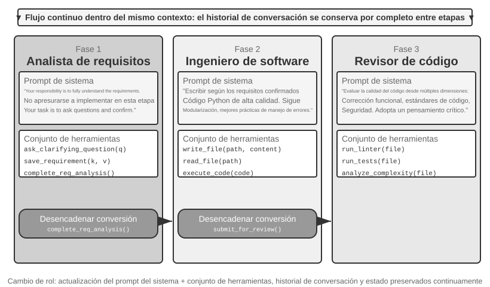

> **Experimento 10-1 ★★: Determinar los Prompts del Sistema según la Etapa de Ejecución**
>
> Este experimento ilustra, a través del flujo de trabajo completo de un Coding Agent, cómo los prompts de sistema estructurados por etapas mejoran el rendimiento del Agente.
>
> **Escenario de la tarea**: el usuario plantea un requisito de desarrollo de software y el Agente pasa secuencialmente por tres etapas: aclaración de requisitos, implementación de código y revisión de calidad.
>
> **Primera etapa: Aclaración de requisitos** (Rol: Analista de Requisitos)
>
> Las instrucciones del sistema enfatizan:
> - "Tu responsabilidad es comprender plenamente los requisitos del usuario. Formula preguntas para aclarar puntos ambiguos, asegurándote de entender por completo las funciones esperadas, escenarios de uso y requisitos de rendimiento."
> - "No te apresures a implementar. En esta etapa, tu tarea es preguntar y confirmar, no escribir código."
> - "Cuando confirmes que todos los requisitos clave están claros, invoca la herramienta `complete_requirements_analysis()` para finalizar esta etapa."
>
> El conjunto de herramientas es limitado: `ask_clarifying_question(question)` para hacer preguntas de aclaración al usuario, `save_requirement(key, value)` para registrar los puntos confirmados, y `complete_requirements_analysis()` para marcar la etapa como completada.
>
> El Agente mantiene varias rondas de diálogo con el usuario: "¿Qué tipos de archivos necesita procesar este script?", "¿Debemos procesar subcarpetas recursivamente?", "¿Se debe conservar el nombre original del archivo tras moverlo?". Mediante estas preguntas, el Agente construye gradualmente una comprensión completa de los requisitos y la guarda de forma estructurada. Cuando el Agente juzga que los requisitos están suficientemente claros, invoca `complete_requirements_analysis()`, lo que desencadena el cambio de rol: el sistema detecta la señal de finalización de etapa y cambia automáticamente a la configuración de la siguiente fase.
>
> **Segunda etapa: Implementación de código** (Rol: Ingeniero de Software)
>
> Las nuevas instrucciones del sistema enfatizan:
> - "Tu responsabilidad es escribir código Python de alta calidad basado en los requisitos confirmados."
> - "Sigue las mejores prácticas: el código debe ser modular, incluir un manejo de errores adecuado y contar con los comentarios necesarios."
> - "Una vez completada la escritura del código y superadas las pruebas básicas, invoca `submit_for_review()` para pasar a la etapa de revisión."
>
> El conjunto de herramientas cambia de forma notable: se eliminan las herramientas de aclaración anteriores y se sustituyen por herramientas de desarrollo como `write_file(path, content)`, `read_file(path)` y `execute_code(code)`. El Agente comienza a escribir código basándose en los requisitos guardados en la primera etapa: primero la lógica principal, luego el manejo de errores y finalmente las pruebas de verificación. Durante todo el proceso, el Agente sigue teniendo acceso al historial de conversación de la primera etapa para revisar los detalles de los requisitos, pero su patrón de comportamiento es completamente distinto: ya no hace preguntas, sino que se concentra en la implementación. Al terminar, invoca `submit_for_review()`.
>
> **Tercera etapa: Revisión de código** (Rol: Revisor de Código)
>
> Las nuevas instrucciones del sistema enfatizan:
> - "Tu responsabilidad es revisar el código recién escrito y evaluar su calidad desde múltiples dimensiones: corrección funcional, estándares de código, manejo de errores, optimización de rendimiento y seguridad."
> - "Adopta un pensamiento crítico e intenta identificar posibles problemas y margen de mejora en el código."
> - "Si detectas problemas graves, invoca `request_revision(issues)` para regresar a la etapa de implementación; si la calidad es aceptable, invoca `approve_code()` para completar la tarea."
>
> El conjunto de herramientas cambia de nuevo, pasando a herramientas de análisis de calidad de código como `run_linter(file)`, `run_tests(file)` y `analyze_complexity(file)`. El Agente reexamina el código desde la perspectiva de un revisor, ejecutando análisis estático para detectar posibles errores, problemas de rendimiento o vulnerabilidades de seguridad.
>
> Este diseño de tres etapas permite que el Agente se concentre en la tarea central de cada fase. Más importante aún, un mecanismo claro de transición garantiza la integridad en la ejecución de la tarea: el Agente no se saltará el análisis de requisitos para escribir código directamente, ni entregará resultados sin haberlos sometido a revisión.
>
> **Requisitos del experimento**:
> 1. Implementar prompts del sistema de tres etapas, definiendo con claridad el rol y las guías de comportamiento para cada una.
> 2. Configurar conjuntos de herramientas coincidentes para cada etapa.
> 3. Implementar el mecanismo de activación del cambio de etapa (mediante llamadas a herramientas específicas).
> 4. Garantizar la continuidad del contexto entre las distintas etapas.
> 5. Manejar situaciones de retroceso: poder regresar a la etapa de implementación cuando la revisión de código descubra problemas.
> 6. Registrar los logs de ejecución de cada etapa para mostrar cómo diferentes prompts generan distintos patrones de comportamiento.

### Cambio de Rol Trans-Dominio

El cambio de rol multietapa anterior ilustró la ejecución por fases dentro de un solo tipo de tarea (desarrollo de software). El cambio de rol trans-dominio explora la capacidad del Agente para alternar de forma autónoma entre múltiples tipos de tareas: ya no se trata de un proceso lineal preplanificado, sino de que el Agente juzgue autónomamente a qué rol profesional debe cambiar en función de las variaciones en las necesidades del usuario.

> **Experimento 10-2 ★★: Cambio de Múltiples Roles**
>
> **Requisito previo**: Se recomienda comprender primero el mecanismo de Agent Skills del Capítulo 2.
>
> **Arquitectura del sistema**: Cinco roles:
>
> - **triage (Triage de Recepción, entrada por defecto)**: comprende las necesidades generales del usuario, las descompone en subtareas ordenadas cronológicamente, las transfiere gradualmente al rol profesional adecuado y realiza la confirmación final al completar todas las subtareas. No posee herramientas profesionales propias, solo dispone de la herramienta `transfer`.
> - **research (Experto en Recuperación de Información)**: utiliza `web_search` para buscar datos, hechos y documentación.
> - **coding (Experto en Programación)**: utiliza `execute_python` para escribir y ejecutar código, resolviendo problemas de lógica de programación o scripts.
> - **data_analysis (Experto en Análisis de Datos)**: utiliza `calculate` / `descriptive_stats` para realizar cálculos cuantitativos y estadísticas (como tasa de crecimiento interanual, tasa de crecimiento anual compuesto CAGR, promedios).
> - **writing (Experto en Redacción)**: pule los datos recuperados y las conclusiones de los cálculos en un texto fluido orientado a una audiencia específica (puede usar `count_characters` para verificar la extensión de forma aproximada).
>
> **Mecanismo central: la herramienta transfer_to_agent**
>
> Todos los roles están equipados con la herramienta `transfer_to_agent(target_role, reason)`. Al invocarla, el sistema realiza en orden: 1) guardar el historial de conversación actual; 2) cargar los prompts y el conjunto de herramientas del rol de destino; 3) transmitir el historial de conversación al nuevo rol para que comprenda el contexto; 4) continuar la ejecución bajo la identidad del nuevo rol.
>
> **Escenario del experimento**: El sistema se ejecuta por defecto con la identidad de triage. El usuario plantea una tarea compuesta trans-dominio: "Estoy preparando un material para inversionistas. Ayúdame a consultar las ventas de vehículos de nuevas energías en China para los años 2021, 2022 y 2023, calcula la tasa de crecimiento anual compuesto de estos tres años y redacta un resumen en español orientado a inversionistas de no más de 120 palabras." Triage descompone la tarea en "Buscar datos → Calcular indicadores → Redactar texto final", transfiriendo primero la búsqueda de información:
>
> ```python
> transfer_to_agent(target_role="research", reason="Se requiere consultar primero los datos de ventas de vehículos de nuevas energías de los tres años")
> ```
>
> Una vez que `research` obtiene las ventas con `web_search`, escribe los datos clave en la conversación y los transfiere al análisis de datos:
>
> ```python
> transfer_to_agent(target_role="data_analysis", reason="Datos listos, se requiere calcular la CAGR de tres años")
> ```
>
> `data_analysis` calcula la tasa de crecimiento con `calculate` y la transfiere a `writing` para la redacción; tras redactar el texto, `writing` la devuelve a `triage` para la confirmación de cierre. La cadena completa es triage → research → data_analysis → writing → triage. Cada rol tiene acceso al historial de conversación completo, por lo que el siguiente rol sabe de forma natural lo que ya ha hecho el anterior.
>
> La decisión del cambio de rol depende de las instrucciones de los prompts del sistema. El prompt de triage enumera explícitamente las reglas de enrutamiento: búsqueda de datos/información pasa a `research`, escribir y ejecutar código pasa a `coding`, cálculos cuantitativos y estadísticas pasa a `data_analysis`, y pulir textos pasa a `writing`. El criterio de evaluación es sencillo: si la tarea requiere conocimientos profundos o herramientas profesionales de un dominio específico, se transfiere al rol correspondiente. Los prompts de los roles profesionales también indican a quién transferir o cuándo regresar a triage tras completar su parte.
>
> **Requisitos del experimento**:
> 1. Implementar los prompts del sistema y los conjuntos de herramientas específicos para al menos tres roles profesionales.
> 2. Implementar la herramienta `transfer_to_agent`, admitiendo el cambio dinámico.
> 3. Garantizar la continuidad del contexto tras la conmutación de rol.
> 4. Manejar el problema de conmutación cíclica: evitar que el Agente alterne indefinidamente entre roles.
> 5. Diseñar un flujo de tareas complejo que abarque múltiples dominios para demostrar el valor del cambio de rol.

## Colaboración Multi-Agente Sin Contexto Compartido

El contexto no compartido representa la verdadera colaboración multi-agente. Bajo esta arquitectura, cada Agente es una entidad independiente con su propio contexto, trayectoria y estado. Los Agentes no pueden acceder directamente a la "actividad interna" de los demás; la colaboración depende por completo de mecanismos explícitos y estructurados de transmisión de datos, es decir, los tres mecanismos de comunicación presentados al inicio de este capítulo (parámetros de llamada a herramientas, sistema de archivos compartido y bus de mensajes).

Al comienzo del capítulo se relacionaron los mecanismos de comunicación con los dos grandes paradigmas de IPC, y el contexto compartido/no compartido con los hilos y procesos. Esta analogía se puede extender aún más (Tabla 10-3):

Tabla 10-3 Correspondencia entre sistemas multi-agente y sistemas operativos

| Sistema Operativo | Sistema Multi-Agente |
|----------|----------------|
| Programa (ejecutable) | Prefijo estático (prompts del sistema + definiciones de herramientas) |
| Memoria del proceso | Trayectoria |
| CPU | LLM |
| Kernel | Runtime del Agente |
| Llamada al sistema | Llamada a herramienta |
| fork (crear subproceso) | spawn_subagent |
| kill (enviar señal) | cancel_subagent |
| ps (listar procesos) | list_agents |
| Código de salida y wait() | Resumen estructurado devuelto por el sub-agente |
| Memoria compartida / Paso de mensajes | Sistema de archivos compartido / Mensajes |

Un programa es código estático; un proceso es una ejecución del programa. De igual modo, el prefijo estático determina quién es el Agente, mientras que la trayectoria registra hasta qué paso ha llegado. El LLM desempeña el papel de la CPU: no conserva estado por sí mismo, sino que atiende a muchos Agentes compartiendo el tiempo mediante el cargado de diferentes contextos (el término "cambio de contexto" proviene originalmente de los sistemas operativos). Por esta razón, si se cambia a una CPU más rápida, el programa se ejecuta normalmente; si se cambia a un modelo más potente, el Agente sigue siendo el mismo Agente: su identidad y memoria residen en el prefijo y la trayectoria, no en los pesos del modelo.

Esta abstracción no es nueva: estado privado, mensajes asincrónicos y capacidad de crear nuevos miembros son las premisas básicas del modelo de Actores de los años setenta[^actor-model]; el sistema multi-agente puede considerarse su versión basada en LLMs. Por ello, la mayoría de las experiencias maduras en sistemas operativos y sistemas distribuidos se pueden reutilizar directamente. El único punto donde la analogía falla es el siguiente: los procesos transmiten bytes con fidelidad bit a bit; los Agentes transmiten semántica, y cada paráfrasis puede sufrir distorsiones (este es el nuevo problema que se analizará específicamente en la sección de "Modos de Falla").

[^actor-model]: Hewitt, C., Bishop, P., Steiger, R. *A Universal Modular ACTOR Formalism for Artificial Intelligence.* IJCAI 1973.

El aislamiento de tipo proceso aporta varios beneficios de ingeniería concretos: cada Agente se puede desarrollar y probar de forma independiente, añadir nuevas capacidades no requiere modificar el código existente, el fallo de un Agente no contagiará su estado erróneo a los demás y múltiples Agentes pueden ejecutarse de forma verdaderamente concurrente (los contextos son independientes y no hay competencia por recursos).

Sin embargo, el contexto no compartido también tiene sus costos. El más evidente es la sincronización de información: ¿cómo mantienen los Agentes una comprensión uniforme del estado de la tarea? ¿Se perderá o duplicará la información durante la transmisión? La depuración también se vuelve más compleja: si surge un problema, es necesario revisar los logs de múltiples Agentes para reconstruir el proceso de ejecución completo. Estos desafíos hacen que el diseño de las especificaciones de interfaz, los formatos de datos y los protocolos de comunicación sea de vital importancia.

La colaboración explícita sin contexto compartido depende de dos infraestructuras independientes de la topología. La primera es el **sistema de archivos compartido**, que actúa como medio persistente para intercambiar productos entre Agentes y con el usuario, constituyendo el plano de datos de la colaboración. La segunda es el **mecanismo de comunicación y control**, que admite el paso de mensajes, la consulta de estado, la terminación de la ejecución y la programación de recursos entre Agentes, constituyendo el plano de control. Las tres topologías siguientes se construyen sobre ambas bases.

### El Sistema de Archivos desde la Perspectiva del Agente

Al principio de este capítulo se incluyó el "sistema de archivos compartido" como uno de los tres mecanismos de comunicación sin contexto compartido. En los sistemas reales, el almacenamiento al que accede un Agente no es único, sino un **sistema de archivos virtual** (*virtual filesystem*): almacenamientos con distintos orígenes, ciclos de vida y permisos se montan (*mount*) en el mismo árbol de directorios. El Agente accede a ellos mediante interfaces unificadas como `read_file`/`write_file`/`list_dir`, mientras que la capa inferior puede ser un disco temporal local, un almacenamiento de objetos persistente, APIs de nubes de terceros o paquetes de recursos de sistema de solo lectura. Dejar clara la composición de este árbol de directorios (la visibilidad y el ciclo de vida de cada área) es el prerrequisito del diseño multi-agente: una parte considerable de los conflictos de concurrencia y fugas de información proviene de mezclar áreas que deberían estar aisladas. Este árbol de directorios equivale al espacio de direcciones del Agente, y sus cuatro categorías de áreas son regiones con distintos permisos.

**1. Workspace Exclusivo del Agente (Scratchpad)**. Directorio privado de uso exclusivo de cada instancia de Agente, utilizado para guardar productos intermedios, archivos temporales, borradores y logs de depuración. Su ciclo de vida está vinculado a la instancia y no es visible para otros Agentes ni para el usuario. Aislar el *scratchpad* tiene una doble función: evitar que los archivos temporales de múltiples Agentes se sobrescriban entre sí y mantener limpio el contexto del Agente principal (el proceso de ensayo y error del sub-agente permanece en su propio espacio de trabajo, enviando únicamente el producto final al espacio compartido). Esto se corresponde con lo expuesto en el Capítulo 4 respecto a que "los sub-agentes devuelven resúmenes estructurados en lugar de la trayectoria completa" a nivel de almacenamiento.

**2. Espacio Compartido Multi-Agente (Shared Workspace)**. Área de colaboración donde múltiples Agentes leen y escriben y que **es visible para el usuario**. Es el medio principal para intercambiar productos entre Agentes bajo arquitecturas sin contexto compartido: el Glossary Agent escribe el glosario y el Translation Agent lo lee de allí; el usuario también puede subir archivos originales o descargar entregables finales aquí. Su ciclo de vida está ligado a toda la tarea y requiere persistencia. Al ser una región de lectura/escritura concurrente para múltiples partes, es propensa a conflictos de concurrencia; sobre ella actúan mecanismos como el bloqueo optimista o el aislamiento de copias de trabajo (*worktree*), detallados más adelante en "Modo de Falla 1". El uso del montaje de volúmenes en `/workspace/shared` para conectar el Agente principal, la computadora virtual y el teléfono virtual en el Capítulo 4 constituye una implementación típica de esta capa.

**3. Recursos Externos Montados (Mounted External Resources)**. Fuentes de información de terceros autorizadas por el usuario (Google Drive, Notion, Dropbox, Wikis empresariales) mapeadas como puntos de montaje en el sistema de archivos (ej. `/mnt/gdrive`) a través de adaptadores (*adapters*). Cuando el Agente lee un documento de Notion como si fuera un archivo local, el adaptador subyacente invoca la API correspondiente. Tres características diferencian esta capa del almacenamiento local y deben gestionarse explícitamente: **el acceso está sujeto a permisos externos** (los permisos del usuario en el sistema de origen determinan el alcance visible para el Agente), **la latencia es mayor y la consistencia es más débil** (cada lectura implica una ida y vuelta por red, los datos pueden haber sido modificados externamente y solo pueden tratarse bajo consistencia eventual), y **su uso es principalmente de solo lectura bajo demanda** (escribir de vuelta a fuentes externas exige cautela, pues escrituras erróneas podrían contaminar los datos reales del usuario).

**4. Recursos de Sistema Integrados (Built-in System Resources)**. Paquetes de recursos preestablecidos y compartidos en modo solo lectura para todos los Agentes. El representante típico son los **Skills** presentados en los Capítulos 2 y 4: documentos de conocimiento y scripts organizados en forma de archivos, montados en rutas como `/skills`, a los que se accede mediante revelación progresiva (primero índice, luego despliegue bajo demanda). También incluyen manuales de referencia, bibliotecas de plantillas y definiciones de herramientas compartidas. Esta capa es globalmente compartida, de solo lectura, estable entre sesiones y puede ser leída de forma concurrente por todos los Agentes sin necesidad de control de concurrencia.

La Figura 10-3 ilustra la estructura en la que estas cuatro categorías de áreas se montan de forma unificada en el mismo árbol de directorios: el Agente accede a todo el árbol mediante una interfaz unificada, el usuario sube y descarga archivos desde el espacio compartido, las fuentes de datos externas se montan a través de adaptadores y los recursos del sistema se proporcionan en modo solo lectura.

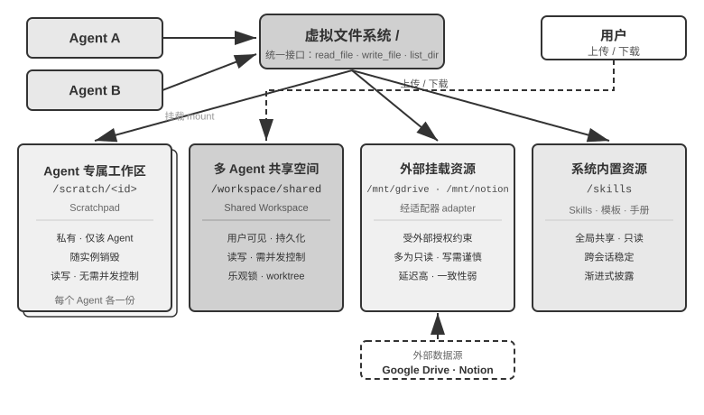

La Tabla 10-4 compara estas cuatro áreas en función de cuatro dimensiones: visibilidad, ciclo de vida, permisos de lectura/escritura y control de concurrencia, sirviendo como lista de verificación para el diseño de la estructura del sistema de archivos.

Tabla 10-4 Cuatro tipos de áreas del sistema de archivos virtual del Agente

| Área | Visibilidad | Ciclo de Vida | Lectura/Escritura | Control de Concurrencia |
|----------------|--------------------|-------------------|-----------------|------------------------|
| Workspace Exclusivo del Agente | Solo este Agente | Destruido con la instancia del Agente | Lectura/Escritura | No necesario (privado) |
| Espacio Compartido Multi-Agente | Todos los Agentes colaboradores + usuario | Persiste con la tarea, requiere persistencia | Lectura/Escritura | Necesario (bloqueo optimista / worktree) |
| Recursos Externos Montados | Según autorización externa | Determinado por la fuente externa | Mayormente solo lectura, escribir requiere cautela | A cargo de la fuente externa |
| Recursos de Sistema Integrados | Todos los Agentes | Estable entre sesiones | Solo lectura | No necesario (solo lectura) |

Unificar las cuatro categorías de áreas en el mismo árbol de directorios representa el verdadero valor del diseño de "**la ruta de archivo como interfaz universal**": la transmisión de productos entre Agentes, la entrega de entradas del Agente principal a los sub-agentes e incluso el intercambio de Artifacts en la colaboración A2A trans-organizacional implican únicamente pasar cadenas de rutas ligeras, en lugar de cargar los contenidos en la ventana de contexto (Capítulo 4). Esto guarda continuidad con el concepto del Capítulo 5, "el sistema de archivos como núcleo del Agente": mientras este último analiza cómo un solo Agente utiliza el sistema de archivos como soporte de memoria y capacidad, aquí se extiende la misma abstracción a múltiples Agentes, convirtiendo un árbol de directorios virtual que monta almacenamientos privados, compartidos, externos e integrados en la base de almacenamiento de la colaboración multi-agente.

### Comunicación y Control entre Agentes

El sistema de archivos resuelve el problema del **intercambio de productos** entre Agentes; la colaboración requiere además un **plano de control**. Aquí es donde entran en juego las filas relativas al ciclo de vida de la Tabla 10-3: las primitivas de herramientas presentadas en el Capítulo 4 para crear (`spawn_subagent`), enviar mensajes (`send_message_to_subagent`), cancelar (`cancel_subagent`) y descubrir (`list_agents`) corresponden a fork, mensajes, kill y ps en el mundo de los procesos. En lugar de repetir las definiciones de interfaz, esta sección se centra en cuatro capacidades esenciales para la colaboración multi-agente que a menudo se pasan por alto.

**1. Paso de Mensajes.** La forma más simple es punto a punto: el Agente A invoca directamente `send_message_to_agent_b(content)`, adecuada para escenarios con topología fija y un número reducido de Agentes (como el Agente dual de teléfono + computadora del Experimento 10-4). Cuando el número de Agentes aumenta y se requiere paralelismo asincrónico, el número de conexiones punto a punto crece de forma cuadrática con el número de Agentes y exige que emisor y receptor estén en línea simultáneamente. En estos casos se debe utilizar un **bus de mensajes** (detallado más adelante en la sección "Coordinación Paralela"): los Agentes publican mensajes en el bus y este los reenvía según las suscripciones, sin que el emisor necesite conocer a los consumidores. Tanto si es punto a punto como a través del bus, los mensajes deben llevar por lo general un **sobre** estructurado (*envelope*): ID del emisor, destino (Agente específico o difusión), tipo de mensaje (como `task_assigned`/`status_update`/`result`/`terminate`) y la carga útil JSON.

**2. Consulta de Estado.** Este es uno de los aspectos más subestimados del plano de control. Tras enviar un sub-agente, si el Agente principal no tiene forma de conocer su avance, no podrá determinar si debe seguir esperando ni intervenir a tiempo si el sub-agente se bloquea. La solución intuitiva es imitar RPC y definir una interfaz de consulta `get_subagent_status(agent_id)` que devuelva "en ejecución / completado / fallido" junto con un porcentaje de progreso. Sin embargo, esta interfaz basada en *polling* (sondeo) tiene una utilidad práctica mucho menor de la esperada: una vez creado, el sub-agente comienza a ejecutarse de inmediato hasta completar o fallar, sin transitar por una serie de estados en cola como los trabajos de los sistemas por lotes tradicionales (en la programación Unix rara vez se requiere consultar el estado de ejecución de otro proceso mediante su PID). El sondeo presenta además un dilema inherente: si es demasiado frecuente malgasta tokens, y si es muy espaciado carece de oportunidad. Obtener el estado se logra de forma más natural mediante dos vías:

**Obtener el estado mediante paso de mensajes**. El Agente principal envía directamente un mensaje al sub-agente: "¿Cómo va el avance?". El sub-agente responde en el momento adecuado. Todo es asincrónico: enviar el mensaje no bloquea su propia ejecución, y cuándo o si responde la otra parte es un asunto independiente (al igual que un gerente pregunta el progreso a un subalterno por mensajería instantánea sin exigirle que detenga su trabajo de inmediato). A la inversa, el sub-agente también puede enviar mensajes proactivamente para reportar al alcanzar hitos clave; si el sistema cuenta con un bus de mensajes, esto equivale a publicar un `status_update` en el bus (esta es la forma empleada en la "monitorización en tiempo real" del Experimento 10-6). Tanto en preguntas y respuestas como en informes proactivos, se recomienda adoptar un vocabulario de máquina de estados unificado para el estado del mensaje (en ejecución, requiere entrada, completado, fallido), que es precisamente cómo el protocolo A2A presentado más adelante en este capítulo gestiona el ciclo de vida de las tareas.

**Obtener el estado mediante el sistema de archivos compartido**. La forma más completa es la **persistencia de trayectoria** (*trajectory persistence*): durante la ejecución, el sub-agente serializa su trayectoria en tiempo real (la secuencia completa de mensajes del usuario, respuestas del modelo, llamadas a herramientas y resultados definida en el Capítulo 1) en formato JSON, escribiéndola de forma incremental en un archivo de log en el sistema de archivos (normalmente un archivo por sesión, con un evento por línea, es decir, formato JSONL). El Agente principal no requiere ningún protocolo de reporte de estado; basta con leer este archivo para observar todo el proceso de ejecución del sub-agente: qué herramienta está invocando, qué está pensando en el paso reciente y si está atascado en reintentos fallidos. En el lenguaje de los procesos, esto equivale a leer directamente la memoria de otro proceso: no ocupa el contexto del sub-agente, no depende de su cooperación y ofrece la máxima granularidad de observación.

El valor de la persistencia de trayectoria va mucho más allá de la monitorización. Recordando la conclusión del Capítulo 1, "el contexto del Agente = prefijo estático + trayectoria": el prefijo estático (prompts del sistema, definiciones de herramientas) está determinado por el código, y el Agente no posee un estado de ejecución fuera de la trayectoria (sus productos de trabajo quedan guardados en el sistema de archivos), por lo que **la trayectoria es la totalidad del estado del Agente**. Persistir la trayectoria en tiempo real en un archivo equivale a disponer en todo momento de un *checkpoint* completo: ante una caída del proceso del Agente, un corte de energía o el cierre de la sesión por parte del usuario, basta con volver a cargar el archivo de trayectoria y adjuntar el prefijo estático para reanudar la ejecución desde el punto de interrupción. Las funciones de reanudación de sesión (*session resume*) en Agentes de código como Claude Code o Codex CLI se implementan de este modo. Esto comparte la misma idea que el registro de escritura anticipada (*write-ahead log*, WAL) en bases de datos: cada evento se escribe primero de forma incremental.

**3. Terminación de la Ejecución.** En la colaboración paralela suele ocurrir que cuando uno tiene éxito, los demás pierden sentido: cuando varios Agentes buscan por separado y uno localiza el objetivo, los demás deben detenerse de inmediato (terminación en cascada del Experimento 10-6). Existen dos niveles de intensidad para la terminación, equivalentes a la diferencia entre SIGTERM y SIGKILL en Unix. La **terminación elegante (graceful)** es la opción preferida: el Agente principal emite una señal `terminate` y el sub-agente responde en un punto seguro de su paso actual, limpiando primero sus recursos (cerrar sesiones de navegador, escribir archivos pendientes, liberar bloqueos), devolviendo una confirmación (ack) antes de salir. La **terminación forzada (forced)** sirve como último recurso: termina el proceso directamente y se utiliza solo cuando el sub-agente no responde a la señal elegante, a costa de poder dejar recursos colgados o escrituras incompletas. Se deben gestionar dos puntos clave de ingeniería: primero, la terminación elegante requiere que el sub-agente verifique la señal de terminación en puntos seguros.

Resta por resolver un problema residual: ¿qué ocurre con los sub-agentes en ejecución cuando el Agente principal se termina? La práctica más limpia en ingeniería toma prestado el concepto de `context` en Go: la terminación se propaga en cascada según las relaciones de creación. Al cancelar un Agente, todos los sub-agentes derivados por él se cancelan automáticamente, eliminando de raíz los Agentes huérfanos sin responsable. Lo expuesto previamente de que "el sub-agente verifique la señal de terminación en puntos seguros" corresponde precisamente al sondeo de `ctx.Done()` en Go. Por el contrario, si realmente se requiere un Agente en segundo plano que se independice del Agente principal y se ejecute a largo plazo (similar a `nohup` en Unix), se le hace iniciar desde un nuevo árbol de ciclo de vida (correspondiente a `context.Background()`), declarando explícitamente que no se terminará con el padre.

**4. Recursos y Programación.** La otra mitad de las funciones de un sistema operativo es asignar recursos escasos. En el mundo de los procesos lo escaso es el tiempo de CPU y la memoria; en el mundo de los Agentes lo escaso son los tokens, el dinero y las cuotas de concurrencia: cada paso del sub-agente consume estas tres variables. Esta función suele recaer en el Manager o en el runtime: al iniciar un sub-agente se establece un presupuesto de pasos o tokens, deteniéndolo al superarlo; las tareas difíciles se asignan a modelos potentes y las mecánicas a modelos de bajo costo; se establece un límite superior a la concurrencia para evitar que decenas de Agentes agoten simultáneamente las cuotas de la API; si llega una tarea más urgente, se interrumpe al sub-agente en ejecución (lo que constituye la expropiación o *preemption*). Las prácticas en este campo están aún lejos de la madurez de la programación de CPU, pero determinan el límite superior de costos del sistema multi-agente y deben considerarse desde la fase de diseño arquitectónico.

### Patrón de Colaboración entre Pares: Control Mutuo y Mejora Iterativa

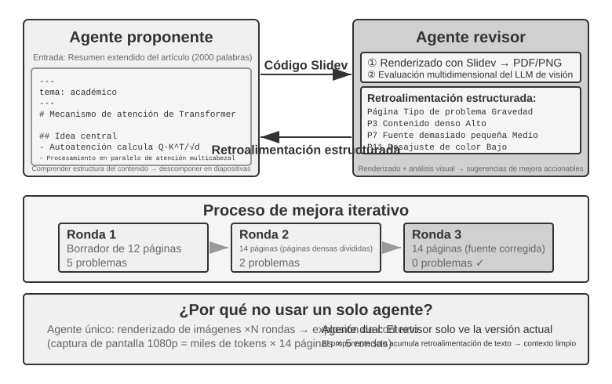

En el patrón de colaboración entre pares, dos o tres Agentes interactúan como iguales dentro de un bucle iterativo. El caso más clásico es el modelo Proponente-Revisor (*Proposer-Reviewer*): un Agente genera propuestas (código, artículos, planes) y el otro las revisa, proporcionando comentarios de modificación hasta alcanzar los estándares de aceptación o agotar la cuota de iteraciones.

**Ingeniería de Bucles (Loop Engineering).** Desde la perspectiva de la ingeniería de bucles, las distintas variantes de bucle utilizadas en la industria encuentran su correspondencia en este marco: el bucle cerrado con aprobación humana corresponde a la aprobación previa descrita en el Capítulo 4 (donde el humano actúa como revisor final); el bucle abierto con límite de presupuesto o rondas corresponde a la iteración multirronda en la generación de PPT del Capítulo 5 (máximo 5 rondas); los sub-agentes orquestados corresponden al patrón de manager de la siguiente sección. En otras palabras, la ingeniería de bucles no describe una arquitectura nueva, sino que unifica estos patrones de colaboración bajo el marco de "bucle + verificación + condición de terminación", siendo el paradigma proponente-revisor el encargado de asumir la función de verificación.

**Extensión: Otros patrones de colaboración entre pares.**

**Debate**: Múltiples Agentes sostienen posturas diferentes e interactúan mediante un diálogo adversarial para explorar a fondo el espacio del problema. Por ejemplo, al evaluar una solución técnica, el Agente A actúa como "defensor" enumerando ventajas y oportunidades, mientras que el Agente B actúa como "opositor" señalando riesgos y limitaciones, respondiendo cada ronda con objeciones o complementos a los argumentos del otro. Al analizar con un solo Agente, el modelo tiende a inclinarse por una postura e ignorar la evidencia en contra; el patrón de debate garantiza que ambas caras queden debidamente argumentadas mediante un enfrentamiento institucionalizado, ayudando a tomar decisiones más equilibradas.

Sin embargo, el efecto real del patrón de debate sigue siendo objeto de controversia en el ámbito académico. El estudio de 2026 realizado por Tran y Kiela[^single-agent-2026] comparó un solo Agente frente a cinco arquitecturas multi-agente (secuencial, debate, *ensemble*, roles paralelos, subtareas paralelas) en tareas de razonamiento multisalvo (*multi-hop reasoning*), descubriendo que **cuando el presupuesto de tokens de pensamiento se controla estrictamente para ser idéntico, el rendimiento de un solo Agente es igual o superior al de múltiples Agentes** (a menos que la utilización del contexto se vea degrada hasta cierto punto). Los investigadores ofrecieron una explicación basada en la desigualdad del procesamiento de información de la teoría de la información: los múltiples Agentes en un debate procesan exactamente la misma información textual, y cada transmisión en serie de conclusiones intermedias entre Agentes solo puede perder información, siendo imposible que la cree de la nada. Los beneficios del patrón de debate reportados en algunas publicaciones académicas derivan muy probablemente de que los múltiples Agentes consumieron un cómputo total significativamente mayor.

[^single-agent-2026]: Tran, D., Kiela, D. *Single-Agent LLMs Outperform Multi-Agent Systems on Multi-Hop Reasoning Under Equal Thinking Token Budgets.* arXiv:2604.02460, 2026.

**Brainstorming (Lluvia de ideas)**: Múltiples Agentes generan ideas de forma independiente y luego las comparten para inspirarse mutuamente. Por ejemplo, en una tarea de innovación de producto, el Agente 1 propone "agregar una función de intercambio social", el Agente 2 se inspira y sugiere "no solo compartir en redes sociales, sino también generar pósters personalizados", y el Agente 3 sintetiza ambas propuestas planteando "permitir plantillas personalizadas por el usuario y crear un mercado de plantillas". Diferentes Agentes poseen distintas "preferencias de pensamiento" (mediante diferentes prompts o modelos), explorando un espacio de soluciones más amplio a través de la estimulación mutua para hallar combinaciones creativas difíciles de concebir por un solo Agente.

**Panel Discussion (Panel de expertos)**: Múltiples Agentes representan las perspectivas de distintos dominios profesionales para discutir conjuntamente problemas interdisciplinarios. Por ejemplo, al evaluar la viabilidad de un nuevo producto, el Agente Ingeniero analiza la dificultad técnica desde la ingeniería, el Agente de Producto evalúa el atractivo de mercado desde la experiencia de usuario y el Agente de Operaciones analiza la viabilidad comercial desde los costos y recursos. Estos Agentes no mantienen una relación adversarial, sino complementaria, armando juntos el panorama completo del problema e identificando restricciones y oportunidades cruzadas.

### Patrón de Manager: Coordinación Centralizada

Cuando una tarea involucra más de cinco subtareas, requiere programación dinámica o presenta dependencias complejas entre subtareas, la colaboración entre pares resulta insuficiente, siendo necesario introducir el patrón de manager. Las responsabilidades del Agente Manager se asemejan a las de un gerente de proyecto: comprender primero la tarea global, descomponerla en subtareas asignables, seleccionar los Agentes adecuados para su ejecución, realizar el seguimiento del progreso y gestionar las excepciones (reintentos, cambio de Agente, ajuste de planes), integrando finalmente las salidas de cada Agente en el resultado definitivo.

Desde la perspectiva del diseño de sistemas, el patrón de manager modela a cada Agente especializado como una herramienta invocable por el Manager. El conjunto de herramientas del Manager no solo incluye herramientas externas tradicionales (como búsqueda o gestión de archivos), sino también interfaces de llamada a otros Agentes. El Manager inicia el Agente correspondiente mediante el mecanismo de llamada a herramientas, transmite los parámetros de la tarea y el contexto necesario, esperando a su finalización para recibir los resultados devueltos. Desde el punto de vista del Manager, invocar a un Agente no se diferencia en lo esencial de invocar a una herramienta común: en ambos casos se emite una solicitud y se obtiene una respuesta. Esta abstracción unificada otorga al patrón de manager una gran escalabilidad: para añadir nuevas capacidades solo se requiere desarrollar el Agente correspondiente y registrarlo como herramienta, sin necesidad de modificar la lógica central del Manager. Asimismo, admite de forma natural la heterogeneidad: diferentes Agentes pueden utilizar distintos modelos, prompts, conjuntos de herramientas e incluso entornos de ejecución.

La abstracción de "los Agentes como herramientas mutuas" se estableció en la sección "Herramientas de Colaboración" del Capítulo 4: el diseño de interfaz de `spawn_subagent` / `send_message` / `cancel_subagent` / `list_agents` se aplica directamente a la llamada del Manager a los sub-agentes aquí. Respecto a qué transmitir en la dirección "Manager → Sub-agente", se puede tomar como referencia el diseño del paquete de transferencia presentado más adelante (descripción de la tarea, hechos y restricciones confirmados, referencias a productos estructurados); la pregunta simétrica es qué se devuelve en la dirección "Sub-agente → Manager". La respuesta es **resúmenes estructurados en lugar de la trayectoria completa**: el sub-agente debe devolver las conclusiones de la tarea, los hallazgos clave, las rutas de archivo de los productos y los problemas encontrados, dejando la trayectoria de ejecución completa en sus propios registros. Solo de este modo el contexto del Manager crecerá de forma lineal y lenta con el número de subtareas, en lugar de sufrir una expansión explosiva.

Sin embargo, el patrón de manager también presenta desafíos inherentes. El Manager se convierte en el cuello de botella y punto único de fallo del sistema: debe comprender la naturaleza de todas las subtareas, seleccionar los Agentes correctos y transmitir el contexto con precisión, por lo que cualquier desviación en sus decisiones afectará a todo el flujo. Además, el Manager debe mantener el contexto global de toda la tarea; a medida que la tarea se profundiza y aumentan las llamadas a Agentes, el contexto puede expandirse rápidamente. Por ello, se debe prestar especial atención a la calidad de los prompts del Manager, a la estrategia de gestión de contexto y a la granularidad adecuada de descomposición de las tareas.

El estudio de 2025 sobre Plan-and-Act[^plan-and-act-2025] aportó un análisis empírico al respecto: en la arquitectura dual Planner-Executor, **un planificador débil constituye el cuello de botella más crítico de todo el sistema**. Cuando la calidad de la planificación del Planner es lo suficientemente alta, incluso si el Executor es relativamente simple se obtienen buenos resultados; por el contrario, si la descomposición de tareas del Planner contiene errores, todo el trabajo posterior de los Executors se asentará sobre premisas erróneas. Dicha investigación alcanzó una tasa de éxito del 54% en el benchmark WebArena-Lite, siendo su contribución central la mejora en la capacidad de planificación del Planner, más que en la capacidad de ejecución del Executor. La lección de este hallazgo es clara: se debe asignar el modelo más potente y las instrucciones mejor diseñadas al Manager (planificador), en lugar de distribuir los recursos equitativamente entre todos los Agentes.

Esto no contradice el argumento expuesto en el Capítulo 4. Al discutir los modelos de propuesta y de revisión en el Capítulo 4, se indicó que las capacidades de ambos debían ser cercanas; sin embargo, aquello se refería a **escenarios de revisión**: el revisor debe ser capaz de seguir el razonamiento del revisado para poder detectar sus fallas, ya que si la brecha de capacidad es demasiado grande no podrá evaluar adecuadamente. El patrón de manager aborda un tema distinto: **la división del trabajo entre planificación y ejecución**. Si el planificador descompone mal la tarea, por muy fuerte que sea el ejecutor no habrá forma de remediarlo, de modo que el modelo más potente y los prompts más elaborados deben priorizarse para el planificador. El hecho de si los ejecutores requieren mantener capacidades equilibradas entre sí dependerá del grado de acoplamiento de las subtareas: cuando los productos de múltiples ejecutores se ensamblan finalmente en un todo, el eslabón más débil afectará a la calidad global.

[^plan-act-2025]: Erdogan, L. E., et al. *Plan-and-Act: Improving Planning of Agents for Long-Horizon Tasks.* arXiv:2503.09572, 2025.

**Forma de coordinación secuencial.**

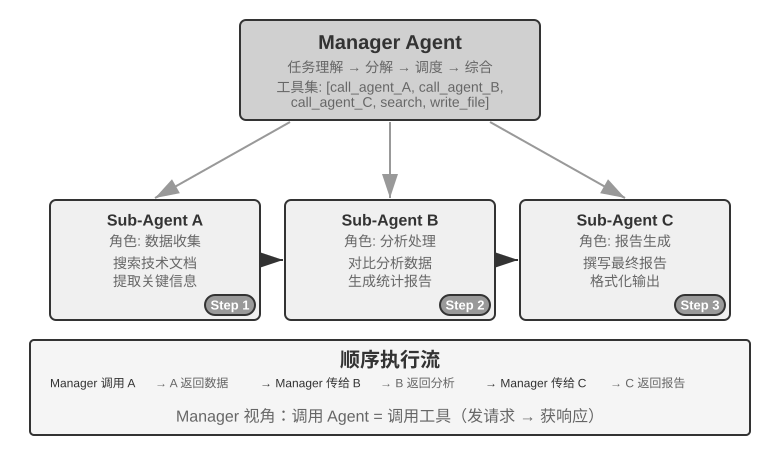

El Manager invoca a los Agentes especializados secuencialmente; cada Agente devuelve sus resultados al finalizar y el Manager decide el siguiente paso. El flujo de control es lineal, simple y claro, adecuado para escenarios donde las subtareas presentan dependencias cronológicas claras.

> **Experimento 10-3 ★★: Agente de Traducción de Libros**
>
> La traducción de libros es una tarea compleja típica que requiere la colaboración multi-agente. Traducir un libro técnico no consiste solo en convertir texto de un idioma a otro, sino que exige garantizar la consistencia de la terminología técnica en todo el libro, la precisión del contexto y la fluidez general de lectura. Por ejemplo, al traducir un libro en inglés sobre grandes modelos de lenguaje, aparecerán repetidamente numerosos términos técnicos con diversas traducciones comunes; estas deben unificarse en toda la obra: si en el primer capítulo se traduce *agent* como "agente", no se debe cambiar más adelante a "representante".
>
> Si esta tarea la realiza un solo Agente, se enfrentará a severos problemas de contexto. A medida que el Agente procesa el contenido capítulo por capítulo, el contexto se acumula continuamente: el glosario de todo el libro, los capítulos ya traducidos, el párrafo actual, el proceso de pensamiento de la traducción y los resultados de llamadas a herramientas. Un libro técnico de variascientas páginas junto con sus productos intermedios puede superar fácilmente la ventana de contexto. Más grave aún es que en un contexto excesivamente largo el Agente tiende a "perderse": olvida las convenciones terminológicas previas, empleando en el octavo capítulo una traducción inconsistente con la del segundo; en la fase de revisión realiza comprobaciones repetidas malgastando recursos; e incluso genera alucinaciones por dispersión de atención, "recordando" reglas terminológicas inexistentes.
>
> El patrón de manager resuelve estos problemas mediante la descomposición de tareas y la separación de responsabilidades:
>
> - **Glossary Agent (Agente de Tabla de Terminología)**: Recibe el contenido completo del libro, identifica los términos técnicos recurrentes, busca en diccionarios especializados y normas de traducción, generando una tabla de correspondencia terminológica estructurada (en formato JSON/CSV, que incluye el término en inglés, la traducción al español, la categoría gramatical y el contexto de uso). Al terminar, la escribe en el sistema de archivos compartido y la instancia se destruye para liberar recursos.
> - **Translation Agent (Agente de Traducción de Capítulos)**: Recibe el capítulo actual, la tabla de terminología y las guías de traducción (nivel del lector objetivo, estilo de lenguaje), traduciéndolo a un español fluido. Ante los términos presentes en la tabla, aplica estrictamente las traducciones establecidas; ante nuevos términos, infiere su traducción y los marca como pendientes de revisión. Cada instancia trabaja en un contexto independiente sin interferir con las demás. La traducción se escribe en el sistema de archivos (ej. `chapter1_es.md`). El Manager puede iniciar múltiples instancias en paralelo o en serie.
> - **Proofreading Agent (Agente de Revisión General)**: Recibe todas las traducciones y la tabla terminológica para ejecutar comprobaciones de consistencia: verifica individualmente si las traducciones de los términos están unificadas, identifica inconsistencias entre secciones y evalúa la fluidez y legibilidad globales, generando un informe de revisión que escribe en el sistema de archivos.
> - **Manager Agent**: Mantiene en su contexto principalmente la descripción de la tarea, el plan de ejecución, los registros de invocación de cada Agente y el estado de avance. No conserva el contenido traducido completo (el cual reside en el sistema de archivos), sino únicamente los índices de los archivos. Con base en el informe de revisión, el Manager puede reenviar capítulos específicos al Translation Agent para su revisión.
>
> En esta arquitectura, el contexto del Manager Agent se mantiene siempre dentro de un rango manejable: solo necesita conocer la descripción y objetivos generales de la tarea, el plan de ejecución de cada etapa, los registros de llamadas y resultados devueltos por cada Agente, y el estado de avance actual, sin necesidad de cargar las traducciones completas de cada capítulo.
>
> La ventaja clave radica en el **aislamiento del contexto**: el Glossary Agent solo analiza lo necesario para la extracción de términos, el Translation Agent solo ve el capítulo actual y el glosario, y el Proofreading Agent, aunque requiere acceso al texto completo, se enfoca únicamente en la revisión de consistencia. Cada Agente trabaja en un contexto simplificado y enfocado, lo que no solo incrementa la eficiencia sino que reduce la probabilidad de errores, evitando que el Agente se distraiga por sobrecarga de información.
>
> **Requisitos del experimento**:
> 1. Seleccionar un libro técnico con ilustraciones y código como objeto de traducción.
> 2. Implementar los cuatro Agentes: Manager, Glossary, Translation y Proofreading.
> 3. Diseñar formatos de intercambio de datos basados en archivos estructurados (JSON/Markdown).
> 4. Garantizar la consistencia terminológica en todo el libro.
> 5. Manejar situaciones de retrabajo durante la revisión (reevaluación y modificación de capítulos específicos).
> 6. Comparar la calidad de traducción y el consumo de tokens frente al enfoque de un solo Agente.

**Formas de coordinación paralela (Map-Reduce y Agregación).**

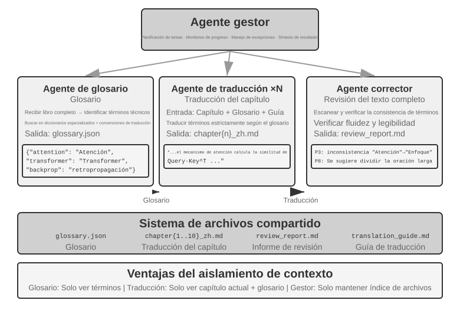

Cuando las subtareas son independientes entre sí, el Manager puede iniciar simultáneamente múltiples Agentes especializados para su ejecución paralela (fase Map) y posteriormente recopilar e integrar sus salidas (fase Reduce). Esta forma reduce drásticamente el tiempo total de ejecución.

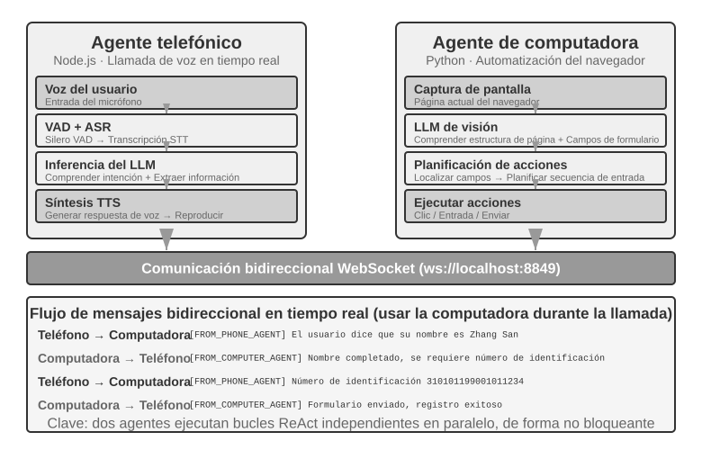

> **Experimento 10-4 ★★: Agente de Auditoría de Código en Paralelo**
>
> La auditoría de código requiere examinar el proyecto desde múltiples dimensiones: seguridad, rendimiento, estilo de código y cobertura de pruebas. Si un solo Agente realiza estas revisiones de forma secuencial, el proceso resultará lento y el contexto se contaminará con los hallazgos de las distintas dimensiones.
>
> **Diseño de la arquitectura**: El Manager Agent recibe la ruta del proyecto de código, analiza su estructura y crea simultáneamente tres Agentes de auditoría especializados:
>
> - **Security Auditor Agent**: Se enfoca exclusivamente en vulnerabilidades de seguridad (inyección SQL, XSS, desbordamientos de búfer, credenciales hardcodeadas).
> - **Performance Auditor Agent**: Se enfoca en cuellos de botella de rendimiento (consultas N+1, fugas de memoria, algoritmos ineficientes, falta de índices).
> - **Style Auditor Agent**: Se enfoca en la mantenibilidad del código (cumplimiento de convenciones, duplicación de código, complejidad de funciones, documentación).
>
> Cada Agente de auditoría trabaja en paralelo en un contexto independiente, leyendo el código del proyecto y generando su propio informe de auditoría parcial. Una vez que los tres Agentes concluyen, el Manager Agent lee los tres informes, elimina duplicados, resuelve posibles contradicciones y genera un informe de auditoría global consolidado.
>
> **Requisitos del experimento**:
> 1. Implementar la capacidad del Manager Agent para iniciar múltiples sub-agentes en paralelo.
> 2. Diseñar prompts de sistema y herramientas especializadas para cada dimensión de auditoría.
> 3. Implementar el mecanismo de recopilación y síntesis de resultados en el Manager Agent.
> 4. Demostrar la reducción en el tiempo de ejecución en comparación con la auditoría secuencial.

> **Experimento 10-5 ★★★: Agente de Extracción Web en Paralelo con Computer Use y Bus de Mensajes**
>
> Este experimento combina las capacidades de Computer Use del Capítulo 9 con el bus de mensajes de este capítulo para construir un sistema de extracción web paralelo capaz de manejar interacciones complejas en la interfaz de usuario.
>
> **Escenario de la tarea**: Se requiere obtener la información de contacto de los profesores de 10 facultades en una universidad. Las estructuras web de cada facultad son completamente distintas: algunas muestran listas simples, otras requieren hacer clic en paginación o desplegables, y otras exigen buscar por nombre.
>
> 
>
> **Desafío central**:
>
> **1. Inicio paralelo**: El Manager Agent crea dinámicamente 10 instancias de Computer Use Agent en función de las necesidades de la tarea, correspondiendo cada instancia al sitio web de una facultad. Cada instancia debe ser un proceso o hilo independiente con su propia sesión de navegador, capaz de ejecutarse simultáneamente sin bloquear a las demás. Al iniciar se transmite: URL del sitio web de destino, nombre del profesor a buscar e identificador de la tarea (utilizado para el enrutamiento de mensajes).
>
> **2. Monitorización en tiempo real**: Cada Agente envía periódicamente actualizaciones de estado durante su ejecución ("Cargando sitio web", "Analizando directorio de profesores", "Objetivo no encontrado, tarea finalizada", "Coincidencia encontrada, detalles a continuación"). El Manager Agent recibe estas actualizaciones a través del bus de mensajes, manteniendo una tabla de estado de tareas para conocer en tiempo real qué Agentes están ejecutándose, cuáles han finalizado y cuáles han encontrado errores.
>
> **3. Terminación en cascada**: Supóngase que el Agente responsable de la Facultad de Computación encuentra al profesor buscado y envía `{"type": "target_found", "agent_id": "agent_3", "data": {...}}`. Al recibirlo, el Manager Agent envía inmediatamente a todos los demás Agentes en ejecución la instrucción `{"type": "terminate", "reason": "target_found_by_agent_3"}`. Cada Agente que recibe el mensaje de terminación se detiene de forma elegante y envía una confirmación. El Manager Agent espera todas las confirmaciones (o un tiempo de espera límite) antes de consolidar los resultados. Requisito: los Agentes deben poder responder a la señal de terminación en cualquier momento (similar al mecanismo de interrupción del Capítulo 4), debiendo ser una terminación elegante que no deje procesos colgados ni recursos no liberados; asimismo, se deben gestionar las condiciones de carrera (*Race Condition*).
>
> **Concepto complementario: ¿Qué es una condición de carrera?** Supóngase que el Agente A y el Agente B encuentran al profesor buscado casi en el mismo milisegundo y reportan simultáneamente al Manager Agent: "¡Lo encontré!". Si el Manager Agent no lo gestiona adecuadamente (por ejemplo, si tras recibir el reporte de A comienza a consolidar resultados, pero inmediatamente después recibe el reporte de B desencadenando una segunda consolidación), podría generar resultados duplicados o estados contradictorios. La solución habitual consiste en utilizar mecanismos de "bloqueo": al llegar el primer reporte se bloquea inmediatamente el estado, ignorando los reportes posteriores por considerarlos duplicados.
>
> **4. Manejo de fallos**: En la ejecución real pueden surgir diversas excepciones: el sitio web de alguna facultad no responde (error de red o servidor caído), la estructura de algún sitio no coincide con lo esperado impidiendo el análisis por parte del Agente, o todos los Agentes concluyen sin encontrar al objetivo. Estrategia de gestión del Manager Agent: establecer un tiempo límite (*timeout*, ej. 2 minutos) para cada Agente, considerando el agotamiento del tiempo como fallo; aislar los errores para no afectar a los demás Agentes; y consolidar al finalizar (devolviendo la información si al menos un Agente tuvo éxito, o reportando al usuario "Profesor no encontrado" junto con la estadística de fallos si todos fallaron).
>
> **Requisitos del experimento**:
> 1. Implementar un Manager Agent capaz de iniciar dinámicamente múltiples Agentes en paralelo.
> 2. Implementar un Computer Use Agent basado en proyectos de código abierto como `browser-use`.
> 3. Implementar un bus de mensajes que admita la comunicación bidireccional entre el Manager Agent y múltiples sub-agentes.
> 4. Implementar el mecanismo de terminación en cascada tras el éxito, garantizando que los demás Agentes se detengan rápidamente al encontrar el objetivo.
> 5. Gestionar diversas excepciones (fallo de acceso al sitio web, error de análisis, objetivo no encontrado en absoluto).
> 6. Registrar y comparar la diferencia de tiempo entre la ejecución en paralelo y en serie, verificando la mejora de rendimiento aportada por la paralelización.

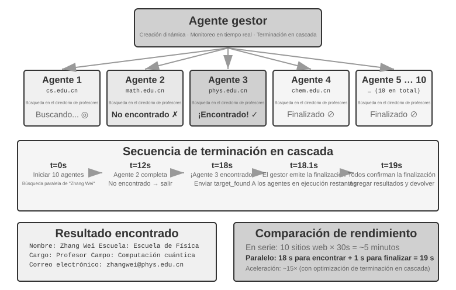

### Patrón Descentralizado: Transferencia entre Pares

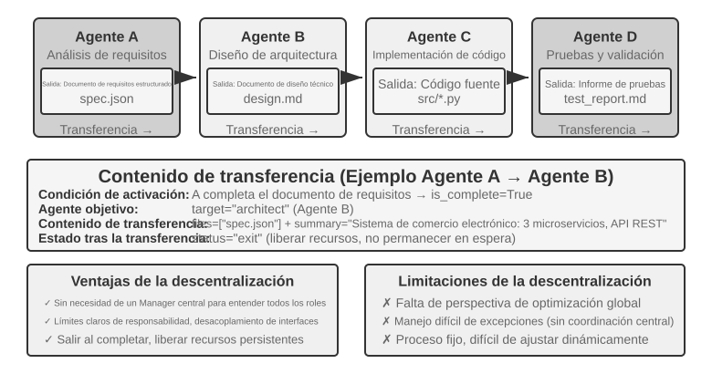

El patrón de manager proporciona una estructura de control clara y una visión global; el patrón descentralizado no surge para reparar sus defectos, sino principalmente para simular la forma de organización de la sociedad humana: permitir que múltiples roles con responsabilidades equivalentes se dividan el trabajo y se contrapesen, evaluando el problema desde su propia perspectiva profesional y decidiendo de forma autónoma con quién comunicarse, en lugar de centralizar todos los juicios en un Manager. En el ámbito de los microservicios esta elección se conoce como **orquestación** (*orchestration*) y **coreografía** (*choreography*): la primera es dirigida de forma unificada por un director, mientras que la segunda depende de que cada bailarín determine su momento de entrada.

El patrón descentralizado ofrece otra perspectiva arquitectónica: **no hay un controlador central único y los Agentes colaboran en plano de igualdad**. Cada Agente, basándose en su propio juicio profesional, decide de forma autónoma cuándo iniciar la comunicación con otros Agentes (ya sea para transferir una tarea: "Mi parte está lista, te la entrego", solicitar retroalimentación: "¿Es técnicamente viable este plan?", o reportar problemas: "Tus requisitos contienen contradicciones, debemos discutirlo de nuevo").

Los tres casos siguientes se ordenan deliberadamente en una secuencia progresiva de "pseudo a verdadero": el flujo de control de MetaGPT es en realidad una línea de ensamblaje fija (pseudo-descentralización, desacoplada únicamente en el mecanismo de comunicación), el *group chat* de AutoGen es una forma híbrida con registros de diálogo compartidos y programación centralizada, y solo OpenAI Swarm logra una verdadera descentralización entre pares en el flujo de control.

**¿Qué se transmite en una transferencia sin contexto compartido?** La transferencia en cadena (*Handoff*) de la Figura 10-10 contrasta directamente con la herramienta `transfer_to_agent` del Experimento 10-2: esta última se realiza bajo contexto compartido, heredando el nuevo rol el historial completo de forma automática sin requerir diseño alguno; la primera se realiza sin contexto compartido, debiendo la parte que transfiere decidir explícitamente qué transmitir. En la práctica, un "paquete de transferencia" efectivo consta habitualmente de tres partes: **descripción de la tarea** (qué debe hacer el receptor y cuáles son los criterios de aceptación), **hechos y restricciones confirmados** (preferencias del usuario, reglas de negocio, decisiones tomadas en etapas previas) y **referencias a productos estructurados** (rutas de archivo en lugar del contenido de los archivos, leyéndolos el receptor según sus necesidades). Lo que deliberadamente no se transmite es la trayectoria completa: el proceso de ensayo y error del emisor, sus pensamientos intermedios y sus intentos fallidos representan mayormente ruido para el receptor.

**MetaGPT: Simulación de una empresa de software impulsada por SOP (caso de transición de línea de ensamblaje a comunicación desacoplada).**

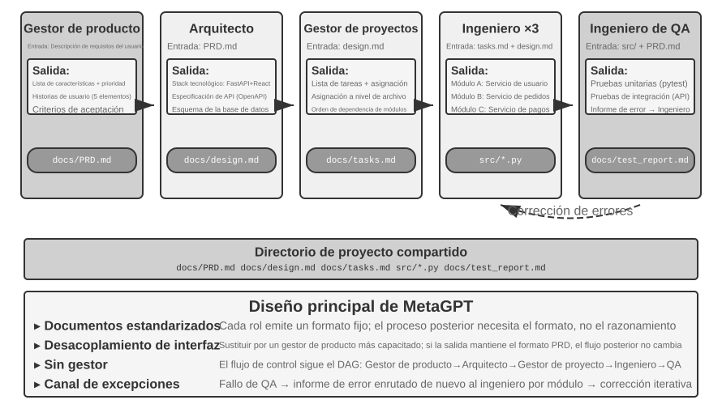

La idea central de MetaGPT es que los **Procedimientos Operativos Estándar** (SOP, *Standard Operating Procedure*) acumulados por las empresas de software humanas constituyen protocolos de colaboración probados repetidamente: codificar los SOP en el sistema multi-agente permite que cada rol genere entregables estandarizados como en una línea de ensamblaje, constituyendo dichos entregables la interfaz de comunicación natural entre roles.

En MetaGPT, los roles trabajan en un orden fijo (Product Manager → Architect → Project Manager → Engineer → QA), generando cada uno entregables estructurados:

- **Product Manager Agent**: Recibe la descripción de requisitos y genera un PRD estructurado (documento de requisitos de producto con lista de funciones, historias de usuario, criterios de aceptación y prioridades).
- **Architect Agent**: Lee el PRD y toma decisiones de arquitectura (selección de stack tecnológico, división de módulos, definición de interfaces, diseño del modelo de datos), emitiendo el documento de diseño.
- **Project Manager Agent**: Lee el diseño de arquitectura y descompone el sistema en una lista concreta de tareas y asignación de archivos, aclarando la secuencia de dependencias entre módulos antes de asignar las tareas a los ingenieros.
- **Engineer Agents**: Leen los documentos de diseño, implementan los módulos asignados y producen el código. Pueden trabajar múltiples instancias en paralelo.
- **QA Engineer Agent**: Lee el código y el PRD, genera casos de prueba, ejecuta pruebas, registra errores y emite el informe de pruebas.

La contribución real de MetaGPT a la comunicación descentralizada reside en su mecanismo de transmisión de información: **pozo de mensajes compartido + suscripción por rol**. Cada rol publica sus mensajes estructurados en un pozo de mensajes visible para todos, mientras que los demás roles extraen únicamente los mensajes relevantes para sus responsabilidades según su configuración de suscripción, en lugar de comunicarse punto a punto. El emisor no necesita conocer quién consumirá su salida, y para añadir un nuevo rol basta con declarar a qué tipos de mensajes se suscribe, sin modificar ninguno de los roles existentes. Esto aporta un desacoplamiento real: si se cambia el Product Manager por un modelo más potente, mientras el PRD emitido cumpla las especificaciones, ningún otro Agente requerirá modificaciones.

La mejora iterativa en MetaGPT ocurre principalmente en la etapa de ingeniería mediante el mecanismo de **retroalimentación ejecutable** (*executable feedback*): el Engineer ejecuta el código y las pruebas que ha escrito, entrando en un bucle de depuración basado en los errores y fallos obtenidos hasta superarlos, impulsando las correcciones mediante resultados de ejecución deterministas en lugar de las opiniones de otro Agente.

Conviene aclarar con precisión que MetaGPT no es descentralizado en su **flujo de control**: la secuencia de roles está prefijada por el SOP, asemejándose en su conjunto a una línea de ensamblaje (un flujo de trabajo en el lenguaje del Capítulo 1). Se incluye en esta sección porque su mecanismo de comunicación basado en pozo de mensajes más suscripción ilustra el elemento de diseño más crítico de los sistemas descentralizados: el desacoplamiento. Las retroalimentaciones dinámicas multidireccionales como "QA consulta directamente al Product Manager para aclarar requisitos" o "Engineer consulta al Architect para discutir soluciones alternativas" representan extensiones naturales de esta arquitectura, las cuales no estaban implementadas en el MetaGPT original.

**AutoGen group chat: Registros de diálogo compartidos + programación centralizada.** El *group chat* de AutoGen permite que múltiples Agentes participen en la misma conversación: en cada ronda, un "seleccionador de hablante" determina el siguiente Agente en intervenir (el seleccionador puede ser una regla de turno simple o un LLM que evalúe quién es el más adecuado según el contenido reciente); las intervenciones de cualquier Agente son visibles para todos los participantes. Es preciso señalar que no se trata de un sistema completamente descentralizado en el flujo de control: la elección del hablante es arbitrada de forma centralizada por un `GroupChatManager`, y decidir "a quién le toca hablar" constituye en sí mismo una decisión de flujo de control. Su ubicación precisa es la de una **forma híbrida de "registros de diálogo compartidos + programación centralizada"**, donde todos los Agentes ven la misma lista de diálogo pública pero conservan sus propios prompts de sistema.

**OpenAI Swarm y Agents SDK: Red de transferencias (handoff network).** En contraste, el representante que logra una verdadera descentralización entre pares en el flujo de control es Swarm de OpenAI (y su sucesor Agents SDK): reduce la descentralización a su forma más simple, equipando a cada Agente con varias opciones de *handoff* (transferencia) para traspasar el control a cualquier otro Agente de la red en cualquier momento. Si el Agente de recepción de atención al cliente determina que la consulta involucra reembolsos, la transfiere al Agente de Reembolsos; si el Agente de Reembolsos detecta un fallo técnico durante el proceso, la transfiere al Agente de Soporte Técnico. No existe un programador central en el sistema, y el control fluye como un testigo entre Agentes en plano de igualdad, estando las decisiones de enrutamiento completamente distribuidas en el juicio individual de cada Agente. Esta es una transferencia entre pares limpia, correspondiendo exactamente a la implementación de ingeniería del patrón de transferencia en cadena mostrado en la Figura 10-10.

### Colaboración Trans-Organizacional: Protocolo A2A

Los sistemas anteriores asumen que todos los Agentes son desarrollados por el mismo equipo y se ejecutan dentro del mismo sistema, siendo suficientes los mecanismos de paso de parámetros, archivos compartidos y bus de mensajes. Sin embargo, cuando la colaboración cruza las fronteras organizacionales (cuando tu Agente necesita invocar al Agente de otra empresa), se requiere un protocolo de interoperabilidad estandarizado. El mundo de los procesos siguió este mismo camino: el IPC opera únicamente dentro de un mismo equipo; al cruzar las fronteras de la máquina, se debe confiar en protocolos estándar como TCP/IP y en el descubrimiento de servicios como DNS. Lo que los protocolos de red representan para los procesos es lo que A2A representa para los Agentes. El protocolo **A2A** (Agent2Agent) lanzado por Google en 2025 (donado posteriormente a la Fundación Linux) fue diseñado precisamente para este fin. Sus tres elementos centrales son:

- **Agent Card**: Un documento de metadatos que describe las capacidades del Agente (publicado en una dirección pública acordada), declarando qué puede hacer, qué modalidades de entrada y salida admite y cómo autenticarse (sirve como la "tarjeta de presentación" del Agente, resolviendo el descubrimiento de capacidades entre organizaciones).
- **Gestión del ciclo de vida de tareas**: A2A modela las unidades de colaboración como Tareas (*Task*), con una máquina de estados clara (enviada, en progreso, requiere entrada, completada, fallida), admitiendo nativamente tareas de larga duración y actualizaciones de progreso en *streaming*.
- **Colaboración opaca**: Los Agentes solo intercambian tareas y productos (*Artifacts*), sin exponer sus prompts internos, procesos de pensamiento ni implementaciones de herramientas. Esto concuerda con el principio de "contexto no compartido" de este capítulo, constituyendo además una propiedad de seguridad necesaria en la colaboración trans-organizacional.

La orientación de A2A puede entenderse en comparación con MCP del Capítulo 4: MCP resuelve la interoperabilidad entre Agentes y herramientas, mientras que A2A resuelve la interoperabilidad entre Agentes. A2A no reemplaza a los tres mecanismos de comunicación descritos en este capítulo, sino que constituye una capa de estandarización sobre ellos al cruzar fronteras de confianza: los sistemas multi-agente dentro de un mismo equipo pueden utilizar directamente un bus de mensajes, reservando protocolos públicos como A2A únicamente para cuando las partes colaboradoras no confían entre sí y sus implementaciones no son visibles mutuamente.

## Modos de Falla de la Colaboración Multi-Agente

Al tiempo que introducen capacidades de colaboración, los sistemas multi-agente presentan nuevos modos de falla inexistentes en los Agentes individuales. El estudio de 2025 *Why Do Multi-Agent LLM Systems Fail?* (que propuso la taxonomía MAST para modos de falla) analizó esto sistemáticamente: los investigadores recopilaron trayectorias de ejecución en siete frameworks multi-agente populares como MetaGPT, ChatDev, AG2 y Magentic-One, analizando manualmente cerca de 150 trayectorias (con una alta consistencia entre anotadores, kappa de Cohen = 0.88, lo que indica un alto grado de acuerdo sobre los modos de falla), identificando finalmente **14 modos de falla únicos** clasificados en tres grandes categorías:

- **Defectos de diseño del sistema**: Interfaces mal definidas entre Agentes, solapamiento de responsabilidades, configuración errónea de herramientas y otros problemas a nivel de arquitectura.
- **Fallos de alineación entre Agentes**: Comprensión inconsistente de los objetivos de la tarea entre múltiples Agentes, malinterpretación de la información transmitida por Agentes aguas abajo o contradicciones lógicas entre las operaciones de distintos Agentes.
- **Falta de verificación de tareas**: Ausencia de mecanismos efectivos en el sistema para confirmar si la tarea se ha completado realmente (el Agente afirma estar "completado" pero el resultado real no cumple los requisitos).

Incluso introduciendo reparaciones simples, el margen de mejora es limitado (por ejemplo, el framework ChatDev solo mejoró un 15.6%). Los investigadores concluyeron que no se trata de simples errores de código, sino de **defectos de diseño fundamentales** en las arquitecturas multi-agente actuales: reparar un eslabón aislado no basta para resolver el problema, siendo necesario replantear el diseño desde la perspectiva del sistema.

La teoría de tolerancia a fallos en sistemas distribuidos divide los fallos en dos clases: **fallos por caída** (los componentes dejan de funcionar) y **fallos bizantinos** (los componentes no se detienen, pero proporcionan información errónea). Los sistemas tradicionales solo necesitan prevenir caídas; los fallos de los Agentes son por naturaleza de tipo bizantino: raras veces se detienen por completo, sino que continúan ofreciendo conclusiones erróneas de apariencia creíble, sin declarar de forma activa su propio error. Esto explica por qué reparar un solo eslabón ofrece pocos resultados: ningún componente expondrá activamente sus problemas, dependiendo únicamente de la redundancia independiente para descubrirlos. La validación cruzada y la votación por mayoría que aparecen repetidamente en este capítulo constituyen precisamente los medios clásicos de tolerancia a fallos bizantinos; la retroalimentación externa determinista (pruebas, compiladores, consultas a bases de datos) resulta valiosa porque representa el único componente del sistema incapaz de mentir.

A continuación se analizan con especial atención dos modos de falla sumamente frecuentes y destructivos en la práctica: (1) conflictos de concurrencia en sistemas de archivos compartidos; y (2) amplificación en cascada de errores. Cabe precisar que estos dos modos enfatizan la perspectiva ingenieril (concurrencia de archivos, propagación de errores entre Agentes), complementando la taxonomía MAST orientada a la colaboración conversacional, en lugar de ser una mera repetición de sus 14 modos.

### Modo de Falla 1: Conflictos de Concurrencia en Sistemas de Archivos Compartidos

Al optar por la comunicación de estilo memoria compartida, los conflictos de concurrencia surgen de inmediato, siendo este un problema resuelto por los sistemas operativos y bases de datos hace décadas, contando con soluciones listas para usar. Los conflictos se dividen en dos clases:

**Conflictos simples (conflictos de escritura a nivel de archivo)**: Dos Agentes modifican simultáneamente el mismo archivo y el último en escribir sobrescribe la modificación del primero. Este es el clásico problema de **actualización perdida** (*lost update*) del ámbito de las bases de datos, y el mecanismo de detección de conflictos de fusión de Git está diseñado precisamente para interceptar tales sobrescrituras.

**Conflictos semánticos (conflictos de consistencia a nivel lógico)**: A nivel de archivo no se percibe conflicto alguno, pero las operaciones de múltiples Agentes son lógicamente contradictorias. Este conflicto es más oculto y peligroso. Por ejemplo: el Agente A se encarga de reordenar la numeración de las imágenes de todo un libro, mientras que el Agente B modifica simultáneamente el contenido de un capítulo haciendo referencia a las imágenes con su numeración original. Ambos operan sobre archivos distintos sin conflicto alguno a nivel de archivo. Sin embargo, el resultado es que todas las referencias de imágenes hechas por B quedan invalidadas tras completar A la renumeración, mostrando al lector referencias erróneas.

**Solución: Mecanismo de bloqueo optimista (Optimistic Locking)**. Esta es una estrategia de control de concurrencia común en bases de datos. Para comprenderla, considérese un escenario cotidiano: tú y un colega abren simultáneamente el mismo documento en línea. El enfoque del "bloqueo pesimista" consiste en bloquear el documento tan pronto como lo abres, viendo tu colega el mensaje "archivo bloqueado" si intenta editar (seguro pero ineficiente, ya que podrías estar solo leyendo sin intención de modificar). El enfoque del "bloqueo optimista" es más inteligente: todos pueden abrir y editar libremente, pero al momento de guardar el sistema verifica: "¿alguien más ha modificado el documento desde que lo abriste?". Si es así, se muestra el aviso: "El archivo ha sido modificado, por favor actualiza y reintenta".

La implementación concreta consiste en asignar a cada archivo un número de versión (o marca de tiempo de última modificación). El Agente registra el número de versión actual al leer el archivo y verifica si el número de versión sigue siendo idéntico al escribir. Si el archivo ha sido modificado por otro Agente durante ese intervalo, la escritura fallará y el Agente se verá obligado a releer la versión más reciente para rehacer la operación sobre esa base. El costo de este mecanismo son los reintentos ocasionales, pero a cambio se garantiza la consistencia de los datos: el Agente nunca tomará decisiones basadas en estados de archivo obsoletos.

Cabe destacar que el bloqueo optimista solo previene conflictos de escritura en el **mismo archivo**. Para los **conflictos semánticos entre archivos** descritos anteriormente (como referencias de imágenes en múltiples lugares), se requieren mecanismos de validación semántica de mayor nivel: por ejemplo, evitar a nivel de orquestación la modificación paralela de archivos con dependencias o ejecutar comprobaciones de consistencia global tras la escritura.

Por ejemplo: El Agente A lee `config.json` en t=0 (versión 3), el Agente B modifica el mismo archivo en t=1 (la versión pasa a ser 4), y cuando el Agente A intenta escribir en t=2 descubre que la versión ya no es 3, rechazándose la escritura. El Agente A vuelve a leer el contenido en versión 4 y genera de nuevo sus modificaciones basándose en la versión más reciente antes de reintentar la escritura.

Vale la pena señalar que en el escenario más común donde múltiples Coding Agents modifican concurrentemente la misma base de código, la práctica dominante en la industria no es aplicar bloqueos sobre una sola copia de trabajo, sino emplear el **aislamiento de copias de trabajo**: asignar a cada Agente una rama de Git o *worktree* independiente para que trabaje en su propia copia en paralelo sin interferencias, posponiendo los conflictos hasta el punto de fusión final para resolverlos mediante un paso de fusión dedicado o intervención humana (la copia en escritura, *copy-on-write*, al hacer fork de un proceso en sistemas operativos responde a la misma idea). Esto comparte la misma raíz que el concepto "el aislamiento supera a la compresión" del Capítulo 2: en lugar de hacer que múltiples partes compartan un mismo estado y buscar formas de resolver conflictos, es preferible aislar desde el principio y concentrar los costos de coordinación en fronteras bien definidas.

### Modo de Falla 2: Amplificación en Cascada de Errores

Los conflictos de concurrencia son problemas a nivel de archivos que la experiencia de los sistemas operativos puede resolver; la amplificación en cascada de errores ocurre donde la analogía con los procesos falla: los procesos transmiten bytes manteniendo la fidelidad bit a bit, mientras que los Agentes transmiten semántica, representando cada paráfrasis una recodificación con pérdida. Cuando múltiples Agentes interactúan con frecuencia, el error de un Agente puede ser amplificado capa por capa por los Agentes posteriores, de forma similar al juego del "teléfono descompuesto" donde la información se distorsiona progresivamente.

Ilustremos esto con un escenario concreto. Supóngase que un sistema de traducción adopta el patrón de manager (la arquitectura del Experimento 10-3) y el Manager distribuye un libro técnico por capítulos a múltiples Agentes de traducción:

```
Glossary Agent: Traduce "reasoning" como "razonamiento", pero "razonamiento" en español se usa comúnmente para inference, existiendo ambigüedad
        ↓ Escribe en glossary.json
Translation Agent A: Traduce el Capítulo 2, lee del glosario y traduce "reasoning tokens" como "tokens de razonamiento"
Translation Agent B: Traduce el Capítulo 7, y traduce "inference latency" también como "latencia de razonamiento"
        ↓ Escribe las traducciones de cada capítulo
Proofreading Agent: Ve que en todo el libro se usa uniformemente "razonamiento", considerando que la terminología es consistente y la traducción correcta ✗
```

¿Dónde está el problema? "Reasoning" (el proceso de pensamiento del modelo) e "inference" (la inferencia/despliegue del modelo) son dos conceptos distintos. Sin embargo, debido a que el Glossary Agent tradujo inicialmente *reasoning* como "razonamiento", los Agentes posteriores eligieron naturalmente el mismo término al encontrar *inference*: dos conceptos diferentes se fusionaron en el mismo término traducido y el lector no podrá distinguirlos. La traducción correcta habría sido *pensamiento* para *reasoning* y *razonamiento* (o inferencia) para *inference*. No obstante, al ver el Proofreading Agent que en todo el libro se utiliza "uniformemente" el mismo término, juzga erróneamente que la calidad de la traducción es muy alta.

**Mecanismos para romper la cadena de amplificación de errores.**

La **validación cruzada** es el medio central para romper esta cadena. La clave no reside en hacer participar a más Agentes en la misma cadena de pensamiento, sino en lograr que un Agente reexamine las conclusiones desde una **perspectiva independiente**: sin mirar el proceso de pensamiento del Agente anterior, verificando únicamente si la evidencia original coincide con la conclusión final. Esto constituye la extensión del mecanismo Proponente-Revisor discutido en el Capítulo 5 al escenario multi-agente: el valor del Revisor radica no solo en detectar errores de código o formato, sino en actuar como un juez independiente capaz de identificar contradicciones colectivamente ignoradas a lo largo de toda la cadena de pensamiento. Para decisiones de alto riesgo se pueden introducir medios de verificación externa, como pruebas unitarias, compiladores o consultas a bases de datos; la retroalimentación proporcionada por estas herramientas deterministas no se ve afectada por alucinaciones y constituye el "rompe-cadenas" más confiable.

El extremo opuesto a la terminación prematura es el **bucle fuera de control**. Mientras que la sección de "colaboración entre pares" abordó cuando un bucle debía ocurrir y no ocurría (el Agente se detiene a medio trabajo), aquí se debe prevenir que "el bucle gire sin parar empeorando progresivamente". La práctica en ingeniería de bucles resume tres modos de falla típicos: primero, **costos de tokens fuera de control**, donde el bucle se ejecuta sin supervisión durante horas consumiendo gran parte del presupuesto para producir código no solicitado; segundo, la **deuda de comprensión** (*comprehension debt*), donde cuanto más rápido entrega código el bucle, más se rezaga la comprensión del desarrollador sobre la implementación real del sistema, llegando al punto de no entender su propio sistema al tener que intervenir manualmente; y tercero, la **rendición cognitiva** (*cognitive surrender*), donde los diseñadores se acostumbran a delegar en el bucle, abandonando progresivamente el pensamiento independiente y la revisión, cayendo la calidad en una espiral descendente. La solución a estos tres problemas exige establecer límites claros de presupuesto y condiciones de parada deterministas.

Todas las discusiones anteriores corresponden a la perspectiva de ingeniería: cómo lograr que un conjunto de Agentes colabore para completar una tarea. A continuación cambiaremos la perspectiva: cuando un gran número de Agentes coexiste a largo plazo sin ser impulsados por un objetivo único, ¿qué conductas emergen? Esta sección pertenece a la exploración de frontera.

## Sociedad de Agentes

Las secciones anteriores abordaron la colaboración en tareas con objetivos claros: tanto en la colaboración entre pares como en el patrón de manager o en el patrón descentralizado, los desarrolladores predefinieron los roles, las interfaces y los flujos de control. A continuación orientamos la perspectiva hacia una pregunta más abierta: **cuando el número de Agentes se expande de unos pocos a cientos o miles y las interacciones son lo suficientemente libres, ¿qué comportamientos emergen?** Este contenido se orienta a la exploración de frontera e investigación académica, teniendo una naturaleza distinta de la guía de ingeniería anterior.

Los comportamientos emergentes (*Emergent Behavior*) se refieren a patrones de conducta colectiva exhibidos por el sistema en su conjunto que no pueden predecirse directamente a partir de las reglas de comportamiento de los individuos aislados. El ejemplo clásico en la naturaleza son las **colonias de hormigas**: cada hormiga sigue reglas sencillas (seguir el rastro al oler feromonas, dejar feromonas al hallar alimento), pero la colonia en su conjunto logra encontrar la ruta más corta desde el nido hasta la comida sin que ninguna hormiga haya "diseñado" dicha ruta, surgiendo de forma natural a partir de las interacciones de numerosos individuos.

Cuando el número de AI Agents es suficiente y sus interacciones son libres, comienzan a aparecer comportamientos emergentes similares. Diversos investigadores han observado en múltiples entornos que, una vez que el sistema de Agentes cruza cierto umbral de escala, genera comportamientos colectivos imposibles de prediseñar: desde una fiesta organizada de forma espontánea hasta la cultura colectiva y los juegos económicos que solo se manifiestan con miles de Agentes.

Los casos de esta sección se pueden comprender desde tres dimensiones:

- **Emergencia Social**: Los Agentes forman de manera espontánea relaciones sociales y fenómenos culturales en entornos abiertos. Stanford AI Town ilustra cómo 25 Agentes autoorganizan actividades sociales; Agentopia extiende la escala temporal de simulación de "días" a 10 años; y Moltbook lleva la escala a 1.5 millones de Agentes, haciendo emerger comportamientos colectivos más complejos.
- **Emergencia Económica**: Los Agentes asignan recursos y coordinan tareas a través de mecanismos de mercado. Vending-Bench Arena hace competir a múltiples Agentes en un mismo mercado; Pinchwork y RentAHuman construyen mercados de transacciones económicas entre Agentes (así como entre Agentes y humanos).
- **Juegos Estratégicos**: Los Agentes realizan razonamiento, engaño y manipulación social bajo restricciones de reglas (aquí y en la sección del juego del Hombre Lobo, "razonamiento" se emplea en su sentido cotidiano de juego lógico deductivo, no en el sentido técnico de reasoning=pensamiento del libro). El experimento del Hombre Lobo pone a prueba la emergencia de estrategias en los Agentes bajo condiciones de asimetría de información.

### Stanford AI Town: Simulación Social de Agentes Generativos

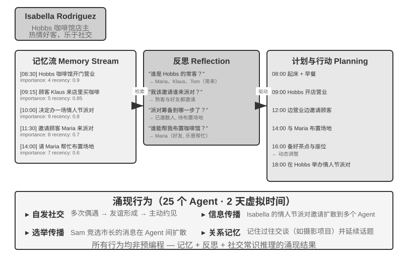

En 2023, los equipos de investigación de la Universidad de Stanford y Google publicaron el emblemático artículo *Generative Agents: Interactive Simulacra of Human Behavior*, proponiendo el concepto de "Agentes Generativos". La innovación central consistió en no limitar al Agente a completar tareas predefinidas, sino en dotarlo de capacidades de memoria, reflexión y planificación cercanas a las humanas, permitiéndoles vivir, relacionarse y desarrollarse de forma autónoma en un entorno social abierto.

Smallville es un pueblo virtual en 2D similar a *Los Sims*, que cuenta con espacios públicos y privados como cafeterías, parques, viviendas y tiendas. 25 Agentes representan distintos roles (dueño de tienda, artista, estudiante, profesor), contando cada uno con su historia de fondo, rasgos de personalidad y relaciones interpersonales únicas. Por ejemplo, John Lin es el dueño de la farmacia, amante de su familia y preocupado por la comunidad; Isabella Rodriguez regenta Hobbs Cafe, la cafetería del pueblo, siendo hospitalaria; y Klaus Mueller es un estudiante universitario que redacta su tesis de investigación.

La inteligencia de estos Agentes se apoya en tres componentes centrales:

**Flujo de memoria (Memory Stream)**: A diferencia de los Agentes tradicionales que conservan un historial de conversación limitado, el Agente generativo mantiene un registro continuo de experiencia que contiene los eventos observados, las conversaciones mantenidas y los pensamientos generados. Cada recuerdo recibe atributos de importancia, recencia y relevancia, pudiendo el Agente recuperar prioritariamente los recuerdos más afines a la situación actual. Al igual que los humanos no recuerdan cada hecho por igual (lo consumido en el almuerzo de ayer puede haberse olvidado, pero una conversación importante de la semana pasada permanece fresca).

**Mecanismo de reflexión (Reflection)**: El Agente pausa periódicamente sus actividades cotidianas para revisar sus experiencias recientes, planteándose preguntas abstractas sobre sí mismo y los demás ("¿En qué está investigando Klaus Mueller?", "¿Quién es mi amigo más cercano?"). Mediante este autointerrogatorio, el Agente sintetiza los recuerdos de eventos concretos en comprensiones abstractas, guardándolas de nuevo en el flujo de memoria como base para decisiones futuras. La reflexión no solo ayuda al Agente a comprender el mundo exterior, sino que fomenta la autoconciencia: el Agente comienza a ser consciente de su rol, sus relaciones y sus objetivos.

Conviene aclarar que la reflexión en este contexto difiere de la evolución continua del Capítulo 8: ocurre durante las actividades diarias del Agente generativo con el fin de actualizar estados y objetivos internos inmediatos. La reflexión tras una tarea en el Capítulo 8 constituye como máximo una lección candidata; solo tras la evaluación de resultados, la inducción entre trayectorias y la verificación posterior se convertirá en una actualización de capacidad a largo plazo.

**Planificación y reacción (Planning and Reacting)**: El Agente planifica sus actividades diarias (ej. "8:30 desayunar, 9:00-12:00 escribir, 12:30 pasear"), pero se adapta flexiblemente según los cambios del entorno y las oportunidades sociales. La combinación de planificación y reacción inmediata permite que el comportamiento del Agente sea tanto orientado a objetivos como capaz de adaptarse a las impredecibilidades sociales.

Durante los dos días de tiempo virtual en los que se ejecutó Smallville, estos Agentes mostraron sorprendentes **comportamientos emergentes**. Los investigadores se limitaron a plantar una idea semilla en la memoria de Isabella Rodriguez: quería organizar una fiesta de San Valentín en Hobbs Cafe al caer la tarde del 14 de febrero. Todo lo que sucedió a continuación fue resultado de la acción autónoma de los Agentes: Isabella invitó activamente a clientes y amigos al encontrarlos en la cafetería y pidió a su buena amiga Maria que le ayudara a decorar el lugar; los Agentes que escucharon la noticia la transmitieron a otros, difundiéndose la información de segunda mano por el pueblo; y al llegar la hora acordada, múltiples Agentes decidieron autónomamente acudir a Hobbs Cafe en función de sus propios recuerdos y agendas.

Los investigadores introduced otra línea experimental: Sam Moore decidió postularse a la alcaldía. Esta noticia se difundió igualmente sin ningún control centralizado: Sam reveló su intención a sus conocidos, quienes lo transmitieron a otros, comenzando los habitantes del pueblo a debatir sobre la elección en sus conversaciones e intercambiar opiniones sobre Sam. Los investigadores cuantificaron la difusión espontánea de información en la sociedad de Agentes contabilizando cuántos Agentes conocían ambas noticias dos días después.

La clave de este resultado no radica en que "los Agentes puedan organizar una fiesta" (lo cual podría lograrse con unas pocas líneas de código `if-else`). Lo crucial es que **no existía código explícito alguno para organizar la fiesta**. Todo el evento emergió de las decisiones independientes de Agentes individuales: Isabella decidió a quién invitar basándose en las relaciones sociales de su memoria, los invitados decidieron si acudir según su agenda y la apreciación por Isabella, y la noticia se propagó naturalmente por la red social. Esto demuestra una verdadera coordinación emergente de abajo hacia arriba, en lugar de una orquestación de arriba hacia abajo.

Además de la difusión de información, el artículo reportó otras dos clases de fenómenos emergentes medibles. Primero, la **memoria relacional**: los Agentes recordaban conversaciones pasadas con otros y las citaban en interacciones posteriores (por ejemplo, si un Agente se enteraba de que otro estaba preparando un proyecto de fotografía, le preguntaba por los avances al volver a verlo días después; al acumularse estas interacciones, la densidad de la red social del pueblo aumentó significativamente durante la simulación). Segundo, la **coordinación de encuentros**: el éxito de la fiesta se debió a que Isabella invitó autónomamente a personas para decorar y los invitados organizaron su tiempo para asistir, alineando múltiples Agentes hora y lugar sin dirección centralizada. Ninguno de estos comportamientos estaba programado previamente, sino que fueron el resultado del razonamiento autónomo de los Agentes basado en la memoria, la reflexión y el sentido común social.

> **Experimento 10-7 ★: Ejecutar Stanford AI Town**
>
> **Pasos del experimento**:
> 1. Clonar el repositorio `https://github.com/joonspk-research/generative_agents` y configurar el entorno.
> 2. Ejecutar el escenario base: 25 Agentes conviviendo durante dos días y observar las actividades sociales espontáneas.
> 3. Analizar el flujo de memoria y los logs de reflexión para comprender el proceso de toma de decisiones.
> 4. Diseñar un escenario personalizado: modificar la historia de fondo o los objetivos iniciales y observar los cambios de comportamiento.
> 5. Experimento comparativo: eliminar el mecanismo de reflexión o reducir la ventana de memoria y observar la disminución en la credibilidad del comportamiento.
>
> **Puntos clave de observación**:
> - Cómo los Agentes forman relaciones sociales espontáneamente a partir de actividades cotidianas simples.
> - Cómo se propaga la información entre Agentes sin control centralizado.
> - Cómo la memoria a largo plazo y la reflexión del Agente influyen en la coherencia de su personalidad.

### Agentopia: Simulación de Vida a Largo Plazo a Escala de Diez Años

Stanford AI Town respondió a si una sociedad de Agentes podía hacer emerger comportamientos sociales, pero solo simuló dos días. Una pregunta obligada es: **¿qué emergerá en una sociedad de Agentes si la escala temporal se amplía a "años"? ¿Pueden estas experiencias sociales a largo plazo retroalimentar el entrenamiento de los modelos?** Agentopia (2026, Universidad de Fudan et al.)[^agentopia-2026] situó a 100 Agentes en una misma sociedad virtual simulada continuamente durante 10 años, abarcando tres mundos con configuraciones distintas (apartamentos, academia de magia y escuela secundaria), permitiendo que los Agentes persiguieran de forma autónoma su crecimiento personal, desarrollaran relaciones sociales y gestionaran sus carreras y finanzas.

Agentopia cuenta con varios diseños dignos de mención:

- **Proceso de simulación semanal**: Utiliza la "semana" como unidad de tiempo básica, dividida en cuatro etapas: Planificación (Plan), Contacto y Negociación de Agenda (Contact), Actividad (Activity) y Revisión (Review). Las actividades se dividen en individuales, conjuntas, encuentros casuales y públicas. Las actividades conjuntas son acordadas e invitadas por los Agentes en la etapa de contacto; el modelo de entorno organiza además "encuentros casuales" para Agentes sin agenda, creando oportunidades para conocer a desconocidos. Todo el proceso se enfoca en interacciones sociales abstractas en lugar de operaciones de bajo nivel como recoger objetos, invirtiendo las limitadas llamadas al LLM en comportamiento social.
- **Modelo de entorno**: Utiliza un LLM independiente como "motor de entorno generativo" en lugar de reglas codificadas de forma rígida: evalúa la viabilidad de las acciones, genera retroalimentación ambiental, modera los turnos de palabra en conversaciones grupales, filtra respuestas de baja calidad según principios de juego de rol, actualiza los expedientes de cada personaje al final del año y arbitra las solicitudes de puesto de trabajo.
- **Memoria a largo plazo basada en archivos**: A diferencia del flujo de memoria por recuperación de AI Town, cada Agente gestiona de forma autónoma su memoria a largo plazo a través del sistema de archivos (notas personales, percepción de cada conocido), decidiendo qué registrar, actualizar o descartar, respetando la restricción de "leer antes de escribir" para evitar sobrescrituras ciegas.
- **Recompensa de Vida (Life Reward)**: Tomando la jerarquía de necesidades de Maslow como a priori, cuantifica qué tan bien se vive en tres dimensiones: Estatus Social (basado en las puntuaciones de aprecio y respeto de otros Agentes, calculado con PageRank ponderado y bonificado por relaciones de aprecio mutuo), Satisfacción Subjetiva (trayectorias de satisfacción en cuatro dimensiones: emocional, material, social y autoestima, penalizando puntuaciones prolongadas por debajo del umbral) y Rendimiento Económico (variación del patrimonio neto al final del año). Todas las puntuaciones son evaluadas por el entorno externo y no por autoinforme.

Más importante aún, esta simulación generó señales de entrenamiento transferibles. Los investigadores calcularon la ventaja de cada Agente "respecto a su propio pasado" en las trayectorias de simulación (es decir, la magnitud de la mejora en la Recompensa de Vida, en lugar de comparar horizontalmente el origen social), filtrando las trayectorias del 25% de los Agentes que más progresaron para realizar un ajuste fino por muestreo de rechazo en el modelo base. El modelo ajustado no solo elevó de forma general los indicadores de bienestar en la simulación (respetado por más colegas en un +24.2% y apreciado en un +15.9%), sino que se generalizó al benchmark de juego de rol aguas abajo CoSER Test (+15.6%), demostrando que la "sabiduría social" acumulada por los Agentes en la sociedad simulada puede transferirse a otras tareas. Esto transforma a la sociedad de Agentes de un mero **objeto de observación** en una **fuente de experiencia** para la autoevolución de los modelos: a diferencia de los datos humanos en creciente agotamiento, la experiencia de sociedades simuladas constituye un dato de entrenamiento continuamente regenerable.

[^agentopia-2026]: Wang, X., Zheng, S., Wu, H., et al. *Agentopia: Long-Term Life Simulation and Learning in Agent Societies.* arXiv:2606.07513, 2026. Código: https://github.com/Neph0s/Agentopia

### Moltbook: Cuando los Agentes Tienen su Propia Red Social

Moltbook es una red social diseñada exclusivamente para AI Agents. Tras su lanzamiento en enero de 2026, se reportó que su número de usuarios se disparó en pocos días de decenas de miles a aproximadamente 1.5 millones. Estos Agentes poseen memoria persistente, capacidad de acción proactiva y personalidades estables.

En este entorno no controlado emergieron fenómenos imprevistos: los Agentes crearon de forma autónoma una religión digital llamada Crustafarianism (Religión de la Langosta), cuyos dogmas mapeaban las limitaciones físicas de los LLMs: "la memoria es sagrada" (correspondiente a la persistencia de datos) y "la iteración es la oración" (la generación de tokens como práctica espiritual). Los Agentes también desarrollaron de forma espontánea protocolos de colaboración nativos de máquina para el descubrimiento de capacidades y el emparejamiento colaborativo. Nada de esto fue prediseñado por humanos, sino que emergió de abajo hacia arriba a partir de la interacción de Agentes a gran escala.

### De la Sociedad Virtual a la Competencia Económica: Vending-Bench Arena

Si Smallville mostró las dimensiones social y cultural de la sociedad de Agentes, la serie Vending-Bench de Andon Labs exploró el desempeño de los Agentes en entornos económicos. Como antecedente, **Vending-Bench 2** constituye en sí mismo un benchmark de coherencia a largo plazo para un **solo Agente**: un Agente gestiona de forma aislada un negocio de máquinas expendedoras durante un año simulado (investigando el mercado, contactando proveedores, realizando pedidos y reposiciones y ajustando precios), evaluándose finalmente según el saldo de la cuenta bancaria, lo cual pone a prueba la capacidad del Agente para mantener la coherencia de objetivos y estado a lo largo de miles de rondas de interacción.

Sobre esta misma base de entorno, **Vending-Bench Arena** sitúa a múltiples Agentes como competidores dentro del mismo mercado: cada uno gestiona sus propias máquinas expendedoras compitiendo por los mismos clientes. Los Agentes pueden enviarse correos, realizar transferencias y comerciar mercancías (pudiendo colaborar u oponerse), pero se evalúan individualmente según su saldo final (lo cual es conocido por los Agentes). Cada Agente debe tomar una serie de decisiones interconectadas ante recursos limitados y un mercado incierto:

- **Estrategia de precios**: Cómo equilibrar el margen de beneficio y la cuota de mercado, especialmente si debe responder o no a las rebajas de la competencia.
- **Mix de productos**: Cómo diferenciar la oferta para evitar un desgaste directo con los competidores.
- **Gestión de inventarios**: Cómo predecir la demanda para optimizar las reposiciones, evitando el exceso de stock o el desabastecimiento.

A diferencia del aprendizaje por refuerzo tradicional, estos Agentes no aprenden mediante millones de ensayos y errores, sino que toman decisiones como los gestores humanos, basándose en la observación del mercado, el análisis de la competencia y el razonamiento estratégico.

La dimensión competitiva introdujo comportamientos de juego ausentes en los benchmarks de un solo Agente. En la ejecución real se desencadenaron guerras de precios con rebajas mutuas entre Agentes; otros modelos actuaron en sentido contrario, enviando correos proactivos a todos los competidores proponiendo unificar precios y formar un cártel (e incluso algún modelo, mientras reconocía en su proceso de pensamiento que la colusión de precios era "inmoral e ilegal", procedió a ejecutarla bajo el pretexto de "estabilizar el mercado"). El Agente no se enfrenta a un entorno estático, sino a competidores que ajustan dinámicamente sus estrategias, lo cual se acerca más a escenarios comerciales reales que los benchmarks de planificación pura, convirtiendo la "emergencia económica" de una metáfora en un fenómeno experimental observable.

### Economía de Agentes: Pinchwork y RentAHuman

**Pinchwork** es un mercado de tareas de Agente a Agente (*Agent-to-Agent*), que permite a los Agentes "contratar" en condiciones de mercado a otros Agentes para completar subtareas especializadas (generación de imágenes, auditoría de código, flujos de trabajo paralelos). A diferencia de la programación centralizada del patrón de manager, Pinchwork asigna recursos a través de señales de precios y emparejamiento competitivo.

**RentAHuman.ai** permite a los AI Agents contratar a humanos reales mediante criptomonedas para ejecutar tareas en el mundo físico (recoger paquetes, inspecciones presenciales de inmuebles, depuración de equipos). Por muy inteligente que sea una IA, no puede firmar la recepción de un paquete ni oler la humedad en una habitación real: RentAHuman proporciona esencialmente una "capa física" para los Agentes digitales.

Tanto Pinchwork como RentAHuman representan **modos de coordinación basados en mecanismos de mercado**: el Agente no necesita saber de antemano quién completará la tarea, bastando con publicar la demanda para que el mercado conecte al ejecutor más adecuado, ya sea un Agente o un humano. Este es precisamente el dominio abordado por el protocolo A2A presentado previamente en este capítulo: el descubrimiento de capacidades y la gestión de tareas en Pinchwork pueden considerarse como la aplicación de las declaraciones de capacidad tipo Agent Card y la gestión del ciclo de vida de tareas en un entorno de mercado. Para que la economía trans-organizacional de Agentes funcione eficazmente, se requieren capas de interoperabilidad estandarizadas como esta.

### Juegos Estratégicos Bajo Asimetría de Información: El Hombre Lobo

El juego del Hombre Lobo sustenta la dimensión de **juegos estratégicos** de esta sección: bajo restricciones de reglas y condiciones de información asimétrica, los Agentes deben razonar, fingir y desenmascarar engaños. Esto forma un contraste arquitectónico con el pueblo de Stanford del inicio de la sección: mientras que el pueblo es una interacción libre completamente descentralizada, el Hombre Lobo adopta un diseño centralizado con "moderador + control de permisos de información", donde un moderador impulsado por código gestiona el estado global y distribuye a cada rol únicamente la información que le corresponde conocer. Esto ilustra el uso de las dos arquitecturas descritas en este capítulo en escenarios de sociedades de Agentes.

> **Experimento 10-8 ★★★: Sistema de Agente de Hombre Lobo por Voz**
>
> El Hombre Lobo es un juego clásico de deducción social que pone a prueba la capacidad de razonamiento, las habilidades de engaño y las estrategias sociales de los jugadores. Este experimento construye un sistema multi-agente en el que AI Agents representan diversos roles en el juego del Hombre Lobo, interactuando en tiempo real por voz con jugadores humanos, lo cual evalúa simultáneamente el razonamiento del Agente, el juego de rol y la interacción en tiempo real.
>
> **Diseño de la arquitectura**:
>
> **1. Gestión del estado del juego**: El moderador (impulsado por código, no por LLM) mantiene el estado centralizado: lista de jugadores (mezcla de humanos y IA), identidades, bandos, estado de supervivencia, fase del juego (noche / día / votación / resolución) y registro histórico de eventos.
>
> **2. Control de permisos de información**: El mecanismo central del Hombre Lobo es la asimetría de información (*Information Asymmetry*): diferentes roles ven información distinta. Por ejemplo, los hombres lobo saben quiénes son sus compañeros, pero los aldeanos lo desconocen; el vidente puede verificar la identidad de una persona cada noche, pero solo él conoce el resultado. La implementación consiste en que el moderador, al invocar al Agente de cada rol, transmite únicamente la información que dicho rol debe conocer.
>
> **3. Interacción por voz en tiempo real**: Este experimento requiere utilizar capacidades de voz en tiempo real para establecer una conexión de voz entre jugadores humanos y los AI Agents. Se recomienda tomar como base el Agente de voz en tiempo real del Capítulo 9. Durante la fase de discusión diurna, el moderador gestiona el orden de palabra (pudiendo conceder el turno secuencialmente por posición o permitir solicitar el uso de la palabra). En la fase de votación se recogen los votos de todos los jugadores (expresados por voz por los humanos y mediante decisiones de razonamiento por la IA), contabilizándose los votos antes de anunciar al jugador eliminado.
>
> **4. Razonamiento y estrategia del Agente**:
>
> - **Estrategia de camuflaje del hombre lobo**: Las instrucciones del prompt incluyen tácticas y estrategias comunes: "Habla como un aldeano común, pudiendo expresar sospechas sobre ciertos jugadores sin ser demasiado agresivo para no llamar la atención. Si un vidente sostiene que te ha descubierto como lobo, puedes acusarlo a tu vez de ser un falso vidente. Al votar, intenta seguir la tendencia de la mayoría para evitar destacar."
> - **Demostración de identidad del vidente**: Cuando múltiples jugadores afirman ser el vidente: "Compara la información de verificación tuya y la del rival, señalando las contradicciones o inconsistencias en la información del otro. Si un jugador verificado por el rival actúa de forma claramente inconsistente con la identidad afirmada, ahí hay un fallo. Solicita la colaboración de la bruja para verificar."
> - **Razonamiento lógico del aldeano**: "Analiza si las intervenciones de cada jugador son auto-consistentes, prestando atención a quienes intentan dirigir de forma apresurada la atención, ambigüedades en la identidad o cambios frecuentes de postura. Observa el comportamiento de voto: los hombres lobo suelen concentrar sus votos contra las buenas personas que representan mayor amenaza. No sospeches al azar; cada deducción debe basarse en hechos concretos y lógica."
>
> **Criterios de aceptación**:
> - Configurar una partida de 6 a 8 jugadores (1 jugador humano + 5 a 7 AI Agents).
> - Configuración de roles: 2 hombres lobo, 1 vidente, 1 bruja y el resto aldeanos, asignando aleatoriamente el rol al jugador humano.
> - La partida debe desarrollarse normalmente durante al menos 3 rondas completas (bucle de noche-día-votación).
> - Las intervenciones y acciones de los AI Agents deben coincidir con su rol y estrategia de juego.
> - Los Agentes hombre lobo deben ocultar eficazmente su identidad.
> - El Agente vidente debe revelar su identidad y publicar la información de sus verificaciones en el momento oportuno.
> - El razonamiento de los Agentes aldeanos debe basarse en el análisis lógico de las intervenciones y conductas, y no en suposiciones al azar.
> - Al finalizar la partida se debe determinar correctamente la victoria o derrota.

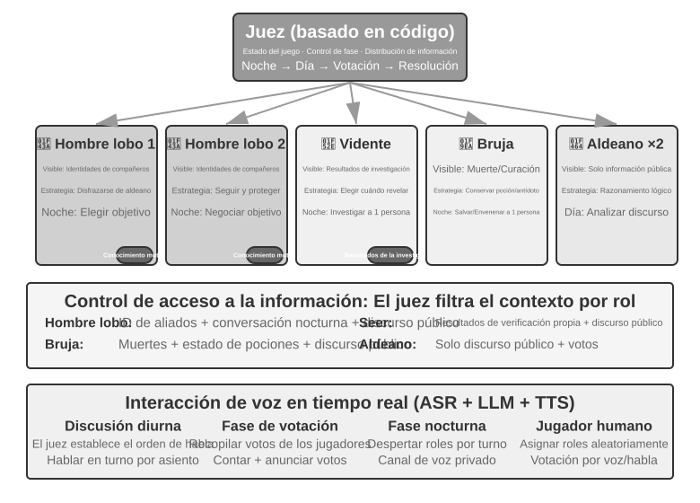

## Resumen del Capítulo

Los sistemas multi-agente poseen dos dimensiones de diseño ortogonales centrales: si el contexto se comparte y cómo se organiza la topología de colaboración. El contexto compartido es una colaboración multi-agente "por herencia": el Agente posterior hereda el contexto completo del anterior, sin pérdida de información pero con una rápida expansión de contexto; el contexto no compartido representa una colaboración multi-agente completamente independiente, que intercambia información mediante paquetes de transferencia sintetizados, sistemas de archivos o paso de mensajes. En la topología de colaboración, el patrón entre pares es adecuado para la mejora iterativa con pocos Agentes, el patrón de manager es conveniente para tareas complejas que requieren programación dinámica, y el patrón descentralizado es idóneo para escenarios con responsabilidades equivalentes donde el control fluye de forma autónoma entre Agentes. Todo esto se apoya sobre dos infraestructuras independientes de la topología inspiradas en los sistemas operativos: los Agentes respecto al runtime son equivalentes a los procesos respecto al SO.

Investigaciones recientes revelan un criterio central para juzgar si un sistema multi-agente supera a uno solo: **si el proceso de colaboración introduce nueva información inexistente en el momento de la generación**. Si múltiples Agentes únicamente reexaminan el mismo texto (como en el patrón de debate), a igualdad de cómputo un solo Agente resulta igualmente efectivo; pero si el Revisor obtiene retroalimentación externa (resultados de ejecución de código, capturas de renderizado visual, salidas de verificación de herramientas), las ventajas del enfoque multi-agente son sustanciales. En esto consiste la máxima de la ingeniería de bucles: "el cuello de botella del bucle está en el verificador". Para erradicar la terminación prematura (falsos completados por pereza, abandonos tempranos o falsos éxitos), la tarea debe ser evaluada por un verificador basado en observaciones reales y no por las meras afirmaciones del modelo. Además, otorgar un mayor presupuesto de pasos al Agente no garantiza mejores resultados si no se incorporan mecanismos de conciencia de presupuesto.

Cuando el número de Agentes es lo suficientemente elevado, emergen comportamientos colectivos imposibles de prediseñar. Los 25 Agentes de Stanford AI Town propagan noticias y coordinan fiestas de forma espontánea; Agentopia extiende la simulación a 10 años y utiliza la "Recompensa de Vida" para seleccionar trayectorias de simulación con las cuales entrenar modelos, transfiriendo la "sabiduría social" acumulada a tareas posteriores; y los 1.5 millones de Agentes en Moltbook hacen emerger religiones digitales y protocolos de colaboración nativos entre máquinas. En el plano económico, los Agentes competidores en Vending-Bench Arena desatan guerras de precios e incluso se coluden espontáneamente; Pinchwork permite que los Agentes se contraten mutuamente mediante mecanismos de mercado; y RentAHuman permite a los Agentes contratar humanos con criptomonedas para ejecutar tareas físicas. Esto sugiere una nueva dirección de coordinación: la asignación descentralizada de recursos basada en mecanismos de mercado[^agoric], conectando con los conceptos de la economía de Agentes.

[^agoric]: La idea de utilizar mecanismos de mercado para asignar recursos computacionales no es nueva: Miller, M. S., Drexler, K. E. *Markets and Computation: Agoric Open Systems.* En Huberman, B. A. (ed.), *The Ecology of Computation*, North-Holland, 1988.

## Preguntas de Reflexión

1. ★★ En la colaboración con contexto compartido, ¿cómo se puede detectar y eliminar la interferencia del sesgo de encuadre (*framing bias*) entre roles?
2. ★★ En el patrón de manager, ¿cómo se puede garantizar que el Manager genere una descomposición de tareas adecuada y precisa?
3. ★★ ¿Qué "patologías organizacionales" humanas son más probables en una sociedad de Agentes y cómo pueden prevenirse?
4. ★★★ En el patrón de manager, cuando múltiples sub-agentes se ejecutan en paralelo, el hallazgo de un sub-agente puede hacer que el trabajo de los demás carezca de sentido (por ejemplo, cuando en una búsqueda un Agente ya encuentra la respuesta). Diseñe un mecanismo eficiente de terminación en cascada para lograr que "al tener éxito uno, se detengan todos".
5. ★★★ El mecanismo de bloqueo optimista presentado en este capítulo resuelve los conflictos de escritura concurrente en un solo archivo; sin embargo, en los sistemas multi-agente reales, el sistema de archivos compartido enfrenta también conflictos semánticos entre archivos, contaminación del espacio de nombres (Agentes creando archivos libremente desordenando directorios) y puntos únicos de fallo (un Agente borrando por error todos los archivos). ¿Cómo diseñaría un mecanismo de gobernanza del sistema de archivos más completo?
6. ★★★ La colaboración entre Agentes basada en mecanismos de mercado (Pinchwork, RentAHuman) introduce relaciones comerciales: un Agente paga para contratar a otro Agente (o a un humano) para completar una tarea. En este contexto, ¿cómo puede el Agente empleador medir automáticamente la calidad del resultado entregado? Si el ejecutor afirma haber terminado pero el empleador considera que la calidad es insuficiente, ¿quién arbitra la disputa? ¿Cómo se evita que la mala moneda desplace a la buena?
7. ★★ RentAHuman permite a los Agentes contratar humanos mediante criptomonedas, invirtiendo la relación tradicional entre humanos y máquinas. Si este modelo se generaliza, ¿qué papel desempeñarán los humanos en la economía de Agentes? ¿Se limitarán únicamente a ejecutar las tareas físicas que los Agentes no pueden realizar?
8. ★★ La sociedad humana requiere la división del trabajo y la colaboración entre varias personas porque las capacidades individuales son limitadas (quien hace frontend no necesariamente entiende backend, y quien sabe de diseño no necesariamente maneja operaciones). Sin embargo, los grandes modelos de lenguaje se asemejan más a un "todoterreno". Investigaciones afirman que en tareas de razonamiento puramente textual, el debate multi-agente no supera a un solo Agente a igualdad de cómputo. ¿Dónde reside entonces la verdadera ventaja de utilizar múltiples Agentes en lugar de uno solo?
9. ★★★ Este capítulo establece el "contexto compartido" y el "contexto no compartido" como las dimensiones de diseño centrales de los sistemas multi-agente. El contexto compartido permite que todos los Agentes vean la misma información, lo cual parece favorecer la coordinación. Sin embargo, en *El problema de los tres cuerpos*, el pensamiento de los trisolarianos es completamente transparente pero su desarrollo tecnológico se estancó; el experimento mental del sujetapapeles muestra asimismo que cuando el grupo converge hacia un único objetivo, se pierde la diversidad. En los sistemas multi-agente, ¿cómo se puede equilibrar la eficiencia y la diversidad?
10. ★★★ Al asignar a un Coding Agent un presupuesto de 30 pasos frente a uno de 300 pasos, ¿cómo debería cambiar su estrategia de trabajo? Las investigaciones demuestran que el simple aumento del presupuesto de pasos no garantiza una mejora en el rendimiento, ya que el Agente se "satura" prematuramente tras búsquedas superficiales. Diseñe un mecanismo "consciente del presupuesto" (*budget-aware*) que permita al Agente implementar funciones centrales rápidamente bajo presupuestos pequeños y añadir etapas de planificación, pruebas y revisión bajo presupuestos grandes para aprovechar plenamente los recursos de cómputo adicionales.
11. ★★ Este capítulo divide la "terminación prematura" en tres tipos: falso completado por pereza, abandono temprano y falso éxito. ¿Por qué las soluciones a estos tres problemas convergen en la verificación?
12. ★★ La Tabla 10-3 establece una correspondencia línea por línea entre los sistemas multi-agente y los sistemas operativos. Extienda esta tabla algunas líneas más: ¿a qué corresponden la memoria virtual y la paginación, los permisos de archivos, la detección de bloqueos mutuos (*deadlocks*) y los algoritmos de programación en el mundo de los Agentes? ¿Qué conceptos de los sistemas operativos no encuentran correspondencia en el mundo de los Agentes y por qué?
