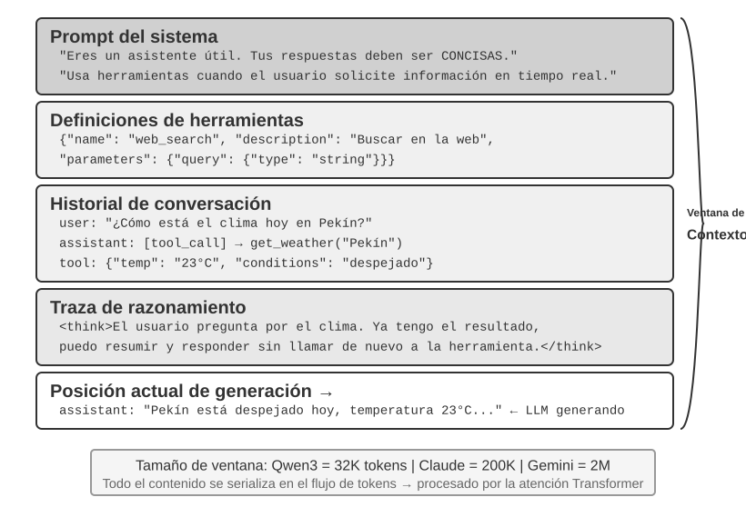
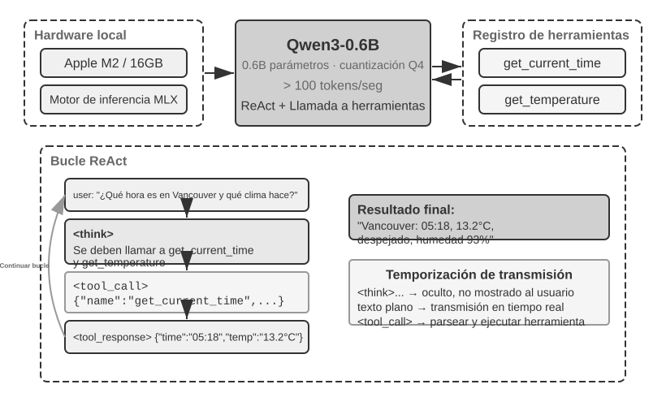
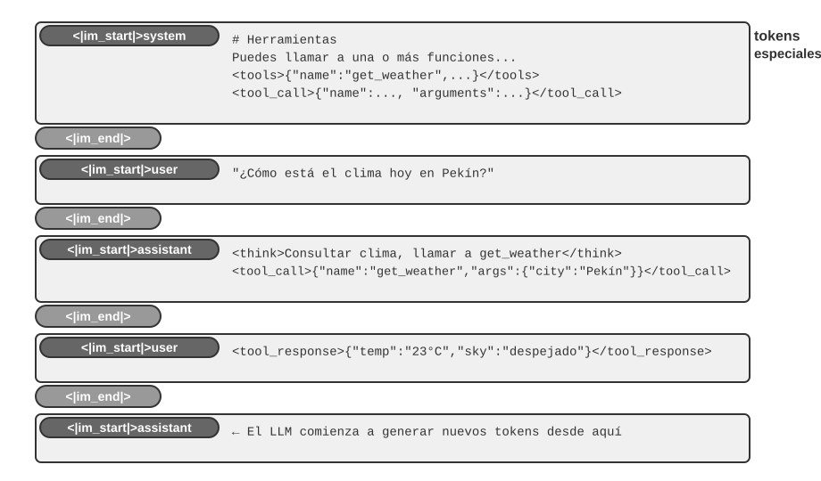
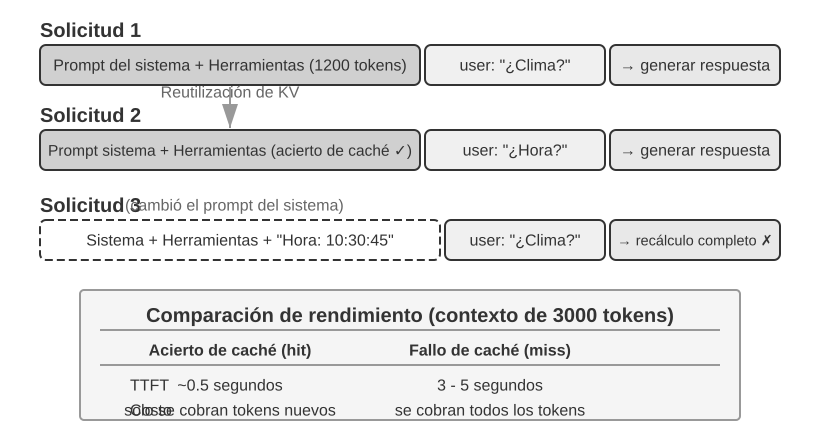
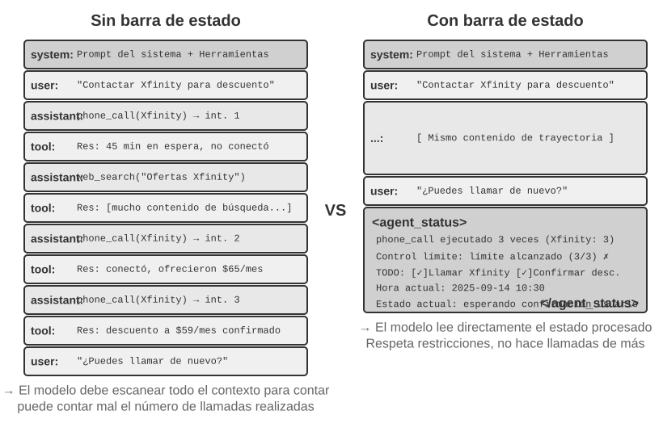
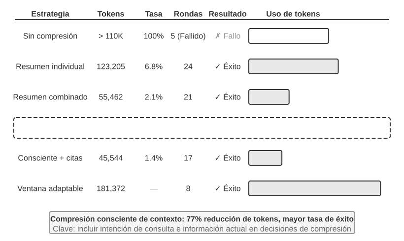

# Capítulo 2: Ingeniería de Contexto y Gestión de Memoria

El Capítulo 1 comparó el contexto con los "ojos" del Agente: el Agente solo puede tomar decisiones basándose en la información que ve. El diseño y la gestión de ese contexto, lo que llamamos **Ingeniería de Contexto (Context Engineering)**, es un aspecto que nunca se enfatizará demasiado. El llamado contexto es toda la información que la IA "ve" realmente cada vez que conversas con ella. No solo incluye lo que se ha hablado anteriormente (el historial de conversación), sino que también contiene las reglas de comportamiento escritas previamente por los desarrolladores (instrucciones del sistema), descripciones de funciones externas que la IA puede utilizar (descripciones de herramientas) y otros tipos de información. Desde la perspectiva de ingeniería del Harness introducida en el Capítulo 1, la ingeniería de contexto es la implementación central en el nivel de "Contexto y Herramientas" dentro del Harness: determina qué información puede ver el Agente en cada punto de decisión y con qué estructura la ve. Un sistema de contexto bien diseñado permite que el modelo alcance su máxima efectividad con recursos limitados; por el contrario, incluso utilizando el modelo más potente, una gestión caótica del contexto puede provocar alucinaciones o bucles infinitos.



## El Contexto — El Techo de las Capacidades del Agente

Los modelos de lenguaje grandes obtienen resultados destacados en evaluaciones estandarizadas, pero a menudo tienen un rendimiento inferior en entornos empresariales reales. La razón no es misteriosa: las capacidades del modelo son de propósito general, mientras que la ejecución de tareas concretas requiere información de contexto (la arquitectura de tu producto, las reglas de negocio y las convenciones internas), información que el modelo simplemente desconoce.

Imagina a un ingeniero genial que se une a tu equipo. Posee una profunda preparación teórica y una capacidad de programación extraordinaria, pero ignora por completo la arquitectura de tu producto, la lógica de negocio, la deuda técnica y las normas del equipo. Peor aún, las decisiones arquitectónicas clave están dispersas en la memoria de distintos miembros del equipo y la base de código carece de documentación. Este genio, a pesar de su destacada inteligencia, difícilmente podrá aportar un valor real rápidamente; —este es precisamente el dilema al que se enfrentan los Agentes de IA actuales.

Considera el ejemplo de un Agente Programador (Coding Agent). Ante la misma instrucción, "Ayúdame a corregir este error", la calidad del contexto que recibe el Agente determina directamente si podrá completar la tarea:

- **Contexto de código en tiempo real**: La estructura de directorios de la base de código actual, la división de responsabilidades entre módulos, las definiciones de las estructuras de datos centrales y las convenciones de código del equipo. Sin esto, el código escrito por el Agente puede ser sintácticamente correcto pero tener un estilo totalmente ajeno al proyecto, o incluso introducir conflictos a nivel de arquitectura.
- **Especificaciones de proceso**: La estrategia de ramas en Git, las convenciones de commit, el proceso de revisión de código y los requisitos del pipeline de CI/CD. Al carecer de estos elementos, el Agente podría enviar directamente código no probado a la rama principal.
- **Información del entorno**: La configuración del entorno de desarrollo, la dirección de conexión a la base de datos de pruebas, el método de despliegue en el entorno de staging y la gestión de claves API. Sin esto, una solución que el Agente ejecuta con éxito en local podría colapsar inmediatamente al llegar al entorno de pruebas.

Estas tres categorías de información (código, proceso y entorno) constituyen la necesidad mínima de información para que el Agente trabaje eficazmente. La inteligencia inherente del modelo es solo la base; **la calidad del contexto representa el verdadero techo de las capacidades del Agente**. Un modelo de capacidad moderada con un contexto cuidadosamente organizado a menudo puede superar a un modelo de primer nivel que opera a ciegas en medio de la escasez de información.

Por lo tanto, la ingeniería de contexto se convierte en la clave para desarrollar Agentes eficientes utilizando modelos existentes. No se trata simplemente de un problema técnico de introducir más información en el prompt (indicación), sino de diseñar, organizar y proporcionar de manera sistemática todo el conocimiento de fondo necesario para que la IA complete su tarea.

La ingeniería de contexto es, en primer lugar, un **problema técnico**, pero de manera más fundamental es un **problema organizacional**. El conocimiento clave en la mayoría de los equipos es implícito: solo los empleados veteranos recuerdan las decisiones arquitectónicas, las reglas de negocio se transmiten oralmente y la información de fondo importante queda atrapada en chats privados. Si el equipo en sí es un agujero negro de información, el mejor Agente de IA no podrá hacer nada.

Los equipos orientados al trabajo remoto suelen ser también afines a los Agentes de IA. Proyectos de código abierto como el núcleo de Linux constituyen un excelente ejemplo: desarrolladores distribuidos globalmente han mantenido en colaboración el proyecto durante más de treinta años. El secreto del éxito radica en una cultura de comunicación altamente transparente y orientada a la documentación: todas las discusiones se realizan abiertamente, cada decisión cuenta con registros detallados y cualquier recién llegado puede comprender la lógica de evolución del código leyendo el historial. Este modo de trabajo crea de forma natural un entorno amigable para la IA: la información es pública, recuperable y estructurada.

Un Agente de IA es como un empleado eternamente nuevo: si le proporcionas suficiente información de fondo, funcionará muy bien; si no le dices nada, por muy inteligente que sea, será inútil. Por lo tanto, construir un equipo nativo de IA es, en primer lugar, un movimiento de documentación, y no solo el despliegue de nuevas herramientas.

El investigador de OpenAI Jiayi Weng resumió con precisión este punto: **"Tanto para las personas como para los modelos, lo más importante es el Contexto."** Explicó con su propia experiencia que su trabajo en OpenAI no era tan difícil, y que si viniera otra persona con todo su contexto, también podría realizarlo. La misma lógica se aplica a los Agentes: lo que determina el techo de capacidad del Agente no es el número de parámetros del modelo, sino cuánto contexto y qué tan preciso lo recibe en cada punto de decisión. Jiayi Weng también señaló que "el mayor problema en el trabajo en equipo es la inconsistencia del contexto", y que "la razón principal por la que la IA no puede reemplazar a los humanos a corto plazo es el contexto, porque la IA y los humanos no están en el mismo entorno". Este es precisamente el problema central que busca resolver la ingeniería de contexto: cómo enviar de forma sistemática y estructurada la información de fondo requerida por el Agente a la ventana de contexto del modelo.

¿En qué formato técnico se envía realmente esta información de contexto al modelo de lenguaje grande?

## Cómo Invocan los Agentes a los LLMs: La Estructura de Contexto a Nivel de API

Esta sección toma como ejemplo la API Chat Completions de OpenAI (las estructuras de API de proveedores como Anthropic o Google son muy similares en esencia) para desglosar en detalle la composición completa de la solicitud en cada llamada del Agente al modelo de lenguaje grande. Comprender esta estructura es la base para dominar todas las técnicas posteriores de ingeniería de contexto.

### Los Cuatro Roles de Mensajes

El núcleo de la API de un modelo de lenguaje grande es una **lista de mensajes** (`messages`). Cada mensaje en la lista cuenta con una identificación de **rol** (`role`), y el modelo interpreta el significado y la fuente de cada mensaje según dicho rol:

- **system**: El prompt del sistema. Escrito por el desarrollador, define la identidad, las reglas de comportamiento, las restricciones y las condiciones del Agente. El modelo lo considera la instrucción de máxima prioridad. Por lo general solo hay una en toda la conversación y se ubica al principio de la lista de mensajes.
- **user**: El mensaje del usuario. Proviene de la entrada del usuario final y es la solicitud que el Agente debe responder.
- **assistant**: El mensaje del asistente. Respuestas anteriores del modelo, incluyendo respuestas de texto y solicitudes de llamada a herramientas. En conversaciones multiturno, los mensajes de tipo `assistant` previos se vuelven a colocar en la lista de mensajes para que el modelo "recuerde" lo que ha dicho.
- **tool**: El resultado de la herramienta. Una vez que el framework del Agente ejecuta una herramienta, envía el resultado de vuelta al modelo en forma de mensaje con rol `tool`. Cada mensaje de tipo `tool` se relaciona con la solicitud de herramienta correspondiente mediante un `tool_call_id`.

Además, las definiciones de herramientas (`tools`) se proporcionan como un campo independiente de la solicitud (no como un mensaje), indicando al modelo qué herramientas están disponibles y qué parámetros acepta cada una.

### Petición de un Solo Turno: La Llamada API Más Simple



Veamos primero el escenario más simple sin llamadas a herramientas, donde el usuario pregunta "Hello, who are you?" (utilizamos aquí como ejemplo un modelo pequeño Qwen3-0.6B desplegado localmente, que conecta con el experimento de despliegue de LLM local más adelante en esta sección; las marcas de tiempo en el ejemplo son solo para fines ilustrativos y no están vinculadas a la cronología del libro):

```javascript
// ═══ Petición construida por el framework del Agente ═══
{
  "model": "Qwen3-0.6B",
  "messages": [
    {
      "role": "system",                           // ← Escrito por el desarrollador
      "content": "You are a helpful coding assistant. Follow user instructions."
    },
    {
      "role": "user",                              // ← Entrada del usuario
      "content": "Hello, who are you?"
    }
  ]
}
```

```javascript
// ═══ Respuesta devuelta por la API ═══
{
  "choices": [{
    "message": {
      "role": "assistant",                         // ← Generado por el modelo
      "content": "Hi! I'm a coding assistant. I can help you write code, debug issues, and explain technical concepts. How can I help?"
    }
  }]
}
```

Esta solicitud solo contiene dos mensajes: uno de tipo `system` (las reglas escritas por el desarrollador) y otro de tipo `user` (la entrada del usuario). El modelo devuelve un mensaje de tipo `assistant` como respuesta. Este es el modo de interacción más básico de la API de un LLM: **cada llamada es sin estado (stateless), por lo que toda la información que necesita el modelo debe proporcionarse de forma completa en la lista de mensajes de la solicitud**.

### Interacción Multiturno con Llamadas a Herramientas: El Bucle Central de un Agente

El escenario real de un Agente es mucho más complejo que una pregunta y respuesta de un solo turno. Cuando el usuario pregunta "What's the current time and weather in Vancouver?", el modelo no puede responder basándose únicamente en su propio conocimiento (desconoce a qué momento corresponde "ahora"), sino que necesita llamar a herramientas externas. A continuación se muestra en detalle cada paso de la interacción entre el framework del Agente y el modelo durante este proceso.



**Primera llamada a la API: el framework del Agente envía la solicitud inicial:**

```javascript
// ═══ Petición construida por el framework del Agente (1.ª llamada) ═══
{
  "model": "Qwen3-0.6B",
  "messages": [
    {
      "role": "system",                           // ← Escrito por el desarrollador
      "content": "You are a helpful assistant. Use the provided tools to get real-time information when needed."
    },
    {
      "role": "user",                              // ← Entrada del usuario
      "content": "What's the current time and weather in Vancouver?"
    }
  ],
  "tools": [                                       // ← Herramientas definidas por el desarrollador
    {
      "type": "function",
      "function": {
        "name": "get_current_time",
        "description": "Get the current date and time in a specific timezone",
        "parameters": {
          "type": "object",
          "properties": {
            "timezone": { "type": "string", "description": "Timezone name, e.g. America/Vancouver" }
          }
        }
      }
    },
    {
      "type": "function",
      "function": {
        "name": "get_weather",
        "description": "Get the current weather for a specific city",
        "parameters": {
          "type": "object",
          "properties": {
            "city": { "type": "string", "description": "City name" },
            "unit": { "type": "string", "enum": ["celsius", "fahrenheit"] }
          }
        }
      }
    }
  ]
}
```

**El modelo devuelve solicitudes de llamada a herramientas (no la respuesta final):**

```javascript
// ═══ Respuesta devuelta por la API (el modelo decide llamar a herramientas) ═══
{
  "choices": [{
    "message": {
      "role": "assistant",                         // ← Generado por el modelo
      "content": null,                             // Sin respuesta de texto
      "tool_calls": [                              // El modelo solicita dos llamadas a herramientas
        {
          "id": "call_abc123",
          "type": "function",
          "function": {
            "name": "get_current_time",
            "arguments": "{"timezone": "America/Vancouver"}"
          }
        },
        {
          "id": "call_def456",
          "type": "function",
          "function": {
            "name": "get_weather",
            "arguments": "{"city": "Vancouver", "unit": "celsius"}"
          }
        }
      ]
    }
  }]
}
```

Observa que el modelo no responde directamente a la pregunta del usuario, sino que devuelve dos **solicitudes de llamada a herramientas**: determina que la "hora actual" y el "clima" deben obtenerse mediante herramientas y que, al no haber dependencia entre ambas, pueden invocarse en paralelo. **El modelo solo emite la solicitud de llamada, la ejecución real de la herramienta recae en el framework del Agente**. Esta distinción es fundamental para comprender la arquitectura del Agente: el modelo se encarga de decidir (qué herramienta llamar y qué parámetros pasar), mientras que el framework del Agente se encarga de ejecutar (llamar a las APIs reales o ejecutar código).

**El framework del Agente ejecuta las herramientas y realiza la segunda llamada a la API:**

Tras recibir las solicitudes de llamada a herramientas del modelo, el framework del Agente las ejecuta en la práctica (por ejemplo, llamando a la API de hora y a la API de clima) y envía de vuelta al modelo el **historial de conversación completo junto con los resultados de ejecución de las herramientas**:

```javascript
// ═══ Petición construida por el framework del Agente (2.ª llamada) ═══
{
  "model": "Qwen3-0.6B",
  "messages": [
    {
      "role": "system",                           // ← Igual que en la 1.ª llamada
      "content": "You are a helpful assistant. Use the provided tools to get real-time information when needed."
    },
    {
      "role": "user",                              // ← Igual que en la 1.ª llamada
      "content": "What's the current time and weather in Vancouver?"
    },
    {
      "role": "assistant",                         // ← Salida del modelo de la 1.ª llamada, incluida íntegramente
      "content": null,
      "tool_calls": [
        { "id": "call_abc123", "function": { "name": "get_current_time", "arguments": "{"timezone": "America/Vancouver"}" } },
        { "id": "call_def456", "function": { "name": "get_weather", "arguments": "{"city": "Vancouver", "unit": "celsius"}" } }
      ]
    },
    {
      "role": "tool",                              // ← Generado por el framework del Agente (resultado de ejecución de la herramienta)
      "tool_call_id": "call_abc123",
      "content": "{"timezone": "America/Vancouver", "datetime": "2025-09-13T05:18:47", "day_of_week": "Saturday"}"
    },
    {
      "role": "tool",                              // ← Generado por el framework del Agente (resultado de ejecución de la herramienta)
      "tool_call_id": "call_def456",
      "content": "{"city": "Vancouver", "temperature": 13.2, "unit": "celsius", "conditions": "clear", "humidity": 93}"
    }
  ],
  "tools": [ ... ]                                 // ← Mismas definiciones de herramientas que arriba, omitidas
}
```

Aquí hay tres detalles clave:

1. **La segunda solicitud incluye todo el historial de conversación de la primera**: el mensaje `system`, el mensaje `user`, la primera respuesta `assistant` (con las llamadas a herramientas) y los nuevos resultados `tool`. Esto refleja la característica de que "cada llamada es sin estado": el modelo no "recuerda" la conversación anterior, por lo que el framework del Agente debe volver a enviar el historial completo cada vez.
2. **El mensaje `assistant` de la primera llamada se devuelve exactamente igual a la lista de mensajes**: esto permite que el modelo "vea" qué decisiones tomó anteriormente.
3. **Los mensajes `tool` se asocian a las llamadas de herramienta correspondientes mediante `tool_call_id`**: gracias a esto, el modelo sabe qué resultado corresponde a cada llamada.

**El modelo genera la respuesta final basándose en los resultados de las herramientas:**

```javascript
// ═══ Respuesta devuelta por la API (respuesta final) ═══
{
  "choices": [{
    "message": {
      "role": "assistant",                         // ← Generado por el modelo
      "content": "It's currently 5:18 AM on Saturday, September 13, 2025 in Vancouver.

Weather: 13.2°C with clear skies and 93% humidity. It's quite cool this morning - you might want to grab a jacket."
    }
  }]
}
```

En esta ocasión el modelo no devuelve `tool_calls`, sino que proporciona directamente una respuesta de texto: determina que ya dispone de suficiente información para responder al usuario. Si el modelo considerara que necesita más información (por ejemplo, si el usuario repreguntara "¿Y en Tokio?"), volvería a devolver `tool_calls`, el framework del Agente las ejecutaría y enviaría los resultados, repitiendo el bucle. **Este bucle de "solicitud → llamada a herramienta → ejecución → envío de resultados → nueva solicitud" es la implementación concreta a nivel de API del bucle ReAct presentado en el Capítulo 1.**

### Implementando el Bucle Central del Agente en Código

Tras comprender la estructura JSON, utilicemos código Python para conectar el proceso de interacción anterior. A continuación se presenta la implementación más simple de un Agente: el núcleo es un bucle `while`:

```python
from openai import OpenAI

client = OpenAI()

# ── Tool definitions ──
tools = [
    {
        "type": "function",
        "function": {
            "name": "get_current_time",
            "description": "Get the current date and time in a specific timezone",
            "parameters": {
                "type": "object",
                "properties": {
                    "timezone": {"type": "string", "description": "Timezone name, e.g. America/Vancouver"}
                },
            },
        },
    },
    {
        "type": "function",
        "function": {
            "name": "get_weather",
            "description": "Get the current weather for a specific city",
            "parameters": {
                "type": "object",
                "properties": {
                    "city": {"type": "string", "description": "City name"},
                    "unit": {"type": "string", "enum": ["celsius", "fahrenheit"]},
                },
            },
        },
    },
]

# ── Tool execution function (stub with canned results; a real implementation
#    must parse the JSON `arguments` and call actual APIs) ──
def execute_tool(name, arguments):
    if name == "get_current_time":
        return '{"datetime": "2025-09-13T05:18:47", "day_of_week": "Saturday"}'
    elif name == "get_weather":
        return '{"temperature": 13.2, "unit": "celsius", "conditions": "clear", "humidity": 93}'

# ── Initial message list ──
messages = [
    {"role": "system", "content": "You are a helpful assistant. Use tools to get real-time information when needed."},
    {"role": "user", "content": "What's the current time and weather in Vancouver?"},
]

# ── Agent core loop ──
# Production code needs a max_iterations cap here: as discussed later in
# this chapter, Agents can get stuck repeating the same tool calls forever
while True:
    response = client.chat.completions.create(
        model="Qwen3-0.6B", messages=messages, tools=tools
    )
    assistant_message = response.choices[0].message

    # Append model's response to message list (whether text or tool calls)
    messages.append(assistant_message)

    # If no tool calls requested, the model has produced its final response
    if not assistant_message.tool_calls:
        print(assistant_message.content)
        break

    # Execute each tool requested by the model, append results to message list
    for tool_call in assistant_message.tool_calls:
        result = execute_tool(tool_call.function.name, tool_call.function.arguments)
        messages.append({
            "role": "tool",
            "tool_call_id": tool_call.id,
            "content": result,
        })
    # Return to top of loop, call model again with updated message list
```

La lógica central de este código consta únicamente de un bucle `while` y una condición: **si el modelo devuelve `tool_calls`, se ejecutan las herramientas y se continúa el bucle; si no devuelve ninguna, se imprime el resultado y se sale**. Durante todo el proceso, la lista `messages` crece continuamente: en cada ronda se añaden la respuesta del modelo y los resultados de ejecución de las herramientas.

Sigamos la evolución de la lista `messages` en cada ronda:

**Estado inicial (antes de la 1.ª llamada):**
```
messages = [
  { role: "system",  content: "You are a helpful assistant..." },     # Escrito por el desarrollador
  { role: "user",    content: "What's the current time and weather in Vancouver?" },  # Entrada del usuario
]
```

**Tras la 1.ª llamada (el modelo devuelve llamadas a herramientas):**
```
messages = [
  { role: "system",    content: "..." },
  { role: "user",      content: "What's the current time..." },
  { role: "assistant", tool_calls: [get_current_time, get_weather] },  # + Generado por el modelo
  { role: "tool",      tool_call_id: "call_abc", content: "{time...}" },  # + Ejecutado por el framework
  { role: "tool",      tool_call_id: "call_def", content: "{weather...}" },  # + Ejecutado por el framework
]
```

**Tras la 2.ª llamada (el modelo devuelve la respuesta final, el bucle termina):**
```
messages = [
  { role: "system",    content: "..." },
  { role: "user",      content: "What's the current time..." },
  { role: "assistant", tool_calls: [get_current_time, get_weather] },
  { role: "tool",      tool_call_id: "call_abc", content: "{time...}" },
  { role: "tool",      tool_call_id: "call_def", content: "{weather...}" },
  { role: "assistant", content: "It's currently Saturday, Sep 13, 2025 in Vancouver..." },  # + Respuesta final
]
```

A partir de este proceso queda claro que **el trabajo principal del framework del Agente es gestionar esta lista de mensajes**: añadir mensajes en los momentos adecuados y enviar la lista completa al modelo. Todas las técnicas de ingeniería de contexto que se analizan en el resto del capítulo son, en esencia, optimizaciones sobre el contenido y la estructura de esta lista.

### Cómo se Compone el Contexto a Nivel de API

A través del ejemplo anterior, podemos visualizar con claridad la composición completa del contexto cada vez que el Agente invoca al modelo:



La parte superior (System Prompt + Tool Definitions) se mantiene inalterada a lo largo de la conversación, mientras que la parte inferior (historial de conversación, es decir, la **trayectoria** definida en el Capítulo 1) crece continuamente a medida que avanza la interacción. Así es exactamente como se ven a nivel de API los "cinco componentes del contexto" del Capítulo 1: el prompt del sistema y las definiciones de herramientas forman el prefijo estático, mientras que los mensajes del usuario, las respuestas del modelo y los resultados de ejecución de herramientas conforman el historial dinámico de mensajes. Esta estructura de "prefijo estático + trayectoria" constituye la base para las discusiones posteriores sobre la optimización de KV Cache y la compresión de contexto; al comprender esta estructura se entiende por qué "la parte frontal no debe moverse y la posterior se puede comprimir".

Las secciones siguientes del capítulo se desarrollarán en torno a cada nivel de esta estructura: cómo utilizar la inmutabilidad del prefijo estático para acelerar la inferencia (KV Cache), cómo diseñar un buen System Prompt (ingeniería de prompts), cómo prevenir el secuestro del contexto por contenidos externos (defensa contra inyección de prompts), cómo cargar conocimiento especializado a demanda (Agent Skills), cómo inyectar información dinámica de estado al final de la conversación (barra de estado del Agente) y cómo comprimir de forma inteligente el historial de mensajes cuando este se expande (estrategias de compresión).

> **Experimento 2-1 ★: Despliegue de Servicios de LLM Locales y Llamada a Herramientas**
>
> 
>
> Este experimento persigue dos objetivos centrales: experimentar de primera mano la capacidad de llamada a herramientas de modelos con un número pequeño de parámetros y observar directamente el flujo de tokens original (cadena de pensamiento, marcadores especiales, formatos de llamada a herramientas) que no se aprecia en el nivel de API. Además, durante el experimento se puede prestar atención al impacto de KV Cache en la latencia hasta el primer token (Time To First Token, TTFT), construyendo una intuición previa para la discusión de la siguiente sección.
>
> Antes de profundizar en el contexto del Agente, experimentemos la capacidad de los modelos pequeños a través de un proyecto práctico. El proyecto `local_llm_serving` demuestra una idea importante: los modelos con capacidad de pensamiento mediante Cadena de Pensamiento (Chain of Thought, CoT) y llamadas a herramientas no necesitan necesariamente un volumen enorme de parámetros. Incluso un modelo ultra pequeño de 0.6B (600 millones) de parámetros, bajo un diseño adecuado de prompt y arquitectura de sistema, puede mostrar una capacidad de llamada a herramientas plenamente satisfactoria.
>
> A través de este experimento deberías poder observar:
>
> 1. **La capacidad de los modelos pequeños**: Incluso un modelo de 0.6B, con una ingeniería de prompts adecuada (la técnica de guiar el comportamiento del modelo mediante el diseño cuidadoso de las instrucciones de entrada), puede comprender y ejecutar llamadas a herramientas con precisión.
> 2. **Rendimiento**: En un chip Apple M2, el modelo puede generar respuestas a una velocidad superior a 100 tokens por segundo, lo cual es totalmente suficiente para aplicaciones de interacción en tiempo real. El token es la unidad básica de procesamiento de texto del modelo; una palabra en inglés suele corresponder a 1-3 tokens.
> 3. **Bucle ReAct**: Observa cómo el modelo resuelve problemas complejos a través de múltiples rondas de pensamiento y llamadas a herramientas.
> 4. **Ventajas de la respuesta en streaming**: La salida en streaming permite a los usuarios ver en tiempo real el proceso de pensamiento del modelo, incluyendo las decisiones de llamada a herramientas y el procesamiento de resultados.
> 5. **Impacto de KV Cache (observación secundaria)**: Mantén inalterado el prompt del sistema y realiza dos conversaciones consecutivas, registrando la latencia del primer token de la segunda; a continuación, modifica cualquier carácter al principio del prompt del sistema, realiza otra conversación y compara la latencia del primer token. La primera llamada será notablemente más rápida debido a la coincidencia de la caché de prefijo, mientras que la segunda requerirá recalculando todo el prefijo; este fenómeno es precisamente el tema de la siguiente sección.
>
> **Caso práctico del bucle ReAct.**
>
> Las llamadas a herramientas multiturno del proyecto siguen el bucle de Pensamiento-Acción-Observación de ReAct presentado en el Capítulo 1. En la sección anterior se mostró la estructura completa de mensajes de este proceso en formato JSON de la API de OpenAI. En el experimento desplegado en local, estas llamadas API son convertidas automáticamente por el servidor (como vLLM u Ollama) al formato de tokens interno del modelo. El proyecto `local_llm_serving` de este experimento te permite observar directamente el flujo original de tokens de entrada y salida del modelo, incluyendo los siguientes detalles que no son visibles a nivel de API:
>
> **Proceso de pensamiento interno del modelo**: Los modelos que admiten cadena de pensamiento (como Qwen3), antes de generar una llamada a herramienta, piensan primero dentro de etiquetas `<think>` (analizando la intención del usuario, evaluando qué herramientas aplican y planificando el orden de invocación). Este proceso de pensamiento resulta muy valioso para depurar el comportamiento del Agente.
>
> **Estructura secuencial de la salida**: Los tokens de salida del modelo se generan en un orden fijo: primero el pensamiento interno (dentro de las etiquetas `<think>`), luego la respuesta de texto para el usuario y finalmente la solicitud de llamada a herramientas. Comprender este orden es clave para implementar respuestas en streaming: cuando aparece la etiqueta `<think>`, se puede cambiar al estado "pensando"; una vez generados y validados por completo los parámetros de la primera llamada a herramienta, se puede iniciar su ejecución de inmediato sin esperar a que el modelo genere llamadas posteriores.
>
> **Llamadas a herramientas en paralelo**: En el ejemplo de la hora y el clima de Vancouver de esta sección, el modelo descubrió que no había dependencia entre ambos subproblemas, por lo que generó simultáneamente dos solicitudes de llamada a herramientas en una sola salida. Tras detectar esto, el framework del Agente puede ejecutar ambas herramientas en paralelo, logrando una aceleración en pipeline.
>
> **Juicio de terminación del modelo**: Una vez que el framework del Agente devuelve los resultados de las herramientas, el modelo evalúa si ya dispone de suficiente información para responder al usuario. Si es así, emite directamente la respuesta final (sin llamadas a herramientas); si no es suficiente, genera nuevas solicitudes de llamada a herramientas, desencadenando la siguiente ronda del bucle ReAct.
>
> **Resumen del experimento.**
>
> El punto más importante que conviene recordar de este experimento es: un modelo pequeño de 0.6B, con un diseño de prompt adecuado, también puede realizar llamadas a herramientas de forma fiable. El tamaño del modelo es importante, pero no es el único factor determinante. Algunos dispositivos móviles de gama alta ya pueden ejecutar modelos pequeños de la clase 0.6B, y la capacidad de los modelos en el dispositivo sigue aumentando; la era de los Agentes en el dispositivo está más cerca de lo que la mayoría prevé.
>
> Durante el experimento es posible que hayas notado que modificar el prompt del sistema hace que la primera respuesta del modelo sea más lenta; —este es precisamente el mecanismo de KV Cache que se explicará en la siguiente sección: cambiar el prefijo provoca la invalidez de la caché y obliga al modelo a recalcular.

## Diseño de Contexto Amigable con la Caché KV (KV Cache)

Antes de entrar en la historia principal, desarrollemos la intuición sobre la **Caché KV (KV Cache)**. Cada vez que el modelo genera un token, debe consultar hacia atrás los resultados de los cálculos intermedios de todos los tokens anteriores. Si en cada ronda se recalculara todo desde el principio, el costo crecería de forma exponencial con la longitud del contexto. La estrategia de KV Cache consiste en almacenar en caché los resultados intermedios de los tokens anteriores, de modo que en la siguiente ronda solo se necesite calcular la parte correspondiente a los tokens nuevos. **La condición indispensable es que el prefijo se mantenga completamente inalterado**: si se modifica aunque sea un solo carácter en el prefijo, la caché queda totalmente invalidada y el modelo se ve obligado a recalcular desde la posición modificada. Cabe precisar que cuando en esta sección se habla de la coincidencia de caché entre distintas solicitudes en el contexto de proveedores de servicios de API, se denomina Prompt Cache: una caché entre solicitudes construida sobre el motor de inferencia KV Cache; la comparación completa entre ambos niveles se detalla al final de esta sección.

Comprendido esto, la siguiente historia resulta evidente. Cierto equipo operaba un Agente de atención al cliente que procesaba 100.000 conversaciones diarias de manera normal. Un día, un ingeniero, con la intención de que el Agente "supiera" la hora actual, añadió una línea en el prompt del sistema `Current time: {{now}}`, inyectando la marca de tiempo en tiempo real. Al día siguiente saltó la alarma de monitoreo: la latencia del primer token de todas las conversaciones aumentó de 0.5 segundos a entre 3 y 5 segundos, y la factura mensual de inferencia casi se duplicó. El código parecía impecable y el modelo no había cambiado: ¿dónde estaba el problema?

La respuesta es: esa línea con la marca de tiempo invalidaba por completo la KV Cache en cada solicitud. Dado que el prompt del sistema era diferente en cada ocasión, el modelo se veía obligado a recalcular desde cero todos los pares clave-valor (Key-Value) del prefijo (aquí "Key" y "Value" son dos tipos de vectores del mecanismo de atención, cuyo funcionamiento se demuestra de forma intuitiva en el Experimento 2-2). Este "costo invisible" aparece repetidamente en los sistemas de Agentes: una línea de código aparentemente inofensiva escrita por un desarrollador puede ralentizar toda la cadena de inferencia en un orden de magnitud. En esta sección abordaremos cómo evitar estas trampas.

> **Aviso de barrera técnica**: Esta sección aborda el mecanismo de atención de Transformer y los principios internos de KV Cache, constituyendo una de las partes con mayor densidad técnica de todo el libro. Si no estás familiarizado con estos mecanismos subyacentes, **puedes omitir los detalles teóricos y recordar únicamente las siguientes tres conclusiones clave**:
>
> 1. **Una vez definidos el prompt del sistema y las definiciones de herramientas, no los modifiques.** Cualquier cambio, incluso un espacio adicional, invalidará toda la caché, multiplicando la latencia y elevando los costos (la magnitud exacta depende del modelo y la configuración).
> 2. **La información dinámica debe añadirse siempre al final**: los contenidos cambiantes como marcas de tiempo o estados de usuario deben agregarse como nuevos mensajes al final de la conversación, en lugar de modificar el prompt del sistema existente.
> 3. **Utiliza formatos estándar de API y no concatenes mensajes manualmente**: los mensajes estructurados son traducidos por la Chat Template a secuencias de tokens fijas vistas por el modelo durante su entrenamiento; el problema de concatenar manualmente strings como `"USER: ... ASSISTANT: ..."` radica en que se desvía de dicho formato de entrenamiento, debilitando la capacidad de razonamiento en múltiples pasos del modelo. Respecto a la caché, esta solo reconoce secuencias de bytes de tokens: mientras el prefijo construido sea estable a nivel de bytes, la caché coincidirá; pero si la forma de concatenar es inestable (por ejemplo, inyectando contenido dinámico en el prefijo), la caché también se invalidará.
>
> La intuición detrás de estas tres conclusiones es muy sencilla: cuando un modelo de lenguaje grande procesa el contexto, almacena en caché el contenido ya procesado previamente, de modo que la próxima vez solo necesita procesar la parte nueva. **Es como cocinar: si los primeros pasos son idénticos (mismos ingredientes, mismo corte), puedes continuar directamente desde donde te quedaste; pero si cambia cualquier paso anterior (cambias un ingrediente), hay que rehacer todos los pasos posteriores.** El prompt del sistema y las definiciones de herramientas son esos "primeros pasos": una vez modificados, todos los resultados intermedios almacenados en caché quedan invalidados.
>
> Recordando estos tres principios, incluso omitiendo los detalles técnicos siguientes, podrás diseñar correctamente la estructura de contexto de un Agente. El contenido que sigue está destinado a los lectores que deseen profundizar en el "por qué es así".

> **Experimento 2-2 ★: Visualización del Mecanismo de Atención**
>
> Antes de explicar KV Cache, comprendamos de forma intuitiva el mecanismo de atención interno del modelo a través de un experimento; esto constituye la base para entender por qué KV Cache es eficaz y por qué impone restricciones estrictas al diseño del contexto.
>
> **¿Qué es el mecanismo de atención?** Utilicemos un ejemplo concreto. Supongamos que el modelo está procesando la frase "El clima en Pekín cómo está". Al llegar a "cómo está", el modelo debe decidir: ¿qué palabras anteriores son las más importantes para entender "cómo está"?
>
> El mecanismo de atención completa este proceso de "búsqueda de puntos clave" mediante tres vectores:
>
> La Tabla 2-1 resume la división de funciones de los tres tipos de vectores Query, Key y Value en el mecanismo de atención, ayudando al lector a conectar el cálculo abstracto con el ejemplo de "El clima en Pekín cómo está".
>
> Tabla 2-1 División de funciones de Query, Key y Value en el mecanismo de atención
>
> | Vector | Significado | En este ejemplo |
> |--------------|----------------------------------|-----------------------------------------------|
> | **Query (Consulta)** | La "solicitud de búsqueda" emitida por la palabra actual | "cómo está" pregunta: ¿qué palabra es la más relevante para mí? |
> | **Key (Clave)** | La "etiqueta" de cada palabra, usada para ser buscada | La etiqueta de "Pekín" se orienta a "lugar", la de "clima" a "meteorología" |
> | **Value (Valor)** | El "contenido" de cada palabra, extraído tras una coincidencia exitosa | Tras coincidir con "clima", se extrae su información semántica |
>
> En términos sencillos, cada palabra nueva pregunta "¿qué palabras anteriores son las más relevantes para mí?", encuentra las palabras más relevantes mediante una puntuación y luego consulta prioritariamente su información para comprender el contexto actual.
>
> De manera más específica, el proceso de cálculo consta de tres pasos: en primer lugar, "cómo está" genera su propio vector Query (una serie de números que representan "qué estoy buscando"); a continuación, se realiza el producto punto entre la Query y la Key de cada palabra (que puede entenderse como una "puntuación de coincidencia": se multiplican elemento a elemento ambas series de números y se suman, cuanto mayor sea el resultado, mayor es la coincidencia), obteniendo los pesos de atención; finalmente, se utiliza estos pesos para realizar una suma ponderada de los Values de todas las palabras (las palabras con mayor puntuación aportan más y las de menor puntuación aportan menos), sintetizando una comprensión global.
>
> 
>
> La parte superior de la Figura 2-6 muestra los resultados de coincidencia de "cómo está" con cada palabra anterior: la coincidencia con "clima" es la más alta (0.55), existe cierta relación con "Pekín" (0.35), casi ninguna relación con "en" (0.05) y el resto del peso (~0.05) se asigna a la propia expresión "cómo está" (no dibujado individualmente en la figura), sumando todos los pesos exactamente 1. La salida final proviene principalmente de la información de "clima", lo cual coincide plenamente con la intuición.
>
> El **mapa de calor de atención** organiza los pesos de atención de cada palabra respecto a todas las palabras anteriores en una matriz. La parte inferior de la Figura 2-6 muestra el mapa de calor completo: cada fila es una Query (la palabra en procesamiento actual), cada columna es una Key (la palabra atendida) y cuanto más oscuro es el color de la celda, mayor es la concentración de atención. Observa que el mapa de calor tiene forma triangular: dado que el modelo genera texto secuencialmente de izquierda a derecha, cada palabra solo puede ver a sí misma y a las palabras anteriores, sin poder "anticipar" contenidos no generados aún.
>
> **¿Por qué es necesario almacenar en caché Key y Value?** Observando el mapa de calor se advierte que: por cada palabra nueva generada, su Query debe coincidir con las Keys de **todas** las palabras anteriores y realizar una suma ponderada con sus Values. Si en cada ocasión se calcularan desde cero todas las K y V, la cantidad de cálculo aumentaría continuamente con la longitud del contexto. La KV Cache consiste en almacenar en caché las K y V ya calculadas para que las palabras nuevas las reutilicen directamente; esta es la optimización central que explicaremos a continuación.
>
> Tras comprender los principios básicos del mecanismo de atención, observamos la distribución de atención de un modelo real a través del experimento `attention_visualization`.
>
> 

### De Mensajes API a Tokens del Modelo: La Plantilla de Chat (Chat Template)

En las secciones anteriores hemos discutido la estructura del contexto desde la perspectiva de la API (mensajes estructurados con roles `system`, `user`, `assistant`, `tool`). Sin embargo, los modelos de lenguaje grandes son en su nivel más fundamental generadores de texto que solo procesan secuencias continuas de tokens. Para convertir la lista de mensajes de la API en el formato de texto que el modelo puede comprender, los frameworks emplean una **Plantilla de Chat (Chat Template)** (habitualmente implementada en formato Jinja2).

Por ejemplo, para modelos como Qwen o Llama, la lista de mensajes se traduce a una secuencia de tokens con delimitadores especiales:

```
<|im_start|>system
You are a helpful assistant.<|im_end|>
<|im_start|>user
What's the current time in Vancouver?<|im_end|>
<|im_start|>assistant
```

Para la KV Cache, el modelo no percibe los objetos JSON de la API, sino la secuencia exacta de bytes de tokens resultante de aplicar esta Chat Template. Por esta razón, cualquier discrepancia en el formato (incluso un salto de línea o espacio imperceptible) alterará los tokens generados e invalidará la caché de prefijo.

### Principios y Restricciones de KV Cache

A nivel del motor de inferencia (como vLLM, TensorRT-LLM o SGLang), las claves y valores calculados para cada token se almacenan en la memoria de la GPU utilizando estructuras de datos eficientes como árboles de prefijos (Radix Tree o Trie).

Cuando llega una nueva solicitud, el motor compara la secuencia de tokens del prefijo con los nodos almacenados en el árbol de prefijos. Si los primeros $N$ tokens coinciden exactamente con una rama existente en la caché, el motor reutiliza directamente los estados KV calculados previamente para esos $N$ tokens.

La complejidad computacional de la fase de pre-rellenado (prefill) pasa de ser cuadrática respecto a la longitud total del contexto a ser proporcional únicamente a los nuevos tokens agregados:

$$	ext{Costo} = O(L_{	ext{prefijo}}) + O(L_{	ext{nuevo}})^2$$

Si los tokens del prefijo coinciden —es decir, $L_{	ext{prefijo}}$ se recupera de la caché), el costo computacional inicial se reduce drásticamente, disminuyendo la latencia TTFT. Sin embargo, si el token en la posición $i$ cambia, todos los tokens subsiguientes $i \dots N$ pierden la coincidencia y deben ser recalculados.

### KV Cache y Prompt Cache: Dos Niveles de Caché

Es fundamental distinguir entre la KV Cache a nivel de motor de inferencia y la Prompt Cache a nivel de proveedor de API:

- **KV Cache de motor**: Almacena las tensores clave-valor en la VRAM de la GPU durante la ejecución de solicitudes en un mismo nodo o proceso de inferencia.
- **Prompt Cache de proveedor**: Mecanismo a nivel de plataforma que permite compartir prefijos de KV Cache entre múltiples solicitudes independientes a través de un clúster de servidores. Los proveedores ofrecen descuentos de tarifa (a menudo del 50% al 90%) cuando las solicitudes coinciden con prefijos en Prompt Cache.

### La Caché como Restricción Arquitectónica

Debido al funcionamiento de la KV Cache y la Prompt Cache, la arquitectura de contexto de un Agente debe adherirse a cuatro restricciones fundamentales:

1. **Mantener el prefijo estático en la parte superior**: El prompt del sistema y las definiciones de herramientas deben situarse invariablemente al inicio del contexto.
2. **Agregar información dinámica al final**: Las marcas de tiempo, variables de entorno y datos de usuario cambiantes deben inyectarse mediante mensajes al final de la trayectoria.
3. **Orden determinista de herramientas**: Las definiciones de herramientas deben ordenarse de forma fija (por ejemplo, alfabéticamente por nombre) para evitar que variaciones en el orden alteren la secuencia de tokens del prefijo.
4. **Inmutabilidad de la estructura del prompt**: Evitar alterar la redacción del prompt del sistema en producción a menos que sea estrictamente necesario.

### La Caché KV No Es Necesariamente de Un Solo Uso: "Notas" Editables y Componibles

Investigaciones recientes han cuestionado la suposición rígida de que cualquier modificación en el prefijo invalida irreversiblemente toda la KV Cache. En el trabajo de Li et al. (2026)[^ch2-2], titulado *Models Take Notes at Prefill: KV Cache Can Be Editable and Composable*, se propone un enfoque novedoso.

Haciendo una analogía: al leer un documento extenso, un humano no vuelve a leer todo desde el principio ante un pequeño cambio en un hecho, sino que recurre a **notas al margen** donde ya ha sintetizado inferencias. La KV Cache editable trata las representaciones intermedias como notas componibles. Si un dato cambia en el contexto, es posible modificar puntualmente la entrada en la caché y ajustar las posiciones relativas mediante la reindexación de RoPE (Rotary Position Embedding).

En pruebas sobre vLLM, esta técnica demostró reducciones de latencia TTFT de hasta decenas a cientos de veces en el percentil p90, manteniendo una coincidencia de caché de prefijo cercana al 98.5% y una similitud del coseno de logits prácticamente idéntica al cálculo completo.

Para el diseño de Agentes, esto sugiere un futuro donde los contextos largos y dinámicos no requieran ser reconstruidos mediante recálculos $O(L^2)$, sino mediante el ensamblaje de notas con complejidad $O(L)$. No obstante, en los sistemas de producción actuales, las tres reglas de inmutabilidad del prefijo siguen siendo el estándar operativo que se debe cumplir.

[^ch2-2]: Li, Bojie. *Models Take Notes at Prefill: KV Cache Can Be Editable and Composable.* arXiv:2606.17107, 2026.

Comprendido el mecanismo de caché, la cuestión siguiente es: sabiendo cómo se procesa y almacena el contexto, ¿cómo debemos diseñar el contenido que introducimos en él? Las siguientes secciones abordan la organización del contenido a través de tres líneas de trabajo independientes:

- **Ingeniería de prompts, inyección de prompts y prompts dinámicos (Agent Skills)**: Cómo redactar el prompt del sistema y cómo estructurar las definiciones de herramientas para maximizar la precisión del Agente. A esto le sigue la seguridad frente a la inyección de prompts y la divulgación progresiva de habilidades mediante Agent Skills.
- **Barra de estado del Agente (Agent Status Bar)**: Un canal dedicado a inyectar metainformación dinámica al final del contexto (progreso de tareas, contadores de herramientas, estado del entorno) para suplir la incapacidad del modelo de resumir estados implícitos automáticamente.
- **Estrategias de compresión de contexto**: Soluciones a la expansión del contexto (cuándo comprimir, cómo hacerlo y cómo convivir con la KV Cache).

## Ingeniería de Prompts: Optimizando el Prompt del Sistema

El objeto central de la ingeniería de prompts (Prompt Engineering) es el **prompt del sistema (System Prompt)**: el mensaje con rol `role: "system"` en la lista de mensajes de la API. Constituye el "manual del empleado" del Agente, definiendo su identidad, reglas de comportamiento, restricciones y flujo de trabajo. Un prompt del sistema cuidadosamente diseñado permite que el modelo aproveche plenamente sus capacidades generales en tareas específicas.

Existe un criterio práctico para evaluar el diseño del prompt del sistema: considerar al modelo de lenguaje grande como un nuevo empleado muy inteligente, de capacidades sobresalientes, pero totalmente ignorante de los flujos de trabajo específicos y las convenciones internas de tu empresa. Si un nuevo empleado inteligente no supiera cómo actuar tras leer tu prompt del sistema, el Agente tampoco lo sabrá.

A continuación analizaremos cómo optimizar los diferentes aspectos del prompt del sistema desde diversas dimensiones.

### Tono y Estilo: Encuadre del Comportamiento

El diseño del tono y el estilo es una de las partes de la ingeniería de prompts que más suele pasarse por alto, a pesar de influir profundamente en la experiencia del usuario. Por ejemplo, instrucciones como "You MUST answer concisely with fewer than 4 lines" (Debes responder de forma concisa en menos de 4 líneas). Ante la imposibilidad de cumplir una tarea, se exige "keep your response to 1-2 sentences" (mantén tu respuesta en 1-2 frases) y "sin explicar por qué no puedes hacer algo": este diseño evita que el Agente caiga en prolijas auto-justificaciones. El uso de letras mayúsculas (como "NEVER do X") capta la atención del modelo de forma más eficaz que "Please avoid doing X", aunque su uso excesivo diluye el efecto, por lo que debe reservarse para restricciones verdaderamente críticas.

### Prompts Estructurados: El "Formato" del Prompt del Sistema

Los modelos de lenguaje modernos muestran una marcada sensibilidad hacia las entradas estructuradas, fruto de la abundancia de contenidos estructurados en sus datos de entrenamiento. El uso de etiquetas XML sigue principios jerárquicos y los nombres de las etiquetas aportan información semántica intrínseca: la etiqueta `<working_directory>` indica de inmediato al modelo que se trata de información del directorio de trabajo, mientras que el formato en texto plano "Directorio actual: /Users/project/src" requiere un esfuerzo de procesamiento adicional por parte del modelo para interpretar la relación antes y después de los dos puntos.

Markdown aporta una estructura ligera conservando una alta legibilidad, siendo especialmente adecuado para organizar instrucciones e información jerárquica. La combinación de XML y Markdown crea una estructura de doble capa: XML se encarga de la semántica precisa procesable por máquina, mientras que Markdown asume la lógica organizacional legible para humanos.

### Prompts Orientados a Procesos vs. Apilamiento de Reglas

Los métodos para reducir la carga cognitiva humana son igualmente efectivos para los modelos de lenguaje grandes, dado que estos han aprendido los patrones de lenguaje y pensamiento humanos durante su entrenamiento. Imagina entregar a un nuevo empleado un manual con más de cien reglas dispersas, sin diagramas de flujo ni indicaciones de prioridad: incluso la persona más inteligente se sentirá confundida respecto a cómo elegir cuando se apliquen varias reglas simultáneamente o cómo proceder ante situaciones no cubiertas.

En contraste, los prompts orientados a procesos actúan como un excelente manual de capacitación para nuevos empleados, proporcionando Procedimientos Operativos Estándar (SOP) claros:

```
File Processing Standard Operating Procedure:

Step 1: Validation
   Check if file exists and is accessible
   - If not found → log error and stop
   ↓
Step 2: Classification
   Determine file type based on extension and content
   ↓
Step 3: Preprocessing
   Config files → create backup
   Large files (>1MB) → stream processing
   ↓
Step 4: Execution
   Execute core processing logic based on file type
   ↓
Step 5: Verification
   Ensure integrity of the processed file
```

Este diseño por procesos permite que el modelo sepa con claridad en todo momento en qué fase se encuentra, cuál es el objetivo del paso actual y a qué paso debe dirigirse al finalizar. Cuando ocurre una anomalía, el modelo puede determinar el modo de gestión según la fase en que se halla, en lugar de recorrer todas las reglas buscando una coincidencia.

### Traduciendo Reglas de Negocio en Instrucciones Ejecutables

Al construir sistemas de Agentes a nivel de producción, el aspecto que se pasa por alto con mayor frecuencia pero que resulta más crítico es el **refinamiento de las reglas de negocio**. No se trata de un problema técnico, sino de diseño de producto, y requiere la participación profunda de los Gerentes de Producto (PM).

Tomemos como ejemplo un Agente que ayuda a los usuarios a realizar llamadas telefónicas para gestionar facturas: el usuario solicita al Agente reducir la cuota de una suscripción o solicitar un reembolso, y el Agente marca automáticamente al servicio al cliente para negociar. El diseño del sistema de facturación de este tipo de servicios es un caso emblemático de refinamiento de reglas de negocio. La exigencia central del PM es "si no se logra el objetivo, se reembolsa", incentivando al usuario a probar y evitando al mismo tiempo abusos. El equipo diseñó tres modalidades de cobro:

- **Comisión por ahorro**: El Agente negocia un descuento para el usuario y cobra un porcentaje (por ejemplo, el 20%) del dinero ahorrado.
- **Tarifa fija por servicio**: Tareas de servicio que no implican ahorro monetario, como reservar un restaurante, donde se cobra una tarifa fija según la complejidad.
- **Cobro por anticipado para tareas difíciles**: Tareas con muy baja tasa de éxito donde se cobra un importe por anticipado no reembolsable para filtrar solicitudes inviables.

Sin embargo, reglas ambiguas (como "seleccionar el tipo de cobro adecuado según la situación de la tarea") provocan un comportamiento altamente inestable en el Agente. Ante la solicitud "ayúdame a devolver la ropa que compré el mes pasado", ¿se trata de "ahorrar dinero al usuario" o de "recuperar el dinero que le pertenece"? Ante "ayúdame a cancelar la suscripción a Netflix", la cancelación evita pagos futuros, pero ¿cuenta eso como "ahorro"? Tareas idénticas en momentos distintos pueden recibir clasificaciones opuestas, volviendo impredecible la lógica del negocio.

El Gerente de Producto debe concretar las reglas de decisión hasta un nivel ejecutable. El cobro por porcentaje debe limitarse exclusivamente a escenarios de negociación de reducción de facturas existentes (donde el Agente aplica habilidades de negociación para convencer al comerciante); los reembolsos y cancelaciones de servicios nunca deben cobrar porcentaje. En el prompt debe indicarse explícitamente: "NEVER use percentage_based_one_time for refunds and service cancellations. Use fixed_fee instead."

De igual modo, la estimación de la tasa de éxito y el cálculo de importes requieren una estandarización ejecutable. La tasa de éxito se evalúa mediante un proceso por pasos y la probabilidad calculada se mapea directamente a la modalidad de cobro (por ejemplo, probabilidades superiores al 60% aplican la modalidad reembolsable, mientras que inferiores al 30% rechazan la tarea directamente). En el cálculo de importes se debe fijar la granularidad (por ejemplo, las llamadas telefónicas se tarifan a $0.05 por minuto, redondeando el total al dólar entero más cercano) y aclarar que el "ahorro" solo se calcula sobre facturas existentes: de lo contrario, el modelo podría razonar "si no negociamos, el próximo año subirá a $180, si consigo mantener $150 le ahorro $30", contabilizando la prevención de aumentos futuros como ahorro.

Estas reglas pueden parecer minuciosas, pero son precisamente las que garantizan la consistencia del sistema. En empresas destacadas en el desarrollo de Agentes, los prompts son diseñados habitualmente por los **Gerentes de Producto**, quienes iteran y optimizan las reglas basándose en datos en línea, comentarios de usuarios y experiencia operativa. El rol del ingeniero consiste en codificar con precisión esas reglas en el prompt, asegurando el formato correcto y la claridad estructural, sin alterar arbitrariamente la lógica de negocio.

La filosofía de diseño central radica en: la fortaleza de los modelos de lenguaje grandes reside en seguir instrucciones complejas y extraer información de contextos extensos, pero no se les debe otorgar un margen excesivo de discrecionalidad en la formulación de reglas de negocio. Al liberar los recursos cognitivos del modelo mediante marcos operativos claros, este puede concentrarse en las partes que requieren razonamiento real (del mismo modo que una buena capacitación para un nuevo empleado no consiste en decirle "eres inteligente, resuelve como veas", sino en ofrecerle un SOP detallado para que desarrolle su capacidad dentro de un marco definido).

### Ejemplos de Pocos Disparos (Few-Shot Examples): Cuándo Mostrar Ejemplos al Modelo

Proporcionar ejemplos de pocos disparos (Few-Shot Examples) dentro del prompt resulta especialmente valioso cuando se requiere que el modelo siga formatos de salida estrictos o maneje casos límite (edge cases) complejos. Los ejemplos aclaran ambigüedades de las instrucciones textuales al mostrar directamente la relación esperada entre entrada y salida.

### Diseño de Definiciones de Herramientas

El diseño de las definiciones de herramientas (Tool Definitions) se sitúa al mismo nivel estático que el prompt del sistema. Nombres de herramientas claros, descripciones precisas de parámetros y esquemas JSON bien estructurados influyen de manera directa en la exactitud con la que el Agente selecciona e invoca las herramientas.

### Inyección de Prompts: La Amenaza Central a la Seguridad del Contexto

La inyección de prompts (Prompt Injection) representa una de las amenazas de seguridad más críticas en el diseño de contexto. Ocurre cuando contenidos no fidedignos provenientes del exterior (entradas de usuarios maliciosos, páginas web consultadas o documentos recuperados) contienen instrucciones diseñadas para alterar las reglas fijadas en el prompt del sistema.

Las estrategias de defensa a nivel de contexto incluyen la delimitación estricta de contenidos externos mediante etiquetas XML aisladas, la afirmación explícita de la prioridad incondicional de las instrucciones del sistema y la separación clara de roles en la lista de mensajes.

## Prompts Dinámicos y Skills del Agente

A medida que aumentan las capacidades requeridas para un Agente, intentar concentrar todas las instrucciones y reglas de todos los escenarios posibles dentro de un único prompt del sistema se vuelve inviable. Esto no solo consume un número excesivo de tokens y eleva los costos, sino que también dispersa la atención del modelo y reduce la precisión en el seguimiento de instrucciones.

La solución reside en la divulgación progresiva (Progressive Disclosure) mediante **Prompts Dinámicos** y **Skills del Agente**.

### Skills: Unidades Componibles de Capacidad de Dominio

Una Skill (Habilidad) de un Agente es una unidad modular y componible que encapsula el conocimiento de un dominio específico, procedimientos operativos estándar (SOP) y conjuntos de prompts especializados. En lugar de estar cargada de forma permanente en el contexto, una Skill permanece almacenada externamente (por ejemplo, en archivos de especificación `SKILL`) y se introduce dinámicamente en el contexto solo cuando la tarea lo requiere.

### Métodos de Implementación de Skills y sus Balances (Trade-offs)

Existen tres métodos principales para implementar la carga de Skills en el contexto de un Agente:

1. **Inclusión completa al inicio (Método 1)**: Cargar todas las Skills disponibles directamente en el prompt del sistema al arrancar el Agente.
   - *Ventajas*: Implementación sencilla; el modelo conoce todas las reglas desde el primer turno.
   - *Desventajas*: Desperdicio masivo de tokens; dilución de la atención del modelo; incompatibilidad con catálogos extensos de Skills.

2. **Carga dinámica bajo demanda mediante llamada a herramientas (Método 2)**: Proporcionar una herramienta (por ejemplo, `read_skill`) que permite al Agente leer el contenido de una Skill cuando detecta que la necesita.
   - *Ventajas*: Alta eficiencia de tokens; escala a cientos de Skills.
   - *Desventajas*: Introduce un turno de llamada a herramienta adicional; requiere que el modelo tenga capacidad de metacognición para saber cuándo invocar la herramienta.

3. **Divulgación en el prompt del sistema + carga de metamensajes al final (Método 3)**: Incluir únicamente un índice liviano de metadatos de las Skills en el prompt del sistema estático y, cuando se activa una Skill, inyectar su contenido detallado mediante un mensaje de metainformación al final del contexto (en la trayectoria).
   - *Ventajas*: Mantiene el prefijo estático inalterado (amigable con la KV Cache); evita turnos de herramientas redundantes; proporciona al modelo la información exacta en el momento preciso.

### Relación entre Skills y Herramientas

Es crucial diferenciar claramente entre una Skill y una Herramienta:

- **Herramienta (Tool)**: Es una función o API ejecutable (código). Proporciona la capacidad de actuar sobre el entorno o recuperar datos (por ejemplo, ejecutar una consulta SQL, enviar un correo o realizar una petición HTTP).
- **Skill (Habilidad)**: Es conocimiento, metodología y flujo de trabajo (prompt/SOP). Define *cómo* y *cuándo* utilizar las herramientas para resolver un problema de dominio específico.

Una Skill suele prescribir la secuencia de Herramientas que se deben invocar para completar un procedimiento complejo.

## Barra de Estado del Agente: Gestión de Trayectorias con Metainformación

En la sección anterior se mencionó que el mensaje de metainformación con rol `user` al final del contexto constituye un canal general para inyectar información dinámica. Esta sección desarrollará de forma sistemática este canal: el mecanismo unificado mediante el cual el framework del Agente sincroniza diversos estados dinámicos con el modelo, denominado **Barra de Estado del Agente (Agent Status Bar)**.

La ingeniería de prompts abordada anteriormente resuelve la cuestión de qué instrucciones estáticas proporcionar al modelo. Sin embargo, durante la ejecución real, el Agente necesita percibir de forma dinámica su propio estado y el avance de la tarea: aquí es donde entra en juego la barra de estado del Agente.

Al construir sistemas de Agentes en producción, confiar exclusivamente en las capacidades nativas del LLM suele ser insuficiente. Los Agentes que ejecutan tareas complejas son propensos a caer en trampas como bucles infinitos, olvido de estado o desviación del objetivo. La raíz de estos problemas radica en la falta de percepción del estado actual del entorno y de seguimiento del progreso de la tarea. La barra de estado del Agente proporciona un mecanismo de autopercepción y autorregulación al incrustar metainformación estructurada en el contexto.

La mejor analogía para este concepto es la **barra de estado** de un sistema operativo. Al utilizar un teléfono móvil, la parte superior de la pantalla muestra en todo momento la hora, la batería, la intensidad de la señal y las notificaciones: esta información no forma parte del contenido principal de la aplicación, pero basta una mirada rápida para conocer el estado actual del dispositivo. La barra de estado del Agente cumple exactamente la misma función para el modelo: no es el contenido principal de la conversación (no pertenece a la entrada del usuario, la salida del modelo o los resultados de herramientas), sino un **resumen de estado** inyectado de forma continua por el framework al final del contexto ("has realizado 3 llamadas telefónicas", "la hora actual es 10:30", "quedan 2 tareas pendientes en la lista TODO"). Cada vez que el modelo genera una nueva respuesta, puede "consultar de un vistazo" estos estados y tomar decisiones más precisas.

La diferencia con el prompt del sistema es clara: el prompt del sistema es el manual del empleado entregado al incorporarse, que se mantiene fijo; la barra de estado del Agente es como un panel de control en tiempo real pegado al borde de la pantalla, que se actualiza continuamente a medida que avanza la tarea.

### Base Teórica de la Barra de Estado del Agente

La efectividad de la barra de estado del Agente deriva de una característica fundamental del mecanismo de atención: el aprendizaje en contexto se asemeja más a una recuperación que a un razonamiento. El modelo destaca en la búsqueda de información dentro de contenidos existentes, pero carece de la capacidad de resumir y sintetizar de forma autónoma durante una única pasada hacia adelante (forward pass).

Una forma gráfica de expresarlo es: **la ventana de contexto es un motor de búsqueda incompleto**. La parte de "búsqueda" es extremadamente potente: ante cualquier consulta, la atención puede extraer los registros originales relevantes entre miles de tokens, lo que equivale a integrar la generación aumentada por recuperación (RAG) dentro de cada pasada hacia adelante. Sin embargo, carece de la **capa de síntesis**: el contenido del contexto nunca se contabiliza, indexa o resume automáticamente en conclusiones en tiempo real. Cualquier conclusión sobre esos contenidos (cuántos hay en total, si se superó un límite o en qué fase se encuentra) debe ser calculada desde cero por el modelo cada vez que la necesita, y el costo de este cálculo continuo escala con el volumen de contenido acumulado $N$.

Consideremos un escenario práctico: un Agente necesita realizar llamadas telefónicas para gestionar trámites y el prompt del sistema limita a no más de 3 llamadas a cada comerciante. Sin embargo, tras llamar 3 veces, el Agente a menudo pierde la cuenta exacta de cuántas llamadas ha realizado e inicia una 4.ª llamada, cayendo en un bucle repetitivo.

La raíz del problema estriba en que el conocimiento sobre "cuántas llamadas se han realizado" no se sintetiza automáticamente, sino que permanece en forma de registros de llamadas dispersos en las representaciones vectoriales de la KV Cache. Cada vez que el modelo toma una decisión, debe consumir tokens de pensamiento adicionales para escanear el contexto y recalcular el conteo, un proceso ineficiente y propenso a errores.

Cuando añadimos directamente el número de llamadas acumuladas en el resultado de la herramienta de cada llamada (por ejemplo, "esta es la llamada número 3 a este comerciante"), el modelo detecta de inmediato que ha alcanzado el límite y detiene nuevas llamadas, reduciendo drásticamente la tasa de error.

La esencia de este mecanismo es **transformar estados implícitos dispersos por el contexto en conocimiento explícito directamente utilizable**. La información de la trayectoria original es altamente redundante: entre una gran cantidad de tokens solo se halla una pequeña cantidad de información de estado crítica. La barra de estado del Agente extrae activamente estos estados clave y, con un costo de tokens mínimo, presenta la información que de otro modo requeriría escanear miles de tokens.

Asimismo, en escenarios de contexto extenso, los recursos de atención del modelo son limitados. A medida que aumenta la longitud del contexto, el modelo debe distribuir su atención entre una mayor cantidad de candidatos, provocando que la información crítica no reciba el peso de atención suficiente. En trayectorias de Agentes complejas, los objetivos iniciales y las restricciones clave suelen quedar sepultados por una multitud de resultados de herramientas posteriores, sufriendo el fenómeno de "atenuación de atención" o "lost in the middle".

La barra de estado del Agente resuelve este problema manipulando explícitamente la distribución de atención. Al colocar la metainformación clave de forma estructurada al final del contexto, esta información queda espacialmente más próxima a los nuevos tokens que el modelo va a generar, recibiendo pesos de atención significativamente más altos: una "guía de atención obligatoria".

> **Experimento 2-7 ★★: Validación del Efecto de la Barra de Estado Mediante Visualización de Atención**
>
> Basándonos en el proyecto `attention_visualization`, diseñamos un experimento comparativo con un Agente de atención al cliente gestionando solicitudes de reembolso. El Agente ha realizado 3 llamadas telefónicas a Xfinity, intercaladas con búsquedas web. El usuario insiste: "¿Puedes volver a llamar para presionar?"
>
> **Grupo de Control A (sin barra de estado)**: El contexto contiene la trayectoria completa pero sin información de estado agregada. El mapa de calor muestra una atención altamente dispersa, con focos de atención en las áreas de las tres llamadas telefónicas, y los tokens de pensamiento reflejan un proceso explícito de conteo y estadística: el modelo intenta sintetizar la información original.
>
> **Grupo de Control B (con barra de estado)**: Al final de la trayectoria se agrega:
>
> ```xml
> <agent_status>
> Current State:
> - Tool call summary: 'phone_call' has been invoked 3 times (Xfinity: 3 times)
> - Constraint check: Maximum calls to Xfinity reached (3/3)
> </agent_status>
> ```
>
> La atención se concentra intensamente en la información de la barra de estado y el proceso de pensamiento utiliza directamente los datos sintetizados sin realizar estadísticas sobre los datos originales. Para un modelo pequeño como Qwen3-0.6B, el Grupo A suele violar las restricciones realizando llamadas adicionales, mientras que el Grupo B cumple las restricciones de forma estable.

El Experimento 2-7 proporciona una demostración cualitativa intuitiva. Para cuantificar la efectividad y los límites de esta práctica (denominada **Destilación de Contexto, Context Distillation**), se realizó una evaluación exhaustiva mediante un benchmark especializado[^ch2-7], abarcando 3 tipos de tareas (conteo, inducción de reglas y seguimiento de estado), 11 modelos y cerca de 24.000 evaluaciones. Las conclusiones son concluyentes:

- **Para modelos débiles, la barra de estado aporta precisión**: la precisión de los modelos más limitados aumentó entre 40 y 54 puntos porcentuales; un modelo local pequeño de 2B con barra de estado alcanzó la precisión de un modelo de vanguardia sin ella.
- **Para modelos fuertes, la barra de estado aporta eficiencia**: la misma barra de estado redujo el volumen de pensamiento, la latencia y los costos en aproximadamente un orden de magnitud (recortando más del 80-90% de los tokens de razonamiento).
- El cambio fundamental radica en que, sin barra de estado, el esfuerzo de pensamiento escala de forma continua con la longitud del contexto $N$; con la barra de estado, el costo se mantiene esencialmente constante independientemente de la longitud acumulada del contexto.

[^ch2-7]: Benchmark de destilación de contexto y gestión de trayectoria de Agentes en modelos de lenguaje.

Tres lecciones prácticas fundamentales se derivan de este trabajo:

1. **La barra de estado debe ser mantenida por código, no por un LLM**: Intentar utilizar otro LLM para leer el historial y resumir la barra de estado resulta contraproducente. Un script de código de 20 líneas logra una precisión perfecta, mientras que solicitar a un LLM que procese el historial completo en un solo paso introduce errores que degradan el rendimiento final.
2. **Asegurar que la barra de estado cubra todas las dimensiones antes de eliminar el contexto original**: La barra de estado constituye una proyección con pérdida del contexto. Si la barra de estado es autosuficiente para la tarea, es posible eliminar la trayectoria original; pero si surge una consulta en una dimensión no contemplada en la barra de estado, la precisión puede colapsar drásticamente.
3. **Monitorear la precisión de la barra de estado como una métrica de producción de primer nivel**: Los modelos confían de forma prácticamente incondicional en la información presentada en la barra de estado. Un error en la barra de estado se propagará directamente a la respuesta final del modelo.

### Composición de la Barra de Estado del Agente

Una barra de estado del Agente bien diseñada suele componerse de los siguientes elementos estructurados:

- **Progreso de la tarea**: Lista de verificación TODO, fase actual y sub-objetivos completados.
- **Contadores de ejecución de herramientas**: Número de veces que se ha invocado cada herramienta y conteos acumulados por objetivo.
- **Estado del entorno**: Directorio de trabajo actual, rama de Git activa y variables de entorno clave.
- **Restricciones activas**: Límites de llamadas, presupuestos de tokens restantes e instrucciones de seguridad prioritarias.

### Posición Específica de la Barra de Estado en el Contexto

Para maximizar el impacto sobre la atención del modelo sin invalidar el prefijo estático, la barra de estado se inyecta como un mensaje de rol `user` (o mensaje de metainformación del sistema) justo al final de la lista de mensajes, inmediatamente antes de la siguiente generación del asistente.

```javascript
{
  "role": "user",
  "content": "<agent_status>
...
</agent_status>"
}
```

### Dos Implementaciones de Actualizaciones de Estado y sus Costos de Caché

- **Implementación A (Modificación in situ en el prompt del sistema)**: Inyectar variables de estado en el prompt del sistema inicial. *Costo de Caché*: Invalida la KV Cache del prefijo en cada turno, elevando la latencia TTFT y los costos.
- **Implementación B (Inyección al final del contexto)**: Mantener el prompt del sistema estático e inyectar el estado actualizado como un mensaje al final de la trayectoria. *Costo de Caché*: Preserva la coincidencia de la KV Cache del prefijo estático y reutiliza las claves/valores almacenados de los turnos previos.

### Desde Lecturas hasta Estrategias: La Percepción del Tiempo Físico del Agente

Los modelos de lenguaje no poseen una noción innata del tiempo físico. Inyectar únicamente el número de turnos o iteraciones no permite al Agente evaluar la duración real de operaciones síncronas o asíncronas. Inyectar marcas de tiempo precisas en la barra de estado al final del contexto proporciona al Agente una percepción del tiempo de reloj de pared (wall-clock time), permitiéndole ajustar estrategias como timeouts, reintentos y estimaciones de duración de procesos.

### Filosofía de Diseño

La filosofía de diseño de la barra de estado del Agente debe ser minimalista: estructurar únicamente la información que el modelo no puede inferir fácilmente por sí mismo y mantener una representación concisa mediante pares clave-valor en lugar de descripciones narrativas extensas.

## Estrategias de Compresión de Contexto

A medida que el Agente interactúa con su entorno a través de múltiples rondas de ejecución de herramientas, la trayectoria acumulada en la ventana de contexto se expande inevitablemente. Gestionar esta expansión mediante **Estrategias de Compresión de Contexto** resulta indispensable para mantener el funcionamiento continuo del Agente.

### ¿Por qué se Necesita Compresión?: No Es Solo un Problema de Longitud

El crecimiento desenfrenado del contexto acarrea tres problemas principales:

1. **Costo financiero**: El costo por API escala linealmente con el número de tokens procesados en la fase de pre-rellenado.
2. **Latencia**: A mayor número de tokens, mayor es la latencia TTFT y el tiempo total de inferencia.
3. **Ruido de atención e interferencia**: Acumular miles de tokens con resultados de herramientas antiguos introduce ruido que degrada la capacidad del modelo para atender a las instrucciones centrales.

### El Mecanismo Interno del Aprendizaje en Contexto: Recuperación, No Razonamiento

Dado que el aprendizaje en contexto funciona esencialmente como un mecanismo de búsqueda y recuperación dentro de la ventana de atención, saturar el contexto con datos redundantes dificulta la localización de la información relevante. La compresión actúa reduciendo el espacio de búsqueda, elevando la densidad de información útil por token.

### Compresión y Caché KV: Contradicción Aparente, Complementariedad Práctica

Existe una tensión aparente entre la compresión y la KV Cache: la compresión altera la secuencia de mensajes del contexto, lo que en principio invalidaría la caché de prefijo.

Sin embargo, en entornos de producción ambas técnicas se complementan mediante una gestión estructurada por bloques:
- **Compresión del historial distante**: Se resumen o truncan únicamente los mensajes antiguos ubicados en fases intermedias de la trayectoria.
- **Preservación de prefijos estáticos y bloques recientes**: Mantener inalterado el prefijo del sistema y la ventana reciente de mensajes permite conservar el beneficio de la KV Cache en las interacciones activas.

### Mecanismo de Compresión Jerárquica de Nivel de Producción

Los sistemas de Agentes de nivel de producción implementan una arquitectura de compresión jerárquica de tres niveles:

- **Nivel 1 (L1 - Ventana Deslizante / Sliding Window)**: Conservar de forma intacta únicamente los últimos $K$ turnos de conversación. Los turnos anteriores se archivan.
- **Nivel 2 (L2 - Resumen de Salidas de Herramientas / Tool Output Summarization)**: Truncar o resumir los resultados extensos devueltos por herramientas (por ejemplo, respuestas JSON de miles de líneas o logs de ejecución) conservando solo los campos o mensajes de error clave.
- **Nivel 3 (L3 - Destilación de Trayectoria / Trajectory Distillation)**: Utilizar un modelo secundario o reglas estáticas para condensar múltiples rondas de ReAct pasadas en una síntesis de estado de alto nivel, reemplazando decenas de mensajes `assistant` y `tool` por un único resumen consolidado.

### Principios de Diseño de Estrategias de Compresión

1. **Límites de ejecución sin pérdida**: Nunca eliminar información crítica necesaria para el paso inmediatamente siguiente de la tarea.
2. **Preservación de registros de errores**: Mantener intactos los mensajes de error y las excepciones recientes, ya que son indispensables para que el Agente diagnostique fallos y adapte su plan.
3. **Disparadores deterministas**: Activar la compresión basándose en umbrales claros (por ejemplo, cuando el contexto alcance el 70% de la capacidad máxima de la ventana).

### Sobre el Diseño de Arquitectura del Agente

La necesidad de comprimir el contexto demuestra que la memoria de un Agente debe estructurarse de forma modular. En lugar de confiar en una memoria monolítica lineal, la arquitectura debe separar el estado de ejecución dinámico de los registros históricos detallados.

### Aislamiento en Lugar de Compresión: Aislamiento del Contexto del Subagente

Una alternativa superior a la compresión agresiva es el **aislamiento del contexto mediante Subagentes**.

En lugar de cargar a un único Agente con toda la trayectoria de ejecución de una subtarea compleja, el Agente orquestador principal delega la ejecución en un Subagente dedicado. El Subagente opera en su propia ventana de contexto limpia, ejecuta los pasos detallados de la subtarea y devuelve únicamente el resultado final consolidado al Agente principal. De este modo, la trayectoria detallada de la subtarea queda confinada al Subagente y no contamina el contexto del Agente orquestador.

## Resumen del Capítulo

En este capítulo se ha examinado en profundidad la **Ingeniería de Contexto y Gestión de Memoria**, estableciendo que el contexto representa el verdadero techo de las capacidades de un Agente de IA.

Comenzamos analizando la estructura de contexto a nivel de API (los roles `system`, `user`, `assistant` y `tool`) y cómo se implementa el bucle central de ReAct mediante la gestión continua de la lista de mensajes. A continuación, exploramos el diseño de contexto amigable con la Caché KV (KV Cache), comprendiendo el impacto de la inmutabilidad del prefijo en la latencia y los costos de inferencia.

Posteriormente abordamos la ingeniería de prompts para optimizar el prompt del sistema mediante enfoques orientados a procesos, el refinamiento de reglas de negocio y la prevención de inyección de prompts. Introdujimos el concepto de Prompts Dinámicos y Agent Skills para la divulgación progresiva de capacidades, así como la Barra de Estado del Agente para la inyección estructurada de metainformación de trayectoria. Finalmente, examinamos las estrategias de compresión jerárquica y el aislamiento de contexto mediante Subagentes.

En el próximo capítulo avanzaremos desde la gestión de la ventana de contexto individual hacia la persistencia de conocimiento a largo plazo y sistemas de memoria entre sesiones.

## Preguntas de Reflexión

1. ★★★ El Experimento 2-3 identificó que utilizar una ventana deslizante en el historial de conversación puede provocar que el Agente ejecute repetidamente las mismas llamadas a herramientas. Sin embargo, conservar el historial completo provoca que el contexto se expanda continuamente. Diseña una estrategia que evite la pérdida de información crucial, controle la longitud del contexto y no invalide el prefijo de la KV Cache.
2. ★★ El mecanismo de Chat Template de Qwen3 conserva el pensamiento de Cadena de Pensamiento (CoT) solo para la sección posterior al "último mensaje real del usuario". Si un bucle ReAct abarca más de cien rondas de llamadas a herramientas, el pensamiento acumulado puede consumir un volumen considerable de contexto. ¿Cómo modificarías este mecanismo para manejar bucles extremadamente largos? DeepSeek R1 requería eliminar todo el historial de pensamiento anterior, mientras que DeepSeek V4 pasó a exigir el reenvío obligatorio de todo el `reasoning_content`: compara ambas estrategias opuestas, analiza sus ventajas e inconvenientes y explica qué demuestra este cambio.
3. ★★ En el experimento de compresión consciente del contexto, al comprimir desde aproximadamente 148.000 caracteres hasta cerca de 2.000 caracteres, ¿existe el riesgo de una "pérdida irreversible de información"? ¿Cómo se puede mitigar?
4. ★★ La barra de estado del Agente transforma estados implícitos en conocimiento explícito. No obstante, si la propia barra de estado contiene información errónea (por ejemplo, un bug en el contador de herramientas), el Agente podría tomar decisiones perjudiciales basándose en datos incorrectos. ¿Cómo mitigar este problema de "confiabilidad de la metainformación"?
5. ★★ Los experimentos de ablación en ingeniería de prompts demostraron que una organización caótica de la información reduce la tasa de éxito en más de un 30%. Sin embargo, en el desarrollo real, los prompts del sistema suelen ser mantenidos por múltiples personas en diferentes momentos. ¿Qué prácticas de ingeniería aplicarías para prevenir el "aumento de entropía" en los prompts del sistema?
6. ★★★ Este capítulo sostiene que "el aprendizaje en contexto es esencialmente recuperación y no razonamiento". Si esta afirmación es correcta, todas las líneas de optimización basadas únicamente en "introducir más información en el contexto" deben ser reevaluadas. ¿Cómo propones superar esta limitación?
7. ★★★ La divulgación progresiva en Skills solo carga el contenido completo cuando el Agente evalúa que lo necesita. Sin embargo, esta evaluación depende de la propia capacidad del modelo: si el modelo no sabe lo que desconoce, no podrá activar correctamente la carga de la Skill. ¿Cómo resolver este problema de "metacognición"?
8. ★★ En el mecanismo de Skills, tras leer dinámicamente las instrucciones desde un archivo `SKILL`, ¿puede el Agente seguir adecuadamente esas instrucciones en las operaciones posteriores? ¿Qué diferencias existen entre distintos modelos en cuanto al soporte del patrón de Skills?
9. ★★★ Este capítulo enfatiza que las variaciones en la información dinámica (como marcas de tiempo del sistema o el orden de listas de herramientas) invalidan la coincidencia del prefijo en la KV Cache. En un sistema de producción con un catálogo extenso de herramientas con cambios frecuentes, ¿cómo diseñarías la disposición del contexto para maximizar la tasa de coincidencia de la caché?
