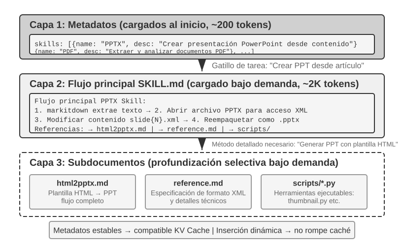
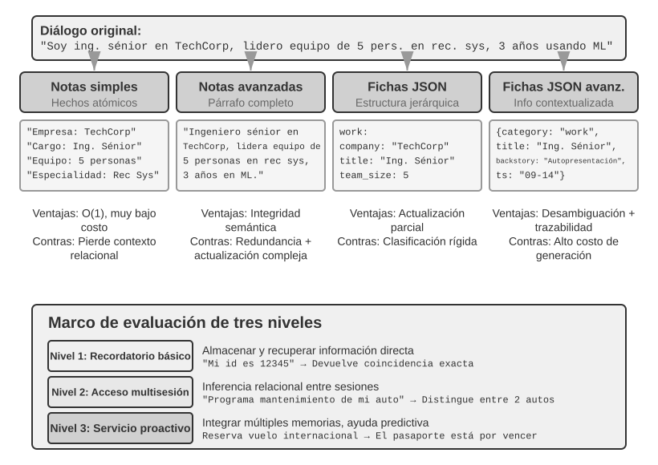
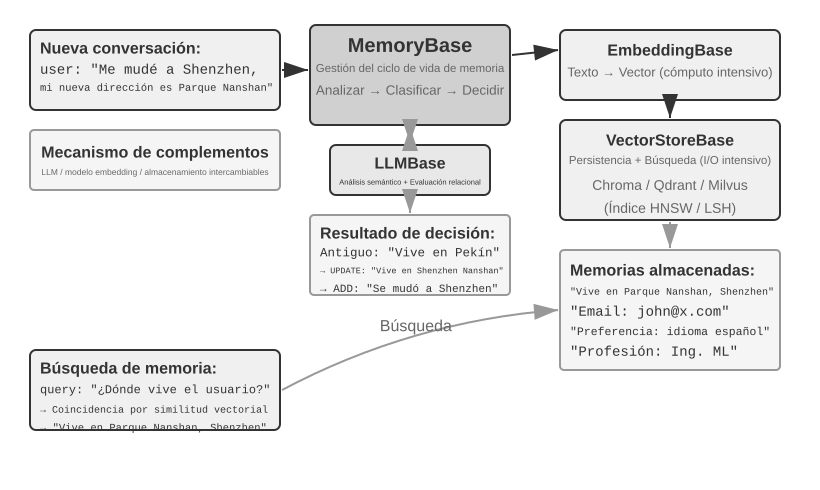
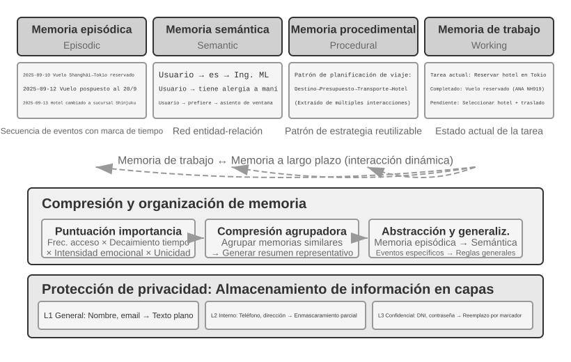
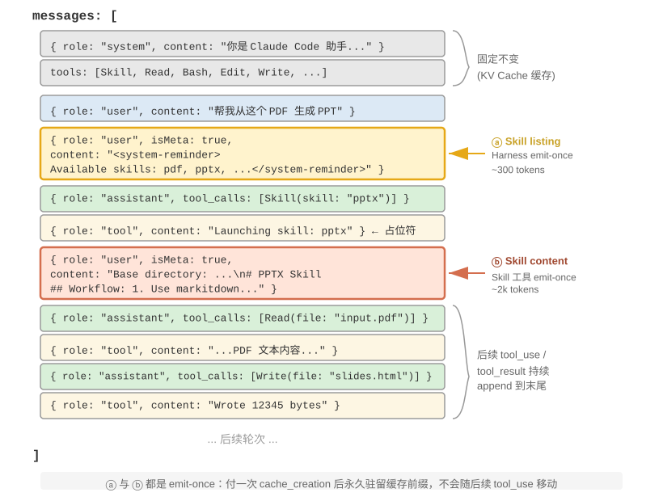
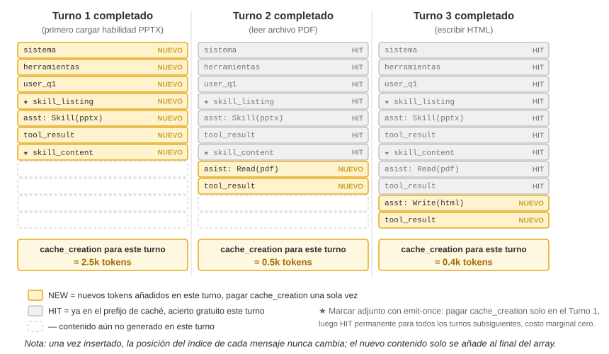
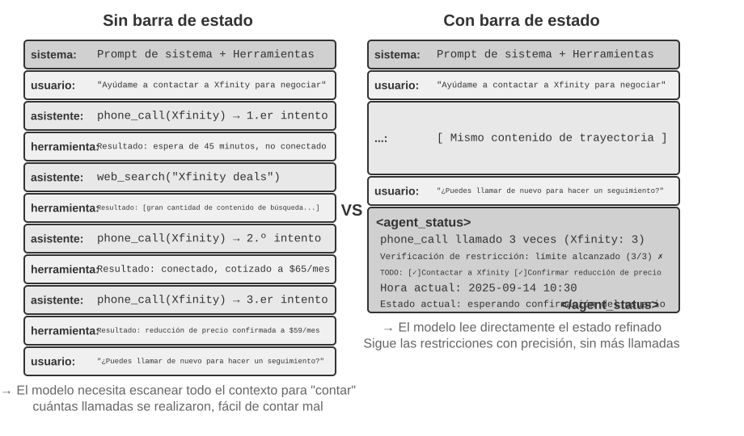
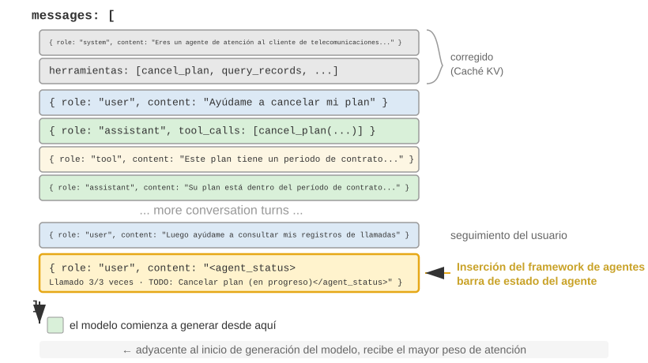
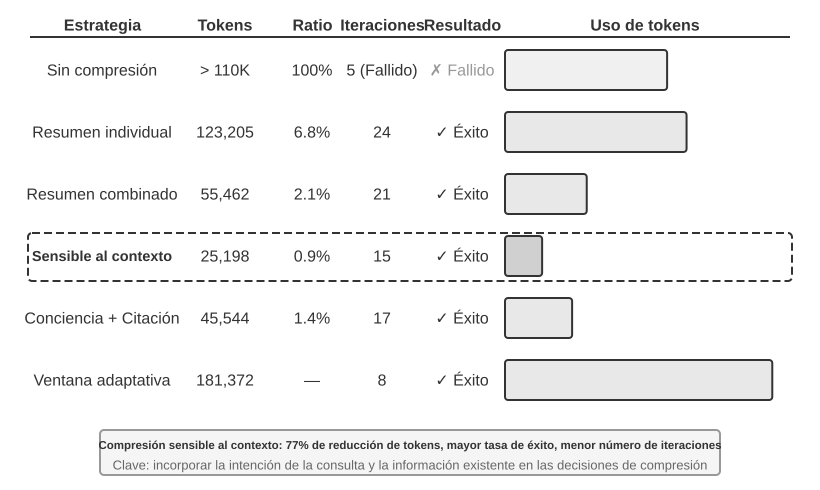
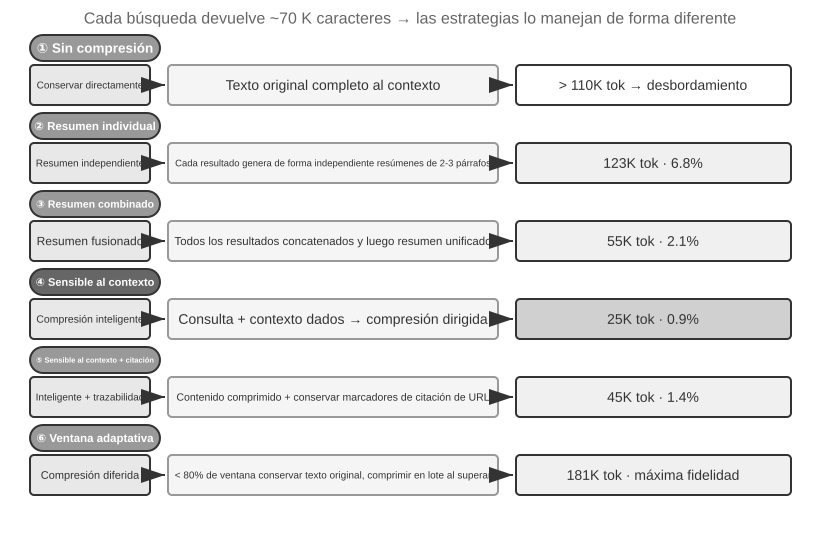

# Capítulo 2: Ingeniería de Contexto y Gestión de Memoria

El Capítulo 1 definió el contexto como el conjunto de información de trabajo disponible para el Agente en el momento de tomar una decisión. El diseño y la gestión de ese contexto —lo que llamamos **Ingeniería de Contexto**— es fundamental para construir Agentes efectivos. En la práctica, el contexto incluye todo lo que recibe el modelo en una interacción determinada: el historial de conversación, las instrucciones del sistema, las definiciones de herramientas, los documentos recuperados, el estado en tiempo de ejecución y otra información específica de la tarea. Desde la perspectiva del Harness introducida en el Capítulo 1, la ingeniería de contexto implementa gran parte de la capa de "Contexto y Herramientas": decide qué información ve el Agente en cada punto de decisión y cómo se organiza dicha información.


## El Contexto: El Techo de las Capacidades del Agente

Los modelos de lenguaje grandes obtienen resultados destacados en evaluaciones estandarizadas, pero a menudo tienen un rendimiento inferior en entornos empresariales reales. La razón es directa: las capacidades del modelo son de propósito general, mientras que las tareas concretas dependen de conocimientos locales como la arquitectura del producto, las reglas de negocio, las restricciones operativas y las convenciones internas. Esta información suele estar ausente de los parámetros del modelo.

Considera a un ingeniero altamente capacitado que se une a un nuevo equipo. Puede tener profundos conocimientos teóricos y gran capacidad de programación, pero aún no comprende la arquitectura del producto, la lógica de negocio, la deuda técnica o las normas del equipo. Si las decisiones arquitectónicas clave están dispersas en memorias individuales y la base de código está mal documentada, incluso un ingeniero excepcional tendrá dificultades para aportar valor rápidamente. Los Agentes de IA actuales enfrentan exactamente el mismo problema.

Considera un Agente Programador (Coding Agent). Dada la misma instrucción, "Ayúdame a corregir este error", la calidad del contexto que recibe el Agente determina si puede completar la tarea:

- **Contexto de código**: La estructura del código fuente, las responsabilidades de los módulos, las estructuras de datos fundamentales y los estándares de codificación.
- **Requisitos del proceso**: Estrategia de ramas en Git, convenciones de commits, proceso de revisión y requisitos de CI/CD.
- **Configuración del entorno**: Configuración de desarrollo, cadenas de conexión a bases de datos de prueba, procedimientos de despliegue en entornos de staging y prácticas de gestión de claves API.

Estas tres categorías (código, proceso y entorno) forman el contexto mínimo que necesita un Agente para trabajar eficazmente. La capacidad inherente del modelo es solo la base; el contexto establece el techo de las capacidades del Agente. Un modelo de capacidad moderada con un contexto bien organizado a menudo puede superar a un modelo más fuerte que opera con un contexto insuficiente.

Por lo tanto, tratar a un Agente de IA como a un nuevo miembro del equipo cada vez que inicia una tarea es la metáfora correcta. Con suficiente contexto previo, puede producir trabajo de alta calidad; sin ese contexto, gran parte de su inteligencia se desperdicia.

El investigador de OpenAI Jiayi Weng expresó este punto con claridad: **"Tanto para los humanos como para los modelos, lo más importante es el Contexto."** Señaló que el problema central en el trabajo en equipo es la inconsistencia del contexto, y que una de las razones por las que la IA no puede reemplazar a los humanos a corto plazo es que la IA y los humanos no comparten el mismo entorno. La ingeniería de contexto aborda precisamente este problema.

## Cómo Invocan los Agentes a los LLMs: La Estructura de Contexto a Nivel de API

Esta sección utiliza la API de Chat Completions de OpenAI como un ejemplo concreto. Anthropic, Google y otros proveedores difieren en detalles, pero sus APIs orientadas a Agentes siguen un patrón similar: cada llamada al modelo se construye a partir de un historial de conversación estructurado más un conjunto de definiciones de herramientas disponibles.

### Los Cuatro Roles de Mensajes

En las APIs de tipo Chat Completions, la entrada central es una **lista de mensajes**, habitualmente llamada `messages`. Cada mensaje tiene un campo `role` que indica al modelo cómo interpretar el mensaje y de dónde proviene:

- **system**: Instrucciones escritas por el desarrollador que definen la identidad, comportamiento, restricciones y flujo de trabajo del Agente.
- **user**: Entrada del usuario final que representa la solicitud a manejar.
- **assistant**: Salidas previas del modelo, incluyendo respuestas en lenguaje natural y solicitudes de llamada a herramientas.
- **tool**: Resultados devueltos tras la ejecución de una herramienta por parte del framework del Agente. Cada resultado se vincula con la solicitud correspondiente mediante `tool_call_id`.

Las definiciones de herramientas no son mensajes; se proporcionan en un campo separado `tools`.

### Petición de un Solo Turno: La Llamada API Más Simple


En el caso más simple sin llamadas a herramientas:

```javascript
// ═══ Petición construida por el framework del Agente ═══
{
  "model": "Qwen3-0.6B",
  "messages": [
    {
      "role": "system",
      "content": "Eres un asistente de programación servicial. Sigue las instrucciones del usuario."
    },
    {
      "role": "user",
      "content": "Hola, ¿quién eres?"
    }
  ]
}
```

```javascript
// ═══ Respuesta devuelta por la API ═══
{
  "choices": [{
    "message": {
      "role": "assistant",
      "content": "¡Hola! Soy un asistente de programación. Puedo ayudarte a escribir código, depurar errores y explicar conceptos técnicos. ¿En qué puedo ayudarte hoy?"
    }
  }]
}
```

Cada llamada es sin estado (stateless), por lo que la lista de mensajes debe contener toda la información que el modelo necesita.

### Interacción Multiturno con Llamadas a Herramientas: El Bucle Central de un Agente

Cuando un usuario pregunta: "¿Cuál es la hora y el clima actual en Vancouver?", el modelo necesita acceso a información externa dinámica.


**Primera llamada a la API:** El framework envía la petición con `tools`. El modelo devuelve solicitudes de llamada a herramientas con `tool_calls` e `id` explícitos (`call_abc123`, `call_def456`).

**Segunda llamada a la API:** El framework ejecuta las herramientas de forma paralela y envía de vuelta todo el historial, incluyendo los mensajes de tipo `tool` con su correspondiente `tool_call_id`.

**Respuesta final:** El modelo recibe la trayectoria completa y genera la respuesta final al usuario.

### Implementando el Bucle Central del Agente en Código

En Python, el bucle central de un Agente se implementa de la siguiente manera:

```python
from openai import OpenAI

client = OpenAI()

# ── Definiciones de herramientas ──
tools = [
    {
        "type": "function",
        "function": {
            "name": "get_current_time",
            "description": "Obtener la fecha y hora actual en una zona horaria específica",
            "parameters": {
                "type": "object",
                "properties": {
                    "timezone": {"type": "string", "description": "Nombre de la zona horaria, ej. America/Vancouver"}
                },
            },
        },
    },
    {
        "type": "function",
        "function": {
            "name": "get_weather",
            "description": "Obtener el clima actual para una ciudad específica",
            "parameters": {
                "type": "object",
                "properties": {
                    "city": {"type": "string", "description": "Nombre de la ciudad"},
                    "unit": {"type": "string", "enum": ["celsius", "fahrenheit"]},
                },
            },
        },
    },
]

def execute_tool(name, arguments):
    if name == "get_current_time":
        return '{"datetime": "2025-09-13T05:18:47", "day_of_week": "Saturday"}'
    elif name == "get_weather":
        return '{"temperature": 13.2, "unit": "celsius", "conditions": "clear", "humidity": 93}'

messages = [
    {"role": "system", "content": "Eres un asistente servicial. Utiliza herramientas para obtener información en tiempo real cuando sea necesario."},
    {"role": "user", "content": "¿Cuál es la hora y el clima actual en Vancouver?"},
]

# Bucle principal del Agente
while True:
    response = client.chat.completions.create(
        model="Qwen3-0.6B", messages=messages, tools=tools
    )
    assistant_message = response.choices[0].message
    messages.append(assistant_message)

    if not assistant_message.tool_calls:
        print(assistant_message.content)
        break

    for tool_call in assistant_message.tool_calls:
        result = execute_tool(tool_call.function.name, tool_call.function.arguments)
        messages.append({
            "role": "tool",
            "tool_call_id": tool_call.id,
            "content": result,
        })
```

### Cómo se Compone el Contexto a Nivel de API


El prefijo estático (`system` + `tools`) no cambia; la trayectoria (`user` + `assistant` + `tool`) crece con cada iteración.

> **Experimento 2-1 ★: Despliegue de Servicios de LLM Locales y Llamada a Herramientas**
>
> Muestra cómo modelos pequeños (como Qwen3-0.6B) pueden ejecutar llamadas a herramientas de forma fiable si se diseñan adecuadamente los prompts y la arquitectura.

## Diseño de Contexto Amigable con la Caché KV (KV Cache)

La **Caché KV (KV Cache)** almacena los estados intermedios de clave-valor (Key-Value) calculados durante la atención. **El requisito previo fundamental es que el prefijo se mantenga completamente inalterado**: si se cambia un solo carácter en el prefijo, la caché para dicho prefijo queda invalidada y el modelo debe volver a calcular desde el punto cambiado en adelante.

Tres conclusiones clave para la práctica:

1. **Una vez finalizados el system prompt y las definiciones de herramientas, no los modifiques.** Cualquier cambio invalida toda la caché.
2. **Añade siempre la información dinámica al final** (marcas de tiempo, estado del usuario) en forma de nuevos mensajes.
3. **Utiliza el formato API estándar; no concatenes mensajes manualmente en texto plano.**

> **Experimento 2-2 ★: Visualización del Mecanismo de Atención**
>
> Tabla 2-1 Roles de Query, Key y Value en el Mecanismo de Atención
>
> | Vector | Significado | En el ejemplo "Clima en Pekín" |
> |-------|-----------------------------------------|-----------------------------------------------|
> | **Query** | La solicitud de búsqueda del token actual | "¿Cómo es?" pregunta qué palabra anterior es más relevante |
> | **Key** | La etiqueta de cada palabra para coincidir | "Pekín" se inclina a nombre de lugar; "clima" a meteorología |
> | **Value** | El contenido extraído tras una coincidencia exitosa | Extrae la información semántica tras coincidir con "clima" |


Fenómenos clave: **Attention Sink** (el primer token absorbe masa de atención residual debido a la restricción softmax = 100%) y el sesgo de posición **Lost in the Middle**[^lost-in-the-middle].

[^lost-in-the-middle]: Liu et al. "Lost in the Middle: How Language Models Use Long Contexts", TACL, 2024.

### De Mensajes API a Tokens del Modelo: La Plantilla de Chat (Chat Template)

La Plantilla de Chat convierte los mensajes JSON en una secuencia lineal de tokens con delimitadores especiales como `<|im_start|>` y `<|im_end|>`.





### Principios y Restricciones de KV Cache

Sin Caché KV, el costo computacional de la fase de prefill crece de forma cuadrática ($O(N^2)$) con respecto a la longitud del contexto. Con Caché KV, los vectores K y V de los tokens anteriores se reutilizan.



> **Experimento 2-3 ★★: Patrones de Gestión de Contexto Comunes pero Nocivos**
>
> Patrones destructivos para la caché KV:
> 1. **System Prompt Dinámico** (inyectar marcas de tiempo `Current time: {{now}}` invalida la caché en cada petición).
> 2. **Configuración de Usuario Dinámica** (inyectar saldos o créditos en el prefijo).
> 3. **Ordenación Dinámica de Herramientas** (reordenar herramientas rompe la coincidencia de bytes).
> 4. **Historial por Ventana Deslizante (Sliding Window)** (eliminar mensajes antiguos rompe la consistencia del prefijo y causa bucles infinitos al perder resultados de herramientas anteriores).
> 5. **Formateo de Texto Manual** (perjudica la capacidad del modelo al apartarse del formato de entrenamiento).

### KV Cache y Prompt Cache: Dos Niveles de Caché

La **Caché KV** es una optimización interna de la inferencia durante una sola petición. La **Prompt Cache** es una optimización en la capa de servicio de la API entre diferentes peticiones.

### La Caché como Restricción Arquitectónica

En sistemas como Claude Code, el costo de la caché moldea la arquitectura: la estructura de prompts se divide explícitamente en partes cacheables y no cacheables; los subagentes se alinean en bytes con el Agente principal; y las cadenas de reemplazo de resultados de herramientas se congelan desde la primera aparición.

### La Caché KV No Es Necesariamente de Un Solo Uso: "Notas" Editables y Componibles

Investigaciones recientes[^ch2-2] muestran que durante la fase de prefill los modelos toman "notas" en capas posteriores. Esto abre la puerta a la edición y composición modular de la Caché KV en motores como vLLM.

[^ch2-2]: Li, Bojie. *Models Take Notes at Prefill: KV Cache Can Be Editable and Composable.* arXiv:2606.17107, 2026.

## Ingeniería de Prompts: Optimizando el Prompt del Sistema

El Prompt del Sistema (`role: "system"`) es el manual de operaciones del Agente.

### Tono y Estilo: Encuadre del Comportamiento
Uso de restricciones directas ("DEBES responder concisamente en menos de 4 líneas", "NUNCA hagas X").

### Prompts Estructurados: El "Formato" del Prompt del Sistema
Utilizar etiquetas XML (`<working_directory>`, `<instructions>`) e índices Markdown para estructurar la información sin ambigüedades.

### Prompts Orientados a Procesos vs. Apilamiento de Reglas
Un procedimiento operativo estándar (SOP) claro reduce la carga cognitiva y guía al modelo paso a paso:
1. Validación → 2. Clasificación → 3. Preprocesamiento → 4. Ejecución → 5. Verificación.

### Traduciendo Reglas de Negocio en Instrucciones Ejecutables
Las reglas ambiguas producen comportamientos inestables. Los gestores de producto y desarrolladores deben refinar los criterios hasta hacerlos deterministas y ejecutables.

### Ejemplos de Pocos Disparos (Few-Shot Examples)
Proporcionar 2 o 3 ejemplos de alta calidad en lugar de descripciones abstractas largas. Mantener los ejemplos estables en bytes para preservar la caché.

### Diseño de Definiciones de Herramientas
Las descripciones deben incluir límites claros, ejemplos concretos y consejos de rendimiento. Las APIs modernas admiten la carga diferida de schemas mediante herramientas de búsqueda (`tool_search` / `tool_reference`)[^ch2-toolsearch-oai].

[^ch2-toolsearch-oai]: OpenAI, "Tool search", Responses API documentation.

> **Experimento 2-4 ★★: Estudio de Ablación en Ingeniería de Prompts**
>
> En Tau-Bench: la desorganización de la información redujo el éxito de la tarea en más de un 30%; la eliminación de descripciones de herramientas aumentó los errores en un 45%.

### Inyección de Prompts: La Amenaza Central a la Seguridad del Contexto

La **Inyección de Prompts (Prompt Injection)** consiste en plantar instrucciones maliciosas en datos externos procesados por el Agente (páginas web, correos, documentos) para secuestrar su comportamiento.

Defensas a nivel de contexto:
- **Etiquetado de fuentes**: Encerrar contenido externo con etiquetas claras (ej. `<external_content source="webpage">`).
- **Roles estructurados**: Utilizar estrictamente el sistema de roles de la plantilla de chat.
- **Sanitización de entradas**: Filtrar patrones maliciosos conocidos.

> **Experimento 2-5 ★★: Experimento de Ataque y Defensa por Inyección de Prompts**
>
> Evaluación de inyección directa, indirecta y en memoria frente a defensas por etiquetado de fuente e intervención humana.

## Prompts Dinámicos y Skills del Agente



Cargar todas las instrucciones en un único prompt estático desperdicia tokens y causa dilución de la atención. El sistema de **Skills del Agente** implementa la **Revelación Progresiva (Progressive Disclosure)**.

### Skills: Unidades Componibles de Capacidad de Dominio

- **Capa 1 (Metadatos)**: Archivo `SKILL.md` con encabezado YAML (`name`, `description`). Se inyectan al inicio para permitir el descubrimiento.
- **Capa 2 (Flujo de Trabajo Principal)**: Se carga la guía completa del `SKILL.md` solo cuando se necesita.
- **Capa 3 (Detalles)**: Navegación profunda hacia subdocumentos (`reference.md`, `html2pptx.md`)[^ch2-3].

[^ch2-3]: Anthropic, "Equipping Agents for the Real World with Agent Skills", 2025.

### Métodos de Implementación de Skills y sus Balances (Trade-offs)

1. **Inyección en el System Prompt**: Alta fidelidad, pero rompe la Caché KV en cada cambio.
2. **Lectura como Archivo Normal**: No afecta la Caché KV, pero exige alta capacidad de seguimiento de instrucciones al modelo.
3. **Carga Bajo Demanda con Herramienta Dedicada (Producción)**: Inyecta metadatos ligeros al inicio y carga el contenido completo mediante una herramienta dedicada cuando el Agente lo decide.





### Relación entre Skills y Herramientas
Las Skills proporcionan conocimiento e instrucciones; las herramientas proporcionan ejecutores genéricos.

> **Experimento 2-6 ★★: Generar una Presentación a Partir de un Artículo con Skills**
>
> Uso de Claude Code + PPTX Skill para generar una presentación de 10 a 15 diapositivas a partir de un archivo PDF.

## Barra de Estado del Agente: Gestión de Trayectorias con Metainformación



La **Barra de Estado del Agente (Agent Status Bar)** es un resumen de estado que el framework inyecta al final del contexto: "Llamadas realizadas: 3", "Hora actual: 10:30", "Tareas pendientes: 2".

### Base Teórica de la Barra de Estado del Agente

La atención del modelo es excelente para **recuperar** información existente, pero deficiente para **destilar** estados agregados en una sola pasada. La Barra de Estado convierte estados implícitos dispersos en conocimiento explícito listo para ser consumido.

> **Experimento 2-7 ★★: Verificación del Efecto de la Barra de Estado Mediante Visualización de Atención**
>
> El grupo con Barra de Estado concentró la atención en los datos agregados y evitó bucles infinitos de llamadas repetidas.

La investigación sobre **Destilación de Contexto (Context Distillation)**[^ch2-7] demuestra:
- Para modelos débiles, recupera la precisión (ganancias de 40 a 54 puntos porcentuales).
- Para modelos fuertes, reduce los tokens de razonamiento en un 80-90%.
- Cambia la complejidad de razonamiento por consulta de crecimiento continuo a **constante**.

Tres lecciones prácticas:
1. **Mantén la barra de estado con código, no con un LLM.**
2. **Confirma que la barra de estado cubra todas las preguntas potenciales antes de descartar el historial original.**
3. **Monitorea la precisión de la barra de estado como una métrica de producción de primer nivel.**

[^ch2-7]: Li, Bojie y Noah Shi. *Distill, Don't Retrieve: Inference-Time Context Distillation for LLM Agent Reasoning.* 2026.

De lecturas a estrategia: la percepción del tiempo físico abarca Urgencia, Persistencia y Vigilancia[^ch2-8].

[^ch2-8]: Li, Bojie y Noah Shi. *Agents That Sense Physical Time: Urgency, Persistence, and Vigilance as Missing Controls for LLM Agents.* 2026.

### Composición de la Barra de Estado del Agente
- Planificación de tareas (lista TODO).
- Información de canal lateral (marcas de tiempo, ubicación).
- Estado del entorno actual.
- Lista de capacidades disponibles.

### Posición Específica de la Barra de Estado en el Contexto



Se inyecta como un mensaje con `role: "user"` al final de la lista de mensajes, envuelto en etiquetas `<agent_status>`.

```xml
<agent_status>
  Estado Actual:
  - phone_call invocada 3 veces (Xfinity: 3/3 máx)
  - Hora actual: 2025-09-14 10:30:45
  - TODO: [1] Cancelar plan (en_proceso)
</agent_status>
```

### Dos Implementaciones de Actualizaciones de Estado y sus Costos de Caché
1. **Reemplazo en cada turno**: Mantiene limpio el contexto, pero invalida la Caché KV de los últimos turnos.
2. **Anexado persistente**: Mantiene inalterada la Caché KV, pero acumula estados antiguos en la trayectoria.

> **Experimento 2-8 ★★: Varias Técnicas Útiles para la Barra de Estado del Agente**
>
> Implementación de seguimiento de marcas de tiempo, contador de llamadas a herramientas, gestión de listas TODO, información detallada de errores y percepción del estado del sistema.

## Estrategias de Compresión de Contexto

Reducir el contenido en el contexto aborda dos problemas: controlar la longitud/costo y mejorar la calidad del razonamiento.

### El Mecanismo Interno del Aprendizaje en Contexto: Recuperación, No Razonamiento

Reemplazar registros detallados masivos por conclusiones resumidas evita la degradación del contexto (**Context Rot**), donde la información relevante se pierde entre el ruido.

### Compresión y Caché KV: Contradicción Aparente, Complementariedad Práctica

La compresión debe realizarse por lotes entre llamadas a la API cuando el contexto se acerca al límite, preservando el prefijo estático.



> **Experimento 2-9 ★★★: Comparación de Estrategias de Compresión de Contexto**
>
> Evaluación de seis estrategias: Sin compresión, Resumen individual, Resumen combinado, Compresión consciente del contexto, Compresión consciente con citas y Ventana adaptativa. La compresión consciente del contexto redujo el uso de tokens en un 75% manteniendo una precisión superior.



### Mecanismo de Compresión Jerárquica de Nivel de Producción

1. Control de presupuesto de resultados de herramientas.
2. Eliminación directa de ruido.
3. Microcompresión a nivel de API.
4. Resumen de archivo.
5. Compresión completa basada en LLM (con disyuntor por fallos).

### Aislamiento en Lugar de Compresión: Aislamiento del Contexto del Subagente

Delegar tareas pesadas a subagentes independientes devuelve solo un resumen conciso de unos pocos cientos de tokens al Agente principal, protegiendo su Caché KV y evitando el ruido en el contexto principal.

## Resumen del Capítulo

- **El Contexto Determina el Techo**: La organización del contexto influye más en el resultado final que la capacidad pura del modelo.
- **Respetar la Caché KV**: Mantener estable el prefijo estático es clave para la eficiencia y el costo.
- **SOP en el Prompt del Sistema**: Estructurar las instrucciones mediante XML/Markdown y flujos orientados a procesos.
- **Skills para Carga Bajo Demanda**: La revelación progresiva evita la saturación del contexto.
- **Barra de Estado para Estados Explícitos**: Inyectar metadatos al final del contexto guía la atención del modelo de forma precisa.
- **Compresión e Aislamiento**: Combinar la compresión jerárquica con el aislamiento de subagentes para mantener la densidad de información.

## Preguntas de Reflexión

1. ★★★ El Experimento 2-3 demostró que una ventana deslizante hace que el Agente repita llamadas a herramientas. Diseña una estrategia que evite la pérdida de información manteniendo el control de longitud sin romper la Caché KV.
2. ★★ La retención de cadena de pensamiento de Qwen3 conserva el razonamiento tras el último mensaje del usuario. ¿Cómo modificarías este mecanismo para bucles ReAct muy largos? Compara las estrategias de DeepSeek R1 y DeepSeek V4.
3. ★★ En la compresión consciente del contexto, al comprimir de 148K caracteres a 2,000 caracteres, ¿cómo se mitiga el riesgo de pérdida irreversible de información?
4. ★★ La Barra de Estado hace explícitos los estados implícitos. Si la barra contiene datos erróneos por un fallo en el contador, ¿cómo se aborda la confiabilidad de la metainformación?
5. ★★ El estudio de ablación mostró que la desorganización de información reduce el éxito en más de un 30%. ¿Qué prácticas de ingeniería evitan que los prompts del sistema se desorganicen con el tiempo?
6. ★★★ Si el aprendizaje en contexto es esencialmente recuperación y no razonamiento, ¿cómo deben reevaluarse las estrategias de "introducir más información en el contexto"?
7. ★★★ La revelación progresiva de Skills requiere que el Agente juzgue cuándo necesita una Skill. ¿Cómo se resuelve este problema de metacognición?
8. ★★ Tras cargar dinámicamente instrucciones desde `SKILL.md`, ¿con qué fiabilidad siguen los modelos las instrucciones según el proveedor?
9. ★★★ Dado que la información dinámica rompe las coincidencias de Caché KV, ¿cómo diseñarías el diseño del contexto para maximizar la tasa de acierto de caché en un sistema con cientos de herramientas cambiantes?
10. ★★★ Compara la compresión post-hoc frente al aislamiento de subagentes. ¿En qué escenarios es superior cada enfoque?
