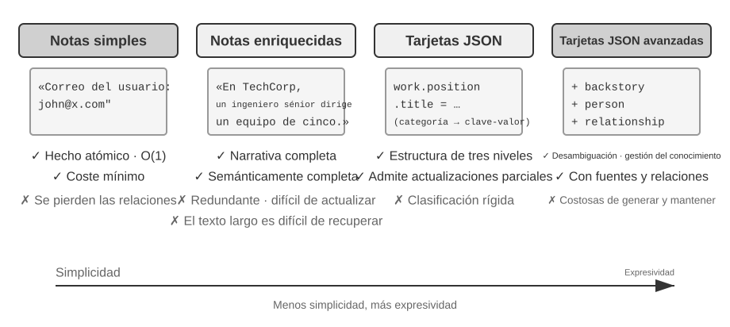
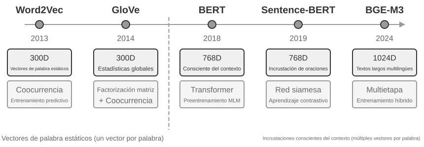
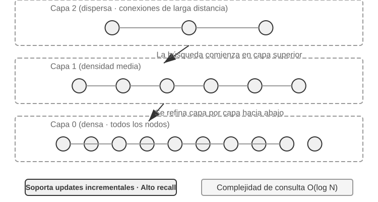
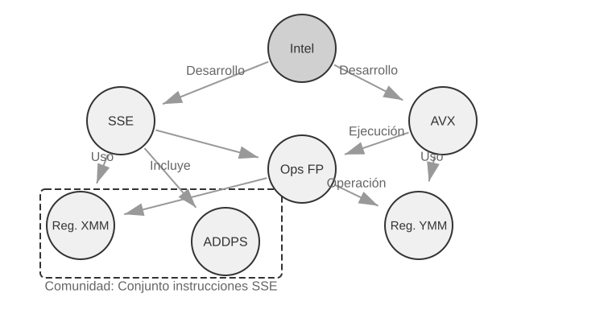
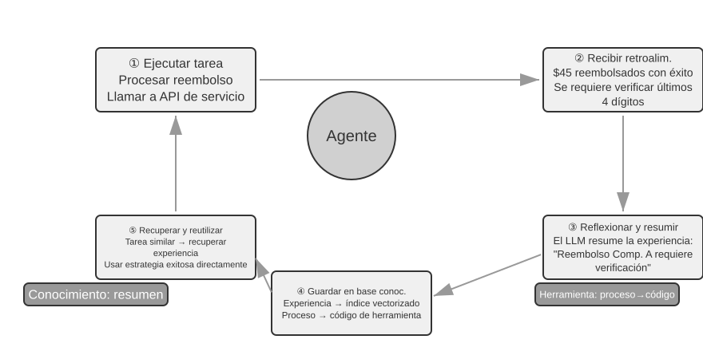
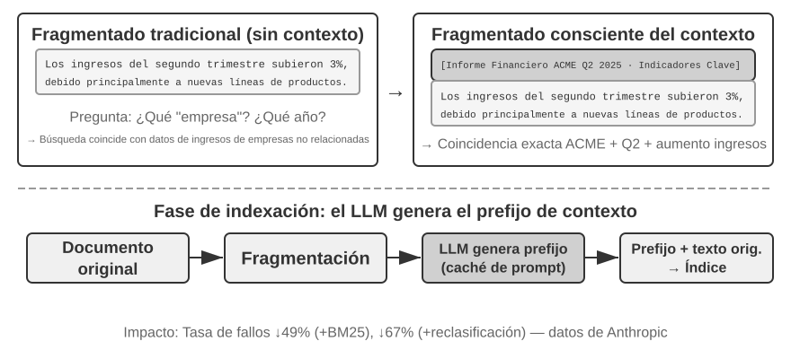

# Capítulo 3: RAG y Recuperación Contextual

El capítulo anterior abordó la gestión de contexto dentro de una sola interacción. Este capítulo aborda un problema más complejo: cómo permitir que un Agente recuerde a los usuarios y conserve el conocimiento incluso después de que finalice una conversación.

Este sistema de memoria persistente puede entenderse a dos escalas. La **Memoria del Usuario** es la memoria personalizada para un usuario individual: el Agente aprende gradualmente las preferencias, hábitos y necesidades del usuario a través de las interacciones, construyendo un modelo de conocimiento único. La **Base de Conocimiento** es el conocimiento colectivo compartido entre todos los usuarios (normativas del sector, procedimientos operativos internos de una empresa o documentación técnica especializada). El primero convierte al Agente en un "asistente personal que te conoce", mientras que el segundo lo convierte en un "experto en el dominio".


## Sistema de Memoria del Usuario

Un sistema de memoria del usuario es indispensable para construir un Agente de IA que ofrezca un servicio verdaderamente personalizado y continuo. La memoria no es una transcripción literal de todo lo que dice el usuario.

En su núcleo, la memoria del usuario es un proceso de aprendizaje activo y continuo orientado a construir un modelo predictivo conciso y efectivo del usuario. Utiliza cómputo adicional (llamadas a LLM dedicadas que analizan, resumen y estructuran) para extraer y comprimir la información clave dispersa en historiales de conversación largos.

### Evaluación de Capacidades de Memoria: Un Marco de Tres Niveles

Un benchmark representativo en la literatura es **LoCoMo** (Long-term Conversational Memory; Maharana et al., 2024, arXiv:2402.17753). basándonos en LoCoMo y productos comerciales, descomponemos las capacidades de memoria en un marco de tres niveles:

**Nivel 1: Recordatorio Básico (Basic Recall)** — Requiere que el Agente almacene y recupere con precisión información directa, estructurada y no ambigua proporcionada por el usuario (ej. "Mi número de socio es 12345").

**Nivel 2: Recuperación Multisesión (Multi-Session Retrieval)** — El Agente debe recuperar y razonar sobre información relevante cuando las conversaciones abarcan diferentes entidades, canales de servicio y periodos de tiempo (ej. gestionar citas de mantenimiento para un usuario con múltiples vehículos o cancelar un viaje compuesto por vuelos y hoteles).

**Nivel 3: Servicio Proactivo (Proactive Service)** — El nivel superior donde el Agente sintetiza información de múltiples sesiones antiguas para ofrecer ayuda predictiva (ej. advertir que un pasaporte está a punto de caducar antes de un viaje internacional programado o compilar documentos fiscales acumulados durante un año).

> **Experimento 3-1 ★: Evaluación de Sistemas de Memoria con el Marco de Tres Niveles**
>
> Evaluación con 20 casos de prueba por nivel para medir la precisión de extracción, actualización y razonamiento sobre memorias persistentes.

### La Estructura Jerárquica de la Memoria

La memoria se organiza en diferentes niveles:

- **Trayectoria (Trajectory)**: El registro histórico completo y sin modificaciones de una sola sesión (mensajes del usuario, respuestas del modelo y resultados de herramientas). Es un registro cronológico e inmutable (append-only).
- **Memoria a Largo Plazo del Usuario (User Long-Term Memory)**: Almacenamiento persistente entre sesiones vinculado a un ID de usuario. Almacena preferencias, resúmenes de interacción y hechos extraídos que se reescriben y consolidan con el tiempo.
- **Estado de Negocio (Business State)**: Abstracciones de alto nivel definidas por desarrolladores para el estado de una tarea (ej. "requiere clarificación", "en proceso de pago").

### Cuatro Formatos de Almacenamiento para la Memoria del Usuario



1. **Notas Simples (Simple Notes)**: Hechos atómicos mínimos (ej. "Email: john@example.com"). Bajo costo, pero pierde las relaciones entre hechos.
2. **Notas Mejoradas (Enhanced Notes)**: Párrafos con contexto completo. Conserva la semántica narrativa rica, pero aumenta la redundancia y complica la recuperación por embedding.
3. **Tarjetas JSON (JSON Cards)**: Estructura anidada de tres niveles (Categoría → Subcategoría → Clave-Valor). Permite actualizaciones parciales y estructura predecible.
4. **Tarjetas JSON Avanzadas (Advanced JSON Cards)**: Registra el contexto narrativo (`backstory`), la entidad (`person`), la relación (`relationship`) y la marca de tiempo (`timestamp`). Resuelve la desambiguación de entidades entre múltiples miembros de la familia o contextos.

> **Experimento 3-2 ★★: Estudio Experimental Comparativo de Estrategias de Memoria**
>
> Comparación de los cuatro formatos en el marco de evaluación de tres niveles: Simple Notes destaca en el Nivel 1, mientras que Advanced JSON Cards domina en los Niveles 2 y 3.

### Representación Avanzada: De Código Ejecutable a Memoria Paramétrica

El proyecto **User as Code**[^uac] propone representar la memoria del usuario no como texto plano, sino como un **proyecto de código ejecutable en Python** con tipos fuertes (`dataclasses`, `date()`, listas tipadas).

```python
from datetime import date

passport = PassportInfo(
    number="AB1234567", country="US",
    expiry_date=date(2025, 2, 18),
)
trips = [
    Trip(destination="Tokyo", departure_date=date(2025, 1, 15), is_international=True),
]
```

Ventajas de User as Code:
- **Agregación estadística**: Operaciones deterministas en código con precisión del 99% (`sum(1 for t in trips if t.is_international)`).
- **Detección de conflictos**: Funciones que verifican contradicciones entre medicamentos y alergias.
- **Cumplimiento de restricciones**: Verificaciones automáticas de caducidad de pasaportes antes de viajes internacionales.

Otras representaciones avanzadas:
- **User as Engram**[^engram]: Escribir hechos del usuario directamente en ranuras de N-gramas en los parámetros del modelo sin gradientes.
- **Memoria Paramétrica Multimodal**[^mmm]: Conservar percepciones continuas (rostros, tonos de voz) mediante bancos de vectores de memoria.

[^uac]: Li, Bojie. *User as Code: Executable Memory for Personalized Agents.* arXiv:2606.16707, 2026.
[^engram]: Li, Bojie. *User as Engram: Internalizing Per-User Memory as Local Parametric Edits.* arXiv:2606.19172, 2026.
[^mmm]: Li, Bojie. *Parametric Multimodal User Memory: Storing What Captions Cannot Carry.* 2026.

### Fundamentos de Ciencia Cognitiva de la Memoria del Usuario

- **Memoria Episódica (Episodic Memory)**: Registro de eventos específicos (ej. "El usuario reservó un vuelo a Tokio el pasado miércoles").
- **Memoria Semántica (Semantic Memory)**: Conocimiento general abstraído (ej. "El usuario es vegetariano").
- **Memoria Procedimental (Procedural Memory)**: Patrones de comportamiento y procedimientos (ej. "Buscar vuelos directos → confirmar asiento → aplicar millas").

Tabla 3-1 Tres Sistemas de Clasificación para el Diseño de Memoria

| Sistema de Clasificación | Pregunta que Responde | Categorías Específicas |
|----------------------------------|---------------|----------------------------------------------|
| Jerarquía de Memoria | **¿Dónde se almacena?** | Trayectoria, Memoria a Largo Plazo, Estado de Negocio |
| Formato de Almacenamiento | **¿Cómo se almacena?** | Notas Simples, Notas Mejoradas, Tarjetas JSON, Tarjetas JSON Avanzadas |
| Tipo Cognitivo | **¿Qué se almacena?** | Memoria Episódica, Memoria Semántica, Memoria Procedimental |

### Casos de Estudio de Frameworks de Memoria

- **Mem0**[^mem0]: Pipeline de dos etapas Extraer-Comparar-Decidir (ADD, UPDATE, DELETE, NOOP) con soporte para grafos en Mem0-g.
- **Memobase**: Perfiles de usuario por temas y memoria de eventos en línea de tiempo.





[^mem0]: Chhikara et al., Mem0: Building Personalized AI Applications, arXiv:2504.19413, 2025.

### Mecanismos de Compresión y Organización de la Memoria

Estrategia de compresión multinivel:
1. Puntuación de importancia (frecuencia de acceso, decaimiento temporal, intensidad emocional, unicidad).
2. Agrupamiento (clustering) y resúmenes representativos.
3. Abstracción y generalización hacia memoria semántica o procedimental.
4. Detección y versión de conflictos.

### Protección de la Privacidad: Sanitización de Registros

> **Experimento 3-3 ★★: Sanitización Inteligente de Registros con un Modelo Local**
>
> Uso de modelos locales (Qwen3 0.6B en Ollama) para detectar PII (información de identificación personal) y sanitizar registros sin enviar datos sensibles a APIs externas en la nube.

## Fundamentos de RAG: Construyendo la Cadena de Adquisición de Conocimiento del Agente

Generación Aumentada por Recuperación (RAG) combina la capacidad de razonamiento del LLM con el conocimiento actualizado de una base de conocimiento externa.

El flujo básico: **Recuperar fragmentos relevantes → Inyectar en el contexto → El LLM genera la respuesta basándose en el contexto**.


### Fragmentación de Documentos (Document Chunking)

Divide documentos largos en fragmentos (chunks):
- **Fragmentación por Tamaño Fijo (Fixed-size)**: Tokens fijos (ej. 512) con solapamiento (10-20%).
- **Fragmentación Recursiva/Estructurada**: Corta respetando títulos, párrafos y sintaxis (Markdown, HTML).
- **Fragmentación Semántica**: Calcula similitudes entre oraciones adyacentes y corta ante caídas bruscas de similitud.

### Embeddings Densos: De la Asociación Léxica a la Comprensión Semántica

Un **Embedding** mapea palabras o textos a vectores en un espacio de alta dimensión donde la proximidad representa similitud semántica. Se mide habitualmente con la **Similitud Coseno**:

$$\text{cos}(\theta) = \frac{\mathbf{A} \cdot \mathbf{B}}{\|\mathbf{A}\| \|\mathbf{B}\|}$$


De Word2Vec (estático) a modelos conscientes del contexto (BERT, BGE-M3) mediante mecanismos de autoatención.

> **Experimento 3-4 ★★: Construyendo un Servicio de Recuperación Vectorial: Estudio Comparativo de Algoritmos de Indexación ANN**


Tabla 3-2 Comparación de Algoritmos de Indexación ANNOY y HNSW

| Característica | ANNOY (Basado en Árboles) | HNSW (Basado en Grafos) |
|-----------------|----------------------------------|--------------------------------------------|
| Velocidad de Construcción | Rápida | Más lenta |
| Uso de Memoria | Bajo | Mayor |
| Actualizaciones Incrementales | No soportado (requiere reconstrucción) | Soportado |
| Precisión de Consulta | Relativamente Alta | Extremadamente Alta |

### Embeddings Dispersos: Recuperación Basada en Coincidencia Exacta de Palabras Clave

Algoritmos tradicionales basados en frecuencia de palabras como **BM25**, derivados de TF-IDF:


> **Experimento 3-5 ★★: Explorando la Recuperación Dispersa: Implementando un Motor BM25 desde Cero**

### Recuperación Híbrida: El Arte de Tener lo Mejor de Ambos Mundos

Combina recuperación densa (semántica) y dispersa (palabras clave exactas).


Proceso en 3 etapas:
1. **Recuperación Paralela** (Densa + Dispersa).
2. **Fusión de Resultados**: Normalización o Fusión por Rango Recíproco (RRF, Reciprocal Rank Fusion):

$$\text{RRF\_Score}(d) = \sum_{m \in M} \frac{1}{k + r_m(d)}$$

3. **Reordenamiento Neuronal (Neural Reranking)**: Uso de un **Cross-Encoder** que evalúa conjuntamente la consulta y el documento candidato para la clasificación final.

Tabla 3-3 Tres Métricas Centrales de Calidad de Recuperación

| Métrica | Explicación Intuitiva |
|-------------------------------|----------------------------------------------------------------|
| **Recall@k** (Tasa de aciertos) | Proporción de consultas donde el documento correcto aparece entre los primeros $k$ resultados. |
| **MRR** (Mean Reciprocal Rank) | Promedio del recíproco del rango del primer documento relevante devuelto. |
| **nDCG** (Normalized Discounted Cumulative Gain) | Evalúa la posición y relevancia acumulada ponderada por la posición en el rango. |

> **Experimento 3-6 ★★: Pipeline de Recuperación Híbrida: Combinando Densa, Dispersa y Reranking**

### Extracción de Información Multimodal: Más Allá de los Límites del Texto

1. **Procesamiento Multimodal Nativo**: Proyección de imágenes (Vision Transformer - ViT) y texto a un espacio semántico unificado.
2. **Extracción a Texto**: Conversión previa mediante OCR / transcripción (bajo costo, pierde estructura visual).
3. **Análisis Basado en Herramientas**: Inspección profunda bajo demanda mediante herramientas especializadas (`analyze_image`, `analyze_pdf`).

> **Experimento 3-7 ★★: Extracción de Información Multimodal: Análisis Comparativo de Tres Paradigmas Técnicos**

## Más Allá del Texto Plano: Organización y Recuperación del Conocimiento

### Indexación Estructurada: De la Recuperación de Información al Modelado del Conocimiento


**RAPTOR**: Construcción ascendente de resúmenes jerárquicos agrupados por clústeres semánticos, formando un árbol desde detalles (hojas) hasta conceptos macro (raíz).



**GraphRAG**: Extracción de entidades y relaciones en forma de tripletas `(sujeto, predicado, objeto)` y detección de comunidades para razonamiento multisalida y desambiguación.

> **Experimento 3-8 ★★★: Indexación Estructurada: La Filosofía de Organización de Conocimiento de RAPTOR y GraphRAG**

### El Paradigma del Sistema de Archivos: Organizando el Conocimiento con Estructuras de Directorios

Framework **OpenViking** (ByteDance): mapea todo el contexto a un sistema de archivos virtual con URIs `viking://`:

```
viking://
├── resources/          # Conocimiento externo
├── user/memories/      # Memoria del usuario
└── agent/              # Skills y memoria del Agente
```

Carga bajo demanda L0 (Resumen ~100 tokens), L1 (Visión general ~2,000 tokens) y L2 (Texto completo).

### Gobernanza y Vigencia de la Base de Conocimiento
- Actualizaciones incrementales (HNSW vs ANNOY).
- Desmantelamiento de contenido caducado mediante metadatos de versión y fecha.
- Aislamiento de inquilinos y filtrado de permisos en la capa de recuperación.

### RAG Agentizado (Agentic RAG): Un Cambio de Paradigma Hacia la Recuperación Basada en Herramientas


Transforma la recuperación de un pipeline pasivo de un solo paso en un bucle exploratorio dinámico "Pensar → Actuar → Observar" controlado por el Agente.



> **Experimento 3-9 ★★: Estudio Comparativo de RAG Agentizado y RAG No Agentizado**
>
> Demostración en un conjunto de datos judiciales: RAG Agentizado descompone consultas complejas y realiza búsquedas iterativas para resolver razonamientos multisalida con alta precisión.

> **Experimento 3-10 ★★: Construyendo Memoria del Usuario con RAG Agentizado**

### Técnica RAG: Recuperación Contextual (Contextual Retrieval)



Desarrollado por Anthropic[^ch3-1]: antes de vectorizar e indexar un chunk, un LLM genera un resumen de contexto antepuesto (`[Este texto es un extracto del informe Q2 de ACME Corp...]`).

Reducción del 49% en la tasa de fallos de recuperación (1 - recall@20) combinando BM25, y del 67% al agregar un reranker.

[^ch3-1]: Anthropic, "Contextual Retrieval", 2024.

> **Experimento 3-11 ★★: Recuperación Contextual: Resolviendo el Problema de Pérdida de Contexto en RAG**

> **Experimento 3-12 ★★★: Mejorando la Memoria del Usuario con Recuperación Contextual**

**La Arquitectura de Memoria de Dos Niveles**:
- **Tarjetas JSON Avanzadas**: Resumen estructurado residente en el contexto (visión general siempre visible).
- **Recuperación Contextual**: Búsqueda detallada bajo demanda en el historial bruto de conversaciones.

### Extrayendo Conocimiento Profundo de Conjuntos de Datos: De la Recuperación de Información al Descubrimiento de Conocimiento


Fase 1: Extracción y estructuración de factores mediante JSON Schemas.
Fase 2: Análisis de factores y modelado de importancia (One-Hot Encoding, regresión/árboles de decisión).

> **Experimento 3-13 ★★★: Extrayendo Conocimiento Tácito de Datos Estructurados: Estudio de Caso en Análisis de Precedentes Judiciales**

## Resumen del Capítulo

- **Memoria del Usuario a Largo Plazo**: Estructuración progresiva desde notas simples hasta Tarjetas JSON Avanzadas y User as Code.
- **RAG Fundamental**: Fragmentación, embeddings densos, coincidencia dispersa (BM25), fusión RRF y reordenamiento por Cross-Encoder.
- **Indexación Avanzada**: RAPTOR para jerarquías en árbol, GraphRAG para redes de relaciones, y el paradigma del sistema de archivos OpenViking.
- **RAG Agentizado y Recuperación Contextual**: Exploración activa multiturno y preservación del contexto de origen en los chunks.
- **Arquitectura de Memoria de Dos Niveles**: Combinación de perfiles estructurados residentes en contexto con recuperación contextual detallada bajo demanda.

## Preguntas de Reflexión

1. ★★ Cuando un usuario proporciona información contradictoria en diferentes sesiones, ¿cómo debe gestionar este conflicto el sistema de memoria?
2. ★★ Dado que la Recuperación Contextual antepone contexto a cada chunk, si el documento original es desorganizado, ¿cómo se introduce una señal de "calidad de información" en la recuperación?
3. ★★★ RAG Agentizado permite al Agente decidir cuándo buscar. Si el modelo desconoce sus propias lagunas de información, ¿cómo se resuelve el problema de metacognición?
4. ★★ Diseña un esquema para preservar relaciones espaciales y visuales al extraer información de gráficos multimodales hacia texto.
5. ★★★ De acuerdo con la "Lección Amarga" de Rich Sutton, ¿podrían las estructuras RAG actuales ser reemplazadas en el futuro por modelos con ventanas de contexto infinitas?
6. ★★★ A medida que mejoran los modelos base, ¿seguirán siendo necesarias las bases de conocimiento específicas de dominio?
7. ★ ¿En qué tipos de consultas destacan RAPTOR frente a GraphRAG?
8. ★★ ¿Qué ventajas ofrece el paradigma de sistema de archivos (OpenViking) sobre las bases de datos vectoriales tradicionales?
9. ★★★ ¿Puede la extracción de conocimiento impulsada por datos alcanzar la calidad de las reglas redactadas manualmente por expertos humanos?
10. ★★★ Compara la evolución del RAG desde pipelines estáticos de un solo paso hasta sistemas agentizados interactivos de múltiples bucles.
