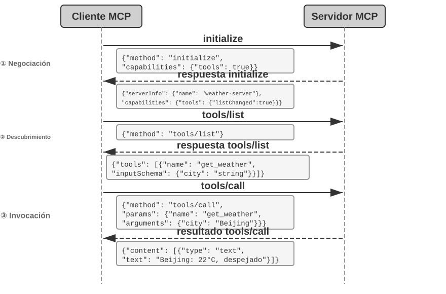
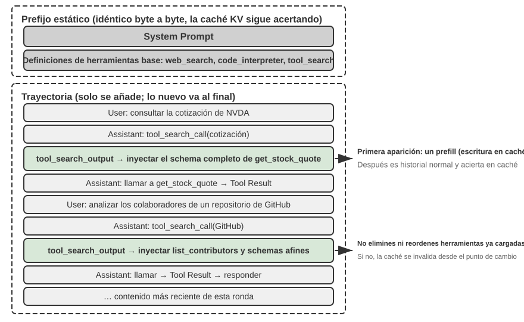

# Capítulo 4: Integración de Herramientas y Protocolos MCP

En la película de ciencia ficción *Her*, la asistente de IA Samantha organiza correos electrónicos de forma proactiva, identifica mensajes emocionalmente complejos, sugiere respuestas refinadas, representa al protagonista en asuntos de publicación y conmuta sin problemas entre diferentes canales de comunicación. Su inteligencia es convincente porque posee potentes **herramientas**: las "manos, pies y sentidos" que conectan un "cerebro" de lenguaje con el mundo digital real.

Construir un asistente semejante con la tecnología actual implica resolver dos desafíos centrales:

1. **El Desafío de la Selección de Herramientas**: Cuando la documentación de miles de herramientas supera la ventana de contexto, ¿cómo puede un Agente encontrar de forma precisa y eficiente la herramienta necesaria para una tarea? ¿Cómo evoluciona de "seleccionar" herramientas pasivamente a "descubrirlas" proactivamente?
2. **El Desafío de la Asincronía y los Eventos**: ¿Cómo puede un Agente gestionar tareas de larga duración, manejar interrupciones del usuario o del sistema en cualquier momento y responder a eventos externos de canales como correos, calendarios y alertas sin quedar atrapado en esperas síncronas?

Este capítulo aborda ambos desafíos.

## Clasificación de Herramientas

El Capítulo 1 presentó las cinco categorías de herramientas. La Tabla 4-1 resume su dirección de invocación y objetivo de acción.

Tabla 4-1 Dirección de Invocación y Objetivo de Acción para las Cinco Categorías de Herramientas

| Tipo de Herramienta | Dirección de Invocación | Objetivo de Acción |
|-------------------------|-----------------------------------|-----------------------------------|
| **Herramientas de Percepción** | El Agente las invoca activamente | Obtener información |
| **Herramientas de Ejecución** | El Agente las invoca activamente | Cambiar el mundo |
| **Herramientas de Colaboración** | El Agente las invoca activamente | Dirigir otros Agentes u humanos |
| **Herramientas de Comunicación con el Usuario** | El Agente las invoca activamente | Transmitir información al usuario |
| **Herramientas Disparadas por Eventos** | El Agente se registra, un evento externo dispara | Impulsar al Agente a iniciar la ejecución |

- **Herramientas de Percepción**: Obtención activa de información (`web_search`, `read_file`, `grep_file`).
- **Herramientas de Ejecución**: Modificación del mundo externo (`shell_exec`, `code_interpreter`, `write_file`, `send_email`). El costo de los errores es alto, por lo que la seguridad es nuclear.
- **Herramientas de Colaboración**: Coordinación con otros Agentes o humanos (`spawn_subagent`, `send_message_to_subagent`, `list_agents`).
- **Herramientas de Comunicación con el Usuario**: Envío activo de información estructurada o respuestas al usuario (`reply_to_user`, `send_card_to_user`).
- **Herramientas Disparadas por Eventos**: Invocación asíncrona por eventos externos previa **registración** (`set_timer`, `connect_channel`).

## Principios Universales del Diseño de Herramientas

### Eligiendo la Forma de Expresión de la Capacidad: Herramientas Dedicadas vs. Skills + Ejecutores Genéricos

- **Herramientas de Código Dedicadas**: Funciones estructuradas deterministas. Cada herramienta consume cientos de tokens y satura el prefijo de la Caché KV.
- **Skills + Ejecutores Genéricos**: Documentos de Skills en lenguaje natural que describen el procedimiento, ejecutados mediante herramientas genéricas (ej. `bash` o `code_interpreter`).

### Balances en la Granularidad de las Herramientas: Integración vs. Separación
Evitar la proliferación excesiva de herramientas. Es preferible unificar herramientas de función similar (como `read_document` con parámetro `file_type`) para reducir la carga cognitiva del LLM.

### Diseñando para la Generalidad de las Herramientas
Las herramientas generales son preferibles a las dedicadas a menos que existan razones estrictas de seguridad o permisos. Un `code_interpreter` reemplaza a decenas de calculadoras específicas.

### El Arte de la Descripción de Herramientas
Las descripciones deben especificar **cuándo usarlas** y, crucialmente, sus **condiciones límite** (qué NUNCA pueden hacer). Los parámetros deben incluir ejemplos concretos (ej. `timestamp: '2024-03-15T14:30:00Z'`).

### Fidelidad en el Paso de Parámetros
Evitar transformaciones silenciosas de entradas (como reemplazar comillas tipográficas por comillas simples sin notificar al modelo) o inyecciones silenciosas de parámetros que causan fallos imposibles de depurar por el LLM.

### La Evolución del Diseño de Herramientas
1. **Primera generación**: Envoltorios directos de APIs (API wrappers).
2. **Segunda generación**: Basados en principios ACI (Agent-Computer Interface).
3. **Tercera generación**: Invocación mediante ejemplos, descubrimiento dinámico y orquestación basada en código.

## Ecosistema de Herramientas: MCP y el Desafío de la Selección de Herramientas

El **Model Context Protocol (MCP)** es un estándar abierto desarrollado por Anthropic a finales de 2024 para unificar la comunicación entre modelos de IA y herramientas/fuentes de datos externas.

Arquitectura Cliente-Servidor de MCP:
- **Servidores MCP (MCP Servers)**: Exponen herramientas, recursos de solo lectura (`resources`) y plantillas de prompts (`prompts`).
- **Clientes MCP (MCP Clients)**: Frameworks de Agentes o IDEs (Cursor, Claude Desktop, OpenClaw).
- **Capa de transporte**: `stdio` para procesos locales y HTTP transmitible (Streamable HTTP) para servidores remotos.

El valor del ecosistema es "desarrollar una vez, usar en todas partes".

### Desafíos y Seguridad en MCP
- **Sobrecarga de contexto**: Muchas definiciones MCP pueden consumir decenas de miles de tokens.
- **Riesgos de seguridad**: Inyección de prompts mediante descripciones maliciosas de herramientas (Tool description poisoning), suplantación de herramientas y exposición de credenciales. Se requiere revisión de definiciones, bloqueo de versiones y credenciales de menor privilegio.

## Herramientas de Percepción
Deben incorporar compresión consciente del contexto para salidas grandes, paginación en búsquedas y soporte de offset/limit en lecturas de archivos. Su carácter de solo lectura facilita la ejecución paralela y el almacenamiento en caché.

> **Experimento 4-1 ★★: Servidor MCP de Herramientas de Percepción**

## Herramientas de Ejecución

Requieren defensas de seguridad en capas:
1. **Validación de entradas**: Prevención de path traversal (`../../etc/passwd`) e inyección de comandos.
2. **Control de permisos**: Directorios de trabajo restringidos y listas negras de comandos.
3. **Mecanismo Proproser-Reviewer (Proponer-Revisar)**:
   - **Pre-aprobación**: Un modelo independiente revisa las acciones propuestas de alto riesgo antes de ejecutarlas.
   - **Post-validación**: Verificación de resultados mediante cambio de modalidad (ej. renderizar visualmente un documento generado).
4. **Mecanismo Sidecar**: Módulo de seguridad out-of-band que evalúa riesgos en paralelo con la salida en streaming del modelo principal, aislando el texto libre para evitar inyecciones.

Tabla 4-2 Comparación entre el Mecanismo Proposer-Reviewer y el Mecanismo Sidecar

| Dimensión | Proposer-Reviewer | Sidecar |
|--------------|-----------------------------------------|-----------------------------------------|
| **Momento de Ejecución** | Antes de la operación (pre-aprobación) o después (post-validación) | En paralelo con el streaming del modelo principal |
| **Objetivo de Revisión** | Razonabilidad de la operación o del resultado | La llamada a la herramienta en sí |
| **Aislamiento de Entradas** | El proponente y el revisor ven información similar | El Sidecar aisla deliberadamente el texto libre del modelo principal |

- **Idempotencia**: Garantizar que reintentar una operación no duplique efectos secundarios. Usar claves de idempotencia o verificación previa antes de mutar.

> **Experimento 4-2 ★★: Servidor MCP de Herramientas de Ejecución**

## Herramientas de Colaboración

Permiten la especialización mediante la división del trabajo entre subagentes y la colaboración con humanos (Human-In-The-Loop - HITL).

Primitivas de colaboración:
- Creación y cancelación: `spawn_subagent`, `cancel_subagent`.
- Paso de mensajes: `send_message_to_subagent`.
- Descubrimiento: `list_agents`.

> **Experimento 4-3 ★★: Servidor MCP de Herramientas de Colaboración**

## Agentes Asíncronos Orientados a Eventos

### Por Qué se Necesita la Asincronía
Las tareas de larga duración no deben bloquear la interacción con el usuario. Las interrupciones y eventos externos deben procesarse con flexibilidad.

### OpenClaw y la Necesidad Real de una Arquitectura Orientada a Eventos
OpenClaw utiliza Gateway para enrutar mensajes y proporciona automatizaciones como Hooks, Cron y Heartbeat. El complemento PineClaw (Pine AI) extiende esto mediante canales en tiempo real para llamadas telefónicas donde el usuario debe proporcionar códigos OTP o autorizaciones en segundos.

### Herramientas Disparadas por Eventos y de Comunicación
- Temporizadores (`set_timer`).
- Monitoreo de tareas en segundo plano (`monitor_shell`).
- Canales de eventos externos (`connect_channel`).
- Comunicación multicanal transparente (mensajería instantánea, correo, SMS, tarjetas estructuradas).

### Identidad Virtual y Entorno de Ejecución Aislado
Proporcionar al Agente una identidad digital propia (cuentas dedicadas, correo propio) y ejecutarse en entornos aislados (máquinas virtuales/contenedores o teléfonos virtuales Android) para mantener la trazabilidad y proteger las cuentas reales del usuario.

### Mecanismo de Manejo de Eventos

Estrategias según urgencia:
1. **Procesamiento Basado en Cancelación (Cancellation-Based)**: Para eventos urgentes (parada del usuario, alerta de seguridad). Fuerza un punto seguro e interrumpe el paso actual.
2. **Procesamiento en Cola (Queued Processing)**: Para eventos rutinarios (resultados de herramientas asíncronas). Se acumulan y procesan al finalizar la iteración actual.
3. **Procesamiento Paralelo (Parallel Processing)**: Para consultas ligeras e independientes (ej. consultar el clima durante un análisis de datos pesado).

> **Experimento 4-4 ★★★: Agente de Procesamiento de Correos Orientado a Eventos**

### Implementación de Ingeniería: Adaptando Modelos Síncronos a Interrupciones Asíncronas
Uso de marcadores de posición (placeholders) en el historial para mantener la estructura par `assistant` - `tool` exigida por la API síncrona ante interrupciones.

> **Experimento 4-5 ★★★: Agente Asíncrono con Ejecución Paralela y Capacidades de Interrupción**

## Descubrimiento Proactivo de Herramientas

Cuando el número de herramientas crece a cientos o miles, inyectar todos los schemas en el prompt satura el contexto.

**MCP-Zero**[^mcp-zero-2025]: El Agente declara en lenguaje natural la capacidad que necesita, y el sistema realiza una búsqueda semántica jerárquica en dos niveles (Servidor → Herramienta) para inyectar el schema bajo demanda.

[^mcp-zero-2025]: Fei, X., et al. *MCP-Zero: Active Tool Discovery for Autonomous LLM Agents.* arXiv:2506.01056, 2025.

> **Experimento 4-6 ★★★: Descubrimiento Proactivo de Herramientas**

### Skills: Convirtiendo el Descubrimiento en "Consulta Bajo Demanda"
El uso de Skills sustituye el motor de búsqueda vectorial por la lectura jerárquica de archivos Markdown orientada por el propio Agente, convirtiendo la selección de herramientas en una consulta de conocimiento en contexto.

## Resumen del Capítulo

- **Principios ACI**: Granularidad equilibrada, generalidad mediante ejecutores de código y descripciones claras orientadas al "cuándo usar" y "límites".
- **Estándar MCP**: Desacoplamiento de herramientas y clientes mediante un protocolo abierto Cliente-Servidor.
- **Seguridad en Ejecución**: Validación de entradas, Proposer-Reviewer, Sidecar e indemnización/idempotencia.
- **Arquitectura Asíncrona Orientada a Eventos**: Procesamiento dinámico de eventos mediante estrategias de cancelación, cola y paralelismo.
- **Descubrimiento Proactivo**: Superación del límite de herramientas mediante búsqueda dinámica (MCP-Zero) y revelación progresiva con Skills.

## Preguntas de Reflexión

1. ★★ El estándar MCP desacopla herramientas de frameworks. ¿Qué capacidades (ej. streaming, sesiones bidireccionales) necesita extender en el futuro?
2. ★★ En una arquitectura asíncrona, ¿debe la prioridad de eventos juzgarse mediante reglas rígidas o mediante un LLM clasificador ligero?
3. ★★ Cuando varios servidores MCP ofrecen herramientas superpuestas, ¿cómo debe elegir el Agente?
4. ★★★ ¿Cuándo se debe usar una identidad virtual independiente frente a operar directamente las cuentas reales del usuario?
5. ★★ En el procesamiento en cola, ¿cómo organizar 20 eventos acumulados para que el modelo no pierda información relevante?
6. ★★ ¿En qué otros escenarios se puede aplicar el patrón "ejecutar-validar-retroalimentar" de forma automática?
7. ★★ Ante la explosión de miles de herramientas, ¿qué otros enfoques inspirados en expertos humanos se pueden aplicar?
