# Capítulo 5: Arquitectura de Control y Razonamiento

Los capítulos anteriores profundizaron en la ingeniería de contexto (Capítulos 2 y 3) y el diseño de herramientas (Capítulo 4). Este capítulo reúne estas piezas para responder a una pregunta central: **¿Cómo es la arquitectura de un Agente de propósito general capaz de gestionar tareas arbitrarias y abiertas?**

La respuesta es: **Un Agente de propósito general orientado a tareas abiertas** tiene en su núcleo un **Agente Programador (Coding Agent)** (un Agente capaz de escribir, modificar y ejecutar código de forma autónoma) junto con un **sistema de archivos** que actúa como espacio de trabajo donde el Agente almacena código, datos, memoria y resultados intermedios.

## Agente de Código (Coding Agent)

### La Programación como Capacidad Fundamental del Agente

La generación de código no es el dominio exclusivo de unos pocos Agentes especializados en desarrollo, sino una **capacidad fundamental que todo Agente de propósito general debe poseer**.

Un Agente de Código básico solo necesita estar equipado con las siguientes siete herramientas nucleares:

1. **Intérprete de Código (Code Interpreter)**: Sandbox aislado para ejecutar código Python de forma segura.
2. **Terminal Bash (Bash Shell)**: Ejecución de comandos del sistema.
3. **Herramienta de Lectura de Archivos (Read File)**: Lectura de código, configuración y logs.
4. **Herramienta de Escritura de Archivos (Write File)**: Creación o sobrescritura completa de archivos.
5. **Herramienta de Edición de Archivos (Edit File)**: Modificaciones parciales en archivos existentes.
6. **Búsqueda por Nombre de Archivo (Glob)**: Localización rápida de archivos mediante patrones (`**/*.py`).
7. **Búsqueda por Contenido de Archivo (Grep)**: Búsqueda de patrones de texto en el código.

### Estudio de Caso: De Manus a OpenClaw — El Núcleo de Código de los Agentes Generales

Productos de Agentes generales como Manus y proyectos de código abierto como OpenClaw combinan Investigación Profunda, Uso de Computadoras y Código.

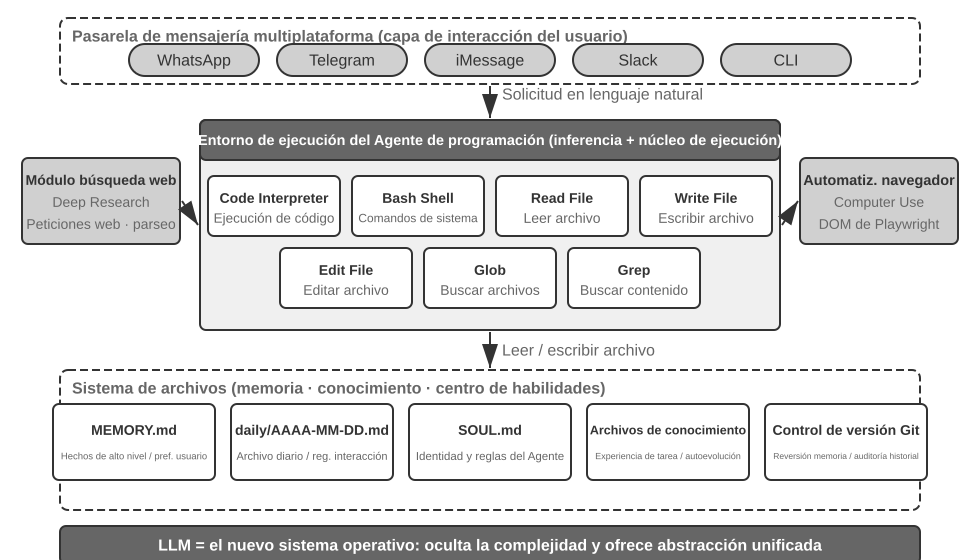

El sistema de archivos actúa como el centro de información (hub): la memoria a largo plazo se almacena en `MEMORY.md` y los registros se archivan por fechas. Markdown permite la edición directa, preserva el orden cronológico y admite control de versiones con Git.

### Diseño Sin Sesión (Sessionless Design)

OpenClaw adopta un diseño **Sin Sesión (Sessionless)**: el Agente está siempre en línea y los usuarios interactúan a través de sus plataformas habituales. Para un Agente de Código, el desafío central de la operación sin sesión es conservar el entorno de ejecución de código y el estado del sistema de archivos a través de los mensajes.

### Seguridad para Agentes de Código

La **Tríada Mortal (Lethal Triad)** formulada por Simon Willison describe los tres elementos que forman un bucle de ataque completo:
1. Acceso a datos privados.
2. Exposición a contenido no confiable.
3. Capacidad de comunicación externa.

Añadimos una cuarta dimensión amplificadora: la **Memoria Persistente**, que permite que instrucciones maliciosas queden latentes entre sesiones.

Defensas para Agentes de Código:
- **Aislamiento en Sandbox y Control de Salida a la Red**: Deshabilitar el acceso a red por defecto e implementar listas blancas.
- **Análisis Semántico de Comandos**: Comprender el efecto real de los comandos Shell en lugar de aplicar listas negras de palabras clave.
- **Ejecución Especulativa**: Sidecars para verificar seguridad en paralelo con el streaming.
- **Lealtad al Principal**: Prioridad absoluta a las instrucciones del mandante frente a terceros.
- **Mover la Frontera de Confianza hacia Abajo**: Hacer cumplir los invariantes de datos por debajo de la capa de aplicación.

### El Flujo de Trabajo General de un Agente de Código

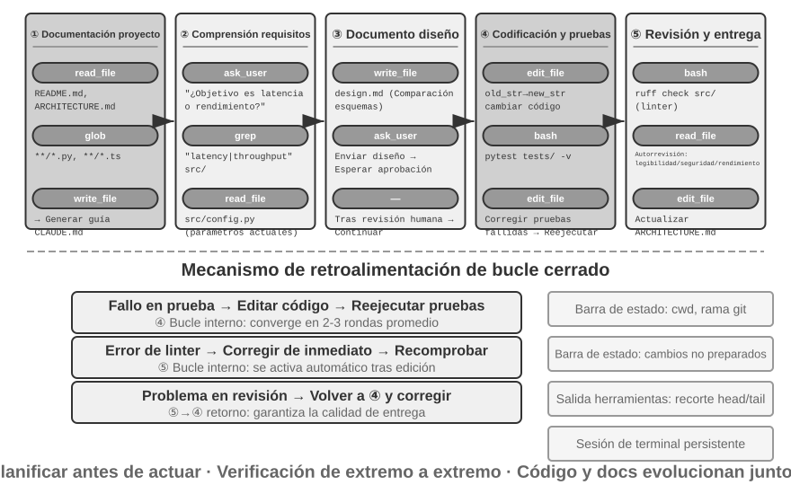

Flujo recomendado:
1. **Documentación del Proyecto**: Inspección de la arquitectura y uso de **Archivos de Instrucciones del Proyecto** (`CLAUDE.md`, `AGENTS.md`, `.cursorrules`).
2. **Comprensión de Tareas y Clarificación de Requisitos**.
3. **Escritura del Documento de Diseño**.
4. **Implementación de Código y Pruebas**: Bucle de prueba-corrección.
5. **Sincronización de Documentación y Entrega**.

### Ingeniería de Harness en la Práctica para Agentes de Código

Fórmula: **Agente = Modelo + Harness**.

Tabla 5-1 Cuatro Cuadrantes de Claridad de Objetivos y Automatización de Verificación

| | Los resultados se pueden verificar automáticamente | Los resultados requieren verificación manual |
|---------|--------------------------------------------|------------------------------------------|
| **Objetivo claro** | Zona óptima: Corrección de errores con pruebas | Limitado por rendimiento: Refactorización que requiere revisión manual |
| **Objetivo vago** | Desviación eficiente: Optimizar "calidad de código" con linter | Difícil de iniciar: "Hacer que la UI se vea mejor" |

Principios del Harness:
1. Restricciones sobre orientación (reglas codificadas en linters y CI).
2. Automatización de la verificación.
3. Retroalimentación rápida y estructurada.
4. Mecanismos de reversión (Git, snapshots).

### Recuperación de Fallos y Errores

Taxonomía de fallos en 4 capas:
1. Capa API (límites de tasa HTTP 429, sobrecarga, tiempos de espera).
2. Capa de herramientas (llamadas alucinadas, argumentos mal formados, errores repetidos).
3. Capa de contexto (desbordamiento de ventana, corrupción de trayectoria).
4. Capa de flujo de control (bucles infinitos, espirales de la muerte).

Niveles de recuperación:
- **Reintento silencioso** con retroceso exponencial (exponential backoff) y jitter.
- **Degradar y continuar** (continuación de generación, cambio de modelo).
- **Notificación al usuario**.

Disyuntores (Circuit Breakers) y prevención de la espiral de la muerte (desactivar efectos secundarios en la ruta de error y contar la profundidad de recursión).

### Consejos de Implementación para Agentes de Código

- Llamadas a herramientas en paralelo, ejecución en streaming y aborto en cascada.
- Gestión fina del contexto (rangos de líneas con números explícitos, truncamiento de salidas de terminal).
- Inyección dinámica de información del entorno en la Barra de Estado (directorio de trabajo, rama Git, estado de cambios).
- Persistencia de estado en la terminal.
- Retroalimentación sintáctica instantánea (linters automáticos tras escribir un archivo).

### Herramientas de Búsqueda en Agentes de Código

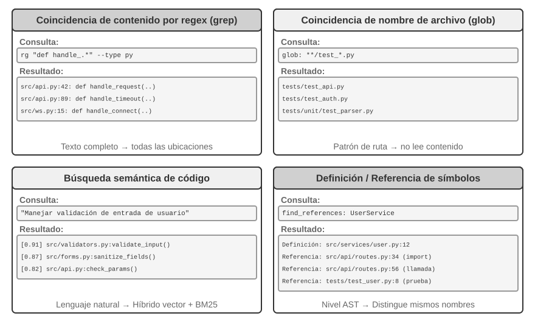

- Coincidencia de contenido por expresiones regulares (`grep`/`ripgrep`).
- Coincidencia de patrones de nombre de archivo (`glob`).
- Búsqueda semántica de código (segmentación estructurada + recuperación híbrida).
- Búsqueda de definiciones y referencias a nivel de símbolo (LSP).

### Herramientas de Edición de Archivos en Agentes de Código

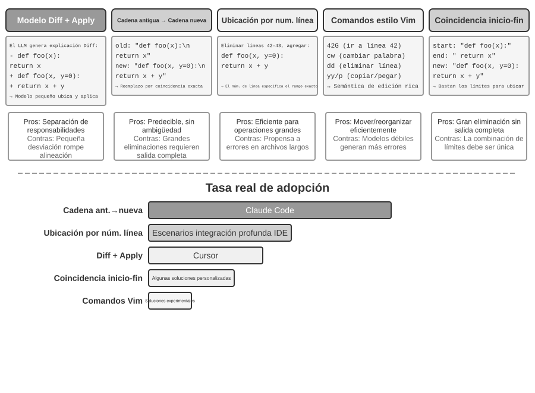

- **Descripción Diff + Modelo de Aplicación**: El modelo genera un diff y un modelo secundario rápido lo aplica.
- **Cadena Antigua → Cadena Nueva (Old String → New String)**: Adoptado por Claude Code; predecible y transparente.
- **Orientación por Número de Línea**: Preciso pero susceptible a la deriva de números de línea.
- **Comandos de Edición Tipo Vim**: Eficiente para reestructuraciones pero exige mayor sintaxis.
- **Coincidencia Inicio + Fin de Cadena**: Excelente compromiso entre brevedad y precisión.

## El Código: La Metacapacidad de un Agente General

El código es una **metacapacidad**: la habilidad de crear nuevas herramientas y capacidades dinámicamente en tiempo de ejecución.

### El Código como Herramienta de Pensamiento
Los LLMs son probabilísticos; el código es exacto y determinista.

> **Experimento 5-1 ★★: Uso de herramientas de generación de código para mejorar el razonamiento matemático**
>
> Uso de `sympy` y `scipy` en un intérprete de código para resolver problemas AIME con alta precisión.

> **Experimento 5-2 ★★: Uso de herramientas de generación de código para mejorar el razonamiento lógico**
>
> Uso de `python-constraint` para resolver acertijos lógicos (Knights and Knaves).

### El Código como Restricción para las Reglas de Negocio
Codificar reglas como herramientas de validación evita errores irreversibles.

```python
def cancel_reservation(reservation_id: str, cancellation_reason: str, expected_cabin_class: str = None) -> dict:
    r = db.get_reservation(reservation_id)
    now = server_clock.now()
    if r.any_segment_used:
        return {"success": False, "reason": "No se puede cancelar con tramos usados"}
    # ... validación basada en datos reales de la base de datos
```

> **Experimento 5-3 ★★: Modelos pequeños mejoran la precisión de ejecución de reglas mediante conocimiento basado en código**

### Generación Multimedia Impulsada por Código

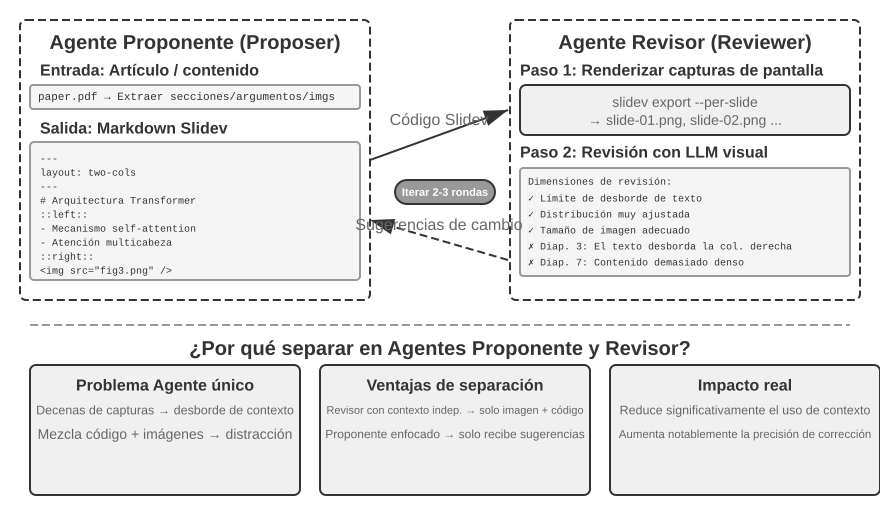

Generación de diapositivas mediante Slidev y revisión visual por un Vision LLM en un bucle Proposer-Reviewer.

> **Experimento 5-4 ★★: Generación automática de PPT a partir de artículos académicos**

> **Experimento 5-5 ★★: Generación automática de videos explicativos de artículos**

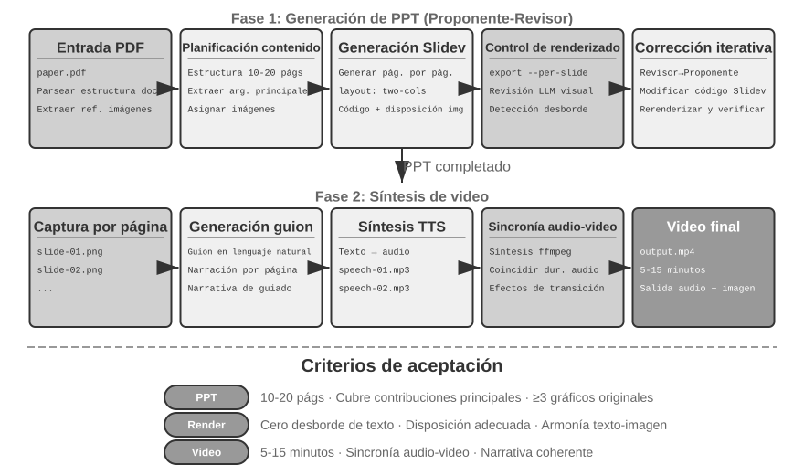

Edición inteligente de video con Blender Python API y FFmpeg.

> **Experimento 5-6 ★★: Edición inteligente de video basada en API**

### El Código como Adaptador del Sistema
Generación bajo demanda de código de adaptación para APIs no estandarizadas o cambiantes.

> **Experimento 5-7 ★★★: Sistema adaptativo de parseo de logs**

> **Experimento 5-8 ★★★: Sistema de diagnóstico inteligente para logs de producción**

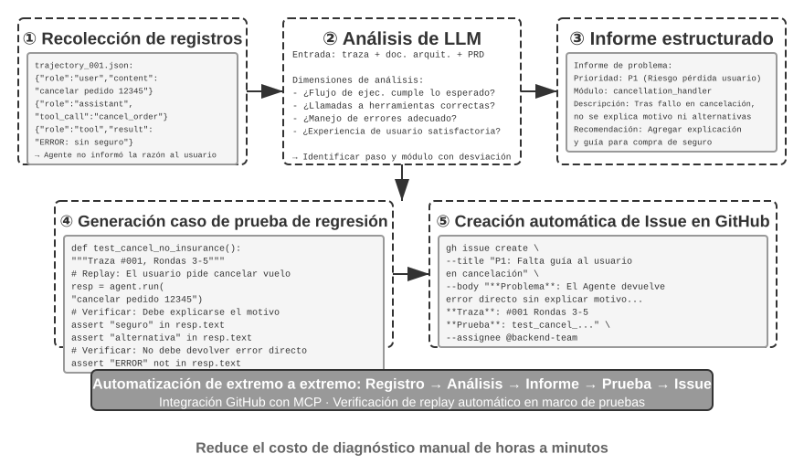

### El Código como UI Generativa (Generative UI)
Uso del patrón Artifact y protocolos A2UI para generar formularios dinámicos e interfaces interactivas de forma segura.

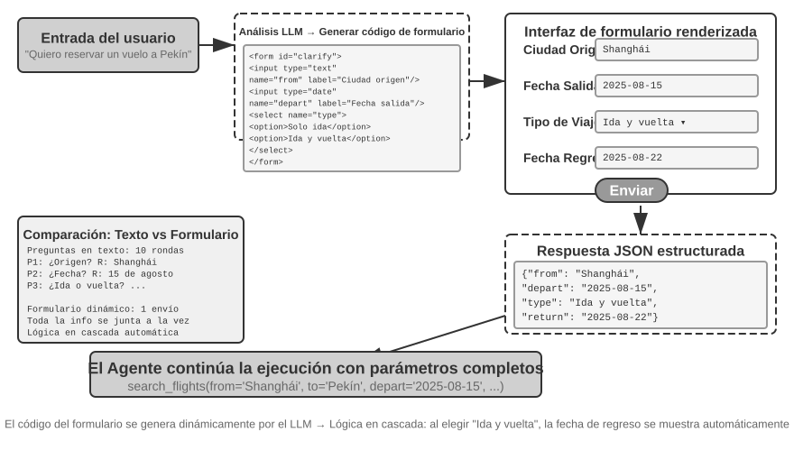

> **Experimento 5-9 ★★: Sistema de clarificación de intención con formularios dinámicos**

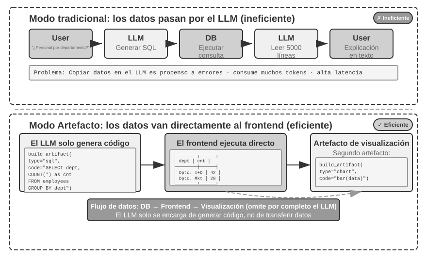

> **Experimento 5-10 ★★: Agente ERP con interacción en lenguaje natural**

> **Experimento 5-11 ★★: Sistema de personalización conversacional de interfaces**

### El Código Creando Código: Autoinicio del Agente (Agent Bootstrapping)

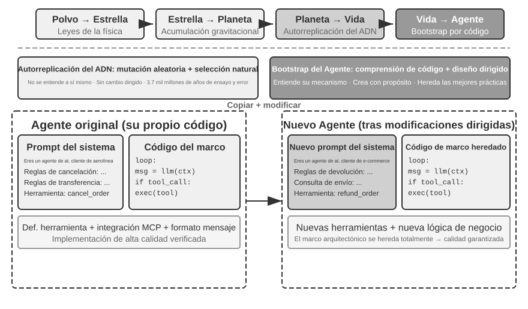

Un Agente Programador utiliza la generación de código para reparar y crear otros Agentes.

Mecanismo de autorreparación **OpenClaw Doctor**: verificación determinista de problemas comunes (tokens, locks, puertos) más análisis por LLM de errores complejos.

Técnicas para crear Agentes: modificación basada en ejemplos de alta calidad en lugar de generación desde cero.

> **Experimento 5-12 ★★★: Desarrollar un Agente capaz de crear Agentes**

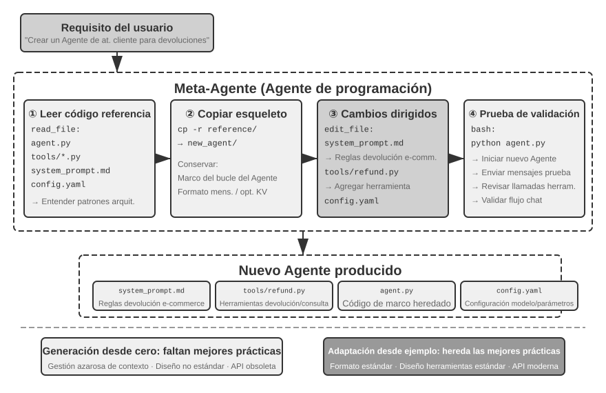

## Resumen del Capítulo

- **El Agente de Código como Núcleo**: La combinación de un Agente de Código y un sistema de archivos constituye la base técnica de los Agentes de propósito general.
- **Harness de Ingeniería**: Las herramientas de software tradicionales (linters, pruebas, Git) forman un Harness natural que maximiza la verificabilidad.
- **El Código como Metacapacidad**: Permite extender el razonamiento, hacer cumplir reglas de negocio, generar contenido multimedia, adaptar interfaces y posibilitar la autogeneración de Agentes (Bootstrapping).

## Preguntas de Reflexión

1. ★★ La generación de código se considera una "metacapacidad". ¿Cómo lograr el equilibrio óptimo entre la seguridad del sandbox y la flexibilidad de capacidades?
2. ★★★ En el autoinicio de Agentes (Agent Bootstrapping), ¿cómo prevenir la acumulación de sesgos o degradación a lo largo de generaciones?
3. ★★ Al adaptar formatos de logs automáticamente, ¿cómo distingue el Agente entre "un cambio de formato legítimo" y "una anomalía que debe reportarse"?
4. ★★ En el bucle Proposer-Reviewer para contenido multimedia, ¿cómo incorporar la retroalimentación de preferencias del usuario si los criterios estéticos difieren?
5. ★★ ¿Cómo realizar la "recolección de basura" sobre las reglas acumuladas en los prompts e instrucciones para eliminar redundancias?
6. ★ ¿Qué tan preparado está tu equipo o proyecto para ser "compatible con Agentes de IA" en términos de documentación de conocimiento?
7. ★★★ Ante la Tríada Mortal de Simon Willison (más la memoria persistente), ¿cómo diseñarías una estrategia de seguridad integral para producción?
8. ★★ En el patrón Artifact (SQL o HTML), ¿cómo garantizar la seguridad contra operaciones destructivas o vulnerabilidades XSS?
9. ★★ ¿Qué ventajas y limitaciones presenta el patrón "código como reglas" frente a las reglas expresadas en lenguaje natural?
10. ★★ ¿Cuáles son las ventajas y desventajas de la división de trabajo "el Agente genera código, el sistema ejecuta código" frente al patrón tradicional de respuesta directa?
