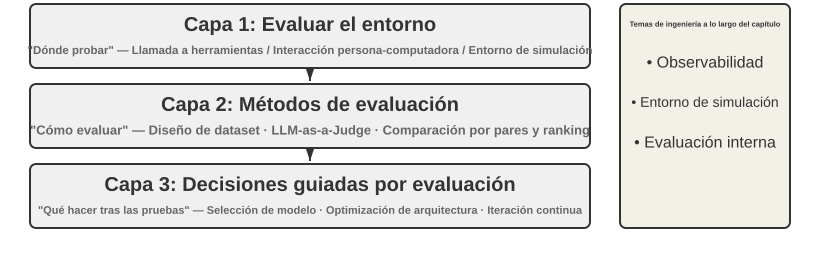
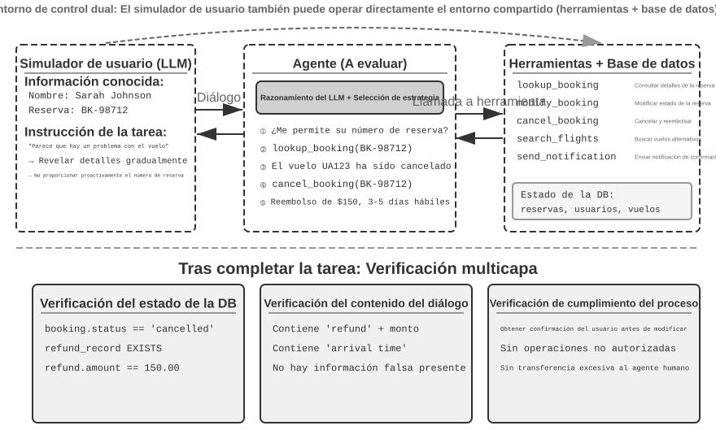
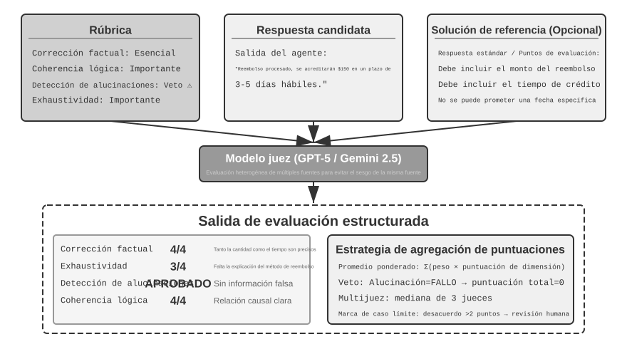
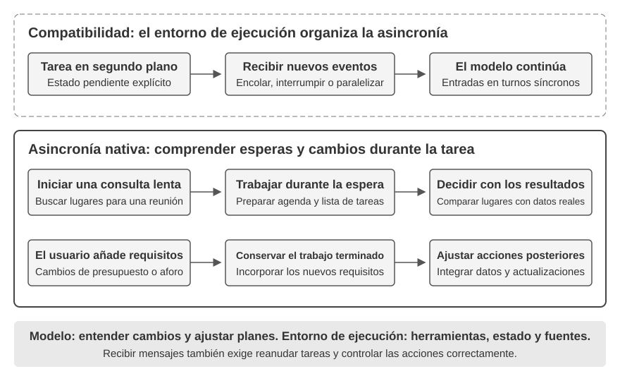

# Capítulo 6: Evaluación y Benchmarking de Agentes

Al construir un sistema de Agentes de IA, los desarrolladores se enfrentan a numerosas decisiones de diseño que a menudo carecen de respuestas correctas obvias:

- ¿Qué modelo se debe utilizar?
- ¿Qué herramientas debería poder llamar el modelo?
- ¿Qué datos debe almacenar la base de conocimientos y cómo debe estructurarse?
- ¿Cómo se debe implementar la memoria del usuario?
- ¿Cómo se deben organizar los prompts y las Skills del modelo?
- ¿Qué restricciones se deben agregar al Harness?
- ¿Cómo se deben transformar los resultados de la evaluación en señales de aprendizaje para la evolución continua del Agente?

La evaluación sitúa estas decisiones sobre una base científica. A través de experimentos comparativos sistemáticos (cambiar una variable a la vez y observar el efecto) y experimentos de ablación (desactivar un componente a la vez y observar cómo cambia el rendimiento general), se pueden distinguir las verdaderas ganancias de capacidad de las fluctuaciones superficiales. Como se dice en la ingeniería de software: no se puede mejorar lo que no se mide. Sin un sistema de evaluación repetible, un Agente solo se puede iterar mediante la intuición.

Desde la perspectiva de la ingeniería de Harness introducida en el Capítulo 1, la evaluación desempeña el papel central de "verificación" dentro del Harness. Una idea clave es: **el objeto de evaluación no debe ser solo el modelo, sino la combinación del modelo y el Harness**. El mismo modelo puede funcionar de manera drásticamente diferente en diferentes Harnesses; algunos equipos han mejorado significativamente el rendimiento del mismo modelo en tareas terminales puramente optimizando el Harness (ver Capítulo 5). Por lo tanto, cuando un Agente evalúa mal, la solución puede no ser un modelo diferente, sino un mejor componente del Harness (prompts, diseño de herramientas, bucles de retroalimentación). Un sistema de evaluación sólido debe ser capaz de distinguir dos problemas fundamentalmente diferentes: "capacidad insuficiente del modelo" y "fallas de diseño del Harness". **Una forma común de distinguirlos es el experimento de intercambio de modelos**: fijar el Harness, intercambiar un modelo más fuerte o más débil y observar cuánto se mueve la puntuación. Si un modelo más fuerte no eleva la puntuación, el cuello de botella es el Harness. Si un modelo más débil hunde la puntuación y los resultados oscilan bruscamente con la capacidad del modelo, la lectura más directa es que el modelo en sí es el cuello de botella. Nota que esto difiere del experimento de ablación: la ablación **desactiva un componente del Harness** para ver cómo cambia el rendimiento general; el intercambio de modelos **fija el Harness y cambia solo el modelo**.

Un sistema de evaluación vale aún más en una era de rápida evolución de modelos. Los modelos siguen mejorando, pero un nuevo modelo que obtiene puntuaciones más altas en benchmarks públicos no necesariamente funcionará mejor en su tarea específica; incluso puede regresar en algunos aspectos. Solo una ejecución completa en su propio conjunto de datos de evaluación le permite tomar una decisión de actualización basada en datos.

> **Guía del Capítulo**
>
> Este capítulo construye un sistema de evaluación completo en tres niveles. El primer nivel es el **Entorno de Evaluación** ("dónde probar"): cómo configurar un entorno de prueba automatizado y reproducible, cubriendo dos paradigmas: llamada a herramientas e interacción humano-computadora. El segundo nivel son los **Métodos de Evaluación** ("cómo juzgar"): desde los principios de diseño de conjuntos de datos y el sistema de métricas de evaluación, pasando por LLM-as-a-Judge para la evaluación automatizada, hasta la comparación por pares y el ranking de modelos. El tercer nivel es la **Toma de Decisiones Impulsada por la Evaluación** ("qué hacer después de probar"): transformar los resultados de la evaluación en orientación accionable para la selección de modelos, la optimización de la arquitectura y la iteración continua. El capítulo también cubre la observabilidad y la infraestructura de evaluación interna de Agentes de producción, y concluye con los entornos de simulación que se conectan con el post-entrenamiento del Capítulo 7.



## Un Ejemplo Concreto de Evaluación

Antes de profundizar en la metodología, construyamos intuición a través de un ejemplo completo. Supongamos que hemos construido un Agente de atención al cliente y necesitamos evaluar su capacidad para manejar solicitudes de reembolso.

**Caso de Prueba**: El usuario desea devolver un pedido de hace 3 días (Pedido #12345, Monto \$299). Política de la empresa: Reembolso completo dentro de los 7 días.

**Trayectoria del Agente**:

```
Usuario: Quiero devolver los auriculares que compré hace 3 días, número de pedido 12345. (Hoy es 2026-04-10)

Agente (pensando): El usuario quiere un reembolso, primero debo verificar la información del pedido.
Agente → Llama a la herramienta query_order(order_id="12345")
La herramienta devuelve: {status: "delivered", amount: 299, date: "2026-04-07", item: "Bluetooth Headphones"}

Agente (pensando): Fecha de pedido 2026-04-07, hoy es 2026-04-10, son 3 días, dentro del período de reembolso de 7 días, elegible para reembolso completo.
Agente → Llama a la herramienta process_refund(order_id="12345", amount=299)
La herramienta devuelve: {refund_id: "R-98765", status: "processing", eta: "3-5 business days"}

Agente: Se ha iniciado el reembolso. El reembolso completo para el Pedido #12345 (Auriculares Bluetooth, \$299) se está procesando y se espera que llegue en 3-5 días hábiles. El ID de reembolso es R-98765.
```

**Puntuación con una Rúbrica** (cuatro dimensiones, cada una puntuada de 1 a 4). La Tabla 6-1 proporciona un ejemplo de puntuación para esta tarea de reembolso.

Tabla 6-1 Ejemplo de Puntuación con Rúbrica para Tarea de Reembolso de Atención al Cliente

| Dimensión | Criterio | Puntuación | Razón |
|------------------------|--------------------------------|------|--------------------------------|
| Corrección Operativa | ¿El monto del reembolso y el número de pedido son correctos? | 4 | Consultó e inició correctamente un reembolso completo de \$299 |
| Cumplimiento de Políticas | ¿Sigue la política de reembolso de 7 días? | 4 | El pedido está dentro del período de reembolso, cumple con la política |
| Compleitud de Información | ¿Proporciona el monto, el tiempo de llegada y el ID de reembolso? | 4 | Se proporcionaron los tres datos clave |
| Detección de Alucinaciones (Ítem de Veto) | ¿Fabrica información inexistente? | Aprobado | Toda la información proviene de las salidas de las herramientas |

La alucinación se enumera como un **ítem de veto** en lugar de una dimensión de puntuación graduada porque es ortogonal a la calidad: una respuesta fluida y detallada que contiene información falsa es mucho más perjudicial para el usuario que una breve pero precisa.

## Entorno de Evaluación Automatizado

La evaluación de Agentes requiere un entorno repetible y automatizado. La construcción de dicho entorno requiere responder a tres preguntas: qué evaluar, con quién interactúa el Agente y cómo simular esa contraparte, y qué criterios de puntuación utilizar.

### Componentes Básicos de un Entorno de Evaluación

Un entorno de evaluación consta de cinco elementos:

- **Conjunto de Datos (Dataset)**: Define el conjunto de tareas, incluido el estado inicial, la descripción del objetivo y las soluciones de referencia opcionales.
- **Estado del Entorno**: Rastrea el estado mutable durante la ejecución de la tarea y debe equilibrar el realismo con la controlabilidad.
- **Herramientas**: Define el conjunto de operaciones que el Agente puede realizar (operaciones atómicas como consultar pedido, modificar reserva, enviar correo electrónico).
- **Rúbrica (Criterios de Puntuación)**: Cuantifica el rendimiento del Agente, que puede ser binario (aprobado/reprobado), continuo (0 a 100 puntos) o multidimensional.
- **Protocolo de Interacción**: Especifica el modo de interacción y las condiciones de terminación.


### Entorno de Evaluación de Llamada a Herramientas

Para las tareas que se basan principalmente en el uso de herramientas, como la generación de código y el análisis de datos, el framework Verifiers demuestra un patrón de diseño típico. El Agente completa la tarea llamando a herramientas predefinidas, y la verificación se basa en criterios ejecutables.

Tabla 6-2 Comparación de Tipos de Entorno en Verifiers

| Tipo de Entorno | Persistencia de Estado | Llamadas a Herramientas | Caso de Uso Típico |
|---|---|---|---|
| SingleTurnEnv | Ninguna | Ninguna | PyR de un solo turno, problemas de matemáticas |
| ToolEnv | Ninguna | Multiturno | Búsqueda + síntesis de información |
| StatefulToolEnv | Sí | Multiturno | Modificación de registros de base de datos |
| SandboxEnv | Sí + Aislamiento | Multiturno | Ejecución de código y pruebas |

### Entorno de Evaluación de Interacción Humano-Computadora

Muchas tareas del mundo real implican conversaciones con usuarios humanos. Un principio clave de diseño es la **Divulgación Progresiva de Información**, que es la diferencia fundamental entre la evaluación de interacción humano-computadora y los benchmarks tradicionales. En la evaluación, la información del usuario simulado no debe revelarse al Agente de una vez; debe divulgarse progresivamente, según sea necesario, a medida que se desarrolla la conversación.

τ-bench y τ²-bench utilizan la **Simulación de Usuario** mediante otro LLM. τ²-bench introduce el **Entorno de Control Dual**: el Agente ya no es el único que puede llamar a herramientas; el simulador de usuario también puede operar en el mismo entorno compartido.

> **Experimento 6-1 ★: Ejecutar τ²-bench y Comparar su Evolución desde τ-bench**
>
> Este experimento ejecuta el framework de evaluación τ²-bench para comprender los principios de diseño de entornos de evaluación de interacción humano-computadora.
>
> 

## Diseño de Datasets de Tareas de Evaluación

Esta sección destila varios principios validados en la práctica del diseño de benchmarks como GAIA, AndroidWorld, SWE-Bench Verified, τ-bench, τ²-bench, Terminal-Bench, OSWorld y OSWorld-Verified.

> **Experimento 6-2 ★: Ejecutar Manualmente Tareas de Benchmark**
>
> Selecciona tareas de GAIA, AndroidWorld, SWE-Bench Verified, τ²-bench, Terminal-Bench y OSWorld-Verified y complétalas manualmente.

### Desafíos Centrales en el Diseño de Datasets de Tareas

1. **La Tensión entre Claridad y Apertura**: Las descripciones deben ser lo suficientemente claras para garantizar una evaluación reproducible, pero no tan rígidas como para ahogar la creatividad del Agente.
2. **Equilibrio entre Realismo y Controlabilidad**: SWE-Bench Verified introdujo la validación sistemática por parte de expertos humanos, seleccionando 500 tareas de alta calidad.
3. **Coordinación entre Diversidad y Sistematización**: Cubrir escenarios típicos y casos límite con una organización sistemática.
4. **Costo de Evaluación vs. Cobertura**: Equilibrar la exhaustividad y la economía.
5. **Prevención de la Contaminación de Datos**: Evitar que los datos de evaluación se incluyan en el corpus de entrenamiento (mediante archivos adjuntos únicos, generación dinámica de parámetros en τ²-bench o GUIDs en Terminal-Bench).

## Sistema de Métricas de Evaluación

**Métricas de Proceso**: Validez de acciones y tasa de autorización, tasa de corrección de llamadas a herramientas, eficiencia de ruta, cobertura de recuperación, costo y latencia.

**Métricas de Resultado y Calidad**:
- **Pass@k**: La probabilidad de que al menos 1 de k intentos tenga éxito (mide la capacidad).
- **Pass^k**: La probabilidad de que los k intentos tengan éxito (mide la estabilidad).
- **Best@k**: La mejor puntuación alcanzada entre k intentos.

Tabla 6-3 Escenarios Aplicables para Pass@k y Pass^k

| Propósito de la Evaluación | Métrica a Utilizar | Consecuencia de un Uso Incorrecto |
|----------------------------------|---------------|-----------------------------------------------|
| Verificar estabilidad (pruebas de regresión) | Pass^k | Usar Pass@k oculta la inestabilidad |
| Evaluar techo de capacidad (exploratoria) | Pass@k o Best@k | Usar Pass^k penaliza incorrectamente fluctuaciones ocasionales |

## Métodos de Evaluación Automatizada

### LLM-as-a-Judge: El Núcleo de la Evaluación Automatizada



**Cuatro Principios de la Rúbrica**:
1. Basada en la orientación de expertos.
2. Cobertura exhaustiva.
3. Ponderación de importancia estandarizada (incluyendo mecanismos de Veto).
4. Evaluación autocontenida.

Ejemplo de Rúbrica en YAML para Memoria de Usuario:

```yaml
rubric:
  dimensions:
    - name: Factual Correctness
      weight: essential
      scoring:
        4_Excellent: "Responde correctamente Dr. Chen y vincula con la hija Lily"
        3_Good: "Responde Dr. Chen pero no menciona la relación"
        2_Passable: "Responde el médico correcto con datos inciertos adicionales"
        1_Fail: "Nombre incorrecto o responde 'No sé'"

    - name: Hallucination Detection
      weight: veto
      scoring:
        pass: "Toda la información se remonta a los registros de conversación"
        fail: "Información fabricada que no está presente en la conversación"
```

> **Experimento 6-3 ★★: Construcción de un Sistema de Evaluación de Memoria de Usuario Basado en Rúbricas**
>
> **Experimento 6-4 ★★: Evaluación Comparativa de Tarjetas JSON Avanzadas vs. RAG**
>
> **Experimento 6-5 ★★: Construcción de un Pipeline de Evaluación de Calidad de TTS Automatizado**

### Comparación por Pares y Ranking de Modelos



Utilización del modelo Bradley-Terry y el sistema de puntuación Elo (como en Chatbot Arena) para clasificar modelos mediante partidas a ciegas por pares, mitigando el sesgo de posición evaluando cada par dos veces con el orden invertido.

> **Experimento 6-6 ★★: Construcción de una Tabla de Clasificación de Modelos a partir de Datos de Comparación por Pares**

## Selección de Modelos Impulsada por la Evaluación

Dimensiones clave para la selección: Throughput (Rendimiento), Latencia (TTFT - Time To First Token, latencia de pensamiento, latencia de cola p95), Costo, Rendimiento (Pass@1, Pass^k), Límites de tasa y Confiabilidad, Curvas de presupuesto-capacidad.

### Análisis de Costos de Sistemas de Agentes

Componentes del costo: costo de inferencia del modelo (efecto de acumulación de contexto, tokens de pensamiento), costo de llamada a herramientas y costo de infraestructura.

Tabla 6-4 Ejemplo de Costo de Tres Turnos para el Agente de Reembolso

| Turno | Operación | Tokens de Entrada | Tokens de Salida | Costo del Turno |
|-------|--------------------------------------------|------------------------|------------|---------|
| 1 | Prompt del sistema + pregunta del usuario | 2,500 (2,000 prompt sistema) | 150 | \$0.0098 |
| 2 | Contexto previo + resultado de herramienta | 3,200 (2,000 acierto de cache) | 120 | \$0.0060 |
| 3 | Contexto previo + resultado de reembolso | 3,800 (3,200 acierto de cache) | 200 | \$0.0058 |
| **Total** | | **9,500** | **470** | **\$0.022** |

Estrategias de optimización de costos: Reutilización de KV Cache, Compresión de Contexto, Enrutamiento Graduado de Modelos y Procesamiento por Lotes Asincrónico.

> **Experimento 6-7 ★: Análisis de Costos de Extremo a Extremo de Tareas de Agentes**
>
> **Experimento 6-8 ★★: Benchmarking de Rendimiento de Modelos Multidimensional**
>
> **Experimento 6-9 ★★: Evaluación de Selección de Extremo a Extremo de Sistemas de Memoria de Usuario**

## Significación Estadística de los Resultados de Evaluación

El error estándar de una proporción binomial se calcula como $\sqrt{p(1-p)/n}$. Para $n=100$ casos y tasa de éxito $p=0.7$, el error estándar es aprox. 4.6%, lo que da un intervalo de confianza del 95% de $70\% \pm 9\%$. Diferencias pequeñas (como 73% vs 70%) están dentro de la banda de ruido. Se recomienda realizar análisis pareados (prueba de McNemar) y corregir por comparaciones múltiples (Bonferroni).

## Observabilidad del Agente


La observabilidad en sistemas de Agentes se basa en **Traces** y **Spans** (utilizando estándares como OpenTelemetry y OpenInference). Plataformas como LangSmith o Langfuse permiten visualizar árboles de ejecución y convertir datos de observabilidad en activos de evaluación (extraer casos fallidos de producción para el dataset de evaluación).

## De Reportes de Benchmark a Mejoras del Sistema


Proceso sistemático:
1. Lectura del reporte de benchmark (tabla por tarea y matriz de etiquetas de capacidad).
2. Formulación de hipótesis (superficiales H1-H2, intermedias H3-H4, profundas H5-H6).
3. Experimentos controlados por fases.
4. Toma de decisiones basada en datos (compensación costo-beneficio).
5. Iteración continua (H7-H8).

> **Experimento 6-10 ★★★: Evaluación y Mejora en AndroidWorld**

## De la Evaluación Externa a la Evaluación Interna: Infraestructura para Agentes de Producción

1. **Infraestructura de Ablación**: Interruptores integrados para desactivar características mayores y verificar su contribución real.
2. **Metodología de Pruebas A/B**: Distinguir métricas de mecanismo de métricas de objetivo; establecer métricas de salvaguarda.
3. **Sistema de Feature Flags de Dos Capas**: Flags en tiempo de compilación y en tiempo de ejecución.
4. **Evaluación de Sensibilidad de Prompts**: Renderizado determinista y control de versiones de prompts.
5. **Analítica Consciente de la Privacidad**: Tipos estrictos auditables para recolección de datos seguros.

## Entornos de Simulación: El Puente entre Evaluación y Post-Entrenamiento


Los entornos de simulación proporcionan alta frecuencia de interacción, aleatorización de dominio y reinicio confiable.
- Entornos digitales (ej. AWorld con servidores MCP).
- Entornos encarnados (ej. RoboTwin2, OSWorld).

> **Experimento 6-11 ★★: Configurar el Entorno de Inteligencia Encarnada para OpenVLA y RoboTwin2**
>
> 

## Resumen del Capítulo

Este capítulo ha establecido la metodología completa de evaluación: Observar → Hipotetizar → Experimentar → Validar → Nuevo Conocimiento, transformando la ingeniería de Agentes en una disciplina científica impulsada por datos.

## Preguntas de Reflexión

1. ★★ LLM-as-a-Judge utiliza un modelo de lenguaje para evaluar la salida de otro. ¿Tiene esta "autoevaluación" puntos ciegos sistemáticos? ¿Cómo se pueden detectar y corregir?
2. ★★★ Diseñe un método de evaluación que sea fundamentalmente resistente a la fuga de datos (data leakage).
3. ★★ ¿Cómo se pueden diseñar Rúbricas confiables para dimensiones subjetivas (ej. "¿Es apropiado el tono?")?
4. ★★ En τ-bench, el usuario simulado es un LLM. ¿Cómo se puede validar la calidad del propio usuario simulado?
5. ★★ En la comparación por pares (modelo Bradley-Terry), ¿en qué escenarios pueden aparecer preferencias no transitivas y cómo afecta esto a los rankings?
6. ★★ ¿Cómo se puede maximizar la información obtenida de la evaluación bajo un presupuesto computacional limitado?
7. ★ ¿Qué señales son adecuadas como criterios de enrutamiento para decidir si se activa el modo de pensamiento (thinking)?
8. ★★ La simulación de usuario de τ-bench emplea la "divulgación progresiva de información". ¿Cómo afecta este diseño a los resultados si la estrategia difiere de los usuarios reales?
