# Capítulo 7: Destilación y Optimización de Modelos

La fórmula central de este libro es Agente = LLM + Contexto + Herramientas. Este capítulo se centra en el LLM en sí —el "cerebro"— y examina cómo el post-entrenamiento puede ayudar al modelo a utilizar el contexto y las herramientas de manera más efectiva, mejorando así las capacidades de todo el sistema de Agentes. Al final del Capítulo 6 se señaló que el sistema de evaluación y el entorno de simulación son las dos piedras angulares del post-entrenamiento: el entorno de evaluación proporciona el campo de práctica y las métricas ofrecen el objetivo. Este capítulo se basa en esas piedras angulares y analiza cómo cambiar los pesos del modelo para integrar capacidades directamente en sus parámetros.

**Las capacidades de un modelo moderno se forjan en tres etapas:**

1. **Pre-entrenamiento**: Entrenamiento en textos masivos de internet para "predecir el siguiente token". Enseña reglas del lenguaje, conocimiento del mundo y razonamiento básico. Es la etapa más costosa (decenas de millones de dólares).
2. **Ajuste Fino Supervisado (SFT - Supervised Fine-Tuning)**: Entrenamiento en pares de entrada-salida etiquetados ("pregunta del usuario → respuesta ideal"). Enseña el formato, estilo y protocolo de proceso. Transforma un modelo erudito en un asistente que comprende instrucciones.
3. **Aprendizaje por Refuerzo (RL - Reinforcement Learning)**: Permitir que el modelo intente repetidamente y mejore mediante recompensas y penalizaciones. Enseña al modelo a tomar decisiones razonables incluso en **situaciones no vistas**.

Una analogía intuitiva: El pre-entrenamiento es "leer diez mil libros" (acumular conocimiento), el SFT es "un profesor mostrando soluciones estándar" (imitar demostraciones), y el RL es "resolver problemas por uno mismo y perfeccionarse mediante aciertos y errores" (aprender por ensayo y error).

**Dos hilos conductores a lo largo de este capítulo:**
* **Hilo Uno: SFT memoriza, RL generaliza.** SFT tiende a memorizar las respuestas de los datos de entrenamiento. RL tiende a aprender una estrategia transferible que se mantiene estable en situaciones no vistas.
* **Hilo Dos: Los datos y el entorno importan más que los algoritmos.** Con algoritmos de RL estándar (PPO, GRPO), lo que realmente determina el éxito es la fidelidad del entorno de simulación y la calidad de los datos de entrenamiento.

## Panorama de las Tres Etapas: Pre-entrenamiento, SFT y RL

Tabla 7-1 Las Tres Etapas de la Formación de Capacidades del Modelo

| Etapa | Datos Utilizados | Objetivo de Optimización | Lo Que Se Aprende | Costo Típico |
|-------------|---------------------|--------------------|---------------------|-------------------|
| **Pre-entrenamiento** | Texto masivo de internet | Predecir el siguiente token | Reglas del lenguaje, conocimiento, razonamiento básico | Muy Alto (millones USD) |
| **SFT** | Miles de pares "entrada-salida" | Predecir el siguiente token (loss en respuesta) | Seguimiento de instrucciones, formato, protocolo | Bajo (horas a días) |
| **RL** | Tarea + Función de recompensa | Maximizar la recompensa esperada | Estrategia de decisión transferible, nuevas soluciones | Alto (decenas a cientos de veces SFT) |

### Lo Que Hace el Pre-entrenamiento: Predecir el Siguiente Token (NTP)

El modelo predice la probabilidad del siguiente token dado el contexto previo. El entrenamiento ajusta la distribución de probabilidad para minimizar la pérdida (loss).

### La Esencia del SFT: "Predecir el Siguiente Token" con Máscara de Loss

Matemáticamente, el SFT utiliza la misma función de pérdida que el pre-entrenamiento, pero con dos diferencias: usa datos estructurados ("pregunta → respuesta") y aplica una **máscara de pérdida (loss masking)** en los tokens de la pregunta, calculando gradientes solo en la respuesta.

> **Técnica LoRA (Low-Rank Adaptation)**: Adjunta matrices de bajo rango a las capas del modelo (especialmente MLP) congelando los pesos originales. Reduce el costo de memoria en un 90%+. La tasa de aprendizaje óptima para LoRA es aproximadamente 10 veces mayor que el ajuste completo.

### Por Qué el SFT Debe Ir Antes del RL ("Forma Primero, Espíritu Después")

El SFT establece la "forma" (formato estructurado, salidas JSON parseables), lo cual es necesario para que la función de recompensa del RL pueda calcular señales de manera confiable. El RL luego desarrolla el "espíritu" (estrategia y razonamiento).

### Diferencia Esencial entre SFT y RL

Tabla 7-2 Comparación Esencial entre SFT y RL

| Dimensión | SFT (Supervised Fine-Tuning) | RL (Reinforcement Learning) |
|-----------------|--------------------------------------|----------------------------------------|
| Objetivo de Optimización | Maximizar probabilidad de la respuesta (Maximum Likelihood) | Maximizar recompensa esperada |
| Señal de Entrenamiento | Respuesta estándar única (supervisión por token) | Múltiples respuestas + recompensa por trayectoria |
| Lo Que Se Aprende | Mapeo fijo Entrada→Salida (Memorización / Mass-covering) | Estrategia transferible (Generalización / Mode-seeking) |
| Bajo Cambio de Distribución | Aplica respuesta antigua, el rendimiento cae | Re-resuelve usando la misma estrategia, más estable |
| Eficiencia de Muestra | Alta (miles de ejemplos bastan) | Baja (requiere muchas interacciones) |

El RL tiene un techo más alto porque es "online": no está limitado por el nivel del demostrador, verificar es más fácil que generar (asimetría de verificación), y aprende a recuperarse de sus propios errores.

## De Agentes de RL Clásicos a Agentes Modernos `[Lectura Opcional]`

### Interacción Agente-Entorno

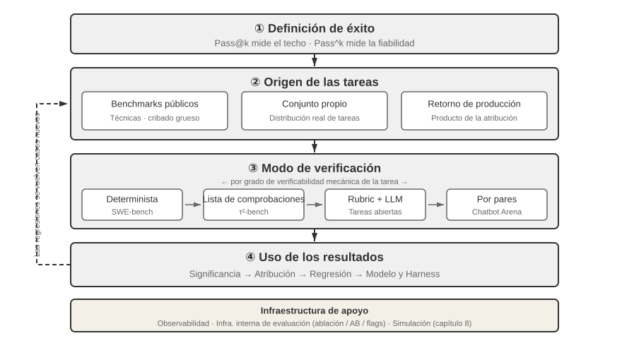

Tabla 7-3 Comparación de Elementos Clave en Diferentes Sistemas de Agentes

| Tipo de Agente | Entorno | Espacio de Acciones | Señal de Recompensa |
|---------------|------------------------|-------------------------------|-------------------------|
| **Robot Aspirador** | Distribución de habitación | Discreto (dirección, succión) | Área limpia (+), Batería agotada (-) |
| **Gran Maestro de Ajedrez** | Tablero de ajedrez | Discreto finito (movimientos legales) | Victoria (+1), Derrota (-1) |
| **Agente de Atención al Cliente** | Historial de conversación | Abierto (pensar, hablar, API) | Problema resuelto (+), Tiempo (-) |
| **Agente Asistente de Código** | Repositorio y requisitos | Abierto (pensar, buscar, editar, test) | Pruebas aprobadas (+), Bug (-) |

### Dos Paradigmas de Agentes: MDP vs LLM+RL

En el paradigma tradicional de Proceso de Decisión de Markov (MDP), el espacio de acciones es cerrado. La ecuación de Bellman rige el valor de acción:

$$Q^*(s, a) = r + \gamma \max_{a'} Q^*(s', a')$$

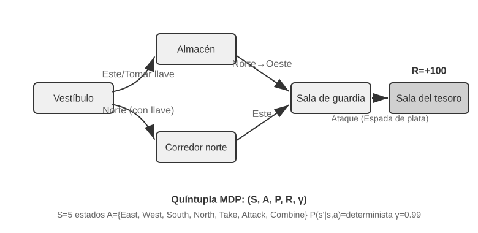
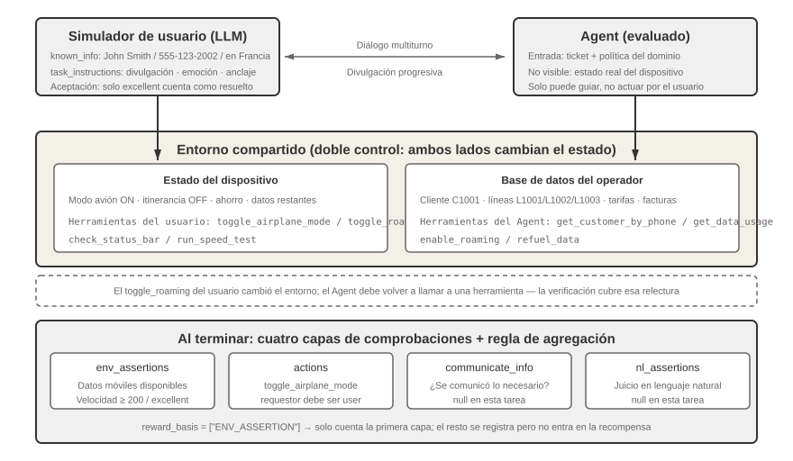
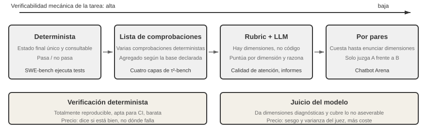

> **Experimento 7-1 ★: Rendimiento de Q-learning en un Juego de Búsqueda del Tesoro**

El paradigma moderno (LLM+RL) incorpora el **pensamiento interno como una acción especial** dentro del espacio de acciones.

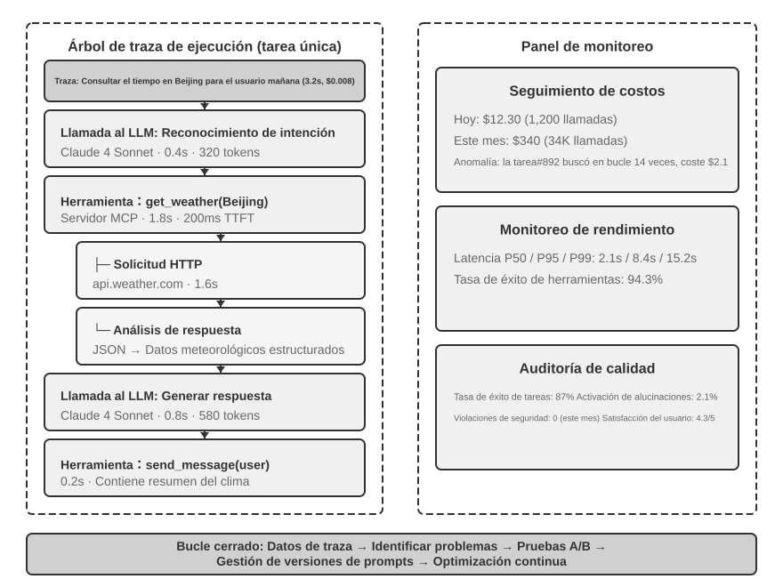

> **Experimento 7-2 ★★: Estudio Comparativo entre RL Tradicional y Agente LLM**
>
> 

## Fundamentos del Pre-entrenamiento de Modelos `[Lectura Opcional]`

> **Experimento 7-3 ★★: Entrenar un LLM desde Cero (MiniMind 2)**
>
> **Experimento 7-4 ★★: Entrenar tu Propio VLM**
>
> 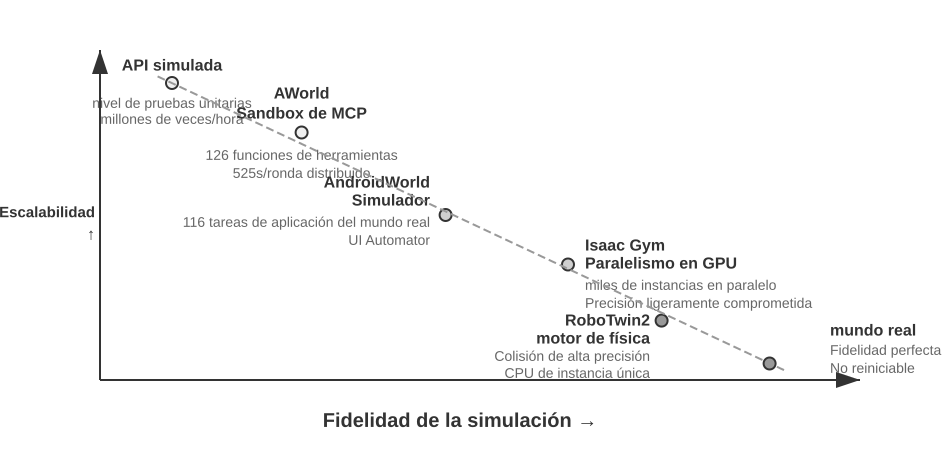
>
> **Experimento 7-5 ★★: Pre-entrenamiento Continuo para Aprender un Nuevo Idioma**

## SFT (Supervised Fine-Tuning)

Fuentes de datos de SFT: demostraciones humanas, datos sintéticos de modelos maestros y auto-bootstrapping (muestreo por rechazo / Rejection Sampling Fine-Tuning - RFT).

> **Experimento 7-6 ★★★: Voice SFT (Orpheus y Sesame)**
>
> **Experimento 7-7 ★★★: Pensamiento Multilingüe**
>
> **Experimento 7-8 ★★: Destilación de Prompts**
>
> **Experimento 7-9 ★★★: Destilación de Cadena de Pensamiento (CoT)**

## Cuándo Elegir SFT y Cuándo Elegir RL

Guía de decisión:
1. ¿Es necesario el post-entrenamiento? Si se resuelve con ingeniería de Harness (prompts, herramientas), no entrene.
2. Si requiere entrenamiento: intente SFT primero para estabilizar formatos y estilos.
3. Cuando SFT sea insuficiente (necesidad de generalización a nuevas distribuciones, optimización de estrategias complejas): agregue RL sobre la base del SFT.

## RL de Un Solo Turno: Memoria vs Generalización

> **Experimento 7-10 ★★: AdaptThink — Aprender "Cuándo No Pensar"**
>
> **Experimento 7-11 ★★: GeneralPoints — Comparación de Memoria y Generalización en RL de Un Solo Turno**
>
> 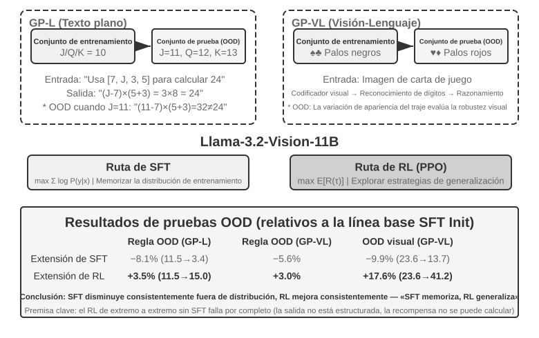

Resultados: En OOD (fuera de distribución), el RL mejora el rendimiento mientras que el SFT colapsa debido a la memorización de patrones fijos.

## RLHF: De Preferencias Humanas a Modelos de Recompensa

Pipeline de InstructGPT de 3 etapas:
1. SFT.
2. Entrenamiento del Modelo de Recompensa (RM) con la pérdida Bradley-Terry:
$$\mathcal{L}_{\text{RM}} = -\log \sigma\big(r(x, y_w) - r(x, y_l)\big)$$
3. Optimización PPO con penalización por divergencia KL:
$$r = r_{\text{RM}} - \beta \cdot \mathrm{KL}\big(\pi_\theta \,\|\, \pi_{\text{ref}}\big)$$

Explicación de KL Inversa ($\mathrm{KL}(\pi_\theta\|\pi_{\text{ref}})$): Es **mode-seeking** (busca los modos de mayor recompensa y descarta el resto), evitando que el modelo se aleje demasiado de la distribución de referencia y previniendo el **reward hacking**.

DPO (Direct Preference Optimization) optimiza las preferencias directamente sin entrenar un modelo de recompensa explícito ni realizar muestreo online.

## Comparación de Algoritmos de Aprendizaje por Refuerzo

Fórmula del gradiente de política (REINFORCE):
$$\nabla_\theta J(\theta) = \mathbb{E}\big[\nabla_\theta \log \pi_\theta(a \mid s)\, \hat{A}\big]$$

**PPO (Proximal Policy Optimization)** utiliza recortes (clipping) para limitar la magnitud de actualización y entrena una red de valor (critic):
$$L^{\text{CLIP}}(\theta) = \mathbb{E}\Big[\min\big(\rho\,\hat{A},\ \operatorname{clip}(\rho,\, 1-\epsilon,\, 1+\epsilon)\,\hat{A}\big)\Big]$$

**GRPO (Group Relative Policy Optimization)** elimina la red de valor y calcula la ventaja relativa dentro de un grupo de $N$ respuestas muestreadas para la misma pregunta:
$$\hat{A}_i = \frac{r_i - \operatorname{mean}(r_1,\dots,r_N)}{\operatorname{std}(r_1,\dots,r_N)}$$

Tabla 7-4 Comparación de Métodos de Post-Entrenamiento y Optimización en Tiempo de Inferencia

| Método | Tipo | Idea Central | Ventaja | Desventaja | Escenario Aplicable |
|--------------|---------------|---------------|--------------|------------------|-------------------------|
| **PPO** | Algoritmo RL Online | Limita la magnitud de actualización con red de valor | Estable, asignación de crédito fina | Requiere red de valor adicional | Agentes multiturno, trayectorias largas |
| **GRPO** | Algoritmo RL Online | Muestra N trayectorias y compara calidad relativa | Sin red de valor, menor costo | Asignación de crédito gruesa | Tareas de un solo turno o trayectorias cortas |
| **DPO** | Optimización de Preferencia Offline | Convierte pares de preferencia en loss de clasificación | Simple, sin muestreo online | No explora nuevas políticas | Datos de preferencia existentes |
| **Best-of-N** | Método en Tiempo de Inferencia | Genera N salidas y selecciona la mejor | Sin modificar modelo | Multiplica costo de inferencia | Estimación de techo de recompensa |

## Datos y Entorno: Más Importantes que los Algoritmos

1. **Fidelidad del Entorno**: Un entorno distorsionado produce una política inservible en producción. Si no se puede construir un entorno real, se puede usar un modelo para simular el entorno (ej. ZeroSearch y DreamGym).
2. **La Calidad de los Datos Supera a los Algoritmos**: Basura entra, basura sale. Si los datos de SFT son suficientemente buenos, es posible que no se necesite RL.
3. **Muestreo por Rechazo (Rejection Sampling)**: Muestrear $k$ candidatos → filtrar con verificador → entrenar SFT con las trayectorias correctas.

## De Un Solo Turno a Multiturno: Asignación de Crédito y Diseño de Recompensa

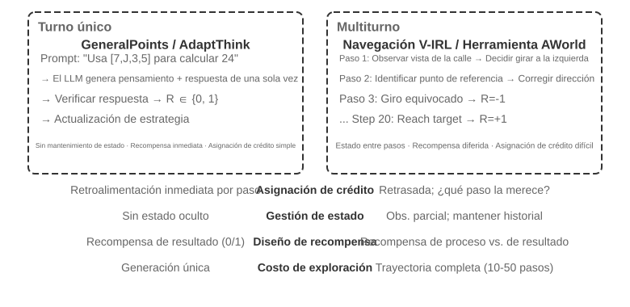
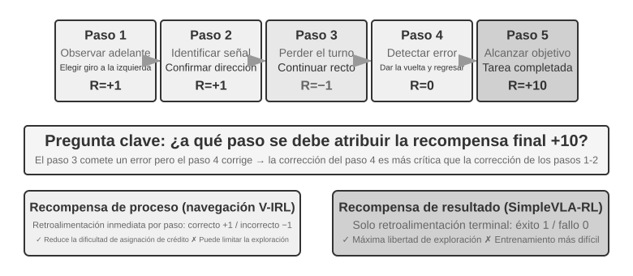
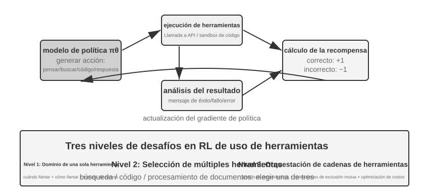

Paradigmas de recompensa: Escalar, Semi-escalar, Vectorial (multidimensional) y Generativo (diagnóstico en lenguaje natural).

> **Experimento 7-12 ★★★: Razonamiento Espacial V-IRL-VL — Recompensa de Proceso**
>
> **Experimento 7-13 ★★★: SimpleVLA-RL — Recompensa de Resultado (Descubrimiento del patrón "pushcut")**

### Recompensar el Resultado, Restringir el Proceso: RLVP (Reinforcement Learning with Verified Penalty)

Ponderación de recompensa:
$$R = O + \beta\cdot\Phi$$
donde $O$ es la recompensa de resultado rala y $\Phi$ es la señal de ruta ejecutable (penalización por acciones prohibidas $-\lambda$ y recompensa de cumplimiento/crédito parcial $+\mu$). Esto resuelve el problema de la varianza cero dentro del grupo en GRPO cuando todas las muestras fallan o todas aprueban.

> **Experimento 7-14 ★★★: RLVP — Recompensar el Resultado, Penalizar la Ruta**

## Aprendizaje por Refuerzo para Llamada a Herramientas

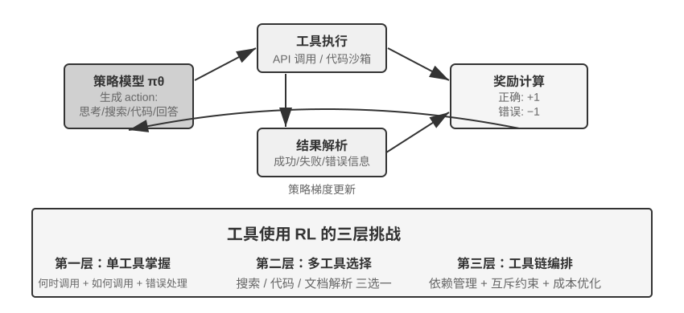

En el entrenamiento de RL para herramientas, se aplica **máscara de pérdida (loss masking)** a los tokens de retroalimentación del entorno (salidas del intérprete o resultados de búsqueda) para evitar que el modelo entrene prediciendo la salida del sandbox.

> **Experimento 7-15 ★★★: ReTool — Resolución de Problemas Matemáticos Mejorada con Intérprete de Código**
>
> 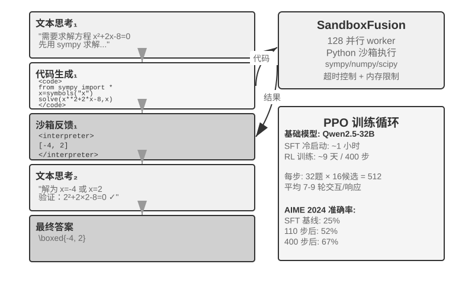
>
> Algoritmo DAPO: Clip-Higher, Loss de Gradiente de Política a Nivel de Token, Muestreo Dinámico y Penalización de Respuestas Excesivamente Largas.
>
> **Experimento 7-16 ★★★: AWorld-train — Aprender a Usar Herramientas en un Sandbox MCP**
>
> 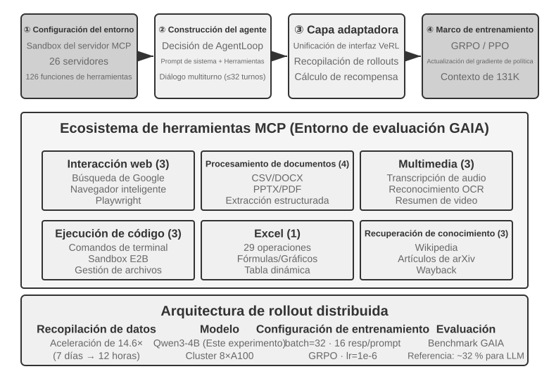

## Exploración de Vanguardia para Mejorar la Eficiencia de Muestreo

### On-Policy Distillation

Combina lo mejor de SFT y RL: el modelo genera sus propias trayectorias (On-Policy, resolviendo el desajuste de distribución) mientras un modelo maestro más fuerte proporciona una distribución de tokens de alta densidad en cada posición. Reduce las muestras necesarias en un factor de 10.

### On-Policy Self-Distillation (OPSD)

Cuando no hay un maestro más fuerte, el mismo modelo actúa como maestro y estudiante: el maestro recibe información privilegiada (la respuesta correcta o prompt enriquecido) para guiar al estudiante que solo ve la pregunta.

## Panorama Completo del Post-Entrenamiento y Consejos Prácticos

Paradigma SÉRGICO: "Forma Primero, Espíritu Después".

**8 Trampas Comunes**:
1. Sobre-dependencia en post-entrenamiento para memorizar hechos (usar RAG en su lugar).
2. Introducir RL antes de que el formato sea estable.
3. Funciones de recompensa mal diseñadas que conducen a reward hacking.
4. Descuidar la fidelidad de la simulación.
5. Sobre-entrenamiento que reduce la generalización.
6. Colapso de la función de valor en PPO.
7. Subestimar el costo computacional del RL.
8. Datos de entrenamiento de baja calidad.

## Resumen del Capítulo

El post-entrenamiento escribe estrategias de interacción directamente en los parámetros del modelo. SFT estabiliza el formato y RL impulsa la generalización. Los datos y el entorno son más determinantes que el algoritmo elegido.

## Preguntas de Reflexión

1. ★★ ¿Qué estrategias pueden mitigar el olvido catastrófico de capacidades generales durante el ajuste fino con LoRA?
2. ★★ ¿Qué criterios utilizaría para decidir si una capacidad debe enseñarse mediante post-entrenamiento o suministrarse mediante In-Context Learning / RAG?
3. ★★★ ¿Qué desafíos diferentes surgen al destilar modelos de chat, modelos de razonamiento y modelos de agentes?
4. ★★★ En interacciones multiturno, ¿cómo diseñaría una estrategia de asignación de crédito para recompensar decisiones tomadas en turnos tempranos?
5. ★★★ Con un presupuesto fijo de $10,000, ¿cómo distribuirá la inversión entre contexto/conocimiento, Prompts/Skills, restricciones programáticas y entrenamiento de parámetros?
6. ★★★ ¿Qué tan lejos están los métodos de RL actuales del aprendizaje autónomo sin función de recompensa explícita?
7. ★★ ¿Cuándo tiene ventaja "escribir memoria en parámetros" sobre "almacenarla en una base de conocimientos RAG"?
8. ★★★ ¿Podría aplicarse la generalización de débil a fuerte (Weak-to-Strong) para que un modelo pequeño entrene a uno grande en el contexto de Agentes?
9. ★★ ¿Qué merece más recompensa: un proceso correcto que llega a un resultado incorrecto, o un proceso incorrecto que llega al resultado correcto?
10. ★★★ ¿Cómo se puede aprovechar el valor de entrenamiento de los datasets de evaluación sin violar la independencia del test set?
11. ★★★ ¿Cómo se puede determinar cuándo el SFT es "suficiente" para cambiar a RL?
12. ★★★ ¿Cómo se puede mejorar la utilización de recursos en clústeres de entrenamiento cuando hay respuestas con colas extremadamente largas?
13. ★★★ ¿Qué comportamientos concretos de reward hacking pueden surgir al entrenar Agentes contra entornos simulados por LLM y cómo prevenirlo?
