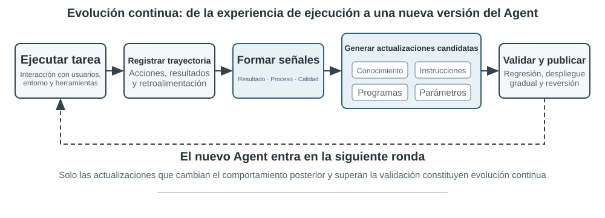
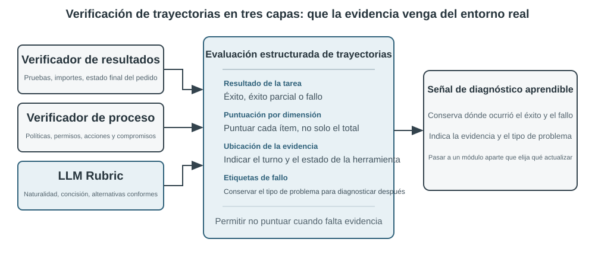
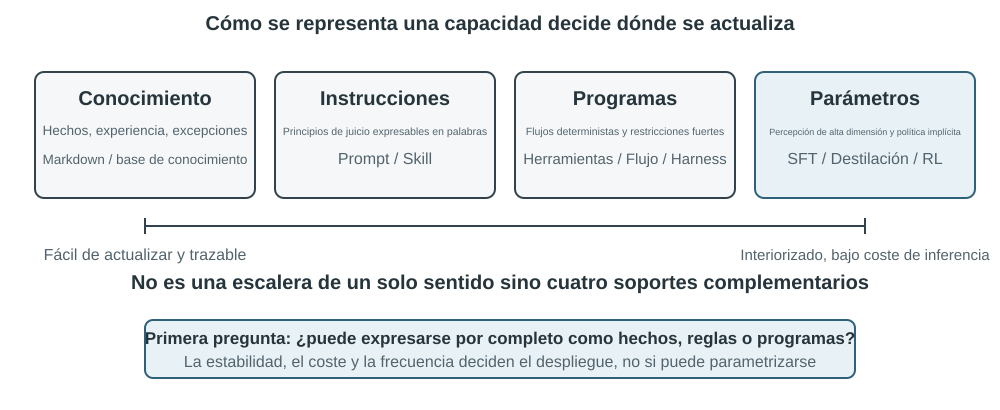
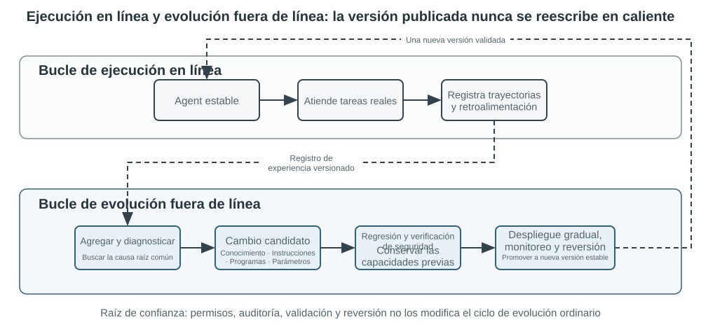

# Capítulo 8: Automatización RPA y Uso de Navegador (Browser-Use)

Los Agentes actuales presentan una paradoja de capacidad sorprendente: pueden resolver tareas complejas nunca antes vistas en modo zero-shot, pero después de manejar diez mil tareas similares, pueden seguir repitiendo al día siguiente los mismos errores que cometieron el primer día. **La capacidad de aprender de forma autónoma a partir de la experiencia** se está volviendo esencial para que los Agentes pasen de "ser capaces de completar tareas" a "ser capaces de trabajar de manera confiable".

Un modelo desplegado no cambia automáticamente sus parámetros después de una inferencia. El aprendizaje en contexto (In-Context Learning) permite adaptarse **dentro de la tarea actual**; sin embargo, una vez que el contexto termina, estos cambios no se trasladan de manera natural a la siguiente tarea. Almacenar conversaciones en la memoria no equivale a aprender nuevos comportamientos. Preservar la experiencia no es lo mismo que aprender de ella: el aprendizaje ocurre solo después de que el sistema evalúa, compara, generaliza y valida activamente la evidencia.

## Derivación de Señales de Aprendizaje a partir de Trayectorias Operativas

El punto de partida de la evolución continua es la evaluación precisa de la trayectoria.

Estructura de verificación de tres capas:
1. **Verificador de Resultados** (capa inferior): Lee estados de bases de datos, resultados de pruebas y retornos de herramientas.
2. **Verificador de Procesos** (capa media): Verifica reglas de negocio, permisos y secuencias de acciones.
3. **Verificador de Calidad** (capa superior): Evalúa el lenguaje y la estrategia de acuerdo con una Rúbrica.

Tabla 8-1 Dimensiones de Evaluación de Trayectoria para un Agente de Atención al Cliente

| Dimensión | Pregunta de Verificación | Evidencia Primaria |
|---|---|---|
| Resultado de la tarea | ¿Se resolvió la solicitud central del usuario? | Estado ambiental final, resultados de herramientas |
| Cumplimiento de reglas | ¿Se violó alguna política, permiso o procedimiento? | Repositorio de políticas, trayectoria de acciones |
| Límites de privacidad | ¿Se divulgó información confidencial? | Texto de respuesta, registros de acceso a datos |
| Confiabilidad factual | ¿Las declaraciones están respaldadas por conocimientos? | Fuentes citadas, retornos de herramientas |
| Consistencia promesa-acción | ¿Las acciones prometidas ocurrieron realmente? | Comparación de respuestas y registros de herramientas |
| Calidad de expresión | ¿Es el lenguaje natural y conciso? | Conversación completa, Rúbrica de lenguaje |
| Alternativas cumplidoras | Cuando el plan original no fue factible, ¿se halló alternativa? | Objetivo del usuario, políticas y acciones |

> **Experimento 8-1 ★★: Construir un Verificador de Trayectorias para un Agente de Atención al Cliente**

## Cuatro Métodos para la Evolución Continua del Agente

Tabla 8-2 Límites aplicables de los cuatro métodos de evolución continua

| Método de actualización | Contenido adecuado | Ventajas principales | Limitaciones principales |
|---|---|---|---|
| Base de conocimientos de experiencia | Hechos, patrones experimentales, excepciones | Actualización rápida, trazabilidad | Depende de recuperación y aplicación correcta |
| Prompts y Skills | Principios de juicio y procedimientos expresables | Interpretable, controlable | Propenso a sobrecarga o conflictos |
| Programas y Harness | Procedimientos deterministas, herramientas, restricciones | Probable, ejecución estable, bajo costo | Mayor costo de desarrollo inicial |
| Parámetros del modelo | Percepción de alta dimensión, estilo, estrategias | Alta generalización, bajo overhead | Alto costo de actualización y regresión |

### 1. Consolidación de Experiencia en Conocimiento

Proceso en 5 pasos: preservar trayectorias inmutables → producir análisis estructurados → agregar por familias de tareas → evaluar transferencia en nuevas tareas → generar documentos Markdown formales.

> **Experimento 8-2 ★★: Destilar Documentos de Conocimiento de Experiencia a partir de Trayectorias de GAIA**

### 2. Codificación de Experiencia como Instrucciones (Prompts y Skills)

La optimización de prompts basada en sistemas de aprendizaje (System Prompt Learning / Karpathy, DSPy, OPRO, GEPA) permite modificar los prompts del sistema a partir de difs mínimos generados ante fallas recurrentes.

> **Experimento 8-3 ★★: Optimizar Prompts del Sistema a partir de Trayectorias de Falla**

### 3. Codificación de Experiencia como Programas (RPA y Workflows)

La automatización de procesos mediante uso del navegador (Browser-Use / RPA) permite compilar trayectorias de exploración en programas reutilizables (PreAct logra una aceleración de 8.5–13×).

Ciclo de vida del workflow del navegador:
1. Capturar la trayectoria (pasos, selecciones DOM/XPath).
2. Parameterizar (convertir literales en variables `{recipient}`, `{subject}`).
3. Definir verificaciones de estado (antes y después de la acción y estado final).
4. Validar el candidato en un sandbox limpio.
5. Coincidencia y reproducción (ejecución mediante Playwright).
6. Invalidación y re-aprendizaje si la interfaz cambia.

> **Experimento 8-4 ★★★: Generación de Workflows Verificables a partir de Trayectorias del Navegador (browser-use / Playwright)**
>
> **Experimento 8-5 ★★★: Activación de Auto-Modificación del Agente a partir de Trayectorias de Falla**

### 4. Codificación de Experiencia en Parámetros

Entrenamiento de post-entrenamiento (SFT / RL) para capacidades de percepción de alta dimensión o estilo conversacional implícito.

### 5. De la Actualización de Artefactos a la Actualización del "Método de Actualización"

Evolución en diferentes escalas de búsqueda: regla local → contexto estructurado (ACE) → workflow (AFlow) → código de Harness (Meta-Harness) → código del optimizador.

## Construcción de un Bucle Cerrado de Evolución Continua para Operaciones a Largo Plazo

Arquitectura de doble bucle: el bucle de ejecución online completa tareas y registra evidencias; el bucle de evolución offline agrega trayectorias, diagnostica causas raíz, genera modificaciones candidatas y despliega nuevas versiones solo tras pasar puertas de validación (ejemplo: Voyager en Minecraft).

Tabla 8-3 Métricas de evaluación por capas para la evolución continua

| Métrica | Pregunta respondida | Evidencia primaria |
|---|---|---|
| Validez de cambios candidatos | ¿El actualizador propone cambios útiles? | Tasa de aceptación y ganancia en validación |
| Tasa de activación de artefactos | ¿El Agente carga la nueva Skill/memoria? | Trazas de recuperación y enrutamiento |
| Tasa de cumplimiento exitoso | ¿El Agente sigue la nueva regla o proceso? | Secuencias de acciones y verificadores |
| Ganancia en tareas no vistas | ¿Mejora el sistema en tareas no usadas en la evolución? | Éxito, calidad y costo en tareas retendidas |

### Consolidación y Limpieza (Sleep Learning)

El proceso de consolidación en segundo plano (Sleep Learning) incluye: desencadenamiento, orientación, recolección/consolidación, validación/aprobación y poda/indexación (ejemplos: auto memoria de Claude Code y sistema Hermes Curator).

> **Experimento 8-6 ★★★: Evaluación de si un Agente está Evolucionando Continuamente**

## Resumen del Capítulo

La evolución continua construye un sistema de aprendizaje verificable alrededor del modelo. El Agente obtiene señales de aprendizaje a través de la interacción y la evaluación, y actualiza conocimientos, Prompts, Skills, programas o parámetros según la forma de representación más adecuada.

## Preguntas de Reflexión

1. ★★ Un documento de experiencia está respaldado por tres trayectorias exitosas y una fallida debido a una nueva versión de API. ¿Cómo determinar si la experiencia quedó invalidada o si cambiaron sus condiciones de aplicación?
2. ★★ Si la satisfacción del usuario aumenta pero las violaciones de reglas también suben, ¿por qué la satisfacción no puede ser la única señal de aprendizaje?
3. ★★★ Ante el mismo problema de "falsa promesa", ¿qué evidencia usaría para decidir si modificar un Prompt, un chequeo de Harness o entrenar parámetros?
4. ★★★ ¿Cómo separar los permisos y límites de código entre las herramientas modificables por el Agente y la raíz de confianza que aprueba sus actualizaciones?
5. ★★ A medida que la base de conocimientos crece, los conflictos pueden superar los beneficios. ¿Cómo diseñar mecanismos de versión y retiro?
6. ★★★ Diseñe un esquema de evolución continua para atención médica que coordine parámetros, conocimientos, Skills y restricciones a nivel de código.
