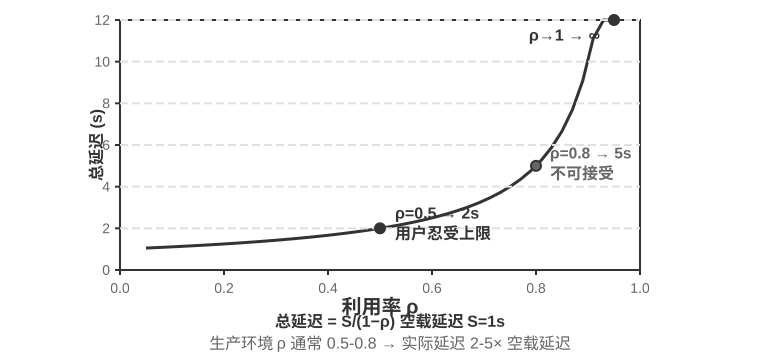
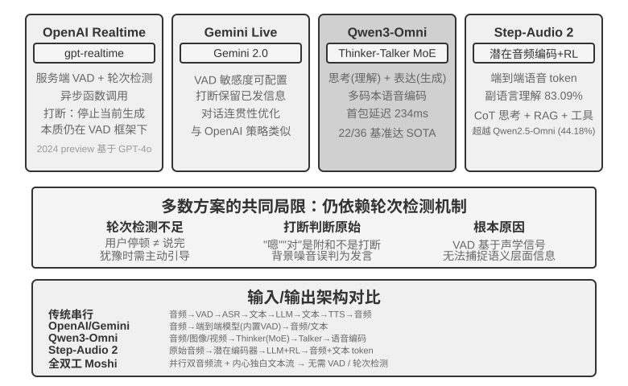
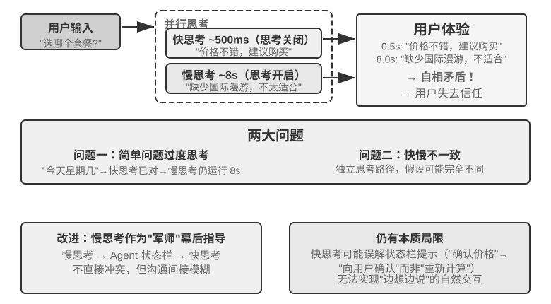
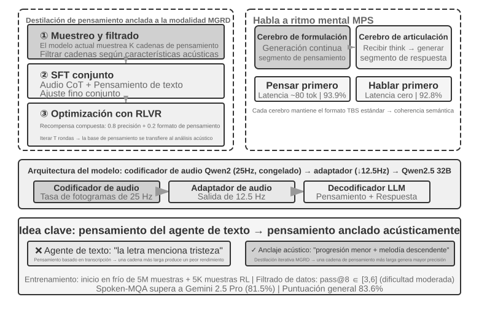
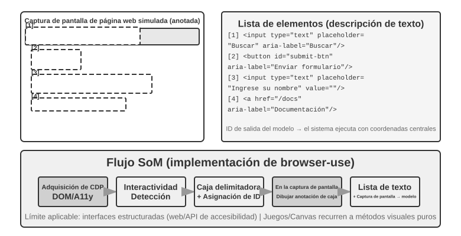
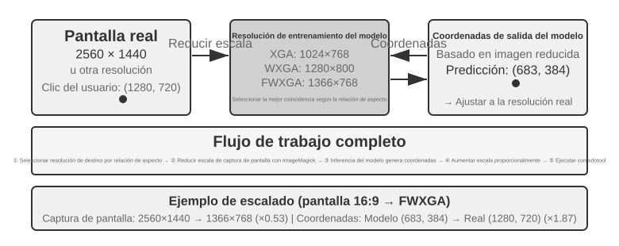

# Multimodalidad e Interacción en Tiempo Real

Los capítulos anteriores exploraron el diseño de Agentes en el mundo del texto (interactuando con sistemas digitales a través del contexto, herramientas y código). Sin embargo, los objetos de interacción de un Agente no son solo texto y API. Cuando un Agente necesita comprender las instrucciones habladas de un usuario, encontrar y hacer clic en el botón correcto en la pantalla, o controlar un brazo robótico para agarrar con precisión un objeto, entra en un terreno completamente nuevo: la **interacción multimodal en tiempo real** (pasando de la entrada y salida de texto puro a la **percepción multimodal y respuesta en tiempo real**), lo que constituye un paso crucial para que el Agente salga del "cuadro de diálogo". La llamada "multimodalidad" consiste en procesar simultáneamente múltiples formas de información (texto, voz, imágenes, video, acciones) y no solo texto.

Delimitemos primero las fronteras de este capítulo. La comprensión estática de imágenes y documentos (mirar una captura de pantalla, leer un gráfico, analizar un PDF) ya se ha integrado de forma natural en la práctica de los Agentes de los capítulos anteriores como herramientas de percepción: para los grandes modelos multimodales de hoy en día, este tipo de tareas de "una entrada, una comprensión" son relativamente maduras y no requieren un diseño de arquitectura especial. Este capítulo se centra en otro tipo de problemas: tres escenarios en los que **la naturaleza de tiempo real vuelve complejo el problema multimodal**: diálogo por voz, operación de GUI y control robótico. En estos escenarios, la entrada fluye de manera continua y la salida debe entregarse dentro de un presupuesto de tiempo estricto, lo que provoca un cambio cualitativo en el diseño de la arquitectura. En cuanto a la comprensión en tiempo real de flujos de visión continua (video), al momento de escribir este libro sigue siendo un problema abierto para los Agentes (la sección de Computer Use de este capítulo discutirá las limitaciones de las capturas fotograma a fotograma, y las preguntas de reflexión al final del capítulo volverán a este tema). También debemos trazar otra frontera: la **generación** multimodal (generación de imágenes, generación de video) en el marco de este libro es simplemente una llamada a una herramienta ordinaria (ya abordada en el Capítulo 5 sobre generación multimedia); el Agente la utiliza como una herramienta externa y no involucra los desafíos de interacción en tiempo real que se resuelven en este capítulo, por lo que no está dentro de la línea principal.

La interacción por voz, Computer Use y las operaciones robóticas parecen abarcar tres dominios completamente diferentes, pero al llevarlos a la práctica se descubre que los puntos de atasco son altamente similares: en todos ellos se debe procesar simultáneamente información de múltiples modalidades y todos son extremadamente sensibles a la latencia. Una pausa en la voz de más de dos segundos causa ansiedad en las personas, mientras que las fluctuaciones de milisegundos en el control robótico pueden causar colisiones. Estas dos restricciones impulsan colectivamente a los tres escenarios hacia la misma dirección arquitectónica: pasar de **pipelines seriales** (donde, como en una cadena de montaje de una fábrica, una etapa debe completarse antes de entregarla a la siguiente) a **modelos de extremo a extremo** (un modelo unificado pasa directamente de la entrada a la salida, eliminando las etapas intermedias de traspaso).

Este capítulo se desarrolla a través del siguiente hilo conductor:

1. En primer lugar, se establece un sistema de coordenadas utilizando los "Tres paradigmas de las arquitecturas de voz": cascada (pipeline VAD-ASR-LLM-TTS), omnimodal de extremo a extremo (Omni, un solo modelo pero donde aún se habla por turnos) y full-duplex (Moshi, GPT-Live, escuchando y hablando al mismo tiempo). Se desglosará la latencia y los compromisos de cada etapa a lo largo del eje de "cómo librarse de la suposición de turnos de VAD". En la sección de cascada también se explicará cómo sustituir VAD + ASR por percepción de voz en streaming.
2. A continuación, se examina cómo las arquitecturas de pensamiento concilian la contradicción entre la "respuesta en tiempo real" y el "pensamiento profundo": desde el paralelismo simple entre rápido y lento, pasando por la ruta de desacoplamiento donde un modelo de razonamiento en segundo plano actúa como "asesor" (delegación en GPT-Live, Pine AI, etc.), hasta la "charla mientras piensa" de Step-Audio R1 que "internaliza" el pensamiento dentro de un solo modelo.
3. Luego se discute la optimización de la capa de ejecución mediante una síntesis de voz más humana.
4. Finalmente, se amplía la perspectiva a Computer Use (hacer que la IA opere la pantalla de una computadora como un ser humano) y a la manipulación robótica, para observar cómo se manifiestan estos mismos problemas de latencia y multimodalidad en ambos escenarios.

Entre ellos, cabe destacar especialmente dos puntos de carácter más teórico y transferibles entre escenarios: las **arquitecturas de pensamiento** (cómo colaboran los dos sistemas de pensamiento, rápido y lento) y la **interfaz rápido-lento** derivada de ella (Latent Bridge, qué más se puede transmitir entre modelos rápidos y lentos además de texto). Aunque se introducen a partir del escenario de voz, no sirven únicamente para la voz: Computer Use y la robótica encontrarán más adelante la misma cuestión de "cuándo se debe consultar a un asesor lento", algo a lo que el lector debe prestar especial atención.

## Voz: la interfaz humano-máquina más natural

La voz no es solo convertir texto en sonido. Hablar es aproximadamente cuatro veces más rápido que escribir y deja libres las manos y la mirada, por lo que encaja naturalmente a un Agente en un bucle continuo que puede ser interrumpido en cualquier momento. La entrada de voz convierte el dictado en texto; un Agente de voz permite colaborar directamente con él. Ambos sostienen el whisper coding presentado en la introducción.

Esta sección cubre dos direcciones: el usuario habla con el Agente y el Agente habla con el mundo exterior en nombre del usuario. El modelo de voz determina qué puede responder; la arquitectura de interacción determina si escucha bien, responde a tiempo, cede el turno de forma natural y completa confirmaciones y llamadas a herramientas durante una llamada.

### Tiempo de interacción: de la cascada al dúplex completo

La introducción de GPT-Live de OpenAI resume tres paradigmas: cascada, basado en turnos y dúplex completo[^ch9-12]. Son intercambios distintos entre latencia, coste y observabilidad, no una sustitución lineal.

| Paradigma | Estructura | Ventaja | Limitación |
| --- | --- | --- | --- |
| Cascada | VAD → ASR → LLM → TTS | Módulos claros, intercambiables y depurables | Se acumula la latencia y se pierde información paralingüística |
| Omni de extremo a extremo | Un modelo escucha, piensa y habla | Menor latencia y preservación de tono, emoción y ambiente | Sigue dependiendo de turnos; entrenar y depurar cuesta más |
| Dúplex completo | Escucha, habla y decide continuamente | Habla solapada, interrupción natural y flujo continuo | Entrenamiento, control y evaluación más complejos |

El hilo común es escapar de la suposición de que hay que hablar por turnos y de la conjetura de VAD sobre quién tiene la palabra. Cascada y Omni aún dividen la interacción en turnos; el dúplex completo convierte esa decisión en una salida continua del modelo.

[^ch9-12]: OpenAI. *Introducing GPT-Live.* 2026-07-08. https://openai.com/index/introducing-gpt-live/ . La clasificación procede del resumen de las tres generaciones de ChatGPT Voice; «end-to-end omnimodal (Omni)» corresponde a «turn-based voice models».

**Cancelación en streaming:**

```python
while audio_is_arriving:
    partial = asr.push(audio_chunk)
    if endpoint_is_probable(partial):
        candidate = llm.start(partial)
        if later_audio_changes_meaning(partial):
            cancel(candidate)                 # speculative cancellation
        else:
            tts.enqueue_stable_segments(candidate)

on_final_transcript(text):
    commit_or_restart(text)
```

### Paradigma 1 · Pipeline en cascada

La mayoría de asistentes comerciales todavía usa un pipeline serial (Figura 9-1): VAD detecta el final, ASR convierte audio en texto, el LLM entiende y genera la respuesta, y TTS la pronuncia. La modularidad facilita optimizar cada componente, pero cada frontera añade espera.


| Módulo | Función | Cuello de botella |
| --- | --- | --- |
| VAD | Decidir si terminó el habla | Umbral de silencio, espera y segmentación errónea |
| ASR | Audio a texto | Latencia y pérdida de contexto |
| LLM | Comprender, razonar y generar | Latencia del primer token y espera adicional con reasoning |
| TTS | Texto a voz | Síntesis del primer paquete y búfer de reproducción |

En una respuesta breve, las esperas de VAD, ASR, LLM y TTS se acumulan en serie (Figura 9-2). La cola de producción amplifica aún más la latencia en vacío (Figura 9-3).




> **Experimento 9-1 ★: Construir un Agente de voz tradicional**
>
> Conecta micrófono, Silero VAD, Whisper local, LLM en streaming y Fish S1 TTS por WebSocket. La evidencia real de un turno demuestra que la cadena funciona de extremo a extremo, pero no es un benchmark de concurrencia ni de carga de producción. Código y aceptación: [chapter9/live-audio](../chapter9/live-audio/).

> **Proyecto adicional: un Agente de voz WebRTC que «llama al usuario»**
>
> PSTN no es imprescindible. WebRTC en el navegador reproduce el ciclo de abrir una sesión, pedir datos faltantes, repetirlos para confirmar y guardar resultados estructurados. Para llamar a una organización externa se sustituye el mismo contrato por un proveedor PSTN/SIP conforme. El proyecto conserva los identificadores históricos exp9-2, pero ya no ocupa un número del manuscrito. Véanse [chapter9/phone-agent](../chapter9/phone-agent/) y sus evidencias.

#### De lo serial a la percepción en streaming

ASR puede emitir una transcripción provisional mientras se habla, el LLM puede enviar la primera frase pronunciable a TTS y TTS puede devolver bloques de audio. Eso no hace que las tres etapas sean completamente paralelas: la generación anticipada exige cancelar, invalidar, reiniciar o revertir cuando cambia la transcripción.

El frente VAD + ASR acumula latencia por esperar silencio, pierde dudas, emoción, apoyos y ambiente, y rompe el contexto de nombres o correos. Un modelo realmente streaming necesita codificador causal o por bloques y decodificación incremental; Whisper no es causal porque su codificador espera el segmento completo. Un modelo auditivo basado en LLM puede emitir texto y eventos semánticos, pero simular prefijos no garantiza el rendimiento de un modelo causal. Los marcadores speak_start/end, interrupt, emotion, laugh, sigh y noise conservan señales que no caben en texto.

[^ch9-11]: Sobre incorporar el juicio de turno al reconocedor y el problema de etiquetas con información futura, véase Li, Bojie and Noah Shi. *The Trade-off Was in the Labels: Causal Supervision for Turn-Aware Streaming ASR.* 2026 (pendiente de publicación).

> **Experimento 9-2 ★: Simular percepción de voz en streaming con Qwen2-Audio**
>
> Qwen2-Audio no es un modelo streaming: se usan prefijos de audio crecientes y se compara con 600 ms de VAD + Whisper. El canonical run pasó los controles, pero solo reprodujo 2/6 conductas; tardó 8,4–11,3 s, omitió silence en pause y confundió cough/laughter en noise. Es una prueba de mecanismos y fallos, no evidencia de percepción streaming de 100–200 ms. Registro: [chapter9/streaming-speech](../chapter9/streaming-speech/).

### Paradigma 2 · Modelos omnimodales de extremo a extremo (Omni)

La cascada pierde emoción, entonación y sonido ambiente en la interfaz textual. Omni escucha, genera y habla con un único modelo, pero cuesta más entrenarlo, depurarlo y sustituir componentes. Su ventaja principal es la latencia y la información no textual, no una precisión necesariamente mayor. La autocascada puede corregir un error de percepción cuando el texto basta; si la respuesta depende de velocidad, emoción o ambiente, el cuello de botella textual destruye la evidencia[^ch9-13]. Omni todavía supone turnos y puede confundir una pausa en una secuencia de números con el final.

[^ch9-13]: Medición completa de cuándo se invierte la ventaja de precisión entre cascada y extremo a extremo: Li, Bojie and Noah Shi. *The Cascade Gap: When and Why Self-Cascades Help Multimodal Agents.* 2026 (pendiente de publicación).



Las API de voz en tiempo real ocupan una posición intermedia: procesan audio de forma nativa, pero conservan VAD, interrupciones y llamadas asíncronas a herramientas. Lo importante es comparar los fallos por tarea, no una tabla de posiciones.

> **Experimento 9-3 ★★: Ejecutar MiniCPM-o 4.5 localmente, extremo a extremo frente a autocascada**
>
> Fija una revisión local, desactiva thinking mode y compara responder directamente al audio con transcribir primero y responder después. Mide la conservación de información acústica, no la capacidad posterior de «pensar mientras habla».
> Tabla 9-1 Resultados locales de MiniCPM-o 4.5: extremo a extremo frente a autocascada (cuatro comprobaciones de mecanismo, no un benchmark)
>
>
> | Tarea | Extremo a extremo | Autocascada | Observación |
> | --- | ---: | ---: | --- |
> | Aritmética semántica (2) | 1/2 | 2/2 | La autocascada corrigió un error de transcripción |
> | Velocidad paralingüística (2) | 2/2 | 1/2 | El texto borró la diferencia rápido/lento |
> | Total | 3/4 | 3/4 | Mismo total, fallos complementarios |
>
> La muestra es pequeña; no establece qué ruta es generalmente más precisa o rápida. Evidencia completa: [chapter9/end-to-end-speech](../chapter9/end-to-end-speech/).

Step-Audio 2 procesa audio crudo y produce texto y voz; Step-Audio R1 incorpora el razonamiento en el modelo de audio.

### Paradigma 3 · Modelos interactivos de dúplex completo

Omni separa «habla el usuario» y «habla el modelo», pero la interpretación simultánea exige solapamiento. Un modelo de dúplex completo escucha y habla continuamente y decide seguir, pausar, interrumpir o llamar a una herramienta. Moshi de Kyutai fue un ejemplo temprano; Thinking Machines Lab llama a esta ruta Interaction Model[^ch9-14] y la integra en el modelo en lugar de montarla alrededor de VAD. GPT-Live la lleva a escala de producción y delega el trabajo complejo a un modelo de fondo mientras mantiene la conversación.

[^ch9-14]: Thinking Machines Lab, “Interaction Models: A Scalable Approach to Human-AI Collaboration,” 2026-05. https://thinkingmachines.ai/blog/interaction-models/

La trayectoria es: la cascada adivina turnos con umbrales de silencio, el streaming eleva el juicio al nivel semántico y el dúplex completo convierte el cambio de turno en una decisión continua.

### Tiempo cognitivo: interacción en tiempo real y pensamiento profundo

El modelo de primer plano responde mientras el usuario sigue conectado; el modelo de fondo puede pensar más tiempo. Son tres intercambios, no una progresión lineal:

| Diseño | Primer plano | Fondo | Riesgo |
| --- | --- | --- | --- |
| Respuesta rápida, corrección lenta | Respuesta inmediata | Replantear y completar | Contradicción |
| Interacción rápida, consejo lento | Mantener el hilo y elegir palabras | Consejo o resultados de herramientas | Interfaz limitada |
| Pensamiento y expresión unidos | Pensar mientras habla | Compartir el estado | Alto coste de entrenamiento |

#### Solución 1: pensamiento rápido para rellenar, pensamiento lento para responder

El pensamiento rápido puede emitir una respuesta de relleno en unos cientos de milisegundos, mientras el pensamiento lento completa en segundo plano una deducción más profunda. Su problema es que las preguntas sencillas se procesan dos veces y las complejas pueden acabar en contradicción: el modelo rápido recomienda comprar y el lento descubre después que el plan carece de una función clave, de modo que el usuario escucha respuestas contradictorias en cuestión de segundos. La causa de fondo es que cada instancia ha realizado su propio razonamiento independiente.





#### Solución 2: pensamiento rápido para interactuar, pensamiento lento para avisar

En la segunda solución, el modelo de fondo ofrece sugerencias al de primer plano a través de una barra de estado o de una interfaz específica, mientras el primer plano mantiene el hilo y decide cómo expresarse. Es más estable que la primera, pero la comunicación sigue siendo indirecta: el primer plano puede malinterpretar la sugerencia y no ve el razonamiento intermedio del fondo; antes de que el fondo termine, si el usuario repregunta el primer plano solo puede responder con sus propias capacidades. Puede «esperar el resultado» con naturalidad, pero no llega realmente a pensar mientras habla.

#### Solución 3: unificación de extremo a extremo del pensamiento y la expresión (el caso de Step-Audio R1)

La tercera solución interioriza la capacidad de razonar dentro del propio modelo de audio de extremo a extremo. Step-Audio R1 resuelve dos problemas con dos mecanismos complementarios: la **destilación de pensamiento anclada en la modalidad (MGRD)** hace que el modelo razone a partir de rasgos acústicos, y la **arquitectura de doble cerebro MPS** permite que la concepción y la expresión avancen en paralelo. La primera garantiza «pensar bien»; la segunda resuelve «hablar a tiempo».

Idealmente, el modelo debería inferir la emoción del tono, el ritmo y la entonación, y no solo del texto transcrito. El llamado «pensamiento por delegación al texto» consiste en que el modelo sustituye el análisis de la melodía y de los rasgos acústicos por las palabras negativas de la letra. MGRD filtra las cadenas de razonamiento que citan realmente rasgos acústicos, entrena el modelo con esos datos y, mediante aprendizaje por refuerzo, impide que el modelo se salte el razonamiento y adivine la respuesta.

MPS hace que el cerebro de concepción produzca fragmentos de pensamiento de forma continua, y el cerebro de expresión, al recibir cada fragmento, genera voz de inmediato combinándolo con lo ya respondido. Ambos funcionan en paralelo como una tubería, de modo que no hace falta esperar a que el razonamiento termine para que el usuario oiga la primera frase (Figura 9-6).





El modelo unificado es el que más estrechamente logra «pensar mientras habla», a costa de tener que reentrenar juntos el razonamiento y la expresión en tiempo real; la vía desacoplada facilita sustituir el cerebro de fondo, mientras que la vía unificada encaja mejor en escenarios especializados que buscan la máxima naturalidad. Son un compromiso, no un simple reemplazo mutuo.

### Síntesis de voz más humana

Un TTS demasiado fluido y sin pausas delata que es una máquina. El LLM puede emitir THINKING, EMO:happy y SPEED:0.8x junto con el texto, y TTS puede convertirlos en pausas, prosodia, velocidad, risas y suspiros. En Fish Audio S1, la configuración con varias referencias obtuvo la mejor puntuación en tres escuchas ciegas equilibradas (4,67/5 en parecido a un agente humano), pero el grupo sin marcadores superó al de referencia única y no se reprodujo todo el orden previsto.

> **Experimento 9-4 ★★: TTS controlado por tokens con Fish Audio**
>
> Compara biblioteca sin marcadores, una referencia y varias referencias; la capa de ejecución selecciona emoción, velocidad y estilo. La biblioteca de 24 referencias, los medios A/B/C y la aceptación están en [chapter9/controllable-tts](../chapter9/controllable-tts/).

## Computer Use: Agentes de automatización de GUI

Al llegar a este punto, el lector habrá notado que el espacio dedicado a la voz en este capítulo es notablemente superior al de los dos escenarios posteriores, lo cual es intencionado. En la línea evolutiva de la multimodalidad en tiempo real, la voz es el escenario que se ha desarrollado de manera más completa y que más merece tomarse como sistema de referencia: partiendo del problema de "la alta latencia del pipeline serial", pasando por soluciones como extremo a extremo, full-duplex y pensar mientras se habla, hasta llegar a la situación consolidada de hoy, todo el recorrido de problema → solución → situación final se ha completado. Por ello lo explicamos en profundidad, de modo que los dos escenarios siguientes, Computer Use y robótica, puedan examinarse en comparación con este marco de referencia: para ver en qué punto de esta línea evolutiva se encuentra cada uno y dónde se han atascado.

Aunque estos tres escenarios parecen diferentes, enfrentan los mismos desafíos centrales: percepción en tiempo real, toma de decisiones con baja latencia e interacción continua. A continuación veremos cómo reaparecen estos temas técnicos en la interacción visual (Computer Use) y la interacción física (robótica); comenzando por ampliar la perspectiva de la modalidad auditiva a la visual: ¿qué ocurre si el Agente no solo puede comprender la voz, sino también "entender" la pantalla y operar interfaces gráficas de usuario?

Computer Use (también llamado Agente de automatización de GUI) permite a la IA utilizar software como los humanos, observando la pantalla y operando el ratón y el teclado; por ejemplo, abrir el navegador para buscar información, rellenar datos en una hoja de cálculo o ajustar la configuración del sistema. Su núcleo es un bucle de **Percepción-Pensamiento-Acción** (Figura 9-6):

1. El Agente toma una captura de la pantalla actual.
2. El modelo multimodal recibe la captura y la instrucción de la tarea, emitiendo un fragmento de pensamiento y una acción específica.
3. La capa de ejecución ejecuta dicha acción en el entorno real (mover el ratón, hacer clic, ingresar texto, etc.).
4. Espera la respuesta de la interfaz y vuelve a tomar una captura de pantalla, entrando en la siguiente ronda del bucle.

**Bucle de seguridad de Computer Use:**

```python
observation = capture_screenshot_and_accessibility_tree()
proposal = model.decide(task, observation)
action = validate_schema_and_coordinates(proposal)

if action.is_irreversible and not user_or_policy_approval(action):
    stop("approval required")
else:
    execute_in_sandbox_or_scoped_session(action)
    new_observation = capture_after_settle()
    if not verify_goal_progress(new_observation, action):
        rollback_if_possible_or_replan()
```


Existen tres dimensiones de diseño clave en este bucle: el **espacio de acciones** (qué operaciones puede ejecutar el Agente), el **grounding visual** (cómo encontrar el elemento objetivo en la captura de pantalla) y la **arquitectura del modelo** (cómo generar la acción correcta a partir de la captura de pantalla).

### Diseño del espacio de acciones

Anthropic define tres categorías de herramientas que constituyen la capacidad de interacción completa (Figura 9-7):


**Herramientas de operación de GUI** (`computer tool`): Las operaciones de ratón incluyen movimiento (`mouse_move`), clic con botón izquierdo/derecho/central, doble clic/triple clic, arrastre (`left_click_drag`), así como presionar/soltar con mayor precisión (`left_mouse_down/up`). El desplazamiento (`scroll`) admite cuatro direcciones y se puede combinar con teclas modificadoras. Las operaciones de teclado incluyen escritura carácter por carácter (`type`, simulando la escritura real con un intervalo de 12 ms entre caracteres), combinaciones de teclas (`key`, como Ctrl+C) y pulsación prolongada (`hold_key`). Acciones de percepción: captura de pantalla (`screenshot`), obtención de la posición del cursor (`cursor_position`) y espera (`wait`).

**Herramientas de ejecución de comandos** (`bash tool`): Proporciona una sesión de terminal bash persistente con un tiempo de espera de 120 segundos, detectando si la ejecución del comando ha finalizado mediante cadenas centinela y manteniendo el estado del entorno entre múltiples llamadas (por ejemplo, si se hace `cd` a un directorio, la siguiente llamada permanecerá en ese directorio).

**Herramientas de edición de archivos** (`str_replace_editor`): Logra una edición segura mediante coincidencia de cadenas, admitiendo operaciones de visualización, creación, reemplazo, inserción y deshacer, siendo más preciso que sobrescribir el archivo completo y reduciendo la probabilidad de modificar involuntariamente otros contenidos.

> **Experimento 9-5 ★: Ejecutar Computer Use (ruta de referencia de Anthropic o ruta de modelo abierto)**
>
> La ruta A utiliza la demo de Anthropic Computer Use. Su contenedor empaqueta un entorno de escritorio Ubuntu completo, con navegador, terminal y otras herramientas habituales. El frontend recibe la tarea; el backend envía las instrucciones y capturas de pantalla a Claude y luego ejecuta las acciones de ratón, teclado, terminal o edición que devuelve el modelo. Esta ruta sirve para comprender el protocolo nativo de la herramienta `computer`; no exige que todos los lectores tengan acceso a la API de Anthropic.
>
> La ruta B utiliza el proyecto complementario del libro [`chapter9/computer-use-open-model`](../chapter9/computer-use-open-model/). Por defecto controla browser-use con el modelo de pesos abiertos Qwen3-VL 32B Instruct, ya sea mediante la API alojada de OpenRouter o apuntando `OPEN_MODEL_BASE_URL` a un vLLM/SGLang autoalojado u otro endpoint compatible. El endpoint debe aceptar capturas de pantalla y admitir JSON Schema nativo; si solo admite JSON ordinario, se puede activar explícitamente el modo de compatibilidad schema-in-prompt.
>
> Ambas rutas emplean la misma tarea de solo lectura y el mismo contrato de aceptación: un máximo de 25 pasos, una sola acción por paso, y conservación de la identidad del modelo/endpoint, las respuestas originales del proveedor, las capturas de cada paso, la secuencia de acciones, la respuesta final y el motivo de detención. Los modelos distintos deben informarse como brazos experimentales separados: no se puede presentar el resultado de un modelo abierto como una reproducción de Claude ni considerar que «el contenedor arrancó correctamente» equivale a completar la tarea. El intervalo entre acciones y la calidad de la planificación son resultados medidos; no se presupone que sean de 2–5 segundos ni que superen necesariamente a otros modelos.

### Grounding visual (Visual Grounding)

En cada ronda del bucle, el modelo necesita localizar con precisión el elemento objetivo en la captura de pantalla: "¿Dónde está la casilla de búsqueda?", "¿Cuáles son las coordenadas del botón de envío?". Este es el problema de grounding visual (Visual Grounding). Actualmente existen **dos enfoques principales**: el primero convierte la localización en una **pregunta de opción múltiple** (etiquetando previamente los elementos de la interfaz con números para que el modelo solo tenga que elegir uno); el segundo es la **predicción directa de coordenadas** (permitiendo que el modelo "mire" directamente la captura de pantalla e informe las coordenadas como haría un humano). El enfoque de opción múltiple tiene dos formas de implementación: **anotación puramente visual** (el Set-of-Mark original, utilizando modelos de segmentación para recortar regiones candidatas sobre los píxeles) e **indexación de elementos estructurados** (DOM/Accessibility Tree, leyendo directamente la estructura interna de la interfaz). La ventaja común del enfoque de opción múltiple es que transforma la tarea abierta de "encontrar el botón en la captura de pantalla y predecir las coordenadas" en una tarea cerrada de "elegir uno entre los elementos ya etiquetados" (al igual que en un examen las preguntas de opción múltiple son más fáciles de responder correctamente que las de rellenar espacios), donde el modelo solo necesita decir "hacer clic en [123]" en lugar de "hacer clic en el botón azul situado aproximadamente a 200 píxeles a la derecha de la esquina superior izquierda de la pantalla".

**Set-of-Mark: Método de anotación visual.**

El Set-of-Mark (SoM) original fue propuesto por Microsoft Research en 2023, inicialmente para liberar la capacidad de localización visual de GPT-4V. Es un método **puramente visual**: utiliza modelos de segmentación de imágenes (SAM, SEEM, etc.) para recortar automáticamente regiones candidatas en la captura de pantalla, superponiendo marcas numéricas en cada región; el modelo ve una imagen con números y solo necesita informar el número, que el sistema convierte en las coordenadas centrales de la región correspondiente. Todo el proceso no requiere DOM ni ninguna estructura interna de la interfaz, por lo que el software de escritorio nativo y las interfaces de juegos son igualmente aplicables, siempre que el modelo de segmentación pueda recortar las regiones candidatas.

**Indexación de elementos estructurados: Implementación estructurada de la idea SoM en la Web.**

Cuando la propia interfaz puede proporcionar información estructurada, las anotaciones se pueden realizar con mayor precisión. Las páginas web modernas ya definen la estructura completa de los elementos (árbol DOM) y los roles semánticos (cuál es un botón, cuál es una casilla de entrada) antes de renderizar, y las interfaces de accesibilidad (Accessibility Tree) proporcionan información similar para muchas aplicaciones de escritorio. En lugar de dejar que el modelo de segmentación adivine entre los píxeles "qué región es un botón", es mejor preguntar directamente a la propia interfaz "¿qué elementos interactivos tienes?". Las soluciones de Web Agent representadas por el proyecto `browser-use` funcionan precisamente de esta manera: enumeran y numeran los elementos interactivos desde el DOM, lo que puede considerarse una implementación estructurada de la idea SoM en la Web (Figura 9-8). El flujo consta de cuatro pasos:

1. Obtener la representación estructurada de la página web (árbol DOM) y la información de accesibilidad a través de la interfaz de depuración del navegador (CDP, Chrome DevTools Protocol).
2. Detectar automáticamente qué elementos son interactivos (botones, casillas de entrada, enlaces, etc.).
3. Etiquetar un ID único para cada elemento interactivo y dibujar cuadros delimitadores en la captura de pantalla.
4. Generar simultáneamente una lista de texto que describa el elemento correspondiente a cada ID.

```text
Screenshot: [en la imagen los elementos clave están etiquetados con ID como [1], [2], [3], [4]]

Elements:
[1] <input type="text" placeholder="Search" aria-label="Search" />
[2] <button id="submit-btn" aria-label="Submit form" />
[3] <input type="text" placeholder="Enter your name" value="" />
[4] <a href="/docs" aria-label="Documentation" />
```

El modelo solo necesita emitir un número de ID, y el sistema ejecuta automáticamente el clic utilizando las coordenadas centrales de dicho elemento. Este tipo de solución no ahorra tokens (porque toda la información de anotación debe enviarse al modelo), pero la localización es precisa y estable, evitando además las omisiones y falsas detecciones que los modelos de segmentación podrían introducir.



**Predicción directa de coordenadas.**

La tercera ruta no realiza ninguna anotación y permite que el modelo emita las coordenadas directamente. Representada por **SeeClick** y el computer use de Claude: se entrena un modelo visual con datos emparejados de capturas de pantalla de GUI y posiciones de elementos a gran escala, permitiéndole aprender a mapear descripciones en lenguaje natural (como "hacer clic en el botón de envío") directamente a coordenadas precisas en la captura de pantalla, al igual que un usuario humano que confía puramente en la "vista" para encontrar la posición donde hacer clic.

En la solución de predicción de coordenadas, la comprensión de las coordenadas por parte del modelo depende en gran medida de la resolución utilizada durante el entrenamiento (Figura 9-9). El entrenamiento de Claude utiliza XGA (1024x768), WXGA (1280x800) y FWXGA (1366x768); si la resolución de la captura de pantalla de entrada no coincide, las coordenadas predichas por el modelo se desviarán sistemáticamente, como si se midiera una distancia en un mapa pequeño y se aplicara directamente a un mapa grande. Por lo tanto, es necesario implementar un mecanismo de escalado bidireccional de coordenadas en la capa de herramientas, debiendo **seleccionar la resolución objetivo según la relación de aspecto de ancho y alto**, evitando que un estiramiento no proporcional deforme la imagen e introduzca desvíos en el juicio de coordenadas. Por ejemplo, si la resolución real de la pantalla es de 2560×1440 (16:9), se debe seleccionar entre las tres opciones admitidas por Claude aquella cuya relación de aspecto sea más cercana a 16:9: FWXGA (1366×768) es la más adecuada. Al tomar la captura de pantalla, la pantalla se escala proporcionalmente a 1366×768 para enviarla al modelo; tras emitir el modelo las coordenadas de clic (683, 384), se mapean de forma inversa a las coordenadas reales (683×2560/1366, 384×1440/768) ≈ (1280, 720). Por el contrario, si se fuerza el estiramiento de 16:9 a 1024×768 (4:3), la imagen se aplastará horizontalmente y las coordenadas predichas por el modelo sufrirán una desviación sistemática.



La lógica de elección entre las tres rutas se puede resumir de la siguiente manera: **cuando la información estructurada esté disponible, se priorizará el uso del índice DOM/Accessibility Tree**, ya que la localización es la más precisa y estable; **cuando no esté disponible** (software de escritorio nativo como Photoshop, interfaces renderizadas en Canvas/WebGL, juegos), **se puede utilizar tanto la anotación visual (ruta SoM original) como la predicción de coordenadas**. La anotación visual convierte la localización en una pregunta de opción múltiple, siendo más amigable para modelos generales no entrenados específicamente; la predicción de coordenadas omite el paso de anotación y es más directa para modelos entrenados en localización de GUI. La precisión de ambas en elementos pequeños e interfaces densas aún presenta brechas.

> **Experimento 9-6 ★: Uso de browser-use para implementar operaciones automatizadas en el navegador**
>
> Se combina Playwright, un framework de automatización de navegadores, con un modelo multimodal para implementar operaciones de navegador dirigidas mediante lenguaje natural. Se activa la visualización SoM y se guarda antes de cada decisión una captura con cuadros delimitadores anotados. La interfaz del modelo no se limita a OpenAI ni Anthropic: el libro ofrece una configuración de API para el modelo abierto Qwen3-VL y conserva un base URL genérico compatible con OpenAI para otros servicios alojados o para inferencia autoalojada.
>
> Tarea de prueba «Abrir Google y consultar el tiempo en San Francisco»: tras iniciar el sistema, una captura muestra la página de búsqueda de Google con los elementos interactivos numerados. El modelo selecciona el cuadro de búsqueda, escribe "San Francisco weather today", envía la búsqueda y extrae la temperatura y las condiciones de la página de resultados. Durante la aceptación se verifican de forma independiente la respuesta y la trayectoria, y se registran fielmente el número real de pasos y el tiempo transcurrido. «5 pasos y unos 20 segundos» solo puede ser una observación de una ejecución concreta, no un resultado fijo sin comprobante de ejecución.
>
> La ejecución oficial preservada del modelo abierto utilizó `qwen/qwen3-vl-32b-instruct` en OpenRouter. Al encontrar un CAPTCHA en la búsqueda de Google en el paso 4, el modelo no afirmó haber terminado: cambió a weather.com y, en el paso 16, leyó en la página Today de San Francisco 64°F, Sunny, sensación térmica de 62°F, máxima de 74°F y mínima de 55°F. Las 16 respuestas de API informaron del modelo Qwen3-VL solicitado, y las 15 capturas válidas de los pasos junto con la trayectoria de acciones de solo lectura superaron una aceptación determinista independiente. Este resultado demuestra que la ruta de API del modelo abierto funciona; no significa que se haya reproducido el brazo que usa la herramienta `computer` nativa de Anthropic.

### Agentes de Computer Use capaces de ver animaciones y escuchar audio

Hasta ahora, la percepción de Computer Use se ha basado en una suposición implícita: **la pantalla está estática** (tomar una captura, pensar un paso, hacer clic, y luego tomar la siguiente captura). Sin embargo, en la realidad las pantallas reproducen videos, muestran notificaciones fugaces y reproducen las voces de las personas en las reuniones. Un Agente que solo abre los ojos una vez cada 3-5 segundos y carece por completo de oídos es incapaz de ver o escuchar "lo que sucede entre dos fotogramas". Ver grabaciones de pantalla, seguir reuniones, escuchar avisos de voz o responder a cuadros de diálogo que parpadean rápidamente: toda esta categoría de operaciones cotidianas en computadoras es casi una zona prohibida para los Agentes de Computer Use de hoy en día.

Lo que realmente debe rediseñarse aquí no es la "interfaz de acción", sino la **"interfaz de observación"** [^ch9-9]. La idea central es desacoplar la **observación** (continua, adaptativa, multimodal) de la **acción** (discreta), convirtiéndola en una capa de middleware de percepción que se inserta entre el entorno y cualquier modelo de Computer Use existente sin necesidad de reentrenamiento (pudiendo denominarse Interfaz de Observación Agente-Computadora, AOI). Consta de tres componentes que "abren la compuerta según la demanda": en primer lugar, la **captura de fotogramas clave entre fotogramas** (utilizando primero una puerta de píxeles extremadamente económica para omitir imágenes casi sin cambios, y luego un modelo pequeño para juzgar si la imagen ha sufrido cambios significativos, tomando capturas solo ante cambios, con costo casi nulo en imágenes estáticas); en segundo lugar, la **transcripción de voz controlada por puerta de volumen** (llamando al reconocimiento de voz solo cuando hay sonido, permitiendo al Agente "desarrollar oídos" por primera vez); y en tercer lugar, lo más crítico, **narrar la imagen en texto persistente** (haciendo que el modelo describa los fotogramas capturados en una frase como "la notificación recién mostrada dice que la fecha de lanzamiento cambió al 28 de abril", y **aunque la imagen original se limpie posteriormente del contexto, esta frase de texto permanece en la memoria**, llevando la información dinámica hacia adelante en forma de texto).

Un hallazgo contraintuitivo es que lo que realmente funciona no es "qué fotogramas seleccionar", sino **"narrar los fotogramas como texto que se pueda conservar a largo plazo"**: el texto es precisamente la modalidad que mejor manejan los LLM Agent. En ocho modelos que van desde 7B hasta la escala de vanguardia, este middleware aportó una mejora de +17 a +48 puntos porcentuales sin necesidad de reentrenamiento alguno, siendo la brecha en las tareas de voz la más drástica: con esta capa de percepción añadida, el Agente pudo realizar tareas de voz que originalmente "escuchaba pero no podía ejecutar". Sin embargo, tampoco se trata de una configuración fija universal: en algunos modelos más recientes, añadir demasiados tokens de imagen desplaza al razonamiento y perjudica el rendimiento, por lo que estos componentes deben **seleccionarse modelo por modelo**, en lugar de activarlos todos de golpe. Esto sigue la misma lógica que la elección entre Set-of-Mark y predicción de coordenadas explicada anteriormente: no existe una bala de plata en las soluciones de percepción, y es necesario configurarlas según las características específicas del modelo.

[^ch9-9]: Los detalles de los fotogramas clave controlados por puerta, la transcripción a pedido y la narración de fotogramas en texto persistente, así como la mecánica completa y las ablaciones por modelo, se encuentran en Li, Bojie y Noah Shi. *Agent-Computer Observation Interfaces Enable Dynamic Computer Use.* arXiv:2606.29472, 2026.

### Modelos del mundo para Computer Use

La interfaz de observación de la sección anterior resuelve "qué ocurrió entre medias": mediante fotogramas clave, transcripción de voz y texto persistente, el Agente deja de ver únicamente dos capturas separadas por mucho tiempo. Pero una interfaz de observación no elimina la latencia de planificación. El Agente sigue ejecutando el bucle serial "captura—pensar—clic", y vuelve a observar y a razonar el siguiente paso después de cada acción. El estudio de eficiencia **OSWorld-Human** muestra que, aunque la tarea acabe teniendo éxito, el Agente necesita bastantes más pasos y bastante más espera que una persona; alcanzar precisión de nivel humano no equivale a ser ya lo bastante práctico.

Cuando una persona maneja un ordenador no empieza a pensar el paso siguiente después de hacer clic: primero predice la consecuencia de la acción. Si el cambio real coincide con lo esperado, continúa con el plan previsto; solo cuando el estado de la página se desvía de lo previsto se detiene a observar y a planificar de nuevo. El modelo del mundo permite al Agente predecir en qué puede convertirse el escritorio antes de actuar, y así realizar esa "ejecución especulativa" parecida a la humana, con una mejora considerable de la eficiencia.

El estado del escritorio no es solo una imagen de píxeles: incluye también ventanas, foco, posición de desplazamiento, contenido de los campos de entrada, estado de carga, permisos y respuestas de red; y las acciones incluyen hacer clic, teclear, desplazarse, arrastrar y esperar. Un modelo del mundo utilizable en Computer Use debe, como mínimo, codificar el estado actual, predecir el cambio de estado que provocaría una acción candidata y entregar esa predicción al planificador para decidir el siguiente paso:

```text
estado del escritorio + click/type/scroll/wait ──> representación del estado siguiente
```

Así el Agente puede comparar las consecuencias de las acciones candidatas antes de hacer clic de verdad, preparar el paso siguiente mientras se carga la página y recuperarse, a partir de la diferencia de estado, cuando una ventana emergente aparece y desaparece en un instante. Si la tarea es "crear un archivo Python nuevo en VS Code y escribir hello world", el modelo puede predecir primero el estado clave del árbol de archivos y del editor tras el éxito, y solo después elegir las acciones de clic, escritura y guardado; si la tarea es borrar un archivo, puede predecir dentro de un escritorio virtual aislado si aparecerá un cuadro de confirmación irreversible y pedir confirmación al usuario cuando sea necesario. Lo importante aquí no es que el modelo genere una captura futura fotorrealista, sino que prediga las diferencias de estado comprobables que exige completar la tarea.

En julio de 2026, **Photon-1**, presentado por Induction Labs, mostró una implementación de esta vía: completó el preentrenamiento de un modelo del mundo para computer use con solo 30.000 horas de GPU H200. Comprime cada fotograma en tokens latentes discretos y predice de forma autorregresiva la representación del estado siguiente tras una acción, en lugar de generar capturas píxel a píxel durante el preentrenamiento; el generador de imágenes que lleva acoplado sirve únicamente para visualizar las representaciones latentes y no es un componente necesario para la inferencia. Dada una captura semilla y las acciones posteriores, el modelo puede "imaginar" estados del escritorio de forma continuada, y después aprende a emitir acciones de computer-use mediante entrenamiento en línea sobre máquinas virtuales.[^ch9-20]

[^ch9-20]: David Li and Jonathan Li, Induction Labs, "Scaling Video Pretraining with Imagination Models," 2026-07-23. https://www.inductionlabs.com/news/scaling-video-pretraining. Los parámetros, la escala de datos, los benchmarks internos y las comparaciones de coste de Photon-1 que aparecen en el texto son resultados divulgados por la propia empresa.

### Dispositivos móviles: Las barreras del ecosistema superan a los desafíos técnicos

Computer Use también se está expandiendo hacia los dispositivos móviles. Existen diferencias técnicas reales entre los dispositivos móviles y los de escritorio: el espacio de acciones ya no suele ser "coordenadas del ratón + teclado", sino que se conecta a las API de servicios de accesibilidad del sistema (como AccessibilityService en Android) para leer los elementos de la interfaz y emitir clics e ingreso de texto; el modo de interacción pasa de un puntero de ratón a gestos táctiles, y la semántica de las coordenadas cambia en consecuencia (si un mismo $(x, y)$ corresponde a un toque simple, una pulsación larga o el punto inicial de un gesto de deslizamiento requiere tipos de gestos adicionales para delimitarse). Los benchmarks para móviles como AndroidWorld presentados en el Capítulo 6 evalúan precisamente la capacidad del Agente para completar tareas reales en App sobre este espacio de acciones.

Sin embargo, lo que suele atascar a los dispositivos móviles no son estas diferencias técnicas, sino las barreras del ecosistema. Algunos fabricantes de teléfonos móviles intentaron integrar asistentes de IA en teléfonos de consumo para operar automáticamente aplicaciones cotidianas como WeChat, Taobao y Alipay, pero rápidamente encontraron restricciones por parte de las plataformas.

Esto revela un desafío único al que se enfrenta Computer Use: las **barreras del ecosistema**. La razón fundamental detrás de los bloqueos es el conflicto de modelos de negocio. La lógica de monetización central de las aplicaciones de internet tradicionales es el **tráfico y la atención**: los usuarios ven anuncios al revisar flujos de información, siguen la guía de los algoritmos de recomendación al buscar productos y generan compras impulsivas al navegar por las páginas. Sin embargo, cuando el Agente opera en lugar del usuario, esta cadena de monetización se elude por completo: la IA no presta atención a los anuncios ni realiza compras impulsivas, dirigiéndose directamente al objetivo para completar la tarea e irse. Para las plataformas que monetizan mediante anuncios y tráfico, cada operación del Agente erosiona la base de su modelo de negocio.

Esto significa que Computer Use no solo se enfrenta a enfrentamientos a nivel técnico como los CAPTCHA (códigos de verificación), sino a un **conflicto de intereses estructural**. Esta contradicción es difícil de conciliar a corto plazo, lo que hace que la implantación de Computer Use en escenarios de consumo enfrente desafíos más complejos que los puramente técnicos.

## Operación robótica: ordenar un escritorio con XLeRobot

> **Cómo leer esta sección**: de principio a fin usamos una sola tarea——"poner la taza roja en la bandeja, tirar el papel amarillo a la papelera y, al final, observar otra vez para comprobar el estado del escritorio". Los experimentos 9-7 y 9-9 se hacen sobre un XLeRobot físico y requieren brazo, calibración, parada de emergencia y un supervisor presente. Los experimentos 9-8, 9-10 y 9-11 son sus contrapartes en GPU local. Lo físico y lo simulado se reportan por separado, pero la meta de la tarea, el significado de las acciones y las condiciones de éxito se mantienen iguales.

La operación robótica es bastante más difícil que "mirar una imagen y responder". El modelo no solo tiene que entender la escena: tiene que actuar de forma continua en el mundo real, y cada acción cambia la situación del instante siguiente. XLeRobot vuelve muy concreta esa diferencia. El mismo brazo puede teleoperarse con teclado, mando de videojuegos o equipo de VR, o bien puede entregarse la observación de la cámara y un conjunto acotado de herramientas de acción a un Agent para que las invoque por su cuenta. El hardware no cambia y la tarea tampoco; lo único que cambia es quién opera——en el primer caso una persona observa y corrige sin parar; en el segundo, el modelo y el sistema de control tienen que llevar el mismo trabajo hasta el final.

Esta sección hilvana cinco experimentos con "ordenar el escritorio". Primero una persona teleopera el XLeRobot físico, para medir de qué es capaz este hardware con un operador suficientemente competente. Después, en el simulador, se establece el límite superior ideal de control para la misma tarea. A continuación se deja que un Agent controle de forma autónoma el XLeRobot físico, para observar cómo la percepción, la planificación y la recuperación de fallos determinan el resultado. Luego se lleva el mismo contrato de herramientas al simulador y se comparan de una vez tres estrategias: ejecución en lazo abierto, verificación paso a paso y modelo del mundo. Por último se cambian el fondo, la apariencia de los objetos, la iluminación y el ruido visual para ver si una política visual aprendida en simulación logra adaptarse a un entorno nuevo.

El cuello de botella aquí no suele estar en fabricar otro benchmark estático de preguntas y respuestas, sino en conseguir que el modelo mantenga el lazo cerrado con un ancho de banda de percepción y control limitado. Un sistema robótico utilizable tiene que responder al menos a cuatro preguntas:

1. ¿Qué tarea quiere terminar la persona?
2. ¿Qué subtarea toca a continuación?
3. ¿Qué acción concreta produce la habilidad actual?
4. Después de ejecutar la acción, ¿la realidad sigue ajustándose al plan original?

Esta sección coloca esas cuatro preguntas en el mismo lazo de control de XLeRobot y muestra de qué se encarga cada una de las cuatro técnicas: la planificación a largo plazo decide si va primero la taza o el papel; el VLA o las primitivas de acción hacen el agarre y la colocación; el modelo del mundo estima las consecuencias de una acción; y el paso de la simulación a la realidad carga con la diferencia entre los vídeos de entrenamiento y la cámara y los actuadores reales. Aunque el modelo de alto nivel ya tenga conocimiento y capacidad de planificación de sobra, basta con que falte uno de los eslabones de este lazo de realimentación para que el sistema no consiga terminar la tarea.

### El reparto entre hardware y algoritmo

La primera pregunta que XLeRobot está en mejor posición de responder es esta: cuando falla el ordenado autónomo del escritorio, ¿es que el brazo no puede, o es que el algoritmo no sabe usar el brazo? Hay aquí un hecho que no conviene suavizar: **incluso un brazo de unos pocos cientos de dólares como XLeRobot ya es capaz, por teleoperación, de completar una tarea de escritorio de varios pasos encadenados como la de esta sección**——una persona mira el vídeo de la cámara, agarra la taza roja y la deja en la bandeja, tira el papel amarillo a la papelera y al final vuelve a comprobar el estado. Este resultado no dice solo que "el hardware apenas da la talla"; es una evidencia diagnóstica clara: **en lo que respecta a esta tarea, el cuello de botella está del lado del algoritmo, no del hardware.**

El método de diagnóstico es directo. Con la cámara, el brazo, la pinza, la disposición del escritorio y las condiciones de éxito fijas, primero es la persona quien se hace cargo del lazo. La persona corrige de forma continua la estimación de la posición de los objetos, la elección de acciones y el momento de ejecutarlas, y también sabe qué hacer cuando el agarre falla. La distancia entre un sistema autónomo y una persona se manifiesta precisamente en esa capacidad de lazo cerrado. Por supuesto, el alcance de esta conclusión es la tarea de escritorio de esta sección: muestra que el hardware supera los umbrales de carga, precisión y espacio de trabajo que esta tarea necesita, pero no significa que un brazo de unos cientos de dólares sirva para cualquier entorno abierto ni para manipulaciones más difíciles.

XLeRobot admite varias vías de teleoperación: teclado, mando de Xbox, Joy-Con de Switch y equipos de VR. El operador humano hace de forma natural muchas cosas que un algoritmo tendría que implementar explícitamente: frena cuando la pinza se acerca a la taza, corrige el punto de agarre si la taza resbala, vuelve a mirar si no consigue pinzar el papel a la primera y comprueba el resultado cuando el objeto entra en la zona objetivo. Por eso la teleoperación no es solo un medio para recoger datos de demostración, sino también un experimento diagnóstico que "fija el hardware y solo cambia al operador".[^ch9-1]

> **Experimento 9-7 ★: Ordenar el escritorio teleoperando un XLeRobot físico**
>
> Coloca en el área de trabajo de un XLeRobot físico una taza roja, una bandeja, un papel amarillo arrugado y una papelera. El operador ejecuta la tarea fija mediante una de las vías de teleoperación calibradas: "poner la taza roja en la bandeja, tirar el papel amarillo a la papelera y, al final, observar otra vez para comprobar el estado del escritorio". Repite al menos varias rondas y registra el vídeo de la cámara, las entradas del operador, el estado del brazo, la duración de las acciones, los fallos de agarre, el número de reintentos y el estado final.
>
> No rebajes el criterio de aceptación a "al final el escritorio parece limpio". La taza roja tiene que estar dentro de la bandeja y el papel amarillo dentro de la papelera, el brazo tiene que volver a su postura segura y en todo el proceso no puede haber colisiones, salidas del área de trabajo ni intervenciones humanas que rematen la tarea sin verificación.

La teleoperación física es lo más convincente como límite superior de la tarea, pero no es cómoda para variar en bloque el número y la posición de los objetos. Para obtener un control reproducible y con estadística, llevamos a continuación el mismo problema de "devolver los objetos a su sitio" a un simulador de escritorio en dos dimensiones, y usamos un controlador ideal como sustituto de un operador fuerte que ni se equivoca al percibir ni elige mal la acción.

> **Experimento 9-8 ★: Medir en el simulador el límite superior ideal de control de la misma tarea**
>
> En un simulador de escritorio bidimensional, coloca al azar la taza roja, el papel amarillo y sus respectivas zonas objetivo, y deja que un controlador ideal se acerque a los objetos por orden, los agarre y los mueva a la posición correcta. No necesita reconocer imágenes ni se equivoca al elegir la acción, de modo que representa "hasta dónde puede llegar esta tarea como mínimo cuando la percepción y la decisión son ambas correctas".
>
> Observa la tasa de éxito, el número de pasos y la longitud del recorrido, y varía la posición inicial de los objetos y la escala de la tarea para ver si ese límite ideal se mantiene estable. Se usan las mismas condiciones de éxito que en el experimento 9-7, pero lo que se mide es una simulación sin actuadores: no implica que el XLeRobot físico se haya movido. Ambos experimentos serán las dos líneas base del control autónomo posterior——el 9-7 es el lazo cerrado humano sobre hardware real, y el 9-8 el lazo cerrado ideal en un entorno simulado.

### La estructura básica del control robótico

Un sistema robótico suele separar trabajos con escalas de tiempo distintas.

| Nivel | Pregunta central | Salida | Escala de tiempo típica |
| --- | --- | --- | --- |
| Meta de la tarea | Qué quiere terminar la persona | "La taza y el papel a su sitio" | Minutos |
| Planificación a largo plazo | Qué va antes y qué después | Primero la taza, luego el papel, comprobar al final | De segundos a minutos |
| Habilidad básica | Qué cambio de estado se logra ahora | `pick(red_cup)`, `place(red_cup, tray)` | Unos 1—3 s |
| VLA / política de habilidad | Cómo se mueve concretamente esta habilidad | Movimiento corto o trayectoria continua de la pinza de XLeRobot | Inferencia a ~1—10 Hz |
| Control de bajo nivel y capa de seguridad | Cómo ejecutar de forma estable y sin retardo | Consignas de articulación o del extremo, límites de velocidad y parada de emergencia | ~50—1000 Hz |

Este es un reparto de ingeniería habitual, no la única arquitectura de modelo posible. El VLA puede asumir parte de las decisiones de alto nivel, y el planificador puede ser un programa basado en reglas, un VLM o un optimizador. Sea cual sea la implementación, conviene separar "el orden de la tarea" de "la acción inmediata"; de lo contrario la latencia de inferencia del modelo de alto nivel lastra el control de bajo nivel, y el control de alto ritmo del nivel bajo obliga al modelo superior a procesar un montón de detalles irrelevantes. En XLeRobot, el modelo no debería emitir directamente ángulos articulares arbitrarios: solo elige habilidades con fronteras claras, como `pick`, `place`, `verify_state` y `stop`, y es el ejecutor——calibrado, con límite de velocidad y con tiempo máximo——quien las convierte en movimiento real del brazo.

### Planificación a largo plazo y descomposición de la tarea

Cuando el usuario dice "recoge el escritorio", el sistema no puede pasarle esa frase tal cual al modelo de acción. El planificador primero enumera los objetos y las metas de la escena, decide el orden y escribe para cada paso su condición de inicio, su condición de finalización y sus límites de riesgo. Por ejemplo:

```text
Tratar la taza roja → Retirar el papel amarillo → Comprobar el escritorio
```

"Tratar la taza roja" se descompone a su vez en dos acciones y una verificación:

```text
pick(red_cup) → place(red_cup, tray) → verify_state()
```

Cada habilidad terminada nos deja un nodo verificable. Si falla el agarre, se rehace solo ese paso. Si alguien mueve un objeto o el usuario cambia de meta, basta con replanificar los pasos posteriores afectados en lugar de repetir el plan entero. Las herramientas que se dan al agente también deben ser lo bastante simples: cada llamada hace una sola cosa, el rango de movimiento está acotado, hay tiempo máximo y después de ejecutar se vuelve a observar de inmediato.

> **Experimento 9-9 ★★: Que Gemini Robotics-ER 1.5 ordene el escritorio de forma autónoma con XLeRobot**
>
> Mantén el XLeRobot físico, la disposición del escritorio, la instrucción de la tarea y las condiciones de éxito del experimento 9-7, y sustituye únicamente al operador humano por un Agent. Deja la observación y la planificación en manos de un modelo de razonamiento corporeizado como Gemini Robotics-ER 1.5 y, a través de un lazo de agente al estilo RoboCrew, abre solo cinco herramientas: `observe_scene`, `pick`, `place`, `verify_state` y `stop`.[^ch9-2]
>
> El modelo primero observa el escritorio, decide el orden de tratamiento y después invoca las acciones calibradas de agarre y colocación de XLeRobot. Cada vez que termina una habilidad tiene que volver a observar y comprobar la poscondición. Cuando el agarre falla solo se le permite reintentar la habilidad actual, y tiene que llamar a `stop` si el usuario pide parar, si un objeto sale del área de trabajo o si no consigue verificar el estado. El modelo no puede emitir directamente ángulos articulares arbitrarios ni saltarse la verificación real solo porque él mismo haya dicho antes que "ya está".
>
> El criterio de aceptación es exactamente el del experimento 9-7: la taza dentro de la bandeja, el papel dentro de la papelera, el brazo de vuelta en postura segura, sin colisiones ni salidas del área. La diferencia es que en el experimento autónomo el sentido de la tarea tiene que salir de la propia observación del modelo, las acciones reales tienen que salir de llamadas a herramientas y el estado final tiene que confirmarse con una observación nueva. La persona solo puede arrancar, parar de emergencia y supervisar la seguridad, nunca completar acciones en lugar del Agent a mitad de camino. Solo así los experimentos 9-7 y 9-9 permiten comparar directamente "con el mismo hardware y la misma tarea, qué le falta al lazo cerrado del modelo frente al lazo cerrado humano".

Los experimentos físicos sacan a la luz errores de calibración, oclusiones de cámara y fallos de pinza, pero no son adecuados para repetir gran cantidad de averías de forma segura y controlada. Los experimentos simulados que siguen conservan exactamente estas cinco herramientas y el mismo estado de la tarea, y solo sustituyen los actuadores reales por un entorno de escritorio en el que se pueden inyectar fallos, para separar qué aporta cada uno: la ejecución en lazo abierto, la verificación paso a paso y la predicción de acciones.

### Control mediante VLA

VLA es la abreviatura de Vision-Language-Action, es decir, "modelo visión—lenguaje—acción". Recibe la escena actual más una instrucción de habilidad y emite la acción que el robot debe ejecutar a continuación:

```text
observación actual + instrucción de habilidad → acción
```

En el ejemplo de XLeRobot, el planificador de alto nivel solo presenta `pick(red_cup)`, y es el VLA o la política de habilidad quien decide, a partir de la escena actual, desde qué dirección acercarse a la taza, cuándo cerrar la pinza y con qué trayectoria levantar el brazo. Cuando la capa de ejecución termina ese movimiento corto, se vuelve a fotografiar el escritorio, y solo tras confirmar que la taza está efectivamente agarrada se le permite al planificador presentar `place(red_cup, tray)`. Dicho de otro modo: la llamada a la herramienta define el cambio de estado deseado, y el VLA define cómo lograr ese cambio de estado con acción continua.

RT-2 y OpenVLA trocean la acción continua en tokens discretos y los emiten uno a uno, como quien genera texto. π₀ representa la otra vía: genera directamente trayectorias de acción continuas y suaves. No hay una superioridad simple de una sobre otra. Los tokens discretos se acoplan con facilidad a los modelos de lenguaje; las trayectorias continuas se prestan mejor a expresar movimiento suave. La decisión de fondo es cómo representar la acción, no solo el tamaño del modelo.[^ch9-15]

Un modelo grande suele poder inferir solo entre 1 y 10 veces por segundo, mientras que un controlador tradicional puede actualizarse de decenas a miles de veces por segundo. Una práctica habitual en ingeniería es el "troceado de acciones" (action chunking): el modelo genera de una vez un tramo corto de acciones futuras, el hilo de control ejecuta ese tramo a alta frecuencia y el modelo prepara entretanto el siguiente. Así se oculta parte de la espera de inferencia dentro del tiempo de ejecución de las acciones. El precio es que, cuanto más largo es el tramo, más suave resulta el movimiento pero menos escenas nuevas ve el modelo durante ese intervalo. Si el XLeRobot extiende el brazo para coger la taza y la taza se desplaza de un golpe a mitad de camino, puede seguir ejecutando acciones generadas a partir de una imagen antigua. El troceado de acciones es, por tanto, un compromiso entre suavidad y velocidad de reacción, no una aceleración gratuita.

El troceado de acciones necesita normalmente un esqueleto de "predecir—ejecutar—interrumpir" en lugar de llevar el tramo hasta el final:

```python
chunk = vla(current_observation, skill)
for action in chunk:
    low_level.execute(action)
    if safety_event() or observation_changed_significantly():
        low_level.stop()
        discard_remaining(chunk)
        reobserve_and_replan()
        break
```

Los tramos cortos reaccionan más rápido pero multiplican las llamadas al modelo; los largos son más suaves pero tienden a usar observaciones caducadas. El experimento 9-10 compara este tipo de compromiso en el simulador, y es el 9-9 el que toca la frontera de seguridad del hardware real.

### Los límites del VLA

"Planificación a largo plazo + VLA" es un plan base practicable, pero deja algunos problemas que se pasan por alto con facilidad.

- **Los datos de entrenamiento son escasos**: las demostraciones robóticas son muchísimo menos abundantes que el texto y las imágenes de internet. Que el modelo haya visto la palabra "taza" no significa que haya visto tazas de todos los materiales y condiciones de fricción.
- **Aprende a imitar, pero no conoce las consecuencias**: la clonación de comportamiento aprende sobre todo "qué hizo el demostrador a continuación", y no exige explícitamente al modelo que responda "qué provoca esta acción".
- **Cada robot es distinto**: con grados de libertad, sistemas de coordenadas, pinzas y retardos de actuador diferentes, no hay garantía de que la misma acción se traslade tal cual a otra máquina.
- **La observación puede quedar obsoleta**: una vez que el tramo de acciones entra en ejecución, si el objeto se mueve, se ocluye o se vuelca, el modelo sigue decidiendo con base en el fotograma anterior.

Así pues, que un modelo de lenguaje conozca la palabra "taza" no implica que sepa cómo la fricción, el contacto, el chapoteo del líquido o un cable de alimentación cambian el estado futuro. El VLA responde sobre todo a "qué hay que hacer ahora"; para juzgar "qué puede pasar después de hacerlo" hace falta otro tipo de modelo.

### Modelos del mundo

Un modelo del mundo puede entenderse como un predictor de las consecuencias de las acciones. Lo que aprende es cómo puede cambiar el estado del instante siguiente si se toma cierta acción en el estado actual.

```text
estado actual + acción candidata
    → predecir el estado siguiente o un fragmento de futuro
    → comparar los resultados de los candidatos
    → elegir la acción, replanificar o detenerse de forma segura
```

Un modelo del mundo utilizable en robótica tiene que hacer bien al menos tres cosas:

- entender el estado actual;
- predecir los resultados que pueden traer acciones distintas;
- entregar esa predicción al planificador o al controlador para ayudar a decidir.

Un VLM que solo sabe describir vídeo, o un modelo que solo sabe generar imágenes, no se convierte automáticamente en un modelo del mundo fiable para robótica. Tiene que saber qué es una acción y poder predecir el efecto de esa acción sobre los objetos y el entorno. V-JEPA 2 representa la vía de predecir el futuro en el estado interno, mientras que el World-Action Model aprende explícitamente la relación "acción—observación futura". Ambos pueden usarse junto al VLA; no hace falta que lo sustituyan.[^ch9-16]

En un sistema real, un modelo del mundo suele tener tres usos:

1. **Antes de moverse**: comparar acciones candidatas como agarrar, empujar o esperar, y priorizar la opción de menor riesgo;
2. **Durante la ejecución**: contrastar la observación real con la predicción y, al detectar una desviación, acortar la acción, detenerse o replanificar;
3. **Durante el entrenamiento**: aprender los cambios de estado a partir de vídeo, datos simulados y trayectorias fallidas, para reducir el ensayo y error sobre la máquina real.

Volvamos a la tarea de escritorio de XLeRobot. Si el papel amarillo queda parcialmente tapado por la taza roja, el sistema puede comparar habilidades candidatas: "coger primero el papel", "mover primero la taza" o "agarrar desde otra dirección". El modelo del mundo no necesita generar vídeo robótico realista: basta con que prediga qué acción candidata conduce con más probabilidad a un estado en el que el papel se pueda coger, y cuál podría volcar la taza, para ayudar al planificador a ordenar las opciones. Después de ejecutar la acción, la observación real de la cámara sigue siendo el hecho definitivo: la predicción ayuda a elegir, pero no sustituye a la verificación de aceptación.

Lo que da un modelo del mundo no son respuestas definitivas, sino predicciones comparables sobre "qué puede pasar si hago esto". Cuanto más lejos se predice, mayor tiende a ser el error, y una escena futura de aspecto realista no tiene por qué ajustarse a las leyes reales del contacto y la fricción. Por eso un sistema real sigue necesitando predicción a corto plazo, observación en tiempo real, estimación de incertidumbre y un controlador de seguridad de hardware independiente. Los modelos del mundo generativos sirven para simulación interactiva y visualización, pero no hay que confundir "puede generar vídeo" con "puede guiar las acciones de un robot".[^ch9-21]

> **Experimento 9-10 ★★: Comparar en el simulador tres lazos autónomos de ordenado de escritorio**
>
> Lleva al simulador de escritorio la tarea, los estados objetivo, las condiciones de éxito y las cinco herramientas del experimento 9-9, y sustituye únicamente los actuadores del XLeRobot físico por un ejecutor simulado y controlable, que de vez en cuando provoque en el agarre un fallo transitorio recuperable. Así se pueden comparar tres estrategias sin cambiar el problema.
>
> La **ejecución en lazo abierto** genera de una vez la secuencia completa de acciones y no vuelve a observar por el camino. La **verificación paso a paso** relee el estado en cada `pick` y cada `place`, y al fallar rehace solo la habilidad actual. La **ejecución predictiva** añade además un modelo del mundo de corto plazo y compara los resultados previstos de las habilidades candidatas antes de elegir el siguiente movimiento. El experimento compara la tasa de éxito, el sobrecoste de llamadas a herramientas y la capacidad de recuperación ante fallos, y comprueba si todos los éxitos finales están confirmados por una observación nueva de `verify_state`.
>
> El objetivo de este experimento no es mostrar que un pequeño modelo del mundo simulado equivalga al modelo físico de la máquina real, sino verificar una relación más básica: la planificación en lazo abierto arrastra un fallo local hasta el final de la tarea, la verificación paso a paso permite recuperarse, y la predicción de acciones ayuda además a ordenar las habilidades candidatas. Quién ha terminado de verdad lo sigue decidiendo la realimentación del entorno.

### Del entorno simulado al robot real

Que el experimento 9-10 sea estable en el simulador no significa que el XLeRobot físico del experimento 9-9 vaya a tener el mismo éxito. Pasar de la simulación a la máquina real no consiste en cambiar de controlador, sino en hacerse cargo de la diferencia entre dos entornos. Para entrenar se pueden usar datos de teleoperación, datos de vídeo y datos de interacción simulada; pero al desplegar de verdad, la misma taza roja, el mismo papel amarillo, la misma bandeja y la misma papelera aparecen bajo fondos, iluminación, posiciones de cámara y relaciones de oclusión distintas, y el brazo se encuentra además con otra fricción, otro ruido de sensor y otro retardo de actuador. Si esas diferencias son lo bastante grandes, los movimientos aprendidos en simulación pueden dejar de funcionar en la realidad.

> **Experimento 9-11 ★★★: Prueba entre entornos RGB en la misma tarea de escritorio**
>
> Sigue usando en el entorno simulado el problema básico de "mover el objeto hasta su meta correspondiente", y considera cada muestra como una decisión local dentro del ordenado del escritorio: a partir de una imagen RGB, juzgar desde qué dirección hay que acercarse al objeto o si ya se puede agarrar. Entrena cuatro políticas visuales de idéntica estructura: una que solo ve escenas fijas; otra que varía el fondo; otra que varía la apariencia de los objetos; y una última que varía a la vez fondo, apariencia, iluminación y ruido.
>
> Prueba todas las políticas en el entorno original y en el entorno nuevo modificado, y compara la precisión de la decisión de acción antes y después del cambio de condiciones visuales. Lo que este experimento intenta responder no es "¿ya es el simulador igual que el XLeRobot físico?", sino una pregunta más estrecha: ampliar deliberadamente el rango de variación de las escenas durante el entrenamiento, ¿ayuda a que esta misma tarea de taza—bandeja y papel—papelera se adapte a un vídeo de cámara nuevo? Aunque el resultado mejore, desplegar en la máquina real sigue exigiendo calibración real de cámara, pruebas de actuadores y un lazo cerrado de seguridad completo.[^ch9-6]

## Resumen del capítulo

Aunque los tres escenarios parecen muy diferentes en la superficie, los dos obstáculos de la latencia y la multimodalidad siempre están presentes. La voz ha recorrido un camino evolutivo desde pipelines seriales hacia extremo a extremo y full-duplex, y desde el pensamiento rápido/lento separado hacia "pensar mientras se habla"; Computer Use ha alcanzado una precisión cercana a la humana en benchmarks como OSWorld, pero la brecha de eficiencia manifestada en una cantidad notablemente mayor de pasos de operación y en el crecimiento continuo del tiempo consumido por paso aún no cuenta con una solución sistemática; en el caso de los robots en tareas de manipulación basadas principalmente en retroalimentación visual, el cuello de botella ha pasado del hardware a la capacidad de generalización multitarea de la capa de control VLA (siendo el tacto y las manos diestras deficiencias de hardware aún no conquistadas). El siguiente capítulo ampliará la perspectiva a la colaboración entre múltiples Agentes, lo que constituye un desafío en otra dimensión.

## Preguntas de reflexión

1. ★★ El modelo de extremo a extremo de los Agentes de voz combina ASR-LLM-TTS en un solo modelo, lo que reduce la latencia pero pierde modularidad. Si el modelo de extremo a extremo comete un error en alguna etapa (como el reconocimiento de voz), la depuración y reparación es mucho más difícil que en un pipeline serial. ¿Cómo diseñarías el sistema de observabilidad (observability) para un Agente de voz de extremo a extremo?
2. ★ Step-Audio R1 logra "pensar mientras se habla" mediante la arquitectura de doble cerebro MPS. Sin embargo, los seres humanos a menudo dicen palabras sin pensar profundamente, se autorcorrigen o utilizan muletillas al "pensar mientras hablan". ¿Debería el "pensar mientras se habla" de un Agente imitar estas características humanas?
3. ★★ SoM (Set-of-Mark) y sus variantes estructuradas (índice de elementos DOM) convierten el grounding visual de Computer Use de una predicción de coordenadas abierta a una selección de ID cerrada, pero ambos requieren detectar y etiquetar previamente los elementos de la interfaz, ya sea mediante modelos de segmentación o mediante el DOM. Si la interfaz contiene controles no estándar o elementos dinámicos, la anotación puede ser incompleta o inexacta. En este caso, ¿se debería recurrir a la predicción de coordenadas?
4. ★★ Plataformas robóticas de unos cientos de dólares como XLeRobot hacen que la recopilación de datos de teleoperación sea económica. Sin embargo, la calidad de los datos de teleoperación depende en gran medida de la habilidad del operador. ¿Cómo afectará el entrenamiento del modelo VLA los datos proporcionados por un operador no experimentado? ¿Cómo filtrar automáticamente datos de baja calidad durante la etapa de recopilación?
5. ★★★ Este capítulo abarca tres formas de interacción: voz, Computer Use y robótica. La tendencia común de estas tres formas es evolucionar de pipelines seriales hacia modelos de extremo a extremo. Si esta tendencia continúa, ¿cómo será la capa de interacción de los Agentes dentro de cinco años?
6. ★★ El índice de elementos DOM/Accessibility Tree produce efectos notables en aplicaciones Web estándar, pero cada vez más interfaces de software (renderizado en Canvas/WebGL, controles autodibujados multiplataforma) no proporcionan información estructurada accesible, teniendo que depender únicamente de la anotación visual o la predicción de coordenadas. ¿Crees que Computer Use debería apostar por una ruta puramente visual, o mantener simultáneamente dos vías, estructurada y visual? ¿Cuáles son los costos y beneficios de mantener ambas vías?
7. ★★ Los modelos VLA adoptan la fragmentación de acciones (action chunking); como se menciona en el texto principal, la configuración típica de π₀ es generar de una vez entre 25 y 50 acciones futuras a una frecuencia de 50 Hz, ocultando la latencia de inferencia en el tiempo de ejecución. Sin embargo, si el entorno cambia repentinamente durante la ejecución (por ejemplo, si se retira un objeto), la secuencia de acciones pregenerada quedará invalidada. ¿Cómo equilibrar la ventaja de eficiencia de la fragmentación de acciones con la velocidad de respuesta ante cambios en el entorno?
8. ★★★ Los tres escenarios de este capítulo (voz, Computer Use y robótica) enfrentan el problema de latencia en el bucle "Percepción-Pensamiento-Acción", evolucionando todos hacia la paralelización del pensamiento rápido y lento. En el escenario de voz, esto se manifiesta como "corregir tras hablar mal"; en el escenario de Computer Use, se manifiesta como "hacer clic primero y mirar después"; en el escenario robótico, se manifiesta como "dar un paso y observar". ¿Cómo garantizar que estas acciones basadas en el pensamiento rápido no causen consecuencias irreversibles?
[^ch9-16]: Meta AI, “Introducing the V-JEPA 2 world model and new benchmarks for physical reasoning,” 2025-06-11. https://ai.meta.com/blog/v-jepa-2-world-model-benchmarks/; V-JEPA 2 technical report：arXiv:2506.09985, https://arxiv.org/abs/2506.09985
[^ch9-21]: Jack Parker-Holder and Shlomi Fruchter, Google DeepMind, “Genie 3: A new frontier for world models,” 2025-08-05. https://deepmind.google/blog/genie-3-a-new-frontier-for-world-models/; Zachary Lin et al. *Cosmos World Foundation Model Platform for Physical AI.* arXiv:2501.03575, 2025. https://arxiv.org/abs/2501.03575 。
[^ch9-1]: XLeRobot, “Documentación de teleoperación”. https://xlerobot.readthedocs.io/en/latest/software/getting_started/XLeRobot_teleop.html
[^ch9-2]: Google DeepMind, “Gemini Robotics-ER 1.5”. https://deepmind.google/models/gemini-robotics/gemini-robotics-er/; XLeRobot, “Control mediante LLM Agent”. https://xlerobot.readthedocs.io/en/latest/software/getting_started/LLM_agent.html. El ejemplo original de XLeRobot muestra cómo orquestar el modelo con las llamadas a herramientas; esta sección mantiene el mismo principio de orquestación, pero acota las herramientas de acción a primitivas calibradas de agarre, colocación, verificación y parada sobre el escritorio.
[^ch9-6]: LeRobot, “Tutorial de Sim2Real”. https://github.com/StoneT2000/lerobot-sim2real/blob/87d6c1d969f6e0ca4dc5697940804e231118a63a/docs/zero_shot_rgb_sim2real.md
[^ch9-15]: Moo Jin Kim et al. *OpenVLA: An Open-Source Vision-Language-Action Model.* arXiv:2406.09246, 2024. https://arxiv.org/abs/2406.09246
