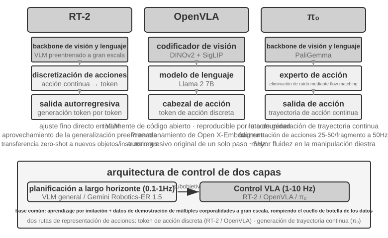
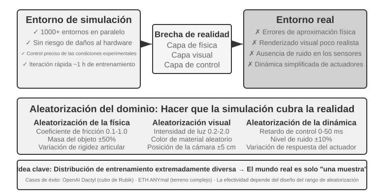
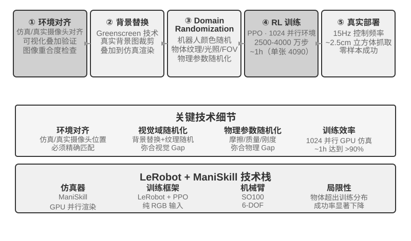

# Capítulo 9: Agentes Multimodales y TTS

Cuando un Agente necesita comprender un comando hablado, encontrar y hacer clic en el botón correcto en una pantalla o guiar un brazo robótico para agarrar un objeto, entra en un nuevo territorio: **la interacción multimodal en tiempo real**. Este cambio de la entrada y salida de texto puro a la **percepción multimodal y respuesta en tiempo real** lleva al Agente más allá del "cuadro de diálogo". "Multimodal" significa simplemente manejar múltiples formas de información a la vez (texto, voz, imágenes, video y acciones).

Este capítulo aborda tres escenarios en los que **las restricciones de tiempo real hacen que los problemas multimodales sean complejos**: diálogo por voz, operación de interfaz gráfica (Computer Use) y control de robots. En estos entornos, la entrada llega de forma continua y la salida debe cumplir con un estricto presupuesto de tiempo.

## Voz: La Interfaz Humano-Máquina más Natural

La voz es la interfaz con mayor ancho de banda y más natural. Se pueden distinguir dos tipos de herramientas: herramientas de dictado por voz (reemplazo de teclado) y Agentes de voz (como Pine o ChatGPT Voice), donde la voz es tanto la entrada como la interacción misma. Una aplicación avanzada es la "programación por susurro" (whisper coding), donde el desarrollador habla con el Agente de código.

## Tres Paradigma de la Arquitectura de Voz

1. **Cascada (Cascaded)**: Cadena de tres modelos: Reconocimiento Automático del Habla (ASR) → Modelo de Lenguaje Grande (LLM) → Texto a Voz (TTS). Latencia acumulada y pérdida de información no textual.
2. **Omnimodal de Extremo a Extremo (Omni)**: Un solo modelo que "escucha, piensa y habla" directamente (ej. Qwen3-Omni, Step-Audio 2). Preserva la prosodia y la emoción, pero aún asume el "turno de habla" basado en detección de silencio (VAD).
3. **Full-Duplex / Interactivo**: El modelo escucha y habla simultáneamente (ej. Moshi, TML-Interaction-Small, GPT-Live). Procesa flujos de entrada y salida de forma concurrente, eliminando el concepto rígido de turnos.

> **Experimento 9-1 ★: Construir un Agente de Voz Tradicional (VAD + ASR + LLM + TTS)**
>
> **Experimento 9-2 ★: Construir un Agente Telefónico Usando la API de Voz de PineClaw**

### Percepción de Voz en Streaming: Reemplazando VAD + ASR

La percepción auditiva basada en LLM en streaming procesa el audio de forma continua emitiendo tokens de texto y marcadores de eventos acústicos (`<speak_start>`, `<emotion:happy>`, `<laugh>`, `<noise>`).

> **Experimento 9-3 ★: Simulación de Percepción de Voz en Streaming con Qwen2-Audio**

## Compromisos en las Arquitecturas de Pensamiento: De la Separación a la Unificación

Tensión entre respuesta en tiempo real y pensamiento profundo.

- **Solución 1: Pensamiento Rápido para Rellenos, Pensamiento Lento para Respuestas**: Ejecución en paralelo. Problemas de sobrepensar preguntas simples e inconsistencia entre respuestas rápidas y lentas.
- **Solución 2: Pensamiento Rápido para Interacción, Pensamiento Lento para Consejos**: El pensamiento lento actúa como un estratega entre bambalinas comunicándose vía el Agent Status Bar (ej. GPT-Live delegando en GPT-5.5, Pine AI).
- **Solución 3: Unificación de Extremo a Extremo de Pensamiento y Expresión (Step-Audio R1)**:
  - **MGRD (Modality-Grounded Reasoning Distillation)**: Asegura que el razonamiento se base en características acústicas reales y no solo en la transcripción de texto.
  - **Arquitectura de Doble Cerebro MPS (Mind-Paced Speaking)**: El Cerebro de Formulación (razona) y el Cerebro de Articulación (genera voz) trabajan en paralelo, permitiendo "pensar mientras se habla".

> **Experimento 9-4 ★★★: Uso de Step-Audio R1 para Razonamiento Hablado de Extremo a Extremo**

Tabla 9-1 Comparación de Configuraciones de Razonamiento Hablado de Step-Audio R1

| Configuración | Spoken-MQA | URO-Bench |
|------|-----------|-----------|
| Responder directamente sin pensar | 70.6% | 77.4 |
| MPS Speak-First (Latencia Cero) | 92.8% | 82.5 |
| MPS Think-First (~80 tok Latencia) | 93.9% | 84.8 |
| TBS Completo (Sin Restricción de Latencia) | 93.0% | — |

- **Canal Lento-Rápido Continuo (Latent Bridge)**: Transmitir estados ocultos entre modelos en lugar de texto en tareas de tiempo real como videojuegos.

## Síntesis de Voz Más Humana (TTS Guiado por Control Tokens)

Inserción de tokens de control por parte del LLM (`[THINKING]`, `[EMO:happy]`, `[SPEED:0.8x]`, `[LAUGH]`) para simular pausas de pensamiento y emociones humanas.

> **Experimento 9-5 ★★: TTS Guiado por Control Tokens Basado en Fish Audio S1**

## Computer Use: Agentes de Automatización de GUI

El bucle Percibir-Pensar-Actuar para operar interfaces de usuario.

Herramientas: herramienta `computer` (mouse/teclado), herramienta `bash`, herramienta `str_replace_editor`.

> **Experimento 9-6 ★: Ejecutar la Demo de Anthropic Computer Use**

### Visual Grounding (Localización Visual)

 Tres enfoques principales:
1. **Anotación Visual (Set-of-Mark original)**: Segmentar regiones con modelos como SAM y superponer números.
2. **Indexación de Elementos Estructurados (DOM / Accessibility Tree)**: Encriptar/numerar elementos interactivos del DOM o árbol de accesibilidad (implementación de `browser-use`).
3. **Predicción Directa de Coordenadas**: El modelo predice coordenadas $(x,y)$ directamente (SeeClick, Claude). Requiere escalado bidireccional de coordenadas para coincidir con la resolución del modelo.

> **Experimento 9-7 ★: Uso de browser-use para Implementar Operaciones Automatizadas en el Navegador**

### Agentes de Computer Use para Pantallas Dinámicas (AOI)

Uso del Agent-Computer Observation Interface (AOI) para capturar cuadros clave intercalados, transcripción de voz activada por volumen y descripción persistente de fotogramas en texto.

### Mobile y Rendimiento en Tiempo Real

En móvil, las barreras ecosistémicas y el conflicto con el modelo de negocio publicitario son mayores que los desafíos técnicos. En benchmarks como OSWorld, el verdadero cuello de botella es la eficiencia y la latencia por paso.

## Manipulación Robótica: De Control en Tiempo Real a Entrenamiento y Generalización

### El Hardware No es el Cuello de Botella; Los Algoritmos Sí Lo Son

La teleoperación humana en robots económicos (ej. XLeRobot) demuestra que los sensores y actuadores son suficientes para tareas domésticas guiadas por visión.

> **Experimento 9-8 ★: Experiencia de Teleoperación con XLeRobot**

### Arquitectura de Dos Capas: Separación de Planificación y Control

1. **Planificación de Largo Alcance**: El VLM analiza la escena y descompone la instrucción en sub-objetivos.
2. **Control VLA (Vision-Language-Action)**: Modelo continuo que ejecuta la acción atómica a partir de imágenes e instrucciones.

**Action Chunking**: El modelo genera una secuencia corta de acciones futuras (ej. 25-50 acciones a 50Hz) en una sola inferencia, suavizando el movimiento y compensando la baja frecuencia de inferencia del LLM.

- **RT-2 y OpenVLA**: Tokens de acción discretos.
- **π₀**: Generación de trayectorias continuas mediante Flow Matching.

### Transferencia Sim2Real (De Simulación a Realidad)

> **Experimento 9-10 ★★★: Agarre Robótico Sim2Real RGB Zero-Shot (LeRobot + ManiSkill + SO100)**
>
> 

## Resumen del Capítulo

En voz, Computer Use y robótica, los sistemas evolucionan desde pipelines seriales hacia modelos de extremo a extremo, desacoplamiento rápido-lento y Action Chunking para mitigar la latencia y la complejidad multimodal.

## Preguntas de Reflexión

1. ★★ ¿Cómo diseñar un sistema de observabilidad para un Agente de voz de extremo a extremo donde el ASR-LLM-TTS está fusionado?
2. ★ ¿Debería el "pensar mientras se habla" de un Agente imitar las muletillas y pausas de duda humanas?
3. ★★ ¿Cuándo se debe recurrir a la predicción directa de coordenadas frente a la indexación del DOM en Computer Use?
4. ★★ ¿Cómo afecta la calidad de los datos de teleoperación de operadores no expertos al entrenamiento de modelos VLA?
5. ★★★ ¿Cómo evolucionará la capa de interacción de los Agentes en los próximos cinco años?
6. ★★★ ¿Cómo rediseñar la capa de percepción en Computer Use para admitir la comprensión de flujos de video continuos en tiempo real?
7. ★★ ¿Debería Computer Use apostar por un enfoque puramente visual o mantener vías estructuradas (DOM) y visuales en paralelo?
8. ★★ En modelos VLA con Action Chunking, si el entorno cambia repentinamente durante la ejecución del chunk, ¿cómo equilibrar suavidad y capacidad de respuesta?
9. ★★★ ¿Cómo garantizar que las acciones basadas en pensamiento rápido en voz, Computer Use o robótica no tengan consecuencias irreversibles?
