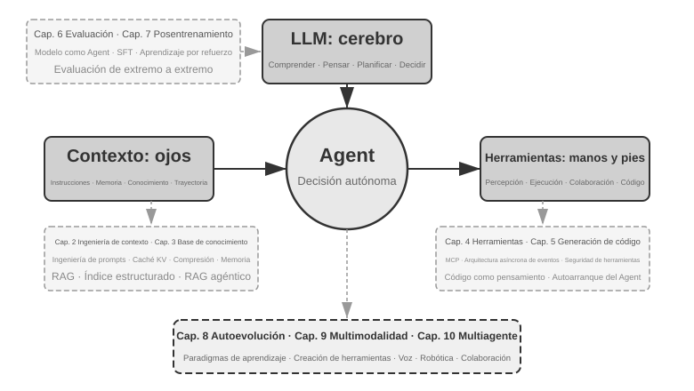
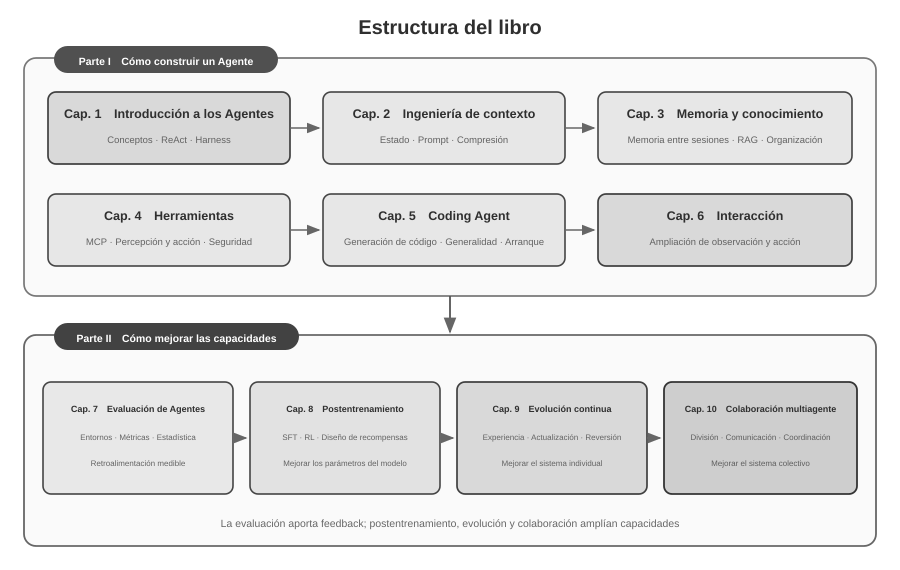

# Introducción {.unnumbered}

Entre agosto y octubre de 2025 impartí una serie de cursos en el *Campamento Práctico de AI Agents* de Turing. Los cursos giraban en torno a una pregunta: ¿cómo diseñar AI Agents mediante principios de ingeniería explicables, verificables y reutilizables, en lugar de depender de sucesivos ensayos guiados por la experiencia y la intuición? Hacer funcionar una demostración no era, por tanto, el punto final. También examinamos por qué un Agente adopta una arquitectura concreta, qué límites de capacidad presenta y qué compromisos implica cada decisión. Este libro organiza, amplía y reestructura de forma sistemática los materiales del curso y sus experimentos.

La elaboración del libro fue, a su vez, un ejercicio de colaboración entre una persona y un Agente. Desde la concepción hasta el manuscrito final trabajé principalmente mediante **whisper coding**, una colaboración basada en el dictado, con el Agente de voz de Pine para investigar e iterar el texto. Yo dictaba el esquema de cada capítulo; el Agente revisaba las fuentes y preparaba un borrador. Después incorporaba la retroalimentación de los estudiantes y revisaba repetidamente los argumentos, los casos y los experimentos. La voz redujo el coste de exteriorizar las ideas y acortó el ciclo entre formular una pregunta, localizar fuentes, redactar y verificar. El libro, por ello, no solo estudia los Agentes: también documenta una forma de producción de conocimiento en la que un Agente participó de manera profunda.

Desde la publicación de DeepSeek R1 a comienzos de 2025, el foco de la investigación y la práctica industrial en IA se ha ampliado gradualmente desde la capacidad de los modelos base hacia el despliegue sistemático de Agentes. En el modelo, el aprendizaje por refuerzo agéntico empieza a internalizar el uso de herramientas y la interacción con el entorno, reforzando capacidades generales de programación, razonamiento matemático y Computer Use. En el producto, Agentes generales como Manus, Claude Code y OpenClaw han transformado la interacción con el ordenador y han consolidado «generación de código + sistema de archivos» como una arquitectura de sistemas relevante.

Al revisar los principios de arquitectura de Agentes resumidos en el curso, se observa que conservan una capacidad explicativa estable pese a la rápida evolución de los modelos y los productos. Términos como Skill, harness y loop engineering se generalizaron más tarde, pero las prácticas de ingeniería correspondientes solían existir con anterioridad. Los conceptos son una generalización de numerosas experiencias prácticas, no el punto de partida de la práctica. En otras palabras, la práctica precede a la denominación.

Estos principios proceden principalmente de la ingeniería de sistemas de larga duración y alto riesgo. Como científico jefe de Pine AI, trabajé con el equipo que desarrolló Pine para que un Agente pudiera comunicarse con personas en nombre del usuario y gestionar tareas complejas con intereses económicos reales, como negociar facturas, resolver disputas de reembolso y cancelar suscripciones. Estas tareas suelen prolongarse y exigir muchas rondas, mientras que un solo error puede causar una pérdida real. Los requisitos estrictos de fiabilidad, seguridad y auditabilidad dieron forma a los principios arquitectónicos de este libro.

- Mucho antes de que el concepto de Skill se popularizara, ya utilizábamos métodos de carga dinámica de prompts para resolver el problema de la expansión infinita de prompts, el método de ejecución de herramientas por línea de comandos para resolver el problema de la expansión infinita de la lista de herramientas, y la tecnología de barra de estado del sistema para resolver el problema de que el Agente no fuera consciente del entorno de ejecución, el tiempo del usuario, el estado de trabajo, etc.
- Mucho antes de que el concepto de harness se hiciera popular, estábamos utilizando métodos similares a Claude Code para resolver problemas como la inestabilidad de las llamadas a herramientas del modelo, alucinaciones, operaciones peligrosas, operaciones no autorizadas y el no seguimiento de instrucciones.
- Mucho antes de que el concepto de loop engineering se popularizara, estábamos utilizando el método que este libro llama proponente-revisor (*proposer-reviewer*) para resolver el problema de que el modelo considere prematuramente que una tarea está completada.

Estos métodos no son exclusivos de Pine. Numerosos equipos de modelos y Agentes han desarrollado de forma independiente métodos de ingeniería semejantes al resolver problemas parecidos; esta convergencia indica que reflejan restricciones comunes de los sistemas de Agentes. A partir de estas conclusiones, en 2025 impartí en Turing el *Campamento Práctico de AI Agents* y, entre 2024 y 2026, un curso práctico de AI Agents en la Universidad de la Academia China de Ciencias. El libro se publica como código abierto para que estos conocimientos y experiencias reutilizables sirvan a más investigadores y profesionales de la ingeniería.

**La práctica precede a la denominación.** Para el desarrollo empresarial de Agentes, esto significa que la práctica no puede quedar siempre rezagada respecto de la difusión de los conceptos. Cuando un término se convierte en consenso de la industria, el problema que designa suele llevar tiempo explorándose en los sistemas más avanzados. Para identificar y resolver antes esos problemas, considero necesarias dos condiciones.

**Primero, elegir una actividad real que exija suficientemente el límite de capacidad del Agente y obtener de ella retroalimentación continua.** En Pine, una tarea puede durar horas o semanas e implicar repetidas interacciones con varias partes interesadas, llamadas prolongadas, formularios complejos y múltiples intercambios de correo. Al mismo tiempo, deben garantizarse la exactitud de los datos críticos, el control de las operaciones y la protección de los intereses del usuario. Un entorno suficientemente complejo revela de forma continua la brecha entre la capacidad del modelo y los requisitos del negocio, e impulsa al equipo a construir un harness que resuelva sistemáticamente aquello que el modelo aún no puede realizar solo pero que el negocio necesita. Si la siguiente actualización del modelo satisface con facilidad los requisitos, resulta más difícil acumular principios estables de diseño de sistemas.

**Segundo, establecer un mecanismo sistemático de evaluación (Evaluation).** Sin evaluación no es posible determinar si la mejora posterior a un cambio procede del diseño o de una fluctuación aleatoria. La evaluación transforma la iteración del Agente, de un juicio basado en la experiencia, en un proceso de ingeniería comparable y reproducible; constituye la base para desarrollar sistemas mediante el método científico. El Capítulo 7 examina esta metodología.

Independientemente de cómo se actualicen los modelos subyacentes o cómo innoven las formas de productos, casi todos los sistemas de Agentes exitosos siguen los mismos patrones arquitectónicos. Esto no es una coincidencia: **los buenos principios de diseño deben atravesar los ciclos de iteración de los modelos**, porque no describen cómo usar un modelo específico, sino los patrones fundamentales de interacción entre un sistema inteligente y el mundo.

Richard Sutton, ganador del Premio Turing y padre del aprendizaje por refuerzo, dijo una vez que la evolución del universo pasó por 4 etapas: desde el polvo hasta las estrellas, desde las estrellas hasta la vida, y desde la vida hasta los agentes inteligentes (*entidades diseñadas* en el original, *designed entities*). La evolución biológica es ciega: mutación aleatoria y selección natural. La mayoría de los seres vivos no entienden sus propios principios de funcionamiento ni pueden diseñar y transformar seres vivos de forma autónoma. Un agente inteligente (Agent) es una existencia completamente nueva en la historia de la evolución del universo: puede lograr la autorrecuperación o arranque autónomo (*bootstrap*) y la autoevolución mediante la generación de código, como un programador que escribe a otro programador, y luego el nuevo programador continúa escribiendo al siguiente. Es decir, un Agente puede entender sus propios mecanismos de funcionamiento y crear agentes inteligentes completamente nuevos e incluso mejorarse a sí mismo según sus objetivos. La misión de este libro es ayudarte a entender y dominar los principios de esta creación.

La fórmula principal de este libro consta de una sola frase: **Agente = LLM + Contexto + Herramientas**. Ninguno de los tres puede faltar.

De forma más intuitiva, es **Cerebro + Ojos + Manos/Pies**. El cerebro (LLM) es responsable de pensar y tomar decisiones, los ojos (contexto) determinan qué información puede ver el Agente, y las manos/pies (herramientas) determinan qué cosas puede hacer el Agente. (Estrictamente hablando, "ojos" es solo una analogía aproximada: el contexto no solo contiene información ambiental e historial de conversaciones, sino también definiciones de herramientas, es decir, la información que el Agente "ve" también incluye "qué manos y pies están disponibles". Esta metáfora pretende transmitir una intuición central: el contexto es todo lo que el modelo puede percibir.)



Para los lectores familiarizados con el aprendizaje por refuerzo (RL), estos tres elementos también se pueden mapear al lenguaje formal de RL. Específicamente, el LLM corresponde a la Política (*Policy*), el contexto corresponde al Espacio de Observación (*Observation Space*), y las herramientas corresponden al Espacio de Acción (*Action Space*). Las tres expresiones corresponden al mismo objeto, solo que en diferentes niveles de expresión.

## Estructura del libro {.unnumbered}

El libro consta de diez capítulos organizados en torno a dos preguntas conectadas (Figura 0-2). **La Parte I, «Cómo construir un Agente»,** comprende los capítulos 1–6: parte de los conceptos fundamentales y avanza por contexto, memoria y conocimiento, herramientas, Coding Agents y la ampliación de los espacios de observación y acción. **La Parte II, «Cómo mejorar las capacidades del Agente»,** comprende los capítulos 7–10: la evaluación establece primero una retroalimentación medible; después, el postentrenamiento, la evolución continua basada en la experiencia operativa y la colaboración multiagente amplían la capacidad en los niveles de parámetros del modelo, sistema individual y sistema colectivo.



- **Capítulo 1 (Fundamentos de Agentes de IA)** parte de múltiples productos de Agentes reales para construir una comprensión intuitiva de los Agentes. Analiza en profundidad la fórmula central del Agente: desde el nivel de implementación LLM + Contexto + Herramientas, pasando por la intuición Cerebro + Ojos + Manos/Pies, hasta el nivel académico de Política (*Policy*), Espacio de Observación (*Observation Space*) y Espacio de Acción (*Action Space*). Al mismo tiempo, analiza los mecanismos del ciclo ReAct a través de experimentos, es decir, el proceso iterativo de "pensar → actuar → observar", y distingue entre la adaptación dentro del contexto de la tarea, la actualización de artefactos externos (*artifacts*) entre tareas y la actualización de parámetros durante los ciclos de entrenamiento. Finalmente, analiza los patrones de diseño de orquestación desde flujos de trabajo hasta Agentes autónomos, estableciendo un marco conceptual unificado para los capítulos posteriores.
- **Capítulo 2 (Ingeniería de Contexto)** es el capítulo más crucial de todo el libro, explicando de manera sistemática el contexto, es decir, los "ojos" del Agente. Este capítulo comienza con la estructura de mensajes de API y el ciclo central del Agente, estableciendo la base de que "el contexto es una lista de mensajes", y luego profundiza en los principios subyacentes de KV Cache (el mecanismo para reutilizar resultados de cálculo históricos durante la inferencia de modelos grandes), para después desarrollar secuencialmente: ingeniería de prompts (*Prompt Engineering*, incluyendo diseño de flujos, descripción de herramientas, refinamiento de reglas de negocio) y defensa/ataque de inyección de prompts (*Prompt Injection*), el mecanismo de carga bajo demanda de Agent Skills, la tecnología de barra de estado del Agente y las estrategias de compresión de contexto (*Context Compression*). Las definiciones completas de cada término se proporcionan en su primera aparición en el texto.
- **Capítulo 3 (Memoria de Usuario y Base de Conocimientos)** extiende la gestión de contexto a sistemas de conocimiento persistentes entre sesiones, permitiendo que el Agente no solo recuerde el contenido de la conversación actual, sino que también acumule y consulte conocimiento a lo largo de múltiples conversaciones. Cubre cuatro estrategias progresivas de memoria de usuario, la pila tecnológica completa de RAG (Generación Aumentada por Recuperación, es decir, recuperar documentos relevantes antes de que el modelo genere una respuesta, incluyendo diferentes métodos de búsqueda de texto y optimización de la clasificación de resultados de búsqueda), extracción de información multimodal, métodos avanzados de organización del conocimiento y RAG agéntico (*Agentic RAG*, donde el Agente decide de forma autónoma cuándo y qué buscar).
- **Capítulo 4 (Herramientas)** explora el puente entre el Agente y el mundo exterior: las herramientas actúan como sus «manos y pies» y le permiten buscar en la web, llamar a API y operar bases de datos. Presenta el estándar de interoperabilidad MCP y los principios de diseño de cinco categorías de herramientas (percepción, ejecución, colaboración, activación por eventos y comunicación con el usuario), con especial atención a la seguridad de las herramientas de ejecución. La activación por eventos, la comunicación con el usuario y el entorno de ejecución asíncrono se desarrollan en el Capítulo 6.
- **Capítulo 5 (Coding Agent y Generación de Código)** demuestra que los Coding Agents combinados con el sistema de archivos constituyen la base técnica más central de todos los Agentes generales. Utilizando la arquitectura de OpenClaw como hilo conductor, analiza el flujo de trabajo y las técnicas de implementación de un Coding Agent, y muestra el amplio valor de la generación de código más allá de la programación: desde asistir al pensamiento y construir bases de conocimiento, hasta crear dinámicamente nuevas herramientas y el arranque autónomo (*bootstrap*) de Agentes.
- **Capítulo 6 (Interacción: expansión de los espacios de observación y acción)** estudia la interacción entre el Agente y el entorno en dos dimensiones: **modalidad** y **temporalidad**. Los sistemas asíncronos y orientados a eventos permiten recibir y responder continuamente a sucesos externos; la voz acerca percepción, razonamiento y generación al tiempo real; Computer Use extiende el espacio de acción a las interfaces gráficas; y la robótica lo amplía al entorno físico. Los cuatro contextos comparten primitivas como activación, puntos seguros, cancelación, desalojo y separación entre rutas rápidas y lentas.
- **Capítulo 7 (Evaluación de Agentes)** construye una metodología de evaluación científica. Cubre los entornos de evaluación (dos paradigmas centrales: basados en llamadas a herramientas y basados en interacción humano-computadora, así como los entornos de simulación discutidos por separado al final del capítulo), los principios de diseño de conjuntos de datos, los métodos de juicio automatizado LLM-as-a-Judge, la selección de modelos impulsada por evaluación y el ciclo cerrado completo para transformar los resultados de evaluación en mejoras del sistema.
- **Capítulo 8 (Posentrenamiento de Modelos)** profundiza en SFT (ajuste fino supervisado, es decir, usar datos etiquetados para enseñar al modelo a "imitar ejemplos") y RL (aprendizaje por refuerzo, es decir, permitir que el modelo mejore de forma autónoma a través del ensayo y error y la retroalimentación de recompensas), dos tecnologías de posentrenamiento. Utilizando los argumentos centrales de "SFT para memoria, RL para generalización" y "los datos y el entorno son más importantes que el algoritmo", abarca el panorama completo de tres etapas (preentrenamiento/SFT/RL), teoría clásica de RL, diseño de señales de recompensa (desde recompensas binarias hasta recompensas de proceso, y penalizaciones de ruta de verificación que "recompensan resultados y restringen procesos"), algoritmos de aprendizaje por refuerzo de una sola ronda y múltiples rondas, así como exploraciones de vanguardia en optimización de eficiencia de muestras.
- **Capítulo 9 (Evolución Continua del Agente)** investiga cómo transformar la experiencia operativa del Agente en capacidades para la siguiente versión. El capítulo establece primero señales de aprendizaje compuestas por resultados ambientales, reglas de proceso y rúbricas LLM, luego compara cuatro portadores de actualización: documentos de conocimiento, Prompt y Skills, programas y Harness, y parámetros del modelo; finalmente analiza la verificación de versiones candidatas, despliegue canario (*canary deployment*), reversión (*rollback*) y organización a largo plazo.
- **Capítulo 10 (Colaboración Multi-Agente)** amplía la perspectiva desde la capacidad individual hasta la coordinación a escala de sistema y estudia cómo varios Agentes dividen el trabajo y colaboran. Expone el marco de clasificación de la colaboración multi-agente (contexto compartido/independiente × entre pares/gestor/descentralizado), ilustra el diseño mediante Agentes de traducción y Agentes que coordinan teléfono y computadora, y analiza posibles direcciones de desarrollo de las sociedades y economías de Agentes.

## Cómo leer este libro {.unnumbered}

Los capítulos de este libro son relativamente independientes, por lo que puedes elegir diferentes rutas de lectura según tus necesidades:

- **Si desarrollas Agentes**, lee el libro en orden: los capítulos 1–6 establecen un método completo para construirlos, mientras que los capítulos 7–10 estudian la mejora de capacidades mediante evaluación, postentrenamiento, evolución continua y colaboración multiagente.
- **Si tu tiempo es limitado**, da prioridad a la lectura del Capítulo 1 (para establecer una percepción global) y el Capítulo 2 (para dominar la ingeniería de contexto más crucial). Los principios subyacentes de KV Cache en el Capítulo 2 son relativamente técnicos; en una primera lectura puedes saltarte la parte de principios y recordar solo las tres conclusiones centrales al principio, lo cual no afectará la comprensión posterior.
- **Si te enfocas en el entrenamiento de modelos**, puedes leer directamente el Capítulo 8 (Posentrenamiento de Modelos); la metodología de evaluación (Capítulo 7) es un prerrequisito para el entrenamiento, por lo que se recomienda leerla juntos y leer primero los Capítulos 1 y 2 para establecer una comprensión general.

Cada capítulo contiene una gran cantidad de **experimentos** y **preguntas de reflexión**, numerados con el formato "Experimento X-Y" (donde X es el número de capítulo e Y es el número secuencial dentro del capítulo). Los títulos de los experimentos y preguntas de reflexión utilizan estrellas para indicar la dificultad: ★ indica nivel introductorio, adecuado para todos los lectores; ★★ indica dificultad media, que requiere cierta experiencia práctica en ingeniería; ★★★ indica un desafío avanzado, que generalmente involucra preguntas abiertas o diseño de sistemas complejos. La mayoría de los experimentos vienen con código ejecutable completo, organizado en el repositorio de código abierto complementario:

> **Repositorio de código complementario**: [https://github.com/bojieli/ai-agent-book](https://github.com/bojieli/ai-agent-book)

Puedes obtener todo el código complementario con Git:

```bash
git clone https://github.com/bojieli/ai-agent-book.git
cd ai-agent-book
```

Si no utilizas Git, también puedes seleccionar **Code → Download ZIP** en la página del repositorio. El código de los experimentos está organizado por capítulos, desde `chapter1/` hasta `chapter10/`. Para encontrar el «Experimento X-Y», abre el archivo `chapterX/README.es.md` correspondiente, localiza el directorio del proyecto mediante el número del experimento y sigue el README del propio proyecto para instalar las dependencias y ejecutarlo. Algunos experimentos marcados como guías de reproducción dependen de repositorios externos; sus README también explican cómo obtenerlos.

Te recomiendo enfáticamente que ejecutes personalmente estos experimentos. Los Agentes de IA son un campo altamente práctico, y muchas intuiciones de diseño solo se pueden establecer verdaderamente durante el proceso de depuración directa.


## Prerrequisitos {.unnumbered}

Este libro está dirigido a lectores con cierta formación técnica, pero no requiere que seas un experto en un campo específico. A continuación, se enumeran los conocimientos previos en dos niveles, "esenciales" y "recomendados", para ayudarte a evaluar tu grado de preparación.

**Esenciales: La base para leer todo el libro**

- **Programación en Python**: Casi todos los experimentos del libro están basados en Python. Debes estar familiarizado con la sintaxis básica de Python, estructuras de datos comunes, gestión de paquetes (pip) y otros conceptos básicos. No se requiere maestría, pero debes ser capaz de leer y modificar código Python de complejidad media.
- **Experiencia básica en el uso de LLM**: Deberías haber usado ChatGPT, Claude o productos similares, comprendiendo el patrón de interacción básico de "prompt (instrucción) → respuesta del modelo".
- **Una herramienta de programación asistida por IA**: Se recomienda enfáticamente instalar y familiarizarse con al menos una herramienta de programación asistida por IA, como Claude Code, Codex, Cursor, TRAE, etc. Por un lado, estas herramientas pueden mejorar significativamente la eficiencia del desarrollo de experimentos, los cuales involucran una gran cantidad de escritura y depuración de código. Por otro lado, estas herramientas de programación son en sí mismas Coding Agents maduros; durante su uso, experimentarás de forma intuitiva mecanismos centrales discutidos repetidamente en el libro, como el ciclo ReAct, la llamada a herramientas y la gestión del contexto. Esta experiencia de primera mano es extremadamente valiosa para comprender los principios de diseño de los Agentes.
- **Sentido común de ingeniería de software**: Familiaridad con operaciones de línea de comandos, control de versiones Git, formato de datos JSON, REST API y otros conceptos básicos. Estos son la base para ejecutar experimentos y comprender el mecanismo de llamada a herramientas de los Agentes.

**Recomendados: Mejorar la experiencia de lectura en capítulos específicos**

- **Fundamentos de Aprendizaje Automático** (Capítulo 8): Comprender conceptos básicos como entrenamiento e inferencia, funciones de pérdida, descenso de gradiente y sobreajuste ayuda a comprender el posentrenamiento de modelos.
- **Matemáticas básicas** (Capítulos 2-3, 8): Una comprensión intuitiva del álgebra lineal (como saber que los vectores pueden representar dirección y magnitud, y que las matrices pueden realizar operaciones por lotes) ayuda a comprender las incrustaciones (*embeddings*) y los mecanismos de atención; conceptos básicos de probabilidad y estadística ayudan a comprender las métricas de evaluación y las recompensas esperadas en el aprendizaje por refuerzo. Las matemáticas del libro no involucran deducciones complejas y se centran en explicaciones intuitivas.
- **Capítulo 6 (Interacción: expansión de los espacios de observación y acción)** estudia la interacción entre el Agente y el entorno en dos dimensiones: **modalidad** y **temporalidad**. Los sistemas asíncronos y orientados a eventos permiten recibir y responder continuamente a sucesos externos; la voz acerca percepción, razonamiento y generación al tiempo real; Computer Use extiende el espacio de acción a las interfaces gráficas; y la robótica lo amplía al entorno físico. Los cuatro contextos comparten primitivas como activación, puntos seguros, cancelación, desalojo y separación entre rutas rápidas y lentas.
- **Comprensión básica de la arquitectura Transformer** (Capítulos 2, 8): Transformer es la arquitectura subyacente de casi todos los modelos de lenguaje grandes actuales. Para los lectores que deseen complementar de manera sistemática los conocimientos básicos sobre modelos grandes, se recomienda leer *Ilustrando Modelos Grandes* (Turing Publishing). Este libro explica conceptualmente la arquitectura Transformer, el preentrenamiento y el ajuste fino mediante diagramas intuitivos, formando un excelente complemento con la perspectiva de ingeniería de Agentes de este libro.

Si careces de algunos conocimientos previos, no hay necesidad de dar un paso atrás. El valor central de este libro reside en los **principios de diseño de arquitectura y la metodología de práctica de ingeniería**, no en un algoritmo o técnica específica. A excepción del posentrenamiento del Capítulo 8, todo el libro tiene requisitos muy bajos de matemáticas y aprendizaje automático, pudiendo servir perfectamente como punto de partida.

La tecnología de Agentes todavía evoluciona rápidamente, pero **los buenos principios de diseño de arquitectura tienen el poder de atravesar el tiempo**. Dominando "por qué se diseña de esta manera", podrás mantener un juicio claro en medio de las olas de cambios tecnológicos. Espero que este libro se convierta en tu guía confiable para construir Agentes de IA.

## Agradecimientos {.unnumbered}

Gracias a Mengge y Liumeiying de Turing por su arduo trabajo editorial y sus esfuerzos en la organización del curso *Campamento de Entrenamiento de Agentes de IA* de Turing; gracias al profesor Liu Junming por impartir el curso práctico de Agentes de IA en la Universidad de la Academia China de Ciencias. También quiero agradecer especialmente a todos los estudiantes del *Campamento de Entrenamiento de Agentes de IA* de Turing y a todos los compañeros del curso práctico de Agentes de IA de UCAS: durante mis lecturas en estos cursos, me dieron muchas retroalimentaciones y sugerencias valiosas, lo que también me permitió tener una comprensión más clara de estos conceptos.

Gracias a todos los colegas de Pine AI. Sin un producto tan excelente como Pine AI y los diversos desafíos que trajo consigo, me habría sido imposible obtener una comprensión y práctica tan profundas en el campo de los Agentes; en una colisión de ideas tras otra, mis colegas también aportaron una gran cantidad de valiosas ideas.

También quiero agradecer a muchos amigos de la industria de la IA (no nombrados individualmente aquí). En diversas discusiones de la industria, me brindaron comentarios sinceros sobre mis puntos de vista, corrigiendo muchos de mis juicios erróneos y mejorando mi comprensión de los modelos y Agentes.

El agradecimiento más especial es para mi familia, especialmente para mi esposa Meng Jiaying. Ella me apoyó constantemente para completar la escritura de este libro y también ofreció muchas valiosas opiniones para el libro.
