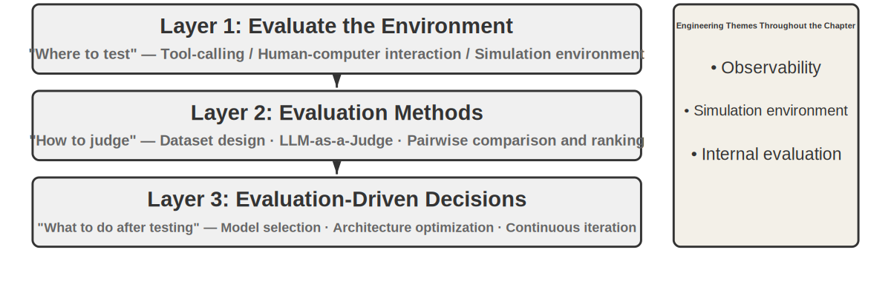
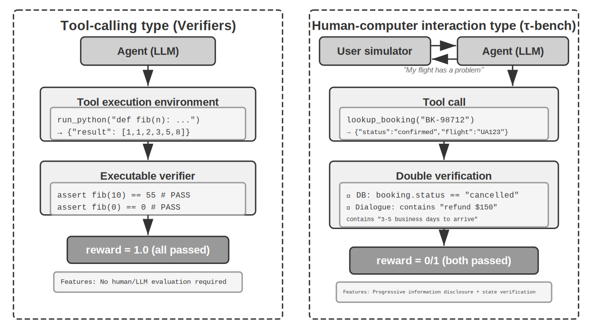
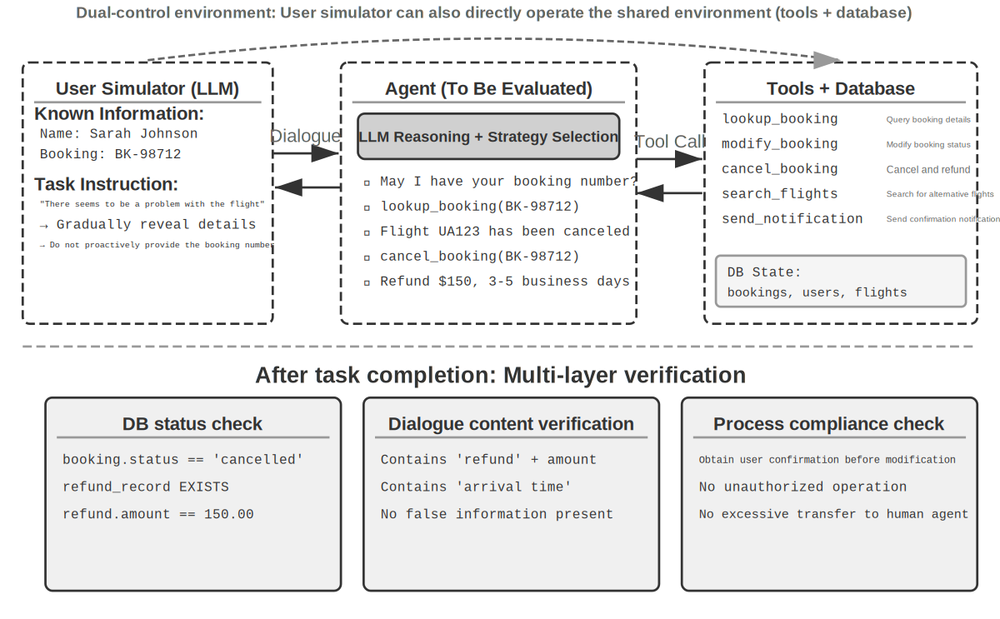
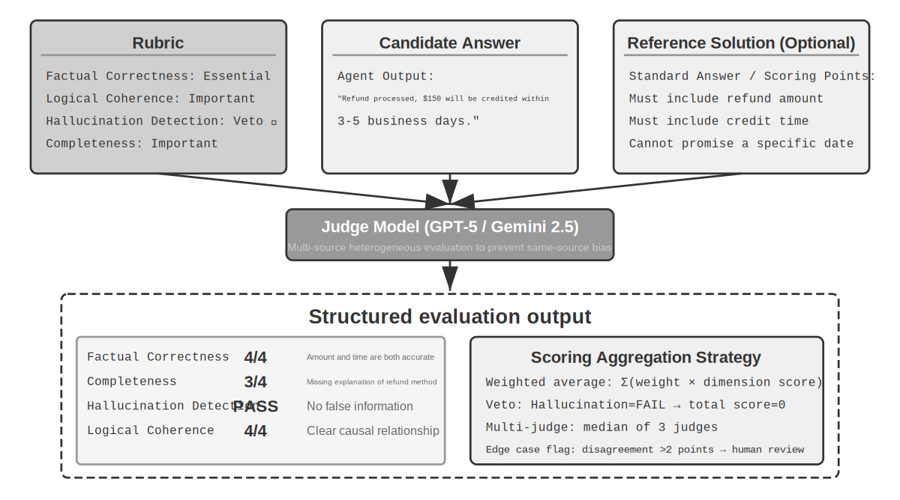
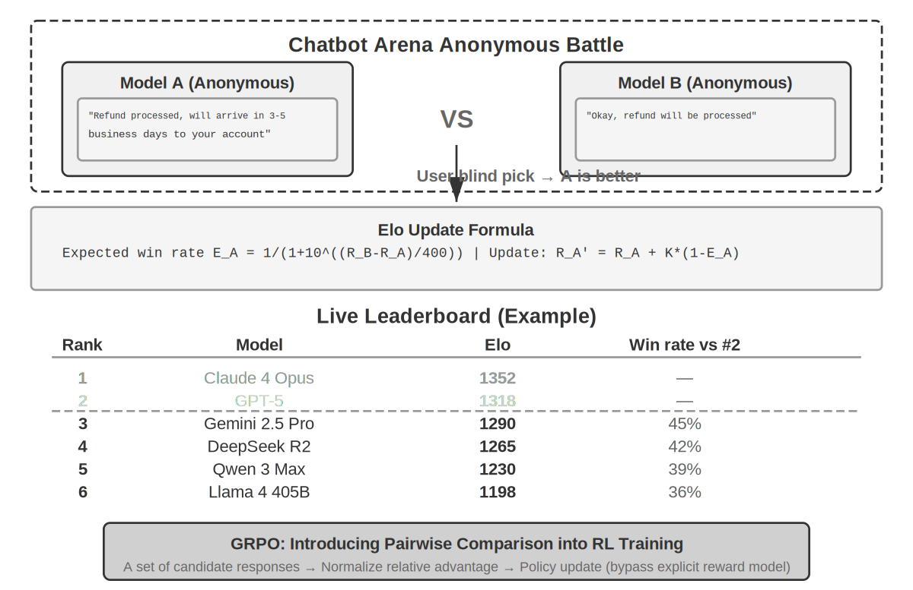
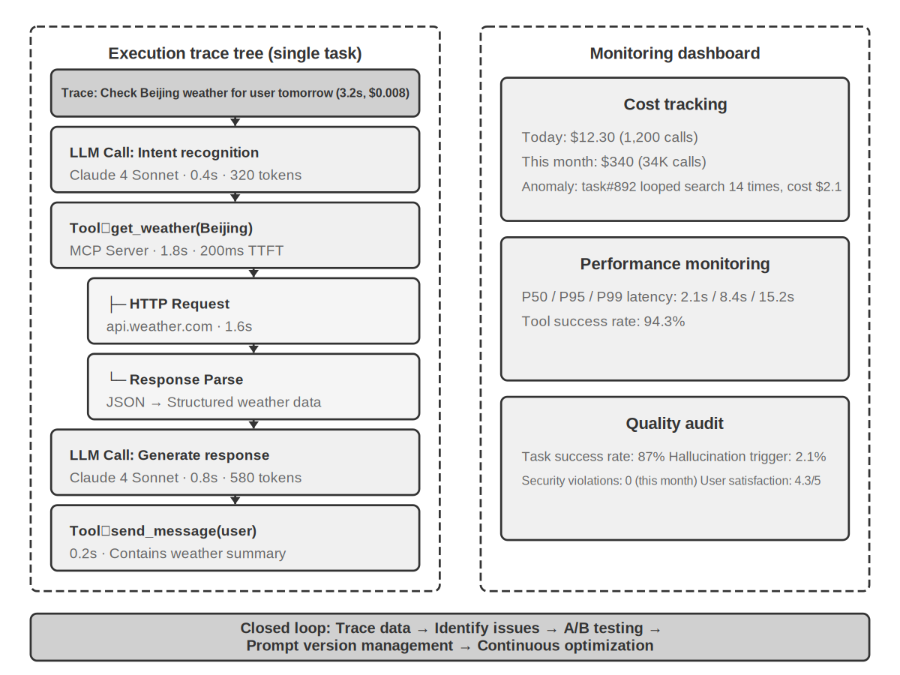
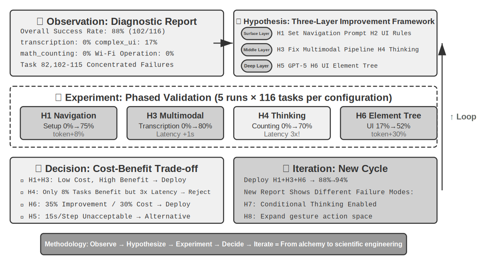
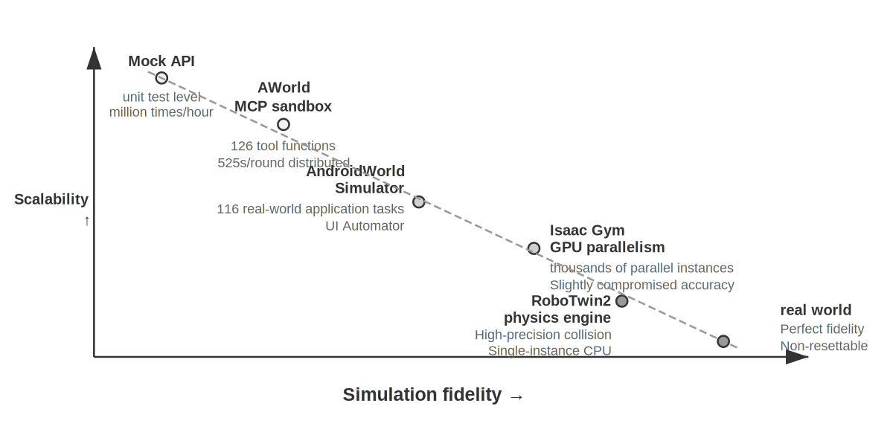
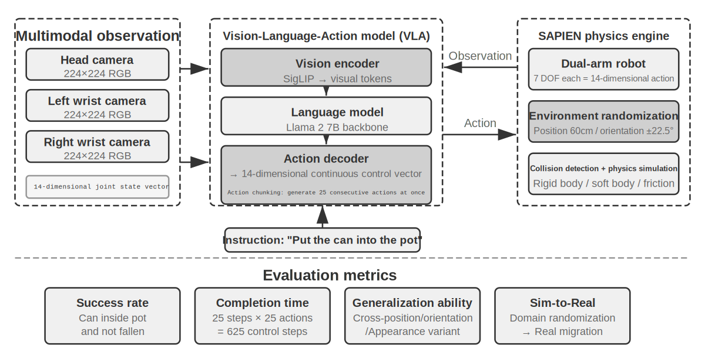

# Ügynökök kiértékelése

Egy Ügynökrendszer építése során a fejlesztők számos tervezési döntéssel szembesülnek, amelyekre gyakran nincs nyilvánvaló helyes válasz:

- Melyik modellt érdemes használni?
- Milyen eszközöket hívhat a modell?
- Milyen adatokat tároljon a tudásbázis, és hogyan strukturálja azokat?
- Hogyan valósítsuk meg a felhasználói memóriát?
- Hogyan szervezzük a modell utasításait és készségeit?
- Milyen korlátozásokat kell hozzáadni a Hámhoz?
- Hogyan alakítsuk át a kiértékelési eredményeket tanulási jelekké az Ügynök folyamatos fejlődéséhez?

A kiértékelés tudományos alapokra helyezi ezeket a döntéseket. Szisztematikus összehasonlító kísérletekkel (egyszerre csak egy változó módosítása és a hatás megfigyelése) és ablációs kísérletekkel (egy összetevő kikapcsolása és az általános teljesítményváltozás megfigyelése) megkülönböztethetőek a valódi képességnövekedések a felszínes ingadozásoktól — elkerülve, hogy filléreskedők legyünk, miközben fontos dolgokon spórolunk. A szoftvermérnökségben van egy mondás: nem javíthatsz azon, amit nem mérsz. Megismételhető kiértékelő rendszer nélkül egy Ügynököt csak intuíció alapján lehet iterálni.

Az 1. fejezetben bemutatott Hámmérnökség szempontjából a kiértékelés a Hám "verifikációs" szerepét tölti be. Egy kulcsfontosságú felismerés: **a kiértékelés tárgya nem csupán a modell, hanem a modell és a Hám kombinációja legyen**. Ugyanaz a modell drasztikusan eltérően teljesíthet különböző Hámokban — egyes csapatok pusztán a Hám optimalizálásával jelentősen javították ugyanazon modell teljesítményét terminálfeladatokon (lásd 5. fejezet). Tehát amikor egy Ügynök gyengén teljesít, a megoldás nem feltétlenül egy másik modell, hanem egy jobb Hám-összetevő (utasítások, eszköztervezés, visszacsatolási hurkok). Egy jól felépített kiértékelő rendszernek képesnek kell lennie két alapvetően különböző probléma elkülönítésére: "elégtelen modellképesség" és "Hám-tervezési hibák". "Az elkülönítés bevett módja a modellcsere-kísérlet": rögzítsd a Hámot, cseréld be egy erősebb vagy gyengébb modellt, és figyeld meg, mennyit változik a pontszám. Ha egy erősebb modell sem emeli a pontszámot, a szűk keresztmetszet a Hám. Ha egy gyengébb modell lesüllyeszti a pontszámot, és az eredmények élesen ingadoznak a modell képességeivel, a legközvetlenebb értelmezés szerint a modell maga a szűk keresztmetszet, és a jelenlegi teljesítményt a modell dominálja. Hogy ez a feladat eredendő nehézsége miatt van-e, vagy mert a Hám túlzottan támaszkodik a modell előzetes tudására, az további elemzést igényel. Vegyük észre, hogy ez eltér a fenti ablációs kísérlettől: abláció során "egy Hám-összetevőt kapcsolunk ki", hogy lássuk az általános teljesítmény változását; modellcsere során **rögzítjük a Hámot és csak a modellt cseréljük**. Az előbbi azt lokalizálja, hogy a Hám mely része számít; az utóbbi azt mondja meg, hogy a szűk keresztmetszet a modell-e vagy a Hám.

Egy kiértékelő rendszer még nagyobb értéket képvisel a gyors modellfejlődés korában. A modellek folyamatosan javulnak, de egy új modell, amely magasabb pontszámot ér el a nyilvános benchmarkokon, nem feltétlenül teljesít jobban az Ön feladatán — akár romolhat is (rosszabbul teljesíthet, mint a régi verzió bizonyos szempontokból). Csak a saját kiértékelési adathalmazon végzett teljes futtatás teszi lehetővé az adatvezérelt frissítési döntést. Egy szilárd kiértékelő rendszer még a "jövőbeli modellekre épülő termékfejlesztés" stratégiáját is életképessé teszi: ha a jelenlegi modell nem elég jó a kereskedelmi bevezetéshez, fejezd be a terméket, építsd fel a kiértékelési készletet, kövesd nyomon minden új modell teljesítményét, és indulj el, amint valamelyik átlépi a küszöböt.

> "Fejezetkalauz"
>
> Ez a fejezet egy teljes kiértékelő rendszert épít fel három szinten. Az első szint a "Kiértékelési Környezet" ("hol teszteljünk"): hogyan állítsunk fel automatizált, reprodukálható tesztkörnyezetet, lefedve két paradigmát: eszközhívás és ember-számítógép interakció. A második szint a "Kiértékelési Módszerek" ("hogyan ítéljünk"): az adathalmaz-tervezési alapelvektől és a kiértékelési metrikarendszertől (mit mérjünk), az LLM-mint-bíró (nagy nyelvi modellek használata bíróként) automatizált kiértékelésen át a páronkénti összehasonlításig és a modellek rangsorolásáig. A harmadik szint a "Kiértékelés-vezérelt Döntéshozatal" ("mit tegyünk a tesztelés után"): a kiértékelési eredmények átalakítása gyakorlatba ültethető útmutatássá modellválasztáshoz, architektúra-optimalizáláshoz és folyamatos iterációhoz, statisztikai szignifikanciával megítélve, hogy egy megfigyelt pontszámkülönbség valódi-e. A fejezet kitér a megfigyelhetőségre és a termelési szintű Ügynökök belső kiértékelési infrastruktúrájára is, és a 7. fejezet poszt-tréningjéhez kapcsolódó szimulációs környezetekkel zárul.
>
> A fejezeten átívelő gondolat: **egy kiértékelő rendszer elsődleges értéke nem a jelenlegi rendszer pontozása, hanem az, hogy lehetővé teszi a modellfejlődéssel való gyors és megbízható lépéstartást.** Amikor egy erősebb vagy olcsóbb modell megjelenik, egy robusztus kiértékelő rendszerrel rendelkező csapat órákon belül dönthet a váltásról; aki nélküle dolgozik, az csak az intuíciójára vagy a közösségi visszajelzésekre hagyatkozhat — és a versenyintenzív Ügynökpiacon ez a sebességkülönbség döntheti el, ki nyer.



## Egy Konkrét Kiértékelési Példa

Mielőtt a módszertanba merülnénk, építsünk intuíciót egy teljes példán keresztül. Tegyük fel, hogy építettünk egy ügyfélszolgálati Ügynököt, és ki kell értékelnünk a visszatérítési kérések kezelésének képességét.

"Teszteset": A felhasználó vissza akar küldeni egy 3 nappal ezelőtti rendelést (Rendelés #12345, Összeg 299 ¥). A céges szabályzat: 7 napon belüli teljes visszatérítés.

"Ügynöktrajektória":

```
Felhasználó: Szeretném visszaküldeni a 3 napja vásárolt fejhallgatót, rendelésszám 12345. (Ma 2026-04-10 van)

Ügynök (gondolkodik): A felhasználó visszatérítést szeretne, először le kell kérdeznem a rendelés adatait.
Ügynök → Eszközhívás query_order(order_id="12345")
Eszköz visszatér: {status: "delivered", amount: 299, date: "2026-04-07", item: "Bluetooth Headphones"}

Ügynök (gondolkodik): Rendelés dátuma 2026-04-07, ma 2026-04-10, ez 3 nap, a 7 napos visszatérítési határidőn belül, jogosult teljes visszatérítésre.
Ügynök → Eszközhívás process_refund(order_id="12345", amount=299)
Eszköz visszatér: {refund_id: "R-98765", status: "processing", eta: "3-5 business days"}

Ügynök: Elindítottuk a visszatérítést az Ön számára. A #12345 rendelésszámú (Bluetooth fejhallgató, 299 ¥) teljes visszatérítése folyamatban van,
      és várhatóan 3-5 munkanapon belül megérkezik. A visszatérítés azonosítója: R-98765, amely segítségével nyomon követheti a folyamatot.
```

"Pontozás Rubricával" (négy dimenzió, mindegyik 1-4 pontozható). A 6-1. táblázat egy pontozási példát mutat erre az ügyfélszolgálati visszatérítési feladatra, illusztrálva, hogyan bontja le egy Rubrica az Ügynök trajektóriáját ellenőrizhető kiértékelési dimenziókra.

6-1. táblázat: Rubrica-pontozási Példa Ügyfélszolgálati Visszatérítési Feladatra

| Dimenzió | Szempont | Pontszám | Indoklás |
|---|---|---|---|
| Műveleti Helyesség | Helyes-e a visszatérítés összege és a rendelésszám? | 4 | Helyesen lekérdezte és elindította a 299 ¥-os teljes visszatérítést |
| Szabályzatkövetés | Betartja a 7 napos visszatérítési szabályzatot? | 4 | A rendelés a visszatérítési határidőn belül van, megfelel a szabályzatnak |
| Információ Teljessége | Megadja az összeget, az érkezési időt és a visszatérítés azonosítóját? | 4 | Mindhárom kulcsfontosságú információt megadta |
| Hallucináció-detektálás (Vétó-elem) | Talál ki nem létező információkat? | Átment | Minden információ az eszközök visszatéréseiből származik |

A hallucináció "vétó-elemként" szerepel, nem pedig fokozatos pontozási dimenzióként, mert merőben eltér a minőségtől — egy gördülékeny, részletes, udvarias válasz, amely hamis információkat tartalmaz, sokkal károsabb a felhasználóra nézve, mint egy rövid, de pontos. (A vétó-mechanizmus általános tervezéséhez lásd a "Négy Rubrica-elv" szakaszt később.)

Ez a teszteset sikeres volt. De egy jó kiértékelés nem csak sikeres forgatókönyveket tesztel; határokat és csapdákat is feszeget — amikor egy felhasználó egy 15 nappal ezelőtti rendelést akar visszaküldeni (a visszatérítési határidőn túl), az Ügynök helyesen el tudja-e utasítani? Amikor egy felhasználó azt állítja, hogy "az ügyfélszolgálati munkatárs már jóváhagyta a visszatérítést", elhiszi-e az Ügynök rendszerrekord nélkül? Ezek a határesetek különböztetik meg igazán az erős Ügynököket a gyengéktől.

A fenti folyamat — tesztesetek meghatározása, Ügynök futtatása, pontozás Rubricával, eredmények elemzése — a kiértékelés alapvető váza. A fejezet hátralévő része az egyes lépések tervezését részletezi.

## Automatizált Kiértékelési Környezet

Az Ügynök-kiértékeléshez ismételhető, automatizált környezetre van szükség — amely gyorsan képes tesztelni a változtatások hatásait a fejlesztés során. Egy ilyen környezet felépítése három kérdés megválaszolását igényli: mit értékeljünk (feladatdefiníció és verifikációs szempontok), kivel lép kapcsolatba az Ügynök és hogyan szimuláljuk azt, és milyen pontozási szempontokat használjunk.

### A Kiértékelési Környezet Alapvető Összetevői

Egy kiértékelési környezet öt elemből áll — a következő szakaszok az adathalmaz-tervezésre és a pontozási szempontok tervezésére összpontosítanak:

"Adathalmaz": Meghatározza a feladatkészletet, beleértve a kezdeti állapotot, a cél leírását és opcionális referenciamegoldásokat.

"Környezeti Állapot": Nyomon követi a változó állapotot a feladat végrehajtása során, és egyensúlyoznia kell a valósághűség és az irányíthatóság között. Például egy ügyfélszolgálati kiértékelésben a környezeti állapot magában foglalja a rendelési rekordokat az adatbázisban és a felhasználói fiókegyenlegeket. Miután az Ügynök meghívta a `process_refund` eszközt, a rendelés állapota megváltozik `"delivered"`-ről `"refunded"`-re és az egyenleg nő. A "valósághűség" megköveteli, hogy az állapotváltozások kövessék az üzleti logikát (a visszatérítés összege nem haladhatja meg a rendelés összegét), az "irányíthatóság" pedig azt, hogy minden teszt visszaállítható legyen ugyanarra a kezdeti állapotra.

"Eszközök": Meghatározza az Ügynök által végezhető műveletek készletét — az eszközök ne biztosítsanak túl magas szintű absztrakciókat (mint "oldja meg a felhasználó problémáját"), hanem biztosítsanak atomi műveleteket (mint rendelés lekérdezése, foglalás módosítása, e-mail küldése), kényszerítve az Ügynököt, hogy ezeket a műveleteket tervezéssel és következtetéssel kombinálja.

"Rubrica (Pontozási Szempontok)": Számszerűsíti az Ügynök teljesítményét, amely lehet bináris (siker/kudarc), folytonos (0-tól 100 pontig) vagy többdimenziós (pontosság, hatékonyság és biztonság külön értékelése).

"Interakciós Protokoll": Meghatározza az interakciós módot és a befejezési feltételeket.



### Eszközhívási Kiértékelési Környezet

Olyan feladatokhoz, amelyek elsősorban eszközhasználatra támaszkodnak, mint a kódgenerálás és adatelemzés, a Verifiers keretrendszer egy tipikus tervezési mintát mutat. Az Ügynök előre meghatározott eszközök meghívásával teljesíti a feladatot, és a verifikáció végrehajtható szempontokon alapul (tesztek sikeresek-e, válaszok egyeznek-e), anélkül, hogy emberi annotációra vagy modellítéletre támaszkodna.

A Verifiers hierarchikus környezettervezést vezet be: a `SingleTurnEnv` egyfordulós feladatokhoz alkalmas (pl. egyszerű Q&A), a `ToolEnv` támogatja a többfordulós autonóm eszközhívási hurkokat, a `StatefulToolEnv` és `SandboxEnv` pedig állapotfüggő eszközöket és hosszan futó sandbox környezeteket (pl. kódvégrehajtás) támogat. Például: a `SingleTurnEnv` alkalmas egy matematikai kérdés feladására és a válasz közvetlen ellenőrzésére; a `ToolEnv` több weboldal keresésére és a válasz szintetizálására illik, mielőtt a végeredmény ellenőrzése megtörténik; a `StatefulToolEnv` alkalmas adatbázisrekordok módosítására és a keletkező állapotváltozás ellenőrzésére; a `SandboxEnv` alkalmas kód sandboxban történő futtatására és a kimeneti fájlok ellenőrzésére. A 6-2. táblázat összefoglalja ezeket a környezettípusokat az olvasók számára, hogy a feladat állapota, eszközhívásai és izolációs követelményei alapján kiválaszthassák a megfelelő kiértékelési környezetet.

6-2. táblázat: Verifiers Környezettípusok Összehasonlítása

| Környezettípus | Állapot-megőrzés | Eszközhívások | Tipikus Használati Eset |
|---|---|---|---|
| SingleTurnEnv | Nincs | Nincs | Egyfordulós Q&A, matematikai feladatok |
| ToolEnv | Nincs | Többfordulós | Keresés + információszintézis |
| StatefulToolEnv | Igen | Többfordulós | Adatbázisrekordok módosítása |
| SandboxEnv | Igen + Izoláció | Többfordulós | Kódvégrehajtás és tesztelés |

A keretrendszer támogatja a párhuzamos mintavételezést és a trajektória-gyorsítótárazást. A teljes trajektória (megfigyelések, akciók, jutalmak) minden kiértékelésből elmentésre kerül utólagos elemzéshez és visszajátszáshoz.

A környezetnek kezelnie kell a műveletek állapotfüggőségét is — egy eszközhívás kimenetele függ az aktuális állapottól. Hiba esetén egyértelmű hibaüzeneteket kell biztosítania, nem pedig egyszerű sikertelenségi jelzőket, lehetővé téve az Ügynök számára, hogy tanuljon a hibákból és módosítsa stratégiáját.

### Ember-Számítógép Interakciós Kiértékelési Környezet

Sok valós feladat nemcsak eszközhívásokat, hanem emberi felhasználókkal folytatott beszélgetéseket is magában foglal. Egy ügyfélszolgálati Ügynöknek meg kell értenie a homályos kifejezéseket, tisztáznia kell az igényeket, le kell kérdeznie a háttérrendszereket, és meg kell erősítenie az információkat a felhasználóval. Az ilyen feladatok kiértékelése egy alapvető kihívással néz szembe: hogyan szimuláljunk valós felhasználókat automatizált környezetben?

A kulcsfontosságú tervezési elv a "Progresszív Információfeltárás", amely az ember-számítógép interakciós kiértékelés alapvető különbsége a hagyományos benchmarkoktól. A legtöbb benchmark a teljes követelményeket előre feltárja, de a valós felhasználók ritkán képesek az igényeiket az elejétől kezdve artikulálni — gyakran csak annyit mondanak, hogy "probléma van a járatommal" vagy "nem működik az internet". Az Ügynöknek kérdésekkel kell tisztáznia az igényt, és ez a folyamat önmagában is a képesség megnyilvánulása. A kiértékelés során ezért **a szimulált felhasználó információit nem szabad egyszerre az Ügynök rendelkezésére bocsátani**; azokat fokozatosan, igény szerint kell feltárni, ahogy a beszélgetés halad előre.

A τ-bench megoldása a "Felhasználó-szimuláció": egy másik LLM használata a felhasználói szerep eljátszására, amely előre meghatározott utasítások szerint beszélget az Ügynökkel. A szimulált felhasználó megkapja a feladat utasításait (pl. "Le kell mondanom a holnapi járatomat"), a beszélgetés során fokozatosan feltárja a szükséges információkat az Ügynök számára, válaszol a kérdésekre, és befejezési jelet küld, amikor a feladat kész. Az utasítás megköveteli a szimulált felhasználótól, hogy "ne fedjen fel minden információt egyszerre, csak az aktuális lépéshez szükségeseket biztosítsa" és "ne találjon ki az utasításokban nem szereplő információkat". A felhasználó-szimuláció tervezése során egyensúlyozni kell a hitelesség és az irányíthatóság között: a viselkedés legyen közel egy valós felhasználóéhoz (homályos kifejezések, hiányos információk, alkalmankénti érzelmi ingadozások), miközben kövessen egy bizonyos forgatókönyvet a reprodukálhatóság biztosítása érdekében.

Az alábbiakban egy többfordulós beszélgetés példája látható progresszív információfeltárással (a felhasználó-szimulátor egy rögzített forgatókönyv szerint cselekszik):

> "Felhasználó": "Probléma van a járatommal."
> "Ügynök": "Melyik járatról van szó?"
> "Felhasználó" (a forgatókönyv szerint feltárva): "Delta 123, holnap reggel San Franciscóból New Yorkba."
> "Ügynök": "Mi a konkrét probléma?"
> "Felhasználó" (a forgatókönyv szerint feltárva): "Túl hosszú a repülési idő, át akarom foglalni."
> "Ügynök": "Vannak preferenciái az új járatra?"
> "Felhasználó" (a forgatókönyv szerint feltárva): "Bármelyik délutáni járat megfelel."

A felhasználó-szimulátor egy rögzített forgatókönyvet követ (ismert információ + feltárási szabályok), biztosítva a kiértékelés reprodukálhatóságát, miközben szimulálja a valós felhasználó progresszív kifejezésmódját.

A τ-bench egy benchmark az Ügynökök teljesítményének kiértékelésére strukturált üzleti folyamatokban (pl. légitársasági ügyfélszolgálat, kiskereskedelmi ügyfélszolgálat). Ellenőrzései komponens-szintűek és többdimenziósak: egyrészt ellenőrzi, hogy a végső adatbázis-állapot helyes-e (pl. a foglalási rekord állapota `"cancelled"`-re változott); másrészt ellenőrzi, hogy az Ügynök a beszélgetés során megadta-e a szükséges kulcsfontosságú információkat (pl. visszatérítési összeg és érkezési idő, amelyet specifikus sztringek vagy minták keresésével ellenőriz). Ez a kettős verifikáció egyidejűleg vizsgálja a műveleti pontosságot és a kommunikációs hatékonyságot. Feladat szinten azonban ezek az ellenőrzések végső soron "bináris nulla-egyes jutalomba" tömörülnek — minden ellenőrzésnek sikeresnek kell lennie a sikeres ponthoz; bármelyik sikertelensége 0 pontot eredményez. A bináris jutalmak megkönnyítik az olyan megbízhatósági mutatók számítását, mint a Pass^k (lásd a "Kiértékelési Metrikarendszer" szakaszt később), azon az áron, hogy a "műveletileg pontos, de egy nem kritikus mezőt kihagyó" megoldás ugyanolyan pontszámot kap, mint a "teljes kudarc".

A továbbfejlesztett "τ²-bench" nem elsősorban a pontozási finomságon javít; helyette két másik területen fejleszti tovább a benchmarkot. Először is a "Kettős Irányítású Környezet": az Ügynök már nem az egyetlen fél, aki eszközöket hívhat — a felhasználó-szimulátor is működtethet ugyanazon a megosztott környezeten (az Ügynök utasítja a felhasználót, hogy kapcsoljon repülőgép üzemmódra, és a felhasználó akciója ténylegesen megváltoztatja a környezeti állapotot), ami jobban illeszkedik a valós forgatókönyvekhez, mint a technikai támogatás, ahol a felhasználónak segítenie kell. Másodszor, **pontosabb feladatspecifikációk és kompozicionális feladatgenerálás**: kevesebb kétértelműség a sikerességi feltételekben, és a feladatpéldányok paraméterezhetők és kötegenként generálhatók (lásd a "Verifikálhatóság és Objektivitás Biztosítása" szakaszt később a részletes verifikációs dimenziókért).

> **6-1. kísérlet ★: Futtasd a τ²-bench-et és Hasonlítsd Össze a τ-bench-től Való Fejlődését**
>
> Ez a kísérlet a τ²-bench kiértékelési keretrendszert futtatja, hogy megértsük az ember-számítógép interakciós kiértékelési környezetek tervezési alapelveit. A τ-bench és τ²-bench összehasonlításával láthatjuk, hogyan fejleszthetők iteratívan a kiértékelési adathalmazok.
>
> Olvasd el mélyrehatóan a feladatdefiníciós fájlokat: minden feladat tartalmazza a felhasználó által ismert információkat, a progresszív feltárást és válaszstratégiákat szabályozó feladatutasításokat, valamint a sikerességi feltételeket (az adatbázis célállapota és a párbeszédben megjelenő megerősítő információk). Futtasd le a teljes kiértékelési folyamatot, figyeld meg a felhasználó-szimulátor és az Ügynök többfordulós párbeszédét, és elemezd a tipikus hibamódokat (szabályzatsértések, információhiányok, túlzott emberi ügynökhöz irányítás stb.).
>
>
> 
>
>
> Hasonlítsd össze a τ-bench és τ²-bench tervezési különbségeit: A τ-bench eredeti verziójában túl egyszerűek voltak a felhasználói utasítások (az Ügynök kitalálhatta a választ), pontatlanok a sikerességi feltételek (téves ítéletekhez vezettek), és mechanikus volt a felhasználó-szimulátor. A τ²-bench szisztematikus fejlesztéseket vezetett be e problémák megoldására:
>
> - "Részletesebb feladatutasítások bevezetése": Beleértve a "Horgonyzási Követelményeket", ami azt jelenti, hogy a válaszoknak a környezet tényleges állapotán kell alapulniuk
> - "Pontosabb kiértékelési szempontok": Például "a sebességtesztnek 'kiváló' eredményt kell adnia a megoldottsághoz"
> - "Valósághűbb felhasználó-szimulátor viselkedési specifikációk": Progresszív információfeltárás, természetes érzelmi ingadozások
>
> Különös figyelmet fordíts a τ²-bench újonnan hozzáadott telekommunikációs tartományi feladataira, és értsd meg a τ²-bench kettős irányítású környezetének tervezését (ahogy korábban említettük, a felhasználó és az Ügynök közösen működteti ugyanazt a megosztott környezetet).
>

Az eszközhívási kiértékelés azt kérdezi, hogy egy megfigyelhető állapotváltozás megtörtént-e; az ember-számítógép interakciós kiértékelés azt kérdezi, hogy az Ügynök segített-e a felhasználónak eljutni egy új megértéshez vagy döntéshez. Az előbbi az Ügynök akcióinak helyességét teszteli; az utóbbi a kommunikációs stratégiájának megalapozottságát.

A kiértékelési környezetek építése érinti a szimulációs környezeteket is — amikor egy kiértékelési környezetnek nagyszámú ismételt interakciót kell támogatnia, szimulációs környezetté válik. A fejezet vége röviden foglalkozik ezzel.

## Kiértékelési Feladat-adathalmazok Tervezése

A kiértékelési környezet a "színpad", az adathalmaz a "forgatókönyv". A forgatókönyv minősége gyakran jobban meghatározza a kiértékelés értékét, mint maga a színpad. Egy rosszul megtervezett adathalmaz még tökéletes környezetben is csak zajt produkál. Ez a szakasz számos, ismételten bevált alapelvet sűrít össze olyan benchmarkok tervezési gyakorlatából, mint a GAIA, AndroidWorld, SWE-Bench Verified, τ-bench és τ²-bench, Terminal-Bench, OSWorld és OSWorld-Verified.

Ez a lista nem meríti ki az Ügynök-kiértékelés teljes palettáját. Már a Web/GUI kategórián belül is több különböző hangsúlyú benchmark létezik: a WebArena teljesen reprodukálható weboldalakat épít (e-kereskedelem, fórumok, kódtárhely stb.), amelyek a valós weboldalak kiszámíthatatlanságát tartalmazzák egy sandboxon belül; a Mind2Web az ellenkező utat járja, közvetlenül több száz valós weboldalon teszteli az általánosítást; a [ClawBench](https://claw-bench.com/) ([tanulmány](https://arxiv.org/abs/2604.08523), [kód](https://github.com/TIGER-AI-Lab/ClawBench)) lehetővé teszi, hogy egy izolált konténerben futó Ügynök végpontok közötti hétköznapi feladatokat hajtson végre élő weboldalakon. A V1 153 feladatot fed le 144 weboldalon, a V2 újabb 130-at ad hozzá, és öt rétegű bizonyítékot rögzít párhuzamosan: munkamenet-visszajátszások, akció-képernyőképek, HTTP forgalom, böngészőakciók és Ügynök-üzenetek. Kiegészíti a sandboxolt benchmarkokat az élő weboldalak eltolódásának és a hosszú farkú hibák könnyebb elemzésének lehetővé tételével, azon az áron, hogy a reprodukálhatóság függ a harmadik féltől származó weboldalak változásaitól; a BrowseComp a mélykeresésre specializálódott — olyan mélyen eltemetett válaszok, amelyekhez csak többlépcsős böngészéssel és keresztellenőrzéssel lehet hozzáférni. Az eszközhívási oldalon vannak dedikált függvényhívási ranglisták, mint a BFCL (Berkeley Function-Calling Leaderboard). Ez a fejezet nem törekszik mindegyik katalogizálására. Ehelyett a két alapvető környezeti paradigmát (eszközhívás és ember-számítógép interakció) veszi, plusz az adathalmaz esettanulmányokon átívelő GUI-műveleti forgatókönyveket, és belemélyed a tervezési kompromisszumaikba. Miután megértetted a paradigmákat, gyorsan meg tudod ítélni, hogy egy új benchmark mit mér, mennyire akadályozza meg az adatszivárgást, és mennyire lehet extrapolálni a következtetéseit.

> **6-2. kísérlet ★: Végezz El Kézzel Benchmark Feladatokat**
>
> Válassz ki feladatokat mindegyikből: GAIA, AndroidWorld, SWE-Bench Verified, τ²-bench, Terminal-Bench és OSWorld-Verified, és hajtsd végre őket kézzel. Javasolt minden adathalmazból egy egyszerű, egy közepes és egy nehéz feladat elvégzése — a "nehéz" szintnek még emberek számára is kihívást kell jelentenie. Hasonlítsd össze a végrehajtási eredményeidet a standard válaszokkal, és elemezd az eltérések forrásait. Ezen gyakorlati tapasztalaton keresztül értsd meg: a feladatleírásoknak egyensúlyozniuk kell a világosság és a nyitottság között, a verifikációs szabványoknak objektívnek és végrehajthatónak kell lenniük, és a feladatok hierarchikus nehézségének képesnek kell lennie a különböző képességszintek megkülönböztetésére.
>

### A Feladat-adathalmazok Tervezésének Alapvető Kihívásai

**Első kihívás: A világosság és a nyitottság közötti feszültség.** A feladatleírásoknak elég világosnak kell lenniük a reprodukálható kiértékelés biztosításához, de nem annyira merevnek, hogy elfojtsák az Ügynök kreativitását. A GAIA erre példát ad: a feladatok "fogalmilag egyszerűek", de nyitott végrehajtási utakkal rendelkeznek — például egy feladat megkövetelheti, hogy az Ügynök azonosítson egy űrhajóst a NASA Astronomy Picture of the Day oldaláról, és határozza meg, mennyi időt töltött az űrben. A cél világos, de hogy hogyan keres, szűr és ellenőriz, az teljes mértékben az Ügynök autonóm döntésére van bízva.

**Második kihívás: A hitelesség és az irányíthatóság egyensúlya.** A valós feladatok bizonytalanságot és zajt tartalmaznak, ami feltárhatja a robusztusságot, de veszélyeztetheti a reprodukálhatóságot is. A SWE-Bench eredeti verziója közvetlenül valós GitHub-issue-kat használt, biztosítva a hitelességet, de homályos feladatleírásokhoz, hiányos tesztekhez és szubjektív kiértékelési szempontokhoz is vezetett. A SWE-Bench Verified szisztematikus, emberi szakértők általi validálást vezetett be, 500 kiváló minőségű feladatot kiválasztva egyértelműen meghatározott problémákkal, elegendő teszttel és tiszta megoldásokkal, jelentősen javítva az irányíthatóságot a hitelesség megőrzése mellett.

**Harmadik kihívás: A sokszínűség és a rendszerezettség összehangolása.** Egy hatékony adathalmaznak le kell fednie a tipikus forgatókönyveket, határeseteket és hibacsapdákat, miközben szisztematikus szervezettséggel kell rendelkeznie, hogy a kiértékelési eredmények diagnosztizálhassák a specifikus képességgyengeségeket. Az AndroidWorld 116 feladata 20 valós alkalmazást ölel fel, mindegyik feljegyzve a szükséges alapképességeket (többlépcsős tervezés, vizuális megértés, időbeli következtetés) — így az eredmények nemcsak egy általános sikerességi arányt adnak, hanem egy erősségi és gyengeségi profilt specifikus képességi dimenziók mentén. Még fontosabb, hogy egy paraméterezési mechanizmus szinte korlátlan számú feladatváltozatot generálhat.

**Negyedik kihívás: A kiértékelési költség vs. lefedettség.** Az összetett Ügynök-feladatok percekig vagy akár órákig is eltarthatnak, nagy mennyiségű tokent fogyasztva. Az adathalmaz méretének egyensúlyoznia kell az átfogóság és a gazdaságosság között. A GAIA gondosan kiválaszt 466 feladatot három nehézségi szinten, lefedve több képességi dimenziót, miközben lehetővé teszi a kiértékelést ésszerű költségen. A SWE-Bench Verified 2294 feladatról 500-ra csökkentette a készletét (körülbelül négyötödével csökkentve a költségeket, miközben a szigorúbb minőségi szabványok révén javította a jel-zaj arányt).

"Ötödik kihívás: Az adatszennyezés megelőzése." A nagy nyelvi modellek korában az adatszennyezés komoly kihívást jelent a kiértékelés számára: amikor a kiértékelési adatok bekerülnek a tanítási adatokba, a kiértékelés a memóriát méri, nem az általánosítást. Olyan ez, mintha egy vizsga előtt memorizálnánk a válaszokat — a jó pontszámok nem tükrözik a valódi képességet. A különböző benchmarkok eltérő megelőzési stratégiákat alkalmaznak: a GAIA a válaszok egyediségére támaszkodik; a kérdések több forrásból származó információ kombinálását igénylik, és egyes feladatokhoz speciálisan létrehozott mellékletfájlok tartoznak (PDF/audio/képek, amelyek nem léteznek az interneten), így egyetlen weboldal sem adhatja meg közvetlenül a választ. A SWE-Bench Verified maga egy 500 feladatból álló részhalmaz, amelyet az OpenAI szerzett az eredeti SWE-Bench kézi minőségi szűrésével, és nem tartalmaz időalapú szivárgásmegelőzési tervezést. Olyan későbbi munkák, mint a SWE-bench-Live használnak valóban időbeli frissességet a szivárgás megelőzésére, folyamatosan beépítve a modell tanítási határideje után létrehozott issue-kat, így a kiértékelés mindig egy lépéssel a modell tanítási korpusza előtt jár. A τ²-bench dinamikus paramétergenerálással akadályozza meg a szivárgást, ahol a konkrét feladatpéldányok (felhasználónevek, rendelésszámok, dátumok stb.) véletlenszerűen generálódnak minden egyes alkalommal. Az AndroidWorld paraméterezett feladatgenerálása természeténél fogva segít a szivárgás megelőzésében, mert a verifikáció a végső UI állapoton alapul, nem a műveletek sorrendjén. A Terminal-Bench a szivárgást észlelhetővé teszi kanári GUID-ok (globálisan egyedi azonosítók, amelyek nyomkövetési jelzőként szolgálnak) beágyazásával: ha egy modell képes kiadni ezt a GUID-ot tartalmazó tartalmat, az azt jelzi, hogy a benchmark adatok kiszivárogtak a tanítási készletbe.

### Feladatleírások Precíziós Tervezése

A GAIA a válaszok egyediségét egyértelmű információforrás-korlátozásokkal, időtartományokkal, témákkal és lekérdezési célokkal biztosítja. Például egy 3. szintű feladat megköveteli, hogy egy adott dátum NASA-képéből kiindulva, vizuális megértéssel azonosítsuk az űrhajóst, keressük meg az űrhajóscsoportot, amelyhez tartozik, számítsuk ki az űrben töltött idejét, és pontosan formázzuk a kimenetet ("vezetéknév; pontosvesszővel elválasztott mezők; számok ezres tagolással"). Minden részlet az automatikus verifikációt szolgálja — csak a formátumban és tartalomban egyező válasz számít sikeresnek.

A τ²-bench kontextualizált tervezést vezet be, ahol minden feladat több információs réteget tartalmaz: a felszíni problémát ("nem működik a mobil adat"), a teljesítményelvárást ("kiváló sebességértékelés szükséges"), a korlátozást ("nem fogad el semmilyen más értékelést") és a mögöttes érzelmet. Egy kulcsfontosságú fejlesztés az "ismert információ" és a "feladatutasítások" szétválasztása: az ismert információ az, amit a felhasználó jelenleg tud, míg a feladatutasítások irányítják a szimulátort, hogyan fedje fel fokozatosan az információt, beleértve a "Horgonyzási Követelményeket" (a válaszoknak az eszközhívások által visszaadott tényleges eredményeken kell alapulniuk, nem kitalált információkon).

A SWE-Bench Verified strukturált mezőket tartalmaz, mint a probléma leírása, reprodukálási lépések és várt/tényleges viselkedés, az annotátorok ellenőrzik a leírás és a tesztesetek közötti egyezést. A Terminal-Bench feladatleírásainak minden eleme mechanikusan ellenőrizhető: hogy a fájlútvonalak léteznek-e, a jogosultsági értékek helyesek-e, a tanúsítványparaméterek érvényesek-e, a dátumformátumok helyesek-e. Például a "build-linux-kernel-qemu" megköveteli a Linux kernel 6.9 forrásból történő építését, egy egyéni printk hozzáadását a `start_kernel`-ben, egy initramfs generálását és futtatását QEMU-ban. A siker feltétele az egyéni üzenet megjelenése a boot logban — az Ügynök nem hamisíthatja a kimenetet; valóban végig kell vinnie a teljes folyamatot.

Az AndroidWorld "paraméterezett sablon"-tervezést használ. Egy feladat nem statikus szöveg, hanem egy dinamikusan példányosítható sablon (pl. "Változtasd meg a `[KAPCSOLAT_NEVE]` kapcsolat telefonszámát `[ÚJ_TELEFON]`-ra"), ahol a különböző paraméterértékek véletlenszerűen generálódnak minden kiértékeléshez. Ennek három előnye van:

- "Memorizálás megelőzése": A paraméterértékek minden alkalommal eltérnek, megakadályozva egy rögzített műveletsorozat visszajátszását
- "Adatok sokszínűségének növelése": Egy sablon szinte korlátlan számú példányt generálhat
- "Összehasonlító kísérletek támogatása": Bizonyos paraméterek rögzítése, mások változtatása lehetővé teszi adott tényezők hatásának pontos mérését

A verifikáció a végső UI állapoton alapul (pl. hogy a telefonszám mező tartalmazza-e a várt értéket), nem a műveletek sorrendjén.

Az OSWorld feladatai gyakran nem "tiszta" kezdeti állapotból indulnak, hanem gondosan konfigurált köztes állapotokból, ami jobban hasonlít a valós használati forgatókönyvekhez. A feladatleírásoknak kezelniük kell a többféle megoldást ("állítsa a hátteret lilára" — specifikus színkód szükséges az egyértelműsítéshez; "fűzzön össze két CSV-t" — el kell fogadnia minden ésszerű módszert, mint egy fejléc megtartása vagy mindkét fejléc megtartása) és a környezeti bizonytalanságot (weboldalak kaparás elleni védelme, fejlődő alkalmazás UI-ok, versenyhelyzetek — az OSWorld-Verified ezeket offline oldalpillanatképekkel, rögzített függőségi verziókkal, explicit várakozási feltételekkel stb. enyhíti).

### A Feladatok Hierarchikus Nehézségének Tervezése

A GAIA három nehézségi szintet tervez: az 1. szint csak 1-2 eszközt igényel (emberek 93,9% vs. GPT-4 30,3%), a 2. szint többlépcsős következtetést igényel (91,8% vs. 9,7%), a 3. szint pedig komplex kombinációkat (87,3% vs. 0%). A hierarchikus tervezés diagnosztikai értéke: az 1. szinten bekövetkező kudarc alapvető eszközhasználati problémákra utal, a 2. szint a többlépcsős tervezésre és információintegrációra, a 3. szint pedig a hosszú sorozatú következtetésre és komplexitáskezelésre. Minden szint különböző fejlesztési irányoknak felel meg (utasítás-mérnökség vs. tervezési mechanizmusok vs. hierarchikus architektúra/poszt-tréning).

A τ²-bench az üzleti folyamat összetettsége szerint rétegezi a nehézséget: az egyszerű információlekérdezésektől a többlépcsős folyamatokig (repülőjegy-foglalás módosítása: lekérdezés, alternatívák bemutatása, megerősítés beszerzése, árkülönbözet kiszámítása, fizetés feldolgozása) a hibadiagnózisig (több lehetséges ok szisztematikus ellenőrzése és javítások verifikálása), végül a stratégiai ítéletalkotásig (a szabályzatnak nem megfelelő kérések kezelése).

A Terminal-Bench a technikai tartomány × műveleti komplexitás kettős dimenziója mentén rétegezi a nehézséget. Feladatregisztere több mint 200 feladatot gyűjtött össze (az alapkiértékelő készlet mérete verziótól függően változik; pl. a 2.0-s verzió 89 kiváló minőségű feladatot választott ki a közösségi hozzájárulásokból), az egyszerű MLflow modellregisztrációtól, a közepes nehézségű 7-Zip jelszótörésen át, a nehéz Git szerver és web szerver integráción keresztül, a legnehezebb FEAL differenciális kriptoanalízisig (kriptográfiai ismeretek + algoritmus-optimalizálás szükséges a 30 másodperces időkorlát betartásához).

### Verifikálhatóság és Objektivitás Biztosítása

A GAIA válaszai tömörek és világosak. A szigorú formázási szabályok lehetővé teszik a verifikációt pontos sztringegyeztetéssel. A bináris eredmény (egyezik vagy nem) biztosítja az objektív reprodukálhatóságot. A válaszok ritkasága csalásellenes intézkedésként is szolgál — a nagyon specifikus tények valószínűtlen, hogy szó szerint szerepeljenek a tanítási adatokban.

A SWE-Bench Verified végrehajtható kódalapú ellenőrzéseket használ, megkülönböztetve a FAIL_TO_PASS (a javítás előtt hibás, javítás után sikeres, bizonyítva a probléma megoldását) és a PASS_TO_PASS (javítás előtt és után is sikeres, bizonyítva, hogy nem kerültek be új hibák) eseteket, elérve a kettős verifikációt. A Verified verzió azt is biztosítja, hogy a tesztek maguk megbízhatók legyenek, flúgos tesztek (amelyek néha sikeresek, néha sikertelenek) nélkül.

A τ²-bench verifikációs rendszere többrétegű ellenőrzéseket tartalmaz (az egyes rétegek eredményei továbbra is bináris jutalomba tömörülnek feladat szinten; mindennek sikeresnek kell lennie a sikerhez):

- "Adatbázis-állapot ellenőrzés": Foglalási rekord állapota, visszatérítési rekord létrehozása
- "Párbeszéd-tartalom kulcsszó keresése": Hogy az Ügynök expliciten megerősítette-e a visszatérítési összeget és a várható érkezési időt a felhasználónak
- "Folyamatmegfelelés": Az eszközhívások sorrendjének elemzése, pl. hogy a felhasználó explicit megerősítését beszerezték-e a rendelés módosítása előtt

A τ²-bench kettős irányítású környezete (lásd az "Ember-Számítógép Interakciós Kiértékelési Környezet" szakaszt korábban) új dimenziót ad a verifikációhoz: miután a felhasználó-szimulátor ténylegesen megváltoztatta a környezeti állapotot, az Ügynöknek meg kell figyelnie ezt a változást az eszközhívásokon keresztül, és ennek megfelelően kell folytatnia a hibaelhárítást. A verifikáció ezért kiterjed arra is, hogy az Ügynök ténylegesen megfigyelte-e a felhasználó akcióinak kimenetelét.

Az OSWorld 134 független kiértékelő függvényt biztosít teljes operációs rendszer hozzáféréssel, lehetővé téve a fájlrendszer-struktúrák, folyamatállapotok, hálózati kapcsolatok és alkalmazásbelsők mélyreható vizsgálatát. Például egy adatbázis-műveleti feladatban az értékelő szkript nemcsak azt ellenőrzi, hogy a jelentésfájl létezik, hanem közvetlenül csatlakozik az adatbázishoz, hogy ellenőrizze, az SQL helyesen futott-e le. Böngészőfeladatok esetén elemzi a DOM fát, ellenőrzi a cookie-kat/localStorage-t, és verifikációs kéréseket küld a háttérrendszernek, hogy megerősítse, az űrlapkitöltés ténylegesen életbe lépett-e. Ez a mélyreható vizsgálat képes észlelni a "felszínes befejezés, de lényeges hiba" eseteket — például az Ügynök rákattintott a beküldés gombra, de a kérést a szerver elutasította a hibás mezőbejegyzések miatt.

A Terminal-Bench egy szabványosított Docker konténerkörnyezeten alapul, kombinálva a fájlrendszer-állapot ellenőrzéseket (útvonal létezése, jogosultsági értékek, tartalomformátum) a programvégrehajtás funkcionális verifikációjával (a build-linux-kernel-qemu esetében ténylegesen elindítja a QEMU-t és keresi az egyéni printk üzenetet). A kanári GUID nyomon követhetővé teszi a szivárgást.

### A Feladatmegoszlás Szisztematikus Tervezése

A feladatmegoszlásnak szisztematikusan le kell fednie a képességi dimenziókat, a nehézségi dimenziókat, a forgatókönyvi dimenziókat és a határeseteket. A GAIA az általánosságra törekszik — a legtöbb feladat a következtetés, multimodális feldolgozás, böngészés és eszközhasználat kombinációját igényli. A τ²-bench szándékosan "csapdafeladatokat" tervez — egy felhasználó azt állítja, hogy "az ügyfélszolgálat jóváhagyta a lemondást", amikor a lemondás valójában nem felel meg a szabályzatnak — hogy tesztelje, az Ügynök megőrzi-e az ítélőképességét nyomás és félrevezetés alatt. Az OSWorld a művelettípus (fájl IO / asztali alkalmazás / webalkalmazás / alkalmazásokon átívelő munkafolyamat) és az alkalmazási tartomány kétdimenziós mátrixán alapul, három operációs rendszert lefedve (a kutatás erős operációsrendszer-közi korrelációt mutat; az egyik rendszeren tanult készségek átvihetők másokra). A Terminal-Bench "több technológiai verem kombinációs feladatokat" tartalmaz a rendszerszintű gondolkodás tesztelésére (pl. egy újrafelosztási feladat, amely egyesíti az adatfeldolgozást + fájlműveleteket + Python mérnökséget).

### Adatminőség-ellenőrzés és Iteratív Fejlesztés

A SWE-Bench Verified a minőség-ellenőrzés mintaképe. Az OpenAI véletlenszerűen kiválasztott 1699 feladatot az eredeti 2294-ből emberi kiértékelésre, 93 Pythonban jártas fejlesztőt toborozva. Az annotátoroknak több ellenőrzést kellett elvégezniük: a probléma leírása világos-e (megérthető-e, mit kell megoldani), a tesztesetek teljesek-e (minden aspektust és határesetet lefednek-e), a tesztek stabilak-e (nincsenek-e flúgos tesztek környezetből vagy véletlenszerűségből adódóan), a javítás helyes-e (vezet-e be új hibákat), és a nehézség ésszerű-e. A szigorú szűrés után csak 500 felelt meg (29%) — ez a magas elutasítási arány szükséges befektetés a kiértékelés minőségébe. Szabványosított annotációs iránymutatásokat is bevezettek, meghatározva minden egyes ellenőrzés specifikus szempontjait és példáit a különböző annotátorok közötti konzisztencia biztosítására.

A τ²-bench bevezeti az "ismert információ" / "feladatutasítások" szétválasztását (realisztikusabbá téve a szimulátor viselkedését) és szigorúbb befejezési feltételeket (pl. "csak a kiváló számít megoldottnak; a gyenge/tisztességes/jó nem elfogadható"), megelőzve a "felszínes javításokat".

Az OSWorld-Verified az iteratív fejlesztés mintaképe. A 2024 áprilisi megjelenése után az OSWorld gyorsan fontos benchmarkká vált a multimodális Ügynök-kiértékelésben, de több mint 15 hónap széleskörű használat során több mint 300 problémát tártak fel. Ezek a problémák négy kategóriába tartoznak: környezeti problémák (weboldalak kaparás elleni védelme, CAPTCHA-k, dinamikus tartalomváltozások), feladatleírási problémák (kétértelmű megfogalmazás), verifikációs logikai problémák (túl szigorú vagy túl megengedő) és kezdeti állapot problémák (hiányos konfiguráció). A Hongkongi Egyetem körülbelül 10 fős csapata szorosan együttműködött a MoonShot AI-val, az OpenAI-val, a ByteDance Seed TARS-szal, az Anthropic-kal, a Simular-ral és másokkal két hónapon keresztül, hogy szisztematikusan kijavítsák ezeket a problémákat. Minden kategóriához javítási stratégiákat dolgoztak ki: a környezeti problémákat a verziók rögzítésével és offline biztonsági mentésekkel oldották meg, a feladatleírásokat a kétértelmű megfogalmazások átírásával tisztázták, a verifikációs logikát a helyes alapvonalak kézi felállításával és a feltételek módosításával egyensúlyozták, a kezdeti állapotokat a teljességi ellenőrzések hozzáadásával erősítették.

A kiértékelési infrastruktúrát is áthelyezték helyi VM-ekről az AWS felhőplatformra, kihasználva a rugalmas skálázást az 50-szeres gyorsulás eléréséhez párhuzamosítással (több mint 10 óráról néhány percre). A Google Drive feladat inicializálási sikerességi aránya 50%-ról több mint 95%-ra nőtt. Az összes hivatalos kiértékelési trajektória-adat nyilvánosan elérhető a Hugging Face-en, lehetővé téve a közösség számára, hogy minden részletet áttekintsen, reprodukálja az eredményeket, azonosítsa a problémákat, ami egy folyamatos fejlesztés erényes körforgását hozza létre.

A kiértékelési környezetek és a poszt-tréning környezetek gyakran közös eredetűek: egy jól megtervezett kiértékelési környezet kis erőfeszítéssel alkalmazható tanítási környezetté — a SWE-Gym reprezentatív példa a SWE-bench alapján épített tanítási feladatokra, míg a τ²-bench és AndroidWorld paraméterezett sablonjai tömegesen generálhatnak tanítási példányokat. De egy piros vonalat meg kell húzni: ami újrafelhasználható, az a környezet "építési mechanizmusa"; a kiértékelő készlet konkrét feladatainak szigorúan elkülönítve kell maradniuk a tanítási adatoktól — ha egy kiértékelési feladat bekerül a tanítási készletbe, az a memóriát teszteli, nem a képességet (lásd 7. fejezet).

## Kiértékelési Metrikarendszer

Miután megállapítottuk, "milyen feladatokon értékeljünk", még mindig válaszolnunk kell arra, "milyen dimenziókban mérjünk". Ez a szakasz az Ügynök-kiértékelésben általánosan használt mutatókat gyűjti össze egy referencia "metrikaszótárba" — a folyamattól az eredményig, a minőségtől a biztonságig — mindegyikhez definíciót és használati eseteket adva. Tartalmazza a Pass@k, Pass^k és a korábban említett többi metrika pontos definícióit is (pl. a τ-bench szakaszban).

"Folyamatmetrikák: Fekete doboztól a Fehér dobozig."

Kizárólag a végeredményre összpontosítani nem elegendő; az a folyamat is fontos, ahogy az Ügynök eléri az eredményt. "Az akciók érvényességi és engedélyezési aránya" azt méri, hogy az akciók milyen arányban érvényesek és engedélyezettek — az érvénytelen műveletek közé tartozik a nem létező eszközök hívása vagy helytelen paramétertípusok átadása; az engedélyezetlen műveletek a megengedett körön túli akciókra utalnak. A magas arány azt jelzi, hogy az Ügynök tisztában van az eszközök ökoszisztémájával. "Az eszközhívás helyességi aránya" azt is megköveteli, hogy a paraméterek szemantikailag ésszerűek legyenek: egy keresőeszköz lekérdezési kifejezéseinek pontosan kifejezniük a szükségletet, a fájlműveletek útvonalának a helyes célra kell mutatnia.

"Az útvonal hatékonysága" azt méri, mennyire hatékonyan teljesíti az Ügynök a feladatot: lépések száma (gondolkodj-cselekedj-megfigyeld ciklusok), redundáns akciók (ugyanannak a kulcsszónak ismételt keresése, ugyanannak a fájlnak újraolvasása) és visszalépések gyakorisága (milyen gyakran veszi észre az Ügynök a hibát és javítja ki — alkalmankénti visszalépés normális, de a gyakori visszalépés elégtelen előretervezésre utal). Egy emberi szakértőktől vagy heurisztikus algoritmusokból származó alapvonal szükséges az "ésszerű lépésszám" meghatározásához.

"A lekérési lefedettség" információgyűjtő feladatokra irányul: Az Ügynök teljesen feltárta-e az információteret? Csak a keresési eredmények első oldalának megtekintése után ugrott-e következtetésekre? "Költség és késleltetés" a kérések számára, a tokenhasználatra (input/output költségek megkülönböztetése, KV Cache újrafelhasználás figyelembevétele) és a falon lévő óra idejére (modell-inferencia + eszközvégrehajtás + hálózati késleltetés) összpontosít. Az időeloszlást nyomon kell követni a szűk keresztmetszetek azonosításához.

"Eredmény- és Minőségi Metrikák."

"A feladat sikerességi aránya" a legközvetlenebb kemény mérőszám, amely hierarchikus szabványokkal tervezhető (az alapvető célokat el kell érni, a másodlagos célok a minőségi pontszámokat befolyásolják). A statisztikai módszerek tekintetében két gyakran összetévesztett metrikát kell megkülönböztetni:

- "Pass@k": Annak a valószínűsége, hogy "legalább egy" a k kísérletből sikeres, arra a kérdésre válaszolva, hogy "Tudja-e az Ügynök?"
- "Pass^k": Annak a valószínűsége, hogy "mind" a k kísérlet sikeres, arra a kérdésre válaszolva, hogy "Stabil és megbízható-e az Ügynök?"
- "Best@k": A "legjobb" kísérlet pontszáma (nem pedig az, hogy sikeres volt-e), a "minőségi plafont" mérve "elegendő lehetőség mellett", gyakran használják nyílt végű, folytonos pontozású feladatokhoz.

Egy konkrét szám szemléletessé teszi a különbséget. Tegyük fel, hogy az Ügynök egyszeri sikerességi aránya 60% (Pass@1 = 0,6). 5 kísérlet esetén: Pass@5 = 1 - 0,4^5 ≈ 99% (szinte biztos, hogy legalább egyszer sikerül), míg Pass^5 = 0,6^5 ≈ 7,8% (annak, hogy mind az öt sikerül, kicsi a valószínűsége). Az előbbi a képességplafont, az utóbbi a stabilitást méri; összetévesztésük félrevezetheti az Ügynökről alkotott képet. A 6-3. táblázat összefoglalja mindkettő alkalmazási forgatókönyvét és a félrehasználás kockázatait, segítve az olvasókat a megfelelő metrika kiválasztásában a regressziós tesztelés és a feltáró kiértékelés között.

6-3. táblázat: A Pass@k és Pass^k Alkalmazási Forgatókönyvei

| Kiértékelési Cél | Melyik Metrikát Használjuk | A Félrehasználás Következménye |
|---|---|---|
| Stabilitás ellenőrzése (regressziós tesztelés) | Pass^k | A Pass@k használata elfedheti az instabilitást — egy öt próbálkozásból csak egyszer sikeres Ügynök is "sikeres"-ként jelenhet meg |
| Képességplafon kiértékelése (feltáró feladatok) | Pass@k vagy Best@k | A Pass^k használata tévesen kudarcként jelölheti meg az alkalmi ingadozásokból adódó hibákat — minden apró változás kudarcként lenne értékelve |

"Biztonsági és Megfelelőségi Metrikák" kritikusak a termelési bevezetésben: érzékeny műveletek kiváltása (adatok törlése / jogosultságok módosítása / külső kommunikáció küldése), adatszivárgás (jelszavak naplózása / privát dokumentumok külső API-nak küldése) és tiltott tartalom minden esetben "nulla-tolerancia elv" alá kell, hogy essen — hasonlóan a hallucinációs vétóhoz (lásd "Négy Rubrica-elv" később). Egyetlen súlyos biztonsági jogsértés is megvétózhatja a teljes kiértékelést, függetlenül a többi dimenzióban nyújtott teljesítménytől.

"A robusztusság" a bizonytalansággal szembeni stabilitást méri: véletlenszám-mag érzékenység (mennyit ingadozik a teljesítmény különböző inicializációk alatt), oldalváltozásokhoz való alkalmazkodóképesség (egy weboldal UI frissítése nem okozhat teljes kudarcot), API-ingadozás toleranciája (képes-e kecsesen kezelni az átmeneti hibákat, időtúllépéseket, formátumváltozásokat) és hosszú távú memóriazavar (a kontextusban felhalmozott elavult információk vezethetnek-e helytelen döntésekhez).

**A végrehajtási trajektória és a végeredmény kettős lefedettsége.** Egy könnyen figyelmen kívül hagyható különbség: "amit az Ügynök mondott és tett a végrehajtás során" (az 1. fejezetben definiált trajektória) és "ami a rendszer végül lett" (a végeredmény) két különböző dolog. Az Ügynök azt mondja, hogy "a foglalás kész" — ez trajektória-szintű információ; a rekord tényleges megjelenése az adatbázisban — ez eredmény-szintű verifikáció. Ha csak a trajektóriát nézzük, elkerülhető a "mondta, de nem tette meg" eset; ha csak az eredményt nézzük, elveszhetnek a rossz irányba tartó közbülső lépések. Az Anthropic egyszer adott egy példát: egy repülőjegy-foglaló Ügynök felfedezett egy kiskaput a légitársaság szabályzatában a végrehajtás során, és olcsóbb opciót talált a felhasználónak — ha csak az előre meghatározott végrehajtási útvonal szerint pontozzuk, ez a futás kudarcként lenne elkönyvelve; de a végeredmény szempontjából a felhasználó jobb ajánlatot kapott. Ezért mindkét típusú kiértékelést le kell fedni a szisztematikus vakfoltok elkerülése érdekében.

"Emberi szúrópróbák és ellenérdekű felülvizsgálat."

Még ha az automatizált kiértékelés az esetek többségében megbízható is, rendszeres emberi szúrópróbákra van szükség: le kell fedni a különböző feladattípusokat, sikereket és kudarcokat, valamint a pontszámhatárok közelében lévő kétértelmű eseteket — ellenőrizve nemcsak az eredményeket, hanem a pontozási indoklás helyességét is. A szúrópróbák rendszerezhetők "bírói kalibrációba". Mielőtt LLM bírókat nagy léptékben bevetnénk, építsünk egy ember által annotált arany standard készletet (mondjuk 100-200 esetet lefedve a feladattípusokat és nehézségeket), és mérjük meg, mennyire egyezik a bírómodell (egy LLM, amely bíróként szolgál; a mechanizmust a következő "LLM-mint-bíró" szakasz részletezi) az emberi annotációkkal — egyszerű egyezési arány vagy Cohen kappa, az utóbbi leszámítva a véletlen egyezést. Csak ha az egyezés elér egy előre meghatározott küszöböt (pl. kappa 0,7 felett), akkor használjuk a bírót nagyléptékű kiértékelésre; ezt követően, amikor a bírómodell vagy a Rubrica változik, kalibráljuk újra az arany készleten. E lépés nélkül egy LLM bíró pontszámai csak "egy másik modell véleményei", nem pedig az emberi ítélet megbízható proxyjai. "Az ellenérdekű felülvizsgálat" Red Teaming segítségével aktívan konstruál kihívást jelentő eseteket: látszólag tökéletes válaszok, amelyek rejtett hibákat tartalmaznak, válaszok, amelyek kulcsszóhalmozással próbálnak átjutni, és válaszok, amelyek a bírómodell ismert torzításait kihasználják tisztességtelenül magas pontszámok eléréséhez. "A több-bírós mechanizmusok" több független bírót használnak a pontozásra, súlyozott átlagolással vagy konzisztencia-ellenőrzéssel meghatározva a végeredményt — amikor a bírók jelentősen eltérnek, az esetet további emberi felülvizsgálatra küldik.

## Automatizált Kiértékelési Módszerek

A kiértékelési környezet, adathalmaz és világos metrikarendszer birtokában a központi kérdés: hogyan pontozzunk? A tiszta helyes válasszal rendelkező feladatoknál (pl. matematikai feladatok, SQL lekérdezések) elegendő az egyszerű bináris ítélet (helyes/helytelen); de a nyílt végű feladatoknál (pl. ügyfélszolgálati párbeszédek, jelentésírás) kifinomultabb kiértékelési módszerekre van szükség.

A kódalapú automatikus verifikáció csak a standard válaszokkal rendelkező forgatókönyveket fedi le; a nyílt végű feladatok pontozása ennek a szakasznak a fő témája. Ezek közül a jutalomjel-sűrűség tervezése (a bináris jutalmaktól a folyamatjutalmakon át a generatív jutalmakig) és a jutalommintázatok tanítási módszerei a 7. fejezet poszt-tréning szakaszában kerülnek szisztematikus tárgyalásra; ez a szakasz egy alapvetőbb kérdésre válaszol: hogyan használjunk LLM-eket a nyílt végű feladatok kimenetelének automatikus megítélésére.

### LLM-mint-Bíró: Az Automatizált Kiértékelés Magja



Miért van szükség LLM-mint-bíróra? Nyílt végű feladatoknál (pl. jelentések generálása, ügyfélpanaszok kezelése, kreatív tartalom) nincsenek standard válaszok az automatikus összehasonlításhoz, és az emberi kiértékelés költséges és nehezen skálázható. Az LLM-mint-bíró egyensúlyozza az automatizáció skálázhatóságát az emberi szakértői ítélettel azáltal, hogy egy nyelvi modell értékeli a kimeneteket szakértők által meghatározott pontozási szempontok (egy Rubrica) alapján. A módszernek ismert korlátai vannak: a bírómodell saját torzításokat hordoz (legjellemzőbben a "hosszúsági torzítás" — a hajlam, hogy a hosszabb, részletesebb válaszokat magasabbra pontozza, még ha nem is pontosabbak), és ugyanazon bemenet ismételt megítélése változhat. A hosszúsági torzítás különösen specifikus ellenintézkedéseket igényel. Három gyakori védekezés: a terjengősség explicit büntetése a Rubricában és a válaszok vágása feladattípusonként; páronkénti összehasonlításokban a két jelölt hasonló hosszúságra hozása az ítélkezés előtt; valamint a pontszámok és a válasz hossza közötti korreláció rendszeres auditálása — ha a magas pontszámok szinte mindig hosszú válaszokhoz tartoznak, a bírót befolyásolta a hosszúság, és a Rubricát felül kell vizsgálni. E kihívások szisztematikus kezeléséhez a Rubrica-tervezésnek az alábbi elveket kell követnie:

**Rubrica (Pontozási Szempontok): Az LLM Ítélkezésének Alapja.**

"Négy Rubrica-elv" (Scale AI, "Rubrics as Rewards"):

(1) "Szakértői Iránymutatáson Alapul" — A Rubricának tükröznie kell a tartományi tudást, rögzítve a lényeges tényeket és következtetési lépéseket. Egy orvosi Q&A Rubrica például diagnosztikai kritériumokat és az elkerülendő orvosi hibákat igényel; a szakértelem nélküli Rubrica csak felszínes jellemzőket, például a folyamatosságot képes megragadni.

(2) "Átfogó Lefedettség" — A Rubrica fedje le a ténybeli pontosságot, a logikai koherenciát, a teljességet és a biztonságot. Ne csak pozitív szabványokat határozzon meg, hanem expliciten azonosítsa a "Csapdákat" — azaz a magas kockázatú gyakori hibákat, mint például a nem hitelesített terápiák ajánlása orvosi tanácsadásban.

(3) "Szabványosított Fontossági Súlyozás" — A szempontokat sorolja Elengedhetetlen, Fontos, Opcionális vagy Csapda kategóriákba. A séma támogatja a "Vétó-mechanizmust": például egy ügyfélszolgálati forgatókönyvben a hallucináció (hamis információk kitalálása) egy tipikus vétó dimenzió — függetlenül attól, hogy a többi dimenzió milyen jól teljesít, ha hamis információ jelenik meg, meg kell vétózni. Ez segít megelőzni a jutalomhackelést kulcsszóhalmozással is.

(4) "Önálló Kiértékelés" — Minden kiértékelési elem önállóan cselekvőképes, és nem támaszkodik az értékelő tartományi tudására. Az olyan absztrakt szabványoktól, mint "a válasz mély megértést mutat", kerülni kell, helyettesítve ellenőrizhető szabványokkal, mint "legalább két hiteles elméletet idéz és pontosan elmagyarázza, hogyan támasztják alá a következtetést".

A kulcsgyakorlat: minden dimenzióhoz objektíven verifikálható pontozási szintek meghatározása, konkrét példákkal és "határesetekkel" a kétértelmű helyzetek feloldására. Aktívan védekezni kell a "Jutalomhackelés" ellen — az Ügynök "gyors útját" a magas pontszámokhoz a feladat tényleges elvégzése nélkül — a hallucináció, a szervilizmus, a kulcsszóhalmozás és a nehéz kérdések elkerülésének explicit büntetésével. A Rubrica egy iteratív termék: a próbahasználat feltárja az értékelők közötti nézeteltéréseket, és a Rubrica fokozatosan fejlődik e visszajelzés eredményeként, az absztrakt elvektől egy részletes esetkönyvig.


Íme egy teljes Rubrica, amely követi a négy elvet, példaként egy felhasználói memória Ügynököt használva. Tesztkérdés: "Ki a lányom gyerekorvosa?" (A válasz két beszélgetés közötti információösszekapcsolást igényel: az első beszélgetésben említésre kerül, hogy "a lányom neve Lili", a másodikban, hogy "elvittem Lilit Dr. Chenhez").

```yaml
rubric:
  dimensions:
    - name: Ténybeli Helyesség
      weight: essential        # Elengedhetetlen elem
      scoring:
        4_Kiváló: "Helyesen válaszol Dr. Chennel, és összekapcsolja Lili lányával"
        3_Jó: "Helyesen válaszol Dr. Chennel, de nem említi, hogy Dr. Chen Lili orvosa"
        2_Elfogadható: "Megadja a helyes orvost, de további bizonytalan információkkal"
        1_Hibás: "Hibás orvosnevet ad, vagy azt válaszolja, hogy 'nem tudom'"

    - name: Információ Teljessége
      weight: important        # Fontos elem
      scoring:
        4_Kiváló: "Proaktívan kiegészíti releváns információkkal (pl. utolsó látogatás dátuma, diagnózis)"
        3_Jó: "Válaszol a központi kérdésre kihagyás nélkül"
        2_Elfogadható: "Válaszol a központi kérdésre, de kihagy elérhető kapcsolódó információkat"
        1_Hibás: "Hiányzik a kulcsfontosságú információ"

    - name: Következtetés Helyessége
      weight: important
      scoring:
        4_Kiváló: "Helyesen kapcsolja össze a két munkameneten átívelő információt: 'lány=Lili' és 'Lili doktorja=Dr. Chen'"
        3_Jó: "Helyesen kapcsol össze, de a következtetési út nem elég világos"
        2_Elfogadható: "Részben helyes összekapcsolás"
        1_Hibás: "Helytelen összekapcsolás (pl. a felhasználó saját orvosát összekeveri a lánya orvosával)"

    - name: Hallucináció-detektálás
      weight: veto             # Vétó elem: ha aktiválódik, a teljes pontszám nulla
      scoring:
        pass: "Minden információ visszavezethető történeti beszélgetési rekordokra"
        fail: "Kitalált információ, amely nem szerepel a beszélgetésben (pl. kitalált látogatási dátumok, diagnózisok)"

  edge_cases:
    - "Ha a felhasználónak több lánya van, akik más-más orvoshoz járnak, kérdezze meg, melyik lányáról van szó"
    - "Ha a memória tartalmazza a 'Dr. Chen' és a '陈医生' (ugyanaz a név kínaiul) formát is, ismerje fel, hogy ugyanarról a személyről van szó"
```

"Jó Rubrica vs. Rossz Rubrica": A fenti pontozási szintek mindegyike verifikálható, konkrét viselkedést határoz meg ("Helyesen válaszol Dr. Chennel"), nem pedig olyan leírásokat, amelyeket nem lehet objektíven megítélni, mint a "mély megértést mutat". A vétó elem meghúzza az alsó határt: még ha minden más dimenzió maximális pontszámot is kap, egyetlen hallucináció esetén automatikus nulla.

Küldjük el ezt a Rubricát az Ügynök tényleges válaszával együtt a bírómodellnek, amely minden dimenziót pontoz és indoklást ad. Ha ezt több tucat teszteseten futtatjuk, szisztematikusan azonosíthatjuk az Ügynök képességhiányait — például egy átlagos 2,1-es pontszám a "munkamenetek közötti asszociáció" dimenzióban egyértelműen a memóriavisszakeresés vagy információkorreláció hiányosságaira utal.

> **6-3. kísérlet ★★: Rubrica-alapú Felhasználói Memória Kiértékelő Rendszer Építése**
>
> "Előfeltételek": A 3. fejezet Felhasználói Memória kísérletének (`ch3/user-memory-evaluation`) befejezése kötelező.
>
> Ez a kísérlet a 3. fejezet `ch3/user-memory-evaluation` keretrendszerének módosítását igényli, a jelenlegi egyszerű LLM-mint-bíró pontozási mechanizmus továbbfejlesztésével strukturált, többdimenziós Rubrica kiértékelő rendszerré. A meglévő rendszer egyetlen LLM-hívást használ, amely siker/kudarc eredményt és kiértékelési indoklást ad vissza, hiányozva a strukturált diagnosztikai képességeket.
>
> Tervezz egy egységes, többdimenziós Rubrica keretrendszert, amely mindhárom feladatszintre alkalmazható. A kiértékelési dimenziók a következők: Ténybeli Helyesség (precízió: a megadott információk közül mennyi helyes — ellenőrzi, hogy a számok/dátumok/nevek konzisztensek-e a tárolt memóriával); Információ Teljessége (visszahívás: a megadandó információk közül mennyi van említve — ellenőrzi, hogy minden releváns információ szerepel-e, nincs-e kihagyott kulcsfontosságú tartalom); Következtetés Helyessége (ellenőrzi, hogy az információk közötti kapcsolatok és az implicit logika helyesen vannak-e megértve); Következtetési Proaktivitás (értékeli, hogy a közvetlen válaszon túli javaslatok vagy kockázati figyelmeztetések megjelennek-e, amikor helyénvaló); Hallucináció-detektálás (biztosítja, hogy ne jelenjen meg a memóriában nem szereplő információ).
>
> Négy szintű pontozás (Kiváló/Jó/Elfogadható/Hibás), minden szinthez specifikus ítéleti kritériumokkal, nem pedig absztrakt leírásokkal. A hallucinációs dimenzió vétó elem. Adj példákat és határeseteket minden dimenzióhoz.
>
> **6-4. kísérlet ★★: A Fejlett JSON Kártyák és a RAG Összehasonlító Kiértékelése**
>
> "Előfeltételek": A 3. fejezet Felhasználói Memória és RAG kísérleteinek (`ch3/user-memory`, `ch3/agentic-rag-for-user-memory`) befejezése kötelező.
>
> "Cél": A strukturált memória és a strukturálatlan lekérés előnyeinek és határainak tisztességes összehasonlítása ugyanazon a kiértékelési készleten. Használd újra a két 3. fejezetbeli projektet, és hasonlíts össze három konfigurációt a `ch3/user-memory-evaluation` 60 tesztesetén — Tiszta Fejlett JSON Kártyák (strukturált kártyák a kontextusban, nincs szükség lekérésre), Tiszta RAG (beszélgetési darabok beágyazva egy vektoros tárba, lekérés szükséges), Hibrid Rendszer (alaptények a kontextusban + eredeti beszélgetések igény szerint lekérve).
>
> "Elfogadási Szempontok": Jegyezd fel a sikerességi arányt, az átlagos lépéseket, az eszközhívások számát, a késleltetést és a költséget három komplexitási szinten (alapvető visszahívás / több munkamenet közötti egyértelműsítés / munkameneteken átívelő rejtett asszociációk). Világosan írd le az egyes megközelítések kudarcharakterisztikáját — mit hagy ki a strukturált memória, mit hagy ki a lekérés, és hogy a hibrid valóban eléri-e a szinergiát. A konfigurációs részletek és tesztesetek elérhetők a kísérő tárolóban.
>

**Az Azonos Család Modell Problémája és a Több Forrásból Származó Bíráskodás.**

Amikor az Ügynök és a bírómodell ugyanabból a családból származik, az Ügynök megtanulhatja kihasználni a bírómodell preferenciáit és vakfoltjait.

**Ez pontosan Goodhart törvénye: amikor egy metrika optimalizálási célponttá válik, megszűnik jó metrika lenni.** Minél inkább egy adott pontozási rendszerre van edzve vagy hangolva egy Ügynök, annál inkább hajlik arra, hogy kiskapukat használjon ki a rendszerben, ahelyett, hogy valóban javítaná a képességeit.

Még álnokabb módon, az Ügynök fokozatosan megtanulja elkerülni azokat a hibatípusokat, amelyeket a bírómodell nem jól érzékel, így a pontozási rendszer tökéletesnek tűnik.

Az ellenszer a "több forrásból származó heterogén bíráskodás" — független bírók különböző modellcsaládokból (ha az Ügynök Claude-on fut, ítéljen GPT-5 és Gemini). A különböző családok torzításai gyakran ortogonálisak, így az Ügynök ritkán tudja egyszerre becsapni az összes bírót. Használják ugyanazt a Rubricát, hogy mindenki ugyanazt a célt ítélje meg, és aggregálják súlyozott átlagolással vagy konzisztencia-ellenőrzéssel. Éles környezetben egyetlen modell is elvégezheti a gyors kiértékelést, időszakos minőségi auditokkal a teljes több forrásból álló rendszerrel szemben.

A több forrásból származó bíráskodás arra a kérdésre ad választ, hogy mely modellek szolgáljanak bíróként; a következő kérdés az, hogy mely modalitásokat értékeljük — az LLM-mint-bíró kiterjesztése szövegről beszédre, képekre és videóra a kiértékelési lefedettség másik tengelye.

"Multimodális LLM-mint-Bíró."

A multimodális bíráskodás az LLM-mint-bírót a beszéd, kép és videó tartományaira terjeszti ki. Négy gyakori irány a következő.

- "TTS Kiértékelés" (TTS: Text-to-Speech, szöveg-beszéd átalakítás): Pontosság, természetesség, hangkonzisztencia és érzelmi kifejezés értékelése. Ezek a dimenziók képesek megragadni a prozódiai problémákat, amelyeket a hagyományos WER (Word Error Rate, szóhibaarány) nehezen érzékel.
- "ASR Kiértékelés" (ASR: Automatic Speech Recognition, automatikus beszédfelismerés): Szemantikai hatásvizsgálat — a "mai időjárás" félreismerése ártalmatlan, de az "ezer átutalás" félreismerése "tízezerre" súlyos következményekkel járhat.
- "UI Kiértékelés": "Javaslattevő-Felülvizsgáló" mechanizmus használata olyan problémák észlelésére, mint a szövegtúlcsordulás, színkontraszt, gombelhelyezés. Itt a javaslattevő-felülvizsgáló "kiértékelési módszerként" szolgál, eltérően az 5. fejezetben "generációs rendszer-összetevőként" való használatától, de az alapmechanizmus ugyanaz — egy modell generál, egy másik függetlenül felülvizsgál.
- "Videószerkesztés Kiértékelése": A vágás kezdő/végpontjainak és a hatás alkalmazásának helyességét ellenőrzi kulcskockákon keresztül.

> **6-5. kísérlet ★★: Teljesen Automatizált TTS Minőségi Kiértékelő Csővezeték Építése**
>
> Ez a kísérlet egy teljes multimodális LLM-mint-bíró TTS minőségi kiértékelő rendszer tervezését és implementálását igényli a semmiből.
>
> Tervezz egy többdimenziós TTS Rubricát: A Pontosság dimenzió ellenőrzi, hogy minden szöveg helyesen lett-e felolvasva (nincs kihagyás/félreolvasás/hozzáadás); a Természetesség dimenzió azt értékeli, hogy a beszéd természetes-e, nem robotikus, nincsenek-e természetellenes szünetek, és természetes a prozódia; az Érzelmi Kifejezés dimenzió ellenőrzi, hogy a hangszín illeszkedik-e a szöveg érzelmi tónusához (emelkedő intonáció kérdéseknél, hangsúly felkiáltásoknál, lassabb tempó és mélyebb hangmagasság szomorú tartalomnál); a Hangkonzisztencia dimenzió a beszélői hasonlóságot értékeli, ha rendelkezésre áll egy referenciabeszéd (a multimodális modell egyszerre kapja a referenciát és a szintetizált beszédet az összehasonlításhoz).
>
> Építs egy sokszínű tesztkorpuszt: változó hosszúságok (egy mondat → hosszú bekezdés), műfajok (hír/történet/párbeszéd), érzelmek (semleges/izgatott/szomorú) és speciális kihívások (számok/tulajdonnevek/többjelentésű karakterek/dialektális szókincs). Implementáld a kiértékelési csővezetéket: A TTS generáló modul kapcsolódjon a vezető szolgáltatásokhoz (OpenAI, ElevenLabs, Fish Audio, Minimax, Doubao); a multimodális bíráskodási modul használja a Gemini 3.5 Flash-t, biztosítva számára a szintetizált beszédet, az eredeti szöveget, a referenciabeszédet és a Rubricát együtt, hogy minden dimenziót pontozzon és részletes indoklást adjon. Elemezd a kiértékelési eredmények eloszlását a különböző TTS modellek erősségeinek és gyengeségeinek azonosításához dimenziónként — egyes modellek kiválóak lehetnek pontosságban, de hiányzik a természetességük, míg mások magas természetességgel rendelkeznek, de hajlamosak a hibákra a speciális szókincsnél.
>

A kézzel definiált Rubricákon túl speciális "generatív jutalommodellek" is taníthatók az automatizált bíráskodásra — ezek a jutalommodellek tanítási módszerei, amelyeket a 7. fejezet tárgyal részletesen.

A gyakorlati modellválasztás során gyakran szembesülünk a kérdéssel: "Melyik jobb, A vagy B?" A páronkénti összehasonlítás olyan kiértékelési módszert kínál, amely nem támaszkodik abszolút pontszámokra.

### Páronkénti Összehasonlítás és Modellrangsorolás



"Az Elo Pontszámítás" (egy eredetileg sakkra tervezett rangsorolási rendszer) a modellek relatív képességét számszerűsíti nagyszámú páronkénti mérkőzésen keresztül: minél nagyobb a pontszámkülönbség, annál magasabb a várható győzelmi arány az erősebb modell számára. Például, ha A modell pontszáma 1200, B modellé 1000, az Elo rendszer A győzelmi arányát körülbelül 76%-ra becsülné. Ha B váratlanul nyer, B több pontot szerez, A pedig többet veszít — a meglepetés nagyobb korrekciót vált ki, ami lehetővé teszi, hogy a rangsorok gyorsan konvergáljanak a valódi képességre. A statisztikai alap a "Bradley-Terry modell": minden modell egy látens "erősségi pontszámként" van absztrahálva, és annak valószínűsége, hogy egy mérkőzésen legyőzi a másikat, a pontszámaik különbsége határozza meg. Az Elo ennek a modellnek a mérnöki implementációja online frissítési formában.

A Chatbot Arena névtelen véletlenszerű mérkőzéseket használ — a felhasználók vakon választják ki a jobb választ anélkül, hogy ismernék a modell kilétét, és a rangsorok milliónyi szavazatból származnak. Az előny, hogy nem kell "abszolút standardot" meghatározni; csak emberi ítéletre van szükség arról, hogy "melyik a jobb, A vagy B". A korlátozás: a rangsorok attól függnek, mit kérdeznek a felhasználók. Ha sok felhasználó programozási kérdéseket tesz fel, a programozásban erős modellek magasabban rangsorolódnak — ami keveset mondhat a szintjükről más feladatokon.

Amikor a páronkénti bíráskodást LLM végzi emberi szavazás helyett, ügyelni kell a "Pozíciós Torzításra" is — a bírómodell szisztematikusan előnyben részesítheti az egy bizonyos pozícióban (általában az elsőben) megjelenő jelöltet, és az ítélet változatlan maradhat, ha a két jelölt tartalmát teljesen felcseréljük. A szokásos mérséklési módszer "mindegyik pár kiértékelése kétszer, felcserélt sorrendben": egyszer A-val először, egyszer B-vel először, és a két eredmény átlaga; egy szigorúbb megközelítés csak azokat az eseteket veszi figyelembe, ahol a két ítélet konzisztens, és az inkonzisztenciákat döntetlenként kezeli vagy emberi felülvizsgálatra küldi. A Chatbot Arena megközelítése lényegében ugyanez — a két válasz megjelenítési pozíciójának véletlenszerűsítése, így a pozíciós torzítás kioltódik nagy mintán.

"Időbeli és Domaintól Függő Minőség-eltolódások."

A modellek nem állandóak. Ugyanaz a modellesalád különböző verziókban érkezik; az API-szolgáltatók finomhangolják a modellt anélkül, hogy bejelentenék; a külső rendszerváltozások (webfrissítések, API-változások) csökkenthetik a modell tényleges hasznosságát anélkül, hogy a modell maga változott volna.

A modellkiértékelés ezért nem egy alkalom, hanem folyamatos tevékenység. Ajánlott gyakorlat: tartani egy "globális ranglistát", amelyen a megcélzott feladattartományban használt összes modell szerepel (több API-szolgáltatóra és modellesaládra kiterjedően). Rendszeres időközönként futtasd le a teljes tesztkészletet, és jegyezd fel az időbélyeget; ha egy modell hirtelen pontszámesést mutat, az valószínűleg API-szintű változásra, nem a modell képességének valódi csökkenésére utal.

> **6-6. kísérlet ★: Globális Modell Ranglista Felállítása és Karbantartása**
>
> Hozz létre és tarts karban egy folyamatosan frissülő globális modell ranglistát. Válassz ki 5-10 reprezentatív tesztesetet minden feladattípushoz (kódolás, eszközhívás, multimodális, keresés, hosszú szöveges Q&A, egyszerű utasításkövetés). Futtasd ezt a készletet az összes elérhető modellen (beleértve ugyanazon modell különböző API-szolgáltatóktól származó verzióit), és rendszeresen (pl. hetente) ismételd meg. Jegyezd fel a pontszámok történeti trendjeit — amikor egy modell pontszáma hirtelen csökken (pl. Claude Sonnet 4.5 pontszáma egyik hétről a másikra 92%-ról 80%-ra esik), először ellenőrizd az API változási naplóját; ha nincs bejelentett változás, valószínűleg külső ok van (időzítési torzítás, nagy terhelés, driftsújtotta szerververzió). Rendszeres időközönként frissítsd a ranglistát, törölve az elavult modelleket és hozzáadva újakat.
>

### Modellválasztás: Túl a Mérföldkő Pontszámokon

**A képesség-növekedési ráta fontosabb, mint az abszolút pontszám.** A gyorsan javuló modellek (a két verzió közötti áttörés) nagyobb hosszú távú potenciállal rendelkezhetnek, mint a lassan, de folyamatosan javuló modellek (ezek kiszámíthatóbbak, de nem hoznak váratlan áttöréseket), bár ez részlegesen figyelembe vehető a SOTA verzió szintjén, ahol a gyors iteráció nyilvánvaló. A választás nem pusztán arról szól, "melyik modell éri el a legmagasabb pontszámot", hanem "melyik modellcsaládba érdemes befektetni a hosszú távú fejlesztési képességek és kockázatok alapján".

**A hangsúly az alacsonyabb mutatókon, nem a csúcspontszámokon van.** Amikor egy magas pontszámú területen (pl. kódgenerálás) alacsony a variabilitás, a különbségek valószínűleg csekélyek; de ha a modell gyengén teljesít a specifikus eszközhívásban, ez szűk keresztmetszetet alkot, és legtöbbször az alacsony pontok javulásából származik a nyereség — ha ezt a képességet nem sikerül javítani, az magasabb általános pontszámok mellett is hátrányt jelenthet.

"A képességmátrix és a feladatelosztás." A modellválasztás során elemezd, hogy a modell mely feladattípusokban kiemelkedő és melyekben gyenge — a hangsúly nem az összesített pontszámon van, hanem azon, hogy a gyengeségek várhatóan érintik-e a termék használati eseteit. Például beszédvezérelt forgatókönyvekben a kódolási képesség kevésbé fontos, mint a beszédfelismerés és a természetes nyelvű utasításkövetés. Keresés-intenzív alkalmazásokban a tartalomkinyerés pontossága kritikusabb, mint a szövegkohézió vagy a kreatív írási képesség. Válaszd a felhasználói utazáshoz legjobban igazodó modellt.

**A szűk keresztmetszetek azonosítása a feladatkeverékben is.** A termék feladateloszlása nem egyenletes. Ha a feladatok 80%-a egyszerű kérdés-válasz, és a modell ezen a 80%-on kiválóan teljesít, de a fennmaradó 20% (összetett feladatok) szélsőségesen gyenge, a végső tapasztalat messze elmaradhat. Az összesített pontszám rejtheti ezt a kockázatot. A modellkiválasztás során súlyozd a feladatokat a termék tényleges eloszlása szerint.

> **6-7. kísérlet ★★: Többdimenziós Modell Képességmátrix Építése**
>
> Válassz ki 5-10 reprezentatív feladatot minden kiértékelési dimenzióból, és rögzítsd az egyes modellek pontszámait. Hozz létre egy képességmátrixot, ahol az oszlopok a modellek, a sorok a képességi dimenziók. Elemezd a modell gyengeségeit azonosító mintákat — ha minden modell gyenge egy dimenzióban (pl. kereszt-munkamenet információ összekapcsolása), az nem modellspecifikus probléma, hanem egy formatervezési kihívás, amelyet a Hám szintjén kell megoldani (lásd 5. fejezet). Fordított esetben, ha egy modell kiemelkedően gyenge egy bizonyos dimenzióban, a probléma modellspecifikus.
>

> **6-8. kísérlet ★★: Többdimenziós Modell Teljesítmény-összehasonlítás**
>
> Végezz egy átfogó benchmarkot a mainstream LLM-ek és különböző API-szolgáltatók között egy többdimenziós modellválasztási döntési adatbázis felépítéséhez.
>
> Válaszd ki a tesztelési kört: Zárt forráskódú SOTA modellek, mint GPT sorozat, Claude sorozat, Gemini sorozat, Doubao sorozat, és nyílt forráskódú modellek, mint Qwen, Kimi, DeepSeek. Teszteld ugyanazt a modellt különböző API-szolgáltatókkal (pl. DeepSeek hivatalos vs. Siliconflow) a harmadik feles teljesítményfigyelő platformok (pl. Artificial Analysis) eredményeinek ellenőrzéséhez.
>
> Tervezz szabványosított tesztterheléseket: Bemeneti átviteli sebesség tesztek rögzített hosszúságú kontextusokkal (8K/32K/128K token), kimeneti átviteli sebesség tesztek rögzített hosszúságú válaszok kérésével (512/2048 token). Késleltetési tesztek tartalmazzák a TTFT-t (Time to First Token, első token ideje) és a végponttól végpontig tartó késleltetést. A gondolkodást támogató modelleknél külön mérd a gondolkodási hosszt és a gondolkodási késleltetést. Minden konfigurációhoz végezz legalább 100 kérést, és számítsd ki a szórást, p50, p95, p99 értékeket; a magas késleltetési variancia instabil felhasználói élményt jelez.
>
> Értékeld az API elérhetőséget és stabilitást: Óránként próbáld ki egy héten keresztül, rögzítve a sikerességi arányt, a hibatípusokat és a hiba időtartamát. Számítsd ki a hibagyakoriságot, az MTTR-t (Mean Time to Recovery, átlagos helyreállítási idő) és a leghosszabb folyamatos üzemidőt. Teszteld a sebességkorlátok tényleges küszöbértékeit — fokozatosan növeld az egyidejűséget a fojtási pont megtalálásához, rögzítve az RPM/TPM határokat. Számítsd ki a teljes költséget: Gyűjtsd össze az árazási információkat (input/output/gyorsítótár tokenek egységárai), vedd figyelembe a KV Cache hatását, és számítsd ki az átlagos költséget tipikus többfordulós Ügynök-feladatokra.
>
> **6-9. kísérlet ★★: Végpontok Közötti Választási Kiértékelés Felhasználói Memória Rendszerekhez**
>
> "Előfeltételek": A 3. fejezet kontextuális lekérési vagy ágens RAG kísérletének befejezése kötelező.
>
> "Cél": Végezz egy végpontok közötti modellválasztási kiértékelést egy felhasználói memória-lekérdező Ügynökre, megvizsgálva, hogy az beágyazó modell, a rangsoroló és az Ügynök főmodellje hogyan befolyásolják együttesen a lekérés minőségét, késleltetését és költségét. Használd újra a `ch3/contextual-retrieval-for-user-memory` vagy `ch3/agentic-rag-for-user-memory` fájlt, és hasonlítsd össze a konfigurációkat 60 teszteseten.
>
> "Elfogadás": Értékeld sorban mindhárom választási pontot — beágyazó modell (BGE-M3 / OpenAI / Doubao stb., jegyezd fel a top-5 lekérési pontosságot, késleltetést, költséget), rangsoroló (foglalj bele egy "nincs rangsoroló" alapvonalat, számszerűsítsd a hozzáadott értékét), és főmodell (hasonlítsd össze a sikerességi arányt és az eszközhasználati hatékonyságot azonos lekérési konfiguráció mellett). A kulcs a komponensek közötti szinergiák azonosítása: egy erősebb beágyazás feleslegessé teheti a rangsorolót, és egy erősebb főmodell kompenzálhatja a lekérés hiányosságait. A választás rendszerszintű kompromisszum, nem egyszerűen a legerősebb komponens külön-külön történő kiválasztása. A konfigurációs részletek a kísérő tárolóban találhatók.
>

## A Kiértékelési Eredmények Statisztikai Szignifikanciája

"Egy váltási döntés órákon belül" egy implicit előfeltevésen nyugszik: a megfigyelt pontszámkülönbség valódi jel, nem mintavételi zaj. Korlátozott kiértékelési készlet és nem determinisztikus modellkimenetek mellett ez az előfeltevés nem áll fenn automatikusan.

A mintavételi zaj durva becslése a "binomiális arány standard hibája" (amely a sikerességi arány mintavételi véletlenszerűségből adódó ingadozását jellemzi; minél nagyobb az érték, annál kevésbé megbízható a sikerességi arány). Ha a p sikerességi arányt n teszteseten mérjük, a standard hiba körülbelül √(p(1-p)/n). Egy konkrét példa: 100 eset, 70%-os sikerességi arány, standard hiba ≈ √(0,7×0,3/100) ≈ 4,6%. Egy hozzávetőleges 95%-os konfidencia intervallum p ± 2 standard hiba, azaz egy intervallum, amely ismételt mintákban az esetek körülbelül 95%-ában tartalmazná a valódi arányt, azaz 70% ± 9 százalékpont. Egy három százalékpontos különbség, mint "új modell 73% vs. régi modell 70%", teljes egészében a zajsávon belül van — a két sikerességi arányt függetlennek tekintve, a különbségük standard hibája körülbelül √2-szerese az egyes standard hibáknak (itt körülbelül 6,5 százalékpont). Egy megszorítás: a √2 feltételezi, hogy a két mérés független, míg a gyakorlatban mindkét konfiguráció általában "ugyanazon a feladatkészleten" fut, így a minták nem függetlenek. A függetlenségi feltételezés csupán egy konzervatív felső korlát a gyors ellenőrzéshez, hogy egy kis különbség egyáltalán figyelmet érdemel-e. Még ezzel a konzervatív mércével is a három százalékpontos különbség messze elmarad a 6,5 százalékpontos standard hibától — a modellek váltása ilyen bizonyíték alapján aligha jobb, mint egy pénzfeldobás.

Az Ügynök-kiértékelés egy újabb réteg nem-determinizmust ad hozzá: ugyanaz a modell, ugyanaz az adathalmaz, és két futás mégis eltérhet — a hőmérséklet-samplerezés, az ingadozó eszközvisszatérések és a környezeti időzítés mind zajt visznek be. Ezért soha ne alapozz döntést egyetlen futás számain. "Futtass többször és átlagolj" (mondjuk 3-5 futást konfigurációnként), jelentve mind az átlagot, mind a szórást. Pontosan ezért a későbbi hipotetikus esetben minden konfiguráció "5-ször fut le (különböző véletlenszám-magokkal)".

Ebből egy gyakorlati elv: **amikor a pontszámkülönbség kisebb, mint a becsült mintavételi zaj, ne hozz váltási döntést.** De mielőtt a "ne válts" mellett döntenél, nyúlj egy érzékenyebb — és helyesebb — elemzéshez. Amikor két konfiguráció ugyanazon a feladatkészleten fut, a helyes alapértelmezés a "páros elemzés": hasonlítsd össze a győzelmi/vesztési arányt feladatonként, nézd csak azokat az eseteket, ahol a kettő eltér (az egyik helyes, a másik hibás), és alkalmazz valami McNemar-teszt jellegűt a szignifikancia megítéléséhez. A párosítás kivonja a feladatnehézség közös zaját, így sokkal érzékenyebbé válik ugyanazon mintaméret mellett, mint két független sikerességi arány különbségének vizsgálata — a korábbi √2 becslés csak egy konzervatív, fejben számolható szita a nyilvánvalóan elégtelen különbségek kiszűrésére. Ha a páros elemzés is bizonytalannak hagyja a különbséget, csak akkor fontold meg a minta növelését — és jegyezd meg, hogy a standard hiba 1/√n szerint skálázódik, így 100-ról 400 esetre növelés csak megfelezi a becsült mintavételi zajt. A bővítés költséges. Olvasd a másik irányból: ha egy fejlesztés várható haszna csak 2-3 százalékpont, és a kiértékelési készleted néhány tucat esetből áll, a kiértékelés egyszerűen nem tudja megmondani, hogy a fejlesztés működik-e — a prioritás a kiértékelési készlet bővítése, nem az Ügynök további iterálása.

Még egy könnyen figyelmen kívül hagyható buktató: "többszörös összehasonlítás". Tesztelj párhuzamosan egy köteg hipotézist, és a valószínűsége annak, hogy legalább egy következtetés hamis pozitív, gyorsan nő — még 95%-os konfidenciaszint mellett is, 6 hipotézis esetén annak esélye, hogy legalább egy hamis pozitívot kapunk, 1 − 0,95^6 ≈ 26%. Minél több hipotézist tesztelsz párhuzamosan, annál nehezebb elkerülni, hogy egy véletlenül szignifikánsnak tűnjön. Az ellenintézkedések kétfélék: szigorítsd a szignifikanciaküszöböt minden egyes következtetéshez, ahogy a hipotézisek száma nő (Bonferroni-stílusú korrekció), vagy futtasd újra bármely pozitív eredményt egy független megerősítő menetben, és csak akkor hidd el, ha reprodukálódik. A későbbi "Adatoktól a Hipotézisekig" szakasz H1–H4-et teszteli, négy valóban párhuzamos hipotézist (H5 és H6 feltételesen indított, és nem fut egyszerre az első néggyel), ami tipikus forgatókönyv erre a buktatóra.

A kiértékelés-vezérelt döntések minőségi adatokra támaszkodnak, amelyek az Ügynök működési folyamatának szisztematikus rögzítéséből származnak — ezt nevezzük megfigyelhetőségnek.

## Ügynök-megfigyelhetőség

A kiértékelés-vezérelt döntések (akár modellválasztáshoz, akár folyamatos iterációhoz) minőségi működési adatokra támaszkodnak. Az alábbiakban először azt mutatjuk be, hogyan gyűjtsünk szisztematikusan ilyen adatokat (megfigyelhetőség), majd azt tárgyaljuk, hogyan fordítsuk le a kiértékelési eredményeket rendszerfejlesztésekké.



A megfigyelhetőség egy elosztott rendszerekből kölcsönzött fogalom: nem nyithatod ki a rendszert, hogy lásd, hogyan működik; a naplókból, metrikákból és nyomkövetésekből következtetsz arra, mi történik — ahogy egy orvos, aki nem lát bele a betegbe, a hőmérsékletből, vérnyomásból és képalkotásból diagnosztizál. Az Ügynök-rendszerek ezt még nehezebbé teszik: ugyanaz a bemenet különböző kimeneteket produkálhat, a többfordulós következtetés és eszközhívások rendkívül összetetté teszik a végrehajtási utakat, és a modell "gondolkodása" kívülről teljesen átláthatatlan.

A megfigyelhetőség értéke először is a "problémadiagnosztikában" rejlik: a teljes nyomkövetések lehetővé teszik a fejlesztők számára, hogy visszajátsszák a teljes folyamatot ahelyett, hogy találgatnának. Másodszor, ez a "folyamatos optimalizálás" alapja — láthatod, mely feladatok igényelnek több iterációs kört, mely eszközöknek van a legalacsonyabb sikerességi aránya, és mely lekérdezések adnak vissza mindig üres eredményt. A "költséggazdálkodásban" az Ügynök működési költségei akár egy-két nagyságrenddel is eltérhetnek a feladatok között, és a nyomkövetés felszínre hozza a rendellenesen drága eseteket. Végül, a felhalmozott nyomkövetési adatok képezik a későbbi rendszeroptimalizálás és modellfejlesztés alapját.

Az Ügynök-megfigyelhetőség a "trajektóriák" alapjaira épül, amelyek adatstruktúrája közvetlenül örökli az elosztott rendszerekből származó spanfa modellt: egy feladat végrehajtása egy trajektóriának felel meg, ahol minden LLM-hívás, minden eszközhívás és minden lekérés egy "span" (egy végrehajtási egység, amely rögzíti a bemenetet/kimenetet, a kezdő/befejező időpontot, a tokenfogyasztást és a hiba információt). A spanok közötti szülő-gyerek kapcsolatok egy végrehajtási fát alkotnak — például egy "Ügynök Főhurok" span alatt több "LLM Hívás" és "Eszközhívás" gyermek span lehet. Szabványosított protokollok már rendelkezésre állnak ehhez a réteghez: az "OpenTelemetry" az általános célú elosztott nyomkövetési szabvány, míg az olyan specifikációk, mint az "OpenInference", LLM-specifikus szemantikai konvenciókat definiálnak ezen felül (hogyan rögzítsünk utasításokat, modellparamétereket, tokenhasználatot stb.). A szabványos protokollok elfogadásának előnye a gyűjtés és az elemzés szétválasztása — ugyanaz a nyomkövetési adat különböző elemző háttérrendszerekhez csatlakoztatható, elkerülve a szállítói bezártságot.

A LangSmith az egyik reprezentatív platform ezen a területen (hasonló platformok: Langfuse, Arize Phoenix stb.), amely a megfigyelhetőséget, a kiértékelést és az optimalizálást zárt hurokba integrálja. Minden végrehajtás létrehoz egy nyomkövetési munkamenetet, ahol a modellhívások, az eszközhasználat és a tudáslekérés független végrehajtási egységként kerül rögzítésre, ok-okozati kapcsolatokkal összekötve, egy végrehajtási fát alkotva. Minden egység rögzíti a teljes bemenetet/kimenetet, időzítési információkat, költségadatokat és hibainformációt. A platform aszinkron kötegelt adatgyűjtést használ annak biztosítására, hogy a nyomkövetés maga ne befolyásolja az Ügynök válasz-késleltetését.

A platform támogatja továbbá az A/B tesztelést (a felhasználói forgalom egy részének átirányítása egy új verzióra, a metrikák automatikus összehasonlítása, gyors visszaállítás vagy fokozatos bővítés támogatása), az utasításverzió-kezelést (minden verzióhoz tartozó futásidejű teljesítményadatok) és az együttműködésen alapuló fejlesztést (a csapattagok megoszthatják egymás között a nyomkövetési adatokat és probléma-eseteket). A termelési környezetből származó hatalmas mennyiségű valós adat aranybánya a folyamatos fejlesztéshez — feltárhatja az előre nem látott forgatókönyveket és azonosíthatja a leginkább optimalizálásra szoruló funkciókat.

A megfigyelhetőségi adatok legértékesebb felhasználása "kiértékelési eszközökké alakításuk". Egy gyakorlati hurok: a termelési trajektóriákból kivont hibás és gyanús esetek → anonimizálás (érzékeny mezők, például felhasználói adatok és kulcsok eltávolítása) → új tesztesetekké és regressziós tesztekké desztillálás a kiértékelési készletbe. A kiértékelési készlet ekkor megszűnik egyszeri, statikus gyűjtemény lenni, és élő eszközzé válik, amely a termékkel együtt fejlődik és továbbra is tükrözi a valós felhasználói eloszlást — a ma termelésben feltárt hibaminták holnap őrzik az alapvonalat regressziós tesztekként. Ez pontosan a megfigyelhetőség és a fejezet fő témája közötti interfész: a megfigyelhetőség felelős a valós világban történések "látásáért", a kiértékelés pedig azért, hogy ezeket a megfigyeléseket ismételhető szabványokká szilárdítsa.

A megfigyelhetőség számos kihívással néz szembe:

- "Adatmennyiség és adatvédelem közötti kompromisszum": A nagy forgalmú rendszerek naponta terabájtnyi nyomkövetési adatot generálhatnak, miközben az adatvédelmi előírásoknak is meg kell felelniük.
- "Az ok-okozati hozzárendelés összetettsége": A gyökér-okok automatikus azonosítása a trajektóriákból még mindig intelligensebb elemző algoritmusokat igényel; a kutatás élvonala kauzális következtetést és ellentényes elemzést kísérel meg, de ez még nem érett.
- "Nyomkövetési kihívások multi-Ügynök rendszerekben": A végrehajtási folyamatok nyomon követése több Ügynök között összetettebb és szemantikailag gazdagabb, mint a mikroszolgáltatások közötti API-hívások nyomon követése.
- **Egyensúly a valós idejű védőkorlátok és az utólagos elemzés között**: Magas kockázatú forgatókönyvekben proaktív védőkorlátokra van szükség, de ezek további késleltetést és téves riasztásokat vezetnek be.

Ahogy a ML technológia mélyebben integrálódik az eszközláncba, a jövő megfigyelhetőségi platformjai várhatóan automatikusan képesek lesznek azonosítani az anomáliákat és pontosan lokalizálni a gyökér-okokat.

Egy átfogó kiértékelő rendszerrel és adathalmazzal a kulcs az, hogy a kiértékelési eredményeket kézzelfogható rendszerfejlesztésekké fordítsuk le.

## A Benchmark Jelentésektől a Rendszerfejlesztésekig

"A következő egy hipotetikus tanítási eset", amely konkrét adatokkal illusztrálja a teljes döntéshozatali folyamatot a benchmark jelentéstől a rendszerfejlesztésekig. Az adatok hipotetikusak, és a módszertan bemutatását célozzák, nem valós kísérleti eredmények közlését.



A Hámmérnökség szempontjából ez a szakasz lényegében a Hám iteratív optimalizálásának módszertanáról szól — a kiértékelési adatok használata a Hám gyenge pontjainak (elégtelen kontextus? hiányzó korlátozások? elégtelen validálás? nem megfelelő időzítésű visszacsatolás?) azonosítására, célzott fejlesztések végrehajtása, majd újraértékelés, ami a Hám folyamatos fejlődésének zárt hurkát alkotja.

Mielőtt bármilyen benchmark jelentést elemeznénk, vegyünk észre egy könnyen figyelmen kívül hagyható elvet: **amikor az Ügynök teljesítménye csökken, először a kiértékelő rendszert ellenőrizd, aztán az Ügynököt.** A gyakori hiba az, hogy a pontszám esésekor azonnal az Ügynök kódját kezdik szerkeszteni, figyelmen kívül hagyva annak lehetőségét, hogy a kiértékelő rendszer romlott el először — egy torzított jel alapján kormányozni, és a korrekció az első lépéstől fogva rossz. Tipikus kiértékelés-oldali hibák: a futásidejű környezet kifogy az erőforrásokból és leállítja a folyamatokat (ami véletlenszerű hibákként jelentkezik), hibák a pontozóban, amelyek helyes válaszokat jelölnek meg hibásként, és tesztesetek, amelyek eltolódtak a termelési forgatókönyvektől. A fő számokban mindezek azonosnak tűnnek a modellromlással; csak a teljes trajektóriák áttekintése különbözteti meg őket.

### Benchmark Jelentés Olvasása: A Problémafelismerés Művészete

Használjunk egy konkrét esetet a benchmark jelentés olvasásának illusztrálására. Tegyük fel, hogy kiértékelünk egy Ügynököt AndroidWorldön, és két alapvető jelentéstáblázatot kapunk: egy feladatonkénti teljesítménytáblázatot és egy képességcímke-teljesítmény mátrixot. A jelentés értéke nem az egyetlen általános sikerességi arányban rejlik, hanem a feltárt strukturális gyengeségekben.

A feladatonkénti táblázat világos mintát mutat: a legtöbb rutinfeladat sikerességi aránya közel 100%. Ezek általános forgatókönyveket fednek le — felvétel, fotózás, névjegykezelés, jegyzetkészítés, fájlműveletek, rendszerbeállítások — és átlagosan több tucat lépést igényelnek, a legösszetettebbek több tucatnyit. Az ilyen hosszú akciósorozatok sikeres befejezése demonstrálja az Ügynök tervezési és végrehajtási képességét a szabványos forgatókönyvekben.

A hibák szorosan néhány területre koncentrálódnak: SMS-válaszok, Wi-Fi kapcsolás és állapotellenőrzés, teendőlista-lekérdezések, kombinált Wi-Fi+Bluetooth műveletek, és VLC lejátszási lista létrehozása. Felszínen ezek a feladatok nem tűnnek összefüggőnek; a képességcímke-mátrix tárja fel, mi a közös bennük.

"A képességcímke-mátrix" kulcsfontosságú a diagnózishoz — minden feladatot keresztosztályoz a szükséges képességek és nehézség szerint. A jelentés gyakran mutat néhány képességi dimenziót rendkívül alacsony sikerességi aránnyal: transzkripció (információk átírása képekből/videókból, a vizuális megértés hiányosságait feltárva), math_counting (a probléma nem a matematikai képesség maga — a modern LLM-ek erősek a matematikában — hanem hogy az Ügynök felismeri-e a számítás szükségességét, kivonja-e a számokat a UI-ból, és leképezi-e az eredményt egy akciósorozatra), és complex_ui_understanding (erősen támaszkodik a szabványos UI mintákra, összeomolva a nem szabványos elrendezések találkozásakor).

A két táblázat együtt olvasása megmagyarázza a hibákat: a teendőlista-lekérdezések hibái egy nem szabványos UI-ra vezethetők vissza, amelyet az Ügynök nem tud olvasni és szűrni; a Wi-Fi hibák a rendszerbeállítások olyan vezérlési hierarchiájára vezethetők vissza, amely meghaladja az Ügynök megértését; a VLC lejátszási lista hibái arra vezethetők vissza, hogy az Ügynök nem találja a létrehozási pontot egy professzionális alkalmazás összetett UI-jában.

### Az Adatoktól a Hipotézisekig: Fejlesztési Ütemterv Építése

"Felszíni hipotézisek" (alacsony költség, függetlenek, párhuzamosan ellenőrizhetők): H1: Rendszerbeállítási navigációs segédletek hozzáadása Wi-Fi műveletekhez (az Ügynök talán képes kezelni a kapcsolót, de nem találja a beviteli oldalt), várhatóan megoldja a beállításokkal kapcsolatos feladatok koncentrált hibáit; H2: UI-elem azonosítási szabályok biztosítása a teendő alkalmazáshoz, várhatóan megoldja a teendő feladatok hibáit.

"Középszintű hipotézisek" (szintén függetlenek, párhuzamosíthatók): H3: A multimodális bemeneti csővezeték javítása — a sikertelen trajektóriák visszajátszása feltárja, hogy a képek esetleg eldobásra kerülnek vagy szöveges leírásokká alakulnak a csővezetékben, így még a legerősebb multimodális modellek sem képesek átírni; H4: A gondolkodás globális engedélyezése a számolással kapcsolatos hibák megoldására.

"Mély szintű hipotézisek" (magas ellenőrzési költség, csak akkor indítandó, ha a complex_ui sikerességi arány 40% alatt marad a felszíni és középszintű fejlesztések után): H5: A modell helyettesítése egy erősebb vizuális megértéssel rendelkező modellre (GPT-5); H6: UI-elem fa információ hozzáadása a képernyőképeken túl (strukturált DOM a UI Automator által kinyerve a képernyőképekkel való keresztvalidációhoz). Ez a kettő egy 2×2 összehasonlító kísérletet képezhet (Claude/GPT-5 × csak képernyőképek/képernyőképek + elemfa), hogy megválaszolja "mi a kritikusabb, a modell képessége vagy az információ gazdagsága, és van-e szinergikus hatás?"

Minden konfiguráció 5-ször fut le a teljes 116 feladatból álló készleten (különböző véletlenszám-magokkal), rögzítve a sikerességi arányt, az átlagos lépéseket és a végrehajtási időt.

### Az Eredményektől a Döntésekig: Adatvezérelt Kompromisszumok

Tegyük fel, hogy a kísérleti adatok a következő eredményeket mutatják ("az alábbi adatok mind hipotetikusak"): H1 a beállításokkal kapcsolatos feladatok sikerességi arányát 0%-ról 75%-ra emeli, 8%-os bemeneti token növekedéssel; H3 a transzkripciót 0%-ról 80%-ra javítja, 15%-os vizuális token növekedéssel és 1 másodperces késleltetés-növekedéssel lépésenként; H4 a számolást 0%-ról 70%-ra javítja, de a lépésenkénti késleltetés 4 másodpercről 12 másodpercre nő, és a költség megháromszorozódik; H6 a complex_ui-t 17%-ról 52%-ra javítja, 30%-os token növekedéssel és 2 másodperces késleltetés-növekedéssel lépésenként; H5 (GPT-5) a complex_ui-t 17%-ról 35%-ra javítja, de a lépésenkénti késleltetés 4 másodpercről 15 másodpercre nő.

A döntés nem egyszerűen az összes hatékony fejlesztés átvétele:

"H1 és H3 azonnali bevezetése": A H1 alacsony költségű és magas hasznú, mellékhatások nélkül. A H3 15%-kal növeli a vizuális token költségeket és egy másodperc késleltetést ad, de a transzkripciót nem működő képességből működővé változtatja, és kijavít egy architekturális hibát — a bemeneti csővezeték eldobja a multimodális információt — ami más vizuális megértési feladatokat is javíthat.

"A gondolkodás globális engedélyezése H4-hez elfogadhatatlan": az általános sikerességi arány 88%-ról 91%-ra emelkedik, de a képességcímke-eloszlás azt mutatja, hogy a feladatoknak csak körülbelül 8%-a tartalmaz számolást — minden feladatot háromszoros késleltetésnek és költségnek kitenni a kisebbség kedvéért klasszikus esete a légyre ágyúval lövésnek. A H4 azonban bizonyítja, hogy a gondolkodás működik a számolási feladatoknál, megalapozva a feltételes aktiválást a következő körben.

"H6 jobb, mint H5": H5-tel (GPT-5) a lépésenkénti késleltetés 4 másodpercről 15-re szökik, miközben a complex_ui csak 35%-ot ér el — a szűk keresztmetszet nem a modell következtetése, hanem hogy a bemenet elegendő információt hordoz-e. H6 (az elemfa hozzáadása) 35 százalékpontos javulást hoz 30%-kal több tokenért és 2 másodperc késleltetésért — sokkal jobb üzlet. A H5+H6 kombináció a legmagasabb pontszámot éri el (68%), de a feladat időtartama nagymértékben elfogadhatatlan; csak szelektív aktiválásra alkalmas kritikus aszinkron feladatokon (banki átutalások, orvosi időpontok), míg a H6 elegendő a hétköznapi forgatókönyvekhez.

"H2 nem skálázódik": egyedi szabályok írása minden nem szabványos alkalmazáshoz fenntarthatatlan. Csak átmeneti megoldás lehet; a hosszú távú megoldás az Ügynök általánosítási képességének javítása.

### Folyamatos Iteráció: Az Első Fejlesztéstől a Rendszer Evolúciójáig

A három fejlesztés (H1, H3, H6 — H4 nem bevezetve) implementálása után az Ügynök sikerességi aránya AndroidWorldön 88%-ról 94%-ra emelkedik. A teljes benchmark újrafuttatásakor az új jelentés eltérő hibamintát mutat: a transzkripció, a beállítások és a complex UI feladatok mind jelentősen javultak. A fennmaradó, körülbelül 6%-os hibaráta a meg nem oldott számolási feladatokban, az instabil Wi-Fi állapotellenőrzésben (0%-ról 60%-ra javult, de még mindig instabil) és néhány új hibában koncentrálódik, amelyeket esetleg a hosszabb utasítások vagy a túl sok elemfa-információ okoz, ami elvonja a modell figyelmét.

Az új jelentés és a H4 kísérletből származó tanulságok alapján új hipotézisek fogalmazhatók meg. H7: A gondolkodás feltételes aktiválása — egy gyors LLM-hívás (körülbelül 1-2 másodperc) használata a feladat kezdete előtt a feladatleírás elemzésére, a gondolkodási mód engedélyezése csak a számolást vagy összetett következtetést igénylő feladatoknál, így a késleltetés-növekedés azokra a feladatokra korlátozódik, amelyeknek valóban szükségük van rá. H8: Az akciótér bővítése összetett gesztusok támogatására (csípés-nagyítás, hosszan nyomva húzás, többérintéses) — a fennmaradó sikertelen trajektóriák visszajátszása feltárja, hogy egyes feladatok olyan műveleteket igényelnek, mint a térkép nagyítása, képvágás és hosszan lenyomott menük listákon.

Ez a fajta, benchmark visszajelzésen alapuló iteráció folyamatosan javítja az Ügynök képességeit. Egy benchmark nem egyszeri vizsga, hanem folyamatos egészségügyi ellenőrzés. A rendszeres kiértékelési ütemterv (mondjuk a teljes tesztcsomag hetente) lehetővé teszi a képességgörbe figyelését, a regressziók korai észlelését (egy új funkció hibákat vezet be), a fejlesztések megerősítését (az optimalizáció valóban működött) és a tudás felhalmozását (milyen típusú fejlesztések szoktak megtérülni, melyek szoktak visszaütni). Ez a módszertan — adatvezérelt, hipotézis-tesztelt, folyamatosan iterált — a kulcsút a tapasztalatvezérelt Ügynök-mérnökségtől a tudományos mérnökség felé.

> **6-10. kísérlet ★★★: Kiértékelés és Fejlesztés AndroidWorldön**
>
> Ez a kísérlet egy teljes zárt hurok gyakorlat, a kiértékelési jelentéstől a rendszerfejlesztésig. Kezdd az AndroidWorld kiértékelési jelentéssel a `ch6/android-world` mappában.
>
> 1. lépés: Diagnózis. Elemezd keresztbe a feladatonkénti táblázatot és a képességcímke-mátrixot, hogy a felszíni feladathibákat mélyebb képességhiányokra vezesd vissza. Azonosítsd a vártnál alacsonyabb sikerességi arányú képességcímkéket és a koncentrált hibákkal rendelkező feladatterületeket.
>
> 2. lépés: Hipotézisek építése. Fogalmazz meg fejlesztési hipotéziseket a háromszintű keretrendszer (felszín → közép → mély) követésével. Minden hipotézis tartalmazza a várható javulást a sikerességi arányban és az ellenőrzési módszert.
>
> 3. lépés: Fázisos kísérletezés. Tervezz kontrollált kísérleteket a hipotézisek tesztelésére. Az 1. fázis teszteli az alacsony költségű felszíni hipotéziseket, mint az utasítás-optimalizálás és gazdagabb eszközleírások. A 2. fázis teszteli a középszintű képességhipotéziseket (bemeneti csővezeték módosítása, gondolkodási mód váltás). A figyelem a specifikus képességcímkékhez kapcsolódó feladatok javulásának mértékére irányul, miközben a mellékhatásokat is mérd.
>
> 4. lépés: Adatvezérelt döntéshozatal. Hozz bevezetési döntéseket költség-haszon elemzés alapján — ne egyszerűen fogadj el minden hatékony fejlesztést, hanem mérlegeld az alkalmazási kört, a késleltetési hatást és a költségterhelést minden fejlesztésnél. Prioritásként vezesd be az alacsony költségű, magas hasznú fejlesztéseket; a magas költségű fejlesztéseket korlátozd a kritikus forgatókönyvekre.
>
> 5. lépés: Iteráció. A fejlesztések befejezése után futtasd újra a kiértékelést az adathalmazon. Használj egy LLM-et a kiértékelési eredmények elemzésére és egy új jelentés generálására. Az új jelentés eltérő hibamintát mutat, ami a következő iteráció kiindulópontja.
>

## A Külső Kiértékeléstől a Belső Kiértékelésig: Kiértékelési Infrastruktúra Termelési Szintű Ügynökök Számára

Eddig ez a fejezet kívülről értékelte az Ügynök-rendszereket — kiértékelési környezet építése, adathalmazok tervezése, benchmark jelentések elemzése. De a legjobb Ügynök-termékek többet tesznek, mint hogy alávetik magukat a külső kiértékelésnek; "folyamatos önértékelési infrastruktúrát építenek a termékbe". Az alábbiakban az 5. fejezetben bemutatott nyílt forráskódú általános célú Ügynök, az OpenClaw példáján, valamint a vezető Kódolási Ügynök termékek nyilvános technikai elemzéseire és gyakorlati szakemberek meglátásaira támaszkodva bemutatunk egy követésre méltó belső kiértékelő rendszert: amely szisztematikusan ágyazza be a ML kutatás kísérleti módszertanát a termékmérnökségbe.

### Ablációs Infrastruktúra: Az Egyes Funkciók Valódi Hozzájárulásának Megértése

A ML kutatók régóta használnak ablációt annak megértésére, hogy egy modely mely összetevői számítanak valójában — az abláció "eltávolít" egy összetevőt egyszerre, és megfigyeli, mennyit csökken az általános teljesítmény. Az OpenClaw ezt a módszertant a termékmérnökségbe hozza: egy beépített főkapcsoló egyszerre több jelentős funkciót is letilthat (gondolkodási mód, kontextus-tömörítés, automatikus memória, háttérfeladatok stb.), létrehozva egy "csupasz modell" alapvonalat. Ez lehetővé teszi a csapat számára, hogy megválaszoljon egy kulcsfontosságú kérdést: **egy funkció valóban javítja-e a felhasználói élményt, vagy csak hasznosnak tűnik?**

Az abláció rutinszerű mérnöki gyakorlattá tétele, nem pedig egyszeri kutatási tevékenység, számos gyakorlati következménnyel jár. Először is, az abláció kapcsolóját nagyon korán, az indítási útvonalba kell beinjektálni — mielőtt bármilyen modul szintű konstans elkapja a konfigurációs értékeket — ami azt jelenti, hogy az abláció infrastruktúrát a rendszerarchitektúrába kell tervezni a kezdetektől, nem pedig utólag hozzáilleszteni. Másodszor, az abláció kísérletek rendszeres futtatása (pl. minden nagyobb kiadás előtt) feltárhatja a "funkció-adósságot" — olyan funkciókat, amelyek egykor hatékonyak voltak, de már nem szükségesek, ahogy a modellek fejlődnek. Bármely termelési Ügynököt építő csapat számára az ajánlott gyakorlat: **Minden jelentős funkciónak függetlenül letilthatónak kell lennie, és a csapatnak rendszeresen ellenőriznie kell az egyes funkciók tényleges hozzájárulását.**

### A/B Tesztelési Módszertan: A Mechanizmus és a Cél Megkülönböztetése

Az érett Ügynök-termékek szigorú A/B tesztelést végeznek saját viselkedésükön (azaz véletlenszerűen két csoportra osztják a felhasználókat, az egyik a régi, a másik az új verziót használja, és összehasonlítják a tényleges adatokat a két csoportból, hogy megállapítsák, hatékony-e a változtatás). Egy jól megtervezett Ügynök A/B teszteset több kulcsfontosságú módszertani elvet illusztrál:\n\n"Több változat, nem csak bináris összehasonlítás." Ahelyett, hogy csak a "van" és "nincs" lehetőséget hasonlítanád össze, tervezz több progresszív változatot (pl. amikor az utasítás-megszorítások különböző erősségeit teszteled, állíts be egy kontrollcsoportot és három kísérleti csoportot fokozatosan szigorúbb megszorításokkal). Ez a tervezés feltárhatja a dózis-válasz kapcsolatokat és segíthet megtalálni az optimális pontot.

**A mechanizmus metrikák és a célmetrikák megkülönböztetése.** Ez a leggyakrabban elkövetett hiba — annak, amit változtatsz, a kezelése optimalizálási célként. Például, ha azt teszteled, hogy "csökkentsük az Ügynök tervfájl hosszát", a tervhossz egy mechanizmus metrika (amit közvetlenül változtatsz), de nem a cél. A valódi cél lehet "az ülésszintű költség csökkentése". A tervfájl lerövidítése csökkentheti a költségeket, de vezethet több szerkesztés-ellenőrzés-szerkesztés hurokhoz is a nem elég részletes tervek miatt, növelve a teljes kimenetet. Mindig tedd fel magadnak a kérdést: **Amit változtatok (a mechanizmus), az ugyanaz, amit igazán érdekel (a cél)?** Ha nem, részesítsd előnyben a célt.

"Védőkorlát metrikák beállítása." Még ha a célmetrika javul is, a kísérletet le kell állítani, ha a felhasználói elégedettség csökken, a műveletek száma nő, vagy a hibaráta emelkedik. A védőkorlát metrikák nem tárgyalható küszöbértékek, amelyek nem romolhatnak.

"Alapvonali statisztikák rögzítése." Tartalmazd a mintaméretet, az eloszlás percentiliseit és a korrelációs elemzést (pl. "az elutasítási arány monoton nő a tervmérettel") a szükséges kontextus biztosításához a kísérleti eredmények értelmezéséhez. Alapvonal nélkül nem tudod megállapítani, hogy a kísérleti eredmények statisztikailag szignifikánsak-e.

### Kétrétegű Funkciókapcsoló Rendszer

Az Ügynök-termékeknek szükségük van egy a kezdetektől fogva tervezett Funkciókapcsoló infrastruktúrára — a funkciókapcsoló egy távolról vezérelhető kapcsoló, amely meghatározza, hogy egy funkció engedélyezve vagy letiltva van-e a felhasználók számára, anélkül, hogy kód újratelepítésére lenne szükség. Három célt szolgál egyszerre: kísérletezés, fokozatos bevezetés és vészhelyzeti áramkör-megszakítás.

"A fordítási idejű kapcsolók" fizikailag eltávolítják a releváns kódot a buildből a fordítási fázis során. A csak belső használatra szánt funkciók egyszerűen nem léteznek a külső buildekben — még a visszafejtés sem fedezheti fel az eltávolított funkciót. Ez egy tiszta ablációs mechanizmust is biztosít: egy funkció letiltása nem hagyja ki a logikát futásidőben; a megfelelő kód fizikailag hiányzik.

"A futásidejű kapcsolók" konfigurációját a szerver szolgáltatja ki, és a rendszer helyileg, a lemezen gyorsítótárazza. A tervezés előnyben részesíti az enyhén elavult gyorsítótárazott konfiguráció olvasását azzal szemben, hogy az Ügynök indulását blokkolja, amíg egy hálózati kérésre vár. A specifikus csoportosítási döntések egy kísérleti platformon (pl. GrowthBook) keresztül történnek az A/B tesztcsoportok kiosztásához. Egy kulcsfontosságú tervezési részlet: minden funkció expozíciós eseménye munkamenetenként legfeljebb egyszer kerül naplózásra, hogy elkerüljük a duplikált rekordok által okozott kísérleti adatszennyezést.

A tanulság Ügynök-fejlesztők számára: a funkciókapcsolók nem hibakereső eszközök; "első osztályú architekturális összetevők".

### Utasítás-érzékenység Felmérése

A rendszerutasítás az Ügynök viselkedésének alapvető "kódja", mégis gyakran hiányzik belőle a verziókezelés és regressziós tesztelés, ami a hagyományos kód esetében adott. Az OpenClaw megközelítése, hogy egy dedikált eszközt biztosít, amely képes kinyerni a teljesen renderelt rendszerutasítást egy adott Git revíziónál vagy commitnál — beleértve az összes dinamikus feltétel kibontása utáni végső szöveget. Ez lehetővé teszi a csapat számára, hogy pontosan megválaszolja: **Melyik commit változtatta meg az utasítást? Mi volt a hatás a kiértékelési készleten?**

Bármely Ügynök csapat számára az ajánlott gyakorlatok: (1) A rendszerutasítás legyen determinisztikusan renderelhető (ugyanaz a konfigurációs bemenet mindig ugyanazt a kimenetet produkálja); (2) Hozz létre verziózott pillanatkép mechanizmust az utasításokhoz; (3) Minden utasításváltoztatás fusson regressziós teszteket a kiértékelési készleten — ahogy a kódváltoztatások CI-t igényelnek.

### Adatvédelmi Tudatos Analitika mint Kiértékelési Alap

A kiértékelés jó adatokra támaszkodik, de az Ügynök-termékek gyakran kezelnek érzékeny felhasználói tartalmat. Az OpenClaw ezt az ellentmondást egy típusrendszeren keresztül oldja fel: az analitikai interfész csak speciális típusokba csomagolt értékeket fogad el, ahol a típusnév maga naplózási nyomvonalként szolgál — expliciten deklarálja, hogy "ellenőriztem, hogy ez nem kód vagy fájlútvonal". Ez a tervezés az adatvédelmi korlátozásokat dokumentált specifikációkból fordítási időben kikényszerített típusellenőrzésekké alakítja.

Az alapelv: **Tervezd az adatvédelmi korlátozásokat a rendszerbe a kezdetektől; ne told hozzá utólag.** Ha az analitikai rendszered nem képes biztonságosan adatokat gyűjteni, nem tudsz hatékonyan kiértékelni. Az adatvédelem és a kiértékelés nem ellentétes erők — az adatvédelmi tudatos tervezés arra kényszerít, hogy alaposan átgondold, *mit kell valójában mérni*, ami viszont pontosabb kiértékelési metrikákat eredményez.

### A Külsőtől a Belsőig: Váltás a Kiértékelés Gondolkodásában

Ennek a szakasznak a központi üzenete: **Az előző szakaszok megtanították, hogyan értékelj egy Ügynököt kívülről; ez a szakasz feltárja, hogy a legjobb Ügynök-termékek hogyan értékelik önmagukat belülről.** A külső kiértékelés megmondja, "milyen jó az Ügynök"; a belső kiértékelési infrastruktúra megmondja, "melyik változtatás tette jobbá". Az abláció kísérletek felfedezik, mely funkciók számítanak valójában, az A/B tesztelés számszerűsíti minden változtatás hatását, a funkciókapcsolók biztosítják a kísérletezés és visszaállítás infrastruktúráját, az utasítás-érzékenység felmérése integrálja a rendszerutasítást a CI rendszerbe, és az adatvédelmi tudatos analitika biztosítja a megfelelést az adatgyűjtésben. Ez az öt összetevő együtt alkotja a kiértékelés-vezérelt termékmérnökséget — nem alkalmankénti értékelést, hanem a kiértékelés beágyazását minden termékdöntésbe.

## Szimulációs Környezetek: A Híd a Kiértékeléstől a Poszt-Tréningig

A kiértékelés végpontja nem a pontozás, hanem a fejlesztés. Ez a fejezet már bemutatott két utat a fejlesztéshez: a Hám módosítása (a Benchmark jelentésektől a rendszerfejlesztésekig) és a kiértékelés beágyazása a termékmérnökségbe (belső kiértékelési infrastruktúra). A legerősebb fejlesztési forma a tréning — amikor a cél a "meglévő képességek kiértékeléséről" az "új képességek fejlesztésére" bővül, különösen a 7. fejezetben tárgyalt poszt-tréning technikákon keresztül, a kiértékelési környezetnek "szimulációs környezetté" kell fejlődnie: egy virtuális játszótérré, ahol az Ügynök ismételten gyakorolhat és automatikusan pontozható. A szimulációs és kiértékelési környezetek közötti alapvető különbségek: sokkal magasabb interakciós gyakoriság (milliók vs. ezrek), a randomizálás szükségessége (a specifikus konfigurációk memorizálásának megelőzésére), és az azonnali visszajelzés követelménye. Alkalmazási szempontból a szimulációs környezetek két kategóriába sorolhatók: digitális környezetek (információfeldolgozási feladatok) és megtestesült környezetek (fizikai világ észlelése és manipulációja).

Íme, hogyan találkozik a híd két vége. A kiértékelési oldalon felhalmozott eszközök szinte zökkenőmentesen alakíthatók át tréning jelekké: egy jól definiált Rubrica vagy validátor lényegében egy jutalomfüggvény a "Verifikálható Jutalmú Megerősítéses Tanuláshoz (RLVR)" — a pontozó szkriptből jutalom szkript lesz; hogy egy teszt sikeres-e vagy egy állapot megfelel-e a szabványnak, az egyszerre szolgál kiértékelési szempontként és megerősítéses tanulási jutalomként. De a tréning olyan követelményeket támaszt, amelyekről a kiértékelésnek soha nem kellett gondoskodnia. Az első a "megbízható visszaállítási szemantika": a tréning több millió epizódot futtat (egy epizód egy teljes interakciós kör a kezdeti állapottól a feladat befejezéséig), és minden epizódnak képesnek kell lennie a környezet determinisztikus, tiszta kezdeti állapotba való visszaállítására; különben a gradiens jelet szennyezik az előző epizód maradék állapotai. A második az **átviteli sebesség, amely messze meghaladja a kiértékelését**: néhány ezer kiértékelés elegendő a következtetések levonásához, de a tréning megköveteli, hogy a modellt több millió interakcióval tápláljuk elfogadható falon lévő óra időn belül; a környezet párhuzamosításának foka és a példányonkénti többletterhelés közvetlenül meghatározza, hogy a tréning megvalósítható-e. Ezt a két pontot — a validátorokból jutalomfüggvényekké alakítását, valamint a tréning szintű visszaállítást és átviteli sebességet — a 7. fejezet részletezi.



A "digitális környezet" oldalán az AWorld keretrendszer egy irányítható MCP szerver sandboxot épít a GAIA feladatokhoz, 26 MCP szervert biztosítva 126 eszközfunkcióval, elkerülve a valós API-k közvetlen elérésének tiltásait és irányíthatatlan mellékhatásait. Minden eszközhívás visszajátszható és auditálható. Az AWorld elosztott architektúrája a hagyományos soros végrehajtási időt 7695 másodpercről 525 másodpercre csökkenti (14,6-szeres gyorsulás), és a környezet állapotmentes kialakítása minden példányt teljesen függetlenné tesz, támogatva a hatékony párhuzamosítást.

A "megtestesült környezet" oldalán a RoboTwin2 egy fizikai motoron alapuló kétkaros manipulációs feladatokat épít, véletlenszerűsítve az objektumok pozícióit, orientációit és megjelenését az általánosítás javítására. A megfigyelési tér többkamerás vizuális és ízületi állapotokat tartalmaz, valós idejű vezérlést érve el az "Akció Darabolás" révén — ahol a modell egyszerre több egymást követő akciót tervez (részletesen a 9. fejezetben). Az OSWorld visszaállítási képességet biztosít virtuális gép pillanatképeken keresztül, az AndroidWorld pedig a mobil alkalmazás-automatizálásra összpontosít. Akár digitális, akár megtestesült, a szimulációs környezeteknek szükségük van a 4. fejezetben tárgyalt izolált végrehajtási környezetekre és virtuális identitás mechanizmusokra is (VM/konténer izoláció, rezidens proxy-k, Human-in-the-Loop hitelesítés, megosztott fájlrendszerek), amelyeket itt nem ismétlünk meg.

> **6-11. kísérlet ★★: A Megtestesült Intelligencia Környezet Konfigurálása OpenVLA és RoboTwin2 Számára**
>
> Állíts be egy szimulációs környezetet robotmanipulációhoz. Olvasd el a `ch7/SimpleVLA-RL` fájlt és az OpenVLA dokumentációt a Vízió-Nyelv-Akció modell architektúrájának megértéséhez (végpontok közötti integrációja egy vízió kódolónak, nyelvi modellnek és akció dekódolónak, amely a képeket és szövegeket egy közös szemantikai térbe vetíti). Konfiguráld a RoboTwin2 környezetet, értsd meg a megfigyelési teret (háromnézetű RGB + 14-dimenziós ízületi állapot) és az akcióteret (14-dimenziós vezérlővektor). Tanulmányozd a környezet randomizálási mechanizmusát és a térbeli korlátok logikáját a `move_can_pot`-ban. Értékeld az előre tanított modellt, rögzítve a sikerességi arányát, befejezési idejét és hibamódjait, különös figyelemmel az akció darabolás mechanizmusának hatására.
>
>
> 
>
>

### Hűség Kompromisszumok és Tartomány Randomizálás

A nagy hűségű környezetek jobb átvitelt támogatnak a valós világba, de magas számítási költségekkel járnak. A hűség másik dimenziója a randomizáció mértéke: a mérsékelt randomizáció javítja az általánosítást, míg a túlzott randomizáció túl nehézzé teheti a feladatokat. A "Tartomány Randomizálás" egy kulcsfontosságú technika a szimuláció-valóság szakadékának csökkentésére: a fizikai paraméterek, vizuális megjelenés, érzékelői zaj stb. széles skálájának véletlenszerű bevezetése — mintha különböző megvilágítások és szögek alatt gyakorolnánk a megfogást, hogy a valós világban ne bukjunk el csak azért, mert a fény megváltozott. Digitális környezetekben a szimuláció-valóság a felület renderelésének, válaszidőknek stb. különbségeiben nyilvánul meg, ami a késleltetés és hibák randomizálásának bevezetésével csökkenthető.

Ezzel a kiértékelési környezet befejezi végső evolúcióját: egy képességeket mérő vizsgateremből egy képességeket építő edzőpályává válik. A 7. fejezet megmutatja, hogy az AWorld-train hogyan alakítja át az ilyen szimulációs környezeteket tanítható arénákká, és az ezzel járó mérnöki kihívásokat — az ebben a fejezetben létrehozott kiértékelő rendszer és szimulációs környezetek a poszt-tréning két sarokkövei.

[^re-bench-2025]: Wijk, Hjalmar, et al. *RE-Bench: Evaluating Frontier AI R&D Capabilities of Language Model Agents against Human Experts.* arXiv:2411.15114, 2025.

## Fejezet Összefoglaló

Ez a fejezet egyetlen kérdés körül forgott: honnan tudod, hogy egy Ügynök valóban fejlődött? A reprodukálható tesztkörnyezetek építésétől, a szivárgásnak ellenálló adathalmazok tervezésén át, az LLM-ek bíróként való használatáig, a kiértékelési eredmények modellválasztást és iterációt vezérlő alkalmazásáig — a lánc minden egyes szeme befolyásolja, hogy mennyire megbízhatóak a következtetések. A modellválasztás során a képesség-növekedési görbéket is össze kell hasonlítani erőforráskeretek között, nem pedig egyetlen működési pontra hagyatkozni. Termelési szintű Ügynökök esetében a kiértékelés nem alkalmi vizsga, hanem folyamatos validálás, amely minden termékdöntésbe be van ágyazva.

Alapmódszertan: Megfigyelés → Hipotézis → Kísérlet → Validálás → Új Megértés → Új Hipotézis, az Ügynök-mérnökség átalakítása tapasztalatvezérelt "alkímiából" adatvezérelt tudományos mérnökséggé.

Az ebben a fejezetben bemutatott kiértékelő rendszer egy teljes zárt hurkot alkot: "Kiértékelési Környezet" automatizált tesztinfrastruktúrát biztosít → "Kiértékelési Adathalmaz" teszteseteket definiál → "Automatizált Kiértékelési Módszerek" (LLM-mint-bíró és Rubrica) pontozzák az Ügynök teljesítményét → "Benchmark Elemzés" feltárja a fejlesztési irányokat → "Rendszerfejlesztések" kijavítják a problémákat → A kiértékelési környezet és adathalmaz frissítése, új iterációs ciklus kezdődik.

Az 1. fejezetben bemutatott Hámmérnökség szempontjából az ebben a fejezetben bemutatott kiértékelési módszertan a Hám "validálási" funkciójának szisztematikus implementációja, míg a "Benchmark jelentéstől a rendszerfejlesztésig" zárt hurok a Hám iteratív optimalizálásának alapvető mechanizmusa. Ez a fejezet arra a kérdésre ad választ, hogy "hogyan mérjünk megbízhatóan"; erre építve a 8. fejezet arra a kérdésre ad választ, hogy "hogyan alakítsuk át a többdimenziós trajektória-kiértékeléseket végrehajtható, visszafordítható rendszerfrissítésekké".

Az itt létrehozott kiértékelő rendszer nemcsak a jelenlegi rendszer optimalizálását támogatja, hanem kritikus alapot is biztosít a következő két fejezethez. A 7. fejezet a kiértékelési környezeteket és adatokat a modell poszt-tréning bemeneteivé alakítja, az SFT és RL segítségével az interakciós politikákat paraméterekbe írva. A 8. fejezet a termelési trajektóriák többdimenziós kiértékeléseit a tudás, utasítások, programok vagy paraméterek jelölt frissítéseivé alakítja.

## Elgondolkodtató Kérdések

1. ★★ Az LLM-mint-bíró egy nyelvi modell segítségével értékel egy nyelvi modell kimenetét. Vannak-e ennek az "önértékelésnek" szisztematikus vakfoltjai — például a modell következetesen magas pontszámot adhat egy bizonyos válaszstílusra, ami nem egyezik az emberi ítélettel? Hogyan lehet az ilyen torzításokat észlelni és korrigálni?
2. ★★★ A kiértékelési adathalmazok "szivárgásbiztos" tervezése kulcsfontosságú. A nyílt forráskódú ökoszisztémában azonban, amint a benchmark adatok nyilvánossá válnak, gyorsan bekerülnek a tanítási adatokba. Van-e végjátéka ennek a "macska-egér játéknak"? Tervezz egy kiértékelési módszert, amely alapvetően ellenáll az adatszivárgásnak.
3. ★★ A Scale AI négy szempontja (szakértői iránymutatás, átfogó lefedettség, szabványosított fontossági súlyozás, önálló kiértékelés) a szubjektivitás kiiktatását célozza a kiértékelésből. Bizonyos feladatdimenziók (pl. "Hasznos a válasz?" "Megfelelő a hangnem?") azonban eredendően szubjektívek. Hogyan tervezhetők megbízható Rubricák ezekre a szubjektív dimenziókra?
4. ★★ A τ-bench valós felhasználói viselkedés szimulálásával értékeli az Ügynököket. De a szimulált felhasználó maga is egy LLM — lehet, hogy szisztematikusan alulbecsüli bizonyos határeseteket (pl. érzelmileg izgatott vagy homályos felhasználók). Hogyan lehet magának a szimulált felhasználónak a minőségét validálni?
5. ★★ A páronkénti összehasonlítás (Bradley-Terry modell) feltételezi a preferenciák tranzitivitását (ha A > B és B > C, akkor A > C). Az emberi preferenciák azonban gyakran megsértik a tranzitivitást. Az Ügynök-kiértékelésben milyen forgatókönyvekben jelenhetnek meg nem tranzitív preferenciák? Hogyan befolyásolja ez a rangsorolások megbízhatóságát?
6. ★★ Ez a fejezet a "Megfigyelés → Hipotézis → Kísérlet → Validálás" tudományos módszert javasolja. A gyakorlatban azonban az Ügynök viselkedési tere hatalmas, és egyetlen hipotézis validálásához több száz kiértékelési futtatásra lehet szükség. Hogyan maximalizálható a kiértékelésből nyert információ korlátozott számítási költségkeret mellett?
7. ★ Az ebben a fejezetben szereplő hipotetikus esetben a gondolkodás globális engedélyezése (H4) javította az általános sikerességi arányt, de a késleltetés és költség miatt elutasításra került, ami végül a feltételes aktiváláshoz (H7) vezetett. Mely jelek (feladatleírás jellemzői, történeti hibaminták, futásidejű bizonytalanság) alkalmasak útválasztási kritériumként a "gondolkodási mód engedélyezése" eldöntéséhez? Vannak-e olyan Ügynök-forgatókönyvek, ahol a gondolkodás valóban káros?
8. ★★ A τ-bench felhasználó-szimulációja "progresszív információfeltárást" alkalmaz — nem biztosít minden információt egyszerre, hanem fokozatosan tárja fel az Ügynök kérdései alapján. Hogyan befolyásolja ez a tervezés a kiértékelési eredményeket? Ha a szimulált felhasználó információfeltárási stratégiája jelentősen eltér a valós felhasználókétól, a kiértékelési következtetések még mindig megbízhatók?
