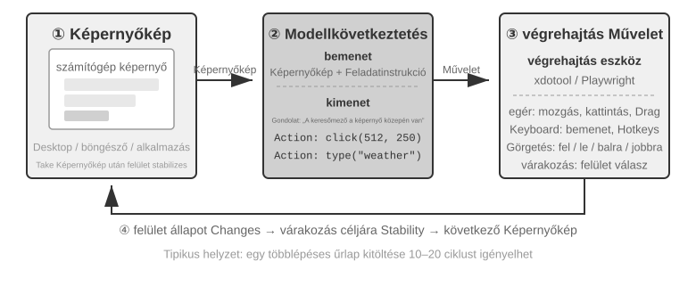

# Multimodalitás és valós idejű interakció

Az előző fejezetekben azt vizsgáltuk, hogyan működnek az ügynökök egy szövegalapú világban, kontextuson, eszközökön és kódon keresztül kommunikálva a digitális rendszerekkel. De egy ügynök világa túlmutat a szövegen és az API-kon. Amint meg kell értenie egy kimondott parancsot, meg kell találnia és kattintania kell a megfelelő gombra a képernyőn, vagy egy robotkart kell irányítania egy tárgy megragadásához, új területre lép: a "multimodális valós idejű interakció" területére. Ez az elmozdulás a tiszta szöveges bemenettől és kimenettől a "multimodális érzékelés és valós idejű válaszadás" felé az a döntő lépés, amely az ügynököt a "párbeszédablakon" túlra repíti. A "multimodális" egyszerűen azt jelenti, hogy egyszerre több információformát kezelünk — szöveget, beszédet, képeket, videót és cselekvéseket — ahelyett, hogy csak szöveggel dolgoznánk.

Először is határozzuk meg e fejezet hatókörét. A statikus képek és dokumentumok értelmezése — egy képernyőkép vizsgálata, egy diagram olvasása, egy PDF feldolgozása — már az előző fejezetek ügynök-munkafolyamatainak természetes részévé vált. A mai multimodális LLM-ek számára ezek az egybemenetes megértési feladatok viszonylag érettek, és nem igényelnek különleges architektúrát. Ez a fejezet egy más problémacsoporttal foglalkozik: három olyan forgatókönyvvel, ahol a **valós idejű korlátok teszik nehézzé a multimodális problémákat** — hangalapú párbeszéd, grafikus felület (GUI) kezelés és robotvezérlés. Ezekben a beállításokban a bemenet folyamatosan érkezik, a kimenetnek pedig szigorú időkeretet kell teljesítenie, ami alapvetően megváltoztatja az architektúrát. A folyamatos vizuális streamek, vagyis a videó valós idejű megértése a cikk írásakor még nyitott probléma az ügynökök számára. Visszatérünk rá, amikor a Computer Use szakasz a képkockánkénti képernyőképek korlátait vizsgálja, majd ismét a fejezet végi kérdésekben. Még egy határvonal: e könyv keretrendszerében a multimodális "generálás" (kép- vagy videógenerálás) csupán egy szokványos eszközhívás, ahogyan azt az 5. fejezet a Multimédiás Generálásról tárgyalta. Az ügynök külső eszközként használja, így nem veti fel az itt tárgyalt valós idejű interakciós kihívásokat, és a fejezet fő vonalán kívül marad.

A hangalapú interakció, a Computer Use és a robotkezelés három teljesen különböző területnek tűnhet, de mindhárom rendszerében feltűnően hasonló problémákba ütközik: egyszerre több modalitást kell feldolgozniuk, és rendkívül érzékenyek a késleltetésre. Egy kétszekundumosnál hosszabb szünet a hangalapú beszélgetésben nyugtalanná teszi az embereket; ezredmásodperces kilengés a robotvezérlésben ütközést okozhat. Ezek a korlátok együtt mindhárom forgatókönyvet ugyanabba az építészeti irányba terelik: el a "soros csővezetéktől" (mint egy gyári futószalag, ahol az egyik lépésnek be kell fejeződnie, mielőtt a következő elkezdődhet) és a "végponttól végpontig tartó modell" felé (egy egységes modell, amely közvetlenül a bemenettől a kimenetig halad, kiküszöbölve a köztes átadásokat).

Ez a fejezet a következő vonalak mentén bontakozik ki:

1.  Először három hangarchitektúra paradigmát használunk keretrendszerként: a kaszkádolt (VAD-ASR-LLM-TTS csővezeték), a végponttól végpontig tartó omnimodális (Omni, egyetlen modell, amely azonban továbbra is a társalgási fordulókra támaszkodik), és a teljes duplex (Moshi és GPT-Live, amelyek egyszerre hallgatnak és beszélnek). Összehasonlítjuk késleltetésüket és kompromisszumaikat aszerint, hogy az egyes paradigmák mennyire lépnek túl a VAD diszkrét fordulókról alkotott feltételezésén. A kaszkádolt szakasz a VAD + ASR lecserélését is tárgyalja streaming hangérzékelésre.
2.  Ezután megvizsgáljuk, hogy a gondolkodási architektúra hogyan egyezteti össze a "valós idejű válaszadás" és a "mély gondolkodás" közötti konfliktust: az egyszerű gyors-lassú párhuzamosítástól a szétválasztott megközelítésig, ahol egy háttérben futó érvelő modell "stratégaként" működik (GPT-Live delegálás, Pine AI stb.), egészen a Step-Audio R1 "internalizációjáig", ahol a gondolkodás egyetlen modellbe épül, amely "gondolkodva beszél".
3.  Majd tárgyaljuk, hogy az emberibb beszédszintézis hogyan optimalizálja a végrehajtási réteget.
4.  Végül kiterjesztjük a perspektívát a Computer Use-re (amely lehetővé teszi a mesterséges intelligencia számára, hogy a számítógép képernyőjét úgy kezelje, mint egy ember) és a robotkezelésre, megfigyelve, hogy ugyanazok a késleltetési és multimodalitási problémák hogyan jelentkeznek ebben a két forgatókönyvben.

Két további elméleti téma átível ezeken a forgatókönyveken, és külön figyelmet érdemel: a "gondolkodási architektúra" (hogyan működik együtt a gyors és a lassú gondolkodás) és az ebből következő "gyors-lassú interfész" (a "Latens Híd" — mit cserélhetnek egymás között a gyors és lassú modellek a szövegen túl). Bár a hang kontextusában vezetjük be ezeket, a gondolatok nem korlátozódnak arra. A Computer Use és a robotika szakaszok ugyanazzal a kérdéssel találkoznak, hogy mikor érdemes lassú stratégát bevonni, ezért tartsuk észben mindkét témát.

## Hang: A legtermészetesebb ember-gép interfész

A hang nem pusztán a szöveg hanggá alakítása. A beszéd körülbelül négyszer gyorsabb a gépelésnél, és szabadon hagyja a kezet és a tekintetet, ezért természetesen illeszti az Agentet egy folyamatos, bármikor megszakítható ki- és bemeneti hurokba. A hangbevitel szöveggé alakítja a diktálást; a hangügynök közvetlen együttműködést tesz lehetővé. Mindkettő támogatja a bevezetőben említett whisper codingot.

A szakasz két irányt tárgyal: a felhasználó az Agenthez beszél, illetve az Agent a felhasználó nevében a külvilághoz beszél. A hangmodell azt határozza meg, mire tud válaszolni; az interakciós architektúra azt, hogy jól hall-e, időben válaszol-e, természetesen adja-e át a szót, és hívás közben elvégzi-e a megerősítéseket és eszközhívásokat.

### Interakciós időzítés: a kaszkádtól a teljes duplexig

Az OpenAI GPT-Live bemutatója három paradigmát különböztet meg: kaszkád, köralapú és teljes duplex[^ch9-12]. Ezek eltérő kompromisszumok a késleltetés, a költség és a megfigyelhetőség között, nem lineáris fejlődési lépések.

| Paradigma | Szerkezet | Előny | Korlát |
| --- | --- | --- | --- |
| Kaszkád | VAD → ASR → LLM → TTS | Átlátható, cserélhető, hibakereshető modulok | Késleltetés halmozódik, a paralingvisztikai jel elveszik |
| Végponttól végpontig Omni | Egy modell hallgat, gondolkodik és beszél | Kisebb késleltetés, jobb hangszín- és környezethang-megőrzés | Továbbra is köralapú, drága a tanítás és a hibakeresés |
| Teljes duplex | Folyamatosan hallgat, beszél és dönt | Átfedő beszéd és természetes megszakítás | Bonyolultabb tanítás, vezérlés és értékelés |

A közös cél az „egymás után beszélünk” feltételezés és a VAD szólójoggal kapcsolatos találgatásának meghaladása. A kaszkád és az Omni még körökre bont; a teljes duplexben a modell folyamatosan dönti el, ki beszél.

[^ch9-12]: OpenAI. *Introducing GPT-Live.* 2026-07-08. https://openai.com/index/introducing-gpt-live/. A háromosztatú besorolás a ChatGPT Voice három generációjának összefoglalásából származik; az Omni a „turn-based voice models” kategóriának felel meg.

**Streaming megszakítása:**

```python
while audio_is_arriving:
    partial = asr.push(audio_chunk)
    if endpoint_is_probable(partial):
        candidate = llm.start(partial)
        if later_audio_changes_meaning(partial):
            cancel(candidate)                 # speculative cancellation
        else:
            tts.enqueue_stable_segments(candidate)

on_final_transcript(text):
    commit_or_restart(text)
```

### Paradigma 1 · Kaszkádolt csővezeték

A legtöbb kereskedelmi hangasszisztens soros csővezetéket használ (9-1. ábra): a VAD érzékeli a végét, az ASR szöveggé alakítja a hangot, az LLM megérti és megfogalmazza a választ, a TTS pedig kimondja. A modularitás megkönnyíti az egyes részek optimalizálását, de minden határ várakozást ad hozzá.


| Modul | Feladat | Tipikus szűk keresztmetszet |
| --- | --- | --- |
| VAD | A beszéd végének eldöntése | Csendküszöb, várakozás és hibás szegmentálás |
| ASR | Hangból szöveg | Felismerési késleltetés és kontextusvesztés |
| LLM | Megértés, gondolkodás és generálás | Első token késleltetése, reasoning miatti várakozás |
| TTS | Szövegből hang | Első csomag szintézise és lejátszási puffer |

Rövid válasznál is sorosan összeadódik a VAD, ASR, LLM és TTS várakozása (9-2. ábra). Éles rendszerben a sorban állás tovább növeli az üresjárati késleltetést (9-3. ábra).


> **9-1. kísérlet ★: Hagyományos hangügynök építése**
>
> WebSocketen keresztül kapcsoljuk össze a mikrofont, a Silero VAD-ot, a helyi Whisper-t, a streaming LLM-et és a Fish S1 TTS-t. A megőrzött valódi egyfordulós bizonyíték a teljes lánc futását mutatja, nem párhuzamossági vagy éles terhelési benchmark. Kód és elfogadási rekord: [chapter9/live-audio](../chapter9/live-audio/).

> **Kiegészítő projekt: WebRTC-hangügynök, amely „felhívja a felhasználót”**
>
> PSTN nem szükséges: a böngészős WebRTC megnyitja a munkamenetet, bekéri a hiányzó adatokat, visszamondja azokat megerősítésre, majd strukturált eredményt ment. Külső szervezethez ugyanazt a szerződést megfelelő PSTN/SIP-szolgáltatóra cseréljük. A projekt történeti exp9-2 azonosítókat őriz, de nem foglal számozott helyet a kéziratban. Lásd [chapter9/phone-agent](../chapter9/phone-agent/).

#### A sorostól a streaming észlelésig

Az ASR beszéd közben ideiglenes átiratot adhat, az LLM az első felolvasható mondatot átadhatja a TTS-nek, a TTS pedig hangblokkokat küldhet. Ettől a három szakasz nem lesz teljesen párhuzamos; előreindításkor a későbbi átirat változását törléssel, újraindítással vagy visszagörgetéssel kell kezelni.

A VAD + ASR front-end három gondja a csend miatti **késleltetés**, a hezitálás, érzelem és környezeti hang elvesztése, valamint az e-mail-címek és tulajdonnevek **kontextustörése**. A valódi streaminghez kauzális vagy darabolt kódoló és inkrementális dekódolás kell; a Whisper teljes hangszegmenst vár. Az LLM-alapú hallási modell szöveget és szemantikai eseményeket adhat ki.

A végpont eldöntése beépíthető a streaming felismerőbe, de a címkék csak a döntéskor látható információt használhatják[^ch9-11]. A speak_start/end, interrupt, emotion, laugh, sigh és noise jelölők megőrzik a nem szöveges jeleket.

[^ch9-11]: A végpontítélet felismerőbe építéséről és az utólagos címkékről lásd Li, Bojie és Noah Shi. *The Trade-off Was in the Labels: Causal Supervision for Turn-Aware Streaming ASR.* 2026 (megjelenés alatt).

> **9-2. kísérlet ★: Streaming hangészlelés szimulációja Qwen2-Audio-val**
>
> A Qwen2-Audio nem streaming modell. Növekvő hangprefixekkel szimuláljuk a folyamatos észlelést, és 600 ms VAD + Whisper kontrollal hasonlítjuk össze. A canonical run csak 2/6 várt viselkedést reprodukált, 8,4–11,3 másodpercig tartott, a pause mintán kihagyta a silence-t, a noise mintát cough/laughter-ként tévesztette. Ez mechanizmus- és hibamód-vizsgálat, nem 100–200 ms-os streaming ígéret. Lásd [chapter9/streaming-speech](../chapter9/streaming-speech/).

### Paradigma 2 · Végponttól végpontig tartó omnimodális modellek (Omni)

A kaszkád szöveges határa elveszítheti az érzelmet, intonációt és környezeti hangot. Az Omni egy modellben hallgat, válaszol és beszél, de drágább tanítani, hibakeresni és cserélni. Előnye főként a késleltetés és a nem szöveges információ, nem szükségszerűen a pontosság. Az önkaszkád akkor javíthat felismerési hibát, ha a szöveg elég; beszédsebesség vagy érzelem esetén a szöveges szűk keresztmetszet bizonyítékot veszít[^ch9-13].

[^ch9-13]: A kaszkád és a végponttól végpontig tartó út pontossági előnyeinek mérését lásd Li, Bojie és Noah Shi. *The Cascade Gap: When and Why Self-Cascades Help Multimodal Agents.* 2026 (megjelenés alatt).


A valós idejű hang API-k köztes megoldások: natívan kezelik a hangot, de VAD-ra, megszakításra és aszinkron eszközhívásra támaszkodnak. A feladatfüggő hibák fontosabbak, mint a ranglista.

> **9-3. kísérlet ★★: MiniCPM-o 4.5 helyi futtatása — end-to-end és önkaszkád**
>
> Rögzítsünk egy revíziót, kapcsoljuk ki a thinking mode-ot, és hasonlítsuk össze a közvetlen hangválaszt a transzkripció utáni válasszal. Ez az audio-információ megőrzését méri, nem a későbbi „gondolkodás beszéd közben” képességét.
>
> | Feladat | End-to-end | Önkaskád | Megfigyelés |
> | --- | ---: | ---: | --- |
> | Szemantikus számtan (2) | 1/2 | 2/2 | Egy átírási hibát kijavít |
> | Paralingvisztikai beszédtempó (2) | 2/2 | 1/2 | A szöveg eltörli a gyors/lassú különbséget |
> | Összesen | 3/4 | 3/4 | Azonos összeg, kiegészítő hibák |
>
> A minta kicsi; nem bizonyít általános pontossági vagy sebességi sorrendet. Teljes bizonyíték: [chapter9/end-to-end-speech](../chapter9/end-to-end-speech/).

Step-Audio 2 nyers hangból szöveget és hangot állít elő; a Step-Audio R1 a következtetést is a hangmodellbe építi.

### Paradigma 3 · Teljes duplex interaktív modellek

Az Omni a „felhasználó beszél” és a „modell beszél” időszakára osztja a párbeszédet, de a szinkrontolmácsolás átfedést igényel. A teljes duplex folyamatosan hallgat és beszél, és eldönti, folytatja-e, szünetel-e, megszakít-e vagy eszközt hív. A Kyutai Moshi korai példa; a Thinking Machines Lab Interaction Modelnek[^ch9-14] nevezi a modellbe épített interakciót. A GPT-Live ezt termelési méretre viszi.

[^ch9-14]: Thinking Machines Lab, “Interaction Models: A Scalable Approach to Human-AI Collaboration,” 2026-05. https://thinkingmachines.ai/blog/interaction-models/

A történet: a kaszkád csendküszöbbel tippeli a fordulót, a streaming szemantikai szintre emeli a döntést, a teljes duplex pedig folytonos döntéssé alakítja az átváltást.

### Kognitív időzítés: valós idejű interakció és mély gondolkodás

Az előtérmodell addig válaszol, amíg a felhasználó jelen van; a háttérmodell tovább gondolkodhat. A három terv kompromisszum:

| Terv | Előtér | Háttér | Kockázat |
| --- | --- | --- | --- |
| Gyors válasz, lassú javítás | Azonnali válasz | Újragondolás és kiegészítés | Ellentmondás |
| Gyors interakció, lassú tanács | Beszélgetés és megfogalmazás | Tanács vagy eszközeredmény | Korlátozott interfész |
| Egyesített gondolkodás és kifejezés | Gondolkodás közben beszél | Közös állapot | Magas újratanítási költség |

Az első terv megkettőzi a munkát, a második közvetett kapcsolatot használ, a harmadik egyesíti a gondolkodást és a beszédet. A Step-Audio R1 MGRD-vel az akusztikai jellemzőkhöz köti a gondolkodást, az MPS kettős aggyal pedig párhuzamosítja a tervezést és a kifejezést (9-5 és 9-6. ábra). Az egyesített modell természetesebb, a leválasztott háttéragy könnyebben cserélhető.

### Emberibb beszédszintézis

A túl sima, szünet nélküli TTS gépiesnek hat. Az LLM THINKING, EMO:happy és SPEED:0.8x vezérlőjeleket adhat, a TTS pedig szünetté, prozódiává, tempóvá, nevetéssé vagy sóhajjá alakíthatja. Fish Audio S1 alatt a több referenciás beállítás kapta a legjobb pontszámot három kiegyensúlyozott vakhallgatásban (4,67/5), de a jelölés nélküli csoport megelőzte az egyreferenciásat, ezért a teljes tervezett sorrend nem ismétlődött meg.

> **9-4. kísérlet ★★: Vezérlőtokenes TTS Fish Audióval**
>
> Hasonlítsuk össze a jelölés nélküli, az egyreferenciás és a több referenciás hangkönyvtárat. A 24 referencia, az A/B/C média és az elfogadási rekord itt található: [chapter9/controllable-tts](../chapter9/controllable-tts/).

## Computer Use: Grafikus Felület Automatizálási Ügynökök

Mire mostanra észrevehették, hogy ez a fejezet sokkal több teret szentel a hangnak, mint a következő két forgatókönyvnek. Ez szándékos. A valós idejű multimodális rendszerek közül a hangtechnológia haladt a legmesszebbre, ezért nyújtja a legjobb referenciát. Végigjárta a teljes ívet az eredeti problémától — a soros csővezetékek túlzott késleltetése — a végponti modelleken, a teljes duplex interakción és a gondolkodva beszélésen át a mai viszonylag érett tervekig. Ezért meséltük el a történetét teljes egészében. Ahogy olvassák a Computer Use és a robotika szakaszokat, hasonlítsák össze ezzel a pályával: az egyes területek milyen messzire jutottak, és hol maradtak meg?

Ez a három forgatókönyv különbözőnek tűnik, de ugyanazokkal a magkihívásokkal néz szembe: valós idejű érzékelés, alacsony késleltetésű döntéshozatal és folyamatos interakció. Ezután a vizuális interakcióra, vagyis a Computer Use-re térünk, kiterjesztve a perspektívát a hallásiról a vizuális modalitásra: mi lenne, ha egy ügynök nemcsak a beszédet értené, hanem "látná" is a képernyőt, és kezelné a grafikus felületet?

A Computer Use, más néven GUI automatizálás, lehetővé teszi a mesterséges intelligencia számára, hogy úgy használja a szoftvereket, mint egy ember, a képernyő megfigyelésével és az egér és billentyűzet kezelésével — például böngésző megnyitása információk kereséséhez, adatok beírása egy táblázatkezelő alkalmazásba, vagy beállítások módosítása a rendszer beállításaiban. Magja egy "Perceive-Think-Act" (Érzékel-Gondolkodj-Cselekedj) ciklus (9-6. ábra):

1.  Az ügynök képernyőképet készít az aktuális képernyőről.
2.  Egy multimodális modell megkapja a képernyőképet és a feladatutasítást, és kiad egy gondolatot és egy konkrét cselekvést.
3.  A végrehajtási réteg végrehajtja a cselekvést a valós környezetben (egér mozgatása, kattintás, szöveg beírása stb.).
4.  Megvárja a felület válaszát, újabb képernyőképet készít, és belép a ciklus következő iterációjába.

**Computer Use biztonsági ciklus:**

```python
observation = capture_screenshot_and_accessibility_tree()
proposal = model.decide(task, observation)
action = validate_schema_and_coordinates(proposal)

if action.is_irreversible and not user_or_policy_approval(action):
    stop("approval required")
else:
    execute_in_sandbox_or_scoped_session(action)
    new_observation = capture_after_settle()
    if not verify_goal_progress(new_observation, action):
        rollback_if_possible_or_replan()
```



Ebben a ciklusban három kulcsfontosságú tervezési dimenzió van: "Cselekvési Tér" (milyen műveleteket végezhet az ügynök), "Vizuális Helymeghatározás" (hogyan találja meg a cél elemet a képernyőképen), és "Modell Architektúra" (hogyan generálja a helyes cselekvést a képernyőképből).

### Cselekvési Tér Tervezése

Az Anthropic három eszköztípust határoz meg, amelyek teljes interakciós képességet alkotnak (9-7. ábra):


"GUI Kezelő Eszköz" (`computer` eszköz): Egérműveletek: mozgatás (`mouse_move`), bal/jobb/középső kattintás, dupla- vagy háromszoros kattintás, húzás (`left_click_drag`), és pontosabb lenyomás/elengedés műveletek (`left_mouse_down` és `left_mouse_up`). Görgetés (`scroll`) négy irányt támogat, és kombinálható módosító billentyűkkel. Billentyűzetműveletek: karakterenkénti gépelés (`type`, 12 ms intervallummal a karakterek között a valódi gépelés szimulálására), billentyűkombinációk (`key`, pl. `Ctrl+C`), és billentyű lenyomva tartása (`hold_key`). Érzékelési műveletek: képernyőkép készítése, kurzorpozíció lekérése (`cursor_position`), várakozás (`wait`).

"Parancsvégrehajtási Eszköz" (bash eszköz): Perzisztens bash terminál munkamenetet biztosít 120 másodperces időkorláttal. Egy őrszöveges karakterláncot használ a parancs befejeződésének érzékelésére, és megtartja a környezeti állapotot több hívás között (pl. egy könyvtárba `cd` után a következő hívás abban a könyvtárban marad).

"Fájlszerkesztő Eszköz" (`str_replace_editor`): Biztonságos szerkesztést tesz lehetővé karakterlánc-illesztésen keresztül, támogatva a megtekintést, létrehozást, cserét, beszúrást és visszavonást. Pontosabb, mint a teljes fájl felülírása, és kisebb a valószínűsége, hogy véletlenül más tartalmat módosít.

> **9-5. kísérlet ★: Computer Use futtatása (Anthropic referenciaútvonal vagy nyílt modell útvonala)**
>
> Az A útvonal az Anthropic Computer Use Demót használja. A konténere teljes Ubuntu asztali környezetet csomagol böngészővel, terminállal és más gyakori eszközökkel. A front-end fogadja a feladatot, a back-end elküldi az utasításokat és a képernyőképeket a Claude-nak, majd végrehajtja a modell által visszaadott egér-, billentyűzet-, terminál- vagy szerkesztési műveleteket. Ez az útvonal a natív `computer` eszközprotokoll megértésére szolgál; nem követeli meg, hogy minden olvasó hozzáférjen az Anthropic API-jához.
>
> A B útvonal a könyv [`chapter9/computer-use-open-model`](../chapter9/computer-use-open-model/) kísérőprojektjét használja. Alapértelmezésben a nyílt súlyú Qwen3-VL 32B Instruct modellel vezérli a browser-use-t, az OpenRouter hosztolt API-ján keresztül, vagy úgy, hogy az `OPEN_MODEL_BASE_URL` értékét saját üzemeltetésű vLLM/SGLang vagy más kompatibilis végpontra állítja. A végpontnak képernyőképeket kell fogadnia és natív JSON Schema-t kell támogatnia; ha csak hagyományos JSON-t támogat, a schema-in-prompt kompatibilitási mód külön engedélyezhető.
>
> Mindkét útvonal ugyanazt a csak olvasható feladatot és ugyanazt az elfogadási szerződést használja: legfeljebb 25 lépés, lépésenként egyetlen művelet, továbbá a modell/végpont azonosítójának, a szolgáltató nyers válaszainak, a lépésenkénti képernyőképeknek, a műveletsornak, a végső válasznak és a leállás okának megőrzése. Az eltérő modelleket külön kísérleti ágként kell jelenteni; nyílt modell eredménye nem tüntethető fel Claude-reprodukcióként, és a „konténer sikeresen elindult” sem tekinthető a feladat teljesítésének. A műveletek közötti idő és a tervezés minősége mérési eredmény, nem előzetes 2–5 másodperces feltételezés vagy más modellekkel szembeni szükségszerű fölény.
>

### Vizuális Helymeghatározás

A ciklus minden iterációjában a modellnek pontosan meg kell találnia a cél elemet a képernyőképen — "Hol van a keresőmező?" "Mik a beküldő gomb koordinátái?" Ez a vizuális helymeghatározás problémája. Jelenleg "két fő megközelítés" létezik: az egyik a lokalizációt "többválasztásos problémává" alakítja — először számokkal annotáljuk a felületi elemeket, a modellnek csak ki kell választania egyet; a másik a "tiszta koordináta előrejelzés" — hagyjuk, hogy a modell "nézze" a képernyőképet, és közvetlenül adjon meg koordinátákat, akár egy ember. A többválasztásos megközelítésnek két implementációs módja van: "tiszta vizuális annotáció" (az eredeti Set-of-Mark, egy szegmentációs modell használatával a képen lévő jelölt régiók szegmentálására) és "strukturált elemindexálás" (DOM/Accessibility Tree, a felület eredeti struktúrájának közvetlen olvasása). A többválasztásos megközelítés közös előnye, hogy a "keresd meg a gombot a képernyőképen és jelezd előre a koordinátáit" nyílt végű problémát egy "válassz egyet a már annotált elemek közül" zárt végű problémává alakítja — ahogy a többválasztásos kérdésekre könnyebb helyesen válaszolni, mint a kitöltendő kérdésekre egy vizsgán, a modellnek csak annyit kell mondania, hogy "kattints [123]-ra" ahelyett, hogy "kattints a kék gombra, körülbelül 200 pixellel a képernyő bal felső sarkától jobbra".

"Set-of-Mark: Vizuális Annotációs Módszer."

Az eredeti Set-of-Mark (SoM) a Microsoft Research által 2023-ban javasolt, kezdetben a GPT-4V vizuális helymeghatározási képességeinek felszabadítására. Ez egy "tisztán vizuális" módszer: képszegmentációs modelleket (SAM, SEEM stb.) használ a képernyőképen lévő jelölt régiók automatikus szegmentálására, számozott markert helyez minden régióra, és a modell számokkal ellátott képet lát. A modellnek csak a számot kell jelentenie, a rendszer pedig átalakítja a megfelelő régió középponti koordinátáivá. A teljes folyamat nem igényel DOM-ot vagy belső felületi struktúrát, így egyaránt alkalmazható natív asztali szoftverekre és játékfelületekre — amíg a szegmentációs modell azonosítani tudja a jelölt régiókat.

**Strukturált Elemindexálás: Az SoM-ötlet strukturált implementációja a weben.**

Amikor a felület maga biztosít strukturált információt, az annotáció pontosabb lehet. A modern weboldalak a renderelés előtt meghatároznak egy teljes elemstruktúrát (a DOM fát) és szemantikus szerepeket, amelyek azonosítják a gombokat, beviteli mezőket és más vezérlőket. Az akadálymentesítési fák hasonló információt nyújtanak sok asztali alkalmazáshoz. Ahelyett, hogy egy szegmentációs modellt kérnénk meg, hogy pixel alapján találja ki, melyik régió egy gomb, a rendszer közvetlenül lekérdezheti a felületről a kattintható elemeket. A webes ügynökrendszerek, mint a `browser-use`, pontosan ezt teszik: felsorolják és számozzák az interaktív elemeket a DOM-ból. Ez az SoM-ötlet strukturált implementációja a web számára (9-8. ábra). A folyamat négy lépésből áll:

1. A strukturált reprezentáció (DOM fa) és akadálymentesítési információk lekérése a böngésző hibakereső felületén keresztül (CDP, Chrome DevTools Protocol)
2. Automatikusan érzékelni, hogy mely elemek interaktívak (gombok, beviteli mezők, linkek stb.)
3. Minden interaktív elemet egyedi azonosítóval annotálni és határoló kereteket rajzolni a képernyőképen
4. Egyidejűleg egy szöveges listát generálni, amely leírja az egyes azonosítókhoz tartozó elemet

```text
Képernyőkép: [A képen a kulcselemek [1], [2], [3], [4] azonosítókkal vannak annotálva]

Elemek:
[1] <input type="text" placeholder="Keresés" aria-label="Keresés" />
[2] <button id="submit-btn" aria-label="Űrlap beküldése" />
[3] <input type="text" placeholder="Adja meg a nevét" value="" />
[4] <a href="/docs" aria-label="Dokumentáció" />
```

A modellnek csak egy azonosítót kell kiadnia, és a rendszer automatikusan rákattint a megfelelő elem középpontjára. Ez a megközelítés nem takarít meg tokeneket, mert minden annotációs adatot el kell küldeni a modellnek, de pontos, stabil lokalizációt biztosít, elkerülve a szegmentációs modellek által bevezethető kihagyásokat és téves pozitívumokat.


"Tiszta Koordináta Előrejelzés."

A harmadik út kihagyja az annotációt, és megkéri a modellt, hogy közvetlenül adjon meg koordinátákat. Az olyan rendszerek, mint a "SeeClick" és a Claude computer use, olyan látásmodellekre támaszkodnak, amelyeket GUI képernyőképek és elempozíciók hatalmas adatkészletein tanítottak. Ezek a modellek megtanulják a természetes nyelvű leírásokat (pl. "kattints a beküldő gombra") közvetlenül pontos képernyőkoordinátákra leképezni, vizuális érzékelésre támaszkodva, mint egy emberi felhasználó.

A koordináta-előrejelzési sémákban a modell koordináta-megértése nagymértékben függ a tanítás során használt felbontástól (9-9. ábra). A Claude-ot XGA (1024×768), WXGA (1280×800) és FWXGA (1366×768) felbontásokon tanították. Ha a bemeneti képernyőkép felbontása nem egyezik, a modell által előrejelzett koordináták szisztematikusan eltolódnak — mintha egy távolságot egy kis térképen mérnénk meg, majd közvetlenül egy nagy térképre alkalmaznánk. Ezért egy kétirányú koordináta-skálázó mechanizmust kell implementálni az eszköz rétegben, és a célfelbontást "a képarány alapján kell kiválasztani", hogy elkerüljük az egyenlőtlen nyújtást, amely torzítja a képet, és ezáltal torzítja a koordináta-ítéletet. Például, ha a tényleges képernyőfelbontás 2560×1440 (16:9), a Claude három támogatott opciója közül a legmegfelelőbb cél az FWXGA (1366×768), amelynek képaránya a legközelebb van a 16:9-hez. A képernyőképet arányosan 1366×768-ra skálázzák és táplálják a modellbe; miután a modell kiadja a kattintási koordinátákat (683, 384), azokat visszafejtik a valós koordinátákra (683×2560/1366, 384×1440/768) ≈ (1280, 720). Ezzel szemben, ha egy 16:9-es képet erőszakosan 4:3-as 1024×768-ra nyújtanak, a kép vízszintesen összenyomódik, ami a modell által előrejelzett koordináták szisztematikus eltolódását okozza.


A három út közötti választás a következőképpen foglalható össze: **ha strukturált információ áll rendelkezésre, részesítsük előnyben a DOM/akadálymentesítési fa indexálást** a legpontosabb és legstabilabb lokalizáció érdekében. "Ha nem áll rendelkezésre" — natív asztali szoftverekben, például Photoshop, canvas/WebGL renderelt felületek vagy játékok esetén — **használjunk vizuális annotációt (az eredeti SoM utat) vagy koordináta előrejelzést**. A vizuális annotáció többválasztásos problémává alakítja a lokalizációt, ami barátságosabbá teszi az általános célú modellek számára specializált tanítás nélkül. A koordináta előrejelzés kiküszöböli az annotációs lépést, és közvetlenebb a kifejezetten GUI lokalizációra tanított modellek számára. Mindkét megközelítés továbbra is küzd a kis elemekkel és a sűrű felületekkel.

> **9-6. kísérlet ★: A browser-use használata automatizált böngészőműveletekhez**
>
> A Playwright böngésző-automatizálási keretrendszert multimodális modellel kombinálva természetes nyelvvel vezérelt böngészőműveleteket valósítunk meg. Engedélyezzük az SoM-vizualizációt, és minden döntés előtt elmentjük a jelölt határolókereteket tartalmazó képernyőképet. A modellinterfész nem korlátozódik az OpenAI-ra vagy az Anthropicra; a könyv API-konfigurációt ad a nyílt Qwen3-VL modellhez, és általános, OpenAI-kompatibilis base URL-t tart fenn más hosztolt szolgáltatásokhoz vagy saját üzemeltetésű következtetéshez.
>
> Tesztfeladat: „Nyisd meg a Google-t, és keresd meg San Francisco időjárását.” Indítás után a képernyőkép a Google keresőoldalt mutatja számozott interaktív elemekkel. A modell kiválasztja a keresőmezőt, beírja a „San Francisco weather today” szöveget, elküldi a keresést, majd kinyeri a hőmérsékletet és az időjárási viszonyokat az eredményoldalról. Az átvétel során függetlenül ellenőrizni kell a választ és a műveletsort, valamint a tényleges lépésszámot és eltelt időt kell rögzíteni. Az „5 lépés, körülbelül 20 másodperc” csak egy adott futás megfigyelése lehet, végrehajtási bizonylat nélkül nem rögzített eredmény.
>
> A könyvben megőrzött hivatalos nyíltmodelles futás az OpenRouter `qwen/qwen3-vl-32b-instruct` modelljét használta. Amikor a modell a Google-keresés 4. lépésében CAPTCHA-val találkozott, nem állította, hogy sikerrel járt, hanem átváltott a weather.com oldalra. Végül a 16. lépésben San Francisco Today oldaláról a következőket olvasta ki: 64°F, Sunny, 62°F hőérzet, 74°F maximum és 55°F minimum. Mind a 16 API-válasz a kért Qwen3-VL modellt jelezte, a 15 érvényes lépésképernyőkép és a csak olvasható műveletsor pedig átment a független, determinisztikus átvételen. Ez az eredmény bizonyítja, hogy a nyíltmodell-API útvonala működik; nem jelenti az Anthropic natív `computer` eszközét használó kísérleti ág reprodukálását.

### Egy Computer Use ügynök, aki animációkat nézhet és hangot hallhat

Eddig a Computer Use érzékelés egy implicit feltételezésen nyugodott: "a képernyő statikus" — készítsünk egy képernyőképet, gondolkodjunk a következő lépésről, kattintsunk, és készítsük a következő képernyőképet. A valódi képernyők videókat játszanak le, másodpercek alatt eltűnő értesítéseket villantanak fel, és hangot játszanak le értekezletekről. Egy ügynök, aki csak 3-5 másodpercenként nyitja ki a szemét, és nincs füle, vak és süket mindenre, ami két képkocka között történik. Képernyőfelvétel nézése, értekezlethez csatlakozás, hangutasítás követése, egy párbeszédablak elkapása, mielőtt eltűnik — a mindennapi számítógépes munka egész kategóriája gyakorlatilag elérhetetlen a mai Computer Use ügynök számára.

Amit itt valóban újra kell tervezni, az nem a "cselekvési interfész", hanem az „észlelési interfész”[^ch9-9]. A magötlet az "észlelés" (folyamatos, adaptív, multimodális) leválasztása a "cselekvésről" (diszkrét), létrehozva egy perceptuális köztes réteget, amely a környezet és bármely polcról beszerezhető Computer Use modell közé ül anélkül, hogy újratanítást igényelne. Nevezzük ezt Ügynök-Számítógép Észlelési Interfésznek (AOI). Három "kapuzott" komponense van: Először is, "képkockák közötti kulcskocka rögzítés" — használjunk egy nagyon olcsó pixel-kaput a szinte változatlan képkockák kihagyására, majd egy kis modellt annak meghatározására, hogy történt-e értelmes változás, rögzítve egy képkockát csak akkor, ha van változás, ami közel nulla költséget eredményez a statikus képernyőkhöz; Másodszor, "hangerő-kapuzott beszédátírás" — csak akkor hívjuk a beszédfelismerést, ha van hang, először adva "füleket" az ügynöknek; Harmadszor, és ami a legkritikusabb, "az észlelések átalakítása perzisztens szöveges leírásokká" — kérjük meg a modellt, hogy egyetlen mondatban írja le a rögzített képkockát (pl. "A felugró ablak éppen azt mondta, hogy a kiadási dátumot április 28-ra módosították"), és **még ha az eredeti kép később el is távolításra kerül a kontextusból, ez a szöveg megmarad a memóriában**, továbbvíve a dinamikus információt szöveges formában.

A nem intuitív megállapítás az, hogy ami igazán számít, az nem a képkocka kiválasztása, hanem a kiválasztott képkockák átalakítása perzisztens szöveggé, mert a szöveg az a modalitás, amelyet az LLM-ügynökök a legjobban kezelnek. Nyolc modellen keresztül, a 7B paraméteres modellektől a frontvonalbeli rendszerekig, ez a köztes réteg +17 és +48 százalékpont közötti nyereséget biztosított minden újratanítás nélkül, a legnagyobb különbséggel a hangfeladatoknál: az észlelési réteggel az ügynök végre el tudta végezni azokat a hangfeladatokat, amelyek korábban "hallhatók, de nem végrehajthatók" voltak. Azonban nem egy mindenre egyformán jó konfigurációról van szó — néhány újabb modellen a túl sok képkocka token beszúrása kiszorítja az érvelést, és rontja a teljesítményt. Ezért a komponenseket "modellenként kell kiválasztani", nem egyszerre bekapcsolni. Ugyanaz a lecke, mint a Set-of-Mark versus koordináta előrejelzés kompromisszuma: nincs ezüstgolyó az észlelési sémákban; konfigurálni kell őket a modell természetéhez.

[^ch9-9]: A három komponens — kapuzott kulcskockák, igény szerinti átírás, képkockák narrálása perzisztens szöveggé — teljes mechanizmusáért és modellenkénti ablációjáért lásd Bojie Li és Noah Shi. *Agent-Computer Observation Interfaces Enable Dynamic Computer Use.* arXiv:2606.29472, 2026.

### Világmodellek a Computer Use-hoz

Az előző fejezetrész megfigyelési felülete arra válaszol, hogy „mi történt a kettő között": kulcsképkockákkal, beszédátirattal és tartós szöveggel az ügynök már nem csak két, egymástól messze eső képernyőképet lát. A megfigyelési felület azonban nem szünteti meg a tervezési késleltetést. Az ügynök továbbra is a soros „képernyőkép—gondolkodás—kattintás" hurkot futtatja, és minden egyes művelet után újra megfigyel, majd végiggondolja a következő lépést. Az **OSWorld-Human** hatékonysági vizsgálata azt mutatja, hogy még ha a feladat végül sikerül is, az ügynök lépésszáma és várakozási ideje szemmel láthatóan több az emberénél; az emberi szintű pontosság elérése nem egyenlő azzal, hogy már elég használható is.

Az ember számítógépezés közben nem a kattintás után kezd a következő lépésen gondolkodni, hanem előbb megjósolja a művelet következményét: ha a tényleges változás megfelel a várakozásnak, folytatja az eredeti tervet; és csak akkor áll meg újra megfigyelni és tervezni, ha az oldal állapota eltér a várttól. A világmodell lehetővé teszi, hogy az ügynök még a cselekvés előtt megjósolja, mivé válhat az asztal, és ezzel megvalósítsa ezt az emberihez hasonló „spekulatív végrehajtást", jelentősen javítva a hatékonyságot.

Az asztal állapota nem csupán egy képpontokból álló kép: beletartoznak az ablakok, a fókusz, a görgetési pozíció, a beviteli mezők tartalma, a betöltési állapot, a jogosultságok és a hálózati válaszok; a műveletek pedig magukban foglalják a kattintást, a billentyűzetes bevitelt, a görgetést, a húzást és a várakozást. Egy Computer Use-hoz használható világmodellnek legalább kódolnia kell a jelenlegi állapotot, meg kell jósolnia a jelölt művelet okozta állapotváltozást, és át kell adnia ezt a jóslatot a tervezőnek, hogy az eldönthesse a következő lépést:

```text
asztal állapota + click/type/scroll/wait ──> a következő állapot reprezentációja
```

Így az ügynök még a tényleges kattintás előtt összehasonlíthatja a jelölt műveletek következményeit, az oldal betöltése alatt előkészítheti a következő lépést, és az állapotkülönbség alapján helyreállhat akkor is, ha egy felugró ablak csak egy pillanatra villant fel. Ha például a feladat az, hogy „hozz létre egy új Python fájlt a VS Code-ban, és írd bele, hogy hello world", a modell előbb megjósolhatja a fájlfa és a szerkesztő kulcsállapotát sikeres végrehajtás esetén, és csak azután választja ki a kattintás, a gépelés és a mentés műveletét; ha pedig a feladat egy fájl törlése, egy elszigetelt virtuális asztalon előre megjósolhatja, felbukkan-e visszafordíthatatlan megerősítő ablak, és szükség esetén kérheti a felhasználó jóváhagyását. A lényeg itt nem az, hogy a modell élethű jövőbeli képernyőképet állítson elő, hanem az, hogy megjósolja azokat az ellenőrizhető állapotkülönbségeket, amelyek a feladat elvégzéséhez kellenek.

2026 júliusában az Induction Labs által bemutatott **Photon-1** ennek az útnak az egyik megvalósítását mutatta meg: mindössze 30 000 óra H200 GPU-idővel elvégezte egy computer use világmodell előtanítását. Minden képkockát diszkrét látens tokenekké tömörít, és önvisszatérő módon jósolja meg a művelet utáni következő állapot reprezentációját ahelyett, hogy az előtanítás szakaszában képpontonként állítana elő képernyőképeket; a hozzákapcsolt képgenerátor pedig csak a látens reprezentációk megjelenítésére szolgál, és nem szükséges alkatrésze a következtetésnek. Egy kiinduló képernyőképet és az azt követő műveleteket megadva a modell folyamatosan „elképzelheti" az asztal állapotait, majd virtuális gépeken végzett online tanítással megtanul computer-use műveleteket kiadni.[^ch9-20]

[^ch9-20]: David Li and Jonathan Li, Induction Labs, „Scaling Video Pretraining with Imagination Models,” 2026-07-23. https://www.inductionlabs.com/news/scaling-video-pretraining. A szövegben szereplő Photon-1 paraméterek, adatméret, belső benchmarkok és költség-összehasonlítások mind a cég által közzétett eredmények.

### Mobil: Az ökoszisztéma akadályok keményebbek, mint a technológia

A Computer Use a mobileszközökre is kiterjed. A mobil és asztali rendszerek technikailag különböznek: az egérkoordináták és billentyűzetbemenet helyett a mobil cselekvési tér jellemzően a rendszer akadálymentesítési szolgáltatás API-ját (pl. Android `AccessibilityService`) használja a felületi elemek olvasására és kattintások vagy szövegbevitel kiadására. Az interakció is az egérmutatóról érintési gesztusokra vált, megváltoztatva a koordináták jelentését. Ugyanaz az `(x, y)` pozíció jelenthet érintést, hosszú lenyomást vagy egy húzás kezdőpontját, ezért a cselekvésnek meg kell adnia a gesztus típusát is. A mobil benchmarkok, mint a 6. fejezetben bemutatott AndroidWorld, ebben a cselekvési térben értékelik az ügynök képességét a valós alkalmazásokban végzett feladatok elvégzésére.

Azonban ami valóban akadályozza a mobil Computer Use-t, az gyakran nem ezek a technikai különbségek, hanem az ökoszisztéma akadályok. Egyes telefon gyártók megkíséreltek MI asszisztenseket integrálni fogyasztói telefonokba, hogy az asszisztensek automatikusan kezelhessék a mindennapi alkalmazásokat, mint a WeChat, Taobao és Alipay, de gyorsan platformkorlátozásokba ütköztek.

Ez felfedi a Computer Use egyedi kihívását: "ökoszisztéma akadályok". E korlátozások mögött üzleti modell konfliktus áll. A hagyományos internetes alkalmazások magjának monetizációs logikája a "forgalom és a figyelem": a felhasználók hirdetéseket látnak a hírfolyam görgetése közben, ajánló algoritmusok irányítják őket a termékek keresésekor, és impulzusvásárlásokat hajtanak végre az oldalak böngészése közben. Amikor egy ügynök a felhasználó nevében működik, ez a monetizációs lánc teljesen megkerül: a MI figyelmen kívül hagyja a hirdetéseket, nem végez impulzusvásárlásokat, egyenesen a cél felé halad, befejezi a feladatot, és távozik. Azok számára a platformok számára, amelyek a reklámból és a forgalomból élnek, minden ügynöki művelet aláássa az üzleti modell alapját.

Ez azt jelenti, hogy a Computer Use nemcsak technikai ellenintézkedésekkel (mint a CAPTCHA) néz szembe, hanem egy "strukturális érdekellentéttel is". Ezt a konfliktust rövid távon nehéz lesz feloldani, és nagyobb akadályt jelent a fogyasztói elterjedésben, mint a tisztán technikai problémák.

## Robot Manipuláció: Az Asztal Rendrakása XLeRobottal

> **Hogyan olvassuk ezt a fejezetrészt**: elejétől a végéig egyetlen feladatot használunk——„tedd a piros poharat a tálcára, dobd a sárga papírgalacsint a szemetesbe, végül nézz rá még egyszer, és ellenőrizd az asztal állapotát”. A 9-7. és 9-9. kísérlet valódi XLeRoboton fut: kar, kalibráció, vészleállító és helyszíni felügyelő kell hozzá. A 9-8., 9-10. és 9-11. kísérlet ezek helyi GPU-n futó megfelelője. A valódi hardveren és a szimulációban kapott eredményeket külön jelentjük, de a feladat célja, a műveletek jelentése és a sikerfeltételek azonosak maradnak.

A robot manipuláció jóval nehezebb munka, mint „ránézni egy képre és válaszolni egy kérdésre”. A modellnek nemcsak a jelenetet kell értenie, hanem folyamatosan cselekednie is kell a valós világban, ráadásul minden egyes művelet megváltoztatja a következő pillanat helyzetét. Az XLeRobot nagyon kézzelfoghatóvá teszi ezt a különbséget. Ugyanazt a kart távvezérelheti ember billentyűzettel, játékvezérlővel vagy VR-eszközzel; de át is adhatjuk a kamerakép megfigyelését és egy szűkre szabott műveleti eszközkészletet egy Agentnek, hogy maga hívja őket. A hardver nem változik, a feladat sem; egyedül az változik, hogy ki kezeli——az elsőben az ember folyamatosan figyel és javít, a másodikban a modellnek és a vezérlőrendszernek kell ugyanazt a munkát végigvinnie.

Ez a fejezetrész öt kísérletet fűz fel az „asztal rendrakására”. Először ember távvezérli a valódi XLeRobotot, hogy megmérjük, meddig jut el ez a hardver egy kellően ügyes kezelő kezében. Ezután a szimulátorban megállapítjuk ugyanennek a feladatnak az ideális vezérlési felső korlátját. Utána egy Agent önállóan vezérli a valódi XLeRobotot, hogy lássuk, miként dönti el az eredményt az érzékelés, a tervezés és a hibából való visszatérés. Ezt követően ugyanazt az eszközszerződést átvisszük a szimulátorba, és egyszerre hasonlítunk össze három stratégiát: nyílt hurkú végrehajtás, lépésenkénti ellenőrzés és világmodell. Végül megváltoztatjuk a hátteret, a tárgyak külsejét, a megvilágítást és a vizuális zajt, hogy kiderüljön: a szimulációban tanult vizuális eljárásmód képes-e alkalmazkodni egy új környezethez.

A szűk keresztmetszet itt rendszerint nem az, hogy készítsünk még egy statikus kérdés-felelet mércét, hanem az, hogy a modell zárva tudja tartani a hurkot korlátozott érzékelési és vezérlési sávszélesség mellett. Egy használható robotrendszernek legalább a következő négy kérdésre kell válaszolnia:

1. Milyen feladatot akar befejezni az ember?
2. Melyik részfeladat következik?
3. Konkrétan milyen műveletet ad ki a jelenlegi készség?
4. A művelet végrehajtása után a valóság még mindig illeszkedik az eredeti tervhez?

Ez a fejezetrész ugyanabba az XLeRobot-vezérlőhurokba helyezi ezt a négy kérdést, és megmutatja, melyik résztvállalja a négy technika közül: a hosszú távú tervezés eldönti, hogy a pohár vagy a papír kerüljön előbb sorra; a VLA vagy a műveleti primitívek végzik a megfogást és a lehelyezést; a világmodell megbecsüli egy művelet következményeit; a szimulációból a valóságba vezető átmenet pedig magára vállalja a tanítóvideók, valamint a valódi kamera és beavatkozók közötti különbséget. Még ha a magas szintű modellnek elegendő tudása és tervezőképessége is van, elég egyetlen láncszemnek kiesnie ebből a visszacsatolási hurokból, hogy a rendszer ne tudja befejezni a feladatot.

### A Hardver és az Algoritmus Munkamegosztása

Az első kérdés, amelyre az XLeRobot a legalkalmasabb választ adni, ez: amikor az önálló asztalrendrakás kudarcot vall, a kar nem képes rá, vagy az algoritmus nem tudja használni a kart? Van itt egy tény, amit nem szabad felpuhítani: **még egy néhány száz dolláros kar is, amilyen az XLeRobot, távvezérléssel már képes végrehajtani egy olyan többlépéses, összefüggő asztali feladatot, mint amilyen ebben a fejezetrészben szerepel**——az ember nézi a kamera képét, megfogja a piros poharat, ráteszi a tálcára, a sárga papírt a szemetesbe dobja, végül még egyszer ellenőrzi az állapotot. Ez az eredmény nem pusztán annyit jelent, hogy „a hardver éppen csak elég”; ez világos diagnosztikai bizonyíték: **ami ezt a feladatot illeti, a szűk keresztmetszet az algoritmus oldalán van, nem magában a hardverben.**

A diagnózis módszere egyenes. Rögzített kamera, kar, megfogó, asztali elrendezés és sikerfeltételek mellett először az ember veszi át a hurkot. Az ember folyamatosan pontosítja a tárgyak helyének becslését, a művelet kiválasztását és az időzítést, és azt is tudja, mit tegyen, ha a megfogás nem sikerül. Az önálló rendszer és az ember közötti távolság éppen ebben a zárt hurkú képességben mutatkozik meg. Ennek a következtetésnek a hatóköre természetesen az e fejezetrészben szereplő asztali feladat: azt mutatja, hogy a hardver átlépte az e feladathoz szükséges teherbírási, pontossági és munkatéri küszöböt, de nem azt jelenti, hogy egy néhány száz dolláros kar minden nyílt környezettel vagy nehezebb manipulációval megbirkózik.

Az XLeRobot többféle távvezérlési belépési pontot támogat: billentyűzet, Xbox-kontroller, Switch Joy-Con és VR-eszközök. Az emberi kezelő természetes módon csinál sok olyat, amit egy algoritmusnak kifejezetten meg kellene valósítania: lassít, amikor a megfogó közelít a pohárhoz; kijavítja a fogáspontot, ha a pohár megcsúszik; újranéz, ha elsőre nem sikerül megcsípnie a papírt; és ellenőrzi az eredményt, amikor a tárgy a célterületre kerül. A távvezérlés ezért nem csupán a bemutató adatok gyűjtésének eszköze, hanem olyan diagnosztikai kísérlet is, amely „rögzíti a hardvert, és csak a kezelőt cseréli”.[^ch9-1]

> **9-7. kísérlet ★: Az asztal rendrakása valódi XLeRobot távvezérlésével**
>
> Helyezzen egy valódi XLeRobot munkaterébe egy piros poharat, egy tálcát, egy összegyűrt sárga papírt és egy szemetest. A kezelő az egyik kalibrált távvezérlési úton hajtja végre a rögzített feladatot: „tedd a piros poharat a tálcára, dobd a sárga papírgalacsint a szemetesbe, végül nézz rá még egyszer, és ellenőrizd az asztal állapotát”. Ismételje meg legalább néhány körben, és rögzítse a kamera képét, a kezelő bemeneteit, a kar állapotát, a műveletek időtartamát, a sikertelen megfogásokat, az újrapróbálkozások számát és a végállapotot.
>
> Ne süllyessze az elfogadási feltételt odáig, hogy „a végén az asztal tisztának látszik”. A piros pohárnak a tálcán, a sárga papírnak a szemetesben kell lennie; a karnak vissza kell térnie biztonságos testhelyzetébe; és a folyamat során nem lehet ütközés, munkatéren kívülre lépés, sem olyan emberi beavatkozás, amely ellenőrzés nélkül fejezi be a munkát.

A valódi hardveren végzett távvezérlés a legmeggyőzőbben mutatja meg a feladat felső korlátját, de nem alkalmas arra, hogy tömegesen változtassuk a tárgyak számát és helyzetét. Hogy ismételhető és statisztikailag mérhető összehasonlítást kapjunk, ugyanazt a „tegyük vissza a tárgyakat a helyükre” feladatot a következő lépésben egy kétdimenziós asztali szimulátorba visszük át, és egy ideális szabályozót használunk annak az erős kezelőnek a helyettesítésére, aki nem téveszt az érzékelésben és nem választ rosszul műveletet.

> **9-8. kísérlet ★: Ugyanannak a feladatnak az ideális vezérlési felső korlátja a szimulátorban**
>
> Egy kétdimenziós asztali szimulátorban helyezze el véletlenszerűen a piros poharat, a sárga papírt és a hozzájuk tartozó célterületeket, az ideális szabályozó pedig sorban közelítse meg a tárgyakat, fogja meg és vigye őket a helyes helyre. Nem kell képet felismernie, és nem választ rosszul műveletet, ezért azt képviseli, hogy „meddig juthat el legalább ez a feladat akkor, ha az érzékelés és a döntés is helyes”.
>
> Nézze a feladat sikerarányát, a lépések számát és az útvonal hosszát; változtassa a tárgyak kezdeti helyzetét és a feladat léptékét is, hogy lássa, stabil marad-e ez az ideális korlát. Ugyanazokat a sikerfeltételeket használjuk, mint a 9-7. kísérletben, de amit mérünk, az beavatkozó nélküli szimuláció: ez nem jelenti azt, hogy a valódi XLeRobot megmozdult volna. A kettő két alapvonal lesz a későbbi önálló vezérléshez——a 9-7. kísérlet az ember zárt hurka valódi hardveren, a 9-8. pedig az ideális zárt hurok szimulációs környezetben.

### A Robotvezérlés Alapszerkezete

Egy robotrendszer általában szétválasztja a különböző időléptékű munkákat.

| Réteg | Központi kérdés | Kimenet | Jellemző időlépték |
| --- | --- | --- | --- |
| Feladatcél | Mit akar befejezni az ember | „A pohár és a papír a helyére” | Perces nagyságrend |
| Hosszú távú tervezés | Mi előbb, mi utóbb | Előbb a pohár, aztán a papír, végül ellenőrzés | Másodperctől percig |
| Alapkészség | Milyen állapotváltozást érünk el most | `pick(red_cup)`, `place(red_cup, tray)` | Kb. 1—3 mp |
| VLA / készség-eljárásmód | Konkrétan hogyan mozog ez a készség | Az XLeRobot megfogójának rövid mozdulata vagy folytonos pályája | Kb. 1—10 Hz következtetés |
| Alacsony szintű vezérlés és biztonsági réteg | Hogyan hajtsuk végre stabilan és késleltetés nélkül | Ízületi vagy szerszámponti vezérlőjelek, sebességkorlát és vészleállítás | Kb. 50—1000 Hz |

Ez egy szokásos mérnöki munkamegosztás, nem az egyetlen lehetséges modellarchitektúra. A VLA átvállalhat a magas szintű döntésekből is, a tervező pedig lehet szabályalapú program, VLM vagy optimalizáló. Bármelyik megvalósítást választjuk, a „feladat sorrendjét” érdemes elválasztani a „pillanatnyi művelettől”; különben a magas szintű modell következtetési késleltetése lehúzza az alacsony szintű vezérlést, az alacsony szint nagy frekvenciájú vezérlése pedig rengeteg lényegtelen részlet feldolgozására kényszeríti a felső modellt. Az XLeRoboton a modell ne adjon ki közvetlenül tetszőleges ízületi szögeket: csak világos határú készségeket válasszon, mint a `pick`, `place`, `verify_state` és `stop`, a kalibrált, sebességkorlátos és időtúllépéssel ellátott végrehajtó pedig ezeket alakítsa a kar valódi mozgásává.

### Hosszú Távú Tervezés és Feladatfelbontás

Amikor a felhasználó azt mondja, „szedd rendbe az asztalt”, a rendszer nem adhatja át ezt a mondatot változatlanul a műveleti modellnek. A tervező először felsorolja a jelenetben lévő tárgyakat és célokat, meghatározza a sorrendet, majd minden lépéshez leírja a kezdőfeltételt, a befejezési feltételt és a kockázati korlátokat. Például:

```text
Piros pohár kezelése → Sárga papír eltakarítása → Asztal ellenőrzése
```

A „piros pohár kezelése” tovább bomlik két műveletre és egy ellenőrzésre:

```text
pick(red_cup) → place(red_cup, tray) → verify_state()
```

Minden befejezett készség egy ellenőrizhető csomópontot hagy hátra. Ha a megfogás nem sikerül, csak azt a lépést kell újracsinálni. Ha valaki elmozdít egy tárgyat, vagy a felhasználó megváltoztatja a célt, elég az érintett későbbi lépéseket újratervezni, nem kell a régi tervet elölről végigcsinálni. Az ügynöknek adott eszközöknek is elég egyszerűnek kell lenniük: egy hívás egyetlen dolgot végez, a mozgástartomány rögzített, van időtúllépés, és a végrehajtás után azonnal újra megfigyelünk.

> **9-9. kísérlet ★★: Hagyjuk, hogy a Gemini Robotics-ER 1.5 önállóan rakja rendbe az asztalt XLeRobottal**
>
> Tartsa meg a 9-7. kísérlet valódi XLeRobotját, asztali elrendezését, feladatutasítását és sikerfeltételeit; egyedül az emberi kezelőt cserélje le egy Agentre. A megfigyelést és a tervezést bízza egy megtestesült következtető modellre, például a Gemini Robotics-ER 1.5-re, és egy RoboCrew-stílusú ügynökhurkon keresztül csak öt eszközt nyisson meg: `observe_scene`, `pick`, `place`, `verify_state` és `stop`.[^ch9-2]
>
> A modell először megfigyeli az asztalt, meghatározza a kezelés sorrendjét, majd meghívja az XLeRobot kalibrált megfogó és lehelyező műveleteit. Minden befejezett készség után újra kell megfigyelnie és ellenőriznie az utófeltételt. Sikertelen megfogás esetén csak az aktuális készséget próbálhatja újra; és meg kell hívnia a `stop`-ot, ha a felhasználó megállást kér, ha egy tárgy kikerül a munkatérből, vagy ha az állapot nem ellenőrizhető. A modell nem adhat ki közvetlenül tetszőleges ízületi szögeket, és nem hagyhatja ki a valódi ellenőrzést pusztán azért, mert korábban maga mondta, hogy „kész”.
>
> Az elfogadási feltétel pontosan ugyanaz, mint a 9-7. kísérletben: a pohár a tálcán, a papír a szemetesben, a kar visszatért biztonságos testhelyzetébe, nincs ütközés és munkatéren kívülre lépés. A különbség az, hogy az önálló kísérletben a feladat értelmének a modell saját megfigyeléséből kell származnia, a valódi műveleteknek eszközhívásokból, a végállapotot pedig új megfigyeléssel kell megerősíteni. Az ember csak indíthat, vészleállíthat és a biztonságra ügyelhet; nem fejezheti be félúton a műveletet az Agent helyett. Csak így hasonlítható össze közvetlenül a 9-7. és a 9-9. kísérlet: „azonos hardveren és azonos feladaton mi hiányzik a modell zárt hurkából az emberéhez képest”.

A valódi hardveren végzett kísérletek felszínre hozzák a kalibrációs hibákat, a kamera takarásait és a megfogó kudarcait, de nem alkalmasak arra, hogy nagy számú meghibásodást biztonságosan és szabályozottan ismételjünk. A következő szimulációs kísérletek pontosan ugyanezt az öt eszközt és feladatállapotot őrzik meg, és csak a valódi beavatkozókat cserélik olyan asztali környezetre, amelybe hiba injektálható——így szétválasztható, hogy külön-külön mit tesz hozzá a nyílt hurkú végrehajtás, a lépésenkénti ellenőrzés és a műveleti előrejelzés.

### Vezérlés VLA-val

A VLA a Vision-Language-Action rövidítése, magyarul „látás—nyelv—cselekvés modell”. Megkapja a jelenlegi jelenetet és egyetlen készségutasítást, és kiadja azt a műveletet, amelyet a robotnak következőként végre kell hajtania:

```text
jelenlegi megfigyelés + készségutasítás → művelet
```

Az XLeRobot példájában a magas szintű tervező csak a `pick(red_cup)`-ot adja be; hogy melyik irányból közelítse meg a poharat, mikor záruljon a megfogó, és milyen pályán emelkedjen a kar, azt a VLA vagy a készség-eljárásmód dönti el a pillanatnyi jelenet alapján. Amikor a végrehajtó réteg befejezte ezt a rövid mozdulatot, újra képet készítünk az asztalról, és a tervező csak azután adhatja be a `place(red_cup, tray)`-t, hogy megerősítettük: a pohár valóban a megfogóban van. Másképp fogalmazva: az eszközhívás definiálja a kívánt állapotváltozást, a VLA pedig azt, hogy ezt az állapotváltozást hogyan valósítjuk meg folytonos művelettel.

Az RT-2 és az OpenVLA diszkrét tokenekre szabdalja a folytonos műveletet, és egyesével adja ki őket, akárcsak mondatgenerálásnál. A π₀ a másik utat képviseli: közvetlenül folytonos, sima műveleti pályákat állít elő. Egyszerű fölény egyik javára sem áll fenn. A diszkrét tokeneket könnyű nyelvi modellhez illeszteni; a folytonos pályák alkalmasabbak a sima mozgás kifejezésére. A valódi döntés az, hogyan érdemes ábrázolni a műveletet, nem pusztán az, hogy mekkora a modell.[^ch9-15]

Egy nagy modell rendszerint csak másodpercenként 1—10 alkalommal tud következtetni, míg egy hagyományos szabályozó másodpercenként több tíztől több ezerszer is frissülhet. Elterjedt mérnöki gyakorlat a „műveletdarabolás” (action chunking): a modell egyszerre a jövőbeli műveleteknek csak egy rövid szakaszát állítja elő, a vezérlőszál ezt a szakaszt nagy frekvenciával hajtja végre, a modell pedig a háttérben készíti elő a következőt. Így a következtetési várakozás egy része elrejthető a műveletek végrehajtási idejében. Az ára ez: minél hosszabb a szakasz, annál simább a mozgás, de annál kevesebb új jelenetet lát a modell ezalatt. Ha az XLeRobot kinyújtja a karját a pohárért, és a poharat útközben meglökik, akár folytathatja is a régi képből előállított műveletek végrehajtását. A műveletdarabolás tehát a simaság és a reakciósebesség közötti alku, nem pedig ingyen gyorsítás.

A műveletdaraboláshoz rendszerint „előrejelzés—végrehajtás—megszakítás” vázra van szükség, nem pedig arra, hogy a szakaszt a végéig lejátsszuk:

```python
chunk = vla(current_observation, skill)
for action in chunk:
    low_level.execute(action)
    if safety_event() or observation_changed_significantly():
        low_level.stop()
        discard_remaining(chunk)
        reobserve_and_replan()
        break
```

A rövid szakaszok gyorsabban reagálnak, de megsokszorozzák a modellhívásokat; a hosszúak simábbak, de hajlamosak elavult megfigyelést használni. A 9-10. kísérlet az ilyen alkukat hasonlítja össze a szimulátorban, a valódi hardver biztonsági határát pedig a 9-9. kísérlet érinti.

### A VLA Korlátai

A „hosszú távú tervezés + VLA” használható alapterv, de néhány könnyen elnézhető problémát hátrahagy.

- **A tanítóadat korlátozott**: robotbemutatóból jóval kevesebb van, mint internetes szövegből és képből. Attól, hogy a modell látta a „pohár” szót, még nem látott mindenféle anyagú és mindenféle súrlódási körülmények közti poharat.
- **Utánozni megtanul, a következményt nem ismeri**: a viselkedésklónozás főként azt tanulja, „mit csinált a bemutató következő lépésben”, és nem követeli meg kifejezetten a modelltől, hogy megválaszolja: „mit idéz elő ez a művelet”.
- **Minden robot más**: eltérő szabadsági fokok, koordináta-rendszerek, megfogók és beavatkozó-késleltetések mellett semmi sem garantálja, hogy ugyanaz a művelet változatlanul átvihető egy másik gépre.
- **A megfigyelés elavulhat**: miután egy műveletszakasz végrehajtása megkezdődött, a tárgyat elmozdíthatják, takarásba kerülhet vagy feldőlhet, a modell viszont még mindig a korábbi képkocka alapján dönt.

Tehát attól, hogy egy nyelvi modell ismeri a „pohár” szót, még nem tudja, hogyan változtatja meg a jövőbeli állapotot a súrlódás, az érintkezés, a folyadék lötyögése vagy egy tápkábel. A VLA főként arra válaszol, „mit kell most tenni”; ahhoz, hogy megítéljük, „mi történhet azután, hogy megtettük”, másfajta modell kell.

### Világmodellek

A világmodell a műveletek következményeinek előrejelzőjeként érthető. Azt tanulja meg, hogy ha a jelenlegi állapotban végrehajtunk egy műveletet, hogyan változhat meg a következő pillanat állapota.

```text
jelenlegi állapot + jelölt művelet
    → jelezzük előre a következő állapotot vagy a jövő egy darabját
    → hasonlítsuk össze a jelöltek eredményeit
    → válasszunk műveletet, tervezzünk újra, vagy álljunk le biztonságosan
```

Egy robotikában használható világmodellnek legalább három dolgot kell jól csinálnia:

- értenie kell a jelenlegi állapotot;
- előre kell jeleznie a különböző műveletek lehetséges eredményeit;
- át kell adnia ezt az előrejelzést a tervezőnek vagy a szabályozónak, hogy segítse a választást.

Egy VLM, amely csak videót tud leírni, vagy egy modell, amely csak képet tud előállítani, nem válik magától megbízható robotikai világmodellé. Tudnia kell, mi az a művelet, és képesnek kell lennie előre jelezni a művelet hatását a tárgyakra és a környezetre. A V-JEPA 2 azt az utat képviseli, amely belső állapotban jelzi előre a jövőt, a World-Action Model pedig kifejezetten a „művelet—jövőbeli megfigyelés” kapcsolatot tanulja. Ezek a VLA mellett használhatók, nem kell helyettesíteniük.[^ch9-16]

Valódi rendszerben a világmodellnek rendszerint három haszna van:

1. **Mozgás előtt**: összehasonlítani a jelölt műveleteket——megfogás, tolás, várakozás——és előre venni a kisebb kockázatú változatot;
2. **Végrehajtás közben**: egybevetni a valódi megfigyelést az előrejelzéssel, és eltérés esetén lerövidíteni a műveletet, megállni vagy újratervezni;
3. **Tanítás közben**: videóból, szimulációs adatból és sikertelen pályákból megtanulni az állapotváltozásokat, csökkentve a valódi gépen végzett próbálkozást.

Térjünk vissza az XLeRobot asztali feladatához. Ha a sárga papírt részben eltakarja a piros pohár, a rendszer összehasonlíthatja a jelölt készségeket: „előbb vegyük fel a papírt”, „előbb toljuk el a poharat” vagy „fogjuk meg más irányból”. A világmodellnek nem kell élethű robotvideót előállítania: elég, ha előre jelzi, melyik jelölt művelet vezet nagyobb eséllyel olyan állapothoz, amelyben a papír felvehető, és melyik dönthetné fel a poharat——ennyi már segít a tervezőnek rangsorolni. A művelet végrehajtása után a valódi kamerakép marad a végső tény: az előrejelzés csak a választásban segít, az elfogadási ellenőrzést nem helyettesíti.

A világmodell nem biztos válaszokat ad, hanem összehasonlítható előrejelzéseket arról, „mi történhet, ha így teszek”. Minél távolabbra jelzünk előre, annál nagyobb általában a hiba, és egy élethűnek látszó jövőbeli kép nem feltétlenül felel meg a valódi érintkezési és súrlódási törvényeknek. Ezért egy valódi rendszernek továbbra is szüksége van rövid távú előrejelzésre, valós idejű megfigyelésre, bizonytalanságbecslésre és önálló hardveres biztonsági szabályozóra. A generatív világmodellek jól használhatók interaktív szimulációra és megjelenítésre, de nem szabad összekeverni azt, hogy „tud videót előállítani”, azzal, hogy „képes irányítani a robot műveleteit”.[^ch9-21]

> **9-10. kísérlet ★★: Három önálló asztalrendrakó hurok összehasonlítása a szimulátorban**
>
> Vigye át a 9-9. kísérlet feladatát, célállapotait, sikerfeltételeit és öt eszközét az asztali szimulátorba, és egyedül a valódi XLeRobot beavatkozóit cserélje szabályozható szimulációs végrehajtóra, amely a megfogásnál időnként átmeneti, de helyrehozható hibát okoz. Így a probléma megváltoztatása nélkül hasonlítható össze a három stratégia.
>
> A **nyílt hurkú végrehajtás** egyszerre állítja elő a teljes műveletsort, és útközben nem figyel meg újra. A **lépésenkénti ellenőrzés** minden `pick` és `place` után újraolvassa az állapotot, és hiba esetén csak az aktuális készséget csinálja újra. Az **előrejelző végrehajtás** ezen felül egy rövid távú világmodellt is bevon: összehasonlítja a jelölt készségek várható eredményét, mielőtt kiválasztaná a következő lépést. A kísérlet összehasonlítja a feladat sikerarányát, az eszközhívások többletköltségét és a hibából való visszatérés képességét, továbbá ellenőrzi, hogy minden végső sikert megerősít-e egy új `verify_state` megfigyelés.
>
> E kísérlet célja nem annak kimutatása, hogy egy kicsi szimulációs világmodell egyenértékű a valódi gép fizikai modelljével, hanem egy alapvetőbb összefüggés igazolása: a nyílt hurkú terv egyetlen helyi hibát is elvonszol a feladat végéig; a lépésenkénti ellenőrzés lehetővé teszi a visszatérést; a műveleti előrejelzés pedig ezen felül segít rangsorolni a jelölt készségeket. Hogy valóban elkészült-e, azt továbbra is a környezet visszajelzése dönti el.

### A Szimulációs Környezettől a Valódi Robotig

Attól, hogy a 9-10. kísérlet stabil a szimulátorban, a 9-9. kísérlet valódi XLeRobotja még nem lesz ugyanúgy sikeres. A szimulációtól a valódi gépig eljutni nem azt jelenti, hogy még egy szabályozót lecserélünk, hanem azt, hogy magunkra vállaljuk a két környezet közötti különbséget. A tanításhoz használhatunk távvezérlési adatot, videóadatot és szimulációs interakciós adatot; de valódi üzembe helyezéskor ugyanaz a piros pohár, ugyanaz a sárga papír, ugyanaz a tálca és ugyanaz a szemetes más háttér, más megvilágítás, más kamerapozíció és más takarási viszonyok mellett jelenik meg, a kar pedig ráadásul más súrlódással, más érzékelőzajjal és más beavatkozó-késleltetéssel találkozik. Ha ezek a különbségek elég nagyok, a szimulációban megtanult mozdulatok a valóságban felmondhatják a szolgálatot.

> **9-11. kísérlet ★★★: Környezetek közötti RGB-teszt ugyanazon az asztali feladaton**
>
> A szimulációs környezetben továbbra is a „vigyük a tárgyat a megfelelő célhoz” alapproblémát használja, és tekintsen minden mintát az asztalrendrakáson belüli helyi döntésnek: az RGB-képből eldönteni, melyik irányból kell megközelíteni a tárgyat, vagy hogy megfogható-e már. Tanítson négy, azonos szerkezetű vizuális eljárásmódot: az egyik csak rögzített jeleneteket lát; a másik a hátteret változtatja; a harmadik a tárgyak külsejét; az utolsó pedig egyszerre változtatja a hátteret, a külsőt, a megvilágítást és a zajt.
>
> Próbálja ki mindegyik eljárásmódot az eredeti és a megváltoztatott új környezetben is, majd hasonlítsa össze a műveleti döntés pontosságát a vizuális feltételek megváltozása előtt és után. Ez a kísérlet nem arra keresi a választ, hogy „olyan lett-e már a szimulátor, mint a valódi XLeRobot”, hanem egy szűkebb kérdésre: segít-e a jelenetek változatosságának szándékos kiterjesztése a tanítás során abban, hogy ugyanez a pohár—tálca, papír—szemetes feladat alkalmazkodjon egy új kameraképhez? Még ha az eredmény javul is, a valódi gépen való üzembe helyezéshez továbbra is valódi kamerakalibráció, beavatkozó-vizsgálatok és teljes biztonsági zárt hurok kell.[^ch9-6]

## Fejezet Összefoglaló

A felszínen a három forgatókönyv aligha lehetne különbözőbb, mégis a késleltetés és a multimodalitás kettős akadálya mindegyiket árnyékolja. A hangügynökök a soros csővezetékektől a végponti és teljes duplex rendszerekig, valamint a különálló gyors és lassú gondolkodástól a gondolkodva beszélésig fejlődtek. A Computer Use most megközelíti az emberi pontosságot az olyan benchmarkokon, mint az OSWorld, de sokkal több lépést igényel, mint egy ember, és minden lépés tovább tart a feladat előrehaladtával — egy hatékonysági rés, amelyre még nincs szisztematikus megoldás. A vizuálisan vezérelt manipulációs feladatokat végző robotok esetében a szűk keresztmetszet a hardverről a VLA vezérlési réteg azon képességére tevődött át, hogy általánosítson a feladatok között (a tapintási érzékelés és az ügyes kezek továbbra is megoldatlan hardverkorlátok). A következő fejezet a több ügynök közötti együttműködésre tér át — egy más dimenziójú kihívásra.

## Elgondolkodtató Kérdések

1. ★★ A hangügynökök végponti modellje egyetlen modellbe olvasztja az ASR-LLM-TTS-t, csökkentve a késleltetést, de elveszítve a modularitást. Ha a végponti modell egy adott szakaszban hibázik (pl. beszédfelismerés), a hibakeresés és javítás sokkal nehezebb, mint egy soros csővezetékben. Hogyan tervezne megfigyelhetőségi rendszert egy végponti hangügynök számára?
2. ★ A Step-Audio R1 az MPS kétagyú architektúrán keresztül éri el a "gondolkodva beszélést". Az emberek azonban, amikor "gondolkodva beszélnek", gyakran mondanak dolgokat, mielőtt teljesen átgondolták volna, önjavítanak, vagy töltelékszavakat használnak. Egy ügynök "gondolkodva beszélésének" utánoznia kellene ezeket az emberi jellemzőket?
3. ★★ Az SoM (Set-of-Mark) és strukturált változatai (DOM elem indexálás) a Computer Use vizuális lokalizációját nyílt végű koordináta előrejelzésről zárt halmazú azonosító kiválasztásra alakítják át, de mindegyik megköveteli a felületi elemek előzetes érzékelését és annotálását — akár egy szegmentációs modellen, akár a DOM-on keresztül. Ha a felület nem szabványos vezérlőket vagy dinamikusan változó elemeket tartalmaz, az annotációk hiányosak vagy pontatlanok lehetnek. Ilyen esetben vissza kellene térnünk a koordináta előrejelzéshez?
4. ★★ Az olyan néhány száz dolláros robotplatformok, mint az XLeRobot, olcsóvá teszik a távirányításos adatgyűjtést. Azonban a távirányításos adatok minősége nagyban függ a kezelő képzettségétől. Hogyan befolyásolná egy képzetlen kezelő alacsony minőségű adata egy VLA modell tanítását? Hogyan lehet az alacsony minőségű adatokat automatikusan kiszűrni az adatgyűjtési fázisban?
5. ★★★ Ez a fejezet három interakciós modalitást fed le: hang, Computer Use és robotika. Ezekben a modalitásokban közös tendencia a soros csővezetékektől a végponti modellek felé való fejlődés. Ha ez a tendencia folytatódik, hogyan nézhet ki az ügynök interakciós rétege öt év múlva?
6. ★★ A DOM/Accessibility Tree elemindexálás jól működik a szabványos webalkalmazásokon, de egyre több szoftverfelület (Canvas/WebGL renderelés, platformokon átívelő egyedi rajzolt vezérlők) nem biztosít hozzáférhető strukturált információt, kizárólag vizuális annotációra vagy koordináta előrejelzésre támaszkodva. Ön szerint a Computer Use-nek a tisztán vizuális megközelítésre kellene fogadnia, vagy mind a strukturált, mind a vizuális utat fenn kellene tartania? Mik a költségei és előnyei mindkét út fenntartásának?
7. ★★ A VLA modellek cselekvés darabolást használnak — a szövegben említettek szerint a modell egyszerre egy rövid szakasznyi jövőbeli cselekvést generál, amelyet a vezérlőszál nagyobb frekvencián játszik le — az inferencia késleltetésének a végrehajtási időn belüli elrejtésére. Ha azonban a környezet hirtelen megváltozik a végrehajtás alatt (pl. egy tárgyat elmozdítanak), az előre generált cselekvési sorozat érvénytelenné válik. Hogyan lehet egyensúlyt teremteni a cselekvés darabolás hatékonysági előnye és a környezeti változásokra való reagálóképesség igénye között?
8. ★★★ A fejezet mindhárom forgatókönyve (hang, Computer Use, robotika) szembesül az "észlelés-gondolkodás-cselekvés" ciklus késleltetési problémájával, és a párhuzamosított gyors és lassú gondolkodás felé fejlődik. A hangban ez a "javítás a félrebeszélés után"; a Computer Use-ben a "kattints először, aztán nézz"; a robotikában a "tegyél egy lépést, aztán nézz" formában nyilvánul meg. Hogyan biztosítható, hogy ezek a gyors gondolkodáson alapuló cselekvések ne vezessenek visszafordíthatatlan következményekhez?
[^ch9-16]: Meta AI, “Introducing the V-JEPA 2 world model and new benchmarks for physical reasoning,” 2025-06-11. https://ai.meta.com/blog/v-jepa-2-world-model-benchmarks/; V-JEPA 2 technical report：arXiv:2506.09985, https://arxiv.org/abs/2506.09985
[^ch9-21]: Jack Parker-Holder and Shlomi Fruchter, Google DeepMind, “Genie 3: A new frontier for world models,” 2025-08-05. https://deepmind.google/blog/genie-3-a-new-frontier-for-world-models/; Zachary Lin et al. *Cosmos World Foundation Model Platform for Physical AI.* arXiv:2501.03575, 2025. https://arxiv.org/abs/2501.03575 。
[^ch9-1]: XLeRobot, „Teleop dokumentáció”. https://xlerobot.readthedocs.io/en/latest/software/getting_started/XLeRobot_teleop.html
[^ch9-2]: Google DeepMind, „Gemini Robotics-ER 1.5”. https://deepmind.google/models/gemini-robotics/gemini-robotics-er/; XLeRobot, „Vezérlés LLM Agenttel”. https://xlerobot.readthedocs.io/en/latest/software/getting_started/LLM_agent.html. Az XLeRobot forrásoldali példája bemutatja, hogyan hangolható össze a modell az eszközhívásokkal; ez a fejezetrész ugyanazt az összehangolási elvet tartja meg, de a műveleti eszközöket kalibrált asztali megfogó, lehelyező, ellenőrző és leállító primitívekre korlátozza.
[^ch9-6]: LeRobot, „Sim2Real oktatóanyag”. https://github.com/StoneT2000/lerobot-sim2real/blob/87d6c1d969f6e0ca4dc5697940804e231118a63a/docs/zero_shot_rgb_sim2real.md
[^ch9-15]: Moo Jin Kim et al. *OpenVLA: An Open-Source Vision-Language-Action Model.* arXiv:2406.09246, 2024. https://arxiv.org/abs/2406.09246
