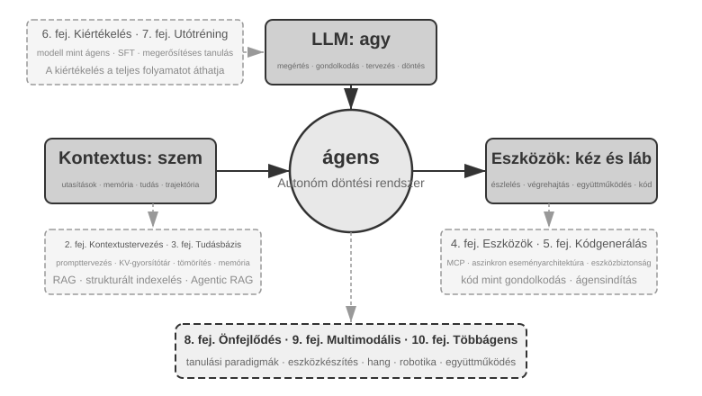
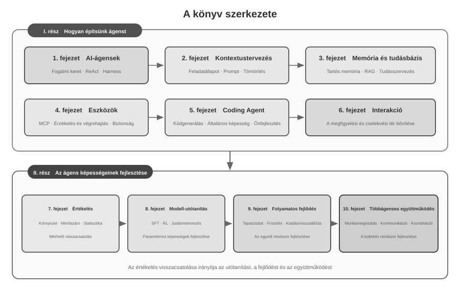

# Bevezetés {.unnumbered}

2025 augusztusa és októbere között műszaki kurzussorozatot tartottam a Turing *AI Agent Bootcamp* programjában. A kurzusok egy kérdés köré szerveződtek: hogyan tervezhetünk AI-ágenseket magyarázható, ellenőrizhető és újrahasznosítható mérnöki elvek alapján, a tapasztalat és intuíció vezérelte próbálkozások helyett? Egy működő bemutató elkészítése ezért nem végpont volt. Azt is vizsgáltuk, mi indokol egy adott architektúrát, hol húzódnak a képességhatárai, és milyen kompromisszumokat hordoznak a tervezési döntések. A könyv a kurzusanyagok és a kísérletek rendszerezett, kibővített és átalakított változata.

A könyv elkészítése maga is ember–ágens együttműködési kísérlet volt. Az első ötlettől a végső kéziratig főként **suttogó kódolással** — diktáláson alapuló együttműködéssel — dolgoztam a Pine hangalapú ágensével a kutatáson és a szöveg iterációin. Lediktáltam a fejezet vázlatát; az ágens áttekintette a forrásokat és elkészítette az első változatot. Ezután beépítettem a hallgatói visszajelzéseket, és több körben ellenőriztem, illetve javítottam az érveket, az eseteket és a kísérleteket. A beszéd csökkentette a gondolatok külsővé tételének költségét, és lerövidítette a kérdésfeltevéstől a forráskeresésen és szövegalkotáson át az ellenőrzésig tartó ciklust. A könyv így nemcsak az ágensekről szól, hanem egy olyan tudástermelési módot is dokumentál, amelyben egy ágens mélyen részt vett.

A DeepSeek R1 2025 eleji megjelenése óta az AI-kutatás és az ipari gyakorlat fókusza fokozatosan az alapmodellek képességeiről az ágensek rendszerszintű bevezetésére bővült. Modelloldalon az ágensalapú megerősítéses tanulás kezdi a paraméterekbe építeni az eszközhasználatot és a környezeti interakciót, erősítve a programozási, matematikai következtetési és Computer Use képességeket. Termékoldalon a Manus, a Claude Code és az OpenClaw megváltoztatta az ember–gép kapcsolatot, a „kódgenerálás + fájlrendszer” párost pedig fontos rendszerarchitektúrává tette.

A kurzuson összefoglalt ágensarchitektúra-elveket újra megvizsgálva azt látjuk, hogy a modellek és termékek gyors változása ellenére továbbra is stabil magyarázóerővel bírnak. A Skill, harness és loop engineering kifejezések később terjedtek el, a hozzájuk tartozó mérnöki gyakorlatok azonban rendszerint korábban megjelentek. A fogalmak sok gyakorlati tapasztalat általánosításából születnek; nem magának a gyakorlatnak a kiindulópontjai. Más szóval: a gyakorlat az első, az elnevezés később következik.

Ezek az elvek elsősorban hosszú időhorizontú, nagy kockázatú rendszerek mérnöki gyakorlatából születtek. A Pine AI vezető kutatójaként azzal a csapattal dolgoztam, amely a Pine-t fejlesztette, hogy az ágens a felhasználó nevében emberekkel kommunikáljon és valós gazdasági érdekeket érintő összetett feladatokat kezeljen, például számlatárgyalást, visszatérítési vitát vagy előfizetés-lemondást. Egyetlen hibás lépés tényleges veszteséget okozhat, ezért a megbízhatóság, biztonság és auditálhatóság szigorú követelményei formálták a könyv alapelveit.

- Jóval azelőtt, hogy a Skill divatszóvá vált volna, már dinamikus promptbetöltést használtunk az elszabadult promptnövekedés megfékezésére, parancssori végrehajtási eszközöket az elszabadult eszközlisták megfékezésére, és egy rendszerállapot-sávot, hogy az ügynök tisztában legyen a végrehajtási környezetével, a felhasználó idejével és a saját munkájának állapotával.
- Jóval azelőtt, hogy a harness divatszóvá vált volna, már Claude Code-stílusú módszereket használtunk az instabil eszközhívások, hallucinációk, veszélyes műveletek, jogosulatlan műveletek és figyelmen kívül hagyott utasítások kezelésére.
- Jóval azelőtt, hogy a loop engineering divatszóvá vált volna, már azt a módszert alkalmaztuk, amelyet ez a könyv javaslattevő-felülvizsgáló (proposer-reviewer) módszernek nevez, hogy megakadályozzuk a modellt abban, hogy túl korán befejezettnek nyilvánítson egy feladatot.

Ezek a módszerek nem kizárólag a Pine sajátjai. Számos modell- és ágenscsapat egymástól függetlenül jutott hasonló mérnöki megoldásokra, amikor hasonló problémákat oldott meg; ez a konvergencia arra utal, hogy az ágensrendszerek közös korlátait tükrözik. E felismerések alapján 2025-ben a Turingnál elindítottam az „AI Agent Bootcamp” kurzust, 2024 és 2026 között pedig folyamatosan gyakorlati AI-ágens kurzust tartottam a Kínai Tudományos Akadémia Egyetemén. A könyvet azért tesszük közzé nyílt forrásként, hogy ez az újrafelhasználható tudás és tapasztalat több kutatót és mérnököt szolgálhasson.

**A gyakorlat az első, az elnevezés később következik.** A vállalati ágensfejlesztésben ez azt jelenti, hogy a gyakorlat nem maradhat következetesen a fogalmak elterjedése mögött. Mire egy kifejezés iparági konszenzussá válik, az általa jelölt problémát az élen járó rendszerekben gyakran már hosszú ideje vizsgálják. E problémák korábbi felismeréséhez és megoldásához két feltétel szükséges.

**Először: olyan valós üzleti területet kell választani, amely kellően magas követelményeket támaszt az ágens képességeinek felső határával szemben, és folyamatosan valós visszajelzést ad.** A Pine esetében egy feladat órákig vagy hetekig tarthat, több érdekelt féllel folytatott ismételt egyeztetést, hosszú telefonhívásokat, összetett űrlapok kezelését és több körös levelezést igényelhet. Eközben biztosítani kell a kritikus adatok pontosságát, a műveletek ellenőrizhetőségét és a felhasználó érdekeinek védelmét. Az ilyen összetett környezet folyamatosan feltárja a modell képességei és az üzleti követelmények közötti rést, és harness építésére készteti a csapatot, hogy rendszerszinten oldja meg azt, amit a modell önállóan még nem tud, az üzlet azonban megkövetel. Ha a követelményeket a következő modellfrissítés könnyen kielégíti, nehezebb stabil rendszertervezési elveket felhalmozni.

**Másodszor: rendszerszerű értékelési (Evaluation) mechanizmust kell kialakítani.** Értékelés nélkül nem állapítható meg, hogy egy változtatás utáni javulás magából a tervből vagy pusztán véletlen ingadozásból ered. Az értékelés az ágens iterációját tapasztalati ítéletből összehasonlítható és megismételhető mérnöki folyamattá alakítja; ez a tudományos módszerrel végzett rendszerfejlesztés alapja. A 7. fejezet ezt a módszert tárgyalja részletesen.

Akárhogyan haladnak is előre az alapul szolgáló modellek, és akárhogyan változnak is a termékformák, szinte minden sikeres ügynökrendszer ugyanazokat az architektúrális mintákat követi. Ez nem véletlen: **a jó tervezési elveknek túl kell élniük a modell-iterációs ciklusokat**, mert nem egy adott modell használatát írják le, hanem azokat az alapvető mintákat, ahogyan az intelligens rendszerek kölcsönhatásba lépnek a világgal.

Richard Sutton, Turing-díjas kutató és a megerősítéses tanulás atyja egyszer azt mondta, hogy az univerzum evolúciója négy szakaszon ment keresztül: por, csillagok, élet és ágensek (eredetileg "tervezett entitásoknak" nevezve). A biológiai evolúció vak: véletlenszerű mutáció, természetes kiválasztódás. A legtöbb organizmus nem érti a saját működési elveit, és nem képes önállóan élőlényeket tervezni vagy újraalkotni. Az ágensek azonban valami teljesen újat jelentenek a kozmikus evolúció történetében: kód generálásával képesek saját magukat elindítani és fejleszteni, akár egy programozó, aki ír egy másik programozót, aki aztán megírja a következőt. Vagyis egy ágens képes megérteni a saját működési mechanizmusát, és egy cél adott esetén teljesen új ágenseket létrehozni – sőt, önmagát is fejleszteni. Ennek a könyvnek a küldetése, hogy segítsen megérteni és elsajátítani ennek a teremtésnek az elveit.

Ennek a könyvnek a központi képlete egyetlen mondat: **Ágens = NYM + Kontextus + Eszközök**. Mindhárom nélkülözhetetlen.



Szemléletesebben: **Agy + Szemek + Kéz és Láb**. Az agy (NYM) felelős a gondolkodásért és a döntéshozatalért, a szemek (Kontextus) határozzák meg, hogy az ágens milyen információkat láthat, a kéz és láb (Eszközök) pedig azt, hogy mit tehet az ágens. (Szigorúan véve a "szemek" durva hasonlat: a Kontextus nemcsak környezeti információkat és beszélgetési előzményeket foglal magában, hanem az eszközdefiníciókat is, vagyis az információ, amit az ágens "lát", magában foglalja azt is, hogy "milyen kéz és láb áll rendelkezésre." Ez a metafora azt a központi intuíciót hivatott közvetíteni: a Kontextus minden információ, amit a modell érzékelhet.)

A megerősítéses tanulásban járatos olvasók számára ez a három dolog leképezhető a RL formális nyelvére is. Pontosabban: az NYM a Policy-nak, a Kontextus a Megfigyelési Térnek (Observation Space), az Eszközök pedig a Cselekvési Térnek (Action Space) felel meg. A három kifejezés ugyanarra a dologra utal, csak különböző absztrakciós szinteken.


## A könyv szerkezete {.unnumbered}

A könyv tíz fejezete két egymásra épülő kérdés köré szerveződik (0-2. ábra). Az **I. rész, „Hogyan építsünk ágenst?”** az 1–6. fejezetet fogja össze: az alapfogalmaktól a kontextuson, memórián és tudáson, eszközökön és kódoló ágenseken át a megfigyelési és cselekvési tér bővítéséig halad. A **II. rész, „Hogyan fejlesszük az ágens képességeit?”** a 7–10. fejezetet tartalmazza: a kiértékelés mérhető visszacsatolást teremt, majd a modell-utóképzés, az üzemeltetési tapasztalatra épülő folyamatos evolúció és a többágenses együttműködés a modellparaméterek, az egyedi rendszer és a kollektív rendszer szintjén növeli a képességeket.



- **1. fejezet (Az ügynök alapjai)** néhány valós ügynöktermékkel kezd, hogy intuitív megértést építsen az ügynökökről. Ezután mélyrehatóan megvizsgálja az ügynök központi képletét: a NYM + Kontextus + Eszközök implementációs rétegétől az Agy + Szemek + Kéz és Láb intuitív rétegén át egészen a Policy, Megfigyelési Tér és Cselekvési Tér akadémiai rétegéig. Kísérletek boncolgatják a ReAct ciklus működését – a "Gondolkodj → Cselekedj → Figyelj meg" iteratív folyamatot – és megkülönböztetik a feladaton belüli kontextuális adaptációt, a feladatok közötti külső artefaktumok frissítését, valamint a paraméterfrissítéseket a tanítási ciklusok során. A fejezet a munkafolyamatoktól az autonóm ügynökökig terjedő vezénylési tervezési mintákkal zárul, egységes fogalmi keretet teremtve az ezt követő fejezetek számára.
- **2. fejezet (Kontextusmérnökség)** a könyv legkritikusabb fejezete, amely szisztematikusan magyarázza el a Kontextust, az ügynök "szemét." Az API üzenetszerkezetével és az ügynök központi ciklusával kezdi, lefektetve azt az alapot, hogy "a Kontextus üzenetek listája", majd megvizsgálja a KV Cache mögötti elveket – azt a mechanizmust, amely a történeti számítási eredmények újrafelhasználását teszi lehetővé az NYM következtetése során. Ezt követően kitér a Promptmérnökségre, beleértve a folyamatorientált tervezést, az eszközleírásokat és az üzleti szabályok finomítását; a Prompt Injection támadásokra és védekezésre; az ügynöki képességek (Agent Skills) igény szerinti betöltési mechanizmusára; az ügynök állapotsáv technológiájára; és a Kontextus-tömörítési stratégiákra. E kifejezések teljes definíciói a főszövegben történő első előfordulásukkor szerepelnek.
- **3. fejezet (Felhasználói memória és tudásbázisok)** kiterjeszti a kontextuskezelést egy, a munkameneteken átívelő perzisztens tudásrendszerré, lehetővé téve az ügynök számára, hogy ne csak az aktuális beszélgetésre emlékezzen, hanem tudást halmozzon fel és keressen elő több beszélgetésen keresztül. Négy progresszív stratégiát tárgyal a felhasználói memóriához; a RAG (Retrieval-Augmented Generation – visszakereséssel bővített generálás, amelyben a modell válaszadása előtt releváns dokumentumokat keresnek ki) teljes technológiai veremét, beleértve a különböző szövegkeresési módszereket és a rangsorolás optimalizálását; a multimodális információ-kinyerést; a tudásszervezés fejlettebb módszereit; és az ügynökvezérelt RAG-ot (Agentic RAG), ahol az ügynök autonóm módon dönti el, hogy mikor és mit kell visszakeresnie.
- **4. fejezet (Eszközök)** az ágens és a külvilág közötti hidat vizsgálja: az eszközök az ágens „kezeként és lábaként” működnek, lehetővé téve a webes keresést, az API-hívásokat és az adatbázisok kezelését. Bemutatja az MCP eszköz-interoperabilitási szabványt és öt eszközkategória – érzékelés, végrehajtás, együttműködés, eseményindítás és felhasználói kommunikáció – tervezési elveit, különös hangsúlyt fektetve a végrehajtási eszközök biztonságára. Az eseményindítást, a felhasználói kommunikációt és az aszinkron futtatási környezetet a 6. fejezet tárgyalja.
- **5. fejezet (Kódoló ügynök és kódgenerálás)** amellett érvel, hogy egy kódoló ügynök plusz egy fájlrendszer alkotja minden általános célú ügynök központi technológiai alapját. Az OpenClaw architektúráját használva szervező fonal gyanánt, elemzi a kódoló ügynök munkafolyamatait és implementációs technikáit, miközben bemutatja a kódgenerálás programozáson túli széleskörű értékét: a gondolkodás segítésétől a tudásbázisok építésén át az új eszközök dinamikus létrehozásáig és az ügynökök elindításáig (bootstrap).
- **6. fejezet (Interakció: a megfigyelési és cselekvési tér kiterjesztése)** az ágens és környezete kapcsolatát a **modalitás** és az **időbeliség** dimenziójában vizsgálja. Az aszinkron, eseményvezérelt rendszerek folyamatosan fogadják és kezelik a külső eseményeket; a beszéd a valós idejű működés felé viszi az érzékelést, következtetést és generálást; a Computer Use grafikus felületekre, a robotika pedig a fizikai környezetre terjeszti ki a cselekvést. A négy terület közös primitívjei az ébresztés, a biztonságos pont, a megszakítás, a kiszorítás, valamint a gyors és lassú útvonalak szétválasztása.
- **7. fejezet (Ügynök-értékelés)** egy tudományos értékelési módszertant épít fel. Lefedi az értékelési környezeteket – két központi paradigmát, az eszközhívást és az ember-számítógép interakciót, valamint a szimulációs környezeteket, amelyeket a fejezet végén külön tárgyalunk –, az adathalmaz-tervezési elveket, az NYM mint bíró (LLM-as-a-Judge) automatizált értékelést, az értékelésvezérelt modellválasztást és a teljes zárt hurkot, amely az értékelési eredményeket rendszerfejlesztésekké alakítja.
- **8. fejezet (Modell utóképzése)** két utóképzési technikát vizsgál mélyrehatóan: az SFT-t (Supervised Fine-Tuning – felügyelt finomhangolás, amely címkézett adatokat használ a modell megtanítására a példák követésére) és a RL-t (Reinforcement Learning – megerősítéses tanulás, amely lehetővé teszi a modell számára, hogy próbálkozással és hibázással, valamint jutalom-visszajelzéssel autonóm módon fejlődjön). Az "SFT memorizál, RL általánosít" és "Az adatok és a környezet fontosabbak, mint az algoritmusok" központi érvek köré szerveződve lefedi a teljes előképzés/SFT/RL tájképet, a klasszikus RL-elméletet, a jutalomjel-tervezést – a bináris jutalmaktól és a folyamatjutalmaktól a "jutalmazd a kimenetet, és korlátozd a folyamatot" igazolt útvonal-büntetésekig –, az egymenetes és többmenetes megerősítéses tanulási algoritmusokat, valamint a mintahatékonyság-optimalizálás határterületeit.
- **9. fejezet (Folyamatos ügynökevolúció)** azt vizsgálja, hogyan alakítható át egy ügynök üzemeltetési tapasztalata a következő verziójának képességeivé. Először a környezeti kimenetekből, folyamatszabályokból és NYM-értékelési szempontokból (Rubrics) álló tanulási jeleket határozza meg; majd összehasonlít négy frissítési hordozót – tudásdokumentumokat, Promptokat és Képességeket (Skills), programokat és Védőhálókat (Harnesses), valamint modellparamétereket –, végül tárgyalja a jelöltverziók validálását, a fokozatos bevezetést (canary release), a visszaállítást és a hosszú távú konszolidációt.
- **10. fejezet (Többágenses együttműködés)** az egyedi képességektől a rendszerszintű koordináció felé bővíti a nézőpontot, és azt vizsgálja, hogyan osztják meg a munkát és működnek együtt több ágens. Szisztematikusan bemutatja az osztályozási keretet – megosztott/független kontextus × egyenrangú/irányító/decentralizált struktúrák –, fordító ágensek és telefon–számítógép együttműködő ágensek példáján mutatja be az architektúra tervezését, majd az ágenstársadalmak és ágensgazdaságok lehetséges fejlődési irányait tárgyalja.

## Hogyan olvassuk ezt a könyvet {.unnumbered}

E könyv fejezetei viszonylag függetlenek. A szükségleteid alapján különböző olvasási utakat választhatsz:

- **Ha ágensfejlesztő vagy**, olvasd a könyvet sorrendben: az 1–6. fejezet teljes módszert ad az ágensek felépítéséhez, a 7–10. fejezet pedig a kiértékelésen, modell-utóképzésen, folyamatos evolúción és többágenses együttműködésen keresztül tárgyalja a képességek fejlesztését.
- **Ha korlátozott az időd**, részesítsd előnyben az 1. fejezetet az átfogó képért, és a 2. fejezetet a kontextusmérnökségért – ez a legkritikusabb készség. A KV Cache mögötti elvek a 2. fejezetben meglehetősen technikai jellegűek; első olvasásra átugorhatod a mechanikát, és megtarthatod csak a fejezet elején megadott három központi következtetést anélkül, hogy ez befolyásolná a későbbi anyag megértését.
- **Ha a fókuszod a modell tanítása**, menj egyenesen a 8. fejezethez (Modell utóképzése). Mivel a 7. fejezet értékelési módszerei a tanítás előfeltételei, olvasd a kettőt együtt, miután az 1. és 2. fejezet megadta az átfogó képet.

Minden fejezet nagyszámú **kísérletet** és **gondolkodtató kérdést** tartalmaz, "X-Y. kísérlet" formátumban számozva (X a fejezet száma, Y a sorszám a fejezeten belül). A kísérletek és gondolkodtató kérdések címei csillagbesorolást hordoznak a nehézségi szintre: ★ belépő szint, minden olvasó számára alkalmas; ★★ közepes nehézség, némi mérnöki gyakorlatot igényel; ★★★ haladó kihívás, általában nyitott végű kérdéseket vagy összetett rendszertervezést foglal magában. A legtöbb kísérlet teljes futtatható kóddal érkezik, amely a kísérő nyílt forráskódú repóban található:

> **Kísérő kódrepó**: [https://github.com/bojieli/ai-agent-book](https://github.com/bojieli/ai-agent-book)

A teljes kísérő kódot letöltheted Gittel:

```bash
git clone https://github.com/bojieli/ai-agent-book.git
cd ai-agent-book
```

Ha nem használsz Gitet, a repó oldalán a **Code → Download ZIP** lehetőséget is választhatod. A kísérletek kódja fejezetenként, a `chapter1/` és `chapter10/` közötti könyvtárakban található. Az „X-Y. kísérlet” megkereséséhez nyisd meg a megfelelő `chapterX/README.hu.md` fájlt, a kísérlet száma alapján keresd meg a projekt könyvtárát, majd a projekt saját README-jét követve telepítsd a függőségeket és futtasd a kísérletet. Egyes, reprodukciós útmutatóként megjelölt kísérletek külső repókra támaszkodnak; ezek beszerzését is a megfelelő README ismerteti.

Erősen ajánlom, hogy futtasd ezeket a kísérleteket magad is: az AI-ügynökök rendkívül gyakorlatorientált terület, és sok tervezési intuíció csak hibakeresés közben alakul ki.


## Előfeltételek {.unnumbered}

Ez a könyv némi műszaki háttérrel rendelkező olvasóknak szól, de nem követeli meg, hogy szakértő legyél egy adott területen. Az előfeltételek két szinten vannak felsorolva: "Kötelező" és "Ajánlott", hogy segítsen felmérni a felkészültségedet.

**Kötelező: A teljes könyv olvasásának alapja**

- **Python programozás**: A könyv szinte minden kísérlete Python-alapú. Ismerned kell a Python alapvető szintaxisát, a gyakori adatszerkezeteket, a csomagkezelést (pip) és más alapvető fogalmakat. Magas szintű jártasság nem szükséges, de képesnek kell lennie közepes bonyolultságú Python kód olvasására és módosítására.
- **Alapvető tapasztalat NYM-ekkel (LLM-ekkel)**: Használtál már ChatGPT-t, Claude-ot vagy hasonló termékeket, és érted a "Prompt → Modell válasza" alapvető interakciós mintát.
- **Egy AI-asszisztált programozási eszköz**: Telepíts és szokj hozzá legalább egy AI-asszisztált programozási eszközhöz, mint a Claude Code, a Codex, a Cursor vagy a TRAE. Egyrészt ezek az eszközök nagyban felgyorsítják a kísérleteket, amelyek kiterjedt kódírást és hibakeresést foglalnak magukban. Másrészt ezek maguk is érett kódoló ügynökök: használatukkal első kézből tapasztalod meg azokat a központi mechanizmusokat, amelyekhez ez a könyv újra és újra visszatér – a ReAct ciklust, az eszközhívásokat, a kontextuskezelést. Ez a közvetlen tapasztalat felbecsülhetetlen értékű az ügynök-tervezési elvek megértéséhez.
- **Általános szoftvermérnöki ismeretek**: Légy járatos olyan alapvető fogalmakban, mint a parancssori műveletek, a Git verziókezelés, a JSON adatformátum és a REST API-k. Ezek képezik az alapot a kísérletek futtatásához és az ügynök eszközhívási mechanizmusának megértéséhez.

**Ajánlott: Az olvasási élmény fokozása bizonyos fejezetekhez**

- **Gépi tanulás alapjai** (8. fejezet): Az olyan alapfogalmak megértése, mint a tanítás vs. következtetés, veszteségfüggvények, gradiensereszkedés és túltanulás, segítenek a modell utóképzésének megértésében.
- **Alapvető matematika** (2–3., 8. fejezet): A lineáris algebra intuitív megértése (pl. annak ismerete, hogy a vektorok irányt és nagyságot képviselhetnek, a mátrixok pedig batch-műveleteket végezhetnek) segít az beágyazások (embeddings) és a figyelmi mechanizmusok (attention) megértésében. A valószínűségszámítás és statisztika alapvető ismerete segít az értékelési metrikák és a megerősítéses tanulás várható jutalmainak megértésében. A könyv matematikai része nem tartalmaz összetett levezetéseket, és az intuitív magyarázatokra összpontosít.
- **6. fejezet (Interakció: a megfigyelési és cselekvési tér kiterjesztése)** az ágens és környezete kapcsolatát a **modalitás** és az **időbeliség** dimenziójában vizsgálja. Az aszinkron, eseményvezérelt rendszerek folyamatosan fogadják és kezelik a külső eseményeket; a beszéd a valós idejű működés felé viszi az érzékelést, következtetést és generálást; a Computer Use grafikus felületekre, a robotika pedig a fizikai környezetre terjeszti ki a cselekvést. A négy terület közös primitívjei az ébresztés, a biztonságos pont, a megszakítás, a kiszorítás, valamint a gyors és lassú útvonalak szétválasztása.
- **A Transformer architektúra alapvető ismerete** (2., 8. fejezet): A Transformer szinte az összes jelenlegi nagy nyelvi modell mögöttes architektúrája. Azok az olvasók, akik szisztematikusan szeretnék felépíteni a nagy modellekkel kapcsolatos alapvető tudásukat, élvezhetik a *Illustrating Large Models* (图解大模型, kínai nyelven, a Turing kiadásában) című könyvet, amely intuitív ábrákkal magyarázza el az olyan központi fogalmakat, mint a Transformer architektúra, az előképzés és a finomhangolás – jó kiegészítője e könyv ügynökmérnöki perspektívájának.

Ha hiányzik néhány ezen előfeltételek közül, ne csüggedj. A könyv központi értéke **az architektúrális tervezési elvekben és a mérnöki módszertanban** rejlik, nem pedig valamely konkrét algoritmusban vagy technikában. Az utóképzésről szóló 8. fejezeten kívül a könyv nagyon kevés matematikát vagy gépi tanulást igényel, és tökéletesen megfelel kiindulópontnak.

Az ügynök-technológia még mindig gyorsan fejlődik, de **a jó architektúrális tervezési elvek képesek átvészelni az időt.** Sajátítsd el a tervek mögött meghúzódó "miértet", és megőrizheted az ítélőképességed tisztaságát, ahogy a technológiai hullámok átgördülnek. Remélem, ez a könyv megbízható útmutatóddá válik, amint AI-ügynököket építesz.

## Köszönetnyilvánítás {.unnumbered}

Szeretném megköszönni Meng Ge és Liu Meiying szerkesztőknek a Turing Kiadónál gondos szerkesztői munkájukat és a Turing "AI Agent Bootcamp" tanfolyam megszervezésében végzett munkájukat; valamint köszönöm Liu Junming professzornak, hogy lehetővé tette a gyakorlatorientált AI-ügynök kurzust a Kínai Tudományos Akadémia Egyetemén. Külön köszönet illeti a Turing "AI Agent Bootcamp" és a UCAS AI-ügynök kurzus összes hallgatóját – e kurzusok tanítása során rengeteg értékes visszajelzést és tanácsot kaptam tőletek, ami élesítette a saját megértésemet ezekről a fogalmakról.

Köszönöm minden kollégámnak a Pine AI-nál. Egy olyan kiváló termék nélkül, mint a Pine AI, és az általa hozott számos kihívás nélkül, soha nem mehettem volna ilyen mélyre az ügynökök területén, sem megértésben, sem gyakorlatban; és az egymást követő gondolatcserék során a kollégáim rengeteg értékes meglátással járultak hozzá.

Köszönöm továbbá sok barátomnak az AI-iparból (nem sorolom fel itt mindnyájukat). Beszélgetésről beszélgetésre őszinte visszajelzést adtatok a nézeteimről, kijavítottatok számos téves ítéletemet, és emeltétek a modellekről és ügynökökről alkotott megértésem színvonalát.

Legfőképpen pedig köszönöm a családomnak, különösen a feleségemnek, Meng Jiayingnek. Támogatott végig e könyv írása során, és számos értékes javaslattal szolgált az út során.
