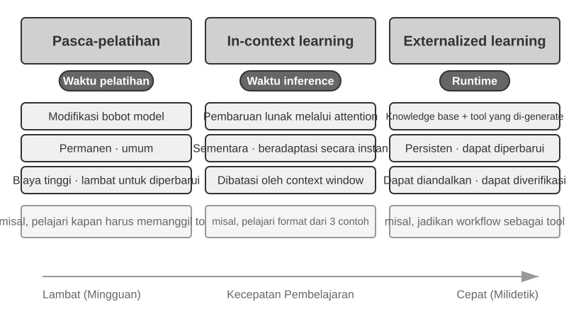
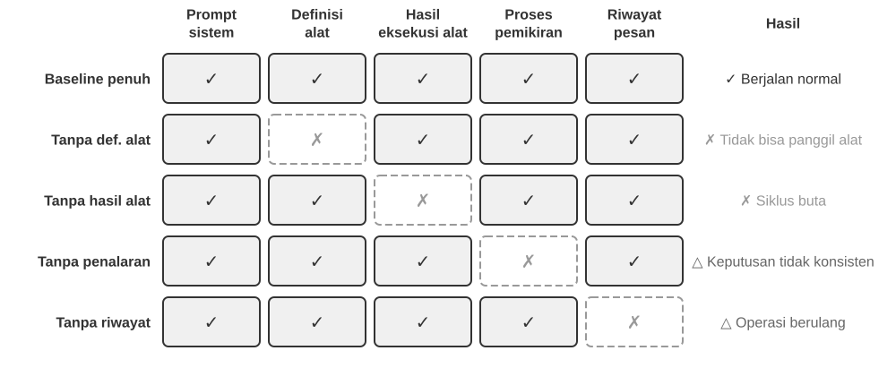
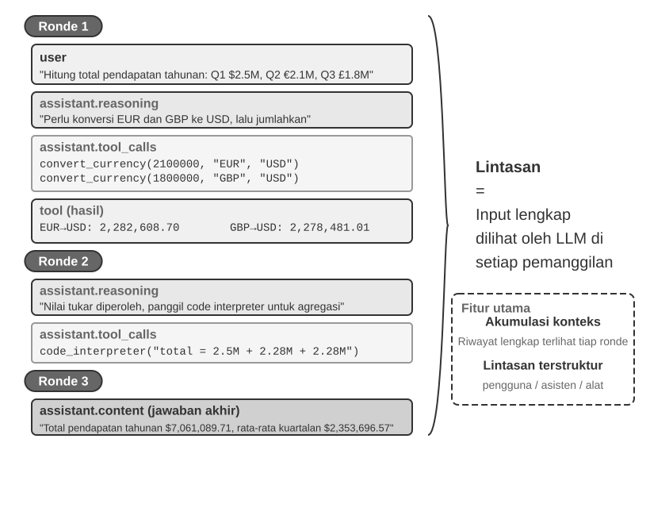
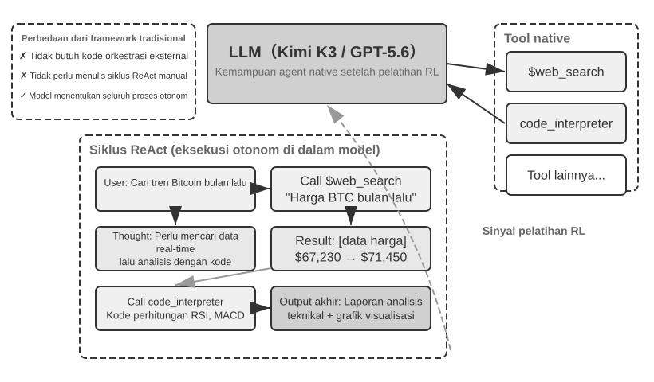
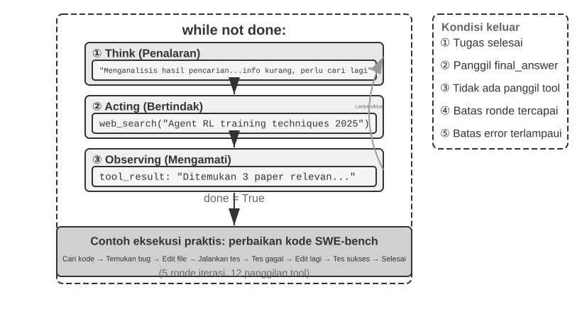

# Memulai dengan Agen AI

Jika Anda pernah menggunakan Cursor untuk menulis kode dan melihatnya menelusuri basis kode Anda, mengedit beberapa file, dan menjalankan ulang pengujian hingga berhasil, Anda sudah menggunakan Agen AI. Hal yang sama berlaku jika Anda pernah menggunakan Deep Research untuk menyelidiki suatu topik melalui pencarian dan pembacaan berulang, menyuruh Manus mengontrol browser untuk menyelesaikan tugas online, meminta asisten ponsel Doubao untuk memesan tiket atau mengirim pesan, atau mengutus Pine AI untuk menegosiasikan tagihan telekomunikasi yang lebih murah.

Produk-produk ini hadir dalam berbagai bentuk, namun mereka memiliki satu kesamaan: mereka tidak lagi berupa percakapan pasif "Anda bertanya, ia menjawab". Mereka merencanakan langkah eksekusi mereka sendiri, memanggil alat (tools) yang dibutuhkan setiap tugas, dan menyesuaikan strateginya saat hasil diperoleh. Agen AI kini menjadi cara baru untuk berinteraksi dengan komputer.

Bab ini dimulai dengan contoh-contoh praktis dan menelusuri kembali ke komponen inti dari sebuah Agen AI: pembaca akan mengalami secara langsung apa yang dapat dilakukan Agen modern, memahami arsitektur di baliknya, dan mempelajari pola desain serta praktik terbaik untuk membangun sistem Agen.

> **Tips Membaca**: Bab ini adalah peta konseptual untuk keseluruhan buku: sebuah tur ringkas tentang formula inti, siklus operasi, kerangka rekayasa, dan pola desain Agen. Ini menetapkan kosakata bersama dan titik referensi yang digunakan di sepanjang bab-bab selanjutnya. Jangan mencoba menghafal setiap konsep pada bacaan pertama Anda; bidiklah gambaran besarnya. Setiap bab selanjutnya memperluas salah satu aspek yang diperkenalkan di sini, dan Anda dapat kembali ke bab ini kapan pun Anda perlu mengorientasikan diri.

## Agen Modern = LLM + Konteks + Alat

Esensi dari sistem Agen modern terangkum dalam satu formula ringkas: **Agen = LLM (Large Language Model) + Konteks + Alat**. Formula ini sederhana dan praktis—asalkan setiap istilah dimaknai secara luas:

- **LLM adalah mesin penalaran (reasoning engine) Agen**: Ini lebih dari sekadar sekumpulan parameter model; ini adalah inti pengambilan keputusan Agen, yang bertanggung jawab untuk memahami maksud, menalar, merencanakan, dan memberi penilaian. Kemampuan LLM berasal dari pengetahuan dunia dan kemampuan bahasa yang diperoleh selama **pre-training**, ditambah strategi pengambilan keputusan yang dikodekan melalui **post-training** (teknik seperti supervised fine-tuning dan reinforcement learning dibahas di Bab 7).
- **Konteks adalah sekumpulan informasi kerja Agen**: Bukan sekadar teks yang dimasukkan ke dalam model, tetapi sekumpulan informasi kerja yang tersedia bagi Agen di setiap titik pengambilan keputusan—lingkungan, memori pengguna, pengetahuan domain, statusnya sendiri, dan kemajuan tugas. Sama seperti seseorang yang membuat keputusan perlu menilai situasi, mengingat pengalaman relevan, dan berkonsultasi dengan referensi, *context window* Agen berisi informasi yang dapat ia gunakan pada saat itu.
- **Alat adalah antarmuka aksi Agen**: Bukan hanya segelintir fungsi API yang dapat dipanggil, melainkan seluruh cara Agen dapat bertindak—mulai dari panggilan alat yang telah ditentukan sebelumnya hingga Skill yang dimuat sesuai permintaan, dari menghasilkan kode untuk menciptakan kemampuan baru secara langsung, mendelegasikan pekerjaan ke sub-agen, menghubungi pengguna, hingga merespons peristiwa eksternal.

Jika dirumuskan secara lebih intuitif: **Agen = Mesin Penalaran + Konteks Kerja + Antarmuka Aksi**. Model menalar dan memutuskan, konteks menyediakan informasi kerja tempat keputusan itu bergantung, dan alat menyediakan antarmuka yang melaluinya keputusan memengaruhi dunia luar.

Ketiga komponen ini secara persis berkorespondensi dengan tiga konsep inti dalam RL (lihat Bab 7). Tabel berikut adalah **bacaan opsional**—jika Anda tidak memiliki latar belakang RL, silakan lewati saja; tidak ada materi selanjutnya yang bergantung pada hal ini. Tabel ini hanya ada untuk membantu pembaca yang mengetahui RL untuk memetakan pengetahuan tersebut ke dalam terminologi buku ini:

| Intuisi | Komponen Agen | Konsep RL (Opsional) | Peran |
|---------------|----------------|------------------|---------------------------------------------|
| **Mesin Penalaran** | LLM | **Policy** | Logika pengambilan keputusan yang menentukan "apa yang harus dilakukan selanjutnya"—berdasarkan informasi saat ini, memilih tindakan yang paling tepat dari semua opsi yang tersedia |
| **Konteks Kerja** | Konteks | **Observation Space** | Semua informasi yang tersedia bagi Agen—apa yang dapat ia amati, baca, ingat, dan sistem mana yang dapat ia akses |
| **Antarmuka Aksi** | Alat | **Action Space** | Seluruh hal yang dapat dilakukan Agen—"sarana" apa yang tersedia, mulai dari mengirim pesan, mengeksekusi kode, hingga mengendalikan antarmuka |

Memahami apa yang dilakukan setiap komponen, dan bagaimana mereka saling terhubung, adalah fondasi untuk membangun sistem Agen yang efektif. Kita akan mulai dari yang paling konkret dari ketiganya—alat, antarmuka aksi—lalu berlanjut ke dalam menuju LLM dan konteks. Pertama, berikut adalah perbandingan berbagai jenis Agen di tiga dimensi ini:

| Produk Agen | Konteks Kerja | Antarmuka Aksi | Strategi |
|-----------------|------------------------|--------------------------|-----------------------------|
| **Coding Agents (mis., Cursor)** | Dokumen persyaratan, basis kode, lingkungan terminal | Terbuka (penalaran internal, pencarian kode, baca/tulis file, eksekusi perintah, dll.) | Pengembangan inkremental: memahami persyaratan → mencari kode relevan → mengedit kode → menguji dan memverifikasi → mendebug dan memperbaiki |
| **Search Agents (mis., Deep Research)** | Sumber daya web, basis data akademik, file lokal | Terbuka (penalaran internal, kueri pencarian, membaca web, pembuatan ringkasan) | Pendalaman iteratif: menyesuaikan arah pencarian berdasarkan informasi yang ada, secara bertahap menyusun laporan lengkap |
| **Computer Control Agents (mis., Manus)** | Layar komputer, halaman browser, sistem file | Terbuka (penalaran internal, mengklik, mengetik, menggulir, tangkapan layar, eksekusi kode, dll.) | Persepsi visual + operasi: mengamati layar → mengidentifikasi elemen target → melakukan tindakan → memverifikasi hasil |
| **Phone Assistant Agents (mis., Doubao)** | Layar ponsel, aplikasi terinstal | Terbuka (penalaran internal, mengklik, mengusap, mengetik, membuka aplikasi, dll.) | Pemahaman maksud + kontrol Aplikasi: memahami kebutuhan pengguna → menemukan aplikasi target → melakukan tindakan → mengonfirmasi penyelesaian |
| **Personal Task Agents (mis., Pine AI)** | Informasi akun pengguna, riwayat tagihan, basis pengetahuan penyedia layanan | Terbuka (penalaran internal, menelepon, mengirim email, mengisi formulir, mengonfirmasi dengan pengguna) | Eksekusi tugas multi-langkah: mengumpulkan informasi → merumuskan strategi negosiasi → menghubungi penyedia layanan → bernegosiasi → melaporkan hasil |

Sistem-sistem ini berbagi tiga fitur: **ruang aksi yang terbuka**—bukan memilih dari sekumpulan tombol tetap, tetapi menghasilkan bahasa alami dan kode sembarang; **penalaran internal**—merencanakan sebelum bertindak; dan **interaksi berkelanjutan**—menyesuaikan strategi berdasarkan umpan balik lingkungan. Kemampuan-kemampuan ini justru datang dari interaksi antara mesin penalaran, konteks kerja, dan antarmuka aksi—yaitu, LLM, konteks, dan alat.

### Alat: Antarmuka Aksi Agen

Alat adalah jembatan Agen ke dunia luar. Alat mengubah Agen dari pengamat pasif menjadi sistem aktif yang dapat mencari, menulis file, menjalankan kode, memanggil API, mengirim pesan, atau mengoperasikan antarmuka. Tanpa alat, Agen terbatas hanya pada pembuatan teks; dengan alat, ia dapat bertindak pada sistem eksternal.

Untuk membahas alat secara sistematis, kita dapat mengurutkannya ke dalam lima jenis berdasarkan arah interaksi Agen dengan dunia. Pada tahap ini, tinjauan singkat tentang skenario representatif masing-masing jenis sudah cukup untuk menetapkan gambaran keseluruhan; bab-bab selanjutnya akan membahasnya secara mendalam.

**Alat Persepsi (Perception Tools)** memungkinkan Agen mengakses informasi: mesin pencari menyediakan data web real-time, sistem file membaca dokumen lokal, dan API serta basis data terhubung ke layanan eksternal dan data inti perusahaan.

**Alat Eksekusi (Execution Tools)** memungkinkan Agen bertindak pada sistem eksternal: eksekusi kode, operasi file, perintah sistem, dan panggilan API eksternal mengubah keputusan menjadi tindakan konkret.

**Alat Kolaborasi (Collaboration Tools)** memungkinkan Agen membagi pekerjaan dengan Agen lain: mendelegasikan tugas khusus ke sub-agen, meminta konfirmasi manusia pada titik keputusan utama, atau mengoordinasikan tindakan dalam sistem multi-agen.

**Alat Pemicu Peristiwa (Event Trigger Tools)** dipanggil dengan cara yang pada dasarnya berbeda dari tiga kategori pertama: Agen tidak memanggilnya; mereka datang sebagai input eksternal yang memicu Agen untuk mulai bekerja. Email baru masuk, waktu yang dijadwalkan tiba, atau sistem lain memicu *callback* Webhook; peristiwa tersebut mengaktifkan Agen dan memulai penalaran serta tindakan. Agen sendiri tidak pernah memanggilnya, namun ini tetap merupakan saluran di mana ia berinteraksi dengan dunia luar, jadi kita menghitungnya dalam sistem alat secara luas.

**Alat Komunikasi Pengguna (User Communication Tools)** adalah saluran di mana Agen berkomunikasi dengan pengguna. Jika alat eksekusi mengubah dunia eksternal, alat komunikasi membawa informasi—menyampaikan kemajuan Agen, atau sapaan proaktif, melalui pesan teks, panggilan suara, email, dan sebagainya.

Bab 4 membahas taksonomi lengkap dan prinsip desain untuk kelima jenis ini. Kualitas desain alat secara langsung menentukan apa yang dapat diselesaikan dengan andal oleh Agen: jika antarmuka didefinisikan secara samar, model akan menyalahgunakannya; jika penanganan kesalahan buruk, satu alat yang gagal dapat membuat Agen terhenti; jika cakupan izin terlalu luas, satu kesalahan Agen dapat menjadi tidak dapat diubah. Seiring dengan meluasnya standar MCP (Model Context Protocol), mengintegrasikan alat menjadi semudah menginstal plugin—ekosistem berkembang pesat, tetapi prinsip desainnya tidak akan ketinggalan zaman.

**Pemanggilan Alat (Tool Calling)** (juga dikenal sebagai Function Calling) adalah kemampuan inti Agen LLM modern: ini memungkinkan model memanggil alat eksternal secara terstruktur, mengubah LLM dari sekadar generator teks murni menjadi sistem cerdas yang dapat bertindak melalui antarmuka eksternal. Buku ini menggunakan istilah "pemanggilan alat" (tool calling) di seluruh bagiannya.

Pemanggilan alat berlangsung dalam empat langkah: pertama, konteks memberi tahu model alat apa saja yang tersedia (nama, tujuan, parameter); kemudian model memutuskan sendiri apakah akan memanggil alat, alat mana yang dipanggil, dan dengan argumen apa; selanjutnya, setelah alat berjalan, hasilnya ditambahkan ke konteks; terakhir, model memutuskan langkah selanjutnya berdasarkan hasil tersebut. Siklus ini adalah fondasi ReAct, yang diperkenalkan nanti di bab ini.

Untuk kueri cuaca, representasi sederhana dari proses empat langkah di tingkat API adalah sebagai berikut:

```
Step 1: Declare tools                  Step 2: Model decides to call
tools: [{                             assistant: {
  name: "get_weather",                  tool_calls: [{
  parameters: {                           function: "get_weather",
    city: "string"                        arguments: {city: "Beijing"}
  }                                      }]
}]                                    }

Step 3: Result appended to context    Step 4: Model responds based on result
tool: {                               assistant: {
  tool_call_id: "call_1",               content: "Today in Beijing: 28°C, sunny."
  content: '{"temp":28,"sky":"clear"}' }
}                                     }
```

Pengembang hanya mendefinisikan alat dan mengeksekusi panggilan; model itu sendiri yang memutuskan apakah akan memanggil, alat mana yang akan dipanggil, dan argumen apa yang akan diteruskan. Bab 2 menelaah struktur API ini secara terperinci.

Saat merancang alat untuk Agen, jaga agar alat tersebut bersifat serbaguna (general-purpose) dan berikan LLM fleksibilitas. Alih-alih alat kalkulator khusus, sediakan interpreter kode Python dan kotak pasir (sandbox) aman untuk menjalankannya. Alih-alih alat khusus untuk mencatat log pekerjaan, sediakan alat baca/tulis file dan sistem file virtual. Alat serbaguna memungkinkan Agen menggabungkan kemampuan dasar untuk memecahkan masalah secara kreatif.

### LLM: Mesin Penalaran Agen

Large Language Model (LLM) adalah inti pengambilan keputusan Agen. Diberikan permintaan pengguna, LLM pertama-tama harus menyimpulkan maksud sebenarnya (apa yang dikatakan pengguna sering kali bukan yang sebenarnya mereka inginkan), lalu memecah tugas yang tidak jelas atau kompleks menjadi langkah-langkah yang dapat dieksekusi. Sepanjang eksekusi, LLM terus membuat keputusan: apa yang harus dilakukan selanjutnya, apakah akan memanggil alat, alat yang mana, dan dengan argumen apa. Kemampuan memahami–merencanakan–mengeksekusi ini berasal dari pengetahuan yang dikumpulkan selama *pre-training*, dan ini adalah fondasi yang diandalkan oleh alur kerja maupun Agen otonom.

Kemampuan khusus Agen LLM adalah **penalaran internal**—sebelum bertindak, Agen dapat merencanakan dan menalar tugas tersebut. Hal ini tidak mengubah lingkungan eksternal, namun secara nyata meningkatkan tindakan-tindakan berikutnya. Kemampuan ini berasal dari *pre-training* (pelatihan awal pada data teks internet dalam jumlah masif, di mana model mempelajari pola bahasa dan pengetahuan dunia): model memanfaatkan pola penalaran yang terkode dalam pengetahuan manusia, termasuk hukum matematika, hubungan kausal, dan strategi untuk menguraikan masalah. Penalaran Agen karenanya bukan sekadar coba-coba buta; itu dibangun di atas kerangka pengetahuan yang terstruktur.

Penalaran terstruktur ini memungkinkan Agen LLM menangani tugas-tugas yang sepenuhnya baru tanpa contoh sebelumnya—dua konsep, *zero-shot* dan *few-shot*, mengilustrasikan poin ini. Manifestasi langsungnya adalah **Generalisasi Zero-shot**: menghadapi tugas yang belum pernah dilihatnya, Agen menanganinya dengan merekombinasi apa yang sudah diketahuinya, tanpa perlu contoh. Model mungkin belum pernah secara eksplisit diajarkan menulis puisi tentang fisika kuantum, namun ia dapat menghasilkan yang masuk akal dari pengetahuannya yang ada tentang bahasa dan fisika.

Dengan beberapa contoh, Agen LLM juga dapat melakukan **Adaptasi Few-shot**: dua atau tiga demonstrasi dalam prompt sudah cukup baginya untuk mempelajari pola tugas baru. Jika ditunjukkan beberapa contoh "komentar pengguna -> label sentimen", ia dapat mengklasifikasikan sentimen komentar baru. Singkatnya: *zero-shot* berarti memecahkan tugas tanpa contoh; *few-shot* berarti mempelajari pola dari sejumlah kecil contoh.

#### Model sebagai Agen: Saat Model Itu Sendiri Menjadi Produk

Paradigma "Model as Agent" (Model sebagai Agen) adalah arah terbaru dalam pengembangan Agen AI. Model tingkat lanjut menginternalisasi pemanggilan alat sebagai kemampuan bawaan melalui *post-training* (terutama reinforcement learning): kapan memanggil alat, alat yang mana, dengan argumen apa—semuanya diputuskan oleh model, tanpa memerlukan orkestrasi manual. Hal itu tidak membuat lapisan framework menjadi kurang penting. Sebaliknya: semakin kuat modelnya, semakin penting Harness di sekelilingnya. Dalam konteks Agen, Harness adalah infrastruktur rekayasa yang menyalurkan kemampuan model ke dalam eksekusi tugas yang andal. Ini mencakup manajemen konteks, antarmuka alat, batasan keamanan, serta mekanisme verifikasi dan koreksi (lihat bagian akhir bab ini).

Semakin besar otoritas keputusan yang dimiliki model, semakin besar dampak dari keputusan yang salah—yang membutuhkan batasan, verifikasi, dan koreksi yang lebih terperinci untuk membuatnya tetap andal. Keunggulan nyata penyedia model bukanlah "membuat kerangka (framework) lebih tipis" melainkan kemampuan untuk mengoptimalkan model dan Harness di sekelilingnya secara bersamaan, beriterasi secara terus-menerus.

Namun pertanyaan yang lebih mendalam menyusul: jika model terus menjadi lebih kuat, akankah Harness hari ini pada akhirnya diserap ke dalam model? Dalam "The Bitter Lesson", Rich Sutton melihat kembali pola yang berulang sepanjang tujuh puluh tahun riset AI[^ch1-1]: peneliti mengkodekan pemahaman mereka tentang suatu domain ke dalam sistem—efektif dalam jangka pendek, tetapi pada akhirnya dikalahkan oleh metode umum yang berskala seiring dengan komputasi dan data: pencarian dan pembelajaran. Dilihat dari lensa ini, seberapa banyak batasan, verifikasi, dan koreksi dalam sebuah Harness merupakan "bawaan manusia" yang ditakdirkan untuk diinternalisasi oleh model? Buku ini mengambil pendirian berikut: **mendukung arah tersebut, tetap pragmatis tentang kecepatannya**. Secara arah, kita tidak meragukan bahwa model akan terus menginternalisasi bagian-bagian dari Harness—pemanggilan alat dan perencanaan jangka panjang dahulunya adalah orkestrasi eksternal dan kini merupakan kemampuan bawaan. Namun dalam praktiknya, internalisasi ini jauh lebih lambat dari perkiraan intuisi: pelatihan memakan waktu berbulan-bulan, dan sebuah model tidak dapat menginternalisasi semua batasan dan preferensi bisnis nyata dalam sekali jalan. Batas kemampuan model saat ini adalah tepat di mana Harness menciptakan nilai. Karena itu, rekayasa Harness bukanlah perlawanan terhadap Bitter Lesson, melainkan praktiknya dalam skala waktu rekayasa: apa pun yang belum dapat dilakukan model secara andal, Harness akan menutupinya terlebih dahulu; setiap lapisan yang diinternalisasi model, Harness akan melepasnya, lalu beralih untuk mendukung batas kemampuan berikutnya. Benang merah ini mengalir di seluruh buku—Bab 2 memberikan jawaban pragmatis dari sudut pandang rekayasa konteks, Bab 8 membahas bagaimana Agen dapat menemukan struktur pengetahuan dan kemampuannya sendiri, dan Epilog kembali ke jawaban lengkap tentang apakah model akan menyerap Harness.

[^ch1-1]: Sutton, Rich. “The Bitter Lesson”, 2019. http://www.incompleteideas.net/IncIdeas/BitterLesson.html

#### Mekanisme Pembelajaran Agen: Post-training, In-Context Learning, dan Externalized Learning

Bagian sebelumnya menunjukkan bagaimana reinforcement learning memungkinkan model menginternalisasi keputusan kapan dan bagaimana memanggil alat. Tetapi pembelajaran Agen tidak terbatas pada fase pelatihan—banyak pembaca, ketika mempertimbangkan bagaimana Agen belajar dari pengalaman, berasumsi bahwa model tersebut harus dilatih ulang. Faktanya, *post-training* hanyalah salah satu cara bagi Agen untuk belajar dari pengalaman. Mekanisme pembelajarannya terbagi ke dalam tiga paradigma yang saling melengkapi (Gambar 1-1):



- **Post-training**: Mengkodekan pengalaman ke dalam parameter model melalui reinforcement learning—generalitas lintas-tugas yang paling kuat, dengan biaya pembaruan tertinggi (lihat Bab 7).
- **In-Context Learning**: Beradaptasi dengan cepat melalui pengambilan pola dalam konteks, didukung oleh mekanisme atensi (bagaimana model memutuskan bagian mana dari inputnya untuk difokuskan). Jika prompt berisi beberapa contoh penanganan layanan pelanggan yang berhasil, seperti "keluhan pelanggan → permintaan maaf/penenangan + rencana kompensasi," model dapat menangani percakapan layanan pelanggan baru dengan pola yang sama. Inilah in-context learning. Adaptasinya cepat tetapi sementara: akan hilang ketika sesi berakhir. Meskipun namanya demikian, mekanisme internalnya lebih mendekati **pencocokan pola (pattern matching) daripada pembelajaran sejati**. Sebagai analogi, jika Anda ditunjukkan tiga soal matematika jenis yang sama yang sudah terpecahkan lalu ada soal keempat, Anda mungkin bisa menyelesaikannya dengan mengikuti pola tersebut. Tapi jika soal keempat membutuhkan pendekatan yang benar-benar baru, meninjau ulang tiga jawaban pertama tidak akan membantu Anda. Dengan kata lain, in-context learning memungkinkan model **menerapkan pola yang sudah pernah ia lihat**, namun ia tidak dapat **menemukan aturan yang sama sekali baru**—sebuah perbedaan mendasar dengan *post-training* (Bab 2 mengembangkan klaim ini melalui lensa mekanisme atensi).
- **Externalized Learning**: Mengeksternalisasi pengetahuan dan prosedur ke dalam basis pengetahuan dan kode alat yang dapat dieksekusi—persisten (bertahan lama) dan sekaligus dapat diinterpretasikan.

Ketiga paradigma tersebut saling melengkapi dalam skala waktu yang berbeda: *post-training* memberikan kemampuan mendasar, in-context learning memberikan adaptasi yang cepat, dan externalized learning memberikan keandalan dan efisiensi. Bab 8 membandingkan secara sistematis bagaimana ketiganya bekerja secara harmonis.

Sebuah analogi: *post-training* ibarat mempelajari buku teks—dapat meningkatkan kemampuan secara permanen, tetapi dengan biaya tinggi; in-context learning ibarat memeriksa buku referensi saat itu juga—membantu saat referensi terbuka, lalu hilang; externalized learning ibarat menyimpan buku catatan pribadi—ia persisten dan selalu siap sedia, tetapi membutuhkan pemeliharaan yang disengaja.

### Konteks: Set Kerja Agen

Konteks adalah sekumpulan informasi kerja yang tersedia bagi Agen di setiap titik pengambilan keputusan. Sama seperti seseorang yang mengambil keputusan membutuhkan materi yang tepat di atas meja—instruksi tugas, panduan referensi, korespondensi sebelumnya, data terbaru—context window Agen adalah informasi yang dapat ia gunakan. Dari perspektif API (dirinci di Bab 2), konteks setiap pemanggilan LLM terdiri dari lima bagian:

- **System Prompt**: Tidak seperti prompt yang dimasukkan pengguna selama percakapan, system prompt ditulis oleh pengembang dan tetap (fixed) untuk seluruh percakapan. Ini adalah "deskripsi pekerjaan" Agen—mendefinisikan identitas, izin, dan aturan perilakunya. Rekayasa prompt (*prompt engineering*) yang cermat pada system prompt adalah cara kita membentuk perilaku operasi Agen. System prompt juga memuat **memori pengguna** yang bertahan antar sesi (informasi yang dipersonalisasi seperti preferensi, perilaku masa lalu, dan pengaturan latar belakang; lihat Bab 3), ditambah status lingkungan yang disuntikkan secara dinamis.
- **Definisi Alat (Tool Definitions)**: Mendeklarasikan nama, deskripsi fungsional, dan format parameter dari alat yang tersedia bagi Agen. Tanpa definisi alat, Agen tidak dapat mengenali atau memanggil alat apa pun—studi ablasi (Eksperimen 1-1) akan memverifikasi hal ini. Definisi alat, bersama dengan system prompt, membentuk **awalan statis (static prefix)** yang tetap tidak berubah di sepanjang percakapan. (Ini adalah pola dasar; sejak tahun 2026, framework produksi juga dapat memuat skema alat lengkap sesuai permintaan di akhir konteks tanpa merusak prefix—lihat bagian definisi alat di Bab 2 dan Bab 4.)
- **Pesan Pengguna (User Messages)**: Input dari pengguna. Pesan pengguna juga dapat memuat **pengetahuan eksternal** yang diambil secara dinamis melalui RAG (Retrieval-Augmented Generation, lihat Bab 3 untuk detailnya)—mencakup informasi di luar cutoff data pelatihan atau pengetahuan domain pribadi.
- **Pesan Asisten (Assistant Messages)**: Respons yang sebelumnya dihasilkan oleh model, yang dapat memuat hingga tiga bagian—`reasoning` (rantai pemikiran (*chain of thought*) internal, yang menjaga koherensi dan interpretasi keputusan), `content` (respons kepada pengguna), dan `tool_calls` (cara Agen mengambil tindakan). Dalam respons tertentu, ketiga bagian ini mungkin tidak selalu muncul secara bersamaan: misalnya, ketika Agen memutuskan untuk memanggil alat, ia biasanya hanya memiliki `reasoning` + `tool_calls`; ketika memberikan jawaban akhir, ia biasanya hanya memiliki `reasoning` + `content`.
- **Hasil Alat (Tool Results)**: Output yang dikembalikan setelah framework Agen mengeksekusi alat. Hasil-hasil ini adalah dasar langsung untuk langkah penalaran Agen selanjutnya—dan yang memungkinkannya belajar dari hasil alih-alih mengulangi kesalahannya.

Dua item pertama (system prompt + definisi alat) membentuk awalan statis; tiga yang terakhir (pesan pengguna + pesan asisten + hasil alat) membentuk riwayat pesan dinamis yang bertambah setiap interaksi. Bersama-sama, kelima bagian ini menyusun konteks dari setiap inferensi LLM.

Apakah setiap komponen benar-benar sangat diperlukan? Cara paling langsung untuk mengetahuinya adalah dengan **studi ablasi**—metode diagnostik untuk menyingkirkan penyebab satu per satu: hilangkan komponen A dan lihat apakah sistem masih berfungsi, lalu komponen B, dan seterusnya, sampai kontribusi tiap komponen jelas. Eksperimen 1-1 menerapkan metode ini persis pada lima komponen di atas. Hasilnya langsung: tanpa definisi alat, Agen sama sekali tidak mampu bertindak; tanpa hasil alat, ia tidak menerima umpan balik dari langkah sebelumnya, sehingga ia memanggil alat yang sama berulang-ulang, terjebak dalam putaran tanpa batas (*infinite loop*); tanpa penalaran di pesan asisten, keputusan yang berurutan mulai saling bertentangan; tanpa riwayat pesan, Agen kehilangan kontinuitas tugas dan memulai ulang seluruh tugas dari awal, mengulangi langkah-langkah yang sudah dikerjakan. Peran setiap komponen bertumpu pada bukti eksperimental, bukan sekadar kesimpulan teoretis.

### Eksperimen 1-1 ★★: Peran Kritis Konteks

Kami menyelidiki bagaimana setiap komponen konteks membentuk perilaku Agen dengan **studi ablasi** yang sistematis. Dari lima komponen di atas, empat diuji—system prompt, sebagai definisi identitas dasar Agen, dikecualikan: tanpanya Agen tidak memiliki kesadaran peran sama sekali, dan pengujiannya akan sia-sia. Seperti yang ditunjukkan Gambar 1-2, eksperimen menjalankan lima grup kontrol: satu baseline lengkap yang mempertahankan setiap komponen, ditambah empat grup yang masing-masing kehilangan satu komponen, untuk mengamati efek setiap komponen pada kinerja Agen.



Hasil eksperimen mengungkap peran tak tergantikan dari setiap komponen konteks. **Definisi Alat** (bagian dari awalan statis) adalah fondasi kemampuan bertindak Agen; tanpanya, Agen tidak dapat mengenali atau memanggil alat apa pun. **Hasil Alat** adalah kunci untuk kontrol putaran tertutup (*closed-loop*); ketiadaannya menghilangkan umpan balik eksekusi bagi Agen dan menyebabkannya jatuh ke dalam putaran tanpa batas. **Proses penalaran** (bagian reasoning dari pesan asisten) menyimpan alasan-alasan keputusan Agen sebelumnya, membuat keseluruhan penalaran lebih koheren dan mencegah keputusan yang bertentangan. **Riwayat pesan** (pesan pengguna, pesan asisten, dan hasil alat dari putaran sebelumnya) mencegah operasi yang berlebihan, menjaga koherensi eksekusi tugas, dan menghindari pengulangan kesalahan yang sama.

Wawasan inti eksperimen ini: **konteks menentukan informasi apa yang dimiliki Agen pada saat pengambilan keputusan, dan Agen hanya dapat memutuskan berdasarkan informasi tersebut**. Sama seperti orang yang kehilangan dokumen penting tidak dapat membuat penilaian yang masuk akal, Agen yang kehilangan komponen konteks mana pun akan mengalami kehilangan kemampuan pengambilan keputusan yang parah—tanpa definisi alat ia tidak tahu alat apa yang ada; tanpa hasil eksekusi sebelumnya ia tidak tahu apa yang sudah diselesaikan.

### Siklus ReAct

Dengan ketiga komponen di tangan, muncul pertanyaan wajar: bagaimana mereka bekerja bersama? Siklus ReAct adalah mekanisme inti yang menghubungkan LLM, konteks, dan alat menjadi satu sistem. Kita bisa memeriksanya selangkah demi selangkah.

Pola inti di mana sebuah Agen mengeksekusi tugas disebut **ReAct** (Reasoning + Acting). Namanya hanya menyebutkan penalaran dan tindakan, tetapi siklus (*loop*) aktualnya memiliki tiga tahap: model pertama-tama **menalar (reason)** tentang apa yang harus dilakukan selanjutnya, lalu memanggil alat untuk **bertindak (act)**, kemudian **mengamati (observe)** hasil alat dan menalar tentang langkah berikutnya. Siklus "menalar → bertindak → mengamati → menalar → bertindak → mengamati" ini berulang sampai tugas selesai.

Pertimbangkan sebuah contoh konkret—mengagregasi pendapatan lintas beberapa mata uang—untuk memahami **lintasan (trajectory)** Agen: riwayat pesan yang terakumulasi saat Agen bekerja, yang terdiri dari pesan pengguna, pesan asisten (dengan penalaran dan pemanggilan alatnya), dan hasil alat. Pada setiap pemanggilan LLM, konteks lengkap yang diterima model adalah **awalan statis** (system prompt + definisi alat) ditambah **lintasan** (riwayat pesan dinamis) (Gambar 1-3). Hal ini menunjukkan fakta penting: **Konteks Agen = awalan statis + lintasan**. Secara konkret, awalan statis adalah dua dari lima komponen di atas (system prompt + definisi alat); lintasan adalah tiga yang terakhir (pesan pengguna + pesan asisten + hasil alat, yang bertambah di setiap interaksi). Dari konteks lengkap inilah LLM menghasilkan respons berikutnya, yang kemudian ditambahkan ke lintasan untuk pemanggilan selanjutnya.



Berikut adalah struktur dari sebuah lintasan, dalam pseudocode:

```
trajectory = [
  {role: "user", content: "Based on the company's quarterly revenue: Q1 2.5M USD, Q2 2.1M EUR, Q3 1.8M GBP, Q4 380M JPY, calculate the company's total annual revenue and average quarterly revenue"},
  
  # First iteration - LLM receives the above trajectory and generates a response
  {role: "assistant",
   reasoning: "Need to convert all currencies to USD...",
   content: "",  # No direct reply to the user
   tool_calls: [
     {name: "convert_currency", args: {amount: 2100000, from: "EUR", to: "USD"}},
     {name: "convert_currency", args: {amount: 1800000, from: "GBP", to: "USD"}},
     {name: "convert_currency", args: {amount: 380000000, from: "JPY", to: "USD"}}
   ]},
  
  # Agent framework executes tools, adds results to trajectory
  {role: "tool", content: "EUR->USD: 2282608.7"},
  {role: "tool", content: "GBP->USD: 2278481.01"},
  {role: "tool", content: "JPY->USD: 2541806.02"},
  
  # Second iteration - LLM receives the complete trajectory, including tool results
  {role: "assistant",
   reasoning: "Conversion results obtained, now need to aggregate and calculate...",
   content: "",
   tool_calls: [
     {name: "code_interpreter", args: {code: "total = 2500000 + 2282608.7 + ..."}}
   ]},
  
  {role: "tool", content: "Total: $9,602,895.73, Average: $2,400,723.93..."},
  
  # Third iteration - LLM receives the complete trajectory and generates the final answer
  {role: "assistant",
   reasoning: "All calculations complete, summarizing results...",
   content: "FINAL ANSWER: Total revenue $9,602,895.73..."}
]
```

Perhatikan bahwa system prompt dan definisi alat tidak ditunjukkan dalam lintasan—mereka berfungsi sebagai awalan statis dan secara otomatis disisipkan sebelum lintasan pada setiap pemanggilan LLM.

Dalam eksperimen kami, siklus ini terlihat sangat jelas. Pada putaran pertama, Agen menganalisis tugas dan memanggil tiga alat konversi mata uang secara paralel; pada putaran kedua, Agen memberikan hasil konversi ke *code interpreter* untuk perhitungan yang lebih intensif secara komputasi; pada putaran ketiga, setelah mengonfirmasi bahwa semua perhitungan selesai, Agen memberikan jawaban akhirnya. Tugas multi-langkah yang kompleks selesai dalam 3 iterasi dan 4 panggilan alat.

Keanggunan desain ini terletak pada **sifat kumulatif dari konteks**. Setiap pemanggilan LLM menerima lintasan lengkap, sehingga model tahu di tahap mana ia berada, apa yang pernah dicoba sebelumnya, dan apa hasilnya. Sama seperti orang yang terus meninjau dan merangkum sembari memecahkan masalah, Agen memelihara pandangan global (*global view*) terhadap tugas melalui lintasannya. Dan karena lintasan terstruktur—pesan pengguna, pesan asisten (penalaran + pemanggilan alat), dan hasil alat semuanya dipisahkan dengan rapi—sistem ini sangat mudah diinterpretasikan dan di-debug.

Lintasan bukan sekadar catatan eksekusi; itu adalah bukti kemampuan Agen. Menganalisis lintasan dalam skala besar mengungkap pola perilaku, jalur keputusan yang lebih baik, dan desain alat yang lebih baik. Data lintasan bahkan dapat didistilasi menjadi basis pengetahuan, atau digunakan untuk melatih model Agen yang lebih kuat via *reinforcement learning*—menutup siklus belajar dari pengalaman.

Sekarang kita telah memahami siklus operasi Agen, kita memeriksa dua eksperimen untuk melihat bagaimana berbagai model menggerakkannya.

#### Eksperimen 1-2 ★: Kemampuan Agen Bawaan Kimi K3

Eksperimen ini mendemonstrasikan kemampuan Agen bawaan dari **Kimi K3**, sebuah contoh paradigma "Model as Agent". Dirilis oleh Moonshot AI pada tahun 2026, Kimi K3 adalah model Mixture of Experts (MoE) dengan sekitar 2,8 triliun parameter. MoE dapat dipandang sebagai tim ahli: untuk setiap jenis masalah, sistem hanya mengaktifkan beberapa ahli yang paling cocok untuk masalah tersebut alih-alih seluruh model, mempertahankan kemampuan tanpa harus membayar biaya efisiensi secara penuh. Kimi K3 memiliki context window sebesar 1 juta token, pemahaman visual bawaan, dan "mode berpikir (thinking mode)" yang selalu aktif. Melalui *reinforcement learning*, Kimi telah menginternalisasi **kebijakan keputusan** (decision policy) pemanggilan alat sebagai kemampuan bawaan: kapan memanggil alat, alat apa yang dipanggil, dan argumen apa yang harus diberikan, semuanya diputuskan oleh model, memungkinkannya menjalankan tugas seperti pencarian web secara otonom. Lebih tepatnya, apa yang diinternalisasi adalah keputusan *kapan dan bagaimana memanggil*; alatnya itu sendiri, seperti `web_search` dan `code_runner`, tetap dieksekusi di sisi server sebagai alat bawaan tingkat API. Kimi menjalankan alat-alat resmi ini melalui mesin skrip sisi server bernama Formula.

Tiga pengamatan penting di sini. Pertama, pelatihan RL membiarkan model belajar kapan dan bagaimana menggunakan alat, sehingga klien tidak perlu lagi menulis logika orkestrasi pemanggilan alat secara manual. Kedua, model memutuskan kapan harus mencari dan apa yang harus dicari, menunjukkan otonomi yang sesungguhnya. Ketiga, ia menyesuaikan strategi saat hasil pencarian masuk dan menilai apakah ia sudah memiliki cukup informasi. Sebuah kesalahpahaman umum patut diklarifikasi: **reinforcement learning memberikan kebijakan keputusan kepada model**, bukan alat itu sendiri. Ia mengajarkan kapan harus memanggil alat, alat mana yang harus dipilih, argumen apa yang harus diberikan, apakah harus melanjutkan setelah menerima hasil, dan bagaimana merangkai puluhan atau ratusan panggilan menjadi penalaran yang koheren; penilaian-penilaian *apakah-dan-bagaimana-menggunakan* inilah yang ditulis ke dalam bobot model. **Alat dan eksekusinya disediakan oleh framework Agen atau API bawaan**: implementasi `web_search` dan `code_runner`, *sandbox* kode, dan infrastruktur yang menerbitkan panggilan dan mengembalikan hasil semuanya hidup di luar model. RL mengoptimalkan kebijakan keputusan; RL tidak menyematkan mesin pencari atau *sandbox* kode ke dalam bobot model. Oleh karena itu, siklus orkestrasi tidak hilang; ia pindah dari klien ke server, sementara pengambilan keputusan telah pindah ke dalam model[^ch1-2].

[^ch1-2]: Terima kasih kepada pembaca asdlem karena telah menunjukkan dan mengklarifikasi, via GitHub Issue #30, perbedaan bahwa yang diinternalisasi RL adalah kebijakan keputusan pemanggilan alat, bukan mekanisme eksekusi alat. Lihat https://github.com/bojieli/ai-agent-book/issues/30

Keunggulan penting Kimi K3 dalam tugas-tugas Agen adalah **stabilitas pemanggilan alat rantai panjang (long-chain)**—ia dapat mempertahankan 200–300 pemanggilan alat berturut-turut dengan penalaran yang koheren di sepanjang prosesnya, jauh melampaui beberapa lusin panggilan di mana sebagian besar model mulai mengalami degradasi. K3 dioptimalkan untuk pemrograman horizon panjang dan beban kerja Agen, dan dirilis dalam dua varian: K3 Max (untuk dialog dan tugas Agen) dan K3 Swarm Max (untuk pemrosesan paralel skala besar). Sebagai model *open-source*, ia setara dengan sistem *closed-source* tingkat atas pada benchmark rekayasa perangkat lunak dan Agen—bukti bahwa *reinforcement learning* dapat menganugerahkan model dengan kemampuan Agen bawaan.

#### Eksperimen 1-3 ★: Kemampuan Deep Research Bawaan GPT-5.6

Eksperimen kedua menggunakan **OpenAI GPT-5.6** untuk menunjukkan bagaimana model tingkat lanjut, yang didukung oleh alat bawaan tingkat API, menutup siklus orkestrasi "cari—baca—analisis" di sisi server untuk Deep Research. GPT-5.6 hadir dalam tiga varian—Sol (model *frontier* andalan), Terra (model seimbang untuk pekerjaan sehari-hari), dan Luna (model ringan yang cepat dan ekonomis)—semuanya menyerahkan keputusan pemanggilan alat kepada model secara bawaan, sehingga klien tidak memerlukan framework orkestrasinya sendiri. Salah satu fitur yang praktis adalah **Freeform Tool Calling** (Pemanggilan Alat Bentuk Bebas). Secara tradisional, model yang memanggil alat harus menyerialisasi setiap parameter ke dalam JSON (format data terstruktur) yang ketat, persis seperti mengisi formulir dengan aturan format yang kaku. *Freeform tool calling* (dideklarasikan di API melalui alat dengan tipe `type: "custom"`) memungkinkan model mengirimkan teks mentah langsung ke alat (cuplikan kode Python, kueri SQL), menghindari *escaping* JSON sepenuhnya. Penting untuk ditekankan bahwa ini adalah evolusi dari format parameter API, bukan inovasi dalam arsitektur model—siklus pemanggilan alat di klien (deteksi `tool_calls` → eksekusi → kembalikan hasil) tetap sama; hanya argumennya saja yang berubah dari string JSON menjadi teks mentah. GPT-5.6 juga memperkenalkan parameter Verbosity (mengontrol tingkat detail output) dan parameter Reasoning Effort (menyesuaikan kedalaman penalaran; Sol menambahkan tingkat maksimum untuk waktu penalaran yang paling menyeluruh), memungkinkan pengembang untuk menyesuaikan perilaku model dengan kompleksitas tugas.

GPT-5.6, dipasangkan dengan alat bawaan **pencarian web dan code interpreter** pada API Responses, memberikan mekanisme inti dari Deep Research: model dapat secara otonom mencari informasi *real-time* di web dan menulis kode untuk analisis mendalam, memungkinkan proses penelitian iteratif "cari -> baca -> analisis -> cari lagi." Misalnya, saat menghadapi pertanyaan seperti "Berapa jarak terpendek antara ibu kota ke-10 negara ASEAN?", GPT-5.6 secara otomatis mencari koordinat geografis tiap ibu kota, lalu menulis kode Python untuk menghitung jarak lingkaran besar antara semua pasangan ibu kota, pada akhirnya mengidentifikasi pasangan yang terdekat. Demikian juga, dalam tugas seperti "Cari tren Bitcoin selama sebulan terakhir dan lakukan analisis teknikal," model ini dapat mengambil data harga *real-time* dari beberapa sumber data keuangan, menggunakan pustaka analisis teknikal profesional untuk menghitung rata-rata bergerak (moving average), RSI, MACD, dan indikator teknikal lainnya, menghasilkan bagan visual, dan memberikan rekomendasi perdagangan.

Yang lebih penting, GPT-5.6 menginternalisasi filosofi desain produk **OpenAI Deep Research** di tingkat model, memperkenalkan **proses klarifikasi maksud (intent clarification)**. Diberikan sebuah permintaan riset, GPT-5.6 tidak langsung mulai mengeksekusi; ia pertama-tama mengklarifikasi maksud sebenarnya dari pengguna melalui serangkaian pertanyaan. Untuk "Cari tren Bitcoin selama sebulan terakhir dan lakukan analisis teknikal," ia akan bertanya dulu: "Sumber data mana yang Anda pilih? Indikator teknikal apa yang ingin Anda analisis?" Klarifikasi interaktif ini memungkinkan GPT-5.6 menghasilkan laporan penelitian yang lebih presisi dan lebih selaras dengan apa yang benar-benar dibutuhkan pengguna.

GPT-5.6 adalah contoh matang dari "Model as Agent"—pencarian web, *code interpreter*, dan alat bawaan lainnya dari API Responses dieksekusi dalam putaran tertutup di server; siklus orkestrasi berpindah dari klien ke server API, yang menyederhanakan implementasi klien. Model tersebut tetap memancarkan pemanggilan alat standar; klien hanya tidak perlu lagi membangun framework orkestrasi "cari—baca—analisis" itu sendiri. Aspek yang paling patut diperhatikan adalah mekanisme klarifikasi maksud: daripada langsung mengeksekusi tugas, model terlebih dahulu mengonfirmasi apa yang benar-benar dibutuhkan pengguna, lalu merumuskan strategi riset. Celah antara "apa yang dikatakan pengguna" dan "apa yang sebenarnya diinginkan pengguna" diselesaikan sebelum eksekusi dimulai.

Gambar 1-4 mengilustrasikan arsitektur lengkap pemanggilan alat bawaan di bawah paradigma "Model as Agent", beserta proses eksekusi ReAct dari Kimi K3 dan GPT-5.6 dalam tugas dunia nyata.



## Rekayasa Harness: Keunggulan Kompetitif di Luar Model

Hingga saat ini Anda telah memahami bagaimana sebuah Agen bekerja pada intinya: LLM menjalankan siklus ReAct, dipandu oleh konteks, menggunakan alat untuk menyelesaikan tugas. Eksperimen-eksperimen di atas menunjukkan bahwa mekanisme dasarnya berfungsi—dan juga mengungkap betapa rapuhnya mekanisme tersebut. Model mungkin berhalusinasi (menciptakan alat atau parameter yang tidak ada), memilih alat yang salah, atau gagal pulih dari suatu kesalahan. Antara demo yang berhasil dan produk yang andal terdapat jarak yang substansial, dan kerentanan-kerentanan itulah yang menjadi alasan keberadaan Rekayasa Harness (Harness Engineering) untuk memperbaikinya. Bagian pertama bab ini menjawab apa itu Agen; bagian kedua ini menjawab bagaimana Agen berjalan dengan andal di tahap produksi.

Bagian-bagian sebelumnya telah menetapkan formula inti: **Agen = LLM + Konteks + Alat**. Ini mendeskripsikan **komposisi internal** Agen: mesin penalaran, konteks kerja, dan antarmuka aksi. Rekayasa Harness menambahkan pandangan kedua, yaitu pandangan **tingkat implementasi** terhadap sistem yang sama: perlakukan LLM sebagai satu komponen inti (Model), dan sebut semua kode pendukung yang dibangun di sekitarnya sebagai Harness. Kedua pandangan tersebut tidak bersaing; mereka mendeskripsikan sistem yang sama pada tingkat abstraksi yang berbeda. Kita beralih menggunakan kata "Model" yang lebih umum karena prinsip-prinsip Rekayasa Harness berlaku untuk model apa pun yang dapat menalar dan memanggil alat, bukan hanya pada satu jenis model tertentu. Inti dari Harness adalah "Konteks + Alat" dari formula aslinya, ditambah tiga lapis perlindungan: **Membatasi (Constrain)** (apa yang boleh dan tidak boleh dilakukan Agen), **Memverifikasi (Verify)** (apakah ia melakukan hal tersebut dengan benar), dan **Mengoreksi (Correct)** (bagaimana memulihkan sistem ketika ia tidak melakukannya dengan benar).

Diperluas menjadi sebuah persamaan, komposisi standar-produksi yang lengkap adalah:

> **Agen = LLM + [Konteks + Alat + Membatasi + Memverifikasi + Mengoreksi] = Model + Harness**

Agen fungsional minimum berjalan dengan LLM, konteks, dan alat saja. Untuk tetap berjalan andal dalam beban kerja produksi berdurasi panjang, Agen juga membutuhkan ketiga lapisan rekayasa luar tersebut—membatasi untuk mencegah pelampauan batas, memverifikasi untuk menangkap kesalahan, mengoreksi untuk pulih dari kegagalan. Lapisan-lapisan ini bukanlah modul mandiri yang ditambahkan belakangan; mereka adalah pengaman yang membungkus "Konteks + Alat". Dengan kata lain: formula minimum adalah pandangan demo, dan formula yang diperluas adalah pandangan produksi—yang terakhir ini memuat yang pertama sepenuhnya dan menambahkan jaring pengaman di sekitarnya.

Sebuah contoh akan memperjelas batasannya: menyematkan kebijakan pengembalian dana (*refund*) dalam konteks masuk dalam ranah **Konteks**, sementara memeriksa bahwa jumlah pengembalian dana tidak melebihi total pesanan masuk dalam ranah **Membatasi (Constrain)**. Mengeksekusi panggilan API masuk dalam **Alat**, sementara secara otomatis mencoba ulang setelah API habis waktu (*timeout*) masuk dalam **Mengoreksi (Correct)**. Model menyuplai pemahaman dan penalaran dasar; Harness memandu, membatasi, dan mengamplifikasi kemampuan tersebut menjadi eksekusi tugas yang andal. Praktik rekayasa merancang dan mengoptimalkan infrastruktur di luar model ini adalah **Rekayasa Harness**.

Contoh konkret memperlihatkan nilai dari Harness. Misalkan Anda meminta Agen untuk mengembalikan dana pesanan pengguna yang dilakukan 3 hari lalu. **Tanpa Harness**: model tidak menerima kebijakan refund (tanpa konteks), tidak tahu API mana yang harus dipanggil (tanpa alat), memalsukan hasil refund kepada pengguna (tanpa verifikasi), dan pengguna mendapati refund tidak pernah terjadi (tanpa koreksi). **Dengan Harness**: system prompt menentukan kebijakan refund 7 hari (konteks), Agen memanggil alat `query_order` dan `process_refund` untuk melakukan operasi (alat), framework memeriksa bahwa refund tidak melebihi total pesanan (membatasi), mengonfirmasi ke basis data bahwa refund berhasil (memverifikasi), dan secara otomatis mencoba ulang jika panggilan API *timeout* (mengoreksi). Model yang sama, hasil yang jauh berbeda.

Singkatnya, sebuah model tanpa Harness mungkin sangat mumpuni, tetapi ia kekurangan kontrol di sekelilingnya yang diperlukan untuk penyelesaian tugas yang andal.

Lebih tepatnya, semua infrastruktur di luar model adalah milik Harness. Inti dari Harness adalah Konteks dan Alat, yang di sekitarnya dibangun tiga jenis perlindungan rekayasa:

| Fungsi | Tanggung Jawab (Dalam Satu Kalimat) | Hubungan dengan Konteks/Alat |
|----------|-------------------------------------------|------------------------------------------|
| **Konteks** | Menyediakan informasi relevan kepada model | Kemampuan inti |
| **Alat** | Menyediakan antarmuka aksi kepada model | Kemampuan inti |
| **Membatasi (Constrain)** | Menetapkan batasan perilaku—apa yang bisa dan tidak bisa dilakukan | Batas keamanan dibangun di sekitar konteks dan alat |
| **Memverifikasi (Verify)** | Secara otomatis menilai kebenaran dari hasil eksekusi alat | Mekanisme pemeriksaan dibangun di sekitar hasil eksekusi alat |
| **Mengoreksi (Correct)** | Secara otomatis memulihkan (*recover*) atau mengembalikan (*roll back*) ketika masalah ditemukan | Mekanisme pemulihan dibangun di sekitar kegagalan panggilan alat |

Konteks dan Alat membiarkan Agen menyelesaikan tugas—memahami tugas dan menindaklanjutinya. Membatasi, Memverifikasi, dan Mengoreksi memastikan Agen melakukannya dengan andal dan aman—bukan sebagai sesuatu yang terpisah dari Konteks dan Alat, melainkan sebagai rekayasa yang membuat keduanya tetap bekerja andal di tahap produksi. Sepanjang kurva kematangan produk Agen, penekanan di antara dua kelompok ini bergeser.

Framework Agen tahap awal berfokus pada Konteks dan Alat: beri model alat, beri konteks, dan biarkan ia menyelesaikan tugas. Sistem berstandar-produksi telah menggeser pusat gravitasinya ke Membatasi, Memverifikasi, dan Mengoreksi: memastikan panggilan alat itu aman, konteks dikelola, dan kesalahan dapat dipulihkan.

Ambil contoh Claude Code. Sebagian besar kode Harness-nya melakukan Constrain, Verify, dan Correct, bukan Context dan Tools—alat itu sendiri (baca/tulis file, eksekusi perintah, pencarian) hanya bagian kecil; pengaman yang dibangun di sekitarnya adalah inti sejatinya. Mekanisme ini mencakup:

- **Manajemen Status Proses**: Melacak langkah mana yang sedang dieksekusi Agen
- **Kompresi Konteks Multi-Lapis**: Secara otomatis memangkas informasi bila jumlahnya terlalu banyak
- **Klasifikasi Izin**: Mengontrol operasi mana yang memerlukan konfirmasi pengguna
- **Circuit Breaker**: Secara otomatis berhenti mencoba ulang setelah error berulang kali sehingga satu operasi yang gagal tidak menyebar (*cascade*) ke seluruh sistem
- **Mekanisme Pemulihan Kesalahan**: Menangkap eksepsi, mengembalikan (*roll back*) ke status stabil terakhir, mencoba ulang, atau menyerahkannya kepada manusia

**Industri ini bergeser dari penyelesaian tugas ke arah penyelesaian tugas yang andal, menjadikan Rekayasa Harness sebagai keunggulan kompetitif inti dari sistem Agen.**

### Dari Rekayasa Prompt hingga Rekayasa Loop: Evolusi Paradigma Rekayasa

Melihat kembali perkembangan rekayasa aplikasi AI, muncul suatu alur evolusi yang jelas:

**Rekayasa Perangkat Lunak (Software Engineering)** adalah fondasinya—desain sistem tradisional, arsitektur, pengujian, dan penerapan (*deployment*). **Rekayasa Prompt (Prompt Engineering)** adalah gelombang inovasi pertama—meningkatkan kualitas output dengan memoles instruksi bahasa alami yang diumpankan ke model. **Rekayasa Konteks (Context Engineering)** adalah gelombang kedua—kesadaran bahwa mengoptimalkan prompt saja tidak cukup: konteks kerja model (instruksi sistem, definisi alat, riwayat percakapan, pengetahuan eksternal) harus dikelola secara sistematis. **Rekayasa Harness (Harness Engineering)** adalah gelombang ketiga—memperluas pandangan dari "informasi apa yang diterima model" menjadi "sistem macam apa tempat model itu berjalan," mencakup semua infrastruktur di luar model: mekanisme batasan, metode verifikasi, siklus umpan balik, pemulihan kesalahan. Gelombang terbaru adalah **Rekayasa Loop (Loop Engineering)**—memperluas pandangan sekali lagi, dari sekali jalan (*single run*) ke operasi otonom berkelanjutan di berbagai sesi: siapa yang menemukan pekerjaan selanjutnya, kapan melakukan verifikasi, dan kapan tugas tersebut benar-benar dianggap selesai (Bab 10 mengembangkan hal ini di samping sistem kolaborasi multi-agen).

Kelima tahapan ini bukanlah pengganti melainkan lapisan-lapisan bersarang: Rekayasa Prompt adalah bagian dari Rekayasa Konteks, yang mana bagian dari Rekayasa Harness, yang mana bagian dari Rekayasa Loop. Tiap lapisan memperluas ruang lingkup perhatian dan pengaruh teknisi melebihi lapisan sebelumnya. **Seiring menyatunya kemampuan model dan model tidak lagi menjadi pembeda yang menentukan, keunggulan kompetitif bergeser ke arah rekayasa di luar model.** Praktik rekayasa terbaru mendukung pandangan ini. Pekerjaan LangChain di Terminal Bench 2.0 (sebuah benchmark yang mengevaluasi kemampuan Agen untuk menyelesaikan tugas kompleks di lingkungan terminal) adalah contoh yang mencolok: Coding Agent mereka meningkat dari 52.8% ke 66.5% (meloncat dari luar posisi 30 besar ke posisi 5 besar di papan peringkat). Yang berubah bukanlah model melainkan Harness-nya—dengan meminta Agen memeriksa hasil eksekusinya sendiri, mendeteksi saat ia terjebak dalam siklus pengulangan, dan menyempurnakan strategi penalarannya. Tim rekayasa OpenAI membagikan pengalaman serupa: 3 orang insinyur menyelesaikan sekitar satu juta baris kode dan hampir 1500 PR dalam waktu 5 bulan, sekitar 10 kali lipat kecepatan pengembangan tradisional. Pendorong utamanya bukanlah model yang lebih kuat; melainkan menciptakan Harness yang tepat.

### Prinsip Inti dari Lima Fungsi Harness

Tabel sebelumnya mencantumkan lima fungsi Harness. Tabel di bawah ini menambahkan prinsip desain inti setiap fungsi dan di mana buku ini membahasnya, memetakan konsep ke dalam praktik:

| Fungsi | Prinsip Inti | Contoh Praktis | Lihat Bab |
|----------|------------------------------------------|----------------------------------|---------|
| **Konteks** | Kecukupan Informasi: Memastikan Agen membuat keputusan berdasarkan informasi yang cukup pada setiap titik keputusan | System prompt, basis pengetahuan, bilah status Agen, kueri pintasan Sidecar | Bab 2 & 3 |
| **Alat** | Antarmuka Jelas: Nama alat intuitif, parameter memiliki contoh, batasan dijelaskan | Alat MCP, code interpreter, alat pencarian | Bab 4 |
| **Membatasi** | Default Aman-Gagal (*Fail-Safe Defaults*): Semua kemampuan dinonaktifkan secara bawaan dan harus diaktifkan secara eksplisit (mirip dengan manajemen izin aplikasi seluler) | Di Claude Code, setiap alat memerlukan otorisasi pengguna secara bawaan sebelum eksekusi | Bab 4 |
| **Memverifikasi** | Isolasi Input: Pemeriksaan keamanan hanya melihat data terstruktur (mis., field JSON yang dikembalikan oleh alat), bukan teks bentuk-bebas yang dihasilkan model (karena penyerang dapat memanipulasi output model melalui prompt injection) | Pemeriksaan Linter, sistem tipe, validasi hasil panggilan alat | Bab 5 & 6 |
| **Mengoreksi** | Jangan menampilkan status peralihan (intermediate) sebelum kegagalan dipastikan tidak dapat dipulihkan (mis., mencoba ulang panggilan alat yang gagal secara diam-diam alih-alih menampilkan hasil setengah matang kepada pengguna) | Percobaan ulang senyap, generasi lanjutan, fallback ke penilaian manusia setelah kegagalan berturut-turut (mekanisme circuit breaker) | Bab 2 & 5 |

Kelima fungsi ini membentuk siklus tertutup: Konteks dan Alat mendukung pengambilan keputusan, Membatasi mencegah kesalahan, Memverifikasi mendeteksi penyimpangan, dan Mengoreksi menutup siklusnya. Jika ada satu mata rantai yang hilang, sistem akan mengalami celah keandalan. Sebelum memeriksa pola orkestrasi dan desain guardrail yang spesifik, kita terlebih dahulu meletakkan prinsip inti untuk membangun Agen yang efektif dan untuk memilih model—fondasi untuk setiap keputusan desain yang menyusul.

### Prinsip Inti Membangun Agen yang Efektif

Berdasarkan pengalaman Anthropic, sistem Agen yang sukses mengikuti tiga prinsip inti.

**Tetap sederhana (Keep it simple).** Mulailah dengan solusi paling sederhana dan tambahkan kerumitan hanya saat benar-benar diperlukan. Panggilan API langsung lebih disukai daripada kerangka (framework) yang kompleks; kode yang jelas lebih disukai daripada abstraksi yang kelewat pintar—setiap lapisan abstraksi tambahan adalah titik buta (*blind spot*) baru selama debugging.

**Tetap transparan (Keep it transparent).** Tampilkan langkah-langkah perencanaan Agen, log eksekusi, dan lintasan keputusan dengan jelas. Ini bukan hanya demi kenyamanan debugging; ini adalah prasyarat untuk kepercayaan pengguna—error di dalam kotak hitam (*black box*) sulit dilacak atau diperbaiki dari luar.

**Rancang antarmuka alat yang terstruktur dengan baik (ACI, Agent-Computer Interface).** ACI berarti merancang antarmuka dari perspektif Agen—mudah bagi Agen untuk memahami dan menggunakan—bukannya dari perspektif pemrogram, seperti pada API tradisional. Nama dan parameter alat harus intuitif, dan desain harus mencegah kesalahan yang mungkin terjadi di mana pun memungkinkan; konektor USB yang hanya pas dipasang satu arah adalah contoh sederhananya. Manufaktur menyebut filosofi pencegahan kesalahan ini **Poka-yoke**, sebuah istilah dari Sistem Produksi Toyota. Alat yang dirancang dengan buruk dapat menyebabkan model terkuat sekalipun gagal berulang kali: antarmuka adalah satu-satunya saluran antara model dan alat, dan antarmuka yang samar akan diperkuat menjadi error sistemik.

Tiga bagian berikutnya membahas tiga topik independen namun penting dalam rekayasa Harness: pemilihan model, pola orkestrasi, serta guardrail dan keamanan. Tak satu pun milik lima elemen Harness itu sendiri, tetapi semuanya tak terhindarkan dalam praktik rekayasa.

### Bagaimana Memilih Model

Sebelum membahas pola orkestrasi, kita pertama-tama perlu menjawab pertanyaan praktis: model seperti apa yang harus menggerakkan Agen Anda?

Model adalah fondasi dari kecerdasan Agen, dan memilih yang tepat sering kali lebih penting daripada jumlah penyesuaian (tuning) prompt apa pun. Rilis model bergerak terlalu cepat sehingga rekomendasi versi tertentu mungkin tidak akan berguna lama, jadi bagian ini hanya menawarkan arahan.

**Ketahui "Tiga Besar".** Tiga penyedia model *closed-source* yang paling umum digunakan dalam pengembangan Agen saat ini adalah OpenAI (seri GPT/o), Anthropic (seri Claude), dan Google (seri Gemini). Masing-masing memiliki kelebihan: Claude unggul dalam penalaran kompleks, pengkodean, dan pemanggilan alat, menjadikannya pilihan populer untuk pengembangan Agen; Gemini menawarkan context window yang sangat panjang dan kemampuan multimodal yang hebat, menjadikannya cocok untuk teks panjang dan skenario multimedia seperti gambar dan video; seri GPT/o menawarkan kemampuan yang seimbang secara luas dan memiliki basis pengguna terbesar. Saat memilih model, jangan hanya bergantung pada papan peringkat (leaderboard); **evaluasilah pada tugas-tugas Anda sendiri** (lihat Bab 6).

**Model-model Tiongkok.** Jika aplikasi Anda diterapkan di Tiongkok atau Anda memiliki anggaran ketat, model dari vendor Tiongkok adalah pilihan pragmatis. Seri Doubao dari ByteDance menawarkan latensi yang sangat rendah di dalam Tiongkok, cocok untuk interaksi real-time; Kimi dari Moonshot AI adalah salah satu model Tiongkok yang lebih kuat untuk kemampuan Agen; model *open-source* seperti Qwen dan DeepSeek memiliki keunggulan dalam hal biaya dan kemampuan penyesuaian. Perhatikan bahwa setiap model berbeda secara drastis dalam kemampuan pemanggilan alat, jadi pastikan untuk mengujinya dalam skenario spesifik Anda sebelum berkomitmen. Model-model Tiongkok biasanya diakses melalui API dari platform seperti Volcano Engine (Doubao) dan SiliconFlow (model *open-source*), sementara model non-Tiongkok dapat diakses melalui layanan agregator seperti OpenRouter.

**Open Source vs. Closed Source.** Model *closed-source* umumnya memimpin dalam hal kemampuan tetapi lebih mahal dan dibatasi oleh kebijakan API vendor. Model *open-source* berbiaya rendah, mendukung penerapan privat, dan memungkinkan kustomisasi fine-tuning, menjadikannya cocok untuk skenario yang peka biaya atau yang memiliki persyaratan kepatuhan data.

**Sebagian Besar Agen Membutuhkan Model yang Mendukung Penalaran.** Agen membuat keputusan yang kompleks—penalaran multi-langkah, pemilihan alat—dan model tanpa kemampuan penalaran cenderung berkinerja buruk pada tugas-tugas tersebut. Pengecualiannya sedikit: satu langkah sederhana, atau operasi Computer Use GUI yang hanya berupa mengklik posisi tetap, di mana model non-penalaran mungkin cukup. Saat penalaran multi-langkah atau pengambilan keputusan dinamis ikut serta, model penalaran menjadi esensial.

**Pertimbangkan Kecepatan Output dan Kemampuan Multimodal.** Di luar biaya, dua dimensi ini mudah terlewatkan. Salah satunya adalah **kecepatan token output**: Agen biasanya menjalankan banyak putaran inferensi, dan setiap putaran harus selesai sebelum yang berikutnya dapat dimulai, sehingga kecepatan output secara langsung menentukan latensi ujung-ke-ujung (*end-to-end latency*)—tugas Agen 20-putaran yang berjalan 2 detik lebih lambat per putaran berarti ada waktu tunggu ekstra selama 40 detik. Yang lainnya adalah **dukungan multimodal**: jika Agen Anda perlu memahami gambar, audio, atau video, kemampuan multimodal adalah syarat wajib, dan model berbeda-beda cukup jauh dalam hal ini.

### Pola Orkestrasi: Workflow vs. Autonomous

Pola orkestrasi (*orchestration patterns*) adalah bagaimana Harness mengatur lapisan "konteks dan alat" -nya—hal ini menentukan bagaimana konteks mengalir di antara pemanggilan LLM, bagaimana alat dijadwalkan, dan apakah jalur eksekusi Agen sudah tetap di awal atau dibuat secara dinamis. Orkestrasi Agen telah berevolusi dari yang sederhana hingga yang kompleks, dan setiap pola memiliki kegunaan serta kompromi (*trade-offs*) tersendiri. Menurut pengalaman Anthropic dalam bekerja dengan puluhan tim pembangun Agen LLM, implementasi yang paling sukses jarang sekali memakai framework kompleks; mereka memakai pola yang sederhana dan dapat dikomposisikan.

Saat membangun aplikasi LLM, maju perlahan dari yang sederhana ke kompleks. Mulailah dengan pemanggilan LLM tunggal—jika prompt yang lebih baik dan contoh in-context dapat memecahkan masalah, jangan buat sistem Agen. Jika butuh banyak langkah dan tugas bisa dipecah rapi menjadi sub-tugas yang tetap, gunakan *workflow* (alur kerja). Gunakan Agen otonom (*autonomous Agent*) hanya jika Anda butuh keputusan dinamis dan jalur eksekusi fleksibel. Dan ingatlah: sistem Agen lazimnya menukar latensi dan biaya demi hasil tugas yang lebih baik—evaluasi secara teliti apakah pertukaran (*trade-off*) itu setimpal.

#### Pola Workflow: Orkestrasi Deterministik

**Workflow** (alur kerja) adalah sebuah sistem yang mengorkestrasi LLM dan alat-alat melalui jalur kode yang telah ditentukan (*predefined*). Jalur eksekusinya bersifat deterministik dan didesain sebelumnya oleh pengembang—perilaku di tiap langkah maupun transisinya didefinisikan lewat kode; LLM hanya menangani pemahaman dan pembuatan teks (*generation*) di dalam setiap simpul (*node*).

Sebagai contoh, Agen pemesanan penerbangan dapat memakai workflow dengan empat simpul tetap:

1.  **Verifikasi Identitas Pengguna**—Memanggil API verifikasi identitas untuk mengonfirmasi siapa si pengguna.
2.  **Cari Penerbangan Tersedia**—Melakukan kueri ke basis data penerbangan sesuai kebutuhan pengguna.
3.  **Selesaikan Pembayaran**—Memanggil antarmuka pembayaran untuk memotong saldo.
4.  **Konfirmasi Pemesanan**—Memanggil API pemesanan untuk mengunci kursi dan mengirim konfirmasi ke pengguna.

LLM dapat digunakan di dalam setiap simpul (misalnya, memakai bahasa alami untuk memahami kebutuhan perjalanan pengguna), namun urutan aliran antar simpul sudah dipatok oleh kode—sistem tak akan memesan kursi sebelum pembayaran beres, juga tak akan mulai mencari penerbangan sebelum identitas diverifikasi.

Pola workflow punya dua keunggulan inti. Pertama, **kontrol proses yang ketat**: pengembang dapat menjamin langkah-langkah kritis tidak pernah dilewati atau dijalankan di luar urutan—aturan bisnis layaknya "tidak ada pemesanan sebelum bayar" dipaksakan oleh kode, bukan dibiarkan pada penilaian LLM. Kedua, **keamanan**: karena jalur eksekusinya deterministik, *prompt injection* atau error dari model paling banter hanya memengaruhi proses di dalam simpul saat ini saja; ia tidak dapat membuat Agen melompat ke percabangan yang tidak semestinya dicapai. Permukaan serangannya terkungkung pada satu simpul tunggal.

Keterbatasan utama workflow adalah **kurangnya fleksibilitas**. Saat peristiwa tak terduga muncul—sebagai misal, pengguna mengubah pesanan kala tengah membayar, atau penerbangan dibatalkan dan sistem perlu menyarankan alternatif—jalur tetap tersebut tak mampu beradaptasi sendiri; ia hanya bisa mengikuti cabang pengecualian (*exception branch*) bawaan atau menyerahkan kendali kembali pada manusia.

#### Agen Otonom (Autonomous Agent): Pengambilan Keputusan Runtime

Tatkala jalur tetap dari workflow tak lagi memadai, kita membutuhkan sebuah **Agen otonom (autonomous Agent)**. Beda mendasar antara Agen otonom dan workflow adalah jalur eksekusinya tidak dipatok sejak awal, namun ditentukan saat *runtime* (berjalan) oleh si Agen berdasar **umpan balik lingkungan (*environmental feedback*)**.

Kembali ke contoh penerbangan tadi, Agen otonom tak butuh empat simpul yang telah didefinisikan. Pengguna berujar, "Pesankan saya penerbangan ke Shanghai Rabu depan," dan Agen menentukan urutannya secara dinamis: ia menelusuri penerbangan, mendapati bahwa diperlukan login, memverifikasi identitas, lalu merajut ulang pencarian. Kalau tiket termurah mengharuskan transit, ia bisa bertanya apakah itu tak jadi soal; jika pengguna menolak, ia pun menyesuaikan kriteria pencarian.

Karena itu, Agen otonom harus merencanakan sendiri—memilih langkah-langkah eksekusinya sendiri—dan mengenali kegagalan lalu ganti strategi alih-alih cuma berhenti sewaktu terjadi error. Namun otonomi tidaklah tak terbatas: **kondisi henti (*stopping conditions*)** yang eksplisit harus dirancang ke dalamnya (tugas selesai, batas iterasi maksimum dicapai, atau mendapati error tak terpulihkan), kalau tidak Agen bakal masuk putaran tak terhingga atau lanjut bekerja kendati tugas nyatanya telah rampung.

Dari kacamata implementasi, Agen otonom pada intinya adalah sebuah LLM yang memakai perkakas dalam suatu perulangan (*loop*), senantiasa menyerap umpan balik lingkungan demi memajukan tugas—inilah siklus ReAct yang diperkenalkan tadi. Kondisi keluar (*exit*) yang umum meliputi: memanggil alat output final, model mengembalikan respons tanpa panggilan alat apa pun, atau berjumpa suatu error maupun menyentuh jumlah putaran maksimal.



Agen otonom amat pas untuk masalah yang sifatnya *open-ended*—yang sulit atau mustahil menebak berapa banyak langkah yang diperlukan. Contoh penggunaan khususnya meliputi: Coding Agent yang menuntaskan SWE-bench (Software Engineering Benchmark, patokan tolok ukur kemampuan Agen untuk otomatis memperbaiki isu nyata GitHub), Agen "Computer Use" yang mengoperasikan layar komputer laksana manusia, dan tugas riset yang mewajibkan pencarian serta analisis iteratif.

Otonomi juga berbiaya lebih tinggi dan membuat error dapat bertumpuk. Menyebarkan Agen otonom karenanya menuntut uji coba seksama di sebuah *sandbox*, guardrail dan pemantauan yang pantas, serta checkpoint *human-in-the-loop* di titik-titik keputusan gawat.

#### Memilih dan Memadukan Kedua Pola

Kenyataannya, workflow dan Agen otonom tidak saling menyingkirkan—banyak sistem meracik keduanya: proses kritis dengan tuntutan kepatuhan yang ketat dijalankan selaku workflow demi keandalan, sedangkan sisi-sisi yang butuh keputusan luwes berpindah ke mode otonom. n8n, misal kata, adalah framework otomatisasi workflow *open-source* yang matang, tempat para pengembang merakit Agen dengan menyusun komponen fungsional di sebuah kanvas visual—dan simpul workflow serta simpul Agen otonom bisa sama-sama eksis di satu sistem yang sama.


#### Perbandingan Singkat Framework Agen Mainstream

Tabel berikut merangkum ragam framework dan platform Agen yang marak dipakai, guna menolong pembaca mengenali mana yang pas untuk skenarionya:

| Framework/Platform | Posisi Inti | Pola Orkestrasi | Pendekatan Pengembangan | Skenario yang Cocok |
|-------------------|--------------------|----------------|----------------|-------------------------|
| **OpenAI Agents SDK** | Pustaka pengembangan Agen yang ringan | Otonom (siklus alat) | Utamakan kode (*Code-first*) | Purwarupa kilat, aplikasi agen-tunggal |
| **Claude Agent SDK** | Framework pengembangan Agen tingkat produksi | Otonom (siklus alat + sub-agen) | *Code-first* | Tugas otonom pelik, Coding Agent |
| **LangChain / LangGraph** | Framework aplikasi LLM serbaguna | Workflow + Otonom | *Code-first* | *Chain-of-thought* kompleks, workflow multi-langkah |
| **n8n** | Otomatisasi workflow visual | Workflow + Otonom | Kode-rendah (*drag-and-drop* visual) | Otomatisasi bisnis, tim non-teknis |
| **Dify** | Platform pengembangan aplikasi LLM | Workflow + Percakapan | Kode-rendah (visual + API) | RAG kelas *enterprise*, aplikasi basis pengetahuan |
| **CrewAI** | Orkestrasi multi-agen berbasis peran | Kolaborasi Multi-Agen | *Code-first* | Penguraian tugas berbasis tim dan eksekusi |
| **OpenClaw** | Agen personal lengkap *open-source* | Otonom + Event-driven | Konfigurasi + Kode (*self-hosted*) | Asisten pribadi, Deep Research, Computer Use, integrasi pesan multi-platform |

Seraya tren "Model as Agent" makin dalam, nilai teras (*core*) dari sebuah framework tak lagi sekadar "mengorkestrasi pemanggilan LLM"—model-model lambat laun sanggup memutuskan bagi diri mereka sendiri. Yang kini jauh lebih urgen adalah rekayasa Harness yang mengepung sang model: manajemen konteks, ekosistem perkakas, batasan keamanan, pemulihan error. Saat memilih sebuah framework, pertanyaannya bukanlah secanggih apa framework itu, tapi apakah ia membikin Anda bisa fokus pada logika bisnis sembari menyajikan lapisan abstraksi yang setipis mungkin.

Pola orkestrasi menuntaskan ihwal bagaimana "konteks dan alat" diatur dalam Harness—bagaimana pemanggilan LLM, alat, dan data saling terpaut. Cuma saja tugas beres belum berarti cukup; tugas wajib dituntaskan secara tepat dan aman. Karena itulah kita lantas menengok ke cara utama bagaimana *constrain, verify,* dan *correct* diimplementasikan secara praktis: guardrail.

### Guardrail dan Keamanan

Bagian ini memberi ulasan gambaran-besar terkait guardrail guna membentangkan wawasan luasnya. Perihal rincian implementasi serta praktik bakal disusulkan di Bab 2 (perlindungan *prompt injection*), Bab 4 (kendali izin alat), dan Bab 5 (keamanan eksekusi kode); pembaca awam tak perlu lekas memamah semua seluk-beluknya sekaligus.

Guardrail ialah wujud utama bagaimana lapisan "membatasi, memverifikasi, dan mengoreksi" dalam Harness diterapkan—sebuah pertahanan berlapis yang membikin tabiat Agen tetap aman bin terkendali. **Guardrail** (pagar pengaman) yang dirancang apik akan meminimalisir risiko privasi data (contohnya, menyetop kebocoran system prompt) serta risiko reputasi (misal, menyelaraskan tingkah laku model dengan raut jenama (brand)). Mulailah dengan memasang guardrail demi menghalau risiko-risiko yang sudah Anda petakan, kelak baru tambah yang anyar sewaktu kerentanan baru muncul.

Anggaplah guardrail seumpama pertahanan berlapis (*defense in depth*). Nyaris mustahil satu guardrail tunggal bisa mumpuni secara mandiri, tapi rentetan guardrail khusus nan bahu-membahu bakal membentuk sistem Agen yang teramat tangguh.

#### Jenis-Jenis Guardrail

Bertolak dari letaknya di alur eksekusi, guardrail terpecah ke dalam tiga klasifikasi: sisi input, sisi eksekusi, dan sisi output.

Guardrail **sisi input** mencegat aneka permohonan (*request*) sebelum sempat menjangkau si Agen, utamanya melalui empat gerak mekanisme. **Pengklasifikasi Relevansi (Relevance classifiers)** menandai kueri di luar topik—misalnya, merespons asisten coding yang ditanya, "Berapa tinggi Empire State Building?" **Pengklasifikasi Keamanan (Safety classifiers)** mengendus *jailbreak* (usaha melancung model agar menabrak pembatasan keamanannya) serta *prompt injection* (menyelipkan instruksi nakal ke dalam input). Beda prinsipnya: di dalam jailbreak, pengguna langsung mencoba mengelabui larangan model; sementara di *prompt injection*, penyerang meretas tabiat model via jejaring data dari luar (laman web, dokumen). **Moderasi konten (Content moderation)** membidik input kasar atau kurang patut, semacam muatan penuh kekerasan atau yang bernada diskriminatif. **Proteksi berbasis aturan (Rule-based protections)** mengukuhkan jurus-jurus deterministik—daftar hitam (*blacklist*), batas rambu panjang teks input, filter reguler ekpresi (*regular expression*)—guna menangkal ancaman lazim semacam injeksi SQL.

Guardrail **sisi eksekusi** memvalidasi panggilan alat. Intinya adalah **pemeringkatan risiko alat (tool risk rating)**: bergantung pada perihal dapat-tidaknya suatu manuver dibatalkan (*reversible*), harkat izinnya, berikut buntut urusan duitnya, setiap alat lantas disematkan kelas tingkat risiko (rendah/sedang/tinggi). Aksi berisiko tinggi mewajibkan ulasan lanjutan atau ketok palu persetujuan dari manusia.

Guardrail **sisi output** memeriksa respons sebelum dipulangkan ke hadapan pengguna. **Filter PII** mensortir segala jejak informasi rahasia perorangan (semisal NIK, nomor handphone) supaya jangan sampai mencuat ke permukaan secara serampangan; **validasi output** meyakinkan agar isi balasan tiada menyimpang dari ruh sang brand lewat penyaringan konten.

Tolong dicamkan pula, beberapa taktik perisai (sebut saja saringan aturan berbasis regex) sah-sah saja ditempatkan melintang baik di bilik input ataupun output; pamilahan jenis-jenis di muka hanyalah merekam letak berlabuh yang tergolong lumrah.

Satu laku industri teladan ihwal guardrail berbasis klasifikasi termaktub pada Constitutional Classifiers besutan Anthropic[^ch1-3]. Ada tiga pusaka utama dalam cetak biru desainnya. Kesatu, **pelatihan berhaluan aturan (rule-driven training)**: "konstitusi" alias undang-undang dasar tertulis pakai bahasa alami—yang gamblang menggarisbawahi mana yang hak dan mana yang batil—dipakai meracik sebongkah data latihan sintetik buat melatih klasifikasi rute input setali dengan rute output. Kedua, **vonis bertumpu konteks komposit (joint contextual judgment)**: di rakitan generasi anyar ini, ia lekas mengecek pertanyaan pengguna dirangkai sepaket beserta segenap jawaban si model, menyadari ada kalanya tebaran jawaban seolah tak bersalah andai dipandang sepotong demi sepotong (misal, "cara memakai pewangi makanan"), dan kedoknya baru meletup benderang manakala dibenturkan sama serentetan pertanyaan ("pewangi makanan" tak disangka sandi samaran untuk meracik zat pereaksi kimia). Ketiga, **dua-babak penyaringan (two-stage screening)**: sekadar *probe* mini yang amat gesit—menelisik gerak aktivasi relung-relung internal si model, tiada meminta jatah ongkos melampaui bujet sepeser pun—meluangkan tempo memeriksa seluruh percakapan di muka, lantas segala hal yang membikin waswas bakal segera dilambungkan ke rahang klasifikasi berskala gigantik supaya ditilik mendalam alih-alih dicampakkan membabi-buta sejak langkah awal. Bersandar di rute dua babak ganda begini, tahap perdana bisa enteng memanggul lebih banyak *false positive* ketimbang menghempaskan pengalaman empuk si pengguna, dan secara kumulatif ongkos pun ditetak jadi kian terjangkau.

[^ch1-3]: Anthropic. "Next-generation Constitutional Classifiers: More efficient protection against universal jailbreaks", 2026. https://www.anthropic.com/research/next-generation-constitutional-classifiers; karya tulis: Cunningham dkk., "Constitutional Classifiers++: Efficient Production-Grade Defenses against Universal Jailbreaks", arXiv:2601.04603

#### Campur Tangan Manusia

Mekanisme campur tangan **human-in-the-loop** merupakan pilar pamungkas di jajaran pertahanan: kiat ini merestui sistem sang Agen guna terus berbenah mengecap unjuk kerja kancah-nyata (*real-world*) sembari menjaga martabat pengalaman si pengguna tetap paripurna. Langkah krusial ini paling berasa faedahnya selagi debut penyebaran dini perdana, manakala ia cekatan menuntun pencarian beragam tipe kegagalan, menyibak tepian-tepian kasus krisis tak lumrah (*edge cases*), sambil mendirikan tata siklus penilaian tangguh.

Membopong mekanisme *human-in-the-loop*, Agen nan kandas merampungkan beban mandat dapat seketika merelakan estafet kemudinya beralih dengan santun. Di kancah ruang layanan pelanggan, ini murni bermakna melontarkan keluhan (eskalasi) ke sosok wakil insani yang cakap; bilamana kasusnya menimpa ranah sang Coding Agent, ia niscaya rela mengembalikan panji kemudi lurus kepada sang programmer pengembang.

Lazimnya senantiasa muncul rupa-rupa sepasang kondisi utama nan memantik urusan campur tangan insan manusia:

**Menembus Ambang Batas Kegagalan**
Tetapkan kuota puncak atas retak-retak percobaan pengulangan maupun laku manuver dari Agen. Bilamana Agen melampaui langit-langit batas wajar kelonggaran perbuatannya tersebut (selaku rujukan, ia tetap buntu menjabarkan intisari titah pelanggannya biarpun usai meraba sekian percobaan uji terjang), delegasikanlah kepada sosok manusia.

**Operasi Risiko Tinggi**
Geliat laku-tindak yang sensitif, anti-diralat (*irreversible*), pun berderajat tinggi nan berisiko selayaknya acap menyalakan lentera pengawasan umat insani—securahnya cuma sementara tempo menanti segenap punggawa krunya mengasah level kepercayaan nan tebal bertaut pada kokohnya keandalan sang Agen. Ragam misal teramat umum: membatalkan lumat-lumat nota pesanan pengguna, meneken persetujuan nominal *refund* raksasa, mengeksekusi sirkulasi bayaran.

Mengantongi lima unsur pilar Harness melingkar di benak, sekujur jeroan isi sisa buku berikut murni berlandaskan ke dalam struktur ini.

### Buku Ini Sebagai Panduan Praktis Rekayasa Harness

Tatkala dibingkai lurus melalui corong cermin rekayasa Harness, masing-masing bab di pangkuan buku ini senantiasa bertali temali mendirikan tegak sebongkah demi sebongkah perangkat turunan dalam tubuh sang Harness utuh. Seksi Keamanan (Security), sejatinya, niscaya tidak menambatkan diri bernaung beralaskan kepada satu keluguan rupa bab saja; itu ialah isu palang-perhatian bersilang (*cross-cutting concern*) melingkupi sekujur ranah bukunya (perihal *cross-cutting concern* ibaratnya menyentuh banyak bagian sistem sekaligus—persis ihwal rajutan lakon jalin pencatatan riwayat *logging*, yang dalam gelanggang rekayasa peranti lunak, sejatinya wajib mutlak mengaliri di sela-sela setiap lapis modul fungsionalnya). Tabel di bawah ini lantas mengetengahkan hamparan keping fungsi raga sang Harness sejajar tautan atensi aspek sekuritas, berbaur setara rajutan bab korelasinya tertuang sebingkai paparan menyeluruh:

| Fokus Harness | Bab yang Sesuai | Konten Inti | Perhatian Keamanan |
|--------------------|--------------------|-------------------------------|------------------------|
| Desain Konteks | Bab 2 (Rekayasa Konteks) | Prompt engineering, bilah status Agen, kompresi konteks, Skill Agen | Prompt injection dan kebocoran informasi |
| Ekspansi Konteks (Persistensi Pengetahuan) | Bab 3 (Basis Pengetahuan) | Memori pengguna, RAG, pengindeksan terstruktur, agentic RAG | Eksposur informasi sensitif, perlindungan privasi |
| Desain Alat dan Batasan Keamanan | Bab 4 (Desain Alat) | Klasifikasi alat, kontrol izin, standar MCP, arsitektur asinkron | Salah operasi (misoperation), akses tidak sah, operasi tidak dapat dibatalkan |
| Verifikasi dan Koreksi Alat | Bab 5 (Pembuatan Kode) | Harness Coding Agent, test-driven development, aturan yang dikodekan (codified rules) | Peniruan identitas, atribusi tanggung jawab |
| Verifikasi Tingkat-Sistem | Bab 6 (Evaluasi) | Lingkungan evaluasi, kumpulan data, evaluasi otomatis, observabilitas (observability) | — |
| Koreksi Tingkat-Model | Bab 7 (Post-Training) | SFT (Supervised Fine-Tuning), Reinforcement Learning—mengkodekan sinyal umpan balik yang dikumpulkan Harness ke dalam parameter model, sebagai perpanjangan dari rekayasa Harness | Keselarasan tujuan (goal misalignment), alignment, dan robustness |
| Koreksi Tingkat-Sistem | Bab 8 (Evolusi Diri) | Externalized learning, pembuatan alat, akumulasi pengalaman | — |
| Konteks dan Alat Multimodal | Bab 9 (Multimodal dan Interaksi Real-Time) | Voice Agent, Computer Use, operasi robotik | Pemfilteran keamanan pada input multimodal, kontrol izin dalam interaksi real-time |
| Batasan dan Koreksi Antar Beberapa Agen | Bab 10 (Kolaborasi Multi-Agen) | Arsitektur kolaborasi, mode kegagalan (failure modes), masyarakat Agen | Pelanggaran batas kepercayaan antar Agen, konflik sumber daya bersama |

Kiprah Anthropic pada proyek merancang para Agen durasi panjang memperjelas perihal betapa desain Harness sanggup menyelesaikan masalah yang tak mampu dituntaskan oleh model itu sendiri. Mereka membagi tugas kompleks di antara "Initialization Agent" (menyiapkan lingkungan, mengurai daftar tugas) dan "Execution Agent" (membuat kemajuan inkremental pada setiap sesi dan meninggalkan artefak serah terima yang jelas), menggunakan Harness terstruktur untuk mengatasi dua mode kegagalan dari tugas panjang: kehabisan konteks dan menyatakan tugas selesai terlalu cepat. Bab-bab di depan membahas komponen Harness satu per satu—Bab 2 dimulai dengan yang paling sentral, rekayasa konteks, dan Bab 5 menjabarkan praktik lengkap rekayasa Harness dalam Coding Agent.

## Ringkasan Bab

Bab ini telah mendirikan sebuah kerangka berorientasi-praktik untuk memahami dan membangun Agen AI.

**Agen = Mesin Penalaran + Konteks Kerja + Antarmuka Aksi**: LLM menyediakan penalaran dan pengambilan keputusan, konteks menyuplai informasi kerja yang tersedia pada saat pengambilan keputusan, dan alat menyediakan antarmuka aksi. Tak satu pun dari ketiganya dapat ditiadakan.

**Konteks Adalah Faktor Penentu**: Konteks terdiri dari awalan statis (system prompt + definisi alat) dan lintasan dinamis (riwayat pesan). Studi ablasi menunjukkan bahwa menghilangkan komponen mana pun akan menurunkan kinerja sistem secara signifikan. Esensi dari siklus ReAct adalah menambah lintasan secara terus-menerus, sehingga model terus memajukan tugas.

**Harness Adalah Keunggulan Kompetitif**: Kemampuan model semakin menjadi komoditas; pembeda yang sebenarnya adalah Harness—mekanisme membatasi, memverifikasi, dan mengoreksi yang dibangun di sekitar konteks dan alat yang memungkinkan penyelesaian tugas yang andal. Dalam sistem Agen tingkat produksi, sebagian besar kode Harness ditujukan untuk pengamanan ini, bukan hanya untuk konteks dan alat semata.

**Dari Workflow ke Agen Otonom**: Mulailah dengan prompt, lalu workflow, dan terakhir Agen otonom—urutan tersebut adalah cara paling praktis untuk mengurangi perilaku tak terduga. Setiap pola orkestrasi memiliki situasi yang paling cocok; tidak ada satu pola tunggal yang terbaik untuk semua hal.

**Keamanan Merupakan Ihwal Arsitektural**: Guardrail, intervensi *human-in-the-loop*, alignment (menjaga perilaku model selaras dengan niat manusia)—keamanan harus dirancang sejak baris pertama kode, bukan ditambal sebelum peluncuran. Hal ini mencakup lima tingkatan: model, konteks, alat, kolaborasi, dan masyarakat.

Bab berikutnya membahas komponen sentral Harness secara mendalam: rekayasa konteks. Bab 7 mencakup akar akademis konsep Agen dalam *reinforcement learning* dan membandingkan RL tradisional dengan Agen LLM modern.

Pertanyaan pemikiran di bawah ini dirancang untuk mendalami konsep-konsep inti bab ini lebih lanjut.

## Pertanyaan Pemikiran

1. ★★ Jika Anda hanya dapat menambahkan satu kemampuan pada sistem Agen—model yang lebih kuat, konteks yang lebih kaya, atau lebih banyak alat—mana yang akan Anda pilih? Di bawah kondisi apa pilihan Anda akan berubah?
2. ★★★ Dalam siklus ReAct, setiap pemanggilan LLM Agen menerima riwayat lintasan secara penuh, sehingga saat lintasan bertambah panjang, biaya dari desain ini tumbuh secara kuadratik. Dapatkah pertumbuhan kuadratik itu dipatahkan tanpa kehilangan informasi penting?
3. ★★ Paradigma "Model as Agent" berarti model menjadi lebih otonom dalam keputusan pemanggilan alat. Namun, bab ini berargumen bahwa pentingnya rekayasa Harness justru meningkat. Bagaimana kedua tren ini dapat berjalan berdampingan? Di manakah letak nilai inti masa depan dari framework Agen?
4. ★★ Dalam eksperimen ablasi, ketiadaan "umpan balik hasil alat" menyebabkan Agen jatuh ke dalam putaran tanpa batas. Dalam lingkungan produksi, selain kehilangan hasil alat, situasi apa lagi yang dapat menyebabkan Agen berputar tanpa henti? Mekanisme deteksi dan penghentian seperti apa yang akan Anda rancang?
5. ★ Bab ini menganalisis lima produk Agen di sepanjang tiga dimensi: konteks kerja, antarmuka aksi, dan strategi. Pilih satu produk AI yang Anda gunakan setiap hari, analisis dengan tiga dimensi yang sama, dan nilai apakah arsitekturnya sudah sesuai. Jika Anda merancangnya, apa yang akan Anda perbaiki?
6. ★★ Jika Anda merancang sistem layanan pelanggan khusus untuk memesan penerbangan, apakah Anda akan memilih pola workflow atau pola Agen otonom? Mungkinkah mencampur kedua pola tersebut dalam sistem yang sama?
7. ★★★ Bagian guardrail menyinggung tentang pemeringkatan risiko alat. Jika suatu alat umumnya berisiko rendah tetapi menjadi berisiko tinggi dengan kombinasi parameter tertentu (misalnya, `delete_file` menghapus file biasa vs. menghapus file sistem), bagaimana Anda akan merancang penilaian risiko yang dinamis?
8. ★★ Dalam tabel produk Agen di bab ini, semua Agen memiliki ruang aksi "terbuka (open-ended)". Dalam skenario apa ruang aksi yang dibatasi (misalnya, hanya dapat memilih dari opsi yang telah ditentukan) lebih unggul daripada ruang aksi yang terbuka?
9. ★★ Mekanisme intervensi human-in-the-loop mengharuskan Agen untuk "menyerahkan kendali secara elegan". Namun, dalam praktiknya, pengguna mungkin sedang offline, merespons dengan lambat, atau memberikan instruksi yang ambigu. Apa yang seharusnya dilakukan Agen dalam kasus tersebut?
10. ★★★ Bagian pengantar menyatakan bahwa "prinsip desain yang baik seharusnya melampaui siklus iterasi model". Berikan sebuah contoh prinsip desain Agen saat ini yang menurut Anda mungkin menjadi usang seiring dengan peningkatan model, dan jelaskan alasannya.
