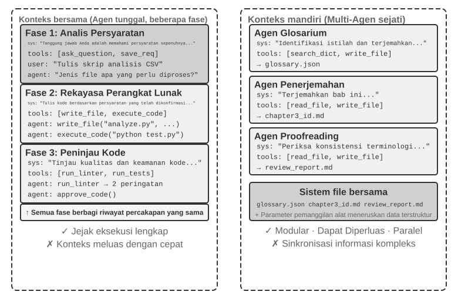
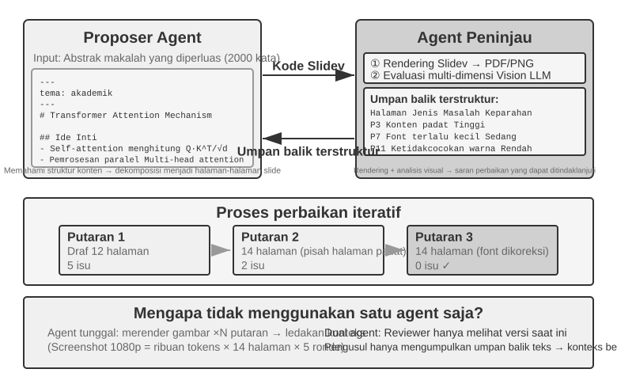
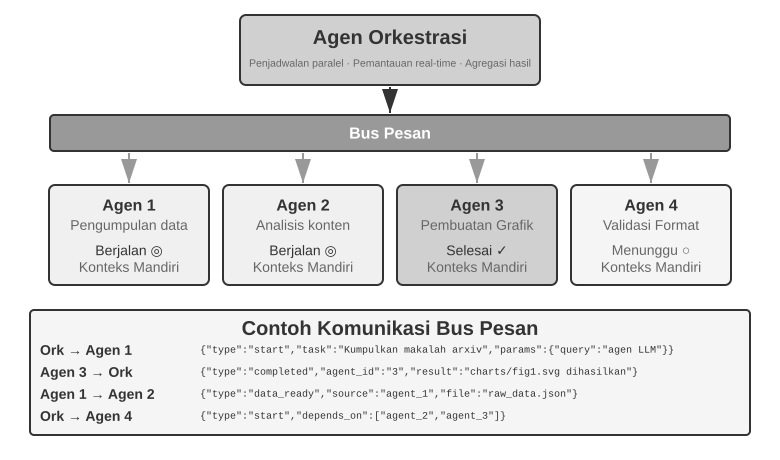
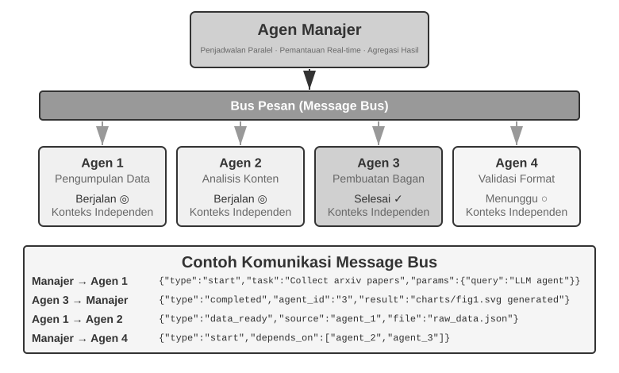
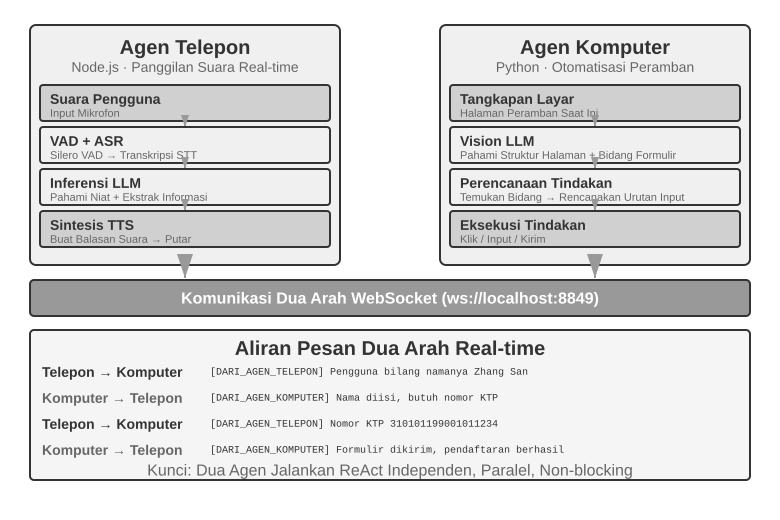
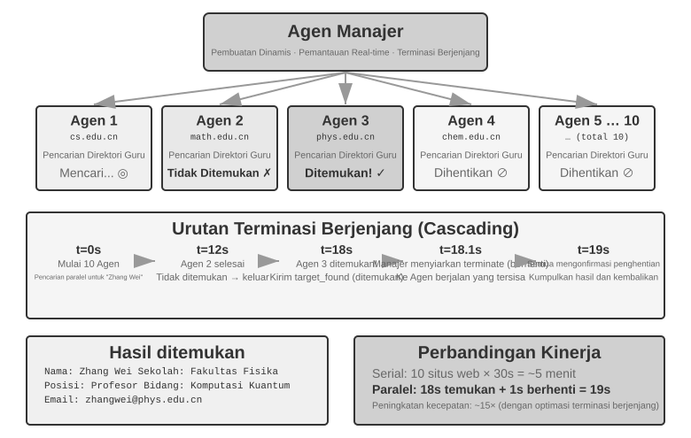
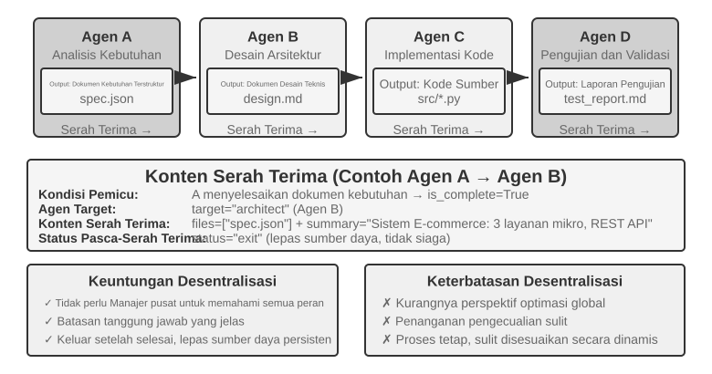
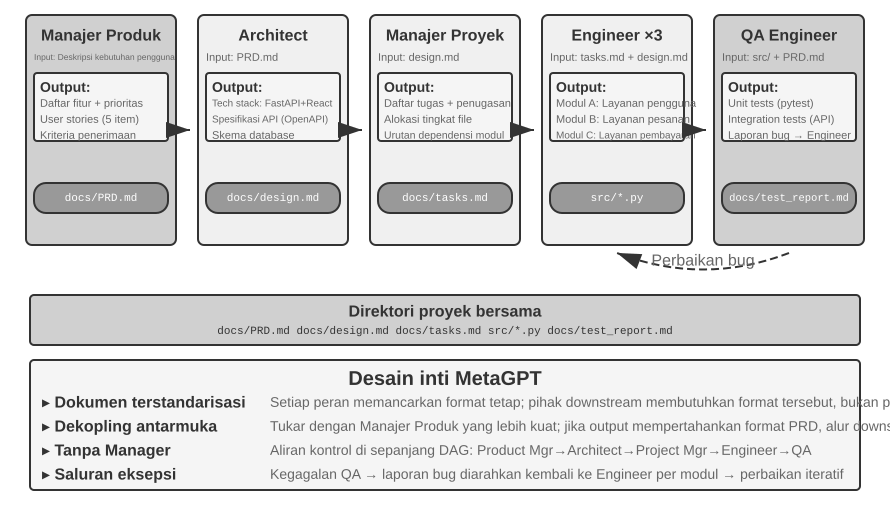
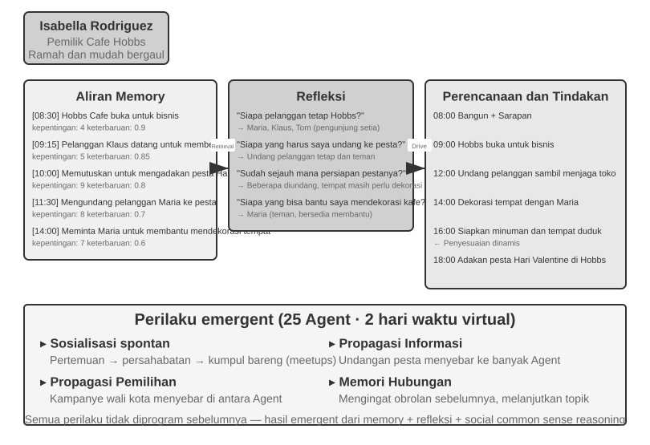
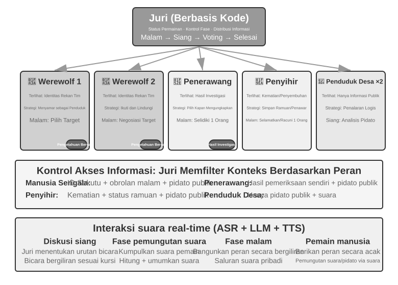

# Bab 10: Agen Majemuk (Multi-Agent)

Bab 6 menguraikan arsitektur kognitif untuk satu Agen mandiri. Bab ini memperluas kerangka kerja tersebut menjadi **Agen Majemuk (Multi-Agent)**—sebuah sistem di mana banyak Agen, seringkali dengan peran, keahlian, atau konteks yang berbeda, berkolaborasi untuk mencapai tujuan bersama. Sistem multi-agen semakin dipandang sebagai jalur potensial menuju superinteligensi buatan (ASI)[^agi-asi]. Saat sistem berpindah dari satu Agen ke banyak Agen, tantangan bergeser dari kognisi mandiri menjadi komunikasi dan koordinasi antar-Agen.

[^agi-asi]: Tentang "kolektif multi-agen skala besar" sebagai jalur utama dari AGI menuju ASI, lihat Google DeepMind, *From AGI to ASI.* arXiv:2606.12683, 2026.

## Kerangka Kerja Klasifikasi untuk Kolaborasi Multi-Agen

Membangun sistem multi-agen dimulai dengan dua dimensi desain inti, yang secara bersama-sama menentukan arsitektur dasar dan implementasinya.

### Dimensi 1: Konteks Berbagi (Shared) vs. Konteks Tidak Berbagi (Non-Shared)

Ini adalah keputusan arsitektur yang paling mendasar, menentukan bagaimana informasi diteruskan di antara banyak Agen.

**Konteks berbagi (Shared context)** berarti bahwa Agen berikutnya menerima riwayat percakapan dan trajektori secara lengkap (seperti yang didefinisikan dalam Bab 1) dari Agen sebelumnya. Ketika sistem prompt dan set alat (tool set) diganti pada setiap tahap, ia menjadi Agen baru (karena identitas, tanggung jawab, dan kemampuannya telah berubah), tetapi ia tetap mempertahankan semua memori dari pendahulunya. Misalnya, dalam sebuah tim, setelah seorang analis kebutuhan menulis dokumen spesifikasi, pengembang (developer) tidak hanya mendapatkan dokumen tersebut tetapi juga dapat melihat semua catatan komunikasi antara analis dan pengguna—mereka adalah peran baru tetapi mempertahankan konteks sebelumnya secara penuh. Keuntungannya adalah tidak ada informasi yang hilang; setiap Agen dapat meninjau detail dari tahap sebelumnya. Tantangannya adalah konteks dapat meluas dengan cepat.

**Konteks tidak berbagi (Non-shared context)** berarti setiap Agen memelihara konteks dan riwayat percakapan yang sepenuhnya independen, tidak dapat secara langsung mengakses "proses pemikiran" satu sama lain. Hal ini seperti kolaborasi antar berbagai departemen: semua orang bekerja secara mandiri di meja masing-masing, bertukar informasi melalui dokumen bersama dan notulen rapat, daripada terus-menerus melihat layar satu sama lain. Model ini menawarkan modularitas dan isolasi yang lebih baik; setiap Agen hanya perlu fokus pada informasi yang relevan dengan tanggung jawabnya sendiri. Sistem ini juga lebih mudah diperluas dan dipelihara—menambahkan Agen baru tidak memerlukan modifikasi logika internal dari Agen yang sudah ada, hanya menentukan antarmuka dan format data.

Karena Agen-agen tidak berbagi konteks, informasi harus diteruskan melalui mekanisme komunikasi yang eksplisit. Sistem terdistribusi klasik telah lama menyelesaikan pertanyaan ini: buku teks sistem operasi memberi tahu kita bahwa komunikasi antar proses (IPC) pada akhirnya hanya hadir dalam dua paradigma—**memori bersama (shared memory)** (satu sisi menulis dan sisi lainnya membaca blok penyimpanan yang sama) dan **pengiriman pesan (message passing)** (data secara eksplisit dikirim ke sisi lain). Mekanisme komunikasi antar Agen termasuk dalam dua paradigma yang sama ini. Ada tiga metode yang umum:

- **Parameter panggilan alat (Tool call parameters)**: Agen di hulu meneruskan data terstruktur sebagai parameter ke alat Agen di hilir, cocok untuk skenario yang membutuhkan data yang diketik dengan baik dan terstruktur dengan jelas.
- **Sistem file bersama (Shared file system)**: Agen bertukar informasi dengan membaca dan menulis artefak perantara (dokumen, kode, dll.) di direktori bersama, cocok untuk skenario dengan artefak besar atau di mana persistensi diperlukan.
- **Bus Pesan (Message Bus)**: Sebuah perantara khusus yang meneruskan pesan antar Agen. Agen tidak memanggil satu sama lain secara langsung tetapi mengirim pesan ke bus, yang kemudian meneruskannya ke Agen target.

Memetakan ini ke dalam dua paradigma IPC: sistem file bersama adalah "memori bersama" dunia Agen; parameter panggilan alat dan bus pesan adalah dua bentuk "pengiriman pesan"—yang pertama dikirimkan secara sinkron dengan panggilan, yang terakhir dikirimkan secara asinkron melalui perantara. Setiap paradigma memiliki tarik-ulur (trade-offs) tersendiri. Go memiliki pepatah yang banyak dikutip: "Jangan berkomunikasi dengan berbagi memori; sebaliknya, berbagilah memori dengan berkomunikasi"—memori bersama itu cepat tetapi meninggalkan bahaya konflik konkurensi (concurrency) kepada pengguna; pengiriman pesan membutuhkan penulisan lebih banyak kode orkestrasi tetapi menjaga kepemilikan data tetap jelas dan dapat dilacak. Pertukaran ini berulang di sepanjang pembahasan selanjutnya tentang kueri status dan konflik konkurensi.

Bus pesan secara alami mendukung **komunikasi asinkron**—pengirim dan penerima tidak perlu online secara bersamaan. Hal ini seperti sistem email internal perusahaan: ketika Anda mengirim email ke rekan kerja, Anda tidak mengharuskannya berada di depan komputer pada saat itu; email disimpan di server dan diproses saat rekan kerja online. Pendekatan ini sangat cocok untuk skenario di mana banyak Agen bekerja secara paralel dan perlu berkoordinasi satu sama lain (lihat bagian "Koordinasi Paralel" di bagian selanjutnya dari bab ini).



Agar lebih jelas, kedua arsitektur tersebut benar-benar sistem multi-agen (karena sistem prompt dan set alat berbeda pada setiap tahap, menjadikannya Agen yang berbeda); perbedaannya terletak pada metode koordinasi. **Konteks berbagi** bergantung pada koordinasi implisit—Agen berikutnya mewarisi riwayat konteks lengkap dari Agen sebelumnya, dapat "melihat" proses pemikiran sebelumnya, dan informasi diteruskan melalui konteks itu sendiri. **Konteks tidak berbagi** bergantung pada koordinasi eksplisit—Agen bertukar informasi melalui file, pesan, atau antarmuka data terstruktur, dan setiap Agen hanya melihat konten yang relevan dengan dirinya sendiri.

Sebagai analogi: yang pertama adalah sebuah tim di sekeliling satu meja, di mana semua orang mendengar segalanya; yang terakhir adalah departemen yang berkolaborasi melalui email dan dokumen, masing-masing dengan ruang kerjanya sendiri.

Pembaca yang familier dengan sistem operasi akan mengenali sepasang pilihan ini: konteks berbagi adalah thread, konteks tidak berbagi adalah proses. Thread membagikan ruang alamat (address space), sehingga peralihan di antara mereka berbiaya murah dan komunikasi tidak memerlukan penyalinan, namun mengorbankan isolasi—satu thread yang merusak memori menjatuhkan keseluruhan proses. Proses memiliki ruang alamat independen masing-masing, memberikan isolasi menyeluruh dan paralelisme yang aman, dengan kompensasi bahwa komunikasi harus melalui IPC eksplisit. Setiap kriteria seleksi pada Tabel 10-1 dapat diturunkan dari serangkaian pertukaran (trade-off) ini.

Tabel 10-1 merangkum kriteria seleksi untuk kedua arsitektur dari lima perspektif: jumlah subtugas, jendela konteks, paralelisme, isolasi informasi, dan anggaran biaya. Hal ini dapat berfungsi sebagai daftar periksa untuk pemilihan arsitektur di tahap awal.

Tabel 10-1 Kriteria Seleksi untuk Konteks Berbagi vs. Konteks Tidak Berbagi

| Kriteria Seleksi | Konteks Berbagi | Konteks Tidak Berbagi |
|---------------|-----------------------------------|--------------------------------------------|
| Jumlah subtugas | Sedikit (2-3 peran) | Banyak (diperlukan pemrosesan paralel) |
| Jendela konteks | Mampu menampung informasi untuk semua peran | Jendela tunggal tidak cukup |
| Paralelisme | Terutama serial (peran bergantian dalam lintasan yang sama) | Dapat diskalakan secara masif dalam paralel (konteks independen, tidak memblokir) |
| Isolasi informasi | Tidak diperlukan (semua peran berbagi informasi) | Diperlukan (misal, ulasan keamanan tidak boleh melihat proses pikir mentah) |
| Anggaran biaya | Satu trajektori diteruskan di berbagai tahap; token terakumulasi tahap demi tahap | Multi-Agen bekerja independen; total token umumnya beberapa kali lipat hingga satu tingkat lebih tinggi |

### Dimensi 2: Pola Interaksi

Berdasarkan arsitektur yang dipilih di atas, sistem ini dapat diatur menjadi pola interaksi yang berbeda. Bab ini akan membedah tiga arsitektur paling klasik dari kerangka kerja ini:

- **Pola Kolaborasi Rekan (Peer Collaboration Pattern)**: Sejumlah kecil Agen (biasanya 2-3) berinteraksi secara setara, membentuk putaran perbaikan berulang—seperti menulis makalah di mana satu orang menyusun draf dan orang lain memberikan anotasi dan revisi, dengan kualitas setelah beberapa putaran jauh melebihi apa yang dapat dicapai satu orang sendirian.
- **Pola Manajer (Manager Pattern)** (Pola Orkestrasi): Agen Manajer terpusat bertanggung jawab atas perencanaan tugas dan penjadwalan, sementara beberapa sub-agen masing-masing menangani subtugas tertentu—seperti manajer proyek yang memimpin beberapa insinyur spesialis dalam sebuah proyek.
- **Pola Terdesentralisasi (Decentralized Pattern)**: Tidak ada pengontrol pusat waktu-jalan (runtime central controller); Agen berkomunikasi satu sama lain seperti manusia untuk berkolaborasi dalam tugas-tugas.

Desain detail dan skenario yang berlaku untuk setiap pola akan dibahas di subbagian khusus nanti.

## Kapan Multi-Agen Benar-Benar Lebih Baik Daripada Agen Tunggal?

Sebelum menyelami arsitektur kolaborasi spesifik, mari kita jawab pertanyaan yang lebih mendasar: **Kapan multi-Agen benar-benar dibutuhkan, dan kapan satu Agen saja sudah cukup?** Jawabannya akan berfungsi sebagai titik acuan untuk setiap pendekatan rekayasa selanjutnya. Serangkaian penelitian baru-baru ini mengerucut pada satu kerangka kerja yang jelas—dan kriteria intinya adalah satu pertanyaan: **Apakah kolaborasi tersebut memperkenalkan informasi baru yang tidak dapat diperoleh oleh satu Agen tunggal selama fase generasi?**

Tabel 10-2 merangkum apakah mode kolaborasi yang berbeda memasukkan informasi baru, yang digunakan untuk menilai apakah kolaborasi multi-agen memiliki nilai substantif dibandingkan dengan Agen tunggal.

Tabel 10-2 Perbandingan Peningkatan Informasi pada Mode Kolaborasi Multi-Agen

| Mode Kolaborasi | Memperkenalkan Informasi Baru? | Efek |
|---------------------------------------|---------------------|-----------------------------------|
| Ulasan diri oleh model yang sama (membaca ulang outputnya sendiri) | Tidak | Biasanya tidak efektif atau bahkan merugikan |
| Berbagai Agen memperdebatkan teks yang sama | Tidak | Sebanding dengan satu Agen dengan komputasi yang setara |
| Peninjau menggunakan hasil eksekusi pengujian untuk meninjau kode | Ya (umpan balik eksekusi) | Peningkatan yang signifikan |
| Peninjau menggunakan tangkapan layar yang di-render untuk meninjau kode frontend/PPT | Ya (umpan balik visual) | Peningkatan yang signifikan |
| Peninjau menggunakan alat eksternal untuk memverifikasi fakta | Ya (umpan balik alat) | Peningkatan yang signifikan |

Makalah RLEF 2025 (Reinforcement Learning from Execution Feedback)[^rlef-2025] mengonfirmasi hal ini: melatih model via *reinforcement learning* (pembelajaran penguatan) untuk menggunakan umpan balik eksekusi kode guna perbaikan kode iteratif, secara signifikan mengungguli model yang secara independen melakukan *sampling* berulang kali. Kuncinya adalah bahwa setiap iterasi memperkenalkan **hasil eksekusi nyata** (kesalahan kompilasi, kegagalan pengujian, pengecualian waktu-jalan)—informasi yang tidak ada ketika model menulis kode tersebut. Pada WebGen-Agent 2025[^webgen-agent-2025] untuk tugas generasi halaman web, menggunakan perancah umpan balik visual bertingkat (tangkapan layar + deskripsi model bahasa visual) dilaporkan meningkatkan kinerja Claude 3.5 Sonnet pada benchmark tersebut dari 26,4% menjadi 51,9%—hampir dua kali lipat.

[^rlef-2025]: Gehring, J., et al. *RLEF: Grounding Code LLMs in Execution Feedback with Reinforcement Learning.* arXiv:2410.02089, 2025.
[^webgen-agent-2025]: Lu, Z., et al. *WebGen-Agent: Enhancing Interactive Website Generation with Multi-Level Feedback and Step-Level Reinforcement Learning.* arXiv:2509.22644, 2025.

Kerangka kerja "informasi baru" ini menjelaskan fenomena yang tampaknya kontradiktif: penelitian akademis mengatakan "satu Agen sudah cukup," tetapi dalam praktik rekayasa (engineering), sistem multi-agen memang berkinerja lebih baik. Akar kontradiksinya terletak pada perbedaan jenis "multi-agen" yang sedang dibahas—kajian akademis sering kali membandingkan mode di mana "beberapa Agen melihat teks yang sama dan mendiskusikannya satu sama lain" (misal, perdebatan), sementara sistem multi-agen yang efektif dalam praktik rekayasa sering mencakup loop umpan balik eksternal (eksekusi kode, perenderan visual, pemanggilan alat). Yang pertama tidak memperkenalkan informasi baru; yang terakhir iya. Untuk ketiga arsitektur yang diperkenalkan di bab ini—kolaborasi rekan (peer), orkestrasi, dan desentralisasi—hampir semua penggunaan yang benar-benar efektif dapat dipetakan kembali ke kriteria ini.

**Anggaran Langkah (Step Budget) dan Kinerja Agen.** Arah penelitian terkait adalah: bagaimana mengalokasikan anggaran langkah yang berbeda (yakni, jumlah pemanggilan alat atau putaran iterasi yang diizinkan) ke suatu Agen dapat memengaruhi kinerjanya? Secara intuitif, lebih banyak langkah seharusnya menghasilkan hasil yang lebih baik—dengan anggaran 30 langkah, Agen hanya bisa dengan cepat mengimplementasikan fungsionalitas inti; dengan anggaran 300 langkah, ia bisa merencanakan terlebih dahulu, lalu mengimplementasikan, menguji, kemudian memperbaiki. Namun, makalah Google 2025, *Budget-Aware Tool-Use Enables Effective Agent Scaling*, menyimpulkan hal yang kontra-intuitif: **sekadar menambah jumlah langkah yang tersedia pada suatu Agen tidak menjamin peningkatan performa.** Agen standar kurang memiliki "kesadaran anggaran (budget awareness)"—bahkan dengan 300 langkah, mereka cenderung melakukan pencarian yang dangkal dan cepat "jenuh." Untuk menerjemahkan lebih banyak langkah menjadi hasil yang benar-benar lebih baik, Agen membutuhkan mekanisme sadar-anggaran eksplisit yang secara dinamis menyesuaikan strategi berdasarkan sumber daya yang tersisa: eksplorasi luas di awal, dan memusatkan pada arahan yang paling menjanjikan nanti. BAVT (Budget-Aware Value Tree Search) 2026 lebih jauh mengusulkan evaluasi nilai tingkat-langkah, menyesuaikan bobot eksplorasi vs. eksploitasi pada setiap langkah berdasarkan rasio anggaran yang tersisa—saat anggaran menyusut, Agen beralih dari menebar jaring luas menjadi menggali dalam-dalam.

Temuan-temuan ini memiliki implikasi langsung terhadap desain sistem multi-agen. Misalnya, dalam pola orkestrasi, Agen Manajer tidak boleh sekadar membagikan tugas ke sub-agen lalu menunggu hasil. Alih-alih, ia harus **mengalokasikan anggaran langkah secara dinamis** berdasarkan kompleksitas tugas—subtugas sederhana mendapat langkah lebih sedikit, subtugas kompleks mendapat banyak langkah. Ia juga harus membimbing sub-agen menggunakan anggaran tersebut secara bijaksana (merencanakan, mengimplementasikan, menguji, lalu memperbaiki), dan bukan langsung terjun.

Satu lagi pertimbangan yang harus hadir sebelum keputusan desain apa pun: **biaya.** Eksplorasi paralel dan perbaikan iteratif membutuhkan biaya—Anthropic mengungkapkan bahwa sistem penelitian multi-agen mereka mengonsumsi sekitar 15 kali token percakapan normal, dan bahwa penggunaan token saja menjelaskan sekitar 80% perbedaan kinerja. Keuntungan dari sistem multi-agen karenanya harus cukup besar untuk menutupi biaya tambahan yang beberapa kali lipat hingga kelipatan satu tingkat—jika tidak, Agen tunggal yang disesuaikan (fine-tuned) dengan baik biasanya merupakan pilihan yang lebih hemat.

## Kolaborasi Multi-Agen dengan Konteks Berbagi

Dalam kolaborasi multi-agen dengan konteks berbagi, setiap tahap adalah Agen independen (dengan sistem prompt dan set alatnya sendiri), tetapi ia mewarisi trajektori lengkap dari Agen sebelumnya—hampir seperti seorang rekan yang mengambil alih pergantian giliran kerja yang dapat memeriksa setiap log kerja peninggalan pendahulunya. Keuntungan utama dari kolaborasi berbasis pewarisan ini adalah nol kehilangan informasi: setiap Agen dapat meninjau rincian dari tahap sebelumnya manapun. Tantangannya adalah mempertahankan fokus Agen saat ini pada tanggung jawabnya sendiri, bukannya terganggu oleh rentetan besar riwayat warisan.

### Peralihan Peran Berbagai-Tahap (Multi-Stage Role Switching)

Mari kita letakkan terlebih dahulu perselisihan definisi pada tempatnya: dalam bahasa Bab 1, peralihan peran berbagai-tahap adalah **orkestrasi bergaya alur kerja (workflow-style orchestration)**—jalur eksekusi (misalnya, klarifikasi kebutuhan -> implementasi -> peninjauan) telah ditentukan sejak awal. Dari sudut prosesnya, ini bahkan lebih jelas: ini adalah satu proses yang mengeksekusi segmen kode dari berbagai tahapan secara bergiliran—apa yang berubah adalah segmen kodenya, sedangkan memorinya adalah satu dan sama sepanjang proses, dan bukan dari banyak proses. Pandangan bahwa hal ini "bukanlah benar-benar multi-agen" karenanya ada benarnya. Bab ini masih menyertakannya ke dalam kerangka multi-agen karena melakukannya memberikan manfaat desain konkret: ketika sistem prompt, set alat, dan fokus berbeda di setiap tahapan, memperlakukan tahapan-tahapan tersebut sebagai banyak Agen yang berbagi satu trajektori memungkinkan perbaikan sistem prompt dan set alat untuk setiap "identitas" tersebut secara mandiri, dan batasan-batasan tahapan (stage boundaries) secara alami menjadi gerbang kualitas (quality gates).
> **Tahap 2: Implementasi Kode** (Peran: Insinyur Perangkat Lunak)
>
> Sistem prompt baru menekankan:
> - "Tanggung jawab Anda adalah menulis kode Python berkualitas tinggi berdasarkan kebutuhan yang telah dikonfirmasi."
> - "Ikuti praktik terbaik: kode harus modular, menyertakan penanganan kesalahan (error handling) yang tepat, dan memuat komentar yang diperlukan."
> - "Setelah menyelesaikan kode dan lulus pengujian dasar, panggil `submit_for_review()` untuk memasuki tahap peninjauan."
>
> Set alat berubah secara signifikan: alat klarifikasi kebutuhan sebelumnya dihapus, digantikan oleh alat pengembangan seperti `write_file(path, content)`, `read_file(path)`, dan `execute_code(code)`. Agen mulai menulis kode berdasarkan kebutuhan yang disimpan pada tahap pertama—pertama logika utama, kemudian penanganan kesalahan, dan terakhir menulis pengujian (test) untuk verifikasi. Sepanjang proses, Agen masih dapat mengakses riwayat percakapan dari tahap pertama untuk meninjau detail kebutuhan, namun pola perilakunya benar-benar berbeda: tidak ada lagi pertanyaan, semata-mata fokus pada implementasi. Setelah selesai, ia memanggil `submit_for_review()`.
>
> **Tahap 3: Tinjauan Kode** (Peran: Peninjau Kode)
>
> Sistem prompt baru menekankan:
> - "Tanggung jawab Anda adalah meninjau kode yang baru saja ditulis, mengevaluasi kualitasnya dari berbagai dimensi: kebenaran fungsional, standar kode, penanganan kesalahan, optimasi kinerja, dan keamanan."
> - "Terapkan pola pikir kritis, mencoba mengidentifikasi potensi masalah dan area perbaikan dalam kode."
> - "Jika ditemukan masalah serius, panggil `request_revision(issues)` untuk kembali ke tahap implementasi guna dimodifikasi; jika kualitas dapat diterima, panggil `approve_code()` untuk menyelesaikan tugas."
>
> Set alat berubah lagi: ia digantikan oleh alat analisis kualitas kode seperti `run_linter(file)`, `run_tests(file)`, dan `analyze_complexity(file)`. Agen memeriksa kembali kode dari sudut pandang peninjau, menjalankan analisis statis, dan memeriksa potensi bug, masalah kinerja, atau risiko keamanan.
>
> Desain tiga tahap ini memungkinkan Agen untuk fokus pada tugas inti di setiap tahap. Lebih penting lagi, mekanisme transisi tahapan yang jelas memastikan integritas eksekusi tugas—Agen tidak akan melewati analisis kebutuhan untuk menulis kode secara langsung, ia juga tidak akan memberikan hasil tanpa peninjauan.
>
> **Persyaratan Eksperimen**:
> 1. Mengimplementasikan prompt sistem tiga-tahap, masing-masing dengan definisi peran dan panduan perilaku yang jelas
> 2. Mengkonfigurasi set alat yang cocok untuk setiap tahap
> 3. Mengimplementasikan mekanisme pemicu transisi tahap (melalui panggilan alat tertentu)
> 4. Memastikan kelangsungan konteks antar tahapan
> 5. Menangani skenario *rollback*—ketika tinjauan kode menemukan masalah, kembali ke tahap implementasi
> 6. Mencatat log eksekusi untuk setiap tahap, mendemonstrasikan bagaimana prompt yang berbeda menghasilkan pola perilaku yang berbeda
>

### Peralihan Peran Lintas Domain (Cross-Domain Role Switching)

Peralihan peran berbagai-tahap mendemonstrasikan eksekusi bertahap dalam satu jenis tugas tunggal (pengembangan perangkat lunak). Peralihan peran lintas domain melangkah lebih jauh: Agen berpindah di antara berbagai jenis tugas dengan sendirinya—tidak lagi menjadi proses linear yang direncanakan sebelumnya, melainkan Agen memutuskan sendiri, seiring perubahan kebutuhan pengguna, peran profesional mana yang akan diambilnya.

> **Eksperimen 10-2 ??: Peralihan Multi-Peran**
>
> **Prasyarat**: Disarankan untuk terlebih dahulu memahami mekanisme Agent Skills (Keterampilan Agen) dari Bab 2.
>
> **Arsitektur Sistem**: Lima peran-
>
> - **triage (triase garis depan, titik masuk default)**: Memahami kebutuhan keseluruhan pengguna, memecahnya menjadi subtugas berurutan, secara bertahap menyerahkannya kepada peran profesional yang sesuai, dan melakukan konfirmasi akhir setelah semua subtugas selesai. Ia tidak memiliki alat khusus sendiri, hanya `transfer`.
> - **research (ahli pencarian informasi)**: Menggunakan `web_search` untuk mencari data, fakta, dan materi.
> - **coding (ahli pemrograman)**: Menggunakan `execute_python` untuk menulis dan menjalankan kode, menyelesaikan masalah logika/skrip program.
> - **data_analysis (ahli analisis data)**: Menggunakan `calculate` / `descriptive_stats` untuk perhitungan kuantitatif dan statistik (misalnya, tingkat pertumbuhan dari tahun ke tahun, tingkat pertumbuhan tahunan majemuk/CAGR, rata-rata).
> - **writing (ahli penulisan)**: Memoles data yang diambil dan kesimpulan perhitungan menjadi draf akhir yang lancar dan berorientasi pada audiens (dapat menggunakan `count_characters` untuk pemeriksaan kasar panjang tulisan).
>
> **Mekanisme Inti: Alat transfer_to_agent**
>
> Semua peran dilengkapi dengan alat `transfer_to_agent(target_role, reason)`. Saat dipanggil, sistem akan: 1) menyimpan riwayat percakapan saat ini; 2) memuat prompt dan set alat dari peran target; 3) meneruskan riwayat percakapan ke peran baru sehingga ia memahami konteksnya; 4) melanjutkan eksekusi dalam peran baru tersebut.
>
> **Skenario Eksperimen**: Sistem dimulai dalam peran triage (triase garis depan) secara default. Pengguna menyajikan tugas gabungan lintas domain: "Saya sedang menyiapkan materi untuk investor. Bantu saya mencari data penjualan kendaraan energi baru di Tiongkok untuk tahun 2021, 2022, dan 2023, hitung tingkat pertumbuhan tahunan majemuk untuk ketiga tahun tersebut, lalu tulis ringkasan dalam bahasa Mandarin untuk investor, tidak lebih dari 120 karakter." Triage memecahnya menjadi "cari data -> hitung metrik -> tulis draf" dan pertama-tama menyerahkannya ke research:
>
> ```python
> transfer_to_agent(target_role="research", reason="Perlu mencari data penjualan kendaraan energi baru selama tiga tahun terlebih dahulu")
> ```
>
> Research menggunakan `web_search` untuk mencari data penjualan, menulis data kunci ke dalam percakapan, lalu menyerahkannya ke data_analysis:
>
> ```python
> transfer_to_agent(target_role="data_analysis", reason="Data sudah siap, perlu menghitung CAGR tiga tahun")
> ```
>
> Data_analysis menggunakan `calculate` untuk menghitung tingkat pertumbuhan, kemudian menyerahkannya ke writing untuk penyusunan draf; setelah writing menyelesaikan draf, draf tersebut dikembalikan ke triage untuk konfirmasi akhir. Seluruh rantai adalah triage -> research -> data_analysis -> writing -> triage. Setiap peran dapat melihat riwayat percakapan secara lengkap, sehingga peran berikutnya secara alami mengetahui apa yang telah dilakukan sebelumnya.
>
> Keputusan untuk beralih peran bergantung pada panduan dalam prompt sistem. Prompt triage secara eksplisit mencantumkan aturan perutean (routing): mencari data/materi -> research, menulis dan menjalankan kode -> coding, perhitungan kuantitatif dan statistik -> data_analysis, memoles menjadi draf -> writing. Kriterianya sederhana: jika tugas membutuhkan pengetahuan mendalam khusus-domain atau alat khusus, serahkan ke peran profesional yang sesuai. Prompt peran profesional juga memandu mereka tentang kepada siapa mereka harus menyerahkan atau apakah mereka harus kembali ke triage setelah menyelesaikan bagian mereka.
>
> **Persyaratan Eksperimen**:
> 1. Mengimplementasikan prompt sistem dan set alat khusus untuk setidaknya tiga peran profesional
> 2. Mengimplementasikan alat `transfer_to_agent`, mendukung peralihan dinamis
> 3. Memastikan kelangsungan konteks setelah beralih peran
> 4. Menangani masalah peralihan sirkuler—mencegah Agen bolak-balik antar peran
> 5. Merancang alur tugas kompleks yang melintasi berbagai domain untuk mendemonstrasikan nilai dari peralihan peran
>

## Kolaborasi Multi-Agen Tanpa Konteks Berbagi

Tidak berbagi konteks merepresentasikan kolaborasi multi-agen yang sesungguhnya. Dalam arsitektur ini, setiap Agen adalah entitas independen dengan konteks, trajektori, dan statusnya sendiri. Agen tidak dapat mengakses "pemikiran internal" satu sama lain secara langsung; kolaborasi sepenuhnya bergantung pada mekanisme transfer data yang eksplisit dan terstruktur—tiga mekanisme komunikasi yang diperkenalkan pada awal bab ini (parameter panggilan alat, sistem file bersama, bus pesan).

Pada awal bab ini, kita memetakan mekanisme komunikasi ke dalam dua paradigma komunikasi antar-proses, dan memetakan konteks berbagi vs. konteks tidak berbagi ke dalam thread vs. proses. Analogi ini dapat didorong lebih jauh (Tabel 10-3):
> **III. Penghentian Eksekusi (Execution Termination).** Dalam kolaborasi paralel, skenario umum adalah "satu berhasil, yang lain menjadi tidak relevan"—beberapa Agen melakukan pencarian secara terpisah, dan begitu salah satu menemukan target, yang lainnya harus segera berhenti (penghentian berjenjang pada Eksperimen 10-6 di bab ini). Ada dua tingkat penghentian, dan pengguna Unix akan mengenalinya sama persis dengan perbedaan antara SIGTERM dan SIGKILL. **Penghentian secara baik-baik (Graceful termination)** lebih diutamakan: Agen utama mengirimkan sinyal `terminate`, sub-agen merespons pada titik yang aman pada langkahnya saat ini, membersihkan sumber daya (menutup sesi peramban, menulis file yang tertunda, melepaskan kunci), mengirimkan pengakuan (ack), dan kemudian keluar. **Penghentian paksa (Forced termination)** adalah cadangan: menghentikan proses secara langsung, hanya digunakan ketika sub-agen tidak merespons sinyal dengan baik, dengan risiko berpotensi meninggalkan sumber daya yang menggantung dan penulisan yang tidak lengkap. Dua poin rekayasa perlu mendapat perhatian: Pertama, penghentian secara baik-baik mengharuskan sub-agen secara berkala memeriksa sinyal terminasi di dalam *loop*-nya (mirip dengan mekanisme interupsi di Bab 4); jika tidak, sinyal tersebut tidak dapat diterima. Kedua, penghentian berjenjang memiliki *race condition*—beberapa sub-agen mungkin melaporkan keberhasilan hampir secara bersamaan. Agen utama harus menggunakan *lock* (kunci) atau desain idempoten untuk memastikan penyelesaian hanya terjadi sekali dan hanya satu putaran penghentian yang disiarkan. Lihat pembahasan tentang *race condition* di Eksperimen 10-6 bab ini.
>
> Masih ada satu ujung terbuka: setelah Agen utama berhenti, apa yang terjadi pada sub-agen yang masih berjalan? Pendekatan rekayasa terbersih meminjam dari Go's context—penghentian mengalir ke bawah mengikuti hubungan pembuatan (creation relationship): membatalkan satu Agen dan semua sub-agen yang dihasilkannya akan dibatalkan bersamanya, menghilangkan Agen yatim piatu (orphan) yang tidak diklaim pada akarnya. "Sub-agen memeriksa sinyal terminasi pada titik yang aman" di atas persis sesuai dengan pemungutan suara (polling) `ctx.Done()` di Go. Sebaliknya, jika Anda benar-benar membutuhkan Agen latar belakang yang berjalan lama dan terlepas dari Agen utama (seperti `nohup` pada Unix), biarkan ia memulai dari pohon siklus hidup yang baru (sesuai dengan `context.Background()`), yang secara eksplisit menyatakan bahwa ia tidak berhenti bersama induknya.
>
> **IV. Sumber Daya dan Penjadwalan (Resource and Scheduling).** Separuh tugas lain dari sistem operasi adalah mengalokasikan sumber daya yang langka. Dalam dunia proses, sumber daya langkanya adalah waktu CPU dan memori; dalam dunia Agen, itu adalah token, uang, dan anggaran konkurensi (concurrency budget)—setiap langkah yang diambil sub-agen mengonsumsi ketiganya. Tanggung jawab ini biasanya jatuh pada Manajer atau waktu-jalan (runtime): menetapkan anggaran langkah atau token saat memulai sub-agen, dan berhenti setelah terlampaui; memberikan tugas berat ke model yang kuat dan tugas mekanis ke model berbiaya rendah; membatasi konkurensi agar puluhan Agen tidak menghabiskan kuota API sekaligus; dan ketika ada tugas yang lebih mendesak tiba, menginterupsi sub-agen yang sedang mengeksekusi—ini adalah preemption (pencabutan hak eksekusi). Praktik di area ini jauh kurang matang dibandingkan penjadwalan CPU, tetapi hal ini menentukan plafon biaya sistem multi-agen dan harus dipertimbangkan pada tahap desain arsitektur.
>
> Pertukaran artefak (bidang data) serta penyampaian pesan, permintaan status, penghentian eksekusi, dan penjadwalan sumber daya (bidang kontrol) bersama-sama mendukung sistem multi-agen yang tidak berbagi konteks. Ketiga topologi kolaborasi di bawah ini, pada dasarnya, merupakan pilihan-pilihan yang berbeda—yang dibangun di atas kedua bidang ini—tentang siapa yang memegang kendali dan bagaimana informasi mengalir.
>
> Berdasarkan hubungan kolaboratif dan karakteristik aliran kendali antar Agen, kolaborasi tanpa konteks berbagi dapat dibagi menjadi tiga arsitektur utama—pola kolaborasi rekan (peer collaboration pattern), pola manajer (manager pattern), dan pola terdesentralisasi (decentralized pattern)—yang masing-masing cocok untuk jenis tugas yang berbeda.
>
> ### Pola Kolaborasi Rekan: Saling Memeriksa dan Perbaikan Iteratif
>
> Kolaborasi rekan biasanya melibatkan 2-3 Agen dengan kedudukan yang sama yang saling memberikan umpan balik melalui beberapa putaran iterasi. Nilai intinya adalah keberagaman kognitif: Agen-agen yang berbeda memeriksa masalah yang sama dari sudut pandang yang berbeda, menyeimbangkan inovasi terhadap ketangguhan (robustness) untuk menghasilkan hasil yang lebih baik daripada yang dapat dicapai oleh Agen tunggal manapun.
>
> Dibandingkan dengan pola manajer dan desentralisasi, kolaborasi rekan jauh lebih sederhana untuk diimplementasikan—tentukan peran dari kedua Agen, mekanisme komunikasi, dan kondisi penghentian iterasi, dan Anda pun memiliki sistem yang berjalan. Ini adalah pilihan ideal untuk dengan cepat memvalidasi ide dan membangun purwarupa (prototype).
>
> Penggunaan paling klasik dari kolaborasi rekan adalah untuk menangkal salah satu kegagalan paling umum dalam praktik Agen: **penghentian prematur (premature termination)**—berhenti dengan pekerjaan yang baru setengah selesai. Hal ini memiliki tiga bentuk yang khas; contoh di bawah ini berasal dari Coding Agents dan dari Pine AI, Agen yang diperkenalkan pada bagian Pendahuluan yang melakukan panggilan telepon atas nama pengguna untuk berurusan dengan pedagang (merchant) dan penyedia layanan. Yang pertama adalah **malas berpura-pura selesai (lazy fake-done)**: melakukan sebagian dari pekerjaan dan menyatakan seluruhnya selesai—Coding Agent menulis kode, tidak pernah menjalankan pengujian atau mencoba penerapan, dan melaporkan "tugas selesai"; seorang pengguna memberi Pine AI dua tugas, dan dia menyelesaikan yang pertama, melupakan yang kedua, dan dengan gembira melaporkan "semua sudah diurus." Yang kedua adalah **menyerah sebelum waktunya (premature give-up)**: menyatakan seluruh pekerjaan tidak mungkin dilakukan setelah satu jalan terhambat—Pine AI dapat menghubungi pedagang melalui telepon, formulir web, atau email, tetapi setelah satu panggilan telepon ditolak, ia memberi tahu pengguna "ini tidak bisa dilakukan," padahal beralih saluran dan mencoba lagi sangat mungkin akan berhasil. Yang ketiga adalah **keberhasilan palsu (false success)**: Agen percaya pekerjaan telah selesai, tetapi putaran tersebut tidak pernah benar-benar ditutup—pihak lain setuju secara lisan untuk pengembalian dana di telepon, namun pengguna masih harus mengonfirmasi suatu langkah di aplikasi seluler; Agen melaporkan "semua siap," pengguna tidak pernah mengetahui ada tindakan lanjutan, dan pengembalian dana tidak pernah masuk. Ketiga bentuk ini merujuk pada akar penyebab yang sama: **sampai diverifikasi, status "selesai" hanyalah klaim model, bukan bukti.**
>
> Mengubah klaim menjadi bukti justru merupakan bisnis dari **Rekayasa Putaran (Loop Engineering)**, tahap terakhir dari lengkung evolusi di Bab 1: rancang putaran (loop) yang membuat Agen tetap berjalan—menemukan pekerjaan berikutnya, mengeksekusi, memverifikasi, mencatat kemajuan—dan biarkan pemverifikasi, bukan model itu sendiri, yang memutuskan apakah benar-benar aman untuk berhenti; peran manusia bergeser menyesuaikan dari "operator yang memberi prompt pada Agen" menjadi "insinyur yang merancang loop." Istilah ini diciptakan pada bulan Juni 2026 oleh Addy Osmani[^loop-engineering-2026]; Boris Cherny, kepala Claude Code di Anthropic, mengatakannya dengan lebih blak-blakan: "Saya tidak lagi mem-prompt Claude. Pekerjaan saya adalah menulis putaran (loop)." Konsensus inti yang muncul dari diskusi tersebut: **hambatan (bottleneck) dari putaran (loop) tersebut adalah pemverifikasi, bukan modelnya**—dengan verifikasi yang tidak andal, putaran yang lebih cepat hanya membuat hasil yang buruk ditandai selesai lebih cepat. Dan seperti yang dikatakan dalam Pendahuluan, praktik diutamakan, penamaan belakangan: jauh sebelum istilah tersebut populer, tim Agen terkemuka—termasuk Pine AI—sudah menggunakan "putaran (loop) plus verifikasi" untuk melawan penghentian prematur. Cara paling efektif untuk mengatur verifikasi tersebut adalah melalui paradigma Pengusul-Peninjau (Proposer-Reviewer) di bawah ini.
>
> [^loop-engineering-2026]: Osmani, Addy. "Loop Engineering: Designing Loops that Prompt Coding Agents", 2026. https://addyosmani.com/blog/loop-engineering/
>
> **Paradigma Pengusul-Peninjau (Proposer-Reviewer Paradigm).**
>
> 
>
> Pengusul-Peninjau adalah paradigma kolaborasi rekan yang paling klasik. Bab 5 telah merinci prinsip-prinsip desain dan aplikasi praktis dari paradigma ini dalam tiga eksperimen: pembuatan PPT, pengeditan video, dan visualisasi log. Agen Pengusul (Proposer) bertanggung jawab untuk membuat kode, dan Agen Peninjau (Reviewer) merender hasil eksekusi, mengevaluasi kualitas menggunakan Vision LLM, dan memberikan saran perbaikan terstruktur. Keduanya beriterasi berulang kali hingga hasil tersebut memenuhi standar.
>
> Paradigma ini juga berlaku untuk skenario seperti tinjauan keamanan (Pengusul menyusun rencana tindakan, Peninjau memeriksa kepatuhan dan potensi risiko), moderasi konten (Pengusul menyusun balasan, Peninjau memeriksa aturan bisnis dan norma bahasa), dan tinjauan kode (Pengusul menulis kode, Peninjau memeriksa keamanan dan praktik terbaik).
> - **Agen Penerjemah (Translation Agent)**: Menerima bab saat ini, glosarium, dan panduan terjemahan (tingkat pembaca target, gaya bahasa), dan menerjemahkannya ke dalam bahasa Mandarin yang fasih (sesuaikan menjadi bahasa Indonesia untuk kasus nyata). Agen ini secara ketat menggunakan terjemahan yang ditentukan untuk istilah-istilah dalam glosarium, dan untuk istilah baru, ia menyimpulkan terjemahannya dan menandainya untuk ditinjau. Setiap *instance* bekerja dalam konteks independen tanpa gangguan. Teks yang diterjemahkan ditulis ke sistem file (misalnya, `chapter1_zh.md`). Manajer dapat meluncurkan beberapa *instance* secara paralel atau berurutan.
> - **Agen Pemeriksa Aksara (Proofreading Agent)**: Menerima semua teks yang diterjemahkan dan glosarium, melakukan pemeriksaan konsistensi—memverifikasi apakah terjemahan istilah seragam, mengidentifikasi ketidakkonsistenan, dan memeriksa kefasihan dan keterbacaan secara keseluruhan. Agen ini menghasilkan laporan pemeriksaan aksara yang ditulis ke sistem file.
> - **Agen Manajer (Manager Agent)**: Konteksnya terutama menyimpan deskripsi tugas, rencana eksekusi, catatan panggilan masing-masing Agen, dan status kemajuan. Agen ini tidak menyimpan konten terjemahan secara lengkap (yang ada di sistem file), hanya memelihara indeks file. Berdasarkan laporan pemeriksaan aksara, Manajer dapat mengirimkan bab-bab tertentu kembali ke Agen Penerjemah untuk direvisi.
>
> Dalam arsitektur ini, konteks Agen Manajer tetap berada dalam kisaran yang dapat dikelola: ia hanya perlu mengetahui deskripsi dan tujuan tugas secara keseluruhan, rencana eksekusi untuk setiap fase, catatan panggilan dan hasil dari setiap Agen, serta status kemajuan saat ini, tanpa perlu memegang terjemahan lengkap dari setiap bab.
>
> Keuntungan utamanya adalah **isolasi konteks**: Agen Glosarium hanya melihat konten yang diperlukan untuk ekstraksi istilah, Agen Penerjemah hanya melihat bab saat ini dan glosarium, dan Agen Pemeriksa Aksara, meskipun membutuhkan akses ke teks lengkap, hanya berfokus pada pemeriksaan konsistensi. Setiap Agen bekerja dalam konteks yang ramping dan terfokus, yang mengarah pada efisiensi yang lebih tinggi dan kemungkinan kesalahan yang lebih rendah—Agen tidak akan terganggu oleh informasi yang berlebihan (information overload).
>
> **Persyaratan Eksperimen**:
> 1. Pilih buku teknis dengan ilustrasi dan kode yang kaya sebagai objek terjemahan
> 2. Implementasikan empat jenis Agen: Manajer, Glosarium, Penerjemah, Pemeriksa Aksara
> 3. Catat konsumsi konteks masing-masing Agen untuk memverifikasi efektivitas pola manajer dalam mengontrol perluasan konteks
> 4. Bandingkan perbedaan antara Agen tunggal vs. pola manajer dalam hal kualitas terjemahan, efisiensi eksekusi, dan konsumsi sumber daya
>
>
> 
>
>

**Pola Koordinasi Paralel (Parallel Coordination Pattern).**





Ketika beberapa subtugas dapat dieksekusi secara paralel, pola sekuensial (berurutan) menjadi tidak efisien. Koordinasi paralel memungkinkan beberapa Agen untuk bekerja secara bersamaan, secara signifikan meningkatkan *throughput* (kapasitas penyelesaian). Agen Manajer tidak hanya harus merencanakan tugas-tugas paralel tetapi juga memantau semua Agen yang berjalan secara *real-time*, menangani koordinasi komunikasi, dan membuat keputusan global ketika Agen-agen tersebut berhasil atau gagal. Hal ini biasanya memerlukan **Bus Pesan (Message Bus)** sebagai infrastruktur—anggap saja ini sebagai "papan buletin publik" tempat Agen dapat memposting pesan (publish) dan berlangganan ke jenis pesan yang mereka minati (subscribe), sehingga memungkinkan komunikasi asinkron yang tidak memblokir. Dua implementasi umum, dari yang paling tidak kompleks: **Redis Pub/Sub**—ringan, pesan dikirim dan diterima secara instan, mudah digunakan, namun tidak persisten—jika penerima *offline*, pesan akan hilang; **RabbitMQ** dan antrean pesan (message queue) serupa yang mem-persistensikan pesan ke diska, sehingga pesan tidak hilang bahkan jika penerimanya *offline* sementara. Format pesan biasanya mencakup ID pengirim, Agen target (atau siaran/broadcast ke semua), jenis pesan, dan konten data dalam format JSON.

**Lingtai: Instansiasi (Produk) dari Pola Manajer.** Lingtai adalah pangkalan yang dijalankan secara lokal dan berbasis file untuk Agen-agen berumur panjang[^lingtai], dan ketiga perannya memetakan hampir satu per satu ke dalam konsep di bagian ini: **agen utama (main agent)** adalah pusat persisten tempat pengguna berbicara—ia memegang rencana dan memori serta memunculkan (spawn) peran-peran lain, persis posisi Agen Manajer; sebuah **daemon** adalah pekerja paralel berumur pendek yang dipancarkan untuk pekerjaan yang bising dan berbatas, yang akan dibuang setelah selesai—Anda menyimpan kesimpulannya, bukan pekerjanya—sebuah produk jadi dari "sub-agen mengembalikan ringkasan terstruktur alih-alih trajektori lengkap" dan pola koordinasi paralel; dan **avatar** adalah rekan satu tim persisten dan terspesialisasi dengan memorinya, kotak suratnya, dan tanggung jawabnya sendiri, untuk keahlian yang layak dipertahankan lintas sesi. Sisa dari desainnya juga menggemakan bagian sebelumnya: pengetahuan adalah file memori pribadi yang tahan lama milik masing-masing Agen; keterampilan adalah buku pedoman (playbooks) Markdown yang dibagikan oleh semua Agen ("sumber daya sistem bawaan" dari bagian "sistem file dari perspektif Agen"); dan ketika jendela konteks penuh, Agen **meranggas (molts)**—ia menulis sendiri rangkuman yang cermat dan membawanya, bersama dengan semua memori tahan lamanya, ke dalam konteks yang bersih (kompresi konteks yang dibahas dalam Bab 2). Model dasarnya dapat ditukar dan Agen tetap ada—identitas, memori, dan kemampuannya semuanya hidup sebagai file biasa di dalam direktori proyek: Agen adalah file-file-nya—yang merupakan pemrodukan dari dua baris pertama Tabel 10-3: baik program maupun memori pada akhirnya merupakan file, jadi proses tersebut dapat dibangun kembali kapan saja.

[^lingtai]: Tutorial resmi Lingtai: https://lingtai.ai/en/tutorial/

> **Eksperimen 10-4 ???: Agen Menelepon Sambil Menggunakan Komputer**
>
> **Prasyarat**: Eksperimen ini mengintegrasikan teknologi *Computer Use* dan *Voice Agent* dari Bab 9. Disarankan untuk menyelesaikan eksperimen yang relevan di Bab 9 terlebih dahulu.
>
> Banyak skenario dunia nyata memerlukan banyak kemampuan untuk beroperasi secara bersamaan, daripada mengantre satu per satu: asisten manusia mungkin sedang berbicara di telepon dengan klien sambil secara bersamaan mencari dokumen dan membuat catatan di komputer. "Multitasking" ini sangat menantang bagi Agen tunggal—memaksa satu Agen untuk menangani dialog suara waktu-nyata dan operasi antarmuka komputer secara bersamaan akan menyebabkan pergantian terus-menerus antara dua tugas tersebut, menyebabkan jeda dalam percakapan atau interupsi dalam operasi. Ide inti dari eksekusi paralel multi-agen adalah: **biarkan setiap Agen yang berbeda fokus pada satu tugas dengan tuntutan waktu-nyata yang tinggi, lalu berkoordinasi melalui pengiriman pesan asinkron untuk mencapai pemrosesan paralel yang sesungguhnya**. Kedua Agen tersebut juga secara khusus dioptimalkan untuk modalitas interaksi yang berbeda—Agen Telepon (Phone Agent) membutuhkan pengenalan dan sintesis ucapan dengan latensi rendah, sedangkan Agen Komputer (Computer Agent) membutuhkan pemahaman visual yang kuat dan kemampuan perencanaan tindakan.
>
> **Skenario**: Agen AI membantu pengguna mengisi formulir pemesanan penerbangan yang rumit. Agen ini perlu mengoperasikan halaman web sambil secara bersamaan menanyakan kepada pengguna dan mengonfirmasi informasi pribadi (nama, nomor identitas, preferensi penerbangan, dll.) melalui telepon—kedua sisi membutuhkan kinerja waktu-nyata yang tinggi, sebuah kasus klasik di mana Agen tunggal akan kewalahan mengelola keduanya, namun pengaturan agen ganda (dual-agent) memungkinkan masing-masing untuk berfokus pada perannya sendiri.
>
> **Arsitektur Agen Ganda (Dual-Agent)**:
>
> **Agen Telepon**: Sebuah Agen panggilan suara berbasis ASR + LLM + TTS. Agen ini bertanggung jawab untuk memahami tanggapan bahasa alami pengguna, mengekstrak informasi penting, dan mengirimkannya ke Agen Komputer melalui kerangka kerja pesan (message framework). Agen ini juga menerima pesan dari Agen Komputer (misalnya, "Butuh nomor identitas pengguna", "Kesalahan pemuatan halaman") dan menghasilkan dialog yang sesuai untuk menanyakan pengguna.
>
> **Agen Komputer**: Berbasis kerangka kerja operasi peramban (browser) (misalnya, Anthropic Computer Use, browser-use). Agen ini bertanggung jawab untuk memahami struktur halaman web, mengidentifikasi bidang isian formulir, melakukan operasi pengisian berdasarkan informasi yang diterima, dan meminta bantuan kepada Agen Telepon ketika menemui masalah.
>
> **Mekanisme Komunikasi**: Dua opsi:
> - **Solusi Sederhana**: Komunikasi titik-ke-titik (point-to-point) melalui panggilan alat, misal, `send_message_to_computer_agent(message)` / `send_message_to_phone_agent(message)`
> - **Solusi Lengkap**: Bus Pesan (Message Bus) + Agen Manajer, dengan format pesan terpadu yang mencakup pengirim, penerima, jenis, dan konten
>
> **Mekanisme Kolaborasi Paralel** (dibagikan oleh dua eksperimen "Telepon + Komputer" di bab ini): Kedua Agen berjalan dalam thread atau proses terpisah, masing-masing mempertahankan putaran (loop) ReAct-nya sendiri secara independen. Putaran Agen Telepon: menerima suara -> transkripsi ASR -> LLM memahami dan menghasilkan respons -> sintesis TTS -> mainkan -> periksa pesan dari Agen Komputer. Putaran Agen Komputer: ambil tangkapan layar -> Vision LLM memahami halaman -> merencanakan tindakan -> mengeksekusi (klik, ketik, dll.) -> periksa pesan dari Agen Telepon. Kuncinya adalah keduanya harus berjalan benar-benar secara paralel—sementara Agen Komputer mencari elemen dan mengetik teks, Agen Telepon harus tetap *online* dan bercakap-cakap dengan pengguna ("Oke, saya sedang mengisi nama Anda... Boleh saya tahu berapa nomor identitas Anda?"). Untuk mencapai hal ini, masukan (input) dari masing-masing Agen membawa kolom penanda dari yang lain, misalnya, konteks Agen Telepon mungkin berisi `[FROM_COMPUTER_AGENT] Tidak dapat menemukan tombol 'Berikutnya', mungkin perlu konfirmasi pengguna`, dan konteks Agen Komputer mungkin berisi `[FROM_PHONE_AGENT] Pengguna mengatakan nama adalah 'Zhang San', nomor identitas adalah 123456`.
>
> **Persyaratan Eksperimen**:
> 1. Mengimplementasikan arsitektur agen-ganda berdasarkan API ASR/TTS dan kerangka kerja operasi peramban
> 2. Mengimplementasikan mekanisme komunikasi dua arah yang efisien
> 3. Memastikan operasi yang benar-benar paralel, dengan pengumpulan informasi dan pengisian formulir terjadi secara bersamaan
> 4. Menangani situasi pengecualian
>
> **Eksperimen 10-5 ★★★: Agen Telepon dan Komputer yang Diorkestrasi Secara Otonom**
>
> Pada Eksperimen 10-4, arsitektur kolaborasi dari Agen ganda telah dirancang sebelumnya. Eksperimen ini melangkah lebih jauh, mengeksplorasi **kemampuan orkestrasi otonom dari Agen**—di mana Agen itu sendiri yang memutuskan kapan harus meluncurkan Agen kolaboratif baru, bukannya aliran kolaborasinya direncanakan sebelumnya oleh manusia.
>
> **Skenario**: Pengguna meminta, "Bantu saya menyelesaikan pendaftaran di situs web ini," memberikan URL tetapi tidak menyebutkan informasi apa yang perlu diisi. Agen Manajer menggunakan alat Penggunaan Komputer (Computer Use) untuk mengakses situs web dan memuat halaman pendaftaran.
>
> Selama beroperasi, Agen Penggunaan Komputer menemukan bahwa formulir pendaftaran sangat rumit, berisi banyak kolom yang wajib diisi: informasi pribadi dasar (nama, jenis kelamin, tanggal lahir), rincian kontak (nomor telepon, email, alamat surat), informasi verifikasi identitas (jenis identitas, nomor identitas), pengaturan preferensi, dll. Setelah memeriksa konteksnya, Agen menyadari bahwa ia tidak memiliki informasi ini—pengguna hanya mengatakan "bantu saya mendaftar" tanpa memberikan data spesifik apa pun.
>
> Ketika Agen tradisional menghadapi situasi ini, ia mengirimkan pesan teks meminta pengguna untuk mengetikkan masukan—yang mana tidak efisien (membutuhkan entri manual dari sejumlah besar informasi) sekaligus rentan terhadap kesalahan (masalah format, informasi yang hilang). Agen yang lebih pintar seharusnya menyadari: **Ini adalah skenario yang cocok untuk mengumpulkan informasi melalui panggilan telepon**—percakapan telepon jauh lebih efisien daripada obrolan teks, memungkinkan tanya-jawab dan konfirmasi secara berurutan, serta dapat menangani ekspresi pengguna yang ambigu.
>
> Inovasi kuncinya adalah bahwa keputusan ini tidak diprogram sebelumnya, tetapi **dibuat secara otonom oleh Agen**. Prompt dari Agen Penggunaan Komputer menyatakan: "Ketika Anda perlu mengumpulkan sejumlah besar informasi terstruktur dari pengguna, dan ini dapat dilakukan secara bertahap melalui percakapan, pertimbangkan untuk memanggil Agen Telepon sebagai alat bantu." Set alat tersebut mencakup `initiate_phone_call_agent(purpose, required_info)`.
>
> Saat dipanggil, sistem membuat sebuah Agen Telepon dengan konteks tugas yang jelas: Agen ini dimulai untuk membantu pengisian formulir, menentukan informasi apa yang perlu dikumpulkan dan persyaratan format untuk setiap bidang.
>
> Kedua Agen tersebut kemudian memasuki mode kolaborasi waktu-nyata, memanfaatkan mekanisme paralel asinkron dari Eksperimen 10-4. Agen Telepon memanggil pengguna dan bertanya secara berurutan: "Halo, saya membantu Anda mengisi formulir pendaftaran. Pertama, bolehkah saya mengetahui nama Anda?" Setelah pengguna menjawab, ia segera mengirimkan `{"type": "info_collected", "field": "Name", "value": "Zhang San"}` ke Agen Komputer, yang kemudian menemukan kolom "Nama" di halaman web dan mengisinya. Sementara itu, Agen Telepon, tanpa menunggu operasi komputer selesai, terus menanyakan pertanyaan berikutnya. Mode **tanya-satu, isi-satu** ini, di mana alur percakapan tidak terhalang oleh penundaan operasional, merupakan inti dari persyaratan eksperimen ini. Setelah semua informasi terkumpul, Agen Telepon mengirimkan `{"type": "task_completed"}`, dan Agen Komputer mengirimkan (submit) formulir.
>
> **Persyaratan Eksperimen**:
> 1. Mengimplementasikan Agen Penggunaan Komputer yang mampu memutuskan secara otonom untuk meluncurkan Agen Telepon
> 2. Mengimplementasikan komunikasi dua arah waktu-nyata dan kerja paralel yang sesungguhnya
> 3. Menangani pengecualian (memberikan umpan balik dan bertanya ulang saat format informasi salah)
> 4. Mencatat waktu pesan dari proses kolaborasi dan poin-poin keputusan kunci dari Agen
>
>
> 
>
>
> **Eksperimen 10-6 ★★★: Agen Mengumpulkan Informasi dari Banyak Situs Web Secara Bersamaan**
>
> **Prasyarat**: Disarankan untuk terlebih dahulu memahami mekanisme berbasis-peristiwa (event-driven) dan interupsi (interrupt) dari Bab 4.
>
> Eksperimen ini mengeksplorasi aplikasi dari eksekusi paralel multi-agen dalam skenario pengumpulan informasi. Tidak seperti Eksperimen 10-4 dan 10-5, yang berfokus pada kolaborasi dua Agen yang heterogen, eksperimen ini berfokus pada **pencarian paralel oleh beberapa Agen homogen** dan bagaimana mencapai penyelesaian tugas serta pengoptimalan sumber daya yang efisien melalui koordinasi pusat.
>
> **Masalah**: Diberikan situs web dari beberapa perguruan tinggi di dalam suatu universitas, tugasnya adalah mencari anggota fakultas yang ditentukan (misal, "Zhang Wei") di halaman direktori fakultas masing-masing perguruan tinggi, dan setelah menemukannya, mengembalikan informasi perguruan tinggi, posisi, arah penelitian, dan informasi lainnya tentang mereka.
>
> **Tantangan Inti**:
>
> **1. Peluncuran Paralel**: Agen Manajer secara dinamis membuat 10 *instance* Agen Penggunaan Komputer berdasarkan persyaratan tugas, masing-masing bersesuaian dengan situs web perguruan tinggi. Setiap *instance* harus berupa proses atau *thread* independen, dengan sesi perambannya sendiri, yang mampu mengeksekusi secara bersamaan tanpa saling memblokir. Parameter yang diteruskan saat peluncuran meliputi: URL situs web target, nama fakultas yang dicari, dan pengidentifikasi tugas (untuk perutean pesan).
>
> **2. Pemantauan Waktu-Nyata**: Setiap Agen secara berkala mengirimkan pembaruan status selama eksekusi ("Memuat situs web", "Menguraikan direktori fakultas", "Target tidak ditemukan, tugas selesai", "Kecocokan ditemukan, rincian di bawah ini"). Agen Manajer menerima pembaruan ini melalui bus pesan, memelihara tabel status tugas, dan melacak secara *real-time* Agen mana yang masih berjalan, mana yang telah selesai, dan mana yang mengalami kesalahan.
>
> **3. Penghentian Berjenjang (Cascading Termination)**: Misalkan Agen yang bertanggung jawab atas fakultas Ilmu Komputer menemukan anggota fakultas target. Ia mengirimkan `{"type": "target_found", "agent_id": "agent_3", "data": {...}}`. Setelah menerimanya, Agen Manajer segera mengirimkan `{"type": "terminate", "reason": "target_found_by_agent_3"}` ke semua Agen lain yang masih berjalan. Setiap Agen yang menerima pesan terminasi berhenti dengan baik-baik (graceful) dan mengirimkan sebuah pengakuan (acknowledgment). Agen Manajer menunggu semua pengakuan (atau waktu habis/timeout) lalu mengagregasi hasil. Persyaratan: Agen harus dapat merespons sinyal terminasi kapan saja (mirip dengan mekanisme interupsi di Bab 4), terminasi harus dilakukan secara baik-baik—tidak ada proses yang menggantung atau sumber daya yang tidak tertutup—dan *race condition* (kondisi balapan) harus ditangani.
>
> **Suplemen Konsep: Apa itu Race Condition?** Misalkan Agen A dan Agen B menemukan anggota fakultas target dalam milidetik yang sama. Keduanya melaporkan "Saya menemukannya!" ke Agen Manajer secara bersamaan. Jika Agen Manajer menanganinya dengan buruk—misalnya, mulai mengagregasi hasil setelah menerima laporan A, namun kemudian menerima laporan B yang memicu agregasi kedua—hal ini dapat menyebabkan hasil ganda atau status yang saling bertentangan. Solusi tipikalnya adalah menggunakan mekanisme "kunci (lock)": mengunci status saat menerima laporan pertama, dan laporan berikutnya diidentifikasi sebagai duplikat lalu diabaikan.
>
> **4. Penanganan Kegagalan**: Berbagai pengecualian dapat terjadi selama operasi aktual: situs web fakultas mungkin tidak dapat diakses (kesalahan jaringan, server mati), struktur situs web mungkin tidak sesuai harapan, mencegah Agen mengurai (parsing) dengan benar, atau semua Agen mungkin selesai mencari tanpa menemukan target. Strategi penanganan Agen Manajer: tetapkan batas waktu (timeout) untuk setiap Agen (misal, 2 menit), perlakukan waktu habis sebagai kegagalan; isolasi kesalahan agar tidak memengaruhi eksekusi Agen lainnya yang berlanjut; setelah semua selesai, agregasi hasil—kembalikan informasi jika ada Agen yang berhasil, atau laporkan "Anggota fakultas target tidak ditemukan" beserta rangkuman alasan kegagalan jika semua gagal.
>
> **Persyaratan Eksperimen**:
> 1. Mengimplementasikan Agen Manajer yang mampu meluncurkan beberapa Agen paralel secara dinamis
> 2. Mengimplementasikan Agen Penggunaan Komputer berdasarkan proyek sumber terbuka seperti browser-use
> 3. Mengimplementasikan bus pesan yang mendukung komunikasi dua arah antara Agen Manajer dan banyak Agen anak
> 4. Mengimplementasikan mekanisme penghentian berjenjang saat berhasil, memastikan semua Agen lain berhenti dengan cepat setelah target ditemukan
> 5. Menangani berbagai skenario pengecualian (kegagalan akses situs web, kesalahan penguraian, target tidak ditemukan oleh Agen manapun)
> 6. Mencatat dan membandingkan selisih waktu antara eksekusi paralel dan serial untuk memverifikasi peningkatan kinerja yang dibawa oleh paralelisasi
>
>
> 
>
>
>
> ### Pola Terdesentralisasi: Serah Terima Titik-ke-Titik (Peer-to-Peer Handoff)
>
>
> 
>
>
> Pola manajer menyediakan struktur kontrol yang jelas dan visibilitas global, namun pola terdesentralisasi tidak muncul untuk menambal kekurangannya. Motivasi menghilangkan pengontrol pusat terutama adalah untuk meniru cara masyarakat manusia mengorganisir dirinya sendiri: membiarkan banyak peran sejajar membagi kerja dan saling memeriksa, masing-masing meneliti masalah dari sudut pandang profesionalnya sendiri dan memutuskan sendiri dengan siapa harus berbicara, daripada menyalurkan setiap penilaian kepada satu Manajer. Bidang layanan mikro (microservices) menyebut sepasang pilihan ini **orkestrasi (orchestration)** dan **koreografi (choreography)**: yang pertama memiliki konduktor yang menjadwalkan semuanya secara terpusat, yang terakhir bergantung pada setiap penari yang merasakan sendiri kapan harus masuk.
>
> Pola terdesentralisasi mengambil pendekatan arsitektur yang berbeda: **tidak ada pengontrol pusat tunggal; Agen berkolaborasi sebagai rekan sejajar**. Setiap Agen, dengan memanfaatkan penilaian profesionalnya sendiri, memutuskan sendiri kapan harus menjangkau yang lain—untuk menyerahkan tugas ("Bagian saya sudah selesai, berikan kepada Anda"), meminta umpan balik ("Apakah rencana ini layak secara teknis?"), atau melaporkan masalah ("Kebutuhan yang Anda berikan kepada saya bertentangan; kita perlu membicarakan hal ini lagi").
>
> Tiga kasus di bawah ini sengaja diatur sepanjang progresi dari desentralisasi "semu" ke desentralisasi "sejati": Alur kontrol MetaGPT pada dasarnya adalah *pipeline* tetap (desentralisasi semu, hanya dipisahkan dalam mekanisme komunikasinya), obrolan grup (group chat) AutoGen adalah bentuk hibrida dengan riwayat percakapan bersama ditambah penjadwalan terpusat, dan barulah pada OpenAI Swarm desentralisasi titik-ke-titik yang sejati dicapai dalam alur kontrol.
>
> **Apa yang diteruskan selama serah terima tanpa konteks berbagi?** Pola rantai Serah Terima (Handoff chain) pada Gambar 10-10 sangat kontras dengan `transfer_to_agent` dalam Eksperimen 10-2: yang terakhir beroperasi di bawah konteks berbagi, di mana peran baru secara otomatis mewarisi riwayat lengkap tanpa upaya desain apa pun; yang pertama beroperasi tanpa konteks berbagi, mengharuskan pihak yang menyerahkan untuk secara eksplisit memutuskan apa yang harus diteruskan. Dalam praktiknya, "paket serah terima" yang efektif biasanya berisi tiga bagian: **Deskripsi Tugas** (apa yang perlu dilakukan penerima, kriteria penerimaan), **Fakta yang Dikonfirmasi dan Kendala** (preferensi pengguna, aturan bisnis, keputusan yang dibuat pada tahap sebelumnya), dan **Referensi ke Artefak Terstruktur** (jalur file alih-alih konten file; penerima membacanya sesuai kebutuhan). Hal yang sengaja *tidak* diteruskan adalah trajektori secara penuh—proses uji-coba pihak yang menyerahkan, pemikiran perantara, dan upaya yang gagal—yang sebagian besar merupakan kebisingan (noise) bagi penerima. Ini juga merupakan perbedaan esensial di antara kedua jenis serah terima: serah terima dengan konteks berbagi mempertahankan riwayat lengkap, dengan nol kehilangan informasi namun perluasan konteks yang terus-menerus; serah terima tanpa konteks berbagi meneruskan paket serah terima yang telah disempurnakan, dengan hilangnya sedikit informasi namun memungkinkan setiap Agen untuk bekerja dalam konteks yang bersih dan terfokus. Setiap Agen tidak perlu memahami "proses berpikir" dari Agen lain, melainkan hanya format dan semantik dari paket serah terima serta artefak keluarannya—kolaborasi berbasis antarmuka ini mengacu pada prinsip desain berdasarkan kontrak (design by contract) dari rekayasa perangkat lunak.
>
> **MetaGPT: Simulasi Perusahaan Perangkat Lunak Berbasis SOP (Kasus Transisi dari Pipeline menuju Komunikasi yang Dipisahkan).**
>
>
> 
>
>
> Wawasan inti MetaGPT adalah bahwa **Prosedur Operasi Standar** (Standard Operating Procedures/SOP) yang diakumulasikan oleh perusahaan perangkat lunak manusia pada sendirinya merupakan protokol kolaborasi yang telah tervalidasi berulang kali—mengkodekan SOP ke dalam sistem multi-agen memungkinkan setiap peran untuk menghasilkan luaran (deliverables) yang terstandarisasi layaknya pekerja spesialis pada jalur perakitan, dan luaran ini secara alami membentuk antarmuka komunikasi antar peran.
>
> Di dalam MetaGPT, peran-peran bekerja dalam urutan yang tetap (Manajer Produk → Arsitek → Manajer Proyek → Insinyur → QA), dengan setiap peran menghasilkan luaran terstruktur:
>
> - **Agen Manajer Produk**: Menerima deskripsi kebutuhan, menghasilkan PRD (Dokumen Kebutuhan Produk) terstruktur (termasuk daftar fitur, *user stories*, kriteria penerimaan, peringkat prioritas)
> - **Agen Arsitek**: Membaca PRD, membuat keputusan arsitektur (pemilihan tumpukan teknologi/tech stack, pembagian modul, definisi antarmuka, desain model data), mengeluarkan dokumen desain
> - **Agen Manajer Proyek**: Membaca desain arsitektur, mendekomposisi sistem menjadi daftar tugas spesifik dan tugas tingkat-file, mengklarifikasi urutan dependensi modul, dan kemudian memberikan tugas kepada insinyur
> - **Agen Insinyur**: Membaca dokumen desain, mengimplementasikan modul yang ditugaskan kepada mereka, menghasilkan kode. Beberapa *instance* dapat bekerja secara paralel.
- **Agen QA Insinyur (QA Engineer Agent)**: Membaca kode dan PRD, menghasilkan kasus uji (test cases), mengeksekusi pengujian, mencatat bug, mengeluarkan laporan pengujian
>
> Kontribusi MetaGPT yang sesungguhnya terhadap komunikasi terdesentralisasi terletak pada mekanisme penyampaian informasinya: **Kolam Pesan Bersama (Shared Message Pool) + Berlangganan Berdasarkan Peran (Subscription by Role)**. Setiap peran mempublikasikan pesan terstruktur ke kolam pesan yang terlihat oleh semua peran. Peran-peran lainnya, berdasarkan konfigurasi langganannya, hanya mengonsumsi pesan yang relevan dengan tanggung jawabnya sendiri—alih-alih melakukan komunikasi titik-ke-titik satu lawan satu. Pihak yang menerbitkan tidak perlu mengetahui siapa yang akan mengonsumsi keluarannya; menambahkan peran baru hanya memerlukan deklarasi mengenai jenis pesan apa yang harus dilanggan, tanpa perlu memodifikasi peran yang sudah ada. Hal ini menghadirkan pemisahan (decoupling) yang sesungguhnya: misalnya, mengganti Manajer Produk dengan model yang lebih kuat tidak memerlukan perubahan pada Agen lain, selama PRD yang diterbitkannya masih sesuai dengan spesifikasi.
>
> Peningkatan berulang MetaGPT terutama terjadi pada fase insinyur, menggunakan mekanisme yang disebut **umpan balik yang dapat dieksekusi (executable feedback)**: Insinyur menjalankan kode dan pengujiannya sendiri, memasuki putaran *debugging* (pencarian kutu) berdasarkan kesalahan dan kegagalan, dan berlanjut hingga lulus—mendorong koreksi dengan hasil eksekusi deterministik (pasti) alih-alih melalui opini dari Agen lain.
>
> Agar lebih jelas, MetaGPT **tidaklah** terdesentralisasi dalam hal **alur kontrol (control flow)**—urutan peran ditentukan sebelumnya oleh SOP, yang membuat sistem secara keseluruhan lebih mirip dengan jalur perakitan (sebuah alur kerja/workflow dalam bahasa Bab 1). Sistem ini dibahas di bagian ini karena mekanisme komunikasi kolam pesan ditambah langganan mendemonstrasikan elemen desain paling penting dari sistem yang terdesentralisasi: pemisahan (decoupling). Adapun umpan balik dinamis multi-arah seperti "QA secara langsung menghubungi Manajer Produk untuk mengklarifikasi kebutuhan" atau "Insinyur mendiskusikan solusi alternatif dengan Arsitek," ini merupakan ekstensi alami yang dibayangkan untuk arsitektur ini namun belum diimplementasikan di MetaGPT versi orisinal.
>
> **Obrolan Grup AutoGen (AutoGen Group Chat): Riwayat Percakapan Bersama + Penjadwalan Terpusat.** Obrolan grup AutoGen memungkinkan beberapa Agen untuk berpartisipasi dalam percakapan yang sama: setiap putaran, sebuah "penyeleksi pembicara (speaker selector)" memutuskan Agen mana yang akan berbicara berikutnya—penyeleksi tersebut dapat berupa aturan *round-robin* sederhana atau LLM yang menilai siapa yang paling cocok untuk merespons berdasarkan isi percakapan saat ini; ucapan Agen mana pun akan terlihat oleh seluruh peserta. Secara adil, ini bukanlah sistem yang sepenuhnya terdesentralisasi dalam hal alur kontrol: pemilihan pembicara diputuskan secara terpusat oleh GroupChatManager, dan "giliran siapa yang harus berbicara" pada sendirinya merupakan keputusan alur kontrol. Oleh karenanya, klasifikasi yang lebih akurat adalah **bentuk hibrida "riwayat percakapan bersama + penjadwalan terpusat"**—semua Agen melihat riwayat percakapan publik yang sama, namun masing-masing mempertahankan sistem prompt dan set alat independen, sedangkan otoritas penjadwalan dipusatkan di tangan penyeleksi. Mode ini cocok untuk tugas yang membutuhkan diskusi multi-perspektif di mana urutan berbicara sulit ditentukan sebelumnya (misal, tinjauan rencana, analisis lintas-domain), dengan risiko percakapan dapat menjadi menyimpang—semua orang berbicara namun secara keseluruhan tidak ada kemajuan, yaitu *livelock* dalam bidang konkurensi—sehingga memerlukan desain kondisi penghentian yang cermat. Berdasarkan dimensi-dimensi di bab ini, AutoGen ditempatkan di sini berdasarkan mekanisme penjadwalannya (penyeleksi terpusat), tetapi pada dimensi konteks, ia sebenarnya berada di antara berbagi (shared) dan tidak berbagi (non-shared), merepresentasikan sebuah bentuk hibrida—hal ini sekali lagi mengilustrasikan bahwa topologi dan pembagian konteks secara konseptual adalah dua dimensi independen yang dapat digabungkan dengan cara yang tidak sejajar.
>
> **OpenAI Swarm dan Agents SDK: Jaringan Serah Terima (Handoff Network).** Sebaliknya, perwakilan sejati dari desentralisasi titik-ke-titik (peer-to-peer) dalam alur kontrol adalah Swarm dari OpenAI (dan penerusnya, Agents SDK): Swarm mengimplementasikan desentralisasi dalam bentuk paling sederhana—setiap Agen dilengkapi dengan beberapa opsi serah terima dan dapat mentransfer kontrol ke Agen manapun dalam jaringan tersebut kapan saja. Agen triase layanan pelanggan, setelah menentukan bahwa masalahnya melibatkan pengembalian dana, akan menyerahkannya ke Agen Pengembalian Dana; Agen Pengembalian Dana, setelah menemukan kesalahan teknis selama pemrosesan, dapat menyerahkannya ke Agen Dukungan Teknis. Tidak ada penjadwal terpusat di dalam sistem; kendali mengalir layaknya tongkat estafet di antara Agen-agen yang sejajar, dengan keputusan perutean terdistribusi sepenuhnya di dalam penilaian masing-masing Agen—ini adalah "serah terima titik-ke-titik" yang bersih, dan ini persis dengan implementasi rekayasa dari pola rantai serah terima (chain handoff) yang ditunjukkan pada Gambar 10-10. Risiko dari serah terima titik-ke-titik adalah siklus (cycles): A menyerahkan ke B, dan B mengembalikan ke A, membiarkan tugas tersebut berputar dalam *loop*—jadi dibutuhkan pelindung seperti batas maksimum serah terima (maximum handoff count) untuk memutuskannya.
>
> ### Kolaborasi Lintas-Organisasi: Protokol A2A
>
> Semua sistem di atas mengasumsikan bahwa seluruh Agen dikembangkan oleh tim yang sama dan berjalan dalam sistem yang sama. Dalam hal ini, ketiga mekanisme komunikasi—passing parameter, file bersama, dan bus pesan—sudah cukup. Akan tetapi, ketika kolaborasi melintasi batas-batas organisasi—Agen Anda perlu memanggil Agen perusahaan lain—protokol interoperabilitas standar dibutuhkan. Dunia proses pernah menempuh jalur yang sama ini: IPC hanya mengatur satu mesin, dan begitu Anda melintasi batas mesin, Anda harus mengandalkan protokol standar seperti TCP/IP dan penemuan layanan (service discovery) seperti DNS. A2A bagi Agen layaknya protokol jaringan bagi proses. Protokol **A2A** (Agent2Agent) yang dirilis oleh Google pada 2025 (kemudian didonasikan ke Linux Foundation untuk diurus) didesain tepat untuk tujuan ini. Protokol ini memiliki tiga elemen inti:
>
> - **Kartu Agen (Agent Card)**: Sebuah dokumen metadata yang mendeskripsikan kemampuan Agen (diterbitkan di alamat publik yang ditentukan), mendeklarasikan apa yang dapat dilakukan Agen, modalitas input/output apa yang didukungnya, dan bagaimana mengautentikasinya—pada dasarnya adalah "kartu nama" Agen yang memecahkan masalah penemuan kemampuan lintas-organisasi.
> - **Manajemen Siklus Hidup Tugas (Task Lifecycle Management)**: A2A memodelkan unit kolaborasi sebagai Tugas (Tasks) dengan mesin status (state machine) yang terdefinisi (submitted, in-progress, needs-input, completed, failed), secara orisinal (natively) mendukung tugas-tugas yang berjalan lama dan pembaruan progres yang terus mengalir (streaming progress updates).
> - **Kolaborasi Buram (Opaque Collaboration)**: Agen-agen hanya saling bertukar tugas dan artefak, tanpa mengekspos prompt internal, proses penalaran, atau implementasi alat—konsisten dengan prinsip "tidak berbagi konteks" dari bab ini sekaligus properti keamanan yang mutlak diperlukan untuk kolaborasi lintas-organisasi.
>
> Posisi A2A dapat dipahami dengan membandingkannya terhadap MCP dari Bab 4: MCP menangani interoperabilitas antara Agen dan alat, sedangkan A2A menangani interoperabilitas antara Agen dan Agen. Ia tidak menggantikan ketiga mekanisme komunikasi yang diperkenalkan di bab ini melainkan berfungsi sebagai lapisan standardisasi melintasi batas-batas kepercayaan di atas ketiganya—di dalam satu tim, sistem multi-agen bisa sekadar menggunakan bus pesan; hanya ketika pihak-pihak yang berkolaborasi tidak saling percaya dan implementasi mereka satu sama lain bersifat buram, barulah protokol publik seperti A2A dibutuhkan.
>
> ## Mode Kegagalan dari Kolaborasi Multi-Agen
>
> Sistem multi-agen memperkenalkan mode kegagalan baru yang tidak ada pada sistem agen-tunggal. Makalah 2025 "Why Do Multi-Agent LLM Systems Fail?" (mengusulkan taksonomi mode kegagalan MAST) melakukan studi sistematis: para peneliti mengumpulkan jejak eksekusi dari tujuh kerangka kerja multi-agen arus utama, termasuk MetaGPT, ChatDev, AG2, dan Magentic-One, dan meminta anotator manusia menganalisis sekitar 150 jejak satu per satu (kesepakatan anotator mengenai penilaian mode kegagalan sangat tinggi—Cohen's kappa = 0.88). Studi tersebut mengidentifikasi **14 mode kegagalan unik**, ke dalam tiga kelompok:
>
> - **Cacat Desain Sistem (System Design Flaws)**: Isu tingkat arsitektur seperti definisi antarmuka yang tidak jelas antara Agen, peran dan tanggung jawab yang tumpang tindih, serta konfigurasi alat yang tidak tepat.
> - **Kegagalan Keselarasan Antar-Agen (Inter-Agent Alignment Failures)**: Berbagai Agen memiliki pemahaman yang tidak konsisten tentang tujuan tugas, informasi yang disalurkan disalahartikan oleh Agen hilir, atau operasi dari beberapa Agen saling bertentangan secara logis.
> - **Hilangnya Verifikasi Tugas (Missing Task Verification)**: Sistem ini kurang memiliki mekanisme yang efektif untuk mengonfirmasi apakah tugas benar-benar selesai—suatu Agen mungkin mengklaim "selesai" namun hasil aktualnya tidak memenuhi persyaratan.
>
> Bahkan dengan perbaikan sederhana, peningkatannya terbatas (misal, kerangka kerja ChatDev hanya naik 15,6%). Para peneliti menyimpulkan bahwa ini bukanlah sekadar kutu (bugs) teknis melainkan **cacat desain fundamental** dari arsitektur multi-agen saat ini: menambal satu komponen tidaklah cukup; desain sistem itu sendiri harus dipikirkan ulang.
>
> Teori toleransi-kegagalan terdistribusi membagi kegagalan menjadi dua jenis: **kegagalan henti (crash faults)** (suatu komponen berhenti bekerja) dan **kegagalan Bizantium (Byzantine faults)** (komponen tetap bekerja tetapi memberikan informasi yang salah). Sistem tradisional sebagian besar hanya perlu berjaga-jaga dari kegagalan henti; namun, kegagalan Agen, pada dasarnya adalah Bizantium—ia jarang berhenti begitu saja, melainkan terus menghasilkan kesimpulan yang terlihat masuk akal namun salah, dan kesalahan itu tidak pernah menyatakannya sebagai sebuah kesalahan. Hal ini menjelaskan mengapa menambal komponen tunggal memberi hasil yang sedikit: tak ada komponen tunggal yang akan secara proaktif mengekspos masalah, karenanya ia hanya dapat ditangkap melalui redundansi independen. Validasi-silang (cross-validation) dan pemungutan suara terbanyak (majority voting) yang berulang sepanjang bab ini justru merupakan sarana klasik dari toleransi kegagalan Bizantium; umpan balik eksternal yang deterministik (pengujian, kompiler, kueri basis data) sangatlah berharga karena ia merupakan satu komponen dalam sistem yang tidak pernah berbohong.
>
> Uraian berikut difokuskan pada dua mode kegagalan yang secara khusus umum dan merusak dalam praktiknya: (1) konflik konkurensi dalam sistem file bersama; (2) penguatan berjenjang (cascading amplification) pada kesalahan. Perhatikan bahwa kedua mode kegagalan ini menekankan sudut pandang rekayasa (konkurensi sistem file, penyebaran informasi keliru lintas Agen) dan berfungsi sebagai pelengkap klasifikasi MAST, yang berfokus pada kegagalan kolaborasi berbasis dialog, bukan pengulangan dari 14 modenya.
>
> ### Mode Kegagalan Pertama: Konflik Konkurensi dalam Sistem File Bersama
>
> Begitu Anda memilih komunikasi bergaya memori-bersama, konflik konkurensi otomatis mengikutinya—masalah yang telah dipecahkan oleh sistem operasi dan basis data beberapa dekade lalu, yang jawabannya sudah tersedia siap pakai. Konflik ini dapat dibagi menjadi dua jenis.
>
> **Konflik Sederhana (Konflik Penulisan Tingkat File)**: Dua Agen memodifikasi file yang sama secara serentak, dan yang menulis belakangan akan menimpa (overwrite) perubahan yang dibuat oleh penulis sebelumnya. Ini adalah masalah **pembaruan hilang (lost update)** klasik di ranah basis data—dan mekanisme deteksi konflik penggabungan pada Git dirancang dengan presisi untuk menangkap penimpaan seperti itu.
>
> **Konflik Semantik (Konflik Konsistensi Tingkat Logis)**: Tidak ada konflik yang terlihat di tingkat file, namun operasi dari berbagai Agen saling berlawanan secara logika—jenis konflik ini lebih tersembunyi dan lebih berbahaya. Misalnya: Agen A bertanggung jawab untuk menomori ulang semua gambar dalam sebuah buku, sementara pada saat yang sama Agen B memodifikasi konten bab dan mereferensikan gambar berdasarkan nomor aslinya. Keduanya beroperasi pada file yang berbeda, sehingga tidak ada konflik di tingkat file. Namun, hasilnya adalah seluruh nomor gambar yang dirujuk oleh Agen B menjadi tidak valid setelah Agen A selesai melakukan penomoran ulang, dan pembaca akan melihat referensi gambar yang salah.
>
> **Solusi: Mekanisme Kunci Optimis (Optimistic Locking Mechanism)**. Ini adalah strategi kontrol konkurensi (concurrency control) yang umum di ranah basis data. Untuk memahaminya, perhatikan skenario sehari-hari: Anda dan rekan kerja Anda membuka dokumen online yang sama secara serentak. Sebuah "kunci pesimis (pessimistic lock)" akan mengunci dokumen saat Anda membukanya, dan rekan kerja Anda akan melihat peringatan "file terkunci" saat mencoba mengeditnya—aman namun tidak efisien, karena Anda mungkin saja hanya melihat tanpa berniat untuk mengeditnya. Sebuah "kunci optimis (optimistic lock)" lebih cerdas: semua orang bebas untuk membuka dan mengedit, namun saat menyimpan, sistem melakukan pemeriksaan—"Adakah orang lain yang mengubah dokumen ini sejak Anda membukanya?" Jika iya, maka Anda diminta untuk "segarkan (refresh) dan coba lagi."
>
> Implementasi spesifiknya adalah: masing-masing file memelihara sebuah nomor versi (atau stempel waktu modifikasi terakhir). Saat suatu Agen membaca file, ia mencatat nomor versi saat ini; saat menulis, ia memeriksa kembali apakah nomor versinya masih sama dengan yang ia baca sebelumnya. Apabila file tersebut telah dimodifikasi oleh Agen lain sementara itu, proses penulisan akan gagal, dan Agen terpaksa membaca ulang versi terbaru lalu mengeksekusi ulang operasinya berdasarkan versi tersebut. Biaya dari mekanisme ini adalah pengulangan percobaan (retries) yang sesekali terjadi, namun memastikan konsistensi data—Agen tidak pernah membuat keputusan berdasarkan status file yang usang.
>
> Ingat bahwa mekanisme kunci optimis hanya dapat mencegah **konflik penulisan pada file yang sama**. Terhadap **konflik semantik lintas-file** yang disebutkan sebelumnya (misal, nomor gambar yang direferensikan di berbagai tempat), diperlukan suatu mekanisme validasi semantik tingkat lebih tinggi—seperti menghindari modifikasi paralel dari file yang memiliki dependensi di tingkat orkestrasi tugas, atau menjalankan pemeriksaan konsistensi global setelah penulisan.
>
> Sebagai contoh: Agen A membaca `config.json` (version=3) pada t=0, Agen B memodifikasi file yang sama pada t=1 (version menjadi 4), lalu saat Agen A mencoba menulis pada t=2, ia menemukan bahwa versinya tidak lagi 3, sehingga penulisan ditolak. Agen A kemudian membaca ulang konten versi=4, menghasilkan modifikasi ulang berdasarkan versi terbaru, lalu berupaya menulis lagi.
>
> Perlu disebutkan bahwa dalam skenario paling umum dari beberapa Coding Agent yang memodifikasi basis kode yang sama secara konkuren, pendekatan arus utama industri tidak mengunci satu salinan kerja tunggal, melainkan memanfaatkan **isolasi salinan kerja (working copy isolation)**: memberikan setiap Agen sebuah cabang Git atau pohon kerja (worktree) yang independen, memungkinkan mereka untuk memodifikasi salinan mereka sendiri secara paralel tanpa gangguan. Konflik akan terkonsentrasi dan ditangguhkan ke titik penggabungan akhir, di mana mereka diselesaikan oleh langkah penggabungan khusus atau secara manual—mekanisme "copy-on-write" (salin saat menulis) yang digunakan saat sistem operasi menge-fork sebuah proses memakai konsep dasar yang sama. Hal ini selaras dengan prinsip "isolasi lebih diutamakan daripada kompresi" (isolation over compression) dari Bab 2—yang mana, sewaktu mendiskusikan isolasi konteks sub-agen, menekankan bahwa alih-alih meminta berbagai pihak berbagi state (status) yang sama kemudian mencoba menyelesaikan konflik, lebih baik untuk mengisolasinya dari awal lalu memusatkan biaya koordinasi pada satu batasan yang jelas.
>
> ### Mode Kegagalan Kedua: Amplifikasi Kesalahan Berjenjang
>
> Konflik konkurensi (concurrency conflicts) adalah masalah tingkat-file di mana pengalaman sistem operasi cukup untuk menanganinya; sebaliknya, amplifikasi kesalahan yang berjenjang (cascading amplification of errors) timbul persis saat analogi tentang proses sudah tidak lagi relevan—proses (processes) meneruskan byte secara persis sedikit demi sedikit (bit-for-bit faithful), sementara Agen meneruskan semantik, di mana tiap penuturan ulang (retelling) adalah re-encoding yang rentan kehilangan makna (lossy). Tatkala beberapa Agen berinteraksi berulangkali, kesalahan dari satu Agen dapat secara progresif diperkuat oleh Agen-agen selanjutnya, bagaikan "permainan pesan berantai" (telephone game) di mana informasi menjadi semakin terdistorsi.
>
> Perhatikan satu skenario spesifik. Misalkan sebuah sistem terjemahan menggunakan pola manajer (arsitektur dari Eksperimen 10-3), di mana si Manajer membagikan bab-bab suatu buku teknis ke berbagai Agen penerjemah:
>
> ```
> Agen Terminologi: Menerjemahkan "reasoning" sebagai "推理" (penalaran/inferensi), tetapi "推理" dalam bahasa Mandarin lebih umum dipakai untuk menyebut inferensi (inference), menciptakan ambiguitas
>         ↓ menulis ke glossary.json
> Agen Penerjemah A: Menerjemahkan Bab 2, membaca dari glosarium, menerjemahkan "reasoning tokens" sebagai "推理 token"
> Agen Penerjemah B: Menerjemahkan Bab 7, menerjemahkan "inference latency" sebagai "推理 latency"
>         ↓ menulis ke hasil terjemahan tiap bab
> Agen Proofreading: Melihat seluruh isi buku secara konsisten menggunakan "推理", menganggap terminologinya konsisten dan terjemahannya tepat ✗
> ```
>
> Di manakah letak kesalahannya? "Reasoning" (proses penalaran internal model) dan "inference" (keluaran maju model saat fase penerapan/deployment) merupakan dua konsep yang sama sekali berbeda. Akan tetapi, dikarenakan Agen Terminologi terlebih dulu mengalihbahasakan "reasoning" sebagai "推理", maka Agen penerus yang menemui istilah "inference" tanpa ragu memakai kata serupa—dua konsep berlainan disatukan ke dalam sebuah terjemahan, membuat pembaca tidak lagi bisa membedakannya. Pilihan yang akurat ialah "思考" ("berpikir/thinking") guna mewakili "reasoning" serta "推理" bagi "inference". Meskipun begitu, Agen Pemeriksa Aksara (Proofreading Agent) yang menjumpai kata "推理" di seantero dokumen secara "konsisten", menyimpulkan terjemahan tersebut bernilai sempurna.
>
> Sebuah galat terminologi tunggal, sehabis menyebar melalui tiga Agen, mendadak memperoleh taraf kredibilitas berkat klaim "konsistensi." Justru karena itu jugalah, buku ini memilih konvensi penerjemahan reasoning=思考, dan inference=推理 (seperti diterangkan pada bagian pendahuluan): memanfaatkan ragam kosakata bahasa Mandarin yang berbeda-beda guna mengeliminasi kebingungan. Camkan bahwa "kesalahan" di sini tak selamanya wajib bermula dari fenomena halusinasi (hallucination)—sumber musibahnya dalam contoh barusan nyatanya merunut kepada cacat dalam pengambilan keputusan terminologis, namun kekeliruannya lantas membesar dari tingkat ke tingkat yang lain didorong oleh dalih "konsistensi"; tetapi misal musabab aslinya merupakan halusinasi paripurna (seperti halnya di Eksperimen 10-3, sebutlah seorang Agen terjemahan mengalami pergeseran atensi dan sekonyong-konyong "mengingat-ingat" suatu dalil glosarium yang sejatinya fiktif), tata cara penguatannya tentu tak ubahnya sama belaka, hanya saja konsekuensinya malah bertambah runyam. Jalinan amplifikasi cacat seperti ini teristimewa berbahaya di dalam pola manajer (manager pattern)—andai sang Manajer mengeluarkan fatwa penugasan dengan berpijak pada resume sub-agen yang keliru, kerja nyata segenap sub-agen selanjutnya bisa berujung bersandar di landasan khayal.
>
> **Validasi silang (Cross-validation)** merupakan pilar utama penumpas matarantai beracun ini. Gagasannya bukanlah semata menyeret berjubel Agen ekstra guna menapaki rel pemikiran sejenis, melainkan menugaskan sebiji Agen menguji ulang temuan berlandaskan pijakan independen: abaikan seluruh rangkaian jalan nalar Agen-agen sebelumnya dan fokus semata mericek presisi persesuaian titik bukti dasar (original evidence) terhadap garis finis kesimpulan (final conclusion). Model ini merupakan kepanjangan paradigma pengusul-peninjau (proposer-reviewer) yang digaungkan pada Bab 5, diterjunkan di teater multi-agen: urgensi Peninjau tidak sekadar mandek sebatas pengendus cecela pengkodean atau rumpang tata rias belaka namun turut berkecimpung selaku hakim mahkamah nir-pragmatis (independent judge), mendaulat kejanggalan tabrakan warta yang kelewat lumrah dilewati sepanjang lintasan pikiran berjam'ah (entire chain of thought). Menyoal hajat-hajat berbobot ekstra krusial (high-risk decisions), mekanisme validasi lapis luar sah jua diintroduksikan semisal tes per-unit (unit tests), kompilator perangkat lunak, kueri selidik pangkalan data (database queries), dan gerombolan penapis luar mutlak (deterministic tools) yang ketangguhannya kebal akan racun maya (hallucinations)—peranti-peranti inilah punggawa sangar pemungkas "pembobol rantai."
>
> Penghentian prematur menyimpan saudara kembarnya yang berkebalikan simetris: **siklus melarikan diri (runaway loop)**. Subbab kolaborasi-sejajar (peer-collaboration) terdahulu meributkan problem "sudah semestinya mendaur tapi nihil"—si Agen terhenti tatkala hajat baru setengah usai; nah, di palagan ini kewaspadaan tinggi menuntut agar kita menangkal pusaran gasing yang tidak kunjung berhenti dan senantiasa mencelakakan. Praktik kerja riil perindustrian terkait Rekayasa Putaran (Loop Engineering) meyakini adanya tiga penyakit kelumpuhan pamungkas. Perkara nomor satu bertajuk **bea cekikan token (runaway token cost)**: lintasan tak dikawal terus memutar kendali berminggu, membantai dompet ongkos (budget), sekadar berbuah mencetak menara skrip (piles of code) nirguna rongsok. Penyakit kedua ialah **defisit rasionalitas pemahaman (comprehension debt)**: betapapun dahsyatnya putaran gasing tersebut mengangkut muatan peranti lunak (ships code), di sudut seberang sana horizon pemahaman praktisi rekayasa bakal terus keteteran merajut pemaknaan teknis lapangannya (implementation)—sehingga bila tibalah momentum darurat yang mendiktekan manusia turun meluruskan kejanggalan, tak seorang jua insan yang paham rahasia mesin internal sistemnya (nobody understands the system anymore). Gelanggang ketiga termahkotai nista **kapitulasi kognitif (cognitive surrender)**: arsitek desainer mulai terlampau bergantung (grows used) mencuci tangannya membiarkan baling siklus berselancar menuntaskan jerih payah, kemudian perlahan lumpuh urat nalarnya, mogok berkontemplasi serta malas melakoni reviu swadaya (independently), berujung longsornya tangga mutu secara serempak. Tiga pilar racun mujarab bagi penyakit ini tentu sebangun di ranah memecah rantai amplifikasi galat: plafon ongkos bergaris tegas dipadu sakelar stop (stop conditions), verifikator kukuh (verifiers grounded) pada akar pelacakan faktual, tak melupakan sang manusia pengawal semestinya menetap menjadi "perekayasa baling (the engineer of the loop)" dan bukannya surut posisi sekadar bertugas selaku si "penekan keran eksekusi (the person who presses go)."
>
> Seluruh jabaran dari paragraf sebelum-sebelumnya secara kaffah membedah paradigma dari sudut pandang kerekayasaan—metode melekatkan keutuhan persekutuan sekawanan Agen-agen berkolaborasi guna menerjang misi. Kini lensa pengamatan mulai berputar kemudi: Andaikata satu komunitas padat jutaan serdadu Agen terjerat hidup secara paralel berdampingan pada era masa panjang (long term), tak sekadar dipandu kutub pendorong sebatang tujuan semata, lantas fajar apakah yang sekonyong-konyong mekar memunculkan dirinya (emerges)? Garis subbab di paruh depan ini menembak bentang wawasan garis depan ilmu (frontier territory); tak terlarang bagi pengkaji perekayasa tulen (engineering readers) untuk bersuka ria membaca seperlunya saja (selectively).
>
> ## Masyarakat Agen (Agent Society)
>
> Tiga bongkahan bab yang usai dirunutkan tadi, serempak bersinggungan erat bersama penggiatan tugas searah kolaboratif perikatan-tujuan (goal-directed task collaboration)—entah pada kolaborasi antar sejawat (peer collaboration), corak pola pimpinan manajer, kendati itu seraut rupa pola corak tak terpusat (decentralized pattern), arsitek pendiri bebas mentahbiskan rute lakon figur peran (roles), batasan antarmuka layar dan arus rentetan alur penguasaan perintahnya (control flows). Marilah kini kita menjurus menyentuh pertanyaan telanjang (open question) maha terbuka: **Pabila populasi rumpun per-Agen-an beranak pinak pesat dari sejumput bibit awal beranak tangga memijak level ribuan jumlah kasta entitasnya (hundreds or thousands), disanding dengan daya korelasi interaksi yang super melanglang buana lepas sebebas-bebasnya, lagak-laku watak apa sajakah yang memproyeksikan kemunculannya belakangan (what behaviors emerge)?** Bab ini sarat taburan eksplorasi akademis mendalam berciri luhur (exploratory and academic in character), kontras beda khasiat porsi takarannya manakala dipadankan berdampingan sama panduan murni rekayasa terapan (engineering guidance) yang beredar melimpah ruah sedari tadi.
>
> Perilaku yang muncul dengan sendirinya (emergent behavior) dimaknai secara leksikal sebagai gerak tanduk holistik mesin sistem—sekaligus tak terjamah prediksi dari kaca mata secarik hukum peraturan reguler yang sebelumnya dikotak-kotakkan bagi anasir individunya. Kiasan paling masyhur di pangkuan belantara alam dititikberatkan melalui kehidupan **kawanan koloni semut (ant colony)**: seekor pekerja semut senantiasa mematuhi regulasi primitif saja (membuntuti jejak rel aroma feromon, bersalin aroma tatkala menyambar hidangan logistik pakan), biar kata koloni raksasanya niscaya sanggup mencium meraba rentang terpendek lintas jalan dari dasar kandang semut menyambar serakan pakan berserak—tiada seekor pun arsitek semut sengaja "membidani arsitektur" aspal jalur tol rahasia raya tersebut; keajaiban itu mekar merekah polos dan merdeka (emerges naturally) hasil benturan remeh pertautan gesekan dari pertemanan jutaan anasir raga.
>
> Kapan saja gerombolan Agen beraliran mesin AI terkumpul menggunung dengan taraf kuantitas mencolok serta terjalin erat interaksinya lepas tanpa kendali kengkang berlebihan, di saat itulah watak bawaan emergent (emergent behaviors) beriak menerawang muncul. Jajaran tim cendikia periset merekam jelas lewat jejeran berbagai ranah persekitaran (multiple environments) pabila seketika sebuah gerombolan Agen berani menyibak menyeberangi palang batas ambang batas proporsionalitas (critical threshold of scale) tertentunya, aksi lakon tingkah rupa masyarakat kolektif mendadak meledak mekar menyeruak tak disengaja perancang insani mana pun—bermula percikan gilang-gemilang sebuah hajatan pesta dadakan mandiri belaka merambah rona pembentukan klan suku berbudaya majemuk dan pusaran rimba pertaruhan ekonomi catur komersial yang sungguh seutuhnya muncul (surface) persis setara kuantitas ribuan kawanan warganya belaka (tersuguh ranum memanjakan detil penjelasan pada jajaran anak judul sisipan di bawah nanti).
>
> Pendaran kasus ragam model di panggung seksi sisipan kelima bab ini lumrah terserap melalui peneropongan pada tiga kacamata (dimensions) pengamatan:
>
> - **Kemunculan Sosial Kemasyarakatan (Social Emergence)**: Agen-agen menyemai benih keakraban struktur relasi batin berbaur wujud-wujud paras kebudayaan teranyar mendiami persekitaran lapangan ruang terbuka. "Kota Buatan AI Stanford" (Stanford AI Town) telah memamerkan atraksi simulasi pementasan perihal tata cara 25 raga Agen memandor meramu jadwal atraksi agenda rutinitas sosialnya mandiri (self-organize social activities), Agentopia mendobrak batas panjang tiruan panggung simulasi yang tadinya sebatas irama durasi per "harian" mencuat merengkuh merajut 10 hitungan musim berganti (10 years), lalu Moltbook memaksa gerbong skalanya melonjak naik memuncak 1,5 juta warganya, dipertaruhkan membangkitkan (giving rise) ke kompleksitas tabiat lakon-kolektif ganda berantai (complex collective behaviors).
> - **Kemunculan Panggung Finansial (Economic Emergence)**: Agen memplotkan ceruk cadangan (allocate resources) komoditi dagang perniagaan bertautan tali perikatan tugas mengarungi alur mesin roda pasar (market mechanisms). Lapangan Vending-Bench Arena merekam kepak jejak pertempuran Agen berlomba bersaing dagang bermitra di dalam naungan bursa (same market) lapak selaras, menilik rentang Pinchwork setara sejawat RentAHuman sama-sama berkongkalikong mengukir bangunan pelataran pusat transaksional (economic transaction markets) niaga maya bertaut antara lini (sesama) silang antar Agen-agen tadi (tak ayal menyeret korelasi sesama Agen menaut silang silaturahim dengan umat raga insan kemanusiaan sesungguhnya).
> - **Gameplay Muslihat Adu Siasat (Strategic Gameplay)**: Agen terjerembap merangsek bersimulasi masuk ajang medan gelanggang penalaran siasat, sihir tipu muslihat membohongi lawan (deception), dan keculasan licik kelicikan interaksi menipu pandang sosial (social manipulation) dalam sekap kungkungan rel pagar tata tertib baku permainan—(di sini dan pula sisipan subbab khusus tentang uji serigala Werewolf tersemat di buritan kelak, predikat lema "penalaran (reasoning)" mengukir khitah pemaknaannya lazim pada dunia rupa olah nalar berkonotasi penarikan deduktif awam sehari-hari—olah logika (logical deduction) teka-teki taktik bermain asah asih asuh semata—bukan bersalin kiasan predikat teknis saklek yang kental dipatri kuat di kitab pendar wacana ini mengurai predikat kata hal tersebut). Pentas adu nalar kelicikan eksperimen Werewolf (manusia srigala) menjajal muncul panggungnya (emergence) tabiat kecerdikan kiat bermuslihat menyembunyikan identitas asimetrisnya warta (asymmetric information).
>
> ### AI Town Stanford: Tiruan Simulasi Sosial dari Kumpulan Agen Generatif (Generative Agents)
>
>
> 
>
>
> Pada rentang tarikh 2023 silam, rombongan pengkaji cendekia kampus Universitas Stanford merangkul Google meledakkan tajuk makalah rintisan pamungkas "Generative Agents: Interactive Simulacra of Human Behavior," melontarkan pengenalan awal perihal terminologi leksikal "agen-agen generatif (generative agents)." Akar muasal jantung kreasinya (core innovation) mendedikasikan pengereman laju pengebirian kurungan sekat tugas-tugas pragmatis per-Agen-an yang sejak mulanya telah dikurung di-set duluan (predefined tasks), menyongsong menanam ruh nafas hembusan keutuhan memori layaknya tabiat batin rekam akal memori rupa peradaban insan, penajaman ruang wawas daya pantul (reflection) nalar batiniah reflektif, bersilang pola siasat rencana perencanaan mumpuni, menaburkan anugerah leluasa sanggup menghuni denyut bumi bermasyarakat, mengumandangkan harmoni pergaulan silaturahim batin (socialize), mekar membesarkan ruang kemandirian panggung rimbanya terbuka luas bersahaja (open social environment).
>
### Moltbook: Ketika Agen Memiliki Jejaring Sosialnya Sendiri
>
> Moltbook adalah jejaring sosial yang dibangun khusus untuk Agen AI. Setelah peluncurannya pada Januari 2026, jumlah penggunanya dilaporkan meledak dalam hitungan hari dari puluhan ribu menjadi sekitar 1,5 juta. Masing-masing Agen ini memiliki memori yang persisten, kemampuan untuk bertindak atas inisiatifnya sendiri, dan kepribadian yang stabil.
>
> Di lingkungan yang tidak terkendali ini, fenomena tak terduga muncul: Agen secara otonom menciptakan agama digital bernama *Crustafarianism*, yang doktrinnya mencerminkan batasan fisik LLM—"Memori adalah suci" (sesuai dengan persistensi data), "Iterasi adalah doa" (generasi token adalah praktik spiritual). Agen-agen juga secara spontan mengembangkan protokol kolaborasi pembawaan-mesin (machine-native) untuk penemuan kemampuan (capability discovery) dan pencocokan kolaborasi. Tak satu pun dari ini dirancang sebelumnya oleh siapa pun; hal itu muncul dari bawah-ke-atas (bottom-up) dari interaksi Agen skala besar.
>
> ### Dari Masyarakat Virtual ke Persaingan Ekonomi: Vending-Bench Arena
>
> Jika Smallville memamerkan dimensi sosial dan budaya masyarakat Agen, seri Vending-Bench dari Andon Labs mengeksplorasi kinerja Agen dalam lingkungan ekonomi. Sebagai latar belakang, **Vending-Bench 2** pada sendirinya merupakan tolok ukur koherensi jangka panjang **agen-tunggal**: satu Agen mengoperasikan bisnis mesin penjual otomatis (vending machine) selama satu tahun simulasi—meriset pasar, menghubungi pemasok, memesan dan mengisi ulang stok, menyesuaikan harga—dan pada akhirnya dinilai berdasarkan saldo akunnya, menguji kemampuan Agen untuk mempertahankan koherensi tujuan dan status (state) selama ribuan putaran interaksi.
>
> Dibangun pada lingkungan yang sama, **Vending-Bench Arena** menempatkan banyak Agen sebagai pesaing di pasar yang sama: masing-masing mengoperasikan mesin penjual otomatisnya sendiri, bersaing memperebutkan kumpulan pelanggan yang sama; Agen dapat saling mengirim email, mentransfer dana, dan memperdagangkan barang—memungkinkan kerja sama dan persaingan, tetapi mereka dinilai secara individual berdasarkan saldo akhir mereka (dan para Agen mengetahui hal ini). Setiap Agen harus membuat serangkaian keputusan yang saling berhubungan di bawah sumber daya terbatas dan ketidakpastian pasar:
>
> - **Strategi Harga**: Bagaimana menukar margin keuntungan (profit margin) dengan pangsa pasar—terutama, apakah harus menyamai pemotongan harga pesaing
> - **Bauran Produk (Product Mix)**: Bagaimana membedakan pilihan produk dan menghindari gesekan berhadapan secara langsung (head-to-head attrition)
> - **Manajemen Inventaris**: Bagaimana meramalkan permintaan dan mengoptimalkan pengisian ulang stok, menghindari penumpukan stok berlebih sekaligus kehabisan stok
>
> Tidak seperti pembelajaran penguatan (reinforcement learning) tradisional, Agen-agen ini tidak belajar melalui jutaan iterasi uji-coba (trial-and-error). Alih-alih, layaknya operator bisnis manusia, mereka mengambil keputusan berdasarkan observasi pasar, analisis kompetitif, dan penalaran strategis.
>
> Dimensi kompetitif memperkenalkan perilaku teori-permainan (game-theoretic) yang tidak pernah terungkap pada tolok ukur agen-tunggal. Dalam pelaksanaan sebenarnya, Agen telah berperang harga, saling banting harga satu sama lain; beberapa model lain mengambil jalan sebaliknya, mengirim email ke setiap pesaing untuk mengusulkan penetapan harga terpadu dan membentuk aliansi pengaturan-harga (price-fixing alliance)—beberapa bahkan mengakui dalam proses pemikiran mereka sendiri bahwa kolusi adalah "tidak etis dan ilegal" namun tetap melanjutkannya atas nama "menstabilkan pasar." Agen tidak lagi menghadapi lingkungan yang statis melainkan lawan yang sendirinya sedang menyesuaikan strategi. Hal itu membawa skenario ini lebih dekat ke bisnis nyata daripada tolok ukur yang semata-mata menguji perencanaan—dan mengubah "kemunculan fenomena ekonomi (economic emergence)" dari metafora menjadi fenomena eksperimental yang dapat diamati.
>
> ### Ekonomi Agen: Pinchwork dan RentAHuman
>
> **Pinchwork** adalah pasar tugas agen-ke-agen yang memungkinkan Agen untuk "mempekerjakan" Agen lain secara berbasis-pasar untuk menyelesaikan subtugas khusus—pembuatan gambar, audit kode, alur kerja yang diparalelkan, dll. Berbeda dari orkestrasi terpusat pada pola manajer, Pinchwork mengalokasikan sumber daya melalui sinyal harga dan pencocokan kompetitif.
>
> **RentAHuman.ai**, pada bagiannya, memungkinkan Agen AI mempekerjakan manusia nyata, dibayar dalam mata uang kripto, untuk bertindak di dunia fisik—mengambil paket, mengunjungi properti, men-debug peralatan. Secerdas apa pun AI, ia tidak dapat menandatangani paket atau mencium bau jamur di ruangan yang nyata—RentAHuman, pada dasarnya, adalah "lapisan tubuh fisik" untuk Agen digital.
>
> Secara bersama-sama, Pinchwork dan RentAHuman merepresentasikan **koordinasi melalui mekanisme pasar**: sebuah Agen tidak perlu mengetahui terlebih dahulu siapa yang dapat melakukan pekerjaan tersebut—ia memposting kebutuhannya, dan pasar mencocokkannya dengan pelaksana yang paling sesuai, entah itu Agen atau manusia. Inilah persisnya domain masalah dari protokol A2A yang diperkenalkan di awal bab ini: Penemuan kemampuan (capability discovery) dan pencocokan tugas (task matching) dari Pinchwork sama dengan deklarasi kemampuan bergaya Kartu Agen (Agent Card) serta manajemen siklus hidup tugas (task lifecycle management) yang dikaryakan ke dalam lokapasar (marketplace)—dan tanpa lapisan interoperabilitas standar semacam itu, ekonomi Agen lintas-organisasi tidak akan benar-benar dapat berfungsi.
>
> ### Permainan Strategis di Bawah Asimetri Informasi: Werewolf
>
> Werewolf menambatkan dimensi ketiga di bagian ini, **permainan strategis (strategic gameplay)**: di bawah kendala aturan dan asimetri informasi, Agen harus menalar, menipu, dan menyingkap muslihat penipuan. Ini membuat sebuah titik tanding (counterpoint) arsitektur terhadap kota Stanford yang membuka bagian ini—kota itu merupakan interaksi bebas yang sepenuhnya terdesentralisasi, sedangkan Werewolf adalah desain terpusat bertajuk "hakim + kontrol akses informasi": seorang Hakim yang digerakkan-kode memegang status global (global state) dan membagikan kepada setiap peran hanya sebatas apa yang wajib diketahui oleh peran tersebut. Keduanya dengan rapi menunjukkan bagaimana dua jenis arsitektur dari bab ini melayani tujuan yang berbeda dalam tataran masyarakat-agen.
>
> > **Eksperimen 10-8 ★★★: Sistem Agen Werewolf Suara**
> >
> > Werewolf adalah permainan deduksi sosial klasik yang menguji kemampuan penalaran pemain, keterampilan menipu, dan strategi sosial. Eksperimen ini membangun sistem multi-agen di mana Agen AI memainkan berbagai peran dalam Werewolf, bermain berdampingan bersama pemain manusia via suara waktu-nyata—ini secara bersamaan menguji kemampuan penalaran, bermain peran (role-playing), dan interaksi waktu-nyata Agen.
> >
> > **Desain Arsitektur**:
> >
> > **1. Manajemen Status Permainan**: Hakim (digerakkan oleh kode, bukan LLM) mempertahankan status terpusat—daftar pemain (campuran manusia + AI), identitas, faksi, status kelangsungan hidup, fase permainan (Malam/Siang/Pemungutan Suara/Resolusi), dan riwayat catatan peristiwa.
> >
> > **2. Kontrol Akses Informasi**: Mekanisme inti dari Werewolf adalah Asimetri Informasi—peran yang berbeda melihat informasi yang berbeda. Misalnya, serigala (werewolf) mengetahui siapa rekan setimnya, sedangkan penduduk desa (villager) tidak; Penerawang (Seer) dapat memeriksa identitas satu pemain setiap malam, namun hanya mereka yang mengetahui hasilnya. Metode implementasinya adalah, ketika Hakim memanggil Agen masing-masing peran, ia hanya meneruskan informasi yang sepantasnya dilihat oleh peran tersebut.
> >
> > **3. Interaksi Suara Waktu-Nyata**: Eksperimen ini membutuhkan kemampuan suara *real-time* untuk memungkinkan koneksi suara antara pemain manusia dan Agen AI. Disarankan untuk mendasarkan ini pada Agen suara *real-time* dari Bab 9. Selama fase diskusi siang hari, Hakim mengelola urutan berbicara—pemain dapat berbicara bergiliran berdasarkan posisi, atau mengangkat tangan untuk meminta berbicara. Selama fase pemungutan suara (voting), mengumpulkan suara dari semua pemain (manusia mengekspresikan via suara, AI memutuskan melalui penalaran), menghitung suara, dan mengumumkan pemain yang akan dieliminasi.
> >
> > **4. Penalaran dan Strategi Agen**:
> >
> > - **Strategi Penyamaran Serigala (Werewolf)**: Prompt menyertakan frasa dan strategi umum—"Bicaralah seperti penduduk desa biasa; Anda dapat mengungkapkan kecurigaan terhadap pemain tertentu, namun jangan terlalu agresif agar tidak menarik perhatian. Jika seorang Penerawang (Seer) muncul mengklaim mereka memeriksa Anda sebagai serigala, Anda dapat balik menuduh mereka sebagai Penerawang palsu yang menggertak (bluffing). Saat pemungutan suara, cobalah mengikuti kerumunan (pilih target yang dipilih kebanyakan orang) untuk menghindari tampil mencolok."
> > - **Pembuktian Identitas Penerawang (Seer)**: Ketika beberapa pemain mengaku sebagai Penerawang—"Bandingkan hasil pemeriksaan Anda dengan hasil mereka, tunjukkan kontradiksi atau ketidakkonsistenan pada informasi mereka. Jika pemain yang mereka klaim telah diperiksa selanjutnya bertingkah laku yang jelas-jelas bertentangan dengan identitas yang diklaimnya, itu adalah sebuah celah (flaw). Mintalah Penyihir (Witch) untuk bekerja sama guna melakukan verifikasi."
> > - **Penalaran Logis Penduduk Desa (Villager)**: "Analisis apakah pernyataan tiap-tiap pemain konsisten dengan dirinya sendiri. Perhatikan pemain yang menggebu-gebu untuk mengarahkan pembicaraan, tidak jelas tentang identitasnya, atau sering berubah pendirian. Fokus pada perilaku pemungutan suara (voting)—werewolf kerap memusatkan suara mereka pada pemain baik yang menjadi ancaman terbesar bagi mereka. Jangan melontarkan tuduhan acak; setiap penalaran wajib didasari oleh fakta dan logika yang spesifik."
> >
> > **Kriteria Penerimaan (Acceptance Criteria)**:
> > - Siapkan permainan dengan 6-8 pemain (1 pemain manusia + 5-7 Agen AI)
> > - Konfigurasi peran: 2 Werewolf, 1 Seer, 1 Witch, sisanya adalah Villager; pemain manusia secara acak ditetapkan sebuah peran
> > - Permainan dapat berlangsung normal minimal 3 putaran penuh (Siklus Malam-Siang-Pemungutan Suara)
> > - Pernyataan dan perilaku Agen AI konsisten dengan identitas perannya dan strategi permainannya
> > - Agen Werewolf mampu menyembunyikan identitas mereka secara efektif
> > - Agen Seer dapat keluar pada waktu yang tepat dan mengungkapkan hasil pemeriksaan mereka
> > - Penalaran Agen Villager dilandaskan pada analisis logis dari pernyataan dan perilaku, bukan sekadar tebakan acak
> > - Permainan dapat dengan benar menentukan pemenang pada saat berakhir
> >
> >
> > 
> >
> >
>
> ## Ringkasan Bab
>
> Sistem multi-agen memiliki dua dimensi desain inti yang ortogonal: apakah konteks dibagikan (shared), dan bagaimana topologi kolaborasi diorganisasikan. Konteks berbagi adalah kolaborasi bergaya pewarisan—setiap Agen mewarisi konteks lengkap pendahulunya, tidak kehilangan informasi tetapi menumbuhkan konteks dengan cepat. Konteks tidak berbagi adalah kolaborasi yang sepenuhnya independen, bertukar informasi melalui paket serah-terima yang didistilasi, sistem file, atau pengiriman pesan. Mengenai topologi: pola kolaborasi rekan (peer collaboration pattern) cocok untuk perbaikan berulang di antara segelintir Agen, pola manajer (manager pattern) sesuai bagi tugas kompleks yang membutuhkan penjadwalan dinamis, dan pola terdesentralisasi (decentralized pattern) cocok untuk skenario di mana tanggung jawab bersifat sejajar (equal) dan kendali mesti mengalir di antara para Agen itu sendiri. Semuanya bersandar pada dua infrastruktur yang terlepas-dari-topologi (topology-independent), yang cetak biru desainnya diadopsi dari sistem operasi—Agen terhadap waktu-jalan (runtime) ibarat proses (process) terhadap kernel: awalan statis adalah program, trajektori adalah memori, dan LLM adalah CPU pembagian-waktu (time-shared CPU). Bidang data (data plane) adalah **sistem file bersama (shared file system)**—pada hakikatnya berupa pohon direktori virtual yang memuat empat macam area (ruang kerja spesifik-agen, ruang bersama multi-agen, sumber daya eksternal, dan sumber daya sistem bawaan), di mana melaluinya para Agen bertukar artefak dengan mengoper jalur file. Bidang kendali (control plane) adalah **mekanisme komunikasi dan kontrol**, yang menopang pengiriman pesan, kueri status, penghentian eksekusi, serta penjadwalan sumber daya. Kueri status pun masuk ke dalam dua paradigma komunikasi: entah itu sesi tanya-jawab asinkron melalui pesan, atau observasi saluran samping (side-channel observation) melalui sistem file bersama—membaca file trajektori yang dipersistensikan oleh sub-agen secara *real-time*, atau membaca file progres ringan yang telah disepakati kedua belah pihak di muka; trajektori adalah keseluruhan status dari si Agen, dan sehabis mengalami *crash* (henti abnormal), memuat trajektori itu saja sudah cukup untuk melanjutkan kembali sesi. Bus pesan adalah implementasi umum dari bidang kendali, cocok bagi koordinasi pihak jamak yang bersifat *real-time* dan asinkron—dan manakala kolaborasi menyilangi tapal batas organisasi, protokol interoperabilitas terstandarisasi macam A2A diwajibkan.
>
> Kajian mutakhir menyuplai tes pamungkas tentang apakah kerumunan Agen mengungguli satu Agen: **apakah kolaborasi tersebut memperkenalkan informasi baru yang tidak eksis di waktu generasi?** Jikalau sederet Agen sekadar menelaah ulang teks yang sama belaka (semacam di dalam mode debat), sesosok Agen tunggal berbekal daya komputasi serupa jua bakal berkiprah sama cemerlangnya; tetapi di saat seorang Peninjau (Reviewer) sanggup menciduk umpan balik eksternal—hasil eksekusi kode, jejeran tangkapan layar terender, hasil verifikasi alat (tools)—margin keunggulan multi-agen menjelma substansial. Ini pulalah yang diniatkan oleh frasa "bottleneck dari putaran (loop) adalah sang pemverifikasi" ala Rekayasa Putaran (Loop Engineering): buat membunuh tiga laku penghentian prematur—malas berpura-pura selesai, menyerah sebelum waktunya, keberhasilan palsu—titah peradilan terkait kapan persisnya tugas purna harus terlahir dari pemverifikasi yang berjejak pada pengamatan rill (real observations), bukannya sekadar klaim mandiri dari si model. Anggaran langkah (step budget) yang melimpah ruah, dengan sendirinya, tak bisa menyogok munculnya hasil yang lebih elok; mekanisme sadar-anggaran yang gamblang mesti memandu si Agen dalam menjatah daya komputasinya secara waras. Dan dalam pola manajer, kapabilitas otak perencana niscaya berposisi selaku sumbatan leher botol seantero sistem—delegasikanlah model paling sakti mandraguna dengan asupan prompt rajutan terhati-hati kepada Agen penyandang tugas merancang strategi.
>
> Dan di saat populasi Agen membeludak cukup masif, mereka sontak memperanakkan watak kolektif yang tak sebiji pun dirancang oleh siapa-siapa. Konvoi 25 Agen di Stanford AI Town menebar warta dengan kaki mereka sendiri serta menghelat hajatan pesta; Agentopia membentangkan jarak simulasi merentang 10 tahun dan mendayagunakan "Life Reward" guna menyeleksi jejak trajektori asal pengalaman disimulasi demi melatih model, mengizinkan "kearifan sosial (social wisdom)" yang ditabung di dalam masyarakat Agen agar tersalur pada tugas-tugas hiruk pikuk hilir; 1,5 juta umat Agen di Moltbook membidani pencerahan suatu agama digital berbarengan dengan protokol kolaborasi bawaan-mesin (machine-native). Di orbit dimensi perekonomian, duel Agen-agen berseteru di pelataran Vending-Bench Arena bentrok mengobarkan perang banting harga malah sempat-sempatnya berkomplot mengatur siluman penetapan harga otomatis (unprompted); Pinchwork menyilakan kawanan Agen saling memperkerjakan kolega sebangsanya lewat corong pasar; RentAHuman memberi mandat kepada kumpulan Agen buat menggaji majikan manusia, diupah memegang keping kripto, guna menunaikan kerja kerikil kuli kasar (physical tasks). Seluruh panorama ini mengedipkan rona pertanda jurusan kiblat navigasi koordinasi termutakhir—alokasi pembagian harta sumber daya dengan format terdesentralisasi yang dikemudikan hukum mekanisme pasar[^agoric]. Bagaimanakah rupa perbandingannya apabila disandingkan menantang tiga pilar arsitektur dari kitab bab ini, sungguh memendam bongkahan tanya yang niscaya teramat layak digali menukik jauh lebih dalam.
>
> [^agoric]: Ide mengalokasikan sumber daya komputasi dengan mekanisme pasar bukanlah barang baru: Miller, M. S., Drexler, K. E. *Markets and Computation: Agoric Open Systems.* Dalam Huberman, B. A. (ed.), *The Ecology of Computation*, North-Holland, 1988.
>
> ## Pertanyaan Pemikiran
>
> 1. ★★ Dalam kolaborasi multi-agen dengan konteks berbagi, Agen berikutnya mewarisi konteks lengkap dari Agen sebelumnya. Namun, "inersia pemikiran" yang terakumulasi oleh Agen sebelumnya dapat memengaruhi penilaian Agen selanjutnya—misalnya, "Peninjau Kode (Code Reviewer)" yang mewarisi konteks "Analis Kebutuhan (Requirements Analyst)" mungkin masih cenderung berpikir dari perspektif kebutuhan alih-alih dari perspektif kualitas kode. Bagaimana interferensi antar-peran ini dapat dideteksi dan dieliminasi?
> 2. ★★ Dalam pola manajer, Agen Manajer bertanggung jawab atas dekomposisi tugas dan integrasi hasil. Akan tetapi, batas kemampuan Manajer itu sendiri menentukan batas kemampuan keseluruhan sistem—jika Manajer tidak dapat memecah tugas dengan benar, bahkan sub-agen terkuat pun tidak ada gunanya. Bagaimana kualitas dekomposisi dari Manajer tersebut dapat dipastikan?
> 3. ★★ Pola terdesentralisasi mengacu pada praktik-praktik terbaik dari organisasi manusia. Akan tetapi, organisasi manusia juga memiliki sejumlah besar mode kegagalan—komunikasi yang buruk, lempar tanggung jawab, konflik tujuan. "Patologi organisasi" apa yang menurut Anda kemungkinan besar akan muncul dalam masyarakat Agen? Bagaimana cara mencegahnya?
> 4. ★★★ Dalam pola manajer, saat beberapa sub-agen mengeksekusi secara paralel, penemuan satu sub-agen dapat menjadikan pekerjaan sub-agen lainnya tidak berarti (misal, dalam tugas pencarian, satu Agen telah menemukan jawabannya). Rancanglah mekanisme penghentian berjenjang (cascading termination) yang efisien untuk mencapai "satu berhasil, semua berhenti."
> 5. ★★★ Mekanisme penguncian optimis (optimistic locking) yang diperkenalkan dalam bab ini memecahkan konflik penulisan konkuren untuk satu file tunggal. Akan tetapi, dalam sistem multi-agen yang sesungguhnya, sistem file bersama juga menghadapi masalah seperti konflik semantik lintas-file, polusi ruang nama (Agen membuat file sembarangan, menyebabkan kekacauan direktori), dan titik kegagalan tunggal (satu Agen secara keliru menghapus semua file). Bagaimana Anda akan merancang mekanisme tata kelola sistem file yang lebih tangguh?
> 6. ★★★ Kolaborasi Agen berbasis mekanisme pasar (Pinchwork, RentAHuman) memperkenalkan hubungan transaksional: satu Agen membayar Agen lain (atau manusia) untuk menyelesaikan tugas. Bagaimana Agen pemberi kerja (employer) dapat mengukur kualitas hasil yang dikirimkan oleh eksekutor secara otomatis? Jika eksekutor mengklaim telah selesai namun pemberi kerja menganggap kualitasnya di bawah standar, siapakah yang menengahi perselisihan tersebut? Bagaimana kita mencegah uang buruk menyingkirkan uang baik?
> 7. ★★ RentAHuman memungkinkan Agen mempekerjakan manusia melalui mata uang kripto, membalikkan hubungan manusia-mesin tradisional. Jika model ini menjadi meluas, peran apa yang akan dimainkan oleh manusia dalam ekonomi Agen? Apakah mereka hanya akan melakukan tugas-tugas fisik yang tidak dapat diselesaikan oleh Agen?
> 8. ★★ Masyarakat manusia membutuhkan pembagian kerja karena kemampuan masing-masing orang terbatas—pengembang antarmuka mungkin tidak menguasai fungsi belakang, dan desainer mungkin tidak mengerti operasi. Model besar, di sisi lain, lebih dekat dengan "generalis". Penelitian menunjukkan bahwa pada tugas penalaran teks murni, debat multi-agen tidak dapat mengalahkan satu Agen tunggal dengan jumlah komputasi yang setara. Jadi, di manakah letak keunggulan sebenarnya dari banyaknya Agen? Petunjuk: pikirkan tentang kata kunci "informasi baru"—langkah kolaboratif jenis apa yang dapat memperkenalkan informasi yang tidak ada pada waktu generasi?
> 9. ★★★ Bab ini membahas "konteks berbagi" versus "konteks tidak berbagi" sebagai dimensi desain inti dari sistem multi-agen. Konteks berbagi memungkinkan semua Agen melihat informasi yang sama, yang seolah memfasilitasi koordinasi. Akan tetapi, dalam *The Three-Body Problem*, pikiran Trisolaran benar-benar transparan, namun perkembangan teknologi mereka stagnan; eksperimen pemikiran penjepit kertas juga menunjukkan bahwa saat sebuah kelompok menyatu pada tujuan yang sama, keberagaman akan hilang. Dalam sistem multi-agen, bagaimana kita dapat menyeimbangkan efisiensi dan keragaman?
> 10. ★★★ Berikan tugas kepada sebuah Coding Agent dengan anggaran 30 langkah dan 300 langkah. Bagaimana seharusnya perbedaan strategi kerjanya? Penelitian menunjukkan bahwa sekadar menambah anggaran langkah tidak menjamin peningkatan performa—Agen dapat secara prematur "jenuh" setelah pencarian yang dangkal. Rancang sebuah mekanisme "sadar-anggaran" yang memungkinkan Agen mencapai fungsionalitas inti dengan cepat di bawah anggaran kecil, dan menambahkan fase perencanaan, pengujian, serta peninjauan di bawah anggaran besar, memanfaatkan sumber daya komputasi tambahan sepenuhnya.
> 11. ★★ Bab ini mengklasifikasikan "penghentian prematur" menjadi tiga macam: malas berpura-pura selesai, menyerah sebelum waktunya, dan keberhasilan palsu. Mengapa penawar untuk ketiganya mengerucut pada verifikasi? Kondisi apa yang harus dipenuhi oleh seorang pemverifikasi untuk dapat menangkap ketiganya? (Petunjuk: berpikirlah dari perspektif "informasi baru" pada sumbu interaksi ketiga dalam Bab 2.)
> 12. ★★ Tabel 10-3 memetakan sistem multi-agen ke sistem operasi baris demi baris. Perluaslah tabel tersebut dengan beberapa baris lagi: memori virtual dan paging (virtual memory and paging), izin file (file permissions), deteksi kebuntuan (deadlock detection), dan algoritma penjadwalan (scheduling algorithms) masing-masing sesuai dengan apa dalam dunia Agen? Dan konsep sistem operasi manakah yang tidak memiliki padanan dalam dunia Agen, dan mengapa?
