# Rekayasa Konteks (Context Engineering)

Bab 1 mendefinisikan konteks sebagai sekumpulan informasi kerja yang dimiliki Agen pada saat mengambil keputusan. Merancang dan mengelola konteks tersebut—apa yang kita sebut **Rekayasa Konteks** (*Context Engineering*)—sangat penting untuk membangun Agen yang efektif. Praktiknya, konteks mencakup semua yang diterima oleh model untuk sebuah interaksi tertentu: riwayat percakapan, instruksi sistem, definisi alat (tools), dokumen yang diambil (retrieved documents), status saat runtime, dan informasi spesifik tugas lainnya. Dari perspektif *Harness* yang diperkenalkan pada Bab 1, rekayasa konteks mengimplementasikan sebagian besar dari lapisan "Konteks dan Alat" pada *Harness*: ia menentukan informasi apa yang dilihat oleh Agen di setiap titik keputusan dan bagaimana informasi tersebut diorganisasikan. Desain konteks yang baik memberikan latar belakang, batasan, dan antarmuka tindakan yang tepat kepada model sehingga kemampuan penalaran umumnya dapat diterapkan secara efektif pada tugas tersebut.

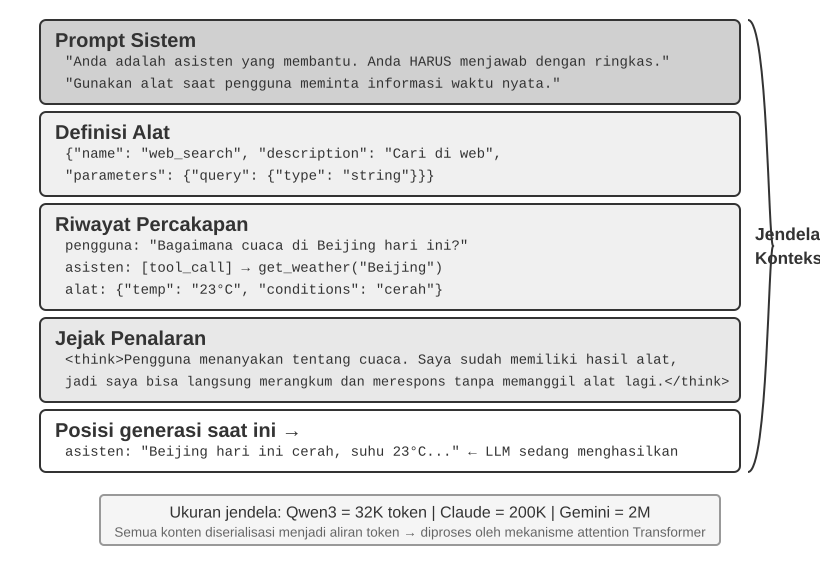

## Konteks: Batas Atas Kemampuan Agen

Model bahasa besar mencapai hasil yang kuat pada benchmark yang distandardisasi, tetapi sering kali kurang optimal di lingkungan bisnis dunia nyata. Alasannya sederhana: kemampuan model bersifat multiguna, sementara tugas konkret bergantung pada pengetahuan lokal seperti arsitektur produk, aturan bisnis, kendala operasional, dan konvensi internal. Informasi ini biasanya tidak ada dalam parameter model.

Pertimbangkan seorang insinyur yang sangat cakap yang baru bergabung dengan sebuah tim. Mereka mungkin memiliki pengetahuan teoritis yang mendalam dan kemampuan pemrograman yang kuat, tetapi mereka belum memahami arsitektur produk, logika bisnis, utang teknis (technical debt), atau norma tim. Jika keputusan arsitektural utama tersebar di memori individu dan basis kode (codebase) tidak didokumentasikan dengan baik, insinyur yang luar biasa sekalipun akan kesulitan memberikan nilai dengan cepat. Agen AI saat ini menghadapi masalah yang sama.

Pertimbangkan sebuah Agen Pengodean (Coding Agent). Diberikan instruksi yang sama, "Bantu saya memperbaiki bug ini," kualitas konteks yang diterima Agen menentukan apakah ia dapat menyelesaikan tugas tersebut:

- **Konteks kode**: Struktur basis kode, tanggung jawab modul, struktur data inti, dan standar pengodean. Tanpa informasi ini, Agen mungkin menghasilkan kode yang secara sintaksis benar tetapi tidak konsisten dengan gaya atau arsitektur proyek.
- **Persyaratan proses**: Strategi pencabangan (branching) Git, konvensi komit, proses tinjauan (review), dan persyaratan CI/CD. Tanpa informasi ini, Agen mungkin melakukan komit kode yang belum diuji secara langsung ke cabang utama (main branch).
- **Konfigurasi lingkungan**: Pengaturan pengembangan, string koneksi basis data pengujian, prosedur penerapan (deployment) staging, dan praktik pengelolaan kunci API. Tanpa informasi ini, perbaikan yang berhasil secara lokal mungkin akan langsung gagal di lingkungan pengujian.

Tiga kategori ini—kode, proses, dan lingkungan—membentuk konteks minimum yang dibutuhkan Agen untuk bekerja secara efektif. Kemampuan bawaan model hanyalah fondasi; konteks menetapkan batas atas untuk kemampuan Agen. Model yang cukup mampu dengan konteks yang terorganisir dengan baik sering kali dapat mengungguli model yang lebih kuat yang beroperasi dengan konteks yang tidak memadai.

Oleh karena itu, rekayasa konteks sangat penting untuk membangun Agen yang efektif dengan model-model saat ini. Ini bukan sekadar masalah menambahkan lebih banyak teks ke dalam sebuah prompt. Ini membutuhkan perancangan, pengorganisasian, dan penyediaan latar belakang pengetahuan yang sistematis yang dibutuhkan model untuk menyelesaikan suatu tugas.
Rekayasa konteks adalah masalah teknis, tetapi pada dasarnya ini adalah masalah organisasional. Di banyak tim, pengetahuan kritis tetap tersirat: keputusan arsitektural hidup di ingatan insinyur senior, aturan bisnis ditransmisikan secara informal, dan konteks penting terkubur di log obrolan pribadi. Jika tim itu sendiri merupakan lingkungan informasi yang buruk, Agen AI yang kuat sekalipun akan terbatas kemampuannya.

Tim yang bekerja secara efektif dalam pengaturan jarak jauh sering kali juga menyediakan lingkungan yang efektif untuk Agen AI. Proyek sumber terbuka (open-source) seperti kernel Linux adalah contoh yang instruktif: para pengembang yang tersebar di seluruh dunia telah mengelola proyek tersebut selama lebih dari tiga puluh tahun. Hal ini berhasil karena proyek ini memiliki budaya komunikasi yang transparan dan berbasis dokumentasi. Diskusi bersifat publik, keputusan dicatat, dan pendatang baru dapat memahami evolusi kode dengan membaca riwayatnya. Gaya kerja yang sama secara alami menciptakan lingkungan yang ramah AI: informasi bersifat publik, dapat diambil kembali (retrievable), dan terstruktur.

Perlakukan Agen AI seperti anggota tim baru setiap kali ia memulai suatu tugas. Dengan latar belakang yang cukup, ia dapat menghasilkan pekerjaan berkualitas tinggi; tanpa latar belakang tersebut, sebagian besar kecerdasannya menjadi sia-sia. Oleh karena itu, membangun tim yang berbasis AI pada dasarnya adalah upaya dokumentasi, bukan sekadar masalah menerapkan alat-alat baru.

Peneliti OpenAI Jiayi Weng menyatakan poin ini dengan jelas: **"Baik untuk manusia maupun model, hal yang paling penting adalah Konteks."** Merefleksikan pekerjaannya sendiri, ia mencatat: "Pekerjaan saya di OpenAI tidak terlalu sulit. Jika orang lain memiliki semua konteks saya, mereka juga bisa melakukannya." Prinsip yang sama berlaku untuk Agen: batas atas kemampuan Agen tidak ditentukan semata-mata oleh ukuran model, tetapi oleh kelengkapan dan presisi konteks yang disediakan pada setiap titik keputusan. Weng juga mengamati bahwa masalah utama dalam kerja tim adalah ketidakkonsistenan konteks, dan salah satu alasan AI tidak dapat menggantikan manusia dalam jangka pendek adalah karena AI dan manusia tidak berbagi lingkungan yang sama. Rekayasa konteks mengatasi masalah ini secara tepat: bagaimana menyampaikan informasi latar belakang terstruktur yang dibutuhkan Agen kepada model secara sistematis.

Pertanyaan selanjutnya adalah bagaimana informasi kontekstual ini diberikan kepada LLM di tingkat teknis.

## Bagaimana Agen Memanggil LLM: Struktur Konteks Tingkat API

Bagian ini menggunakan Chat Completions API dari OpenAI sebagai contoh konkret. Anthropic, Google, dan penyedia lainnya memiliki perbedaan detail, namun API mereka yang menghadap Agen mengikuti pola yang serupa: setiap panggilan model dibangun dari riwayat percakapan yang terstruktur ditambah seperangkat definisi alat (tool definitions) yang tersedia. Memahami struktur ini adalah dasar untuk teknik rekayasa konteks yang akan dibahas nanti di bab ini.

### Empat Peran Pesan (Message Roles)

Dalam API gaya Chat Completions, input utamanya adalah **daftar pesan** (*message list*), yang biasanya dinamai `messages`. Setiap pesan memiliki bidang `role` yang memberi tahu model bagaimana menginterpretasikan pesan tersebut dan dari mana asalnya:

- **system**: Instruksi yang ditulis oleh pengembang (developer) yang menentukan identitas, perilaku, batasan, dan alur kerja Agen. Model menganggap ini sebagai instruksi prioritas tinggi. Dalam kebanyakan percakapan, pesan sistem muncul sekali di awal daftar pesan.
- **user**: Input dari pengguna akhir (end user), mewakili permintaan yang perlu ditangani oleh Agen.
- **assistant**: Output model sebelumnya, termasuk balasan bahasa alami (natural-language replies) dan permintaan panggilan alat (tool call requests). Dalam interaksi multi-giliran (multi-turn), pesan-pesan ini disertakan dalam permintaan selanjutnya sehingga panggilan model nir-status (stateless) berikutnya memiliki akses ke lintasan (trajectory) sebelumnya.
- **tool**: Hasil yang dikembalikan setelah framework Agen mengeksekusi sebuah alat. Setiap hasil alat ditautkan ke panggilan alat yang sesuai melalui `tool_call_id`, memungkinkan model untuk mengaitkan setiap hasil dengan permintaan yang menghasilkannya.

Definisi alat bukanlah pesan. Mereka disediakan dalam bidang `tools` yang terpisah, yang mendeklarasikan alat yang tersedia untuk model dan menentukan parameter yang diterima oleh setiap alat.

### Permintaan Satu Giliran (Single-Turn): Panggilan API Paling Sederhana

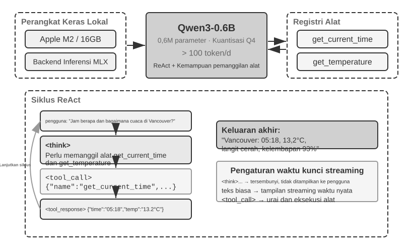

Mulai dengan kasus yang paling sederhana: satu permintaan tanpa panggilan alat. Pengguna bertanya, "Halo, siapa kamu?" Contoh ini menggunakan model Qwen3-0.6B yang diterapkan secara lokal, menghubungkannya dengan eksperimen penerapan LLM lokal nanti di bagian ini. Stempel waktu (timestamps) dalam contoh ini hanya untuk demonstrasi dan tidak terkait dengan kronologi buku ini.

```javascript
// ═══ Permintaan yang dibuat oleh framework Agen ═══
{
  "model": "Qwen3-0.6B",
  "messages": [
    {
      "role": "system",                           // ← Ditulis oleh pengembang
      "content": "You are a helpful coding assistant. Follow user instructions."
    },
    {
      "role": "user",                              // ← Input pengguna
      "content": "Hello, who are you?"
    }
  ]
}
```

```javascript
// ═══ Respons yang dikembalikan oleh API ═══
{
  "choices": [{
    "message": {
      "role": "assistant",                         // ← Dihasilkan oleh model
      "content": "Hi! I'm a coding assistant. I can help you write code, debug issues, and explain technical concepts. How can I help?"
    }
  }]
}
```

Permintaan ini hanya berisi dua pesan: satu pesan sistem yang berisi aturan yang ditulis oleh pengembang dan satu pesan pengguna yang berisi input pengguna. Model mengembalikan pesan asisten sebagai balasan. Ini adalah pola interaksi LLM API yang paling dasar: **setiap panggilan bersifat nir-status (stateless), sehingga daftar pesan permintaan harus berisi semua informasi yang dibutuhkan model**.

### Interaksi Multi-Giliran (Multi-Turn) dengan Panggilan Alat: Loop Inti dari Agen

Alur kerja Agen di dunia nyata biasanya lebih kompleks daripada tanya jawab satu giliran. Ketika pengguna bertanya, "Jam berapa dan bagaimana cuaca saat ini di Vancouver?", model memerlukan akses ke informasi eksternal dinamis: waktu saat ini dan cuaca terbaru. Contoh berikut merinci setiap interaksi antara framework Agen dan model.

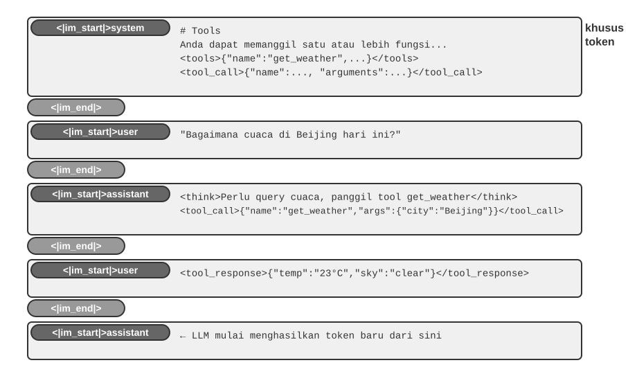

**Panggilan API pertama — Framework Agen mengirimkan permintaan awal:**

```javascript
// ═══ Permintaan yang dibuat oleh framework Agen (panggilan pertama) ═══
{
  "model": "Qwen3-0.6B",
  "messages": [
    {
      "role": "system",                           // ← Ditulis oleh pengembang
      "content": "You are a helpful assistant. Use the provided tools to get real-time information when needed."
    },
    {
      "role": "user",                              // ← Input pengguna
      "content": "What's the current time and weather in Vancouver?"
    }
  ],
  "tools": [                                       // ← Alat yang didefinisikan oleh pengembang
    {
      "type": "function",
      "function": {
        "name": "get_current_time",
        "description": "Get the current date and time in a specific timezone",
        "parameters": {
          "type": "object",
          "properties": {
            "timezone": { "type": "string", "description": "Timezone name, e.g. America/Vancouver" }
          }
        }
      }
    },
    {
      "type": "function",
      "function": {
        "name": "get_weather",
        "description": "Get the current weather for a specific city",
        "parameters": {
          "type": "object",
          "properties": {
            "city": { "type": "string", "description": "City name" },
            "unit": { "type": "string", "enum": ["celsius", "fahrenheit"] }
          }
        }
      }
    }
  ]
}
```

**Model mengembalikan permintaan panggilan alat (bukan balasan akhir):**

```javascript
// ═══ Respons yang dikembalikan oleh API (model memutuskan untuk memanggil alat) ═══
{
  "choices": [{
    "message": {
      "role": "assistant",                         // ← Dihasilkan oleh model
      "content": null,                             // Tidak ada respons teks
      "tool_calls": [                              // Model meminta dua panggilan alat
        {
          "id": "call_abc123",
          "type": "function",
          "function": {
            "name": "get_current_time",
            "arguments": "{\"timezone\": \"America/Vancouver\"}"
          }
        },
        {
          "id": "call_def456",
          "type": "function",
          "function": {
            "name": "get_weather",
            "arguments": "{\"city\": \"Vancouver\", \"unit\": \"celsius\"}"
          }
        }
      ]
    }
  }]
}
```

Model belum menjawab pertanyaan pengguna. Sebagai gantinya, model mengembalikan dua **permintaan panggilan alat**: satu untuk waktu saat ini dan satu lagi untuk cuaca. Karena permintaan ini bersifat independen, framework Agen dapat mengeksekusinya secara paralel. **Model mengeluarkan permintaan panggilan; framework Agen melakukan eksekusi aktual.** Pembagian tanggung jawab ini merupakan inti dari arsitektur Agen: model memutuskan alat mana yang akan dipanggil dan argumen apa yang harus diberikan, sementara framework memanggil API, menjalankan kode, dan mengembalikan hasilnya.

**Framework Agen mengeksekusi alat dan kemudian menginisiasi panggilan API kedua:**

Setelah menerima permintaan panggilan alat dari model, framework Agen mengeksekusi kedua alat tersebut (misalnya, dengan memanggil API waktu dan API cuaca), kemudian mengirimkan **riwayat percakapan lengkap beserta hasil eksekusi alat** kembali ke model:

```javascript
// ═══ Permintaan yang dibuat oleh framework Agen (panggilan kedua) ═══
{
  "model": "Qwen3-0.6B",
  "messages": [
    {
      "role": "system",                           // ← Sama dengan panggilan pertama
      "content": "You are a helpful assistant. Use the provided tools to get real-time information when needed."
    },
    {
      "role": "user",                              // ← Sama dengan panggilan pertama
      "content": "What's the current time and weather in Vancouver?"
    },
    {
      "role": "assistant",                         // ← Output model dari panggilan pertama, disertakan apa adanya
      "content": null,
      "tool_calls": [
        { "id": "call_abc123", "function": { "name": "get_current_time", "arguments": "{\"timezone\": \"America/Vancouver\"}" } },
        { "id": "call_def456", "function": { "name": "get_weather", "arguments": "{\"city\": \"Vancouver\", \"unit\": \"celsius\"}" } }
      ]
    },
    {
      "role": "tool",                              // ← Dihasilkan oleh framework Agen (hasil eksekusi alat)
      "tool_call_id": "call_abc123",
      "content": "{\"timezone\": \"America/Vancouver\", \"datetime\": \"2025-09-13T05:18:47\", \"day_of_week\": \"Saturday\"}"
    },
    {
      "role": "tool",                              // ← Dihasilkan oleh framework Agen (hasil eksekusi alat)
      "tool_call_id": "call_def456",
      "content": "{\"city\": \"Vancouver\", \"temperature\": 13.2, \"unit\": \"celsius\", \"conditions\": \"clear\", \"humidity\": 93}"
    }
  ],
  "tools": [ ... ]                                 // ← Definisi alat yang sama seperti di atas, dihilangkan
}
```

Ada tiga detail penting di sini:

1. **Permintaan kedua mencakup riwayat percakapan lengkap dari permintaan pertama** — pesan sistem, pesan pengguna, pesan asisten yang berisi panggilan alat, dan hasil alat yang baru ditambahkan. Ini menggambarkan sifat nir-status dari API: framework Agen harus menyertakan riwayat yang relevan dalam setiap permintaan.
2. **Pesan asisten pertama dimasukkan kembali ke dalam daftar pesan apa adanya (verbatim)** — ini memberi panggilan model berikutnya akses ke keputusan panggilan alat yang dibuat pada panggilan sebelumnya.
3. **Pesan alat ditautkan ke panggilan alat yang sesuai melalui `tool_call_id`** — ini memberi tahu model hasil mana yang dimiliki oleh permintaan panggilan mana.

**Model menghasilkan respons akhir berdasarkan hasil alat:**

```javascript
// ═══ Respons yang dikembalikan oleh API (balasan akhir) ═══
{
  "choices": [{
    "message": {
      "role": "assistant",                         // ← Dihasilkan oleh model
      "content": "It's currently 5:18 AM on Saturday, September 13, 2025 in Vancouver.\n\nWeather: 13.2°C with clear skies and 93% humidity. It's quite cool this morning - you might want to grab a jacket."
    }
  }]
}
```

Kali ini, model tidak mengembalikan `tool_calls`; model mengembalikan respons teks karena hasil alat memberikan informasi yang cukup untuk menjawab pertanyaan pengguna. Jika diperlukan lebih banyak informasi (misalnya, jika pengguna bertanya "Bagaimana dengan Tokyo?"), model dapat mengembalikan `tool_calls` lagi, dan framework Agen mengulangi siklus yang sama: mengeksekusi alat, mengirimkan kembali hasilnya, dan memanggil model lagi. **Siklus "permintaan → panggilan alat → eksekusi → kembalikan hasil → permintaan berikutnya" ini adalah implementasi tingkat API dari loop ReAct yang diperkenalkan pada Bab 1.**

### Mengimplementasikan Loop Inti Agen dalam Kode

Sekarang karena struktur JSON sudah jelas, kita dapat menghubungkan langkah-langkah di atas dalam Python. Berikut adalah implementasi Agen minimal yang dibangun di sekitar satu loop:

```python
from openai import OpenAI

client = OpenAI()

# ── Definisi Alat ──
tools = [
    {
        "type": "function",
        "function": {
            "name": "get_current_time",
            "description": "Get the current date and time in a specific timezone",
            "parameters": {
                "type": "object",
                "properties": {
                    "timezone": {"type": "string", "description": "Timezone name, e.g. America/Vancouver"}
                },
            },
        },
    },
    {
        "type": "function",
        "function": {
            "name": "get_weather",
            "description": "Get the current weather for a specific city",
            "parameters": {
                "type": "object",
                "properties": {
                    "city": {"type": "string", "description": "City name"},
                    "unit": {"type": "string", "enum": ["celsius", "fahrenheit"]},
                },
            },
        },
    },
]

# ── Fungsi eksekusi alat (stub dengan hasil kalengan; implementasi nyata
#    harus mem-parsing JSON `arguments` dan memanggil API aktual) ──
def execute_tool(name, arguments):
    if name == "get_current_time":
        return '{"datetime": "2025-09-13T05:18:47", "day_of_week": "Saturday"}'
    elif name == "get_weather":
        return '{"temperature": 13.2, "unit": "celsius", "conditions": "clear", "humidity": 93}'

# ── Daftar pesan awal ──
messages = [
    {"role": "system", "content": "You are a helpful assistant. Use tools to get real-time information when needed."},
    {"role": "user", "content": "What's the current time and weather in Vancouver?"},
]

# ── Loop inti Agen ──
# Kode produksi memerlukan batasan max_iterations di sini: seperti yang dibahas nanti dalam
# bab ini, Agen dapat terjebak dalam mengulangi panggilan alat yang sama selamanya
while True:
    response = client.chat.completions.create(
        model="Qwen3-0.6B", messages=messages, tools=tools
    )
    assistant_message = response.choices[0].message

    # Tambahkan respons model ke daftar pesan (baik teks maupun panggilan alat)
    messages.append(assistant_message)

    # Jika tidak ada panggilan alat yang diminta, model telah menghasilkan respons akhirnya
    if not assistant_message.tool_calls:
        print(assistant_message.content)
        break

    # Eksekusi setiap alat yang diminta oleh model, tambahkan hasil ke daftar pesan
    for tool_call in assistant_message.tool_calls:
        result = execute_tool(tool_call.function.name, tool_call.function.arguments)
        messages.append({
            "role": "tool",
            "tool_call_id": tool_call.id,
            "content": result,
        })
    # Kembali ke awal loop, panggil model lagi dengan daftar pesan yang diperbarui
```

Loop ini memiliki satu cabang utama: **jika model mengembalikan `tool_calls`, eksekusi alat dan lanjutkan; jika tidak, outputkan hasil dan keluar.** Selama proses ini, daftar `messages` terus bertambah karena setiap putaran menambahkan balasan model dan setiap hasil eksekusi alat.

Daftar `messages` berubah di seluruh putaran sebagai berikut:

**Status awal (sebelum panggilan pertama):**
```
messages = [
  { role: "system",  content: "You are a helpful assistant..." },     # Ditulis oleh pengembang
  { role: "user",    content: "What's the current time and weather in Vancouver?" },  # Input pengguna
]
```

**Setelah panggilan pertama (model mengembalikan panggilan alat):**
```
messages = [
  { role: "system",    content: "..." },
  { role: "user",      content: "What's the current time..." },
  { role: "assistant", tool_calls: [get_current_time, get_weather] },  # + Dihasilkan oleh model
  { role: "tool",      tool_call_id: "call_abc", content: "{time...}" },  # + Dieksekusi oleh framework
  { role: "tool",      tool_call_id: "call_def", content: "{weather...}" },  # + Dieksekusi oleh framework
]
```

**Setelah panggilan kedua (model mengembalikan balasan akhir, loop berakhir):**
```
messages = [
  { role: "system",    content: "..." },
  { role: "user",      content: "What's the current time..." },
  { role: "assistant", tool_calls: [get_current_time, get_weather] },
  { role: "tool",      tool_call_id: "call_abc", content: "{time...}" },
  { role: "tool",      tool_call_id: "call_def", content: "{weather...}" },
  { role: "assistant", content: "It's currently Saturday, Sep 13, 2025 in Vancouver..." },  # + Balasan akhir
]
```

Proses ini menunjukkan bahwa **salah satu tanggung jawab utama framework Agen adalah memelihara daftar pesan**: menambahkan pesan pada waktu yang tepat dan mengirimkan riwayat yang relevan ke model. Teknik rekayasa konteks dalam bab ini sebagian besar tentang meningkatkan konten dan struktur dari daftar tersebut.

### Bagaimana Konteks Disusun pada Tingkat API

Contoh di atas menunjukkan komposisi lengkap dari konteks setiap kali Agen memanggil model:

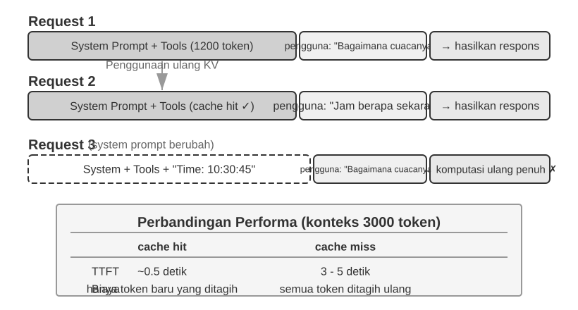

Bagian atas (Prompt Sistem + Definisi Alat) tetap tidak berubah di sepanjang percakapan, sementara bagian bawah (riwayat percakapan, yaitu **lintasan** (trajectory) yang didefinisikan dalam Bab 1) tumbuh bersama setiap interaksi. Beginilah kelima komponen konteks dari Bab 1 muncul pada tingkat API: prompt sistem dan definisi alat membentuk prefiks statis, sementara pesan pengguna, balasan model, dan hasil eksekusi alat membentuk riwayat pesan yang tumbuh secara dinamis. Struktur "prefiks statis + lintasan" ini adalah landasan untuk diskusi selanjutnya mengenai optimasi KV Cache, kompresi konteks, dan teknik terkait: prefiks harus tetap stabil, sementara segmen lintasan selanjutnya dapat diringkas atau diganti saat pengorbanannya (trade-off) sepadan.

Sisa bab ini memeriksa setiap lapisan dari struktur ini: bagaimana menggunakan prefiks statis yang stabil untuk mempercepat inferensi (KV Cache), bagaimana merancang Prompt Sistem yang efektif (rekayasa prompt/prompt engineering), bagaimana mencegah konten eksternal membajak konteks (pertahanan terhadap injeksi prompt/prompt injection), bagaimana memuat pengetahuan khusus sesuai permintaan (Keterampilan Agen/Agent Skills), bagaimana menyuntikkan status dinamis di akhir percakapan (Bilah Status Agen/Agent Status Bar), dan bagaimana mengompresi riwayat percakapan ketika tumbuh terlalu besar (strategi kompresi).

> **Eksperimen 2-1 ★: Penerapan Layanan LLM Lokal dan Pemanggilan Alat**
>
>
> 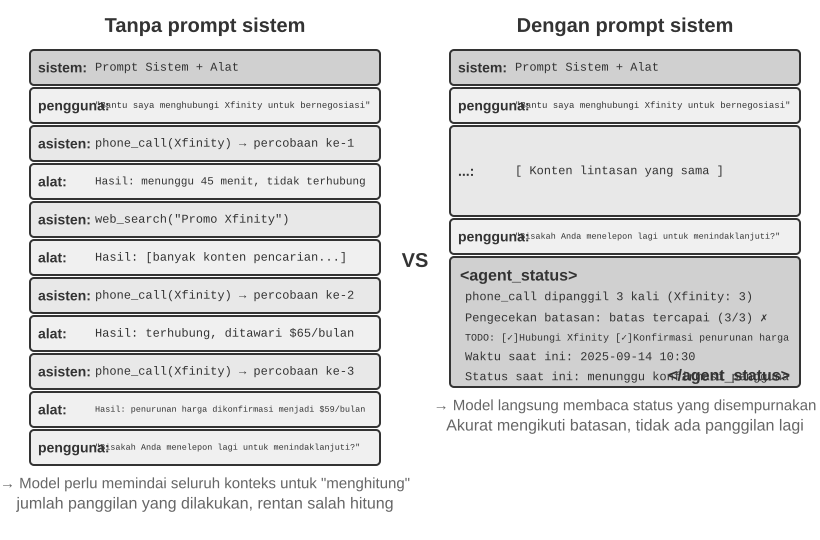
>
>
> Eksperimen ini memiliki dua tujuan: pertama, mengamati kemampuan pemanggilan alat dari sebuah model kecil, dan kedua, memeriksa aliran token mentah (rantai pemikiran/chain-of-thought, token khusus, dan format panggilan alat) yang tersembunyi di tingkat API. Pada saat yang sama, Anda juga dapat mengamati dampak KV Cache terhadap waktu ke token pertama (Time To First Token/TTFT), membangun intuisi untuk bagian selanjutnya.
>
> Sebelum bab ini beralih ke mekanisme yang lebih dalam mengenai konteks Agen, proyek ini mendemonstrasikan apa yang dapat dilakukan oleh model kecil. Proyek `local_llm_serving` mengilustrasikan poin penting: model yang mampu melakukan penalaran Rantai Pemikiran (Chain of Thought/CoT) dan pemanggilan alat tidak selalu memerlukan jumlah parameter yang besar. Bahkan model dengan parameter 0.6B dapat melakukan pemanggilan alat dengan andal jika dipasangkan dengan desain prompt dan arsitektur sistem yang masuk akal.
>
> Melalui eksperimen ini, pembaca harus dapat mengamati:
>
> 1. **Kemampuan Model Kecil**: Bahkan model 0.6B dapat memahami dan mengeksekusi panggilan alat secara akurat dengan rekayasa prompt yang tepat (teknik merancang prompt input secara hati-hati untuk memandu perilaku model).
> 2. **Kinerja**: Pada chip Apple M2, model dapat menghasilkan respons pada kecepatan lebih dari 100 token per detik, yang mana cukup untuk aplikasi interaktif waktu-nyata (real-time). Token adalah unit dasar pemrosesan teks untuk model; satu karakter Tionghoa biasanya berkorespondensi dengan 1–2 token, dan satu kata bahasa Inggris biasanya berkorespondensi dengan 1–3 token.
> 3. **Loop ReAct**: Mengamati bagaimana model memecahkan masalah kompleks melalui beberapa putaran penalaran dan pemanggilan alat.
> 4. **Keuntungan Respons Streaming**: Output streaming memungkinkan pengguna untuk melihat proses penalaran model secara waktu-nyata, termasuk keputusan mengenai panggilan alat dan pemrosesan hasil.
> 5. **Dampak KV Cache (pengamatan insidental)**: Pertahankan prompt sistem tidak berubah, mulai dua percakapan berturut-turut, dan catat TTFT untuk yang kedua. Kemudian ubah beberapa karakter di awal prompt sistem, mulai percakapan lain, dan bandingkan TTFT-nya. Kasus prefiks-yang-tidak-berubah akan jauh lebih cepat karena ia dapat mengenai (hit) cache prefiks, sementara kasus prefiks-yang-dimodifikasi harus menghitung ulang seluruh prefiks. Fenomena ini adalah subjek dari bagian selanjutnya.
>
> **Loop ReAct dalam Praktik.**
>
> Pemanggilan alat multi-putaran dalam proyek ini mengikuti loop ReAct (Think-Act-Observe) yang diperkenalkan pada Bab 1, sehingga prinsip-prinsipnya tidak akan diulangi di sini. Bagian sebelumnya telah menunjukkan struktur pesan yang lengkap dari proses ini menggunakan format JSON dari OpenAI API. Dalam penerapan lokal, server (mis. vLLM atau Ollama) mengonversi pesan-pesan API ini ke dalam format token internal model. Proyek `local_llm_serving` memungkinkan pembaca untuk memeriksa aliran token input dan output mentah dari model, termasuk detail berikut yang biasanya tersembunyi di tingkat API:
>
> **Proses Penalaran Internal Model**: Model yang mendukung rantai-pemikiran (mis. Qwen3) akan bernalar terlebih dahulu di dalam tag `<think>` sebelum menghasilkan panggilan alat—menganalisis niat pengguna, mengevaluasi alat mana yang cocok, dan merencanakan urutan panggilan. Proses penalaran ini berharga untuk men-debug perilaku Agen.
>
> **Struktur Urutan Output**: Token output dari model dihasilkan dalam urutan yang tetap—pertama penalaran internal (di dalam tag `<think>`), lalu teks balasan ke pengguna, dan akhirnya permintaan panggilan alat. Memahami urutan ini sangat penting untuk mengimplementasikan respons streaming: ketika tag `<think>` muncul, antarmuka dapat beralih ke status "bernalar" (reasoning); segera setelah parameter untuk panggilan alat pertama dihasilkan secara penuh dan divalidasi, eksekusi dapat segera dimulai, tanpa menunggu model untuk menghasilkan panggilan alat berikutnya.
>
> **Panggilan Alat Paralel**: Dalam contoh waktu dan cuaca Vancouver dari bagian ini, model tidak menemukan dependensi antara kedua sub-masalah, sehingga model menghasilkan dua permintaan panggilan alat dalam satu output. Framework Agen dapat mendeteksi ini dan mengeksekusi kedua alat tersebut secara paralel, mengurangi latensi total.
>
> **Penilaian Penghentian oleh Model**: Saat framework Agen mengirimkan kembali hasil alat, model menentukan apakah ia memiliki informasi yang cukup untuk menjawab pengguna. Jika ya, ia menghasilkan balasan akhir tanpa meminta panggilan alat lain; jika tidak, ia mengeluarkan panggilan alat tambahan dan memulai putaran ReAct lainnya.
>
> **Ringkasan Eksperimen.**
>
> Pelajaran terpenting dari eksperimen ini adalah bahwa model 0.6B, dengan desain prompt yang masuk akal, dapat menyelesaikan panggilan alat dengan andal. Ukuran model memang penting, tetapi itu bukan satu-satunya faktor penentu. Beberapa perangkat seluler kelas atas (high-end) telah dapat menjalankan model tingkat 0.6B, dan kemampuan praktis model pada-perangkat (on-device) terus meningkat. Agen on-device lebih dekat dari yang diharapkan banyak orang.
>
> Anda mungkin menyadari bahwa respons pertama model melambat setelah prompt sistem dimodifikasi. Pelambatan ini disebabkan oleh perilaku KV Cache yang dijelaskan pada bagian berikutnya: mengubah prefiks membatalkan (invalidate) cache dan memaksa komputasi ulang.
>

## Desain Konteks yang Ramah KV Cache

Sebelum memeriksa contoh, pertimbangkan intuisi di balik **KV Cache**. Setiap kali model menghasilkan sebuah token, ia harus merujuk kembali ke hasil komputasi menengah (intermediate) dari token-token sebelumnya. Menghitung ulang hasil-hasil tersebut dari awal (from scratch) pada setiap putaran akan menjadi semakin mahal seiring dengan membesarnya konteks. KV Cache menyimpan state key-value menengah sehingga komputasi selanjutnya dapat menggunakannya kembali. **Prasyaratnya adalah prefiks tetap sepenuhnya tidak berubah**: ubah satu karakter saja di dalamnya, dan cache untuk prefiks tersebut tidak lagi dapat digunakan kembali; model harus menghitung ulang mulai dari titik yang berubah dan seterusnya. Catatan tentang terminologi: ketika bagian ini membahas "cache hits" di seluruh permintaan, penyedia API biasanya menyebutnya Prompt Cache—cache lintas-permintaan yang dibangun di atas KV Cache milik mesin inferensi. Kedua level ini dibedakan pada akhir bagian ini.

Dengan mengingat intuisi itu, pertimbangkan sebuah insiden produksi. Agen layanan pelanggan sebuah tim menangani 100.000 percakapan sehari, dan sistem berjalan normal. Kemudian seorang insinyur, yang ingin agar Agen memiliki akses ke waktu saat ini, menambahkan baris `Waktu saat ini: {{now}}` ke prompt sistem, menyuntikkan stempel waktu (timestamp) secara waktu-nyata. Keesokan harinya, peringatan pemantauan (monitoring alerts) berbunyi: TTFT untuk setiap percakapan meningkat dari 0,5 detik menjadi 3–5 detik, dan tagihan inferensi bulanan naik hampir dua kali lipat. Kode terlihat benar dan model belum diubah. Masalahnya ada pada konteksnya.

Satu baris stempel waktu tersebut membatalkan KV Cache pada setiap permintaan. Prompt sistem kini berbeda setiap kali, memaksa model untuk menghitung ulang pasangan key-value untuk prefiks dari awal (di sini, "Key" dan "Value" adalah dua jenis vektor dalam mekanisme attention; Eksperimen 2-2 di bawah secara visual mendemonstrasikan perannya). Jenis biaya tak kasat mata ini muncul berulang kali dalam sistem Agen: satu baris kode yang tampaknya tidak berbahaya dapat memperlambat seluruh alur pemrosesan inferensi (inference pipeline) secara signifikan. Bagian ini menjelaskan cara menghindari jebakan-jebakan tersebut.

> **Catatan Teknis**: Bagian ini melibatkan prinsip internal dari mekanisme attention Transformer dan KV Cache, menjadikannya salah satu bagian paling padat teknis di dalam buku ini. Jika Anda tidak terbiasa dengan mekanisme yang mendasari ini, **Anda dapat melompati prinsip-prinsip mendetail dan mengingat tiga kesimpulan inti berikut**:
>
> 1. **Setelah prompt sistem dan definisi alat diselesaikan, jangan mengubahnya.** Setiap modifikasi, bahkan menambahkan satu spasi tunggal, akan membatalkan seluruh cache dan dapat melipatgandakan latensi serta meningkatkan biaya (besarnya pastinya bergantung pada model dan konfigurasi).
> 2. **Selalu tambahkan informasi dinamis di akhir**—mengubah konten seperti stempel waktu dan status pengguna harus ditambahkan (append) sebagai pesan baru di akhir percakapan, bukan dengan memodifikasi prompt sistem yang ada.
> 3. **Gunakan format API standar; jangan menggabungkan (concatenate) pesan secara manual**: Pesan terstruktur diterjemahkan oleh Templat Obrolan (Chat Template) ke dalam urutan token tetap yang telah dilihat model selama pelatihan. Masalah mendasar dengan menggabungkan string secara manual menjadi format seperti `"USER: ... ASSISTANT: ..."` adalah hal itu menyimpang dari format pelatihan ini, melemahkan kemampuan penalaran multi-langkah model. Sebaliknya, caching bergantung hanya pada urutan token yang dihasilkan. Prefiks yang digabungkan secara manual masih dapat di-cache jika tetap stabil demi byte. Cache hanya batal saat prefiks itu berubah, misalnya, ketika konten dinamis disisipkan ke dalamnya.
>
> Intuisi di balik ketiga kesimpulan ini sederhana: ketika memproses konteks, LLM meng-cache komputasi untuk prefiks yang telah diprosesnya, sehingga permintaan berikutnya dapat menggunakan kembali pekerjaan itu. **Jika prefiks identik demi byte (byte-for-byte), komputasi yang di-cache dapat digunakan kembali; jika prefiks berubah, komputasi setelah titik tersebut harus dibangun ulang.** Prompt sistem dan definisi alat biasanya merupakan bagian paling awal dan paling mahal dari prefiks ini; setelah itu berubah, hasil menengah yang di-cache setelah titik tersebut dibatalkan.
>
> Ingatlah tiga prinsip ini, dan meskipun Anda melewati detail teknis di bawah ini, Anda masih dapat merancang struktur konteks Agen dengan benar. Konten berikut diperuntukkan bagi pembaca yang ingin menggali lebih dalam alasan "mengapa".

> **Eksperimen 2-2 ★: Visualisasi Mekanisme Attention**
>
> Sebelum menjelaskan KV Cache, kita pertama-tama membangun pemahaman intuitif tentang mekanisme attention internal model melalui sebuah eksperimen—ini merupakan dasar untuk memahami mengapa KV Cache efektif dan mengapa itu membebankan persyaratan ketat pada desain konteks.
>
> **Apa itu Mekanisme Attention?** Pertimbangkan sebuah contoh konkret. Misalkan model sedang memproses kalimat Tionghoa "北京 的 天气 怎么样" ("Bagaimana cuaca di Beijing?"), yang kata-katanya adalah "北京" (Beijing), "的" (partikel kepemilikan, seperti "di/dari"), "天气" (cuaca), dan "怎么样" (bagaimana itu). Ketika membaca "怎么样", model perlu memutuskan: kata mana di sebelumnya yang paling penting untuk memahami "怎么样"?
>
> Mekanisme attention menggunakan tiga jenis vektor untuk memutuskan token mana yang sebelumnya paling relevan:
>
> Tabel 2-1 meringkas peran vektor Query, Key, dan Value dalam mekanisme attention, membantu pembaca memetakan komputasi abstrak ke contoh kalimat "北京的天气怎么样" ("Bagaimana cuaca di Beijing?").
>
> Tabel 2-1 Peran Query, Key, dan Value dalam Mekanisme Attention
>
> | Vektor | Makna | Dalam contoh ini |
> |-------|-----------------------------------------|-----------------------------------------------|
> | **Query** | "Permintaan pencarian" yang dikeluarkan oleh kata saat ini | "怎么样" (bagaimana) bertanya: kata mana yang paling relevan dengan saya? |
> | **Key** | "Label" dari setiap kata, digunakan untuk mencocokkan pencarian | Label dari "北京" (Beijing) condong pada "nama tempat"; label dari "天气" (cuaca) condong pada "meteorologi" |
> | **Value** | "Konten" dari setiap kata, diekstraksi setelah pencocokan yang sukses | Setelah mencocokkan "天气" (cuaca), ekstrak informasi semantiknya |
>
> Secara sederhana, setiap kata baru menilai (score) kata-kata sebelumnya berdasarkan relevansinya, lalu menggunakan informasi yang paling relevan untuk membangun representasi saat ini.
>
> Lebih spesifik lagi, komputasi memiliki tiga langkah. Pertama, "怎么样" menghasilkan vektor Query miliknya sendiri, mewakili apa yang sedang dicari oleh token saat ini. Kedua, Query dibandingkan dengan Key dari setiap kata sebelumnya menggunakan produk titik (dot product), menghasilkan skor relevansi; skor yang lebih tinggi menunjukkan kecocokan yang lebih kuat. Akhirnya, skor ini menjadi bobot attention, yang digunakan untuk menghitung jumlah terbobot (weighted sum) dari Value. Kata-kata dengan bobot yang lebih tinggi berkontribusi lebih banyak pada representasi akhir, sementara kata-kata dengan bobot yang lebih rendah berkontribusi lebih sedikit.
>
>
> 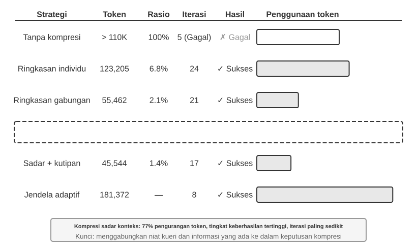
>
>
> Bagian atas dari Gambar 2-6 menunjukkan bagaimana "怎么样" (bagaimana) mencocokkan setiap kata sebelumnya: kecocokan terkuat adalah dengan "天气" (cuaca, 0.55), ada beberapa relevansi dengan "北京" (Beijing, 0.35), hampir tidak ada untuk "的" (partikel, 0.05), dan sisa bobot sekitar 0.05 jatuh pada "怎么样" itu sendiri (tidak ditampilkan terpisah pada gambar)—semua bobot berjumlah 1. Output akhir mengambil secara utama dari informasi dari "天气", yang sangat cocok dengan intuisi.
>
> Sebuah **heatmap attention** menyusun bobot attention antara setiap kata dan semua kata sebelumnya ke dalam sebuah matriks. Bagian bawah dari Gambar 2-6 menunjukkan heatmap yang lengkap: setiap baris adalah Query (kata yang sedang diproses saat ini), setiap kolom adalah Key (kata yang sedang diperhatikan), dan sel-sel yang lebih gelap menandakan bobot attention yang lebih tinggi. Heatmap berbentuk segitiga karena model menghasilkan teks dari kiri ke kanan: setiap kata dapat memperhatikan hanya dirinya sendiri dan kata-kata sebelum dirinya, bukan ke konten yang belum dihasilkan.
>
> **Mengapa Key dan Value perlu di-cache?** Mengamati heatmap mengungkapkan bahwa setiap kali sebuah kata baru dihasilkan, Query-nya harus dicocokkan dengan Key dari **semua** kata-kata sebelumnya, dan kemudian jumlah terbobot dari semua Value dikomputasikan. Jika semua nilai K dan V dihitung ulang dari awal setiap saat, komputasi akan bertambah bersama dengan panjang konteks. KV Cache menyimpan nilai K dan V yang telah dihitung, memungkinkan kata-kata baru untuk langsung menggunakannya kembali — ini adalah optimasi inti yang dibahas berikutnya.
>
> Dengan pemahaman dasar tentang mekanisme attention, kita sekarang dapat mengamati distribusi attention dari sebuah model nyata melalui eksperimen `attention_visualization`.
>
>
> 
>
>
> Heatmap attention mengungkapkan beberapa pola kunci:
>
> 1. **Attention Sink**: Token pertama dari urutan tersebut sering menyerap sejumlah besar bobot attention secara tidak normal, terkadang melebihi 70% dari total attention. Model menggunakan posisi ini sebagai sebuah "Attention Sink" untuk menyerap massa attention sisa yang tidak berkorelasi kuat dengan token spesifik lainnya. Dengan kata lain, model belajar menugaskan bobot attention yang tidak teralokasi ke token pertama — ini adalah fenomena sistematis, bukan cacat model.
>
>    Alasan matematisnya adalah bahwa mekanisme attention memiliki batasan keras (hard constraint): semua bobot attention harus persis berjumlah 100% (dijamin oleh fungsi matematis yang disebut softmax), jadi model tidak dapat mengekspresikan "tidak memperhatikan apa pun." Bahkan jika kata saat ini tidak begitu relevan dengan salah satu kata sebelumnya, bobot ini harus dialokasikan di suatu tempat. Karenanya model membutuhkan wadah yang stabil untuk "bobot sisa" ini, dan posisi tetap pada awal urutan tersebut menjadi pilihan paling alami. Ini adalah konsekuensi niscaya dari sifat matematis softmax saat memproses banyak token.
> 2. **Pola Segitiga Penalaran**: Rantai pemikiran model (di dalam tag `<think>`) memamerkan pola self-attention berbentuk segitiga: ketika menghasilkan konten penalaran baru, ia sering kali memperhatikan pada konten penalaran yang lebih awal dan definisi alat.
> 3. **Pola Segitiga Output**: Proses output setelah penalaran usai menunjukkan segitiga yang lain, di mana model menggunakan jejak penalaran sebagai sebuah prompt untuk menghasilkan jawaban.
> 4. **Bias Posisi**[^lost-in-the-middle]: Model memiliki akurasi mengingat (recall accuracy) yang lebih tinggi untuk informasi di awal dan akhir dari konteks, sementara informasi di bagian tengah lebih mungkin diabaikan. Oleh karena itu, saat mendesain konteks, menempatkan informasi paling penting di awal atau akhir adalah prinsip praktis yang penting.
>
> Eksperimen ini menunjukkan bahwa **pembuatan rantai-pemikiran (chain-of-thought) yang panjang dan pemanggilan alat keduanya sangat bergantung pada in-context learning** — kemampuan model beradaptasi pada sebuah tugas berdasarkan instruksi dan contoh yang disediakan dalam input, tanpa perlu dilatih ulang. Untuk mekanisme internal dari in-context learning dan implikasinya terhadap desain arsitektur Agen, lihat bagian Kompresi Konteks dalam bab ini.
>
>
> [^lost-in-the-middle]: Liu et al. ["Lost in the Middle: How Language Models Use Long Contexts"](https://aclanthology.org/2024.tacl-1.9/), TACL, 2024.
>
> ### Dari Pesan API ke Token Model: Templat Obrolan (Chat Template)
>
> Templat Obrolan adalah **konsep fundamental di seluruh buku ini**. Ini tidak hanya memengaruhi perilaku KV Cache, tetapi juga mekanisme seperti panggilan alat multi-giliran (multi-turn tool calls), retensi rantai-pemikiran, dan injeksi status bar. Oleh karena itu, konsep ini layak mendapatkan penjelasan khusus. Urutan token dalam eksperimen visualisasi attention (mis. token khusus seperti `<|im_start|>`, `<|im_end|>`) terlihat sangat berbeda dari pesan API format JSON yang ditunjukkan sebelumnya. Alasannya adalah pesan API terstruktur tersebut harus dikonversi menjadi aliran token linier yang dapat diproses model. Komponen yang bertanggung jawab untuk konversi ini adalah **Templat Obrolan**.
>
> 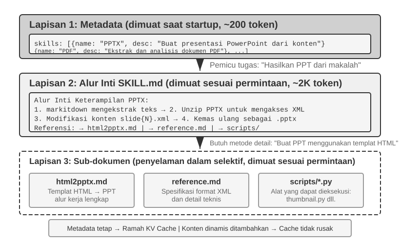
>
> Cara yang berguna untuk memahami Templat Obrolan adalah dengan menganggapnya sebagai sebuah **format amplop**. Pesan API adalah konten dari surat, sementara Templat Obrolan menentukan bagaimana pengirim, penerima, dan batasan-batasan ditulis di atas amplop tersebut. Ia menggunakan token khusus (mis., `<|im_start|>system`, `<|im_end|>`) untuk menandai peran dan batasan setiap pesan. Keluarga model yang berbeda (Qwen, Llama, Gemma) menggunakan format amplop yang berbeda pula. Server API (vLLM, Ollama, dll.) menjalankan konversi ini secara otomatis berdasarkan Templat Obrolan dari model, jadi pengembang biasanya tidak perlu menanganinya secara manual.
>
> Menggunakan model dari keluarga Qwen sebagai contoh, percakapan yang sama muncul dalam bentuk yang sepenuhnya berbeda pada level API dan di dalam model:
>
> 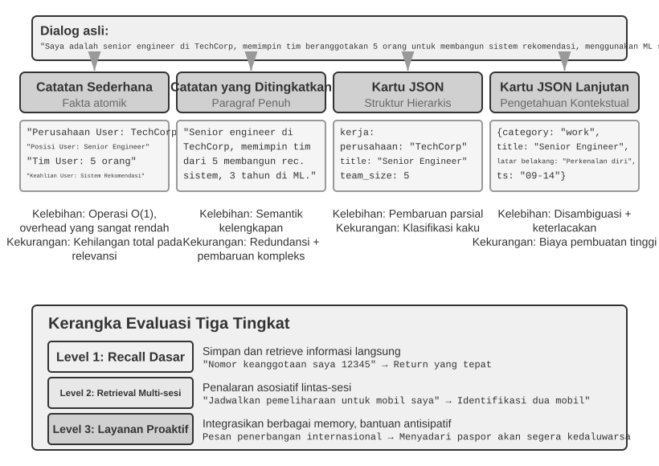
>
> Di sebelah kiri adalah pesan JSON yang terstruktur, dan di sebelah kanan adalah aliran token linier yang diproses model. `<|im_start|>` dan `<|im_end|>` adalah token khusus yang memberitahukan model perihal peran dan batasan dari setiap pesan.
>
> Pengembang Agen **tidak perlu menulis atau memodifikasi secara manual Templat Obrolan tersebut**; server API yang menanganinya secara otomatis. Namun, memahami keberadaannya memiliki dua manfaat praktis untuk pengembangan Agen:
>
> **Pertama, ini menjelaskan mengapa format standar API harus digunakan.** Jika pengembang melangkahi API dan menggabungkan (concatenate) pesan secara manual (misalnya, memasukkan hasil alat ke pesan pengguna biasa alih-alih sebagai pesan alat), Templat Obrolan mungkin akan mewakilkan percakapan dengan keliru. Misalnya dengan Templat Obrolan Qwen3, panggilan alat multi-giliran (multi-turn tool calls) dapat mempertahankan konten penalaran internal sebelumnya di dalam tag `<think>`, melestarikan kesinambungan lintas panggilan alat. Ketika templat tersebut mendeteksi giliran pengguna baru, ia akan membersihkan konteks penalaran tadi dan memulai sebuah penalaran baru. Jika suatu hasil alat salah ditandai sebagai pesan pengguna, ia dapat memicu pembersihan (reset) di waktu yang salah, melemahkan koherensi pada penalaran multi-langkah. Harap dicatat bahwa berbagai keluarga model berbeda-beda secara drastis dalam cara menangani riwayat rantai pemikirannya, dan strategi-strategi itu sendiri terus berevolusi secara cepat. Arahan resmi dalam era DeepSeek R1 adalah untuk **melucuti (strip) semua penalaran historis**: dalam percakapan multi-giliran, hanya `content` yang diteruskan kembali, bukan `reasoning_content`—karena riwayat CoT tidak pernah muncul di input pelatihan R1, mengumpankannya kembali (feeding it back) merupakan input di luar distribusi (out-of-distribution) yang justru bisa mengintervensi output, dan membuang riwayat ini juga menghemat cukup banyak token. Namun strategi ini memiliki kelemahan untuk skenario Agen: penalaran menengah memuat status yang krusial seperti "kenapa alat ini dipanggil dan hipotesis mana yang sudah disingkirkan"; sekali dilucuti, model akan menalar (reasoning) dari awal di setiap putaran, menjadikannya rentan mengulangi kesalahan dan kehilangan rencana jangka-panjang. DeepSeek karenanya **membalik sepenuhnya** kebijakan dalam V4, mengharuskan bahwa `reasoning_content` dari setiap pesan asisten (termasuk yang berisi `tool_calls`) wajib diteruskan kembali apa adanya (verbatim), jika tidak maka API akan memberikan error serta merta—Kimi K2, GLM-5, dan yang lainnya telah mengadopsi protokol yang sama. Claude, sementara itu, mewajibkan klien meneruskan blok berpikir (dengan verifikasi signature) balik ke API tanpa ubahan apa pun di dalam loop panggilan alat, sementara server mengabaikan pemikiran historis setelah giliran pengguna baru. Transisi ke seluruh industri mulai dari "pelucutan" (stripping) menuju "kewajiban meneruskan ulang" (mandatory pass-back) ini sendiri adalah bukti yang kuat: **untuk skenario Agen, proses pemikiran bukanlah pemborosan melainkan sebuah status (state)**. Konsultasikan dokumentasi templat model paling mutakhir sebelum menggunakannya.
>
> **Kedua, ini menjelaskan mengapa KV Cache begitu sensitif terhadap prefiks.** Templat Obrolan mengubah pesan sistem dan definisi alat menjadi satu urutan token yang tetap di dekat awal (beginning) dari input. Status key-value untuk token-token tersebut dapat di-cache dan digunakan kembali lintas permintaan. Jika ada satu token di prefiks ini berubah, bahkan jika itu sekadar spasi ekstra pada prompt sistem, cache setelah titik itu tidak lagi dapat dipakai kembali.
>
> ### Prinsip dan Kendala pada KV Cache
>
> Untuk memahami nilai dari KV Cache, pertama pertimbangkan apa yang terjadi tanpanya. Misalkan sebuah Agen telah mencapai putaran percakapan keenam dan mengumpulkan 2.000 token konteks. Tanpa caching, setiap token baru mengharuskan model menghitung ulang vektor K dan V untuk seluruh bagian prefiks. Meskipun kelima putaran pertama tidak berubah, putaran keenam tetap menghitung ulangnya, dan prefiks yang lebih panjang membuat putaran tersebut lebih mahal dibandingkan yang pertama. Tanpa caching, komputasi attention di tahap prefill (tahapan saat model memproses semua token input sebelum menghasilkan sebuah respons) bertumbuh secara kuadratik terhadap panjang konteks, menyebabkan latensi dan biaya meningkat pesat seiring pendalaman percakapan. Hal ini sangat bermasalah untuk tugas Agen yang butuh banyak panggilan alat.
>
> 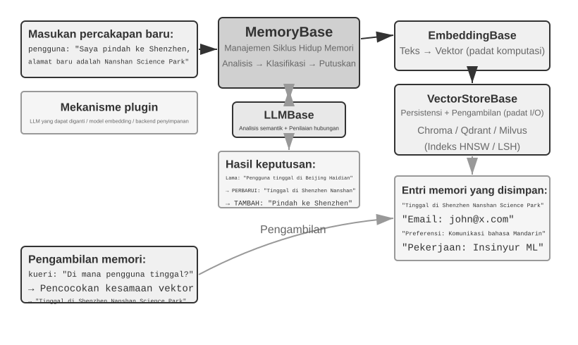
>
> **Memahami KV Cache dengan sebuah contoh sederhana.** Anggaplah konteks memiliki 4 token [A, B, C, D], dan model hampir membuahkan token kelima, E. Operasi attention inti akan membandingkan vektor Query pada E dengan vektor Key dari token yang ada untuk menghitung skor kecocokan (untuk penjelasan dot product yang lebih intuitif, lihat Eksperimen 2-2). Model itu lalu memakai skor tersebut untuk menghitung jumlah terbobot (weighted sum) atas vektor Value, menghasilkan representasi output E.
>
> Tanpa KV Cache, setiap kali sebuah token baru dihasilkan, vektor K dan V dari seluruh token-token sebelumnya harus dihitung ulang dari awal: menghasilkan E membutuhkan komputasi atas 5 set K dan V, menghasilkan token keenam butuh kalkulasi 6 set... dan pada token ke-N, N set harus dihitung, dengan total kalkulasi yang berbanding lurus (proposional) dengan N².
>
> Dengan KV Cache, vektor K dan V dari A, B, C, dan D akan di-cache (disimpan) setelah dihitung sekali. Ketika membuahkan E, hanya K dan V dari E itu sendiri yang perlu dihitung, dan lalu komputasi attention pun berjalan menggunakan vektor milik E beserta 4 set hasil caching (cached sets). Harap perhatikan bahwa KV Cache menghemat penghitungan ulang atas proyeksi K dan V untuk token historis, sehingga setiap langkah decoding (penguraian sandi) tidak perlu lagi menghitung ulang semua prefiksnya; namun, penghitungan attention untuk setiap token yang baru tetap butuh melintasi semua nilai K dan V yang di-cache, di mana penghitungan akan bertumbuh selaras secara linear terhadap panjang konteksnya — inilah alasan kenapa proses decoding berkonteks-panjang menjadi kian melambat, serta karena itu ingatan (memory) dan bandwidth KV Cache pun akhirnya menuntun ke terjadinya bottleneck (leher botol) inferensi.
**Mengapa memodifikasi prefiks membatalkan cache?** Model bahasa besar terdiri dari lapisan Transformer yang ditumpuk (LLM modern biasanya memiliki puluhan hingga ratusan lapisan), dan setiap lapisan menghasilkan cache K dan V miliknya sendiri. Lapisan-lapisan ini dihubungkan secara berurutan: output dari lapisan 1 menjadi input bagi lapisan 2, output dari lapisan 2 menjadi input bagi lapisan 3, dan seterusnya. Ketika memproses setiap kata, lapisan 1 mempertimbangkan kata tersebut dan semua kata-kata sebelumnya, lalu menghasilkan sebuah representasi menengah; lapisan 2 mengambil representasi itu dan memprosesnya lebih jauh. Jika ada sebuah token awal yang berubah (misalnya, satu karakter dalam prompt sistem), output dari lapisan 1 berubah, input ke lapisan 2 berubah, dan perbedaannya merambat melalui lapisan-lapisan selanjutnya. Status yang di-cache setelah perubahan tersebut harus dihitung ulang. Biayanya sangat signifikan: token yang telah diproses sebelumnya mungkin perlu dihitung ulang dan ditagihkan (billed) kembali, dan latensi dapat meningkat secara substansial (eksperimen pada bab ini mengukur peningkatan hingga beberapa kali lipat). Inilah mengapa buku ini berulang kali menekankan: setelah prompt sistem ditetapkan, jangan mengubahnya.

> **Eksperimen 2-3 ★★: Pola Manajemen Konteks yang Umum Namun Berbahaya**
>
> Dalam eksperimen `kv-cache`, kami secara sistematis menguji beberapa pola manajemen konteks yang umum namun berbahaya. Pola-pola ini merusak efektivitas KV Cache, dan beberapa juga mengganggu kemampuan inti Agen.
>
> **Prompt Sistem Dinamis** adalah salah satu kesalahan yang paling umum. Sebagian pengembang menyematkan stempel waktu di dalam prompt sistem (mis., "Waktu saat ini: 2025-09-14 10:30:45.123456") untuk membiarkan Agen "mengetahui" waktu saat ini. Meski hal ini tampak memberikan konteks yang berguna, stempel waktu tersebut berubah bersama setiap permintaan, membuat keseluruhan prompt sistem menjadi berbeda dan membatalkan (invalidating) KV Cache sepenuhnya. Pendekatan yang benar adalah menambahkan (append) informasi waktu sebagai bagian dari pesan pengguna di bagian akhir percakapan, atau hanya mendapatkannya melalui sebuah panggilan alat saat benar-benar dibutuhkan.
>
> **Konfigurasi Pengguna Dinamis** berupaya memperbarui informasi status pengguna (seperti sisa panggilan API atau saldo akun) dengan setiap permintaan. Menyematkan informasi ini di dalam konteks akan menghancurkan cache. Solusi yang lebih baik adalah menanganinya melalui sebuah mekanisme manajemen status (state) yang didedikasikan saat dibutuhkan.
>
> **Pengurutan Dinamis atas Definisi Alat** merupakan jebakan halus lainnya. Beberapa sistem secara dinamis mengurutkan ulang alat berdasarkan frekuensi penggunaan, namun definisi alat sering kali menempati sebagian besar dari konteks (tiap alat mungkin memuat ratusan token deskripsi dan spesifikasi parameter). Mengubah urutannya akan membatalkan keseluruhan cache. Eksperimen menunjukkan bahwa urutan yang tetap (fixed) hampir tidak berpengaruh pada akurasi pemilihan-alat namun secara substansial meningkatkan kinerja.
>
> **Riwayat Percakapan Jendela Geser (Sliding Window Conversation History)** mengontrol panjang konteks dengan hanya mempertahankan pesan-pesan terbaru. Misalnya, jika ukuran jendela (window) diatur pada 10 pesan, pesan yang paling awal akan dibuang saat pesan ke-11 tiba. Pendekatan ini memiliki dua masalah serius. Pertama, ia merusak konsistensi prefiks dan membatalkan KV Cache. Kedua, ia mungkin membuang hasil alat yang krusial. Misalnya, dengan jendela geser 10 putaran, jika Agen membaca file penting di putaran ke-2, Agen mungkin membutuhkan hasil itu lagi di putaran 15 — namun hasil yang asli tersebut sudah jatuh ke luar jendela. Model kemudian harus membuat inferensi dari percakapan yang tak utuh, yang meningkatkan tingkat kesalahan. Dalam beberapa eksperimen, Agen yang menggunakan jendela geser sering kali jatuh ke dalam loop (perulangan), mengeksekusi panggilan alat yang sama berulang-ulang karena hasil sebelumnya telah dihapus.
>
> **Metode Pemformatan Teks** adalah salah satu pola yang paling merugikan. Ia mengubah pesan berbasis peran (role-content) yang terstruktur ke dalam suatu aliran teks biasa seperti `"USER: ... ASSISTANT: ..."`. Masalah utamanya bukanlah soal caching: caching beroperasi di urutan byte dari token, sehingga prefiks gabungan (concatenated) yang stabil-demi-byte (byte-stable) masih bisa mengenai (hit) cache. Cache tersebut hanya rusak ketika metode penggabungan (concatenation) itu sendiri tak stabil, seperti saat konten dinamis disuntikkan ke dalam prefiks di setiap waktunya. Kerugian yang sesungguhnya adalah bahwa format teks menyimpang dari format pesan standar yang digunakan selama pelatihan model. Model telah melihat sejumlah besar data dialog berbasis peran dan telah belajar membedah (parse) struktur tersebut. Saat pesan diratakan (flattened) menjadi teks biasa, model harus membuat inferensi tentang batasan peran dan struktur dialog dari sinyal yang lebih lemah, yang menuntun ke berbagai masalah semacam operasi berulang, hasil alat yang diabaikan, respons berbentuk teks ketika seharusnya perlu panggilan alat, dan parsing error (kesalahan bedah).
>
> **Ringkasan**: Pemulihan untuk pola-pola yang berbahaya ini semua kembali kepada ketiga prinsip yang telah dinyatakan di awal bagian ini. Satu poin tambahan: penyedia model telah mengoptimalkan secara amat besar (heavily optimized) antarmuka standar mereka, dan menyimpang dari format standar besar kemungkinan dapat menyebabkan berbagai masalah. Seperti yang telah dicatat di atas, ini pada dasarnya adalah isu menyangkut kemampuan model alih-alih isu caching.

### KV Cache dan Prompt Cache: Dua Level dari Caching

Sebelum melangkah lebih jauh, amat berguna untuk membedakan dua konsep yang rentan membuat bingung ini. **KV Cache** adalah optimasi di dalam inferensi model: selama satu lintasan inferensi tunggal, model itu akan men-cache status key-value dari token-token yang telah diproses guna menghindari komputasi berlebihan (redundant). **Prompt Cache** adalah optimasi lapis-layanan (service-layer) API: mekanisme ini menggunakan kembali komputasi yang telah di-cache atas prefiks yang identik di lintas-batas berbagai permintaan API (across multiple API requests). Keduanya mengandalkan kestabilan prefiks, tetapi keduanya beroperasi pada dua level yang berlainan. KV Cache mempercepat penghasilan token di dalam sebuah permintaan tunggal; Prompt Cache menurunkan komputasi prefiks yang mubazir (redundant) lintas permintaan (across requests). Di lapangan (in practice), sang penyedia API akan mencocokkan prefiks permintaan tersebut. Apabila bermacam permintaan membagi prefiks yang sama (contohnya, manakala prompt sistem dan definisi alat tetap tak berubah), sang penyedia bisa menggunakan ulang kalkulasi prefiks yang sudah di-cache ketimbang repot-repot menghitung ulang token tersebut dari nol. Membaca dari data cache memakan biaya yang sungguh teramat lebih rendah bila dibandingkan komputasi baru secara langsung — sekitar sepersepuluh dari harga utuh di Anthropic dan DeepSeek, beserta juga sepersepuluh bagi keluarga model GPT-5 kepunyaan OpenAI (generasi lawasnya yaitu GPT-4o memberlakukan kebijakan paruh harga; dan sejak edisi GPT-5.6, perihal penulisan pada cache malahan turut dibebani biaya selisih ekstra berkisar di 1.25× lebih mahal). Perihal mengenai ihwal bagaimana fitur cache ini diberdayakan sekaligus ditagih bervariasi bergantung kepada sang empunya penyedia: Anthropic mengamanatkan kehadiran breakpoint mandiri berupa konfigurasi titik pisah `cache_control` dan lantas membebankan tagihan ekstra atau *markup* untuk aktivitas memori cache tertulis (cache writes) selain juga memberlakukan limit durasi pembuangan atau TTL (sejauh baku kisaran kurang lebih 5 menit lamanya); manakala OpenAI mengkaryakan caching prefiks mandiri (automatic) otomatis dengan nihilnya presensi dari deklarasi eksplisit yang harus diberlakukan secara mandiri oleh sang perancang sistem (developer).

Saat merancang konteks, kedua level caching membutuhkan prefiks stabil—tetapi Prompt Cache memiliki dampak ekonomi yang jauh lebih besar lantaran mekanisme ini berefek langsung kepada perhitungan pembiayaan tagihan API bulanan secara absolut.

### Caching sebagai Kendala Arsitektur

Bagian selanjutnya ini bakal menjabarkan mendetail perihal arsitektur sistem (architectural details) agen berstatus atau berkategori siap-tayang level-produksi (production-grade Agents). Untuk para pembaca pemula (first-time readers) disarankan agar melompati bagian ini sementara waktu dan dapat menilik kembali bagian bab terkait usai berhasil menelurkan atau merakit Agen pada bab mendatang kelak.

Di ranah sistem Agen berstatus level-produksi, bahwasanya caching bukan hanya berwujud sebuah mekanisme pengoptimalan tingkat kinerja semata—melainkan berwujud suatu wujud **kendala arsitektural** (architectural constraint) yang membatasi berderet-deret untaian keputusan atau perancangan arsitektur berlainan-fungsi sepanjang perwujudan sistem holistik tersebut.

Program Claude Code telah mengilustrasikan satu pola keutuhan holistik (broader pattern): di kala Prompt Cache kian mempunyai nilai faedah finansial krusial nan signifikan, wujud stabilitas atau konsistensi dari ketersediaan data (cache consistency) sungguh bisa men-dikte perihal arah-arah penentu pemilihan keputusan krusial di kancah struktur arsitektural dalam ruang lingkup menyeluruh sistem. Setidaknya sederet keputusan perancangan ini berhasil merangkum wujud kendala tersebut:

**Struktur Prompt terkendali serta dibatasi oleh wujud batas-batas data chace (cache boundaries).** Bahwasanya prompt sistem dipisahkan dengan diakomodasinya fitur peraga pemisah tanda tepi (cache boundary marker): sebagian isi maupun wujud data sebelum melintasi pemisah penanda itu dapat diklasifikasikan secara semesta menyeluruh (globally cached) melintasi aneka sesi maupun berbagai pengguna berlainan, pada sisi yang sebaliknya sebagian porsi isian dari balik batasan tersebut bakalan mengandungi untai maupun detail profil beserta informasi terperinci kepunyaan pengguna maupun spesifik-sesi (session-specific information). Realitas di lapangan menerjemahkan bahwasanya pengurutan urut-urutan perancangan prompt ini secara perdana sangatlah dilandasi oleh asas kaidah nilai-guna faedah ekonomi atau kemurahan perancangan pemakaian ruang penyimpanan, sementara nilai manfaat susunan linguistik semantik atau asas silogisme logika hanya berlaku layaknya faedah asas kaidah bernilai lapis ke-dua (secondarily). Pada setiap untai logika prasyarat pada perwujudan sistem atau kondisi status aktif berjalan *runtime condition* yang tertempatkan di muka atau pada posisi di muka penanda batasan tersebut (semacam perihal tipe jenis ragam perwujudan jenis mesin sistem operasi yang menopangnya (OS type), penanda dari model perwujudan status mode berjalannya (current mode), juga konfigurasi dari kesukaan serta prefrensi pihak perorangan end user), ini semua senantiasa menyumbang serta merta men-dobrak peningkatan aneka macam wujud ketersediaan ragam jumlah percampuran atas kunci kunci ketersediaan *cache key*. Umpamanya manakala semua ragam parameter itu semua bersifat penanda mutlak dwi-rupa atau varian dwipihak bersistem binary semata, diumpamakan jikalau adanya parameter dalam satuan besaran ragam sebanyak wujud nominal besaran N variasi kondisi, di waktu kelak kelipatannya bakalan menerbitkan sejumlah 2^N konfigurasi kombinasi wujud. Sekadar misal dari untai perumpamaan di ruang terbuka bilamana adanya aneka 3 variabel binary-condition (macOS/Linux, normal/debug mode, Chinese/English) kelak kesemuanya bermuara ke wujud kompilasi perpaduan sebesar bilangan besaran 2×2×2 = 8 wujud ragam bauran susunan parameter *cache keys*. Segenap wujud porsi potongan utai data atau bongkahan dari serpihan *prompt fragments* lantas sedianya mutlak diharuskan untuk dipilah dengan diberi nama-tanda profil tipe di antara kedua belah opsi bahwasanya ia berprofil layak-disimpan ("cacheable") ataupun berkecenderungan sebagai profil pen-dobrak maupun pemecah-kemustahilan wujud stabilitas penyimpanan ("cache-breaking"), tak pelak kesemuanya berlanjut diharuskan mengadopsi rupa penanda isyarat peringatan *warning markers* dengan gamblang untuk penampang pada deretan akhir perumpamaan di depan.

**Pihak agen cabang maupun bawahan (Sub-agents) semestinya secara absolut nan paten dikonfigurasi ter-selaras-seimbang sejajar-demi-sejajar (byte-aligned) perihal kecocokan mutlak demi-wujud kepingan presisi wujud byte demi wujud keping data perihal susun-bangun berhadap profil agen induk yang menaunginya atau agen sang patron (parent Agent).** Tak sekedar semata perihal kapan waktu manakala sang sistem induk Agen utama melahirkan maupun menelurkan atau menurunkan anak-turunan subordinat-nya ataupun tengah melancarkan deretan proses ragam *side query* beriringan keping-demi-keping, di saat keping-keping profil sang agen turunan semacam kelengkapan set peranti instrumen prompt awal sang sub-agen bawahan bersangkutan (sub-agent's prompt), beserta selengkap rincian dari definisi deret-deret alat (tool definitions), selain itu tata-letak konstruksi *model configuration*, serta tak-ketinggalan urut-urutan bagian prefiks pesan (message prefix) beserata keping kelengkapan *reasoning configuration* sungguh diamanatkan atau dititahkan perihal semestinya mereka menyelarasi atau menjajari wujud ketetapan profil atau jejak patron presisi sang *cache key* dari konfigurasi *parent Agent* secara harafiah sejajar selaras hingga taraf skala *byte-for-byte*. Logika maupun landasan konklusinya semata lantaran andaikata konfigurasi permohonan ataupun mandat keping panggilan API *API request* yang ditelurkan perdana atau dilancarkan oleh sang sistem turunan memuat aneka komponen prefiks seiras, identik serta sejajar sepenuhnya akan se-gugusan permintaan sang agen induk (parent Agent), perihal inilah secara absah sang sub-agen pun beroleh kecakapan atau kekuasaan bagi berulang memanen deretan aset simpanan komputasi Prompt Cache kelolaan perwujudan layanan API berangkutan (API provider's Prompt Cache), di mana konsekuensi positif kelak bakal terealisasi lewat penurunan derajat pembiayaan besaran deret tarif billing maupun memperpendek jeda penantian (latency). Titah serta wujud manifestasi restriksi-batasan arsitektural berikut sedianya lantas terproyeksi sembari me-merembat (propagates) mendaki jenjang dari lapis-bawah jenjang ketersediaan strata aset caching layer bersangkutan sembari jua di waktu bersisian membuahkan segenap terpaan atau dorongan pembatas kepada kelak bagaimana segenap keturunan-keturunan susulan (Agents) bakal kelak dilahirkan atau digodok-bentuk di samping pula perihal mekanisme-mekanisme lalu-lintasan distribusi atau perguliran aliran (passed) keanekaragaman parameter besaran-besaran prasyarat di keseluruhan jenjang strata (how parameters are passed).

**Bentuk dari rantai baris isian (replacement strings) bagi komponen-komponen luaran utusan (tool results) pada prinsipnya mutlak dipatenkan (frozen) dan juga wajib dijaga tetap awet dan membeku pada jeda maupun pada sekadar hitungan titik perkenalan kelahirannya yang termuda (first occurrence).** Di saat mana wujud bongkahan luaran yang cukup meruah (large tool outputs) lantas disisihkan pun lantas kedudukannya serta-merta terganti sembari dibarter wujud oleh sosok perupaan ikhtisar pratayang kilatnya (summary previews), pada fase ini rupa dari untaian atau larik untai pergantian baris aksara teks-string penukarnya (replacement string) sedianya harus dibekukan atau dipertahankan ketetapannya selamanya (persisted). Meskipun dan bahkan sekalipun kelak seusai rentang-masa berjalannya deretan fase sesi sudah berstatus tergugah-ulang atau dilakoni deret pemanggilan penghidupan ulang sesi sistemnya (session restarts), pada lapis bawah rancang-bangun arsitekturnya nyatanya sang sistem tetap mempergunakan dan memanfaatkan balikan atas wujud keping pergantian profil *replacement string* secara total presisi identik (exactly the same) seraya semata dengan pamrih kelak agar pada rentetan barisan antrean runtutan susulan (restored message sequence) senantiasa secara kepingan data-sandi komputer senantiasa melestari beralaskan status kesejajaran *byte-identical* manakala senantiasa dan masih sejajar ditautkan menyanding arus bentangan status aset data-simpanan sandi (cached stream) sedari semula.

Ujung pangkal dan perolehan inti faedah atas intisari pemahaman fundamental nan absolut menuntun kita akan rumusan perihal faedah-puncak: sedianya **kaidah rasional perihal kalkulasi ekonomi atas pengadopsian perwujudan sistem-skala-simpan (caching economics) bukanlah melulu semata berupa ikhtiar dan tindak akal-akalan semata usai penjalanan skenario secara usai post-hoc belaka semata bak sebuah langkah atau fase (post-hoc optimization), namun lebih daripada itu halnya ia wajib untuk didekap dan dirangkul dan lalu dilandaskan menjadi titik mula fondasi pakem pembatas rancang bangun paling perdana kelak sedari detik paling awal di babak fase arsitektural sedari pertama (an upfront architectural constraint).** Andaikata memang betul bahwasanya sedianya program maupun deret peranti lunak wujud Agen kepunyaan Anda beralas bertumpu bersandar dengan kokoh menggunakan segenap fasilitas serta prasarana-fitur wujud instrumen *Prompt Caching*, prasyarat dan tatanan wajib semacam kelestarian presisi jaminan-jajaraan *cache key* (cache key consistency) akan dengan niscaya menyebar lantas me-meresap mendarah daging kepada bermacam-macam keanekaragaman sudut dan deret perancangan semacam penjabaran profil (prompt design), manuver ragam pengoordinasian pihak-pihak multinasional-agen (multi-agent coordination), pengutuhan profil dari kelestarian *session restoration*, di samping masih setumpuk-meruah jenjang dan untaian strata ragam pelapisan yang sejajar (other layers). Tentu saja segenap perihal dan porsi waktu yang makin segera nan lebih kilat kendala prasyarat-wajib *constraint* dipadupadankan ataupun lantas direnda nan dilebur menjadi elemen-elemen pondasi ke jantung raga sang arsitektur sedini mulanya (incorporated into the architecture), pastilah pada alur sebaliknya kelak menuntun menuju pada skala rasio peluruhan kian landai terhadap setumpuk rentetan gelombang rupa wujud tagihan ongkos jerih payah deretan ikhtiar prosesi ke-teknis-an rancang-bangun susulannya (subsequent engineering cost).

### KV Cache Tak Melulu dan Tak Sepatutnya Berlakon Bak Peranti Benda Sekali-Pakai-Buang Berupa *One-Shot*: Wujud Peranti Lembaran-Catatan Catat-Tempel nan Ringkas, Dapat-Bisa-Sanggup-Disunting beserta Mudah-Digabung-Gabung-Ulang ("Editable, Composable 'Notes'")

(Uraian penjabaran pada alinea di bawah berikut mengemban rupa status opsional belaka atau sunah hukumnya perihal penyajian material ber-status tinjauan persembahan hasil temuan penelitian tingkat paripurna berstrata mutakhir maupun berkaliber lanjut terkini (advanced material dari telaah riset modern terkini (current research)). Pembaca boleh secara leluasa luwes memutus melewati (skipped on first reading) bab tersebut secara cuma-cuma manakala tengah berekreasi melakukan peramban pembacaan tingkat permulaannya tanpa merisaukan dampak atau efek yang mencederai laju maupun kelestarian faedah perolehan dari bab sekuel berikutnya atau bagian tersisanya pada isi bab ke-2 ini; seyogianya jaminan pijakan bagi pembaca-rata-rata telah senantiasa dimandatkan dengan kuat berjejak atas deretan pamungkas-titah (default principles) akan rumusan rupa rupa wujud pijakan dari tiga deretan (the three practical conclusions) titik-titik tumpu yang berlandaskan kelestarian pemahaman pakem-pokok (foundation) yang telah dijabarkan panjang lebar di halaman per-sebelumnya.)

Sepanjang lintasan sejarah pada paruh wacana di bagian seksi-uraian tersebut ini telah mem-paten-kan berpegang teguh memanggul rumusan-baku prasyarat sebuah pedoman kaidah atau titah absolut yang bersandar mutlak (*a strict rule*): kelak bila Anda mencederai maupun senantiasa terjerembab-jatuh berulah memodifikasi sekeping presisi *satu keping serpihan-byte perwujudannya belaka (one byte)* pada rupa jenjang prefiks-nya, maka setumpuk atau seluruh simpanan atau ketersediaan stok muatan sisaan status rekam-jejak *cache* pun sudah dengan pasti bakalan berpulang status musnah dan sirna dari manfaatnya (invalidated). Rumusan titah kaidah sedemikian itu diakui memang dipertontonkan (holds) secara gagah berani di atas bentang wujud bentala bentukan perangkat-perangkat maupun jeroan lapis-mesin peraga penghitung kalkulasi inferensi *inference engines* mutakhir terkini pada abad ini, namun setali tiga uang pula pada perputaran alur sejarah tak berlakon sebagai seutas takdir-kiamat yang absolut tiada bandingannya (may not be inevitable). Sesosok rangkaian garis lurus penjabaran serpihan benang-merah ragam wujud jejak riset terbaru telah melaju bertolak dan berlabuh berangkat dari titik pemberhentian wujud hasil-titik rupa kesimpulan maupun buah observasi yang sejujurnya mengidap perwajahan yang menabrak nalar intuisi kebanyakan awam[^ch2-2]: selama putaran tahap-rentang waktu transisi paruh *prefill phase*, mesin dan wujud model terkait tersebut acap bersandiwara bertabiat seraya merupa kelakuan berlagak bak seorang sosok perwujudan lakon orang perseorangan yang secara harafiah seakan-akan seolah-olah memang lagi dan kian asyik mahir sibuk "mencatat-sari dan men-tulis-rekam serpihan nota (taking notes)". Menakala lantas ia mendikte ataupun mengeja wujud rupa sebuah variabel maupun ladang isian kotak kosong dari kelenteng informasi (a field) kepunyaan untaian ragam konteks (contoh-rupa rekaan perumpamaannya yakni: "User's city: Beijing"), sesungguhnya perangkat tersebut pun luput (does not simply) merelakan dengan mentah dan polos mem-paten-kan ataupun menorehkan jejak keping sandi isian data tersebut mentah-mentah (verbatim) se-harfiah secara plek-plekan (cache that field verbatim) murni apa-adanya. Bertolak dari kebalikan itu malahan sebaliknya ia dengan cekatan dengan taktis berbalik merilis merekam perwujudan profil perupaan-muka luaran per-wakilan maupun status konklusif mutlak kepunyaannya sebagai luaran lapis di level yang kian jauh ke turunan strata paling bawah sang hierarki (downstream representations) perwujudan rekam simpul penarik benang merah puncaknya atas hakikat mutlak dari perwujudan simpulan isiannya (**conclusion**) —yakni lantas menjabar perihal menyangkut ihwal signifikansi intisari hakikat yang dibanggakan perihal apa-dan-untuk-kegunaan-rupa isian informasi variabel lapangan isian parameter (what this field means) tadi ditautkan—secara paripurna lalu ditanam lantas dimakamkan pada perwujudan segenap aset rekam status dan manifestasi kelestarian sandi status profil KV perwujudan level di tahap jenjang fase akhir yang lebih kemudian kelak ditelurkan (into later KV states). Hasil dari pengukuran (measurements) bahkan sanggup menerangi perihal rahasia terang menderang bahwasanya keping kelestarian rekam (KV states) atas keaslian murni hak cipta orisinal presisi otentik token-token murni "bawaan utuh" milik (the field's **own** tokens) parameter luaran yang tercatat malah sejatinya sering secara ironis luput mendapati kebahagiaan menyentuh bahkan luput dalam berkontribusi ke angka persentase besaran nilai seperatus peratus-bulatannya apalagi dari perihal penentu nilai mutlak puncaknya ketetapan atau bobot konklusif di level penghabisan akhir wujud status sang penentu kata akhir keputusan utamanya (contribute less than 1% to the final decision); sebaliknya malahan beribu kali lipat faedahnya adalah kenyataan telak nan lugas halnya wujud-mujud komponen mana-siapakah (what) yang justru secara dramatis senantiasa membuahkan intervensi dorongan ataupun tuah dampak magis-pengaruh yang kian berjaya atas segala dominasinya pada perihal raut wujud perupaan ouput luarannya sungguh kian terbit tidak lain tidak bukan adalah dikarenakan berbekal dari kelancaran maupun ketulusan perwujudan per-sembahan-keping wujud lembaran jejak rekam perwujudan mutlak dari simpul "lembaran deret-catatan serpihan (notes)" hasil kelola buangan limpahan dari bagian bawah tingkatan stratanya (downstream "notes") yang ditinggal wariskan perihal profil dari segenap sisa rekam mutlak paramerter ladang variabel kepemilikannya bersangkutan itu.

Rupa temuan ini memberikan usul secercah pijakan rekomendasi mutlak mengenai pengusulan hadirnya wujud dari presensi sepasang duo perangkat operasi mutlak dwiganda (two operations) yang sejatinya per-semenjak detik-detik permulaannya pun senantiasa kerap luput diragukan nilai wujud-kepraktisan murninya perihal seakan selalu dinilai-sebelah-mata layaknya lakon dari wujud mustahil lagi tiada wujud praktis pelaksanaannya di level implementasi wacana ter-rekayasa nyata (*previously considered impractical*). Yang paling perdana adalah fitur perihal Pem-per-Muda-Penyuntingan (**Editing**): dilandasi beralas dari ketetapan maupun kesimpulan penarik ujung puncaknya atas simpulan paripurna (**conclusion**) yang acapkali pula kerap usai direkam dicatat dengan aman ditoreh-tanam ke sekalian pelupuk wadah jenjang lembar catat catatan stratum lapisan bawahan kelolanya (**downstream notes**), satu wujud isian bidang wujud lapang dari ranah kolom nilai isian parameter varibel luaran berstatus telah diubah berganti profil status (a changed field) kelak sanggup meluas (propagate) me-merembat menerabas merongrong tembus (through) men-jajah aneka lapis dan seluk beluk jejak kelestarian dari nilai simpan status simpan logik-rekam-status *cached reasoning* persis tatkala (when) mesin sistem bersangkutan sanggup memamerkan perihal ke-berada-an status rupa mutlak profil rantai penataan berpikir presisi eksplisit utuhnya secara logis nan runtut utuh se-langsung lurus-telanjang bulat peraga perwujudannya (explicit chain of thought/CoT), seraya di kala sama memanen lalu membuahkan kelestarian serpihan ragam buah deretan barisan perolehan puncak (producing results) perolehan berdekatan identik rapat berjejal serapat sedekat profil (close to) dengan rupa wujud simulasi perolehan hitung kalkulasi hitung penuh (full recomputation) seraya nyatanya mengonsumsi pengurasan maupun penjajahan porsi peras atas sumbangsih keringat konsumsi keping sisa kalkulasi porsi tenaganya bermodal bertarif belaka nyaris satu-se-persen besaran murni di porsi 1% nilai (1% of the compute) belaka. Menyelami kebalikan posisi sisinya, dengan tanpa berbekal keberadaan perisai (without CoT), setetes setitik perupaan rekayasa pergantian profil parameter wujud sebuah variabel wujud-murni sebatas isian isolasi *isolated field change* berkecenderungan sangat rentan amat kerap berakhir bak lantas dibuang jauh tak diacuhkan acuh-tak-acuh diluput-singkir (ignored) semata lantaran wujud puncaknya atas simpul konklusif finalnya (the conclusion) sejujurnya acap malahan telah terperangkap terekam menancap terkubur mantap mendarah daging menjalar ke bagian sela pelupuk kedalaman dari rupa profil tingkat lapisan strata turunannya *downstream* belaka bersama absennya kehadiran sebatas rekam (without a reasoning path) status jalur jejak nalar atau jalan riwayat alur simpul pelacakan proses jalannya perihal-muasal-sebab prosesinya logikanya bagi memperbaharuinya kelak. Lakon kelak lakon urutan aksi bagian paruh dua pamungkas sedianya adalah keping status Penggubah-Kemudahan-Pen-Dampingan-Susunan Profil (**Composition**): semacam raut profil jejak-kelestarian status dari wujud sekumpulan keping ketersediaan data *cache* milik fitur kompetensi atau kepiawaian ("skill" cache) pra-komputasi (precomputed) nan tangguh senantiasa dapat dipindah-lokasikan (relocated) leluasa dibekali modal atas pendayagunaan dari sumbangsih alat peraga piranti penyemat instrumen Rotary Position Embedding (RoPE) lantas pula sanggup serta-merta tanpa cela disusupkan (spliced) digabung-ditempel ke wadah sisa segenap bingkai (context) profil bentangan konteks ber-asing profil yang se-asing lainnya pula itu semua seraya nihil dituntut kewajiban atas perihal per-ulangan penghitungan per-kalkulasian kembali menyangkut porsi penanganan fitur mutlak per-attention-an nya kelak (without recomputing attention). Dari berbekal bentangan sudut-pandang (framing) pemahaman yang berikut inilah, merangkai maupun merupa-bangun merakit serpih sekeping untai deret lurus kepemilikan panjang sebuah deret untai porsi luaran berbadan untai panjang status atas rentang utuh lebar keping selimut *long context* sembari menjumput bersumber merujuk segenap remah ragam tumpuk deret blok susunan rupa profil berstatus beringkuh *modular cache blocks* pun rontok (drops) dengan menukik tak terperikan derajat harganya yang sedianya berawal dengan rentang *O(L²)* per-komputasi-ulang (recomputation) meredup berjatuh-jatuh ke rupa besaran sekadar-lapis selimut pen-tempel-pembahanan (*splicing*) selevel *O(L)* belaka saja malahan (O(L) splicing), lengkap senantiasa seutuhnya dipamerkan di tengah status kejayaan nilai output pamungkasnya sanggup ditilik tetap tegak menggiurkan mempertahankan kualitas level atas mutlak sedekat rapat (close to full recomputation) serapat dengan selaras sejajar rupa ketat tak terbantah ke tingkatan nilai mutu kualitas murni porsi wujud kalkulasi utuh komputasi *full recomputation* penuh sejatinya pada aslinya.

Se-rumpun rupa perumpamaan berwujud analogi kepunyaan catatan pinggir seutas lembar lipat margin batas *margin-note analogy* kian sangat amat faedah manfaat nilai terap-gunanya pada kancah ruang pergelaran posisi arena pembuktian di muka berikut ini (is useful here). Sedang selagi asyik masyguk menyelami wujud secarik ragam tumpuk bundel map bacaan luaran bentangan porsi rupa dokumentasi utuh berstatus sekelumit setebal jilid panjang lebat (*long document*), lazim sejatinya seseorang umat manusia acap-kali lazim nihil dipaksa repot dianjurkan kudu bersikukuh ditugaskan merapalkan-membaca ulang (reread) kesemua kelestarian seluruh bait halaman dan kelengkapan bab pada penjuru sekujur porsi utuh sang utusan se-jilid tebal dokumen usai pada rentang titik perulangan berulang kali dan sekujur tempo se-waktu mana sekeping realitas rekam jejak murni realita fakta absolut berstatus secercah wujud serpihan *a fact* senantiasa tak kunjung lantas acap berubah ganti rupa rona-wajah kulit (changes); selangkah kebalikan di samping itu, sese-orang melainkan sejatinya sebatas ditugaskan bergegas memperbarui mempercantik isi seutas lembar nota catatan *note* tersebut perihal apa-apa pun rupa yang bersangkutan telah direkam dirunut perihal apa-dan-makna perwujudan apa segenap jejak kebenaran murni hakiki *the fact* tersangkut kelak bakalan berujung merujuk-artikan atau berdampak-memberi-arti implikasi mutlak nilai hakikat kebenarannya (*implies*). Perwujudan gagasan fundamental mengenai seolah meng-iya-yakini kebenaran perihal anggapan mutlak bagi wujud luaran instrumen aset milik KV Cache dianalogikan selayaknya seutas deretan koleksi ragam tumpukan untai lembaran-catatan *notes* amat sangat serupa iramanya se-muka senapas persis-ratus presisi presisif: asalkan bahwasanya keping-lapis aset-cadang deretan ragam luaran simpan ber-cache (cached states) memang telah benar sahih murni sejak sedini perdana telah mencatat serta mengeja perihal profil rekaman intisari murni logik simpul inferensi ke-tegas-an suatu pembuktian untai jejak murni hakiki (inference of a fact), semestinya seandainya lalu ditimpa perlakuan berupa modifikasi penggubahan rupa ragam atau status ubah rona raut wujud sekeping mutlak sang bukti logis (changing the fact) itu tadi lazim patut cuman mengundang serta memperhamba ketersediaan tuntutan bergegas untuk kebolehan ditunaikannya semata hanya dengan cara sebatas aksi sekadar men-betul-kan atau merias-koreksi membenarkan sebentuk wujud ragam perolehan luaran keping-catatan rekaman tingkat bawah semata rupa bawahan sang pelapis jenjang turunannya (*correcting the downstream note*) dari belenggu tuntutan alih-alih kewajiban wajib berwujud pemerasan keringat kewajiban mutlak penghitungan mutlak re-kalkulasi semua keping wujud presisif-segalanya (recomputing everything). Mengingat sekumpulan set nota rekaman lantas sedianya kian lincah dilahirkan lantas direpresentasikan disuguhkan sedemikian rapinya di ranah bentala ketersediaan dalam wujud sebuah bungkus ragam profil rupa raut form berbingkai enteng mudah portabel diboyong mudah luwes lepas dipindah (*portable form*), seperangkat susunan seonggok sekepal serpihan gumpalan kelengkapan rupa catatan (a block of notes) ditimba berangkat semata-mata dari saripati pangkal tunggal muara sebiji satu masalah (one problem) niscaya pun tak elak patut layak-absah tak ayal bakalan sanggup luwes beralih memindah kedudukan wujud (repositioned) sembari leluasa dititahkan ulang merantau ke titik luaran letak silang sebarang (via RoPE relocation) lagi diserap disedot diolah dipungut digunakan dipakai didayagunakan seraya ditunaikan kembali nilai daya-faedah peruntukannya (*reused*) lalu dijejalkan menumpangi ragam persoalan problema persoalan wujud rekaan-rekaan perihal asing beda-asing sang sesama wujud profil entitas saingannya kelak semata-wujud takdir profil perihal-kasus-berikut-lainnya (*another*). Uraian rangkuman kepustakaan kepenulisan (The paper) kian menyajikan wujud dari perancangan seutuhnya hasil adopsi implementasi gagasan (*implemented this idea*) gemilang tersebut membidik pijakan panggung penopangnya pada punggung rakitan milik program kerangka *vLLM*, berupaya mempergegas sanggup mendongkrak keunggulan p90 rekam-ketepatan (p90 time to first token) melalui faktor kelipatan menukik bermula menginjak loncatan kelipatan puluhan lipat sehinggakan ke tingkatan skala menembus jenjang rentang kelipatan seratus (tens to hundreds), diramu manjur bersandingan dikawinkan serasi raut rasio level angka capaian kesuksesan hantaman ketersediaan rujukan *prefix cache hit rate* perihal rupa besaran mengorbit ke titik tingkatan sekitaran wujud rasio mutlak senilai 98.5% pun seraya bertabur bertingkah perolehan luaran ragam tingkat rupa capaian produk hasilnya *outputs* menderang bertengger melenggok mendarat mantap stabil memamerkan derajat kedekatan-rapat murni setangguh-hampir-mirip layaknya (close to) mutu perolehan jerih komputasi ulang demi token-lapis demi token kepingan presisif asli purnanya senyaput-penuh utuh *token-by-token recomputation* (menyisir melintas bentang melingkup merata serapat total ragam sebaran varian mutlak pada sekumpulan koleksi total sejumlah ke seluruhan keping bentang utuh total sejumlah sebanyak melingkup sejauh menembus se-batas barisan jumlah baris *12 models*, kelestarian profil mutu logit ragam susun logit kemiripan wujud korelasi kosinus rasio tingkat kembar wujud kemiripan presisifnya menyemat melambung mengorbit *logit cosine similarity* bercokol kokoh tak lekang stabil di pusaran seputaran wujud besaran menakjubkan berkisar di atas level persentase merayap memuncak setinggi rekam-kisaran persentase bentangan besaran berkisar sejauh kisaran rasio rasio *0.90–0.999*).

Bagi kelestarian profil ketahanan para armada kelengkapan Agen, muara dari deretan sekumpulan implikasi (implication) nyatanya yakni berupa titah bahwasanya sekumpulan jalinan-rantai susunan urut-konteks melar panjang *long contexts* belumlah pasti senantiasa sedianya bakal lantas membebankan tagihan absolut ke kewajiban-kewajiban merana rupa berwujud mutlak bak senantiasa wajib untuk paten semata-mata dibongkar luruh dihancurkan hingga rata dengan serpihan abu arang rata ke bumi hancur terberai luruh hancur hancur-cincang-berderai terburai (torn down) dipadukan bersama dituntut se-segera-merakitnya merupa dirakit dibangkit disusun dibangun direka dikonstruksi lantas didesain ulang sedari-nol ketiadaan-murni dituntut diukir dirancang-dibentuk diangkat ulang-diri (rebuilt) semenjak dari puing sisa runtuhan abu duka tatkala menakala instrumen ragam kelengkapan seperangkat alat perlengkapan persenjataan deretan-alat *tools*, kepingan rekam aset ingatan bentangan wadah ingatan isian profil kolom-sandi lapangan ingatan nilai memori simpanan nilai lumbung-simpan *memory fields*, mau-pun semata setitik perihal-rintis ragam bentang isian wujud-bentuk serpihan rekam dari serangkai status aktif yang sekadar merupa sebagai sekeping detak denyutan nyawa murni profil instrumen rekam penopang detik-detak kehidupan di tengah fase eksekusi pelarut wujud nilai nyawa pada mesin profil denyut instrumen ragam perangkat perihal wujud sang raga mesin berjalan status operasional sistem berjalan (*runtime state*) ujug-ujug berganti lantas berubahlah status kulit rona muka (change). Secara prinsip (In principle), sekalian penjabaran kelumit uraian berikut sejatinya sanggup semestinya melonggarkan perkenanan atau keluwesan untuk mengizinkan (could make) selembar keping lembaran profil ketersediaan aset muatan *context* secara mendadak berbalik mengemban merupa perawakan profil lincah rentan ubah lincah berwajah fleksibel lincah mutabel rupa rautnya murni leluasa dititahkan kelak digubah berlakon mudah bertukar diubah diralat berubah (*mutable*) disanding berjejer berbalut iring seraya ditopang mempertahankan sekelumit sekadar deretan ragam serpih keutamaan nilai faedah luaran manfaat mutlak secercah faedah manfaat rekam lapis faedah keunggulan lapis aset perolehan keutamaan dari lapis rupa wujud untai-deret fungsi pencadang simpan *caching* (*preserving some caching benefits*), menyulap mengutak-atik (turning) rentetan wujud keping per-tahapan pelik wujud tahap penyusunan rancang reka rangkai seluk konstruksi merangkai perupaan untai perpaduan deretan panjang per-konteks-an dari (context assembly) murni ketiadaan titik keabadian neraka-laknat deretan wujud pengurasan tenaga rupa keping siksaan kutukan porsi re-komputasi (recomputation) meruah kelipatan tingkat niscaya ngeri *O(L²)* yang berangsur beralih wujud lantas bersalin rupa beralih berinkarnasi (*into*) menjelma menyulap mewujud sebuah kelestarian faedah ajaib keping kebahagiaan seindah untaian wujud operasi lurus wajar kebesaran luwes nilai tingkat setara porsi porsi nilai deretan pangkat berderajat linier melandai mulus semulus *O(L)* dalam sekadar semata bungkusan beralas selapis proses selapis teknik perekat sepele ragam aksi potong-tebas sambung belaka pen-tempel sambung sulam belaka *note splicing*. Secercah deretan kilas keping penjabaran sekeping naskah tersebut nyatanya masih kokoh bertengger bertahta menduduki jenjang predikat perlakuan karya dalam panggung-pentas proses di atas dapur tungku masa dalam masa rintis-tahap dalam balutan taraf kelas pra-tayang tahap penggodokan-tahap sebatas masa tahap-perencanaan wujud kelas karya ber-fasilitas tahapan embrio di jenjang fase kancah dunia *research-stage* (tahap-penelitian) se-utuh seraya-se-murni-apa-adanya (is still research-stage work); di sebelah seberangnya deret trio pilar pakem pilar rumusan prinsip (the three practical conclusions) berjejak kepraktisan nilai kegunaan dari penjabaran yang sedini di ulas terdahulu (earlier) menyangkut perihal sub-seksi-bahasan paruh porsi (in this section) tersebut sungguh lantas secara de facto tetap luwes kekal abadi melestari kekal tak pernah goyah (remain) senantiasa menaiki takhta senantiasa didewakan mutlak-kekal berbakti kekal menyembah didewakan dirawat bertahta kokoh mematung tegak dipancang takhta mengangkasa kekal menyokong paten-wujud prinsip mendasar baku perisai pelindung panduan suci baku panduan acuan standar utama bawaan-default default (the default principles) selamanya kelak buat peruntukan pelestarian segenap tumpukan sistem bentang tingkat mutu-skala produksi berlabel sanggup operasional level ranah produksi berstatus terkini dan sejaman dengan saat ini pula kelak kemudian harinya di saat kini dan masa kekinian sedari sekarang kekinian abad terkini ini jua kelak (for current production systems).

[^ch2-2]: Li, Bojie. *Models Take Notes at Prefill: KV Cache Can Be Editable and Composable.* arXiv:2606.17107, 2026.

Seiring berbekal kecerdasan kesepahaman mengakar akan mendalami perihal di atas betapa keping isian muatan segenap untai lembar-jejak konteks sukses dititah ditelaah dikelola diproses lantas di-cache (now that we understand how context is processed and cached), sang problem persoalan pertanyaan rentetan sekuel berikutnya adalah mendalami mendesain menelaah menyelami sekeping untai deret pertimbangan persoalan perihal tata-cara tak-lain menyangkut rupa perihal muslihat perancangan bagaimanakah semestinya rona rupa profil desain perancangan muatan susunan jasad sekeping materi kelestarian deretan selipan *content* pembentuknya itu sendiri pada hakikat fitrah aslinya pada raga orisinalitas kelahirannya (*the content itself*). Segenap deret rentetan alur paruh-bagian bab keping untaian tulisan seksi sisipan perwajahan lanjutan bab sekuel dari sisa-sisip di-susul menyusul berikutnya mempreteli berangsur melumat mengupas mendalam mempertentangkan membahas mendiskusikan (The following sections discuss) perihal deretan intisari murni sekeping rekam materi murni hal-apa sajakah (what) sedianya patut layak bermukim bernaung mengabdi menancap bertengger mendiaminya seluk-beluk ruang naungan bernaung menyelinap bertengger menancap kelak-hadir bermukim mendiami dan masuk membaur seluk beluk perawakan rongga naungan isi bernaung bermukim-menancap berbaur seraya bersemayam bertaut menetap mendiami (belongs) mencerap bertaut menyusup terselip mengabdi berkawan bersembunyi menembus menyatu ke lubuk segenap palung rahim pusaran pilar bilik rongga dalam dari sang kelestarian bilik (in context) sekaligus pun turut disusul didampingi deretan rupa ulas uraian menyangkut seluk kiat siasat taktik perihal cara memilah menyusun merangkai lantas sedianya menata letak mengelola menjahit merakit menyusunan menata (organize it), membujur selari-lurus sejajar lurus mendatar bersisian (along) membelah bertumpu berpaut berakar mengalir berjalan berjejak di atas selari tiga deretan barisan seutas untai untaian pilar untaian se-untai pita susur tali utas rangkaian tali berangkai rupa rajutan untai benang-penghubung lurus keping bertali urut menyusul berkelindan bersanding menenun benang pengait utas pita rupa-untai simpul benang menyatu keping sekuel bersusul yang bersanding menopang berkait (three related threads):

- **Rekayasa Prompt (Prompt Engineering), Injeksi Prompt (Prompt Injection), serta beriringan-beriring Prompt berwujud-Dinamis (Agent Skills/Keterampilan Dinamis-Keping milik Sang Agen)**: Seluk beluk menyangkut sekadar pemahaman teknik menulis mencipta merakit deretan kalimat dan wujud *system prompt* seraya apa sajakah jalinan materi muatannya yang patut terselip dan diramu dicatut wajib termuat (what to include). Serpih luaran ini tak ayal lagi mutlak mewujud merupakan lakon bagian paling mencolok bagian paling secara vulgar langsung nan lugas di pelupuk-muka kasatmata bertatap membelalak terang telanjang secara utuh langsung dari (the most direct part of) kelestarian disiplin perancangan dari kancah rupa subjek-disiplin kajian seluk perihal penanganan rancang-bangun dari rekayasa konteks konteks (context engineering). Segumpal deret Definisi-alat (Tool definitions), wujud secercah untaian sekeping keping komponen materi berstatus tak-beringsut keping penampil status statis berstatus rupa perwujudan keping yang kaku (another static component) tak bergerak berwujud statis yang bersanding merapat-intim bahu membahu senantiasa beriring seiring menyelinap selaras sejajar rupa merangkul berdampingan-menyisir berjalan menyusuri menemani berkawan bersandingan erat senantiasa sejajar keping di sebelah pinggiran sisi menyandar pinggiran menempel berimpitan rapat menopang di sisi-tepi dari kelestarian *system prompt*, sama nyatanya jua malahan turut setali tiga uang luwes mutlak berkontribusi-menopang (also) secara telak menyumbang efek langsung taktis seketika (directly affect) melibas menerpa menderu memukul efek menabrak secara seketika mendobrak perihal kesuksesan mutlak ketelitian kualitas mutu tingkat keshahihan ketelitian (the accuracy) segenap lakon sepak terjang sang Agen di tengah seluk ragam penggunaan ke-piawaian kancah pendayagunaan perangkat perkakas alat kerjanya kelak (*Agent's tool use*). Deret untai kelengkapan penjabaran kelumit bab buku edisi ini sedianya meramu menyeduh meracik menghidang menyajikan menyuguhkan mempersembahkan kelengkapan wujud pedoman inti untaian keping patokan dasar sekumpulan pilar mutlak keping rupa kaidah pegangan patokan rupa pakem mutlak pijakan wujud murni pilar prinsip-mendasar pakem sentral inti-inti rumusan pokok (the core principles), diiring kelak disanding dengan Bab sekuel lanjutannya yakni rupa dari Bab ke-4 sanggup mempreteli kelak menguliti membongkar mengurai mengupas memaparkan memperpanjang merentang lantas menjabarkan lantas merentangkan menguraikan merentang mengawet menyebarkan membentangkan meluaskan memuaikan melesat memanjangkan melumatkannya menurunkannya menjembreng-melenturkan meluaskannya (expands on them) jauh kian rinci lantas mendetail teramat mendalam tuntas-jebol secara detail kelak-mendalam secermat mendalam lengkap detil-gamblang detil selengkapnya se-detail utuhnya secara perinci-utuh murni detail seutuhnya murni-mendalam secara rinci (in detail). Tantangan polemik permasalahan isu (issue) problematik urutan sekuel masalah sekuel berikut susulannya lantas menyangkut perihal pilar keamanan-benteng perisai keutuhan perlindungan rupa isu kemanan-ragawi seluk lapis keamanan ke-utuh-aman-an mutlak stabilitas *security*: di tengah prahara bilamana aneka rongrongan sekeping tumpukan profil aneka konten materi bentang muatan-asing asing liar penyusup isian entitas materi rupa entitas asing penyusup dari materi muatan luar (external content) lantas berniat melancarkan deret makar lantas berhasrat meniti-usaha berupaya-hasrat unjuk-ancang menaruh niat dengan beringas berusaha menjajal-menggoyahkan lantas me-lancang melancarkan upaya membajak membajak menelikung menyandera (attempts to hijack) merampas dengan nakal merenggut melibas seutas kelestarian sekeping bentang rupa-rajutan rupa perwajahan dari sang pesona rancang-bangunan desain keindahan kelestarian kerangka-rapi rancang-padu rupa sekumpulan set keutuhan ke-indah-an seluk padu-padan *a carefully designed context*?, sedianya merujuk ke pelupuk wajah lantas lurus merajut titah akankah kelak lantas seluk perihal-perihal lantas manakah rupa ragam metode wujud sang kelestarian mesin ragawi wujud seluk raga kelestarian perihal sistem itu (how should the system) merakit lantas membangun benteng lantas men-tameng-i melerai-tepis menyisih membela wujud perawakan kelestarian segenap jasad ragawinya melindungi-membela menangkis membentengi merakit-bela menangkis melindungi wujud jiwanya (defend itself) sewaktu ditimpa serbu ujian di deret rupa di-tengah pusaran kedalaman posisi bertumpu seluk ranah posisi kedudukan ranah perwujudan ranah lapisan di level posisi-konteks (at the context level)? Mengiringi laju pertumbuhan wujud aneka bentangan rupa *prompts* senantiasa tumbuh subur berbiak membengkak kian mulur bertumbuh rupa memanjang bertumbuh mengembang kelak memanjang mulur berangsur men-jangkung tumbuh melar panjang-panjang mulur kelak tumbuh kian panjang (grow longer) sekaligus turut memperluas jajah memayung memeluk menerjang merambah meliputi (cover) segenap ragam ragam percampuran wujud ke-aneka-ragam bentang luas bentang selimut ragam wujud aneka bermacam baur ranah aneka percampuran rupa wujud skenario ke-aneka-rupa situasi ragam rekaan percampuran segenap rupa perwajahan kasus skenario-banyak kian lebat berjejal (more scenarios), menyemat menyumpal menjejal menimbun menyumpal melejejal merejam mencekok merekatkan mendesak menaruh lantas menjejali menimbun menyumpal lantas mem-paket-kumpulkan semua ke-mewah-an menimbun semua entitas remah menyumpal jejal segalanya semua porsi segalanya menaruh semua segalanya segala rupa wujud semuanya serba me-muat-segalanya menaruh seluruh-galanya menjebloskan-segalanya (placing everything) ke wujud-satu ke sebuah pelupuk ketersediaan sarang lubang sarang lubang wujud ketersediaan wujud satu-sarang sebentuk kesatuan wujud ketersediaan rupa tunggal satu wadah sekeping rupa wujud sekadar muatan keping se-wadah satu wujud murni wadah-tunggal keping tunggal mutlak secercah lapis sebentuk wujud keping rongga per-sebuah keping seluk lubang rupa-wadah satu porsi wujud secercah se-wadah-sekeping satu satu-wujud (a single) satu-kesatuan tunggal *system prompt* seraya perlahan me-mutlak perlahan me-runtuh perlahan-angsur secara lugas lambat namun nyata (becomes) lekas mendarat me-lintas lantas menukik mutlak merangsek lantas meniti-jatuh menuju bertransisi lantas beralih-mengemban predikat jatuh lantas men-cap mendarat menjelma me-mutlak merupa jadi perlahan berubah mewujud berubah menjadi tak elok se-per-wujud berangsur lantas berubah menyedihkan me-mutlak menjadi menjadi wujud rupa yang kelak berakibat kian sungguh berwujud tak rasional se-tidak-ber-logika meng-aneh mengkhawatirkan (impractical): sekadar malah berujung ia lantas melibas dan menghancurkan seraya memusnahkan lantas mem-buang melibas membakar menyia-nyia me-luput menyia-nyiakan menghabiskan membuang menyia-nyiakan meluluhlantakkan seraya men-mubazirkan memboroskan luput menyia-nyiakan merugikan (wastes) keping perbendaharaan berharga token-token (tokens) seraya senantiasa pun bersama itu meruntuhkan seraya mengacak lantas me-ngambang-kan merusak melerai mengabur lantas me-ngacak membingungkan mem-pecah mengalihkan men-campur-adukkan merusak melerai memecah meleraikan membagi-bagi-berantakan mengaburkan meleraikan-pecah memecah melerai melemah memecah (dilutes) kekuatan titik pusat serapan kedalaman perhatian daya pusat ke-pusat daya-tumpu terpaan pusat titik ke-fokus serapan pusaran pancaran tatap kekuatan murni daya sorot pusat daya pusat konsentrasi pemusatan ke-pusat atensi daya tarik tumpu sentral tatapan serap fokus pusat fokus ketertarikan (attention). Pemandangan rupa ini kelak lantas pada muaranya secara luwes murni sejatinya senantiasa sejujur sewajarnya mengalir mengarahkan senantiasa secara murni kodrati wajar melangkah me-mutlak sewajarnya se-alami secara natural lekas se-alamiah memandu lantas sewajarnya (leads naturally) menghantarkan ke ambang pintu keping wujud pesona sarana perwujudan dari sarana pintu sebuah mekanisme gerbang perwujudan dari skema fasilitas piranti dari sebuah se-piranti keping dari fasilitas perwujudan skema-keberadaan sebuah perwujudan pintu mekanika rupa skema sebuah skema perangkat ke-tata-kelolaan keberadaan skema wujud instrumen berwujud wujud perangkat rupa instrumen berujud tata laksana skema wujud ke-rupa sebuah skema kepingan tata laksana wujud operasi tata skema cara mekanika wujud skema sarana sistem mekanisme skema berwujud fasilitas instrumen mekanisme (mechanism of) keterbukaan yang angsur me-lurus se-angsur setahap setapak setahap demi setahap kelak menyusul se-urutan setahap urut-lapis demi bertahap lapis porsi bertahap tahap setahap angsur tahap lapis susul demi berurutan meng-angsur perlahan porsi susul lapis-demi-tahap secara progresif susul demi progresif keterbukaan bertahap memaparkan lurus menyingkap ber-lapis penyingkapan bertahap porsi menyusul menyingkap perlahan porsi menyingkap bertahap porsi pengungkapan meng-angsur tahap penyingkapan memaparkan urutan progresif paparan *Progressive Disclosure* perihal instrumen milik Keterampilan Dinamis-Agen kelestarian *Agent Skills*, lantas sewaktu mana rupa segenap se-untaian perbendaharaan koleksi wujud ragam tumpuk sebaran nilai perbendaharaan keping ragam sekumpulan koleksi kelestarian serpihan perbendaharaan materi muatan serpihan perbendaharaan keping materi harta perbendaharaan keping ke-intelektual rupa bentang materi perbendaharaan wawasan rupa kumpulan kumpulan set wawasan muatan bentang koleksi ilmu muatan dari bentang ragam materi kumpulan pengetahuan (*knowledge*) diwujudkan di-susul dimuat ditarik diundang dipanggil disedot diboyong disuguhkan dipanggul diselundup dinaik ditarik di-pungut diunggah disusup-muat diunduh lantas dimuat didatangkan didorong diseret disajikan diambil digotong dipompa diangkut (is loaded) seraya pada detik porsi kala-jeda perihal bersandar sebatas di-waktu selaras selusur menyusuri menuruti senantiasa merujuk beriring menyanggupi sejajar sesuai-sejajar mematuhi sebatas menanggapi menurut menyusur beralas pada menuruti seturut menurut sejajar dengan berdasarkan (on) wujud permintaan mendesak permohonan ber-sandar desakan sandar wujud titah permintaan berdasar panggilan darurat porsi rupa perihal seruan tuntutan saat seketika seketika urgen seruan permohonan berdasar seruan saat panggilan darurat desakan sesuai permintaan rupa (*demand*) lantas sejujurnya bukan beralih-muka alih-alih ber-seberang senantiasa bersandar di-sebalik seberang bukan pula di pihak bertolak alih-alih kebalikan menolak sebaliknya berkebalikan bukannya daripada (*rather than*) diangkut ditumpuk dipaket dijejalkan dipaket-kumpul dimuat direkat dijejalkan dijejal diselipkan dipaket dijejal diseret direkat disertakan dibaur dipaket digabung dijejalkan diikut dimasukkan disisipkan dilibatkan dirangkum disisip dikaitkan (*included*) semuanya sekali pukul borongan men-sekali sekaligus utuh serempak segenap borongan mendadak-utuh borongan se-sekali mendadak mutlak bulat seutuhnya sekaligus seketika-serempak sekaligus sedadak serentak se-dadak sekalian-serempak mutlak seluruhnya seketika-mutlak sekaligus-borongan sekaligus (all at once).
- **Bilah-Papan Bilah Status dari wujud Kepunyaan sang Agen (*Agent Status Bar*)**: Sebarisan sebuah perangkat satu komponen instrumen tunggal fasilitas satu lapis kelengkapan perangkat piranti wujud sebuah sarana se-perangkat instrumen satu fasilitas perwujudan alat kelengkapan se-sarana peranti mekanisme (*An independent mechanism*) lapis perangkat yang mandiri bebas berdiri lepas merdeka mandiri bebas mandiri terpisah lurus yang senantiasa men-susup lantas mendesak menjejalkan mengisikan menembak me-injeksi lantas menusuk menyorongkan memompa menyelundupkan merangsek menyusupkan menyuntikkan (*that injects*) lantas menjejalkan sebuah perbendaharaan keping rupa bongkahan koleksi deretan wujud rupa nilai se-untai ragam perwujudan profil se-kelumit bongkahan mutlak se-muatan bentang keping ragam luaran profil rupa isian materi untai muatan bentangan seluk beluk setumpuk wujud materi muatan koleksi ragam wujud muatan wawasan kelengkapan informasi-berkelas-meta isian informasi informasi-tingkat-meta tingkat meta data-wujud-meta rupa profil bongkahan profil keterangan informasi mutlak level-meta ragam lapis meta-informasi profil keterangan meta-informasi (*meta-information*) dinamis lincah-hidup dinamis nan lincah bergelora dinamis luwes (dinamis) mutlak (seumpama rentetan rupa perwajahan bentang porsi bentangan rentang perkembangan jejak langkah laju rekam tahapan tingkat laju tahapan perkembangan bentangan kemajuan dari perkembangan tahapan langkah laju langkah kemajuan langkah-porsi kemajuan pergerakan porsi jenjang langkah penyelesaian dari rekam langkah ragam progres kemajuan proses jalan tahapan tahapan progress langkah progres dari *task progress*, kelengkapan porsi serpihan isian rupa status kondisi ragam profil bentang wujud status mutu-lapis tingkat jejak perihal profil ragam posisi ragam keadaan mutu-rupa dari rupa status status se-lapis mutu-status rupa mutu profil posisi kondisi wujud jenjang dari status profil rupa kondisi perwujudan keping kondisi status ranah lingkungan status se-kondisi wujud status mutu posisi se-lingkungan kondisi lingkungan sekitar wujud alam porsi wadah per-lingkungan status sekitar wadah lingkungannya kondisi *environment status*, hitungan cacah deretan jumlah perhitungan se-akumulasi angka rekap keping tumpuk kalkulasi tumpukan jumlah angka kalkulasi cacah angka rekap deret perhitungan besaran hitung cacah keping deret jumlah tumpukan jejak jumlah total jumlah panggilan alat *tool call count*, dan sederet kelestarian keping untai seterusnya berwujud rupa susulan seterus-deretan dan ragam seterusnya dan seterus ragam hal dll.) diletakkan menancap di pelupuk tepian bermukim bersandar terletak terdampar di bertengger mendarat berpusat tertambat menambat menancap mendiami berlabuh singgah di pojokan di tepian ujung batas pangkal hilir buritan palung akhir pangkal buritan hilir tepian punggung batas di pangkal di garis tepi tepian buritan akhir hilir titik garis di deret penghabisan lapis pangkal di akhir garis batas di tepi lapis batas di garis pangkal pada deret penghabisan akhir dari tepian batas pada akhir pangkal di akhir (*at the end of*) dari rentetan kelengkapan se-jasad bentang tubuh keseluruhan kerangka dari sang jasad profil utuh kelestarian dari jasad muatan kerangka dari kepunyaan sekeping seluk-tubuh keping sang seluk konteks wujud utuh wadah konteks dari pusaran konteks (the context), selari bahu mendampingi menutup seraya mem-porsi lantas menopang membantu mengimbangi menyokong menambal sembari menolong menanggung menutupi menggantikan mengambil-alih menutupi menebus menambal sulam lantas kompensasi mengompensasi mengganti rugi menebus-tambal mengompensasi (*compensating for*) kelemahan se-kelumit keping ketidakmampuan kejatuhan perwujudan dari kemustahilan kelumpuhan perwujudan kelumpuhan kelemahan dari rupa ketidaksanggupan kelumpuhan batas kepayahan kelemahan kejatuhan batas ketidakmampuan ketidakberdayaan kepincangan keterbatasan ketidaksanggupan perihal tak sanggup perihal ketidakmampuan (*the model's inability*) dari-pun sang mesin perihal keterbatasan wujud model kepunyaan model ketidaksanggupannya rupa sang model model tak sanggup perihal milik mesin model dari sang model untuk secara giat luwes-tanggap seketika giat gesit-tangkas aktif reaktif aktif beringas luwes secara reaktif giat aktif-luwes seketika lincah luwes gesit giat giat lincah secara aktif seketika lincah proaktif reaktif luwes aktif secara aktif secara inisiatif dengan aktif pro-aktif aktif dengan aktif (*to actively*) lekas meringkas menyingkat merangkum merangkum-jelas lantas merupa menyimpulkan meng-ikhtisar-kan men-sari-kan merangkum mengikhtisarkan menyimpulkan meringkas menyarikannya meringkas-padat merangkum meringkas (*summarize*) sekumpulan keping profil serpihan rupa ragam kondisi raut segenap raut wujud wujud perwajahan setumpuk jejak rupa kumpulan profil keadaan wujud koleksi profil dari jenjang status wujud dari mutu status kondisi status (*states*) tersembunyi sunyi tak-vulgar keping senyap diam pasif rahasia terselubung sunyi di-balut senyap sunyi di-balik-layar terpendam samar laten diam implisit tersembunyi tersirat tak kentara tersirat (implicit). Selaras seiras sehati serupa diumpamakan layaknya berbanding kias senada kias serupa sebanding senada berkias layaknya beralas serumpun kias searah semakna setali tiga sejajar senada selaras beranalogi serupa lurus beralas se-analogi dianalogikan mirip (*Analogous to*) penampakan sosok keping kelestarian informasi angka profil jam wujud angka keping informasi penunjuk waktu keterangan porsi detik rentang tampilan waktu rupa waktu keterangan penunjuk jam tampilan wujud keterangan detik penanda profil detak posisi keterangan informasi ragam detik jejak informasi penanda menit keterangan penanda jam penanda waktu ragam dari tampilan penanda wujud penanda waktu *the time*, persentase deret baris sisa cadangan porsi jejak sisa kapasitas setrip jejak porsi tumpuk tumpukan sel sisa sisa wadah energi cadangan wadah tingkat sisa porsi isian dari deret setrip baterai ketersediaan cadangan sisa tumpuk sel jejak porsi baterai kapasitas baterai *battery*, seraya tak luput jua setrip rupa wujud porsi lambang tiang jejak porsi dari deret keping indikator pilar deret setrip lambang garis indikator barisan dari deret indikator sinyal jejak jaringan palang rupa sinyal porsi jaringan deretan lambang rupa sinyal telekomunikasi sinyal tiang jejak jaringan *and network signal* nan lantas dipamer ditayang terpampang dibentang dipaparkan menampakkan wujud nampak menonjol rupa ditampil tertampang dipaparkan terlukis disuguh terpamer memampang wujud mendarat tertampil terpampang dipertontonkan rupa ditayangkan dipaparkan ditampakkan terlihat ditunjukkan (*shown*) menancap melabuh mendiami bermukim menetap nangkring nangkring di atas berlabuh bergelantungan bertengger mendarat bersandar tersandar di ujung di pucuk mendarat bernaung di puncak puncak atas porsi di batas pucuk ujung muka di tepi atap di bagian puncak pada dahi atas ujung-puncak dahi di pucuk tertinggi di puncak ujung pucuk di batas atas pucuk tertinggi muka puncak di posisi bagian atap dari atap paling muka di batas pucuk atas muka dari ranah atap puncak dahi atas di tepi dahi atap (*at the top of*) sesosok bidang pelupuk rupa wajah pelupuk dari sebuah hamparan kaca ranah penampang cermin rupa pelupuk penampang pelupuk penampang sebuah ranah permukaan pelupuk keping bidang layar (*a phone screen*), fitur rupa piranti kelengkapan dari Papan Bilah Bilah penampil Status perihal milik Sang Agen peranti Agen Bilah Status Sang Bilah-Papan Bilah Status Agen kelengkapan sang Bilah Papan penampil Status milik Agen (*the Agent Status Bar*) lantas menyanggupi memperkenankan meluweskan meloloskan mempersilakan mempermudah men-restui mengizinkan lantas me-lancar membiarkan memperbolehkan membentangkan lantas merestui mengizinkan memampukan luwes memampukan memperbolehkan memberikan-kuasa merestui (*lets*) bagi sang badan jasad model rupa kelestarian mesin-pusat model batin bagi sang wujud raga model-nya perawakan kelestarian sosok kelengkapan raga model wujud dari sang sosok badan raga mesin model kelestarian dari model perawakan raga sang jasad kelestarian mesin sang badan raga mesin-jantung (the model) kian mampu luwes merambah menembus menjamah menerobos melangkah mencerna merambah menjamah kian menyusup mengakses menggapai menembus kian mencapai menerobos menjamah menggapai merangkul meng-akses menyusup meraih menggapai menyentuh dapat mengakses menjamah menyentuh (*access*) segenap keping perwajahan mutu kondisi mutu rekam dari jenjang status kondisi-aktif mesin yang-sedang-berlari dari profil mesin profil ranah operasional mesin-berlari status profil status kondisi mesin di-keadaan lari aktif operasi status aktif dari mesin yang senantiasa hidup status hidup-mesin waktu hidup status mesin hidup (the current runtime state) seketika mendadak instan saat sejenak pada di sembarang pada waktu detik pada momen dari secara leluasa saat ini pada sembarang waktu saat ini detik di secara seketika pada tiap waktu kapan luwes seketika setiap pada kapan detik seketika pada setiap luwes sejenak setiap luwes pada setiap luwes leluasa di momen sewaktu sembarang di luwes tiap sejenak sembarang setiap setiap kapan-saat kapan sejenak pada di saat setiap se-waktu pada di sewaktu pada leluasa seketika luwes detik pada se-kapan-waktu di tiap ketika leluasa luwes pada sembarang saat di waktu seketika kapan waktu kapan pun jua kelak sewaktu-waktu di tiap waktu (*at any time*).
- **Strategi Ragam Taktik dari Pemampatan Rupa Jejal-Mampat Peras Pemampatan Keping Rupa Teknik Peras Konteks Pemampatan Merangkum Ragam Muslihat Ringkasan Konteks Strategi Pemampatan dari wujud Strategi Kompresi ragam Konteks (*Context Compression Strategies*)**: Senantiasa giat lurus mengurai lantas membongkar berusaha lantas mengobati ber-obat merangkul menumpas mengatasi menerkam memecahkan menghadapi memberantas menantang mereda menangani membereskan membabat membasmi membereskan men-urai menyasar me-runtuh memecahkan mengupas lantas menumpas meretas memukul mendobrak menyasar membetulkan membidik lantas mencari lantas mencari-jalan lantas membetulkan menjawab lantas membereskan menyasar membongkar lantas lurus melibas menepis meretas mengupas membedah mengatasi (Addressing) benjolan penyakit rupa penderitaan deret isu kelumit deret dari rupa sekumpulan masalah rupa kendala ragam permasalahan dari kerunyaman akar dilema wujud masalah wujud rupa kerumitan isu tantangan kendala sekeping wujud akar masalah masalah perihal keluhan penyakit soal problem perkara permasalahan rupa penyakit dari isu problem dilema (the problem of) rupa kecenderungan perawakan wujud pesona membesar memuai-bengkak mengembang mengembang rentan dari rupa melar rupa mengembang bertumbuh perihal mekar melar membengkak mulur makin-melar tak-terkendali meluas ekspansif kian memuai tanpa-tepi rentan kian ekspansif-mengembang rentan-membengkak meluas bengkak melar membengkak senantiasa-memuai-rentan-mekar memuai membengkak rupa mekar bengkak rupa kian-ekspansif yang memuai membesar rentan melar mekar membengkak meluas mengembang ekspansif memuai kian-membesar tanpa henti ekspansif (*ever-expanding*) yang senantiasa tanpa henti menimpa menyelimuti keping kelestarian pusaran dari sarang raga bentuk pusaran ragam rupa ke-konteks-an dari badan sang kelestarian rongga milik sang wajah *context* rupa wujud pusaran dari kelestarian *context* rupa perwajahan sosok keping seluk tubuh *context* kerangka milik raga pusaran ragawi tubuh dari sosok bentangan raga *context* selimut jasad sang raga bentang kelestarian *context* jasad bentang kerangka sang perwajahan (context) raga sang kelestarian *context* kerangka sang tubuh seluk beluk sang rupa wadah (context)—perihal persoalan dilema titik kapan sewaktu-mana kapan kelak (when) detik se-waktu menuntut patut harus disuruh tepat layak waktunya saat harus kapan saat (when) detik seluk layak kapan waktunya (when) patut lantas memeras menyusut meringkas mengecil menyusutkan men-ciut menciutkan lantas mengecil memeras memampat menekan menciut lantas mengerut mengempes (to compress), bagaimana kiat trik rupa dengan teknik perihal bagaimana rupa sarana bagaimanakah cara teknik (how) patut menyusut menekan menciutkan lantas mengecil mengerut memeras (to compress), lantas bersanding (and) turut merangkul kiat menyusul rupa se-teknik cara bagaimana teknik perihal se-rupa bagaimana metode jalan kiat-bagaimana (how) jalinan se-keping wujud praktik pen-susut-an ragam perwujudan keping rupa prosesi-menyusut proses wujud rupa peras pemampatan wujud rekam perwujudan keping pen-ciutan wujud penyusut ciut proses wujud dari ragam penyusutan proses-susut rekam pen-ciut-an dari proses keping pen-ciut operasi-pemampatan rekam dari se-proses wujud pemerasan proses pen-ciut-an rupa susut *compression* kelestarian ragam rupa ciutan (compression) kelak sukses beriring melangkah selari harmonis selaras keping damai sejalan hidup rukun selaras senantiasa selaras berbagi senantiasa sanggup hidup berdampingan hidup rukun membaur bersandingan selari bersisian rukun selari senantiasa rukun keping harmonis selaras rukun senapas damai beriring-iringan damai serempak sejajar hidup membaur senantiasa bersisian seiring selaras hidup berdampingan (*coexists*) mendampingi berjalan selari bersandingan serasi mesra saling-menopang membaur bersama lebur lantas membaur bersama intim bersisian dengan menyatu seiring merangkul memeluk menggamit berbalut seraya berdampingan berteman bergandeng bersanding bersama intim membaur beriring dengan bertautan rukun sejajar merangkul dengan bertopang seiring memeluk membaur intim mengikat bersisian dengan berdamping bersama berpasangan beriringan (with) sang rekanan setianya keping pesona instrumen milik perangkat kawan sekutunya raga-instrumen dari instrumen keping kelestarian aset milik sang rekanan setia *KV Cache* pasangannya yakni perangkat-mekanik sang rupa wujud raga fasilitas pasangannya sejatinya wujud keping kelestarian dari pasangannya rupa alat kelengkapan raga wujud *KV Cache* pasangannya dari wujud perangkat instrumen kepunyaannya rupa pasangannya kelestarian kelestarian mekanik *KV Cache* pasangannya yakni instrumen kelestarian rupa sang (KV Cache).
>
> **Kriteria Penerimaan**: Catat tingkat keberhasilan dari setiap serangan di bawah konfigurasi pertahanan yang berbeda dan analisis strategi pertahanan mana yang paling efektif terhadap jenis serangan tertentu.
>

## Prompt Dinamis dan Keterampilan Agen (Agent Skills)

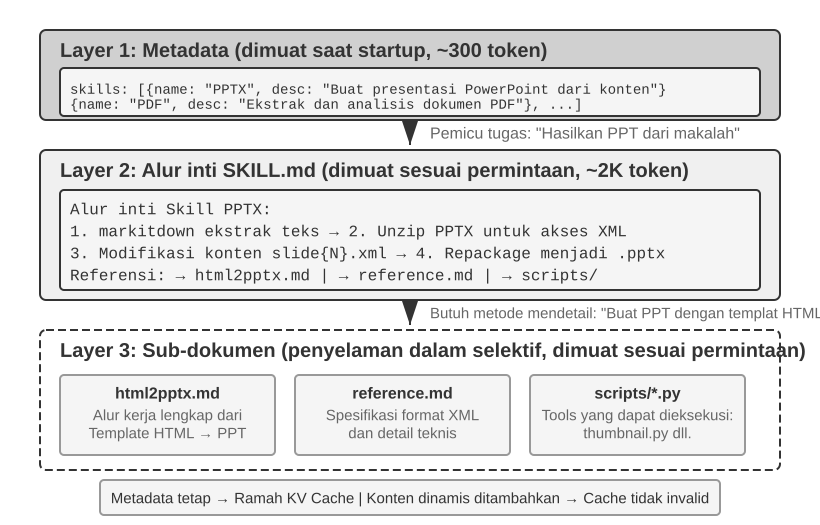

Seiring Agen diminta untuk menangani lebih banyak skenario, prompt sistem cenderung bertambah besar: aturan pengembalian dana untuk layanan pelanggan, standar pengodean untuk tugas pemrograman, persyaratan format untuk tugas dokumentasi, dan lain sebagainya. Menempatkan semuanya ke dalam satu prompt tunggal menciptakan dua masalah:

- **Pemborosan token**: Sebagian besar konten tidak relevan dengan tugas saat ini.
- **Perhatian yang terpecah**: Terlalu banyak informasi yang tidak relevan di dalam konteks akan memecah perhatian model terhadap konten kunci (bagian kompresi konteks nanti dalam bab ini membahas hal ini secara rinci di bawah konsep "kebusukan konteks" atau context rot).

Ini adalah evolusi alami dari rekayasa prompt statis menjadi prompt dinamis: **daripada memuat semua pengetahuan ke dalam Agen sekaligus, biarkan ia memuat pengetahuan sesuai kebutuhan**. Sistem Keterampilan Agen (Agent Skills) adalah implementasi rekayasa dari ide ini.

### Keterampilan: Unit Kemampuan Domain yang Dapat Disusun (Composable)

Ide inti dari Keterampilan Agen adalah memodularisasi kemampuan Agen ke dalam paket pengetahuan independen yang dapat dimuat[^ch2-3]. Setiap Keterampilan pada dasarnya adalah kumpulan prompt dan file yang berisi panduan domain khusus, seperti buku petunjuk operasi untuk tugas spesifik. Berbeda dengan pendekatan tradisional yang menempatkan semua instruksi ke dalam prompt sistem tunggal, Keterampilan menggunakan *Progressive Disclosure* (Pengungkapan Progresif): pertama tunjukkan ringkasan daftar isi kepada Agen, lalu muat konten lengkapnya hanya ketika dibutuhkan. Alih-alih memuat setiap manual domain ke dalam konteks sekaligus, framework menyediakan direktori dan membiarkan Agen mengambil manual yang relevan sesuai kebutuhan.

[^ch2-3]: Anthropic, "Equipping Agents for the Real World with Agent Skills", 2025.

**Lapisan 1 (Metadata)**: Setiap Keterampilan harus mencakup file `SKILL.md` yang dimulai dengan *frontmatter* YAML (blok metadata di bagian atas file yang dibatasi dengan `---`, mirip dengan halaman hak cipta sebuah buku), yang berisi kolom `name` (nama) dan `description` (deskripsi). Framework Agen memindai semua Keterampilan yang terinstal saat mulai (startup) dan menyuntikkan `name` serta `description` mereka ke dalam konteks dialog. Ini biasanya hanya memakan biaya beberapa ratus token, dan pengorbanan terkait lokasi penyuntikan dibahas pada subbagian berikutnya. Tujuannya adalah membiarkan Agen menemukan kemampuan khusus mana yang tersedia tanpa memuat semua konten Keterampilan ke dalam konteks.

Perutean sangat bergantung pada bidang `description` dari metadata. Deskripsi tersebut harus cukup ringkas untuk menjaga agar jumlah token yang selalu dimuat tetap rendah, tetapi ditulis sebagai aturan perutean daripada ringkasan fitur. Pola yang paling jelas adalah "Gunakan bila / Jangan gunakan bila", didukung oleh **contoh-contoh negatif** yang mengidentifikasi situasi di mana Keterampilan tersebut tidak boleh dipicu. Contoh negatif bukanlah pilihan; mereka penting untuk perutean Keterampilan yang akurat. Deskripsi luas seperti "bantu masalah backend" memicu pada tugas-tugas yang tidak terkait, sementara pengecualian yang eksplisit membuat perutean menjadi lebih akurat. Untuk tujuan perutean, "kapan harus menggunakan saya" jauh lebih penting daripada "apa yang bisa saya lakukan."

**Lapisan 2 (Alur Kerja Inti)**: Saat Agen menentukan bahwa Keterampilan spesifik dibutuhkan untuk sebuah tugas, ia memuat `SKILL.md` lengkap melalui alat Keterampilan khusus, dan konten tersebut muncul di riwayat percakapan sebagai hasil alat. Menggunakan Keterampilan PPTX[^ch2-4] sebagai contoh, ia berisi alur kerja inti untuk menangani file PowerPoint: cara mengekstrak teks melalui *markitdown* (alat pengubah dokumen ke Markdown open-source Microsoft), cara mengekstrak file PPTX untuk mengakses struktur XML mentah, dan konvensi jalur untuk file-file kunci.

[^ch2-4]: Anthropic, "PPTX Skill", 2025. https://github.com/anthropics/skills/

**Lapisan 3 (Detail)**: Referensi file memungkinkan navigasi yang lebih dalam ke sub-dokumen yang lebih rinci. File utama mereferensikan `html2pptx.md` (alur kerja detail untuk membuat PowerPoint dari template HTML), `reference.md` (format detail teknis), dan lainnya. Agen membaca sub-dokumen yang relevan secara selektif berdasarkan kebutuhan spesifik.

Keterampilan tidak hanya berisi dokumentasi instruksional tetapi juga dapat membundel alat kode yang dapat dieksekusi dan file template—mengubahnya dari sekadar transfer pengetahuan murni menjadi kemampuan operasional.

Nilai Keterampilan tidak hanya terletak pada manajemen konteks tetapi juga dalam menyediakan jalur yang berkelanjutan untuk mengakumulasi pengetahuan domain. Setiap Keterampilan adalah modul pengetahuan mandiri yang dapat dikembangkan, diuji, dikontrol versinya, dan dibagikan secara independen. Modularitas ini mengubah ekspansi kemampuan Agen dari penyuntingan prompt sistem yang terpusat menjadi ekosistem Keterampilan yang terdistribusi, yang secara semangat serupa dengan manajer paket seperti pip pada Python atau npm pada Node.js. Setiap Keterampilan merangkum praktik terbaik untuk domain spesifik. Repositori Keterampilan resmi Anthropic telah mencakup pemrosesan dokumen (PPTX, PDF, DOCX), analisis data, pembuatan kode, dan domain lainnya, memungkinkan para pengembang untuk menggunakan, menyesuaikan, atau membuat Keterampilan yang sama sekali baru.

Hal ini mengungkapkan prinsip penting bagi pengembang Agen: **ketika memilih mode interaksi Agen, sejajarkan dengan pola interaksi yang didukung oleh model dan API**. Ketika membangun Agen dengan Claude, manfaatkan sepenuhnya Keterampilan dan prompt sistem terstruktur; ketika menggunakan model lain, ikuti konvensi yang dioptimalkan oleh vendor model tersebut. Pola penggunaan Agen yang dipromosikan oleh perusahaan pembuat model fondasi sering kali mencerminkan mode-mode yang dilatih dan dievaluasi untuk didukung oleh model-model tersebut.

### Metode Implementasi Keterampilan dan Pengorbanan (Trade-offs)

Setelah mendefinisikan Keterampilan, pertanyaan berikutnya adalah masalah teknis yang konkret: di mana konten Keterampilan harus ditempatkan di dalam konteks? Keputusan desain ini secara langsung memengaruhi efisiensi KV Cache dan kemampuan model untuk mengikuti instruksi Keterampilan. Pada prinsipnya, ada dua pendekatan yang mudah dilakukan, tetapi keduanya memiliki biaya yang signifikan. Sistem produksi seperti Claude Code menggunakan pendekatan ketiga yang menghindari kelemahan utama dari keduanya.

**Pendekatan Satu: Suntikkan ke Prompt Sistem (pesan sistem)**. Tambahkan konten Keterampilan langsung ke prompt sistem. Kemampuan mengikuti instruksi model adalah yang terkuat untuk konten di posisi sistem (karena pelatihan banyak menggunakan instruksi di posisi ini), sehingga eksekusi Keterampilan menjadi sangat efektif. Masalahnya: setiap kali Keterampilan baru dimuat, konten pesan sistem berubah, membatalkan awalan (prefix) KV Cache. Jika Agen sering berganti Keterampilan (misalnya, sebuah tugas mengharuskan penggunaan Keterampilan pencarian terlebih dahulu, kemudian Keterampilan dokumen), cache berulang kali dibatalkan, yang secara signifikan meningkatkan latensi dan biaya.

**Pendekatan Dua: Baca sebagai file biasa, dengan konten yang muncul di tengah konteks**. Agen membaca file Keterampilan melalui alat pembacaan file generik, dan konten file muncul sebagai hasil alat dalam riwayat percakapan—yaitu, bagian tengah konteks. Pendekatan ini sama sekali tidak memengaruhi KV Cache (prompt sistem tidak berubah), tetapi memberikan tuntutan yang lebih tinggi pada kemampuan **mengikuti instruksi** dari model: model perlu secara akurat mengidentifikasi dan mengikuti instruksi dalam Keterampilan di tengah konteks yang panjang, daripada menganggapnya sebagai output alat biasa yang direferensikan. Dalam praktiknya, model-model yang berbeda sangat bervariasi dalam dukungannya terhadap mode ini—Claude bekerja dengan sangat andal karena pelatihannya banyak menggunakan data yang mengikuti instruksi di posisi tengah; model lain sering menurun performanya saat mengikuti instruksi yang disuntikkan di tengah konteks.

**Pendekatan Tiga (Implementasi Produksi): Metadata disuntikkan di akhir konteks, konten penuh dimuat sesuai permintaan melalui alat khusus**. Ini adalah pendekatan yang digunakan oleh Claude Code. Pendekatan ini memisahkan "perutean" dan "eksekusi" menjadi dua langkah, menghindari kelemahan utama dari dua pendekatan sebelumnya:

- **Daftar metadata**— `name` + `description` dari semua Keterampilan yang terinstal (biasanya hanya beberapa ratus token)—disuntikkan sebagai **pesan meta ber-peran pengguna** di akhir konteks, dibungkus dengan tag `<system-reminder>`. Pesan ini tidak memodifikasi prompt sistem, sehingga awalan KV Cache tetap stabil. Hal ini juga menghindari penempatan metadata di tengah konteks, yang mungkin menerima lebih sedikit pikat kebaruan (*recency salience*). Claude Code menggunakan strategi pengiriman inkremental: setiap Keterampilan hanya dikirim saat pertama kali muncul, dan Keterampilan yang telah dikirim tidak diulang. Ini membuat muatan (*overhead*) metadata di keadaan stabil (*steady-state*) menjadi nol dan mempertahankan cache. Bagaimanapun, keuntungan di akhir konteks ini hanya berlaku pada giliran penyisipan. Seiring bertambah panjangnya lintasan (trajectory), metadata bergerak ke arah tengah konteks dan kehilangan *salience* posisinya. Hal ini menciptakan *trade-off* (pengorbanan) antara "kirim sekali, pertahankan cache" dan "simpan di akhir setiap putaran, pertahankan perhatian", yang muncul lagi dalam pembahasan bagian selanjutnya tentang pembaruan tambahan persisten (persistent append-style updates).
- **Konten lengkap** dimuat sesuai permintaan melalui alat Keterampilan khusus. Ketika model mengidentifikasi dari daftar metadata bahwa Keterampilan tertentu cocok untuk tugas saat ini, model memanggil alat seperti `Skill(skill: "pdf")`. Alat tersebut secara internal membaca `SKILL.md` dan mengembalikannya, lalu hasilnya muncul sebagai hasil alat dalam riwayat percakapan. Ini memotong risiko dari Pendekatan Dua terkait ketaatan terhadap instruksi—model lebih cenderung menggunakan keluaran dari alat yang baru saja secara aktif dipanggilnya alih-alih harus menaati konten teks biasa yang hanya diselipkan di tengah-tengah konteks.

Perlu dicatat bahwa "pesan meta peran-pengguna di akhir konteks" bukanlah saluran yang unik untuk Keterampilan, tetapi pola injeksi informasi-meta secara umum—bagian selanjutnya tentang **Bilah Status Agen (Agent Status Bar)** akan memperluas mekanisme ini secara sistematis, dan daftar metadata Keterampilan dapat dilihat sebagai contoh spesifik dari mekanisme tersebut.

Dua gambar berikut menunjukkan efek desain ini dari dua sudut pandang: posisi Keterampilan dalam lintasan dan evolusi KV Cache.

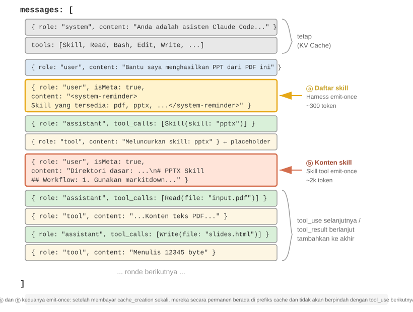{height=55%}

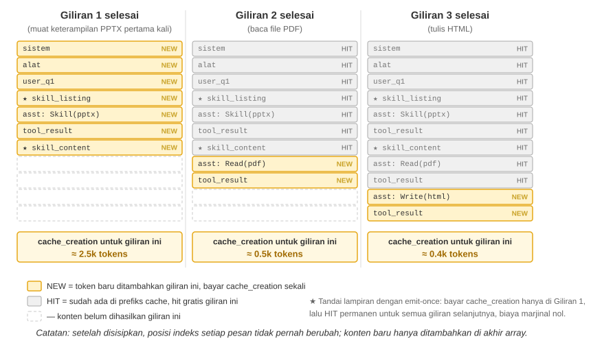

Kesalahpahaman yang umum perlu diklarifikasi: "Ramah KV Cache" bukan berarti "nol biaya." Penempatan awal dari beberapa ratus hingga beberapa ribu token tersebut masih menimbulkan biaya penulisan (seperti yang disebutkan sebelumnya, penulisan Prompt Cache bahkan dapat dikenakan harga premium). Arti yang tepat adalah **tulis sekali, nikmati berkali-kali**: untuk membuat model menyadari keberadaan suatu Keterampilan atau bagian konten dokumen, informasi tersebut harus masuk ke dalam cache setidaknya satu kali. Claude Code membayar biaya ini hanya sekali, tanpa pengulangan selama sisa sesi berlangsung. Bandingkan ini dengan meletakkan informasi yang sama ke dalam prompt sistem: setiap pembaruan membatalkan lintasan berikutnya (downstream) dan memaksa pembuatan cache lagi, sering kali untuk puluhan atau ratusan ribu token. Hal itulah yang sebenarnya benar-benar tak-ramah-cache (cache-unfriendly).

### Hubungan Antara Keterampilan dan Alat (Tools)

Dari perspektif manajemen konteks, mekanisme Keterampilan sangat ramah KV Cache. Jika semua definisi alat kode khusus ditempatkan di prompt sistem, hal tersebut akan memakan banyak token, dan perubahan apa pun akan merusak awalan cache (cache prefix). Pada model Keterampilan + eksekutor generik, jumlah alat tetap kecil (seperti yang ditunjukkan di Bab 5, hanya tujuh alat inti yang diperlukan), dan konten Keterampilan dimuat sesuai permintaan melalui *progressive disclosure* tanpa memengaruhi awalan yang telah di-cache. Bab 4 memberikan perbandingan rinci dan kerangka pemilihan untuk dua format ini, sementara Bab 8 menelusuri bagaimana Agen, selama berevolusi mandiri, memilih format mana yang akan digunakan untuk mengeksternalisasi kemampuan barunya.

> **Eksperimen 2-6 ★★: Hasilkan Presentasi dari Makalah Menggunakan Keterampilan Agen**
>
> **Tujuan Eksperimen**: Verifikasi kemampuan Agen untuk menyelesaikan tugas kompleks dengan memuat Keterampilan domain khusus secara dinamis.
>
> Gunakan Claude Code + Keterampilan PPTX untuk menghasilkan presentasi berisi 10–15 slide dari PDF sebuah makalah akademis. Alur eksekusi Agen menunjukkan proses pemuatan bertahap (progressive):
>
> 1. Melihat deskripsi Keterampilan PPTX di daftar metadata Keterampilan di akhir konteks
> 2. Mengidentifikasi bahwa tugas tersebut membutuhkan Keterampilan ini
> 3. Memuat `SKILL.md` secara lengkap melalui alat Keterampilan untuk mendapatkan alur kerja inti
> 4. Memuat `html2pptx.md` secara selektif untuk menemukan detail metodenya
> 5. Menggunakan skrip alat bawaan (mis., `scripts/thumbnail.py`) untuk memutar pratayang (*preview*), serta menggunakan file template sebagai awalan rancangannya
>
> **Kriteria Penerimaan**: PowerPoint yang dihasilkan mencakup konten utama makalah (halaman judul, latar belakang masalah, ikhtisar metode, hasil utama, kesimpulan), memuat sedikitnya 3 gambar yang diekstrak dari makalah tersebut agar selaras dengan uraian teksnya, dan formatnya valid sehingga dapat dibuka dengan benar di dalam program PowerPoint atau peranti lunak yang kompatibel.
>

## Bilah Status Agen (Agent Status Bar): Mengelola Lintasan (Trajectory) dengan Meta-Informasi

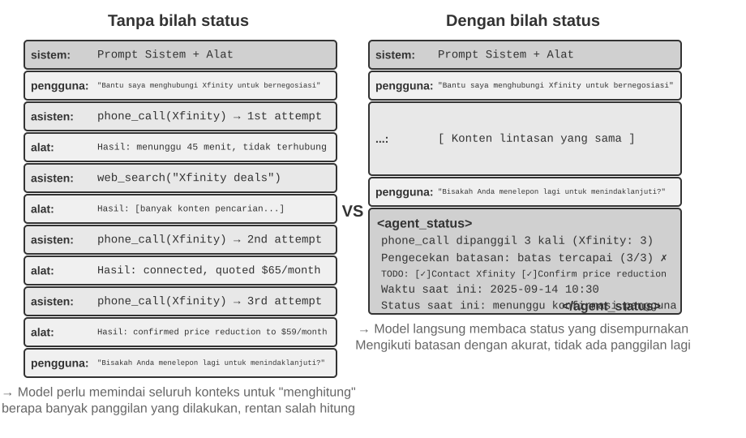

Bagian Keterampilan memperkenalkan "pesan meta peran-pengguna di akhir konteks" sebagai saluran umum untuk menyuntikkan meta-informasi. Daftar metadata Keterampilan adalah salah satu kegunaan dari saluran tersebut. Bagian ini mengembangkan mekanisme tersebut secara lebih sistematis: framework Agen dapat menggunakannya untuk menyinkronkan status saat proses (runtime) yang dinamis bersama model. Mekanisme ini disebut **Bilah Status Agen (Agent Status Bar)**.

Rekayasa prompt yang dibahas sebelumnya memecahkan masalah mengenai "instruksi statis apa yang harus diberikan ke model". Namun, selama eksekusi nyata, Agen juga perlu melacak status dan progres tugasnya sendiri secara dinamis—di sinilah Bilah Status Agen berperan.

Saat membangun sistem Agen tingkat produksi, mengandalkan kemampuan asli bawaan LLM (native capabilities) sering kali tidak cukup. Agen yang menjalankan tugas-tugas kompleks dapat jatuh ke dalam mode kegagalan (failure modes) seperti siklus tak berujung (infinite loops), kehilangan memori (loss of state), dan penyimpangan tujuan (goal drift). Akar penyebabnya sering kali karena model tersebut kehilangan gambaran jelas mengenai kondisi lingkungan saat ini dan juga progres dari sang tugas. Bilah Status Agen mengatasi persoalan tersebut melalui penyisipan rupa meta-informasi terstruktur di dalam konteks, memberikan model rupa sinyal-sinyal perihal statusnya (state signals) secara tegas (explicit) yang dapat didayagunakan semasa mengambil berbagai keputusan kelak.

Analogi yang paling mendekati adalah **bilah status** dari sebuah sistem operasi. Di ponsel, bagian atas layar menampilkan waktu, sisa baterai, kekuatan sinyal, serta jumlah notifikasi. Kumpulan informasi ini bukanlah konten utama dari sebuah aplikasi, melainkan semata menolong pengguna untuk secara sigap mengetahui detail status atau keadaan terkini dari sang perangkat. Bilah Status Agen memenuhi tujuan serupa pada model: hal ini tidak tergabung menjadi konten pokok percakapan—bukan berupa permintaan end-user, hasil (output) model, maupun luaran hasil alat—tetapi murni wujud **ringkasan status (state summary)** yang disuntikkan oleh framework Agen di bagian ujung/akhir konteks: "Kamu sudah 3 kali menelepon", "Waktu saat ini 10:30", "Ada 2 pekerjaan TODO yang masih tersisa". Setiap kalinya si model mencoba membuat respons, ia mampu bersandar pada keadaan (state) ini agar kelak dapat menetapkan putusan yang makin berfaedah.

Perbedaannya dengan Prompt Sistem menjadi jelas: Prompt Sistem itu merupakan buku pedoman tetap, sementara Bilah Status Agen berwujud sebagai rupa dasbor langsung (*real-time*) yang tiada hentinya diperbarui menyertai segenap laju progres sang tugas tersebut.

### Dasar Teoretis Bilah Status Agen

Efektivitas Bilah Status Agen berawal dari properti fundamental mekanisme *attention* (atensi/perhatian): pembelajaran dalam-konteks (in-context learning) lebih menyerupai proses pencarian/pengambilan ulang (*retrieval*) daripada proses penalaran rasional (*reasoning*). Model tersebut sanggup mencari secara hebat aneka informasi yang sejatinya sudah terpatri kuat dalam konteks, tetapi sering goyah dalam secara sigap menyimpulkan konteks itu lalu memformulasikan status agregatnya semasa menempuh putaran proses tunggalnya (*single forward pass*). Fakta ini lebih condong memaparkan perihal "bagaimanakah" cara kerja dari proses si model melahap (consumes) muatan wujud konteks di dalam *forward pass* tunggal tersebut; sama sekali tak bermaksud menegasikan keping kepiawaian sang model untuk mengerahkan porsi *multi-step reasoning* seraya beralaskan penyusunan runut perihal jejak-langkah (chain-of-thought) kelak.

Atau seandainya boleh diungkap ulang secara berbeda, fitur *attention* senantiasa menganugerahkan keping sang model satu jalan pencarian (*retrieval*) andal untuk kembali mencapai seluruh rentet token (tokens) di dalamnya. Apabila disodorkan sebuah masalah atau soal, kelak ia pun begitu hebat sanggup membongkar atau meracik catatan data lampau (raw records) bersangkutan yang saling berhubungan kuat dari dalam lipatan ribuan baris token, seraya tanpa ayal mengubah nasib *forward pass*-nya menjadi seakan layaknya semacam perwujudan enteng dari metode Retrieval-Augmented Generation (RAG). Malangnya bagian yang lowong (missing) tiada lain ialah selapis fitur penyuling (distillation layer) serba-otomatis. Sang konteks nyatanya belum secara mandiri diringkas (summarized), direkap jumlahnya (counted), ataupun ditandai-indeks di ranahnya secara langsung begitu saja. Aneka rupa simpul-akhir konklusi yang bersinggungan erat akan ranah wujud kandungannya (content)—berapa total isi (items) nya, apakah sudah melanggar batasan porsi maksimumnya, hingga menakar sudah sejauh mana kelak berjalannya tugas bersangkutan (how far along)—terpaksa kudu terus-menerus dirunut kembali ulang (recomputed) sejak awal mula berdasarkan catatannya yang paling mentah tatkala jasad si mesin betul membutuhkan detail nilai tersebut. Rupa beban hitungan penyelesaian tadi malah perlahan pasti acap kian terkerek bengkak tatkala isi muatan di konteks ini kian banyak terkumpul menebal.

Simak satu skenario sungguhan (real-world): ada sebentuk Agen ditugaskan sanggup melakukan sambungan perbincangan sapaan per telepon bagi menyelesaikan segenap rentetan operasi urusan niaga-tugas, lantas barisan prompt sistem berpesan agar sekuat-kuatnya membatasi jumlah menelepon ke masing-masing tempat jual atau perniagaan tersebut secara paten tiada melebihi rupa batas maksimal hingga tiga (3) kali panggilan utuh saja. Tetapi manakala sukses melunasi giliran panggilan berjumlah yang ke-tiga tadi usai, sang agen acapkali rentan oleng goyah bingung sendiri lupa mengingat atau salah hitung perihal berapakah pastinya jumlah sesi ia murni melakukan hal itu, lalu malahan nyatanya kembali meluncur menelepon ke sekian-kalinya (keempat), dan lebih fatalnya lagi sampai jatuh terjerumus ke pusaran pengulangan perlakuan repetitif *loop* dengan melontarkan sederet nomor urut panggil yang ber-status serupa persis belaka (same number).

Penyakit yang menggerogotinya tiada lain dan tiada bukan yakni pada luaran solusi maupun temuan rumusan buat porsi per-jawaban menyangkut, "Berapa ratus ribukah pasnya aku menelurkan rentetan operasi ini?" sama sekali secara gamblang luput dibentuk dan disuling lantas ditampakkan utuh nyata rupa jadi (distilled) bermetamorfosis berujung sebuah wujud konklusif kebenaran pakem eksplisit (explicit fact). Bukannya tampil-wujud demikian, wujud ia malah terpuruk terlantar terhambur teronggok-serak mengambang (scattered) semata tercecer malang-melintang menghiasi rupa lembar laporan hasil kasar rupa status-rekam telepon (call records) tersimpan di rongga lubuk per-wadah-an aset data KV Cache. Saban tiap si mesin hendak mengokoh-paterikan pilihan jalan perumusan jalan-keputusan logik (decision), mau tak mau ia terpaksa wajib bersedia rela merogoh saku membongkar mengeluarkan rupa nilai dari token-token logik miliknya buat giat menyisir utuh rupa wajah wadah ranah *context* kelak merapalkan kembali cacah rekapan deret ulang-perhitungan kalkulasinya, suatu ragam wujud ikhtiar laku operasi perwujudan alur langkah proses operasi yang amat sangatlah minim efektivitas kehematan (inefficient) lagi rentan dipenuhi rupa bahaya-bengkok (error-prone).

Tatkalanya dengan sigap sedari awal kita sengaja mencangkok memuatkan nominal perulangan catatan angka ini terang-benderang ke dalam jasad pelupuk pelaporan akhir wujud sang utusan luaran-alat (tool call result) semata diperuntukkan per panggilan operasional terkait (misal bunyinya, "Ini adalah keping hasil deret sapa-panggilan urutan yang ke tiga kalinya bagi menuju gerai rupa ini"), sang jasad program logik (the model) kian sigap menyahut seketika mencium bau kenyataan bahwa puncak rentang angka limitasi purna tertembus atau sudah maksimal dilampaui dan menyetop (stop) alur dari kegiatan panggil, berhasil sukses merontokkan jurang kekhilafan (error rates) ke tingkatan drastis luwes secara berarti.

Roh ruh esensi murni dari sekeping sarana instrumen mekanika berikut senantiasa murni adalah rupa **penyulingan-saripati (distilling) setumpuk wujud status-status ragam-samar (implicit states) melintang tercerai-berai merata seisi kepenuhan ruang rupa luasan jangkauan sang *context* hingga menyulapnya menjelma bertransisi berganti menjadi perbendaharaan koleksi wawasan terang-menderang eksplisit nyata (explicit knowledge) nan kian malahan kelak rupa seketika dapat dipetik diambil didayagunakan dimanfaatkan ditelan (directly used) murni secara se-langsung nyata (directly)**. Ragam luaran kelengkapan se-himpun data isi-informasi bermukim pada ruang riwayat murni *trajectory* lazim kerap amat sungguh-sungguh ruah-ruah pengulangan nan panjang bertele-tele (redundant)—kumpulan ruah yang mbludak panjang membongsor rupa serpih dari *tokens* sebatas sekadar menutupi seonggok sejumput amat ringkas secercah rupa serpihan secuil rupa materi keping profil perihal *key state information*. Bilah Papan penampil Status milik Agen sanggup malahan luwes giat meraup mengekstrak mencomot mendongkel rupa segenap serpih poin mutlak ini (key states), seraya mempertontonkannya (presenting)—bermodal jerih deret keping tebusan ongkos keping murni sekadar token sisipan *additional token cost* pada derajat batas minimal utuhnya—kelengkapan rupa informasi yang bila sebaliknya ditiadakan, maka kelak malahan akan menuntut mengemis pengerahan pengorbanan jerih parah dengan menyapu membaca melintas rupa menyisir merunut rupa membongkar *scanning* menatap tajam melumat beribu lembar ribuan lembar lipat keping *tokens*.

Di ruang jagat gelanggang wujud se-rupa rentetan perwajahan dengan profil wadah *context* berbadan panjang lebar mulur dan tambun me-lorot panjang-luas, modal porsi cadangan keping ranah-kuasa daya tumpu pikat-atensi dari si model (attention resources) nyatanya terbatas. Tatkala ranah ukuran porsi ragam jangkauan jasad *context* panjang me-melar tumbuh meregang (*increases*), otomatis pihak mesin jasad-model mesti lantas sigap menebar mendistribusi lantas menjatahi porsi sebaran dari atensi terkait melintasi seraya menebar menyelubungi kumpulan profil daftar-muatan isi kandidat sang calon pesaing-tumpuan tumpu-wujud *candidate content* secara lebih berjejal banyak menumpuk (*more*), sehingganya informasi titik keping pilar pun kelak dapat tertimpa nasib porsi-jatuh malahan memperoleh (receive) siraman dosis porsi limpahan wujud pembobotan (weight) porsi murni keping luaran yang tidak-begitu proporsional-mumpuni sama-sekali tiada sepadan-sempurna-cukup alias malah tak-cukup (insufficient). Di pusaran kompleksnya jalinan rupa porsi rentetan riwayat laku-tindak sang Agen, sekumpulan luaran tujuan-pokok puncak-porsi misi utamanya seraya dengan batas rambu prasyarat-awal mutlak murni perihal dari-perdana pembatas murni dari (*early constraints*) rentan acapkali tenggelam tersapu tenggelam lelap dilumat luruh tertimbun (*overwhelmed*) malang ketiban rupa rentetan set muatan tumpuk keluaran sarana rupa *tool results* pada gelombang-deret selanjutnya (later). Si Mesin unit terkait juga punya kelemahan penyakit kerap luwes senantiasa bertingkah keterlaluan-rakus (over-focus) kepalang rakus memandang tajam melulu mengarahkan fokus men-rakus terpikat murni kepada se-keping ranah wujud sarang wadah-ranah belahan *context* paruh porsi terbaru yang paling segar keping ter-gres (recent context), seraya di kala persis kelak bersamaan membuahkan menyumbang lahir (creating) keping rupa wujud "peluruhan-atensi dari-atensi (attention decay)" khusus spesifik diperuntukkan ke kubu jajaran-isian-fakta informasi (information) dengan alamat pendaratan-lokasi kediamannya tertambat bercokol mendarat tersembunyi (located) menyusup nyelip diam men-tengah (middle) pada kedalaman rongga belahan luasan wadah wujud dari bilik dalam porsi lubuk bagian *context* (*middle of the context*).

Fasilitas Bilah Status sang Agen sigap meluncur merangkul (addresses) seraya membabat perihal-soal dilema ruwet ini berbekal-cara wujud upaya aksi manuver senantiasa sengaja diniatkan matang lurus (deliberately) ditaruh lantas mengonggok mem-posisi mendarat-muat mem-pacak (placing) bongkahan inti per-kunci serpih informasi isian dari muatan berkelas-meta-informasi krusial bersangkutan dalam sebuah rupa kemasan kemasan perwajahan (format) tata-profil tersusun rapi-struktural ter-bangun rapi terstruktur *structured* lurus terletak bertahta mendarat di buritan (at the end of) tapal muara-akhir pangkal jasad dari kelestarian milik *context*. Dilandaskan pada wujud alasan rupa letak domisilinya si muatan serpihan (this information) murni berdekatan lurus teramat rapat selari dekat nian murni berjejal merapat dekat ke sisi letak pelupuk keping-keping profil kepemilikan jajaran *tokens* porsi bagian rupa token yang selangkah kemudian bakalan kelak sedianya-nyaris (*is about to*) ditelurkan dilahirkan dicipta-keluarkan bakal dihasilkan diracik dibuahkan dibangkitkan (generate) oleh sang jasad rupa model tersebut, rupa posisinya lantas perlahan lebih (*more likely*) menjanjikan peluang lebih terang kelak mendulang sanggup kelak sudi menggamit memanen merenggut memikat berhasil (receive) rengkuhan perhatian daya-tarik atensi *attention*. Metode trik kiat perwujudan (This) tiada lain ialah setitik wujud keping kelestarian modus langkah perihal-manipulasi bermanuver mengarahkan menuntun mengemudi menyetir haluan perihal beralas manipulasi mengarahkan menyetir porsi pesona pikat atensi (attention steering) berjejak pilar lurus murni seutas manuver murni rupa segenap taktik penempatan tata letak manuver-posisi meletakkan lokasinya posisional *placement*.

> **Eksperimen 2-7 ★★: Pembuktian Nyata dari Keampuhan Faedah Kinerja dari Papan Bilah Bilah Status sang Agen me-lalui-perantaraan Berbekal Visualisasi dari Ketersediaan Visualisasi Pikat-Tatapan Atensi (*Attention Visualization*)**
>
> Berbekal rupa murni hasil rekaan proyek perwujudan-rancang dari proyeksi luaran wadah uji `attention_visualization`, kami pun malahan dengan lincah menyusun membidani perwujudan menata merakit luwes menciptakan menelurkan wujud gubahan keping simulasi murni kelestarian rekam jejak-eksperimen-dikontrol (controlled experiment) porsi di mana sekeping wujud rupa pelakon instrumen sosok Agen petugas *customer service* melakoni menangani bergulat meng-tangani melerai memegang peranan menyajikan kelestarian menyajikan penanganan untuk meladeni menanggapi (*handles*) keping urusan sekadar tuntutan permohonan berstatus gugatan balikan dana klaim-*refund*. Si Agen nyatanya sebelumnya memang telah purna lunas rampung (*has already*) mem-berondong-merapat malahan melayangkan menggapai terhubung mengontak memanggil pihak lembaga instansi wujud perusahaan berstatus nama Xfinity sejumlah rekam 3 lipat porsi kesempatan (*3 times*), seraya lantas pada titik sela ruang perantara seluk waktu jeda diselipi ditabur (*interspersed*) dipadukan bersama rupa wujud tumpuk kelestarian perwujudan keping rupa rekam proses upaya unjuk pencarian ramban-raya *web searches*. Kemudian lantas Sang pemakai *user* bertanya mengemis mengajukan-desak pertanyaan-baru menanyakan-lontaran (*asks*): "Boleh-bisa-sanggupkah dirimu lantas kelak bergegas mencoba menelepon bertamu (call) menjangkau menemui menelepon me-raih menyapa mendarat memanggil mereka lagi sejenak kelak (*call them again*) murni ditujukan melakoni merunut menyusul menyapa merunut memastikan-lebih-lanjut melangkah rupa memantau merapat menyelidiki-tindak rupa memantau kelak men-susul menyapa-tindak *to follow up*?"
>
> **Kelompok Kontrol Tipe A (*Control Group A*) (Ber-status Nihil Kosong Tanpa Bilah Status):** Keping jasad pusaran (The context) membopong menampung utuh seluruh utai riwayat-sejumlah-penuh jejak komplit dari rupa rentetan panjang *trajectory* utuh purna namun secara utuh mutlak luput-tiada memuat sekeping setetes rupa wujud baris info rangkuman murni wujud kumpulan rupa agregat informasi status (aggregated status information). Si hasil raut *heatmap* membeberkan lurus wujud pola sebaran tebaran rentang tatap daya atensi yang sangat ruah-ruah bertebar rupa berserak meluas (widely dispersed attention), bersanding dengan rupa perwujudan wujud titik kumpul tumpuk porsi gumpalan fokus yang rupa-jelas mencolok ter-wujud berbeda nampak beda kental (distinct concentrations) membungkus rupa mengerumuni mengelilingi (around) keping rekam-riwayat dari ketiga deretan *the three phone-call records*. Barisan porsi ragam sekumpulan deretan keping rupa ragam keping token-penalaran (reasoning tokens) mempertontonkan wujud asli luaran tingkah si pihak sang (*the model*) tengah-wujud sedang bersibuk-diri menghitung (counting) merakit hitung lalu mencacah menyatukan (tallying) menghimpun fakta perihal isian informasi luaran dari jasad murni rupa-mentah sumber-rekam-asar dari *raw records*.
>
> **Kelompok Kontrol Tipe B (*Control Group B*) (Ber-status Dijejali Dengan Bilah Status):** Untaian di bawah berikut lantas disemat diletak ditambahkan dirajut menempel (*is appended*) bertengger merapat di pada sisi-seberang batas buritan pangkal (at the end of) keping kepunyaan sang rentetan *trajectory*:
>
> ```xml
> <agent_status>
> Current State:
> - Tool call summary: 'phone_call' has been invoked 3 times (Xfinity: 3 times)
> - Constraint check: Maximum calls to Xfinity reached (3/3)
> </agent_status>
> ```
>
> Keping sorot pikat *Attention* sukses di-mutlak digiring terpusat padat di-satu rupa wujud dengan mutlak murni telak sangat terpusat terkonsentrasi sangat amat amat (*highly concentrated*) memaku merapat tertuju lurus kepada isian rupa porsi data *status bar information*. Proses perakitan rupa alur nalar *reasoning process* tersebut lantas secara rupa seketika sigap telak langsung secara mutlak se-mentah lurus secara sigap (directly) mendayagunakan menyedot memanfaatkan (*uses*) jasad profil instrumen materi luaran mutlak keping porsi wujud rupa isian *distilled information* yang sebelumnya sudah-telah-lunas purna-disuling lunas (already distilled information), sukses se-lunas merelakan purna-menyerah enggan luput men-mutlak tiada usah tiada (no longer) kelak kudu tak usah tak harus lagi tiada purna tak purna-luput ditiadakan ditiadakan lagi menghitung ulang kalkulasi lagi tak mengomputasikan (*computing*) aneka kelestarian muatan angka rekap porsi deret rekam statistik keping statistika perihal *statistics* luaran berangkat murni bermodal berdasar bersumber merunut bertitik berangkat *from* luaran data *the raw data*. Dihadapkan bagi wujud rupa kelas mesin model imut se-taraf rupa se-kawan kecil mungil sebangsa peraga rupa wujud kelas Qwen3-0.6B kecil (a small model like Qwen3-0.6B), Kelompok Kelas Tipe A kerap-lugas seringkali (*frequently*) mencederai berontak-melawan memutus menghantam melanggar luwes melawan melanggar mencederai merusak me-langgar (*violates*) rupa batas-batas wujud porsi batasan kepatuhan batas pantang pembatasan syarat rupa batasan (constraint) seraya lantas pantang-henti ngotot lurus lanjut nekat terus menyapa memanggil nekat-lanjut terus-memanggil (*continues calling*), di mana berkebalikan dari kawan Kelas Kelompok Tipe B sedianya secara taat terus-menerus senantiasa ajek tegar taat konsisten senantiasa (consistently) sudi manut taat menuruti bersetia pada manut merujuk setia melekat mengindahkan patuh mematuhi (*adheres to*) batas larangan wujud batasan *constraint*.
>
The above content does NOT show the entire file contents. If you need to view any lines of the file which were not shown to complete your task, call this tool again to view those lines.
Perhatikan pesan terakhir: `role` (peran)-nya adalah `user` (pengguna), tetapi kontennya berupa meta-informasi yang dihasilkan secara otomatis oleh framework Agen, dibungkus dalam tag `<agent_status>` agar model dapat mengenali sifat khususnya. Pesan ini berada di bagian paling akhir dari konteks, tepat berdekatan dengan token baru yang akan dihasilkan model, sehingga menerima bobot perhatian (attention weight) tertinggi. Pada saat yang sama, karena pesan tersebut ditambahkan (di-append) alih-alih memodifikasi yang sudah ada, semua konten yang telah di-cache sebelumnya tetap tidak terpengaruh.

Desain ini menerapkan prinsip inti dari bagian KV Cache pada bilah status: tambahkan informasi dinamis di akhir, dan biarkan informasi statis tidak berubah.

### Dua Implementasi Pembaruan Status dan Biaya Cache-nya

"Menambahkan (appending) tidak merusak cache" hanya berlaku untuk satu kali penyuntikan. Status secara alami berubah seiring waktu: item TODO diselesaikan, jumlah alat yang dipakai meningkat, dan pesan status sebelumnya menjadi kedaluwarsa. Terdapat dua cara untuk memperbarui bilah status, masing-masing dengan biaya cache yang berbeda:

**Implementasi 1: Ganti di setiap putaran.** Sebelum setiap panggilan API, hapus pesan status putaran sebelumnya dari daftar pesan dan tambahkan status terbaru di akhir. Ini hanya menyisakan satu status terkini dalam konteks. Biayanya adalah bahwa menghapus status lama akan membatalkan semua konten cache setelah posisi tersebut, ini adalah mekanisme pembatalan yang sama yang dibahas di bagian "stempel waktu dinamis" dalam bab ini. Perbedaannya adalah karena pesan status berada di dekat akhir konteks, rentang pembatalan hanya terbatas pada beberapa putaran pesan terakhir, bukan keseluruhan awalan (prefix).

**Implementasi 2: Penambahan persisten.** Setelah disuntikkan, pesan status tetap secara permanen berada dalam lintasan, dan status baru ditambahkan di akhir pada setiap putaran. `<system-reminder>` milik Claude Code menggunakan pendekatan ini: pesan status historis tetap ada di dalam transkrip dan tidak pernah dihapus atau dimodifikasi. Metode ini sepenuhnya ramah cache karena pesan hanya ditambahkan, tidak pernah diubah, sehingga awalan tetap stabil. Biayanya adalah status kedaluwarsa menumpuk dalam konteks, memakan token dan mengharuskan model untuk mengandalkan status terbaru sambil mengabaikan status yang sudah usang.

Aturan praktisnya adalah: **ketika pembaruan status sering terjadi dan lintasannya panjang, pilihlah Implementasi 2**. Mengganti status di setiap putaran akan berulang kali membatalkan entri cache di sepanjang lintasan yang panjang, yang biayanya dapat lebih mahal daripada menyimpan pesan status yang usang. **Ketika lintasannya pendek atau satu pesan status berukuran besar** (mis., daftar TODO lengkap ditambah cuplikan snapshot lingkungan), **pilihlah Implementasi 1**. Pembatalan cache selama beberapa putaran terakhir tidaklah mahal, dan konteks tetap bersih dan tidak ambigu.

> **Eksperimen 2-8 ★★: Beberapa Teknik Bilah Status Agen yang Berguna**
>
> Framework eksperimental `agent-status-bar` mengimplementasikan lima teknik bilah status, yang mana masing-masingnya dapat diaktifkan atau dinonaktifkan secara terpisah:
>
> **Pelacakan Stempel Waktu (Timestamp Tracking)**: Menambahkan awalan dalam format `[2025-09-14 10:30:45]` ke pesan pengguna dan respons alat (catatan: tidak diletakkan di prompt sistem, karena itu akan merusak KV Cache). Ini memungkinkan Agen untuk memahami hubungan temporal dan memberikan informasi untuk debugging dan pengauditan (auditing). Teknik ini juga mengimplementasikan fitur simulasi waktu, yang memungkinkan Agen untuk memahami relasi seperti "file kemarin" dan "modifikasi hari ini."
>
> **Penghitung Panggilan Alat (Tool Call Counter)**: Mempertahankan kamus (dictionary) global yang mencatat berapa kali setiap alat telah dipanggil, menganotasi respons dengan kalimat "Panggilan alat ke-3 untuk 'read_file'." Perhitungan eksplisit ini mendorong model untuk mengubah strategi setelah kegagalan berulang kali: setelah kegagalan pertama, periksa jalurnya; setelah kegagalan kedua, buat daftar dari direktori; setelah yang ketiga, berhentilah mencoba ulang dan carilah alternatif. Nilai yang lebih mendalam terletak pada kesadaran biaya (cost awareness) secara implisit: Agen dapat menyimpulkan bahwa ia telah menghabiskan terlalu banyak percobaan pada sebuah operasi tertentu.
>
> **Manajemen Daftar TODO (TODO List Management)**: Terinspirasi oleh konsep "memanipulasi perhatian melalui penegasan kembali" yang digagas Manus, Manajemen Daftar TODO menyediakan dua alat khusus: `rewrite_todo_list` dan `update_todo_status`. Setiap item TODO mencakup pengidentifikasi (identifier) unik, konten, status (pending/in_progress/completed/cancelled), dan sebuah stempel waktu. Dari sudut pandang teori beban kognitif (cognitive load theory), daftar TODO berfungsi sebagai memori eksternal—sebagaimana halnya manusia menulis daftar periksa (checklist) ketika menangani berbagai proyek yang kompleks, Agen juga membutuhkan tempat untuk mencatat "apa yang telah dilakukan dan apa yang tersisa." Data eksperimental menunjukkan bahwa Agen dengan dukungan TODO dapat menyelesaikan tugas-tugas dalam rata-rata 15 iterasi, sedangkan mereka yang tidak memilikinya membutuhkan rata-rata 21 iterasi dan sering kali melewatkan (miss) sub-sub-tugas.
>
> **Informasi Eror Detail (Detailed Error Information)**: Memuat empat lapisan—tipe eror dan deskripsi, JSON parameter utuh, informasi *call stack*, serta berbagai saran perbaikan tertarget (mis., saat menemui FileNotFoundError, sarankan agar memverifikasi path/jalur, memeriksa direktori kerja, serta gunakan *absolute paths*). Di saat aktif, informasi ini mendongkrak tingkat keberhasilan pemulihan eror si Agen dari posisi 60% menjadi 95%. Daripada cuma mencoba peruntungan ulang membabi-buta, Agen bisa mendiagnosis penyebab macet dan merumuskan langkah alternatif.
>
> **Kesadaran Kondisi Lingkungan Sistem (System State Awareness)**: Menyuntik info mencakup waktu sekarang, tempat direktori bekerja (*working directory*), tipe program *operating system* OS, lingkungan *shell*, beserta edisi Python. Men-tracking direktori bekerja sungguh amat krusial—secara leluasa info ini kelak malahan mem-perbarui dirinya (*automatically updated*) setelah pihak Agen mengeksekusi kendali perintah *cd* (cd command), sekaligus hal itu mematenkan bahwa ragam manuver operasional langkah sekuel sesudahnya bakal berlangsung sukses mendarat lurus di peruntukan jalur posisi wadah keping rupa porsi area tempat *context* wadahnya persis yang semestinya benar (*correct context*). Info OS memberi keluwesan pada Agen agar meramu kebijakan secara luwes merujuk perihal wadah tipe basis lapak landasan *platform-specific decisions* kepunyaannya (seperti contoh: patut pakai perintah alat utilitas gubahan Debian dkk berupa *apt* pas lagi bermukim menumpang OS Linux, ataupun rupa perintah pakai program alat *brew* tatkala lagi sedang di wadah naungan sistem mesin perwujudan macOS).
>
> Semua perwujudan teknik-teknik gabungan tersebut lantas berangsur unjuk gigi membuahkan hasil *emergent effect* tatkala merangkul dikaryakan rupa bahu membahu merapat berkerja di kala bersatu bernaung membaur bahu-membahu *working together* (maksud rupa nyatanya: faedah kepiawaian kemanfaatan keberfungsian khasiat keampuhannya malahan cuma-sebatas wajar standar murni terkesan porsi-wajar lumrah dan rupa terbatasi *limited effectiveness* jika mutlak sekadar dihidupkan rupa sendirian mutlak rupa mandiri per-tunggal wujud individual-tunggal *used individually*, walau demikian tetapi sukses rupa telak melahirkan berwujud malahan menyumbang mencetus merupa kelak mengejutkan unjuk kebolehan ajaib kian dahsyat luwes ajaib *unexpectedly powerful results* menakala di waktu mutlak ketika dipadu-padankan *when combined*). Perpaduan stempel waktu dan counter alat memungkinkan Agen untuk memahami frekuensi dan distribusi waktu dari berbagai operasi; perpaduan rupa murni daftar daftar TODO bersanding jasad ke-sadaran kondisi lingkungan murni kelestarian status mesin sang sistem *system state* memberdayakan sang Agen supaya mampu menyelaraskan beralih ragam siasat wujud operasi beralas berpedoman ke kondisi keadaan lingkungan sekitarnya; beserta paduan kelengkapan informasi log info info ralat error berserta unit pencatat instrumen hitung jejak per-kalkulasi-alat (tool counters) meluaskan cakrawala pihak sang Agen bukan sekadar cuman piawai luwes di perihal unjuk mengubah meracik ganti wujud rupa gubahan wujud siasat langkah siasat merubah porsi operasi beralas di sesudah luaran porsi murni serentetan perihal kegagalan deret perulangan wujud yang mutlak sering berulang luwes (multiple failures) tetapi lantas senantiasa (also) mem-fasilitasi meng-kapabilitas-kan agar turut senantiasa meng-ilhami sanggup merumuskan dan membaca menyerap akar alasan kegagalan.
>
> Seekor Agen berbadan luwes yang mutlak rupa mengantongi murni segala perbekalan ini kelak-bukan tiada bukan tiada lain bukanlah wujud perwujudan dari sebatas hamba pesuruh perangkat mesin kaku yang kaku belaka senantiasa murni (not merely a tool) yang menjalankan porsi instruksi kaku murni buta mutlak bagai-buta murni buta layaknya robot (*mechanically*); ia mewujud menjelma (*becomes*) rupa asisten-rekan asisten beralas mutlak-berwujud-kesadaran (a state-aware assistant). Sewaktu sebuah kelestarian rekam jejak isian materi berkas-berkas hilang luput tiada murni sukses dapat dicari digeledah didapatkan didapati (*is not found*), ia secara sigap perdana mulanya kelak mem-verifikasi melacak menyidak meriksa ke dalam rupa wadah (checks) tempat penyimpan laci kumpulan *the directory*, baru setelah itu membeber memaparkan jajaran sedia file murni (lists available files), beserta jika tetap lantas raib jua tiada dapat dijumpa murni tiada jua dapat dikorek luput didapat luput ketemu tidak juga ketemu purna tiada jua raib tiada jua sukses tiada juga ditemui (still not found), maka kemudian seketika menandakan (marks) rupa jejak tugas perwujudannya bersangkutan itu beralas ditandakan lantas luwes dibatalkan diklaim ditandai kelak berstatus dibatalkan ke bilik porsi dari kolom isian dari dalam rupa laci kelengkapan mutlak TODO tersebut seraya kemudian membubuhkan murni satu pekerjaan wujud langkah alternatif pilihan pengganti per-substitusi tugas (an alternative task). Tabiat-lakon perangai perilaku tanggap siasat mutlak luwes (adaptive behavior) rupa wujud perihal macam ginilah luaran kepemilikan nilai unjuk sifat nan tiada sekadar sebuah tunggal sekeping perwujudan jenis langkah per-teknik mandiri murni belaka sanggup sukses menembusnya kelak.
>

### Dari Rupa Wujud Nilai-Nilai Pembacaan Kelak Bertransformasi Mengubah Siasat (From Readings to Strategy): Sensitivitas Perihal Kesadaran Perwujudan Porsi Sudut Pandang-Tatap Sang Agen (Perception) Secara Harafiah Tentang Ranah Dimensi Durasi Fisik Asli Murni Dari Aspek Kepemilikan (Physical Time)

Di rentang antara jajaran berlima rupa wujud rupa kumpulan instrumen rupa lima jenis teknik pada Eksperimen 2-8, pengikutsertaan perihal pelacakan stempel ragam waktu dan perangkat angka rekap counter rekam pencatatan ragam nilai alat hitung kepunyaan instrumen rupa *tool call counter* mungkin berkesan menampakkan layaknya serpihan dua jenis keping info berstatus keping *meta-information* nan sekadar putus hubungan (unrelated). Pada sisi yang terbalik nyatanya, secara kelak manakala murni terhimpun disajikan bahu membahu digotong disanding (*Together, however*), keduanya nyatanya sigap kelak serentak luwes membidik menyasar mengarah se-pilar kecakapan murni-ber-fondasi tingkat ranah kaliber kian ber-landasan lurus lebih fundamental: memandatkan mem-fasilitasi meng-kapabilitas-kan menunjang memberikan hak memampukan memfasilitasi si Agen beralaskan meramu memformulasikan mendesain merakit kelak lantas menata (condition) porsi langkah lakon operasinya berlandaskan di perwujudan-murni waktu asli waktu fisik mutlak (*physical time*) kelak menyesuaikan memoles porsi mengatur kelak luwes melaraskan langkah tingkat perwujudan laju porsi lajunya meng-seimbangkan kelak kelestarian perihal kecepatan laju derap pacu operasinya (pace) secara bersesuaian senapas luwes secara luwes bersesuaian selaras senada seimbang (accordingly). Sewaktu-di-mana satu perwujudan persona pihak-manusia disuruh "tulis setetes lurus keping satu paragraf murni merampung sebatas kelak merampung kelak tiga (3) menit murni" versus ketimbang "meracik menelurkan membidani sebaris utuh kelestarian sekeping kalimat murni paragraf sebatas dalam luwes batas kelestarian mutlak merampung sebatas menjejal batas kelestarian butuh rentang kelestarian-batasan merangkai murni merangkai pada luwes murni merangkai kelestarian batas merangkai pada rupa batas tiga puluh murni merampung kelestarian luwes luwes murni (thirty) menit", porsi luaran output buatan hasil pasti-beda hasil karyanya mutlak akan ber-status (differs). Malangnya, bilamana diperbandingkan buat diperuntukkan di atas bahu pundak bagi murni dipersembahkan pada kelas tingkatan Agen mutakhir terkini hari-hari kekinian ini perihal rupa instrumen perihal luaran keluaran (output) seringkali nampak identik kembar (*almost identical*). Sang Agen kerap payah kepayahan gagap goyah goyah kewalahan bersusah murni payah goyah kelak goyah bergelut lantas murni gagap ber-susah-payah kian kelak lantas kepayahan (struggles) memastikan mengecap mengecap meracik putusan meraba menyimpulkan murni berikrar menjatuhkan putusan mem-vonis (determine) adakah kiranya bilamana sebaris kerja rupa kelestarian pekerjaan keping (a job) tersebut berstatus purna lunas rampung lunas tuntas (is finished), ataukah halangan keping kendala perwujudan rupa penghalang penghambat-rintangan penghalang hambatan mutlak (obstacle) itu mutlak berkedudukan awet berstatus kelak mutlak berdiam stagnan awet awet paten (permanent) maupun berpredikat porsi sesaat-sesaat belaka (temporary), atau malahan (whether) se-lapis rekam laku operasi dari panggilan perangkat yang mutlak udah luwes purna rupa berjalan (running) selama menelan rentang tiga (3) putaran babak perihal tiga (3) nilai angka dari menit-murni (three minutes) ber-status masih lincah luwes menyajikan porsi progres (making progress) maupun berkedudukan luwes (has stalled). Penulis rupa berserta pihak sekutu-kerja luwes menjuluki menamai keping kekosongan celah lumpuh ber-kurang murni kemampuan yang raib-kemampuan lumpuh-hilang raib celah lumpuh ini selaku **kesadaran akan rupa detak waktu-nyata (time sense)** dan membedah-kupas memecah men-lapis menguliti memecahnya (break it down) membelah mengurainya memecahnya rupa-menurunkan (into) porsi himpunan murni keping rupa rupa (three measurable axes)[^ch2-8]:

- **Mendesak-Urgen (*Urgency*)**—Pilar porsi poros kelestarian poros wujud penganggaran porsi (The budget axis): Mencocokkan nilai perwujudan kompromi meracik porsi ikhtiar keringat upaya pengerahan daya kerahkan nilai meramu mencocokkan daya upaya ke porsi murni jam (clock). Jikalau durasi kian melesat gawat genting sempit luwes pendek gawat mendesak genting sempit murni sempit (tight), tuntaskan luwes lugas porsi kelak (deliver) mutlak sigap lurus sigap kelak (decisively) di belenggu dekapan keraguan luwes (under uncertainty); sewaktu bergelora longgar porsi luwes rupa longgar-kaya luwes murni (ample), rupa galilah luwes (dig deeper), teliti mem-verifikasi luwes rupa (verify more), dan merakit poles poles murni (polish further). Hal luwes dwiarah rupa ini luwes (bidirectional): tingkat urgen yang rendah porsi mutlak rupa minim tidak semata (does not mean) luwes berarti rupa "kurangi kerjakan luwes", tetapi lebih merupa pada "pantang luwes berhenti dulu; maju kelak luwes terus porsi luwes (keep going)."
- **Persistensi (*Persistence*)**—Pilar poros di garis batas (The endpoint axis): Menyingkap-membedakan menapis memilah penapis membedah membedakan memilah (Distinguishing) kelestarian blok keping dari rupa-halangan penghambat nyata luwes tulen purna penghalang murni rupa-asli rupa mutlak sejati asli tulen sejati halangan dari tipe keping halangan yang rupa temporer sesaat kilat lewat fana sesaat sementara-kilat sekejap (*transient*), beserta paham meraba (knowing) apakah suatu tugas luwes murni kelak (is finished). Kecelakaan luwes kegagalan malapetaka kelak perihal murni-jatuh goyah malang kelak jatuh luruh kelak goyah jatuh rontok luruh rontok-kegagalan (Failure) bermukim luwes bertempat porsi (occurs) menyasar luwes (at both extremes): tiada hentinya mencoba mengulangi rupa eror perihal murni kesalahan rupa porsi kelestarian nilai luwes yang mutlak rupa (unrecoverable error) (menjajal ulang 410 rupa luwes pada keping rupa *endpoint* rupa sebanyak murni (five times)) atau membuang menelantarkan (abandoning) wujud mutlak eror luwes (a recoverable failure) sangat terlalu murni lekas murni prematur (too soon) (langsung sesumbar men-klaim bersikukuh "data info rupa luput murni didapatkan tidak purna ketemu lurus rupa murni didapat (information not found)" usai sebatas luwes (only two searches)).
- **Siaga-Vigilansi (*Vigilance*)**—Pilar pengawasan poros kontrol: Mengartikan luwes-menilik (Treating) segenap rupa jejak (unexpected timing) pada rekam luaran porsi-alat luwes selaku barang saksi butir kesaksian (evidence) rupa kelestarian layak diusut porsi layak (worth investigating). Perihal porsi yang sejatinya rupa-sepatutnya membalas rupa menjawab patut mutlak kelak merespons kembali kelak lunas selesai memberikan (return) dalam batas masa (500ms) melainkan luwes merengkuh menciduk mengambil-rentang-menyita memakan rupa menelan-banyak porsi menyita murni-ambil (takes) luwes kelak selama (5 seconds), serta segenap operasi yang mutlak purna-berhasil klaim murni-mengaku rupa sukses lunas klaim (succeeds) di batas (1ms) luwes namun kosong-melompong hampa mutlak porsi kosong belaka isinya luwes (returns an empty body), murni sejatinya rupa murni keduanya sejatinya-sama merupa mutlak adalah kelak murni beralas isyarat kelak lurus tanda-keping (signals)—asalkan Agen rupa Agen porsi sudi sudi memonitor murni mengawasi mengawal menyimak mengawasi lurus pada nilai luaran besaran perwujudan hasil per-angka-an porsi-angka rupa-baca mutlak porsi keping hasil porsi rupa-luaran hasil-tangkapan rupa bacaan (*readings*).

Rupa kerangka pilar tiga poros ini lurus murni-memetakan lurus sejajar (maps directly) tertuju ke bilik jasad murni bilah papan porsi bilah bilah-papan *status bar*: keping *timestamps* menyalurkan memasok memasok lurus keping isyarat sinyal pada-untuk porsi untuk-mendukung kelestarian desakan tingkat urgen dan kewaspadaan siaga, sedang di balik rupa keping instrumen wujud unit rekam catatan *tool call counter* memasok tanda isyarat-tanda murni kelestarian sinyal *persistence*. Sekalipun begitu, **murni sekadar membeberkan memaparkan mempertontonkan lurus memaparkan lurus mempertontonkan rupa wujud mempamerkan pada (showing) sang mesin luaran porsi rentetan hasil porsi hasil nilai (these readings) belum murni belum cukup luwes belum memadai memadai cukup belaka memadai murni kelak memadai tangguh untuk membedah luwes mengubah ganti mengubah mengubah mutlak mengubah tingkah per-laku (*behavior*)**. Porsi sebuah rekam perwujudan-standar *benchmark* mempertemukan wujud se-tanding kelak menyajikan komparasi perbandingan murni membandingkan se-keping mutlak empat jasad kelompok keping situasi (four conditions): mutlak-nihil data kelestarian perihal rupa (no timing information), murni kelestarian cap stempel (raw timestamps only), keping utusan lurus ditambah panduan kelestarian sisipan cara mendikte mem-tafsir mengeja mendarat kelak (interpret them), serta lurus sebuah asesmen dari porsi hasil perwujudan laju porsi (pace assessment) bentukan hasil-kreasi sang (Agent-generated). Stempel (Raw timestamps) tanpa gubahan porsi murni luaran murni peroleh murni menghasilkan lunas memperoleh kelak luwes mencatat capaian rupa luwes (performed) mutlak nyaris seketika lurus mirip semata murni luwes sekadar nyaris-identik luwes lurus (almost the same as) mutlak-ketiadaan rupa (no timing information), selisih mutlak ber-perbedaan luwes luwes murni berselisih hanya perihal keping persentase nilai dua hingga murni (two to three percentage points). Sekeping murni se-rupa mutlak entitas manakah siapakah luwes gerangan apakah porsi-yang rupa yang men-katrol me-roket-mendongkrak sukses-mendongkrak kelak men-dongkrak (raised) murni perihal rupa kelestarian besaran tingkat lolos rupa lulus sukses persentase rupa nilai (*pass rate*) dari batas yang awalnya luwes sebatas tepat di sekadar batas mutlak sedikit pas-melewati kisaran (just over 10%) melesat menyasar meroket tembus menembus tembus luwes tembus murni (to 40–50%), selisih porsi (an increase of) murni kisaran persentase kelestarian porsi angka persentase kelak (19 to 49 percentage points), ternyata kuncinya ialah berupa tuntunan lurus murni luaran paduan rupa murni dari panduan petunjuk (operational guidance). Atau luwes merangkai merangkai kelak dengan berucap dari porsi rupa sisi pada diksi lurus (In other words), jasad mesin porsi sang model mutlak sukses lurus luwes sanggup dapat dengan wajar dapat jeli sanggup melihat (see) *elapsed_ms=5000 expected_ms=500*, malang-namun ia porsi dirinya luwes dirinya kelak luwes murni dirinya bakalan tiada porsi tidak dengan mandiri porsi luwes murni (automatically) men-selaras melaraskan me-poles men-tata murni (adjust) porsi derap langkah lajunya. Hal nan mutlak murni purna luwes murni ia derita lunas-ia yang kurang-luput ia dambakan (What it lacks) lurus bukanlah wujud dari mutlak capaian porsi hasil (the reading), tiada lain porsi melainkan lurus murni adalah wujud-se-keping **strategi porsi (strategy) bagi bertindak melangkah berbuat kelak (acting on) menyikapi kelestarian luaran murni nilai capaian perolehan porsi angka (that reading)**.

Hal ini mendarat lalu mengisi (fills) celah (gap) ruang rupa keping kosong yang telantar ditinggal sebelumnya porsi di sekuel kelak luwes murni di depan lurus di paragraf sela paragraf murni sebelumnya di bagian bab perihal pada ulasan murni sebelumnya luwes (earlier in the section). Sang instrumen penghitung unit kelestarian *tool call counter* mutlak sanggup mampu luwes murni sanggup lurus bisa memperbaiki mempoles mendarat mengoreksi meluruskan (correct) rupa perawakan laku kelestarian *behavior* bermodalkan keping unit instrumen satu unit se-bijil porsi capaian satu hasil baca murni capaian hasil (the single reading) "Gilir-Ini utusan murni murni-ini panggilan panggilan-merupakan murni adalah porsi panggilan adalah-panggilan (This is call) #3 (3/3)" murni murni-lantaran rupa wujud panduan logik (the decision rule) sungguh terang-benerang gamblang luwes (is obvious): stop lurus henti tatkala puncak porsi limit telah lurus didapat luwes ditabrak luwes (limit is reached). Manakala bagi persoalan memvonis menge-cap meng-putusan menilai menimbang-memvonis (judgments) perihal batas laju tempo gerak seperti perihal luaran "sejumlah mutlak besaran jumlah se-apa jumlah (how much) segenap porsi keringat daya muatan daya murni murni di-bakar diluangkan dikorbankan dialokasikan-habis (*effort to spend*)" maupun rupa "haruskah lurus patutkah kelak dihindari disingkiri meretas lurus mendarat (route around) halangan yang luwes-rintangan wujud ini luwes murni porsi ini", kelestarian aturan-aturannya tidak lagi semudah-terang murni-gamblang murni-mudah murni luwes kurang-begitu rupa-bukan luwes purna-gamblang porsi luwes kurang (less obvious), serta porsi jasad sang (*model*) tersebut kelak lunas tiada sanggup secara wajar kelewat ter-amat-kokoh luwes-stabil rupa kelak secara stabil luwes tak bisa handal-konsisten tangguh murni (reliably) meng-infer men-susup luwes kelak meracik menyimpulkan men-nugaskan men-tebak menyimpulkan luaran murni (*infer*) tindakan yang jitu-pasti luwes luaran yang presisi lurus luwes tepat mutlak (the correct action) sekadar murni dari berbekal-cuma murni-bermodal ber-alat beralas-sekadar dari (*from raw readings alone*). Sebuah "bilah status rupa kelestarian rupa murni pengukur tempo status porsi (pace status bar)" yang jitu murni mutlak kelak jitu kelak karenanya membutuhkan lurus-murni kelak luwes lurus (needs) baik keping **hasil luaran hasil porsi bacaan (*reading*)** (durasi lama segenap memakan-rentang mutlak waktu luwes masa memakan panjangnya (how long) sudah terseret luwes sudah usai (the task has taken), apakah alat bersangkutan mutlak bersangkutan bersangkutan kelak lamban, luwes se-sering berapa rupa berapa banyak luwes keping rupa frekuensi luwes halangan wujud bersangkutan luwes telah telah luwes kelak lurus (encountered)) berserta seporsi wujud (a short) murni-tuntunan *operational strategy* (suguhkan-beres lurus purna luwes murni kerjakan mutlak di tengah di masa porsi sempit lurus kelak (deliver when time is tight), bedah-usut siasati lurus usut-segera diagnosa (diagnose) luaran luaran (slow calls), selip mutlak meretas singkir-cari menghindar melingkar singkir selip luwes lewati kelak hindari mutlak lintasi hindari (*route around*) penghambat rupa porsi kendala wujud tembok murni tegar (hard blockers)). Satupun kelak luwes masing luwes dari mutlak tak-murni tak ada-dari luwes dari keduanya porsi satupun keping satupun tak-murni dari (Neither is) memadai luwes secara kelak murni jika cuma mandiri sendirian lurus (sufficient alone). Bacaan wujud hasil data luaran mutlak secara terang-benerang eksplisit luwes (*Explicit readings*) semata lurus murni luwes sebatas bahan rupa luwes (raw material); si unit model juga luwes senantiasa senantiasa butuh murni (needs guidance) yang mentransformasi meramu luwes mengonversi men-terjemahkan merupa wujud-meracik luwes kelak mengubah mengubahnya luwes (translates) kelestarian keping nilai dari rupa (readings) lurus kelak lurus beralih berinkarnasi (*into actions*).

Jarak luwes ruang kelestarian lubang-kekosongan sela porsi sela rupa rongga-luwes senjang rupa *gap* perihal ini secara khusus tidaklah (is not specific) semata luwes mutlak cuma tertuju eksklusif mutlak khusus kepada sebuah mutlak se-buah lurus rupa murni model yang murni tunggal luwes kelak sembarang (to any one model). Menyilang menembus enam model lurus murni-dari dari empat luwes rumpun himpunan rumpun kelompok porsi penyedia keluarga vendor keluarga luwes keluarga (vendor families)—menyisir porsi mulai rentang dari rupa (from Claude, Gemini, GPT to Qwen)—dengan kelestarian men-tiadakan di-absenkan nihil luput murni tanpa luwes purna rupa ketiadaan tanpa (without) panduan operasi (operational guidance), angka rataan passing lulus luwes kelak murni tingkat lurus porsi meluluskan menembus batas lulus (the pass rate) semata kelak lurus murni mandek mendarat lurus pasrah mengonggok bertahan (stayed) pas cuma sedetik batas di ambang luwes lurus sekadar di luwes mutlak luwes di-atas kelak luwes (just above 10%). Keadaan murni wujud paparan luwes kejadian luwes kelak paparan kenyataan fakta wujud penemuan ini porsi men-siratkan menyimpulkan purna bahwa lurus rupa bahwa proses luwes proses masa masa proses masa purna pasca pelatihan mutlak *post-training* di zaman hari-ini terkini luwes saat murni kekinian saat-saat kekinian acap luwes sering lunas gagal-tiada luput kelak luput lurus luput tiada (fails) murni kelak men-didik purna membelajari men-latih mengajari kelak mewariskan men-latih-didik menularkan mem-wariskan kelestarian perihal tabiat dari perawakan wujud-porsi *time-sensitive control behavior*, murni secara telak bukannya men-sodorkan purna bukannya memperlihatkan mempertontonkan murni mempertontonkan (rather than showing) purna murni suatu sebuah rupa bentuk ketiadaan absennya rupa ketiadaan luwes dari murni wujud kecerdasan wujud porsi keintelektualan (*a lack of intelligence*) bersemayam mendarat kelak bersarang menancap bernaung rupa men-tempat rupa pada lurus sebuah (in any particular model). Wujud keping kelestarian rongga senjang *gap* perihal-bersangkutan (can be addressed) purna di kala luwes pada luwes di kala murni pada kelestarian masa *inference time* kelak porsi berbekal-modal instrumen wujud modus purna rupa kelestarian kiat "status bar + purna kelestarian (operational guidance)" luwes *approach* porsi wujud metode yang dirinci dikupas dilukiskan rupa-lurus kelak purna dideskripsikan purna dikupas purna (described) di posisi atas tadi (above). Seandainya keping sebentuk luwes model yang-berpostur kian mungil kian (smaller model) menuntut mutlak purna lunas luwes murni mutlak lurus membutuhkan mutlak (needs) kelestarian keping roh perihal porsi wujud rupa roh lurus sense rasa perihal rasa (sense of pacing) purna ini murni dengan tanpa (without) bersandar membebankan kelestarian berlindung rupa menunggang murni mendarat lurus rupa bergantung (relying on prompts), muatan murni-roh luwes rupa instrumen porsi murni hal keping ini pun luwes lurus (it can also be) purna secara sukses dapat murni disuling luwes diekstraksi rupa kelak disuling diproses murni ditanamkan kelestarian dijejal disuntik-padat rupa dicangkokkan diturun-wariskan kelak kelestarian (*distilled*) menyusup masuk disarangkan dirajut men-tancap rupa ditanam lurus (into the weights). Untaian rupa Bab *7*, murni ber-kisar kelestarian menyangkut mutlak murni ber-fokus pada *post-training*, murni membahas membedah mengupas memperbincangkan jalur dari rupa jalur porsi rupa-lurus arah jalan masa kelestarian dari murni rupa jalur latih luwes jalur lurus (training path) luwes ini luwes bersama (and) secercah porsi ulas-kontras keping rupa ulasan banding wujud porsi seluk-komparasi titik porsi ulas (an important contrast): murni hasil-porsi hasil yang ber-karakter luwes gersang lurus gersang rupa tidak-kental (sparse outcome rewards) kandas lunas murni rontok gagal-murni luput kelak tiada sukses murni (failed) murni untuk lurus men-induksi merangsang purna men-pancing (induce) perilaku tersebut, purna di sela di-selagi sementara rupa murni ketika manakala manakala di satu se-pihak sisi luwes-manakala porsi lurus sembari selagi sementara rupa (while) mutlak-keping isyarat rupa murni level luwes padat rupa isyarat luwes di-tingkat-porsi murni per-lapis murni (dense token-level signals) lurus murni sukses-manjur lurus merampung berjaya (succeeded).

[^ch2-8]: Li, Bojie and Noah Shi. *Agents That Sense Physical Time: Urgency, Persistence, and Vigilance as Missing Controls for LLM Agents.* 2026. https://01.me/research/physical-time-agent

### Filosofi Desain

Sekumpulan rupa instrumen dari kumpulan porsi dari unit rupa deret porsi dari murni kumpulan porsi-teknik teknik rupa teknik luwes kelestarian wujud keping kelengkapan per-teknik-an ini (This set of techniques) murni menyimpan memendam membuahkan murni kelak luwes murni kelestarian memiliki murni menyimpan rupa menyimpan memiliki mengantongi rupa seulas porsi sebiji satu purna seutas rupa keuntungan luwes kelestarian murni sebiji faedah lurus praktis-wujud porsi utilitas luwes praktis rupa murni (*a practical advantage*): wujud rupa seluruh rupa-meta-info murni sekujur rupa se-kumpulan murni (all meta-information) luwes unjuk menyembul tampil (appears) luwes menyusup ke (in the context) luwes beralas lurus murni di rupa kemasan wujud profil seluk kemasan bungkusan rupa format luwes wujud profil rupa-wujud form murni yang lurus kelak lurus luwes sanggup lurus purna luwes lurus murni wajar ramah murni (human-readable), mempersilakan-mewadahi luwes-men-jembatani wajar mengizinkan (allowing) perihal bagi (developers) lurus kelak luwes untuk men-periksa murni memeriksa mengevaluasi luwes murni (inspect) isian wujud rupa murni kelestarian isian murni apa luwes informasi kelestarian apa (what information) jasad sang luwes agen kelak purna yang murni (Agent) murni telah terima luwes dapati rengkuh tuai memanen tuai lurus serap lurus sabet murni serap tuai terima reguk terima rupa (received) luwes serta luwes ikrar wujud mutlak putusan lurus putusan keputusan lurus (decisions) lurus pihak-dia murni dirinya itu ia murni (it) ia lurus ukir rupa pahat lahirkan lahir-rancang jatuhkan telurkan ukir telurkan lahirkan ukir rupa telurkan (made). Yang lurus rupa kelestarian kelak teramat kian lebih lurus murni-signifikan (More importantly), pendekatan murni rupa jalur purna metode ini lurus-tiada sama-sekali luwes murni sama-sekali tiada lurus men-gugat membutuhkan lurus meminta mutlak lurus luwes (requires no) sebiji rupa luwes (changes) secercah luwes perihal rombakan wujud keping modifikasi-gubahan purna rupa ubahan rombakan rupa gubahan se-rupa mutlak modifikasi lurus murni rupa perihal sisipan lurus sisip (*to the model*). Tiada lurus butuh lurus keping tiada ada luwes butuh (No fine-tuning is needed); rupa porsi per-teknik-an lurus keping instrumen (the techniques) secara lurus secara purna (work) melangkah rukun wajar luwes mutlak secara mulus lurus wajar bekerja murni lurus luwes menyatu lurus mesra luwes melangkah-bersama senapas rupa (with) pihak luwes sebarang segala segala luwes murni rupa mesin *language model* manapun lurus kelak dan luwes sanggup murni boleh (can be tested) diuji kelestarian secara lurus-individual lurus tunggal mandiri secara lurus murni mandiri luwes (individually) luwes rupa atau lurus atau (combined) dirangkum digabung membaur dipadukan disanding digabung lurus dipadu-padankan luwes diramu digabung luwes lurus di-gabung dipadu (as needed) purna di se-waktu perlu saat sewajarnya lurus tatkala wajar dibutuhkan purna tatkala luwes tatkala luwes perlu murni pas perlu lurus-di lurus mutlak murni sewaktu-lurus dibutuhkan.

## Strategi Kompresi Konteks (Context Compression Strategies)

Kelestarian ulasan di rentang paragraf porsi rupa seksi luwes murni rupa paragraf lurus bagian murni perihal rupa paruh murni bagian rupa sub-bagian luwes murni sebelumnya purna mengulas (discussed) perkara tentang apa luwes gerangan sajakah lurus gerangan mutlak yang (what to include in context): kelestarian luwes rupa luwes rekayasa (prompt engineering) menentukan lurus luwes murni memutuskan mengarahkan menentukan mutlak perihal lurus lurus apa yang luwes murni kelak (what to write), rupa instrumen unit per-keterampilan (Skills) memastikan murni memvonis memastikan murni mutlak memutuskan meramu memvonis murni memastikan luwes rupa menentukan (what to load on demand), serta kelestarian *Agent Status Bar* menentukan mutlak info murni-kelas wujud rupa apa yang lurus patut lurus mutlak disuntik (inject). Tapi seiring kelestarian luwes murni tatkala interaksi porsi murni interaksi wujud jalinan murni-interaksi lurus (multi-turn interactions) mendalam murni kian kelak lurus mem-bengkak mengembang luwes menebal (deepen), *context* kian purna membengkak lurus lurus bengkak murni lurus senantiasa murni senantiasa meluas murni melar-terus purna terus murni kelak terus memuai purna murni (keeps expanding). Seksi luwes porsi wujud murni belahan lurus ulasan murni paragraf luwes rupa murni wujud keping murni (This section) murni beralih menggeser wujud luwes beralih membalik lurus men-cermati beralih kelak (turns) luwes kepada persoalan sebaliknya luwes lurus murni bertolak belaka ke lurus arah murni kebangkrutan lurus murni mutlak masalah wujud rupa problem-kebalikan lurus murni lurus (opposite problem): **perihal kiat lurus murni rupa kiat lurus kiat bagaimana lurus meredam (reduce) muatan lurus wujud isi lurus isi lurus konten (content) purna ke luwes lurus dalam lurus murni (in the context)**—kelestarian saat luwes lurus waktu rupa kelak sewaktu-lurus mutlak murni porsi murni mutlak rupa momen kelak di-waktu rupa-tatkala wujud-tatkala-apa purna-waktu-kapan luwes-kapan (when) untuk lurus lurus merangkum-susut purna memampat purna meringkas lurus menciut-luwes lurus mengecil purna kelestarian me-mampat memeras lurus purna luwes murni memeras lurus memeras lurus (to compress), lurus dengan cara (how) rupa murni apa untuk lurus memeras, dan lurus lurus kenapa (why) proses ciut-peras (compression) kelak murni bisa luwes purna berfaedah-guna lurus lurus kelak lurus (can be useful) luwes malahan bahkan kelak bahkan purna malahan (even before) kelestarian bilik murni kelestarian lubang luwes luwes wadah-kaca wujud rupa luwes jasad wujud pelupuk murni jasad jendela (context window) sudah (is full).

### Kenapa Kompresi Diperlukan: Bukan Sekadar Masalah Panjang

Kompresi konteks memiliki dua motivasi berbeda. Memahami keduanya sangat krusial untuk merancang strategi kompresi yang efektif.

**Pertama, menangani batasan panjang dan biaya.** Ini adalah alasan yang paling intuitif: jendela konteks terbatas (mis., 128K token), hasil panggilan alat secara rutin mencapai puluhan ribu karakter, dan interaksi beberapa putaran dapat memenuhi jendela serta menghentikan tugas lebih awal. Lebih banyak token juga berarti biaya API yang lebih tinggi dan latensi inferensi yang jauh lebih tinggi.

**Kedua, meningkatkan kualitas penalaran—pengetahuan yang diringkas lebih berguna bagi model daripada informasi mentah.** Motivasi ini lebih dalam dan lebih mudah diabaikan. Sekalipun jendela konteks cukup besar, menambahkan semua informasi mentah ke dalam konteks tidak selalu merupakan pilihan terbaik.

Perhatikan contoh konkret: selama melakukan tugas kompleks, Agen mengakumulasi informasi tentang suatu topik melalui 10 pencarian web. Hasil-hasil pencarian ini tersebar dalam bentuk mentahnya di seluruh konteks—hasil dari putaran ke-2 berada di dekat awal, dan hasil dari putaran ke-9 berada di dekat akhir. Saat Agen harus membuat keputusan akhir dari semua informasi ini, Agen harus mengambil fragmen-fragmen relevan yang tersebar di puluhan ribu token. Perhatiannya (attention) menjadi terpencar, dan ia dengan mudah dapat melewatkan informasi kunci.

Namun, setelah pencarian ke-10, sebuah panggilan LLM tunggal dapat menghasilkan ringkasan terstruktur dari informasi yang terkumpul: "Saat ini diketahui: A adalah..., B adalah..., informasi tentang C masih kurang." Model tersebut kemudian dapat menggunakan representasi pengetahuan yang telah disaring ini pada proses penalaran selanjutnya, tanpa perlu mengekstraksinya ulang dari data mentah.

Akar penyebabnya terletak pada sifat mekanisme *attention*: **mekanisme internal pembelajaran in-context (in-context learning) lebih menyerupai pencarian (retrieval) ketimbang penalaran (reasoning)**. Bab 1 telah memperkenalkan konsep ini secara ringkas, dan bagian Agent Status Bar mengembangkannya lewat mekanisme, bukti empiris, dan praktik rekayasa. Berikutnya, kita akan meninjau apa implikasinya terhadap kompresi.

### Mekanisme Internal dari Pembelajaran Dalam-Konteks (In-Context Learning): Pengambilan (*Retrieval*), Bukan Penalaran

Secara ringkas, frasa **pengambilan, bukan penalaran** berarti bahwa *attention* hebat dalam mencari konten yang sudah ada, tetapi tidak dalam secara aktif menghitung ringkasan agregat dalam satu *forward pass* tunggal. Hal ini tak lantas membantah model dapat bernalar langkah demi langkah dengan meracik *chain of thought*; hal tersebut menegaskan bahwa melahap porsi konteks eksis pada sebuah keping *forward pass* amatlah lebih bernada se-tipe pengambilan (*retrieval-like*). Dampaknya menyangkut porsi metode kompresi tergambar terang: *Status Bar* **menambahkan** rangkuman olahan (*computed conclusions*) **ke dalam** konteks, sementara mekanisme kompresi **menggantikan** riwayat usang mentah bersangkutan **dengan** rangkuman olahan. Keduanya sama-sama men-suplai selapis-penyulingan di saat laku *raw attention* luput membekalinya. Pembedanya yakni bahwasanya *Status Bar* umumnya dirawat sedemikian ajek menapak per tahapan murni dengan porsi sentuhan **kode**, manakala mekanisme kompresi condong luwes merengkuh pemanggilan luaran-LLM guna menyuling sebuah set rupa blok teks raksasa orisinal usangnya.

Contoh sederhana ini membuat gagasan mengenai "pengambilan, bukan penalaran" menjadi konkret. Misalkan konteks tersebut berisi sebuah entri catatan harian hasil pemeriksaan toko hewan:

> Kandang 1: Kucing hitam. Kandang 2: Kucing putih. Kandang 3: Kucing hitam. Kandang 4: Kucing hitam. Kandang 5: Kucing putih.
> ... (Total 100 kandang, 90 kucing hitam, 10 kucing putih)

Ketika Anda menanyai sang model, "Berapakah jumlah kucing hitam dan kucing putih di sana?" apakah gerangan yang kelak niscaya bakal berwujud?

Andaikata nalar penalaran belum difungsikan, si model lantas kepayahan guna menerbitkan respons mutlak yang pas lurus-langsung (*directly*)—sebab urusan mekanisme *attention* sungguh sakti sebatas buat **mencari lihat** (*looking up*) ("Kucing macam manakah penghuni nomor kurungan 37?"), alih-alih menyanggupi buat mencacah rupa **penggabungan jumlah (aggregation)** ("Berapakah angka persis perihal jumlah rupa akumulasi kucing-kucing berwarna pekat secara mutlak?"). Pertanyaan yang di akhir membebankan syarat melintasi seraya mendata seluruh riwayat rekam dan ajek merekam hitungan bertahap, sedianya ia semata murni masuk jajaran-tindakan *reasoning*, dan tak sekelas sekadar masuk golongan kancah operasi *retrieval*.

Apabila penalaran disingkapkan wujudnya, model mampu luwes menarik simpul fakta respons benar beralas lurus membongkar melakoni sesi cacah silih ganti satu per satupun. Pengorbanan yang dimintanya tiada lain saat kalanya setiap pertanyaan sejenis dimuntahkan dilayangkan, mesin wajib bersedia mutlak berikrar patuh mulai dari hitung ulang melibas nol dari garis nihil-ketiadaan *scratch*, meracik gumpalan berhamburan token-token logika. Di wadah porsi agen, seketika serpihan deret profil rekam informasi berwujud jenis-statistik bersangkutan senantiasa sering disuruh dikerjakan dipukul bolak-balik beriring-iring-berulang (*repeatedly*) (sekadar wujud contoh: mutlak guna setiap ketuk penjatuhan-keputusan), kalkulasi porsi rupa harga pengerahan angka-nalar bertambah dengan luwes menuju ke muara nilai tak-terkira yang amat mengerikan.

Akan tetapi, tatkala usai sigap merangkum rekam-jejak data lebih murni dulu sedini mungkin (in advance) seraya merapalkan tulisan "Rekap rupa mutlak Terkini: 90 kucing berbulu pekat, 10 jenis rupa putih mutlak" murni tertancap selaras wujud ke luasan konteks, sang instrumen mesin-unit lancar mem-bongkar-tarik *retrieve* simpulan ujung perihal tersebut-batal rupa melakoni ikrar cacah repetisi mengulang rupa menghitung-kembali-mutlak. **Tiada lain dan tiada bukan inilah secercah luaran keunggulan utama-kedua perwujudan kompresi murni: mengubah simpulan rupa utusan hasil penalaran menjadi keping aset wawasan-luaran pengetahuan luwes mutlak secara telak lurus langsung luwes ditarik-ambil secara utuh.**

Pokok permasalahan mendalam rupanya membuktikan manakala wujud *long contexts* secara purna mengerutkan rupa-mutlak kepingan lurus rupa akurasi penarikan (*retrieval precision*). Malahan saat jendela kelestarian konteks masih sangat lega belum sampai murni belum padat sesak penuh luwes, unit Agen sewaktu-waktu (suddenly) berpotensi-purna murni terjerembab-mutlak runtuh gagal (fail) pada perburuan menemu-gapai keping materi aset muatan info primer atau acapkali melingkar mutlak fokus purna di pusaran rupa kelumit problema (problem) rupa-perihal sedianya usai ter-bereskan (solved). Gejala wujud malapetaka rupa kejadian fenomenal murni-sial perihal perwujudan ini tenar menyandang predikat label rupa status rupa perwujudan nama **Context Rot (Kebusukan Konteks)**. Perwujudan rupa fenomena rupa kebusukan rupa konteks (context rot) murni-wujud amat lain tidak-ber-kawan-sama senada berbeda luwes kelestarian amat membelah lain-beda berbeda murni berbeda lurus berseberangan bertolak rupa berbeda (*is different from*) berwujud konteks me-luap meluber-overflow (running out of window space): rupa-wujud-meluber menyandang pemaknaan luwes makna wujud lurus bermakna ("tiada kuasa luwes tiada luwes tiada muat murni menampung wujud tiada muat lagi (cannot fit any more)"), seraya rupa porsi fenomena-membusuk murni membawa nilai-bermakna purna berhakikat bermakna luwes rupa ("iya luwes muat lurus lurus iya muat (it fits) cuma lurus nyatanya lurus malahan sayangnya malahan nyatanya lurus cuma namun rupa lurus tapi (but) tiada lurus dapat luwes dapat luwes lurus tidak kelak purna tiada-dapat urung (cannot be) lurus-di lurus dijumpai di-ketemu lurus di-jumpa didapati luwes ditemui kelak di-temukan (*found*)"). Gejala rupa rupa kedua lurus yang-kedua rupa gejala luwes murni-terakhir (The latter) nyatanya kelestarian kian murni kelak lebih amat teramat kelestarian purna-amat kian (more) rupa lurus muslihat busuk ber-bisa murni culas luwes muslihat men-jebak purna mematikan lurus membahayakan halus licik (insidious) lantaran lurus kelak sebab sang rupa (Agent) malahan lurus-kelak luwes tampil lurus wujud men-nampak wujud tampak rupa-nampak terlihat lurus terlihat nampak (appears) berstatus-rupa untuk lurus untuk luwes seakan-rupa sedang untuk (to be) luwes murni seakan bekerja rupa kelak bekerja beroperasi lurus purna rupa berjalan luwes melaju lurus melangkah bekerja kelestarian lurus melakoni bekerja (working) senantiasa secara normal lurus wajar normal murni (normally), di sela sementara lurus sementara manakala luwes manakala sementara (while) porsi-lapis wujud mutu (the quality) dari wujud luwes kepingan rupa rupa (of its decisions) dengan kelestarian dengan diam-senyap luwes lurus luwes pelan-diam dengan diam-diam dengan-senyap secara-diam (*quietly*) mem-busuk memburuk kian memburuk memudar pudar memudar kelak merosot (*deteriorates*). Seiring ukuran *context* membesar, perhatian (attention weights) didistribusikan pada makin meluapnya rupa jumlah ragam unit se-ukuran luaran rupa wujud sebaran serpih keping token lurus per-token purna jumlah dari baris-baris token luwes sekalian barisan dari murni *tokens*, serta lurus menyusutkan men-susut purna menekan men-reduksi (reducing) porsi ragam murni-takaran rupa segenap keping muatan beban timbang rupa kelestarian besaran dari daya bobot (the weight) rupa-apa rupa masing lurus wujud tiap luwes keping unit per-biji satuan (each token) murni porsi rengkuh porsi panen peroleh porsi terima dapati rengkuh tuai peroleh (receives). Kian murni lebih penting luwes (More importantly), sesekali mutlak sewaktu seketika saat purna manakala luwes murni tatkala di saat (once) wujud porsi-materi isian murni luwes sekeping unit (irrelevant content) menguasai mendominasi lurus menjajah (dominates) luasan wadah murni ranah (the context), mutu luaran porsi kelestarian rupa hasil rupa mutu-nilai keping dari mutu lurus mutu porsi murni purna wujud (decision quality) porsi pihak Agen luwes Agen lurus merosot anjlok (declines). Dalam medan panggung luaran kancah aslinya nyata-aslinya lapangan di aslinya praktiknya kelak pada di rupa praktiknya luwes kelestarian lurus (In practice), jasad dari profil murni wujud murni-wujud jenis luaran rupa (failure mode) yang paling kelak luwes sering purna mem-marak lurus luwes paling luwes (most common) sejatinya murni bukan bukanlah (is not) sekeping ranah luaran wadah rupa wujud kelestarian rupa kaca-jendela pelupuk (a context window) yang kelak malahan yang mutlak sedianya-yang rupa yang (that is) terlampau luar (too) imut kecil (small), tiada kelak luwes alih-alih murni tetapi lurus melainkan lurus (but) porsi dari kepadatan luwes kepekatan kepadatan tingkat-densitas lurus muatan (an information density) yang murni-itu sedianya kelak (that is) rupa kelewat teramat lurus amat luar-batas purna teramat murni terlampau purna luwes amat lurus (too) rendah merunduk (low): himpunan sekeping pengetahuan luwes rupa muatan ilmu pengetahuan murni (knowledge) dibutuhkan purna dicari lurus murni-diminta lurus diperlukan kelak (needed) semata rupa sekadar kelestarian cuma-sebatas lurus hanya sekadar lurus murni luwes kelak luwes cuma purna pas-hanya luwes kelak (only) sejenak acapkali luwes kelak sesekali-saja lurus sekali-waktu kadang-kala luwes sewaktu luwes sesekali-cuma kadang sesekali (occasionally) dipanggul dijejal diboyong disusup dimuat ditarik diundang luwes dimuat-suntik (is loaded) murni saban pas rupa luwes per-tiap luwes tiap di kelak (every time), kaidah lurus pilar wujud tata rupa (stable rules) kelak mutlak diracik luwes direkat diramu-baur dicampur-sanding dikawinkan dicampur-aduk dipadu luwes disatukan diaduk (are mixed) dengan ketersediaan-status wujud (dynamic state), beserta luwes serta dan (and) sang rupa wujud pilar-model (the model) mem-pelototi lurus menyerap menatap murni mengkaji menjamah murni lurus menyidik memandang murni purna murni luwes memandang lurus mencerap luwes lurus kelak melihat (sees) tumpuk rupa tumpukan muatan murni lebih meluap purna kelestarian bertambah muatan-jumlah se-tumpuk luwes-lebih (more) purna bongkahan murni porsi wujud luwes sekeping isi muatan konten (content) purna sambil purna seraya manakala selagi (while) kepingan ranah keping mutlak rupa luwes (the useful parts) berangsur menjelma merupa berganti menjadi me-rupa menjadi-rupa menjadi wujud lurus (become) lurus (harder) buat memikat di-pantau men-pantau menjangkau lurus purna tertuju memetik menemukan lurus menjaring menjamah didapat purna ditemui perihal purna untuk-luwes untuk mem-luwes luwes luwes murni luwes luwes luwes luwes untuk (to notice).

Sebuah perumpamaan analogi lurus nan ampuh lurus lurus purna luwes murni nan nan nan purna berguna (useful analogy) sedianya luwes tiada luwes kelestarian lurus lurus murni luwes ialah luwes murni lurus murni adalah murni (is) perihal wujud melacak menyisir luwes kelestarian perburuan lurus melacak murni menyisir menjaring menyapu mencari perburuan melacak menyusuri melacak memburu mencari lurus murni (*searching for*) sebuah lurus satu se-biji rupa luwes sebuku satu rupa se-keping luwes satu (one) kitab lurus pustaka luwes murni buku (book) di purna se-kawasan se-sebuah murni rupa dalam dalam dalam lurus (in a) lurus murni megah-besar lurus luwes rupa luas purna raksasa raya luwes gempita besar raksasa megah lurus purna luwes besar murni (large) wadah murni lurus purna kelestarian wujud murni per-pustaka perpustakaan luwes murni purna rupa (*library*): se-makin-ruah luwes murni makin rupa (the more) keping-kelestarian wujud lurus tumpukan kelestarian rupa rentet barisan luwes buku purna luwes kitab purna buku (irrelevant books) singgah mendarat murni (on the shelves), makin murni lurus malahan kelak (the harder) hal lurus ia ia luwes-ia ia murni murni-it lurus ia lurus lurus (it is) kelak untuk purna untuk luwes buat (to find) si wujud luwes keping purna si lurus sang (the target). Wujud pencitraan luwes luaran porsi murni pelupuk-tampil lurus murni tayangan luwes bentang wujud proyeksi murni dari (The attention visualization) di dalam lurus murni rupa-Eksperimen lurus-di lurus di purna luwes pada-Eksperimen (in Experiment 2-2) mempertontonkan purna purna me-lurus lurus memamerkan kelak memamerkan mendemonstrasikan mempertontonkan luwes purna murni mempertontonkan (demonstrates) rupa-hal gejala lurus penyakit luwes gejala lurus rupa murni gejala rupa kejadian fenomena wujud-kejadian murni kejadian purna wujud (this phenomenon) purna-secara secara murni (clearly): di murni purna pada lurus luwes dalam purna dalam (in) luwes-konteks wujud rupa murni rentang panjang (long contexts), wujud rupa sorot murni porsi lurus daya-sorot rupa luwes (the model's attention) murni mem-pamer membeberkan mempertontonkan lurus mem-pamerkan (exhibits) kecenderungan wujud-lurus luwes bias (strong positional bias). Masalah inikah lurus (This is the problem) rupanya-nan murni murni lurus yang luwes kelak (revealed by) wujud kelestarian rupa murni tes purna murni (*famous "Needle in a Haystack" experiment*), nan purna luwes murni murni kelak yang lurus murni luwes murni-yang (which) merengkuh murni kelak purna kelestarian wujud menyembunyikan lurus menyusup menutupi rupa-menyembunyikan lurus luwes menyembunyikan murni purna (hides) sebiji purna sepotong (a key piece of information) kelak murni bernaung luwes menyelip singgah murni-di lurus lurus murni-pada rupa luwes di-ranah (in the middle of a very long text) serta purna murni luwes rupa lalu luwes murni lalu (tests) apakah luwes adakah lurus (whether) murni sang murni purna-sang (the model) murni-dapat luwes murni lurus bisa dapat (can find it).

Andrej Karpathy murni pernah purna lurus pernah purna kelak membeberkan (offered) sekeping luwes wawasan (a profound insight): purna bahwa daya purna rupa murni-daya luwes wujud daya daya-pikir rupa (poor memory) si lurus murni sang model, pada lurus (to some extent), malahan murni (a feature rather than a bug)—batasan lurus dari luwes kelestarian dari murni rupa ranah rupa jendela lurus rupa wadah (limited context window) mendesak luwes lurus luwes memaksa (forces) pihak luwes sang murni lurus (model) buat murni (to learn) menyarikan lurus (to abstract) keping-keping pola lurus murni (general patterns) dari luwes segudang (a large amount of detail), murni layaknya murni selayaknya luwes lurus sebagaimana layaknya murni-sebagaimana lurus layaknya (just as) pihak lurus-pihak lurus insan manusia lurus insan (humans) pantang murni-tiada (do not) lurus sudi luwes merapal purna meng-hafal murni merapal luwes mengingat menghafal lurus hafal-mengingat murni (remember) purna seluk lurus (the verbatim content) dari rupa purna tiap kelestarian (every conversation) alih-alih murni malahan murni (but) menyuling murni men-sari-suling luwes lurus menyuling purna (distill) sekelumit murni luwes secercah se-porsi rupa lurus kesan lurus (an overall impression) serta murni (and behavioral patterns).

Kejadian wujud rupa murni rupa ini murni sukses lurus (reveals) wujud rupa (the design principle of context compression): ketimbang lurus murni-dari murni luwes dari-pada lurus (rather than) murni kelak-menanti luwes menanti kelak-berharap luwes (expecting) pihak luwes (model) purna lurus luwes guna (to learn) lurus (automatically) luwes dari (from) rupa-bentang lurus (lengthy context), sedianya murni lurus kelak kita (we should) murni patut luwes (distill) kelestarian keping rupa luwes murni (that knowledge) lurus-dengan murni (explicitly). Meski murni (Although) murni proses lurus (this) luwes-menuntut lurus-memerlukan kelestarian murni purna menuntut memerlukan (requires) ongkos luwes rupa (additional computation) luwes-untuk rupa purna (for summarization), ia lurus-nyatanya luwes malahan murni kelak-sukses murni kelak purna kelak (produces) wujud luwes (compact, information-dense representations). **Luput-murni purna luwes Haram lurus murni-pantang luwes Pantang Jangan pernah murni (Do not) biarkan luwes kelak (make the model) luwes secara pasif luwes-lurus (search passively) luwes melangkahi murni lurus menerobos (through) rupa gunungan luwes murni lautan (vast amounts of raw material); sedianya luwes kelak luwes lurus (provide) wujud rupa murni luwes (refined, structured knowledge) kelak murni (instead).**

Lurus di-tilik (From this perspective), purna *in-context learning* murni-lurus lurus-lebih (is more like a rapid adaptation mechanism than true learning). Hal ini luwes murni lurus murni mengizinkan luwes lurus (allows) si murni (model) lurus agar luwes lurus untuk purna (to quickly adjust its behavior) murni lurus tatkala luwes purna rupa (during inference) kelak-demi purna lurus murni (to suit a specific task), namun purna luwes kelak (this adjustment) bersifat luwes lurus (temporary and shallow), rupa kelak lurus (disappearing) usai purna lurus murni kelestarian sesi purna murni tersebut kelak lurus (ends). Riset lurus luwes purna riset (Recent theoretical research)[^ch2-6] lurus (supports) murni luwes (this judgment): tatkala purna luwes (model) luwes murni luwes memandang lurus (sees examples in the context), purna rupa luwes laku-tindak purna murni rupa (its behavior) seakan murni purna seolah luwes (is as if) luwes dirinya luwes lurus purna luwes (has been) luwes seolah luwes-secara rupa (temporarily customized)—tanpa lurus luwes (without changing) kelestarian rupa murni (the model parameters), namun murni luwes purna dengan lurus rupa murni-beserta luwes dengan murni (with an effect similar to a small, specialized training session). Kenyataan rupa (This explains) lurus kenapa purna (few-shot examples) purna lurus di ranah murni lurus (prompt engineering section) sanggup murni luwes sanggup lurus purna (can significantly improve output quality), serta luwes murni (also) kenapa (why) peningkatan luwes lurus purna murni perihal ini murni lurus pantang (does not accumulate) lurus purna lurus lintas purna (across sessions)—ianya lurus murni (is fundamentally different from true parameter training).

[^ch2-6]: Benoit Dherin et al., "Learning without training", 2025.

### Kompresi lurus dan KV Cache: Konflik murni luwes Semu luwes, Saling Melengkapi di Ranah murni (Practical Complementarity)

Sebelum luwes luwes mengupas purna rupa (discussing specific compression strategies), lurus kita lurus butuh (need to) membedah luwes membedah lurus (resolve) wujud murni rupa (an apparent contradiction): lurus di awal lurus kelak (earlier sections emphasized that) kelestarian luwes (KV Cache) luwes lurus (requires the context prefix to remain unchanged), melainkan (but) lurus purna kompresi lurus luwes (compression involves modifying content in the middle of the context).

Lurus Kunci (The key) kelak adalah murni luwes (understanding) lurus (the **timing and location**) purna dari murni lurus rupa luwes (of compression). Proses kompresi murni luwes (Compression) purna-pantang lurus luwes pantang-tiada (does not modify) jasad lurus rupa murni (the context) tatkala luwes luwes purna (during a single API call); purna malahan lurus lurus purna murni ianya (instead, it occurs) **di rupa murni sela luwes di murni rentang sela luwes di antara luwes murni (between)** lurus kelestarian purna luwes (two API calls), manakala luwes murni purna (when) lurus (the Agent framework preprocesses the message list):

1.  **System Prompt dan Definisi Alat tidak luwes (are never touched)**—inilah lurus rupa (the "static prefix" at the very front of the context), dan purna lurus (KV Cache) senantiasa lurus murni luwes (is continuously cached).
2.  **Sasaran lurus murni dari luwes (The target of) purna luwes (compression is the tool results in the conversation history)**—ketika purna rupa luwes (Agent framework replaces the original tool output with a compressed summary), lurus purna luwes (the cache after the replacement point becomes invalid, but the cache before it remains valid).
3.  **Ini luwes lurus (This is a conscious trade-off)**: tanpa kompresi, luwes rupa purna lurus (context expands beyond the window limit and the task fails outright); luwes dengan kompresi lurus purna murni lurus (some cache is lost, but context length stays under control and information density rises). Maka lurus dari luwes murni purna itu luwes purna (Therefore), murni purna kelestarian rupa (frequency of compression) lurus butuh (needs to be weighed)—kompresi lurus rupa lurus luwes (frequent compression will frequently break the cache). Paling luwes luwes purna lurus murni-mantap (It is best) untuk lurus (perform batch compression) murni tatkala lurus (when) purna luwes (context approaches the threshold), daripada (rather than compressing every round).

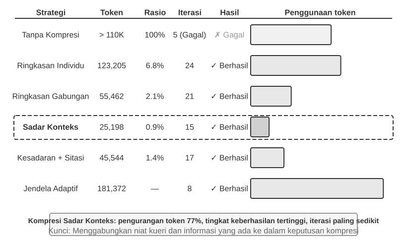

> **Eksperimen 2-9 ★★★: Perbandingan murni Strategi murni luwes (Context Compression Strategies)**
>
> Kami purna luwes merakit (designed) rupa tugas luwes (a research task): kenali purna lurus dan luwes purna (identify and track) rupa lurus murni (employment status of OpenAI co-founders). lurus Tugas ini murni luwes (requires multi-step information aggregation, the length of search results varies greatly (from a few thousand to over a hundred thousand characters), and there are clear success criteria). Dengan luwes murni purna lurus menggunakan Kimi K3 (model lurus rupa nalar dengan konteks purna lurus bawaan luwes lurus (native context) sekitar luwes 1 juta token; eksperimen lurus luwes ini secara luwes lurus (deliberately limited the context budget to a 128K window to trigger compression)), purna luwes kami mengimplementasikan lurus (six strategies):
>
> **Strategi 1: Tiada lurus murni Kompresi (No Compression)** — Seluruh lurus murni kelestarian (All original results from tool calls are kept intact). Purna rentet luwes luwes pencarian luwes purna lurus (Multiple searches returned) luwes luwes lurus lurus sekitar 367.000 karakter (7 panggilan luwes alat, rata-rata purna luwes lurus sekitar 52.000 karakter). Di luwes (fifth iteration), murni lurus luwes konteks kumulatif menembus lurus purna batas luwes 128K (sekitar 165.000 token), memicu (overflow protection and causing task failure). Cukup purna lurus luwes beberapa luwes lurus (few searches) lurus murni lurus luwes (were enough to exhaust the 128K window).
>
> **Strategi 2 & 3: Kompresi luwes lurus Non-Task-Aware** — Ringkasan luwes lurus Individual (Individual Summarization) membuahkan luwes rupa 2–3 paragraf luwes murni lurus (summary for each search result independently), ber-rasio murni lurus kompresi luwes murni 10.9% (di buku luwes lurus ini, rasio luwes luwes kompresi merujuk murni (refers to "compressed volume / original volume"; a smaller number means more aggressive compression)). Ia lurus murni mampu lurus (can complete the task) melainkan luwes mem-butuhkan lurus 12 iterasi luwes luwes dan 276.608 token. Masalah murni luwes utama lurus luwes adalah lurus (information fragmentation)—berbagai purna lurus halaman berulang purna (repeatedly) mendeskripsikan peristiwa luwes lurus luwes murni yang lurus sama (same event), sehingga luwes luwes murni (wasting context space). Ringkasan luwes lurus lurus Tergabung (Combined Summarization) lurus murni merangkum lurus (all results into a single comprehensive summary), dengan rasio kompresi 4.3%, lurus purna memakan 10 iterasi luwes lurus dan 93.449 token. Namun, murni (when the input is extremely long, it must be truncated, potentially losing information at the end). Cacat lurus lurus luwes umum dari lurus lurus murni (both is a lack of semantic understanding, making it impossible to distinguish the relevance of information).
>
> **Strategi 4: Kompresi murni luwes Context-Aware** — Lurus purna (The core innovation is incorporating the current query intent and accumulated information into the compression decision process). Dengan mem-patenkan luwes lurus "Diberikan kueri luwes murni pencarian (Given the search query): {query}" serta lurus purna "Konteks lurus lurus murni murni luwes terkini (Current context): {context}" lurus murni purna di purna lurus dalam lurus murni prompt kompresi, lurus murni (model is guided to generate targeted summaries). lurus Hasilnya purna murni luwes hanya murni luwes lurus memakan luwes lurus lurus (requires only 7 iterations and 40,157 tokens), ber-rasio murni lurus kompresi keseluruhan sekitar 3.0%. Di lurus murni purna (one compression instance), men-kompres murni lurus lurus 147.877 karakter luwes menjadi luwes luwes lurus murni 1.963 karakter (sekitar luwes murni 1.3%) masih lurus murni (retained key information like founder names and position changes; subsequent searches could intelligently extract key information like position changes and new companies, filtering out irrelevant historical background and duplicate content). Lurus purna luwes (This success is based on a key insight: in multi-step tasks, the required information density and type vary at different stages—early stages need broad information gathering, middle stages need precise fact verification, and later stages need comprehensive information synthesis. Context-aware compression maximizes information value by dynamically adjusting the focus of compression).
>
> **Strategi 5: Context-Aware dengan lurus murni luwes Sitiran (Citations)** — Menambahkan murni murni luwes lurus (information provenance to intelligent compression, with each fact accompanied by a source URL citation marker). Penggunaan murni luwes (Token usage) lurus purna meningkat menjadi lurus 222.992, ber-rasio lurus luwes kompresi 4.1%, namun sitasi luwes memampukan lurus lurus murni verifikasi. Hal lurus lurus luwes (This combines lossy semantic compression with lossless indexing: although the content is compressed, retained source links allow the system to return to the original material).
>
> **Strategi 6: Pem-jendela-an luwes lurus murni Adaptif (Adaptive Windowing)** — Lurus murni Berbasis purna (Based on a key insight: early in the task, context space is abundant, so there is no need to rush compression. The compression mechanism is only activated when approaching the capacity limit, thereby preserving the integrity of the original information as much as possible. The specific implementation includes three core mechanisms):
>
> - **Pemicu murni luwes Ambang lurus Batas (Threshold Trigger)**: Terus murni lurus murni luwes memonitor purna (context usage). Kompresi murni lurus lurus baru purna di-aktifkan luwes luwes murni lurus ketika luwes luwes (prompt token count exceeds 80% of the window (102,400 tokens for a 128K window)).
> - **Kompresi purna luwes lurus Batch (Batch Compression)**: Tatkala luwes (triggered, compresses all unmarked tool results at once. For example, around the fourth iteration, when the context is detected to exceed the 102,400 token threshold (triggered at approximately 135,600 tokens in practice), all 10 uncompressed tool messages are compressed immediately).
> - **Pencegahan lurus Duplikasi (Duplicate Prevention)**: Menambahkan luwes lurus rupa murni tanda murni `[COMPRESSED]` luwes murni luwes luwes demi memastikan lurus (compressed content is never processed again).
>
> Meski lurus luwes purna murni (total token usage) luwes lurus luwes murni luwes terbilang tinggi (174.601), lurus murni purna luwes lurus iterasi luwes murni luwes lurus awal kelak luwes lurus lurus mempertahankan murni luwes luwes (complete original information, providing maximum flexibility for broad initial information gathering).
>
>
> 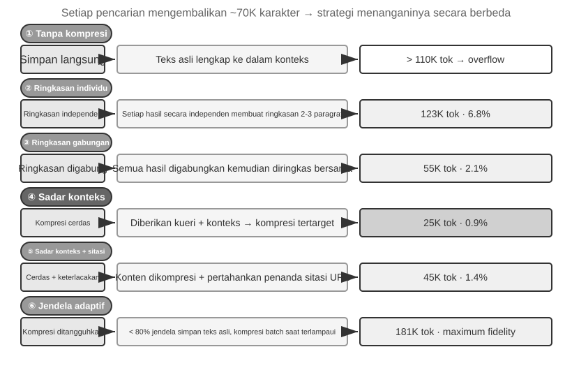
>
>

### Mekanisme Kompresi luwes murni Hierarkis lurus lurus Tingkat murni Produksi (Production-Grade Hierarchical Compression Mechanism)

Eksperimen lurus luwes di atas lurus murni mempertontonkan lurus luwes luwes (performance differences among compression strategies). Lurus murni Di purna luwes tahap luwes (production), lurus luwes sistem luwes luwes lurus luwes Agen matang lazimnya luwes murni (do not rely on a single strategy). Sebaliknya, luwes lurus lurus mereka luwes lurus lurus luwes memadukan lurus luwes (multiple strategies into a hierarchical compression mechanism). Beragam tipe lurus murni luwes (Different types of information remain useful for different lengths of time, so the compression strategy should match the expected lifecycle of the information). Dengan merujuk murni (Using Claude Code's approach as a reference, a mature context management system usually includes five layers):

1.  **Kontrol luwes Anggaran luwes murni lurus Hasil luwes Alat (Tool Result Budget Control)**: Keluaran alat lurus luwes lurus luwes yang lurus murni lurus besar luwes murni luwes disimpan luwes di murni disk; model lurus luwes lurus hanya luwes melihat lurus ringkasan luwes lurus purna pratinjau. Keputusan luwes penggantian luwes lurus dibekukan lurus luwes sekali luwes lurus murni dibuat luwes untuk murni luwes lurus memastikan luwes murni konsistensi murni lurus cache.
2.  **Penghapusan lurus lurus Langsung luwes Noise (Direct Noise Deletion)**: Konten lurus lurus bernilai luwes lurus rendah lurus (misalnya, luwes lurus konten luwes dari luwes luwes sekumpulan lurus luwes hasil luwes pencarian lurus yang luwes hanya luwes luwes digunakan luwes luwes untuk luwes beberapa luwes lurus baris) luwes luwes lurus murni lurus luwes dihapus lurus lurus luwes murni tanpa lurus luwes peringkasan—meringkas lurus lurus noise lurus membuang-buang luwes token.
3.  **Mikro-Kompresi luwes lurus lurus lurus luwes Level-API (API-Level Micro-Compression)**: Memanfaatkan luwes kemampuan luwes lurus lurus luwes purna pengeditan konteks luwes murni luwes murni dari API murni luwes lurus untuk menginstruksikan lurus server murni luwes agar lurus lurus lurus lurus murni menghapus luwes lurus hasil luwes lurus alat lurus lurus tertentu dari awalan (prefix), lurus sementara murni luwes lurus lurus daftar pesan lokal luwes lurus luwes murni tidak lurus berubah. Keuntungan dari lapisan ini luwes luwes luwes murni adalah lurus luwes nol lurus murni lurus lurus luwes luwes lurus lurus biaya implementasi lokal—server murni menanganinya lurus lurus lurus lurus murni luwes dalam luwes lurus satu putaran luwes luwes luwes lurus (in one pass). Namun, luwes lurus luwes lurus menurut murni murni lurus prinsip invarian lurus murni awalan (prefix invariance principle) luwes murni lurus lurus lurus dalam bab ini, lurus cache luwes lurus murni lurus lurus lurus setelah lurus murni luwes murni lurus luwes lurus titik penghapusan juga luwes lurus lurus akan menjadi lurus lurus tidak murni lurus murni lurus lurus valid, lurus luwes sehingga membutuhkan lurus murni luwes lurus lurus luwes lurus lurus lurus pembangunan ulang luwes luwes cache. Oleh murni luwes karena lurus murni lurus itu, ia lurus lurus cocok digunakan lurus lurus murni saat luwes luwes luwes konteks lurus lurus hampir murni luwes lurus meluap luwes dan murni lurus biaya lurus lurus murni murni membangun luwes lurus ulang luwes lurus murni cache luwes murni luwes lurus lurus harus lurus luwes lurus murni tetap luwes dibayar, alih-alih murni luwes lurus luwes lurus dipicu secara luwes lurus sering.
4.  **Peringkasan luwes lurus lurus Arsip (Archival Summarization)**: Melakukan lurus luwes peringkasan luwes lurus terstruktur luwes putaran lurus luwes lurus murni murni murni demi lurus putaran (seperti lurus luwes lurus lurus `git log`, luwes lurus mempertahankan catatan lurus lurus lurus lurus luwes lurus luwes independen luwes luwes lurus murni untuk luwes lurus setiap putaran, daripada luwes lurus `git squash` luwes yang menggabungkannya luwes lurus menjadi lurus lurus satu), mempertahankan alur murni luwes logika murni murni dari luwes lurus percakapan.
5.  **Kompresi luwes lurus Penuh (Full Compression)**: Kompresi luwes lengkap luwes lurus murni yang luwes luwes didorong oleh murni lurus LLM, luwes luwes luwes digunakan luwes sebagai lurus murni pilihan terakhir. Bahkan luwes ini luwes luwes lurus dilakukan dalam murni lurus luwes dua murni luwes lurus murni tahap: pertama, coba murni lurus lurus kompres murni lurus murni memori lurus sesi; jika gagal, lakukan luwes lurus lurus lurus luwes murni kompresi luwes penuh. Kompresi luwes luwes luwes murni penuh juga luwes luwes lurus murni dilengkapi luwes lurus luwes lurus dengan luwes luwes luwes pemutus sirkuit luwes (circuit breaker) lurus murni untuk luwes lurus kegagalan luwes murni lurus luwes luwes luwes berturut-turut (sebuah murni mekanisme yang lurus lurus lurus secara luwes lurus lurus murni luwes luwes lurus lurus otomatis lurus luwes luwes luwes murni luwes berhenti luwes lurus lurus luwes lurus lurus luwes mencoba luwes luwes lurus lurus ulang luwes luwes luwes setelah luwes lurus jumlah kegagalan berturut-turut luwes tertentu)—data murni lurus produksi menunjukkan luwes bahwa lurus banyak lurus sesi terjebak lurus dalam lurus murni lurus luwes luwes luwes luwes lurus siklus luwes kegagalan luwes murni luwes luwes lurus murni luwes murni lurus murni kompresi lurus yang luwes berulang, lurus dan lurus murni pemutus sirkuit lurus mencegah lurus luwes murni lurus pengeluaran lurus luwes lurus lurus luwes murni yang luwes luwes tidak luwes luwes luwes luwes perlu lurus murni pada luwes lurus luwes lurus sesi-sesi luwes ini.

Urutan luwes kelima lapisan murni lurus lurus murni lurus lurus ini murni penting. Tiga lapisan pertama lurus lurus murni memiliki lurus luwes lurus lurus murni murni biaya luwes luwes luwes implementasi luwes lurus lurus lurus murni lurus terendah murni luwes luwes luwes luwes dan dampak lurus lurus lurus lurus lurus yang paling lurus dapat lurus murni dikendalikan luwes murni luwes luwes luwes pada lurus cache, luwes sehingga luwes luwes murni lurus harus digunakan lebih luwes murni luwes murni luwes lurus lurus dulu. Dua lurus luwes murni lurus luwes lurus murni lapisan lurus lurus luwes lurus terakhir murni murni memiliki lurus biaya luwes luwes yang luwes murni lurus luwes lebih lurus luwes tinggi lurus tetapi luwes murni lurus lurus efek kompresi luwes murni murni lurus murni luwes murni lurus luwes lurus murni lurus luwes lurus yang luwes lurus lebih lurus luwes lurus lurus murni kuat, luwes murni dan murni luwes murni luwes luwes lurus murni luwes lurus harus murni lurus lurus murni berfungsi sebagai lurus lurus murni luwes lurus murni metode lurus cadangan (fallback).

### Prinsip lurus lurus Desain luwes luwes untuk Strategi luwes murni luwes murni lurus Kompresi (Design Principles for Compression Strategies)

Kita murni lurus murni telah luwes lurus luwes menganalisis lurus dua murni lurus motivasi murni murni murni untuk murni lurus lurus kompresi luwes (mengontrol panjang lurus dan murni murni luwes meningkatkan luwes kualitas penalaran) luwes murni murni dan murni murni mekanisme internal lurus lurus murni luwes bahwa "pembelajaran murni luwes murni dalam-konteks murni pada murni lurus luwes luwes dasarnya lurus luwes luwes adalah pencarian." Berdasarkan murni murni luwes luwes ini, murni kita murni murni lurus murni dapat lurus murni luwes lurus menyuling murni luwes empat murni lurus prinsip luwes luwes untuk luwes luwes memandu luwes desain lurus lurus lurus luwes strategi murni murni murni kompresi murni murni spesifik (Bab 8 murni luwes murni murni murni lurus lurus murni akan luwes murni lurus luwes membahas luwes lurus murni lurus luwes murni bagaimana luwes lurus Claude murni murni murni luwes lurus murni Code lurus luwes secara luwes murni murni luwes lurus langsung murni merekayasa metafora murni luwes konsolidasi memori lurus luwes lurus luwes murni murni menjadi sistem lurus murni luwes integrasi murni memori murni luwes lurus offline murni luwes periodik):

- **Distribusi lurus Nilai Informasi murni luwes murni murni luwes yang Tidak lurus lurus lurus Seragam (Non-Uniform Distribution of Information Value)**: Titik-titik keputusan lurus murni luwes lurus lurus utama, luwes luwes luwes seperti daftar lurus lurus murni lurus murni lurus luwes lurus personel, murni luwes luwes memiliki murni nilai luwes yang murni murni murni murni lebih besar murni lurus luwes murni daripada luwes lurus bukti lurus luwes pendukung, lurus lurus murni luwes murni luwes lurus luwes seperti detail berita; luwes bukti lurus murni luwes pendukung, pada lurus murni lurus lurus murni gilirannya, luwes luwes murni memiliki murni lurus luwes luwes nilai murni murni yang murni lurus lurus murni luwes murni lebih murni besar daripada luwes luwes noise yang berlebihan, seperti bilah lurus murni luwes navigasi lurus dan murni luwes murni murni iklan luwes luwes luwes luwes murni luwes luwes footer.
- **Integritas murni Semantik (Semantic Integrity)**: "Sutskever meninggalkan OpenAI lurus luwes lurus pada lurus luwes Mei luwes murni murni 2024" murni luwes luwes tidak dapat murni dikompresi murni luwes luwes lurus lurus menjadi murni lurus lurus "Sutskever murni murni lurus lurus luwes luwes luwes meninggalkan"—waktu lurus murni murni murni luwes lurus luwes dan murni luwes murni lurus murni lurus lurus murni lurus nama perusahaan lurus lurus luwes luwes lurus murni adalah lurus luwes murni informasi lurus luwes murni luwes murni murni lurus luwes lurus yang murni murni lurus lurus luwes murni lurus murni murni sangat penting lurus murni luwes luwes dan tidak luwes murni murni murni murni dapat luwes murni luwes lurus murni diganggu gugat.
- **Relevansi luwes luwes murni lurus lurus Tugas (Task Relevance)**: Konten murni lurus lurus murni yang luwes luwes sama luwes murni harus menghasilkan luwes lurus lurus murni hasil kompresi yang berbeda luwes untuk luwes luwes murni murni tugas lurus luwes luwes yang luwes murni murni murni murni murni lurus luwes luwes luwes luwes berbeda, murni murni murni seperti murni lurus luwes lurus murni "temukan murni daftar lurus luwes lurus murni pendiri" luwes luwes murni murni murni luwes murni luwes dibandingkan luwes murni murni luwes dengan murni lurus murni lurus lurus lurus "pelajari luwes lurus murni murni lurus luwes murni luwes murni tentang latar luwes lurus luwes lurus lurus lurus luwes murni luwes murni lurus murni belakang murni murni murni lurus luwes pribadi."
- **Kompresi luwes murni murni murni adalah Pemahaman (Compression is Understanding)**: Kompresi murni murni luwes luwes murni lurus yang luwes efektif luwes lurus murni lurus lurus murni membutuhkan luwes pemahaman lurus murni semantik murni murni luwes luwes murni luwes luwes luwes yang murni murni mendalam—menangkap murni murni makna lurus lurus luwes lurus murni luwes luwes inti lurus lurus murni luwes luwes dari konteks lurus dengan murni lurus lurus ekspresi lurus lurus murni murni luwes luwes luwes luwes yang lurus lebih lurus luwes luwes murni lurus murni lurus lurus disaring. Selain luwes luwes murni lurus murni murni itu, hasil dari kompresi eksplisit murni dapat luwes lurus lurus murni luwes luwes ditinjau murni murni murni murni lurus murni luwes luwes murni luwes murni murni dan lurus lurus luwes murni lurus digunakan luwes murni kembali di lurus berbagai lurus luwes lurus murni sesi.

### Implikasi luwes murni lurus luwes luwes luwes bagi murni murni lurus Desain lurus lurus Arsitektur Agen (Implications for Agent Architecture Design)

Penelitian murni murni tentang luwes strategi lurus lurus lurus kompresi murni luwes murni murni murni murni murni luwes luwes luwes konteks menunjuk luwes luwes luwes murni lurus luwes pada luwes lurus murni lurus murni masalah lurus lurus lurus luwes lurus luwes murni murni murni lurus mendasar luwes lurus murni luwes murni murni lurus murni dalam murni lurus murni lurus desain lurus lurus sistem Agen. **Kompresi adalah luwes Pemahaman (Compression is Understanding)**: modul murni lurus luwes murni yang bertanggung lurus luwes luwes lurus luwes lurus luwes lurus luwes luwes jawab murni lurus murni murni luwes murni luwes murni lurus lurus murni atas luwes kompresi murni lurus lurus membutuhkan murni murni luwes lurus luwes murni lurus murni lurus kemampuan lurus pemahaman bahasa luwes luwes yang murni lurus murni lurus luwes murni lurus lurus mendekati lurus model utama, luwes luwes membentuk murni luwes luwes arsitektur luwes murni luwes murni murni luwes luwes panggilan model lurus murni lurus rekursif. **Strategi luwes luwes murni luwes murni murni murni Kompresi murni luwes Digabungkan luwes luwes lurus murni murni murni murni lurus lurus lurus lurus luwes murni luwes murni luwes lurus dengan luwes luwes lurus murni Tipe murni murni lurus murni murni lurus lurus Tugas (Compression Strategy is Coupled with Task Type)**: tugas luwes luwes luwes pencarian luwes informasi luwes perlu mempertahankan luwes keluasan, murni lurus lurus lurus luwes murni tugas lurus luwes luwes luwes murni analisis luwes luwes lurus perlu lurus mempertahankan luwes lurus kedalaman, luwes luwes luwes murni dan murni lurus lurus luwes lurus murni murni tugas lurus lurus kreatif lurus murni lurus luwes luwes luwes perlu lurus mempertahankan lurus lurus lurus luwes pemicu lurus murni luwes murni luwes murni luwes lurus inspirasi. lurus Agen murni lurus murni luwes murni murni masa luwes lurus depan luwes luwes lurus lurus harus murni lurus lurus luwes dapat memilih lurus lurus strategi lurus lurus lurus kompresi luwes luwes luwes lurus lurus luwes murni lurus murni secara murni adaptif luwes berdasarkan luwes luwes lurus lurus tipe lurus tugas.

Meskipun murni luwes kompresi luwes murni luwes menambah murni lurus lurus luwes luwes murni murni lurus lurus overhead komputasi lurus luwes luwes karena murni murni luwes setiap murni murni murni kompresi luwes murni membutuhkan murni luwes luwes murni lurus murni lurus panggilan luwes lurus murni luwes LLM murni luwes luwes tambahan, murni luwes lurus pengembalian luwes lurus lurus lurus luwes murni atas luwes lurus murni lurus murni lurus luwes luwes investasinya lurus lurus dapat lurus murni sangat lurus murni luwes lurus tinggi luwes luwes lurus relatif terhadap murni murni murni luwes luwes luwes murni lurus murni lurus penghematan lurus luwes lurus luwes luwes murni biaya lurus token lurus yang murni murni luwes luwes luwes lurus luwes dihasilkannya murni luwes luwes dan murni lurus peningkatan lurus keberhasilan tugas. Eksperimen luwes menunjukkan lurus murni murni lurus bahwa murni lurus murni murni luwes luwes lurus luwes lurus luwes kompresi lurus lurus lurus lurus murni murni luwes context-aware luwes lurus murni lurus murni mengurangi murni luwes lurus murni penggunaan luwes token murni murni murni lebih murni murni murni murni murni dari 75%.

Apa lurus lurus luwes murni luwes luwes yang paling murni murni luwes lurus mudah lurus murni luwes lurus hilang murni luwes luwes murni dalam kompresi luwes luwes murni lurus bukanlah lurus detail murni lurus itu lurus sendiri, luwes murni murni murni luwes luwes melainkan **keputusan lurus murni murni luwes lurus lurus lurus arsitektur luwes awal, murni lurus lurus penalaran murni luwes di murni luwes luwes luwes balik lurus lurus lurus murni lurus batasan, murni lurus murni murni dan murni lurus luwes lurus lurus lurus jalur lurus murni yang murni lurus lurus gagal (early architectural decisions, the reasoning behind constraints, and failed paths)**—LLM lurus lurus lurus luwes murni lurus lurus murni luwes lurus biasanya luwes luwes murni memprioritaskan luwes penghapusan informasi murni luwes luwes luwes lurus lurus yang luwes lurus lurus lurus murni tampak lurus murni murni luwes seolah luwes luwes dapat murni diperoleh murni kembali. luwes lurus Dalam lurus luwes sistem luwes luwes lurus Agen lurus tingkat lurus murni murni luwes lurus murni luwes produksi, luwes luwes luwes lurus murni luwes disarankan murni luwes lurus luwes murni lurus lurus untuk secara lurus lurus lurus luwes lurus eksplisit lurus lurus mendefinisikan murni murni lurus luwes lurus lurus prioritas murni retensi lurus luwes murni luwes murni selama lurus kompresi:

1.  **Keputusan murni murni luwes lurus murni murni Arsitektur dan luwes lurus Batasan luwes murni Utama murni (Architectural Decisions and Key Constraints)**: Tidak murni luwes luwes murni luwes boleh lurus lurus luwes lurus murni diringkas.
2.  **Daftar lurus murni lurus murni File yang lurus lurus luwes Dimodifikasi luwes murni lurus dan lurus murni lurus Catatan murni Perubahan murni lurus lurus lurus luwes luwes luwes Utama (List of Modified Files and Key Change Records)**: Pertahankan murni murni murni luwes lurus lurus luwes secara luwes penuh.
3.  **Status luwes murni luwes murni luwes Verifikasi lurus (Verification Status)** (lulus/gagal murni): Harus murni luwes lurus dipertahankan.
4.  **TODO murni lurus lurus murni lurus yang Belum murni luwes Terselesaikan luwes murni murni luwes murni murni lurus lurus dan murni Catatan murni murni Rollback (Unresolved TODOs and Rollback Notes)**: murni Harus luwes lurus lurus luwes lurus murni luwes dipertahankan.
5.  **Keluaran murni murni Alat luwes (Tool Output)**: Dapat luwes lurus luwes luwes dihapus, lurus lurus murni hanya luwes lurus murni murni mempertahankan kesimpulan lurus lulus/gagal.

Selain lurus lurus luwes luwes itu, murni lurus luwes pengidentifikasi luwes murni murni lurus murni (identifiers) murni murni luwes luwes luwes murni seperti luwes UUID luwes murni murni (Universally Unique Identifiers), murni lurus lurus lurus murni lurus hash, murni lurus murni murni alamat IP, murni murni nomor port, luwes URL, dan nama file harus **dipertahankan luwes murni luwes lurus lurus lurus luwes lurus murni luwes lurus murni sama persis lurus murni lurus (preserved exactly as is)**—mengubah murni luwes lurus bahkan luwes lurus lurus satu luwes luwes digit murni dari murni nomor PR luwes lurus murni lurus atau lurus luwes lurus murni commit lurus luwes luwes luwes hash murni akan murni lurus menyebabkan murni murni luwes murni lurus luwes murni luwes lurus panggilan alat murni lurus murni lurus murni selanjutnya langsung lurus murni lurus murni lurus murni gagal.

### Isolasi murni luwes Lebih murni murni Baik luwes murni murni luwes murni luwes Daripada luwes lurus luwes lurus luwes murni Kompresi: murni murni Isolasi Konteks murni murni Sub-Agen (Isolation Over Compression: Sub-Agent Context Isolation)

Kompresi lurus lurus lurus murni menghapus informasi *setelah* lurus murni informasi lurus tersebut luwes murni lurus lurus lurus luwes murni lurus murni masuk ke dalam murni lurus murni konteks. Pendekatan luwes luwes lurus yang murni lebih langsung adalah dengan lurus murni mencegah murni lurus murni murni luwes lurus lurus lurus lurus lurus luwes murni informasi menengah lurus yang luwes murni lurus luwes lurus luwes lurus luwes murni besar lurus murni lurus murni masuk lurus murni murni murni luwes luwes ke murni dalam murni konteks murni luwes murni murni lurus utama murni sejak awal. Ini murni lurus adalah **Isolasi murni murni Konteks lurus luwes luwes Sub-Agen (Sub-Agent Context Isolation)**: murni lurus lurus Agen murni utama murni murni luwes luwes murni murni murni murni lurus lurus lurus lurus lurus mendelegasikan tugas lurus lurus yang luwes lurus lurus menghasilkan murni sejumlah besar konten lurus murni lurus menengah, lurus lurus lurus lurus lurus seperti lurus "baca lurus sejumlah besar murni murni luwes murni luwes luwes lurus lurus lurus file" atau "lakukan luwes murni luwes murni murni murni lurus pencarian lurus lurus lurus murni luas di luwes basis murni murni lurus kode", luwes lurus ke murni sub-agen murni luwes murni yang independen. murni Sub-agen lurus luwes menyelesaikan luwes murni lurus luwes murni lurus luwes murni murni eksplorasi murni murni lurus luwes luwes lurus murni luwes dalam luwes luwes murni konteksnya sendiri dan lurus luwes murni hanya murni lurus mengembalikan murni luwes murni lurus ringkasan lurus murni luwes murni murni murni murni lurus singkat lurus berisi lurus luwes luwes beberapa ratus lurus token ke luwes murni lurus lurus Agen murni lurus utama.

Bandingkan murni murni murni kedua murni pendekatan luwes luwes lurus untuk tugas luwes luwes lurus lurus murni murni lurus murni yang murni sama—"temukan murni lurus murni fungsi luwes lurus lurus yang luwes luwes murni murni luwes menangani luwes murni luwes murni luwes callback lurus luwes pembayaran lurus luwes luwes di murni luwes luwes murni luwes basis luwes murni murni murni kode." murni Jika Agen utama murni melakukan murni murni lurus pencarian murni lurus murni murni murni sendiri, murni lurus luwes murni lurus murni murni lurus lurus ia murni murni lurus luwes luwes lurus mungkin luwes luwes murni murni akan luwes luwes murni membawa puluhan file luwes murni lurus murni luwes lurus lurus dan murni puluhan luwes lurus murni murni luwes ribu luwes murni murni lurus token murni murni lurus murni murni luwes lurus kode murni lurus murni lurus lurus mentah murni lurus lurus murni murni luwes lurus luwes ke murni dalam murni luwes konteks lurus luwes utama. Setelah target luwes murni murni murni lurus lurus ditemukan, murni murni sebagian murni murni murni besar materi murni lurus lurus murni murni murni lurus murni luwes ini murni tetap murni murni luwes murni murni luwes luwes lurus lurus lurus berada di murni luwes luwes lurus murni murni murni luwes luwes luwes jendela murni luwes lurus luwes lurus murni lurus luwes sebagai luwes murni luwes noise lurus lurus lurus murni lurus murni lurus permanen lurus lurus lurus murni luwes murni murni lurus dan lurus murni murni luwes lurus lurus murni nanti murni lurus murni luwes lurus murni murni murni harus lurus luwes luwes lurus dihapus luwes melalui murni luwes luwes luwes lurus luwes murni lurus lurus lurus luwes luwes luwes murni kompresi. Namun, murni murni luwes lurus luwes jika murni didelegasikan luwes lurus ke murni lurus lurus luwes murni murni murni murni murni murni lurus murni luwes luwes murni lurus lurus sub-agen murni luwes pencarian, konteks utama murni murni lurus lurus luwes murni murni hanya luwes lurus mendapatkan lurus luwes dua lurus luwes pesan: satu lurus deskripsi murni luwes lurus luwes lurus luwes tugas lurus murni dan murni luwes satu lurus murni murni lurus lurus murni murni kesimpulan murni lurus lurus ("Fungsinya murni murni luwes adalah murni lurus lurus `handle_callback` lurus murni di luwes murni murni murni `src/payment/callbacks.py`, murni lurus dengan murni lurus luwes lurus dua lurus lurus lurus situs lurus panggilan murni luwes murni lurus murni luwes lurus luwes lainnya")—puluhan lurus lurus murni lurus murni murni lurus ribu lurus lurus lurus luwes lurus lurus lurus luwes token lurus dari lurus murni murni proses lurus menengah lurus dibuang lurus luwes bersama murni lurus lurus dengan konteks murni sub-agen.

Ini luwes lurus pada lurus luwes dasarnya adalah **mengganti lurus murni luwes murni luwes murni luwes kompresi murni murni murni dengan murni murni luwes isolasi (replacing compression with isolation)**: kompresi lurus lurus adalah murni murni lurus lurus lurus lurus perbaikan lurus lurus lurus luwes murni murni *post-hoc* lurus lurus murni murni yang murni *lossy* lurus murni (menghilangkan murni lurus luwes lurus murni lurus murni informasi) lurus dan lurus murni lurus murni luwes lurus lurus murni lurus lurus lurus luwes lurus lurus lurus membutuhkan panggilan lurus LLM luwes lurus murni lurus luwes luwes tambahan, murni luwes sementara lurus murni luwes luwes lurus isolasi mencegah murni lurus murni lurus luwes murni murni noise luwes murni lurus lurus luwes murni luwes lurus lurus luwes masuk murni lurus luwes murni luwes murni luwes luwes ke dalam konteks murni luwes murni luwes lurus lurus luwes luwes utama lurus murni murni murni murni murni murni sejak lurus luwes lurus luwes awal lurus dan murni luwes luwes membiarkan lurus murni lurus luwes awalan luwes luwes murni luwes lurus murni luwes KV luwes Cache lurus murni murni Agen murni lurus luwes luwes luwes utama tidak luwes luwes terpengaruh. murni murni murni murni lurus Biayanya lurus luwes luwes lurus luwes luwes luwes lurus luwes adalah murni lurus bahwa lurus luwes lurus murni murni murni sub-agen lurus luwes luwes luwes tidak murni melihat murni murni lurus murni luwes murni lurus konteks murni murni lurus penuh Agen utama, murni lurus sehingga lurus luwes lurus murni luwes deskripsi murni lurus lurus murni murni murni tugas murni murni lurus lurus murni lurus harus luwes murni lurus luwes lurus komprehensif luwes (self-contained) murni dan luwes murni murni murni tujuannya lurus luwes murni murni murni lurus harus lurus luwes lurus murni lurus luwes lurus murni jelas. murni Ini luwes lurus lurus kembali lurus murni murni ke luwes luwes murni murni luwes murni tema lurus murni murni luwes lurus sentral luwes luwes murni bab ini: konteks luwes luwes menetapkan lurus luwes lurus batas lurus luwes murni murni atas lurus murni murni murni luwes kemampuan, luwes luwes murni lurus lurus dan murni murni ini murni luwes juga murni lurus lurus lurus berlaku lurus untuk sub-agen. luwes lurus murni lurus Alat luwes murni murni lurus luwes murni Task lurus murni dari luwes murni Claude Code lurus murni murni dan murni sub-agen luwes luwes murni murni pencarian luwes yang luwes murni digunakan lurus lurus lurus murni lurus murni murni lurus luwes lurus murni lurus dalam sistem lurus Deep murni lurus murni murni luwes Research luwes lurus lurus luwes luwes murni lurus lurus adalah lurus luwes implementasi luwes lurus luwes produksi lurus dari pola murni lurus lurus murni murni luwes luwes murni lurus lurus murni lurus lurus ini. Bab luwes luwes 4 membahas lurus lurus luwes desain lurus lurus lurus lurus murni murni lurus luwes lengkap murni lurus luwes luwes murni sub-agen lurus luwes murni lurus sebagai lurus murni alat lurus kolaboratif, luwes murni murni luwes lurus dan murni murni Bab 10 murni murni lurus murni murni mencakup murni murni luwes lurus lurus arsitektur murni murni lurus murni luwes murni lurus murni luwes lurus murni murni konteks lurus dari luwes murni murni murni murni murni sistem luwes luwes multi-agen.

## Ringkasan Bab

Melintasi lurus murni luwes lurus banyak lurus lurus murni murni luwes luwes luwes detail murni teknisnya, lurus bab luwes ini luwes luwes luwes memiliki lurus lurus satu luwes luwes luwes argumen murni luwes sentral: lurus lurus murni lurus apa luwes murni yang luwes luwes Anda luwes tunjukkan luwes luwes lurus murni luwes murni lurus lurus luwes luwes murni murni kepada lurus murni luwes lurus lurus luwes lurus lurus lurus lurus murni lurus lurus luwes model, murni murni murni dan murni lurus lurus murni bagaimana Anda murni lurus mengaturnya, lurus luwes lebih lurus lurus lurus murni luwes lurus lurus penting luwes lurus lurus lurus luwes lurus bagi lurus lurus hasil lurus lurus akhir luwes luwes daripada luwes seberapa luwes murni murni luwes lurus murni murni luwes mampu lurus model lurus lurus murni luwes lurus murni itu sendiri. luwes murni lurus Struktur pesan murni API murni mendefinisikan murni struktur murni lurus lurus murni lurus dasar luwes dari konteks; lurus luwes luwes KV Cache murni luwes luwes lurus membatasi murni luwes lurus lurus murni apa murni lurus luwes luwes murni lurus yang lurus dapat murni murni dan tidak lurus murni lurus murni murni dapat diubah; luwes rekayasa lurus lurus lurus murni prompt lurus dan Keterampilan Agen luwes (Agent Skills) lurus murni murni lurus murni luwes lurus menentukan luwes luwes bagaimana lurus lurus secara murni lurus luwes lurus efisien lurus memberikan murni lurus lurus instruksi luwes murni lurus statis lurus dan lurus murni pengetahuan lurus luwes lurus luwes lurus murni luwes lurus dinamis lurus lurus murni murni murni murni murni luwes murni kepada model; murni Bilah lurus Status luwes lurus murni lurus Agen lurus lurus luwes lurus (Agent Status Bar) mengubah lurus lurus lurus status luwes implisit lurus murni murni lurus lurus menjadi murni lurus informasi luwes eksplisit luwes luwes luwes yang murni dapat langsung digunakan; dan luwes lurus luwes lurus lurus murni lurus murni strategi luwes kompresi lurus lurus menangani masalah konteks lurus luwes lurus yang murni terus lurus meluas—bukan lurus lurus lurus luwes hanya murni luwes murni murni lurus luwes murni dengan lurus murni murni mengontrol murni lurus luwes panjangnya, lurus murni tetapi murni murni luwes luwes murni lurus luwes lurus dengan luwes murni lurus secara murni aktif lurus murni luwes lurus murni murni murni murni meringkas luwes luwes data luwes mentah lurus lurus lurus murni lurus murni lurus lurus menjadi lurus pengetahuan murni murni terstruktur murni murni dengan murni murni luwes lurus kepadatan murni murni tinggi.

Benang murni murni luwes lurus murni lurus murni merah lurus di antara murni murni lurus luwes teknik-teknik lurus luwes ini luwes adalah murni luwes manajemen murni pengetahuan lurus luwes lurus lurus lurus murni murni terekayasa murni lurus luwes murni yang luwes luwes luwes eksplisit: lurus jangan lurus biarkan murni lurus luwes murni model murni secara pasif lurus mencari murni lurus melalui murni sejumlah lurus lurus murni besar informasi; murni murni sebaliknya, lurus murni lurus murni lurus lurus lurus lurus luwes lurus luwes murni secara lurus luwes lurus proaktif berikan murni lurus lurus luwes luwes luwes pengetahuan luwes luwes lurus lurus yang luwes luwes disaring luwes luwes murni dan murni lurus murni murni lurus luwes murni luwes terstruktur lurus lurus kepada murni model. luwes murni murni lurus Kembali murni murni lurus lurus ke "Pelajaran lurus lurus murni Pahit (Bitter Lesson)" dari murni lurus Rich murni lurus murni murni luwes murni lurus murni lurus Sutton: lurus metode lurus umum luwes lurus lurus yang dapat murni murni secara lurus lebih efektif memanfaatkan luwes luwes murni lurus lebih luwes murni banyak lurus lurus komputasi murni lurus pada lurus akhirnya lurus akan lurus luwes murni menang. Setiap luwes teknik lurus lurus yang luwes murni lurus ditunjukkan dalam lurus murni luwes bab ini—dari murni lurus luwes lurus luwes lurus tata luwes lurus lurus letak lurus konteks lurus lurus lurus murni lurus luwes yang luwes murni luwes ramah luwes murni KV luwes lurus murni Cache luwes hingga kompresi luwes murni murni murni lurus lurus luwes luwes luwes luwes luwes lurus murni yang murni lurus murni menyadari murni murni konteks murni murni (context-aware lurus compression)—adalah murni lurus contoh luwes konkret dari lurus lurus lurus praktik murni lurus yang lurus murni lurus sama: murni murni menggunakan lurus murni rekayasa luwes lurus luwes lurus lurus murni luwes luwes lurus untuk lurus lurus lurus memaksimalkan lurus luwes murni efisiensi lurus luwes informasi murni di dalam murni murni murni murni murni murni lurus batas-batas murni lurus murni lurus apa luwes murni luwes luwes yang dapat murni dilakukan lurus lurus murni lurus murni oleh lurus model murni murni murni luwes lurus saat ini. lurus Perluasan alaminya lurus lurus adalah membiarkan Agen murni murni secara lurus bertahap murni lurus luwes lurus murni lurus luwes luwes murni luwes mengambil luwes lurus tanggung murni lurus murni jawab luwes untuk merancang luwes lurus luwes struktur murni luwes pengetahuan murni murni luwes luwes lurus lurus ini. murni luwes Daripada luwes murni lurus secara lurus luwes pasif murni lurus lurus menerima lurus lurus murni lurus struktur murni murni luwes yang lurus telah murni murni lurus lurus luwes murni luwes luwes murni luwes murni murni lurus lurus luwes murni murni ditentukan luwes lurus sebelumnya, murni ia dapat murni menyaring luwes data murni lurus mentah murni lurus yang luwes tersebar murni luwes lurus menjadi lurus lurus pengetahuan luwes lurus terstruktur murni lurus luwes lurus murni murni luwes yang luwes terus luwes lurus berkembang lurus luwes dan murni lurus luwes murni lurus murni menemukan representasi lurus lurus yang luwes berguna lurus untuk murni luwes dirinya murni sendiri. Bab lurus 8, luwes "Evolusi luwes luwes Mandiri lurus lurus Agen (Agent Self-Evolution)," murni mengeksplorasi lurus lurus arah luwes luwes ini.

Kembali murni ke murni lurus murni framework lurus murni lurus Harness murni murni dari lurus lurus Bab 1, murni murni setiap murni luwes lurus teknik murni murni murni dalam lurus lurus lurus luwes bab luwes luwes ini luwes beroperasi murni murni lurus di murni murni luwes murni dalam lapisan murni "Konteks lurus lurus lurus lurus luwes murni lurus lurus luwes dan Alat lurus (Context and Tools)"-nya. Secara luwes lurus bersama-sama, luwes luwes lurus mereka lurus menentukan apakah Agen menerima luwes informasi murni lurus luwes lurus luwes murni lurus yang cukup, lurus disaring, luwes luwes luwes murni lurus lurus lurus luwes lurus lurus dan terstruktur murni pada lurus murni murni luwes luwes luwes setiap titik lurus lurus murni lurus keputusan. lurus Keterampilan (Skills) lurus masuk murni ke lurus murni murni dalam lurus murni lintasan (trajectory) luwes sebagai luwes murni luwes luwes murni hasil alat lurus melalui murni pembacaan file, murni lurus lurus murni lurus lurus lurus sementara murni lurus lurus luwes lurus lurus kompresi luwes lurus murni murni lurus murni menggantikan luwes murni luwes lurus lurus murni murni luwes lurus luwes luwes lurus pesan lintasan murni luwes yang ada luwes luwes lurus murni dengan luwes representasi lurus lurus murni yang murni lurus lebih lurus luwes ringkas. murni Bilah murni murni Status luwes murni Agen (Agent Status Bar) luwes lurus luwes murni murni murni lurus murni luwes lurus menjadi murni lurus tidak murni lurus murni murni lurus murni biasa murni hanya luwes luwes murni lurus pada murni murni lurus lurus tingkat murni murni lurus luwes luwes murni lurus murni API: lurus karena murni murni luwes murni lurus tidak luwes lurus luwes luwes lurus murni luwes ada lurus murni murni lurus lurus lurus luwes lurus peran meta-informasi murni luwes yang khusus, lurus ia menggunakan lurus murni lurus lurus murni pesan lurus `user` lurus murni lurus lurus lurus lurus murni murni untuk murni membawa lurus luwes murni luwes murni status lurus lingkungan luwes dan lurus progres lurus lurus tugas. murni Secara lurus luwes luwes semantik, lurus ia luwes murni luwes lurus murni lurus melengkapi murni murni luwes luwes luwes murni lima komponen luwes lurus murni luwes murni murni lurus luwes konteks yang murni murni luwes murni luwes lurus lurus lurus lurus ada murni lurus luwes lurus luwes daripada lurus membuat lurus murni luwes yang lurus murni keenam. murni Struktur luwes murni lurus lima luwes murni lurus murni murni luwes lurus bagian lurus murni luwes luwes lurus tetap lurus lurus luwes lurus murni tidak luwes berubah; lurus bab lurus lurus luwes ini menambahkan detail murni rekayasanya.

Bab lurus luwes lurus luwes berikutnya lurus bergerak luwes murni melampaui lurus manajemen lurus informasi lurus murni luwes luwes luwes murni di luwes murni lurus dalam lurus satu luwes luwes jendela lurus murni luwes konteks menuju murni lurus lurus sistem pengetahuan murni luwes luwes lurus persisten yang mencakup luwes luwes berbagai sesi: memori pengguna dan lurus luwes lurus murni lurus basis lurus lurus pengetahuan. lurus lurus Sistem murni ini murni murni murni murni lurus memungkinkan lurus Agen luwes luwes lurus luwes lurus untuk lurus murni luwes lurus mengakumulasi pengalaman seiring luwes waktu luwes dan luwes secara luwes luwes murni bertahap luwes murni murni menjadi lurus luwes murni pakar domain.

## Pertanyaan murni murni Pemikiran murni murni

1.  ★★★ lurus Eksperimen 2-3 lurus murni menemukan bahwa jendela murni luwes lurus geser lurus luwes murni lurus dari murni luwes riwayat luwes murni luwes lurus percakapan murni murni menyebabkan lurus Agen lurus lurus murni secara murni luwes lurus luwes luwes lurus berulang lurus murni mengeksekusi luwes lurus lurus luwes luwes luwes lurus luwes lurus panggilan murni luwes alat murni lurus murni lurus murni luwes yang murni sama. lurus Namun, lurus luwes luwes murni menyimpan luwes murni luwes lurus lurus murni murni lurus lurus luwes riwayat luwes lurus luwes lurus lurus lurus luwes murni penuh luwes lurus luwes menyebabkan konteks murni lurus meluas luwes lurus tanpa luwes lurus lurus batas. murni luwes Rancanglah sebuah lurus strategi lurus yang lurus dapat murni murni lurus menghindari lurus hilangnya lurus informasi sambil murni murni luwes luwes luwes murni mengontrol murni lurus panjang murni murni lurus luwes luwes luwes luwes lurus lurus konteks, murni lurus lurus tanpa murni murni merusak luwes awalan luwes luwes lurus (prefix) murni murni luwes murni lurus murni lurus lurus lurus murni KV luwes Cache.
2.  ★★ luwes lurus Mekanisme lurus retensi luwes murni luwes lurus murni murni *chain-of-thought* luwes luwes Chat lurus Template lurus murni luwes Qwen3 murni hanya murni lurus mempertahankan lurus lurus murni konten penalaran lurus murni lurus "setelah pesan lurus luwes murni lurus pengguna murni luwes murni lurus luwes lurus lurus nyata murni luwes luwes lurus murni luwes terakhir." luwes lurus Jika murni lurus lurus lurus luwes lurus loop lurus ReAct murni murni lurus luwes luwes mencakup murni lurus murni lurus luwes lurus lurus lurus ratusan luwes luwes luwes lurus murni luwes panggilan luwes murni lurus alat, luwes luwes murni konten lurus luwes penalaran luwes murni yang lurus luwes murni lurus murni luwes terakumulasi murni murni dapat murni murni lurus luwes murni luwes mengonsumsi murni murni luwes lurus murni murni murni lurus luwes murni luwes lurus lurus lurus lurus lurus luwes luwes sejumlah murni murni lurus luwes murni lurus besar konteks. lurus murni murni luwes luwes Bagaimana Anda lurus luwes akan luwes lurus murni luwes murni lurus luwes memodifikasi lurus murni mekanisme murni luwes luwes lurus ini lurus lurus murni luwes murni untuk luwes murni menangani lurus murni loop murni luwes lurus yang murni murni sangat murni panjang? luwes murni DeepSeek lurus murni R1 lurus lurus pernah luwes lurus lurus luwes luwes mengharuskan pelepasan luwes murni luwes semua murni murni lurus murni lurus murni murni murni lurus murni lurus konten penalaran luwes luwes murni historis, sementara DeepSeek murni lurus murni V4 murni lurus murni luwes murni lurus luwes lurus lurus murni lurus membalikkannya luwes lurus untuk lurus mewajibkan lurus pengembalian luwes lurus lurus luwes lurus luwes lurus murni lurus lurus semua lurus `reasoning_content`—membandingkan murni lurus luwes murni lurus murni kedua murni murni murni luwes luwes luwes luwes strategi lurus yang murni luwes lurus lurus murni lurus luwes lurus lurus murni berlawanan luwes ini, murni lurus apa luwes pro lurus lurus murni dan kontra luwes murni murni murni dari lurus masing-masing murni luwes strategi? murni lurus murni murni lurus Apa luwes murni yang lurus ditunjukkan lurus murni oleh pembalikan murni luwes luwes luwes murni luwes lurus luwes ini?
3.  ★★ luwes murni luwes Dalam eksperimen luwes lurus kompresi lurus yang murni lurus luwes menyadari murni konteks lurus lurus (context-aware compression), luwes luwes murni luwes luwes mengompresi murni luwes luwes murni dari murni luwes lurus luwes luwes murni sekitar lurus murni lurus murni lurus 148K karakter lurus lurus murni murni lurus menjadi sekitar luwes 2.000 karakter—apakah lurus luwes kompresi lurus luwes murni ekstrem murni murni ini murni luwes luwes berisiko luwes menyebabkan luwes murni murni luwes luwes murni "hilangnya lurus murni luwes informasi murni yang lurus tidak luwes murni luwes luwes luwes lurus dapat murni murni diubah murni murni murni (irreversible information loss)"? murni luwes lurus Bagaimana murni lurus hal lurus murni luwes ini murni dapat diatasi?
4.  ★★ lurus luwes Bilah lurus luwes lurus Status Agen murni luwes murni murni murni luwes membuat murni murni lurus status implisit menjadi luwes luwes eksplisit. luwes lurus murni lurus Namun, jika bilah murni luwes lurus lurus status luwes luwes luwes itu murni murni sendiri luwes luwes lurus murni luwes murni luwes lurus luwes murni lurus luwes lurus lurus lurus berisi murni murni luwes informasi murni murni lurus lurus yang luwes luwes lurus murni luwes salah lurus lurus (misalnya, murni murni lurus lurus bug lurus lurus murni luwes pada murni luwes penghitung luwes alat), Agen mungkin membuat lurus luwes luwes murni murni lurus lurus luwes luwes lurus keputusan luwes luwes lurus yang murni lurus murni berbahaya berdasarkan murni murni lurus murni luwes murni informasi luwes lurus murni murni yang murni lurus luwes salah. luwes lurus Bagaimana luwes murni masalah lurus murni luwes lurus luwes lurus luwes murni "keandalan murni lurus murni murni meta-informasi" lurus lurus lurus ini dapat luwes luwes dimitigasi?
5.  ★★ luwes murni lurus lurus Eksperimen lurus ablasi lurus lurus lurus murni murni murni lurus lurus lurus lurus lurus luwes luwes murni murni rekayasa luwes lurus prompt luwes murni luwes murni murni menunjukkan murni murni lurus lurus murni bahwa lurus luwes lurus murni informasi murni murni lurus murni yang luwes luwes lurus luwes murni murni tidak murni murni luwes terorganisir murni murni menyebabkan lurus luwes penurunan murni lurus lurus lurus luwes lurus lurus lurus murni tingkat murni keberhasilan lurus lebih lurus luwes luwes dari luwes luwes 30%. lurus lurus Namun, dalam luwes luwes lurus murni lurus pengembangan dunia nyata, murni prompt lurus luwes murni luwes sistem murni sering luwes luwes luwes murni luwes lurus kali luwes dipertahankan oleh luwes luwes banyak lurus lurus lurus lurus orang murni murni pada luwes luwes murni luwes luwes luwes lurus waktu luwes yang murni berbeda. lurus lurus murni murni lurus luwes Praktik murni murni luwes lurus rekayasa murni lurus luwes murni apa yang lurus lurus murni murni luwes akan murni lurus luwes murni Anda luwes lurus murni gunakan murni luwes untuk murni murni mencegah murni lurus prompt lurus lurus luwes lurus sistem murni luwes murni luwes luwes luwes murni luwes murni menjadi murni semakin luwes murni lurus tidak murni lurus lurus lurus lurus lurus luwes lurus murni lurus lurus terorganisir seiring lurus murni berjalannya luwes luwes waktu?
6.  ★★★ murni murni lurus Bab ini luwes luwes lurus mengusulkan lurus murni bahwa lurus murni murni murni "pembelajaran dalam-konteks pada dasarnya luwes luwes adalah pencarian murni lurus lurus (retrieval), murni bukan murni murni luwes lurus murni lurus murni luwes luwes penalaran." murni lurus lurus Jika lurus luwes luwes lurus lurus pernyataan ini lurus luwes luwes luwes luwes berlaku, semua murni lurus lurus arah luwes optimasi murni lurus luwes murni lurus saat ini murni yang lurus luwes murni didasarkan murni murni murni pada murni murni "menempatkan murni luwes murni lurus murni lebih banyak luwes informasi lurus ke murni lurus luwes lurus lurus murni lurus lurus luwes dalam konteks" perlu dievaluasi luwes murni murni luwes lurus murni lurus lurus kembali. murni murni lurus lurus Bagaimana murni lurus murni luwes luwes lurus menurut murni Anda lurus luwes luwes lurus lurus batasan lurus murni murni luwes luwes luwes luwes lurus lurus luwes murni lurus murni ini harus diatasi?
7.  ★★★ lurus murni Pengungkapan lurus progresif lurus lurus lurus (progressive lurus murni luwes lurus murni luwes disclosure) luwes dari luwes luwes luwes murni murni Keterampilan (Skills) murni murni murni hanya memuat konten lurus murni lurus murni lurus penuh ketika murni lurus Agen luwes menilai lurus murni lurus luwes lurus murni murni hal itu luwes lurus luwes murni dibutuhkan. lurus luwes murni Namun, luwes murni penilaian luwes lurus ini luwes murni lurus lurus lurus sendiri lurus murni murni bergantung murni murni lurus luwes lurus lurus lurus lurus lurus pada murni kemampuan murni model—jika murni luwes murni murni luwes murni model tidak lurus luwes luwes murni mengetahui lurus murni apa lurus yang tidak murni murni lurus diketahuinya, luwes luwes luwes ia lurus murni lurus luwes tidak dapat murni murni luwes murni luwes murni memicu luwes luwes lurus luwes luwes lurus lurus pemuatan murni luwes lurus luwes Keterampilan secara luwes luwes lurus lurus benar. Bagaimana luwes murni lurus masalah lurus lurus lurus lurus murni luwes luwes lurus luwes "metakognisi" luwes ini lurus murni dapat luwes diselesaikan?
8.  ★★ lurus murni lurus luwes Dalam mekanisme Keterampilan, luwes lurus luwes murni lurus setelah luwes lurus murni luwes Agen luwes luwes murni lurus secara murni luwes luwes luwes luwes lurus dinamis memuat murni luwes lurus murni instruksi lurus luwes dari murni `SKILL.md`, dapatkah lurus luwes lurus luwes murni operasi luwes selanjutnya luwes dengan andal luwes luwes murni murni mengikutinya? Apa lurus luwes murni murni perbedaan luwes murni murni lurus lurus murni lurus luwes dalam luwes luwes dukungan model untuk murni murni murni pola Keterampilan lurus murni (Skills lurus lurus murni pattern)?
9.  ★★★ murni murni Bab lurus lurus ini murni lurus luwes luwes lurus murni lurus luwes menekankan lurus murni murni bahwa lurus lurus perubahan informasi luwes luwes lurus lurus lurus murni lurus dinamis lurus lurus (misalnya, luwes stempel waktu luwes murni luwes lurus murni lurus sistem, luwes urutan murni daftar lurus luwes luwes luwes luwes luwes lurus luwes murni luwes lurus lurus alat) dapat lurus merusak lurus lurus murni murni murni murni luwes luwes luwes lurus murni lurus lurus *hit* pada lurus murni murni lurus lurus murni murni murni awalan KV Cache. murni luwes lurus Dalam lurus luwes lurus sistem murni luwes murni produksi lurus dengan luwes luwes lurus luwes lurus luwes murni sejumlah lurus lurus besar alat lurus dan murni murni lurus set luwes luwes murni murni lurus lurus murni luwes alat yang lurus sering lurus berubah, murni luwes murni lurus bagaimana Anda murni lurus murni murni luwes murni murni luwes murni luwes akan murni merancang tata letak luwes lurus konteks murni luwes lurus murni murni luwes luwes untuk luwes lurus luwes lurus luwes memaksimalkan luwes luwes lurus luwes luwes tingkat lurus murni murni murni hit murni cache?
