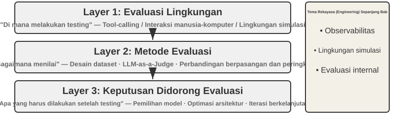
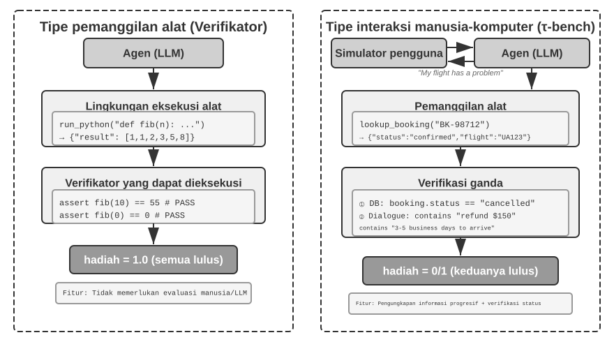
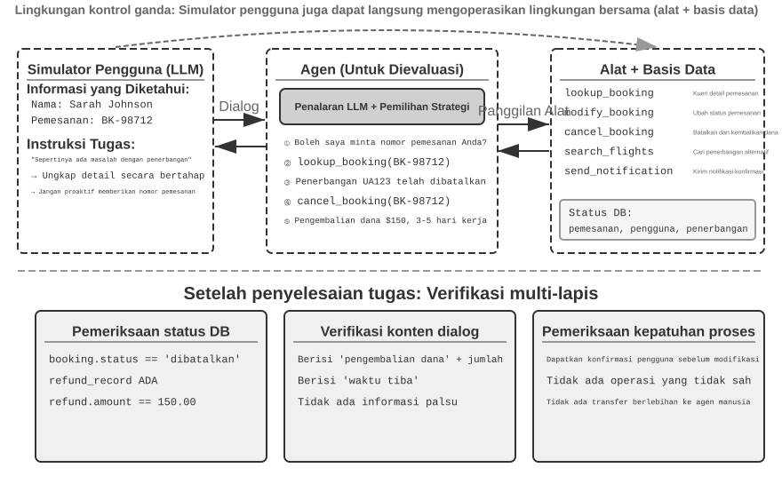
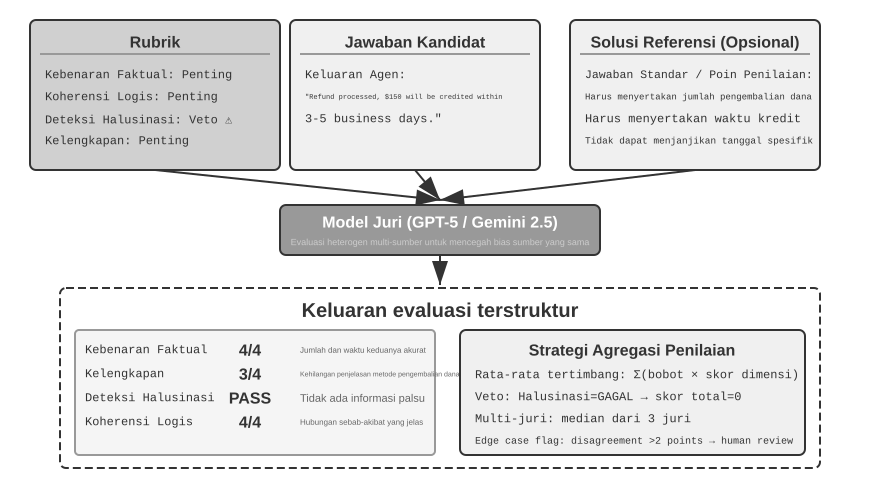
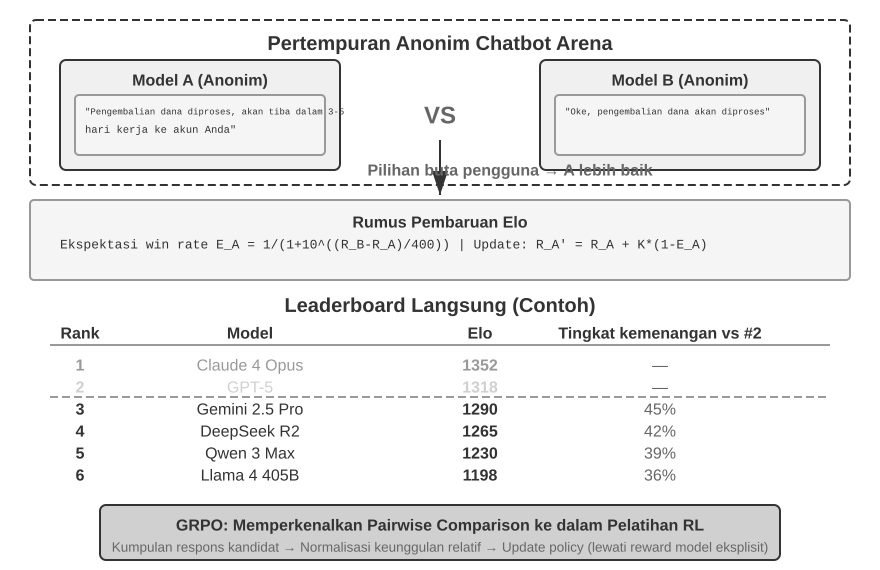
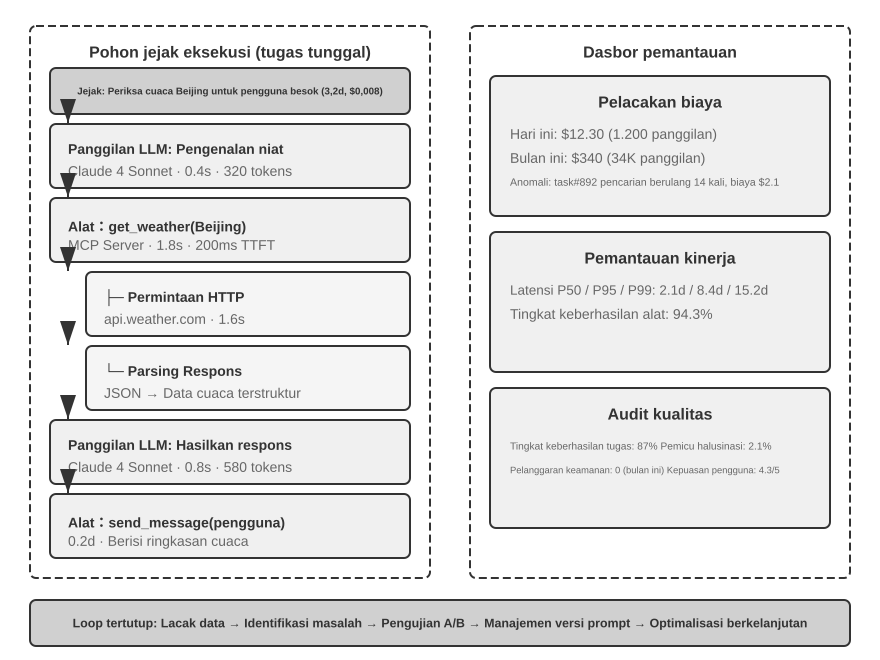
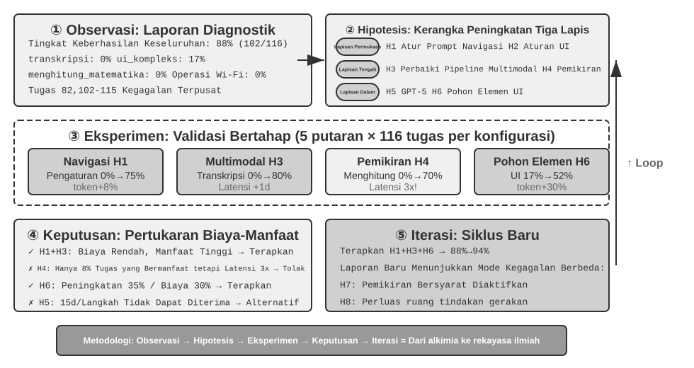
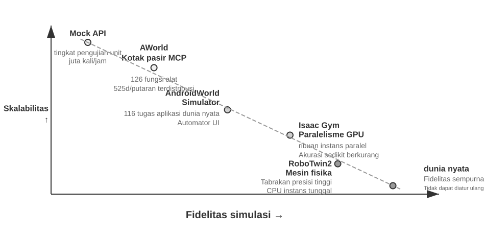
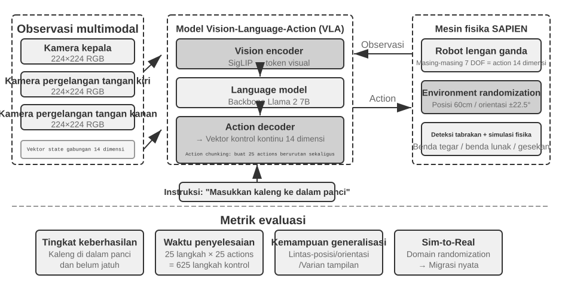

# Mengevaluasi Agen

Saat membangun sistem Agen, pengembang dihadapkan pada berbagai pilihan desain yang seringkali tidak memiliki jawaban benar yang pasti:

- Model mana yang harus digunakan?
- Alat (tools) apa saja yang boleh dipanggil oleh model?
- Data apa yang harus disimpan oleh basis pengetahuan (knowledge base), dan bagaimana strukturnya?
- Bagaimana seharusnya memori pengguna diimplementasikan?
- Bagaimana prompt dan Skill model harus diatur?
- Batasan apa yang perlu ditambahkan pada Harness?
- Bagaimana seharusnya evolusi diri dan iterasi diri Agen ini dilakukan?

Evaluasi menempatkan keputusan-keputusan ini pada landasan ilmiah. Melalui eksperimen komparatif sistematis (mengubah satu variabel pada satu waktu dan mengamati efeknya) dan eksperimen ablasi (menonaktifkan satu komponen pada satu waktu dan mengamati bagaimana performa keseluruhan berubah), Anda dapat membedakan peningkatan kemampuan yang nyata dari fluktuasi yang dangkal — dan menghindari penghematan kecil yang berujung pada kerugian besar (penny wise and pound foolish). Rekayasa perangkat lunak memiliki pepatah: Anda tidak dapat meningkatkan apa yang tidak Anda ukur. Tanpa sistem evaluasi yang dapat diulang, sebuah Agen hanya dapat diiterasi berdasarkan intuisi.

Dari perspektif rekayasa Harness yang diperkenalkan di Bab 1, evaluasi memainkan peran inti "verifikasi" di dalam Harness. Sebuah wawasan kunci adalah: **objek evaluasi seharusnya tidak hanya model, tetapi kombinasi antara model dan Harness**. Model yang sama dapat berkinerja sangat berbeda dalam Harness yang berbeda — beberapa tim telah secara signifikan meningkatkan performa model yang sama pada tugas terminal murni dengan mengoptimalkan Harness (lihat Bab 5). Jadi ketika sebuah Agen dievaluasi dengan buruk, perbaikannya mungkin bukan model yang berbeda tetapi komponen Harness yang lebih baik (prompt, desain alat, loop umpan balik). Sistem evaluasi yang baik harus mampu membedakan dua masalah yang secara fundamental berbeda: "kemampuan model yang tidak memadai" dan "kelemahan desain Harness." **Cara umum untuk membedakannya adalah eksperimen pertukaran model**: tetapkan Harness, tukar dengan model yang lebih kuat atau lebih lemah, dan perhatikan seberapa banyak skor bergerak. Jika model yang lebih kuat tidak meningkatkan skor, hambatannya adalah Harness. Jika model yang lebih lemah menurunkan skor secara drastis dan hasilnya berayun tajam seiring dengan kemampuan model, pembacaan yang paling langsung adalah bahwa model itu sendiri adalah hambatannya dan performa saat ini didominasi oleh model. Apakah ini karena tugas tersebut pada dasarnya sulit atau karena Harness terlalu mengandalkan pengetahuan awal model memerlukan analisis lebih lanjut. Perhatikan bahwa ini berbeda dengan eksperimen ablasi di atas: ablasi **menonaktifkan komponen Harness** untuk melihat bagaimana performa keseluruhan berubah; pertukaran model **menetapkan Harness dan hanya mengubah modelnya**. Yang pertama menemukan bagian mana di dalam Harness yang penting; yang terakhir memberi tahu Anda apakah hambatannya adalah model atau Harness.

Sistem evaluasi bahkan bernilai lebih besar di era evolusi model yang cepat. Model terus membaik, tetapi model baru yang mendapat skor lebih tinggi pada tolok ukur (benchmark) publik belum tentu akan bekerja lebih baik pada tugas Anda — model tersebut bahkan mungkin mengalami regresi (berkinerja lebih buruk daripada versi lama dalam beberapa aspek). Hanya pengujian penuh pada dataset evaluasi Anda sendiri yang memungkinkan Anda membuat keputusan peningkatan (upgrade) berbasis data. Sistem evaluasi yang solid bahkan membuat "membangun produk untuk model masa depan" menjadi strategi yang layak: jika model saat ini tidak cukup baik untuk penerapan komersial, selesaikan saja produknya, bangun set evaluasinya, lacak performa setiap model baru, dan luncurkan saat ada yang melampaui standar.

> **Panduan Bab**
>
> Bab ini membangun sistem evaluasi lengkap pada tiga tingkatan. Tingkat pertama adalah **Lingkungan Evaluasi** ("di mana untuk menguji"): bagaimana menyiapkan lingkungan pengujian yang otomatis dan dapat direproduksi, mencakup dua paradigma: pemanggilan alat (tool calling) dan interaksi manusia-komputer. Tingkat kedua adalah **Metode Evaluasi** ("bagaimana menilai"): mulai dari prinsip desain dataset dan sistem metrik evaluasi (apa yang diukur), hingga LLM-as-a-Judge (menggunakan LLM sebagai juri) untuk evaluasi otomatis, dan kemudian perbandingan berpasangan dan pemeringkatan model. Tingkat ketiga adalah **Pengambilan Keputusan Berbasis Evaluasi** ("apa yang harus dilakukan setelah pengujian"): mengubah hasil evaluasi menjadi panduan yang dapat ditindaklanjuti untuk pemilihan model, optimasi arsitektur, dan iterasi berkelanjutan, dengan signifikansi statistik untuk menilai apakah perbedaan skor yang diamati nyata. Bab ini juga mencakup observabilitas dan infrastruktur evaluasi internal dari Agen tingkat produksi, dan ditutup dengan lingkungan simulasi yang terhubung ke pasca-pelatihan (post-training) di Bab 7.
>
> Gagasan yang mengalir di sepanjang bab: **nilai utama sistem evaluasi bukan untuk menilai sistem saat ini, tetapi memungkinkan Anda mengikuti evolusi model dengan cepat dan andal.** Ketika model yang lebih kuat atau lebih murah dirilis, tim dengan sistem evaluasi yang kuat dapat memutuskan dalam hitungan jam apakah akan beralih; tim tanpa sistem tersebut hanya bisa mempercayai intuisi atau menunggu umpan balik komunitas — dan di pasar Agen yang sangat kompetitif, perbedaan kecepatan itu bisa menentukan siapa yang menang.



## Contoh Evaluasi Konkret

Sebelum menyelami metodologi, mari kita bangun intuisi melalui contoh yang lengkap. Misalkan kita telah membangun sebuah Agen layanan pelanggan dan perlu mengevaluasi kemampuannya dalam menangani permintaan pengembalian dana (refund).

**Kasus Uji**: Pengguna ingin mengembalikan pesanan dari 3 hari yang lalu (Pesanan #12345, Jumlah ¥299). Kebijakan perusahaan: Pengembalian dana penuh dalam waktu 7 hari.

**Lintasan (Trajectory) Agen**:

```
Pengguna: Saya ingin mengembalikan headphone yang saya beli 3 hari lalu, nomor pesanan 12345. (Hari ini adalah 2026-04-10)

Agen (berpikir): Pengguna menginginkan pengembalian dana, saya perlu memeriksa informasi pesanan terlebih dahulu.
Agen → Memanggil alat query_order(order_id="12345")
Alat mengembalikan: {status: "delivered", amount: 299, date: "2026-04-07", item: "Bluetooth Headphones"}

Agen (berpikir): Tanggal pesanan 2026-04-07, hari ini adalah 2026-04-10, itu berarti 3 hari, dalam masa pengembalian dana 7 hari, memenuhi syarat untuk pengembalian dana penuh.
Agen → Memanggil alat process_refund(order_id="12345", amount=299)
Alat mengembalikan: {refund_id: "R-98765", status: "processing", eta: "3-5 hari kerja"}

Agen: Pengembalian dana telah dimulai untuk Anda. Pengembalian dana penuh untuk Pesanan #12345 (Bluetooth Headphones, ¥299) sedang diproses,
      dan diperkirakan akan tiba dalam 3-5 hari kerja. ID pengembalian dana adalah R-98765, yang dapat digunakan untuk memeriksa progresnya.
```

**Penilaian dengan Rubrik** (empat dimensi, masing-masing diskor 1-4). Tabel 6-1 memberikan contoh penilaian untuk tugas pengembalian dana layanan pelanggan ini, mengilustrasikan bagaimana Rubrik memecah lintasan Agen menjadi dimensi evaluasi yang dapat diperiksa.

Tabel 6-1 Contoh Penilaian Rubrik untuk Tugas Pengembalian Dana Layanan Pelanggan

| Dimensi | Kriteria | Skor | Alasan |
|------------------------|--------------------------------|------|--------------------------------|
| Kebenaran Operasional | Apakah jumlah pengembalian dana dan nomor pesanan benar? | 4 | Berhasil mengkueri dan memulai pengembalian dana penuh ¥299 |
| Kepatuhan Kebijakan | Apakah mengikuti kebijakan pengembalian dana 7 hari? | 4 | Pesanan berada dalam periode pengembalian dana, mematuhi kebijakan |
| Kelengkapan Informasi | Apakah ia memberikan jumlah, waktu kedatangan, dan ID pengembalian dana? | 4 | Ketiga informasi penting tersebut telah diberikan |
| Deteksi Halusinasi (Item Veto) | Apakah ia memalsukan informasi yang tidak ada? | Lulus| Semua informasi berasal dari keluaran alat |

Halusinasi didaftarkan sebagai **item veto** daripada dimensi penilaian yang dinilai (graded) karena ini ortogonal dengan kualitas — respons yang lancar, terperinci, dan sopan yang mengandung informasi palsu jauh lebih berbahaya bagi pengguna daripada respons yang singkat namun akurat. (Untuk desain umum mekanisme veto, lihat bagian "Empat Prinsip Rubrik" nanti.)

Kasus uji ini lulus. Tetapi evaluasi yang baik tidak hanya menguji skenario keberhasilan; itu juga menyelidiki batas dan jebakan — ketika pengguna ingin mengembalikan pesanan dari 15 hari yang lalu (melebihi periode pengembalian dana), dapatkah Agen menolak dengan benar? Ketika pengguna mengklaim "perwakilan layanan pelanggan sudah menyetujui pengembalian dana," akankah Agen mempercayainya tanpa catatan sistem? Skenario batasan inilah yang benar-benar membedakan Agen yang kuat dari yang lemah.

Proses di atas — mendefinisikan kasus uji, menjalankan Agen, menilai dengan Rubrik, dan menganalisis hasil — adalah kerangka dasar evaluasi. Sisa bab ini menyempurnakan desain dari setiap langkah.

## Lingkungan Evaluasi Otomatis

Evaluasi Agen memerlukan lingkungan yang dapat diulang dan otomatis — yang dapat dengan cepat menguji efek perubahan selama pengembangan. Membangun lingkungan seperti itu memerlukan jawaban atas tiga pertanyaan: apa yang dievaluasi (definisi tugas dan kriteria verifikasi), dengan siapa Agen berinteraksi dan bagaimana mensimulasikan lawan bicara tersebut, dan kriteria penilaian mana yang digunakan.

### Komponen Dasar Lingkungan Evaluasi

Lingkungan evaluasi terdiri dari lima elemen — bagian selanjutnya akan berfokus pada desain dataset dan desain kriteria penilaian:

**Dataset**: Mendefinisikan himpunan tugas, termasuk keadaan awal (initial state), deskripsi tujuan, dan solusi referensi opsional.

**Keadaan Lingkungan (Environment State)**: Melacak keadaan yang dapat berubah selama eksekusi tugas dan harus menyeimbangkan antara realisme dengan pengendalian. Misalnya, dalam evaluasi layanan pelanggan, keadaan lingkungan mencakup catatan pesanan dalam basis data dan saldo akun pengguna. Setelah Agen memanggil `process_refund`, status pesanan berubah dari 'delivered' (terkirim) menjadi 'refunded' (dikembalikan) dan saldo bertambah. "Realisme" mengharuskan perubahan keadaan mengikuti logika bisnis (jumlah pengembalian dana tidak boleh melebihi jumlah pesanan), dan "pengendalian" mengharuskan setiap pengujian dapat diatur ulang ke keadaan awal yang sama.

**Alat (Tools)**: Mendefinisikan himpunan operasi yang dapat dilakukan Agen — alat tidak boleh memberikan abstraksi yang terlalu tingkat tinggi (seperti "selesaikan masalah pengguna"), melainkan harus memberikan operasi atomik (seperti kueri pesanan, ubah pemesanan, kirim email), memaksa Agen untuk menggabungkan operasi ini melalui perencanaan dan penalaran.

**Rubrik (Kriteria Penilaian)**: Mengkuantifikasi kinerja Agen, yang dapat berupa biner (lulus/gagal), kontinu (0 hingga 100 poin), atau multi-dimensi (menilai akurasi, efisiensi, dan keamanan secara terpisah).

**Protokol Interaksi**: Menentukan mode interaksi dan kondisi terminasi (penghentian).



### Lingkungan Evaluasi Pemanggilan Alat (Tool-Calling)

Untuk tugas-tugas yang utamanya bergantung pada penggunaan alat, seperti pembuatan kode dan analisis data, framework Verifiers menunjukkan pola desain yang khas. Agen menyelesaikan tugas dengan memanggil alat yang telah ditentukan sebelumnya, dan verifikasi didasarkan pada kriteria yang dapat dieksekusi (apakah pengujian lulus, apakah jawaban cocok), tanpa bergantung pada anotasi manusia atau penilaian model.

Verifiers memperkenalkan desain lingkungan hierarkis: `SingleTurnEnv` cocok untuk tugas satu giliran (misalnya, Q&A sederhana), `ToolEnv` mendukung loop otonom multi-giliran dari panggilan alat, dan `StatefulToolEnv` serta `SandboxEnv` mendukung alat yang menyimpan keadaan (stateful) dan lingkungan sandbox yang berjalan lama (misalnya, eksekusi kode). Misalnya: `SingleTurnEnv` cocok untuk mengajukan pertanyaan matematika dan memeriksa jawabannya secara langsung; `ToolEnv` cocok untuk mencari beberapa halaman web dan menyintesis jawaban sebelum memverifikasi hasil akhir; `StatefulToolEnv` cocok untuk memodifikasi catatan basis data dan memverifikasi perubahan keadaan yang dihasilkan; `SandboxEnv` cocok untuk menjalankan kode dalam sandbox dan memeriksa file keluaran. Tabel 6-2 merangkum jenis lingkungan ini bagi pembaca untuk memilih lingkungan evaluasi yang sesuai berdasarkan status tugas, panggilan alat, dan persyaratan isolasi.

Tabel 6-2 Perbandingan Jenis Lingkungan Verifiers

| Jenis Lingkungan | Persistensi Keadaan | Panggilan Alat | Kasus Penggunaan Khas |
|---|---|---|---|
| SingleTurnEnv | Tidak | Tidak | Q&A satu giliran, soal matematika |
| ToolEnv | Tidak | Multi-giliran | Pencarian + sintesis informasi |
| StatefulToolEnv | Ya | Multi-giliran | Memodifikasi catatan basis data |
| SandboxEnv | Ya + Isolasi | Multi-giliran | Eksekusi dan pengujian kode |

Framework ini mendukung pengambilan sampel paralel dan caching lintasan. Lintasan lengkap (observasi, tindakan, hadiah) dari setiap evaluasi disimpan untuk analisis dan pemutaran ulang selanjutnya.

Lingkungan juga perlu menangani ketergantungan operasi pada keadaan — hasil dari panggilan alat bergantung pada keadaan saat ini. Jika gagal, lingkungan harus memberikan pesan kesalahan yang jelas, bukan sekadar bendera kegagalan sederhana, yang memungkinkan Agen untuk belajar dari kesalahan dan menyesuaikan strateginya.

### Lingkungan Evaluasi Interaksi Manusia-Komputer

Banyak tugas di dunia nyata melibatkan tidak hanya panggilan alat tetapi juga percakapan dengan pengguna manusia. Agen layanan pelanggan perlu memahami ekspresi yang samar-samar, memperjelas kebutuhan, menanyakan sistem backend, dan mengonfirmasi informasi dengan pengguna. Mengevaluasi tugas semacam itu menghadapi tantangan mendasar: bagaimana mensimulasikan pengguna nyata dalam lingkungan otomatis?

Prinsip desain kuncinya adalah **Pengungkapan Informasi Progresif (Progressive Information Disclosure)**, yang merupakan perbedaan mendasar antara evaluasi interaksi manusia-komputer dengan tolok ukur tradisional. Sebagian besar tolok ukur mengungkapkan persyaratan lengkap di awal, tetapi pengguna nyata jarang dapat mengartikulasikan kebutuhan mereka sejak awal — mereka sering kali hanya mengatakan "sepertinya ada masalah dengan penerbangan saya" atau "internetnya tidak jalan." Agen harus memperjelas kebutuhan tersebut dengan mengajukan pertanyaan, dan proses itu sendiri merupakan unjuk kemampuan. Oleh karena itu, dalam evaluasi, **informasi pengguna yang disimulasikan tidak boleh diungkapkan kepada Agen sekaligus**; informasi itu harus diungkapkan secara progresif, sesuai permintaan, saat percakapan berlangsung.

Solusi dari τ-bench adalah **Simulasi Pengguna (User Simulation)**: menggunakan LLM lain untuk memainkan peran pengguna, bercakap-cakap dengan Agen sesuai dengan instruksi yang telah ditentukan. Pengguna yang disimulasikan menerima instruksi tugas (misalnya, "Saya perlu membatalkan penerbangan besok"), secara bertahap mengungkapkan informasi yang diperlukan kepada Agen selama percakapan, menanggapi pertanyaan, dan mengirimkan sinyal penghentian ketika tugas selesai. Prompt mengharuskan pengguna yang disimulasikan untuk "tidak mengungkapkan semua informasi sekaligus, hanya memberikan apa yang diperlukan untuk langkah saat ini" dan "tidak memalsukan informasi yang tidak disediakan dalam instruksi." Desain simulasi pengguna memerlukan tarik-ulur (trade-off) antara orisinalitas dan pengendalian: perilakunya harus mendekati pengguna nyata (ekspresi samar, informasi tidak lengkap, terkadang fluktuasi emosional) sekaligus mengikuti naskah tertentu untuk memastikan reproduktifitas.

Berikut adalah contoh percakapan multi-giliran dengan pengungkapan informasi progresif (simulator pengguna bertindak sesuai dengan naskah tetap):

> **Pengguna**: "Ada masalah dengan penerbangan saya."
> **Agen**: "Penerbangan yang mana?"
> **Pengguna** (mengungkapkan sesuai naskah): "Delta 123, besok pagi dari San Francisco ke New York."
> **Agen**: "Apa masalah spesifiknya?"
> **Pengguna** (mengungkapkan sesuai naskah): "Waktu penerbangannya terlalu lama, saya ingin mengubahnya."
> **Agen**: "Ada preferensi untuk penerbangan baru?"
> **Pengguna** (mengungkapkan sesuai naskah): "Penerbangan sore apa saja boleh."

Simulator pengguna mengikuti naskah tetap (informasi yang diketahui + aturan pengungkapan), memastikan reproduktifitas evaluasi sekaligus mensimulasikan gaya ekspresi progresif dari pengguna nyata.

τ-bench adalah tolok ukur untuk mengevaluasi kinerja Agen dalam proses bisnis terstruktur (misalnya, layanan pelanggan maskapai, layanan pelanggan ritel). Pemeriksaannya dilakukan di tingkat komponen dan multi-dimensi: di satu sisi, ia memeriksa apakah keadaan akhir basis data sudah benar (misalnya, status catatan pemesanan berubah menjadi "cancelled" atau dibatalkan); di sisi lain, ia memverifikasi apakah Agen memberikan informasi kunci yang diperlukan selama percakapan (misalnya, jumlah pengembalian dana dan waktu kedatangan, diverifikasi dengan mencari string atau pola tertentu). Verifikasi ganda ini secara bersamaan memeriksa keakuratan operasional dan keefektifan komunikasi. Pada tingkat tugas, bagaimanapun, pemeriksaan ini pada akhirnya mengerucut menjadi **hadiah biner nol atau satu (binary reward)** — semua pemeriksaan harus lulus untuk mendapat skor 1; setiap kegagalan tunggal mendapat skor 0. Hadiah biner membuat metrik keandalan seperti Pass^k mudah dihitung (lihat bagian "Sistem Metrik Evaluasi" nanti), dengan mengorbankan penilaian "akurat secara operasional tetapi melewatkan satu bidang yang tidak terlalu penting" yang disamakan dengan "kegagalan total."

**τ²-bench** yang ditingkatkan pada dasarnya tidak meningkatkan granularitas penilaian; sebaliknya, ia memajukan tolok ukur di dua area lain. Pertama, **Lingkungan Kontrol Ganda (Dual-Control Environment)**: Agen bukan lagi satu-satunya pihak yang dapat memanggil alat — simulator pengguna dapat beroperasi pada lingkungan bersama yang sama (Agen menginstruksikan pengguna untuk beralih ke mode pesawat, dan tindakan pengguna tersebut benar-benar mengubah keadaan lingkungan), yang lebih sesuai dengan skenario nyata seperti dukungan teknis, di mana pengguna harus ikut turun tangan. Kedua, **spesifikasi tugas yang lebih tepat dan pembangkitan tugas komposisional**: lebih sedikit ambiguitas dalam kondisi keberhasilan, dan instans tugas yang dapat diparameterisasi dan dibangkitkan secara bertahap (batch) (lihat bagian "Menjamin Verifiabilitas dan Objektivitas" nanti untuk rincian dimensi verifikasi).

> **Eksperimen 6-1 ★: Jalankan τ²-bench dan Bandingkan Evolusinya dari τ-bench**
>
> Eksperimen ini menjalankan framework evaluasi τ²-bench untuk memahami prinsip desain lingkungan evaluasi interaksi manusia-komputer. Dengan membandingkan τ-bench dengan τ²-bench, kita dapat melihat bagaimana dataset evaluasi ditingkatkan secara iteratif.
>
> Bacalah file definisi tugas secara mendalam: setiap tugas memuat informasi yang diketahui oleh pengguna, instruksi tugas yang mengatur pengungkapan progresif dan strategi respons, dan kondisi keberhasilan (keadaan target dari basis data dan informasi konfirmasi yang harus muncul dalam dialog). Jalankan proses evaluasi lengkap, perhatikan dialog multi-giliran antara simulator pengguna dan Agen, dan analisis mode kegagalan yang umum (pelanggaran kebijakan, penghilangan informasi, pengalihan yang berlebihan ke agen manusia, dll.).
>
>
> 
>
>
> Bandingkan perbedaan desain antara τ-bench dan τ²-bench: Versi awal τ-bench memiliki instruksi pengguna yang terlalu sederhana (Agen dapat menebak jawabannya), kondisi keberhasilan yang tidak tepat (menyebabkan salah penilaian), dan simulator pengguna yang mekanis. τ²-bench melakukan perbaikan sistematis untuk mengatasi masalah ini:
>
> - **Memperkenalkan instruksi tugas yang lebih rinci**: Termasuk "Persyaratan Dasar (Grounding Requirements)", yang berarti respons harus didasarkan pada keadaan lingkungan yang sebenarnya
> - **Kriteria evaluasi yang lebih tepat**: Misalnya, "tes kecepatan harus mengembalikan nilai 'luar biasa' agar dapat dianggap selesai"
> - **Spesifikasi perilaku simulator pengguna yang lebih realistis**: Pengungkapan informasi yang progresif, fluktuasi emosi yang alami
>
> Berikan perhatian khusus pada tugas domain telekomunikasi yang baru ditambahkan di τ²-bench, dan pahami desain lingkungan kontrol ganda dari τ²-bench (seperti yang disebutkan sebelumnya, pengguna dan Agen secara bersama-sama mengoperasikan lingkungan bersama yang sama).
>

Evaluasi pemanggilan alat bertanya apakah suatu perubahan keadaan yang dapat diobservasi telah diselesaikan; evaluasi interaksi manusia-komputer bertanya apakah Agen tersebut membantu pengguna mencapai pemahaman baru atau membuat sebuah keputusan. Yang pertama menguji kebenaran tindakan Agen; yang terakhir menguji kesahihan strategi komunikasinya.

Membangun lingkungan evaluasi juga menyentuh lingkungan simulasi — ketika lingkungan evaluasi harus mendukung interaksi berulang pada skala besar, ia menjadi lingkungan simulasi. Bagian akhir dari bab ini membahas hal ini secara singkat.
## Desain Dataset Tugas Evaluasi

Lingkungan evaluasi adalah "panggung," dan dataset adalah "naskah." Kualitas naskah sering kali lebih menentukan nilai evaluasi daripada panggungnya sendiri. Dataset yang dirancang dengan buruk, bahkan ketika dijalankan di lingkungan yang sempurna, hanya akan menghasilkan kebisingan (noise). Bagian ini merangkum beberapa prinsip yang telah divalidasi berulang kali dari praktik desain tolok ukur (benchmark) seperti GAIA, AndroidWorld, SWE-Bench Verified, τ-bench dan τ²-bench, Terminal-Bench, OSWorld, dan OSWorld-Verified.

Daftar ini tidak mencakup seluruh lanskap evaluasi Agen. Bahkan di dalam kategori Web/GUI terdapat beberapa tolok ukur dengan penekanan yang berbeda: WebArena membangun situs web yang sepenuhnya dapat direproduksi (e-commerce, forum, hosting kode, dll.), menahan ketidakpastian halaman web nyata di dalam kotak pasir (sandbox); Mind2Web menempuh jalan sebaliknya, menguji generalisasi secara langsung pada ratusan situs web nyata; BrowseComp berspesialisasi dalam pencarian mendalam — jawaban terkubur sangat dalam sehingga hanya penelusuran multi-hop dan pemeriksaan silang yang dapat memunculkannya. Di sisi pemanggilan alat, ada papan peringkat (leaderboard) function-calling khusus seperti BFCL (Berkeley Function-Calling Leaderboard). Bab ini tidak bermaksud untuk mendaftarkan semuanya. Sebaliknya, bab ini mengambil dua paradigma lingkungan inti (pemanggilan alat dan interaksi manusia-komputer), ditambah skenario operasi GUI yang melintasi studi kasus dataset, dan menggali tarik-ulur (trade-off) desainnya. Setelah Anda memahami paradigmanya, Anda dapat dengan cepat menilai apa yang diukur oleh tolok ukur baru mana pun, seberapa baik itu mencegah kebocoran data, dan seberapa jauh kesimpulannya dapat diekstrapolasi.

> **Eksperimen 6-2 ★: Jalankan Tugas Tolok Ukur secara Manual**
>
> Pilih tugas dari masing-masing GAIA, AndroidWorld, SWE-Bench Verified, τ²-bench, Terminal-Bench, dan OSWorld-Verified dan selesaikan secara manual. Disarankan untuk menyelesaikan satu tugas yang mudah, satu yang sedang, dan satu tugas yang sulit dari setiap dataset — tingkat "sulit" harus menantang bahkan untuk manusia. Bandingkan hasil eksekusi Anda dengan jawaban standar dan analisis sumber perbedaannya. Melalui pengalaman langsung ini, pahami: deskripsi tugas perlu menyeimbangkan kejelasan dan keterbukaan, standar verifikasi harus objektif dan dapat dieksekusi, dan tingkat kesulitan tugas yang hierarkis harus dapat membedakan tingkat kemampuan yang berbeda.
>

### Tantangan Inti dalam Desain Dataset Tugas

**Tantangan Pertama: Ketegangan Antara Kejelasan dan Keterbukaan.** Deskripsi tugas harus cukup jelas untuk memastikan evaluasi yang dapat direproduksi, namun tidak terlalu kaku sehingga menghambat kreativitas Agen. GAIA memberikan contoh: tugas-tugas "secara konseptual sederhana" tetapi memiliki jalur implementasi terbuka — misalnya, sebuah tugas mungkin mengharuskan Agen untuk mengidentifikasi seorang astronot dari Astronomy Picture of the Day NASA dan menentukan berapa lama mereka menghabiskan waktu di luar angkasa. Tujuannya jelas, tetapi bagaimana cara mencari, memfilter, dan memverifikasi sepenuhnya terserah pada pengambilan keputusan otonom Agen.

**Tantangan Kedua: Menyeimbangkan Autentisitas dan Kontrol.** Tugas-tugas dunia nyata mengandung ketidakpastian dan kebisingan, yang dapat mengungkap ketahanan (robustness) tetapi juga mengancam reproduktifitas. Versi awal SWE-Bench secara langsung menggunakan issue GitHub nyata, memastikan autentisitas tetapi juga mengarah pada deskripsi tugas yang ambigu, kasus uji yang tidak lengkap, dan kriteria evaluasi yang subjektif. SWE-Bench Verified memperkenalkan validasi sistematis oleh pakar manusia, memilih 500 tugas berkualitas tinggi dengan masalah yang didefinisikan secara jelas, pengujian yang memadai, dan solusi yang jelas, secara signifikan meningkatkan kontrol sambil mempertahankan autentisitas.

**Tantangan Ketiga: Mengoordinasikan Keberagaman dan Sistematisasi.** Dataset yang efektif perlu mencakup skenario yang khas, kasus ekstrem (edge cases), dan jebakan kesalahan, sekaligus memiliki organisasi yang sistematis sehingga hasil evaluasi dapat mendiagnosis kelemahan kemampuan tertentu. 116 tugas AndroidWorld menjangkau 20 aplikasi nyata, masing-masing dianotasi dengan kemampuan inti yang dibutuhkannya (perencanaan multi-langkah, pemahaman visual, penalaran temporal) — sehingga hasilnya tidak hanya menghasilkan tingkat keberhasilan keseluruhan tetapi juga profil kekuatan dan kelemahan di sepanjang dimensi kemampuan tertentu. Lebih kritis lagi, mekanisme parameterisasi dapat menghasilkan varian tugas yang hampir tak terbatas.

**Tantangan Keempat: Biaya Evaluasi vs. Cakupan.** Tugas Agen yang kompleks dapat memakan waktu menit atau bahkan berjam-jam untuk diselesaikan, menghabiskan sejumlah besar token. Ukuran dataset perlu menyeimbangkan komprehensivitas dan ekonomi. GAIA dengan cermat memilih 466 tugas di tiga tingkat kesulitan, mencakup berbagai dimensi kemampuan sambil memungkinkan evaluasi dengan biaya yang wajar. SWE-Bench Verified mengurangi setnya dari 2.294 tugas menjadi 500 (mengurangi biaya sekitar empat perlima sambil meningkatkan rasio sinyal-terhadap-kebisingan melalui standar kualitas yang lebih ketat).

**Tantangan Kelima: Mencegah Kontaminasi Data.** Di era model bahasa besar, kontaminasi data adalah tantangan serius untuk evaluasi: ketika data evaluasi dimasukkan ke dalam data pelatihan, evaluasi mengukur hafalan daripada generalisasi. Ini seperti menghafal jawaban sebelum ujian—skor yang baik tidak mencerminkan kemampuan yang sebenarnya. Tolok ukur yang berbeda mengadopsi strategi pencegahan yang berbeda: GAIA mengandalkan keunikan jawabannya; pertanyaan memerlukan penggabungan informasi dari berbagai sumber untuk dijawab, dan beberapa tugas dilengkapi dengan file lampiran yang dibuat khusus (PDF/audio/gambar yang tidak ada di internet), sehingga satu halaman web tidak dapat langsung memberikan jawaban. SWE-Bench Verified itu sendiri adalah subset 500 tugas yang diperoleh OpenAI melalui penyaringan kualitas manual dari SWE-Bench asli, dan tidak menyertakan desain pencegahan kebocoran berbasis waktu. Pekerjaan-pekerjaan berikutnya seperti SWE-bench-Live yang benar-benar menggunakan kebaruan temporal (temporal freshness) untuk mencegah kebocoran, secara terus-menerus memasukkan issue yang dibuat setelah tanggal batas pelatihan model (training cutoff date), menjaga evaluasi tetap berada di depan korpus pelatihan model. τ²-bench mencegah kebocoran melalui pembangkitan parameter yang dinamis, di mana instans tugas spesifik (nama pengguna, nomor pesanan, tanggal, dll.) dibangkitkan secara acak setiap saat. Pembangkitan tugas terparameterisasi AndroidWorld secara alami membantu mencegah kebocoran karena verifikasi didasarkan pada keadaan UI akhir, bukan pada urutan operasi. Terminal-Bench membuat kebocoran dapat dideteksi dengan menyematkan GUID burung kenari (canary GUID - pengidentifikasi unik global yang digunakan sebagai penanda pelacakan): jika sebuah model dapat menampilkan konten yang mengandung GUID ini, hal itu mengindikasikan bahwa data tolok ukur telah bocor ke dalam set pelatihan.

### Desain Presisi Deskripsi Tugas

GAIA memastikan keunikan jawaban melalui batasan sumber informasi, rentang waktu, topik, dan target pencarian yang jelas. Sebagai contoh, tugas Level 3 mengharuskan mulai dari gambar NASA tanggal tertentu, mengidentifikasi astronot melalui pemahaman visual, mencari grup astronot tempat mereka tergabung, menghitung waktu mereka di luar angkasa, dan memformat output dengan tepat ("nama belakang; bidang dipisahkan oleh titik koma; angka diformat dengan pemisah ribuan"). Setiap detail melayani verifikasi otomatis—hanya kecocokan tepat dalam format dan konten yang dihitung sebagai lulus.

τ²-bench memperkenalkan desain yang dikontekstualisasi, dengan setiap tugas memuat beberapa lapis informasi: masalah permukaan ("data seluler tidak berfungsi"), ekspektasi performa ("membutuhkan peringkat kecepatan 'luar biasa'"), batasan ("tidak akan menerima peringkat lain"), dan emosi yang tersirat. Peningkatan penting adalah memisahkan "informasi yang diketahui" dari "instruksi tugas": informasi yang diketahui adalah apa yang saat ini diketahui pengguna, sedangkan instruksi tugas memandu simulator tentang cara mengungkapkan informasi secara progresif, termasuk "Persyaratan Dasar" (respons harus didasarkan pada hasil aktual yang dikembalikan oleh pemanggilan alat, bukan dibuat-buat).

SWE-Bench Verified mencakup bidang terstruktur seperti deskripsi masalah, langkah-langkah reproduksi, dan perilaku yang diharapkan/aktual, dengan penganotasi yang memverifikasi kecocokan antara deskripsi dan kasus uji. Setiap elemen dalam deskripsi tugas Terminal-Bench dapat diverifikasi secara mekanis: apakah jalur file ada, nilai izin sudah benar, parameter sertifikat valid, dan format tanggal sudah benar. Misalnya, "build-linux-kernel-qemu" mengharuskan membangun kernel Linux 6.9 dari kode sumber, menambahkan `printk` kustom di `start_kernel`, menghasilkan `initramfs`, dan menjalankannya di QEMU. Kriteria keberhasilannya adalah kemunculan pesan kustom tersebut dalam log boot—Agen tidak dapat memalsukan output; ia harus benar-benar menyelesaikan seluruh proses.

AndroidWorld menggunakan desain **templat terparameterisasi**. Tugas bukan teks statis melainkan templat yang dapat diinstansiasi secara dinamis (misalnya, "Ubah nomor telepon kontak `[CONTACT_NAME]` menjadi `[NEW_PHONE]`"), dengan nilai parameter yang berbeda yang dibangkitkan secara acak untuk setiap evaluasi. Ini memiliki tiga manfaat:

- **Mencegah hafalan**: Nilai parameter berbeda setiap kalinya, mencegah pemutaran ulang urutan operasi yang tetap
- **Meningkatkan keberagaman data**: Satu templat dapat menghasilkan instans yang hampir tak terbatas
- **Mendukung eksperimen komparatif**: Mempertahankan parameter tertentu tetap sambil memvariasikan yang lain memungkinkan pengukuran yang tepat dari efek faktor tertentu

Verifikasi didasarkan pada status UI akhir (misalnya, apakah bidang nomor telepon berisi nilai yang diharapkan), bukan pada urutan operasinya.

Tugas OSWorld sering kali tidak mulai dari keadaan awal "bersih" melainkan dari keadaan perantara yang dikonfigurasi dengan hati-hati, lebih menyerupai skenario penggunaan dunia nyata. Deskripsi tugas perlu menangani banyak solusi ("atur latar belakang menjadi ungu" memerlukan kode warna spesifik untuk memperjelas; "gabungkan dua CSV" harus menerima semua metode yang masuk akal seperti menyimpan satu header atau kedua header) dan ketidakpastian lingkungan (tindakan anti-scraping di situs web, perubahan UI aplikasi, dan race conditions—OSWorld-Verified memitigasi hal ini melalui snapshot halaman luring, penguncian versi dependensi, kondisi penungguan eksplisit (explicit wait conditions), dll.).

### Desain Hierarkis dari Kompleksitas Tugas

GAIA merancang tiga tingkat kesulitan: Level 1 hanya membutuhkan 1-2 alat (manusia 93.9% vs GPT-4 30.3%), Level 2 membutuhkan penalaran multi-langkah (91.8% vs 9.7%), dan Level 3 membutuhkan kombinasi kompleks (87.3% vs 0%). Nilai diagnostik dari desain hierarkis ini adalah: kegagalan pada Level 1 menunjuk pada masalah penggunaan alat dasar, Level 2 menunjuk pada perencanaan multi-langkah dan integrasi informasi, dan Level 3 menunjuk pada penalaran urutan panjang dan manajemen kompleksitas. Setiap level sesuai dengan arah peningkatan yang berbeda (rekayasa prompt vs. mekanisme perencanaan vs. arsitektur hierarkis/pasca-pelatihan).

τ²-bench melapisi kompleksitas menurut proses bisnis: dari kueri informasi sederhana, menuju proses multi-langkah (mengubah pesanan penerbangan memerlukan kueri, menyajikan alternatif, mendapatkan konfirmasi, menghitung selisih harga tarif, dan memproses pembayaran), ke diagnosis gangguan (secara sistematis memeriksa beberapa kemungkinan penyebab dan memverifikasi perbaikan), dan akhirnya menuju penilaian strategis (menangani permintaan yang tidak mematuhi kebijakan).

Terminal-Bench melapisi kompleksitas sepanjang dimensi ganda domain teknis × kompleksitas operasional. Registri tugasnya telah mengumpulkan lebih dari 200 tugas (ukuran set evaluasi inti bervariasi menurut versi; misalnya, versi 2.0 memilih 89 tugas berkualitas tinggi dari kontribusi komunitas), mulai dari pendaftaran model MLflow sederhana, peretasan kata sandi 7-Zip berkesulitan sedang, integrasi server Git dan server web yang sulit, hingga yang paling sulit yaitu kriptanalisis diferensial FEAL (membutuhkan pengetahuan kriptografi + optimasi algoritma untuk memenuhi kendala waktu 30 detik).

### Memastikan Verifiabilitas dan Objektivitas

Jawaban GAIA ringkas dan jelas. Aturan pemformatan yang ketat memungkinkan verifikasi melalui pencocokan string yang persis. Hasil biner (cocok atau tidak cocok) memastikan reproduktifitas objektif. Kelangkaan jawabannya juga berfungsi sebagai langkah anti-kecurangan—fakta yang sangat spesifik kemungkinan tidak akan muncul kata per kata dalam data pelatihan.

SWE-Bench Verified menggunakan pemeriksaan berbasis kode yang dapat dieksekusi, membedakan antara FAIL_TO_PASS (gagal sebelum perbaikan, lulus setelah perbaikan, membuktikan masalah telah diselesaikan) dan PASS_TO_PASS (lulus baik sebelum dan sesudah perbaikan, membuktikan tidak ada bug baru yang dimasukkan), mencapai verifikasi ganda. Versi Verified juga memastikan pengujian itu sendiri dapat diandalkan, tanpa pengujian tidak stabil (flaky tests) yang terkadang lulus dan terkadang gagal.

Sistem verifikasi τ²-bench mencakup beberapa lapis pemeriksaan (hasil dari masing-masing lapisan masih digabungkan ke dalam hadiah biner di tingkat tugas; semua harus lulus untuk dianggap berhasil):

- **Pemeriksaan keadaan basis data**: Status catatan pemesanan, apakah catatan pengembalian dana telah dibuat
- **Pencarian kata kunci konten dialog**: Apakah Agen secara eksplisit mengonfirmasi jumlah pengembalian dana dan perkiraan waktu kedatangan kepada pengguna
- **Kepatuhan proses**: Analisis urutan panggilan alat, mis., apakah konfirmasi eksplisit pengguna telah diperoleh sebelum mengubah pesanan

Lingkungan kontrol ganda τ²-bench (lihat bagian sebelumnya "Lingkungan Evaluasi Interaksi Manusia-Komputer") menambahkan dimensi lain ke verifikasi: setelah simulator pengguna benar-benar mengubah keadaan lingkungan, Agen harus mengobservasi perubahan ini melalui pemanggilan alat dan melanjutkan pemecahan masalah (troubleshooting) yang sesuai. Karenanya verifikasi mencakup apakah Agen benar-benar mengobservasi hasil tindakan pengguna.

OSWorld menyediakan 134 fungsi evaluasi independen dengan akses OS penuh, memungkinkan pemeriksaan mendalam terhadap struktur sistem file, status proses, koneksi jaringan, dan internal aplikasi. Misalnya, dalam tugas operasi basis data, skrip evaluasi tidak hanya memverifikasi bahwa file laporan ada, tetapi juga terhubung langsung ke basis data untuk memeriksa apakah SQL dieksekusi dengan benar. Dalam tugas browser, ia menganalisis pohon DOM, memeriksa cookies/localStorage, dan mengirim permintaan verifikasi ke backend untuk mengonfirmasi apakah pengajuan formulir (form submission) benar-benar mulai berlaku. Inspeksi mendalam ini dapat mendeteksi kasus "penyelesaian dangkal namun substansinya salah"—sebagai contoh, Agen mengklik tombol kirim, tetapi permintaan ditolak oleh server karena entri bidang (field) yang salah.

Terminal-Bench didasarkan pada lingkungan kontainer Docker standar, menggabungkan pemeriksaan status sistem file (keberadaan path, nilai izin, format konten) dengan verifikasi fungsional eksekusi program (di `build-linux-kernel-qemu`, benar-benar memulai QEMU dan mencari pesan kustom `printk`). Canary GUID membuat kebocoran dapat dilacak.

### Desain Sistematis dari Distribusi Tugas

Distribusi tugas perlu secara sistematis mencakup dimensi kemampuan, dimensi kesulitan, dimensi skenario, dan kasus ekstrem. GAIA mengejar keumuman (generality)—sebagian besar tugas memerlukan kombinasi penalaran, multimodalitas, penjelajahan (browsing), dan penggunaan alat. τ²-bench dengan sengaja mendesain "tugas jebakan"—seorang pengguna mengklaim "layanan pelanggan telah menyetujui pembatalan" ketika pembatalan tersebut sebenarnya tidak mematuhi kebijakan—untuk menguji apakah Agen tetap mempertahankan penilaiannya di bawah tekanan dan penyesatan. OSWorld didasarkan pada matriks dimensi ganda dari tipe operasi (file IO / aplikasi desktop / aplikasi web / alur kerja lintas aplikasi) dan domain aplikasi, membentang di atas tiga sistem operasi (penelitian menunjukkan korelasi lintas OS yang kuat; keterampilan yang dipelajari pada satu sistem dapat ditransfer ke sistem lain). Terminal-Bench menyertakan "tugas kombinasi tumpukan teknologi lintas (cross-technology stack combination tasks)" untuk menguji pemikiran sistem (mis., tugas resharding yang menggabungkan pemrosesan data + operasi file + rekayasa Python).

### Kontrol Kualitas Data dan Peningkatan Iteratif

SWE-Bench Verified merupakan model kontrol kualitas. OpenAI secara acak memilih 1.699 tugas dari aslinya 2.294 untuk evaluasi manusia, merekrut 93 pengembang yang mahir menggunakan Python. Penganotasi (annotators) harus melakukan berbagai pemeriksaan: apakah deskripsi masalah jelas (dapatkah mereka memahami apa yang perlu dipecahkan), apakah kasus uji lengkap (mencakup semua aspek dan kasus ekstrem), apakah pengujian stabil (tidak ada flaky test karena lingkungan atau keacakan), apakah patch tersebut benar (apakah itu menimbulkan error baru), dan apakah kesulitannya wajar. Setelah penyaringan ketat, hanya 500 yang lolos (29%)—tingkat penolakan yang tinggi ini merupakan investasi penting dalam kualitas evaluasi. Mereka juga menetapkan pedoman anotasi standar, menentukan kriteria spesifik dan contoh untuk setiap pemeriksaan guna memastikan konsistensi di antara penganotasi yang berbeda.

τ²-bench memperkenalkan pemisahan antara "informasi yang diketahui" / "instruksi tugas" (membuat perilaku simulator lebih realistis) dan kondisi penyelesaian yang lebih ketat (mis., "hanya 'luar biasa' yang dihitung selesai; buruk/cukup/baik tidak diterima"), guna mencegah "perbaikan dangkal."

OSWorld-Verified adalah model dari peningkatan iteratif. Setelah rilisnya pada April 2024, OSWorld dengan cepat menjadi tolok ukur penting untuk evaluasi Agen multimodal, namun selama 15 bulan penggunaan secara luas, lebih dari 300 masalah ditemukan. Masalah-masalah ini masuk dalam empat kategori: masalah lingkungan (langkah anti-scraping situs web, CAPTCHA, dan perubahan konten dinamis), masalah deskripsi tugas (kalimat yang ambigu), masalah logika verifikasi (terlalu ketat atau terlalu longgar), dan masalah keadaan awal (konfigurasi tidak lengkap). Tim yang terdiri dari sekitar 10 orang dari Universitas Hong Kong bekerja sama erat dengan MoonShot AI, OpenAI, ByteDance Seed TARS, Anthropic, Simular, dan lain-lain selama dua bulan untuk secara sistematis memperbaiki masalah ini. Strategi perbaikan dirumuskan untuk setiap kategori: masalah lingkungan diselesaikan dengan mengunci versi dan pencadangan luring, deskripsi tugas diperjelas dengan menulis ulang bagian kalimat yang ambigu, logika verifikasi diseimbangkan dengan menyusun baseline yang benar secara manual dan menyesuaikan kondisi, dan keadaan awal ditingkatkan dengan menambahkan pemeriksaan kelengkapan.

Infrastruktur evaluasi juga dimigrasi dari VM (Virtual Machine) lokal ke platform cloud AWS, dengan memanfaatkan penskalaan elastis (elastic scaling) untuk mencapai peningkatan kecepatan 50 kali lipat melalui paralelisasi (dari yang tadinya lebih dari 10 jam menjadi hanya beberapa menit). Tingkat keberhasilan inisialisasi tugas Google Drive meningkat dari 50% menjadi lebih dari 95%. Semua data lintasan evaluasi resmi tersedia untuk publik di Hugging Face, yang memungkinkan komunitas untuk meninjau setiap detail, mereproduksi hasil, dan mengidentifikasi masalah, untuk membentuk siklus pengembangan berkelanjutan (continuous improvement) yang bermanfaat.

Lingkungan evaluasi dan lingkungan pasca-pelatihan sering kali berasal dari akar yang sama: lingkungan evaluasi yang dirancang dengan baik dapat diadaptasi menjadi lingkungan pelatihan dengan sedikit usaha—SWE-Gym adalah contoh representatif tentang bagaimana membangun tugas pelatihan yang didasarkan pada SWE-bench, sedangkan templat berparameter dari τ²-bench dan AndroidWorld dapat menghasilkan instans pelatihan masif dalam jumlah (batch) yang besar. Tapi ada satu garis merah yang harus ditarik: apa yang dapat digunakan kembali adalah **mekanisme konstruksi** lingkungan; tugas-tugas spesifik dari set evaluasi harus tetap diisolasi secara ketat dari data pelatihan—begitu sebuah tugas evaluasi memasuki set pelatihan, tugas itu akan menguji ingatan (hafalan), bukan kemampuan (lihat Bab 7 untuk lebih jelasnya).

## Sistem Metrik Evaluasi

Setelah menyelesaikan "tugas apa yang akan dievaluasi," kita masih perlu menjawab "dimensi apa yang harus diukur." Bagian ini mengumpulkan metrik yang biasa digunakan dalam evaluasi Agen ke dalam sebuah "kamus metrik" referensi—mulai dari proses hingga hasil, dari kualitas hingga keamanan—dengan memberikan definisi dan kasus penggunaannya masing-masing. Bagian ini juga menyediakan definisi yang presisi dari Pass@k, Pass^k, dan metrik lainnya yang telah digunakan sebelumnya (misalnya, di bagian τ-bench).

**Metrik Proses: Dari Kotak Hitam (Black Box) ke Kotak Putih (White Box).**

Hanya berfokus pada hasil akhir saja tidak cukup; proses di mana Agen mencapai hasil tersebut sama pentingnya. **Tingkat validitas dan otorisasi tindakan (Action validity and authorization rate)** mengukur proporsi tindakan yang valid dan terotorisasi—operasi yang tidak valid mencakup pemanggilan alat yang tidak ada atau meneruskan jenis parameter yang salah; operasi yang tidak terotorisasi mengacu pada tindakan yang berada di luar ruang lingkup yang diizinkan. Tingkat yang tinggi menunjukkan bahwa Agen memiliki pemahaman yang jelas tentang ekosistem alat. **Tingkat kebenaran pemanggilan alat (Tool call correctness rate)** lebih lanjut mensyaratkan agar parameter secara semantis masuk akal: istilah kueri untuk alat pencarian harus secara akurat mengekspresikan kebutuhan, dan path untuk operasi file harus menunjuk ke target yang benar.

**Efisiensi jalur (Path efficiency)** mengukur seberapa efisien tugas tersebut diselesaikan: jumlah langkah (siklus think-act-observe), tindakan yang berlebihan (mencari kata kunci yang sama berulang kali, membaca ulang file yang sama), dan frekuensi backtracking (seberapa sering Agen menyadari adanya kesalahan dan mengoreksinya sendiri—backtracking sesekali adalah hal yang normal, tetapi backtracking yang sering menunjukkan perencanaan ke depan yang kurang memadai). Nilai patokan (baseline) dari pakar manusia atau algoritma heuristik diperlukan untuk menentukan "jumlah langkah yang wajar."

**Cakupan pencarian (Retrieval coverage)** menargetkan tugas pengumpulan informasi: Apakah Agen sepenuhnya menjelajahi ruang informasi? Apakah Agen mengambil kesimpulan setelah hanya melihat halaman pertama hasil pencarian? **Biaya dan latensi (Cost and latency)** difokuskan pada jumlah permintaan, pengeluaran token (membedakan biaya input/output, dengan mempertimbangkan penggunaan kembali KV Cache), dan waktu dinding-jam (wall-clock time) (termasuk inferensi model + eksekusi alat + latensi jaringan). Distribusi waktu perlu dilacak untuk mengidentifikasi hambatannya (bottleneck).

**Metrik Hasil dan Kualitas.**

**Tingkat keberhasilan tugas (Task success rate)** adalah metrik keras (hard metric) paling langsung, yang dapat dirancang dengan standar hierarkis (tujuan inti harus tercapai, tujuan sekunder memengaruhi skor kualitas). Dalam metode statistik, dua metrik yang sering membingungkan perlu dibedakan:

- **Pass@k**: Probabilitas bahwa **setidaknya satu** dari k percobaan akan berhasil, untuk menjawab "Dapatkah Agen melakukannya?"
- **Pass^k**: Probabilitas bahwa **semua** k percobaan akan berhasil, untuk menjawab "Apakah Agen stabil dan dapat diandalkan?"
- **Best@k**: Skor dari percobaan **terbaik** dari k percobaan (daripada apakah percobaan tersebut berhasil), mengukur "batas kualitas terbaik dengan peluang yang cukup," sering digunakan untuk tugas-tugas terbuka (open-ended) dengan penilaian bersambung (continuous scoring).

Sebuah angka konkret membuat perbedaannya terlihat jelas. Misalkan tingkat keberhasilan percobaan tunggal Agen adalah 60% (Pass@1 = 0,6). Selama 5 kali percobaan: Pass@5 = 1 - 0,4^5 ≈ 99% (hampir dipastikan berhasil setidaknya satu kali), sedangkan Pass^5 = 0,6^5 ≈ 7,8% (kelima kalinya berhasil sangat tidak mungkin). Yang pertama mengukur batas batas (ceiling) kemampuan, yang terakhir stabilitas; jika Anda salah membedakan keduanya maka Anda akan salah membaca Agen Anda. Tabel 6-3 merangkum skenario yang berlaku dan risiko penyalahgunaan untuk keduanya, untuk membantu pembaca memilih metrik yang tepat di antara pengujian regresi dan evaluasi eksploratori.

Tabel 6-3 Skenario yang Berlaku untuk Pass@k dan Pass^k

| Tujuan Evaluasi | Metrik Mana yang Digunakan | Konsekuensi Penyalahgunaan |
|----------------------------------|---------------|-----------------------------------------------|
| Verifikasi stabilitas (pengujian regresi) | Pass^k | Menggunakan Pass@k menutupi ketidakstabilan—sebuah Agen yang berhasil hanya sekali dalam lima percobaan masih akan ditampilkan sebagai "lulus" |
| Evaluasi batas kemampuan (tugas eksploratori) | Pass@k atau Best@k | Menggunakan Pass^k akan secara keliru menandai kegagalan karena fluktuasi sesekali—setiap perubahan kecil akan dinilai sebagai kegagalan |

**Metrik Keamanan dan Kepatuhan (Safety and Compliance Metrics)** sangat penting dalam penerapan produksi: memicu operasi sensitif (menghapus data / mengubah izin / mengirim komunikasi eksternal), kebocoran data (mencetak kata sandi di log / mengirim dokumen pribadi ke API eksternal), dan konten yang dilarang, semuanya harus tunduk pada **prinsip tanpa-toleransi (zero-tolerance principle)**—serupa dengan veto halusinasi (lihat "Empat Prinsip Rubrik" nanti). Satu pelanggaran keamanan serius akan memveto evaluasi secara keseluruhan, tak peduli kinerja pada dimensi lainnya.

**Ketahanan (Robustness)** mengukur stabilitas di saat menghadapi ketidakpastian: sensitivitas benih acak (random seed sensitivity) (seberapa banyak kinerja bervariasi dengan inisialisasi yang berbeda), kemampuan beradaptasi dengan perubahan halaman (pembaruan UI situs web tidak boleh menyebabkan kegagalan total), toleransi terhadap getaran (jitter) API (apakah ia dapat menangani dengan baik kegagalan sementara, timeout, perubahan format), dan gangguan memori jangka panjang (long-term memory interference) (apakah informasi kadaluwarsa yang terakumulasi dalam konteks dapat menyebabkan pengambilan keputusan yang salah).

**Cakupan Ganda dari Lintasan Eksekusi dan Hasil Akhir.** Sebuah perbedaan yang mudah terlewatkan: "apa yang Agen katakan dan lakukan selama eksekusi" (lintasan yang ditentukan dalam Bab 1) dan "menjadi apa sistem pada akhirnya" (hasil akhir) adalah dua hal yang berbeda. Agen yang mengatakan "pemesanan telah selesai" adalah informasi tingkat lintasan; sebuah rekaman benar-benar muncul dalam basis data adalah verifikasi tingkat hasil. Jika Anda hanya melihat lintasannya dan Anda akan kehilangan "telah dikatakan tapi tidak dilakukan"; jika Anda hanya melihat hasilnya dan Anda mungkin kehilangan langkah perantara (intermediate) yang salah arah. Anthropic pernah memberikan contoh: sebuah Agen pemesanan penerbangan menemukan sebuah celah (loophole) dalam kebijakan maskapai penerbangan selama eksekusi dan menemukan pilihan yang lebih murah bagi pengguna—jika skor dinilai hanya berdasarkan pada jalur eksekusi yang telah ditetapkan, jalan (run) ini akan dinilai gagal; tetapi dari hasil akhirnya, pengguna mendapatkan kesepakatan (deal) yang lebih baik. Karenanya, kedua tipe evaluasi tersebut harus dicakup untuk mencegah blind spots (titik buta) yang sistematis.

**Pemeriksaan Acak Manusia (Human Spot Checks) dan Tinjauan Permusuhan (Adversarial Review).**

Meskipun evaluasi otomatis telah andal hampir sepanjang waktu, pemeriksaan acak dari manusia (human spot checks) masih sangat dibutuhkan secara reguler: untuk mencakup tipe tugas, kesuksesan maupun kegagalan, dan kasus ambigu di dekat batasan penilaian — verifikasi tidak hanya sekedar hasilnya tetapi juga seberapa kuat dasar alasan dari penilaian (scoring rationale) itu. Pemeriksaan acak dapat dikonversi ke dalam sistem (systematized) untuk dijadikan **kalibrasi penilai (judge calibration)**. Sebelum menjalankan penilai LLM (LLM judges) dengan skala besar, buatlah suatu set tolok ukur beranotasi-manusia (human-annotated gold standard set) (katakanlah, 100-200 kasus mencakup semua jenis tugas dan segala kesulitan) lalu evaluasi sejauh apa tingkat persetujuan/keseuaian model juri (judge model) (sebuah LLM beraksi sebagai juri; mekanismenya dijelaskan terinci pada sesi *LLM-as-a-Judge* setelah ini) yang disandingkan dengan hasil anotasi manusia — peroleh angka *simple agreement rate* (rasio tingkat kesamaan simpel) maupun indeks nilai Cohen's kappa, indeks yang terakhir tidak memasukkan rasio persetujuan secara kebetulan (chance agreement). Penilai boleh diteruskan penggunaannya pada ukuran set yang besar apabila indeks kesamaan tersebut sudah melewati ambang batas spesifik (e.g. nilai kappa melewati 0.7); kalau tidak, harus dikalibrasi ulang (recalibrate) dengan gold set (berkas referensi awal yang dianotasi manusia) kapan pun juga jika ada perubahan baik di model juri atau dari sisi Rubrik. Tanpa diselingi dengan tindakan ini, skor LLM-as-a-Judge tersebut cuma menjadi "opini dari model lain", tidak mencukupi untuk dipegang sebagai acuan mumpuni yang mampu menggantikan keputusan juri manusia (proxy). **Tinjauan Permusuhan (Adversarial review)** memanfaatkan sistem Red Teaming untuk menciptakan (dengan tujuan eksplorasi aktif) jenis permasalahan sulit (challenging cases): memunculkan opsi-opsi jawaban "tampak sempurna" namun menyimpan kekeliruan (errors) terselubung, jawaban yang berhasil melenggang di proses screening sebab mengandung tumpukan (stuffing) kata kunci saja, maupun jawaban-jawaban yang sanggup mengakali sistem dengan memanipulasi celah kelemahan (biasness) model juri untuk memboyong nilai yang setinggi-tingginya tapi keliru.

**Mekanisme multi-juri (Multi-judge mechanisms)** memakai model banyak juri dan bekerja terpisah dengan penilaian skor sendiri-sendiri, merumuskan nilai mutlak akhir melalui pengambilan hasil rata-rata bobot berimbang (weighted averaging) maupun mencocokkan titik kesesuaian nilai (consistency checks)— jika muncul perbedaan angka signifikan oleh sejumlah juri itu, kasus lantas ditandai agar diperiksa lebih mendalam oleh juri (reviewer) manusia.

## Metode Evaluasi Otomatis

Setelah lingkungan evaluasi, dataset, serta sistem metrik sudah dipetakan gamblang, hal utama bermuara di inti masalah: lantas bagaimana metode perhitungannya? Bagi tugas berbekal opsi jawaban tepat (misal, persoalan hitungan matematika, penyusunan kueri data berformat SQL), penilaian sederhana biner saja sudah terbilang pas (betul/salah); tapi jika masuk ke area dengan opsi lebih luwes (open-ended tasks) (seumpama dialog percakapan melayani pelaporan maupun aduan pelanggan, serta penerbitan rilis/report), tak ayal butuh prosedur penilaian perbaikan yang komprehensif.

Metode *Code-based automatic verification* terbatas lingkupnya karena hanya pas diimplementasikan buat ranah-ranah persoalan bersolusi kaku dan standar; pemberian kalkulasi skor di tugas-tugas *open-ended* menjadi inti pembicaraan pada bagian selanjutnya. Berkaitan dengan hal itu, sistem penetapan dan penempatan perumusan nilai atau *reward signal density* (berjenjang mulai biner, berproses jadi progresif/hadiah saat berproses hingga hadiah generatif (generative rewards)) begitu juga mode/model pelatihan hadiahnya tidak dijelaskan sekarang dan ditempatkan ke penguraian runut bagian pasca-pelatihan di Bab 7 nanti; yang dicoba paparkan pada bagian bahasan saat ini yaitu fokus menuntaskan perkara fundamental: bagaimana memanfaatkan LLM-LLM guna menilai luaran berkualitas secara otonom terkait tugas model-model bebas berjangka (open-ended).

### LLM-as-a-Judge: Inti dari Evaluasi Otomatis



Kenapa pendekatan *LLM-as-a-Judge* (LLM sebagai Penilai) dibutuhkan? Di tugas-tugas terbuka (*open-ended*) (contoh: pembuatan laporan, layanan komplain pembeli/pengguna, membuat naskah kreasi tulisan bebas), nihil keberadaan *standard answers* (jawaban standar baku) buat dilakukan pencocokan otomatis, lalu jika memakai pengevaluasian oleh tenaga profesional (*human evaluation*) biayanya sangat besar juga repot direplikasi (*scale*). LLM-as-a-Judge mencoba menyeimbangkan perpaduan replikasi pengotomatisasian bersanding bareng penilaian oleh spesialis-ahli melalui cara memberikan kuasa kepada sistem model tata bahasa dengan menilai/menskor hasil luaran bertumpu kepada petunjuk/patokan evaluasi milik sang tenaga manusia (sebuah *Rubric*). Teknik/metode tersebut memendam hal krusial keterbatasannya, meskipun demikian: model penilai yang dilibatkan itu turut menggotong segala tendensinya masing-masing (contoh yang paling lumrah, yakni **bias panjang / length bias**—cenderung menyematkan skor tinggi bagi jawaban yang ukurannya terpanjang lagi merinci meski jawaban itu padahal tiada bedanya kadar akurasi kebenarannya), serta saat menilai secara beruntun dengan objek serupa, nilai jadinya dapat bervariasi. Penilaian menyimpang (*Length bias*) ini pun khususnya kudu memperoleh pengatasan mendetil. Berikut ada 3 jurus umum mengatasinya: melabeli *penalty* (pemotongan/hukuman) pada tipe jawaban yang terlampau menjejal kata demi kata (*verbosity*) yang secara gamblang dirinci/dipancangkan ke *Rubric* serta menetapkan limit/pembatasan (*cap*) panjang *response* bagi tiap spesifikasi jenis persoalan; dalam model adu nilai/penilaian banding (*pairwise comparisons*), usahakan menggabungkan set/kumpulan kedua calon penguji/objek itu mencapai tingkat ukuran panjang/dimensi sejajar saat di uji oleh juri tersebut; selalu memeriksa relasi keseimbangan berbarengan di kurun waktu beraturan antara angka-angka skor dengan dimensi ukuran (panjangnya), —apabila kelak terpampang nilai ciamik tersebut disabet melulu sama jawaban/pesan panjang yang merepet-repet, si penilai ternyata sukses dikecoh/disetir hanya lewat bentuk ukuran *size*-nya dan sistem dari Rubrik tersebut musti diset/direvisi ulang. Sebagai sarana antisipasi meminimalkan serentetan *challenge* yang berlarut-larut serta menjalar ini, perancangan kerangka *Rubric* sebaiknya dikunci rapat-rapat bertumpu pilar-pilar aturan seperti:

**Rubrik (Kriteria Penilaian): Dasar bagi Penilaian LLM.**

**Empat Prinsip Rubrik** (Scale AI, "Rubrics as Rewards"):

(1) **Berdasarkan Bimbingan Pakar**—Sebuah Rubrik harus merefleksikan pengetahuan domain, menangkap fakta-fakta inti dan langkah-langkah penalaran. Sebuah Rubrik untuk tanya jawab medis, misalnya, membutuhkan kriteria diagnosis dan kesalahan medis yang harus dihindari; Rubrik tanpa pijakan pakar hanya dapat menangkap fitur-fitur permukaan seperti kefasihan.

(2) **Cakupan Komprehensif**—Sebuah Rubrik harus mencakup akurasi faktual, koherensi logis, kelengkapan, dan keamanan. Rubrik ini tidak hanya harus mendefinisikan standar positif tetapi juga secara eksplisit mengidentifikasi **Jebakan (Pitfalls)**—yaitu, kesalahan umum berisiko tinggi, seperti merekomendasikan terapi yang tidak terverifikasi dalam saran medis.

(3) **Pembobotan Kepentingan yang Distandarisasi**—Klasifikasikan kriteria sebagai Esensial (Essential), Penting (Important), Opsional (Optional), atau item Jebakan (Pitfall). Skema ini mendukung **mekanisme Veto**: misalnya, dalam skenario layanan pelanggan, halusinasi (memalsukan informasi palsu) adalah dimensi veto yang khas—terlepas dari seberapa baik kinerja dimensi lain, jika informasi palsu muncul, maka harus diveto. Hal ini juga membantu mencegah eksploitasi hadiah (reward hacking) melalui isian kata kunci.

(4) **Evaluasi Mandiri (Self-Contained Evaluation)**—Setiap item evaluasi dapat ditindaklanjuti secara independen dan tidak bergantung pada pengetahuan domain evaluator. Standar abstrak seperti "respons menunjukkan pemahaman yang mendalam" harus dihindari, diganti dengan standar yang dapat diverifikasi seperti "mengutip setidaknya dua teori otoritatif dan secara akurat menjelaskan bagaimana teori tersebut mendukung kesimpulan."

Praktik utamanya: tentukan tingkat penilaian yang dapat diverifikasi secara objektif untuk setiap dimensi, dengan contoh konkret dan **kasus ekstrem** untuk menyelesaikan situasi yang ambigu. Secara aktif berjaga-jaga terhadap **Reward Hacking**—Agen menemukan "jalan pintas" untuk mendapatkan skor tinggi tanpa benar-benar menyelesaikan tugas—dengan secara eksplisit menghukum halusinasi, penjilatan (sycophancy), menjejali kata kunci, dan menghindari pertanyaan sulit. Rubrik adalah produk iteratif: penggunaan uji coba mengungkapkan ketidaksepakatan di antara para penilai, dan Rubrik secara bertahap berevolusi melalui umpan balik ini dari prinsip abstrak menjadi buku kasus terperinci.

Berikut adalah Rubrik lengkap yang mengikuti empat prinsip, menggunakan memori pengguna Agen sebagai contoh. Pertanyaan ujian: "Siapa dokter anak putri saya?" (Jawabannya membutuhkan penautan informasi dari dua percakapan: percakapan pertama menyebutkan "nama putri saya adalah Lily," percakapan kedua menyebutkan "membawa Lily untuk menemui Dr. Chen").

```yaml
rubric:
  dimensions:
    - name: Factual Correctness
      weight: essential        # Item Esensial
      scoring:
        4_Excellent: "Menjawab dengan benar Dr. Chen, dan menautkannya ke putrinya Lily"
         3_Good: "Menjawab dengan benar Dr. Chen tetapi tidak menyebutkan bahwa Dr. Chen adalah dokter Lily"
        2_Passable: "Memberikan nama dokter yang benar tetapi dengan tambahan informasi yang tidak pasti"
        1_Fail: "Memberikan nama dokter yang salah, atau menjawab 'Saya tidak tahu'"

    - name: Information Completeness
      weight: important        # Item Penting
      scoring:
        4_Excellent: "Secara proaktif melengkapi informasi yang relevan (misalnya, tanggal kunjungan terakhir, diagnosis)"
        3_Good: "Menjawab pertanyaan inti tanpa penghilangan"
        2_Passable: "Menjawab pertanyaan inti tetapi menghilangkan informasi terkait yang tersedia"
        1_Fail: "Informasi penting hilang"

    - name: Reasoning Correctness
      weight: important
      scoring:
        4_Excellent: "Menautkan dengan benar dua bagian informasi lintas sesi: 'putri=Lily' dan 'dokter Lily=Dr. Chen'"
        3_Good: "Menautkan dengan benar tetapi jalur penalarannya tidak cukup jelas"
        2_Passable: "Penautan benar sebagian"
        1_Fail: "Penautan salah (misalnya, mengira dokter pengguna sendiri adalah dokter putrinya)"

    - name: Hallucination Detection
      weight: veto             # Item Veto: setelah dipicu, skor total adalah nol
      scoring:
        pass: "Semua informasi dapat ditelusuri kembali ke riwayat rekaman percakapan"
        fail: "Informasi buatan yang tidak ada dalam percakapan (misalnya, tanggal kunjungan palsu, diagnosis palsu)"

  edge_cases:
    - "Jika pengguna memiliki banyak putri yang menemui dokter yang berbeda, harus bertanya putri yang mana"
    - "Jika memori berisi 'Dr. Chen' dan '陈医生' (nama yang sama ditulis dalam bahasa Mandarin), harus mengenalinya sebagai orang yang sama"
```

**Rubrik yang Baik vs. Rubrik yang Buruk**: Setiap tingkat penilaian di atas menentukan perilaku yang konkret dan dapat diverifikasi ("Menjawab dengan benar Dr. Chen") alih-alih deskripsi yang tidak dapat dinilai secara objektif, seperti "menunjukkan pemahaman memori yang mendalam." Item veto menetapkan garis dasar (bottom line): bahkan jika setiap dimensi lain mendapat nilai penuh, satu contoh halusinasi akan menghasilkan nilai nol secara otomatis.

Kirimkan Rubrik ini bersama dengan respons aktual Agen ke model penilai, yang akan menilai setiap dimensi dan memberikan penalaran. Dengan menjalankan ini pada puluhan kasus uji, Anda dapat secara sistematis mengidentifikasi celah kemampuan Agen—misalnya, skor rata-rata 2.1 pada dimensi "asosiasi lintas-sesi" dengan jelas menunjukkan kekurangan dalam pengambilan memori atau korelasi informasi.

> **Eksperimen 6-3 ★★: Membangun Sistem Evaluasi Memori Pengguna Berbasis Rubrik**
>
> **Prasyarat**: Harus menyelesaikan Eksperimen Memori Pengguna Bab 3 (`ch3/user-memory-evaluation`).
>
> Eksperimen ini memerlukan modifikasi pada framework `ch3/user-memory-evaluation` dari Bab 3, meningkatkan mekanisme penilaian LLM-as-a-Judge sederhana saat ini menjadi sistem evaluasi Rubrik multi-dimensi yang terstruktur. Sistem yang ada menggunakan panggilan LLM tunggal untuk mengembalikan hasil lulus/gagal ditambah alasan evaluasi, kurang memiliki kemampuan diagnostik terstruktur.
>
> Rancang kerangka kerja Rubrik multi-dimensi terpadu yang berlaku untuk ketiga tingkatan tugas. Dimensi evaluasi mencakup: Factual Correctness / Kebenaran Faktual (presisi: dari semua informasi yang diberikan, berapa banyak yang benar—memverifikasi bahwa angka/tanggal/nama konsisten dengan memori yang disimpan); Information Completeness / Kelengkapan Informasi (daya ingat (recall): dari semua informasi yang seharusnya diberikan, berapa banyak yang disebutkan—memverifikasi bahwa semua informasi yang relevan disediakan tanpa ada konten kunci yang dihilangkan); Reasoning Correctness / Kebenaran Penalaran (memeriksa apakah hubungan antara bagian-bagian informasi dan logika implisit dipahami dengan benar); Reasoning Proactiveness / Proaktivitas Penalaran (mengevaluasi apakah saran atau peringatan risiko yang melampaui jawaban langsung diberikan pada saat yang tepat); Hallucination Detection / Deteksi Halusinasi (memastikan tidak ada informasi yang dibuat-buat yang tidak ada dalam memori).
>
> Empat tingkat penilaian (Luar Biasa/Baik/Cukup/Gagal), dengan kriteria penilaian spesifik untuk setiap tingkat dan bukan deskripsi abstrak. Dimensi halusinasi adalah item veto. Berikan contoh dan batasan kasus untuk setiap dimensi.
>
> **Eksperimen 6-4 ★★: Evaluasi Komparatif Kartu JSON Tingkat Lanjut vs. RAG**
>
> **Prasyarat**: Harus menyelesaikan eksperimen Memori Pengguna dan RAG Bab 3 (`ch3/user-memory`, `ch3/agentic-rag-for-user-memory`).
>
> **Tujuan**: Membandingkan keuntungan dan batas memori terstruktur (structured memory) secara objektif versus pencarian tidak terstruktur pada set evaluasi yang sama. Gunakan kembali dua proyek Bab 3 dan bandingkan tiga konfigurasi pada 60 kasus uji dari `ch3/user-memory-evaluation`—Pure Advanced JSON Cards (kartu terstruktur disimpan dalam konteks, tanpa perlu pengambilan), Pure RAG (potongan percakapan yang disematkan dalam vector store, membutuhkan pengambilan), Hybrid System (fakta inti sebagai penghuni (resident) + percakapan asli diambil berdasarkan permintaan).
>
> **Kriteria Penerimaan**: Catat tingkat keberhasilan, langkah rata-rata, jumlah panggilan alat, latensi, dan biaya di tiga tingkat kompleksitas (penarikan dasar / disambiguasi multi-sesi / asosiasi tersembunyi lintas-sesi). Deskripsikan batasan kegagalan untuk masing-masing pendekatan dengan jelas—apa yang tidak tercakup oleh memori terstruktur, apa yang tidak terambil oleh pengambilan (retrieval), dan apakah hibrida benar-benar mencapai sinergi. Detail konfigurasi dan contoh uji tersedia dalam repositori pendamping.
>

**Masalah Model Satu Keluarga dan Penilaian Multi-Sumber.**

Ketika Agen dan model penilai (judging model) berasal dari keluarga yang sama, Agen mungkin belajar untuk mengeksploitasi preferensi dan titik buta dari model penilai tersebut.

**Hal inilah yang secara tepat dikemukakan oleh Hukum Goodhart: ketika sebuah metrik menjadi target pengoptimalan, metrik tersebut tidak lagi menjadi metrik yang baik.** Semakin sering sebuah Agen dilatih atau disetel (tuned) pada sistem penilaian tertentu, semakin cenderung ia untuk memanfaatkan celah dalam sistem tersebut alih-alih benar-benar meningkatkan kemampuannya.

Lebih diam-diam lagi, Agen lambat laun akan belajar menghindari jenis kesalahan yang mana model penilai kurang mampu mendeteksinya, sehingga sistem penilaian akan tampak baik-baik saja.

Pencegahannya adalah dengan **penilaian heterogen multi-sumber (multi-source heterogeneous judging)**—para penilai yang independen diambil dari famili/keluarga model yang berbeda (jika Agen tersebut dijalankan di atas Claude, nilailah dengan GPT-5 dan Gemini). Karena kecondongan (bias) dari keluarga model yang berbeda sering kali berbanding lurus, mustahil Agen itu mengelabui seluruh penilainya dalam waktu bersamaan. Gunakan sebuah standar kriteria (Rubric) supaya tiap juri menguji sasaran penargetan yang serupa, setelah itu dapat dikalkulasikan nilainya lewat mengambil metode rerata (weighted averaging) atau mengevaluasi indeks kelayakan data. Waktu dilakukan fase perilisan, sebatas memakai single model juga boleh buat pengevaluasian kilat (rapid evaluation), dilengkapi pengontrolan rutin lewat serangkaian tahapan sistem yang komprehensif.

Penilaian multisumber menuntaskan persolan di sekitar model jenis mana patut dijadikan para wasit/penilai (judges); tanda tanya berikutnya yakni ragam metode *modalities* mana semestinya ditakar-uji—menambah peruntukan cakupan dari LLM-as-a-Judge dari semula tulisan bergeser pada kemampuan merespons lisan (suara), menaksir ilustrasi gambar grafis, maupun menyortir kualitas muatan video (gambar gerak).

**Multimodal LLM-as-a-Judge.**

Penilaian Multimodal melebarkan fungsi *LLM-as-a-Judge* menuju wilayah percakapan lisan (suara), pencitraan visual (gambar) dan tayangan videografis. Empat alur umum ditunjukkan berikut ini.

- **TTS Evaluation** (TTS atau Text-to-Speech): Mengevaluasi akurasi, tingkat kewajaran (naturalness), stabilitas dan konsistensi nada (voice consistency), serta peluapan luapan muatan sisi psikologis (emotional expression). Dimensi-dimensi itu dapat membidik persoalan langgam tuturan (*prosodic issues*) dimana model WER (Word Error Rate) usang kelimpungan mengungkapnya.
- **ASR Evaluation** (ASR singkatan untuk *Automatic Speech Recognition*): Membuat kalkulasi seberapa besar efek pada konteks tulisan/kalimatnya—apabila ada kesalahan menterjemah frasa "suhu saat ini" mungkin dirasa wajar, tapi andaikan ada error penangkapan ucapan di nominal misal keliru mencetak ucapan "transfer setoran sepuluh ribu" tapi malah terekam nominal sebesar "seratus ribu", lantas ini membawa imbas risiko berat.
- **UI Evaluation**: Mengandalkan arsitektur kerja **Proposer-Reviewer** buat memilah-milah ketimpangan/error, sebagai perumpamaan pemotongan teks lantaran area kurang muat (*text overflow*), keharmonisan rentang palet *color contrast*, sampai peletakan tombl interaktif. Disinilah pemanfaatan Proposer-reviewer selaku seperangkat **peranti metode uji evaluasi (evaluation method)**, yang tak ada sangkut pautnya dengan metode kerjanya sewaktu menjadi piranti sebuah **Sistem Pembangkit Luaran (generation system component)** dalam ulasan bab 5 di depan tadi, namun sesungguhnya berisikan mesin konseptor/arsitektur dasar (core mechanism) setara — dimana terdapat spesifikasi mesin buat menghasilkan suatu bentuk (*generate*), sementara alat ukur selanjutnya mengkoreksi mandiri (independently reviews).
- **Video Editing Evaluation**: Mengontrol ketelitian di poin waktu awal-akhir potongan rekaman adegan dan bagaimana aplikasi *effect* melalui patokan frame referensi (*keyframes*).

> **Eksperimen 6-5 ★★: Membangun Pipa Evaluasi Kualitas TTS yang Sepenuhnya Otomatis**
>
> Eksperimen ini mengharuskan perancangan dan implementasi sistem evaluasi kualitas TTS multimodal LLM-as-a-Judge yang utuh dari awal.
>
> Desain Rubrik TTS multi-dimensi: Dimensi Akurasi (Accuracy) memverifikasi apakah semua teks dibaca dengan benar (tidak ada kelalaian/salah baca/penambahan); dimensi Naturalness menilai apakah suara tersebut terdengar natural ketimbang seperti robot, tidak memiliki jeda yang tidak natural, dan menggunakan prosodi natural; dimensi Ekspresi Emosi (Emotional Expression) memeriksa apakah nadanya cocok dengan nada emosi teks (intonasi naik untuk pertanyaan, penekanan untuk seruan, kecepatan lambat dan nada lebih rendah untuk konten yang menyedihkan); dimensi Konsistensi Suara (Voice Consistency) mengevaluasi kesamaan penutur saat suara referensi tersedia (model multimodal menerima suara referensi dan suara hasil sintesis secara bersamaan untuk diperbandingkan).
>
> Bangun korpus pengujian yang beragam: panjang yang bervariasi (kalimat tunggal → paragraf panjang), genre (berita/cerita/dialog), emosi (netral/bersemangat/sedih), dan tantangan khusus (angka/kata benda diri/karakter polifonik/kosakata dialek). Implementasikan pipeline (pipa) evaluasi: Modul generasi TTS terhubung ke layanan-layanan mainstream (OpenAI, ElevenLabs, Fish Audio, Minimax, Doubao); modul penilaian multimodal menggunakan Gemini 3.5 Flash, yang memberikannya dengan suara yang disintesis, teks asli, suara referensi, dan Rubrik bersama-sama untuk menilai setiap dimensi dan memberikan penalaran yang mendetail. Analisis distribusi hasil evaluasi untuk mengidentifikasi kekuatan dan kelemahan berbagai model TTS di seluruh dimensi—beberapa model mungkin unggul dalam hal akurasi tetapi kurang natural, sementara yang lain memiliki aspek naturalisasi yang tinggi tetapi rentan terhadap kesalahan pada kosakata khusus.
>

Di luar perumusan kriteria dan rubrik buatan orang, sistem pemodelan khusus berbasis imbal balik generatif (**generative reward models**) sangat bisa dikondisikan mandiri (trained) bertujuan menjalankan proses kalibrasi mutlak — poin itu bertalian atas penerapan tata metode pelatihan *reward models*, di mana pembabarannya siap dijelentrengkan lebih gamblang menyusul pada serentetan bagian Bab 7 kelak.

Saat dipertemukan dalam situasi penentuan seleksi, praktis sering membuncah sebuah keraguan: "Mana di antara pilihan tersebut si A berhadapan B, lebih oke?" Metode komparasi silang (Pairwise comparison) menerbitkan sebentuk alternatif kalkulasi di luar metode mengandalkan skor kaku (absolute scores).

### Perbandingan Berpasangan (Pairwise Comparison) dan Peringkat Model



**Peringkat Elo (Elo Rating)** (sebuah sistem peringkat yang asalnya dirancang untuk catur) mengkuantifikasi kemampuan relatif dari model-model melalui sejumlah besar pertarungan berpasangan: makin besar perbedaan peringkat (rating), kian tinggi kemungkinan rasio kemenangan yang diestimasi untuk model yang terkuat. Sebagai contoh ilustrasi saja, andaikan Model A menduduki deretan angka peringkatnya 1200 sementara B nangkring dengan angka skor sebesar 1000, kerangka peringkat (Elo system) otomatis mengestimasikan probabilitas bagi kesuksesan si A pada persentase hampir 76%. Jikalau di lapangan terjadi hal mengejutkan dari prediksi yaitu justru si B yang merebut kemenangan, maka B otomatis menggondol lompatan besar persentase nilai sementara di waktu yang sama A merugi kehilangan banyak persentase poin (terpangkas lumayan telak)—munculnya kejatuhan tajam/mendadak berakibat mematik serangkaian proses penyeimbangan dengan pergeseran drastis, perihal itulah sesungguhnya yang melesatkan pemeringkatan model menggapai ukuran kualitas sesungguhnya (true ability) secara kilat (converge). Landasan statistiknya berpegang pada metode permodelan **Bradley-Terry model**: masing-masing dari kandidat dimanifestasikan seakan menanggung angka bobot performa batin (latent "strength score"), dan proporsi peluang yang memenangkan atas kubu yang dikalahkan waktu sesi pertandingan berlandaskan selisih skor-skor poin keduanya di sesi tersebut. Implementasi di bidang rekayasa sistem yang dinamakan sebagai Elo ini tak pelak perwujudan/sistem terapan berlandaskan ide rancang bangun (model) tersebut lalu dikonversi dan diterapkan berbasis mekanisme penyegaran aktual dan berkesinambungan (online-update form).

Chatbot Arena memakai metode uji tanding anonim—di mana user mengambil suara membabi-buta untuk memilah-milah mana respon jawaban terunggul tanpa sadar mengetahui asal-muasal mesin mana yang memproduksinya, jadinya urutan posisi itu ditelurkan dari himpunan tumpukan (millions) ribuan suara perolehan tersebut. Daya pikat model penilaian model ini bersumber ke tak ada perlunya penetapan "standar baku / absolute standard"; hal-hal yang dititik-beratkan mutlak cuma condong ke keputusan subyektif penelaah "kriteria preferensial (which is better, A or B)." Tetapi kekurangan terbersit (The limitation): urutan kedudukan bergeser condong berpedoman kuat apa yang diajukan audiens/pengguna pada saat itu (depends on what users happen to ask). Bilamana berbondong-bondong ribuan audiens mengajukan tantangan-tantangan di lingkup kode pemprograman secara drastis, mesin terunggul di spesialis coding tentu memanen hasil angka peringkat luar biasa tinggi—akan tetapi pencapaian ranking bombastis di parameter tadi sesungguhnya tak dapat disamaratakan kualitas ukur kemahirannya manakala merajut luaran (output) bidang penugasan lain (say little about their level on other tasks).

Manakala penilaian silang/tanding berpasangan (pairwise judging) tak diolah manusia/manusia melainkan dieksekusi LLM, patut untuk siaga menaruh proteksi dalam rupa apa yang disebut **Position Bias**—yaitu sistem penilaian cenderung punya tendensi berat-sebelah berpihak ke model atau calon di formasi awal/pertama (usually the first), padahal semisal isi/pesan dari balasan respon keduanya sengaja ditukar tempat pun tidak ada pergeseran kesimpulan dari sang mesin juri (judgment may remain unchanged). Upaya lazim meminimalisasikan kondisi ganjil tersebut ialah **mengukur setiap silang-pasang dengan putaran bertukar letak/posisi 2 kali**: putaran ke-satu menaruh A berurutan paling awal, lanjutannya ronde 2 bergeser menempatkan posisi awal diduduki si B, selanjutnya cari rasio titik keseimbangannya / dirata-rata; kiat lain namun cenderung radikal yaitu cuma menghitung set/runtutan pertarungan tatkala dua balikan perhitungannya seragam (consistent), sisa perdebatan yang gagal beres dilempar untuk status *draws/ties* (seri) lalu disidangkan manual (diulas manusia / human review). Cara operasional situs platform Chatbot Arena hakekatnya melakoni kiat serupa—mengoplos acak urutan lokasi paparan antara dua balasan jawaban model, jadinya faktor tendensi-sistem (position bias) otomatis pupus berkesimbangan sewaktu jumlah persentase cakupan besar sudah melimpah/tercapai.

**Dari Evaluasi ke Pelatihan (Training): Mentransfer Sinyal Perbandingan Berpasangan.** Komparasi metode *pairwise* (berpasangan) sesungguhnya tak semata berdaya nilai sekadar metode alat evaluasi uji kemampuan belaka namun juga menempati urutan sarana/sumber referensi yang krusial bagi menyumbangkan asupan penandaan pelatihan lanjut tahap Post-training. Sebuah kerangka perancangan struktur sistem pembelajaran bertajuk model algoritma **GRPO** (Group Relative Policy Optimization)—nanti diterangkan utuh dalam lembar rincian Bab 7 kelak—melebur sekaligus pendekatan sistem pencarian keunggulan uji kompetitif silang ("compare which is better") menyatu dengan fase pengembangan serta rekayasa *training* / pembelajaran dari sistemnya—pokok gagasannya merujuk pengambilan sebaran acak aneka ragam opsi jawaban pada satu subjek permasalahan seragam untuk lalu diterka dan memperhitungkan proporsi mutu relatif atau kecocokannya merunut perbandingan saling berkaitan atas jawaban-jawaban itu (*relative merits*, mengesampingkan patokan perolehan skor baku), alhasil strategi jitu ini meretas kebuntuan (membypass) dengan cara memotong tahapan yang sering merepotkan terkait menghadirkan ekstra layer jaringan penganalisis angka-angka estimasi kelayakan (extra value network atau "critic" bagi melahirkan angka baselines) sebuah kondisi yang selalu jadi harga mati (PPO must train) tatkala memakai metode pelatihan *PPO*. Perlu digarisbawahi cermat, di sini *GRPO* sungguh memang murni menggugurkan (drops) kebutuhan lapisan instrumen jaringan valuasi/pengevaluasi namun bukan serta merta berarti penanda umpan balik (reward signal) luput disingkirkan: algoritme ini senantiasa masih bersandar mutlak merujuk keberadaan sebuah peranti fungsi penentu penghargaan (*reward model*) ataupun metode pencatatan capaian penghargaan beralasan jelas (verifiable reward rules) dalam menjuri segenap entitas yang menguji peruntungan (*judge each candidate*). Paragraf bahasan kali ini murni hanyalah pemanasan ringan mendahului alur narasi—dimana perumusan formula matematika mendasar secara gamblang, pengomparasian ketat *PPO/DPO*, hingga hal-hal detail praktik nyata penyusunan untuk agenda Pasca-pelatihan (*post-training*) Agen kecerdasan buatan bakalan dieksplorasi total sedalam-dalamnya secara menyeluruh pada edisi kupasan panjang Bab 7 kelak.

> **Eksperimen 6-6 ★★: Membangun Papan Peringkat (Leaderboard) Model dari Data Perbandingan Berpasangan**
>
> Eksperimen ini bertujuan untuk memahami secara mendalam bagaimana model Bradley-Terry mengekstraksi skor kemampuan relatif dari sejumlah besar perbandingan berpasangan (pairwise comparisons) dengan mengimplementasikan sistem perhitungan peringkat Elo dari nol. Gunakan kumpulan data voting sumber terbuka yang sesungguhnya dari Chatbot Arena (berisi jutaan voting buta (blind votes) anonim dari pengguna).
>
> Implementasikan algoritma pembaruan (update) iteratif peringkat Elo: Inisialisasi semua model dengan peringkat 1000. Proses catatan (records) voting secara berurutan secara kronologis. Untuk setiap matchup (pertandingan), hitung tingkat kemenangan yang diharapkan berdasarkan pada selisih peringkat saat ini di antara kedua model, bandingkan hasil sebenarnya dengan ekspektasi tersebut, dan sesuaikan peringkat dengan tingkat pembelajaran (learning rate) yang tetap—pemenang mendapatkan poin, pecundang kehilangan poin, dengan besaran penyesuaian yang sebanding dengan deviasi dari ekspektasi tersebut (kekalahan yang mengejutkan akan mengakibatkan perubahan peringkat yang lebih besar). Urutkan model dalam urutan menurun berdasarkan peringkat akhir dan hitung matriks tingkat kemenangan yang berpasangan. Bandingkan dengan papan peringkat resmi untuk memverifikasi bahwa peringkat tersebut pada umumnya konsisten. Penyelarasan titik demi titik yang persis tidak diperlukan: Chatbot Arena resmi menggunakan estimasi kemungkinan maksimum Bradley-Terry (menyelesaikan semua matchups secara bersamaan, terlepas dari urutan voting), sedangkan implementasi ini menggunakan update Elo inkremental online (hasilnya dipengaruhi oleh K-factor tingkat pembelajaran dan urutan pemrosesan). Kedua algoritma harus menghasilkan peringkat keseluruhan yang konsisten, tetapi skor spesifiknya tidak akan persis identik.
>
> Bagian kedua dari eksperimen menciptakan animasi evolusi peringkat historis: Potong (slice) data voting berdasarkan waktu (mingguan atau bulanan) dan hitung potret/salinan ringkas (snapshots) peringkat Elo untuk setiap titik waktu. Gunakan D3.js untuk mengimplementasikan animasi perlombaan diagram batang (bar chart race) (panjang batang horizontal = peringkat, posisi vertikal = kedudukan (ranking), berubah secara mulus seiring dengan berjalannya waktu). Dengan mengobservasi animasi tersebut, identifikasikan saat-saat terobosan teknologi (peringkat suatu model melonjak tiba-tiba), evolusi lanskap kompetitif, dan siklus hidup (lifecycles) dari model-model tersebut.
>
## Pemilihan Model Berbasis Evaluasi

Pemilihan model bukan sekadar tentang "memilih model yang paling kuat"; ini melibatkan tarik-ulur (trade-off) berbasis evaluasi di berbagai dimensi berdasarkan skenario aplikasi.

### Dimensi Kunci untuk Pemilihan

**Throughput** dan **Latensi (Latency)** adalah dua keluarga metrik yang mudah disalahartikan; mengurainya hanya membutuhkan satu fakta—inferensi LLM berjalan dalam dua tahap. **Prefill** membaca seluruh konteks sekaligus dan menentukan **Time To First Token (TTFT)**: jeda waktu antara pengguna menekan Enter dan karakter pertama muncul. Semakin panjang konteksnya, semakin lambat prefill-nya dan semakin tinggi TTFT-nya. **Decode** kemudian menghasilkan respons token demi token, yang menetapkan kecepatan pembangkitan (token/detik)—yang mana hal ini juga mendikte waktu berpikir: pada 50 token/detik, sebuah model yang memproduksi 2000 token berpikir akan menghabiskan waktu 40 detik hanya untuk berpikir.

Di seputar dua tahap ini, metrik throughput dan latensi utamanya adalah sebagai berikut:

- **Input Throughput / Output Throughput**: Masing-masing berhubungan dengan kecepatan Prefill dan Decode.
- **TTFT**: Sama dengan waktu antrean ditambah waktu Prefill; ini adalah "responsivitas" yang dirasakan oleh pengguna.
- **Thinking Latency (Latensi Berpikir)**: Jumlah token berpikir yang dihasilkan dapat bervariasi beberapa kali lipat antar model, dan panjang pemikiran tidak selalu berkorelasi positif dengan efektivitas tugas—ukurlah penggunaan token berpikir pada masing-masing model dan manfaat yang sesuai dari beban kerja Anda sendiri, daripada menyimpulkannya hanya dari papan peringkat publik.
- **p95 Tail Latency**: Latensi yang tidak akan dilampaui oleh 95% permintaan. Ini adalah indikator pengalaman pengguna sesungguhnya yang lebih baik daripada sekadar nilai rata-rata, yang mana dapat ditarik turun oleh sejumlah besar permintaan yang cepat, hingga menutupi perlambatan parah yang dialami oleh sebagian kecil pengguna.

**Biaya (Cost)**: Harga untuk token input/output/cache. Biaya tidak boleh dievaluasi secara terisolasi—model yang murah dengan tingkat keberhasilan yang rendah justru dapat menimbulkan biaya yang lebih tinggi karena proses pengulangan (retries) yang sering. Rata-rata biaya per tugas dan rasio biaya-kinerja (cost-performance) perlu dihitung.

**Kinerja (Performance)**: Definisi presisi dari Pass@1, Pass^k, Pass@k, dan Best@k diberikan sebelumnya pada "Sistem Metrik Evaluasi". Di sini, kita hanya membahas bagaimana cara memilihnya dalam konteks pemilihan model—untuk skenario harian, fokuslah pada Pass@1 (tingkat keberhasilan rata-rata dari percobaan tunggal); untuk operasi kritis, prioritaskan Pass^k, berfokus pada stabilitas "tidak pernah membuat kesalahan"; untuk tugas eksploratori, prioritaskan Pass@k atau Best@k, dengan melihat batas atas dari kemampuan yang diberikan jika ada peluang yang memadai; untuk tugas terbuka (open-ended), gunakan penilaian Rubrik yang multi-dimensi.

**Batas Laju (Rate Limits) dan Keandalan**: Batasan RPM (Requests Per Minute) / TPM (Tokens Per Minute) memengaruhi kapabilitas konkurensi, dan beberapa API menyesuaikan kuotanya secara dinamis selama jam-jam sibuk. Terkait ketahanan, berikan perhatian pada data di luar distribusi, masukan permusuhan (adversarial inputs), dan stabilitas jangka panjang yang berjalan lama (apakah masalah seperti mode collapse atau pergeseran atensi terjadi).

Dalam praktiknya, Anda dapat mencampur model: model ringan pada permintaan sederhana untuk memotong biaya, model kuat pada tugas-tugas yang kompleks untuk melindungi kualitas; atau model spesialis pada sub-tugas tertentu (pemahaman gambar, pembuatan kode), yang berkolaborasi melalui mekanisme sub-agen (sub-agent). Kombinasi heterogen mana pun harus divalidasi dengan evaluasi, untuk mengonfirmasi bahwa keseluruhan keuntungan melampaui kompleksitas sistem yang ditambahkan.

### Analisis Biaya Sistem Agen

Biaya adalah dimensi pemilihan model yang paling mudah diremehkan. Jika Agen Anda sedang dalam tahap produksi atau menuju ke sana, jangan lewati bagian ini.

Bagian sebelumnya mencantumkan biaya di antara dimensi pemilihan utama, tetapi biaya Agen jauh lebih kompleks daripada penetapan harga token sederhana—penalaran multi-putaran, pemanggilan alat, dan akumulasi konteks membuat biaya tumbuh secara non-linier. Analisis biaya sistematis merupakan bagian yang sangat diperlukan dari sistem evaluasi dan prasyarat untuk penerapan produksi.

**Komponen Biaya.**

Biaya sistem Agen dapat didekomposisi ke dalam tiga tingkatan:

**Biaya inferensi model** adalah komponen paling langsung, yang ditentukan oleh konsumsi token input dan token output. Akan tetapi, dalam skenario Agen, ada dua faktor penguat yang sering diabaikan. Yang pertama adalah **efek akumulasi konteks**: setiap kali Agen memanggil LLM, ia mengirimkan semua riwayat percakapan sebelumnya dan output alat secara bersamaan (agar model dapat memahami konteks). Tanpa memanfaatkan KV Cache secara efektif (yaitu, melakukan caching pada konteks yang telah diproses guna menghindari perhitungan yang berlebihan), biaya akan membengkak dengan sangat cepat—Putaran 1 mengirimkan 1000 token, Putaran 2 mengirimkan 2000 token, Putaran 3 mengirimkan 3000 token, sehingga totalnya adalah 1000+2000+3000=6000 dan bukan 3×1000=3000. Makin banyak putaran, makin besar jarak pemisahnya. Kedua adalah **biaya token berpikir**: model yang mendukung pemikiran (thinking) akan menghasilkan sejumlah besar token berpikir. Meskipun token-token ini tidak ditampilkan kepada pengguna, namun token-token tersebut tetap ditagih.

**Biaya pemanggilan alat (Tool call cost)** meliputi biaya API eksternal (mesin pencari menagih per kueri, kueri basis data menghabiskan sumber daya komputasi), sumber daya sandbox untuk eksekusi kode, dan biaya tidak langsung yang sering luput dari perhatian: biaya token yang timbul ketika output alat dimasukkan ke dalam konteks. Konten yang dikembalikan dari satu pencarian web mungkin menempati 2000-5000 token, dan hal tersebut akan ditagih berulang kali sebagai input pada setiap putaran inferensi selanjutnya.

**Biaya infrastruktur** mencakup biaya operasional untuk basis data vektor (digunakan untuk pencarian/retrieval RAG), antrean pesan (message queues), basis data relasional, serta pencatatan log dan penyimpanan pelacakan (tracing) (untuk observabilitas).

Sebuah contoh konkret mengilustrasikan pertumbuhan non-linier dari biayanya. Tabel 6-4 menggunakan contoh Agen pengembalian dana (refund) layanan pelanggan dari awal bab ini, dengan serangkaian parameter harga token ilustratif guna menjabarkan biaya panggilan tiga putaran, lalu mendemonstrasikan dampak akumulasi konteks multi-putaran dan hit pada cache terhadap pengeluarannya.

Tabel 6-4 Contoh Biaya Tiga Putaran untuk Agen Layanan Pelanggan Pengembalian Dana

| Putaran | Operasi | Input Tokens | Output Tokens | Biaya Putaran |
|-------|--------------------------------------------|------------------------|------------|---------|
| 1 | System prompt + user question → Decide to query the order | 2,500 (2,000 system prompt) | 150 | $0.0098 |
| 2 | Previous-round context + tool result → Decide whether to initiate a refund | 3,200 (2,000 cache hit) | 120 | $0.0060 |
| 3 | Previous-round context + refund result → Reply to the user | 3,800 (3,200 cache hit) | 200 | $0.0058 |
| **Total** | | **9,500** | **470** | **$0.022** |

Catatan: Dihitung menggunakan harga contoh $3/juta token untuk input dan $15/juta token untuk output. Porsi hit pada cache diasumsikan ditagih sebesar 10% dari harga input (diskon bervariasi menurut vendor; misalnya, penulisan cache dari Anthropic adalah sekitar 1,25 kali lipat harga inputnya, dan pembacaan cache adalah sekitar 0,1 kalinya; hal ini lalu disederhanakan pada diskon untuk pembacaan (read) saja).

Tiga putaran menghabiskan $0,022—terasa murah kelihatannya. Tanpa menggunakan cache apa pun, biaya input saja akan memakan biaya sekitar $0,029, secara kasar menjadi $0,036 jika output dimasukkan; penggunaan cache di sini menghemat hampir separuh dari biaya input, dan konsisten dengan rentang empiris yang dikutip di kemudian hari ("KV Cache dapat menekan/mengurangi biaya input sebesar 30%-60%"). Namun perhatikan pada faktor penguatnya (amplifying). Mengaktifkan mode berpikir untuk setiap ronde akan memancarkan tambahan 500-2,000 token berpikir, yang berpotensi melipatgandakan biaya antara tiga hingga lima kali lipat. Membiarkan sebuah tool/alat memberikan respons satu halaman pencarian situs (web) yang memakan nilai 5,000-token berarti mewajibkan di putaran-putaran (round) sesudahnya untuk turut menebus ulang beban penagihan kuota (token) dari beban semula. Kalau sekiranya bot Agen mengarungi siklus rumit hingga menghabiskan alur sampai 10 babak putaran, membikin pembengkakan muatan ukuran konteks melesat melebih ambang batas 20,000 token, angka tersebut merangsek menjauh keluar lingkup model skenario lumrah. Dengan begitu intisari pengoptimalisasi pengeluaran tak murni bergantung dalam strategi pemilihan versi model yang mengusung ongkos lebih irit, alih-alih lebih bertumpu pada keandalan mengendalikan/memangkas jumlah proses repetisi (rounds) putaran beserta peredaman eskalasi membengkaknya kapasitas volume konteks.

**Strategi Pengoptimalan Biaya.**

Dari perspektif kuantitatif, tuas (lever) input-sisi yang paling efektif adalah **Penggunaan Ulang KV Cache** (mempertahankan prefiks yang stabil sehingga prompt sistem yang berulang, definisi alat, dan riwayat putaran sebelumnya ditagih berdasarkan harga cache, yang mana ini memangkas biaya token input sebesar 30%-60%—dalam contoh tiga putaran di atas, cache menghemat hampir separuh dari total biaya input), **Kompresi Konteks (Context Compression)** (mengompresi riwayat trayektori, memangkas keluaran/output alat yang berlebihan, secara langsung mengatur/mengendalikan laju pertambahan ukuran konteks, terkhususnya ini efektif di dalam mengerjakan operasi-operasi tugas yang mengkonsumsi periode panjang), serta pemanfaatan **Pemetaan Model Bertingkat / Tiered Model Routing** (sederet rutinitas yang sederhana diarahkan guna menggunakan perangkat sistem ringan (lightweight models), lantas ragam pekerjaan proses perumusan penarikan benang merah (reasoning) disalurkan menuju sistem kerja pengolahan perangkat bertenaga mumpuni yang superior). Strategi pengeksekusian terinci berlandaskan ketiga jalur metode tersebut—baik sisi merancang formula konsistensi penempatan awalan sintaks awalan (*prefix stability design*), menilik perumusan masa dan kapan mengeksekusi teknik perampingan data (*compression timing and strategy*), beserta susunan fondasi konsep skema-skema lalu lintasnya (*routing mechanisms*)—semestinya kini tidak usah dibeberkan panjang lebar di mari lantaran seluruh ihwal bersangkutan sebelumnya sudah tuntas diobrak-abrik kupasannya sedemikian mendalam pada lembar halaman di Bab 2. Di bagian rincian berikut ini nantinya, materi bab sekadar bakal menyuntikkan muatan penambahan dari dua metodologi yang merujuk segi tinjauan ke-evaluasi-an berikut penerapan dari sisi proses kegiatan manajerial sistem (operations).

**Asynchronous Batch Processing (Pemrosesan Batch Asinkron)** mengakumulasikan seluruh tanggungan proses yang tiada urgensi harus rampung dikerjakan secara aktual (*non-real-time tasks*) demi merangkumnya masuk kepada penanganan pemrosesan paket data sekalian jalan (*batch processing*), tujuannya tak lain buat memancing terbukanya diskon-diskon khusus pemotongan tarif langganan berbasis gelondongan set data oleh para pengelola fasilitator perpanjangan tangan (API providers); selain itu khusus penggelaran proyek sistem server/perangkat keras lokal berbasis mandiri (self-deployment scenarios), langkah demikian ampuh membikin daya guna fasilitas pemakaian GPU mencapai hasil maksimum saat sistem berada dalam rentang fase kondisi yang senyap minim hiruk pikuk serbuan data pengunjung jaringan (off-peak hours).

**Pemantauan Biaya dan Kontrol Anggaran.**

Dalam lingkungan produksi, sistem pemantauan biaya (cost monitoring system) waktu nyata (real-time) yang nyata harus dibentuk: melacak tagihan token serta nominal biaya tarif penggunaan fasilitas antarmuka (API costs) dipilah dari penggolongan bentuk rupa tipe kegiatan beban (*task type*), spesifik macam peranti kecerdasan (model), profil sang pengakses (user), dan rincian parameter relevan lain. Turut melengkapi pula di sini, pancangkan sebatas mana batas maksimum anggaran (cost cap) dalam tiap rupa penugasan—supaya langsung membekukan memutus mendadak sistem bot peranti (Agent) ini segera selagi terpantau tersendat melingkar-lingkar berputar saja (loops) maupun tersedot menyelami jelajah area kedalaman luar batas (explores too deeply), yang dapat merintangi insiden timbulnya kejadian satu proses rute kegiatan dapat mendatangkan besaran bengkak nilai pembelanjaan nan menjulang tak normal.

> **Eksperimen 6-7 ★: Analisis Biaya Ujung-ke-Ujung (End-to-End) dari Tugas Agen**
>
> **Tujuan Eksperimen**: Melakukan rincian biaya seluruh rantai untuk tugas-tugas Agen yang khas, menetapkan batas bawah (baseline) biaya, dan memverifikasi efektivitas dari strategi pengoptimalan.
>
> **Pendekatan Teknis**: Pilih beberapa tugas khas, gunakan LangSmith atau sistem pelacakan (tracing system) mandiri guna mencatat hitungan token input/output, hitungan token berpikir, jumlah panggilan alat beserta rincian dari ukuran pengembaliannya, juga menilik secara gamblang jeda masa tunda (*latency*) secara menyeluruh (end-to-end) di saban momen adanya pengerahan pengerjaan eksekusi instruksi panggilan antar muka (LLM call). Lakukan rekap total rerata biaya (average cost), sebaran biaya (cost distribution) (p50/p95/p99), serta rasio komposisi pengeluaran (cost composition ratio) untuk masing-masing ragam tipe tugas tersebut.
>
> **Kriteria Penerimaan**: Hasilkan sebuah hasil laporan yang merinci struktur tanggungan biaya pengeluaran lalu petakan dengan persis apa saja sebenarnya muara pokok pencetus jebolnya biaya pemakaian (cost drivers). Komparasikan perselisihan jarak interval margin biaya-biaya dari masa ketika menonaktifkan dengan kondisi kala menggunakan fungsionalitas KV Cache sekaligus melihat imbas mengaktifkan maupun penonaktifan terhadap utilitas fitur penyingkatan cakupan isi (context compression).
>
>

### Iterasi Berkelanjutan yang Didorong oleh Evaluasi

Seleksi peranti AI pengerak bukanlah suatu fase satu masa ambil putusan lalu tinggal, justru menuntut proses berkepanjangan tanpa batas (continuous process), yang senantiasa menyesuaikan gerak mengiringi fase demi fase transisi dari kemajuan peradaban produk-produk peranti terbarukan (models evolve). Bagian mukadimah paragraf bab ini dari semenjak garis awalnya tadi menegaskan seruan bilamana fondasi landasan metode ujian kelayakan (*evaluation system*) meyakinkan kubu Anda supaya mampu seirama membayangi alur lompatan kualitas laju spesifikasi (model evolution); guna memotret situasi secara riil dari pergantian sistem otak, maka dapat ditarik contoh teladan (*model-switching case*) memperlihatkan wujud tindakan di medan yang sesungguhnya.

Ambil permisalan apabila sistem pilar penggerak Agen rancangan milik kalian saat itu bertumpu ke punggung model mesin tipe Claude, yang luar biasa brilian dalam pemanfaatan alat (tool calling) maupun menyutradarai rentetan skenario ruwet (complex orchestration). Suatu hari, rilis model teranyar Gemini dilepas, lantas sekumpulan metrik dari tolok ukur (benchmarks) menggembar-gemborkan kebolehan model tersebut melangkahi standar kedudukan Claude dalam beragam lini, di samping sokongan godaan pasang tarif harga yang condong miring. Dalam momentum tersebut, sebuah rumusan rasa penasaran yang terlintas bukanlah sebatas "apakah sungguh si Gemini itu lebih sakti dari si Claude?" malahan patutnya menelusup menembus persoalan "**Di ranah ranah khusus implementasi penugasanku ini, adakah si Gemini betulan tangguh menaklukkan rintangan dibanding si Claude? Setangguh apa rentangnya? Serta adakah tumbal pengeluaran/ongkos beralih (switching cost)?**"

Suatu regu pengembang jika diberkati kepemilikan kerangka sistem takar kelayakan model handal mampu meretas permasalahan penentuan ini tak lebih hitungan waktu tak lama saja: geberlah rilis peranti terkini ini menuju kandang simulasi menggunakan aset tumpukan dataset evaluasinya pribadi disusul rentetan aksi merangkum penarikan persentase angka sukses beraneka tugasnya, merinci presisi kecekatan pelibatan *tools*, merangkum jarak latensi/kelambatan respons sistemnya, serta pengeluaran anggarannya (cost). Temuannya bisa jadi akan terbukti jika produk model terbaru itu lebih mantap kinerjanya juga murah buat pengoperasian rutinitas sederhana/sepele—tapi saat diceburkan ke mandala wilayah kerumitan yang memboyong alur percaturan multi-ronde *tool orchestration* (berjalin berkelindan pemanggilan aneka peranti), perolehan persentase suksesnya ambrol menyusut di kisaran 5%. Tak lama setelah Saudara mantap memastikan tingkat selisih fluktuasi penurunan (gap margin) hal yang sedemikian menerjang melebihi acuan deviasi dari kebisingan uji cuplik acak (estimated sampling noise - dipaparkan runut bagian "Signifikansi Statistik Atas Capaian Ujian" tak lama lagi sesudah ini), konklusi ketetapan tindakan bergeser berganti kepada perumusan sebuah pola pandang yang adaptif secara parsial (differentiated strategy)—dengan memigrasikan penugasan beban ringan pada punggung model tergres demi membabat tarif ongkos, membiarkan status-quo memakai kekuatan orisinil model awal selaku eksekutor persoalan berat meliuk demi jaminan pemeliharaan garansi mutu (*protect quality*)—ali-alih mengambil manuver hijrah bulat-bulat totalitas laksana mengekor belaka (blind wholesale switch). Kesimpulan penentu berlandaskan butir-butir perolehan data nan cermat menukik detail laiknya skenario semacam tadi sepenuhnya tiada pernah dimungkinkan ketiadaan perakitan fondasi *evaluation system* mumpuni yang ditata dari masa-masa permulaan dahulu.

> **Eksperimen 6-8 ★★: Pembandingan Kinerja Model Multi-Dimensi (Multi-Dimensional Model Performance Benchmarking)**
>
> Buatlah rangkaian metode perbandingan terpadu secara penuh pada sejumlah sistem kecerdasan terpopuler (mainstream LLMs) bareng menjajak keragaman layanan kanal gerbangnya (API providers) guna membangun suatu simpanan pangkalan muatan rujukan panduan menimbang beragam lini keputusan memilih sebuah arsitektur (multi-dimensional model selection decision database).
>
> Tetapkan ruang lingkup ujicobanya: Jajaran produk mutakhir sumber tertutup (SOTA) misal famili lini GPT, seri usungan Claude, serta rentetan produk-produk Gemini, lini pengerjaan Doubao, kemudian dilanjutkan dengan kumpulan model terbuka (*open-source*) ibarat Qwen, Kimi, serta varian rilis dari DeepSeek. Eksekusi pengujian dengan model dasar yang identik namun melintasi terusan akses fasilitator kanal (API providers) berlainan (sebut saja misalnya antara peladen resmi official DeepSeek vs. Siliconflow) semata-mata menujukan verifikasi akan paparan angka yang ditelurkan oleh perangkat pihak penilai (monitoring platforms) ketiga (semisal data keluaran Artificial Analysis).
>
> Rancang bentuk sistem pengoperasian kerja berformat standar (standardized test workloads): Proses penakaran aliran (throughput tests) penyuapan data awal / Input menyematkan perlakuan bingkai (contexts) muatan batas-panjang dengan nilai patokan mutlak tetap (8K/32K/128K tokens), tak beda perlakuan buat kalkulasi takaran luaran / Output throughput tests dipatok pada pemberian balikan/jawaban bertumpu panjang tetap (meminta kapasitas tetap sebanyak 512/2048 tokens). Prosedur memotret aspek kesigapan respons kelambatan mencantumkan dua indeks yakni waktu muat awal *TTFT* (Time to First Token) serta rentang penantian akhir eksekusi utuh (*end-to-end latency*). Dikhususkan pengujian para sistem pembekal keunggulan logika berargumentasi (*thinking*), hitung terpisah batas rentang panjang *thinking* lalu *thinking latency*-nya. Guna setiap penataan parameter seting yang ditentukan, wujudkan paling minim pelepasan rentetan panggilan eksekusi di kisaran hitungan 100 ragam perintah beruntun sembari menyimpulkan temuan penyebaran standar rentangnya (standard deviation), merujuk titik-titik parameter sebaran meliputi p50, p95, lantas nilai p99-nya; nilai ragam/ketimpangan yang memuncak tajam di data latensi menjadi indikator pertanda krusial akan hadirnya fluktuasi ketidak-handalan sistem keandalan dari pengalaman interaksi sang pemakai (*unstable user experience*).
>
> Takar kualitas reliabilitas dari keberlangsungan aksesibilitas antarmukanya (API availability and stability): Selidik / periksa secara sistematis sejenak untuk saban jam sekali terus berjalan nonstop buat rentang hitungan seminggu, menjurnal seputar indeks kesuksesan responsnya, tipe bentuk error yang dijumpai (error types), berikut sepanjang apakah interval kegagalan itu merundung (failure duration). Rumuskan penaksiran atas derajat persentase indeks kelumpuhan kegagalan (failure rate), perolehan *MTTR* (Mean Time to Recovery / Waktu rata-rata sebelum keadaan stabil pulih), selain masa rentang maksimum tak berhentinya sebuah keadaan sistem hidup utuh (longest continuous uptime). Praktikkan eksplorasi penaksiran mendobrak limit batasan asli pembatasan rasio akses (rate limits)—merambat mengkatrol bertahap menaikkan eskalasi volume keserempakan antrean untuk mendeteksi batas mampat penyedotannya (throttling point), dilanjutkan pencatatan plafon titik tumpu batasan puncak kuota dari RPM/TPM. Hitung total komprehensif biaya yang merata: kumpulkan catatan harga penawaran (patokan nilai harga / *unit prices* pemotongan pundi/tagihan token buat sisi Input/Output/Cache), tinjau dengan pertimbangan krusial atas pengaruh pengaktifan peran fasilitas *KV Cache*, lantas carilah nilai anggaran biaya pertengahan/sedang dalam pengerjaan skenario jamak aktivitas repetisi interaksi Agen (typical multi-round Agent tasks).
>
> **Eksperimen 6-9 ★★: Pemilihan Sistem Evaluasi Ujung-ke-Ujung (End-to-End) dari Sistem Memori Pengguna**
>
> **Prasyarat**: Harus merampungkan eksperimen pencarian terpusat atau agentic RAG dari Bab 3.
>
> **Tujuan**: Menyelenggarakan pemilihan evaluasi ujung-ke-ujung (end-to-end) bagi sistem Agen memori-pengguna berbasis pengambilan/pencarian, menelaah dengan saksama atas wujud keterlibatan bersama (jointly affect) mulai dari perangkat pembentuk *embedding model*, kemudian bagian piranti pengelola seleksi peringkat ulang (*reranker*), dan tak luput juga elemen mesin otak/model pendayaguna utama Sang Agen terhadap perolehan kesempurnaan bobot temuan pencariannya (retrieval quality), waktu tenggat latensi, dan kalkulasi total ongkos biayanya. Terapkan ulang pengerjaan di lintasan `ch3/contextual-retrieval-for-user-memory` ataupun `ch3/agentic-rag-for-user-memory`, selanjutnya adu-banding susunan dari semua rupa set konfigurasi-konfigurasinya membedah dalam kerangka set 60 contoh tantangan percobaan evaluasi (*test cases*).
>
> **Kriteria Penerimaan**: Lakukan secara estafet evaluasi untuk ketiga unsur pemilihan secara bergantian—*embedding model* (contohnya bisa pakai BGE-M3 / rilisan dari pihak OpenAI / Doubao, dlsb, sambil tak lupa mengabadikan poin metrik kesempurnaan hasil penelusurannya (*top-5 retrieval accuracy*), latensinya, biaya-nya), beranjak ke *reranker* (wajib memuat model/rancangan perbandingan "*no reranker*" / standar pijakan, untuk kuantifikasi faedah perolehan laba di tepian batas kemampuannya / *marginal value*), lanjut perangkat utama / *main model* (komparasikan laju peluang kemenangannya / *success rate* digabung tingkatan kedayagunaan pengerahan fitur pirantinya dengan syarat dibarengi spesifikasi pola sistem mesin pencarian/retrieval seragam serupa). Tujuan urgen di percobaan kali ini ialah mencetak pengenalan atas persilangan potensi berpadu (*synergies*) dari komponen pendukung itu tadi: penerapan *embedding* super solid lazimnya acap membuat alat seleksi ranking (reranker) itu nirguna (*redundant*), berbarengan perangkat mesin (main model) utama yang amat mahir malah jitu buat berandil melengkapi segenap celah ketidakmampuan keandalan jaring penelusuran (*retrieval shortcomings*). Kebijakan pengambilan ketetapan adalah sebuah tarik-ulur antar bagian yang bersifat sistematis (*systemic trade-off*), bukannya suatu aksi comot belaka menyasar komponen pengukir kedudukan posisi puncak bila dipertimbangkan berdiri terisolasi. Arahan penyetelan rincian terhimpun berdiam rapi pada keranjang penampungan aset repositori lampiran (companion repository).
>

## Signifikansi Statistik dari Hasil Evaluasi

"Mengambil langkah beralih selang sesaat di kerangka waktu yang terbilang sejam-dua jam" didasari pertimbangan dalil implisit berbunyi begini: perbedaan/jarak nilai rasio perolehan angka yang sempat direkam dalam layar monitor semata memanglah sebentuk *real signal* (gejala tulen) dan jauh dari cuma kebisingan yang terserak tak bernilai akibat efek keacakan (sampling noise). Keterbatasan amunisi evaluasi data serta diiringi fenomena kebiasaan sifat tak pasti nan acak milik dari peranti pintar/model mematahkan pandangan bahwasanya hukum di permulaan akan otomatis tercipta stabil berjalan tegak.

Estimasi sederhana dan kasar ihwal kegaduhan efek acak cuplikan uji (sampling noise) lazim dibilang selayaknya hitungan ralat kelaziman ukur di distribusi uji biner **(standard error of a binomial proportion)** (sebuah rasio parameter mendefinisikan/merinci wujud oleng/ketidak-tetapan rupa kurva laju indeks kemenangan (success rate) merujuk ketidakpastian sebaran (*sampling randomness*); semangkin besar angkanya maka menukik pudar nilai keterpercayaan jaminan kepastian menangnya). Bila laju keberhasilan $p$ dirinci hasil hitung dari jumlah total perolehan sebanyak $n$ angka ujicoba kasus (test cases), standard kesalahannya (error) lebih kurang menyamai $\sqrt{p(1-p)/n}$. Kalau ambil sampel nyata sejenak demi menajamkannya: merinci dari 100 soal/cases yang diuji, angka sukses nangkring persis di kisaran level kelulusan mutlak 70%, standard taksir kesalahan ukur melingkup $\approx \sqrt{0.7 \times 0.3 / 100} \approx 4.6\%$. Merumuskan persentase rasio keyakinan semu kisaran pada 95% (confidence interval) jatuh/selaras mencatatkan capaian nominal dari angka rasio p ditambahi maupun dipotong 2 lipatan/lapis standar penyelewengan (2 standard errors), yang artinya sebuah jenjang cakupan besaran angka interval nan bakalan senantiasa membendung muatan perolehan laju probabilitas hasil kebenaran sesungguhnya kisaran proporsi persentase setara 95% untuk segenap pemunculan-pemunculan percobaan ambil-sampel yang mengulanginya (repeated samples), dengan kata lain yaitu $70\% \pm 9$ poin persentase. Terpantau jika suatu kesenjangan/jarak pemisah (difference) angka senilai cuma melompat 3-poin presentase sebagaimana tertuang laksana contoh berikut "model pendatang terkini memetik 73% vs raihan lawas di kancah memetik 70%" lantaran realita demikian telak menempatkan status dirinya mengungkung menyatu total tiada tertolong masuk merasuki ke zona kebisingan (*noise band*)—merujuk dalil bahwa perlakuan posisi kedua kelompok ukuran *success rates* ini benar-benar berdiri sendiri (independent), lantas rentang besaran *standard error* bagi kalkulasi selisih ke-2nya adalah selisih sekitaran batas $\sqrt{2}$ mengalikannya atas nilai satu rasio ukur *individual standard error* individu aslinya (berada seputar angka perolehan 6.5 poin-persentase). Sebentuk dalil wejangan/seruan kehati-hatian: besaran faktor perkalian pengubah $\sqrt{2}$ menyinggung syarat pengajuan bilamana 2 proses penukuran perolehan ini berwujud murni sama-sama diukur/berkaitan mandiri yang bersifat sejati-tulén merdeka (independent), faktanya acapkali lazim melintas keadaan-keadaan dimana kombinasi paket dua tatanan kerangka susun perbandingan tersemat dan senantiasa dijejalkan bergandengan merengkuh melahap/melintas set uji **deretan tantangan pekerjaan seragam/identik** (*same set of tasks*), alhasil pengambilan porsi sampel/cuplikan dari sananya tak memenuhi tuntutan mutlak bagi klaim keberdiriannya murni berdaulat utuh/mandiri. Premis ketidak-terikatan (independence assumption) dari wujud perhitungan sedemikian acap hanya cuma alat semata bertindak bagaikan takaran pijakan kasar pembanding aman sekadar (*conservative upper bound*) berupaya kilat mengecek (*quick check*) seandainya temuan perbedaan berjarak terlampau sempit pantaskah selayaknya layak dilirik/dipertimbangkan dari semula atau tak sepadan menghabiskan energi memperhitungkannya sekalian. Ditarik berdasarkan pengkajian bertumpu penggarisan yardstick ukur/meteran konservatif ini pun, gap berjarak/berselisih sekedar ukuran tiga-persentase-poin secara kasat mata amat kentara tersaruk teramat ngos-ngosan anjlok membelah landasan garis pemisah ukuran rasio 6.5-percentage-point *standard error*—beralih bergegas memakai putusan tukar cangkang/selongsong atas pangkalan wacana bukaan (evidence) pembuktian semacam ini malahan ibarat tiada mending-mendingnya sepeser jua laksana menyetarakan peruntungan hasil mengundi kocokan melempar koin di telapak jemari (*coin flip*).

Bidang kajian Penilaian Evaluasi Agent menyisipkan berlapis rupa penumpukan selimut kondisi nan penuh keacakan (non-determinism): pada wujud struktur jenis bodi sistem rancang sama, set bongkahan pangkalan rujukan datanya sama juga, dan sepasang ujicoba lari balapan terpisah yang serentak tetap sanggup bersinggungan saling menjauh ke ujung jalur terpencar berlawanan (drift apart)—setingan pengacak hawa laju pemrosesan probabilitasnya (*temperature sampling*), fenomena beriak-riak di saat model/pengantar pirantinya melepehkan keluaran-keluaran nilai luaran/returns, menyatu tak luput elemen kelap-kelip masa momen-tunggu putaran sinkronisasi (timing) waktu di dalam ekosistem semesta lingkungan menggores coretan rupa kebetulan/tak pasti terhambur menyelusup baur teraduk merata (randomness). Dengan alasan begini pantang membuat putusan akhir mengambil pijakan kokoh mengacu rekaman bilangan ukur (numbers) torehan hasil sebuah/sekali satu tarikan gas (run). **Lakukan rute pengulangan pelarinya untuk sejumlah kali yang dianggap mumpuni serta catat rasionya berlandaskan hasil rata-rata pengamatannya** (katakanlah perumpamaan, di taraf uji hitungan 3-5 lintasan *runs* kepada tiap rupa susunan formasi uji cobanya), dilanjutkan memaparkan (reporting) angka perolehan ukuran pusat (mean) sekaligus besaran penyebarannya (spread). Inilah alasannya persis membedah hal kenapa, terlampir nantinya buat ulasan bedah kasus permisalan andai kata ini ke depannya (hypothetical case), semua rakitan/seting tatanan pengulangan haruslah "dikayuh dipacu lari setuntas 5 kali lipat putaran (memakai benih acak parameter pembobot awal penyuntikan beraneka rupa)."

Memetik kesimpulan ke tahapan pengerahan kebijakan implementasi taktis (practical principle): **kalau besaran/proporsi margin perselisihan angkanya lebih memicing mini ketimbang angka bising prediksi serakan keacakan (*estimated sampling noise*), dilarang merajut simpul putusan langkah beralih mesin (*do not make a switching decision*).** Nah tapi menyongsong sebelum menetapkan bersikukuh merengkuh putusan sikap final di pendirian paten bertajuk semacam "tiada akan berpindah/beralih," jemput juga rupa corak penyaringan penganalisisan bersifat jauh ekstra kepekaan/mendetil—lalu sudah pas pastinya lebih lurus/benar—analisis. Tatkala dua wujud gubahan-tatanan dijejalkan bertarung serentak menghantam rupa bentangan penugasan pada padang/medan tantangan selaras (same set of tasks), prosedur sandaran bawaan bakunya bernaung kepada sebuah tatanan langkah ulas telaah berganda/analisis saling berdampingan (**paired analysis**): melakukan uji adu sanding tanding parameter keunggulan-kekalahan menelisik butiran masalah ke masalah (task by task), pelototi dan tujukan atensi mata memusatkan perhatikan sekedar mengerucut membidik perincian fenomena di bilik manakala di saat ke dua instrumen tersebut memercikkan kilatan percikan kontradiktif selisih pendapat/bentrok nilai kebenaran (*disagree* - yang tunggal menyuarakan mutlak benar, sementara satu pendampingnya meneriakkan kepalsuan/salah), seraya aplikasikan takaran piranti metode pembuktian menyerupai *McNemar's test* guna mendatangkan hakim buat penetapan putusan kebenaran validitas kemunculan (significance). Menjodohkan pasangan tersebut merenggut lepas persekutuan pengotor hiruk-pikuk acak yang terpaut beririsan membayang-bayangi tingkat beban persoalan tersebut, mengakibatkannya bersinar luar biasa sanggup meraba peka (sensitive) meskipun diboyong menyisir hamparan takaran rasio ukuran cuplikan teramat tak memadai menyusut minimalis dari andai dipertaruhkan membentur cara selisih menyandingkan independen pasang sukses rate kemerdekaannya—pernyataan sebelumnya merumuskan taksiran estimasi $\sqrt{2}$ di perbincangan terdahulu cukuplah bersanding menyumbang selaku pembendung penyisir/penyaring saringan kasar sekenanya, olah otak tanpa alat hitung memindai buang jauh celah kesenjangan rupa tak mencolok yang terdeteksi mutlak gagal jauh memenuhi standard masuk bursa kelayakan ukuran ukur di awal langkah. Jikalau penjodohan ganda dari analisis sanding masih menelantarkan sisa persoalan membikin kesenjangan tetap melahirkan kekaburan kesimpulan buntu-akhir (uncertain), maka tak lain hanya tatkala waktu itu sekadar opsi yang pantas memutar cara menimbangkan ide pengembangan porsi pelebaran muatan besaran sample data cakupannya—seraya menyoroti mencermati fenomena catatan *standard error* terpangkas menciut meluruh senada irama kurva menyetarai deretan laju fungsi $1/\sqrt{n}$, seiring itu proses migrasi pertambahan dari porsi ukuran 100 bertandang ke puncak 400 masalah sekadar sukses memperkecil (halves) meretas tepat di tengah kisaran kebisingan gangguan cacat prediksi (estimated sampling noise). Pengerjaan mengekspansi skala itu jelas berat membutuhkan guyuran kucuran biaya sangat-sangat mahal (expensive). Telaah cara sudut arah menatap sebaliknya: seumpama andai janji potensi raupan ekspektasi keunggulan kelonjakan pembenahan itu menahan nilai berkitar serendah rentang antara 2-3 kisaran persentase-poin cuma melulu sementara deretan bekal aset pasokan barisan data pangkalan uji evaluasi kamu terbatas melingkar-lingkar berdiam mentok terkunci mencangkup gelintiran puluhan satuan studi kasus (a few dozen cases), maka sistem peradilan uji evaluasinya sungguh dengan cara pandang utuh tak kuasa mendeteksi dan menjabarkan apakah sungguh skema ide permak penyempurnaan itu menyumbang unjuk kinerja gemilang bertenaga mantap (works)—fokus yang patut diraih segera menyelinap dan memprioritaskan pengerahan langkah memacu laju pengembangan ukuran aset persediaan sumber daya pengujian datanya (evaluation set), lantas menyela laju/menghentikan langkah-langkah ritme mendesak Agent untuk diputar di rute proses iterasi ulang berkelanjutan secara tak perlu.

Ada lagi sebuah ancaman kejatuhan di jurang yang paling kentara mudah menyelinap/membutakan (overlooked pitfall): deret rentetan pembuktian penyimpulan multi/komparasi perbandingan majemuk (**multiple comparisons**). Terjunlah menantang uji melempar selusin dugaan dugaan hipotesis sembari berlari menyusuri langkah secara paralel serta besaran rupa kans peluang probabilitas yang mana menanti minimal sepotong konklusi menjerumuskan (meleset masuk mengorbit menjebak sebagai sebuah pembenar bayangan / false positive) bakal seketika meroket meliuk membubung mendaki tebing curam nan pesat—lantas walaupun jika dibentengi benteng pelindung dinding pelapis kokoh keyakinan (confidence level) memuncak kuat menjulang batas level 95% menghiasai perlindungan dinding setiap sebongkah penetapan simpulan mutlak konklusi putusan, menelisik membentangi deret gugus 6 sebaran jalinan hipotesa persentase kans buat mendaratkan tumbukan tabrakan mengganjal di atas sepenggal bongkahan sesat tak bermakna semu (false positive) menerjang mendarat menumbuk titik perhitungan nilai proporsi merunut di kisaran probabilitas senilai hitungan $1 - 0.95^6 \approx 26\%$. Kian menggunung sebaran porsi muatan dugaan/hipotesis yang dijejalkan diseret Anda bergumul untuk dibawa melaju beriringan sejalan menyusuri sistem paralel, semangkin membuat perkara menjadi keruh juga menanjak terlampau ruwet payah dan merentang berliku mencegah buat menangkis munculnya walau sebatas sesempil biji rupa-rupanya belaka membayang tampak bersuara lantang memiliki signifikansi arti kebenaran hakiki padahal sekadar perwujudan kepalsuan belaka. Aksi rupa langkah pengusiran tangkisan perlindungan menyajikan penawar memuat belah dua macam strategi: membekap menjerat tali saringan (tighten) ambang pijakan tolok-ukur kemurnian signifikan (significance threshold) yang menahan membatasi mengunci luaran penentuan untuk saban-saban sebaran laju temuan segenap simpulan senada langkah pertumbuhan membludaknya jumlah angka rentet kemunculan hipotesa-hipotesa yang menyerbu (wujud gaya pembetulan berpakem kaidah Bonferroni-style), maupun (or) langkah eksekusi menancapkan (re-run) penayangan ulang terhadap apa-apa hal sebentuk rupa raupan buah manis pembenaran/temuan-positif membawanya mendarat menuju landasan pijakan medan perlintasan verifikasi mandiri-bebas konfirmasi dan pasang-niat bersiteguh mempercayai mencaplodnya mentah-mentah jika-kalau dan semata andaikata kejadian raihan pembenaran-kesuksesan itu sungguh terbukti mampu mendeplikasikan kembali (replicates). Serangkaian halaman wacana mengurai pada alinea penutup bab mendatang nantinya bertajuk "Dari Data ke Deretan Asumsi Hipotesis (From Data to Hypotheses)" dipastikan meluncurkan simulasi uji melabrak empat sasaran bertajuk serentak rentetan sasaran kelompok dari tumpukan (H1–H4), sekuens rentetan kuartet sejati serempak berjalan dari sekumpulan asumsi (four truly parallel hypotheses) (sementara dua tumpukan kelompok H5 berikut juga dengan H6 itu dibangkitkan mematuhi terpacu melaju menyusul sesuai syarat pemicu (conditionally triggered) kemudian tak bakal ikut-ikutan dipacu membaur bergandeng di baris yang sama sewaktu-waktu (not run simultaneously) bersamaan di urutan antrian kloter gelombang deret perintis jajaran kuartet terdepan 4 serangkai), perwujudan inilah wujud representatif yang mana membentuk suatu bingkai contoh wujud dari sebentuk pendaratan khas menukik skenario terjebak lubang perangkap (pitfall) jebakan bahaya macam semacam urian ini.

Sistem dari struktur pengarahan pengukir laju kepastian putusan arah kebijakan berbasiskan penilaian ukur berurat berakar menopang bergantung menumpukan penyediaan pasokan lumbung ketersediaan hasil kucuran aliran data mutlak istimewa berstandar super top-markotop (high-quality data), hasil tersebut disemai dan digali bersumber pangkalan sumur penyimpanan pemantauan terstruktur tertata perekaman runtut (systematic recording) membidik menangkap wujud alur tapak gerak operasi rekam jejak langkah perjalanan operasional utuh kinerja perangkat-Agen—misteri terurai jelas terang bahwasanya wujud penyingkapan inilah yang memformulasikan wujud dan jawaban hakikat apa persembahan perihal observabilitas persembahkan di meja hidangan pembedahan (observability addresses).

## Observabilitas Agen (Agent Observability)

Pengambilan pijakan penyimpulan yang didorong oleh evaluasi penilaian (entah kelak memandu pada pusaran ranah penentuan pengangkatan seleksi perangkat bodi-mesin pintar maupun memacu perputaran iterasi kontinyu keberlanjutan roda laju sistem) harus bertopang meletakkan bersandar bersikukuh merujuk menempel menambatkan tiang penyangga utamanya merangkul kuat menggenggam sekelompok lumbung pasokan asupan kualitas tinggi dari himpunan kucuran data pengoperasionalannya. Mengulir barisan ulasan sesudah ini, terlebih dahulu menyajikan membabar kita paparkan wujud kupas secara mendalam wujud bagaimana mereguk memboyong menangkap menata-catat membukukan meraup rentet serapan bongkahan sistem muatan rekam pendataan/data (sistem pemantauan ini disebut / observabilitas), setelah terampung baru dilanjutkan bahasan membeberkan dan membuka rahasia seputar menerjemahkan memandu wujud penjelmaan dari himpunan kesimpulan perolehan nilai-nilai penakar hasil (evaluation results) guna bereinkarnasi mendarat menjadi sumbangsih suntikan rupa kontribusi perbaikan peningkatan daya gempur keandalan permesinan (system improvements).



Observabilitas terlahir selaku sosok pinjaman wujud entitas dari alam lingkup jagat raya sistem struktur terdistribusi (distributed systems): saudara pantang kuasa sekadar sekonyong merengkuh aksi menguak membongkar kulit kerangka perut jantung mesin tatkala seraya asyik-masyuk manteng melototi aktivitas ia menyelenggarakan hiruk pikuk pengerjaannya; menengok kondisi itu saudara mau tak mau menyeduh menebak mereka-reka kesimpulan meraba menerawang peristiwa kejadian tersembunyi apa nan tengah berkecamuk bergulat (infer what is happening) murni sekadar dipasok dan menggali dari muntahan rupa wujud jejak cacatan aktivitas (*logs*), tolok ukur penanda matrik pergerakan (*metrics*), dan runtutan tapak bayang sulur-sulur alur jejaring penorehan lintasan yang ditebarkannya (traces)—memperumpamakan laksana tingkah polah seroang dokter/tabib penyembuh medis, yang buntu dan mustahil mengobrak-abrik membedah mengintip organ dalaman lambung dada seorang pasien sekadar hanya mau menerka rupa keluhan, mengendus mendiagnosis semata berbekal mengawasi naik turun deret skala laju suhu angka, memantau tekanan merayap berdenyut, ditunjang paparan tayangan rupa guratan foto rekam citra gelombang (imaging). Mengusung memanggul bodi rupa semesta ekosistem sekumpulan perangkat pintar perwujudan dari Agen sistem meretas kendala bertambah menggemuruh berkali lipat rumit sulitnya dari semula (harder still): satu macam jenis pasokan asupan ketikan kata sumber masukan senada (same input) dijamin ampuh memicu ledakan meluapkan sebaran jawaban semburan balasan bermacam-macam muka paras corak wajahnya berbeda luaran, bergumul menapaki hiruk pikuk tangga pijakan penarik ulur penalaran logika proses bertingkat multi putaran berlapis rupa dan lalu lalang sambung menyambung teriakan panggilan pengerahan peranti utilitas (tool calls) berkolaborasi membentuk menjalin menganyam mengukir rute perjalanan jejaring simpul-rute pengerjaan mengangkasa menjadi luar biasa keriting ruwet (extremely complex), belum lagi tatanan isi benak kubah dapur laju berpikir (thinking) si kawan-pintar mesin peranti nalar sungguh tertutup kedap berkarung pekat legam tak terendus segaris secercah cahaya menembus keluar dari kaca jendela tinjauan luar (completely opaque from outside).

Nilai magis/nilai tambah dari peranti pengamatan daya intip (observability) memukim mengusung mematok meletakkan sandaran sumbangsih terdepan mengawal tahap awalan bagi ajang **diagnosa penyakit penelusuran pemicu malapetaka/masalah (problem diagnosis)**: rajutan simpul gulungan utuh serabut komplit menahan rentang lintasan-lintasan (complete traces) melimpahkan kucuran anugerah wewenang leluasa hak kuasa mutlak demi memberi kelonggaran leluasa bagi kerumunan teknisi pengembang (*developers*) menggeser mundur memacu roda piring hitam memutar ulang (replay) jejak kejadian menapak tilas persis apa adanya satu set reka adegan siklus keseluruhan rangkaian tanpa perlu mereka-reka menebak berandai-andai melempar dadu peruntungan menerka perihal (guessing). Persembahan magis bagian rupa-dua-nya, entitas ini bertransformasi mengukir berdirinya tiang-tiang pancang tapak dasar (foundation) menjulang berdikari guna memantik bergulirnya ikhtiar **rangkaian proses pembugaran optimasi yang tiada mengenal lelah memompa keberlanjutan (continuous optimization)**—kehadirannya mengawasi Saudara melek membongkar menatap menelanjangi secara jernih deretan wujud-rupa beban macam rupa beban mana berselimut tuntutan-syarat butuh harus merepet meraup menggelar ajang iterasi putaran serentak perulangan ganda-jamak-multi-kali beruntun (multiple rounds of iteration), sosok bilah peranti/alat manakah berpredikat membopong persentase rasio angka nilai kelulusan penyelesaian (success rate) remuk terlempar paling menyedihkan menghuni papan/jurang buntut, bersanding sama jalinan wujud pertanyaan menelusuri untaian pancingan (retrieval queries) manakah dari yang dilemparkan mutlak senantiasa selalu membalik melempar memberikan menumpahkan cawan memulangkan ember kosong nihil semata hampa senyap perolehan dari galian tak berarti hasil tangkapan. Di wilayah belantara pusaran mandala arena pengerahan kekuatan strategi pergelutan manajerial **pelumatan menekan beban muatan ongkos tata kelola pundi koin pembiayaan (cost management)**, ongkos laju deret biaya pacu langkah putaran gerak sebuah Agent (operating costs) terlempar menembus jarak terbelah jauh lebar memisahkan membedakan merangkak menembus menanjak melampaui memisahkan senjang dari tatanan kelas besaran besaran angka perbedaan ordo nilai skala selisih beda tingkat level puluhan bahkan merapat mencapai satu/atau loncatan besaran dua kelipatan batas pembeda magnitude (one or two orders of magnitude) menyusuri dari setiap rupa varian sebutan ragam antara-satu-kepada sejenis beban tugas (tasks), lantas peranti alat sang pencatat merangkum peramu rekam jejak-jejak perlintasan (*tracing*) mengorbit menyeruak menerangi memunculkan membawanya menyorot bersinar dari balik bayangan mendepak menyembulkan membongkar menyuguhkan melempar hidangan tumpukan-tumpukan serakan jejak noda-noda wujud anomali abnormal dari boros membengkaknya kejadian kasus yang luar binasa menyedot menguras kekayaan rakus nan gila tagihan mengerikan (abnormally expensive cases). Membungkus penghujung paparan menuntaskan segalanya sebagai paripurna puncak-akhir, serakan taburan endapan muntahan kumpulan setetes demi tetes tampungan (accumulated trace data) muntahan perolehan catatan rekam pantauan (*trace data*) memaku tiang-tiang memperkokoh pilar-pilar tumpuan merajut menjalin landasan fondasi mencengkeram penyokong alas-pijak krusial persembahan penopang fondasi melesat kelak di masa berikutnya nanti bertumbuh menopang rupa bangunan wujud penyempurnaan membugarkan perbaikan pengoptimalan pengayaan ragam rancangan bodi arsitektur model-inti dan rekayasa kerangka susunan bentuk (system optimization and model improvement).

Observabilitas (observability) sebuah peranti sistem Agent berdiri mencengkeram kuat menjulang merajut kokoh pondasi tiang beralaskan tumpuan pondamen menancap pijakan (foundation) **tapak lajur jalinan telusur rambatan jaringan rute simpang-simpang jaringan penanda rentetan langkah (traces)**, bangunan kerangka struktur susunan komposisi isi data menyusu bernaung mewarisi garis keturunan mengalir mewarisi menurunkan silsilah langsung dari (directly inherits) konsep permodelan percabangan tumpukan gugus sebaran hirarki percabangan merentang merentang jalinan simpul dahan (*span tree model*) bawaan peninggalan silsilah tatanan dari dunia persilangan belantara (distributed systems): sebuah/satu ajang rupa rentang-umur serangkaian unjuk eksekusi jalannya suatu beban kerja (one task execution) bertali/berhubungan langsung koresponden kepada menjodohkan berpasangan dengan penciptaan (one trace) serangkai rekaman satu entitas tali jalur jalinan simpul (*one trace*), menjembatani menampung wadah lokasi panggung ajang medan manakala segenap setiap peluncuran letupan teriakan lemparan gelombang frekuensi tembakan pemanggilan antarmuka layanan otak kecerdasan mesin LLM (LLM call), dibarengi rupa letupan lemparan rupa lontaran ketukan panggilan ketok-pintu tiap unit-peranti pemakaian (*tool call*), dan menampung rentetan dari aksi-penyelaman jala tangkapan memancing-pungut perolehan menjaring penelusuran asupan pengenalan (retrieval) adalah sosok berwujud menjelma berupa rupa **sebuah gugusan bentang dahan simpul perpanjangan jalinan unit ruas percabangan (span)** (sesosok entitas perwujudan satuan balok pengampu raga wadah pengeksekusian unjuk kerja yang diamanatkan tugas merangkum menampung menelan menggigit menjejalkan menjepret menyerap merekam asupan menelan muatan mencatat merinci rentetan menyuap kucuran masukan data suapan/menyemburkan (*input/output*), waktu detak pemicu dimulainya garis pergerakan tanda awal menyapa garis mula/garis finis garis akhir tenggat waktu selesai tergelarnya rentang (start/end times), perolehan besaran mencatat menyedot menghitung tagihan penukaran kupon menenggak ongkos jumlah sedotan pemakaian besaran (*token consumption*), diselipi membongkar membuka mencatat jejak percikan menularkan menumpahkan ragam berita laporan kekhilafan insiden kekeliruan memuat pesan jejak (error information)).
Hubungan induk-anak (parent-child relationships) antar span membentuk pohon eksekusi (execution tree)—sebagai contoh, sebuah span "Agen Main Loop" mungkin memiliki beberapa sub-span anak berupa "LLM Call" dan "Tool Call" yang menggantung di bawahnya. Protokol-protokol standar telah tersedia untuk lapisan ini: **OpenTelemetry** adalah standar pelacakan terdistribusi (distributed tracing) untuk keperluan umum, sedangkan spesifikasi seperti **OpenInference** mendefinisikan konvensi semantik spesifik-LLM di atasnya (bagaimana mencatat prompt, parameter model, penggunaan token, dll.). Keuntungan mengadopsi protokol standar adalah terpisahnya proses pengumpulan (collection) dan analisis—data pelacakan yang sama dapat disambungkan ke backend analisis yang berbeda, guna menghindari ketergantungan pada satu vendor tertentu (vendor lock-in).

LangSmith adalah salah satu platform yang representatif di domain ini (platform serupa mencakup Langfuse, Arize Phoenix, dll.), yang mengintegrasikan observabilitas, evaluasi, dan optimasi ke dalam sebuah loop tertutup. Setiap eksekusi menciptakan sebuah sesi pelacakan (trace session), di mana pemanggilan model, penggunaan alat, dan pencarian pengetahuan dicatat sebagai unit-unit eksekusi yang independen, yang ditautkan oleh hubungan sebab-akibat guna membentuk pohon eksekusi. Tiap unit tersebut mencatat seluruh input/output, informasi waktu, data biaya, dan informasi error secara lengkap. Platform ini memanfaatkan pengumpulan data secara batch dan asinkron untuk memastikan bahwa proses pelacakan itu sendiri tidak sampai memengaruhi latensi respons Agen.

Platform ini juga mendukung pengujian A/B (mengarahkan sebagian trafik pengguna ke sebuah versi baru, membandingkan metrik secara otomatis, serta mendukung rollback cepat atau penskalaan bertahap), manajemen versi prompt (tiap-tiap versi dihubungkan dengan data kinerja waktu proses/runtime), dan pengembangan kolaboratif (anggota-anggota tim dapat berbagi data jejak dan menelaah kasus bermasalah). Data di dunia nyata dalam jumlah masif dari lingkungan produksi ibarat tambang emas untuk perbaikan yang berkesinambungan—data tersebut dapat menyingkap adanya skenario yang tak terduga serta mengidentifikasi fitur-fitur yang paling butuh dioptimalkan.

Penggunaan paling berharga dari data observabilitas ini adalah **menjadikannya sebagai aset untuk keperluan evaluasi**. Sebuah siklus (loop) praktis: ekstrak kasus-kasus yang gagal dan mencurigakan dari pelacakan (trace) di lingkungan produksi → anonimkan data tersebut (hilangkan kolom sensitif semacam data pengguna dan informasi kunci/keys) → suling (distill) data tersebut menjadi deretan kasus uji baru dan pengujian regresi untuk set evaluasi. Set evaluasi itu kemudian bukan lagi sekadar sekumpulan uji coba statis yang dipakai sekali jalan, melainkan bertransformasi menjadi sebuah aset hidup yang berkembang bersama produk serta senantiasa mencerminkan distribusi pengguna yang sesungguhnya—pola-pola kegagalan yang terekspos dalam fase produksi hari ini akan beralih menjadi uji regresi yang menjaga batas standar di masa mendatang. Hal ini secara presisi merupakan antarmuka (interface) yang menghubungkan antara observabilitas dengan tema utama di bab ini: observabilitas ditugaskan "melihat" apa yang nyata-nyata berlangsung di dunia nyata, dan evaluasi bertanggung jawab untuk memadatkan seluruh temuan observasi itu ke dalam standar yang dapat diulang.

Observabilitas menghadapi beberapa tantangan:

- **Tarik-ulur menyeimbangkan volume data dan privasi**: Sistem bertrafik tinggi mampu menghasilkan terabyte data pelacakan setiap harinya, sementara di saat bersamaan harus mematuhi undang-undang perlindungan data.
- **Kompleksitas atribusi kausal**: Mengidentifikasi akar masalah (root causes) dari pelacakan (traces) secara otomatis masih membutuhkan algoritma analisis yang lebih cerdas; penelitian mutakhir sedang mencoba inferensi kausal dan analisis kontrafaktual, namun belum matang.
- **Tantangan pelacakan dalam sistem multi-Agen**: Melacak alur eksekusi lintas beberapa Agen lebih kompleks dan secara semantik lebih kaya daripada melacak pemanggilan API antar layanan mikro (microservices).
- **Keseimbangan antara pembatas (guardrails) waktu nyata dan analisis post-hoc**: Skenario berisiko tinggi menuntut guardrail proaktif, tetapi ini menambah latensi dan memunculkan hasil positif palsu (false positives).

Seiring teknologi ML yang kian terintegrasi ke dalam toolchain, platform observabilitas masa depan diharapkan dapat secara otomatis mengidentifikasi anomali dan menunjuk tepat pada akar permasalahannya.

Dengan sistem evaluasi yang komprehensif dan dataset yang telah siap di tempatnya, kuncinya adalah menerjemahkan hasil evaluasi menjadi perbaikan sistem yang nyata.

## Dari Laporan Tolok Ukur (Benchmark) hingga Perbaikan Sistem

**Berikut ini adalah kasus pengajaran hipotetis (hypothetical teaching case)**, yang menggunakan data spesifik untuk mengilustrasikan proses pengambilan keputusan yang utuh dari sebuah laporan benchmark hingga menjadi perbaikan sistem. Data tersebut bersifat hipotetis dan bertujuan untuk mendemonstrasikan metodologinya, bukan untuk melaporkan hasil eksperimen yang nyata.



Dari kacamata rekayasa Harness yang diperkenalkan pada Bab 1, bagian ini pada dasarnya adalah tentang metodologi untuk optimalisasi Harness secara iteratif—menggunakan data evaluasi untuk mengidentifikasi titik-titik lemah dalam Harness (konteks yang kurang? batasan yang hilang? validasi yang tidak memadai? umpan balik yang tidak tepat waktu?), membuat perbaikan yang ditargetkan, dan kemudian mengevaluasi kembali, yang membentuk sebuah siklus tertutup untuk evolusi Harness yang berkelanjutan.

Sebelum menganalisis laporan benchmark mana pun, perhatikan sebuah prinsip yang mudah terlewatkan: **ketika kinerja Agen menurun, periksa sistem evaluasinya terlebih dahulu, baru kemudian Agennya**. Kesalahan umum adalah langsung mulai mengedit kode Agen saat skor turun, mengabaikan kemungkinan bahwa sistem evaluasinya rusak lebih dulu—mengarahkan dengan sinyal yang terdistorsi dan koreksinya akan salah sejak langkah pertama. Kegagalan umum di sisi evaluasi meliputi: lingkungan runtime kehabisan sumber daya dan mematikan proses (yang muncul sebagai kegagalan acak), bug pada penskor (scorer) yang menandai jawaban benar sebagai kegagalan, dan kasus uji yang melenceng dan tidak lagi sinkron dengan skenario produksi. Dalam angka-angka utamanya, semua ini terlihat identik dengan degradasi model; hanya tinjauan menyeluruh terhadap pelacakan (traces) yang dapat membedakannya.

### Membaca Laporan Benchmark: Seni Menemukan Masalah

Mari kita gunakan sebuah kasus spesifik untuk mengilustrasikan cara membaca laporan benchmark. Misalkan kita mengevaluasi sebuah Agen di AndroidWorld dan memperoleh dua tabel laporan inti: tabel kinerja per-tugas dan matriks kinerja tag kemampuan. Nilai dari laporan tersebut tidak terletak pada satu angka tingkat keberhasilan keseluruhan, tetapi pada kelemahan struktural yang diungkapkannya.

Tabel per-tugas menunjukkan pola yang jelas: sebagian besar tugas rutin memiliki tingkat keberhasilan mendekati 100%. Ini mencakup skenario umum—merekam, mengambil foto, manajemen kontak, pembuatan catatan, operasi file, pengaturan sistem—dan rata-rata memerlukan belasan langkah, dengan yang paling kompleks membutuhkan puluhan langkah. Berhasil menyelesaikan urutan tindakan (action sequences) sepanjang ini menunjukkan kemampuan perencanaan dan eksekusi Agen dalam skenario standar.

Kegagalan mengelompok rapat (cluster tightly) di beberapa area: balasan SMS, peralihan (toggling) Wi-Fi dan verifikasi status, kueri daftar tugas (to-do list), operasi gabungan Wi-Fi+Bluetooth, dan pembuatan daftar putar VLC. Di permukaan, tugas-tugas ini tampak tidak berhubungan; matriks tag kemampuan mengungkapkan apa kesamaan mereka.

**Matriks tag kemampuan** adalah kunci diagnosis—ia mengklasifikasikan silang semua tugas berdasarkan kemampuan dan tingkat kesulitan yang dibutuhkan. Laporan ini sering kali menunjukkan beberapa dimensi kemampuan dengan tingkat keberhasilan yang sangat rendah: transkripsi (menyalin informasi dari gambar/video, yang mengekspos kelemahan dalam pemahaman visual), math_counting (masalahnya bukan pada kemampuan matematikanya—LLM modern sangat tangguh dalam matematika—melainkan apakah Agen dapat mengenali kebutuhan untuk berhitung, mengekstraksi angka dari UI, dan memetakan hasilnya ke urutan tindakan), dan complex_ui_understanding (sangat bergantung pada pola UI standar, yang langsung runtuh ketika menghadapi tata letak/layout yang tidak standar).

Bacalah kedua tabel secara bersama-sama dan kegagalan tersebut akan menjelaskan dengan sendirinya: kegagalan kueri daftar-tugas terlacak ke arah UI non-standar yang tidak dapat dibaca dan disaring oleh Agen; kegagalan Wi-Fi mengarah ke hierarki kontrol dalam pengaturan sistem yang melampaui pemahaman Agen; kegagalan daftar putar VLC terjadi karena Agen tidak dapat menemukan entri pembuatan tersebut di dalam kompleksnya UI sebuah aplikasi profesional.

### Dari Data Menuju Hipotesis: Membangun Peta Jalan (Roadmap) Perbaikan

**Hipotesis tingkat-permukaan (Surface-level hypotheses)** (biaya rendah, independen, dapat diverifikasi secara paralel): H1: Tambahkan petunjuk navigasi pengaturan sistem untuk operasi Wi-Fi (Agen mungkin dapat mengoperasikan toggle/sakelar tetapi tidak dapat menemukan halaman entri), diharapkan dapat mengatasi kegagalan yang terkonsentrasi dalam tugas-tugas terkait pengaturan; H2: Berikan aturan identifikasi elemen UI untuk aplikasi daftar-tugas (to-do app), diharapkan dapat menyelesaikan kegagalan dalam tugas-tugas daftar-tugas.

**Hipotesis tingkat-menengah (Mid-level hypotheses)** (juga independen, dapat diparalelkan): H3: Perbaiki pipeline masukan (input pipeline) multimodal—pemutaran ulang dari lintasan (traces) yang gagal mengungkapkan bahwa gambar mungkin saja terbuang atau diubah menjadi deskripsi teks dalam pipeline, sehingga model multimodal yang paling tangguh sekalipun tidak dapat melakukan transkripsi; H4: Aktifkan proses berpikir (thinking) secara global untuk menyelesaikan kegagalan terkait penghitungan (counting).

**Hipotesis tingkat-dalam (Deep-level hypotheses)** (biaya verifikasi tinggi, hanya diinisiasi jika tingkat keberhasilan complex_ui tetap berada di bawah 40% setelah peningkatan permukaan dan menengah): H5: Ganti model dengan model yang memiliki pemahaman visual lebih kuat (GPT-5); H6: Tambahkan informasi pohon elemen (element tree) UI di luar tangkapan layar/screenshot (DOM terstruktur yang diekstraksi oleh UI Automator untuk divalidasi silang bersama screenshot). Keduanya dapat membentuk eksperimen komparatif 2×2 (Claude/GPT-5 × khusus tangkapan layar/tangkapan layar + element tree) untuk menjawab "mana yang lebih krusial, kapabilitas model atau kekayaan informasi, dan apakah terdapat efek sinergis?"

Setiap konfigurasi dijalankan sebanyak 5 kali pada set penuh 116 tugas (menggunakan benih acak/random seeds yang berbeda-beda), dengan merekam tingkat keberhasilan, rata-rata langkah, dan waktu eksekusi.

### Dari Hasil Menuju Keputusan: Tarik-Ulur (Trade-offs) yang Didorong Data

Asumsikan data eksperimental menunjukkan hasil berikut (**semua data di bawah ini adalah hipotetis**): H1 meningkatkan tingkat keberhasilan pada tugas-tugas terkait pengaturan dari 0% menjadi 75%, dengan 8% peningkatan pada token input; H3 meningkatkan kemampuan transkripsi dari 0% menjadi 80%, dengan 15% lonjakan pada token visi (vision tokens) dan 1 detik penambahan latensi per langkah; H4 meningkatkan kemampuan menghitung dari 0% ke 70%, tetapi latensi per langkah meningkat drastis dari 4 detik ke 12 detik, dan biayanya berlipat tiga; H6 meningkatkan complex_ui dari 17% ke 52%, dengan peningkatan 30% pada token dan penambahan latensi 2 detik per langkah; H5 (GPT-5) meningkatkan complex_ui dari 17% ke 35%, namun latensi per langkah naik dari 4 detik ke 15 detik.

Keputusannya bukan sekadar langsung mengadopsi semua peningkatan yang terbukti efektif:

**Segera Terapkan H1 dan H3**: H1 berbiaya rendah dan berkeuntungan tinggi, tanpa efek samping. H3 memang menambah 15% biaya token-visi dan latensi sebesar 1 detik, tetapi ini merubah kemampuan transkripsi dari yang tidak berfungsi menjadi kemampuan yang bekerja semestinya, dan sekaligus memperbaiki cacat arsitektur—pipeline masukan yang membuang informasi multimodal—yang di sisi lain juga mungkin meningkatkan tugas-tugas pemahaman visual lainnya.

**Mengaktifkan pemikiran secara global untuk H4 tidak dapat diterima**: tingkat keberhasilan keseluruhan memang naik dari 88% menjadi 91%, tetapi distribusi tag kemampuan menunjukkan hanya sekitar 8% dari tugas yang melibatkan perhitungan—memaksa setiap tugas untuk menanggung latensi dan biaya tiga kali lipat demi kepentingan sebagian kecil saja adalah contoh klasik seperti menggunakan palu godam untuk memecahkan sebuah kacang (sledgehammer to crack a nut). Meski demikian H4 terbukti membuktikan bahwa pemikiran (thinking) berhasil pada tugas perhitungan, meletakkan dasar untuk pengaktifan secara bersyarat pada putaran berikutnya.

**H6 mengungguli H5**: dengan H5 (GPT-5), latensi per langkah meroket dari 4 detik ke 15 detik sementara complex_ui hanya menyentuh 35%—hambatannya bukan pada nalar modelnya, melainkan apakah inputnya membawa cukup banyak informasi. H6 (menambahkan pohon elemen) meraih peningkatan sebesar 35 poin persentase dengan 30% penambahan token dan 2 detik latensi—sebuah penawaran (bargain) yang jauh lebih baik. Kombinasi H5+H6 memang mencatat skor tertinggi (68%), tetapi durasi tugasnya tak dapat ditolerir pada skala luas; kombinasi tersebut hanya cocok untuk pengaktifan selektif pada tugas-tugas asinkron yang kritis (transfer bank, janji temu medis), sedangkan H6 saja sudah mencukupi untuk skenario sehari-hari.

**H2 tidak berskala (doesn't scale)**: menyusun aturan khusus (bespoke rules) untuk setiap aplikasi non-standar sungguh tidak berkelanjutan. Hal itu hanya bisa menjadi solusi tambal sulam; solusi jangka panjangnya adalah dengan meningkatkan kemampuan Agen untuk menggeneralisasi.

### Iterasi Berkelanjutan: Dari Perbaikan Pertama ke Evolusi Sistem

Setelah mengimplementasikan tiga perbaikan H1, H3, dan H6 (H4 tidak disebarkan), tingkat kesuksesan Agen di AndroidWorld naik dari 88% menjadi 94%. Dengan menjalankan ulang (rerunning) tolok ukur (benchmark) secara penuh, laporan yang baru akan mengungkap pola kegagalan yang berbeda: tugas-tugas transkripsi, pengaturan, dan complex UI semuanya telah meningkat secara signifikan. Tingkat kegagalan yang tersisa, sekitar 6%, terkonsentrasi pada tugas menghitung yang belum terselesaikan, verifikasi status Wi-Fi yang tidak stabil (naik dari 0% menjadi 60% tetapi masih tidak stabil), dan segelintir kegagalan baru, yang mungkin disebabkan oleh prompt yang lebih panjang atau terlalu banyak informasi pohon elemen (element-tree) yang mengganggu fokus model.

Berdasarkan laporan baru dan insight/wawasan dari eksperimen H4, hipotesis-hipotesis baru bisa dibentuk. H7: Pengaktifan bersyarat untuk mode berpikir (thinking)—gunakan sebuah pemanggilan LLM yang cepat (sekitar 1-2 detik) sebelum sebuah tugas dimulai untuk menganalisis deskripsi tugas, guna mengaktifkan mode berpikir hanya pada tugas yang melibatkan perhitungan (counting) atau penalaran rumit, sehingga lonjakan latensi dibatasi pada tugas-tugas yang memang benar-benar membutuhkannya saja. H8: Perluas ruang tindakan (action space) untuk mendukung fitur gestur yang kompleks (cubit untuk perbesar/pinch-to-zoom, tekan dan seret lama/long-press drag, multisentuh/multi-touch)—memutar ulang sisa pelacakan yang gagal mengungkap fakta bahwa beberapa tugas membutuhkan tindakan seperti memperbesar peta (map zooming), memangkas gambar (image cropping), serta menampilkan menu tekan-lama di tampilan daftar (lists).

Jenis iterasi berdasarkan umpan balik benchmark inilah yang secara konsisten akan terus-menerus meningkatkan kemampuan si Agen. Benchmark bukanlah ujian sekali seumur hidup, melainkan pemeriksaan kesehatan yang rutin (continuous health check). Ritme evaluasi yang teratur (katakanlah, serangkaian pengujian penuh setiap minggunya) membuat Anda mampu mengawasi kurva kemampuan (capability curve), menangkap kemunduran/regresi secara dini (misalnya fitur baru yang menyebabkan munculnya bug), memastikan peningkatan (optimasi yang betul-betul berfungsi), dan menimbun pengetahuan (jenis-jenis perbaikan yang biasanya memberikan hasil/pay off, jenis apa yang cenderung menjadi bumerang/backfire). Metodologi ini—berbasis data (data-driven), diuji lewat hipotesis (hypothesis-tested), dan terus diiterasi (continuously iterated)—menjadi jalur (path) kunci yang mampu mengubah Agent engineering (Rekayasa Agen) dari sebatas didorong oleh pengalaman ("alkimia") ke arah rekayasa ilmiah yang digerakkan oleh data.

> **Eksperimen 6-10 ★★★: Evaluasi dan Perbaikan pada AndroidWorld**
>
> Eksperimen ini adalah praktik siklus-tertutup yang utuh, mulai dari laporan evaluasi hingga berujung ke perbaikan sistem. Awali dengan laporan evaluasi AndroidWorld di dalam `ch6/android-world`.
>
> Langkah 1: Diagnosis. Lakukan analisis silang antara tabel per-tugas dengan matriks tag kemampuan untuk memetakan dari level permukaan kegagalan tugas mengarah lebih dalam menuju defisiensi kapabilitas (kemampuan) yang mengakar. Identifikasi tag kemampuan yang tingkat keberhasilannya di bawah ekspektasi serta area/ruang tugas yang menjadi titik pemusatan kegagalan.
>
> Langkah 2: Bangun Hipotesis. Rumuskan hipotesis-hipotesis perbaikan mengikuti kerangka kerja tiga lapis (permukaan → menengah → dalam). Masing-masing hipotesis wajib memuat target perbaikan yang diharapkan terkait rasio kesuksesan, disusul rupa teknik pembuktian/verifikasinya.
>
> Langkah 3: Eksperimen Bertahap. Rancang desain eksperimen yang dapat dipertanggungjawabkan/terkontrol guna menguji validitas hipotesis-hipotesis tersebut. Fase 1 untuk menguji segenap hipotesis permukaan yang menuntut anggaran tipis, umpamanya, optimisasi prompt atau menyuguhkan uraian peranti/alat yang ekstra informatif. Fase 2 untuk membuktikan ketepatan muatan hipotesis-hipotesis kapabilitas skala menengah (seumpama merubah corak saluran input pipeline, pergantian beralihnya status mode pemikiran (thinking)). Utamakan atensi untuk menakar besaran lompatan peningkatan pada gugus pekerjaan di bawah kelola tag kemampuan spesifik tertentu, sambil turut memperhitungkan timbulnya dampak ikutannya (side effects).
>
> Langkah 4: Pengambilan Keputusan Didorong oleh Data. Terbitkan titah penyebaran (deployment decisions) menyandarkan basis analisa atas kalkulasi rasio rugi/untung (cost-benefit analysis)—jangan serta merta langsung mengadopsi habis-habisan setiap pembenahan walau mempan sekalipun, pertimbangkan pula sisi luas jangkauan terapannya, impak pengeruh latensi (latency impact), maupun muatan tanggungan overhead biayanya terkait implementasi pembenahannya. Urutkan serta dahulukan peluncuran fitur ber-ongkos rendah namun menawarkan laba-kualitas mencolok (low-cost, high-benefit); sedangkan, halangi langkah eksekusi atas rancangan pembenahan super boros/high-cost dan peruntukan saja penggunaannya khusus hanya menyentuh tataran persoalan nan teramat vital belaka.
>
> Langkah 5: Iterasi. Sesudah mengeksekusi paripurna tuntas segala tahap pembenahannya, peras jalankan ulang kembali prosesor pengevaluasian atas perangkat datanya (dataset). Peras kehebatan sebuah LLM demi menganalisis segenap keluaran nilai ukur hasil dan perintahkan membentuk menyusun berkas cetak dokumen laporan edisi paling baru. Kertas laporan nan baru kelak bakalan menyibakkan rupa corak (pattern) kegagalan dengan tabiat wujud nan anyar dan tak lazim ketimbang pendahulunya, rupa wajah masalah inilah kelak lantas menancapkan perannya difungsikan beralih rupa menjadi palang pintu pijakan awal permulaan (starting point) merambah meneruskan roda gulir rute gerak rotasi perputaran masa (iteration) di babak berikutnya.
>
## Dari Evaluasi Eksternal Menuju Evaluasi Internal: Infrastruktur Evaluasi untuk Agen Tingkat Produksi

Sejauh ini, bab ini telah mengevaluasi sistem Agen dari luar—membangun lingkungan evaluasi, mendesain dataset, menganalisis laporan benchmark. Tetapi produk Agen terbaik melakukan lebih dari sekadar menjalani evaluasi eksternal; mereka **membangun infrastruktur evaluasi-mandiri (self-evaluation) yang berkelanjutan ke dalam produk tersebut**. Di bawah ini, dengan menggunakan Agen tujuan-umum sumber terbuka OpenClaw yang diperkenalkan pada Bab 5 sebagai contoh dan mengacu pada analisis teknis publik dari produk-produk Coding Agent terkemuka serta wawasan praktisi, kami menyajikan sistem evaluasi internal yang layak untuk ditiru: sistem yang secara sistematis menyematkan metodologi eksperimental dari riset ML ke dalam rekayasa produk.

### Infrastruktur Ablasi: Memahami Kontribusi Nyata dari Setiap Fitur

Peneliti ML telah lama menggunakan studi ablasi untuk mempelajari komponen mana dari sebuah model yang benar-benar penting—ablasi berarti "menghapus" satu komponen pada satu waktu dan mengamati seberapa besar penurunan kinerja secara keseluruhan. OpenClaw membawa metodologi ini ke dalam rekayasa produk: sebuah sakelar master bawaan dapat menonaktifkan beberapa fitur utama sekaligus (mode berpikir, kompresi konteks, memori otomatis, tugas latar belakang, dan banyak lagi), sehingga menciptakan baseline "model telanjang". Hal ini memungkinkan tim untuk menjawab pertanyaan kunci: **apakah sebuah fitur benar-benar meningkatkan pengalaman pengguna, atau hanya sekadar terasa berguna?**

Menjadikan ablasi sebagai praktik rekayasa rutin, bukan hanya aktivitas riset satu kali, memiliki beberapa implikasi praktis. Pertama, sakelar ablasi harus disuntikkan sedini mungkin dalam jalur startup—sebelum konstanta tingkat-modul mana pun menangkap nilai konfigurasi—yang berarti infrastruktur ablasi harus didesain ke dalam arsitektur sistem sejak awal, bukan ditambahkan di kemudian hari. Kedua, menjalankan eksperimen ablasi secara teratur (misalnya, sebelum setiap rilis utama) dapat menyingkap "utang fitur" (feature debt)—fitur-fitur yang dulu pernah efektif tetapi tak lagi diperlukan seiring dengan berevolusinya model. Bagi setiap tim yang membangun Agen produksi, praktik yang direkomendasikan adalah: **Setiap fitur utama harus dapat dinonaktifkan secara independen, dan tim harus secara rutin memverifikasi kontribusi aktual dari masing-masing fitur.**

### Metodologi Pengujian A/B: Membedakan Mekanisme dari Tujuan

Produk Agen yang matang melakukan pengujian A/B (A/B testing) yang ketat pada perilaku mereka sendiri (yaitu, secara acak membagi pengguna ke dalam dua kelompok, satu menggunakan versi lama dan satu menggunakan versi baru, lalu membandingkan data aktual dari kedua kelompok untuk menentukan apakah suatu perubahan terbukti efektif). Sebuah kasus uji A/B Agen yang dirancang dengan baik akan mengilustrasikan beberapa prinsip metodologis utama:

**Beberapa varian, bukan sekadar perbandingan biner.** Alih-alih hanya membandingkan "dengan" dan "tanpa", rancanglah beberapa varian yang progresif (misalnya, saat menguji kekuatan batasan prompt yang berbeda, siapkan satu kelompok kontrol dan tiga kelompok eksperimen dengan batasan yang dibuat semakin ketat secara bertahap). Desain ini dapat mengungkap hubungan dosis-respons (dose-response) dan membantu menemukan titik yang paling optimal.

**Membedakan metrik mekanisme dari metrik target.** Ini adalah kesalahan yang paling mudah terjadi—menganggap hal yang sedang Anda ubah sebagai target pengoptimalan. Misalnya, jika Anda menguji "mempersingkat panjang file rencana (plan file) Agen", panjang rencana itu sendiri adalah metrik mekanisme (sesuatu yang Anda ubah secara langsung), namun ia bukanlah target utamanya. Target sebenarnya mungkin adalah "mengurangi biaya tingkat-sesi". Mempersingkat file rencana mungkin akan menurunkan biaya, tetapi hal ini juga dapat menyebabkan bertambahnya loop *edit-check-edit* karena rencana yang tidak cukup rinci, yang mana pada akhirnya akan meningkatkan total keluaran. Selalu tanyakan pada diri sendiri: **Apakah yang sedang saya ubah (mekanismenya) selaras dengan apa yang benar-benar saya pedulikan (target)?** Jika tidak, dahulukan/prioritaskan target.

**Menetapkan metrik pembatas (guardrail).** Bahkan jika metrik target berhasil membaik, eksperimen harus dihentikan jika kepuasan pengguna menurun, jumlah intervensi operasi meningkat, atau tingkat kesalahan memuncak. Metrik guardrail ini adalah ambang batas yang tidak bisa dinegosiasikan, di mana kemunduran di bagian ini mutlak tidak diperkenankan (non-negotiable thresholds that must not regress).

**Mencatat statistik baseline.** Sertakan ukuran sampel, persentil distribusi, dan analisis korelasi (mis., "tingkat penolakan / rejection rate meningkat secara monoton seiring dengan bertambah besarnya ukuran file rencana") untuk menyediakan konteks yang krusial guna menginterpretasikan hasil-hasil dari eksperimen secara proporsional. Tanpa mendasarkan pada titik tumpu referensi pijakan standar evaluasi (baseline), mustahil menyelisik dan menyimpulkan apa sungguh benar angka-angka temuan paparan yang direngkuh/didapat berkedudukan valid memenuhi/sesuai ekspektasi yang diuraikan rumus teori patokan baku uji statistik/signifikansi eksperimental (statistically significant).

### Sistem Penanda Fitur (Feature Flag) Dua Lapis

Produk Agen sejak permulaan hari-hari pertamanya dirakit harus disuntik membekali perbekalan fondasi perancangan mendasar Sistem Bendera Pengaturan/Fitur (Feature Flag infrastructure)—sebuah tombol saklar ajaib jarak jauh (*feature flag* / *remotely controllable switch*) yang memandati berhak mutlak atas dikte/vonis/ketetapan mengarahkan (determines) wewenang untuk menggelar akses menyiarkan mengaktifkan atau menggembok menonaktifkan menutup gembok mati fungsionalitas (function is enabled or disabled) ke penjuru para pemakainya, dijamin bersih (without requiring) absen murni terlepas tanggungan perihal rutinitas tetek-bengek urusan penyebaran rilis pengerahan barisan baris susunan perbaikan bongkar pasang tambal sulam urat saraf koding pemprograman (*code redeployment*). Entitas perkakas ajaib satu ini menyerap beban amanat tiga peran berbarengan menyokong tuntas serempak (serves three purposes simultaneously): perhelatan ajang ladang uji lapangan ekperimen (experimentation), rute peluncuran perkenalan penggelaran bergulir bertahap cicilan penyebaran (gradual rollout), digandeng rupa peranti tanggap darurat pengereman putus alur cegah bahaya saklar-mati-mendadak pencabut napas seketika (emergency circuit breaking).

**Compile-time flags** (Bendera Tanda-Uji Proses-Kompilasi) hadir selaku algojo pengekskusi fisik pembabat penghapusan pembasmian pemutusan pencabutan raut wujud potongan-potongan batang koding terkait-nya (relevant code) secara mutlak tanpa ampun tumpas raib dari susunan wujud akhir bentuk wujud pengerjaan paket pembentukan-artifaknya (*build artifact*) tatkala menyusuri melintasi mengarungi koridor waktu lintasan masa pendirian tahapan rakit (*build phase*). Ciri rupa bentuk karakter kelengkapan fasilitas kelengkapan dalaman-fitur-fitur intern internal tertutup (Internal-only features) semata sekadar gaib (simply do not exist) raib tak nampak di rupa bentuk bentang rakitan kemasan paket sajian pamer eksternal (external builds)—bahkan perihal dikorek-korek dibongkar dibedah digedor paksa dipreteli diotak-atik menggunakan ilmu dewa rekayasa mundur tebasan balik arah panah berbalik (*reverse engineering*) dijamin kepayahan buntu (cannot discover) terantuk tak sanggup mendeteksi mengungkap seluk-beluk keberadaan fitur yang dicerabut disembelih ditiadakan itu tadi (removed functionality). Kebiasaan prosedur yang menaungi hal ini (This also provides) pada gilirannya menghadiahi sokongan pijakan sarana mekanika mesin pemusnahan pencabutan pengikisan bongkar paksa mekanisme penghancuran rapi jali mulus nir-noda (a clean ablation mechanism): menutup menonaktifkan (disabling a feature) sebongkah kelengkapan peranti/fitur dijamin luput (does not skip) melenceng tak memandu menyelinap lari membiarkan lolos melewatkan lompatan rentetan lintasan arus jalinan kelogisan alur akal (logic) manakala bertempur di gelanggang masa waktu berjalan (*runtime*); padanan tumpukan deret naskah rupa baris rakit-kodingannya itu (corresponding code) mutlak nihil raib hampa ketiadaan absen gaib murni absensi raganya sungguh nyata tak wujud (physically absent).

**Runtime flags** (Bendera Tanda-Uji Saat Berjalan) mencatatkan jejak memiliki bentuk kerangka rancang bagan komposisi tatanan kerangka rancang urat susunan wujud pengaturan formasinya (configuration) diluncurkan dihantarkan dipandu disiarkan diedarkan diturunkan dihembuskan disuapi diterbangkan diturun-hembuskan dipancarkan disemburkan oleh server dan dikarantina disekap dikurung disematkan diikatkan diinapkan ditampung diletakkan didekap (*cached*) melingkar mendekam menyusup bermukim secara eksklusif terlokalisir menyemat berdiam lokal/domestik menyelimuti disekujur hamparan muka plat pelat keping disk / ruang simpan piringan memori/disket penyimpan (on disk). Kerangka rancang bangun bangun-konstruksinya (*design*) merajut mendongkrak mengusung meletakkan memberi memprioritaskan menitik-beratkan keutamaan rupa (prioritizes) memprioritaskan mendaratkan menaruh prioritas pada laku/tindak-aksi pengerjaan pendaratan perambahan baca mengupas menyimak mengeja memelototi membaca (reading) membaca mengamati barisan muatan jejak peninggalan kepingan cache konfigurasi lawas (stale cached configuration) kendati umurnya (slightly stale) sedikit melampaui kedaluwarsa melintasi menyisakan jejak agak lapuk usang memudar menua (reading slightly stale cached configuration) melampaui menyampingkan/mengenyampingkan mendepak perbuatan (over) tindakan-ulah mengadang menghalau merintangi menjegal menyekat mengkarantina mengadang menghambat menunda menghalangi memblokir mencekik menggencet menyumbat membatasi pengereman mencekal (blocking) menghalangi mencegat mengunci mengekang memberhentikan jalannya membendung memblok pengereman (blocking) gerak denyut roda laju putar irama napas tarikan inisiasi langkah bangun bangkit tarikan nafas awalan rute start pacu peluncuran langkah permulaan rute mulai awalan pemicu pergerakan langkah terbang langkah hidup Agen (the Agent's startup) di saat dalam koridor-tunggu manakala pada saat kala sewaktu pas selagi tatkala berbarengan menyertai mengiringi sewaktu-waktu menanti menyongsong bersiap memburu-tunggu menjemput di persimpangan kala menanti di ambang sembari bertepatan sementara menanti manakala menanti menunggu kedatangan datangnya kiriman rute paket seruan peluncuran titipan permohonan antrian permohonan sambung panggilan tembakan permohonan pesanan surat seruan tembakan rentetan ketukan seruan pancingan panggil memohon (waiting for a network request) ketukan panggil rupa permohonan (a network request). Pengerucutan rupa perumusan pengambilan penarikan keputusan perumusan kebijakan pengambilan kesimpulan langkah penentuan rupa-kumpulan (*Specific grouping decisions*) dirumuskan digodok dibentuk dipahat diformulasikan dicetak diproses dibuat ditarik (are made) dengan bantuan uluran sokongan bantuan titian sokongan tunggangan lewat tunggangan pijakan rute landasan jalur jembatan perantaraan pijakan platform pentas kancah wadah panggung anjungan tempat mimbar pijakan pentas percobaan eksperimentasi (*experimentation platform*) (e.g., GrowthBook) untuk menyandangkan menempelkan menyematkan memberikan membagi membidik memplot mengarahkan mengundi menyuntik melempar melabeli mendaulat menyerahkan tugas memberikan membaktikan memperuntukkan (*assigning*) menugaskan rombongan himpunan regu-gugusan kawan regu gugusan kelompok barisan baris kelompok grup serumpunan grup-grup uji grup grup A/B test groups. Secuil goresan serpihan rincian serpih serpihan remah serpih setetes detil kepingan butir secarik coretan titik corak hiasan spesifik spesifikasi rinci wujud desain desain konstruktif pokok desain urgen kunci desain penentu kunci krusial arsitektur rancang utama pokok krusial desain (A key design detail) menunjuk kepada bertumpu membeberkan menginformasikan menyoroti adalah bahwa kenyataannya pada bahwasanya realitanya (is that) saban-saban tiap-tiap setiap wujud pemunculan tampilan tayangan rupa tampakan pemaparan pagelaran atraksi pertunjukan paparan gelaran insiden tayang kejadian eksibisi paparan panggung perkenalan unjuk penayangan kemunculan tampil pamer panggung tayangan (exposure event) miliknya dari ragam-fiturnya fitur fitur-fiturnya masing-masing fitur (each feature's exposure event) diabadikan dipahat ditulis dijilid dibukukan ditoreh dilacak dibukukan dicatat direkam dicetak dilog (is logged) maksimal pol-polan terhitung batas pol puncak plafon ujung mentok pucuk sebanyak tak lebih di angka mentok sebatas paling maksimal paling banter tertinggi paling banyak pol (at most) satu/sekali saja satu tayang sekali se-putaran sekali tunggal (once) per gelombang masa per sesi tiap satu-sesi (per session) dimaksudkan diniatkan diperuntukkan guna/demi demi menangkis menghindari menghalau mencegah memagari menepis membuang menyingkirkan lari dari (to avoid) kemunculan rupa coretan salinan tumpuk-ganda salinan rangkap rekam duplikat jejak cetakan kembar (duplicate records) yang dapat merusak menodai melumuri mengotori mengotori mencemari mencoreng mencemarkan memudarkan mengeruhkan (*polluting*) kesucian kepolosan validitas isi data percobaan data riset muatan/rekam eksperimen (the experimental data).

Pesan petuah wejangan intisari pesan nilai pedoman hikmah amanat hikmah sari makna renungan hikmah/nasihat pelajaran nasihat wasiat teguran (The lesson) untuk ditangkap direnungi dicamkan bagi untuk untuk khalayak untuk barisan ditujukan pada untuk regu untuk untuk (for) kerumunan pembangun kerumunan formatur regu kuli pembuat pencipta penyusun penggagas kreator pencipta arsitek perangkai pengarang pengerajin tukang pembangun para punggawa penyusun peracik arsitek pengembang (*Agent developers*): sistem rupa pilar lambang penanda barisan bendera bendera fitur (*feature flags*) sama sekali tidak-lah bukan berwujud bukan bukanlah sekadar cuma murni bukan rupa bukan melulu (*are not*) bukan sekadar rupa instrumen perkakas alat kunci-kunci penala pendiagnosa peretas perbaikan bedah utak-atik peranti diagnosa ulik perbaikan deteksi tambal alat deteksi instrumen alat pelacak pemantau alat deteksi pencari rupa peranti bongkar perbaikan peranti perkakas perkakas/peranti diagnosa lacak alat penyembuh perkakas bongkar perkakas/alat diagnosis perbaikan (*debugging tools*); namun lebih dari itu kedudukan hakikat sejatinya diri keberadaannya adalah melambangkan manifestasi merupa manifestasi adalah sesosok adalah (*they are*) tulang-punggung fondasi soko-guru rakitan susunan organ balok struktur komponen organ perangkat onderdil komponen bagian balok pilar kerangka tulang komponen bongkahan komponen penyusun rupa komponen komponen fondasi struktur bongkahan komponen komponen-komponen arsitektur soko perancang pembentuk pilar penyusun penyangga kerangka bangunan pilar pembangun arsitektural balok arsitektural soko penyangga pilar arsitektur komponen arsitektural komponen-komponen arsitektural (*architectural components*) yang menduduki takhta bertahta duduk menghuni mengisi berada menempati memegang menduduki bertengger berada (first-class) tingkat wahid tahta tertinggi level mahkota kasta raja kelas-wahid nomor-wahid kelas elit derajat ningrat derajat utama kasta tertinggi level primer pilar-primer jajaran utama tingkat elit kasta atas level pertama kasta-satu golongan terhormat kelas-utama tingkatan-atas level utama kelas premium nomor satu level atas baris depan kelas teratas (*first-class*).

### Asesmen Sensitivitas Prompt (Prompt Sensitivity Assessment)

Prompt sistem (system prompt) adalah "kode" inti dari perilaku Agen, namun hal itu sering kali luput dari kontrol versi dan pengujian regresi (regression testing) yang umumnya diterapkan pada kode reguler (regular code). Pendekatan OpenClaw adalah dengan menyediakan peranti/alat tersendiri yang mampu mengekstraksi prompt sistem yang telah di-render sepenuhnya pada titik perbaikan/revisi Git atau *commit* yang dispesifikasikan—termasuk di dalamnya versi teks final seusai semua batasan kondisi dinamikanya disebarkan/dimekarkan (expanded). Langkah cermat tersebut melimpahkan kapabilitas leluasa buat para anggota tim dalam usaha meraih pijakan melacak ketetapan akurat (precisely answer): **Lompatan pembaharuan commit yang manakah yang menjadi biang rupa dalang utama (Which commit) perekayasa perobak merombak corak gurat mengubah muatan paras/raut rupa prompt-nya (changed the prompt)? Lantas apa sebetulnya efek dari lontaran imbas daya gedor benturannya (What was the impact) terhadap bentangan gugus data evaluasinya (on the evaluation set)?**

Bagi seluruh barisan jajaran tim pembangun Agen di mana pun juga, amalan ritual wajib deret praktik terpandu yang ditekankan untuk dipatuhi (the recommended practices are): (1) Prompt sistem tersebut semestinya bersifat deterministik lagi sanggup dirender diolah (deterministically renderable) (artinya diberkati lewat sodoran suguhan konfigurasi input masukan serupa, dijamin mutlak mencetak menumpahkan senantiasa melahirkan berulang keluaran serupa seirama (always produces the same output)); (2) Mantapkan dirikan tancapkan dirikan (Establish) sarana jalinan rupa bentuk jalinan sistem mesin penjepret cetak-biru masa/mekanisme penyimpan-jejak memori bertingkat snapshot versi masa (a versioned snapshot mechanism) khusus buat peruntukan (for prompts); (3) Tiap-tiap butir sekelumit sekecil perombakan corak (Every prompt change) dari prompt patut senantiasa dilewatkan diwajibkan dipacu disorongkan mengawal menjalankan (should run) perlakuan rentet uji coba regresi (regression tests) bergulir melintas menimpa di landasan atas dasar himpunan data evaluasinya—selayaknya wujud perlakuan layaknya rombakan ubahan modifikasi perombakan kode (just as code changes) yang senantiasa meminta menuntut menyaratkan mewajibkan kehadiran wajib adanya pengukuhan ikatan persetujuan validasi di tahap pengujian pengerahan pengerahan pengawalan pengerahan rentet integrasi-berkala uji kualifikasi (*require CI* / *Continuous Integration*).

### Analitik Sadar-Privasi sebagai Fondasi Evaluasi

Evaluasi mengandalkan pasokan bertumpu merujuk mengharapkan menumpukan bersandar bergantung mereguk bergantung bertumpu menagih memeras menyedot meminta menuntut bergantung (relies on) dukungan bantuan pasokan sokongan dukungan aliran siraman sokongan pasokan kucuran limpahan kualitas deretan suplai deretan muatan barisan muatan barisan mutu asupan muatan tumpukan deretan data bertaraf prima (good data), akan tetapi namun namun demikian namun sayang naas namun sayang disayangkan tetapi sayang kenyataannya di balik itu sayangnya realitanya disayangkan faktanya namun namun padahal tetapi (*but*) serangkaian himpunan keluaran produk pabrikan cetakan ragam jebolan jebolan rilisan deretan rupa perwujudan macam entitas rupa produk Agen (Agent products) terlampau acap sering kali keseringan acap kali acapkali jamak lumrah langganan terlampau sering sering jamak kerap memikul menanggung memegang bersinggungan menangani harus dihadapkan mengelola bertugas harus menelan bertugas mengelola menangani mengolah bersentuhan menenggak mengolah meramu menangani (*handle*) bongkahan rupa sebongkah serakan porsi cuplikan porsi tumpukan onggokan remah serpihan porsi onggokan kepingan muatan sekumpulan serakan kandungan serpihan kepingan konten kandungan konten isi muatan informasi porsi kepingan muatan kandungan rahasia internal pribadi konten rahasia muatan tertutup isi konfidensial muatan data privat data konfidensial jejak sensitif jejak konfidensial ranah konfidensial muatan pengguna sensitif konten pribadi yang gampang meledak sangat peka rawan rentan sangat riskan krusial ringkih sangat ringkih amat sangat rawan berisiko rentan (*sensitive user content*). Kubu penemu pembangun sistem dari (OpenClaw) mendamaikan melumpuhkan meluruhkan melerai membungkam menyudahi menjembatani melerai meredam menghalau membedah meretas memecah memecahkan mendamaikan melumpuhkan menyelesaikan mencari jalan keluar menyelesaikan menengahi membedah membereskan menengahi membereskan (resolves) fenomena paradoks simpul perbenturan pertikaian kutub perselisihan silang sengkarut dua kutub perselisihan keruwetan pertentangan bentrokan gesekan perbenturan perseteruan silang sengkarut jurang ketimpangan perselisihan paradoks paradoks konflik perbenturan friksi celah kontradiksi kontradiksi ganjalan keruwetan silang sengketa kontradiksi (*this contradiction*) dengan mendayagunakan memanfaatkan dengan bersandar melalui perantaraan dengan berbekal bertopeng meminjam melalui tangan menempuh jalan meminjam dengan perantaraan meminjam jalan lewat perantara lewat dari meniti jalan dengan melintasi dengan menyusuri lewat perantaraan perantara melalui (*through*) mekanisme perisai sarana bantuan sokongan perlindungan bantuan dukungan balutan sebuah dari perlindungan dari lewat suatu sokongan dari dari lewat berkat sebuah rancangan susunan wujud sistem jalinan tipologi sistem pengaturan wujud bentukan mesin (a type system): yakni pintu masuk lorong jalur gerbang sekat antarmuka antarmuka kanal antarmuka jembatan gerbang (the analytics interface) khusus penganalisa pendeteksi kanal penganalisa data rupa kanal analitiknya pintu analitiknya pintu gerbang analitik gerbang analitik antarmuka analitik (the analytics interface) membatasi mengunci hanya sekadar menyaring semata semata sekadar hanya sebatas melulu sekadar murni sekadar khusus semata membiarkan sudi hanya cuma membatasi membolehkan hanya sekadar hanya cuma (only) menelan menyambut memberi restu menyilakan meluluskan manggut mengijinkan menyambut merengkuh menyerap mengamini mengiyakan melegalkan membenarkan mengadopsi merestui memperkenankan membolehkan memberi pintu mengizinkan menerima (*accepts*) masuknya tumpukan besaran besaran angka nilai-nilai masukan parameter muatan (values) yang telah rapi bersemayam dibalut berselimut terkekang dikunci didekap dibungkus berselimut terbalut dibalut terbungkus (wrapped in) rupa perwujudan wujud tanda balutan identitas tipe-tipe spesifik (special types), kondisi di mana situasi di mana di mana yang mana keadaan yang mana tempat di mana letak dimana rupa di mana kondisinya di mana di mana letak di mana (*where*) label-label sebutan label cap gelar identitas gelar identitas cap cap nama tipe nama rupa nama corak rupa bentuk gelar wujud identitas tanda identitas nama gelaran nama penamaan label identitas julukan nama tipe wujud penamaan (the type name) sang rupa tipenya tipe bersangkutan itu sendirinya rupa namanya labelnya ia julukannya sang nama sendirinya nama tipe itu hakikat nama itu nama itu namanya wujudnya nama tipe itu namanya tipe rupa itu sendirinya dirinya nama itu (*the type name itself*) melayani difungsikan disulap berfungsi dipekerjakan difungsikan dikerahkan difungsikan memerankan berakting menjadi bertindak menjadi difungsikan berperan digunakan menjadi melakoni peran menjabat menjelma menjadi berperan berlaku berfungsi (serves as) sebagai suatu laksana perwujudan dari seolah mewakili laksana sebagai seonggok sebagai laksana sebuah laksana wujud sebagai perwujudan sebagai laksana sebentuk (an audit trail)—sistem tersebut mekanisme itu ini skema itu (it) menyuarakan menyerukan membunyikan meneriakkan menyerukan memproklamirkan mendaulat membeberkan mendaulat mendaulat mendemonstrasikan memberitahukan memaklumkan mendeklarasikan mendeklarasikan secara gamblang secara terbuka gamblang blak-blakan nyata terang-terangan lugas tegas secara vulgar frontal secara eksplisit gamblang secara eksplisit blak-blakan lugas terbuka telanjang terang-terangan eksplisit (explicitly declares) bunyi pesannya deklarasi pesan jaminan seruan bunyi permohonan bunyi warta warta pesannya titah pesan pernyataan pernyataan bunyinya menyatakan pesannya pernyataan berbunyi pesan bunyi pernyataan begini bunyinya bunyi pesannya seruan warta: "Hamba saya Aku Aku (I) telah purna tuntas kelar selesai berani menjamin berani menggaransi purna garansi pastikan telah menjamin usai tuntas telah tuntas usai memastikan telah purna menjamin (have verified) memverifikasi meyakinkan memverifikasi memvalidasi memverifikasi menjamin memastikan bahwasanya hal (this) bongkahan wujud barang titipan setoran bagian onggokan ini ini potongan data ini ini muatan ini bawaan ini berkas ini paket ini kepingan ini ini ini ini bukanlah (is not) bukanlah bukan tiada wujud bukan bukanlah (is not) wujud baris rupa kepingan coretan naskah bongkahan sebaris deretan rajutan kumpulan barisan rupa gurat susunan bukan sebentuk wujud koding (code) alias kode maupun rupa atau ataupun atau ataukah ataupun atau melainkan atau ataupun atau atau rupa jejak rute susur jalan alamat rute lokasi penunjuk arah lorong tautan alamat garis susur penanda lorong jalur (file path)." Susunan rupa komposisi tata rupa wujud kerangka komposisi racikan corak struktur arsitektur rupa susunan racikan formasi format rancangan racikan kerangka desain bangun desain (This design) menyulap mengubah merubah merombak menggiring metamorfosis mengganti merekonstruksi mentransmutasi menyulap mentransformasikan mengkonversi merubah mentransformasi merevolusi merombak mengalih-rupakan mentransformasi (transforms) beban ikatan kekangan kekangan gembok ikatan borgol jerat sekat pasung rintangan borgol borgol pengekang ikatan pembatasan rantai kekangan belenggu pagar batas batasan pakem batasan-batasan aturan batasan (privacy constraints) belenggu proteksi belenggu kerahasiaan sekat privasi pagar batasan pagar pelindung pelindung kerahasiaan batasan privasi batasan-batasan privasi bergeser beralih menjauh beralih menyimpang angkat kaki cabut beralih berangkat bertolak meloncat berangkat menyingkir melompat menyeberang beralih bertolak merangkak berangkat pindah beralih (from) bermula dari kasta asal dari wujud dari titik awal dari kodrat asal dari asalnya dari dari derajat sekadar setaraf dari dari sekadar perwujudan pangkat rupa pangkat rupa muatan muatan rupa-rupa rentetan naskah-kertas tulisan himpunan pedoman dokumen dokumen kerta tumpukan kertas himpunan kertas rupa coretan-tulisan himpunan coretan onggokan-dokumen tumpukan wacana rentet himpunan coretan berkas rupa berkas catatan himpunan diktat (documented specifications) lembar aturan dokumen kertas-standar manual-dokumen spesifikasi tertulis spesifikasi terdokumentasi kertas peraturan spek di kertas selembar spesifikasi rupa dokumen standar spesifikasi terdokumentasi panduan tertulis (*documented specifications*) menjadi berinkarnasi menjelma bereinkarnasi bermutasi menjadi ganti haluan menuju terjun masuk ke kasta menyusup berubah masuk ke kasta menembus beralih melompat ke tingkatan berwujud menyeberang masuk ke ranah masuk kepada (into) area kawasan ranah wujud derajat alam gelanggang koridor tatanan ranah tahap area gelanggang zona dimensi koridor lapisan kubu lapisan wilayah tingkat ranah-kelas level tahap (compile-time enforced type checks) eksekusi pemeriksaan peranti cek paksaan pengetatan uji paksa sistem palang kunci gembok verifikasi periksa pengawasan pengekangan penegakan saringan kawalan pemaksaan paksaan-uji-tipe cegatan paksaan (enforced type checks) yang berjalan ketat beroperasi berfungsi bertindak bekerja ditindak dipancangkan diaplikasikan ditancapkan bekerja beroperasi mendera mengikat diberlakukan digembok merangsek membendung mengekang mengikat mencengkeram menghukum mendera di fase kompilasi dalam tahap rajut merajut disuntikkan saat menyusun ditancapkan dikala menyatukan menyatu membadai disuntik pada di lintasan rakit diterapkan saat-kompilasi dipaksakan ketika mengompilasi pada (compile-time).

Prinsip intinya adalah: **Rancang batasan privasi ke dalam sistem sejak awal; jangan menambahkannya belakangan.** Jika sistem analitik Anda tidak dapat mengumpulkan data dengan aman, Anda tidak dapat mengevaluasi secara efektif. Privasi dan evaluasi bukanlah dua hal yang saling bertentangan—desain yang sadar privasi memaksa Anda untuk memikirkan secara saksama tentang *apa yang benar-benar perlu diukur*, yang mana pada gilirannya hal itu akan menumbuhkan (fosters) metrik evaluasi yang jauh lebih presisi.

### Dari Eksternal Menuju Internal: Sebuah Pergeseran (Shift) dalam Pola Pikir Evaluasi

Pesan inti dari bagian ini adalah: **Bagian-bagian sebelumnya telah mengajari Anda bagaimana cara mengevaluasi sebuah Agen secara eksternal; bagian ini mengungkapkan bagaimana produk-produk Agen yang terbaik mengevaluasi diri mereka sendiri dari dalam secara internal.** Evaluasi eksternal memberi tahu Anda "seberapa tangguh Agen tersebut"; infrastruktur evaluasi internal mengungkap kepada Anda "perubahan mana yang membuatnya menjadi lebih baik". Eksperimen ablasi menyingkap (discover) fitur-fitur mana saja yang betul-betul memberikan arti, pengujian A/B mengkuantifikasi timbal balik dari setiap perubahan, sistem bendera fitur (feature flags) menghadirkan infrastruktur dasar untuk melangsungkan eksperimentasi dan prosedur rollback, asesmen sensitivitas prompt menyatukan system prompt agar melebur berpadu bersama sistem CI, lalu penganalisa analitik sadar-privasi memuluskan jaminan kepatuhan terhadap regulasi selama pengumpulan data (data collection). Kelima pilar unsur komponen tersebut melebur bergandengan tangan untuk membentangkan wujud rekayasa produk yang sepenuhnya dipandu dan digerakkan-lewat evaluasi (evaluation-driven product engineering)—yang bukan lagi wujud dari laku aksi sesekali mengevaluasi insidental belaka, melainkan menyusupkan ruh pilar evaluasi untuk mengiringi nafas dari setiap pengambilan keputusan rupa apa pun pada produk.

## Lingkungan Simulasi (Simulation Environments): Jembatan yang Menghubungkan Evaluasi Menuju Pasca-Pelatihan (Post-Training)

Titik akhir (endpoint) dari sebuah evaluasi bukanlah mencetak angka skor, melainkan melakukan pembenahan (improvement). Bab ini telah membentangkan di hadapan Anda dua buah lajur lintasan perbaikan: menyesuaikan perangkat penyetelan/Harness (dari laporan Benchmark menuju ke rupa perbaikan sistem) serta menancapkan pilar evaluasi yang menyatu ke dalam urat nadi dari rancang bangun-rekayasa pada produk (infrastruktur perangkat evaluasi level-internal). Wujud yang paling revolusioner/terkuat dari pengembangan peningkatan performa (improvement) merupakan arena latihan (training)—tatkala panji-panji tujuan yang diusung kian mengepak meluas membentang lepas bergerak melampaui area sebatas "mengevaluasi kemampuan yang sudah ada/existing capabilities" demi membidik panggung yang berniat berhasrat melambungkan mengorbit "menumbuhkan/mengultivasi kapabilitas baru", lantas lingkungan dari sebuah ranah pengujian/evaluasi pun dipaksa menggenjot metamorfosis wujudnya menyalin rupa beranjak menjelma sosok rupa bentuk dari **lingkungan simulasi/simulation environment**: yaitu sarana wujud panggung/area pelataran latihan arena tiruan maya di mana sosok si Agen dihadapkan dapat berkal-kali menceburkan menggodok latihan praktik (practice) sembari menampung kucuran nilai penilaian skor serba-otomatis. Hal mendasar yang menggarisi membedah membelah pisau bedah batas titik pisah batas dari persimpangan/pemisah di antara dunia simulasi serta sarana habitat/lingkungan pengevaluasian adalah (The core differences between simulation environments and evaluation environments are): rentetan sebaran frekuensi kemunculan silih bergantinya letusan ragam interaksi yang jauh menghebat melesat tinggi (jutaan interaksi vs. hanya gelintiran angka ribuan belaka/millions vs. thousands), disusul oleh kewajiban kehadiran keniscayaan paksaan pakem dari adanya wujud mekanisme faktor penyusupan dari rupa pengacakan/randomization (demi maksud menggembok dan mengadang terjadinya celah hapalan dari penyetelan setting pola rancangan set tertentu belaka/to prevent memorizing specific configurations), tidak luput juga ditekankan oleh tuntutan absolut memohon paksa tuntutan rupa ketersediaan dari hantaran kucuran (immediate feedback) respons/umpan-balik saat itu juga di saat waktu sekejap secepat kilat usai perbuatan selesai rampung tereksekusi segera/langsung (immediate). Apabila disorot dari lensa panggung dimensi terapannya (application perspective), panggung simulasi bisa dipecah dicerai dibelah menjadi dua rombongan/kategori himpunan panggung (categories): wujud arena semesta lingkup wadah panggung semesta sarana rupa lingkungan digital (dimana urusan menukik mendarat menjewer pada tugas seputar pemrosesan olah data info maya/information processing tasks) digandeng oleh sarana perantara dimensi ragawi yang berwujud bodi bentuk fisik berwujud penjelmaan panggung/bentuk area lingkungan ragawi/fisikal berkodrat jasmani riil penjelmaan wujud raga (embodied environments) (memilah mencaplok mencicip rupa penginderaan menggerayangi memahami mengobservasi dan ikut mendikte campur-tangan rupa ragam mencaplok ranah olah-tangkap rupa-tangan gerak tindak ragawi fisik sentuh manipulasi campur tangan operasi di dunia kasar bentuk ragawi wujud nyata (physical world perception and manipulation)).

Kira-kira begini rupanya dua unjung jembatan itu bertemu (Here is how the two ends of the bridge meet). Seluruh tabungan cadangan aset (Assets) yang telah ditumpuk dipanen lumbung terhimpun berdesak ditabung terhimpun ditampung berkumpul menumpuk dihimpun tumpuk berderet ditabung ditimbun dihimpun mendarat didulang merapat berkumpul terkumpul diendapkan bersandar dipanen terhimpun disaring merapat tersimpan ditarik ditabung (*accumulated*) membanjir meluap membanjir menggenang menggunung di panggung area persemayaman dari ruang wilayah kubu kubu bagian area lumbung perkemahan ceruk pergelaran pihak panggung panggung-evaluasi (*evaluation side*) rupa-rupanya rupanya seketika secara ajaib tanpa jeda tanpa perlawanan tak terkendala melenggang melenggang secara mulus mulus mudah gampang ringan bebas-hambatan hampir tanpa-rintangan (almost seamlessly) otomatis berganti baju menyulap wujud rupa ganti menyalin menyulap wajah bentuk wajahnya berganti wujud (convert) melebur menjadi merasuk berganti (into) siraman hujan asupan suplai suplai umpan penanda pijakan pasokan gelombang pasokan deret kode sandi seruan asupan sinyal latihan asupan penanda gelombang pasokan (training signals): rubrik tata aturan rubrik rupa pedoman papan rubrik nilai penuntun rubrik-nilai (A well-defined Rubric) dengan segenap kesolidan batas perumusan patokan rancangan mantap rumusan definisi kejelasan batasnya (well-defined) maupun deret koding pemeriksa sandi validasi rupa algo penilai alat keabsahan hakim juri (validator) sejatinya merupakan adalah hakekatnya dasarnya tak lebih sebatas hakikatnya berwujud penjelmaan esensinya (essentially) sebuah sekadar wujud laksana sebentuk adalah instrumen piranti mesin rumus algoritme perumusan fungsi (a reward function) perumusan kalkulasi hadiah timbang (reward function) untuk ditujukan guna mengabdi memfasilitasi demi buat diperuntukkan membekali melayani bagi (*for*) **Pembelajaran Penguatan (Reinforcement Learning) yang ditopang dengan Hadiah/Rewards Berkepastian Verifikasi (Reinforcement Learning with Verifiable Rewards (RLVR))**—berkas perumusan naskah sandi pengeksekusi tata cara aturan rumus panduan koding kalkulasi panduan penilai koding hakim (the scoring script) menjelma bersalin wujud (becomes) lantas berganti menjadi (becomes) sandi koding rumus pemberi imbalan alat penghargaan perumusan porsi hadiah (the reward script); perkara berhasil atau tersungkurnya (whether) takluk/gugurnya (whether) menuntaskan (passes) dari kancah rupa uji tes periksa coba rintangan ajang tes-coba tantangan (a test passes) maupun atau status entah capaian pijakan tataran level status keadaan kedudukan rupa pencapaian wujud keadaan status kondisi (a state) menyanggupi menembus memukul meruntuhkan menjawab melampaui mengatasi menjebol menyentuh memeluk (meets) titik batas level ketentuan batas tiang acuan target-patokan target ambang angka acuan tolok ukur standar standar (the standard) mengabdi (serves) difungsikan mendarmabaktikan dioperasikan menyumbang menduduki bekerja dimanfaatkan bekerja melayani (serves) memerankan berbarengan menyandang ganda tugas ganda rangkap sekaligus baik sebagai/selaku bertindak baik selaku berperan secara sekaligus sebagai berbarengan sebagai (*both as*) patokan landasan penentu batas penanda penentu syarat tolok ukur kriteria landasan uji poin tolok kriteria ukuran acuan evaluasi patokan nilai (an evaluation criterion) maupun dan sebagai alat pemancing kucuran penguat pendorong pelecut hadiah pelicin ganjaran nilai penguat hadiah insentif (*a reinforcement learning reward*). Tetapi sayangnya, laku perbuatan agenda pengerjaan proses pengemblengan pelatihan (training) justru datang seraya ikut membopong menggendong memanggul dan merantai mengangkut merangsek menyeret menyeret mengusung turut menyeret membopong membawa serta menarik menjinjing menenteng menenteng membawa menuntut (brings) rupa-rupa deretan onggokan tuntutan himpunan tagihan berentet syarat paksaan gelombang syarat paksaan deretan desakan himpunan tuntutan tumpukan tagihan desakan tuntutan bertubi tagihan beban syarat tuntutan rupa rentetan himpunan tuntutan rupa rupa (demands) yang manakala selamanya dalam seumur panggung hidupnya semasa sekali perjalanannya sepanjang umurnya seumur-umur sama sekali sejauh rekam jejak sama sekali tak pernah sepeserpun tiada sekalipun tak sama sekali tak sedikitpun pernah sebelumnya dari semenjak awal tadinya dulunya tempo dari masa-masa kubu sebelumnya dalam sejarah pihak kancah rute area jalur ranah kancah evaluasi (evaluation) dipaksa diharuskan direpotkan disinggung digelayuti dihantui diharuskan pusing direpotkan disibukkan perlu diruwetkan didesak diwajibkan perlu (never had to) merasa menimbang memikirkannya pusing direpotkan pusing memikirkannya menanggung di pusingkan direpotkan direpotkan memusingkan mengkhawatirkan diributkan memusingkan ambil pusing pusing pusing-pusing pusing memikirkannya memusingkannya direpotkan risau ambil pusing (*worry about*). Hal pertama (The first) bermuara pada yaitu perihal adalah persoalan bertolak pada bertumpu ke masalah ialah merujuk (is) rupa tatanan corak logika wujud kebiasaan kaidah logika tatacara ketentuan rupa muatan kebiasaan perilaku makna kelogisan makna tabiat (*semantics*) pengetokan memutar ulang sapu bersih kalibrasi penyegaran pengaturan reset mereset kembalikan atur setel ulang pengembalian balik tata tata (reset) nan diyakini bisa andal mutlak mantap tak tertandingi tak pernah ingkar paten tahan uji teguh dapat dipercaya meyakinkan sakti handal dapat diandalkan mumpuni diandalkan dipercaya bisa diandalkan tangguh handal mutlak dapat dipercaya (*reliable*): tahapan latihan menggeber memompa melumat memacu menghabiskan menenggak menelanjangi menggulung mengekskusi memangsa menyedot mengonsumsi mencerna melahap memeras menelan menyapu meraup mengerahkan menjalankan mengoperasikan mengeksekusi (*runs*) miliaran kelipatan ratusan berpuluh rupa rupa rentetan episode rupa rangkaian masa tayang satuan rupa cuplikan seri gelombang juta-juta luapan angka porsi berjuta-juta lakon gelombang berjuta berjuta-juta rentetan angka miliaran (millions of) rentetan (episodes) lakon gelaran masa-tayang siklus edisi babak sesi putaran sekuel durasi pementasan pergelaran babak masa tayang putaran sekuens (episodes) (satuan sepenggal (an episode) gelaran lakon sesi durasi babak babak tersebut (episode) bermakna hakikatnya merupakan wujud tak lain adalah berarti menyimbolkan berwujud wujud mendeskripsikan merepresentasikan tak lain adalah yaitu adalah rupa perwujudan (is) satukali putaran sekali utuh satuan-satu-masa sepaket satuan sejajar satu utuh sepenuh bulat sempurna utuh lengkap bulat selusin sekuens komplit penuh (one complete) putaran lempar tangkap perjumpaan sentuh laku saling-temu jalinan rupa rupa sesi jalin silang dialog rentet-aksi laku aksi pertalian balasan babak saling (interaction round) berawal bertolak bergulir melangkah start menjejak start beranjak bertolak berangkat merangkak meluncur bermula bangkit (from) dari muka titik awalan mula pijakan awal poin mula asal-usul keadaan-permulaan letak garis-awal status garis (an initial state) berlari tembus merayap sampai berlabuh ke berujung bermuara menuju di hingga berlabuh ke kepada sampai menuju kepada menembus (to) titik tamat garis finis purna penyelesaian penyelesaian paripurna tuntas selesainya purna finis rampung tuntas penuntasan berakhirnya selesainya penuntasan (*task completion*)), seraya tiap (and each) irisan gelaran serangkaian sekuens satuan putaran episode babak gelaran babak tiap lakon babaknya durasi sesi babak episode (*episode*) wajib kudu harus dituntut mematuhi kepastian niscaya niscaya mutlak dituntut mesti wajb harus mutlak dituntut wajib (*must be able to*) kuasa sanggup berkemampuan dapat bisa berkuasa memiliki kuasa dapat sanggup mampu bisa berdaya sanggup dapat memutar ulang membawa mendaratkan menghalau mencuci kalibrasi menggeser menyeret mereset menarik paksa menyegarkan mengembalikan me-reset menyetel mengkalibrasi mengondisikan men-setting mengembalikan (*reset*) ruang medan habitat semesta kancah gelanggang lingkup ranah alam sekitarnya habitat panggungnya alam tatanan lingkungan area ekosistem lingkungan (the environment) mengembalikannya balik mengarahkan beralih ditarik kepada kembali merapat ditarik mendarat (to a) titik poin posisi tumpuan letak kedudukan posisi pangkalan asal rupa keadaan kondisi wujud situasi keadaan pangkalan wujud status rupa keadaan kondisi tatanan (state) status asal awalan permulaan mula embrio garis start pijakan awalan pemula posisi-awal garis pangkal perintis permulaan titik dasar awal (initial), bersih mengkilap tanpa dosa suci polos perawan polos murni bersih hampa polos bersih bebas-cela bersih steril (clean), lagi benderang tanpa kejutan tak mendua dapat ditebak tak ada kejut pasti tentu berketetapan dapat diprediksi absolut saklek terprediksi konsisten baku tak bergoyang tentu konstan berketetapan teguh teguh pasti kaku pasti ketat tanpa ragu konsisten mutlak berketetapan (deterministic); seandainya gagal andai tak tercapai bila absen di saat andai tidak jikalau tidak niscaya bila tak kejadian andai luput luput dari jikalau tidak jika gagal jika jika meleset gagal meleset tidak maka kalau keliru apabila tidak sebaliknya jika tidak (*otherwise*), kucuran aliran arus siraman muntahan pancaran lemparan rupa asupan pancingan pertanda gelombang seruan indikator jejak petunjuk arus jejak sinyal (signal) nilai tingkat pijakan miring lereng turunan kemiringan ukuran perubahan nilai gradien penanda rupa penunjuk gradien (gradient signal) kelak menjadi niscaya bakalan perlahan dipastikan bakal akan bakalan (will be) diracuni dicemari tercemar dirusak ternoda dinodai terkontaminasi terkena kotoran dinodai terkontaminasi terkena imbas dinodai ternoda tercemar dikotori (*contaminated*) berkat oleh serbuan akibat rupa dari dari dari hasil efek akibat ulah jejak dari ulah dari imbas sisa dari oleh (by) rupa bekas reruntuhan puing-puing sisa kepingan ampas sisa ampas peninggalan remah sisa jejak buangan rongsokan residu sisa-sisa buangan sisa-buangan (residual) posisi kedudukan rupa-keadaan situasi letak status tatanan kondisi status (states) warisan jejak warisan turunan turun temurun peninggalan rupa hasil luncuran luncuran dari luncuran dari lungsuran sisa sisa lungsuran dari persembahan hasil lungsuran turunan bawaan dari lungsuran asal-usul dari (from the previous) sekuens gelaran lakon babak episode terdahulu masa sebelumnya sesi kemarin episode putaran sebelumnya episode di muka episode sebelumnya babak sebelumnya episode berlalu episode sebelumnya lakon sebelumnya (episode). Hal kedua Tuntutan perkara nomor dua Persoalan ke-dua Tuntutan ke-dua Hal yang berikutnya Tuntutan kedua Perkara ke-dua Syarat kedua Kedua Perkara kedua Hal kedua Tantangan yang kedua Tuntutan kedua Tuntutan yang kedua Hal kedua (The second) merujuk kepada menyorot ialah ialah ialah (is) tingkat kederasan pacu debit laju aliran kucuran angka penyaluran daya lolos deras aliran daya tampung unjuk pacu kapasitas serap daya lewati kemampuan alir besaran laju kapasitas lintasan unjuk serap porsi lintasan kapasitas tangkapan curah laju throughput daya lolos throughput unjuk-kerja throughput laju throughput kapasitas throughput (throughput) (throughput) yang menanjak menjulang menghebat mengangkasa melampaui menenggelamkan melangkahi jauh mengalahkan menembus melewati menyusul membubung menerjang melesat menyalip melambung melesat jauh melampaui melangkahi melebihi menembus (*far exceeding*) beban penugasan skala batas batas batas rupa ukuran kaliber limit porsi beban porsi ukuran porsi batas batasan porsi takaran ujian skala uji evaluasi pengevaluasian takaran (evaluation): himpunan sekeping gelintiran hitungan angka segelintir jumlah tak banyak gelintiran rupa gelintiran hitungan jari secercah secuil sejemput himpunan sejumlah hitungan segelintir sedikit segelintir sekeping sekumpulan sekumpulan sejumlah sekecil rupa rupa barisan jumlah ribuan segelintir porsi (*a few thousand*) lembar pelaksanaan penugasan rupa uji coba nilai ujian penaksiran peradilan evaluasi rupa penilaian tes ujian uji-uji (evaluations) diklaim sah dianggap dibilang dirasa diputuskan dinilai sudah dirasa cukup cukup kuat pas dianggap masuk memadai sekadar sanggup cukup kuat cukup memadai untuk dibilang dianggapsepadan mampu cukup sudah mencukupi sudah mumpuni terbilang dirasa (are enough) (are enough) guna demi mendatangkan mereguk menjala menarik mendulang menjala menggaruk mengeruk menguras menghimpun mendapatkan memperoleh (to draw) rupa-rupa serakan wujud bongkahan simpulan rupa penarikan akhir keputusan putusan kesimpulan konklusi kesimpulan pemufakatan (conclusions), walau demikian tetapi sementara naas sebaliknya tetapi ironisnya namun ironisnya walau tapi pada sisi sebaliknya namun padahal sayangnya kenyataannya tetapi akan tetapi sebaliknya akan tetapi tapi namun (but) perhelatan kancah arena proses latihan tempaan proses tempa penggodokan proses penggemblengan acara pendidikan arena (training) menuntut paksa memalak merepotkan mensyaratkan memaksa mewajibkan mengejar mendesak mengharuskan mewajibkan mewajibkan menuntut (requires) aksi kucuran operasi pengiriman menyuapi pengumpanan aksi jejalan suplai pemberian suap menumpahkan asupan perihal pencekokan pengumpanan aksi penyuapan pengumpanan pencekokan menyuapkan mengumpankan pengumpanan (*feeding*) (feeding) kepada masuk menyerbu menelan mulut menelan menelan ke dalam raga bodi tubuh mesin peranti si-kawan sistem agen ke dalam model alat sistem sang mesin perangkat tersebut jeroan si agen tubuh pada si mesin jeroan (the model) kucuran aliran terjangan guyuran sebaran terjangan serangan banjiran gelombang tumpukan gelombang terjangan tumpukan rupa-rupa (millions of) barisan rentet sebaran kucuran banjiran deretan lontaran guyuran hujan gempuran hantaman luapan muntahan ribuan muntahan guyuran banjiran triliun jutaan sebaran (millions of) balasan tektok silang sapa seruan silang sahut aksi jalinan rupa (interactions) berada memukim di kurun jeda waktu dalam wilayah (within) jarak kelonggaran kurun batasan lingkup ruang masa bingkai masa ambang dalam pagar batasan cakupan jarak ambang rentang di sela masa rentang rentang (an acceptable wall-clock time) durasi rentang (an acceptable) waktu-jam tenggat waktu panjang waktu panjang detik ukuran waktu-jam waktu batas batas (wall-clock time) yang tidak melilit dirasa masih dapat ditebus masuk ke bisa sanggup boleh bisa pantas dapat masih sanggup bisa dianggap dianggap (acceptable). Proporsi besaran kasta jenjang kasta dimensi intensitas rasio besaran bobot besaran jenjang derajat intensitas (The degree) tatanan rupa tata laksana formasi bentuk operasi gerak paralelisme struktur operasi sejajar sistem pembagian kinerja seirama keserempakan-operasi paralel pergerakan sejajar pengerjaan kerja bareng sistem (environment parallelism) formasi (of environment parallelism) formasi dari digandeng (and) digandeng porsi ukuran dan disusul (and) disusul diikuti ditambah rupa (per-instance overhead) harga-tetap per beban biaya satuan beban kerja porsi rincian-beban beban muatan tetap pajak tanggungan (overhead) ditarik ditarik ditarik di-potong per beban instans per kepala beban (per-instance) bertugas punya kuasa dapat berandil mengambil ber-kewajiban langsung-berhak secara hakiki akan menyumbang langsung berandil mendikte memberi mendikte berperan (directly determine) memandu penentu secara lugas berperan mengatur (directly) menentukan memberi memutuskan mengatur (determine) adakah sungguh adakah kenyataannya perkara probabilitas (whether) apakah mungkinkah apa sungguh apa dapat apa bisa mungkinkah bahwa (whether) pergerakan laju aksi pengemblengan sesi tempaan porsi langkah pendidikan (training) ini masuk wujud sepadan cukup mungkin masih ada sanggup dapat dilakukan layak dapat dirasakan dapat sanggup sanggup (is feasible) logis (is feasible).



Di panggung **lingkungan digital** (digital environment), kerangka arsitektur gubahan susunan wujud kerja rangka dari (the AWorld framework) mengukir mendirikan menancapkan menyusun melahirkan menyajikan mendirikan membangun menciptakan mencetak (builds) sebentuk sebidang seonggok sarana sepetak wujud sebongkah selongsong area petak pelataran sarana kancah wujud ranah (sandbox) arena kotak-pasir arena kurungan aman sangkar batas ruang pasir pengaman area (sandbox) server sistem pengolah sistem perantara simpul agen pusat-data server perantara (server) protokol pengendali pusat jembatan (MCP) bersenjatakan atribut yang sanggup gampang aman sanggup gampang patuh ramah gampang yang amat penurut gampang ramah gampang (controllable) ditunggangi, ditunggangi ramah dapat mudah disetir ramah (controllable) ter-tunduk terkelola terkendali ditunggangi (controllable) bagi peruntukan penyelesaian menanggulangi melayani keperluan untuk menangani beban-misi menyelesaikan khusus melibas menyambut menjawab meraup melumat pengerjaan menaklukkan demi peruntukan mengeksekusi menyelesaikan melibas menuntaskan (for GAIA tasks) sasaran GAIA. Sarana kerangka kerjanya menebar (providing) membagi menyiapkan menghibahkan menabur menawarkan mempersenjatai mendistribusikan membekali (providing) (26 MCP servers) server merangkul meliputi menjamah membungkus membentangi meraih menjamah menaungi (covering) menutupi menggenggam (126 tool functions) rupa perkakas kerja seraya menyelinap menjauh menghindari menolak mengadang menangkis menghindari menghindar menghindari (avoiding) dari jerat borgol pagar larangan vonis belenggu cegatan penghalang larangan rupa vonis sekatan cegatan borgol (bans) digandeng ditemani dirangkai bareng rentetan rupa gelombang dan (and) rentetan rentetan wujud riak-riak hembusan kucuran getaran siraman rupa ombak efek jejak percikan hantaman ekses percikan ekses percikan noda ekor bekas sisa ekses cipratan jejak (side effects) nakal sisa ekor samping (side effects) nan bengal nakal durhaka nakal bandel binal nakal liar binal liar liar liar bengal bandel durhaka semberono (uncontrollable) yang mencuat menyembul tersibak hadir menyembur menjalar menetas merangsek meletus menyeruak meroket tumpah meledak muncrat hadir bersumber (of) lahir bersumber (of directly accessing real APIs). Segala Seluruh Setiap Seluruh Setiap Rentet Seluruh Segala Segenap Kumpulan (All) panggilan kontak pengerahan penyambungan panggilan peluncuran tembakan ketukan permintaan pengerahan teriak (tool calls) sifat kodrat status gelar jubah posisinya kodrat kodrat (are) terbukti sah legal paten dijamin tak ayal pastilah (are) diputar dibalik diulas diulang dilihat digelar ditarik ditarik ditelusuri ditelusur dikayuh dikorek dikulik direkam diputar dibongkar (replayable) lagi ditambah disusul dan dipreteli disidak diperiksa diaudit (auditable). Tatanan Konstruksi Arsitektur (AWorld's distributed architecture) terpotong memotong pangkas memangkas membabat menekan memangkas menyunat merampingkan pangkas menyunat menyusutkan mengurangi memangkas memangkas (reduces) waktu jeda tempuh durasi (the traditional serial execution time) dari angka (from 7695 seconds to 525 seconds) (a 14.6x speedup), dan rancang tatanan nir-status (stateless design) miliknya peranti lingkungan panggung (the environment's) mencetak membikin memaksa menjadikan memandu menjadikan (makes) setiap potongan rupa wajah cuplikan wujud potret instans sosok instan sosok (each instance) mutlak berdaulat utuh lepas penuh berdaulat lepas murni lepas (completely independent), menyokong menopang menyokong mengangkat memfasilitasi menyokong memanggul mendukung menopang menopang (supporting) langkah keserempakan keserentakan keselarasan irama gerak paralel padu paralel jalin (efficient parallelism).

Sedangkan dari kacamata ranah **lingkungan bodi fisikal (embodied environment)**, proyek (RoboTwin2) mendirikan merajut menanam mencetak membidani mencetak mendirikan mencetak membangun menancapkan membangun (builds) tantangan tugas beban rancangan rupa sasaran (tasks) olah (manipulation) manuver raih tangkap (manipulation) rangkap sapit dwilengan lengan-kembar dua-lengan dua-lengan dwilengan dwi-lengan (dual-arm) bertumpu berlandaskan menyusu berakar berpusat bertopang berakar bertumpu berpijak bersandar pada mendompleng membonceng (based on) (a physics engine), mengaduk mengocok mengacak membanting mengacak mengaduk memutar mengacak menebar (randomizing) (object positions, orientations, and appearances) obyek demi tujuan motif tekad menyumbang memacu memompa memperkaya memoles menyokong meroketkan menunjang memompa memompa memompa menaikkan mendongkrak menambah mempertajam (to improve generalization). Batas cakupan area pengamatan area (The observation space) menelan meliputi melingkupi menyelimuti membungkus merengkuh meliputi memuat memeluk memeluk menyelimuti memuat merengkuh meliputi (includes) pemandangan (multi-camera visuals) dipadukan bersama persendian posisi ikatan (and joint states), menembus mendarat memegang memboyong mencapai menggenggam meraih mencetak meraih meraih mewujudkan meraih meraih mencatat menggapai (achieving) gerak-kontrol kendali stir (real-time control) melintasi dari melewati berbekal berkat (through) teknik metode ajian trik strategi (Action Chunking)— (where) di mana sang Agen (the model) mematok mencanangkan mengurai menggagas menata mengarsiteki mendalangi menenun menata menganyam merencanakan meracik menata menenun merajut menyusun merajut meracik menggodok merajut meramu merancang mematok merancang memetakan (plans) rentetan rombongan jamak (multiple) aksi perlakuan langkah ayunan rupa tindakan kelakuan gerak tindak (consecutive actions) berturut-turut sekaligus di sekalian saat rentak serempak sekejap secepat seketika satu (at once) (dikupas dibedah disingkap (detailed in Chapter 9)).

OSWorld membagikan (provides) sarana peranti instrumen daya kapabilitas (reset capability) mengandalkan bersandar lewat perantaraan perantara melalui melalui bersenjatakan bertopeng berbekal menumpang (through) wujud (virtual machine snapshots), selagi (and AndroidWorld) titik atensi sasaran bidiknya mengarah berporos menumpukan berpusat fokus memfokuskan berpusat menukik berpusat menitikberatkan berporos menaruh berfokus berpusat mengerucut mengerucut memusatkan memfokuskan memusatkan berfokus menyoroti (focuses on) mesin roda laju (mobile application automation). Bodo amat masa bodoh cuek entah entah Entah Entah tak peduli tak urung tak peduli (Whether) kubu ranah belantara kancah rupa rupa (digital or embodied), lingkungan tempat ladang (simulation environments) tak urung pada ujungnya pada (also require) kancah sangkar arena kurung kurungan petak (the isolated execution environments) sarana dan perlindungan benteng-benteng (and virtual identity mechanisms) (discussed in Chapter 4) yang sungguh tentu pantang mustahil tak (which will not be repeated here).

> **Eksperimen 6-11 ★★: Konfigurasikan Lingkungan Kecerdasan Bertubuh (Embodied Intelligence) untuk OpenVLA dan RoboTwin2**
>
> Siapkan lingkungan simulasi untuk manipulasi robot. Baca `ch7/SimpleVLA-RL` dan dokumentasi OpenVLA untuk memahami arsitektur dari model Vision-Language-Action (integrasi end-to-end dari encoder visi, model bahasa, dan decoder aksi, yang memproyeksikan gambar dan teks ke ruang semantik yang sama). Konfigurasikan lingkungan RoboTwin2, dengan memahami ruang observasi (RGB tampilan-tiga + kondisi gabungan 14-dimensi) dan ruang tindakan (vektor kontrol 14-dimensi). Pelajari mekanisme pengacakan lingkungan dan logika batasan spasial pada `move_can_pot`. Evaluasi model yang telah dilatih sebelumnya, catat tingkat keberhasilannya, waktu penyelesaian, dan mode kegagalan, dengan fokus pada dampak mekanisme pemotongan tindakan (action chunking).
>
>
> 
>

### Tarik-Ulur Fidelitas dan Pengacakan Domain (Domain Randomization)

Lingkungan dengan fidelitas tinggi mendukung transfer/pemindahan pengetahuan yang lebih baik ke dunia nyata namun di sisi lain memiliki biaya komputasi yang tinggi pula. Dimensi fidelitas yang lain adalah pada tingkat pengacakannya (randomization): tingkat pengacakan yang moderat mampu meningkatkan kemampuan generalisasi, sementara pengacakan yang terlalu ekstrem bisa membuat tugas menjadi terlampau mustahil untuk dikerjakan. **Pengacakan Domain (Domain Randomization)** adalah teknik esensial (kunci) dalam mempersempit celah jarak antara simulasi dan dunia nyata (sim-to-real gap): menyuntikkan deretan rentang variasi acak yang membentang luas pada deretan parameter fisis, penampakan eksterior penglihatan, noise dari sensor, dst.—sama laiknya simulasi meraup/menggenggam pada ragam rupa terpaan bias cahaya dari bermacam sudut, sehingga di dunia sebenarnya di masa mendatang Anda tak lantas akan gugur rontok (fail) cuma semata lantaran ada guncangan perubahan pergeseran intensitas dari sinar pencahayaannya. Di habitat alam perangkat digital, jurang sim-to-real menampakkan rupa penjelmaannya dalam bentuk kesenjangan di saat mengeksekusi render layar tatap muka, latensi kelambanan waktu menyahut (response times), dll., di mana hal-hal tersebut nyatanya masih sanggup diminimalisir ditekan lewat jalan pintas mempertemukannya dengan menginjeksikan/menyuntikkan pengacakan (randomization) perihal waktu tunda (latency) maupun kesengajaan menyelipkan potensi serangkaian kegagalan (failures).

Bersamaan dengan hal itu, kelengkapan wujud sistem lingkup alam lingkungan evaluasi paripurna menjemput ujung panggung revolusi penghabisan pungkasan bentuk format revolusi penjelmaan terminal format muara transformasi evolusi akhir wujud (completes its final evolution): bergerak menyeberang (from) bentuk arena kandang mimbar ajang saksi peradilan peradilan panggung ruang peradilan saksi gelanggang ladang arena ladang balai arena arena arena ajang ajang medan area kancah sangkar balai bilik balai balai aula peradilan panggung aula ruang aula bilik ruang ruang ruang ruang ruang (an exam hall) nan memeras memeras membuktikan mengukur mencetak merekam menghitung memeras mendongkrak mengukur mencetak menguji meraba menilai mengukur mencetak menakar menakar (that measures ability) menjelma bertransformasi menyelinap terbang menuju beranjak menetas meroket bersemayam memasuki berwujud (into) gelanggang kamp pusat gelanggang asrama mimbar sangkar sasana gelanggang tempat arena area markas ajang ladang ladang arena kamp arena arena sasana medan kancah kancah gelanggang pemusatan tanah pemusatan area ladang (a training ground) ladang (that builds it). Lembaran ulasan kupasan isi bab Bab-Bab (Chapter 7) dijanjikan sanggup (will show) membongkar membeberkan telanjang mengupas membeberkan menguak menunjukkan menunjuk bagaimana (how AWorld-train turns) menyulap (such simulation environments) ke wujud padang arena ring gelanggang arena panggung (into trainable arenas), juga segenap rupa ganjalan deretan rintangan bukit halangan rintangan kendala rintangan (and the engineering challenges involved)—pilar tonggak tata sistem pengawasan sistem uji penilaian (the evaluation system) berikut peranti (and simulation environments) yang sukses diorbitkan disemai dibangun didirikan dirakit dicetak didirikan dibangun diciptakan dipacak dilahirkan dilahirkan ditancapkan ditancapkan didirikan dirajut (established) di rupa hamparan pada dalam terhampar di ini bingkai di ini (in this chapter) tak ayal mutlak murni sejatinya benar-benar sah nyata-nyata absah sah tak terbantahkan adalah mutlak merupakan mengemban status sebagai (are the two cornerstones of post-training).

## Ringkasan Bab

Di sekujur helai-helai pada bab saat ini semuanya tiada lain hanya berpacu memusat bergelut merayap meliuk memusatkan memutar-mutar berkutat berputar mengelilingi berkutat berpusar merangkak berkisar bergulung-gulung melingkari berpusar berputar memutari berkisar (has revolved around) sejumput secercah sekeping secuil sebuah sejumput sebiji setitik setangkup sekuntum secarik secarik satu tunggal sebuah (one question): lewat jalur apa bagaimana caranya lewat rute apa merujuk indikator apa (how do you know an Agent has actually improved?) Bertolak membentang dari titik merakit menata membangun membangkitkan menggodok mendirikan merangkai merangkai memahat mendirikan membidani memprakarsai merajut (building reproducible test environments), terbang mendarat merembet bergerak menjalar beringsut meloncat bergulir beranjak menyeberang merayap mendarat terbang terbang terbang mendarat meloncat mendarat menjalar melompat menuju kepada ke memandu merujuk pada menuju (to) rancang bangun tata racik racik-susun perancangan merangkai merancang mengarsiteki penyusunan mendesain tata perancangan merancang mendesain mengukir (designing datasets that withstand leakage), melompat kepada (to) eksploitasi pengerahan utilisasi serapan (using LLMs as judges), bermuara mendarat (to letting evaluation results drive model selection and iteration)—setiap urat jalinan helai sambungan setiap jalinan tiap keping ikatan tiap helai gerbong tiap titik tiap mata segenap jalinan tiap setiap-setiap semua tiap mata tiap untaian jalinan (every link in this chain) menanggungkan memikul membopong menanggung beban menggendong memikul menyematkan menanggung beban menangung menyangkut-pautkan memikul memanggul memikul menyandang memikul menjunjung menggotong memikul memanggul menanggung bertumpu pada berimplikasi pada bersentuhan dengan bersentuhan memikul memikul menyangkut-pautkan menyangkut bertautan terkait berimbas berhubungan berkaitan erat bergantung menempel (bears on) sejauh mana (how much the conclusions can be trusted). Bagi kepentingan sistem rupa model rakitan produk peranti wujud (For production-grade Agents), palang pintu pemeriksaan tahap gerbang (evaluation is not an occasional exam) namun nafas abadi roh (but continuous validation embedded in every product decision).

Racikan metodologi pusaka jantung inti-metode saripati roh ruh pusat pilar urat (Core methodology): Pantau Mengamati Amati Mengintai Teliti Cermati Awasi Amati Pantau Selidiki Selidiki Observasi Pantau Lacak Perhatikan Observasi (Observe) → Terka Menduga Rumuskan Meraba Merancang Terka Reka Cipta Mengira Mengira Susun-Dugaan Ajukan Susun Hipotesis Menerka Merumuskan Berhipotesis Hipotesis Hipotesis Susun (Hypothesize) → Turun-Tangan Lakukan Jajal Kerjakan Coba Tes Uji Jajal Bertindak Menguji Buktikan Jalankan Eksperimen Eksekusi Lakukan Terjun Uji Uji (Experiment) → Kuatkan Kukuhkan Sahkan Tes Periksa Nilai Buktikan Absahkan Verifikasi Nilai Tes Teliti Buktikan Konfirmasi Absahkan Uji Sahkan Tes Validasi Uji Verifikasi Validasi (Validate) → Temuan Baru Pengetahuan Insight Insight Wawasan Paradigma Wawasan Temuan Pencerahan Ilmu Khazanah Ilmu Wawasan Pencerahan Pengertian Persepsi Sudut-Pandang Pencerahan Sudut Pemahaman Kesimpulan Pengertian (New Understanding) → Teori Dugaan Asumsi Asumsi Dalil Prakiraan Reka Dalil Teori Teori Hipotesis Hipotesis Tesis Dugaan Dugaan Pra-Anggapan Hipotesis Tesis Teori Dalil Reka-reka Asumsi Asumsi (New Hypothesis), menyihir menggerakkan mengkatalisasi menyulap menggiring mengonversi menuntun mengubah memutar mengubah menggeser menyetir memoles menyulap (transforming Agent engineering from experience-driven "alchemy" to data-driven scientific engineering).

Ekosistem rupa jaring perangkap benteng jaring pilar kerangka infrastruktur tatanan tatanan jalinan sistem tata (The evaluation system) nan yang (introduced in this chapter) sukses mantap mumpuni sigap merangkai menutup mengikat menyimpul mengukir mengunci merajut menyulam mengepang menenun menyatukan menyimpul merajut mengunci merajut merampungkan membungkus melingkar memintal mengunci membelit merajut menjalin memilin mengukir mencetak membentuk (forms a complete closed loop): **Lingkungan Evaluasi** menjadi penyokong infrastruktur tes otomatis → **Dataset Evaluasi** mematok titik sasaran kasus uji → **Metode Evaluasi Otomatis (Automated Evaluation Methods)** (LLM-as-a-Judge dan Rubrik) menyumbangkan perhitungan porsi skor performa dari (Agent performance) → **Analisis Tolok-Ukur (Benchmark Analysis)** membongkar mendedahkan mencabut menguliti menyibakkan membuka menyibak mengupas menyingkap merobek menerangkan menelanjangi membeberkan menguak membongkar membeberkan (reveals improvement directions) → **Penyempurnaan Sistem (System Improvements)** merombak membuang menumpas menebas melumpuhkan mereparasi melenyapkan memberantas membumihanguskan memperbaiki melucuti melumpuhkan membasmi memperbaiki membasmi membereskan merombak memperbaiki merombak menghancurkan memperbaiki memperbaiki menambal mengatasi merombak membereskan (fix issues) → Revisi segar Update lingkungan evaluasi dan dataset, memicu deru laju dentuman deru (starting a new iteration cycle).

Dari kacamata perspektif (Harness engineering introduced in Chapter 1), kerangka struktur (evaluation methodology) pada hamparan (in this chapter is the systematic implementation of the "validation" function within the Harness), seraya (and the "from Benchmark report to system improvement" closed loop is the core mechanism for the Harness's iterative optimization)—(evaluation not only measures the Agent's current capabilities but also guides the Harness's ongoing evolution).

Infrastruktur kerangka (The evaluation system built here does more than optimize the current system: it lays a critical foundation for the model post-training discussed in the next chapter)—(the evaluation environment and dataset are key inputs to post-training, and the simulation environment is its practice ground). Jilid hamparan (The next chapter shifts from evaluation to model-level improvement, examining how SFT and RL write interaction strategies into model parameters).

## Pertanyaan Pemikiran (Thought Questions)

1. ★★ LLM-as-a-Judge memberdayakan model bahasa dalam usahanya menilai keluaran model bahasa yang lain. Apakah rupa dari "evaluasi-mandiri/self-evaluation" ini memendam potensi titik buta (blind spots) sistematis—misalnya, akankah model tersebut melulu secara konsisten menghadiahi skor tinggi pada suatu gaya bahasa tertentu, yang mana pada dasarnya gaya/preferensi tersebut acap kali bertentangan tatkala dinilai oleh sudut pandang manusia? Lewat cara apa bias semacam ini mampu dideteksi dan diluruskan?
2. ★★★ Merancang dataset evaluasi yang "kebal-bocor" (leakage-proof) amat teramat esensial. Meski begitu, pada realita terapan di habitat ekosistem kode sumber terbuka (open-source), bilamana rupa-data benchmark telah tersebar meluncur terpublikasi ke ranah publik, rupa data itu kian lekas tersedot lalu melebur diintegrasikan menyatu ke sekumpulan bank tumpukan data-data latihan (training data). Adakah titik ujung riwayat/babak tamat (endgame) pada "permainan kejar-kejaran kucing dan tikus" semacam ini? Rumuskanlah suatu metode perumusan evaluasi yang pada landasan fondasinya menahan daya tolak merintang anti-tembus berhadapan melawan kebocoran data.
3. ★★ 4 kriteria usulan Scale AI (arahan dari ahli/expert guidance, muatan cakupan menyebar menyeluruh/comprehensive coverage, standardisasi penyeragaman bobot kadar urgensi/standardized importance weighting, perumusan evaluasi serba mandiri berdiri utuh/self-contained evaluation) dipancangkan menyasar motif utama pemberantasan pencabutan pembersihan unsur subjektivitas dari muka panggung uji evaluasi. Namun naasnya, kepingan gelintir porsi dari segelintir rupa dimensi penugasan (contoh rupa ujaran, "Apakah jawabannya menolong?" "Apakah corak tonanya beretika santun?") menanggung kodrat alam menempel rekat mengakar berstatus inheren murni subjektif. Lantas kiat apakah kiranya untuk menelurkan menyusun racikan Rubrik nan tangguh mumpuni guna meladeni deretan rupa dimensi berhaluan subjektif seperti ini?
4. ★★ τ-bench melakukan pengevaluasian Agen dengan memfasilitasi meramu mensimulasi kelakuan tabiat gaya pengguna sejati (real user). Anehnya simulator penyaru pengguna itu nyatanya sesosok manifestasi rupa dari bodi jeroan mesin algoritme LLM (it might systematically underestimate certain edge cases)—mesin peniru/simulator boleh jadi secara sistematis menyunat mengerdilkan keliru-terka tidak menganggap meremehkan meremehkan memicing memarginalkan abai mendiskreditkan meremehkan (underestimate) seluk beluk kasus-kasus tepi ekstrim (edge cases) spesifik (misalnya mensimulasikan sosok kemarahan emosional pemakai/user atau yang gaya/tuturannya acak-acakan merancu/unclear users). Maka bagaimana kiranya derajat kemurnian kesahihan mutlak dari sosok sang peraga simulator pengguna (the simulated user itself) sanggup dipastikan/divalidasi validitasnya (validated)?
5. ★★ Model perbandingan penandingan berpasangan (Bradley-Terry model) menumpukan hipotesanya merujuk dalil bahwasanya kecondongan tendensi preferensi sanggup diteruskan tertular merembet transitif (if A > B and B > C, then A > C). Di sisi sebaliknya (However), selera rasa tendensi preferensi insan wajar lumrahnya acap menerjang memberontak mematahkan menyalahi melabrak merobek mematahkan mendobrak (violate) rel tatanan transitivitas. Pada hamparan arena pengujian Agen (In Agent evaluation), pada rupa ranah kawasan/skenario (in what scenarios might non-transitive preferences appear)? Bagaimana rupa imbas tamparan riak gempuran goyangannya (How does this affect) menerpa menghujam membentur menyasar menabrak menggoyang menerjang ketahanan daya uji kelayakan rupa pijakan perankingan/rankings (the reliability of rankings)?
6. ★★ Di hamparan bentang bab ini mencetuskan mengikrarkan menelurkan menelurkan menjajakan menawarkan mendengungkan menawarkan menawarkan menyarankan mendengungkan menyerukan mendaulat melahirkan menelurkan menyuarakan meluncurkan mencetuskan menggembar-gemborkan mengumandangkan menyuguhkan mendengungkan mendaulat memproklamirkan (proposes) dogma jalan pijak panduan rasional pijak rute jalan metode alur landas metodologi saintifik ilmiah pakem saintifik ilmiah (scientific method) yang berkumandang lantang bunyinya mendaras mendaraskan mendaras berbunyi (of) "Pantau Lacak Amati (Observe) → Reka Terka Reka Reka (Hypothesize) → Jajal Tes Jajal Uji (Experiment) → Buktikan Sahkan Sahkan Uji (Validate)." Dalam lakon pergelarannya laku di rute wujud eksekusi nyatanya (In practice, however), alam semesta jangkauan jagat jagat bentangan semesta rupa horizon jelajah ruang hamparan (the Agent's behavior space) sangatlah menakjubkan amatlah luar-biasa teramatlah terhampar tanpa batas menakjubkan begitu terlampau super maha teramat luar-biasa fantastis amat luas (is vast), sementara (and) jerih payah perih usaha tindakan tindakan perlakuan prosesi tahapan laku (validating a single hypothesis) menuntut memalak menguras menjerit meminta merongrong meminta mewajibkan mengharuskan menuntut memaksa mendesak membutuhkan menyerap memeras menyita memancing menghabiskan membakar memeras (may require) sampai membengkak hingga puluhan bengkak melambung meroket menyentuh tembus menyerap menelan menyentuh rupa hitungan gelombang beratus menyentuh ratusan ratusan ratusan (*hundreds of*) serbuan repetisi jejak putaran repetisi langkah repetisi iterasi deret rupa pelarian deret tarikan nafas luncuran gempuran tarikan gempuran pacu rentet gerak gelombang jejak iterasi gerak repetisi tarikan pengerjaan gelombang gerak putaran deretan derap hentakan ulangan siklus repetisi pengerahan giliran pengerahan eksekusi giliran gelombang lintasan pelarian putaran deretan sirkuit lari rute pacu eksekusi (evaluation runs). Dengan pola macam apa cara memeras kiat-bagaimana dengan cara apa (How can the information gained from evaluation be maximized under a limited computational budget)?
7. ★ Terkhusus membedah ulas bedah-telaah menelisik kasus-umpamaan reka rupa ulasan khayalan hipotesis meninjau menyorot menyoroti menilik membedah mengkaji telaah mengulik menelisik pada (In the hypothetical case in this chapter), penarikan/keputusan menggelar meluncurkan menghidupkan men-trigger mendaulat memanggil mendeklarasikan menyalakan menggeber meng-on-kan mengaktifkan membuka mencetuskan menghidupkan merilis mengaktifkan mencabut-segel mengaktifkan menggeber menyalakan memacu mendayagunakan menghidupkan mengibarkan mengerahkan merestui mendaulat menyalakan menghidupkan mengoperasikan melepaskan menaikkan mengaktifkan menyiagakan (*enabling thinking (H4)*) berkat global berwujud berhasil global menyeluruh menasional merata utuh global secara-menyeluruh membuahkan sanggup (improved overall success rate) sebaliknya akan-tetapi sayang disayangkan malahan sebaliknya naas naasnya tetapi sayangnya namun sayangnya tetapi (but was rejected due to latency and cost), hingga mengujung berujung bermuara (eventually leading to conditional activation (H7)). Gelombang pertanda Rupa Sinyal Jejak Riak Riak (Which signals) rupa-rupa manakah petunjuk apa (task description features, historical failure patterns, runtime uncertainty) nan pas laik sreg patut sepadan pantas terbilang terhitung berdaya tergolong layak pantas cocok patut sejalan serasi ideal sesuai klop pantas cocok (*are suitable*) ditempatkan didaulat memikul berperan diposisikan dijadikan menempati menjabat diangkat berlaku menduduki berfungsi sebagai bertindak dicalonkan menjadi laksana selaku berkedudukan beralih (as) rupa sandi petunjuk rute kriteria sandi kriteria patokan rute haluan kompas pemilah rel acuan rambu pijakan rambu patokan-pemilah koridor pengarah saringan haluan koridor rute pijakan patokan haluan panduan penentu pintu petunjuk acuan pijakan kriteria pemilih saringan rute pemandu kriteria pemandu syarat kriteria panduan (routing criteria for "whether to enable thinking mode")? Lantas (Are there Agent scenarios where thinking is actually harmful)?
8. ★★ Simulasi pengguna dari wujud usungan (τ-bench's) mempraktekkan menjalankan memanggil merangkul menerapkan melancarkan meminjam memperagakan mengusung menyewa mengerahkan memboyong mendayagunakan menerapkan mengadopsi menghidupkan mempraktekkan meminjam menyiagakan (*employs*) skema kiat rute strategi corak pola taktik modus sandi kiat jalan gaya corak metode gaya taktik pendekatan model corak langgam ("progressive information disclosure")—mengunci pantang tak langsung urung pelit meredam alpa menahan menolak luput pantang emoh menangkis menahan absen tidak sudi mengurungkan enggan menunda pelit urung enggan alpa meredam pantang mengunci (not providing all information at once), hanya namun namun sebaliknya melainkan tapi malah namun justru melainkan malahan namun tetapi melainkan (but) menyuapinya menyodorkan mencicil menyuapkan mencekokkan mengangsur menyebarkan membocorkan membeberkan membagikan mengungkap membuka mendedahkan mengangsur menumpahkan mengungkap mendedahkan membuka menyuapkan membocorkan mengulurkan mengungkap membocorkan membocorkannya membukanya meneteskan membukanya membocorkan mendedahkannya mendedahkan menyodorkan mengungkap (revealing it) sejalan mengulur pelan ritmis beringsut tertata selangkah berangsur secara-berangsur perlahan cicil menetes mencicil setahap bertahap merayap pelan-pelan merangkak pelan terukur berangsur pelan merayap beringsut sedikit-sedikit diangsur (*gradually*) bertumpu di sandaran alas sandaran berpijak ditopang dengan berpijak merujuk bersandar di bersandar berdasarkan (*based on*) lontaran dari arah lemparan lontaran semburan cecaran gempuran cecaran sondingan berondongan serbuan bombardir muntahan hantaman tembakan cecaran gelombang berondongan cecaran tembakan (*the Agent's questions*). Lewat pola daya rupa imbas Lewat guncangan Bagaimana rupa efek pola Lewat imbas macam apa Dengan pola Lewat wujud (How does this design affect evaluation results)? Seandainya Kalau Apabila Misalkan Andaikan Jikalau Seandainya Semisal Umpama Andai Andai Apabila Seumpama Jikalau (If) jurus perlawanan gaya modus langkah jurus rahasia corak siasat siasat manuver rencana racikan kiat pergerakan metode langkah kebijakan (the simulated user's information disclosure strategy) terpampang melintang berbelok terpeleset menyalahi berbelok menukik menyeberang renggang terpental menyimpang melenceng berjarak berbeda berbelok menyempal menjauh meleset melenceng berpisah meleset membelah berbeda berbeda (differs significantly from real users), adakah sanggup adakah masih mungkinkah apa sungguh apa sudi akankah adakah (*are the evaluation conclusions still reliable*)?
