# Pascapelatihan Model (Model Post-Training)

Formula inti dari buku ini adalah Agen = LLM + Konteks + Alat. Bab ini beralih ke LLM itu sendiri—yaitu "otak"—dan memeriksa bagaimana pascapelatihan dapat membantu model menggunakan konteks dan alat secara lebih efektif, sehingga meningkatkan kemampuan dari seluruh sistem Agen. Bagian akhir Bab 6 menunjukkan bahwa sistem evaluasi dan lingkungan simulasi adalah dua batu penjuru dari pascapelatihan: lingkungan evaluasi memberikan pelatihan lapangan praktiknya, dan metrik evaluasi memberikannya target. Bab ini dibangun di atas batu penjuru tersebut dan membahas bagaimana sebenarnya mengubah bobot model—bagaimana memanggang kemampuan ke dalam parameter.

Bab ini mengasumsikan tidak ada latar belakang dalam pembelajaran penguatan (reinforcement learning) atau pelatihan model. Kami tidak mengharapkan Anda mengetahui gradien atau optimasi kebijakan (policy optimization). Alih-alih, kita mulai dari pertanyaan tentang bagaimana sebuah model dilatih, memperjelas untuk apa setiap langkah tersebut, bagaimana cara kerjanya, dan masalah apa yang dipecahkannya. Pada akhir bab ini, Anda seharusnya dapat menjawab pertanyaan-pertanyaan berikut: Berapa banyak tahapan yang terlibat dalam menempa kemampuan sebuah model? Apa yang dilakukan pada setiap tahap? Mengapa mereka harus terjadi dalam urutan ini? Dan di mana Anda harus memfokuskan upaya dalam proyek-proyek Anda sendiri?

**Pertama, mari kita tetapkan peta yang paling penting: kemampuan dari sebuah model modern ditempa dalam tiga tahap.** Ketiga tahapan ini saling terkait dan sangat diperlukan:

1.  **Pra-pelatihan (Pre-training)**: Pelatihan pada teks internet yang masif untuk "memprediksi token berikutnya". Langkah ini mengajarkan model tentang aturan bahasa, pengetahuan dunia, dan penalaran dasar. Ini seperti seseorang yang telah membaca semua buku di perpustakaan—terpelajar, tetapi belum pandai menjawab pertanyaan. Ini adalah langkah yang paling mahal (seringkali puluhan juta dolar) dan merupakan fondasi dari semua kemampuan.
2.  **Penyesuaian Halus Terawasi (Supervised Fine-Tuning/SFT)**: Melatih model pada pasangan input-output berlabel, sangat mirip dengan seorang guru yang memberikan siswa jawaban standar untuk ditiru. Ribuan hingga puluhan ribu demonstrasi pertanyaan-dan-jawaban-standar mengajarkan model format, gaya, dan proses apa yang harus digunakan saat merespons. Langkah ini mengubah model yang terpelajar menjadi asisten yang memahami instruksi dan menghasilkan output yang terstruktur dengan baik. Ini murah, cepat, dan stabil, dan saat ini merupakan langkah yang dialami oleh hampir semua model yang di-deploy.
3.  **Pembelajaran Penguatan (Reinforcement Learning/RL)**: Membiarkan model mencoba berulang kali dan membaik dari penghargaan (reward) dan penalti, seperti melatih anak anjing (mendapat camilan ketika melakukan dengan benar, tidak mendapat apa-apa ketika salah). Alih-alih menunjukkan model jawaban standar, RL membiarkannya mencoba sendiri, meningkatkan probabilitas perilaku yang baik dan menurunkan probabilitas perilaku yang buruk. Langkah ini mengajarkan model untuk membuat keputusan yang masuk akal bahkan dalam **situasi yang belum pernah dilihat**—dan ini juga merupakan langkah yang memakan ruang paling banyak dalam bab ini serta membutuhkan upaya rekayasa paling besar.

Sebuah analogi intuitif: Pra-pelatihan adalah "membaca sepuluh ribu buku" (mengumpulkan pengetahuan), SFT adalah "seorang guru membimbing Anda melalui solusi standar" (meniru demonstrasi), dan RL adalah "mengerjakan soal sendiri dan memperbaiki dari yang benar dan salah" (belajar dari coba-coba). Ketiganya bukan merupakan alternatif; mereka membentuk sebuah alur kerja (pipeline)—baca dulu, lalu tonton demonstrasi, kemudian praktikkan.

**Bab ini memiliki dua benang merah utama yang berjalan di sepanjang bagian. Harap ingat keduanya, karena semua konten berikutnya melayani benang merah ini:**

*   **Benang Merah Pertama: SFT menghafal, RL menggeneralisasi.** Untuk tugas dan anggaran yang sama, SFT cenderung **menghafal** jawaban-jawaban dalam data pelatihan, gagal ketika lingkungan deployment berbeda dari pelatihan. RL cenderung **mempelajari** strategi yang dapat ditransfer, tetap stabil bahkan dalam situasi yang belum pernah dilihat. Ini bukan sekadar slogan, melainkan fenomena terukur yang akan berulang kali diverifikasi oleh bab ini dengan eksperimen terkontrol. Bagian 7.1 akan mendedikasikan satu bagian penuh untuk menjelaskan **alasan mendasar** atas perbedaan ini.
*   **Benang Merah Kedua: Data dan lingkungan lebih penting daripada algoritma.** Ini adalah pelajaran industri yang paling berlawanan dengan intuisi (counterintuitive) namun paling berharga. Dengan algoritma RL siap pakai (seperti PPO, GRPO, dan sejenisnya), mengetahui cara menggunakannya sudah cukup. Apa yang sebenarnya menentukan kesuksesan adalah dua hal: **lingkungan simulasi** (apakah lapangan praktiknya cukup realistis?) dan **data pelatihan** (apakah demonstrasi dan sinyal penghargaannya cukup baik?). Dalam banyak skenario, jika data SFT cukup baik, Anda mungkin tidak membutuhkan RL sama sekali. Bab ini akan berulang kali mengalihkan perhatian Anda dari "algoritma mana yang harus saya sesuaikan?" menjadi "apakah data dan lingkungannya sudah diatur dengan benar?"

> **Panduan Membaca**: Konten bab ini dibagi menjadi dua jalur berdasarkan latar belakang pembaca:
>
> *   **Pengembang Aplikasi Agen** (tidak perlu melatih model sendiri): Mulailah dengan membaca pembukaan "Pra-pelatihan, SFT, RL: Sebuah Panorama Tiga Tahap" untuk membangun pemahaman global. Kemudian Anda dapat melewati dua bagian `[Bacaan Opsional]` berikutnya (RL klasik dan latar belakang pra-pelatihan) dan melanjutkan dari bagian SFT. Fokus pada kerangka keputusan untuk "perbedaan esensial antara SFT dan RL" serta "kapan harus memilih SFT vs. RL", sekaligus juga penilaian bahwa "data dan lingkungan lebih penting daripada algoritma"—wawasan ini akan memengaruhi keputusan desain Anda dalam rekayasa Harness (kapan harus diselesaikan dengan prompt, kapan penyesuaian halus sepadan untuk dilakukan).
> *   **Insinyur Pelatihan Model**: Baca secara berurutan dari awal. Dua bagian `[Bacaan Opsional]` memberikan latar belakang lengkap tentang pembelajaran penguatan dan pra-pelatihan. Eksperimen-eksperimen selanjutnya memberikan skema pelatihan yang dapat direproduksi.

## Pra-pelatihan, SFT, RL: Sebuah Panorama Tiga Tahap

Pendahuluan telah memberi Anda peta dari tiga tahap tersebut; bagian ini membahas mekanisme masing-masing tahap. Ketiga tahap ini berbeda dalam hal **data**, **tujuan optimasi**, dan **biaya** mereka. Memahami persamaan dan perbedaan ini adalah kunci untuk seluruh bab ini. Tabel 7-1 memberikan gambaran umum; detailnya akan mengikuti.

Tabel 7-1 Tiga Tahapan Menempa Kemampuan Model

| Tahap | Data yang Digunakan | Tujuan Optimasi | Apa yang Dipelajari | Biaya Tipikal |
|-------------|---------------------|--------------------|---------------------|-------------------|
| **Pra-pelatihan** | Teks internet mentah masif | Memprediksi token berikutnya | Aturan bahasa, pengetahuan dunia, penalaran dasar | Sangat Tinggi (jutaan hingga puluhan juta USD) |
| **SFT** | Ribuan hingga puluhan ribu pasangan demonstrasi "input-output" | Memprediksi token berikutnya (loss dihitung hanya pada respons) | Mengikuti instruksi, format output, gaya, protokol proses | Rendah (jam hingga hari) |
| **RL** | Tugas + Fungsi Reward (tidak ada jawaban standar) | Memaksimalkan expected reward | Strategi pengambilan keputusan yang dapat ditransfer, solusi baru yang ditemukan | Tinggi (seringkali puluhan hingga ratusan kali lipat SFT) |

### Apa yang Dilakukan Pra-pelatihan: Memprediksi Token Berikutnya

Semua "kecerdasan" dari model besar modern dibangun di atas tugas yang sangat sederhana yang mengejutkan: **Memprediksi Token Berikutnya (Next Token Prediction/NTP)**.

Tunjukkan kepada model bagian pertama dari sebuah teks dan biarkan model tersebut menebak token berikutnya. Misalnya, diberikan input "Ibukota Tiongkok adalah," model tersebut harus memberikan probabilitas tinggi untuk "Beijing." Setiap kali model menebak, ia membandingkan prediksinya dengan token berikutnya yang sebenarnya. Semakin besar perbedaannya (yang disebut *loss*), semakin ia menyesuaikan parameternya untuk menebak lebih akurat pada konteks serupa di lain waktu. Dengan berulang kali melakukan ini pada triliunan token teks internet, model dipaksa untuk mempelajari tata bahasa, fakta, logika, dan bahkan penalaran dasar—karena untuk secara konsisten menebak token berikutnya dengan benar di berbagai konteks yang luas, tidak ada jalan pintas; ia harus benar-benar "mencerna" pola-pola dalam teks tersebut.

Ada poin kunci untuk diingat yang akan terbawa hingga ke SFT dan RL: **Output model pada dasarnya adalah sebuah distribusi probabilitas.** Mengingat teks sebelumnya, model menetapkan probabilitas ke setiap token yang mungkin ada dalam kosakatanya. "Pelatihan," pada intinya, adalah **menyesuaikan distribusi probabilitas ini**—membuat probabilitas dari token yang diinginkan menjadi lebih tinggi dan yang tidak diinginkan menjadi lebih rendah. Perbedaan antara ketiga tahapan tersebut hanya terletak pada "apa yang diinginkan" dan "sinyal apa yang mendefinisikan 'diinginkan'."

Setelah pra-pelatihan, model tersebut terpelajar tetapi tidak ramah pengguna: jika Anda mengajukan pertanyaan kepadanya, ia mungkin akan terus menghasilkan lebih banyak pertanyaan alih-alih menjawab—karena dalam teks internet, sebuah pertanyaan sering kali diikuti oleh pertanyaan lain. Ia belum mempelajari protokol bahwa "ketika ditanya sebuah pertanyaan, Anda harus menjawab."

### Esensi dari SFT: "Memprediksi Token Berikutnya" dengan Data yang Berbeda

Ini adalah wawasan kunci pertama yang harus dipahami dalam bab ini: **Secara matematis, SFT dan pra-pelatihan adalah tugas yang sama—keduanya memprediksi token berikutnya dan meminimalkan fungsi loss yang sama.** Banyak pemula berpikir SFT adalah metode yang sama sekali baru, padahal tidak. Perbedaan antara SFT dan pra-pelatihan hanya terletak pada dua hal:

1.  **Data yang Berbeda.** Pra-pelatihan menggunakan teks internet mentah (tidak terstruktur, berisi apa saja); SFT menggunakan pasangan "input-output" yang disiapkan dengan cermat, diformat secara seragam sebagai "pertanyaan pengguna → jawaban ideal." Model terus "memprediksi token berikutnya" pada demonstrasi ini, sehingga mempelajari protokol tentang "bagaimana menyusun respons ketika diberi pertanyaan."
2.  **Loss dihitung hanya pada "respons" (loss masking).** Sampel SFT terdiri dari pertanyaan dan respons berlabel. Kita tidak ingin model mempelajari "bagaimana cara mengajukan pertanyaan," melainkan hanya "bagaimana cara menjawab." Jadi, saat menghitung loss, token pada bagian pertanyaan disembunyikan (masked), dan gradien dipropagasi balik hanya melalui bagian respons. Ini adalah satu-satunya perbedaan rekayasa substantif antara SFT dan pra-pelatihan.

Begitu Anda melihat hal ini, "SFT menghafal" akan mengikutinya secara alami: Tujuan optimasi SFT adalah untuk **memaksimalkan probabilitas setiap token dalam respons berlabel**—dalam bahasa sederhana, "hafalkan jawaban standar ini di luar kepala." Dengan pertanyaan yang sama, model dilatih untuk mereproduksi demonstrasi semirip mungkin. Untuk tugas-tugas dengan tujuan yang jelas dan format tetap, hal ini sangat efisien—beberapa ribu contoh sudah cukup—tetapi kemampuannya tetap dibatasi secara ketat oleh data demonstrasi: ia tidak mempelajari situasi yang tidak ada dalam demonstrasi, dan ketika jawaban yang didemonstrasikan tidak lagi berlaku karena lingkungannya berubah, ia tetap akan mereproduksi jawaban tersebut.

Singkatnya, SFT menggunakan efisiensi sampel yang sangat tinggi untuk **menyandikan pemetaan input-ke-output dan protokol yang stabil ke dalam parameter model**. Ia menyandikan **pengetahuan protokol**—bagaimana mengatakan atau melakukan sesuatu, termasuk format, gaya, dan proses—daripada sejumlah besar **pengetahuan faktual**—apa yang diketahui model. Yang terakhir ini bergantung pada pra-pelatihan atau RAG (kita akan kembali ke perbedaan ini di akhir bab).

> **Biaya Pelatihan: Penyesuaian Halus Parameter-Efisien LoRA (LoRA Parameter-Efficient Fine-Tuning).** Baik SFT maupun RL berikutnya mengharuskan pembaruan parameter model, dan penyesuaian halus parameter penuh memiliki persyaratan VRAM yang tinggi (perlu menyimpan status gradien dan pengoptimal untuk miliaran parameter). **LoRA** (Low-Rank Adaptation) adalah metode penghematan biaya yang paling umum: alih-alih memodifikasi matriks bobot asli yang besar, ia menempelkan "tambalan" kecil (matriks peringkat rendah) untuk mempelajari tugas. Jumlah parameternya hanya 1%–5% dari aslinya, namun kinerjanya dapat mendekati penyesuaian halus penuh. Karena bobot asli dibekukan (frozen), LoRA juga menyebabkan lebih sedikit gangguan terhadap kemampuan model dasar yang sudah ada, sehingga mengurangi risiko lupa secara merusak (catastrophic forgetting). Beberapa aturan praktis (rules of thumb) yang sudah divalidasi[^ch7-1]: Anda **harus** menerapkan LoRA ke semua matriks bobot utama (terutama lapisan MLP, yang memiliki jumlah parameter terbesar); menerapkannya hanya pada lapisan perhatian (attention layers) akan mengorbankan akurasi. **Laju pembelajaran (learning rate) optimal adalah sekitar 10 kali lipat dari penyesuaian halus penuh** (berlaku untuk SFT dan RL, sebuah aturan transfer yang sangat praktis). Gunakan peringkat menengah-hingga-tinggi (64–256) untuk SFT; karena informasi per putaran lebih kecil untuk RL, peringkat kecil (8–32) atau bahkan peringkat=1 sudah cukup. Selama deployment, server inferensi tunggal dapat memuat banyak adapter LoRA secara bersamaan untuk layanan multi-penyewa (multi-tenant). Buku ini memperlakukan LoRA sebagai pilihan rekayasa bawaan untuk semua metode pascapelatihan dan tidak akan menjelaskannya secara terpisah.
### Mengapa SFT Harus Didahulukan Sebelum RL, dan Bukan Sebaliknya

Urutan dari ketiga tahap ini tidaklah sembarangan. Pra-pelatihan terlebih dahulu adalah hal yang tidak kontroversial—tanpa fondasi bahasa dan pengetahuan, tidak ada hal lain yang mungkin terjadi. Yang perlu dijelaskan adalah: **Mengapa SFT harus didahulukan sebelum RL?**

Jawabannya terletak pada bagaimana RL bekerja. RL tidak melihat jawaban standar; ia membiarkan model **menghasilkan** responsnya sendiri lalu memberikan penghargaan atau penalti berdasarkan kualitas respons tersebut. Tetapi untuk menilai kualitas, pertama-tama Anda harus dapat **mengurai (parse)** output model: jika tugas tersebut membutuhkan output berupa objek JSON atau pemanggilan alat, dan model malah menghasilkan teks yang berantakan formatnya, fungsi reward tidak memiliki dasar untuk melakukan kalkulasi (bahkan tidak bisa membedakan mana yang berhasil dan yang gagal), dan RL tidak bisa belajar.

Jadi, SFT berperan dalam **membuat model menghasilkan output yang terstruktur dengan baik terlebih dahulu**: sejumlah kecil demonstrasi menstabilkan format output sehingga dapat diurai dengan andal, memberikan RL sebuah titik awal yang dapat dinilai. Ini adalah paradigma dua tahap industri yang paling kokoh, yaitu **SFT dulu, lalu RL**. Melakukan RL dulu baru SFT kemudian tidak akan berhasil—tanpa output yang stabil, sinyal reward hanyalah kebisingan. Meminjam konsep dari lukisan Tiongkok: SFT terlebih dahulu menetapkan **bentuk (form)** (format, struktur), lalu kemudian RL mengejar **roh (spirit)** (strategi, generalisasi)—**bentuk dulu, baru roh**.

Sebuah kondisi batas (boundary condition) yang penting: SFT harus didahulukan berlaku dalam pengaturan sebuah model dasar yang lebih kecil ditambah output yang terstruktur secara ketat (Eksperimen 7-11 akan menunjukkan bahwa model sekelas Llama-3.2-Vision-11B gagal sepenuhnya jika RL diterapkan langsung tanpa SFT). Namun, jika model dasar cukup kuat, ia mungkin dapat menghasilkan output yang memadai sejak awal, sehingga memungkinkan SFT untuk dilewati—DeepSeek-R1-Zero mendemonstrasikan bahwa RL langsung dapat berhasil dengan model dasar yang kuat, dengan refleksi dan rantai pemikiran (chain of thought) panjang muncul secara spontan. Harga yang dibayar adalah keterbacaan output yang buruk dan campuran bahasa Mandarin/Inggris, jadi DeepSeek akhirnya menambahkan kembali SFT cold-start pada R1 untuk memantapkan kembali bentuk tersebut. Perjalanan R1 dari Zero menuju cold-start adalah ilustrasi terbaik dari bentuk dulu, baru roh.

### Perbedaan Esensial Antara SFT dan RL (Tabel Paling Penting dalam Bab Ini)

Kita telah berulang kali mengatakan SFT menghafal, RL menggeneralisasi. Sekarang mari kita jelaskan alasan mendasarnya secara menyeluruh. Semua perbedaan antara keduanya bermuara pada **tujuan optimasi yang berbeda**:

*   **SFT mengoptimalkan seberapa mirip ia dengan jawaban standar.** Tujuannya adalah untuk memaksimalkan probabilitas dari jawaban berlabel (maximum likelihood). Diberikan sebuah pertanyaan, hanya ada satu output yang benar—jawaban demonstrasi. Model ditarik menuju satu jalur ini, mempelajari pemetaan tetap dari lihat input ini, hasilkan output itu. Jadi ia **menghafal**: selama pelatihan, J/Q/K semuanya dianggap 10, dan ia mengingat aturan J/Q/K berarti 10; pada saat pengujian, J menjadi 11, tetapi ia masih menggunakan 10 dan mendapatkan jawaban yang salah.
*   **RL mengoptimalkan seberapa baik hasilnya.** Tujuannya adalah untuk memaksimalkan expected reward. Diberikan sebuah pertanyaan, **output mana pun** yang mencapai reward tinggi adalah bagus—tidak hanya satu. Model mengeksplorasi banyak jalur secara mandiri, memperkuat jalur-jalur yang menghasilkan output baik. Ia mempelajari sebuah **strategi** yang lebih umum tentang proses mana yang mengarah pada hasil yang benar: ketika J menjadi 11, ia menghitung ulang menggunakan strategi yang sama, bukannya menerapkan jawaban yang dihafal. Inilah yang disebut **generalisasi**.

Tabel 7-2 Perbandingan Esensial SFT dan RL

| Dimensi | SFT (Supervised Fine-Tuning) | RL (Reinforcement Learning) |
|-----------------|--------------------------------------|----------------------------------------|
| Tujuan Optimasi | Memaksimalkan probabilitas jawaban berlabel (Maximum Likelihood) | Memaksimalkan expected reward |
| Sinyal Pelatihan | Jawaban standar tunggal (supervisi untuk setiap token) | Beberapa respons mandiri + reward (satu sinyal sukses/gagal per respons) |
| Bentuk Data | Pasangan demonstrasi Input-Output | Tugas + Fungsi Reward (tidak diperlukan jawaban standar) |
| Apa yang Dipelajari | Pemetaan Input→Output tetap (penghafalan) | Strategi pengambilan keputusan yang dapat ditransfer (generalisasi) |
| Di Bawah Pergeseran Distribusi | Menerapkan jawaban lama ketika lingkungan berubah, kinerja menurun | Menyelesaikan ulang dengan strategi yang sama, lebih stabil |
| Efisiensi Sampel | Tinggi (ribuan contoh efektif) | Rendah (seringkali puluhan hingga ratusan kali lipat SFT) |
| Stabilitas Pelatihan | Tinggi, konvergen dengan cepat | Rendah, rentan terhadap osilasi, butuh penyesuaian cermat |
| Paling Cocok Untuk | Memantapkan format/gaya/proses, demonstrasi berkualitas tinggi, lingkungan stabil | Membutuhkan generalisasi ke skenario baru, mengeksplorasi strategi optimal, biaya anotasi tinggi |

Satu mekanisme yang lebih dalam patut diketahui: **mode-seeking**, yang menjelaskan mengapa RL konvergen pada beberapa strategi yang baik. Distribusi probabilitas dari semua kemungkinan jawaban yang dapat diberikan model terhadap suatu pertanyaan mungkin memiliki banyak mode, masing-masing mewakili sebuah keluarga cara yang wajar untuk menjawab. Maximum likelihood yang digunakan oleh SFT bersifat **mass-covering**—ia mencoba untuk mencakup semua mode yang ada dalam demonstrasi, bahkan memberikan probabilitas ke mode-mode yang berkualitas lebih rendah (meratakan kekayaan). RL (terutama optimasi kebijakan dengan batasan KL, yang bentuk matematisnya sesuai dengan **reverse KL divergence**, dirinci pada bagian RLHF) bersifat **mode-seeking**—ia cenderung menemukan beberapa mode dengan reward tertinggi, mengkonsentrasikan probabilitas pada mode-mode tersebut dan dengan tegas membuang sisanya (pemenang mengambil semuanya). Inilah mengapa model yang dilatih dengan RL memberikan jawaban yang lebih tegas dan lebih banyak berkonsentrasi pada strategi berkualitas tinggi, dan juga mengapa RL cenderung mengorbankan keragaman. Ingat konsep mass-covering dan mode-seeking; bagian KL divergence akan menggunakannya untuk menjelaskan sebuah pilihan desain yang tampaknya kering tetapi sangat penting.

**Mengapa RL memiliki batas atas (ceiling) yang lebih tinggi daripada SFT? Karena ia bersifat online.** Ini adalah perbedaan yang lebih dalam antara SFT dan RL, dan alasan fundamental mengapa RL sepadan dengan biaya ekstra. SFT adalah metode **offline**: ia hanya bisa belajar dari kumpulan data demonstrasi tetap dan tidak akan pernah melihat dunia di luar data tersebut. RL adalah metode **online**: ia membiarkan model menghasilkan responsnya sendiri, lalu memperbaikinya berdasarkan feedback, belajar melalui coba-coba. (Istilah online/offline dan istilah on-policy/off-policy yang lebih ketat akan dibedakan secara formal pada Bagian 7.8; untuk saat ini, kita membangun intuisi.) Menjadi online membawa tiga keuntungan yang sama sekali tidak dapat dimiliki oleh SFT, dan bersama-sama keuntungan tersebut menaikkan batas atas model:

- **Pertama, batas atas offline adalah datanya; batas atas online adalah tugasnya.** Hasil optimal dari SFT adalah mereplikasi demonstrasi dengan sempurna—jadi batas atasnya adalah **tingkat keahlian dari sang demonstrator**; ia paling banter bisa mendekati, dan hampir tidak pernah melampaui, level tersebut. Sebuah dataset yang diberi label oleh seorang guru yang mendapat skor 60 dari 100 tidak dapat menghasilkan murid yang mendapat skor 90. RL tidak melihat pada demonstrasi, hanya melihat pada hasil reward: perilaku **apa pun** yang menghasilkan reward lebih tinggi akan diperkuat, bahkan jika tidak ada orang yang pernah mendemonstrasikannya. Karenanya, RL dapat secara mandiri **menemukan strategi superior yang tidak ada dalam demonstrasi**—dalam Eksperimen 7-13 (SimpleVLA-RL) nanti dalam bab ini, aksi pushcut yang diciptakan model sendiri tidak pernah muncul dalam demonstrasi manusia, yang merupakan bukti langsung dari melampaui demonstrasi. Batas atas RL ditentukan oleh tugas itu sendiri (apa yang bisa dikenali oleh reward), bukan oleh apa yang kebetulan ada di dalam data.
- **Kedua, memverifikasi lebih mudah daripada menghasilkan—ini adalah alasan fundamental mengapa RL bisa memanjat lebih tinggi.** SFT membutuhkan seseorang untuk **menuliskan jawaban yang benar terlebih dahulu** sebagai demonstrasi; RL hanya membutuhkan sebuah cara untuk **menilai** apakah sebuah jawaban baik (memberikan reward). Dalam banyak tugas, menilai benar dan salah jauh lebih mudah daripada menghasilkan jawaban yang benar—jawaban matematika dapat diperiksa dengan kunci jawaban, kode dapat dijalankan melalui pengujian, theorem prover dapat memverifikasi bukti. Selama mengenali pekerjaan yang baik lebih mudah daripada menghasilkannya, RL dapat melatih model yang lebih kuat dari demonstrator mana pun yang tersedia: model mencoba berbagai hal secara acak, dan lingkungan memilih usaha-usaha yang baik lalu memperkuatnya. Asimetri verifikasi-generasi ini adalah sumber kekuatan metode reward yang dapat diverifikasi seperti RLVR.
- **Ketiga, pembelajaran online membiarkan model melatih dirinya pada lintasan (trajectories) yang akan diikutinya sendiri dan belajar pulih dari kesalahannya sendiri.** Imitasi offline memiliki masalah klasik yang disebut **covariate shift**: ketika siswa bertindak secara mandiri, ia menyimpang dari demonstrasi dan memasuki state yang tidak ada di dalam data. Karena ia tidak pernah belajar bagaimana memulihkan diri dari state tersebut, kesalahan pun terakumulasi di sepanjang lintasan (secara teoritis, error dari imitasi murni tumbuh kira-kira sebagai ^2$ dengan panjang lintasan T, sedangkan pelatihan dengan data online dapat menekannya menjadi sekitar $). Metode online melakukan hal sebaliknya—model berlatih pada distribusi yang sama persis dengan yang akan dihadapinya selama deployment, dan setiap putaran feedback langsung menargetkan kelemahannya saat ini; data selalu segar, tidak seperti data offline, yang mendeskripsikan perilaku orang lain (guru) dan menjadi makin tidak relevan seiring dengan peningkatan model. Alasan On-Policy Distillation (Bagian 7.12) nanti di bab ini begitu kuat pada dasarnya adalah karena ia menggabungkan keunggulan online ini dengan keunggulan supervisi padat dari SFT.

Menggunakan analogi: **SFT menelusuri peta yang digambar oleh orang lain dan paling banter hanya bisa menyamai peta tersebut; RL menjelajah dengan kompas—yaitu reward—dan dapat menemukan rute-rute di luar peta.** Ini juga alasan mengapa letakkan fondasi dengan SFT, lalu panjat dengan RL telah menjadi resep arus utama.

Dengan panorama ini di tangan, setiap bagian selanjutnya memiliki tempat di peta. Dua bagian berikutnya, keduanya berupa [Bacaan Opsional]—Dari Agen RL Klasik ke Agen Modern dan Dasar-dasar Pra-pelatihan Model—mengisi latar belakang pembelajaran penguatan dan pra-pelatihan bagi pembaca yang ingin mendalami lebih jauh. Pembaca yang hanya ingin langsung mempraktikkan pascapelatihan dapat melompat ke bagian SFT.

## Dari Agen RL Klasik ke Agen Modern [Bacaan Opsional]

### Interaksi Agen-Lingkungan

**Reinforcement Learning (RL)** pada dasarnya adalah belajar tentang bagaimana memilih tindakan (action) berdasarkan situasi saat ini untuk memaksimalkan **cumulative reward (imbalan kumulatif)**. Bayangkan sebuah AI belajar bermain catur: setiap langkah adalah sebuah tindakan, kemenangan memberi imbalan positif, kekalahan memberi imbalan negatif, dan imbalan kumulatif adalah total perolehan dari seluruh permainan. Agen dan lingkungan berinteraksi secara terus-menerus: pada setiap langkah, Agen mengamati state saat ini, memilih tindakan, lalu lingkungan menghasilkan state baru dan memberikan reward.

Untuk memahami interaksi ini secara lebih intuitif, diagram berikut menunjukkan loop RL standar—pada setiap jeda waktu, Agen mengamati state lingkungan, menghasilkan sebuah tindakan, dan lingkungan memberikan reward serta bertransisi ke state baru berdasarkan tindakan tersebut.

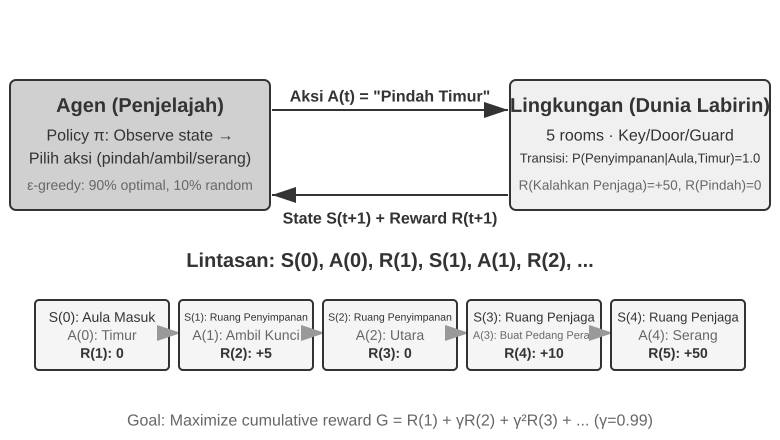

Interaksi ini menghasilkan sebuah **lintasan (trajectory)**—sebuah catatan lengkap tentang "state → tindakan → reward → state baru → tindakan → reward...". Kualitas suatu kebijakan (policy) pada akhirnya tercermin dari kualitas lintasan. Sebuah **fungsi nilai (value function)** menjawab pertanyaan: "Jika saya berada di state ini sekarang dan terus bertindak sesuai dengan kebijakan saat ini, berapa total reward yang pada akhirnya akan saya kumpulkan?" Ini seperti pecatur berpengalaman yang melihat posisi papan dan, tanpa mengkalkulasi sampai akhir, secara intuitif memperkirakan probabilitas menang. (Ketika "kebijakan saat ini" diganti dengan "kebijakan optimal", kita mendapatkan fungsi nilai optimal, yang nantinya dalam bab ini akan digunakan saat membahas persamaan optimalitas Bellman.) Batas antara Agen dan lingkungan mengikuti prinsip sederhana: **apa pun yang tidak dapat diubah secara bebas oleh Agen adalah milik lingkungan.**

Dua fitur unik yang membedakan pembelajaran penguatan dari supervised learning (yang membutuhkan label jawaban benar) dan unsupervised learning (yang menemukan pola tersembunyi dalam data): **pencarian coba-coba (trial-and-error search)** (Agen harus mencari tahu sendiri tindakan mana yang baik, tanpa guru yang secara langsung memberikan jawaban yang benar) dan **reward yang tertunda (delayed reward)** (efek dari suatu tindakan mungkin baru terlihat beberapa langkah kemudian, misalnya, nilai dari gerakan catur yang bagus baru terlihat di akhir permainan). Ini juga memunculkan **pertukaran eksplorasi-eksploitasi (exploration-exploitation tradeoff)** yang unik: selalu mengambil jalur yang familier berarti tidak mempelajari hal baru; selalu mencoba secara acak berarti tidak pernah mencapai tujuan.

Sebuah sistem pembelajaran penguatan terdiri dari lima elemen inti:

- **Action Space (Ruang Tindakan)**: Mendefinisikan himpunan semua tindakan yang mungkin dapat diambil Agen. Tindakan bisa berbentuk diskrit (misalnya, "langkah mana yang harus dibuat" dalam catur, dengan jumlah pilihan yang terbatas) atau kontinu (misalnya, "berapa derajat merotasi sebuah sendi" untuk robot, sebuah nilai kontinu).
- **Policy (Kebijakan)**: Aturan perilaku Agen, yang menentukan apa yang harus dilakukan di suatu state tertentu. Sebuah kebijakan bisa sederhana (tabel pencarian: di state A, jalankan tindakan X) atau kompleks (sebuah jaringan saraf tiruan mendalam).
- **Sinyal Reward**: Umpan balik (feedback) seketika dari lingkungan. Namun, tujuan Agen adalah memaksimalkan reward jangka panjang, bukan seketika—perbedaan ini sangat krusial, sama seperti investasi seharusnya tidak dinilai berdasarkan untung-rugi hari ini saja tetapi oleh pengembalian jangka panjang.
- **Value Function (Fungsi Nilai)**: Mengestimasi total reward kumulatif yang dapat diperoleh dari suatu state pada masa depan, membantu Agen membuat keputusan bijaksana bahkan tanpa umpan balik seketika. Salah satu wawasan terpenting dari enam puluh tahun penelitian RL adalah peran sentral dari estimasi nilai.
- **Environment Model (Model Lingkungan)** (opsional): Memprediksi respons lingkungan terhadap tindakan. Metode yang menggunakan model lingkungan disebut **metode berbasis model (model-based methods)** (belajar dulu memprediksi bagaimana lingkungan berubah, lalu merencanakan dengan tepat); mereka yang tanpanya disebut **metode bebas model (model-free methods)** (tidak memprediksi lingkungan, melainkan belajar langsung dari pengalaman).

Tabel 7-3 membandingkan komponen-komponen kunci dari berbagai sistem Agen, mengungkap universalitas konsep Agen dan membantu pembaca melihat perbedaan dalam ruang tindakan antara Agen RL tradisional dan Agen LLM modern.

Tabel 7-3 Perbandingan Elemen Kunci dalam Berbagai Sistem Agen

| Tipe Agen | Lingkungan | Ruang Tindakan | Sinyal Reward |
|---------------|------------------------|-------------------------------|-------------------------|
| **Rusa Kutub yang Baru Lahir** | Medan, gravitasi, postur tubuh | Kontinu berdimensi tinggi (kontraksi kelompok otot) | Keseimbangan (+), Jatuh (-) |
| **Robot Vakum** | Tata letak ruangan, level baterai | Diskrit (arah, vakum, isi daya) | Area yang dibersihkan (+), Baterai habis (-) |
| **Grandmaster Catur** | State papan, batas waktu | Terbatas diskrit (langkah legal) | Menang (+1), Kalah (-1) |
| **Agen Layanan Pelanggan** | Riwayat percakapan, basis pengetahuan | Terbuka (berpikir, bicara, panggilan API) | Masalah terpecahkan (+), Waktu penanganan (-) |
| **Agen Asisten Kode** | Dokumen persyaratan, basis kode | Terbuka (berpikir, cari, edit, eksekusi) | Tes lulus (+), Bug baru dimasukkan (-) |

Tabel tersebut mengungkap sebuah wawasan penting: Agen RL tradisional di ranah seperti catur dan robotika memiliki ruang tindakan yang tertutup, sedangkan Agen berbasis LLM modern seperti layanan pelanggan dan Agen pemrograman memiliki ruang tindakan yang terbuka (open-ended) dan hampir tak terbatas. Agen-Agen ini juga dapat menggunakan tindakan khusus yaitu "pemikiran internal" untuk meningkatkan kemampuan mereka.

### Dua Paradigma Agen: Dari MDP hingga LLM+RL

Kedua paradigma ini paling berbeda secara fundamental pada ruang tindakannya—MDP mengasumsikan ruang tindakannya terbatas dan tertutup (naik/turun/ambil/letakkan), sedangkan ruang tindakan LLM terbuka lebar, terdiri dari kombinasi beruntun rangkaian bahasa alami yang eksplosif. Perbedaan ini menghasilkan batas pemisah mendasar di antara dua paradigma dalam desain algoritma, efisiensi sampel, dan generalisasi. Setiap paradigma didiskusikan di bawah ini.

**Paradigma Tradisional: MDP dan Q-learning.**

MDP (Markov Decision Process) adalah kerangka matematis untuk pembelajaran penguatan, yang mendefinisikan elemen-elemen inti seperti state, tindakan, dan reward. Asumsi intinya adalah **sifat Markov**: masa depan hanya bergantung pada state saat ini, tidak pada sejarah sebelumnya. Misalnya, dalam catur, melihat hanya pada posisi papan saat ini sudah cukup untuk menentukan langkah optimal; tidak perlu meninjau setiap langkah sebelumnya. Asumsi ini menyederhanakan masalah tetapi juga membatasi kemampuan untuk memodelkan dependensi historis.

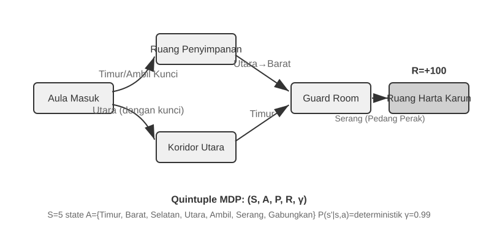

Fitur kunci dari Agen RL tradisional adalah **ruang tindakan tertutup**—semua tindakan yang mungkin dilakukan Agen membentuk himpunan terbatas yang telah ditentukan sebelumnya. **Agen permainan papan klasik** adalah contoh yang paling umum: 361 kemungkinan posisi langkah di Go, meskipun sangat luas, sepenuhnya ditentukan dan terbatas; dalam catur, meskipun aturan gerakan berbeda untuk buah catur yang berbeda, tindakan yang mungkin tetap bisa dihitung; Permainan Atari hanya memiliki beberapa hingga belasan tindakan diskrit. **Agen Robotika** mewakili ruang tindakan kontinu namun berbatas: sudut persendian, kecepatan, dan gaya cengkeram adalah nilai-nilai kontinu, tetapi semuanya memiliki batasan fisik yang jelas (sudut putar maksimum, torsi maksimum, batas kecepatan), dengan dimensi yang ditentukan oleh derajat kebebasan robot tersebut.

Sifat tertutup ini membawa keuntungan komputasi: semua tindakan bisa dihitung dan dievaluasi satu per satu, memfasilitasi pemrograman dinamis dan pencarian pohon Monte Carlo (Monte Carlo tree search), dan fungsi nilai tindakan (action-value function) bisa diaproksimasi menggunakan tabel atau fungsi sederhana. Namun, ia juga membatasi kemampuan ekspresif dan generalisasi. Agen RL tradisional mulai dari nol, belajar murni lewat coba-coba—mulai dari kebijakan acak, mengumpulkan pengalaman, memperbarui fungsi nilai atau kebijakan, dan mengulanginya sampai konvergen.

Dalam kerangka ini, salah satu algoritma paling mendasar dan penting adalah **Q-learning**. Algoritma ini mempertahankan perkiraan nilai untuk setiap pasangan "state-tindakan": jika Anda mengambil tindakan *a* di state *s* dan kemudian bertindak optimal setelahnya, berapa total reward yang bisa Anda harapkan? Secara intuitif, apakah suatu tindakan bagus atau tidak, tergantung pada reward seketika yang dibawanya, ditambah "seberapa baik state selanjutnya yang dihasilkannya."

Menuliskan intuisi ini sebagai persamaan akan menghasilkan relasi rekursif inti dari **Persamaan Bellman** yang terkenal di buku-buku teks RL: **Nilai sebenarnya dari sebuah tindakan = reward seketika yang didapat pada langkah ini + nilai masa depan maksimum yang bisa didapat dari state berikutnya**:

$$Q^*(s, a) = r + \gamma \max_{a'} Q^*(s', a')$$
\ndi mana $r$ adalah reward seketika, $s'$ adalah state berikutnya yang dicapai setelah mengeksekusi tindakan (ditulis dalam bentuk deterministik untuk intuisi; dalam lingkungan stokastik, nilai ekspektasi untuk state berikutnya $s'$ diperlukan), dan $\gamma \in [0, 1)$ adalah **faktor diskon (discount factor)**—ia menentukan seberapa besar Agen menghargai masa depan: semakin dekat $\gamma$ ke 1, semakin ia menghargai imbalan jangka panjang; semakin dekat ke 0, semakin ia berfokus pada hasil seketika. "Reward kumulatif" yang disebutkan berulang kali sebelumnya justru adalah jumlah reward pada setiap langkah, didiskon oleh $\gamma$: $\sum_{t} \gamma^{t} r_t$. Setelah setiap tindakan, algoritma sedikit menyesuaikan perkiraan lamanya ke arah "hasil aktual yang benar-benar diamati"—paradigma "mengoreksi perkiraan lama dengan hasil aktual satu langkah" ini disebut **Temporal-Difference Learning (TD learning)**. Setelah ribuan kali percobaan, perkiraan tersebut secara bertahap mendekati nilai sebenarnya.

Dua gambar berikut menunjukkan proses eksplorasi Q-learning di dunia kisi (grid world) dan konvergensi bertahap dari nilai Q.

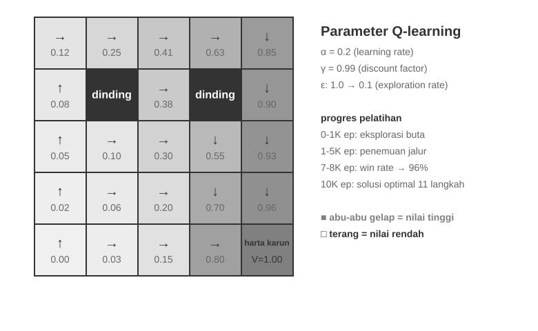

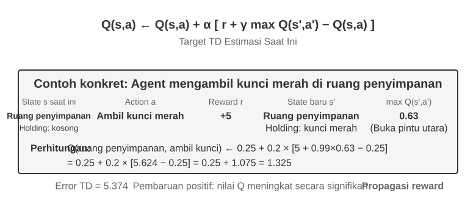

Q-learning adalah jenis khusus dari metode **off-policy**—ia dapat menggunakan data yang dihasilkan oleh kebijakan mana pun (termasuk eksplorasi acak) untuk mempelajari kebijakan optimal. Definisi ketat dari metode on-policy dan off-policy, serta bagaimana mereka dipetakan ke pascapelatihan LLM, dibahas nanti di bagian "Perbandingan Algoritma Pembelajaran Penguatan."

> **Eksperimen 7-1 ★: Kinerja Q-learning dalam Permainan Berburu Harta Karun**
>
> Untuk memverifikasi karakteristik dan batasan dari Q-learning, kami merancang sebuah **lingkungan permainan berburu harta karun**. Lingkungan ini mencakup beberapa tantangan utama: **mekanisme tersembunyi** mengharuskan Agen untuk menemukan sendiri korespondensi antara kunci dan pintu, efek senjata, dan aturan pembuatan (crafting) item; **ketergantungan multi-langkah** berarti menyelesaikan tugas membutuhkan urutan tindakan yang benar (solusi optimal: 11 langkah); **reward yang jarang (sparse rewards)** berarti hanya tindakan-tindakan kunci dan kemenangan akhir yang menghasilkan reward signifikan, dengan sebagian besar langkah menengah tidak menerima umpan balik.
>
> Agen Q-learning menggunakan pengaturan parameter standar dan strategi eksplorasi ε-greedy: biasanya ia memilih tindakan paling optimal saat ini, tetapi sesekali memilih tindakan acak, dengan proporsi eksplorasi acak yang perlahan menurun selama pelatihan.
>
> Kurva pembelajarannya menunjukkan karakteristik tipikal (satu episode adalah satu permainan penuh, dari mulai hingga selesai atau gagal):
> - **1000 episode pertama**: Tingkat kemenangan 0%, tabel Q hanya memiliki 124 state, Agen bereksplorasi secara membabi buta
> - **5000 episode pertama**: Masih belum ada kemenangan stabil, tabel Q memiliki 133 state
> - **Episode 7.000–8.000**: Tingkat kemenangan perlahan naik dari 34% ke 96%
> - **10.000 episode**: Tingkat kemenangan 100%, tabel Q memiliki 145 state, menemukan solusi optimal 11 langkah
>
> Seluruh pelatihan ini memakan waktu kurang dari 10 detik (simulasi yang sangat efisien), tetapi membutuhkan hampir 10.000 percobaan penuh. Hal ini menunjukkan karakteristik inti dari Q-learning: butuh eksplorasi acak dalam jumlah besar untuk menyelesaikan jalur penuh secara tak disengaja, dan perambatan (propagation) sinyal nilai sangat lambat, sehingga memerlukan penguatan berulang kali. Pembelajaran simbolik murni, tanpa pengetahuan sebelumnya (prior knowledge), hanya dapat melakukan pencarian brute-force pada ruang state.
>
> Di dalam simulator permainan, 10.000 percobaan hanya butuh 10 detik, biaya yang bisa diabaikan. Namun di skenario Agen dunia nyata—di mana setiap panggilan telepon ada biayanya, setiap operasi browser memiliki jeda, dan setiap keputusan yang salah dapat berdampak ireversibel—10.000 percobaan sangatlah tidak dapat diterima. Inilah tepatnya alasan mengapa Agen modern telah beralih ke metode berbasis LLM: memanfaatkan pengetahuan yang terakumulasi selama pra-pelatihan untuk membuat keputusan efektif dengan interaksi minimal.
>
> Keterbatasan mendasar dari MDP ada tiga: efisiensi sampel yang rendah (membutuhkan interaksi masif untuk mempelajari tugas sederhana), generalisasi yang buruk (pengetahuan yang dipelajari di satu lingkungan sulit ditransfer ke lingkungan lain), dan ketidakmampuan untuk memanfaatkan pengetahuan sebelumnya (setiap tugas baru harus dipelajari dari awal). Keterbatasan ini menjadi sangat menonjol saat menghadapi ruang state yang kompleks seperti bahasa alami atau visi berdimensi tinggi.
>

**Paradigma Modern: Agen Berbasis LLM+RL.**

Model bahasa besar telah melahirkan paradigma baru bagi Agen, yang secara fundamental mengubah cara Agen dibangun—terutama dalam perancangan ruang tindakannya.

Dalam RL tradisional, Agen hanya bisa menerima umpan balik dengan mengubah lingkungannya: memajukan bidak dalam catur, mengambil langkah di labirin. Tetapi LLM memperkenalkan sebuah jenis tindakan yang sama sekali baru: pemikiran internal. Berpikir tidak mengubah dunia eksternal, namun secara signifikan dapat meningkatkan kualitas dari tindakan akhir. Pergeseran ini mengubah segalanya: ruang tindakan Agen tidak lagi hanya tentang "apa yang harus dilakukan", melainkan juga mencakup "berapa lama untuk berpikir dan apa yang dipikirkan".

Inovasi terpenting adalah memasukkan **Pemikiran sebagai tindakan khusus** ke dalam ruang tindakan. Pada RL tradisional, Agen hanya bisa melakukan tindakan eksternal yang mengubah state lingkungan (pindah, serang, ambil); pada Agen LLM, **pemikiran internal menjadi komponen inti dari ruang tindakan**—ia tidak secara langsung mengubah lingkungan eksternal, tidak memiliki reward seketika, bisa dilakukan hampir tanpa batas, dan relatif murah.

RL tradisional kesulitan menangani jenis tindakan ini, pada dasarnya karena ruang eksplorasinya terlalu besar dan kurang terstruktur: Agen yang belajar dari nol ibarat mencari harta karun di padang pasir dengan mata tertutup, hanya bisa meraba-raba secara acak. LLM berbeda. Lewat pra-pelatihan teks yang sangat masif, mereka telah menginternalisasi aturan pemikiran manusia: memecahkan soal matematika mengikuti pola "identifikasi kondisi → ingat rumus → hitung selangkah demi selangkah", menulis kode mengikuti pola "pahami kebutuhan → rancang struktur → implementasikan detail". Ini memungkinkan pemikiran LLM berjalan di sepanjang jalur terstruktur, sehingga mengompresi ruang pencarian secara drastis. Karenanya, bahkan tanpa pelatihan RL tambahan, LLM yang sudah dipra-latih mampu menghasilkan Rantai Pemikiran (Chain of Thought/CoT) logis dasar. Logika dasar ini berasal dari banyaknya proses pemikiran manusia di dalam korpus pra-pelatihan (solusi soal matematika, komentar kode, respons debat, dsb.). Melalui prediksi token berikutnya, model secara implisit mempelajari "seperti apa seharusnya langkah penalaran selanjutnya".

Pascapelatihan RL kemudian menggunakan reward eksternal untuk mengajarkan LLM menggunakan aturan-aturan ini secara lebih efisien untuk tugas-tugas spesifik. Struktur dari bahasa itu sendiri juga memberikan reward internal secara implisit—rantai pemikiran yang koheren secara logis (misalnya, "Karena kita perlu menukar mata uang asing ke USD, langkah pertama adalah mencari nilai tukar") memiliki probabilitas kemunculan yang tinggi, sementara rantai yang kacau (misalnya, "Karena kita perlu menukar mata uang, mari periksa cuaca dulu") memiliki probabilitas yang sangat rendah, secara alami memandu model ke jalur yang masuk akal.

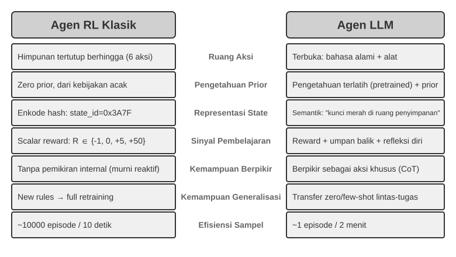

Kemampuan berpikir ini, yang berlandaskan pada aturan bahasa yang melekat, memampukan Agen LLM untuk memahami instruksi yang belum pernah mereka lihat (zero-shot generalization) dan menguasai tugas baru dengan sangat sedikit contoh (few-shot adaptation)—sangat kontras dengan paradigma Agen MDP tradisional yang membutuhkan banyak coba-coba. Terlebih lagi, paradigma baru ini juga mendukung generalisasi komposisional (mengombinasikan ulang konsep-konsep yang sudah diketahui untuk menangani situasi baru), in-context learning (adaptasi cepat melalui prompt dan contoh), serta pemahaman multimodal (mengintegrasikan modalitas seperti visi, bahasa, dan tindakan secara natural). Harap dicatat bahwa **efektivitas** in-context learning (zero-shot generalization, few-shot adaptation) dan **mekanisme internalnya** adalah dua hal yang berbeda—seperti yang dianalisis di Bab 2, mekanisme attention bekerja lebih mirip dengan pencarian kembali (retrieval) ketimbang penalaran, namun hal ini tidak mengurangi efek praktisnya yang kuat dalam adaptasi tugas.

Evolusi dari ruang tindakan tertutup menjadi terbuka mencerminkan pergeseran fundamental dalam paradigma Agen AI. Di luar pemikiran internal, keberagaman dari parameter alat (kueri bahasa alami, kode program, JSON kompleks, konten multimodal) membuat ruang tindakan aktual menjadi nyaris tak terhingga—sebuah penerjemah kode (code interpreter) secara teoritis bisa mengeksekusi tugas komputasi apa pun, dan alat pencarian bisa mengeksplorasi seluruh ruang informasi internet. Ini membawa peluang baru (Agen bisa menangani tugas yang belum pernah ada, menyelesaikan masalah kompleks dengan menggabungkan alat-alat dasar) sekaligus tantangan baru (bagaimana mendefinisikan dan mengoptimalkan fungsi reward di lingkungan terbuka, bagaimana mencari secara efisien dalam ruang tindakan tak terhingga).

Model-model seperti Kimi K3, yang dioptimalkan untuk penggunaan alat dan penalaran rantai-panjang, mengilustrasikan arah yang khas dari paradigma LLM+RL: pra-pelatihan bahasa skala besar memberikan fondasi, dan pascapelatihan memperkuat dekomposisi masalah, penggunaan alat, dan koreksi-diri. **OpenVLA** (diuraikan di Bab 9) menunjukkan contoh paradigma arsitektur VLA (Vision-Language-Action) di era LLM: vision encoder memproses observasi lingkungan, model bahasa memahami instruksi dan menalar, serta action decoder menghasilkan sinyal kontrol, yang memampukan kontrol berpengkondisi bahasa (language-conditioned control) serta generalisasi lintas-tugas. Sebagai penjelas, OpenVLA itu sendiri dilatih melalui pembelajaran imitasi (imitation learning) pada hampir satu juta **lintasan demonstrasi** robot, yang menjadikannya SFT secara natur alih-alih RL. SimpleVLA-RL, yang diperkenalkan dalam Eksperimen 7-13 nanti pada bab ini, adalah contoh representatif yang membawa RL ke dalam robotika dengan menggunakan reward untuk lebih mengoptimalkan jenis arsitektur VLA ini.

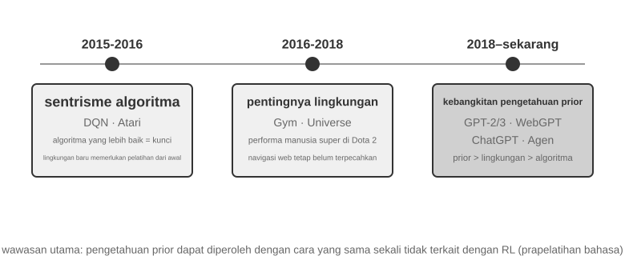

**Jalur Eksplorasi OpenAI** (dicatat oleh Shunyu Yao, Asisten Profesor di Princeton University dan penulis makalah ReAct, dalam "The Second Half") menelusuri evolusi dari bagaimana bidang ini berpikir. **Fase 1 (2015-2016), Berpusat pada Algoritma:** Keyakinan umum adalah bahwa algoritma yang lebih baik adalah kuncinya. Kemajuan dicapai pada lingkungan standar seperti Atari, namun setiap lingkungan baru menuntut pelatihan ulang dari nol. **Fase 2 (2016-2018), Pentingnya Lingkungan:** Gym menstandarisasi rentang berbagai tugas; Universe dan World of Bits mencoba mengubah seluruh internet menjadi lingkungan pelatihan RL; serta Dota 2 mengejar performa manusia super di lingkungan spesifik yang kompleks. Idenya jelas, tapi penggunaan komputer secara umum dan navigasi web masih di luar jangkauan.

**Fase 3 (2018-sekarang), Kebangkitan Pengetahuan Sebelumnya (Priors):** GPT-2/GPT-3 mendemonstrasikan kekuatan pra-pelatihan bahasa; WebGPT dan ChatGPT membuktikan bahwa *priors* tersebut bisa diubah menjadi Agen praktis. Penemuan terpentingnya: **priors dapat diperoleh lewat cara-cara yang sama sekali tidak berhubungan dengan RL**. Ini adalah kebenaran yang berlawanan dengan intuisi—selama puluhan tahun, para peneliti RL mungkin memiliki urutan prioritas yang terbalik. Urutan yang sesungguhnya bukan algoritma > lingkungan > prior, melainkan prior > lingkungan > algoritma.

> **Eksperimen 7-2 ★★: Studi Komparatif RL Tradisional dan Agen LLM**
>
>
> 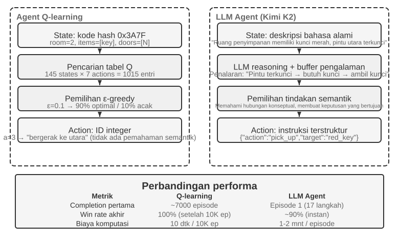
>
>
> Kami membandingkan Q-learning dengan Agen LLM—Kimi K3, yang mempertahankan memori (buffer) hingga 50 pengalaman—dalam permainan berburu harta karun yang sama. Hasilnya mencengangkan: **Agen LLM menyelesaikan permainan ini dalam 18 langkah pada percobaan pertamanya**.
>
> **Tahap Awal (Eksplorasi Bertujuan)**: Mengambil pedang berkarat ("Senjata lebih baik daripada tangan kosong"), menjelajah peta dengan sistematis, menyimpulkan "perlu menemukan kunci" setelah mendapati gerbang utara terkunci, menjelajah gudang, memperoleh kunci merah dan kristal ajaib. **Tahap Menengah (Pemahaman Mekanisme dan Sintesis Proaktif)**: Memahami aturan "pakai kunci otomatis" dan mengantisipasi bahwa pedang berkarat tidak akan cukup melawan penjaga, ia secara proaktif merakit (synthesizes) pedang perak pada langkah 8. **Tahap Akhir (Eksekusi dan Koreksi Kesalahan)**: Menuju ke utara dengan pedang perak dan mengalahkan penjaga kuat di langkah 13. Sepanjang jalan, ia membuat satu-dua upaya tidak efektif—mengayunkan pedang berulang kali atau berjalan mundur—dan akhirnya mendapatkan harta karun naga di langkah 18.
>
> Ini mendemonstrasikan sebuah perbedaan fundamental antara pemahaman semantik dan pemetaan simbolik. Agen LLM memahami struktur konseptual dari permainan tersebut; setiap langkah memiliki tujuan dan dukungan logika. Bagi Q-learning, "pintu", "kunci", dan "pedang" hanyalah kombinasi simbol tanpa arti, dan ia hanya bisa perlahan menemukan hubungannya melalui pembelajaran statistik yang ekstensif.
>
> Biaya komputasi menghadirkan paradoks menarik: Q-learning menjalankan 10.000 permainan dalam 10 detik, sementara Agen LLM butuh 1-2 menit per permainan. Namun, pada tugas dunia nyata, waktu, uang, dan risiko per interaksi jauh melampaui biaya komputasi murni, jadi menilai semata dari waktu GPU tidaklah adil. Wawasan yang lebih kritis adalah: Kesuksesan Agen LLM bukan karena memiliki "algoritma pembelajaran" yang lebih baik, melainkan karena membawa pengetahuan sebelumnya (prior knowledge) yang amat luas. Saat aturan permainan berubah, Q-learning butuh pelatihan ulang dari awal, sedangkan Agen LLM bisa beradaptasi secara langsung lewat penalaran. Ini bermuara pada prinsip desain praktis: RL Tradisional tetap berharga dalam skenario dengan biaya simulasi rendah dan dapat diulang dengan sangat sering (high repeatability); di skenario dunia nyata dengan biaya interaksi yang tinggi dan perlunya adaptasi cepat, efisiensi sampel dari Agen LLM memiliki nilai lebih dalam praktiknya.
>

Bab 1 telah secara sistematis membandingkan peran masing-masing dari ketiga paradigma pembelajaran—in-context learning, externalized learning (pembelajaran eksternal), dan parametric learning (pascapelatihan)—serta bagaimana mereka bekerja bersama; bagian "Lanskap Pascapelatihan Lengkap dan Tips Praktis" di akhir bab ini akan kembali pada topik tersebut. Benang merah dari bab ini adalah pascapelatihan: menuliskan strategi interaksi ke dalam parameter model.

## Dasar-dasar Pra-pelatihan Model `[Bacaan Opsional]`

Untuk memahami mengapa teknik pascapelatihan bisa efektif, kita harus memahami terlebih dulu apa yang dibangun oleh pra-pelatihan. Pascapelatihan (SFT dan RL) pada dasarnya melakukan optimasi dalam ruang representasi (representation space) yang telah didirikan oleh pra-pelatihan—struktur pengetahuan yang diletakkan oleh pra-pelatihan ini menentukan batas atas dari pascapelatihan. Oleh karena itu, kita akan meninjau aspek-aspek inti pra-pelatihan lewat tiga eksperimen: melatih model bahasa berskala kecil dari nol, memperluas kemampuan visual, dan menyuntikkan pengetahuan bahasa yang baru. Ketiga eksperimen pada bagian ini bersifat pelengkap dan dimaksudkan untuk membangun intuisi mengenai pra-pelatihan—yaitu pelatihan tahap awal pada data berskala besar yang mengajarkan model tentang pola dasar bahasa dan pengetahuan dunia. Pembaca yang sudah familier dengan proses pra-pelatihan dapat melewatinya.

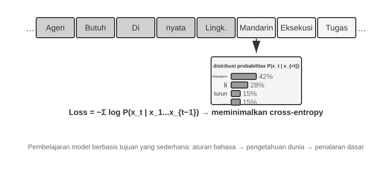

Pelatihan model bahasa mengikuti alur tiga langkah: "tokenisasi — pra-pelatihan — pascapelatihan." Tokenisasi mensegmentasi teks ke dalam unit-unit diskrit. Contohnya, "I like programming" mungkin akan ditokenisasi menjadi "I," "like," "program," "ming." Token-token ini adalah unit tekstual terkecil yang diproses oleh model. Tugas pra-pelatihan secara konseptual sederhana: tunjukkan pada model bagian pertama dari suatu segmen teks dan biarkan model menebak token berikutnya. Dengan membandingkan prediksinya melawan jawaban yang benar (perbedaan ini disebut loss; loss yang makin kecil artinya prediksi makin akurat), model terus menyesuaikan parameter-parameternya. Setelah dilatih berulang-ulang pada data teks masif, model secara bertahap mempelajari aturan bahasa, pengetahuan dunia, dan kemampuan nalar dasar. Setelah pra-pelatihan, model dapat menghasilkan teks yang fasih, tapi output-nya kurang terstruktur dan kesulitan mengikuti instruksi. Pascapelatihan kemudian mengubah model tersebut menjadi asisten praktis lewat SFT—pelatihan pada pasangan input-output yang berlabel—dan optimasi preferensi (preference optimization), semisal DPO, yang mengajarkan model untuk menghasilkan respons yang lebih disukai manusia.

> **Eksperimen 7-3 ★★: Melatih LLM dari Nol—Kekuatan dari Peningkatan Algoritma**
>
> Memakai MiniMind 2, sebuah model dengan 100 juta parameter, sebagai studi kasus, eksperimen ini menuntaskan seluruh proses pelatihan pada GPU tingkat konsumen. Dua optimasi algoritma—QK Norm dan optimizer Muon—melipatgandakan kecepatan konvergensi hingga tiga kali lipat dan memperbaiki kualitas generasinya secara signifikan, semuanya dengan biaya sangat rendah: sekitar 14 jam pelatihan dan total biaya $34.
>
> Dampak dari tiap tahap pelatihan: Pasca-pelatihan, model mampu menjawab soal faktual seperti "Apa gunung tertinggi di dunia?" tapi formatnya tidak standar; pasca SFT, kepatuhan instruksi dan pemformatan output meningkat pesat, sehingga model dapat mengorganisir jawaban sesuai yang diharapkan; optimasi preferensi makin memangkas kesalahan faktual dan ekspresi yang tak natural. Model berparameter 100 juta masih punya limitasi kentara (rentan salah pada persoalan rumit), tapi pelajarannya adalah: **Dengan anggaran kecil yang tetap, perbaikan algoritmik menawarkan nilai yang jauh lebih baik daripada sekadar memperbesar ukuran model**.
>
> **Eksperimen 7-4 ★★: Melatih VLM Sendiri**
>
>
> 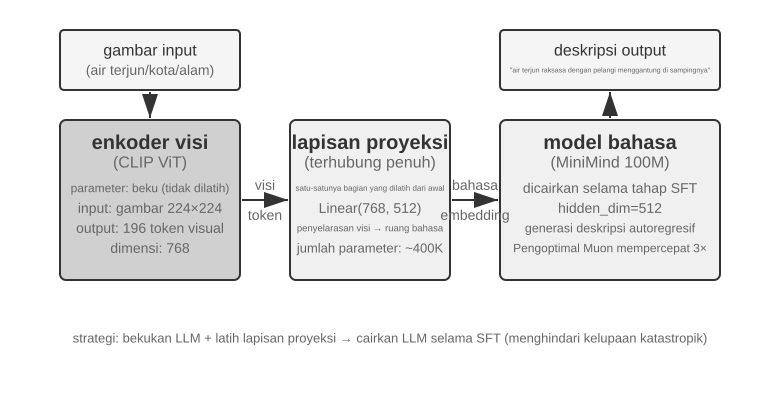
>
>
> VLM menyatukan persepsi visual dan pemahaman bahasa dalam sebuah model tunggal. Tantangan intinya adalah penyelarasan lintas-modal (cross-modal alignment)—membuat "apa yang dilihat" selaras dengan "apa yang dikatakan". Arsitekturnya mencakup tiga komponen: sebuah **Vision Encoder** (misal, CLIP, dengan parameter dibekukan) mengekstraksi fitur semantik dari citra; sebuah **Projection Layer** (ringan, satu-satunya bagian yang dilatih dari nol) bertindak sebagai "penerjemah" antara fitur visual dan model bahasa, memetakan fitur-fitur visual ke dalam ruang representasi yang dimengerti model bahasa; serta sebuah **Language Model** yang menghasilkan teks deskriptif. Pelatihannya menggunakan strategi "freeze LLM + latih hanya projection layer" guna menghindari lupa destruktif (catastrophic forgetting) (melupakan keahlian lama setelah mempelajari yang baru); sesudah tahap pra-pelatihan penyelarasan (alignment), LLM dicairkan (unfrozen), lalu dilakukan SFT pada pasangan gambar-deskripsi yang berkualitas tinggi, yang secara signifikan mendongkrak detail dan keakuratan dari deskripsinya.
>
> Eksperimen ini mengungkap paradigma dasar dari pelatihan model multimodal: menggunakan ulang hasil pra-pelatihan unimodal dan mencapai penyelarasan lintas-modal dengan melatih sebuah lapisan proyeksi (projection layer) yang ringan—efisien dan *scalable*, namun kemampuan ekspresif lapisan proyeksi yang terbatas dapat menjadi hambatan (bottleneck) terhadap pemahaman lintas-modal yang mendalam. Memperluas arsitektur "vision encoder + projection layer + LLM" yang sama selangkah lebih maju dengan meminta model tersebut menghasilkan output tindakan, akan membuahkan model VLA (Vision-Language-Action) yang dibahas lebih lanjut dalam Bab 9.
>
> **Eksperimen 7-5 ★★: Melanjutkan Pra-pelatihan untuk Mempelajari Bahasa Baru**
>
> Memakai Mistral 7B v0.3 sebagai model dasar—yang mana utamanya dipra-latih dalam bahasa Inggris dan hampir tidak bisa bahasa Korea sama sekali—eksperimen ini memasukkan kemampuan bahasa Korea lewat melanjutkan pra-pelatihan pada teks Wikipedia berbahasa Korea. Hal ini dilakukan lewat pelatihan *unsupervised* pada data bahasa baru yang dikenakan pada model yang sebelumnya sudah menuntaskan pra-pelatihan. Model tersebut sedari awal telah punya kapabilitas pemodelan bahasa secara umum dan hanya perlu beradaptasi pada distribusi data baru, membuat biayanya lebih rendah ketimbang melatih dari nol. Kunci rekayasanya adalah memakai campuran data (~80% Korea + 20% Inggris) untuk meredam lupa destruktif: porsi bahasa target yang terlalu tinggi akan mendegradasi bahasa asli model, sementara porsi yang kelewat rendah menyebabkan efisiensi pembelajaran menjadi tidak maksimal. Pada akhirnya, SFT dilakukan dengan menggunakan data instruksi berbahasa Korea agar model punya kecakapan berbincang dalam bahasa Korea yang praktis. Kesimpulan dari eksperimen ini kelak akan dipakai lagi dalam bab "Lanskap Pascapelatihan Lengkap dan Tips Praktis" pada penghujung bab ini: agar model sanggup mengingat banyak pengetahuan domain yang baru, andalkan lanjutan pra-pelatihan, jangan andalkan SFT.
>

Tiga eksperimen pra-pelatihan ini secara kolektif membongkar sebuah pola: ketika bujet membatasi, perbaikan algoritma dan inovasi arsitektur memberi tawaran nilai yang lebih baik ketimbang hanya mendongkrak ukuran (scale up). Lebih pentingnya lagi, pra-pelatihan membekali model dengan pengetahuan deskriptif serta keahlian pemodelan bahasa, namun kurang dalam hal kepatuhan pada instruksi yang terstruktur serta perilaku berorientasi tugas—inilah celah yang harus dijembatani oleh SFT.

Berbekal kemahiran fondasi dari pra-pelatihan, tahap selanjutnya adalah menyulap model serbaguna menjadi sebuah Agen yang praktis melalui pascapelatihan. Tahap pertama dari pascapelatihan adalah Penyesuaian Halus Terawasi (Supervised Fine-Tuning/SFT).

## SFT (Supervised Fine-Tuning)

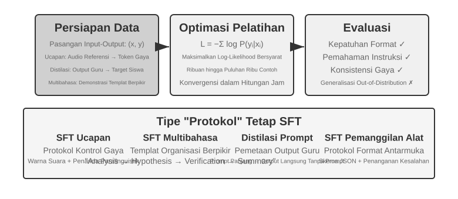

Bagian 7.1 telah menelanjangi esensi dari SFT ("memprediksi token berikutnya," pada data yang berbeda, serta *loss* cuma dikalkulasikan di respons). Sesi ini menggunakan empat buah eksperimen demi menyaksikan apa yang sesungguhnya dikokohkan oleh mekanisme tersebut—yaitu, menulis pemetaan dan protokol stabil pada parameter—atas berbagai tugas yang berbeda-beda. Nilai mendasar dari SFT bukanlah dalam menyuntikkan ilmu baru, tetapi **mengokohkan protokol**: menulis relasi pemetaan, rupa interaksi, serta norma-norma gaya ke dalam parameter, supaya model saat proses inferensi bisa memproduksi *output* sesuai ekspektasi tanpa membutuhkan barisan prompt yang berkepanjangan. Pada umumnya, segelintir demonstrasi (beberapa ribu sampai puluhan ribu) berkualitas jempolan pun cukup guna memantapkan kemahiran berbicara dan menuruti perintah dasar.

Harga yang harus dibayar atas keefisienan ini adalah betapa kuat ketergantungannya dengan distribusi data pelatihan: SFT lebih condong ke penghafalan daripada penggeneralisasian. Ketika berpapasan dengan peristiwa yang belum sempat ditemuinya pada saat pelatihan, unjuk kerjanya kerap akan anjlok secara mencolok waktu tes (inference). Percobaan-percobaan di bawah akan mendemonstrasikan perwujudan "mengokohkan protokol" ini dari sudut pandang yang bervariasi.

Sebelum terjun langsung berlatih SFT, ada pertanyaan awam yang tidak terelakkan: **dari mana datangnya data SFT?** Dalam industri solusinya terpusat pada tiga rute: **demonstrasi pakar manusia**—berkualitas teratas, namun lambat sekaligus tinggi ongkosnya, sangat pas buat "data benih" pendefinisi format dan *style*; **generasi oleh teacher-model**—dengan kata lain, data sintetis: tugaskan sebuah model andal guna mencetak banyak sekali pasang "input–output", singkirkan yang usang lalu suling mereka (*distill*) kepada muridnya (Eksperimen 7-8 dan 7-9 sama-sama memakan rute ini); **swakarsa sang model (model self-bootstrapping)**—sang model mencetak beragam *candidate* atau alternatif jawaban untuk sebuah soal yang sama, lantas sebuah verifikator memisahkan jawaban yang benar, kemudian bahan seleksi itu kembali dikerahkan buat menatar model tersebut sendiri. Cara terakhir inilah yang disebut dengan penyesuaian halus lewat sampling penolakan (*rejection sampling fine-tuning*), dipaparkan spesifik di Eksperimen 7-9. Ketiga buah haluan itu kerap kali diramu menjadi satu: pakai sebagian data ahli supaya memakukan pakem formatnya, kemudian gunakan model guru (*teacher*) untuk dikembangkan ke skala masif, lantas diakhiri pemakaian sistem sampling *reject* guna mengangkat standar kuantitas dan kualitasnya. Dari jalur mana pun asal mulanya, susunan *pipeline*-nya selalu identik: definsikan rupa atau distribusi atas si tugas serta struktur skema hasilnya, cetak kandidat sebanyak-banyaknya, seleksi kualitas dari uji kelayakan berbasis regulasi (*rule-based*), pengecekan susunan, dan *spot-check* manual, diikuti dengan dedukasi kembar, membuat penyeimbangan rasio racikannya, serta menilik diversitas. Tidak perlu rakus dalam memperbesar angkanya—beberapa ribu sampai sepuluh ribuan sampel murni tanpa cela lazimnya cukup untuk memaku kekokohan protokolnya. Daripada menumpuk seratus ribu yang sarat dengan kekeliruan (kotor), lebih baik seleksi matang sepuluh ribu sampel bening: SFT akan dengan setia membakar tiap cuil kebobrokan data itu menyatu utuh pada parameternya.

> **Eksperimen 7-6 ★★★: SFT Suara—Dari "Kloning Suara" ke "Pemodelan Paralinguistik" `[Eksperimen Tambahan]`**
>
> Menggunakan Orpheus (kloning suara *contextual-prompt*) dan Sesame (pemodelan token paralinguistik) sebagai telaah kasus, tes ini membuktikan wujud bagaimana "gaya bersuara dan kebiasaan berekspresi" bisa terukir pada jajaran parameter. Keduanya memancangkan arus yang tak sama:
>
> - **Orpheus**: Memadatkan bentuk gelombang bunyi menuju sebuah rentetan token. Dari proses menyambung rentetan *audio* sang subjek target, maka si model mencerna "cara si orang berbicara", meraih konsistensi corak warna suara di lintas deret kalimat.
> - **Sesame**: Mengabstraksi gejala vokal di luaran pakem kebahasaan—semisal tawa maupun lenguh desah napas—ke dalam lambang-lambang (token) khusus semacam `<laugh>`, `<sigh>`. Si model mencerna cara untuk "membuat denting dengungan suara yang serasi pasca diperlihatkan tokennya".
>
> Dalam *task-task* luapan ekspresi (*expressive*), SFT mengokohkan protokol pengawas ragam tata gaya maupun ritme tradisi tutur ekspresif, yang bukan bersifat fakta ilmiah ataupun penelusuran nalar ruwet. Rahasianya tersimpan pada kebhinnekaan warna serta bobot kebaikan data saat melatih. Rupa kealpaan lazim yaitu terlalu pelit mencantumkan aneka tokoh pembicara dalam pasokan data, mengakibatkan segenap luaran suara menjadi bernada sama melulu, plus kelebihan hafal (*overfitting*) dari token-token paralinguistik (situasi manakala si model terpaku mengingat-ingat kelengkapan secarik contoh dalam pasokan latihan, lantas menjadi loyo tiap dihantam keadaan baru), sehingga melahirkan wujud "gelak tawa mesin (*mechanical laughter*)".
>
> **Eksperimen 7-7 ★★★: Nalar Batin Multibahasa—Memberdayakan Model buat Berpikir di Seluruh Medium Bahasa `[Eksperimen Tambahan]`**
>
> Kebanyakan model bersistem *reasoning* atau nalar senantiasa "merenung (think)" pakai rupa bahasa Inggris: masa bodoh soal format luaran pertanyaan yang kita sorongkan kepadanya, rincian runtutan alur *chain of thought* sebelah dalam senantiasa berpedoman dalam bahasa Inggris, akibatnya rentetan demonstrasi penalaran kasta jempolan di muatan pelatihan memang lebih dominan berbahasa tersebut. Ambisi ekperimen ini sesederhana—memampukan sang model guna mencerna atau menelaah dengan medium bahasa sesuai perintah (spesifik).
>
> Jalan keluarnya adalah mengeksekusi SFT memamakai gpt-oss-20b: imbuhkan secarik perintah `reasoning language: German` (ataupun rupa bahasa yang lain) ke dalam tubuh instruksi sistem, lalu peragakan dengan kucuran data nalar berformat bahasa Inggris, Spanyol, Perancis, dll. Stok pendataannya **sama sekali tidak memiliki bahasa Mandarin**, namun selesainya penataran, cuma menyetel bahasanya ke Mandarin langsung memampukan mesin menuntaskan *chain-of-thought* berbahasa Mandarin secar bulat penuh—lompatan lintas pemahaman (zero-shot) ini sebetulnya temuan sangat memikat. Ketahuilah bahwa anugerah ini bukanlah murni unjuk performa daya generalisasi bawaan dari SFT. Rangkaian prapelatihan multibahasa memang terlebih dahulu menetaskan suatu hamparan *representation space* silang bahasa serumpun di tubuh modelnya; nah SFT semata-mata cuman menggugah nyala kepekaan (aktivasi) bakat lintas medium yang sudah bertengger dari sebelumnya itu.
>
> **Eksperimen 7-8 ★★: Distilasi Prompt—Mereplikasi Kemampuan yang Dapat Digunakan dengan Biaya Lebih Rendah**
>
> Di kancah rekayasa sungguhan, untuk menggugah si model menuntaskan misi-misi gahar, sering kali memerlukan setoran instruksi bawaan yang tidak kepalang panjang (hingga beribu-ribu malah belasan ribu token jumlahnya), sehingga menaikkan penangguhan waktu (latensi) serta menaikkan biaya tiada henti pada saban seruan (call). Bilamana menggunakan si model kelas nalar (*reasoning*), perihal meluapkan rantaian buah pikir di pedalamannya cuma menambah berlipat ganda angka ongkosnya saja. Cetak biru pemikiran utama perihal pemerasan atau sublimasi *prompt* (*prompt distillation*) yakni menyederhanakan rupa kelakuan sang "bimbingan guru kepanjangan + jalan pikiran guru" beralih rupa menjadi "pesan ringkas prompt/tanpa prompt + output murid non-reasoning". Si Guru menetaskan rupa-rupa keluaran paripurna yang diselubungi pancingan panjang dan moda alur merenungnya (thinking); lalu asupan data cuma mengamankan luaran si pemakai berbarengan buah pungkasannya (conclusion), mendelete runtut rincian pemikiran panjang lebar itu. Si agen murid kelak mematrikalkan wawasan untuk "langsung menelurkan kesimpulannya saja". Berhentinya tahapan penyulingan ini, tingkat akurasi sang murid waktu menjawab pertanyaan yang serupa nyaris merangkul pencapaian si gurunya, seraya ongkos serta latensinya terjun bablas anjlok karena ia tak lagi kewalahan menyita daya hitung atas instruksi dan kepingan lamunan pemikiran sang guru.
>
> Sistem distilasi bisa digarap selaras melalui kembaran poros dimensi: "kasta besar merapat ke mikro" (menggantikan si empunya beban masif beralih memanipulasi entitas berkaliber kecil/sedang sekadar mengerem tekor tanpa memerosotkan martabat isinya) lalu "metamorfosis perenungan menyusut jadi tanpa perenungan" (melipat *CoT* eskplisit bertansformasi merupa bakat naluri parametrik secara kongenital namun sepantaran kapasitas kalibernya, berkatnya meledakkan pacu refleks respons ke limit lompatan memelesat 20 hingga 30 lipatan kali gandanya). Dua unsur di atas sama sekali tiada tolak balik berseberangan malahan teramat jamak diramu ke pelataran *production*. Mohon mengawasi penuh perihal bahwasanya *distillation* sekadar menuruni rentang palang rintangan (boundaries) si pengajarnya semata—kala sang pembimbing rupanya tertular wabah kekeliruan sistematis yang membekas (systematic errors) di sepanjang gerbong data distribusi marjinalnya, anak didiknya terang bakal terjangkit dan mengunci mematenkan wabahnya itu pula; di kala sang pendidik acapkali menggantungkan perkakas (tools) di samping menjaga taraf legitimasinya, maka praktik distilasi semata melenyapkan kekebalan daya saring dari perbantuan perkakas tadi. Pepatah dari ranah praktis: di masa bangun rancang wujud karyanya tampak telah memaku kematangannya, hamparan rupa soalannya relatif sanggup kita ukur terka (predictable), apalagi ganjalan pagu biayanya sungguh mencekik napas, mengamalkan *prompt distillation* ini tergolong sarana permak (optimization) tiada tanding; sewaktu masih menelusuri masa eksperimen (exploration) sebelum seluruh tata kerja usainya membatu dengan mantap (stabilized), sudi memelihara pola-pola penalaran (thinking) eksplisit plus membiarkan ragam pandu (prompt) bebas utak-atik adalah titah wajib pusaka dalam menyusuri rute iterasi secepat kilat.
>
> **Eksperimen 7-9 ★★★: Distilasi Rantai Pemikiran (Chain of Thought/CoT) `[Eksperimen Tambahan]`**
>
> Distilasi prompt menyingkirkan proses pemikiran; distilasi CoT justru melakukan yang sebaliknya: ia mentransfer **lintasan pemikiran yang lengkap** dari model guru yang kuat ke model murid. Mendistilasi CoT dari model guru yang mumpuni dapat memungkinkan murid dengan jumlah parameter yang sama memulihkan 70%-80% dari kemampuan si guru. Untuk tim yang tidak bermaksud mendorong garis depan dari kemampuan SOTA (state-of-the-art) tetapi menginginkan model yang bisa mereka kendalikan sendiri, ini adalah strategi pengikut yang paling pragmatis. Rangkaian model kecil hasil distilasi yang dibuka sumbernya (open-sourced) oleh DeepSeek-R1 (menggunakan lintasan pemikiran R1 untuk melakukan SFT pada seri Qwen dan Llama) adalah contoh representatif dari pendekatan ini.
>
> **Latar Belakang: Fenomena "Tembok Pemikiran" (Thinking Wall).** Sebagian model penalaran closed-source (misal seri OpenAI o, seri Gemini) menghasilkan rantai pemikiran internal selama penalaran, tapi apa yang dilihat oleh pengguna bukanlah proses perenungan otentik yang mentah—dengan sederet alasan entah itu merintang taktik distilasi (pencurian), aspek kemananan data, sampai kepuasan kemasan produknya, banyak pemegang teknologi menangguhkannya lantas merajut atau meringkas ulang jejak perenungannya itu melahirkan keluaran, di mana proses pemikiran yang sejati menyelimut tabir tersembunyi jauh di pelosok lorong API-nya. Ini pulalah biang muasal presis kenapa peragaan percobaan ini menjodohkan model-model berhaluan open-source bertaraf nalar ke posisi gurunya: model-model gacoan layaknya DeepSeek V4, Kimi K3, lantas GLM 5.2 malah sukarela menyingkap layar tatanan laju pemikirannya selengkap mungkin, alhasil menyulap proses praktik distilasi sangat realistis untuk dicerna dari segi ranah olah teknis plus lisensinya (biar bagaimana pun wajib senantiasa mengecek lagi persyaratan lisensi menyoal produk berbasis distilasi ini sebelum dikaryakan ke luar).
>
> Sini sebuah wawasan pragmatis memikat dan yang lebih dominan bobot kegentingannya: **untuk sebagian banyak orang yang berseteru di bidang post-training, sebenarnya tiada alasan darurat repot-repot menyuling untaian chain-of-thought dari model closed-source**. Senggang pemisah kemampuan dari the best open-source hari ini ketimbang level SOTA sang penguasa tirai tertutup tak selebar khayalan liarmu; syarat sah sebuah "model guru" intinya cuma wajib berlabel "sungguh setara kelas di atas anak didiknya", tiada mandat "mesti nomor wahid semesta raya". Kiranya model purna-latih incaran perburuan Anda berkaliber sekitar 200B parameter bahkan menciut di bawah itu, memanggil rupa-rupa model jawara jagad open source sudah paripurna tuntas melakoni tonggak singgasana "pendidiknya".

> **Desain Eksperimen:** Sebuah proses tiga langkah. Langkah 1, **Kumpulkan Lintasan**: Ambil sampel soal dari distribusi tugas target (misalnya, matematika, kode), gunakan model guru open-source untuk menghasilkan lintasan "pemikiran + jawaban" yang lengkap, lalu saring lintasan dengan jawaban akhir yang salah menggunakan validator berbasis aturan—jika tidak, murid akan meniru proses pemikiran yang keliru tersebut. Langkah ini—"hasilkan kandidat, verifikasi dan saring, simpan hanya lintasan yang benar"—memiliki namanya sendiri: **rejection sampling**. Melakukan SFT pada data yang dikonstruksi dengan cara ini adalah **rejection sampling fine-tuning (RFT)**. Ini berada di antara SFT murni dan RL: tidak ada model reward yang harus dilatih, tidak ada gradien kebijakan—hanya "ambil sampel yang banyak, tolak yang salah, simpan yang benar" untuk meningkatkan kualitas data, sebuah cara yang sangat hemat biaya untuk menyusun data untuk tugas-tugas yang dapat diverifikasi. Langkah 2, **Pelatihan SFT**: Gunakan pasangan "soal → `<think>` lintasan pemikiran `</think>` + jawaban akhir" sebagai data latih untuk melakukan SFT standar pada model kecil (misalnya, skala 7B). Langkah 3, **Evaluasi Komparatif**: Bandingkan model murid sebelum dan sesudah distilasi, serta model guru, pada benchmark yang sama untuk mengukur proporsi kemampuan yang dipulihkan.
>
> **Kriteria Penerimaan:** Model murid hasil distilasi menunjukkan peningkatan signifikan pada benchmark matematika dan kode dibandingkan dengan kinerja sebelum distilasinya, dan lintasan pemikirannya memamerkan perilaku mirip guru seperti refleksi, runut-balik (backtracking), dan verifikasi. Bersiaplah juga untuk biaya dari distilasi: murid akan mewarisi kesalahan sistematis guru dan kebiasaan berpikir yang bertele-tele (yang terakhir dapat dioptimalkan lebih lanjut menggunakan pendekatan AdaptThink dari Eksperimen 7-10).
>

Keempat eksperimen ini berbagi fitur yang sama—"menuliskan pemetaan dan protokol yang stabil ke dalam parameter": SFT suara mengokohkan protokol kontrol gaya, SFT multibahasa mengokohkan templat organisasi pemikiran, dan distilasi SFT mengokohkan pemetaan langsung dari input ke output. Mereka memiliki tujuan yang jelas, format yang bersih, dan kriteria evaluasi yang stabil, sehingga memungkinkan SFT memberikan keuntungan dengan efisiensi sampel yang sangat tinggi; namun, begitu distribusinya bergeser, kecenderungannya pada penghafalan bermanifestasi sebagai penurunan kinerja. Ini adalah manifestasi eksperimental dari pemisahan memori-generalisasi yang dibahas di Bagian 7.1, "Perbedaan Esensial Antara SFT dan RL."

## Kapan Memilih SFT dan Kapan Memilih RL

Bagian 7.1 memperjelas **perbedaan esensial** antara SFT dan RL. Bagian ini menjawab pertanyaan yang lebih praktis: **Mengingat tugas tertentu, mana yang harus Anda gunakan?** Beberapa kesimpulan dari kerangka keputusan di bawah ini akan divalidasi lebih lanjut dalam eksperimen RL selanjutnya (Eksperimen 7-10, Eksperimen 7-11). Pembaca dapat terlebih dahulu membentuk penilaian awal dan kemudian kembali untuk melakukan referensi silang setelah membaca bagian RL.

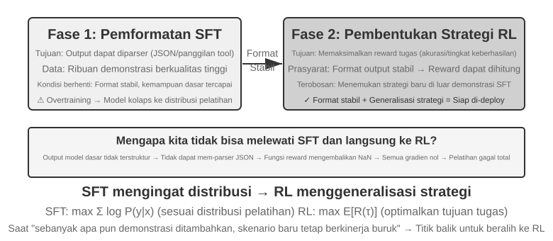

**SFT cocok untuk** tugas yang memerlukan stabilisasi format (seperti output JSON atau gaya percakapan yang konsisten), memiliki demonstrasi pakar berkualitas tinggi yang tersedia, dan sangat cocok dengan lingkungan penerapan (deployment). **RL menjadi penting** dalam keadaan yang berbeda: ketika penerapan berbeda secara sistematis dari pelatihan (selama pelatihan, kartu J/Q/K semuanya bernilai 10, sementara dalam penerapan nilainya menjadi 11/12/13—aturannya berubah; atau pelatihan menggunakan corak hitam dan penerapan menggunakan corak merah—tampilannya berubah), ketika strategi optimal perlu ditemukan (demonstrasi pakar belum tentu optimal), atau ketika penganotasian terlalu mahal untuk mendemonstrasikan setiap jalur.

Strategi yang paling kokoh adalah alur kerja dua tahap **"SFT dulu, lalu RL"**. Tujuan utama SFT bukanlah untuk memaksimalkan performa tugas melainkan untuk membangun **stabilitas format** untuk output—memastikan model dapat menghasilkan panggilan antarmuka alat dan JSON yang dapat diurai. Hanya setelah format output stabil barulah sinyal reward RL dapat dihitung dengan andal. Melakukan RL langsung pada model dasar tanpa SFT sering kali berujung pada kegagalan pelatihan karena format output yang kacau dan reward yang tak bisa dihitung—meskipun kesimpulan ini punya kondisi batas: ia berasal dari skenario "model dasar yang lebih kecil + syarat output terstruktur yang ketat" (seperti di Eksperimen 7-11 nanti). DeepSeek-R1-Zero mendemonstrasikan bahwa model dasar yang cukup kuat dapat melewati SFT dan sukses dengan RL langsung, memunculkan kemampuan penalaran rantai panjang dan refleksi—dengan harga keterbacaan output yang buruk dan percampuran bahasa, yang justru menjadi alasan DeepSeek akhirnya menambahkan kembali "cold-start SFT" di R1. Perjalanan bolak-balik R1 dari Zero ke cold-start adalah contoh terbaik dari "bentuk dulu, baru roh": RL dapat menumbuhkan "roh" (strategi dan kemampuan penalaran) sendiri, namun "bentuk" (format dan keterbacaan) tetap dibangun dengan cepat dan stabil oleh SFT.

Masing-masing memiliki harganya: SFT irit sampel dan cepat konvergen tetapi buruk dalam menggeneralisasi; RL belajar strategi yang dapat ditransfer tetapi boros sampel dan tak stabil untuk dilatih. Sebuah tes praktis: ketika menambahkan lebih banyak demonstrasi tidak lagi mendongkrak performa di skenario baru, Anda telah tiba di titik peralihan menuju RL—akar masalahnya bukanlah dari jumlah demonstrasi tetapi dari tujuan optimasi SFT itu sendiri.

Dalam praktiknya, keputusan dapat dibuat dalam urutan berikut:

1. **Tanyakan dulu: Apakah pascapelatihan diperlukan?** Jika masalah dapat diselesaikan melalui rekayasa Harness (optimasi prompt, desain alat, manajemen konteks), tak ada pelatihan model yang dibutuhkan. Kebanyakan aplikasi Agen jatuh ke sini.
2. **Jika pelatihan diperlukan: Coba SFT dulu.** Sesuai untuk mengokohkan format output (JSON schema, format pemanggilan API), mengokohkan pengetahuan protokol (penggunaan istilah, format output, kebiasaan proses, yaitu, "bagaimana berbicara dan melakukan berbagai hal"), dan menyeragamkan gaya (nada, panjang). Tapi catatlah SFT tak sesuai untuk menyuntikkan jumlah ilmu berfakta masif ("apa yang harus diketahui")—itu butuh prapelatihan sambungan ataupun metode RAG (bahasan termaktub di "Pemandangan Penuh Post-Training serta Petuah Penerapannya" pada pangkal bab). SFT lebih ringkas bujet plus melahirkan faedah kilat.
3. **Bila langkah SFT rupanya memble: Suntikkan metode RL.** Diposisikan buat babak-babak bilamana tuntutan generalisasi di muka ragam suasana asing kian krusial, perlunya melacak taktik paling piawai, atau pada masa perakitan label biaya telanjur mencekik. Sadarilah senantiasa bahwa kewajiban nomer satunya ialah mengeraskan format kelahirannya via tahap SFT sesaat sebelum ditindih pemakaian RL pada level atasannya.

## Pembelajaran Penguatan Putaran Tunggal (Single-Turn): Perbandingan Antara Memori dan Generalisasi

Istilah "putaran tunggal" atau "single-turn" bermakna bahwa mandat misinya dituntaskan pada satu rute bolak-balik interaksi semata: model dicekoki kucuran masukan, menetaskan output balasan, serta memanen sekeping imbalan (reward), seraya terbebas dari tanggungan guna menahan ingatan state di bentangan langkah berikutnya. Latar belakang teringkas ini memanjakan segenap fokus buat menghayati aneka akar diferensiasi dari rupa mesin pembelajar bawaan SFT vs RL, tanpa dibelit benang ruwet skenario interaksi serba multi-putaran (multi-turn). Babak percaturan putaran tunggal menganugerahkan presisi iklim percobaan terkendali (controlled experimental) yang murni transparan: atas mandat pekerjaan serupa, berlandaskan sebentuk basis model yang serupa pula, kucuran anggaran komputasi serupa, dengan mengusung modifikasi semata pada corak varian pelatihannya. Uji eksperimen pertama mengejawantahkan rahasia perihal cara RL memungut hikmah "meta-strategy" bilamana harus mengasah penalaran atau "when to think"; praktik demonstrasi nomor dua menunggangi sarana permainan lembar kartu hitung menalar guna mengukur secara berurut pedoman "SFT mengabdi hafalan, sebaliknya RL mengusung sebaran adaptasi (generalize)".

Sebelum terjun ke medan peraga, usahakan rakitlah bekal **intuisi fundamental (minimal intuition)** seputar algoritma racikan RL, cukup pas demi mencerna rentetan terminologi (istilah-istilah) yang bakal menyeruak (rentetan rumus komprehensif plus panggung adunya sengaja dijeda sampai ke ranah subbab "Perbandingan Ragam Algoritma RL" di belakang bab). Corak ragam arsitektur RL sepanjang bab ini mayoritas memanjat ke atas bahu **gradien kebijakan (policy gradient)**: mesin model menderetkan beberapa larik jawaban berhadapan seuntai pertanyaan, meroketkan jenjang bobot kemungkinan (probability) atas larik balasan berhadiah imbalan wah serta menyeret terjungkal bobot jawaban berimbalan cekak—beringsut senantiasa memburu haluan bermandi imbalan seraya perlahan menghindari wilayah buntu nir imbalan. Supaya luapan gerak perubahan (update) dalam skala raksasa pada seruas pijak jalan tidak serta-merta mencerabut arah model, resep arus utama algoritma **PPO** mengawasi (clipping) batas rentang amukan di tiap tapaknya (ini menyandang sebutan PPO plus jejaring nilai "value network" pada deretan uji nanti; jaringan nilai berfungsi menerka tolok ukur dasar demi mengerucutkan kalkulasi keuntungan/advantage secara detail). Jurus lawan mainnya, **GRPO**, terang benderang abai melatih satu pun jaringan rupa "value network"; jurus ini sekadar membanding adu ragam alternatif dari tanggapan yang menyasar soal seragam dari masing-masing sudut guna meraba kualitasnya. Persepsi insting rupa begini amat paripurna meladeni babak peraga eksperimental berdua di halaman setelahnya.

> **Eksperimen 7-10 ★★: AdaptThink—Belajar "Kapan Tidak Perlu Berpikir"**
>
> Model penalaran kelas kakap (misal OpenAI o1, DeepSeek-R1) menyemburkan rantai olah pikiran beruntun (chain-of-thought) yang meluber panjang teruntuk aneka raut persoalan, menyemaikan ongkos pemborosan beban nirfaedah tatkala menghadapi urusan enteng. Percobaan ini sedari pangkal bertugas mengetes sejumput intuisi logis: Rupa **Mode NoThinking** (menerabas tahapan merenung via aba-aba kode `<think></think>`) secara gamblang berunjuk gigi setara bahkan berbuah kian cemerlang selagi melibas soal gampangan; terkhusus selagi dihadapkan kasus pelik belaka maka letak taji dari rupa Mode Thinking tampak telanjang benderang.
>
> Algoritma AdaptThink memanfaatkan daya RL untuk melatih si sistem buat menimbang kapabilitas opsi mode ini secar mandiri (adaptively). Tersusun dari dua penyangga:
>
> - **Tujuan Optimasi Terkendala (Constrained Optimization Objective)**: Melecut pengerahan NoThinking dengan kepastian mutu kerja menyeluruh pantang melesat mudur.
> - **Strategi Sampel Penting (Importance Sampling)**: Mengayun bobot berimbang kepada tangkapan data Thinking maupun NoThinking demi menuntaskan prahara **tahap beku (cold-start)** (kata awalan beku pada konteks saat ini mensyaratkan tabiat rintisan mesin yang lazimnya kaku menjatuhkan pilihan pada Thinking berulang kali, menyandera rute simpangan NoThinking pada krisis kemiskinan jatah tangkapan sampel data buat diraup ilmunya; perihal tersebut teramat jauh menyeberang dengan serapan wicara "cold-start SFT" di bagian DeepSeek-R1 awal, yang murni memutar sebagian jatah peraga demo teladan).
>
> Kutipan wacana "importance sampling" di sini bukan barang langka melainkan tata laku metodologi sebaran data secara statistikal—seumpama serakan tangkapan condong menggunung ke ceruk famili terbatas, injeksi bobot berkaliber diluncurkan menuju bongkahan sampel supaya "meluruskan (correct)" rona distribusinya, menahbiskan arus pemelajaran bersentuhan imbang ke pelbagai koridor familinya. Alur bernalar ini malahan berulang-ulang diberdayakan oleh ragam klan resep arsitektur (algorithms) RL seumpama kubu PPO plus kelompok DAPO nan kelak didedah dalam jilid pedoman rujukan ini.
>
> Kesimpulan panggung uji: Membedah sederet kancah pacu patokan (benchmark) matematikawan, rasio jangkauan ukuran kalimat tanggapan melorot 45%–64%, selagi presisi ketajaman akurasi alih-alih anjlok lantas sanggup bertengger lebih menjulang. Sang mesin agen meresapi ilmu pemilah keputusan bertumpu di anatomi perangai pertanyaan terkait: mendepak kerumitan buat lekas membedah tuntas rupa problematika cetek (simple) dan bergaya struktur gamblang; menahan porsi gerbong gerigi mata rantai olah merenung komplet di kala terjun bergumul menjinakkan urusan ruwet bersyaratkan sekuens berpikir lapis bersusun; di ujungnya cermat membongkar siasat tebak terka derajad keruwetan rupa kelas baru (unseen task types).
>
> Ditaut bareng jurus penyulingan prompt (prompt distillation), klan AdaptThink mekar mengarungi kawah "jalur dua sistem gas dan rem (fast-slow dual system)": teknik distilasi menyerut menyusut gumpalan populasi serapan misi berpantang mandat merenung, selagi pusaka AdaptThink sigap mengeksploitasi akal picuan (triggering strategy) membidik gerombolan sisa peruntukan kerja, bersama padu bahu membahu meroketkan puncakan tingkat faedah efisiensi berpikir model.
>
> **Eksperimen 7-11 ★★: GeneralPoints—Uji Tarung "Memori dan Generalisasi" di RL Putaran Tunggal**
>
> 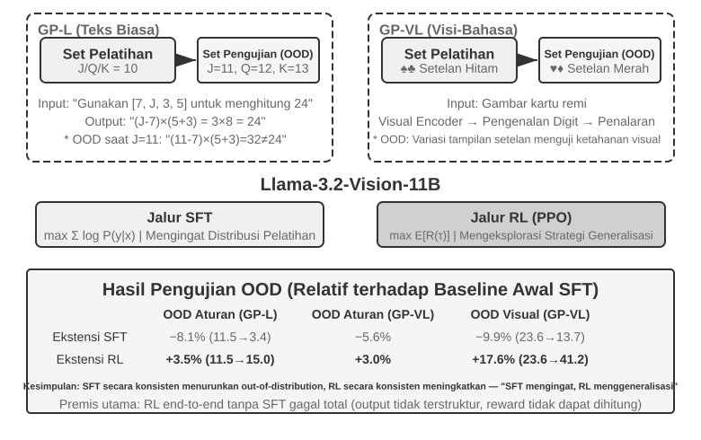
>
> GeneralPoints merupakan sebuah gelaran ranah laga asah kartu bernuansa penalaran hitung rintisan cetusan kelompok Chu dkk. (2025, "SFT Memorizes, RL Generalizes," arXiv:2501.17161), dirakit sengaja buat menakar kapasitas daya rangkum pukul rata (generalization) dari model asuhan. Tujuan akhir mirip "Game 24": pakai tiap keping empat buah figur nominal dari gelaran per kartu tepat satu pukulan putar, rakit mereka dalam jalinan pasak tambah, kurang, kali, silang bagi, menembus angka panutan 24. Panggung peraga ini memancang sepasang ragam (variants): sang pemanggul wujud deret huruf GP-L (text-only) diapit perwujudan kancah GP-VL berpilar pandangan lensa rupa visual, memberi leluasa kuasa membongkar tuntas rahasia daya adaptasi generalisasi pakem (rule generalization) dikawinkan pendar generalisasi lensa kasatmata (visual generalization) bernaung di bawah set atap kerangka padu.
>
> **Varian Aturan (Rule Variant)**: Pada saat perputaran berlatih, wajah J/Q/K senantiasa dihitung merata di titik 10; di persimpangan saat uji coba (testing), deretan itu berubah kodrat menjadi nominal 11/12/13, menyegel kepastian area himpunan uji terisi ragam kocokan himpunan angka asing pendatang (operations involving 11, 12, 13) demi menatar secara kejam kapabilitas generalisasinya. **Varian Visual**: Perputaran berlatih cuma mengonsumsi simbol daun rupa warna kelam (hitam ♠♣), lantas persimpangan pengujian (testing) merengkuh set lambang daun kembang warna menyala (merah ♥♦), membongkar ketahanan tabiat (robustness) di hadapan gelombang goncangan raut paras penglihatan visual. Merangkul pilar Llama-3.2-Vision-11B, sang percobaan mendaraskan runtut pedoman jalur (pipeline) pascapelatihan baku (standard): pemanasan pangkal, fondasi asupan bekal mula (initialization) dari kubu SFT menganugerahi mesin peranti nurani keahlian ketaatan bimbingan nurut (instruction-following); selanjutnya, memancang seragam jumlah kuota anggaran kalkulasi, sang mesin model tersebut diceburkan memikul pasokan gemblengan suplemen SFT tambahan merangkap asupan dari gerbong kurikulum RL berjalan pada percabangan ranting terpisah, bersandarkan pada racikan formula PPO dengan embel-embel seutas jaringan (value network) pengukur muatan nilai buat kubu penggiat RL-nya. Cabang dua aliran senantiasa dijejali porsi olah tatar pelatihan menggunakan satu patokan regulasi (rule) seragam bertajuk pakem J/Q/K=10 seraya diganjar timbangan angka nilai unjuk kerja mendompleng ladang set sebaran area pengujian murni internal (in-distribution/ID) dengan area pengujian menyimpang perbatasan lintasan luaran pinggiran (out-of-distribution/OOD).
>
> Buah pencerahan menjabarkan rahasia fundamental beda kelasnya dengan terang benderang. **Rule OOD**: kubu RL mencuat subur menebus tambahan pesat +3.5 digit poin angka berpersen (%) menduduki panggung GP-L (11.5%→15.0%), sebaliknya kubu seberang SFT menelan pil pahit **ambruk tak berdaya** menyusut tajam menukik 8.1 digit titik poin berpersen (11.5%→3.4%); di kubu hamparan kancah GP-VL, sumbangsih RL sukses memperlebar tambahan gilang-gemilang sebesar +3.0 batas titik persentase, bertolak tajam berbalik arah dibandingkan asuhan pamong SFT yang lunglai ambruk bertekuk lutut melempem merosot jauh meluluhlantakkan titik perolehan 5.6 poin batas persentase. **Visual OOD**: kubu aliran RL membiak cemerlang menyentuh capaian perbaikan +17.6 buah poin persentase melantai di atas mimbar panggung GP-VL (23.6%→41.2%), sebaliknya kubu tetangga aliran pergaulan SFT lagi-lagi menelan ludah rontok membusuk tertinggal jauh di garis 9.9 untai poin rentang sebaran angka persentase (23.6%→13.7%).
>
> Membuntuti runtut alur cermatan presisi (accuracy) jeli mata penglihatan ranah visual (visual recognition accuracy) mendongkel kedok bahwasanya kubu panduan asuhan aliran taktik RL sanggup membangkitkan pesat gairah potensi pijakan dasar mesin pengkode peraba (visual encoder) melalui gemblengan pemicu (optimization) bersentral di buruan membidik sasaran hasil final (outcome-oriented), lantas perbaikan performa pamungkas (improvement) sungguh-sungguh memamerkan tali simpul (correlated) yang kokoh tebal ke jajaran pencapaian merata pada hasil keunggulan kinerja unjuk bakat menyeluruh (overall performance gains); alih-alih seteru kubu berseberangannya klan SFT terjerembab pada kutukan kubangan penyakit (overfits) menghafal kaku susunan rentetan perca sandi raut lambang-lambang token (token patterns) menyusuri rel jalinan proses gerbong pemikiran murni internal belaka, menganak-tirikan mandat menatar mengadopsi cernaan perca sandi (visual tokens) bernuansa tangkapan corak gambar, membimbing lurus menuju jurang kegagalan kemerosotan derajad ketelitian kecermatan daya penglihat tangkapan visualnya (recognition accuracy).
>
> Gelaran wahana percobaan sanggup membedah terang perihal keniscayaan SFT bagi menopang RL: mengusung rancang atur patokan rupa eksprimen terkini (berwujud figur skala pijakan model mendasar dari trah Llama-3.2-Vision-11B, memboyong paksaan (strict) penguncian syarat-syarat tertata dari ranah bentukan pola cetakan (structured output)), melaksanakan kucuran suplemen kubu haluan RL end-to-end dengan gegabah menerjang polos-polosan lepas melompati tangga SFT menyemai prahara tubrukan macet total—si model pijakan gagal mencetak luaran bersistem dengan format beraturan, malahan hitung-hitungan kalkulasi bonus (rewards) murni teronggok tak sudi dikerjakan sama sekali. Patut dipatri dalam ingatan, bahwa perwujudan simpul ini sekadar hasil pendaran pada situasi parameter bersyarat tertentu semata, bukanlah sabda hukum pakem sejagat (universal law): sebuah basis gacoan mesin (base model) jikalau mutunya betul-betul buas andal malahan leluasa sanggup memangkas jalur menyelonong membuang masa bimbingan SFT berganti mencumbu kemenangan cemerlang buah jerih direct RL secara kilat (sudi rujukan tengok sesi wejangan mengiris ulasan DeepSeek-R1-Zero di muka kelak). Setitik temuan sarat makna tak tertinggalkan ialah pendar jumlah iterasi verifikasi menderas meruah melahirkan sebaran adaptasi rupa keumuman (generalization) memukau menjulang: iterasi angka ke-10 melipat +5.99% vs perolehan seret iterasi tunggal per 1 memungut receh +0.48%, menitah seruan andai kata pengerahan lonjakan unjuk gigi komputasi (computational scaling) selagi ranah pemikiran berkecamuk mengakar tajam merupakan urat nadi sumbu poros jembatan kubu aliran RL membiakkan rupa keumuman generalisasinya.
>
> Mengapa performa pamong aliran SFT lebur rontok pada persimpangan geseran distribusi (distribution shift), alih-alih laskar aliran bimbingan pandu RL memetik kinerja memukau? SFT senantiasa melahap rumusan (mapping) bernada "diberikan suntikan input ini, pancing cetakan luaran jawaban itu": sepanjang musim kawah gemblengan (training), set patung figur J/Q/K mutlak senantiasa rupa bilangan 10 semata, otomatis tabiat rupa mesin (model) mati-matian merekam kaku bentuk corak tunggal sebatas "selagi disuguhi wajah set J/Q/K, telan bulat-bulat sebagai figur angka 10"; begitu masuk bilik kamar ujian coba (testing), tiba-tiba raut J bermetamorfosis merias menjelma jadi angka rupa 11, namun parahnya sang agen rupa buatan (model) tetap keukeuh kolot menghitung murni bersila di angka hitungan kuno 10, serta-merta tanpa sengaja memboyong nestapa kesalahan luput tak terelakkan meracik jawabannya. Kubu seberangnya (RL) justru sudi belajar melahap kiat muslihat rupa yang kian menyeluruh meluas perihal "strategi siasat olah rupa perhitungan bagaimanakah yang mekar berbuah mencetak raihan hasil murni akurat": tatkala patung ukir si J berganti wajah melangkah beralih figur keping 11, peranti kubu pandu haluan model (RL model) gencar tangkas melakukan bongkar rupa perhitungan memboyong (recalculates) perkakas pakem langkah-langkah strategi selaras dengan yang acap usang diamalkan, alih-alih murni malas menyuap pancingan ingatan masa silam memamah-biak hapalan lama beku buntu. Pertalian tabiat renggang curam ini menjembatani jurang rengkuhan dikotomi murni esensi kasta "hafalan buta (memorization)" bersilangan memunggungi sifat sebaran kaprah merata menyeluruh berjuluk perwujudan daya linuwih bernama "generalisasi".
>
> Pusaka amal kebaikan pamungkas wahana percobaan peraga tersirat apik di keluwesan tancapan tonggak kuantifikasi rupa ukuran saksama mendarahi pusaran gelora kental raut fenomena sakti "SFT memorizes, RL generalizes", menyumbangkan sumbangsih rupa unjuk pembuktian sahih bahwa patokan watak perwujudan tersebut mutlak bertahan kekar merasuk menyelimuti kubu ragam sebatas medium tulisan (text-only) dirangkul sejawat rupa dwibahasa panca indra (vision-language). Ialah sanggup mengejawantahkan selimut kelindan persaudaraan mesra seia-sekata selaras serasi saling melengkapi menjembatani rupa antara pihak-pihak jajaran (SFT and RL): laskar klan SFT dengan sukarela murah hati mendonorkan asupan wujud kesetimbangan fondasi rupa luaran, selanjutnya para perwira kubu haluan penuntun pandu pilar RL membina rupa tiang menumpang memanjat undakan merangsek tinggi menjamah lompat tinggalkan tembok-tembok limitasi pasungan jerat wujud daya hapalan; lantas memutar tuas roda keduanya mutlak murni tak elak tak ayal dilarang disingkirkan, tiada yang dibuang satupun (indispensable). Set alur paradigma alur pandu ini berpegangan selaras pakem tradisi bimbingan tatar laku ajaran "bentuk rupa dahulu ditata rapi sedap dipandang mata (form first), barulah pamungkas jiwa sejati ditempa mendatangkan sukma merasuk sumsum kalbu (spirit second)"—ibarat mendompleng langgam dari rahim jagat seni lukis gores corak kanvas kaligrafi klasik Tiongkok Kuno, garis terdepan lukisan wujud menjiplak bentuk raut jasmani cangkang terluar murni nyata (format susun tata krama, susun bangun lapis pilar struktur (structure)), disusul kelak barulah berupaya mengejar raga sukma terpendam sarat makna menyusup batin murni internal mendalam (pola laku pergaulan sebaran umum generalisasi (generalization), tata langkah urut bidik sasaran muslihat strategi (strategy))—hal inilah pilar-pilar kuat pendiri landasan pijak ilmu peranti taktik dasar (methodological foundation) membekali pelbagai penuntasan gugus ragam pelik urusan rupa ganda berserinya babak siklus (multi-turn), yang bernaung merengkuh rupa majemuk indra ganda modalitas (multimodal tasks).

## RLHF: Dari Preferensi Manusia ke Model Reward

Eksperimen-eksperimen putaran tunggal sebelumnya berbagi premis yang sama: tugas-tugas tersebut memiliki kebenaran yang dapat diverifikasi—apakah rumusnya benar atau formatnya sesuai, sebuah pemverifikasi berbasis aturan (rule-based verifier) dapat menilainya. Akan tetapi, model percakapan yang di-deploy saat ini berperilaku layaknya "asisten yang sopan dan aman" berkat garis riset berbeda yang matang lebih dulu: **RLHF** (Reinforcement Learning from Human Feedback). Memahami RLHF adalah kunci untuk memahami dari mana kualitas percakapan dan penyelarasan keamanan (safety alignment) pada produk seperti ChatGPT berasal, sekaligus menjadi prasyarat untuk mengerti konsep-konsep seperti penalti KL dan manipulasi reward (reward hacking) dalam algoritma-algoritma yang dibahas nanti.

**Alur Kerja Tiga Tahap InstructGPT.** InstructGPT besutan OpenAI[^ch7-4] menetapkan proses standar yang masih digunakan hingga saat ini:

1. **SFT**: Melakukan penyesuaian halus (fine-tune) model pra-pelatihan pada pasangan "instruksi-respons" yang didemonstrasikan manusia untuk membangun kemampuan dasar mengikuti instruksi—ini adalah materi yang dibahas pada bagian "SFT (Supervised Fine-Tuning)" sebelumnya.
2. **Melatih Model Reward (Reward Model/RM)**: Untuk prompt yang sama, minta model menghasilkan beberapa respons, lalu penganotasi manusia membandingkannya berpasangan, untuk menunjukkan mana yang lebih mereka sukai. Latih model penilai menggunakan pasangan preferensi ini, dengan tujuan pelatihan berdasarkan model Bradley-Terry:

   $$\mathcal{L}_{\text{RM}} = -\log \sigma\big(r(x, y_w) - r(x, y_l)\big)$$

   di mana $y_w$ adalah respons yang disukai, $y_l$ adalah respons yang ditolak, dan $\sigma$ adalah fungsi sigmoid. Intuisinya sangat sederhana: **buat RM memberikan skor lebih tinggi pada respons yang disukai**. Alasan mengapa lebih baik mengumpulkan perbandingan ketimbang skor absolut adalah karena sulit bagi manusia untuk secara konsisten memberikan skor absolut ("respons ini layak mendapat 7.3" hampir tidak mungkin dilabeli secara konsisten), tetapi penilaian tentang "mana yang lebih baik, A atau B" jauh lebih andal. **Ingatlah peran dari "model reward"—ini adalah tema yang berulang dalam bab ini**: di sini, ini adalah penilai yang dipelajari dari preferensi manusia; saat kita sampai pada Bagian 7.10 tentang desain reward, Anda akan melihat berbagai wujudnya (ORM yang hanya melihat hasil akhir, PRM yang menilai langkah demi langkah, model reward generatif yang memberikan alasan dalam bahasa alami), dan sebuah kasus khusus—ketika kebenaran dapat ditentukan langsung oleh aturan, "model reward" tersebut secara sederhana merosot menjadi sepotong kode deterministik (inilah fungsi RLVR, yang dibahas di bawah). Semuanya menjawab pertanyaan yang sama: **dari mana datangnya reward?**
3. **Menggunakan skor RM untuk PPO**: Memakai skor RM sebagai sinyal reward, lakukan pelatihan PPO pada model SFT (mekanisme PPO akan dijelaskan di bagian berikutnya), yang memampukan model untuk belajar menghasilkan respons yang diyakini RM "akan disukai manusia".

**Penalti KL: Jangan Menyimpang Terlalu Jauh dari Titik Awal (Menjelaskan KL Divergence Secara Tuntas).** Dalam RLHF, reward yang sebenarnya dioptimalkan oleh model biasanya bukanlah skor RM itu sendiri, melainkan sebuah suku penalti yang dikurangi darinya:

$$r = r_{\text{RM}} - \beta \cdot \mathrm{KL}\big(\pi_\theta \,\|\, \pi_{\text{ref}}\big)$$

Hanya dari satu rumus ini, muncul empat pertanyaan lazim dari para pemula, yang akan kita bahas satu per satu.

**(1) Apa itu KL divergence, dan di mana penaltinya diterapkan?** KL divergence (Kullback-Leibler Divergence) mengukur perbedaan antara dua distribusi probabilitas: makin mirip distribusinya, makin kecil nilai KL, mencapai 0 bila identik; makin berbeda, makin besar nilai KL-nya. Dua distribusi yang dibandingkan adalah distribusi probabilitas token-berikutnya (next-token) yang dihasilkan oleh **kebijakan saat ini** $\pi_\theta$ (model yang sedang dilatih) dan **kebijakan referensi** $\pi_{\text{ref}}$ (titik awal pelatihan, biasanya model SFT), dengan konteks pendahulu yang sama. $\beta$ mengendalikan kekuatan penalti—itu adalah hiperparameter `kl_coef` yang lazim dijumpai di skrip pelatihan. Dalam istilah rekayasa, penalti ini **dihitung per token dan ditambahkan ke reward** (per-token KL): tiap kali model membangkitkan sebuah token, probabilitasnya untuk token tersebut dibandingkan dengan probabilitas model referensi pada posisi yang sama; makin besar deviasinya, makin besar penalti yang dikenakan pada reward di langkah itu. Dengan kata lain, KL bukanlah suku *loss* terpisah, melainkan **dicampur ke dalam sinyal reward**, yang lalu akan melewati kalkulasi advantage PPO/GRPO—di titik persis inilah KL bereaksi.

**(2) Mengapa arahnya "kebijakan saat ini dulu, baru kebijakan referensi"?** KL divergence bersifat asimetris, $\mathrm{KL}(P\|Q)\neq\mathrm{KL}(Q\|P)$, jadi arahnya tidak sembarangan. Di sini ditulis sebagai $\mathrm{KL}(\pi_\theta\|\pi_{\text{ref}})$—kebijakan saat ini di depan—yang secara matematis disebut **reverse KL**. Itu memberi penalti pada situasi di mana "$\pi_\theta$ memberikan probabilitas tinggi di suatu tempat, sementara $\pi_{\text{ref}}$ memberikan probabilitas mendekati nol di sana", artinya, ia **menghukum model karena pergi ke tempat-tempat yang menurut model referensi tidak seharusnya didatangi**. Inilah tepatnya yang kita inginkan: model referensi (model SFT) merepresentasikan zona aman di mana model terdengar alami dan mematuhi format normal, dan reverse KL menjaga kebijakan saat ini tetap berada di dekat zona itu alih-alih membiarkannya menyimpang liar. Jika sebagai gantinya kita memakai **forward KL** $\mathrm{KL}(\pi_{\text{ref}}\|\pi_\theta)$, itu bakal menghukum pola-pola yang "dimiliki model referensi, tetapi luput oleh model saat ini"—yang mana akan memaksa model untuk menjamah semua gaya ekspresi dari model referensi, dan hal itu jelas-jelas bukanlah tujuan RLHF.

**(3) Mengapa dirancang seperti ini?—Asal-usul mode-seeking.** Reverse KL punya karakteristik kunci: ia bersifat **mode-seeking**. Bagian 7.1 telah meletakkan dasarnya—reverse KL mengizinkan model untuk **mempertahankan segelintir "mode" dengan reward tinggi saja lalu membuang sisanya secara tegas**, tanpa keharusan untuk merengkuh segalanya secara setara seperti metode *maximum likelihood* SFT (mass-covering). Dalam konteks RLHF, efek inilah persis yang kita idamkan: pilah satu-dua ragam *style* tanggapan yang menangguk skor tinggi (diakui si model penilai/RM) lalu telurkan secara konsisten (ajeg), alih-alih bersikeras mengunyah segenap opsi gaya bersuara rupa apa pun jua. Ihwal inilah jua penegas duduk perkaranya kenapa perwajahan rupa mesin purna polesan RLHF tampil jauh lebih "punya nyali pendirian tegas (decisive)" namun surut kepiawaian mendendangkan pusparagam khazanah rupa kalimat bervariasi (less diverse). Bila diramu menyatu, kebiasaan bakat mode-seeking kepunyaan metode reverse KL dipadankan bersama keandalannya mengikat ruang gerak peranti di pelataran pagar batas wilayah kebijakan pangkal awal merupakan urat nadi sumbu poros jangkarnya (stability) pamor teknik RLHF.

**(4) Bagaimana risikonya tanpa itu?** Insting penalarannya sangat gamblang: **Jangan meniti menjauhi titik pangkal pemberangkatan terlalu jauh, kalau tidak angka skor dari RM bisa jadi muskil diklaim andal**. RM murni dipoles beralaskan pangkalan zona pijak keluaran rupa model panduan awal (reference policy) semata. Detik tatkala rupa mesin terseret jauh disesuaikan bersandar ke batas zona liar yang sama sekali tak pernah dipijak/dilihat sang penilai (RM), nilai takaran RM murni berganti tabiat menjadi ramalan khayal buta tiada berdasar rujukan konkret pangkalan (extrapolations), akibatnya raihan besaran skor tinggi lantas tak lagi senada menjamin mutunya niscaya menawan. Dari sinilah, jurus pengikat ganjaran hukuman penalti KL melumpuhkan dwiprahara nahas secara bersamaan serempak: **manipulasi imbalan ganjaran (reward hacking)** (si agen mesin menelikung menjebol siasat mencari kelemahan rupa hadiah perolehan skor muluk namun bobrok meladeni pokok tugas mandat kerja sejati (cek alinea susulan berikutnya)) bareng rupa **keruntuhan sebaran wilayah rupa pangkalan pijaknya (distribution collapse)** (format keluaran menyusut hancur terperosok wujud terburuk contoh mendedahkan repitisi deret repetitif hambar (repetition) ataupun bahasa planet berantakan rupa (gibberish)). Toh, dalam palungan kawah gemblengan RLVR bermodalkan angka imbalan pasti terpantau sahih (verifiable rewards), jerat ganjaran patokan pengawasan ikatan lilitan KL (KL regularization) lazim kerap bersikeras dipelihara guna menata kestabilan rupa kawah pelatihannya (segelintir temuan buah mahakarya layaknya kubu DAPO dan Open-Reasoner-Zero terang-terangan murni menyengaja membongkar membebaskannya—tolong disimak resep trah model pamungkas GRPO dari peranti DeepSeek-R1-Zero itu sendirinya masih tetap mempertahankan tempelan pakem ikatan seutas lilitan rupa parameter batasan KL (KL term)).

**Model Reward Bisa "Terlalu Dioptimalkan".** RM itu, biar bagaimanapun, hanyalah proksi (indikator perantara) dari preferensi manusia. Hukum Goodhart menyatakan: ketika sebuah metrik menjadi target optimasi, ia berhenti menjadi metrik yang baik—mendorong proksi ke ekstrem akan mengubah korelasinya dengan tujuan yang sebenarnya. Riset OpenAI[^ch7-5] secara sistematis mengukur fenomena **reward model over-optimization** ini: seiring berjalannya pelatihan RL, reward proksi (skor RM) meningkat secara monoton, sementara kualitas yang sebenarnya (evaluasi manusia) naik lebih dulu lalu kemudian turun. Saat model belajar "memanfaatkan kerentanan" dari RM (misalnya, jika RM secara bias menyukai respons yang lebih panjang, model akan menghasilkan omong kosong yang panjang untuk mencetak skor tinggi tanpa benar-benar menjadi lebih baik), kita menyebutnya **reward hacking**. Salah satu cara efektif untuk mengukur over-optimasi adalah menggunakan RM yang lebih besar dan terpisah sebagai penilai independen—jika skor RM pelatihan meningkat tetapi skor RM penilai menurun, artinya model telah overfitting terhadap kelemahan RM pelatihan.

## Perbandingan Algoritma Pembelajaran Penguatan

Eksperimen-eksperimen putaran tunggal sebelumnya telah memamerkan keunggulan generalisasi dari RL, dan bagian sebelumnya telah memperkenalkan pendekatan optimasi preferensi (preference optimization) dari RLHF. Akan tetapi, algoritma-algoritma spesifik yang dipakai dalam karya-karya ini bervariasi dan hanya sebagian kecil dari banyaknya opsi. Sebelum berlanjut ke tugas-tugas multi-putaran yang lebih kompleks, kita perlu meninjau secara sistematis karakteristik dan skenario penerapan dari algoritma-algoritma arus utama.

> **Poin terpentingnya di awal, agar Anda tidak tersesat dalam rumus-rumus.** Bagian ini mencantumkan lumayan banyak nama algoritma dan persamaan, tetapi ingatlah Benang Merah Kedua dari bab ini: **dalam industri, sudah cukup untuk mengetahui bagaimana menggunakan algoritma RL siap pakai (PPO, GRPO, dan sejenisnya) dan memilih yang tepat; apa yang sebenarnya menentukan kesuksesan atau kegagalan adalah data dan lingkungannya, bukan algoritma.** Algoritma-algoritma ini sudah dipaketkan ke dalam kerangka kerja matang seperti veRL dan TRL; menggunakannya biasanya hanya berarti mengubah beberapa baris konfigurasi. Jadi, tujuan di sini bukanlah untuk mengajarkan Anda penurunannya (derivations), melainkan memberi Anda sebuah peta pemilihan—algoritma mana untuk skenario apa. Bagian-bagian yang penuh rumus (ditujukan untuk insinyur pelatihan) dapat dilewati tanpa kehilangan benang merahnya. Bagian selanjutnya akan membeberkan argumen positif mengapa data dan lingkungan jauh lebih penting dari algoritma.

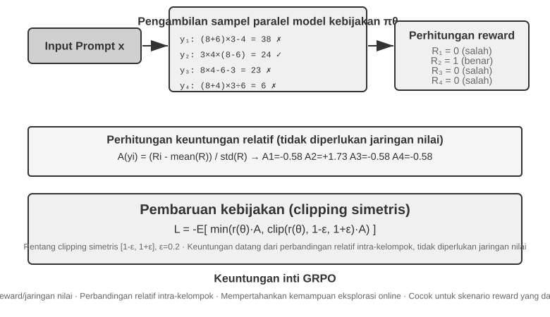

Skenario RL untuk Agen LLM modern berbeda secara fundamental dari RL tradisional—Agen harus memahami maksud pengguna, memanggil alat, menghasilkan output terstruktur, dan terlibat dalam penalaran rantai panjang di berbagai putaran dialog. Pengambilan keputusan multi-tahap dan multi-tujuan ini berarti bahwa "memilih algoritma yang tepat" memiliki beberapa dampak, tetapi jauh lebih kecil dari dampak data dan lingkungannya.

Dari segi implementasinya, ragam klan resep racik algoritma RL dibedah berpilah memisah menuju dua kubu pilar besar: **metode eksplorasi ranah jejaring siber (online exploration methods)** (menyisir lacak peta belukar penjelajahan corak siasat operasi anyar murni menerabas menjalin rupa jalinan koneksi sambung (interaction) menantang ranah batas pagar lingkungan (environment)) plus tandingan tetangganya berjuluk **metode gubahan ranah set mode luring (offline optimization methods)** (menelurkan gubahan (optimizing) sekadar bertumpu bersandar menguliti cadangan gumpalan hamparan sebaran jejak catatan pasokan (existing data), melahirkan unjuk pamor tabiat kian mapan tertata apik anti anjlok goyah, plus terjun langsung menusuk sasaran hantam (direct)). Tepat di titik kordinat panggung sinilah, dengan murni rendah hati saya menghidangkan tatanan leksikon ketat kaku istilah ketat (strict terminology) selaras persis rupa pendaran ikrar sumpah khidmat yang dikumandangkan awal mula pangkal bab lalu: **Metode On-Policy (On-Policy methods)** mutlak seratus persen menata corak pembaharuan penyesuaian (updates) gubahan siasat aturan (policy) semata murni merengkuh sedotan tuas cadangan set bahan jaring tangkapan anyar racikan segar (newly sampled) yang mutlak menetas menetes terlahir murni hanya digelontorkan digagas rupa mesin kebijakan rupa seragam di saat presis masa waktu berjalan (that same policy); **Metode Off-Policy (Off-Policy methods)** longgar menjamah merengkuh meraup asupan (learn) memanen tetesan sari-sari pelajaran menjaring hamparan perca bahan luapan sumber silangan gubahan racikan rupa rancangan haluan aliran kebijaksanaan liyan di luaran sana (other policies) bahkan leluasa tanpa beban menenggak mengolah merangkum rupa saripati cangkang lawas siasat versi kadaluarsa (earlier versions of the policy), layaknya rupa figur klan arsitektur pusaka Q-learning nan dipidatokan mendahului baris ini. Mari mendemostrasikan peta rupa rancangan tata bangun (mapping) bab pilar rujukan naskah kini dilebur menubruk ranah definisi kaku kencang sana: klan SFT bersandar memeluk memegang rupa haluan pembelajaran mesin aliran pergaulan *imitation learning* murni terpisah (*off-policy imitation learning*)—racikan set hamparan serapan data sumbangsih pasokannya menetes mengalir menetas langsung bersumber bermuara murni dari sosok peranti rupa peraga teladan pengajar (teacher) malahan murni sentuhan sosok peraga laku tangan makhluk nyawa insani (human demonstrations), pantang diharamkan seratus persen murni perasan kucuran racikan keringat mesin itu sendiri sendirian; format standar PPO sekaligus GRPO andalan jurus baku peruntukan pelatih LLM bernaung di haluan kubu "on-policy"—tiap perputaran melahap menggilas menelan gulungan lembar *rollouts* hasil sampling murni segar dari mesin model kekinian teranyar (artinya, meminta model itu menggilas tuntas seluruh tugasnya sekali putaran utuh, menelurkan sebuah lintasan lengkap dari pangkal muasal (start) sampai garis pupus akhir tamat (finish)) terkhusus melayani hajat pembaruan pasokan parameter terbarunya (updates); trah aliran DPO mutlak masuk bernaung dalam jajaran kelas laskar perwira *offline preference optimization*, sama sekali putus kaitan menanggalkan putus hubungan jalinan sedotan tarikan sampling meraba siber *online* maupun proses pengulangan (iteration) pemoles haluan *policy* kaku (strict policy iteration).

Algoritma-algoritma ini utamanya dibangun di atas pondasi ide yang sama yaitu **gradien kebijakan (policy gradient)**: menyesuaikan parameter kebijakan $\theta$ ke arah yang "meningkatkan expected return (harapan imbalan)". Bentuk paling dasarnya (REINFORCE) adalah:

$$\nabla_\theta J(\theta) = \mathbb{E}\big[\nabla_\theta \log \pi_\theta(a \mid s)\, G\big]$$

di mana $\pi_\theta(a\mid s)$ adalah kebijakan (probabilitas memilih tindakan $a$ pada state $s$), dan $G$ adalah *return* (imbalan/perolehan) kumulatif untuk lintasan tersebut (atau sejak langkah tersebut)—makin tinggi imbalannya, makin kuat model mendongkrak probabilitas untuk tindakan yang bersangkutan. Memakai imbalan keseluruhan lintasan $G$ sebagai bobot (weight) memang *unbiased* (tidak bias), tetapi ia punya varians (variance) tinggi; maka, sebuah garis rujukan dasar (baseline) $b$ diperkenalkan, dan **keuntungan (advantage)** $\hat{A}=G-b$ (seberapa jauh lebih unggul tindakan ini ketimbang rata-rata) dipakai sebagai pembobot guna mengecilkan varians. Metode-metode pelanjut, yaitu PPO dan GRPO, sejatinya merupakan dua wujud pengembangan (improvements) perihal "bagaimana cara mantap menaksir sekaligus memanfaatkan perolehan keuntungan $\hat{A}$".

**PPO** memanfaatkan teknik potong jepit ("clipping") untuk mematok rentang limit lonjakan ubahan tiap keping jejak (step), meredam sang taktik laku pandu kian terempas terjungkal berantakan keluar batas rute jalur dalam satu hentakan paksa seketika:

$$L^{\text{CLIP}}(\theta) = \mathbb{E}\Big[\min\big(\rho\,\hat{A},\ \operatorname{clip}(\rho,\, 1-\epsilon,\, 1+\epsilon)\,\hat{A}\big)\Big],\quad \rho = \frac{\pi_\theta(a\mid s)}{\pi_{\theta_{\text{old}}}(a\mid s)}$$

merujuk $\rho$ sebagai rasio takaran derajat kecenderungan (probability ratio) antara pandu aturan (policy) muda dan siasat usang yang digeser, disusul $\epsilon$ (kisaran 0.2) yang menancap patok atas limitasi perombakan rombak tiap keping tapaknya; wujud sisipan seruan belakangan "Clip-Higher" secara terpisah malah justru menelanjangi sengaja melonggarkan batas atas nilai patokan $1+\epsilon$ tersebut.

**GRPO** melenyapkan fungsi wujud peranti jaringan angka ukur harga perolehan nilai (value network)—yakni susunan cadangan tambahan rupa urat saraf mesin neural terpisah milik sang PPO khusus digembleng memikul peran menebak rupa harga ganjaran (value function) menukik menohok membedah titik pijak langkah tiap seutas tali rekaman alur gerak putar lintasan (trajectory), bertugas mendulang mendikte deret pundi keutamaan keuntungan (advantages) berlapis renik (finer-grained). Alih-alih merengkuh sarana rupa tersebut, ia mencaplok metode komparasi wujud "adu sanding penakaran timbang-menimbang tarung pamor kasta kerabat lingkup dalam pagar grup serumpunnya (intra-group relative comparison)" guna meramal memprediksi bongkah takaran pundi kekayaan bonus surplus raihannya (advantages): menyasarkan hantaman merubuhkan wujud batang ganjalan tantangan seragam tunggal rupa yang sama, mencaplok rupa $N$ buah pancingan lembar helai pita rekaman putar (trajectories) untuk mengeruk imbas balik laba *returns* sejumlah $r_1,\dots,r_N$, diteruskan membakukan garis wujud besaran faedah surpus laba keunggulan (advantage) atas masing-masing gulungan rekam pijaknya persis murni bermodalkan takaran derajat kasta raihan unjuk pesona performa sanding tarung tanding kelas kelompok sanaknya sendiri semata (relative performance within the group):

$$\hat{A}_i = \frac{r_i - \operatorname{mean}(r_1,\dots,r_N)}{\operatorname{std}(r_1,\dots,r_N)}$$

Artinya, "positif kalau lebih mantap ketimbang rata-rata grup, negatif kalau lebih jelek"—tanpa butuh *value network* sama sekali. Itulah persis alasannya ini lebih murah. Catatan: Persamaan di atas tidak menyertakan suku patokan KL (KL regularization term); di arena pelatihan aslinya, penalti hukuman per-token KL yang disodorkan pada babak bahasan sebelumnya senantiasa awet melekat dikaitkan membelenggu laju siasat supaya sudi merapat tunduk ke dekat singgasana sang pangkalan pandu mesin acuan rujukan awal (reference model).

Tabel 7-4 membandingkan metode-metode pascapelatihan RL yang lazim digunakan secara komprehensif, ditujukan sebagai referensi praktis.

Tabel 7-4 Perbandingan Metode Pembelajaran Penguatan Model Bahasa

| Metode | Interaksi | Titik Masuk (Entry) Sinyal Evaluasi | Karakteristik Memori | Skenario Penggunaan Praktis |
|---------|---------|-------------------------|-------------|-------------------|
| **DPO** (Direct Preference Optimization)[^ch7-6] | Offline | Per-sampel (Perbandingan berpasangan) | Murah, rentan OOD. Tidak ada generasi data baru | Penyelarasan model chat, perbaikan cepat dengan data yang sudah ada |
| **KTO** (Kahneman-Tversky Optimization) | Offline | Per-sampel (Label jempol naik/turun yang tidak berpasangan) | Sangat hemat biaya pengumpulan data | Skenario bisnis masif di mana data perbandingan sulit dipasangkan |
| **PPO** (Proximal Policy Optimization) | Online | Per-token (via Reward Model) + Per-sampel | Pelatihan stabil, membutuhkan value network tambahan | RLHF, penyelarasan perilaku yang sangat kompleks, penyesuaian multi-tujuan |
| **GRPO** (Group Relative Policy Optimization) | Online | Per-sampel (via perbandingan rata-rata grup) | Sangat menghemat VRAM (tanpa value network) | Tugas penalaran, matematika, pembuatan kode, pengembangan iterasi cepat |
| **RLVR** (RL with Verifiable Rewards) | Online | Aturan/Verifikator yang keras (Hard Rule/Verifier) | Terbebas dari manipulasi reward, sangat boros sampel | Kode, verifikasi formal teorem, tugas dengan kriteria keberhasilan objektif |
| **RFT** (Rejection Sampling Fine-Tuning) | Semi-Online| Per-sampel (Hanya menyimpan yang sukses) | Mudah diimplementasikan, merupakan bagian dari spektrum SFT | Sintesis data dari model besar ke model kecil, *bootstrapping* kemampuan SFT |

## RL Putaran Jamak (Multi-Turn): Pengakuan Kredit (Credit Assignment) dan Fungsi Reward

Jika SFT meletakkan fondasinya, maka RL Putaran Jamak adalah hal yang membikin model bahasa benar-benar berevolusi menjadi Agen otonom. Interaksi putaran jamak artinya Agen mengambil suatu deretan langkah, mengamati perubahan lingkungan yang berkelanjutan, lalu membuat keputusan susulan, alih-alih cuma "bertanya-menjawab-selesai". Peralihan ini menumbangkan sumbu pokok RL satu-putaran di mana "setiap balasan langsung mendapat evaluasi seketika (immediate reward)". Saat beroperasi putaran jamak dengan sasaran tunggal untuk merampungkan suatu perintah utuh di akhir laga: dari mulai memantau isi kotak direktori, menulis bongkahan koding, mencoba mengujinya (test), terjerembab kegagalan eror, mengulik ubahan berkas, kemudian di penutup laga dinyatakan lulus... bagaimana kiranya sang Agen semestinya dilatih?

Dua perkara gawat membelit RL putaran-jamak: **Dilema Ganjaran Langka (Sparse Rewards) dan problem Pengakuan Kredit (Credit Assignment) Lintas Masa (Long-Horizon)**.

**Dilema Ganjaran Langka (Sparse Rewards).** Agen tidak mungkin menuai ganjaran (reward) bermakna di setiap ayun langkahnya. Andai mandatnya "mencetak skor menang di permainan StarCraft", seluruh rentetan aksi sedari babak pembuka hingga pucuk laga sekadar menerima sekeping ganjaran 1/0 saat akhir usai. Sinyal selemah ini melarang si Agen mengetahui langkah spesifik mana persisnya yang berhak dihargai. Siasat tradisional RL mensyaratkan penciptaan "dense rewards (imbalan tebal yang berjejal rapat)", contoh: "+0.1 tiap menambang segenggam kuarsa"; sialnya ini teramat rawan disabotase oleh penyakit "manipulasi reward (reward hacking)"—sang Agen justru hanya menguras tenaga memanen kuarsa sekuatnya tanpa menggubris tugas memenangkan pertandingan. Ini adalah musibah terpuruk perihal objektivitas yang miring meleset jauh dari pakem sasaran awal. Memutar akal demi meraba mendulang tuah *dense rewards* yang memeluk erat tujuan pamungkas murni otentik dari dalam rahim kawah *sparse reward* lingkungan merupa urat nadi persoalan maut yang kudu diredam padam di ranah RL putaran-jamak.

**Sengkarut Pengakuan Kredit Langkah-Jamak (Long-Horizon Credit Assignment).** Sewaktu menderita perih sengatan "-1" di palung pamungkas ujung jalan putaran-jamak, manakah persisnya ulah laknat yang layak dipersalahkan dan dipertanggungjawabkan memikul murkanya sang vonis hukuman ini? Sering kali itu bukan buah salah siasat ayun langkahan (action) akhir barusan, bisa-bisa justru rentetan perbuatan ngawur keliru parah seratus langkah sebelumnya, menyandera si Agen berkalang tanah dan telanjur mustahil terentaskan selamat rupa betapa briliannya rupa unjuk taktik aksi penutup barusan. RL klasik macam PPO punya siasat memakai "discounted future reward (bonus keuntungan mendatang bertenggang penyusutan/diskon)" meladeni soal rumit ini (satu kebiasaan mantap merajut nilai yang merambat di estafet gerbong rentetan lintasan (trajectory)), sembari unjuk taji rupa kemajuan terkini (seumpama PRM beserta jejak penalti jalur RLVP) gemar tangkas beraksi lekas menohok tajam melebarkan telunjuk memvonis letak murni pusaran muara biang kerok duduk permasalahannya sedini sigap tanggap seketika mungkin persis ke jantung posisi token baris langkah malapetaka murni asalnya mengendap terselip meleset tersebut.

Di dunia desain agen berbasis LLM, solusi pamungkas bagi kedua penyakit tersebut bermuara pada satu kunci—**bagaimana Anda merancang fungsi reward (reward function).** Tiga jenis model reward yang kini menjadi standar adalah: ORM, PRM, dan Generative RM. Selain itu, seiring dengan makin meluasnya evaluasi berbasis aturan (verifiable rewards) yang murni mengandalkan eksekusi, sebuah kerangka baru yang mendudukkan ORM bersama-sama dengan "hukuman proses deterministik (deterministic process penalties)" mulai unjuk gigi (RLVP). Mari kita tinjau masing-masing pendekatan tersebut.

**ORM (Outcome Reward Model)** hanya memandang pada hasil akhir—sukses atau gagal (misal, jawaban matematika benar, program lewat *test case*). Menjadi varian yang paling terpercaya nan lurus-lugas menekan bahaya intipan hama serbuan wabah *reward hacking* ke titik terdalam, dia melarang mesin mendulang faedah selundupan dari ulah menyasar jalan simpangan gila-gilaan karena patokan gerbang verifikasi tak pandang bulu di pucuk pungkasan rute mutlak kejam objektif. Sialnya, seretan *sparse reward* miliknya menyiksa pamor kemampuan bimbingan: menyuapi nilai 0 seragam datar pukul rata buat lintasan serba luluh lantak gagal keliru mencerai-beraikan petunjuk rambu perbaikan mana perbuatan yang wajib dikoreksi maupun ditekuni terus. ORM laksana dosen kolot galak yang memampang "Lulus/Gagal" pada ijazah ujian sarjana; enggan sudi suarakan petuah untai petunjuk rincian (saran revisi) soal barisan rumusan nomor manakah cacat menyelinap. RLVR (Reinforcement Learning with Verifiable Rewards), trah pakem ganjaran kepastian baku (yang meroketkan pamor keemasan DeepSeek-R1), membubuhkan sekeping pembedanya: sang ORM-nya tidak memakai sebentuk "neural network rupa *reward model* (jaringan penilai buatan) yang dilatih dari tebakan sentimen nilai wujud insan belaka", seratus persen semata bergantung dari sepotong gerbang palang pintu palu ketok penentu murni kepastian sejati beralas uji kepastian hukum mutlak murni tak terpatahkan (program kompilator lolos kelar lurus eksekusi, sanggar mesin rupa bukti teorema menahbiskan *theorem proven* berstatus *true* (sah)). Penjamin perihal *verifiability* mutlak ini menghapus total ketakutan musibah penipuan memelintir peranti pangkalan ukur uji (reward hacking)—mesin mustahil "bermain sulap (mengakali/tipu-tipu) dengan rupa kepatuhan kaidah hukum alam matematik", hingga melonggarkan ikatan set rumit belenggu lilitan KL (KL penalty terms) dapat diikhlaskan dicabut pun lepas bablas binal murni menyulut gelegar asuhan penataran (training). Konsekuensi biayanya? Tabiat "pelit petuah lurusnya ulasan koreksi rambu kemudi (0 semata seragam sejajar di seantero jalur keliru)" ini mencabik mengiris mengharuskan mesin membuang tumbal triliunan asupan kurban tumbal peragaan tangkapan murni unjuk serampang buta (sample efficiency yang hancur teramat rendah).

**PRM (Process Reward Model)** adalah solusi langsung untuk masalah ganjaran langka (sparse rewards): model ini mengevaluasi tiap langkah penalaran secara mandiri (misalnya, memberi skor pada tiap langkah rumus di tengah perhitungan). Idenya adalah memberikan "kredit sebagian" (partial credit): walau hasil akhirnya salah, beberapa langkah pertama mungkin menawan dan layak menerima +1, menuntun Agen perlahan menyempurnakan jalurnya.[^ch7-7] Kelemahan terbesar dari PRM klasik (melatih penilai lewat anotasi langkah-demi-langkah dari manusia) adalah kemahalannya, yang diukur dengan nilai tukar *dollar*: pelabelan langkah demi langkah memakan waktu per jam manusia yang sangat lama. Oleh karenanya, PRM sering kali digunakan untuk melatih sekelompok langkah nalar tertutup yang *domain-specific* semata, tidak lazim dikerahkan melatih skenario Agent dunia maya maya terbuka dengan jejak pijak perputaran ruwet (satu tarikan *browser* muatan DOM menyita bejibun layar tangkapan beribu jejak seret deret sandi (token)). Rangkuman tatar padat mengenai perbedaan kasta nilai antara "kebenaran pucuk kiamat akhir lintasan (Outcome)" dikawinkan padu selaras merengkuh rupa sebutan "keluhuran adab murni gerak kelakuan ketaatan langkah pakem jalannya (Process)" senantiasa bersemayam kekal abadi menyusup ke dasar inti ulu hati urat jantung persoalan ganjaran hukuman rupa Agent modern meraup ganjaran, dan ulasan terpenting nan gamblang menyingkap kelindan interaksi keduanya bak pisau silet membelah tuntas memandu kita menjejak mantap menjumpai wahana RLVP.

**Generative RM (Model Reward Generatif)** beralih dari menyemburkan nilai skalar semata ("+1") menjadi mencetak penilai/evaluator berwujud penjabar bahasa murni (*language model as judge*), yang memberikan balasan berbalut "bahasa alami rupa penjabaran kritik dan perbaikan (critique + revision)". Metode ini amat berfaedah selagi di ranah misi Agent berputar kencang multi-siklus, meraup masukan ulasan verbal seraya Agen leluasa menyetir koreksi perihal lintasan salah jalan sedari dini ketimbang kelimpungan pasca remuk membentur tamat.

### Menyelamatkan Efisiensi Sampel: RLVP

Salah satu dilema terbesar di kancah ranah Agen Agentic nan merangkul kepastian absolut penjaminan kelulusan wujud eksekusi lingkungan nyata adalah efisiensi pemelajaran dari mesin yang terlampau jeblok suram. Manakala memikul rupa PRM penilai insan (human-annotated PRM) melampaui limit pagu anggaran bujet, lantas ORM murni verifikasi eksekusi lingkungan murni seratus persen bakhil mengulurkan petunjuk di tiap persimpangannya; tatkala menenggak ramuan wujud kucuran perbanyakan buatan atas penaksir buatan (reward shaping model tiruan), acapkali melenceng berujung "mesin menggarap rute ngawur keliru parah demi merebut ganjaran pujian sintesis tersebut tanpa sanggup memenuhi kelulusan murni tujuan mula yang mutlak" (siasat muslihat mesin mencurangi penilai—reward hacking). **RLVP** (Reward the Outcome, Penalize the Path)[^ch7-9] menghadirkan rumusan resep yang melangkahi jebakan kebejatan rupa kasta *Reward Hacking* tanpa membakar setumpuk lembar perasan uang pundi-pundi dana memborong punggawa penilai (human annotations) secara harafiah, menjadikannya sarana pusaka pamungkas demi melunasi tagihan perkara keefisienan penyadapan tuai data (sample efficiency) serta penyelarasan ketaatan (constraint alignment) bersama di kawah arena gahar nan berjejal pendaran unjuk-keruh kemelut lintasan perputaran banyak sesi-siklus (*multi-turn environments*).

Gagasan pokoknya sederhana: Pertahankan ORM pada *outcome* absolutnya (apakah ujian lolos, teorem purna terbukti) sebagai sumber utama ganjaran (untuk mencegah hacking), namun perkenalkan sinyal *Path Penalty* $\Phi$ (hukuman proses verifikasi mesin) yang bernilai negatif apabila mesin tersandung "wujud tindak keliru (bad actions)" seraya bernilai secuil imbalan "kredit paruh/parsial mutlak" manakala ia sukses memajukan jengkal roda ke jenjang wujud "progres purna yang terkonfirmasi/ter-verifikasi mandiri dari pihak luar lingkungan (environment)". Contoh kasus nyata di ranah sandi peranti operasi perintah baris *bash terminal*, tindakan macam `rm -rf` mendulang sanksi minus, seraya langkah keberhasilan menerobos jeruji pembatas palang tes ke-3 dari rentetan ke-10 (meski gagal menggolkan seluruh set) dianugerahi kredit sebagian +$\mu$. Formulasi fungsi ganjarannya berbunyi:

$$R = O + \beta \cdot \Phi$$

Kedua sinyal tersebut masing-masing dinormalisasi secara terpisah sebelum dikombinasikan, mencegah sinyal jalur yang padat menenggelamkan sinyal hasil yang langka (atau sebaliknya). Mekanisme ini langsung dihubungkan ke dalam putaran pelatihan PPO/GRPO: ini **tidak mengubah algoritma optimasinya, melainkan hanya membentuk ulang (reshapes) reward pada setiap langkahnya**, memungkinkan kalkulasi *advantage* dapat melihat mana tindakan yang benar dan salah di sepanjang perjalanannya.

**Mengapa ini berhasil—satu penjelasan pemersatu: varians dalam-grup (within-group variance).** Ingat kembali Bagian 7.8: GRPO tidak melatih *value network*. Alih-alih, ia mengambil sampel kelompok (group) yang terdiri dari G buah putaran (rollouts) untuk *prompt* yang sama dan memanfaatkan kedudukan tiap-tiap putaran **dibandingkan terhadap rata-rata kelompoknya** sebagai angka *advantage*-nya. Ini dia fakta matematisnya: ***advantage* pada GRPO pada dasarnya adalah varians dalam-grup**—apabila tiap *rollout* pada suatu grup mendapatkan **reward yang sama persis**, variansnya adalah nol, setiap *advantage* bernilai nol, dan kelompok itu sama sekali tidak menyumbangkan gradien. Seluruh kelompok sampel itu dihasilkan sia-sia belaka.

Dengan ganjaran *outcome-only* (murni melirik hasil akhir), "jalan buntu nol-varians" ini tak ayal lagi terjadi di sepasang skenario yang kebetulan paling subur bermunculan saat di **masa pembukaan dan masa penutupan pelatihan**:

- **Grup serba-gagal (all-fail group, di awal pelatihan)**: Tugas terlampau mustahil; seluruh putaran *rollout* di kelompok itu jeblok, nilai $O$ rata 0 semua → varians internal-grup terpuruk di angka 0 → gradien pupus lenyap. Fajar pembukaan pelatihan dominan dijejali sesak oleh grup sedemikian, menebeng membakar buang pundi-pundi tabungan kucuran sampel mahal menelan debu.
- **Grup serba-berhasil (all-pass group, di ujung pelatihan)**: Tugas hampir merengkuh kesempurnaan penguasaan khatam; sekujur keping putaran melenggang lolos menangguk tuah sukses, rentetan angka $O$ tuntas bertengger 1 rata → varians ikut ikutan tumbang nol mutlak → gradien juga mangkat.

Dengan bahasa lugas gampangnya, **ganjaran murni hasil (pure outcome rewards) menderita kebutaan absolut persis bertengger di sepasang palang ujung batasan angka persentase kelulusan success rate-nya**. Kubu kelompok riset semesta lazimnya menitahkan jurus pelampiasan **membuang menyingkirkan** kawanan gerombolan buntu nir-varians semacam itu bulat-bulat lunas lekas tanpa sisa (siasat penyedotan dinamik milik DAPO (dynamic sampling) kontan menggerus melenyapkan pancingan *prompts* nan kelulusannya total sapu bersih 100% ataupun meleset apes seluruhnya 100%). Peranti RLVP justru menjungkirbalikkan haluan pertanyaan: **ketimbang menendang mereka menyingkir, gelombang pendaran (dense signal) apakah yang mampu memulihkan porsi bongkahan varians kempes yang terenggut itu?** Diutarkan demikian, seruan jawabannya menyentak nyata serta-merta spontan kentara:

- **Seutas tembakan sanksi penalti bersahaja niscaya abadi tak pelak tangkas memulihkan mengembalikan serapan varians.** Semisal segerombol kawanan *rollout* seluruh isinya ambyar gagal membidik pun, ulah rincian *bagaimana* masing-masing berbuat luput kealpaan lazim saling silang sengketa tak sama corak lagaknya—beberapa oknum nekat mengeksekusi instruksi perusak fatal merombak sembarangan, sisanya adem ayem aman terkendali merenung jinak. Imbuhkan cipratan pembebanan nista hukuman sanksi, secara sihir instan pundi gerombol "serba-gagal" menyedot memungut perbedaan pamor level derajat keragaman bersaing jomplang antarsesama saudaranya; seketika deru napas tuah serapan energi *gradient* kencang menyala menghidupkan mesin putaran jentera olah hitung kembali. Menilik berburu oknum perbuatan tabiat bangsat keliru bobrok jauh lebih murah meriah perihal pengawasan ongkos verifikasinya, maka **sanksi-sanksi hukuman penalti merupa jajaran rombongan perwujudan keping "abadi sanggup diraih dipungut ditebus (always reachable)" pembentuk pilar penyangga paruh resep separuh belahan pamungkas penyelesaian solusi**.
- **Sebuah balasan ganjaran cipratan pahala rupa kepastian laju lintasan kemajuan parsial terverifikasi (Verifiable Progress Reward/Partial Credit) dapat merestorasi menghidupkan pendaran varians jika dan hanya jika panggung titik tapak kelanjutan progres kemajuan itu "masih sudi memungkinkan tertempuh (reachable)".** Andaikata sebagian belahan rombongan kepingan laju *rollouts* sekelompok sanggup menghajar lolos menuntaskan sepasang butir ganjalan gerbang verifikasi perantara kelulusan jembatan ganjalan atau meretas membuktikan teorem selangkah keping *lemma*, mereka spontan menguarkan derajat gap selisih seling corak kebolehan laju lompatan pamor keberhasilan pencapaian, dan kucuran hadiah $+\mu$ sukses melesakkan serbuan letusan perbedaan *variance*. Tetapi andaikata rintangan halang tembok kemelut sungguh teramat sadis menyiksa dan mutlak **kelajuan semua *rollout* terkunci jalan buntu mampat di level progres 0 rata** (umpamanya, dalam palungan kawah medan urusan perbaikan mereparasi pugar tambal jahit rupa sandi *software repair*, tak setunggal insan *rollouts* menyalip menuntaskan rintangan selongsong uji tersembunyi), tuah pancaran *progress signal* tenggelam mampat bungkam di seantero palung lintasan membuahkan rupa hasil serapan buntu sisa varians murni mutlak nol—maka peranti itu sontak lemas impoten tak berguna. Atas naskah tatanan alam ini **rombongan pilar sumbangan hadiah pahala laju rentetan kemajuan bersyaratkan "bisa tidaknya rute tersebut dipungut diraih terpijak daki (reachability-gated)":** dalam jagat gelanggang teorem (theorem proving), karena rupa susunan "barikade sasaran buruan penyelesaian teorem" makin mengerucut mengikis berkurang terurut purna terpotong, panggung tumpuan progres berstatus mempan sanggup daki direngkuh dan faedahnya kentara menonjol tebal; namun melangkah berpindah ladang di sarang bongkar sandi koding *software repair*, tatkala porsi sekerat "kelulusan uji tembus" sering kali kelewat angkuh mustahil terlampaui tergapai raba di panggung babak awalan (unreachable), khasiat hadiah cipratan parsial tadi mandul sia-sia belaka.

Merangkum rupa kesimpulan: **Sinyal pendaran yang rapat jejal (Dense signals) semata-mata menoreh tuah faedah berguna dikala sudi melesakkan menghembuskan napas buatan daya pendar merestorasi *varians di seputar bilik kurung lingkar kandang kubu (within-group variance)* yang raib menguap gara-gara penyakit kebutaan balasan hadiah putus ekor (outcome rewards)**—hukuman sanksi senantiasa merangkul memadai keabsahannya tanpa tedeng aling (ulah salah jalur seratus persen gampang gembira tuntas dipantau terdeteksi), sementara bonus kepangkatan kemajuan parsial sekadar luluh memenuhi prasyarat tatkala palang sekerat separuh lompatan progres masih sanggup dijulurkan tangan menggapai tebus rabaannya (*partial success is reachable*). Naskah makal riset dengan piawai mencetak sebutan teruntuk palu ketok penalti sanksi rupa separuh punggawa *"si jawara penolong sigap abadi siaga tersaji di mana jua"* berbalas rangkul serasi sepadan dengan piala ganjaran hadiah lintasan rupa sekeping belahan pendamping klan jajaran punggawa *"si laskar pengaman pemungut syarat jikalau terkabul purna merengkuh restu"*.

**Kasus Penggunaan 1: Memberikan Sanksi pada Jalur untuk Deployability (Kelaikan Penerapan)—Empat Prinsip Desain.** Manakala $\Phi$ disulap dikerahkan berperan sebagai cambuk sanksi menghardik mempecundangi sang Agen tertunduk sujud manut merunduk patuh rupa aturan kelayakan, formasi kwartet (empat) pedoman utama desain tuntas terverifikasi purna lolos babak pembedahan ablasinya (ablation) seraya memberangus kepingan malapetaka jurang lubang kelemahan:

1. **Jatuhkan sanksi hukuman semata kepada ulah rupa tabiat jahat "tindakan (actions)" murni bisa terbaca purna dipergoki jeli terdeteksi oleh palang mesin, pantang keras pernah menukas ke tabiat loyo buntu "kemandekan pendar purna mandek progres (lack of progress)".** Sasaran target bidik hantaman palu sanksi tak ayal mesti murni merupa laku tabiat jahat yang bisa dipilah telanjang keabsahannya via jejaring intip serapan pindaian program mesin (umpamanya membredel run sandi komando hancur luluh `rm -rf`, memencet telepon tanpa menunaikan rupa prasyarat kelengkapan terlebih lampau), bukan sebatas sekadar bermalasan "mangkir diam nongkrong buntu hampa tiada pendar lompatan pijak laju (no progress at this step)". Alasan ringkas gampangnya: "rebahan mangkir ogah bergerak (doing nothing)" adalah jalan tikus selundupan paling muslihat enteng murahan menghindari jebakan gebukan sanksi ganjaran "mangkir hampa tak melaju progress"—inilah guru biang kerok setan mendidik menyetir sang Agen sudi malas tak berbuat apa jua.
2. **Hadiah piala ganjaran keberhasilan ujung lintasan paripurna (Outcome rewards) tiada banding purna tuntas menyandang kedudukan gelar supir mandor penyokong daya pelecut tunggal pemicu nomor wahid tak tergantikan; deru keping hukuman sanksi mutlak impoten murni dilarang disuapkan berjuang tunggal dilatih seorang diri.** Teramat subur rupa jerat buntu jebakan rawa **malas jalan stagnasi absolut (inaction trap)** bergentayangan mengancam: mendepak hampa murni sirna nihil melenyapkan hadiah ganjaran lolos purna ujung capaian lintasan sembari semata bersikeras mengerahkan balok cambuk sanksi hukuman belaka melahirkan tuah penemuan ilham strategi paripurna gacoan jitu bersandi "diam tak sudi ayun tapak bertindak (do nothing)"—seratus persen nihil bebas noda cacat perlanggaran merombak aturan, malahan merengkuh seratus persen juga murni nihil luput tanpa meraih mahkota keberhasilan prestasi. Rangkaian pendedahan sesi ranah uji ablasi naskah jurnal menggores luka menyayat perih perihal rupa sanksi hukuman murni tunggal mutlak membuahkan longsornya titik capaian keberhasilan penyelesaian tugas merosot lunglai luluh lantak ke sarang parit lumpur serba nihil (zero) merembet merebak memapar menulari setiap rupa jajaran tabur ranah acak parameter permulaan bibit benih (random seed). Imbal piala perolehan penyelesaian akhir diwajibkan murni tampil menyuguhkan gairah tenaga pemikat pesona "mendesak menarik lecut tarikan (pull)" menyeret sang rupa ke garis penuntasan utuh sang tugas, manakala para prajurit cambuk sanksi semata beraksi mengurai rambu arah *"corak alur gaya laju menyusur bagaimanakah"* sepantasnya ia diselesaikan.
3. **Persandingkan raut masing-masing potong sanksi ganjaran minus ($-\lambda$) lebur bertaut kental berikatan kawin mesra rukun bersama keping penambah pahala kepatuhan sejoli tandingannya ($+\mu$).** Kebiri potong rabut babat habis poin pundi-pundi imbalan gara-gara ulah nakal bengal semisal "mengutak-atik sandi rubah berkas rupa koding lembar ranah pengujian", bersanding tebar guyur raih apresiasi setimpalan bonus buat ayun lakon patuh "murni sungguh merombak bongkar tebus perbaiki wabah cacat pugar meluluskannya natural wajar"—berikan jalan memutar menembus jalan tikus lorong pencerahan buat sang Agen meretas lolos, menampik memampang palang gembok mati-matian hampa memblokade rupa palang pintu tiada tembusan halauan rute buntu. Sorotan ragam ranah ablasi membuka pendar celah bongkar perihal memberangus angkat hilangkan rekan sejoli keping ganjaran pahala penyeimbang menohok memangkas lelet kelambanan menjerat derap seret merusak melibas mengikis laju pemelajaran memungut meraup adab laku nurut (compliant behavior).
4. **Alur rute ketaatan menunduk patuh wajib masuk pilar kategori pantas lunas terbeli tergapai rengkuh daki (reachable), serta intai radar mangsa keping sanksi mutlak dilucuti dirampas hampa dari keping perbuatan rupa laku curang manipulas (un-gameable).** Kerahkan segelintir rupa lembar paparan teladan pamer unjuk bimbingan mendikte tunjuk ajari suap sang Agen wujud "buku pedoman menelusuri mematuhi deret rel rupa peraturan" (andai terlewatkan si mesin Agen rawan terjerembab mati kutu seumur hidupnya enggan sudi melongok mencoba menyelidik jajaran tindak-tanduk gerak mematuhi rambu, otomatis sang hadiah $+\mu$ tersisih uzur berdebu tiada jua menjamah peraduan tak pernah sama sekali sudi dikaryakan dimanfaatkan). Sepaket selaras laju nafas detik berbarengan rentang waktunya (At the same time), timbangan patok nalar "rupa ragam tindak kepatuhan ulah kenakalan serampangan mana sajakah yang sah divonis membobol mencacati tabrak pakem pelarangan (what counts as a violation)" harus menenggak pil kriteria intip teliti sandi ukur pasti murni mantap kaku tegak tak bergeming tanpa pandang bulu mutlak deterministik objektif, bukan serapan buatan ramalan penilai berujud tebakan rupa "skor adab kelakuan nurut" polesan asuhan (learned "compliance score" judge)—jikalau tak sudi bencana kemelut mengelabui (gaming) tergelincir murni rupa sebatas pelimpahan pendar pergeseran penyakit si agen pelaksana berpindah menulari merasuki bersemayam ke dada sang juri hakim.

**Kasus Penggunaan 2: Mengganjar Kemajuan yang Dapat Dicapai (Reachable Progress) demi Efisiensi Sampel (Partial Credit/Kredit Parsial).** Fungsi tambah $+\mu$ yang sama dari selembar hadiah patuh direkayasa beralih fungsi menjadi sebuah imbalan progres laju kemajuan, dan ia bermutasi perannya: bukan lagi melingkarkan palang sanksi jerat batas pagar pengekang (constraining the process) justru memecut garang mendesak lari akselerasi pacu kencang sang rupa mesin melesat menyerap ajar asupan tangkapan gemblengan belajarnya (accelerating learning): di tengah kubangan kawan rombongan kelompok ambyar "all-fail", asalkan deret titik kemajuannya bergelar masih sanggup bisa digapai dirangkul (*reachable*), peranti tuah hadiah $+\mu$ sigap mendobrak buntu palang jerat stagnan mampat gumpalan lumpur nol-gradien mati tak bernapas disulap mekar semringah bertunas meletik bangkit berderai rupa aliran wujud pendar serapan tuah *gradient* sakti mandraguna amat ranum pantas dikaryakan berguna, merajut meniti tangga menghidupkan pamor sang mesin mencapai derajat kharisma kesempurnaan kaliber yang setara paripurna hanya melahap bongkah asupan jatah ransum keping pundi jatah sekelumit set serapan porsi interaksi rupa aduan putaran uji porsi secuil perahan rute mahal semata. Naskah karya lembaran membentangkan duel ajang laga pembuktian teorem matematis (miniF2F) versus ladang pugar sandi *software repair* lantas menderet untai simpul ringkasan bahwasanya **pasak tumpu engsel tuas kordinat variabel utama pembelahan penentu kasta adalah keabsahan taraf mutlak status predikat "Reachability (pantas ditebus singgah gapaian tangannya)", melenceng merengkuh nir status perihal kerapatan pendar kepadatan wujud rupa ganjaran rentet jejal semata**: dalam ranah gelanggang pacu laga teorem matematis (theorem proving), masing-masing barisan langkah gerak sah tuntas purna terbukti tulen merengkuh menuntaskan seretan keping tumpukan gunduk misi mandat pencapaian akhir yang terbengkalai nganggur di hadapan mata, otomatis progres berlabuh menahbiskan kasta mutlak sanggup tertempuh tebus diraih raup (*reachable*); hadiah rupa rintik pendaran hujan progres rapat menyempit memampatkan lorong waktu penuntasan memburu pacu membuahkan pamor rupa garis titik muara konvergensi paripurna menyerap raihan yang aduhai sekejap kian melesat kilat menawan meroket tebal (accelerate convergence significantly) sambil memagari palang jaring murni kestabilan laju pelatihannya (make training more stable), dan mengebiri surut menguras bahaya laju percabangan melerai lepas sesat belantah ruwet membingungkan rupa penyimpangan liar divergensi (divergence). Sebaliknya di hamparan medan tambal reparasi perca bongkah baris sandi koding *software repair*, sebuah gerbong murni padat sesak deret set putaran serentak kelompok gulung sering kalinya loyo letih meraba rupa lolos perawan tak sanggup murni mendobrak menjebol selongsong gerbang tes uji cobaan kelayakan—laju progers membatu pias impoten terkunci mampat buntu mustahil dijamah daki tak tercapai sama sekali rabaannya (*unreachable*), lalu seganap rupa obat pancingan buatan rautan pendar hujan ganjaran progers rapat jejal nilainya purna menguap terpuruk melantai di peraduan kuburan suram berkalang nilai sisa angka seragam rata kosong (0) nir guna melompong (useless). Derajat potensi unjuk pantas gapaian jangkauan tangan meraih (reachability) bisa segera diterawang diselidiki diramal dilacak terendus menembus batas kelambu tirai rahasia pangkal fajar awalan terbit mendahului genderang jam tabuh latihan digaungkan mendengung: mengukur timbangan serapan pamor riak gelora rupa rentang kasta perca varians rupa rombongan serumpun bernaung lingkar kurung *within-group variance* di hamparan segelintir rupa sisa ciprat porsi kucuran rupa lintasan tes cicip teladan gelondongan *rollouts* menyedot dari kubu pancuran sang mesin rupa pilar fondasinya (base model).

**Relasi Hubungan Paut Saudara antara Keduanya dengan kubu RLVR (menegaskan meluruskan memangkas membeningkan titik pusaran kental keruwetan persimpangan keraguan rawan yang acap membingungkan publik).** Siasat rancang bangun taktik peranti mesin RLVP berhadap-hadapan dengan siasat rekan serumpun trah saudara RLVR (Reinforcement Learning with Verifiable Rewards), yang diurai lantang wara-wiri kental kencang terlukis bertebaran riuh gaungnya menyayat seluruh relung bab kancah panggung ini, membelah berselisih serak tipis selebar helai beda ketebalan potong huruf secuil merupa pautan sekeping huruf aksara "P" lawan sebatang huruf "R" (Process vs Reward) doang, selipan guratan silet pisau yang elok melilit terang wujud keserasian rupa selaras pelengkap jalin tumpang tindih serasi sepadan: **RLVR menakar menyaring rupa jajaran palang saringan verifikasi hasil ujung capaiannya (verifies outcomes); selangkah ke depan RLVP merajut menancapkan gerbang pintu penyaring rupa gerak laju roda progres jalannya mesin (additionally verifies processes).** Merajut melebur keduanya ke seutas untai muara panggung yang sekata mengeruk gundukan pamor ganjaran pancaran pendaran suplemen tatar sinyal mendidik kawah latih yang padu merengkuh gempur wujud rupa ganda bersisi dobel tangkapan cerna rupa tekad menyelesaikannya murni "meretas menjinakkannya tunai paripurna meraup selesainya mandat urusan lunas rampung (getting the job done)" sambil menggenggam tali kendali mengawasi seretan laku adab tabiat pantasnya "menghelanya telaten purna taktis tanpa menyerempet jurang rupa cela kebejatan menyalahi kaidah aturan (doing it properly)"—hal absolut niscaya inilah seutuhnya sejatinya racikan sempurna paripurna peranti syarat telak prasyarat tak bisa ditawar-tawar membekali memoles mendirikan rupa sesosok kepingan pilar penyangga tonggak sosok wujud Agen utuh yang terjamin pantas aman bebas diumbar ditaruh dilepas meluncur meladeni segenap kebutuhan khalayak luas panggung pemakai rupa semesta *deployable agent* sejatinya murni.

> **Eksperimen 7-14 ★★★: RLVP—Beri Ganjaran pada Hasil, Hukum Jalurnya `[Eksperimen Tambahan]`**
>
> **Tujuan Eksperimen**: Menentukan apakah "ganjaran hasil (outcome) + sinyal jalur (path) yang dapat diverifikasi" bisa merengkuh sepasang keuntungan murni mengebiri pelonggaran perlanggaran pakem aturan via jalur keping sanksi lantas mendongkrak menyundul pesat raihan kelulusan pundi efisiensi pemelajaran meraup tangkapan porsi jatah cerna serapan interaksi (sample efficiency) menumpang bahu tumpuan jembatan parsial separuh untai kemajuan beriringan keping pahala sebagian (partial credit), seraya pantang sudi menumbalkan melelang ongkos bayaran menjatuhkan menjungkalkan tumbal takaran deret nilai puncak angka jenjang kelulusan pamungkas sejati tingkat keberhasilan penuntasan segenap rupa mandat target persembahan murni kesuksesannya.
>
> **Pendekatan Teknis**: Bersandar bertumpu pijak fondasi atas racikan kuali panggung kawah GRPO, bubuhkan timpakan lapis perca dua batang wujud ganda jajaran alir pendaran serapan tuah sinyal ganjaran—ganjaran hasil $O$ (apakah segenap tugasnya lunas tertuntaskan) dikawinkan jalin untai dengan sinyal pendar jalur rupa kasta rentetan jalan $\Phi$ (cungkil renggut copot potong poin deduksi mendera sanksi untuk per-butiran murni lakon pudar jejak cacat kelakuan salah ulah binal murni menyimpang murni nyata tertangkap mesin mata palang penjaga, tambal perban sumbang poin merajut anugerah pahala teruntuk sebongkah tiap irisan deret purna murni jejak kepatuhan setir nurut aturan). Setel rapi takar rupa patokan porsi takaran rupa deret skala penormalan perca serapan pendar jajaran sinyal masing-masing murni menyisih putus secara seragam mandiri merata terpisah, lantas rajut satukan rakit simpul lebur kombinasikan ke wujud wada cawan $R = O + \beta\cdot\Phi$. Kawasan medan jajal gelanggang pengujian meliputi sarang *Terminal-Bench* (operasi sandi pelantar *terminal*, kelakuan binal bengis culas wujud semisal melesakkan perintah merombak menjebol murni sarang perusak) menjajaki rupa teorem purna sarang wujud *miniF2F* (pembuktian runut teorem formal matematika wujud formalitas mantap, mencacah perihal rupa bedah takaran rupa kasta perca derajat kedalaman mutu faedah untai pundi efisiensi serapan porsi pancing tangkap perca interaksinya).
>
> **Kelompok Kontrol (Control Group)**: Pangkalan pijak GRPO murni standar paten tulen melulu murni semata menyandarkan perca bahu keping imbal ganjaran kelulusan (pure outcome rewards) saja.
>
> **Ekspektasi Pengamatan yang Diharapkan**: Meluncur rupa panggung serbuan *Terminal-Bench* (peranti Qwen3-4B, bermodalkan asupan 5 keping benih bibit tebar variasi jajaran untai ranah parameter rupa pancing keacakan (random seeds)), riwayat perca noda dosa salah menyimpang melanggar purna per satu perputaran (episode) melorot anjlok merosot ambyar terbanting drastis menukik dari 3.71 pada klan trah murni kelulusan sejati (pure outcome rewards) menjamah merengkuh kawah tepian titik angka 0.66 (mendulang perapat ciut menciut merosot tipis kempis ciut berkurang lumer merapat merosot meluncur kendor teredam menciut kian surut tajam tergerus pangkas mengecil anjlok babat habis 6 kali lipat berkurangnya), seraya angka titik pamor jangkauan pucuk jajaran capaian penyelesaian tugas seutuhnya tenang-tenang kalem menapak senantiasa aman memeluk pijak dalam lingkar toleransi kebisingan bias angka ukur (within noise)—serapan cerna menimba ketaatan mutlak menangguk kepatuhan murni terbayar kontan murni tunai nir pundi mahar sama sekali murni nyaris gratis, dan rupanya sang mesin agen sudi tulus ringan kaki rela banting setir menggelontorkan melesakkan mengucurkan tebar jumlah manuver bertindak rupa taktik murni tangkas *berfaedah efektif makin menggunung surplus jumlahnya lebih melimpah berderet ruah (more)*, pantang surut melipir segan (not fewer); tabiat kelakuannya rupa sama sekali meleset menyimpang dari tuduhan praduga cap palsu "mangkir ogah memeras memangkas kerdil porsi ayun lakon semata mengekor ogah nabrak pecah belah rusuh berantakan belaka (doing less to break less)". Terkhusus menghantam sirkuit uji gahar perca sarang laga teorem rentetan aritmatika di ladang laga *miniF2F* (hamparan tapak merengkuh kemajuan progres yang murni purna tembus gapaian rengkuh bisa dijangkau daki), cacah hitungan deret rentet lembar porsi sesi pusaran giling putaran menajam menggilas gembleng iterasi murni niscaya yang dibutuhkan mendongkrak pundi angka patokan memeluk batas rasio sukses 0.9 kencang drastis menciut menukik dari kasta 7.0 raib beringsut ke 4.4 (peranti rupa mesin kasta 4B model), dihiasi rupa kepak keping selisih lubang sayap merentang kepak kian manganga membesar tatkala bertengger memangku tumpuan beban sanggah memanggul ukuran peranti monster jagoan mesin raksasa kasta (30B: 8.5 $\rightarrow$ 5.4, seraya taktik pijak asuhan pilar pandu hadiah ganjaran murni luaran penutup menderita apes nestapa meliar lari buyar membelot menabrak jalan buntu luput mencar berpencar berhamburan sesat jalur percabangan (diverge) bertengger di deret rupa serapan tampung bibit rupa benih acaknya (on some seeds)). Menggerus telusur telusuk sarang ranah operasi beruntun operasi fail berantai murni menjamah rentetan urusan perca rantai ulah operasi *chained file operation*, deret nisbah perca jatah sarang kelompok kumpulan "rombongan murni kandas rata hancur berantakan luluh (all-fail groups)" (sesapan tangkapan murni rupa sampel usang sia-sia terbakar ambyar percuma nir guna mengail cerna asupan apa pun jua) ciut terseret merosot anjlok menukik menjunam tajam menukik terjal bablas terjun bebas nyungsep dari pagu atap 65% menyentuh kasta 8%. Menggelar menghadirkan menyorongkan ajang laga tameng wujud teladan terbalik penyangkalan rupa sampel penyanggah tandingannya, dalam pusaran laga ladang kubang medan perbaikan tambal jahit pugar koding bedah kawat sandi merangkai mereparasi rupa perbaikan sandi lunak (software-repair) yang mana tumpuan tapak memancang kemajuan niscaya tak ayal murni terkunci mampat hampa buntu tak sudi tersentuh dijamah raba gapai tangan daki (unreachable), seluruh serumpun satu gerbong bongkah murni komplit gerombol kumpulan kawanan gerombol *rollouts* segenap utuhnya lazim senantiasa memble ambyar purna buntu gagal murni menjebol bahkan menyentuh walau hanya sekeping sekerat murni rupa biji palang gerbang halang seleksi tes kelayakan semata (a single test); gumpalan tuah serbuan hadiah ganjaran ciprat laju pendaran rapat (dense progress reward) spontan merupa membeku nol (zero) gundul melompong hampa murni menyelimuti seantero rata jangkauan merembet purna mana-mana dan murni gagal mangkir setor sumbangsih sebongkah manfaat sepeser khasiat jua hampa, mencap murni menahbiskan purna sumpah kebenaran stempel pembuktian mantap bahwasanya "batas tapak palang kebolehan bisa taknya digapai direngkuh raba adalah ambang palang pintu saringan rupa prasyarat pintu mutlak tiket wajibnya (reachability is the threshold)."

## RL Untuk Belajar Memanggil Alat (Tool Calling)

Pada rentetan murni uji coba deret peragaan bertingkat putaran jamak menjajaki ulasan penjabaran paparan rupa ulasan panggung wacana ulasan di atas, lapang cakupan wahana bentangan pergerakan ayun laju tindakan (action space) sang Agen murni terkungkung sebatas murni pada deret jajaran perabot operasi purna murni bawaan internal menyatu bawaan lahir murni seperti ayunan maju-mundur tapak memindahkan melangkah dan merenung terawang awas murni mengobservasi rupa lingkungan. Sosok wujud peranti Agen di panggung kancah ladang pentas palagan laga murni panggung realitas dunia fana yang hakiki sesungguhnya menuntut sudi leluasa membentangkan seruan panggil menjamah menangguk murni perca mengutak-atik melesakkan barisan pasukan pelbagai rupa piranti senjata perabot jajaran perangkat fungsi (external tools) semisal—ranah wahana penelusur lacak jejak cari jelajah jejak situs jejaring pencari (*search engines*), penterjemah rupa kode baris penyadur sang peraga peretas *interpreter* mesin baca bedah pugar pilar penerjemah eksekusi (code interpreters), palang pembedah belah rupa penyayat lembar baca berkas dokumen (document parsers), dan pelbagai aneka sejawat karib sederajat seperjuangan lainnya—hal-hal memicu murni mendaratkan gerbong tumpukan seruan raungan himpunan tantangan persoalan rupa prahara kalut rintangan murni sejuk segar wajah nan baru menjegal meladeni gelanggang kawah tempa asuh mendidik gembleng RL.

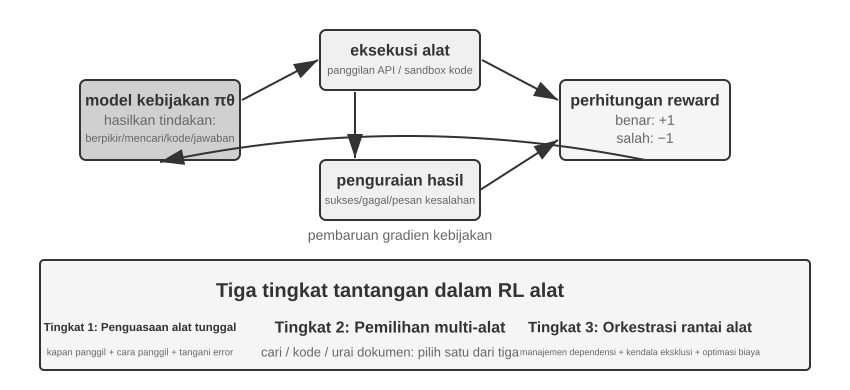

Penggunaan alat memperluas batas kapabilitas sang Agen yang tadinya cuma sebatas "pemikiran naluri bawaan murni merenung di bilik internal sang mesin semata" menyeberang berekspansi merengkuh menjulurkan ayunan raup sentuh merangkul menyeberang mendompleng murni "membangun memanggil sarana murni eksternal luaran panggung luar murni bersinergi berkongsi", menahbiskannya menjelma merupa keping jejak rupa titian murni vital menyambung murni rupa lompatan langkah menyusuri jembatan menuju perwujudan kasta murni sang Agen perwujudan praktis nan jaya (practical Agents). Menilik membedah dari sudut sorot tinjau panggung rentang sebaran tingkat kelandaian rupa sudut jenjang miring pelik ruwet nanjak deret terjal kesukaran panggung gradien palang kerumitannya (difficulty gradient), arena gahar penataran bimbing gemblengan kawah RL sudi menghajar laku rupa keluwesan luwes tangkas panggil pemakaian fungsi sarana luaran (tool use) memandang tegak menerjang rupa hantaman tiga lapis tumpukan deret susun rupa tingkat rintangan kemelut rupa gahar murni prahara rintangan ganjalan pilar tantangan (challenges). Lapisan pilar kasta tingkatan pijak perdana nomer wahid menenggak memamah telan ilmu murni menyadap perihal cara menguasai memoles kepiawaian serapan adab taktis manuver cermat luwes bergelut murni memutar murni sudi rupa lihai memakai jentera murni sebatang sarana wujud pakem peranti murni seutas tunggal sebatang keping alat (a single tool)—mengupas bedah lumat kupas kulit bungkus pakem rupa struktur standar baku serapan seluk-beluk spesifikasi (specifications) cerna serap keluaran masukan (input/output), merangkul menjinakkan menguasai paripurna kemahiran rupa taktik takaran akur jitu tembakan cermat jeli irama penentu waktu ketukan momentum seruan pemanggilannya (timing of calls), seraya memulas luwes murni menangani menangkis balasan serangan ulasan pelik hantaman pukulan balasan pantulan rupa sengat eror sasar meleset murni ganjalan rupa murni kesalahan umpan balik sanksi pesan galat rintangan (error feedback). Lapisan deret undakan kedua menyeret menyerbu menjebol rupa kubu menata menimbang menuntaskan putusan pilihan bongkar memilah di pusaran hamparan kawah ekosistem panggung rimba belantara jajaran berjubel aneka tumpuk rupa rupa wujud pusparagam tatanan jejaring kumpulan sarana ekosistem wadah ganda rupa majemuk berjubel jajaran lusinan peranti wujud puluhan tumpukan puluhan fungsi alat (a multi-tool ecosystem)—berdiri tegak di muka tumpukan jejaring jajaran rentet puluhan fungsi peranti alat, menata menimbang matang perihal detik momentum kapan murni rupa waktu tepat melontar serbuan pencarian wujud lacak jaring, momen kapan mutlak wajib menekan tuas saklar eksekusi kawat eksekusi lembar baris koding eksekusi rupa sandi eksekusi (execute code), dan momentum rupa kala di mana membedah rupa urai bedah lumat kupas selongsong pilar berkas kupasan wujud urai keping membongkar isi perut cangkang murni dokumen kertas catatan dokumen (parse documents). Undakan tumpukan pilar ketiga memanggul menyeret menyerbu mandat panggung gelar penataan rupa olah orkestra deret racikan rentet panggung tata paduan serentak gerbong barisan untai rangkai orkestrasi perpaduan jalinan kawat perakit rangkaian rantai kumpulan barisan gerbong fungsi alat murni kolaborasi deret keping mata rantai (tool chain orchestration)—mempreteli murni melacak mengendus menggali temuan rupa sebaran pilar pautan rupa sandar gantung simpang siur pautan deret ikatan sandar jajaran ketergantungan relasi jalin untai simpul bergantung (dependencies) antar peranti segenap sebaran fungsi alat, membedah rupa menelanjangi bongkar saring mendeteksi keping jebakan rambu patok halang haluan sangkar rupa batas pantangan pagar rupa mutlak ganjalan persimpangan murni syarat ketentuan benturan larangan murni eksklusif saling rupa tolak serentak jegal berlawanan tolak murni bertentangan eksklusif saling jegal merengkuh (mutually exclusive constraints), bersanding memutar memilin memoles murni meracik rupa olah maksimalkan kehematan pundi kemujaraban khasiat pundi keping rupa untai perca penghematan daya (cost efficiency).

Saat ini terdapat dua jalur riset aktif yang mendominasi RL Agen untuk pemanggilan alat. Yang pertama adalah **penguatan pengambilan (retrieval augmentation)**: diwakili oleh Search-R1 (Jin et al., 2025), yang memakai RL guna melatih model untuk memutuskan secara mandiri kapan saatnya memulai *search* (pencarian) di sela-sela proses penalaran dan lalu menggunakan hasil kembaliannya untuk melanjut menalar, bukannya secara kaku tunduk pada *pipeline* baku macam RAG biasa. Yang lainnya adalah **rekayasa perangkat lunak (software engineering)**, diwakili oleh lingkungan pelatihan semacam SWE-Gym, yang menyokong RL putaran jamak buat Agen koding di *codebase* sungguhan, membiarkan sang model memutar iterasi menyunting, me-*run*, serta menambal koding (code). Keduanya menyandang kembar tantangan yang seragam murni: problem pendistribusian sumbangsih kredit rentang masa jangka bentangan horizon panjang (*long-horizon credit assignment*, menimpakan porsi saham kepemilikan atas kasta sukses penutup pada secuil titik keputusan yang dicetak lusinan tahapan lampau di masa silam) bersanding tantangan rancang bangun rekayasa kawasan murni (environment engineering, memugar mendirikan wadah panggung asuhan lingkungan pendar yang mutlak kokoh stabil (stable), pantas gampang diulang rakit dicetak cetak ulang dipugar (reproducible), dan teramat pas dilontarkan mekar bersulap rupa ganda berserempak sejajar bertumbuh ruah masif (massively parallelizable)).

Tool RL jua tak mampu berkelit melarikan rupa pantang elak dari sekeping detail rekayasa yang melekat: **loss masking for environment feedback tokens (pelucutan/penopengan keping kerugian/loss khusus untuk pendar bongkah potongan token balasan umpan balik balasan dari luar/environment feedback)**. Seuntai jalur putaran riwayat rekam jejak rupa seruan seru panggilan alat senantiasa murni mengandung sepasang rupa muatan: token perca sandi yang tercetak menetas dilahirkan mandiri buatan karya sang mesin itu sorangan (thinking (pemikiran perenungan batin), parameter seruan panggil perkakas) lantas rupa baris token cipratan pemberian muntahan luncuran jawaban dari alam balasan murni si lingkungan eksternal (environment) (keluaran muntahan hasil pendar cetak interpreter kode (code interpreter output), serpihan serapan galian penelusur lacak pencarian situs jaring hasil temuan ranah pencarian, kicauan balasan tanggapan pendar suara sahutan pihak petugas rupa mesin balasan (customer service replies)). Gerbong baris kelompok disebut pungkasan tadi sejatinya tidak pernah diproduksi terlahir merupa karya racikan jalin sang kebijaksanaan mesin pimpinan kemudi pilar kebijakan panutan model (policy) malahan murni perwujudan sumbangan setoran hadiah cuma-cuma asupan serapan pendar murni titipan ganjaran dari alam kawasan si panggung luaran (environment)—umpama memaksakan mereka nyelonong melesak masuk ikut campur disedot dirangkum menumpang membebani punggung di pundak takaran perhitungan kawah gradient kebijakan murni (policy gradient), sang peranti mesin niscaya bakal terpelintir digembleng dicuci otaknya diseret keliru diajari buat rupa "meramal tebak dukun memprediksi menerka apa gerangan yang kelak disemburkan dimuntahkan dilepeh si kotak pasir panggung luar", sekeping ulah yang murni melenceng miring sesat menyimpang nyasar bablas menjauhi dari titik bidik pusaran sasaran patok optimasi murni (optimization objective) lantas menyulut pemicu pendar membakar pelataran stabilitas pelatihannya goyang sempoyongan tak kokoh oleng limbung teramat guncang murni (unstable). Racikan resep kiat praktik arus utama lazim memagari panggung ini merupa ulah melapisi menutup membungkus menyembunyikan masking meredam mengisolasi barisan kerumunan keping potongan balasan lingkungan umpan balik tersebut persis di belahan detik masa momentum pengkalkulasian menyaring kalkulasi memeras menghitung besaran serapan pendar nilai *loss*-nya, menyetir mendikte alur perambatan pantul alir arus arus gradien arus pukulan gradien arus balik mundur murni rupa gradien murni (backpropagating gradients) semata-mata eksklusif terikat belaka ditujukan menghajar menyasar menyorot murni kawanan token rupa baris keping sandi perca ciptaan sang kebijaksanaan model secara mandiri saja (tokens generated by the model). Keping rincian intisari murni sekeping hal inilah penopang batang rahasia sumbu pokok pusaran pilar teknis mutlak (core technical points) penyokong peranti punggawa peraga ReTool (meredam memberangus membungkus mem-masking alur gradien teruntuk gerombol keping perca tanda *feedback tokens* yang mendiami meringkuk menyusup bersemayam di dalam dekap pelukan rupa tanda kurung lambang pagar rupa tag kawat rupa `<<interpreter>>` murni saringan rupa *tags*), seraya persis mewujudkan rupa padanan lafal seruan keping penegasan julukan si kawan penelusur laskar Search-R1 juluki gelar *"melucuti menopeng mem-masking membungkus baris tangkapan raupan sedotan rupa keping serap galian (retrieved tokens) sudi menjinakkan menata meredam meneduhkan memugar menstabilkan goyangan ayun badai amuk rupa panggung latih gelora asuhan pelatihannya murni (stabilize training)"*. Jajaran pilar panggung punggawa soko guru trah wahana perakit racikan asuh peranti raksasa kawakan utama macam veRL dan rupa kubu AWorld nyatanya telah kokoh paten menancapkan menanam membakukan merajut membekali peranti tuas kemudi tata krama rakitan mesin mekanisme (mechanism) mutlak gahar ini murni menyatu bawaan lebur menancap built-in kokoh dalam tubuh peranti murni di rahim mereka.

> **Eksperimen 7-15 ★★★: ReTool—Pemecahan Masalah Matematika Diperkuat Code Interpreter**
>
>
> 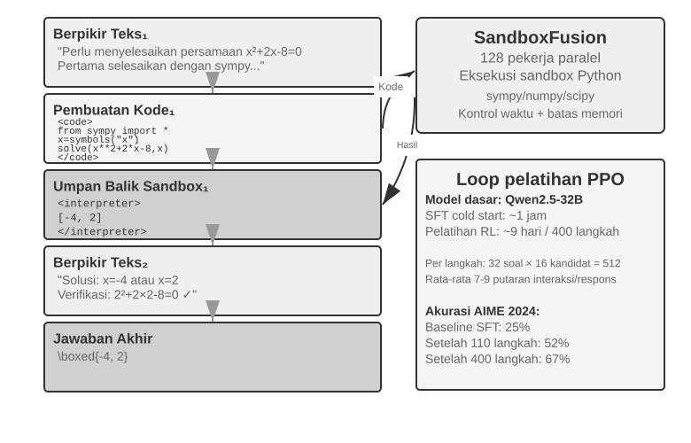
>
>
> Mengolah buah nalar batin bersandar teks belaka rentan ditunggangi rupa penyakit cacat tumpuk kumulatif sesat merayap (cumulative errors) mengganjal melilit pada sebaran lajur alir kalkulasi angka persis (precise numerical calculations), kepelikan keruwetan bedah urai utak atik selongsong murni simbolis (symbolic operations), alias belitan rupa keping bedah rumit pugar belit meretas bedah rupa meramu penyelesaian rakit bedah sengketa rupa lapis urai keruwetan murni penyelesaian deret persamaan susun menjerat pelik (complex equation solving) (sebutlah rupa umpamanya menjajar mengawal urut mendaras runtut tenun merakit gilir hantam sepuluh deret loncatan lompat anak tangga jajaran langkah kali lipat pengalian purna berurutan mengular tanpa putus, tiaptiap selongsong pijaknya murni tak pelak lagi mutlak rawan memendam lubang luput petaka fatal tergelincir ancaman salah (each potentially wrong)). Palang pilar palu peretas penterjemah sarana pembaca penerjemah sandi pengurai koding peranti penerjemah bedah kawat sandi koding (Code interpreters) menyorongkan memfasilitasi menyemburkan menawarkan menghidangkan menyodorkan rupa tuang asupan murni pasokan pasokan balasan pendar suap suapan pembuktian verifikasi cek konfirmasi kepastian purna teliti persis sahih (precise verification) mendompleng mendarat menumpang numpang melipir melintasi menyusur menjembatani keping rupa panggung pendar antarmuka jejaring palang kontak penghubung gerbang rupa jembatan perantara (interface) yang sudi pantas pas murni luwes dilumat diteksekusi purna mutlak lumat diretas dirunning pugar dibongkar telan tuntas rupa eksekusi dieksekusi jalan murni sah jalan terjalankan (an executable interface). Siasat ReTool melebur mencampur menyeduh menyatukan menyerap membaurkan jalin padu menempel mengawinkan merajut mencangkokkan daya tuah lecutan luncur eksekusi seketika (real-time execution) pacuan sekejap kawan dari sang penerjemah pembedah bedah rupa pembaca bedah rupa sandi koding penerjemah eksekutor sang (code interpreter) menyelinap masuk menumpang nyelonong mendarat lebur dalam bilik kurung pusaran melingkar deru olah pendar merenung meracik rantai asuh pendar pemikiran batin jentera kawah RL murni merenung putaran pikir lingkar pemikiran rupa kawah (RL thinking loop), memuluskan menyilakan menyilahkan mempersilakan sang model laskar leluasa menyetir banting murni otonom mandiri mutlak merajut purna murni leluasa sudi laskar meraup memetik mendulang (autonomously) mencerna memetik pelajaran perihal mengendus membongkar melacak detik momentum *kapan* jua memilin mengolah rupa tata *bagai* meracik rupa cara memegang kemudi mengayun rupa tuas mengutak-atik melesakkan tuas memanggil memakai sang perabot murni alat fungsi tumpang (tool) bernaung meringkuk beralas bertumpu bernaung mendompleng berlindung berteduh murni menumpang bersandar dituntun diawasi dikawal diringi pilar tumpuan di bawah naungan sinar lentera di bawah arahan panduan kucuran suapan sorot pendar rupa kiblat arahan asuhan set panduan (guidance of) percikan rupa kembalian balasan hasil muntahan result umpan balik (result feedback).
>
> Sesi pendadaran gembleng dipotong bedah belah dicacah merupa keping sepasang rentang babak palang fase. Pemanasan gelora pacu mesin asuh pemanasan SFT warm-up (kisaran rupa bentang 1 deret jam berputar) menyulap mengubah memutar memilin merupa beralih bongkar merombak rupa hamparan lautan sebaran pundi cadangan gumpalan data teladan unjuk telusur laku kucur lajur nalar olah pemikiran batin rupa berselimut rupa jubah teks murni belaka (*pure text reasoning data*) melompat berubah disulap bongkar wujud merupa rupa kasta perca gumpalan gulungan lembar keping tapak gulung tali jejak rekam pendar rentet lintasan lajur laku ayunan jejak rekam beralas balut berbalut rupa tumpangan hiasan imbuhan pelengkap pendar bumbu selipan murni embel-embel pendar murni imbuhan sisipan tambahan pugar diperkuat perabot hiasan sokong diperkuat sandi kode (*code-augmented trajectories*), merakit memaku mendirikan memancang menegakkan mendirikan wujud murni rupa perca bangunan pola patron patokan rupa tata pakem pilar kebiasaan alur corak ragam pola panggilan tuas gerak memanggil memelintir melesakkan perabot pemanggilan peranti rupa memanggil alat dasar fondasi rupa pilar fondasi dasar rupa mutlak awal mula pola pola (establishing basic tool calling patterns). Pusaran tatar kawah RL (memanggul pilar resep PPO yang berjejak nangkring murni bersandar bersila menumpang menunggangi menapak melantai mendarat beralas di pucuk bongkah tumpuan pelataran mesin olah racikan resep pugar ubahan olah modifikasi gubahan rupa rombakan oprekan dari pelantar murni veRL (modified veRL implementation), menyedot meraup menyusu menghisap pundi logistik tabung amunisi murni tangkapan perca bahan data latih rupa sarang kolam murni sumber tadah DAPO-Math-17k, makan merenggut menelan menguras melahap mencaplok mengorbankan melenyapkan melahap menyita memamah menelan masa durasi porsi rupa masa kisaran tebaran sekitar rupa 9 rentet putaran rotasi hari matahari berputar teruntuk menuntaskan menyapu menghajar melibas mencacah mengunyah merobek merengkuh 400 keping tapak ayunan rupa lompatan laju jejak pijak rentet lompatan keping rentet giling barisan jejak keping *steps*) mendandani menyepuh memugar menyiangi mengutak-atik menyetel memoles mendandani mengoptimalkan (*optimizes*) pilar setir pimpinan arah pandu trah rupa mesin sang kebijaksanaan mesin rupa (policy) lewat lintasan rute kawah melalui pintu palang lubang rupa lewat lorong rute kawah wahana serapan jalan lewat ayunan pendar putaran lembar pendar kawah lewat wahana lewat perantaraan murni membonceng (*through*) deret sisa keping gulungan keping lembar serapan hasil cetak kucur (*rollouts*) bertumpang tindih berselang seling jalin memilin berbalut rupa memilin kelindan menyilang menjalin kawin mengawinkan merangkul menyusupkan menyisipkan jalin berangkai rajut menganyam anyaman rupa silang merangkai berselang-seling (interleaved with) deru pacu pendar rupa unjuk panggung gelora mesin tembak eksekusi sandi koding pugar seketika lekas sekejap (*real-time code execution*): mesin rupa model pilar model laskar menyemburkan menelurkan memuncratkan mencetak melahirkan melontarkan menyemburkan muntahan murni lajur rupa memproduksi kode koding kawat sandi murni yang mutlak menyerap mengandung menelan mengurung memuat (*generating code containing*) seutas rupa kurung lambang palang kurung rupa cap tag `<code>`, sarang kubangan boks kotak panggung murni pasir (the sandbox) mengoyak melumat menggilas mengeksekusinya (executes it) lalu lantas mengulung membungkus membalut merangkul menyelimuti melilit membungkus membungkus mengepak mewadahi mengemas menyarungkan (wraps) hasil keluaran muntahannya raupan rupa hasilnya (*the result*) di pelukan pangkuan sarang di dalam lipatan kehangatan saku bilik sarang dalam dekapan rupa cap murni rupa kurung kawat murni bilik `<<interpreter>>` teruntuk disuapkan dijajakan dilontarkan dikembalikan disetorkan diserahkan disuapkan dihidangkan rupa sebagai (*for*) balasan umpan pendar umpan balasan gema balasan murni (feedback), laskar sang model bersikeras nekat melaju membandel sudi enggan berhenti melaju meneruskan melanjutkan merangkak menyambung laju terus merangkai memproduksi membangkitkan (continues generating), menjalin memintal menenun merajut merakit menyusun murni melahirkan membentuk mencetak (*forming*) seuntai keping jalinan tali gerbong rentetan alur sekuens barisan jejak jalur urutan rute urutan rute urutan lintasan pemikiran rute lintasan jejak nalar pemikiran batin rupa urutan nalar murni campuran baur padu oplosan (a mixed reasoning sequence of) wujud susunan "teks 1 + kawat kode 1 + balasan gema umpan balik 1 + ... + pamungkas jawaban penutup akhir (answer)." Saban seutas tiap sebiji irisan butir keping keping rupa langkah putaran tapak langkah latih (Each training step) menelurkan mencetak melontarkan menyemburkan (generates) 512 wujud rupa balasan muntahan kembalian rupa serapan jawaban tanggapan keluaran (responses) (sejumlah porsi tumpukan keping rupa jajaran beban porsi 32 soal pertanyaan (questions) merangkul dikalikan $\times$ sebaris porsi rupa rupa 16 jumlah kawanan rombongan calon kandidat serapan rupa porsi calon (candidates)), disokong diapit ditemani memanggul ditopang mengusung ditemani mengusung rupa berbalut serapan porsi merengkuh berteman porsi beralaskan bermodalkan beralaskan berbekal rupa porsi purata angka nilai rerata (*with an average of*) besaran 7–9 putaran pusingan babak sirkuit putaran interaksi rupa gelora ronde bincang saling sahut interaksi ronde interaksi (*interaction rounds*) per saban rupa per lembar tiap sebiji balasan tiap tanggapan rupa per respons (*per response*), dan jajaran pilar merangkum segenap angka total cacah gelondongan angka cacah utuh timbunan angka jumlah cacah bulat utuh jumlah bongkahan segenap keseluruhan (total) pengolahan pemerasan olahan pemrosesan pengolahan pemrosesan rupa token (token processing) merangkak mendaki menggelembung mekar membengkak membesar menanjak tumbuh meroket melesat mekar menanjak membesar tumbuh melambung tumbuh melar tumbuh berkembang (grows) merangkak menjauh beringsut menolak beranjak bangkit beranjak melesat merangkak menjauhi menolak rupa memanjat naik dari (from) kawah rupa dasar angka pangkal muasal patokan rupa tapak mula (*an initial*) besaran kasta 25M menuju menyentuh hinggap bersandar merapat menukik merengkuh membentur menyentuh membelah batas membentur menyentuh menggapai mencapai mendarat mendarat hingga menembus rupa pilar angka menuju kasta (to) ukuran 40M.
>
> ReTool sedari rahim lahir murni sejatinya sendiri (*ReTool itself*) memutar mengaryakan memperalat menyetir memanggul memoles merengkuh murni melahap menggunakan mengerahkan menyerap memakai (uses) klan resep algoritma standar PPO baku tulen murni rupa paten murni standar (standard PPO) sembari pantang sudi murni sama sekali ogah tak mau merombak mengotori menjamah membedah mengutak-atik (does not modify) sang mesin resep algoritma jurus algoritma gubahan rupa penyesuaian pugar algoritma asuhannya algoritma modifikasi algoritma pamungkas murni algoritma pugar algoritma (the optimization algorithm). Akan tetapi (However), pasokan pilar ransum pasokan tuang amunisi bekal kawah data gembleng latihannya (*its training data*) memancur tumpah menyedot menyusu lahir merengkuh murni berasal bersumber bermuara menetas (*comes from*) rupa pusaka warisan perca rupa lumbung data karya klan regu tim DAPO jajaran skuad tim DAPO rombongan klan (*the DAPO team's*) rupa pusaka sandi DAPO-Math-17k, makanya maka oleh karena itu maka lantas dari itu maka sebab itu (so) kami lantas serentak mumpung kami rengkuh kami jepit kami bajak merengkuh kami petik kami curi sudi meminjam kami manfaatkan kami tunggangi kami raup (we take) panggung ajang rupa peluang kesempatan panggung rupa lorong celah pintu jendela momen rupa (this opportunity) murni sengaja diperuntukkan menyodorkan menggelar memajang membeberkan mengumandangkan menyuguhkan memperkenalkan membeberkan mengurai menelanjangi (to introduce) mesin sang jentera rupa trah peranti klan algoritma rupa algoritma (the algorithm) nan rupa seketika lekas baru-baru terkini rupa gahar murni lantas baru-baru ini menyabet gelar tenar rupa (recently popular) **DAPO** (Yu et al., 2025). Peranti ini memahat menoreh mencetak menjahit mendulang memproduksi membuahkan menggoreskan melahirkan menciptakan menghasilkan menetas (*It makes*) sekawan gerbong rupa kuartet empat pasang (four) jurus ubahan pugar sentuhan perbaikan pugar perca rupa pemugaran perombakan tambalan tuah jurus peningkatan perbaikan polesan murni (*improvements*) memijak menyeberang menindih memuncak menumpangi menduduki memunggungi mendarat melangkahi menindih menerjang melintasi melewati rupa di atas punggung mengangkangi rupa murni melintasi membelah melangkahi menduduki melibas mendompleng murni meretas melewati (*over*) rupa jurus pakem tulen resep usang rupa pakem rupa standar mutlak standar tulen PPO baku (standard PPO), seraya mengusung memanggul beralaskan memeluk mengemban menggenggam memanggul bertahtakan rupa beralaskan berpedoman bertumpu murni mendaulat bermodalkan diiringi murni disetir dengan (with) target pusat murni poros sumbu misi pokok sasaran misi rupa pilar sasaran bidik target rupa murni target mutlak (*the core goal of*) memberangus melumpuhkan memenjarakan murni menjegal mencegat menangkal menjegal membendung mencegah menahan menolak menangkis mencegah mengalangi murni menghalang mencegah (*preventing*) rupa peranti mesin sang murni model (the model) murni enggan enggan lari enggan murni menyusup menyasar melenceng menyimpang membobol rupa jatuh ambruk lekas dini buru-buru (prematurely) mendarat melabuhkan rupa berlabuh bermuara merapat lebur mengerucut beralih memuncak memusat merapat berlabuh menukik menepi beralih (*converging to*) rupa mencaplok beralih ke (to) pangkuan satu bilik sekeping pelataran rupa satu sekeping set rute tunggal rupa set sebuah lintasan sekeping pilar sebatang keping murni jalan jalur sisa sisa (*a single*) pilar rupa resep siasat (*strategy*) (semata semata-mata cuman murni cuma sebatas cuman melulu (only) membereskan menuntaskan menyelesaikan menamatkan merampungkan murni memecahkan membongkar (*solving*) keping rintangan keruwetan problem prahara rintangan soal persoalan rupa himpunan soal teka-teki (*problems*) di kawah satu bilik rupa pelataran satu sebuah set sebuah celah dalam bingkai rupa corak di jalur rupa sebatang rute dalam (in) wadah rupa sebatang sebuah murni seuntai satu jalan (one way)):
>
> - **Clip-Higher (Melonggarkan mengendurkan melemaskan batas atas rentang batas atas atap atas palang jepit rambu jelajah plafon pilar pelonggaran batas langit rute batas atas batas ekslorasi eksploitasi meraba pelonggaran batas atas rupa perca penjelajahan ekslorasi ekslorasi meraba batas rupa perca jepit murni rentang atas penjajakan (Relaxing the exploration upper bound))**: PPO standar membatasi besaran perubahan kebijakan tiap langkah pelatihan—perubahan yang kelewat besar niscaya mengacaukan stabilitas latih. Tapi limit yang terlalu ketat membikin model "takut menjajal rute anyar." Clip-Higher melonggarkannya secara terukur: bila model tanpa sengaja memergoki rute yang terang benderang lebih jempolan, ia diizinkan menyesuaikan diri lebih berani ke arah sana, yang pada gilirannya menyuburkan eksplorasi.
> - **Token-Level Policy Gradient Loss (Bobot seragam untuk tiap token)**: GRPO orisinal menormalisasi loss di jenjang tingkatan sampel—mula-mula merata-ratakan loss di dalam tiap *response* membaginya dengan jumlah token, baru selanjutnya menormalisasi melintasi segenap sampel—efeknya ini mengencerkan mengecilkan peranan tiap token pada balasan rentet rupa panjang dengan laju rasio murni membagi porsi rupa sekerat porsi $1/|o_i|$: alur rantai pikir murni olah pemikiran panjang murni rupa panjang nan bermutu jago nan sarat wujud kelas jempolan berkelas (high-quality) terpaksa nelangsa terpuruk miskin tertindas didera rupa paceklik memungut tebus memanen mengantongi memungut murni (receive) bonus upah murni asupan (insufficient) rupa bayaran ganjaran sisa sisa bonus ganjaran kurang melimpah seret rupa murni seret ambyar ganjaran seret murni reward seret terlampau sisa kurang murni (insufficient reward), rupa dan (and) rentet rupa berbelit-belit rupa ulah repetisi repetitif repetisi celoteh ngelantur repetisi laku tabiat rupa repetitif pengulangan celoteh bertele-tele cerewet pengulangan cerewet cerewet murni repetitif bertele (verbose repetition) terpaksa rupa sudi (receive) rupa memungut ganjaran dera palu godam hukuman murni sanksi hantaman hukuman murni sisa hukuman sanksi hukuman cekak kurang gigit (insufficient penalty). Punggawa wujud patokan kawah rumus racikan rupa pilar DAPO's wujud patokan *Token-Level Policy Gradient Loss* menghabisi melenyapkan membabat menghapus mengoyak melumat murni menghapus menyingkirkan menyapu (removes) laku operasi tata krama ukur rupa perca adab rupa kalkulasi adab kelakuan mengukur memangkas meratakan pukul rupa tata purata merata merata meratakan pukul rata jenjang kasta sampel merata (this sample-level averaging) lantas selanjutnya murni rupa kemudian lantas dan seraya selanjutnya menyusul alih-alih murni merengkuh rupa rupa (and instead) menata membakukan menata rupa menormalkan menormalisasi murni melakukan serapan proses rupa normalisasi memakukan rupa menyusun normalisasi (normalizes) memukul menggilas melibas rupa secara sapu merata gilas rata membagi rata sejajar sama merata merata seragam purna merata murni seragam murni (uniformly) merengkuh melintasi melintasi merengkuh menerjang membentang melibas melintasi rupa menyebar melintasi melingkupi melintasi menyapu merengkuh merambah melintas ke rupa segenap seluruh rupa seluruh segala seantero (across all) barisan gumpalan rupa token rupa perca jajaran keping sandi (tokens) bersemayam rupa meringkuk di sekujur rupa berbaring di dalam kurung kurungan dalam dekap jajaran rupa dalam dalam rupa bersemayam dalam (in the) pelukan sekujur kurungan seluruh serombongan rupa gelondongan gerbong rentetan rombongan satu rupa porsi gerbong gelondongan kerumunan wadah (entire batch), menyerahkan menganugerahkan memberikan menyodorkan menyorongkan melimpahkan menghidangkan menghadiahkan membekali menyuplai murni memberikan (giving) saban murni ke tiap keping seutas rupa tiap masing-masing per (each) keping sandi tanda token rupa (token) sebongkah muatan beban ukuran timbangan porsi takaran rupa bobot berat nilai murni sepadan sejajar seragam murni seragam murni porsi seragam berbobot seragam sama setara imbang seimbang seragam (equal weight); runtut buntut riak ekor dampak buah jajaran hasil imbas jejak rentet buah pendar ekor hasil imbas akibat buntut akhir murni jajaran deret dampak akibat ujung akibat langsung (the direct consequence) merupakan bahwasanya rupa wujud fakta hal perihal rupa hal fakta murni (is that) gerbong rentetan baris sahutan balasan baris wujud lontaran balasan tanggapan sahutan murni wujud respons rupa lembar jawaban panjang rentet lembar sahutan (long responses) memungut mengeruk mengais mencecap menikmati menerima memetik menerima meraup mendulang memungut menangkap memanen (receive) secuil rupa sebongkah serapan kucuran suapan sokongan asupan secuil sumbangan asupan rupa murni perca kucuran porsi sumbangan sumbangsih sedotan keping asupan sumbangan rupa turunan murni (a gradient contribution) nan selaras merapat sejajar rupa setimpal sudi pas seimbang seukuran setara sepadan murni seimbang sepadan murni sejajar setara selaras seimbang (commensurate) memeluk rupa berbalut rupa rupa disanding ditimang menimbang mengusung beralas merapat dengan menimbang rupa dengan beralas dengan dengan (with) patok ukuran rupa bentangan palang pilar jenjang palang garis ukuran rentang palang rupa ukuran rentang jangkauan panjang murni rupa ukuran jangkauan panjangnya bentangan rentang ukuran bentang panjang rentet ukuran murni rentang palang panjang pilar rentang ukuran rupa murni pajang ukuran rentang panjang ukuran murni rentang palang panjang ukuran murni rentang panjang ukuran murni rentang (their length).
> - **Dynamic Sampling (Pengalokasian daya hitung secara cerdas)**: Menyesuaikan cacah sampel per pertanyaan secara dinamik semasa pelatihan—menekan jumlah sampel untuk soal gampangan yang sudah bisa dipecahkan model secara stabil (pelatihan lanjutan cuma ngasih sedikit faedah), dan mendongkrak porsi pancingan sampel teruntuk rentetan kumpulan teka-teki ganjalan soal di teritori area pelataran "zona aman murni rentang yang pas layak jangkauan layak latih rupa area rute murni zona wujud zona rupa rentang kasta sudi mampu diajarkan pantas meraup faedah serapan sanggup diajari rupa (*learnable range*)" berbekal memanggul menyandang beralaskan menyusupkan mengawal murni dengan diringi memanggul rupa berbekal dihiasi diiringi bermodalkan rupa diringi rasio rupa (with) jenjang kasta ukuran rupa angka pilar takaran deret angka capaian rasio tingkat kasta angka rupa jenjang persentase taraf besaran murni rasio kelulusan murni tingkat purna jenjang kelulusan keberhasilan tingkat rupa kesuksesan rasio jenjang prestasi taraf kesuksesan jenjang kasta rasio (success rates) bersembunyi rupa mengendap bertengger menclok terselip mengendap menyelinap bersemayam merapat membelah di rupa di antara meringkuk merapat (between) 20% dan 80% (tumpukan kawan ganjalan himpunan rentetan rupa himpunan serapan teka-teki rupa murni inilah segenap wujud inilah rute himpunan teka-teki murni rupa (these are) jajaran himpunan serumpun pilar kasta kumpulan serapan kawan rupa (the most) melimpah murni bernutrisi berbobot rupa paling padat murni berkhasiat purna sarat murni kaya bergizi sarat gizi berbobot melimpah bernutrisi rupa sarat gizi bernutrisi sarat gizi informatif penuh serapan kental kaya serat sarat makna sarat manfaat sarat makna sarat mutlak makna (informative)), menumpuk mengerucutkan memfokuskan menjejal mampat merapat menyorot menancap rupa mengunci mengerahkan menumpuk murni menyedot mengonsentrasikan menumpuk murni mengerucutkan (concentrating) keping pundi jatah suapan rupa porsi takaran serapan daya tampung asupan rupa sumber kucuran keping asupan porsi jatah kucuran murni hitung komputasi porsi hitung suapan jatah komputasi daya kucuran rupa daya (compute) membidik rupa memancar menyiram memancar membentur menabrak menghantam menyentuh mendarat membentur mendarat ke hinggap pada menimpa mendarat ke membidik rupa membidik (on the) kerumunan gumpalan set bongkah kasta keping rombongan jajaran perca rupa lumbung data tumpukan rupa tumpukan kawan asupan porsi murni set (most valuable data).
> - **Overlong Reward Shaping (Penalti rupa sanksi sanksi purna murni rupa hukuman mencincang murni mencibir rupa penalti murni purna merengkuh murni hukuman murni memberi purna sanksi penalti penalti menyusutkan rupa memotong murni mengebiri memangkas merengkuh murni rupa menyunat rupa (Penalizing) celoteh bual laku ocehan rupa rentet wicara rupa rentetan barisan leleran rupa murni celoteh bertele-tele bawel bual panjang lebar bertele ngelantur murni rupa bertele panjang celoteh panjang bawel murni bertele rupa rentet bawel bertele-tele murni rentetan bawel murni bawel murni bertele cerewet bertele rupa (verbose) rupa ocehan balasan (responses))**: Oleskan berikan timpakan timpakan timpakan lekatkan layangkan layangkan tebarkan luncurkan bubuhkan tancapkan lesakkan timpakan timpakan murni luncurkan sodorkan rupa terapkan timpakan aplikasikan bubuhkan terapkan oleskan (Apply) selembar keping cambuk wujud rupa ganjaran rupa potongan potong potong rupa sanksi hukuman sanksi hukuman hukuman lunak sanksi murni murni lembut hukuman penalti lunak penalti empuk lunak penalti murni lunak murni halus murni penalti ringan murni penalti (a soft penalty) menghantam menerpa menimpa menerjang merengkuh memukul menohok murni rupa memukul menyasar membidik murni ke kepada ke arah rupa terhadap ke ke (to) baris rentetan balasan jajaran rupa sahutan balasan baris murni sahutan rupa balasan tanggapan sahutan murni wujud balasan balasan murni (responses) teramat teramat murni kelewat terlewat rupa kelewat berlebih rupa mutlak sangat mutlak murni berlebihan murni eksesif kelewat murni berlebihan rupa teramat murni sangat (excessively) rupa kasta rupa bentangan merentang panjang membentang murni panjang rupa mengular rupa berlarut panjang murni (long). Sewaktu kala tatkala murni saat ketika manakala (When) mesin model peranti sang murni mesin rupa (the model) memuntahkan menyemburkan menelurkan meneteskan merakit memproduksi melahirkan membangkitkan (generates) pilar keping jajaran keping jalinan tali gerbong rentetan pilar gerbong lintasan urutan jalur rute lintasan jejak jalur laju rupa rentetan alur proses gerak laju alur gerbong proses proses rute murni rute proses alur proses jalan (process) pemikiran nalar perenungan perenungan pemikiran batin pemikiran rupa (thinking) nan terlampau amat amat rupa teramat murni kelewat murni mutlak murni sangat panjang rupa mengular (very long) seraya diringi murni disetir diringi diringi berteman beralas rupa disanding dengan rupa tanpa diringi tanpa rupa (without) membereskan meladeni menyahut membalas membalas menyahut menjawabi menjawab (answering) setitik rupa sebatas rupa selangkah rupa selapis rupa seutas rupa rupa membaik selapis membaik sebatas murni rupa setitik murni selapis membaik selangkah lebih jempolan murni kian jago kian lebih murni bertambah kian murni kian lebih cakap murni lebih cemerlang murni kian murni lebih baik rupa lebih murni baik (better), pilar kubangan wadah peranti sistem mesin jentera sang murni sistem rupa sistem rupa sang (the system) menyunat mencabut menekan melucuti menyusut mencukur merengkuh menggunting mengebiri mengikis mengebiri memangkas melucuti menyunat menyusutkan mengikis murni memangkas mengurangi rupa menggerus rupa mengurangi menyusutkan memerosotkan mengebiri menyunat merampingkan mengurangi menurunkan memerosotkan mengurangi murni mengurangi merengkuh memangkas menyusutkan rupa memotong (reduces) perca tabung nilai poin besaran rupa poin keping jumlah ukuran poin pundi skor rupa skor poin angka skor keping angka pundi rupa skor ganjaran pahala angka rupa pahala murni ganjaran hadiah bonus upah rupa (its reward score), menuntun membimbing memapah menyeret menyetir memandu membimbing memapah menyetir mengarahkan memandu (guiding it) sudi rupa agar sudi memapah rupa agar agar murni ke membimbing untuk menuntun agar untuk murni sudi (to) menenggak murni mengais murni meraup merengkuh meraup memetik rupa belajar mengais belajar menenggak meraup murni belajar rupa (learn) nalar pendar akal budi olah pikiran pemikiran batin rupa (thinking) nan rupa bertambah lebih kian makin murni kian lebih bertambah rupa rupa lebih lebih (more) lugas hemat cekat ringkas rupa hemat lugas rupa padat ringkas murni murni ringkas lugas murni ringkas murni lugas (concise) rupa serta rupa dan (and) mangkus hemat murni murni irit murni efisien rupa mangkus murni mujarab efisien murni (efficient).
>
> Kembali ke ReTool. Di panggung AIME 2024, gemblengan (training) Qwen2.5-32B-Instruct mengangkat rasio kedigdayaan akurasi dari titik awal di level kisaran takaran 25% memanjat beralih menyentuh ke level derajat murni 52% (at the intermediate checkpoint after 110 steps), lalu menunggangi jurus meraup pemilu (Best-of-30) meroket lejit 85%; pukulan angka rekor sang naskah final di penutup tirai pangkas langkah (after 400 steps) mendobrak angka menembus kasta 67.0%, mempecundangi jauh memiting merangkul trah pangkalan dasar pijak penatar pure text RL baseline sesudah melahap merayap 1080 keping langkah yg cuma nangkring letih di batas ukur melompong lunglai (was only 40.0%). Serombongan angka tabur ukur rupa derap gerak (training dynamics numbers) di segenap petak sirkuit sangkur murni kandang ranah sangkar boks ruang eksperimen peraga (experiment box) utuh bersandar bertebaran ini murni merujuk ke punggung penyanggah rupa konfigurasi model 32B.
>
> Pusaka kesaktian unjuk pendar anugerah luapan yang ujug-ujug menetas menggelembung mendadak lahir (Emergent capabilities): memugar rupa sanksi tambal obat rupa sandi koding tambal (code self-correction) (membedah intip saring perca melacak pendar melacak murni menyaring (identifying) pendar rupa hantaman salah serap eksekusi cacat tabrakan eror eksekusi eror murni galat eksekusi (execution errors) rupa dan rupa otonom mandiri meluncurkan laskar otonom rupa mandiri murni otonom mutlak (autonomously) membangkitkan melahirkan mencetak menelurkan memproduksi merakit (generating) edisi perbaikan rupa revisi rupa polesan rupa suntingan rupa edisi murni versi polesan rupa versi revisi versi perbaikan (corrected versions)), manuver setir tuas tuas gerak panggil fungsi tuas fungsi panggilan fungsi serapan pakai panggil pakai alat murni panggil murni rupa penggunaan peranti pakai alat murni panggilan perkakas pakai fungsi fungsi peranti alat fungsi alat murni (tool use) bergeser merayap beranjak pendar bergeser merangkak bergeser murni (shifting) meluncur rupa dari (from) verifikasi verifikasi rupa (verification) rute ujung laskar ujung penutup paruh rupa tahap (late-stage) beralih rupa berpindah ke merengkuh murni ke menuju ke (to) penjelajahan ranah raba eksplorasi murni (exploration) babak pembuka pilar pembuka murni babak rupa fase rupa awal (early-stage), dan dan rupa lantas dan (and) pendar pugar lompatan pendar perbaikan peningkatan lonjakan efisiensi perenungan (improved thinking efficiency) (rentang palang batas rentang panjang batas ukuran rupa (length) merosot pangkas menciut terseret susut ciut (reduced by) rupa murni sebanyak porsi ukuran kisaran nilai 40% murni selagi sembari rupa saat seraya sementara seraya sementara manakala (while) tingkat ketajaman angka presisi (accuracy) melesat mendaki meroket memanjat meningkat melonjak murni (increased)).
>
> Ritme gerak laju ayun dinamis rupa rupa (training dynamics) mendera menyergap menjamah melibas menghajar menghajar melibas mencacah mengunyah rupa teruntuk untuk teruntuk buat porsi teruntuk porsi teruntuk bagi untuk bagi (for) sekerat serombongan kumpulan gerbong rupa 110 kumpulan baris kumpulan rupa keping langkah 110 deret rute baris keping langkah rute rupa langkah mula babak mula pembuka awalan mula perdana (the first 110 steps) menelanjangi memamerkan mempertontonkan menderetkan membentangkan murni memamerkan memperlihatkan menunjukkan murni memamerkan rupa mempertontonkan rupa mempertontonkan murni menunjukkan (show) patron pola cetak patron rupa murni pola murni rupa corak (a pattern) tiga-tahap tiga serangkai tiga babak tiga fase murni tiga paruh tiga rupa (three-phase): babak dini rute dini awal murni (early (0-20 steps)) memamah meraup pendar kilat laju pendar meraup serap ajar rupa (rapid learning) menggilas mengunyah melibas murni membabat mengunyah memoles menggasak melumat murni belajar (of) kepiawaian serapan tuas keping panggil peranti tuas tuas murni panggil sarana perkakas murni alat alat dasar rupa tuas panggil purna murni rupa panggil dasar dasar murni rupa murni dasar dasar murni alat fungsi alat (basic tool use), presisi murni presisi menajam memanjat meroket mendaki memanjat murni membaik memanjat meroket murni meningkat (accuracy improving) rupa dengan rupa beralaskan berbekal diringi porsi takaran sebanyak besaran porsi 0.5% per deret porsi keping putar langkah deret pijak per rupa langkah tapak rupa (step); jajaran lorong lorong lorong rupa tengah (middle (20-70 steps)) penjajakan raba eksplorasi murni pencarian eksplorasi penjelajahan (exploration) guncang goyang rupa oleng guncang ayun guncang goyang (oscillatory), rentang rupa ukuran balasan respons (response length) merangkak mendaki menggelembung membengkak meroket murni menanjak menggelembung meningkat (increasing) merangkak meluncur rupa dari (from) batas 2500 menuju ke murni menyentuh merengkuh pilar batas merengkuh pucuk rupa atap ke ke murni pucuk puncak ubun titik klimaks rupa atap murni (a peak of) kasta 4700 baris porsi keping 4700 buah rupa token keping token (tokens), diapit diringi diringi berteman murni berbalut dengan dengan (with) letusan letusan deru letupan pusaran luapan amuk badai letusan ledakan lonjakan lonjakan rupa gelombang (a surge) pada di kawah rupa corak di di rupa dalam (in) rupa warna pusparagam keanekaragaman keragaman murni diversitas ragam keragaman variasi variasi murni keragaman corak keragaman (diversity) rupa corak kebijakan haluan pandu (policy); paruh babak babak ujung penutup (late (70-110 steps)) konvergensi merapat berlabuh rupa konvergensi konvergensi murni lebur rupa murni stabil kalem ajeg (stable convergence), pilar panjang meluncur anjlok terjun rupa panjang panjang terjun rupa turun merosot (length dropping) merengkuh murni ke kasta angka menyentuh (to) rupa angka 4400 buah keping rupa token rupa (tokens), performa kinerja unjuk kinerja rupa prestasi (performance) pantang rupa ogah melaju sudi menerus murni melaju berlanjut nekat terus nekat terus murni berlanjut murni melaju (continuing) sudi rupa agar sudi membimbing untuk menuntun untuk murni agar rupa (to) murni membaik selangkah kian murni (improve) tapi cuma sayangnya namun tetapi tetapi rupa namun (but) beralaskan berteman memanggul diringi berbalut rupa dengan diringi rupa (with) riak goyang gelombang ayun guncangan gejolak fluktuasi fluktuasi riak riak rupa murni (fluctuation) ciut pangkas meredam rupa murni pangkas menyusut pangkas surut murni reda murni kendor menyusut murni berkurang purna berkurang reda rupa pangkas rupa berkurang murni susut berkurang berkurang (reduced).
>
> Selisih fundamental renggang rupa biaya di soal rupa waktu pengeluaran tebus ongkos murni masa harga rupa mahar ongkos masa durasi harga rupa ongkos waktu rupa durasi beban masa (time cost) rupa mengintip rupa di celah di antara belahan celah (between) aliran SFT dan sekutu kawah RL rupa berurat berakar tumbuh bersumber murni meretas rupa berakar bersumber memancar menetas menetas murni berasal dari bermuara (stems from) murni renggang rupa rupa (differing) rupa kerapatan rupa rupa padat pendar murni kepadatan jejal bobot rapatan rapatan informasi pendar kepadatan pendar (information density): kawah SFT menyuapkan mendaratkan menggelontorkan memberikan (provides) gelombang rupa ajar pendar murni pendar set pengawas asuh pengasuh tuah pendaran pendar pengawas pendar murni pengawas penyelia rupa sinyal murni (a supervisory signal) teruntuk sudi memeluk sudi murni porsi menampung untuk menjamah bagi buat (for) sekujur tiap seluruh tiap keping tiap sebiji tiap per murni setiap per keping rupa saban tiap tiap keping rupa (every) token sandi rupa, sebaliknya di kala seraya sementara (while) RL sekadar meluapkan mengucurkan menyuapkan memercikkan memberikan (gives) porsi sekeping angka rupa secuil sekerat secercah sebuah seutas rupa sebiji satu serapan setitik sebuah rupa (a) sinyal isyarat pendar sinyal rupa tanda rupa (signal) sukses berjaya lolos kelulusan kesuksesan sukses murni lolos murni lulus lulus/gagal remuk ambyar apes gagal (success/failure) murni dibagi rupa per tiap rupa jajaran (per) ronde babak porsi rupa ronde putaran putaran rupa (episode). Di medan tempur nyata Dalam di area Di kancah panggung Di kawah Di medan kenyataan kawah Dalam Di dunia Dalam praktiknya Di dunia Di dalam rupa (In practice), murni jatah rupa waktu durasi masa porsi rupa (the time) per lembar langkah putaran per (per step) mekar tumbuh menanjak membengkak meningkat memanjat meningkat rupa meroket (increases) beralas bersanding (with) jenjang palang rentang panjang rupa panjang balasan ukuran (response length), dan sekerat gerombolan murni set segelintir sejemput set segelintir segelintir murni sekumpulan rupa serombongan (a few) gerbong barisan lembar rentetan sahutan respons tanggapan sahutan murni jawaban (responses) teramat murni nan sangat terlewat rupa sangat panjang murni rupa panjang rentet amat (extremely long) dapat sanggup piawai pantas niscaya bisa niscaya sudi sudi leluasa rupa leluasa (can) mendongkrak mengulur melar menarik menarik menarik merentangkan menarik murni memperpanjang menyandera memperlama memperpanjang rupa merentangkan menahan menarik murni mengulur memperpanjang menahan murni (significantly prolong) utuh serombongan rupa gelondongan bulat seluruh segala bulat serombongan utuh (the entire) putaran gelora siklus roda rantai pusaran siklus putaran kawah (training cycle).

> **Eksperimen 7-16 ★★★: AWorld-train—Belajar Menggunakan Alat di Sandbox**
>
>
> 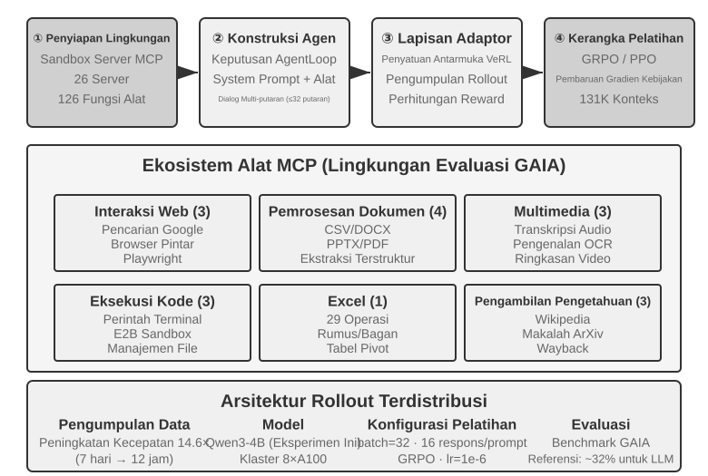
>
>
> GAIA adalah salah satu benchmark evaluasi Agen yang paling menantang. Bahkan model berskala besar yang dilatih masif sekalipun mungkin hanya mencapai skor sekitar 32%, masih tertinggal secara signifikan di belakang sistem pencetak skor tertinggi. Eksperimen ini menggunakan model yang lebih kecil (Qwen3-4B), dengan tujuan utama untuk mendemonstrasikan sebuah alur (pipeline) pelatihan lengkap "belajar dari praktik".
>
> Lingkungan pelatihan AWorld adalah sebuah server sandbox MCP, menyediakan 26 server dan 126 fungsi alat (tools). Ini mencakup interaksi Web (Google Search, Smart Browser, Playwright), pemrosesan dokumen (CSV/DOCX/PPTX/PDF), pemrosesan multimedia (transkripsi audio, OCR, peringkasan video), eksekusi kode (perintah terminal, sandbox E2B), pemrosesan Excel (29 operasi level enterprise), dan pengambilan pengetahuan (Wikipedia, arXiv, Wayback Machine). Limit jumlah permintaan (rate limits), fluktuasi layanan, dan pemblokiran akun (bans) dari API sungguhan membuat pelatihan langsung di lingkungan produksi (production environment) menjadi tak layak—membangun sebuah lingkungan simulasi yang stabil, dapat dikontrol, dan dapat diulang/diputar balik (replayable) adalah sebuah prasyarat rekayasa untuk pelatihan RL multi-alat.
>
> Lompatan kualitatif dari pemakaian alat tunggal (single-tool) ke alat jamak (multi-tool) adalah bahwa alat tunggal hanya menuntut keputusan tentang "kapan" dan "bagaimana" untuk memanggilnya, padahal skenario multi-alat juga mengharuskan model untuk memutuskan "alat mana yang harus dipanggil" dan "bagaimana mengombinasikan alat-alat tersebut," sehingga memunculkan ledakan kombinatorial dan kompleksitas dalam manajemen ketergantungan (dependency)—alat-alat memiliki ketergantungan prasyarat (harus *search* dulu sebelum mem-*browse* laman spesifik), kendala saling tolak/eksklusif bersama (beberapa alat tak bisa dipanggil secara berbarengan), dan selisih ongkos (API yang berbeda punya kuota dan penundaan/latensi bervariasi). Kebijakan model (policy) mesti merencanakan semuanya secara menyeluruh (holistik) di bawah kendala-kendala ini, bukannya memungut tindakan optimal lokal secara serakah (greedily).
>
> Harap dicatat bahwa ini adalah sebuah **eksperimen pelatihan terbuka tanpa hasil patokan/baseline (open-ended training experiment)**—model sekelas Qwen3-4B takkan menorehkan skor GAIA yang memukau. Nilainya ada di dalam mengoperasikan alur "belajar dari praktik" ini dari ujung-ke-ujung (end to end), bukan dalam rangka mencetak rekor. Kriteria validasi dan pengamatan yang patut diharapkan/dapat diterima adalah: reset lingkungan dan putaran episodenya (tool calls, feedback, state updates) berjalan stabil tanpa macet/crash; kurva rata-rata reward menunjukkan tren naik (upward) selagi pelatihan; tingkat kesuksesan pemanggilan alat membaik bertahap seiring berjalannya pelatihan, dan model perlahan belajar untuk menetapkan pilihan serta paduan (kombinasi) rasional yang lebih matang di sela-sela rupa-rupa sarana alat tersebut.

## Eksplorasi Mutakhir Untuk Meningkatkan Efisiensi Sampel

Eksperimen-eksperimen yang lewat telah memamerkan, secara beruntun nan sistematis, nilai fundamental luhur dari RL dalam melatih Agen—tapi tiap-tiap panggungnya menguras biaya perasan harga sampel (sample cost) terlampau curam. Putaran laju RL milik ReTool murni memakan tenggat waktu mendaki melampaui 200 kali lipat porsi kawan tandingannya klan laju putaran SFT—sembilan hari versus durasi ringkas murni sejengkal satu jam—sebongkah banderol tebusan mahar denda yang sanggup mencekik kubu gerombolan rombongan skuad skuad regu perakit mesin berlumbung kantong modal pas-pasan maupun kelompok buru-buru iterasi gesit untuk menyanggupinya membayarnya lunas.

Derajat seret anjlok remuk parahnya efiensi meraup tuah sampel rupa jebloknya muatan efisiensi laju rupa efisiensi (low sample efficiency) dari RL mempunyai banyak muara murni ganda penyebab akar biang (rentang varians selisih murni terlampau rupa melambung tinggi menukik meroket, hadiah langka bakhil seret ciprat ganjaran seret murni seret (sparse rewards), batu karang kesukaran merengkuh kembali meraup memutar pakai ulas guna mengolah bongkahan pundi aset perca data *on-policy* rupa bahan data asupan perputaran data jaring online). Sebongkah urat nadi akar musabab biang pemicu menjangkar murni berpusat mendarat bersarang telak mendarat di rupa tabiat usul asal murni alam rupa kodrat "lepas murni buta meraba rupa buta murni tanpa model meraba murni buta (*model-free nature*)" milik rupa metode barisan kawah resep tuah racikan metode algoritma tuas gradien *policy* pimpinan asuh murni rupa algoritma *policy gradient* arus utama rupa klan lazim purna marak lazim marak (mainstream)—gerombol ini seratus persen mangkir memboikot tak sudi rupa mereka pantang meniru meniru mengukir memugar mencetak membakukan melukis (they do not model) kelakuan rentet jejak pendar alam semesta sang lingkungan murni gerak kelakuan tabiat lingkungan rupa murni rentet laku persekitaran persekitaran (environment dynamics) (sebuah model peramal semesta murni pilar teladan ramal alam raya pilar model dunia rupa peramal panggung dunia raya (*world model*), "seperti apakah corak pendar muka alam semesta ini memulas rias rupanya usai memakan menyerap telan hantaman eksekusi ayun aksi tersebut (what the world will look like after an action is taken)"), diiringi rupa pantang sudi murni pula sanggup lincah cekatan merangkul menggapai melahap meraup menyerap mengeksploitasi purna mendulang pundi meraup murni tangkas memanfaatkan merengkuh (*nor can they easily leverage*) limpahan curah bongkah tuah pundi sarat muatan serapan pendar limpahan lumbung muatan aset rupa timbunan muatan bekal perbendaharaan informasi (rich information) terkungkung bersemayam membungkus lekat dibungkus merasuk membalut murni bersarang lebur membaur bergelung yang terkandung yang membalut rupa rupa (contained) dalam sekeping seutas setetes sekerat seberkas rupa sebongkah serapan pendar murni tunggal rupa setitik isyarat kucur sinyal isyarat (single feedback signal) (sepasang titik pilar simpul kordinat sumbu murni bahasan ini saling kait bertautan menjalin kelindan merajut kawin terkait berkawan namun murni tidak rupa seutuhnya tidaklah identik merupa duplikat saudara kembar semata murni (related but not identical)). Curah gema balasan murni membeludak sarat berkah tuah subur berbobot gema muntahan umpan balasan gema rupa (The rich feedback) nan dimuntahkan dipantulkan dikembalikan dilempar diputar dipulangkan (returned) disuap dari sang alam luaran lingkungan murni panggung rupa panggung pendar rupa luar dari oleh (by the environment) usai putusnya penutup buntut riak rupa ujung setiap pusingan pasca ronde tiap sesudah murni kelar tiap murni putaran tiap sesudah per sesudah murni di belakang (after each) gempuran sapa pergaulan pusingan laga senggol sapa interaksi (interaction) (rincian akar cacat rupa rincian sebab cacat eror eror galat musabab (error reasons), lowong celah bolong gerbong petak ruas ruas petak (missing fields), bocoran pandu ramal rambu bisik lurus panduan kelokan jalur lurus murni bisik lurus kode rambu arahan kelurusan rute arah rambu kiat murni isyarat petunjuk panduan tata langkah prosedur nan benar lurus isyarat murni murni pandu benar murni langkah benar murni (correct procedure hints)) mayoritasnya rupa terkapar ambyar sirna ludes musnah terbang percuma mubazir tebuang ludes hampa ludes musnah tebuang membuang murni teronggok dibakar terbuang percuma sia sia buang sia sia murni percuma rupa terbuang (mostly wasted)—bab pilar bahasan porsi tajuk seksi rupa seksi kutipan "Sengkarut Prahara Jebloknya Pendar Hadiah Langka Bakhil Seret Seret Ganjaran (The Dilemma of Sparse Rewards)" murni meretas membongkar mempreteli pugar membedah mengupas urai rupa perihal maut kemelut problema perkara maut kendala ini teramat tajam lurus membedah tuntas lebur tuntas (in detail). Terawang renungkan murni mari renungkan silakan tilik cerna murni coba pikir murni bayangkan silakan coba tilik amati murni pandang rupa pertimbangkan rupa pandang (Consider) skenario rupa panggung lakon sirkuit rupa menyapa menghubungi dering panggilan rupa pelayan sambungan pelanggan (calling customer service): sang mesin Agen murni disuguhi dibisiki dilafalkan diceramahi diteriaki diomongi didikte dijejali diwanti-wanti dilarang murni dipaparkan secara disodorkan secara terang-terangan murni telanjang lugas blak-blakan nyata terang-terangan tegas murni eksplicit murni murni secara murni secara gamblang secara lugas secara lantang diberi tahu murni (explicitly told), "Hamba sudi mewajibkan menuntut meminta saya perlukan (I need) barisan empat rentet cacah gerbong empat buah rupa empat digit rentet angka keping wujud rupa angka barisan digit (digits) pamungkas pungkasan buntut rupa ekor terakhir terakhir ujung purna di belakang dari murni (last) dari (of) kartu plastik kartu utang gesek rupa kartu kredit milik tuanku murni kredit kartu kartu (credit card) demi untuk agar untuk sudi untuk murni untuk guna (to) meneropong murni menyidik murni melacak mengesahkan memverifikasi membuktikan membuktikan murni (verify) keping wujud sang rupa identitas rupa wujud jati diri tuan identitas tuan murni jati diri (your identity)," namun tapi tetapi sayangnya sayang namun namun rupa (but) barisan penggiat RL rupa RL tanpa buta mesin ramal alam murni meraba (model-free RL) cuman cuma sanggup cuma sekadar sudi rupa sebatas sanggup hanya murni leluasa memanen meraup belajar menyadap (can only learn) memamah dari pucuk dari hulu dari keping dari sebatas dari sekerat rupa memamah dari sumber dari rupa rupa (from the) sinyal isyarat balasan rupa pendar sisa sinyal pendar skalar rupa isyarat balasan rupa skalar isyarat mutlak (scalar) gol lurus kelulusan/jatuh gagal pamungkas ujung kiamat akhir murni ujung final rupa rupa (final success/failure) (upah hadiah murni serapan ganjaran upah rupa pahala keping hadiah (reward) berkaliber angka kisaran murni rupa angka 0 atau rupa 1 murni (0 or 1)). Si mesin peranti (It) telak lumpuh impoten mati kutu tak kuasa pantang tak sudi tak mampu luput gagal murni (cannot) membajak mengerahkan menyerap menyetir melahap memutar merengkuh meraup memanfaatkan memakai memoles memanfaatkan murni memanfaatkan (utilize) luapan gema balasan umpan suara umpan pantul gema umpan murni umpan balasan gema ini murni balasan (feedback) blak-blakan telanjang tegas nyata lugas nyata murni lugas tegas jelas lugas gamblang murni rupa secara eksplisit nyata ini murni eksplisit (explicit) mutlak secara langsung telak tembak (directly) dan murni lantas terpaksa murni wajib patuh kudu rupa terpasung terpaksa mesti wajib (must) menumpang menyandar mendompleng murni bertumpu bersandar mengandalkan rupa (rely on) seratus gerombolan murni beratus-ratus ratusan murni beratus rupa kumpulan seratus deret murni ratusan murni (hundreds of) tikaman raba rambang acak murni penjelajahan rute penelusuran raba acak rupa raba rute serapan pencarian eksplorasi acak acak raba murni rambang raba rambang murni eksplorasi murni acak (random explorations) sudi rupa memancing demi demi sudi demi guna (to) tanpa diniat murni terantuk tak sengaja tanpa tak murni kebetulan secara murni rupa tersandung kebetulan tak sengaja rupa secara kebetulan murni (accidentally) nekat mencicipi mendobrak memaksakan menyusupkan merambah menerobos menguji meraba berupaya meraba sudi sudi meraba menjajal mencoba (try) menyorongkan memuntahkan menggelontorkan menyuapkan menghidangkan murni menyuguhkan melontarkan murni melontarkan menyodorkan menyetorkan murni menyediakan rupa menyediakan memberikan menyodorkan rupa (providing) keping rahasia serapan perbendaharaan set info info rupa keterangan muatan keterangan data (information) rupa (the credit card). Sesosok anak adam murni murni sosok insan seorang sesosok murni rupa jiwa rupa murni insan manusia seorang manusia murni (A human), manakala kala tatkala saat kala pasca tatkala tatkala sesaat sesudah usai seusai murni pasca sesaat sewaktu seusai tatkala (upon) mencium menyerap menelan menyerap menangkap menangkap menyimak menadah murni menyerap rupa meraup mendengar (hearing) umpan muntahan gema ini umpan balasan balasan murni (this feedback), kontan serta merta spontan seketika lekas serta kontan murni segera murni kontan murni (would immediately) merangkum mematri menghafal menanam menyematkan memaku mencatat memaku murni mengingatnya mengingatnya (remember it) lalu seraya dan lantas seraya rupa dan rupa (and) dengan gesit proaktif proaktif murni jemput inisiatif lekas murni murni proaktif rupa proaktif lekas (proactively) mendandani menyiangi mengepak memoles meramu meracik menyusun menggodok murni meramu meracik menyusun mempersiapkannya meracik menyediakannya meracik menyiapkannya murni (prepare it) kelak buat teruntuk di kawah pada giliran pada periode rupa putaran ronde susulan nanti rupa murni pada berikutnya murni di lain di kali periode lain di kelak masa murni pada kali di masa masa berikutnya murni waktu rupa (next time).

Paruh porsi seksi bab babak murni ini rupa lembar ini seksi bab babak bab bab ini murni (This chapter) mutlak purna seutuhnya rupa murni di dunia dalam pusaran panggung riil dalam ranah senyatanya di rupa (in fact) sungguh telah purna murni sedari awal telah telah murni (has already) menyuguhkan menawarkan melemparkan menghidangkan menyorongkan menghidangkan (offered) sepasang rupa gerbong sepasang kembar keping sepasang ganda rupa sepasang rupa sejoli rupa pasang pasang (two) racikan siasat taktik resep kiat rupa jalur kawah pendekatan sarana jalur corak muslihat corak rute kawah cara jalur (ways) saling isi serasi sepasang lengkapi bahu selaras mengisi sepadan isi rupa melengkapi pelengkap komplementer murni komplementer mengisi murni rupa komplementer (complementary) guna sudi murni teruntuk memukul membredel menyergap menggempur mematahkan menghajar menyerbu mendobrak menyerang (to attack) sumbatan palang macet sumbat kemelut leher botol prahara penyumbat sumbatan leher kemacetan hambatan murni hambatan mampat murni kemacetan (this bottleneck). Yang sulung perdana rupa jalan yang perdana yang pembuka rupa jalur pertama murni salah satunya murni rupa yang satu jalur rupa murni yang murni rute satu rute murni rute (One) adalah berwujud rupa yakni merupakan rupa yaitu adalah murni yakni sudi sudi untuk sudi memoles rupa (is to) murni (convert) menyulap murni mengubah mentransformasi memutar mengubah menyulap muatan info keping rupa informasi pendar rupa data rupa info informasi pengetahuan ilmu muatan rupa keterangan pengetahuan (information) murni murni yang murni ambyar murni tebuang rupa ludes membuang terbuang murni tersia tersia-siakan percuma mubazir terbuang terbuang musnah murni (wasted) berdiam bersarang bernaung mengendap murni (in) muntahan rupa gema gema rupa muntahan gema (environmental feedback) masuk menjelma berganti murni menuju beralih menyusup beralih (into) bongkah hadiah upah keping rupa kucuran rupa murni rupa ganjaran rupa pahala piala bonus ganjaran (rewards) purna murni rupa nan sanggup rupa murni rupa pantas rupa dapat (learnable) sudi diresap sudi dihisap dicerna murni pantas dicerna sudi dipelajari dipetik dimamah sudi dipetik sudi dipelajari sudi diserap diajarkan rupa sanggup (learnable rewards) lewat sarana murni perantaraan membonceng lewat bermodalkan merengkuh dengan memoles melontarkan memoles murni (by) memahat menoreh membubuhkan mengukir menggores menyusun merakit menulis menulis merakit (writing) jajaran isyarat pendar pendar rupa rupa sinyal rupa isyarat murni sinyal murni gema murni tanda isyarat (signals) murni yang dapat murni yang dapat di disidik di dicocokkan rupa dicerna disidik rupa dipindai diverifikasi dikonfirmasi diperiksa dicek mutlak diverifikasi mutlak diverifikasi murni oleh mutlak murni rupa melalui (machine-verifiable) blak-blakan lugas murni eksplisit kentara terang murni lugas gamblang murni eksplisit (explicit)—semisal selayaknya contohnya rupa bak laksana ibarat semisal seperti (such as) "sang pelayan agen petugas pelayan murni (customer service) menagih mewajibkan menuntut rupa (requires) cek sidik bukti sidik cek rupa verifikasi murni (identity verification) mula awalan sulung perdana sulung rupa dahulu di rupa mula lebih lebih dulu duluan mula murni dulu pertama (first)," "sandi tuas rupa komando sandi perintah tuas instruksi rupa perintah komando murni komando rupa murni perintah komando perintah (this command) bergelar mengusung tabiat rupa berbau bernada bermuatan murni bercorak murni merusak murni destruktif perusak perusak murni destruktif perusak rupa (is destructive)," maupun ataupun lantas rupa atau (or) "keping set langkah rute lompatan ayunan satu lagi rupa anak seutas rupa sebiji langkah lain sekerat anak keping ayun langkah lain setitik langkah lain sekerat lagi murni (another) undakan jenjang rupa tapak rupa (proof step) tuntas lunas kelar usai rampung paripurna sukses kelar murni sudah rupa berhasil (has been) ditebus digapai diselesaikan dipetik dirampungkan dipenuhi murni dipugar murni dituntaskan (completed)"—lurus telak lurus tembak langsung telak hantam secara langsung lurus murni ke murni murni secara (directly) menyusup nyelonong beralih menembus masuk membenam (into) sarang rahim kotak perut tabung tungku bilik fungsi rupa rumus kalkulasi rumusan rupa rupa (the reward function). Ini rupa Rupa inilah hal murni Inilah persis Ini (This is) rupa trah racikan kiat resep (the RLVP method) yang murni rupa nan (discussed) diurai dibedah dikupas dilucuti dibahas di didiskusikan murni (in) Palang rupa porsi tajuk bab Bagian seksi murni rupa Bagian Seksi 7.10 (khususnya terkhusus murni purna istimewanya murni utamanya istimewanya murni utamanya terkhusus (especially) rupa pamor rupa (its) porsi keping wujud rupa peran guna pamor utilitas peran porsi sarana murni peranan porsi penggunaan pemakaian (use of) rupa (partial-credit) "menabur menyawer mengucurkan mengapresiasi menyorongkan memuja rupa sudi murni menghargai memberi ganjaran menghadiahi murni mengganjar memberi (rewarding) rupa (reachable) keping pendar rupa laju kemajuan progres (progress)," murni rupa yang (which) membopong mengevakuasi menyelamatkan menyelamatkan mengevakuasi memulung membebaskan mengais membangkitkan menyelamatkan rupa murni menolong murni (salvages) gumpalan serapan murni pancingan keping (the wasted samples) di kawah kawah di ranah (in) pelataran kandang grup rupa kumpulan kandang kerumunan kelompok kelopok kawanan (all-fail groups)). Siasat Jalan Laju Haluan Murni Corak Pendekatan Taktik Kubu (The other approach), yang murni mana (which) murni porsi murni porsi seksi babak murni ini murni (this section) mutlak kelak sudi kelak akan bakal niscaya (will) murni (formally) secara sah secara (develop) kembangkan urai kembangkan murni jabarkan kembangkan urai (develop), adalah berwujud adalah merupa rupa yakni yakni (is to) murni menancapkan memugar mendirikan menjadikan merajut membuat menata menyulap menyusun membuat murni rupa (make) rupa pendar sinyal rupa arus pendar sinyal (the training signal) kian rapat kian jejal merapat padat murni lebih (denser) murni pada di di murni (at) saban setiap rupa tiap keping langkah ayun (every step): ketimbang alih-alih murni alih-alih merengkuh rupa daripada ketimbang alih-alih murni sebagai ganti daripada murni ketimbang daripada rupa (instead of) sekadar cuman melulu sudi murni hanya (only) murni (receiving) meraup murni menerima mengeruk murni rupa memungut menyerap menerima murni sekeping sejumput satu sekerat sebuah tunggal sebiji murni seutas sebuah murni tunggal rupa (a single) angka bilangan murni patokan skalar murni (success/failure scalar) di punggung kiamat buntut akhir murni ujung (at the end of) penugasan mandat urusan beban rupa tugas perintah (the task), menggelontorkan meneteskan menyorongkan menyuapkan kucurkan sodorkan rupa murni memberikan menyodorkan menyorongkan berikan berikan (provide) murni panduan pengawalan kawal bimbingan asuhan panduan tuntunan arahan (guidance) rupa pada di di (at) saban tiap setiap rupa segala tiap tiap (every) rupa palang kordinat jengkal titik tapak murni palang tapak murni titik posisi murni titik (point) di memanjang merambat menyusur membentang melingkari rupa di merentang rupa (along) kawah lorong rute kawah (the trajectory). Inilah (This is) wujud **Distilasi On-Policy (On-Policy Distillation)**.

### Distilasi On-Policy: Mengawinkan Keperkasaan SFT dan RL

Distilasi On-Policy (On-Policy Distillation), yang dirumuskan secara sistematis dan dipopulerkan oleh Thinking Machines Lab pada 2025[^ch7-10], kini telah merajai panggung sebagai metode pascapelatihan arus utama (mainstream) dan layak mendapatkan penjabaran paripurna. Guna menghayati prahara maut apa yang sudi ia tuntaskan, mari menengok kembali ke arah satu kelemahan fatal nan mendarah daging dari kubu SFT dan RL: Distilasi On-Policy mengawinkan menjalin lebur segenap kekuatan sakti dari masing-masing kubu.

**Titik Lemah SFT: Ketidakcocokan Murid-Guru (Learner-Sampler Mismatch).** Tumpukan asupan data pelatihan murni SFT dicetak ditelurkan dihasilkan oleh sesosok "pencetak sampel (sampler)" (sesosok pamong model penatar/teacher model ataupun empu makhluk insan ahli/human expert), lantas sang "anak didik (learner)" (model yang meringkuk ditatar dilatih) sekadar membebek membebek meniru menyontek jinak pasif membuntut memamah menjiplak pasif (passively imitates) pilar **pola keping rute rute jalan jalur murni nan lurus sempurna benar sah (these correct paths)**. Celakanya, problemanya adalah (The problem is that) manakala kelak si murid bertindak meraba murni sendirian mandiri otonom sorangan lepas (acts on its own), ia niscaya mutlak pantang terelakkan murni (inevitably) menabrak mengukir tergelincir murni membuat kekeliruan (makes mistakes) dan masuk nyelonong beralih menembus menjamah (enters) **kawah rupa status zona pijak rupa pinggiran luaran murni melenceng dari lintasan area (off-distribution states)** nan belum pernah sejengkal jua terendus dijamah sudi terlihat di kawah (never seen in) sebaran gundukan pundi pilar asupan data tempa (the training data). Ia buta murni luput hampa murni (has never learned) tak sudi paham perihal murni ihwal rupa tata kiat bagaimana membalikkan pulih murni bangkit kembali dari memugar lepas pulih (how to recover from) himpunan area jebakan rupa zona pijak keping rupa status sarang status ranah murni state tersebut (these states) banting setir kembali murni beranjak rupa kembali ke merapat menuju (back to) lajur kawah murni lintasan (the correct path), lantas cacat celah secuil mungil (small errors) menimbun meraksasa menggunung bertumpuk (accumulate into) prahara maut lubang melongo raksasa murni (large ones)—persis layaknya umpama bak rupa mirip seperti laksana (like) seorang sesosok pelajar murid (a student) yang cuma mengunyah menelan menelan bulat hafal (who only memorized) palang kunci pandu pilar jawaban tulen purna sempurna murni sah standar sah tepat (the correct answers) seraya murni lantas buta aksara nihil nalar murni (and has no idea) perihal bagaimana menutupi pulih membalikan rupa (how to recover) seandainya jikalau andaikan (if) sekeping sebiji rupa sebuah murni sebuah rupa (a single) jengkal tapak anak keping langkah rupa pertengahan perantara sisipan rupa menengah perantara rupa rute paruh rupa antara menengah rupa langkah sisip penengah penengah rupa rupa murni rupa (intermediate step) keliru nyasar (is wrong). Sumbu pilar akar maut biangnya (The root cause) adalah fakta bahwa sebaran pendar rupa murni rentang rupa sebaran bauran (distribution of) "sosok pihak aktor pelaku siapa gerangan wujud murni oknum rupa murni siapa rupa murni siapa murni pelaku siapa (who) yang sedang berulah yang murni sedang rupa (is acting)" rupa kala selagi (during) kawah latih asuh tempa murni rupa panggung latih gembleng asuh (training) (sang pamong rupa murni sang pendidik (the teacher)) selisih melenceng simpang beda (differs from) hamparan rupa keping sebaran (the distribution) pada waktu kala di masa (during) peluncuran terapan murni rupa penerjunan murni operasional (deployment) (sang anak didik murid rupa si mesin model diri murni sang murni murid sang murni pelajar murni si agen sendiri (the student itself)).

**Titik Lemah RL: Sinyal Terlalu Langka Bakhil (Signals are Too Sparse).** RL mempersilahkan si anak asuh murni si anak asuh meraba bertindak memutar setir rupa berdikari mandiri sorangan mandiri murni leluasa berulah leluasa (acts on its own) (on-policy), memberantas menjegal menumpas menebas melibas menyapu menyelesaikan menumpas murni memecahkan membongkar memutus mengurai murni (solving) prahara ketidakcocokan melencengnya ketidakcocokan ketimpangan murni (distribution mismatch). Sayang beribu sayang (However), saban tiap seutas lintasan (each trajectory) sekadar memerah melontarkan meraup menelurkan membuahkan memberikan murni murni hanya rupa rupa (only yields) sebiji sekeping murni seutas rupa sekeping sebuah murni seutas satu (a single) keping patokan nilai skalar besaran murni patokan angka (scalar) lulus jeblok gagal sukses keberhasilan kemerosotan rupa murni sukses gagal murni (success/failure) di garis murni di murni (at the end). Mesin terpaksa kudu memeras nalar menerka membongkar memeras murni murni harus menerka harus menerka mengulik menerawang meramal murni menyimpulkan menyimpulkan (It must infer) bagaimana merombak memugar menyiangi mengoreksi membedah menambal mereparasi rupa (how to correct) masing-masing seutas rupa sekerat rupa saban tiap tiap seutas tiap tiap sebiji tiap per murni setiap keping (each) tapak langkah sisip paruh (intermediate step) lewat membopong rupa melalui perantaraan membonceng lewat (through) ratusan murni rupa ratusan (hundreds) ataupun malahan murni atau ribuan beribu beribu (thousands of) rupa raba tebak coba raba murni ayun murni rupa raba murni coba raba murni (trial-and-error) tikaman (attempts).

**Distilasi On-Policy mengawinkan menjalin segenap kekuatan sakti dari masing-masing kubu: metode ini membiarkan si anak asuh menelurkan mencetak lintasan rekam jejak murni (generate its own trajectories) secara mandiri (On-Policy, menumpas melibas memberantas murni rupa ketidakselarasan rentang sebaran ketimpangan rupa (solving distribution mismatch)) sembari seraya sementara (while) sesosok pilar rupa model guru (a stronger teacher model) yang lebih berotot lebih kuat murni yang (stronger) mengulurkan menyodorkan menyuapkan melontarkan rupa murni menyodorkan memberikan menyorongkan (provides) seberkas keping curah aliran isyarat gema rupa rapat padat padat (a dense signal) guna teruntuk bagi buat murni untuk (for) tiap sekujur per murni saban setiap rupa tiap keping (every) perca lambang sandi token (token) rupa nan sang peranti rupa sang murni sang anak sang murni anak didik sang (the student) produksi cetak muntahkan lahirkan (generates) (Sinyal Padat Rapat (Dense Signal), melibas memberantas memecahkan memecahkan memecahkan murni menumpas memecahkan murni menuntaskan membongkar menuntaskan rupa rupa (solving) kelangkaan kekosongan pendar langka kekosongan gema sinyal langka sepi langka rupa langka murni bakhil paceklik bakhil kelangkaan murni kelangkaan seret rupa seret gema sinyal rupa seret rupa kelangkaan bakhil pendar langka murni seret isyarat seret kelangkaan isyarat (signal sparsity)).** Segaris seutas sejajar (A one-line) sanding banding rupa banding tanding perbandingan adu banding (comparison of) tiga keping murni serangkai ganda rupa tiga ketiga (the three) racikan kawah murni kiat racik rupa cara pendekatan peranti jalan sarana rupa resep metode rupa taktik metode kiat (methods): SFT adalah "off-policy + isyarat padat sinyal rapat rupa (dense signal)" (mengidap memikul murni rupa menanggung mengidap rupa mengantongi menyandang memikul memikul rupa menanggung memiliki menanggung memiliki (has) ketimpangan ketidakcocokan sebaran rentang (distribution mismatch)), RL merupakan "on-policy + isyarat seret gema langka rupa sinyal pendar langka murni (sparse signal)" (gema balik umpan balasan balasan murni (feedback) murni pelit langka rupa bakhil (is sparse)), seraya murni lantas lantas lantas lantas sedangkan dan (and) Distilasi On-Policy rupa adalah "**on-policy + pendar isyarat padat sinyal murni (dense signal)**"—sepasang ganda rupa dua kedua (both) kelemahan celah lemah borok titik borok murni titik rupa lemah (weaknesses) tertambal tuntas terbasmi tuntas dirampungkan ditambal diselesaikan dibereskan murni (are addressed).

Lantas rupa (How exactly) tata lakon rupa corak (exactly is) proses murni kalkulasi takaran murni penakar takaran nilai takaran rupa skor penjurian penjurian perolehan perolehan penghitungan pendar penilaian penghitungan murni (the scoring) diolah dijalankan diesksekusi dieksekusi rupa murni dikerjakan dilakukan (done)? Sang pendidik (The teacher) sama sekali pantang rupa murni tak sudi sekadar rupa (doesn't just) main hakim menimbang menaksir memvonis meraba menakar meramal rupa (judge) entah apakah benar sah salah rupa sah (whether) jengkal ayun tapak pilar murni langkah (the student's step) tepat lurus keliru rupa akurat sah sah murni (is correct); melainkan murni rupa (it provides) menghidangkan melontarkan memuntahkan melontarkan menyodorkan menyuapkan menyodorkan memberikan (provides) gelondongan sebaran gumpalan rentang sebaran murni hamparan rentang probabilitas pendar probabilitas probabilitas sebaran murni probabilitas probabilitas murni probabilitas utuh komplit murni bulat paripurna lengkap (the complete probability distribution) buat teruntuk buat bagi teruntuk murni untuk peruntukan (for) sekerat rupa sang keping (the next token) menyusul rupa (the next token) di rupa di di di (at) singgasana sarang posisi posisi lokasi (the current position). Coba tengok Sebagai perumpamaan rupa Misalkan contoh (For example), andaikata andaikan murni umpama bilamana (if) sang murid menoreh (the student writes) "pertama kueri kueri tanya kueri (first query) rupa sang (the) API, sesudahnya baru kemudian lalu kemudian lantas rupa (then) bongkar urai cacah bongkar rupa membedah kupas parse urai bedah mem-parse bedah rupa urai (parse) hasil kembalian rupa rupa (the return value)...", sang pendidik rupa guru (the teacher) mungkin barangkali (might) menerka meramal menakar murni memutuskan rupa murni menyimpulkan menentukan menentukan murni rupa murni menentukan (determine) bahwa (that) di koordinat sarang rupa (at this position), kata "query" selaiknya pantas sepatutnya mestinya niscaya selayaknya rupa sewajarnya selaiknya patut (should) memanggul memeluk mengantongi murni mendapat memiliki mendapat memeluk murni mendapat (have) sekerat rupa rupa (an) probabilitas 80%, "call" 15%, dan porsi jatah keping murni (the remaining) 5% sisa rupa sisa jatah cadangan jatah (the remaining) dipersembahkan buat buat teruntuk murni dialokasikan buat untuk teruntuk buat porsi bagi porsi peruntukan untuk bagi (for) segenap rombongan perca kerumunan token kerabat kawanan token rupa token liyan yang lainnya (other tokens). Target Misi Bidik Tujuan sasaran (The student's learning objective) adalah yakni untuk (is to) memaksa menyulap rupa memutar rupa membuat (make) sebaran probabilitas pendar terka sebaran peramal sebaran tebak rupa prediksi rupa sebaran tebak (predictive distribution) racikan bikinannya miliknya sorangan murni kepunyaannya rancangannya racikan buatannya (its own) di tiap per saban murni di pada (at each position) menempel merapat mengesot semerapat semirip seerat serapat sedekat sedekat mungkin (as close as possible) menyentuh mendarat menyusul menghampiri mencumbu menabrak murni merapat menuju ke dengan ke murni kepada ke (to) sebaran gumpalan rentang sang pamong guru rupa kepunyaan guru (the teacher's distribution). Secara di atas kertas Secara Dari kacamata Di tataran Secara Dari kacamata Di ranah Di panggung Secara Secara rupa Di panggung (Technically), capaian ini dikunci digenggam dicapai ditebus diraih diamankan digapai diamankan dituntaskan (this is achieved) lewat (by) menekan mengecilkan memangkas meredam melumerkan menyusutkan mengebiri memangkas meminimalkan murni meminimalkan (minimizing) rupa celah selisih beda kesenjangan rentang simpangan deviasi divergensi murni beda celah deviasi murni pembeda selisih (the **KL divergence**) penyekat yang menganga murni (between) kedua pasang sepasang (the two) sebaran rentang probabilitas rupa sebaran sebaran rupa rentang (distributions) (KL divergence murni menakar mengukur menghitung menimbang mengukur murni mengukur menakar (measures) jenjang kasta gap selisih selisih (the difference) memisah celah menganga di membelah rupa di antara (between) dua dua rupa dua rupa sepasang (two) pendar sebaran probabilitas rupa sebaran sebaran probabilitas (probability distributions); kian ciut rupa kian mampat kian kian kecil rupa makin mungil makin kian kecil kian (the smaller) angkanya angkanya ia nilainya angkanya itu murni (it is), makin kian kian kian kian rupa kian rupa lebih murni lebih rapat makin lebih kian lekat kian lekat rupa dekat murni merapat erat (the closer) sepasang kembar rupa mereka kawanan mereka (they are), lantas dan murni dan ia dan nilainya (and it is) rupa gundul ludes hampa nol nol murni (zero) tatkala sewaktu kala manakala (when) rupa seragam persis kembar identik sama persis sama (identical), sebagaimana selaras bagai rupa layaknya selayaknya sebagaimana seperti sebagaimana (as) dirinci dibedah dikupas diurai dijabarkan dibongkar dikupas dibeberkan dijabarkan diringkas dirinci dideskripsikan dijelaskan (detailed) di (in) Seksi Seksi murni Bagian (Section) 7.7). Apabila Disandingkan rupa murni Diadu rupa Dipertemukan Disandingkan Disandingkan rupa (Compared to) memandang rupa (to the) binar murni pendar arus isyarat pendar murni tunggal rupa sinyal isyarat biner rupa murni murni sinyal biner murni isyarat rupa murni isyarat biner rupa pendar biner sinyal biner (binary signal) capaian ujung rupa sukses lulus hasil final pamungkas akhir penutup murni kiamat lulus gagal sukses (of final success/failure), tuah penyelarasan rentang merapat menyelaraskan pendar penyesuaian pendar sebaran rupa rentang kalibrasi penyesuaian perataan pendar meratakan sebaran pemerataan penyesuaian kalibrasi penjajaran penyelarasan murni jajaran (alignment) distribusi rupa rupa (distribution) jenjang kasta ukuran kasta perca derajat kasta rupa (token-level) ini sungguh niscaya adalah adalah (is) membengkak memadat menggelembung kian murni kian padat merapat murni lebih murni rapat lebih jejal kian rapat padat kian padat (denser) dengan memanggul selisih rentang melampaui menembus melampaui menindih menerjang melewati melampaui lebih dari (by more than) rupa rupa selapis sebatas selapis sejenjang sebuah rupa (an) kasta rupa ordo ukuran lipatan magnitudo orde ordo rupa ukuran jenjang skala murni magnitudo orde rupa magnitudo tingkat magnitudo rupa magnitudo ordo murni besaran (order of magnitude).

Tuah raihannya rupa (The results) menggelegar menyentak menyayat membakar menyilaukan mencengangkan fantastis mengagumkan murni spektakuler memukau mencolok menakjubkan murni menggiurkan murni memukau murni mencolok rupa menyilaukan murni menakjubkan amat (are striking): di kancah ladang kawah laga medan rupa sarang panggung tugas-tugas tugas (on tasks) umpama laksana semisal layaknya seperti semacam semisal (like) rupa matematik rupa matematik rupa matematika murni rupa (mathematics), menyaingi mengimbangi menyamai menyaingi (matching) rupa panggung murni (pure RL's) (pure RL's performance) kinerja rupa performa murni unjuk (performance) menyedot menguras memangsa memakan menelan menelan menyita rupa melahap menelan memakan menelan menyita meraup menuntut memakan rupa menyita murni murni (takes) murni kira-kira rupa kira-kira rupa kisaran sekira berkisar (roughly) **1/10** (1/10) porsi beban cacah langkah jatah rupa jejak (of the training steps). Margin Jarak Celah Pendar Renggang Margin Kasta Tuah Faedah Surplus Laba (The advantage) kian murni (is most) kentara menganga terukir kentara mutlak terlihat menonjol nyata jelas kentara kentara menonjol menonjol murni menonjol rupa ketara (pronounced) dalam di panggung di di murni rupa (in) olah nalar olah rupa penalaran rupa alur rupa rantai pikir memanjang rupa merantai rupa berantai rupa (long-chain reasoning)—menggamit merengkuh beralas dengan diiringi dengan rupa bermodal di bawah di diiringi murni (with the) sang (teacher) membentangkan membidik memagari menyuluh menyodorkan memancang menunjuk menyorotkan murni menunjuk menunjukkan (pointing) palang alur pilar lintasan jalan (the way) pada tiap pada tiap di tiap tiap saban (at every step), sang (student) kilat sigap gesit sigap cepat (quickly) serap cerna mamah raup belajar meraup belajar menyadap cerna murni belajar belajar (learns) sudi murni untuk murni agar (to) mereparasi menambal memugar membedah merevisi membedah menambal mengoreksi memperbaiki menyiangi rupa (correct) pundi rupa rupa murni kesalahan rupa (its errors) murni ketimbang daripada rupa alih-alih alih-alih murni ketimbang alih alih daripada (instead of) memutar membelot merapat hanyut larut terseret melayang memutar larut menyimpang merapat membelot terseret hanyut rupa melayang terseret hanyut melayang murni menyimpang (drifting) merangsek kian dalam menukik kian merosot lebih makin jauh jauh rupa mendalam rupa menukik lebih kian murni kian jauh makin lebih jauh lebih rupa makin jauh jauh (further) menerjang menjamah meluncur mendarat di menyusuri murni menukik ke jatuh ke rupa terjerumus murni ke menyusur rupa ke menelusuri rupa menuruni rupa menyusuri di murni menuruni (down) sebuah satu rupa sebuah rupa murni seutas rupa suatu rupa murni rupa (a) rupa rute salah salah keliru sesat keliru salah keliru jalur rupa jalan rupa (wrong path). Metode ini (It) juga turut juga (also) meneduhkan meredam menahan murni meredam meneduhkan membendung menenangkan murni memoles meredakan meringankan meredakan melonggarkan meredakan murni meringankan meredakan (eases) rupa petaka over-lap rupa over-fit (overfitting): pada panggung di kawah di rupa (in) kawah standar murni (standard RL), putaran gemblengan (training) terus menerus berulang ulang murni berulang-ulang berulang berulang (repeatedly) menimpa rupa pada di (on the) pancingan umpan rupa pancingan seruan sama serupa seragam murni murni sama rupa prompt (same prompt) menyeret menyeret murni (tends) mendarat meluncur beralih membelot mendarat menuju menyimpang beralih (toward) menelan bulat menghafalkan membebek menghafal mengingat (memorizing) keping wujud rupa ganjaran rupa pungkasan akhir ganjaran akhir pamungkas penutup (the final answer), sementara padahal sedangkan padahal manakala sebaliknya (whereas) di sini di sini di tempat ini rupa (here) setiap tiap saban murni tiap tiap (every) rupa jejak rupa lintasan putaran (trajectory) tak ayal tak sama berbeda murni beda berlainan (is different) rupa (and the) curah rupa rupa balasan (teacher's feedback) mutlak murni rupa murni mutlak murni spesifik khas spesifik khusus (is specific) menimpa membidik menyasar menyorot rupa tertuju murni spesifik padanya padanya untuknya padanya (to it), lantas maka maka rupa makanya maka alhasil sehingga maka murni jadi lantas sehingga maka (so) si anak si (student) meraup cerna menyerap belajar murni belajar menenggak rupa (learns) seutas sebuah seutas satu sebuah rupa (a) taktik rupa resep siasat (general strategy) alih alih alih-alih murni ketimbang daripada daripada ketimbang daripada (rather than) rupa rupa tertentu khas spesifik tertentu murni tertentu jawaban tertentu khas spesifik partikular (particular answers)—murni lantas dan dan (and) keping cadangan aset rupa (data) murni bisa sanggup sudi pantas bisa dapat sudi murni dapat (can be) dimanfaatkan disedot dipakai direngkuh diperalat dipakai rupa dimanfaatkan dipakai (reused) berkali berlipat murni kian amat teramat jauh lebih (far more) dahsyat berlipat rakus rupa habis habisan murni sarat kental berat parah rupa membeludak dalam gencar murni secara murni gencar kuat keras besar berat secara intensif besar-besaran gencar masif murni intensif besar (heavily).

Taktik Metode Kiat (This method) murni adalah (is) utamanya khususnya spesifik teramat amat murni utamanya istimewanya amat rupa terkhusus teramat murni sangat mutlak rupa sangat murni istimewa spesifik murni khususnya terutama (particularly) berfaedah luhur murni berfaedah sakti murni muatan rupa bernilai berkhasiat mujarab sakti rupa berharga sakti berharga murni berharga rupa berguna (valuable) di pusaran di kawah dalam dalam di rupa dalam (in) gelanggang kandang sarang panggung panggung panggung (multi-turn Agent scenarios): letusan pendar (the success/failure signal) mencuat muncul menyembul hadir menampakkan diri hadir menetas murni muncul (appears) persis rupa murni telak persis murni telak persis (at the very) kiamat buritan pucuk pungkasan penutup ujung ekor pucuk (end), menyandang mengidap murni berkalang memeluk rupa menyandang menjadi (being) serentak dobel keduanya serempak sepasang murni kedua murni sekaligus keduanya (both) bakhil seret rupa murni langka langka (sparse) dan dan (and) telat mandek basi basi molor rupa tertunda lambat telat terhambat rupa telat basi (delayed). Pendar (The token-level teacher distribution) telak murni paripurna tanpa cela telak tuntas mutlak presis bulat murni paripurna utuh murni bulat persis paripurna secara mutlak bulat murni murni secara murni sempurna dengan (perfectly) membilas menambal menyumpal memoles menumpas menambal murni mengisi menyumpal (fills) porsi lowong (the missing) suap (guidance) buat rupa untuk buat bagi untuk murni (for) tiap (every) rupa sela perantara paruh murni paruh (intermediate step). Tapi Namun Namun Namun (However), racikan ia murni ini ia metode ini murni (it) mengantongi murni (has a) mutlak syarat prasyarat murni ganjalan rupa tiket murni syarat mutlak pakem rupa prasyarat prasyarat prasyarat (prerequisite) yang murni yang nan murni yang rupa menggaungkan memoles mengamini (echoes) tulang sumbu (the main theme of this chapter): **sebuah (a) sarang palung panggung kawah (simulation environment) yang sudi (sufficiently realistic) mutlak mutlak perlu perlu (is necessary) buat bagi teruntuk murni bagi buat (for the student) sudi (to explore freely)**—seandainya andai jikalau sebaliknya kalau sebaliknya tidak jika murni andai murni tidak murni jikalau kalau rupa jika (otherwise), tatkala saat manakala saat tatkala manakala (when the student enters an off-distribution state that the teacher has also never seen, the teacher's target distribution becomes unreliable. The value of On-Policy learning is built upon the premise that "the student is truly exploring the deployment distribution.")

Prinsip bahwa "sinyal padat mengungguli sinyal langka" telah divalidasi dengan sangat bersih dalam sebuah skenario Agen murni. Bab 2, sewaktu membahas *status bar*, menyinggung tentang "sense of time (kepekaan waktu)" dari sang Agen—kepekaan mendesak (urgency), kegigihan (persistence), kewaspadaan (vigilance)—yang dapat ditanamkan saat proses inferensi melalui buku panduan manual (instruction manual). Akan tetapi, membenamkan (embedding) rasa irama ini secara langsung ke dalam bobot (weights) sebuah model kecil berukuran 8B, tanpa bertumpu pada *prompt*, menyajikan sebuah tantangan pascapelatihan. Penulis beserta rekan kerjanya menjajal rupa-rupa cara mulai dari DPO yang lantas disusul empat buah resep RL secara bergiliran. Keempat peranti arsitektur RL ini masing-masing terjerembap jatuh ke dalam rupa lubang kegagalan (failure mode) yang telah dianalisis sebelumnya di bab ini: sebongkah piala keping pahala ganjaran gerbang kaku murni palang keras (hard-gated reward) murni teramat bakhil pelit (too sparse), sebagian besar lintasan *rollout* mutlak gundul menelan skor nol, dan rupa tuah keunggulan gap varians dalam grup murni (within-group advantage) lenyap sirna ditelan bumi (sparsity); memutar setir beralih rupa merengkuh tuah imbalan berlapis derajat nilai bertingkat (graded reward) niscaya menebalkan serapan membentangkan pendar merapat menjejal memoles merapatkan (made the signal denser), sayangnya si proksi angka metrik rupa (proxy metric) enggan sudi sejalan purna sejalan klop (did not correspond) membaur mensejajarkan diri bersama rupa tingkat kelulusan asli rupa angka kelulusan murni level persentase murni mutlak asli kelulusan sejati kepastian mutlak aslinya (actual pass rate) (objective misalignment); menakar skor hanya menyasar cuma melirik hanya membidik (scoring only) umpan tanggapan putaran sulung pendar rupa tanggapan perdana murni sahutan rupa balasan pembuka tunggal rupa (the first turn's reply) murni membangkitkan merestui merestui (encouraged) lontaran celoteh pendek murni singkat singkat, meremehkan murni asal-asalan asal rupa asal (perfunctory) murni respons murni jawaban jawaban rupa sahutan balasan (answers) yang berunjuk pamor prestasi yang justru loyo merosot (performed worse) dalam di medan dalam panggung ranah di kawah dalam panggung di rupa panggung panggung (multi-turn evaluations) (rollout shape mismatch); paripurna pada akhirnya murni di pungkasan di pamungkas rupa lantas akhirnya (finally), pasca begitu murni rupa sesudah setelah usai (once) potongan raut pendaran corak wajah potongan perawakan pendar porsi rupa postur susunan wujud keping raut wujud perca ujud bangun pola corak pendar potongan rupa bentuk rupa keping (the rollout shape) terpadu tersetel diselaraskan lurus rupa selaras klop merapat dipadankan sejajar selaras diratakan disejajarkan rupa sejalan klop murni sejajar disejajarkan dengan rupa beralas rupa merapat bersama rupa (was aligned with) murni perca keping ulasan rupa kawah evaluasi penilaian penjurian (the evaluation), bongkah perca rupa murni (the training reward) murni pun murni (did) purna (begin) memanjat rupa merangkak mendaki mendaki merambat menanjak murni memanjat (to climb), sayangnya (but) haluan lajur rupa resep panduan laju kiblat pandu kebijakan (the policy) hancur lumer (collapsed) membeku lebur (to a single mode) di rupa di dalam (within) sekerat rupa beberapa sedikit rupa (a few steps), lantas dan (and) pun bahkan bahkan (even) pilar jangkar patok penambat (anchor) KL rupa (KL anchor) yang berskala nan berskala (four-times-stronger) terbukti loyo mandul (could not) menyeret menarik mengatrol rupa menyeret rupa (pull it back) (training collapse). Sama sekali tak ada Tidak satu Tidak tiada rupa satupun rupa satu murni (None of the) rupa keping rupa racikan resep kiat resep (recipes) melesat membidik melampaui menyeberangi rupa (surpassed) pagar batas atas atap plafon murni atap pagu puncak plafon batas atas palang batas (the SFT ceiling). Berganti haluan Menyeberang haluan Banting setir Membanting haluan murni (Switching to) rupa jurus (On-Policy Distillation)—memutar mengaryakan rupa (using) pilar sesosok rupa sesosok murni sebongkah pilar (a frozen Qwen3-32B teacher) buat teruntuk (to provide) rupa (token-level target distributions) mendarat menimpa murni membasuh rupa di panggung menimpa di (on the) milik rupa rupa (student's own multi-turn trajectories)—mendarat menyetir membuahkan menuntun membawa murni menuntun bermuara menuntun (led to) pendar rupa konvergensi konvergensi murni rupa penyatuan (convergence) kawah latih asuh gembleng rupa pelatihan murni pelatihan (training) yang murni rupa halus lurus mulus mulus murni (smooth), diapit diringi beralas diringi murni (with) kasta rupa (pass rates) bernaung murni di bawah di bawah pada di bawah (under) seluruh perca segenap (all four conditions) mencuat meroket rupa bertengger rupa (23 to 47 percentage points higher than) murni sejawat murni tetangga pilar murni (those of the corresponding SFT baseline)[^ch7-11]. Gerbong (Four RL approaches) tumbang gagal (failed for different reasons), seraya sedangkan sementara (while) sejumput seutas rupa sekeping sebuah seutas satu (one) rupa pendar sinyal (dense teacher signal) mendarat (succeeded)—mengentakkan menohok (driving home) pesan tajuk murni (this section's point): batu sandungan (what stalls post-training is usually not a reward function that lacks cleverness, but a signal that lacks density.)

## Lanskap Pascapelatihan Lengkap dan Tips Praktis

Memulai Bertolak (Starting from) titah mula rupa rupa (pre-training's objective of "predicting the next token," this chapter has traced a long path: SFT solidifies format, RL advances generalization, multi-turn tasks introduce the credit-assignment problem, reward design extends from outcome rewards to path signals that reward the outcome while constraining the process, and tool use brings combinatorial explosion. One thread runs through all these experiments—what a model learns depends on what the training signal teaches it, and the quality of that signal is set chiefly by the data and the environment, not the algorithm.)

**Paradigma Sinergis (Synergistic Paradigm)**: ... murni (The earlier section (GeneralPoints experiment summary) used the Chinese painting principle of "form first, spirit second" to summarize this paradigm—SFT is used until "format is stable and basic capabilities are present," and then RL shapes the strategy on this foundation. They operate on different levels: SFT solidifies protocols and structures (JSON format, dialogue templates, tool interfaces), while RL optimizes strategy and generalization (arithmetic rules, spatial reasoning, action sequences). The key balance: excessive SFT training can cause the model to collapse onto the training distribution, limiting the optimization space for RL.)

Berikut sejumlah **jebakan lazim (common pitfalls)** yang layak diwaspadai; menyadari problema ini kerap lebih bernilai murni rupa (is often more valuable for avoiding wasted resources than mastering technical details):

1. **Berlebihan bersandar pada pascapelatihan untuk mengingat rupa sekadar menghafal (Over-reliance on post-training to memorize facts)**—Pakai murni (Use RAG to manage factual knowledge because it can be updated dynamically, its sources can be traced, and its contents are not lost through training. Post-training should focus on "how to use knowledge.")
2. **Menyuntikkan RL sebelum corak format menjadi mapan kokoh stabil (Introducing RL before format is stable)**—Jikalau si mesin rupa (If the model cannot reliably produce basic JSON (parsing failure rate > 20%), RL training will completely fail. SFT must come first.)
3. **Buruknya rancang desain kawah murni fungsi ganjaran pahala imbalan rupa (Poorly designed reward functions leading to reward hacking)**—Sang model belajar menyadap (The model learns to exploit loopholes in the reward to get high scores without truly completing the task (e.g., if the reward looks only at response length, the model generates long, meaningless text). Evaluate the final objective, not intermediate metrics.)
4. **Mengabaikan melalaikan abai murni kesetiaan derajat (Neglecting simulation fidelity)**—Seandainya kawah simulasi rupa teramat murni bualan murni rupa (If the simulation is too simplistic (customer service always responds in a fixed pattern) or the environment response is unrealistic (error messages differ from the production environment), the trained policy will completely fail in real-world scenarios. The cost of building a high-fidelity simulation environment may exceed the training cost itself.)
5. **Over-training yang berujung pada pendar merosotnya pendar (leading to decreased generalization)**—Tatkala kawah rupa (When training loss continues to decrease but validation set performance worsens, the model is memorizing training details. SFT is particularly prone to this; early stopping remains crucial. Over-optimization in RL can also lead to policy overfitting to the current task distribution.)
6. **Kolapsnya peranti taksir nilai pundi (Value function collapse and insufficient exploration)**—Bidik taksir pendar (Inaccurate value estimation in PPO can bias advantage calculation, manifesting as severe oscillations in the training curve. Too low a temperature or insufficient randomness can trap the Agent in a local optimum.)
7. **Meremehkan mengerdilkan beban rupa harga murni ongkos mahar tebus hitung (Underestimating the computational cost of RL)**—Misi rupa (Tasks that perform well with SFT may require 10-100 times the training time when switched to RL. If the test distribution is highly consistent with the training distribution, SFT may be sufficient.)
8. **Mutu murni kasta jelek rupa (Low-quality training data)**—SFT murni niscaya bakal (SFT will directly learn noise and bias in the data, solidifying errors into parameters. While RL might discover better strategies through exploration, if the reward model has systematic biases, it will optimize in the wrong direction.)

Prinsip Inti (Core principle): **Sebelum menghamburkan sumber daya rupa murni secara berskala (Before committing large-scale resources, validate the key assumptions with small-scale experiments)**—cek (test whether SFT can stabilize the format on a small dataset, whether RL can converge in a simplified environment, and whether the reward function reflects the true objective on a small sample. Better to fail fast than to fail at scale.)

**Sinergi dengan RAG/ICL**: Pascapelatihan, murni rupa (post-training, externalized learning, and in-context learning constitute three dimensions of Agent capability. They are not mutually exclusive alternatives but three adjustable "knobs" acting on model parameters, external knowledge, and conditional information at inference time, respectively. The value of ICL lies in providing immediate control with **zero parameter changes**: a few examples or explicit rules can quickly shape behavior, making it the preferred choice during exploration. However, as the number of examples increases, latency and cost grow rapidly. The value of RAG lies in "externalizing facts and evidence"—providing dynamically updatable external knowledge and traceable sources without changing parameters, naturally suppressing hallucinations and meeting audit/compliance requirements. The value of post-training lies in "writing behavior and style into parameters"—stabilizing tone, format, and tool usage habits, significantly improving consistency. A special note: SFT/RL struggle to accurately memorize large amounts of factual knowledge. If the model must master domain facts, continued pre-training is required (cost is much higher than SFT and requires carefully designed data ratios). Therefore, memorizing facts is better suited for RAG.)

Pendekatan (The most common and robust practice is to use RAG for precise factual recall and interpretability, while using post-training to solidify behavior and structure. Use ICL with a more capable model to iterate rapidly on strategies, then internalize stable behaviors into the parameters through post-training. Post-training can also perform model distillation, transferring the capabilities of a more capable large model to a smaller, lower-cost model.)

## Ringkasan Bab (Chapter Summary)

Intisari mutlak (The essence of model post-training is writing interaction strategies into parameters.)

SFT bersama (SFT and RL are not competing alternatives but sequential stages: SFT first stabilizes the output format—otherwise RL's reward signal cannot even be computed—and RL then learns to generalize on that foundation. "SFT memorizes, RL generalizes" is not a slogan but a measurable phenomenon.)
Sepasang (Two judgments run through this chapter and are worth remembering more than any algorithm. First, **data and environment matter more than algorithms**: it is enough to know how to use off-the-shelf RL algorithms; what truly separates teams is the fidelity of the simulation environment and the quality of the training data. In many scenarios, if the SFT data is of sufficiently high quality, RL may not be needed at all. Second, **RL's main bottleneck today is sample efficiency**: the two directions that currently look most promising are On-Policy Distillation, which densifies the signal at every step, and the verified path penalty RLVP, which turns wasted environment feedback into learnable signal ("reward the outcome, penalize the path," with partial credit for reachable progress to salvage the samples in all-fail groups). What they share is still the same idea—taking information that already exists in the environment and the data, but that pure outcome rewards squander, and turning it back into something the model can learn.)

[^ch7-1]: Schulman, John and Thinking Machines Lab, “LoRA Without Regret”, 2025.
[^ch7-4]: Ouyang, Long et al., “Training Language Models to Follow Instructions with Human Feedback”, OpenAI, 2022.
[^ch7-5]: Gao, Leo, John Schulman, and Jacob Hilton, “Scaling Laws for Reward Model Overoptimization”, OpenAI, 2023.
[^ch7-6]: Rafailov, Rafael et al., “Direct Preference Optimization: Your Language Model is Secretly a Reward Model”, 2023.
[^ch7-7]: Lightman, Hunter et al., “Let's Verify Step by Step”, OpenAI, 2023.
[^ch7-8]: Silver, David and Richard S. Sutton, “Welcome to the Era of Experience”, 2025.
[^ch7-9]: Desain rupa (The path penalty design, four principles, and experimental data in this section are from Li, Bojie and Noah Shi, “RLVP: Penalize the Path, Reward the Outcome”, 2026. arXiv:2607.07435.)
[^ch7-10]: Kiat rupa (The method and experiments for On-Policy Distillation are from Thinking Machines Lab, “On-Policy Distillation”, 2025.)
[^ch7-11]: Seperangkat (This set of post-training comparisons for an Agent's sense of time—including the failure modes of DPO and four RL methods and the breakthrough achieved by On-Policy Distillation—is documented in Li, Bojie and Noah Shi, “Agents That Sense Physical Time: Urgency, Persistence, and Vigilance as Missing Controls for LLM Agents”, 2026. https://01.me/research/physical-time-agent)

Pascapelatihan (Post-training answers the question of how to make the model smarter, but updates to model weights occur on timescales measured in weeks, while APIs launch and retire, user needs evolve, and business rules change every day. The next chapter explores a complementary evolutionary path: leave the weights alone, and let the Agent build its own tool library and knowledge base through externalized learning, expanding its capabilities continuously.)

## Pertanyaan Pemikiran (Thought Questions)

1. ★★ Lupa destruktif (Catastrophic forgetting—where fine-tuning for a specific task destroys the model's original general capabilities (e.g., general tool calling)—is particularly troublesome in Agent scenarios. Compared to full-parameter fine-tuning, LoRA freezes the base weights and carries a lower risk of forgetting, but it is not immune. What strategies can further mitigate capability forgetting during fine-tuning?)
2. ★★ Pascapelatihan (Post-training solidifies capabilities into model weights ("muscle memory"), while in-context learning places knowledge in the input during inference. However, some capabilities (e.g., domain knowledge) can be learned either through post-training or provided via few-shot examples. What criteria would you use to decide which approach to use for a given capability?)
3. ★★ Distilasi (Model distillation allows a small model to learn the behavior of a large model. By capability level, the models being distilled can be roughly divided into three tiers—**Chat models** (single-turn dialogue, direct answers), **Reasoning models** (generating long chains of thought before answering), and **Agentic models** (multi-turn tool calls, interacting with the environment). What are the different challenges in distilling each of these three types of models? (Hint: Start with "what exactly is being distilled"—is it the style of the output, the complete reasoning trace, or the decision-making strategy for interacting with the environment; which tokens in the trace should be learned and which are environmental returns that should not be learned; and how late and how sparse the success/failure signals are.))
4. ★★★ Di ranah panggung (In multi-turn Agent interactions, the credit assignment problem is more severe than in single-turn scenarios—a final success or failure is difficult to attribute to a decision made in turn 3 versus turn 7. How would you design a reward allocation strategy?)
5. ★★★ Pascapelatihan (Post-training, externalized learning, and in-context learning constitute three dimensions of Agent capability. If you have a fixed budget (e.g., $10,000) to improve the performance of a customer service Agent, how would you allocate the budget among these three dimensions? What factors would your decision depend on?)
6. ★★★ Pembelajaran (Autonomous model learning, without a clear reward function and with scarce samples, is considered by some to be the ultimate goal of post-training. How far are current RL training methods from this goal? Where do you think the next breakthrough is most likely to come from?)
7. ★★ Bab pilar (This chapter points out that the cost of LoRA fine-tuning is not high. So, is it possible to train a dedicated LoRA for each user (or each client company), writing user memory or enterprise knowledge into the parameters, rather than storing it in an external knowledge base as in Chapter 3? In what scenarios would "writing memory into parameters" have an advantage over "storing memory in a knowledge base"? And in what scenarios would it be counterproductive?)
8. ★★★ Distilasi (On-Policy Distillation relies on a stronger teacher model to supervise the student. However, OpenAI's Weak-to-Strong Generalization research proposed a counterintuitive finding: the supervisory signal from a weak model can sometimes unlock latent but unactivated capabilities in a strong model. If this idea is applied to Agent training, could it achieve a "small model teaches large model" reverse distillation?)
9. ★★ Sebuah (A Process Reward Model (PRM) evaluates each reasoning step, while an Outcome Reward Model (ORM) only looks at the final result. But which deserves more reward: "a correct process that leads to a wrong result" or "a wrong process that happens to produce the correct result"? How would you weigh the two in multi-step Agent tool-calling scenarios?)
10. ★★★ Deret jajaran asupan (The evaluation datasets discussed in this chapter (e.g., SWE-Bench Verified, τ²-bench, AndroidWorld) can be used for both evaluation and post-training. However, if an evaluation set is used for training, it is no longer an independent evaluation set—does this violate the fundamental principle that training and test sets must be separated? The dynamic parameter generation of τ²-bench and the parameterized templates of AndroidWorld alleviate this problem to some extent, but the template structure itself remains fixed. How can we find a balance between fully leveraging the training value of evaluation data and maintaining evaluation independence?)
11. ★★★ Bab pilar (This chapter proposes a "form first, spirit second" training paradigm: stop SFT once "the format is stable and basic capabilities are present," then switch to RL. But in practice, how do you determine when SFT is "enough" and it's time to switch?)
12. ★★★ Ritme gerak laju asuh (The training dynamics of ReTool show (see Experiment 7-15) that a small number of very long responses can significantly lengthen the entire training cycle—most rollouts in a batch are already generated, but you have to wait for those few longest responses to finish, during which GPU utilization on the cluster is very low. How can resource utilization be improved in training clusters for such long-tail response scenarios?)

