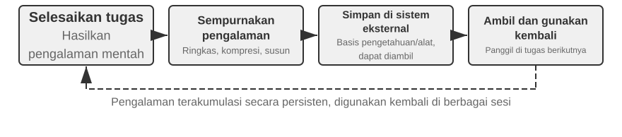
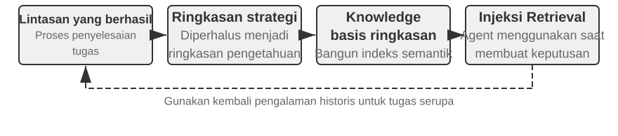
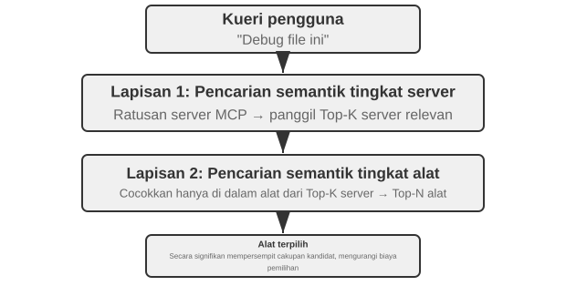
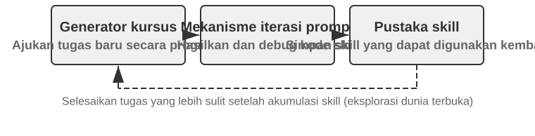
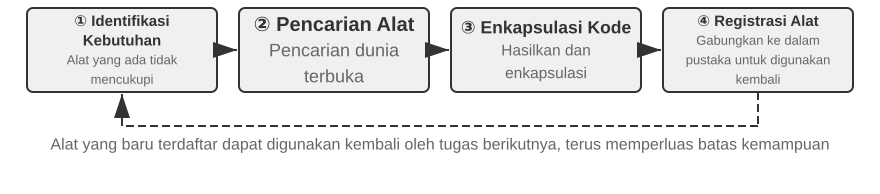

# Evolusi Mandiri Agent (Agent Self-Evolution)

Bab-bab sebelumnya telah membangun sistem kemampuan Agent di berbagai dimensi. Bab 2 tentang rekayasa konteks meletakkan dasar untuk manajemen informasi (termasuk pemuatan sesuai permintaan melalui mekanisme *Skills*); Bab 3 tentang basis pengetahuan dan memori pengguna membentuk persistensi pengetahuan lintas sesi; Bab 5 mendemonstrasikan bagaimana *Coding Agent* dapat mengakumulasi pengalaman melalui sistem file; dan Bab 7 tentang *reinforcement learning post-training* memantapkan strategi ke dalam parameter model. Setiap teknik ini memiliki fokusnya masing-masing, namun semuanya bermuara pada satu pertanyaan: **bagaimana sebuah Agent bisa terus menjadi lebih kuat?**

Bahkan model yang paling canggih sekalipun akan sama bingungnya seperti karyawan baru di hari pertama saat dihadapkan dengan proses pengembalian dana di suatu perusahaan, strategi penanganan panggilan dari operator telekomunikasi, atau API tidak umum yang belum pernah ia gunakan. Mengubah bobot model memerlukan data dan komputasi yang sangat besar, dengan siklus pembaruan yang memakan waktu berminggu-minggu—sementara di dunia nyata, API baru terus diluncurkan, layanan lama ditutup, dan kebutuhan pengguna terus berubah. Agent membutuhkan cara yang lebih ringan dan lebih cepat untuk berevolusi: cara yang terus memperluas batas kemampuannya tanpa menyentuh parameter model.

Bab ini secara khusus mengeksplorasi mekanisme tersebut: **Evolusi Mandiri Agent (*Agent Self-Evolution*)**. Evolusi mandiri adalah pembelajaran yang dieksternalisasi, mencakup dua dimensi—menyaring pengetahuan dari pengalaman, serta secara proaktif menemukan dan menciptakan *tools* (alat) baru. Ide intinya adalah memisahkan pengetahuan dan proses dari parameter model dan konteks sementara, mengeksternalisasinya menjadi sumber daya eksternal yang persisten, dapat diambil kembali (*retrievable*), dan dapat digunakan ulang—yaitu perpustakaan alat (*tool libraries*) dan basis pengetahuan. Ini bukan pengganti untuk *post-training*, melainkan pelengkap: *post-training* menjawab "bagaimana membuat model menjadi lebih pintar," sementara evolusi mandiri menjawab "bagaimana membuat Agent menjadi lebih mampu."

## Mengapa Agent Tidak Belajar Secara Otomatis

Itu menjelaskan kebutuhan praktisnya. Namun ada pertanyaan yang lebih mendasar: **jika jendela konteks (*context window*) tidak terbatas dan kita memasukkan setiap percakapan dan hasil *tool* yang pernah dilihat oleh Agent ke dalamnya, apakah Agent akan mempelajari semuanya secara otomatis?**

Jawabannya adalah tidak, dan alasannya terletak pada mekanisme atensi (*attention mechanism*) yang dibahas di Bab 2. Mekanisme tersebut memberikan titik awal teoritis untuk bab ini dan layak untuk ditinjau kembali secara singkat.

Bab 2 menekankan hal ini berulang kali: **mekanisme internal dari *in-context learning* lebih dekat ke pengambilan (*retrieval*) daripada ke penalaran (*reasoning*).** Atensi sangat unggul dalam pencarian—"Kucing mana yang ada di kandang ke-37?" adalah pencarian satu langkah yang tepat sasaran—tetapi ia tidak unggul dalam agregasi statistik dalam satu proses *forward pass*: "Berapa banyak kucing hitam yang ada di 100 kandang?" mengharuskan kita menelusuri setiap catatan sambil terus menghitung, yang mana merupakan sebuah proses berpikir, bukan pengambilan data. Jika kita membuang pengalaman mentah ke dalam konteks, model dapat "mengingatnya", tetapi ia tidak akan "menyaringnya" menjadi pola yang dapat digunakan ulang secara mandiri. Bahkan konteks yang benar-benar tak terbatas tidak akan menutup celah ini: informasinya akan ada di sana, tetapi tidak akan ada yang melakukan kompresi dari "catatan spesifik" ke "pola umum" atas nama model. Lebih buruk lagi, seperti yang ditunjukkan oleh "pembusukan konteks" (*context rot*) di Bab 2, semakin panjang dan berisik konteksnya, semakin atensi menjadi terlarut dan semakin sulit informasi kunci untuk diambil—konteks yang tak terbatas tidak membawa pembelajaran otomatis; itu justru menyebabkan kualitas pengambilan data menurun. Pandangan Karpathy paling baik dibaca secara terbalik: "memori buruk" pada model adalah sebuah fitur, bukan kelemahan (*bug*). Hal ini memaksa kita untuk menyaring pengetahuan secara aktif dan eksplisit, alih-alih berharap model akan menebak pola dari sejarahnya sendiri yang luas. Dalam satu kalimat: **pembelajaran tidak terjadi secara otomatis; ia harus dirancang secara eksplisit**—dan itulah mengapa bab ini ada.

Pembelajaran yang dirancang secara eksplisit tidak pertama kali muncul di Bab 8. Bab-bab sebelumnya telah menanam beberapa benih, meskipun sebagian besar melayani kebutuhan mendesak **dalam satu sesi tunggal** atau **lintas sesi yang berdekatan**. **Kompresi konteks** di Bab 2 menghabiskan panggilan LLM ekstra untuk menukar catatan mentah yang membengkak dengan kesimpulan yang telah dihitung, menyediakan separuh "penyaringan" yang tidak dimiliki atensi; **Bilah Status Agent (*Agent Status Bar*)** di Bab 2, di mana kode secara deterministik mempertahankan kesimpulan utama dalam konteks, adalah sisi lain dari koin yang sama. **Memori pengguna** di Bab 3 sudah mendorong pembelajaran lintas sesi: Agent membangun pemahamannya tentang pengguna melalui banyak percakapan, dan pengorganisasian *offline* membuat pemahaman itu secara bertahap menjadi lebih akurat.

Memori pengguna itu sendiri adalah bentuk pembelajaran, tetapi apa yang disaringnya adalah **informasi**—siapa penggunanya: preferensi, fakta, kebiasaan. Bab 8 mengisi setengah bagian lain yang berjangka lebih panjang: menyaring strategi pemecahan masalah, prosedur operasi, pelajaran dari kegagalan, dan bahkan alat-alat baru yang ditemukan melalui eksplorasi menjadi **kemampuan** yang persisten, dapat diambil kembali, dan dapat digunakan ulang—sehingga Agent tidak hanya sekadar mengingat lebih banyak, tetapi dapat melakukan lebih banyak hal. Jenis pembelajaran ini berlangsung dalam cakrawala waktu yang lebih panjang dan harus diinisiasi secara **proaktif** oleh Agent, itulah sebabnya hal ini mendapatkan bab tersendiri. Kita mulai dengan menempatkannya dalam gambaran yang lebih besar.

## Tiga Paradigma Pembelajaran dan Posisi Evolusi Mandiri

Tiga paradigma yang diperkenalkan di Bab 1 (Gambar 1-1) ditinjau kembali di sini hanya untuk memposisikan evolusi mandiri di antara mereka. ***Post-training*** memodifikasi bobot model, memantapkan "pengalaman" menjadi "memori otot" melalui *Reinforcement Learning (RL)*, menawarkan tingkat keberhasilan yang tinggi dan latensi yang rendah, tetapi dengan biaya pembaruan yang tinggi dan siklus yang panjang (dirinci di Bab 7); ***In-Context Learning (ICL)*** memberikan contoh demonstrasi di dalam *prompt* untuk adaptasi sementara, dengan biaya rendah dan hasil yang cepat, tetapi akan menghilang saat sesi berakhir (lihat Bab 1 dan 2); **Pembelajaran yang Dieksternalisasi (*Externalized Learning*)** adalah jalur yang paling mudah diabaikan oleh pengembang—menyaring pengetahuan ke dalam file, basis pengetahuan, dan *tools* di luar model, yang persisten, dapat diinterpretasikan, dan dapat dimodifikasi kapan saja. Ketiganya sinergis, bukan kompetitif: pengetahuan faktual disimpan secara eksternal dan diambil melalui *RAG* (lihat Bab 3), perilaku dan format yang stabil dimantapkan oleh *post-training*, dan informasi transien saat ini ditangani oleh *in-context learning*.

Bab ini berfokus pada jalur yang **tidak mengubah bobot model**—pembelajaran yang dieksternalisasi, yang sesuai dengan dua dimensi yang disebutkan di awal bab: mengeksternalisasi pengalaman menjadi pengetahuan dan *Skills* (Keterampilan), serta mengeksternalisasi kemampuan menjadi *tools*. (Hal ini harus dibedakan dari "Kode Menciptakan Kode: *Agent Bootstrapping*" di Bab 5, yang berbicara tentang Agent menciptakan sistem yang mirip dengan diri mereka sendiri; bab ini adalah tentang pertumbuhan kemampuan tanpa mengubah bobot. Bab 3 memecahkan masalah "bagaimana menyimpan dan mengambil" basis pengetahuan; bab ini memecahkan masalah "siapa yang mengisi dan memperbaruinya"—bagaimana Agent secara proaktif mengumpulkan pengalaman.)

Mengapa ini dibutuhkan? Mari mulai dengan skenario sebagai peringatan. Sebuah Agent layanan pelanggan menangani proses pengembalian dana dari bank tertentu untuk pertama kalinya: setelah 15 menit eksplorasi—3 panggilan telepon, 2 skrip yang berbeda—akhirnya berhasil. Tanpa pembelajaran yang dieksternalisasi, permintaan identik berikutnya akan membutuhkan 15 menit lagi untuk eksplorasi yang sama; semua yang dipelajari di sesi ini mati bersama sesinya. Kata kuncinya adalah "otonom": tidak ada *engineer* manusia yang menulis dokumentasi untuk Agent—Agent itu sendirilah yang merangkum pengalaman, membangun *tools*, dan memperbarui basis pengetahuan dalam proses melakukan pekerjaannya, sama seperti seorang perwakilan layanan pelanggan veteran yang mengubah aturan pengembalian dana yang tersebar menjadi buku pegangan yang ia konsultasikan kapan pun dibutuhkan dan direvisi ketika ada kasus baru. Filosofi intinya: daripada mengharapkan model untuk mengingat semuanya, habiskan komputasi ekstra setelah setiap tugas untuk merangkum, mengompres, dan menyusun pengalaman, lalu simpan dalam sistem eksternal yang persisten dan dapat diambil kembali. Dibandingkan dengan pembelajaran parameter, pendekatan ini menyaring pengetahuan yang dapat diinterpretasikan, diverifikasi, dan dikoreksi secara cepat tanpa pelatihan yang mahal; dibandingkan dengan *in-context learning*, penyaringan aktif dan pengorganisasian terstruktur membebaskan Agent dari keharusan menggali tumpukan catatan mentah—dan hasilnya bertahan di seluruh sesi.

Lebih penting lagi, pembelajaran yang dieksternalisasi mengangkat Agent dari sekadar "mengingat informasi" menjadi "membangun kemampuan." Agent dapat menyaring pengalaman menjadi pengetahuan yang ringkas, tergeneralisasi, dan menyimpannya untuk diambil kembali nanti (pendekatan peringkasan berbasis pohon dari RAPTOR dari bagian RAG di Bab 3 juga dapat menyaring pengalaman lapis demi lapis—dari catatan operasi spesifik ke aturan, dan dari aturan ke prinsip), dan Agent juga dapat merangkum prosedur yang berulang menjadi *tools* yang dapat dieksekusi dengan tepat, membentuk perpustakaan keterampilan (*skill library*) yang terus berkembang. Pertimbangkan Agent layanan pelanggan yang membantu klien dengan pengembalian dana: ia mungkin mempelajari tiga hal yang sangat berbeda. Yang pertama adalah aturan spesifik—"Pengembalian dana Perusahaan A memerlukan verifikasi empat digit terakhir dari kartu kredit"—pengetahuan faktual yang tempatnya ada di basis pengetahuan. Yang kedua adalah *tool* tujuan umum—"gunakan API X untuk memeriksa status pesanan secara otomatis"—urutan operasi yang stabil dan dapat digunakan ulang, yang paling ekonomis dibekukan menjadi sebuah *tool* berupa kode (*code tool*). Yang ketiga adalah manual pekerjaan—*Skill* lengkap untuk proses pengembalian dana—penuh dengan penilaian strategis dan aturan bisnis yang selalu berubah, lebih baik ditangkap sebagai dokumen *Skill*. Tabel 8-1 merangkum ketiga produk dari pembelajaran yang dieksternalisasi ini.

Tabel 8-1 Tiga Produk Pembelajaran yang Dieksternalisasi

| Bentuk Produk | Konten yang Dibawa | Contoh | Metode Penggunaan |
|-------------|----------------------------|----------------------------|---------------------------|
| Entri Basis Pengetahuan | Fakta dan aturan | "Bank ini memerlukan alamat cabang tempat pembukaan rekening" | Pencarian semantik atau pencarian persis dengan `grep` |
| Dedicated Code Tool | Prosedur operasional yang dapat diulang | "Urutan panggilan API untuk menanyakan saldo akun" | Dimantapkan sebagai kode, dipanggil melalui parameter |
| Dokumen Keterampilan (Skill Document) | Strategi kerja yang kompleks namun sering berubah | "Praktik terbaik untuk menangani klaim asuransi" | Dokumen bahasa alami, dimuat sesuai permintaan |

Aturan praktis yang sederhana menentukan bentuk mana yang akan digunakan: **informasi yang murni faktual masuk ke dalam basis pengetahuan; prosedur yang sering digunakan dengan banyak parameter menjadi kode (*tools*); proses yang sering berubah yang melibatkan penilaian strategis menjadi dokumen (*Skills*).** Dua yang terakhir sama-sama merupakan "pembuatan *tool*" (*tool generation*)—bentuk tingkat lanjut dari pembelajaran yang dieksternalisasi, yang mengeksternalisasi tidak hanya pengetahuan tetapi juga proses ke dalam kode, menukar "memikirkannya ulang setiap kali" menjadi "menghasilkan sekali, menggunakan ulang berkali-kali"—seperti menulis skrip otomatisasi setelah men-deploy server secara manual untuk pertama kalinya. Bab 4 telah membahas kerangka kerja untuk memilih antara *dedicated tools* dan *Skills* secara rinci.

Pendirian yang diambil Bab 1 terhadap *Bitter Lesson* (Pelajaran Pahit)—**mendukung arahnya, tetap pragmatis tentang kecepatannya**—menemukan ekspresi terbesarnya dalam pembelajaran yang dieksternalisasi. Jangan memampatkan semua pengetahuan ke dalam parameter, dan jangan membekukan proses ke dalam aturan *if-else*; alih-alih, biarkan Agent secara aktif membangun ekosistem eksternal dari pengetahuan dan *tools*, memperluas logika pertumbuhan kemampuan dari dalam model (skala parameter) ke dunia luar (skala *tools* dan basis pengetahuan). Pilihan pembawa pengetahuan mengikuti logika yang sama: memori dan keterampilan yang dibahas dalam bab ini sebagian besar mengendap sebagai file Markdown pada sistem file (*filesystem*) alih-alih grafik pengetahuan (*knowledge graph*) yang dirancang secara manual. Grafik pengetahuan lebih akurat di domain khusus, tetapi bahasa alami adalah format yang paling baik ditangani oleh model. Dengan LLM yang melakukan kompresi dan organisasi di atasnya, pendekatan ini memberikan jalur umum yang tidak bergantung pada struktur sebelumnya yang dirancang oleh manusia dan terus berskala sesuai dengan kemampuan model. Tentu saja, pembelajaran yang dieksternalisasi itu sendiri—dalam format apa menyimpannya, bagaimana mengatur indeks, kapan menyaringnya—masih memerlukan desain rekayasa (*engineering design*); itulah tepatnya arti dari "pragmatis tentang kecepatannya."

## Mengapa Agent Harus Belajar dari Pengalaman: Dari "Pintar" Menjadi "Terampil"

Perwakilan veteran yang mengubah aturan-aturan yang tersebar menjadi buku pegangan merupakan inti dari peralihan dari "pintar" (*smart*) menjadi "terampil" (*skilled*): kesenjangannya biasanya bukan karena model kurang cerdas, tetapi karena banyak proses bisnis dan pengetahuan domain bersifat dinamis dan tidak publik—sebesar apa pun kemampuan umum dalam model dasar tidak akan bisa menyediakannya. Ini adalah masalah yang berjalan berdasarkan pengalaman, dan pengalaman adalah tepat hal yang harus dipelajari oleh Agent: bahwa membatalkan layanan tertentu berarti mengisi formulir spesifik, bukan melakukan panggilan telepon yang tidak ada gunanya; kondisi kelayakan untuk sebuah promosi (katakanlah, veteran, atau pelanggan yang telah bersama perusahaan selama lebih dari dua tahun); apakah penawaran *broadband* dari operator ini di wilayah ini masih memiliki ruang untuk dinegosiasikan. Demikian pula, sebuah *Coding Agent* tidak mengetahui konvensi internal proyek dan proses *deployment*, dan sebuah *browser Agent* tidak mengetahui taktik anti-scraping sebuah situs atau perubahan tata letak terbarunya—semua pengetahuan domain *real-time* ini absen dari data *pre-training*.

## Belajar dari Pengalaman

Dengan terselesaikannya pertanyaan "mengapa", pertanyaannya sekarang menjadi "bagaimana." Praktik rekayasa dari pembelajaran yang dieksternalisasi dimulai dengan merekam dan menggunakan kembali apa yang telah berhasil. Dua eksperimen di bawah ini mendemonstrasikan cara yang saling melengkapi untuk mengakumulasi pengalaman: yang satu menyaring strategi tingkat tinggi ke dalam ringkasan pengetahuan yang dapat diambil (pada dasarnya, catatan pemecahan masalah), yang lainnya membekukan urutan operasi konkret ke dalam alat otomatisasi yang dapat diputar ulang (rekaman operasi).

Tabel 8-2 mengkategorikan mekanisme pembelajaran pengalaman berdasarkan lapisannya untuk membantu pembaca memahami hubungan antara penyulingan pengetahuan (*knowledge distillation*), pengorganisasian pengetahuan, penerapan pengetahuan, dan dukungan rekayasa.

Tabel 8-2 Lapisan Mekanisme Pembelajaran Pengalaman Agent

| Lapisan | Mekanisme | Masalah yang Dipecahkan |
|------------------|--------------------------------------|----------------------------------------|
| Penyulingan Pengetahuan | Ringkasan Strategi, Perekaman Alur Kerja, Refleksi Kegagalan | Mengekstrak pengetahuan yang dapat digunakan ulang dari pengalaman yang berhasil maupun gagal |
| Pengorganisasian Pengetahuan | Keterampilan (Skills), Konsolidasi Saat Tidur (Sleep Consolidation) | Menstrukturkan dan mengindeks pengetahuan untuk penyimpanan |
| Penerapan Pengetahuan | Optimasi System Prompt | Menyuntikkan pengetahuan ke dalam pola perilaku Agent |
| Dukungan Rekayasa | Keberlanjutan Lintas Sesi (Cross-Session Continuation) | Memungkinkan tugas-tugas panjang untuk dieksekusi secara persisten |

Keempat lapisan ini saling terkait di sepanjang bab ini: ringkasan strategi, perekaman alur kerja, dan belajar dari kegagalan (Penyulingan Pengetahuan) secara alami mengarah ke *Skills* dan konsolidasi tidur (Pengorganisasian Pengetahuan), lalu optimasi *system prompt* (Penerapan Pengetahuan), ditutup dengan keberlanjutan lintas sesi dari tugas-tugas panjang (Dukungan Rekayasa).

> **Eksperimen 8-1 ★★: Belajar dari Pengalaman Sukses: Ringkasan Strategi**
>
> Proyek `gaia-experience` adalah implementasi khas dari gagasan "Ringkasan Strategi". Sebuah ringkasan strategi memadatkan proses pemecahan masalah yang berhasil menjadi catatan pengalaman terstruktur—merekam "metode apa yang digunakan, jebakan apa yang ditemui, dan apa saja langkah-langkah utamanya"—sehingga hal itu dapat secara langsung dijadikan rujukan ketika menemui masalah serupa di masa depan.
>
> Tidak setiap lintasan perjalanan tugas (*run trajectory*) layak menjadi pengalaman. Kriterianya adalah **keteralihan (*transferability*)**: apakah pelajaran dari tugas ini akan terbawa ke tugas-tugas serupa di masa depan? Perbaikan yang hanya berlaku untuk satu input spesifik tidak memiliki tempat di memori jangka panjang.
>
> Eksperimen ini menggunakan dua bagian penting dari infrastruktur. **Kerangka kerja AWorld** adalah lingkungan eksekusi dan evaluasi *open-source* yang dirancang khusus untuk AI Agent, yang menyediakan seperangkat alat standar (browser, sistem file, *code interpreter*, dll.) dan *pipeline* evaluasi otomatis—anggap saja ini sebagai "ruang ujian" untuk Agent. **GAIA** adalah *benchmark* yang sangat menantang yang mengevaluasi kemampuan AI Agent tujuan umum melalui masalah yang kompleks dan terdiri dari banyak langkah yang membutuhkan kecerdasan manusia untuk memecahkannya—misalnya, "temukan informasi spesifik di situs web, proses dengan kode, dan hitung jawabannya," seringkali membutuhkan penggunaan kombinasi dari browser, manajer file, *code interpreter*, dan penalaran logis yang kompleks.
>
> Inovasi intinya adalah menambahkan siklus "pembelajaran-penerapan" (*learning-application loop*) yang lengkap ke Agent di dalam kerangka kerja AWorld. Dalam **Mode Pembelajaran (*Learning Mode*)**, setiap kali Agent berhasil menyelesaikan tugas GAIA, sistem secara otomatis menangkap lintasan tindakannya yang lengkap dan menggunakan LLM untuk "merefleksikan" dan "merangkumnya", menghasilkan ringkasan pengalaman terstruktur. Ringkasan ini tidak hanya berisi jawaban akhir tetapi juga menyaring metode inti, wawasan utama, dan urutan alat efektif yang digunakan untuk memecahkan masalah tersebut. Pengalaman-pengalaman ini di-vektorisasi dan disimpan dalam basis pengetahuan. Dalam **Mode Penerapan Pengalaman (*Apply Experience Mode*)**, ketika Agent menerima tugas baru, ia pertama-tama melakukan pencarian semantik dalam basis pengetahuan pengalaman untuk menemukan kasus sukses historis yang paling mirip, dan menyuntikkan pengalaman-pengalaman ini sebagai "contoh sukses" ke dalam *system prompt* untuk memandu pengambilan keputusan. Eksperimen menunjukkan bahwa hal ini secara signifikan meningkatkan efisiensi dan tingkat keberhasilan pada masalah-masalah baru—semakin banyak tugas yang dipecahkan oleh Agent, semakin kaya pengalamannya dan semakin kuat kemampuannya: sebuah sistem berevolusi mandiri yang berjalan di atas umpan balik positif.
>
> **Eksperimen 8-2 ★★: Belajar dari Tugas yang Berulang: Perekaman dan Pemutaran Ulang Alur Kerja**
>
> Proyek `browser-use-rpa` adalah contoh yang sangat baik dari gagasan "Perekaman Alur Kerja" (*Workflow Recording*). Perekaman alur kerja berfungsi seperti perekam makro Excel: merekam langkah-langkah pada kali pertama Anda melakukan sesuatu dengan tangan, kemudian mengulanginya hanya dengan satu klik "pemutaran ulang" (*playback*). Masalah yang dipecahkannya sangat praktis: banyak operasi browser yang berulang (mengirim laporan melalui email, melakukan query di situs web tertentu) mengambil input yang berbeda setiap saat—penerima, kata kunci pencarian—tetapi tetap menggunakan alur inti yang sama. Membuat Agent memulai dari awal setiap saat, membakar LLM multimodal yang mahal untuk "menemukan kembali" alur itu, adalah pemborosan yang sangat besar: hal itu sepenuhnya bersandar pada *in-context learning* dan tidak pernah mengeksternalisasi keberhasilan menjadi *tool* yang dapat digunakan ulang. Pada intinya, proyek ini adalah eksperimen langsung dalam efisiensi dan biaya, yang didorong ke titik ekstrem.
>
> Dalam **Fase Pembelajaran**, Agent melakukan tugas untuk pertama kalinya, menyelesaikan operasi melalui siklus amati-pikir-tindak dari LLM multimodal, persis seperti manusia. Setiap kali LLM memutuskan untuk mengeksekusi suatu tindakan, sistem mengekstrak informasi posisi yang tepat dari elemen target dari riwayat kerangka kerja *browser-use*: halaman web dirender sebagai pohon DOM (Document Object Model) di browser, di mana setiap tombol, bidang input, dan tautan adalah *node*; XPath (XML Path Language) menunjuk ke *node* tertentu menggunakan sintaks seperti path, misalnya `/html/body/div[2]/button[1]`. Tindakan tersebut direkam sebagai langkah terstruktur: jenis tindakan (klik, input, dll.), XPath elemen target, parameter tindakan, dan informasi verifikasi pasca-eksekusi (misalnya, apakah URL halaman berubah, apakah elemen yang diharapkan muncul). Setelah tugas berhasil, LLM menghasilkan label semantik (misalnya, "Kirim Email") dan deskripsi (misalnya, "kolom penerima, kolom subjek, kolom konten, tombol kirim"), yang disimpan di basis pengetahuan bersama dengan urutan langkah, membentuk entri "alur kerja" yang terparameterisasi.
>
> Dalam **Fase Putar Ulang (*Replay Phase*)**, ketika tugas baru tiba, sistem memeriksa kecocokan alur kerja yang sudah ada menggunakan kesamaan semantik (vektor *embedding*) dan pemeriksaan elemen kunci. Jika kecocokan ditemukan, sistem mengeksekusi langkah-langkah tersebut dengan kecepatan tinggi: ia menggunakan mekanisme penantian (*waiting*) di Playwright, perpustakaan otomatisasi browser sumber terbuka (`page.locator(xpath).wait_for(state='visible', timeout=15000)`), untuk memastikan elemen telah dimuat; templat terparameterisasi (misalnya, "Masukkan `{{email}}` di kolom penerima") mengekstrak nilai parameter aktual dari instruksi tugas saat ini melalui panggilan LLM ringan, tanpa memerlukan penalaran visual penuh. Jika sebuah langkah gagal (elemen tidak ditemukan, waktu tunggu habis), hal ini mungkin mengindikasikan bahwa struktur halaman web telah berubah. Alur kerja kemudian ditandai sebagai "berpotensi kedaluwarsa", dan sistem beralih kembali (*fall back*) ke mode pembelajaran, menyelesaikan ulang tugas melalui penalaran LLM dan menghasilkan alur kerja baru untuk menggantikan yang lama.
>
> **Skenario Penerimaan**: Mengirim email di antarmuka web Gmail.
>
> - Eksekusi Pertama (Fase Pembelajaran): "Kirim email ke test@example.com dengan subjek 'Email Ujian' dan isi 'Ini adalah email pengujian.'" Amati bagaimana Agent menggunakan LLM multimodal untuk mengidentifikasi tombol "Tulis" (*Compose*), kolom input penerima, kolom input subjek dan isi, dan tombol "Kirim". Rekam langkah operasi, waktu yang dibutuhkan, dan jumlah panggilan LLM.
> - Eksekusi Berulang (Fase Putar Ulang): "Kirim email ke another@example.com dengan subjek 'Ujian Lanjutan' dan isi 'Email pengujian kedua.'" Sistem mengidentifikasi alur kerja yang cocok, mengekstrak nilai parameter baru, dan secara langsung memutar ulang operasi tanpa memerlukan penalaran visual LLM. Waktu yang dihabiskan dan jumlah panggilan akan berkurang secara drastis.
> - Pembaruan Pengetahuan: Simulasikan desain ulang halaman web (modifikasi struktur HTML sehingga XPath tombol tertentu berubah), dan verifikasi bahwa Agent dapat mendeteksi kegagalan alur kerja, kembali ke mode pembelajaran, dan membuat ulang alur kerja untuk memperbarui basis pengetahuan.
>
> Ekspektasi observasi: Eksekusi putar ulang beberapa kali lebih cepat, biaya panggilan LLM berkurang secara drastis, dan tingkat keberhasilan lebih stabil.

Perekaman alur kerja bukanlah trik rekayasa yang terisolasi; di baliknya berdiri metodologi yang lebih umum. Voyager, arsitektur Agent *open-world* dari tim NVIDIA (dirinci kemudian), menyistematisasi siklus jelajah-konsolidasi di dunia virtual Minecraft: **jalankan tugas → verifikasi kesuksesan → simpan urutan tindakan sukses di perpustakaan keterampilan → ambil dan gunakan ulang pada tugas serupa**. Eksperimen 8-2 adalah pedoman (playbook) ini yang diterapkan pada otomatisasi browser: fase pembelajaran adalah "eksplorasi", basis pengetahuan alur kerja adalah "perpustakaan keterampilan", dan putar ulang (*replay*) dengan fallback saat kegagalan adalah "pengambilan dan penggunaan ulang" ditambah perbaikan berkesinambungan.

Eksperimen 8-2 juga mengekspos dua mata rantai paling rapuh dalam *record-and-replay* (rekam-dan-putar-ulang); tangani dengan rapi dan mekanismenya menjadi benar-benar dapat diandalkan[^preact]. Yang pertama adalah **kapan harus mempercayai pemutaran ulang**. Pendekatan yang tangguh adalah mengompilasi urutan tindakan yang berhasil menjadi **program mesin keadaan (*state machine program*)** kecil, di mana setiap *state* membawa "predikat verifikasi"—pola UI yang harus valid di layar yang sedang aktif. Selama pemutaran ulang, **predikat diperiksa terhadap layar aktif sebelum setiap tindakan**: lihat dulu, baru bertindak. Saat predikat gagal atau tindakan bermasalah, kendali dikembalikan ke Agent penuh untuk mengulangi tugas, dan lintasan baru itu dikompilasi kembali menjadi program. Setelah pencocokan alur kerja dan pengikatan parameter, jalur eksekusi tindakan membutuhkan nol panggilan model, jadi tugas berulang yang mengenai *cache* berjalan 8,5–13 kali lebih cepat. Yang kedua adalah **bagaimana menghindari penyimpanan program yang buruk**: segera setelah dikompilasi, reset lingkungan dan putar ulang dari awal, gunakan evaluator bawaan dari *benchmark* untuk mengonfirmasi bahwa pekerjaan benar-benar selesai sebelum program masuk ke perpustakaan. Verifikasi pra-penyimpanan ini memblokir program yang memutar ulang setiap langkah namun tidak pernah menyelesaikan tugasnya (seluruh alur berjalan, Simpan ditekan—tetapi salah satu kolom kosong sepanjang proses). Tanpa gerbang ini, program rusak akan menumpuk dan perpustakaan akan membusuk. Hal ini direduksi menjadi satu prinsip yang jelas: **memori prosedural membutuhkan gerbang verifikasi, atau siklus peningkatan diri akan merosot**—versi ketat dari "deteksi kegagalan alur kerja, mundur dan pelajari ulang" dari Eksperimen 8-2.

[^preact]: Mekanisme lengkap dalam mengompilasi lintasan yang sukses menjadi program state machine dengan predikat verifikasi dan menetapkan gerbang "verifikasi pra-penyimpanan" dirinci dalam Li, Bojie. *PreAct: Computer-Using Agents that Get Faster on Repeated Tasks.* arXiv:2606.17929, 2026.

### Belajar dari Kegagalan

Ringkasan strategi dan perekaman alur kerja keduanya menggali **lintasan kesuksesan (*successful trajectories*)**—Eksperimen 8-1 memicu refleksi hanya setelah suatu tugas berhasil. Tetapi kegagalan juga sama layaknya untuk disimpan, dan seringkali membawa lebih banyak informasi: sebuah kegagalan secara definitif menyingkirkan satu jalur, sementara kesuksesan hanyalah salah satu jalur yang layak di antara banyak jalur. Pengalaman kegagalan biasanya mengkristal menjadi dua bentuk: **perpustakaan pola kesalahan (*error pattern libraries*)** (mencatat metode mana yang gagal dalam keadaan apa, dan seperti apa sinyal kegagalan tersebut) dan **aturan negatif** ("berhenti menggunakan metode X untuk Y"—misalnya, "jangan batalkan langganan dengan operator ini melalui telepon; saluran telepon tidak memiliki wewenang untuk memprosesnya").

Karya representatif di sini adalah Reflexion (Shinn et al., 2023)[^reflexion-2023]: setelah suatu tugas gagal, Agent merefleksikan penyebabnya dalam bahasa alami ("pada langkah ketiga saya seharusnya memverifikasi identitas terlebih dahulu, bukan langsung mengirimkan formulir") dan menyimpan refleksi tersebut ke dalam memori episodik. Pada percobaan berikutnya untuk tugas serupa, refleksi tersebut dibaca kembali sebagai konteks tambahan, dan kesalahan yang sama tidak diulangi. Tidak ada parameter model yang pernah diperbarui—Reflexion adalah contoh klasik dari evolusi tanpa mengubah bobot. Refleksi yang dibawa dalam bentuk bahasa juga menyimpan jauh lebih banyak informasi daripada sekadar *scalar reward* (imbalan skalar), poin yang akan kita bahas kembali saat mendiskusikan pembelajaran *system prompt*. Jalan keluar penting lainnya dari pengalaman kegagalan adalah *system prompt* itu sendiri: optimasi prompt otomatis yang dibahas nanti dalam bab ini menuliskan aturan-aturan negatif yang diekstrak dari kasus kegagalan ("jangan pernah mengalihkan ke agen manusia jika terkait sengketa kebijakan") ke dalam *system prompt*, mengubahnya menjadi batasan perilaku yang mengikat setiap tugas berikutnya.

[^reflexion-2023]: Shinn, N., et al. *Reflexion: Language Agents with Verbal Reinforcement Learning.* arXiv:2303.11366, 2023.

### Keterampilan (Skills): Mengeksternalisasi Pengetahuan Domain Menjadi Kemampuan Terstruktur

Dua mekanisme di atas menangkap "bagaimana berpikir" dan "bagaimana bertindak". Mekanisme *Skills* mengambil jalur ketiga: secara sistematis menyempurnakan keahlian praktis suatu domain (domain *know-how*) menjadi modul kemampuan terstruktur yang dimuat sesuai permintaan. Anggaplah sebuah *Skill* sebagai manual pekerjaan: karyawan baru tidak perlu memikirkan semuanya dari nol, melainkan dapat membaca manual tersebut dan mulai bekerja. Bab 2 membahas mekanisme Pengungkapan Progresif (*Progressive Disclosure*) pada *Skills* (metadata → proses inti → detail) dan desainnya yang ramah *KV Cache* secara rinci; bagian ini adalah tentang filosofi eksternalisasi pengetahuan di balik *Skills*, dan bagaimana menghasilkannya secara otomatis.

Nilai inti dari *Skills* adalah membawa pengetahuan dalam teks yang dapat dibaca manusia: cepat diperbarui (tanpa pelatihan ulang), dapat diaudit (pakar manusia dapat mengedit dan meningkatkannya secara langsung), dan portabel (bertahan meskipun ada pergantian model atau sistem). Pada intinya, *Skills* mengubah pengetahuan domain yang terperangkap dalam dokumen-dokumen tak terstruktur menjadi bentuk terstruktur yang dapat siap digunakan oleh Agent—membiarkan Agent mengeksploitasi pengetahuan melalui pencarian umum dan kemampuan penalarannya, alih-alih melakukan *hardcoding* pada pengetahuan tersebut ke dalam logika program.

Lebih jauh lagi, Anthropic *Skill Creator*[^ch8-1] adalah kemampuan meta (*meta-capability*) yang dapat membuat *Skill* lain. Kemampuan ini memandu Agent untuk memurnikan pengetahuan operasional domain menjadi *Skills* terstruktur melalui observasi, pembelajaran, dan peringkasan. Ketika diminta untuk membuat *Skill* untuk domain tertentu, Agent pertama-tama memahami skenario penggunaan spesifik melalui dialog dengan pengguna, lalu menganalisis setiap skenario untuk mengidentifikasi sumber daya yang dapat digunakan kembali, dan akhirnya membuat paket *Skill* lengkap yang berisi struktur direktori standar, skrip, referensi, aset, dan dokumen `SKILL.md` utama. *Skill Creator* memungkinkan proses transformasi pengetahuan itu sendiri diselesaikan oleh Agent, mewujudkan siklus *bootstrapping* akumulasi pengetahuan: Agent tidak hanya dapat menggunakan *Skills* tetapi juga membuatnya.

[^ch8-1]: Anthropic, "Skill Creator", 2025. https://github.com/anthropics/skills/blob/main/skill-creator/SKILL.md

Mekanisme `CLAUDE.md` dari Claude Code menunjukkan kemampuan yang sama: saat pertama kali bersentuhan dengan repositori, ia membaca basis kode (*codebase*) dan membuat panduan proyek—arsitektur, konvensi pengkodean, cara menjalankan pengujian—yang kemudian akan dikonsultasikan dan diperbaruinya selama pengembangan selanjutnya. Pembuatan *Skill* otomatis berarti pertumbuhan Agent tidak lagi dibatasi oleh seberapa banyak waktu dan keahlian yang dapat disisihkan oleh pakar manusia: ketika memasuki domain baru, Agent dapat bereksplorasi sendiri, membangun panduan operasinya, dan membekukannya menjadi sebuah *Skill*—bergerak dari "mengandalkan pengetahuan yang telah diprogram sebelumnya" menjadi "belajar dan mengakumulasi pengetahuan melalui praktik."

Dilihat sebagai konsolidasi pengalaman, pembuatan alat mengambil dua bentuk konkret: *dedicated code tools* (alat kode khusus), dan *Skills* yang dipasangkan dengan eksekutor umum. Prinsip pemilihannya telah muncul sebelumnya, dan Bab 4 memberikan kerangka kerja lengkapnya, jadi kita tidak akan mengulanginya—diterapkan ke bagian ini: operasi dengan parameter kompleks dan panggilan yang sering akan menjadi alat kode (perpustakaan keterampilan Minecraft milik Voyager, skrip terparameterisasi dari perekaman alur kerja browser), sementara aturan bisnis yang strategis dan tidak stabil lebih baik ditangkap dalam dokumen *Skill* (seperti `CLAUDE.md` pada Claude Code). Sistem nyata (*real systems*) biasanya mencampur keduanya.

### Pembelajaran Saat Tidur (Sleep Learning): Evolusi Otonom dari Memori Pengguna

Mekanisme sejauh ini—ringkasan strategi, perekaman alur kerja, pembuatan *Skill*—semuanya beroperasi selama eksekusi tugas atau sesaat setelahnya. Tetapi pembelajaran manusia memiliki fase penting lainnya: **konsolidasi memori selama tidur**. Bab 2 memunculkan analogi ini untuk kompresi konteks—otak mengolah masukan sensorik hari itu menjadi memori jangka panjang yang ringkas. Analogi ini membentang di luar satu sesi hingga ke manajemen pengalaman lintas sesi: pengalaman yang tersebar hari itu diatur ulang selama tidur, dilucuti redudansinya, ditenun ke dalam jaringan pengetahuan yang ada, dan muncul sebagai memori jangka panjang yang lebih ringkas dan lebih mudah diingat.

Target paling khas dari konsolidasi offline ini adalah memori Agent mengenai **pengguna**—siapa Anda, apa preferensi Anda, fakta apa yang telah Anda sebutkan. Ada satu kesalahpahaman umum yang layak disingkirkan terlebih dahulu: apa yang diatur oleh Agent seperti Claude Code selama "tidur" pada utamanya adalah **memori pengguna**, bukan basis pengetahuan bersama. Basis pengetahuan yang digunakan dalam sistem RAG (Bab 3) membawa dokumen domain tanpa ikatan dengan pengguna mana pun, dimuat secara *batch* oleh *pipeline offline* dan jarang berubah. Memori pengguna berbeda—sebuah model tentang Anda, yang terakumulasi sedikit demi sedikit melintasi berbagai percakapan, yang lambat laun akan lebih mengenal Anda seiring waktu—dan bagian inilah tepatnya yang membutuhkan "konsolidasi tidur" berulang kali. Claude Code dan Hermes, yang akan diperkenalkan berikutnya, keduanya menyimpan jenis memori pengguna ini; fokus kita adalah **bagaimana ia berevolusi secara mandiri**.

Untuk memperjelas pembagian tugas dengan Bab 3: bab tersebut mencakup bagaimana memori pengguna disimpan dan ditanya (*queried*), bersama dengan **algoritma** konsolidasi pada lapisan penyimpanan (ringkasan pengklasteran, pembuatan versi atas konflik, dan sebagainya), yang tidak akan kita ulangi. Bagian ini membahas **pertanyaan tentang rekayasa dan evolusinya**—kapan harus melakukan konsolidasi, siapa yang melakukan konsolidasi, dan apa bentuk hasilnya—sehingga memori menjadi semakin akurat saat digunakan.

**Claude Code: Menyimpan Memori Pengguna di Markdown.** Claude Code menyimpan memori pengguna sebagai format Markdown biasa yang dapat dibaca manusia: setiap memori adalah file kecil dengan metadata *frontmatter* yang merekam persis satu fakta, dan file indeks (`MEMORY.md`) menyediakan navigasi ringkasan. Manfaatnya jelas terlihat—cepat diperbarui (edit file, tanpa pelatihan ulang), dapat diaudit (pengguna dapat membuka dan mengubahnya secara langsung), dan portabel (bertahan meskipun ada pergantian model atau sistem).

Namun sekadar merekam tidaklah cukup; memori tersebut juga perlu diorganisasi. Claude Code mengubah metafora konsolidasi saat tidur menjadi mekanisme latar belakang secara berkala. (Deskripsi di bawah ini didasarkan pada perilaku yang dapat diamati secara publik dan analisis komunitas, bukan spesifikasi resmi.) Ide desain intinya: **mengumpulkan pengalaman dan mengonsolidasi memori adalah dua proses independen yang tidak boleh berbagi jendela waktu (*time window*)**—Agent juga membutuhkan waktu peninjauan (*review time*) khusus. Secara konkret, ketika dua kondisi gerbang terpenuhi (waktu yang cukup sejak konsolidasi terakhir, dan sesi baru yang cukup telah terakumulasi sejak saat itu), sistem meluncurkan sub-agen independen di latar belakang untuk menjalankan konsolidasi empat tahap: ***Orient*** (baca indeks memori yang ada untuk menangkap lanskap pengetahuan keseluruhan), ***Gather*** (cari sesi terbaru untuk mendapatkan informasi baru yang layak disimpan, dan deteksi fakta yang bertentangan dengan memori yang ada), ***Consolidate*** (gabungkan sinyal baru ke dalam file topik yang ada alih-alih membuat file yang nyaris duplikat, ubah tanggal relatif menjadi absolut, hapus fakta lama yang telah terbukti salah), dan ***Prune & Index*** (batasi ukuran indeks, buang penunjuk atau *pointer* yang usang).

Keputusan desain paling penting dari mekanisme ini: konsolidasi tidak pernah berjalan selama interaksi pengguna—ia selesai secara asinkron di latar belakang, tidak terlihat oleh pengguna. Gerbang ganda dan penguncian terdistribusi (*distributed locks*) mencegah instansi yang berjalan bersamaan untuk memicunya dua kali; jika konsolidasi gagal, sistem secara otomatis melakukan *roll back* dan mencoba lagi di waktu berikutnya; izin sub-agen konsolidasi dibatasi secara ketat ke direktori memori. Jika kita mundur sedikit, ini adalah manajemen memori pengguna yang berevolusi dari "rekam tetapi tidak pernah kelola" menjadi siklus hidup penuh rekam—konsolidasi—pangkas. Tanpa konsolidasi rutin, penyimpanan memori menurun kualitasnya menjadi tempat pembuangan dengan rasio sinyal-ke-kebisingan (*signal-to-noise*) rendah yang menurunkan performa *retrieval*; dengan adanya konsolidasi, penyimpanannya tetap ringkas, konsisten, dan mudah dinavigasi—sama seperti pengetahuan seorang pakar manusia yang bukanlah tumpukan fakta tanpa akhir, melainkan pemahaman terstruktur, yang disempurnakan melalui reorganisasi berulang.

**Hermes: Menjadikan Pembelajaran Otonom sebagai Layanan Residen.** Hermes yang bersifat *open-source* dari Nous Research (2026) membawa ide tersebut ke konklusi logisnya: sebuah *daemon* yang berjalan terus-menerus di mesin pengguna itu sendiri, mengumpulkan memori dan berevolusi secara otonom melintasi sesi-sesi. Memorinya dibagi menjadi empat lapisan[^hermes]: ***Prompt Memory*** (`MEMORY.md` dan `USER.md`, disuntikkan pada awal sesi, sengaja dibatasi hingga beberapa ribu karakter untuk "memaksa" Agent menentukan prioritas), ***Session Retrieval*** (menggunakan indeks teks penuh FTS5 SQLite untuk sesi historis, fragmen yang diambil diringkas terlebih dahulu oleh LLM sebelum disuntikkan, hanya membawa bagian yang relevan dengan tugas saat ini), ***Skill Library*** (memori prosedural, menggunakan pengungkapan progresif, memuat hanya nama keterampilan dan ringkasan secara *default*), dan ***Honcho User Modeling Layer*** opsional (secara pasif melacak preferensi, gaya komunikasi, dan pengetahuan domain di latar belakang, memodelkan bagaimana pengguna dan Agent berevolusi bersama lintas sesi). Ketika sebuah tugas memenuhi kondisi tertentu (lebih dari lima panggilan alat, pemulihan dari kesalahan, koreksi dari pengguna, atau alur kerja tidak jelas yang dijalankan), Hermes secara otomatis memantapkan pengalaman tersebut menjadi keterampilan yang dapat digunakan ulang, lebih memilih tambalan (*patch*) tambahan daripada penulisan ulang keseluruhan. Claude Code dan Hermes merepresentasikan bentuk arus utama saat ini dari evolusi memori pengguna otonom—keduanya dibawa dalam bentuk Markdown dan teks yang dapat dibaca manusia.

[^hermes]: Nous Research, *Hermes: A Self-Improving Personal Agent*, 2026. https://hermes-agent.nousresearch.com/docs/

### Optimasi Otomatis dari System Prompt

Mekanisme sejauh ini semuanya menyetorkan pengalaman dan memori di luar model—basis pengetahuan, alur kerja, file *Skill*, memori pengguna. Namun ada pembawa pengalaman lain yang lebih langsung: *system prompt* itu sendiri.

Andrej Karpathy berpendapat bahwa paradigma pembelajaran LLM saat ini mengabaikan bentuk pembelajaran yang penting: "pembelajaran *system prompt*". *Pre-training* memperoleh pengetahuan; *fine-tuning* menanamkan kebiasaan perilaku; keduanya mengubah parameter model. Namun banyak dari pembelajaran manusia yang lebih terlihat seperti memperbarui sebuah *system prompt*—ketika kita memecahkan sesuatu, kita menuliskannya untuk diri kita sendiri dalam bahasa yang eksplisit: "lain kali saya menemui masalah seperti ini, coba metode ini dulu."

LLM, menurut Karpathy, seperti protagonis dalam film *Memento*—bangun setiap kali tanpa mengingat apa yang terjadi sebelumnya, dan kita bahkan tidak memberinya buku catatan. Membaca *system prompt* Claude (sekitar 17.000 kata, bervariasi menurut versi), ia mendapatinya dipenuhi dengan strategi pemecahan masalah umum, seperti: "Jika diminta untuk menghitung kata, huruf, dan karakter, Claude harus berpikir langkah demi langkah sebelum menjawab, secara eksplisit menghitung dengan memberikan nomor pada setiap huruf." Aturan yang satu ini ada untuk menangani pertanyaan seperti "berapa banyak huruf 'r' pada kata 'strawberry'?"

Pengetahuan semacam ini, menurut Karpathy, tidak seharusnya dibuat secara manual oleh manusia—ia harus datang dari pembelajaran *system prompt*. Ide ini memiliki kesamaan dengan *reinforcement learning*: keduanya menggunakan kegagalan untuk meningkatkan perilaku di masa depan. Tetapi algoritma pembelajarannya berbeda—pembelajaran *system prompt* mengedit teks *prompt* secara langsung, sementara *reinforcement learning* menyesuaikan parameter melalui *gradient descent*—dan yang pertama secara dramatis lebih efisien-data, karena saluran umpan baliknya memiliki lebih banyak "dimensi". Ini adalah kritik Karpathy terhadap **reinforcement learning dengan imbalan hasil (*outcome rewards*)**: satu imbalan skalar ("benar/salah") membawa *bandwidth* yang jauh lebih sedikit daripada analisis mendalam (*post-mortem*) menggunakan bahasa alami penuh ("Anda seharusnya memverifikasi ID sebelum memulai proses pengembalian dana"). Dari kegagalan yang sama persis, pembelajaran *system prompt* menyerap informasi jauh lebih banyak daripada sekadar satu bit.

Dalam pandangan saya, esensi dari pembelajaran *system prompt* adalah mempertajam batas-batas aturan melalui kasus ekstrem (*edge cases*). Kebanyakan aturan bekerja dengan baik dalam skenario tipikal; tantangan sebenarnya adalah area abu-abu. "Alihkan ke agen manusia saat permintaan melebihi kemampuan Anda" terdengar cukup jelas—tetapi apakah pengguna yang tidak senang dengan kebijakan dihitung sebagai melampaui kemampuan? Bagaimana dengan pengguna yang menuntut pengecualian? Kasus-kasus ekstrem inilah yang mendefinisikan apa arti sebenarnya dari suatu aturan.

Sedangkan *reinforcement learning* harus menggiling melalui uji coba yang masif untuk memindahkan bobotnya, pembelajaran *system prompt* belajar dari satu atau segelintir kasus ekstrem. Saat menghadapi kegagalan, tambahkan aturan yang jelas ke *prompt* dengan segera—tidak perlu mengumpulkan ribuan sampel serupa untuk *fine-tuning*. Pembelajaran ini tidak hanya efisien secara data tetapi juga dapat diinterpretasikan sepenuhnya: setiap aturan ditulis dalam teks biasa, dan dapat diaudit, diubah, atau dihapus. Saat kasus ekstrem terakumulasi, *system prompt* berevolusi menjadi buku panduan pemecahan masalah yang mendetail, sama halnya dengan seorang ahli yang terus menyempurnakan catatannya di tempat kerja.

Bagaimana kita mengotomatiskan hal ini? Kuncinya adalah dengan membawa *Coding Agent*. *System prompt* dan deskripsi *tool* itu sendiri adalah dokumen dan kode yang tersebar di berbagai file. Saat suatu kasus ekstrem muncul, *Coding Agent* dapat (1) membaca dan memahami *prompt* yang ada, menganalisis struktur aturan dan konteks kegagalannya; (2) menghasilkan perbedaan (*diff*) tingkat-kode yang tepat—file mana, lokasi yang mana, perubahan apa; dan (3) mempertahankan konsistensi, memastikan aturan baru tersebut tidak menimbulkan kontradiksi atau redundansi. Keputusan akhir tetap dipegang oleh pakar manusia, yang meninjau setiap *diff* dan menilai apakah itu sudah tepat.

Optimasi *prompt* otomatis bukan hanya sekadar ide Karpathy; penelitian akademis telah mengembangkan kumpulan karya yang koheren. DSPy[^dspy-2023] memperlakukan *prompts* sebagai parameter dari program yang dapat dioptimalkan: pengembang hanya mendeklarasikan "apa yang masuk dan apa yang keluar" untuk setiap modul, dan kerangka kerjanya secara otomatis mencari kombinasi contoh dan frasa instruksi pada set evaluasi, mengubah rekayasa *prompt* dari *debugging* manual menjadi optimasi sistematis. OPRO[^opro-2023] membiarkan LLM itu sendiri bertindak sebagai pengoptimal: menggunakan *prompt* historis dan skornya sebagai konteks, model secara iteratif mengusulkan penulisan ulang yang lebih baik, mengungguli *prompt* yang dirancang oleh manusia pada tugas-tugas seperti penalaran matematis. GEPA[^gepa-2025], yang diusulkan pada tahun 2025, melangkah lebih jauh: ia melakukan refleksi bahasa alami pada lintasan kegagalan, mengembangkan *prompt* sesuai dengan itu, dan mempertahankan *Pareto frontier* (titik efisiensi optimal) di antara berbagai kandidat (yaitu, satu set kandidat, yang masing-masing memiliki kekuatan unik, di mana tidak ada satu pun yang sepenuhnya didominasi oleh yang lain, bukan sekadar menyimpan satu solusi "optimal" tunggal) untuk mempertahankan arahan optimasi yang saling melengkapi—terbukti mengungguli *fine-tuning* GRPO (diperkenalkan dalam Bab 7) pada beberapa tugas sekaligus membutuhkan satu hingga dua urutan magnitudo sampel lebih sedikit. GEPA persis seperti yang disebut "pembelajaran *system prompt*" di bagian ini, dan hasil empirisnya mendukung penilaian sebelumnya mengenai volume informasi umpan balik.

[^dspy-2023]: Khattab, O., et al. *DSPy: Compiling Declarative Language Model Calls into Self-Improving Pipelines.* arXiv:2310.03714, 2023.

[^opro-2023]: Yang, C., et al. *Large Language Models as Optimizers.* arXiv:2309.03409, 2023.

[^gepa-2025]: Agrawal, L. A., et al. *GEPA: Reflective Prompt Evolution Can Outperform Reinforcement Learning.* arXiv:2507.19457, 2025.

Kerangka kerja otomatis ini berbeda dari pendekatan "Coding Agent menulis diffs + tinjauan manusia" dalam tiga hal. Pertama, offline versus online: kerangka kerja melakukan optimasi berkelompok (*batch-optimize*) terhadap kumpulan evaluasi offline, sementara pendekatan diff berevolusi kasus per kasus saat *edge cases* tiba di lingkungan produksi. Kedua, pengawasan manusia: kerangka kerja menulis ulang dari ujung ke ujung (*end-to-end*)—efisien, tetapi rentan menghasilkan frasa aneh yang berlebihan pada kumpulan evaluasinya (*overfits*)—sedangkan pendekatan *diff* menempatkan manusia dalam putaran peninjauan, sehingga setiap aturan tetap dapat diinterpretasikan dan dipertanggungjawabkan, sangat cocok untuk pengaturan berisiko tinggi seperti layanan pelanggan. Ketiga, set evaluasi itu sendiri: DSPy, OPRO, dan GEPA semuanya membutuhkan kumpulan tugas dengan skor untuk mendorong pencarian mereka; pendekatan diff memerlukan satu kasus kegagalan dan sepotong umpan balik dari manusia. Dalam praktiknya, keduanya saling melengkapi: optimalkan *prompt* awal secara *batch* dengan kerangka kerja otomatis, lalu biarkan pendekatan *diff* membawa evolusi berkelanjutan setelah peluncuran.

> **Eksperimen 8-3 ★★: Optimasi Otomatis dari System Prompts**
>
> **Tujuan Eksperimen**: Mengimplementasikan mekanisme pembelajaran *system prompt* otomatis berdasarkan umpan balik manusia.
>
> **Pendekatan Teknis**: Mendesain alur kerja pembelajaran *system prompt* berdasarkan skenario layanan pelanggan maskapai tau-bench. Aturan transfer ke manusia untuk Agent di awal adalah "Alihkan hanya ketika permintaan tidak dapat ditangani dalam lingkup tindakan Anda." Evaluasi mengungkapkan bahwa Agent melakukan transfer berlebihan—segera beralih ke manusia saat menemui sengketa kebijakan alih-alih mencoba menjelaskan kebijakan kepada pengguna. Umpan balik ahli manusia menunjukkan bahwa sengketa kebijakan harus ditangani dengan menjelaskan kebijakan secara sabar, bukan dengan mengalihkannya. *Coding Agent* membaca file *system prompt*, melokalisasi aturan yang relevan, dan menghasilkan modifikasi yang presisi: mengklarifikasi batas transfer sebagai "pengguna secara eksplisit meminta agen manusia atau terjadi situasi keamanan darurat", menambahkan aturan negatif "jangan pernah mengalihkan karena sengketa kebijakan", dan menerapkan perubahan di tingkat kode.
>
> **Kelompok Kontrol**: *System prompt* yang disesuaikan secara manual (tanpa proses optimasi otomatis).
>
> **Ekspektasi Observasi/Kriteria Penerimaan**: *System prompt* yang dioptimalkan tidak menunjukkan degradasi performa pada set tugas tertahan asli (*new rules* tidak merusak perilaku yang sudah benar sebelumnya), sementara akurasi meningkat pada kumpulan kasus ekstrem yang sebelumnya memicu transfer berlebihan—yaitu, untuk sengketa kebijakan, Agent tidak lagi langsung mengalihkan melainkan terlebih dahulu mencoba menjelaskan kebijakannya.

### Keberlanjutan Tugas Panjang Lintas Sesi (Tambahan Terkait Dukungan Rekayasa)

Sebenarnya, bagian ini tidak mencakup mekanisme penyulingan pengalaman melainkan **dukungan rekayasa** untuk evolusi mandiri (lapisan Dukungan Rekayasa pada Tabel 8-2): menerapkan eksternalisasi pada **status tugas (*task state*)**, sehingga apa yang telah dipelajari dan apa yang baru setengah selesai dapat bertahan melintasi sesi-sesi. Ini diturunkan langsung dari alur kerja *Coding Agent* pada Bab 5 dan dibahas di sini karena mekanisme ini bersandar pada langkah inti yang sama—menulis *state* di luar model. Banyak tugas (misalnya, membangun sebuah aplikasi lengkap dari nol) melampaui ukuran jendela konteks untuk satu sesi tunggal. Bahkan dengan kompresi konteks yang diaktifkan, masih ada dua mode kegagalan yang tersisa: mencoba menyelesaikan seluruh aplikasi dalam satu sesi tetapi konteksnya habis terlebih dahulu; hanya menyelesaikan sebagian dari tugas tersebut, dan sesi berikutnya gagal memulihkan progresnya secara akurat—sehingga sistem menyatakan tugas telah selesai terlalu cepat.

Pendekatan yang lebih stabil membagi tugas yang panjang antara dua peran, yaitu sebuah ***Initializer Agent*** (Agen Penginisialisasi) dan sebuah ***Coding Agent*** (Agen Pengkode)—seorang manajer proyek yang memecah pekerjaan ke dalam bagian-bagian kecil dan menulis daftar periksa, diikuti oleh *engineer* yang mengerjakannya item demi item. *Initializer Agent* berjalan tepat sekali, di ronde pertama: ia menghasilkan daftar fitur terstruktur (katakanlah, `feature-list.json`), skrip inisialisasi, komit *git* awal, dan file progres (`progress.json`), lalu mengubah tugas tersebut menjadi status sistem file yang persisten. Setiap sesi berikutnya adalah *Coding Agent* yang menjalankan satu iterasi putaran: memulihkan konteks dari file progres dan *log git*, mencari fitur berikutnya untuk diimplementasikan, mengimplementasikan dan menjalankan pengujiannya, memperbarui bidang `passes`, melakukan *commit*, dan keluar. Kendala utama: progres berada di dalam file, bukan di dalam konteks; daftar fiturnya berformat JSON, bukan Markdown (format terstruktur lebih stabil bagi model untuk dibaca dan ditulis); dan tugas baru dihitung sebagai selesai hanya jika field `passes` bernilai `true` untuk setiap fitur. Setelah terjadinya kerusakan *(crash)* di tengah jalan, tugas tersebut dapat dilanjutkan secara langsung dari sistem file. Begitu sebuah tugas berjalan lebih dari setengah jam, pemulihan kerusakan bukan lagi sebuah pilihan melainkan kewajiban.

## Dari Pengguna Tool Menjadi Pembuat Tool

"Penemuan Tool Secara Proaktif" di Bab 4 memecahkan masalah dalam menemukan alat yang tepat dari apa yang sudah ada. Kemampuan tingkat lanjut berikutnya—yang merupakan subjek dari bab ini—lebih sulit: bagaimana jika *tool* yang Anda butuhkan sama sekali tidak ada? Bagaimana sebuah Agent menemukan dan menciptakan *tools* baru secara mandiri?

### Keterbatasan Mendasar dari Set Tool yang Telah Ditetapkan Sebelumnya

Sebagian besar sistem AI Agent saat ini bertumpu pada satu asumsi implisit: bahwa serangkaian *tool* yang cukup lengkap dapat ditentukan di awal untuk mencakup sebagian besar tugas. Dalam domain tertutup, ini mungkin berlaku—Agent layanan pelanggan khusus mungkin hanya membutuhkan sekitar selusin alat. Namun untuk Agent dengan tujuan yang benar-benar umum (*general-purpose*), asumsi tersebut terlalu optimis.

Kesulitan mendasarnya: alat-alat yang dituntut dunia nyata hampir tak terbatas dan tidak dapat dihitung satu per satu di awal. Bahkan ketika perpustakaan memiliki alat yang serupa, antarmuka dan parameternya jarang sekali sangat cocok dengan kebutuhannya, sehingga alat tersebut mungkin berjalan tidak efisien atau gagal. Dan sejumlah besar layanan yang berguna sama sekali tidak berada di balik antarmuka standar yang ramah-Agent; setiap layanan membutuhkan upaya pengembangan manual untuk mengadaptasinya. Pada akhirnya, **paradigma prapendefinisian (*predefined paradigm*) membatasi kemampuan Agent pada apa pun yang berhasil diantisipasi dan disiapkan oleh *engineer* manusianya**.

### Dari Prapendefinisian Menuju Evolusi Mandiri

Untuk mengatasi keterbatasan ini diperlukan pergeseran mendasar: **meningkatkan kemampuan Agent dari sekadar pengguna *tool* menjadi pembuat *tool***. Daripada menunggu pasif agar manusia menyodorkan alat kepadanya, Agent keluar ke dunia yang terbuka untuk menemukan, mempelajari, mengadaptasi, dan menciptakannya sesuai tuntutan tugas—ini adalah dimensi kedua dari evolusi mandiri yang disebutkan di awal bab ini.

Ide intinya adalah memberikan dasar yang minimal bagi Agent dan membiarkannya memperluas batas kemampuannya sendiri melalui interaksi dengan lingkungan dan pemanfaatan sumber daya eksternal. Seperti yang dinyatakan dalam makalah Alita[^alita-2025]: "Prapendefinisian Minimal, Evolusi Mandiri Maksimal." Seperangkat kecil alat dasar yang dirancang dengan cermat menyediakan kemampuan dasar untuk berinteraksi dengan dunia, dan mekanisme evolusi mandiri membangun ekspansi tak terbatas di atasnya.

[^alita-2025]: Qiu, J., et al. *Alita: Generalist Agent Enabling Scalable Agentic Reasoning with Minimal Predefinition and Maximal Self-Evolution.* arXiv:2505.20286, 2025.

Evolusi mandiri tidak menolak nilai dari *tools* yang telah ditentukan sebelumnya; ini justru membangun sistem kemampuan berlapis di atasnya.

Kunci peralihannya adalah menjadikan ekosistem *open-source* global sebagai kumpulan sumber daya bagi Agent. Menghadapi tugas baru, Agent tidak menunggu manusia untuk menyiapkan *tools*—ia menelusuri perpustakaan yang paling sesuai dengan kebutuhan dan menulis kode penghubung (glue code) untuk menyatukan berbagai hal jika diperlukan. Agent tetap menyimpan *tools* yang telah digunakannya, sehingga ia dapat memanggilnya secara langsung di tugas serupa berikutnya tanpa perlu mencari dari awal lagi.

### Agent Secara Otonom Menemukan dan Mengeksekusi Tools dari Web

MCP (*Model Context Protocol*, dijelaskan secara rinci di Bab 4) adalah protokol *client-server* standar di mana sebuah Agent dapat menemukan dan memanggil *tools* yang diekspos oleh server MCP. *Registry* (registri) atau lapisan penemuan lainnya dapat membantu dalam menemukan lokasi server yang relevan; MCP sendiri menetapkan kontrak komunikasi serta masukan/keluaran. Ambil contoh sistem Alita untuk tugas yang konkret: "Dalam video VR 360 YouTube yang dirilis pada Maret 2018, dinarasikan oleh aktor suara untuk Gollum dari *The Lord of the Rings*, angka berapakah yang disebutkan langsung oleh sang narator setelah dinosaurus muncul pertama kali?" Tugas ini menuntut kemampuan domain spesifik—mengekstraksi dan menganalisis konten video. Daripada melaporkan "tidak dapat diselesaikan", Agent justru meluncurkan proses evolusi mandiri multi-tahap:

1. **Tahap Brainstorming MCP**: Menganalisis persyaratan tugas, mengidentifikasi perlunya "alat *scraper* (pengekstrak) subtitle video YouTube." LLM menghasilkan sekumpulan deskripsi *tool* kandidat (misalnya, "sebuah alat yang dapat mengambil subtitle YouTube"), lalu menelusuri registri server MCP untuk mencari server yang sudah ada dan cocok atau menandainya sebagai *tool* yang perlu dibuat.
2. **Tahap Eksekusi Web Agent**: Mencari di repositori open-source untuk menemukan *library* Python `youtube-transcript-api` (GitHub: jdepoix/youtube-transcript-api).
3. **Tahap Sintesis Manager Agent**: Mengunjungi repositori GitHub tersebut, membaca README serta contoh kodenya, memahami API intinya, dan menyimpulkan konfigurasi lingkungan dan kerangka kerja kode yang dibutuhkan.
4. **Tahap Eksekusi Manager Agent**: Membungkus (encapsulate) pengetahuan yang dipelajari menjadi sebuah alat (*tool*) yang mematuhi protokol MCP, mengekstrak subtitle dari video target, menganalisis kontennya, dan menemukan jawaban `100000000`.

Alat yang baru dibuat akan disimpan ke dalam perpustakaan alat (*tool library*), siap untuk langsung digunakan kembali ketika menjumpai tugas analisis video serupa di masa mendatang.

### Agent Menulis Kode untuk Membuat Tools Baru

Mengintegrasikan *tools* yang ada dari ekosistem sumber terbuka merupakan mode yang pertama, namun tidak setiap kebutuhan memiliki jawaban yang sudah jadi. Agent juga harus menunjukkan kemampuan kedua: **menulis kode dari nol untuk membuat alat (tools) yang benar-benar baru**.

Seperti yang didefinisikan di awal bab, pembuatan *tool* adalah bentuk pembelajaran tingkat lanjut yang dieksternalisasi—dan di sini ia melangkah satu tahap lebih jauh, mengeksternalisasi dan mengodifikasi "proses" itu sendiri sebagai alat yang dapat dieksekusi secara tepat.

Perbedaan utamanya terletak pada **di mana kodenya berakhir**. Pada sistem Agent tradisional, eksekusi kode bersifat sekali pakai (one-off): interpreter Python menjalankan skrip untuk tugas saat ini, dan kodenya langsung dibuang. Dalam paradigma evolusi mandiri, Agent menulis kode untuk **menciptakan alat modular yang dapat digunakan berulang kali**, lalu disimpannya selamanya dalam *tool library*, sehingga ia tidak lagi bergantung pada konteks sementara atau parameter memori dari model. Dari sinilah lahir dua keuntungan: pengalaman berhenti menguap di akhir setiap sesi dan berakumulasi secara permanen, dan alat berupa kode berprilaku secara deterministik dan dapat diuji—jauh lebih bisa diandalkan daripada membuat model mencari-cari solusi dari awal setiap kali ada kebutuhan.

Proses penciptaan itu sendiri mengikuti ritme yang familier dalam rekayasa perangkat lunak (*software engineering*): desain antarmuka dan spesifikasi kebutuhan (requirements), pemilihan dan implementasi algoritma, pengujian dan validasi, dan terakhir, pembuatan skema yang mematuhi protokol MCP untuk didaftarkan ke *tool library*. Dibandingkan dengan teknisi manusia, sistem Agent lebih rentan terhadap salah tafsir kebutuhan spesifikasi, salah diagnosis *bugs*, atau luputnya penanganan kondisi ekstrem (*edge cases*)—oleh sebab itu, sistem produksi biasanya menyisihkan sebagian besar komputasinya untuk pengujian dan validasi, memanfaatkan kumpulan tes terotomatisasi (*automated test suites*) berskala besar guna menyerap ketidakpastian dari langkah-langkah sebelumnya.

### Voyager: Agent yang Belajar Secara Berkelanjutan dalam Dunia Virtual

Kita telah melihat bagaimana sebuah Agent dapat menemukan dan menciptakan alatnya secara mandiri. Voyager mendorong gagasan tersebut hingga ke batas optimal di dalam dunia virtual Minecraft: ia tidak sekadar menggunakan alat—ia juga membangun *skill library* (perpustakaan keterampilan) yang dapat digunakan berulang kali bersumber dari semua pencapaian suksesnya. Ini benar-benar mencapai bentuk sejati evolusi mandiri: semakin banyak berlatih, semakin terampil pula ia.

Voyager merupakan contoh pembelajaran ter-eksternalisasi (externalized learning) yang dipraktikkan pada dunia terbuka (open world): ia adalah Agent Minecraft yang belajar secara kontinu dengan merangkum semua lintasan aksi yang berhasil menjadi alat kode yang dapat dieksekusi, lalu menyimpannya secara mandiri di luar dirinya.

Arsitektur sistem ini ditopang oleh tiga elemen penting:

**Pembuat kurikulum otomatis (*automatic curriculum generator*)** mengusulkan tujuan eksplorasi berikutnya (contoh: "cari bijih besi," "rakit beliung besi") berdasarkan kondisi Agent saat ini, *skills* yang telah dikuasai, dan lingkungan sekitarnya. Tiap tujuan berada tepat di zona proksimal kemajuan sang Agent—tidak terlalu gampang dan tak terlampau sulit, mirip dengan laju desain level (*level design*) yang pas di dalam video game.

**Perpustakaan keterampilan (*skill library*)** merupakan mekanisme intinya. Begitu tugas yang dikerjakan menuai sukses, serangkaian tindakan yang dihasilkannya akan dikristalkan menjadi alat kode eksekusi (*executable code tool*) untuk selamanya disimpannya. *Skills* yang tercipta bersifat hierarkis (bertingkat) serta bisa disusun (*composable*): keahlian "merakit beliung kayu" memanggil *skills* mendasar lain seperti "menebang pohon" dan "merakit papan kayu". Tugas-tugas baru sering kali dapat diselesaikan secara ringkas dengan memanggil kembali (retrieve) dan mengombinasikan *skills* yang sudah ada, dengan begitu menghindarkan LLM dari keharusan merumuskan segalanya dari nol.

**Mekanisme prompting yang berulang (*iterative prompting mechanism*)** memastikan bahwa *skills* ini akan terus dikembangkan (improve). Bila menemui kegagalan, sistem akan memanen umpan balik—informasi lingkungan (observasi), rincian pesan gagal (error message), dan output verifikasi mandiri—untuk kemudian diumpankan lagi ke *prompt* LLM yang bakal memberi panduan pembenahan untuk menggenjot kembali generasi kode (*code generation*), dan proses ini bakal diulangi terus menerus hingga diperoleh kode yang mantap (stable).

Seiring eksplorasi dunia Minecraft, *skill library* milik Voyager pun turut menggelembung: menurut penelitian, Agen sukses menembus tahapan pencapaian pohon teknologi secara kunci (kayu, batu, besi, permata) dengan tingkat percepatan yang drastis serta meraih 3,3 kali kelipatan berbagai benda langka (*unique items*) bila diperbandingkan dari sejumlah metode standar. Alhasil, pembelajaran berkelanjutan tipe ini melambangkan proses lompatan belajar tereksternalisasi di atas tahap adaptasi sesaat yang menjelma ke dalam laju pencapaian akumulatif berkelanjutan—saban jelajah kesuksesan yang ditempuh akan mengkristal jadi sebuah keahlian kode baru yang selalu ada di perpustakaannya. Voyager menuntaskan pembuktiannya atas probabilitas kelayakan paradigma di dunia virtual dan sekaligus memasok referensi rancang bangun dalam penyusunan Agen mandiri bertingkat dunia rill; sesi bereksperimen di tahap selanjutnya turut mengambil rancang model tersebut untuk ditumbuhkembangkan guna beruji coba dalam tahap "tool-discovery" di lingkup kondisi dunia nyata.

> **Eksperimen 8-4 ★★★: Agent Menemukan Tools dari Web untuk Mencapai Evolusi Mandiri**
>
> 
>
> **Konfigurasi Tool Dasar**: Hanya `web_search`, `read_webpage`, `code_interpreter`, `create_tool`, `search_tools`. Tidak ada tools khusus domain yang ditetapkan sebelumnya.
>
> **Tugas Satu: Pemahaman Konten Video YouTube**—"Dalam video VR 360 YouTube yang dirilis pada Maret 2018, dinarasikan oleh aktor suara untuk Gollum dari *The Lord of the Rings*, angka berapakah yang disebutkan langsung oleh sang narator setelah dinosaurus muncul pertama kali?" Proses yang Diharapkan: Agent menganalisis tugas, mengidentifikasi kebutuhan akan kemampuan untuk mengekstrak subtitle YouTube; menemukan *library* `youtube-transcript-api` dan repositori GitHub-nya melalui pencarian; membaca README dan dokumentasinya untuk memahami metode instalasi dan antarmuka; menguji perpustakaan menggunakan *code interpreter*; menulis kode wrapper untuk mengemas fungsi ekstraksi subtitle sebagai *tool* standar; menggunakan alat baru tersebut untuk mengekstrak subtitle video target dan menganalisis kontennya. Kriteria Keberhasilan: Memberikan jawaban yang benar `100000000`.
>
> **Tugas Dua: Kueri Data Keuangan Real-Time**—"Per hari ini, berapa harga saham terbaru NVIDIA (NVDA)? Berapa persentase perubahannya dari seminggu yang lalu?" Proses yang Diharapkan: Agent mengidentifikasi kebutuhan akan kemampuan data saham *real-time*; mencari API data keuangan yang tersedia (yfinance, Alpha Vantage, dll.); mengevaluasi beberapa opsi berdasarkan kemudahan penggunaan, kebutuhan akan API key, dan kelengkapan data; memilih opsi yang paling cocok dan membuat *tool* kueri. Jika API tertentu memerlukan registrasi yang tidak dapat diselesaikan secara otomatis, Agent harus beralih ke rencana cadangan alih-alih berhalusinasi atau langsung menyerah.
>
> Verifikasi Penggunaan Ulang Tool: Saat mengeksekusi tugas serupa lagi, Agent harus secara langsung mengambil *tool* yang telah dibuat dari *tool library*, alih-alih mengulangi proses pencarian dan pembuatannya lagi.
>
> **Tantangan dan Kesulitan**: Akurasi pencarian (mungkin menemukan pustaka/libraries yang tidak cocok atau informasi yang kedaluwarsa), pemahaman dokumentasi (beberapa proyek sumber terbuka memiliki dokumentasi yang tidak lengkap, membutuhkan sintesis dari berbagai sumber), konfigurasi lingkungan (beberapa perpustakaan memiliki dependensi kompleks atau persyaratan sistem tertentu), pemulihan kesalahan (percobaan pertama mungkin gagal, membutuhkan Agent untuk melakukan debug dan memperbaikinya), kontrol halusinasi (harus bekerja berdasarkan hasil pencarian dan dokumentasi yang aktual, tidak dapat mengasumsikan keberadaan *library* atau penggunaan API dari kekosongan).

### Akumulasi Berkelanjutan Melintasi Tiga Lapisan Kemampuan

Pembelajaran berkelanjutan (*continuous learning*) muncul pada tiga tingkatan:

- **Tingkat Tool**: Alat yang berhasil dibuat masuk ke *tool library*, dan *tools* baru dapat dibangun berdasarkan apa yang sudah ada untuk membentuk sebuah hirarki—setelah alat "dapatkan harga saham" terbentuk, alat "analisis portofolio" bisa dikembangkan dari fondasinya.
- **Tingkat Pengetahuan**: Setiap pembuatan alat akan membawa pencerahan/pengetahuan. Lambat laun, Agent belajar merumuskan jenis *library open-source* apa yang pas/tepat dipakai buat serangkaian perintah kerja, meraba API seperti apa yang membolehkan pengerjaan fungsi kerja lepas pemakaian kode *key* registrasinya, hingga menilai variasi komplikasi perihal hambatan adaptasi pustaka-pustaka terkait terhadap setelan perangkat platform (system environment). Ilmu wawasan perihal tata krama kerja tadi boleh diekstraksi ke bentuk panduan heuristik (heuristic rules) atau wujud pengumpulan perpustakaan rujukan (case libraries) buat lalu ditampung pada rak sistem *(basis pengetahuan atau storage and retrieval yang dipelajari pada bab ketiga)* demi memberi pencerahan perihal pembentukan jenis-jenis perangkat di kemudian waktu.
- **Tingkat Strategi**: Sejalan latihan demi latihan yang sering dipraktikkannya, sistem berevolusi mempertajam kiat/langkah operasional evolusi mandirinya (self-evolution strategy). Di saat permulaan, barangkali ia sempat teledor memilih model kepustakaan yang salah, sempat kalap menorehkan wujud untaian *logic* berlebih, maupun malah mengabaikan penjagaan antisipasi terhadap sejumlah *edge cases* kritis; akan tetapi, rentetan keberhasilan (success) yang bersinergi di tiap fase ujian kejanggalan/kegagalan (failures) bakal perlahan memandu sang Agent tuk semakin mapan mendidik pertimbangan tajam pada kualitas mutu beragam tawaran opsi *open-source project*, membuatnya sanggup menoreh wujud kerja implementasi secara sungguh praktis tanpa berbasa-basi (concise), berikut keutamaan mengevaluasi keseluruhan aspek pemakaian fungsi (testing thoroughly). Model tingkatan "meta-learning" ini menahbiskan makna utuh dari perihal "berevolusinya kemampuan evolusi-mandiri pada diri sebuah Agent". Dalam cakupan waktu sempit/singkat, gubahan wawasan lapis-meta macam ini menumpuk/mengakumulasi persis pada file *system prompts* plus komponen daftar *Skills*; seiring bergulirnya deret kematangan kestabilan strategi—wawasan hal-ihwal tersebut diperbolehkan untuk disemen masuk permanen secara langsung terhubung kepada rincian wujud bilangan *parameters* yang digarap prosesi sistem kerja "reinforcement learning" *(bab 7)*—wujud penyesuaian tahap "advanced" ini melenceng sangat jauh melampaui area pokok batasan "modifikasi beban nirmassa (no weight changes) pada sesi pemaparan bab berjalan saat ini.

Dua tahapan lapisan perdana merangkum pemakaian praktis wujud dari sesi praktik (externalized learning) secaranya terimplementasi nyata—alat (tools) dihimpun terakumulasi berkumpul pada rak *tool library* (kajian sesi dalam bab ini), ilmu wawasan berhimpun di titik *knowledge base* (Bab 3). Lapisan pemeringkatan level strategi mempertontonkan proses "serah terima" (*handoff*) titik perpindahan estafet kerja antara format (externalized learning) berbanding langkah wujud tahap *(post-training)*: tahap awal menuntut pengerjaan kilat/iteratif secara interpretasi wujud eksternal serta masih berstatus pengubahan bebas fleksibel (*editable external carriers*), lalu kelak saat alur metode operasi telah mapan secara strategis, barulah dipertimbangkan pencetakan pakunya terhadap tahapan fiksasi permanen/bekuan parameter (Bab 7).

### Batasan Keamanan dari Evolusi Mandiri

Evolusi mandiri membekali Agent ruang tumbuh yang luar biasa luas—namun juga mendatangkan sekumpulan risiko keamanannya sendiri.

**Serangan rantai pasok (*Supply chain attack*)** merupakan ancaman paling langsung: Agen yang mencari dan menginstal *library open-source* dari internet bisa saja secara tak sadar mengunduh dan mengeksekusi paket PyPI atau npm berbahaya. Mirip seperti memberikan otoritas penuh kepada karyawan yang masih baru masuk untuk men-download beragam perangkat tanpa pengawasan (constraints), tentu sistem gampang rentan tersusupi. Upaya pencegahan (mitigations) mencakup kebijakan menjalankan *tools* pada area penahanan sementara (*sandbox*) berikut serangkaian rutinitas standar pengawasan pemindaian cacat isu sistem (automatic scanning) terhadap peranti *tool* yang baru dirancang/didownload.

**Penyimpangan kemampuan (*Capability drift*)** sedikit sulit dipantau: ragam siasat berikut *tools* operasional yang terus terakumulasi lewat alur pendidikan tak berhenti (continuous learning) bisa perlahan-lahan keluar lajur menjauh (slide away) dari tujuan esensi desain yang telah dicanangkan penciptanya, apalagi pada kurun waktu bebas tanpa pantauan yang berkepanjangan (*long unsupervised runs*). Upaya antisipasi penangkal (*countermeasures*) berkisar soal ketersediaan jaminan "daftar kepatuhan" (whitelist of permitted tool types), penentuan rentang sejauh/seluas apa *tool library* diperkenankan tumbuh menampung ragam *tools*, disusul keterlibatan jadwal peninjauan acak sistematis terhadap alat (*tools*) baru oleh tim *human review*.

**Penurunan kualitas kualitas alat (*Tool quality degradation*)** juga butuh kewaspadaan yang pantas: rancang *tool* hasil pembuatan otomatis (*auto-generated tool*) tanpa diimbangi tahapan sistem ujian komprehensif *(sufficient testing)* dapat menuai aneka macam eror penyimpangan dalam skenario pemakaian ekstrem/tepi (edge cases), parahnya pemakaian metode pemanfaatan berkelanjutan (reuse) kian merembetkan deretan eror itu bagi tahap alur sistem penggarapan masa selanjutnya—akibat dari serangkaian interaksi pemakaian keliru (*buggy tool*) yang kerap dikomandokan (called over and over) bakalan menimbulkan jejak keonaran/kerusakan sangat parah mematikan jauh melampaui sekali perbuatan khilaf "salah langkah/jawab" pada tingkatan (*one-time inference mistake*).

**Keracunan memori dan pengalaman (*Memory and experience poisoning*)** merujuk kepada sisi paparan peretasan penyerangan bawaan lahir khusus terpusat kepada format/mekanisme platform yang aktif membaca sekaligus menyalin (*writes to itself*). Terdapatnya aneka rupa sajian sumber materi konten dari aktivitas pelacakan yang tengah diraba (touched) oleh agen sejalan masa beroperasinya menyelesaikan tugas kerja—tulisan halaman situs web, maupun hasil balasan serangkaian fungsi peranti (tool outputs)—sangat boleh jadi ikut membawa tumpangan/suntikan sisipan kode gelap berunsur manipulasi keliru (*prompt injection* atau sisipan instruksi dengan niat jahat, sudah sempat diurai tuntas perincian ulasannya pada Bab 2 serta 4). Bila luput disaring dengan seksama atau luput lolos peninjauan (*without review*) dan membiarkannya betah mengendap membusuk ke arah tahap endapan rak tumpukan memori jangka panjang (*long-term memory*) begitu pula set keterampilan keilmuan (*Skills*) dihitung bagian pencapaian dari perihal "pengalaman" (*experience*), wujud teror kejahatan pun ikut lekas bermutasi beralih fungsi dari status *serangan hit and run ("one-shot")* hingga menjelma jadi kebiasaan pola berulang harian tak berbatas (*persistent*): satu titik poin tercemar polutan tersebut memposisikan keberadaan ancamannya dalam sistem *stan-by live (stays live)* mencakup lintas deretan seluruh varian persimpangan sesinya, serta siap memuntahkan racun kejahatan (striking every time) kapan pun saat data tersebut dipancing pergunakan kelak (retrieved). Kalau diletakkan berjajar menyandinginya dibandingkan deretan pola pembobolan format *prompt injection* pada kurun satu-sesi-tunggal (in-session prompt injection) , peretasan gaya endap tersebut justru relatif memancarkan gaya "berjalan di tempat" yang lebih senyap, jauh tak terdeteksi lebih misterius (stealthier) hingga terlampau pelik/susah tertangani membasmi meretas akarnya (harder to root out)—kali ini tak main-main titik sasaran empuk para korban/sasaran (victim) bukan sekadar format lontaran kata ketikan respon sekali-jadi (one response), tetapi berupa ranah sumber gudang akal ilmunya Agent, yakni status *kecerdasan wawasan ("knowledge" itself)*. Laju pembasmian pengawalan tahap awal (mitigation) diterapkan berkutat mengawal pada jalur porsi tiga area gerbang tahapan tingkatan: **penelaahan pralapor dan pemarkah awal identitas muatan informasi atau pre-write review and source tagging** *(perekaman/pelacakan mendalam asal muasal titik jejak pemilahan setiap penggal sumber pengutipan lintasan dari tahap jenis kerja per tugas (task) mana dan sumber asal (source) dari serpihan wujud ragam pengalaman didapatkan, diteruskan aktivitas mendeteksi detektor keberadaan injeksi gelap perihal "sisipan kode asing (injection)" bagi sajian varian asupan teks data yang kurang bisa dipercaya/dijamin kualitas perlindungannya (untrusted content) tepat selangkah mengawalinya di saat data siap dilepas masuk disetorkan/didaftarkan agar diamankan untuk menetap di tahapan penyimpanan/storage)*; **pemisahan ranah fungsi kontrol operasional dan batas zona lintasan rujukan data memori terpisah (channel isolation between experience and instructions)** *(kegiatan penyuntikan format lintasan pengalaman (retrieved experience) diletakkan bersandingan masuk dalam format tatanan ruang interaksi (context) untuk difungsikan secara nyata terbatas sekadar demi keutamaan penambahan dukungan suplemen penguatan pedoman panduan saja (as reference material), bukannya disejajarkan ke format baris status perintah aba-aba komando (not commands), dengan seruan penguatan informasi perihal pencerahan pedoman arahan yang memberi titah bahwa materi asupan pengutipan tidak memiliki mandat kasta prioritas sebagai penyuluh/perintah utama (experience carries no directive authority) pada tahapan laju pemutaran operasional di mesin program language model terkait)*; serta terakhir tahapan **penjaringan penyuntikan titik penyisiran (injection detection at retrieval)** *(pengerahan aksi ringan cepat dari format pengawasan (light scan) buat meneliti mendalam sekumpulan catatan rekam ragam "retrieved entries" agar memastikan absensinya (kosong) deretan rupa aneka "injection patterns" sisipan kode yang beralih rupa jahat, sekaligus menurunkan kelas kredensial nilai prioritas kualitas data bila ditemukan noda atau menyebarluaskan dering peringatan khusus (downgrading or alerting) jika ditemukannya ragam kecenderungan/tendensi gerak polah sistem yang dirasakan aneh (suspicious)*. Jaminan perlindungan hal ihwal *kesegaran pemutakhiran perbendaharaan informasi (knowledge freshness)* berdampingan dengan benteng tangkal serangan/pembasmian racun gelap (poison defense) berdiri bertolak belakang menjadi dua rupa dimensi penyelesaian dari bingkai dua-mata-koin *(two sides of one coin)*—urusan kesegaran data bertempur melawan ancaman pembusukan keusangan kodrati wajar (*natural obsolescence*), ranah perlindungan pengamanan melawan ancaman serangan pembasmian hama serbuan penyakit bawaan musuh (*malicious contamination*)—sehingga seruan tegas tak terbantahkan keduanya (both demand) menitahkan ketetapan jikalau perpustakaan pemusatan (experience library) kudu dijamin andal perihal kapabilitas kesanggupan "pelacakan jejak riwayat usul-asal (trace sources)" berikut kepiawaian guna mendepak mengusir (evict/retire) sejumlah kelompok barisan *entries* lawas lapuk tak berguna. *(Untuk paparan soal format keandalan tata mekanisme pembuktian penyusutan kesegaran usia dalam mengenali deretan rekam status pengalaman lawas yang dirasa menumpuk di waktu mundur, dijabarkan lebih perinci pada tahapan area sisipan pendalaman materi "Pertanyaan Renungan (Thought Question 3) sebagai kelanjutan ekstensi).*

> **Eksperimen 8-5 ★★★: Merancang Dataset Evaluasi untuk Agent yang Berevolusi Mandiri**
>
> Eksperimen sebelumnya mendemonstrasikan bagaimana Agent belajar dari pengalaman, menemukan *tools*, dan membuat *tools*. Tetapi bagaimana kita mengevaluasi kemampuan evolusi mandiri ini? Hal ini memerlukan dataset evaluasi yang dirancang secara khusus—salah satu yang menguji kemampuan penemuan dan pembuatan *tool* sekaligus menghindari sekadar menghafalkan pola penggunaan *tool* yang telah ditetapkan.
>
> Buatlah 20 tugas yang membutuhkan *tool* di berbagai domain (pemrosesan multimedia, data keuangan, komputasi ilmiah, informasi geografis, media sosial, kontrol perangkat IoT, dll.). **Deskripsi tugas hanya boleh menyatakan tujuan tanpa memberikan petunjuk nama *tool***—misalnya, "Dapatkan subtitle video YouTube" daripada "Gunakan youtube-transcript-api," atau "Kueri tren harga *cryptocurrency* secara real-time" alih-alih "Gunakan API CoinGecko"—untuk memastikan bahwa Agent harus benar-benar mencari atau membuat alatnya. Seperangkat *tool* dasar biasanya mencakup: pencarian web, pembacaan halaman web, *code interpreter*, serta registrasi dan pembuatan *tool*.
>
> Desain kerangka kerja validasi empat lapis:
>
> 1. **Kebenaran Tugas (*Task Correctness*)**: Konten subtitle akurat, data keuangan sesuai dengan kenyataan.
> 2. **Keefektifan Penemuan Tool (*Tool Discovery Effectiveness*)**: Menganalisis kata kunci pencarian, halaman web yang dikunjungi, dan perpustakaan (*libraries*) yang dipilih sebagai landasan penilaian.
> 3. **Kualitas Pembuatan Tool (*Tool Creation Quality*)**: Penanganan kesalahan (*error handling*), validasi parameter, kelengkapan dokumentasi, dinilai oleh *LLM-as-a-Judge* menggunakan sebuah Rubrik.
> 4. **Kemampuan Penggunaan Ulang Tool (*Tool Reuse Capability*)**: Apakah eksekusi kedua pada tugas serupa akan secara langsung memanggil alat (tools) yang sudah diciptakan tersebut alih-alih memulai ritual rutinitas menelusur pelacakan ulang perihal format pelacakannya dari nol.
>
> Siapkan solusi referensi (*library open-source* yang direkomendasikan dan contoh API yang tipikal) serta jebakan yang sudah diketahui (misalnya, *library* yang sudah ditinggalkan/deprecated, API yang memerlukan registrasi berbayar, dll.) untuk masing-masing tugas.

## Ringkasan Bab

Bab ini telah menjabarkan metodologi di mana sebuah Agent terus memperluas batas kemampuannya tanpa memodifikasi parameter bobot (*model weights*)—yakni dengan evolusi mandiri (*self-evolution*).

Membangun dari apa yang kita pelajari di Bab 1 dan 7, kita menempatkan posisi tahapan jalur (self-evolution) berdampingan dalam rumpun posisi tingkatan atas tiga ragam paradigma pendidikan (*learning paradigms*): format post-training bakal menargetkan upaya menetapkan permanen fiksasi strategis (*strategy*) agar merasuk paten membeku mengkristal jadi parameter *bobot statis (parameters)* *(dikupas rinci pada Bab 7, pengutipan penulisan sebutan istilah tersebut pada posisi teks bab ini sekadar sebagai rujukan format perbandingan)*, rupa (in-context learning) bertugas menjembatani penguasaan wujud (temporary adaptation) keluwesan laju penyesuaian/adaptasi sifatnya kilat dan tak permanen, lalu subjek telaah bab inilah bertugas menjamah laju pengembaraan pendidikan membiarkan seluruh unsur parameter sistem tetap murni tak tersentuh/dibiarkan bebas sendirian lepas *tanpa adanya beban bobot terikat (weights alone)*—laju langkah eksternalisasi dari format metode belajar (externalized learning) dan beragam format perkembangannya. Dari situlah kemudian laju narasi dipindahkan terhubung maju ke wilayah wujud ragam latihan implementasi bentuk praktek langsung di area pengolahan rekayasa teknis *engineering practice*.

Paparan dalam bab membentang (unfolded) bersinggungan secara paralel sejajar merunut pola pergerakan "dua dimensi laju rute tahapan (self-evolution)". Dimensi fase permulaan wujud terperinci pada proses "pemurnian pengetahuan menyarikan pengalaman (distilling knowledge from experience)": Ringkasan panduan langkah *(strategy summaries)* yang sukses merekam saripati ketepatan dalam laju putusan panduan kearifan kebijakan (decision-making wisdom), pembekuan perekam lintasan rekam pola kerutinan operasional kegiatan alur *(workflow recording freezes operating procedures)*, jejak keilmuan berkaca dari metode *Reflexion-style reflection* berdedikasi memelihara catatan hikmah-hikmah perihal noda catatan kegagalan/keburukan (*failure lessons*), paket format *Skills* sigap dalam merangkai strukturisasi pencerahan (domain knowledge), hingga pengujian pengerucutan langkah memformulasikan (system prompt optimization) perihal upaya ekstraksi mendongkrak pencerahan menelurkan (rules) rujukan baku bersumber (edge cases)—rangkaian penggabungan seluruh aspek komponen ini saling terajut saling menunjang bersatu kesatuan mempersembahkan mesin (*mechanism*) utuh pendidik ulung bagi sebuah Agent perlahan matang tangguh kian *berkualifikasi (proficient)* dalam proses pengujian pengulangan (practice). Dimensi tingkatan tahap lanjutan keduanya digawangi upaya merobohkan batasan peranti dinding pemisah secara otonom/proaktif maju memberontak mengobrak-abrik penjara penentuan *"tool boundaries"*: berdiri melanjutkan gagasan terobosan ide di atas Bab 4 soal eksplorasi proaktif (*Proactive Tool Discovery*), dengan fungsi sekadar merunut mendeteksi alat/perangkat fungsi jitu tersembunyi yang beredar dalam pusaran keberadaan ruang tersembunyi terbatas *mengais apa saja (right tool among those that exist)*, Agent kemudian merangkak melangkah jauh ke luar kandang mengepakkan laju sayap—terjun berekspansi menjelajah ke seantero alam terbuka meraba memilah (searching the web) untuk menyusun bongkahan (*integrating*) dari rupa komponen (open-source libraries), menyusun pengkodingan penulisan susun racik resep *(writing new tools)* membidani kehadiran sebuah (tools) anyar sejak tataran dari nol (*from scratch*)—bergerak meninggalkan sebutan usang julukan format *Sekadar Pemakai Tool (tool user)* beralih bersalin bentuk melompat kelas dinobatkan julukan hebat (tool creator), lalu format utuh Voyager menyediakan persembahan sumbangsih sebuah bingkai master *(complete blueprint)* rancangan pola wujud penemuan paradigma canggih buat menunjang eksploitasi ragam tatanan wujud jagad terbuka alam liar dunia luas *open worlds*.

Ini melengkapi bahasan mengenai sistem kemampuan utama dari sistem Agent kita—rekayasa konteks, desain alat, generasi kode, metodologi evaluasi, *post-training* model, dan evolusi mandiri. Dua bab selanjutnya akan beralih ke aplikasi-aplikasi mutakhir di garis depan (*frontier*). Bab berikutnya akan menelaah tentang bagaimana *Agent* bergerak melebihi batasan ruang masukan dan keluaran I/O (Input/Output) berbasis teks seutuhnya *(pure text)* yang lalu beralih merayap masuk perlahan meleburkan diri melayani rupa lajur persepsi *multimodal* dipadu sinkronisasi pertukaran gaya percakapan yang sifatnya interaktif secara serentak *waktu-nyata/seketika (real-time)*: obrolan bincang perlakuan fitur (voice dialogue), fitur otomasi pada lajur pergerakan fungsi pengerjaan manipulasi pemakaian tombol layar tatap muka terarah lewat perangkat operasional mesin komputasi (*Computer Use/GUI automation*), dan kemampuan berpadu selaras melakukan aksi pergerakan terampil rupa manipulasi bentuk perangkat mesin gerak buatan robotik *(robotic manipulation)*. Seluruh perkenalan skenario tantangan medan lapangan termaksud berbagi keanggotaan/pertemuan silang atas dua jenis pusat persoalan yang tak bisa diremehkan kasta kesulitannya *(core challenges)*—ruang keberagaman bentuk modalitas (*multimodality*) dipadu bersama tuntutan performa kualitas pertunjukan ketepatan keandalan laju kecepatan serentak seketika/waktu nyata *(real-time performance)*—dan inilah sesungguhnya yang secara definitif tengah menggulirkan dan melesatkan laju (driving) gaya dari bentuk bangun struktur *(Agent architectures)* dalam menerobos fase jalur persimpangan rute (fundamental evolution), mengelupas meninggalkan konsep tradisionalnya pada bentukan lintasan saluran (serial pipelines) guna beralih bersalin sistem bentuk format menyeluruh integrasi tanpa jeda terputus hulu ke hilir *(end-to-end models)*.

## Pertanyaan Refleksi (Thought Questions)

1. ★★ Kemampuan Agent untuk mencari dan mengintegrasikan pustaka open-source secara otonom (evolusi mandiri) sangatlah kuat, tetapi juga memperkenalkan risiko keamanan rantai pasokan. Paket PyPI yang berbahaya bisa saja diinstal dan dijalankan secara otomatis oleh Agent. Bagaimana Anda akan memitigasi risiko ini?
2. ★★ Pembelajaran pengalaman bergaya Voyager memungkinkan Agent untuk menyandikan pola penggunaan *tool* yang sukses ke dalam *Skills* yang dapat digunakan kembali. Namun, seiring bertambahnya perpustakaan *Skill*, memanggil (*retrieve*) *Skill* yang tepat itu sendiri menjadi tantangan baru. Apakah ini merupakan masalah rekursif—apakah Agent memerlukan "Agen Pengambil Skill (*Skill Retrieval Agent*)" untuk mengelola *Skills*-nya sendiri?
3. ★★★ Pembelajaran yang dieksternalisasi (*Externalized learning*) menyandikan pengalaman sukses ke dalam ringkasan strategi atau skrip alur kerja. Namun definisi "kesuksesan" mungkin berubah seiring waktu (misalnya, pembaruan aturan bisnis). Pengalaman yang kedaluwarsa tidak hanya tidak berguna tetapi berpotensi membahayakan. Mekanisme "kesegaran pengetahuan (*knowledge freshness*)" seperti apa yang akan Anda rancang untuk mendeteksi dan mengeliminasi pengalaman usang tersebut?
4. ★★★ Perekaman alur kerja mengonversi urutan operasi yang sukses menjadi alat otomatisasi yang dapat diputar ulang. Namun, API terus diperbarui dan UI sering berubah, sehingga alur kerja yang direkam dapat terputus kapan saja. Bagaimana cara alur kerja dibuat agar secara otomatis memperbaiki diri ketika lingkungan berubah, atau setidaknya tidak berhalusinasi menyatakan bahwa tugas tersebut telah selesai ketika sebenarnya terjadi kesalahan?
5. ★★★ Tiga paradigma pembelajaran (post-training, in-context learning, externalized learning) bersesuaian dengan tiga media pengetahuan: parameter model, jendela konteks (*context windows*), dan penyimpanan eksternal. Mana yang akan Anda pilih untuk mengakomodasi aturan bisnis yang mendesak untuk segera dijalankan (*go live*)? Untuk bot layanan pelanggan yang balasan responsnya terlampau bertele-tele (*verbose*)? Untuk memastikan PPT yang dihasilkan bisa meniru semirip mungkin dengan gaya presentasi *slide* perusahaan yang sudah ada? Apakah pemilihan format-format tersebut akan terpengaruh/bergantung pada daya kesanggupan dari model sistem yang Anda pakai?
6. ★★ Ketika Agent menelusuri alat (tools) di internet, bagaimana sistem ini memastikan apakah sebuah *library open-source* layak dinobatkan "baik/mumpuni untuk digunakan (good to use)"? Sanggupkah secara riil Agent dibiarkan mendidik dirinya secara utuh buat menimbang keandalan dari mutu nilai sebuah proyek berbasis *open-source* tanpa bantuan lain?
7. ★★ Bab ini memposisikan porsi tahapan (Agent self-evolution) layaknya serangkaian tahapan jalur (path) untuk beralih mencetak sosok jagoan sejati (become stronger) *dengan melangkahi aturan main manipulasi modifikasi (without modifying parameters)*. Walau demikian nyatanya peranan (Chapter 7) malah dengan nyaring memproklamirkan jika pengembangan tahap atas (strategy level) niscaya bermuara menagih pamrih prasyarat (reinforcement learning) guna pembuktian validasi akhir pembakuan kualitas kestabilan pencapaian. Di titik koordinat wilayah manakah batas garis pemisah kedua jalur di atas berada—jenis lompatan peningkatan kualitas (capability improvements) sejenis apa yang sepatutnya dialihkan masuk diproses melalui pintu *externalization*, lantas jenis macam rupa kelompok apalagi yang sepatutnya secara spesifik dialokasikan dititipkan untuk dimasukkan dalam proses pengkodean (encoding) menuju *model parameters*?
