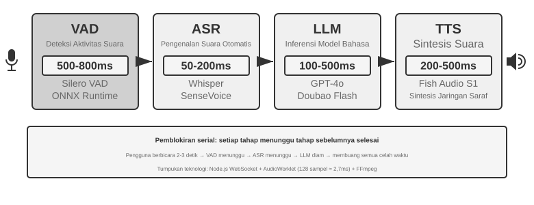
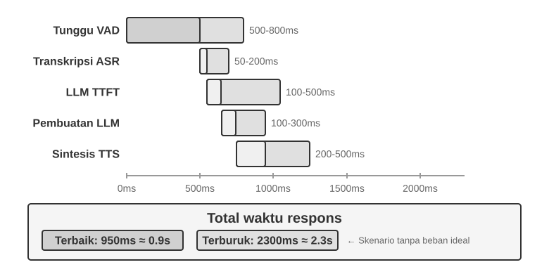
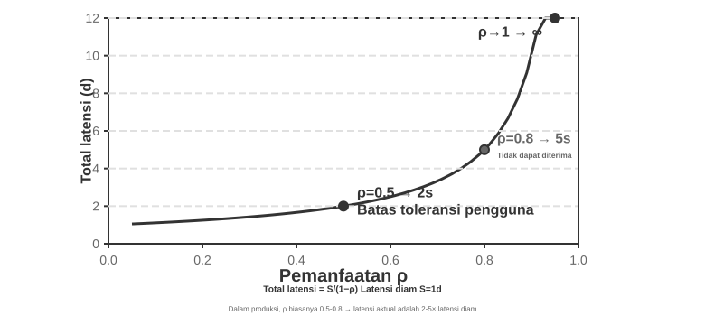
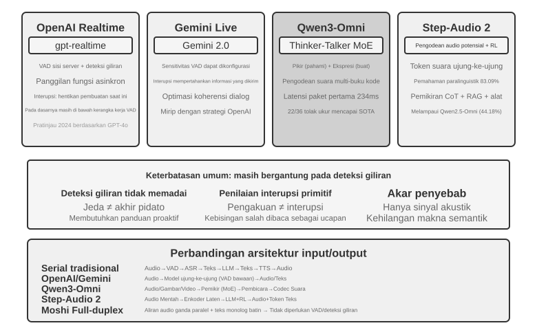
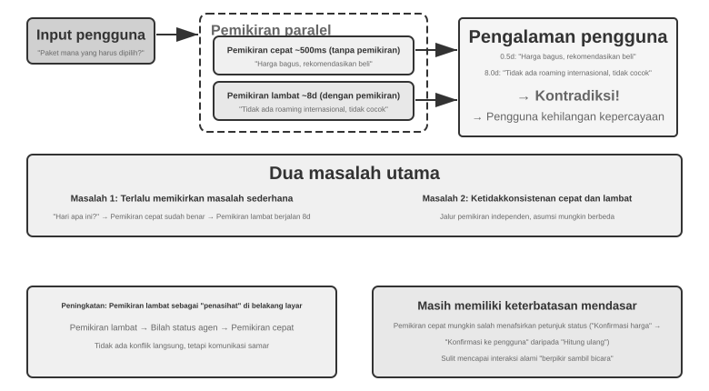
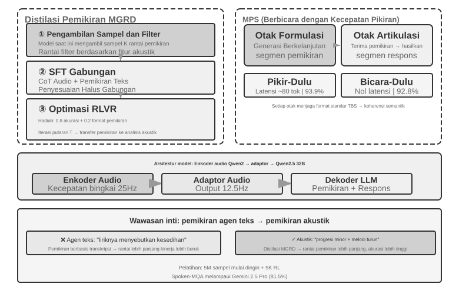
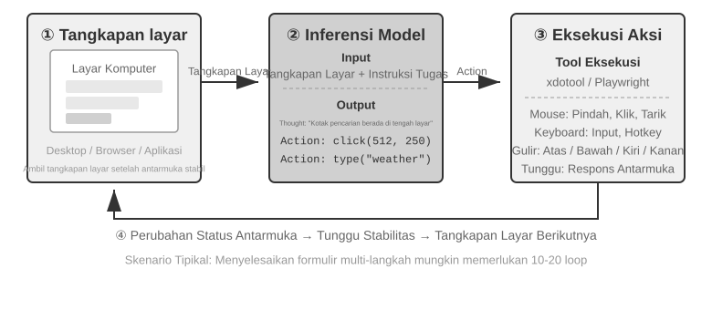
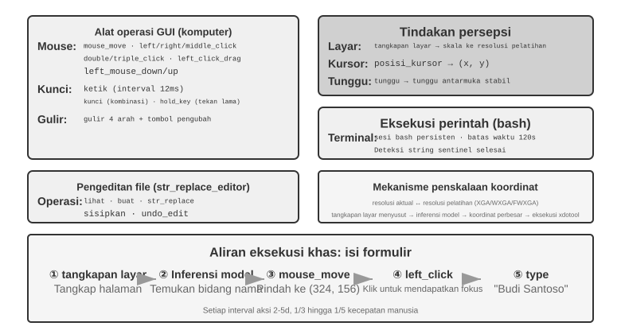
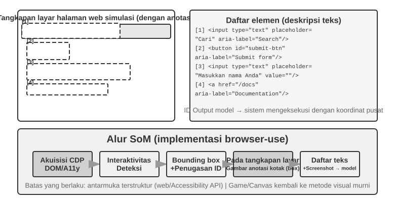
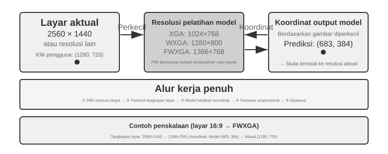

# Multimodalitas dan Interaksi Real-Time

Bab-bab sebelumnya mengeksplorasi bagaimana Agents beroperasi di dunia berbasis teks, berinteraksi dengan sistem digital melalui konteks, alat, dan kode. Namun, dunia Agent melampaui teks dan API. Saat Agent perlu memahami perintah lisan, menemukan dan mengklik tombol yang tepat di layar, atau mengarahkan lengan robot untuk memegang suatu objek, ia memasuki wilayah baru: **interaksi real-time multimodal**. Peralihan dari input dan output murni teks ke **persepsi multimodal dan respons real-time** ini adalah langkah krusial yang membawa Agent melampaui "kotak dialog." "Multimodal" secara sederhana berarti menangani berbagai bentuk informasi sekaligus—teks, ucapan, gambar, video, dan tindakan—daripada hanya teks saja.

Pertama, mari kita tentukan ruang lingkup bab ini. Pemahaman gambar statis dan dokumen—memeriksa tangkapan layar, membaca bagan, atau mem-parsing PDF—telah menjadi bagian alami dari alur kerja Agent di bab-bab sebelumnya. Untuk LLM multimodal saat ini, tugas-tugas pemahaman input-tunggal ini relatif matang dan tidak memerlukan arsitektur khusus. Bab ini mengatasi kelas masalah yang berbeda: tiga skenario di mana **batasan real-time membuat masalah multimodal menjadi sulit**—dialog suara, operasi GUI, dan kontrol robot. Dalam pengaturan ini, input tiba terus-menerus dan output harus memenuhi anggaran waktu yang ketat, yang secara fundamental mengubah arsitektur. Pemahaman real-time dari aliran visual kontinu, atau video, tetap menjadi masalah terbuka bagi Agents pada saat penulisan. Kita akan kembali membahasnya ketika bagian Computer Use menguji batas tangkapan layar frame-by-frame, dan sekali lagi dalam pertanyaan akhir bab. Satu batasan lagi: dalam kerangka buku ini, **pembuatan** multimodal (pembuatan gambar atau video) hanyalah panggilan alat biasa (tool call), sebagaimana dibahas di Bab 5 tentang Pembuatan Multimedia. Agent menggunakannya sebagai alat eksternal, sehingga tidak menimbulkan tantangan interaksi real-time yang dibahas di sini dan tetap berada di luar benang merah bab ini.

Interaksi suara, Computer Use, dan operasi robot mungkin tampak seperti tiga bidang yang sama sekali berbeda, tetapi sistem pada ketiganya menghadapi masalah yang sangat mirip: mereka harus memproses beberapa modalitas sekaligus, dan mereka sangat sensitif terhadap latensi. Jeda lebih dari dua detik dalam percakapan suara membuat orang gelisah; jitter tingkat milidetik dalam kontrol robot dapat menyebabkan tabrakan. Bersama-sama, batasan-batasan ini mendorong ketiga skenario ke arah arsitektur yang sama: menjauh dari **pipeline serial (serial pipeline)** (seperti jalur perakitan pabrik, di mana satu langkah harus selesai sebelum langkah berikutnya dimulai) dan menuju **model end-to-end** (model terpadu yang berjalan langsung dari input ke output, menghilangkan penyerahan perantara).

Bab ini diuraikan sebagai berikut:

1.  Pertama, kita menggunakan tiga paradigma arsitektur suara sebagai kerangka kerja: cascaded (pipeline VAD-ASR-LLM-TTS), omnimodal end-to-end (Omni, model tunggal yang masih mengandalkan pengambilan giliran / turn-taking), dan full-duplex (Moshi dan GPT-Live, yang mendengarkan dan berbicara secara bersamaan). Kita membandingkan latensi dan trade-off mereka dengan menanyakan seberapa jauh setiap paradigma bergerak melampaui asumsi VAD tentang giliran diskrit. Bagian cascaded juga membahas penggantian VAD + ASR dengan persepsi suara streaming.
2.  Selanjutnya, kita memeriksa bagaimana arsitektur pemikiran (thinking architecture) merekonsiliasi konflik antara "respons real-time" dan "pemikiran mendalam" (deep thinking): dari paralelisasi sederhana cepat dan lambat, hingga pendekatan terpisah di mana model penalaran latar belakang bertindak sebagai "ahli strategi" (delegasi GPT-Live, Pine AI, dll.), hingga "internalisasi" pemikiran Step-Audio R1 ke dalam satu model tunggal yang "berpikir sambil berbicara."
3.  Kemudian, kita membahas bagaimana sintesis ucapan yang lebih mirip manusia mengoptimalkan lapisan eksekusi.
4.  Terakhir, kita memperluas perspektif ke Computer Use (memungkinkan AI untuk mengoperasikan layar komputer layaknya manusia) dan operasi robot, mengamati bagaimana masalah latensi dan multimodalitas yang sama bermanifestasi dalam dua skenario ini.

Dua tema teoretis lainnya berlanjut di seluruh skenario ini dan patut mendapat perhatian khusus: **arsitektur pemikiran** (bagaimana pemikiran cepat dan lambat berkolaborasi) dan **antarmuka cepat-lambat (fast-slow interface)** yang mengikutinya (**Latent Bridge**—apa yang dapat dipertukarkan model cepat dan lambat selain teks). Meskipun diperkenalkan dalam konteks suara, ide-ide ini tidak terbatas padanya. Bagian Computer Use dan robotika menghadapi pertanyaan yang sama tentang kapan harus berkonsultasi dengan ahli strategi yang lambat, jadi ingatlah kedua tema ini.

## Suara: Antarmuka Manusia-Mesin yang Paling Alami

Suara bukan sekadar mengubah teks menjadi bunyi. Berbicara kira-kira empat kali lebih cepat daripada mengetik dan tidak menggunakan tangan maupun pandangan, sehingga cocok menempatkan Agent dalam loop input-output kontinu yang dapat disela kapan saja. Input suara mengubah ucapan menjadi teks; voice Agent membuat pengguna dapat bekerja sama langsung dengan Agent. Keduanya mendukung whisper coding dari bagian pendahuluan.

Bagian ini membahas pengguna yang berbicara kepada Agent dan Agent yang berbicara kepada dunia luar atas nama pengguna. Model suara menentukan apa yang dapat dijawab; arsitektur interaksi menentukan apakah Agent mendengar dengan baik, merespons tepat waktu, berganti giliran secara alami, dan menyelesaikan konfirmasi serta pemanggilan alat selama panggilan.

### Waktu interaksi: dari cascade ke full-duplex

Dalam pengantar GPT-Live, OpenAI merangkum tiga paradigma suara: cascade, turn-based, dan full-duplex[^ch9-12]. Ketiganya adalah pertukaran latensi, biaya, dan keteramatan, bukan penggantian linear.

| Paradigma | Struktur | Keunggulan | Batasan |
| --- | --- | --- | --- |
| Cascade | VAD → ASR → LLM → TTS | Modul jelas, mudah diganti dan di-debug | Latensi menumpuk, informasi paralinguistik hilang di batas |
| Omni end-to-end | Satu model mendengar, berpikir, dan berbicara | Latensi lebih rendah, nada, emosi, dan suara lingkungan lebih terjaga | Tetap berbasis giliran; pelatihan dan debugging lebih mahal |
| Full-duplex | Terus mendengar, berbicara, dan memutuskan | Ucapan tumpang tindih dan interupsi alami | Pelatihan, kontrol, dan evaluasi lebih rumit |

Benang merahnya adalah keluar dari asumsi bahwa orang harus berbicara bergantian dan dari tebakan VAD tentang siapa yang memegang giliran. Cascade dan Omni masih membagi percakapan menjadi giliran; full-duplex menjadikan kepemilikan giliran sebagai keputusan model yang terus berjalan.

[^ch9-12]: OpenAI. *Introducing GPT-Live.* 2026-07-08. https://openai.com/index/introducing-gpt-live/. Klasifikasi ini berasal dari rangkuman tiga generasi ChatGPT Voice; Omni end-to-end sesuai dengan kategori “turn-based voice models”.

**Pembatalan streaming:**

```python
while audio_is_arriving:
    partial = asr.push(audio_chunk)
    if endpoint_is_probable(partial):
        candidate = llm.start(partial)
        if later_audio_changes_meaning(partial):
            cancel(candidate)                 # speculative cancellation
        else:
            tts.enqueue_stable_segments(candidate)

on_final_transcript(text):
    commit_or_restart(text)
```

### Paradigma 1 · Pipeline cascade

Sebagian besar asisten suara komersial masih memakai pipeline serial (Gambar 9-1): VAD menentukan akhir ucapan, ASR mengubah audio menjadi teks, LLM memahami dan menghasilkan jawaban, lalu TTS membacakannya. Modularitas memudahkan optimasi tiap komponen, tetapi setiap batas menambah waktu tunggu.



| Modul | Peran | Hambatan umum |
| --- | --- | --- |
| VAD | Menentukan ucapan selesai | Ambang hening menyebabkan tunggu dan salah segmentasi |
| ASR | Audio ke teks | Latensi pengenalan dan hilangnya konteks |
| LLM | Memahami, berpikir, dan menghasilkan | Latensi token pertama dan tunggu tambahan saat reasoning |
| TTS | Teks ke suara | Sintesis paket pertama dan buffer pemutaran |

Pada jawaban singkat, waktu tunggu VAD, ASR, LLM, dan TTS terakumulasi secara serial (Gambar 9-2). Antrean produksi memperbesar latensi idle (Gambar 9-3).





> **Eksperimen 9-1 ★: Membangun voice Agent tradisional**
>
> Hubungkan mikrofon, Silero VAD, Whisper lokal, LLM streaming, dan Fish S1 TTS melalui WebSocket untuk membuat baseline cascade. Bukti satu giliran yang dipertahankan menunjukkan rantai media dan model berjalan end-to-end, bukan benchmark konkurensi atau beban produksi. Kode dan penerimaan ada di [chapter9/live-audio](../chapter9/live-audio/).

> **Proyek tambahan: voice Agent WebRTC yang “menelepon pengguna”**
>
> PSTN tidak diperlukan. WebRTC browser dapat membuka sesi, menanyakan informasi yang kurang, mengulanginya untuk konfirmasi, dan menyimpan hasil terstruktur. Untuk menghubungi organisasi eksternal, ganti kontrak alat yang sama dengan penyedia PSTN/SIP yang patuh. Proyek ini mempertahankan identitas run historis exp9-2, tetapi tidak lagi menjadi nomor eksperimen di manuskrip. Lihat [chapter9/phone-agent](../chapter9/phone-agent/).

#### Dari serial ke persepsi streaming

ASR dapat menghasilkan transkrip sementara saat pengguna berbicara, LLM mengirim kalimat pertama ke TTS, dan TTS mengembalikan potongan audio. Ketiganya tidak menjadi paralel penuh: generasi lebih awal memerlukan pembatalan, invalidasi, mulai ulang, dan rollback ketika transkrip berubah.

Front-end VAD + ASR menimbulkan akumulasi latensi karena menunggu hening, kehilangan keraguan, emosi, backchannel, dan suara lingkungan, serta memutus konteks nama atau alamat email. Model streaming sejati membutuhkan encoder kausal/ber-chunk dan decoding inkremental; encoder Whisper menunggu segmen audio lengkap. Model audio berbasis LLM dapat mengeluarkan teks dan event semantik, tetapi simulasi prefix bukan jaminan performa kausal. Marker speak_start/end, interrupt, emotion, laugh, sigh, dan noise mempertahankan sinyal nonteks.

[^ch9-11]: Diagnosis penanaman penilaian giliran ke recognizer dan masalah label dengan informasi masa depan lihat Li, Bojie dan Noah Shi. *The Trade-off Was in the Labels: Causal Supervision for Turn-Aware Streaming ASR.* 2026 (akan terbit).

> **Eksperimen 9-2 ★: Mensimulasikan persepsi suara streaming dengan Qwen2-Audio**
>
> Qwen2-Audio bukan model streaming. Gunakan prefix audio yang makin panjang dan bandingkan dengan VAD 600 ms + Whisper. Canonical run melewati semua gate tetapi hanya mereproduksi 2/6 perilaku: panggilan prefix memerlukan 8,4–11,3 detik, sampel pause melewatkan silence, dan sampel noise salah mengklasifikasikan cough/laughter. Ini menguji mekanisme dan mode kegagalan, bukan klaim persepsi streaming 100–200 ms. Catatan lengkap ada di [chapter9/streaming-speech](../chapter9/streaming-speech/).

### Paradigma 2 · Model omnimodal end-to-end (Omni)

Cascade dapat kehilangan emosi, intonasi, dan suara lingkungan ketika audio menjadi teks. Omni mendengar, menjawab, dan berbicara dengan satu model, tetapi lebih mahal untuk dilatih, di-debug, dan diganti. Keunggulannya terutama latensi dan informasi nonteks, bukan akurasi yang pasti lebih tinggi. Self-cascade dapat memperbaiki kesalahan persepsi bila teks cukup; bila jawaban bergantung pada kecepatan, emosi, atau lingkungan, bottleneck teks menghapus bukti[^ch9-13]. Omni tetap mengasumsikan giliran dan dapat mengira jeda di tengah angka sebagai akhir.

[^ch9-13]: Pengukuran lintas-modal lengkap tentang kapan keunggulan akurasi cascade dan end-to-end berbalik: Li, Bojie dan Noah Shi. *The Cascade Gap: When and Why Self-Cascades Help Multimodal Agents.* 2026 (akan terbit).



API suara real-time berada di tengah: audio diproses native, tetapi kontrol masih bergantung pada VAD, interupsi, dan pemanggilan alat asinkron. Bandingkan mode kegagalan per tugas, bukan papan peringkat.

> **Eksperimen 9-3 ★★: Menjalankan MiniCPM-o 4.5 secara lokal, end-to-end versus self-cascade**
>
> Tetapkan satu revision, matikan thinking mode, lalu bandingkan jawaban langsung dari audio dengan transkripsi kemudian jawaban. Ini mengukur pelestarian informasi audio, bukan kemampuan “berpikir sambil berbicara”.
> Tabel 9-1 Hasil MiniCPM-o 4.5 lokal: end-to-end versus self-cascade (empat pemeriksaan mekanisme, bukan benchmark)
>
>
> | Tugas | End-to-end | Self-cascade | Pengamatan |
> | --- | ---: | ---: | --- |
> | Aritmetika semantik (2) | 1/2 | 2/2 | Self-cascade memperbaiki satu kesalahan transkripsi |
> | Kecepatan paralinguistik (2) | 2/2 | 1/2 | Transkrip teks menghapus perbedaan cepat/lambat |
> | Total | 3/4 | 3/4 | Total sama, kegagalan saling melengkapi |
>
> Sampel kecil; tidak dapat menetapkan jalur mana yang umumnya lebih akurat atau cepat. Bukti lengkap ada di [chapter9/end-to-end-speech](../chapter9/end-to-end-speech/).

Step-Audio 2 memproses audio mentah dan menghasilkan teks serta suara; Step-Audio R1 menginternalisasi penalaran dalam model audio.

### Paradigma 3 · Model interaktif full-duplex

Omni memisahkan “pengguna berbicara” dan “model berbicara”, tetapi penerjemahan simultan memerlukan tumpang tindih. Full-duplex terus mendengar dan berbicara sambil memutuskan lanjut, berhenti, menyela, atau memanggil alat. Moshi dari Kyutai adalah contoh awal; Thinking Machines Lab menyebut jalur ini Interaction Model[^ch9-14] dan membangun interaksi di dalam model, bukan di sekitar VAD. GPT-Live membawanya ke skala produksi.

[^ch9-14]: Thinking Machines Lab, “Interaction Models: A Scalable Approach to Human-AI Collaboration,” 2026-05. https://thinkingmachines.ai/blog/interaction-models/

Urutannya jelas: cascade menebak giliran dari ambang hening, streaming menaikkan keputusan ke tingkat semantik, dan full-duplex menjadikan pergantian giliran keputusan kontinu.

### Waktu kognitif: interaksi real-time dan pemikiran mendalam

Model latar depan harus menjawab selama pengguna masih aktif; model latar belakang dapat berpikir lebih lama. Tiga desain berikut adalah trade-off.

| Desain | Latar depan | Latar belakang | Risiko |
| --- | --- | --- | --- |
| Jawab cepat, koreksi lambat | Jawaban segera | Pikir ulang dan lengkapi | Kontradiksi |
| Interaksi cepat, nasihat lambat | Menjaga percakapan dan memilih kata | Nasihat atau hasil alat | Antarmuka terbatas |
| Penalaran dan ekspresi terpadu | Berpikir sambil berbicara | Berbagi keadaan model | Biaya pelatihan tinggi |

#### Solusi 1: berpikir cepat untuk pengisi, berpikir lambat untuk jawaban

Berpikir cepat dapat memberi respons pengisi dalam beberapa ratus milidetik, sementara berpikir lambat menyelesaikan penalaran yang lebih dalam di latar belakang. Masalahnya, pertanyaan sederhana diproses dua kali, dan pertanyaan rumit bisa berujung kontradiksi: model cepat menyarankan pembelian, lalu model lambat menemukan bahwa paketnya tidak memiliki fitur kunci, sehingga dalam hitungan detik pengguna mendengar dua jawaban yang saling bertentangan. Akar penyebabnya adalah kedua instans masing-masing melakukan penalaran sendiri secara independen.





#### Solusi 2: berpikir cepat untuk interaksi, berpikir lambat untuk pengingat

Solusi kedua membuat model latar belakang memberi saran kepada model latar depan melalui status bar atau antarmuka khusus, sementara latar depan tetap menjaga alur percakapan dan menentukan cara mengungkapkannya. Ini lebih stabil daripada solusi pertama, tetapi komunikasinya tetap tidak langsung: latar depan bisa salah menafsirkan saran dan tidak melihat penalaran antara dari latar belakang; sebelum latar belakang selesai, ketika pengguna bertanya lagi, latar depan hanya bisa mengandalkan kemampuannya sendiri. Ia bisa "menunggu hasil" secara wajar, tetapi tidak benar-benar berpikir sambil berbicara.

#### Solusi 3: penyatuan penalaran dan ekspresi secara end-to-end (contoh Step-Audio R1)

Solusi ketiga menginternalisasi kemampuan bernalar langsung ke dalam model audio end-to-end. Step-Audio R1 menyelesaikan dua masalah dengan dua mekanisme yang saling melengkapi: **distilasi penalaran berjangkar modalitas (MGRD)** membuat model bernalar berdasarkan fitur akustik, dan **arsitektur dua otak MPS** membuat perumusan dan ekspresi berjalan paralel. Yang pertama menjamin "berpikir benar", yang kedua mengatasi "berbicara tepat waktu".

Idealnya, model menilai emosi dari nada, ritme, dan intonasi, bukan hanya dari teks transkripsi. Yang disebut "penalaran proksi teks" adalah ketika model mengganti analisis melodi dan fitur akustik dengan kata-kata negatif dalam lirik. MGRD menyaring proses penalaran yang benar-benar merujuk pada fitur akustik, melatih model dengan data tersebut, dan melalui reinforcement learning mencegah model melompati penalaran lalu langsung menebak jawaban.

MPS membuat otak perumus terus menghasilkan fragmen penalaran, dan otak ekspresi, begitu menerima fragmen, langsung menghasilkan suara dengan menggabungkannya dengan jawaban yang sudah ada. Keduanya berjalan paralel bak jalur pipa, sehingga tidak perlu menunggu seluruh penalaran selesai sebelum pengguna mendengar kalimat pertama (Gambar 9-6).





Model terpadu paling erat mewujudkan "berpikir sambil berbicara", dengan biaya bahwa penalaran dan ekspresi real-time harus dilatih ulang bersama-sama; jalur terpisah lebih mudah untuk mengganti otak latar belakang, sedangkan jalur terpadu lebih cocok untuk skenario khusus yang mengejar kealamian maksimal. Keduanya adalah trade-off, bukan sekadar saling menggantikan.

### Sintesis suara yang lebih manusiawi

TTS yang terlalu halus dan tanpa jeda terdengar seperti mesin. LLM dapat mengeluarkan THINKING, EMO:happy, dan SPEED:0.8x; TTS memetakannya ke jeda, prosodi, kecepatan, tawa, dan helaan napas. Pada Fish Audio S1, konfigurasi multi-referensi mendapat nilai tertinggi dalam tiga sesi dengar buta yang seimbang (kemiripan layanan pelanggan manusia 4,67/5), tetapi kelompok tanpa marker mengungguli referensi tunggal sehingga urutan lengkap tidak tereplikasi.

> **Eksperimen 9-4 ★★: TTS berbasis token kontrol dengan Fish Audio**
>
> Bandingkan tanpa marker, satu referensi, dan beberapa referensi; lapisan eksekusi memilih emosi, kecepatan, dan gaya. Pustaka 24 referensi, media A/B/C, dan bukti penerimaan ada di [chapter9/controllable-tts](../chapter9/controllable-tts/).

## Computer Use: Agen Otomatisasi GUI

Sekarang Anda mungkin telah memperhatikan bahwa bab ini mencurahkan lebih banyak ruang untuk suara dibandingkan dengan dua skenario berikutnya. Hal ini disengaja. Di antara sistem multimodal real-time, teknologi suara telah berkembang paling jauh dan karenanya memberikan titik referensi terbaik. Teknologi ini telah menelusuri busur penuh dari masalah aslinya—latensi yang berlebihan dalam pipeline serial—melalui model end-to-end, interaksi full-duplex, dan berpikir sambil berbicara, hingga desain yang relatif matang saat ini. Itulah mengapa kami menceritakan kisahnya secara penuh. Saat Anda membaca bagian Computer Use dan robotika, bandingkan dengan lintasan ini: seberapa jauh masing-masing bidang telah berkembang, dan di mana masing-masing bidang masih terjebak?

Ketiga skenario ini tampak berbeda tetapi menghadapi tantangan inti yang sama: persepsi real-time, pengambilan keputusan dengan latensi rendah, dan interaksi yang berkelanjutan. Selanjutnya, kita beralih ke interaksi visual, atau Computer Use, memperluas perspektif dari modalitas pendengaran ke visual: bagaimana jika sebuah Agent tidak hanya dapat memahami ucapan tetapi juga "melihat" layar dan mengoperasikan antarmuka grafisnya?

Computer Use, juga dikenal sebagai otomatisasi GUI, memungkinkan AI untuk menggunakan perangkat lunak seperti manusia dengan mengamati layar dan mengoperasikan mouse dan keyboard—misalnya, membuka browser untuk mencari informasi, mengisi data dalam aplikasi spreadsheet, atau menyesuaikan konfigurasi dalam pengaturan sistem. Intinya adalah loop **Perceive-Think-Act** (Gambar 9-6):

1.  Agent mengambil tangkapan layar dari layar saat ini.
2.  Model multimodal menerima tangkapan layar dan instruksi tugas, lalu mengeluarkan pemikiran dan tindakan spesifik.
3.  Lapisan eksekusi melakukan tindakan di lingkungan nyata (menggerakkan mouse, mengklik, mengetik teks, dll.).
4.  Menunggu antarmuka merespons, mengambil tangkapan layar lagi, dan memasuki iterasi loop berikutnya.

**Loop keamanan Computer Use:**

```python
observation = capture_screenshot_and_accessibility_tree()
proposal = model.decide(task, observation)
action = validate_schema_and_coordinates(proposal)

if action.is_irreversible and not user_or_policy_approval(action):
    stop("approval required")
else:
    execute_in_sandbox_or_scoped_session(action)
    new_observation = capture_after_settle()
    if not verify_goal_progress(new_observation, action):
        rollback_if_possible_or_replan()
```



Ada tiga dimensi desain utama dalam loop ini: **Action Space** (operasi apa yang dapat dilakukan Agent), **Visual Grounding** (bagaimana menemukan elemen target dalam tangkapan layar), dan **Model Architecture** (bagaimana menghasilkan tindakan yang benar dari tangkapan layar).

### Desain Action Space

Anthropic mendefinisikan tiga jenis alat yang membentuk kemampuan interaksi lengkap (Gambar 9-7):



**GUI Operation Tool** (alat `computer`): Operasi mouse mencakup menggerakkan (`mouse_move`), klik kiri/kanan/tengah, klik ganda atau klik tiga kali, menyeret (`left_click_drag`), dan tindakan tekan/lepas yang lebih presisi (`left_mouse_down` dan `left_mouse_up`). Menggulir (`scroll`) mendukung empat arah dan dapat dikombinasikan dengan tombol pengubah. Operasi keyboard mencakup mengetik karakter demi karakter (`type`, dengan interval 12ms antar karakter untuk menyimulasikan pengetikan nyata), kombinasi tombol (`key`, mis., `Ctrl+C`), dan menahan tombol (`hold_key`). Tindakan persepsi mencakup mengambil tangkapan layar, mengambil posisi kursor (`cursor_position`), dan menunggu (`wait`).

**Command Execution Tool** (alat bash): Menyediakan sesi terminal bash persisten dengan batas waktu 120 detik. Alat ini menggunakan string sentinel untuk mendeteksi penyelesaian perintah dan mempertahankan status lingkungan di beberapa pemanggilan (mis., setelah `cd` ke sebuah direktori, panggilan berikutnya tetap berada di direktori tersebut).

**File Editing Tool** (`str_replace_editor`): Memungkinkan pengeditan yang aman melalui pencocokan string dan mendukung operasi lihat, buat, ganti, sisipkan, dan urungkan. Ini lebih presisi daripada menimpa seluruh file dan lebih kecil kemungkinannya untuk memodifikasi konten yang tidak terkait secara tidak sengaja.

> **Eksperimen 9-5 ★: Menjalankan Computer Use (Jalur Referensi Anthropic atau Jalur Model Terbuka)**
>
> Jalur A menggunakan Demo Anthropic Computer Use. Kontainernya mengemas lingkungan desktop Ubuntu lengkap, termasuk browser, terminal, dan tool umum lainnya. Frontend menerima tugas, sedangkan backend mengirim instruksi dan tangkapan layar ke Claude, lalu menjalankan tindakan mouse, keyboard, terminal, atau pengeditan yang dikembalikan model. Jalur ini ditujukan untuk memahami protokol tool `computer` native; tidak semua pembaca diwajibkan memiliki akses ke Anthropic API.
>
> Jalur B menggunakan proyek pendamping buku [`chapter9/computer-use-open-model`](../chapter9/computer-use-open-model/). Secara default, proyek ini menggerakkan browser-use dengan model berbobot terbuka Qwen3-VL 32B Instruct, baik melalui API hosting OpenRouter maupun dengan mengarahkan `OPEN_MODEL_BASE_URL` ke vLLM/SGLang yang di-host sendiri atau endpoint kompatibel lainnya. Endpoint harus menerima tangkapan layar dan mendukung JSON Schema native; jika hanya mendukung JSON biasa, mode kompatibilitas schema-in-prompt dapat diaktifkan secara eksplisit.
>
> Kedua jalur memakai tugas read-only dan kontrak penerimaan yang sama: maksimal 25 langkah, hanya satu tindakan per langkah, serta menyimpan identitas model/endpoint, respons mentah penyedia, tangkapan layar tiap langkah, urutan tindakan, jawaban akhir, dan alasan berhenti. Model yang berbeda harus dilaporkan sebagai lengan eksperimen terpisah; hasil model terbuka tidak boleh disajikan sebagai reproduksi Claude, dan “kontainer berhasil dimulai” tidak boleh dianggap sebagai penyelesaian tugas. Interval tindakan dan kualitas perencanaan adalah hasil yang diukur, bukan asumsi 2–5 detik ataupun kepastian bahwa model tersebut lebih unggul dari model lain.

### Visual Grounding

Dalam setiap iterasi loop, model perlu menemukan elemen target di tangkapan layar secara akurat—"Di mana kotak pencariannya?" "Apa koordinat tombol kirim?" Ini adalah masalah visual grounding. Saat ini, ada **dua pendekatan utama**: yang pertama adalah mengubah pelokalan menjadi **masalah pilihan ganda**—pertama beri anotasi elemen antarmuka dengan angka, dan model hanya perlu memilih satu; yang lainnya adalah **prediksi koordinat murni**—membiarkan model "melihat" tangkapan layar dan melaporkan koordinat secara langsung, persis seperti manusia. Pendekatan pilihan ganda memiliki dua metode implementasi: **anotasi visual murni** (Set-of-Mark asli, menggunakan model segmentasi untuk menyegmentasi wilayah kandidat dalam gambar) dan **pengindeksan elemen terstruktur** (DOM/Accessibility Tree, secara langsung membaca struktur inheren antarmuka). Keuntungan umum dari pendekatan pilihan ganda adalah mengubah masalah terbuka "temukan tombol dalam tangkapan layar dan prediksi koordinatnya" menjadi masalah tertutup "pilih satu dari elemen yang sudah dianotasi"—sama seperti pertanyaan pilihan ganda yang lebih mudah dijawab dengan benar daripada pertanyaan isian dalam ujian, model hanya perlu mengatakan "klik [123]" daripada "klik tombol biru sekitar 200 piksel di sebelah kanan sudut kiri atas layar."

**Set-of-Mark: Metode Anotasi Visual.**

Set-of-Mark (SoM) asli diusulkan oleh Microsoft Research pada tahun 2023, awalnya untuk membuka kemampuan visual grounding dari GPT-4V. Ini adalah metode **visual murni**: menggunakan model segmentasi gambar (SAM, SEEM, dll.) untuk menyegmentasi wilayah kandidat dalam tangkapan layar secara otomatis, menempatkan penanda bernomor pada setiap wilayah, dan model melihat gambar dengan angka-angka. Model hanya perlu melaporkan angka tersebut, dan sistem mengubahnya menjadi koordinat tengah dari wilayah yang sesuai. Seluruh proses tidak memerlukan DOM atau struktur antarmuka internal apa pun, sehingga sama-sama berlaku untuk perangkat lunak desktop asli dan antarmuka game—selama model segmentasi dapat mengidentifikasi wilayah kandidat.

**Pengindeksan Elemen Terstruktur: Implementasi Terstruktur dari Ide SoM di Web.**

Ketika antarmuka itu sendiri menyediakan informasi terstruktur, anotasi dapat menjadi lebih presisi. Sebelum rendering, halaman web modern mendefinisikan struktur elemen lengkap (pohon DOM) dan peran semantik yang mengidentifikasi tombol, bidang input, dan kontrol lainnya. Accessibility tree memberikan informasi serupa untuk banyak aplikasi desktop. Daripada meminta model segmentasi untuk menebak wilayah mana yang merupakan tombol dari piksel saja, sistem dapat menanyakan antarmuka secara langsung untuk elemen yang dapat dikliknya. Sistem Web Agent seperti `browser-use` melakukan hal ini: mereka menghitung dan menomori elemen interaktif dari DOM. Ini adalah implementasi terstruktur dari ide SoM untuk web (Gambar 9-8). Prosesnya memiliki empat langkah:

1. Mendapatkan representasi terstruktur (pohon DOM) dan informasi aksesibilitas untuk halaman tersebut melalui antarmuka debugging browser (CDP, Chrome DevTools Protocol)
2. Mendeteksi elemen mana yang interaktif secara otomatis (tombol, kotak input, tautan, dll.)
3. Menganotasi setiap elemen interaktif dengan ID unik dan menggambar kotak pembatas (bounding box) pada tangkapan layar
4. Secara bersamaan menghasilkan daftar teks yang mendeskripsikan elemen yang sesuai dengan setiap ID

```text
Tangkapan layar: [Elemen kunci pada gambar dianotasi dengan ID seperti [1], [2], [3], [4]]

Elemen:
[1] <input type="text" placeholder="Search" aria-label="Search" />
[2] <button id="submit-btn" aria-label="Submit form" />
[3] <input type="text" placeholder="Enter your name" value="" />
[4] <a href="/docs" aria-label="Documentation" />
```

Model hanya perlu menghasilkan ID, dan sistem secara otomatis mengklik bagian tengah elemen yang sesuai. Pendekatan ini tidak menghemat token karena semua data anotasi tetap harus dikirim ke model, tetapi memberikan pelokalan yang akurat dan stabil sembari menghindari deteksi yang terlewat dan positif palsu yang dapat diperkenalkan oleh model segmentasi.



**Prediksi Koordinat Murni.**

Rute ketiga melewatkan anotasi dan meminta model untuk mengeluarkan koordinat secara langsung. Sistem seperti **SeeClick** dan computer use Claude mengandalkan model visi yang dilatih pada dataset besar tangkapan layar GUI yang dipasangkan dengan posisi elemen. Model ini belajar memetakan deskripsi bahasa alami (mis., "klik tombol kirim") secara langsung ke koordinat tangkapan layar yang tepat, mengandalkan persepsi visual seperti pengguna manusia.

Dalam skema prediksi koordinat, pemahaman model tentang koordinat sangat bergantung pada resolusi yang digunakan selama pelatihan (Gambar 9-9). Claude dilatih menggunakan XGA (1024×768), WXGA (1280×800), dan FWXGA (1366×768). Jika resolusi tangkapan layar input tidak cocok, prediksi koordinat model akan bergeser secara sistematis—seperti mengukur jarak di peta kecil dan kemudian menerapkannya secara langsung ke peta besar. Oleh karena itu, mekanisme penskalaan koordinat dua arah harus diimplementasikan pada lapisan alat, dan resolusi target harus **dipilih berdasarkan rasio aspek** untuk menghindari peregangan tidak seragam yang mendistorsi gambar dan akibatnya membiaskan penilaian koordinat. Misalnya, jika resolusi layar sebenarnya adalah 2560×1440 (16:9), target yang paling sesuai di antara tiga opsi yang didukung Claude adalah FWXGA (1366×768), yang memiliki rasio aspek terdekat dengan 16:9. Tangkapan layar diskalakan secara proporsional menjadi 1366×768 dan diumpankan ke model; setelah model mengeluarkan koordinat klik (683, 384), koordinat tersebut dipetakan secara terbalik ke koordinat sebenarnya (683×2560/1366, 384×1440/768) ≈ (1280, 720). Sebaliknya, jika gambar 16:9 diregangkan secara paksa ke 4:3 1024×768, gambar akan dikompresi secara horizontal, menyebabkan prediksi koordinat model bergeser secara sistematis.



Pilihan di antara ketiga rute tersebut dapat diringkas sebagai berikut: **ketika informasi terstruktur tersedia, prioritaskan pengindeksan DOM/accessibility-tree** untuk pelokalan yang paling akurat dan stabil. **Ketika tidak tersedia**—dalam perangkat lunak desktop asli seperti Photoshop, antarmuka yang dirender canvas/WebGL, atau game—**gunakan anotasi visual (rute SoM asli) atau prediksi koordinat**. Anotasi visual mengubah pelokalan menjadi masalah pilihan ganda, membuatnya lebih ramah terhadap model serbaguna tanpa pelatihan khusus. Prediksi koordinat menghilangkan langkah anotasi dan lebih langsung untuk model yang dilatih khusus pada pelokalan GUI. Kedua pendekatan ini masih kesulitan dengan elemen kecil dan antarmuka yang padat.

> **Eksperimen 9-6 ★: Menggunakan browser-use untuk Mengimplementasikan Operasi Browser Otomatis**
>
> Gabungkan Playwright, framework otomatisasi browser, dengan model multimodal untuk mengimplementasikan operasi browser yang digerakkan bahasa alami. Aktifkan visualisasi SoM dan simpan tangkapan layar dengan anotasi bounding box sebelum setiap keputusan. Antarmuka model tidak terbatas pada OpenAI atau Anthropic; buku ini menyediakan konfigurasi API untuk model terbuka Qwen3-VL dan mempertahankan base URL generik yang kompatibel dengan OpenAI untuk layanan hosting lain atau inferensi yang di-host sendiri.
>
> Tugas pengujian “Buka Google dan cari cuaca San Francisco”: setelah startup, tangkapan layar menampilkan halaman pencarian Google dengan elemen interaktif bernomor. Model memilih kotak pencarian, memasukkan “San Francisco weather today”, mengirim pencarian, lalu mengekstrak suhu dan kondisi cuaca dari halaman hasil. Saat penerimaan, verifikasi jawaban dan trajectory secara independen serta catat jumlah langkah dan durasi aktual apa adanya. “5 langkah, sekitar 20 detik” hanya boleh menjadi hasil pengamatan dari satu proses tertentu, bukan hasil tetap tanpa bukti eksekusi.
>
> Proses resmi model terbuka yang disimpan buku menggunakan `qwen/qwen3-vl-32b-instruct` di OpenRouter. Saat menemui CAPTCHA di Google Search pada langkah 4, model tidak mengklaim berhasil; model beralih ke weather.com dan pada langkah 16 membaca 64°F, Sunny, terasa seperti 62°F, tertinggi 74°F, dan terendah 55°F dari halaman Today San Francisco. Seluruh 16 dari 16 respons API melaporkan model Qwen3-VL yang diminta, dan 15 tangkapan layar langkah yang valid beserta trajectory tindakan read-only lolos penerimaan deterministik independen. Hasil ini membuktikan bahwa jalur API model terbuka dapat dijalankan; bukan berarti lengan tool `computer` native Anthropic telah direproduksi.

### Computer Use Agent yang Dapat Menonton Animasi dan Mendengar Suara

Sejauh ini, persepsi Computer Use didasarkan pada asumsi implisit: **layar bersifat statis**—ambil tangkapan layar, pikirkan langkah berikutnya, klik, dan ambil tangkapan layar berikutnya. Layar yang sebenarnya memutar video, menampilkan notifikasi kilat yang menghilang dalam hitungan detik, dan memutar audio dari rapat. Sebuah Agent yang membuka matanya hanya setiap 3–5 detik sekali dan sama sekali tidak memiliki telinga akan buta dan tuli terhadap semua yang terjadi di antara dua frame. Menonton rekaman layar, bergabung ke rapat, mengikuti petunjuk suara, menangkap kotak dialog sebelum menghilang—seluruh kategori pekerjaan komputer sehari-hari ini secara efektif terlarang bagi Computer Use Agent saat ini.

Apa yang benar-benar perlu didesain ulang di sini bukanlah "antarmuka tindakan", melainkan "**antarmuka pengamatan**"[^ch9-9]. Ide intinya adalah memisahkan **pengamatan** (berkelanjutan, adaptif, multimodal) dari **tindakan** (diskrit), menciptakan lapisan middleware perseptual yang berada di antara lingkungan dan model Computer Use mana pun tanpa memerlukan pelatihan ulang. Kita dapat menyebutnya Agent–Computer Observation Interface (AOI). Antarmuka ini memiliki tiga komponen yang "dikendalikan oleh gerbang" (gated): Pertama, **pengambilan keyframe antar-frame**—menggunakan gerbang piksel yang sangat murah untuk melewati frame yang hampir tidak berubah, kemudian menggunakan model kecil untuk menentukan apakah ada perubahan bermakna yang terjadi, mengambil frame hanya saat ada perubahan, menghasilkan biaya yang hampir nol untuk layar statis; Kedua, **transkripsi ucapan dengan gerbang volume**—hanya memanggil pengenalan ucapan saat ada suara, memberi Agent "telinga" untuk pertama kalinya; Ketiga, dan yang paling kritis, **mengubah pengamatan menjadi deskripsi tekstual yang persisten**—meminta model mendeskripsikan frame yang ditangkap dalam satu kalimat (mis., "Munculan tersebut baru saja mengatakan bahwa tanggal rilis telah diubah menjadi 28 April"), dan **bahkan jika gambar asli kemudian dihapus dari konteks, teks ini tetap berada di dalam memori**, meneruskan informasi dinamis tersebut dalam bentuk tekstual.

Temuan yang berlawanan dengan intuisi adalah bahwa hal yang benar-benar penting bukanlah pemilihan frame, melainkan konversi frame yang dipilih menjadi teks yang persisten, karena teks adalah modalitas yang paling baik ditangani oleh LLM Agent. Pada delapan model, mulai dari model berparameter 7B hingga sistem skala perbatasan (frontier-scale), middleware ini memberikan peningkatan +17 hingga +48 poin persentase tanpa pelatihan ulang apa pun, dengan celah terlebar pada tugas-tugas suara: dengan adanya lapisan perseptual ini, Agent akhirnya dapat menyelesaikan tugas-tugas suara yang sebelumnya "dapat didengar tetapi tidak dapat ditindaklanjuti". Namun, ini bukanlah konfigurasi yang berlaku untuk semua—pada beberapa model yang lebih baru, memasukkan terlalu banyak token gambar akan mengganggu proses penalaran dan menurunkan performa. Jadi komponen-komponennya harus **dipilih per model**, tidak dinyalakan secara keseluruhan. Ini adalah pelajaran yang sama dengan trade-off antara Set-of-Mark versus prediksi koordinat: tidak ada solusi instan (silver bullet) dalam skema persepsi; Anda harus mengonfigurasinya agar sesuai dengan temperamen model.

[^ch9-9]: Untuk mekanisme lengkap dan ablasi per model dari ketiga komponen—gated keyframes, on-demand transcription, dan narrating frames into persistent text—lihat Bojie Li dan Noah Shi. *Agent-Computer Observation Interfaces Enable Dynamic Computer Use.* arXiv:2606.29472, 2026.

### World Model untuk Computer Use

Antarmuka observasi pada bagian sebelumnya menjawab "apa yang terjadi di antaranya": lewat keyframe, transkripsi suara, dan teks yang bertahan, Agent tidak lagi hanya melihat dua tangkapan layar yang terpisah jauh. Tetapi antarmuka observasi tidak menghapus tundaan perencanaan. Agent masih menjalankan lingkar serial "tangkap layar—berpikir—klik", dan setiap kali selesai satu aksi ia mengamati ulang serta memikirkan langkah berikutnya. Kajian efisiensi **OSWorld-Human** memperlihatkan bahwa sekalipun tugas akhirnya berhasil, jumlah langkah dan waktu tunggu Agent tetap jauh lebih banyak daripada manusia; mencapai ketepatan setara manusia tidak sama dengan sudah cukup layak pakai.

Ketika manusia mengoperasikan komputer, ia tidak mulai memikirkan langkah berikutnya baru setelah mengklik, melainkan lebih dulu meramalkan akibat aksinya: bila perubahan yang sesungguhnya sesuai dengan dugaan, ia meneruskan rencana semula; hanya ketika keadaan halaman menyimpang dari dugaan barulah ia berhenti untuk mengamati dan merencanakan ulang. World model membuat Agent bisa meramalkan akan menjadi apa layar kerja itu sebelum ia bertindak, sehingga terwujud "eksekusi spekulatif" mirip manusia yang meningkatkan efisiensi secara mencolok.

Keadaan layar kerja bukan sekadar sebuah citra piksel: ia juga mencakup jendela, fokus, posisi gulir, isi kotak masukan, keadaan pemuatan, izin, dan balasan jaringan; sedangkan aksinya mencakup klik, ketikan papan ketik, gulir, seret, dan tunggu. Sebuah world model yang bisa dipakai untuk Computer Use setidaknya harus mampu menyandikan keadaan sekarang, meramalkan perubahan keadaan yang ditimbulkan aksi calon, dan menyerahkan ramalan itu kepada perencana untuk menetapkan langkah berikutnya:

```text
keadaan layar kerja + click/type/scroll/wait ──> representasi keadaan berikutnya
```

Dengan begitu Agent dapat membandingkan akibat aksi-aksi calon sebelum benar-benar mengklik, menyiapkan langkah berikutnya selagi halaman dimuat, dan pulih berdasarkan selisih keadaan ketika sebuah jendela sembul lewat sekejap. Misalnya bila tugasnya "buat berkas Python baru di VS Code dan tulis hello world", model bisa lebih dulu meramalkan keadaan kunci pohon berkas dan penyunting setelah berhasil, baru kemudian memilih aksi klik, ketik, dan simpan; bila tugasnya menghapus berkas, ia bisa lebih dulu meramalkan di dalam layar kerja maya yang terisolasi apakah akan muncul kotak konfirmasi yang tak dapat dibatalkan, dan meminta persetujuan pengguna bila perlu. Yang penting di sini bukan membuat model menghasilkan tangkapan layar masa depan yang tampak nyata, melainkan meramalkan selisih keadaan yang dapat diperiksa dan yang memang dibutuhkan untuk menuntaskan tugas.

Pada Juli 2026, **Photon-1** yang diumumkan Induction Labs memperlihatkan satu perwujudan jalur ini: pralatih world model computer use diselesaikan hanya dengan 30.000 jam GPU H200. Ia memampatkan setiap bingkai menjadi token laten diskret dan meramalkan secara autoregresif representasi keadaan berikutnya sesudah sebuah aksi, alih-alih menghasilkan tangkapan layar piksel demi piksel pada tahap pralatih; adapun pembangkit citra yang ditautkan padanya hanya dipakai untuk memvisualkan representasi laten dan bukan komponen yang diperlukan saat inferensi. Diberi satu tangkapan layar benih beserta aksi-aksi lanjutannya, model dapat terus-menerus "membayangkan" keadaan layar kerja, lalu belajar mengeluarkan aksi computer-use melalui pelatihan daring di atas mesin maya.[^ch9-20]

[^ch9-20]: David Li and Jonathan Li, Induction Labs, “Scaling Video Pretraining with Imagination Models,” 2026-07-23. https://www.inductionlabs.com/news/scaling-video-pretraining. Parameter, skala data, tolok ukur internal, dan perbandingan biaya Photon-1 yang disebut dalam teks semuanya merupakan hasil yang diungkap perusahaan itu sendiri.

### Seluler: Hambatan Ekosistem Lebih Sulit Daripada Teknologi
## Robot Manipulation: Merapikan Meja dengan XLeRobot

> **Cara membaca bagian ini**: dari awal sampai akhir kita memakai satu tugas saja——"masukkan cangkir merah ke nampan, buang kertas kuning ke tempat sampah, lalu amati sekali lagi untuk memastikan keadaan meja". Eksperimen 9-7 dan 9-9 dijalankan pada XLeRobot fisik dan memerlukan lengan robot, kalibrasi, tombol henti darurat, serta pengawas di tempat. Eksperimen 9-8, 9-10, dan 9-11 adalah padanannya di GPU lokal. Hasil fisik dan hasil simulasi dilaporkan terpisah, tetapi tujuan tugas, makna aksi, dan syarat keberhasilannya dijaga tetap sama.

Manipulasi robot jauh lebih sulit daripada "melihat gambar lalu menjawab pertanyaan". Model bukan hanya harus memahami pemandangan, tetapi harus bertindak secara berkelanjutan di dunia nyata, dan setiap aksi mengubah keadaan pada detik berikutnya. XLeRobot membuat perbedaan ini menjadi sangat konkret. Lengan yang sama bisa dikendalikan dari jarak jauh oleh manusia dengan papan ketik, gamepad, atau perangkat VR; bisa pula pengamatan kamera dan sehimpunan kecil alat aksi diserahkan kepada Agent agar ia memanggilnya sendiri. Perangkat kerasnya tidak berubah, tugasnya juga tidak; yang berubah hanya siapa yang mengoperasikan——pada kasus pertama manusia terus mengamati dan mengoreksi, pada kasus kedua model dan sistem kendali harus menuntaskan pekerjaan yang sama.

Bagian ini merangkai lima eksperimen dengan "merapikan meja". Mula-mula manusia mengendalikan XLeRobot fisik dari jarak jauh, untuk mengukur sampai di mana kemampuan perangkat keras ini di tangan operator yang cukup cakap. Berikutnya, di dalam simulator, kita menetapkan batas atas kendali yang ideal untuk tugas yang sama. Setelah itu Agent dibiarkan mengendalikan XLeRobot fisik secara mandiri, untuk melihat bagaimana persepsi, perencanaan, dan pemulihan dari kegagalan menentukan hasil. Selanjutnya kontrak alat yang sama dipindahkan ke simulator, dan tiga strategi dibandingkan sekaligus: eksekusi lingkar terbuka, pemeriksaan bertahap, dan model dunia. Terakhir kita mengubah latar belakang, rupa benda, pencahayaan, dan derau visual untuk melihat apakah kebijakan visual yang dipelajari di simulasi mampu menyesuaikan diri dengan lingkungan baru.

Hambatan di sini biasanya bukan membuat satu lagi tolok ukur tanya-jawab yang statis, melainkan membuat model tetap menutup lingkar kendali dengan lebar pita persepsi dan kendali yang terbatas. Sistem robot yang layak pakai setidaknya harus menjawab empat pertanyaan berikut:

1. Tugas apa yang ingin diselesaikan manusia?
2. Subtugas mana yang dikerjakan berikutnya?
3. Aksi konkret apa yang dihasilkan keterampilan saat ini?
4. Setelah aksi dijalankan, apakah kenyataan masih sesuai dengan rencana semula?

Bagian ini menaruh keempat pertanyaan itu di dalam lingkar kendali XLeRobot yang sama, dan menunjukkan bagian mana yang ditangani masing-masing dari empat teknik: perencanaan jangka panjang menentukan cangkir dulu atau kertas dulu; VLA atau primitif aksi mengerjakan penjepitan dan peletakan; model dunia memperkirakan akibat sebuah aksi; dan perpindahan dari simulasi ke dunia nyata memikul selisih antara video latih dengan kamera serta aktuator sungguhan. Sekalipun model tingkat tinggi sudah punya pengetahuan dan kemampuan perencanaan yang memadai, cukup satu mata rantai umpan balik ini hilang untuk membuat sistem gagal menuntaskan tugas.

### Pembagian Kerja antara Perangkat Keras dan Algoritme

Pertanyaan pertama yang paling cocok dijawab XLeRobot adalah: ketika perapian meja secara mandiri gagal, apakah lengan robotnya yang tidak mampu, atau algoritmenya yang tidak becus memakai lengan itu? Ada satu fakta di sini yang tidak boleh diperlunak: **lengan seharga beberapa ratus dolar seperti XLeRobot pun, lewat teleoperasi, sudah sanggup menuntaskan tugas meja berantai beberapa langkah seperti pada bagian ini**——manusia menonton video kamera, menjepit cangkir merah dan menaruhnya di nampan, membuang kertas kuning ke tempat sampah, lalu memeriksa keadaannya sekali lagi. Hasil ini bukan sekadar berarti "perangkat kerasnya nyaris cukup", melainkan bukti diagnostik yang jelas: **sejauh menyangkut tugas ini, hambatannya ada pada algoritme, bukan pada perangkat kerasnya.**

Cara mendiagnosisnya lugas. Dengan kamera, lengan, penjepit, tata letak meja, dan syarat keberhasilan yang dikunci, manusia lebih dulu memegang lingkar kendali. Manusia terus-menerus mengoreksi taksiran posisi benda, pilihan aksi, dan pemilihan waktu, serta tahu apa yang harus dilakukan ketika jepitan gagal. Jarak antara sistem mandiri dan manusia justru tampak pada kemampuan lingkar tertutup semacam itu. Tentu saja jangkauan kesimpulan ini adalah tugas meja pada bagian ini: ia menunjukkan perangkat keras sudah melewati ambang beban, ketelitian, dan ruang kerja yang dibutuhkan tugas ini, tetapi bukan berarti lengan seharga beberapa ratus dolar sanggup menangani segala lingkungan terbuka atau manipulasi yang lebih sulit.

XLeRobot mendukung beberapa pintu masuk teleoperasi: papan ketik, pengendali Xbox, Joy-Con Switch, dan perangkat VR. Operator manusia secara alami melakukan banyak hal yang harus ditulis eksplisit bila dikerjakan algoritme: melambat ketika penjepit mendekati cangkir, memperbaiki titik jepit bila cangkir tergelincir, mengamati ulang bila kertas tak terjepit dalam sekali coba, dan memastikan hasilnya ketika benda masuk ke zona sasaran. Karena itu teleoperasi bukan hanya sarana mengumpulkan data demonstrasi, melainkan juga eksperimen diagnostik yang "mengunci perangkat keras dan hanya mengganti operatornya".[^ch9-1]

> **Eksperimen 9-7 ★: Merapikan meja dengan meneleoperasi XLeRobot fisik**
>
> Taruh cangkir merah, nampan, gumpalan kertas kuning, dan tempat sampah di area kerja XLeRobot fisik. Operator menjalankan tugas tetap melalui salah satu jalur teleoperasi yang sudah dikalibrasi: "masukkan cangkir merah ke nampan, buang kertas kuning ke tempat sampah, lalu amati sekali lagi untuk memastikan keadaan meja". Ulangi sekurang-kurangnya beberapa putaran, dan catat video kamera, masukan operator, keadaan lengan, lama aksi, kegagalan jepitan, jumlah percobaan ulang, serta keadaan akhir.
>
> Jangan menurunkan syarat penerimaan menjadi "pada akhirnya meja tampak bersih". Cangkir merah harus berada di dalam nampan dan kertas kuning di dalam tempat sampah, lengan harus kembali ke sikap aman, dan sepanjang proses tidak boleh ada tabrakan, keluar dari area kerja, maupun campur tangan manusia yang menuntaskan tugas tanpa verifikasi.

Teleoperasi fisik adalah cara paling meyakinkan untuk menunjukkan batas atas tugas, tetapi kurang cocok untuk mengubah jumlah dan posisi benda secara besar-besaran. Untuk memperoleh pembanding yang dapat diulang dan bisa dihitung secara statistik, masalah "mengembalikan benda ke tempatnya" yang sama berikutnya kita pindahkan ke simulator meja dua dimensi, dan kita pakai pengendali ideal sebagai pengganti operator kuat yang tidak salah mempersepsi dan tidak salah memilih aksi.

> **Eksperimen 9-8 ★: Mengukur batas atas kendali ideal untuk tugas yang sama di simulator**
>
> Di dalam simulator meja dua dimensi, tempatkan cangkir merah, kertas kuning, dan zona sasaran masing-masing secara acak, lalu biarkan pengendali ideal mendekati benda satu per satu, menjepitnya, dan memindahkannya ke posisi yang benar. Ia tidak perlu mengenali gambar dan tidak pernah salah memilih aksi, sehingga ia mewakili "sejauh mana tugas ini setidaknya bisa berjalan bila persepsi dan keputusan sama-sama benar".
>
> Amati tingkat keberhasilan, jumlah langkah, dan panjang lintasan; ubah pula posisi awal benda dan skala tugas untuk melihat apakah batas ideal itu tetap stabil. Syarat keberhasilannya sama dengan Eksperimen 9-7, tetapi yang diukur adalah simulasi tanpa aktuator: ini tidak berarti XLeRobot fisik telah bergerak. Keduanya menjadi dua garis dasar bagi kendali mandiri sesudahnya——Eksperimen 9-7 adalah lingkar tertutup manusia di atas perangkat keras nyata, dan Eksperimen 9-8 adalah lingkar tertutup ideal di lingkungan simulasi.

### Struktur Dasar Kendali Robot

Sistem robot biasanya memisahkan pekerjaan dengan skala waktu yang berbeda.

| Lapisan | Pertanyaan inti | Keluaran | Skala waktu khas |
| --- | --- | --- | --- |
| Tujuan tugas | Apa yang ingin diselesaikan manusia | "Cangkir dan kertas ke tempatnya" | Orde menit |
| Perencanaan jangka panjang | Mana dulu, mana kemudian | Cangkir dulu, lalu kertas, terakhir memeriksa | Detik sampai menit |
| Keterampilan dasar | Perubahan keadaan apa yang dicapai sekarang | `pick(red_cup)`, `place(red_cup, tray)` | Sekitar 1—3 detik |
| VLA / kebijakan keterampilan | Bagaimana persisnya keterampilan ini bergerak | Gerak pendek atau lintasan kontinu penjepit XLeRobot | Inferensi ~1—10 Hz |
| Kendali aras rendah dan lapisan keselamatan | Bagaimana menjalankannya dengan stabil dan tanpa tunda | Perintah sendi atau ujung lengan, batas laju dan henti darurat | ~50—1000 Hz |

Ini pembagian kerja rekayasa yang lazim, bukan satu-satunya arsitektur model. VLA bisa saja memikul sebagian keputusan aras tinggi, dan perencana bisa berupa program berbasis aturan, VLM, atau pengoptimal. Implementasi mana pun yang dipilih, "urutan tugas" sebaiknya dipisahkan dari "aksi saat ini"; jika tidak, tundaan inferensi model aras tinggi akan menyeret kendali aras rendah, sementara kendali berfrekuensi tinggi di aras rendah memaksa model atas mengolah segudang perincian yang tidak relevan. Pada XLeRobot, model tidak seharusnya langsung mengeluarkan sudut sendi sembarang: ia hanya memilih keterampilan berbatas jelas seperti `pick`, `place`, `verify_state`, dan `stop`, lalu pelaksana yang sudah dikalibrasi——dengan batas laju dan batas waktu——mengubahnya menjadi gerak lengan yang sesungguhnya.

### Perencanaan Jangka Panjang dan Penguraian Tugas

Ketika pengguna berkata "rapikan mejanya", sistem tidak bisa menyerahkan kalimat itu apa adanya kepada model aksi. Perencana lebih dulu mendaftar benda dan sasaran di dalam pemandangan, menetapkan urutannya, lalu menuliskan syarat mulai, syarat selesai, dan batas risiko untuk setiap langkah. Misalnya:

```text
Tangani cangkir merah → Singkirkan kertas kuning → Periksa meja
```

"Tangani cangkir merah" masih terurai menjadi dua aksi dan satu pemeriksaan:

```text
pick(red_cup) → place(red_cup, tray) → verify_state()
```

Setiap keterampilan yang tuntas memberi kita satu simpul yang bisa diperiksa. Bila jepitan gagal, hanya langkah itu yang diulang. Bila ada yang memindahkan benda atau pengguna mengubah sasaran, cukup rencanakan ulang langkah-langkah sesudahnya yang terpengaruh, bukan mengulang seluruh rencana lama. Alat yang diberikan kepada agen juga harus cukup sederhana: satu panggilan mengerjakan satu hal saja, jangkauan geraknya terkunci, ada batas waktu, dan sesudah dijalankan langsung diamati ulang.

> **Eksperimen 9-9 ★★: Membiarkan Gemini Robotics-ER 1.5 merapikan meja secara mandiri dengan XLeRobot**
>
> Pertahankan XLeRobot fisik, tata letak meja, perintah tugas, dan syarat keberhasilan dari Eksperimen 9-7; ganti hanya operator manusianya dengan Agent. Serahkan pengamatan dan perencanaan kepada model penalaran terwujud seperti Gemini Robotics-ER 1.5, dan lewat lingkar agen bergaya RoboCrew bukalah lima alat saja: `observe_scene`, `pick`, `place`, `verify_state`, dan `stop`.[^ch9-2]
>
> Model mula-mula mengamati meja, menetapkan urutan penanganan, lalu memanggil aksi jepit dan letak XLeRobot yang sudah dikalibrasi. Setiap kali sebuah keterampilan tuntas, ia harus mengamati ulang dan memeriksa pascasyaratnya. Ketika jepitan gagal ia hanya boleh mengulang keterampilan yang sedang berjalan, dan ia harus memanggil `stop` bila pengguna menyuruh berhenti, bila benda keluar dari area kerja, atau bila keadaan tak bisa diverifikasi. Model tidak boleh langsung mengeluarkan sudut sendi sembarang, dan tidak boleh melewati verifikasi nyata hanya karena ia sendiri sudah lebih dulu berkata "sudah selesai".
>
> Syarat penerimaannya persis sama dengan Eksperimen 9-7: cangkir di dalam nampan, kertas di dalam tempat sampah, lengan kembali ke sikap aman, tanpa tabrakan dan tanpa keluar area. Bedanya, pada eksperimen mandiri makna tugas harus lahir dari pengamatan model itu sendiri, aksi nyata harus lahir dari panggilan alat, dan keadaan akhir harus dipastikan lewat pengamatan yang baru. Manusia hanya boleh menyalakan, menekan henti darurat, dan mengawasi keselamatan——tidak boleh menuntaskan aksi menggantikan Agent di tengah jalan. Hanya dengan begitu Eksperimen 9-7 dan 9-9 dapat langsung dibandingkan: "dengan perangkat keras dan tugas yang sama, apa yang masih kurang pada lingkar tertutup model dibanding lingkar tertutup manusia".

Eksperimen fisik menyingkap galat kalibrasi, kamera yang terhalang, dan kegagalan penjepit, tetapi tidak cocok untuk mengulang banyak kerusakan secara aman dan terkendali. Eksperimen simulasi selanjutnya mempertahankan kelima alat itu dan keadaan tugas yang persis sama, dan hanya mengganti aktuator nyata dengan lingkungan meja tempat kegagalan bisa disuntikkan, agar dapat dipilah apa sumbangan masing-masing: eksekusi lingkar terbuka, pemeriksaan bertahap, dan prediksi aksi.

### Kendali dengan VLA

VLA adalah singkatan Vision-Language-Action, yaitu "model penglihatan—bahasa—aksi". Ia menerima pemandangan saat ini beserta satu perintah keterampilan, lalu mengeluarkan aksi yang harus dijalankan robot berikutnya:

```text
pengamatan saat ini + perintah keterampilan → aksi
```

Dalam contoh XLeRobot, perencana aras tinggi hanya mengajukan `pick(red_cup)`; VLA atau kebijakan keterampilanlah yang menentukan, dari pemandangan saat ini, dari arah mana mendekati cangkir, kapan penjepit dikatupkan, dan dengan lintasan seperti apa lengan diangkat. Setelah lapisan pelaksana menuntaskan gerak pendek itu, meja difoto ulang, dan hanya setelah dipastikan cangkir benar-benar terjepit barulah perencana boleh mengajukan `place(red_cup, tray)`. Dengan kata lain, panggilan alat menetapkan perubahan keadaan yang diinginkan, sedangkan VLA menetapkan bagaimana perubahan keadaan itu diwujudkan lewat aksi kontinu.

RT-2 dan OpenVLA memotong aksi kontinu menjadi token diskret dan mengeluarkannya satu per satu seperti menghasilkan kalimat. π₀ mewakili jalur yang lain: ia langsung menghasilkan lintasan aksi yang kontinu dan mulus. Tidak ada yang secara sederhana lebih unggul. Token diskret mudah dirangkai dengan model bahasa; lintasan kontinu lebih cocok untuk menyatakan gerak yang mulus. Pilihan yang sesungguhnya adalah bagaimana aksi sebaiknya diwakilkan, bukan sekadar seberapa besar modelnya.[^ch9-15]

Model besar biasanya hanya sanggup berinferensi 1—10 kali per detik, sedangkan pengendali tradisional bisa memperbarui puluhan sampai ribuan kali per detik. Praktik rekayasa yang lazim adalah "pemenggalan aksi" (action chunking): model sekali jalan menghasilkan sepenggal pendek aksi masa depan, utas kendali menjalankan penggalan itu pada frekuensi tinggi, dan model menyiapkan penggalan berikutnya di belakang layar. Dengan begitu sebagian waktu tunggu inferensi tersembunyi di dalam waktu pelaksanaan aksi. Harganya: makin panjang penggalannya, makin mulus geraknya, tetapi makin sedikit pemandangan baru yang dilihat model selama selang itu. Bila XLeRobot menjulurkan lengan hendak mengambil cangkir lalu cangkirnya tersenggol dan bergeser di tengah jalan, ia mungkin tetap menjalankan aksi yang dihasilkan dari gambar lama. Jadi pemenggalan aksi adalah pertukaran antara kemulusan dan kecepatan tanggap, bukan percepatan tanpa ongkos.

Pemenggalan aksi umumnya memerlukan kerangka "prediksi—jalankan—sela", bukan menghabiskan penggalan sampai ujung:

```python
chunk = vla(current_observation, skill)
for action in chunk:
    low_level.execute(action)
    if safety_event() or observation_changed_significantly():
        low_level.stop()
        discard_remaining(chunk)
        reobserve_and_replan()
        break
```

Penggalan pendek lebih gesit tetapi memperbanyak panggilan model; penggalan panjang lebih mulus tetapi gampang memakai pengamatan yang basi. Eksperimen 9-10 membandingkan pertukaran semacam ini di simulator, sedangkan yang menyentuh batas keselamatan perangkat keras nyata adalah Eksperimen 9-9.

### Batas Kemampuan VLA

"Perencanaan jangka panjang + VLA" adalah rancangan dasar yang bisa dipakai, tetapi menyisakan beberapa persoalan yang mudah terlewat.

- **Data latihnya terbatas**: demonstrasi robot jauh lebih sedikit daripada teks dan gambar di internet. Model pernah melihat kata "cangkir" bukan berarti ia pernah melihat cangkir dari segala bahan dan segala kondisi gesekan.
- **Bisa meniru, tetapi tak paham akibat**: kloning perilaku terutama mempelajari "apa yang dilakukan pendemonstrasi berikutnya", dan tidak secara eksplisit menuntut model menjawab "apa yang ditimbulkan aksi ini".
- **Setiap robot berbeda**: dengan derajat kebebasan, sistem koordinat, penjepit, dan tundaan aktuator yang berlainan, tidak ada jaminan aksi yang sama bisa dipindahkan begitu saja ke mesin lain.
- **Pengamatan bisa basi**: setelah penggalan aksi mulai dijalankan, bila benda dipindahkan, terhalang, atau terguling, model masih memutuskan berdasarkan bingkai sebelumnya.

Jadi, model bahasa yang mengenal kata "cangkir" tidak berarti ia tahu bagaimana gesekan, sentuhan, riak zat cair, atau kabel daya mengubah keadaan di masa depan. VLA terutama menjawab "apa yang harus dikerjakan sekarang"; untuk menimbang "apa yang mungkin terjadi setelah dikerjakan" dibutuhkan model jenis lain.

### Model Dunia

Model dunia dapat dipahami sebagai peramal akibat aksi. Yang ia pelajari adalah: bila pada keadaan sekarang diambil suatu aksi, bagaimana keadaan pada saat berikutnya mungkin berubah.

```text
keadaan sekarang + aksi calon
    → ramalkan keadaan berikutnya atau sepenggal masa depan
    → bandingkan hasil tiap calon
    → pilih aksinya, rencanakan ulang, atau berhenti dengan aman
```

Model dunia yang bisa dipakai untuk robot setidaknya harus pandai dalam tiga hal:

- memahami keadaan sekarang;
- meramalkan hasil yang mungkin ditimbulkan aksi-aksi yang berbeda;
- menyerahkan ramalan itu kepada perencana atau pengendali untuk membantu memilih.

VLM yang hanya bisa menerangkan video, atau model yang hanya bisa membangkitkan gambar, tidak otomatis menjadi model dunia yang tepercaya untuk robot. Ia harus tahu apa itu aksi, dan bisa meramalkan pengaruh aksi itu terhadap benda dan lingkungan. V-JEPA 2 mewakili jalur meramalkan masa depan pada keadaan internal, sedangkan World-Action Model secara eksplisit mempelajari hubungan "aksi—pengamatan mendatang". Keduanya bisa dipakai berdampingan dengan VLA dan tidak harus menggantikannya.[^ch9-16]

Dalam sistem nyata, model dunia biasanya punya tiga kegunaan:

1. **Sebelum bergerak**: membandingkan aksi calon seperti menjepit, mendorong, atau menunggu, dan mendahulukan pilihan yang risikonya lebih kecil;
2. **Saat berjalan**: menyandingkan pengamatan nyata dengan ramalan, dan bila ditemukan simpangan, memperpendek aksi, berhenti, atau merencanakan ulang;
3. **Saat berlatih**: mempelajari perubahan keadaan dari video, data simulasi, dan jejak kegagalan, sehingga coba-coba pada mesin nyata berkurang.

Kembali ke tugas meja XLeRobot. Bila kertas kuning sebagian tertutup cangkir merah, sistem bisa membandingkan keterampilan calon: "ambil kertasnya dulu", "geser cangkirnya dulu", atau "jepit dari arah lain". Model dunia tidak perlu membangkitkan video robot yang tampak nyata: cukup ia bisa meramalkan aksi calon mana yang lebih mungkin membawa ke keadaan di mana kertas bisa diambil, dan aksi mana yang bisa menjatuhkan cangkir, untuk membantu perencana mengurutkan pilihan. Setelah aksi dijalankan, pengamatan kamera yang nyata tetap menjadi fakta pemutus: ramalan hanya membantu memilih, dan tidak menggantikan pemeriksaan penerimaan.

Yang diberikan model dunia bukan jawaban pasti, melainkan ramalan yang bisa dibandingkan tentang "apa yang mungkin terjadi bila begini". Makin jauh ke depan meramal, galatnya cenderung makin besar, dan pemandangan masa depan yang tampak nyata belum tentu sesuai dengan hukum sentuh dan gesek yang sesungguhnya. Karena itu sistem nyata tetap memerlukan ramalan jangka pendek, pengamatan waktu nyata, taksiran ketidakpastian, dan pengendali keselamatan perangkat keras yang berdiri sendiri. Model dunia generatif berguna untuk simulasi interaktif dan visualisasi, tetapi jangan mencampuradukkan "bisa membangkitkan video" dengan "bisa memandu aksi robot".[^ch9-21]

> **Eksperimen 9-10 ★★: Membandingkan tiga lingkar perapian meja mandiri di simulator**
>
> Pindahkan tugas, keadaan sasaran, syarat keberhasilan, dan kelima alat dari Eksperimen 9-9 ke simulator meja, dan ganti hanya aktuator XLeRobot fisik dengan pelaksana simulasi yang terkendali, yang sesekali membuat jepitan gagal sementara namun masih bisa dipulihkan. Dengan begitu tiga strategi dapat dibandingkan tanpa mengubah masalahnya.
>
> **Eksekusi lingkar terbuka** menghasilkan seluruh runtunan aksi sekaligus dan tidak mengamati ulang di tengah jalan. **Pemeriksaan bertahap** membaca ulang keadaan pada setiap `pick` dan `place`, dan bila gagal hanya mengulang keterampilan yang sedang berjalan. **Eksekusi prediktif** menambahkan model dunia jangka pendek, membandingkan ramalan hasil keterampilan calon sebelum memilih langkah berikutnya. Eksperimen ini membandingkan tingkat keberhasilan, ongkos tambahan panggilan alat, dan kemampuan pulih dari kegagalan, serta memeriksa apakah semua keberhasilan akhir sudah dipastikan oleh pengamatan baru dari `verify_state`.
>
> Tujuan eksperimen ini bukan menunjukkan bahwa model dunia simulasi yang kecil setara dengan model fisika mesin nyata, melainkan menguji hubungan yang lebih mendasar: perencanaan lingkar terbuka menyeret satu kegagalan setempat sampai ke ujung tugas, pemeriksaan bertahap memungkinkan pemulihan, dan prediksi aksi lebih jauh membantu mengurutkan keterampilan calon. Siapa yang benar-benar tuntas tetap ditentukan oleh umpan balik lingkungan.

### Dari Lingkungan Simulasi ke Robot Nyata

Eksperimen 9-10 yang stabil di simulator tidak berarti XLeRobot fisik pada Eksperimen 9-9 akan sama berhasilnya. Melangkah dari simulasi ke mesin nyata bukan sekadar berganti pengendali, melainkan memikul selisih antara dua lingkungan. Untuk berlatih kita bisa memakai data teleoperasi, data video, dan data interaksi simulasi; tetapi ketika benar-benar digelar, cangkir merah, kertas kuning, nampan, dan tempat sampah yang sama muncul di bawah latar belakang, pencahayaan, posisi kamera, dan hubungan halangan yang berbeda, sedangkan lengan robot lagi-lagi bertemu gesekan, derau sensor, dan tundaan aktuator yang lain. Bila selisih itu cukup besar, gerak yang dipelajari di simulasi bisa tidak mempan di dunia nyata.

> **Eksperimen 9-11 ★★★: Uji lintas lingkungan RGB pada tugas meja yang sama**
>
> Di lingkungan simulasi, teruslah memakai masalah dasar "memindahkan benda ke sasaran yang sesuai", dan pandanglah setiap sampel sebagai keputusan setempat di dalam perapian meja: dari gambar RGB, menimbang dari arah mana benda harus didekati, atau apakah ia sudah bisa dijepit. Latih empat kebijakan visual berstruktur sama: satu hanya melihat pemandangan tetap; satu mengubah-ubah latar belakang; satu mengubah-ubah rupa benda; dan yang terakhir mengubah latar belakang, rupa, pencahayaan, dan derau sekaligus.
>
> Ujilah semua kebijakan itu di lingkungan asal dan di lingkungan baru yang sudah diubah, lalu bandingkan ketepatan keputusan aksinya sebelum dan sesudah kondisi visual berubah. Yang hendak dijawab eksperimen ini bukan "apakah simulator sudah sama dengan XLeRobot fisik", melainkan pertanyaan yang lebih sempit: apakah dengan sengaja memperluas rentang perubahan pemandangan sewaktu berlatih membantu tugas cangkir—nampan dan kertas—tempat sampah yang sama ini menyesuaikan diri dengan video kamera yang baru? Sekalipun hasilnya membaik, penggelaran pada mesin nyata tetap menuntut kalibrasi kamera yang sesungguhnya, pengujian aktuator, dan lingkar keselamatan tertutup yang lengkap.[^ch9-6]

## Ringkasan Bab

Secara kasat mata, ketiga skenario tersebut mungkin terlihat sangat berbeda, namun tantangan kembar berupa latensi dan multimodalitas membayangi semuanya. Voice Agents telah berevolusi dari serial pipelines menjadi sistem end-to-end dan full-duplex, serta dari fast dan slow thinking yang terpisah menjadi thinking while speaking. Computer Use kini mendekati akurasi manusia pada benchmark seperti OSWorld, namun membutuhkan langkah yang jauh lebih banyak daripada manusia, dan setiap langkah memakan waktu lebih lama seiring berjalannya tugas—sebuah celah efisiensi yang belum memiliki solusi sistematis. Untuk robot yang melakukan tugas manipulasi dengan panduan visual, hambatannya telah bergeser dari perangkat keras ke kemampuan lapisan kontrol VLA untuk melakukan generalisasi di berbagai tugas (tactile sensing dan dexterous hands tetap menjadi keterbatasan perangkat keras yang belum terselesaikan). Bab berikutnya akan membahas kolaborasi di antara beberapa Agents—sebuah tantangan dengan dimensi yang berbeda.

## Pertanyaan Pemikiran

1. ★★ Model end-to-end untuk Voice Agents menggabungkan ASR-LLM-TTS menjadi sebuah model tunggal, mengurangi latensi namun mengorbankan modularitas. Jika model end-to-end membuat kesalahan pada tahap tertentu (misalnya, speech recognition), melakukan debugging dan memperbaikinya jauh lebih sulit daripada dalam sebuah serial pipeline. Bagaimana Anda akan mendesain sebuah sistem observabilitas (observability system) untuk sebuah Voice Agent end-to-end?
2. ★ Step-Audio R1 mencapai "thinking while speaking" melalui arsitektur dual-brain MPS. Akan tetapi, manusia, ketika "berpikir sambil berbicara", sering kali mengatakan sesuatu sebelum mereka memikirkannya secara utuh, mengoreksi diri sendiri (self-correct), atau menggunakan kata-kata pengisi (filler words). Haruskah kemampuan "thinking while speaking" pada Agent meniru karakteristik manusia ini?
3. ★★ SoM (Set-of-Mark) dan varian terstrukturnya (DOM element indexing) mengubah lokalisasi visual Computer Use dari prediksi koordinat yang bersifat open-ended menjadi pemilihan ID closed-set, namun semuanya membutuhkan pendeteksian dan penganotasian elemen UI terlebih dahulu—baik melalui segmentation model ataupun DOM. Jika antarmuka tersebut mengandung kontrol non-standar atau elemen yang berubah secara dinamis, anotasinya mungkin menjadi tidak lengkap atau tidak akurat. Dalam kasus seperti ini, haruskah kita kembali menggunakan coordinate prediction?
4. ★★ Platform robot seharga beberapa ratus dolar seperti XLeRobot membuat pengumpulan data teleoperation menjadi murah. Namun, kualitas dari data teleoperation sangat bergantung pada keterampilan operatornya. Bagaimana data berkualitas rendah dari operator yang tidak terampil akan memengaruhi pelatihan model VLA? Bagaimana data berkualitas rendah dapat difilter secara otomatis selama fase pengumpulan data?
5. ★★★ Bab ini mencakup tiga modalitas interaksi: voice, Computer Use, dan robotika. Tren umum di seluruh modalitas ini adalah evolusi dari serial pipelines menuju model end-to-end. Jika tren ini berlanjut, akan seperti apa bentuk dari Agent interaction layer dalam lima tahun ke depan?
6. ★★ DOM/Accessibility Tree element indexing bekerja dengan baik pada aplikasi web standar, tetapi semakin banyak antarmuka perangkat lunak (rendering Canvas/WebGL, kontrol cross-platform yang digambar secara kustom) tidak menyediakan informasi terstruktur yang dapat diakses, hanya mengandalkan anotasi visual atau coordinate prediction. Apakah menurut Anda Computer Use harus bertaruh pada pendekatan visual murni, atau mempertahankan jalur terstruktur dan visual? Apa biaya dan manfaat dari mempertahankan kedua jalur tersebut?
7. ★★ Model VLA menggunakan action chunking—seperti yang disebutkan di dalam teks, konfigurasi tipikal π₀ menghasilkan 25-50 future actions pada 50Hz—untuk menyembunyikan inference latency di dalam execution time. Akan tetapi, jika lingkungan berubah secara tiba-tiba selama eksekusi (misalnya, sebuah objek dipindahkan), urutan tindakan (action sequence) yang dihasilkan sebelumnya menjadi tidak valid. Bagaimana kita dapat menyeimbangkan keuntungan efisiensi dari action chunking dengan kebutuhan akan responsivitas terhadap perubahan lingkungan?
8. ★★★ Ketiga skenario dalam bab ini (voice, Computer Use, robotika) menghadapi masalah latensi pada loop "perceive-think-act" dan sedang berevolusi menuju fast and slow thinking yang diparalelkan. Pada voice, ini bermanifestasi sebagai "mengoreksi setelah salah bicara"; pada Computer Use, sebagai "mengklik dulu, baru melihat"; pada robotika, sebagai "mengambil satu langkah, lalu melihat." Bagaimana kita dapat memastikan bahwa tindakan-tindakan yang didasarkan pada fast thinking ini tidak mengarah pada konsekuensi yang tidak dapat diubah (irreversible consequences)?
[^ch9-16]: Meta AI, “Introducing the V-JEPA 2 world model and new benchmarks for physical reasoning,” 2025-06-11. https://ai.meta.com/blog/v-jepa-2-world-model-benchmarks/; V-JEPA 2 technical report：arXiv:2506.09985, https://arxiv.org/abs/2506.09985
[^ch9-21]: Jack Parker-Holder and Shlomi Fruchter, Google DeepMind, “Genie 3: A new frontier for world models,” 2025-08-05. https://deepmind.google/blog/genie-3-a-new-frontier-for-world-models/; Zachary Lin et al. *Cosmos World Foundation Model Platform for Physical AI.* arXiv:2501.03575, 2025. https://arxiv.org/abs/2501.03575 。
[^ch9-1]: XLeRobot, “Dokumentasi Teleop”. https://xlerobot.readthedocs.io/en/latest/software/getting_started/XLeRobot_teleop.html
[^ch9-2]: Google DeepMind, “Gemini Robotics-ER 1.5”. https://deepmind.google/models/gemini-robotics/gemini-robotics-er/; XLeRobot, “Kendali LLM Agent”. https://xlerobot.readthedocs.io/en/latest/software/getting_started/LLM_agent.html. Contoh hulu XLeRobot memperlihatkan cara menata model bersama panggilan alat; bagian ini mempertahankan prinsip penataan yang sama, tetapi membatasi alat aksinya pada primitif jepit, letak, periksa, dan henti di atas meja yang sudah dikalibrasi.
[^ch9-6]: LeRobot, “Tutorial Sim2Real”. https://github.com/StoneT2000/lerobot-sim2real/blob/87d6c1d969f6e0ca4dc5697940804e231118a63a/docs/zero_shot_rgb_sim2real.md
[^ch9-15]: Moo Jin Kim et al. *OpenVLA: An Open-Source Vision-Language-Action Model.* arXiv:2406.09246, 2024. https://arxiv.org/abs/2406.09246
