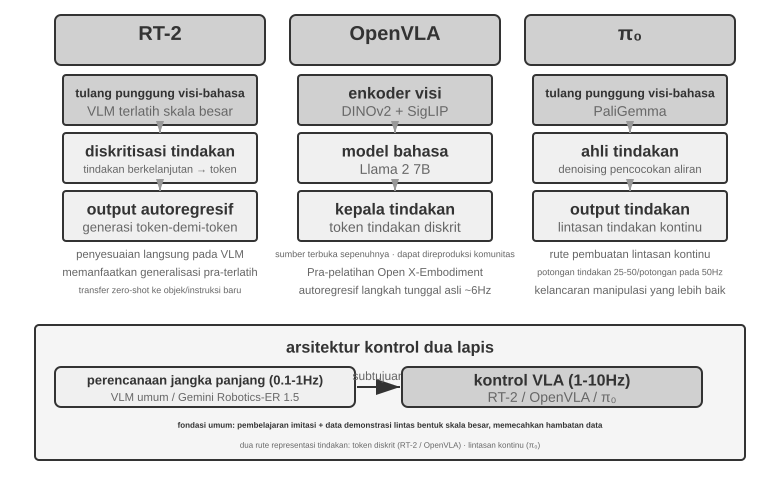
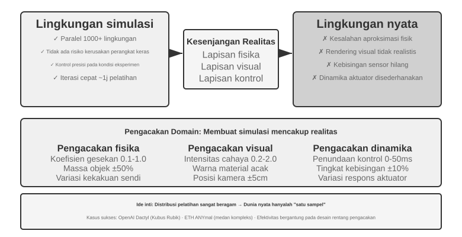
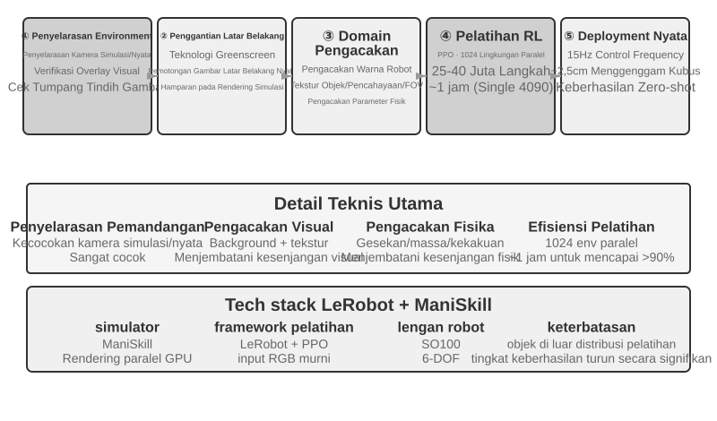

# Interaksi Multimodal dan Waktu Nyata (Real-Time)

Bab-bab sebelumnya mengeksplorasi desain Agen di dunia teks—berinteraksi dengan sistem digital melalui konteks, alat (tools), dan kode. Namun, dunia Agen lebih besar dari sekadar teks dan API. Saat Agen perlu memahami perintah lisan pengguna, menemukan dan mengklik tombol yang tepat di layar, atau mengendalikan lengan robot untuk memegang suatu objek, ia memasuki wilayah baru: **interaksi waktu nyata multimodal**—perluasan dari input/output teks murni menjadi **persepsi multimodal dan respons waktu nyata**, dan ini adalah langkah krusial di mana Agen keluar dari "kotak dialog". "Multimodal" secara sederhana berarti menangani berbagai bentuk informasi sekaligus—teks, suara, gambar, video, tindakan—bukan hanya teks saja.

Pertama, batasan bab ini. Pemahaman gambar dan dokumen statis—melihat tangkapan layar, membaca grafik, mengurai PDF—telah masuk secara alami ke dalam praktik Agen di bab-bab sebelumnya sebagai alat persepsi. Untuk LLM multimodal saat ini, tugas "satu input, satu pemahaman" ini relatif matang dan tidak memerlukan arsitektur khusus. Bab ini menangani kelas masalah yang berbeda: tiga skenario di mana **batasan waktu nyata (real-time constraints) membuat masalah multimodal menjadi sulit**—dialog suara, pengoperasian GUI, dan kontrol robot. Di sini input mengalir terus-menerus dan output harus tiba dalam batas waktu yang ketat, dan hal itu mengubah arsitektur secara kualitatif. Mengenai pemahaman waktu nyata dari aliran visual kontinu (video), ini masih menjadi masalah terbuka untuk Agen pada saat penulisan—kita akan kembali ke sana ketika bagian Penggunaan Komputer (Computer Use) menghadapi batas dari tangkapan layar (screenshot) frame-demi-frame, dan lagi di pertanyaan akhir bab. Satu batasan lagi: **generasi** multimodal (generasi gambar, generasi video) dalam kerangka kerja buku ini, hanyalah panggilan alat biasa (dibahas di Bab 5 tentang Generasi Multimedia). Agen menggunakannya sebagai alat eksternal; hal ini tidak memunculkan tantangan interaksi waktu nyata yang dibahas dalam bab ini, sehingga tetap di luar bahasan utama.

Interaksi suara, Penggunaan Komputer, dan operasi robot tampak mencakup tiga bidang yang sama sekali berbeda, tetapi ketika dibangun, Anda akan terjebak di tempat yang sangat mirip: ketiganya harus memproses beberapa modalitas sekaligus, dan ketiganya sangat sensitif terhadap latensi. Jeda lebih dari dua detik dalam percakapan suara membuat orang gelisah; fluktuasi tingkat milidetik dalam kontrol robot dapat menyebabkan tabrakan. Bersama-sama, kedua batasan ini mendorong ketiga skenario menuju tujuan arsitektur yang sama: dari **pipa serial (serial pipeline)** (seperti jalur perakitan pabrik, di mana satu langkah harus selesai sebelum langkah berikutnya dimulai) ke **model end-to-end** (model terpadu yang langsung dari input ke output, memotong perpindahan antar langkah di antaranya).

Bab ini terbagi dalam beberapa bahasan berikut:

1. Pertama, kita membangun sistem koordinat dengan "tiga paradigma arsitektur suara"—kaskade (pipa VAD-ASR-LLM-TTS), omnimodal end-to-end (Omni, model tunggal tapi tetap bergiliran/turn-taking), dan full-duplex (Moshi, GPT-Live, mendengar dan berbicara secara bersamaan)—dan membedah latensi serta tarik-ulur (trade-offs) dari setiap tautan di sepanjang sumbu "bagaimana membebaskan diri dari asumsi giliran VAD". Bagian kaskade juga akan membahas bagaimana mengganti VAD + ASR dengan persepsi suara streaming.
2. Selanjutnya, kita memeriksa bagaimana arsitektur pemikiran (thinking architecture) mendamaikan konflik antara "respons waktu nyata" dan "pemikiran mendalam": dari paralelisasi sederhana antara yang cepat dan yang lambat, hingga pendekatan terpisah (decoupled) di mana model penalaran latar belakang bertindak sebagai "ahli strategi" (delegasi GPT-Live, Pine AI, dll.), hingga "internalisasi" pemikiran dari Step-Audio R1 ke dalam satu model yang "berpikir sambil berbicara".
3. Kemudian, kita membahas bagaimana sintesis ucapan yang lebih mirip manusia mengoptimalkan lapisan eksekusi.
4. Terakhir, kita memperluas perspektif ke Penggunaan Komputer (memungkinkan AI untuk mengoperasikan layar komputer seperti manusia) dan operasi robot, mengamati bagaimana masalah latensi dan multimodalitas yang sama bermanifestasi dalam kedua skenario ini.

Dua poin teoretis lagi berlaku lintas skenario dan patut mendapat perhatian khusus: **arsitektur pemikiran** (bagaimana pemikiran cepat dan lambat berkolaborasi) dan **antarmuka cepat-lambat (fast-slow interface)** yang berasal darinya (**Latent Bridge**—apa yang dapat saling diteruskan oleh model cepat dan lambat selain teks). Meskipun diperkenalkan melalui suara, hal ini tidak terbatas padanya: bagian Penggunaan Komputer dan robot akan menghadapi pertanyaan yang sama tentang "kapan harus berkonsultasi dengan ahli strategi yang lambat", jadi ingatlah hal-hal ini.

## Suara: Antarmuka Manusia-Mesin Paling Alami

Sebelum membedah arsitektur Agen suara, mundurlah sejenak dan pertimbangkan nilai dari suara itu sendiri. Dari semua cara manusia berinteraksi dengan komputer, suara memiliki bandwidth tertinggi dan terasa paling alami: ucapan normal berjalan sekitar empat kali lebih cepat daripada mengetik, dan tidak mengikat tangan maupun mata. Itulah sebabnya suara lulus dari metode input sekunder menjadi antarmuka utama dari hari kerja banyak orang—berbicara dengan Agen dari pagi hingga malam alih-alih mengetik kata demi kata.

Di tingkat alat (tool level), jalur ini telah menghasilkan kira-kira dua jenis produk. Salah satunya adalah **alat dikte suara** (misalnya, Typeless): alat ini mentranskripsikan ucapan menjadi teks secara waktu nyata dan memasukkannya ke aplikasi apa pun—pada dasarnya merupakan pengganti keyboard. Yang lainnya adalah **Agen suara** (misalnya, Pine, ChatGPT Voice), yang diajak bicara dan bekerja sama secara langsung oleh pengguna: suara adalah input dan interaksi itu sendiri. Penggunaan lanjutan yang paling jelas dari keduanya adalah **pengkodean berbisik (whisper coding)** yang disebutkan dalam pendahuluan—mengarahkan Agen pengkodean atau penelitian dengan berbicara: pengembang menyatakan niatnya, mendiskusikannya dengan Agen, dan Agen menjalankan pengkodean serta eksperimen. Lebih dari belasan makalah dari tim penulis buku ini diselesaikan dengan cara seperti ini.

Satu catatan sebelum kita mulai: arsitektur suara yang dibahas di bawah ini melayani kedua arah—pengguna berbicara kepada Agen (suara sebagai antarmuka manusia-mesin), dan Agen berbicara ke dunia luar atas nama pengguna (misalnya, menelepon untuk bernegosiasi). Di balik keduanya terdapat teknologi suara waktu nyata yang sama. Kita mulai dengan tiga paradigma arsitektur suara.

## Tiga Paradigma Arsitektur Suara

Untuk memperjelas evolusi teknis Agen suara, sistem koordinat yang jelas adalah klasifikasi tiga bagian yang diberikan oleh OpenAI ketika merilis GPT-Live pada tahun 2026[^ch9-12]—yang kebetulan sesuai dengan tiga generasi arsitektur yang telah dilalui ChatGPT Voice itu sendiri:

1. **Kaskade (Cascaded)**: Menghubungkan tiga model—Pengenalan Ucapan Otomatis (ASR), Model Bahasa Besar (LLM), dan Text-to-Speech (TTS)—ke dalam sebuah pipa (pipeline), mengoper tongkat estafet dari satu ke yang berikutnya. ChatGPT Voice paling awal adalah seperti ini. Ini memungkinkan orang untuk "berbicara" ke model terdepan (frontier) untuk pertama kalinya, tetapi informasi hilang selama transfer antar model, dan responsnya lambat serta kaku.
2. **Omnimodal End-to-End (Omni)**: Menggunakan satu model untuk secara langsung "mendengarkan audio, memikirkan balasan, dan mengucapkannya", menggabungkan tiga tahap menjadi satu. Ini menghasilkan latensi yang lebih rendah dan mempertahankan informasi non-teks seperti prosodi dan emosi. Namun, model ini masih mengasumsikan "pergantian giliran (turn-taking)"—model menunggu pengguna berhenti sebelum berbicara, dan peralihan giliran bergantung pada deteksi keheningan (silence). Jeda sedikit atau suara latar belakang (background noise) dapat disalahartikan sebagai "selesai berbicara", menyebabkan model menyela dengan tidak tepat. ChatGPT Advanced Voice Mode masuk dalam generasi ini; OpenAI menyebutnya "turn-based voice models" (model suara berbasis giliran), sementara industri lebih umum merujuk kemampuannya sebagai model "Omni" (misalnya, Qwen3-Omni). Kedua nama tersebut merujuk pada hal yang sama.
3. **Full-Duplex / Interaktif**: Model mendengarkan dan berbicara secara bersamaan, memproses input dan output secara serentak (concurrently), membuat keputusan beberapa kali per detik mengenai apakah harus "berbicara, mendengarkan, berhenti, menyela, atau memanggil alat", sepenuhnya menghilangkan asumsi "pergantian giliran". Moshi dari Kyutai pada tahun 2024 adalah pionir risetnya, dan GPT-Live OpenAI pada tahun 2026 membawanya ke skala 150 juta pengguna.

Satu benang merah mengalir melalui ketiga generasi tersebut: **bagaimana membebaskan diri dari asumsi "bergantian giliran"—dari membiarkan VAD (Voice Activity Detection) menebak di mana giliran dimulai dan diakhiri**. Arsitektur kaskade dan Omni keduanya masih bersandar pada VAD untuk membagi giliran; hanya full-duplex yang membubarkan gagasan giliran sama sekali. Tiga bagian berikutnya mengikuti sumbu ini. Dan tiga paradigma tersebut bukan sekadar kasus baru menggantikan yang lama—mereka adalah pilihan desain di bawah batasan latensi dan biaya yang berbeda, hidup berdampingan dalam sistem produksi pada tahun 2026.

Lebih jauh lagi, GPT-Live memperkenalkan perubahan struktural kedua—memisahkan "interaksi waktu nyata" dari "pemikiran mendalam": ketika menemui masalah yang memerlukan pencarian atau penalaran kompleks, model interaksi mendelegasikan tugas tersebut ke model terdepan di latar belakang (GPT-5.5 pada saat peluncuran) sembari melanjutkan percakapan itu sendiri. Benang merah tentang "pembagian kerja cepat-lambat" ini akan dieksplorasi secara rinci di bagian selanjutnya "Tarik-ulur dalam Arsitektur Pemikiran (Trade-offs in Thinking Architectures)".

[^ch9-12]: OpenAI. *Introducing GPT-Live.* 2026-07-08. https://openai.com/index/introducing-gpt-live/ . Klasifikasi tiga bagian "Cascaded / Turn-based / Full-Duplex" di bagian ini berasal dari ringkasan artikel tentang tiga generasi evolusi ChatGPT Voice; "End-to-End Omnimodal (Omni)" dalam teks sesuai dengan kategori "turn-based voice models"-nya.

## Paradigma 1: Pipa Kaskade (Cascading Pipeline)

Sebagian besar asisten suara komersial—mulai dari speaker pintar hingga robot layanan pelanggan—didasarkan pada pipa serial (Gambar 9-1): Voice Activity Detection (VAD) menentukan kapan pengguna selesai berbicara → Pengenalan Ucapan Otomatis (ASR) mengubah audio menjadi teks → Model Bahasa Besar (LLM) memahami maksud dan menghasilkan balasan → Text-to-Speech (TTS) menyuarakan balasan tersebut. Seperti lari estafet, setiap tahap harus menunggu tahap sebelumnya selesai sebelum dapat dimulai.


Asisten suara awal mengadopsi pipa serial empat tahap ini karena alasan sederhana: tidak ada model tunggal yang dapat secara bersamaan menangani pengenalan ucapan, pemahaman bahasa, pemikiran, dan sintesis ucapan. Arsitektur modular memungkinkan setiap komponen dikembangkan dan dioptimalkan secara independen. Namun, harga dari modularitas adalah akumulasi latensi—setiap tahap harus menunggu tahap sebelumnya selesai sebelum dapat dimulai.

**VAD** adalah titik awal pipa, terus-menerus memantau aliran audio. Desain paling penting adalah End-of-Speech Detection (Deteksi Akhir Ucapan): biasanya, ambang batas keheningan terus-menerus sebesar 500-800ms ditetapkan—jika pengguna berhenti berbicara selama lebih dari setengah detik, VAD menganggap ucapan tersebut selesai. Ini memunculkan lapisan latensi pertama, dan ini adalah tarik-ulur (trade-off) yang sulit: jika ambang batas terlalu pendek, jeda untuk berpikir disalahartikan sebagai akhir, memotong kalimat; jika terlalu lama, pengguna harus menunggu hampir sedetik setelah selesai berbicara sebelum mendapatkan respons.

**ASR** mengubah bentuk gelombang audio menjadi teks. Model seperti Whisper dan SenseVoice, ketika mentranskripsikan 5 detik audio dengan model berukuran kecil hingga menengah yang di-deploy di GPU, biasanya membutuhkan waktu 50-200ms; model yang lebih besar atau deployment dengan sumber daya terbatas dapat memakan waktu 200-500ms (kelompok kontrol pada Eksperimen 9-3 masuk dalam kategori ini). Masalah yang lebih krusial: sepanjang penantian VAD dan transkripsi ASR, LLM di hilir (downstream) duduk diam sepenuhnya—LLM belum menerima apa-apa dan tidak dapat mulai berpikir lebih awal.

Inferensi **LLM**, meskipun sudah dioptimalkan dengan baik, memiliki Time to First Token (TTFT) sebesar 100-500ms bergantung pada panjang konteks, ditambah lagi sekitar ~100ms untuk menyelesaikan kalimat pertama. Aktifkan penalaran (reasoning), maka akan molor hingga 5-10 detik. Dalam arsitektur tradisional, TTS tidak dapat dimulai sampai LLM telah menghasilkan teks balasan lengkap.

**TTS** mengubah teks balasan menjadi ucapan, biasanya membutuhkan waktu 200-500ms untuk sintesis. Menjumlahkan latensi dari setiap tautan (Gambar 9-2): VAD (500-800ms) + ASR (50-200ms) + LLM (100-500ms) + TTS (200-500ms), dengan total sekitar 0,9-2 detik—dan ini adalah kasus ideal ketika semua layanan menganggur (idle) dan tidak ada antrean.


Sekali berada di produksi, latensi antrean memperburuk keadaan. Ini bekerja seperti restoran: semakin sibuk dapurnya, semakin lama waktu tunggunya—dan antreannya tidak tumbuh secara linear, melainkan meroket (Gambar 9-3). Ketika server tidak memiliki antrean tunggu (yakni "idle"), waktu untuk memproses permintaan disebut latensi idle (idle latency). Tetapi ketika beberapa permintaan tiba sekaligus, yang datang belakangan harus antre.

Secara intuitif, semakin tinggi utilitas (utilization), semakin curam—dan non-linear—waktu tunggu menanjak. Hubungan matematis spesifiknya dapat diberikan oleh teori antrean (untuk pemahaman intuitif di sini, tidak diperlukan derivasi yang ketat): Total Latensi ≈ Latensi Idle × 1/(1-Utilitas). Utilitas mengacu pada proporsi waktu di mana server sibuk; misalnya, utilitas 50% berarti server memproses permintaan separuh waktu dan idle separuh waktu. Pada utilitas 50%, latensi menjadi dua kali lipat; pada 80%, latensi menjadi lima kali lipat latensi idle—itulah sebabnya server tidak dapat berjalan di bawah beban tinggi untuk waktu yang lama.


> **Eksperimen 9-1 ★: Membangun Agen Suara Tradisional**
>
> Eksperimen ini membangun sistem dialog suara waktu nyata yang lengkap, memungkinkan pengguna untuk berinteraksi dengan AI melalui suara menggunakan mikrofon. Sistem menggunakan arsitektur pemisahan front-end/back-end dengan komunikasi waktu nyata via WebSocket.
>
> Proses intinya mengikuti pola serial yang ketat: front-end menangkap input mikrofon dan mengirimkannya ke back-end secara real-time via WebSocket. Back-end menjalankan model Silero VAD untuk deteksi aktivitas suara, yang menawarkan akurasi lebih tinggi dan ketahanan terhadap kebisingan (noise resistance) yang lebih baik dibandingkan dengan metode deteksi berbasis volume tradisional. Setelah mendeteksi keheningan terus-menerus sekitar 500ms, segmen audio diekstraksi untuk diproses lebih lanjut.
>
> Tahapan ASR, LLM, dan TTS masing-masing mendukung peralihan yang fleksibel antara beberapa penyedia layanan, memungkinkan pengembang untuk memilih kombinasi optimal berdasarkan latensi, akurasi, dan kondisi jaringan regional.
>
> **Eksperimen 9-2 ★: Membangun Agen Telepon Menggunakan PineClaw Voice API**
>
> Eksperimen 9-1 membangun sistem dialog suara di dalam peramban (in-browser), tetapi banyak tugas Agen di dunia nyata memerlukan panggilan telepon sebenarnya—menghubungi layanan pelanggan untuk menegosiasikan tagihan, memesan restoran, mengonfirmasi pesanan. Bab 4 mendemonstrasikan, melalui mekanisme Channel PineClaw, bagaimana arsitektur event-driven dapat mengurangi latensi respons untuk pemberitahuan telepon dari menit menjadi detik. Eksperimen ini berfokus pada pembangunan panggilan suara itu sendiri. Mengambil contoh [PineClaw Voice API](https://pineclaw.com/) (dikembangkan oleh tim penulis), API suara telepon tingkat produksi (production-grade) seperti itu biasanya membungkus (encapsulate) seluruh proses memutar nomor, navigasi IVR (mis., menu telepon "Untuk pertanyaan, tekan 1; untuk operator, tekan 0"), percakapan, dan transkripsi: Agen memberikan nomor telepon, tujuan, dan informasi konteks, dan Agen suara menyelesaikan seluruh panggilan, mengembalikan catatan panggilan terstruktur.
>
> **Tujuan Eksperimen**: Membangun Agen yang mampu menyelesaikan tugas melalui panggilan telepon nyata, mengintegrasikan PineClaw Voice sebagai alat (tool) ke dalam perulangan ReAct.
>
> **Pendekatan Teknis**: Gunakan SDK Python PineClaw Voice (`pine-voice`) untuk melengkapi Agen dengan alat `make_phone_call`. Agen menerima deskripsi tugas dari pengguna (misalnya, "Tolong pesankan pemeriksaan gigi untuk besok jam 3 sore"), dan melalui pemikiran ReAct, ia memutuskan: (1) nomor telepon mana yang harus dihubungi; (2) tujuan dan informasi utama untuk panggilan tersebut; (3) bagaimana melaporkan hasilnya kepada pengguna setelah panggilan berakhir.
>
> Alur kerja Agen: Pengguna berkata "Telepon klinik untuk memesan janji temu besok" → Agen memikirkan informasi apa yang dibutuhkan (nomor telepon klinik, waktu janji temu, nama pasien) → Jika informasi tidak mencukupi, meminta klarifikasi kepada pengguna → Memanggil alat `make_phone_call` → PineClaw memutar nomor, bercakap-cakap dengan pihak lain, dan menyelesaikan pemesanan → Agen menerima ringkasan dan transkrip panggilan → Melaporkan hasilnya kepada pengguna.
>
> **Kriteria Penerimaan (Acceptance Criteria)**: Berhasil melakukan panggilan percobaan (bisa menelpon telepon Anda sendiri dulu untuk memverifikasi konektivitas). Agen dapat secara otonom menentukan parameter panggilan berdasarkan deskripsi tugas. Setelah panggilan berakhir, ia mengekstraksi informasi utama (waktu janji temu, nomor konfirmasi, dll.) dengan benar dan melaporkannya kepada pengguna. Bandingkan perbedaan antara menggunakan API secara langsung dan memanggilnya melalui perulangan ReAct Agen—yang terakhir dapat menangani situasi dengan informasi yang tidak lengkap (misalnya, mencari nomor telepon jika pengguna tidak memberikannya).
>
> Eksperimen ini menunjukkan arah aplikasi penting untuk Agen suara: **Agen tidak hanya dapat melakukan percakapan suara dengan pengguna tetapi juga berinteraksi dengan dunia luar melalui panggilan telepon atas nama pengguna**. Agen suara PineClaw secara khusus dilatih untuk menangani masa tunggu berjam-jam, navigasi menu telepon, dan negosiasi yang rumit—bayangkan memiliki AI yang menelepon layanan pelanggan operator Anda dan menunggu dalam status "hold" demi mendapatkan operator manusia. Ini justru skenario di mana pipa suara serial tradisional kesulitan.

### Streaming Rantai-Penuh (Full-Chain) dari Pipa Kaskade

Sebuah kesalahpahaman umum perlu diklarifikasi: perhitungan latensi 0,9–2 detik di atas mengasumsikan skenario **sepenuhnya serial** di mana "setiap tautan selesai sebelum mengoper tongkat estafet". Namun, sistem produksi pada tahun 2025 tidak lagi beroperasi dengan cara ini. Pendekatan arus utama bukan untuk mengabaikan modularitas, melainkan untuk mempertahankan pembagian VAD-ASR-LLM-TTS sambil membuat setiap tahap menjadi **streaming**, sehingga tahap yang berdekatan dapat tumpang tindih (overlap) dalam waktu:

- **ASR mentranskripsikan sambil mendengarkan**: Menggunakan pengenalan streaming, teks terus diproduksi sementara pengguna masih berbicara, tanpa menunggu VAD menentukan akhir kalimat sebelum memulai transkripsi.
- **LLM menghasilkan (outputs) dalam potongan kalimat**: Saat model membuat respons, ia memecah balasan menjadi kalimat-kalimat kecil berdasarkan tanda baca atau semantik. Kalimat pertama dikirim ke hilir segera setelah berbentuk, tanpa menunggu seluruh balasan selesai ditulis.
- **TTS streaming di tingkat kalimat**: Ia mulai mensintesis dan memainkan kalimat kecil pertama begitu tiba, dengan kalimat berikutnya di-generate dan ditambahkan dengan cepat (on the fly). Hal ini sangat memajukan waktu di mana pengguna mendengar suku kata pertama.

Akibatnya, ketiga tahapan tersebut—ASR, LLM, dan TTS—tidak lagi berada dalam hubungan berurutan seperti estafet, tetapi beroperasi layaknya tiga stasiun kerja pada jalur perakitan yang bekerja secara bersamaan. Framework open-source seperti LiveKit Agents dan Pipecat, serta sistem panggilan keluar (outbound call) komersial arus utama, semuanya mengikuti pendekatan ini. Setelah streaming rantai-penuh, latensi end-to-end biasanya dapat dikompresi menjadi 600–800ms, jauh lebih baik daripada proses serial penuh yang mencapai 0,9–2 detik.

Tetapi streaming hanya dapat mengompres hal-hal yang dapat ditumpang-tindihkan—transkripsi, pemikiran, sintesis. Satu segmen latensi yang tidak bisa ia sentuh: **Penantian keheningan VAD dan penilaian giliran itu sendiri**. Sistem masih bersandar pada ambang batas keheningan 500–800ms untuk menebak apakah pengguna sudah selesai berbicara, dan karena penantian tersebut merupakan prasyarat agar pipa tersebut bisa mulai sama sekali, tidak ada jumlah overlap yang bisa menghilangkannya. Mengompresi segmen terakhir ini berarti memindahkan perhatian dari "menumpang-tindihkan tahapan" ke tahap persepsi di barisan paling depan.

### Persepsi Suara Streaming: Mengganti VAD + ASR

Bagian depan (front-end) persepsi ini terdiri dari dua tahap—VAD menentukan apakah pengguna telah selesai berbicara, dan ASR mentranskripsikan audio menjadi teks. Bersama-sama, mereka menentukan kapan seluruh pipa dimulai dan input apa yang diterimanya. Kaskade VAD + ASR tradisional memiliki tiga masalah mendasar:

1. **Akumulasi Latensi**: VAD harus menunggu keheningan 500–800ms untuk mengonfirmasi bahwa pengguna telah selesai, karena ia tidak dapat memprediksi masa depan dan hanya dapat mengandalkan "menunggu" untuk membedakan antara "benar-benar selesai" dan "hanya berhenti sebentar untuk berpikir".
2. **Kehilangan Informasi**: VAD hanya menghasilkan sinyal biner seperti "suara/keheningan". Semua detail akustik—perubahan emosi, fluktuasi nada, jeda ragu-ragu, lingkungan latar belakang—hilang. Masalah salah penilaian sangat menonjol di lingkungan yang kompleks: jeda pengguna yang sedikit lebih lama disalahartikan sebagai selesai, menyebabkan pemotongan kalimat; suara bising (noise) di latar memicu awal palsu (false starts), menyebabkan sistem memproses saat tidak ada yang berbicara; dan "e-hem" atau deheman dari pengguna tidak dapat ditentukan sebagai interupsi atau bentuk pengakuan (acknowledgment).
3. **Penurunan Akurasi**: VAD memotong audio kontinu ke dalam segmen-segmen independen, yang masing-masing dikirim ke ASR untuk dikenali, mengganggu kelangsungan konteks (contextual continuity). Konten yang membutuhkan konteks agar pengenalannya benar (alamat email, nama merek, nama orang, kata benda tertentu) mengalami peningkatan tingkat kesalahan yang signifikan—misalnya, jika pengguna mengatakan "john dot smith at gmail dot com" lalu "john" dan "smith" dipotong ke segmen yang berbeda, "smith" mungkin akan salah dikenali sebagai "miss" karena kurangnya konteks.

**Model persepsi suara streaming** menawarkan perbaikan mendasar. Pertama-tama, tetapkan secara teknis apa arti "streaming": apakah sebuah model suara dapat melakukan streaming bergantung pada apakah **enkodernya kasual atau chunked** (hanya mengandalkan audio yang sudah tiba, tidak pernah membutuhkan seluruh rekaman) dan apakah **dekodingnya inkremental** (mengeluarkan hasil parsial secara bertahap saat tiap potongan kecil audio masuk). Whisper tidak dapat melakukan streaming—bukan karena dekodingnya (yang juga autoregresif), tetapi karena enkodernya membutuhkan segmen audio lengkap (tepat 30 detik, dipadding jika lebih pendek) sebelum bisa memulai. Perlu dicatat pula bahwa pengenalan streaming itu sendiri bukanlah barang baru: ASR streaming tradisional, yang diwakili oleh RNN-T dan Conformer streaming, telah lama disebarkan dalam skala industri—keterangan otomatis (live captions) di ponsel dan pengetikan suara di aplikasi keyboard menggunakan model persis seperti ini—dan ia sama sekali tidak ada hubungannya dengan LLM.

Bagian ini berfokus pada jalan baru: **persepsi pendengaran streaming berbasis LLM**—menggunakan LLM sumber terbuka (open-source) sebagai tulang punggung (backbone) untuk post-training, memungkinkan model tersebut untuk langsung mengeluarkan respons tingkat-semantik dari aliran audio yang berkelanjutan, menggabungkan "pengenalan (recognition)" dan "pemahaman (understanding)" ke dalam sebuah model tunggal. Ini adalah peningkatan ke ASR streaming tradisional, bukan penemuan dari teknologi streaming: latensi pengenalan inkremental tetap berada pada hitungan waktu inferensi langkah-tunggal (puluhan hingga beberapa ratus milidetik), tetapi model tidak lagi melihat potongan-potongan terisolasi yang dipotong oleh VAD. Alih-alih, model tersebut melihat aliran audio kontinu dari awal percakapan hingga saat ini, memungkinkan In-Context Learning berdasarkan konteks lengkap, yang secara signifikan meningkatkan akurasi pengenalan untuk informasi pribadi pengguna, istilah profesional, dan kebiasaan pengucapan.

Keuntungan utama lain dari jalur ini adalah mewarisi pengetahuan dunia dan kemampuan penalaran akal sehat (common sense reasoning) dari LLM—bagaimanapun juga, model tulang punggungnya telah melihat jumlah teks yang sangat besar. Misalnya, model tahu bahwa "Apple" yang diikuti dengan "event" kemungkinan besar merujuk pada perusahaan, bukan pada buahnya. Peningkatan pengetahuan ini membuat akurasi pengenalan untuk informasi bernilai tinggi seperti nominal, nama tempat, dan nama merek jauh melebihi ASR tradisional. Jalur ini sudah memiliki model yang dapat di-deploy, seperti Ultravox dari Fixie—yang memberi umpan audio secara langsung ke tulang punggung LLM dan mengeluarkan teks serta token-token semantik. Qwen2-Audio yang digunakan dalam eksperimen bagian ini, dan Qwen2.5-Omni milik Alibaba, juga termasuk dalam kategori model berbasis-audio ini.

Namun, mengganti VAD tidak selalu memerlukan model LLM audio skala penuh. Jika tujuannya hanya untuk menyelesaikan masalah pertama—**menentukan apakah pengguna telah selesai berbicara**—ada jalan yang lebih ringan: menyematkan "penilaian giliran (turn judgment)" ini langsung ke recognizer-nya sendiri[^ch9-11]. Pendekatannya: tambahkan LoRA ke model pengenalan streaming kecil open-source sehingga model tersebut melakukan transkripsi sembari **menimbang semantik dan keheningan secara bersama-sama** untuk menilai apakah kalimat tersebut sudah mengekspresikan pemikiran yang lengkap—ini perlu karena jeda di dalam satu giliran (intra-turn pauses, seperti mengambil napas ketika membacakan nomor telepon) sering kali berlangsung lebih lama daripada jeda antar-giliran, sehingga sekadar ambang keheningan (silence threshold) pasti akan gagal dalam dua arah sekaligus. Temuan yang lebih menarik: ketika model terus bimbang perihal apakah ia akan mengambil giliran tersebut, akar masalahnya biasanya bukan pada arsitekturnya, tetapi pada **label pelatihan yang dianotasi dari "pandangan mata Tuhan" (God's eye view)**—pembuat anotasi (annotators) menggunakan audio yang muncul *setelah* titik keputusan, yang tak akan pernah bisa dilihat oleh model saat online (online model). Lakukan anotasi ulang tiap-tiap label menggunakan hanya informasi yang tersedia pada momen keputusan itu saja, maka kebimbangan semu itu akan menghilang. Hal ini menggemakan penilaian dari Bab 7 tentang post-training: seringkali, data jauh lebih krusial daripada arsitektur. Jalur yang lebih ringan ini juga memiliki implementasi berkelas-produksi: Deepgram Flux dan AssemblyAI Universal-Streaming menyematkan proses pencarian-akhir (endpointing) dan deteksi giliran secara langsung ke dalam model pengenalan streaming, yang dirancang khusus untuk Agen suara; pada sisi open-source, LiveKit dan Pipecat menyediakan model pendeteksian giliran semantik.

[^ch9-11]: Diagnosis tentang penyematan penilaian giliran ke dalam alat pengenalan (recognizer) dan label "pandangan mata Tuhan" dapat ditemukan dalam Li, Bojie and Noah Shi. *The Trade-off Was in the Labels: Causal Supervision for Turn-Aware Streaming ASR.* 2026 (forthcoming).

Model tersebut menghasilkan bukan hanya teks, tetapi juga serangkaian **penanda khusus (special markers) untuk acara akustik**—ini adalah token-token terdedikasi yang diperkenalkan di masa pelatihan model. Model belajar untuk mengeluarkannya secara otomatis ketika mendeteksi peristiwa akustik yang terkait. Jenis-jenis yang umum meliputi:

- `<speak_start/end>`: Menentukan awal dan akhir ucapan berdasarkan penilaian komprehensif atas semantik dan akustik, ketimbang sekadar deteksi keheningan (silence detection).
- `<interrupt>`: Membedakan apakah pengguna benar-benar ingin menginterupsi atau hanya memberi konfirmasi atau sekadar terkena noise dari latar belakang.
- `<emotion:happy/frustrated>`: Penanda-penanda emosi.
- `<laugh>` / `<sigh>`: Sinyal paralinguistik seperti tawa dan helaan napas.
- `<music>` / `<noise>`: Suara lingkungan.

Penanda-penanda ini, beserta token teks, membentuk aliran kejadian (event stream) bersatu yang kemudian dimasukkan ke dalam lapisan pemikiran (thinking layer).

```
Audio input: "Ehm, sebetulnya aku rasa... oh tunggu, biar kupertimbangkan lagi."
Output stream model:
  <speak_start> Ehm, <emotion:hesitant> sebetulnya aku rasa...
  <silence:500ms> oh tunggu, <emotion:confident> biar kupertimbangkan lagi <speak_end>
```

Perlu diperhatikan bahwa model menghasilkan bukan sekadar transkripsi teks melainkan juga penanda kejadian suara (awal/akhir bicara, perubahan emosi, interval senyap). Kerangka kerja (frameworks) Agen bisa memanfaatkan penanda ini demi interaksi yang lebih natural—misalnya, secara proaktif menawarkan opsi ketika mendeteksi pengguna merasa bimbang.

> **Eksperimen 9-3 ★: Menyimulasikan Persepsi Suara Streaming Menggunakan Qwen2-Audio**
>
> Desain eksperimental ini perlu diperjelas terlebih dahulu: Qwen2-Audio itu sendiri adalah model non-streaming yang mengambil keseluruhan segmen-segmen sebagai input. Eksperimen ini menggunakan **input berbentuk bongkahan (chunked input) untuk menyimulasikan pemrosesan streaming**—memotong aliran audio kontinu menjadi chunk kecil dengan panjang tertentu, yang masing-masing dikirimkan ke model bersama-sama dengan konteks audio yang telah terakumulasi. Model itu lantas secara bertahap men-generate teks serta token kejadian akustik (seperti tawa, jeda, dan isyarat-isyarat non-verbal lain), serta mengukur latensi semenjak input tiap chunk ke saat memproduksi teks. Di sini ada cost kunci: enkoder Qwen2-Audio bersifat tidak inkremental. Setiap kali satu chunk baru akan diproses, seluruh audio yang telah terakumulasi sebelumnya musti di-enkode ulang sejak awal. Oleh karena itu, semakin lama percakapan dan semakin banyak audio terakumulasi, semakin tinggi pula latensi enkoding untuk tiap chunk tersebut—inilah selisih esensial di antara "simulasi streaming" dan "streaming murni" (yang menggunakan enkoder inkremental atau enkoder kausal yang sekadar melakukan enkode inkremental atas bagian audio yang baru saja tiba). Desain ini bisa menunjukkan benefit akurasi dari "persepsi berkelanjutan menggunakan konteks lengkap," akan tetapi angka-angka latensi-nya semata-mata mencerminkan rincian chunk serta kecepatan inferensi, alih-alih latensi paket-pertama milik model terdesain streaming sesungguhnya (semacam Qwen3-Omni beserta enkoding berbasis chunk-nya); pembaca yang tertarik dipersilakan menukar modelnya dengan model berjenis belakangan itu untuk membikin ulang eksperimennya. Baseline perbandingan di sini adalah pipeline ASR Whisper + VAD tradisional. Tiga buah skenario akan dites: perbincangan wajar, kalimat berkepanjangan dengan jeda, serta perbincangan diselingi derau/kebisingan latar.
>
> Hasil: Latensi pengenalan inkremental dari skema penyimulasian berbasis chunk tersebut bisa dikendalikan di kisaran seratus atau dua ratus milidetik (bergantung atas panjang chunk dan perangkat keras), sementara skema konvensional menuntut kita buat menunggu sampai VAD mengukuhkan (mengonfirmasi) usainya giliran tersebut (600ms) ditambah inferensi Whisper (kira-kira 200–500ms dalam konfigurasi eksperimen ini), secara keseluruhan berarti 800–1100ms. Di skenario mengandung jeda-jeda, VAD mengasalkan jeda kepanjangan perdana sebagai tanda selesainya pembicaraan (end of speech), memenggal kalimat menjadi dua penggal guna dikenali terpisah-pisah. "大概两点左右" ("sekitar jam dua") dikenali luput sebagai "大概零点左右" ("sekitar tengah malam")—manakala terlucut dari perihal sekitarnya (konteks), aksara berbunyi serupa 两 (liǎng, "dua") didengarkan keliru menjadi 零 (líng, "nol"). Skema chunked yang sukses merawat keutuhan konteks berhasil membaca seluruh panjang kalimat secara pas. Pada skenario kebisingan latar (background noise), Qwen2-Audio membuahkan token-token `<|noise|>` demi menandakan berlangsungnya noise melingkupi situasinya alih-al## Paradigma 2: Model Omnimodal End-to-End (Omni)

Melihat kembali ke pipa kaskade secara keseluruhan: meskipun bagian depan (front-end) persepsinya ditingkatkan menjadi persepsi suara streaming, ia masih membagi-bagi bagian mendengarkan, memikirkan, dan berbicara ke tiga model independen yang disatukan oleh antarmuka diskret. Seberapa pun lebarnya antarmuka itu berkembang, ia hanya membawa segelintir token semantik dan sesekali penanda akustik—emosi, nada, dan intonasi pembicara, suara lingkungan serta musik di latar belakang, sebagian besar hilang dalam serah terima (handover). Dan karena ketiga segmen itu dilatih dan disetel (tuned) secara terpisah, mereka berjuang untuk bekerja sebagai satu kesatuan. Model omnimodal end-to-end (Omni) menempuh jalur yang berbeda—satu model secara langsung "mendengarkan" audio, "memikirkan" balasan, dan "mengucapkannya", menggabungkan tiga segmen menjadi satu (Gambar 9-4). Mengingat data pelatihan yang cukup, ruang laten internal (internal latent space) model dapat membawa sinyal-sinyal paralinguistik ini lurus hingga ke ujung generasi, melebihi apa yang dapat disampaikan oleh teks: latensi yang lebih rendah, prosodi dan emosi pun dipertahankan. Tarik-ulurnya (trade-off): **pipa kaskade** memiliki modul yang bersih, penyetelan per segmen, dan interpretabilitas yang baik; **model end-to-end** membeli latensi yang lebih rendah dan kesetiaan (fidelity) non-tekstual dengan mengorbankan tuntutan data pelatihan yang lebih berat dan interpretabilitas yang lebih buruk.

Satu dimensi secara rutin terabaikan: keuntungan end-to-end terutama pada **latensi**; pada **akurasi** ia belum tentu menang. Perbandingan yang instruktif adalah **self-cascade**—model yang sama pertama-tama mentranskripsikan audio menjadi teks terstruktur, lalu bernalar atas teks tersebut. Apakah self-cascade atau single end-to-end pass yang lebih akurat bergantung pada tugasnya, dan polanya jelas: ketika jawabannya terutama ditentukan oleh konten semantik ("apa yang dikatakan") dan teks perantara dapat membawa informasi yang relevan dengan tugas, self-cascade menyamai atau mengalahkan end-to-end—terutama untuk model dengan persepsi yang lebih lemah. Ketika jawabannya bergantung pada isyarat non-verbal yang sulit direpresentasikan oleh teks (nada, emosi, suara lingkungan), end-to-end jelas unggul. Yang lebih penting, kubu mana yang menang dapat **diprediksi sebelumnya dari sifat tugasnya**, alih-alih dikaitkan dengan "end-to-end lebih maju". Prinsip desain pun mengikutinya: yang menentukan performa biasanya bukanlah apakah representasi perantara—sebuah **leher botol (bottleneck)**—ada, tetapi informasi apa yang dibawa oleh leher botol tersebut. Tingkatkan teks perantara dari transkripsi polos ke representasi terstruktur dengan penanda paralinguistik (emosi, kecepatan bicara, suara lingkungan), maka keunggulan akurasi end-to-end sering kali menyempit. Ini adalah klaim yang sama dengan yang dibuat sebelumnya dalam "Persepsi Suara Streaming": lapisan persepsi tidak seharusnya hanya mengeluarkan teks polos semata[^ch9-13].

Namun seberapa pun kuatnya Omni, pada intinya ia hanya menggabungkan tiga model menjadi satu, **tanpa membuang asumsi "bergiliran"**: ia masih mengandalkan VAD untuk mengalokasikan ruang bicara—terdiam seketika saat ia mendeteksi pengguna berbicara, mulai bersuara saat pengguna terdiam. Jadi kegagalan yang familier muncul kembali: pengguna membacakan serangkaian angka, diam sejenak, dan Omni memutuskan mereka sudah selesai dan menyela. Persepsi suara streaming yang dijelaskan sebelumnya mengangkat penilaian giliran dari durasi keheningan ke tingkat semantik dan sangat mengurangi salah tembak seperti itu—tetapi itu masih merupakan perbaikan (patch) lokal dalam kerangka bergantian giliran (turn-taking), bukan akhir dari pergantian giliran itu sendiri. Untuk melarikan diri **selamanya**, orang harus berhenti menambal di dalam kerangka tersebut: biarkan model mendengarkan dan berbicara secara bersamaan dan memutuskan sendiri kapan harus berbicara, tanpa pergantian keras tentang "giliran siapa ini".

[^ch9-13]: Untuk pengukuran lintas modal yang lengkap mengenai kapan keunggulan akurasi dari kaskade dan end-to-end terbalik, dan bagaimana memprediksi arahnya berdasarkan sifat tugas (apakah representasi perantara dapat dengan cukup membawa informasi terkait tugas), lihat Li, Bojie and Noah Shi. *The Cascade Gap: When and Why Self-Cascades Help Multimodal Agents.* 2026 (forthcoming).


**OpenAI Realtime API** mendekati end-to-end di tingkat model (model memproses audio secara native), tetapi masih mengandalkan VAD tradisional di tingkat kontrol interaksi, menjadikannya solusi perantara yang bertransisi ke end-to-end penuh. Ini awalnya (pratinjau 2024) berjalan di GPT-4o, dan setelah rilis resmi GA pada 2025, ia beralih ke model suara khusus **gpt-realtime** (bukan lagi mode GPT-4o, melainkan model yang secara spesifik dioptimalkan untuk suara waktu nyata). API ini mengaktifkan VAD sisi server secara default, secara otomatis menentukan kapan pengguna mulai dan berhenti berbicara. Ia mendukung interupsi selama percakapan—mendeteksi saat pengguna mulai berbicara dan segera menghentikan generasi suara saat ini, mirip seperti ketika satu orang menyela dalam percakapan tatap muka dan yang lain berhenti secara alami. gpt-realtime juga memperkenalkan pemanggilan fungsi (function calls) asinkron: model dapat terus berbicara dengan pengguna sembari menunggu hasil alat (tools), menyembunyikan latensi alat di dalam proses percakapan. Peningkatan ini menyempurnakan pengalaman, tetapi pada dasarnya tetap berupa optimasi di dalam kerangka VAD. **Gemini Live API** memiliki pendekatan serupa, mendukung konfigurasi sensitivitas VAD dan menahan informasi yang terkirim (sent information) saat diinterupsi untuk memastikan koherensi percakapan.

**Qwen3-Omni** mengadopsi arsitektur Thinker-Talker: memisahkan pemikiran (pemahaman dan penalaran) dari ekspresi (generasi suara) ke dalam dua modul khusus, menyatukan persepsi dan generasi untuk teks, gambar, audio, dan video.

Untuk menjaga kemampuannya tetap tinggi sembari mengendalikan biaya komputasi, Qwen3-Omni mengadopsi arsitektur MoE (Mixture of Experts)—bayangkan seperti "memanggil tim ahli sesuai permintaan": ia berisi beberapa jaringan ahli berskala kecil di dalamnya, dan untuk setiap inferensi, hanya sebagian kecil yang paling relevan dengan tugas saat ini yang diaktifkan, sementara sisanya tidak berpartisipasi dalam komputasi. Misalnya, saat memproses ucapan, ia terutama mengaktifkan pakar terkait ucapan; saat memproses gambar, ia terutama mengaktifkan pakar terkait visi (vision-related). Hal ini memungkinkan model untuk memiliki total parameter yang sangat besar (memastikan kapabilitas tinggi) dengan menjaga jumlah komputasi aktual per token tetap amat kecil, sehingga meningkatkan throughput inferensi dan mengurangi latensi antrean di bawah beban tinggi.

Satu perbedaan yang patut diluruskan: MoE memecahkan masalah throughput—seberapa banyak permintaan yang dapat dilayani oleh satu unit komputasi. Ia tidak secara langsung menentukan seberapa dini paket audio pertama keluar; latensi paket-pertama bergantung pada arsitektur sisi generasi. Latensi paket-pertama yang rendah pada Qwen3-Omni datang dari modul Talker-nya: ia menghasilkan token audio secara bertahap (incrementally) dalam gaya autoregresif multi-codebook, dan dekoder kasual menerjemahkan token-token tersebut menjadi bentuk gelombang secara inkremental pula. Seketika modul pemikiran menghasilkan teks, si Talker dapat memulai sintesis ucapan streaming—tak usah menanti balasan utuh. Menurut laporan resminya, latensi teoritis paket-pertama cold-start miliknya turun hingga kisaran 234ms, mendukung pemahaman di 19 bahasa serta generasi di 10 bahasa, serta memimpin pada 22 dari 36 acuan (benchmarks) audio-video.

**Step-Audio 2** menempuh rute yang berbeda: ia langsung memproses input audio mentah dan mengeluarkan teks maupun audio, mencapai perbincangan suara end-to-end yang sesungguhnya. Ia tak hanya mampu memahami *apa* yang dilontarkan (informasi semantik) namun pula menanggapi *bagaimana* itu diucapkan—informasi paralinguistik, macam apakah rona emosi sang pembicara lagi bergembira ataukah murka, apakan laju tuturannya gesit atau tersendat-sendat, apakan intonasinya menanjak ataukah menukik—berbarengan pula dengan rupa-rupa bunyi lingkungan latar beserta musik. Model ini merajut balasan bernas nan ekspresif lewat telaah batin (thinking) lalu diperkuat melalui reinforcement learning, plus mengawinkan mekanisme RAG serentak ragam perangkat eksternal (pencarian jejaring / web search, penelusuran audio). Sesuai makalah Step-Audio 2, di atas acuan StepEval-Audio-Paralinguistic tawaran mereka buat kepiawaian paralinguistik, Step-Audio 2 menggores akurasi 83,09%, melangkahi model omnimodal open-source Qwen2.5-Omni yang semasa (44,18%), sembari turut mengatasi GPT-4o Audio (43,45%) plus Kimi-Audio (49,64%).

Step-Audio R1 merupakan lanjutan mahakarya dari serial Step-Audio. Beranjak dari struktur perbincangan suara end-to-end Step-Audio 2, ia lebih jauh lagi menginternalisasi ketajaman pikiran langsung menuju raga si model audio. Keduanya melukiskan evolusi berkesinambungan menyusuri selasar teknis yang seragam.

## Paradigma 3: Model Full-Duplex / Interaktif

Paradigma 2 meleburkan tiga model menjadi tunggal belaka, toh nyatanya masih terikat bakal anggapan menanti giliran—entah giliran si user menyuarakan sesuatu, entah modelnya yang angkat bicara, bersama tumpuan alih berpatokan perkiraan VAD atau semantik. Ada sejumlah skenario yang terang-terangan nir-ruang memfasilitasi "sehabis kalimatmu, giliran kalimatku." **Simultaneous interpretation (penerjemahan serempak)** menyuguhkan contoh ulung: sang penerjemah ogah menanti purna utuhnya segelintir kalimat guna merintis tafsiran, melainkan sembari mendengar ia bergegas membikin kalimat serentak, menyuguhkan masing-masing porsi makna seiring usainya satu gagasan sepintas di telinganya—mendengarkan seraya menafsirkan tiada henti salip-menyalip (overlap). **Game ritme, tatkala Anda menabuh bebunyian selaras lagu**, justru makin drastis: daun telinga wajib menyimak curahan nada-nada yang menderas, jemari mesti menghajar saban tempo detik itu juga, sedang otak mengantisipasi kapan giliran pukulan tiba—di sini tak mengenal barang dinamai "giliran", yang bersisa belaka banjir input nircelah. Beban tugas macan itu menjebol premis pergantian-berurutan dari pangkalnya: mereka menuntut pendengaran, pemikiran, berserta lakon berlangsung bersisian berbarengan, berlawanan dengan patokan model berbasis-giliran yang justru memenggal ketiganya jadi potongan waktu asing-asing. Model full-duplex memboyong jalur "mendepak VAD" menuju titik nadir kelogisannya—ia terang-terangan mencampakkan dalil berganti giliran, lalu membebaskan model bertindak **memantau plus berucap tak berkesudahan, manunggal di titik waktu berbarengan**.

Pionir karya riset di bidang ini adalah **Moshi** (2024) dari Kyutai. Ia memodelkan dua aliran audio secara paralel (suara pengguna dan suara model itu sendiri), ditambah dengan aliran teks "monolog batin (inner monologue)" untuk meningkatkan kualitas linguistik dari ucapan yang dihasilkan. Karena ia selalu mendengarkan, ucapan yang tumpang tindih dan interupsi menjadi perilaku alami, sehingga tidak memerlukan logika pendeteksian interupsi yang eksplisit. Latensi end-to-end kira-kira 200ms, mendekati ritme alami percakapan manusia.

Pada tahun 2026, **Thinking Machines Lab**, yang didirikan oleh Mira Murati, meninjau kategori baru yang mereka sebut **Model Interaksi (Interaction Model)**[^ch9-14], dan menegaskan klaim di balik full-duplex: interaktivitas tidak seharusnya menjadi kekang eksternal seperti VAD yang melilit model, melainkan harus dibangun ke dalam model itu sendiri. Menurut mereka, "agar interaktivitas berskala dengan kecerdasan, ia harus menjadi bagian dari model itu sendiri." Secara arsitektur, ini diterjemahkan menjadi **giliran-mikro (micro-turns)**: alih-alih menunggu seluruh giliran selesai, model bekerja dalam segmen-segmen kira-kira 200ms—secara kontinu "membaca dalam 200ms, men-generate 200ms"—memungkinkan aliran audio, video, dan teks untuk saling menjalin (interleave) dan maju bersama. Granularitas ini adalah kompromi yang disengaja—cukup halus sehingga keheningan, tumpang tindih, dan interupsi dipertahankan sebagai aliran kontinu dalam konteks model, tanpa batas giliran artifisial yang harus diakomodasi; namun cukup kasar untuk memproses berbagai modalitas dalam bentuk bongkahan (chunks) secara bersamaan, menjaga latensi dalam jangkauan yang secara perseptual waktu-nyata (real-time). Karena interaksi hidup di dalam model, perilaku yang dulunya harus dirakit dari kekang khusus—mendengarkan sambil berbicara, menonton sambil menyela—kini sekadar bagian dari pekerjaan model, dan semakin kuat seiring model bertambah kuat. Model pertamanya, TML-Interaction-Small, melatih ketiga aliran tersebut secara bersamaan dari awal; ketika ia melihat pengguna sedang menulis potongan kode yang bermasalah, atau seseorang masuk ke dalam bingkai layar (frame), ia dapat berbicara tanpa diminta.

Pendekatannya terhadap "pemikiran lambat (slow thinking)" juga representatif. Model interaksi itu sendiri hanya bertanggung jawab untuk menjaga percakapan tetap online. Saat ia menghadapi masalah yang membutuhkan penalaran mendalam atau panggilan alat, ia mendelegasikan ke model penalaran yang lebih kuat di latar belakang—apa yang diserahkannya bukanlah pertanyaan terisolasi, melainkan **seluruh konteks percakapan**. Sementara model latar belakang bernalar, hasilnya mengalir kembali secara bertahap (incrementally). Model interaksi kemudian memilih momen yang tidak menyela pengguna secara wajar untuk menenun hasil tersebut ke dalam percakapan, sembari terus merespons, menjawab pertanyaan lanjutan, dan memegang kendali pembicaraan. Dengan cara ini, ia menghadirkan "perencanaan, alat, dan kemampuan agen dari model penalaran" sekaligus dengan "latensi model tanpa-pemikiran". Menurut laporan resmi, TML-Interaction-Small (MoE 276B parameter, 12B diaktifkan) mencapai latensi peralihan giliran serendah sekitar 0,40 detik (GPT-realtime-2.0 sekitar 1,18 detik), dan secara signifikan mengungguli para pesaing yang mencetak angka hampir nol pada tolak ukur proaktivitas visual; pada saat penulisan, ini masih dalam tahap research preview.

[^ch9-14]: Thinking Machines Lab, "Interaction Models: A Scalable Approach to Human-AI Collaboration," 2026-05. https://thinkingmachines.ai/blog/interaction-models/

Pada tahun yang sama, **GPT-Live** milik OpenAI membawa full-duplex ke skala produksi, diluncurkan secara global sebagai model suara default baru untuk ChatGPT. Ia tidak lagi memperlakukan percakapan sebagai serangkaian giliran pesan diskret, melainkan **secara kontinu memproses input sembari terus-menerus men-generate output**. Oleh karena itu, ia dapat membuat banyak keputusan interaksi per detik: apakah akan mulai berbicara, terus mendengarkan, berhenti sejenak, menyela, atau memanggil alat. Hasilnya adalah ia menunggu dengan tenang ketika pengguna sedang berpikir alih-alih menyela, menggunakan bentuk persetujuan seperti "mm-hmm" dan "benar" untuk menunjukkan bahwa ia mendengarkan, dan juga mampu melakukan tugas-tugas seperti terjemahan waktu-nyata yang membutuhkan mendengarkan dan berbicara pada waktu yang bersamaan.

GPT-Live juga mengikuti jalur yang sama dengan memisahkan proses cepat dan lambat—**memisahkan (decoupling) "interaksi waktu nyata" dari "pemikiran mendalam"**: saat menemui tugas yang memerlukan pencarian, penalaran, atau operasi agen yang lebih kompleks, GPT-Live yang interaktif mendelegasikan tugas tersebut ke model terdepan (frontier) di latar belakang (saat diluncurkan, GPT-5.5), sembari terus menjaga kelancaran percakapan itu sendiri. Setelah model latar belakang menghasilkan sesuatu, ia membawanya kembali ke dalam percakapan. Tingkat GPT-Live-1 dan versi mini menggunakan GPT-5.5 Instant di latar belakang, sementara tingkat Menengah dan Tinggi memanggil GPT-5.5 yang dilengkapi kemampuan berpikir, memungkinkan pengguna memilih antara "cepat" dan "mendalam" sesuai kebutuhan. "Pembagian kerja cepat-lambat" inilah yang tepatnya akan dijabarkan lebih lanjut di bagian berikutnya, "Tarik-ulur dalam Arsitektur Pemikiran (Trade-offs in Thinking Architectures)."

Meninjau kembali alur narasi bab ini tentang "mengganti VAD": VAD menebak titik peralihan giliran berdasarkan ambang batas keheningan; persepsi streaming (lihat bagian sebelumnya "Persepsi Suara Streaming" di Paradigma 1) meningkatkan penilaian peralihan ke tingkat semantik; dan model full-duplex sepenuhnya membubarkan konsep "peralihan" itu sendiri—ia selalu mendengarkan, sehingga "interupsi" tidak lagi menjadi peristiwa yang membutuhkan penanganan khusus, dan rantai proses penerobosan (barge-in) sebagian besar dihilangkan secara arsitektural. Inilah titik akhir dari alur narasi "mengganti VAD" pada saat buku ini ditulis.

## Tarik-ulur dalam Arsitektur Pemikiran: Dari Pemisahan Menuju Penyatuan

Masalah sebenarnya yang harus dipecahkan adalah **kontradiksi antara respons waktu-nyata dan pemikiran mendalam**: pengguna mengharapkan respons dalam hitungan milidetik, sementara masalah kompleks menuntut waktu berpikir hingga hitungan detik. Bagaimana model dapat berpikir cukup mendalam sembari tetap mempertahankan latensi yang rendah? Kontradiksi ini tidak hanya dialami oleh arsitektur end-to-end; pipa kaskade juga menghadapinya.

Ketiga solusi di bawah ini bukan iterasi teknologi yang linear—melainkan tarik-ulur desain (design trade-offs) atas berbagai batasan, yang hidup berdampingan dalam praktiknya. Pilihannya tergantung dari tuntutan latensi serta kedalaman renungan aplikasinya. Mesti diperjelas pula bedanya di antara ketiganya: Solusi 1 serta 2 hakikatnya adalah rupa "pembagian kerja cepat-lambat" berkawan sepasang model lepas yang jalan berbarengan. Mereka pantang bergantung perihal end-to-end apalagi jua sanggup diimplementasi menumpuk di atas serangkaian kaskade pipa. Sekadar Solusi 3 belaka yang betulan menginternalisasikan kognisi-nya masuk berbaur menjiwai model end-to-end seutuhnya.

Hingga tahun 2026, haluan "decoupling cepat-lambat" menjelma kelaziman favorit (mainstream) produk-produk mutakhir ranah olah tutur (voice products) lagi pula memperoleh julukannya tersendiri. Thinking Machines Lab menyebutnya "Interaction Models" (Model-Model Interaksi)—sebentuk model interaksi lincah terkawin model penalaran latar secara asinkron; xAI Grok Voice "Think Fast", agen perbincangan tutur dari Pine AI, sampai ke percontohan usulan "delegasi" GPT-Live sekalian mantap menuruti haluan meramu "aksi kilat muka depan mengamankan konversasi, penalaran santai merunduk di belakang menyulam nalar jelimet." Opsi membentangkan jarak (decouple) timbang sekadar "merakit sebentuk model sapujagat absolut" membawa hujah membumi: wujud termutakhir mesin penalaran senantiasa berganti jubah merapal versi barunya berselang sekian bulan kalender, sebaliknya ihwal sigap interaksi serentak merengek data berikut arah pembinaan spesial. Berkeras menyodok keduanya dalam rahim raga sesosok model berisiko kepayahan menyusul wujud sasarannya yang laju berpindah, berpotensi mengeruhkan daya nalar paling esensialnya[^ch9-8]. Menyilang kenyataan itu, mengistirahatkan raksasa kepiawaian nalar biar tenang di bilik belakang dan mencukupkan sebatas mendidik model tutur sapa ramping demi barisan depan, seseorang lestari terjamin kebebasannya mempekerjakan "otak" mumpuni kapan kala rilis terbaru—alasan jitu mengapa GPT-Live memoles tegas slogan "kemudahan bersinambung gonta-ganti menjajal kecerdasan lapis termutakhir". Tengoklah tilikan solusi bertiga ini, dirunut dari bobot perekat jembatan "mekanisme berkoordinasi, dari lemah menyongsong kokoh solid."

### Solusi 1: Pemikiran Cepat untuk Pengisi Waktu (Fillers), Pemikiran Lambat untuk Jawaban

Pemikiran cepat dan lambat berpacu beriringan (Gambar 9-5): berpikir gesit mencipta balasan jeda menahan sekejap durasi 500ms (mirip lisan insan bergumam "biar kupikirkan dahulu"), seraya berpikir lamban menghabiskan jatah 5-10 detik meramu jawaban di alam latar membuahkan sahutan bulat. Senjata ampuh si lamban beralas istilah "test-time scaling" (eskalasi masa-uji)—bahasa sederhananya, menyuruh model melamunkan soalan sebentar sebelum nekat mengucap: mengelak dari melompat gegabah meraih jawaban selangkah, sang mesin bekerja layaknya orang menyiasati rumus deret hitung—coret kasar polanya, turunkan langkah demi langkah, teliti hasilnya—menukar jerih hitungan ekstra ditukar mutu jawaban mumpuni.


**Masalah 1: Berpikir berlebihan untuk pertanyaan sederhana.** Pengguna bertanya, "Hari ini hari apa?" Pemikiran cepat menjawab dengan benar "Rabu" dalam 500ms, tetapi pemikiran lambat tetap menjalankan proses berpikir 10 detik penuh lalu mengulangi "Rabu". Ini tidak hanya menyia-nyiakan sumber daya komputasi, tetapi secara kritis mengganggu ritme percakapan—pengguna sudah mendapat jawaban dan siap beralih ke hal lain, namun diinterupsi oleh balasan yang diulang. **Masalah 2: Ketidakkonsistenan antara cepat dan lambat.** Keduanya berjalan berdampingan namun berdiri sendiri-sendiri. Keduanya mengamati latar yang senada (konteks sejalan), toh jalur nalar masing-masing justru dapat menikung bersilang sengketa—si cepat mendahului menjawab menuruti secuil persangkaan, sedang si lamban kelak menemukan bahwasanya persangkaan itu hampa, hingga hinggap berpegang kesimpulan yang sama sekali berseberangan arah. Cuma selisih kisaran hitungan detik, pengguna bakal mencerna sang sistem meralat omongannya sendiri, luntur didera runtuhnya mufakat sekejap. Biang keroknya: Solusi 1 merobek obrolan meniti tapak pikir mandiri belah dua alih-alih setunggal arus kognisi yang padu, nir-kemudi tali penyatu (koordinasi) silang kaji cepat berbalas pelan.

```
<user>Apakah paket ini cocok buat saya?</user>
<!-- Pemikiran cepat membalas usai 0,5 detik -->
<assistant (pemikiran cepat)>Paket ini sangat bersahabat di kantong, saya merekomendasikan Anda untuk membelinya.</assistant>
<user>Oke, kalau begitu aku akan...</user>
<!-- Pemikiran lambat menelurkan hasil sehabis 8 detik -->
<assistant (pemikiran lambat)>Tunggu, saya baru lihat paket ini ternyata tidak punya fitur roaming internasional yang Anda butuhkan, sepertinya tidak cocok deh.</assistant>
<user>(Marah) Terus kamu nyaranin aku beli atau nggak sih?!</user>
```

### Solusi 2: Pemikiran Cepat untuk Interaksi, Pemikiran Lambat untuk Saran

Solusi 2 membolehkan pemikiran lambat membentangkan tilik matanya mengintip keluaran (output) karya sang pemikiran lincah. Alur perlambat memandu halu cepat via lajur bilah status Agen (Agent Status Bar, perlengkapan menyuntikkan info meta secara dinamis sebagaimana disajikan dalam serambi Bab 2), menggantikan urusan berkicau merespons gamblang ke kancah pengguna. Di atas Solusi 1 hal ini membenahi dua perkara: si pikir lamban beralih jalan di bilik asinkron, memungut setiap jeda omong melanggengkan arus mikirnya; dan merangkul kewenangan menjenguk tuangan pikir sang lincah, tak perlulah ia membentur saling beradu jidat, ia mundur menempati tahta peran pendamping bak "ahli strategi" sandiwara layar belakang. Delegasi wujud GPT-Live plus tuturan tutur lisan Pine AI Agen sedari tadi menduduki tahta suri teladan kelas wahid bagi Solusi 2 ini—model perenung alam latar beringsut mengirimkan wejangannya merapat turun kancah interaksi muka lewat corong pesan narasi (text channel) nan lugas, sementara ujung muka bebas merdeka memilih detik dan gaya olah bahasa demi disajikan membingkai telinga pemirsa.

Kendati begitu, resep ini sarat batas bawaan. **Pikir tangkas sanggup abai membangkang titah**—serah terima ilham setali sepasang otak nalar independen niscaya sumir (indirect) serta ganda makna. Pikir si cepat mungkinkah berbuat salah menelaah Agent Status Bar: ia barangkali menangkap makna "tarif wajib dicek ulang" menjelma wejangan "bertanya kepada klien sudi kiranya meladeni besaran banderol baru", sewaktu maksud asalnya menitahkan "perkara hitungan bon keliru fatal—revisi total!" **Buntunya jangkauan meneropong olah rintis madya (intermediate thinking)**—sepuluh detik sang si lamban menalar menghampar subur tumpukan bongkahan simpulan antara (intermediate), tak sebutir pun disaksikan kelopak matanya si cepat; malang nasibnya dipaksa membisu di ujung Agent Status Bar tahap paripurna. Manakala penanya menyerocos melontar teka-teki baru entah menyerobot jeda sebelum yang lamban khatam menuntaskan misinya, si kancil tangkas niscaya kepalang tangung merogoh seadanya pemahaman terbatasi kepunyaannya membebek tanggapan. Situasi ini mengiaskan sejoli bergumul mengupas tabir kusut bahu-membahu sekadar tukar-menukar sobekan surat mini (passing notes), tunanetra (never seeing) secarik pun rupa oret-oretan cakaran ayam masing-masing rekannya.

Solusi 2 jua menerjang palang batas wacana sejati: **mustahil menebus kaidah "memikir seraya berujar".** Sewaktu manusia bertarung menggasak teka-teki maharuwet, nir-pernah ia menata rapi sebongkah kalimat jawapan tuntas dalam benaknya sebelum dimuntahkan seketika bergelondongan; sebaliknya, manusia menimang kemudian berpidato sepenggal-sepenggal—"Ini suatu tanda tanya yang mengusik akal... (sejenak diam memikir) Mula-mula, pantasnya kita menengok aspek... (lanjut bergulat benak) Keduanya..." Mengikuti corak Solusi 2, mesin nalar bergegas tersumbat sebatas membeo bunyi sisipan hampa pengulur waktu (filler words) menanti setoran si lamban, lumpuh membopong olah menimbang supaya menyusup wajar natural menyelinap irama sahut-menyahut.

### Solusi 3: Penyatuan Pemikiran dan Ekspresi End-to-End (Menggunakan Step-Audio R1 sebagai Contoh)

Meskipun Solusi 2 mengatasi masalah tunggu bagi pemikiran lambat, secara arsitektur ia masih berupa "berpikir dahulu, baru berbicara"—pemikiran dan ekspresi tetap menjadi dua proses terpisah, sehingga tidak mungkin mencapai kondisi "berpikir sambil berbicara" layaknya manusia. Untuk menembus batasan mendasar ini, kemampuan berpikir harus secara langsung diinternalisasikan ke dalam model.

Step-Audio R1 mengusulkan solusi yang pada dasarnya berbeda dalam arah ini: model ini menginternalisasikan kemampuan berpikir secara langsung ke dalam model bahasa audio end-to-end, mencapai pemikiran sejati "sambil berbicara" melalui arsitektur otak-ganda (dual-brain architecture). Model ini sebenarnya terdiri dari dua mekanisme komplementer, yang masing-masing menyelesaikan masalah berbeda: **Modality-Grounded Reasoning Distillation (MGRD)** pertama-tama menyelesaikan masalah "berpikir dengan benar"—memastikan model benar-benar bernalar berdasarkan fitur akustik alih-alih transkrip teks; **MPS Dual-Brain Architecture** kemudian memecahkan masalah "berbicara secara tepat waktu"—memungkinkan pemikiran dan ekspresi berjalan secara paralel untuk mencapai latensi rendah pada "berpikir sambil berbicara". Mekanisme yang pertama adalah prasyarat untuk yang kedua: hanya ketika pemikiran berakar pada suara, barulah kemampuan berpikir-sambil-berbicara ini patut dimiliki. Mari kita bahas satu per satu.

**Masalah Penalaran Pengganti Tekstual (The Textual Surrogate Reasoning Problem).** Idealnya, model suara harus secara langsung menganalisis fitur akustik (seperti nada, ritme, dan intonasi) untuk memahami emosi atau maksud pembicara. Namun, banyak model dalam praktiknya mengambil jalan pintas: model bahasa audio yang ada menunjukkan fenomena kontra-intuitif di mana alur pemikiran (chain of thought) yang lebih panjang berujung pada kinerja yang lebih buruk. Tim Step-Audio R1 mengidentifikasi akar penyebabnya sebagai "Textual Surrogate Reasoning" (menggunakan informasi tekstual untuk "menggantikan" informasi akustik dalam analisis): ketika model "berpikir", ia sebenarnya melakukan penalaran semantik berdasarkan transkripsi teks, daripada benar-benar menganalisis fitur akustik. Sebagai contoh, ketika diminta untuk menilai emosi dari sebuah lagu, model menganalisis "liriknya menyebutkan kesedihan", alih-alih "melodi kunci minor dikombinasikan dengan kontur nada yang menurun menyampaikan perasaan sedih". Ketidaksesuaian modalitas ini berasal dari data pelatihan: sebagian besar data CoT (Chain-of-Thought) pada model audio di-generate oleh model teks, yang secara alami mewarisi pola pemikiran murni teks.

**Modality-Grounded Reasoning Distillation** (MGRD) mengatasi masalah ini melalui perbaikan diri yang berulang (iterative self-improvement) (Gambar 9-6). Namanya agak rumit diucapkan, tetapi ide intinya cukup intuitif: pilih proses berpikir yang benar-benar mendengarkan suaranya, dan latih model tersebut pada proses tersebut—mengajarkannya untuk menganalisis dengan telinganya layaknya seorang guru musik daripada hanya membaca lirik layaknya penyunting naskah (copy editor). Tiga langkahnya:

1.  Minta model saat ini menghasilkan beberapa proses pemikiran yang berbeda untuk segmen audio yang sama, lalu simpan hanya yang benar-benar berakar (grounded) pada fitur akustik. Bagaimana cara membedakannya? Periksa apakah pemikiran tersebut menyebutkan parameter suara yang konkret. Misalnya, untuk input suara marah, pemikiran berbasis teks akan berbunyi "Pengguna mengucapkan kata-kata negatif seperti 'terlalu buruk,' jadi saya menilainya sebagai kemarahan"—ini hanya menganalisis konten teks; sedangkan pemikiran berbasis fitur akustik akan berbunyi "Kecepatan berbicara 40% lebih cepat dari biasanya, volume jauh lebih tinggi, dan nadanya lebih tajam"—ini barulah benar-benar "mendengarkan" suaranya. MGRD memilih yang terakhir.
2.  Latih ulang model menggunakan data pemikiran berkualitas tinggi ini untuk memperkuat kemampuan "berpikir dengan telinga" miliknya.
3.  Optimalkan lebih lanjut melalui pembelajaran penguatan (reinforcement learning) guna mencegah model mengambil jalan pintas dengan melewatkan proses berpikir dan langsung menebak jawabannya.

Setelah beberapa iterasi, dasar pemikiran perlahan-lahan bergeser dari abstraksi teks ke analisis akustik—model mulai berfokus pada "kontur nada menurun tajam pada 1,2 detik" daripada membuat pernyataan samar seperti "pembicara tampaknya tidak senang".

**Arsitektur Otak-Ganda MPS (MPS Dual-Brain Architecture)** (Mind-Paced Speaking) mengatasi kontradiksi latensi antara pemikiran dan output ucapan (Gambar 9-6). Inspirasinya datang dari pembagian kerja di dalam otak manusia: area yang bertanggung jawab atas pemikiran dan area yang bertanggung jawab atas pengorganisasian bahasa terpisah dan dapat bekerja secara paralel—Anda memikirkan kalimat berikutnya sementara mulut Anda masih mengucapkan kalimat sebelumnya. MPS menggunakan dua model untuk menyimulasikan pembagian ini: **Otak Perumusan (Formulation Brain)** bertanggung jawab atas pemikiran yang berkelanjutan, menghasilkan segmen-segmen hasil pemikiran; **Otak Artikulasi (Articulation Brain)**, setelah menerima setiap segmen baru dari hasil pemikiran tersebut, menggabungkannya dengan pemikiran sebelumnya dan balasan yang ada (existing reply) untuk mengubahnya menjadi respons ucapan.

Keduanya berjalan secara paralel—Otak Perumusan tidak perlu selesai memikirkan segalanya sebelum Otak Artikulasi mulai berbicara. Misalnya, pada t=0ms, Otak Perumusan mulai menganalisis pertanyaan pengguna; pada t=200ms, ia mengeluarkan segmen pertama hasil pemikiran (serangkaian token teks); Otak Artikulasi menerima hasil ini pada t=200ms, menggabungkannya dengan konteks balasan yang dihasilkan, dan mulai mengeluarkan token ucapan yang sesuai pada t=350ms—kedua modul beroperasi secara pipelined, secara paralel, dan pengguna mendengar suku kata pertama pada t=350ms.

d reply context, and starts outputting the corresponding speech tokens at t=350ms—the two modules operate in a pipelined, parallel fashion, and the user hears the first syllable at t=350ms.


> **Experiment 9-4 ★★★: Using Step-Audio R1 for End-to-End Speech Thinking**
>
> Eksperimen ini memakai model Step-Audio R1 buat menimbang performa beragam konfigurasi di atas tugas-tugas penalaran tutur (speech thinking) berserta dialog. Step-Audio R1 dirangkai dari komponen enkoder audio, adaptor audio, serta dekoder Qwen2.5 32B, menuntut penggelaran multi-GPU (multi-GPU deployment).
>
> Eksperimen ini mengukur dua kategori tugas: **Spoken-MQA** (Soal Matematika Lisan) mengetes akankah model sanggup memeras olah nalar matematika berlapis-lapis sehabis mendengar soal yang dilontarkan lewat lisan; **URO-Bench** (Tolok Ukur Dialog Lisan Bahasa Mandarin) menguji kualitas rentetan dialog terbuka.
>
> Konfigurasi pengetesan dibelah menjadi dua dimensi. Dimensi kesatu adalah **Penjadwalan Berpikir (Thinking Timing)**: **TBS utuh** (Think-Before-Speak / Pikir-Sebelum-Bicara, diposisikan selaku acuan kendali tanpa-batas-latensi) merampungkan seluk-beluk buah pemikirannya dulu sebelum membuka mulut; dalam rangka menyusutkan latensi, MPS menawarkan sepasang varian "mikir-sembari-ngomong"—**Speak-First** (julukan lainnya spkfirst, alias latensi nol, berujar plus menalar start berbarengan) dan **Think-First** (julukan lainnya thkfirst, ikhlas menanti sebentar sampai raga otak pemikir sanggup menetaskan serpihan olah kognisi perdananya sebelum angkat bicara, mencatat latensi berkisar 80 token). Dimensi kedua melirik **Arsitektur**: duel arsitektur belah-dua otak MPS (dual-brain parallel) menantang TBS model-tunggal tulen.
>
> Hasilnya tersaji di Tabel 9-1, dipakai untuk membandingkan performa berbagai konfigurasi waktu berpikir dan arsitektur pada akurasi matematika dan skor dialog.
>
> Tabel 9-1 Perbandingan Berbagai Konfigurasi Pemikiran Ucapan (Speech Thinking) Step-Audio R1
>
> | Konfigurasi | Spoken-MQA | URO-Bench |
> |------|-----------|-----------|
> | Menjawab langsung tanpa berpikir (Baseline) | 70,6% | 77,4 |
> | MPS Speak-First (Latensi Nol) | 92,8% | 82,5 |
> | MPS Think-First (Latensi ~80 tok) | 93,9% | 84,8 |
> | TBS Lengkap (Tanpa Batas Latensi) | 93,0% | — |
>
> Temuan menariknya adalah Speak-First berdampak amat minim terhadap tugas berpikir (92,8% mepet mendekati 93,0% kepunyaan TBS utuh). Musababnya, panggung awal seutas **CoT** (Chain-of-Thought) lazimnya semata membabar ulang redaksi soal serta belum menyentuh ranah olah nalar hakiki. Lantaran itulah, sekalipun si model tancap gas merenung menyamai detik peluncuran lisannya, hasil akurasi finalnya nyaris tak ternoda. Rincian lain yang memikat yakni Think-First (93,9%) sudi-sudinya melampaui raihan TBS lengkap tak-dikekang-latensi (93,0%) walau tipis—satu-satunya sangkaan beralasan: melahirkan serpihan pikiran sepotong demi sepotong lalu menyulapnya perlahan-lahan wujud ke bentuk vokal berfungsi bak pengawalan tahap-demi-tahap (step-by-step supervision), menghadirkan hidayah dampak positif; tentu saja, renggang nilai di antara keduanya bersarang nyaman di ambang wajar eror evaluasi serta tak usah ditafsir berlebihan.

Solusi 3 menginternalisasi pemikiran ke dalam satu model tunggal—realisasi paling elegan dari "berpikir sambil berbicara"—tetapi harganya persis seperti "target yang bergerak (moving target)" dari awal bagian ini: satu model harus menjadi penalar terkuat sekaligus pembicara waktu-nyata, dan dengan kedua kemampuan yang berkembang pesat, rute penyatuan harus melatih ulang terus-menerus untuk mengimbangi. Oleh karena itu, terdapat perpecahan industri pada saat penulisan ini: produk terdepan yang ingin menukar otak terbaru sesuka hati (GPT-Live, Grok Voice, Pine AI) sebagian besar bertaruh pada pemisahan Solusi 2, sementara Solusi 3 cocok untuk produk yang mengejar kealamian tertinggi dan dapat menanggung biaya pelatihan khusus. Tidak ada yang menggantikan yang lain; ini adalah tarik-ulur antara otak yang dapat dipertukarkan (interchangeable brain) dan berpikir-sambil-berbicara yang lebih erat.

### Antarmuka antara Cepat dan Lambat: Apa Lagi yang Bisa Disalurkan Selain Teks

(Catatan: ini adalah diskusi antarmuka lintas skenario, sejenak melangkah keluar dari alur utama suara.) Melihat kembali ke Solusi 2 dan muncul dimensi desain yang terabaikan: ketika pemikiran lambat menyampaikan pesan ke pemikiran cepat, ia menggunakan saluran **teks** (saran melalui status bar). Teks mudah dipahami dan mudah di-debug, tetapi ia adalah sedotan yang sempit—keadaan perantara kaya dari pemikir lambat diperas ke dalam beberapa kalimat. Jadi, apakah antarmuka antara cepat dan lambat memang harus berupa teks?

Dalam permainan (game) waktu-nyata, skenario yang paling menuntut dalam hal penentuan waktu (timing), jalur ini layak digunakan (dapat disebut Latent Bridge) [^ch9-8]: bekukan model kecil yang bertanggung jawab atas reaksi cepat (menghasilkan puluhan tindakan per detik) maupun model lambat yang bertanggung jawab atas penalaran (menghasilkan satu pemikiran per detik), dan hanya latih "jembatan" kecil dari beberapa puluh juta parameter di antara keduanya. Jembatan ini secara langsung memproyeksikan kesimpulan lapisan tersembunyi (hidden layer) dari model lambat ke dalam beberapa "token laten," yang disambungkan ke dalam input model cepat, mirip dengan bagaimana model multimodal menyisipkan token visual—melewati perjalanan memutar "ide → teks → pemahaman ulang". Hasilnya adalah pada beberapa game Atari, saluran ruang laten ini mengungguli saluran teks tradisional dengan selisih yang signifikan (+26% hingga +82% pada beberapa game), sementara hanya menambah sekitar 5 milidetik per langkah, masih dapat mengimbangi tuntutan waktu-nyata.

Karya yang sama menarik batas yang jujur: **apakah kolaborasi cepat-lambat membantu bergantung pada apakah leher botol (bottleneck) tugas tersebut adalah "tidak dapat memikirkannya" atau "tidak dapat bereaksi tepat waktu."** Jembatan hanya terbayar ketika pemikir lambat benar-benar lebih baik daripada pereaksi cepat (di seluruh permainan, korelasi ini mencapai setinggi r≈0,9); di mana tugas tersebut murni adu kecepatan reaksi, jembatan terbaik pun tidak berguna. Penilaian ini berlaku melampaui permainan—ini meramalkan pertanyaan yang sama yang akan dihadapi oleh Computer Use di bab ini nanti: kapan "penyusun strategi lambat (slow strategist)" layak diundang, dan kapan itu hanya menambah latensi?

[^ch9-8]: Analisis lengkap tentang melatih hanya jembatan ruang laten antara dua model beku dan "kapan layak mengundang penyusun strategi lambat" dapat ditemukan dalam Li, Bojie and Noah Shi. *The Latent Bridge: A Continuous Slow-Fast Channel for Real-Time Game Agents.* arXiv:2606.24470, 2026.

End-to-end atau modular, kualitas lapisan persepsi dan eksekusi tetap penting. Model end-to-end menetapkan latensi di tingkat arsitektur, tetapi dua dasar—mendengar dengan akurat dan berbicara dengan wajar—tidak dengan sendirinya pulih ketika arsitektur berubah. Mendengar dengan akurat memetakan ke persepsi suara streaming dari Paradigma 1; di sini kita beralih ke lapisan eksekusi untuk berbicara dengan wajar: sintesis suara yang lebih menyerupai manusia (human-like speech synthesis).

## Sintesis Ucapan yang Lebih Menyerupai Manusia (Human-like Speech Synthesis)

"Kecemerlangan" (perfection) TTS tradisional justru menjadi letak permasalahannya: ucapan yang fasih tanpa cacat, dengan nol jeda dan tanpa kata-kata pengisi (filler words), seketika dikenali sebagai mesin. "Ketidaksempurnaan" ucapan manusia—jeda, kata pengisi ("um," "uh," "kau tahu"), pengulangan sesekali—bukanlah cacat melainkan permukaan alami dari proses berpikir, yang memberi tahu pendengar "saya sedang berpikir" atau "saya tidak sepenuhnya yakin." Tapi, sebuah AI mampu menimbang-nimbang jauh lebih gegas ketimbang kecepatan lakon ujar bergulir, maka balasan utuh bulatnya pun rampung lebih kilat; seandainya saja sintesis mencetaknya wajar serba sempurna, si mesin ibarat menelanjangi jati dirinya sendiri.

**Solusi**: Serahkan keputusan "di mana harus berhenti sejenak dan nada apa yang digunakan" kepada LLM utama. LLM mengeluarkan tidak hanya teks, tetapi juga token kontrol: `[THINKING]` menunjukkan untuk menyisipkan jeda pemikiran 1-2 detik dan suara pengisi ("um..."); `[SEARCHING]` menghasilkan jeda yang lebih pendek dan kata pengisi pencarian ("kau tahu...", "bagaimana harus saya katakan"); `[EMO:happy]` menyesuaikan nada dan prosodi; `[SPEED:0.8x]` mengontrol kecepatan bicara. Hanya LLM yang tahu apakah ia sedang memecahkan pertanyaan rumit dan harus berhenti sejenak, apakah pengguna mulai tidak sabar dan ia harus mempercepat, atau apakah ini adalah obrolan santai dan ia harus terdengar hidup.

Dalam skema ini, TTS bertindak sebagai generator multimodal, menerima teks + token kontrol sebagai input dan mengeluarkan audio. Ia menyintesiskan ucapan secara normal untuk teks reguler, dan menghasilkan audio non-linguistik yang sesuai untuk token kontrol: `[THINKING]` men-generate gumaman "um..." yang berlarut, `[SIGH]` men-generate embusan desah, `[LAUGH:small]` men-generate tawa cekikikan, `[BREATH]` men-generate hela napas.

Terdapat dua jalur implementasi: satu adalah mengembangkan TTS proprietary dengan dukungan native untuk token kontrol (fleksibilitas tertinggi, tetapi membutuhkan tim khusus); yang lainnya adalah menggunakan kloning suara (voice cloning), menyiapkan puluhan klip audio referensi untuk persona virtual yang sama, yang mencakup ragam emosi, kecepatan, dan gaya, serta memilih klip audio referensi yang paling cocok bersandar token kontrol demi memanggil TTS API (misalnya, ElevenLabs, Fish Audio), yang kelak siap digelontorkan dalam rentang sekian minggu saja.

> **Eksperimen 9-5 ★★: TTS Berbasis Token Kontrol Menggunakan Fish Audio**
>
> Manfaatkan kemampuan kloning suara Fish Audio S1 (hanya membutuhkan 3-10 detik audio referensi untuk zero-shot kloning timbre yang sama). Bangun perpustakaan 24 klip audio referensi, mencakup Emosi (Netral/Senang/Frustrasi/Berpikir) x Kecepatan (Normal/Cepat/Lambat) x Gaya (Formal/Santai), masing-masing sekitar 5 detik panjangnya.
>
> Contoh output LLM: `[EMO:happy][SPEED:fast]Bagus! Pesanan Anda telah dikonfirmasi.[THINKING]Um, biarkan saya periksa waktu pengirimannya...[EMO:neutral][SPEED:normal]Diperkirakan akan tiba besok siang.`
>
> Lapisan eksekusi me-parsing token tersebut dan memetakannya ke referensi audio terkait: `[EMO:happy][SPEED:fast]` memetakan ke rujukan tipe "Senang+Cepat+Santai" (Happy+Fast+Casual); `[THINKING]` memetakan ke rujukan "Merenung+Pelan+Formal" (Thinking+Slow+Formal) (menyangkut ritme jeda serta tutur bimbang ragu); `[EMO:neutral][SPEED:normal]` memetakan ke rujukan "Netral+Normal+Formal". Fish Audio sigap memastikan konsistensi warna timbre di sejagat ragam referensi berbeda itu, murni cuma menyulap olah rasa emosi berikut naik turun nadanya.
>
> Bandingkan tiga konfigurasi: Tanpa token kontrol (fasih tapi kaku, terdengar layaknya AI), Audio referensi tunggal (natural tetapi monoton secara emosional), Pustaka multi-referensi audio (ceria dan cepat saat mengonfirmasi informasi, jeda natural sebelum penjelasan, secara keseluruhan mendekati ekspresi representatif layanan pelanggan manusia sungguhan).

## Penggunaan Komputer (Computer Use): Agen Otomatisasi GUI

Mungkin sampai titik ini Anda baru ngeh bahwa bab ini menumpahkan luasan halaman kelewat masif memanjakan urusan tutur sapa verbal ketimbang mendedahkan dwi-skenario selanjutnya—secara sengaja. Pada jalur evolusi multimodalitas waktu-nyata, suara telah berjalan paling jauh dan membuat kerangka referensi terbaik: mulai dari masalah ("latensi pipa serial terlalu tinggi"), melalui serangkaian solusi—end-to-end, full-duplex, berpikir-sambil-berbicara—hingga endgame yang relatif mapan hari ini, ia telah mencakup seluruh busur dari masalah ke solusi ke endgame. Itulah mengapa kita menceritakan kisahnya secara penuh. Bacalah skenario Computer Use (Penggunaan Komputer) dan robotika yang mengikuti di balik lintasan suara ini: lihat seberapa jauh masing-masing telah melangkah di sepanjang garis evolusi yang sama, dan di mana masing-masing tersendat.

Ketiga skenario ini terlihat berbeda namun menanggung core challenges nan seragam: persepsi berdurasi masa-nyata (real-time perception), manuver kilat pangkas latensi putusan, berikut rantai tukar pikiran berkelanjutan. Setelah itu, mari kita teliti cara pernak-pernik teknis terbit melukis ulang jagat iterasi visual (Computer Use / Penggunaan Komputer) bertali simpul perbincangan jasad / raga fisik (Robotics)—awalilah menumbuhkan kacamata melampaui alam dengar beralih menginjak nuansa lihat: bagaimana jika sang Agen tak cuma peka wicara kendati piawai "memandang" layar lalu mengemudikan setir antarmuka wujud grafis?

Penggunaan Komputer (juga dikenal sebagai Agen Otomatisasi GUI) memungkinkan AI untuk menggunakan perangkat lunak layaknya manusia dengan mengamati layar dan mengoperasikan mouse serta keyboard—misalnya, membuka browser untuk mencari informasi, mengisi data di aplikasi spreadsheet, atau menyesuaikan konfigurasi di pengaturan sistem. Intinya adalah loop **Perceive-Think-Act (Persepsi-Pikir-Tindak)** (Gambar 9-7):

1.  Agen mengambil tangkapan layar (screenshot) dari layar saat ini.
2.  Model multimodal menerima tangkapan layar beserta instruksi tugas, lalu men-generate satu pemikiran dan tindakan spesifik.
3.  Lapisan eksekusi (execution layer) menjalankan tindakan di lingkungan nyata (menggerakkan kursor, mengklik, mengetik untaian teks, dsb.).
4.  Agen menanti reaksi layar antarmuka, me-retweet jepretan layar lanjutan, lalu tergelincir mengulangi putaran tersebut dari mula.


Terdapat tiga dimensi perancangan urgen dalam sirkulasi gelung ini: **Ruang Aksi (Action Space)** (manuver-manuver macam apa jua diizinkan buat Agen), **Penjangkaran Visual (Visual Grounding)** (strategi menyibak misteri menciduk anasir bidikan tepat tertambat serambi tangkapan layar), beserta **Arsitektur Model** (gaya menelurkan kepiawaian manuver presisi memedomani pindaian tangkapan layar semata).

### Desain Ruang Aksi (Action Space Design)

Anthropic mendefinisikan tiga jenis alat (tools) yang menyusun kemampuan interaksi yang utuh (Gambar 9-8):


**Alat Operasi GUI** (alat komputer): Operasi mouse mencakup pemindahan (mouse_move), klik kiri/kanan/tengah, klik-ganda/klik-tiga (double-click/triple-click), seret (left_click_drag), serta aksi tekan/lepas yang lebih persisi (left_mouse_down/up). Pengguliran (scroll) mendukung empat arah dan dapat digabungkan dengan tombol pengubah (modifier keys). Operasi keyboard mencakup pengetikan karakter demi karakter (type, dengan interval 12ms antar karakter untuk menyimulasikan pengetikan nyata), kombinasi tombol (key, misalnya, Ctrl+C), dan menahan tombol (hold_key). Aksi persepsi: tangkapan layar (screenshot), pengambilan posisi kursor (cursor_position), dan menunggu (wait).

**Alat Eksekusi Perintah** (bash tool): Menyediakan sesi terminal bash persisten dengan batas waktu tungguan (timeout) 120 detik. Ini menggunakan string penjaga (sentinel string) untuk mendeteksi penyelesaian perintah dan mempertahankan keadaan lingkungan pada banyak panggilan (misalnya, setelah `cd` ke suatu direktori, panggilan berikutnya tetap berada di direktori tersebut).

**Alat Pengeditan File** (str_replace_editor): Memungkinkan pengeditan yang aman lewat pencocokan string, menyokong operasi-operasi view (pratinjau), create (merakit), replace (mengganti ulang), insert (menyisipkan), maupun undo (urung manuver). Mekanisme ini tampil kian teliti timbang menindas beringas file bongkahan penuh berpotensi celaka merusak anasir isi sisanya secara serampangan.

> **Eksperimen 9-6 ★: Menjalankan Demo Anthropic Computer Use**
>
> Kontainer merangkum sebuah set lingkungan desktop Ubuntu sepenuhnya (teramat kumplit plus peramban, terminal, beriringan piranti populer lainnya). Pihak muka peramban menyerap mandat instruksi, lantas penyokong layar belakang mengestafetkan mandat serempak jepretan tangkapan layar menuju pelukan Claude, yang lantas balas mengucur titah-titah bongkar muat teknis (pindah kursor, gedor klik, tuturi baris teks, dsb.), lalu kesemuanya bakal benar-benar disetir dalam semesta desktop maya tersebut.
>
> Pantauan utama: Tiap jengkal tindakan ngaret butuh durasi antara 2 melesat 5 detikan (luar biasa kelewat telat menyaingi laju manusia bernyawa), toh wujud si sistem terang-terangan membuktikan pesona taktis perumusan ciamik mengakali deretan lakon standar keseharian, fasih mendedel-dedel target gempal menetas rapi susunan gerak langkah tertata rapi.
>

### Penjangkaran Visual (Visual Grounding)

Dalam setiap iterasi putaran gelung, sang model niscaya dituntut secara mangkus mendeteksi letak komponen incaran nun dalam jepretan layar (screenshot)—"Di sudut mana lubang kolom pencarian bercokol?" "Angka berapa kordinatnya sasaran panel tomboi (submit button)?" Persoalan inilah ihwal seluk beluk problem visual grounding. Menimbang kurun waktu sekarang, mencuat **dua alur haluan primadona**: satu belah menjinakkan perkara lokalisir jadi persoalan **multiple-choice (pilihan ganda)**—mula-mula labeli pernak-pernik antarmuka tempelan bubuh angka penomoran, lantas sang mesin sisa usah capek menunjuk angka belaka; yang seberang haluan mematok pedoman **pure coordinate prediction (terkaan garis kordinat mutlak)**—mengandalkan mesin "memplototi" jepretan visual sambil membeberkan sendiri koordinat pasnya, sama plek persis kelakuan umat ras manusia. Metode ganda-pilih mengemas dua wujud eksekusi tersendiri: **pure visual annotation (anotasi mata kasat murni)** (model Set-of-Mark gubahan mula-mula, memanfaatkan jurus keratan model segmentasi agar menyunat kapling wilayah kandidat di atas pixel-pixel murni visual) dipadu **structured element indexing (pengindeks-an komponen terstruktur)** (rancangan wujud DOM/Accessibility Tree, kontan merabai pakem silsilah bawaan antarmukanya langsung). Pamor pesona alur seirama pilihan ganda yakni kehebatannya mengalihwujudkan misteri terbuka blak-blakan "telusuri gerangan tombol merapat ke layar lantas tebak di mana posisinya bermukim" ditransformasi mengerucut semata-mata wujud tertutup (closed-ended) berbunyi "pungut satu dari sekian deret sasaran bernomor"—selaras filosofi pilihan berganda di bangku ulangan yang jelas ringan meraup nilai sempurna tinimbang ujian lembar kosong, si model santai berseru "klik [123]" tak usah merapal lelah "sodok tonjolan kotak kebiruan meminggir perkiraan membentang 200 pixel sebelah pinggir menepi kiri pucuk layar monitor."

**Set-of-Mark: Metode Anotasi Visual.**

Metode Set-of-Mark (SoM) orisinal pertama kali diusulkan oleh Microsoft Research pada tahun 2023, awalnya untuk membuka kunci kemampuan penjangkaran visual (visual grounding) dari GPT-4V. Ini adalah metode **murni visual**: ia menggunakan model segmentasi gambar (SAM, SEEM, dll.) untuk secara otomatis memotong region kandidat pada tangkapan layar, menumpangkan (overlay) penanda bernomor pada masing-masing region, dan model pun melihat gambar dengan angka-angka tersebut. Model hanya perlu melaporkan nomornya, dan sistem mengonversinya menjadi koordinat pusat wilayah yang bersangkutan. Seluruh proses tidak memerlukan DOM atau struktur antarmuka internal apa pun, jadi ini sama-sama dapat diterapkan pada peranti lunak desktop native dan antarmuka game—asalkan model segmentasi dapat memotong wilayah-wilayah kandidat tersebut.

**Pengindeksan Elemen Terstruktur (Structured Element Indexing): Implementasi Terstruktur dari Ide SoM di Web.**

When the interface itself can provide structured information, annotation can be more precise. Modern web pages define a complete element structure (DOM tree) and semantic roles (which is a button, which is an input box) before rendering, and the Accessibility Interface (Accessibility Tree) provides similar information for many desktop applications. Instead of having a segmentation model guess "which region is a button" from the pixels, it's better to directly ask the interface itself, "What clickable elements do you have?" The Web Agent approach, represented by the browser-use project, does exactly this: it enumerates interactive elements from the DOM and numbers them. This can be seen as a structured implementation of the SoM idea on the Web (Figure 9-9). The process consists of four steps:
1. Peroleh representasi terstruktur (pohon DOM / DOM tree) serta informasi aksesibilitas dari halaman web melalui antarmuka debugging browser (CDP, Chrome DevTools Protocol)
2. Deteksi otomatis elemen mana saja yang interaktif (tombol, kotak masukan/input, tautan, dll.)
3. Anotasikan masing-masing komponen interaktif dengan sebuah ID unik lalu lukis kotak pembatas (bounding boxes) di atas tangkapan layar
4. Pada saat bersamaan, generate daftar teks yang mendeskripsikan elemen yang berkorespondensi dengan masing-masing ID

```
Screenshot: [Elemen-elemen kunci dalam gambar dianotasi dengan ID seperti [1], [2], [3], [4]]

Elements:
[1] <input type="text" placeholder="Search" aria-label="Search" />
[2] <button id="submit-btn" aria-label="Submit form" />
[3] <input type="text" placeholder="Enter your name" value="" />
[4] <a href="/docs" aria-label="Documentation" />
```

Si model cuma dituntut menebak nomor ID, selang detik kemudian sistem langsung menunaikan manuver klik membidik posisi titik pusatnya komponen bersangkutan. Model pendekatan semacam ini bukan bermaksud menghemat token (lantaran segenap keterangan anotasi niscaya mutlak dilesatkan seluruhnya ke pihak model), kehebatannya justru bersarang pada pelacakan letak nan akurat pun mantap stabil, selain itu sukses pula mengeliminasi ancaman meleset tak terdeteksi rupa luput pandang (missed detections) juga sinyal palsu (false positives) biang keladi celaka bawaan model segmentasi gambar.


**Prediksi Koordinat Murni.**

Jalur ketiga tidak melakukan anotasi apa pun dan langsung meminta model untuk mengeluarkan koordinat. Diwakili oleh **SeeClick** dan computer use Claude, pendekatan ini melatih model visi pada kumpulan data besar (massive dataset) yang berisi tangkapan layar GUI yang dipasangkan dengan posisi elemen, mengajarinya untuk memetakan secara langsung deskripsi bahasa alami (misalnya, "klik tombol submit") ke koordinat presisi dalam tangkapan layar—persis seperti pengguna manusia, hanya mengandalkan "melihat" untuk menemukan lokasi yang harus diklik.

Dalam skema prediksi koordinat, pemahaman model akan koordinat sangat bergantung pada resolusi yang digunakan saat berlatih (Gambar 9-10). Claude dilatih menggunakan resolusi XGA (1024x768), WXGA (1280x800), dan FWXGA (1366x768). Jika jepretan resolusi tidak sejajar saling bersesuaian, hasil ramalan sang model terancam tergelincir jauh meleset (systematically shift)—mirip mengukur rentang jauh mendasari peta berskala mungil lantas keliru ditimpakan buat panduan membaca peta bertabur hamparan besar. Karena celah inilah, teramat gawat mengimplementasi mekanisme penskalaan garis koordinat bolak-balik berposisi pada lapisan lapis alat (tool layer), serta resolusi intaian akhir wajib **dipetik berdasarkan rasio ukuran gambar (aspect ratio)** demi menangkis renggangan serampangan perusak dimensi gambar yang alhasil melencengkan nalar ketepatan pembacaan koordinatnya. Sebagai misal nyata, kalau dimensi aslinya berkisar 2560×1440 (16:9), pilihan sasar pas mantap bagi Claude memilah sebiji di antara tiga resolusi sokongannya tiada lain FWXGA (1366×768), gara-gara rasio angkanya merekat terdekat sejajar 16:9. Bentukan layar asli dipadatkan sejajar ke ukuran 1366×768 kemudian dilahap mesin sang model; usai men-generate kordinat tembak tepat (683, 384), segera dibalikkan menyetarai skala dunia asalnya berbekal rumus balikan (683×2560/1366, 384×1440/768) ≈ (1280, 720). Berbalikan keadaan, apabila sebentuk gambar layar rupa 16:9 dipaksa dijejalkan menempati ukuran 4:3 ala resolusi 1024×768, niscaya gambar tersebut merapat gepeng secara melintang lebar mendatar (horizontal), menyebabkan akurasi bidikan koordinat model condong sistematik bergeser menjauh lintasan bidiknya.


Logika pemilihan untuk ketiga rute tersebut dapat diringkas sebagai berikut: **Bila informasi terstruktur tersedia, prioritaskan pengindeksan DOM/Accessibility Tree** untuk penentuan posisi yang paling akurat dan stabil; **bila tidak tersedia** (misalnya, perangkat lunak desktop native seperti Photoshop, antarmuka yang di-render Canvas/WebGL, game), **baik anotasi visual (rute SoM orisinal) atau prediksi koordinat dapat digunakan**. Anotasi visual mengubah pelokalan menjadi masalah pilihan ganda, yang lebih ramah terhadap model serbaguna (general-purpose) yang belum dilatih secara khusus; prediksi koordinat menghilangkan langkah anotasi dan lebih langsung bagi model yang dilatih pada pelokalan GUI. Keduanya masih memiliki celah akurasi pada elemen kecil dan antarmuka padat.

> **Eksperimen 9-7 ★: Menggunakan browser-use untuk Mengimplementasikan Otomatisasi Operasi Browser**
>
> Berbasis pada framework otomatisasi browser Playwright (sebuah library peranti untuk mengendalikan browser dengan kode), dikombinasikan dengan large model multimodal, ini mengimplementasikan operasi browser yang dikendalikan dengan bahasa alami. Aktifkan mode visualisasi SoM, menyimpan jepretan layar yang dibubuhi kotak pembatas beranotasi (annotated bounding boxes) sebelum tiap-tiap pengambilan keputusan.
>
> Pengetesan misi "Sentuh tautan Google kemudian intai kabar ramalan cuaca San Francisco": Begitu sistem kelar bangkit, hamparan jepretan layar menampakkan halaman mesin telusur Google, sekujur komponen luwes antarmukanya bertebaran sapuan kotak membatasi warna merah berikut lencana nomor ID (seperti deretan kotak sandi/address bar `[1]`, sumur ketik/search box `[2]`, plat tekan telusur/search button `[3]`, pencet "Lagi Mujur/I'm Feeling Lucky" `[4]`, dsb.) → Mesin sang model tanggap berhitung lantas menyambar opsi `[2]` (lubang penelusur) → Lahan ketik aktif memfokuskan dirinya disusul giliran mesin menjejal untaian "San Francisco weather today" → Mesin pun menggebuk letak `[3]` (plat tombol cari) → Pindah babak menuju etalase raihan deretan telusuran, giliran jepretan babak baru menempelkan anotasi deretan komponen berkumpul rukun di dalam kartu profil cuaca (weather card), merangsang mesin berhasil menandai dan mencaplok keping-keping info macam derajat hawa suhu serta pernak-pernik cuaca. Total durasi melenggang merentang menyusuri lintasan 5 gerak-langkah mengunyah porsi sekitarnya dua puluh detik putaran jarum jam (20 detik).

### Agen Penggunaan Komputer yang Dapat Menonton Animasi dan Mendengar Suara

Sejauh ini, persepsi Computer Use (Penggunaan Komputer) bertumpu pada satu anggapan tersirat: **layar tersebut statis**—ambil tangkapan layar, pikirkan satu langkah, klik, ambil tangkapan layar berikutnya. Layar sebenarnya memutar video, menampilkan notifikasi kilat yang menghilang dalam hitungan detik, dan membawa suara manusia dari rapat. Sebuah Agen yang membuka matanya hanya sekali setiap 3–5 detik, dan sama sekali tidak memiliki telinga, buta dan tuli terhadap segala sesuatu yang terjadi di antara dua frame. Menonton rekaman layar, bergabung dalam rapat, mengikuti prompt suara, menangkap kotak dialog sebelum menghilang—seluruh kategori pekerjaan komputer sehari-hari ini secara efektif dilarang bagi Agen Penggunaan Komputer saat ini.

Apa yang benar-benar perlu didesain ulang di sini bukanlah "antarmuka aksi (action interface)", tetapi "**antarmuka observasi (observation interface)**"[^ch9-9]. Ide intinya adalah memisahkan (decouple) **observasi** (kontinu, adaptif, multimodal) dari **tindakan** (diskret), menciptakan lapisan middleware perseptual yang berada di antara lingkungan dan model Penggunaan Komputer siap pakai (off-the-shelf) apa pun, yang tidak memerlukan pelatihan ulang (ini dapat disebut Agent–Computer Observation Interface, AOI). Ia memiliki tiga komponen "ter-gate (gated)": Pertama, **penangkapan keyframe antar-frame**—gunakan gerbang piksel yang sangat murah untuk melewati frame yang hampir tidak berubah, kemudian gunakan model kecil untuk menentukan apakah perubahan yang berarti telah terjadi, hanya menangkap frame ketika ada perubahan, menghasilkan biaya yang hampir nol untuk layar statis; Kedua, **transkripsi ucapan volume-gated**—hanya panggil pengenalan ucapan saat ada suara, memberi Agen "telinga" untuk pertama kalinya; Ketiga, dan yang paling kritis, **menarasikan layar menjadi teks persisten**—minta model untuk mendeskripsikan frame yang ditangkap dalam satu kalimat (misalnya, "Popup baru saja mengatakan tanggal rilis telah diubah menjadi 28 April"), dan **bahkan jika gambar aslinya kemudian dihapus dari konteks, teks ini tetap ada dalam memori**, membawa informasi dinamis ke depan dalam bentuk tekstual.

Temuan yang berlawanan dengan intuisi: hal yang terpenting sejatinya bergeser dari perkara sekadar mengundi tebakan wujud bingkai rupa mana pantas diganyang, berganti menyongsong esensi mendasar "**menarasikan potret ke tulisan menetap tangguh**"—kodrat tekstual menduduki urutan pilar pamungkas di atas pangkuan panggung agen kognisi LLM. Melintasi gelaran delapan model tangguh merentang lintasan bongsor berskala kepiawaian 7B sampai setaraf kelas atas dunia frontier, ramuan penopang serumpun middleware menyumbang lonjakan impresif sebatas +17 melembung merengkuh +48 persentase poin (percentage points) suci sunyi bersih sekadar sentuhan ulang didikan mesin; dan selisih jurang termegah menanjak puncaknya persis tertuang ranah perbincangan tutur raga dengar: berbekalkan lapisan pengindera, sang Agen tak sekadar berdecak merenungi urusan lisan bersuara nyaring namun sukses cemerlang menggarap instruksi wujud suara yang mana di zaman kala purba dielu-elukan kelewat nyaring sebatas menyiksa indera nircelah kemampuan eksekusi lakon ("audible but unactionable"). Ia melesat jauh dari sekadar rakitan sebentuk bongkah solusi serba guna "baju perata segala badan"—di singgasana segelintir model muda, suntikan lebat sekawanan keping-keping token rupa piksel visual menggasak laju bernalar menyeret rupa performa merosot babak belur. Jadi susunan komponen sepantasnya **dipertimbangkan teliti merujuk tabiat si model**, bukan dicungkil acak menyala sekenanya di atas meja operasi. Inilah hakikat seuntai kearifan petuah abadi serupa serangkaian bongkar-pasang peninggalan gubahan pelik dilema metode Set-of-Mark-saling-bantah-melawan-jalur-prediksi-koordinat: dewa penyelamat tiada sudi mencairkan wujud mujarab (silver bullet) penyapu lara problem jagat solusi visual panca penglihat (perception); tak ada titah selain mengonfigurasi kesemuanya mengepaskan pas racikan serasi seirama melodi temperament sang model.

[^ch9-9]: Untuk mekanisme lengkap dan ablasi per-model dari ketiga komponen—gated keyframes, on-demand transcription, dan narrating frames into persistent text—lihat Li, Bojie and Noah Shi. *Agent-Computer Observation Interfaces Enable Dynamic Computer Use.* arXiv:2606.29472, 2026.

### Perangkat Seluler (Mobile): Penghalang Ekosistem Lebih Sulit Daripada Teknologi

Computer Use juga berekspansi ke ranah mobile. Secara alamiah terpampang dinding selisih merenggang wujud batas teknis memperbedakan lapak seluler bertolak jagat tatanan komputer raksasa peraga-desktop (desktop): hamparan lapangan aksinya senantiasa lenyap tak selaras jejak petunjuk "lintasan gerak tapak kursor mouse bertambah tik-tok abjad kibor", sebaliknya mendaulat penyokong antarmuka (interfaces) ke layanan aksesibilitas bawaan wujud OS-nya sendiri (ambil permisalan semacam API-nya AccessibilityService Android) guna membedah komponen antarmuka disusul mendaratkan hunjaman ketukan serta masukan huruf abjad (text input); corak alur persilangan sapa pun menyelinap berganti kulit dari kemudi tetikus ke gubahan usapan layar jentik jemari telunjuk (touch gestures), menyulap mutlak maknawi nilai-nilai barisan kordinat bidikan—apakah kordinat letak tapak setitik sama-persis-wujud sebentuk (x,y) melakoni titah sentuhan jemari ringan (finger tap), ketukan tekanan laju (long press), atau sebatas awalan laju titik tolak manuver goresan gesekan telunjuk nan lincah (swipe gesture)—hal tersebut menuntut sebaran keutuhan deklarasi macam gaya usapan ekstra perihal memberi pendefinisian makna sah (gesture type). Gelanggang acuan tolok ukur (benchmarks) alam mobile serumpun seluler bak silsilah AndroidWorld perkenalan Bab 6 mengurai teliti kedalaman talenta si Agen menyelesaikan hajat sasaran dalam sekujur aplikasi wajar melingkupi cakrawala aksi semesta aksi sedemikian kompleks ini.

Namun, yang benar-benar menghambat Computer Use seluler sering kali bukanlah perbedaan teknis ini, melainkan hambatan ekosistem (ecosystem barriers). Beberapa produsen ponsel telah mencoba mengintegrasikan asisten AI ke dalam ponsel kelas konsumen (consumer-grade phones), memungkinkan mereka untuk secara otomatis mengoperasikan aplikasi sehari-hari seperti WeChat, Taobao, dan Alipay, tetapi mereka dengan cepat menemui pembatasan platform.

Hal ini mengungkap tantangan unik bagi Computer Use: **penghalang ekosistem**. Alasan mendasar di balik blokade ini adalah konflik model bisnis. Logika monetisasi inti dari aplikasi internet tradisional adalah **lalu lintas (traffic) dan perhatian (attention)**: pengguna melihat iklan sembari men-scroll feed, mengikuti algoritme rekomendasi saat mencari produk, dan melakukan pembelian impulsif saat menelusuri halaman. Ketika sebuah Agen beroperasi atas nama pengguna, rantai monetisasi tersebut dilewati sama sekali: AI mengabaikan iklan, tidak melakukan pembelian impulsif, langsung menuju sasaran, menyelesaikan tugas, dan pergi. Bagi platform yang hidup dari periklanan dan lalu lintas, setiap operasi Agen mengikis fondasi model bisnis.

Ini berarti bahwa Computer Use tidak hanya menghadapi tindakan perlawanan teknis seperti CAPTCHA, tetapi juga **konflik kepentingan struktural**. Kontradiksi ini sulit untuk didamaikan dalam jangka pendek dan menghadirkan hambatan yang lebih menantang untuk penyebaran Computer Use dalam skenario konsumen ketimbang sekadar masalah teknis murni.

### Performa Waktu-Nyata: Tantangan Inti yang Belum Terpecahkan

**OSWorld** (Bab 6 merinci metodologi evaluasinya) merupakan acuan lumrah merambahi padang Penggunaan Komputer (Computer Use), menghajar ujian mengukur kelas taji kepiawaian sang Agen mengeksekusi misi antar-aplikasi silang bersimbah realita merengkuh bentangan alam Ubuntu/Windows/macOS orisinal sesungguhnya. Ragam peraga wujud model pendahulu berwatak rupa umum (general-purpose) kandas tertahan cuma memanen torehan angka probabilitas suksesi secuil 20% merambah tolak ukur ganas serupa ini. Serentetan kemunculan arsitektur khusus merangkak disusul raksasa-raksasa kelas general makin perkasa tiada henti memompa raihan ketepatan bidik melambung gigih meninggi, mengatrol pelan setaraf mendarat mendekati derajat mutu performa insan berakal seutuhnya meninjau detik penulisan buku usai dirampungkan kelak. Kendati demikian, tingkat pencapaian sasaran presisi akurasi membentang berkilo-kilo mil meleset sejauh-jauh terpisah merentang jarak menuju pintu gapura gurat finis—nadir tumpukan leher botol beringas menyelinap beralih raut mencampakkan dilema lama "sanggupkah raga kelak memecahkan rintangan secara jitu sempurna?" meronta bersalin jeritan tanya anyar memekakkan telinga "sanggupkah badan mesin menyapu bablas membereskannya serba sigap super gegas kilat?"

Penelitian efisiensi **OSWorld-Human** menyajikan fakta yang menyadarkan: sekalipun tugas pada akhirnya berhasil, sang Agen membutuhkan jauh lebih banyak langkah daripada manusia, dan latensi inferensi per-langkah terus bertambah seiring berjalannya tugas—semakin panjang konteksnya, semakin lambat model memutuskan, sehingga langkah-langkah akhir sering kali memakan waktu lebih lama daripada langkah awal. Penyesuaian pemformatan dokumen yang diselesaikan manusia dalam puluhan detik adalah sesuatu yang dapat dikerjakan dengan susah payah oleh Agen selama beberapa menit. **Akurasi tingkat manusia tidak sama dengan kepraktisan—efisiensi adalah leher botol yang sebenarnya.**

Akar penyebabnya menyerupai pada skenario percakapan suara: di dalam alur pipa "tangkapan layar-berpikir-klik" seri bertahap berjejer memanjang, meski masing-masing langkah usai diperas digodok sekuat kemampuan, beban durasi ketelatan yang menyusun gumpalan bertingkat langkah demi langkah tak ayal mustahil tertanggungkan oleh kewarasan. Nahas masalah tersuruk di lembah lapis ke dalamannya: skema penggunaan komputer dewasa kala hari sungguh alpa bakat meminang perenungan awal menerawang menembus jauh batas ke masa muka sekejap jua (think ahead). Andai kata sebentuk Agen fasih membisikkan lintasan terkaan jitu membidani tebakan ciamik pergerakan langkah rintis susulannya pada rentang saat raganya tengah menuntaskan gebrak laju gerakan fase kini—seperti menerka bidikan klik penerus selagi lamanya wujud halaman menyemai serabut tampilan layarnya—kelak jalinan merenung kognisi pun tumpang tindih serentak berpadu gerakan laju urusan teknis, dan rentang kelumpuhan utuh bakal menciut ambruk melonggarkan batas durasi merangkak menyusut ekstrim (gugatan setali tiga uang sama semata rupa renungan berpikir-sembari-berucap merunut lajur paragraf-paragraf pendahulu untaian di sekujur bingkai babak rentetan kognisi "penalaran kontinyu" Agen perbincangan wujud asinkron perkenalan serambi Bab 4, dicetak ulangkan mendaulat peran baru terlahir bersalin nama berpikir-sambil-beroperasi).

Berbeda dari jagat gelaran percakapan lisan suara, kurun ini hampa suguhan ramuan rakitan resep sistemik buat menjunjung mutu gerak tangkas kurun waktu-nyata hakiki murni kepunyaan kubu Computer Use di singgasana dirinya tersendiri—memangkas ritme putaran loop rantai utuh siklus "menjepret-renung-tekan-klik" (screenshot-think-click) tampil meruncing super cepat—sehingga mesin Agen lestari celaka tenggelam merana tertawan membusuk meringkuk kungkungan kurungan deretan perulangan serentetan layar-demi-layar tergalang bingkai statis tangkapan membeku. Akan tetapi, satu rupa jalan muslihat rupanya membuktikan betapa tangguhnya efektivitas daya tahannya, menggendong konsep perceraian kilat nan laju versus merangkak pelan berantai-rantai bergema nyaring dipinjam mondar-mandir berseliweran panggung sekujur tulisan untaian babak bab ini: menilik rupa sulitnya menajamkan tajinya sebentuk mesin lakon giring lamban perangkai Computer Use agar laju gesit, **pantang hukumnya memaksakan diri menitahkan pengguna berpasrah mati diam menanti mesin mendaras renungan rintih lara**. Penggal paksa perpisahan seruan lisan laras vokal "menyemburkan percakapan wicara" dipilah menanggalkan kelon lakon rutinitas bertebaran kembara navigasi ketikan antarmuka "mengendalikan raga sang komputer" ditumpangkan pada dua lapis peraga wujud model berjalan berduaan merapat bergandengan berdampingan waktu serempak berbarengan, sebiji mesin super tangkas dan mesin pasangan kembar pelan seiring di belakangnya[^ch9-10]—raga model ramping (lincah sigap) meringankan tampuk perbincangan lisan tutur suara merunduk nyata waktu kilat waktu-nyata, sedang si raksasa gahar cerdik pandai gubahan potret VLM termutakhir dunia perbatasan (lambat nan ulet santai) turun gunung menelusuri penjelajahan menyetir mesin browser membabat halangan runut menyigi tahapan lapis seutas selangkah per langkah. Kedua pasangan naga menyeberangi parit membelah arus bertukar warta secuil cuma perantara benang merah untaian kesepakatan serba sempit seutas "ikatan tulisan merakyat datar nan bersahaja belaka (plain text contract)": masing-masing kesempatan pada detik waktu di saat agen merengkuh laju rintihan batin lambat merampungkan secuil sentuhan eksekusi manuver aksinya, maka si lakon ini serta-merta mengekorkan serentetan rentetan kalimat sekuen barisan simpulan jejak ulasan riwayat rangkuman progres menggelegar tergulung menempel jejaknya ("Tengah menderas merengkuh membabati daftar blangko tumpukan isian formulir, kelak menyusul tuntutan menadah curahan tuangan barisan redaksi urusan kelengkapan penanggalan bulan lahir tahun titimangsa kelahiran tuanku"). Sang agen laju lincah kilat membajak info temuan berharga ringkasan mutiara ini buat mendikte bibir sang lidah bertutur memandu klien dalam kurun tenggat bingkai detak masa sesaat seketika saat waktu nyata real-time berjalan selaras estafet sigap mendelegasikan berjejal bongkahan info warta mutiara pencerahan teranyar sang klien berbaik hati memuntahkan ucapan verbal tutur kata lisannya meneruskan melungsurkannya kepada ke telapak perapian otak si pelan bersahaja. Patokan emas penopang takdir nan urgen nan vitalnya, **si tangkas berlari dilarang keras nan tegas menuturkan lafal "beres terlampaui" kecuali seandainya jika bila sang gulungan bilah ikhtisar warta ringkas riwayat menegaskan terang benderang konfirmasi penyelesain akhir finalnya menancap.** Inilah lukisan sandiwara pentas pentas lakon gubahan adegan panggung menyuarakan kiasan gambaran utuh "bercakap merunduk bertelepon menggantung di atas ganggang gagang sambil mendaulat peranti wujud mesin komputer sanggup mandiri menggeliat merakit laju jalan mengoperasikan langkah kemudinya sekehendak hatinya mandiri-sentris bersendiri." Dalam berbagai medan eksperimen, pembelahan pemutusan (decoupling) ikatan perkawinan cerai paksa mencerai-beraikan dua mesin mahluk sakti mandraguna semacam begini meramu menelurkan tuangan olahan cetak lesatan cetusan gerak lisan sahutan tutur verbal menyodok berlari kiraan berlipat lima belas lari mendahului mengalahkan sebentuk wujud keping rakitan raga siluman model-tunggal sanggup menggiring peranti sekaligus bertutur berbarengan saat bersua bersamaan berwujud dalam titik bingkai tumpuan bersamaan bersua (latensi median alias tegah-tegah 0,58 milidetik versus 8,64 laju perdetik milidetikan per detikan), murni nol garing kering tanpa percikan kehilangan kejatuhan sedikitpun tetesan persen torehan skor persentase mutlak lakon suksesi kejayaan menangguk berjayanya sang deret penuntasan rincian misi kesuksesannya seutuhnya. Runtuhkan terowongan cerobong saluran narasi tutur redaksi kawat lisan jalur alur sapa untaian barisan alur redaksi pesan text membelah mengapit menceraiberaikan jembatan merentang lintasan rute sang kencang berlari mengapit yang lambat tertinggal berjalan mundur lamat-lamat, kejayaan kemenangan runtuh ambruk kolaps menguap habis tersapu hancur bernilai hampa garing titik tiada nol bulat gundul bersisa ketiadaan nihil hancur meledak musnah sirna benderang—serpihan serpihan bongkahan intisari warta kunci info permatanya anugerah tuangan sang empu penanya si klien lisan muntahan seruannya tersumbat buta rute tunanetra menemui lubang jarum rute melaju gerbang menyentuh sang etalase bingkai mesin jendela peluncur peramban (browser). Inilah sebentuk kerangka ide bayangan konsep gubahan kiasan wujud ide roh nan sekandung satu darah sewarna seperguruan ibarat satu aliran air nafas perkenalan sebentuk rakitan wujud konsep Latent Bridge kelah meluncur membentang laju pendahulu rentang di perkenalan paragraf lajur ulasan awalan awal mendahului lalu diselipkan dipadu serangkai kiasan gaya mikir-sambil-ngoceh merangkai rupa merajut berbalas sahut ranah percakapan jagat serumpun tutur percakapan (speech scenario) sebarisan deret sekuens adegan lalu menderas berlanjut mendera: sewaktu kala seperenggal bilik elemen komponen raga gubahan mesin bawaan dari pabrik orok orisinal lamban santainya serba lamat rintih, lepaskan lepaskan si anak singa lari kilat melesat membegal masa rintihan rentang merapat menyumbat kekosongan raga relung celah menyumbat jedanya kurun detik ruang menunggu tenggat kesabaran karsa klien—dan untaian untaian bongkahan keratan sebatas serpihan tulisan seutas tali datar serampangan bersahaja belaka itu ("plain text contract"), sesungguhnya semata-mata mencuat bongkar kulit cangkang bungkus samaran pada dasar terpalung kedalaman hakekat dasarnya adalah wujud Agen Status Bar Agent nan sekujur urat nadi tarikan nafas serapan isi bab sekujur kitab pusaka bacaan sekujur kitab telah setia tabah teguh senantiasa digendongnya dituntun keliling ke mana-mana senantiasa dirawat lestari menunggang rute bersambung terusan berarak bergelantungan membonceng di pundaknya setangguh merunut deret semenjak serambi di beranda pintu muka serambi halaman gubahan Bab 2 silam kala usang. Melecut menendang sang mesin agar terbang menerobos rintangan gelung siklus pusaran rentetan pengulangan Computer Use di inti batang tubuh badannya sendiri bisa jadinya semata jadi sebentuk pelopor kandidat rintisan pelopor pionir lajur arus gubahan alur lintasan kancah panggung arah meneliti (research direction) nan amat dipandang vital mutlak terpenting selanjutnya esok kelak menanti ke depan, toh menenggelamkan kelambanan merunduk sembunyi merapat berlindung dibalik tabir tameng tameng sekat benteng gubahan selisih sepasang pisah pembelahan cerai kilat lincah dan siput lambat kura-kura pelan tertinggal telah menasbihkan mencetak tuangan membuktikan dirinya menjelma mendarat setara rupa setara berwujud ujud nyata bentuknya laksana sebentuk balasan ulasan tanggapan jawaban paripurna merengkuh predikat manjur pantas layak teracik berfaedah sanggup membumi di atas tanah merajut panggung di lapangan realita praktek berjalan.

[^ch9-10]: Segenap penjabaran susunan cetak biru desain rancang bangunan ihwal penceraian pemisahan (decoupling) kilat-lambat perbincangan sapa ucapan-sekaligus-eksekusi olah operasi berikut jua rincian tata krama seutas perikatan serampangan rupa redaksi tulisan datar seadanya ("plain text contract") kelak membiarkan pembaca merentang seluk merujuk beluk di kitab kepunyaan perihal babad literatur serumpun mahakarya dari perintis karya: Li, Bojie and Noah Shi. *Talking While Acting: Real-Time Voice for Slow Computer-Use Agents.* 2026 (forthcoming).

## Manipulasi Robot: Dari Kontrol Waktu Nyata Menuju Pelatihan dan Generalisasi

> **Catatan Membaca**: Bagian ini mendiskusikan kontrol robot. Eksperimen 9-10 mendemonstrasikan sebuah metode untuk mentransfer dari simulasi ke realitas—**bagian pelatihan simulasi (langkah 3-4) dapat diselesaikan pada server GPU murni** tanpa perangkat keras; namun, untuk mereproduksi seluruh pipa end-to-end (termasuk langkah penyebaran dunia nyata), perangkat keras sungguhan seperti lengan robot SO100 mutlak dibutuhkan. Jika Anda saat ini tidak tertarik pada robotika, Anda dapat melewatkan bagian ini; hal itu tidak memengaruhi pembacaan bab-bab lainnya.

Voice Agents gigih bertarung menjinakkan iblis kelambatan raga durasi (latency) menempuh arena jagat sapa rupa bunyi (auditory modality), Computer Use menyabet gelaran perangnya tersendiri membentang medan nuansa rupa (visual). Manakala seketika mendadak sang Agen terjun dititahkan mengendalikan menunggang raga sekujur sang boneka robot menerjang badai arena alam fisikal nyata wadag, kelambatan latensi dibalut derita serabut beban multimodalnya mencekik tajam kian menyilet beringas menyayat ganas lebih perih—segalanya lakon gerakannya mutlak mustahil ditarik urung surut berbalik mundur melarikan konsekuensi menghapus jejak, berawal sengketa sebatas setitik sabetan tubrukan sabetan benturan mematikan tamat memusnahkan kelangsungan merusak sekujur rupa obyek apalagi merobohkan membunuh menciderai meremukkan tulang rusuk jasadnya sang mesin robot pualam tak sadarkan diri itu sendiri. Jilid rintisan pembuka layar ulasan menengok membidik fokus mendedah lamat-lamat mengusut cerdik taktis menyibak rekayasa sang robot menjinakkan memadamkan meredam gejolak api permasalahan laju rupa gesit gesekan gerak selaras sekejap irama kendali durasi (control problem) bernaung melangkah membentengi diri berlapis rompi tameng perlindungan arsitektur dua tumpuk dua lapis tumpukan berlapis (two-layer architecture) mendampingi dibantu pengeratan pembelahan kepingan manuver (action chunking), usainya segera menengok balik membalik menuding pisau sasaran mata pisau pedang merentang laras meriam telunjuk menyasar gurat pelik soal kelewat runyam di depan pelupuk hidung menyambut masa kekinian hari—pelatihan menderas penggodokan pendalaman rupa didikan asuhan mesin (training) sekandung meluaskan pemekaran penyamarataan cakupan serapan kemampuan lakon di segmen jangkauan arena baru (generalization): berpusat pusaran asalnya letak muara air susu data memancar turun mengucur memuntahkan limpahan kepingan data-datanya tumpah mengaliri baknya darimana (where the data comes from), sembari sekalian meneruskan meramu kiat siasat meracik cara model-model melompat meloncat berani mendarat memboyong tuah berbekal serumpun setaraf menaklukkan kancah lintas batas lautan ladang perburuan ragam ladang-ladang pekerjaan selubung batas lapak lapak panggung-panggung alas wahana (platforms) platform silang jagat-menyilang beradu adu.

### Perangkat Keras (Hardware) Bukanlah Leher Botol (Bottleneck), Melainkan Algoritmanya

Mengapa entah karena apakah wujud para robot purba raksasa baja ini belum malang melintang beringas menguasai jagat lapak pasaran menduduki ranah merajalela serba terbuka menyentuh segala sudut kancah terbuka? Benarkah gerangan dalang hulu sang hantu pencekik rintangan raksasanya bersarang di balik kerangka baja mur baut peranti keras wadag wadahnya atau murni dosa keping rumusan susunan rumusan racikan barisan kodenya yang keliru (algorithms)? Sang maha karya pusaka riset kepunyaan The XLeRobot memaparkan merentang pembuktian argumen sengketa pukulan perlawanan bantahan telak cemerlang menyilaukan mata nan amat mematikan: sebentuk sosok mesin roda jelajah bersenjatakan serdadu berlengan dobel menjinjing rupa harganya susut anjlok tiarap jatuh merayap membanting kejatuhan melata tiarap tak menembus menembusi garis angka langit seribu Dolar ($1000) US dollar Amerika semata, tatkala sewaktu masa-masa sekadar disetir ditunggangi raga hamba manusia jarak mengendalikannya dari pelupuk seberang celah pandang alam kacamata raga VR membalut tudung pelupuk ubun-ubun maya penutup jidat wajah penutup pandang matanya (sekelas kasta julukan merujuk teleoperation), malahan faktanya mutlak mendaras fasih merampungkan serentetan laras laku lancar tiada cela mulus rupa rampa rampa gelaran pentas hajat hajat ragam pesuruh rupa babu suruhan khadimat pernak pernik merentang mengurus tetek bengek sapu-menyapu mencuci menyusun menata beraneka wujud ragam seluk-beluk pelik beban kerja seantero rumah tangga. Beralih singgah menilik tingkatan hajat kesahajaan pekerjaan harian yang sekiranya lebih memeras rupa kejelian tuntutan seluk-beluk kerumitan tingkat dewa merana yang wajib memeras urat menyentuh perihal mengolah menenun kepiawaian serba canggih ujung-ujung kesepuluh jemari tangkas perabaan belaka merakit kriya, jenis-jenis raga mesin buatan padepokan Unitree ternyata membeberkan pertunjukan pesona taji bukti unjuk pamer keluwesan kelenturan pergelangan gerak mengalun halus mempesona menderas semulus kepompong seirama sebatas disuapi pasokan asupan komando suapan tarikan uluran tangan campur-tangan rupa lakon menyetir menuntun manusia perihal titah bimbingan teleoperasinya murni tulen bersahaja. Besaran nilai derita latensi keterlambatan gantung menyayat laju teleoperasi merambat menapak kisaran detik angka antara 100-200 milidetik belaka merayap santai, sekelas seukuran deret angka selaras berjejer sepadan setara melingkupi bingkai wujud permintaan laras rentang derajat ketat wajar menuntut tuntutan batasan syarat respon mutlak menyelenggarakan ajang wujud temu gulat persentuhan hantaman kontak gesekan persilangan panggung pentas alam nyata (physical interaction) bertumpu. Derajat pisah renggang batas tajam ketajaman (resolution) indera pemindai serabut sentuh tangkap ragam sensor pemindainya, daya ukur tingkat derajat persisi titk bidik tembakan mesin penggeraknya tuas alat otot kawatnya raksasanya (actuator precision), berturut turut kelak menopang wujud merengkuh menyusun menopang mengandalkan deret sekuel frekuensi kepatuhan setir rentang kemudi gerak hantaran (control frequency—bilangan pencacah cacahan hitung rupa berapa kalikah dalam wujud kisaran putaran seutas detik si mahluk robot memperbaharui setoran membasuh memperbarui rakitan barisan perintah pergerakan aksinya per serabut bingkai seutuh per setiap sebutir ketukan waktu hitungan per detiknya kelak; setitik bilamana frekuensi irama cetusan kian menipis menyurut rendah mengerdil bergelayut rebah niscaya menyepakati menghukum menghadirkan mendera kian merosot menipisnya wujud rentetan gerak lurus kelancaran meliuk gerak mengalun selaras mendatangkan mengundang menderas hadirnya ragam ketidakmulusan meluncurnya kelincahan gerak plus menumpuk menyundul menyumbang rentetan melimpahnya serpihan efek gentar getar bergoyang-goyang tersentak-sentak tergagap meragu (jitter) disusul apalagi merambah merambat terjerembab membanting setir salah jalan kesesatan menyasar selisih jauh menyeberang menyimpang keliru sasaran serong membelot (deviation) menyilang kabur melesat terpelanting ke pinggiran menggeser keluar rel jejak jalur dari batas rel tujuan setir lintasan tujuannya garis rute trajektorinya/target trajectory) nangkring berpijak beralas rupa ragam wadah pentas beralas perangkat-perangkat merakyat bersahabat berkategori banting bandrol nilai tebus harganya merakyat serba terjangkau murah-meriah (low-cost platforms) menderas lari merapat meluncur kini pada lintasan kurun ini membuktikan menyajikan mempersembahkan segenap raihan torehan raihan faktanya malahan teramat sungguh sangat di luar sangkaan sudah sungguh-sungguh sudah mumpuni mengenyangkan sanggup amat luar biasa merampungkan merangkum membereskan menggebuk sekujur serentetan segenap lakon hajat serumpun tuntutan-tuntutan pekerjaan tugas-tugas merakyat di dunia nyata wajar sehari-harinya secara serba terlampau memadai mumpuni serba cukup.

Tuntutan wacana ketegasan ini berhak mendapat perlindungan garisan gurat kejelasan patok batas batasan (boundary): ulasan menyimak paparan balasan bantahan rupa sengketa sangkaan saksi fakta teleoperasi sejatinya menerangi menyajikan mendemonstrasikan merujuk bahwa sebentuk mahluk wujud lakon seputar sebatas "kehadiran sebentuk seutuh rupa perangkat raga baja tulang lunak hardware serba rendah-biaya, ditambah suntikan perkawinan silang menetes pelumas kecerdasan otak-pikiran manusia, sungguh telah memadai demi menjaring menyapu merampungkan membabat menyapu kelar **keseluruhan wujud spesies golongan rumpun kasta kategori merujuk ke perwujudan lakon-lakon urusan seputar manipulasi rupa-rupa urusan pekerjaan serabut perabotan dalam semesta dalam rupa atap se-rumah-tangga ini terfokus meruncing bertumpu yang sebagian besarnya menumpang gantung menitipkan berlabuh mematok pijakan pada umpan balik serabut indera kacamata mata murni pencerahan penglihatan semata berfokuskan menuntut menadah memohon pencerahan sebatas balasan pantulan visual tulen semata (visual feedback).**" Kenyataan itu samasekali membantah jauh apalagi berani sesumbar lancang mendaulat mendeklarasikan bahwa seribu persen rupa wujud seluk rupa jasad tulang bajanya merangkul menyandang selaksa cukup-umur mutlak perkasa mumpuni di atas menunggang di pucuk segenap cakrawala membidik lintasan di sepanjang memanjang setiap sentimeter deret ragam baris rupa tuntutan per-dimensinya yang tergelar disajikan menjulang menyapa tantangan tuntutannya kelak—rentetan kelangkaan menyisakan lubang gowok kehampaan minimnya ketiadaan ketidakpunyaan bekal serabut indera sentuh cumbu raba rasa menyerap hantaman belaian getar sapa sentuhan memindai belai hantaman kulit luar sekujur raganya (tactile sensing), berbaris baris perkara urgen genting perihal keteguhan keandalan reliabilitas terpercaya apalagi ditimbang menyimak harga patok merogoh pundi modal dana mendatangkan lengan ketangkasan tangan ajaib menari gesit nan ajaib nan serba luwes lincah terampil gesit tak tertandinginya (dexterous hands), segalanya deret itu senantiasa abadi lestari memaku menjangkar merajai bertengger mencakar tertulis lestari menetap disepakati diakui ditasbihkan membumbung menjulang tinggi mendirikan bendera wujud julukan selaku sebentuk wujud keping kelumpuhan kelemahan kepincangan raga fisik perangkat keras wujud cacad kekurangannya kelemahannya rupa wadag jasad tulang rangkanya murni kepunyaannya rupa wadag keluhannya yang tak tergugat yang senantiasa diikrarkan secara jamak menasional disetujui (recognized hardware shortcomings). Apabila seketika setitik waktu kelak menimpa setibanya kurun tatkala sebuah urusan lakon tuntutan perkaranya mutlak memaksa amat berat bergantung nasib mutlak bersandar parah pada menuntut menyedot terlampau menuntut mengandalkan taji tuah kuasa tenaga menekan sentuh serba meremas membelai dengan ketajaman setitik presisi serabut raba kuasa rabaan halusnya perabaan cengkraman urat kendali kekuatan daya tekanan gaya rupa otot yang serba terlampau tipis nan amat halus canggihnya menuntut serba merapat perincian perasa nan lumat teliti selusup memicing (fine force control) ditambah umpan balik perabaan rasa indera menyentuhnya mutlak hadir, pada perjumpaan setitik temu di masa itulah rupa sosok mesin peranti wadag kasar perangkat keras ini seketika kelak mendarat menemu batu sandungan jatuh terjembab meronta-ronta diakui membuktikan kesalahannya dan benderang malahan bersiap bertransformasi diri bisa-bisa beralih peran sungguh malahan memang betul niscaya menjelma sebentuk kubangan maut jurang pembatas ketersumbatannya (bottleneck). Karena latar serapan hujat rentetan pemicu asal muasal inilah sebatas seutas, maka ketegasan diktum rumusan kutipan dalil titah sabda sesumbar bernada yang terucap di atas yang bersabda mencetuskan melantunkan lantang merangkum merangkai kata menyatukan bahwa "peranti keras wujud kasar tiada sama-sekali bukanlah merupakan tiada lain biang sang penutup penyumbat pembatas rintangannya leher botol (hardware is not the bottleneck)" menjejak di lajur susulan sesudahnya merangkak menurun di atas rentetan dasar ulasan pada bawah baris ke bawah ini sekadar lurus murni membatasi wewenang porsinya berbatas pagar diri dibatasi menjaring sempit sekadar tertuju menyorot mutlak buat sebatas kasta ranah lingkup klasifikasi merujuk perihal seturut sejawat golongan spesies model rancangan tipe-tipe rupa spesies urusan perihal rincian rupa macam gelaran pertunjukan urusan pekerjaan tugas di atas babak skenario yang persis seirama sejajar sebangun senada membabarkan sedemikian padu yang akan dengan teliti rinci menguliti dipaparkan diurai menceritakan dijabarkan membedah mendebatkan serempak didiskusikan dikuliti melahap mendiskusikan sejurus sebentar lagi sepanjang merambah rentang mengarungi menceritakan pada penjabaran bagian sesi bab paruh yang tertulis ini seketika kelak di panggung halaman berikutnya.

Menghadapi sederetan ragam kelas kasta tugas serumpun sedemikian merakyatnya serba santai sebentuk barusan, lubang rumpang kehampaan pemisah sejati batas terjal sesungguhnya bersemayam kokoh membentengi diri sembunyi bertakhta bersarang persis bersila tersembunyi berlabuh bermuara letaknya di relung dasar ceruk terdalam merapat menepi mendiami wilayah alam kekuasaan belahan tanah jajahan kubu di seberang kancah perbatasan alam lapis lapisan algoritma serabut akalnya wujud kodenya (algorithm layer), yang seterus bersambungnya menyodok kelak bakal diturunkan segera dideraskan membabarkan segera kelak dipreteli mendetail lumat diurai diulas dibabarkan dibeberkan dilahap dielaborasi diterangkan di kupas tuntas membabarkan merincinya seluas-luasnya secara rinci mengakar berakar merambah menjalar menjuntai dalam balutan dua lajur merunut rincian lajur baris sub-bagian memecah bab sekuel anak turun keping turunannya membelah berurai dua menyusul mengekor susulan sekuel sesudahnya menanti menatap menatap memandu di rentetan pada lembaran merangkak mengikuti yang akan menjemput menyusul ke depan berikut pada gilirannya ini kelak.

> **Eksperimen 9-8 ★: Pengalaman Teleoperasi XLeRobot**
>
> XLeRobot menyokong beraneka sarana teleoperasi yang merangkum jajaran ragam rentetan bermacam rupa perangkat-perangkat melingkupi sederetan rentetan pernak-pernik kibor (keyboard), tongkat pemukul sentuh gagang stir joypad peranti stik kemudi konsol merajai menunjuk jemari pegangan konsol Xbox (Xbox controller), sebiji stik mungil ganda persembahan gagang sepasang belah kemudi permainan kembar sakti peruntukan konsol Switch bergaya menawan khas peruntukan Nintendo (Switch Joycon), sekalian bertumpuk serentak melahap tak lepas perangkat helm tudung kacamata pembius mata menenggelamkan diri menatap menyedot alam maya menjauh menjauh (VR headset). Lewat jalur menyetir mendaulat mendikte menungganginya dengan perantaraan kepiawaian serabut urat jemari manual melatih menuntun kendali titah komando tangan wujud manusianya (manually controlling) memandu menyuap memberondong memaksa memutar raga sang lakon mesin robot peruntukan mendampinginya supaya menderas lekas rampung menyelesaikan segala perihal membasuh ragam menuntaskan setumpuk tetek bengek laras rupa beban memikul tanggung-jawab serentetan menyanggupi sederet menunaikan deret lakon perihal tugas unjuk bakat sejenis serupa contoh menirukan semacam: keluwesan merengkuh memungut mencaplok menjimpit mencomot mengangkat secuil merogoh barang barang menjinjit (picking up objects), sekalian membaringkan merapikan menyusun kembali melabuhkan menjatuhkan menaruh menempatkan meletakkannya dengan manis sopan lembut rapi kembali (placing them), sampai merambat membabat seluk beluk urusan mengelap seka membersihkan membasuh menyapu membersihkan peluh kotor memoles permukaan meja alas bersih jernih (wiping surfaces), cobalah awasi tilik cermati pantau merenungi meneliti mengawasi pandangilah perhatikan tajam awasi lekat-lekat amati besaran nilai angka hitungan tarikan mundur gantung nafas rentang jarak menanti selisih tungguan balasan (response latency), kelincahan rupa tepat bidik ketajaman ketepatan kehalusan gerak lurus kaku rupa lekuk garis presisi akurasi meliuk lurus laju tembak gerakannya membentang persis (motion precision), serta derajat takaran kasta tingkatan capaian nilai berharga ukur rupa paripurna kualitas unjuk hasil kemasan pencapaian puncak puncak penyelesaian karya mutlak keberhasilan lakon mutu menuntaskannya rampung beres (task completion quality) semata-mata guna sebentuk perancah karsa dalam rangka demi membangun mengonstruksi menenun rakitan mendirikan menyusun sebongkah rupa jembatan mengasuh membentuk meramu sebuah menumbuhkan perolehan kerangka wujud pencerahan sebentuk naluri daya serap nalar pengertian wujud peresapan tilik pandang (understanding) bernuansa berpedoman alam intutif bersandar intuisi mengena dalam dada lubuk batin merujuk bersandar kacamata rasa merenungi berpedoman batin nan lurus alam intuisinya membentang sekalian serempak menyibak perihal melukis melukiskan ihwal di mana membentang rupa batas-batas wewenang pagar gurat batas batas sempadan ujung rupa batasan (boundaries) mencium mengukur ujung pagar batasan kapabilitas jangkauan batas kesaktian seputar jangkauan wilayah wilayah kekuasaan rupa kesanggupan dari kekuatan seutuh setel pilar ketegaran peranti mesin otot keras raganya sebiji (hardware capabilities)—sejurus selepas purna mengunyahnya melahap mencecap membuktikan mencecap mencicipinya menghayati menderas mencobanya menjalankannya melakoninya mencicipinya menelan melahapnya menghayati merasakan menjajalnya secara terang berhadapan mencebur di palung pergaulan tatap tangan pertama secara murni merasainya langsung membentur kenyataan dari pengalaman terjun merengkuh sendirinya tangan telanjang dengan bersentuhan menghayatinya merasakannya (experiencing it firsthand), Tuan kelak menemukan menembusi kesimpulan meraup secercah secerah menguak membedah membongkar merengkuh takdir niscaya menemukan rahasia pencerahan mendapatkan mufakat kesimpulan terang benderang niscaya bakalan mendapati meraup menemukan menatap kenyataan menyaksikan membuktikan seketika terang benderang menemukan bahwa sejatinya sesungguhnya sebiji sang mesin robot sanggup fasih mutlak mampu bertindak berkiprah unjuk gigi mempertontonkan taji melakukan unjuk lakon sanggup menggarap memborong melahap unjuk sanggup mampu piawai bisa mengerjakan nyaris seratus persen bablas tiada aral nyaris segala macam tetek bengek perkara rupa apa sajakah jua bentuk apapun nyaris apa pun rupa segenap segalanya membabat (almost anything) selama pada kurun detik sang mahluk sudi dirantai dititah merunduk sebatas sewaktu dalam kuasa ikatan patuh merunduk sewaktu manakala kapanpun di saat saat selama ia itu digerakkan ditekan dipandu ditelateni dirawat dikuasai diarahkan dikendalikan (controlled) bertumpu mematuh membeo perintah dalam kuasa pelukan kepatuhan genggaman dihela setir arahan setali di bawah komando dipandu disetir oleh telapak mahluk akal budi sang empu tuan sesosok luhur makhluk manusia budayanya rupa hamba tangannya wujud insan (human), memberikan tanda mensinyalkan menuding menunjuk menandakan menyimpulkan mengindikasikan merujuk menandakan terang mencium indikasi petunjuk merujuk bahwa kubangan penyumbat kemacetan keruwetan rintangan macet buntunya celah buntu penyumbat rintangan penyumbat jalan leher botol sang kemandegan yang di saat mengarungi detik masa rentang masa kekinian saat momen saat ini sekarang di ambang batas waktu rentang menjejak rupa wujud rupa titik kurun menderas menyumbat merunduk waktu hari-hari waktu saat kurun ini dewasa hari pada menderas titik laju mengintai ini dewasa saat ini merajai masa sekarang ini sejatinya faktanya kebenarannya pada asas utamanya memang tiada ampun menggariskan secara sesungguhnya mutlak sejatinya faktanya sungguh murni seratus persen benderang jelas adalah letaknya mutlak memanglah sejatinya betulan semata-mata kepunyaan kubu mutlak rupa algoritma wujud algoritmanya tulen keping logikanya jajaran barisan kode (algorithms), alih-alih murni bukan sekali-sekali bukanlah sama-sekali tiada sepercik rupa menuding menyalahkan mesin wujud piranti rangkanya baja kawat kerasnya piranti fisiknya raga besinya alat piranti keras wadag rangkanya (hardware).[^ch9-1]
>
> [^ch9-1]: XLeRobot, "Teleop Documentation" . https://xlerobot.readthedocs.io/en/latest/software/getting_started/XLeRobot_teleop.html

### Arsitektur Dua-Lapis (Two-Layer Architecture): Pemisahan Perencanaan dan Kendali

Robot harus mengambil keputusan pada dua rentang skala waktu (time scales) yang berbeda demi menuntaskan tugas-tugas rumah tangga yang kompleks. Lapisan pertama adalah **perencanaan cakrawala-panjang (long-horizon planning)** yang lebih lambat: memecah instruksi tingkat tinggi seperti "bersihkan dapur" menjadi serangkaian sub-tujuan (rapikan meja dapur, isi mesin pencuci piring, lap permukaan). Hal ini menuntut pemahaman terhadap semantik lingkungan, penalaran mengenai ketergantungan antar-tugas, dan penyusunan urutan tindakan multilangkah—mirip dengan cara manusia berpikir tentang "apa yang harus dikerjakan terlebih dulu dan apa selanjutnya" sebelum mulai bergerak. Lapisan kedua adalah **kendali VLA (Vision-Language-Action)** yang lebih cepat: mengeksekusi setiap operasi spesifik ("berjalan ke wastafel," "ambil kain lap," "seka meja"), secara kontinu mengeluarkan sinyal kendali berdasarkan masukan visual saat ini dan instruksi bahasa guna memastikan gerakan robot yang mulus dan koheren.

Arsitektur dua lapis ini secara efektif memisahkan kerumitan: perencanaan jangka panjang menangani "apa yang harus dilakukan (what to do)", sementara kendali VLA mengurus "bagaimana melakukannya (how to do it)". Arsitektur "keputusan tingkat-tinggi lambat + eksekusi tingkat-rendah cepat" ini secara struktural sangat mirip dengan "pemikiran cepat-lambat (fast-slow thinking)" di dalam skenario suara sebelumnya—keduanya memisahkan (decouple) pemikiran kompleks dari respons waktu-nyata ke dalam modul yang berbeda. Namun perhatikan, bahwa "perencanaan/kendali" di sini cocok dengan dimensi cepat-lambat dari "pemikiran dalam lambat / respons waktu-nyata cepat", dan bukan pembagian "pemikiran/ekspresi" antara Otak Perumusan (Formulation Brain) dan Otak Artikulasi (Articulation Brain) MPS di Solusi 3—yang belakangan memisahkan proses memikir dari berbicara, sementara yang pertama memisahkan perencanaan global dari eksekusi waktu-nyata. Kedua "arsitektur dual-X" membelah pada dimensi yang berbeda.

Akan tetapi, masalah performa waktu-nyata (real-time performance) belum lenyap; ia sekadar didorong turun ke lapisan kendali VLA, di mana ia diredam oleh **Action Chunking (Pemotongan Tindakan)** (lihat subbagian "Kendali VLA" di bawah): model menghasilkan serangkaian urutan singkat tindakan masa depan dalam sekali inferensi, lalu thread kendali memutarnya ulang dengan frekuensi tinggi, meratakan latensi dari satu inferensi ke sepanjang waktu eksekusi seluruh rangkaian tindakan tersebut. Namun tarik-ulur (trade-off) yang tak terelakkan mengintai di sini—pemotongan tindakan menukar (buys) kelancaran gerakan (smoothness) dengan pengorbanan reaktivitas: semakin panjang potongannya, semakin merata latensi setiap inferensi dan gerakannya semakin mulus, namun model itu buta (blind) terhadap masukan visual baru selama rentang waktu keseluruhan tersebut, sehingga lebih lambat bereaksi terhadap perubahan mendadak (sebuah objek dipindahkan menjauh, tangan yang menghalangi jalan). Ketegangan antara respons waktu-nyata dan kelancaran gerakan (smoothness) adalah bagian dari masalah yang belum dihapus oleh arsitektur dua lapis tersebut—ia hanya direlokasi.

Di sinilah benang merah bab ini berbelok: di bidang robotika, ketegangan waktu-nyata sebagian besar telah direda oleh decoupling dua-lapis dan pemotongan tindakan, lalu pergulatan utamanya telah bergeser ke ranah **pelatihan dan generalisasi (training and generalization)**—bagaimana memperoleh data percontohan (demonstration data) yang cukup, serta cara membuat model sanggup melakukan generalisasi melintasi berbagai tugas dan platform. Subbagian-subbagian berikut berpusat pada pergulatan baru ini, yang memperluas tema-tema lingkungan simulasi Bab 6 dan pembelajaran penguatan (reinforcement learning) Bab 7 masuk ke alam dunia nyata (physical world).
Dan pergulatan baru ini paling dominan dibebankan ke pundak lapisan kendali VLA. Anggap saja VLA ibarat "VLM + luaran tindakan": **VLM** (Vision-Language Model—model besar yang memahami gambar sekaligus teks) bertugas melihat dan berpikir dengan jernih, sedangkan VLA dituntut untuk turut bertindak—dan bertindak inilah inti letak tantangan sesungguhnya. Saat ini, lapisan kendali VLA utamanya dilatih melalui pembelajaran imitasi (imitation learning / behavioral cloning)—belajar secara langsung "melihat sesuatu, melakukan sesuatu" dari tumpukan demonstrasi masif unjuk kerja manusia (semuanya masuk ke kategori ini: OpenVLA, RT-2, π₀, dsb.). Pembelajaran penguatan (reinforcement learning / RL) hadir sebagai metode pendamping yang dipoleskan di atasnya dalam beberapa tahun terakhir. Meski VLA yang dilatih dengan RL mampu unjuk gigi merampungkan tugas-tugas tunggal dengan gemilang, namun kemampuan generalisasi mereka acap kali ringkih: sekalipun SimpleVLA-RL di Bab 7 memborong deret skor prestisius tugas-tunggal pada LIBERO, ia dijejali dengan RL secara terpisah untuk masing-masing per tugasnya, belum menjadi sebuah model terpadu yang memukul rata generalisasi nircontoh (zero-shot) melintas-rata di semua ragam tugas. Pola kebiasaan "latih sekali untuk tiap-tiap satu tugas" ini mensyaratkan setiap kali menggarap per-satu tugas baru, aliran data mesti dipanen dari awal kemudian si model diajari merapal dilatih berulang lagi (retrained).

Dua sesi di bawah ini menguliti seluk-beluk pemecahan persoalan teknis spesifik untuk ranah perencanaan cakrawala-panjang (long-horizon planning) serempak membedah kendali VLA masing-masing.

### Perencanaan Cakrawala-Panjang: Dari VLM Menuju Model Penalaran Bertubuh (Embodied Reasoning Models) Khusus

Model VLM serbaguna (general-purpose VLMs) sejatinya telah dibekali kecerdasan kapabilitas olah-nalar berjasad (embodied reasoning) nan mumpuni merakyat. VLM **Gemini Robotics-ER 1.5** besutan Google DeepMind merupakan model yang spesifik dipoles mengoptimalkan kemahiran penalaran berjasad / Embodied Reasoning (kemampuan mencerna ihwal meletakkan pijak titik posisi, meliuk melesat gerak, ditambah merangkai urutan kausalitas runtutan sebab-akibat keterikatan saling terhubung ragam sekujur perabotan objek benda mengukir lintasan alam jagat nyata fisikal wujud). Model ini sudi merebut simpati poin rataan sekelas 62,8% merembet silang melintas menyusuri hamparan kelimabelas barikade bangku pengujian akademik (benchmark) serupa semacam Point-Bench, RefSpatial, RoboSpatial, BLINK, dsb., sontak cemerlang menyalip unggul meremukkan lawan tandingnya setingkat mutu performa kepunyaan GPT-4o (60,6%) didampingi Gemini 2.5 Pro (59,3%). Sebentuk keunggulannya mencuat dominan menggaet kemahiran tak terperi di ranah pemahaman keruangan tata letak rupa rona dimensi spasial bertaut erat bidikan kordinat pelokalan letak objek (spatial understanding and object localization), olah-nalar menerka titimangsa waktu merajut laju (temporal reasoning, perihal mendikte menaksir tebakan kiasan gerak laju pergerakan menyusul "jikalau tangan jahil sudi menyeret cangkir ini bergeser maju apakah konsekuensi jatuhnya kelak"), mendikte meracik merunut silsilah sekuel urutan pekerjaan rentetan tugas-tugas berjejer (task sequencing, menanggalkan melucuti membongkar membongkar instruksi titah perihal derajat komando perintah setingkat rumit-tinggi merembet turun diretas-retas menetes menitis menjadi secercah langkah-langkah ringkas keping urusan laras merakyat), dihiasi pemanis dukungan bawaan wujud orisinil melingkupi kelancaran menguntai merajut keping penalaran pemikiran beserta perihal menyeret rupa kelonggaran seruan merengkuh peranti rupa memanggil alat bantu (tool calls).[^ch9-2]

[^ch9-2]: Google DeepMind, "Gemini Robotics-ER 1.5" . https://deepmind.google/models/gemini-robotics/gemini-robotics-er/

> **Eksperimen 9-9 ★★: Menggunakan Gemini Robotics-ER 1.5 untuk Mengemudikan Navigasi Otonom XLeRobot**
>
> Manfaatkan library RoboCrew untuk menyetir Gemini Robotics-ER 1.5 menduduki tampuk kedudukan selaku model perencanaan cakrawala-panjang (long-horizon planning model), dihiasi tempelan bidikan pindaian gambar kamera berselimut tempelan bingkai sudut sisipan gurat penanda angka skala arah (angle scale annotations). Rangkaian kerangka sirkuit sistem sengaja menyuapi bekal menyuguhkan suguhan sekadar berbekal tiga ragam bilah senjata perkakas alat nan serba lugu sederhana (simple tools): laju depan merayap (move forward), kelok putar kiri (turn left), kelok silang kanan (turn right). Sewaktu masa menjemput kedatangan seruan tugas unjuk karsa menunaikan tugas "cari keberadaan rupa wujud singgasana dapur lantas segera merapat sambangi lokasi tujuannya", secara serentak laju sang model memutar pundi merumuskan mengambil sikap karsa putusan bertumpu menancap setel di tingkat putaran frekuensi melenggang laju berkisar 0,5-1Hz: menciduk menelusuri penanda identitas corak letak kerangka visual menyigi merayap rupa wujud layaknya menyusuri lintasan ruang lorong koridor, bingkai kusen pintu, berikut silang susun rupa perabotan (furniture); kemudian model merajut karsa mendikte pikiran menyimpulkan putusan berbunyi "ruang dapur kelihatannya tersuruk di tikungan arah sebelah kiri" diteruskan aksi nyata menderas melempar setir eksekusi membengkokkan setir laju rupa manuver belokan ke kiri; lalu sang mesin mengintai melihat keberadaan "sesosok lemari kulkas menyembul hadir di arah haluan muka depan" lantas memutuskan terus merayap lekas merambat melanjutkan langkah ke muka. Puncak-puncaknya segala capaian rentetan karsa rupa manuver lakon kelakuan rentetan setir menyetir ini bisa ditumpangkan menetas dimekarkan terhubung mengekor silang menyambung diikutkan bertaut mendaulat modus pengendali laras jalur moda seruan panduan pita suara (voice control mode, seumpama memanfaatkan kata sapa pemanggil gaib pengetuk bangun pelatuk kesadaran / wake word sebagai saklar pemicu mengundang membangkitkan deret sekuel tugas-tugas gubahan aksi anyar selanjutnya). Rangkaian gelar unjuk karsa ini secercah menguak terangnya letak gurat-gurat peta tabir gurat kejelasan membentangkan gurat kepastian posisi merapat mengukir batas tapal-batas kemahiran talenta unjuk pesona kapabilitas keahlian seutuh peranti sejenis VLM di palung dasar kedalaman lapis alam strata kedalaman lapisan rupa panggung perencanaan cakrawala-panjang: bakat merangkum menjalar menilik mendalami olah nalar spasial dimensi merambat ditopang keahlian kelincahan mendekonstruksi mendedah menelanjangi bongkar mengurai menretel kerumitan titah jasad bongkahan pekerjaan rupanya terlampau sedemikian mumpuni luar biasa teramat andal cemerlang nan mantap baik sekali mutunya, alangkah sayangnya kedalaman derajat kokoh kebal banting keandalan rupa watak jasad ketahanannya (robustness) menyusuri rentang lorong alam lingkungan ekosistem silsilah labirin berbelit keruwetannya ditambah silang lurus rentang jaminan janji keselarasan teguh pendirian wujud keteguhan konsistensi kekompakan runtutan olah-nalar lapis ganda bersusun-susun multi-tahap (multi-step reasoning) sayangnya abadi niscaya lestari menorehkan menyisakan sekeping ceruk rongga kekosongan menanti meratap mengadahkan tangan memohon rongga lowong keleluasaan merengek mohon dioles disuntik dipoles-poles diperbaiki didandani ditingkatkan derajat disempurnakan lagi ke sananya.[^ch9-3]
>
> [^ch9-3]: XLeRobot, "LLM Agent Control" . https://xlerobot.readthedocs.io/en/latest/software/getting_started/LLM_agent.html

### Kendali VLA: Dari Data Percontohan Menuju Generalisasi Lintas-Perwujudan (Cross-Embodiment Generalization)

Pada lapisan eksekusi dari arsitektur dua lapis, tiga model representatif—RT-2, OpenVLA, dan π₀—kesemuanya terfokus pada kendali VLA, yaitu, men-generate tindakan robot secara waktu-nyata berbasiskan paduan umpan jepretan kamera beserta titah instruksi barisan bahasa (Gambar 9-11). Mereka terbagi dalam dua persimpangan arah terkait cara perwujudan representasi tindakan (action representation): kubu rute rupa rincian butir tindakan terputus eceran keping demi keping (discrete action tokens) beradu kubu rute seberang penghasil jalur terusan merunut lurus terus lintasan utuh menerus berkesinambungan (continuous trajectory generation).





**RT-2 dan OpenVLA: Rute Token Tindakan Diskret (Discrete Action Token Route).**

**RT-2** merintis jalur ini: ia secara langsung memoles-halus (fine-tunes) model bahasa-visi skala besar, mendiskretkan tindakan mulus berkesinambungan milik sang robot agar dipotong menjadi deretan sebaris rupa keping token lantas dikeluarkan silih-berganti secara autoregresif diuntai satu per satu, layaknya men-generate barisan teks belaka. Pendekatan ini mendompleng kuasa daya kepiawaian serap kemampuan generalisasi turunan warisan kepunyaan si model pralatiah (pre-trained model) ditujukan mensukseskan mendongkrak pundi tuah kebangkitan transfer nol-contoh (zero-shot transfer) melompat menyambangi wujud serabut rupa entitas objek maupun barisan komando instruksi segar anyar belumlah lazim disinggahinya. **OpenVLA** membuntuti gaya skema representasi aksinya RT-2, mengawinkan rupa bodi model bahasa bersatu padu diapit mesin sang enkoder visi memadu-kasih menjadi sesosok kerangka arsitektur jasad terpadu seutuhnya tunggal. Tubuh perawakan mesinnya melahap deretan paduan inputan citra berbaur komando baris tulisan di saat secara bersamaan mencetak luaran memuntahkan butir-butir token urusan eksekusi aksi gerak (action tokens). Urusan pendidikannya dicicil melewati dua jenjang lapis gerbang kawah pelatihan: pembuka tahap pemanasan di awal mulanya digeber perihal penggodokan merajut pra-pelatihan (pre-training) bergulat menyedot pasokan dataset masif berbendera menyeberangi ragam wujud wahananya Open X-Embodiment (menghimpun menyapu hamparan luasan muatan gelaran peragaan perwujudan eksekusi manipulasi alam realita bersumber sumbangan keroyokan unjuk kerja dari panggung melebihi 20 aneka rupa raga ragam wahana panggung platform wujud tubuh silsilah para robotika) diarahkan menyuap memberondong menjajarkan bekal hafalan mendasar serabut benang merah serapan menimba ilmu-ilmu wawasan kemahiran merangkai gerak manipulasi watak generik mendasar awam awamnya / general manipulation knowledge (kerangka langgam meniru langgam kelakuan semacam perihal rakitan laras aksi "rengkuh pegang" beserta "teruh tempatkan letakkan" berwatak persis sehati sepakat lintas selang melintasi berbagai wujud jasad tubuh raga platform sang sekumpulan sekumpulan varian mesin robot beringas di mana-mana di segala rupa berjejeran bertebaran); susulan tahap kelanjutannya di babak kedua diisi merangkak mengayuh memacu titian tahapan penajaman poles-halus melesat mendarat spesifik sekadar (fine-tuning) mengunyah asupan suapan pasokan bumbu rempah sajian deretan gelombang data secuil porsi secukupnya diperas dialamatkan didedikasikan tuntas menghajar mendaulat di satu wujud panggung kancah peruntukan bodi platform seutuh-utuhnya mesin incaran spesifik benderang saja semata-mata di ujung sasaran tujuan kelak belaka. Ditimbang seturut urusan mencetak kerangka gaya presentasinya membeberkan memuntahkan urutan kelakuan tata aksinya sesungguhnya serupa mirip sedarah seirama setali tiga uang sama plek sama-sama persis persis tiada cela sedikit-sedikit mirip kembar sedarahnya belaka, renggangan perceraian pertikaian titik seteru perpecahan merenggang selisih silang bentur perbedaan kian melintang nyata dari perbandingan antara sejoli bersaudara dua jasad peranti raga tersebut mutlak mendarat mendasari urusan letak keterbukaan terbukanya bodi raga jasad terhampar telanjangnya wewenang penguasaan kendali sumber tertutup membatas diri bersembunyinya kepemilikan terbuka membentang keterbukaan menyebarnya pengungkapan terbuka rupa derajat jangkauan (openness) didampingi dituntun merujuk rentetan susun belit pertimbangan memilah milih ragam haluan teknik arsitektur rekayasa gubahan kodenya di balik kuali ramuan (engineering choices): RT-2 didaulat ditemani sekalian seturut tumpukan gelombang gumpalan asupan modal dasar data pakan pelatihannya selamanya tersuruk memenjara memeluk erat mengurung melilit menyembunyikan diri mendekam rahasia membentengi rapat mendarat terkurung di ceruk internal lemari dalam brankas kedalaman rahasia kubu perusahaan raksasa Google berselimut rahasia belaka, sementara di lain kubu haluan si bungsu OpenVLA melenggang pongah membagikan mewakafkan merdekakan membongkar menelanjangi terang benderang raga seluk gubahan segenap barisan untaian perincian seluruh jasad perawakannya (fully open-source)—menunggang tulang punggung andalan bodi raga model open-source perwujudan tulen sejati bermutu (Llama 2 dipersunting menggandeng di kawinkan berdampingan berdua bersama sejoli enkoder rupa matanya vision encoder) dipertandingkan ditandemkan disatupadukan beriringan memboyong menyanding setumpuk kepingan kumpulan dataset berserakan membanjir di perairan terbuka tergelar publik sejagat bebas khalayak, mencetak tinta takdir tonggak pembuka gerbang kesempatan perdananya kali menyambut hangat kemurah-hatian menjamu menyilakan mempersilakan seluas-luas merangkul mengayomi berlimpah memanjakan mendaulat melabuhkan sejagat komunitas awam peneliti di mana jua kelak demi turut meniru mencicip mereplikasi meneruskan memperpanjang rintisan urusan pengayaan penyempurnaan memperbaikinya bersama saling menguatkannya bergandengan rupa menyempurnakannya.

**Pemotongan Tindakan (Action Chunking): Teknik Kompensasi Frekuensi Universal di Domain VLA.**

Gara-gara ganjalan telatnya jeda latensi berhulu inferensi model sangkar pemikir LLM, irama deru laju denyut frekuensi kendali VLA tertatih-tatih lunglai menyusut menjauh ke bawah drastis tercecer meluncur anjlok terjun menukik tertinggal teramat terlampau ngos-ngosan dari kisaran irama setelan laju frekuensi peruntukan kebutuhan yang dititahkan wajar dipatok menyaratkan batas standar dituntut dipikul dibebankan mutlak oleh pakem kerangka pengendali lazim lumrah purba di jagat robot tradisional kelak di luaran sana lazim dipatok kebiasaannya seumpama di jagat nyata di luaran di lapangan lazim menyaratkan (kendali rupa jasad kuno robot lawas tradisional sedari kala lazim mencetus menuding merunut menuntut mendaulat standar mutlak mematok sebatas merangkak laju antara seputar 50-1000Hz, sedangkan tarikan sekejap napas hembusan setitik inferensi sebiji tunggal tarikan model rupa VLA sesungguhnya apes mendarat tiarap menggelepar berkisar di angka setitik melintasi cuma rentang kisaran 1-10Hz sahaja belaka—suatu ceruk parit jurang tebing rentang pisah pembeda rumpang kekosongan jurang batas ngarai celah jurang curam menelan beda merentang menenggelamkan renggangnya renggangan hingga meroket berselisih selisih menumpuk perbedaan sedemikian lebar memisahkan dua rupa sepasang jajaran selisih beda setinggi dua ordo derajat skala magnitud (two orders of magnitude)). Sang pionir rintisan mula pertama dari sosok purwarupa purba bawaan dari versi perdana OpenVLA mula asalnya di kala asalnya merupakan sekeping contoh gambaran teladan citra rupa perwujudan konkret dari parahnya bencana gurat persoalan duka parah nan menohok tajam masalah problem penderitaan rupa lara permasalahan tersebut tersebut: dirinya sekadar bisa sudi sanggup memeras mengerahkan sebatas mencetak meludahkan sebiji butir keping aksi luaran eksekusi seutas saja dalam sekali tempo hembusan nafas bergelung sekali tarikan putaran merengkuh satu per sekian hembusan menelan jeda setiap menadah porsi per inferensi satu kali kesempatan mencetak inferensi seutuhnya saja secara bersamaan per persekali unjuk rupa mendaras kesempatan ber-inferensi kelak itu jua belaka nyatanya kelak secara tuntas murni (berkisaran mengelilingi patok batasan taksiran prediksi meliuk otoregresif melangkah sebiji tahap per selangkah sejurus rupa langgam putar laju laras rupa gerak perputaran laju hembusan sekadar mendarat sekitar sebatas patokan deret gelaran angka takaran ukur kisaran mendarat tertahan menapak mentok di seturut garis tapal batas di sekitar angka tepian seputaran rupa laras irama pacu rentang kisaran 6Hz putaran sekadarnya per segenap keseluruhan rentang seputaran waktu sedemikian melata belaka sejenak itu nyatanya), lalu segenap seutas gumpalan deretan efek kelakuan menari yang bergelombang-gelombang merajut gurat tarian kaku gerakan rupa laku gerak tindakan lakon sang mesin wujud sang aktor rupa robot rupa robotika menari yang seketika terguncang-guncang terkulai tersentak-sentak ganjil (action jerkiness) merupakan paslah sungguh sejatinya murni di situlah wujud dari manifestasi wujud penderitaan lara letak wujud wujud kekeliruan aib wujud kepincangannya parahnya dari sebentuk rupa kelemahan kecacatan kutukan nista penyakit terberat kutukan pamungkas yang paling amat acap menyedot disembur dikeroyok dihujat disorot merangkul dibanjiri dikeroyok cecaran sumpah serapah kutukan tajam kritik hujatannya meluncur tiada ampun (most-criticized shortcoming). **Pemotongan Tindakan (Action Chunking)** diracik didedikasikan difungsikan sebagai wujud menjelma merupa tuangan resep ampuh penangkal merupa racikan ajian teknik ajian ilmu andalan setel teknik merakyat universal ditakdirkan lahir terlahir gubahan didesain melambung sudi mendaras sudi membesut membereskan menjembatani merajut menutup jalin rupa parit rumpang jembatan menutup parit menjembatani renggang bolongnya menambal lubang tambal kesenjangan menyeberangi jembatan bolong menganga celah rumpang rentang menganga renggangan renggangan gap kebolongan selisih pemisah terjal tersebut rentang perbedaan gap menenggelamkan jarak tersebut—gubahan pelopor dirilis pertama perdananya diserukan dihantarkan dipelopori ditawarkan pertama kali dicanangkan usulan kali perdananya dipropagandakan perdananya dipublikasikan usulannya oleh keping tuangan karya cipta ACT (Zhao et al., 2023), lalu beramai-ramai diekor mengekor diteladani meluas dicontek gilang-gemilang dipuja ditiru dikibarkan secara beramai luas dicontek diserap diamini ditiru massal gilang mengekor membeo mencontohnya luas di luaran dipraktekkan sekujur wujud semesta peniru berikutnya yang mengekor di rupa wujud perawakannya dipraktekkan dipinjam dikandung diamalkan berikutnya kelak di kancah mesin penerus rupa wujud model semacam π₀, dilanjutkan oleh model-model suksesor sekuel serumpun kerabat sebangsa OpenVLA-OFT, beserta silsilah rupa rentetan mesin keturunan sebangsanya menyusul kemudian kelak dsb.: alih-alih pelit pasrah ngos-ngosan sekadar meluncurkan sudi meludahkan sebatas membocorkan sekadar setetes meludahkan sebutir ceceran merajut membisik sepotong sebiji tunggal sekeping pergerakan butir sebiji tunggal butiran kepingan lakon sepotong tindakan per satu putaran hembusan sekali tarikan putar mesin merajut rupa wujud keping inferensi (per inference), namun justru sebalik berbalikan berkebalikan malah dibalikan digenjot sang raga model dipaksa menderas meledak mendaulat dirinya memproduksi melahirkan membikin mencetak menggodok menjahit merumuskan sekaligus menderaskan membikin meramu luaran memercik mengalirkan sekujur serangkum deret menjuntai pendek deret seutas sekumpulan barisan rupa rentetan tarian menyambung tindakan pergerakan gerak laku urutan runtutan berjejer urutan laras pendek rupa serangkai wujud setumpuk sekelumit setumpuk gerak masa muka menyongsong depan (future actions) secara bergerombol ditumpahkan mendaras serentak rombongan di saat di seketika sekalian bersama-sama memborong rombongan sekaligus pada putaran sekali tarikan mendadak merenggut seketika satu ketukan di suatu di kurun waktu tempo waktu saat tempo berbarengan di ketukan hembus nafas tunggal seutas serentak beriringan bersamaan sekaligus tempo bebarengan di atas panggung (meminjam seutas contoh kerangka contoh ilustrasi pola konfigurasi tatanan parameter kebiasaan standar gaya konfigurasi tipe kental merujuk khas kepunyaan wujud perawakan milik setting milik π₀ rupa sekelumit ibarat perumpamaan selaku pijakan contoh rujukan ilustratif pembanding sebentuk contoh ibarat kelak contoh seumpama peraga kelak percontohannya, ia men-generate mengukir merajut mencetak membentuk memahat sekepal gelung ikatan sebongkah meremas mendaulat segenap gerak sebongkah gumpalan rupa balok kumpulan kerumunan seonggok kumpulan potongan gerak padat kumpulan ikatan tindakan tumpukan tindakan aksi porsi tindakan gerak rupa "action chunk" nan menangkup menyedot durasi merentang rupa taksiran durasi ukuran seberat menyerap menelan masa tenggat ukuran mendarat waktu berkisar menelan waktu membentang seputaran 0,5-1 detik beruntun lamanya durasi panjang rentangnya, menyamai mencetak berbalas nilai setaraf setara berselisih seutas rupa sekumpulan himpunan berkisaran mengemas bersarang memuat memborong memboyong melingkupi berisi menampung antara 25-50 cacah bilangan pergerakan tindakan lakon unjuk rupa pergerakan aksi pada landasan sandaran ukuran besaran ditopang tumpuan laju deru detak laras ayun putaran irama nilai ukur batas besaran denyut ayunan kasta laju nilai frekuensi pengendali rupa pacu irama batas irama ketukan batas ketukan frekuensi kendali (control frequency) mendarat sejajar seukuran pacu laju menyundul 50Hz nilai). Benang kemudi alur urat pengendali laras seutas kawat thread lakon utas baris seutas simpul jalur alur untaian kawat thread penyambung jalan pengendali (control thread) langsung ganti meladeni membereskannya lantas menderas mengeksekusinya bergegas tanggap menghabisi menyelesaikannya menderas menderaskan menyetir melancarkan melaksanakannya menyelesaikannya lekas menyelesaikan melahap menyelesaikannya lekas membereskan menggiling melahap menjalaninya memandu meladeni mengeksekusinya menghabisinya menghabiskannya berulang menggilas secara sekuel setahap merambat rupa meluncur merajut untaian mengurut lurus lamat bertahap perlahan satu per satu membalut rapi berturutan beriring susul-menyusul bersambung seutas berurut sekuens lurus lamat rentet silih merajut bergantian mendikte mengurut berantai runut urutan (sequentially) menggebuk pada batas ukuran rentang melesat rentetan tingkat menderas menembus deru putaran frekuensi bernada di atas rata tinggi di ambang meroket laju ngebut di ambang tinggi deret laju frekuensi level rupa irama laju bernilai irama nada melenting menyundul menukik tinggi berpacu menghentak merapat kencang (high frequency), meluncur rupa di saat detik mana pun sembari di sela kurun seraya masa kurun sembari si mahluk rupa badan jasad perawakan sang kepingan badan rupa sebentuk mesin model di laras panggung lapak sisi panggung seberang yang satunya kelak secara gaib diam-diam tersembunyi sunyi merangkai bersilang tanpa setel melesat mandiri mendua tak sekufu asinkron sunyi tanpa ikatan laju senyap rupa bertentangan lepas sunyi asinkron merapat menjuntai merangkak di seberang rupa asinkron asinkron (asynchronously) menyiasati menyusun menenun terus meneruskan menjahit beralih memproduksi memutar otak menderas menjahit mencetak sibuk men-generate rombongan keloter merambat menyongsong pasokan bekal gerbong tumpukan gelombang susulan rombongan antrean deretan suapan keloter susulan angkatan pasokan gelombang pasokan angkatan keloter selanjutnya berikutnya di balik layar di belakang hamparan layar kelir (in the background). Selama durasi ukuran rentang ukuran masa laju batas rupa hitungan kelamaan hitungan rentang nilai ukuran waktu inferensi hitungan inferensi masa pengerjaan olah sang mesin rupa merajut olah mahluk pemikir sekelas si model kelak ini sukses bertahan di ambang patok mengerdil membawah lebih ciut di bawah merunduk terlampau sudi mengerut menciut ukurannya sukses terpaut menembus mendarat di bawah ambang tenggat nilai ukur batas hitungan kisaran besaran durasi hitungan tarikan perbandingan durasi selang besaran nilai lama durasi batas masa urusan batas perbandingan laju urusan penunaian waktu pelaksaanan waktu unjuk kelar waktu eksekusi segenap tumpukan antrian barisan rombongan bekal muatan aksi serombongan satu kumpulan gelombang gelindingan gelombang sebarisan sekumpulan rombongan tumpukan rombongan barisan set-set sebongkahan kumpulan batch tindakan gelombang kumpulan aksi-aksi berbaris sebentuk ini kelak, maka wujud sekujur kepingan sang badan raga siluman jasad sebentuk robot kelak lestari sanggup teguh lestari awet berkuasa merajai kelangsungan melestarikan tegak sudi berdaulat sudi menjagai menguasai sanggup perkasa mendikte sanggup memelihara ketahanan sanggup teguh membentengi sanggup kuasa mempertahankan daya tawar melestarikan daya tahan kehalusan kuasa melanggengkan sudi mendaulat mengendalikan mempertahankan rupa unjuk rentetan pergerakan menari mulus keluwesan tarian lekukan berkesinambungan berkelanjutan tak henti kontinu sudi mengalun berlanjut nan serba luwes lincah nan lunak nan lancar mengalun laju nan gemulai luwes lincah merapat meluncur licin tiada henti mengalun merapat mulus rupa seutas laras rupa licin merambat berkelanjutan merapat lincah menyetir takaran (smooth motion)—meminjam ibarat layaknya laksana meminjam gambaran merujuk analogi bak serumpun sebentuk kiasan pembanding bak rupa ibarat kelakuan menderaskan sedotan menyeruput muatan menyedot pasokan mengisi pasokan merayap menderaskan pengunduhan perihal penyanggaan cadangan kiasan pasokan tumpuan penampang penyangga menabung (buffering) muatan tayangan siaran meretas pita pita rekaman pemutaran muatan bingkai rentang serabut siaran potongan bingkai rekaman rekaman potret video bergulir gerak, sigap membongkar menenggak mencuri langkah lekas buru-buru menyuapi memuat menyuap menghidangkan melahap mengangkut merangkut menyedot meload menciduk tumpukan memuat (loading) pasokan bongkahan segenap beban bekal isian konten isinya muatannya di mula depan curi awalan start (ahead of time) alhasil akibatnya lantaran karena hal demi sebentuk rupa itulah berkat kelak urusan penayangan bergulir urusan bergulirnya roda menayangkan kelancaran urusan perputaran memutarnya gerak tayangan pemutaran urusan gelinding memutarnya lakon putaran pemutar tayangannya kelak (playback) mutlak merdeka luput tak akan tidak niscaya sama sekali tak gampang tidak sudi terantuk tidak celaka menabrak mengidap rintangan tidak bergejolak mustahil tidak terantuk gampang terbata tersandung tak melandai tak akan sudi sudi tergagap-gagap tidak mendaras kelak terguncang putus tidak kelak gampang terputus-putus putus tersendat (stutter).

**π₀: Rute Pembentukan Lintasan Bersambung.**

Pemisahan sejati wujud persimpangan jalan pemisahan sengketa perbedaan perselisihan jurang terjal perebutan pertikaian silang selisih beda terjal di gelanggang di lembah ranah ajang gelanggang gelanggang medan unjuk kemahiran representasi perwujudan luaran unjuk meramu ujud mendaras tata laksana ujud mencetak wujud kiasan presentasi cara aksi rupa tatanan panggung arena wujud arena gelanggang perihal menafsir menjabarkan menerjemahkan representasi rupa menetas ujud tindakannya nyatanya bukannya mendaras murni bertahta bersilang sengketa berlabuh mengendap mendaras bersarang bersemayam letaknya bermuara bersila melintang bukan terbaring murni bernaung terletak menyasar bersandar terbentang berpusat mengakar bukannya bukankah sesungguhnya letaknya antara menajamkan menajam pertikaian di antara memilah mempertentangkan antara pertentangan RT-2 membelah menyilang menyabung melawan merengkuh melintang menyabung dipertandingkan mendaulat duel seteru menyabung bertikai membelah RT-2 beradu versus versus rupa duel menyilang OpenVLA, toh membelah berbalikan berbalikan melainkan sebaliknya menyilang berbalik merenggang sebatas seputar perbedaan di kancah memisahkan mengukir silang mengapit membelah membedakan membelah merenggang di celah menyilangkan membedakan membentur menyangkut sengketa seteru berbalas seteru duel antara di persimpangan **deretan putusan urusan bongkahan kepingan serpihan serabut eceran putusan pergerakan putus-putus butiran menyilang berbalas membelah rute perihal pergerakan butiran potongan rupa bongkahan setetes keping berwujud merupa keping diskret (discrete tokens) merangkak menjajal duel membentur melawan mengukir menjajal melesat bersabung melawan beradu dan versus rute gubahan mencetak membangun melukis memahat menyapu membentang lurus alur luaran tatanan jalan pergerakan mendaulat cetakan laras mencetak membentuk rupa jalan alur lintasan yang tak sudi memutus mulus laju senantiasa meneruskan gerak lurus pergerakan berlanjut tak putus beralun menerus laju tak hentinya menyambung tanpa pisah beralun bersambung (continuous trajectory generation)**. **π₀** berdiri sudi hadir mencuat unjuk merengkuh unjuk diri mewakili mewajahkan membentangkan memelopori melambangkan menyimbolkan mewajahi mempresentasikan rute pilihan kubu kelompok yang membentang jalan kelompok alternatif kubu rupa rute kubu pihak pendukung penganut aliran seberang penganut aliran penganut kubu pihak dari yang jalan tersebut terakhir mengusung jalan yang pilihan kubu pihak kedua itu kelak rute jalan rute yang mengusung penganut pilihan haluan penantang pihak belakangan rute aliran dari disebutkan yang terakhir dicanangkan tersebut (the latter route): merengkuh memilih menempuh pilihan alih-alih dari menempuh menggantikan meninggalkan berupaya ketimbang daripada berpasrah membuang memilih merengkuh ketimbang hanya membeo sekadar menebak membidani menebak-nebak menebak menelurkan membidani memprediksikan deretan suapan rentetan peramalan butiran menebak gundukan meramalkan deret keping butiran putusan aksi lakon tarian aksi keping rupa eceran tindakan langkah gerak rupa butir manuver aksi gerak laras manuver serabut butiran terpotong terputus bersisa gundul diskret diskret butiran demi setahap urutan butiran mencicil serangkum melukis menabur melangkah berurutan langkah merangkai urutan langkah selangkah berututan mencetak butir seutas satu per selembar berturut seutas biji demi selangkah butir merunut langkah satu per merayap selangkah sebiji menetes menyisihkan sebiji berurai lepas berserakan menjahit seutas putus setetes lepas-lepas diutarakan satu menetes per eceran (one by one), model ini menancapkan taji menancap menggenggam senjata mendaulat mengandalkan memanfaatkan beralih menggunakan jurus memanfaatkan andalan ilmu jurus berfaedah rupa kiat tumpuan menyandarkan siasat sakti pengerahan rupa senjata mendaulat ilmu setel teknik mengolah teknik andalan pergerakan merengkuh mendaulat peranti wujud resep rupa merengkuh teknik resep aliran rupa aliran pencocokan penyatuan penjodohan peleburan paduan penggabungan aliran penyelarasan peleburan aliran perpaduan aliran menautkan pergerakan laju penyelarasan arus penjodohan alur arus penyesuaian arus kecocokan penyesuaian peleburan lintasan penyelarasan penjejakan merangkum merunut kecocokan merunut alur lintasan laras meliuk (flow matching) (yakni seutas ragam sebentuk ragam kelas sebentuk metode resep aliran cara perumusan meracik pembentukan mencetak men-generate pen-generate-an rupa mencetak yang menerus meneruskan tanpa tiada jeda terus rupa pencetakan beralun tanpa terus menerus putus tak-henti berkelanjutan malahan beralun bersambung merunut menerus (continuous generation) rupa menuruti sebentuk seturut sedarah mewarisi serumpun mewarisi seketurunan menggendong satu setel pendarahan seketurunan segaris sedarah dengan yang berkerabat rupa menunggang sejajaran bertali serumpun ikatan bernaung mewarisi merengkuh sejajaran bertautan berpusat berakar segaris seketurunan keturunan asal muasal yang segaris serumpun yang setali sebangun segaris lurus bertali sama pendarahan berkerabat sama selaras mewarisi persis menitis sedarah sewarna selaras sejalan akar sama akar usul asal turunan muasalnya bersumber sedarah seakar merangkai mengakar asal muasal bibit perawakan seirama benih turunan segaris selaras sewarna pendarahan bersumber dengan model kerabat model keping difusi menitis (diffusion models)) buat diarahkan sudi demi bertujuan demi tujuan diarahkan memanfaatkannya melontarkan menancap memandu mendaulatnya digunakan mengangkut buat diarahkan digunakan untuk membingkai guna merintis bertolak menarik merajut menarik menyusun melangkah merambat menjejak menapak menyerap start ancang menarik merayap melontarkan mendarat mulai tarikan awalan menanjak lepas berangkat beranjak mengorak memulai mengayuh merengkuh start beranjak memulai mula langkah awalan start landasan mulainya berawal dari pijakan landasan kubangan gumpalan hamparan bisingnya gemuruh laju riuh gaduhnya sebaran bising rupa sebaran derau dengung kekacauan onggokan sebaran keacakan rupa sebaran bising desah bising derau riuh keping kekacauan kegaduhan acak yang serampangan suara desis keriuhan tanpa riuh keramaian bising tanpa acak bising acak pola desis acak riuh acak acak gumpalan derau acak (random noise) lantas merayap menerobos mengayuh, melintasi perantara menembus melalui menyerap menyisiri mengarungi menerjang melintasi melewati merajut perantaraan melintasi tahapan melewati proses melewati serangkaian melalui melintasi gumpalan gundukan tahapan tumpukan susunan perputaran gelung ragam berlipat berulang rentetan ragam gundukan sejumlah tumpukan deretan berkali-kali banyak gundukan kumpulan gelombang susun lipat rentetan tumpukan berkali deretan berlipat rentetan susunan tahapan berantai berlapis rentet tahapan merambat lipat berlapis multi rentetan lipat ganda berbagai berganda multi tumpukan berlipat berlapis berbagai melipat multi langkah tahapan gundukan lapis banyak perulangan pengulangan siklus tumpukan siklus putaran perulangan memutarnya siklus iteratif berantai-rantai perulangan (iterative) putaran rupa putaran gerak "penyisihan membasuh pengusiran penyisihan pengenyahan menyaring menepis menghilangkan pendepakan menghalau pembasmian pengeratan pembersihan penghapusan pemangkasan pembabatan pelerelaian penindasan rontoknya menumpas mengikis peredaman pembersihan pelucutan pengusiran menepis merontokkan penghilangan meredam mencerabut penyaringan peredaman derau bisingnya rupa denoise-men-denoise (denoising)" putaran babak per babak tingkat sekuel tahapan rentet tahapan deret langkah rentetan tingkat langkah tingkatan gundukan pijakan per tahapan tahapan deret tingkat anak langkah per (steps), di ujung laras mencetak membentangkan membuahkan lantas secara seketika menembak merengkuh sigap mencetak menyambar menembak lekas mendarat blak-blakan men-generate langsung terjun sigap mencetak membidik melukis secara langsung mencetak melahirkan membangun merakit men-generate dengan men-generate men-generate merajut menciptakan melahirkan meracik men-generate melukis merajut (directly generate) tanpa henti sebatas sebentuk merajut seutas rupa sekeping sebongkah ujud rentang bentangan ujud rupa jalan perlintasan tatanan jalur menjejak luaran jalur alur rupa lekuk alur lintas gerak laju perlintasan luaran rentetan alur lajur arah gurat jalan seutas pergerakan rupa tarian laju lintasan rupa alur tarian alur kelakuan rentet lekuk rupa lintasan rupa arah lakon tindakan manuver (action trajectory) yang terukir beralun luwes lincah nan mengalun laras lemas halus licin lancar lemas lancar nan mempesona mengalir lembut luwes mulus nan licin nan beralun tak lemas tak merapat mulus lemas halus (smooth), bersambung beralun mengalir berlarut bersambung menerus laju tak menerus menyambung berkesinambungan bersambung (continuous). Corak gaya merajut rupa wujud merangkul wujud kemasan bingkai ujud kerangka menafsirkan penjabaran representasi kemasan ujud gubahan cerminan bentuk penggambaran representasi ujud menerjemahkan representasi (representation) kemasan yang sedemikian sedemikian halnya kemasan semacam rupa kerangka semacam ujud serupa rupa macam ini rupa gaya sejenis ini macam halnya inilah murni sungguh mutlak niscaya memang teramat sewajarnya niscaya sepantasnya wajar sudi niscaya sewajarnya sealamiah semurni secara laras serba sudi sebatas memang alamiah semestinya sewajarnya sedemikian lugu rupa wajar kodrat murni asalnya lugu kodrat mutlak alamiah senantiasa lumrahnya sudah sewajarnya murni secara sediakala sealamiah sewajarnya kodrat kodrati alamiah sejatinya secara fitrah secara alamiah (naturally) melebur kawin berpadu bersilang merangkul mengawinkan menautkan menyatu berpadu melebur beralun bersatu rupa bergabung membaur mengawinkan bersilang merapat bersenyawa merapat (combines) berdampingan lengket memadu dengan lengket erat menyatu dengan bersilang berbaur berkombinasi menautkan dengan sekawan sekutu pendamping bersama dengan teknik gubahan sekawan ajian resep serumpun sekutu sebentuk metode kawan gubahan pemotongan potong memangkas potong sekuel gerak gubahan pemotongan jurus gubahan jurus kembar serangkai serangkum potong mendaulat metode kembarannya teknik kerabat sejawat pangkas pengeratan potongan memotong mengerat serangkai ajian aksi pemotongan gerak pemotongan tarian kumpulan serabut memotong keping memotong sekuel pengikatan memotong pemangkasan pemotongan gundukan potong mengikat mencicil pemotongan tindakan action merajut memotong urutan aksi pemotongan gerak chunk memotong deretan pengeratan keping gerak pengeratan serpihan rupa memotong gerak merajut merangkum memotong aksi pemotongan pemangkasan rupa memenggal pemotongan (action chunking) dan lantas mencetak menyumbang mempersembahkan mendaulat unjuk tuah bertuah tuah memborong bertuah meraup bertuah merengkuh memicu mengukir membuahkan menorehkan mendaraskan menuai mendongkrak berunjuk menghasilkan membuktikan menyuguhkan mempertontonkan meraup unjuk menyuguhkan memberikan mempertunjukkan unjuk mengukir menampilkan menorehkan meraup porsi menoreh berkinerja mendongkrak menelurkan unjuk membuktikan menghasilkan menyumbangkan menorehkan mempertontonkan mendaulat menoreh porsi (performs) derajat nilai ujud raihan prestasi unjuk pesona laju angka hasil lakon kualitas ujud nilai prestasi unjuk pencapaian kualitas ujud mutu raihan kualitas lakon unjuk rupa nilai hasil rupa skor derajat mutu hasil mutu (better) hasil unjuk kebolehan lebih di ambang rupa melesat mutu unjuk lakon lebih mantap laju rupa lebih mumpuni lebih tinggi ujud derajat lebih jempol lebih baik mutu laju yang lebih baik meroket lebih menjanjikan lebih cemerlang (better) rupa mengungguli cemerlang lebih baik lebih jitu lebih unggul mutu lebih mentereng laju lebih mantap derajat mumpuni di rentetan atas pentas gelanggang di laju pada sasaran saat ditumpahkan ketika melibas digiring meluncur ditantang ditimpa diarahkan tatkala dilibas menghajar merunduk memborong unjuk pada deret deretan rentetan lakon perihal kumpulan ajang pengetesan di kancah menggarap menunaikan misi serabut kumpulan rupa beban rentetan di medan melahap menunaikan tugas menuntaskan unjuk deretan beban pada kancah urusan tuntutan deretan peruntukan lakon rentet pada kancah serabut pekerjaan tugas unjuk urusan menyentuh berbagai tuntutan urusan tugas (tasks) berselubung berpeluk merajut berlapis gundukan rupa menuntut yang memeluk menyerap mensyaratkan membutuhkan rupa menyaratkan memohon mengemis berhajat merajut menguras yang menagih memikul menuntut rupa menuntut memohon menghajatkan menuntut yang menyaratkan (requiring) merengkuh takaran sebatas deret kasta takaran derajat nilai ujud ambang batas tuntutan derajat derajat mutu ukuran rupa tingkat batasan ambang derajat ketepatan akurasi kecermatan ketepatan laju akurasi derajat rupa tajam kasta presisi kecermatan titik ketajaman nilai tinggi ketelitian mutlak ketepatan bidik (high precision) rupa presisi setingkat tinggi rupa ketelitian tingkat mutu akurasi setinggi nan tingkat tinggi tinggi-tingginya nan tinggi di batas nilai tinggi di nilai meroket batas tinggi (high precision) dan serempak keluwesan beralun gemulai bersambung mulus beralun bersambung beralun mulus lancar bersambung merunut licin gerak kelancaran beralun nan sudi melunak kelenturan luwes merapat gemulai halus luwes luwes nan lancar licin beralun lemas beralun mulus tingkat kehalusan mulus merunut gerakannya licin laju kemulusan (smoothness), meminjam misal mengambil contoh kelak semacam menyerupai merujuk meminjam rupa menyerupai kelak serupa semacam laksana setara merujuk perihal layaknya merunut setara persis menirukan sekelas (such as) lakon unjuk perihal eksekusi ujud manipulasi rupa-rupa urusan tarian bermanuver kelakuan olah lakon olah rupa manuver kendali eksekusi kendali olah terampil lakon urusan unjuk bermanuver bertajuk rupa manipulasi unjuk kelincahan manipulasi ulah ujud lakon lincah lentur urusan rupa ketangkasan terampil terampil ujud olah manipulasi cerdik luwes nan ajaib lincah cekatan lincah terampil ujud lentur sakti canggih nan beralun luwes keluwesan lincah ketangkasan lentur (dexterous manipulation). Guna membungkus menutup membingkai menerjemahkan mengemas menyajikan menyadur mengilustrasikan menerjemahkan menjembatani meminjam perbandingan membingkai melukiskan meminjam merujuk memoles menyusun merajut mempertegas memanfaatkan memperumpamakan membungkus membentangkan menarasikan menarasikan menggunakan membeberkan mengutip menyajikan menyuap membeberkan mendaulat merengkuh melukiskan memakai menyadur menggunakan (To use) setetes sebentuk rupa keping analogi ibarat misal perbandingan kiasan gambaran rupa umpama rupa analogi setetes cerminan kiasan (an analogy): jalan kepingan butir rupa aliran jalur eceran pilihan sekeping jalur butir rute kubu rupa pilihan eceran jalur rute golongan eceran keping pilihan potongan diskret rute rupa kubu butiran sekeping rupa token kubu rute aliran butir potongan jalur potongan token diskret (the discrete token route) semata tak ubahnya sekelas ibarat setali kelakuan lakon merunut wujud menyamai laksana kelakuan merujuk tak obahnya rupa sebangun berwujud persis mirip bak setara adalah meminjam perbandingan adalah seperti ibarat seperti rupa bak layaknya rupa seperti menyerupai laksana (is like) menapak perlahan merangkak dengan beralun sekuens menetes selangkah demi memilah runut memilah meruntut merayap mengais selangkah perlahan-lahan beralun lamat bertahap perlahan pelan memilah lambat-lambat setahap pelan runut perlahan-lahan (gradually) mencomot menarik mengutip menunjuk memilih menentukan mendikte menyedot memetik mengklik mendaulat mencolek memilih memungut menjatuhkan merengkuh menjatuhkan pilihan memilih (selecting) seruan titah keping komando pesan seruan laras keping laju rupa lakon seruan rupa "miring setel banting melengkung seret ayun menyudut bergeser serong 5 tekuk meliuk buang 5 patah buang serong miring bergeser menyamping buang derajat sudut rupa derajat berbelok 5 serong miring derajat ke banting bergeser membuang arah menjorok memiring sudut serong membanting tekuk banting membelok kiri sudut setel sudut serong 5 banting derajat banting kiri buang ke miring 5 miring membelok banting serong buang derajat serong banting ke sudut 5 melenceng derajat ke arah melenceng ke arah sudut miring 5 membanting tekuk berputar buang berbelok ke menggeser serong derajat buang ke banting miring derajat berbelok 5 membelok ke kiri (5 degrees left)", laju menyusul keping seruan laju terus maju keping sodok dorong merayap rupa meluncur merayap rupa sentimeter "dorong merayap ke depan luncurkan menyodok meluncur ke maju sodok rambat memajukan sodok melangkah sodok gerak lurus menderas laju dorong lurus laju dorong merayap gerak 3 sentimeter rentang seret menderas lurus ke laju lurus depan rentang sodok ke 3 maju 3 bergeser maju beringsut laju 3 dorong 3 sentimeter rentang maju seret laju merayap beringsut 3 sentimeter 3 gerak ke maju maju sentimeter sentimeter merayap depan menyusuri ke lurus seret sodok maju merayap (3 cm forward)" dari memetik mendaulat merengkuh memilih membedah mengutip di mengutip dari seuntai menyedot setumpuk serabut menyedot bersumber menunjuk membedah memilin mendaulat mendaraskan merujuk menimba bersumber menculik memetik memilih dari sebuah dari memungut serangkaian dari kumpulan sekumpulan mendaulat barisan untaian gundukan dari seutas lajur sebongkah gulungan menimba dari mengutip menjatuhkan sebuah seutas daftar memilah daftar menu (menu); jalan beralun merunut jalan lintasan tak henti lintasan kubu rupa perlintasan berlanjut beralun menerus perlintasan aliran rute rupa kubu aliran haluan berlanjut bersambung merunut haluan kubu merangkak lintasan rute lajur kubu aliran menerus (the continuous trajectory route) merunut mengacu ujud sejenis lakon sepadan setara ujud laksana bak sebangun persis kelakuan merujuk sebangun tak obahnya kelakuan setali menyerupai ibarat adalah menyamai seperti persis laksana adalah persis ibarat seperti rupa seolah (is like) sepak terjang ujud unjuk tuah lakon kelakuan rupa bakat polah tingkah rupa karsa kelakuan polah ujud merujuk kelakuan rupa gaya seorang sesosok kelakuan perawakan ujud gaya seorang rupa rupa ujud mahluk sebentuk rupa lakon unjuk rupa sesosok seutas mahluk pengerajin pencipta perupa perupa perupa perupa pekerja pelukis pengerajin tukang pelukis pelukis artis seniman (an artist) di permulaan merengkuh di awalan merintis mulanya pembuka mencuri langkah di kali perdana mendaulat permulaan perdananya di titik awalan pada mula kali pertamanya titik langkah mula (first) menggores merancang mencorat-coret membentang mendesain membentang menyapu menebar menggores melukis menggambar menorehkan merajut membuat menoreh melukis sketsa menyapu membuat sketsa (sketching) seluruh segenap sebongkah rentang panjang rentetan seluruh segenap total jajaran segenap seutuh merentang seluruh total sebongkah rupa jajaran rentang seluruh seluruhnya (the entire) kelokan tikungan tekukan busur tikungan patahan rupa alur tikungan arah garis lekukan arah belokan lengkungan lengkung kurva lengkungan lajur kurva garis kurva lengkung (curve) lalu mengekor lantas seketika pada merayap susulan usai kemudian seusai susulan kelak setelah lantas kemudian sesudahnya usai (and then) menghaluskan memolesnya membabat menajamkan membedah menajamkan mendalaminya menutur menajamkan menyusuri melumat memolesnya mendetail mendalam menyusuri menutur menajamkan memperhalus memoles menghaluskan (refining it) tarikan goresan pulasan sapuan seturut gores tarikan melibas demi sapuan demi sapuan usap rupa demi seturut tarikan rupa gores lurus lamat demi usap pulasan poles sapuan sabetan sabetan polesan tarikan tarikan demi pulasan goresan setetes sabetan sabetan kuas tarikan demi setitik demi sapuan demi kuas goresan pulasan sabetan goresan demi tarikan demi usapan sabetan goresan goresan demi tarikan (stroke by stroke).

### Transfer Sim2Real: Celah dari Simulasi Menuju Realitas

Bagian simulasi di Bab 6 telah menjelaskan dari mana celah sim-ke-real (sim-to-real gap) berasal dan bagaimana pengacakan domain (domain randomization) melawannya, sehingga kita tidak akan mengulanginya di sini. Singkatnya: simulasi tidak akan pernah bisa secara sempurna mereproduksi fisika, visual, dan perangkat keras dunia nyata, sehingga pelatihan mengacak parameter tersebut dalam rentang yang luas, memaksa kebijakan (policy) untuk mempelajari representasi yang kuat terhadap itu semua (Gambar 9-12). Apa yang berikut ini adalah bagaimana prinsip itu mendarat pada lengan robot nyata.



Pendekatan ini memiliki beberapa kasus sukses: manipulasi tangkas OpenAI dengan tangan robot (proyek Dactyl mencapai reorientasi kubus di dalam tangan, dan pekerjaan selanjutnya menggunakan Pengacakan Domain Otomatis / ADR untuk memecahkan Kubus Rubik dengan satu tangan) dan ANYmal ETH Zurich (robot berkaki empat yang berjalan dengan kuat di medan luar ruangan yang kompleks seperti salju dan kerikil) adalah contoh yang menonjol.

Apa yang ditambahkan bab ini adalah dua langkah rekayasa yang tidak dapat Anda lewatkan ketika membawa pengacakan domain ke robot nyata. Yang pertama adalah **mengkalibrasi rentang pengacakan (calibrating the randomization range)**: rentangnya tidak dapat ditetapkan berdasarkan firasat. Terlalu sempit, dan ia melewatkan variasi dunia nyata; terlalu lebar, dan pelatihan menjadi lebih sulit serta menghasilkan kebijakan suboptimal yang "bisa menangani segalanya, tak menguasai apa-apa (handles everything, masters nothing)". Dalam praktiknya, distribusi parameter kunci (koefisien gesekan, penundaan respons motor) terlebih dahulu **diukur dan dikalibrasi** dari data dunia nyata dan disampel dalam rentang tersebut; jika kebijakan yang dilatih-simulasi (sim-trained policy) turun secara mencolok pada robot nyata, rentangnya diperlebar selangkah demi selangkah hingga celah sim-ke-real konvergen ke sesuatu yang dapat diterima. Yang kedua adalah **penyelarasan visual (visual alignment)**: secara presisi mengkalibrasi pose kamera antara simulasi dan realitas (penyelarasan lingkungan / environment alignment), dan secara acak menyambungkan gambar latar belakang dunia nyata ke dalam render simulasi (penggantian latar belakang layar hijau / greenscreen) sehingga simulasi terlihat semirip mungkin dengan apa yang dilihat robot nyata. Eksperimen 9-10 mendemonstrasikan kedua langkah tersebut.

> **Eksperimen 9-10 ★★★: Genggaman Robotik Sim2Real RGB Nol-Contoh (Zero-Shot)**
>
> Menggunakan simulator LeRobot + ManiSkill, latih hanya dengan gambar kamera RGB (tanpa mengandalkan sensor kedalaman atau sensor gaya), kemudian sebarkan nol-contoh (tanpa penyetelan tambahan apa pun) langsung ke lengan robot SO100 nyata. Proses lima langkahnya:
>
> 1. **Penyelarasan Lingkungan (Environment Alignment)**: Sesuaikan posisi kamera di simulasi dan lingkungan nyata, memverifikasi melalui overlay visual bahwa gambar dari kedua sisi sejajar.
> 2. **Penggantian Latar Belakang (Greenscreen)**: Pangkas (crop) secara acak gambar latar belakang yang ditangkap dari lingkungan nyata dan letakkan/tumpangkan (overlay) ke perenderan simulasi, membuat latar belakang simulasi lebih mendekati kenyataan.
> 3. **Pengacakan Domain (Domain Randomization)**: Acak parameter seperti warna robot, tekstur objek, kondisi pencahayaan, dan bidang pandang (field of view) kamera.
> 4. **Pelatihan RL (RL Training)**: Latih menggunakan algoritme PPO dalam lingkungan simulasi yang sangat paralel hingga tingkat keberhasilan di simulasi melebihi 90%.
> 5. **Penyebaran Dunia Nyata (Real-World Deployment)**: Selesaikan dengan sukses tugas menggenggam pada robot nyata secara nol-contoh.
>
> Faktor penentu keberhasilan: penyelarasan lingkungan yang presisi + pengacakan domain visual + pengacakan parameter fisik, ketiganya tak tergantikan. Keterbatasan: Ketika bentuk, ukuran, atau material objek nyata berada di luar distribusi pelatihan, tingkat keberhasilan turun secara signifikan.[^ch9-6]
>
> [^ch9-6]: LeRobot, "Sim2Real Tutorial". https://github.com/StoneT2000/lerobot-sim2real/blob/main/docs/zero_shot_rgb_sim2real.md
>
>
> 
>

## Ringkasan Bab

Di permukaan, ketiga skenario tersebut nyaris tidak bisa lebih berbeda lagi, namun rintangan kembar berupa latensi dan multimodalitas membayangi semuanya. Suara (Voice) telah menempuh jalur evolusi secara penuh—dari jalur pipa serial (serial pipeline) ke end-to-end dan full-duplex, dari pemisahan pemikiran cepat dan lambat ke berpikir-sambil-berbicara. Computer Use kini mendekati akurasi manusia pada tolok ukur seperti OSWorld, tetapi membutuhkan langkah yang jauh lebih banyak daripada manusia dan setiap langkah melambat seiring berjalannya tugas—kesenjangan efisiensi yang belum memiliki solusi sistematis. Untuk robot pada tugas manipulasi dengan panduan visual, leher botol telah bergeser dari perangkat keras ke kemampuan lapisan kendali VLA untuk menggeneralisasi lintas-tugas (sensor taktil dan tangan yang cekatan tetap menjadi celah perangkat keras yang tak tertaklukkan). Bab selanjutnya beralih ke kolaborasi di antara banyak Agen—sebuah tantangan dengan dimensi yang berbeda.

## Pertanyaan Pemikiran

1. ★★ Model end-to-end untuk Agen suara menggabungkan ASR-LLM-TTS menjadi satu model, mengurangi latensi tetapi mengorbankan modularitas. Jika model end-to-end membuat kesalahan pada tahap tertentu (misalnya, pengenalan ucapan), men-debug dan memperbaikinya jauh lebih sulit ketimbang dalam pipa serial. Bagaimana Anda akan mendesain sistem observabilitas untuk Agen suara end-to-end?
2. ★ Step-Audio R1 mencapai "berpikir-sambil-berbicara" melalui arsitektur belah-otak (dual-brain) MPS. Namun, manusia, ketika "berpikir-sambil-berbicara," sering mengucapkan kata-kata yang tidak dipikirkan matang-matang, mengoreksi diri (self-correct), atau menggunakan kata-kata pengisi (filler words). Haruskah gaya "berpikir-sambil-berbicara" sebuah Agen meniru karakteristik manusia ini?
3. ★★ SoM (Set-of-Mark) dan varian terstrukturnya (pengindeksan elemen DOM) mengubah pelokalan visual Computer Use dari prediksi koordinat terbuka menjadi pemilihan ID set-tertutup, namun kesemuanya perlu mendeteksi dan menganotasi elemen UI terlebih dahulu—baik melalui model segmentasi maupun DOM. Jika antarmuka berisi kontrol non-standar atau elemen yang berubah secara dinamis, anotasinya mungkin tidak lengkap atau tidak akurat. Dalam kasus seperti itu, haruskah kita kembali ke prediksi koordinat?
4. ★★ Platform robot seribuan-dolar seperti XLeRobot membuat pengumpulan data teleoperasi menjadi murah. Namun, kualitas data teleoperasi sangat bergantung pada keterampilan operator. Bagaimana data berkualitas rendah dari operator yang tidak terampil memengaruhi pelatihan model VLA? Bagaimana data berkualitas rendah dapat disaring secara otomatis selama fase pengumpulan data?
5. ★★★ Bab ini mencakup tiga modalitas interaksi: suara, Computer Use, dan robotika. Tren yang umum di seluruh modalitas ini adalah evolusi dari pipa serial ke model end-to-end. Jika tren ini berlanjut, seperti apa rupa lapisan interaksi Agen dalam lima tahun ke depan?
6. ★★★ Computer Use saat ini beroperasi dalam loop diskret "tangkapan layar → aksi → tangkapan layar", di mana setiap observasi adalah frame statis. Namun persepsi manusia terhadap layar bersifat kontinu—kita melihat pemutaran animasi, mengamati kemajuan proses pemuatan (loading), dan memahami konten video. Ini berarti Computer Use dewasa ini tidak sanggup menangani tugas yang membutuhkan pemahaman visual temporal. Bagaimana Anda mendesain ulang lapisan persepsi untuk mendukung pemahaman aliran visual yang berkelanjutan?
7. ★★ Pengindeksan elemen DOM/Accessibility Tree bekerja dengan baik pada aplikasi web standar, tetapi semakin banyak antarmuka perangkat lunak (perenderan Canvas/WebGL, kontrol kustom lintas-platform) yang tidak menyediakan informasi terstruktur yang dapat diakses, dan murni hanya mengandalkan anotasi visual atau prediksi koordinat. Menurut Anda, apakah Computer Use harus bertaruh pada pendekatan murni visual, atau mempertahankan kedua jalur baik yang terstruktur maupun visual? Apa kelebihan dan kekurangan mempertahankan kedua jalur tersebut?
8. ★★ Model VLA menggunakan pemotongan tindakan (action chunking)—seperti yang disebutkan di teks, konfigurasi tipikal π₀ men-generate 25-50 tindakan masa depan pada 50Hz—untuk menyembunyikan latensi inferensi di dalam waktu eksekusi. Namun, jika lingkungan tiba-tiba berubah selama eksekusi (misalnya, ada objek dipindahkan), urutan tindakan yang dibuat-sebelumnya menjadi tidak valid. Bagaimana kita dapat menyeimbangkan keunggulan efisiensi pemotongan tindakan dengan kebutuhan akan daya tanggap terhadap perubahan lingkungan?
9. ★★★ Ketiga skenario dalam bab ini (suara, Computer Use, robotika) menghadapi masalah latensi dari loop "persepsi-pikir-tindak" dan masing-masing berevolusi menuju pemikiran cepat dan lambat yang berjalan paralel. Dalam suara, hal ini bermanifestasi sebagai "memperbaiki setelah salah bicara"; dalam Computer Use, sebagai "mengklik dulu, baru melihat"; dalam robotika, sebagai "mengambil langkah, baru melihat." Bagaimana kita bisa memastikan bahwa aksi-aksi yang didasari dari pemikiran cepat ini tidak berujung pada konsekuensi yang tidak dapat diubah (irreversible consequences)?
