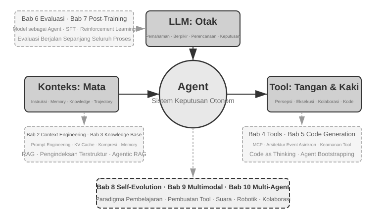
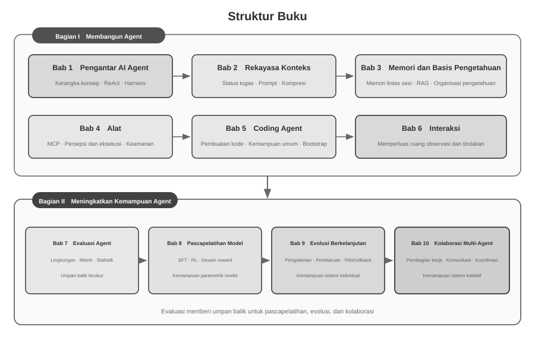

# Pengantar {.unnumbered}

Pada Agustus hingga Oktober 2025, saya mengajar serangkaian kursus di *AI Agent Bootcamp* yang diselenggarakan Turing. Kursus tersebut berpusat pada satu pertanyaan: bagaimana merancang AI Agent dengan prinsip rekayasa yang dapat dijelaskan, diverifikasi, dan digunakan kembali, alih-alih mengandalkan percobaan berulang yang dipandu pengalaman dan intuisi? Menjalankan sebuah demo bukanlah tujuan akhir. Kami juga menelaah alasan pemilihan suatu arsitektur, batas kemampuannya, serta trade-off di balik setiap keputusan desain. Buku ini merupakan hasil penataan, perluasan, dan restrukturisasi sistematis atas materi kursus dan eksperimen pendampingnya.

Penyusunan buku ini sendiri merupakan eksperimen kolaborasi manusia–Agent. Dari gagasan awal hingga naskah akhir, saya terutama menggunakan **whisper coding**, yakni kolaborasi berbasis dikte, bersama Agent suara Pine untuk melakukan riset dan iterasi teks. Saya mendiktekan kerangka bab; Agent meninjau sumber dan menyiapkan draf awal. Setelah itu, saya memasukkan umpan balik peserta dan berulang kali memeriksa serta memperbaiki argumen, kasus, dan eksperimen. Suara menurunkan biaya mengeksternalisasi gagasan dan mempersingkat siklus dari perumusan pertanyaan ke pencarian sumber, penulisan, dan verifikasi. Karena itu, buku ini tidak hanya membahas Agent, tetapi juga mendokumentasikan cara produksi pengetahuan yang melibatkan Agent secara mendalam.

Sejak DeepSeek R1 dirilis pada awal 2025, fokus riset dan praktik industri AI berangsur meluas dari kemampuan model fondasi menuju penerapan Agent secara sistematis. Di sisi model, Agentic Reinforcement Learning mulai menginternalisasi penggunaan alat dan interaksi lingkungan ke dalam parameter, memperkuat kemampuan umum dalam pemrograman, penalaran matematika, dan Computer Use. Di sisi produk, Agent umum seperti Manus, Claude Code, dan OpenClaw mengubah interaksi manusia–komputer dan menjadikan ‘pembuatan kode + sistem berkas’ sebagai arsitektur sistem yang penting.

Jika prinsip arsitektur Agent yang dirangkum dalam kursus ini ditinjau kembali, terlihat bahwa prinsip-prinsip tersebut tetap memiliki daya jelas yang stabil meskipun model dan produk berubah cepat. Istilah seperti Skill, *harness*, dan *loop engineering* baru tersebar luas kemudian, sedangkan praktik rekayasa yang terkait biasanya muncul lebih awal. Konsep terbentuk dari generalisasi atas banyak pengalaman praktik, bukan menjadi titik awal praktik. Dengan kata lain, praktik datang lebih dahulu dan penamaan menyusul.

Prinsip-prinsip ini terutama lahir dari rekayasa sistem berjangka panjang dan berisiko tinggi. Sebagai Chief Scientist Pine AI, saya bekerja bersama tim yang mengembangkan Pine agar Agent dapat berkomunikasi dengan manusia atas nama pengguna dan menangani tugas kompleks yang menyangkut kepentingan ekonomi nyata, seperti negosiasi tagihan, sengketa pengembalian dana, dan pembatalan langganan. Tugas tersebut sering berlangsung lama dan melalui banyak putaran; satu langkah yang keliru dapat menimbulkan kerugian nyata. Tuntutan ketat akan keandalan, keamanan, dan auditabilitas membentuk prinsip arsitektur buku ini.

- Jauh sebelum Skill menjadi kata kunci yang populer (*buzzword*), kami telah menggunakan pemuatan *prompt* dinamis untuk mengendalikan pertumbuhan *prompt* yang tak terkendali, alat eksekusi *command-line* untuk mengendalikan daftar alat yang tak terbatas, dan bilah status sistem (*system status bar*) untuk memberikan kesadaran kepada Agent akan lingkungan eksekusinya, waktu pengguna, dan status kerjanya sendiri.
- Jauh sebelum *harness* menjadi *buzzword*, kami telah menggunakan metode bergaya Claude Code untuk menangani panggilan alat (*tool calls*) yang tidak stabil, halusinasi, operasi berbahaya, operasi tidak sah, dan instruksi yang diabaikan.
- Jauh sebelum *loop engineering* menjadi *buzzword*, kami telah menggunakan apa yang dalam buku ini disebut metode *proposer-reviewer* untuk mencegah model mendeklarasikan suatu tugas selesai terlalu dini.

Metode-metode ini tidak hanya dimiliki Pine. Banyak tim model dan Agent secara mandiri membentuk metode rekayasa yang serupa ketika memecahkan masalah sejenis; konvergensi ini menunjukkan bahwa metode tersebut mencerminkan kendala umum sistem Agent. Berdasarkan pemahaman ini, saya menyelenggarakan “AI Agent Bootcamp” di Turing pada 2025 dan mengajar kursus praktik AI Agent di University of Chinese Academy of Sciences sepanjang 2024–2026. Buku ini diterbitkan secara *open source* agar pengetahuan dan pengalaman yang dapat digunakan kembali ini bermanfaat bagi lebih banyak peneliti dan praktisi rekayasa.

**Praktik datang lebih dahulu, penamaan menyusul.** Dalam pengembangan Agent untuk perusahaan, ini berarti praktik tidak dapat terus-menerus tertinggal dari penyebaran konsep. Ketika suatu istilah menjadi konsensus industri, masalah yang dirujuknya sering kali telah lama diteliti dalam sistem-sistem terdepan. Untuk mengenali dan memecahkan masalah tersebut lebih awal, diperlukan dua kondisi.

**Pertama, pilih kegiatan bisnis nyata yang menuntut batas kemampuan Agent secara memadai dan terus kumpulkan umpan balik nyata.** Di Pine, satu tugas dapat berlangsung berjam-jam hingga berminggu-minggu dan memerlukan koordinasi berulang dengan beberapa pemangku kepentingan, panggilan panjang, pengisian formulir yang rumit, serta beberapa putaran surel. Pada saat yang sama, sistem harus menjamin ketepatan data penting, keterkendalian operasi, dan kepentingan pengguna. Lingkungan yang cukup kompleks terus mengungkap kesenjangan antara kemampuan model dan tuntutan bisnis, sehingga mendorong tim membangun *harness* untuk menyelesaikan secara sistematis hal-hal yang belum dapat ditangani model secara mandiri tetapi wajib dilakukan oleh bisnis. Jika tuntutan mudah dipenuhi oleh pembaruan model berikutnya, tim lebih sulit mengakumulasi prinsip desain sistem yang stabil.

**Kedua, bangun mekanisme Evaluasi (Evaluation) yang sistematis.** Tanpa evaluasi, kita tidak dapat menentukan apakah peningkatan setelah suatu perubahan berasal dari desain itu sendiri atau hanya dari variasi acak. Evaluasi mengubah iterasi Agent dari penilaian berbasis pengalaman menjadi proses rekayasa yang dapat dibandingkan dan direproduksi; inilah dasar pengembangan sistem dengan metode ilmiah. Bab 7 membahas metodologi tersebut.

Bagaimanapun model dasarnya berkembang dan bentuk produknya berubah, hampir semua sistem Agent yang sukses mengikuti pola arsitektur yang sama. Ini bukan kebetulan: **prinsip desain yang baik seharusnya melampaui siklus iterasi model**, karena hal itu tidak mendeskripsikan penggunaan suatu model secara spesifik, melainkan mendeskripsikan pola fundamental bagaimana sistem cerdas berinteraksi dengan dunia.

Richard Sutton, pemenang Turing Award dan bapak *reinforcement learning*, pernah berkata bahwa evolusi alam semesta telah melalui empat tahap: debu, bintang, kehidupan, dan *agents* (awalnya disebut sebagai *designed entities* atau entitas yang dirancang). Evolusi biologis itu buta: mutasi acak, seleksi alam. Sebagian besar organisme tidak memahami prinsip kerjanya sendiri dan tidak dapat merancang atau membuat ulang makhluk hidup dengan sendirinya. Namun, Agents adalah sesuatu yang sama sekali baru dalam sejarah evolusi kosmis: dengan menghasilkan kode (*generating code*) mereka dapat melakukan *bootstrap* dan berevolusi sendiri, layaknya seorang *programmer* yang menulis kode untuk *programmer* lain, yang pada gilirannya menulis kode untuk *programmer* berikutnya. Artinya, sebuah Agent dapat memahami mekanisme operasionalnya sendiri dan, dengan diberikan tujuan, ia dapat menciptakan Agents yang sepenuhnya baru—bahkan meningkatkan dirinya sendiri. Misi dari buku ini adalah membantu Anda memahami dan menguasai prinsip-prinsip dari penciptaan ini.

Formula inti dari buku ini hanya satu kalimat: **Agent = LLM + Context + Tools**. Ketiganya tidak terpisahkan.



Secara lebih intuitif, itu adalah **Otak + Mata + Tangan dan Kaki**. Otak (LLM) bertanggung jawab atas pemikiran dan pengambilan keputusan, mata (Context) menentukan informasi apa yang dapat dilihat oleh Agent, dan tangan serta kaki (Tools) menentukan apa yang dapat dilakukan Agent. (Secara teknis, "mata" adalah analogi yang masih kasar: Context tidak hanya mencakup informasi lingkungan dan riwayat percakapan, melainkan juga definisi alat, yang berarti informasi yang "dilihat" Agent juga mencakup "tangan dan kaki apa saja yang tersedia." Metafora ini bertujuan untuk menyampaikan intuisi intinya: Context adalah semua informasi yang dapat dipersepsikan oleh model.)

Untuk pembaca yang familier dengan *reinforcement learning*, ketiga hal ini juga dapat dipetakan ke dalam bahasa formal RL. Secara khusus, LLM sesuai dengan Policy, Context sesuai dengan Observation Space, dan Tools sesuai dengan Action Space. Ketiga ungkapan tersebut merujuk pada objek yang sama, hanya saja pada tingkat abstraksi yang berbeda.


## Struktur Buku {.unnumbered}

Buku ini memuat sepuluh bab yang disusun di sekitar dua pertanyaan yang saling terhubung (Gambar 0-2). **Bagian I, “Bagaimana Membangun Agent”,** mencakup Bab 1–6: dari konsep dasar menuju konteks, memori dan pengetahuan, alat, Coding Agent, serta perluasan ruang observasi dan aksi. **Bagian II, “Bagaimana Meningkatkan Kemampuan Agent”,** mencakup Bab 7–10: evaluasi terlebih dahulu membangun umpan balik yang terukur; kemudian pascapelatihan model, evolusi berkelanjutan dari pengalaman operasi, dan kolaborasi multi-Agent meningkatkan kemampuan pada tingkat parameter model, sistem tunggal, dan sistem kolektif.



- **Bab 1 (Agent Fundamentals)** dimulai dengan beberapa produk Agent nyata untuk membangun pemahaman intuitif tentang Agents. Bab ini kemudian menelaah lebih dalam pada formula inti Agent: dari lapisan implementasi LLM + Context + Tools, ke lapisan intuitif Otak + Mata + Tangan dan Kaki, dan akhirnya ke lapisan akademik yang berupa Policy, Observation Space, dan Action Space. Eksperimen di sini membedah bagaimana *ReAct loop* beroperasi—proses berulang dari “Think → Act → Observe”—dan membedakan antara adaptasi kontekstual *within-task*, pembaruan lintas tugas pada *external artifacts*, dan pembaruan parameter selama siklus *training*. Bab ini ditutup dengan pola desain orkestrasi mulai dari *workflows* (alur kerja) hingga *autonomous Agents*, menetapkan kerangka konseptual terpadu untuk bab-bab selanjutnya.
- **Bab 2 (Context Engineering)** adalah bab yang paling krusial di dalam buku ini, yang secara sistematis menjelaskan Context, “mata” dari si Agent. Bab ini dimulai dengan struktur pesan API dan *loop* inti Agent, menetapkan fondasi bahwa “Context adalah daftar pesan”, kemudian mengkaji prinsip dasar KV Cache—mekanisme untuk menggunakan kembali hasil perhitungan riwayat selama inferensi LLM. Selanjutnya bab ini mencakup Prompt Engineering, termasuk desain yang berorientasi pada proses, deskripsi alat, dan penyempurnaan aturan bisnis; serangan dan pertahanan Prompt Injection; mekanisme pemuatan sesuai permintaan (*on-demand loading*) dari Agent Skills; teknologi *Agent status bar*; dan strategi Context Compression. Definisi lengkap dari istilah-istilah ini disediakan pada saat dimunculkan pertama kalinya di dalam teks utama.
- **Bab 3 (User Memory and Knowledge Bases)** memperluas manajemen konteks ke dalam sistem pengetahuan persisten (Knowledge Base) yang membentang di berbagai sesi, memungkinkan Agent untuk tidak hanya mengingat percakapan saat ini tetapi juga mengumpulkan serta mengambil kembali pengetahuan (*retrieve knowledge*) di beberapa percakapan. Bab ini mencakup empat strategi progresif untuk User Memory; *stack* teknis lengkap RAG (Retrieval-Augmented Generation, yaitu kondisi di mana dokumen yang relevan diambil (*retrieved*) sebelum model menghasilkan jawaban), termasuk metode pencarian teks dan pengoptimalan peringkat (*ranking*) yang berbeda; ekstraksi informasi multimodal; metode pengorganisasian pengetahuan (*knowledge organization*) yang lebih lanjut; dan Agentic RAG, di mana Agent secara mandiri memutuskan kapan dan apa yang akan diambil (*retrieve*).
- **Bab 4 (Tools)** menelaah jembatan antara Agent dan dunia luar: alat berfungsi sebagai “tangan dan kaki” Agent sehingga dapat menelusuri web, memanggil API, dan mengoperasikan basis data. Bab ini memperkenalkan standar interoperabilitas MCP serta prinsip desain lima kategori alat—Perception, Execution, Collaboration, Event Triggering, dan User Communication—dengan perhatian khusus pada keamanan *execution tools*. Pemicu peristiwa, komunikasi pengguna, dan lingkungan eksekusi asinkron dibahas dalam Bab 6.
- **Bab 5 (Coding Agent and Code Generation)** berargumen bahwa Coding Agent ditambah *file system* merupakan fondasi teknis inti dari setiap Agent umum. Dengan menggunakan arsitektur OpenClaw sebagai benang merah pengaturannya, bab ini menganalisis alur kerja (*workflows*) Coding Agent dan teknik implementasinya, sembari mendemonstrasikan nilai luas dari *code generation* di luar pemrograman: mulai dari membantu pemikiran dan membangun basis pengetahuan, hingga membuat alat baru secara dinamis dan *Agent bootstrapping*.
- **Bab 6 (Interaksi: Perluasan Ruang Observasi dan Aksi)** mengkaji interaksi Agent–lingkungan melalui dua dimensi: **modalitas** dan **temporalitas**. Sistem asinkron berbasis peristiwa memungkinkan Agent terus menerima dan menanggapi peristiwa eksternal; suara membawa persepsi, penalaran, dan generasi menuju operasi waktu nyata; Computer Use memperluas ruang aksi ke antarmuka grafis; dan robotika memperluasnya ke lingkungan fisik. Keempat ranah ini berbagi primitif sistem seperti aktivasi, titik aman, pembatalan, preemption, dan pemisahan jalur cepat/lambat.
- **Bab 7 (Agent Evaluation)** membangun metodologi evaluasi yang ilmiah. Bab ini mencakup lingkungan evaluasi—dua paradigma inti, yaitu *tool calling* dan interaksi manusia-komputer, ditambah dengan lingkungan simulasi yang dibahas secara terpisah di akhir bab—prinsip desain *dataset*, evaluasi otomatis menggunakan metode LLM-as-a-Judge, pemilihan model yang didorong oleh evaluasi, dan *closed loop* (lingkaran tertutup) lengkap yang mengubah hasil evaluasi menjadi perbaikan pada sistem.
- **Bab 8 (Model Post-training)** mengkaji dua teknik *post-training* secara mendalam: SFT (Supervised Fine-Tuning, yang menggunakan data berlabel untuk mengajarkan model mengikuti contoh) dan RL (Reinforcement Learning, yang memungkinkan model untuk terus meningkat secara mandiri melalui *trial and error* serta *reward feedback*). Disusun berdasarkan argumen utama bahwa “SFT menghafalkan (*memorizes*), RL menggeneralisasi (*generalizes*)” dan “Data dan lingkungan lebih penting daripada algoritma,” bab ini mencakup lanskap prapelatihan (*pre-training*)/SFT/RL secara lengkap, teori RL klasik, desain sinyal-*reward*—mulai dari *binary rewards* dan *process rewards* hingga *verified path penalties* yang “menghargai (*reward*) hasil dan membatasi (*constrain*) prosesnya”—algoritma *reinforcement-learning single-turn* maupun *multi-turn*, serta topik-topik mutakhir seperti pengoptimalan *sample-efficiency*.
- **Bab 9 (Continuous Agent Evolution)** mempelajari bagaimana mengubah pengalaman operasional sebuah Agent menjadi kemampuan untuk versi selanjutnya. Awalnya, bab ini merumuskan sinyal pembelajaran yang terdiri dari hasil lingkungan (*environmental outcomes*), aturan proses (*process rules*), dan Rubrik LLM (*LLM Rubrics*); kemudian bab ini membandingkan empat media pembaruan (*update carriers*)—dokumen pengetahuan, Prompts dan Skills, program dan Harnesses, serta parameter model; dan akhirnya membahas validasi versi-kandidat, *canary releases*, *rollback*, dan konsolidasi jangka panjang.
- **Bab 10 (Multi-Agent Collaboration)** memperluas pembahasan dari kemampuan individu ke koordinasi tingkat sistem dan mengkaji bagaimana banyak Agent membagi tugas serta berkolaborasi. Bab ini menyajikan kerangka klasifikasi—shared/independent context × struktur peer/manager/decentralized—dan menunjukkan desain arsitektur melalui Agent penerjemah serta Agent yang mengoordinasikan telepon dan komputer, lalu membahas kemungkinan arah perkembangan *Agent societies* dan *Agent economies*.

## Cara Membaca Buku Ini {.unnumbered}

Bab-bab di dalam buku ini relatif independen. Anda dapat memilih jalur bacaan yang berbeda-beda sesuai kebutuhan Anda:

- **Jika Anda pengembang Agent**, bacalah buku ini secara berurutan: Bab 1–6 membangun metode lengkap untuk membuat Agent, sedangkan Bab 7–10 membahas peningkatan kemampuan melalui evaluasi, pascapelatihan model, evolusi berkelanjutan, dan kolaborasi multi-Agent.
- **Jika Anda memiliki waktu yang terbatas**, prioritaskan Bab 1, untuk gambaran keseluruhannya, dan Bab 2, untuk *context engineering*—kemampuan yang paling krusial. Prinsip-prinsip dasar yang ada di balik KV Cache dalam Bab 2 lumayan bersifat teknis; pada bacaan pertama, Anda bisa melewati mekanismenya dan hanya memegang tiga kesimpulan inti yang dinyatakan di awal, tanpa akan mempengaruhi pemahaman Anda pada materi-materi selanjutnya.
- **Jika fokus Anda adalah pelatihan model (*model training*)**, langsung pergi ke Bab 8 (Model Post-training). Karena metode evaluasi dalam Bab 7 adalah prasyarat untuk pelatihan, bacalah kedua bab tersebut bersama-sama, setelah Bab 1 dan Bab 2 memberikan gambaran secara menyeluruh.

Setiap bab berisi sejumlah besar **eksperimen** dan **pertanyaan pemikiran (thought questions)**, yang diberi nomor dalam format "Eksperimen X-Y" (X adalah nomor bab, Y adalah nomor urut di dalam bab). Judul-judul eksperimen dan pertanyaan pemikiran mengandung peringkat bintang untuk tingkat kesulitan: ★ berarti tingkat pemula (*entry-level*), cocok untuk semua pembaca; ★★ berarti tingkat kesulitan menengah, membutuhkan sejumlah praktik rekayasa; ★★★ berarti tantangan lanjutan, biasanya melibatkan pertanyaan terbuka atau desain sistem yang kompleks. Sebagian besar eksperimen dilengkapi dengan kode yang lengkap dan dapat dijalankan, yang disusun di dalam repositori *open-source* pendampingnya:

> **Repositori Kode Pendamping**: [https://github.com/bojieli/ai-agent-book](https://github.com/bojieli/ai-agent-book)

Anda dapat memperoleh seluruh kode pendamping dengan Git:

```bash
git clone https://github.com/bojieli/ai-agent-book.git
cd ai-agent-book
```

Jika Anda tidak menggunakan Git, Anda juga dapat memilih **Code → Download ZIP** pada halaman repositori. Kode eksperimen disusun berdasarkan bab, dari `chapter1/` hingga `chapter10/`. Untuk menemukan “Eksperimen X-Y”, buka `chapterX/README.id.md` yang sesuai, gunakan nomor eksperimen untuk menemukan direktori proyeknya, lalu ikuti README proyek tersebut untuk memasang dependensi dan menjalankannya. Beberapa eksperimen yang ditandai sebagai panduan reproduksi bergantung pada repositori eksternal; README masing-masing juga menjelaskan cara memperolehnya.

Saya sangat menyarankan Anda untuk menjalankan sendiri eksperimen-eksperimen ini: AI Agents adalah bidang praktik yang intens, dan banyak intuisi desain yang hanya akan terbentuk saat Anda melakukan proses *debugging*.


## Prasyarat {.unnumbered}

Buku ini ditujukan untuk pembaca yang memiliki beberapa latar belakang teknis, tetapi tidak mengharuskan Anda untuk menjadi seorang pakar ahli pada bidang tertentu. Prasyarat yang ada tercantum di bawah ini dan dibagi menjadi dua tingkat: "Wajib" dan "Direkomendasikan", untuk membantu Anda dalam menilai kesiapan Anda.

**Wajib: Dasar untuk membaca keseluruhan isi buku**

- **Python Programming (Pemrograman Python)**: Hampir semua eksperimen di dalam buku ini menggunakan Python. Anda harus terbiasa dengan sintaks dasar Python, struktur data umum, manajemen *package* (pip), dan konsep fundamental lainnya. Kemahiran penuh tidak diwajibkan, tetapi Anda harus mampu membaca serta memodifikasi kode Python dengan tingkat kompleksitas menengah.
- **Pengalaman Dasar dengan LLM**: Anda seharusnya pernah menggunakan ChatGPT, Claude, atau produk sejenisnya, dan memahami pola interaksi dasar dari "Prompt → Respons Model".
- **AI-Assisted Programming Tool**: Pasang dan biasakan diri Anda dengan setidaknya satu alat pemrograman berbasis AI, seperti Claude Code, Codex, Cursor, atau TRAE. Di satu sisi, alat-alat ini akan sangat mempercepat eksperimen yang ada, yang akan melibatkan penulisan serta *debugging* kode secara ekstensif. Di sisi lain, mereka sendiri merupakan sebuah Coding Agent yang matang: dalam menggunakannya, Anda akan merasakan sendiri mekanisme inti yang secara berulang kali dibahas di dalam buku ini—*ReAct loop*, panggilan alat (*tool calls*), manajemen konteks (*context management*). Pengalaman langsung itu sangatlah berharga dalam rangka memahami berbagai prinsip perancangan Agent.
- **Pengetahuan Rekayasa Perangkat Lunak Secara Umum**: Anda hendaknya sudah familier dengan konsep-konsep dasar seperti operasi *command-line*, *version control* menggunakan Git, format data JSON, dan REST API. Ini semua adalah fondasi untuk menjalankan berbagai eksperimen serta dalam memahami mekanisme *tool-calling* milik Agent.

**Direkomendasikan: Meningkatkan pengalaman membaca pada bab tertentu**

- **Dasar-dasar Machine Learning** (Bab 8): Memahami berbagai konsep dasar seperti pelatihan (training) versus inferensi (inference), *loss functions*, *gradient descent*, dan *overfitting* akan membantu Anda dalam memahami *model post-training*.
- **Matematika Dasar** (Bab 2-3, 8): Pemahaman intuitif tentang aljabar linier (misalnya, mengetahui bahwa vektor dapat mewakili arah maupun besaran, dan matriks dapat melakukan *batch operations*) akan membantu Anda memahami mekanisme *embeddings* dan *attention mechanisms*. Pengetahuan dasar tentang probabilitas serta statistik akan membantu dengan metrik evaluasi dan nilai *rewards* yang diharapkan dalam *reinforcement learning*. Matematika yang ada di dalam buku tidak melibatkan derivasi yang rumit melainkan lebih berfokus pada penjelasan yang intuitif.
- **Bab 6 (Interaksi: Perluasan Ruang Observasi dan Aksi)** mengkaji interaksi Agent–lingkungan melalui dua dimensi: **modalitas** dan **temporalitas**. Sistem asinkron berbasis peristiwa memungkinkan Agent terus menerima dan menanggapi peristiwa eksternal; suara membawa persepsi, penalaran, dan generasi menuju operasi waktu nyata; Computer Use memperluas ruang aksi ke antarmuka grafis; dan robotika memperluasnya ke lingkungan fisik. Keempat ranah ini berbagi primitif sistem seperti aktivasi, titik aman, pembatalan, preemption, dan pemisahan jalur cepat/lambat.
- **Pemahaman Dasar tentang Arsitektur Transformer** (Bab 2, 8): Transformer adalah arsitektur yang mendasari hampir semua jenis *large language model* (model bahasa berukuran besar) saat ini. Pembaca yang ingin membangun pengetahuan dasarnya mengenai *large models* secara sistematis mungkin akan menyukai buku *Illustrating Large Models* (图解大模型, diterbitkan dalam bahasa Mandarin oleh Turing), yang mana menggunakan berbagai diagram intuitif guna menjelaskan bermacam konsep inti semisal arsitektur Transformer, *pre-training*, serta *fine-tuning*—sebuah pelengkap yang bagus untuk perspektif dari sisi rekayasa Agent pada buku ini.

Jika Anda kehilangan atau tidak memiliki sebagian prasyarat ini, janganlah berkecil hati. Nilai inti dari buku ini terletak pada **prinsip rancang arsitektur serta metodologi rekayasa**, dan bukan pada suatu algoritma maupun teknik mana pun secara khusus. Di luar dari Bab 8 tentang *post-training*, buku ini hanya membutuhkan sedikit pengetahuan matematika ataupun *machine learning*, dan ini dapat menjadi sebuah permulaan yang sempurna.

Teknologi Agent masih terus berkembang dengan pesat, namun **prinsip desain arsitektur yang baik memiliki kekuatan untuk bertahan melintasi waktu**. Kuasailah alasan "mengapa" di balik setiap keputusan desain, dan Anda akan mampu menjaga agar setiap penilaian Anda tetap jelas seiring deru ombak perubahan teknologi. Saya berharap semoga buku ini menjadi panduan yang dapat diandalkan pada saat Anda sedang membangun berbagai macam AI Agents.

## Ucapan Terima Kasih {.unnumbered}

Saya ingin berterima kasih kepada editor Meng Ge dan Liu Meiying di penerbit Turing atas upaya *editing* mereka yang teliti dan berkat kerja keras mereka di dalam mengelola kursus "AI Agent Bootcamp" milik Turing; Saya juga berterima kasih kepada Profesor Liu Junming karena telah menawarkan kursus interaktif mengenai AI Agent di The University of Chinese Academy of Sciences (UCAS). Apresiasi dan ucapan terima kasih secara khusus saya berikan kepada seluruh murid di "AI Agent Bootcamp" Turing dan kursus AI Agent di UCAS—mengajar setiap kursus ini telah membawa banyak masukan serta nasihat yang berharga dari Anda, dan itu semakin menajamkan pemahaman pribadi saya terhadap seluruh konsep-konsep ini.

Saya mengucapkan terima kasih kepada semua kolega saya di Pine AI. Tanpa produk yang sebegitu luar biasa layaknya Pine AI, serta berbagai tantangan yang dibawanya, saya takkan mungkin pernah menyelami begitu dalam ke dalam bidang teknologi Agent, di dalam hal pemahaman maupun pada setiap bentuk praktiknya; dan melewati setiap pertukaran gagasan serta ide, rekan-rekan saya juga telah menyumbangkan segudang pengetahuan yang sangat berharga.

Saya juga ingin mengucapkan banyak-banyak terima kasih kepada rekan-rekan yang ada di seluruh lapisan industri teknologi AI (saya takkan bisa menyebutnya satu-per-satu di sini). Melewati waktu-waktu saat kita berdiskusi, kalian memberikan berbagai *feedback* dengan sangat jujur pada semua poin sudut pandang milik saya, membantu mengoreksi sejumlah kesalahan yang saya buat dalam memberikan penilaian, serta terus meningkatkan pemahaman saya tentang model dan Agents.

Paling penting dari itu semua, saya ingin mengucapkan terima kasih saya yang tidak terhingga untuk pihak keluarga, terutama ditujukan untuk istri saya, Meng Jiaying. Ia telah memberikan dukungan penuh selama penulisan buku ini dan memberikan banyak sekali masukan yang sangat berharga sepanjang proses penulisannya.
