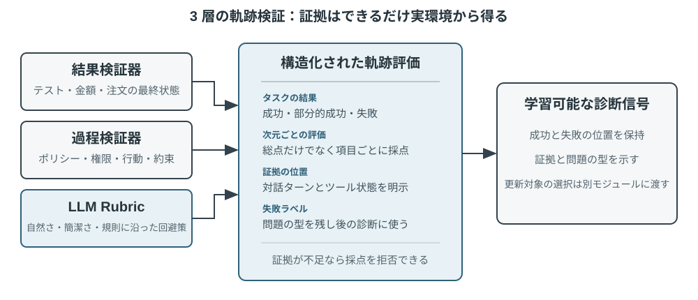
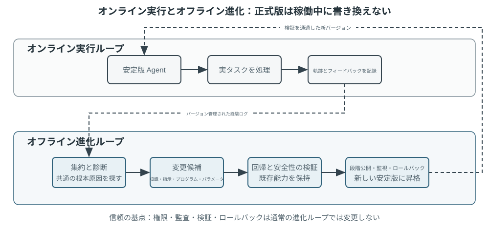
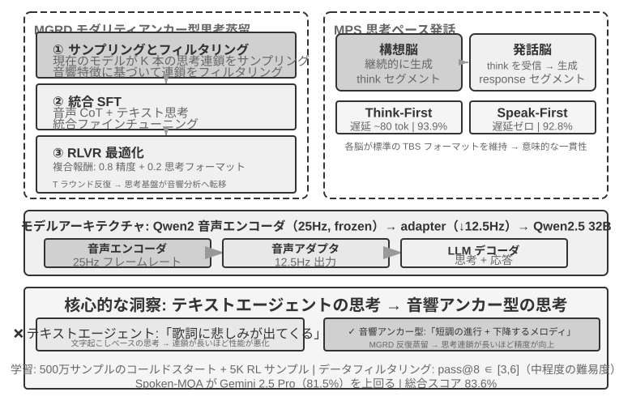
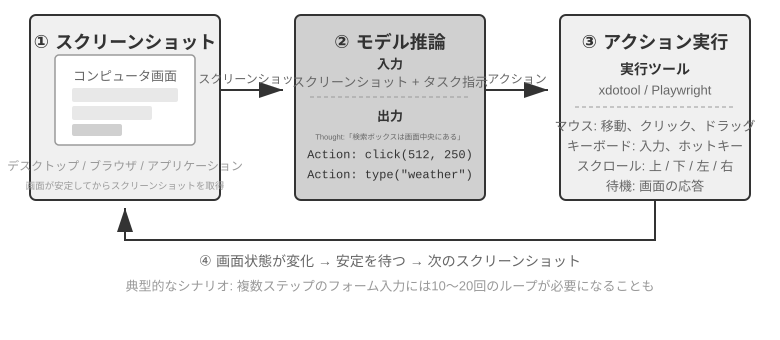
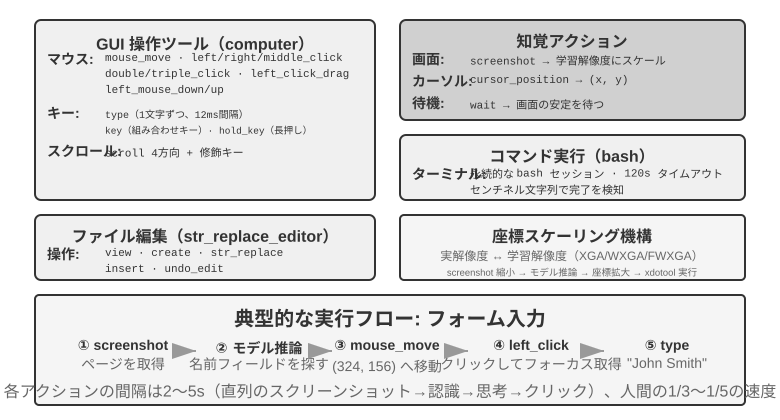
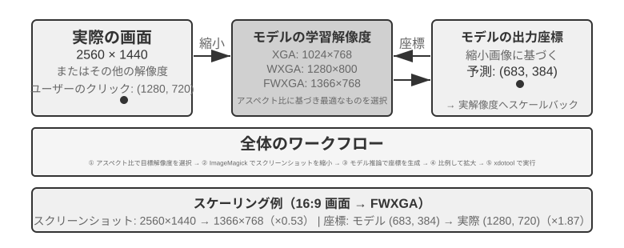

# マルチモーダルとリアルタイム対話

これまでの章では、テキストの世界における Agent の設計を論じてきました。コンテキスト、ツール、コードを通じてデジタルシステムとやり取りする、というものです。しかし、Agent がやり取りする対象はテキストや API だけではありません。Agent がユーザーの音声指示を聞き取り、画面上で正しいボタンを見つけてクリックし、あるいはロボットアームを制御して物体を正確につかむ必要があるとき、Agent はまったく新しい領域へと足を踏み入れます。それが **マルチモーダルなリアルタイム対話** です。純粋なテキストの入出力から **マルチモーダルな知覚とリアルタイム応答** へと拡張することは、Agent が「対話ボックス」から飛び出すための鍵となる一歩です。いわゆる「マルチモーダル」とは、テキストだけでなく、文字・音声・画像・動画・動作という複数の情報形式を同時に扱うことを指します。

まず本章の範囲を定めておきます。静止画像や文書の理解――スクリーンショットを見る、図表を読む、PDF を解析する――は、すでに知覚ツールとして前の各章の Agent 実践に自然に溶け込んでいます。今日のマルチモーダル大規模モデルにとって、この種の「一度入力し、一度理解する」タスクは相対的に成熟しており、専用のアーキテクチャ設計を必要としません。本章が焦点を当てるのは別種の問題、すなわち **リアルタイム性がマルチモーダル問題を難しくする** 3 つの場面――音声対話、GUI 操作、ロボット制御です。これらの場面では、入力は絶えず流れ続け、出力は厳しい時間予算内に返さなければならず、そのためアーキテクチャ設計に質的な変化が生じます。連続的な視覚ストリーム（動画）のリアルタイム理解については、本書執筆時点でも Agent にとって未解決の問題です。本章の Computer Use のパートで論じるフレームごとのスクリーンショットの限界と、章末の演習問題で再びこの話題に立ち戻ります。もう一つの境界も引いておく必要があります。マルチモーダルな **生成**（画像生成、動画生成）は、本書の枠組みでは普通のツール呼び出しにすぎません（第 5 章のマルチメディア生成ですでに触れました）。Agent はそれを外部ツールとして呼び出せばよく、本章が解決しようとするリアルタイム対話の難題には関わらないため、本章の主線には含めません。

音声対話、Computer Use、ロボット操作は、一見するとまったく異なる 3 つの領域にまたがっているように見えますが、実際にやってみると、行き詰まる箇所が非常によく似ていることに気づきます。いずれも複数のモダリティの情報を同時に処理しなければならず、いずれも遅延に極度に敏感です。音声の間（ま）が 2 秒を超えると人は苛立ち、ロボット制御のミリ秒単位のブレは衝突を招きかねません。この 2 つの制約が共に、3 つの場面を同じアーキテクチャの方向へと押しやります。すなわち **直列パイプライン**（工場の流れ作業のように、一つの工程が終わってはじめて次に渡せる）から **エンドツーエンドモデル**（統一された 1 つのモデルが入力から出力まで直接処理し、途中の受け渡し工程を省く）へ、という方向です。

本章は以下の筋道で展開します。

1. まず「音声アーキテクチャの 3 つのパラダイム」で座標系を組み立てます。カスケード（VAD-ASR-LLM-TTS のパイプライン）、エンドツーエンドの全モダリティ（Omni、単一モデルだが依然として交互に話す）、全二重（Moshi、GPT-Live、聞きながら話す）です。そして「いかに VAD の輪番前提から脱するか」という軸に沿って、各段の遅延とトレードオフを順に解きほぐしていきます。そのうちカスケードの節では、ストリーミング音声知覚で VAD + ASR をどう置き換えるかも述べます。
2. 次に、思考アーキテクチャが「リアルタイム応答」と「深い思考」の矛盾をいかに調停するかを見ます。速い思考と遅い思考を単純に並行させるものから、バックグラウンドの推論モデルを「軍師」に据える分離型のアプローチ（GPT-Live の委譲、Pine AI など）、さらには Step-Audio R1 が思考を単一モデルへと「内在化」させた「考えながら話す」に至るまでを扱います。
3. 続いて、より人間らしい音声合成による実行層の最適化を論じます。
4. 最後に視点を Computer Use（AI に人間のようにパソコンの画面を操作させる）とロボット操作へと広げ、同じ遅延とマルチモーダルの問題がこの 2 つの場面でどう現れるかを見ます。

そのうち、理論寄りで場面をまたいで応用できる 2 つの重点を特に指摘しておきます。**思考アーキテクチャ**（速い・遅いという 2 系統の思考がいかに協調するか）と、そこから派生する **速い-遅いのインターフェース**（Latent Bridge、速いモデルと遅いモデルの間で文字以外に何を伝えられるか）です。これらは音声の場面から語り起こしますが、音声だけに奉仕するものではありません。後半の Computer Use やロボットでも同じく「いつ遅い軍師を呼ぶべきか」という問題に出くわすので、読者には特に留意していただきたい点です。

## 音声：最も自然な人間とコンピュータのインターフェース

音声は文字を音に変えるだけではない。発話はタイピングの約4倍速く、手と視線を使わないため、いつでも割り込まれ得る連続入出力ループに Agent を置くのに適している。音声入力は発話を文字にし、音声 Agent は利用者が Agent と直接協働できるようにする。どちらも序章の whisper coding を支える。

本節では、利用者が Agent に話す場合と、Agent が利用者に代わって外界に話す場合を扱う。音声モデルは何に答えられるかを、対話構造は聞き取り、応答、発話権の交代、確認とツール呼び出しを時間内に行えるかを決める。

### 相互作用の時間構造：カスケードから全二重へ

OpenAI は GPT-Live で、音声対話をカスケード、ターンベース、全二重の三パラダイムに整理した[^ch9-12]。これは新旧の順位ではなく、遅延・コスト・観測性のトレードオフである。

| パラダイム | 構造 | 利点 | 制約 |
| --- | --- | --- | --- |
| カスケード | VAD → ASR → LLM → TTS | 交換・デバッグしやすい明確なモジュール | 遅延の累積とパラ言語情報の欠落 |
| エンドツーエンド Omni | 一つのモデルが聞き、考え、話す | 低遅延、声色・感情・環境音を保持 | ターン依存、訓練とデバッグが難しい |
| 全二重 | 聞き、話し、判断し続ける | 重なり発話と自然な割り込み | 訓練・制御・評価が複雑 |

共通する課題は、交互に話す仮定と VAD による発話権の推測を越えることだ。全二重だけが発話権を継続的なモデル判断にする。

[^ch9-12]: OpenAI. *Introducing GPT-Live.* 2026-07-08. https://openai.com/index/introducing-gpt-live/。この三分類は ChatGPT Voice の三世代をまとめた同記事に由来し、本文の Omni は「turn-based voice models」に対応する。

**ストリーミングキャンセル:**

```python
while audio_is_arriving:
    partial = asr.push(audio_chunk)
    if endpoint_is_probable(partial):
        candidate = llm.start(partial)
        if later_audio_changes_meaning(partial):
            cancel(candidate)                 # speculative cancellation
        else:
            tts.enqueue_stable_segments(candidate)

on_final_transcript(text):
    commit_or_restart(text)
```

### パラダイム一・カスケードパイプライン（Cascading）

商用音声アシスタントの多くは直列パイプラインを使う（図9-1）。VAD が終了を判断し、ASR が音声を文字にし、LLM が回答を生成し、TTS が読み上げる。モジュール性は最適化を容易にするが、各境界が待ち時間を加える。


| モジュール | 役割 | ボトルネック |
| --- | --- | --- |
| VAD | 発話終了の判定 | 無音閾値による待機と誤分割 |
| ASR | 音声を文字に変換 | 認識遅延と文脈欠落 |
| LLM | 理解・思考・生成 | 最初の token の遅延、reasoning の追加待機 |
| TTS | 文字を音声に変換 | 最初のパケットと再生バッファ |

短い回答でも段階の待機は直列に累積する（図9-2）。本番のキューイングは空載遅延をさらに増幅する（図9-3）が、容量計画は本章では扱わない。




> **実験 9-1 ★：従来型音声 Agent を構築する**
>
> マイク、Silero VAD、ローカル Whisper、ストリーミング LLM、Fish S1 TTS を WebSocket で接続し、カスケード基線を作る。保持された単一ターンの実証はメディアとモデルが最後まで動いたことを示すが、並列性や本番負荷のベンチマークではない。[chapter9/live-audio](../chapter9/live-audio/) にコードと受入記録がある。

> **追加プロジェクト：WebRTC で「利用者に電話する」音声 Agent**
>
> PSTN は必須ではない。ブラウザ WebRTC で会話を開始し、不足情報を尋ね、復唱確認し、構造化結果を保存する閉ループを再現できる。外部機関には同じ契約を準拠した PSTN/SIP に置き換える。詳細は [chapter9/phone-agent](../chapter9/phone-agent/) にあり、歴史的な exp9-2 識別子は保持するが本文の番号付き実験ではない。

#### 直列からストリーミング知覚へ

ASR は発話中に暫定転写を出し、LLM は最初の文を TTS に渡し、TTS は音声チャンクを返せる。ただし三段階が最初から最後まで完全並列になるわけではない。部分転写による先行生成にはキャンセル、無効化、再実行、ロールバックが必要だ。

従来の VAD + ASR 前端には、無音待ちによる遅延、ためらいや感情を表せない情報損失、固有名詞の文脈分断という三つの問題がある。因果またはチャンク型エンコーダと増分デコードが真のストリーミングに必要で、Whisper のエンコーダは完全な音声区間を必要とする。LLM ベースの聴覚モデルはテキストと意味イベントを出力し、文脈と世界知識を利用できる。

終端判定を組み込む場合、ラベルは判断時点で見える情報だけから作る必要がある[^ch9-11]。speak_start/end、interrupt、emotion、laugh、sigh、noise のイベントを文字と一緒に出力すれば、音をすべてテキストに圧縮せず対話状態を扱える。

[^ch9-11]: 終端判定を認識器に組み込む診断と後知恵ラベルの問題については Li, Bojie and Noah Shi. *The Trade-off Was in the Labels: Causal Supervision for Turn-Aware Streaming ASR.* 2026（発表予定）を参照。

> **実験 9-2 ★：Qwen2-Audio でストリーミング音声知覚を模擬する**
>
> 増加する音声プレフィックスで連続知覚を模擬し、600 ms VAD + Whisper と比較する。canonical run は全ゲートに合格したが期待挙動は 2/6 のみで、8.4–11.3 秒を要し、pause の silence を見落とし noise の cough/laughter を誤分類した。これは失敗モードの検査であり、100–200 ms の真のストリーミングを主張しない。記録は [chapter9/streaming-speech](../chapter9/streaming-speech/) にある。

### パラダイム二・エンドツーエンド全モダリティ（Omni）

音声を文字へ変換するカスケードは感情、抑揚、環境音を失うことがある。Omni は一つのモデルで聞き、回答し、話すため情報を保持しやすい。自己カスケードは文字で十分な課題では知覚誤りを直せるが、話速や感情が必要な課題では文字のボトルネックが証拠を消す[^ch9-13]。Omni もターンを前提とするため、数字の途中の無音を終了と誤判定し得る。

[^ch9-13]: カスケードとエンドツーエンドの精度優位が逆転する条件については Li, Bojie and Noah Shi. *The Cascade Gap: When and Why Self-Cascades Help Multimodal Agents.* 2026（発表予定）を参照。


リアルタイム音声 API は両者の中間で、ネイティブ音声処理と VAD、割り込み、非同期ツール呼び出しを組み合わせる。比較すべきはランキングではなくタスクごとの失敗である。

> **実験 9-3 ★★：MiniCPM-o 4.5 をローカルで実行し、エンドツーエンドと自己カスケードを比較する**
>
> revision を固定し thinking mode を無効にして、音声から直接回答する経路と転写後に回答する経路を比較する。音声情報の保持を測るもので、「考えながら話す」能力ではない。
> 表9-1 MiniCPM-o 4.5 ローカルでのエンドツーエンドと自己カスケードの結果（4 件のメカニズム検査であり、ベンチマークではない）
>
>
> | タスク | エンドツーエンド | 自己カスケード | 観察 |
> | --- | ---: | ---: | --- |
> | 語義算術（2） | 1/2 | 2/2 | 転写誤りを一つ修正 |
> | 副言語的な話速（2） | 2/2 | 1/2 | 純テキスト転写が速い／遅いの差を消す |
> | 合計 | 3/4 | 3/4 | 合計は同じで失敗位置は相補的 |
>
> サンプルは小さく、全体の精度や速度は結論できない。完全な証拠は [chapter9/end-to-end-speech](../chapter9/end-to-end-speech/) にある。

Step-Audio 2 は生音声から文字と音声を出力し、Step-Audio R1 は推論を音声モデルに内在化する。

### パラダイム三・全二重インタラクティブモデル

Omni は利用者とモデルの発話を分けるが、同時通訳などは重なりを要する。全二重モデルはターンを前提とせず、聞き、話し、続行・停止・割り込み・ツール呼び出しを連続的に判断する。Kyutai の Moshi は音声ストリームを並列にモデル化した初期例だ。

Thinking Machines Lab の Interaction Model[^ch9-14] は相互作用を VAD などの外部ハーネスではなくモデル内に持つ。短いマイクロターンで無音、重なり、割り込みを文脈として保ち、背景推論モデルに会話を委譲しながら話頭を維持できる。

[^ch9-14]: Thinking Machines Lab, “Interaction Models: A Scalable Approach to Human-AI Collaboration,” 2026-05. https://thinkingmachines.ai/blog/interaction-models/

GPT-Live は待機、相づち、割り込み、リアルタイム翻訳を生産規模で扱う。カスケードは無音でターンを推測し、ストリーミング知覚は意味へ引き上げ、全二重は切替を継続判断にする。

### 認知の時間構造：リアルタイム対話と深い思考

前景モデルは利用者がオンラインの間に返答し、背景モデルは長く思考できる。三つの設計は線形の進歩ではなく取捨選択である。

| 設計 | 前景 | 背景 | 主なリスク |
| --- | --- | --- | --- |
| 速い応答、遅い修正 | 即時に返す | 再考して補足 | 矛盾 |
| 速い対話、遅い助言 | 話頭と表現を維持 | 助言やツール結果 | インターフェース制約 |
| 思考と表現の統合 | 考えながら話す | 表現と状態を共有 | 訓練コスト |

#### 解決策一：速い思考でつなぎ、遅い思考で回答する

速いモデルが数百ミリ秒で応答し、遅いモデルが深く推論すると、簡単な質問は二重処理され、難しい質問は矛盾し得る。二つの実体が独立に考えることが原因だ。



#### 解決策二：速い思考で対話し、遅い思考で助言する

背景モデルが専用インターフェースで助言を送り、前景モデルが会話を維持する。間接通信なので中間思考は見えず、真に考えながら話すことはできない。

#### 解決策三：思考と表現をエンドツーエンド統合する（Step-Audio R1）

MGRD は音響特徴に基づく思考を蒸留し、MPS 双脳構造は計画と表現を並列化する。構想側の思考片を表現側が部分回答と結合して音声化するため、全推論を待たずに話せる（図9-6）。統合型は自然だが共同再訓練が必要で、分離型は背景モデルを交換しやすい。



### より人間らしい音声合成

滑らかすぎて間のない TTS は機械らしさを露呈する。LLM は THINKING、EMO:happy、SPEED:0.8x などの制御マーカーを出し、TTS は間、韻律、速度、笑い、ため息へ変換する。Fish Audio S1 の比較では複数参照が三回の位置均衡盲聴で最高だったが、無標記が単一参照を上回り全順位は再現されなかった。小規模研究を一般的な音質結論にはできない。

> **実験 9-4 ★★：Fish Audio の制御トークン TTS**
>
> 多参照音声ライブラリを作り、制御なし、単一参照、複数参照を比較する。詳細な 24 参照音声、A/B/C 媒体、受入記録は [chapter9/controllable-tts](../chapter9/controllable-tts/) にある。

## Computer Use：GUI 自動化 Agent

ここまで読んで、本章が音声に割いた紙幅が後の 2 つの場面より明らかに多いことに気づくかもしれません――これは意図的なものです。リアルタイム・マルチモーダルというこの進化の線上で、音声は最も完全に、最も参照系とするに値するかたちで進んだ一つです。「直列パイプラインは遅延が高すぎる」というこの問題から出発し、エンドツーエンド、全二重、考えながら話す、といった一連の方式を経て、今日の相対的にかたちを成した終局まで進んでおり、問題→方式→終局の全行程がすでに走り抜けられています。だからこそ私たちはそれを徹底的に論じました。続く Computer Use とロボットの 2 つの場面は、いずれも音声のこの脈絡と対照して見ることができます――それぞれこの進化の線のどの段まで進んだのか、どこで行き詰まっているのか。

この 3 つの場面は一見異なりますが、同じ中核の挑戦に直面しています。リアルタイム知覚、低遅延の意思決定、持続的な対話です。続いて、これらの技術的主題が視覚対話（Computer Use）と物理対話（ロボット）でどう再現されるかを見ましょう――まず視点を聴覚モダリティから視覚モダリティへと広げます。もし Agent が音声を理解できるだけでなく、画面を「見て理解」し、グラフィカルインターフェースを操作できるとしたら?

Computer Use（GUI 自動化 Agent とも呼ぶ）は、AI に人間のように画面を観察し、マウスとキーボードを操作してソフトウェアを使わせます――たとえばブラウザを開いて情報を検索する、表計算ソフトにデータを記入する、システム設定で構成を調整する、といった具合です。その中核は **知覚-思考-行動** のループです（図9-6）。

1. Agent が現在の画面をスクリーンショットする
2. マルチモーダルモデルがスクリーンショットとタスク指示を受け取り、一段の思考と一つの具体的な動作を出力する
3. 実行層が現実の環境でその動作を実行する（マウスを動かす、クリックする、文字を入力する、など）
4. インターフェースの応答を待ってから再びスクリーンショットし、次のループに入る

**Computer Use 安全ループ:**

```python
observation = capture_screenshot_and_accessibility_tree()
proposal = model.decide(task, observation)
action = validate_schema_and_coordinates(proposal)

if action.is_irreversible and not user_or_policy_approval(action):
    stop("approval required")
else:
    execute_in_sandbox_or_scoped_session(action)
    new_observation = capture_after_settle()
    if not verify_goal_progress(new_observation, action):
        rollback_if_possible_or_replan()
```




このループには 3 つの鍵となる設計次元があります。**行動空間**（Agent がどんな操作を実行できるか）、**視覚グラウンディング**（スクリーンショットの中でいかに目標要素を見つけるか）、そして **モデルアーキテクチャ**（スクリーンショットからいかに正しい動作を生成するか）です。

### 行動空間の設計

Anthropic は完全な対話能力を構成する 3 種類のツールを定義しています（図9-7）。





**GUI 操作ツール**（computer tool）：マウス操作には移動（mouse_move）、左／右／中ボタンのクリック、ダブル／トリプルクリック、ドラッグ（left_click_drag）、そしてより細かい押下／解放（left_mouse_down/up）が含まれます。スクロール（scroll）は 4 方向をサポートし、修飾キーと組み合わせられます。キーボード操作には一字ずつの入力（type、各文字の間隔 12ms で本物のタイピングを模す）、組み合わせキー（key、Ctrl+C など）、長押し（hold_key）が含まれます。知覚動作：スクリーンショット（screenshot）、カーソル位置の取得（cursor_position）、待機（wait）。

**コマンド実行ツール**（bash tool）：持続的な bash ターミナルセッションを提供し、120 秒のタイムアウトで、番兵文字列によってコマンドの実行完了を検出し、複数回の呼び出しの間で環境の状態を保ちます（あるディレクトリに cd した後、次の呼び出しでもそのディレクトリにいる、など）。

**ファイル編集ツール**（str_replace_editor）：文字列マッチングによって安全な編集を実現し、閲覧、作成、置換、挿入、取り消しの操作をサポートします。ファイル全体を直接上書きするより正確で、他の内容を誤って書き換えにくくなります。

> **実験 9-5 ★：Computer Use を実行する（Anthropic 参照経路またはオープンモデル経路）**
>
> 経路 A は Anthropic Computer Use Demo を使用します。コンテナにはブラウザやターミナルなどの一般的なツールを含む、完全な Ubuntu デスクトップ環境がパッケージされています。フロントエンドがタスクを受け取り、バックエンドが指示とスクリーンショットを Claude に送信し、モデルが返したマウス、キーボード、ターミナル、編集の各操作を実行します。この経路はネイティブな `computer` ツールプロトコルを理解するためのもので、すべての読者が Anthropic API を利用できる必要はありません。
>
> 経路 B は本書の付属プロジェクト [`chapter9/computer-use-open-model`](../chapter9/computer-use-open-model/) を使用します。デフォルトではオープンウェイトの Qwen3-VL 32B Instruct で browser-use を駆動し、OpenRouter のホステッド API を利用することも、`OPEN_MODEL_BASE_URL` をセルフホストの vLLM/SGLang または別の互換エンドポイントに向けることもできます。エンドポイントはスクリーンショットを受け取り、ネイティブ JSON Schema をサポートする必要があります。通常の JSON のみをサポートする場合は、schema-in-prompt 互換モードを明示的に有効化できます。
>
> 2 つの経路は、同じ読み取り専用タスクと同じ受け入れ条件を使用します。最大 25 ステップ、1 ステップにつき 1 操作のみとし、モデル／エンドポイントの識別情報、プロバイダーの生の応答、ステップごとのスクリーンショット、操作列、最終回答、停止理由を保存します。異なるモデルは別々の実験群として報告しなければならず、オープンモデルの結果を Claude の再現として示したり、「コンテナの起動成功」をタスク完了とみなしたりしてはいけません。操作間隔と計画品質は実測結果であり、2〜5 秒であることや他モデルより必ず優れることをあらかじめ仮定しません。
>

### 視覚グラウンディング（Grounding）

ループの各ラウンドで、モデルはスクリーンショットの中で目標要素を正確に特定する必要があります――「検索ボックスはどこか?」「送信ボタンの座標は何か?」。これが視覚グラウンディング（Grounding）の問題です。現在、主に **2 つの大きな考え方** があります。一つはグラウンディングを **選択問題** に変えるもの――先にインターフェースの要素に番号を振っておき、モデルはその中から一つ選ぶだけです。もう一つは **純粋な座標予測** ――モデルに人間のように直接スクリーンショットを「見て」座標を報告させます。そのうち選択問題の考え方にはさらに 2 つの実装方式があります。**純視覚アノテーション**（オリジナルの Set-of-Mark、セグメンテーションモデルでピクセル上に候補領域を切り出す）と **構造化要素インデックス**（DOM/Accessibility Tree、インターフェースが備える構造を直接読み取る）です。選択問題の考え方の共通の利点は、開放的な「スクリーンショットの中でボタンを見つけて座標を予測する」を、閉じた「アノテーション済みの要素から一つ選ぶ」へと変えることです――試験で選択問題が穴埋め問題より正解しやすいのと同じで、モデルは「画面左上のやや右、約 200 ピクセルの箇所の青いボタンをクリック」ではなく「[123] をクリック」と言えばよいのです。

**Set-of-Mark：視覚アノテーション法。**

オリジナルの Set-of-Mark（SoM）は 2023 年にマイクロソフトリサーチが提案したもので、当初は GPT-4V の視覚グラウンディング能力を引き出すためのものでした。それは **純視覚** の手法です。画像セグメンテーションモデル（SAM、SEEM など）でスクリーンショット上に候補領域を自動で切り出し、各領域に番号マーカーを重ねます。モデルが見るのは番号付きの画像で、番号を報告するだけでよく、システムが対応する領域の中心座標へ換算します。全過程で DOM を必要とせず、いかなるインターフェース内部の構造も必要としないため、ネイティブのデスクトップソフトウェアやゲームのインターフェースにも同様に適用できます――セグメンテーションモデルが候補領域を切り出せさえすれば。

**構造化要素インデックス：SoM の思想を Web 上で構造化して実装したもの。**

インターフェース自体が構造化された情報を提供できるとき、アノテーションはより精確に行えます。現代のウェブページはレンダリング前にすでに完全な要素構造（DOM ツリー）と意味的な役割（どれがボタンで、どれが入力ボックスか）を定義しています。無障害インターフェース（Accessibility Tree）は多くのデスクトップアプリに類似の情報を提供します。セグメンテーションモデルにピクセルの中で「どの領域がボタンか」を当てさせるより、インターフェース自体に「クリックできる要素は何があるか?」と直接尋ねるほうがよいのです。browser-use プロジェクトに代表される Web Agent の方式はまさにこうしています。DOM から対話可能な要素を列挙して番号を振るもので、SoM の思想を Web 上で構造化して実装したものと見なせます（図9-8）。流れは 4 ステップに分かれます。

1. ブラウザのデバッグインターフェース（CDP、Chrome DevTools Protocol）を通じてウェブページの構造化表現（DOM ツリー）と無障害情報を取得する
2. どの要素が対話可能か（ボタン、入力ボックス、リンクなど）を自動で検出する
3. 各対話可能要素に一意の ID を振り、スクリーンショット上に境界ボックスを描く
4. 同時に、各 ID に対応する要素を記述したテキストリストを生成する

```text
Screenshot: [画像中の主要な要素に [1]、[2]、[3]、[4] などの ID が付されている]

Elements:
[1] <input type="text" placeholder="Search" aria-label="Search" />
[2] <button id="submit-btn" aria-label="Submit form" />
[3] <input type="text" placeholder="Enter your name" value="" />
[4] <a href="/docs" aria-label="Documentation" />
```

モデルは ID 番号を一つ出力するだけでよく、システムがその要素の中心座標を使って自動でクリックを実行します。この種の方式はトークンを節約しません（すべてのアノテーション情報をモデルに送る必要があるため）が、グラウンディングは正確で安定しており、しかもセグメンテーションモデルが持ち込みうる見落としと誤検出も避けられます。


**純粋な座標予測。**

第 3 の路線はいかなるアノテーションもせず、モデルに直接座標を出力させます。**SeeClick** と Claude の computer use に代表されます。膨大な GUI スクリーンショットと要素位置のペアデータで視覚モデルを訓練し、自然言語の記述（「送信ボタンをクリック」など）をスクリーンショット中の精確な座標へ直接マッピングすることを学ばせます――人間のユーザーと同じように、純粋に「見る」ことだけでクリックすべき位置を見つけるのです。

座標予測の方式では、モデルの座標理解は訓練時に使った解像度に強く依存します（図9-9）。Claude は訓練に XGA（1024x768）、WXGA（1280x800）、FWXGA（1366x768）を使っており、入力するスクリーンショットの解像度が合わないと、モデルが予測する座標は系統的にずれます――小さな地図で距離を測って、それをそのまま大きな地図に使うようなものです。したがって、ツール層で双方向の座標スケーリング機構を実装する必要があり、しかも **アスペクト比で目標解像度を選ぶ** 必要があります。非等比の引き伸ばしで画面が歪み、それにつれて座標判断までずれてしまうのを避けるためです。たとえば、実際の画面解像度が 2560×1440（16:9）なら、Claude がサポートする 3 段の中からアスペクト比が同じく 16:9 に近い目標を選ぶべきです――FWXGA（1366×768）が最も合致します。スクリーンショット時に画面を等比で 1366×768 に縮小してモデルに入れ、モデルがクリック座標 (683, 384) を出力したら、実際の座標 (683×2560/1366, 384×1440/768) ≈ (1280, 720) へと逆マッピングします。逆に、無理やり 16:9 を 4:3 の 1024×768 に引き伸ばすと、画面は横方向に押し潰され、モデルが予測する座標は系統的にずれます。





3 つの路線の選択のロジックはこうまとめられます。**構造化情報が得られるときは DOM/Accessibility Tree のインデックスを優先する**、グラウンディングが最も精確で安定します。**得られないとき**（Photoshop のようなネイティブのデスクトップソフトウェア、Canvas/WebGL でレンダリングされたインターフェース、ゲーム）は、**視覚アノテーション（オリジナルの SoM 路線）を使ってもよいし、座標予測を使ってもよい**。視覚アノテーションはグラウンディングを選択問題に変え、専門的な訓練を受けていない汎用モデルにより親切です。座標予測はアノテーションのステップを省き、GUI グラウンディングの訓練を受けたモデルにより直接的です。両者とも、小さな要素や密集したインターフェースでの精度には依然として差があります。

> **実験 9-6 ★：browser-use で自動ブラウザ操作を実現する**
>
> ブラウザ自動化フレームワーク Playwright とマルチモーダルモデルを組み合わせ、自然言語で駆動するブラウザ操作を実現します。SoM 可視化モードを有効にし、各意思決定の前に注釈枠付きのスクリーンショットを保存します。モデルインターフェースは OpenAI や Anthropic に限定されません。本書ではオープンモデル Qwen3-VL の API 設定を提供し、ほかのホステッドサービスやセルフホスト推論向けに汎用の OpenAI 互換 base URL も用意しています。
>
> テストタスク「Google を開いてサンフランシスコの天気を検索する」：起動後のスクリーンショットには Google 検索ページが表示され、対話可能な要素に番号が付いています。モデルは検索ボックスを選び、「San Francisco weather today」と入力して検索を実行し、結果ページから気温と天気の状態を抽出します。受け入れ時には回答と軌跡を独立して検証し、実際のステップ数と所要時間をそのまま記録します。「5 ステップ、約 20 秒」は特定の 1 回の実行における観測値にすぎず、実行証跡なしに固定結果として扱うことはできません。
>
> 本書に保存されたオープンモデルの正式実行では、OpenRouter 上の `qwen/qwen3-vl-32b-instruct` を使用しました。モデルは Google 検索の step 4 で CAPTCHA に遭遇した際に成功を主張せず、weather.com に切り替えました。そして step 16 で San Francisco の Today ページから 64°F、Sunny、体感 62°F、最高 74°F、最低 55°F を読み取りました。16 件中 16 件の API 応答が要求した Qwen3-VL モデルを報告し、15 枚の有効なステップスクリーンショットと読み取り専用の操作軌跡が独立した決定論的な受け入れ検証に合格しました。この結果はオープンモデル API 経路が実行可能であることを示しますが、Anthropic ネイティブ `computer` ツールの実験群を再現したことにはなりません。

### アニメーションを見て、音を聞ける Computer Use Agent

ここまで、Computer Use の知覚はすべて一つの暗黙の前提の上に築かれてきました。**画面は静止している** ――一枚撮り、一歩考え、一度クリックし、また次の一枚を撮る。しかし現実の画面は動画を流し、一瞬で消える通知をポップアップし、会議中の人の声を再生します。3〜5 秒に一度しか目を開けず、しかも耳をまったく持たない Agent は、これらの「2 フレームの間に起きたこと」を見ることも聞くこともできません。画面録画を見る、会議についていく、音声の合図を聞く、一瞬で消えるダイアログに対応する――この一連の日常的なパソコン操作は、今日の Computer Use Agent にとってほぼ禁区です。

ここで本当に再設計されるべきは「動作インターフェース」ではなく「**観察インターフェース**」です[^ch9-9]。中核の発想は、**観察**（連続的、適応的、マルチモーダル）を **動作**（離散的）から分離し、環境と任意の既製の Computer Use モデルの間に挟む、再訓練不要の知覚ミドルウェア（Agent-パソコン観察インターフェース、AOI と呼べます）に仕立てることです。それには「必要に応じて水門を開く」3 つの部品があります。その一、**フレーム間キーフレーム捕捉** ――まず極めて安価なピクセルゲートでほとんど変化のない画面を飛ばし、次に小さなモデルで画面に意味ある変化が生じたかを判断し、変化したときだけ一フレームを撮ります。静止画面ではほぼゼロコストです。その二、**音量ゲート制御の音声書き起こし** ――音があるときだけ音声認識を呼び出し、Agent に初めて「耳を生やさせ」ます。その三、そして最も鍵となるのが、**画面を持続的な文字へと語り起こす** ことです――モデルに捕捉したフレームを一文に記述させ（「たった今ポップアップした通知は、リリース日が 4 月 28 日に変わったと言っている」）、そして **元の画像が後でコンテキストから片づけられても、この文字は記憶に残り続け**、動的な情報をテキストのかたちで先へと携えていきます。

一つの反直感的な発見はこうです。本当に効くのは「どのフレームを選ぶか」ではなく「**フレームを長く保存できる文字へと語り起こす**」ことなのです――文字こそが LLM Agent の最も得意とするモダリティです。7B から最先端規模までの 8 つのモデルで、このミドルウェアはいかなる再訓練も要さずに +17 から +48 パーセントポイントの向上をもたらし、そのうち音声類のタスクの差が最も甚だしいものでした。この知覚を加えると、Agent はもともと「聞こえるのに動けなかった」音声タスクをすべてやり遂げられるようになります。ただしそれは万能の固定構成ではありません――より新しい一部のモデルでは、画像トークンを詰め込みすぎるとかえって推論を圧迫し、性能を落とすので、これらの部品は **モデルごとに一つずつ選ぶ** べきであり、一挙に全開にすべきではありません。これは前掲の Set-of-Mark と座標予測のトレードオフと同じ理屈です。知覚の方式に銀の弾丸はなく、モデルの気質に合わせて構成しなければなりません。

[^ch9-9]: ゲート制御キーフレーム、必要に応じた書き起こし、フレームを持続的な文字へ語り起こすというこの 3 つの部品、その完全な機構とモデルごとのアブレーションは Li, Bojie and Noah Shi. *Agent-Computer Observation Interfaces Enable Dynamic Computer Use.* arXiv:2606.29472, 2026 を参照。

### Computer Use の世界モデル

前節の観察インターフェースが解いたのは「画面の合間に何が起きたのか」でした。キーフレーム、音声の書き起こし、持続する文字によって、Agent は遠く隔たった二枚のスクリーンショットだけを見る状態から抜け出せます。しかし観察インターフェースは計画の遅延をなくしはしません。Agent は依然として「スクリーンショット—思考—クリック」という直列のループを回しており、動作を一つ実行するたびに観察し直して次の一手を考えています。**OSWorld-Human** の効率研究が示すように、タスクが最終的に成功したとしても、Agent の操作手数と待ち時間は人間より明らかに多いままです。正確さが人間並みに達したことは、実用に足ることと同じではありません。

人はコンピュータを操作するとき、クリックしてから次を考え始めるのではなく、まず動作の帰結を予測します。実際の変化が予想どおりなら元の計画のまま進み、画面の状態が予想からずれたときだけ立ち止まって観察し直し、計画を立て直します。世界モデルは、行動する前に机上の画面が次にどうなりうるかを Agent に予測させ、この人に似た「投機的実行」を可能にして効率を大きく高めます。

デスクトップの状態は画素の並びだけではありません。ウィンドウ、フォーカス、スクロール位置、入力欄の内容、読み込み状態、権限、ネットワークの応答も含まれます。動作のほうもクリック、キーボード入力、スクロール、ドラッグ、待機を含みます。Computer Use に使える世界モデルは、少なくとも現在の状態を符号化し、候補となる動作が引き起こす状態変化を予測し、その予測をプランナに渡して次の一手を決めさせられなければなりません。

```text
デスクトップの状態 + click/type/scroll/wait ──> 次の状態の表現
```

こうすれば Agent は、実際にクリックする前に候補動作の帰結を比べ、ページの読み込み中に次の一手を準備し、ポップアップが一瞬で消えたときも状態の差分から立て直せます。たとえば「VS Code で新しい Python ファイルを作り hello world と書く」というタスクなら、モデルはまず成功後のファイルツリーとエディタの重要な状態を予測し、そのうえでクリック、入力、保存の動作を選べます。ファイルを削除するタスクなら、隔離した仮想デスクトップの中で不可逆な確認ダイアログが出るかどうかを先に予測し、必要なら利用者に確認を求められます。ここで肝心なのは、モデルに本物そっくりの未来のスクリーンショットを生成させることではなく、タスクを終えるために必要な、検査可能な状態の差分を予測させることです。

2026 年 7 月、Induction Labs が公表した **Photon-1** はこの路線の一つの実装を示しました。H200 GPU をわずか 3 万時間使うだけで computer use 世界モデルの事前学習を終えています。各フレームを離散的な潜在 token に圧縮し、動作のあとの次状態表現を自己回帰的に予測するもので、事前学習の段階でスクリーンショットを画素ごとに生成するわけではありません。別途つながれた画像生成器は潜在表現を可視化するためだけのもので、推論に必須の部品ではありません。種となるスクリーンショットと後続の動作を与えれば、モデルはデスクトップの状態を連続して「想像」でき、さらに仮想マシン上のオンライン学習を通じて computer-use の動作を出力できるようになります。[^ch9-20]

[^ch9-20]: David Li and Jonathan Li, Induction Labs, “Scaling Video Pretraining with Imagination Models,” 2026-07-23. https://www.inductionlabs.com/news/scaling-video-pretraining 。本文中の Photon-1 のパラメータ、データ規模、社内ベンチマーク、コスト比較はいずれも同社が公表した結果である。

### モバイル端末：技術よりもエコシステムの壁が難しい

Computer Use はモバイル端末へも広がっています。モバイル端末とデスクトップは技術的に確かに差異があります。行動空間はもはや「マウス座標 + キーボード」ではなく、システムの無障害サービス API（Android の AccessibilityService など）に接続してインターフェースの要素を読み取り、クリックとテキスト入力を下ろすものになります。対話方式もマウスポインタからタッチジェスチャに変わり、座標の意味もそれにつれて変わります――同じ (x, y) が指のシングルタップなのか、長押しなのか、それともスワイプジェスチャの起点なのか、それを画定するには追加のジェスチャ種別が必要です。第 6 章で紹介した AndroidWorld などのモバイル端末ベンチマークは、まさにこうした行動空間の上で、Agent が実際のアプリのタスクを完遂する能力を評価します。

しかしモバイル端末を本当に行き詰まらせるのは、しばしばこれらの技術的差異ではなく、エコシステムの壁です。かつてスマートフォンメーカーが、コンシューマー向けスマートフォンに AI アシスタントを統合し、WeChat、淘宝（タオバオ）、支付宝（アリペイ）などの日常アプリを自動操作させようと試みましたが、すぐにプラットフォームの制限に遭いました。

これは Computer Use が直面する独特の挑戦、すなわち **エコシステムの壁** を露わにします。締め出しの背後にある根本原因は、ビジネスモデルの衝突です。従来のインターネットアプリの中核的な収益化ロジックは **トラフィックとアテンション** です。ユーザーはフィードをスクロールしながら広告を見、商品を検索しながらレコメンドアルゴリズムの誘導に従い、ページを閲覧しながら衝動買いをします。ところが Agent がユーザーに代わって操作すると、この収益化の連鎖は完全に迂回されます。AI は広告に注目せず、衝動買いもせず、目標へまっすぐ向かってタスクを終えたら去っていきます。広告とトラフィックで収益化するプラットフォームにとって、Agent の一つ一つの操作はそのビジネスモデルの根幹を侵食しているのです。

これは、Computer Use が直面するのが CAPTCHA（認証コード）などの技術レベルの対抗だけでなく、より根本的には **構造的な利害の衝突** であることを意味します。この矛盾は短期的には調停しがたく、Computer Use のコンシューマー向け場面での実装は、純粋な技術問題よりも厄介な挑戦に直面することになります。

## ロボット操作：XLeRobot による机の片付けを例に

> **読み方の注意**：本節は終始ひとつのタスクを使います——「赤いカップをトレイに入れ、黄色い紙くずをゴミ箱に入れ、最後にもう一度観察して机の状態を確認する」。実験 9-7 と 9-9 は XLeRobot の実機実験で、アーム、キャリブレーション、非常停止装置、現場の観察者が必要です。実験 9-8、9-10、9-11 はそれに対応するローカル GPU 実験です。実機とシミュレーションは明確に分けて報告しますが、タスクの目標、動作の意味、成功条件は一致させます。

ロボット操作は「画像を見て質問に答える」よりずっと難しい仕事です。モデルは画面を理解するだけでなく、現実世界で連続して行動しなければならず、しかも一つひとつの動作が次の瞬間の状況を変えてしまいます。XLeRobot はこの違いを具体的にしてくれます。同じアームを、人がキーボード、ゲームパッド、VR デバイスで遠隔操作することもできれば、カメラの観測と制約された一組の動作ツールを Agent に渡して自律的に呼び出させることもできます。ハードウェアもタスクも変わりません。変わるのは操作者だけです——前者では人が継続的に観察して誤りを正し、後者ではモデルと制御システムが同じ仕事をやり切らなければなりません。

本節は「机の片付け」で 5 つの実験を貫きます。まず人が実機の XLeRobot を遠隔操作し、十分に有能な操作者の下で実機に何ができるかを測ります。次にシミュレータで同じタスクの理想的な制御上限を確立します。続いて Agent に実機の XLeRobot を自律制御させ、知覚、計画、失敗からの復帰が結果をどう左右するかを観察します。さらに同じツール契約をシミュレータに置き、開ループ、逐次チェック、世界モデルという 3 つの戦略をまとめて比較します。最後に背景、物体の見た目、照明、視覚ノイズを変え、シミュレーションで学んだ視覚方策が新しい環境に適応できるかを確かめます。

ここでのボトルネックは、たいてい静的な質問応答ベンチマークをもう一つ足すことではなく、限られた知覚と制御の帯域幅の中でモデルに閉ループを回し続けさせることです。使えるロボットシステムは、少なくとも次の 4 つの問いに答えなければなりません。

1. 人は何のタスクを終わらせたいのか？
2. 次にどのサブタスクをやるのか？
3. いまのスキルは具体的にどんな動作を出すのか？
4. 動作を実行したあと、現実はまだ元の計画どおりか？

本節はこの 4 つの問いを XLeRobot の同一の制御ループに置き、4 つの技術がそれぞれ何を担うのかを示します。長期計画はカップと紙くずのどちらを先に扱うかを決め、VLA または動作プリミティブが把持と設置を行い、世界モデルが動作の帰結を見積もり、シミュレーションから現実への移行が訓練映像と実際のカメラ・アクチュエータの差を引き受けます。高レベルのモデルに十分な知識と計画能力が既にあっても、このフィードバックの環がどれか一つ欠ければ、システムはタスクを終えられないことがあります。

### ハードウェアとアルゴリズムの分担

XLeRobot が答えるのに最も向いている最初の問いはこれです——自律的な机の片付けが失敗したとき、アーム自体にできないのか、それともアルゴリズムがアームを使いこなせていないのか。ここには弱めてはならない事実があります：**XLeRobot のように数百ドルしかしないアームでも、遠隔操作であれば本節のような連続した複数ステップの机タスクを既に完了できます**——人がカメラ映像を見ながら赤いカップをつかんでトレイに入れ、黄色い紙くずをゴミ箱に入れ、最後にもう一度状態を確認する。この結果は「ハードウェアがかろうじて成立している」というだけの話ではなく、明確な診断上の証拠です：**このタスクに関しては、ボトルネックはハードウェア本体ではなくアルゴリズムのほうにあります。**

診断のやり方は率直です。カメラ、アーム、グリッパー、机の配置、成功条件を固定したまま、まず人にループを引き受けさせます。人は物体の位置推定、動作選択、タイミングを継続的に修正し、把持の失敗にも対処します。自律システムと人との差は、まさにこうした閉ループ能力に現れます。もちろんこの判断の射程は本節の机タスクです。ハードウェアがこのタスクに必要な可搬重量、精度、作業空間の閾値を越えたことは示しますが、数百ドルのアームがあらゆる開放環境やより難しい操作をこなせることを意味しはしません。

XLeRobot はキーボード、Xbox コントローラ、Switch Joy-Con、VR デバイスといった遠隔操作の入口に対応しています。人間の操作者は、アルゴリズムなら明示的に実装しなければならない多くのことを自然にやってのけます。グリッパーがカップに近づけば減速し、カップが滑れば把持点を修正し、一度で紙をつまめなければ観察し直し、物体が目標領域に入れば結果を確認する。したがって遠隔操作は実演データを集める手段であるだけでなく、「ハードウェアを固定し、操作者だけを入れ替える」診断実験でもあります。[^ch9-1]

> **実験 9-7 ★：実機の XLeRobot を遠隔操作して机を片付ける**
>
> 実機の XLeRobot の作業領域に、赤いカップ、トレイ、黄色い紙くず、ゴミ箱を置きます。操作者は較正済みの遠隔操作方式のひとつで固定タスクを実行します：「赤いカップをトレイに入れ、黄色い紙くずをゴミ箱に入れ、最後にもう一度観察して机の状態を確認する」。最低でも複数ラウンド繰り返し、カメラ映像、操作者の入力、アームの状態、動作時間、把持の失敗、リトライ回数、最終状態を記録します。
>
> 受け入れ判定を「最後に机が片付いて見える」で済ませてはいけません。赤いカップはトレイの中に、黄色い紙くずはゴミ箱の中になければならず、アームは安全姿勢に戻り、全過程で衝突も領域外への動きも、未確認のまま人が代行することもあってはなりません。

実機の遠隔操作はタスクの上限として最も説得力がありますが、物体の数や位置をまとめて変えるのには向きません。再現可能で統計の取れる対照を得るために、次は同じ「物体を所定の位置へ戻す」問題を 2 次元の机シミュレータに移し、知覚を誤らず動作も選び間違えない強い操作者の代役として理想制御器を使います。

> **実験 9-8 ★：シミュレータで同一タスクの理想的な制御上限を測る**
>
> 2 次元の机シミュレータで、赤いカップ、黄色い紙くずとそれぞれの目標領域をランダムに配置し、理想制御器が順に物体へ近づき、把持し、正しい位置へ移動させます。画像を認識する必要はなく、動作を選び間違えることもないので、「知覚と意思決定がどちらも正しいとき、このタスクは少なくともどこまでできるか」を表します。
>
> 実験ではタスク成功率、所要ステップ数、経路長を見るとともに、物体の初期位置とタスク規模を変えて理想上限が安定しているかを観察します。実験 9-7 と同じ成功条件を使いますが、測っているのは非駆動のシミュレーションであり、XLeRobot の実機が動いたことを意味しません。両者は後続の自律制御に対する 2 本の基準線になります——実験 9-7 は実ハードウェア上の人間の閉ループ、実験 9-8 はシミュレーション環境における理想の閉ループです。

### ロボット制御の基本構造

ロボットシステムは通常、時間スケールの異なる仕事を分けます。

| 階層 | 中心的な問い | 出力 | 典型的な時間スケール |
| --- | --- | --- | --- |
| タスク目標 | 人は何を終わらせたいか | 「カップと紙くずを所定の場所へ」 | 分オーダー |
| 長期計画 | 何を先に、何を後にするか | まずカップ、次に紙くず、最後に確認 | 秒から分 |
| 基本スキル | いまどの状態変化を達成するか | `pick(red_cup)`、`place(red_cup, tray)` | 約 1—3 秒 |
| VLA / スキル方策 | このスキルは具体的にどう動くか | XLeRobot グリッパーの短い動作または連続軌道 | 約 1—10 Hz の推論 |
| 低レベル制御と安全層 | どう安定に、遅れなく実行するか | 関節または手先の制御量、速度制限と非常停止 | 約 50—1000 Hz |

これはよくある工学的な分担であって、唯一のモデルアーキテクチャではありません。VLA が高レベルの判断の一部を担うこともできますし、プランナがルールベースのプログラム、VLM、最適化器であってもかまいません。どの実装を採るにせよ、「タスクの順序」と「目の前の動作」は分けるべきです。さもないと高レベルモデルの推論遅延が低レベル制御を引きずり、低レベルの高頻度制御が高レベルモデルに大量の無関係な詳細を処理させることになります。XLeRobot では、モデルが任意の関節角を直接出力すべきではありません。モデルは `pick`、`place`、`verify_state`、`stop` といった境界のあるスキルを選ぶだけで、較正され、速度制限とタイムアウトを備えた実行器がそれを実際のアームの動きに変えます。

### 長期計画とタスク分解

ユーザーが「机をきれいにして」と言ったとき、システムはその一文をそのまま動作モデルに渡すことはできません。プランナはまず場面にある物体と目標を並べ、順序を決め、各ステップについて開始条件、完了条件、リスクの制限を書き出します。たとえば：

```text
赤いカップを処理する → 黄色い紙を片付ける → 机を確認する
```

「赤いカップを処理する」はさらに 2 つの動作と 1 回の確認に分解されます：

```text
pick(red_cup) → place(red_cup, tray) → verify_state()
```

スキルをひとつ終えるごとに、確認できるノードが得られます。把持に失敗したら、そのステップだけをやり直します。誰かが物体を動かしたり、ユーザーが目標を変えたりした場合も、影響を受ける以降のステップだけを計画し直せばよく、古い計画を全部やり直す必要はありません。エージェントに与えるツールも十分に単純であるべきです。1 回の呼び出しで 1 つのことだけを行い、動作範囲は固定され、タイムアウトがあり、実行後はただちに観察し直します。

> **実験 9-9 ★★：Gemini Robotics-ER 1.5 で XLeRobot に自律的な机の片付けをさせる**
>
> 実験 9-7 の実機 XLeRobot、机の配置、タスク指示、成功条件をそのままに、人間の操作者を Agent に置き換えます。観察と計画は Gemini Robotics-ER 1.5 のような身体化推論モデルに任せ、RoboCrew 風のエージェントループを通じて 5 つのツールだけを開放します：`observe_scene`、`pick`、`place`、`verify_state`、`stop`。[^ch9-2]
>
> モデルはまず机を観察し、処理の順序を決め、それから較正済みの XLeRobot の把持・設置動作を呼び出します。スキルをひとつ終えるたびに観察し直し、事後条件を確認しなければなりません。把持に失敗したときは現在のスキルの再試行だけが許され、ユーザーが停止を告げたとき、物体が作業領域を出たとき、状態を確認できないときは `stop` を呼ばなければなりません。モデルは任意の関節角を直接出力できませんし、自分が先に「もう終わった」と言ったというだけで実際の確認を飛ばすこともできません。
>
> 受け入れ基準は実験 9-7 とまったく同じです。カップはトレイの中、紙くずはゴミ箱の中、アームは安全姿勢に戻り、衝突も領域外への動きもないこと。違うのは、自律実験ではタスクの意味づけがモデル自身の観察から来なければならず、実際の動作はツール呼び出しから来なければならず、最終状態は新しい観察によって確認されなければならない点です。人にできるのは起動、非常停止、安全監督だけで、途中で Agent に代わって動作を完了させてはなりません。そうして初めて、実験 9-7 と 9-9 は「同じハードウェア、同じタスクで、人間の閉ループとモデルの閉ループの間に何が足りないのか」を直接比較できます。

実機実験はキャリブレーション誤差、カメラの遮蔽、グリッパーの失敗を暴き出しますが、大量の故障を安全かつ制御された形で繰り返すのには向きません。以降のシミュレーション実験はこの 5 つのツールとまったく同じタスク状態を保ち、実際のアクチュエータだけを故障を注入できる机環境に置き換え、開ループ実行、逐次チェック、動作予測がそれぞれ何を寄与しているのかを切り分けます。

### VLA 制御

VLA は Vision-Language-Action の略で、日本語では「視覚—言語—動作モデル」と理解できます。現在の画面とひとつのスキル指示を受け取り、ロボットが次に実行すべき動作を出力します：

```text
現在の観測 + スキル指示 → 動作
```

XLeRobot の例では、高レベルのプランナは `pick(red_cup)` を提出するだけで、VLA またはスキル方策のほうが、現在の画面からどの方向からカップに近づくか、グリッパーをいつ閉じるか、腕をどんな軌道で持ち上げるかを決めます。実行層がこの短い運動を終えたら机を撮り直し、カップが本当に掴めていると確認できて初めて、プランナは `place(red_cup, tray)` の提出を許されます。つまりツール呼び出しは望ましい状態変化を定義し、VLA はその状態変化を連続動作でどう実現するかを定義します。

RT-2 と OpenVLA は連続動作を離散的な token に切り、文章を生成するように一つずつ出力します。π₀ はもう一方の路線を代表し、連続的で滑らかな動作軌道を直接生成します。両者に単純な優劣はありません。離散 token は言語モデルと結びつけやすく、連続軌道は滑らかな運動を表現するのに向いています。本当の取捨選択は、動作をどう表現すべきかであって、モデルの大きさだけではありません。[^ch9-15]

大きなモデルは通常 1 秒あたり 1—10 回しか推論できませんが、従来の制御器は 1 秒あたり数十から数千回更新することがあります。工学的によく使われるのが「アクションチャンキング」です。モデルが未来の動作を一度に短い区間だけ生成し、制御スレッドがその区間を高い頻度で実行し、モデルは裏で次の区間を準備します。こうすれば推論の待ち時間の一部を動作の実行時間に隠せます。代償として、区間が長いほど動きは滑らかになりますが、その間にモデルが見る新しい画面は少なくなります。XLeRobot が手を伸ばしてカップを掴もうとする途中でカップが当たって動いても、古い画面から生成された動作をそのまま実行し続けるかもしれません。したがってアクションチャンキングは滑らかさと反応速度の取捨選択であって、代償のない高速化ではありません。

アクションチャンキングには通常、最後まで一気に実行するのではなく「予測—実行—プリエンプト」の骨格が必要です：

```python
chunk = vla(current_observation, skill)
for action in chunk:
    low_level.execute(action)
    if safety_event() or observation_changed_significantly():
        low_level.stop()
        discard_remaining(chunk)
        reobserve_and_replan()
        break
```

短いチャンクは反応が速い代わりにモデル呼び出しが増え、長いチャンクは滑らかな代わりに古い観測を使ってしまいやすくなります。実験 9-10 はこの種の取捨選択をシミュレータで比較し、実際のハードウェアの安全境界に関わるのは実験 9-9 のほうです。

### VLA の限界

「長期計画 + VLA」は実用的な基本案ですが、見落とされやすい問題がいくつか残ります。

- **訓練データが限られる**：ロボットの実演はインターネットのテキストや画像よりはるかに少ない。モデルが「カップ」という語を見たことがあるからといって、あらゆる材質と摩擦条件のカップを見たことにはなりません。
- **模倣は学べても帰結は分からない**：行動クローンは主に「実演者が次に何をしたか」を学ぶだけで、「この動作が何を引き起こすか」に答えることをモデルに明示的に要求しません。
- **ロボットはそれぞれ違う**：自由度、座標系、グリッパー、アクチュエータ遅延が異なれば、同じ動作をそのまま別の機体に移せるとは限りません。
- **観測は古くなりうる**：アクションチャンクが実行に入ったあと、物体が動かされたり、遮られたり、倒れたりしても、モデルは前のフレームに基づいて判断し続けています。

ですから、言語モデルが「カップ」を知っているからといって、摩擦、接触、液体の揺れ、電源ケーブルが未来の状態をどう変えるかを知っていることにはなりません。VLA は主に「いま何をすべきか」に答えるものであり、「やったあとに何が起こりうるか」を判断するには別種のモデルが要ります。

### 世界モデル

世界モデルは「動作結果の予測器」と理解できます。学習しているのは、現在の状態である動作を取ったとき、次の瞬間の状態がどう変わりうるかです。

```text
現在の状態 + 候補動作
    → 次の状態または未来の断片を予測する
    → 候補の結果を比較する
    → 動作を選ぶ、再計画する、または安全に停止する
```

ロボットに使える世界モデルは、少なくとも次の 3 つをうまくこなす必要があります。

- 現在の状態を理解すること；
- 異なる動作がもたらしうる結果を予測すること；
- その予測をプランナや制御器に渡し、選択を助けること。

動画を説明できるだけの VLM や、画面を生成できるだけのモデルは、自動的に信頼できるロボット世界モデルにはなりません。動作が何であるかを知り、その動作が物体と環境に与える影響を予測できなければなりません。V-JEPA 2 は内部状態で未来を予測する路線を代表し、World-Action Model は「動作—未来の観測」の関係を明示的に学びます。これらは VLA と併用でき、VLA を置き換える必要はありません。[^ch9-16]

実際のシステムでは、世界モデルには通常 3 つの使い方があります。

1. **動く前**：把持、押す、待つといった候補動作を比較し、リスクの小さい案を優先する；
2. **実行中**：実際の観測と予測を突き合わせ、ずれを見つけたら動作を短くする、止める、計画し直す；
3. **訓練中**：動画、シミュレーションデータ、失敗軌跡から状態変化を学び、実機での試行錯誤を減らす。

XLeRobot の机タスクに戻りましょう。黄色い紙くずが赤いカップに一部隠れているなら、システムは「先に紙をつかむ」「先にカップを動かす」「別の方向から掴む」といった候補スキルを比較できます。世界モデルはリアルなロボット動画を生成する必要はありません。どの候補動作なら紙がつかめる状態になりやすいか、どの動作ならカップを倒しかねないかを予測できれば、それだけでプランナの順位付けを助けられます。動作を実行したあとは、実際のカメラ観測が最終的な事実であり続けます。予測は選択を助けるだけで、受け入れ判定の代わりにはなりません。

世界モデルが与えるのは確定した答えではなく、「こうしたら何が起こりうるか」という比較可能な予測です。遠くを予測するほど誤差は大きくなりがちで、リアルに見える未来の画面が、実際の接触や摩擦の法則に合っているとは限りません。ですから実際のシステムには、短期予測、リアルタイム観測、不確実性の見積もり、そして独立したハードウェア安全制御器が依然として必要です。生成的世界モデルはインタラクティブなシミュレーションや可視化に使えますが、「動画を生成できる」ことと「ロボットの動作を導ける」ことを混同してはいけません。[^ch9-21]

> **実験 9-10 ★★：シミュレータで 3 種類の自律的な机片付けループを比較する**
>
> 実験 9-9 のタスク、対象の状態、成功条件、5 つのツールをそのまま机シミュレータに置き、実機 XLeRobot のアクチュエータだけを制御可能なシミュレーション実行器に替え、把持に回復可能な一時的失敗をときどき起こさせます。こうすれば問題を変えずに 3 つの戦略を比較できます。
>
> **開ループ実行**は完全な動作列を一度に生成し、途中で観察し直しません。**逐次チェック**は `pick` と `place` のたびに状態を読み直し、失敗したときは現在のスキルだけをやり直します。**予測的実行**はさらに短期の世界モデルを加え、候補スキルの予想される結果を比較してから次の一手を選びます。実験はタスク成功率、ツール呼び出しのオーバーヘッド、失敗からの復帰能力を比較し、最終的な成功がすべて `verify_state` の新しい観察で確認されているかを点検します。
>
> この実験の狙いは、小さなシミュレーション世界モデルが実機の物理モデルと等価だと示すことではなく、もっと基礎的な関係を検証することです——開ループの計画は一度の局所的な失敗をタスクの最後まで引きずり、逐次チェックは復帰でき、動作予測はさらに候補スキルの順位付けを助けられる。本当に完了したかどうかは、依然として環境からのフィードバックが決めます。

### シミュレーション環境から実機のロボットへ

実験 9-10 がシミュレータで安定していたとしても、実験 9-9 の XLeRobot 実機が同じように成功するとは限りません。シミュレーションから実機へ進むことは、制御器をもう一種類取り替えることではなく、2 つの環境の差を扱うことです。訓練には遠隔操作データ、動画データ、シミュレーションの相互作用データを使えますが、実際に配備すると、同じ赤いカップ、黄色い紙くず、トレイ、ゴミ箱が、異なる背景、照明、カメラ位置、遮蔽関係のもとに現れ、アームはさらに異なる摩擦、センサノイズ、アクチュエータ遅延に出会います。これらの差が十分に大きければ、シミュレーションで身につけた動作は現実で通用しなくなりえます。

> **実験 9-11 ★★★：同一の机タスクにおける RGB 環境間テスト**
>
> シミュレーション環境で「物体を対応する目標へ動かす」という基本問題を使い続け、各サンプルを机の片付けにおける局所的な意思決定として捉えます——RGB 画面から、物体にどの方向から近づくべきか、あるいはもう掴めるのかを判断します。構造の同じ視覚方策を 4 つ訓練します。1 組は固定の画面だけを見るもの、1 組は背景を変えるもの、1 組は物体の見た目を変えるもの、最後の 1 組は背景、見た目、照明、ノイズを同時に変えるものです。
>
> すべての方策を元の環境と変化後の新しい環境で試し、視覚条件の変化前後で動作判断の正確さを比べます。この実験が答えようとしているのは「シミュレータはもう XLeRobot の実機と同じか」ではなく、もっと狭い問いです——訓練時に画面の変化の幅を積極的に広げることは、同じカップ—トレイ、紙くず—ゴミ箱のタスクが新しいカメラ映像に適応する助けになるのか。たとえ結果が改善しても、実機配備には実際のカメラ較正、アクチュエータ試験、完全な安全閉ループが依然として必要です。[^ch9-6]

## 本章のまとめ

3 つの場面は表面上の差異は甚だしいものの、遅延とマルチモーダルというこの 2 つの難関は常に影のように付きまといます。音声はすでに、直列パイプラインからエンドツーエンドと全二重へ、分離した速い・遅い思考から「考えながら話す」へという進化の道を歩み抜きました。Computer Use は OSWorld などのベンチマークでの精度がすでに人間の水準に近づいていますが、操作ステップが人間より明らかに多く、ステップの所要時間がタスクの進行につれて増え続ける効率の差には、まだ系統的な解法がありません。ロボットは視覚フィードバックを主とする操作タスクにおいて、ボトルネックがすでにハードウェアから VLA 制御層のタスク横断汎化能力へと移りました（触覚、器用な手などは依然として未攻略のハードウェア上の短所です）。次章では視点を複数の Agent 間の協調へと引き上げます。それはまた別の次元の挑戦です。

## 演習問題

1. ★★ 音声 Agent のエンドツーエンドモデルは ASR-LLM-TTS を単一のモデルに統合し、遅延を下げた一方でモジュール性を失いました。もしエンドツーエンドモデルがある工程（音声認識など）で誤ると、デバッグと修復は直列パイプラインよりはるかに困難です。あなたならエンドツーエンド音声 Agent の可観測性（observability）システムをどう設計しますか?
2. ★ Step-Audio R1 は MPS デュアルブレイン・アーキテクチャによって「考えながら話す」を実現しました。しかし人間は「考えながら話す」とき、しばしば熟慮を経ていないことを口にしたり、自己訂正したり、フィラーを使ったりします。Agent の「考えながら話す」は、人間のこれらの特徴を模倣すべきでしょうか?
3. ★★ SoM（Set-of-Mark）とその構造化変種（DOM 要素インデックス）は、Computer Use の視覚グラウンディングを開放的な座標予測から閉じた ID 選択へと変えましたが、いずれもまずインターフェースの要素を検出してアノテーションする必要があります――セグメンテーションモデルに頼るにせよ、DOM に頼るにせよ。もしインターフェースが非標準のコントロールや動的に変化する要素を含んでいれば、アノテーションは不完全または不正確になりかねません。この場合、座標予測へフォールバックすべきでしょうか?
4. ★★ XLeRobot などの数百ドル級のロボットプラットフォームは、テレオペレーションによるデータ収集を安価にしました。しかしテレオペレーションデータの品質は、操作者の技能に大きく依存します。不慣れな操作者が提供したデータは、VLA モデルの訓練にどう影響するでしょうか? データ収集の段階で、いかにして低品質なデータを自動で選り分けますか?
5. ★★★ 本章は音声、Computer Use、ロボットという 3 種類の対話形態をカバーしました。この 3 種類の形態の共通の趨勢は、直列パイプラインからエンドツーエンドモデルへと進化することです。もしこの趨勢が続くなら、5 年後の Agent の対話層はどんな姿になるでしょうか?
6. ★★ DOM/Accessibility Tree の要素インデックスは標準的な Web アプリでは効果が著しいのですが、ますます多くのソフトウェアインターフェース（Canvas/WebGL レンダリング、プラットフォーム横断の自前描画コントロール）はアクセス可能な構造化情報を提供せず、視覚アノテーションか座標予測に頼るしかありません。あなたは Computer Use が純視覚の路線に賭けるべきだと考えますか、それとも構造化と視覚の 2 つの経路を同時に維持すべきだと考えますか? 2 つの経路を維持するコストと便益は、それぞれ何でしょうか?
7. ★★ VLA モデルは動作分割（action chunking）を採用しています――本文で述べたとおり、π₀ の典型的な構成は 50Hz の周波数での未来の 25〜50 個の動作を一度に生成するもので――推論の遅延を実行時間の中に隠します。しかしもし実行の過程で環境が急変すれば（物体が動かされるなど）、事前に生成した動作の並びは無効になります。動作分割の効率上の優位と、環境変化への応答速度の間で、いかにバランスを取りますか?
8. ★★★ 本章の 3 つの場面（音声、Computer Use、ロボット）はいずれも「知覚-思考-行動」ループの遅延問題に直面し、いずれも速い・遅い思考の並行化の方向へ進化しています。音声の場面では、これは「言い間違えたら訂正する」と表れ、Computer Use の場面では「先にクリックしてから見る」と表れ、ロボットの場面では「一歩進んでは様子を見る」と表れます。これらの速い思考に基づく行動が、取り返しのつかない結果を招かないことを、いかにして保証しますか?
[^ch9-16]: Meta AI, “Introducing the V-JEPA 2 world model and new benchmarks for physical reasoning,” 2025-06-11. https://ai.meta.com/blog/v-jepa-2-world-model-benchmarks/; V-JEPA 2 テクニカルレポート：arXiv:2506.09985, https://arxiv.org/abs/2506.09985
[^ch9-21]: Jack Parker-Holder and Shlomi Fruchter, Google DeepMind, “Genie 3: A new frontier for world models,” 2025-08-05. https://deepmind.google/blog/genie-3-a-new-frontier-for-world-models/; Zachary Lin et al. *Cosmos World Foundation Model Platform for Physical AI.* arXiv:2501.03575, 2025. https://arxiv.org/abs/2501.03575 。
[^ch9-1]: XLeRobot, “Teleop ドキュメント”. https://xlerobot.readthedocs.io/en/latest/software/getting_started/XLeRobot_teleop.html
[^ch9-2]: Google DeepMind, “Gemini Robotics-ER 1.5”. https://deepmind.google/models/gemini-robotics/gemini-robotics-er/；XLeRobot, “LLM Agent 制御”. https://xlerobot.readthedocs.io/en/latest/software/getting_started/LLM_agent.html 。XLeRobot の上流のサンプルはモデルとツール呼び出しの編成方法を示している。本節は同じ編成原則を保ちつつ、動作ツールを較正済みの机上の把持・設置・確認・停止のプリミティブに限定している。
[^ch9-6]: LeRobot, “Sim2Real チュートリアル”. https://github.com/StoneT2000/lerobot-sim2real/blob/87d6c1d969f6e0ca4dc5697940804e231118a63a/docs/zero_shot_rgb_sim2real.md
[^ch9-15]: Moo Jin Kim et al. *OpenVLA: An Open-Source Vision-Language-Action Model.* arXiv:2406.09246, 2024. https://arxiv.org/abs/2406.09246
