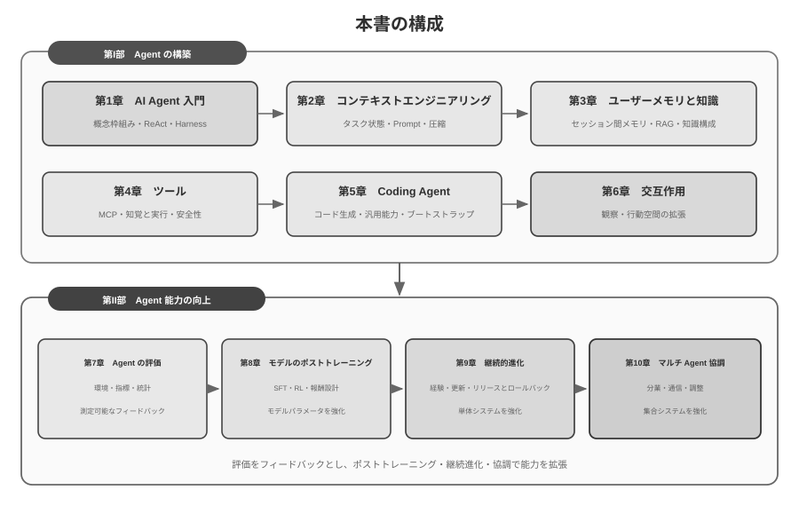

# はじめに {.unnumbered}

2025 年 8 月から 10 月にかけて、図霊（Turing）の「AI Agent 実戦キャンプ」で一連の技術講義を行いました。講義の中心に置いたのは、経験と直感に導かれた試行錯誤ではなく、説明可能・検証可能・再利用可能な工学原則に基づいて AI Agent をどう設計するか、という問いです。したがって、デモを動かすことは到達点ではありません。なぜ特定のアーキテクチャを採るのか、その能力境界はどこにあり、各設計判断がどのようなトレードオフを伴うのかまで検討しました。本書は、講義資料と関連実験を体系的に整理し、加筆・再構成したものです。

本書の制作自体も、人間と Agent の協働を実践する試みでした。構想から最終原稿まで、主として **whisper coding**（口述による協働）を用い、Pine の音声 Agent と調査および文章の反復改善を進めました。私が章の構成を口述し、Agent が関連資料を調べて初稿を作成します。その後、受講者のフィードバックを取り込み、論点、事例、実験を繰り返し検証・修正しました。音声は思考を外化するコストを下げ、問いの設定から資料探索、執筆、検証までの周期を短縮します。本書は Agent を論じるだけでなく、Agent が深く関与する知識生産の一形態を記録したものでもあります。

2025 年初の DeepSeek R1 公開以降、AI の研究と産業実践の焦点は、基盤モデルの能力から Agent の体系的な実装へと広がってきました。モデル側では Agentic Reinforcement Learning がツール利用と環境との相互作用をパラメータに内在化し、プログラミング、数学的推論、Computer Use の汎用能力を強化し始めています。製品側では Manus、Claude Code、OpenClaw などが人間とコンピュータの関係を変え、「コード生成 + ファイルシステム」を重要なシステムアーキテクチャにしました。

講義でまとめた Agent アーキテクチャの原則を改めて検討すると、モデルや製品が急速に進化する中でも、これらの原則は安定した説明力を保っていることが分かります。業界では後に Skill、harness、loop engineering などの用語が広く使われるようになりましたが、対応する工学的実践はそれ以前から存在していました。概念は実践の出発点ではなく、多くの実践経験を帰納した結果です。つまり、実践が先にあり、命名は後から行われます。

これらの原則は主として、長期間にわたる高リスクなシステムを構築した経験から生まれました。Pine AI の Chief Scientist として、私はチームとともに Pine を開発し、Agent がユーザーに代わって人と連絡し、料金交渉、返金紛争、サブスクリプション解約など、現実の経済的利害を伴う複雑なタスクを扱えるようにしました。こうしたタスクは長期化し、多数の交渉を伴い、一つの誤りが実損につながります。信頼性、安全性、監査可能性への厳しい要件が、本書のアーキテクチャ原則を形作りました。

- Skill という概念が流行するよりずっと前から、私たちはプロンプトの動的読み込みという方法でプロンプトの無限膨張という問題を解決し、コマンドラインでツールを実行する方式でツールリストの無限膨張という問題を解決し、システムステータスバー技術でエージェントが実行環境やユーザーの時刻・作業状態などを認識できないという問題を解決していました。
- harness という概念が流行するよりずっと前から、私たちは Claude Code に似た方法でモデルのツール呼び出しの不安定さ、ハルシネーション、危険な操作、権限逸脱の操作、指示不遵守などの問題を解決していました。
- loop engineering という概念が広まるより前から、私たちは本書で提案者・審査者（proposer-reviewer）と呼ぶ方法を用い、モデルがタスクの完了を早すぎる段階で判定する問題に対処していました。

これらの方法は Pine に固有のものではありません。多くのモデル・Agent チームが類似の問題に取り組む過程で、それぞれ独立に近い工学的方法を形成してきました。この収斂は、それらが Agent システムに共通する制約を反映していることを示します。こうした認識に基づき、私は 2025 年に図霊で「AI Agent 実戦キャンプ」を開講し、2024〜2026 年には中国科学院大学で AI Agent 実践講座を継続的に担当しました。本書をオープンソースで公開するのも、再利用可能な知識と経験を、より多くの研究者や実務者に役立ててもらうためです。

**実践が先にあり、命名は後から行われます。** 企業向け Agent 開発において、これは実践が概念の普及に常に後れてはならないことを意味します。ある用語が業界の共通認識になる頃には、それが示す問題は先行するシステムで長期にわたって検討されていることが少なくありません。これらの問題をより早く識別し、解決するためには、2 つの重要な条件があります。

**第一に、Agent の能力上限に十分高い要求を課す実際の事業を選び、実世界からのフィードバックを継続的に得ることです。** Pine では、1 つのタスクが数時間から数週間に及び、複数の利害関係者との繰り返しの調整、長時間の通話、複雑なフォーム操作、複数回のメール往復が必要になることがあります。同時に、重要な数値の正確性と操作の制御可能性を確保し、常にユーザーの利益を守らなければなりません。こうした十分に複雑な状況は、モデルの能力と事業要件の間にある差を継続的に明らかにし、harness の構築を促します。それにより、モデルが現時点では単独で処理できないものの、事業上は必須となる問題をシステムとして解決できます。一方、次のモデル更新だけで容易に満たされる要求では、安定したシステム設計原則の蓄積は難しくなります。

**第二に、体系的な評価（Evaluation）の仕組みを構築することです。** 評価がなければ、変更による改善が設計自体によるものか、偶然の変動によるものかを判断できません。評価は Agent の反復改善を経験的な判断から、比較可能で再現可能な工学プロセスへと変えます。これは科学的方法によるシステム開発の基盤です。第 7 章でこの方法を詳しく論じます。

基盤となるモデルがどう進化しようと、プロダクトの形態がどう革新されようと、ほとんどすべての成功したエージェントシステムは同じアーキテクチャパターンに従っています。これは偶然ではありません。**良い設計原則は本来、モデルのイテレーションサイクルを貫くべきもの** なのです。なぜなら、それらが記述しているのは特定のモデルの使い方ではなく、知的システムが世界と相互作用する基本的なパターンだからです。

チューリング賞受賞者であり強化学習の父である Richard Sutton はかつて、宇宙の進化は塵から恒星へ、恒星から生命へ、生命から知的エージェント（原文では「設計された実体」、designed entities）へという 4 つの段階を経てきたと述べました。生物進化は盲目的です。ランダムな変異、自然選択。ほとんどの生物は自らの動作原理を理解しておらず、自律的に生物を設計・改造することもできません。ところが知的エージェント（Agent）は、宇宙の進化史における全く新しい存在です。それはコードを生成することで自己ブートストラップ（bootstrap）と自己進化を実現できます。あるプログラマーが別のプログラマーを書き、その新しいプログラマーがさらに次を書き続けられるようにです。つまり、エージェントは自身の動作メカニズムを理解し、目標に応じて全く新しい知的エージェントを創り出し、さらには自らを改良することさえできるのです。本書の使命は、あなたがこの創造の原則を理解し習得する手助けをすることにあります。

本書の核となる公式はたった一言です。**Agent = LLM + コンテキスト + ツール**。この三者は一つでも欠けてはなりません。

より直感的に言えば、**脳 + 目 + 手足** です。脳（LLM）は思考と意思決定を担い、目（コンテキスト）はエージェントがどんな情報を見られるかを決め、手足（ツール）はエージェントが何をできるかを決めます。（厳密には「目」はあくまで大まかな比喩です。コンテキストは環境情報や対話履歴だけでなく、ツール定義などの内容も含みます。つまりエージェントが「見ている」情報には「どんな手足が使えるか」も含まれているのです。この比喩が伝えようとしているのは、コンテキストとはモデルが感知できるすべての情報である、という核心的な直感です。）

強化学習に馴染みのある読者にとって、この三者は RL の形式的な言語にも対応づけられます。具体的には、LLM は Policy（方策）に、コンテキストは Observation Space（観測空間）に、ツールは Action Space（行動空間）に対応します。3 つの言い方は同じ対象に対応しており、表現の階層が異なるだけです。

とはいえ、これら 3 つの語それぞれの意味は字面よりもはるかに豊かです。第 1 章では実践の観点から一つずつ分解し、直感的な理解から学術的な概念までの完全な対応づけを築いていきます。

## 本書の構成 {.unnumbered}

本書は全十章を、相互につながる二つの問いを軸に構成します（図0-2）。**第I部「Agent をどう構築するか」**は第1〜6章で、基礎概念からコンテキスト、記憶と知識、ツール、Coding Agent、観察・行動空間の拡張へ進みます。**第II部「Agent の能力をどう高めるか」**は第7〜10章で、まず評価によって測定可能なフィードバックを確立し、その上でモデルのポストトレーニング、運用経験に基づく継続的進化、マルチ Agent 協調を通じ、モデルパラメータ・単体システム・集合システムの各レベルで能力を拡張します。



- **第 1 章（Agent の基礎知識）** は複数の実在する Agent 製品から出発し、Agent に対する直感的な理解を築きます。実装層の LLM + コンテキスト + ツール、直感層の脳 + 目 + 手足、学術層の方策（Policy）、観測空間（Observation Space）、行動空間（Action Space）という三つの水準で中核となる公式を解析します。実験を通じて「思考 → 行動 → 観察」を反復する ReAct ループを検討し、タスク内のコンテキスト適応、タスクをまたぐ外部成果物の更新、訓練サイクルにおけるパラメータ更新を区別します。最後にワークフローから自律 Agent までのオーケストレーション設計パターンを論じ、以降の章に共通する概念枠組みを構築します。
- **第 2 章（コンテキストエンジニアリング）** は本書で最も重要な章であり、コンテキスト、すなわちエージェントの「目」を体系的に解説します。本章はまず API のメッセージ構造とエージェントの核となるループから説き起こし、「コンテキストとはメッセージのリストである」という土台を築いた上で、KV Cache（大規模モデルの推論過程で過去の計算結果を再利用する仕組み）の基礎原理へと踏み込みます。続いて順に、プロンプトエンジニアリング（Prompt Engineering、フロー化設計、ツール記述、業務ルールの精緻化を含む）とプロンプトインジェクション（Prompt Injection）の攻防、Agent Skills のオンデマンド読み込みの仕組み、エージェントのステータスバー技術、そしてコンテキスト圧縮（Context Compression）の戦略を展開します。各用語の完全な定義は、本文で初出の箇所に示します。
- **第 3 章（ユーザーメモリと知識ベース）** はコンテキスト管理を、セッションをまたいで永続化する知識体系へと拡張し、エージェントが現在の対話の内容を記憶するだけでなく、複数回の対話をまたいで知識を蓄積・呼び出せるようにします。ユーザーメモリの 4 つの漸進的な戦略、RAG（検索拡張生成、すなわちまず関連文書を検索してからモデルに回答を生成させる手法）の完全な技術スタック（さまざまなテキスト検索手法や検索結果の並べ替え最適化を含む）、マルチモーダルな情報抽出、より高度な知識の組織化手法、そしてエージェント化された RAG（Agentic RAG、すなわちエージェント自身にいつ・何を検索するかを判断させる手法）を扱います。
- **第 4 章（ツール）** は Agent と外界をつなぐ架け橋を論じます。ツールは Agent の「手足」として、Web 検索、API 呼び出し、データベース操作などを可能にします。MCP のツール相互運用標準と 5 種類のツールの設計原則（知覚、実行、協調、イベントトリガー、ユーザーコミュニケーション）を紹介し、実行ツールの安全機構を重点的に扱います。イベントトリガー、ユーザーコミュニケーション、非同期ランタイムは第 6 章で展開します。
- **第 5 章（Coding Agent とコード生成）** は、Coding Agent にファイルシステムを加えたものが、あらゆる汎用エージェントの最も核となる技術基盤であることを論証します。OpenClaw のアーキテクチャを主軸として、Coding Agent のワークフローと実装のコツを解剖し、コード生成がプログラミングを超えて持つ幅広い価値を示します。思考の補助、知識ベースの構築から、新しいツールの動的な創造やエージェントの自己ブートストラップまで。
- **第 6 章（交互：観察空間と行動空間の拡張）**は、Agent と環境の相互作用を **モダリティ** と **時間性** の二つの次元から扱います。非同期・イベント駆動システムは外部イベントの継続的な受信と応答を可能にし、音声は知覚・推論・生成をリアルタイム動作へ近づけ、Computer Use は行動空間を GUI へ、ロボティクスは物理環境へ拡張します。四領域は、起動、安全点、キャンセル、プリエンプション、高速・低速経路の分離といったシステムプリミティブを共有します。
- **第 7 章（Agent の評価）** は科学的な評価方法論を構築します。評価環境（ツール呼び出し型と人間・機械インタラクション型という 2 つの核となるパラダイム、および章末で個別に論じるシミュレーション環境）、データセットの設計原則、LLM-as-a-Judge による自動評価手法、評価駆動のモデル選定、そして評価結果をシステム改善へと転化する完全な閉ループを扱います。
- **第 8 章（モデルのポストトレーニング）** は SFT（教師ありファインチューニング、すなわちラベル付きデータでモデルに「見様見真似」を教える手法）と RL（強化学習、すなわちモデルに試行錯誤と報酬フィードバックを通じて自律的に向上させる手法）という 2 つのポストトレーニング技術を深掘りします。「SFT は記憶、RL は汎化」および「データと環境はアルゴリズムより重要」を核となる論点として、事前学習/SFT/RL の 3 段階の全景、古典的な RL 理論、報酬信号の設計（二値報酬からプロセス報酬へ、さらに「結果に報酬を与え、プロセスを制約する」検証経路のペナルティへ）、シングルターンとマルチターンの強化学習アルゴリズム、そしてサンプル効率の最適化などの最先端の探求を扱います。
- **第 9 章（Agent の継続的進化）** は、Agent の運用経験を次のバージョンの能力へ変換する方法を研究します。まず環境の結果、プロセス規則、LLM Rubric から学習信号を構築し、知識文書、Prompt と Skills、プログラムと Harness、モデルパラメータという 4 種類の更新媒体を比較します。最後に、候補バージョンの検証、段階的リリース、ロールバック、長期的な統合を論じます。
- **第 10 章（マルチ Agent 協調）** は、個体の能力からシステムレベルの協調へ視点を広げ、複数の Agent がどのように分業・協力するかを論じます。マルチ Agent 協調の分類枠組み（コンテキストの共有/独立 × 対等/管理者/分散）を体系的に述べ、翻訳 Agent や電話・コンピュータ連携 Agent などの事例を通じて協調アーキテクチャの設計手法を示し、Agent 社会と Agent 経済の将来的な発展可能性を論じます。

## 本書の読み方 {.unnumbered}

本書の各章は比較的独立しているため、自分のニーズに応じて異なる読み方を選べます。

- **Agent 開発者であれば**、本書を順に読んでください。第1〜6章で Agent 構築の方法を体系化し、第7〜10章で評価、モデルのポストトレーニング、継続的進化、マルチ Agent 協調という四つの方向から能力向上を論じます。
- **あなたの時間が限られているなら**、第 1 章（全体的な認識を築く）と第 2 章（最も重要なコンテキストエンジニアリングを習得する）を優先してください。第 2 章の KV Cache の基礎原理はやや技術的なので、初読では原理の部分を飛ばし、冒頭で示す 3 つの核となる結論だけを覚えておいても、その後の理解には影響しません。
- **あなたがモデルの訓練に関心があるなら**、第 8 章（モデルのポストトレーニング）を直接読んでも構いません。ただし評価手法（第 7 章）は訓練の前提なので併せて読むことをおすすめします。また全体的な認識を築くため、先に第 1〜2 章を読んでおくとよいでしょう。

各章には大量の **実験** と **演習問題** が含まれ、番号は「実験 X-Y」（X は章番号、Y は章内の通し番号）の形式です。実験と演習問題のタイトルには星の数で難易度を示しています。★ は入門レベルですべての読者に適し、★★ は中程度の難易度で一定のエンジニアリング実践の基礎を要し、★★★ は発展的な挑戦で、通常は開放的な問題や複雑なシステム設計を伴います。大部分の実験には完全な実行可能コードが付属し、付属のオープンソースリポジトリに整理されています。

> **付属コードリポジトリ**：[https://github.com/bojieli/ai-agent-book](https://github.com/bojieli/ai-agent-book)

付属コード一式は Git で取得できます。

```bash
git clone https://github.com/bojieli/ai-agent-book.git
cd ai-agent-book
```

Git を使用しない場合は、リポジトリのページで **Code → Download ZIP** を選んでダウンロードすることもできます。実験コードは `chapter1/` から `chapter10/` まで章ごとに整理されています。「実験 X-Y」を探すには、対応する `chapterX/README.ja.md` を開き、実験番号からプロジェクトディレクトリを特定したうえで、そのプロジェクトの README に従って依存関係をインストールし、実行してください。「再現ガイド」と記された一部の実験は外部リポジトリに依存しており、その取得方法も対応する README に記載されています。

これらの実験は、ぜひ自分の手で一度動かしてみることを強くおすすめします。AI エージェントはきわめて実践的な分野であり、設計上の直感の多くは、実際に手を動かしてデバッグする過程を通じてはじめて本当に身につくものです。

## 前提知識 {.unnumbered}

本書は一定の技術的背景を持つ読者を対象としていますが、特定の分野の専門家であることは求めません。以下では「必須」と「推奨」の 2 つのレベルに分けて前提知識を挙げ、自分の準備の程度を測る助けとします。

**必須：本書全体を読むための基礎**

- **Python プログラミング**：本書のほぼすべての実験は Python に基づいています。Python の基本的な文法、よく使うデータ構造、パッケージ管理（pip）などの基本概念に馴染んでいる必要があります。熟達している必要はありませんが、中程度の複雑さの Python コードを読んで修正できる程度が望まれます。
- **LLM の基本的な使用経験**：ChatGPT、Claude、あるいは類似の製品を使ったことがあり、「プロンプト（Prompt）→ モデルの返答」という基本的なインタラクションのパターンを理解している必要があります。
- **AI 支援プログラミングツールを 1 つ**：Claude Code、Codex、Cursor、TRAE など、少なくとも 1 つの AI 支援プログラミングツールをインストールして慣れておくことを強くおすすめします。一方で、これらのツールは実験の開発効率を大きく高めてくれます。本書の実験は大量のコード記述とデバッグを伴うからです。他方で、これらのプログラミングツール自体が成熟した Coding Agent であり、それらを使う過程で、ReAct ループ、ツール呼び出し、コンテキスト管理など本書が繰り返し論じる核となる仕組みを直感的に体験できます。この一次的な体験は、エージェントの設計原則を理解するうえできわめて価値があります。
- **ソフトウェアエンジニアリングの常識**：コマンドライン操作、Git バージョン管理、JSON データ形式、REST API などの基本概念に馴染んでいること。これらは実験を実行し、エージェントのツール呼び出しの仕組みを理解するための基礎です。

**推奨：特定の章の読書体験を高める**

- **機械学習の基礎**（第 8 章）：訓練と推論、損失関数、勾配降下、過学習などの基本概念を知っていると、モデルのポストトレーニングの理解に役立ちます。
- **基礎数学**（第 2〜3、7 章）：線形代数を直感的に理解していること（たとえばベクトルが方向と大きさを表せる、行列で一括演算ができる、といったこと）は、埋め込みやアテンション機構の理解に役立ちます。基本的な確率統計の知識は、評価指標や強化学習における期待報酬の理解に役立ちます。本書の数学は複雑な導出には立ち入らず、直感的な説明に重点を置いています。
- **Web 開発の基礎**（第 4、9 章）：HTTP、WebSocket、フロントエンドとバックエンドの分離アーキテクチャなどの概念を知っていると、イベント駆動の非同期エージェントアーキテクチャや音声エージェントのリアルタイム通信の実験の理解に役立ちます。
- **Transformer アーキテクチャの基本的な理解**（第 2、8 章）：Transformer は現在ほぼすべての大規模言語モデルの基盤アーキテクチャです。大規模モデルの基礎知識を体系的に補いたい読者には、『図解大模型』（図霊出版）をおすすめします。同書は直感的な図解で Transformer アーキテクチャ、事前学習とファインチューニングなどの核となる概念を解説しており、本書のエージェントエンジニアリングの視点とよく補完し合います。

もし一部の前提知識に不足があっても、それで尻込みする必要はありません。本書の核となる価値は **アーキテクチャ設計原則とエンジニアリング実践の方法論** にあり、特定のアルゴリズムやテクニックにあるのではありません。第 8 章のポストトレーニングを除けば、本書全体は数学や機械学習への要求が非常に低く、出発点として十分に使えます。

エージェント技術はなお急速に進化していますが、**良いアーキテクチャ設計原則は時間を貫く力を持っています**。「なぜこう設計するのか」を身につければ、技術の波の変化の中でも冷静な判断力を保てます。本書があなたの AI エージェント構築の信頼できる指針となることを願っています。

## 謝辞 {.unnumbered}

図霊の夢鴿先生と劉美英先生の労を惜しまぬ編集、そして図霊「AI Agent 実戦キャンプ」の企画・運営に注がれた尽力に感謝します。国科大で AI Agent 実践講座を開講してくださった劉俊明先生にも感謝します。また、図霊「AI Agent 実戦キャンプ」のすべての受講生、そして国科大 AI Agent 実践講座のすべての学生に特に感謝します。これらの講義を行う過程で、皆さんは多くの価値あるフィードバックと提案をくださり、私自身もこれらの概念そのものについてより明晰な理解を得られました。

Pine AI のすべての同僚に感謝します。Pine AI のような優れた製品と、それがもたらす数々の挑戦がなければ、私はエージェント分野でこれほど深い理解と実践を得ることはできなかったでしょう。幾度もの思想のぶつかり合いの中で、同僚たちも多くの貴重な思想的インプットを与えてくれました。

AI 業界の多くの友人たち（ここでは一人ひとりの名は挙げません）にも感謝します。さまざまな業界の議論の中で、皆さんは私の見解に率直なフィードバックをくださり、私の誤った判断を数多く正し、モデルとエージェントに対する私の認識を高めてくれました。

最も感謝すべきは私の家族、とりわけ妻の孟佳穎です。彼女は本書の執筆を終始支えてくれ、さらに本書に対して多くの貴重な意見も寄せてくれました。
