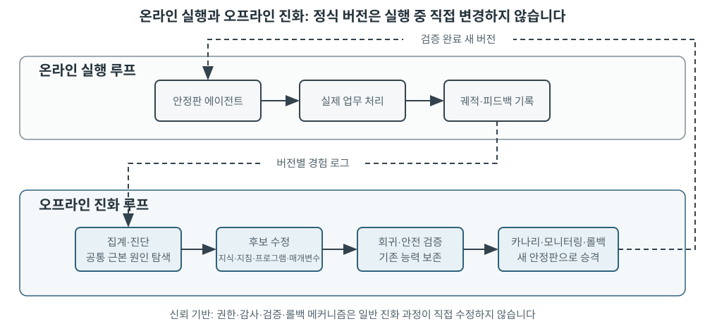
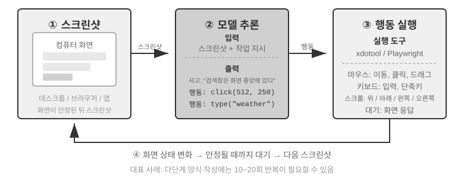
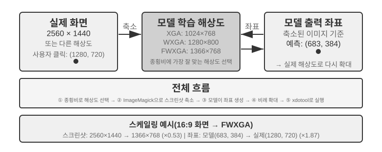

# 멀티모달리티와 실시간 상호작용

앞 장에서는 에이전트가 텍스트 기반 세계에서 컨텍스트, 도구, 코드를 통해 디지털 시스템과 상호작용하는 방식을 살펴봤습니다. 하지만 에이전트의 세계는 텍스트와 API를 넘어섭니다. 음성 명령을 이해하고, 화면에서 올바른 버튼을 찾아 클릭하고, 로봇 팔을 조종해 물체를 집어야 하는 순간 에이전트는 **멀티모달 실시간 상호작용**이라는 새로운 영역에 들어섭니다. 순수 텍스트 입출력에서 **멀티모달 인식과 실시간 응답**으로 전환하는 일은 에이전트를 ‘대화 상자’ 밖으로 이끄는 핵심 단계입니다. ‘멀티모달’은 텍스트만 처리하는 대신 텍스트, 음성, 이미지, 동영상, 행동처럼 여러 형태의 정보를 동시에 처리한다는 뜻입니다.

먼저 이 장의 범위를 정하겠습니다. 스크린샷을 살피고 차트를 읽고 PDF를 파싱하는 정적 이미지·문서 이해는 앞 장의 에이전트 워크플로에 이미 자연스럽게 포함되어 있습니다. 오늘날의 멀티모달 LLM에서 이러한 단일 입력 이해 업무는 비교적 성숙했으며 특별한 아키텍처가 필요하지 않습니다. 이 장은 다른 부류의 문제, 즉 **실시간 제약 때문에 멀티모달 문제가 어려워지는** 음성 대화, GUI 조작, 로봇 제어의 세 상황을 다룹니다. 이 환경에서는 입력이 계속 도착하고 출력은 엄격한 시간 예산을 지켜야 하므로 아키텍처가 근본적으로 달라집니다. 글을 쓰는 현재, 연속적인 시각 스트림 즉 동영상을 실시간으로 이해하는 일은 에이전트의 미해결 문제입니다. 컴퓨터 사용 절에서 프레임별 스크린샷의 한계를 살펴볼 때와 장 끝의 문제에서 다시 다루겠습니다. 경계를 하나 더 정하겠습니다. 이 책의 프레임워크에서 멀티모달 **생성**(이미지나 동영상 생성)은 5장의 멀티미디어 생성에서 다룬 평범한 도구 호출일 뿐입니다. 에이전트가 외부 도구로 사용하므로 여기서 다루는 실시간 상호작용 문제를 일으키지 않으며 이 장의 주된 흐름에서 제외합니다.

음성 상호작용, 컴퓨터 사용, 로봇 조작은 완전히 다른 세 분야처럼 보이지만 세 시스템 모두 놀랄 만큼 비슷한 문제를 겪습니다. 여러 모달리티를 동시에 처리해야 하고 지연 시간에 극도로 민감합니다. 음성 대화에서 2초 넘게 침묵하면 사람은 불안해지고, 로봇 제어에서 밀리초 수준의 지터가 발생하면 충돌할 수 있습니다. 이 제약은 세 상황의 아키텍처를 모두 **직렬 파이프라인**(앞 단계가 끝나야 다음 단계가 시작되는 공장 조립 라인)에서 **종단 간 모델**(중간 전달 없이 입력에서 출력으로 바로 가는 통합 모델)로 향하게 합니다.

이 장은 다음 순서로 전개됩니다.

1.  먼저 세 가지 음성 아키텍처 패러다임을 프레임으로 사용합니다. 캐스케이드(VAD-ASR-LLM-TTS 파이프라인), 종단 간 옴니모달(Omni, 단일 모델이지만 여전히 턴 교대에 의존), 전이중(Moshi와 GPT-Live, 듣기와 말하기를 동시에 수행)입니다. 각 패러다임이 불연속적인 턴이라는 VAD의 가정에서 얼마나 벗어났는지 물으며 지연 시간과 절충을 비교합니다. 캐스케이드 절에서는 VAD + ASR을 스트리밍 음성 인식으로 대체하는 방법도 설명합니다.
2.  이어서 사고 아키텍처가 ‘실시간 응답’과 ‘깊은 사고’의 충돌을 조율하는 방식을 살펴봅니다. 빠른 사고와 느린 사고의 단순 병렬화에서 시작해, 백그라운드 사고 모델이 ‘전략가’ 역할을 하는 분리 접근법(GPT-Live 위임, Pine AI 등), 하나의 모델이 ‘말하면서 생각하도록’ 사고를 ‘내재화’한 Step-Audio R1까지 이어집니다.
3.  다음으로 더 인간다운 음성 합성이 실행 계층을 최적화하는 방법을 논의합니다.
4.  마지막으로 관점을 컴퓨터 사용(AI가 사람처럼 컴퓨터 화면을 조작하는 것)과 로봇 조작으로 확장하여 같은 지연 시간·멀티모달리티 문제가 두 상황에서 어떻게 나타나는지 살펴봅니다.

이 상황을 가로지르는 이론적 주제 두 가지도 특별히 주목할 가치가 있습니다. **사고 아키텍처**(빠른 사고와 느린 사고가 협력하는 방식)와 여기서 나오는 **빠른-느린 인터페이스**, 즉 **잠재 브리지(Latent Bridge)**(빠른 모델과 느린 모델이 텍스트 외에 무엇을 주고받을 수 있는가)입니다. 음성 맥락에서 소개하지만 이 아이디어는 음성에 국한되지 않습니다. 컴퓨터 사용과 로봇공학 절에서도 느린 전략가에게 언제 문의해야 하는지 같은 질문이 등장하므로 두 주제를 기억해 두십시오.

## 음성: 가장 자연스러운 인간-기계 인터페이스

음성은 문자를 소리로 바꾸는 데 그치지 않는다. 말하기는 타이핑보다 약 네 배 빠르고 손과 시선을 차지하지 않으므로, 언제든 끼어들 수 있는 연속 입출력 루프에 Agent를 놓기에 알맞다. 음성 입력은 말을 텍스트로 바꾸고 음성 Agent는 사용자가 Agent와 직접 협업하게 한다. 둘 다 서문에서 소개한 whisper coding을 지원한다.

이 절은 사용자가 Agent에게 말하는 경우와 Agent가 사용자를 대신해 외부 세계에 말하는 경우를 다룬다. 음성 모델은 무엇에 답할 수 있는지를, 상호작용 구조는 제대로 듣고 제때 응답하며 발화권을 넘기고 통화 중 확인과 도구 호출을 끝낼 수 있는지를 결정한다.

### 상호작용 시간: 캐스케이드에서 풀 듀플렉스로

OpenAI는 GPT-Live 소개에서 음성 상호작용을 캐스케이드, 턴 기반, 풀 듀플렉스라는 세 패러다임으로 정리했다[^ch9-12]. 이는 신구 교체가 아니라 지연, 비용, 관측 가능성의 절충이다.

| 패러다임 | 핵심 구조 | 장점 | 한계 |
| --- | --- | --- | --- |
| 캐스케이드 | VAD → ASR → LLM → TTS | 모듈이 명확해 교체와 디버깅이 쉽다 | 지연 누적, 경계에서 준언어 정보 손실 |
| 엔드투엔드 Omni | 하나의 모델이 듣고 생각하고 말한다 | 낮은 지연, 말투·감정·환경음 보존 | 턴 기반, 높은 학습·디버깅 비용 |
| 풀 듀플렉스 | 계속 듣고 말하고 결정한다 | 겹쳐 말하기와 자연스러운 끼어들기 | 학습·제어·평가가 복잡하다 |

공통 과제는 번갈아 말해야 한다는 가정과 VAD의 발화권 추측을 없애는 것이다. 캐스케이드와 Omni는 턴을 나누지만 풀 듀플렉스는 누가 말할지를 계속 결정한다.

[^ch9-12]: OpenAI. *Introducing GPT-Live.* 2026-07-08. https://openai.com/index/introducing-gpt-live/ 이 분류는 ChatGPT Voice 세 세대의 진화를 요약한 글에서 왔으며 엔드투엔드 옴니모달은 “turn-based voice models”에 해당한다.

**스트리밍 취소:**

```python
while audio_is_arriving:
    partial = asr.push(audio_chunk)
    if endpoint_is_probable(partial):
        candidate = llm.start(partial)
        if later_audio_changes_meaning(partial):
            cancel(candidate)                 # speculative cancellation
        else:
            tts.enqueue_stable_segments(candidate)

on_final_transcript(text):
    commit_or_restart(text)
```

### 패러다임 1 · 캐스케이드 파이프라인

상용 음성 비서 대부분은 직렬 파이프라인을 사용한다(그림 9-1). VAD가 발화 종료를 판단하고 ASR이 음성을 텍스트로 바꾸며 LLM이 답을 만들고 TTS가 읽어 준다. 모듈식 구조는 개별 최적화를 가능하게 하지만 경계마다 대기가 생긴다.


| 모듈 | 역할 | 병목 |
| --- | --- | --- |
| VAD | 끝났는지 판단 | 침묵 임계값에 따른 대기·오분할 |
| ASR | 음성을 텍스트로 변환 | 인식 지연·문맥 손실 |
| LLM | 이해·사고·생성 | 첫 토큰 지연, reasoning의 추가 대기 |
| TTS | 텍스트를 음성으로 변환 | 첫 패킷 합성·재생 버퍼 |

짧은 답변도 네 단계의 대기가 직렬로 누적된다(그림 9-2). 운영 큐잉은 유휴 지연을 더 키우지만 용량 계획은 다루지 않는다(그림 9-3).


> **실험 9-1 ★: 전통적 음성 Agent 구축**
>
> 마이크, Silero VAD, 로컬 Whisper, 스트리밍 LLM, Fish S1 TTS를 WebSocket으로 연결해 캐스케이드 기준선을 만든다. 실제 단일 턴 증거는 미디어와 모델 체인이 끝까지 실행됐음을 보여 주지만 동시성·운영 부하 벤치마크는 아니다. 코드는 [chapter9/live-audio](../chapter9/live-audio/)에 있다.

> **추가 프로젝트: WebRTC로 “사용자에게 전화하는” 음성 Agent**
>
> PSTN 없이 브라우저 WebRTC로 세션을 열고 부족한 정보를 묻고, 되풀이해 확인한 뒤 구조화된 결과를 저장하는 폐루프를 재현할 수 있다. 외부 기관에는 준수 가능한 PSTN/SIP 제공자로 같은 도구 계약을 교체한다. 전체 경로와 direct/ReAct 비교 증거는 [chapter9/phone-agent](../chapter9/phone-agent/)에 있다. 역사적인 exp9-2 식별자는 유지하지만 본문 번호에는 포함하지 않는다.

#### 직렬에서 스트리밍 지각으로

ASR은 발화 중 임시 전사를 내고 LLM은 첫 문장을 TTS로 넘기며 TTS는 오디오 청크를 재생한다. 그러나 세 단계가 처음부터 끝까지 완전히 병렬인 것은 아니다. 부분 전사로 앞서 생성할 때는 취소·무효화·재시작·롤백이 필요하다.

VAD + ASR 전단의 문제는 침묵 대기로 인한 지연 누적, 감정·망설임·맞장구·환경음을 담지 못하는 정보 손실, 이메일·이름이 분할되는 문맥 단절이다. 인과/청크 인코더와 증분 디코딩이 진짜 스트리밍에 필요하며 Whisper 인코더는 완전한 오디오를 요구한다. LLM 청각 모델은 텍스트와 의미 이벤트를 함께 내보낼 수 있다.

종단 판단을 인식기에 넣을 때 라벨은 결정 시점에 보이는 정보만 사용해야 한다. 사후 정보를 이용하면 온라인에서 재현할 수 없는 판단이 된다[^ch9-11]. speak_start/end, interrupt, emotion, laugh, sigh, noise 사건 표식은 모든 소리를 텍스트로 압축하지 않고도 변화를 보존한다.

[^ch9-11]: 종단 판단과 사후 라벨 문제는 Bojie Li and Noah Shi. *The Trade-off Was in the Labels: Causal Supervision for Turn-Aware Streaming ASR.* 2026 (forthcoming)을 참고하라.

> **실험 9-2 ★: Qwen2-Audio로 스트리밍 음성 지각 시뮬레이션**
>
> 증가하는 오디오 프리픽스로 연속 지각을 시뮬레이션하고 600 ms VAD + Whisper와 비교한다. canonical run은 모든 게이트를 통과했지만 기대 동작은 2/6만 재현했다. 호출은 8.4–11.3초가 걸렸고 pause에서 silence를 놓쳤으며 noise에서 cough/laughter를 오분류했다. 이는 실패 방식의 검사이며 100–200 ms 진짜 스트리밍을 주장하지 않는다. 기록은 [chapter9/streaming-speech](../chapter9/streaming-speech/)에 있다.

### 패러다임 2 · 엔드투엔드 옴니모달 모델(Omni)

캐스케이드는 오디오를 텍스트로 바꾸는 경계에서 감정·억양·환경음을 잃을 수 있다. Omni는 하나의 모델로 듣고 답하고 말해 이를 보존할 가능성이 있지만 학습·디버깅·교체 비용이 높다. 엔드투엔드의 이점은 지연과 비텍스트 정보이지 반드시 정확도는 아니다. self-cascade는 텍스트가 충분한 과제에서는 오류를 고치지만 말속도·감정이 필요한 과제에서는 텍스트 병목이 증거를 지운다[^ch9-13]. Omni도 턴을 가정해 숫자 중간의 침묵을 끝으로 오인할 수 있다.

[^ch9-13]: 조건별 캐스케이드/엔드투엔드 정확도 측정은 Bojie Li and Noah Shi. *The Cascade Gap: When and Why Self-Cascades Help Multimodal Agents.* 2026 (forthcoming)을 참고하라.


실시간 음성 API는 VAD와 끼어들기·비동기 도구 호출에 의존하는 중간 형태다. 중요한 것은 순위표가 아니라 과제별 실패 방식이다.

> **실험 9-3 ★★: MiniCPM-o 4.5를 로컬에서 실행해 엔드투엔드와 self-cascade 비교**
>
> revision을 고정하고 thinking mode를 끈 뒤 직접 오디오로 답하는 경로와 전사 후 답하는 경로를 비교한다. 오디오 정보 보존을 측정하는 것이며 “생각하며 말하기” 능력은 아니다.
>
> | 과제 | 엔드투엔드 | Self-cascade | 관찰 |
> | --- | ---: | ---: | --- |
> | 의미 산술(2) | 1/2 | 2/2 | 전사 오류 하나를 교정 |
> | 준언어적 말속도(2) | 2/2 | 1/2 | 전사가 빠름/느림 차이를 삭제 |
> | 합계 | 3/4 | 3/4 | 총점은 같고 실패 위치는 상보적 |
>
> 표본이 작으므로 전체 정확도나 속도를 결론낼 수 없다. 전체 증거는 [chapter9/end-to-end-speech](../chapter9/end-to-end-speech/)에 있다.

Step-Audio 2는 원시 오디오에서 텍스트와 음성을 내보내고 Step-Audio R1은 추론을 음성 모델에 내재화한다.

### 패러다임 3 · 풀 듀플렉스 상호작용 모델

Omni는 “사용자가 말함”과 “모델이 말함”을 나누지만 동시통역은 겹침을 요구한다. 풀 듀플렉스는 턴을 전제하지 않고 계속 듣고 말하며 계속·정지·끼어들기·도구 호출을 결정한다. Kyutai Moshi는 사용자와 모델의 음성을 병렬로 모델링한 초기 사례다.

Thinking Machines Lab의 Interaction Model[^ch9-14]은 상호작용을 VAD 같은 외부 하니스가 아니라 모델에 내장한다. 마이크로 턴은 침묵·겹침·끼어들기를 연속 문맥으로 보존하고 백그라운드 추론 모델에 대화를 맡기면서 전경 모델이 대화를 유지한다.

[^ch9-14]: Thinking Machines Lab, “Interaction Models: A Scalable Approach to Human-AI Collaboration,” 2026-05. https://thinkingmachines.ai/blog/interaction-models/

GPT-Live는 이를 생산 규모로 확장해 기다림, 맞장구, 끼어들기와 실시간 번역을 처리한다. 캐스케이드는 침묵으로 턴을 추측하고 스트리밍 지각은 판단을 의미 수준으로 올리며 풀 듀플렉스는 전환을 지속적 결정으로 만든다.

### 인지 시간: 실시간 상호작용과 깊은 사고

전경 모델은 사용자가 온라인인 동안 답하고 백그라운드 모델은 더 오래 생각한다. 세 설계는 선형 발전이 아닌 절충이다.

| 설계 | 전경 | 백그라운드 | 위험 |
| --- | --- | --- | --- |
| 빠른 응답·느린 수정 | 즉시 답 | 재고하고 보충 | 모순 |
| 빠른 상호작용·느린 조언 | 대화 유지·표현 선택 | 조언·도구 결과 | 인터페이스 제약 |
| 사고·표현 통합 | 생각하며 말하기 | 상태 공유 | 높은 재훈련 비용 |

#### 해법 1: 빠른 생각으로 시간을 벌고 느린 생각으로 답하기

빠른 모델이 수백 밀리초 안에 연결 답변을 하고 느린 모델이 깊이 추론하면 쉬운 질문은 중복 처리되고 어려운 질문은 모순될 수 있다. 두 인스턴스가 독립적으로 생각하기 때문이다.



#### 해법 2: 빠른 생각으로 상호작용하고 느린 생각으로 조언하기

백그라운드 모델이 상태 표시나 전용 인터페이스로 조언을 보내고 전경 모델이 대화를 유지한다. 통신은 간접적이며 중간 사고가 보이지 않아 진정한 “생각하며 말하기”가 아니다.

#### 해법 3: 사고와 표현을 엔드투엔드로 통합하기(Step-Audio R1)

MGRD는 음향 특징에 사고를 정박하고 MPS 듀얼 브레인은 계획과 표현을 병렬화한다. 계획 뇌가 사고 조각을 내보내고 표현 뇌가 부분 답변과 합쳐 즉시 음성화하므로 전체 추론을 기다리지 않는다(그림 9-6). 통합형은 자연스럽지만 공동 재훈련이 필요하고 분리형은 백그라운드 모델을 바꾸기 쉽다.


### 더 인간적인 음성 합성

매끄럽고 멈춤이 없는 TTS는 기계성을 드러낸다. LLM은 THINKING, EMO:happy, SPEED:0.8x 같은 제어 표식을 내보내고 TTS는 이를 멈춤·운율·속도·웃음·한숨으로 바꾼다. Fish Audio S1 비교에서 다중 참조가 세 번의 균형 잡힌 블라인드 청취에서 가장 높았지만 무표식이 단일 참조보다 높아 전체 예상 순서는 재현되지 않았다. 작은 청취 연구를 일반적 품질 결론으로 삼을 수는 없다.

> **실험 9-4 ★★: Fish Audio의 제어 토큰 TTS**
>
> 다중 참조 음성 라이브러리를 만들고 제어 없음·단일 참조·다중 참조를 비교한다. 표식에서 감정·말속도·스타일을 선택한다. 전체 기록은 [chapter9/controllable-tts](../chapter9/controllable-tts/)에 있다.

## 컴퓨터 사용: GUI 자동화 에이전트

이 장이 뒤의 두 상황보다 음성에 훨씬 많은 지면을 할애했다는 점을 눈치챘을 것입니다. 의도적인 구성입니다. 실시간 멀티모달 시스템 가운데 음성 기술이 가장 많이 발전하여 최고의 참조점이 되기 때문입니다. 직렬 파이프라인의 과도한 지연이라는 최초 문제에서 시작해 종단 간 모델, 전이중 상호작용, 말하면서 생각하기를 거쳐 오늘날의 비교적 성숙한 설계에 이르는 전체 궤적을 그렸습니다. 그래서 그 이야기를 완전히 전달했습니다. 컴퓨터 사용과 로봇공학 절을 읽으며 이 궤적과 비교해 보십시오. 각 분야는 어디까지 발전했고 어디에서 여전히 막혀 있을까요?

세 상황은 서로 달라 보이지만 실시간 인식, 짧은 지연의 의사 결정, 지속적 상호작용이라는 같은 핵심 과제를 마주합니다. 이제 청각에서 시각 모달리티로 관점을 넓혀 시각적 상호작용, 즉 컴퓨터 사용을 살펴보겠습니다. 에이전트가 음성을 이해할 뿐 아니라 화면을 ‘보고’ 그래픽 인터페이스를 조작할 수 있다면 어떨까요?

GUI 자동화라고도 하는 컴퓨터 사용은 AI가 화면을 관찰하고 마우스와 키보드를 조작하여 사람처럼 소프트웨어를 사용하게 합니다. 예를 들어 브라우저를 열어 정보를 검색하고, 스프레드시트 애플리케이션에 데이터를 입력하고, 시스템 설정을 조정합니다. 핵심은 **인식-사고-행동** 루프입니다(그림 9-6).

1.  에이전트가 현재 화면의 스크린샷을 찍습니다.
2.  멀티모달 모델이 스크린샷과 업무 지시를 받고 사고와 구체적인 행동을 출력합니다.
3.  실행 계층이 실제 환경에서 행동(마우스 이동, 클릭, 텍스트 입력 등)을 수행합니다.
4.  인터페이스의 응답을 기다리고 다시 스크린샷을 찍어 다음 루프 반복에 들어갑니다.

**Computer Use 안전 루프:**

```python
observation = capture_screenshot_and_accessibility_tree()
proposal = model.decide(task, observation)
action = validate_schema_and_coordinates(proposal)

if action.is_irreversible and not user_or_policy_approval(action):
    stop("approval required")
else:
    execute_in_sandbox_or_scoped_session(action)
    new_observation = capture_after_settle()
    if not verify_goal_progress(new_observation, action):
        rollback_if_possible_or_replan()
```



이 루프에는 세 가지 핵심 설계 차원이 있습니다. **행동 공간**(에이전트가 수행할 수 있는 작업), **시각적 그라운딩**(스크린샷에서 대상 요소를 찾는 방법), **모델 아키텍처**(스크린샷에서 올바른 행동을 생성하는 방법)입니다.

### 행동 공간 설계

Anthropic은 완전한 상호작용 능력을 이루는 세 가지 도구 유형을 정의합니다(그림 9-7).


**GUI 조작 도구**(`computer` 도구): 마우스 작업에는 이동(`mouse_move`), 왼쪽/오른쪽/가운데 클릭, 두 번 또는 세 번 클릭, 드래그(`left_click_drag`), 더 정밀한 누르기/놓기(`left_mouse_down`, `left_mouse_up`)가 있습니다. 스크롤(`scroll`)은 네 방향을 지원하고 보조 키와 조합할 수 있습니다. 키보드 작업에는 글자별 입력(`type`, 실제 타이핑을 모방해 글자 사이에 12ms 간격), 키 조합(`key`, 예: `Ctrl+C`), 키 누르고 있기(`hold_key`)가 있습니다. 인식 행동에는 스크린샷 찍기, 커서 위치 가져오기(`cursor_position`), 기다리기(`wait`)가 있습니다.

**명령 실행 도구**(bash 도구): 120초 제한 시간이 있는 영속적 bash 터미널 세션을 제공합니다. 센티널 문자열로 명령 완료를 탐지하고 여러 호출에 걸쳐 환경 상태를 유지합니다(예: 한 디렉터리로 `cd`하면 다음 호출도 그 디렉터리에 머뭅니다).

**파일 편집 도구**(`str_replace_editor`): 문자열 매칭으로 안전하게 편집하며 보기, 생성, 바꾸기, 삽입, 실행 취소를 지원합니다. 파일 전체를 덮어쓰는 것보다 정확하고 관련 없는 내용을 실수로 수정할 가능성이 작습니다.

> **실험 9-5 ★: 컴퓨터 사용 실행(Anthropic 참조 경로 또는 오픈 모델 경로)**
>
> 경로 A는 Anthropic 컴퓨터 사용 데모를 사용합니다. 컨테이너에는 브라우저, 터미널, 기타 일반 도구가 포함된 완전한 Ubuntu 데스크톱 환경이 패키징되어 있습니다. 프런트엔드가 작업을 받고 백엔드가 지시와 스크린샷을 Claude에 보낸 뒤 모델이 반환한 마우스, 키보드, 터미널 또는 편집 행동을 실행합니다. 이 경로는 네이티브 `computer` 도구 프로토콜을 이해하기 위한 것이며 모든 독자에게 Anthropic API가 있어야 하는 것은 아닙니다.
>
> 경로 B는 이 책의 [`chapter9/computer-use-open-model`](../chapter9/computer-use-open-model/) 동반 코드를 사용합니다. 기본적으로 오픈 가중치 Qwen3-VL 32B Instruct로 browser-use를 구동하며, OpenRouter 호스팅 API를 사용하거나 `OPEN_MODEL_BASE_URL`을 자체 호스팅 vLLM/SGLang 또는 다른 호환 엔드포인트로 지정할 수 있습니다. 엔드포인트는 스크린샷을 받을 수 있고 네이티브 JSON Schema를 지원해야 합니다. 일반 JSON만 지원한다면 schema-in-prompt 호환 모드를 명시적으로 활성화할 수 있습니다.
>
> 두 경로는 같은 읽기 전용 작업과 같은 인수 계약을 사용합니다. 최대 25단계, 단계마다 한 가지 행동만 실행하며, 모델/엔드포인트 식별 정보, 공급자의 원본 응답, 단계별 스크린샷, 행동 순서, 최종 답변, 중지 이유를 보존합니다. 서로 다른 모델은 별도의 실험군으로 보고해야 합니다. 오픈 모델의 결과를 Claude 재현이라고 제시해서도, ‘컨테이너가 성공적으로 시작됨’을 작업 완료로 간주해서도 안 됩니다. 행동 간격과 계획 품질은 측정할 결과이지 2~5초라고 미리 가정하거나 다른 모델보다 반드시 뛰어나다고 전제할 사항이 아닙니다.
>

### 시각적 그라운딩

루프를 반복할 때마다 모델은 스크린샷에서 대상 요소를 정확하게 찾아야 합니다. “검색 상자는 어디에 있는가?”, “제출 버튼의 좌표는 무엇인가?”가 시각적 그라운딩 문제입니다. 현재 **두 가지 주요 접근법**이 있습니다. 하나는 위치 찾기를 **객관식 문제**로 바꾸는 것입니다. 먼저 인터페이스 요소에 번호를 붙이고 모델은 하나만 고릅니다. 다른 하나는 **순수 좌표 예측**으로, 사람이 하듯 모델이 스크린샷을 ‘보고’ 좌표를 직접 보고합니다. 객관식 접근법에는 두 가지 구현이 있습니다. **순수 시각 주석**(원래의 Set-of-Mark, 분할 모델로 이미지의 후보 영역을 나눔)과 **구조화된 요소 색인**(DOM/접근성 트리에서 인터페이스 고유 구조를 직접 읽음)입니다. 객관식 접근법의 공통 장점은 ‘스크린샷에서 버튼을 찾아 좌표를 예측하라’는 열린 문제를 ‘이미 주석이 붙은 요소 중 하나를 고르라’는 닫힌 문제로 바꾼다는 것입니다. 시험에서 빈칸 채우기보다 객관식이 맞히기 쉽듯 모델은 “화면 왼쪽 위에서 오른쪽으로 약 200픽셀 떨어진 파란 버튼을 클릭하라”가 아니라 “`[123]`을 클릭하라”고만 말하면 됩니다.

**Set-of-Mark: 시각 주석 방식.**

원래 Set-of-Mark(SoM)는 GPT-4V의 시각적 그라운딩 능력을 끌어내기 위해 Microsoft Research가 2023년에 제안했습니다. **순수 시각** 방식입니다. 이미지 분할 모델(SAM, SEEM 등)로 스크린샷의 후보 영역을 자동 분할하고 각 영역에 번호 마커를 겹쳐 그리면 모델은 번호가 있는 이미지를 봅니다. 모델은 번호만 보고하면 되고 시스템이 해당 영역의 중심 좌표로 변환합니다. 전체 과정에 DOM이나 내부 인터페이스 구조가 필요하지 않으므로 분할 모델이 후보 영역을 식별할 수 있다면 네이티브 데스크톱 소프트웨어와 게임 인터페이스에도 똑같이 적용할 수 있습니다.

**구조화된 요소 색인: 웹에서 SoM 발상을 구조적으로 구현한 방식.**

인터페이스 자체가 구조화된 정보를 제공하면 주석을 더 정확하게 만들 수 있습니다. 현대 웹페이지는 렌더링 전에 완전한 요소 구조(DOM 트리)와 버튼·입력 필드·기타 컨트롤을 식별하는 의미 역할을 정의합니다. 접근성 트리는 많은 데스크톱 애플리케이션에 비슷한 정보를 제공합니다. 분할 모델에 픽셀만 보고 어느 영역이 버튼인지 추측하게 하는 대신 시스템이 인터페이스에 클릭 가능한 요소를 직접 질의할 수 있습니다. `browser-use` 같은 웹 에이전트 시스템이 바로 이 방식을 사용하여 DOM의 상호작용 요소를 나열하고 번호를 붙입니다. 웹에서 SoM 발상을 구조적으로 구현한 것입니다(그림 9-8). 과정은 네 단계입니다.

1. 브라우저 디버깅 인터페이스(CDP, Chrome DevTools Protocol)를 통해 페이지의 구조화된 표현(DOM 트리)과 접근성 정보를 가져옵니다.
2. 상호작용할 수 있는 요소(버튼, 입력 상자, 링크 등)를 자동 탐지합니다.
3. 각 상호작용 요소에 고유 ID를 붙이고 스크린샷에 경계 상자를 그립니다.
4. 각 ID에 해당하는 요소를 설명하는 텍스트 목록도 동시에 생성합니다.

```text
스크린샷: [이미지의 주요 요소에 [1], [2], [3], [4] 같은 ID가 표시됨]

요소:
[1] <input type="text" placeholder="Search" aria-label="Search" />
[2] <button id="submit-btn" aria-label="Submit form" />
[3] <input type="text" placeholder="Enter your name" value="" />
[4] <a href="/docs" aria-label="Documentation" />
```

모델은 ID만 출력하면 되고 시스템이 해당 요소의 중심을 자동 클릭합니다. 모든 주석 데이터를 여전히 모델에 보내야 하므로 토큰을 절약하지는 않지만, 분할 모델이 일으킬 수 있는 누락 탐지와 거짓 양성을 피하면서 정확하고 안정적인 위치 찾기를 제공합니다.


**순수 좌표 예측.**

세 번째 경로는 주석을 건너뛰고 모델에 좌표를 직접 출력하게 합니다. **SeeClick**과 Claude의 컴퓨터 사용 같은 시스템은 GUI 스크린샷과 요소 위치 쌍으로 이루어진 방대한 데이터셋에서 학습한 시각 모델을 사용합니다. 이 모델은 자연어 설명(예: “제출 버튼을 클릭하라”)을 정확한 스크린샷 좌표로 직접 매핑하는 법을 배워 사람 사용자처럼 시각 인식에 의존합니다.

좌표 예측 방식에서 모델의 좌표 이해는 학습에 사용한 해상도에 크게 의존합니다(그림 9-9). Claude는 XGA(1024×768), WXGA(1280×800), FWXGA(1366×768)를 사용해 학습했습니다. 입력 스크린샷 해상도가 맞지 않으면 모델의 예측 좌표가 체계적으로 이동합니다. 작은 지도에서 거리를 잰 뒤 큰 지도에 그대로 적용하는 것과 같습니다. 따라서 도구 계층에 양방향 좌표 스케일링 메커니즘을 구현해야 하며, 이미지가 불균일하게 늘어나 좌표 판단이 편향되지 않도록 종횡비에 따라 대상 해상도를 **선택**해야 합니다. 예를 들어 실제 화면 해상도가 2560×1440(16:9)이면 Claude가 지원하는 세 선택지 가운데 종횡비가 16:9에 가장 가까운 FWXGA(1366×768)가 가장 적합합니다. 스크린샷을 1366×768로 비례 축소해 모델에 넣고 모델이 클릭 좌표 (683, 384)를 출력하면 실제 좌표 (683×2560/1366, 384×1440/768) ≈ (1280, 720)으로 역매핑합니다. 반대로 16:9 이미지를 4:3인 1024×768에 억지로 늘리면 이미지가 가로로 압축되어 모델의 예측 좌표가 체계적으로 이동합니다.





세 경로의 선택은 다음과 같이 요약할 수 있습니다. **구조화된 정보가 있다면 DOM/접근성 트리 색인을 우선**하여 가장 정확하고 안정적으로 위치를 찾으십시오. Photoshop 같은 네이티브 데스크톱 소프트웨어, canvas/WebGL 렌더링 인터페이스, 게임처럼 **구조화된 정보가 없다면 시각 주석(원래 SoM 경로)이나 좌표 예측을 사용**하십시오. 시각 주석은 위치 찾기를 객관식 문제로 바꾸므로 특수 학습을 받지 않은 범용 모델에 더 친화적입니다. GUI 위치 찾기를 특별히 학습한 모델에는 주석 단계를 없앤 좌표 예측이 더 직접적입니다. 두 접근법 모두 작은 요소와 밀집된 인터페이스에서는 여전히 어려움을 겪습니다.

> **실험 9-6 ★: browser-use로 브라우저 작업 자동화 구현**
>
> 브라우저 자동화 프레임워크 Playwright와 멀티모달 모델을 결합하여 자연어 지시로 구동되는 브라우저 작업을 구현합니다. SoM 시각화를 활성화하고 의사 결정 전에 경계 상자 주석이 있는 스크린샷을 저장합니다. 모델 인터페이스는 OpenAI나 Anthropic으로 한정되지 않습니다. 이 책은 Qwen3-VL 오픈 모델의 API 설정을 제공하며, 다른 호스팅 서비스나 자체 호스팅 추론을 위한 범용 OpenAI 호환 base URL도 유지합니다.
>
> 테스트 작업 “Google을 열고 샌프란시스코 날씨를 검색하라”: 시스템 시작 후 스크린샷에 Google 검색 페이지가 표시되고 상호작용 요소에 번호가 붙습니다. 모델은 검색 상자를 선택하고 “San Francisco weather today”를 입력해 검색을 제출한 다음 결과 페이지에서 온도와 날씨 상태를 추출합니다. 인수할 때는 답변과 궤적을 독립적으로 확인하고 실제 단계 수와 소요 시간을 있는 그대로 기록합니다. ‘5단계, 약 20초’는 특정 실행에서 나온 관찰값일 뿐 실행 증빙 없이 고정된 결과로 간주할 수 없습니다.
>
> 이 책에 보존된 오픈 모델 공식 실행은 OpenRouter의 `qwen/qwen3-vl-32b-instruct`를 사용했습니다. 모델은 Google 검색 4단계에서 CAPTCHA를 만나자 성공했다고 주장하지 않고 weather.com으로 전환했으며, 최종적으로 16단계에서 San Francisco의 Today 페이지로부터 64°F, Sunny, 체감 62°F, 최고 74°F, 최저 55°F를 읽었습니다. API 응답 16개 모두 요청한 Qwen3-VL 모델을 보고했고, 유효한 단계 스크린샷 15장과 읽기 전용 행동 궤적이 독립적인 결정론적 인수를 통과했습니다. 이 결과는 오픈 모델 API 경로가 실행 가능함을 입증할 뿐, Anthropic 네이티브 `computer` 도구 실험군이 재현됐음을 뜻하지는 않습니다.

### 애니메이션을 보고 소리를 들을 수 있는 컴퓨터 사용 에이전트

지금까지 컴퓨터 사용 인식에는 암묵적인 가정이 있었습니다. **화면이 정적**이라는 것입니다. 스크린샷을 찍고, 다음 단계를 생각하고, 클릭하고, 다음 스크린샷을 찍습니다. 실제 화면은 동영상을 재생하고 몇 초 뒤 사라지는 알림을 깜빡이며 회의 오디오를 들려줍니다. 3~5초마다 한 번만 눈을 뜨고 귀는 전혀 없는 에이전트는 두 프레임 사이에 일어나는 모든 일에 눈멀고 귀먹은 상태입니다. 화면 녹화를 보고, 회의에 참여하고, 음성 안내를 따르고, 사라지기 전에 대화 상자를 포착하는 일상적인 컴퓨터 업무 전체가 오늘날 컴퓨터 사용 에이전트에는 사실상 금지되어 있습니다.

여기서 진정 다시 설계해야 하는 것은 ‘행동 인터페이스’가 아니라 **‘관찰 인터페이스’**입니다[^ch9-9]. 핵심 발상은 **관찰**(연속적, 적응적, 멀티모달)과 **행동**(불연속적)을 분리하고, 재학습 없이 환경과 기성 컴퓨터 사용 모델 사이에 놓을 인식 미들웨어 계층을 만드는 것입니다. 이를 에이전트-컴퓨터 관찰 인터페이스(Agent–Computer Observation Interface, AOI)라고 부를 수 있습니다. 세 가지 ‘게이트’ 구성 요소가 있습니다. 첫째, **프레임 간 키프레임 캡처**입니다. 아주 저렴한 픽셀 게이트로 거의 바뀌지 않은 프레임을 건너뛴 다음 작은 모델로 의미 있는 변화가 있었는지 판단하고 변화가 있을 때만 프레임을 캡처하여 정적 화면의 비용을 거의 0으로 만듭니다. 둘째, **음량 게이트 음성 전사**입니다. 소리가 있을 때만 음성 인식을 호출하여 처음으로 에이전트에 ‘귀’를 제공합니다. 셋째이자 가장 중요한 것은 **관찰을 영속적 텍스트 설명으로 변환**하는 것입니다. 모델이 캡처한 프레임을 한 문장으로 설명하게 합니다(예: “방금 팝업에서 릴리스 날짜가 4월 28일로 바뀌었다고 했습니다”). **원래 이미지가 나중에 컨텍스트에서 지워져도 이 텍스트는 메모리에 남아** 동적 정보를 텍스트 형태로 전달합니다.

직관에 어긋나는 발견은 정말 중요한 것이 프레임 선택이 아니라 선택한 프레임을 영속적인 텍스트로 변환하는 일이라는 점입니다. 텍스트가 LLM 에이전트가 가장 잘 처리하는 모달리티이기 때문입니다. 7B 매개변수 모델부터 최전선 규모 시스템까지 여덟 모델에서 이 미들웨어는 재학습 없이 +17~+48%포인트의 향상을 보였으며 음성 업무에서 격차가 가장 컸습니다. 인식 계층이 생기자 에이전트는 마침내 ‘들리지만 행동할 수 없었던’ 음성 업무를 완료할 수 있었습니다. 다만 모든 경우에 맞는 구성은 아닙니다. 일부 최신 모델에서는 이미지 토큰을 너무 많이 넣으면 사고 공간을 밀어내 성능이 떨어집니다. 따라서 모든 구성 요소를 한꺼번에 켜지 말고 **모델별로 선택**해야 합니다. Set-of-Mark와 좌표 예측의 절충과 같은 교훈입니다. 인식 방식에 만능 해법은 없으며 모델의 성향에 맞게 구성해야 합니다.

[^ch9-9]: 게이트 키프레임, 주문형 전사, 프레임을 영속 텍스트로 설명하는 세 구성 요소의 전체 메커니즘과 모델별 제거 실험은 Bojie Li and Noah Shi. *Agent-Computer Observation Interfaces Enable Dynamic Computer Use.* arXiv:2606.29472, 2026을 참고하십시오.

### Computer Use의 세계 모델

앞 절의 관찰 인터페이스가 푼 문제는 "화면 사이에 무슨 일이 있었는가"였다. 키프레임과 음성 전사, 지속되는 문자를 통해 에이전트는 멀찍이 떨어진 두 장의 스크린샷만 보는 상태에서 벗어난다. 하지만 관찰 인터페이스가 계획 지연까지 없애 주지는 않는다. 에이전트는 여전히 "스크린샷—사고—클릭"이라는 직렬 루프를 돌고 있고, 동작 하나를 실행할 때마다 다시 관찰해 다음 수를 생각한다. **OSWorld-Human**의 효율 연구가 보여 주듯, 과제가 끝내 성공하더라도 에이전트의 조작 단계 수와 대기 시간은 사람보다 뚜렷이 많다. 정확도가 사람 수준에 이르렀다는 것이 곧 쓸 만하다는 뜻은 아니다.

사람은 컴퓨터를 다룰 때 클릭한 뒤에야 다음을 생각하지 않는다. 먼저 동작의 결과를 예측한다. 실제 변화가 예상과 맞으면 원래 계획대로 계속 가고, 화면 상태가 예상에서 벗어났을 때만 멈춰 다시 관찰하고 계획한다. 세계 모델은 행동하기 전에 바탕 화면이 다음에 어떻게 될 수 있는지를 에이전트가 예측하게 해, 사람과 비슷한 이 "추측 실행"을 가능하게 하고 효율을 크게 끌어올린다.

바탕 화면 상태는 화소 그림 한 장이 아니다. 창과 초점, 스크롤 위치, 입력란 내용, 로딩 상태, 권한, 네트워크 응답까지 포함한다. 동작 쪽도 클릭, 키보드 입력, 스크롤, 끌기, 기다리기를 포함한다. Computer Use에 쓸 수 있는 세계 모델은 적어도 현재 상태를 부호화하고, 후보 동작이 일으킬 상태 변화를 예측하며, 그 예측을 플래너에 넘겨 다음 수를 정하게 할 수 있어야 한다.

```text
바탕 화면 상태 + click/type/scroll/wait ──> 다음 상태의 표현
```

이렇게 하면 에이전트는 실제로 클릭하기 전에 후보 동작의 결과를 견줘 보고, 페이지가 로딩되는 동안 다음 수를 준비하며, 팝업이 한순간 스쳐 지나갔을 때도 상태 차이를 근거로 복구할 수 있다. 예컨대 과제가 "VS Code에서 새 Python 파일을 만들고 hello world를 쓰기"라면, 모델은 성공했을 때의 파일 트리와 편집기의 핵심 상태를 먼저 예측한 다음 클릭·입력·저장 동작을 고를 수 있다. 파일을 지우는 과제라면 격리된 가상 바탕 화면 안에서 되돌릴 수 없는 확인 창이 뜰지를 먼저 예측하고, 필요하면 사용자에게 확인을 요청할 수 있다. 여기서 중요한 것은 모델이 진짜 같은 미래 스크린샷을 만들어 내는 일이 아니라, 과제를 끝내는 데 필요한, 검사할 수 있는 상태 차이를 예측하는 일이다.

2026년 7월 Induction Labs가 공개한 **Photon-1**은 이 노선의 한 구현을 보여 주었다. H200 GPU 시간을 3만 시간만 써서 computer use 세계 모델의 사전 학습을 끝냈다. 각 프레임을 이산 잠재 token으로 압축해 동작 이후의 다음 상태 표현을 자기회귀적으로 예측하며, 사전 학습 단계에서 스크린샷을 화소 단위로 생성하지는 않는다. 별도로 붙인 이미지 생성기는 잠재 표현을 시각화하는 데만 쓰이며 추론에 반드시 필요한 부품이 아니다. 씨앗이 되는 스크린샷과 뒤따르는 동작을 주면 모델은 바탕 화면 상태를 이어서 "상상"할 수 있고, 나아가 가상 머신 위의 온라인 학습을 통해 computer-use 동작을 출력하는 법을 익힌다.[^ch9-20]

[^ch9-20]: David Li and Jonathan Li, Induction Labs, “Scaling Video Pretraining with Imagination Models,” 2026-07-23. https://www.inductionlabs.com/news/scaling-video-pretraining. 본문의 Photon-1 매개변수, 데이터 규모, 내부 benchmark, 비용 비교는 모두 해당 회사가 공개한 결과다.

### 모바일: 기술보다 어려운 생태계 장벽

컴퓨터 사용은 모바일 기기로도 확장되고 있습니다. 모바일과 데스크톱 시스템에는 기술적 차이가 있습니다. 모바일 행동 공간은 마우스 좌표와 키보드 입력 대신 일반적으로 시스템의 접근성 서비스 API(예: Android의 `AccessibilityService`)를 사용해 인터페이스 요소를 읽고 클릭이나 텍스트 입력을 수행합니다. 상호작용도 마우스 포인터에서 터치 제스처로 바뀌어 좌표의 의미가 달라집니다. 같은 `(x, y)` 위치가 탭, 길게 누르기, 스와이프 시작점을 뜻할 수 있으므로 행동에 제스처 유형도 지정해야 합니다. 6장에서 소개한 AndroidWorld 같은 모바일 벤치마크는 이 행동 공간에서 실제 애플리케이션의 업무를 완료하는 에이전트의 능력을 평가합니다.

하지만 모바일 컴퓨터 사용을 실제로 막는 것은 이런 기술적 차이보다 생태계 장벽인 경우가 많습니다. 일부 휴대전화 제조사는 AI 비서를 소비자용 휴대전화에 통합하여 WeChat, Taobao, Alipay 같은 일상 앱을 자동 조작하게 하려고 했지만 곧 플랫폼 제한에 부딪혔습니다.

이는 컴퓨터 사용의 고유한 과제인 **생태계 장벽**을 드러냅니다. 이러한 제한의 근본 원인은 비즈니스 모델의 충돌입니다. 전통적인 인터넷 애플리케이션의 핵심 수익화 논리는 **트래픽과 관심**입니다. 사용자는 피드를 스크롤하며 광고를 보고, 상품을 검색하며 추천 알고리즘의 안내를 받고, 페이지를 둘러보다 충동구매합니다. 에이전트가 사용자를 대신하면 이 수익화 사슬 전체를 우회합니다. AI는 광고를 무시하고 충동구매하지 않으며 곧바로 목표로 향해 업무를 끝내고 떠납니다. 광고와 트래픽으로 사는 플랫폼에서 에이전트의 모든 조작은 비즈니스 모델의 기반을 침식합니다.

따라서 컴퓨터 사용은 CAPTCHA 같은 기술적 대응뿐 아니라 **구조적인 이해 충돌**도 마주합니다. 이 갈등은 단기간에 해결하기 어렵고 순수 기술 문제보다 소비자 도입에 더 큰 장애물이 됩니다.

## 로봇 조작: XLeRobot으로 책상을 정리하는 사례

> **읽는 법**: 이 절은 처음부터 끝까지 하나의 과제만 사용한다——"빨간 컵을 쟁반에 넣고, 노란 휴지를 쓰레기통에 버린 다음, 마지막으로 다시 한번 책상 상태를 확인한다". 실험 9-7과 9-9는 XLeRobot 실물 실험이므로 로봇 팔, 캘리브레이션, 비상 정지 장치, 현장 감독자가 필요하다. 실험 9-8, 9-10, 9-11은 그에 대응하는 로컬 GPU 실험이다. 실물과 시뮬레이션은 분리해서 보고하되, 과제 목표와 동작의 의미, 성공 조건은 일치시킨다.

로봇 조작은 "그림을 보고 답하기"보다 훨씬 어려운 일이다. 모델은 화면을 이해하는 데 그치지 않고 현실 세계에서 연속적으로 행동해야 하며, 게다가 동작 하나하나가 다음 순간의 상황을 바꿔 놓는다. XLeRobot은 이 차이를 아주 구체적으로 만들어 준다. 같은 로봇 팔을 사람이 키보드, 게임패드, VR 장비로 원격 조작할 수도 있고, 카메라 관측과 제한된 동작 도구 몇 가지를 Agent에게 넘겨 스스로 호출하게 할 수도 있다. 하드웨어도 과제도 그대로이고 바뀌는 것은 조작자뿐이다——앞의 경우에는 사람이 계속 지켜보며 바로잡지만, 뒤의 경우에는 모델과 제어 시스템이 같은 일을 끝까지 해내야 한다.

이 절은 "책상 정리"로 다섯 개의 실험을 꿴다. 먼저 사람이 실물 XLeRobot을 원격 조작해, 충분히 능숙한 조작자 아래에서 이 하드웨어가 무엇을 할 수 있는지 측정한다. 다음으로 시뮬레이터에서 같은 과제의 이상적인 제어 상한을 세운다. 이어서 Agent가 실물 XLeRobot을 자율 제어하게 해 지각과 계획, 실패 복구가 결과를 어떻게 좌우하는지 관찰한다. 그 다음 같은 도구 계약을 시뮬레이터로 옮겨 개루프 실행, 단계별 확인, 세계 모델이라는 세 전략을 한자리에서 비교한다. 마지막으로 배경과 물체 외형, 조명, 시각 노이즈를 바꿔 가며 시뮬레이션에서 배운 시각 정책이 새로운 환경에 적응할 수 있는지 확인한다.

여기서의 병목은 대개 정적인 질의응답 벤치마크를 하나 더 만드는 데 있지 않고, 제한된 지각·제어 대역폭 안에서 모델이 폐루프를 계속 돌게 하는 데 있다. 쓸 만한 로봇 시스템이라면 적어도 다음 네 가지 질문에 답해야 한다.

1. 사람은 어떤 과제를 끝내고 싶어 하는가?
2. 다음에는 어떤 하위 과제를 할 것인가?
3. 지금의 스킬은 구체적으로 어떤 동작을 내놓는가?
4. 동작을 실행한 뒤에도 현실은 여전히 원래 계획대로인가?

이 절은 네 질문을 XLeRobot의 동일한 제어 루프에 놓고, 네 가지 기술이 각각 무엇을 맡는지 보인다. 장기 계획은 컵과 휴지 중 무엇을 먼저 처리할지 정하고, VLA 또는 동작 프리미티브가 집고 놓는 일을 하며, 세계 모델은 동작의 결과를 예측하고, 시뮬레이션에서 현실로의 이전은 학습 영상과 실제 카메라·구동기 사이의 차이를 감당한다. 상위 모델이 이미 충분한 지식과 계획 능력을 갖췄더라도, 이 피드백 고리에서 어느 하나가 빠지면 시스템은 과제를 끝내지 못할 수 있다.

### 하드웨어와 알고리즘의 분업

XLeRobot이 답하기에 가장 알맞은 첫 번째 질문은 이것이다——자율적인 책상 정리가 실패했을 때, 로봇 팔 자체가 못 하는 것인가, 아니면 알고리즘이 팔을 제대로 부리지 못하는 것인가. 여기에는 약화해서는 안 될 사실이 하나 있다. **XLeRobot처럼 수백 달러짜리 로봇 팔도 원격 조작이라면 이 절과 같은 여러 단계의 연속적인 책상 과제를 이미 완수할 수 있다**——사람이 카메라 영상을 보면서 빨간 컵을 집어 쟁반에 넣고, 노란 휴지를 쓰레기통에 버리고, 마지막으로 상태를 다시 확인한다. 이 결과는 "하드웨어가 겨우 굴러간다"는 이야기에 그치지 않고 분명한 진단적 증거다. **이 과제에 관한 한 병목은 하드웨어 본체가 아니라 알고리즘 쪽에 있다.**

진단 방법은 단순하다. 카메라와 로봇 팔, 그리퍼, 책상 배치, 성공 조건을 고정한 채 먼저 사람이 루프를 맡는다. 사람은 물체 위치 추정과 동작 선택, 타이밍을 계속 고쳐 가며 파지 실패에도 대응한다. 자율 시스템과 사람의 차이는 바로 이런 폐루프 능력에서 드러난다. 물론 이 판단의 사정거리는 이 절의 책상 과제다. 하드웨어가 이 과제에 필요한 가반 하중과 정밀도, 작업 공간의 문턱을 넘었음을 보여 줄 뿐, 수백 달러짜리 팔이 모든 개방 환경이나 더 어려운 조작을 감당한다는 뜻은 아니다.

XLeRobot은 키보드, Xbox 컨트롤러, Switch Joy-Con, VR 장비 같은 원격 조작 입구를 지원한다. 사람 조작자는 알고리즘이라면 명시적으로 구현해야 할 많은 것들을 자연스럽게 해낸다. 그리퍼가 컵에 가까워지면 속도를 늦추고, 컵이 미끄러지면 파지점을 고치고, 한 번에 휴지를 집지 못하면 다시 살펴보고, 물체가 목표 구역에 들어가면 결과를 확인한다. 그래서 원격 조작은 시연 데이터를 모으는 수단일 뿐 아니라 "하드웨어를 고정하고 조작자만 바꾸는" 진단 실험이기도 하다.[^ch9-1]

> **실험 9-7 ★: 실물 XLeRobot을 원격 조작해 책상 정리하기**
>
> 실물 XLeRobot의 작업 영역에 빨간 컵과 쟁반, 노란 휴지, 쓰레기통을 놓는다. 조작자는 캘리브레이션된 원격 조작 방식 중 하나로 고정된 과제를 수행한다: "빨간 컵을 쟁반에 넣고, 노란 휴지를 쓰레기통에 버린 다음, 마지막으로 다시 한번 책상 상태를 확인한다". 최소 여러 회 반복하며 카메라 영상, 조작자 입력, 로봇 팔 상태, 동작 시간, 파지 실패, 재시도 횟수, 최종 상태를 기록한다.
>
> 인수 조건을 "마지막에 책상이 깨끗해 보인다"로 낮춰서는 안 된다. 빨간 컵은 쟁반 안에, 노란 휴지는 쓰레기통 안에 있어야 하고, 로봇 팔은 안전 자세로 돌아와야 하며, 전 과정에서 충돌이나 작업 영역 이탈, 확인 없이 사람이 대신 마무리하는 일이 없어야 한다.

실물 원격 조작은 과제의 상한을 가장 설득력 있게 보여 주지만, 물체 수와 위치를 대규모로 바꾸기에는 알맞지 않다. 재현 가능하고 통계를 낼 수 있는 대조군을 얻기 위해, 다음으로 같은 "물체를 제자리로" 문제를 2차원 책상 시뮬레이터로 옮기고, 지각을 틀리지도 동작을 잘못 고르지도 않는 강한 조작자의 대역으로 이상적 제어기를 쓴다.

> **실험 9-8 ★: 시뮬레이터에서 같은 과제의 이상적 제어 상한 측정하기**
>
> 2차원 책상 시뮬레이터에서 빨간 컵과 노란 휴지, 그리고 각각의 목표 구역을 무작위로 배치하고, 이상적 제어기가 차례로 물체에 접근해 집어 올바른 자리로 옮기게 한다. 그림을 인식할 필요도 없고 동작을 잘못 고르지도 않으므로, 이는 "지각과 의사결정이 모두 옳을 때 이 과제가 최소한 어디까지 갈 수 있는가"를 나타낸다.
>
> 실험에서는 과제 성공률과 소요 스텝 수, 경로 길이를 보고, 물체의 초기 위치와 과제 규모를 바꿔 가며 이상 상한이 안정적인지 관찰한다. 실험 9-7과 같은 성공 조건을 쓰되, 여기서 재는 것은 비구동 시뮬레이션이며 XLeRobot 실물이 움직였다는 뜻이 아니다. 두 실험은 이후의 자율 제어에 대한 두 개의 기준선이 된다——실험 9-7은 실제 하드웨어 위에서의 사람 폐루프, 실험 9-8은 시뮬레이션 환경에서의 이상적 폐루프다.

### 로봇 제어의 기본 구조

로봇 시스템은 보통 시간 척도가 다른 일들을 나눈다.

| 계층 | 핵심 질문 | 출력 | 전형적 시간 척도 |
| --- | --- | --- | --- |
| 과제 목표 | 사람은 무엇을 끝내려 하는가 | "컵과 휴지를 제자리로" | 분 단위 |
| 장기 계획 | 무엇을 먼저 하고 무엇을 나중에 하는가 | 컵 먼저, 휴지 다음, 마지막에 확인 | 초에서 분 |
| 기본 스킬 | 지금 어떤 상태 변화를 이루는가 | `pick(red_cup)`, `place(red_cup, tray)` | 약 1—3초 |
| VLA / 스킬 정책 | 이 스킬은 구체적으로 어떻게 움직이는가 | XLeRobot 그리퍼의 짧은 동작 또는 연속 궤적 | 약 1—10 Hz 추론 |
| 저수준 제어와 안전 계층 | 어떻게 안정적이고 지연 없이 실행하는가 | 관절 또는 말단의 제어량, 속도 제한과 비상 정지 | 약 50—1000 Hz |

이는 흔한 공학적 분업이지 유일한 모델 구조는 아니다. VLA가 상위 판단의 일부를 맡을 수도 있고, 플래너가 규칙 기반 프로그램이나 VLM, 최적화기일 수도 있다. 어떤 구현을 택하든 "과제의 순서"와 "당장의 동작"은 나누는 편이 낫다. 그러지 않으면 상위 모델의 추론 지연이 저수준 제어를 끌어내리고, 저수준의 고빈도 제어가 상위 모델에 무관한 세부를 잔뜩 떠안긴다. XLeRobot에서 모델이 임의의 관절 각도를 직접 출력해서는 안 된다. 모델은 `pick`, `place`, `verify_state`, `stop` 같은 경계가 분명한 스킬만 고르고, 캘리브레이션되고 속도 제한과 타임아웃을 갖춘 실행기가 그것을 실제 팔의 움직임으로 바꾼다.

### 장기 계획과 과제 분해

사용자가 "책상 좀 치워 줘"라고 말했다고 해서 시스템이 그 한 문장을 그대로 동작 모델에 넘길 수는 없다. 플래너는 먼저 장면 안의 물체와 목표를 나열하고 순서를 정한 뒤, 각 단계마다 시작 조건과 완료 조건, 위험 한계를 적어 둔다. 예를 들어:

```text
빨간 컵 처리 → 노란 휴지 치우기 → 책상 확인
```

"빨간 컵 처리"는 다시 두 동작과 한 번의 확인으로 나뉜다:

```text
pick(red_cup) → place(red_cup, tray) → verify_state()
```

스킬 하나를 끝낼 때마다 확인 가능한 노드가 하나 생긴다. 파지에 실패하면 그 단계만 다시 한다. 누가 물체를 옮기거나 사용자가 목표를 바꾸면, 영향을 받는 이후 단계만 다시 계획하면 되고 예전 계획 전체를 되풀이할 필요가 없다. 에이전트에게 주는 도구도 충분히 단순해야 한다. 한 번의 호출은 한 가지 일만 하고, 동작 범위는 고정되며, 타임아웃이 있고, 실행 후에는 곧바로 다시 관찰한다.

> **실험 9-9 ★★: Gemini Robotics-ER 1.5로 XLeRobot이 자율적으로 책상을 정리하게 하기**
>
> 실험 9-7의 실물 XLeRobot과 책상 배치, 과제 지시, 성공 조건을 그대로 두고 사람 조작자만 Agent로 바꾼다. 관찰과 계획은 Gemini Robotics-ER 1.5 같은 체화 추론 모델에 맡기고, RoboCrew 식 에이전트 루프를 통해 도구 다섯 개만 연다: `observe_scene`, `pick`, `place`, `verify_state`, `stop`.[^ch9-2]
>
> 모델은 먼저 책상을 관찰하고 처리 순서를 정한 다음, 캘리브레이션된 XLeRobot의 파지·배치 동작을 호출한다. 스킬 하나를 끝낼 때마다 다시 관찰해 사후 조건을 확인해야 한다. 파지에 실패했을 때는 현재 스킬의 재시도만 허용되고, 사용자가 멈추라고 했을 때·물체가 작업 영역을 벗어났을 때·상태를 확인할 수 없을 때는 `stop`을 호출해야 한다. 모델은 임의의 관절 각도를 직접 출력할 수 없고, 스스로 먼저 "다 됐다"고 말했다는 이유만으로 실제 확인을 건너뛸 수도 없다.
>
> 인수 기준은 실험 9-7과 완전히 같다. 컵은 쟁반 안에, 휴지는 쓰레기통 안에, 로봇 팔은 안전 자세로 복귀, 충돌과 영역 이탈 없음. 다른 점은 자율 실험에서는 과제의 의미가 모델 자신의 관찰에서 와야 하고, 실제 동작은 도구 호출에서 와야 하며, 최종 상태는 새로운 관찰로 확인되어야 한다는 것이다. 사람은 기동과 비상 정지, 안전 감독만 할 수 있고 도중에 Agent를 대신해 동작을 마무리해서는 안 된다. 그래야만 실험 9-7과 9-9가 "같은 하드웨어, 같은 과제에서 사람 폐루프와 모델 폐루프 사이에 무엇이 모자란가"를 곧바로 비교할 수 있다.

실물 실험은 캘리브레이션 오차와 카메라 가림, 그리퍼 실패를 드러내지만, 대량의 고장을 안전하고 통제된 형태로 반복하기에는 알맞지 않다. 이후의 시뮬레이션 실험은 이 다섯 도구와 완전히 같은 과제 상태를 유지하고 실제 구동기만 고장을 주입할 수 있는 책상 환경으로 바꿔, 개루프 실행과 단계별 확인, 동작 예측이 각각 무엇을 보태는지 갈라낸다.

### VLA 제어

VLA는 Vision-Language-Action의 줄임말로, 우리말로는 "시각—언어—동작 모델"로 이해할 수 있다. 현재 화면과 하나의 스킬 지시를 받아 로봇이 다음에 실행할 동작을 내놓는다:

```text
현재 관측 + 스킬 지시 → 동작
```

XLeRobot의 예에서 상위 플래너는 `pick(red_cup)`을 제출할 뿐이고, 어느 방향에서 컵에 접근할지, 그리퍼를 언제 닫을지, 팔을 어떤 궤적으로 들어 올릴지는 VLA 또는 스킬 정책이 현재 화면을 보고 정한다. 실행 계층이 이 짧은 운동을 마치면 책상을 다시 찍고, 컵이 정말 잡혔음을 확인한 뒤에야 플래너는 `place(red_cup, tray)`를 제출할 수 있다. 다시 말해 도구 호출은 원하는 상태 변화를 정의하고, VLA는 그 상태 변화를 연속 동작으로 어떻게 이룰지를 정의한다.

RT-2와 OpenVLA는 연속 동작을 이산 token으로 잘라 문장을 생성하듯 하나씩 내놓는다. π₀는 다른 노선을 대표해 연속적이고 매끄러운 동작 궤적을 곧바로 생성한다. 둘 사이에 단순한 우열은 없다. 이산 token은 언어 모델과 엮기 쉽고, 연속 궤적은 매끄러운 운동을 표현하기에 알맞다. 진짜 선택의 문제는 동작을 어떻게 표현할 것인가이지 모델 크기만이 아니다.[^ch9-15]

큰 모델은 보통 초당 1—10회밖에 추론하지 못하지만, 전통적인 제어기는 초당 수십에서 수천 번 갱신하기도 한다. 공학에서 흔히 쓰는 방법이 "동작 청킹"이다. 모델이 미래 동작을 한 번에 짧은 구간만 생성하고, 제어 스레드가 그 구간을 높은 빈도로 실행하며, 모델은 뒤에서 다음 구간을 준비한다. 이렇게 하면 추론 대기 시간의 일부를 동작 실행 시간 속에 숨길 수 있다. 대가는, 구간이 길수록 움직임은 매끄러워지지만 그동안 모델이 보는 새 화면은 줄어든다는 점이다. XLeRobot이 팔을 뻗어 컵을 잡으려는 도중에 컵이 부딪혀 움직여도, 옛 화면에서 생성한 동작을 그대로 계속 실행할 수 있다. 그러므로 동작 청킹은 매끄러움과 반응 속도 사이의 절충이지 대가 없는 가속이 아니다.

동작 청킹에는 보통 끝까지 밀어붙이는 대신 "예측—실행—선점"의 뼈대가 필요하다:

```python
chunk = vla(current_observation, skill)
for action in chunk:
    low_level.execute(action)
    if safety_event() or observation_changed_significantly():
        low_level.stop()
        discard_remaining(chunk)
        reobserve_and_replan()
        break
```

짧은 청크는 반응이 빠른 대신 모델 호출이 늘고, 긴 청크는 매끄러운 대신 낡은 관측을 쓰기 쉽다. 실험 9-10은 이런 절충을 시뮬레이터에서 비교하고, 실제 하드웨어의 안전 경계에 닿는 것은 실험 9-9 쪽이다.

### VLA의 한계

"장기 계획 + VLA"는 쓸 만한 기본안이지만, 놓치기 쉬운 문제가 몇 가지 남는다.

- **학습 데이터가 제한적이다**: 로봇 시연은 인터넷의 텍스트나 이미지보다 훨씬 적다. 모델이 "컵"이라는 낱말을 본 적이 있다고 해서 온갖 재질과 마찰 조건의 컵을 본 것은 아니다.
- **모방은 배워도 결과는 모른다**: 행동 복제는 주로 "시연자가 다음에 무엇을 했는가"를 배울 뿐, "이 동작이 무엇을 일으키는가"에 답하라고 모델에 명시적으로 요구하지 않는다.
- **로봇은 저마다 다르다**: 자유도와 좌표계, 그리퍼, 구동기 지연이 다르면 같은 동작을 그대로 다른 기체로 옮길 수 있다는 보장이 없다.
- **관측은 낡을 수 있다**: 동작 청크가 실행에 들어간 뒤 물체가 옮겨지거나 가려지거나 넘어져도, 모델은 앞 프레임에 기대어 판단하고 있다.

그러니 언어 모델이 "컵"을 안다고 해서 마찰과 접촉, 액체의 출렁임, 전원 케이블이 미래 상태를 어떻게 바꾸는지 아는 것은 아니다. VLA는 주로 "지금 무엇을 해야 하는가"에 답하며, "하고 난 뒤 무슨 일이 벌어질 수 있는가"를 판단하려면 다른 종류의 모델이 필요하다.

### 세계 모델

세계 모델은 "동작 결과 예측기"로 이해할 수 있다. 학습하는 것은, 현재 상태에서 어떤 동작을 취했을 때 다음 순간의 상태가 어떻게 달라질 수 있는가이다.

```text
현재 상태 + 후보 동작
    → 다음 상태 또는 미래의 한 토막을 예측
    → 후보들의 결과를 비교
    → 동작을 고르거나, 다시 계획하거나, 안전하게 멈춘다
```

로봇에 쓸 수 있는 세계 모델은 적어도 다음 세 가지를 잘해야 한다.

- 현재 상태를 이해하기;
- 서로 다른 동작이 가져올 결과를 예측하기;
- 그 예측을 플래너나 제어기에 넘겨 선택을 돕기.

영상을 설명할 줄만 아는 VLM이나 화면을 생성할 줄만 아는 모델이 저절로 믿을 만한 로봇 세계 모델이 되지는 않는다. 동작이 무엇인지 알고, 그 동작이 물체와 환경에 미치는 영향을 예측할 수 있어야 한다. V-JEPA 2는 내부 상태에서 미래를 예측하는 노선을 대표하고, World-Action Model은 "동작—미래 관측"의 관계를 명시적으로 배운다. 이들은 VLA와 함께 쓸 수 있으며 VLA를 대체할 필요는 없다.[^ch9-16]

실제 시스템에서 세계 모델은 보통 세 가지 쓰임이 있다.

1. **움직이기 전**: 집기, 밀기, 기다리기 같은 후보 동작을 비교해 위험이 작은 안을 앞세운다;
2. **실행 중**: 실제 관측과 예측을 견주어, 어긋남을 발견하면 동작을 줄이거나 멈추거나 다시 계획한다;
3. **학습 중**: 영상과 시뮬레이션 데이터, 실패 궤적에서 상태 변화를 배워 실물에서의 시행착오를 줄인다.

XLeRobot의 책상 과제로 돌아오자. 노란 휴지가 빨간 컵에 일부 가려져 있다면, 시스템은 "휴지를 먼저 집기", "컵을 먼저 옮기기", "다른 방향에서 집기" 같은 후보 스킬을 비교할 수 있다. 세계 모델이 진짜 같은 로봇 영상을 생성할 필요는 없다. 어떤 후보 동작이 휴지를 집을 수 있는 상태로 이어지기 쉬운지, 어떤 동작이 컵을 넘어뜨릴 수 있는지 예측할 수 있으면 그것만으로 플래너의 순위 매기기를 도울 수 있다. 동작을 실행한 뒤에는 실제 카메라 관측이 여전히 최종적인 사실이다. 예측은 선택을 도울 뿐 인수 판정을 대신하지 못한다.

세계 모델이 주는 것은 확정된 답이 아니라 "이렇게 하면 무슨 일이 생길 수 있는가"라는 비교 가능한 예측이다. 멀리 내다볼수록 오차는 커지기 쉽고, 진짜처럼 보이는 미래 화면이 실제 접촉과 마찰의 법칙에 맞는다는 보장도 없다. 그래서 실제 시스템에는 단기 예측과 실시간 관측, 불확실성 추정, 그리고 독립된 하드웨어 안전 제어기가 여전히 필요하다. 생성형 세계 모델은 대화식 시뮬레이션이나 시각화에 쓸 수 있지만, "영상을 생성할 수 있다"와 "로봇의 동작을 이끌 수 있다"를 뒤섞어서는 안 된다.[^ch9-21]

> **실험 9-10 ★★: 시뮬레이터에서 세 가지 자율 책상 정리 루프 비교하기**
>
> 실험 9-9의 과제와 대상 상태, 성공 조건, 다섯 도구를 그대로 책상 시뮬레이터에 옮기고, 실물 XLeRobot의 구동기만 제어 가능한 시뮬레이션 실행기로 바꾸어 파지에 이따금 회복 가능한 일시적 실패를 일으킨다. 이렇게 하면 문제를 바꾸지 않고 세 전략을 비교할 수 있다.
>
> **개루프 실행**은 완전한 동작열을 한 번에 생성하고 도중에 다시 관찰하지 않는다. **단계별 확인**은 `pick`과 `place`마다 상태를 다시 읽고, 실패하면 현재 스킬만 다시 한다. **예측적 실행**은 여기에 단기 세계 모델을 더해 후보 스킬의 예상 결과를 비교한 뒤 다음 수를 고른다. 실험은 과제 성공률과 도구 호출 부담, 실패 복구 능력을 비교하고, 최종 성공이 모두 `verify_state`의 새로운 관찰로 확인되었는지 점검한다.
>
> 이 실험의 목적은 작은 시뮬레이션 세계 모델이 실물의 물리 모델과 같다고 보이려는 것이 아니라, 더 기본적인 관계를 검증하는 데 있다——개루프 계획은 한 번의 국소적 실패를 과제 끝까지 끌고 가고, 단계별 확인은 복구할 수 있으며, 동작 예측은 여기에 더해 후보 스킬의 순위를 도울 수 있다. 정말로 끝났는지는 여전히 환경의 피드백이 정한다.

### 시뮬레이션 환경에서 실물 로봇으로

실험 9-10이 시뮬레이터에서 안정적이었다고 해서 실험 9-9의 실물 XLeRobot이 똑같이 성공한다는 뜻은 아니다. 시뮬레이션에서 실물로 나아가는 일은 제어기를 한 종류 더 바꾸는 것이 아니라 두 환경의 차이를 감당하는 일이다. 학습에는 원격 조작 데이터와 영상 데이터, 시뮬레이션 상호작용 데이터를 쓸 수 있지만, 실제로 배치하면 같은 빨간 컵과 노란 휴지, 쟁반, 쓰레기통이 다른 배경과 조명, 카메라 위치, 가림 관계 아래 나타나고, 로봇 팔은 다시 다른 마찰과 센서 노이즈, 구동기 지연을 만난다. 이 차이가 충분히 크면 시뮬레이션에서 익힌 동작이 현실에서 통하지 않을 수 있다.

> **실험 9-11 ★★★: 같은 책상 과제에서의 RGB 환경 간 테스트**
>
> 시뮬레이션 환경에서 "물체를 대응하는 목표로 옮기기"라는 기본 문제를 계속 쓰고, 각 표본을 책상 정리 과정의 국소적 의사결정으로 본다——RGB 화면에서 물체에 어느 방향으로 접근해야 하는지, 아니면 이미 집을 수 있는지를 판단하는 것이다. 구조가 같은 시각 정책 네 개를 학습시킨다. 하나는 고정된 화면만 보고, 하나는 배경을 바꾸며, 하나는 물체 외형을 바꾸고, 마지막 하나는 배경과 외형, 조명, 노이즈를 동시에 바꾼다.
>
> 모든 정책을 원래 환경과 바뀐 새 환경에서 시험해, 시각 조건의 변화 전후로 동작 판단의 정확도를 견준다. 이 실험이 답하려는 것은 "시뮬레이터가 이제 XLeRobot 실물과 같은가"가 아니라 더 좁은 질문이다——학습할 때 화면 변화의 폭을 적극적으로 넓히는 일이, 같은 컵—쟁반, 휴지—쓰레기통 과제가 새로운 카메라 영상에 적응하는 데 도움이 되는가. 설령 결과가 나아지더라도 실물 배치에는 여전히 실제 카메라 캘리브레이션과 구동기 시험, 완전한 안전 폐루프가 필요하다.[^ch9-6]

## 장 요약

겉으로는 세 상황이 더 다를 수 없을 만큼 달라 보이지만 지연 시간과 멀티모달리티라는 두 장애물이 모두를 따라다닙니다. 음성 에이전트는 직렬 파이프라인에서 종단 간·전이중 시스템으로, 분리된 빠른 사고와 느린 사고에서 말하면서 생각하기로 발전했습니다. 컴퓨터 사용은 OSWorld 같은 벤치마크에서 사람의 정확도에 다가가고 있지만 사람보다 훨씬 많은 단계가 필요하고 업무가 진행될수록 각 단계가 오래 걸립니다. 이 효율 격차에는 아직 체계적인 해법이 없습니다. 시각적 안내에 따라 물체를 조작하는 로봇에서는 병목이 하드웨어에서 VLA 제어 계층의 업무 간 일반화 능력으로 이동했습니다(촉각 감지와 능숙한 손은 해결되지 않은 하드웨어 한계로 남아 있습니다). 다음 장에서는 다른 차원의 과제인 여러 에이전트의 협업을 살펴봅니다.

## 생각해 볼 문제

1. ★★ 음성 에이전트의 종단 간 모델은 ASR-LLM-TTS를 단일 모델로 합쳐 지연을 줄이지만 모듈성을 잃습니다. 종단 간 모델이 특정 단계(예: 음성 인식)에서 오류를 내면 직렬 파이프라인보다 디버깅하고 수정하기 훨씬 어렵습니다. 종단 간 음성 에이전트의 관측 가능성 시스템을 어떻게 설계하겠습니까?
2. ★ Step-Audio R1은 MPS 이중 두뇌 아키텍처로 ‘말하면서 생각하기’를 구현합니다. 하지만 사람은 ‘말하면서 생각할’ 때 충분히 생각하지 않은 말을 하거나 스스로 고치거나 추임새를 쓰곤 합니다. 에이전트의 ‘말하면서 생각하기’도 이런 인간적 특성을 모방해야 할까요?
3. ★★ SoM(Set-of-Mark)과 그 구조화된 변형(DOM 요소 색인)은 컴퓨터 사용의 시각적 위치 찾기를 열린 좌표 예측에서 닫힌 ID 선택으로 바꾸지만, 분할 모델이나 DOM으로 먼저 UI 요소를 탐지하고 주석을 붙여야 합니다. 인터페이스에 비표준 컨트롤이나 동적으로 변하는 요소가 있으면 주석이 불완전하거나 부정확할 수 있습니다. 이 경우 좌표 예측으로 폴백해야 할까요?
4. ★★ XLeRobot 같은 수백 달러 규모 로봇 플랫폼은 원격 조작 데이터 수집 비용을 낮춥니다. 하지만 원격 조작 데이터의 품질은 조작자의 숙련도에 크게 의존합니다. 미숙한 조작자의 저품질 데이터는 VLA 모델 학습에 어떤 영향을 줄까요? 데이터 수집 단계에서 저품질 데이터를 어떻게 자동으로 걸러 낼 수 있을까요?
5. ★★★ 이 장은 음성, 컴퓨터 사용, 로봇공학이라는 세 상호작용 모달리티를 다룹니다. 직렬 파이프라인에서 종단 간 모델로 진화한다는 공통 추세가 있습니다. 이 추세가 계속된다면 5년 뒤 에이전트 상호작용 계층은 어떤 모습일까요?
6. ★★ DOM/접근성 트리 요소 색인은 표준 웹 애플리케이션에서 잘 작동하지만 점점 많은 소프트웨어 인터페이스(Canvas/WebGL 렌더링, 크로스 플랫폼 사용자 정의 컨트롤)가 접근 가능한 구조화된 정보를 제공하지 않아 시각 주석이나 좌표 예측에만 의존합니다. 컴퓨터 사용은 순수 시각 접근법에 베팅해야 할까요, 아니면 구조적·시각적 경로를 모두 유지해야 할까요? 두 경로를 모두 유지하는 비용과 이점은 무엇일까요?
7. ★★ VLA 모델은 행동 청킹을 사용합니다. 본문에서 언급했듯 모델은 미래 행동을 한 번에 짧은 구간만 생성하고 제어 스레드가 이를 더 높은 주파수로 재생하여 실행 시간 안에 추론 지연을 숨깁니다. 하지만 실행 중 환경이 갑자기 바뀌면(예: 물체가 이동함) 미리 생성한 행동 시퀀스가 무효가 됩니다. 행동 청킹의 효율 이점과 환경 변화에 대한 반응성 요구를 어떻게 조율할 수 있을까요?
8. ★★★ 이 장의 세 상황(음성, 컴퓨터 사용, 로봇공학)은 모두 ‘인식-사고-행동’ 루프의 지연 문제를 겪으며 병렬화된 빠른 사고와 느린 사고로 진화하고 있습니다. 음성에서는 ‘말을 잘못한 뒤 고치기’, 컴퓨터 사용에서는 ‘먼저 클릭하고 나중에 보기’, 로봇공학에서는 ‘한 걸음 내디딘 뒤 보기’로 나타납니다. 빠른 사고에 기반한 이런 행동이 되돌릴 수 없는 결과를 낳지 않도록 어떻게 보장할 수 있을까요?
[^ch9-16]: Meta AI, “Introducing the V-JEPA 2 world model and new benchmarks for physical reasoning,” 2025-06-11. https://ai.meta.com/blog/v-jepa-2-world-model-benchmarks/; V-JEPA 2 technical report：arXiv:2506.09985, https://arxiv.org/abs/2506.09985
[^ch9-21]: Jack Parker-Holder and Shlomi Fruchter, Google DeepMind, “Genie 3: A new frontier for world models,” 2025-08-05. https://deepmind.google/blog/genie-3-a-new-frontier-for-world-models/; Zachary Lin et al. *Cosmos World Foundation Model Platform for Physical AI.* arXiv:2501.03575, 2025. https://arxiv.org/abs/2501.03575 。
[^ch9-1]: XLeRobot, “Teleop 문서”. https://xlerobot.readthedocs.io/en/latest/software/getting_started/XLeRobot_teleop.html
[^ch9-2]: Google DeepMind, “Gemini Robotics-ER 1.5”. https://deepmind.google/models/gemini-robotics/gemini-robotics-er/；XLeRobot, “LLM Agent 제어”. https://xlerobot.readthedocs.io/en/latest/software/getting_started/LLM_agent.html 。XLeRobot 상류 예제는 모델과 도구 호출을 어떻게 엮는지 보여 준다. 이 절은 같은 편성 원칙을 지키되 동작 도구를 캘리브레이션된 책상 위의 파지·배치·확인·정지 프리미티브로 제한한다.
[^ch9-6]: LeRobot, “Sim2Real 튜토리얼”. https://github.com/StoneT2000/lerobot-sim2real/blob/87d6c1d969f6e0ca4dc5697940804e231118a63a/docs/zero_shot_rgb_sim2real.md
[^ch9-15]: Moo Jin Kim et al. *OpenVLA: An Open-Source Vision-Language-Action Model.* arXiv:2406.09246, 2024. https://arxiv.org/abs/2406.09246
