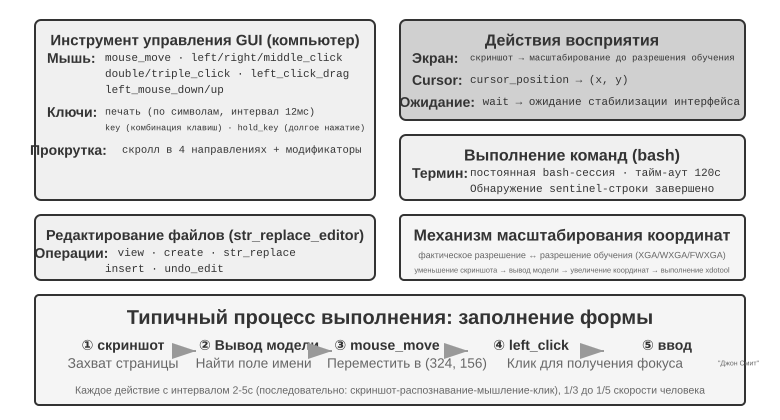
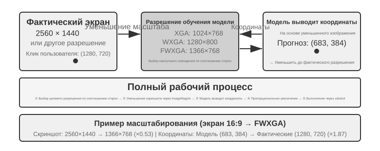

# Мультимодальность и интерактивность в реальном времени

В предыдущих главах мы рассматривали устройство агента в текстовом мире — как он взаимодействует с цифровыми системами через контекст, инструменты и код. Но объекты взаимодействия агента не ограничиваются текстом и API. Когда агенту нужно понять голосовую команду пользователя, найти и нажать нужную кнопку на экране или точно управлять механической рукой для захвата предмета, он вступает в совершенно новую область: **мультимодальное взаимодействие в реальном времени** — расширение от чисто текстового ввода-вывода к **мультимодальному восприятию и отклику в реальном времени**. Это ключевой шаг агента за пределы «диалогового окна». «Мультимодальность» означает одновременную обработку разных форм информации — текста, речи, изображений, видео, действий — а не только текста.

Сначала очертим границы этой главы. Статическое понимание изображений и документов — просмотр скриншота, чтение диаграммы, разбор PDF — уже органично вошло в практику агентов из предыдущих глав как инструмент восприятия: для сегодняшних мультимодальных больших моделей такие задачи «один ввод — одно понимание» уже относительно зрелые и не требуют специального архитектурного решения. Эта глава сосредоточена на другом классе проблем: **три сценария, где реальное время делает мультимодальность по-настоящему сложной** — голосовой диалог, управление GUI, управление роботом. В этих сценариях ввод непрерывно поступает потоком, вывод должен укладываться в жёсткий временной бюджет, и из-за этого архитектурное решение качественно меняется. Что касается понимания в реальном времени непрерывного визуального потока (видео) — на момент написания книги для агентов это всё ещё открытый вопрос; мы вернёмся к этой теме в разделе про Computer Use, где обсудим ограничения покадровых скриншотов, и в вопросах для размышления в конце главы. Проведём ещё одну границу: мультимодальная **генерация** (создание изображений, видео) в рамках этой книги — обычный вызов инструмента (об этом уже шла речь в пятой главе, посвящённой генерации мультимедиа), агент просто использует это как внешний инструмент, и это не связано с проблемой интерактивности в реальном времени, которую мы решаем в этой главе, — поэтому это не входит в основную линию главы.

Голосовое взаимодействие, Computer Use и управление роботом на первый взгляд относятся к трём совершенно разным областям, но на практике оказывается, что узкие места у них удивительно похожи: все они требуют одновременной обработки информации разных модальностей, и все они крайне чувствительны к задержке. Пауза в голосовом диалоге дольше двух секунд вызывает раздражение, а миллисекундное дрожание в управлении роботом может привести к столкновению. Эти два ограничения вместе толкают все три сценария в одном архитектурном направлении: от **последовательного конвейера** (как на заводской линии — один этап заканчивается, только потом передаёт эстафету следующему) к **сквозной модели** (единая модель напрямую идёт от входа к выходу, минуя промежуточные передачи).

Глава построена по следующей логике:

1. Сначала выстроим систему координат из «трёх парадигм голосовой архитектуры» — каскад (конвейер VAD-ASR-LLM-TTS), сквозная всемодальная модель (Omni, единая модель, но всё ещё говорящая по очереди), полный дуплекс (Moshi, GPT-Live, слушает и говорит одновременно) — и вдоль оси «как избавиться от предположения о поочерёдности речи, заложенного в VAD» последовательно разберём задержку и компромиссы каждого звена; в разделе про каскад отдельно расскажем, как заменить VAD + ASR потоковым голосовым восприятием.
2. Затем посмотрим, как архитектура мышления примиряет противоречие между «мгновенным откликом» и «глубоким размышлением»: от простого параллелизма быстрого и медленного мышления, через путь развязки, где фоновая модель рассуждения выступает «военным советником» (делегирование в GPT-Live, Pine AI и другие), до Step-Audio R1, который «интернализует» размышление в единую модель — «думает и говорит одновременно».
3. Затем обсудим оптимизацию исполнительного слоя за счёт более человекоподобного синтеза речи.
4. Наконец расширим взгляд до Computer Use (когда ИИ управляет экраном компьютера, как человек) и управления роботом, посмотрим, как те же проблемы задержки и мультимодальности проявляются в этих двух сценариях.

Особо отметим два момента, более теоретических и переносимых между сценариями: **архитектуру мышления** (как взаимодействуют два контура — быстрого и медленного мышления) и производный от неё **интерфейс быстрого и медленного мышления** (Latent Bridge — что кроме текста можно передавать между быстрой и медленной моделями). Хотя разговор о них начинается с голосового сценария, они полезны не только там — далее в Computer Use и робототехнике мы снова столкнёмся с вопросом «когда стоит позвать медленного советника», и на это стоит обратить особое внимание.

## Голос: самый естественный интерфейс человека и машины

Голос — это не просто текст, превращённый в звук. Человек говорит примерно в четыре раза быстрее, чем печатает, и при этом освобождает руки и глаза. Поэтому голосовой Agent образует непрерывный цикл ввода и вывода, в котором пользователь может перебить его в любой момент. Диктовка превращает речь в текст, а голосовой Agent позволяет сотрудничать с ним напрямую; оба сценария поддерживают описанный ранее whisper coding.

Здесь рассматриваются два направления: пользователь говорит с Agent, а Agent говорит с внешним миром от имени пользователя. Голосовая модель определяет, на что Agent способен ответить, а архитектура взаимодействия — насколько хорошо он слышит, быстро отвечает, передаёт очередь и выполняет подтверждения и вызовы инструментов во время разговора.

### Время взаимодействия: от каскада к полному дуплексу

Введение OpenAI о GPT-Live описывает три парадигмы голосового взаимодействия: каскадную, поочерёдную и полнодуплексную[^ch9-12]. Это не линейная замена старого новым, а разные компромиссы между задержкой, стоимостью и наблюдаемостью:

| Парадигма | Основная структура | Главное преимущество | Главное ограничение |
| --- | --- | --- | --- |
| Каскад | VAD → ASR → LLM → TTS | Ясные модули, которые легко заменять и отлаживать | Задержка накапливается, а просодические сигналы теряются на границах |
| Сквозной Omni | Одна модель слушает, думает и говорит | Меньшая задержка, лучше сохраняются тон, эмоции и окружающий звук | Всё ещё требует очереди; обучение и отладка дороже |
| Полный дуплекс | Непрерывно слушает, говорит и принимает решения | Перекрывающаяся речь, естественные перебивания и непрерывный поток | Сложнее обучать, контролировать и оценивать |

Общая идея — уйти от предположения, что люди говорят строго по очереди, и от догадки VAD о том, кому принадлежит очередь. Каскад и Omni всё ещё делят разговор на ходы, а полный дуплекс превращает владение очередью в непрерывное решение модели.

[^ch9-12]: OpenAI. *Introducing GPT-Live.* 2026-07-08. https://openai.com/index/introducing-gpt-live/ Классификация «каскад / по очереди / полный дуплекс» взята из описания трёх поколений ChatGPT Voice; термин «сквозной мультимодальный (Omni)» соответствует категории «turn-based voice models».

**Отмена потоковой передачи:**

```python
while audio_is_arriving:
    partial = asr.push(audio_chunk)
    if endpoint_is_probable(partial):
        candidate = llm.start(partial)
        if later_audio_changes_meaning(partial):
            cancel(candidate)                 # speculative cancellation
        else:
            tts.enqueue_stable_segments(candidate)

on_final_transcript(text):
    commit_or_restart(text)
```

### Парадигма 1 · Каскадный конвейер

Большинство коммерческих голосовых помощников по-прежнему используют последовательный конвейер (рис. 9-1): VAD определяет конец реплики, ASR переводит аудио в текст, LLM понимает запрос и генерирует ответ, а TTS озвучивает его. Модульность упрощает независимую оптимизацию, но каждая граница добавляет ожидание.


| Модуль | Роль | Типичное узкое место |
| --- | --- | --- |
| VAD | Определить окончание речи | Порог тишины задерживает ответ и ошибочно делит реплики |
| ASR | Преобразовать аудио в текст | Задержка распознавания и потеря контекста |
| LLM | Понять, рассуждать и сгенерировать ответ | Время до первого токена; reasoning добавляет ожидание |
| TTS | Преобразовать текст в речь | Синтез первого пакета и буфер воспроизведения |

Для короткого ответа без reasoning ожидание VAD, ASR, LLM и TTS складывается последовательно (рис. 9-2); конкретные значения зависят от длины ввода, модели, оборудования, сети и нагрузки. В производстве очередь дополнительно увеличивает простой (рис. 9-3).


> **Эксперимент 9-1 ★: построение традиционного голосового Agent**
>
> Соедините микрофон, Silero VAD, локальный Whisper, потоковую LLM и Fish S1 TTS через WebSocket. Сохранённое реальное свидетельство одного хода подтверждает работу медиа- и модельного конвейера от начала до конца, но не является бенчмарком параллелизма или производственной нагрузки. Код и запись приёмки находятся в [chapter9/live-audio](../chapter9/live-audio/).

> **Дополнение: голосовой Agent, который «звонит пользователю» через WebRTC**
>
> Телефонному Agent не нужен PSTN. Браузерный WebRTC воспроизводит цикл открытия сессии, запроса недостающих сведений, повторения их для подтверждения и сохранения структурированного результата. Для связи с внешней организацией тот же контракт можно подключить к совместимому провайдеру PSTN/SIP. Полный медиатракт, сравнение direct/ReAct и свидетельства приёмки находятся в [chapter9/phone-agent](../chapter9/phone-agent/). Исторические идентификаторы запусков \`exp9-2\` сохранены, но в рукописи это больше не нумерованный эксперимент.

#### От последовательности к потоковому восприятию

Потоковый ASR может выдавать предварительную расшифровку, пока пользователь говорит; LLM — отправлять в TTS первое готовое для произнесения предложение; TTS — возвращать аудиоблоки. Это не делает ASR, LLM и TTS полностью параллельными: при изменении частичного текста генерацию приходится отменять, запускать заново или исправлять, а одного параметра \`stream\` недостаточно.

Обычный streaming также не устраняет ожидание тишины VAD. Связка VAD + ASR накапливает задержку, теряет колебания, эмоции, короткие реплики и окружающий звук, а имена и адреса электронной почты могут быть разорваны между сегментами. Настоящей потоковой модели нужны причинный или блочный энкодер и инкрементальное декодирование; энкодер Whisper ждёт целый аудиосегмент, поэтому Whisper нельзя называть причинной потоковой моделью. Аудиомодель на базе LLM может выдавать текст и семантические события из непрерывного звука, но симуляция префиксов не обещает задержку причинной модели.

Кроме слов поток может выдавать маркеры \`speak_start/end\` и \`interrupt\` (границы речи и намерение перебить), \`emotion\` (эмоция и колебание), а также \`laugh\`, \`sigh\` и \`noise\` (паралингвистические и внешние звуки). Так голосовой Agent не сжимает каждое акустическое событие до обычного текста.

[^ch9-11]: О встраивании определения очереди в распознаватель и проблеме меток, использующих информацию из будущего, см. Bojie Li и Noah Shi, *The Trade-off Was in the Labels: Causal Supervision for Turn-Aware Streaming ASR*, 2026 (готовится к публикации).

> **Эксперимент 9-2 ★: моделирование потокового речевого восприятия с помощью Qwen2-Audio**
>
> Qwen2-Audio сам по себе не потоковая модель. Эксперимент имитирует непрерывное восприятие растущими аудиопревью и сравнивает его с VAD на 600 мс + Whisper. Эталонный запуск прошёл проверки выполнения и происхождения, но воспроизвёл лишь 2 из 6 ожидаемых реакций: вызовы заняли 8,4–11,3 с, в образце pause не появился \`silence\`, а в образце noise сохранилась ошибка \`cough/laughter\`. Это отрицательный результат проверки механизма, а не свидетельство «настоящего потокового восприятия за 100–200 мс». Полная запись в [chapter9/streaming-speech](../chapter9/streaming-speech/).

### Парадигма 2 · Сквозные мультимодальные модели (Omni)

Даже с потоковым восприятием каскад передаёт слушание, мышление и речь через дискретные интерфейсы; при превращении аудио в текст теряются эмоция, интонация и окружающий звук. Omni делает всё одной моделью, что уменьшает задержку и сохраняет нетекстовые сигналы, но повышает стоимость обучения, отладки и замены компонентов (рис. 9-4). Самокаскад может исправить ошибку распознавания, когда для задачи достаточно текста; если же ответ зависит от скорости речи, эмоции или среды, текстовый узкий канал необратимо уничтожает доказательство[^ch9-13].

Omni всё ещё предполагает очередность и использует VAD или семантическое определение конца реплики. Пауза в последовательности чисел может быть принята за конец; потоковое восприятие улучшает решение, но не отменяет ходов разговора.

[^ch9-13]: Полное измерение того, когда меняется преимущество каскада и сквозной модели, см. Li, Bojie и Noah Shi, *The Cascade Gap: When and Why Self-Cascades Help Multimodal Agents*, 2026 (готовится к публикации).


Realtime speech API занимают промежуточное положение: модель принимает аудио напрямую, но управление взаимодействием по-прежнему опирается на VAD, перебивания и асинхронные вызовы инструментов. Важно сравнивать не рейтинги, а то, на каких задачах ошибаются сквозной и самокаскадный пути.

> **Эксперимент 9-3 ★★: локальный запуск MiniCPM-o 4.5 — сквозной путь против самокаскада**
>
> Зафиксируйте одну локальную ревизию MiniCPM-o 4.5, отключите режим мышления и сравните прямые ответы на аудио с самокаскадом: сначала расшифровать, затем ответить по тексту. Эксперимент измеряет сохранение аудиоинформации, а не последующую способность «думать во время речи».
>
> | Тип задачи | Сквозной | Самокаскад | Наблюдение |
> | --- | ---: | ---: | --- |
> | Семантическая арифметика (2) | 1/2 | 2/2 | Самокаскад исправил одну ошибку расшифровки |
> | Паралингвистическая скорость речи (2) | 2/2 | 1/2 | Текстовая расшифровка стёрла различие «быстро/медленно» |
> | Итого | 3/4 | 3/4 | Равные суммы, взаимодополняющие ошибки |
>
> Выборка мала и не доказывает, какой путь обычно точнее или быстрее. Версии, сырые ответы и аудио-в-аудио свидетельства находятся в [chapter9/end-to-end-speech](../chapter9/end-to-end-speech/).

Step-Audio 2 показывает сквозной путь от сырого аудио к тексту и речи, сохраняя эмоцию, темп, интонацию и окружающий звук. Step-Audio R1 дополнительно встраивает рассуждение в аудиомодель и служит примером «думать во время речи».

### Парадигма 3 · Интерактивные полнодуплексные модели

Omni разделяет «говорит пользователь» и «говорит модель», но синхронный перевод требует перекрытия. Полнодуплексная модель слушает и говорит непрерывно, каждый раз решая, продолжать ли, замолчать, перебить или вызвать инструмент. Moshi от Kyutai был ранним исследовательским примером. Thinking Machines Lab называет такой подход **Interaction Model**[^ch9-14]: взаимодействие зашито в модель, а не собрано вокруг VAD. GPT-Live доводит его до производственного масштаба и делегирует сложную работу фоновой модели, пока передний план поддерживает разговор.

[^ch9-14]: Thinking Machines Lab, “Interaction Models: A Scalable Approach to Human-AI Collaboration”, 2026-05. https://thinkingmachines.ai/blog/interaction-models/

Траектория такова: каскад угадывает ход по порогу тишины, потоковое восприятие поднимает решение до семантического уровня, а полный дуплекс превращает смену хода в непрерывное решение.

### Когнитивное время: взаимодействие в реальном времени и глубокое мышление

Передний план должен ответить, пока пользователь ещё вовлечён, а фоновая модель может думать дольше. Это три компромиссных дизайна, а не последовательные ступени:

| Дизайн | Передний план | Фон | Главный риск |
| --- | --- | --- | --- |
| Быстрый заполнитель, медленная коррекция | Немедленный ответ | Переосмыслить и дополнить | Противоречие |
| Быстрое взаимодействие, медленный совет | Поддерживать разговор и выбирать формулировку | Совет или результат инструмента | Ограниченный интерфейс |
| Единые мышление и выражение | Думать и говорить вместе | Общее состояние модели | Дорого обучать и заменять |

Первое решение может дважды обработать вопрос и прийти к противоречию. Второе надёжнее: фон передаёт совет через строку состояния, но передний план не видит промежуточные рассуждения и не умеет по-настоящему думать во время речи. Третье объединяет процессы. В Step-Audio R1 метод MGRD привязывает рассуждение к акустическим признакам, а двухмозговая архитектура MPS параллельно планирует и озвучивает (рис. 9-5 и 9-6). Единая модель естественнее, раздельная проще в замене фонового «мозга»; это разные компромиссы.

### Синтез речи, более похожей на человеческую

Слишком гладкий TTS без пауз выдаёт машину. Основная LLM может добавлять к тексту маркеры \`THINKING\`, \`EMO:happy\` и \`SPEED:0.8x\`, а TTS отображает их в паузы, просодию, темп, смех и вздохи. Это можно реализовать специальным TTS с поддержкой маркеров или клонированием голоса с несколькими эталонными записями.

> **Эксперимент 9-4 ★★: управление TTS метками на основе Fish Audio**
>
> С помощью Fish Audio S1 создайте библиотеку голоса с несколькими эталонами и сравните три настройки: без меток, с одной записью и с несколькими записями. Исполнительный слой выбирает эмоцию, темп и стиль по меткам. В трёх сбалансированных слепых прослушиваниях конфигурация с несколькими эталонами получила лучший результат (4,67/5 по сходству с человеком-оператором), но полный ожидаемый порядок не воспроизвёлся: вариант без меток превзошёл вариант с одной записью. Малое исследование показывает пользу выразительного управления, но не даёт общего вывода о качестве речи. Библиотека из 24 записей, медиа A/B/C и протокол приёмки находятся в [chapter9/controllable-tts](../chapter9/controllable-tts/).
## Computer Use: агент автоматизации GUI

Читая до этого момента, вы, возможно, заметили, что в этой главе речи посвящено заметно больше места, чем двум оставшимся сценариям, — и это сделано намеренно. На этой линии эволюции реального времени в мультимодальности речь прошла путь наиболее полно и заслуживает того, чтобы служить системой отсчёта: отталкиваясь от проблемы «слишком высокой задержки последовательного конвейера», через сквозные модели, полный дуплекс, «говорю, пока думаю» и целый ряд других решений, речь дошла до относительно сформировавшегося сегодняшнего итога — весь путь от проблемы через решение к итогу здесь полностью пройден. Поэтому мы разобрали её подробно, а два следующих сценария — Computer Use и роботы — можно рассматривать, сверяясь с этой линией эволюции речи: на какой стадии этого пути находится каждый из них, и на чём он застрял.

Эти три сценария кажутся разными, но сталкиваются с одними и теми же базовыми вызовами: восприятие в реальном времени, принятие решений с низкой задержкой, непрерывное взаимодействие. Далее посмотрим, как эти технические темы воспроизводятся в визуальном взаимодействии (Computer Use) и физическом взаимодействии (роботы) — сначала расширим взгляд от слуховой модальности к визуальной: что если агент способен не только понимать речь, но и «видеть» экран и управлять графическим интерфейсом?

Computer Use (также называемый агентом автоматизации GUI) позволяет ИИ пользоваться программами так же, как человек, — наблюдая за экраном и управляя мышью и клавиатурой: например, открыть браузер и найти информацию, заполнить данные в таблице или изменить настройки в системных параметрах. В основе лежит цикл **восприятие — мышление — действие** (Рис. 9-7):

1. Агент делает скриншот текущего экрана
2. Мультимодальная модель получает скриншот и указание задачи, выводит рассуждение и конкретное действие
3. Слой исполнения выполняет это действие в реальной среде (двигает мышь, кликает, вводит текст и т. д.)
4. После ожидания реакции интерфейса снова делается скриншот, и цикл переходит к следующему шагу

**Цикл безопасности Computer Use:**

```python
observation = capture_screenshot_and_accessibility_tree()
proposal = model.decide(task, observation)
action = validate_schema_and_coordinates(proposal)

if action.is_irreversible and not user_or_policy_approval(action):
    stop("approval required")
else:
    execute_in_sandbox_or_scoped_session(action)
    new_observation = capture_after_settle()
    if not verify_goal_progress(new_observation, action):
        rollback_if_possible_or_replan()
```


В этом цикле есть три ключевых измерения проектирования: **пространство действий** (какие операции доступны агенту), **визуальное позиционирование** (как найти целевой элемент на скриншоте) и **архитектура модели** (как сгенерировать правильное действие на основе скриншота).

### Проектирование пространства действий

Anthropic определяет три категории инструментов, составляющих полную способность к взаимодействию (Рис. 9-8):





**Инструмент GUI-операций** (computer tool): операции мыши включают перемещение (mouse_move), клик левой/правой/средней кнопкой, двойной/тройной клик, перетаскивание (left_click_drag), а также более точные нажатие/отпускание (left_mouse_down/up). Прокрутка (scroll) поддерживает четыре направления и может комбинироваться с клавишами-модификаторами. Клавиатурные операции включают посимвольный ввод (type, интервал между символами 12 мс имитирует реальную печать), сочетания клавиш (key, например Ctrl+C), удержание клавиши (hold_key). Действия восприятия: скриншот (screenshot), получение позиции курсора (cursor_position), ожидание (wait).

**Инструмент выполнения команд** (bash tool): предоставляет постоянную сессию bash-терминала с тайм-аутом 120 секунд, определяет завершение выполнения команды по строке-«часовому», сохраняет состояние среды между несколькими вызовами (например, если перейти в директорию через cd, следующий вызов будет уже в ней).

**Инструмент редактирования файлов** (str_replace_editor): реализует безопасное редактирование через сопоставление строк, поддерживает просмотр, создание, замену, вставку и отмену операций — это точнее, чем прямая перезапись всего файла, и снижает риск случайного изменения остального содержимого.

> **Эксперимент 9-5 ★: запуск Computer Use (эталонный путь Anthropic или путь открытой модели)**
>
> Путь A использует Anthropic Computer Use Demo. Контейнер содержит полноценную рабочую среду Ubuntu с браузером, терминалом и другими стандартными инструментами. Фронтенд принимает задачу, бэкенд отправляет инструкции и скриншоты в Claude, а затем выполняет возвращённые моделью действия с мышью, клавиатурой, терминалом или редактором. Этот путь предназначен для изучения протокола нативного инструмента `computer` и не требует, чтобы у каждого читателя был доступ к Anthropic API.
>
> Путь B использует сопроводительный проект книги [`chapter9/computer-use-open-model`](../chapter9/computer-use-open-model/). По умолчанию он управляет browser-use с помощью модели с открытыми весами Qwen3-VL 32B Instruct—через размещённый API OpenRouter либо посредством перенаправления `OPEN_MODEL_BASE_URL` на самостоятельно размещённый vLLM/SGLang или другую совместимую конечную точку. Конечная точка должна принимать скриншоты и поддерживать нативный JSON Schema; если поддерживается только обычный JSON, можно явно включить режим совместимости schema-in-prompt.
>
> Оба пути используют одну и ту же задачу только для чтения и один контракт приёмки: не более 25 шагов, ровно одно действие на шаг, сохранение идентификатора модели/конечной точки, исходных ответов поставщика, пошаговых скриншотов, последовательности действий, окончательного ответа и причины остановки. Разные модели необходимо представлять как отдельные экспериментальные ветви: результат открытой модели нельзя выдавать за воспроизведение Claude, а «успешный запуск контейнера»—за выполнение задачи. Интервалы между действиями и качество планирования являются измеряемыми результатами; нельзя заранее считать интервал равным 2–5 секундам или предполагать неизбежное превосходство над другими моделями.

### Визуальная локализация (Grounding)

В каждом раунде цикла модели нужно точно определить положение целевого элемента на скриншоте — «где находится строка поиска?», «каковы координаты кнопки отправки?». Это и есть задача визуальной локализации (Grounding). Сейчас существует **два основных подхода**: первый — превратить локализацию в **вопрос с вариантами ответа**: сначала все элементы интерфейса помечаются номерами, и модели остаётся лишь выбрать один из них; второй — **прямое предсказание координат**: модель, как человек, буквально «смотрит» на скриншот и называет координаты. Причём подход с вариантами ответа реализуется двумя способами: **чисто визуальная разметка** (исходный Set-of-Mark, где сегментационная модель нарезает кандидатные области по пикселям) и **структурированное индексирование элементов** (DOM/Accessibility Tree, когда структура считывается напрямую из самого интерфейса). Общее преимущество подходов с вариантами ответа в том, что открытая задача «найти на скриншоте кнопку и предсказать её координаты» превращается в закрытую задачу «выбрать один элемент из уже размеченных» — точно так же, как на экзамене вопрос с вариантами ответа проще, чем вопрос с открытым ответом: модели достаточно сказать «нажать [123]», а не «нажать на синюю кнопку примерно в 200 пикселях правее верхнего левого угла экрана».

**Set-of-Mark: метод визуальной разметки.**

Исходный Set-of-Mark (SoM) был предложен исследовательским подразделением Microsoft в 2023 году, изначально — чтобы раскрыть возможности визуальной локализации GPT-4V. Это **чисто визуальный** метод: сегментационная модель (SAM, SEEM и т. п.) автоматически нарезает на скриншоте кандидатные области, для каждой из них накладывается номерная метка, и модель видит изображение с номерами — ей достаточно назвать номер, а система пересчитает его в координаты центра соответствующей области. Весь процесс не требует DOM и вообще какой-либо внутренней структуры интерфейса, поэтому подход применим и к нативному настольному ПО, и к игровым интерфейсам — лишь бы сегментационная модель могла нарезать кандидатные области.

**Структурированное индексирование элементов: структурная реализация идеи SoM для веба.**

Когда сам интерфейс может предоставить структурированную информацию, разметку можно сделать точнее. Современные веб-страницы ещё до рендеринга уже определяют полную структуру элементов (дерево DOM) и семантические роли (что является кнопкой, что — полем ввода), а интерфейс специальных возможностей (Accessibility Tree) даёт аналогичную информацию для многих настольных приложений. Вместо того чтобы заставлять сегментационную модель угадывать по пикселям «какая область является кнопкой», логичнее прямо спросить сам интерфейс: «какие у тебя есть кликабельные элементы?». Именно так поступают веб-агенты на базе проекта browser-use: интерактивные элементы перечисляются из DOM и нумеруются — это можно рассматривать как структурную реализацию идеи SoM для веба (Рис. 9-9). Процесс состоит из четырёх шагов:

1. Через отладочный интерфейс браузера (CDP, Chrome DevTools Protocol) получить структурированное представление страницы (дерево DOM) и информацию о доступности
2. Автоматически определить, какие элементы интерактивны (кнопки, поля ввода, ссылки и т. д.)
3. Присвоить каждому интерактивному элементу уникальный ID и нарисовать вокруг него рамку на скриншоте
4. Одновременно сформировать текстовый список, описывающий, какой элемент соответствует каждому ID

```text
Скриншот: [на изображении ключевые элементы помечены ID [1], [2], [3], [4] и т. д.]

Элементы:
[1] <input type="text" placeholder="Search" aria-label="Search" />
[2] <button id="submit-btn" aria-label="Submit form" />
[3] <input type="text" placeholder="Enter your name" value="" />
[4] <a href="/docs" aria-label="Documentation" />
```

Модели достаточно вывести только номер ID, а система автоматически выполнит клик по координатам центра этого элемента. Такой подход не экономит токены (потому что всю разметочную информацию нужно отправить модели), зато обеспечивает точную и стабильную локализацию и избавляет от пропусков и ложных срабатываний, которые может внести сегментационная модель.


**Прямое предсказание координат.**

Третий путь не использует никакую разметку и заставляет модель напрямую выдавать координаты. Яркие примеры — **SeeClick** и Computer Use от Claude: на огромном массиве парных данных «скриншот GUI — положение элемента» обучается визуальная модель, которая учится напрямую отображать описание на естественном языке (например, «нажми кнопку отправки») в точные координаты на скриншоте — точно так же, как человек находит нужное место, полагаясь исключительно на зрение.

В схемах с предсказанием координат понимание моделью координат сильно зависит от разрешения, использованного при обучении (Рис. 9-10). Claude обучалась на XGA (1024×768), WXGA (1280×800), FWXGA (1366×768); если разрешение входного скриншота не совпадает с этими значениями, предсказанные моделью координаты систематически смещаются — как если бы вы измерили расстояние на карте меньшего масштаба и напрямую применили результат к карте большего масштаба. Поэтому на уровне инструментов нужно реализовать механизм двустороннего масштабирования координат, причём **целевое разрешение нужно выбирать по соотношению сторон**, чтобы неравномерное растяжение не деформировало изображение и не сбило вместе с ним оценку координат. Например, если реальное разрешение экрана — 2560×1440 (16:9), нужно среди трёх поддерживаемых Claude вариантов выбрать тот, чьё соотношение сторон тоже близко к 16:9, — лучше всего подходит FWXGA (1366×768). При съёмке скриншота экран пропорционально масштабируется до 1366×768 и подаётся в модель; модель выдаёт координаты клика (683, 384), которые затем обратно пересчитываются в реальные координаты (683×2560/1366, 384×1440/768) ≈ (1280, 720). И наоборот, если насильно растянуть 16:9 в 4:3 разрешение 1024×768, изображение будет сжато по горизонтали, и предсказанные моделью координаты систематически сместятся.





Логику выбора между тремя путями можно сформулировать так: **когда доступна структурированная информация, приоритет отдаётся индексированию через DOM/Accessibility Tree** — это даёт самую точную и стабильную локализацию; **когда она недоступна** (нативное настольное ПО вроде Photoshop, интерфейсы, отрисованные через Canvas/WebGL, игры), **можно использовать как визуальную разметку (исходный путь SoM), так и предсказание координат**. Визуальная разметка превращает локализацию в выбор варианта ответа и более дружелюбна к универсальным моделям без специального обучения; предсказание координат обходится без этапа разметки и более прямолинейно для моделей, прошедших обучение локализации в GUI. У обоих подходов на мелких элементах и плотных интерфейсах точность всё ещё оставляет желать лучшего.

> **Эксперимент 9-6 ★: реализация автоматического управления браузером с помощью browser-use**
>
> Фреймворк автоматизации браузера Playwright в сочетании с мультимодальной моделью реализует управление браузером на естественном языке. Включается визуализация SoM, и перед каждым решением сохраняется скриншот с размеченными рамками. Интерфейс модели не ограничен OpenAI или Anthropic: книга предоставляет конфигурацию API для открытой модели Qwen3-VL и сохраняет универсальный совместимый с OpenAI base URL для других размещённых сервисов или самостоятельно размещённого инференса.
>
> Тестовая задача «открыть Google и узнать погоду в Сан-Франциско»: после запуска скриншот показывает страницу поиска Google с пронумерованными интерактивными элементами. Модель выбирает поле поиска, вводит «San Francisco weather today», отправляет запрос, а затем извлекает температуру и погодные условия со страницы результатов. При приёмке ответ и траектория независимо проверяются, а фактическое число шагов и затраченное время записываются без изменений. «5 шагов, около 20 секунд» может быть лишь наблюдением из отдельного запуска, а не фиксированным результатом без подтверждения исполнения.
>
> Сохранённый в книге официальный запуск открытой модели использовал `qwen/qwen3-vl-32b-instruct` в OpenRouter. Встретив CAPTCHA в Google Search на шаге 4, модель не объявила об успехе, а перешла на weather.com и на шаге 16 прочитала на странице Today для Сан-Франциско: 64°F, Sunny, ощущается как 62°F, максимум 74°F и минимум 55°F. Все 16 из 16 ответов API указали запрошенную модель Qwen3-VL, а 15 корректных пошаговых скриншотов вместе с траекторией действий только для чтения прошли независимую детерминированную приёмку. Этот результат доказывает работоспособность пути API открытой модели, но не означает, что экспериментальная ветвь с нативным инструментом `computer` от Anthropic воспроизведена.

### Computer Use Agent, способный видеть движение и слышать звук

До сих пор восприятие в Computer Use строилось на одном неявном допущении: **экран статичен** — сделали скриншот, подумали шаг, кликнули, снова сделали скриншот. Но в реальности на экране может проигрываться видео, может всплывать мимолётное уведомление, может звучать голос собеседника на конференц-звонке. Агент, который «открывает глаза» раз в 3–5 секунд и вообще не имеет «ушей», не может ни увидеть, ни услышать то, что происходит «между двумя кадрами». Просмотр записи экрана, участие в звонке, реагирование на голосовые подсказки, обработка мгновенно исчезающих диалоговых окон — вся эта категория повседневных операций с компьютером сегодня для Computer Use Agent практически недоступна.

По-настоящему заново нужно проектировать не «интерфейс действий», а «**интерфейс наблюдения**» [^ch9-9]. Ключевая идея — отделить **наблюдение** (непрерывное, адаптивное, мультимодальное) от **действия** (дискретного) и оформить его как слой перцептивного middleware, который встраивается между средой и любой уже готовой моделью Computer Use без её переобучения (можно назвать его интерфейсом наблюдения агент — компьютер, AOI). У него три компонента, каждый из которых «открывает шлюз» только по необходимости: во-первых, **захват ключевых кадров между тактами** — сначала крайне дешёвый пиксельный фильтр пропускает почти неизменные кадры, затем небольшая модель определяет, произошло ли значимое изменение изображения, и только при изменении делается снимок; при статичной картинке стоимость почти нулевая; во-вторых, **транскрипция речи, управляемая громкостью** — распознавание речи вызывается только при наличии звука, благодаря чему у агента впервые «отрастают уши»; в-третьих, что важнее всего, — **превращение кадра в устойчивый текст**: модель описывает захваченный кадр одной фразой («только что всплывшая подсказка сообщает, что дата релиза перенесена на 28 апреля»), и **даже после того, как исходное изображение будет вычищено из контекста, эта фраза остаётся в памяти**, унося динамическую информацию дальше в текстовом виде.

Один неочевидный вывод: по-настоящему важно не «какие именно кадры выбрать», а «**превратить кадр в текст, способный храниться долго**» — ведь текст — это модальность, с которой LLM-агент справляется лучше всего. На восьми моделях от 7B до передового масштаба этот слой middleware без какого-либо переобучения даёт прирост от +17 до +48 процентных пунктов, причём разрыв особенно велик в задачах, связанных с речью: добавив этот слой восприятия, агент способен выполнять голосовые задачи, которые раньше «слышал, но не мог выполнить». Но это не универсальная фиксированная конфигурация на все случаи жизни — на некоторых более новых моделях избыток токенов изображения, наоборот, вытесняет рассуждение и снижает качество работы, поэтому эти компоненты нужно **подбирать индивидуально под модель**, а не включать все разом. Это та же логика, что и в компромиссах Set-of-Mark и предсказания координат выше: у восприятия нет серебряной пули — конфигурацию нужно подстраивать под характер модели.

[^ch9-9]: Полное описание механизма трёх компонентов — шлюзование ключевых кадров, транскрипция по необходимости, превращение кадров в устойчивый текст — и абляции по каждой модели см. Li, Bojie and Noah Shi. *Agent-Computer Observation Interfaces Enable Dynamic Computer Use.* arXiv:2606.29472, 2026.

### Модель мира для Computer Use

Интерфейс наблюдения из предыдущего раздела отвечает на вопрос «что произошло в промежутке»: благодаря ключевым кадрам, расшифровке речи и устойчивому тексту Agent больше не видит лишь два далеко разнесённых скриншота. Но интерфейс наблюдения не убирает задержку планирования. Agent по-прежнему крутит последовательный цикл «скриншот — размышление — клик» и после каждого действия заново наблюдает и обдумывает следующий шаг. Исследование эффективности **OSWorld-Human** показывает: даже когда задача в итоге выполняется, число шагов и время ожидания у Agent заметно больше, чем у человека; достичь человеческой точности не значит стать достаточно практичным.

Работая за компьютером, человек не начинает думать о следующем шаге лишь после клика — он сначала предсказывает последствие действия: если реальное изменение совпало с ожиданием, он продолжает по прежнему плану; и только когда состояние страницы отклоняется от ожидаемого, останавливается, чтобы наблюдать и планировать заново. Модель мира позволяет Agent предсказать, во что может превратиться рабочий стол, ещё до действия, и тем самым реализовать это человекоподобное «спекулятивное исполнение», заметно повышая эффективность.

Состояние рабочего стола — не просто картинка из пикселей: в него входят окна, фокус, положение прокрутки, содержимое полей ввода, состояние загрузки, права и ответы сети; а действия включают клик, ввод с клавиатуры, прокрутку, перетаскивание и ожидание. Модель мира, пригодная для Computer Use, должна как минимум кодировать текущее состояние, предсказывать изменение состояния от действия-кандидата и передавать это предсказание планировщику для выбора следующего шага:

```text
состояние рабочего стола + click/type/scroll/wait ──> представление следующего состояния
```

Тогда Agent сможет сравнить последствия действий-кандидатов ещё до настоящего клика, подготовить следующий шаг, пока грузится страница, и восстановиться по разнице состояний, когда всплывающее окно мелькнуло и исчезло. Например, если задача — «создать новый файл Python в VS Code и написать hello world», модель может сначала предсказать ключевое состояние дерева файлов и редактора после успеха, и лишь затем выбрать действия клика, ввода и сохранения; а если задача — удалить файл, она может заранее предсказать в изолированном виртуальном рабочем столе, появится ли необратимое диалоговое окно подтверждения, и при необходимости запросить подтверждение у пользователя. Смысл здесь не в том, чтобы модель породила правдоподобный скриншот будущего, а в том, чтобы она предсказала проверяемые различия состояний, необходимые для выполнения задачи.

В июле 2026 года **Photon-1** от Induction Labs показал одну из реализаций этого пути: предобучение модели мира для computer use было завершено всего за 30 000 часов GPU H200. Он сжимает каждый кадр в дискретные латентные token и авторегрессионно предсказывает представление следующего состояния после действия, а не порождает скриншоты попиксельно на этапе предобучения; подключённый к нему генератор изображений служит лишь для визуализации латентных представлений и не является необходимым компонентом при выводе. Получив затравочный скриншот и последующие действия, модель может непрерывно «воображать» состояния рабочего стола, а затем через онлайн-обучение на виртуальных машинах научиться выдавать действия computer-use.[^ch9-20]

[^ch9-20]: David Li and Jonathan Li, Induction Labs, «Scaling Video Pretraining with Imagination Models,» 2026-07-23. https://www.inductionlabs.com/news/scaling-video-pretraining. Приведённые в тексте параметры Photon-1, объём данных, внутренние бенчмарки и сравнения стоимости — данные, раскрытые самой компанией.

### Мобильные устройства: экосистемные барьеры сложнее технологий

Computer Use также расширяется на мобильные устройства. Технически мобильные и настольные платформы действительно различаются: пространство действий здесь обычно уже не «координаты мыши + клавиатура», а обращение к системному API служб специальных возможностей (например, AccessibilityService в Android) для считывания элементов интерфейса и отправки кликов и текстового ввода; способ взаимодействия тоже меняется — от указателя мыши к сенсорным жестам, а семантика координат вместе с этим меняется: одна и та же пара (x, y) может означать одиночное касание пальцем, долгое нажатие или начальную точку жеста смахивания — для их различения нужен дополнительный тип жеста. Именно на таком пространстве действий описанные в главе 6 мобильные бенчмарки вроде AndroidWorld оценивают способность агента выполнять реальные задачи в приложениях.

Но по-настоящему сдерживает мобильные устройства, как правило, не эта техническая разница, а экосистемные барьеры. Некоторые производители смартфонов уже пытались встроить в потребительские устройства ИИ-помощника, автоматически управляющего повседневными приложениями вроде WeChat, Taobao, Alipay, но быстро столкнулись с ограничениями со стороны платформ.

Это раскрывает уникальную проблему, с которой сталкивается Computer Use: **экосистемный барьер**. Коренная причина блокировок — конфликт бизнес-моделей. Основная логика монетизации традиционных интернет-приложений — это **трафик и внимание**: пользователь листает ленту и видит рекламу, ищет товар и следует рекомендательным алгоритмам, просматривает страницы и совершает импульсивные покупки. Когда же вместо пользователя действиями управляет агент, эта цепочка монетизации полностью обходится стороной: ИИ не обращает внимания на рекламу и не совершает импульсивных покупок, а идёт прямо к цели и заканчивает задачу. Для платформ, монетизирующихся за счёт рекламы и трафика, каждое действие агента подтачивает саму основу их бизнес-модели.

Это означает, что Computer Use сталкивается не только с техническим противодействием вроде CAPTCHA (проверочные коды), но и со **структурным конфликтом интересов**. Это противоречие сложно устранить в краткосрочной перспективе, что делает внедрение Computer Use в потребительских сценариях более трудной задачей, чем чисто техническая проблема.

## Управление роботами: уборка стола на примере XLeRobot

> **Как читать этот раздел**: от начала до конца мы используем одну-единственную задачу——«поставить красную чашку на поднос, выбросить жёлтую бумажку в мусорное ведро и в конце ещё раз посмотреть, чтобы убедиться в состоянии стола». Эксперименты 9-7 и 9-9 выполняются на настоящем XLeRobot и требуют манипулятора, калибровки, кнопки аварийного останова и наблюдателя на месте. Эксперименты 9-8, 9-10 и 9-11 — их аналоги на локальном GPU. Результаты на железе и в симуляции сообщаются раздельно, но цель задачи, смысл действий и условия успеха остаются одинаковыми.

Управление роботом гораздо труднее, чем «посмотреть на картинку и ответить на вопрос». Модель должна не просто понимать сцену, а непрерывно действовать в реальном мире, причём каждое действие меняет обстановку в следующий момент. XLeRobot делает эту разницу очень наглядной. Одним и тем же манипулятором человек может управлять дистанционно — с клавиатуры, геймпадом или через VR-устройство; а можно передать наблюдение с камеры и ограниченный набор инструментов действия Agent, чтобы он вызывал их сам. Железо не меняется, задача тоже; меняется лишь тот, кто управляет——в первом случае человек непрерывно наблюдает и исправляет, во втором ту же работу должны довести до конца модель и система управления.

Этот раздел связывает пять экспериментов «уборкой стола». Сначала человек дистанционно управляет настоящим XLeRobot — чтобы измерить, на что способно это железо в руках достаточно умелого оператора. Затем в симуляторе устанавливается идеальный верхний предел управления для той же задачи. Далее Agent автономно управляет настоящим XLeRobot — чтобы увидеть, как восприятие, планирование и восстановление после сбоя определяют результат. После этого тот же контракт инструментов переносится в симулятор, и три стратегии сравниваются разом: разомкнутое выполнение, пошаговая проверка и модель мира. Наконец, мы меняем фон, внешний вид предметов, освещение и визуальный шум, чтобы понять, способна ли зрительная политика, выученная в симуляции, приспособиться к новой обстановке.

Узкое место здесь обычно не в том, чтобы сделать ещё один статический бенчмарк «вопрос — ответ», а в том, чтобы модель удерживала контур замкнутым при ограниченной полосе восприятия и управления. Пригодная к работе роботическая система должна отвечать по меньшей мере на четыре вопроса:

1. Какую задачу хочет завершить человек?
2. Какая подзадача идёт следующей?
3. Какое конкретно действие выдаёт текущий навык?
4. После выполнения действия — реальность всё ещё соответствует исходному плану?

Раздел помещает эти четыре вопроса в один и тот же контур управления XLeRobot и показывает, что берёт на себя каждая из четырёх техник: долгосрочное планирование решает, чем заняться раньше — чашкой или бумажкой; VLA или примитивы действий выполняют захват и постановку; модель мира оценивает последствия действия; а переход от симуляции к реальности принимает на себя разницу между обучающим видео и настоящими камерой и приводами. Даже если у модели верхнего уровня уже достаточно знаний и способности планировать, достаточно выпасть одному звену этого контура обратной связи, чтобы система не смогла довести задачу до конца.

### Разделение труда между железом и алгоритмом

Первый вопрос, на который XLeRobot отвечает лучше всего: когда автономная уборка стола проваливается — это манипулятор не справляется или алгоритм не умеет им пользоваться? Здесь есть факт, который не стоит смягчать: **даже манипулятор за несколько сотен долларов, такой как XLeRobot, при дистанционном управлении уже способен выполнить многошаговую связную задачу на столе, подобную задаче этого раздела**——человек смотрит видео с камеры, берёт красную чашку и ставит её на поднос, выбрасывает жёлтую бумажку в ведро и в конце ещё раз проверяет состояние. Этот результат означает не просто «железа едва хватает»; это ясное диагностическое свидетельство: **применительно к этой задаче узкое место лежит на стороне алгоритма, а не самого железа.**

Способ диагностики прямолинеен. Зафиксировав камеру, манипулятор, схват, расстановку на столе и условия успеха, контур сначала берёт на себя человек. Человек непрерывно уточняет оценку положения предметов, выбор действий и момент их выполнения, а также знает, что делать при сорвавшемся захвате. Разрыв между автономной системой и человеком проявляется именно в этой способности работать в замкнутом контуре. Разумеется, область действия этого вывода — задача со столом из данного раздела: он показывает, что железо преодолело пороги по грузоподъёмности, точности и рабочему пространству, которых требует эта задача, но не означает, что манипулятор за несколько сотен долларов справится с любой открытой средой или с более сложными манипуляциями.

XLeRobot поддерживает несколько входов для дистанционного управления: клавиатуру, контроллер Xbox, Joy-Con от Switch и VR-устройства. Оператор-человек естественным образом делает многое из того, что алгоритму пришлось бы прописывать явно: замедляется, когда схват приближается к чашке; исправляет точку захвата, если чашка скользит; смотрит заново, если бумажку не удалось подцепить с первого раза; и подтверждает результат, когда предмет оказался в целевой зоне. Поэтому дистанционное управление — не только способ собрать демонстрационные данные, но и диагностический эксперимент, который «фиксирует железо и меняет лишь оператора».[^ch9-1]

> **Эксперимент 9-7 ★: уборка стола дистанционным управлением настоящим XLeRobot**
>
> Поместите в рабочую зону настоящего XLeRobot красную чашку, поднос, смятую жёлтую бумажку и мусорное ведро. Оператор выполняет фиксированную задачу через один из откалиброванных каналов дистанционного управления: «поставить красную чашку на поднос, выбросить жёлтую бумажку в мусорное ведро и в конце ещё раз посмотреть, чтобы убедиться в состоянии стола». Повторите как минимум несколько раундов и запишите видео с камеры, ввод оператора, состояние манипулятора, длительность действий, сорвавшиеся захваты, число повторных попыток и итоговое состояние.
>
> Не опускайте критерий приёмки до «в конце стол выглядит чистым». Красная чашка должна оказаться на подносе, а жёлтая бумажка — в ведре; манипулятор должен вернуться в безопасную позу; на всём протяжении не должно быть столкновений, выходов за пределы рабочей зоны и вмешательства человека, который доделывает работу без проверки.

Дистанционное управление на настоящем железе убедительнее всего показывает верхний предел задачи, но неудобно, когда нужно массово менять число и положение предметов. Чтобы получить воспроизводимое и статистически измеримое сравнение, ту же задачу «вернуть предметы на место» мы дальше переносим в двумерный симулятор стола и берём идеальный регулятор вместо сильного оператора, который не ошибается в восприятии и не выбирает действие неверно.

> **Эксперимент 9-8 ★: измерение идеального верхнего предела управления той же задачей в симуляторе**
>
> В двумерном симуляторе стола случайно расставьте красную чашку, жёлтую бумажку и их целевые зоны, а идеальный регулятор пусть по очереди подходит к предметам, захватывает их и перемещает в нужное место. Ему не нужно распознавать изображения, и он не ошибается в выборе действия, поэтому он представляет собой ответ на вопрос «до чего эта задача способна дойти хотя бы тогда, когда и восприятие, и решение верны».
>
> Смотрите на долю успешных выполнений, число шагов и длину пути; меняйте также начальное положение предметов и масштаб задачи, чтобы понять, устойчив ли этот идеальный предел. Условия успеха те же, что в эксперименте 9-7, но измеряется симуляция без приводов: это не значит, что настоящий XLeRobot двигался. Оба эксперимента станут двумя базовыми линиями для последующего автономного управления——эксперимент 9-7 — это замкнутый контур человека на настоящем железе, а эксперимент 9-8 — идеальный замкнутый контур в симуляционной среде.

### Базовая структура управления роботом

Роботическая система обычно разделяет работу разных временных масштабов.

| Уровень | Ключевой вопрос | Выход | Типичный масштаб времени |
| --- | --- | --- | --- |
| Цель задачи | Что человек хочет завершить | «Чашку и бумажку — на место» | Порядка минут |
| Долгосрочное планирование | Что раньше, что позже | Сначала чашка, потом бумажка, в конце проверка | От секунд до минут |
| Базовый навык | Какое изменение состояния достигается сейчас | `pick(red_cup)`, `place(red_cup, tray)` | Около 1—3 с |
| VLA / политика навыка | Как именно движется этот навык | Короткое движение или непрерывная траектория схвата XLeRobot | Вывод ~1—10 Гц |
| Низкоуровневое управление и слой безопасности | Как выполнить устойчиво и без задержки | Управляющие величины в суставах или на схвате, ограничение скорости и аварийный останов | ~50—1000 Гц |

Это распространённое инженерное разделение труда, а не единственно возможная архитектура модели. VLA вполне может взять на себя часть решений верхнего уровня, а планировщиком может быть программа на правилах, VLM или оптимизатор. Какую бы реализацию ни выбрали, «порядок задачи» стоит отделять от «действия прямо сейчас»; иначе задержка вывода модели верхнего уровня тянет вниз низкоуровневое управление, а высокочастотное управление внизу заставляет верхнюю модель обрабатывать массу несущественных подробностей. На XLeRobot модель не должна напрямую выдавать произвольные углы суставов: она лишь выбирает навыки с чёткими границами — `pick`, `place`, `verify_state`, `stop`, — а откалиброванный исполнитель с ограничением скорости и тайм-аутом превращает их в реальное движение манипулятора.

### Долгосрочное планирование и декомпозиция задачи

Когда пользователь говорит «прибери на столе», система не может передать эту фразу модели действий как есть. Планировщик сначала перечисляет предметы и цели в сцене, определяет порядок, а затем для каждого шага записывает условие начала, условие завершения и границы риска. Например:

```text
Разобраться с красной чашкой → Убрать жёлтую бумажку → Проверить стол
```

«Разобраться с красной чашкой» в свою очередь распадается на два действия и одну проверку:

```text
pick(red_cup) → place(red_cup, tray) → verify_state()
```

Каждый завершённый навык оставляет нам проверяемый узел. Если захват сорвался, переделывается только этот шаг. Если кто-то сдвинул предмет или пользователь поменял цель, достаточно перепланировать только затронутые последующие шаги, а не повторять весь старый план. Инструменты, которые даются агенту, тоже должны быть достаточно простыми: один вызов делает одно дело, диапазон движения зафиксирован, есть тайм-аут, а сразу после выполнения производится новое наблюдение.

> **Эксперимент 9-9 ★★: пусть Gemini Robotics-ER 1.5 автономно приберёт стол с помощью XLeRobot**
>
> Сохраните настоящий XLeRobot, расстановку на столе, формулировку задачи и условия успеха из эксперимента 9-7; замените только оператора-человека на Agent. Наблюдение и планирование отдайте модели воплощённого рассуждения вроде Gemini Robotics-ER 1.5 и через агентный цикл в стиле RoboCrew откройте всего пять инструментов: `observe_scene`, `pick`, `place`, `verify_state` и `stop`.[^ch9-2]
>
> Модель сначала осматривает стол, определяет порядок работы, а затем вызывает откалиброванные действия захвата и постановки XLeRobot. Завершив каждый навык, она обязана наблюдать заново и проверять постусловие. При сорвавшемся захвате ей разрешено лишь повторить текущий навык; она обязана вызвать `stop`, если пользователь велел остановиться, если предмет вышел за пределы рабочей зоны или если состояние не удаётся проверить. Модель не может напрямую выдавать произвольные углы суставов и не может пропустить настоящую проверку только потому, что сама заранее сказала «готово».
>
> Критерий приёмки в точности такой же, как в эксперименте 9-7: чашка на подносе, бумажка в ведре, манипулятор вернулся в безопасную позу, столкновений и выходов за зону нет. Разница в том, что в автономном эксперименте смысл задачи должен рождаться из собственного наблюдения модели, настоящие действия — из вызовов инструментов, а итоговое состояние должно подтверждаться новым наблюдением. Человек может только запускать, нажимать аварийный останов и следить за безопасностью; он не вправе на полпути доделывать действие за Agent. Только так эксперименты 9-7 и 9-9 позволяют прямо сравнить: «при одном и том же железе и одной и той же задаче — чего недостаёт замкнутому контуру модели по сравнению с контуром человека».

Эксперименты на настоящем железе вскрывают ошибки калибровки, перекрытия камеры и отказы схвата, но плохо подходят для того, чтобы безопасно и подконтрольно повторять большое число сбоев. Последующие симуляционные эксперименты сохраняют те же пять инструментов и в точности то же состояние задачи и заменяют лишь настоящие приводы средой стола, в которую можно вносить отказы, — чтобы разделить, что именно даёт разомкнутое выполнение, что — пошаговая проверка, а что — предсказание действий.

### Управление через VLA

VLA — сокращение от Vision-Language-Action, то есть «модель зрение — язык — действие». Она принимает текущую сцену и одну инструкцию навыка и выдаёт действие, которое робот должен выполнить следующим:

```text
текущее наблюдение + инструкция навыка → действие
```

В примере с XLeRobot планировщик верхнего уровня лишь выдаёт `pick(red_cup)`; а с какой стороны подойти к чашке, когда сомкнуть схват и по какой траектории поднять манипулятор — решает VLA или политика навыка, исходя из текущей сцены. Когда исполнительный слой завершает это короткое движение, стол снимается заново, и только после подтверждения, что чашка действительно захвачена, планировщику разрешается выдать `place(red_cup, tray)`. Иначе говоря, вызов инструмента определяет желаемое изменение состояния, а VLA определяет, как добиться этого изменения непрерывным действием.

RT-2 и OpenVLA нарезают непрерывное действие на дискретные token и выдают их по одному, словно порождая текст. π₀ представляет другой путь: она сразу порождает непрерывные и плавные траектории действия. Простого превосходства одного над другим нет. Дискретные token легко состыковать с языковой моделью; непрерывные траектории лучше подходят для выражения плавного движения. Настоящий выбор — как представлять действие, а не только насколько велика модель.[^ch9-15]

Большая модель обычно способна делать вывод лишь 1—10 раз в секунду, тогда как традиционный регулятор может обновляться от десятков до тысяч раз в секунду. Распространённый инженерный приём — «нарезка действий» (action chunking): модель за один раз порождает короткий отрезок будущих действий, поток управления выполняет этот отрезок с высокой частотой, а модель тем временем готовит следующий. Так часть ожидания вывода прячется внутрь времени выполнения действий. Плата за это такова: чем длиннее отрезок, тем плавнее движение, но тем меньше новых сцен модель видит за этот промежуток. Если XLeRobot тянется за чашкой, а чашку по пути задели и сдвинули, он может продолжать выполнять действия, порождённые по старому кадру. Поэтому нарезка действий — это компромисс между плавностью и скоростью реакции, а не бесплатное ускорение.

Нарезке действий обычно нужен каркас «предсказать — выполнить — прервать», а не проигрывание отрезка до конца:

```python
chunk = vla(current_observation, skill)
for action in chunk:
    low_level.execute(action)
    if safety_event() or observation_changed_significantly():
        low_level.stop()
        discard_remaining(chunk)
        reobserve_and_replan()
        break
```

Короткие отрезки реагируют быстрее, но умножают число вызовов модели; длинные плавнее, но склонны опираться на устаревшее наблюдение. Эксперимент 9-10 сравнивает такие компромиссы в симуляторе, а границы безопасности настоящего железа касается эксперимент 9-9.

### Пределы VLA

«Долгосрочное планирование + VLA» — работоспособный базовый вариант, но он оставляет несколько проблем, которые легко упустить.

- **Обучающих данных мало**: роботических демонстраций несравнимо меньше, чем текста и изображений в интернете. То, что модель видела слово «чашка», не значит, что она видела чашки из всех материалов и при всех условиях трения.
- **Учится подражать, но не знает последствий**: клонирование поведения в основном учит тому, «что демонстратор сделал следующим», и не требует от модели явно ответить, «к чему приведёт это действие».
- **Роботы все разные**: при других степенях свободы, системах координат, схватах и задержках приводов нет гарантии, что то же действие перенесётся на другую машину как есть.
- **Наблюдение может устареть**: после того как отрезок действий пошёл в исполнение, предмет могли сдвинуть, заслонить или опрокинуть, а модель всё ещё принимает решение по предыдущему кадру.

Значит, если языковая модель знает слово «чашка», это не значит, что она знает, как трение, контакт, плеск жидкости или кабель питания меняют будущее состояние. VLA в основном отвечает на вопрос «что делать сейчас»; чтобы судить, «что может произойти после того, как сделаешь», нужна модель другого рода.

### Модели мира

Модель мира можно понимать как предсказатель последствий действий. Она учит вот чему: если в текущем состоянии выполнить некоторое действие, как может измениться состояние в следующий момент.

```text
текущее состояние + действие-кандидат
    → предсказать следующее состояние или фрагмент будущего
    → сравнить результаты кандидатов
    → выбрать действие, перепланировать или безопасно остановиться
```

Модель мира, пригодная для робототехники, должна хорошо делать по меньшей мере три вещи:

- понимать текущее состояние;
- предсказывать результаты, к которым могут привести разные действия;
- передавать это предсказание планировщику или регулятору, помогая с выбором.

VLM, которая умеет только описывать видео, или модель, которая умеет только порождать изображения, не становится автоматически надёжной моделью мира для робота. Она должна знать, что такое действие, и уметь предсказать влияние этого действия на предметы и среду. V-JEPA 2 представляет путь предсказания будущего во внутреннем состоянии, а World-Action Model явно учит связь «действие — будущее наблюдение». Их можно использовать вместе с VLA, заменять его они не обязаны.[^ch9-16]

В реальной системе у модели мира обычно три применения:

1. **До движения**: сравнить действия-кандидаты — захватить, толкнуть, подождать — и поставить вперёд вариант с меньшим риском;
2. **Во время исполнения**: сверять реальное наблюдение с предсказанием и при обнаружении расхождения укорачивать действие, останавливаться или перепланировать;
3. **Во время обучения**: учить изменения состояния по видео, симуляционным данным и неудачным траекториям, сокращая пробы и ошибки на настоящей машине.

Вернёмся к задаче со столом на XLeRobot. Если жёлтая бумажка частично закрыта красной чашкой, система может сравнить навыки-кандидаты: «сначала взять бумажку», «сначала отодвинуть чашку» или «захватить с другой стороны». Модели мира не нужно порождать правдоподобное роботическое видео: достаточно, чтобы она предсказывала, какое действие-кандидат вероятнее приведёт к состоянию, в котором бумажку можно взять, и какое может опрокинуть чашку, — этого уже хватит, чтобы помочь планировщику упорядочить варианты. После выполнения действия окончательным фактом по-прежнему остаётся реальное наблюдение с камеры: предсказание лишь помогает выбрать и не заменяет проверку приёмки.

Модель мира даёт не окончательные ответы, а сравнимые предсказания о том, «что может произойти, если сделать так». Чем дальше предсказание, тем больше, как правило, ошибка, а правдоподобно выглядящая будущая сцена вовсе не обязана соответствовать настоящим законам контакта и трения. Поэтому реальной системе по-прежнему нужны краткосрочное предсказание, наблюдение в реальном времени, оценка неопределённости и независимый аппаратный контроллер безопасности. Порождающие модели мира годятся для интерактивной симуляции и визуализации, но не стоит путать «умеет порождать видео» с «умеет направлять действия робота».[^ch9-21]

> **Эксперимент 9-10 ★★: сравнение трёх автономных контуров уборки стола в симуляторе**
>
> Перенесите задачу, целевые состояния, условия успеха и пять инструментов из эксперимента 9-9 в симулятор стола и замените лишь приводы настоящего XLeRobot управляемым симуляционным исполнителем, который время от времени вызывает при захвате временный, но поправимый сбой. Так три стратегии можно сравнить, не меняя саму задачу.
>
> **Разомкнутое выполнение** порождает всю последовательность действий за один раз и по дороге не наблюдает заново. **Пошаговая проверка** перечитывает состояние при каждом `pick` и `place`, а при сбое переделывает только текущий навык. **Предсказательное выполнение** добавляет к этому краткосрочную модель мира и сравнивает ожидаемые результаты навыков-кандидатов, прежде чем выбрать следующий ход. Эксперимент сравнивает долю успешных выполнений, накладные расходы на вызовы инструментов и способность восстанавливаться после сбоя, а также проверяет, все ли итоговые успехи подтверждены новым наблюдением из `verify_state`.
>
> Цель этого эксперимента — не показать, что маленькая симуляционная модель мира равносильна физической модели настоящей машины, а проверить более базовое соотношение: разомкнутый план тащит одну локальную неудачу до самого конца задачи; пошаговая проверка позволяет восстановиться; а предсказание действий вдобавок помогает упорядочить навыки-кандидаты. Кто на самом деле довёл дело до конца — по-прежнему решает обратная связь от среды.

### От симуляционной среды к настоящему роботу

Устойчивость эксперимента 9-10 в симуляторе не означает, что настоящий XLeRobot из эксперимента 9-9 будет столь же успешен. Переход от симуляции к настоящей машине — это не смена ещё одного регулятора, а принятие на себя разницы между двумя средами. Для обучения можно использовать данные дистанционного управления, видеоданные и данные симуляционного взаимодействия; но при настоящем развёртывании та же красная чашка, та же жёлтая бумажка, тот же поднос и то же ведро появляются на другом фоне, при другом освещении, при другом положении камеры и с другими перекрытиями, а манипулятор к тому же встречает другое трение, другой шум датчиков и другую задержку приводов. Если эти различия достаточно велики, движения, выученные в симуляции, могут в реальности не сработать.

> **Эксперимент 9-11 ★★★: межсредовое RGB-тестирование на одной и той же задаче со столом**
>
> В симуляционной среде продолжайте использовать базовую задачу «переместить предмет к соответствующей цели» и рассматривайте каждый образец как локальное решение внутри уборки стола: по RGB-изображению определить, с какой стороны подходить к предмету и можно ли его уже захватить. Обучите четыре зрительные политики одинаковой структуры: одна видит только фиксированные сцены; другая меняет фон; третья меняет внешний вид предметов; последняя меняет одновременно фон, внешний вид, освещение и шум.
>
> Проверьте все политики и в исходной среде, и в новой изменённой, а затем сравните точность решения о действии до и после смены визуальных условий. Этот эксперимент пытается ответить не на вопрос «стал ли симулятор таким же, как настоящий XLeRobot», а на более узкий вопрос: помогает ли намеренное расширение диапазона изменчивости сцен при обучении тому, чтобы та же задача «чашка — поднос, бумажка — ведро» приспособилась к новому видео с камеры? Даже если результат улучшится, развёртывание на настоящей машине по-прежнему требует настоящей калибровки камеры, испытаний приводов и полного замкнутого контура безопасности.[^ch9-6]

## Резюме главы

Три сценария внешне сильно различаются, но два барьера — задержка и мультимодальность — неизменно сопровождают каждый из них. Речь прошла путь эволюции от последовательного конвейера к сквозной модели и полному дуплексу, от разделённого быстрого и медленного мышления к «думать на ходу говоря»; точность Computer Use на бенчмарках вроде OSWorld уже приблизилась к человеческому уровню, но разрыв в эффективности — заметно большее число операций по сравнению с человеком и постоянно растущее время на шаг по мере продвижения задачи — пока не имеет системного решения; узкое место робототехники в задачах манипуляции, где преобладает визуальная обратная связь, сместилось с железа на способность к обобщению между задачами на уровне VLA-управления (тактильное восприятие, ловкие манипуляторы и подобное остаются непреодолёнными слабыми местами железа). В следующей главе взгляд сместится на взаимодействие между несколькими агентами — это вызов уже другого измерения.

## Вопросы для размышления

1. ★★ Сквозная модель речевого агента объединяет ASR-LLM-TTS в единую модель, снижая задержку, но теряя модульность. Если сквозная модель ошибается на каком-то этапе (например, при распознавании речи), отладка и исправление оказываются намного сложнее, чем в последовательном конвейере. Как бы вы спроектировали систему наблюдаемости (observability) для сквозного речевого агента?
2. ★ Step-Audio R1 реализует «думать на ходу говоря» через двухмозговую архитектуру MPS. Но человек, «думая на ходу говоря», часто произносит непродуманные фразы, сам себя исправляет или использует слова-паразиты. Должно ли «думание на ходу говоря» агента подражать этим человеческим особенностям?
3. ★★ SoM (Set-of-Mark) и его структурированные варианты (индексация элементов DOM) переводят визуальную локализацию Computer Use от предсказания открытых координат к выбору закрытого набора ID, но оба подхода требуют предварительного обнаружения и разметки элементов интерфейса — будь то модель сегментации или DOM. Если интерфейс содержит нестандартные элементы управления или динамически изменяющиеся элементы, разметка может оказаться неполной или неточной. Следует ли в этом случае возвращаться к предсказанию координат?
4. ★★ Платформы роботов стоимостью в несколько сотен долларов, такие как XLeRobot, делают сбор данных телеоперации дешёвым. Но качество данных телеоперации сильно зависит от навыков оператора. Как данные от неквалифицированного оператора повлияют на обучение модели VLA? Как можно автоматически отсеивать низкокачественные данные на этапе сбора?
5. ★★★ Эта глава охватила три формы взаимодействия — речь, Computer Use и робототехнику. Общая тенденция этих трёх форм — эволюция от последовательного конвейера к сквозной модели. Если эта тенденция продолжится, каким будет уровень взаимодействия агента через пять лет?
6. ★★ Индексация элементов через DOM/Accessibility Tree работает отлично на стандартных веб-приложениях, но всё больше программных интерфейсов (рендеринг на Canvas/WebGL, кросс-платформенные самодельные элементы управления) не предоставляют доступной структурированной информации и полагаются только на визуальную разметку или предсказание координат. Считаете ли вы, что Computer Use должен делать ставку на чисто визуальный путь, или стоит одновременно поддерживать оба пути — структурированный и визуальный? Каковы затраты и выгоды поддержки обоих путей?
7. ★★ Модели VLA используют разбиение действий на блоки (action chunking) — как описано в основном тексте, типичная конфигурация π₀ генерирует за раз 25–50 будущих действий при частоте 50 Гц — скрывая задержку вывода во времени исполнения. Но если во время исполнения среда резко меняется (например, объект убрали), предгенерированная последовательность действий становится недействительной. Как найти баланс между преимуществом эффективности разбиения действий на блоки и скоростью реагирования на изменения среды?
8. ★★★ Все три сценария этой главы (речь, Computer Use, робототехника) сталкиваются с проблемой задержки в цикле «восприятие-мышление-действие» и эволюционируют в сторону параллелизации быстрого и медленного мышления. В речевом сценарии это проявляется как «сказал неправильно — исправился на ходу»; в сценарии Computer Use — как «сначала кликнуть, потом посмотреть»; в сценарии робототехники — как «шаг за шагом, глядя по ходу дела». Как гарантировать, что действия, основанные на быстром мышлении, не приведут к необратимым последствиям?
[^ch9-16]: Meta AI, “Introducing the V-JEPA 2 world model and new benchmarks for physical reasoning,” 2025-06-11. https://ai.meta.com/blog/v-jepa-2-world-model-benchmarks/; V-JEPA 2 technical report：arXiv:2506.09985, https://arxiv.org/abs/2506.09985
[^ch9-21]: Jack Parker-Holder and Shlomi Fruchter, Google DeepMind, “Genie 3: A new frontier for world models,” 2025-08-05. https://deepmind.google/blog/genie-3-a-new-frontier-for-world-models/; Zachary Lin et al. *Cosmos World Foundation Model Platform for Physical AI.* arXiv:2501.03575, 2025. https://arxiv.org/abs/2501.03575 。
[^ch9-1]: XLeRobot, “Документация по телеуправлению”. https://xlerobot.readthedocs.io/en/latest/software/getting_started/XLeRobot_teleop.html
[^ch9-2]: Google DeepMind, “Gemini Robotics-ER 1.5”. https://deepmind.google/models/gemini-robotics/gemini-robotics-er/; XLeRobot, “Управление через LLM Agent”. https://xlerobot.readthedocs.io/en/latest/software/getting_started/LLM_agent.html. Исходный пример XLeRobot показывает, как связывать модель с вызовами инструментов; данный раздел сохраняет тот же принцип связывания, но ограничивает инструменты действия откалиброванными настольными примитивами захвата, постановки, проверки и останова.
[^ch9-6]: LeRobot, “Руководство по Sim2Real”. https://github.com/StoneT2000/lerobot-sim2real/blob/87d6c1d969f6e0ca4dc5697940804e231118a63a/docs/zero_shot_rgb_sim2real.md
[^ch9-15]: Moo Jin Kim et al. *OpenVLA: An Open-Source Vision-Language-Action Model.* arXiv:2406.09246, 2024. https://arxiv.org/abs/2406.09246
