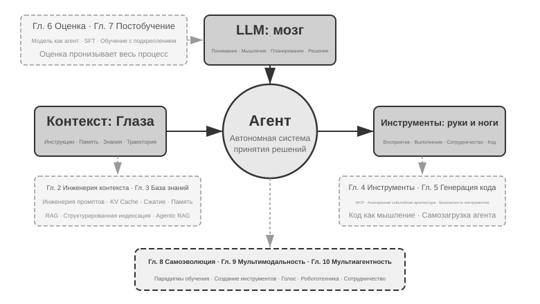
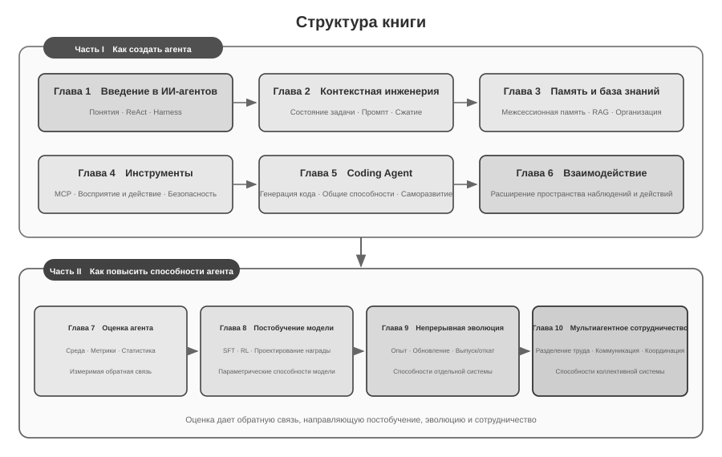

# Введение {.unnumbered}

С августа по октябрь 2025 года я провёл серию технических курсов в «Практическом лагере AI Agent» издательства «Тьюринг». Их объединял один вопрос: как проектировать ИИ-агентов на основе объяснимых, проверяемых и повторно используемых инженерных принципов, а не последовательных проб, направляемых опытом и интуицией? Поэтому работающая демонстрация не была конечной целью. Мы также разбирали, почему система принимает определённую архитектуру, где проходят границы её возможностей и какие компромиссы несёт каждое проектное решение. Эта книга систематизирует, расширяет и заново организует материалы курсов и сопутствующие эксперименты.

Создание книги само стало экспериментом по сотрудничеству человека и агента. От замысла до окончательной рукописи я в основном работал методом **whisper coding** — через диктовку — вместе с голосовым агентом Pine, используя его для исследования и итеративной правки текста. Я диктовал структуру главы; агент изучал источники и готовил первый черновик. Затем я включал отзывы слушателей и многократно проверял и пересматривал аргументы, примеры и эксперименты. Голос снизил стоимость фиксации идей и сократил цикл от постановки вопроса через поиск источников и написание текста до проверки. Поэтому книга не только исследует агентов, но и документирует способ производства знания, в котором агент участвовал непосредственно.

После выхода DeepSeek R1 в начале 2025 года внимание исследований и индустрии постепенно расширилось от возможностей базовых моделей к системному внедрению агентов. На уровне модели агентное обучение с подкреплением начинает закреплять использование инструментов и взаимодействие со средой в параметрах, усиливая общие способности к программированию, математическому рассуждению и Computer Use. На уровне продуктов Manus, Claude Code и OpenClaw изменили взаимодействие человека с компьютером и сделали связку «генерация кода + файловая система» важной системной архитектурой.

Если вновь обратиться к принципам архитектуры агентов, сформулированным в курсе, можно увидеть, что они сохраняют устойчивую объяснительную силу несмотря на быстрое развитие моделей и продуктов. Термины Skill, harness и loop engineering получили широкое распространение позднее, тогда как соответствующие инженерные практики нередко возникли раньше. Понятия представляют собой обобщение большого массива практического опыта, а не исходную точку практики. Иными словами, сначала появляется практика, а затем её название.

Эти принципы выросли прежде всего из инженерной работы над длительными и высокорисковыми системами. В качестве главного научного сотрудника Pine AI я работал с командой, создавшей Pine, чтобы агент мог общаться с людьми от имени пользователя и решать сложные задачи с реальными экономическими последствиями: согласовывать счета, разбирать споры о возврате и отменять подписки. Такие задачи часто длятся долго и требуют многих раундов, а одна ошибка может привести к реальному ущербу. Строгие требования к надёжности, безопасности и аудируемости сформировали архитектурные принципы этой книги.

- Задолго до того как понятие Skill стало популярным, мы уже применяли динамическую подгрузку промптов для решения проблемы бесконечного разрастания промптов, использовали инструмент выполнения командной строки для решения проблемы бесконечного разрастания списка инструментов, применяли технологию системной строки состояния для решения проблемы, при которой агент не осознаёт среду выполнения, время пользователя, статус работы и тому подобное.
- Задолго до того как понятие harness стало популярным, мы уже применяли подход, похожий на Claude Code, для решения проблем нестабильности вызова инструментов моделью, галлюцинаций, опасных действий, превышения полномочий и несоблюдения инструкций.
- Задолго до того как понятие loop engineering стало популярным, мы уже использовали подход, который в этой книге называется предложитель-рецензент (proposer-reviewer), для решения проблемы преждевременного признания моделью задачи завершённой.

Эти методы не являются исключительной особенностью Pine. Многие команды, работающие над моделями и агентами, независимо пришли к сходным инженерным решениям при работе с аналогичными проблемами; такая конвергенция указывает на общие ограничения агентных систем. Исходя из этих выводов, в 2025 году я открыл в издательстве «Тьюринг» практический курс по AI Agent, а в 2024–2026 годах преподавал соответствующий курс в Университете Китайской академии наук. Книга публикуется в открытом доступе, чтобы эти повторно используемые знания и опыт могли принести пользу большему числу исследователей и инженеров.

**Сначала практика, потом название.** Для корпоративной разработки агентов это означает, что практика не должна постоянно отставать от распространения понятий. К тому времени, когда термин становится отраслевым консенсусом, обозначаемая им проблема часто уже длительное время исследуется в передовых системах. Чтобы раньше выявлять и решать такие проблемы, необходимы два условия.

**Первое — выбрать реальную деятельность, предъявляющую достаточно высокие требования к пределу возможностей агента, и постоянно получать обратную связь из реального мира.** В Pine одна задача может длиться от нескольких часов до нескольких недель и требовать многократного взаимодействия с заинтересованными сторонами, продолжительных звонков, работы со сложными формами и нескольких циклов переписки. При этом необходимо гарантировать точность критически важных чисел, контролируемость операций и защиту интересов пользователя. Достаточно сложная среда постоянно выявляет разрыв между возможностями модели и требованиями бизнеса, побуждая команду строить harness и системно решать задачи, которые модель пока не может выполнить самостоятельно, но которые обязательны для бизнеса. Если требования легко покрывает следующее обновление модели, накопить устойчивые принципы проектирования системы сложнее.

**Второе — выстроить систематический механизм оценки (Evaluation).** Без оценки невозможно определить, связано ли улучшение после изменения с самим проектным решением или со случайным колебанием. Оценка превращает итерации агента из суждений, основанных на опыте, в сопоставимый и воспроизводимый инженерный процесс; это фундамент разработки систем научным методом. Седьмая глава подробно раскрывает эту методологию.

Как бы ни развивалась базовая модель, как бы ни менялась форма продукта, почти все успешные системы агентов следуют одному и тому же архитектурному паттерну. Это не случайность: **хорошие принципы проектирования должны переживать циклы обновления моделей**, потому что они описывают не способ использования какой-то конкретной модели, а базовые паттерны взаимодействия интеллектуальной системы с миром.

Лауреат премии Тьюринга, отец обучения с подкреплением Ричард Саттон говорил, что эволюция вселенной прошла четыре стадии: от пыли до звёзд, от звёзд до жизни, от жизни до агентов (в оригинале — «спроектированных сущностей», designed entities). Биологическая эволюция слепа: случайные мутации, естественный отбор. Большинство живых организмов не понимают принципов собственной работы и не способны самостоятельно проектировать и изменять живые организмы. А агент (Agent) — совершенно новый вид сущности в истории эволюции вселенной: он способен через генерацию кода осуществлять самозагрузку (bootstrap) и самоэволюцию — подобно тому, как программист пишет другого программиста, а тот, новый программист, продолжает писать следующего. Иными словами, агент способен понимать механизм собственной работы и, исходя из цели, создавать совершенно новых агентов и даже улучшать самого себя. Миссия этой книги — помочь вам понять и освоить принципы такого созидания.

Ядро книги умещается в одну формулу: **Агент = LLM + Контекст + Инструменты**. Ни одно из трёх нельзя убрать.



Более наглядно это можно выразить как **мозг + глаза + руки-ноги**. Мозг (LLM) отвечает за мышление и принятие решений, глаза (контекст) определяют, какую информацию видит агент, руки-ноги (инструменты) определяют, что агент может сделать. (Строго говоря, «глаза» — лишь приблизительная аналогия: контекст включает не только информацию о среде и историю диалога, но и, например, определения инструментов, то есть в информацию, которую агент «видит», входит и то, «какими руками-ногами он располагает». Эта метафора призвана передать главную интуицию: контекст — это всё, что модель способна воспринять.)

Для читателей, знакомых с обучением с подкреплением, эти три компонента также можно сопоставить с формальным языком RL. А именно: LLM соответствует Policy (политике), контекст — Observation Space (пространству наблюдений), инструменты — Action Space (пространству действий). Все три формулировки описывают один и тот же объект, лишь на разных уровнях выражения.


## Структура книги {.unnumbered}

Десять глав книги организованы вокруг двух взаимосвязанных вопросов (рис. 0-2). **Часть I «Как построить агента»** охватывает главы 1–6: от основных понятий через контекст, память и знания, инструменты и кодинг-агентов к расширению пространства наблюдений и действий. **Часть II «Как повысить возможности агента»** охватывает главы 7–10: оценка сначала создаёт измеримую обратную связь, после чего постобучение модели, непрерывная эволюция на основе эксплуатационного опыта и многоагентное взаимодействие расширяют возможности на уровнях параметров модели, отдельной системы и коллектива.



- **Глава 1 (Основы агента)** на примере нескольких реальных продуктов-агентов формирует интуитивное представление об агенте. Подробно разбирается базовая формула агента: от уровня реализации — LLM + Контекст + Инструменты, через интуитивный уровень — мозг + глаза + руки-ноги, до академического уровня — политика (Policy), пространство наблюдений (Observation Space) и пространство действий (Action Space). На экспериментах также разбирается механизм работы цикла ReAct, то есть итеративный процесс «думать → действовать → наблюдать», и проводится различие между контекстной адаптацией внутри задачи, обновлением внешних артефактов между задачами и обновлением параметров в цикле обучения. В конце обсуждаются паттерны оркестрации — от рабочего процесса до автономного агента, — создающие единую концептуальную рамку для последующих глав.
- **Глава 2 (Инженерия контекста)** — ключевая глава книги, систематически рассматривающая контекст, то есть «глаза» агента. Глава начинается со структуры сообщений API и основного цикла агента, закладывая базовое понимание «контекст — это список сообщений», затем углубляется в фундаментальные принципы KV Cache (механизма повторного использования результатов прошлых вычислений в процессе вывода большой модели), после чего последовательно раскрывает инженерию промптов (Prompt Engineering, включая процессно-ориентированное проектирование, описание инструментов и детализацию бизнес-правил) и защиту от инъекций промпта (Prompt Injection), механизм подгрузки Agent Skills по требованию, технологию строки состояния агента и стратегии сжатия контекста (Context Compression). Полные определения терминов даются при первом появлении в основном тексте.
- **Глава 3 (Память пользователя и база знаний)** расширяет управление контекстом до персистентной межсессионной системы знаний, чтобы агент мог не только помнить содержание текущего диалога, но и накапливать и использовать знания из множества диалогов. Рассматриваются четыре прогрессивные стратегии памяти пользователя, полный технологический стек RAG (генерации с расширением поиском, то есть сначала выполняется поиск релевантных документов, а затем модель генерирует ответ), включая различные методы текстового поиска и оптимизацию ранжирования результатов, извлечение мультимодальной информации, более продвинутые методы организации знаний, а также агентный RAG (Agentic RAG, то есть предоставление агенту возможности самостоятельно решать, когда и что искать).
- **Глава 4 (Инструменты)** исследует мост, соединяющий агента с внешним миром: инструменты служат ему «руками и ногами», позволяя искать информацию в вебе, вызывать API и работать с базами данных. Рассматриваются стандарт совместимости MCP и принципы проектирования пяти категорий инструментов — восприятия, выполнения, сотрудничества, срабатывания событий и коммуникации с пользователем, — с акцентом на безопасности инструментов выполнения. Срабатывание событий, коммуникация с пользователем и асинхронная среда выполнения подробно рассматриваются в главе 6.
- **Глава 5 (Coding Agent и генерация кода)** обосновывает, что Coding Agent в сочетании с файловой системой представляет собой ключевую техническую основу любого универсального агента. На примере архитектуры OpenClaw разбираются рабочий процесс и приёмы реализации Coding Agent, а также демонстрируется широкая ценность генерации кода за пределами программирования: от поддержки мышления и построения базы знаний до динамического создания новых инструментов и самозагрузки агента.
- **Глава 6 (Взаимодействие: расширение пространства наблюдений и действий)** рассматривает взаимодействие агента со средой в двух измерениях — **модальности** и **времени**. Асинхронные событийные системы позволяют постоянно принимать внешние события и отвечать на них; голос приближает восприятие, рассуждение и генерацию к реальному времени; Computer Use расширяет пространство действий до графических интерфейсов, а робототехника — до физической среды. Общими системными примитивами служат пробуждение, безопасные точки, отмена, вытеснение и разделение быстрых и медленных путей.
- **Глава 7 (Оценка агента)** выстраивает научную методологию оценки. Она охватывает среды оценки — два основных паттерна, вызов инструментов и человеко-машинное взаимодействие, а также отдельно рассматриваемые в конце главы имитационные среды, — принципы проектирования датасетов, методы автоматизированной оценки LLM-as-a-Judge, выбор модели на основе оценки и полный замкнутый цикл преобразования результатов оценки в улучшения системы.
- **Глава 8 (Постобучение модели)** углубляется в две технологии постобучения: SFT (дообучение с учителем, то есть обучение модели «делать по образцу» на размеченных данных) и RL (обучение с подкреплением, то есть предоставление модели возможности самостоятельно совершенствоваться через пробы, ошибки и обратную связь в форме вознаграждения). Опираясь на тезисы «SFT запоминает, RL обобщает» и «данные и среда важнее алгоритма», глава охватывает полную картину трёх стадий — предобучение/SFT/RL, классическую теорию RL, проектирование сигнала вознаграждения — от бинарного и процессного вознаграждения до штрафа за нарушение пути проверки в рамках принципа «вознаграждать результат, ограничивать процесс», — однораундовые и многораундовые алгоритмы обучения с подкреплением, а также передовые исследования в области оптимизации эффективности использования выборки.
- **Глава 9 (Непрерывная эволюция агента)** исследует, как преобразовать опыт эксплуатации агента в способности его следующей версии. Сначала выстраиваются сигналы обучения, состоящие из результатов среды, правил процесса и LLM Rubric; затем сравниваются четыре носителя обновлений — документы знаний, Prompt и Skills, программы и Harness, параметры модели; наконец обсуждаются проверка кандидатных версий, поэтапный выпуск, откат и долгосрочная консолидация.
- **Глава 10 (Мультиагентное сотрудничество)** расширяет рассмотрение от возможностей отдельного агента к координации на уровне системы и исследует распределение труда между несколькими агентами. Систематически излагается классификационная рамка — общий/независимый контекст × равноправная/управляющая/децентрализованная организация, — а на примерах агента-переводчика и координации телефонного и компьютерного агентов демонстрируются методы проектирования архитектуры. В завершение обсуждаются возможные направления развития обществ и экономик агентов.

## Как читать эту книгу {.unnumbered}

Главы книги относительно независимы друг от друга — вы можете выбрать маршрут чтения, исходя из ваших потребностей:

- **Если вы разрабатываете агентов**, читайте книгу по порядку: главы 1–6 формируют целостный метод построения агента, а главы 7–10 рассматривают развитие возможностей через оценку, постобучение модели, непрерывную эволюцию и многоагентное взаимодействие.
- **Если у вас мало времени**, в первую очередь прочитайте главу 1, формирующую целостное представление, и главу 2, раскрывающую важнейшую тему — инженерию контекста. Фундаментальные принципы KV Cache во второй главе довольно технические: при первом чтении можно пропустить раздел с принципами и запомнить лишь три ключевых вывода, приведённых в начале, — это не помешает пониманию дальнейшего материала.
- **Если вас интересует обучение моделей**, можно сразу перейти к главе 8 (Постобучение модели); при этом методы оценки из главы 7 являются предпосылкой обучения, поэтому рекомендуется прочитать обе главы, а перед ними — главы 1–2, чтобы сформировать целостное представление.

Каждая глава содержит множество **экспериментов** и **вопросов для размышления**, оформленных в формате «Эксперимент X-Y» (X — номер главы, Y — порядковый номер внутри главы). В заголовках экспериментов и вопросов сложность отмечена звёздами: ★ означает начальный уровень, подходит всем читателям; ★★ означает средний уровень сложности, требующий определённой инженерной практики; ★★★ означает продвинутый вызов, обычно связанный с открытой задачей или сложным системным проектированием. К большинству экспериментов прилагается полностью рабочий код, организованный в сопутствующем открытом репозитории:

> **Сопутствующий репозиторий с кодом**: [https://github.com/bojieli/ai-agent-book](https://github.com/bojieli/ai-agent-book)

Весь сопутствующий код можно получить с помощью Git:

```bash
git clone https://github.com/bojieli/ai-agent-book.git
cd ai-agent-book
```

Если вы не используете Git, на странице репозитория можно также выбрать **Code → Download ZIP**. Код экспериментов организован по главам в каталогах от `chapter1/` до `chapter10/`. Чтобы найти «Эксперимент X-Y», откройте соответствующий файл `chapterX/README.ru.md`, по номеру эксперимента найдите каталог проекта, а затем следуйте README этого проекта для установки зависимостей и запуска. Некоторые эксперименты, отмеченные как руководства по воспроизведению, зависят от внешних репозиториев; способы их получения также описаны в соответствующих README.

Настоятельно рекомендую вам самостоятельно прогнать эти эксперименты. ИИ-агенты — область с чрезвычайно высокой практической составляющей, и многие проектные интуиции по-настоящему складываются только в процессе ручной отладки.


## Необходимые предварительные знания {.unnumbered}

Эта книга рассчитана на читателей с определённой технической подготовкой, но не требует, чтобы вы были экспертом в какой-то конкретной области. Ниже перечислены предварительные знания по двум уровням — «обязательные» и «рекомендуемые», — которые помогут вам оценить свою готовность.

**Обязательные: основа для чтения всей книги**

- **Программирование на Python**: почти все эксперименты в книге основаны на Python. Вам нужно знать базовый синтаксис Python, распространённые структуры данных, базовые понятия управления пакетами (pip). Глубокое владение не требуется, но вы должны уметь читать и модифицировать код средней сложности.
- **Опыт работы с LLM**: вы должны были пользоваться ChatGPT, Claude или похожими продуктами и понимать базовую схему взаимодействия «промпт → ответ модели».
- **Один из инструментов ИИ-ассистированного программирования**: настоятельно рекомендуется установить и освоить хотя бы один такой инструмент — например, Claude Code, Codex, Cursor, TRAE и т. п. С одной стороны, эти инструменты значительно повышают эффективность разработки в экспериментах книги, которые включают немало написания и отладки кода. С другой — сами эти инструменты представляют собой зрелые кодинг-агенты, и, работая с ними, вы на собственном опыте почувствуете цикл ReAct, вызов инструмента, управление контекстом и другие ключевые механизмы, которые многократно обсуждаются в книге. Такой непосредственный опыт крайне полезен для понимания принципов проектирования агентов.
- **Общая инженерная грамотность**: знакомство с командной строкой, системой контроля версий Git, форматом данных JSON, REST API и другими базовыми понятиями. Это фундамент для запуска экспериментов и понимания механизма вызова инструментов агентом.

**Рекомендуемые: улучшают восприятие отдельных глав**

- **Основы машинного обучения** (глава 8): понимание обучения и вывода, функции потерь, градиентного спуска, переобучения и других базовых понятий поможет разобраться в постобучении моделей.
- **Базовая математика** (главы 2–3, 7): интуитивное понимание линейной алгебры (например, знание того, что вектор может представлять направление и величину, а матрица — выполнять пакетные операции) поможет разобраться в эмбеддингах и механизме внимания; базовые знания теории вероятностей и статистики пригодятся для понимания метрик оценки и ожидаемой награды в обучении с подкреплением. Математика в книге не включает сложных выкладок и делает упор на интуитивные объяснения.
- **Основы веб-разработки** (глава 6): понимание HTTP, WebSocket, архитектуры с разделением фронтенда и бэкенда поможет разобраться в событийно-ориентированной асинхронной архитектуре агентов и в экспериментах по реал-таймовой коммуникации голосовых агентов.
- **Базовое представление об архитектуре Transformer** (главы 2, 8): Transformer — это базовая архитектура практически всех современных больших языковых моделей. Читателям, желающим системно восполнить знания о больших моделях, рекомендуем книгу «Иллюстрированное объяснение больших моделей» (издательство «Турин»). Она наглядно, с помощью иллюстраций, объясняет архитектуру Transformer, предобучение и тонкую настройку и другие ключевые понятия, хорошо дополняя инженерный взгляд на агентов, представленный в этой книге.

Если у вас недостаёт каких-то из перечисленных знаний, не стоит из-за этого отказываться от чтения. Главная ценность этой книги — в **принципах архитектурного проектирования и методологии инженерной практики**, а не в конкретных алгоритмах или приёмах. За исключением главы 8 о постобучении, требования книги к математике и машинному обучению невысоки, так что она вполне может стать вашей отправной точкой.

Технологии агентов всё ещё быстро развиваются, но **хорошие принципы архитектурного проектирования обладают силой, устойчивой во времени**. Освоив, «почему нужно проектировать именно так», вы сохраните ясное суждение сквозь смену технологических волн. Надеюсь, эта книга станет для вас надёжным руководством по созданию ИИ-агентов.

## Благодарности {.unnumbered}

Благодарю редакторов издательства «Турин» — Мэн Гэ и Лю Мэйин — за кропотливую редакторскую работу, а также за усилия по организации курса «AI Agent Практикум» издательства «Турин»; благодарю преподавателя Лю Цзюньмина за открытие практического курса по ИИ-агентам в Университете Китайской академии наук. Особая благодарность всем слушателям курса «AI Agent Практикум» издательства «Турин», а также всем студентам практического курса по ИИ-агентам в Университете Китайской академии наук — в процессе преподавания этих курсов вы дали мне множество ценных отзывов и предложений, которые помогли мне самому яснее понять эти концепции.

Благодарю всех коллег из Pine AI. Если бы не такой прекрасный продукт, как Pine AI, и все вызовы, которые он принёс, я бы не смог достичь такого глубокого понимания и практического опыта в области агентов; в бесчисленных спорах и обсуждениях коллеги также внесли огромный вклад ценными идеями.

Благодарю также многих друзей из индустрии ИИ (не буду перечислять всех поимённо). В различных отраслевых дискуссиях они честно отзывались о моих взглядах, исправляли немало моих ошибочных суждений и углубляли моё понимание моделей и агентов.

Больше всего я благодарен своей семье, особенно моей жене Мэн Цзяин. Она всегда поддерживала меня в работе над этой книгой и внесла немало ценных предложений.
