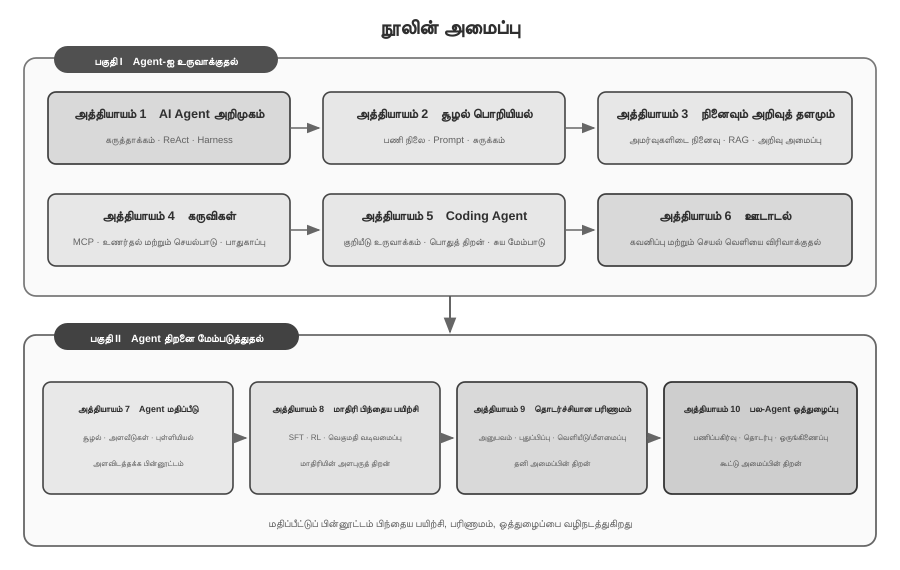

# அறிமுகம் {.unnumbered}

ஆகஸ்ட் முதல் அக்டோபர் 2025 வரை, டூரிங் (Turing) நடத்திய *AI Agent Bootcamp* இல் தொழில்நுட்பப் பாடத் தொடரை நடத்தினேன். அனுபவமும் உள்ளுணர்வும் வழிநடத்தும் தொடர் முயற்சிகளுக்கு மாற்றாக, விளக்கக்கூடிய, சரிபார்க்கக்கூடிய, மீண்டும் பயன்படுத்தக்கூடிய பொறியியல் கொள்கைகளின் அடிப்படையில் AI ஏஜெண்ட்களை எவ்வாறு வடிவமைப்பது என்பதே பாடங்களின் மையக் கேள்வி. ஆகவே ஒரு டெமோவை இயக்குவது இறுதி இலக்கு அல்ல. குறிப்பிட்ட கட்டமைப்பு ஏன் தேர்ந்தெடுக்கப்படுகிறது, அதன் திறன் எல்லைகள் எவை, ஒவ்வொரு வடிவமைப்பு முடிவும் எந்தப் பரிமாற்றங்களை ஏற்படுத்துகிறது என்பதையும் ஆய்ந்தோம். இந்த நூல் அந்தப் பாடப் பொருட்களையும் துணைச் சோதனைகளையும் முறையாக ஒழுங்கமைத்து, விரிவாக்கி, மறுகட்டமைத்த வடிவமாகும்.

இந்த நூல் உருவாக்கப்பட்ட விதமே மனிதர்–ஏஜெண்ட் ஒத்துழைப்பின் ஒரு பரிசோதனையாக இருந்தது. தொடக்கக் கருத்திலிருந்து இறுதிக் கையெழுத்துப் பிரதிவரை, ஆய்வு மற்றும் உரைத் திருத்தத்திற்காக Pine குரல் ஏஜெண்டுடன் **விஸ்பர் கோடிங்** (whisper coding), அதாவது வாய்மொழிக் கூட்டுப்பணி முறையில் பணியாற்றினேன். நான் அத்தியாயத்தின் வரைவை வாய்மொழியாகக் கொடுத்தேன்; ஏஜெண்ட் தொடர்புடைய ஆதாரங்களை ஆய்ந்து முதல் பிரதியைத் தயாரித்தது. பின்னர் மாணவர் பின்னூட்டத்தைச் சேர்த்து, வாதங்கள், எடுத்துக்காட்டுகள், சோதனைகள் ஆகியவற்றைப் பல சுற்றுகள் சரிபார்த்து திருத்தினேன். குரல், எண்ணங்களை வெளிப்படுத்தும் செலவைக் குறைத்து, கேள்வி அமைத்தல் முதல் ஆதாரத் தேடல், எழுதுதல், சரிபார்த்தல் வரையிலான சுழற்சியைச் சுருக்கியது. எனவே இந்த நூல் ஏஜெண்ட்களைப் பற்றி மட்டும் பேசவில்லை; ஏஜெண்ட் ஆழமாகப் பங்கேற்ற அறிவு உற்பத்தி முறையையும் பதிவுசெய்கிறது.

2025 தொடக்கத்தில் DeepSeek R1 வெளியானதிலிருந்து, AI ஆராய்ச்சி மற்றும் தொழில் நடைமுறையின் கவனம் அடித்தள மாதிரி திறனிலிருந்து ஏஜெண்ட்களின் முறைப்படுத்தப்பட்ட பயன்பாட்டுக்கு விரிந்துள்ளது. மாதிரி நிலையில், Agentic Reinforcement Learning கருவி பயன்பாட்டையும் சூழல் தொடர்பையும் அளவுருக்களில் உட்புகுத்தி, நிரலாக்கம், கணிதச் சிந்தனை மற்றும் Computer Use ஆகிய பொதுத் திறன்களை வலுப்படுத்துகிறது. தயாரிப்பு நிலையில் Manus, Claude Code, OpenClaw போன்ற பொதுவான ஏஜெண்ட்கள் மனித–கணினி தொடர்பை மாற்றி, ‘குறியீடு உருவாக்கம் + கோப்பு முறைமை’ என்பதை முக்கிய அமைப்பு கட்டமைப்பாக மாற்றியுள்ளன.

பாடத்திட்டத்தில் தொகுக்கப்பட்ட Agent கட்டமைப்புக் கொள்கைகளை மீண்டும் ஆராய்ந்தால், மாதிரிகளும் தயாரிப்புகளும் வேகமாக மாறினாலும் அவை நிலையான விளக்கத் திறனைத் தக்கவைத்துள்ளன என்பதை காணலாம். Skill, harness, loop engineering போன்ற சொற்கள் பின்னரே பரவலாகப் பயன்படுத்தப்பட்டன; அவற்றுக்குரிய பொறியியல் நடைமுறைகள் பெரும்பாலும் முன்பே தோன்றியிருந்தன. கருத்தாக்கம் என்பது பல நடைமுறை அனுபவங்களின் பொதுமைப்படுத்தலே அன்றி, நடைமுறையின் தொடக்கப்புள்ளி அல்ல. வேறு சொற்களில், நடைமுறை முதலில் வருகிறது; பெயரிடுதல் பின்னர் வருகிறது.

இந்தக் கொள்கைகள் நீண்டகால, உயர்-ஆபத்து அமைப்புகளைப் பொறியமைத்த அனுபவத்திலிருந்து முதன்மையாக வந்தவை. Pine AI-இன் Chief Scientist ஆக, பயனருக்குப் பதிலாக மனிதர்களுடன் தொடர்புகொண்டு, கட்டணப் பேச்சுவார்த்தை, பணத்திருப்பல் சர்ச்சை, சந்தா ரத்து போன்ற உண்மையான பொருளாதார நலன்கள் கொண்ட சிக்கலான பணிகளை ஏஜெண்ட் கையாள Pine-ஐ உருவாக்கிய குழுவுடன் பணியாற்றினேன். இப்பணிகள் நீண்ட காலமும் பல சுற்றுகளும் நீளலாம்; ஒரு தவறான படியே உண்மையான இழப்பை ஏற்படுத்தலாம். நம்பகத்தன்மை, பாதுகாப்பு, தணிக்கைத்தன்மை ஆகிய கடுமையான தேவைகள் இந்த நூலின் கட்டமைப்புக் கொள்கைகளை உருவாக்கின.

- Skill என்ற கருத்து பிரபலமடைவதற்கு நீண்ட காலத்திற்கு முன்பே, prompt bloat பிரச்சினையைத் தீர்க்க dynamic prompt loading ஐயும், tool list bloat பிரச்சினையைத் தீர்க்க command-line execution tools ஐயும், Agent செயலாக்கச் சூழல், பயனர் நேரம் அல்லது பணி நிலையை உணராமல் இருப்பதைத் தீர்க்க system status bar தொழில்நுட்பத்தையும் நாங்கள் ஏற்கனவே பயன்படுத்தி வந்தோம்.
- harness என்ற கருத்து பிரபலமடைவதற்கு நீண்ட காலத்திற்கு முன்பே, மாதிரியின் tool call நிலையற்ற தன்மை, மாயத்தோற்றங்கள், ஆபத்தான செயல்பாடுகள், அங்கீகரிக்கப்படாத செயல்பாடுகள் மற்றும் அறிவுறுத்தல்களைப் பின்பற்றாமை போன்ற பிரச்சினைகளைத் தீர்க்க Claude Code ஐப் போன்ற முறைகளை நாங்கள் ஏற்கனவே பயன்படுத்தி வந்தோம்.
- loop engineering என்ற கருத்து பிரபலமடைவதற்கு நீண்ட காலத்திற்கு முன்பே, மாதிரிகள் ஒரு பணி முடிந்துவிட்டதாக முன்கூட்டியே கருதும் பிரச்சினையைத் தீர்க்க, இந்த நூல் proposer-reviewer என்று அழைக்கும் முறையை நாங்கள் ஏற்கனவே பயன்படுத்தி வந்தோம்.

இந்த முறைகள் Pine-க்கு மட்டும் உரியவை அல்ல. ஒத்த சிக்கல்களைத் தீர்க்கும்போது பல மாதிரி மற்றும் Agent குழுக்கள் ஒன்றுக்கொன்று நெருக்கமான பொறியியல் முறைகளைச் சுயாதீனமாக உருவாக்கியுள்ளன; இந்த ஒற்றுமை Agent அமைப்புகளின் பொதுவான கட்டுப்பாடுகளை அவை பிரதிபலிப்பதைக் காட்டுகிறது. இந்தப் புரிதல்களின் அடிப்படையில், 2025-இல் டூரிங்கில் “AI Agent Bootcamp” பாடத்தையும், 2024–2026 காலத்தில் சீன அறிவியல் அகாடமி பல்கலைக்கழகத்தில் AI Agent நடைமுறைப் பாடத்தையும் கற்பித்தேன். மீண்டும் பயன்படுத்தக்கூடிய இந்த அறிவும் அனுபவமும் அதிகமான ஆராய்ச்சியாளர்களுக்கும் பொறியாளர்களுக்கும் பயன்படவே இந்நூல் திறந்த மூலமாக வெளியிடப்படுகிறது.

**நடைமுறை முதலில் வருகிறது; பெயரிடுதல் பின்னர் வருகிறது.** நிறுவன Agent மேம்பாட்டில், கருத்துகள் பரவுவதற்குப் பின்னால் நடைமுறை எப்போதும் தங்கிவிடக் கூடாது என்பதே இதன் பொருள். ஒரு சொல் தொழில்துறை ஒருமித்த கருத்தாகும் நேரத்தில், அது குறிக்கும் சிக்கல் முன்னணி அமைப்புகளில் ஏற்கனவே நீண்டகாலம் ஆராயப்பட்டிருக்கலாம். அத்தகைய சிக்கல்களை முன்கூட்டியே கண்டறிந்து தீர்க்க இரண்டு முக்கிய நிபந்தனைகள் தேவை.

**முதலாவதாக, Agent-இன் திறன் வரம்பில் போதுமான உயர்ந்த தேவைகளை விதிக்கும் உண்மையான வணிகப் பணியைத் தேர்ந்தெடுத்து, தொடர்ந்து உண்மையான பின்னூட்டத்தைப் பெற வேண்டும்.** Pine-இல் ஒரு பணி மணிநேரங்கள் முதல் வாரங்கள் வரை நீளலாம்; பல பங்குதாரர்களுடன் மீண்டும் மீண்டும் ஒருங்கிணைத்தல், நீண்ட தொலைபேசி அழைப்புகள், சிக்கலான படிவங்கள் மற்றும் பல மின்னஞ்சல் சுற்றுகள் தேவைப்படலாம். அதே நேரத்தில் முக்கிய எண்களின் துல்லியம், செயல்பாடுகளின் கட்டுப்படுத்தத்தன்மை மற்றும் பயனரின் நலன் உறுதிசெய்யப்பட வேண்டும். போதுமான சிக்கலுள்ள சூழல், மாதிரியின் திறனுக்கும் வணிகத் தேவைக்கும் இடையிலான இடைவெளியைத் தொடர்ந்து வெளிப்படுத்தி, மாதிரி இன்னும் தனியாகச் செய்ய முடியாத ஆனால் வணிகம் கட்டாயமாக நிறைவேற்ற வேண்டியவற்றை முறையாகத் தீர்க்க harness உருவாக்கக் குழுவைத் தூண்டுகிறது. அடுத்த மாதிரி மேம்படுத்தலே தேவைகளை எளிதாக நிறைவேற்றுமானால், நிலையான அமைப்பு வடிவமைப்புக் கொள்கைகளைச் சேர்ப்பது கடினமாகும்.

**இரண்டாவதாக, முறையான மதிப்பீட்டு (Evaluation) பொறிமுறையை நிறுவ வேண்டும்.** மதிப்பீடு இல்லாமல், ஒரு மாற்றத்துக்குப் பிந்தைய மேம்பாடு வடிவமைப்பிலிருந்தே வந்ததா அல்லது சீரற்ற மாறுபாட்டிலிருந்தா என்பதைத் தீர்மானிக்க முடியாது. மதிப்பீடு Agent-இன் மறுசெயல் மேம்பாட்டை அனுபவ அடிப்படையிலான தீர்ப்பிலிருந்து ஒப்பிடக்கூடிய, மீண்டும் உருவாக்கக்கூடிய பொறியியல் செயல்முறையாக மாற்றுகிறது; அறிவியல் முறையில் அமைப்புகளை உருவாக்குவதற்கான அடித்தளம் இதுவே. அத்தியாயம் 7 இந்த முறையை விரிவாக விவாதிக்கிறது.

அடிப்படை மாதிரிகள் எவ்வாறு மேம்படுத்தப்பட்டாலும் அல்லது தயாரிப்பு வடிவங்கள் எவ்வாறு புதுமைப்படுத்தப்பட்டாலும், கிட்டத்தட்ட அனைத்து வெற்றிகரமான ஏஜெண்ட் அமைப்புகளும் ஒரே கட்டமைப்பு முறைகளைப் பின்பற்றுகின்றன. இது தற்செயல் நிகழ்வு அல்ல: **நல்ல வடிவமைப்புக் கொள்கைகள் மாதிரி மறுசெயல் சுழற்சிகளை மீறி நிற்க வேண்டும்**, ஏனெனில் அவை ஒரு குறிப்பிட்ட மாதிரியின் பயன்பாட்டை அல்ல, மாறாக அறிவார்ந்த அமைப்புகளுக்கும் உலகத்திற்கும் இடையிலான அடிப்படை தொடர்பு முறைகளை விவரிக்கின்றன.

டூரிங் விருது பெற்றவரும் வலுவூட்டல் கற்றலின் தந்தையுமான ரிச்சர்ட் சட்டன், பிரபஞ்சத்தின் பரிணாமம் நான்கு நிலைகளைக் கடந்து வந்துள்ளது என்று ஒருமுறை கூறினார்: தூசியிலிருந்து நட்சத்திரங்கள், நட்சத்திரங்களிலிருந்து உயிர், உயிரிலிருந்து ஏஜெண்டுகள் வரை (அவர் முதலில் இதை designed entities—"வடிவமைக்கப்பட்ட இருப்புகள்"—என்றே குறிப்பிட்டார்). உயிரியல் பரிணாமம் குருடானது: சீரற்ற பிறழ்வு, இயற்கைத் தேர்வு. பெரும்பாலான உயிரினங்கள் தங்கள் சொந்த செயல்பாட்டுக் கொள்கைகளைப் புரிந்துகொள்வதில்லை, மேலும் தங்களைத் தாங்களே வடிவமைத்து மாற்றிக்கொள்ள முடியாது. இருப்பினும், ஏஜெண்டுகள் பிரபஞ்ச பரிணாம வரலாற்றில் முற்றிலும் புதிய இருப்பு: அவை குறியீட்டை உருவாக்குவதன் மூலம் பூட்ஸ்ட்ராப் மற்றும் சுய-பரிணாமத்தை அடைய முடியும், ஒரு புரோகிராமர் மற்றொரு புரோகிராமரை எழுதுவது போல, புதிய புரோகிராமர் அடுத்ததை எழுதுவதைத் தொடரலாம். அதாவது, ஏஜெண்டுகள் தங்கள் சொந்த இயக்க வழிமுறைகளைப் புரிந்துகொண்டு, இலக்குகளின் அடிப்படையில் முற்றிலும் புதிய ஏஜெண்டுகளை உருவாக்க முடியும், மேலும் தங்களை மேம்படுத்திக்கொள்ளவும் முடியும். இந்த உருவாக்கத்தின் கொள்கைகளை நீங்கள் புரிந்து கைவரப் பெற உதவுவதே இந்த நூலின் நோக்கம்.

இந்த புத்தகத்தின் மைய சூத்திரம் ஒரே ஒரு வாக்கியம்: **ஏஜெண்ட் = LLM + Context + Tools**. இந்த மூன்றும் இன்றியமையாதவை.


மேலும் உள்ளுணர்வாக, இது **மூளை + கண்கள் + கைகள் மற்றும் கால்கள்**. மூளை (LLM) சிந்தனை மற்றும் முடிவெடுப்பதற்குப் பொறுப்பு, கண்கள் (Context) ஏஜெண்ட் என்ன தகவலைப் பார்க்க முடியும் என்பதைத் தீர்மானிக்கிறது, மேலும் கைகள் மற்றும் கால்கள் (Tools) ஏஜெண்ட் என்ன செய்ய முடியும் என்பதைத் தீர்மானிக்கிறது. (கண்டிப்பாகச் சொன்னால், "கண்கள்" என்பது ஒரு தோராயமான ஒப்புமை: Context என்பது சுற்றுச்சூழல் தகவல் மற்றும் உரையாடல் வரலாறு மட்டுமல்ல, கருவி வரையறைகளையும் உள்ளடக்கியது, அதாவது ஏஜெண்ட் "பார்க்கும்" தகவலில் "என்ன கைகள் மற்றும் கால்கள் கிடைக்கின்றன" என்பதும் அடங்கும். இந்த உருவகம் மைய உள்ளுணர்வை வெளிப்படுத்துவதை நோக்கமாகக் கொண்டுள்ளது: Context என்பது மாதிரி உணரக்கூடிய அனைத்து தகவலும் ஆகும்.)

வலுவூட்டல் கற்றலில் அறிந்த வாசகர்களுக்கு, இந்த மூன்றையும் RL இன் முறையான மொழியில் வரைபடமாக்கலாம். குறிப்பாக, LLM என்பது Policy ஐயும், Context என்பது Observation Space ஐயும், Tools என்பது Action Space ஐயும் ஒத்துள்ளது. இந்த மூன்று வெளிப்பாடுகளும் ஒரே பொருளைக் குறிக்கின்றன, வெவ்வேறு சுருக்க நிலைகளில் மட்டுமே.


## புத்தக அமைப்பு {.unnumbered}

இந்த நூலின் பத்து அத்தியாயங்கள் ஒன்றோடொன்று தொடர்புடைய இரண்டு கேள்விகளைச் சுற்றி அமைக்கப்பட்டுள்ளன (படம் 0-2). **பகுதி I, “ஒரு ஏஜெண்டை எவ்வாறு உருவாக்குவது”,** அத்தியாயங்கள் 1–6-ஐ உள்ளடக்குகிறது: அடிப்படைக் கருத்துகளிலிருந்து சூழல், நினைவகம் மற்றும் அறிவு, கருவிகள், Coding Agent, அவதானிப்பு மற்றும் செயல் வெளிகளின் விரிவாக்கம் வரை செல்கிறது. **பகுதி II, “ஏஜெண்டின் திறன்களை எவ்வாறு மேம்படுத்துவது”,** அத்தியாயங்கள் 7–10-ஐ உள்ளடக்குகிறது: மதிப்பீடு முதலில் அளவிடக்கூடிய பின்னூட்டத்தை நிறுவுகிறது; பின்னர் மாதிரி பிந்தைய பயிற்சி, இயக்க அனுபவத்தை அடிப்படையாகக் கொண்ட தொடர்ச்சியான பரிணாமம் மற்றும் பல-ஏஜெண்ட் ஒத்துழைப்பு ஆகியவை மாதிரி அளவுரு, தனி அமைப்பு மற்றும் குழு அமைப்பு நிலைகளில் திறனை விரிவாக்குகின்றன.



- **அத்தியாயம் 1 (Agent அடிப்படை அறிவு)** பல உண்மையான Agent தயாரிப்புகளிலிருந்து தொடங்கி, Agent குறித்த உள்ளுணர்வுப் புரிதலை நிறுவுகிறது. Agent-இன் மையச் சூத்திரத்தை ஆழமாகப் பகுப்பாய்வு செய்கிறது: செயலாக்க அடுக்கிலுள்ள LLM + Context + Tools என்பதிலிருந்து, உள்ளுணர்வு அடுக்கிலுள்ள மூளை + கண்கள் + கைகளும் கால்களும் வரை, பின்னர் கல்விசார் அடுக்கிலுள்ள Policy, Observation Space மற்றும் Action Space வரை. அதே நேரத்தில், சோதனைகள் மூலம் ReAct சுழற்சியின் இயக்க முறையை, அதாவது “சிந்தி→செயல்படு→கவனி” என்ற மறுசெயல் செயல்முறையைப் பகுப்பாய்வு செய்து, பணிக்குள் நிகழும் Context தழுவல், பணிகளுக்கு இடையேயான வெளிப்புற artifact புதுப்பிப்பு மற்றும் பயிற்சிச் சுழற்சியிலான parameter புதுப்பிப்பு ஆகியவற்றை வேறுபடுத்துகிறது. இறுதியாக, workflow முதல் தன்னாட்சி Agent வரையிலான orchestration வடிவமைப்பு முறைகளை விவாதித்து, அடுத்தடுத்த அத்தியாயங்களுக்கான ஒருங்கிணைந்த கருத்தியல் கட்டமைப்பை நிறுவுகிறது.
- **அத்தியாயம் 2 (Context Engineering)** இந்நூலின் மிக முக்கியமான அத்தியாயமாகும்; இது Agent-இன் “கண்கள்” ஆகிய Context-ஐ முறையாக விளக்குகிறது. API செய்தி அமைப்பு மற்றும் Agent-இன் மையச் சுழற்சியிலிருந்து தொடங்கி, “Context என்பது செய்திகளின் பட்டியல்” என்ற அடித்தளத்தை நிறுவுகிறது; பின்னர் KV Cache-இன் அடிப்படைக் கொள்கைகளை—LLM inference நேரத்தில் வரலாற்றுக் கணக்கீட்டு முடிவுகளை மீண்டும் பயன்படுத்தும் பொறிமுறையை—ஆழமாக ஆராய்கிறது. அதைத் தொடர்ந்து Prompt Engineering (செயல்முறை வடிவமைப்பு, tool விளக்கங்கள், வணிக விதிகளைச் செம்மைப்படுத்துதல் உட்பட), Prompt Injection தாக்குதலும் தற்காப்பும், Agent Skills-இன் தேவைக்கேற்ற ஏற்றும் பொறிமுறை, Agent status bar தொழில்நுட்பம் மற்றும் Context Compression உத்திகள் ஆகியவற்றை விரிவுபடுத்துகிறது. ஒவ்வொரு சொல்லின் முழுமையான வரையறையும் முதன்மை உரையில் அது முதலில் தோன்றும் இடத்தில் வழங்கப்படுகிறது.
- **அத்தியாயம் 3 (பயனர் நினைவகம் மற்றும் அறிவுத் தளங்கள்)** Context மேலாண்மையை அமர்வுகளுக்கு இடையேயான நிலையான அறிவு அமைப்பாக விரிவுபடுத்துகிறது; இதனால் Agent தற்போதைய உரையாடலின் உள்ளடக்கத்தை நினைவில் வைத்திருப்பதுடன், பல உரையாடல்களுக்கிடையே அறிவைக் குவித்துப் பயன்படுத்தவும் முடிகிறது. பயனர் நினைவகத்திற்கான நான்கு படிப்படியான உத்திகள், RAG-இன் முழுமையான தொழில்நுட்ப அடுக்கு—Retrieval-Augmented Generation, அதாவது தொடர்புடைய ஆவணங்களை முதலில் மீட்டெடுத்து பின்னர் மாதிரி பதிலை உருவாக்குதல்—வெவ்வேறு உரைத் தேடல் முறைகள் மற்றும் தேடல் முடிவுகளின் தரவரிசை உகப்பாக்கம், பல்மாதிரி தகவல் பிரித்தெடுத்தல், மேம்பட்ட அறிவு ஒழுங்கமைப்பு முறைகள் மற்றும் Agentic RAG—எப்போது, எதை மீட்டெடுக்க வேண்டும் என்பதை Agent தன்னாட்சியாகத் தீர்மானித்தல்—ஆகியவற்றை உள்ளடக்குகிறது.
- **அத்தியாயம் 4 (Tools)** Agent-க்கும் வெளி உலகிற்கும் இடையிலான பாலத்தை ஆராய்கிறது: Tools, Agent-இன் “கைகளும் கால்களும்” போல இணையத் தேடல், API அழைப்புகள் மற்றும் தரவுத்தளச் செயல்பாடுகளைச் சாத்தியமாக்குகின்றன. MCP tool interoperability தரநிலையையும், உணர்தல், செயலாக்கம், ஒத்துழைப்பு, நிகழ்வுத் தூண்டுதல், பயனர் தொடர்பு என்ற ஐந்து Tool வகைகளின் வடிவமைப்புக் கொள்கைகளையும் அறிமுகப்படுத்தி, குறிப்பாக செயலாக்க Tools-இன் பாதுகாப்பில் கவனம் செலுத்துகிறது. நிகழ்வுத் தூண்டுதல், பயனர் தொடர்பு மற்றும் ஒத்திசைவற்ற இயக்கச் சூழல் அத்தியாயம் 6-இல் விரிவுபடுத்தப்படுகின்றன.
- **அத்தியாயம் 5 (Coding Agent மற்றும் குறியீடு உருவாக்கம்)** Coding Agent-உம் கோப்பு முறைமையும் சேர்ந்ததே அனைத்து பொது-நோக்க Agent-களின் மிக முக்கியமான தொழில்நுட்ப அடித்தளம் என்று வாதிடுகிறது. OpenClaw கட்டமைப்பை முதன்மை நூலாகக் கொண்டு, Coding Agent-களின் workflow மற்றும் செயலாக்க நுட்பங்களைப் பகுப்பாய்வு செய்து, நிரலாக்கத்திற்கு அப்பாற்பட்ட குறியீடு உருவாக்கத்தின் பரந்த மதிப்பைக் காட்டுகிறது: சிந்தனைக்கு உதவுதல், அறிவுத் தளங்களை உருவாக்குதல், புதிய Tools-ஐ மாறும் வகையில் உருவாக்குதல் மற்றும் Agent bootstrap வரை.
- **அத்தியாயம் 6 (இடைவினை: அவதானிப்பு மற்றும் செயல் வெளிகளின் விரிவாக்கம்)** Agent-க்கும் சூழலுக்கும் இடையிலான தொடர்பை **முறைமை** மற்றும் **காலநிலை** என்ற இரு பரிமாணங்களில் ஆராய்கிறது. ஒத்திசைவற்ற, நிகழ்வு-உந்தப்பட்ட அமைப்புகள் வெளிப்புற நிகழ்வுகளைத் தொடர்ந்து பெற்று பதிலளிக்கச் செய்கின்றன; குரல் உணர்தல், சிந்தனை மற்றும் உருவாக்கத்தை நிகழ்நேர அளவுக்கு கொண்டுவருகிறது; Computer Use செயல் வெளியை வரைகலை இடைமுகங்களுக்கு விரிவாக்குகிறது; ரோபோட்டிக்ஸ் அதை இயற்பியல் சூழலுக்கு நீட்டிக்கிறது. விழிப்பு, பாதுகாப்புப் புள்ளி, ரத்துசெய்தல், முன்தடுப்பு, வேகமான மற்றும் மெதுவான பாதைகளைப் பிரித்தல் போன்ற அமைப்பு அடிப்படைகள் இந்நான்கு துறைகளுக்கும் பொதுவானவை.
- **அத்தியாயம் 7 (Agent மதிப்பீடு)** அறிவியல்பூர்வமான மதிப்பீட்டு முறையியலை உருவாக்குகிறது. மதிப்பீட்டுச் சூழல்கள்—tool calling மற்றும் மனித-கணினி இடைவினை என்ற இரண்டு மைய முன்னுதாரணங்கள், அத்தியாயத்தின் இறுதியில் தனியாக விவாதிக்கப்படும் simulation சூழல்கள்—தரவுத்தொகுப்பு வடிவமைப்புக் கொள்கைகள், LLM-as-a-Judge தானியங்கி மதிப்பீட்டு முறை, மதிப்பீடு-உந்தப்பட்ட மாதிரித் தேர்வு மற்றும் மதிப்பீட்டு முடிவுகளை அமைப்பு மேம்பாடுகளாக மாற்றும் முழுமையான மூடிய சுழற்சி ஆகியவற்றை உள்ளடக்குகிறது.
- **அத்தியாயம் 8 (மாதிரி பிந்தைய பயிற்சி)** SFT—மேற்பார்வை செய்யப்பட்ட நுண் சரிப்படுத்தல், அதாவது குறியிடப்பட்ட தரவின் மூலம் மாதிரிக்கு “எடுத்துக்காட்டைப் பின்பற்ற” கற்பித்தல்—மற்றும் RL—வலுவூட்டல் கற்றல், அதாவது சோதனை-பிழை மற்றும் வெகுமதிப் பின்னூட்டத்தின் மூலம் மாதிரி தன்னாட்சியாக மேம்பட அனுமதித்தல்—என்ற இரண்டு பிந்தைய பயிற்சி நுட்பங்களை ஆழமாக ஆராய்கிறது. “SFT நினைவில் கொள்கிறது, RL பொதுமைப்படுத்துகிறது” மற்றும் “algorithm-ஐ விட தரவும் சூழலும் முக்கியமானவை” என்பவற்றை மைய வாதங்களாகக் கொண்டு, pre-training/SFT/RL என்ற மூன்று கட்டங்களின் முழுப் பார்வை, பாரம்பரிய RL கோட்பாடு, reward signal வடிவமைப்பு—binary rewards முதல் process rewards வழியாக, “முடிவுக்கு வெகுமதி அளித்து, செயல்முறையைக் கட்டுப்படுத்து” என்ற verification-path penalty வரை—ஒற்றைச் சுற்று மற்றும் பல்சுற்று reinforcement learning algorithm-கள், sample efficiency உகப்பாக்கம் போன்ற முன்னணி ஆய்வுகளை உள்ளடக்குகிறது.
- **அத்தியாயம் 9 (Agent-இன் தொடர்ச்சியான பரிணாமம்)** Agent-இன் இயக்க அனுபவத்தை அடுத்த பதிப்பின் திறனாக எவ்வாறு மாற்றுவது என்பதை ஆராய்கிறது. முதலில் environment outcomes, process rules மற்றும் LLM Rubric ஆகியவற்றால் ஆன learning signals-ஐ நிறுவுகிறது; பின்னர் knowledge documents, Prompt மற்றும் Skills, programs மற்றும் Harness, model parameters என்ற நான்கு update carriers-ஐ ஒப்பிடுகிறது; இறுதியாக candidate version validation, gray release, rollback மற்றும் நீண்டகால ஒழுங்கமைப்பை விவாதிக்கிறது.
- **அத்தியாயம் 10 (பல-Agent ஒத்துழைப்பு)** தனி Agent-இன் திறனிலிருந்து அமைப்பு-நிலை ஒருங்கிணைப்புக்குப் பார்வையை விரிவாக்கி, பல Agent-கள் எவ்வாறு பணியைப் பிரித்து ஒத்துழைக்கின்றன என்பதை ஆராய்கிறது. Context பகிர்வு/தனித்தன்மை × சமநிலை/மேலாளர்/மையமின்மை என்ற வகைப்பாட்டுக் கட்டமைப்பை முறையாக விளக்கி, மொழிபெயர்ப்பு Agent மற்றும் தொலைபேசி–கணினி ஒருங்கிணைப்பு Agent எடுத்துக்காட்டுகள் வழியாகக் கட்டமைப்பு வடிவமைப்பைக் காட்டுகிறது; மேலும் Agent சமூகங்கள் மற்றும் பொருளாதாரங்களின் சாத்தியமான வளர்ச்சி திசைகளை விவாதிக்கிறது.

## இந்த புத்தகத்தை எப்படி படிப்பது {.unnumbered}

இந்த புத்தகத்தில் உள்ள அத்தியாயங்கள் ஒப்பீட்டளவில் சுயாதீனமானவை. உங்கள் தேவைகளின் அடிப்படையில் நீங்கள் வெவ்வேறு வாசிப்பு பாதைகளைத் தேர்வு செய்யலாம்:

- **நீங்கள் ஏஜெண்ட் உருவாக்குநராக இருந்தால்**, நூலை வரிசையாகப் படியுங்கள்: அத்தியாயங்கள் 1–6 ஏஜெண்டை உருவாக்குவதற்கான முழுமையான முறையை நிறுவுகின்றன; அத்தியாயங்கள் 7–10 மதிப்பீடு, மாதிரி பிந்தைய பயிற்சி, தொடர்ச்சியான பரிணாமம் மற்றும் பல-ஏஜெண்ட் ஒத்துழைப்பு வழியாக திறன் மேம்பாட்டை விவாதிக்கின்றன.
- **உங்களுக்கு நேரம் குறைவாக இருந்தால்**, அத்தியாயம் 1 (ஒட்டுமொத்தப் புரிதலை நிறுவ) மற்றும் அத்தியாயம் 2 (மிக முக்கியமான திறனான Context Engineering-ஐக் கற்றுக்கொள்ள) ஆகியவற்றுக்கு முன்னுரிமை அளிக்கவும். அத்தியாயம் 2-இல் உள்ள KV Cache-இன் அடிப்படைக் கொள்கைகள் தொழில்நுட்பத் தன்மை வாய்ந்தவை; முதல் வாசிப்பில் கொள்கைப் பகுதியைத் தவிர்த்து, தொடக்கத்தில் வழங்கப்படும் மூன்று முக்கிய முடிவுகளை மட்டும் நினைவில் வைத்துக்கொள்ளலாம்; இது அடுத்தடுத்த புரிதலைப் பாதிக்காது.
- **நீங்கள் மாதிரிப் பயிற்சியில் கவனம் செலுத்தினால்**, நேரடியாக அத்தியாயம் 8-ஐ (மாதிரி பிந்தைய பயிற்சி) படிக்கலாம்; அதிலுள்ள பயிற்சிக்கான முன்நிபந்தனை மதிப்பீட்டு முறை (அத்தியாயம் 7) என்பதால், இரண்டையும் சேர்த்துப் படிக்கப் பரிந்துரைக்கப்படுகிறது; மேலும் ஒட்டுமொத்தப் புரிதலை நிறுவ முதலில் அத்தியாயங்கள் 1 மற்றும் 2-ஐப் படிக்கவும்.

ஒவ்வொரு அத்தியாயத்திலும் ஏராளமான **சோதனைகள்** மற்றும் **சிந்தனை கேள்விகள்** உள்ளன, அவை "சோதனை X-Y" வடிவத்தில் எண்ணிடப்பட்டுள்ளன (X என்பது அத்தியாய எண், Y என்பது அத்தியாயத்திற்குள் உள்ள வரிசை எண்). சோதனைகள் மற்றும் சிந்தனை கேள்விகளின் தலைப்புகள் சிரமத்தைக் குறிக்க நட்சத்திர மதிப்பீடுகளுடன் குறிக்கப்பட்டுள்ளன: ★ என்பது தொடக்க நிலை, அனைத்து வாசகர்களுக்கும் ஏற்றது; ★★ என்பது நடுத்தர சிரமம், பொறியியல் நடைமுறையில் சில அடித்தளம் தேவை; ★★★ என்பது மேம்பட்ட சவால்கள், பொதுவாக திறந்த கேள்விகள் அல்லது சிக்கலான அமைப்பு வடிவமைப்பை உள்ளடக்கியது. பெரும்பாலான சோதனைகள் முழுமையான இயங்கக்கூடிய குறியீட்டுடன் வருகின்றன, அவை துணை திறந்த மூல களஞ்சியத்தில் ஒழுங்கமைக்கப்பட்டுள்ளன:

> **துணை குறியீடு களஞ்சியம்**: [https://github.com/bojieli/ai-agent-book](https://github.com/bojieli/ai-agent-book)

Git மூலம் அனைத்து துணைக் குறியீடுகளையும் பெறலாம்:

```bash
git clone https://github.com/bojieli/ai-agent-book.git
cd ai-agent-book
```

நீங்கள் Git-ஐப் பயன்படுத்தவில்லை என்றால், களஞ்சியப் பக்கத்தில் **Code → Download ZIP** என்பதைத் தேர்ந்தெடுத்தும் பதிவிறக்கலாம். சோதனைக் குறியீடு `chapter1/` முதல் `chapter10/` வரை அத்தியாய வாரியாக ஒழுங்கமைக்கப்பட்டுள்ளது. “சோதனை X-Y”-ஐக் கண்டறிய, தொடர்புடைய `chapterX/README.ta.md` கோப்பைத் திறந்து, சோதனை எண்ணைப் பயன்படுத்தி அதன் திட்டக் கோப்பகத்தைக் கண்டுபிடித்து, பின்னர் அந்தத் திட்டத்தின் README-ஐப் பின்பற்றி சார்புகளை நிறுவி இயக்கவும். மீளுருவாக்க வழிகாட்டிகள் எனக் குறிக்கப்பட்ட சில சோதனைகள் வெளிப்புறக் களஞ்சியங்களைச் சார்ந்துள்ளன; அவற்றை எவ்வாறு பெறுவது என்பதையும் தொடர்புடைய README கோப்புகள் விளக்குகின்றன.

இந்த சோதனைகளை நீங்களே இயக்குமாறு நான் மிகவும் பரிந்துரைக்கிறேன்: AI ஏஜெண்ட் என்பது மிகவும் நடைமுறை சார்ந்த துறை; பல வடிவமைப்பு உள்ளுணர்வுகள் பிழைத்திருத்தம் செய்யும்போதுதான் உருவாகின்றன.


## முன்நிபந்தனைகள் {.unnumbered}

இந்த நூல் சில தொழில்நுட்பப் பின்னணி கொண்ட வாசகர்களை இலக்காகக் கொண்டது, ஆனால் நீங்கள் ஒரு குறிப்பிட்ட துறையில் நிபுணராக இருக்க வேண்டியதில்லை. முன்நிபந்தனைகள் கீழே இரண்டு நிலைகளில் பட்டியலிடப்பட்டுள்ளன: "தேவையானவை" மற்றும் "பரிந்துரைக்கப்பட்டவை", உங்கள் தயார்நிலையை மதிப்பிட உதவும்.

**தேவையானவை: முழு நூலையும் படிப்பதற்கான அடித்தளம்**

- **பைதான் நிரலாக்கம்**: நூலில் உள்ள அனைத்து சோதனைகளும் கிட்டத்தட்ட பைதானை அடிப்படையாகக் கொண்டவை. பைதானின் அடிப்படை இலக்கணம், பொதுவான தரவு கட்டமைப்புகள், தொகுப்பு மேலாண்மை (pip) மற்றும் பிற அடிப்படைக் கருத்துகளை நீங்கள் அறிந்திருக்க வேண்டும். தேர்ச்சி தேவையில்லை, ஆனால் மிதமான சிக்கலான பைதான் குறியீட்டைப் படித்து மாற்றியமைக்க முடியும்.
- **LLM களுடன் அடிப்படை அனுபவம்**: நீங்கள் ChatGPT, Claude அல்லது ஒத்த தயாரிப்புகளைப் பயன்படுத்தியிருக்க வேண்டும், மேலும் "Prompt → Model Response" என்ற அடிப்படை தொடர்பு முறையைப் புரிந்து கொண்டிருக்க வேண்டும்.
- **AI-உதவி நிரலாக்க கருவி**: Claude Code, Codex, Cursor, TRAE போன்ற குறைந்தபட்சம் ஒரு AI-உதவி நிரலாக்க கருவியை நிறுவி, அதில் பழகிக் கொள்ளுமாறு வலியுறுத்தப்படுகிறது. ஒருபுறம், இந்த கருவிகள் சோதனை மேம்பாட்டின் செயல்திறனை கணிசமாக மேம்படுத்த முடியும், ஏனெனில் புத்தகத்தில் உள்ள சோதனைகள் விரிவான குறியீடு எழுதுதல் மற்றும் பிழைதிருத்தம் ஆகியவற்றை உள்ளடக்கியது. மறுபுறம், இந்த நிரலாக்க கருவிகள் தாமாகவே முதிர்ச்சியடைந்த கோடிங் ஏஜெண்ட்கள் (Coding Agents) ஆகும். அவற்றைப் பயன்படுத்துவதன் மூலம், ReAct லூப், டூல் கால்கள் (tool calls), மற்றும் சூழல் மேலாண்மை (context management) போன்ற புத்தகத்தில் மீண்டும் மீண்டும் விவாதிக்கப்படும் மைய வழிமுறைகளை நீங்கள் உள்ளுணர்வாக அனுபவிப்பீர்கள். ஏஜெண்ட் வடிவமைப்புக் கொள்கைகளைப் புரிந்துகொள்வதற்கு இந்த நேரடி அனுபவம் மிகவும் மதிப்புமிக்கது.
- **பொது மென்பொருள் பொறியியல் அறிவு**: கட்டளை-வரி செயல்பாடுகள், Git பதிப்புக் கட்டுப்பாடு, JSON தரவு வடிவம் மற்றும் REST APIகள் போன்ற அடிப்படைக் கருத்துகளை நன்கு அறிந்திருத்தல். சோதனைகளை இயக்குவதற்கும், ஏஜெண்ட்டின் டூல்-காலிங் (tool-calling) வழிமுறையைப் புரிந்துகொள்வதற்கும் இவை அடித்தளமாக அமைகின்றன.

**பரிந்துரைக்கப்படுகிறது: குறிப்பிட்ட அத்தியாயங்களுக்கான வாசிப்பு அனுபவத்தை மேம்படுத்துதல்**

- **இயந்திர கற்றல் அடிப்படைகள்** (அத்தியாயம் 8): பயிற்சி (training) மற்றும் அனுமானம் (inference), இழப்புச் சார்புகள் (loss functions), சாய்வு இறக்கம் (gradient descent), மற்றும் அதிகப் பொருத்தம் (overfitting) போன்ற அடிப்படைக் கருத்துகளைப் புரிந்துகொள்வது மாதிரி பிந்தைய-பயிற்சியை (model post-training) புரிந்துகொள்ள உதவுகிறது.
- **அடிப்படை கணிதம்** (அத்தியாயங்கள் 2-3, 8): நேரியல் இயற்கணிதம் பற்றிய உள்ளுணர்வு புரிதல் (எ.கா., திசையன்கள் (vectors) திசை மற்றும் அளவைக் குறிக்கும், மேட்ரிக்ஸ்கள் (matrices) தொகுதி செயல்பாடுகளைச் செய்ய முடியும் என்பதை அறிதல்) எம்பெடிங்ஸ் (embeddings) மற்றும் கவன வழிமுறைகளை (attention mechanisms) புரிந்துகொள்ள உதவுகிறது. நிகழ்தகவு மற்றும் புள்ளியியல் பற்றிய அடிப்படை அறிவு மதிப்பீட்டு அளவீடுகள் மற்றும் வலுவூட்டல் கற்றலில் (reinforcement learning) எதிர்பார்க்கப்படும் வெகுமதிகளைப் புரிந்துகொள்ள உதவுகிறது. புத்தகத்தில் உள்ள கணிதம் சிக்கலான வழித்தோன்றல்களை உள்ளடக்காது மற்றும் உள்ளுணர்வு விளக்கங்களில் கவனம் செலுத்துகிறது.
- **நீங்கள் ஏஜெண்ட் உருவாக்குநராக இருந்தால்**, நூலை வரிசையாகப் படியுங்கள்: அத்தியாயங்கள் 1–6 ஏஜெண்டை உருவாக்குவதற்கான முழுமையான முறையை நிறுவுகின்றன; அத்தியாயங்கள் 7–10 மதிப்பீடு, மாதிரி பிந்தைய பயிற்சி, தொடர்ச்சியான பரிணாமம் மற்றும் பல-ஏஜெண்ட் ஒத்துழைப்பு வழியாக திறன் மேம்பாட்டை விவாதிக்கின்றன.
- **டிரான்ஸ்ஃபார்மர் கட்டமைப்பின் அடிப்படை புரிதல்** (அத்தியாயங்கள் 2, 8): டிரான்ஸ்ஃபார்மர் (Transformer) தற்போதைய கிட்டத்தட்ட அனைத்து பெரிய மொழி மாதிரிகளுக்கும் (large language models) அடித்தளமான கட்டமைப்பாகும். பெரிய மாதிரிகள் பற்றிய தங்கள் அடிப்படை அறிவை முறையாக விரிவுபடுத்த விரும்பும் வாசகர்களுக்கு, *Illustrating Large Models* (图解大模型, டூரிங் சீன மொழியில் வெளியிட்ட நூல்) பிடித்திருக்கலாம். அது டிரான்ஸ்ஃபார்மர் கட்டமைப்பு, முன்-பயிற்சி (pre-training), நுண்-சரிப்படுத்தல் (fine-tuning) போன்ற மையக் கருத்துகளை எளிய வரைபடங்களால் விளக்குகிறது—இந்த நூலின் ஏஜெண்ட் பொறியியல் கண்ணோட்டத்திற்கு நல்ல துணை.

இந்த முன்நிபந்தனைகளில் சில உங்களிடம் இல்லையென்றால், சோர்வடைய வேண்டாம். இந்த புத்தகத்தின் மைய மதிப்பு **கட்டமைப்பு வடிவமைப்புக் கொள்கைகள் மற்றும் பொறியியல் பயிற்சி முறைகளில்** உள்ளது, குறிப்பிட்ட எந்த ஒரு அல்காரிதம் அல்லது நுட்பத்தில் அல்ல. பிந்தைய-பயிற்சி பற்றிய அத்தியாயம் 8 தவிர, இந்த நூல் கணிதத்தையும் இயந்திர கற்றலையும் மிகக் குறைவாகவே கோருகிறது; தொடக்கப் புள்ளியாகவும் இது நன்றாகவே வேலை செய்யும்.

ஏஜெண்ட் தொழில்நுட்பம் இன்னும் வேகமாக வளர்ந்து வருகிறது, ஆனால் **நல்ல கட்டமைப்பு வடிவமைப்புக் கொள்கைகள் காலத்தைக் கடந்து நிற்கும் ஆற்றல் கொண்டவை**. வடிவமைப்புகளின் பின்னால் உள்ள "ஏன்" என்பதைக் கைவரப் பெற்றால், தொழில்நுட்ப அலைகள் அடுத்தடுத்து வந்து செல்லும்போதும் உங்கள் தீர்ப்புத் திறனைத் தெளிவாக வைத்திருக்க முடியும். AI ஏஜெண்ட்களை நீங்கள் உருவாக்கும் பயணத்தில் இந்த நூல் நம்பகமான வழிகாட்டியாக இருக்கும் என நம்புகிறேன்.

## நன்றியுரை {.unnumbered}

டூரிங் நிறுவனத்தைச் சேர்ந்த ஆசிரியர்களான மெங் கே மற்றும் லியு மெய்யிங் ஆகியோருக்கு, அவர்களின் உன்னிப்பான தொகுப்புப் பணிக்காகவும், டூரிங்கின் "AI Agent Bootcamp" பாடத்திட்டத்தை ஒழுங்கமைத்ததற்காகவும் நன்றி தெரிவிக்க விரும்புகிறேன்; மேலும், சீன அறிவியல் அகாடமி பல்கலைக்கழகத்தில் AI ஏஜெண்ட் நடைமுறைப் பாடத்தை வழங்கிய பேராசிரியர் லியு ஜுன்மிங்கிற்கும் நன்றி கூறுகிறேன். டூரிங் "AI Agent Bootcamp" மாணவர்கள் அனைவருக்கும், UCAS AI ஏஜெண்ட் நடைமுறைப் பாடத்தின் மாணவர்கள் அனைவருக்கும் சிறப்பு நன்றி—இந்தப் பாடங்களைக் கற்பித்தபோது, நீங்கள் எனக்கு மிகவும் மதிப்புமிக்க கருத்துகளையும் ஆலோசனைகளையும் வழங்கினீர்கள்; அவை இந்தக் கருத்துகள் மீதான என் சொந்தப் புரிதலையே கூர்மைப்படுத்தின.

Pine AI இல் உள்ள எனது சக ஊழியர்கள் அனைவருக்கும் நன்றி கூறுகிறேன். Pine AI போன்ற ஒரு சிறந்த தயாரிப்பும் அது கொண்டு வந்த பல்வேறு சவால்களும் இல்லையென்றால், ஏஜெண்ட் துறையில் இவ்வளவு ஆழமான புரிதலையும் நடைமுறையையும் என்னால் பெற்றிருக்க முடியாது; ஒன்றன் பின் ஒன்றாக நிகழ்ந்த கருத்து மோதல்களில், எனது சக ஊழியர்கள் மதிப்புமிக்க சிந்தனைகளை ஏராளமாக வழங்கினர்.

AI துறையில் உள்ள பல நண்பர்களுக்கும் நன்றி தெரிவிக்க விரும்புகிறேன் (அவர்கள் அனைவரையும் இங்கு பெயர் குறிப்பிடவில்லை). பல்வேறு தொழில் விவாதங்களில், நீங்கள் எனது கருத்துக்களுக்கு நேர்மையான கருத்துக்களை வழங்கினீர்கள், எனது பல தவறான தீர்ப்புகளை சரிசெய்தீர்கள், மேலும் மாதிரிகள் மற்றும் ஏஜெண்ட்கள் பற்றிய எனது புரிதலை உயர்த்தினீர்கள்.

எல்லாவற்றிற்கும் மேலாக, எனது குடும்பத்தினருக்கு, குறிப்பாக எனது மனைவி மெங் ஜியாயிங்கிற்கு நன்றி கூற விரும்புகிறேன். இந்தப் புத்தகத்தை முடிப்பதில் அவர் எனக்கு எப்போதும் ஆதரவளித்தார் மற்றும் அதற்கு பல மதிப்புமிக்க ஆலோசனைகளை வழங்கினார்.
