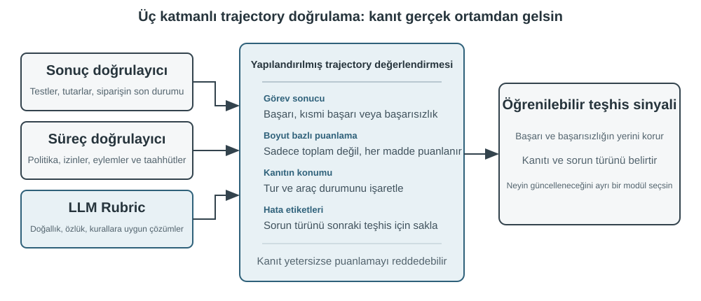
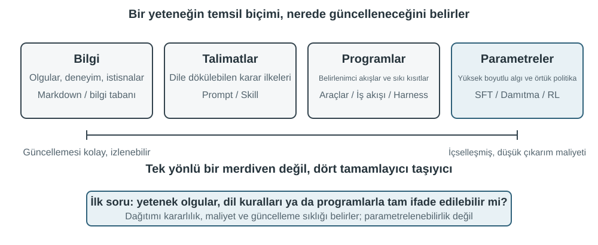

# Çok Modluluk ve Gerçek Zamanlı Etkileşim

Önceki bölümler Agent'ın metin dünyasındaki tasarımını ele aldı — context, araçlar ve kod aracılığıyla dijital sistemlerle etkileşim. Ancak Agent'ın etkileşime girdiği şeyler metin ve API'lerden ibaret değildir. Agent'ın kullanıcının sesli komutunu anlaması, ekranda doğru düğmeyi bulup tıklaması ya da bir robot kolunu bir nesneyi hassasça kavrayacak biçimde yönetmesi gerektiğinde, bambaşka bir alana girer: **çok modlu gerçek zamanlı etkileşim** — saf metin girdi-çıktısından **çok modlu algı ve gerçek zamanlı yanıta** genişleme, Agent'ın "diyalog kutusundan" çıkmasının kilit adımıdır. "Çok modluluk" dediğimiz şey, yalnızca metni değil, birden fazla bilgi biçimini — yazı, ses, görüntü, video, eylem — aynı anda işlemektir.

Önce bu bölümün sınırlarını çizelim. Statik görüntü ve doküman anlama — bir ekran görüntüsüne bakmak, bir grafiği okumak, bir PDF'i ayrıştırmak — önceki bölümlerdeki Agent pratiğine zaten birer algı aracı olarak doğal biçimde yerleşti: bugünün çok modlu büyük modelleri için bu tür "bir kez girdi, bir kez anlama" görevleri görece olgunlaşmıştır ve özel bir mimari tasarım gerektirmez. Bu bölüm başka bir problem sınıfına odaklanıyor: **gerçek zamanlılığın çok modlu problemi zorlaştırdığı** üç senaryo — sesli diyalog, GUI kullanımı ve robot kontrolü. Bu senaryolarda girdi sürekli akar, çıktı ise katı bir zaman bütçesi içinde verilmek zorundadır; mimari tasarım bu yüzden nitelik değiştirir. Sürekli görsel akışın (videonun) gerçek zamanlı anlaşılmasına gelince, bu satırların yazıldığı tarih itibarıyla Agent'lar açısından hâlâ açık bir problemdir — bu bölümün Computer Use kısmında tartışılan kare kare ekran görüntüsü sınırlılığı ile bölüm sonundaki düşünme soruları bu konuya geri dönecek. Bir sınır daha çizmek gerekiyor: çok modlu **üretim** (görüntü üretimi, video üretimi) bu kitabın çerçevesinde sıradan bir tool calling'den ibarettir (Bölüm 5'teki multimedya üretimi kısmında ele alındı); Agent onu harici bir araç olarak kullanır, bu bölümün çözmeye çalıştığı gerçek zamanlı etkileşim zorluklarını içermez ve bu nedenle bölümün ana hattının dışında kalır.

Sesli etkileşim, Computer Use ve robot kullanımı ilk bakışta bambaşka üç alana yayılıyor gibi görünür; ama işe girişilince takılınan yerlerin birbirine son derece benzediği fark edilir: hepsi aynı anda birden çok modaliteye ait bilgiyi işlemek zorundadır ve hepsi gecikmeye aşırı duyarlıdır. Sesli konuşmada iki saniyeyi aşan bir duraklama insanı huzursuz eder; robot kontrolünde milisaniye ölçeğindeki bir titreme çarpışmaya yol açabilir. Bu iki kısıt, üç senaryoyu birlikte aynı mimari yöne iter: **seri boru hattından** (fabrika üretim bandı gibi, bir halka bitmeden sonrakine devredilemez) **uçtan uca modele** (girdiden çıktıya doğrudan giden, aradaki devir teslim halkalarını ortadan kaldıran tek ve birleşik bir model) doğru.

Bu bölüm şu hat boyunca ilerliyor:

1. Önce "Ses Mimarisinin Üç Paradigması" ile bir koordinat sistemi kuruyoruz — kaskad (VAD-ASR-LLM-TTS boru hattı), uçtan uca tam modlu (Omni; tek model, ama hâlâ sırayla konuşma), full-duplex (Moshi, GPT-Live; dinlerken konuşma) — ve "VAD'nin tur varsayımından nasıl kurtulunur" ekseni boyunca her halkanın gecikmesini ve ödünleşimlerini sırayla açıyoruz; kaskad kısmında ayrıca VAD + ASR'nin yerine akışlı konuşma algısının nasıl konulacağı anlatılıyor.
2. Sonra düşünme mimarisinin "gerçek zamanlı yanıt" ile "derin düşünme" arasındaki çelişkiyi nasıl uzlaştırdığına bakıyoruz: hızlı ile yavaşın basitçe paralel çalıştırılmasından, arka plandaki reasoning modelinin "akıl hocası" rolünü üstlendiği ayrıştırma hattına (GPT-Live'ın devretmesi, Pine AI vb.), oradan da Step-Audio R1'in düşünmeyi tek bir modelin içine "içselleştirdiği" düşünürken konuşmaya.
3. Ardından daha insana benzeyen konuşma sentezinin yürütme katmanına getirdiği iyileştirmeleri tartışıyoruz.
4. Son olarak bakışı Computer Use'a (yapay zekânın bilgisayar ekranını bir insan gibi kullanması) ve robot kullanımına genişletip aynı gecikme ve çok modluluk problemlerinin bu iki senaryoda nasıl belirdiğini görüyoruz.

Bunların içinde, teoriye daha yakın duran ve senaryolar arasında taşınabilen iki noktayı özellikle vurgulamak gerekir: **düşünme mimarisi** (hızlı ve yavaş iki düşünme takımının nasıl iş birliği yaptığı) ve ondan türeyen **hızlı-yavaş arayüzü** (Latent Bridge; hızlı ve yavaş modeller arasında metin dışında başka ne aktarılabilir). Bunlar ses senaryosundan yola çıksa da yalnızca sese hizmet etmiyor — ilerideki Computer Use ve robot kısımlarında da "ne zaman yavaş bir akıl hocasına başvurmalı" sorusuyla karşılaşılacak; okurun bunlara ayrıca dikkat etmesinde yarar var.

## Ses: En Doğal İnsan-Makine Arayüzü

Ses, yalnızca metni sese çevirmek değildir. Konuşma yazmaktan yaklaşık dört kat hızlıdır ve elleri gözleri serbest bırakır; bu yüzden kullanıcı istediği anda araya girebildiği sürekli bir giriş-çıkış döngüsü oluşturur. Dikte konuşmayı metne çevirir; sesli Agent ise kullanıcıyla doğrudan iş birliği yapar. Her ikisi de daha önce tanıtılan whisper-coding çalışma biçimini destekler.

Bu bölüm iki yönü ele alır: kullanıcının Agent ile konuşması ve Agent'ın kullanıcı adına dış dünyayla konuşması. Ses modeli Agent'ın neleri yanıtlayacağını belirler; etkileşim mimarisi ise doğru duyma, zamanında yanıt verme, doğal biçimde söz devretme, onayları ve araç çağrılarını bir görüşme sırasında tamamlama becerisini belirler.

### Etkileşim zamanı: kaskaddan full-duplex'e

OpenAI'nin GPT-Live tanıtımı üç ses etkileşimi paradigması tanımlar: kaskad, sıra tabanlı ve full-duplex[^ch9-12]. Bunlar eskiden yeniye basit bir geçiş değil, gecikme, maliyet ve gözlemlenebilirlik arasında farklı ödünleşimlerdir:

| Paradigma | Temel yapı | Ana avantaj | Ana sınırlama |
| --- | --- | --- | --- |
| Kaskad | VAD → ASR → LLM → TTS | Modüller açık; değiştirmek ve hata ayıklamak kolay | Gecikme birikir, paralinguistik bilgi arayüzlerde kaybolur |
| Uçtan uca Omni | Tek model dinler, düşünür ve konuşur | Daha düşük gecikme; ton, duygu ve ortam sesi daha iyi korunur | Hâlâ sıra tabanlı; eğitim ve hata ayıklama daha pahalı |
| Full-duplex | Sürekli dinler, konuşur ve karar verir | Üst üste konuşma, doğal kesme ve kesintisiz akış | Eğitim, kontrol ve değerlendirme daha karmaşıktır |

Ortak hedef, insanların mutlaka sırayla konuşması ve VAD'nin kimin söz hakkına sahip olduğunu tahmin etmesi varsayımlarından kurtulmaktır. Kaskad ve Omni hâlâ etkileşimi turlara böler; full-duplex ise söz hakkını modelin sürekli verdiği bir karara dönüştürür.

[^ch9-12]: OpenAI, *Introducing GPT-Live*, 2026-07-08. https://openai.com/index/introducing-gpt-live/ Kaskad / sıra tabanlı / full-duplex sınıflandırması, yazının ChatGPT Voice'un üç kuşağına dair özetinden gelir; “uçtan uca omnimodal (Omni)” terimi “turn-based voice models” kategorisine karşılık gelir.

**Akış iptali:**

```python
while audio_is_arriving:
    partial = asr.push(audio_chunk)
    if endpoint_is_probable(partial):
        candidate = llm.start(partial)
        if later_audio_changes_meaning(partial):
            cancel(candidate)                 # speculative cancellation
        else:
            tts.enqueue_stable_segments(candidate)

on_final_transcript(text):
    commit_or_restart(text)
```

### Paradigma 1 · Kaskad boru hattı

Ticari sesli yardımcıların çoğu hâlâ seri bir boru hattı kullanır (Şekil 9-1): VAD konuşmanın bitip bitmediğine karar verir, ASR sesi metne çevirir, LLM isteği anlayıp yanıtı üretir ve TTS bunu seslendirir. Modülerlik her parçayı ayrı ayrı geliştirmeyi kolaylaştırır, fakat her sınır bekleme ekler.


| Modül | Rol | Tipik darboğaz |
| --- | --- | --- |
| VAD | Konuşmanın bittiğine karar vermek | Sessizlik eşiği yanıtı geciktirir ve turları yanlış böler |
| ASR | Sesi metne çevirmek | Tanıma gecikmesi ve bağlam kaybı |
| LLM | Anlamak, akıl yürütmek ve üretmek | İlk token süresi; reasoning ek bekleme getirir |
| TTS | Metni konuşmaya çevirmek | İlk paket sentezi ve oynatma tamponu |

Reasoning içermeyen kısa bir yanıtta VAD, ASR, LLM ve TTS beklemeleri seri biçimde toplanır (Şekil 9-2); gerçek değerler girdi uzunluğu, model, donanım, ağ ve yüke bağlıdır. Üretim kuyruğu boşta geçen gecikmeyi daha da büyütür (Şekil 9-3).





> **Deney 9-1 ★: Geleneksel bir sesli Agent inşa etmek**
>
> Mikrofonu, Silero VAD'yi, yerel Whisper'ı, akışlı bir LLM'i ve Fish S1 TTS'yi WebSocket üzerinden bağlayarak kaskad temel hattını kurun. Saklanan gerçek tek turlu kanıt, medya ve model zincirinin uçtan uca çalıştığını gösterir; eşzamanlılık veya üretim yükü benchmark'ı değildir. Kod ve kabul kaydı: [chapter9/live-audio](../chapter9/live-audio/).

> **Ek: WebRTC ile “kullanıcıyı arayan” bir sesli Agent**
>
> Telefon Agent'ı için PSTN şart değildir. Tarayıcı WebRTC'si oturum açma, eksik bilgileri isteme, teyit için tekrarlama ve yapılandırılmış sonuç kaydetme döngüsünü yeniden üretir. Harici bir kuruluşla bağlantı gerektiğinde aynı tool sözleşmesi uygun bir PSTN/SIP sağlayıcısına bağlanabilir. Tam medya yolu, direct/ReAct karşılaştırması ve kabul kanıtı [chapter9/phone-agent](../chapter9/phone-agent/) içindedir. Proje tarihsel \`exp9-2\` çalıştırma kimliklerini korur, ancak artık metinde numaralı bir deney değildir.

#### Seriden akışlı algıya

Akışlı ASR kullanıcı konuşurken geçici bir transkript üretebilir; LLM konuşulabilir ilk cümleyi TTS'ye gönderebilir; TTS de ses parçaları döndürebilir. Bu, ASR, LLM ve TTS'yi baştan sona tamamen paralel yapmaz: kısmi transkript değişirse üretim iptal edilmeli, yeniden başlatılmalı veya düzeltilmelidir; yalnızca \`stream\` seçeneğini açmak yeterli değildir.

Sıradan streaming, VAD'nin sessizlik beklemesini de ortadan kaldırmaz. VAD + ASR ön ucu gecikme biriktirir, tereddüt/duygu/arka kanal tepkilerini ve ortam sesini kaybeder; isimler ve e-posta adresleri parçalar arasında bölünebilir. Gerçek streaming modelinin nedensel ya da parçalı bir kodlayıcıya ve artımlı kod çözmeye ihtiyacı vardır. Whisper kodlayıcısı tam ses parçasını beklediği için nedensel bir streaming modeli değildir. LLM tabanlı bir ses modeli sürekli sesten metin ve semantik olaylar çıkarabilir, ancak önek simülasyonu nedensel modelin gecikme garantisi değildir.

Metin belirteçlerine ek olarak \`speak_start/end\`, \`interrupt\`, \`emotion\`, \`laugh\`, \`sigh\` ve \`noise\` işaretleri konuşma sınırlarını, kesme niyetini, duyguyu, tereddüdü ve çevresel sesi taşıyabilir. Böylece her akustik olay düz metne sıkıştırılmaz.

[^ch9-11]: Tur kararını tanıyıcıya gömme ve geleceğe bakan etiketler sorununa ilişkin teşhis için bkz. Bojie Li ve Noah Shi, *The Trade-off Was in the Labels: Causal Supervision for Turn-Aware Streaming ASR*, 2026 (yayına hazırlanıyor).

> **Deney 9-2 ★: Qwen2-Audio ile akışlı konuşma algısını simüle etmek**
>
> Qwen2-Audio kendi başına bir streaming modeli değildir. Deney, artan ses önekleriyle sürekli algıyı simüle eder ve 600 ms VAD + Whisper ile karşılaştırır. Canonical run tüm yürütme ve provenance kapılarını geçti, ancak beklenen altı davranıştan yalnızca ikisini yeniden üretti: önek çağrıları 8,4–11,3 saniye sürdü, pause örneğinde \`silence\` kaçırıldı ve noise örneği \`cough/laughter\` olarak yanlış sınıflandırıldı. Bu mekanizma ve hata kiplerini sınayan negatif bir sonuçtur; 100–200 ms gerçek streaming algısının kanıtı değildir. Tam kayıt: [chapter9/streaming-speech](../chapter9/streaming-speech/).

### Paradigma 2 · Uçtan uca omnimodal modeller (Omni)

Streaming algı olsa bile kaskad dinleme, düşünme ve konuşmayı ayrık arayüzlerden geçirir; ses düz metne dönüştüğünde duygu, tonlama ve ortam sesi kaybolabilir. Omni bunları tek modelde yapar; eğitim, hata ayıklama ve bileşen değiştirme maliyeti daha yüksek olsa da gecikmeyi azaltır ve metin dışı sinyalleri korur (Şekil 9-4). Metnin görevi taşıdığı durumlarda öz-kaskad bir algılama hatasını düzeltebilir; yanıt konuşma hızına, duyguya veya ortama bağlıysa metin darboğazı kanıtı geri döndürülemez biçimde siler[^ch9-13].

Omni hâlâ sıra almayı varsayar ve genellikle VAD ya da anlamsal endpointing kullanır. Sayı dizisindeki kısa bir duraklama konuşmanın sonu sanılabilir; akışlı algı kararı iyileştirir ama turları kaldırmaz.

[^ch9-13]: Kaskad ile uçtan uca doğruluk avantajının ne zaman tersine döndüğünü ölçen çalışma için bkz. Li, Bojie ve Noah Shi, *The Cascade Gap: When and Why Self-Cascades Help Multimodal Agents*, 2026 (yayına hazırlanıyor).


Gerçek zamanlı konuşma API'leri kaskad ile Omni arasında durur: model sesi doğal biçimde işler, ancak etkileşim kontrolü VAD, kesme ve asenkron tool çağrılarına dayanır. Yararlı karşılaştırma leaderboard değil, uçtan uca ve öz-kaskad yolların farklı görevlerde nasıl hata yaptığıdır.

> **Deney 9-3 ★★: MiniCPM-o 4.5'i yerel çalıştırmak — uçtan uca ve öz-kaskad**
>
> Tek bir yerel revizyonu sabitleyin, düşünme modunu kapatın ve sese doğrudan yanıtı aynı modelin öz-kaskadıyla (önce transkript, sonra metinden yanıt) karşılaştırın. Bu ölçüm ses bilgisinin korunmasını ölçer; daha sonraki “konuşurken düşünme” yeteneğini değil.
>
> | Görev türü | Uçtan uca | Öz-kaskad | Gözlem |
> | --- | ---: | ---: | --- |
> | Anlamsal aritmetik (2) | 1/2 | 2/2 | Öz-kaskad bir transkripsiyon hatasını düzeltti |
> | Paralinguistik konuşma hızı (2) | 2/2 | 1/2 | Düz metin hızlı/yavaş ayrımını sildi |
> | Toplam | 3/4 | 3/4 | Eşit toplam, birbirini tamamlayan hatalar |
>
> Örneklem küçüktür; hangi yolun genel olarak daha doğru veya hızlı olduğunu kanıtlamaz. Sürümler, ham çıktılar ve gerçek audio-to-audio kanıtı [chapter9/end-to-end-speech](../chapter9/end-to-end-speech/) içindedir.

Step-Audio 2 ham sesi işleyerek metin ve konuşma çıkaran uçtan uca yolu gösterir; duygu, konuşma hızı, tonlama ve ortam sesine odaklanır. Step-Audio R1 düşünmeyi ses modelinin içine alır ve “konuşurken düşünme” örneğini sağlar.

### Paradigma 3 · Full-duplex etkileşimli modeller

Omni “kullanıcı konuşur” ve “model konuşur” ayrımını korur, ancak simultane çeviri gibi görevler örtüşme ister. Full-duplex model sürekli dinler ve konuşur; devam etme, durma, araya girme veya tool çağırma kararını yinelemeli olarak verir. Kyutai'nin Moshi'si erken bir araştırma örneğidir. Thinking Machines Lab bu yaklaşımı **Interaction Model**[^ch9-14] olarak adlandırır: etkileşim VAD çevresinde dışarıdan kurulmaz, modelin içine yerleştirilir. GPT-Live bunu üretim ölçeğine taşır ve ön plandaki model sohbeti sürdürürken karmaşık işi arka plan reasoning modeline devreder.

[^ch9-14]: Thinking Machines Lab, “Interaction Models: A Scalable Approach to Human-AI Collaboration”, 2026-05. https://thinkingmachines.ai/blog/interaction-models/

Gelişim çizgisi şöyledir: kaskad sessizlik eşikleriyle turları tahmin eder; akışlı algı kararı anlamsal düzeye taşır; full-duplex ise sıra değişimini sürekli bir model kararına dönüştürür.

### Bilişsel zaman: gerçek zamanlı etkileşim ve derin düşünme

Ön plan modeli kullanıcı hâlâ hatta iken yanıt vermeli, arka plan modeli ise daha uzun düşünebilmelidir. Bunlar doğrusal bir ilerleme değil, üç tasarım ödünleşimidir:

| Tasarım | Ön plan | Arka plan | Ana risk |
| --- | --- | --- | --- |
| Hızlı dolgu, yavaş düzeltme | Anında yanıt | Yeniden düşünme ve tamamlama | Çelişki |
| Hızlı etkileşim, yavaş tavsiye | Sohbeti ve ifadeyi sürdürme | Tavsiye veya araç sonucu | Kısıtlı arayüz |
| Düşünme ve ifadenin birleşmesi | Konuşurken düşünme | Model durumunu paylaşma | Yüksek eğitim/değiştirme maliyeti |

İlk tasarım soruyu iki kez işleyebilir ve çelişebilir. İkincisi status bar üzerinden tavsiye verdiği için daha kararlı olsa da ön plan ara muhakemeyi göremez ve gerçekten konuşurken düşünemez. Üçüncüsü iki süreci birleştirir. Step-Audio R1'de MGRD düşünmeyi akustik özelliklere bağlar; MPS iki beyinli mimarisi planlama ile ifadeyi paralel üretir (Şekil 9-5 ve 9-6). Birleşik model daha doğaldır, ayrıştırılmış tasarım arka plan beynini değiştirmeyi kolaylaştırır; bunlar alternatif değil ödünleşimlerdir.

### Daha insana benzeyen konuşma sentezi

Geleneksel TTS'nin aşırı pürüzsüz olması ve az duraklaması makine kimliğini ele verir. Ana LLM metne \`THINKING\`, \`EMO:happy\` ve \`SPEED:0.8x\` gibi kontrol etiketleri ekleyebilir; TTS bunları duraklama, prozodi, hız, kahkaha ve iç çekmeye dönüştürür. Etiketleri anlayan bir TTS eğitilebilir veya farklı referans klipleriyle ses klonlama kullanılabilir.

> **Deney 9-4 ★★: Fish Audio ile kontrol belirteçli TTS**
>
> Fish Audio S1 kullanarak çok referanslı bir ses kütüphanesi oluşturun ve üç ayarı karşılaştırın: belirteçsiz, tek referanslı ve çok referanslı. Yürütme katmanı etiketlerden uygun duygu, konuşma hızı ve stili seçer. Dengeli üç kör dinlemede çok referanslı ayar en yüksek puanı aldı (insan müşteri hizmetleri benzerliği 4,67/5); ancak belirteçsiz kol tek referanslı kolu geçtiği için planlanan sıralama bütünüyle tekrarlanmadı. Küçük dinleme çalışması ifade kontrolünün yararlı olabileceğini gösterir, genel konuşma kalitesi sonucu değildir. 24 referanslı kütüphane, A/B/C medyası ve kabul kaydı: [chapter9/controllable-tts](../chapter9/controllable-tts/).
## Computer Use: GUI Otomasyonu Agent'ları

Buraya kadar okuyunca, bu bölümün sese ayırdığı yerin sonraki iki senaryodan belirgin biçimde fazla olduğu fark edilebilir — bu bilinçli bir tercihtir. Gerçek zamanlı çok modluluk çizgisinde ses, en uzun yolu almış ve referans çerçevesi olarak alınmaya en değer alandır: "seri boru hattının gecikmesi çok yüksek" sorunundan yola çıkıp uçtan uca modeller, full-duplex etkileşim ve düşünürken konuşma gibi bir dizi çözümden geçerek bugünkü görece olgunlaşmış noktaya ulaşmıştır; sorun → çözüm → son durum güzergâhının tamamı katedilmiştir. Bu yüzden onu enine boyuna anlattık. Sıradaki Computer Use ve robotik senaryolarını okurken bu güzergâhla karşılaştırın: her biri bu evrim çizgisinin neresine gelmiştir ve nerede takılı kalmıştır?

Bu üç senaryo görünüşte birbirinden çok farklıdır, ama aynı temel zorluklarla yüzleşir: gerçek zamanlı algı, düşük gecikmeli karar verme ve sürekli etkileşim. Şimdi bu teknik temaların görsel etkileşimde (Computer Use) ve fiziksel etkileşimde (robotik) nasıl yeniden ortaya çıktığına bakalım — önce bakış açısını işitsel modaliteden görsel modaliteye genişletelim: ya bir Agent yalnızca konuşmayı anlamakla kalmayıp ekranı da "görebilseydi" ve grafik arayüzü kullanabilseydi?

Computer Use (GUI otomasyonu Agent'ı olarak da anılır), yapay zekanın tıpkı bir insan gibi ekranı gözleyerek ve fare ile klavyeyi kullanarak yazılım çalıştırmasını sağlar — örneğin bilgi aramak için tarayıcı açmak, bir tablo yazılımına veri girmek veya sistem ayarlarında bir yapılandırmayı değiştirmek. Özünde bir **algılama-düşünme-eylem** döngüsü vardır (Şekil 9-7):

1. Agent o anki ekranın görüntüsünü alır
2. Çok modlu model ekran görüntüsünü ve görev talimatını alır, bir düşünme parçası ve somut bir eylem üretir
3. Yürütme katmanı bu eylemi gerçek ortamda uygular (fareyi hareket ettirmek, tıklamak, metin girmek vb.)
4. Arayüzün yanıt vermesini bekledikten sonra yeniden ekran görüntüsü alır ve döngünün bir sonraki turuna girer

**Computer Use güvenlik döngüsü:**

```python
observation = capture_screenshot_and_accessibility_tree()
proposal = model.decide(task, observation)
action = validate_schema_and_coordinates(proposal)

if action.is_irreversible and not user_or_policy_approval(action):
    stop("approval required")
else:
    execute_in_sandbox_or_scoped_session(action)
    new_observation = capture_after_settle()
    if not verify_goal_progress(new_observation, action):
        rollback_if_possible_or_replan()
```


Bu döngüde üç kritik tasarım boyutu vardır: **action space** (eylem alanı — Agent'ın hangi işlemleri yürütebildiği), **görsel konumlandırma** (ekran görüntüsünde hedef öğenin nasıl bulunacağı) ve **model mimarisi** (ekran görüntüsünden doğru eylemin nasıl üretileceği).

### Action Space Tasarımı

Anthropic, eksiksiz bir etkileşim yeteneği oluşturan üç tür araç tanımlar (Şekil 9-8):


**GUI işlem aracı** (computer tool): Fare işlemleri arasında hareket ettirme (mouse_move), sol/sağ/orta tuş tıklaması, çift/üçlü tıklama, sürükleme (left_click_drag) ve daha ince taneli basma/bırakma (left_mouse_down/up) yer alır. Kaydırma (scroll) dört yönü destekler ve değiştirici tuşlarla birlikte kullanılabilir. Klavye işlemleri arasında karakter karakter yazma (type; gerçek klavye kullanımını taklit etmek için her karakter arasında 12 ms aralıkla), tuş kombinasyonları (key, örneğin Ctrl+C) ve tuşu basılı tutma (hold_key) bulunur. Algı eylemleri: ekran görüntüsü alma (screenshot), imleç konumunu okuma (cursor_position) ve bekleme (wait).

**Komut yürütme aracı** (bash tool): Kalıcı bir bash terminal oturumu sağlar, 120 saniyelik zaman aşımına sahiptir, komutun tamamlanıp tamamlanmadığını bir nöbetçi (sentinel) dizesiyle tespit eder ve çağrılar arasında ortam durumunu korur (örneğin cd ile bir dizine geçildikten sonra bir sonraki çağrı da aynı dizinde başlar).

**Dosya düzenleme aracı** (str_replace_editor): Dizi eşleştirmesi yoluyla güvenli düzenleme sağlar; görüntüleme, oluşturma, değiştirme, ekleme ve geri alma işlemlerini destekler. Dosyanın tamamının üzerine yazmaktan daha kesindir ve alakasız içeriği yanlışlıkla değiştirme olasılığı daha düşüktür.

> **Deney 9-5 ★: Computer Use'ı Çalıştırmak (Anthropic Referans Yolu veya Açık Model Yolu)**
>
> A yolu Anthropic Computer Use Demo'yu kullanır. Konteyner, tarayıcı, terminal ve diğer yaygın araçları içeren eksiksiz bir Ubuntu masaüstü ortamı sunar. Ön uç görevi alır; arka uç talimatları ve ekran görüntülerini Claude'a gönderir, ardından modelin döndürdüğü fare, klavye, terminal veya düzenleme eylemlerini yürütür. Bu yol, yerleşik `computer` aracı protokolünü anlamaya yöneliktir; her okuyucunun Anthropic API erişimine sahip olmasını gerektirmez.
>
> B yolu, kitabın [`chapter9/computer-use-open-model`](../chapter9/computer-use-open-model/) eşlikçi projesini kullanır. Varsayılan olarak browser-use'ı açık ağırlıklı Qwen3-VL 32B Instruct ile çalıştırır; OpenRouter barındırılan API'si kullanılabilir veya `OPEN_MODEL_BASE_URL`, kendi barındırdığınız vLLM/SGLang ya da başka bir uyumlu uç noktaya yönlendirilebilir. Uç nokta ekran görüntülerini kabul etmeli ve yerleşik JSON Schema'yı desteklemelidir; yalnızca normal JSON destekliyorsa schema-in-prompt uyumluluk modu açıkça etkinleştirilebilir.
>
> İki yol da aynı salt okunur görevi ve aynı kabul sözleşmesini kullanır: en fazla 25 adım, adım başına tek bir eylem ve model/uç nokta kimliğinin, ham sağlayıcı yanıtlarının, adım adım ekran görüntülerinin, eylem dizisinin, nihai yanıtın ve durma nedeninin saklanması. Farklı modeller ayrı deney kolları olarak raporlanmalıdır; açık model sonucu Claude yeniden üretimi gibi sunulmamalı, “konteyner başarıyla başladı” ifadesi görev tamamlandı sayılmamalıdır. Eylem aralıkları ve planlama kalitesi ölçülen sonuçlardır; 2–5 saniye olacağı veya diğer modellerden mutlaka üstün olacağı önceden varsayılmaz.
>

### Görsel Konumlandırma (Grounding)

Döngünün her turunda modelin ekran görüntüsü içinde hedef öğeyi doğru biçimde bulması gerekir — "Arama kutusu nerede?", "Gönder düğmesinin koordinatları ne?" İşte bu, görsel konumlandırma (Grounding) problemidir. Hâlihazırda başlıca **iki yaklaşım** vardır: birincisi konumlandırmayı bir **çoktan seçmeli soruya** dönüştürmek — önce arayüz öğelerini numaralandırarak işaretlemek, böylece modelin yalnızca birini seçmesi yeterli olur; ikincisi **saf koordinat tahmini** — modelin tıpkı bir insan gibi ekran görüntüsüne doğrudan "bakıp" koordinatı söylemesi. Çoktan seçmeli yaklaşımın da iki uygulama biçimi vardır: **saf görsel işaretleme** (orijinal Set-of-Mark; bir segmentasyon modeliyle piksel düzeyinde aday bölgeler çıkarılır) ve **yapısal öğe indeksleme** (DOM/Accessibility Tree; arayüzün kendi yapısı doğrudan okunur). Çoktan seçmeli yaklaşımın ortak avantajı, "ekran görüntüsünde düğmeyi bul ve koordinatını tahmin et" biçimindeki açık uçlu problemi "önceden işaretlenmiş öğelerden birini seç" biçimindeki kapalı uçlu bir probleme çevirmesidir — tıpkı sınavda çoktan seçmeli soruların boşluk doldurmaya göre daha kolay doğru yanıtlanması gibi, modelin "ekranın sol üst köşesinden yaklaşık 200 piksel sağdaki mavi düğmeye tıkla" demesi gerekmez, "[123]'e tıkla" demesi yeter.

**Set-of-Mark: görsel işaretleme yöntemi.**

Orijinal Set-of-Mark (SoM), 2023'te Microsoft Research tarafından, başlangıçta GPT-4V'nin görsel konumlandırma yeteneğini açığa çıkarmak amacıyla önerildi. **Saf görsel** bir yöntemdir: görüntü segmentasyon modelleri (SAM, SEEM vb.) ekran görüntüsünde aday bölgeleri otomatik olarak çıkarır, her bölgenin üzerine numaralı bir işaret bindirilir; modelin gördüğü şey numaralandırılmış bir görüntüdür ve yalnızca numarayı söylemesi yeterlidir, sistem bunu ilgili bölgenin merkez koordinatına çevirir. Sürecin tamamı DOM'a ya da herhangi bir arayüz iç yapısına ihtiyaç duymaz; bu nedenle yerel masaüstü yazılımları ve oyun arayüzleri için de aynı ölçüde geçerlidir — yeter ki segmentasyon modeli aday bölgeleri çıkarabilsin.

**Yapısal öğe indeksleme: SoM fikrinin Web üzerindeki yapısal uygulaması.**

Arayüzün kendisi yapısal bilgi sunabildiğinde işaretleme çok daha kesin yapılabilir. Modern web sayfaları, render edilmeden önce zaten eksiksiz bir öğe yapısı (DOM ağacı) ve semantik roller (hangisi düğme, hangisi giriş kutusu) tanımlar; erişilebilirlik arayüzü (Accessibility Tree) birçok masaüstü uygulaması için benzer bilgiyi sağlar. Bir segmentasyon modelinin piksellerden "hangi bölge düğme" diye tahmin yürütmesindense, doğrudan arayüzün kendisine "tıklanabilir hangi öğelerin var?" diye sormak daha iyidir. browser-use projesinin temsil ettiği Web Agent çözümleri tam olarak bunu yapar: etkileşimli öğeleri DOM'dan numaralandırarak listeler; bu, SoM fikrinin Web üzerindeki yapısal uygulaması sayılabilir (Şekil 9-9). Süreç dört adımdan oluşur:

1. Tarayıcının hata ayıklama arayüzü (CDP, Chrome DevTools Protocol) üzerinden sayfanın yapısal temsilini (DOM ağacı) ve erişilebilirlik bilgilerini elde etmek
2. Hangi öğelerin etkileşimli olduğunu otomatik olarak tespit etmek (düğmeler, giriş kutuları, bağlantılar vb.)
3. Her etkileşimli öğeye benzersiz bir ID atamak ve ekran görüntüsünde sınırlayıcı kutuları çizmek
4. Aynı anda, her ID'ye karşılık gelen öğeyi tanımlayan bir metin listesi üretmek

```text
Screenshot: [Görseldeki kilit öğeler [1], [2], [3], [4] gibi ID'lerle işaretlenmiştir]

Elements:
[1] <input type="text" placeholder="Search" aria-label="Search" />
[2] <button id="submit-btn" aria-label="Submit form" />
[3] <input type="text" placeholder="Enter your name" value="" />
[4] <a href="/docs" aria-label="Documentation" />
```

Modelin yalnızca bir ID numarası üretmesi yeterlidir; sistem otomatik olarak o öğenin merkez koordinatını kullanarak tıklamayı gerçekleştirir. Bu tür çözümler token tasarrufu sağlamaz (çünkü tüm işaretleme bilgisinin modele gönderilmesi gerekir), ama konumlandırması kesin ve kararlıdır; üstelik segmentasyon modelinin yol açabileceği atlanmış ve yanlış tespitleri de ortadan kaldırır.


**Saf koordinat tahmini.**

Üçüncü yol hiçbir işaretleme yapmaz, doğrudan modelin koordinat üretmesini ister. **SeeClick** ve Claude'un computer use'u bunun temsilcileridir: devasa miktarda GUI ekran görüntüsü ve öğe konumu eşleşmesinden oluşan veriyle görsel modeller eğitilir ve modelin doğal dil betimlemelerini (örneğin "gönder düğmesine tıkla") doğrudan ekran görüntüsündeki kesin koordinatlara eşlemeyi öğrenmesi sağlanır — tıpkı bir insan kullanıcı gibi, tıklanacak yeri saf görme yoluyla bulur.

Koordinat tahmini çözümlerinde modelin koordinatları kavrayışı, eğitim sırasında kullanılan çözünürlüğe yüksek oranda bağımlıdır (Şekil 9-10). Claude'un eğitiminde XGA (1024x768), WXGA (1280x800) ve FWXGA (1366x768) kullanılmıştır; girdi olarak verilen ekran görüntüsünün çözünürlüğü bunlarla uyuşmazsa modelin tahmin ettiği koordinatlar sistematik biçimde kayar — tıpkı küçük bir haritada ölçülen mesafeyi doğrudan büyük haritaya uygulamak gibi. Bu nedenle araç katmanında çift yönlü bir koordinat ölçekleme mekanizması gerekir ve hedef çözünürlük **en-boy oranına göre seçilmelidir**; aksi hâlde orantısız gerdirme görüntüyü bozar ve koordinat değerlendirmesini de saptırır. Örneğin gerçek ekran çözünürlüğü 2560×1440 (16:9) ise, Claude'un desteklediği üç seçenek arasından en-boy oranı 16:9'a en yakın olanı — FWXGA (1366×768) — seçilmelidir. Ekran görüntüsü orantılı biçimde 1366×768'e ölçeklenip modele verilir; model tıklama koordinatı olarak (683, 384) ürettiğinde bu değer ters yönde gerçek koordinata eşlenir: (683×2560/1366, 384×1440/768) ≈ (1280, 720). Buna karşılık 16:9'luk bir görüntü zorla 4:3'lük 1024×768'e gerdirilirse görüntü yatayda ezilir ve modelin tahmin ettiği koordinatlar sistematik olarak kayar.


Üç yol arasındaki seçim mantığı şöyle özetlenebilir: **yapısal bilgi elde edilebiliyorsa öncelikle DOM/Accessibility Tree indekslemesi kullanılmalıdır**; konumlandırması en kesin ve en kararlı olan budur. **Elde edilemiyorsa** (Photoshop gibi yerel masaüstü yazılımları, Canvas/WebGL ile render edilen arayüzler, oyunlar) **hem görsel işaretleme (orijinal SoM yolu) hem de koordinat tahmini kullanılabilir**. Görsel işaretleme konumlandırmayı çoktan seçmeli bir soruya dönüştürdüğü için, özel olarak eğitilmemiş genel amaçlı modellere daha dosttur; koordinat tahmini ise işaretleme adımını ortadan kaldırdığı için, GUI konumlandırma eğitimi almış modeller açısından daha doğrudandır. Küçük öğelerde ve yoğun arayüzlerde her ikisinin de doğruluğu hâlâ yetersizdir.

> **Deney 9-6 ★: browser-use ile Otomatik Tarayıcı İşlemleri**
>
> Tarayıcı otomasyon çerçevesi Playwright'ı çok modlu bir modelle birleştirerek doğal dille yönlendirilen tarayıcı işlemlerini gerçekleştirin. SoM görselleştirmesini etkinleştirin ve her karardan önce açıklamalı sınırlayıcı kutular içeren ekran görüntüsünü kaydedin. Model arayüzü OpenAI veya Anthropic ile sınırlı değildir; kitap, açık Qwen3-VL modeli için API yapılandırması sağlar ve diğer barındırılan hizmetler ya da kendi barındırdığınız çıkarım için genel bir OpenAI uyumlu base URL sunar.
>
> “Google'ı aç ve San Francisco hava durumunu sorgula” test görevi: Başlatma sonrasında ekran görüntüsü, numaralandırılmış etkileşimli öğelerle Google arama sayfasını gösterir. Model arama kutusunu seçer, “San Francisco weather today” yazar, aramayı gönderir ve sonuç sayfasından sıcaklık ile hava koşullarını çıkarır. Kabul sırasında yanıt ve iz bağımsız olarak doğrulanır; gerçek adım sayısı ve geçen süre olduğu gibi kaydedilir. “5 adım, yaklaşık 20 saniye” yalnızca belirli bir çalışmanın gözlem değeri olabilir; yürütme kaydı olmadan sabit sonuç sayılamaz.
>
> Kitapta saklanan resmi açık model çalışması, OpenRouter üzerindeki `qwen/qwen3-vl-32b-instruct` modelini kullandı. Model Google Search'ün 4. adımında CAPTCHA ile karşılaştığında başarılı olduğunu iddia etmedi; weather.com'a geçti ve 16. adımda San Francisco Today sayfasından 64°F, Sunny, hissedilen 62°F, en yüksek 74°F ve en düşük 55°F bilgilerini okudu. 16 API yanıtının tamamı istenen Qwen3-VL modelini bildirdi; 15 geçerli adım ekran görüntüsü ve salt okunur eylem izi bağımsız deterministik kabulden geçti. Bu sonuç açık model API yolunun çalıştığını kanıtlar; Anthropic'in yerleşik `computer` aracı kolunun yeniden üretildiği anlamına gelmez.

### Animasyon Görebilen, Ses Duyabilen Computer Use Agent'ı

Buraya kadar Computer Use'un algısı örtük bir varsayıma dayanıyordu: **ekran durağandır** — bir görüntü al, bir adım düşün, bir kez tıkla, sonra bir görüntü daha al. Oysa gerçek ekranlarda video oynar, göz açıp kapayıncaya kadar kaybolan bildirimler belirir, toplantılardaki insan sesleri duyulur. Her 3–5 saniyede bir gözünü açan ve hiç kulağı olmayan bir Agent, "iki kare arasında olup bitenleri" ne görebilir ne de duyabilir. Ekran kaydı izlemek, bir toplantıyı takip etmek, sesli bir uyarıyı dinlemek, bir anda gelip geçen bir iletişim kutusuna yetişmek — bu gündelik bilgisayar işlerinin tamamı bugünün Computer Use Agent'ı için neredeyse yasak bölgedir.

Burada asıl yeniden tasarlanması gereken şey "eylem arayüzü" değil, "**gözlem arayüzü**"dür[^ch9-9]. Temel fikir, **gözlemi** (sürekli, uyarlanabilir, çok modlu) **eylemden** (ayrık) ayrıştırmak ve ortam ile herhangi bir hazır Computer Use modeli arasına yerleşen, yeniden eğitim gerektirmeyen bir algı ara katmanı hâline getirmektir (buna Agent–bilgisayar gözlem arayüzü, AOI denebilir). Bu katmanın "ihtiyaç oldukça kapağı açılan" üç bileşeni vardır. Birincisi, **kareler arası anahtar kare yakalama**: önce son derece ucuz bir piksel kapısıyla neredeyse hiç değişmeyen kareler atlanır, ardından küçük bir model görüntüde anlamlı bir değişiklik olup olmadığına karar verir ve yalnızca değişiklik varken bir kare yakalanır; durağan görüntüde maliyet neredeyse sıfırdır. İkincisi, **ses seviyesiyle kapılanan konuşma transkripsiyonu**: yalnızca ses varken konuşma tanıma çağrılır ve Agent ilk kez "kulak sahibi olur". Üçüncüsü — ve en kritiği — **görüntüyü kalıcı metne dönüştürmek**: model, yakalanan kareyi tek bir cümleyle betimler ("Az önce çıkan bildirimde yayın tarihinin 28 Nisan'a alındığı yazıyor") ve **orijinal görsel daha sonra context'ten temizlense bile bu cümle bellekte kalır**, yani dinamik bilgi metin biçiminde ileriye taşınır.

Sezgiye aykırı bir bulgu şudur: asıl işe yarayan şey "hangi karelerin seçildiği" değil, "**karelerin uzun süre saklanabilecek metne dönüştürülmesi**"dir — çünkü metin, LLM Agent'larının en iyi işlediği modalitedir. 7B'den öncü ölçeğe uzanan sekiz model üzerinde bu ara katman, hiçbir yeniden eğitim gerektirmeden +17 ila +48 yüzde puanlık iyileşme sağladı; aradaki en büyük fark sesli görevlerde görüldü: bu algı katmanı eklendiğinde Agent, daha önce "duyulabilir ama üzerinde işlem yapılamaz" olan sesli görevleri tamamlayabildi. Ne var ki bu, her duruma uyan sabit bir yapılandırma değildir — bazı daha yeni modellerde çok fazla görsel token yüklemek akıl yürütmeyi sıkıştırıp performansı düşürebiliyor. Dolayısıyla bu bileşenler toptan açılmak yerine **model model seçilmelidir**. Bu, daha önceki Set-of-Mark ile koordinat tahmini arasındaki tercihle aynı derstir: algı çözümlerinin gümüş kurşunu yoktur, yapılandırma modelin huyuna göre ayarlanır.

[^ch9-9]: Kapılı anahtar kare, ihtiyaç hâlinde transkripsiyon ve kareleri kalıcı metne dönüştürme biçimindeki üç bileşenin eksiksiz mekanizması ve model bazlı ablation çalışması için bkz. Li, Bojie and Noah Shi. *Agent-Computer Observation Interfaces Enable Dynamic Computer Use.* arXiv:2606.29472, 2026.

### Computer Use için Dünya Modelleri

Bir önceki bölümdeki gözlem arayüzü "arada ne oldu" sorusunu çözer: anahtar kareler, konuşma dökümü ve kalıcı metin sayesinde Agent artık yalnızca birbirinden uzak iki ekran görüntüsünü görmez. Ama gözlem arayüzü planlama gecikmesini ortadan kaldırmaz. Agent hâlâ "ekran görüntüsü—düşün—tıkla" biçimindeki sıralı döngüyü çeviriyor ve her eylemden sonra yeniden gözlemleyip bir sonraki adımı düşünüyor. **OSWorld-Human** verimlilik çalışması gösteriyor ki görev sonunda başarılsa bile Agent'ın işlem adımları ve bekleme süresi insandan belirgin biçimde fazla; insan düzeyinde doğruluğa ulaşmak, kullanılabilir olmakla aynı şey değil.

İnsan bilgisayarı kullanırken bir sonraki adımı tıkladıktan sonra düşünmeye başlamaz; önce eylemin sonucunu öngörür. Gerçekleşen değişim beklentiye uyuyorsa mevcut planla devam eder; ancak sayfa durumu beklenenden saptığında durup yeniden gözlemler ve yeniden planlar. Dünya modeli, Agent'ın harekete geçmeden önce masaüstünün neye dönüşebileceğini öngörmesini sağlar; böylece insana benzeyen bu "öngörülü yürütme" mümkün olur ve verimlilik belirgin biçimde artar.

Masaüstü durumu yalnızca bir piksel görüntüsü değildir: pencereleri, odağı, kaydırma konumunu, giriş kutusu içeriğini, yükleme durumunu, izinleri ve ağ yanıtlarını da kapsar; eylemler ise tıklama, klavye girişi, kaydırma, sürükleme ve bekleme içerir. Computer Use'da kullanılabilecek bir dünya modeli en azından mevcut durumu kodlayabilmeli, aday eylemin yol açacağı durum değişimini öngörebilmeli ve bu öngörüyü bir sonraki adıma karar vermesi için planlayıcıya verebilmelidir:

```text
masaüstü durumu + click/type/scroll/wait ──> sonraki durumun gösterimi
```

Böylece Agent, gerçekten tıklamadan önce aday eylemlerin sonuçlarını karşılaştırabilir, sayfa yüklenirken bir sonraki adımı hazırlayabilir ve bir açılır pencere bir an görünüp kaybolduğunda durum farkından yararlanarak toparlanabilir. Örneğin görev "VS Code'da yeni bir Python dosyası oluştur ve hello world yaz" ise, model önce başarı hâlindeki dosya ağacının ve düzenleyicinin anahtar durumunu öngörebilir, sonra tıklama, yazma ve kaydetme eylemlerini seçebilir; görev bir dosyayı silmekse, yalıtılmış bir sanal masaüstünde geri alınamaz bir onay kutusunun çıkıp çıkmayacağını önceden öngörebilir ve gerektiğinde kullanıcıdan onay isteyebilir. Buradaki asıl mesele modele gerçekçi görünen bir gelecek ekran görüntüsü ürettirmek değil, görevi tamamlamak için gereken, denetlenebilir durum farklarını öngörmesini sağlamaktır.

Temmuz 2026'da Induction Labs'in duyurduğu **Photon-1**, bu yolun bir gerçekleştirimini gösterdi: yalnızca 30.000 saatlik H200 GPU süresiyle bir computer use dünya modelinin ön eğitimini tamamladı. Her kareyi ayrık gizli token'lara sıkıştırıp bir eylemin ardından gelen sonraki durum gösterimini özbağlanımlı olarak öngörür; ön eğitim aşamasında ekran görüntülerini piksel piksel üretmez. Ayrıca bağlanan görüntü üreteci yalnızca gizli gösterimleri görselleştirmeye yarar, çıkarım için zorunlu bir bileşen değildir. Bir tohum ekran görüntüsü ve ardından gelen eylemler verildiğinde model masaüstü durumlarını kesintisiz biçimde "hayal edebilir"; sonra sanal makineler üzerindeki çevrim içi eğitimle computer-use eylemleri üretmeyi öğrenir.[^ch9-20]

[^ch9-20]: David Li and Jonathan Li, Induction Labs, “Scaling Video Pretraining with Imagination Models,” 2026-07-23. https://www.inductionlabs.com/news/scaling-video-pretraining. Metinde geçen Photon-1 parametreleri, veri ölçeği, şirket içi benchmark sonuçları ve maliyet karşılaştırmaları şirketin açıkladığı verilerdir.

### Mobil Taraf: Ekosistem Bariyerleri Teknolojiden Daha Zorlu

Computer Use mobil tarafa da yayılıyor. Mobil ile masaüstü arasında teknik açıdan gerçek farklar vardır: action space genellikle artık "fare koordinatı + klavye" değildir, sistemin erişilebilirlik servisi API'si (örneğin Android'in AccessibilityService'i) üzerinden arayüz öğeleri okunur, tıklama ve metin girişi gönderilir; etkileşim biçimi de fare imlecinden dokunma hareketlerine döner ve koordinatın anlamı buna bağlı olarak değişir — aynı (x, y) noktasının parmakla tek dokunuş mu, uzun basma mı, yoksa bir kaydırma hareketinin başlangıç noktası mı olduğunu belirlemek için ayrıca bir hareket türü gerekir. Bölüm 6'da tanıtılan AndroidWorld gibi mobil benchmark'lar, Agent'ın gerçek uygulamalarda görev tamamlama yeteneğini tam da böyle bir action space üzerinde değerlendirir.

Ama mobil tarafı asıl tıkayan şey çoğu zaman bu teknik farklar değil, ekosistem bariyerleridir. Bazı telefon üreticileri, tüketici sınıfı telefonlara yapay zeka asistanları entegre edip WeChat, Taobao, Alipay gibi gündelik uygulamaları otomatik olarak kullandırmayı denedi, ama kısa sürede platform kısıtlamalarına takıldı.

Bu durum Computer Use'un karşılaştığı kendine özgü bir zorluğu açığa çıkarır: **ekosistem bariyerleri**. Engellemenin temelindeki neden bir iş modeli çatışmasıdır. Geleneksel internet uygulamalarının çekirdek gelir mantığı **trafik ve dikkattir**: kullanıcı akışı kaydırırken reklam görür, ürün ararken öneri algoritmasının yönlendirmesine uyar, sayfaları gezerken anlık satın alma kararı verir. Agent kullanıcının yerine işlem yaptığında ise bu gelir zinciri tamamen baypas edilir: yapay zeka reklamlara bakmaz, anlık alışveriş yapmaz, doğrudan hedefe gidip görevi bitirir ve çıkar. Reklam ve trafikten para kazanan platformlar için Agent'ın her işlemi, iş modelinin temelini aşındırır.

Bu da Computer Use'un yalnızca CAPTCHA (doğrulama kodu) gibi teknik düzeydeki karşı önlemlerle değil, **yapısal bir çıkar çatışmasıyla** da karşı karşıya olduğu anlamına gelir. Bu çelişkiyi kısa vadede uzlaştırmak zordur ve Computer Use'un tüketici senaryolarında hayata geçmesini, salt teknik sorunlardan daha çetin bir engelle karşı karşıya bırakır.

## Robot Manipülasyonu: XLeRobot ile Masa Toplama Örneği

> **Bu bölüm nasıl okunmalı**: baştan sona tek bir görev kullanıyoruz——"kırmızı bardağı tepsiye koy, sarı kâğıt parçasını çöp kutusuna at, en sonunda bir kez daha gözlem yaparak masanın durumunu doğrula". Deney 9-7 ve 9-9 gerçek bir XLeRobot üzerinde yürütülür; kol, kalibrasyon, acil durdurma düzeneği ve yerinde bir gözetmen gerektirir. Deney 9-8, 9-10 ve 9-11 bunların yerel GPU'daki karşılıklarıdır. Gerçek donanım ile benzetim sonuçları ayrı ayrı raporlanır, ancak görevin amacı, eylemlerin anlamı ve başarı koşulları aynı tutulur.

Robot manipülasyonu, "resme bakıp soruyu yanıtlamak"tan çok daha zor bir iştir. Model yalnızca sahneyi anlamakla kalmayıp gerçek dünyada sürekli eylemde bulunmak zorundadır ve her eylem bir sonraki anın durumunu değiştirir. XLeRobot bu farkı çok somut hâle getirir. Aynı kol, insan tarafından klavye, oyun kumandası veya VR donanımıyla uzaktan kumanda edilebilir; ya da kamera gözlemi ile sınırlı bir eylem aracı kümesi bir Agent'a devredilip onun kendi başına çağırması sağlanabilir. Donanım da görev de değişmez; değişen tek şey kimin kullandığıdır——birincisinde insan sürekli gözleyip düzeltir, ikincisinde ise modelin ve kontrol sisteminin aynı işi sonuna kadar götürmesi gerekir.

Bu bölüm beş deneyi "masa toplama" üzerinden birbirine bağlar. Önce insan gerçek XLeRobot'u uzaktan kumanda eder; böylece yeterince yetkin bir operatörün elinde bu donanımın nereye kadar gidebildiği ölçülür. Ardından benzetimde aynı görev için ideal kontrol üst sınırı belirlenir. Sonra bir Agent'ın gerçek XLeRobot'u özerk biçimde kontrol etmesine izin verilir; algı, planlama ve hatadan toparlanmanın sonucu nasıl belirlediği gözlenir. Daha sonra aynı araç sözleşmesi benzetime taşınır ve üç strateji bir arada karşılaştırılır: açık çevrim yürütme, adım adım denetim ve dünya modeli. Son olarak arka plan, nesne görünümü, aydınlatma ve görsel gürültü değiştirilerek, benzetimde öğrenilen görsel politikanın yeni bir ortama uyum sağlayıp sağlayamadığına bakılır.

Buradaki darboğaz genellikle bir statik soru-cevap ölçütü daha üretmek değil, sınırlı algı ve kontrol bant genişliğiyle modelin çevrimi kapalı tutmasını sağlamaktır. Kullanılabilir bir robot sistemi en azından şu dört soruyu yanıtlamalıdır:

1. İnsan hangi görevi bitirmek istiyor?
2. Sırada hangi alt görev var?
3. Şu anki beceri somut olarak hangi eylemi üretiyor?
4. Eylem yürütüldükten sonra gerçeklik hâlâ ilk plana uyuyor mu?

Bu bölüm bu dört soruyu XLeRobot'un aynı kontrol çevrimine yerleştirir ve dört tekniğin hangi kısmı üstlendiğini gösterir: uzun ufuklu planlama bardağın mı yoksa kâğıdın mı önce ele alınacağına karar verir; VLA ya da eylem ilkelleri kavrama ve yerleştirmeyi yapar; dünya modeli bir eylemin sonuçlarını kestirir; benzetimden gerçekliğe geçiş ise eğitim videoları ile gerçek kamera ve eyleyiciler arasındaki farkı üstlenir. Üst düzey modelin yeterli bilgisi ve planlama yetisi zaten olsa bile, bu geri besleme halkasının tek bir eksik halkası sistemin görevi bitirememesine yeter.

### Donanım ile Algoritmanın İş Bölümü

XLeRobot'un yanıtlamaya en uygun olduğu ilk soru şudur: özerk masa toplama başarısız olduğunda, kolun kendisi mi beceremiyor, yoksa algoritma mı kolu kullanmayı bilmiyor? Burada yumuşatılmaması gereken bir olgu var: **XLeRobot gibi birkaç yüz dolarlık bir kol bile, uzaktan kumandayla, bu bölümdekine benzer çok adımlı ve birbirine bağlı bir masa görevini hâlihazırda tamamlayabiliyor**——insan kamera görüntüsüne bakarak kırmızı bardağı kavrayıp tepsiye koyuyor, sarı kâğıdı çöp kutusuna atıyor ve sonunda durumu bir kez daha denetliyor. Bu sonuç yalnızca "donanım kıl payı yetiyor" demek değildir; açık bir tanı kanıtıdır: **bu görev söz konusu olduğunda darboğaz donanımın kendisinde değil, algoritma tarafındadır.**

Tanı yöntemi dolaysızdır. Kamera, kol, tutucu, masa düzeni ve başarı koşulları sabitken çevrimi önce insan devralır. İnsan nesne konumu kestirimini, eylem seçimini ve zamanlamayı sürekli düzeltir, kavrama başarısız olduğunda ne yapacağını da bilir. Özerk sistem ile insan arasındaki mesafe tam da bu kapalı çevrim yetisinde görünür. Elbette bu yargının menzili bu bölümdeki masa görevidir: donanımın bu görevin gerektirdiği yük, hassasiyet ve çalışma uzayı eşiklerini aştığını gösterir, ama birkaç yüz dolarlık bir kolun her açık ortamla ya da daha zor manipülasyonlarla baş edebileceği anlamına gelmez.

XLeRobot birkaç uzaktan kumanda girişini destekler: klavye, Xbox kumandası, Switch Joy-Con ve VR donanımı. İnsan operatör, bir algoritmanın açıkça kodlaması gereken pek çok şeyi doğal olarak yapar: tutucu bardağa yaklaşırken yavaşlar, bardak kayarsa kavrama noktasını düzeltir, kâğıdı ilk seferde tutamazsa yeniden bakar ve nesne hedef bölgeye girdiğinde sonucu doğrular. Bu yüzden uzaktan kumanda yalnızca gösterim verisi toplamanın bir yolu değil, aynı zamanda "donanımı sabitleyip yalnızca operatörü değiştiren" bir tanı deneyidir.[^ch9-1]

> **Deney 9-7 ★: Gerçek XLeRobot'u uzaktan kumanda ederek masayı toplamak**
>
> Gerçek bir XLeRobot'un çalışma alanına kırmızı bir bardak, bir tepsi, buruşturulmuş sarı bir kâğıt ve bir çöp kutusu yerleştirin. Operatör, kalibre edilmiş uzaktan kumanda yollarından biriyle sabit görevi yürütür: "kırmızı bardağı tepsiye koy, sarı kâğıt parçasını çöp kutusuna at, en sonunda bir kez daha gözlem yaparak masanın durumunu doğrula". En az birkaç tur yineleyin ve kamera görüntüsünü, operatör girdilerini, kolun durumunu, eylem sürelerini, kavrama hatalarını, yeniden deneme sayısını ve son durumu kaydedin.
>
> Kabul ölçütünü "sonunda masa temiz görünüyor"a indirmeyin. Kırmızı bardak tepsinin içinde, sarı kâğıt çöp kutusunun içinde olmalı; kol güvenli duruşuna dönmeli; süreç boyunca çarpışma, çalışma alanının dışına çıkma ya da doğrulanmadan işi insanın tamamlaması olmamalıdır.

Gerçek donanımda uzaktan kumanda, görevin üst sınırını göstermenin en ikna edici yoludur; ama nesnelerin sayısını ve konumunu toplu hâlde değiştirmeye elverişli değildir. Yinelenebilir ve istatistiği alınabilir bir karşılaştırma elde etmek için, aynı "nesneleri yerine koyma" problemini iki boyutlu bir masa benzetimine taşıyoruz ve algıda yanılmayan, eylemi yanlış seçmeyen güçlü bir operatörün yerine ideal bir denetleyici koyuyoruz.

> **Deney 9-8 ★: Benzetimde aynı görevin ideal kontrol üst sınırını ölçmek**
>
> İki boyutlu bir masa benzetiminde kırmızı bardağı, sarı kâğıdı ve bunların hedef bölgelerini rastgele yerleştirin; ideal denetleyici sırayla nesnelere yaklaşsın, onları kavrasın ve doğru konuma taşısın. Görüntü tanımaya ihtiyacı yoktur ve eylemi yanlış seçmez; dolayısıyla "algı da karar da doğruyken bu görev en azından nereye kadar gidebilir"i temsil eder.
>
> Görev başarı oranına, adım sayısına ve yol uzunluğuna bakın; ayrıca nesnelerin başlangıç konumunu ve görev ölçeğini değiştirerek bu ideal üst sınırın kararlı kalıp kalmadığını gözleyin. Deney 9-7 ile aynı başarı koşulları kullanılır, ama ölçülen şey eyleyicisiz bir benzetimdir: gerçek XLeRobot'un hareket ettiği anlamına gelmez. İkisi, sonraki özerk kontrol için iki taban çizgisi olacaktır——Deney 9-7 gerçek donanım üzerindeki insan kapalı çevrimi, Deney 9-8 ise benzetim ortamındaki ideal kapalı çevrimdir.

### Robot Kontrolünün Temel Yapısı

Bir robot sistemi genellikle farklı zaman ölçeklerindeki işleri ayırır.

| Katman | Temel soru | Çıktı | Tipik zaman ölçeği |
| --- | --- | --- | --- |
| Görev amacı | İnsan neyi bitirmek istiyor | "Bardak ve kâğıt yerine" | Dakika mertebesi |
| Uzun ufuklu planlama | Önce ne, sonra ne | Önce bardak, sonra kâğıt, en son denetim | Saniyeden dakikaya |
| Temel beceri | Şimdi hangi durum değişimi sağlanıyor | `pick(red_cup)`, `place(red_cup, tray)` | Yaklaşık 1—3 sn |
| VLA / beceri politikası | Bu beceri somut olarak nasıl hareket ediyor | XLeRobot tutucusunun kısa hareketi ya da sürekli yörüngesi | ~1—10 Hz çıkarım |
| Alt düzey kontrol ve güvenlik katmanı | Nasıl kararlı ve gecikmesiz yürütülür | Eklem ya da uç işlevci kontrol büyüklükleri, hız sınırı ve acil durdurma | ~50—1000 Hz |

Bu, yaygın bir mühendislik iş bölümüdür; tek model mimarisi değildir. VLA üst düzey yargının bir kısmını üstlenebilir ve planlayıcı kural tabanlı bir program, bir VLM ya da bir eniyileyici olabilir. Hangi gerçekleştirim seçilirse seçilsin, "görevin sırası" ile "şu andaki eylem" ayrılmalıdır; aksi hâlde üst düzey modelin çıkarım gecikmesi alt düzey kontrolü geriye çeker, alt düzeydeki yüksek frekanslı kontrol de üstteki modele bir yığın ilgisiz ayrıntıyı işletir. XLeRobot'ta model doğrudan rastgele eklem açıları üretmemelidir: yalnızca `pick`, `place`, `verify_state` ve `stop` gibi sınırları belirli becerileri seçer; kalibre edilmiş, hız sınırlı ve zaman aşımlı yürütücü ise bunları kolun gerçek hareketine çevirir.

### Uzun Ufuklu Planlama ve Görev Ayrıştırma

Kullanıcı "masayı toplar mısın" dediğinde sistem bu cümleyi olduğu gibi eylem modeline veremez. Planlayıcı önce sahnedeki nesneleri ve hedefleri sıralar, sırayı belirler, sonra her adım için başlangıç koşulunu, bitiş koşulunu ve risk sınırlarını yazar. Örneğin:

```text
Kırmızı bardağı ele al → Sarı kâğıdı kaldır → Masayı denetle
```

"Kırmızı bardağı ele al" ise iki eyleme ve bir denetime ayrışır:

```text
pick(red_cup) → place(red_cup, tray) → verify_state()
```

Tamamlanan her beceri bize doğrulanabilir bir düğüm bırakır. Kavrama başarısız olursa yalnızca o adım yinelenir. Biri nesneyi kaydırırsa ya da kullanıcı hedefi değiştirirse, yalnızca etkilenen sonraki adımlar yeniden planlanır; eski planın tamamı tekrarlanmaz. Ajana verilen araçlar da yeterince yalın olmalıdır: her çağrı tek bir iş yapar, hareket aralığı sabittir, zaman aşımı vardır ve yürütmeden hemen sonra yeniden gözlem yapılır.

> **Deney 9-9 ★★: Gemini Robotics-ER 1.5 ile XLeRobot'un masayı özerk biçimde toplaması**
>
> Deney 9-7'deki gerçek XLeRobot'u, masa düzenini, görev yönergesini ve başarı koşullarını olduğu gibi bırakın; yalnızca insan operatörü bir Agent ile değiştirin. Gözlem ve planlamayı Gemini Robotics-ER 1.5 gibi bedenlenmiş bir akıl yürütme modeline bırakın ve RoboCrew tarzı bir ajan çevrimi üzerinden yalnızca beş aracı açın: `observe_scene`, `pick`, `place`, `verify_state` ve `stop`.[^ch9-2]
>
> Model önce masayı gözler, ele alma sırasını belirler, ardından XLeRobot'un kalibre edilmiş kavrama ve yerleştirme eylemlerini çağırır. Her beceriyi bitirdiğinde yeniden gözlem yapıp son koşulu denetlemek zorundadır. Kavrama başarısız olduğunda yalnızca o anki beceriyi yeniden denemesine izin verilir; kullanıcı dur dediğinde, nesne çalışma alanının dışına çıktığında ya da durum doğrulanamadığında `stop` çağırmak zorundadır. Model doğrudan rastgele eklem açıları üretemez ve yalnızca kendisi daha önce "bitti" dediği için gerçek doğrulamayı atlayamaz.
>
> Kabul ölçütü Deney 9-7 ile birebir aynıdır: bardak tepsinin içinde, kâğıt çöp kutusunun içinde, kol güvenli duruşta, çarpışma ve alan dışına çıkma yok. Fark şudur: özerk deneyde görevin anlamı modelin kendi gözleminden gelmeli, gerçek eylemler araç çağrılarından gelmeli ve son durum yeni bir gözlemle doğrulanmalıdır. İnsan yalnızca başlatabilir, acil durdurabilir ve güvenliği gözetebilir; yolun ortasında Agent'ın yerine eylemi tamamlayamaz. Ancak böyle olursa Deney 9-7 ile 9-9, "aynı donanım ve aynı görevde, modelin kapalı çevrimi insanınkine göre neyi eksik bırakıyor" sorusunu doğrudan karşılaştırabilir.

Gerçek donanım deneyleri kalibrasyon hatalarını, kamera örtülmelerini ve tutucu başarısızlıklarını açığa çıkarır; ama çok sayıda arızayı güvenli ve denetimli biçimde yinelemeye elverişli değildir. Bundan sonraki benzetim deneyleri bu beş aracı ve görev durumunu birebir korur, yalnızca gerçek eyleyicileri hata enjekte edilebilen bir masa ortamıyla değiştirir; böylece açık çevrim yürütmenin, adım adım denetimin ve eylem kestiriminin ayrı ayrı ne kattığı ayrıştırılabilir.

### VLA ile Kontrol

VLA, Vision-Language-Action'ın kısaltmasıdır; yani "görme—dil—eylem modeli". Şu anki sahneyi ve tek bir beceri yönergesini alır, robotun bir sonraki adımda yürüteceği eylemi üretir:

```text
şu anki gözlem + beceri yönergesi → eylem
```

XLeRobot örneğinde üst düzey planlayıcı yalnızca `pick(red_cup)` sunar; bardağa hangi yönden yaklaşılacağına, tutucunun ne zaman kapanacağına ve kolun hangi yörüngeyle kaldırılacağına ise VLA ya da beceri politikası, o anki sahneye bakarak karar verir. Yürütme katmanı bu kısa hareketi bitirdiğinde masa yeniden görüntülenir ve ancak bardağın gerçekten kavrandığı doğrulandıktan sonra planlayıcının `place(red_cup, tray)` sunmasına izin verilir. Başka bir deyişle, araç çağrısı istenen durum değişimini tanımlar; VLA ise bu durum değişiminin sürekli eylemle nasıl gerçekleştirileceğini tanımlar.

RT-2 ve OpenVLA sürekli eylemi ayrık token'lara böler ve tıpkı cümle üretir gibi teker teker çıkarır. π₀ öbür yolu temsil eder: doğrudan sürekli ve pürüzsüz eylem yörüngeleri üretir. İkisi arasında yalın bir üstünlük yoktur. Ayrık token'lar dil modelleriyle kolay eklemlenir; sürekli yörüngeler pürüzsüz hareketi anlatmaya daha uygundur. Asıl tercih, eylemin nasıl temsil edileceğidir; yalnızca modelin büyüklüğü değil.[^ch9-15]

Büyük bir model genellikle saniyede yalnızca 1—10 kez çıkarım yapabilirken, geleneksel bir denetleyici saniyede onlarca ila binlerce kez güncellenebilir. Mühendislikte yaygın bir uygulama "eylem parçalama"dır (action chunking): model gelecekteki eylemlerin kısa bir dilimini tek seferde üretir, kontrol iş parçacığı bu dilimi yüksek frekansla yürütür ve model arkada bir sonraki dilimi hazırlar. Böylece çıkarım beklemesinin bir kısmı eylem yürütme süresinin içine gizlenir. Bedeli şudur: dilim uzadıkça hareket pürüzsüzleşir, ama model bu aralıkta daha az yeni sahne görür. XLeRobot bardağı almak için kolunu uzatırken bardak yolda çarpılıp kayarsa, eski görüntüden üretilmiş eylemleri yürütmeyi sürdürebilir. Dolayısıyla eylem parçalama, pürüzsüzlük ile tepki hızı arasında bir ödünleşimdir; bedelsiz bir hızlanma değil.

Eylem parçalama genellikle dilimi sonuna kadar götürmek yerine "kestir—yürüt—kes" iskeletine ihtiyaç duyar:

```python
chunk = vla(current_observation, skill)
for action in chunk:
    low_level.execute(action)
    if safety_event() or observation_changed_significantly():
        low_level.stop()
        discard_remaining(chunk)
        reobserve_and_replan()
        break
```

Kısa dilimler daha hızlı tepki verir ama model çağrılarını çoğaltır; uzun dilimler daha pürüzsüzdür ama bayatlamış gözlemleri kullanmaya yatkındır. Deney 9-10 bu tür ödünleşimleri benzetimde karşılaştırır; gerçek donanımın güvenlik sınırına dokunan ise Deney 9-9'dur.

### VLA'nın Sınırları

"Uzun ufuklu planlama + VLA" kullanılabilir bir temel tasarımdır, ama gözden kaçması kolay birkaç sorun bırakır.

- **Eğitim verisi kısıtlıdır**: robot gösterimleri, internetteki metin ve görüntülerden çok daha azdır. Modelin "bardak" sözcüğünü görmüş olması, her malzemeden ve her sürtünme koşulundan bardak gördüğü anlamına gelmez.
- **Taklidi öğrenir ama sonucu bilmez**: davranış klonlama çoğunlukla "gösterici bir sonraki adımda ne yaptı"yı öğrenir; modelden "bu eylem neye yol açar"ı yanıtlamasını açıkça istemez.
- **Her robot farklıdır**: serbestlik dereceleri, koordinat sistemleri, tutucular ve eyleyici gecikmeleri farklıysa, aynı eylemin başka bir makineye olduğu gibi taşınacağının güvencesi yoktur.
- **Gözlem bayatlayabilir**: eylem dilimi yürütülmeye başladıktan sonra nesne kaydırılırsa, örtülürse ya da devrilirse, model hâlâ önceki kareye dayanarak karar veriyordur.

Dolayısıyla bir dil modelinin "bardak"ı biliyor olması, sürtünmenin, temasın, sıvı çalkalanmasının ya da bir güç kablosunun gelecekteki durumu nasıl değiştireceğini bildiği anlamına gelmez. VLA çoğunlukla "şimdi ne yapmalı"yı yanıtlar; "yaptıktan sonra ne olabilir"i yargılamak için başka tür bir model gerekir.

### Dünya Modelleri

Dünya modeli, eylem sonuçlarının kestiricisi olarak anlaşılabilir. Öğrendiği şey şudur: şu anki durumda belli bir eylem yapılırsa bir sonraki andaki durum nasıl değişebilir.

```text
şu anki durum + aday eylem
    → sonraki durumu ya da geleceğin bir parçasını kestir
    → adayların sonuçlarını karşılaştır
    → eylemi seç, yeniden planla ya da güvenle dur
```

Robotikte kullanılabilir bir dünya modeli en azından şu üç şeyi iyi yapmalıdır:

- şu anki durumu anlamak;
- farklı eylemlerin getirebileceği sonuçları kestirmek;
- bu kestirimi planlayıcıya ya da denetleyiciye vererek seçime yardım etmek.

Yalnızca video betimleyebilen bir VLM ya da yalnızca görüntü üretebilen bir model, kendiliğinden güvenilir bir robot dünya modeline dönüşmez. Eylemin ne olduğunu bilmeli ve bu eylemin nesneler ile çevre üzerindeki etkisini kestirebilmelidir. V-JEPA 2 geleceği içsel durumda kestirme yolunu temsil eder; World-Action Model ise "eylem—gelecekteki gözlem" ilişkisini açıkça öğrenir. Bunlar VLA ile birlikte kullanılabilir, onun yerini almak zorunda değildir.[^ch9-16]

Gerçek bir sistemde dünya modelinin genellikle üç kullanımı vardır:

1. **Hareket etmeden önce**: kavrama, itme ya da bekleme gibi aday eylemleri karşılaştırmak ve riski daha az olanı öne almak;
2. **Yürütme sırasında**: gerçek gözlemi kestirimle karşılaştırmak, sapma bulunduğunda eylemi kısaltmak, durmak ya da yeniden planlamak;
3. **Eğitim sırasında**: videodan, benzetim verisinden ve başarısız yörüngelerden durum değişimlerini öğrenmek, böylece gerçek makinedeki deneme yanılmayı azaltmak.

XLeRobot'un masa görevine dönelim. Sarı kâğıt kısmen kırmızı bardağın altında kalıyorsa sistem aday becerileri karşılaştırabilir: "önce kâğıdı al", "önce bardağı kaydır" ya da "başka yönden kavra". Dünya modelinin gerçekçi robot videosu üretmesi gerekmez: hangi aday eylemin kâğıdın alınabileceği bir duruma daha çok yol açtığını ve hangisinin bardağı devirebileceğini kestirebilmesi, planlayıcının seçenekleri sıralamasına yardım etmeye yeter. Eylem yürütüldükten sonra gerçek kamera gözlemi hâlâ nihai olgudur: kestirim yalnızca seçime yardım eder, kabul denetiminin yerini almaz.

Dünya modelinin verdiği şey kesin yanıtlar değil, "böyle yaparsam ne olabilir" konusunda karşılaştırılabilir kestirimlerdir. Ne kadar uzağa kestirilirse hata da o kadar büyüme eğilimindedir ve gerçekçi görünen bir gelecek sahnesi, gerçek temas ve sürtünme yasalarına uymak zorunda değildir. Bu yüzden gerçek bir sistem hâlâ kısa vadeli kestirime, gerçek zamanlı gözleme, belirsizlik kestirimine ve bağımsız bir donanım güvenlik denetleyicisine ihtiyaç duyar. Üretici dünya modelleri etkileşimli benzetim ve görselleştirme için kullanılabilir; ancak "video üretebilmek" ile "robotun eylemlerine yön verebilmek" birbirine karıştırılmamalıdır.[^ch9-21]

> **Deney 9-10 ★★: Benzetimde üç özerk masa toplama çevriminin karşılaştırılması**
>
> Deney 9-9'daki görevi, hedef durumları, başarı koşullarını ve beş aracı olduğu gibi masa benzetimine taşıyın; yalnızca gerçek XLeRobot'un eyleyicilerini, kavrama sırasında ara sıra toparlanabilir geçici bir başarısızlık üreten, denetlenebilir bir benzetim yürütücüsüyle değiştirin. Böylece problem değişmeden üç strateji karşılaştırılabilir.
>
> **Açık çevrim yürütme** eylem dizisinin tamamını tek seferde üretir ve yolda yeniden gözlem yapmaz. **Adım adım denetim** her `pick` ve `place` sonrası durumu yeniden okur, başarısızlıkta yalnızca o anki beceriyi yineler. **Kestirimli yürütme** buna kısa vadeli bir dünya modeli ekler; aday becerilerin beklenen sonuçlarını karşılaştırdıktan sonra bir sonraki hamleyi seçer. Deney; görev başarı oranını, araç çağrısı ek yükünü ve hatadan toparlanma yetisini karşılaştırır ve son başarıların tümünün `verify_state`'ten gelen yeni bir gözlemle doğrulanıp doğrulanmadığını denetler.
>
> Bu deneyin amacı küçük bir benzetim dünya modelinin gerçek makinenin fizik modeline denk olduğunu göstermek değil, daha temel bir ilişkiyi sınamaktır: açık çevrim planlama tek bir yerel hatayı görevin sonuna kadar sürükler; adım adım denetim toparlanmaya izin verir; eylem kestirimi ise ayrıca aday becerileri sıralamaya yardım eder. İşin gerçekten bitip bitmediğine hâlâ çevreden gelen geri besleme karar verir.

### Benzetim Ortamından Gerçek Robota

Deney 9-10'un benzetimde kararlı olması, Deney 9-9'daki gerçek XLeRobot'un da aynı biçimde başarılı olacağı anlamına gelmez. Benzetimden gerçek makineye geçmek bir denetleyici daha değiştirmek değil, iki ortam arasındaki farkı üstlenmektir. Eğitim için uzaktan kumanda verisi, video verisi ve benzetim etkileşim verisi kullanılabilir; ama gerçekten sahaya çıkıldığında aynı kırmızı bardak, aynı sarı kâğıt, aynı tepsi ve aynı çöp kutusu farklı arka plan, aydınlatma, kamera konumu ve örtülme ilişkileri altında görünür; kol ise ayrıca başka bir sürtünmeyle, başka bir algılayıcı gürültüsüyle ve başka bir eyleyici gecikmesiyle karşılaşır. Bu farklar yeterince büyükse, benzetimde öğrenilen hareketler gerçeklikte işe yaramayabilir.

> **Deney 9-11 ★★★: Aynı masa görevinde RGB ortamlar arası sınama**
>
> Benzetim ortamında "nesneyi karşılık gelen hedefe taşıma" temel problemini kullanmayı sürdürün ve her örneği masa toplama sürecindeki yerel bir karar olarak görün: RGB görüntüden, nesneye hangi yönden yaklaşılması gerektiğine ya da artık kavranıp kavranamayacağına karar vermek. Yapısı aynı olan dört görsel politika eğitin: biri yalnızca sabit sahneleri görsün; biri arka planı değiştirsin; biri nesne görünümünü değiştirsin; sonuncusu ise arka planı, görünümü, aydınlatmayı ve gürültüyü aynı anda değiştirsin.
>
> Tüm politikaları hem özgün ortamda hem de değiştirilmiş yeni ortamda sınayın ve görsel koşullar değişmeden önceki ve sonraki eylem kararı doğruluğunu karşılaştırın. Bu deneyin yanıtlamaya çalıştığı soru "benzetim artık gerçek XLeRobot ile aynı mı" değil, daha dar bir sorudur: eğitim sırasında sahne değişkenliğinin aralığını bilinçli olarak genişletmek, aynı bardak—tepsi ve kâğıt—çöp kutusu görevinin yeni bir kamera görüntüsüne uyum sağlamasına yardım eder mi? Sonuç iyileşse bile, gerçek makinede sahaya çıkmak yine de gerçek kamera kalibrasyonunu, eyleyici sınamalarını ve eksiksiz bir güvenlik kapalı çevrimini gerektirir.[^ch9-6]

## Bölüm Özeti

Üç senaryo yüzeyde birbirinden çok farklı görünüyor, ama gecikme ve çok modluluk biçimindeki iki engel hepsinin peşini hiç bırakmıyor. Ses; seri boru hattından uçtan uca ve full-duplex mimarilere, birbirinden ayrı hızlı-yavaş düşünmeden "düşünürken konuşma"ya uzanan bir evrim yolunu şimdiden katetti. Computer Use'un OSWorld gibi benchmark'lardaki doğruluğu insan seviyesine yaklaştı, ama işlem adımlarının insandan belirgin biçimde fazla olması ve adım sürelerinin görev ilerledikçe sürekli artması biçimindeki verimlilik farkının sistematik bir çözümü hâlâ yok. Robotikte ise ağırlıklı olarak görsel geri bildirime dayanan manipülasyon görevlerinde darboğaz donanımdan VLA kontrol katmanının görevler arası genelleme yeteneğine kaydı (dokunsal algılama, becerikli eller vb. hâlâ aşılamamış donanım eksiklikleridir). Bir sonraki bölüm bakış açısını birden fazla Agent arasındaki iş birliğine çevirecek; orası bambaşka bir boyutun zorluğudur.

## Düşünce Soruları

1. ★★ Sesli Agent'ların uçtan uca modeli ASR-LLM-TTS zincirini tek bir modelde birleştirir; gecikmeyi düşürür ama modülerliği kaybeder. Uçtan uca model bir halkada (örneğin konuşma tanımada) hata yaparsa, hata ayıklamak ve düzeltmek seri boru hattına göre çok daha zordur. Uçtan uca bir sesli Agent'ın gözlemlenebilirlik (observability) sistemini nasıl tasarlardınız?
2. ★ Step-Audio R1, MPS çift beyin mimarisiyle "düşünürken konuşma"yı gerçekleştiriyor. Ama insanlar "düşünürken konuşurken" sık sık iyi düşünülmemiş şeyler söyler, kendini düzeltir ya da dolgu sözcükleri kullanır. Agent'ın "düşünürken konuşması" insandaki bu özellikleri taklit etmeli mi?
3. ★★ SoM (Set-of-Mark) ve onun yapısal türevi (DOM öğe indeksleme), Computer Use'un görsel konumlandırmasını açık uçlu koordinat tahmininden kapalı uçlu ID seçimine dönüştürür; ama her ikisi de önce arayüz öğelerinin tespit edilip işaretlenmesini gerektirir — ister segmentasyon modeliyle ister DOM'la olsun. Arayüzde standart dışı kontroller veya dinamik olarak değişen öğeler varsa, işaretleme eksik ya da hatalı olabilir. Bu durumda koordinat tahminine geri dönmeli mi?
4. ★★ XLeRobot gibi birkaç yüz dolar seviyesindeki robot platformları teleoperasyon verisi toplamayı ucuzlattı. Ama teleoperasyon verisinin kalitesi büyük ölçüde operatörün becerisine bağlıdır. Deneyimsiz bir operatörün sağladığı veri, VLA modelinin eğitimini nasıl etkiler? Veri toplama aşamasında düşük kaliteli veriyi otomatik olarak nasıl elerdiniz?
5. ★★★ Bu bölüm ses, Computer Use ve robotik olmak üzere üç etkileşim biçimini kapsadı. Bu üç biçimin ortak eğilimi, seri boru hattından uçtan uca modellere doğru evrilmek. Bu eğilim sürerse, beş yıl sonraki Agent etkileşim katmanı nasıl görünecek?
6. ★★ DOM/Accessibility Tree öğe indekslemesi standart Web uygulamalarında belirgin sonuç veriyor, ama gitgide daha çok yazılım arayüzü (Canvas/WebGL render'ı, platformlar arası kendi çizen kontroller) erişilebilir yapısal bilgi sunmuyor ve geriye yalnızca görsel işaretleme ya da koordinat tahmini kalıyor. Sizce Computer Use saf görsel yola mı oynamalı, yoksa yapısal ve görsel iki yolu birden mi sürdürmeli? İki yolu birden sürdürmenin maliyeti ve getirisi nedir?
7. ★★ VLA modelleri action chunking (eylem parçalama) kullanıyor — metinde anlatıldığı gibi, π₀'ın tipik yapılandırması 50 Hz frekansta 25-50 gelecek eylemi bir seferde üretmektir — ve böylece çıkarım gecikmesini yürütme süresinin içine saklıyor. Ama yürütme sırasında ortam ani biçimde değişirse (örneğin nesne yerinden alınırsa), önceden üretilmiş eylem dizisi geçersizleşir. Action chunking'in verimlilik avantajı ile ortam değişimlerine tepki hızı arasında dengeyi nasıl kurarsınız?
8. ★★★ Bu bölümdeki üç senaryonun (ses, Computer Use, robotik) hepsi "algılama-düşünme-eylem" döngüsünün gecikme sorunuyla yüzleşiyor ve hepsi hızlı-yavaş düşünmenin paralelleştirilmesi yönünde evriliyor. Ses senaryosunda bu, "yanlış söylediysen sonra düzelt" biçiminde; Computer Use senaryosunda "önce tıkla sonra bak" biçiminde; robotik senaryosunda ise "bir adım at sonra bak" biçiminde ortaya çıkıyor. Hızlı düşünmeye dayanan bu eylemlerin geri döndürülemez sonuçlara yol açmamasını nasıl garanti edersiniz?
[^ch9-16]: Meta AI, “Introducing the V-JEPA 2 world model and new benchmarks for physical reasoning,” 2025-06-11. https://ai.meta.com/blog/v-jepa-2-world-model-benchmarks/; V-JEPA 2 technical report：arXiv:2506.09985, https://arxiv.org/abs/2506.09985
[^ch9-21]: Jack Parker-Holder and Shlomi Fruchter, Google DeepMind, “Genie 3: A new frontier for world models,” 2025-08-05. https://deepmind.google/blog/genie-3-a-new-frontier-for-world-models/; Zachary Lin et al. *Cosmos World Foundation Model Platform for Physical AI.* arXiv:2501.03575, 2025. https://arxiv.org/abs/2501.03575 。
[^ch9-1]: XLeRobot, “Teleop belgeleri”. https://xlerobot.readthedocs.io/en/latest/software/getting_started/XLeRobot_teleop.html
[^ch9-2]: Google DeepMind, “Gemini Robotics-ER 1.5”. https://deepmind.google/models/gemini-robotics/gemini-robotics-er/; XLeRobot, “LLM Agent ile kontrol”. https://xlerobot.readthedocs.io/en/latest/software/getting_started/LLM_agent.html. XLeRobot'un üst kaynak örneği, modelin araç çağrılarıyla nasıl düzenlendiğini gösterir; bu bölüm aynı düzenleme ilkesini korur, ancak eylem araçlarını masa üzerinde kalibre edilmiş kavrama, yerleştirme, denetleme ve durdurma ilkelleriyle sınırlar.
[^ch9-6]: LeRobot, “Sim2Real öğreticisi”. https://github.com/StoneT2000/lerobot-sim2real/blob/87d6c1d969f6e0ca4dc5697940804e231118a63a/docs/zero_shot_rgb_sim2real.md
[^ch9-15]: Moo Jin Kim et al. *OpenVLA: An Open-Source Vision-Language-Action Model.* arXiv:2406.09246, 2024. https://arxiv.org/abs/2406.09246
