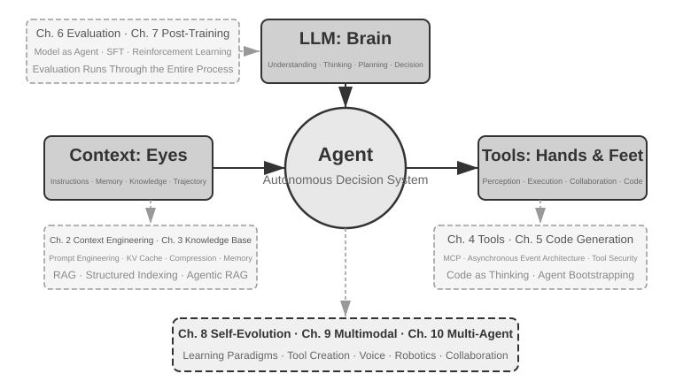
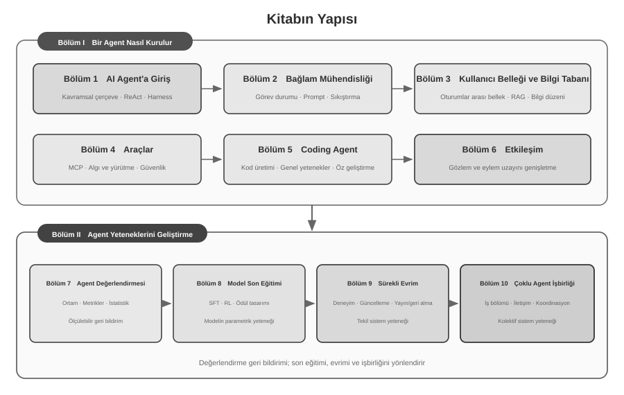

# Giriş {.unnumbered}

2025 yılının Ağustos ve Ekim ayları arasında Turing'in *AI Agent Bootcamp* programında bir dizi teknik ders verdim. Dersler tek bir soru etrafında şekillendi: deneyim ve sezginin yönlendirdiği tekrarlı denemeler yerine, açıklanabilir, doğrulanabilir ve yeniden kullanılabilir mühendislik ilkeleriyle AI Agentlar nasıl tasarlanır? Bu nedenle bir demo'yu çalıştırmak son nokta değildi. Belirli bir mimarinin neden seçildiğini, yetenek sınırlarını ve her tasarım kararının taşıdığı ödünleşimleri de inceledik. Bu kitap, ders materyallerinin ve eşlik eden deneylerin sistematik biçimde düzenlenmiş, genişletilmiş ve yeniden yapılandırılmış halidir.

Kitabın hazırlanışı da insan–Agent iş birliği üzerine bir deneydi. İlk fikirden son metne kadar araştırma ve metin yinelemelerinde Pine'ın sesli Agent'ıyla ağırlıklı olarak **whisper coding**, yani dikte temelli iş birliği kullandım. Bölüm taslağını ben dikte ettim; Agent ilgili kaynakları taradı ve ilk metni hazırladı. Ardından öğrenci geri bildirimlerini ekleyerek argümanları, örnekleri ve deneyleri tekrar tekrar kontrol edip düzelttim. Ses, düşünceleri dışsallaştırmanın maliyetini azalttı ve soru kurmaktan kaynak taramaya, yazmaya ve doğrulamaya uzanan döngüyü kısalttı. Dolayısıyla kitap yalnızca Agentları incelemiyor; bir Agentın derin biçimde katıldığı bilgi üretim tarzını da belgeliyor.

DeepSeek R1’in 2025 başında yayımlanmasından bu yana AI araştırması ve sektör pratiğinin odağı, temel model yeteneklerinden Agentların sistematik dağıtımına doğru genişledi. Model tarafında Agentic Reinforcement Learning, araç kullanımını ve ortam etkileşimini parametrelere içselleştirerek programlama, matematiksel akıl yürütme ve Computer Use alanlarındaki genel yetenekleri güçlendiriyor. Ürün tarafında Manus, Claude Code ve OpenClaw insan–bilgisayar etkileşimini değiştirdi ve ‘kod üretimi + dosya sistemi’ yaklaşımını önemli bir sistem mimarisi haline getirdi.

Derslerde özetlediğim Agent mimarisi ilkelerini yeniden incelediğimizde, model ve ürünler hızla değişse de bu ilkelerin istikrarlı bir açıklama gücünü koruduğunu görürüz. Skill, harness ve loop engineering gibi terimler daha sonra yaygınlaşmış olsa da karşılık geldikleri mühendislik uygulamaları genellikle daha önce ortaya çıkmıştır. Kavramlar, uygulamanın başlangıç noktası değil, çok sayıda pratik deneyimin genelleştirilmesinin sonucudur. Başka bir deyişle önce pratik gelir, isimlendirme sonra.

Bu ilkeler esas olarak uzun ufuklu ve yüksek riskli sistemlerin mühendisliğinden doğdu. Pine AI Chief Scientist olarak, Agentın kullanıcı adına insanlarla iletişim kurmasını ve fatura görüşmeleri, iade uyuşmazlıkları ve abonelik iptalleri gibi gerçek ekonomik çıkarları ilgilendiren karmaşık görevleri ele almasını sağlayan Pine ekibiyle çalıştım. Bu görevler uzun sürebilir ve çok sayıda tur içerebilir; tek bir yanlış adım gerçek kayba yol açabilir. Güvenilirlik, güvenlik ve denetlenebilirliğe ilişkin katı gereksinimler bu kitabın mimari ilkelerini şekillendirdi.

- Skill kavramı yaygınlaşmadan çok önce, prompt'ların sonsuzca şişmesi sorununu dinamik prompt yükleme yöntemiyle, araç listesinin sonsuzca şişmesi sorununu komut satırı üzerinden araç çalıştırma yaklaşımıyla, Agent'ın çalıştığı ortamı ve kullanıcının zamanını, çalışma durumunu algılayamaması sorununu ise sistem durum çubuğu tekniğiyle çözüyorduk.
- harness kavramı yaygınlaşmadan çok önce, modelin tool calling'deki kararsızlığı, halüsinasyonları, tehlikeli işlemleri, yetki aşan işlemleri ve talimatlara uymaması gibi sorunları Claude Code'a benzer yöntemlerle çözüyorduk.
- loop engineering kavramı yaygınlaşmadan çok önce, modelin görevi zamanından önce tamamlanmış sayması sorununu bu kitabın önerici-inceleyici (proposer-reviewer) dediği yöntemle çözüyorduk.

Bu yöntemler yalnızca Pine'a özgü değildir. Çok sayıda model ve Agent ekibi benzer sorunları çözerken birbirine yakın mühendislik yöntemlerini bağımsız olarak geliştirmiştir; bu yakınsama, söz konusu yöntemlerin Agent sistemlerinin ortak kısıtlarını yansıttığını gösterir. Bu bulgulara dayanarak 2025'te Turing'de “AI Agent Bootcamp” dersini açtım ve 2024–2026 arasında Çin Bilimler Akademisi Üniversitesi'nde AI Agent uygulama dersi verdim. Kitabı açık kaynak olarak yayımlamamızın amacı da yeniden kullanılabilir bu bilgi ve deneyimin daha fazla araştırmacı ve mühendise hizmet etmesidir.

**Önce pratik gelir, isimlendirme sonra.** Kurumsal Agent geliştirmede bunun anlamı, uygulamanın kavramların yaygınlaşmasının sürekli gerisinde kalmaması gerektiğidir. Bir terim sektörün ortak diline dönüştüğünde, işaret ettiği sorun çoğu zaman öncü sistemlerde uzun süredir araştırılmış olur. Bu sorunları daha erken tanımak ve çözmek için iki temel koşul gerekir.

**Birincisi, Agent'ın yetenek sınırına yeterince yüksek talepler yönelten gerçek bir iş alanı seçilmeli ve buradan sürekli gerçek geri bildirim alınmalıdır.** Pine'da bir görev saatler ya da haftalar sürebilir; birden fazla paydaşla tekrarlanan koordinasyon, uzun telefon görüşmeleri, karmaşık formlar ve çok sayıda e-posta alışverişi gerektirebilir. Aynı zamanda kritik sayıların doğruluğu, işlemlerin denetlenebilirliği ve kullanıcının çıkarı korunmalıdır. Yeterince karmaşık bir ortam, modelin yetenekleri ile iş gereksinimleri arasındaki boşluğu sürekli görünür kılar ve ekibi, modelin henüz tek başına çözemediği ancak işin zorunlu kıldığı sorunları sistematik biçimde ele alan bir harness kurmaya yöneltir. Gereksinimler bir sonraki model güncellemesiyle kolayca karşılanıyorsa istikrarlı sistem tasarımı ilkeleri biriktirmek daha zordur.

**İkincisi, sistematik bir değerlendirme (Evaluation) mekanizması kurulmalıdır.** Değerlendirme olmadan bir değişiklikten sonraki iyileşmenin tasarımın kendisinden mi yoksa rastlantısal dalgalanmadan mı kaynaklandığı belirlenemez. Değerlendirme, Agent yinelemesini deneyime dayalı yargıdan karşılaştırılabilir ve tekrarlanabilir bir mühendislik sürecine dönüştürür; bilimsel yöntemle sistem geliştirmenin temelidir. Bölüm 7 bu yöntemi ayrıntılı biçimde ele alır.

Alttaki modeller nasıl gelişirse gelişsin, ürün biçimleri nasıl yenilenirse yenilensin, başarılı Agent sistemlerinin neredeyse tamamı aynı mimari kalıpları izliyor. Bu bir rastlantı değil: **iyi tasarım ilkeleri zaten modelin yineleme döngülerini aşacak nitelikte olmalıdır**, çünkü tarif ettikleri şey belirli bir modelin kullanımı değil, akıllı sistemlerin dünyayla etkileşiminin temel kalıplarıdır.

Turing Ödülü sahibi ve pekiştirmeli öğrenmenin babası Richard Sutton, evrenin evriminin dört aşamadan geçtiğini söylemişti: tozdan yıldızlara, yıldızlardan yaşama, yaşamdan da Agent'lara (özgün ifadesiyle tasarlanmış varlıklara, designed entities). Biyolojik evrim kördür: rastgele mutasyon, doğal seçilim. Canlıların çoğu kendi işleyiş ilkelerini anlamaz, canlıları kendi başına tasarlayıp dönüştüremez. Agent ise evrenin evrim tarihinde bambaşka bir varoluş biçimidir: kod üreterek kendini başlatabilir (bootstrap) ve kendi kendine evrilebilir — tıpkı bir programcının başka bir programcı yazması, yeni programcının da bir sonrakini yazmaya devam etmesi gibi. Yani bir Agent kendi işleyiş mekanizmasını anlayabilir, bir hedef doğrultusunda bambaşka Agent'lar yaratabilir, hatta kendini iyileştirebilir. Bu kitabın misyonu, işte bu yaratma ilkelerini anlamanıza ve bunlarda ustalaşmanıza yardımcı olmaktır.

Bu kitabın çekirdek formülü tek bir cümleden ibaret: **Agent = LLM + Context + Tools**. Üçünden biri eksik olursa olmaz.

Daha sezgisel söylersek: **beyin + gözler + el ve ayaklar**. Beyin (LLM) düşünmeyi ve karar vermeyi üstlenir, gözler (context) Agent'ın hangi bilgiyi görebileceğini belirler, el ve ayaklar (tools) ise Agent'ın hangi işleri yapabileceğini belirler. (Kesin konuşmak gerekirse "gözler" yalnızca kaba bir benzetmedir: context sadece ortam bilgisini ve konuşma geçmişini değil, araç tanımı gibi içerikleri de kapsar; yani Agent'ın "gördüğü" bilgiler arasında "hangi el ve ayakların kullanılabilir olduğu" da vardır. Bu metafor tek bir temel sezgiyi aktarmayı amaçlıyor: context, modelin algılayabildiği bilgilerin tamamıdır.)



Pekiştirmeli öğrenmeye aşina okurlar için bu üçlü, RL'in biçimsel diline de eşlenebilir. Somut olarak LLM, Policy'ye (politika); context, Observation Space'e (gözlem alanı); tools ise Action Space'e (eylem alanı) karşılık gelir. Üç anlatım da aynı nesneyi işaret eder, aralarındaki tek fark ifade düzeyidir.

## Kitabın Yapısı {.unnumbered}

Kitabın on bölümü, birbiriyle bağlantılı iki soru etrafında düzenlenmiştir (Şekil 0-2). **I. Kısım, “Bir Agent Nasıl Kurulur?”,** Bölüm 1–6 kapsamındadır: temel kavramlardan context, bellek ve bilgi, araçlar, Kodlama Agentları ve gözlem ile eylem uzaylarının genişletilmesine ilerler. **II. Kısım, “Agent Yetenekleri Nasıl Geliştirilir?”,** Bölüm 7–10 kapsamındadır: değerlendirme önce ölçülebilir geri bildirim kurar; ardından model post-training, işletim deneyimine dayalı sürekli evrim ve multi-agent iş birliği, model parametreleri, tekil sistem ve kolektif sistem düzeylerinde yeteneği genişletir.



- **Bölüm 1 (Agent'ın Temel Bilgileri)**, birden fazla gerçek Agent ürününden yola çıkarak Agent'a dair sezgisel bir kavrayış kurar. Agent'ın çekirdek formülünü derinlemesine çözümler: uygulama katmanındaki LLM + Context + Tools'tan sezgi katmanındaki beyin + gözler + el ve ayaklara, oradan da akademik katmandaki Policy (politika), Observation Space (gözlem alanı) ve Action Space'e (eylem alanı). Ayrıca deneyler aracılığıyla ReAct döngüsünün, yani "düşün → eyle → gözlemle" yineleme sürecinin işleyişini inceler; görev içindeki context uyarlamasını, görevler arasında kalıcı harici artefakt güncellemelerini ve eğitim döngüsündeki parametre güncellemelerini birbirinden ayırır. Son olarak iş akışından otonom Agent'a uzanan orkestrasyon tasarım kalıplarını tartışarak sonraki bölümler için ortak bir kavramsal çerçeve kurar.
- **Bölüm 2 (Context Engineering)**, kitabın en kritik bölümüdür; context'i, yani Agent'ın "gözleri"ni sistematik olarak anlatır. Bölüm önce API mesaj yapısı ve Agent'ın çekirdek döngüsüyle başlayıp "context bir mesaj listesidir" temelini kurar; ardından KV Cache'in (büyük modellerin çıkarımı sırasında geçmiş hesaplama sonuçlarını yeniden kullanma mekanizması) alt düzey ilkelerine iner. Sonra sırasıyla şunları açar: Prompt Engineering (süreç odaklı tasarım, araç açıklamaları ve iş kurallarının inceltilmesi dahil) ile Prompt Injection saldırı-savunması, Agent Skills'in ihtiyaç halinde yükleme mekanizması, Agent durum çubuğu tekniği ve Context Compression stratejileri. Terimlerin tam tanımları, ana metinde ilk geçtikleri yerde verilir.
- **Bölüm 3 (Kullanıcı Belleği ve Bilgi Tabanı)**, context yönetimini oturumlar arasına yayılan kalıcı bir bilgi sistemine genişletir; böylece Agent yalnızca güncel konuşmanın içeriğini hatırlamakla kalmaz, birden fazla konuşma arasında bilgi biriktirip bu bilgiyi çağırabilir. Kullanıcı belleğinin dört kademeli stratejisini, RAG'ın (retrieval-augmented generation, yani önce ilgili dokümanları getirip sonra modele yanıt ürettirme) eksiksiz teknik yığınını (farklı metin arama yöntemleri ve arama sonucu sıralama optimizasyonu dahil), çok modlu bilgi çıkarmayı, daha ileri düzey bilgi düzenleme yöntemlerini ve Agentic RAG'ı (Agent'ın ne zaman ve neyi getireceğine kendisinin karar vermesi) kapsar.
- **Bölüm 4 (Araçlar)**, Agent ile dış dünya arasındaki köprüyü inceler: araçlar Agent'ın “el ve ayakları” olarak web araması, API çağrıları ve veritabanı işlemlerini mümkün kılar. MCP araç birlikte çalışabilirlik standardını ve beş araç türünün—algı, yürütme, iş birliği, olay tetikleme ve kullanıcı iletişimi—tasarım ilkelerini tanıtır; özellikle yürütme araçlarının güvenlik mekanizmalarına odaklanır. Olay tetikleme, kullanıcı iletişimi ve asenkron çalışma ortamı Bölüm 6'da ele alınır.
- **Bölüm 5 (Kodlama Agent'ı ve Kod Üretimi)**, bir Kodlama Agent'ı artı bir dosya sisteminin tüm genel amaçlı Agent'lar için en temel teknik dayanak olduğunu savunur. OpenClaw mimarisini ana eksen alarak Kodlama Agent'ının iş akışını ve uygulama tekniklerini çözümler; kod üretiminin programlamanın ötesindeki geniş değerini gösterir: düşünmeye yardımcı olmaktan bilgi tabanı kurmaya, dinamik olarak yeni araçlar yaratmaya ve Agent bootstrapping'e kadar.
- **Bölüm 6 (Etkileşim: Gözlem ve Eylem Uzaylarının Genişletilmesi)**, Agent ile ortam arasındaki etkileşimi **kiplik** ve **zamansallık** boyutlarında inceler. Asenkron ve olay güdümlü sistemler dış olayların sürekli alınmasını ve yanıtlanmasını sağlar; ses, algı, akıl yürütme ve üretimi gerçek zamanlı çalışmaya taşır; Computer Use eylem uzayını grafik arayüzlere, robotik ise fiziksel ortama genişletir. Bu dört alan uyandırma, güvenli nokta, iptal, öncelikli kesme ve hızlı/yavaş yol ayrımı gibi sistem ilkellerini paylaşır.
- **Bölüm 7 (Agent'ın Değerlendirilmesi)**, bilimsel bir değerlendirme metodolojisi kurar. Değerlendirme ortamlarını (tool calling tipi ve insan-bilgisayar etkileşimi tipi olmak üzere iki temel paradigma ile bölüm sonunda ayrıca ele alınan simülasyon ortamları), veri kümesi tasarım ilkelerini, LLM-as-a-Judge otomatik değerlendirme yöntemini, değerlendirme güdümlü model seçimini ve değerlendirme sonuçlarını sistem iyileştirmelerine dönüştüren eksiksiz kapalı döngüyü kapsar.
- **Bölüm 8 (Model Post-Training)**, iki post-training tekniğine derinlemesine iner: SFT (denetimli ince ayar, yani etiketli veriyle modele "örneğe bakarak öğrenmeyi" öğretmek) ve RL (pekiştirmeli öğrenme, yani modelin deneme-yanılma ve ödül geri bildirimiyle kendini geliştirmesi). "SFT ezberler, RL genelleştirir" ve "veri ile ortam algoritmadan daha önemlidir" temel savları etrafında; pre-training/SFT/RL şeklindeki üç aşamalı panoramayı, klasik RL teorisini, ödül sinyali tasarımını (ikili ödüllerden süreç ödüllerine, oradan "sonucu ödüllendir, süreci kısıtla" yaklaşımındaki doğrulanmış yol cezasına), tek turlu ve çok turlu pekiştirmeli öğrenme algoritmalarını ve örnek verimliliği optimizasyonu gibi öncü araştırmaları kapsar.
- **Bölüm 9 (Agent'ın Sürekli Evrimi)**, Agent'ın çalışma deneyiminin bir sonraki sürümün yeteneğine nasıl dönüştürüleceğini araştırır. Bölüm önce ortam sonuçlarından, süreç kurallarından ve LLM Rubric'ten oluşan öğrenme sinyalini kurar; ardından bilgi dokümanları, Prompt ile Skills, program ile Harness ve model parametreleri olmak üzere dört güncelleme taşıyıcısını karşılaştırır; son olarak aday sürümlerin doğrulanmasını, kademeli yayını (canary release), geri almayı ve uzun vadeli düzenlemeyi tartışır.
- **Bölüm 10 (Multi-Agent İş Birliği)**, kapsamı tekil yetenekten sistem düzeyindeki eşgüdüme genişleterek birden fazla Agent'ın işi nasıl bölüşüp birlikte çalıştığını inceler. Multi-Agent iş birliğinin sınıflandırma çerçevesini (context paylaşılan/bağımsız × eşdüzey/yönetici/merkeziyetsiz) sistematik olarak açıklar; çeviri Agent'ı ile telefon–bilgisayar eşgüdümlü Agent örnekleri üzerinden mimari tasarımı gösterir ve Agent toplumları ile ekonomilerinin olası gelişim yönlerini tartışır.

## Bu Kitap Nasıl Okunur {.unnumbered}

Kitabın bölümleri görece bağımsızdır; kendi ihtiyacınıza göre farklı okuma yolları seçebilirsiniz:

- **Agent geliştiricisiyseniz**, kitabı sırayla okuyun: Bölüm 1–6 Agent kurmak için bütünlüklü bir yöntem sunar; Bölüm 7–10 ise değerlendirme, model post-training, sürekli evrim ve multi-agent iş birliği yoluyla yetenek geliştirmeyi ele alır.
- **Vaktiniz kısıtlıysa**, öncelikle Bölüm 1'i (genel resmi kurmak için) ve Bölüm 2'yi (en kritik konu olan context engineering'de ustalaşmak için) okuyun. Bölüm 2'deki KV Cache'in alt düzey ilkeleri hayli tekniktir; ilk okumada bu ilke kısmını atlayıp yalnızca bölümün başında verilen üç temel sonucu aklınızda tutabilirsiniz, bu sonraki içeriği anlamanızı etkilemez.
- **İlginiz model eğitimindeyse**, doğrudan Bölüm 8'yi (model post-training) okuyabilirsiniz; buradaki değerlendirme yöntemleri (Bölüm 7) eğitimin ön koşulu olduğundan onu da birlikte okumanız, ayrıca bütünsel bir kavrayış için önce Bölüm 1 ve 2'yi okumanız önerilir.

Her bölüm çok sayıda **deney** ve **düşünce sorusu** içerir; numaralandırma biçimi "Deney X-Y" şeklindedir (X bölüm numarası, Y bölüm içindeki sıra numarasıdır). Deneylerin ve düşünce sorularının başlıklarında zorluk yıldızla belirtilir: ★ giriş seviyesini gösterir ve tüm okurlara uygundur; ★★ orta zorluğu gösterir ve belli bir mühendislik pratiği birikimi gerektirir; ★★★ ise ileri düzey bir meydan okumadır ve genellikle açık uçlu sorular ya da karmaşık sistem tasarımı içerir. Deneylerin çoğu eksiksiz ve çalıştırılabilir kodla birlikte gelir; bunlar kitaba eşlik eden açık kaynak depoda düzenlenmiştir:

> **Eşlik eden kod deposu**: [https://github.com/bojieli/ai-agent-book](https://github.com/bojieli/ai-agent-book)

Eşlik eden kodun tamamını Git ile edinebilirsiniz:

```bash
git clone https://github.com/bojieli/ai-agent-book.git
cd ai-agent-book
```

Git kullanmıyorsanız depo sayfasında **Code → Download ZIP** seçeneğini de kullanabilirsiniz. Deney kodları `chapter1/` ile `chapter10/` arasındaki dizinlerde bölümlere göre düzenlenmiştir. “Deney X-Y”yi bulmak için ilgili `chapterX/README.tr.md` dosyasını açın, deney numarasıyla proje dizinini bulun ve ardından bağımlılıkları kurup deneyi çalıştırmak için projenin kendi README dosyasındaki adımları izleyin. Yeniden üretim kılavuzu olarak işaretlenmiş bazı deneyler harici depolara bağlıdır; bunların nasıl edinileceği de ilgili README dosyalarında açıklanır.

Bu deneyleri bizzat çalıştırmanızı şiddetle öneririm. AI Agent son derece pratik bir alandır; tasarıma dair pek çok sezgi ancak elinizi kirletip hata ayıklama sürecinden geçtiğinizde gerçekten oturur.


## Ön Koşullar {.unnumbered}

Bu kitap belli bir teknik altyapıya sahip okurlara yöneliktir, ama belirli bir alanda uzman olmanızı gerektirmez. Ön bilgiler aşağıda "gerekli" ve "önerilen" olmak üzere iki düzeyde listeleniyor; böylece kendi hazırlık düzeyinizi değerlendirebilirsiniz.

**Gerekli: Kitabın tamamını okumanın temeli**

- **Python programlama**: Kitaptaki neredeyse tüm deneyler Python'a dayanır. Python'ın temel söz dizimine, yaygın veri yapılarına, paket yönetimine (pip) ve benzeri temel kavramlara aşina olmanız gerekir. Uzmanlık düzeyi beklenmiyor, ama orta karmaşıklıktaki Python kodunu okuyup değiştirebilmelisiniz.
- **LLM'lerle temel kullanım deneyimi**: ChatGPT, Claude ya da benzeri ürünleri kullanmış ve "prompt → model yanıtı" şeklindeki temel etkileşim kalıbını anlamış olmalısınız.
- **Bir AI destekli programlama aracı**: En az bir AI destekli programlama aracını (Claude Code, Codex, Cursor, TRAE vb.) kurmanızı ve bu araca alışmanızı şiddetle öneririm. Bir yandan bu araçlar deneylerin geliştirme verimliliğini belirgin biçimde artırır; kitaptaki deneyler bol miktarda kod yazma ve hata ayıklama içerir. Öte yandan bu programlama araçlarının kendisi zaten olgunlaşmış birer Kodlama Agent'ıdır; onları kullanırken ReAct döngüsünü, tool calling'i, context yönetimini, yani kitabın tekrar tekrar tartıştığı temel mekanizmaları doğrudan deneyimlersiniz. Bu birinci elden deneyim, Agent tasarım ilkelerini anlamak açısından son derece değerlidir.
- **Yazılım mühendisliği genel kültürü**: Komut satırı kullanımı, Git sürüm kontrolü, JSON veri formatı, REST API gibi temel kavramlara aşina olun. Bunlar hem deneyleri çalıştırmanın hem de Agent'ın tool calling mekanizmasını anlamanın temelidir.

**Önerilen: Belirli bölümlerin okuma deneyimini iyileştirir**

- **Makine öğrenmesi temelleri** (Bölüm 8): Eğitim ile çıkarım, kayıp fonksiyonu, gradyan inişi, aşırı öğrenme gibi temel kavramları bilmek, model post-training'i anlamaya yardımcı olur.
- **Temel matematik** (Bölüm 2-3 ve 7): Doğrusal cebire dair sezgisel bir kavrayış (örneğin vektörlerin yön ve büyüklük gösterebildiğini, matrislerin toplu işlem yapabildiğini bilmek) embedding'leri ve attention mekanizmasını anlamaya yardımcı olur; temel olasılık ve istatistik bilgisi ise değerlendirme metriklerini ve pekiştirmeli öğrenmedeki beklenen ödülü anlamayı kolaylaştırır. Kitaptaki matematik karmaşık türetmelere girmez, sezgisel açıklamalara ağırlık verir.
- **Web geliştirme temelleri** (Bölüm 4 ve 9): HTTP, WebSocket, ön uç/arka uç ayrımına dayalı mimari gibi kavramları bilmek, olay güdümlü asenkron Agent mimarisini ve sesli Agent'ların gerçek zamanlı iletişim deneylerini anlamaya yardımcı olur.
- **Transformer mimarisi hakkında temel bilgi** (Bölüm 2 ve 7): Transformer, bugün neredeyse tüm büyük dil modellerinin alttaki mimarisidir. Büyük modellere dair temel bilgisini sistematik olarak tamamlamak isteyen okurlara *Illustrating Large Models* (《图解大模型》, Turing tarafından Çince yayımlandı) kitabını öneririm. Bu kitap Transformer mimarisini, pre-training ve fine-tuning gibi çekirdek kavramları sezgisel şemalarla anlatır ve elinizdeki kitabın Agent mühendisliği bakış açısıyla iyi bir tamamlayıcılık oluşturur.

Bu ön bilgilerin bazılarında eksiğiniz varsa, bu sizi caydırmasın. Kitabın çekirdek değeri **mimari tasarım ilkeleri ve mühendislik pratiğinin metodolojisi**dir; belirli bir algoritma ya da teknik değil. Bölüm 8'deki post-training dışında kitabın matematik ve makine öğrenmesi beklentisi çok düşüktür; kitap rahatlıkla bir başlangıç noktası olarak kullanılabilir.

Agent teknolojisi hâlâ hızla evriliyor, ama **iyi mimari tasarım ilkeleri zamanı aşacak güce sahiptir**. "Neden böyle tasarlanıyor?" sorusunun yanıtını kavradığınızda, teknoloji dalgalarının değişimi içinde berrak bir muhakeme gücünü koruyabilirsiniz. Umarım bu kitap, AI Agent inşa ederken güvenilir bir rehberiniz olur.

## Teşekkür {.unnumbered}

Turing'den Meng Ge ve Liu Meiying hocalarıma özenli editörlükleri ve Turing "AI Agent Bootcamp" dersinin düzenlenmesi için gösterdikleri emek için teşekkür ederim; Liu Junming hocama da Çin Bilimler Akademisi Üniversitesi'nde (UCAS) AI Agent uygulama dersini açtığı için teşekkür ederim. Turing "AI Agent Bootcamp" programının tüm katılımcılarına ve UCAS AI Agent uygulama dersinin tüm öğrencilerine de özellikle teşekkür etmek isterim — bu dersleri anlattığım süre boyunca bana çok sayıda değerli geri bildirim ve öneri verdiler, kavramların kendisini de daha net görmemi sağladılar.

Pine AI'daki tüm çalışma arkadaşlarıma teşekkür ederim. Pine AI gibi mükemmel bir ürün ve onun beraberinde getirdiği türlü zorluklar olmasaydı, Agent alanında bu kadar derin bir kavrayışa ve pratiğe ulaşmam mümkün olmazdı; her fikir çarpışmasında meslektaşlarım da çok değerli düşünsel katkılar sundu.

AI sektöründeki pek çok dosta da teşekkür etmek isterim (adlarını burada tek tek anmıyorum). Çeşitli sektör tartışmalarında görüşlerime dürüst geri bildirimler verdiler, yanlış yargılarımın epeycesini düzelttiler ve modellere, Agent'lara dair kavrayışımı yükselttiler.

En çok teşekkür etmek istediğim ise ailem, özellikle de eşim Meng Jiaying. Bu kitabı yazma sürecim boyunca beni hep destekledi ve kitap için çok sayıda değerli görüş sundu.
