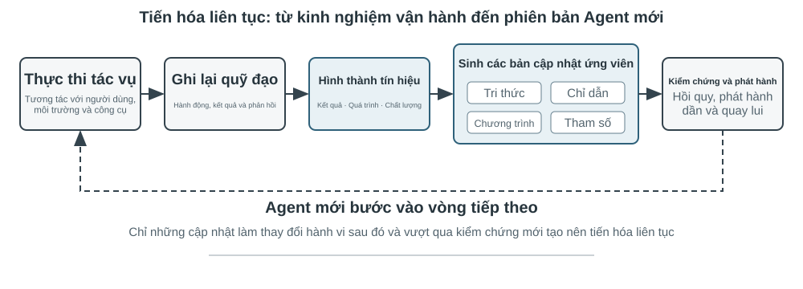

# Tương tác đa phương thức và thời gian thực

Các chương trước khám phá thiết kế của Agent trong thế giới văn bản—tương tác với các hệ thống kỹ thuật số thông qua ngữ cảnh, công cụ và mã. Tuy nhiên, đối tượng tương tác của Agent không chỉ là văn bản và API. Khi Agent cần hiểu hướng dẫn bằng giọng nói của người dùng, tìm và nhấp vào nút chính xác trên màn hình hoặc điều khiển cánh tay robot để nắm bắt chính xác các đối tượng, nó sẽ chuyển sang một trường mới: **Tương tác thời gian thực đa phương thức** - từ đầu vào và đầu ra văn bản đơn giản đến **nhận thức đa phương thức và phản hồi theo thời gian thực**, đây là bước quan trọng để Agent thoát ra khỏi "hộp thoại". Cái gọi là "đa phương thức" có nghĩa là xử lý nhiều dạng thông tin cùng một lúc - văn bản, giọng nói, hình ảnh, video, hành động - không chỉ văn bản.

Đầu tiên hãy xác định ranh giới của chương này. Hiểu tài liệu và hình ảnh tĩnh - xem ảnh chụp màn hình, đọc biểu đồ, phân tích cú pháp PDF - đã được tích hợp một cách tự nhiên vào thực hành Agent trong các chương trước dưới dạng công cụ nhận thức: Đối với các mô hình lớn đa phương thức ngày nay, loại nhiệm vụ "một lần nhập, một lần hiểu" này tương đối hoàn thiện và không yêu cầu thiết kế kiến trúc đặc biệt. Chương này tập trung vào một loại vấn đề khác: ba tình huống trong đó **thời gian thực khiến các vấn đề đa phương thức trở nên khó khăn**—đối thoại bằng giọng nói, hoạt động GUI và điều khiển robot. Trong những tình huống này, đầu vào được luân chuyển liên tục và đầu ra phải được phân phối trong phạm vi ngân sách thời gian nghiêm ngặt, dẫn đến sự thay đổi về chất trong thiết kế kiến trúc. Đối với việc hiểu theo thời gian thực về các luồng hình ảnh liên tục (video), đây vẫn là một vấn đề mở đối với Agent tại thời điểm viết bài - những hạn chế của ảnh chụp màn hình theo từng khung hình được thảo luận trong phần Computer Use của chương này và các câu hỏi cuối chương sẽ quay lại chủ đề này. Một ranh giới khác cần được rút ra: **tạo sinh** đa phương thức (tạo hình ảnh và video) chỉ là một lệnh gọi công cụ thông thường trong khuôn khổ cuốn sách này (Chương 5 Tạo đa phương tiện đã được đề cập). Agent có thể sử dụng nó như một công cụ bên ngoài. Nó không liên quan đến vấn đề tương tác thời gian thực sẽ được giải quyết trong chương này, vì vậy nó không nằm trong nội dung chính của chương này.

Tương tác bằng giọng nói, Computer Use và hoạt động của robot dường như trải rộng trên ba lĩnh vực hoàn toàn khác nhau, nhưng khi thực hiện, bạn sẽ thấy rằng các khu vực bị kẹt rất giống nhau: chúng đều xử lý nhiều thông tin phương thức cùng một lúc và chúng đều cực kỳ nhạy cảm với độ trễ. Việc tạm dừng lời nói hơn hai giây có thể khiến mọi người lo lắng và cảm giác bồn chồn ở mức một phần nghìn giây trong quá trình điều khiển robot có thể dẫn đến va chạm. Cùng với nhau, hai ràng buộc này đẩy ba kịch bản theo cùng một hướng kiến trúc: từ **dây chuyền lắp ráp nối tiếp**(giống như dây chuyền lắp ráp tại nhà máy, một liên kết được hoàn thành trước khi được bàn giao cho dây chuyền tiếp theo) đến **mô hình đầu cuối**(một mô hình thống nhất đi trực tiếp từ đầu vào đến đầu ra, loại bỏ sự cần thiết của các liên kết chuyển giao trung gian).

Chương này diễn ra trong ngữ cảnh sau:

1. Trước tiên, hãy sử dụng "ba mô hình kiến trúc giọng nói" để thiết lập hệ tọa độ - phân tầng (VAD-ASR-LLM-TTS Pipeline), full-modal (Omni, một mô hình nhưng vẫn thay phiên nhau nói), song công hoàn toàn (Moshi, GPT-Live, nghe và nói), và dọc theo trục “làm thế nào để loại bỏ giả định lần lượt của VAD” để tháo gỡ sự chậm trễ và đánh đổi của mỗi liên kết; phần phân tầng cũng sẽ nói về cách sử dụng nhận thức giọng nói truyền phát để thay thế VAD + ASR.
2. Hãy xem cách kiến trúc tư duy dung hòa mâu thuẫn giữa “phản ứng thời gian thực” và “suy nghĩ sâu”: từ sự song song đơn giản giữa nhanh và chậm, đến lộ trình tách rời trong đó mô hình lý luận nền đóng vai trò là “nhà chiến lược” (phái đoàn GPT-Live, Pine AI, v.v.), đến “tư duy và nói” của Step-Audio R1 “nội hóa” suy nghĩ thành một mô hình duy nhất.
3. Sau đó thảo luận về việc tối ưu hóa lớp thực thi để tổng hợp giọng nói giống con người hơn.
4. Cuối cùng, mở rộng góc nhìn sang Computer Use (cho phép AI vận hành màn hình máy tính giống như con người) và vận hành robot để xem các vấn đề về độ trễ và đa phương thức giống nhau biểu hiện như thế nào trong hai tình huống này.

Có hai điểm chính đặc biệt mang tính lý thuyết và có thể được chuyển qua các tình huống: **Kiến trúc tư duy**(cách tư duy nhanh và chậm phối hợp với nhau) và **Giao diện nhanh và chậm** bắt nguồn từ nó (Cầu tiềm ẩn, những gì khác có thể được truyền giữa các mô hình nhanh và chậm ngoài văn bản). Mặc dù bắt đầu từ cảnh giọng nói nhưng chúng không chỉ phục vụ giọng nói - Computer Use sau đây và robot cũng sẽ gặp phải vấn đề “khi nào nên thuê chuyên gia tư vấn chậm”, điều này đáng được độc giả đặc biệt quan tâm.

## Giọng nói: giao diện người–máy tự nhiên nhất

Giọng nói không chỉ là chuyển văn bản thành âm thanh. Tốc độ nói nhanh khoảng bốn lần tốc độ gõ và giải phóng tay, mắt, nên Agent tự nhiên trở thành một vòng lặp vào–ra liên tục mà người dùng có thể ngắt bất cứ lúc nào. Đọc chính tả chuyển lời nói thành văn bản; voice Agent cho phép người dùng cộng tác trực tiếp với Agent. Cả hai đều hỗ trợ quy trình whisper coding đã giới thiệu trước đây.

Phần này xét hai hướng: người dùng nói với Agent, và Agent nói với thế giới bên ngoài thay mặt người dùng. Mô hình giọng nói quyết định Agent có thể trả lời gì; kiến trúc tương tác quyết định Agent có nghe rõ, đáp kịp thời, chuyển lượt tự nhiên, hoàn tất xác nhận và gọi công cụ trong cuộc gọi hay không.

### Thời gian tương tác: từ cascade đến full-duplex

Bài giới thiệu GPT-Live của OpenAI nêu ba mô hình tương tác bằng giọng nói: cascade, theo lượt và full-duplex[^ch9-12]. Đây không phải chuỗi thay thế đơn giản mà là các đánh đổi khác nhau giữa độ trễ, chi phí và khả năng quan sát:

| Mô hình | Cấu trúc cốt lõi | Ưu điểm chính | Hạn chế chính |
| --- | --- | --- | --- |
| Cascade | VAD → ASR → LLM → TTS | Mô-đun rõ ràng, dễ thay thế và gỡ lỗi | Độ trễ cộng dồn, thông tin cận ngôn ngữ mất ở các giao diện |
| Omni end-to-end | Một mô hình nghe, suy nghĩ và nói | Độ trễ thấp hơn, giữ tốt giọng điệu, cảm xúc và âm thanh môi trường | Vẫn theo lượt; huấn luyện và gỡ lỗi tốn kém hơn |
| Full-duplex | Liên tục nghe, nói và quyết định | Nói chồng, ngắt lời tự nhiên và luồng liên tục | Huấn luyện, điều khiển và đánh giá phức tạp hơn |

Điểm chung là thoát khỏi giả định mọi người phải nói lần lượt và khỏi phỏng đoán của VAD về người đang giữ lượt. Cascade và Omni vẫn chia tương tác thành các lượt; full-duplex biến quyền giữ lượt thành quyết định liên tục của mô hình.

[^ch9-12]: OpenAI. *Introducing GPT-Live.* 2026-07-08. https://openai.com/index/introducing-gpt-live/ Phân loại cascade / turn-based / full-duplex xuất phát từ phần tóm tắt ba thế hệ ChatGPT Voice; thuật ngữ “end-to-end omnimodal (Omni)” tương ứng với nhóm “turn-based voice models”.

**Hủy streaming:**

```python
while audio_is_arriving:
    partial = asr.push(audio_chunk)
    if endpoint_is_probable(partial):
        candidate = llm.start(partial)
        if later_audio_changes_meaning(partial):
            cancel(candidate)                 # speculative cancellation
        else:
            tts.enqueue_stable_segments(candidate)

on_final_transcript(text):
    commit_or_restart(text)
```

### Mô hình 1 · Pipeline cascade

Phần lớn trợ lý giọng nói thương mại vẫn dùng pipeline tuần tự (Hình 9-1): VAD quyết định người dùng đã nói xong, ASR chuyển âm thanh thành văn bản, LLM hiểu và tạo câu trả lời, rồi TTS đọc câu trả lời. Tính mô-đun giúp tối ưu từng thành phần độc lập, nhưng mỗi ranh giới lại thêm thời gian chờ.



| Mô-đun | Vai trò | Nút thắt thường gặp |
| --- | --- | --- |
| VAD | Xác định lời nói đã kết thúc | Ngưỡng im lặng gây chờ và tách lượt sai |
| ASR | Chuyển âm thanh thành văn bản | Độ trễ nhận dạng và mất ngữ cảnh |
| LLM | Hiểu, suy luận và sinh câu trả lời | Thời gian đến token đầu tiên; reasoning làm chờ lâu hơn |
| TTS | Chuyển văn bản thành giọng nói | Tổng hợp gói đầu tiên và bộ đệm phát |

Với câu trả lời ngắn không reasoning, thời gian chờ của VAD, ASR, LLM và TTS cộng dồn theo chuỗi (Hình 9-2); giá trị thực phụ thuộc độ dài đầu vào, mô hình, phần cứng, mạng và tải. Trong sản xuất, xếp hàng còn khuếch đại độ trễ nhàn rỗi (Hình 9-3).


> **Thử nghiệm 9-1 ★: Xây dựng Agent thoại truyền thống**
>
> Kết nối microphone, Silero VAD, Whisper cục bộ, LLM streaming và Fish S1 TTS qua WebSocket để lập đường cơ sở cascade. Bằng chứng thực của một lượt còn lại cho thấy chuỗi media và mô hình chạy end-to-end; đây không phải benchmark về đồng thời hay tải sản xuất. Mã và hồ sơ nghiệm thu ở [chapter9/live-audio](../chapter9/live-audio/).

> **Bổ sung: Xây dựng Agent thoại WebRTC “gọi cho người dùng”**
>
> Phone Agent không cần PSTN. WebRTC trên trình duyệt có thể tái hiện vòng lặp mở phiên, hỏi thông tin thiếu, đọc lại để xác nhận và lưu kết quả có cấu trúc. Khi cần liên hệ tổ chức bên ngoài, thay hợp đồng công cụ bằng nhà cung cấp PSTN/SIP phù hợp. Đường truyền media, so sánh direct/ReAct và bằng chứng nghiệm thu ở [chapter9/phone-agent](../chapter9/phone-agent/). Dự án giữ các run identifier lịch sử \`exp9-2\`, nhưng không còn là một thử nghiệm được đánh số trong bản thảo.

#### Từ tuần tự đến nhận biết streaming

Streaming ASR có thể tạo transcript tạm thời trong khi người dùng nói; LLM gửi câu đầu tiên có thể đọc được cho TTS; TTS trả về các đoạn âm thanh để chồng lấp sinh, tổng hợp và phát. Điều đó không làm ASR, LLM và TTS song song hoàn toàn: nếu transcript một phần thay đổi, phải hủy, khởi động lại hoặc sửa phần sinh; chỉ bật \`stream\` là chưa đủ.

Streaming thông thường cũng không bỏ được thời gian chờ im lặng của VAD. Front end VAD + ASR tích lũy độ trễ, làm mất do dự, cảm xúc, backchannel và âm thanh môi trường; tên riêng hay địa chỉ email có thể bị chia giữa các đoạn. Mô hình streaming thực sự cần encoder nhân quả hoặc theo khối cùng giải mã tăng dần. Encoder của Whisper chờ toàn bộ đoạn âm thanh nên không nên gọi là mô hình streaming nhân quả. Mô hình âm thanh dựa trên LLM có thể phát văn bản và sự kiện ngữ nghĩa từ âm thanh liên tục, nhưng mô phỏng bằng prefix không phải cam kết hiệu năng của mô hình nhân quả.

Ngoài token văn bản, luồng có thể phát \`speak_start/end\`, \`interrupt\` (ranh giới lời nói và ý định ngắt), \`emotion\` (cảm xúc và do dự), \`laugh\`, \`sigh\`, \`noise\` (âm thanh cận ngôn ngữ và môi trường). Nhờ vậy Agent không phải nén mọi sự kiện âm thanh thành văn bản thường.

[^ch9-11]: Về việc đưa phán đoán lượt vào bộ nhận dạng và vấn đề nhãn sử dụng thông tin tương lai, xem Bojie Li và Noah Shi, *The Trade-off Was in the Labels: Causal Supervision for Turn-Aware Streaming ASR*, 2026 (sắp xuất bản).

> **Thử nghiệm 9-2 ★: Mô phỏng nhận biết giọng nói streaming bằng Qwen2-Audio**
>
> Bản thân Qwen2-Audio không phải mô hình streaming. Thử nghiệm mô phỏng nhận biết liên tục bằng các prefix âm thanh tăng dần và so sánh với VAD 600 ms + Whisper. Canonical run vượt qua các cổng thực thi và provenance nhưng chỉ tái hiện 2/6 hành vi: các lệnh prefix mất 8,4–11,3 giây, mẫu pause bỏ sót \`silence\`, và mẫu noise vẫn phân loại sai \`cough/laughter\`. Đây là kết quả âm tính để kiểm tra cơ chế và lỗi; không phải bằng chứng cho nhận biết streaming thật 100–200 ms. Toàn bộ hồ sơ ở [chapter9/streaming-speech](../chapter9/streaming-speech/).

### Mô hình 2 · Mô hình omnimodal end-to-end (Omni)

Ngay cả khi có nhận biết streaming, cascade vẫn đưa nghe, suy nghĩ và nói qua các giao diện rời rạc; cảm xúc, ngữ điệu và âm thanh môi trường có thể mất khi âm thanh biến thành văn bản. Omni dùng một mô hình để nghe, sinh câu trả lời và nói, giữ được tín hiệu phi văn bản nhưng tốn hơn khi huấn luyện, gỡ lỗi và thay thành phần (Hình 9-4). Self-cascade có thể sửa lỗi nhận biết khi văn bản đủ cho nhiệm vụ; nếu câu trả lời phụ thuộc tốc độ nói, cảm xúc hoặc môi trường, nút thắt văn bản làm mất bằng chứng không thể đảo ngược[^ch9-13].

Omni vẫn giả định chia lượt và thường dùng VAD hoặc endpointing ngữ nghĩa. Một khoảng dừng trong chuỗi số có thể bị coi là kết thúc; nhận biết streaming cải thiện phán đoán nhưng không xóa lượt.

[^ch9-13]: Đo lường đầy đủ thời điểm lợi thế độ chính xác giữa cascade và end-to-end đảo chiều, xem Li, Bojie và Noah Shi, *The Cascade Gap: When and Why Self-Cascades Help Multimodal Agents*, 2026 (sắp xuất bản).


Realtime speech API nằm giữa cascade và Omni: mô hình xử lý âm thanh native nhưng điều khiển tương tác vẫn dựa vào VAD, ngắt lời và gọi công cụ bất đồng bộ. So sánh có ích không phải bảng xếp hạng mà là cách hai đường end-to-end và self-cascade thất bại ở các nhiệm vụ khác nhau.

> **Thử nghiệm 9-3 ★★: Chạy MiniCPM-o 4.5 cục bộ — end-to-end so với self-cascade**
>
> Cố định một revision cục bộ, tắt chế độ suy nghĩ, rồi so sánh câu trả lời trực tiếp từ audio với self-cascade (transcribe trước, trả lời từ transcript sau). Đo khả năng giữ thông tin âm thanh, **không** đo khả năng “vừa nói vừa suy nghĩ” về sau.
>
> | Loại nhiệm vụ | End-to-end | Self-cascade | Quan sát |
> | --- | ---: | ---: | --- |
> | Số học ngữ nghĩa (2) | 1/2 | 2/2 | Self-cascade sửa một lỗi phiên âm |
> | Tốc độ nói cận ngôn ngữ (2) | 2/2 | 1/2 | Transcript văn bản xóa khác biệt nhanh/chậm |
> | Tổng | 3/4 | 3/4 | Tổng bằng nhau, lỗi bổ sung |
>
> Mẫu nhỏ nên không chứng minh đường nào thường chính xác hay nhanh hơn. Phiên bản, đầu ra thô và bằng chứng audio-to-audio ở [chapter9/end-to-end-speech](../chapter9/end-to-end-speech/).

Step-Audio 2 cho thấy đường end-to-end xử lý audio thô và phát văn bản lẫn giọng nói, chú ý đến cảm xúc, tốc độ, ngữ điệu và âm thanh môi trường. Step-Audio R1 đưa suy luận vào mô hình âm thanh và làm ví dụ cho “vừa suy nghĩ vừa nói”.

### Mô hình 3 · Mô hình tương tác full-duplex

Omni vẫn tách “người dùng nói” và “mô hình nói”, nhưng phiên dịch đồng thời cần chồng lấp. Full-duplex lắng nghe và nói liên tục, liên tiếp quyết định có tiếp tục, dừng, ngắt hay gọi công cụ. Moshi của Kyutai là một ví dụ nghiên cứu sớm. Thinking Machines Lab gọi đây là **Interaction Model**[^ch9-14]: tương tác được xây trong mô hình thay vì lắp quanh VAD. GPT-Live đưa hướng này lên quy mô sản xuất và ủy thác việc phức tạp cho mô hình suy luận nền trong khi mô hình tiền cảnh giữ cuộc trò chuyện.

[^ch9-14]: Thinking Machines Lab, “Interaction Models: A Scalable Approach to Human-AI Collaboration”, 2026-05. https://thinkingmachines.ai/blog/interaction-models/

Đường tiến hóa là: cascade đoán lượt bằng ngưỡng im lặng; nhận biết streaming nâng phán đoán lên mức ngữ nghĩa; full-duplex biến việc đổi lượt thành quyết định liên tục.

### Thời gian nhận thức: tương tác thời gian thực và suy nghĩ sâu

Mô hình tiền cảnh phải trả lời khi người dùng còn chờ; mô hình nền có thể suy nghĩ lâu hơn. Đây là ba đánh đổi, không phải các bậc tiến hóa tuyến tính:

| Thiết kế | Tiền cảnh | Nền | Rủi ro chính |
| --- | --- | --- | --- |
| Lấp chỗ nhanh, sửa chậm | Trả lời ngay | Nghĩ lại và bổ sung | Mâu thuẫn |
| Tương tác nhanh, lời khuyên chậm | Giữ mạch hội thoại và chọn cách nói | Lời khuyên hoặc kết quả công cụ | Giao diện hạn chế |
| Hợp nhất suy nghĩ và biểu đạt | Vừa suy nghĩ vừa nói | Chia sẻ trạng thái mô hình | Chi phí huấn luyện và thay thế cao |

Giải pháp đầu có thể xử lý câu hỏi hai lần và tự mâu thuẫn. Giải pháp hai ổn định hơn nhờ gửi lời khuyên qua status bar, nhưng tiền cảnh không thấy suy luận trung gian và không thực sự suy nghĩ trong khi nói. Giải pháp ba hợp nhất hai quá trình. Trong Step-Audio R1, MGRD neo suy luận vào đặc trưng âm học, còn kiến trúc hai não MPS cho phép lập kế hoạch và biểu đạt chạy song song (Hình 9-5 và 9-6). Mô hình hợp nhất tự nhiên hơn; thiết kế tách rời dễ thay “bộ não” nền hơn.

### Tổng hợp giọng nói giống con người hơn

TTS truyền thống quá trơn tru và ít ngắt nghỉ sẽ để lộ bản chất máy móc. LLM chính có thể phát thêm các marker điều khiển như \`THINKING\`, \`EMO:happy\`, \`SPEED:0.8x\`; TTS ánh xạ chúng thành khoảng dừng, ngữ điệu, tốc độ, tiếng cười và tiếng thở dài. Có thể huấn luyện TTS hiểu marker hoặc dùng voice cloning với nhiều đoạn tham chiếu.

> **Thử nghiệm 9-4 ★★: TTS điều khiển bằng token với Fish Audio**
>
> Dùng Fish Audio S1 để xây dựng thư viện giọng nhiều tham chiếu và so sánh ba cấu hình: không marker, một đoạn tham chiếu và nhiều đoạn tham chiếu. Lớp thực thi chọn cảm xúc, tốc độ và phong cách khớp marker. Cấu hình nhiều tham chiếu đạt điểm cao nhất trong ba vòng nghe mù cân bằng (độ giống nhân viên dịch vụ khách hàng thật 4,67/5), nhưng thứ tự dự kiến không lặp lại đầy đủ vì nhánh không marker vượt nhánh một tham chiếu. Kết quả gợi ý kiểm soát biểu cảm có ích, song nghiên cứu nghe nhỏ không kết luận chất lượng giọng nói nói chung. Thư viện 24 tham chiếu, media A/B/C và hồ sơ nghiệm thu ở [chapter9/controllable-tts](../chapter9/controllable-tts/).
## Computer Use: GUI Tự động hóa Agent

Khi đọc điều này, bạn có thể nhận thấy rằng chương này dành nhiều không gian cho giọng nói hơn đáng kể so với hai cảnh cuối - điều này là có chủ ý. Trên tiến trình phát triển của đa phương thức thời gian thực, giọng nói là thứ hoàn thiện nhất và đáng được sử dụng làm hệ thống tham chiếu nhất: bắt đầu từ vấn đề "độ trễ đường ống nối tiếp quá cao", thông qua một loạt các giải pháp như end-to-end, full-duplex, suy nghĩ và nói chuyện, v.v., cho đến phần cuối tương đối hình thành ngày nay, toàn bộ quá trình của vấn đề → giải pháp → kết thúc đã được hoàn thành. Vì vậy, hãy giải thích nó kỹ lưỡng. Hai cảnh tiếp theo của Computer Use và robot có thể được xem trong ngữ cảnh giọng nói - chúng đã đạt đến giai đoạn nào của đường tiến hóa này và chúng đang bị mắc kẹt ở đâu.

Ba kịch bản này có vẻ khác nhau nhưng chúng phải đối mặt với những thách thức cốt lõi giống nhau: nhận thức theo thời gian thực, ra quyết định có độ trễ thấp và tương tác liên tục. Hãy xem cách các chủ đề kỹ thuật này được tái tạo trong tương tác trực quan (Computer Use) và tương tác vật lý (robot) – trước tiên bằng cách mở rộng góc nhìn từ phương thức thính giác sang phương thức thị giác: Điều gì sẽ xảy ra nếu Agent không chỉ hiểu được lời nói mà còn có thể “đọc” màn hình và vận hành giao diện đồ họa?

Computer Use (còn gọi là GUI Automation Agent) cho phép AI sử dụng phần mềm giống con người bằng cách quan sát màn hình và thao tác chuột, bàn phím - chẳng hạn như mở trình duyệt để tìm kiếm thông tin, điền dữ liệu vào phần mềm bảng tính hoặc điều chỉnh cấu hình trong cài đặt hệ thống. Cốt lõi của nó là một chu trình nhận thức-suy nghĩ-hành động (Hình 9-7):

1. Agent chụp ảnh màn hình hiện tại
2. Mô hình đa phương thức nhận ảnh chụp màn hình và hướng dẫn nhiệm vụ, đồng thời đưa ra suy nghĩ và hành động cụ thể.
3. Lớp thực thi thực hiện hành động trong môi trường thực (di chuyển chuột, nhấp chuột, nhập văn bản, v.v.)
4. Đợi giao diện phản hồi rồi chụp ảnh màn hình lại để vào chu kỳ tiếp theo.

**Vòng lặp an toàn Computer Use:**

```python
observation = capture_screenshot_and_accessibility_tree()
proposal = model.decide(task, observation)
action = validate_schema_and_coordinates(proposal)

if action.is_irreversible and not user_or_policy_approval(action):
    stop("approval required")
else:
    execute_in_sandbox_or_scoped_session(action)
    new_observation = capture_after_settle()
    if not verify_goal_progress(new_observation, action):
        rollback_if_possible_or_replan()
```


Có ba chiều thiết kế chính trong chu trình này: **không gian hành động**(những thao tác mà Agent có thể thực hiện), **định vị trực quan**(cách tìm phần tử mục tiêu trong ảnh chụp màn hình) và **kiến trúc mô hình**(cách tạo hành động chính xác từ ảnh chụp màn hình).

### Thiết kế không gian hành động

Anthropic xác định ba loại công cụ để hình thành khả năng tương tác hoàn chỉnh (Hình 9-8):


**GUI Operation Tool**(công cụ máy tính): Thao tác chuột bao gồm di chuyển (mouse_move), nhấp chuột trái/phải/giữa, nhấp đúp/ba lần, kéo (left_click_drag) và nhấn/nhả chi tiết hơn (left_mouse_down/up). Cuộn hỗ trợ bốn hướng và có thể được sử dụng với các phím bổ trợ. Thao tác trên bàn phím bao gồm nhập từng từ (loại, mỗi ký tự cách nhau 12 mili giây để mô phỏng thao tác gõ thực), tổ hợp phím (phím, chẳng hạn như Ctrl+C) và nhấn và giữ (hold_key). Các hành động được nhận biết: ảnh chụp màn hình (ảnh chụp màn hình), lấy vị trí con trỏ (cursor_position), chờ (wait).

**Công cụ thực thi lệnh**(công cụ bash): Cung cấp phiên cuối bash liên tục, thời gian chờ 120 giây, phát hiện xem lệnh có được thực thi thông qua chuỗi trọng điểm hay không và duy trì trạng thái môi trường giữa nhiều lệnh gọi (ví dụ: sau khi cd vào một thư mục, lệnh gọi tiếp theo sẽ vẫn ở trong thư mục đó).

**Công cụ chỉnh sửa tệp**(str_replace_editor): Chỉnh sửa an toàn đạt được thông qua khớp chuỗi. Nó hỗ trợ các hoạt động xem, tạo, thay thế, chèn và hoàn tác. Nó chính xác hơn việc ghi đè trực tiếp toàn bộ tập tin và ít có khả năng vô tình làm thay đổi nội dung khác.

> **Thử nghiệm 9-5 ★: Chạy Computer Use (lộ trình tham chiếu Anthropic hoặc lộ trình mô hình mở)**
>
> Lộ trình A sử dụng Anthropic Computer Use Demo. Container đóng gói một môi trường desktop Ubuntu hoàn chỉnh, gồm trình duyệt, terminal và các công cụ thông dụng khác. Frontend nhận tác vụ; backend gửi hướng dẫn và ảnh chụp màn hình đến Claude, rồi thực thi các thao tác chuột, bàn phím, terminal hoặc chỉnh sửa do mô hình trả về. Lộ trình này dùng để tìm hiểu giao thức công cụ `computer` nguyên bản; không yêu cầu mọi độc giả đều phải có quyền truy cập Anthropic API.
>
> Lộ trình B sử dụng dự án đi kèm sách [`chapter9/computer-use-open-model`](../chapter9/computer-use-open-model/). Theo mặc định, dự án điều khiển browser-use bằng mô hình trọng số mở Qwen3-VL 32B Instruct, qua API được OpenRouter lưu trữ hoặc bằng cách trỏ `OPEN_MODEL_BASE_URL` đến vLLM/SGLang tự lưu trữ hay endpoint tương thích khác. Endpoint phải nhận được ảnh chụp màn hình và hỗ trợ JSON Schema nguyên bản; nếu chỉ hỗ trợ JSON thông thường, có thể bật rõ ràng chế độ tương thích schema-in-prompt.
>
> Hai lộ trình dùng cùng một tác vụ chỉ đọc và cùng một hợp đồng nghiệm thu: tối đa 25 bước, mỗi bước chỉ thực hiện một hành động, đồng thời lưu danh tính mô hình/endpoint, phản hồi nguyên gốc của nhà cung cấp, ảnh chụp từng bước, chuỗi hành động, câu trả lời cuối cùng và lý do dừng. Các mô hình khác nhau phải được báo cáo như những nhánh thí nghiệm riêng; không được trình bày kết quả mô hình mở như một lần tái lập Claude, cũng không được coi “container khởi động thành công” là hoàn thành tác vụ. Khoảng thời gian giữa hành động và chất lượng lập kế hoạch là kết quả đo được, không phải giả định trước rằng khoảng thời gian là 2–5 giây hoặc mô hình chắc chắn vượt trội hơn các mô hình khác.
>

### Định vị trực quan (Nối đất)

Trong mỗi vòng lặp, mô hình cần xác định chính xác phần tử mục tiêu trong ảnh chụp màn hình - "Hộp tìm kiếm ở đâu?" "Tọa độ của nút gửi là gì?" Đây là vấn đề định vị trực quan (Nối đất). Hiện tại có hai ý tưởng chính: một là biến định vị thành câu hỏi trắc nghiệm - đầu tiên đánh dấu các thành phần giao diện bằng số và mô hình chỉ cần chọn một trong số đó; cái còn lại là **dự đoán tọa độ thuần túy** - để mô hình trực tiếp "nhìn" vào ảnh chụp màn hình và báo cáo tọa độ như con người. Có hai cách để triển khai ý tưởng câu hỏi trắc nghiệm: **Chú thích trực quan thuần tuý**(Set-of-Mark gốc, sử dụng mô hình phân đoạn để cắt bỏ các vùng ứng cử viên trên pixel) và **Chỉ mục thành phần cấu trúc**(Cây DOM/Accessibility, đọc trực tiếp cấu trúc đi kèm với giao diện). Ưu điểm chung của ý tưởng câu hỏi trắc nghiệm là chuyển đổi câu hỏi mở "tìm nút trong ảnh chụp màn hình và dự đoán tọa độ" thành câu hỏi đóng "chọn một trong các yếu tố được đánh dấu" - giống như các câu hỏi trắc nghiệm trong bài thi dễ trả lời chính xác hơn các câu hỏi điền vào chỗ trống. Mô hình chỉ cần nói "nhấp [123]" thay vì "nhấp vào nút màu xanh lam cách khoảng 200 pixel ở bên phải góc trên bên trái của màn hình."

**Set-of-Mark: Phương pháp chú thích trực quan.**

Set-of-Mark (SoM) ban đầu được Microsoft Research đề xuất vào năm 2023, ban đầu nhằm phát huy khả năng định vị trực quan của GPT-4V. Đây là một phương pháp **hoàn toàn trực quan**: sử dụng mô hình phân đoạn hình ảnh (SAM, SEEM, v.v.) để tự động cắt các vùng ứng cử viên trên ảnh chụp màn hình và chồng các điểm đánh dấu được đánh số lên từng vùng. Những gì mô hình nhìn thấy là một hình ảnh được đánh số, chỉ cần báo số, hệ thống sẽ chuyển đổi thành tọa độ trung tâm của khu vực tương ứng. Toàn bộ quá trình không yêu cầu DOM hoặc bất kỳ cấu trúc giao diện nội bộ nào, do đó, giao diện trò chơi và phần mềm máy tính để bàn gốc cũng có thể được áp dụng - miễn là mô hình phân khúc có thể loại bỏ các khu vực ứng cử viên.

**Chỉ mục phần tử có cấu trúc: Triển khai có cấu trúc các ý tưởng SoM trên Web.**

Chú thích có thể được thực hiện chính xác hơn khi chính giao diện cung cấp thông tin có cấu trúc. Các trang web hiện đại có cấu trúc thành phần hoàn chỉnh (cây DOM) và các vai trò ngữ nghĩa (là nút, là hộp nhập liệu) được xác định trước khi hiển thị. Cây trợ năng cung cấp thông tin tương tự cho nhiều ứng dụng trên máy tính để bàn. Thay vì yêu cầu mô hình phân đoạn đoán "nút là khu vực nào" trong pixel, tốt hơn là bạn nên hỏi trực tiếp chính giao diện "bạn có những yếu tố nào có thể nhấp vào được?". Giải pháp Web Agent do dự án browser-use đại diện thực hiện chính xác điều này: liệt kê và đánh số các phần tử tương tác từ DOM, có thể được coi là triển khai có cấu trúc các ý tưởng SoM trên Web (Hình 9-9). Quá trình này được chia thành bốn bước:

1. Lấy biểu diễn có cấu trúc (DOM tree) và thông tin truy cập của trang web thông qua giao diện gỡ lỗi trình duyệt (CDP, Chrome DevTools Protocol)
2. Tự động phát hiện những thành phần nào có thể tương tác (nút, hộp nhập liệu, liên kết, v.v.)
3. Gắn nhãn cho mỗi phần tử có thể tương tác bằng một ID duy nhất và vẽ hộp giới hạn trên ảnh chụp màn hình
4. Đồng thời, tạo ra một danh sách văn bản để mô tả các thành phần tương ứng với mỗi ID.

```text
Ảnh chụp màn hình: [Các thành phần chính trong ảnh được đánh dấu bằng ID như [1], [2], [3], [4], v.v.]

Elements:
[1] <input type="text" placeholder="Search" aria-label="Search" />
[2] <button id="submit-btn" aria-label="Submit form" />
[3] <input type="text" placeholder="Enter your name" value="" />
[4] <a href="/docs" aria-label="Documentation" />
```

Mô hình chỉ cần xuất số ID và hệ thống sẽ tự động sử dụng tọa độ trung tâm của phần tử để thực hiện nhấp chuột. Loại giải pháp này không lưu mã thông báo (vì tất cả thông tin chú thích phải được gửi đến mô hình), nhưng định vị chính xác và ổn định, đồng thời tránh được các phát hiện bị bỏ sót và phát hiện sai có thể do mô hình phân đoạn đưa ra.


**Dự đoán tọa độ thuần túy.**

Tuyến thứ ba không thực hiện bất kỳ chú thích nào và trực tiếp cho phép mô hình xuất tọa độ. Lấy việc sử dụng **SeeClick** và Claude của máy tính làm ví dụ: đào tạo mô hình trực quan dựa trên dữ liệu được ghép nối của các ảnh chụp màn hình và vị trí phần tử GUI khổng lồ, đồng thời cho phép mô hình học cách ánh xạ các mô tả ngôn ngữ tự nhiên (chẳng hạn như "nhấp vào nút gửi") trực tiếp tới tọa độ chính xác trong ảnh chụp màn hình - giống như người dùng con người, hoàn toàn dựa vào "tìm kiếm" để tìm vị trí cần nhấp.

Trong sơ đồ dự đoán tọa độ, sự hiểu biết của mô hình về tọa độ phụ thuộc nhiều vào độ phân giải được sử dụng trong quá trình huấn luyện (Hình 9-10). Claude được đào tạo bằng XGA (1024x768), WXGA (1280x800) và FWXGA (1366x768). Nếu độ phân giải ảnh chụp màn hình đầu vào không khớp, tọa độ mà mô hình dự đoán sẽ được bù một cách có hệ thống - giống như đo khoảng cách trên bản đồ nhỏ và sau đó sử dụng trực tiếp trên bản đồ lớn. Do đó, cần triển khai cơ chế chia tỷ lệ tọa độ hai chiều trên lớp công cụ và chọn độ phân giải mục tiêu theo tỷ lệ khung hình để tránh kéo dài không đẳng cự làm biến dạng hình ảnh và làm sai lệch phán đoán tọa độ. Ví dụ: nếu độ phân giải màn hình thực là 2560×1440 (16:9), bạn nên chọn một trong ba mức được Claude hỗ trợ với tỷ lệ khung hình cũng gần 16:9 – FWXGA (1366×768) là phù hợp nhất. Khi chụp ảnh màn hình, hãy chia tỷ lệ màn hình thành 1366×768 và gửi cho mô hình; sau khi mô hình xuất ra tọa độ nhấp chuột (683, 384), nó sẽ được ánh xạ ngược sang tọa độ thực (683×2560/1366, 384×1440/768) ≈ (1280, 720). Ngược lại, nếu bạn kéo căng mạnh 16:9 thành 4:3 1024×768, màn hình sẽ bị nén theo chiều ngang và tọa độ mà mô hình dự đoán sẽ bị dịch chuyển một cách có hệ thống.


Logic lựa chọn của ba tuyến đường có thể được tóm tắt như sau: **Khi có sẵn thông tin có cấu trúc, chỉ mục Cây DOM/Accessibility** được sử dụng đầu tiên và vị trí là chính xác và ổn định nhất; **Khi không có sẵn**(phần mềm máy tính gốc như Photoshop, giao diện kết xuất Canvas/WebGL, trò chơi), **Bạn có thể sử dụng chú thích trực quan (tuyến SoM gốc) hoặc dự đoán tọa độ**. Chú thích trực quan biến việc định vị thành một câu hỏi trắc nghiệm, thân thiện hơn với các mô hình tổng quát chưa được đào tạo đặc biệt; dự đoán tọa độ loại bỏ bước chú thích và trực tiếp hơn đối với các mô hình đã trải qua khóa đào tạo định vị GUI. Vẫn còn khoảng cách về độ chính xác giữa hai yếu tố này trên các phần tử nhỏ và giao diện dày đặc.

> **Thử nghiệm 9-6 ★: Sử dụng browser-use để đạt được hoạt động trình duyệt tự động**
>
> Kết hợp Playwright, một framework tự động hóa trình duyệt, với mô hình đa phương thức để triển khai thao tác trình duyệt được điều khiển bằng ngôn ngữ tự nhiên. Bật trực quan hóa SoM và lưu ảnh chụp màn hình có hộp giới hạn được chú thích trước mỗi quyết định. Giao diện mô hình không bị giới hạn ở OpenAI hay Anthropic; sách cung cấp cấu hình API cho mô hình mở Qwen3-VL và giữ một base URL tổng quát tương thích OpenAI cho các dịch vụ lưu trữ khác hoặc suy luận tự lưu trữ.
>
> Nhiệm vụ kiểm tra “Mở Google và tìm thời tiết San Francisco”: sau khi khởi động, ảnh chụp màn hình hiển thị trang tìm kiếm Google với các phần tử tương tác được đánh số. Mô hình chọn hộp tìm kiếm, nhập “San Francisco weather today”, gửi tìm kiếm rồi trích xuất nhiệt độ và điều kiện thời tiết từ trang kết quả. Khi nghiệm thu, cần kiểm tra độc lập câu trả lời và quỹ đạo, đồng thời ghi trung thực số bước thực tế và thời gian đã dùng. “5 bước, khoảng 20 giây” chỉ có thể là giá trị quan sát của một lần chạy cụ thể, không phải kết quả cố định nếu không có biên nhận thực thi.
>
> Lần chạy chính thức của mô hình mở được lưu trong sách sử dụng `qwen/qwen3-vl-32b-instruct` trên OpenRouter. Khi gặp CAPTCHA ở bước 4 của Google Search, mô hình không tuyên bố thành công mà chuyển sang weather.com; đến bước 16, nó đọc từ trang Today của San Francisco: 64°F, Sunny, cảm giác như 62°F, cao nhất 74°F và thấp nhất 55°F. Cả 16/16 phản hồi API đều báo đúng mô hình Qwen3-VL được yêu cầu; 15 ảnh chụp bước hợp lệ cùng quỹ đạo hành động chỉ đọc đã vượt qua nghiệm thu quyết định độc lập. Kết quả này chứng minh lộ trình API mô hình mở có thể chạy được; nó không đồng nghĩa với việc đã tái lập nhánh sử dụng công cụ `computer` nguyên bản của Anthropic.

### Có thể xem hoạt hình và nghe âm thanh Computer Use Agent

Cho đến nay, nhận thức về Computer Use dựa trên một giả định ngầm: **Màn hình tĩnh**—chụp ảnh, suy nghĩ về một bước, nhấp chuột rồi chụp ảnh. Nhưng trên thực tế, màn hình sẽ phát video, các thông báo thoáng qua sẽ bật lên và giọng nói trong cuộc họp sẽ được phát. Agent, chỉ mở mắt sau mỗi 3–5 giây và hoàn toàn không có tai, không thể nhìn hay nghe thấy "những điều xảy ra giữa các khung hình" này. Xem các bản ghi màn hình, theo dõi các cuộc họp, nghe lời nhắc bằng giọng nói và xử lý các hộp thoại thoáng qua—toàn bộ danh mục hoạt động máy tính hàng ngày này gần như bị giới hạn đối với Computer Use Agent ngày nay.

Thứ thực sự cần được thiết kế lại ở đây không phải là "giao diện hành động", mà là " **giao diện quan sát**" [^ch9-9]. Ý tưởng cốt lõi là tách **quan sát**(liên tục, thích ứng, đa phương thức) khỏi **hành động**(rời rạc) và tạo một lớp phần mềm trung gian nhận thức (có thể gọi là Agent-Giao diện quan sát máy tính, AOI) được chèn giữa môi trường và bất kỳ mô hình Computer Use nào được tạo sẵn mà không cần đào tạo lại. Nó có ba thành phần "cổng theo yêu cầu": Đầu tiên, **Chụp khung hình chính giữa các khung** - đầu tiên sử dụng cổng pixel cực rẻ để bỏ qua hình ảnh gần như không thay đổi, sau đó sử dụng một mô hình nhỏ để xác định xem hình ảnh có những thay đổi có ý nghĩa hay không và chỉ chặn một khung hình khi có thay đổi, chi phí gần như bằng 0 đối với ảnh tĩnh; thứ hai, **Phiên âm giọng nói có kiểm soát âm lượng** - chỉ nhận dạng giọng nói khi có âm thanh, hãy để Agent Lần đầu tiên "mọc tai"; thứ ba, và quan trọng nhất, **tường thuật bức ảnh thành văn bản lâu dài** - hãy để mô hình mô tả khung hình đã chụp thành một câu ("Lời nhắc vừa xuất hiện cho biết ngày phát hành đã được thay đổi thành ngày 28 tháng 4") và **ngay cả khi hình ảnh gốc sau đó bị xóa khỏi ngữ cảnh, văn bản này vẫn còn trong bộ nhớ**, mang thông tin động xuống dưới dạng văn bản.

Một khám phá phản trực giác là điều thực sự quan trọng không phải là "nên chọn khung nào" mà là " **tường thuật các khung thành văn bản có thể được giữ lại trong thời gian dài**" - văn bản là phương thức mà LLM Agent xử lý tốt nhất. Trên tám mô hình từ quy mô 7B đến quy mô tiên tiến, lớp phần mềm trung gian này mang lại sự cải thiện từ +17 đến +48 điểm phần trăm mà không cần đào tạo lại. Trong số đó, khoảng cách là khác biệt nhất đối với các tác vụ lời nói: với việc bổ sung lớp nhận thức này, Agent có thể thực hiện tất cả các tác vụ lời nói mà ban đầu "nghe được nhưng không thể di chuyển". Nhưng không phải cấu hình cố định có thể chinh phục thế giới - trên một số mẫu máy mới hơn, việc nhồi quá nhiều mã thông báo hình ảnh sẽ lấn át khả năng lý luận và kéo giảm hiệu suất, vì vậy các thành phần này cần phải được chọn từng thành phần một theo mô hình, thay vì sử dụng tất cả cùng một lúc. Điều này giống như lựa chọn trước đây giữa Set-of-Mark và dự đoán tọa độ: không có viên đạn bạc trong sơ đồ nhận thức và nó phải được khớp theo đặc điểm của mô hình.

[^ch9-9]: Ba thành phần của khung hình chính, phiên âm theo yêu cầu và khung tường thuật thành văn bản cố định. Cơ chế hoàn chỉnh và sự cắt bỏ theo từng mô hình được tìm thấy ở Li, Bojie và Noah Shi. *Agent-Giao diện quan sát trên máy tính kích hoạt Computer Use động.* arXiv:2606.29472, 2026.

### Di động: Rào cản sinh thái còn khó hơn công nghệ

Computer Use cũng đang mở rộng sang thiết bị đầu cuối di động. Thực sự có sự khác biệt về mặt kỹ thuật giữa thiết bị đầu cuối di động và máy tính để bàn: không gian hành động thường không còn là "tọa độ chuột + bàn phím" mà truy cập vào dịch vụ trợ năng API của hệ thống (chẳng hạn như AccessibilityService của Android) để đọc các thành phần giao diện, thực hiện nhấp chuột và nhập văn bản; phương thức tương tác cũng thay đổi từ con trỏ chuột sang cử chỉ chạm và ngữ nghĩa của tọa độ thay đổi tương ứng - giống nhau (x, y) Cho dù đó là nhấp ngón tay, nhấn lâu hay điểm bắt đầu của cử chỉ trượt đều yêu cầu các loại cử chỉ bổ sung để xác định. Các điểm chuẩn dành cho thiết bị di động như AndroidWorld được giới thiệu trong Chương 6 được sử dụng để đánh giá khả năng của Agent trong việc hoàn thành các tác vụ Ứng dụng thực trong không gian hành động như vậy.

Nhưng điều thực sự cản trở thiết bị đầu cuối di động thường không phải là những khác biệt về mặt kỹ thuật mà là những rào cản về sinh thái. Một số nhà sản xuất điện thoại di động đã cố gắng tích hợp trợ lý AI vào điện thoại di động dành cho người tiêu dùng để cho phép chúng tự động vận hành các ứng dụng hàng ngày như WeChat, Taobao và Alipay, nhưng họ sớm gặp phải những hạn chế về nền tảng.

Điều này cho thấy một thách thức đặc biệt mà Computer Use phải đối mặt: **rào cản sinh thái**. Lý do cơ bản đằng sau lệnh cấm là xung đột mô hình kinh doanh. Logic kiếm tiền cốt lõi của các ứng dụng Internet truyền thống là **lưu lượng truy cập và sự chú ý**: người dùng xem quảng cáo khi duyệt các luồng thông tin, làm theo hướng dẫn của thuật toán đề xuất khi tìm kiếm sản phẩm và mua hàng tùy hứng khi duyệt các trang. Khi Agent hoạt động thay mặt người dùng, liên kết kiếm tiền này hoàn toàn bị bỏ qua: AI sẽ không chú ý đến quảng cáo cũng như không thực hiện các giao dịch mua hàng bốc đồng, nó sẽ đi thẳng đến mục tiêu và hoàn thành nhiệm vụ. Đối với một nền tảng dựa vào quảng cáo và lưu lượng truy cập để kiếm tiền, mọi hoạt động của Agent đều làm xói mòn nền tảng mô hình kinh doanh của nó.

Điều này có nghĩa là Computer Use không chỉ phải đối mặt với sự đối đầu về mặt kỹ thuật như CAPTCHA (mã xác minh) mà còn phải đối mặt với xung đột lợi ích về mặt cấu trúc. Khó có thể giải quyết mâu thuẫn này trong thời gian ngắn và việc triển khai Computer Use trong các tình huống tiêu dùng phải đối mặt với nhiều thách thức khó khăn hơn so với các vấn đề kỹ thuật thuần túy.

### Thời gian thực: Một thách thức cốt lõi vẫn chưa được giải quyết

**OSWorld**(phương pháp đánh giá của nó được trình bày chi tiết trong Chương 6) là điểm chuẩn đánh giá Computer Use được sử dụng rộng rãi để kiểm tra khả năng của Agent trong việc hoàn thành các tác vụ ứng dụng chéo trong môi trường Ubuntu/Windows/macOS thực. Tỷ lệ thành công của các mô hình chung ban đầu trên tiêu chuẩn này chỉ khoảng 20%. Các mô hình đặc biệt tiếp theo và các mô hình chung mạnh mẽ hơn tiếp tục đẩy tỷ lệ chính xác lên cao hơn và tính đến thời điểm viết bài, nó đã dần tiệm cận đến trình độ của con người. Nhưng độ chính xác còn lâu mới kết thúc - nút thắt thực sự đã chuyển từ “liệu nó có thể được thực hiện đúng không” sang “liệu nó có thể được thực hiện nhanh chóng” hay không.

**OSWorld-Human** Nghiên cứu về hiệu quả đã tiết lộ một sự thật đau lòng: Ngay cả khi nhiệm vụ cuối cùng thành công, Agent vẫn cần nhiều bước hơn đáng kể so với con người để hoàn thành cùng một nhiệm vụ và độ trễ lý do ở mỗi bước sẽ tiếp tục tăng lên khi nhiệm vụ tiến triển - ngữ cảnh càng dài, quá trình ra quyết định của mô hình càng chậm và các bước sau thường mất nhiều thời gian hơn so với các bước đầu. Việc điều chỉnh định dạng tài liệu mà con người có thể hoàn thành trong hàng chục giây có thể khiến Agent mất vài phút để hoàn thành. **Độ chính xác ở cấp độ con người không bằng tính thực tế—hiệu quả là điểm nghẽn thực sự.**

Nguyên nhân cốt lõi của vấn đề hiệu quả cũng tương tự như cảnh lồng tiếng: trong chu trình "chụp ảnh màn hình-nghĩ-nhấp chuột" nối tiếp, ngay cả khi mỗi liên kết được tối ưu hóa đến mức tối đa, độ trễ tích lũy từng bước vẫn không thể chấp nhận được. Vấn đề sâu xa hơn là: Computer Use hiện tại không hề "suy nghĩ trước" chút nào. Nếu Agent có thể dự đoán điều cần làm tiếp theo trong khi thực hiện hành động hiện tại - ví dụ: suy nghĩ về việc cần làm tiếp theo trong khi chờ tải trang - thì thời gian suy nghĩ và thực hiện có thể trùng lặp, giúp giảm đáng kể tổng độ trễ (điều này giống hệt với sự hấp dẫn của "suy nghĩ và nói" trong cảnh giọng nói trước đó trong chương này và Agent không đồng bộ "suy nghĩ liên tục" trong Chương 4, nhưng ở đây nó được thay thế bằng "suy nghĩ và vận hành").

Khác với trường giọng nói, bản chất thời gian thực của Computer Use - làm cho chu kỳ "nhấn ảnh chụp màn hình-nghĩ-nhấn" nhanh hơn - hiện tại chưa có giải pháp mang tính hệ thống nào và nó vẫn bị mắc kẹt trong chu kỳ rời rạc của ảnh chụp màn hình theo từng khung hình. Nhưng có một cách để vượt qua nó, đó là sử dụng khả năng tách tốc độ chậm xuất hiện nhiều lần trong chương này: Vì rất khó để làm cho một máy tính chậm vận hành Agent nhanh hơn, nên đừng để người dùng chờ đợi. Chia "nói" và "vận hành máy tính" thành hai bộ mô hình nhanh và chậm để chạy đồng thời [^ch9-10] - một mô hình nhỏ (nhanh) chịu trách nhiệm đối thoại bằng giọng nói theo thời gian thực và một VLM tiên tiến (chậm) hoạt động từng bước trong trình duyệt. Cả hai chỉ giao tiếp bằng một "hợp đồng văn bản thuần túy" tối giản: Agent chậm Mỗi thao tác đều đi kèm với một bản tóm tắt trạng thái cập nhật luân phiên ("Điền vào biểu mẫu và ngày sinh của bạn cũng được yêu cầu"), Agent nhanh sẽ phản hồi cho người dùng theo thời gian thực và truyền tải thông tin mới bằng lời nói do người dùng cung cấp tới Agent chậm và **Agent nhanh thì không bao giờ được phép nói "xong"** trước khi hoàn tất xác nhận tóm tắt trạng thái **. Đây chính xác là tình huống “nói chuyện điện thoại và để máy tính tự vận hành”. Trong thử nghiệm, bộ tách rời này giúp phản hồi bằng giọng nói nhanh hơn khoảng 15 lần so với "một mô hình nói trong khi vận hành" (độ trễ trung bình là 0,58 giây so với 8,64 giây), trong khi tỷ lệ thành công của nhiệm vụ không giảm; Một khi kênh văn bản giữa tốc độ và độ chậm bị xóa, tỷ lệ thành công ngay lập tức giảm xuống 0 - vì thông tin chính do người dùng cung cấp bằng lời nói không thể truyền tới trình duyệt được nữa. Đây là ý tưởng tương tự như Cầu tiềm ẩn trước đó và "suy nghĩ và nói" trong cảnh thoại: khi một liên kết chậm tự nhiên, hãy để một liên kết nhanh khác lấp đầy sự chờ đợi của người dùng - nhưng "hợp đồng văn bản thuần túy" đó về cơ bản là thanh trạng thái Agent từ Chương 2 của cuốn sách này đến nay. Computer Use Bản thân việc tăng tốc vòng lặp có thể vẫn là hướng nghiên cứu quan trọng tiếp theo, nhưng "sử dụng khả năng tách rời nhanh và chậm để ẩn 'chậm'" đã là một câu trả lời có sẵn.

[^ch9-10]: Bạn có thể tìm thấy thiết kế hoàn chỉnh về khả năng tách tốc độ hoạt động bằng giọng nói và "hợp đồng văn bản thuần túy" ở Li, Bojie và Noah Shi. *Nói chuyện trong khi diễn xuất: Real-Time Giọng nói chậm Computer-Use Agents.* 2026 (sẽ được xuất bản).

## Vận hành robot: dọn bàn làm việc với XLeRobot

> **Cách đọc phần này**: từ đầu đến cuối chúng ta chỉ dùng một nhiệm vụ——"đặt cốc đỏ vào khay, bỏ tờ giấy vàng vào thùng rác, cuối cùng quan sát thêm một lần để xác nhận trạng thái mặt bàn". Thử nghiệm 9-7 và 9-9 chạy trên XLeRobot thật, cần cánh tay robot, hiệu chuẩn, nút dừng khẩn cấp và người giám sát tại chỗ. Thử nghiệm 9-8, 9-10 và 9-11 là các bản đối ứng chạy trên GPU cục bộ. Kết quả trên máy thật và trong mô phỏng được báo cáo tách bạch, nhưng mục tiêu nhiệm vụ, ý nghĩa hành động và điều kiện thành công thì giữ nguyên như nhau.

Vận hành robot khó hơn nhiều so với "nhìn ảnh rồi trả lời câu hỏi". Mô hình không chỉ phải hiểu khung cảnh mà còn phải hành động liên tục trong thế giới thực, và mỗi hành động lại làm thay đổi tình huống ở khoảnh khắc kế tiếp. XLeRobot khiến khác biệt ấy trở nên rất cụ thể. Cùng một cánh tay, người ta có thể điều khiển từ xa bằng bàn phím, tay cầm chơi game hay thiết bị VR; cũng có thể giao quan sát từ camera cùng một nhóm công cụ hành động hạn chế cho Agent để nó tự gọi. Phần cứng không đổi, nhiệm vụ cũng không đổi; thứ duy nhất đổi là ai đang vận hành——ở trường hợp trước, con người liên tục quan sát và sửa sai; ở trường hợp sau, mô hình và hệ điều khiển phải tự làm trọn vẹn công việc đó.

Phần này xâu chuỗi năm thử nghiệm bằng việc "dọn bàn làm việc". Trước hết, con người điều khiển từ xa chiếc XLeRobot thật, để đo xem phần cứng này làm được đến đâu dưới tay một người vận hành đủ giỏi. Kế đó, trong bộ mô phỏng, ta thiết lập giới hạn trên lý tưởng của việc điều khiển cho cùng nhiệm vụ ấy. Tiếp theo, để Agent tự chủ điều khiển chiếc XLeRobot thật, nhằm quan sát xem tri giác, lập kế hoạch và khả năng phục hồi sau thất bại quyết định kết quả ra sao. Sau đó, đưa đúng bản giao kèo công cụ ấy vào bộ mô phỏng và so sánh một lượt ba chiến lược: thực thi vòng hở, kiểm tra theo từng bước, và mô hình thế giới. Cuối cùng, ta thay đổi nền, hình dáng vật thể, ánh sáng và nhiễu thị giác để xem chính sách thị giác học trong mô phỏng có thích nghi được với môi trường mới hay không.

Nút thắt ở đây thường không nằm ở việc làm thêm một bộ chuẩn hỏi đáp tĩnh nữa, mà ở chỗ giữ cho mô hình khép kín được vòng điều khiển với băng thông tri giác và điều khiển hạn hẹp. Một hệ robot dùng được ít nhất phải trả lời bốn câu hỏi sau:

1. Con người muốn hoàn thành nhiệm vụ gì?
2. Nhiệm vụ con nào sẽ làm tiếp theo?
3. Kỹ năng hiện tại sinh ra hành động cụ thể nào?
4. Sau khi thực thi hành động, thực tế có còn khớp với kế hoạch ban đầu không?

Phần này đặt bốn câu hỏi ấy vào cùng một vòng điều khiển của XLeRobot, và chỉ ra bốn kỹ thuật lần lượt gánh phần nào: lập kế hoạch dài hạn quyết định xử lý cốc trước hay giấy trước; VLA hoặc các nguyên thủy hành động lo việc gắp và đặt; mô hình thế giới ước lượng hệ quả của một hành động; còn bước chuyển từ mô phỏng sang thực tế gánh lấy khác biệt giữa video huấn luyện với camera và cơ cấu chấp hành thật. Dù mô hình cấp cao đã có đủ tri thức và năng lực lập kế hoạch, chỉ cần thiếu một mắt xích trong vòng phản hồi này là hệ thống vẫn có thể không hoàn thành nổi nhiệm vụ.

### Phân công giữa phần cứng và thuật toán

Câu hỏi đầu tiên mà XLeRobot thích hợp trả lời nhất là: khi việc tự chủ dọn bàn thất bại, là cánh tay không làm nổi, hay thuật toán không biết dùng cánh tay? Ở đây có một sự thật không nên nói giảm đi: **ngay cả một cánh tay chỉ vài trăm đô la như XLeRobot, nếu điều khiển từ xa, cũng đã có thể hoàn thành một nhiệm vụ trên bàn gồm nhiều bước nối tiếp như trong phần này**——con người nhìn video camera, gắp cốc đỏ bỏ vào khay, bỏ tờ giấy vàng vào thùng rác, rồi kiểm tra lại trạng thái lần cuối. Kết quả này không chỉ có nghĩa "phần cứng vừa đủ dùng", mà là một bằng chứng chẩn đoán rõ ràng: **xét riêng nhiệm vụ này, nút thắt nằm ở thuật toán chứ không nằm ở bản thân phần cứng.**

Cách chẩn đoán rất thẳng thắn. Giữ nguyên camera, cánh tay, kẹp, cách bày biện mặt bàn và điều kiện thành công, trước hết để con người đảm nhận vòng điều khiển. Con người liên tục hiệu chỉnh ước lượng vị trí vật thể, lựa chọn hành động và thời điểm ra tay, đồng thời biết xử lý khi gắp hụt. Khoảng cách giữa hệ tự chủ và con người lộ ra chính ở năng lực vòng kín ấy. Dĩ nhiên tầm với của kết luận này là nhiệm vụ trên bàn ở phần này: nó cho thấy phần cứng đã vượt ngưỡng tải trọng, độ chính xác và không gian làm việc mà nhiệm vụ này cần, chứ không có nghĩa một cánh tay vài trăm đô la kham nổi mọi môi trường mở hay những thao tác khó hơn.

XLeRobot hỗ trợ nhiều lối vào điều khiển từ xa: bàn phím, tay cầm Xbox, Joy-Con của Switch và thiết bị VR. Người vận hành làm một cách tự nhiên nhiều việc mà thuật toán buộc phải cài đặt tường minh: giảm tốc khi kẹp lại gần cốc, sửa điểm gắp khi cốc trượt, quan sát lại khi không kẹp được tờ giấy trong một lần, và xác nhận kết quả khi vật thể đã vào vùng đích. Vì vậy điều khiển từ xa không chỉ là cách thu thập dữ liệu trình diễn, mà còn là một thử nghiệm chẩn đoán "giữ nguyên phần cứng, chỉ thay người vận hành".[^ch9-1]

> **Thử nghiệm 9-7 ★: Điều khiển từ xa XLeRobot thật để dọn bàn**
>
> Đặt vào vùng làm việc của một chiếc XLeRobot thật: cốc đỏ, khay, tờ giấy vàng vo tròn và thùng rác. Người vận hành thực hiện nhiệm vụ cố định qua một trong các lối điều khiển từ xa đã hiệu chuẩn: "đặt cốc đỏ vào khay, bỏ tờ giấy vàng vào thùng rác, cuối cùng quan sát thêm một lần để xác nhận trạng thái mặt bàn". Lặp ít nhất vài vòng, ghi lại video camera, đầu vào của người vận hành, trạng thái cánh tay, thời lượng hành động, các lần gắp hụt, số lần thử lại và trạng thái cuối cùng.
>
> Đừng hạ tiêu chí nghiệm thu xuống thành "cuối cùng mặt bàn trông sạch sẽ". Cốc đỏ phải nằm trong khay và tờ giấy vàng phải nằm trong thùng rác, cánh tay phải trở về tư thế an toàn, và suốt quá trình không được có va chạm, ra khỏi vùng làm việc, hay việc con người ra tay làm thay mà không kiểm chứng.

Điều khiển từ xa trên máy thật là cách thuyết phục nhất để cho thấy giới hạn trên của nhiệm vụ, nhưng lại không tiện để thay đổi hàng loạt số lượng và vị trí vật thể. Để có một đối chứng lặp lại được và tính được thống kê, tiếp theo ta chuyển chính bài toán "đưa vật thể về đúng chỗ" ấy sang một bộ mô phỏng mặt bàn hai chiều, và dùng bộ điều khiển lý tưởng thay cho một người vận hành giỏi không hề nhìn nhầm cũng không chọn sai hành động.

> **Thử nghiệm 9-8 ★: Đo giới hạn trên lý tưởng của việc điều khiển cùng nhiệm vụ trong bộ mô phỏng**
>
> Trong bộ mô phỏng mặt bàn hai chiều, đặt ngẫu nhiên cốc đỏ, tờ giấy vàng cùng các vùng đích tương ứng, rồi để bộ điều khiển lý tưởng lần lượt tiến đến vật thể, gắp lên và đưa về đúng vị trí. Nó không cần nhận dạng hình ảnh và cũng không chọn sai hành động, nên nó biểu thị "khi tri giác lẫn quyết định đều đúng thì nhiệm vụ này ít nhất đi được đến đâu".
>
> Hãy xem tỷ lệ thành công, số bước cần dùng và độ dài quãng đường; đồng thời thay đổi vị trí ban đầu của vật thể và quy mô nhiệm vụ để xem giới hạn lý tưởng ấy có ổn định không. Ta dùng cùng điều kiện thành công như Thử nghiệm 9-7, nhưng thứ được đo là một mô phỏng không có cơ cấu chấp hành: điều đó không có nghĩa chiếc XLeRobot thật đã cử động. Hai thử nghiệm sẽ là hai đường cơ sở cho phần điều khiển tự chủ về sau——Thử nghiệm 9-7 là vòng kín của con người trên phần cứng thật, còn Thử nghiệm 9-8 là vòng kín lý tưởng trong môi trường mô phỏng.

### Cấu trúc cơ bản của điều khiển robot

Hệ robot thường tách các công việc có thang thời gian khác nhau.

| Tầng | Câu hỏi cốt lõi | Đầu ra | Thang thời gian điển hình |
| --- | --- | --- | --- |
| Mục tiêu nhiệm vụ | Con người muốn hoàn thành điều gì | "Cốc và giấy về đúng chỗ" | Cỡ phút |
| Lập kế hoạch dài hạn | Làm gì trước, làm gì sau | Cốc trước, giấy sau, cuối cùng kiểm tra | Từ giây đến phút |
| Kỹ năng cơ bản | Bây giờ đạt được thay đổi trạng thái nào | `pick(red_cup)`, `place(red_cup, tray)` | Khoảng 1—3 giây |
| VLA / chính sách kỹ năng | Kỹ năng này cụ thể cử động ra sao | Chuyển động ngắn hoặc quỹ đạo liên tục của kẹp XLeRobot | Suy luận ~1—10 Hz |
| Điều khiển mức thấp và tầng an toàn | Làm sao thực thi ổn định và không trễ | Lượng điều khiển khớp hoặc đầu công tác, giới hạn tốc độ và dừng khẩn cấp | ~50—1000 Hz |

Đây là cách phân công kỹ thuật thường gặp, không phải kiến trúc mô hình duy nhất. VLA hoàn toàn có thể gánh một phần phán đoán ở cấp cao, và bộ lập kế hoạch có thể là chương trình dựa trên luật, một VLM, hay một bộ tối ưu. Chọn cách cài đặt nào đi nữa, "thứ tự của nhiệm vụ" vẫn nên tách khỏi "hành động trước mắt"; nếu không, độ trễ suy luận của mô hình cấp cao sẽ kéo lùi điều khiển mức thấp, còn điều khiển tần số cao ở mức thấp lại buộc mô hình bên trên xử lý vô số chi tiết không liên quan. Trên XLeRobot, mô hình không nên trực tiếp xuất ra góc khớp tùy ý: nó chỉ chọn những kỹ năng có ranh giới rõ ràng như `pick`, `place`, `verify_state` và `stop`, rồi bộ thực thi đã hiệu chuẩn——có giới hạn tốc độ và có thời gian chờ tối đa——mới biến chúng thành chuyển động thật của cánh tay.

### Lập kế hoạch dài hạn và phân rã nhiệm vụ

Khi người dùng bảo "dọn bàn giúp tôi", hệ thống không thể ném nguyên câu ấy cho mô hình hành động. Bộ lập kế hoạch trước hết liệt kê các vật thể và mục tiêu trong khung cảnh, định ra thứ tự, rồi viết ra cho từng bước điều kiện khởi đầu, điều kiện kết thúc và giới hạn rủi ro. Chẳng hạn:

```text
Xử lý cốc đỏ → Dọn tờ giấy vàng → Kiểm tra mặt bàn
```

"Xử lý cốc đỏ" lại phân rã thành hai hành động và một lần kiểm tra:

```text
pick(red_cup) → place(red_cup, tray) → verify_state()
```

Mỗi kỹ năng hoàn tất cho ta một nút có thể kiểm chứng. Gắp hụt thì chỉ làm lại đúng bước ấy. Nếu ai đó dời vật thể hoặc người dùng đổi mục tiêu, chỉ cần lập lại kế hoạch cho những bước phía sau bị ảnh hưởng, chứ không phải làm lại toàn bộ kế hoạch cũ. Công cụ trao cho tác nhân cũng phải đủ đơn giản: mỗi lần gọi chỉ làm một việc, phạm vi cử động cố định, có thời gian chờ tối đa, và thực thi xong thì quan sát lại ngay.

> **Thử nghiệm 9-9 ★★: Để Gemini Robotics-ER 1.5 tự chủ dọn bàn bằng XLeRobot**
>
> Giữ nguyên chiếc XLeRobot thật, cách bày bàn, chỉ dẫn nhiệm vụ và điều kiện thành công của Thử nghiệm 9-7; chỉ thay người vận hành bằng một Agent. Giao việc quan sát và lập kế hoạch cho một mô hình suy luận nhập thân như Gemini Robotics-ER 1.5, và qua vòng lặp tác nhân kiểu RoboCrew chỉ mở đúng năm công cụ: `observe_scene`, `pick`, `place`, `verify_state` và `stop`.[^ch9-2]
>
> Mô hình trước hết quan sát mặt bàn, định ra thứ tự xử lý, rồi mới gọi các hành động gắp và đặt đã hiệu chuẩn của XLeRobot. Cứ hoàn tất một kỹ năng là phải quan sát lại và kiểm tra hậu điều kiện. Khi gắp hụt, nó chỉ được phép thử lại kỹ năng hiện tại; và phải gọi `stop` khi người dùng bảo dừng, khi vật thể ra khỏi vùng làm việc, hoặc khi không xác minh được trạng thái. Mô hình không được trực tiếp xuất ra góc khớp tùy ý, cũng không được bỏ qua bước kiểm chứng thật chỉ vì chính nó đã nói trước rằng "xong rồi".
>
> Tiêu chí nghiệm thu hệt như Thử nghiệm 9-7: cốc nằm trong khay, giấy nằm trong thùng rác, cánh tay trở về tư thế an toàn, không va chạm và không ra khỏi vùng. Khác biệt nằm ở chỗ: trong thử nghiệm tự chủ, ý nghĩa của nhiệm vụ phải đến từ chính quan sát của mô hình, hành động thật phải đến từ lời gọi công cụ, và trạng thái cuối cùng phải được xác nhận bằng một quan sát mới. Con người chỉ được khởi động, dừng khẩn cấp và giám sát an toàn, không được làm thay Agent giữa chừng. Chỉ như vậy Thử nghiệm 9-7 và 9-9 mới so sánh trực tiếp được: "với cùng phần cứng và cùng nhiệm vụ, vòng kín của mô hình còn thiếu gì so với vòng kín của con người".

Thử nghiệm trên máy thật phơi bày sai số hiệu chuẩn, camera bị che khuất và kẹp hỏng ăn, nhưng lại không thích hợp để lặp lại một lượng lớn sự cố một cách an toàn và có kiểm soát. Các thử nghiệm mô phỏng tiếp sau giữ đúng năm công cụ ấy cùng trạng thái nhiệm vụ y hệt, và chỉ thay cơ cấu chấp hành thật bằng một môi trường mặt bàn có thể tiêm lỗi, để tách bạch xem thực thi vòng hở, kiểm tra theo từng bước và dự đoán hành động mỗi thứ đóng góp được gì.

### Điều khiển bằng VLA

VLA là viết tắt của Vision-Language-Action, tức "mô hình thị giác—ngôn ngữ—hành động". Nó nhận khung cảnh hiện tại cùng một chỉ dẫn kỹ năng, rồi xuất ra hành động mà robot phải thực thi kế tiếp:

```text
quan sát hiện tại + chỉ dẫn kỹ năng → hành động
```

Trong ví dụ XLeRobot, bộ lập kế hoạch cấp cao chỉ đưa ra `pick(red_cup)`; còn tiếp cận cốc từ hướng nào, khép kẹp lúc nào, nâng cánh tay theo quỹ đạo ra sao là do VLA hoặc chính sách kỹ năng quyết định dựa trên khung cảnh hiện tại. Khi tầng thực thi hoàn tất chuyển động ngắn ấy, mặt bàn được chụp lại, và chỉ sau khi xác nhận cốc quả thật đã được gắp thì bộ lập kế hoạch mới được đưa ra `place(red_cup, tray)`. Nói cách khác, lời gọi công cụ định nghĩa thay đổi trạng thái mong muốn, còn VLA định nghĩa cách hiện thực hóa thay đổi trạng thái ấy bằng hành động liên tục.

RT-2 và OpenVLA cắt hành động liên tục thành các token rời rạc rồi xuất ra từng cái một, y như sinh câu chữ. π₀ đại diện cho hướng còn lại: sinh thẳng ra quỹ đạo hành động liên tục và mượt mà. Không có chuyện bên nào hơn bên nào một cách giản đơn. Token rời rạc dễ gắn với mô hình ngôn ngữ; quỹ đạo liên tục hợp hơn để biểu diễn chuyển động mượt. Lựa chọn thật sự là nên biểu diễn hành động ra sao, chứ không chỉ là mô hình lớn cỡ nào.[^ch9-15]

Mô hình lớn thường chỉ suy luận được 1—10 lần mỗi giây, trong khi bộ điều khiển truyền thống có thể cập nhật vài chục đến vài nghìn lần mỗi giây. Một cách làm thông dụng trong kỹ thuật là "chia đoạn hành động" (action chunking): mô hình sinh một lần một đoạn ngắn các hành động tương lai, luồng điều khiển thực thi đoạn ấy ở tần số cao, còn mô hình chuẩn bị đoạn kế tiếp ở phía sau. Nhờ vậy một phần thời gian chờ suy luận được giấu vào trong thời gian thực thi hành động. Cái giá phải trả là: đoạn càng dài thì chuyển động càng mượt, nhưng trong quãng ấy mô hình càng ít thấy khung cảnh mới. Nếu XLeRobot đang vươn tay định lấy cốc mà giữa chừng cốc bị va lệch đi, nó vẫn có thể tiếp tục thực thi những hành động sinh ra từ hình ảnh cũ. Vậy nên chia đoạn hành động là một sự đánh đổi giữa độ mượt và tốc độ phản ứng, chứ không phải một cách tăng tốc không mất gì.

Chia đoạn hành động thường cần một bộ khung "dự đoán—thực thi—chen ngang" thay vì chạy đoạn cho tới hết:

```python
chunk = vla(current_observation, skill)
for action in chunk:
    low_level.execute(action)
    if safety_event() or observation_changed_significantly():
        low_level.stop()
        discard_remaining(chunk)
        reobserve_and_replan()
        break
```

Đoạn ngắn phản ứng nhanh nhưng làm số lần gọi mô hình tăng lên; đoạn dài mượt hơn nhưng dễ dùng phải quan sát đã cũ. Thử nghiệm 9-10 so sánh loại đánh đổi này trong bộ mô phỏng, còn thứ chạm tới ranh giới an toàn của phần cứng thật là Thử nghiệm 9-9.

### Giới hạn của VLA

"Lập kế hoạch dài hạn + VLA" là một phương án nền dùng được, nhưng vẫn để lại vài vấn đề dễ bị bỏ sót.

- **Dữ liệu huấn luyện hạn chế**: các bản trình diễn robot ít hơn rất nhiều so với văn bản và hình ảnh trên internet. Mô hình từng thấy chữ "cốc" không có nghĩa nó đã thấy đủ loại cốc với mọi chất liệu và mọi điều kiện ma sát.
- **Học được cách bắt chước nhưng không hiểu hệ quả**: nhân bản hành vi chủ yếu học "người trình diễn làm gì tiếp theo", chứ không đòi hỏi tường minh rằng mô hình phải trả lời "hành động này gây ra chuyện gì".
- **Robot nào cũng khác nhau**: bậc tự do, hệ tọa độ, kẹp và độ trễ cơ cấu chấp hành khác nhau thì không có gì bảo đảm cùng một hành động chuyển nguyên xi được sang máy khác.
- **Quan sát có thể lỗi thời**: sau khi một đoạn hành động đã bắt đầu chạy, nếu vật thể bị dời đi, bị che khuất hay đổ xuống, mô hình vẫn đang phán đoán dựa trên khung hình trước đó.

Vì thế, mô hình ngôn ngữ biết chữ "cốc" không có nghĩa nó biết ma sát, tiếp xúc, chất lỏng sóng sánh hay dây nguồn sẽ làm trạng thái tương lai đổi khác ra sao. VLA chủ yếu trả lời "bây giờ nên làm gì"; muốn phán đoán "làm xong thì có thể xảy ra chuyện gì" thì cần một loại mô hình khác.

### Mô hình thế giới

Mô hình thế giới có thể hiểu là bộ dự đoán hệ quả của hành động. Thứ nó học là: ở trạng thái hiện tại, nếu thực hiện một hành động nào đó thì trạng thái ở khoảnh khắc kế tiếp có thể đổi khác ra sao.

```text
trạng thái hiện tại + hành động ứng viên
    → dự đoán trạng thái kế tiếp hoặc một mẩu tương lai
    → so sánh kết quả của các ứng viên
    → chọn hành động, lập lại kế hoạch, hoặc dừng an toàn
```

Một mô hình thế giới dùng được cho robot ít nhất phải làm tốt ba việc:

- hiểu được trạng thái hiện tại;
- dự đoán được kết quả mà các hành động khác nhau có thể mang lại;
- chuyển dự đoán ấy cho bộ lập kế hoạch hoặc bộ điều khiển để giúp lựa chọn.

Một VLM chỉ biết mô tả video, hay một mô hình chỉ biết sinh hình ảnh, không tự nhiên trở thành mô hình thế giới đáng tin cho robot. Nó phải biết hành động là gì, và dự đoán được ảnh hưởng của hành động ấy lên vật thể và môi trường. V-JEPA 2 đại diện cho hướng dự đoán tương lai ở trạng thái nội tại, còn World-Action Model học tường minh quan hệ "hành động—quan sát tương lai". Chúng có thể dùng song song với VLA, không nhất thiết phải thay thế VLA.[^ch9-16]

Trong hệ thống thật, mô hình thế giới thường có ba cách dùng:

1. **Trước khi cử động**: so sánh các hành động ứng viên như gắp, đẩy hay chờ, và ưu tiên phương án ít rủi ro hơn;
2. **Trong lúc thực thi**: đối chiếu quan sát thật với dự đoán, phát hiện sai lệch thì rút ngắn hành động, dừng lại, hoặc lập lại kế hoạch;
3. **Trong lúc huấn luyện**: học các thay đổi trạng thái từ video, dữ liệu mô phỏng và những quỹ đạo thất bại, nhờ đó bớt phải thử sai trên máy thật.

Quay lại nhiệm vụ trên bàn của XLeRobot. Nếu tờ giấy vàng bị cốc đỏ che khuất một phần, hệ thống có thể so sánh các kỹ năng ứng viên: "gắp giấy trước", "dời cốc trước", hay "gắp từ hướng khác". Mô hình thế giới không cần sinh ra video robot trông như thật: chỉ cần nó dự đoán được hành động ứng viên nào dễ dẫn tới trạng thái gắp được tờ giấy, và hành động nào có thể làm đổ cốc, là đã đủ giúp bộ lập kế hoạch xếp hạng lựa chọn. Sau khi thực thi hành động, quan sát thật từ camera vẫn là sự thật cuối cùng: dự đoán chỉ giúp chọn, chứ không thay thế được việc kiểm tra nghiệm thu.

Thứ mô hình thế giới đưa ra không phải câu trả lời chắc chắn, mà là những dự đoán so sánh được về "làm thế này thì có thể xảy ra chuyện gì". Dự đoán càng xa thì sai số càng có xu hướng lớn, và một khung cảnh tương lai trông như thật chưa chắc đã hợp với quy luật tiếp xúc và ma sát thật. Vì vậy hệ thống thật vẫn cần dự đoán ngắn hạn, quan sát thời gian thực, ước lượng bất định, và một bộ điều khiển an toàn phần cứng độc lập. Mô hình thế giới sinh mẫu dùng được cho mô phỏng tương tác và trực quan hóa, nhưng đừng lẫn lộn "sinh được video" với "dẫn dắt được hành động của robot".[^ch9-21]

> **Thử nghiệm 9-10 ★★: So sánh ba vòng dọn bàn tự chủ trong bộ mô phỏng**
>
> Đưa nhiệm vụ, trạng thái đích, điều kiện thành công và năm công cụ của Thử nghiệm 9-9 vào bộ mô phỏng mặt bàn, chỉ thay cơ cấu chấp hành của XLeRobot thật bằng một bộ thực thi mô phỏng có thể kiểm soát, thỉnh thoảng gây ra ở khâu gắp một thất bại nhất thời nhưng còn phục hồi được. Như vậy có thể so sánh ba chiến lược mà không đổi bài toán.
>
> **Thực thi vòng hở** sinh một lần trọn dãy hành động và không quan sát lại giữa chừng. **Kiểm tra theo từng bước** đọc lại trạng thái ở mỗi lần `pick` và `place`, hỏng thì chỉ làm lại kỹ năng hiện tại. **Thực thi có dự đoán** thêm vào một mô hình thế giới ngắn hạn, so sánh kết quả dự kiến của các kỹ năng ứng viên rồi mới chọn nước đi kế tiếp. Thử nghiệm so sánh tỷ lệ thành công, chi phí gọi công cụ và khả năng phục hồi sau thất bại, đồng thời kiểm tra xem mọi thành công cuối cùng có đều được một quan sát mới từ `verify_state` xác nhận hay không.
>
> Mục đích của thử nghiệm này không phải chứng minh một mô hình thế giới mô phỏng nhỏ tương đương với mô hình vật lý của máy thật, mà là kiểm chứng một quan hệ căn bản hơn: kế hoạch vòng hở kéo một thất bại cục bộ đi suốt tới cuối nhiệm vụ; kiểm tra theo từng bước cho phép phục hồi; còn dự đoán hành động thì giúp thêm việc xếp hạng các kỹ năng ứng viên. Rốt cuộc ai đã thật sự hoàn thành vẫn do phản hồi từ môi trường định đoạt.

### Từ môi trường mô phỏng sang robot thật

Thử nghiệm 9-10 ổn định trong bộ mô phỏng không có nghĩa chiếc XLeRobot thật ở Thử nghiệm 9-9 cũng thành công y như vậy. Đi từ mô phỏng sang máy thật không phải là thay thêm một loại bộ điều khiển, mà là gánh lấy khác biệt giữa hai môi trường. Để huấn luyện, ta có thể dùng dữ liệu điều khiển từ xa, dữ liệu video và dữ liệu tương tác mô phỏng; nhưng khi triển khai thật, vẫn cốc đỏ ấy, tờ giấy vàng ấy, khay ấy và thùng rác ấy lại xuất hiện dưới nền, ánh sáng, vị trí camera và quan hệ che khuất khác đi, còn cánh tay thì lại gặp ma sát, nhiễu cảm biến và độ trễ cơ cấu chấp hành khác. Nếu những khác biệt đó đủ lớn, chuyển động học được trong mô phỏng có thể mất tác dụng ngoài thực tế.

> **Thử nghiệm 9-11 ★★★: Kiểm thử xuyên môi trường RGB trên cùng nhiệm vụ mặt bàn**
>
> Trong môi trường mô phỏng, hãy tiếp tục dùng bài toán cơ bản "đưa vật thể tới đích tương ứng", và xem mỗi mẫu là một quyết định cục bộ trong quá trình dọn bàn: từ ảnh RGB mà phán đoán nên tiếp cận vật thể từ hướng nào, hay đã có thể gắp được chưa. Huấn luyện bốn chính sách thị giác có cấu trúc như nhau: một chính sách chỉ nhìn khung cảnh cố định; một thay đổi nền; một thay đổi hình dáng vật thể; và chính sách cuối cùng thay đổi đồng thời cả nền, hình dáng, ánh sáng lẫn nhiễu.
>
> Hãy thử tất cả các chính sách ấy trong môi trường ban đầu và trong môi trường mới đã đổi khác, rồi so sánh độ chính xác của quyết định hành động trước và sau khi điều kiện thị giác thay đổi. Điều thử nghiệm này muốn trả lời không phải "bộ mô phỏng đã giống XLeRobot thật hay chưa", mà là một câu hỏi hẹp hơn: việc chủ động mở rộng biên độ biến thiên của khung cảnh lúc huấn luyện có giúp chính nhiệm vụ cốc—khay, giấy—thùng rác này thích nghi với video camera mới hay không? Cho dù kết quả có khá lên, việc triển khai trên máy thật vẫn đòi hỏi hiệu chuẩn camera thật, thử nghiệm cơ cấu chấp hành và một vòng kín an toàn đầy đủ.[^ch9-6]

## Tóm tắt chương này

Ba cảnh nhìn bề ngoài rất khác nhau, nhưng hai trở ngại về sự chậm trễ và đa phương thức luôn song hành với nhau. Voice đã bắt đầu một con đường phát triển từ đường dẫn nối tiếp đến đầu cuối và song công hoàn toàn, từ tư duy nhanh và chậm tách biệt sang "suy nghĩ và nói"; Độ chính xác của Computer Use trên các điểm chuẩn như OSWorld gần bằng mức con người, nhưng có nhiều bước vận hành hơn đáng kể so với con người và mức tiêu thụ thời gian của từng bước tăng theo tiến độ của nhiệm vụ. Không có giải pháp mang tính hệ thống cho khoảng cách hiệu quả; đối với robot, trong các tác vụ vận hành dựa trên phản hồi trực quan, nút cổ chai đã chuyển từ phần cứng sang khả năng khái quát hóa chéo tác vụ của lớp điều khiển VLA (cảm ứng, khéo léo, v.v. vẫn là những thiếu sót về phần cứng chưa được khắc phục). Chương tiếp theo sẽ tập trung vào sự cộng tác giữa nhiều Agent, đây là một thách thức ở một khía cạnh khác.

## Câu hỏi tư duy

1. ★★ Mô hình giọng nói đầu cuối Agent hợp nhất ASR-LLM-TTS thành một mô hình duy nhất, giảm độ trễ nhưng mất tính mô-đun. Nếu mô hình đầu cuối bị lỗi ở một số điểm (chẳng hạn như nhận dạng giọng nói), việc gỡ lỗi và sửa nó sẽ khó khăn hơn nhiều so với đường ống nối tiếp. Bạn sẽ thiết kế hệ thống quan sát giọng nói Agent giọng nói đầu cuối như thế nào?
2. ★ Step-Audio R1 thực hiện “nghĩ và nói” thông qua kiến trúc bộ não kép MPS. Nhưng khi con người đang “suy nghĩ và nói chuyện”, họ thường nói những điều chưa được suy nghĩ kỹ, tự sửa hoặc sử dụng những từ lấp chỗ trống. “Suy nghĩ và lời nói” của Agent có nên bắt chước những đặc điểm này của con người không?
3. ★★ SoM (Set-of-Mark) và biến thể có cấu trúc của nó (chỉ mục phần tử DOM) chuyển bản địa hóa trực quan của Computer Use từ dự đoán tọa độ mở sang lựa chọn ID đóng, nhưng cả hai đều yêu cầu các thành phần giao diện phải được phát hiện và chú thích trước - bằng mô hình phân đoạn hoặc DOM. Nếu giao diện chứa các điều khiển không chuẩn hoặc các phần tử thay đổi linh hoạt, việc ghi nhãn có thể không đầy đủ hoặc không chính xác. Chúng ta có nên quay lại việc phối hợp dự đoán trong trường hợp này không?
4. ★★ Các nền tảng robot trị giá vài trăm đô la như XLeRobot giúp việc thu thập dữ liệu điều khiển từ xa trở nên rẻ hơn. Tuy nhiên, chất lượng của dữ liệu điều khiển từ xa phụ thuộc nhiều vào kỹ năng của người vận hành. Dữ liệu do người vận hành không có kỹ năng cung cấp ảnh hưởng như thế nào đến việc đào tạo mô hình VLA? Làm cách nào để tự động lọc dữ liệu chất lượng thấp trong giai đoạn thu thập dữ liệu?
5. ★★★ Chương này bao gồm ba hình thức tương tác: giọng nói, Computer Use và robot. Xu hướng chung giữa ba hình thức này là sự phát triển từ các đường ống nối tiếp sang các mô hình đầu cuối. Nếu xu hướng này tiếp tục, lớp tương tác Agent sẽ trông như thế nào sau 5 năm nữa?
6. ★★ Lập chỉ mục phần tử cây DOM/Accessibility có hiệu quả trong các ứng dụng web tiêu chuẩn, nhưng ngày càng có nhiều giao diện phần mềm (hiển thị Canvas/WebGL, điều khiển tự vẽ đa nền tảng) không cung cấp thông tin có cấu trúc có thể truy cập được và chỉ có thể dựa vào chú thích trực quan hoặc dự đoán tọa độ. Bạn nghĩ Computer Use nên đặt cược vào tuyến đường hoàn toàn trực quan hay duy trì cả tuyến đường có cấu trúc và trực quan? Chi phí và lợi ích của việc duy trì hai con đường là gì?
7. ★★ Mô hình VLA sử dụng phân đoạn hành động - như đã đề cập trong văn bản, cấu hình điển hình của π₀ là tạo ra các hành động trong tương lai 25-50 ở tần số 50Hz - ẩn độ trễ suy luận trong thời gian thực hiện. Tuy nhiên, nếu môi trường thay đổi đột ngột trong quá trình thực thi (chẳng hạn như một đối tượng bị xóa), chuỗi hành động được tạo trước sẽ trở nên không hợp lệ. Làm thế nào để đạt được sự cân bằng giữa lợi ích hiệu quả của việc phân chia hành động và tốc độ phản ứng với những thay đổi của môi trường?
8. ★★★ Ba kịch bản trong chương này (giọng nói, Computer Use, robot) đều gặp phải vấn đề độ trễ của chu trình "nhận thức-suy nghĩ-hành động" và chúng đều phát triển theo hướng song song hóa tư duy nhanh và chậm. Trong cảnh lồng tiếng, điều này thể hiện là "sửa lỗi sau khi bạn mắc lỗi"; trong cảnh Computer Use, điều này biểu hiện dưới dạng "nhấp vào trước rồi nhìn"; trong cảnh người máy, điều này thể hiện là "bước một bước và nhìn bước kia". Làm thế nào để đảm bảo rằng những hành động dựa trên tư duy nhanh nhạy này sẽ không dẫn đến những hậu quả không thể khắc phục được?
[^ch9-16]: Meta AI, “Introducing the V-JEPA 2 world model and new benchmarks for physical reasoning,” 2025-06-11. https://ai.meta.com/blog/v-jepa-2-world-model-benchmarks/; V-JEPA 2 technical report：arXiv:2506.09985, https://arxiv.org/abs/2506.09985
[^ch9-21]: Jack Parker-Holder and Shlomi Fruchter, Google DeepMind, “Genie 3: A new frontier for world models,” 2025-08-05. https://deepmind.google/blog/genie-3-a-new-frontier-for-world-models/; Zachary Lin et al. *Cosmos World Foundation Model Platform for Physical AI.* arXiv:2501.03575, 2025. https://arxiv.org/abs/2501.03575 。
[^ch9-1]: XLeRobot, “Tài liệu Teleop”. https://xlerobot.readthedocs.io/en/latest/software/getting_started/XLeRobot_teleop.html
[^ch9-2]: Google DeepMind, “Gemini Robotics-ER 1.5”. https://deepmind.google/models/gemini-robotics/gemini-robotics-er/; XLeRobot, “Điều khiển bằng LLM Agent”. https://xlerobot.readthedocs.io/en/latest/software/getting_started/LLM_agent.html. Ví dụ ở thượng nguồn của XLeRobot cho thấy cách phối hợp mô hình với lời gọi công cụ; phần này giữ nguyên nguyên tắc phối hợp ấy, nhưng giới hạn các công cụ hành động vào những nguyên thủy gắp, đặt, kiểm tra và dừng đã hiệu chuẩn trên mặt bàn.
[^ch9-6]: LeRobot, “Hướng dẫn Sim2Real”. https://github.com/StoneT2000/lerobot-sim2real/blob/87d6c1d969f6e0ca4dc5697940804e231118a63a/docs/zero_shot_rgb_sim2real.md
[^ch9-15]: Moo Jin Kim et al. *OpenVLA: An Open-Source Vision-Language-Action Model.* arXiv:2406.09246, 2024. https://arxiv.org/abs/2406.09246
