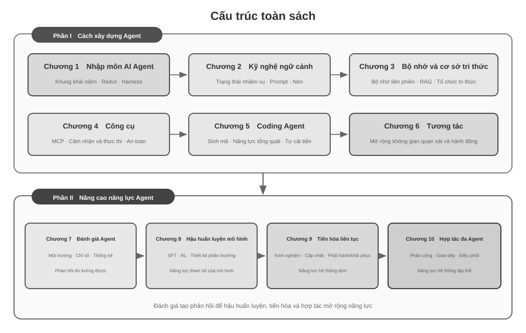

# Giới thiệu {.unnumbered}

Từ tháng 8 đến tháng 10 năm 2025, tôi giảng một loạt khóa học kỹ thuật tại *Trại thực hành AI Agent* của Turing. Các khóa học xoay quanh một câu hỏi: làm thế nào để thiết kế AI Agent bằng những nguyên tắc kỹ thuật có thể giải thích, kiểm chứng và tái sử dụng, thay vì liên tục thử sai theo kinh nghiệm và trực giác? Vì vậy, chạy được một bản demo không phải là đích đến. Chúng tôi còn xem xét vì sao một kiến trúc được lựa chọn, ranh giới năng lực của nó nằm ở đâu và mỗi quyết định thiết kế kéo theo những đánh đổi nào. Cuốn sách này hệ thống hóa, mở rộng và tái cấu trúc các tài liệu khóa học cùng những thí nghiệm đi kèm.

Quá trình làm sách tự nó cũng là một thử nghiệm về cộng tác giữa con người và Agent. Từ ý tưởng ban đầu đến bản thảo cuối, tôi chủ yếu dùng **whisper coding**, tức cộng tác qua đọc chính tả, cùng Agent giọng nói của Pine để nghiên cứu và lặp lại văn bản. Tôi đọc khung chương; Agent rà soát nguồn và chuẩn bị bản thảo đầu tiên. Sau đó, tôi đưa phản hồi của học viên vào và nhiều lần kiểm tra, sửa các lập luận, trường hợp và thí nghiệm. Giọng nói làm giảm chi phí đưa ý tưởng ra ngoài và rút ngắn chu trình từ đặt câu hỏi đến tìm nguồn, viết và kiểm chứng. Vì thế, cuốn sách không chỉ nghiên cứu Agent mà còn ghi lại một phương thức sản xuất tri thức có sự tham gia sâu của Agent.

Kể từ khi DeepSeek R1 được phát hành vào đầu năm 2025, trọng tâm nghiên cứu và thực tiễn công nghiệp AI dần mở rộng từ năng lực mô hình nền tảng sang triển khai Agent một cách có hệ thống. Ở phía mô hình, Agentic Reinforcement Learning bắt đầu nội tại hóa việc dùng công cụ và tương tác với môi trường vào tham số, tăng cường năng lực chung về lập trình, suy luận toán học và Computer Use. Ở phía sản phẩm, các Agent phổ dụng như Manus, Claude Code và OpenClaw đã thay đổi cách con người tương tác với máy tính, đồng thời đưa ‘sinh mã + hệ thống tệp’ thành một kiến trúc hệ thống quan trọng.

Khi xem xét lại các nguyên tắc kiến trúc Agent được tổng kết trong khóa học, có thể thấy rằng chúng vẫn giữ được năng lực giải thích ổn định dù mô hình và sản phẩm thay đổi nhanh chóng. Các thuật ngữ như Skill, harness và loop engineering chỉ phổ biến về sau, trong khi những thực hành kỹ thuật tương ứng thường xuất hiện sớm hơn. Khái niệm là kết quả khái quát hóa từ nhiều kinh nghiệm thực tiễn, chứ không phải điểm khởi đầu của thực tiễn. Nói cách khác, thực hành có trước, đặt tên có sau.

Các nguyên tắc này chủ yếu đến từ việc xây dựng những hệ thống dài hạn và rủi ro cao. Với vai trò Chief Scientist tại Pine AI, tôi làm việc cùng đội ngũ phát triển Pine để Agent có thể thay mặt người dùng giao tiếp với con người và xử lý các nhiệm vụ phức tạp gắn với lợi ích kinh tế thực, như thương lượng hóa đơn, tranh chấp hoàn tiền và hủy đăng ký. Các nhiệm vụ này thường kéo dài qua nhiều vòng, trong khi một bước sai có thể gây tổn thất thật. Những yêu cầu nghiêm ngặt về độ tin cậy, an toàn và khả năng kiểm toán đã định hình các nguyên tắc kiến trúc của cuốn sách.

- Rất lâu trước khi khái niệm Kỹ năng trở nên phổ biến, chúng tôi đã sử dụng phương pháp tải động các từ nhắc để giải quyết vấn đề mở rộng vô hạn các từ nhắc, sử dụng công cụ thực thi dòng lệnh để giải quyết vấn đề mở rộng vô hạn danh sách công cụ và sử dụng công nghệ thanh trạng thái hệ thống để giải quyết vấn đề Agent không nhận thức được môi trường thực thi, thời gian của người dùng và trạng thái làm việc.
- Rất lâu trước khi khái niệm Harness trở nên phổ biến, chúng tôi đã sử dụng các phương pháp tương tự như Claude Code để giải quyết các vấn đề như mất ổn định, ảo giác, vận hành nguy hiểm, vận hành trái phép và không tuân thủ hướng dẫn khi mô hình gọi các công cụ.
- Rất lâu trước khi khái niệm loop engineering (kỹ thuật vòng lặp) trở nên phổ biến (thuật ngữ này mãi đến giữa năm 2026 mới được giới công nghiệp chắt lọc và đặt tên), chúng tôi đã sử dụng phương pháp mà cuốn sách này gọi là người đề xuất-người đánh giá (proposer-reviewer) để giải quyết vấn đề mô hình cho rằng nhiệm vụ đã hoàn thành quá sớm — vừa có kiểu bỏ cuộc quá sớm, một con đường không đi được liền tuyên bố "không làm nổi", vừa có kiểu thành công giả, vòng khép kín chưa đi hết đã tuyên bố "đã xong xuôi". Cốt lõi của phương pháp là để Agent tự xem xét các sản phẩm bàn giao (artifact) mà nó tạo ra và cải tiến lặp đi lặp lại, để việc xác minh — chứ không phải cảm giác của chính mô hình — quyết định khi nào nhiệm vụ kết thúc.

Những phương pháp này không chỉ thuộc về Pine. Nhiều nhóm phát triển mô hình và Agent đã độc lập hình thành các phương pháp kỹ thuật tương tự khi giải quyết cùng một lớp vấn đề; sự hội tụ ấy cho thấy chúng phản ánh những ràng buộc chung của hệ thống Agent. Từ nhận thức đó, tôi mở *Trại thực hành AI Agent* tại Turing năm 2025 và liên tục giảng dạy khóa thực hành AI Agent tại Đại học Viện Hàn lâm Khoa học Trung Quốc trong giai đoạn 2024–2026. Cuốn sách được phát hành dưới dạng nguồn mở để những tri thức và kinh nghiệm có thể tái sử dụng này phục vụ nhiều nhà nghiên cứu và kỹ sư hơn.

**Thực hành có trước, đặt tên có sau.** Đối với việc phát triển Agent trong doanh nghiệp, điều này có nghĩa là thực tiễn không thể luôn đi sau sự phổ biến của khái niệm. Khi một thuật ngữ trở thành đồng thuận của ngành, vấn đề mà nó mô tả thường đã được các hệ thống tiên phong khảo sát trong thời gian dài. Để nhận diện và giải quyết những vấn đề ấy sớm hơn, theo tôi cần hai điều kiện.

**Thứ nhất, chọn một nghiệp vụ thực tế đặt ra yêu cầu đủ cao đối với giới hạn năng lực của Agent và liên tục thu nhận phản hồi thực tế.** Với Pine, một nhiệm vụ có thể kéo dài từ vài giờ đến vài tuần, đòi hỏi nhiều vòng phối hợp với các bên liên quan, các cuộc gọi dài, thao tác trên biểu mẫu phức tạp và nhiều lượt thư điện tử. Đồng thời, hệ thống phải bảo đảm độ chính xác của các số liệu quan trọng, khả năng kiểm soát thao tác và lợi ích của người dùng. Những tình huống đủ phức tạp liên tục làm lộ khoảng cách giữa năng lực mô hình và yêu cầu nghiệp vụ, từ đó thúc đẩy nhóm xây dựng harness để giải quyết có hệ thống những việc mô hình chưa thể tự xử lý nhưng nghiệp vụ bắt buộc phải hoàn thành. Nếu yêu cầu dễ dàng được đáp ứng chỉ bằng lần nâng cấp mô hình tiếp theo, nhóm cũng khó tích lũy các nguyên tắc thiết kế hệ thống ổn định.

**Thứ hai, thiết lập một cơ chế đánh giá (Evaluation) có hệ thống.** Nếu không đánh giá, ta không thể xác định cải thiện sau một thay đổi đến từ chính thiết kế hay chỉ từ dao động ngẫu nhiên. Đánh giá chuyển quá trình lặp của Agent từ phán đoán dựa trên kinh nghiệm thành một quy trình kỹ thuật có thể so sánh và tái lập; đó là nền tảng để phát triển hệ thống theo phương pháp khoa học. Chương 7 trình bày riêng phương pháp này.

Cho dù mô hình cơ bản được nâng cấp như thế nào, cho dù hình thức sản phẩm có đổi mới đến đâu, hầu hết tất cả các hệ thống Agent thành công đều tuân theo cùng một mô hình kiến trúc. Đây không phải là sự trùng hợp ngẫu nhiên: các nguyên tắc thiết kế tốt nhất phải tuân theo chu trình lặp lại của mô hình, bởi vì chúng mô tả không phải việc sử dụng một mô hình nhất định mà là phương thức tương tác cơ bản giữa các hệ thống thông minh và thế giới.

Richard Sutton, người đoạt giải Turing và là cha đẻ của học tập tăng cường, từng nói rằng quá trình tiến hóa của vũ trụ trải qua bốn giai đoạn: từ bụi đến sao, từ sao đến sự sống và từ sự sống đến thực thể thông minh (thực thể được thiết kế). Sự tiến hóa sinh học là mù quáng: đột biến ngẫu nhiên, chọn lọc tự nhiên. Hầu hết các sinh vật sống không hiểu cách chúng hoạt động và chúng không thể thiết kế và sửa đổi các sinh vật một cách độc lập. Tác nhân thông minh (Agent) là một sự tồn tại hoàn toàn mới trong lịch sử tiến hóa vũ trụ: nó có thể đạt được bootstrap và tự tiến hóa bằng cách tạo mã, giống như một lập trình viên viết một lập trình viên khác, và sau đó lập trình viên mới có thể tiếp tục viết chương trình tiếp theo. Nói cách khác, Agent có thể hiểu cơ chế hoạt động của chính mình, tạo ra các tác nhân thông minh mới theo mục tiêu của mình và thậm chí tự cải thiện. Sứ mệnh của cuốn sách này là giúp bạn hiểu và nắm vững nguyên tắc sáng tạo này.

Công thức cốt lõi của cuốn sách này chỉ có một câu: **Agent = LLM + context + tools**. Cả ba đều không thể thiếu.

Nói một cách trực quan hơn thì đó là **não + mắt + tay chân**. Bộ não (LLM) chịu trách nhiệm suy nghĩ và ra quyết định, đôi mắt (ngữ cảnh) xác định thông tin nào Agent có thể nhìn thấy và bàn tay và bàn chân (công cụ) xác định những gì Agent có thể làm. (Nói đúng ra, "đôi mắt" chỉ là một sự tương tự thô: ngữ cảnh không chỉ bao gồm thông tin môi trường và lịch sử hội thoại mà còn cả định nghĩa công cụ, v.v. Nói cách khác, thông tin mà Agent "nhìn thấy" cũng bao gồm "những gì tay và chân có sẵn". Phép ẩn dụ này nhằm truyền đạt trực giác cốt lõi: ngữ cảnh là tất cả thông tin mà mô hình có thể nhận thức được.)

Đối với những độc giả quen với việc học tăng cường, ba điều này cũng có thể được ánh xạ tới ngôn ngữ chính thức của RL. Cụ thể, LLM tương ứng với Chính sách, ngữ cảnh tương ứng với Observation Space và công cụ tương ứng với Action Space. Ba cách diễn đạt tương ứng với cùng một đối tượng nhưng có mức độ biểu đạt khác nhau.

Tuy nhiên, ý nghĩa của mỗi từ trong số ba từ này phong phú hơn nhiều so với nghĩa đen. Chương đầu tiên sẽ chia nhỏ từng vấn đề một dựa trên thực tiễn và thiết lập một bản đồ hoàn chỉnh từ sự hiểu biết trực quan đến các khái niệm học thuật.

## Cấu trúc của cuốn sách {.unnumbered}

Mười chương của cuốn sách được tổ chức quanh hai câu hỏi có quan hệ nối tiếp (Hình 0-2). **Phần I, “Làm thế nào để xây dựng một Agent”,** gồm Chương 1–6: từ các khái niệm nền tảng đến ngữ cảnh, bộ nhớ và tri thức, công cụ, Coding Agent, rồi mở rộng không gian quan sát và hành động. **Phần II, “Làm thế nào để nâng cao năng lực Agent”,** gồm Chương 7–10: đánh giá trước hết thiết lập phản hồi có thể đo lường; sau đó hậu huấn luyện mô hình, tiến hóa liên tục dựa trên kinh nghiệm vận hành và cộng tác đa Agent mở rộng năng lực ở ba cấp độ: tham số mô hình, hệ thống đơn lẻ và hệ thống tập thể.



- **Chương 1 (Kiến thức cơ bản về Agent)** bắt đầu từ nhiều sản phẩm Agent thực tế để xây dựng hiểu biết trực quan. Công thức cốt lõi được phân tích ở ba cấp độ: LLM + ngữ cảnh + công cụ ở cấp triển khai; não + mắt + tay chân ở cấp trực giác; và chính sách, không gian quan sát, không gian hành động ở cấp học thuật. Các thí nghiệm phân tích chu trình ReAct “suy nghĩ → hành động → quan sát”, đồng thời phân biệt sự thích nghi ngữ cảnh trong một nhiệm vụ, cập nhật sản phẩm bên ngoài qua nhiều nhiệm vụ và cập nhật tham số trong chu kỳ huấn luyện. Cuối cùng, chương trình bày các mẫu điều phối từ quy trình công việc đến Agent tự chủ, tạo khung khái niệm chung cho các chương sau.
- **Chương 2 (Context Engineering (kỹ thuật ngữ cảnh))** là chương quan trọng nhất trong cuốn sách. Nó giải thích một cách có hệ thống ngữ cảnh, đó là "đôi mắt" của Agent. Chương này bắt đầu với cấu trúc thông báo API và vòng lặp cốt lõi Agent, thiết lập nền tảng của "ngữ cảnh là danh sách thông báo", sau đó đi sâu vào các nguyên tắc cơ bản của KV Cache (một cơ chế sử dụng lại kết quả tính toán lịch sử trong quá trình suy luận mô hình lớn), sau đó tiến hành theo trình tự: Prompt Engineering (kỹ thuật prompt) (bao gồm thiết kế quy trình, mô tả công cụ, sàng lọc quy tắc kinh doanh) và tấn công và phòng thủ prompt injection, cơ chế tải theo yêu cầu của Kỹ năng Agent, công nghệ thanh trạng thái Agent và chiến lược Nén ngữ cảnh. Định nghĩa đầy đủ của mỗi thuật ngữ được đưa ra ở lần xuất hiện đầu tiên trong văn bản.
- **Chương 3 (Bộ nhớ người dùng và Cơ sở kiến thức)** mở rộng quản lý ngữ cảnh sang hệ thống kiến thức liên tục giữa các phiên, cho phép Agent không chỉ ghi nhớ nội dung của cuộc trò chuyện hiện tại mà còn tích lũy và nhớ lại kiến thức giữa nhiều cuộc trò chuyện. Bao gồm bốn chiến lược nâng cao cho bộ nhớ người dùng, nhóm công nghệ hoàn chỉnh của RAG (tạo sinh tăng cường truy xuất, truy xuất các tài liệu có liên quan trước rồi cho phép mô hình tạo câu trả lời) (bao gồm các phương pháp tìm kiếm văn bản khác nhau và tối ưu hóa xếp hạng kết quả tìm kiếm), trích xuất thông tin đa phương thức, các phương pháp tổ chức kiến thức nâng cao hơn và tác nhân RAG (Agentic RAG, hãy để Agent quyết định độc lập khi nào cần tìm kiếm và tìm kiếm cái gì).
- **Chương 4 (Công cụ)** thảo luận về cầu nối giữa Agent và thế giới bên ngoài: các công cụ đóng vai trò như “tay và chân”, cho phép Agent tìm kiếm web, gọi API và thao tác cơ sở dữ liệu. Chương giới thiệu chuẩn tương tác công cụ MCP và nguyên tắc thiết kế của năm loại công cụ—nhận thức, thực thi, cộng tác, kích hoạt sự kiện và giao tiếp với người dùng—đồng thời tập trung vào cơ chế an toàn của công cụ thực thi. Kích hoạt sự kiện, giao tiếp với người dùng và môi trường chạy không đồng bộ được trình bày ở Chương 6.
- **Chương 5 (Coding Agent và tạo mã)** chứng minh rằng Coding Agent cộng với hệ thống tệp là nền tảng kỹ thuật cốt lõi của tất cả Agent chung. Lấy kiến trúc OpenClaw làm dòng chính, chúng tôi phân tích quy trình làm việc và kỹ thuật triển khai của Coding Agent, đồng thời chứng minh giá trị sâu rộng của việc tạo mã ngoài lập trình: từ hỗ trợ tư duy, xây dựng cơ sở kiến thức, đến tạo động các công cụ mới và khởi động Agent.
- **Chương 6 (Tương tác: mở rộng không gian quan sát và hành động)** nghiên cứu tương tác giữa Agent và môi trường theo hai chiều: **phương thức** và **thời gian**. Hệ thống bất đồng bộ hướng sự kiện giúp Agent liên tục tiếp nhận và phản hồi sự kiện bên ngoài; giọng nói đưa cảm nhận, suy luận và sinh nội dung tới vận hành thời gian thực; Computer Use mở rộng không gian hành động sang giao diện đồ họa; còn robot mở rộng hành động sang môi trường vật lý. Bốn lĩnh vực dùng chung các nguyên thủy hệ thống như đánh thức, điểm an toàn, hủy, chiếm quyền và tách đường nhanh/chậm.
- **Chương 7 (Đánh giá Agent)** xây dựng phương pháp đánh giá khoa học. Bao gồm môi trường đánh giá (hai mô hình cốt lõi của việc gọi công cụ và tương tác giữa con người với máy tính, cũng như môi trường mô phỏng được thảo luận riêng ở cuối chương), nguyên tắc thiết kế của tập dữ liệu, phương pháp đánh giá tự động LLM-as-a-Judge, lựa chọn mô hình dựa trên đánh giá và vòng lặp khép kín hoàn chỉnh giúp chuyển đổi kết quả đánh giá thành cải tiến hệ thống.
- **Chương 8 (Post-training mô hình)** nghiên cứu chuyên sâu về hai kỹ thuật post-training SFT (tinh chỉnh có giám sát, sử dụng dữ liệu chú thích để dạy mô hình "học như bình thường") và RL (học tăng cường, cho phép mô hình cải thiện độc lập thông qua thử, sai và khen thưởng phản hồi). Lấy "bộ nhớ SFT, khái quát hóa RL" và "dữ liệu và môi trường quan trọng hơn thuật toán" làm đối số cốt lõi, bao gồm toàn cảnh ba giai đoạn đào tạo trước/SFT/RL, lý thuyết RL cổ điển, thiết kế tín hiệu phần thưởng (từ phần thưởng nhị phân đến phần thưởng quá trình, đến hình phạt đường dẫn xác minh theo "kết quả khen thưởng, quá trình ràng buộc"), các thuật toán học tăng cường một vòng và nhiều vòng cũng như tối ưu hóa hiệu quả mẫu và các khám phá tiên tiến khác.
- **Chương 9 (Sự tiến hóa liên tục của Agent)** nghiên cứu cách chuyển kinh nghiệm vận hành của Agent thành năng lực cho phiên bản tiếp theo. Chương trước hết xây dựng tín hiệu học từ kết quả môi trường, quy tắc quy trình và LLM Rubric; sau đó so sánh bốn phương tiện cập nhật—tài liệu tri thức, Prompt và Skills, chương trình và Harness, tham số mô hình; cuối cùng thảo luận việc kiểm chứng phiên bản ứng viên, phát hành theo giai đoạn, hoàn tác và hợp nhất dài hạn.
- **Chương 10 (Hợp tác nhiều Agent)** mở rộng từ năng lực của một Agent sang phối hợp ở cấp hệ thống và nghiên cứu cách nhiều Agent phân công, cộng tác. Chương trình bày có hệ thống khung phân loại cộng tác đa Agent (ngữ cảnh dùng chung/độc lập × ngang hàng/người quản lý/phi tập trung), minh họa thiết kế kiến trúc qua Agent dịch thuật và Agent phối hợp điện thoại–máy tính, đồng thời thảo luận các hướng phát triển tiềm năng của xã hội và nền kinh tế Agent.

## Cách đọc cuốn sách này {.unnumbered}

Mỗi chương của cuốn sách này tương đối độc lập. Bạn có thể chọn các đường dẫn đọc khác nhau tùy theo nhu cầu của riêng mình:

- **Nếu bạn là nhà phát triển Agent**, hãy đọc sách theo thứ tự: Chương 1–6 thiết lập một phương pháp hoàn chỉnh để xây dựng Agent, còn Chương 7–10 bàn về nâng cao năng lực qua đánh giá, hậu huấn luyện mô hình, tiến hóa liên tục và cộng tác đa Agent.
- **Nếu bạn có thời gian hạn chế**, hãy ưu tiên đọc Chương 1 (thiết lập nhận thức toàn cầu) và Chương 2 (nắm vững Context Engineering (kỹ thuật ngữ cảnh) quan trọng nhất). Các nguyên tắc cơ bản của KV Cache trong Chương 2 mang tính kỹ thuật tương đối. Khi đọc lần đầu, bạn có thể bỏ qua phần nguyên tắc và chỉ nhớ ba kết luận cốt lõi được đưa ra ở đầu, điều này sẽ không ảnh hưởng đến việc hiểu sau này.
- **Nếu bạn lo lắng về việc đào tạo mô hình**, bạn có thể đọc trực tiếp Chương 8 (Post-training mô hình); phương pháp đánh giá (Chương 7) là điều kiện tiên quyết cho đào tạo. Nên đọc cùng nhau và đọc Chương 1 và 2 trước để hiểu tổng thể.

Mỗi chương chứa một số lượng lớn **thí nghiệm** và **câu hỏi tư duy** và định dạng đánh số là "Thử nghiệm X-Y" (X là số chương, Y là số sê-ri trong chương). Tiêu đề của các thí nghiệm và câu hỏi tư duy được đánh dấu sao để biểu thị độ khó: ★ biểu thị mức độ đầu vào, phù hợp với mọi độc giả; ★★ biểu thị độ khó trung bình, đòi hỏi nền tảng nhất định về thực hành kỹ thuật; ★★★ biểu thị những thách thức nâng cao, thường liên quan đến các vấn đề mở hoặc thiết kế hệ thống phức tạp. Hầu hết các thử nghiệm đều được trang bị mã có thể chạy hoàn chỉnh, được tổ chức để hỗ trợ các kho lưu trữ nguồn mở:

> **Kho mã hỗ trợ**: [https://github.com/bojieli/ai-agent-book](https://github.com/bojieli/ai-agent-book)

Bạn có thể lấy toàn bộ mã nguồn đi kèm bằng Git:

```bash
git clone https://github.com/bojieli/ai-agent-book.git
cd ai-agent-book
```

Nếu không sử dụng Git, bạn cũng có thể chọn **Code → Download ZIP** trên trang kho mã. Mã thử nghiệm được sắp xếp theo từng chương, từ `chapter1/` đến `chapter10/`. Để tìm “Thử nghiệm X-Y”, hãy mở tệp `chapterX/README.vi.md` tương ứng, dùng số thử nghiệm để xác định thư mục dự án, rồi làm theo README của dự án đó để cài đặt các phần phụ thuộc và chạy thử nghiệm. Một số thử nghiệm được đánh dấu là hướng dẫn tái lập phụ thuộc vào các kho mã bên ngoài; README tương ứng cũng giải thích cách lấy chúng.

Tôi thực sự khuyên bạn nên tự mình thực hiện những thử nghiệm này. AI Agent là một lĩnh vực rất thực tế và nhiều trực giác thiết kế cần được thiết lập thực sự trong quá trình gỡ lỗi thực hành.

**Quy ước về thuật ngữ**: Một số từ kỹ thuật tiếng Anh có thể gây ra sự mơ hồ khi dịch trực tiếp sang tiếng Trung. Cuốn sách này tạo ra sự khác biệt đặc biệt giữa hai từ được sử dụng nhiều: lý luận (quá trình suy luận và "suy nghĩ" trong quá trình mở rộng mô hình) được dịch thống nhất là "suy nghĩ" và suy luận (hoạt động tính toán và triển khai tiếp theo của mô hình) được dịch thống nhất là "lý luận". Mục đích của việc sử dụng hai từ tiếng Trung khác nhau là để ngăn từ “lý luận” mang hai khái niệm cùng một lúc và khiến người đọc không thể phân biệt được. Do đó, cuốn sách này sử dụng "tư duy" ở bất cứ nơi nào nó đề cập đến chuỗi tư duy mô hình (Chain-of-Thought), các mô hình tư duy (chẳng hạn như dòng OpenAI o, DeepSeek-R1, được gọi là "mô hình tư duy" và "nhà tư tưởng" trong cuốn sách này), mã thông báo tư duy và quy trình tư duy; bất cứ khi nào nó đề cập đến hoạt động và triển khai mô hình (thời gian suy luận, chi phí suy luận, ngăn xếp suy luận, mở rộng thời gian suy luận, v.v.), "suy luận" đều được sử dụng. Một ngoại lệ là một số từ ghép đã được cô đọng trong tiếng Trung: **lý luận logic, lý luận nhiều bước, lý luận không gian, lý luận thời gian** và cách sử dụng hàng ngày như "trò chơi suy luận". Cuốn sách này theo cách dịch thông thường để giữ lại từ "lý luận". Người đọc được yêu cầu hiểu theo ngữ cảnh. Chúng đề cập đến ý nghĩa chung của suy luận suy diễn, hơn là ý nghĩa kỹ thuật của suy luận đã đề cập ở trên. Đối với các thuật ngữ chính khác, văn bản sẽ cung cấp phần so sánh tiếng Trung và tiếng Anh ở nơi chúng xuất hiện lần đầu.

## Kiến thức tiên quyết {.unnumbered}

Cuốn sách này dành cho những độc giả có nền tảng kỹ thuật nhất định nhưng nó không yêu cầu bạn phải là chuyên gia trong một lĩnh vực cụ thể. Phần sau đây liệt kê kiến thức tiên quyết ở hai cấp độ: "bắt buộc" và "được khuyến nghị" để giúp bạn đánh giá mức độ sẵn sàng của mình.

**Bắt buộc: Kiến thức cơ bản về đọc toàn bộ cuốn sách**

- **Lập trình Python**: Hầu hết tất cả các thử nghiệm trong sách đều dựa trên Python. Bạn cần làm quen với cú pháp cơ bản của Python, cấu trúc dữ liệu phổ biến, quản lý gói (pip) và các khái niệm cơ bản khác. Không yêu cầu trình độ thành thạo nhưng người ta phải có thể đọc và sửa đổi mã Python phức tạp vừa phải.
- **Kinh nghiệm cơ bản khi sử dụng LLM**: Bạn nên sử dụng ChatGPT, Claude hoặc các sản phẩm tương tự và hiểu chế độ tương tác cơ bản của "Nhắc nhở → Phản hồi của mô hình".
- **Công cụ lập trình hỗ trợ AI**: Nên cài đặt và làm quen với ít nhất một công cụ lập trình hỗ trợ AI, chẳng hạn như Claude Code, Codex, Cursor, TRAE, v.v. Một mặt, những công cụ này có thể cải thiện đáng kể hiệu quả phát triển của các thử nghiệm. Các thử nghiệm trong cuốn sách liên quan đến việc viết và gỡ lỗi rất nhiều mã. Mặt khác, bản thân các công cụ lập trình này đã là Coding Agent trưởng thành. Khi sử dụng chúng, bạn sẽ trải nghiệm trực quan các cơ chế cốt lõi được thảo luận nhiều lần trong sách, chẳng hạn như vòng lặp ReAct, lệnh gọi công cụ và quản lý ngữ cảnh. Trải nghiệm trực tiếp này cực kỳ có giá trị để hiểu các nguyên tắc thiết kế của Agent.
- **Kiến thức chung về kỹ thuật phần mềm**: Quen thuộc với các khái niệm cơ bản như thao tác dòng lệnh, kiểm soát phiên bản Git, định dạng dữ liệu JSON, REST API, v.v. Đây là cơ sở để chạy thử nghiệm và hiểu cơ chế gọi công cụ Agent.

**Khuyến nghị: Cải thiện trải nghiệm đọc các chương cụ thể**

- **Khái niệm cơ bản về Machine Learning**(Chương 8): Hiểu các khái niệm cơ bản như đào tạo và suy luận, hàm mất mát, giảm độ dốc, quá khớp, v.v. sẽ giúp bạn hiểu được quá trình post-training mô hình.
- **Toán học cơ bản**(Chương 2-3, Chương 8): Hiểu biết trực quan về đại số tuyến tính (ví dụ: biết rằng vectơ có thể biểu thị hướng và kích thước cũng như ma trận có thể thực hiện các phép toán hàng loạt) giúp hiểu được cơ chế nhúng và chú ý; kiến thức cơ bản về xác suất và thống kê giúp hiểu các số liệu đánh giá và phần thưởng mong đợi trong học tập củng cố. Toán học trong cuốn sách không liên quan đến đạo hàm phức tạp mà tập trung vào các giải thích trực quan.
- **Chương 6 (Tương tác: mở rộng không gian quan sát và hành động)** nghiên cứu tương tác giữa Agent và môi trường theo hai chiều: **phương thức** và **thời gian**. Hệ thống bất đồng bộ hướng sự kiện giúp Agent liên tục tiếp nhận và phản hồi sự kiện bên ngoài; giọng nói đưa cảm nhận, suy luận và sinh nội dung tới vận hành thời gian thực; Computer Use mở rộng không gian hành động sang giao diện đồ họa; còn robot mở rộng hành động sang môi trường vật lý. Bốn lĩnh vực dùng chung các nguyên thủy hệ thống như đánh thức, điểm an toàn, hủy, chiếm quyền và tách đường nhanh/chậm.
- **Hiểu cơ bản về kiến trúc Transformer**(Chương 2, 8): Transformer là kiến trúc cơ bản của hầu hết các mô hình ngôn ngữ lớn hiện nay. Đối với độc giả muốn bổ sung một cách có hệ thống những kiến thức cơ bản về mô hình lớn, nên đọc “Các mô hình lớn minh họa” (Nhà xuất bản Turing). Cuốn sách này giải thích các khái niệm cốt lõi như kiến trúc Transformer, đào tạo trước và tinh chỉnh theo cách đồ họa trực quan, là sự bổ sung tốt cho quan điểm kỹ thuật Agent của cuốn sách.

Nếu bạn đang thiếu một số kiến thức tiên quyết, đừng để điều đó ngăn cản bạn. Giá trị cốt lõi của cuốn sách này nằm ở các nguyên tắc thiết kế kiến trúc và các phương pháp thực hành kỹ thuật, chứ không phải là một thuật toán hay kỹ thuật cụ thể. Ngoại trừ phần post-training ở Chương 8, các yêu cầu về toán học và học máy trong toàn bộ cuốn sách là rất thấp và có thể dùng nó làm điểm khởi đầu.

Công nghệ Agent vẫn đang phát triển nhanh chóng, nhưng những nguyên tắc thiết kế kiến trúc tốt nhất có sức mạnh vượt thời gian. Bằng cách nắm vững "tại sao nó được thiết kế theo cách này", bạn sẽ có thể duy trì khả năng phán đoán rõ ràng trước các làn sóng công nghệ đang thay đổi. Tôi hy vọng cuốn sách này có thể là hướng dẫn đáng tin cậy để bạn xây dựng AI Agent.

## Lời cảm ơn {.unnumbered}

Cảm ơn ông Meng Ge và ông Liu Meiying từ Turing vì đã làm việc chăm chỉ trong việc biên tập cũng như nỗ lực tổ chức khóa học “Trại thực hành AI Agent” của Turing; cảm ơn ông Liu Junming đã thiết lập khóa học thực hành AI Agent tại Đại học Khoa học và Công nghệ Quốc gia. Tôi cũng xin gửi lời cảm ơn đặc biệt đến tất cả các sinh viên trong “Trại thực hành AI Agent” của Turing và tất cả các sinh viên trong Khóa thực hành AI Agent tại Đại học Khoa học và Công nghệ Quốc gia - trong quá trình giảng dạy các khóa học này, mọi người đã cho tôi rất nhiều phản hồi và đề xuất quý giá, đồng thời cũng giúp tôi hiểu rõ hơn về bản thân các khái niệm.

Cảm ơn tất cả các đồng nghiệp của tôi tại Pine AI. Nếu không có một sản phẩm xuất sắc như Pine AI và những thách thức khác nhau mà nó mang lại, tôi sẽ không thể có được sự hiểu biết và thực hành sâu sắc như vậy trong lĩnh vực Agent; trong những va chạm về ý tưởng, đồng nghiệp cũng đóng góp nhiều ý kiến đóng góp có giá trị.

Tôi cũng xin gửi lời cảm ơn đến nhiều người bạn trong ngành AI (không nêu tên ở đây). Trong các cuộc thảo luận khác nhau trong ngành, mọi người đã đưa ra phản hồi thẳng thắn về quan điểm của tôi, sửa chữa nhiều nhận định sai lầm của tôi và nâng cao hiểu biết của tôi về mô hình và Agent.

Điều biết ơn nhất là gia đình tôi, đặc biệt là vợ tôi Mạnh Gia Anh. Cô luôn hỗ trợ tôi hoàn thành việc viết cuốn sách này và đưa ra nhiều ý kiến đóng góp quý báu cho cuốn sách này.
