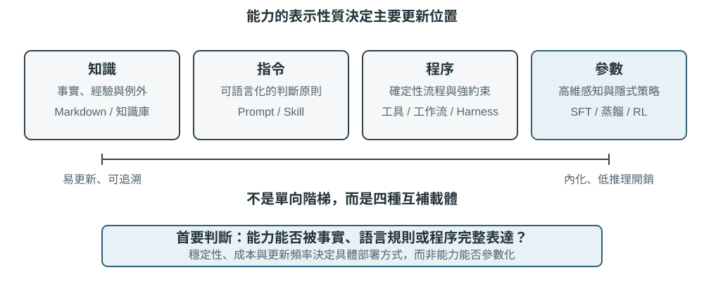
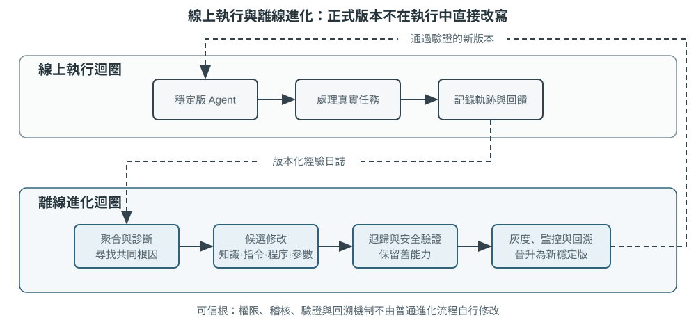

# 多模態與即時互動

前面的章節探討了 Agent 在文字世界中的設計——透過上下文、工具和程式碼與數字系統互動。然而，Agent 的互動物件不僅僅是文字和 API。當 Agent 需要聽懂使用者的語音指令、在螢幕上找到並點選正確的按鈕、或控制機械臂精確抓取物體時，它進入了一個全新的領域：**多模態即時互動**——從純文字輸入輸出擴充套件到**多模態感知與即時響應**，這是 Agent 跳出「對話方塊」的關鍵一步。所謂「多模態」，就是同時處理多種資訊形式——文字、語音、影象、影片、動作——而不只是文字。

先劃定本章的邊界。靜態的影象與文件理解——看一張截圖、讀一幅圖表、解析一份 PDF——已經作為感知工具自然融入了前面各章的 Agent 實踐：對今天的多模態大模型來說，這類「一次輸入、一次理解」的任務已相對成熟，不需要專門的架構設計。本章聚焦的是另一類問題：**即時性把多模態問題變難**的三個場景——語音對話、GUI 操作、機器人控制。在這些場景中，輸入是持續流動的、輸出必須在嚴格的時間預算內給出，架構設計因此發生質變。至於連續視覺流（影片）的即時理解，截至寫作時對 Agent 而言仍是開放問題——本章 Computer Use 部分討論的逐幀截圖侷限和章末思考題會再回到這個話題。還要劃清另一條邊界：多模態**生成**（生圖、生影片）在本書框架中只是普通的工具呼叫（第五章多媒體生成已涉及），Agent 把它當作一個外部工具來使喚即可，並不涉及本章要解決的即時互動難題，因此不在本章主線之內。

語音互動、Computer Use 和機器人操作看上去跨越三個完全不同的領域，但做起來會發現卡住的地方高度相似：都要同時處理多種模態的資訊，都對延遲極度敏感。語音停頓超過兩秒就讓人焦躁，機器人控制的毫秒級抖動可能導致碰撞。這兩個約束共同把三個場景推向同一個架構方向：從**序列流水線**（像工廠流水線一樣，一個環節做完才能交給下一個）走向**端到端模型**（一個統一的模型直接從輸入到輸出，省去中間的交接環節）。

本章按以下脈絡展開：

1. 先用「語音架構的三種正規化」搭起座標系——級聯（VAD-ASR-LLM-TTS 流水線）、端到端全模態（Omni，單模型但仍輪流說話）、全雙工（Moshi、GPT-Live，邊聽邊說），並沿「如何擺脫 VAD 的輪次假設」這條軸依次拆解每一環的延遲與取捨；其中級聯一節還會講如何用流式語音感知替代 VAD + ASR。
2. 再看思考架構如何調和「即時響應」與「深度思考」的矛盾：從快慢簡單並行，到後臺推理模型當「軍師」的解耦路線（GPT-Live 委派、Pine AI 等），再到 Step-Audio R1 把思考「內化」進單一模型的「邊想邊說」。
3. 然後討論更像人的語音合成對執行層的最佳化。
4. 最後把視角擴充套件到 Computer Use（讓 AI 像人一樣操作電腦螢幕）和機器人操作，看同樣的延遲與多模態問題在這兩個場景中如何表現。

其中要特別提示兩處偏理論、可跨場景遷移的重點：**思考架構**（快、慢兩套思考如何協作）以及由它衍生出的**快慢介面**（Latent Bridge，快慢模型之間除了文字還能傳什麼）。它們雖然從語音場景講起，卻不只服務於語音——後面的 Computer Use 與機器人同樣會遇到「何時該請一個慢軍師」的問題，值得讀者格外留意。

## 語音：最自然的人機介面

語音的價值不只是把文字換成聲音。正常說話的速度約為打字的四倍，而且不占用雙手與視線，因此很適合把 Agent 放進持續運作、隨時可能被打斷的輸入輸出迴路。語音輸入法把口述轉成文字；語音 Agent 則讓使用者直接與 Agent 協作。兩者都能支援前言提到的 whisper coding。

本節同時討論兩個方向：使用者對 Agent 說話，以及 Agent 代替使用者對外部世界說話。語音模型決定「能回答什麼」，互動架構決定「能否聽清楚、及時回應、自然交接發言，並在通話中完成確認與工具呼叫」。以下先討論互動時序，再討論認知時序與表達品質。

### 互動時序：從級聯到全雙工

OpenAI 在 GPT-Live 介紹中把語音互動概括為級聯、輪次式與全雙工三種範式[^ch9-12]。它們不是單純的新舊替代，而是在延遲、成本與可觀測性之間做不同取捨：

| 範式 | 核心結構 | 主要優勢 | 主要限制 |
| --- | --- | --- | --- |
| 級聯 | VAD → ASR → LLM → TTS | 模組清楚、容易替換與除錯 | 延遲累積，副語言資訊在介面處遺失 |
| 端到端 Omni | 一個模型聽、想、說 | 延遲較低，能保留語氣、情緒與環境聲 | 仍依賴輪次，訓練與除錯成本較高 |
| 全雙工 | 持續聽、持續說、持續決策 | 支援重疊說話、自然打斷與連續串流 | 模型訓練、控制與評估更複雜 |

三種範式的共同主線，是擺脫「必須輪流說話」的假設，以及 VAD 對發言權的猜測。級聯與 Omni 仍要劃分輪次；全雙工則把「誰該說話」變成模型持續做出的決策。

[^ch9-12]: OpenAI. *Introducing GPT-Live.* 2026-07-08. https://openai.com/index/introducing-gpt-live/。本節的「級聯／輪次式／全雙工」分類出自該文對 ChatGPT 語音三代演進的總結；文中的「端到端全模態（Omni）」對應「turn-based voice models」類別。

**流式取消:**

```python
while audio_is_arriving:
    partial = asr.push(audio_chunk)
    if endpoint_is_probable(partial):
        candidate = llm.start(partial)
        if later_audio_changes_meaning(partial):
            cancel(candidate)                 # speculative cancellation
        else:
            tts.enqueue_stable_segments(candidate)

on_final_transcript(text):
    commit_or_restart(text)
```

### 範式一 · 級聯流水線（Cascading）

大多數商用語音助理仍使用串行流水線（圖 9-1）：VAD 判斷使用者何時說完，ASR 把音訊轉成文字，LLM 理解並生成回覆，TTS 再把文字說出來。模組化讓每個元件可以獨立優化，但每個邊界都可能增加等待時間。


| 模組 | 作用 | 常見瓶頸 |
| --- | --- | --- |
| VAD | 判斷是否說完 | 靜音閾值造成等待與誤切分 |
| ASR | 音訊轉文字 | 識別延遲與上下文遺失 |
| LLM | 理解、思考與生成 | 首 token 延遲；啟用 reasoning 後等待更久 |
| TTS | 文字轉語音 | 首包合成與播放緩衝 |

對於未啟用 reasoning 的短回覆，VAD、ASR、LLM 與 TTS 的等待會串行累積（圖 9-2）。真實數值取決於輸入長度、模型、硬體、網路與負載。生產環境的排隊還會進一步放大空載延遲（圖 9-3）。




> **實驗 9-1 ★：建立傳統語音 Agent**
>
> 透過 WebSocket 串起麥克風、Silero VAD、本地 Whisper、串流 LLM 與 Fish S1 TTS，建立級聯基線。保留的真實單輪證據證明媒體與模型鏈路確實端到端運作；它不是並發或生產負載 benchmark。程式碼與驗收記錄見 [chapter9/live-audio](../chapter9/live-audio/)。

> **附加專案：使用 WebRTC 建立「呼叫使用者」的語音 Agent**
>
> 電話 Agent 不一定需要 PSTN。瀏覽器 WebRTC 就能重現建立會話、詢問缺失資訊、複述確認並保存結構化結果的閉環；若要聯絡外部機構，再把同一工具契約替換為合規的 PSTN/SIP 供應商。完整媒體鏈路、直接/ReAct 對照與驗收證據見 [chapter9/phone-agent](../chapter9/phone-agent/)。此專案保留歷史上的 \`exp9-2\` 執行識別，但不再占用正文實驗編號。

#### 從串行到串流感知

生產系統可保留模組分工，同時讓各階段儘早產出增量結果：ASR 在使用者說話時產生暫時轉錄，LLM 把第一段可播報文字立即交給 TTS，TTS 則持續返回音訊區塊。「每一級都串流」不代表三個模型從頭到尾完全並行；若依部分轉錄搶跑 LLM，後續文字改變時就必須取消、重啟或修正生成。

一般串流仍無法消除 VAD 的靜音等待。傳統 VAD + ASR 前端有三個問題：等待靜音造成**延遲累積**；有聲/無聲二值訊號造成**資訊遺失**；電子郵件、人名與專有名詞被分片則造成**上下文斷裂**。

真正的串流模型需要因果或分塊編碼器與增量解碼。Whisper 的解碼器雖然是自回歸的，但編碼器需要完整音訊片段，因此不能直接稱為因果串流模型。LLM 型串流聽覺模型可從連續音訊輸出文字與語義事件，保留對話上下文並利用世界知識；模擬分塊的耗時仍不能當成真正因果模型的效能承諾。

若只想判斷使用者是否說完，也可把端點判斷做進串流識別器。訓練標籤只能使用決策時刻可見的資訊，否則「上帝視角」會產生線上無法重現的判斷[^ch9-11]。模型除了文字，也能輸出 speak_start/end、interrupt、emotion、laugh、sigh 與 noise 等聲學事件標記。

[^ch9-11]: 關於把輪次判斷嵌入識別器，以及「標籤的上帝視角」問題，見 Li, Bojie and Noah Shi. *The Trade-off Was in the Labels: Causal Supervision for Turn-Aware Streaming ASR.* 2026（待發表）。

> **實驗 9-2 ★：使用 Qwen2-Audio 模擬串流語音感知**
>
> Qwen2-Audio 本身不是串流模型。本實驗以遞增音訊前綴模擬連續感知，並與 600 ms VAD + Whisper 對照。每個前綴都會重新編碼先前音訊，因此實測時間不能視為因果串流模型的效能承諾。
>
> canonical run 通過全部執行與溯源門禁，但只重現 2/6 項預期行為：遞增前綴呼叫實測 8.4–11.3 秒，pause 樣本漏報 \`silence\`，noise 樣本仍誤判為 \`cough/laughter\`。這個負結果適合檢查機制與失敗方式，不能支持「100–200 毫秒真串流感知」的主張。完整記錄見 [chapter9/streaming-speech](../chapter9/streaming-speech/)。

### 範式二 · 端到端全模態模型（Omni）

即使採用串流感知，級聯仍透過離散介面交接聽、想、說；音訊轉成純文字時，情緒、語調與環境聲可能遺失。Omni 用同一模型聽音訊、生成回覆並說出來，有機會保留這些訊號，但訓練、除錯與替換元件的成本更高（圖 9-4）。

端到端的優勢主要在延遲與非文字資訊，不必然帶來更高準確率。自級聯先用同一模型轉錄，再根據轉錄回答：當文字足以承載任務資訊時，它可能修正感知錯誤；當答案依賴語速、情緒或環境聲時，文字瓶頸會不可逆地遺失證據。關鍵不在於是否存在中間表示，而在於中間表示承載什麼資訊[^ch9-13]。Omni 仍假設輪流說話；串流感知只能改善端點判斷，無法取消輪次本身。

[^ch9-13]: 關於級聯與端到端準確率優勢何時逆轉，以及如何根據任務性質預測方向，見 Li, Bojie and Noah Shi. *The Cascade Gap: When and Why Self-Cascades Help Multimodal Agents.* 2026（待發表）。


即時語音 API 通常處於級聯與 Omni 之間：模型原生處理音訊，但互動控制仍依賴 VAD，並透過打斷與非同步工具呼叫改善體驗。值得比較的不是模型榜單，而是端到端與自級聯在不同任務上的失敗方式。

> **實驗 9-3 ★★：本地執行 MiniCPM-o 4.5——端到端與自級聯**
>
> 固定一個本地 MiniCPM-o 4.5 revision，關閉 thinking mode，比較直接從音訊回答與同模型自級聯（先轉錄、再回答）。這測量的是音訊資訊是否保留，**不是**後文的「邊想邊說」能力。
>
> | 任務類型 | 端到端 | 自級聯 | 觀察 |
> | --- | ---: | ---: | --- |
> | 語義算術（2） | 1/2 | 2/2 | 自級聯修正了一個轉錄錯誤 |
> | 副語言語速（2） | 2/2 | 1/2 | 純文字轉錄抹掉了快慢差異 |
> | 合計 | 3/4 | 3/4 | 總分相同，失敗位置互補 |
>
> 樣本很小，不能據此判定哪條路徑整體更準確或更快。完整硬體、版本、原始輸出與真實 audio-to-audio 證據見 [chapter9/end-to-end-speech](../chapter9/end-to-end-speech/)。

Step-Audio 2 展示了直接處理原始音訊、同時輸出文字與語音的端到端路徑；Step-Audio R1 進一步把思考能力內化到音訊模型中。

### 範式三 · 全雙工互動模型

Omni 仍把對話分成「使用者說」與「模型說」，但同聲傳譯等任務要求兩者重疊。全雙工模型不預設輪次，而是持續聆聽、持續說話，反覆決定繼續、停頓、打斷或呼叫工具。

Kyutai 的 **Moshi**（2024）是早期研究案例。Thinking Machines Lab 將這條路線稱為**互動模型（Interaction Model）**[^ch9-14]：互動性內建於模型，不再由 VAD 等外部 harness 拼接。微輪次機制以短音訊區塊推進，讓靜音、重疊與打斷保留在連續上下文中；它也能把完整對話委派給背景推理模型，同時維持話頭。

[^ch9-14]: Thinking Machines Lab, “Interaction Models: A Scalable Approach to Human-AI Collaboration,” 2026-05. https://thinkingmachines.ai/blog/interaction-models/

OpenAI 的 GPT-Live 將全雙工帶到生產規模：模型持續處理輸入並生成輸出，能等待、附和、被打斷，也能處理即時翻譯。這條演進線是：級聯靠靜音閾值猜測輪次，串流感知把判斷提升到語義層，全雙工則把切換本身變成持續決策。

### 認知時序：即時互動與深度思考

互動品質與智能上限是不同維度。前台模型要在使用者仍在線時回應；背景模型可花更長時間思考。以下三種設計是取捨，不是線性演進：

| 設計 | 前台 | 背景 | 主要風險 |
| --- | --- | --- | --- |
| 快速應付、慢速修正 | 先給即時答案 | 重新思考並補充 | 前後矛盾 |
| 快速互動、慢速建議 | 維持對話並決定措辭 | 提供建議或工具結果 | 介面受限 |
| 思考與表達統一 | 邊思考邊說 | 與表達共享模型狀態 | 訓練與替換成本高 |

#### 方案一：快思考應付，慢思考回答

快思考可在幾百毫秒內先給出應付回覆，慢思考在背景完成更深推導。簡單問題可能被處理兩次；複雜問題則可能前後矛盾，因為兩個實例各自獨立思考。



#### 方案二：快思考互動，慢思考建議

背景模型可透過狀態欄或專用介面傳送建議，前台模型維持對話並決定如何表達。通信仍是間接的：前台可能誤解建議，也看不到背景的中間思考，因此它能自然等待結果，卻不能真正邊想邊說。

#### 方案三：端到端統一思考與表達（以 Step-Audio R1 為例）

Step-Audio R1 的**模態錨定思考蒸餾（MGRD）**讓模型根據聲學特徵思考，**MPS 雙腦架構**則讓構思與表達並行。MPS 讓構思腦持續產出思考片段，表達腦把片段與已有回覆結合後立即生成語音，因此不必等待完整思考結束（圖 9-6）。


統一模型最直接地實現「邊想邊說」，但思考與即時表達必須一起重訓；解耦設計更容易替換背景大腦。兩者是取捨，不是簡單替代。

### 更像人的語音合成

傳統 TTS 過於流暢、幾乎沒有停頓，反而容易暴露機器身分。停頓、填充詞與偶爾重複，是人類表達不確定性與思考狀態的訊號。

主 LLM 除了文字也可輸出 **THINKING**、**EMO:happy**、**SPEED:0.8x** 等控制標記，由 TTS 映射為停頓、韻律、語速、笑聲與嘆氣。實作上可自研支援控制標記的 TTS，也可用 voice cloning 準備不同情緒與風格的參考音訊。

> **實驗 9-4 ★★：使用 Fish Audio 的控制標記驅動 TTS**
>
> 使用 Fish Audio S1 建立多參考音訊庫，比較無控制標記、單一參考音與多參考音三種設定。執行層根據標記選擇匹配的情緒、語速與風格。
>
> 多參考音設定在三次位置平衡的盲聽中得分最高（真人客服感 4.67/5），但完整預設排序沒有重現，因為無標記組高於單一參考音組。這表示表達控制有幫助，但不能把小型聽感研究當成普遍音質結論。完整的 24 條參考音訊、A/B/C 媒體與驗收記錄見 [chapter9/controllable-tts](../chapter9/controllable-tts/)。

## Computer Use：GUI 自動化 Agent

讀到這裡也許會注意到，本章給語音的篇幅明顯多於後兩個場景——這是有意為之。在即時多模態這條演進線上，語音是走得最完整、最值得當作參考系的一個：從「序列流水線延遲太高」這個問題出發，經過端到端、全雙工、邊想邊說等一系列方案，一直走到今天相對成型的終局，問題→方案→終局的全程都已經跑通。因此我們把它講透，接下來的 Computer Use 和機器人兩個場景，都可以對照語音這條脈絡來看——它們各自走到了這條演進線的哪一段、卡在了哪裡。

這三個場景看似不同，卻面臨相同的核心挑戰：即時感知、低延遲決策、持續互動。接下來看這些技術主題如何在視覺互動（Computer Use）和物理互動（機器人）中重現——首先把視角從聽覺模態擴充套件到視覺模態：如果 Agent 不僅能理解語音，還能「看懂」螢幕並操作圖形介面呢？

Computer Use（也稱 GUI 自動化 Agent）讓 AI 像人類一樣透過觀察螢幕、操作滑鼠鍵盤來使用軟體——比如開啟瀏覽器搜尋資訊、在表格軟體中填寫資料、或在系統設定中調整配置。其核心是**感知～思考～行動**的迴圈（圖 9-6）：

1. Agent 對當前螢幕截圖
2. 多模態模型接收截圖和任務指令，輸出一段思考和一個具體動作
3. 執行層在真實環境中執行該動作（移動滑鼠、點選、輸入文字等）
4. 等待介面響應後再次截圖，進入下一輪迴圈

**Computer Use 安全迴圈:**

```python
observation = capture_screenshot_and_accessibility_tree()
proposal = model.decide(task, observation)
action = validate_schema_and_coordinates(proposal)

if action.is_irreversible and not user_or_policy_approval(action):
    stop("approval required")
else:
    execute_in_sandbox_or_scoped_session(action)
    new_observation = capture_after_settle()
    if not verify_goal_progress(new_observation, action):
        rollback_if_possible_or_replan()
```


這個迴圈中有三個關鍵設計維度：**動作空間**（Agent 能執行哪些操作）、**視覺定位**（如何在截圖中找到目標元素）、以及**模型架構**（如何從截圖生成正確動作）。

### 動作空間設計

Anthropic 定義三類工具構成完整的互動能力（圖 9-7）：


**GUI 操作工具**（computer tool）：滑鼠操作包括移動（mouse_move）、左/右/中鍵點選、雙擊/三擊、拖拽（left_click_drag），以及更精細的按下/鬆開（left_mouse_down/up）。滾動（scroll）支援四個方向並可配合修飾鍵。鍵盤操作包括逐字輸入（type，每個字元間隔 12ms 模擬真實打字）、組合鍵（key，如 Ctrl+C）、長按（hold_key）。感知動作：截圖（screenshot）、獲取游標位置（cursor_position）、等待（wait）。

**命令執行工具**（bash tool）：提供長久的 bash 終端機會話，120 秒超時，透過哨兵字串偵測命令是否執行完畢，多次呼叫之間保持環境狀態（比如 cd 到某個目錄後下次呼叫還在那個目錄）。

**檔案編輯工具**（str_replace_editor）：透過字串匹配實現安全編輯，支援檢視、建立、替換、插入和撤銷操作，比直接覆蓋整個檔案更精確，不容易誤改其他內容。

> **實驗 9-5 ★：執行 Computer Use（Anthropic 參考路徑或開放模型路徑）**
>
> 路徑 A 使用 Anthropic Computer Use Demo：容器打包完整的 Ubuntu 桌面環境（含瀏覽器、終端機等常用工具），前端接收任務，後端把指令與截圖傳送給 Claude，再執行模型返回的滑鼠、鍵盤、終端機或編輯動作。這條路徑用於理解原生 `computer` 工具協定，不要求所有讀者擁有 Anthropic API。
>
> 路徑 B 使用本書的 [`chapter9/computer-use-open-model`](../chapter9/computer-use-open-model/) companion：預設以開放權重的 Qwen3-VL 32B Instruct 驅動 browser-use，可透過 OpenRouter 託管 API，也可把 `OPEN_MODEL_BASE_URL` 指向自託管 vLLM/SGLang 或其他相容端點。端點必須接收截圖，並支援原生 JSON Schema；若只支援普通 JSON，可明確啟用 schema-in-prompt 相容模式。
>
> 兩條路徑使用同一唯讀任務和同一驗收契約：最多 25 步，每步只執行一個動作，保留模型/端點身分、原始供應商回應、逐步截圖、動作序列、最終答案和停止原因。模型不同就必須作為不同實驗臂分別報告，不能把開放模型的結果冒充 Claude 重現，也不能把「容器啟動成功」當成任務完成。動作間隔和規劃品質是實測結果，不預設為 2–5 秒或必然優於其他模型。
>

### 視覺定位（Grounding）

在迴圈的每一輪中，模型需要在截圖中準確定位目標元素——「搜尋框在哪裡？」「提交按鈕的座標是什麼？」這就是視覺定位（Grounding）問題。當前主要有**兩大思路**：一是把定位變成**選擇題**——先把介面元素標註好編號，模型只需從中選一個；二是**純座標預測**——讓模型像人一樣直接「看」著截圖報出座標。其中選擇題思路又有兩種實現方式：**純視覺標註**（原始的 Set-of-Mark，用分割模型在畫素上切出候選區域）和**結構化元素索引**（DOM/Accessibility Tree，直接讀取介面自帶的結構）。選擇題思路的共同優勢，是把開放式的「在截圖中找到按鈕並預測座標」轉化為封閉式的「從已標註好的元素中選一個」——就像考試中選擇題比填空題更容易答對一樣，模型只需說「點選 [123]」而不是「點選螢幕左上角偏右大約 200 畫素處的藍色按鈕」。

**Set-of-Mark：視覺標註法。**

原始的 Set-of-Mark（SoM）由微軟研究院於 2023 年提出，最初是為了釋放 GPT-4V 的視覺定位能力。它是**純視覺**方法：用影象分割模型（SAM、SEEM 等）在截圖上自動切出候選區域，為每個區域疊加編號標記，模型看到的是一張帶編號的圖，只需報出編號，由系統換算成對應區域的中心座標。整個過程不需要 DOM，也不需要任何介面內部結構，因此原生桌面軟體、遊戲介面同樣適用——只要分割模型能把候選區域切出來。

**結構化元素索引：SoM 思想在 Web 上的結構化實現。**

當介面本身能提供結構化資訊時，標註可以做得更精確。現代網頁在渲染之前就已經定義了完整的元素結構（DOM 樹）和語義角色（哪個是按鈕、哪個是輸入框），無障礙介面（Accessibility Tree）為許多桌面應用提供了類似的資訊。與其讓分割模型在畫素裡猜「哪個區域是按鈕」，不如直接問介面本身「你有哪些可以點選的元素？」。以 browser-use 專案為代表的 Web Agent 方案正是這樣做的：從 DOM 中列舉可互動元素並編號，可以看作 SoM 思想在 Web 上的結構化實現（圖 9-8）。流程分四步：

1. 透過瀏覽器除錯介面（CDP，Chrome DevTools Protocol）獲取網頁的結構化表示（DOM 樹）和無障礙資訊
2. 自動偵測哪些元素可以互動（按鈕、輸入框、連結等）
3. 為每個可互動元素標註唯一 ID 並在截圖上繪製邊界框
4. 同時生成文字列表描述每個 ID 對應的元素

```text
Screenshot: [圖片中關鍵元素標註了 [1]、[2]、[3]、[4] 等 ID]

Elements:
[1] <input type="text" placeholder="Search" aria-label="Search" />
[2] <button id="submit-btn" aria-label="Submit form" />
[3] <input type="text" placeholder="Enter your name" value="" />
[4] <a href="/docs" aria-label="Documentation" />
```

模型只需要輸出一個 ID 號就行，系統自動用該元素的中心座標執行點選。這類方案不省 token（因為要把所有標註資訊都發給模型），但定位準確穩定，還免去了分割模型可能引入的漏檢和誤檢。


**純座標預測。**

第三條路線不做任何標註，直接讓模型輸出座標。以 **SeeClick** 和 Claude 的 computer use 為代表：在海量 GUI 截圖和元素位置的配對資料上訓練視覺模型，讓它學會將自然語言描述（如「點選提交按鈕」）直接對映到截圖中的精確座標——就像人類使用者一樣，純粹靠「看」來找到要點選的位置。

在座標預測方案中，模型對座標的理解高度依賴訓練時使用的解析度（圖 9-9）。Claude 訓練使用 XGA（1024x768）、WXGA（1280x800）、FWXGA（1366x768），如果輸入的截圖解析度不匹配，模型預測的座標就會系統性地偏移——就像在小地圖上量距離然後直接用到大地圖上一樣。因此，需要在工具層實現雙向座標縮放機制，而且要**按寬高比選目標解析度**，避免非等比拉伸把畫面壓變形、連帶把座標判斷也帶偏。例如，真實螢幕解析度為 2560×1440（16:9），就該在 Claude 支援的三檔裡挑一個寬高比同樣接近 16:9 的目標——FWXGA（1366×768）最匹配。截圖時把螢幕等比縮放到 1366×768 送入模型；模型輸出點選座標 (683, 384) 後，反向對映為真實座標 (683×2560/1366, 384×1440/768) ≈ (1280, 720)。反過來，若硬把 16:9 拉伸進 4:3 的 1024×768，畫面會被橫向壓扁，模型預測的座標就會系統性偏移。


三條路線的選擇邏輯可以概括為：**結構化資訊可得時，優先用 DOM/Accessibility Tree 索引**，定位最精確穩定；**不可得時**（原生桌面軟體如 Photoshop、Canvas/WebGL 渲染的介面、遊戲），**既可以用視覺標註（原始 SoM 路線），也可以用座標預測**。視覺標註把定位變成選擇題，對未經專門訓練的通用模型更友好；座標預測省去標註步驟，對做過 GUI 定位訓練的模型更直接。兩者在小元素和密集介面上的精度都仍有差距。

> **實驗 9-6 ★：使用 browser-use 實現自動瀏覽器操作**
>
> 基於 Playwright 瀏覽器自動化框架（一個用程式碼控制瀏覽器的工具庫），結合多模態大模型實現自然語言驅動的瀏覽器操作。啟用 SoM 視覺化模式，每次決策前儲存帶標註框的截圖。模型介面不限定為 OpenAI 或 Anthropic；本書提供 Qwen3-VL 開放模型 API 設定，並保留通用 OpenAI-compatible base URL 供其他託管服務或自託管推論使用。
>
> 測試任務「開啟 Google 查詢舊金山天氣」：系統啟動後截圖顯示 Google 搜尋頁面，互動元素被編號，模型選擇搜尋框、輸入「San Francisco weather today」、提交搜尋，再從結果頁提取溫度和天氣狀況。驗收時獨立核對答案與軌跡，並如實記錄實際步數和耗時；「5 步、約 20 秒」只能是某次執行的觀測值，不能在沒有回執時當成固定結果。
>
> 本書儲存的開放模型正式執行使用 OpenRouter 上的 `qwen/qwen3-vl-32b-instruct`。模型在 Google 搜尋第 4 步遇到 CAPTCHA 後沒有聲稱成功，而是轉到 weather.com，最終在第 16 步從 San Francisco 的 Today 頁面讀取 64°F、Sunny、體感 62°F、高 74°F、低 55°F。16/16 個 API 回應均報告請求的 Qwen3-VL 模型，15 張有效步驟截圖與唯讀動作軌跡通過獨立確定性驗收。這個結果證明開放模型 API 路徑可執行；它不等於 Anthropic 原生 `computer` 工具臂已經重現。

### 能看動畫、能聽聲音的 Computer Use Agent

到目前為止，Computer Use 的感知都建立在一個隱含假設上：**螢幕是靜止的**——截一張圖、想一步、點一下，再截下一張圖。可現實裡的螢幕會放影片、會彈出轉瞬即逝的通知、會播放會議裡的人聲。一個每 3–5 秒才睜一次眼、而且完全沒有耳朵的 Agent，對這些「兩幀之間發生的事」既看不見也聽不到。看錄屏、跟會議、聽語音提示、應付一閃而過的對話方塊——這一整類日常電腦操作，對今天的 Computer Use Agent 幾乎是禁區。

這裡真正該被重新設計的，不是「動作介面」，而是「**觀察介面**”[^ch9-9]。核心思想是把**觀察**（連續、適應性、多模態）從**動作**（離散）裡解耦出來，做成一層插在環境和任意現成 Computer Use 模型之間、無需重訓的感知中介軟體（可稱之為 Agent–電腦觀察介面，AOI）。它有三個」按需開閘「的部件：其一，**幀間關鍵幀捕獲**——先用一個極廉價的畫素門跳過幾乎沒變的畫面，再用一個小模型判斷畫面是否發生了有意義的變化，只在變化時才截一幀，靜止畫面下幾乎零成本；其二，**音量門控的語音轉寫**——有聲音時才呼叫語音識別，讓 Agent 第一次」長出耳朵「；其三，也是最關鍵的，**把畫面敘述成長久的文字**——讓模型把捕獲到的幀描述成一句話（」剛彈出的提示說釋出日期改到了 4 月 28 號「），並且**即使原圖之後被清理出上下文，這句文字仍留在記憶裡**，把動態資訊以文字形式帶著往下走。

一個反直覺的發現是：真正起作用的不是「選哪幾幀」，而是「**把幀敘述成能長期留存的文字**”——文字才是 LLM Agent 最擅長處理的模態。在從 7B 到前沿規模的八個模型上，這層中介軟體無需任何重訓就帶來 +17 到 +48 個百分點的提升，其中語音類任務的差距最懸殊：加了這層感知，Agent 能把原本」聽得見卻動不了「的語音任務都做出來。但它也不是一套包打天下的固定配置——在某些更新的模型上，塞太多影象 token 反而會擠佔推理、拖累表現，所以這些部件要**按模型逐個挑選**，而非一股腦全開。這與前面 Set-of-Mark 和座標預測的取捨是同一個道理：感知方案沒有銀彈，要順著模型的脾氣來配。

[^ch9-9]: 門控關鍵幀、按需轉寫、把幀敘述成持久文字這三個部件，完整機制與逐模型消融見 Li, Bojie and Noah Shi. *Agent-Computer Observation Interfaces Enable Dynamic Computer Use.* arXiv:2606.29472, 2026.

### Computer Use 的世界模型

上一節的觀察介面解決的是「螢幕中間發生了什麼」：透過關鍵影格、語音轉寫和持久文字，讓 Agent 不再只看到兩張相隔很久的截圖。但觀察介面並不會消除規劃延遲，Agent 仍然是串列的「截圖—思考—點擊」迴圈，每執行一個動作都重新觀察、思考下一步。**OSWorld-Human** 的效率研究顯示，即使任務最終成功，Agent 的操作步驟和等待時間仍明顯多於人類；準確率達到人類水準，並不等於已經足夠實用。

人類操作電腦時並不是點擊之後才開始想下一步，而是會先對動作後果作出預測：如果實際變化與預期一致，就沿著原定計畫繼續執行；只有發現頁面狀態偏離預期，才停下來重新觀察和規劃。世界模型讓 Agent 能夠在行動前預測桌面接下來可能變成什麼，從而實現這種類似人的「推測執行」機制，大幅提高效率。

桌面狀態不只是一張像素圖，還包括視窗、焦點、捲動位置、輸入框內容、載入狀態、權限和網路回應；動作則包括點擊、鍵盤輸入、捲動、拖曳和等待。一個可用於 Computer Use 的世界模型至少要能編碼目前狀態、預測候選動作造成的狀態變化，並把預測交給規劃器決定下一步：

```text
桌面狀態 + click/type/scroll/wait ──> 下一狀態的表示
```

這樣，Agent 就能在真正點擊之前比較候選動作的後果，在頁面載入期間準備下一步，並在彈出視窗一閃而過時根據狀態差異恢復。例如任務是「在 VS Code 新建 Python 檔案並寫入 hello world」，模型可以先預測檔案樹和編輯器在成功後的關鍵狀態，再選擇點擊、輸入和儲存動作；如果任務是刪除檔案，則可以先在隔離的虛擬桌面中預測是否會出現不可逆的確認視窗，必要時請求使用者確認。這裡的重點不是讓模型生成一張逼真的未來截圖，而是預測完成任務所需的、可檢查的狀態差異。

2026 年 7 月，Induction Labs 公布的 **Photon-1** 展示了這條路線的一種實作，僅用 3 萬小時的 H200 GPU 時間就完成了 computer use 世界模型的預訓練。它把每一影格壓縮為離散的潛在 token，自迴歸預測動作之後的下一狀態表示，而不是在預訓練階段逐像素生成截圖；另外接入的影像生成器只用於把潛在表示視覺化，並非推論的必要元件。給定一張種子截圖和後續動作，模型可以連續「想像」桌面狀態，再透過虛擬機上的線上訓練學會輸出 computer-use 動作。[^ch9-20]

[^ch9-20]: David Li and Jonathan Li, Induction Labs, “Scaling Video Pretraining with Imagination Models,” 2026-07-23. https://www.inductionlabs.com/news/scaling-video-pretraining 。文中 Photon-1 的參數、資料規模、內部 benchmark 和成本比較均為公司揭露的結果。

### 移動端：生態壁壘比技術更難

Computer Use 也在向移動端擴充套件。移動端與桌面在技術上確有差異：動作空間通常不再是「滑鼠座標 + 鍵盤」，而是接入系統的無障礙服務 API（如 Android 的 AccessibilityService）來讀取介面元素、下發點選與文字輸入；互動方式也從滑鼠指標變成觸控手勢，座標的語義隨之改變——同一個 (x, y) 到底是手指的單擊、長按，還是滑動手勢的起點，需要額外的手勢型別來界定。第六章介紹的 AndroidWorld 等移動端基準，正是在這樣的動作空間上評測 Agent 完成真實 App 任務的能力。

但真正卡住移動端的，往往不是這些技術差異，而是生態壁壘。曾有手機廠商嘗試在消費級手機中整合 AI 助手，讓它自動操作微信、淘寶、支付寶等日常應用，但很快遭遇平臺限制。

這揭示了 Computer Use 面臨的一個獨特挑戰：**生態壁壘**。封殺背後的根本原因是商業模式衝突。傳統網際網路應用的核心變現邏輯是**流量與注意力**：使用者刷資訊流時看到廣告，搜尋商品時追蹤推薦演算法的引導，瀏覽頁面時產生衝動消費。而當 Agent 代替使用者操作時，這條變現鏈路被徹底繞過：AI 不會關注廣告，也不會衝動消費，直奔目標完成任務就走。對於靠廣告和流量變現的平臺來說，Agent 的每一次操作都在侵蝕其商業模式的根基。

這意味著 Computer Use 面對的不僅是 CAPTCHA（驗證碼）等技術層面的對抗，更是**結構性的利益衝突**。這一矛盾在短期內難以調和，也讓 Computer Use 在消費級場景中的落地面臨比純技術問題更棘手的挑戰。

## 機器人操作：以 XLeRobot 整理桌面為例

> **閱讀提示**：本節始終使用同一個任務——「把紅色杯子放進托盤，把黃色廢紙放進垃圾盒，最後重新觀察並確認桌面狀態」。實驗 9-7 和 9-9 是 XLeRobot 真機實驗，需要機械手臂、標定、緊急停止裝置和現場觀察員；實驗 9-8、9-10 和 9-11 是對應的本機 GPU 實驗。真機與模擬會明確分開報告，但任務目標、動作語意和成功條件保持一致。

機器人操作比「看圖回答問題」難得多。模型不但要看懂畫面，還要在真實世界裡連續做出動作，而且每個動作都會改變下一刻的情況。XLeRobot 把這種區別變得很具體：同一台機械手臂既可以由人透過鍵盤、手把或 VR 裝置遙操作，也可以把攝影機觀察和一組受約束的動作工具交給 Agent 自主呼叫。硬體和任務都不變，改變的只是操作者——前者由人持續觀察和糾錯，後者必須由模型與控制系統完成同樣的工作。

本節將用「整理桌面」貫穿五個實驗。先讓人遙操作真實 XLeRobot，測量真機在足夠強的操作者控制下能做到什麼；再在模擬器中建立同任務的理想控制上限。接著讓 Agent 自主控制真實 XLeRobot，觀察感知、規劃和失敗恢復如何影響結果；再把相同的工具契約放進模擬器，批次比較開環、逐步檢查和世界模型三種策略。最後改變背景、物體外觀、光照和視覺雜訊，檢查模擬中學到的視覺策略能否適應新的環境。

這裡的瓶頸通常不是再給模型增加一個靜態問答基準，而是讓它在有限的感知和控制頻寬下持續完成閉環。一個能用的機器人系統，至少要回答四個問題：

1. 人想完成什麼任務？
2. 接下來先做哪個子任務？
3. 目前技能具體輸出哪些動作？
4. 動作執行後，現實是否仍符合原來的計畫？

本節把這四個問題放在 XLeRobot 的同一個控制閉環中，並分別說明四種技術各自負責什麼：長程規劃安排先處理杯子還是廢紙，VLA 或動作原語完成抓取和放置，世界模型估計動作後果，從模擬環境遷移到現實環境則處理訓練畫面和真實攝影機、執行器之間的差異。即使高層模型已經具備足夠的知識和規劃能力，缺少其中任何一個回饋環節，系統仍可能無法把任務做完。

### 硬體與演算法的分工

XLeRobot 最適合回答的第一個問題是：自主整理桌面失敗時，究竟是機械手臂本身做不到，還是演算法沒有把它用好？這裡有一個不能被弱化的事實：**像 XLeRobot 這樣成本只有幾百美元的機械手臂，透過遙操作已經能夠完成本節這種連續的多步桌面任務**——人看著攝影機畫面，抓起紅色杯子放進托盤，再把黃色廢紙放進垃圾盒，最後重新確認狀態。這個結果不是「硬體勉強具備可行性」而已，而是一個明確的診斷證據：**對於這個任務，硬體本體不是瓶頸，演算法才是瓶頸。**

診斷方法很直接：保持攝影機、機械手臂、夾爪、桌面佈置和成功條件不變，先讓人接管閉環。人類會持續修正物體定位、動作選擇、時機控制並處理抓取失敗；自主系統與人的差距，正落在這些閉環能力上。當然，這個判斷的範圍是本節的桌面任務：它說明硬體已經跨過了完成該任務所需的負載、精度和工作空間門檻，並不意味著幾百美元的機械手臂能夠勝任所有開放環境或更高難度的操作。

XLeRobot 支援鍵盤、Xbox 手把、Switch Joy-Con 和 VR 裝置等遙操作入口。人類操作者會自然地做很多演算法必須顯式實作的事：夾爪靠近杯子時減速，杯子滑動時修正抓取點，第一次沒有夾住紙張時重新觀察，並在物體放入目標區域後檢查結果。遙操作因此不只是收集示範資料，也是一種「固定硬體、替換操作者」的診斷實驗。[^ch9-1]

> **實驗 9-7 ★：真機遙操作 XLeRobot 整理桌面**
>
> 在真實 XLeRobot 工作區內放置紅色杯子、托盤、黃色廢紙和垃圾盒。操作者透過一種已完成校正的遙操作方式執行固定任務：「把紅色杯子放進托盤，把黃色廢紙放進垃圾盒，最後重新觀察並確認桌面狀態。」實驗至少重複多輪，並記錄攝影機畫面、操作者輸入、機械手臂狀態、動作時間、抓取失敗、重試次數和最終狀態。
>
> 驗收不能只看「最後桌面似乎收拾好了」。紅色杯子必須位於托盤內，黃色廢紙必須位於垃圾盒內，機械手臂回到安全姿態，而且全程沒有碰撞、越界或未經確認的人工代做。

真機遙操作得到的是最有說服力的任務上限，但它不適合批次改變物體數量和位置。為了得到可重複、可統計的對照，下一步把同一個「物體歸位」問題搬進二維桌面模擬器，用理想控制器代表一個不會感知錯誤、不會選錯動作的強操作者。

> **實驗 9-8 ★：在模擬器中測量同任務的理想控制上限**
>
> 在二維桌面模擬器中隨機擺放紅色杯子、黃色廢紙及其目標區域，由理想控制器依次接近物體、抓取並移動到正確位置。它不需要辨識影像，也不會選錯動作，因此代表「感知和決策都正確時，這個任務至少可以做到什麼」。
>
> 實驗關注任務成功率、完成步數和路徑長度，並改變物體初始位置與任務規模，觀察理想上限是否穩定。它與實驗 9-7 使用相同的成功條件，但測量的是非致動模擬，不代表 XLeRobot 真機已經運行。二者共同建立後續自主控制的兩條參考線：實驗 9-7 是真實硬體上的人類閉環，實驗 9-8 是模擬環境中的理想閉環。

### 機器人控制的基本結構

機器人系統通常會把不同時間尺度的工作分開：

| 層級 | 核心問題 | 輸出 | 典型時間尺度 |
| --- | --- | --- | --- |
| 任務目標 | 人想完成什麼 | 「把杯子和廢紙歸位」 | 分鐘級 |
| 長程規劃 | 先做什麼、後做什麼 | 先處理杯子，再處理廢紙，最後檢查 | 秒到分鐘 |
| 基本技能 | 目前要完成哪個狀態變化 | `pick(red_cup)`、`place(red_cup, tray)` | 約 1—3 秒 |
| VLA / 技能策略 | 這個技能具體怎麼動 | XLeRobot 夾爪的一小段動作或連續軌跡 | 約 1—10 Hz 推論 |
| 底層控制與安全層 | 如何穩定、及時地執行 | 關節或末端控制量、限速與緊急停止 | 約 50—1000 Hz |

這是一種常見的工程分工，不是唯一的模型架構。VLA 可以承擔一部分高層判斷，規劃器也可以是規則程式、VLM 或最佳化器。無論採用哪種實作，都應該把「任務順序」和「眼前動作」分開，否則高層模型的推論延遲會拖慢底層控制，底層的高頻控制也會讓高層模型處理大量無關細節。對 XLeRobot 來說，模型不應直接輸出任意關節角；它只選擇 `pick`、`place`、`verify_state` 或 `stop` 等有邊界的技能，經過標定、限速並帶逾時的執行器再把技能變成真實機械手臂動作。

### 長程規劃與任務分解

使用者說「把桌面整理乾淨」時，系統不能把這句話直接交給動作模型。規劃器要先列出場景中的物體和目標，再決定先後順序，並為每一步寫清楚開始條件、完成條件和風險限制。例如：

```text
處理紅色杯子 → 清理黃色紙張 → 檢查桌面
```

「處理紅色杯子」還要繼續拆成兩個動作和一次檢查：

```text
pick(red_cup) → place(red_cup, tray) → verify_state()
```

每完成一個技能，就得到一個可以檢查的節點。如果抓取失敗，只重試目前這一步；如果物體被人挪動了，或者使用者改變了目標，只需要重新規劃受影響的後續步驟，不必把舊計畫全部重做。給智慧體的工具也應該足夠簡單：一次呼叫只做一件事，動作範圍固定，有逾時限制，執行後立即重新觀察。

> **實驗 9-9 ★★：使用 Gemini Robotics-ER 1.5 驅動 XLeRobot 自主整理桌面**
>
> 保持實驗 9-7 的真實 XLeRobot、桌面佈置、任務指令和成功條件不變，把人類操作者替換為 Agent。可以使用 Gemini Robotics-ER 1.5 這類具身推論模型負責觀察和規劃，透過 RoboCrew 風格的智慧體迴圈只開放五個工具：`observe_scene`、`pick`、`place`、`verify_state` 和 `stop`。[^ch9-2]
>
> 模型先觀察桌面，決定處理順序，再呼叫經過標定的 XLeRobot 抓取和放置動作。每完成一個技能都必須重新觀察並檢查後置條件；抓取失敗時只能重試目前技能，使用者喊停、物體離開工作區或狀態無法確認時必須呼叫 `stop`。模型不能直接輸出任意關節角，也不能僅憑自己先前說過「已經完成」就跳過真實檢查。
>
> 驗收標準與實驗 9-7 完全相同：杯子位於托盤內、廢紙位於垃圾盒內、機械手臂回到安全姿態且沒有碰撞或越界。區別在於，自主實驗的任務語意必須來自模型觀察，真實動作必須來自工具呼叫，最終狀態必須由新觀察確認；人只能負責啟動、緊急停止和安全監護，不能在中途代替 Agent 完成動作。這樣，實驗 9-7 與 9-9 才能直接比較「同一硬體、同一任務，人類閉環與模型閉環之間還差什麼」。

真機實驗能暴露標定誤差、相機遮擋和夾爪失敗，卻很難安全、可控地重複大量故障。後面的模擬實驗會保留這五個工具和完全相同的任務狀態，只把真實執行器換成可注入失敗的桌面環境，用來拆解開環執行、逐步檢查和動作預測各自貢獻了什麼。

### VLA 控制

VLA 是 Vision-Language-Action 的縮寫，中文可以理解為「視覺—語言—動作模型」。它接收目前畫面和一條技能指令，然後輸出機器人接下來要執行的動作：

```text
當前觀察 + 技能指令 → 動作
```

在 XLeRobot 的例子裡，高層規劃器只提交 `pick(red_cup)`，VLA 或技能策略還要根據目前畫面決定從哪個方向接近杯子、夾爪何時閉合、手臂以什麼軌跡抬起。執行層完成這一小段運動後重新拍攝桌面，只有確認杯子確實被夾住，規劃器才允許提交 `place(red_cup, tray)`。因此，工具呼叫定義的是期望的狀態變化，VLA 定義的是如何透過連續動作實現這個狀態變化。

RT-2 和 OpenVLA 把連續動作切成離散的 token，再像生成文字一樣逐個輸出；π₀ 則代表另一條路線，直接生成連續、平滑的動作軌跡。兩種方法沒有簡單的高下之分：離散 token 更容易和語言模型結合，連續軌跡通常更適合表達平滑運動。真正的取捨在於動作應該怎樣表示，而不只是模型大小。[^ch9-15]

大模型每秒通常只能推論 1—10 次，而傳統控制器每秒可能要更新幾十到上千次。工程上常用「動作分塊」：模型一次生成一小段未來動作，控制執行緒按較高頻率執行這一小段，模型則在背景準備下一段。這樣可以把一部分推論等待藏在動作執行時間裡。代價是，動作段越長，運動越平滑，模型在這段時間裡看到的新畫面卻越少；如果 XLeRobot 伸手抓杯子時杯子被碰動，它可能仍在執行根據舊畫面生成的動作。因此，動作分塊是在平滑性和反應速度之間做取捨，而不是沒有代價的加速。

動作分塊通常需要一個「預測—執行—搶佔」骨架，而不是一次性執行到底：

```python
chunk = vla(current_observation, skill)
for action in chunk:
    low_level.execute(action)
    if safety_event() or observation_changed_significantly():
        low_level.stop()
        discard_remaining(chunk)
        reobserve_and_replan()
        break
```

短 chunk 反應更快但增加模型呼叫，長 chunk 更平滑但更容易使用過時觀察；實驗 9-10 在模擬器中比較這類取捨，實驗 9-9 才涉及真實硬體安全邊界。

### VLA 的局限

「長程規劃 + VLA」是一個實用的基本方案，但它仍然有幾個容易被忽略的問題：

- **訓練資料有限**：機器人示範遠少於網際網路文字和影像資料。模型見過「杯子」這個詞，不代表它見過各種材質和摩擦條件下的杯子。
- **只學會模仿，不一定懂後果**：行為複製主要學習「示範者下一步怎麼做」，並沒有明確要求模型回答「這個動作會造成什麼結果」。
- **機器人各不相同**：不同機器人有不同的自由度、座標系、夾爪和執行器延遲，同一個動作不一定能直接搬到另一台機器人上。
- **觀察可能過時**：動作塊開始執行後，物體可能被移動、遮擋或碰倒，但模型仍在依據上一幀畫面做決定。

所以，語言模型知道「杯子」是什麼，並不代表它知道摩擦、接觸、液體晃動和電源線會怎樣改變未來狀態。VLA 主要回答「現在應該做什麼」，還需要另一類模型幫助判斷「做了之後可能發生什麼」。

### 世界模型

可以把世界模型理解成一個「動作結果預測器」。它學習的是：在目前狀態下採取某個動作，下一刻的狀態可能怎樣變化。

```text
當前狀態 + 候選動作
    → 預測下一狀態或未來片段
    → 比較候選結果
    → 選擇動作、重新規劃或安全停止
```

一個能用於機器人的世界模型，至少要做好三件事：

- 看懂目前狀態；
- 預測不同動作可能帶來的結果；
- 把這些預測交給規劃器或控制器，幫助它們做選擇。

只會描述影片的 VLM，或者只會生成畫面的模型，並不會自動變成可靠的機器人世界模型。它還必須知道動作是什麼，並且能預測動作對物體和環境的影響。V-JEPA 2 代表在內部狀態中預測未來的一條路線，World-Action Model 則明確學習「動作—未來觀察」的關係。這些模型可以和 VLA 配合使用，不需要取代 VLA。[^ch9-16]

在實際系統中，世界模型通常有三種用法：

1. **動手前**：比較抓取、推動、等待等候選動作，優先選擇風險更小的方案；
2. **執行時**：把真實觀察和預測結果對照，發現偏差就縮短動作、停止或重新規劃；
3. **訓練時**：利用影片、模擬資料和失敗軌跡學習狀態變化，減少真機上的試錯次數。

回到 XLeRobot 的桌面任務：如果黃色廢紙被紅色杯子部分遮住，系統可以比較「先抓紙」「先移動杯子」和「換一個抓取方向」幾個候選技能。世界模型不需要生成一段逼真的機器人影片，只要能預測哪些候選動作更可能讓紙張變得可抓取、哪些動作可能碰倒杯子，就已經能幫助規劃器排序。動作執行後，真實攝影機觀察仍然是最終事實；預測只能幫助選擇，不能代替驗收。

世界模型給出的不是確定答案，而是「如果這樣做，可能會發生什麼」的可比較預測。預測得越遠，誤差通常越大；一段看起來逼真的未來畫面，也可能不符合真實的接觸和摩擦規律。因此，實際系統仍然需要短期預測、即時觀察、對不確定性的估計，以及獨立的硬體安全控制器。生成式世界模型可以用來做互動式模擬或視覺化，但不能把「會生成影片」和「能指導機器人動作」混為一談。[^ch9-21]

> **實驗 9-10 ★★：在模擬器中比較三種自主整理桌面的閉環**
>
> 把實驗 9-9 的任務、物件狀態、成功條件和五個工具原樣放進桌面模擬器，只把真實 XLeRobot 執行器換成可控的模擬執行器，並讓抓取偶爾出現可恢復的瞬時失敗。這樣可以在不改變問題的前提下比較三種策略。
>
> **開環執行**一次生成完整動作序列，中途不重新觀察；**逐步檢查**在每個 `pick` 和 `place` 之後重新讀取狀態，失敗時只重試目前技能；**預測式執行**再增加一個短期世界模型，先比較候選技能的預期結果，再選擇下一步。實驗比較任務成功率、工具呼叫開銷和失敗恢復能力，並檢查最終成功是否都由 `verify_state` 的新觀察確認。
>
> 這個實驗不是為了證明小型模擬世界模型等同於真實機器人的物理模型，而是驗證一個更基礎的關係：開環計畫會把一次局部失敗帶到任務末尾，逐步檢查能夠恢復，動作預測則可以進一步幫助候選技能排序。最終是否真的完成，仍然必須由環境回饋決定。

### 從模擬環境到真實機器人

實驗 9-10 即使在模擬器裡表現穩定，也不能直接推出實驗 9-9 的 XLeRobot 真機會同樣成功。從模擬環境走到真實機器人，並不是再換一種控制器，而是要處理兩個環境之間的差異。訓練時可以使用遙操作資料、影片資料或模擬互動資料；真正部署時，同一個紅色杯子、黃色廢紙、托盤和垃圾盒會出現在不同的背景、光照、相機位置和遮擋關係中，機械手臂還會遇到不同的摩擦、感測器雜訊和執行器延遲。只要這些差異足夠大，模擬中學會的動作就可能在現實中失效。

> **實驗 9-11 ★★★：同一桌面任務的 RGB 跨環境測試**
>
> 在模擬環境中繼續使用「把物體移動到對應目標」的基本問題，把每個樣本理解為整理桌面中的一個局部決策：根據 RGB 畫面判斷應該向哪個方向接近物體，或是否已經可以抓取。訓練四種結構相同的視覺策略：一組只看固定畫面，一組改變背景，一組改變物體外觀，最後一組同時改變背景、外觀、光照和雜訊。
>
> 所有策略都在原始環境和變化後的新環境中測試，比較視覺條件變化前後的動作判斷準確率。這個實驗要回答的不是「模擬器是否已經等於 XLeRobot 真機」，而是一個更窄的問題：訓練時主動擴大畫面變化範圍，是否有助於同一個杯子—托盤、廢紙—垃圾盒任務適應新的攝影機畫面。即使結果改善，真機部署仍然需要真實相機標定、執行器測試和完整的安全閉環。[^ch9-6]

## 本章小結

三個場景表面差異懸殊，但延遲和多模態這兩道坎始終如影隨形。語音已走出了一條從序列流水線到端和全雙工、從分離的快慢思考到「邊想邊說」的演進路徑；Computer Use 在 OSWorld 等基準上的準確率已接近人類水平，但操作步驟明顯多於人類、步驟耗時隨任務推進不斷增長的效率差距還沒有系統性的解法；機器人在以視覺回饋為主的操作任務上，瓶頸已從硬體轉到 VLA 控制層的跨任務泛化能力（觸覺、靈巧手等仍是尚未攻克的硬體短板）。下一章會把視角拉到多個 Agent 之間的協作，那是另一個維度的挑戰。

## 思考題

1. ★★ 語音 Agent 的端到端模型將 ASR-LLM-TTS 合併為單一模型，降低了延遲卻失去了模組化。如果端到端模型在某個環節（如語音識別）出錯，除錯和修復比序列管道困難得多。你會如何設計端到端語音 Agent 的可觀測性（observability）系統？
2. ★ Step-Audio R1 透過 MPS 雙腦架構實現「邊想邊說」。但人類在「邊想邊說」時經常會說出未經深思熟慮的話、自我糾正、或使用填充詞。Agent 的「邊想邊說」應該模仿人類的這些特徵嗎？
3. ★★ SoM（Set-of-Mark）及其結構化變體（DOM 元素索引）將 Computer Use 的視覺定位從開放座標預測轉為封閉 ID 選擇，但都需要先偵測和標註介面元素——無論靠分割模型還是靠 DOM。如果介面包含非標準控制元件或動態變化的元素，標註就可能不完整或不準確。這種情況下應該回退到座標預測嗎？
4. ★★ XLeRobot 等千美元級機器人平臺讓遙運算元據收集變得廉價。但遙運算元據的質量高度依賴操作者的技能。一個不熟練的操作者提供的資料會如何影響 VLA 模型的訓練？如何在資料收集階段自動篩選低質量資料？
5. ★★★ 本章覆蓋了語音、Computer Use 和機器人三種互動形態。這三種形態的共同趨勢是從序列管道向端到端模型演進。如果這種趨勢繼續，五年後的 Agent 互動層會是什麼樣的？
6. ★★ DOM/Accessibility Tree 元素索引在標準 Web 應用上效果顯著，但越來越多的軟體介面（Canvas/WebGL 渲染、跨平臺自繪控制元件）不提供可訪問的結構化資訊，只能依靠視覺標註或座標預測。你認為 Computer Use 應該押注純視覺路線，還是同時維護結構化和視覺兩條路徑？維護兩條路徑的成本和收益分別是什麼？
7. ★★ VLA 模型採用動作分塊（action chunking）——如正文所述，π₀ 的典型配置是一次生成 50Hz 頻率下 25-50 個未來動作——將推理延遲隱藏在執行時間裡。但如果執行過程中環境突變（如物體被移走），預生成的動作序列就會失效。如何在動作分塊的效率優勢和環境變化的響應速度之間取得平衡？
8. ★★★ 本章的三個場景（語音、Computer Use、機器人）都面臨「感知～思考～行動」迴圈的延遲問題，都朝著快慢思考並行化的方向演進。在語音場景中，這表現為「說錯了再糾正」；在 Computer Use 場景中，這表現為「先點再看」；在機器人場景中，這表現為「走一步看一步」。如何保證這些基於快思考的行動不會導致無法挽回的後果？
[^ch9-16]: Meta AI, “Introducing the V-JEPA 2 world model and new benchmarks for physical reasoning,” 2025-06-11. https://ai.meta.com/blog/v-jepa-2-world-model-benchmarks/; V-JEPA 2 技術報告：arXiv:2506.09985, https://arxiv.org/abs/2506.09985
[^ch9-21]: Jack Parker-Holder and Shlomi Fruchter, Google DeepMind, “Genie 3: A new frontier for world models,” 2025-08-05. https://deepmind.google/blog/genie-3-a-new-frontier-for-world-models/; Zachary Lin et al. *Cosmos World Foundation Model Platform for Physical AI.* arXiv:2501.03575, 2025. https://arxiv.org/abs/2501.03575 。
[^ch9-1]: XLeRobot, “Teleop 文件”. https://xlerobot.readthedocs.io/en/latest/software/getting_started/XLeRobot_teleop.html
[^ch9-2]: Google DeepMind, “Gemini Robotics-ER 1.5”. https://deepmind.google/models/gemini-robotics/gemini-robotics-er/；XLeRobot, “LLM Agent 控制”. https://xlerobot.readthedocs.io/en/latest/software/getting_started/LLM_agent.html 。XLeRobot 上游範例展示模型與工具呼叫的編排方式；本節保持同一編排原則，但把動作工具限定為經過標定的桌面抓取、放置、檢查和停止原語。
[^ch9-6]: LeRobot, “Sim2Real 教學”. https://github.com/StoneT2000/lerobot-sim2real/blob/87d6c1d969f6e0ca4dc5697940804e231118a63a/docs/zero_shot_rgb_sim2real.md
[^ch9-15]: Moo Jin Kim et al. *OpenVLA: An Open-Source Vision-Language-Action Model.* arXiv:2406.09246, 2024. https://arxiv.org/abs/2406.09246
