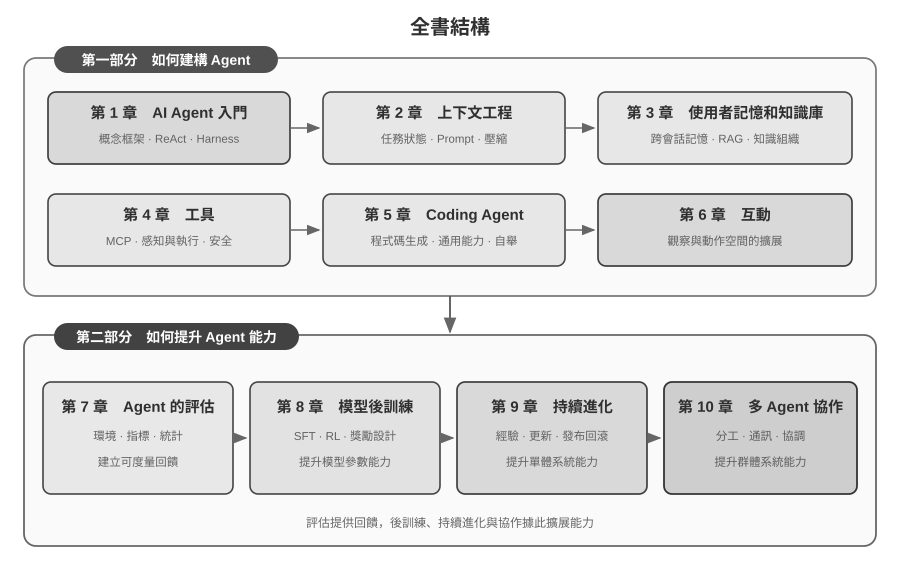

# 引言 {.unnumbered}

2025 年 8 月至 10 月，我在圖靈《AI Agent 實戰營》進行了一系列技術課程。課程圍繞一個核心問題展開：如何以可解釋、可驗證、可複用的工程原則設計 AI Agent，而不是依賴經驗與直覺驅動的反覆試錯？因此，跑通一個展示系統並非終點；我們還要理解為何採用特定架構、其能力邊界何在，以及每項設計決策伴隨哪些工程取捨。本書即由課程材料與配套實驗系統整理、擴寫並重新編排而成。

本書的寫作過程本身，也是一次人與 Agent 協作的實踐。從構思到定稿，我主要以 **whisper coding**（口述式協作）的方式，與 Pine 的語音 Agent 共同完成調研和文字迭代：我口述章節提綱，由 Agent 調研相關材料並整理初稿；課後再納入學員回饋，反覆核查和修改論點、案例與實驗。語音降低了外化思考的成本，也縮短了從提出問題到檢索資料、形成文字和完成驗證的週期。因此，本書不僅討論 Agent，也記錄了一種 Agent 深度參與的知識生產方式。

從 2025 年初 DeepSeek R1 發布以來，AI 研究與產業實踐的重心逐步從基座模型能力擴展到 Agent 的系統化落地。在模型側，智慧體強化學習（Agentic Reinforcement Learning）開始將工具呼叫與環境互動能力內化到模型參數中，使模型在程式設計、數學推理和 Computer Use 等領域展現更強的通用能力。在產品側，Manus、Claude Code、OpenClaw 等通用 Agent 推動了人機互動方式的變化，也使「程式碼生成 + 檔案系統」成為重要的系統架構範式。

重新審視課程中總結的 Agent 架構原則，可以發現：儘管模型與產品快速迭代，這些原則仍具有穩定的解釋力。業界後來廣泛使用 Skill、harness、loop engineering 等術語，但相應的工程實踐往往更早出現；概念的形成，是對大量實踐經驗的歸納，而不是實踐的起點。換言之，實踐在前，命名在後。

這些原則主要來自長流程、高風險場景中的工程實踐。作為 Pine AI 的首席科學家，我與團隊共同研發 Pine，使 Agent 能夠代表使用者與真人溝通，並處理帳單協商、退款爭議和訂閱取消等涉及真實經濟利益的複雜任務。這類任務通常跨越較長時間、包含多輪交涉，且單個步驟的錯誤就可能造成實際損失。對可靠性、安全性和可稽核性的嚴格要求，促使我們形成了本書所強調的架構原則。

- 早在 Skill 概念流行之前，我們就已經採用動態載入提示詞的方法解決提示詞無限膨脹的問題，採用命令列執行工具的方式解決工具列表無限膨脹的問題，採用系統狀態列技術解決 Agent 不感知執行環境和使用者時間、工作狀態等問題。
- 早在 harness 概念流行之前，我們就在採用類似 Claude Code 的方法解決模型工具呼叫的不穩定、幻覺、危險操作、越權操作、指令不遵循等問題。
- 早在 loop engineering 概念流行之前，我們就在使用本書稱為提議者～稽核者（proposer-reviewer）的方法解決模型過早認為任務完成的問題。

這些方法並非 Pine 所獨有。許多模型與 Agent 團隊在解決相似問題時，都獨立形成了相近的工程方法；這種趨同說明，它們反映的是 Agent 系統的共性約束。基於這些認識，我於 2025 年在圖靈開設《AI Agent 實戰營》，並於 2024—2026 年持續在中國科學院大學講授 AI Agent 實踐課程。本書選擇開源釋出，也希望讓這些可重複使用的知識與經驗服務於更多研究者和工程實踐者。

**實踐在前，命名在後**。對企業級 Agent 開發而言，這意味著實踐不能始終滯後於概念的普及：當一個術語成為產業共識時，其對應的問題往往已在領先系統中經過長期探索。要更早識別並解決這些問題，我認為有兩個關鍵條件。

**第一，選擇對 Agent 能力上限提出足夠高要求的真實業務，並持續獲取真實回饋。** 以 Pine 為例，一項任務可能持續數小時乃至數週，期間需要與多個利益相關方反覆溝通，完成長時間通話、複雜表單操作和多輪郵件往來；同時還必須保證關鍵數字準確、操作可控，並始終維護使用者利益。足夠複雜的場景會持續暴露模型能力與業務要求之間的差距，從而促使團隊建構 harness，系統解決模型暫時無法獨立處理、業務卻必須完成的問題。如果業務需求很容易被下一次模型升級覆蓋，團隊也較難積累穩定的系統設計原則。

**第二，建立系統的評估（Evaluation）機制。** 沒有評估，就無法判斷一次改動帶來的提升究竟源於設計本身，還是僅來自隨機波動。評估把 Agent 的迭代從經驗判斷轉化為可比較、可複現的工程過程，是以科學方法進行系統開發的基礎。第七章將專門討論這套方法。

不管底層模型如何升級，不管產品形態如何創新，幾乎所有成功的 Agent 系統都遵循著相同的架構模式。這並非巧合：**好的設計原則本就應該穿越模型的迭代週期**，因為它們描述的不是某個模型的用法，而是智慧系統與世界互動的基本模式。

圖靈獎得主、強化學習之父 Richard Sutton 曾說，宇宙演化經歷了從塵埃到恆星、從恆星到生命、從生命到智慧體（原文為設計實體，designed entities）的 4 個階段。生物進化是盲目的：隨機變異，自然選擇。大多數生物並不理解自己的工作原理，也無法自主設計和改造生物。而智慧體（Agent）是宇宙演化史上一種全新的存在：它能透過生成程式碼實現自舉（bootstrap）和自我進化，就像一個程式設計師編寫了另一個程式設計師，然後新的程式設計師又能繼續編寫下一個。也就是說，Agent 能夠理解自身的運作機制，並根據目標創造全新的智慧體，甚至改進自己。本書的使命，就是幫助你理解和掌握這種創造的原則。

本書的核心公式只有一句話：**Agent = LLM + 上下文 + 工具**。三者缺一不可。


更直觀地說，就是**大腦 + 眼睛 + 手腳**。大腦（LLM）負責思考和決策，眼睛（上下文）決定 Agent 能看到什麼資訊，手腳（工具）決定 Agent 能做什麼事情。（嚴格來說，「眼睛」只是粗略的類比：上下文不僅包含環境資訊和對話歷史，還包含工具定義等內容，也就是說 Agent 「看到」的資訊中也包括了「有哪些手腳可用」。這個隱喻旨在傳達核心直覺：上下文是模型能感知到的一切資訊。）

對熟悉強化學習的讀者，這三者也可以對映到 RL 的形式化語言。具體來說，LLM 對應 Policy（策略），上下文對應 Observation Space（觀察空間），工具對應 Action Space（動作空間）。三種說法對應同一個物件，只是表達層次不同。


## 全書結構 {.unnumbered}

本書共十章，圍繞兩個相互銜接的問題組織（圖0-2）。**第一部分「如何建構 Agent」**包括第一至六章：從基本概念出發，依次討論上下文、記憶與知識、工具、Coding Agent，以及觀察與動作空間的擴展。**第二部分「如何提升 Agent 能力」**包括第七至十章：先用評估建立可度量的回饋，再透過模型後訓練、基於執行經驗的持續進化和多 Agent 協作，分別從模型參數、單體系統和群體系統三個層面擴展能力。



- **第一章（Agent 基礎知識）**從多個真實 Agent 產品出發，建立對 Agent 的直觀理解。深入解析 Agent 的核心公式：從實現層的 LLM + 上下文 + 工具，到直覺層的大腦 + 眼睛 + 手腳，再到學術層的策略（Policy）、觀察空間（Observation Space）與動作空間（Action Space）。同時透過實驗剖析 ReAct 迴圈的運作機制，也就是「思考→行動→觀察」的迭代過程，並區分任務內的上下文適應、跨任務的外部產物（artifact）更新和訓練週期中的參數更新。最後討論從工作流到自主 Agent 的編排設計模式，為後續章節建立統一的概念框架。
- **第二章（上下文工程）**是全書最關鍵的一章，系統講解上下文，也就是 Agent 的「眼睛」。本章先從 API 訊息結構與 Agent 核心迴圈講起，建立「上下文就是訊息列表」的地基，再深入 KV Cache（大模型推理過程中複用歷史計算結果的機制）的底層原理，然後依次展開：提示工程（Prompt Engineering，包括流程化設計、工具描述、業務規則細化）與提示注入（Prompt Injection）攻防、Agent Skills 的按需載入機制、Agent 狀態列技術，以及上下文壓縮（Context Compression）策略。各術語的完整定義在正文首次出現處給出。
- **第三章（使用者記憶和知識庫）**將上下文管理延伸到跨會話的持久化知識體系，讓 Agent 不僅能記住當前對話的內容，還能在多次對話間積累和呼叫知識。涵蓋使用者記憶的四種漸進式策略、RAG（檢索增強生成，即先檢索相關文件再讓模型生成回答）的完整技術棧（包括不同的文字搜尋方法和搜尋結果排序最佳化）、多模態資訊提取、更高階的知識組織方法，以及智慧體化 RAG（Agentic RAG，即讓 Agent 自主決定何時檢索、檢索什麼）。
- **第四章（工具）**探討 Agent 與外部世界互動的橋樑：工具就像 Agent 的「手腳」，讓它能夠搜尋網頁、呼叫 API、操作資料庫等。本章介紹 MCP 工具互操作標準和五類工具的設計原則（感知、執行、協作、事件觸發、使用者溝通），並重點闡述執行工具的安全機制；事件觸發、使用者溝通與非同步執行環境則在第六章展開。
- **第五章（Coding Agent 與程式碼生成）**論證了 Coding Agent 加上檔案系統，是所有通用 Agent 最核心的技術基礎。以 OpenClaw 架構為主線，剖析 Coding Agent 的工作流程和實現技巧，並展示程式碼生成在程式設計之外的廣泛價值：從輔助思考、建構知識庫，到動態創造新工具和 Agent 自舉。
- **第六章（互動：觀察與動作空間的擴展）**從**模態**與**時序**兩個維度研究 Agent 與環境的互動機制：非同步與事件驅動使 Agent 能夠持續接收外部事件並及時回應；語音互動將感知、推理與生成推進到即時尺度；Computer Use 將動作空間擴展到圖形介面；機器人操作進一步把動作延伸到物理環境。四類場景共享喚醒、安全點、取消、搶佔與快慢路徑分離等系統原語。
- **第七章（Agent 的評估）**建構一套科學的評估方法論。涵蓋評估環境（工具呼叫型和人機互動型兩種核心正規化，以及章末單獨討論的模擬環境）、資料集的設計原則、LLM-as-a-Judge 自動化評判方法、評估驅動的模型選型，以及將評估結果轉化為系統改進的完整閉環。
- **第八章（模型後訓練）**深入 SFT（監督微調，即用標註資料教模型「照樣學樣」）與 RL（強化學習，即讓模型透過試錯和獎勵回饋自主提升）這兩種後訓練技術。以「SFT 記憶、RL 泛化」和「資料與環境比演算法更重要」為核心論點，涵蓋預訓練/SFT/RL 三階段全景、經典 RL 理論、獎勵訊號設計（從二元獎勵到過程獎勵、再到「獎勵結果、約束過程」的驗證路徑懲罰）、單輪與多輪強化學習演算法，以及樣本效率最佳化等前沿探索。
- **第九章（Agent 的持續進化）**研究如何把 Agent 的執行經驗轉化為下一版本的能力。全章先建立由環境結果、過程規則和 LLM Rubric 組成的學習訊號，再比較知識文件、Prompt 與 Skills、程式與 Harness、模型參數四種更新載體，最後討論候選版本的驗證、灰度發布、回滾與長期整理。
- **第十章（多 Agent 協作）**從單體能力擴展到系統層級的協同，討論多個 Agent 如何分工合作。本章系統闡述多 Agent 協作的分類框架（上下文共享/獨立 × 對等/管理者/去中心化），透過翻譯 Agent、電話與電腦協同 Agent 等案例展示協作架構的設計方法，並討論 Agent 社會和 Agent 經濟的潛在發展方向。

## 如何閱讀本書 {.unnumbered}

本書的各章節相對獨立，你可以根據自己的需求選擇不同的閱讀路徑：

- **如果你是 Agent 開發者**，建議按順序閱讀全書：第一至六章建立完整的 Agent 建構方法，第七至十章則從評估、模型後訓練、持續進化和多 Agent 協作四個方向討論能力提升。
- **如果你時間有限**，優先閱讀第一章（建立全域性認知）和第二章（掌握最關鍵的上下文工程）。第二章中 KV Cache 的底層原理較為技術化，初次閱讀可先跳過原理部分、只記住開頭給出的三條核心結論，不影響後續理解。
- **如果你關注模型訓練**，可以直接閱讀第八章（模型後訓練）；其中評估方法（第七章）是訓練的前提，建議一併閱讀，並先讀第一至二章以建立整體認知。

每章都包含大量的**實驗**和**思考題**，編號格式為「實驗 X-Y」（X 為章節號，Y 為章節內序號）。實驗和思考題的標題中用星級標註難度：★ 表示入門級，適合所有讀者；★★ 表示中等難度，需要一定的工程實踐基礎；★★★ 表示進階挑戰，通常涉及開放性問題或複雜的系統設計。大部分實驗配有完整的可執行程式碼，組織在配套的開源倉庫中：

> **配套程式碼倉庫**：[https://github.com/bojieli/ai-agent-book](https://github.com/bojieli/ai-agent-book)

可以使用 Git 取得全部配套程式碼：

```bash
git clone https://github.com/bojieli/ai-agent-book.git
cd ai-agent-book
```

不熟悉 Git 的讀者也可以在倉庫頁面點選 **Code → Download ZIP** 下載。實驗程式碼按章節組織在 `chapter1/` 至 `chapter10/` 中；要查找「實驗 X-Y」，請先開啟對應的 `chapterX/README.zh-TW.md`，根據實驗編號找到專案目錄，再按照專案自身的 README 安裝依賴並執行。部分標為「重現指南」的實驗依賴外部倉庫，具體取得方式也會在相應的 README 中說明。

我強烈建議你動手跑一遍這些實驗。AI Agent 是實踐性極強的領域，很多設計上的直覺需要在動手除錯的過程中才能真正建立起來。


## 前置知識 {.unnumbered}

本書面向有一定技術背景的讀者，但不要求你是某個特定領域的專家。以下按「必需」和「推薦」兩個層次列出前置知識，幫助你評估自己的準備程度。

**必需：閱讀全書的基礎**

- **Python 程式設計**：書中幾乎所有實驗都基於 Python。你需要熟悉 Python 的基本語法、常用的資料結構、包管理（pip）等基本概念。不要求精通，但應能讀懂和修改中等複雜度的 Python 程式碼。
- **LLM 的基本使用經驗**：你應該用過 ChatGPT、Claude 或類似的產品，理解「提示詞（Prompt）→ 模型回覆」的基本互動模式。
- **一款 AI 輔助程式設計工具**：強烈建議安裝並熟悉至少一款 AI 輔助程式設計工具，如 Claude Code、Codex、Cursor、TRAE 等。一方面，這些工具能顯著提升實驗的開發效率，書中的實驗涉及大量的程式碼編寫和除錯。另一方面，這些程式設計工具本身就是成熟的 Coding Agent，你在使用它們的過程中，會直觀地體驗到 ReAct 迴圈、工具呼叫、上下文管理等書中反覆討論的核心機制，這種第一手的體驗對理解 Agent 的設計原則極有價值。
- **軟體工程常識**：熟悉命令列操作、Git 版本控制、JSON 資料格式、REST API 等基本概念。這些是執行實驗和理解 Agent 工具呼叫機制的基礎。

**推薦：提升特定章節的閱讀體驗**

- **機器學習基礎**（第八章）：瞭解訓練與推理、損失函式、梯度下降、過擬合等基本概念，有助於理解模型後訓練。
- **基礎數學**（第 2-3、8 章）：對線性代數有直覺性的理解（比如知道向量可以表示方向和大小、矩陣可以做批次運算）有助於理解嵌入和注意力機制；基本的機率統計知識有助於理解評估指標和強化學習中的期望獎勵。書中的數學不涉及複雜的推導，側重直覺性的解釋。
- **Web 開發基礎**（第 4、9 章）：瞭解 HTTP、WebSocket、前後端分離架構等概念，有助於理解事件驅動的非同步 Agent 架構和語音 Agent 的即時通訊實驗。
- **對 Transformer 架構的基本瞭解**（第 2、8 章）：Transformer 是當前幾乎所有大語言模型的底層架構。對於希望系統地補充大模型基礎知識的讀者，推薦閱讀《圖解大模型》（圖靈出版）。該書以直觀的圖解方式講解了 Transformer 架構、預訓練與微調等核心概念，與本書的 Agent 工程視角形成良好的互補。

如果你在某些前置知識上有所欠缺，不必因此卻步。本書的核心價值在於**架構設計原則和工程實踐的方法**，而非某個具體的演算法或技巧。除第八章後訓練以外，全書對數學和機器學習的要求很低，完全可以作為起點。

Agent 技術仍在快速演進，但**好的架構設計原則具有穿越時間的力量**。掌握了「為什麼要這樣設計」，你就能在技術浪潮的變化中保持清醒的判斷力。希望這本書能成為你建構 AI Agent 的可靠指南。

## 致謝 {.unnumbered}

感謝圖靈的夢鴿老師和劉美英老師的辛勤編輯，以及為組織圖靈《AI Agent 實戰營》課程付出的努力；感謝劉俊明老師在國科大開設 AI Agent 實戰課程。也要特別感謝圖靈《AI Agent 實戰營》的所有學員，以及國科大 AI Agent 實戰課程的所有同學——在我講授這些課程的過程中，大家給了我許多有價值的回饋與建議，也讓我對這些概念本身有了更清晰的理解。

感謝 Pine AI 的所有同事。如果沒有 Pine AI 這樣優秀的產品，以及它所帶來的種種挑戰，我不可能在 Agent 領域獲得如此深入的理解與實踐；在一次次思想碰撞中，同事們也貢獻了大量思想輸入。

也要感謝 AI 業界的許多朋友（在此不一一具名）。在各種產業討論中，大家對我的觀點給予了坦誠的回饋，糾正了我不少錯誤的判斷，提升了我對模型與 Agent 的認知。

最要感謝的，是我的家人，特別是我的太太孟佳穎。她始終支援我完成本書的寫作，還為本書提出了許多意見。
