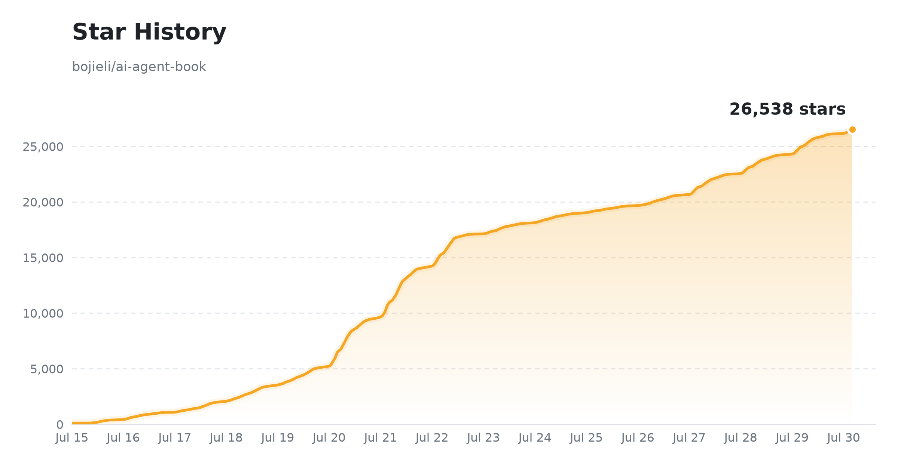

# Agentes de IA en Profundidad: Principios de Diseño y Práctica de Ingeniería

[](#-libro-electrónico) [](https://bojieli.github.io/ai-agent-book/) [](https://github.com/bojieli/ai-agent-book) [](../../LICENSE) [](#-libro-electrónico)
[](https://github.com/trending)

**[中文](../../README.md) · [English](../en/README.md) · Español ← actual · [العربية](../ar/README.md) · [繁體中文（台灣）](../zh-TW/README.md) · [Русский](../ru/README.md) · [Tiếng Việt](../vi/README.md) · [தமிழ்](../ta/README.md) · [日本語](../ja/README.md) · [Türkçe](../tr/README.md) · [한국어](../ko/README.md)**

> 📥 **[Descargar PDF / EPUB](#-libro-electrónico)** (recomendado) — las ediciones en PDF / EPUB ofrecen la mejor experiencia de lectura; también puedes [leer en línea](https://bojieli.github.io/ai-agent-book/) (conmutador de idiomas, árbol de capítulos desplegable, búsqueda de texto completo, recompilado automáticamente en cada push a main).

**Agente = LLM + Contexto + Herramientas** — Este libro se desarrolla en torno a esta fórmula central a lo largo de 10 capítulos, llevando los Agentes de IA desde los principios teóricos hasta la práctica de ingeniería. El texto completo, las ilustraciones y los **93 experimentos complementarios** son de código abierto. Te invitamos a ejecutar los experimentos por ti mismo.

| 📚 **10 capítulos** de texto, desde lo básico hasta producción | 📂 **93** proyectos complementarios (70+ independientes) | 🌐 **11 idiomas**: CN / EN / ES / AR / zh-TW / RU / TA / VI / JA / TR / KO |
| :---: | :---: | :---: |

## 📖 Libro electrónico

> 📥 **Descarga directa** (recomendada; texto completo, libre y de código abierto). Estos enlaces siempre apuntan a la última compilación de la rama `main`; las ediciones fijas están en la página de [Releases](https://github.com/bojieli/ai-agent-book/releases):
> - **Chino (original)**: [PDF](https://github.com/bojieli/ai-agent-book/releases/download/latest/AI-Agents-in-Depth-zh-CN.pdf) · [EPUB](https://github.com/bojieli/ai-agent-book/releases/download/latest/AI-Agents-in-Depth-zh-CN.epub)
> - **Español** (traducción de la comunidad): [PDF](https://github.com/bojieli/ai-agent-book/releases/download/latest/AI-Agents-in-Depth-es.pdf) · [EPUB](https://github.com/bojieli/ai-agent-book/releases/download/latest/AI-Agents-in-Depth-es.epub)
> - **Inglés** (traducción de la comunidad, por [@nsdevaraj](https://github.com/nsdevaraj) y [@whanyu1212](https://github.com/whanyu1212)): [PDF](https://github.com/bojieli/ai-agent-book/releases/download/latest/AI-Agents-in-Depth-en.pdf) · [EPUB](https://github.com/bojieli/ai-agent-book/releases/download/latest/AI-Agents-in-Depth-en.epub)
> - **Chino Tradicional (Taiwán)** (traducción de la comunidad, por [@tigercosmos](https://github.com/tigercosmos)): [PDF](https://github.com/bojieli/ai-agent-book/releases/download/latest/AI-Agents-in-Depth-zh-TW.pdf) · [EPUB](https://github.com/bojieli/ai-agent-book/releases/download/latest/AI-Agents-in-Depth-zh-TW.epub)
> - **Ruso** (traducción de la comunidad, por [@ui99ru](https://github.com/ui99ru)): [PDF](https://github.com/bojieli/ai-agent-book/releases/download/latest/AI-Agents-in-Depth-ru.pdf) · [EPUB](https://github.com/bojieli/ai-agent-book/releases/download/latest/AI-Agents-in-Depth-ru.epub)
> - **Tamil** (traducción de la comunidad, por [@nsdevaraj](https://github.com/nsdevaraj)): [PDF](https://github.com/bojieli/ai-agent-book/releases/download/latest/AI-Agents-in-Depth-ta.pdf) · [EPUB](https://github.com/bojieli/ai-agent-book/releases/download/latest/AI-Agents-in-Depth-ta.epub)
> - **Vietnamita** (traducción de la comunidad, por [@toanalien](https://github.com/toanalien)): [PDF](https://github.com/bojieli/ai-agent-book/releases/download/latest/AI-Agents-in-Depth-vi.pdf) · [EPUB](https://github.com/bojieli/ai-agent-book/releases/download/latest/AI-Agents-in-Depth-vi.epub)
> - **Japonés** (traducción de la comunidad, por [@eltociear](https://github.com/eltociear)): [PDF](https://github.com/bojieli/ai-agent-book/releases/download/latest/AI-Agents-in-Depth-ja.pdf) · [EPUB](https://github.com/bojieli/ai-agent-book/releases/download/latest/AI-Agents-in-Depth-ja.epub)
> - **Árabe** (traducción de la comunidad, por [@TheSyBuilder](https://github.com/TheSyBuilder)): [PDF](https://github.com/bojieli/ai-agent-book/releases/download/latest/AI-Agents-in-Depth-ar.pdf) · [EPUB](https://github.com/bojieli/ai-agent-book/releases/download/latest/AI-Agents-in-Depth-ar.epub)
> - **Turco** (traducción de la comunidad, por [@memisemre](https://github.com/memisemre)): [PDF](https://github.com/bojieli/ai-agent-book/releases/download/latest/AI-Agents-in-Depth-tr.pdf) · [EPUB](https://github.com/bojieli/ai-agent-book/releases/download/latest/AI-Agents-in-Depth-tr.epub)
> - **Coreano** (traducción de la comunidad): [PDF](https://github.com/bojieli/ai-agent-book/releases/download/latest/AI-Agents-in-Depth-ko.pdf) · [EPUB](https://github.com/bojieli/ai-agent-book/releases/download/latest/AI-Agents-in-Depth-ko.epub)
>
> 🌐 También puedes [leer en línea](https://bojieli.github.io/ai-agent-book/) — conmutador multilingüe, árbol de capítulos desplegable, búsqueda de texto completo y enlaces directos a los experimentos complementarios. Recompilado automáticamente con cada push a main.

El código fuente en chino está en [`book/`](../../book/); las versiones en inglés, español, árabe, chino tradicional (Taiwán), ruso, tamil, vietnamita, japonés, turco y coreano son contribuciones de la comunidad (pueden ir por detrás del original en chino), ubicadas en [`book-en/`](../../book-en/), [`book-es/`](../../book-es/), [`book-ar/`](../../book-ar/), [`book-zhtw/`](../../book-zhtw/), [`book-ru/`](../../book-ru/), [`book-ta/`](../../book-ta/), [`book-vi/`](../../book-vi/), [`book-ja/`](../../book-ja/), [`book-tr/`](../../book-tr/) y [`book-ko/`](../../book-ko/) respectivamente.

El generador compartido produce ediciones EPUB 3 para chino simplificado, inglés, español, árabe, chino tradicional (Taiwán), ruso, tamil, vietnamita, japonés, turco y coreano. Consulta las [instrucciones de compilación de EPUB](../../EPUB.md).

<details>
<summary><b>🔧 ¿Quieres compilar el PDF tú mismo?</b> (requiere pandoc / xelatex / ElegantBook)</summary>

- **Fuente del texto**: `book-es/introduction.es.md` (introducción), `book-es/chapter1.es.md` ~ `book-es/chapter10.es.md` (Capítulos 1–10), `book-es/afterword.es.md` (epílogo)
- **Compilación**: Instala pandoc, xelatex, la clase de documento ElegantBook y las fuentes necesarias, luego ejecuta:

  ```bash
  cd book-es && bash build_pdf.sh
  ```

  Las figuras se almacenan como archivos SVG en `book-es/images/` y se utilizan directamente en la compilación; consulta `book-es/preamble.tex` y `book-es/*.lua` para detalles de tipografía.

</details>

## 📑 Resumen del contenido (Capítulos 1–10)

El libro se desarrolla en torno a la fórmula central **Agente = LLM + Contexto + Herramientas**, con diez capítulos que se construyen progresivamente:

| Cap | Tema | Resumen en una línea | Texto | Código |
| :--: | --- | --- | :--: | :--: |
| 1 | 🚀 **Fundamentos de Agentes** | **Agente = LLM + Contexto + Herramientas**; La ingeniería del Harness es la verdadera ventaja competitiva | [Leer](../../book-es/chapter1.es.md) | [4](../../chapter1/README.es.md) |
| 2 | 🎯 **Ingeniería del Contexto** | El contexto limita la capacidad del Agente: KV Cache, ingeniería de prompts, Agent Skills, compresión de contexto | [Leer](../../book-es/chapter2.es.md) | [8](../../chapter2/README.es.md) |
| 3 | 📚 **Memoria de Usuario y Bases de Conocimiento** | Memoria de usuario entre sesiones + conocimiento externo: memoria de usuario, RAG, índices estructurados, grafos de conocimiento | [Leer](../../book-es/chapter3.es.md) | [14](../../chapter3/README.es.md) |
| 4 | 🛠️ **Herramientas** | Las herramientas son las manos del Agente: protocolo MCP, herramientas de percepción/ejecución/colaboración, Agentes asíncronos orientados a eventos, descubrimiento activo de herramientas | [Leer](../../book-es/chapter4.es.md) | [7](../../chapter4/README.es.md) |
| 5 | 💻 **Coding Agent y Generación de Código** | El código es una "herramienta para crear nuevas herramientas"; panorama completo de un Coding Agent de grado de producción | [Leer](../../book-es/chapter5.es.md) | [12](../../chapter5/README.es.md) |
| 6 | 🎯 **Evaluación de Agentes** | Convertir el rendimiento en señales comparables: entornos, métricas, significación estadística, selección guiada por evaluación | [Leer](../../book-es/chapter6.es.md) | [12](../../chapter6/README.es.md) |
| 7 | 🧠 **Post-Entrenamiento de Modelos** | Tres etapas (Pre-entrenamiento/SFT/RL): cuándo elegir SFT vs. RL, internalización de llamadas a herramientas, eficiencia de muestra | [Leer](../../book-es/chapter7.es.md) | [16](../../chapter7/README.es.md) |
| 8 | 🔄 **Auto-Evolución del Agente** | Crecimiento sin cambiar pesos: aprendizaje a partir de la experiencia, de usuario de herramientas a creador de herramientas | [Leer](../../book-es/chapter8.es.md) | [6](../../chapter8/README.es.md) |
| 9 | 🎙️ **Multimodalidad e Interacción en Tiempo Real** | Extensión del texto a la voz, GUI y mundo físico: tres paradigmas de voz, Computer Use, robótica | [Leer](../../book-es/chapter9.es.md) | [7](../../chapter9/README.es.md) |
| 10 | 🤝 **Colaboración Multi-Agente** | Inteligencia colectiva > individual: marcos de colaboración, compartición/aislamiento de contexto, "Sociedad de Agentes" emergente | [Leer](../../book-es/chapter10.es.md) | [7](../../chapter10/README.es.md) |

> 💡 **Leer** = leer el texto del capítulo en GitHub (markdown); **N** = número de proyectos complementarios, haz clic para ver el código. Los tipos de proyecto (✅ Independiente / 📖 Reproducción / 🚧 Diseño) se explican en el README de cada capítulo.
>
> 📚 ¿Cómo leer este libro de manera eficiente? Consulta las **[Sugerencias de aprendizaje](LEARNING.md)** (ideas clave, ruta de aprendizaje, niveles de dificultad, consejos prácticos).

## 🔑 Claves de API (API Keys)

Se recomienda solicitar claves de API en varias plataformas para facilitar el aprendizaje. Consulta [esta guía](https://01.me/2025/07/llm-api-setup/) para la selección de modelos.

| Plataforma | Enlace | Notas | Puntos de acceso |
| --- | --- | --- | --- |
| **Kimi** (Moonshot) | <https://platform.moonshot.cn/> | Serie Kimi, fuerte en contexto largo y capacidades de Agente | China continental |
| **Zhipu GLM** | <https://open.bigmodel.cn/> | GLM-4.6 etc., gran capacidad en chino, rentable | China continental |
| **Siliconflow** | <https://siliconflow.cn/> | Diversos modelos de código abierto (DeepSeek, Qwen, etc.), acceso rápido desde China continental | China continental |
| **DeepSeek** | <https://platform.deepseek.com/> | API oficial de DeepSeek | Global + China continental |
| **Krill AI** | [www.krill-ai.com](https://www.krill-ai.com/register?invite=Q8D3L35725) | Acceso integral a los principales modelos globales y de China (OpenAI, Claude, Gemini, Grok, Kimi, GLM, DeepSeek, Qwen, Minimax) | Global + China continental |
| **OpenRouter** | <https://openrouter.ai/> | Acceso integral a los principales modelos globales y de China (GPT, Claude, Gemini, Kimi, GLM, DeepSeek, Qwen, etc.) | Global |

## 💎 Patrocinadores

¡Gracias a **Krill AI** por patrocinar este proyecto! Krill proporciona un servicio de retransmisión de API oficial, estable y ultrarrápido para GPT / Claude / Gemini y muchos modelos chinos, con personalización de nivel empresarial, facturación y soporte técnico dedicado de 7×16h, además de una conexión WebSocket adaptada exclusivamente para un tiempo hasta el primer token extremadamente rápido.

Krill ofrece una oferta especial para los lectores de este libro: regístrate mediante [este enlace](https://www.krill-ai.com/register?invite=Q8D3L35725) e ingresa el código de promoción "ai-agent-book" al recargar para obtener un 23% de descuento en tu primer plan Codex.

## 📦 Apéndice · Obtención de repositorios externos

Los 19 repositorios externos para benchmarks, marcos de entrenamiento y plataformas robóticas en los Capítulos 6, 7, 9 y 10 **no están incluidos** en el paquete (debido al tamaño y a las licencias) y deben clonarse en los directorios correspondientes.

### Script de clonación en un solo paso

<details>
<summary><b>🔧 Desplegar comandos de clonación</b> (19 repositorios externos)</summary>

```bash
# Capítulo 6 · Benchmarks de evaluación
git clone https://github.com/google-research/android_world.git         chapter6/android_world
git clone https://huggingface.co/datasets/gaia-benchmark/GAIA          chapter6/GAIA
git clone https://github.com/xlang-ai/OSWorld.git                      chapter6/OSWorld
git clone https://github.com/SWE-bench/SWE-bench.git                   chapter6/SWE-bench
git clone https://github.com/sierra-research/tau2-bench.git            chapter6/tau2-bench
git clone https://github.com/laude-institute/terminal-bench.git        chapter6/terminal-bench

# Capítulo 7 · Marcos de entrenamiento (bojieli/* son forks adaptados para el libro)
git clone https://github.com/bojieli/minimind.git                      chapter7/MiniMind-pretrain/minimind      # Exp 7-3 entrenar LLM desde cero
git clone https://github.com/bojieli/minimind-v.git                    chapter7/MiniMind-pretrain/minimind-v    # Exp 7-4 entrenar VLM desde cero (capa de proyección)
git clone https://github.com/bojieli/AdaptThink.git                    chapter7/AdaptThink-original
git clone https://github.com/bojieli/AWorld.git                        chapter7/AWorld
git clone https://github.com/bojieli/SFTvsRL.git                       chapter7/SFTvsRL
git clone https://github.com/bojieli/verl.git                          chapter7/verl
git clone https://github.com/thinking-machines-lab/tinker-cookbook.git chapter7/tinker-cookbook
git clone https://github.com/19PINE-AI/rlvp.git                        chapter7/RLVP/rlvp                       # Exp 7-14 código del artículo RLVP
git clone https://github.com/PRIME-RL/SimpleVLA-RL.git                 chapter7/SimpleVLA-RL/SimpleVLA-RL       # Exp 7-13 visión-lenguaje-acción RL

# Capítulo 9 · Automatización del navegador y ejemplos de Claude
git clone https://github.com/browser-use/browser-use.git               chapter9/browser-use
git clone https://github.com/anthropics/claude-quickstarts.git         chapter9/claude-quickstarts

# Capítulo 10 · Arquitectura de Agente dual (ahora proyecto independiente TalkAct) + Ciudad AI de Stanford
git clone https://github.com/19PINE-AI/TalkAct.git                     chapter10/use-computer-while-calling
git clone https://github.com/joonspk-research/generative_agents.git    chapter10/generative_agents             # Exp 10-7 Ciudad AI de Stanford
```

> Si el README de un proyecto especifica un commit determinado, realiza un `git checkout` a esa versión para garantizar la reproducibilidad. El directorio `use-computer-while-calling` del Capítulo 10 ha evolucionado hacia el proyecto mantenido de forma independiente [19PINE-AI/TalkAct](https://github.com/19PINE-AI/TalkAct); este repositorio no incluye ese directorio — utiliza el comando de clonación anterior para obtenerlo.

</details>

### Otras rutas de reproducción

Los siguientes experimentos no disponen de un comando de clonación dedicado, pero cuentan con métodos específicos de reproducción:

| Experimento | Tipo | Notas |
| --- | :--: | --- |
| 6-2 / 6-3 / 6-4 / 6-9 | 📝 Ejercicio para el lector | Benchmark humano, evaluación de memoria, JSON Cards vs RAG, selección de memoria — adaptar `user-memory` / `user-memory-evaluation` / `contextual-retrieval` del Capítulo 3 |
| 5-12 | 📝 Ejercicio para el lector | Agente que crea Agentes — construir a partir de `chapter5/coding-agent` |
| 7-8 | 📝 Ejercicio para el lector | Destilación de prompts — ver `chapter8/prompt-distillation` (reutilización entre capítulos) |
| 7-9 | 📝 Ejercicio para el lector | Destilación CoT `[Extensión]` — implementación complementaria en `chapter7/cot-distillation` (incluye generación de datos SFT y verificador de reglas) |
| 6-11 | 🤖 Evaluación en simulación | OpenVLA + RoboTwin2 — ver el README de `chapter7/SimpleVLA-RL` para dependencias de entrenamiento VLA/entorno |
| 9-8 / 9-9 | 🔧 Hardware real | Teleoperación XLeRobot y control mediante Agente LLM — requiere brazo SO-100, [Teleop](https://xlerobot.readthedocs.io/en/latest/software/getting_started/XLeRobot_teleop.html) · [LLM Agent](https://xlerobot.readthedocs.io/en/latest/software/getting_started/LLM_agent.html) |
| 9-10 | 🔧 Hardware real | Agarres Sim2Real zero-shot RGB — [`StoneT2000/lerobot-sim2real`](https://github.com/StoneT2000/lerobot-sim2real) (la simulación se ejecuta puramente en GPU; el despliegue requiere SO-100) |

## 🤝 Contribuciones

El libro y el código complementario son totalmente de código abierto. Las Pull Requests son muy bienvenidas:

| Tipo | Notas |
| --- | --- |
| 📝 **Contenido del libro** | Erratas, adiciones, redacción más clara o nuevos desarrollos (texto en `book-es/chapter*.es.md` o `book/chapter*.md`) |
| 🐛 **Mejoras de código y corrección de errores** | Hacer que los proyectos complementarios sean más robustos, utilizables y listos para producción |
| 🧪 **Nuevos proyectos prácticos** | Añadir/reemplazar mejores implementaciones para los experimentos, o contribuir nuevos ejemplos |
| 🎨 **Diseño de figuras** | Mejorar directamente los gráficos SVG incluidos bajo `book-es/images/` |
| 🌐 **Nuevas traducciones** | Las traducciones a más idiomas son bienvenidas; consulta inglés (`book-en/`), chino tradicional/Taiwán (`book-zhtw/`), tamil (`book-ta/`), vietnamita (`book-vi/`), japonés (`book-ja/`), turco (`book-tr/`) como referencia |

Antes de realizar la entrega, ejecuta los experimentos pertinentes para confirmar la reproducibilidad; no dudes en abrir una issue para discutir ideas primero.

## 📄 Licencia

Este proyecto está bajo la licencia [Apache License 2.0](../../LICENSE). Consulta el archivo [`LICENSE`](../../LICENSE) para más detalles. Algunos subproyectos pueden incluir su propia información de licencia; consulta el subproyecto para más especificaciones.

## ⭐ Star History

<a href="https://star-history.com/#bojieli/ai-agent-book&Date">
  <picture>
    <source media="(prefers-color-scheme: dark)" srcset="../../assets/star-history-dark.png" />
    <source media="(prefers-color-scheme: light)" srcset="../../assets/star-history-light.png" />
    
  </picture>
</a>

<sub>Generado por [`scripts/gen_star_history.py`](../../scripts/gen_star_history.py), actualizado diariamente por [GitHub Actions](../../.github/workflows/star-history.yml) · Haz clic en la imagen para ver datos en tiempo real</sub>
