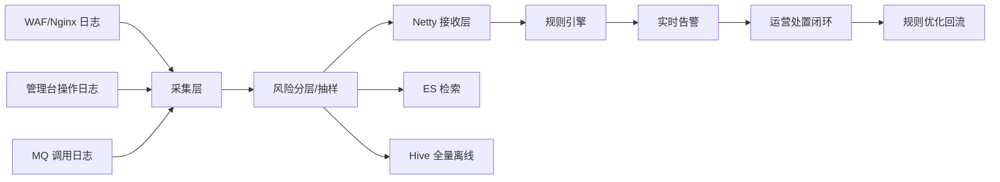
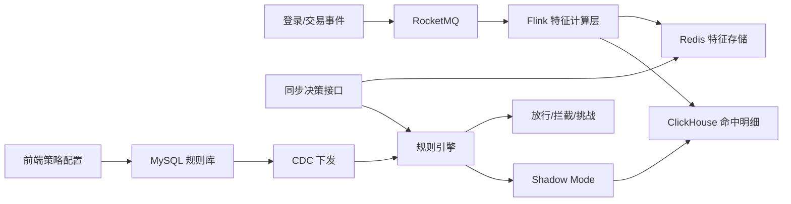
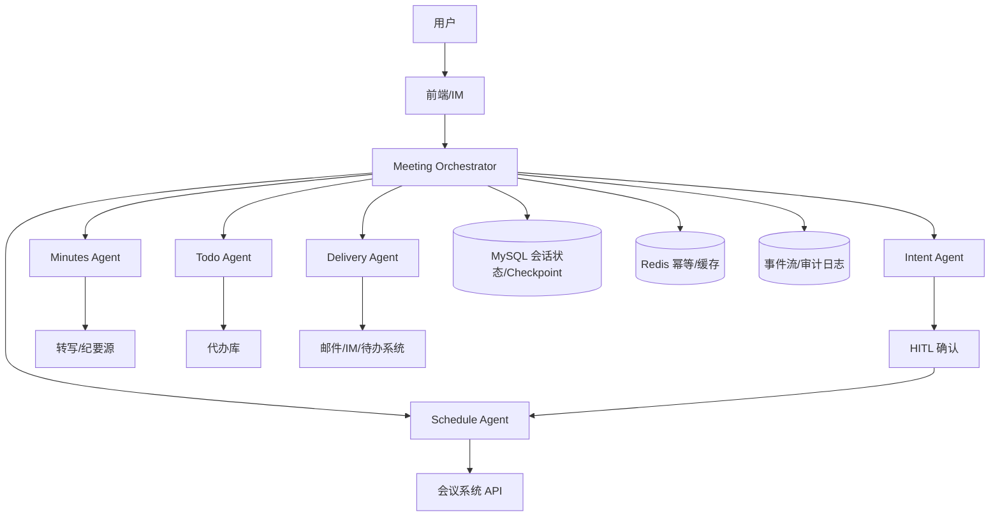

# 01｜三个项目的架构演进与容量设计

> 目标：把简历里的三个项目，从“做了什么”扩展成“为什么这样设计、怎么演进、容量怎么估、怎么避免问题”的架构口径。

---

## 一、项目一：数据安全监测中心

## 1.1 背景与核心矛盾

场景特点：

- 多源日志规模大：WAF 日均 23 亿+、管理台操作 10 亿+、RocketMQ 调用 600 万+
- 数据源异构：Nginx/WAF、探针、MQ 调用链路格式不统一
- 既要“尽可能实时”，又不能影响核心业务入口
- 下游 ES/Hive 写入能力不是无限的，容易成为瓶颈

核心矛盾：

- 如果全量实时算，资源和下游写入压力很大
- 如果只做离线批处理，发现违规太晚

所以设计上要在 `实时性 / 成本 / 稳定性 / 完整性` 之间做权衡。

---

## 1.2 架构演进

### V1：偏离线审计

特点：

- 以日志落地和离线分析为主
- 问题发现偏 T+1
- 适合报表和追溯，不适合实时告警

问题：

- 发现滞后
- 不能快速介入
- 告警与处置链路割裂

### V2：实时采集 + 实时审计链路

核心改动：

- WAF 通过 Nginx 旁路采集
- 管理台操作通过探针采集
- 多源日志统一进入接收层
- 引入 Netty 高吞吐接收服务
- 高危数据进入实时审计链路，非高危全量落 Hive/ES

这一阶段的关键设计是：

- **不追求全量实时算**
- 而是做“高危必采 + 低危抽样 + 全量离线兜底”

### V3：处置闭环 + 稳定性治理

核心改动：

- 审计结果不再只是命中规则，而是进入“告警 -> 处置 -> 留痕 -> 回流优化”
- 增加证据链沉淀能力
- 解决高并发下 ByteBuf 堆外内存问题
- 对接收链路做有界化、降级和内存池调优

这一阶段的核心目标不再只是“算出来”，而是：

- 能稳定跑
- 能支撑运营处置
- 能长期演进

---

## 1.3 参考架构图

---

## 1.4 采集层怎么做

采集层不是“把日志收上来”这么简单，而是要解决四个问题：

- 多源日志怎么接入
- 多种格式怎么统一
- 高峰流量下怎么不拖垮上游
- 下游抖动时怎么保证链路可降级、可补偿

### 1.4.1 采集层分层

可以拆成 5 个步骤：

1. **Source Adapter**
   - WAF/Nginx：旁路采集
   - 管理台操作：探针采集
   - RocketMQ 调用日志：从消息链路或调用日志源接入

2. **基础清洗**
   - 校验字段完整性
   - 过滤脏数据、重复数据
   - 标准化时间、来源、请求标识

3. **统一事件模型转换**
   - 不同来源转换成统一内部事件
   - 典型字段包括：`source_type`、`event_time`、`trace_id/request_id`、`user/device/ip`、`payload`、`risk_level`

4. **风险分层与抽样**
   - 高危必采
   - 中低危按比例抽样
   - 形成“实时链路”和“离线链路”的分流

5. **异步投递**
   - 实时审计流量投递到 Netty 接收层
   - 全量/离线流量投递到 Hive/ES

### 1.4.2 为什么 WAF 要旁路采集

WAF 这一路最关键的原则是：

- **采集链路不能阻塞业务入口**

所以设计成旁路而不是同步主流程里强绑定，原因是：

- WAF 日志量最大，均值约 2.6 万 QPS，峰值约 3.8 万 QPS
- 审计系统抖动不能反向影响核心交易链路
- 旁路采集更适合做异步上报和独立扩缩容

### 1.4.3 RocketMQ 在采集层里的作用

RocketMQ 这一路在项目一里不是主吞吐来源，但它有两个价值：

- 补齐调用链路上下文
- 作为异步传输和削峰的中间层

如果是“采集 -> RocketMQ -> Hive/ES/HBase”这类链路，容量设计主要看三件事：

- 生产峰值 TPS
- Broker 写入吞吐与分区数
- 消费到 Hive/ES/HBase 的落地能力

这一路我不会按平均值设计，而会按峰值预留：

- 日均 600 万条，均值约 70 TPS
- 峰值按 3 到 5 倍估，约 200 到 350 TPS

### 1.4.4 采集层容量怎么估

上一版的问题是只有思路，没有结果。这里补成**带口径的粗估版**，面试时可以直接讲。

#### 估算前提

- WAF：23 亿/天
- 管理台操作：10 亿/天
- RocketMQ 调用日志：600 万/天
- 计算方式统一按 `日量 / 86400` 得到均值 QPS，再按峰值系数放大
- 峰值系数：
  - WAF：按 `1.4 ~ 1.5` 倍均值估峰值
  - 管理台操作：按 `1.5` 倍估峰值
  - RocketMQ 调用日志：按 `3 ~ 5` 倍均值估峰值
- 单条日志大小按粗估：
  - WAF：`0.8 KB/条`
  - 管理台操作：`0.5 KB/条`
  - RocketMQ 调用日志：`1.0 KB/条`

#### 估算结果

| 来源 | 日量 | 均值 QPS | 峰值 QPS（估算） | 单条大小（粗估） | 峰值带宽（粗估） |
|------|------|----------|------------------|------------------|------------------|
| WAF | 23 亿 | 2.66 万 | 3.8 万 | 0.8 KB | 约 30 MB/s |
| 管理台操作 | 10 亿 | 1.16 万 | 1.7 万 | 0.5 KB | 约 8.5 MB/s |
| RocketMQ 调用日志 | 600 万 | 70 | 200~350 | 1.0 KB | 约 0.2~0.35 MB/s |
| **合计** | **33 亿+** | **约 3.83 万** | **约 5.5 万 ~ 5.6 万** | - | **约 39 ~ 40 MB/s** |

> 这里的带宽是**原始日志量级粗估**，不含压缩；如果按 3:1 到 5:1 的压缩比，实际网络带宽压力会进一步下降。

#### 1. 入口流量

- 三类来源的均值总和大概在 **3.8 万 QPS**
- 峰值按来源分开估后，总峰值预留到 **5.5 万 QPS 左右**
- 其中 **WAF 是绝对主瓶颈**，RocketMQ 调用日志更多是补充来源，不是入口最大压力点

#### 2. 单条大小与带宽

- 原始带宽粗估在 **39~40 MB/s**
- 如果旁路上报前做压缩，按 3:1 压缩比估算，实际网络压力可降到 **13 MB/s 左右**
- 这也是为什么协议里保留压缩标识，不只是协议设计问题，也是容量设计问题

#### 3. 中间缓冲

- 采集层本地队列和异步队列不按“无限扛”设计，而是按**有界 + 可降级**设计
- 以 WAF 峰值 3.8 万 QPS 估算，如果队列容量是 5000，满队列对应的瞬时缓冲时间只有：
  - `5000 / 38000 ≈ 0.13 秒`
- 所以队列的目标不是长期缓存，而是：
  - 吸收抖动
  - 给异步线程一个短暂缓冲
  - 触发告警和降级，而不是无限堆积

#### 3.1 如果采集数据统一先接入 MQ 做削峰

如果项目一的采集架构是：

`采集适配器 -> RocketMQ -> Hive/ES/实时审计链路`

并且规范要求：

- **消息保留 1 天**
- **3 副本**

那容量估算就不能只看 RocketMQ 调用日志的 600 万/天，而要按**总盘 33 亿+/天**来算。

#### 3.1.1 先算日存储量

按前面的单条大小粗估：

- WAF：23 亿 × 0.8 KB ≈ **1.84 TB/天**
- 管理台操作：10 亿 × 0.5 KB ≈ **0.50 TB/天**
- RocketMQ 调用日志：600 万 × 1 KB ≈ **0.006 TB/天**

合计原始消息量约：

- **2.35 TB/天**

#### 3.1.2 按 1 天保留、3 副本估磁盘

原始数据保留 1 天：

- `2.35 TB × 1 ≈ 2.35 TB`

按 3 副本：

- `2.35 TB × 3 ≈ 7.05 TB`

再考虑索引、文件系统、刷盘预留、扩容冗余，一般至少再留 **20% ~ 30%**：

- `约 8.5 TB ~ 9.2 TB`

#### 3.1.3 这个磁盘规模合理吗

结论是：

- **如果把 33 亿+/天的原始采集数据全量先进 MQ，并按 1 天保留、3 副本设计，磁盘预算大概在 8.5TB 到 9TB，这个量级对“削峰缓冲层”来说是能接受的。**

更直白一点：

- 对“削峰缓冲层”来说，**1 天保留是比较均衡的方案**
- 对“全量消息总线 + 长期回放链路”来说，**1 天又偏短**

所以关键不是数字假不假，而是要说明：

- 你们到底把 MQ 当**短期削峰层**
- 还是当**全量消息保留层**

#### 3.1.4 如果 MQ 只是削峰层，更合理的做法

如果 RocketMQ 的目标只是：

- 削峰
- 解耦
- 短时积压缓冲

那更合理的设计一般是：

- 保留时间控制在 **12 小时到 1 天**
- 或者只保留**标准化后的关键字段**
- 或者对原始日志做压缩后再入 MQ

这样磁盘压力会明显下降。

例如当前这版设计：

- 保留 24 小时，原始数据约 `2.35 TB`
- 3 副本约 `7.05 TB`
- 加预留后大概 `8.5 ~ 9.2 TB`

这个规模就更像“削峰层”的配置。

#### 3.1.5 所以我会怎么回答面试官

> 如果采集数据统一先接入 MQ，而且规范要求保留 1 天、3 副本，那我会按总盘 33 亿+/天来算。按我们这边的粗估，原始数据量大概 2.35TB/天，保留 1 天就是 2.35TB，3 副本后大概 7TB，再加 20% 到 30% 冗余，整个 MQ 集群磁盘至少要预留到 8.5TB 到 9TB。这个量级对削峰缓冲层来说是比较合理的，同时也能覆盖下游在 24 小时内的恢复窗口。  

#### 3.1.6 这一路容量重点看什么

所以这一路真正的重点不是“RocketMQ 能不能收下”，而是：

- 8.5TB 到 9TB 左右的磁盘预算是否接受
- Broker 写入吞吐和刷盘是否稳定
- ES/Hive 消费是否持续跟得上
- 一旦下游抖动，积压恢复窗口要多久
- MQ 在这里到底是“总线”还是“缓冲层”

#### 4. 下游落地

- 下游容量要拆开看，不是只看采集层入口
- ES 写入能力是实时链路的主要压力点之一
- Hive 是全量离线兜底，重点看分区落地和批量写吞吐
- 异步消费线程数、批量大小、失败重试和回压策略要一起评估

#### 4.1 为什么容量估算不能只看“总量”

因为真正线上出问题，往往不是“日量太大”，而是：

- 某一路高峰突刺
- ES 抖动导致写入延迟增加
- RocketMQ/Hive 消费变慢形成积压
- 队列和堆外内存被一起放大

所以我的估算口径一定是：

- **均值 QPS**
- **峰值 QPS**
- **单条大小**
- **压缩后带宽**
- **积压时长**
- **下游恢复速度**

### 1.4.5 怎么避免采集层出问题

#### 1. 避免采集拖垮上游

- 旁路采集
- 异步投递
- 有界队列
- 不把背压传回主业务入口

#### 2. 避免格式混乱导致后面规则不可用

- 统一事件模型
- 标准化字段
- 对关键字段做校验和补默认值

#### 3. 避免消息积压无限放大

- 分层抽样
- 有界缓冲
- RocketMQ/内部队列积压告警
- 消费慢时允许低优先级实时数据降级

#### 4. 避免实时链路异常后数据彻底丢失

- 全量离线链路兜底
- Hive 保留原始数据
- 后续支持离线回跑规则补偿

---

## 1.5 为什么这么设计

### 1. 不做“全量实时”

原因：

- 23 亿+ WAF 日志全量实时算成本过高
- 业务上更关键的是先抓住高风险流量
- 全量数据可以离线回跑，不会永久丢失

### 2. 接收层选择 Netty

原因：

- 高并发小包场景更适合事件驱动模型
- 能较细粒度控制协议、内存和异步处理
- 比直接堆 HTTP 服务更适合极高吞吐接收

### 3. 实时审计与离线兜底并存

原因：

- 实时链路负责“快”
- 离线链路负责“全”
- 两者结合，才能兼顾时效和完整性

### 4. 告警要接处置闭环

原因：

- 只命中规则没有价值
- 需要支持确认、处置、留痕、复盘
- 否则系统只是“告警制造机”

---

## 1.6 容量设计

### 数据规模口径

- WAF：23 亿+/天，均值约 2.6 万 QPS
- 峰值：约 3.8 万 QPS
- 多源总盘：33 亿+/天

### 容量设计思路

#### 1. 入口分层

- 高危必采进入实时审计
- 中低危按比例抽样
- 全量数据落 Hive/ES

#### 2. 接收层水平扩容

- Netty 接入层无状态
- 可通过多实例扩容
- 单机支撑万级 QPS，集群分摊峰值

#### 3. 下游异步化

- 接收与业务处理解耦
- 审计处理和落库异步执行
- 避免下游抖动直接打满入口

#### 4. 存储分工

- ES：近实时查询、运营检索
- Hive：全量审计与离线回跑

---

## 1.7 怎么避免问题

### 1. 避免入口被审计链路拖垮

做法：

- 有界队列
- 队列满时降级丢弃实时链路数据并告警
- 不向上游核心入口反向背压

### 2. 避免堆外内存持续上涨

做法：

- ByteBuf 异步传递时显式 retain/release
- 队列有界化
- 优化 PooledByteBufAllocator 参数
- 压测 direct memory 曲线

### 3. 避免下游 ES 抖动拖垮整体

做法：

- 异步写入
- 失败重试
- 延迟上浮可接受，但优先保证系统不崩
- Hive 保留离线补偿能力

### 4. 避免规则命中后无法追溯

做法：

- 记录命中规则版本
- 保留上下文与证据链
- 处置结果回流规则优化

---

## 二、项目二：业务安全平台 3.0

## 2.1 背景与核心矛盾

场景特点：

- 登录、转账等核心链路必须同步给出风控动作
- 接口延迟要求严格，P99 不能失控
- 新策略存在误拦风险，不能直接上线
- 业务越来越依赖时序特征和链式识别

核心矛盾：

- 在线链路要快
- 风控特征又越来越复杂
- 如果都放同步接口里现算，尾延迟和稳定性会越来越差

---

## 2.2 架构演进

### V1：存量同步决策链路

特点：

- 请求到来时同步查依赖、同步计算规则
- 适合较简单规则

问题：

- 扇出依赖多
- 时序特征难维护
- 链式行为识别能力弱
- 新策略缺少真实流量验证能力

### V2：流式预计算 + 在线取特征

核心改动：

- 保留原有同步决策入口
- 新增 RocketMQ 事件流
- 引入 Flink 进行实时特征计算
- 特征写入 Redis
- 在线接口变成“取特征 + 规则计算”

这一阶段的关键收益是：

- 把重计算前移
- 把同步链路从“多下游依赖”变成“轻量规则判断”

### V3：策略治理与可审计发布

核心改动：

- 规则表达式入库
- 配置变更通过 CDC 下发
- 新策略先 Shadow，再灰度，再生效
- 命中明细落 ClickHouse，支持审计和复盘

这一阶段本质上是在做：

- 风控平台化
- 策略治理机制化
- 发布风险前置

---

## 2.3 参考架构图

---

## 2.4 为什么这么设计

### 1. 不推倒重来，只做增量式重构

原因：

- 登录/交易链路是金融核心链路
- 直接重写风险太高
- 保留存量入口，更利于灰度和回滚

### 2. Flink 负责特征计算，不直接做主决策

原因：

- Flink 适合算窗口类、时序类、链式行为类特征
- 在线接口更适合做低延迟规则判断
- 职责分层后，链路更清晰

### 3. Redis 作为在线特征存储

原因：

- 在线取数要快
- 读取路径必须稳定
- 相比同步查多个系统，Redis 更适合作为实时特征缓存层

### 4. 策略发布走 CDC + Shadow + 灰度 + 回滚

原因：

- 前端配置只是入口，不是分发机制
- CDC 适合把数据库已提交变更稳地发到多个消费方
- Shadow 能用真实流量先验证误拦风险
- 灰度放量和快速回滚能把误拦影响控制在可接受范围
- 规则版本号控制可以避免多节点规则不一致

---

## 2.5 容量设计

### 指标口径

- 同步决策接口：日均调用量 1000 万+
- 均值约 116 QPS
- 峰值约 220 QPS
- 接口目标：P99 < 150ms

### 容量设计思路

#### 1. 计算前移

- 把重的窗口/状态计算放在 Flink
- 在线接口只保留 Redis 读取和规则判断

#### 2. 分层存储

- Redis：在线特征
- ClickHouse：命中明细
- MySQL：规则配置

#### 3. 状态容量控制

- CEP 状态 TTL 约 8 分钟
- 高基数 key 做限界
- 窗口长度按业务需求控制

#### 4. 发布前先影子验证

- 新策略不直接进主链路
- 先观察真实流量表现
- 降低误拦带来的业务风险

---

## 2.6 怎么避免问题

### 1. 避免同步链路尾延迟失控

做法：

- 去掉多下游同步扇出
- 统一成 Redis 取特征 + 本地规则判断

### 2. 避免乱序导致窗口类指标错误

做法：

- 统一事件时间
- 配置水位线和 allowed lateness
- 用 Checkpoint 做状态恢复

### 3. 避免新策略直接误伤真实用户

做法：

- Shadow Mode
- 误拦样本复核
- 灰度放量
- 快速回滚

### 4. 避免规则多节点不一致

做法：

- MySQL 作为唯一配置源
- CDC 增量下发
- 规则版本号控制

### 5. 避免状态膨胀

做法：

- TTL 清理
- key 维度限界
- 只保留必要状态

---

## 三、项目三：企业智能会议 Agent 平台（纪要君）

## 3.1 背景与核心矛盾

场景特点：

- 覆盖会前预订、会后纪要、行动项抽取和代办分发
- 同时涉及自然语言理解、工具调用、长文本处理和业务闭环
- 创建/修改/取消会议属于高风险动作
- 长链路任务容易被中断、重复执行或幻觉影响

核心矛盾：

- 要自动化，但不能失控
- 要智能化，但不能只停留在 Demo
- 要生成纪要，还要把纪要变成可执行的代办

---

## 3.2 架构演进

### V1：基础助手能力

特点：

- 先支持会前会议操作
- 模型识别意图后直接走工具调用

问题：

- 高风险动作容易误触发
- 参数不完整时体验差
- 工具调用失败和幻觉不好定位

### V2：多 Agent 调度 + HITL

核心改动：

- 基于 LangGraph 拆分多 Agent
- 增加意图识别和阈值路由
- 高风险动作统一进入 HITL
- 用户可在确认阶段自然语言修订参数

这一阶段解决的是：

- “能做”到“可控”

### V3：会后纪要 + 代办闭环

核心改动：

- 获取转写文本
- 分片生成结构化纪要
- 抽取行动项、责任人、时间信息
- 生成结构化代办并分发

这一阶段解决的是：

- “有纪要”到“有后续执行”

### V4：稳定性治理

核心改动：

- 状态持久化
- checkpoint 恢复
- 幂等控制
- 工具调用记录与失败重试
- 工具调用序列修复
- 幻觉检测与补执行
- 安全截断、模型分层路由与成本治理

这一阶段的目标是：

- 从功能可用变成稳定可用

---

## 3.3 参考架构图

---

## 3.4 为什么这么设计

### 1. 多 Agent，而不是单 Agent

原因：

- 意图识别、会议操作、纪要生成、代办抽取职责差异大
- 单 Agent 上下文太杂，难优化、难排障
- 多 Agent 更适合拆分责任边界

### 2. 高风险动作必须 HITL

原因：

- 创建/修改/取消会议误操作成本高
- 多问一次比误取消会议代价低
- 企业场景更重视可控和可审计

### 3. 会后不是只生成纪要

原因：

- 仅生成纪要很容易停留在“看过就结束”
- 真正有业务价值的是行动项落地
- 所以需要抽取责任人、事项、时间并形成代办闭环

### 4. 状态持久化是必须的

原因：

- 这是长链路多轮任务
- 用户可能中断、刷新、切设备
- 工具可能成功但回写失败

### 5. 模型调用要分层，而不是所有任务都走重模型

原因：

- 会议场景里很多动作是低复杂度判断，不值得每次都走高成本链路
- 简单任务走轻量模型或短链路，复杂任务再走完整 Agent 编排，更容易控制成本和时延
- 这类治理属于工程方法借鉴，不是照搬别的 Agent 业务逻辑

### 6. checkpoint 和调用链追踪要尽早建设

原因：

- 长链路任务失败后全量重放成本高、体验差
- 只有保留 checkpoint、工具调用记录和追踪路径，才能支持恢复执行和失败复盘
- 这比单纯“把状态存下来”更接近生产可用系统

---

## 3.5 容量设计

### 容量关注点

这个项目不是极高 QPS 型，而是长链路和高成本调用型，所以容量关注点不同：

- 并发会话数
- 单会话 token 消耗
- 长文本分片数量
- 外部工具调用成功率
- 代办分发吞吐和重试积压

### 容量设计思路

#### 1. 模型调用分层

- 简单任务优先小模型 / 简单链路
- 高复杂任务才走完整 Agent 编排
- 对高成本链路做速率控制和预算约束，避免高峰时成本失控

#### 2. 长文本分片

- 按 token 预算切分
- 避免超上下文
- 减少单次调用失败影响面

#### 3. 状态和工具调用日志落库

- MySQL 存 checkpoint 和工具调用记录
- Redis 做短期缓存和幂等判断
- 失败后优先从最近 checkpoint 恢复，避免整条长链路全量重放

#### 4. 代办分发异步化

- 分发通过任务表或异步任务执行
- 失败重试
- 幂等控制与状态跟踪
- 防止阻塞主链路

---

## 3.6 怎么避免问题

### 1. 避免高风险动作误触发

做法：

- 置信度阈值路由
- HITL 人工确认
- 参数前置校验

### 2. 避免工具调用成功/失败不一致

做法：

- 工具调用日志
- 幂等键
- 失败重试
- 执行上下文 / trace_id
- 结果回写前先查执行记录

### 3. 避免“模型说成功但没真正执行”

做法：

- 先检查是否有真实 tool_calls
- 无 tool_calls 但声称成功则视为幻觉
- 从上下文提取参数补执行

### 4. 避免长对话导致序列不合法或任务中断后全量重放

做法：

- checkpoint 恢复
- 序列修复
- 安全截断
- 保证 tool_call / tool_result 成对

### 5. 避免模型调用成本和速率失控

做法：

- 简单任务优先轻量模型 / 短链路
- 高复杂任务才走完整 Agent 编排
- token 预算控制
- 速率控制

### 6. 避免纪要生成后无人跟进

做法：

- 从纪要抽取行动项
- 结构化生成代办
- 分发并跟踪状态
- 形成闭环

---

## 四、三个项目的共同架构思路

如果面试官问“这三个项目有什么共性”，可以这样答：

### 1. 都是核心链路，不只是功能开发

- 项目一：审计实时链路
- 项目二：同步风控链路
- 项目三：多 Agent 办公链路

### 2. 都在做分层

- 项目一：实时链路 vs 离线兜底
- 项目二：流式预计算 vs 在线决策
- 项目三：编排层 vs 专职 Agent vs 工具层

### 3. 都强调可控和可恢复

- 项目一：有界队列、降级、补偿
- 项目二：Shadow、灰度、回滚、状态恢复
- 项目三：HITL、checkpoint、幂等、补执行、分层路由

### 4. 都不追求“最炫的技术”，而是追求工程上能长期跑

这句话非常适合总结你的风格：

> 我做架构设计时比较关注分层、取舍和长期稳定运行，而不是为了上新技术而上新技术。
