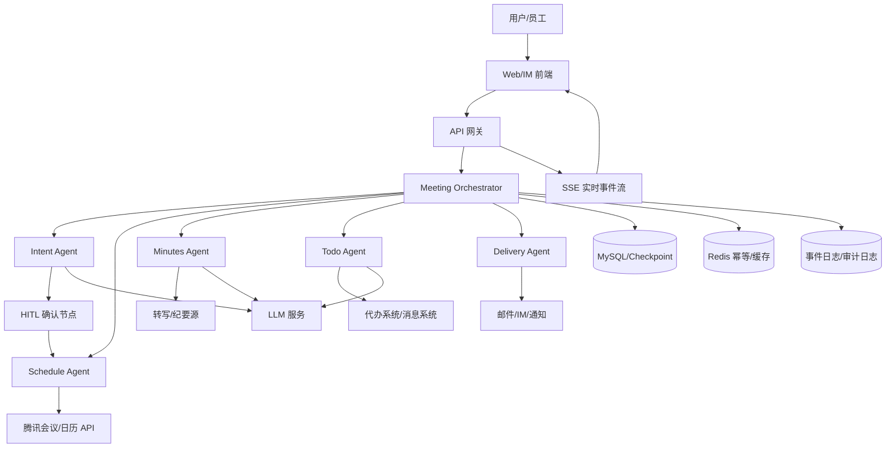
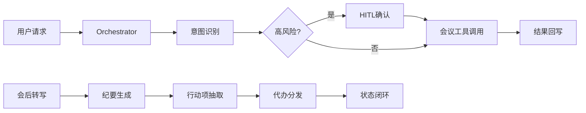

# 08｜项目三：纪要君实现思路与面试准备

> 目标：把“企业智能会议 Agent 平台（纪要君）”讲成一个**可落地、可闭环、可追问**的工程项目，而不是单纯的 Prompt Demo。

---

## 1. 项目定位

一句话定义：

`纪要君是一个面向企业内部会议场景的多 Agent 助手系统，覆盖会前预订、会后纪要生成、行动项抽取、代办分发和状态闭环。`

和普通会议助手的区别：

- 不只是“生成纪要”
- 不只是“调用会议 API”
- 而是把会议内容转成结构化行动项，并推动后续跟进

---

## 2. 项目目标

这个项目我会拆成三段：

### 2.1 会前

- 创建会议
- 修改会议
- 取消会议
- 查询会议信息

### 2.2 会后

- 获取会议转写/纪要原文
- 生成结构化纪要
- 提炼议题、结论、行动项

### 2.3 闭环

- 抽取代办事件
- 分发给责任人
- 跟踪状态
- 支持催办和回写

---

## 3. 总体实现思路

## 3.1 总体架构

建议采用 `Orchestrator + 专职子 Agent + 工具层 + 状态持久化 + 事件流` 的方式。

核心原因：

- 会议助手不是单轮问答，而是长链路任务
- 存在高风险动作，不能完全交给模型自由发挥
- 有外部工具调用，需要幂等、补偿和可审计
- 纪要和代办是长文本和结构化任务，适合拆分

## 3.2 Agent 拆分

### 1. `MeetingOrchestrator`

职责：

- 统一编排整条链路
- 判断当前任务属于会前、会后还是查询
- 决定调度哪个子 Agent
- 判断是否进入 HITL
- 汇总结果并结束流程

### 2. `IntentAgent`

职责：

- 做意图识别
- 给出置信度
- 抽取初始参数
- 低置信度时触发澄清

### 3. `ScheduleAgent`

职责：

- 调会议系统 / 日历 API
- 执行创建、修改、取消、查询
- 做幂等校验
- 输出标准化结果

### 4. `MinutesAgent`

职责：

- 拉取转写文本
- 做分片总结
- 生成结构化纪要
- 输出议题、结论、行动项

### 5. `TodoAgent`

职责：

- 从纪要中抽取责任人、时间、事项
- 生成结构化代办
- 分发到消息/邮件/待办系统
- 跟踪执行状态

### 6. `DeliveryAgent`

职责：

- 执行通知分发
- 记录投递结果
- 失败重试和幂等防重

---

## 4. 架构图

## 4.1 完整版架构图

## 4.2 面试白板简化图

这张图面试时很好讲：

- 上半段是会前链路
- 下半段是会后闭环

---

## 5. 核心链路设计

## 5.1 会前链路

流程：

1. 用户输入自然语言请求
2. `IntentAgent` 做意图识别和参数抽取
3. 若为创建/修改/取消，则进入 `HITL`
4. 用户确认或自然语言修订参数
5. `ScheduleAgent` 调用会议 API
6. 结果写入状态表和工具调用日志
7. 返回给用户

关键点：

- 高风险动作 100% 走确认
- 参数确认不是弹窗，而是结构化确认
- 支持“改到明天下午”这种 patch 式修订

## 5.2 会后纪要链路

流程：

1. 获取会议转写文本
2. `MinutesAgent` 先做分片
3. 对每个分片做摘要
4. 合并为结构化纪要
5. 输出议题、结论、行动项

关键点：

- 长文本必须分片
- 建议采用 `Map-Reduce`
- 避免一次性输入导致超上下文和成本失控

## 5.3 代办闭环链路

流程：

1. 从纪要中抽取 `事项/责任人/截止时间`
2. 写入 `action_items`
3. 分发给责任人
4. 记录投递结果
5. 后续支持状态更新、催办、回写

项目亮点就在这里：

`不是只生成纪要，而是把会议产出转成可执行任务。`

---

## 6. 关键工程点

## 6.1 为什么做多 Agent，而不是单 Agent

建议答法：

- 单 Agent 容易把意图识别、会议操作、纪要总结、代办抽取全部混在一起
- 上下文太杂，错误难定位
- 多 Agent 职责更清晰，也更方便独立优化
- Orchestrator 管流程，子 Agent 做专业任务

## 6.2 HITL 怎么做

建议答法：

- 创建、修改、取消属于高风险动作
- 所以 100% 走结构化确认
- 用户可以自然语言修订参数
- 系统把修订解析成 patch，再重新校验

## 6.3 长文本怎么处理

建议答法：

- 转写文本天然超长
- 不能一次性输入模型
- 所以按 token 预算切分
- 先分片摘要，再合并总结
- 再从结构化纪要里提取行动项

## 6.4 怎么做幂等

建议答法：

- 所有外部工具调用都带 `idempotency_key`
- 先查 `tool_call_log`
- 若已执行成功，直接复用结果
- 避免重复创建会议、重复发代办

## 6.5 幻觉怎么处理

建议答法：

- 优先检查结构化 `tool_calls`
- 如果模型声称成功但没有真实工具调用，就视为幻觉
- 从上下文抽取参数做补执行
- 补执行前也要走幂等校验

## 6.6 为什么要状态持久化

建议答法：

- 会议场景是长链路
- 用户可能刷新、退出、切设备
- 工具可能执行成功但结果没写回
- 所以必须支持 checkpoint 恢复

## 6.7 可观测性怎么做

建议答法：

- 不是简单打日志
- 而是把每一阶段、每次工具调用、每个结果都事件化
- 前端通过 SSE 实时展示
- 后端把事件落库，支持回放和排障

---

## 7. 数据模型建议

面试时不需要讲太细，但最好能讲出表设计。

### 7.1 `agent_session`

- `session_id`
- `user_id`
- `current_node`
- `status`
- `checkpoint_data`
- `updated_at`

### 7.2 `tool_call_log`

- `session_id`
- `tool_name`
- `tool_input`
- `tool_output`
- `idempotency_key`
- `status`
- `created_at`

### 7.3 `meeting_minutes`

- `meeting_id`
- `raw_transcript`
- `summary_markdown`
- `structured_summary`
- `generated_at`

### 7.4 `action_items`

- `action_id`
- `meeting_id`
- `owner`
- `due_time`
- `content`
- `status`
- `source_paragraph`

### 7.5 `task_delivery_log`

- `action_id`
- `delivery_channel`
- `receiver`
- `delivery_status`
- `retry_count`

---

## 8. 与 DeepAudit 的映射关系

你可以这样讲“参考了给定项目的哪些思想”：

### 8.1 借鉴点一：Orchestrator 编排

- DeepAudit 用 `OrchestratorAgent` 负责统一调度
- 纪要君里可以用 `MeetingOrchestrator` 做统一决策

### 8.2 借鉴点二：结构化交接

- DeepAudit 用 `TaskHandoff`
- 纪要君可以让 `IntentAgent -> ScheduleAgent`、`MinutesAgent -> TodoAgent` 也传结构化上下文

### 8.3 借鉴点三：事件流

- DeepAudit 用事件管理器把 `thinking/tool_call/tool_result/finding` 实时推给前端
- 纪要君也可以展示“当前执行到哪一步、为什么卡住、调用了什么工具”

### 8.4 借鉴点四：状态与控制

- DeepAudit 有 Agent 图、停止控制、消息下发
- 纪要君可借鉴成“中断恢复、用户插话、手动停止、回放执行过程”

---

## 9. 面试官高频问题

## 9.1 为什么做多 Agent，不做单 Agent？

准备点：

- 职责隔离
- 更容易调优
- 更方便可观测和排障
- 复杂任务更适合拆成子任务

## 9.2 Orchestrator 的职责是什么？

准备点：

- 统一调度
- 汇总上下文
- 决定是否 HITL
- 决定何时结束

## 9.3 为什么高风险动作一定要 HITL？

准备点：

- 企业场景里误操作成本高
- 多问一次比误取消会议更可接受
- 这是可靠性设计，不是模型能力不足

## 9.4 怎么避免重复创建会议或重复发代办？

准备点：

- 幂等键
- 工具调用日志
- 先查执行记录，再决定是否重试

## 9.5 幻觉怎么识别？

准备点：

- 检查是否存在真实 `tool_calls`
- 有 `tool_calls` 但失败，算执行失败
- 没有 `tool_calls` 却声称成功，算幻觉

## 9.6 长文本纪要为什么不能一次总结？

准备点：

- 超 token
- 易丢信息
- 成本高
- 稳定性差

## 9.7 代办闭环怎么证明不是“只抽取，不落地”？

准备点：

- action item 入库
- 分发日志
- 状态字段
- 支持回写与催办

## 9.8 状态持久化为什么重要？

准备点：

- 长链路任务
- 多轮交互
- 会中断
- 需要异常恢复

## 9.9 数据合规怎么做？

准备点：

- PII 脱敏
- 最小化传输
- 内部审批
- 逐步私有化部署

## 9.10 怎么做成本优化？

准备点：

- 意图路由
- 低置信度先澄清
- 分片处理
- 减少无效重试
- 摘要和结构化结果复用

---

## 10. 1 分钟口径

> 这个项目我会把它定义成一个企业内部的多 Agent 会议助手系统，不只是做会前预订和会后纪要，而是进一步把会议内容转成结构化行动项，并完成分发和闭环跟踪。  
> 架构上我参考了多 Agent 编排系统的思路，用一个 Orchestrator 负责统一调度，下面拆成意图识别、会议操作、纪要生成、代办抽取几个专职 Agent。  
> 高风险操作统一走 HITL，长链路靠状态持久化和幂等保证恢复能力，模型幻觉通过工具调用检测和补执行机制兜底。  
> 最终实现的是从“会议请求 -> 工具执行 -> 纪要生成 -> 代办分发 -> 状态回写”的完整闭环，而不是一个只能聊天的 Demo。

---

## 11. 追问准备

如果面试官继续深挖，优先从下面 5 个角度答：

1. 为什么是多 Agent 架构，而不是一个大模型全包
2. HITL 为什么必须做，用户体验怎么平衡
3. 长文本纪要如何分片、如何合并
4. 幻觉补执行和幂等怎么设计
5. 代办闭环怎么落库、怎么分发、怎么追踪

---

## 12. 你可以主动补的一句

> 这个项目真正的难点不在于“接了模型”，而在于把会议助手做成一个可控、可恢复、可追溯、可闭环的工程系统。
